# 算法目录

- [算法分析](算法%20-%20算法分析.md)
- [排序](算法%20-%20排序.md)
- [并查集](算法%20-%20并查集.md)
- [栈和队列](算法%20-%20栈和队列.md)
- [符号表](算法%20-%20符号表.md)
- [其它](算法%20-%20其它.md)

## 参考资料

- Sedgewick, Robert, and Kevin Wayne. _Algorithms_. Addison-Wesley Professional, 2011.

# 算法 - 算法分析
<!-- GFM-TOC -->
* [算法 - 算法分析](#算法---算法分析)
    * [数学模型](#数学模型)
        * [1. 近似](#1-近似)
        * [2. 增长数量级](#2-增长数量级)
        * [3. 内循环](#3-内循环)
        * [4. 成本模型](#4-成本模型)
    * [注意事项](#注意事项)
        * [1. 大常数](#1-大常数)
        * [2. 缓存](#2-缓存)
        * [3. 对最坏情况下的性能的保证](#3-对最坏情况下的性能的保证)
        * [4. 随机化算法](#4-随机化算法)
        * [5. 均摊分析](#5-均摊分析)
    * [ThreeSum](#threesum)
        * [1. ThreeSumSlow](#1-threesumslow)
        * [2. ThreeSumBinarySearch](#2-threesumbinarysearch)
        * [3. ThreeSumTwoPointer](#3-threesumtwopointer)
    * [倍率实验](#倍率实验)
<!-- GFM-TOC -->


## 数学模型

###  1. 近似

N<sup>3</sup>/6-N<sup>2</sup>/2+N/3 \~ N<sup>3</sup>/6。使用 \~f(N) 来表示所有随着 N 的增大除以 f(N) 的结果趋近于 1 的函数。

###  2. 增长数量级

N<sup>3</sup>/6-N<sup>2</sup>/2+N/3 的增长数量级为 O(N<sup>3</sup>)。增长数量级将算法与它的具体实现隔离开来，一个算法的增长数量级为 O(N<sup>3</sup>) 与它是否用 Java 实现，是否运行于特定计算机上无关。

###  3. 内循环

执行最频繁的指令决定了程序执行的总时间，把这些指令称为程序的内循环。

###  4. 成本模型

使用成本模型来评估算法，例如数组的访问次数就是一种成本模型。

## 注意事项

###  1. 大常数

在求近似时，如果低级项的常数系数很大，那么近似的结果是错误的。

###  2. 缓存

计算机系统会使用缓存技术来组织内存，访问数组相邻的元素会比访问不相邻的元素快很多。

###  3. 对最坏情况下的性能的保证

在核反应堆、心脏起搏器或者刹车控制器中的软件，最坏情况下的性能是十分重要的。

###  4. 随机化算法

通过打乱输入，去除算法对输入的依赖。

###  5. 均摊分析

将所有操作的总成本除于操作总数来将成本均摊。例如对一个空栈进行 N 次连续的 push() 调用需要访问数组的次数为 N+4+8+16+...+2N=5N-4（N 是向数组写入元素的次数，其余都是调整数组大小时进行复制需要的访问数组次数），均摊后访问数组的平均次数为常数。

## ThreeSum

ThreeSum 用于统计一个数组中和为 0 的三元组数量。

```java
public interface ThreeSum {
    int count(int[] nums);
}
```

###  1. ThreeSumSlow

该算法的内循环为 `if (nums[i] + nums[j] + nums[k] == 0)` 语句，总共执行的次数为 N(N-1)(N-2) = N<sup>3</sup>/6-N<sup>2</sup>/2+N/3，因此它的近似执行次数为 \~N<sup>3</sup>/6，增长数量级为 O(N<sup>3</sup>)。

```java
public class ThreeSumSlow implements ThreeSum {
    @Override
    public int count(int[] nums) {
        int N = nums.length;
        int cnt = 0;
        for (int i = 0; i < N; i++) {
            for (int j = i + 1; j < N; j++) {
                for (int k = j + 1; k < N; k++) {
                    if (nums[i] + nums[j] + nums[k] == 0) {
                        cnt++;
                    }
                }
            }
        }
        return cnt;
    }
}
```

###  2. ThreeSumBinarySearch

将数组进行排序，对两个元素求和，并用二分查找方法查找是否存在该和的相反数，如果存在，就说明存在和为 0 的三元组。

应该注意的是，只有数组不含有相同元素才能使用这种解法，否则二分查找的结果会出错。

该方法可以将 ThreeSum 算法增长数量级降低为 O(N<sup>2</sup>logN)。

```java
public class ThreeSumBinarySearch implements ThreeSum {

    @Override
    public int count(int[] nums) {
        Arrays.sort(nums);
        int N = nums.length;
        int cnt = 0;
        for (int i = 0; i < N; i++) {
            for (int j = i + 1; j < N; j++) {
                int target = -nums[i] - nums[j];
                int index = BinarySearch.search(nums, target);
                // 应该注意这里的下标必须大于 j，否则会重复统计。
                if (index > j) {
                    cnt++;
                }
            }
        }
        return cnt;
    }
}
```

```java
public class BinarySearch {

    public static int search(int[] nums, int target) {
        int l = 0, h = nums.length - 1;
        while (l <= h) {
            int m = l + (h - l) / 2;
            if (target == nums[m]) {
                return m;
            } else if (target > nums[m]) {
                l = m + 1;
            } else {
                h = m - 1;
            }
        }
        return -1;
    }
}
```

###  3. ThreeSumTwoPointer

更有效的方法是先将数组排序，然后使用双指针进行查找，时间复杂度为 O(N<sup>2</sup>)。

同样不适用与数组存在重复元素的情况。

```java
public class ThreeSumTwoPointer implements ThreeSum {

    @Override
    public int count(int[] nums) {
        int N = nums.length;
        int cnt = 0;
        Arrays.sort(nums);
        for (int i = 0; i < N - 2; i++) {
            int l = i + 1, h = N - 1, target = -nums[i];
            while (l < h) {
                int sum = nums[l] + nums[h];
                if (sum == target) {
                    cnt++;
                    l++;
                    h--;
                } else if (sum < target) {
                    l++;
                } else {
                    h--;
                }
            }
        }
        return cnt;
    }
}
```

## 倍率实验

如果 T(N) \~ aN<sup>b</sup>logN，那么 T(2N)/T(N) \~ 2<sup>b</sup>。

例如对于暴力的 ThreeSum 算法，近似时间为 \~N<sup>3</sup>/6。进行如下实验：多次运行该算法，每次取的 N 值为前一次的两倍，统计每次执行的时间，并统计本次运行时间与前一次运行时间的比值，得到如下结果：

| N | Time(ms) | Ratio |
| :---: | :---: | :---: |
| 500 | 48 | / |
| 1000 | 320 | 6.7 |
| 2000 | 555 | 1.7 |
| 4000 | 4105 | 7.4 |
| 8000 | 33575 | 8.2 |
| 16000 | 268909 | 8.0 |

可以看到，T(2N)/T(N) \~ 2<sup>3</sup>，因此可以确定 T(N) \~ aN<sup>3</sup>logN。

```java
public class RatioTest {

    public static void main(String[] args) {
        int N = 500;
        int loopTimes = 7;
        double preTime = -1;
        while (loopTimes-- > 0) {
            int[] nums = new int[N];
            StopWatch.start();
            ThreeSum threeSum = new ThreeSumSlow();
            int cnt = threeSum.count(nums);
            System.out.println(cnt);
            double elapsedTime = StopWatch.elapsedTime();
            double ratio = preTime == -1 ? 0 : elapsedTime / preTime;
            System.out.println(N + "  " + elapsedTime + "  " + ratio);
            preTime = elapsedTime;
            N *= 2;
        }
    }
}
```

```java
public class StopWatch {

    private static long start;


    public static void start() {
        start = System.currentTimeMillis();
    }


    public static double elapsedTime() {
        long now = System.currentTimeMillis();
        return (now - start) / 1000.0;
    }
}
```

# 算法 - 排序
## 约定

待排序的元素需要实现 Java 的 Comparable 接口，该接口有 compareTo() 方法，可以用它来判断两个元素的大小关系。

使用辅助函数 less() 和 swap() 来进行比较和交换的操作，使得代码的可读性和可移植性更好。

排序算法的成本模型是比较和交换的次数。

```java
public abstract class Sort<T extends Comparable<T>> {

    public abstract void sort(T[] nums);

    protected boolean less(T v, T w) {
        return v.compareTo(w) < 0;
    }

    protected void swap(T[] a, int i, int j) {
        T t = a[i];
        a[i] = a[j];
        a[j] = t;
    }
}
```

## 选择排序

从数组中选择最小元素，将它与数组的第一个元素交换位置。再从数组剩下的元素中选择出最小的元素，将它与数组的第二个元素交换位置。不断进行这样的操作，直到将整个数组排序。

选择排序需要 \~N<sup>2</sup>/2 次比较和 \~N 次交换，它的运行时间与输入无关，这个特点使得它对一个已经排序的数组也需要这么多的比较和交换操作。

<div align="center"> 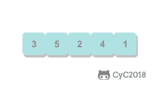 </div><br>

```java
public class Selection<T extends Comparable<T>> extends Sort<T> {

    @Override
    public void sort(T[] nums) {
        int N = nums.length;
        for (int i = 0; i < N - 1; i++) {
            int min = i;
            for (int j = i + 1; j < N; j++) {
                if (less(nums[j], nums[min])) {
                    min = j;
                }
            }
            swap(nums, i, min);
        }
    }
}
```

## 冒泡排序

从左到右不断交换相邻逆序的元素，在一轮的循环之后，可以让未排序的最大元素上浮到右侧。

在一轮循环中，如果没有发生交换，那么说明数组已经是有序的，此时可以直接退出。

<div align="center"> 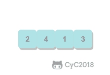 </div><br>

```java
public class Bubble<T extends Comparable<T>> extends Sort<T> {

    @Override
    public void sort(T[] nums) {
        int N = nums.length;
        boolean isSorted = false;
        for (int i = N - 1; i > 0 && !isSorted; i--) {
            isSorted = true;
            for (int j = 0; j < i; j++) {
                if (less(nums[j + 1], nums[j])) {
                    isSorted = false;
                    swap(nums, j, j + 1);
                }
            }
        }
    }
}
```

## 插入排序

每次都将当前元素插入到左侧已经排序的数组中，使得插入之后左侧数组依然有序。

对于数组 {3, 5, 2, 4, 1}，它具有以下逆序：(3, 2), (3, 1), (5, 2), (5, 4), (5, 1), (2, 1), (4, 1)，插入排序每次只能交换相邻元素，令逆序数量减少 1，因此插入排序需要交换的次数为逆序数量。

插入排序的时间复杂度取决于数组的初始顺序，如果数组已经部分有序了，那么逆序较少，需要的交换次数也就较少，时间复杂度较低。

- 平均情况下插入排序需要 \~N<sup>2</sup>/4 比较以及 \~N<sup>2</sup>/4 次交换；
- 最坏的情况下需要 \~N<sup>2</sup>/2 比较以及 \~N<sup>2</sup>/2 次交换，最坏的情况是数组是倒序的；
- 最好的情况下需要 N-1 次比较和 0 次交换，最好的情况就是数组已经有序了。

<div align="center"> 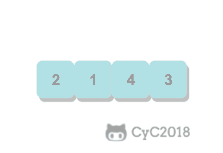 </div><br>

```java
public class Insertion<T extends Comparable<T>> extends Sort<T> {

    @Override
    public void sort(T[] nums) {
        int N = nums.length;
        for (int i = 1; i < N; i++) {
            for (int j = i; j > 0 && less(nums[j], nums[j - 1]); j--) {
                swap(nums, j, j - 1);
            }
        }
    }
}
```

## 希尔排序

对于大规模的数组，插入排序很慢，因为它只能交换相邻的元素，每次只能将逆序数量减少 1。希尔排序的出现就是为了解决插入排序的这种局限性，它通过交换不相邻的元素，每次可以将逆序数量减少大于 1。

希尔排序使用插入排序对间隔 h 的序列进行排序。通过不断减小 h，最后令 h=1，就可以使得整个数组是有序的。

<div align="center"> 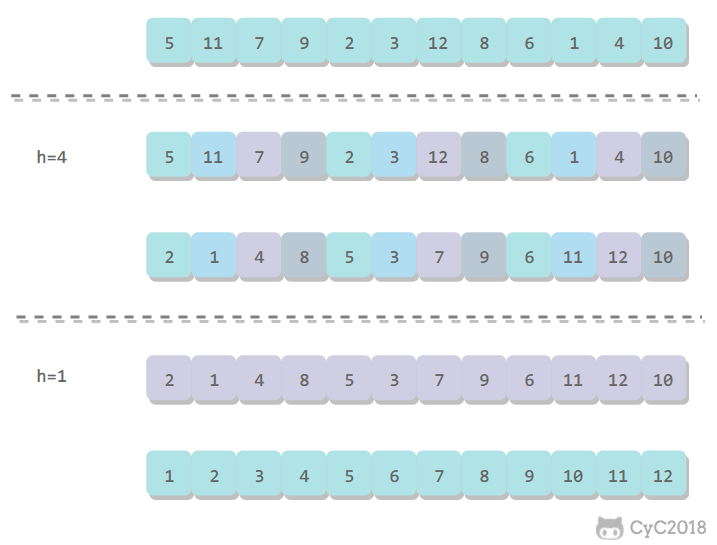 </div><br>

```java
public class Shell<T extends Comparable<T>> extends Sort<T> {

    @Override
    public void sort(T[] nums) {

        int N = nums.length;
        int h = 1;

        while (h < N / 3) {
            h = 3 * h + 1; // 1, 4, 13, 40, ...
        }

        while (h >= 1) {
            for (int i = h; i < N; i++) {
                for (int j = i; j >= h && less(nums[j], nums[j - h]); j -= h) {
                    swap(nums, j, j - h);
                }
            }
            h = h / 3;
        }
    }
}

```

希尔排序的运行时间达不到平方级别，使用递增序列 1, 4, 13, 40, ...  的希尔排序所需要的比较次数不会超过 N 的若干倍乘于递增序列的长度。后面介绍的高级排序算法只会比希尔排序快两倍左右。

## 归并排序

归并排序的思想是将数组分成两部分，分别进行排序，然后归并起来。

<div align="center"> 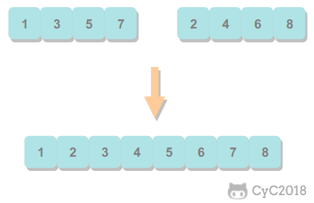 </div><br>

### 1. 归并方法

归并方法将数组中两个已经排序的部分归并成一个。

```java
public abstract class MergeSort<T extends Comparable<T>> extends Sort<T> {

    protected T[] aux;


    protected void merge(T[] nums, int l, int m, int h) {

        int i = l, j = m + 1;

        for (int k = l; k <= h; k++) {
            aux[k] = nums[k]; // 将数据复制到辅助数组
        }

        for (int k = l; k <= h; k++) {
            if (i > m) {
                nums[k] = aux[j++];

            } else if (j > h) {
                nums[k] = aux[i++];

            } else if (aux[i].compareTo(aux[j]) <= 0) {
                nums[k] = aux[i++]; // 先进行这一步，保证稳定性

            } else {
                nums[k] = aux[j++];
            }
        }
    }
}
```

### 2. 自顶向下归并排序

将一个大数组分成两个小数组去求解。

因为每次都将问题对半分成两个子问题，这种对半分的算法复杂度一般为 O(NlogN)。

```java
public class Up2DownMergeSort<T extends Comparable<T>> extends MergeSort<T> {

    @Override
    public void sort(T[] nums) {
        aux = (T[]) new Comparable[nums.length];
        sort(nums, 0, nums.length - 1);
    }

    private void sort(T[] nums, int l, int h) {
        if (h <= l) {
            return;
        }
        int mid = l + (h - l) / 2;
        sort(nums, l, mid);
        sort(nums, mid + 1, h);
        merge(nums, l, mid, h);
    }
}
```


### 3. 自底向上归并排序

先归并那些微型数组，然后成对归并得到的微型数组。

```java
public class Down2UpMergeSort<T extends Comparable<T>> extends MergeSort<T> {

    @Override
    public void sort(T[] nums) {

        int N = nums.length;
        aux = (T[]) new Comparable[N];

        for (int sz = 1; sz < N; sz += sz) {
            for (int lo = 0; lo < N - sz; lo += sz + sz) {
                merge(nums, lo, lo + sz - 1, Math.min(lo + sz + sz - 1, N - 1));
            }
        }
    }
}

```

## 快速排序

### 1. 基本算法

- 归并排序将数组分为两个子数组分别排序，并将有序的子数组归并使得整个数组排序；
- 快速排序通过一个切分元素将数组分为两个子数组，左子数组小于等于切分元素，右子数组大于等于切分元素，将这两个子数组排序也就将整个数组排序了。

<div align="center"> 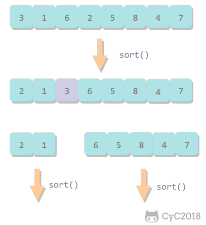 </div><br>

```java
public class QuickSort<T extends Comparable<T>> extends Sort<T> {

    @Override
    public void sort(T[] nums) {
        shuffle(nums);
        sort(nums, 0, nums.length - 1);
    }

    private void sort(T[] nums, int l, int h) {
        if (h <= l)
            return;
        int j = partition(nums, l, h);
        sort(nums, l, j - 1);
        sort(nums, j + 1, h);
    }

    private void shuffle(T[] nums) {
        List<Comparable> list = Arrays.asList(nums);
        Collections.shuffle(list);
        list.toArray(nums);
    }
}
```

### 2. 切分

取 a[l] 作为切分元素，然后从数组的左端向右扫描直到找到第一个大于等于它的元素，再从数组的右端向左扫描找到第一个小于它的元素，交换这两个元素。不断进行这个过程，就可以保证左指针 i 的左侧元素都不大于切分元素，右指针 j 的右侧元素都不小于切分元素。当两个指针相遇时，将切分元素 a[l] 和 a[j] 交换位置。

<div align="center"> 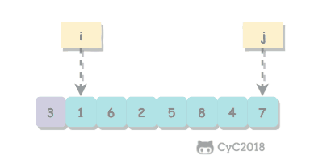 </div><br>

```java
private int partition(T[] nums, int l, int h) {
    int i = l, j = h + 1;
    T v = nums[l];
    while (true) {
        while (less(nums[++i], v) && i != h) ;
        while (less(v, nums[--j]) && j != l) ;
        if (i >= j)
            break;
        swap(nums, i, j);
    }
    swap(nums, l, j);
    return j;
}
```

### 3. 性能分析

快速排序是原地排序，不需要辅助数组，但是递归调用需要辅助栈。

快速排序最好的情况下是每次都正好将数组对半分，这样递归调用次数才是最少的。这种情况下比较次数为 C<sub>N</sub>=2C<sub>N/2</sub>+N，复杂度为 O(NlogN)。

最坏的情况下，第一次从最小的元素切分，第二次从第二小的元素切分，如此这般。因此最坏的情况下需要比较 N<sup>2</sup>/2。为了防止数组最开始就是有序的，在进行快速排序时需要随机打乱数组。

### 4. 算法改进

##### 4.1 切换到插入排序

因为快速排序在小数组中也会递归调用自己，对于小数组，插入排序比快速排序的性能更好，因此在小数组中可以切换到插入排序。

##### 4.2 三数取中

最好的情况下是每次都能取数组的中位数作为切分元素，但是计算中位数的代价很高。一种折中方法是取 3 个元素，并将大小居中的元素作为切分元素。

##### 4.3 三向切分

对于有大量重复元素的数组，可以将数组切分为三部分，分别对应小于、等于和大于切分元素。

三向切分快速排序对于有大量重复元素的随机数组可以在线性时间内完成排序。

```java
public class ThreeWayQuickSort<T extends Comparable<T>> extends QuickSort<T> {

    @Override
    protected void sort(T[] nums, int l, int h) {
        if (h <= l) {
            return;
        }
        int lt = l, i = l + 1, gt = h;
        T v = nums[l];
        while (i <= gt) {
            int cmp = nums[i].compareTo(v);
            if (cmp < 0) {
                swap(nums, lt++, i++);
            } else if (cmp > 0) {
                swap(nums, i, gt--);
            } else {
                i++;
            }
        }
        sort(nums, l, lt - 1);
        sort(nums, gt + 1, h);
    }
}
```

### 5. 基于切分的快速选择算法

快速排序的 partition() 方法，会返回一个整数 j 使得 a[l..j-1] 小于等于 a[j]，且 a[j+1..h] 大于等于 a[j]，此时 a[j] 就是数组的第 j 大元素。

可以利用这个特性找出数组的第 k 个元素。

该算法是线性级别的，假设每次能将数组二分，那么比较的总次数为 (N+N/2+N/4+..)，直到找到第 k 个元素，这个和显然小于 2N。

```java
public T select(T[] nums, int k) {
    int l = 0, h = nums.length - 1;
    while (h > l) {
        int j = partition(nums, l, h);

        if (j == k) {
            return nums[k];

        } else if (j > k) {
            h = j - 1;

        } else {
            l = j + 1;
        }
    }
    return nums[k];
}
```

## 堆排序

### 1. 堆

堆中某个节点的值总是大于等于或小于等于其子节点的值，并且堆是一颗完全二叉树。

堆可以用数组来表示，这是因为堆是完全二叉树，而完全二叉树很容易就存储在数组中。位置 k 的节点的父节点位置为 k/2，而它的两个子节点的位置分别为 2k 和 2k+1。这里不使用数组索引为 0 的位置，是为了更清晰地描述节点的位置关系。

<div align="center"> 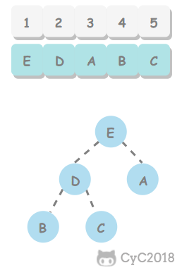 </div><br>

```java
public class Heap<T extends Comparable<T>> {

    private T[] heap;
    private int N = 0;

    public Heap(int maxN) {
        this.heap = (T[]) new Comparable[maxN + 1];
    }

    public boolean isEmpty() {
        return N == 0;
    }

    public int size() {
        return N;
    }

    private boolean less(int i, int j) {
        return heap[i].compareTo(heap[j]) < 0;
    }

    private void swap(int i, int j) {
        T t = heap[i];
        heap[i] = heap[j];
        heap[j] = t;
    }
}
```

### 2. 上浮和下沉

在堆中，当一个节点比父节点大，那么需要交换这个两个节点。交换后还可能比它新的父节点大，因此需要不断地进行比较和交换操作，把这种操作称为上浮。

<div align="center"> 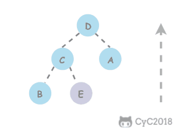 </div><br>

```java
private void swim(int k) {
    while (k > 1 && less(k / 2, k)) {
        swap(k / 2, k);
        k = k / 2;
    }
}
```

类似地，当一个节点比子节点来得小，也需要不断地向下进行比较和交换操作，把这种操作称为下沉。一个节点如果有两个子节点，应当与两个子节点中最大那个节点进行交换。

<div align="center"> 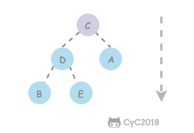 </div><br>

```java
private void sink(int k) {
    while (2 * k <= N) {
        int j = 2 * k;
        if (j < N && less(j, j + 1))
            j++;
        if (!less(k, j))
            break;
        swap(k, j);
        k = j;
    }
}
```

### 3. 插入元素

将新元素放到数组末尾，然后上浮到合适的位置。

```java
public void insert(Comparable v) {
    heap[++N] = v;
    swim(N);
}
```

### 4. 删除最大元素

从数组顶端删除最大的元素，并将数组的最后一个元素放到顶端，并让这个元素下沉到合适的位置。

```java
public T delMax() {
    T max = heap[1];
    swap(1, N--);
    heap[N + 1] = null;
    sink(1);
    return max;
}
```

### 5. 堆排序

把最大元素和当前堆中数组的最后一个元素交换位置，并且不删除它，那么就可以得到一个从尾到头的递减序列，从正向来看就是一个递增序列，这就是堆排序。

##### 5.1 构建堆

无序数组建立堆最直接的方法是从左到右遍历数组进行上浮操作。一个更高效的方法是从右至左进行下沉操作，如果一个节点的两个节点都已经是堆有序，那么进行下沉操作可以使得这个节点为根节点的堆有序。叶子节点不需要进行下沉操作，可以忽略叶子节点的元素，因此只需要遍历一半的元素即可。

<div align="center"> 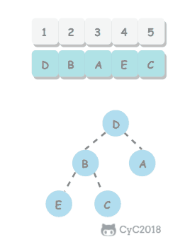 </div><br>

##### 5.2 交换堆顶元素与最后一个元素

交换之后需要进行下沉操作维持堆的有序状态。

<div align="center"> 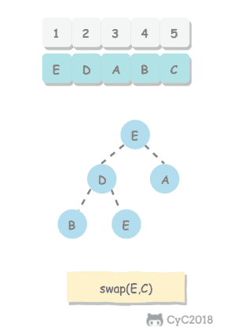 </div><br>

```java
public class HeapSort<T extends Comparable<T>> extends Sort<T> {
    /**
     * 数组第 0 个位置不能有元素
     */
    @Override
    public void sort(T[] nums) {
        int N = nums.length - 1;
        for (int k = N / 2; k >= 1; k--)
            sink(nums, k, N);

        while (N > 1) {
            swap(nums, 1, N--);
            sink(nums, 1, N);
        }
    }

    private void sink(T[] nums, int k, int N) {
        while (2 * k <= N) {
            int j = 2 * k;
            if (j < N && less(nums, j, j + 1))
                j++;
            if (!less(nums, k, j))
                break;
            swap(nums, k, j);
            k = j;
        }
    }

    private boolean less(T[] nums, int i, int j) {
        return nums[i].compareTo(nums[j]) < 0;
    }
}
```

### 6. 分析

一个堆的高度为 logN，因此在堆中插入元素和删除最大元素的复杂度都为 logN。

对于堆排序，由于要对 N 个节点进行下沉操作，因此复杂度为 NlogN。

堆排序是一种原地排序，没有利用额外的空间。

现代操作系统很少使用堆排序，因为它无法利用局部性原理进行缓存，也就是数组元素很少和相邻的元素进行比较和交换。

## 小结

### 1. 排序算法的比较

| 算法 | 稳定性 | 时间复杂度 | 空间复杂度 | 备注 |
| :---: | :---: |:---: | :---: | :---: |
| 选择排序 | × | N<sup>2</sup> | 1 | |
| 冒泡排序 | √ |  N<sup>2</sup> | 1 | |
| 插入排序 | √ |  N \~ N<sup>2</sup> | 1 | 时间复杂度和初始顺序有关 |
| 希尔排序 | ×  |  N 的若干倍乘于递增序列的长度 | 1 | 改进版插入排序 |
| 快速排序 | ×  | NlogN | logN | |
| 三向切分快速排序 | ×  |  N \~ NlogN | logN | 适用于有大量重复主键|
| 归并排序 | √ |  NlogN | N | |
| 堆排序 | ×  |  NlogN | 1 | 无法利用局部性原理|

快速排序是最快的通用排序算法，它的内循环的指令很少，而且它还能利用缓存，因为它总是顺序地访问数据。它的运行时间近似为 \~cNlogN，这里的 c 比其它线性对数级别的排序算法都要小。

使用三向切分快速排序，实际应用中可能出现的某些分布的输入能够达到线性级别，而其它排序算法仍然需要线性对数时间。

### 2. Java 的排序算法实现

Java 主要排序方法为 java.util.Arrays.sort()，对于原始数据类型使用三向切分的快速排序，对于引用类型使用归并排序。 


# 算法 - 并查集
<!-- GFM-TOC -->
* [算法 - 并查集](#算法---并查集)
    * [前言](#前言)
    * [Quick Find](#quick-find)
    * [Quick Union](#quick-union)
    * [加权 Quick Union](#加权-quick-union)
    * [路径压缩的加权 Quick Union](#路径压缩的加权-quick-union)
    * [比较](#比较)
<!-- GFM-TOC -->


## 前言

用于解决动态连通性问题，能动态连接两个点，并且判断两个点是否连通。

<div align="center"> 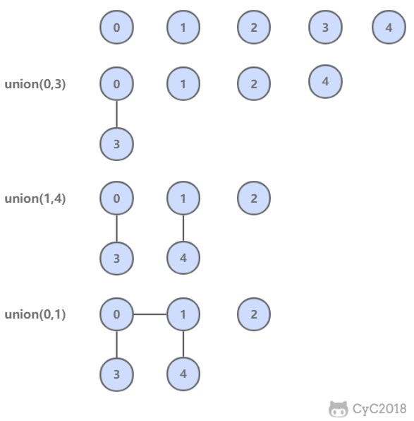 </div><br>

| 方法 | 描述 |
| :---: | :---: |
| UF(int N) | 构造一个大小为 N 的并查集 |
| void union(int p, int q) | 连接 p 和 q 节点 |
| int find(int p) | 查找 p 所在的连通分量编号 |
| boolean connected(int p, int q) | 判断 p 和 q 节点是否连通 |

```java
public abstract class UF {

    protected int[] id;

    public UF(int N) {
        id = new int[N];
        for (int i = 0; i < N; i++) {
            id[i] = i;
        }
    }

    public boolean connected(int p, int q) {
        return find(p) == find(q);
    }

    public abstract int find(int p);

    public abstract void union(int p, int q);
}
```

## Quick Find

可以快速进行 find 操作，也就是可以快速判断两个节点是否连通。

需要保证同一连通分量的所有节点的 id 值相等，就可以通过判断两个节点的 id 值是否相等从而判断其连通性。

但是 union 操作代价却很高，需要将其中一个连通分量中的所有节点 id 值都修改为另一个节点的 id 值。

<div align="center">  </div><br>

```java
public class QuickFindUF extends UF {

    public QuickFindUF(int N) {
        super(N);
    }


    @Override
    public int find(int p) {
        return id[p];
    }


    @Override
    public void union(int p, int q) {
        int pID = find(p);
        int qID = find(q);

        if (pID == qID) {
            return;
        }

        for (int i = 0; i < id.length; i++) {
            if (id[i] == pID) {
                id[i] = qID;
            }
        }
    }
}
```

## Quick Union

可以快速进行 union 操作，只需要修改一个节点的 id 值即可。

但是 find 操作开销很大，因为同一个连通分量的节点 id 值不同，id 值只是用来指向另一个节点。因此需要一直向上查找操作，直到找到最上层的节点。

<div align="center"> 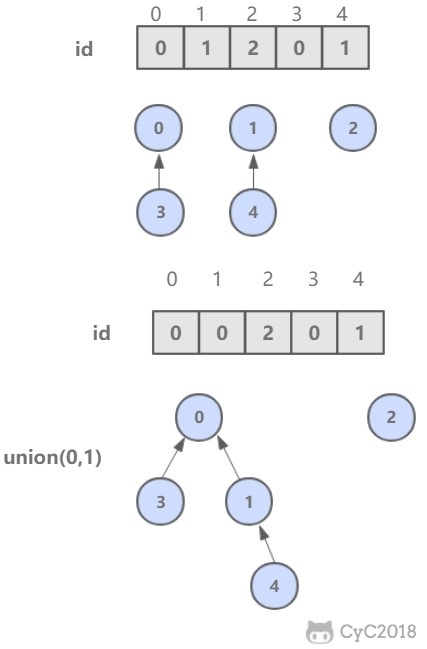 </div><br>

```java
public class QuickUnionUF extends UF {

    public QuickUnionUF(int N) {
        super(N);
    }


    @Override
    public int find(int p) {
        while (p != id[p]) {
            p = id[p];
        }
        return p;
    }


    @Override
    public void union(int p, int q) {
        int pRoot = find(p);
        int qRoot = find(q);

        if (pRoot != qRoot) {
            id[pRoot] = qRoot;
        }
    }
}
```

这种方法可以快速进行 union 操作，但是 find 操作和树高成正比，最坏的情况下树的高度为节点的数目。

<div align="center"> 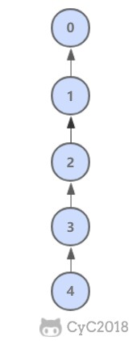 </div><br>

## 加权 Quick Union

为了解决 quick-union 的树通常会很高的问题，加权 quick-union 在 union 操作时会让较小的树连接较大的树上面。

理论研究证明，加权 quick-union 算法构造的树深度最多不超过 logN。

<div align="center"> 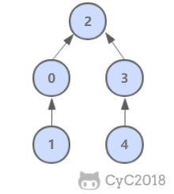 </div><br>

```java
public class WeightedQuickUnionUF extends UF {

    // 保存节点的数量信息
    private int[] sz;


    public WeightedQuickUnionUF(int N) {
        super(N);
        this.sz = new int[N];
        for (int i = 0; i < N; i++) {
            this.sz[i] = 1;
        }
    }


    @Override
    public int find(int p) {
        while (p != id[p]) {
            p = id[p];
        }
        return p;
    }


    @Override
    public void union(int p, int q) {

        int i = find(p);
        int j = find(q);

        if (i == j) return;

        if (sz[i] < sz[j]) {
            id[i] = j;
            sz[j] += sz[i];
        } else {
            id[j] = i;
            sz[i] += sz[j];
        }
    }
}
```

## 路径压缩的加权 Quick Union

在检查节点的同时将它们直接链接到根节点，只需要在 find 中添加一个循环即可。

## 比较

| 算法 | union | find |
| :---: | :---: | :---: |
| Quick Find | N | 1 |
| Quick Union | 树高 | 树高 |
| 加权 Quick Union | logN | logN |
| 路径压缩的加权 Quick Union | 非常接近 1 | 非常接近 1 |


