# 第二章 抽象数据类型

> 译者：[Allenyep](https://github.com/Allenyep)

本书中包含大多数课程中的经典数据结构，如一些具有代表性的数据集合框架。这意味着其中包括了一些可能使这些值变得有序值的集合或多元集合[1]。其中一些数据集合是关联索引的；它们是搜索结构，拥有类似于将某些索引值（键）映射到其他数据（例如将名称映射到街道地址）的函数。

我们可以通过介绍不同数据结构的操作集来描述抽象的情况-即通过描述可用的抽象数据类型。从程序的角度来看，它需要某种数据集合用于操作，而这一系列操作方法必须是大家都应该知道的。

对于每种不同的抽象数据类型，通常有几种可能的实现方式。选择哪个数据结构取决于你的程序需要处理多少数据，处理数据的速度有多快，以及对存储空间的限制。对于很多程序来说，这有点像一个肮脏的秘密交易，你选择实现的方式完全不重要。然而，知识丰富的程序员应该熟悉这些可用的工具。

我希望你们中的许多人会发现这一章令人沮丧，因为它将谈论数据类型的*接口*，而不是谈论它们背后的实现方法。习惯它。毕竟，在这套标准库背后有广泛使用的编程语言将会以一组接口的方式呈现给你。包括：函数中参数传递的方向以及一些注释,通常是使用英语来描述接口的作用。作为一名开发者，您将花费大量时间来生成向您的客户提供相同功能的模块。

## 2.1 迭代器

如果我们要开发一些数据集合的概念，我们必须回答这样一个问题:我们如何从这样的数据集合中获取对应项？你可能已经熟悉了一种集合结构——数组。获取其中元素十分简单。例如，要打印数组的内容，您可以编写

``` java
for (int i = 0; i < A.length; i += 1)
    System.out.print (A[i] + ", ");
```
数组有n个元素,所以这样的循环很容易。但是其他集合呢？例如罐子里"第一个硬币"是哪一个呢？即使我们任意选择给一个集合中的每个元素一个编号,我们将会发现"选取第n个元素"代价将会十分昂贵（想象一下Scheme当中的lists）。

尝试对每个集合强加编号以提取其中元素的问题在于它迫使集合的实现者提供比我们的问题可能需要的更加具体的工具。这是一个经典的工程权衡问题：满足一个约束(如获取第n个元素)可能会有其他代价(逐个迭代的代价十分高)。

所以问题是在不依赖索引或者可能完全没有依赖顺序的情况下提供集合中的元素。Java提供了两种方法作为接口。接口**java.util.Iterator**提供了一种以某种顺序访问集合中所有项目的方法。**java.util.ListIterator**提供以某种特定顺序访问集合中的元素的方法,但没有为每个元素分配索引\[2\]。

\[2\]:该库还定义了接口java.util.Enumeration，它本质上是同一想法的旧版本。我们不会在这里谈论这个界面，因为最重要的位置是新的程序首选的是迭代器

### 2.1.1 迭代器接口

Java库定义了一个接口:**java.util.Iterator**,如代码2.1所示，表示为“在集合中所有元素排序的东西”的概念，但不保证顺序。这只是一个Java接口,它不具备实现类。在Java库中，代表数据项集合以提供对这些元素进行排序的方法的类的标准方法是定义诸如

``` java
Iterator<SomeType> iterator () { ... }
```
它分配并返回一个迭代器(如代码3.3）。通常这个迭代器的实际类型将被隐藏(甚至为private);所有使用这个类的用户都需要知道的是**iterator**返回的对象提供了两个方法**hasNext**和**next**(有时候是**remove**)。例如，打印字符串集合的所有元素的一般方法(类似于以前的阵列打印机)是：

``` java
for (Iterator<String> i = C.iterator ();i.hasNext (); )
    System.out.print (i.next () + " ");
```

``` java
package java.util;
/** An object that delivers each item in some collection of items* each of which is a T. */
public interface Iterator <T> {
    /** True iff there are more items to deliver. */
    boolean hasNext ();
    /** Advance THIS to the next item and return it. */
    T next ();
    /** Remove the last item delivered by next() from the collection* being iterated over. Optional operation: may throw* UnsupportedOperationException if removal is not possible. */
    void remove ();
    }
```
代码2.1 **java.util.Iterator**接口

编写这个循环的程序员不需要知道对象i必须经历什么样的迭代以产生所请求的元素。即使代表其集合的C发生重大变化也不需要对循环进行修改。

这种特殊类型的for循环在Java2中是如此常见和有用，版本1.5中它有自己的“语法糖”，称为增强for循环。你可以编写如下代码

``` java
for (String i : C)
    System.out.print (i + " ");
```
获得与前一个for循环相同的效果。Java将插入缺失的部分，将其转换为

``` java
for (Iterator<String> ρ = C.iterator (); ρ.hasNext(); ) {
    String i = ρ.next ();
    System.out.println (i + " ");
}
```

其中ρ是编译器引入的一些新变量，在程序的其他地方未使用，其类型取自**C.iterator()**。这个增强的for循环适用于任何取自对象接口**java.lang.Iterable**的对象C。简单地定义

``` java
public interface Iterable<T> {
    Iterator<T> iterator ();
}
```
感谢增强for循环，只需在类型定义上定义迭代器方法，就提供了一种非常方便的方法来对序列中包含的该类型的任何子对象进行排序。
不用说，为迭代器(Iterators)引入了这种方便的简写，Java的设计者突然有这样一个观点：迭代遍历数组的元素比迭代遍历库类的更加笨拙。因此，他们将增强的for语句扩展为包含数组。例如，这两种方法是等价的：

``` java
/** The sum of the* elements of A */
int sum (int[] A) {
    int S;S = 0;
    for (int x : A) 
        S += x;
}

/** The sum of the elements* of A */
int sum (int[] A) {
    int S;
    S = 0;
    for (int κ = 0; κ < A.length; κ++){
        int x = A[κ];
        S += x;
    }
}
```

### 2.1.2 ListIterator接口
有些数据集合的确有排序的自然概念，但从按索引的集合中提取任意项的代价可能仍然很昂贵。例如，您可能看到了Scheme语言中的链表：给定列表中的一个元素，它需要n个操作来确定第n个后续元素（与Java数组相反，Java数组只需要一个步骤或一些特定操就可以检索任何项。）。标准Java库包含接口**java.util.ListIterator**，它通过有序序列进行排序的，而不通过索引来获取每个序列。如代码2.2所示。除了迭代器的“查询”方法和**remove**方法之外，**Listaterator**类提供了在集合中插入新项或替换项的操作。

## 2.2 Java抽象集合框架

Java库（从JDK 1.2开始）提供代表各种集合的接口层次结构，加上抽象类的层次结构，以帮助程序员提供这些接口的实现，以及一些实际（“具体”）的实现。这些类都在包**java.util**中找到。图2.4说明了专门用于集合的类和接口的层次结构。

### 2.2.1 集合框架接口

Java库接口**java.util.Collection**其方法总结在图2.5和2.6中，描述了包含值集合的数据结构，其中每个值都是对某个Object（或null）的引用。与“集合（Collection）”相对的术语“集（set）”也出现在这里，因为Collection可以像数学上定义的集合那样描述多集合（bags）。

``` java
package java.util;
/** Abstraction of a position in an ordered collection. At any* given time, THIS represents a position (called its cursor)* that is just after some number of items of type T (0 or more) of* a particular collection, called the underlying collection. */
public interface ListIterator<T> extends Iterator<T> {
    /* Exceptions: Methods that return items from the collection throw* NoSuchElementException if there is no appropriate item. Optional* methods throw UnsupportedOperationException if the method is not* supported. */
    /* Required metho ds: */
    /** True unless THIS is past the last item of the collection */
    boolean hasNext ();
    /** True unless THIS is before the first item of the collection */
    boolean hasPrevious ();
    /** Returns the item immediately after the cursor, and* moves the current position to just after that item.* Throws NoSuchElementException if there is no such item. */
    T next ();
    /** Returns the item immediately before the cursor, and* moves the current position to just before that item.* Throws NoSuchElementException if there is no such item. */
    T previous ();
    /** The number of items before the cursor */
    int nextIndex ();
    /* nextIndex () - 1 */
    int previousIndex ();
    /* Optional methods: *//** Insert item X into the underlying collection immediately before* the cursor (X will be returned by previous()). */
    void add (T x);
    /** Remove the item returned by the most recent call to .next ()* or .previous (). There must not have been a more recent* call to .add(). */
    void remove ();
    /** Replace the item returned by the most recent call to .next ()* or .previous () with X in the underlying collection.* There must not have been a more recent call to .add() or .remove. */
    void set (T x);
}
```
代码2.2 java.util.ListIterator接口

【图2.3】
图2.3 Java库的Map相关类型（来自java.util）。椭圆表示接口;虚线框是抽象类，实心框是具体（非抽象）类。实线箭头表示继承(extends)关系，虚线箭头表示实现(implements)关系。抽象类供希望添加新集合类的实现用。它们提供了某些方法的默认实现。程序员将new应用于具体类以获取实例，并且（理想情况下）使用接口作为形式参数类型，以便尽可能广泛地使用方法。

【图2.4】
图2.4 Java库的Collection类型（来自java.util）.有关符号，请参见图2.3

由于这是一个接口，描述操作的文档注释可能不准确。一个无能或恶作剧的程序员可以编写一个实现Collection的类，将add方法改成remove方法。尽管如此，正经的程序员都会根据注释接受Collection的方法编写程序。C作为一个正常的集合，在执行C.add(x)之后，x将被放进C中。

并非每种集合都需要实现每种方法。具体而言，图2.6中不是可选方法，但可能会抛出选择提升标准异常UnsupportedOperationException。有关此特定设计选择的进一步讨论参见2.5节。仅实现所需方法的类本质上是只读集合;它们一旦被创造就无法修改。

关于图2.5中的构造函数的注释仅仅是一个注释。Java接口没有构造函数，因为它们不代表具体对象的特定类型。然而你首先需要一些构造函数来创建一个Collection，而注释的目的是告诉你一些有用的统一标准。

在这一点上，你可能想知道Collection类可能是什么样的，因为不可能直接创建一个它的实例（它是一个接口），并且缺少有关其成员的功能的详细信息（例如，给定的Collection可以有两个相同的元素吗？）。重点是使用Collection接口中提供的信息编写的任何函数都适用于Collection的所有实现类。

例如，这里有一个简单的方法来确定一个Collection的元素是否是另一个的子集：

``` java
/** True iff C0 is a subset of C1, ignoring repetitions. */
public static boolean subsetOf (Collection<?> C0, Collection<?> C1) {
    for (Object i : C0)
        if (! C1.contains (i))
            return false;
    // Note: equivalent to
    // for (Iterator<?> iter = C0.iterator(); iter.hasNext (); ) {
        // Object i = iter.next ();
        // ...
        return true;
    }
```

我们不知道C0和C1是什么类型的对象(它们可能是完全不同的Collection实现类),也不清楚他们的迭代器以什么顺序提供元素，是否允许重复。这些方法仅依赖于接口及其注释中描述的属性，并且总是能达到想要的效果（假如这些程序员是通过实现Collection去完成他们的工作）。

``` java
package java.util;
/** A collection of values, each an Object reference. */
public interface Collection<T> extends Iterable<T> {
    /* Constructors. Classes that implement Collection should* have at least two constructors:* CLASS (): Constructs an empty CLASS* CLASS (C): Where C is any Collection, constructs a CLASS that* contains the same elements as C. *//* Required met hods: *//** The number of values in THIS. */
    int size ();
    /** True iff size () == 0. */
    boolean isEmpty ();
    /** True iff THIS contains X: that is, if for some z in* THIS, either z and X are null, or z.equals (X). */
    boolean contains (Object x);
    /** True iff contains(x) for all elements x in C. */
    boolean containsAll (Collection<?> c);
    /** An iterator that yields all the elements of THIS, in some* order. */
    Iterator<T> iterator ();
    /** A new array containing all elements of THIS. */
    Object[] toArray ();
    /** Assuming ANARRAY has dynamic type T[] (where T is some* reference type), the result is an array of type T[] containing* all elements of THIS. The result is ANARRAY itself, if all of* these elements fit (leftover elements of ANARRAY are set to null).* Otherwise, the result is a new array. It is an error if not* all items in THIS are assignable to T. */
    <T> T[] toArray (T[] anArray);

    // Interface java.util.Collection, continued.
    /* Optional methods. Any of these may do nothing except to* throw UnsupportedOperationException. */
    /** Cause X to be contained in THIS. Returns true if the Collection *
    /* changes as a result. */
    boolean add (T x);
    /** Cause all members of C to be contained in THIS. Returns true* if the object THIS changes as a result. */
    boolean addAll (Collection<? extends T> c);
    /** Remove all members of THIS. */
    void clear ();
    /** Remove a Object .equal to X from THIS, if one exists,* returning true iff the object THIS changes as a result. */
    boolean remove (Object X);
    /** Remove all elements, x, such that C.contains(x) (if any* are present), returning true iff there were any* objects removed. */
    boolean removeAll (Collection<?> c);
    /** Intersection: Remove all elements, x, such that C.contains(x)* is false, returning true iff any items were removed. */
    boolean retainAll (Collection<?> c);}
```
代码2.5 接口java.util.Collection。必须方法和可选方法。

### 2.2.2 Set接口

在数学中，集合是没有重复的值的集合。这也是接口java.util.Set的定义。然而这个规定并不是以Java接口的形式直接表达的。实际上就Java编译器而言，以下是一个非常好的定义：

``` java
package java.util;
public interface Set<T> extends Collection<T> { }
```

这些方法都是一样的。它们的不同之处都在注释中。各元素的单拷贝规则在几个方法中更具体的注释中反映出来。结果如代码2.7所示。在这个定义中，我们还包括equals和hashCode方法。这些方法自动成为任何接口的一部分，因为它们是在Java类java.lang.Object中定义的，但我把它们包含在这里是因为它们的语义规范（注释）比一般对象更严格。当然，equals是来表示集合相等。我们将在第7章详解hashCode。

### 2.2.3 List接口

由于该术语是在Java库中使用的，list是有序元素集合，可能具有重复元素。也就是说，它是一种特殊的Collection，其中有一个元素的序列，第一个元素，最后一个元素，第n个元素，并且其中元素可能出现重复(和Set不一样)。因此，包含对有序序列的其他方法的扩展接口（相对于Collection）是有意义的。代码2.8展示了该接口。

大量方法包含在listIterator类及其返回的对象中。从接口描述中可以看到，可以使用列表(List)接口本身的方法插入、添加、删除或排序列表中的项。或者你也可以通过使用listIterator创建一个列表迭代器。使用listIterator来处理整个列表（或其中的某些部分）通常比使用List和其他List的方法更快，它使用数字索引来表示需要的元素。

**视图**

subList方法十分特别。诸如L.subList（i，j）的调用通过返回值以产生另一个List(通常与L不同)，它由L的（j-1）个项组成。此外，它是通过提供L的这一部分的视图来实现的，即访问相同数据容器的另一种方式。这个设计思路是修改子列表（使用添加，删除和设置等方法）也应该修改L的相应部分。例如，要删除列表L中除第一个k项以外的所有项，您可以编写

``` java
L.subList (k, L.size ()).clear ();
```

``` java
package java.util;
/** A Collection that contains at most one null item and in which no* two distinct non-null items are .equal. The effects of modifying* an item contained in a Set so as to change the value of .equal* on it are undefined. */
public interface Set<T> extends Collection<T> {
    /* Constructors. Classes that implement Set should* have at least two constructors:* CLASS (): Constructs an empty CLASS* CLASS (C): Where C is any Collection, constructs a CLASS that* contains the same elements as C, with duplicates removed. */
    /** Cause X to be contained in THIS. Returns true iff X was *
    /* not previously a member. */
    boolean add (T x);
    /** True iff S is a Set (instanceof Set) and is equal to THIS as a* set (size()==S.size() each of item in S is contained in THIS). */
    boolean equals (Object S);
    /** The sum of the values of x.hashCode () for all x in THIS, with* the hashCode of null taken to be 0. */
    int hashCode ();
    /* Other methods inherited from Collection:* size, isEmpty, contains, containsAll, iterator, toArray,* addAll, clear, remove, removeAll, retainAll */
}
```
代码2.7 接口java.util.Set.只展示比Collection更具体的注释的方法。

``` java
package java.util;
/** An ordered sequence of items, indexed by numbers 0 .. N-1,* where N is the size() of the List. */
public interface List<T> extends Collection<T> {
    /* Required metho ds: *//** The Kth element of THIS, where 0 <= K < size(). Throws* IndexOutOfBoundsException if K is out of range. */
    T get (int k);
    /** The first value k such that get(k) is null if X==null,* X.equals (get(k)), otherwise, or -1 if there is no such k. */
    int indexOf (Object x);
    /** The largest value k such that get(k) is null if X==null,* X.equals (get(k)), otherwise, or -1 if there is no such k. */
    int lastIndexOf (Object x);
    /* NOTE: The methods iterator, listIterator, and subList produce* views that become invalid if THIS is structurally modified by* any other means (see text). */
    /** An iterator that yields all the elements of THIS, in proper* index order. (NOTE: it is always valid for iterator() to* return the same value as would listIterator, below.) */
    Iterator<T> iterator ();
    /** A ListIterator that yields the elements K, K+1, ..., size()-1* of THIS, in that order, where 0 <= K <= size(). Throws* IndexOutOfBoundsException if K is out of range. */
    ListIterator<T> listIterator (int k);
    /** Same as listIterator (0) */
    ListIterator<T> listIterator ();
    /** A view of THIS consisting of the elements L, L+1, ..., U-1,* in that order. Throws IndexOutOfBoundsException unless* 0 <= L <= U <= size(). */
    List<T> subList (int L, int U);
    /* Other methods inherited from Collection:* add, addAll, size, isEmpty, contains, containsAll, remove, toArray */
```
代码2.8 接口java.util.List的方法，以及从Collection继承的方法

因此，List上有很多的操作，不需要定义就能使用，因为它是对子列表操作的结果。例如不需要手写从i到j删除的remove方法，或者通过索引搜索下标k的元素的indexOf方法。

迭代器（包括ListIterators）提供了另一个视图集合的示例。同样可以通过其方法提供的迭代器访问或修改Collection的当前内容。就此而言，任何Collect都可以是一个视图 - “身份视图”。

每当同一实体有两个可能的视图时，使用其中一个来修改实体会有可能干扰另一个视图。在一个视图中的变化不仅仅是原视图中，应该在其他视图中看到（如上面清除子列表的示例），但是当被查看的实体被其他方式改变时，一些视图的快速直接实现可能会出错。在迭代器上调用remove方法时应该发生什么，根据Iterator的规范，应该删除的元素是否已经被直接删除（通过在完整的Collection上调用remove方法）。假设有一个包含某些完整List元素2到4的子列表。如果清除完整List，然后添加3个元素，子列表视图中的内容是什么？

由于存在这些问题，通过除该视图之外的某些方式，其生成方法的完整规范（在List接口中是iterator，listIterator和subList）都规定，如果基础List在结构上进行了修改（如果添加或删除了元素），则视图将变为无效。因此，如果执行L.add（...），则L.iterator（）的结果将变为无效，或者如果你执行从L生成的其他迭代器或子列表中的remove方法也是如此。然而，我们还会遇到一些视图，例如由Map中的值方法（参见图2.12）生成的视图，这些视图应该保持有效，即使在对象中进行结构修改时也是如此;对于Map的实现来说，设计者认为这是有必要的。

### 2.2.4 有序Set

List接口描述了描述序列的数据类型，在这些序列中，程序员通过将序列中的元素添加到序列中的顺序或位置明确地表明序列中元素的顺序。相比之下，SortedSet接口旨在描述数据根据某些选定关系确定排序的序列。当然，这里出现了一个问题：在Java中，我们如何表示这个“选定关系”，以便我们可以定义它？我们如何将排序关系作为参数？

**排序：Comparable和Comparator接口**

函数有多种方法来定义某些set对象的排序。一种方法是用具有明显的含义来定义布尔运算如equals, less, greater等。C族语言（包括Java）中的库倾向于将所有这些组合成一个单独的函数，该函数用整数返回值表示关系。例如，在String类型上，x.compareTo("cat")返回一个零，负或正整数，具体取决于x是否等于“cat”，是否以词典顺序出现在它之前，或者在它之后出现。因此，Strings上的排序x≤y对应于条件x.compareTo（y）<= 0。

``` java
package java.lang;
/** Describes types that have a natural ordering. */public interface Comparable<T> {
    /** Returns* 
    * a negative value iff THIS < Y under the natural ordering* 
    * a positive value iff THIS > Y;* 
    * 0 iff X and Y are "equivalent".* 
    Throws ClassCastException if X and Y are incomparable. */
    int compareTo (T y);
}
```
代码2.9 接口java.lang.Comparable，它标记了自然排序的类。

出于SortedSet接口的目的，由compareTo方法（或者是compare）表示的此≤（或≥）排序旨在是总排序。也就是说，它是有传递性的（x≤y且y≤z意味着x≤z），自反性的(x ≤ x)，反对称的（x≤y且y≤x表示x等于y）。此外，对于函数域中的所有x和y，x≤y或者y≤x。

一些类（如字符串String）定义了自己的标准比较操作。这样做的标准方法是实现Comparable接口，如代码2.9所示。然而，并非所有的类都有这样的排序，自然排序也不一定是在任何给定情况下想要的。例如，可以按字典顺序、颠倒字典顺序或不区分大小写的顺序对字符串排序。

在Scheme语言中，没有这样一个特别的问题：排序关系只是一个函数，在Schame中函数是非常好的值。在一定程度上，在C和Fortran等语言中也是如此，在这些语言中，函数可以用作子程序的参数，但Schame不同，它只能访问全局变量（Java中称为静态作用域或类变量）。Java不直接支持函数作为值，但事实证明，这不是一个限制。Java标准库将Comparator接口（图2.10）定义为可用作排序关系的表示。

这两个接口提供的方法应该是适当的总排序。但是，Java语言实际上不能强制执行任何条件。它们只是注释当中强加的惯例。程序员违反这些设定的可能会导致各种意外。同样，没有什么可以阻止你定义与.equals函数不一致的比较操作。我们说compare（或compareTo）与equals是一致的，如果x.equals（y）和 C.compare（x，y）== 0。在没有充分理由的情况下保持这种一致性通常是好的做法。

``` java
package java.util;
/** An ordering relation on certain pairs of objects. If */
public interface Comparator<T> {
    /** Returns* * a negative value iff X < Y according to THIS ordering;* * a positive value iff X > Y;* * 0 iff X and Y are "equivalent" under the order;* Throws ClassCastException if X and Y are incomparable.*/
    int compare (T x, T y);
    /** True if ORD is "same" ordering as THIS. It is legal to return* false (conservatively) even if ORD does define the same ordering,* but should return true only if ORD.compare (X, Y) and* THIS.compare(X, Y) always have the same value. */
    boolean equals (Object ord);
}
```
代码2.10 接口java.util.Comparator，表示对象之间的排序关系

**SortedSet接口**

代码2.11中的SortedSet接口扩展了Set接口以便于它的迭代器方法提供了一个Iterator，对其内容排序。它还提供了额外的方法，只有在特别的顺序时才能使用。有两种方法来定义这种排序：通过程序员提供一个比较器构建一个排序集以确定顺序，或者集合的内容必须是可比较的，并且能使用它们的确定顺序。

## 2.3 Java Map Abstractions

术语map或mapping在计算机科学和其他学科上用作数学意义的函数的同义词，一些集合Set（域）中的项目与另一集合（隐藏域）之间的对应关系，域中的每个项目对应于（映射到）单个隐藏域元素中。（域的任何数量的成员（包括零）都可以对应于隐藏域的给定成员。由域的某个成员映射到的隐藏域的子集称为映射范围或映射下的域图。）

在程序开发中，从操作角度看典型的情况是，通过类似于Map的数据结构“查找”给定的键（域值），以确定相关的值（隐藏域值）。然而，从数学的角度来看，完美的解释是mapping是一组set集，(d, c)，其中d为键和c为值。

``` java
package java.util;
public interface SortedSet<T> extends Set<T> {
    /* Constructors. Classes that implement SortedSet should define* at least the constructors* CLASS (): An empty set ordered by natural order (compareTo).* CLASS (CMP): An empty set ordered by the Comparator CMP.* CLASS (C): A set containing the items in Collection C, in* natural order.* CLASS (S): A set containing a copy of SortedSet S, with the* same order.*/
    /** The comparator used by THIS, or null if natural ordering used. */
    Comparator<? super T> comparator ();
    /** The first (smallest) item in THIS according to its ordering */
    T first ();
    /** The last (largest) item in THIS according to its ordering */
    T last ();
    /* NOTE: The methods headSet, tailSet, and subSet produce* views that become invalid if THIS is structurally modified by* any other means. *//** A view of all items in THIS that are strictly less than X. */
    SortedSet<T> headSet (T x);
    /** A view of all items in THIS that are strictly >= X. */
    SortedSet<T> tailSet (T x);
    /** A view of all items, y, in THIS such that X0 <= y < X1. */
    SortedSet<T> subSet (T X0, T X1);
}
```
代码2.11 java.util.SortedSet接口

### 2.3.1 Map接口

标准Java库使用代码2.12和2.13中显示的java.util.Map接口来展示这些“mapping”概念。此接口提供Map的视图作为查找操作（使用get方法），而且Map的视图是一组有序对（使用方法entrySet）。同时又要求“有序对”反向表示，由嵌套接口Map.Entry可以显示。因此，希望引入新类型映射的程序员不仅可以实现Map接口的具体类，而且可以实现Map.Entry。

### 2.3.2 SortedMap接口

实现java.util.SortedMap的对象应该是一个按键排序的Map，正如图2.15所示，操作类似于接口Sorted Set的操作。

## 2.4 一个例子

考虑一系列名称(ni, mi)读取的问题。我们希望创建所有第一个成员的列表，ni，按字母顺序排列，并且对于他们每个值，都是与他们配对的所有值mi，每个m出现一次，并按照第一次出现的顺序列出。因此，输入：

John Mary， George Jeff， Tom Bert， George Paul， John Peter，Tom Jim， George Paul， Ann Cyril， John Mary， George Eric

输出：

Ann: Cyril<br>
George: Jeff Paul Eric<br>
John: Mary Peter<br>
Tom: Bert Jim

我们可以使用某种SortedMap来处理ni和用List每个处理mi。 一种可能的方法（将Reader作为输入源，将PrintWriter作为输出）如代码2.16所示。

``` java
package java.util;
public interface Map<Key, Val> {
    /* Constructors: Classes that implement Map should* have at least two constructors:* CLASS (): Constructs an empty CLASS* CLASS (M): Where M is any Map, constructs a CLASS that* denotes the same abstract mapping as C. */
    /* Required metho ds: */
    /** The number of keys in the domain of THIS map. */
    int size ();
    /** True iff size () == 0 */
    boolean isEmpty ();
    /* NOTE: The methods keySet, values, and entrySet produce views* that remain valid even if THIS is structurally modified. */
    /** The domain of THIS. */
    Set<Key> keySet ();
    /** The range of THIS. */
    Collection<Val> values ();
    /** A view of THIS as the set of all its (key,value) pairs. */
    Set<Map.Entry<Key, Val>> entrySet ();
    /** The value mapped to by KEY, or null if KEY is not* in the domain of THIS. */
    /** True iff keySet().contains (KEY) */
    boolean containsKey (Object key);
    /** True iff values().contains (VAL). */
    boolean containsValue (Object val);Object get (Object key);
    /** True iff M is a Map and THIS and M represent the same mapping. */
    boolean equals (Object M);
    /** The sum of the hashCode values of all members of entrySet(). */
    int hashCode ();
    static interface Entry { ... 
    // See Figure 2.14 


    // Interface java.util.Map, continued
    /* Optional methods: */
    /** Set the domain of THIS to the empty set. */
    void clear();
    /** Cause get(KEY) to yield VAL, without disturbing other values. */
    Object put(Key key, Val val);
    /** Add all members of M.entrySet() to the entrySet() of THIS. */
    void putAll(Map<? extends Key, ? extends Val> M);
    /** Remove KEY from the domain of THIS. */
    Object remove(Object key);}
}
``` 
代码2.12 接口java.util.Map的必需方法和可选方法

``` java
/** Represents a (key,value) pair from some Map. In general, an Entry* is associated with a particular underlying Map value. Operations that* change the Entry (specifically setValue) are reflected in that* Map. Once an entry has been removed from a Map as a result of* remove or clear, further operations on it may fail. */
static interface Entry<Key,Val> {
    /** The key part of THIS. */
    Key getKey();
    /** The value part of THIS. */
    Val getValue();
    /** Cause getValue() to become VAL, returning the previous value. */
    Val setValue(Val val);
    /** True iff E is a Map.Entry and both represent the same (key,value)* pair (i.e., keys are both null, or are .equal, and likewise for* values).*/
    boolean equals(Object e);
    /** An integer hash value that depends only on the hashCode values* of getKey() and getValue() according to the formula:* (getKey() == null ? 0 : getKey().hashCode ())* ^ (getValue() == null ? 0 : getValue.hashCode ()) */
    int hashCode();}
```
代码2.14 嵌套接口java.util.Map.Entry，它与java.util.Map接口嵌套

``` java
package java.util;
public interface SortedMap<Key,Val> extends Map<Key,Val> {
    /* Constructors: Classes that implement SortedMap should
    * have at least four constructors:
    * CLASS (): An empty map whose keys are ordered by natural order.
    * CLASS (CMP): An empty map whose keys are ordered by the Comparator CMP.
    * CLASS (M): A map that is a copy of Map M, with keys ordered
    * in natural order.
    * CLASS (S): A map containing a copy of SortedMap S, with
    * keys obeying the same ordering.*/
    /** The comparator used by THIS, or null if natural ordering used. */
    Comparator<? super Key> comparator ();
    /** The first (smallest) key in the domain of THIS according to* its ordering */
    Key firstKey ();
    /** The last (largest) item in the domain of THIS according to* its ordering */
    Key lastKey ();
    /* NOTE: The methods headMap, tailMap, and subMap produce views* that remain valid even if THIS is structurally modified. *//** A view of THIS consisting of the restriction to all keys in the* domain that are strictly less than KEY. */
    SortedMap<Key,Val> headMap (Key key);
    /** A view of THIS consisting of the restriction to all keys in the* domain that are greater than or equal to KEY. */
    SortedMap<Key,Val> tailMap (Key key);
    /** A view of THIS restricted to the domain of all keys, y,* such that KEY0 <= y < KEY1. */
    SortedMap<Key,Val> subMap (Key key0, Key key1);
}
```
代码2.15 接口java.util.SortedMap，显示Map中未包含的方法

``` java
import java.util.*;
import java.io.*;
class Example {
    /** Read (ni, mi) pairs from INP, and summarize all* pairings for each $n_i$ in order on OUT. */
    static void correlate (Reader inp, PrintWriter out)throws IOException{
    Scanner scn = new Scanner (inp);
    SortedMap<String, List<String>> associatesMap= new TreeMap<String,List<String>> ();
    while (scn.hasNext ()) {
        String n = scn.next ();
        String m = scn.next ();
        if (m == null || n == null)
            throw new IOException ("bad input format");
        List<String> associates = associatesMap.get (n);
        if (associates == null) {
            associates = new ArrayList<String> ();
            associatesMap.put (n, associates);
            }
        if (! associates.contains (m))
            associates.add (m);
    }
    for (Map.Entry<String, List<String>> e : associatesMap.entrySet ()) {
        System.out.format ("%s:", e.getKey ());
        for (String s : e.getValue ())
            System.out.format (" %s", s);System.out.println ();
        }
    }
}
```
代码2.16 SortedMaps和Lists的例子

## 2.5 管理部分实现：设计选项

在整个Collection接口中，可以看到（注释中）某些操作是“可选的”。具体的限制让实现方法需要使用

``` java
throw new UnsupportedOperationException ();
```

作为方法的一部分。这是一种不优雅的实现方式，但它提出了一个重要的设计问题。抛出异常就是动态行为。通常，编译器不会警告程序必然会抛出这样的异常；只有在测试了程序之后，才会发现某些数据结构选择的实现无效。

另一种设计会将接口分成更小的部分，如下所示：

``` java 
public interface ConstantIterator<T> {
Req uired methods of Iterator
}
public interface Iterator<T> extends ConstantIterator<T> {
    void remove ();
    }
public interface ConstantCollection<T> {
Req uired methods of Collection
}
public interface Collection<T> extends ConstantCollection<T> {
Optional methods of Collection
}
public interface ConstantSet<T> extends ConstantCollection<T> {
}
public interface Set<T> extends ConstantSet<T>, Collection<T> {
}
public interface ConstantList<T> extends ConstantCollection<T> {
    Req uired methods of List
}
public interface List<T> extends Collection<T>, ConstantList<T> {
    Optional methods of List
}

etc.. . 
```

使用这样的设计，编译器可以捕获尝试调用不支持的方法，因此您不需要测试来发现实现中的差距。

但是，这种重新设计会有成本。它不像上面列出的那样简单。比如说，ConstantList中的subList方法。这将清晰地返回一个ConstantList，因为如果不允许更改列表，则不允许您更改其中的视图。然而这意味着类型List需要两个subList方法（带有不同名称），一个继承自ConstantList的方法，另一个返回允许修改产生的List。类似的思路适用于迭代器方法的结果，有两个返回方法，一个返回ConstantIterator类型，另一个返回Iterator类型。此外，这个方案的实现并没有解决List的实现问题，即允许添加元素或者清除所有元素，但是不能删除单个元素。为此仍然需要UnsupportedOperationException或更复杂的异常处理类嵌套。

显然，Java设计者决定保留通过测试发现的一些问题，以简化其库的设计。相比之下，C++中相应标准库的设计者选择区分适用于任何集合的操作和仅适用于“可变”集合的操作。然而他们没有用接口设计他们的库;在C++库中引入新类型的集合（collection）或映射（map）显得十分尴尬。

# 第三章 满足规则

> 译者：[renyuhuiharrison](https://github.com/renyuhuiharrison)

在第二章中，我们看了并练习了许多抽象接口（abstract interfaces），从某种意义上来说它们是抽象的，这些接口是用来描述共同功能属性、方法签名（method signatures）、以及所有类型集。我们还没有讲到这些类型内部细节，也还没有讲实现这些接口的具体对象（concrete objects）是如何创建的。

在本章中，我们通过展示填空的方法，来进一步探讨这些接口的具体成员。从某种程度上来讲，它们并不是严格意义上的实现，它们将使用“原始简单”、相对低效的数据结构。不过，我们的目的是熟练面向对象编程的原理，以便你能随处表现自己的构想。

为了帮助编程人员引入我们之前提到的的抽象接口的全新实现，Java标准库提供一个对应类似的抽象类集，其中实现了一些方法。只要你编写出一些关键、未实现的方法，你会“毫无代价地”得到其余方法。在大部分普通程序中，这些部分实现的类不是直接拿来使用的，而仅仅是为类库开发者提供参考。这里给出了一张包含这些类的表格，它们其中一部分的接口是已实现的（都来自java.util包）：

抽象类|接口 
-|-
AbstractCollection|Collection
AbstractSet|Collection、 Set
AbstractList|Collection、 List
AbstractSequentialList|Collection、 List
AbstractMap|Map


这种调用部分实现的思路是一种叫做模板模式（Template Method）的设计模式。*设计模式*（design pattern）是用在面向对象的编程中，它是“一种在程序设计中用来解决特定问题的核心思路”。这个抽象类是给真正的实现来使用的。我们将这些形如**Abstract...**的类当做模板，用来作真正的实现。使用方法重载（method overriding），在方法中补全实现，在模板的其它每个地方将使用那些方法。


```java
import java.util.*;
import java.lang.reflect.Array;
public class ArrayCollection<T> implements Collection<T> {
    private T[] data;

    /** An empty Collection */
    public ArrayCollection () { data = (T[]) new Object[0]; }

    /** A Collection consisting of the elements of C */
    public ArrayCollection (Collection<? extends T> C) {
    data = C.toArray((T[]) new Object[C.size ()]);
    }

    /** A Collection consisting of a view of the elements of A. */
    public ArrayCollection (T[] A) { data = T; }
    public int size () { return data.length; }

    public Iterator<T> iterator () {
      return new Iterator<T> () {
        private int k = 0;
        public boolean hasNext () { return k < size (); }
        public T next () {
          if (! hasNext ()) throw new NoSuchElementException ();
          k += 1;
          return data[k-1];
        }
        public void remove () {
            throw new UnsupportedOperationException ();
        }
      };
    }

    public boolean isEmpty () { return size () == 0; }

    public boolean contains (Object x) {
        for (T y : this) {
          if (x == null && y == null
            || x != null && x.equals (y))
           return true;
          }
          return false;
        }
```
代码3.1： “从零开始”实现一种新的只读集合（Collection）


```java
    public boolean containsAll (Collection<?> c) {
      for (Object x : c)
        if (! contains (x))
          return false;
        return true;
    }

    public Object[] toArray () { return toArray (new Object[size ()]); }

    public <E> E[] toArray (E[] anArray) {
      if (anArray.length < size ()) {
        Class<?> typeOfElement = anArray.getClass ().getComponentType ();
        anArray = (E[]) Array.newInstance (typeOfElement, size ());
      }
      System.arraycopy (anArray, 0, data, 0, size ());
      return anArray;
    }

    private boolean UNSUPPORTED () {
      throw new UnsupportedOperationException ();
    }

    public boolean add (T x) { return UNSUPPORTED (); }
    public boolean addAll (Collection<? extends T> c) { return UNSUPPORTED (); }
    public void clear () { UNSUPPORTED (); }
    public boolean remove (Object x) { return UNSUPPORTED (); }
    public boolean removeAll (Collection<?> c) { return UNSUPPORTED (); }
    public boolean retainAll (Collection<?> c) { return UNSUPPORTED (); }
}
```

代码3.1续：由于这是只读集合，所有企图对集合的修改操作，都将会抛出UnsupportedOperationExceptio异常，这是一种提示不支持当前操作的常规做法。


在接下来的部分，我们将看到如何去使用这些类，以及它们内部是如何使用Java类库功能的。不过，我们首先得快速地看下可行的方法。


## 3.1 从零开始

为了作比较，我们可以假设，我们想引入一个简单的实现，这个实现允许我们以只读集合（Collection）的形式处理对象（Objects）数组。一个直接的方式正如代码3.1所示。接下来，解释下Collection，前两个构造函数，一个是用来生成一个空的collection（不是很有用，当然是因为你无法再添加它），另一个是通过给定的collection拷贝出一份。第三个构造函数是针对新的类，并提供一个Collection数组（array）视图，——也就是说，Collection中的每项成员对应着数组中的元素，也对应着Collection接口相应的操作。接下来是一些必要的方法。通过**iterator**返回得到的**Iterator**有一个匿名类型，调用**ArrayCollection**的用户无法直接创建这种类型的对象。由于这是只读的收集器，所以不允许使用optional方法（会修改收集器）。

**反射（Reflection）概览**。 第二个**toArray**方法相当有意思，这个方法里使用了Java语言中一个特别的功能：*反射*。它是一种语言特性，允许调用者借助语言本身可以操控编程语言的构造。在英语中，当我们在说诸如“单词'hit'是一个动词”的时候，我们就在使用反射。**toArray**方法产生了一个数组，这个数组是由一组相同动态类型参数组成的。我们是这样做的，首先调用**getClass**，这个方法定义了所有的**Objects**，这样我们得到了内建类型**java.lang.Class**，它用来表示**anArray**参数的动态类型。**Class**类型其中的一个操作是**getComponentType**，这是一个数组类型，可以获取反射元素类型的**Class**。最后，newInstance方法（定义在java.lang.reflect.Array类中）创建了新的对象，需要我们给定它的大小以及表示component类型的**类**。

## 3.2 AbstractCollection类

AbstractCollection的实现中有个有意思的功能：**isEmpty**开始的几个方法中，都没有用到ArrayCollection的私有数据，而是依赖其它几个（公有）方法。因此**Collection**类中任何一个实现都可以调用他们。Java标准库中的AbstractCollection类利用了这种观察方式（如代码3.2所示）。这是一个已部分实现的抽象类，新的**Collection**可以得到扩展。至少来说，一个实现部分可以重写**iterator**和**size**的定义，以便得到一个只读方式收集的类。比如，在代码3.3中展示了一个更加简易的**ArrayCollection**重写形式。此外，如果开发者重写了**add**方法，那么**ArrayCollection**还将自动提供**addAll**。最后，如果**iterator**方法返回了一个支持**remove**方法的**Iterator**，那么**AbstractCollection**将自动提供**clear**、**remove**、**removeAll**以及**retainAll**等方法。

在程序中，使用**AbstractCollection**的仅仅是一个**扩展**项。那也就是说，它是一个简单的工具类，对实现部分中创建新的**Collection**带来方便。你不应该把它用来识别正式参数类型、局部变量或者作用域。在这里顺便提一下，在声明**AbstractCollection**时候应该设置为**protected**，这个关键字强调了只有**AbstractClass**的继承部分可以调用它。

在代码3.1中，你已经看到了展示**AbstractClass**是如何运行的五个例子：**isEmpty**、**contains**、**containsAll**方法以及两个**toArray**方法。你只要理解了这种常见的思路，就能相当轻松地写出类似的方法。在练习部分中，你将会写更多的方法。


## 3.3 实现List接口

AbstractList和AbstractSequentialList这两个抽象类是由AbstractCollection专门扩展的，AbstractCollection是由Java标准库提供的，它用来帮助开发者定义那些可以实现**List**接口的类。你选择哪种，取决于成员使用具体实现哪种list类型。


### 3.3.1 AbstractList类
在代码3.4中，给出了**List**、**AbstractList**的实现，为成员提供快速（通常是常数时间）*随机访问*各自元素的功能，即类成员提供了**get**和**remove**（如果有提供的话）的快速实现方式。代码3.5展示了**listIterator**的运行原理，作为演示的一部分。此外，这个类中还体现了很多有意思的技巧。

**Protected方法**。 **removeRange**方法不在public接口部分。由于它是声明了**protected**，所以只能在其它**java.util**包中进行调用，并且必须得在**AbstractList**扩展体范围之内。这样的方法是给本类及其扩展部分来使用的*实现工具(implementation utilities)*。在**AbstractList**标准实现中，**removeRange**用来实现**clear**（你只要还记得**L.subList(k0,k1).clear()**是一个删除**List**中任意元素，你就会觉得这个方法很重要）。


```java
package java.util;
public abstract class AbstractCollection<T> implements Collection<T> {
    /** The empty Collection. */
    protected AbstractCollection<T> () { }

    /** Unimplemented methods that must be overridden in any
    * non-abstract class that extends AbstractCollection */

    /** The number of values in THIS. */
    public abstract int size ();

    /** An iterator that yields all the elements of THIS, in some
    * order. If the remove operation is supported on this iterator,
    * then remove, removeAll, clear, and retainAll on THIS will work. */
    public abstract Iterator<T> iterator ();

    /** Override this default implementation to support adding */
    public boolean add (T x) {
    throw new UnsupportedOperationException ();
    }

    Default, general-purpose implementations of
    contains (Object x), containsAll (Collection c), isEmpty (),
    toArray (), toArray (Object[] A),
    addAll (Collection c), clear (), remove (Object x),
    removeAll (Collection c), and retainAll (Collection c)

    /** A String representing THIS, consisting of a comma-separated
    * list of the values in THIS, as returned by its iterator,
    * surrounded by square brackets ([]). The elements are
    * converted to Strings by String.valueOf (which returns "null"
    * for the null pointer and otherwise calls the .toString() method). */
    public String toString () { ... }

}
```

代码3.2：这个抽象类java.util.AbstractCollection，可以用来帮助实现新的**Collection**。所有的方法都定义在**Collection**的规范说明中。实现部分必须完成对**iterator**和**size**的定义，并且还要重写其他方法，或者使用它们的默认实现部分（本例中没有给出）。


```java
import java.util.*;
/** A read-only Collection whose elements are those of an array. */
public class ArrayCollection<T> extends AbstractCollection<T> {
    private T[] data;

    /** An empty Collection */
    public ArrayCollection () {
        data = (T[]) new Object[0];
    }

    /** A Collection consisting of the elements of C */
    public ArrayCollection (Collection<? extends T> C) {
        data = C.toArray(new Object[C.size ()]);
    }

    /** A Collection consisting of a view of the elements of A. */
    public ArrayCollection (Object[] A) {
        data = A;
    }

    public int size () { return data.length; }

    public Iterator<T> iterator () {
        return new Iterator<T> () {
          private int k = 0;
          public boolean hasNext () { return k < size (); }
          public T next () {
            if (! hasNext ()) throw new NoSuchElementException ();
            k += 1;
            return data[k-1];
          }
          public void remove () {
            throw new UnsupportedOperationException ();
          }
        };
}
```

代码3.3：重新实现ArrayCollection，使用**java.util.AbstractCollection**中的默认实现。


**removeRange**的默认实现简单调重复地用了remove(k)，所以这个运行速度不会很快。但如果一个特殊的**List**成员有更好的方法，那么程序员可以重写**removeRange**，使用**clear**可以有更好的性能（这就是为什么这个方法的默认实现没有在**最后**声明，即使**List**中的任何成员都可以使用）。

**检查有效性**。 正如我们在2.2.3章节中讨论过的，**List**接口的**iterator**、**listIterator**和**subList**方法给我们产生了一种观点，即如果改变了list的结构那么它会**变得无效**。那些无视规则的程序员，不会知道**List**的实现做了些什么。使用一个无效的视图可能会导致不可预估的结果或异常。即便如此，**AbstractList**类在显式检查错误时候会遇到麻烦，并且会立即抛出一个特定的异常**ConcurrentModificationException**。**modCount**（声明为**protected**，以此代表它是用于**AbstractList**，而不是其它地方）会持续追踪**AbstractList**结构修改的数量。每次调用**add**或者**remove**（直接在List中或者通过视图）应该会增加它。个人视图可以持续记录最后一个值，它们在List的**modCount**成员变量中能**监视**这个值。如果这个值在这期间被改变了，那么会有异常抛出。我们将在代码3.5中看到这个范例。

**Helper类**。 **AbstractList**（至少是在Sun的实现中）的**subList**使用了一个非公有的工具类型**java.util.SubList**来得出它的结果。由于它是非公有的，所以**java.util.SubList**对**java.util**包来说是私有的，并且这不是由官方给出部分。然而，在同一个包中，你可以用它来访问非公有成员变量和**removeRang**的工具方法（**removeRang**）。


### 3.3.2 AbstractSequentialList类

第二个抽象**List**的实现，**AbstractSequentialList**（代码3.6），适用于随机访问相对较慢的成员，当时list迭代器的**next**操作的速度依然很快。

当你想对**get**和迭代器的**next**进行实现时,为这个例子设计一个有显著区别的类，这样的理由已经很充分了。如果我们假设有一个执行很快的**get**方法，那很容易实现一个带有**next**的迭代器，如代码3.5所示。如果**get**执行较慢，也就是说，如果查找list中的元素k，必须对在它前面的k项元素进行排序，那么要实现像范例代码中的**next**将会很糟糕。这个算法将花费O(n<sup>2</sup>)复杂度来迭代一个N个元素的list。所以，使用**get**来实现迭代并不一定是个好主意。


```java
package java.util;
public abstract class AbstractList<T>
extends AbstractCollection<T> implements List<T> {

    /** Construct an empty list. */
    protected AbstractList () { modCount = 0; }

    abstract T get (int index);
    abstract int size ();
    
    T set (int k, T x) { return UNSUPPORTED (); }

    void add (int k, T x) { UNSUPPORTED (); }
    
    T remove (int k) { return UNSUPPORTED (); }

    Default, general-purpose implementations of
    add (x), addAll, clear, equals, hashCode, indexOf, iterator,
    lastIndexOf, listIterator, set, and subList

    /** The number of times THIS has had elements added or removed. */
    protected int modCount;

    /** Remove from THIS all elements with indices in the
        range K0 .. K1-1. */
    protected void removeRange (int k0, int k1) {
        ListIterator<T> i = listIterator (k0);
        for (int k = k0; k < k1 && i.hasNext (); k += 1) {
          i.next (); i.remove ();
        }
    }

    private Object UNSUPPORTED ()
      { throw new UnsupportedOperationException (); }
}
```

代码3.4：抽象类AbstractList，用作帮助编写能随机读取的**List**的实现。内部类**ListIteratorImpl**可详见代码3.5。


```java
public ListIterator<T> listIterator (int k0) {
  return new ListIteratorImpl (k0);
}

private class ListIteratorImpl<T> implements ListIterator<T> {
  ListIteratorImpl (int k0)
    { lastMod = modCount; k = k0; lastIndex = -1; }

  public boolean hasNext () { return k < size (); }
  public hasPrevious () { return k > 0; }

  public T next () {
    check (0, size ());
    lastIndex = k; k += 1; return get (lastIndex);
  }

  public T previous () {
    check (1, size ()+1);
    k -= 1; lastIndex = k; return get (k);
  }

  public int nextIndex () { return k; }
  public int previousIndex () { return k-1; }

  public void add (T x) {
    check (); lastIndex = -1;
    k += 1; AbstractList.this.add (k-1, x);
    lastMod = modCount;
  }

  public void remove () {
    checkLast (); AbstractList.this.remove (lastIndex);
    lastIndex = -1; lastMod = modCount;
  }

  public void set (T x) {
    checkLast (); AbstractList.this.remove (lastIndex, x);
    lastIndex = -1; lastMod = modCount;
  }
```


代码3.5：**AbstractList**一部分可能的实现，展示了内部类提供**listIterator**的值。


```java
  // Class AbstractList.ListIteratorImpl, continued.
  /* Private definitions */
  /** modCount value expected for underlying list. */
  private int lastMod;
  /** Current position. */
  private int k;
  /** Index of last result returned by next or previous. */
  private int lastIndex;

  /** Check that there has been no concurrent modification. Throws
  * appropriate exception if there has. */
  private void check () {
    if (modCount != lastMod) throw new ConcurrentModificationException();
  }

  /** Check that there has been no concurrent modification and that
  * the current position, k, is in the range K0 <= k < K1. Throws
  * appropriate exception if either test fails. */
  private void check (int k0, int k1) {
    check ();
    if (k < k0 || k >= k1)
      throw new NoSuchElementException ();
  }

  /** Check that there has been no concurrent modification and that
  * there is a valid ‘‘last element returned by next or previous’’.
  * Throws appropriate exception if either test fails. */
  private checkLast () {
    check ();
    if (lastIndex == -1) throw new IllegalStateException ();
  }

```

代码3.5续：**ListIterator**的私有成员


```java
public abstract class AbstractSequentialList<T> extends AbstractList<T> {
  /** An empty list */
  protected AbstractSequentialList () { }

  abstract int size ();
  abstract ListIterator<T> listIterator (int k);

  Default implementations of
    add(k,x), addAll(k,c), get, iterator, remove(k), set

  From AbstractList, inherited implementations of
    add(x), clear, equals, hashCode, indexOf, lastIndexOf,
    listIterator(), removeRange, subList


  From AbstractCollection, inherited implementations of
    addAll(), contains, containsAll, isEmpty, remove(), removeAll,
    retainAll, toArray, toString
}
```

代码3.6：**AbstractSequentialList**类

另一方面，如果我们总想通过迭代所有k项元素来实现**get(k)**（也就是说，使用**Iterator**的方法来实现**get**，而不是反转（reverse）），很显然，我们将不可能很快地来执行**get**。我们显然会失去快速获取的表示


## 3.4 AbstractMap类

如代码3.7所示，**AbstractMap**为**Map**接口提供了模板实现。重写了**entrySet**来提供一个只读的**Set**。另外，重写了**put**方法，给出了一个扩展的**Map**，并且实现了**remove**方法，**entrySet().iterator()**提供一个完全可修改的**Map**。

## 3.5 性能预测

在第二章的开始部分，我曾说过对于给定的接口有几种典型实现。在有几种可能的情况下会用到不止一种。首先，要么是因为有特殊的存储项目、关键字、或者需要特殊操作的值，要么是为了运行速度，或者是对这些特殊类型要做额外操作。其次，一些特定的**Collections**或是**Maps**可能需要一种特殊的实现，因为他们是其它的一部分，比如说**subList**或**entrySet**视图。再次，一种实现可能在某些情况下的性能好，但在其它情况下可能就不好。最后，在不同的实现之间可能有时间和空间的权衡，并且一些应用程序可能需要比较紧凑（节省空间）的成员结构。


```java
package java.util;
public abstract class AbstractMap<Key,Val> implements Map<Key,Val> {
    /** An empty map. */
    protected AbstractMap () { }

    /** A view of THIS as the set of all its (key,value) pairs.
    * If the resulting Set’s iterator supports remove, then THIS
    * map will support the remove and clear operations. */
    public abstract Set<Entry<Key,Val>> entrySet ();

    /** Cause get(KEY) to yield VAL, without disturbing other values. */
    public Val put (Key key, Val val) {
    throw new UnsupportedOperationException ();
    }

    Default implementations of
    clear, containsKey, containsValue, equals, get, hashCode,
    isEmpty, keySet, putAll, remove, size, values

    /** Print a String representation of THIS, in the form
    * {KEY0=VALUE0, KEY1=VALUE1, ...}
    * where keys and values are converted using String.valueOf(...). */
    public String toString () { ... }
}
```
代码3.7：**AbstractMap**类


我们不能对这里的**Abstract...**类成员有具体的性能要求，因为他们是模板而不是完整的实现。不过，我们可以把他们作为一个待开发者补充的函数来描述其性能。这里，让我们考虑两个例子：**List**接口的实现模板。


**AbstractList**。 在AbstractList背后的策略是使用了**size**、**get(k)**、**add(k,x)**、**set(k,x)**以及**remove(k)**这些方法，它们是由扩展类型提供的，这些扩展类型还用来实现了其它部分。**listIterator**方法返回了一个**listIterator**，这个**listIterator**使用了**get**来实现**next**和**previous**，使用**add**（在AbstractList中的）实现了迭代器的**add**，使用**remove**（在AbstractList中的）实现了迭代器的**remove**。由增加或减少的整型变量构成迭代器实现了记账簿（bookkeeping）的功能，因此它的花费是一个较小的常数时间。这样看来，我们可以轻松地将迭代函数的耗费直接和那些方法（下表中所展示的）关联上。为了简化问题复杂度，对于个体而言的**size**和**equals**操作，我们将它们所耗费的时间看做是个常数。我们将"plugged-in"方法的数值以C<sub>α</sub>的形式给出；**this**（这里的**List**）的大小是N，其它收集器参数（表示为c，这里我们假设是相同类型的**List**，只是为了可以讲更多的内容）的大小是M。

```math

```


**AbstractList**实现的耗费


**AbstractSequentialList**。 现在让我们比较一下AbstractList和AbstractSequentialList的实现，后者未使用低效的**get**操作，但它仍然使用了低效的迭代器。在这个例子中，**get(k)**操作是由新创建的**AbstractSequentialList**，同时由一个耗费**k**倍的时间性能**next**操作一起来实现的。让我们看下这张表格：


```math

```


#练习

3.1. 为**AbstractCollection**写出一个**addAll**的实现。在它做**增加**操作时，如果新增了收集器不支持的元素，则会抛出**AbstractCollectio**，如果支持的话，就新增一个元素。


3.2. 为**AbstractCollection**写出一个**removeAll**的实现。如果支持当前移除操作，使用**iterator**来进行**remove**的操作。


3.3. 为**java.util.SubList**写出一个实现。这个工具类实现了**List**，并且有这样的一个构造函数：

```java
/** A view of items K0 throught K1-1 of THELIST. Subsequent
* modifications to THIS also modify THELIST. Any structural
* modification to THELIST other than through THIS and any
* iterators or sublists derived from it renders THIS invalid.
* Operations on an invalid SubList throw
* ConcurrentModificationException */
SubList (AbstractList theList, int k0, int k1) { ... }
```

3.4. 为一个**AbstractSequentialList**类写出**add(k,x)**和**get**的实现。它在列表的任何一端或附近，都可以很快地获取一个元素。


3.5. 扩展**AbstractMap**类，编写更多**Map**的实现。试着尽可能地不要依赖**AbstractMap**，仅仅实现需要的部分。比如说要写一个成员，写出**Map.Entry**的实现，要使用到Java库提供的现有的**Set**，即**HashSet**。把最终实现的类叫做**SimpleMap**。


3.6. 在3.5章节，我们没有谈论到**subList**方法返回**Lists**操作的性能。请估算出**AbstractMap**和**AbstractSequentialList**的性能。对于**AbstractSequentialList**，**get**方法所需要的时间必须依赖**subList**（起点位置）取决于第一个参数。为什么是这样呢？在**ListIterator**定义中的哪些更改，不会让子列表上的**get**（和其他操作）的性能受到子列表的原始列表中的位置的影响？


# 第四章 序列和树的实现

> 译者：[biubiubiuboomboomboom](https://github.com/biubiubiuboomboomboom)

在第二和第三章我们看见了相当一部分关于List接口以及框架的实现。
现在，我们回顾一下这些接口的标准化表示（具体实现）并观察一些特殊队列的接口及其实现。


## 4.1   用数组实现List接口

  很多“生产式”的程序语言都内置了一些数据结构，比如Java的数组 --- 一种以整数作为索引的、随机访问变量的队列。数组这种数据结构有两个主要的性能优势。
首先，它是一种紧凑的(节省空间的)变量序列，通常只占用比组成变量本身更小的空间。其次，在访问序列中的变量时，随机访问的速度非常快，时间复杂度只有常数级别。其主要的缺点是在改变序列大小时，速度会变的很慢(在最坏的情况下)。不过，只要稍微注意一下，我们就能发现其实最后分摊在数组支持的列表上的操作开销都是固定的。
  一种Java内置的数组类型是 java.util.ArrayList （部分的实现如图4.11 所示）。你可以使用他的构造函数去创建一个新的 ArrayList 并且选择它的初始大小。然后你可以使用add方法去添加对象，并将根据你的需要去扩张数组。我能对关于 ArrayList 的操作代价说什么呢？显然，读取和扩容的复杂度都是 θ（1）；有趣的一点是，如你所见， ArrayList 的容量永远是正的。add方法在数组需要根据数据进行展开时会调用 ensureCapacity 方法实现，使得 ArrayList 的容量在需要扩张时加倍。让我们一起来看看选择这种设计背后的原因吧。我们只考虑在调用 A.add(x) 即 A.add(A.size(),x) 的情况。
  假设我们替换掉原有的长度
  ```
      if (count + 1 > data.length)
        ensureCapacity (data.length * 2);
  ```
  并选择最小的扩张
  ```
      ensureCapacity (count+1);
  ```
  这种情况下，当初始的数组容量用完时，每个 add 操作都将展开数组的数据。

让我们来测量向数组元素添加多个值的开销。在Java中,我们可以用新对象[K]来代替Θ(K)来表示开销。当我们为了增加开销而将前一个数组元素复制到现有数组中时，(使用System.arraycopy)，这也不会改变。因此，在最坏情况下的开销 Ci 取决于 A.add(x) ,我们可以用一个简单的增量表达式来概括：
Ci(K,M)={ α1, if M>k; α2（K+1）,if K=M  , 上式中K的值为A.size()， M >= K，其表示的是 A 当前的数据量（即 A.data.length） 且 αi 是一个恒定的量。
所以，我们可以保守的说 C(K, M, I)∈Θ(K).
  现在让我们考虑实现的成本Cd，如图4.1所示，当必须增加容量时，我们总是将容量加倍。即 Cd(K, M) ={α1,ifM > K;α3(2K+ 1),ifM=K 。 最坏情况下的成本看起来是一样的;大小增加2的因子只是改变了常数因子，我们仍然可以使用与之前相同的公式:Cd(K, M)∈O(K)。
  所以从这个最坏情况的角度来看,似乎这两个策略有相同的成本。然而，我们应该保持怀疑。我们采用每次扩容大小只加1的策略。应该考虑的是整个序列的add操作，而不是仅仅考虑单个的操作情况。相比之下，使用双倍大小策略，随着数组的增长，我们的扩展越来越少，因此大多数添加调用都在固定的时间内完成。那么，把它们描述成时间与k成正比真的准确吗?
  考虑对a .add(x)的一系列N个调用，从一个初始容量为M0< N的空ArrayList开始，采用按1递增的策略，调用号M0(从0开始编号)、M0+1、M0+2...的花费分别与M0+1、M0+2的时间成比例… 因此，从初始大小为M0的空列表开始的N个> M0操作的总成本Cincr为 Cincr∈Θ(M0+M0+ 1 +. . .+N)=  Θ((N+M0)·N/2)=  Θ(N2)  其中M0为固定值。
换句话说，成本在增加的项目数量上是二次的。
  现在考虑加倍策略。我们将分析其使用的潜在函数，从第1章第4小节中展示的数据中选择一个常数作为 ai，取一个花费为均值的操作 i,再找一个合适的潜在的 Φ ，Φ>0。则有: ai=ci+ Φi+1−Φi , 其中 ci 表示 第 ith 个加法操作的实际开销。 在这种情况下，一个潜在的表达式是 Φi= 4i−2Si+ 2S0 ,Si 表示的是在第 ith 个操作之前数组的容量。在第一次扩容后，我们总是能得到 2i >= Si ,所以对于所有的 i 总有  Φi≥0。
  我们可以取数组中第i个加法之前的项数为i，假设我们从0开始进行加法。第i次加法的实际成本ci，如果i < Si，则为1个时间单位，否则(当i=Si时)分配一个多倍数组、复制所有现有项，然后再添加一个的成本，我们可以将其作为2Si时间单位(当然要选择合适的“时间单位”)。因此，在当 i < Si 时, 我们得到：
  ai=ci+ Φi+1−Φi=  1 + 4(i+ 1)−2Si+1+ 2S0−(4i−2Si+ 2S0)=  1 + 4(i+ 1)−2Si+ 2S0−(4i−2Si+ 2S0)=  4
  在 i =Si 时 我们可以得到 ：
    ai=ci+ Φi+1−Φi=  2Si+ 4(i+ 1)−2Si+1+ 2S0−(4i−2Si+ 2S0)=  2Si+ 4(i+ 1)−4Si+ 2S0−(4i−2Si+ 2S0)=  4
    所以ai= 4，证明在加倍策略下数组末尾相加的平摊代价确实是常数。
  
  
##  4.2 链表结构
   “链式结构”一词通常指的是组合的、动态增长的数据结构，其中包含用于通过指针(链接)连接在一起的各个成员的小对象。
    
###   4.2.1 单向链表
   抽象语言有一个普遍存在的复合数据结构，即序对(pair)或首尾结构(cons cell)，它可以表示任何可以想象的数据结构。也许它最常见的用途是表示事物列表，如图4.2a所示。每一对由两个容器组成，其中一个容器用于存储指向数据项的指针，另一个容器用于存储指向列表中下一对的指针，即末尾的空指针。在Java中，一个大致相当于pair的类如下:
```
    class Entry{
          Entry (Object head , Entry next){
               this.head = head;
               this.next = next;
          }
          Object head;
          Entry next;
    }
```    
   我们调用由这样一对单链结形成的列表，因为每一对都携带一个指向另一对的指针(链接)。
   改变链表(它的一组容器)的结构涉及到俗称的“指针摆动”。图4.2回顾了作为列表使用的对的插入和删除的基本操作。
    
###   4.2.2  哨兵
   如图4.2所示，链表在开头插入或删除的过程与在中间插入或删除的过程不同，因为它是变量L，而不是改变的下一个字段:
```
    L= L.next // 删除 L 指向的链表的首项
    L= new Entry ("aardvark", L); // 在链表首部增加一项
```
  我们可以使用一种称为哨兵节点的聪明技巧，避免对列表开头的特殊情况使用这种方法。
  标记背后的思想是使用一个额外的对象，一个不携带存储的集合项之一的对象，以避免出现任何特殊情况。图4.3演示了结果。
  哨兵的使用改变了一些测试。例如，测试是否链表L在没有标记的情况下为空只是简单地将L与null进行比较，其中使用标记的列表的测试将L.next与null进行比较。
    
### 4.2.3   双向链表
    
   单链表易于创建和操作，但是对于完全实现Java List接口来说，单链表并不理想。一个明显的问题是，前面对列表迭代器的操作没有在单链接结构上快速实现。另一个问题则是指针在迭代时会被迫返回到列表的开始，然后跟随适当数量的next字段，几乎不会直接完全返回到当前位置，这需要与列表大小成比例的时间。在列表迭代器上的remove操作的实现中出现了一些更细微的麻烦。要从单链表中删除项目p，您需要一个指向p之前项目的指针，因为它是必须修改的对象的下一个字段。
    
   通过向列表结构中的对象添加一个前辈链接，使列表中给定项的前项和后项具有同等的可访问性，这两个问题都很容易解决。与单链结构一样，前端和端哨兵的使用进一步简化了操作，消除了从链表的首或尾添加或删除的特殊情况。在双向链结构的情况下，另一种方法是使整个列表循环，即在列表的前面和后面都使用一个标记。这个可爱的技巧节省了少量的空间，否则将会浪费首节点的哨兵和尾部的下一节点指针。图4.4说明了结果表示及其上的主要操作。
    
## 4.2.4 列表接口中链表的实现
    
   双重链接结构支持实现Java List接口所需的所有操作。链接的类型(LinkedList.Entry)对实现是私有的。链表对象本身只包含一个指向链表标记的指针(一旦创建，它就不会更改)和一个包含链表中项数的整数变量。当然，从技术上讲，后一种方法是多余的，因为总可以计算列表中的项数，但是保持这种可变性可以使得列表的大小是一个常量时间的操作。图4.5演示了所涉及的三个主要数据结构:LinkedList、LinkedList.Entry，以及迭代器LinkedList.LinkedIter。
    
    
    
## 4.2.5 特殊列表
   列表的一个常见用途是表示只在一端或两端操作和检查的项目序列。其中，最熟悉的是：
      1、栈 （或者是先进后出的队列） ，只支持在首或尾的一端增加或删除。
      2、队列 （或者是先进后出的队列），只支持在一端添加或在另一端删除。
      3、有两个端点的队列，只支持在两端进行插入和删除。
    图4.8中展示了他们的操作。

##   4.3  栈
   Java提供了Java.util类型。作为java.util.Vector类型的扩展(本身是ArrayList的一种变体)：
```
      package java.util;
      public class Stack<T> extends Vector<T>{
        /** An empty Stack */
        public Stack(){}
        public boolean empty(){ return isEmpty();}
        public T peek (){ check(); return get(size()-1);}
        public T pop (){ check(); return remove(size()-1);}
        public T push (T x){add(x);return x;}
        public int search (Object x){ 
          int r = lastIndexOf(x);
          return r == -1? -1:size()-r;
        }
        private void check(){
          if(empty()) throw new EmptyStackException();
        }
      }
```    
   但是，因为它是库中较老的类型之一。java.util.Stack并不那么完美。特别是，没有单独的接口描述“堆栈性”。相反，只有Stack类，它不可避免地结合了接口和实现。图4.9显示了如何设计堆栈接口(在Java意义上) 
    堆栈有许多用途，部分原因是它们与递归和回溯搜索关系密切。例如，考虑一个寻找迷宫出口的简单策略。我们假设某个Maze类，以及一个表示迷宫中某个位置的Position类。在迷宫中的任何位置，你都可以向四个不同的方向移动(用数字0-4表示，可能代表罗盘指向北、东、南和西)。我们的想法是把面包屑放在我们已经去过的每个地方。从我们参观的每一个地方，我们试着走每一个可能的方向，并从那个点继续。如果我们发现我们已经访问过一个职位，或者从某个职位出发没有偏离方向，我们就会回溯到我们之前访问过的最后一个职位，并继续从之前的职位开始我们还没有尝试过的方向，当我们到达出口时停止(参见图4.10)。作为一个程序(使用我希望具有启发性的方法名)，我们可以用两种等价的方式编写它。首先,递归地:
```
    /** Find an exit from M starting from PLACE. */
    void findExit(Maze M,Postion place){
      if(M.isAnExit (place))
        M.exitAt(place);
        if (! M.isMarkedAsVisited (place)) {
        M.markAsVisited (place);
        for (dir = 0; dir < 4; dir += 1)
        if (M.isLegalToMove (place, dir))
        findExit (M, place.move (dir));
        }
    }
```   
   然后，迭代一下：
```
    import ucb.util.Stack;
    import ucb.util.ArrayStack;
    /** Find an exit from M starting from PLACE. */
    void findExit(Maze M, Position place0) {
    Stack<Position> toDo = new ArrayStack<Position> ();
    toDo.push (place0);
    while (! toDo.isEmpty ()) {
    Position place = toDo.pop ();
    if (M.isAnExit (place))
    M.exitAt (place);
    if (! M.isMarkedAsVisited (place)) {
    M.markAsVisited (place);
    for (dir = 3; dir >= 0; dir -= 1)
    if (M.isLegalToMove (place, dir))
    toDo.push (place.move (dir));
    }
    }
    }
```
   其中 ArrayStack 是 ucb.util.Stack 的实现（见 §4.5）
    迭代版本背后的思想是toDo堆栈保存place_values的值，这些值作为参数出现在递归版本中，以查找Exitin。两个版本以相同的顺序访问相同的位置(这就是为什么循环在迭代版本中向后运行)。实际上，toDo在递归版本中扮演调用stackin的角色。实际上，递归过程的典型实现也为此使用堆栈，尽管它对程序员来说是不可见的
    
    
### 4.4.2 先进先出 及 双端 队列
   先近先出就是我们通常所说的在排队的意思:人们或事物在队列的一端加入队列，然后在另一端离开队列，这样第一个到达(或进入队列)的人就会第一个离开(或离开队列)。队列在程序中广泛出现，它们可以表示需要服务的请求序列。Java库(从Java 2开始，版本1.5)提供了一个标准的FIFO队列接口，但它是专门针对程序可能不得不等待一个元素被添加到队列中的情况而设计的。图4.11显示了一个更“经典”的可能接口。deque是最通用的双端队列，在程序中可能很少显式使用。它比FIFO队列使用更多的列表接口，因此专门化的需求不是特别迫切。不过，为了完整起见，我在图4.12中包含了一个可能的接口。
    
## 4.5 栈、队列 及双端队列的实现
   我们可以为ucb.util实现一个具体的堆栈类。栈接口如图4.13所示:作为ArrayList的扩展，就像java.util一样。Stack是java.util.Vector的一个继承前的版本。正如您所看到的，堆栈接口方法的名称是这样的，我们可以简单地从ArrayList继承size、isEmpty和lastIndexOf的实现。
    但是让我们用一些泛化来增加ArrayStack实现的趣味性。图4.14演示了一种有趣的类，称为适配器或包装器(第三章开始介绍的另一种设计模式)。这里显示的类StackAdapter将使列表对象看起来像一个堆栈。图中还显示了一个使用它从ArrayList类生成具体堆栈表示的示例。
    同样，对于List接口的任何实现，我们都可以轻松地提供Queue或Deque的实现，但是有一个问题。基于数组和基于链表的List实现都将同样好地支持我们的堆栈接口，提供在恒定平摊时间内操作的push和pop方法。但无论怎样选择,使用一个类似ArrayListin一样的方式实现队列的或双端队列接口都将会带来很差的性能。问题是显而易见的:正如我们所看到的,我们可以添加或删除从anarray很快的结束(高指数),但删除其他(索引0)需要在所有的元素数组,这需要时间Θ(N), Nis队列的大小。当然，我们可以简单地坚持使用LinkedLists，它没有这个问题，但是也有一个聪明的技巧，可以用数组高效地表示一般队列。
    当我们删除第一个队列时，我们不改变队列的项，而是改变数组中队列开始的位置。我们在数组中保留两个索引，一个指向第一个进入队列的项，另一个指向最后一个。这两个索引在数组中“互相追赶”，当它们通过高索引端时，就会回到索引0，反之亦然。这种排列被称为环状缓冲区。图4.15说明了这种情况。图4.16显示了一个可能的实现。
    
练习：
      4.1 实现Deque类型，作为java.util.Vector的扩展。到java.util所需的操作。AbstractList、addfirst、last、insertFirst、insertLast、removeFirst、removeLast，这样做的方式是，对向量的所有操作都继续有效(例如，get(0)继续得到与first()相同的元素)，并且所有这些操作的平摊代价保持不变。
      4.2 用构造函数实现一种类型的列表:
      public ConcatList (List L0, List L1){…}不支持添加和删除对象的可选操作，但给出了L0和L1连接的视图。也就是说，这样一个列表上的get(i)在执行get操作时，在L0和L1的连接中给出元素i(也就是说，对L0和L1引用的列表的更改反映在连接的列表中)。还要确保iterator和listIterator能够工作
      4.3 单链表结构可以是循环的。也就是说，列表中的某个元素可以有一个tail (next)字段，该字段指向列表中的较早项(不一定是列表中的第一个元素)。提出一种方法来检测列表中的某个地方是否存在这样的循环。但是，不要在任何数据结构中使用任何破坏性操作。也就是说，您不能使用其他数组、列表、向量、哈希表或类似的东西来跟踪列表中的项。只使用simplelist指针，而不更改任何列表的任何字段。请参见hw5目录中的CList.java。
      4.4 图4.6和LinkedList中LinkedList的实现。图4.7中的LinkedIter不提供对底层列表的并发修改检查。因此，一个代码片段，例如
```
      for (ListIterator<Object> i = L.listIterator ();i.hasNext (); ) 
      {if (bad (i.next ()))
      L.remove (i.previousIndex ());
      }
```
   会产生意想不到的效果。根据LinkedList的特殊定义，应该发生的是，当你调用L.remove时，i就无效了，并且对i方法的后续调用将抛出concurrentmodificationexception
      a.对于theLinkedListclass，上面的循环出了什么问题，为什么?
      b.修改我们的linkedlist实现方法来执行并发修改检查(因此上面的循环抛出ConcurrentModificationException)
      
   4.5 设计一个类似于StackAdapter的DequeAdapter类，允许从任意列表对象创建deques(或队列)。
      
   4.6 提供ArrayDeque的there size方法的实现(图4.16)。如果需要展开，您的方法应该将用于表示循环缓冲区的ArrayList的大小加倍。注意!您需要做的不仅仅是增加数组的大小，否则表示将会中断。
      
      

# 第五章 树

> 译者：[biubiubiuboomboomboom](https://github.com/biubiubiuboomboomboom)

在本章中，我们将从接口到库的定义中休息一下，开始研究用于表示对象、表达式和其他层次结构的可搜索集合的基本数据结构工具之一——树。
术语的树指的是几种不同的变体，我们稍后将称之为连通的、非循环的、无向图。
不过，不过，现在我们先不这么叫它，而是集中研究两种有根的树。

定义： 一颗有序的树有如下特点：

	A、节点，它可能包含一段称为标签的数据。在应用程序上解除挂起状态时，节点可以代表任意数量的事物，并且它的数据标记可以任意详细说明。树的节点部分称为根节点或根。
	B、0棵或更多树的序列，其根节点称为根的子节点。树中的每个节点最多是一个节点的子节点——它是发散的。任何节点的子节点都是彼此的兄弟节点。

	一个节点的子节点数称为该节点的度。没有子节点的节点称为叶子(节点)、外部节点或终端节点;所有其他节点称为内部节点或非终端节点。

我们通常认为在每个节点及其子节点之间存在着称为边的连接，我们通常将沿着边从父节点到子节点或从子节点返回父节点的过程称之为遍历或者回溯。
从任意节点r开始，在以r为根的树中，有一个从r到任意节点n的唯一的、不重复的路径或边缘序列。
这条路径上的所有节点，包括r和n，都被称为r的后代和n的祖先。如果r的后代不是r本身，那么它就是正确的后代;类似地定义了正确的祖先。树中的任何节点都是该树的子树的根。
同样，树的正确子树是不等于(因此小于)树的子树。任何一组不相交的树(如扎根于所有结点上的树)都称为“森林”。

从节点n到树的根r的距离，即从n到r必须经过的边的数量，被称为是树中该节点的级别(或深度)。
树中所有节点的最大级别称为树的高度。
树中所有节点级别的和是树的路径长度。
我们还将内部(外部)路径长度定义为所有内部(外部)节点的级别之和。
图5.1说明了这些定义。
图中显示的所有级别都相对于节点0。“节点7在以节点1为根的树中的级别”也有意义，即2。
如果您仔细研究有序树的定义，您会发现它必须至少有一个节点，这样就不存在空的有序树。因此，具有k个>个子节点的子节点j的子节点j总是非空的。
更改定义以允许空树是很容易的:
	定义：位置树分为： 
	
		A、空的
		B、一个节点(通常标记)，对于每个非负整数j，一个位置树的第j个子节点
	
节点的度是非空子节点的个数。如果树中的所有节点都只在小于 k的位置上有子节点，我们说它是k-ary树。叶节点是那些没有非空子节点的节点;所有其他的都是内部节点。
也许最重要的位置树是二叉树，其中k= 2。对于二叉树，我们通常将子树0和子树1分别称为左子树和右子树。
一个完整的k-ary树是一个所有的内部节点，除了可能最右底部的节点都有递减。树是完整的，如果它是满的，并且它的所有叶子节点都是在从上到下、从左到右读取时最后出现的，如图5.2c所示。
完整的二叉树之所以有趣，是因为在某种意义上，它们最大程度上是“浓密的”;对于任意给定数量的内部节点，它们都最小化了树的内部路径长度，这很有趣，因为它与每次从树的内部节点移动到另一内部节点所需的总时间成正比。


## 5.1 表达式树

当试图表示递归定义的类型时，树通常很有趣。
一个熟悉的例子是表达式树,我们可以递归地将一个表达式定义为:
	1、有一个标识符或常量
	2、一个运算符(代表k个参数的某个函数)和k个表达式(它的操作数)
根据这个定义，表达式可以方便地由树表示，树的内部节点包含操作符，外部节点包含标识符或瞬间。图5.3展示了表达式x*(y + 3) - z
上图说明了如何处理树，以及表达式的求值。通常情况下，表达式所表示的值的定义与表达式的结构密切相关:
  1、常数的值就是它表示为数字的值。变量的值是其当前定义的值。
  2、由运算符和操作数表达式组成的表达式的值是将运算符应用于操作数表达式的值的结果
我们可以立即根据定义得到一个程序：

``` 
    /** The value currently denoted by the expression E (given
      *  current values of any variables).  Assumes E represents
      *  a valid expression tree, and that all variables
      *  contained in it have values. */
    static int eval(Tree E){
    if (E.isConstant ())
        return E.valueOf ();
    else if (E.isVar ())
        return currentValueOf (E.variableName ());
    else
        return perform (E.operator (),eval (E.left ()), eval (E.right ()));
        }
```

在这里，我们假设存在一个定义树，它提供了操作符，用于检测E是表示常量还是变量的叶子和提取存储在E的数据值、变量名或操作符名，以及用于查找E的左子节点和右子节点(用于内部节点)。我们还假设执行接受一个操作符名称(例如，“+”)和两个整数值，并对这些整数执行指定的计算。通过对树的结构进行归纳(在节点的子节点上扎根的树总是节点树的子树)，并观察表达式值的定义与程序之间的匹配，可以立即得出该程序的正确性。

## 5.2 基本树原语
可以在树上定义许多可能的操作集，就像序列一样。图5.4显示了一个可能的类(假设是整数标签)。通常，在给定的应用程序中只会实际提供一些显示的操作。对于二叉树，我们可以更加专门化，如图5.5所示。在实践中，我们通常不将binarytree定义为Tree的扩展，我在这里这样做只是为了说明。

到目前为止，所有操作都假定对树进行“根向下”处理，在这种处理中，有必要从父树继续到子树。当采用另一种方法更合适时，以下操作可以作为树的构造函数和子方法的补充(或替代)。
```
/** The parent of T, if any (otherwise null). */
public Tree<T> parent() ...
  /** Sets parent() to P. */
  public void setParent(Tree<T> P);
  /** A leaf node with label L and parent P */
  public Tree(T L, Tree<T> P);
  
  ```
## 5.3  表示树
 通常，我们对树的表示在很大程度上取决于对树的使用。
 
### 5.3.1  基于指针的二叉树
 对于在下面(§5.4)中描述的二叉树上执行遍历，递归定义的直接抄写通常是合适的，因此有：
 ```
    T L;  /* Data stored at node */
    BinaryTree<T> left,right; /* Left and right children */
  ```
  正如我所说的关于BinaryTree的示例定义，这种特殊的表示在实践中比简单地重用Tree的实现更为常见。当然，如果要支持父节点操作，我们可以添加一个额外的指针:
    `
    BinaryTree<T> parent; // or Tree , as appopriate
  `
  ### 5.3.2 基于指针的有序树
  用于BinaryTree的字段对于某些非二叉树也很有用，这得益于最左子树和右兄弟树的表示。假设我们表示一个有序树，其中每个内部节点可以有任意数量的子节点。我们可以将任何节点指向节点的子#0，并将右节点指向节点的下一个同级节点(如果有的话)，如图5.6所示
  举一个小例子。考虑计算节点包含整数的树中所有节点值的和的问题(我们将对其使用library类Integer，因为我们的标签必须是对象)。树中所有节点的和是根节点的值加上子节点的值之和。我们可以这样写:
  ```
  /** The sum of the values of all nodes of T, assuming T is anordered tree with no missing children. */
  static int treeSum(Tree<Integer> T){
  int S;
  S = T.label()；
  for (int i = 0; i < T.degree(); i += 1)
      S += treeSum(T.child(i));
  return S;
  }
  ```
  (java在这里默认地将Interger类型转换成int)
  一个有趣的发现是，这个程序的归纳证明没有包含明显的基本情况。上面的程序几乎是直接抄写“根值的和加上所有子节点值的和”。
  
  ### 5.3.3 叶子结点的表示
  对于父节点操作很重要而叶子节点操作不重要的应用程序，我们可以使用不同的表示形式。
  ```
  	T label;
	Tree<T> parent; /* Parent of current node */
  ```
  这样，就不能再对子节点有任何操作了
  这种表示法有一个相当有趣的优点:它占用更少的空间;每个节点少一个指针。仔细想想，这乍一看可能有点奇怪，因为每条边都需要一个指针。不同之处在于，“父”表示不需要所有外部节点中的空指针，只需要根节点中的空指针。我们将在后面的章节中看到这种表示的应用。
  ### 5.3.4 一颗完整的树的数组表示
  当树完成时，使用数组会有一个特别紧凑的表示。考虑图5.2c中的完整树。父节点的编号k > 0,图节点数量⌊(k−1) / 2⌋(或Java (k - 1) / 2或(k - 1) > > 1);左子节点k是2 k + 1和2 k + 2。我们从1节点编号而不是0,这些公式就更简单:⌊k / 2⌋父母,2 k的左子节点和2 k + 1的。因此，我们可以将这些完整的树表示为只包含标签信息的数组，并使用数组中的索引作为指针。父节点操作和子节点操作都变得简单。当然，必须小心维护完整性属性，否则数组中会出现间隙(实际上，对于某些不完整的树，可能需要一个包含2h - 1个元素的数组来表示具有h节点的树)。
	不幸的是，实现这种表示所需的头与上面的头稍有不同，因为以这种方式访问由数组表示的树的元素需要三个信息—数组、上界和索引—而不仅仅是一个指针。此外，我们可能还需要一些路由来为新树分配空间，预先指定树的大小。下面是一个示例，其中还提供了一些主体。
```
	/** A BinaryTree2<T> is an entire binary tree with labels of type T.
	The nodes in it are denoted by their depth-first number ina complete tree. */
	class BinaryTree2<T> {
	protected T[] label;
	protected int size;
	/** A new BinaryTree2 with room for N labels. */
	public BinaryTree2(int N) {
	label = (T[]) new Object[N]; 
	size = 0;
	}
	public int currentSize() { return size; }
	public int maxSize() { return label.length; }
	/** The label of node K in breadth-first order.
	*  Assumes 0 <= k < size. */
	public T label(int k) { return label[k]; }
	/** Cause label(K) to be VAL. */
	public void setLabel(int k, T val) { label[k] = val; }
	public int left(int k) { return 2*k+1; }
	public int right(int k) { return 2*k+2; }
	public int parent(int k) { return (k-1)/2; 
	/** Add one more node to the tree, the next in breadth-first
	*  order. Assumes currentSize() < maxSize(). */
	public void extend(T label) {
		 this.label[size] = label; 
		 size += 1;
		}
	}
```
稍后处理堆数据结构时，我们将看到这个数组表示。图5.2c中的二叉树表示如图5.7所示。
	
  ### 5.3.5 空树的替代表示
  
   在我们的表示中，空树往往具有特殊的状态。例如，我们可以构造一个用于访问树T的左节点的方法T.left()，但是如果T是一各空树，我们就不能编写一个方法，使T. isempty()为真。相反，我们必须写T == null。当然，原因是我们用null指针表示空树，并且没有在null指针的动态类型上定义实例方法(更具体地说，如果我们尝试，我们会得到一个NullPointer exception)。如果空树由普通对象指针表示，它就不需要特殊的状态 。
	例如，我们可以从§5.2开始扩展树的定义，如下所示：
```
		class Tree<T> {
			...
			public final Tree<T> EMPTY = new EmptyTree<T> ();
			/** True iff THIS is the empty tree. */
			public boolean isEmpty () { return false; }
			private static class EmptyTree<T> extends Tree<T> {
			/** The empty tree */
			private EmptyTree () { }
			public boolean isEmpty () { return true; }
			public int degree() { return 0; }
			public int numChildren() { return 0; }
			/** The kth child (always an error). */
			public Tree<T> child(int k) {
 				throw new IndexOutOfBoundsException ();
				}
			/** The label of THIS (always an error). */
			public T label () {throw new IllegalStateException ();}
			}
			}
```
  这里只有一个空树(因为EmptyTree类对tree类是私有的，这是单例设计模式的一个例子，所以可以保证它是空树)，但是这棵树是一个成熟的对象，我们不需要对null进行特殊测试来避免异常。我们将在树遍历的讨论中进一步扩展这种表示(参见§5.4.2)。
## 5.4  树的遍历
  §5.1中的函数eval遍历(或遍历)它的参数——也就是说，它处理树中的每个节点。遍历按处理树节点的顺序进行分类。在程序eval中，我们首先遍历(即然后对这些遍历的结果和节点中的其他数据执行一些处理。后一种处理通常称为访问节点。因此，eval的模式是“遍历节点的子节点，然后访问节点”，这是一种称为postorder的顺序。可以通过postorder遍历以反向波兰格式打印表达式树，其中访问节点意味着打印其内容(图5.3中的树将输出为“x y 3 + * z -”)。如果对每个节点的主处理(“visitation”)发生在子节点的主处理之前，给出“访问节点，然后遍历其子节点”的模式，我们就得到了所谓的preorder遍历。最后，图5.1和图5.2中的节点都按级别顺序或宽度优先顺序编号，其中在树的给定级别上的节点在访问下一个节点之前访问。
	到目前为止，所有遍历顺序对于我们考虑过的任何类型的树都是有意义的。还有一种标准遍历顺序只适用于二进制树:顺序遍历(或对称遍历)。这里的模式是“遍历节点的左子节点，访问节点，然后遍历右子节点”。例如，在表达式树的情况下，将按照中缀顺序再现所表示的表达式。事实上,这并不是很准确,因为正确表达式括号,精确操作必须像“编写一个左括号,然后遍历左子,然后写操作符,然后遍历右子,然后写一个右括号"这样。
	然而，尽管这样的例子至少导致了一次为遍历引入更通用表示法的尝试，但我们通常只是将它们近似地归类到上面描述的类别之一中，并就此打住。
	图5.8演示了几个按preorder、inorder和postorder顺序遍历二叉树的情况。
	
### 5.4.1 广度遍历
  我故意对“访问”的含义含糊其辞，因为树遍历是一个通用的概念，并不特定于树节点上的任何特定操作。事实上，我们可以编写一个遍历的通用定义，并将树在每个节点上“访问”的操作作为参数。在与Scheme类似的语言有类似的函数闭包，我们只需将访问参数设为函数参数即可。如：
```
	;; Visit the nodes of TREE, applying VISIT to each in inorder
	(define inorder-walk (tree visit)
	 (if (not (null? tree))
	  (begin (inorder-walk (left tree) visit)
		(visit tree)
		(inorder-walk (right tree) visit))))
```
例如，打印树的所有节点:
	(inorder-walk myTree (lambda (x) (display (label x)) (newline)))
	在Java中，我们使用的则是对象而不是函数(就像Java .util.Comparator 接口 §2.2.4)。例如，我们可以定义如下接口：
```
		public interface TreeVisitor<T> {void visit (Tree<T> node);}
		public interface BinaryTreeVisitor<T> {void visit (BinaryTree<T> node);}
		将上面的改写为
		static <T> BinaryTreeVisitor<T> inorderWalk (BinaryTree<T> tree,BinaryTreeVisitor<T> visitor){
		if (tree != null) {
		inorderWalk (tree.left (), visitor);
		visitor.visit (tree);
		inorderWalk (tree.right (), visitor);}
		return visitor;
		}
```
这里调用的方法是：
	`inorderWalk (myTree, new PrintNode ());`

我们可以再定义一个 BinaryTree<String>
```
	class PrintNode implements BinaryTreeVisitor<String> {
		public void visit (BinaryTree<String> node) {
			System.out.println (node.label ());}}
```
显然，PrintNode类也可以与其他类型的traverals一起使用。最后，我们可以让访问者匿名，就像在最初的Scheme程序中一样:
```	
	inorderWalk (myTree,new BinaryTreeVisitor<String> () {
		public void visit (BinaryTree<String> node) {
			System.out.println (node.label ());}});
```
像这样封装一个操作并将其放在集合中的其他方法中的做法，有一个简单的名字，叫Visitor模式。
通过向访问者添加状态，我们可以得到：
```
	/** A TreeVisitor that concatenates the labels of all nodes it*  visits. */
	public class ConcatNode implements BinaryTreeVisitor<String> {
	private StringBuffer result = new StringBuffer ();
	public void visit (BinaryTree<String> node) {
		if (result.length () > 0)result.append (", ");
		result.append (node.label ());}
	public String toString () { return result.toString (); }}
```
根据这个方法，我们可以按顺序打印树中以逗号分隔的项：
 ` System.out.println (inorderWalk (myTree, new ConcatNode()));`
(这个例子说明了为什么我让inorderWalk返回它的访问者参数。我建议你把这个例子的所有细节都练一遍。)


5.4.2  访问空树
我们将§5.4.1中的inorderWalk方法定义为一个静态(类)方法，而不是实例方法，这在一定程度上是为了清除对空树的处理。另一方面，如果我们使用§5.3.5的另一种空树表示，我们可以避免对空树进行特殊的大小写处理，并使遍历方法成为tree类的一部分。例如，有这么一个preorder-walk方法：
```
	class Tree<T> {
	···
	public TreeVisitor<T> preorderWalk (TreeVisitor<T> visitor) {
		visitor.visit (this);
		for (int i = 0; i < numChildren (); i += 1)
			child(i).preorderWalk (visitor);
			return visitor;}
		···
		private static class EmptyTree<T> extends Tree<T> {
		···
		public TreeVisitor<T> preorderWalk (TreeVisitor<T> visitor) {return visitor;}}}
```
在这里，您可以看到根本没有针对空树的显式调用;在调用preorderWalk的两个版本中，所有内容都是隐式的。
一种可能的方法是使用堆栈并简单地转换遍历的递归结构，就像我们在§4.4.1中展示的findExit过程那样。我们可能会得到如图5.9所示的BinaryTrees的迭代器。
另一种方法是使用带有父链接的树数据结构，如图5.10所示。如您所见，这个实现跟踪fieldnext中要访问的下一个节点(按postorder)。它通过查看父节点，并根据next是其父节点的左子节点还是右子节点来决定下一步要访问哪个节点。因为这个迭代器执行postorder遍历，如果next是一个右子节点，那么next之后的节点就是next的父节点，否则它就是父节点右子节点最深、最左的后代。

练习
5.1 实现一个迭代器，它按顺序枚举树节点的标签，使用一个堆栈，如图5.9所示
5.2 实现一个迭代器，使用父链接按顺序枚举树节点的标签，如图5.10所示
5.3 实现一个对一般类型树(而不是binarytree)进行操作的预置迭代器。

		
	
# 第六章 搜索树  Search Trees

> 译者：[YYF](https://github.com/yongfengyan)

有关树的一个重要应用就是搜索。这项任务是确定数据结构中是否存在目标值，这些目标值表示一组数据，搜索结果可能返回与该值相关的一些辅助信息。在所有这些搜索中，我们都会执行多个步骤，直到我们找到了要查询的值，或者尝试了所有可能性。在每一步中，我们都会为下一步考虑从而消除其中的一些部分。在线性搜索(linear search)的情况下（见§1.3.1），我们在每个步骤中删除一个数据单元。在二分法搜索(binary search)的情况下（见第1.3.4节），在每个步骤中删除剩余数据的一半。

二分法搜索的问题是，待搜索项集不易更改；除非新添加数据项大于所有现有数据，否则添加新数据项需要移动原待搜索集的某些部分，以便为新项腾出合适的空间。最坏情况下，此操作的成本会随着集合的大小成比例地增加。这将转化为一个插入数据的问题，但是找到一组数据的中间值这一二分法的关键操作的花销将会变大。

对于树结构。假设我们有一组数据值，我们可以从每个数据值中提取一个键(key)，并且键集可能是完全有序的，也就是说，我们总是可以说一个键小于、大于或等于另一个键。键值的意义完全取决于数据的种类，但表达方式应做好标注。我们可以通过让这些数据值作为二叉搜索树（BST）的标签来近似进行二分搜索，二叉搜索树具有如下性质：

	BST性质：对于树的每个节点x，x的左子树中的所有节点的键都小于或等于x的键，x的右子树中的所有节点的键都大于或等于x的键。

图6.1a是典型BST的示例。在该示例中，标签是整数，键与标签相同，关于“小于”、“大于”和“等于”的表达为其通常的含义。  

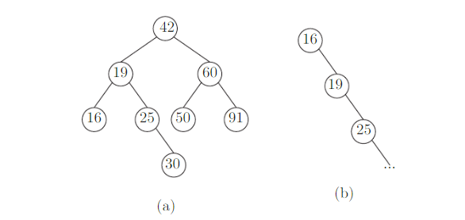

键不必是整数。通常，我们可以对key使用任何一种全序关系(total order)来把一组数据添加到BST中，我们用符号\leq表述全序关系，全序关系具有以下属性：

* 完备性： 对于任何 x 和 y 要么满足 x ≤ y 要么满足 y ≤ x 或者二者同时都满足
* 传递性： 如果 x ≤ y 而且 y ≤ z 那么 x ≤ z
* 非对称性 如果 x ≤ y 并且 y ≤ x 那么 x = y  

例如，键可以是整数，而且不仅可以是整数，可以有它们通常的含义。或者数据和键可以是字符串，其顺序是字典排序。或者，数据可以是（pairs）一对（A，B），键可以是对的第一项。字典排序就像是按定义的单词排序，而不考虑它们的含义。最后一个排序是一个例子，在这个例子中，人们可能期望在搜索树中有几个具有相同键的不同项。

从定义看起BST的一个重要特性是，通过BST可以按标签的升序访问其节点，这就产生了一种简单的排序算法，称为树排序“tree sort”。

```java
/** Permute the elements of A into non-decreasing order. Assumes
* the elements of A have an order on them. */
static void sort(SomeType[] A) {
	int i;
	BST T;
	T = null;
	for (i = 0; i < A.length; i += 1) {
		insert A[i] into search tree T.
	}

	i = 0;
	traverse T in inorder, where visiting a node, Q, means
	A[i] = Q.label(); i += 1;
}
```

*someType类型的数据，根据BST定义的要求，用来表示具有小于和等于运算性质的数据。*

## 6.1 BST的应用   Operations on a BST

由于BST是二叉树，我们可以使用5.2节中的表示来给图6.2这个类。现在我将使用int类型作为标签，并假定标签与键相同。

由于在这个特殊的BST中一个标签可能对应多个实例，因此我必须仔细指定删除该标签或查找包含该标签的节点的含义。我在这里选择了包含标签的“最高”节点--最接近根的节点。
为什么这总是独一无二的？也就是说，为什么不能有两个包含标签的最高节点，同样接近于根节点？

这个特定的BST定义的一个问题特征是，数据结构相对来说是不受保护的。
正如insert上的注释所表明的那样，当t.label（）为20时，可以通过向其中一个子元素中插入错误的内容来“破坏”bst（如bst.insert（t.left（），42）。
当我们把这种表示应用于6.2节的SortedSet中时，我们会避免此类错误引用。

```java
/** A binary search tree. */
class BST {

	protected int label;
	protected BST left, right;

	/** A leaf node with given LABEL */
	public BST(int label) {
	 this(label, null, null);
	  }
	  /** Fetch the label of this node. */
	  public int label();
	  /** Fetch the left (right) child of this. */
	  public BST left() ...public BST right() ...
	  /** The highest node in T that contains the
	  * label L, or null if there is none. */
	  public static BST find(BST T, int L) ...
	  /** True iff label L is in T. */
	  public static boolean isIn(BST T, int L){
	   return find (T, L) != null; 
	}
	/** Insert the label L into T, returning the modified tree.
	* The nodes of the original tree may be modified. If
	* T is a subtree of a larger BST, T’, then insertion into
	* T will render T’ invalid due to violation of the binary-
	* search-tree property if L > T’.label() and T is in
	* T’.left() or L < T’.label() and T is in T’.right(). 
	*/
	public static BST insert(BST T, int L) ...
	/** Delete the instance of label L from T that is closest to
	* to the root and return the modified tree. The nodes of
	* the original tree may be modified. */
	public static BST remove(BST T, int L) ...
	/* This constructor is private to force all BST creation
	* to be done by the insert method. */
	private BST(int label, BST left, BST right) {
		this.label = label; this.left = left; this.right = right;
	}
}
```
*6.2: A BST representation*


### 6.1.1 搜索 BST   Searching a BST

搜索BST与数组中进行二分搜索非常相似，树的根对应于数组的中间值。

```java
/** The highest node in T that contains the
* label L, or null if there is none. */
public static BST find(BST T, int L){
	if (T == null || L == T.label)return T;
	else if (L < T.label)
		return find(T.left, L);
	else return find(T.right, L);
}
```

### 6.1.2 插入 BST  Inserting into a BST

正如之前所说，使用一棵树的好处是向它添加数据时花销相对较小，如下面的例行程序。


```java
/** Insert the label L into T, returning the modified tree.
* The nodes of the original tree may be modified.... */
static BST insert(BST T, int L){
	if (T == null)
		return new BST (L, null, null);
	if (L < T.label)
		T.left = insert(T.left, L);
	else
		T.right = insert(T.right, L);
	return T;}
```

*因为我写这个的特殊方式，当我在树中插入同一个值的多个副本时，它们总是在所有现有副本的右边。我将在删除操作中保留此属性。*

### 6.1.3 删除 BST 中的数据单元  Deleting items from a BST

删除要复杂得多，因为当你删除一个内部节点时，你不能让它的子节点失效，而是必须在树的某个地方重新连接它们。
*显然，删除一个外部节点很容易；只需用空树替换它(见图6.3(a))。
*删除一个只有一个叶子节点的内部节点也很容易，只需要让子节点继承父节点并且向上移动即可。（图6.3(b)）
*当两个叶子节点都不为空时，我们要先序遍历他的右子树，使第一个节点也就是key最小的节点来替代要删除的节点
  此外，由于它是第一个按顺序排列的节点，其左子节点将为空。因此，我们可以用其正确的子节点替换该节点，并将
  其key移动到要删除的节点，如图6.3（c）所示


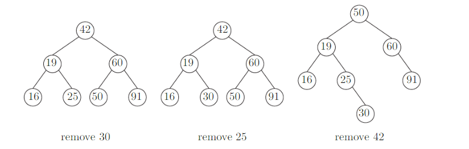

三个可能的删除，每个从图6.1中的树开始

下面为从BST中删除数据的一个例子，辅助函数swapsmallest()是一个附加的私有方法，定义如下：

```java
/** Delete the instance of label L from T that is closest to
* to the root and return the modified tree. The nodes of
* the original tree may be modified. */
public static BST remove(BST T, int L) {
	if (T == null)
		return null;
	if (L < T.label)
		T.left = remove(T.left, L);
	else if (L > T.label)
		T.right = remove(T.right, L);// Otherwise, we’ve found L
	else if (T.left == null)
		return T.right;
	else if (T.right == null)
		return T.left;
	else
		T.right = swapSmallest(T.right, T);
		return T;
	}

	/** Move the label from the first node in T (in an inorder
	* traversal) to node R (over-writing the current label of R),
	* remove the first node of T from T, and return the resulting tree.*/
	private static BST swapSmallest(BST T, BST R) {
		if (T.left == null) {
			R.label = T.label;
			return T.right;
		} 
		else {
			T.left = swapSmallest(T.left, R);
			return T;
		}
	}
```
*Removing items from a BST without parent pointers  从没有父指针的BST中删除项*

### 6.1.4 带有父指针的操作  Operations with parent pointers

如果我们修改BST类以提供父操作，并在表示中添加相应的父参数，那么操作将变得更复杂，但提供了更多的灵活性。
但不为bst提供setParent操作可能是明智的，因为使用此操作很容易破坏二进制搜索树属性。
而且因为存在插入和删除的操作，使用BST时或许根本不需要他。


因为查询操作忽略父节点所以不会受到影响，另一方面，由于在BST插入时必须设置任何一个插入节点的父节点，因此
情况变得复杂，下面展示了一种方法。当然，和之前一样，从带有父指针的BST中删除数据是最棘手的。

```java
static BST insert(BST T, int L) {
	BST newNode;
	if (T == null)
		return new BST (L, null, null);
	if (L < T.label)
		T.left = newNode = insert(T.left, L);
		elseT.right = newNode = insert(T.right, L);
		newNode.parent = T;
		return T;
	}
```
*Insertion into a BST that has parent pointers (带有父指针BST的插入操作)*


```java
/** Delete the instance of label L from T that is closest to
* to the root and return the modified tree. The nodes of
* the original tree may be modified. */
public static BST remove(BST T, int L) {
	if (T == null)
		return null;
		BST newChild;
		newChild = null;
		 result = T;
	if (L < T.label)
		T.left = newChild = remove(T.left, L);
	else if (L > T.label)
		T.right = newChild = remove(T.right, L);
	// Otherwise, we’ve found L
   else if (T.left == null)
   		return T.right;
   else if (T.right == null)
		return T.left;
   else
   	T.right = newChild = swapSmallest(T.right, T);
   if (newChild != null)
    	newChild.parent = T;
        return T;
    }
    private static BST swapSmallest(BST T, BST R) {
    	if (T.left == null) {
    		R.label = T.label;
    		return T.right;
    	} else {
    		T.left = swapSmallest(T.left, R);
    		if (T.left != null)
    			T.left.parent = T;
    		return T;
    	}
    }
```
*Removing items from a BST with parent pointers  带有父指针的删除操作*


### 6.1.5  简并性问题 Degeneracy strikes

不幸的是，事情不可能一帆风顺。
图6.1（b）中的树是按升序将节点插入到树中的结果（显然，同样的树可以从更大的树中进行适当的删除操作得到）
您可以看到在树上执行搜索或插入就像在链接列表上执行搜索或插入。它像一个链接列表，但在每个元素中都有多余的指针，这些指针始终为空
这棵树是不平衡的：它包含子树，在其中，左、右子树有不同的高度。在进行进一步学习后，我们将在第9章中回到这个问题


## 6.2 实现SortedSet接口   Implementing the SortedSet interface

标准Java库接口SoretSeT（参见第2.2.4）提供了一种支持范围查询的集合。也就是说，根据某种排序关系，程序可以使用接口查找集合中某个值范围内的所有项。搜索单个特定值只是一种特殊情况，其中范围只包含一个值。使用二进制搜索树作为表示来实现这个接口是相当容易的；我们将把结果称为BSTSet

让我们提前计划一下，在这些操作中，我们必须支持headSet()、 tailSet()和 subSet()，
它们返回与该集合的子范围相关的一些底层集合的视图。
返回的值本身就是完整的排序集，也应该修改底层集。由于一个完整的集合也可以被看作是一个范围的视图，在这个范围内，边界是“非常小”到“非常大”，我们可能会寻找一个支持两个集合的表示，这两个集合都是由一个构造器创建的，而那些是其他集合的视图。这表示我们集合的一个表示，其中包含指向BST根的指针，两个边界表示集合中最大和最小的成员，空值表示缺少的边界。

因为一个重要的原因，我们将BST的根作为一个（永久的）哨兵节点。
我们将对集合的所有视图使用相同的树。如果我们表示意味着指向包含数据的树的根，那么每当删除树的节点时，该指针就必须更改。
但是，我们还必须确保更新集合中所有其他视图中的根指针，因为它们也应该反映集合中的更改。
通过引入由所有视图共享且从未删除的哨兵节点，我们便解决了保持所有视图都是最新的问题。
这是旧计算机科学格言的一个典型例子：大多数技术问题都可以通过引入另一个间接层次来解决。
*Most technical problems can be solved by introducing another level of indirection*

假设我们使用父指针，一个迭代器通过一个集合可以包含一个指针，指向下一个要返回标签的节点，一个指向最后一个节点的指针，
它的标签被返回（用于IMP删除），并且一个指向BSTSET的指针被迭代（在Java中通过使迭代器成为一个内部类方便地提供）。
迭代器将按顺序进行，跳过树中超出集合边界的部分。另请参见练习5.2关于使用父指针迭代的内容

下例说明了一个BSTSet，它显示了表示的主要元素：原始集合、包含其数据的BST、同一集合的视图以及该视图上的迭代器。这些集合都包含用于比较器的空间（见§2.2.4），以允许集合的用户指定一个顺序；在下例中，我们使用自然顺序(natural ordering)，在字符串上，自然顺序给出了词典编纂顺序。图6.7包含表示的相应Java声明的草图。

```java
public class BSTSet<T> extends AbstractSet<T> {
	/** The empty set, using COMP as the ordering. */
	public BSTSet (Comparator<T> comp) {
		comparator = comp;
		low = high = null;
		sent = new BST ();
	}/** The empty set, using natural ordering. */
	public BSTSet () {
	 this (null); 
	}
	/** The set initialized to the contents of C, with natural order. */
	public BSTSet (Collection<? extends T> c) {
	 addAll (c); 
	}
	/** The set initialized to the contents of S, same ordering. */
	public BSTSet (SortedSet<? extends T> s) {
		this (s.comparator()); addAll (c);
	}···
	/** Value of comparator(); null if naturally ordered. */
	private Comparator<T> comp;
	/** Bounds on elements in this class, null if no bounds. */private T low, high;
	/** Sentinel of BST containing data. */
	private final BST<T> sent;
```

*Java representation for BSTSet class, showing only constructors and instance variables*

```java
/** Used internally to form views. */
private BSTSet (BSTSet<T> set, T low, T high) {
	comparator = set.comparator ();
	this.low = low;
	 this.high = high;
	 this.sent = set.sent;
	}/** An iterator over BSTSet. */
	private class BSTIter<T> implements Iterator<T> {
		/** Next node in iteration to yield. Equals the sentinel node* when done. */
		BST<T> next;
		/** Node last returned by next(), or null if none, or if remove()
		* has intervened. */
		BST<T> last;BSTIter () {
			last = null;
			next = first node that is in bounds, or sent if none;
		}···
	}
	/** A node in the BST */
	private static class BST<T> {
		T label;BST<T> left, right, parent;
		/** A sentinel node */
		BST () {
		 label = null; parent = null;
		  }
		  BST (T label, BST<T> left, BST<T> right) {
		  	this.label = label;
		  	 this.left = left;
		  	  this.right = right;
		  	}
		  }

	
```

*continued: Private nested classes used in implementation*

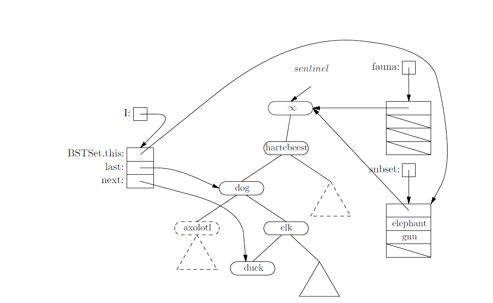

*表示的BST部分在动物群和子集之间共享。三角形表示整个子树，圆形矩形表示单个节点。每个集合包含一个指向列表根的指针（一个sentinel节点，其标签被认为大于树中的任何值）、值的上下限（空表示未绑定）和比较器（在本例中为空，表示自然顺序）。迭代器包含一个指向子集的指针（它正在迭代），一个指向按顺序包含next label的节点的指针（next）（“duck”），另一个指向按i.next（）最后传递的序列包含标签的节点的指针（last）。BST的虚线区域完全由迭代器进行sk ipped。迭代器不返回“hartebeest”节点，但迭代器必须通过它才能到达它返回的节点。*


## 6.3  正交范围查询  Orthogonal Range Queries

在理想情况下，BST将使用线性排序的数据分成两部分。
然而分而治之的思想并不停留在以上应用，假设我们正在处理具有更多结构的key。
例如划分二维空间中的一些点。在某些情况下，我们可能希望根据它们的位置查找此集合中的单元；它们的key是它们的位置。
虽然有可能对这些键施加线性排序，但它并不是非常有用。
例如，我们可以使用词典排序，并定义（x0，y0）>（x1，y1）if x0 > x1 或 x0 = x1 和 y0 > y1
然而，对于水平位置位于A和B之间的物体，其垂直位置是任意的。这就造成一般的数据是没有用的

四叉树是指一种更好地利用二维位置数据的搜索树结构。
搜索的每一步都将主数据分为四组，每组都包含一个矩形区域内部的点。（建议联想成以一个点为原点画一个二位坐标系）。
如果是**PR四叉树**(PR quadtree )，那么分为四组的分界点可以是一个矩形的中心（这样的话将会划分成四块相同大小的矩形）。
如果是**点四叉树**(point quatree)，那么分界点可以是存储在树中的一个点。

图6.9说明了这两种四叉树背后的思想。树的每个节点对应一个矩形划分区域。
任何一个区域都可以根据若干内部分界点划分为西北、东北、东南和西南的矩形分区，这些分区由与分界点对应的树节点的子节点表示。
对于pr四叉树，这些分界点是矩形的中心，而对于点四叉树，它们是从数据点中选择的，就像二进制搜索树中的分界值是从存储在树中的数据中选择的一样。


*同一组数据的两种四叉树的图解*
对于pr四叉树，树的每个级别都包含表示具有相同边大小的正方形的节点（如右图所示）。
对于点四叉树，每个点都是将矩形区域划分为四个区域（通常不相等）的子树的根。


## 6.4 优先级队列和堆 Priority queues and heaps

假设我们考虑着一个不同的问题。我们不能通过快速搜索集合中是否存在某个元素，而是限制自己只能搜索最大的元素（我们也可以搜索最小的元素。
在BST中找到最大值是相当容易的，但是我们需要处理树的不平衡问题。通过限制自己插入元素的操作，以及查找和删除最大元素。
我们可以避免产生平衡问题。仅支持这些操作的数据结构称为优先级队列，因为我们按值的顺序从中删除项目，而不管到达顺序如何。

在Java中，我们可以简单地创建一个实现SoReTeSET的类，并且当X恰好是集合中的第一个元素时，在操作删除（x）时特别快。
但是，在使用这样一个类时，你会惊讶地发现迭代整个集合的速度有多慢。
因此，我们可能会改造他，如下所示。


```java
interface PriorityQueue<T extends Comparable<T>> {
	/** Insert item L into this queue. */
	public void insert(T L);
	/** True iff this queue is empty. */
	public boolean isEmpty();
	/** The largest element in this queue. Assumes !isEmpty(). */
	public T first();
	/** Remove and return an instance of the largest element (there may
	* be more than one; removes only one). Assumes !isEmpty(). */
	public T removeFirst();
}
```

用于表示优先级队列的数据结构是堆（由于命名冲突，注意不要与新分配内存的大容量存储区混淆）。 
堆只是一个满足以下属性的位置树（通常是二叉树）。

* 堆属性：树中任何节点上的标签大于或等于该节点的任何后代的标签。


由于叶子节点的顺序无关紧要，所以在如何排列堆中的值方面有更多的操作空间，这使得保持堆的茂密变得容易。
因此，当我们在此上下文中使用术语“heap”时，我们将表示具有heap属性的完整树。
这加快了对堆的所有操作，因为插入和删除所需的时间与堆的高度成正比。图6.11显示了一个典型的堆

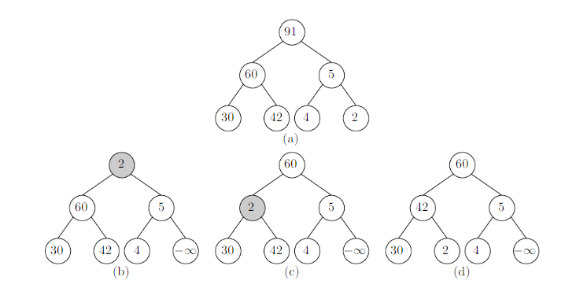

*序列（b）–（d）显示删除最大项的步骤。最后一个（最底部，最右侧）标签首先向上移动以覆盖根的标签。
它被“筛选”直到堆属性被存储。阴影节点显示在进程中违反堆属性的位置。*


实现确定最大值的操作显然很容易。要删除最大的元素，同时保留堆属性和树的茂密性，
我们首先将堆底部的“最后一个元素”项移到树的根（替换和删除最大的元素），然后依据堆的性质重新构建。
图6.11 b-d说明了该过程。
这通常是用一个数组表示的二叉树来完成的，如5.3节的binarytree2类。下面给出了一种实现方式


```java
class Heap<T extends Comparable<T>>extends BinaryTree2<T> implements PriorityQueue<T> {
	/** A heap containing up to N > 0 elements. */
	public Heap (int N) {
	 super(N); }
	 /** The minimum label value (written −∞). */
	 static final int MIN = Integer.MIN_VALUE;
	 /** Insert item L into this queue. */
	 public void insert(T L) {
	 	extend(L);reHeapifyUp(currentSize()-1);
	 }
	 /** True iff this queue is empty. */
	 public boolean isEmpty() {
	  return currentSize() == 0; 
	}
	/** The largest element in this queue. Assumes !isEmpty(). */
	public int first() {
	 return label(0); 
	}
	/** Remove and return an instance of the largest element (there may
	* be more than one; removes only one). Assumes !isEmpty(). 
	*/
	public T removeFirst() {
		int result = label(0);
		setLabel(0, label(currentSize()-1));
		size -= 1;
		reHeapifyDown(0);
		return result;
	}
```

*Implementation of a common kind of priority queue: the heap.*

当然，通过反复确定最大的元素，我们可以对一组对象进行排序:
```java
/** Sort the elements of A in ascending order. */
static void heapSort(Integer[] A) {
	if (A.length <= 1)return;
	Heap<Integer> H = new Heap<Integer>(A.length);
	H.setHeap(A, 0, A.length);
	for (int i = A.length-1; i >= 0; i -= 1)
		A[i] = H.removeFirst();
}
```

```java
/** Restore the heap property in this tree, assuming that only
* NODE may have a label larger than that of its parent. */
protected void reHeapifyUp(int node) {
	if (node <= 0)return;T x = label(node);
	while (node != 0 && label(parent(node)).compareTo (x) < 0) {
		setLabel(node, label(parent(node)));
		node = parent(node);
	}setLabel(node, x);
}
/** Restore the heap property in this tree, assuming that only
* NODE may have a label smaller than those of its children. */
protected void reHeapifyDown(int node) {
	T x = label(node);
	while (true) {
		if (left(node) >= currentSize())
			break;

		int largerChild =
		(right(node) >= currentSize()|| label(right(node)).compareTo (label(left(node))) <= 0)?
		 left(node) : right(node);
		 if (x >= label(largerChild))
		 	break;
		 setLabel(node, label(largerChild));
		 node = largerChild;
		}
		setLabel(node, x);
		}
```

```java
/** Set the labels in this Heap to A[off], A[off+1], ...
* A[off+len-1]. Assumes that LEN <= maxSize(). */
public void setHeap(T[] A, int off, int len) {
	for (int i = 0; i < len; i += 1)
		setLabel(i, A[off+i]);
	size = len;
	heapify();
}
/** Turn label(0)..label(size-1) into a proper heap. */
protected void heapify() { ... }
```
*continued*

过程图解：

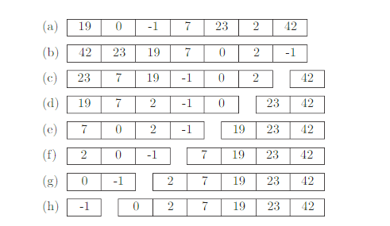

*堆排序示例。原始数组在（a）中；（b）是setheap的结果；（c）–（h）是连续迭代的结果。
每个都显示堆数组的活动部分和输出数组的已排序部分，由间隙分隔*

我们可以这样实现生成堆方法：
```java
protected void heapify(){
	for (int i = 1; i < size; i += 1)
		reHeapifyUp(i);
}
```

然而，有趣的是，这个实现并没有它所能达到的速度快，而且通过不同的方法执行操作更快，在这种方法中，我们从叶开始工作。也就是说，按照还原级别的顺序，我们将每个节点与其父节点交换，如果它更大，然后，至于重新组合，继续将父节点的值向下移动，直到恢复堆。这似乎与重复插入不同，但稍后我们将看到这一点。


```java
protected void heapify(){
	for (int i = size/2-1; i >= 0; i -= 1)
		reHeapifyUp(i);
}
```

### 6.4.1 生成堆时间

 如果我们研究**heapSort**排序n个项目所需的时间，我们会发现这是n个元素生成堆的成本加上提取n个项目所需的时间。
 从堆中提取n个项的最坏情况是，从堆的顶部节点开始，Ce（n）的开销主要由reHapifyDown的开销控制。
 如果我们对父标签和子标签进行计数比较，您会发现最坏情况下的成本与堆的当前高度成比例。
 假设堆的初始高度为**k**（$N = \sqrt[2]{k+1}-1$）。
 它一直保持这种状态，直到提取出$\sqrt[2]{k}$个元素（删除整个底行），然后变为K-1。
 接下来的$\sqrt[2]{k-1}$个元素保持 **K-1**，以此类推。
 因此，花费在提取项目上的总时间是：

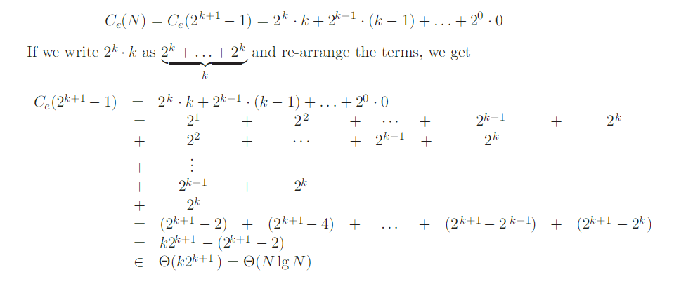

现在让我们考虑一下堆积n元素的成本。
如果我们通过逐个插入n个元素并执行reHapifyUp来完成此操作，
那么我们将获得与提取n个元素类似的成本：
*对于第一次插入，我们将进行0个标签比较；
*对于第二次插入的2个数据，我们将进行1次比较；
*对于第二次插入的4个数据，我们将进行2次比较；
*等等


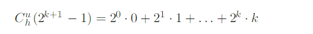

上面公式结果最坏的情况是，N个数据通过重复执行reHapifyDown来完成生成堆的操作。
这和刚刚给出的公式一样
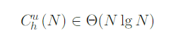

但假设我们在第6.4节结尾处执行第二个算法，
对数组中所有项（从n/2−1开始一直到0）进行重新计算，从而进行堆积。
reHapifyDown的开销取决于到最深处的距离。
对于堆中的最后$\sqrt[2]{k}$个数据，这个成本是0（这就是为什么要跳过它们）。对于前面的$\sqrt[2]{k-1}$，成本为1

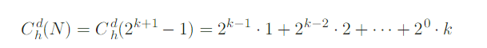

使用和之前一样的方法计算：

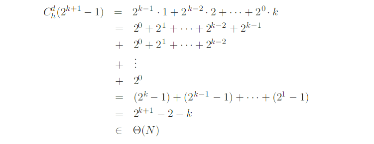


因此，第二种生成堆的方法比明显的重复插入方法运行得更快（渐进）。
当然，由于在最坏的情况下提取n个元素的成本仍然是Θ（N lg N），
堆排序的总体最坏的成本仍然是Θ（N lg N）。
但是，对于足够大的n，使用第二种形式的堆配置会有一些不变的因素优势。

##6.5 博弈树 Game Trees

如何在具有完备信息的双人博弈下做出最优决策。
简单地说，你可以通过列举所有可能的移动来做到这一点：
玩家可以从当前位置开始，然后给每个移动指定一个分数，然后选择得分最高的移动。
例如，你可以通过比较你的棋子数量和对手的棋子数量来计算得分。但这样的分数会误导人。
一个动作可能会给你更多的棋子，但是下一步你对手的回应可能会让你损失更多。
所以，对于每一个动作，你也应该考虑你对手的所有可以接受的动作，
假设他为他选择了最好的一个，并以此作为正反馈。
但是如果你有更好的应对方法呢？
我们如何合理地组织这次搜索

一种典型的方法是把博弈的所有可能性延展成一个空间，我们称之为博弈树。树中的每个节点都是博弈中的一个位置；
每个边都是一个决策。图6.14说明了我们的意思。每个节点都是一个位置；
节点的子节点是可能的下一个位置。每个节点上的数字是您猜测的收益（其中较大的值更适合您）。
问题是如何得到这些数字。

让我们递归地考虑这个问题。假设是你在某个位置上的移动，用P节点表示，你大概会选择给你最好分数的移动；
也就是说，你会选择得分最高的P节点的子节点。因此，合理地将该子节点的分数指定为P节点本身的分数。
反之，如果Q节点代表的是一个位置，在这个位置上，它会给你最好的分数。
在对手的回合中，对手可能会选择得分最低的Q的孩子（因为对你来说最小意味着对对手来说最好）。
因此，分配给q的适当值是最小子节点的值。
图6.14中的说明性博弈树上的数字符合这个分配分数的规则，这个规则被称为minimax算法。
图中的星型节点表示你和你的对手在得到这些分数后会认为最好的节点。


然而，对于大多数有趣的博弈，博弈树太大，无法存储或计算，除非在游戏的最后。
所以我们在某一点上切断了计算，即使结果叶位置不是最终位置。
通常，我们选择一个最大深度，并尝试计算基于位置本身的叶的值（称为静态评估）。
一个微小的变化是使用迭代深化：
在不断增加的深度重复搜索，直到达到某个时间限制，并采用迄今为止发现的最佳结果


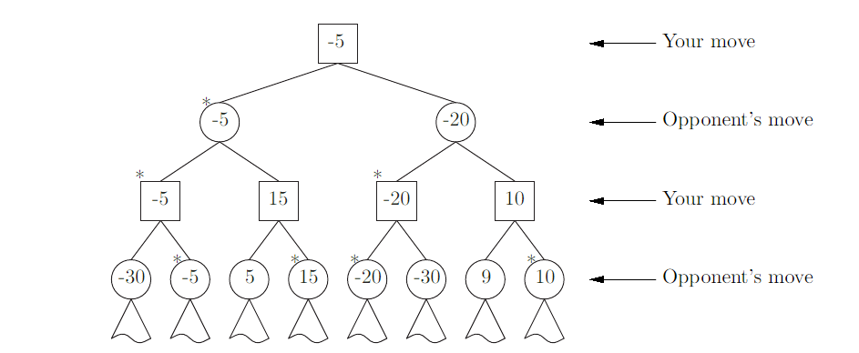
图6.14：来计算得分。
节点是位置(positions)，线是决策(moves)，数字是为您估计每个位置的“优势”的分数。
星星表示根据优势分析应该选择的子节点。


### 6.5.1  Alpha-beta修剪算法  Alpha-beta pruning


与任何树搜索一样，博弈树搜索在树的深度上是指数级的。
此外，博弈树可以有相当大的分支数量。
很容易看出，如果一个人每一步都有16个选择，那么他就不能向前看很多步。
我们可以通过在搜索时修剪游戏树来缓解这个问题。

一种叫做α-β剪枝的技术是基于一个简单的观察：
如果我已经计算了移动到某个位置，p，将得到至少α的分数，
并且我已经部分地评估了其他可能的位置，q，
我得知它的值将小于α，那么我可以停止任何关于q的进一步计算（修剪掉未经观测的分支）。
同样，当计算对手的值时，如果我确定某个位置的值不超过β（分数越大，对我越好，对对手越差），
那么我可以停止计算已知值大于β的对手的任何其他位置

例如，考虑图6.15。在≥5位置，我知道对手不会选择移动到这里（因为他已经有一个-5移动）。
在≤−20位置，我的对手知道我永远不会选择移动到这里（因为我已经有了−5的移动）。

alpha-beta修剪绝不是加速搜索博弈树的唯一方法。
更复杂的搜索策略可以去参考AI相关算法。

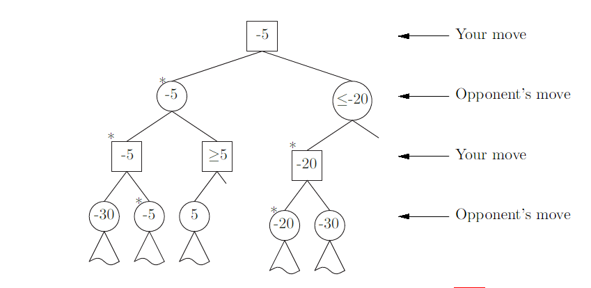

### 6.5.2 博弈树搜索算法   A game-tree search algorithm

下面的伪代码总结了本节中的讨论。如果你研究一下这节，你会发现我们在本节中讨论过的博弈树并没有真正实现。
相反，我们生成一个我们需要的节点的叶子，当不再需要的时候把他们丢弃。
实际上，根本没有树型数据结构；图6.14和6.15中所示的树是概念性的，或者如果您愿意，它们描述的是计算而不是数据结构。

```java 
/** A legal move for WHO that either has an estimated value >= CUTOFF
* or that has the best estimated value for player WHO, starting from
* position START, and looking up to DEPTH moves ahead. */
Move findBestMove (Player who, Position start, int depth, double cutoff){
	if (start is a won position for who) 
		return WON_GAME;
		 /* Value=∞ */
		 else if (start is a lost position for who) 
		 	return LOST_GAME;
		 	 /* Value=−∞ */
		 	 else if (depth == 0) 
		 	 	return guessBestMove (who, start, cutoff);
		 	 Move bestSoFar = Move.REALLY_BAD_MOVE;
		 	 for (each legal move, M, for who from position start) {
		 	 	Position next = start.makeMove (M);
		 	 	/* Negate here and below because best for opponent = worst for WHO */
		 	 	Move response = findBestMove (who.opponent (), next,depth-1, -bestSoFar.value ());
		 	 	if (-response.value () > bestSoFar.value ()) {
		 	 		Set M’s value to -response.value ();
		 	 		bestSoFar = M;if (M.value () >= cutoff) break;
		 	 	}
		 	 }return bestSoFar;
		 	}/** Static evaluation function. */
		 	Move guessBestMove (Player who, Position start, double cutoff){
		 		Move bestSoFar;bestSoFar = Move.REALLY_BAD_MOVE;
		 		for (each legal move, M, for who from position start) {
		 			Position next = start.makeMove (M);
		 			Set M’s value to heuristic guess of value to who of next;
		 			if (M.value () > bestSoFar.value ()) {bestSoFar = M;
		 				if (M.value () >= cutoff)break;
		 			}
		 		}return bestSoFar;
		 	}
```

*Game-tree search w ith alpha-beta p runing*


*原文附带相关练习题，如有需求点击查看*
[原文及练习题](https://apachecn.org/cs61b-textbook-zh/en/#pf77)


# 第七章 哈希

> 译者：[Abel-Huang](https://github.com/Abel-Huang)

有序数组和二叉搜索树能更快的解决集合中是否存在更大(或更小)的元素这样的问题；堆适用于查找集合中最大元素问题。然而有时候我们只对集合中是否存在某个特定元素感兴趣 —— 或者说，查找集合中是否存在与该元素相等的元素。

再次思考1.3.1节中的程序`isIn`-- 在一个有序数组中进行线性查找，查找某个元素是否存在于这个集合中。这个算法非常耗时，时间复杂度近似为N，这个N是存储在搜索数组中待搜索元素的数量。如果我们能够降低这个N，就可以加速这个算法。其中一种方式我们可以将被搜索的元素集合划分成M个不相交的子集，找到一种快速的方法定位到被查找元素所在的子集。通常情况下查找的元素不仅仅是一个整数，更常见的情况会是一个对象，查找一般会以对象的某个部分(一般为对象的某个属性)进行，这部分就是关键字(key)。通过将元素的集合或多或少的均匀划分为键的子集，我们可以有效的减少搜索所需的时间，平均值一般为N/M，在实际使用中，我们通常把这个子集称之为桶(bucket)，整个哈希表就是由一系列这样的桶组成。二分查找的递归实现(1.3.1节`isInB`程序)就是在M=2的场景。如果我们进一步考虑，对于任意规模下的N选择一个合适的M值，那么查找一个元素所花费的时间会近似于一个常数。

现在问题就在于找到一种尽可能快的方法定位键所在的桶。这种方法必须保证一致性，无论何时去调用这个方法必须得到最初选择的桶。也就是说，必须存在一种将所有将要被搜索的键集合映射到值为0到M-1的范围内桶的函数，这种函数称为哈希函数(hashing function)。

## 7.1 链地址法
一旦我们找到这样的哈希函数，我们必须还要用一种方式来表示一个桶的集合。或许最简单的表达形式就是使用链表，在哈希表相关的资料中这种方法被称为*链地址法(chaining)*。Java标准库中的`HashSet`的实现就是采用这种方法，参见图7.1的说明。更常见的情况是，哈希表以映射的方式出现，例如标准库中`java.util.Map`接口的实现。哈希表中桶不仅包含有这些关键字，并且应该通过索引这些关键字同样的表达方式支持更多的额外信息，通常称为值(value)，这也就是键值对的由来，。图7.2展示了JDK中类`java.util.HashMap`的部分实现，这个类是`Map`接口的一个具体实现。

图7.2中的`HashMap`类使用了JDK中`java.lang.Object`定义的`hashCode`方法来为任意一个关键字生成一个桶对应的序号，在Java中任何类都是`Object`的子类。如果这个哈希函数设计的非常好，那么桶的数量大致会和键的数量对应(在7.3节中查看更多讨论)。

我们可以预先定义一个每个集合中关键字平均数量的限制，当超过这个限制时进行表的扩容。这就是构造函数参数和类属性中`loaderFactor`的目的。我们很自然的想到是否可以使用"更快"的数据结构(比如二叉搜索树)来存储这个集合。然而，我们真的选择一个合理大小的树用于存储集合，那么只能容纳少量的元素，这将得不偿失。当集合数组的长度达到我们设定的限制时，我们可以使用4.1节中`ArrayList`类似的策略增长。为了达到很好的渐进时间性能，通常会在需要扩容时，扩展为原来的两倍。除此之外，我们还需要记住，大多数元素的数量都会发生改变，因此我们必须进行移动。

## 7.2 开放地址法  
*开放地址法(open-address)* 直接将元素存储在桶中。如果某个桶已经存放了元素，后续相同哈希值的元素需要放到系统规则定义好的未使用的桶中。图7.2中的`put`操作就像这样：
```java
    public Val put (Key key, Val value) {
        int h = hash (key);
        while (bins.get (h) != null && ! bins.get (h).key.equals (key))
            h = nextProbe (h);
        if (bins.get (h) == null) {
            bins.add (new entry);
            size += 1;
            if ((float) size/bins.size () > loadFactor)
                resize bins;
            return null;
        } else
            return bins.get (h).setValue (value);
    }
```
而且`get`操作也需要进行类似的修改。

如果出现了一个桶h已经被占用(这种情况称为碰撞)，使用`nextProbe`进行额外的寻址，这个方法提供了另外一个可用桶的索引值。
最简单的`nextProbe(L)`实现被称为线性探测，其直接返回`(h+1) % bins.size()`。通常情况下，我们使用线性探测的值加上一个正整数的常数值，这个常数值必须哈希和表长度`bins.size()`的互质\[为什么需要互质？\]。

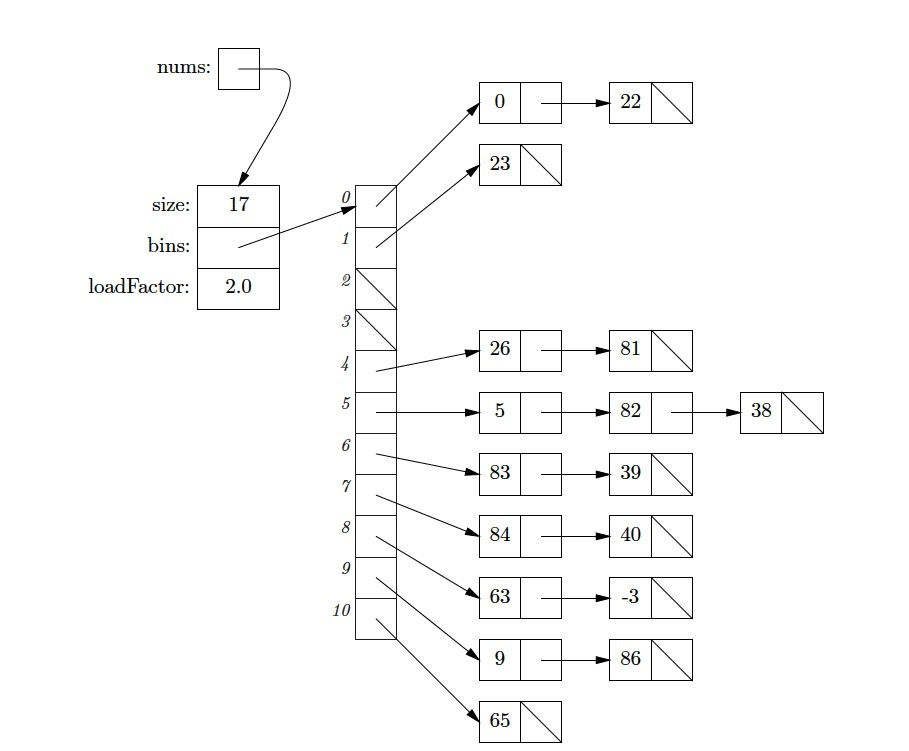  
图7.1: 一个简单的链地址法实现的哈希表，使用变量`nums`表示。这个哈希表包含11个桶，每个桶都存储了一个指向链表的指针(如果对应的元素存在)。这个哈希表表示一个特定的集合：  
**{81, 22, 38, 26, 86, 82, 0, 23, 39, 65, 83, 40, 9, -3, 84, 63, 5},**   

这个哈希函数是简单的针对整数键，`h(x) = x mod 11`。(`a mod b`的数学操作定义为$a-b\lfloor\a\b\rfloor$ 当`b != 0`。因此永远为非负数)。这个哈希当前的负载因子(load factor)为$17\11\appro1.5$，最大最多为2.0(`loadFactor`属性)，如你所见，桶的大小从0到3。

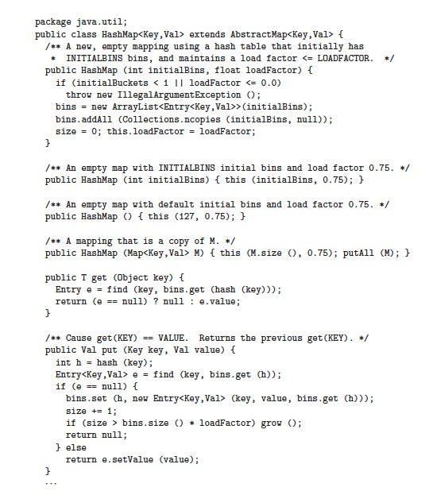    
图7.2: `java.util.HashMap`类的部分代码，实现了`java.util.Map interface`接口  
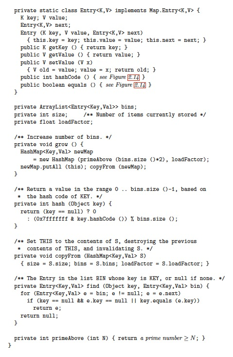   
图7.2续: `HashMap`类的私有方法  
如果我们取出图7.1中的17个关键字:  
    {81, 22, 38, 26, 86, 82, 0, 23, 39, 65, 83, 40, 9, -3, 84, 63, 5},   
使用线性探测法，其中增长量为1并且`x mod 23`作为哈希函数，将所有的关键字按序存放到容量为23的数组中，这个数组中包含的值如下：  
  
| 0| 1| 2| 3| 4| 5| 6| 7| 8| 9|10|11|12|13|14|15|16|17|18|19|20|21|22|
|-----|----|----|----|----|----|----|----|----|----|----|-----|----|----|----|----|----|----|----|----|----|----|----|
| 0|23|63|26|  |5 |  |  |  | 9|  |  |81|82|83|38|39|86|40|65|-3|84|22|

正如你所见，有几个键并没有放在其本来的位置。例如，**84 mod 23 == 15**和**63 mod 23 == 17**。

线性探测存在一个聚类现象，参考链地址法很容易发现这个问题。如果在搜索某个键时的条目序列是$b_0$，$b_1$，...，$bn_$，如果任何其他键应该散列到其中一个$b_i$，那么在搜索它时检查的条目序列将是同一序列的一部分，$b_i$，$b_{i+1}$，...，$b_n$，甚至这两个键的哈希值不相同。
  实际上，链接地址法下的两个不同列表将被合并，在线性探测下，这些键的有效平均大小将会加倍。我们整数集的最长链（见图7.1）长度只有3。在上面的开放地址示例中，最长链是有9个元素(见63），即使只有一个与其他键(40)的散列值相同。
  
让`nextProbe`以不同的量递增值，增量取决于原始keys，我们通过这种被称为双重散列的技术，可以有效改善这种效果。
  
从开放地址哈希表删除一个元素并不简单。简单地将条目标记为“未占用”可以打破碰撞条目链，并从表中删除多条所需要的元素\[为什么?\]。如果需要进行删除操作，我们不得不谨慎处理。有兴趣的读者可以参考高德纳的**计算机程序设计的艺术**第三卷了解更多相关信息。

一般来说，开放地址法的问题在于链地址法下位于不同桶中的键可以相互竞争。在使用链地址法时，如果所有的桶都已经被占用，我们要确认搜索的关键字并不在表中，最多只需要找与被搜索值具有相同哈希值的元素数量的次数。使用开放地址法，可能需要搜索N次才能确定被搜索的值是否在表中。根据我的经验，链地址法所需要的额外空间成本相对并不重要，对于大多数场景下，我更建议使用链地址法而不是开放地址法。

## 7.3 哈希函数
此前遗留了一个问题：如何选择哈希函数用于存放键。为了使我们实现的映射或集合能够正常工作，首先我们的散列函数满足下面两个很重要的约束：
1. 在执行程序期间，对于任何键值K，`hash(K)`的值必须保持不变，而K在表中(或者如果hash(K)改变则必须重建哈希表)。
2. 如果两个键相等(根据`equals`方法，或者任何哈希表使用的相等测试)，则他们两个的哈希值必须相等。

如果违反了上述任何一条规则，关键字key就会从哈希表中有效移除。另一方面，一次程序执行到下一次程序执行，哈希值是否保持固定不变并不重要，重要的是不同的键拥有不同的哈希值(如果太多的键具有相同的哈希值，性能将明显受到影响)。

如果键是简单的非负整数，一个简单有效的哈希函数就是使用键X模上哈希表的大小：  
`hash(X) == X % bins.size ();`  
对于负整数而言，我们必须做出一些规定。例如：  
`hash(X) = (X & 0x7fffffff) % bins.size ();`  
先将任何一个负数加上2^32可以达到和正整数一样的效果\[为什么？\]。或者如果表长度为奇数，那么  
`hash(X) = X % ((bins.size ()+1) / 2) + bins.size ()/2;`  
也是可以的\[为什么？\]。

处理非数值类型的键值可能需要多做一些工作。我们可以使用所有Java对象都定义过的`hashCode`方法将**Objects**转为整数(这样我们就可以继续按照上面的方法进行处理)。**Objects**默认的`x.equals(y)`是`x==y`,即x和y是同一个对象的引用。相应地，Object提供的`x.hashCode()`的默认实现只返回一个整数值，该值是从x指向的对象的地址派生的，即对象的指针值x被视为一个整数（这就是幕后的真实情况）。这种默认的实现方式不适用于考虑两个不同对象是否相同的情况。比如，两个字符串的计算：  
`String s1 = "Hello, world!", s2 = "Hello," + " " + "world!";`  
即使具有`s1.equals(s2)`的属性，但`s1！= s2`（它们是碰巧包含相同字符串序列的两个不同的String对象）。因此，默认的`hashCode`操作不适合String，因此String类自己进行重新实现并且覆盖默认定义的`hashCode`方法。

为了获得键的索引，我们使用了取余操作。这显然会产生一个数字范围；这对我们选择哈希表的大小而言并不明显(不接近2的幂的素数)。可以说，选择其他的值往往会产生不理想的结果。例如，如果使用2的幂意味将会忽略`X.hashCode()`的高位。

如果键不是简单的整数(比如字符串)，一个可行的方法是将他们转为整数并且使用上面的取余算法。下面是一个代表性的来自P. J. Weinberger的C编译器中的字符串散列函数，在实践中取得了广泛的应用。他设定了8位数的字符和32位的整型。

```java
    static int hash(String S) {
        int h;
        h = 0;
        for (int p = 0; p < S.length (); p += 1) {
            h = (h << 4) + S.charAt(p);
            h = (h ^ ((h & 0xf0000000) >> 24)) & 0x0fffffff;
        }
        return h;
    }
```
Java字符串类型有不同的`hashCode`函数实现，使用模运算来计算得到一个$-2^31$到$2^31-1$范围内的结果。 
 
$$\sum_{i=0}^n\c_i\31^{n - i - 1}$$  

这里，$c_i$表示clsString中的第i个字符。
## 7.4 性能
假设密钥均匀分布，无论在哈希表中是否包含待查找的元素，都可以常数时间内完成检索。正如我们在4.1节中关于ArrayList`规模增长的分析，哈希表插入也具有常数的摊分时间复杂度(即所有插入的平均复杂度)。当然，如果键分布不均匀，我们可以看成$\Theta(N)$的时间复杂度。

如果一个哈希函数有时可能会出现错误的聚类问题，我们可以使用一种被称为通用散列的技术帮助解决。可以从一些精心挑选的集合中随机挑选一个哈希函数，在平均情况下，在程序的运行过程中哈希函数将会有良好的表现。

## 练习

**7.1** 通过7.1节中， 给出的`HashMap`表示的`iterator`方法的具体实现，并且`Iterator`类也是必要的。我们已经选择简单的链表实现，你必须谨慎使用正确的`remove`操作。


# 第八章 排序和选择

> 译者：[Rachel-Hu](https://github.com/Rachel-Hu)

至少曾经有一段时间，大部分的CPU运转时间和I/O带宽是花在排序上的（然而在现在这个时代，我怀疑它们多是被用在了MPEG文件渲染上）。正因如此，排序也就成为了大量研究和写作的主题。我们只会对排序做浅显的介绍。

## 8.1 基本概念

任何排序的目的都是排列一些被我们称之为记录的项目集，使他们依据某些序列关系排列整齐。通常来说，排序关系仅查看每个记录的一部分，即键（key）。可以根据多个键值对记录进行排序，在这种情况下，我们以主键（primary key）和辅键（secondary key）作为区分。这种区分事实上是由排序函数实现的：若记录A和B的主键相等时，当且仅当A的辅键位于B的辅键之前时，A排在B的前面。否则，当A的主键位于B的主键之前时，将A排在B前。如若存在更多的键，该定义显而易见可以以此方式扩展。为方便起见，在本书中我将假设记录均属于Record类型，且我们将要排序的这些记录具有某种顺序关系。同时，无论我们采用的是哪种顺序，我都将以before(A,B)表示A的键位于B的键之前。

尽管从概念上而言，我们移动记录从而使它们按序排列，然而这些记录在实际应用中可能会非常大。因此，我们通常会倾向于交换指向这些记录的指针。如果有必要的话，我们会在最后重新将真正的数据排序。在Java中，此举显而易见非常容易，因为“庞大”的数据项总是
经由指针访问的。

**稳定性（Stability）。** 当记录的主键相等时，如果一种排序算法能够维持其原有次序，那么该算法被称作是稳定的。在实际操作中，任何排序算法都可以变成稳定的，只要将待排序的记录原本的位置添加为最终的辅键，使得诸如(Bob, Mary, Bob,
Robert)的键表变为(Bob.1, Mary.2, Bob.3, Robert.4)的形式。

**逆序（Inversions）。** 在有些分析中，我们需要了解给定的键序列的无序性。其中一种有效的方法是计算该序列的逆序数：在键序列$k_0,...,k_{N-1}$中，逆序数是满足$i < j$且$k_i > k_j$的整数对$(i,j)$的数量。譬如，

> Charlie, Alpha, Bravo

这个单词序列中有两个的逆序，而在

> Charlie, Bravo, Alpha

中则有三个。如果键已经按序排列了，其逆序数为零。如果键以相反的属性排列，使得每一对键都处于错误的顺序，逆序数为$N(N-1)/2$，即两两为一对的键对的数量。当所有的键的初始位置和它们在顺序序列中的正确位置的距离都在$D$以内时，我们可以保守估计其原始序列中的逆序数上限为$DN$。

**外部与内部排序** 全过程均在主存中完成的排序算法被称为内部排序。需要借助辅助存储器（在过去主要是磁带）存储中间值的排序被称为外部排序。输入和输出的来源与此分类无关。内部排序可以在源自外部文件的数据上完成；决定性因素在于中间的文件。

## 8.2 一点注释

本书中的多数算法的处理对象（或者其处理对象可以被认为）是数组。在描述和解释过程中，我们有时需要对数组的内容作一些假定。为此，我将会使用David Gries的符号来详细解说我的数组。该符号表示了一个数组的一部分，该部分的元素具有从$a$到$b$的下标，并且满足属性$P$。它还假设$a &le; b + 1$；如果$a &gt; b$，那么该部分为空。也可以使用下例描述数组片段，其中包含下标为$c + 1$到$d - 1$的项，满足属性P，且$c < d$。把这些段拼接到一起，就可以描述整个数组。比如，以上符号为真，如果数组A有$N$个元素，其中下标为$0$到$i - 1$的项为有序的，且$0 &le; i &le; N$。如下符号表示了一个只有一项的数组片段，其下标为j且各项（此项）满足$P$。最后，我偶尔会需要数组的嵌套片段同时满足条件。比如，下例表示了一个数组片段，其第$0$到$N - 1$项满足$P$，$0$到$i - 1$项满足$Q$，$0 &le; N$，且$0 &le; i &le; N$。

## 8.3 插入排序

有一种非常简单， 且对于较小的应用而言已经足够的排序，那就是直接插入排序。在排序的过程中，我们将一个未处理项插入目前已排好顺序的项的列表中，如图8.2所示，而这也是它名称的由来。算法则如图8.1所示。

一种常见的测量排序时间的方式是计算键值比较的次数（在图8.1中，则为调用before的次数。函数insertionSort所需要的总时间（也即所需要的最长时间）为$\sum_{0 < i < N} C_{IL}(i)$，其中$C_{IL}(m)$为i = m时内层循环（j）所需的时间，$N$为数组A的大小。查看内层循环我们可以得知，所需要的比较数与序列为0到i - 1的记录中键值比x大的记录的数量相等。如果至少有一个较小的键，那么该数值需要加上1。因为A\[0..i\]已被排好序，这段区间内不存在逆序，所以在A已排好序的部分中位于x之后的元素正好等于序列A\[0\],...,A\[i\]中的逆序数（因为x就是A\[i\]）。当x被正确地插入后，得到的序列中将不会有任何逆序。基于上述条件易得，以键值比较数测量的insertionSort的运行时间，其上限为$I + N - 1$，其中$I$为insertionSort的原参数的逆序数。因此，待排序的数组越有序，insertionSort运行得越快。

## 8.4 希尔排序

插入排序所存在的问题可以通过查看最坏的情况（即数组最初为逆序）得知。键与它们最终应处的位置相去甚远，且必须被一项一项地移动到最终位置。如果键能够被迅速地移动到很远的位置，那么排序速度就可能得到提升。

```java
/** Permute the elements of A to be in ascending order. */
static void insertionSort(Record[] A) {
    int N = A.length;
    for (int i = 1; i < N; i += 1) {
        Record x = A[i];
        int j;
        for (j = i; j > 0 && before(x, A[j-1]); j -= 1) {
            A[j] = A[j-1];
        }
        A[j] = x;
    }
}
```

图8.1：对数组进行插入排序的程序。假设before函数可以体现所需的顺序关系。

图8.2：插入排序示例，展示了每次调用insertiontElement前的数组。每行的间隙用于将已排序的部分和未排序的部分分开。

```java
/** Permute the elements of KEYS, which must be distinct,
* into ascending order. */
static void distributionSort1(int[] keys) {
    int N = keys.length;
    int L = min(keys), U = max(keys);
    java.util.BitSet b = new java.util.BitSet();
    for (int i = 0; i < N; i += 1)
        b.set(keys[i] - L);
    for (int i = L, k = 0; i <= U; i += 1)
        if (b.get(i-L)) {
            keys[k] = i; k += 1;
        }
}
```

图8.3 排列足够小且密集的集合中的不同键。在这里我们假设函数min和max返回数组中的最小和最大值。如果数组为空，返回值则是任意值。

这就是希尔排序的原理。我们选择逐渐减小的步长，$s_0 > s_1 > ... > s_{m_1}$，通常设定$s_{m-1} = 1$。随后，对于每一个$j$，我们将这$N$项纪录分为$s_j$个交错序列
$$R_0, R_{s_j}, R_{2s_j},...$$
$$R_1, R_{s_j + 1}, R_{2s_j + 1},...,$$
$$...$$
$$R_{s_j - 1}, R_{2s_j - 1},...$$
然后应用插入排序将以上部分分别排序。图8.4展示了对一个逆序的向量进行希尔排序的过程（总共需要49次比较，而直接插入排序则需要120次）。

一个性能良好的$s_j$序列需要$s_j = \lfloor2_{m-j} - 1\rfloor$，其中$m = \lfloor lg N\rfloor$。这个序列可以证实所需的比较数为$O(N^{1.5})$，比$O(N^2)$要好得多。直观来说，这种每个$s_j$都是相对质数序列，其优势在于每轮操作中该向量的每个坐标都和另一些坐标的集合共同参与了排序。序列变得更加错杂，也更可能减少下一轮的逆序数。

图8.4 希尔排序示例，其初始态为一个逆序向量，步长分别为15，7，3和1。标记为#I的一列给出了数组中剩余的逆序数，标记为#C的一列则给出了由上一行的数组得到下一行所需的键比较数。数组下方的弧线标明了每个阶段所处理的元素。

## 8.5 计数排序（Distribution counting）

当键的范围受限的时候，排序存在着许多可能的优化方式。在Jon Bentley的Programming Pearls一书的第一列中，作者提供了一种简单的算法，用于排列N个不同的键，且每个键都处于有限的整数范围内，使得编程者能够构建一个以这些整数为下标的位向量。在图8.3的程序中，我使用了Java中的BitSet类型。BitSet是一个非负整数的抽象集合，由元素为一位（1-bit）的打包数组实现。

让我们来思考一种更通用的手段，使得我们能够处理多个记录拥有相同键的情况。假设将要排序的记录的键在某个足够小的整数范围内。如此，图8.6中的函数distributionSort2就能稳定地排列N个记录，将他们从输入数组（A）移动到另一个输出数组（B）。对于A中的每一个记录，它都能正确地计算该记录在B中的正确位置。要达到这个目的，该算法应用了以下事实：B中任何记录的位置都应该是比它具有更小的键，或者具有相同的键但是排在它前方的记录的数量。图8.5囊括了一个正在运行的程序示例。

## 8.6 选择排序

在插入排序中，我们需要逐步确定每项的最终位置。另一种方式是通过选择每一步中最小（或最大）的键，将每个记录一步到位地放置在其最终位置上。这一思路最简单的实现方式是直接选择排序，如下所示。

```java
static void selectionSort(Record[] A)
{
    int N = A.length;
    for (int i = 0; i < N-1; i += 1) {
        int m, j;
        for (j = i+1, m = i; j < N; j += 1)
            if (before(A[j], A[m]) m = j;
        /* Now A[m] is the smallest element in A[i..N-1] */
        swap(A, i, m);
    }
}
```

在这里我们假设swap(A,i,m)将交换A的第i和第m项。这种排序因为存在记录的交换，导致它并不稳定。从另一方面而言，我们能对此程序

图8.5 程序distributionSort2的示意图。标记为A的数组展示了将要排序的数值。每项的键为斜线左边的数字。这些数据被排好序，存储在图中多处展示的数组B中。左边的标记对应的是图8.6程序中的点。每个点，$B_k$，表示$i = k$时最后一个循环末尾的情况。数组count的作用在不断变化。最开始（在count<sub>1</sub>处）count\[k-1\]包含了键为(k-1)-1的各项。随后（在count<sub>2</sub>处），它包含了键值小于k-1的各项。在第$B_i$行中，count\[k-1\]表示了下一个键值为k的项在B中的位置。（在这些地方则为k-1而非k，因为1是最小的键。）

```java
/** Assuming that A and B are not the same array and are of
* the same size, sort the elements of A stably into B.
*/
void distributionSort2(Record[] A, Record[] B)
{
    int N = A.length;
    int L = min(A), U = max(A);
    /* count[i-L] will contain the number of items <i */
    // NOTE: count[U-L+1] is not terribly useful, but is
    // included to avoid having to test for for i == U in
    // the first i loop below.
    int[] count = new int[U-L+2];
    // Clear count: Not really needed in Java, but a good habit
    // to get into for other languages (e.g., C, C++).
    for (int j = L; j <= U+1; j += 1)
        count[j-L] = 0;
    for (int i = 0; i < N; i += 1)
        count[key(A[i]) - L + 1] += 1;
    /* Now count[i-L] == # of records whose key is equal to i-1 */
    // See Figure 8.5, point count1.
    for (int j = L+1; j <= U; j += 1)
    count[j-L] += count[j-L-1];
    /* Now count[k-L] == # of records whose key is less than k,
    * for all k, L <= k <= U. */
    // See Figure 8.5, point count2.
    for (i = 0; i < N; i += 1) {
        /* Now count[k-L] == # of records whose key is less than k,
         * or whose key is k and have already been moved to B. */
        B[count[key(A[i])-L]] = A[i];
        count[key(A[i])-L] += 1;
        // See Figure 8.5, points B0–B6.
    }
}
```

图8.6 计数排序。此程序假设key(R)为整数。

进行改进，使它将结果输出到另外一个数组中，那么维持稳定性就变得相对简单了。

显而易见，以上算法对数据并不敏感。和插入排序不同的是，它总是需要相同的比较数：$N(N - 1)/2$。因此，在这种基础的形式中，即便该方法非常简单，但在与插入排序相比仍不具备优势（至少在顺序机器上是如此）。

但从另一角度而言，我们也曾见过另一种选择排序：堆排序（出处为6.4章）是选择排序的一种形式，它在实际应用中记录了之前的比较结果，并因此能够极大地加快选择最小项这一步。

## 8.7 交换排序：快速排序

C. A. R. Hoare开创了最流行的内部排序方法之一。他显然采用了这种技术，并将其命名为快速排序。这个名字是非常妥当的。该方法的基本算法如下。

```java
static final int K = ...;
void quickSort(Record A[])
{
    quickSort(A,0,A.length-1);
    insertionSort(A);
}
/* Permute A[L..U] so that all records are < K away from their */
/* correct positions in sorted order. Assumes K > 0. */
void quickSort(Record[] A, int L, int U)
{
    if (U-L+1 > K) {
        Choose Record T = A[p], where L ≤ p ≤ U;
P: Set i and permute A[L..U] to establish the partitioning
condition:
        quickSort(A, L, i-1); quickSort(A, i+1, U);
    }
}
```

在这里，K是一个常数，可以通过调整它的值调节排序的速度。一旦近似排序获得所有距它们最终位置k-1以内的记录，最终的插入排序将在$O(KN)$的时间内进行。如果我们能够选择合适的T，使它的键接近A中记录的键的中间值，那么我们就能粗略地计算出，对N个记录执行quicksort时所需的键比较的时间近似为$C(N)$，其定义如下。
$$C(K) = 0$$
$$C(N) = N - 1 + 2C(\lfloor N/2\rfloor)$$

这需要假设我们能够通过$N-1$次比较对N个元素的数组进行划分，并且这一假设具有可能性的。考虑$N = 2_mK$的情况，我们可以粗略了解这一问题的解答方案：
$$C(N) = 2^mK + 2C(2^{m-1}K)$$
$$ = 2^mK - 1 + 2^mK - 2 + 4C(2^{m-2}K)$$
$$ = m2^mK - 2^m + 1$$
$$ = \underbrace{2^mK + ... + 2^mK}_\text{m} - 1 - 2 - 4 - ... - 2^{m-1} + C(K)$$
$$\in \Theta(m2^mK) = \Theta(NlgN)$$
(因为 $lg(2^mK) = mlgK$)。

不幸的是，在最坏的情况，即枢轴T具有最大或者最小的键值，快速排序本质上就成了直接选择排序，其运行时间则成为了$\Theta(N^2)$。因此，在选择区分元素时我们必须小心。有一种方法是随机选择一个记录作为T。这样我们就能确定避免最坏的情况。T常见的选择是A\[L\]，A\[(L+U)/2\]和A\[U\]的中位数，这种选择几乎不会失败。

**划分。** 本节的剩余部分则是如何在每个阶段（即上面程序里的步骤P）划分数组。有很多方法可以实现这一目的。这里给出Nico Lomuto的一种方法，它并非是最快的，但非常简单。

```java
P:
swap(A, L, p);
T = A[p]
i = L;
for (int j = L+1; j <= U; j += 1) {
    if (before(A[j],T)) {
        i += 1;
        swap(A, j, i);
    }
}
swap(A, L, i);
```

有些作者在开发非递归版本的快速排序时遇到了麻烦。显然他们认为非递归方法可以极大地提高其性能。许多人都持有这种递归具有较高成本的观点，因此我觉得我不应该对此感到惊讶。然而，使用C版本的快速测试表明，迭代版本提高了3%的性能。这几乎不值得付出重写的代价。

## 8.8 归并排序

快速排序是一种分而治之的算法。我们可以尝试称之为分而治之，是因为它并不能保证成功地将数据划分均匀。一项更早的技术，即归并排序，是另一种分而治之的算法，且能保证均匀划分数据。
它的概述如下。

```java
/** Sort items A[L..U]. */
static void mergeSort(Record[] A, int L, int U)
{
    if (L >= U)
        return;
    mergeSort(A, L, (L+U)/2);
    mergeSort(A, (L+U)/2+1, U);
    merge(A, L, (L+U)/2, A, (L+U)/2+1, U, A, L);
}
```

merge程序有如下格式：

```java
/** Assuming V0[L0..U0] and V1[L1..U1] are each sorted in */
/* ascending order by keys, set V2[L2..U2] to the sorted contents */
/* of V0[L0..U0], V1[L1..U1]. (U2 = L2+U0+U1-L0-L1+1). */
void merge(Record[] V0, int L0, int U0, Record[] V1, int L1, int U1,
            Record[] V2, int L2)
```

因为V0和V1已经按升序排列了，以上任务很容易在$\Theta(N)$时间内完成，其中$N = U2 - L2 + 1$，即为两个数组的总大小。合并按从左到右的顺序在数组上完成。这一特点使得它非常适合内存较小又需要大量排序操作的电脑。数组可以位于仅限于序列访问的序列辅助存储器上，即是说，需要按索引升序（或者降序）的顺序读取或者写入数组的设备。

当然了，真正的工作是由归并过程完成的。这些归并的模式相当有趣。为了描述更简单起见，考虑N为2的幂的情况。如果跟踪mergeSort的执行过程，你将会在调用merge时看到如下调用模式。

在尝试对链表的元素进行归并排序时，我们可以充分利用这种这种模式，因为链表的对半划分并不如数组那么容易。假设所有记录彼此链接为链表Lists。下面的程序展示了如何在这些链表上执行归并排序。图8.7说明了这一过程。该程序维护了已排序的子链表的二项式梳（binomial comb），comb\[0..M-1\]，使得comb\[i\]中的链表长度为$2^i$或为空。

```java
/** Permute the Records in List A so as to be sorted by key. */
static void mergeSort(List<Record> A)
{
    int M = a number such that 2
    M−1 ≥ length of A;
    List<Record>[] comb = new List<Record>[M];
    for (int i = 0; i < M; i += 1)
        comb[i] = new LinkedList<Record> ();
    for (Record R : A)
        addToComb(comb, R);
    A.clear ();
    for (List<Record> L : comb)
        mergeInto(A, L);
}
```

在每个阶段，梳包含了将要归并的已排序的链表。首先我们为每个新项构建对应的梳，然后通过最终遍历将该梳的所有链表合并。我们以如下方式将新元素加入梳。

```java
/** Assuming that each C[i] is a sorted list whose length is either 0
 * or 2^i elements, adds P to the items in C so as to
 * maintain this same condition. */
static void addToComb(List<Record> C[], Record p)
{
    if (C[0].size () == 0) {
        C[0].add (p);
        return;
    } else if (before(C[0].get (0), p))
        C[0].add (p);
    else
        C[0].add (p, 0);
    // Now C[0] contains 2 items
    int i;
    for (i = 1; C[i].size () != 0; i += 1)
        mergeLists(C[i], C[i-1]);
    C[i] = C[i-1]; C[i-1] = new LinkedList ();
}
```

我将mergeList程序留给你们完成。

```java
/** Merge L1 into L0, producing a sorted list containing all the
 * elements originally in L0 and L1. Assumes that L0 and L1 are
 * each sorted initially (according to the before ordering).
 * The result ends up in L0; L1 becomes empty. */
static void mergeLists (List<Record> L0, List<Record> L1) ...
```

### 8.8.1 复杂度

快速排序的预估最短时间适用于归并排序的最长时间，因为归并排序的每一步确实将数据均分为两半（而且将两个链表或者数组归并需要的时间为线性的）。因此，归并排序是复杂度为$\Theta(NlgN)$的算法，其中$N$为记录的数量。与快速排序和插入排序不同的是，归并排序，正如我描述的那样，对数据的顺序并不敏感。当我们考虑外部排序时，这一点会有所变化，但$O(NlgN)$次比较依然是它的上限。

## 8.9 基于比较的排序的速度

我展示了一系列的算法，声明它们中性能最好的在最坏的情况下需要$\Theta(NlgN)$次比较。关于此上限，有几个明显的问题值得一问。

图8.7 链表的归并排序，展示了L的许多元素经过处理后，梳的状态。最后一步则是在原链表中的11个元素全部加入梳后，将梳里剩余的链表归并。小方框中的0和1是用以说明正在进行的归并模式的标记。每个空的方框都以0标记，否则以1标记。如果你将4个方框中的数字作为一个二进制数来理解，且将最上方的一位作为单位，该数等于已处理的元素数。

首先，比较是如何转化为指令的？其次，我们能做得比$NlgN$更好吗？

第一个问题的重点在于，比较是一个常数时间操作这一点，并不是那么准确。比如说，当我们比较字符串时，字符串的长度对于最坏情况的比较时间具有重要影响。当然，平均而言，我们并不能深入到字符串这样的细节来评判性能差异。不过，这意味着要正确地将比较转换为指令，我们必须抛开另一个因素，键的长度。假设我们的拥有N个记录的集合里每个键都是相异的。这意味着这些键本身就必须长达$\Omega(lgN)$。假设键的长度位于此范围内，且比较时间与键的大小成比例（在最坏的情况下），这意味着排序事实上需要$\Theta(N(lgN)^2)$的时间（假设移动其中一个记录所需的时间在最坏的情况下与键长成比例）。

至于我们能否做得比$NlgN$更好，答案是，如果我们能够得到的关于键的唯一信息是它们是如何进行比较的，那么我们并不能得到比$NlgN$更好的性能。也就是说，$NlgN$次比较是所有使用比较的可行排序算法在最坏情况下的下限。

这一论断的证明非常具有启发性。一个排序算法可以被认为是首先执行一系列的比较，然后，仅仅依赖于比较获得的信息，再决定如何置换其输入。当然这两个操作常常是同时进行的，不过我们可以在这里忽略这一点。为了让程序有足够的“了解”，使得它得以以不同的方式置换不同的输入，这些输入必须能够获得不同的比较结果序列。因此，我们可以将这种理想化的排序过程展示为树状，其中叶节点为置换，内部节点为比较，内部节点的每个左子节点包含了当比较结果为真时所进行的比较和置换，每个右子节点包含了当比较结果为假时所进行的比较和置换。图8.8说明了$N = 3$的情况。树的高度与比较数相关。因为可能的置换数（也就是叶节点）为$N!$，且具有M个叶节点的二叉树的最小高度为$\lceil lgM\rceil$，具有N个记录的比较树的最小高度大约为$lg(N!)$。
现在：
$$lgN! = lgN + lg(N-1) + ... + 1$$
$$\le lgN + lgN + ... + lgN$$
$$ = NlgN $$
$$\in O(NlgN)$$
而且（假设N为偶数）
$$lgN! \ge lgN + lg(N-1) + ... + lg(N/2)$$
$$\ge (N/2 + 1)lg(N/2)$$
$$\in \Omega(NlgN)$$

图8.8 $N = 3$的比较树。待排序的三个数值是A，B和C。每个内部节点都代表一次测试。左子节点表明了测试成功（为真）的情况，右子节点表明了不成功的情况。叶节点（方框）表明了三个数值在该路径下比较结果决定的顺序。我们假设A，B和C不同。该树是最佳的，证明了在最坏的情况下将这三个数值排序需要三次比较。

那么
$$lgN!\in \Theta(NlgN)$$
因此任何仅仅使用（真/假）键比较来获取其输入的键的顺序信息的排序算法，在最坏的情况下都需要$\Theta(NlgN)$次比较来排列N个键。

## 8.10 基数排序

为了得到8.9中的结果，我们假设唯一可用的键检查是比较它们从而获得顺序。假设我们并不受限于简单地比较键。我们能够改善我们的$O(NlgN)$界限吗？有趣的是，我们某种程度上是可以的。可以通过基数排序实现这一目的。

大部分键事实上是长度确定的片段序列（主要是字符或者字节）且具有词典排序关系。即是说，键$k_0k_1...k_{n-1}$比$k_0'k_1'...k_{n-1}'$小，如果$k_0 < k_0'$或者$k_0 = k_0'$且$k_1...k_{n-1}$比$k_1'...k_{n-1}'$小（我们可以始终认为键具有同等长度，只要为短一些的键选择合适的填充字符即可）。就像在搜索中一样，我们在键集中使用连续的字符，将字符串分配给子树，我们也可以使用键的连续字符来对它们进行排序。有两种基本算法，一种从最低位依次处理到最高位（LSD-first），另一种从最高位处理到最低位（MSD-first）。在此我使用“位”这个通用术语，它不仅包括十进制位，也包括字母，以及其他任何适用于待排序的数据的概念。

### 8.10.1 LSD第一基数排序

LSD第一基数排序的概念是，先使用最低位排列所有的记录，然后使用第二位，等等。在每个阶段，我们都执行一次稳定排序，使得两个具有相同k位字符的记录能够接着被剩下的字符位排序。因为字符可取的值范围有限，很容易在线性时间内将它们排好序（使用，比如说，distributionSort2，或者，假如记录被存储在链表中，通过保存一个链表标题数组，并分配给每个可能的字符值）。图8.9说明了这一过程。

LSD第一基数排序正是卡片排序器使用的算法。这些机器有一系列的箱子，可以通过插板编程将卡片从进纸器，根据特定列的打孔信息，放入对应的箱子。对每列重复上述过程，可以得到一个有序的卡片组。

记录入箱的不同分布都需要（大致的）常数时间（假设我们使用指针以避免移动大量的数据）。因此，总时间与键数据的总量，也就是所有键中的总字节数，成比例。换言之，基数排序复杂度为$O(B)$，其中B为键数据的总字节数。如果键长为K字节，那么$B = NK$，其中N是记录的数量。因为归并排序，堆排序等等都需要$O(NlgN)$次比较，每次在最坏情况下需要时间K，我们能够得到这些排序的总时间为$O(NKlgN) = O(BlgN)$。即便我们假设比较时间为常数，如果键不过长（为了得到N个不同的键我们必须使$K \ge log_CN$，其中C是可能的字符数），那么基数排序也是$O(NlgN)$。

因此，如果放宽我们能够对键进行的操作限制，那么我们至少能在理论上得到更快的排序过程。像往常一样，魔鬼隐藏在细节中。如果键比$log_CN$要长得多，（而它们通常是这样），那么对最后的字符的操作通常会被极大地浪费掉。一种可能的改进方法是对前两个字符使用基数排序，剩下的部分则使用插入排序来完成（理论上来说，在基数排序之后该序列就几乎已经按序排列了）。Knuth将该方法归功于M. D. Maclaren。为了这个目的，我们必须捏造字符的定义，允许字符的长度随着N略微增长。比如说，当$N = 100000$时，Maclaren的最优过程为对键的第一和第二个10位片段进行排序（在8位的机器上，就是前2.25个字符）。当然，这一技术在理论上并不能保证$O(B)$的性能。

### 8.10.2 MSD第一基数排序

从最高位起执行基数排序对我们来说似乎更为自然。我们对输入依据最高位的字符进行排序，得到C个（或者更少的）子序列，每个子序列属于一个起始字符（即是说，在任何子序列中的所有键的第一个字符都是相同的。）

图8.9 LSD第一基数排序示例。每次操作按一位字符排序，从最低位开始。排序过程包含将记录分配到索引为字符的箱中，然后箱中的所有字符被连接在一起。图中仅展示了不为空的箱。

图8.10 MSD第一基数排序示例，数据与图8.9中一致。第一行展示了A的起始内容，最后一行展示了最终内容。具有一致起始字符的部分排序片段由单斜线分开。*字符说明数组片段即将被排序，posn列则表示即将排序的字符的位置。

随后，我们按第二个字符对每个有至少一个键的子序列进行排序，得到另一组由前两个字符都相等的键组成的子序列。这一过程持续进行，直到所有的子序列长度都为1。在每个阶段，我们将子序列排序，使得一个所有字符串都在另一个子序列之前的子序列排在前面。当这一过程结束时，我们只需按合适的顺序接触所有的子序列。

棘手的部分是追踪所有子序列，使得它们能够在最后以合适的顺序输出，且我们能够迅速找到下一个长度大于1的子序列。以下是排列一个数组的方法示意图，在图8.10中有详细说明。

```java
static final int ALPHA = size of alphabet of digits;
/** Sort A[L..U] stably, ignoring the first k characters in each key. */
static void MSDradixSort(Record[] A, int L, int U, int k) {
    int[] countLess = new int[ALPHA+1];
    Sort A[L..U] stably by the kth character of each key, and for each
        digit, c, set countLess[c] to the number of records in A
        whose kth character comes before c in alphabetical order.
    for (int i = 0; i <= ALPHA; i += 1)
        if (countLess[i+1] - countLess[i] > 1)
            MSDradixSort(A, L + countLess[i],
                            L + countLess[i+1] - 1, k+1);
}
```

## 8.11 使用库

尽管我们在本章中历经艰辛学习了许多排序算法，然而，在多数程序中你甚至不用考虑自己写排序子程序！优秀的库为你提供了它们。Java标准库里存在java.util.Collections这一类型，其中只包含与Collections有关的实用程序的静态定义。对于排序，我们有

```java
/** Sort L stably into ascending order, as defined by C. L must
* be modifiable, but need not be expandable. */
public static <T> void sort (List<T> L, Comparator<? super T> c) { · · · }
/** Sort L into ascending order, as defined by the natural ordering
* of the elements. L must be modifiable, but need not be expandable. */
public static <T extends Comparable<T>> void sort (List<T> L) { · · · }
```

这两种方法实用了一种归并排序，可以保证在最坏情况下的$O(NlgN)$复杂度。基于这些定义，你并不需要编写自己的排序例程，除非需要排序的序列大得出奇（特别是当它需要外部排序的时候）。如果需要排序的是基本类型（如int），或者在你的应用里有必要挤出每一个多余的微秒（这很少见）。

## 8.12 选择

考虑寻找数组中间值的问题。中间值，一个在数组中比它小的元素和比它大的元素一样多的数值。找到该值的一种暴力解就是将数组排序，然后选择中间的元素（或者中间的元素之一，如果该数组有偶数个元素的话）。然而，我们可以做得更好。

该问题的通用版本就是选择：给定一个（通常是未排序的）元素序列和一个数字k，找到排好序的元素序列中的第k个元素。找中间值，最大值和最小值则是该问题的特殊情况。或许最简单有效的方法是如下所示的，对Hoare快速排序算法的简单改编。

```java
/** Assuming 0<=k<N, return a record of A whose key is kth smallest
* (k=0 gives the smallest, k=1, the next smallest, etc.). A may
* be permuted by the algorithm. */
Record select(Record[] A, int L, int U, int k) {
    Record T = some member of A[L..U];
    Permute A[L..U] and find p to establish the partitioning
        condition:
    if (p-L == k)
        return T;
    if (p-L < k)
        return select(A, p+1, U, k - p + L - 1);
    else
        return select(A, L, p-1, k);
}
```

其中的重点是当数组被快速排序划分时，数值T是第（p-L)小的元素，第（p-L)小的键被存储在A\[L..p-1\]中，且最大的键被存储在A\[p+1..U\]中。因此，如果$k \lt p - L$，第（p-L)小的键在A的左半边中，如果$k \gt p$，它一定是右半边中第（k-p+L-1）大的元素。

乐观地说，假设每个划分将数组分为两半，这里的循环控制代价（以比较数计量）为
$$C(1) = 0$$
$$C(N) = N + C(\lceil N/2\rceil)$$
其中$N = U - L + 1$。N来自于划分，而$C(\lceil N/2\rceil)$来自递归调用。它与快速排序和归并排序的循环的不同之处在于$C(...)$的系数为1而不是2。对于$N = 2_m$我们有
$$C(N) = 2^m + C(2^{m-1})$$
$$ = 2^m + 2^{m-1} + C(2^{m-2})$$
$$ = 2^{m+1} - 1 = N - 1$$
$$\in \Theta(N)$$
该算法，和快速排序一样，从概率上而言非常好。也存在可以保证线性界限的选择算法，不过我们将把该内容留给算法课。

## 练习

**8.1** 给定两个键集（即是说，任意键集内部都不包含重复的键），$S_0$和$S_1$，均表示为数组。假设你能够以“大于等于”的方式比较键，你会如何计算$S_0$和$S_1$的交集？需要多长时间？

**8.2** 给定一个较大的单词列表，你如何快速找到所有的字谜？（这里的字谜是列表中的一个单词，它可以通过重排它的各字母组成新的单词，比如dearth和thread）。

**8.3** 假设我们有一个含有N个记录的数组D。在不改动数组的情况下，我需要计算一个N个元素的数组，P，包含整数0到N-1的某种序列，使得序列D\[P\[0\]\], D\[P\[1\]\], ... ,D\[P\[N-1\]\]得以被稳定排序。给出一个通用的方法，可以适用于任何排序算法（不管该算法是否稳定），且不需要任何额外的存储空间（除了排序算法通常需要的空间）。

**8.4** 一个非常简单的拼写检查只需在移除掉单词的标点后在词典中查找。比较实用Java库中不同类型实现这一功能的方法：分别使用ArrayList，TreeSet和HashSet将单词按顺序存储。除了学习实用Java库以外并不需要太多的编程。

**8.5** 给定一系列数字，$\[x_i, x_i'\]$，每个数都满足$0 \le x_i \lt x_i' \le 1$。我想知道0和1之间所有没有被这些数涵盖的范围。即是说，如果输入为$\[0.25, 0.5\]$，输出则为$\[0.0, 0.25\]$和$\[0.5, 1.0\]$（不用在意终点）。请说明如何快速地实现这一点。


# 第九章 平衡搜索

> 译者：[Abel-Huang](https://github.com/Abel-Huang)

我们之前已经看到二叉搜索树有一个弱点：左右子树趋向于不平衡，因此无法将它们所表示的数据集划分成两个同样大小的部分。我们考虑一下我们可以对此做些什么改进。

当然，我们总是可以通过简单地将所有节点按顺序进行排序，然后重新插入它们以生成一个新的平衡二叉树。然而这种操作需要花费树节点数线性规模的复杂度，并且可以看出在 插入N个元素很难避免退化为$\Theta(N^2)$的复杂度。相比之下，如果数据碰巧以保持树遍历的顺序，则进行N次插入仅需要$\Theta(N\lgN)$的时间。因此，让我们首先看看重新平衡树(或保持平衡)的操作，而不将其拆开并重新构建。

## 9.1 平衡构造：B-树
保持搜索树平衡的另一种方法是始终小心"在一个正确的位置插入新的树节点"，以便树通过构造器保持平衡。数据库社区长期以来一直使用完全符合这个要求的数据结构：*B-tree*。我们将在这里抽象地描述这种数据结构和相关操作，而不是直接给出代码，因为这种数据结构用于实践中大量用于提高速度的存储设备。  
*m阶B-树*是具有以下属性的多叉树：  
   1. 每个节点孩子数最多为m个。
   2. 除根之外的所有节点至少有m/2个子节点(我们也可以说除根节点外的每个节点至少包含⌈m/2⌉个子节点)。
   3. 一个节点的孩子$C_0$, $C_1$, ..., $C_(n-1)$用键$K_1$, ..., $K_(n-1)$标记(认为$K_i$在$C_(i-1)$和$C_i$之间)，其中$k_1$<$k_2$<...<$k_(n-1)$；
   4. B-树是一种搜索树：对于任何一个节点，以$C_i$为根的子树中所有键都严格地小于$K_(i+1)$，并且(对于i > 0)严格地大于$K_i$。
   5. 所有空孩子都出现在树的同一层。

图9.1包含一个4阶排序树的示例。在实际实现中，B-树一般用在在二级存储（如磁盘等）上，根据实际需要读入它们的节点。我们选择m阶树(多叉数)的目的是尽可能快地从二级存储器传输数据。对于磁盘操作而言更关注的是单次磁盘访问所需要时间越小越好，
因此m的值范围越大，从不同节点中读取的时间差异越小。在这种情况下，**m**取的值过小很明显不是一个很好的主意。__

我们将用一个被称为**BTreeNode**的结构来表示B-树的节点，并且有如下的定义：  
**B.child(i)**：B-树节点**B**的第*i*个孩子，**0 <= i < m**。  
**B.key(i)**：B-树节点**B**的第*i*个关键字Key，**1 <= i < m**。  
**B.parent()**：B-树节点**B**的父节点。  
**B.index()**：B-树节点**B**的索引*i*，**B == B.parent().child(i)**。  
**B.arity()**：B-树节点**B**的孩子数。

然后，整个B-树由指向根的指针组成，可能还包含一些额外的有用信息，例如B-树当前的大小。

基于属性2和属性5，一个拥有N个关键字的B-树一定有$\Theta(\log_(m/2)N)$层节点。基于属性1，搜索单个节点的关键字需要O(1)时间(保证m为固定值)。因此通过下面的递归算法搜索B-树是一个$\Theta(\lgN)$级别的操作。

```java
    boolean search (BTreeNode B, Key X) {
        if (B is the empty tree)
            return false;
        else {
            Find largest c such that B.key(i) ≤ X, for all 1 ≤ i ≤ c.
            if (c > 0 && X.equals (B.key (c)))
                return true;
            else
                return search (B.child (c), K);
        }
```
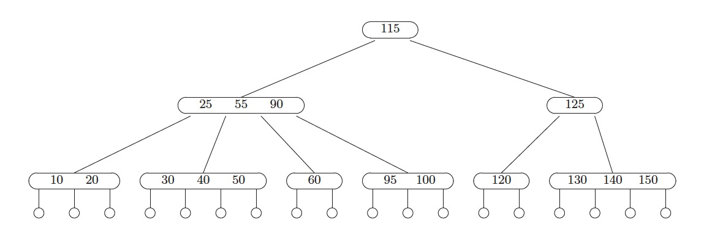    

图9.1:  键为整型的4阶B-树示例。圆圈代表空节点，它们出现在树的同一层级。每个节点拥有2到4个子节点，每个节点用于1到3个关键字。每个键都大于其左侧子节点中的所有键，并且小于右侧子节点中的所有键。

### 9.1.1 插入
最初，我们插入B树的底部，就像二叉搜索树一样。但是我们通过节点填充和分离来避免树的深度扩展，防止出现"scrawny"
的情形，即每层树节点过少。这个想法很简单：我们在树的底部找到一个合适的位置来插入给定的键，并执行插入 操作(还添加一个额外的空孩子)。如果这使得节点太大(因为它有**m**个键和**m+1**(空)子节点)，我们会对节点进行分裂，具体的代码在图9.2中。图9.3说明了该过程。

### 9.1.2 删除
从B-树中删除通常比插入操作更复杂，但也不是太糟糕。和之前一样，在真实的产品实现中，为了提升速度会引入更多复杂的内容。为了简单起见，我将描述一种简单，理想化的方法。从插入的工作方式中获得启发，我们首先将待删除的键移动到树的底部(删除很简单)。然后，如果删除后使得原始节点太小，我们将其与兄弟节点合并，拉下用于将两者与父节点分开的关键字。图9.4中的伪代码描述了该过程，如图9.5所示。

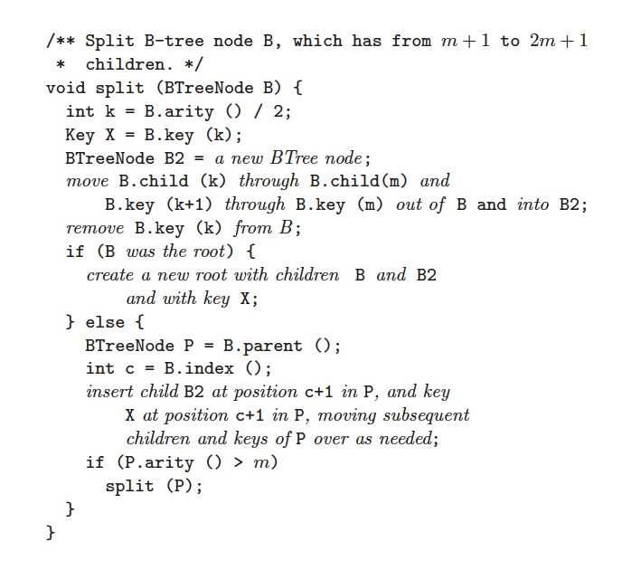  

图9.2：B-树节点分裂。图9.3是过程示意图。

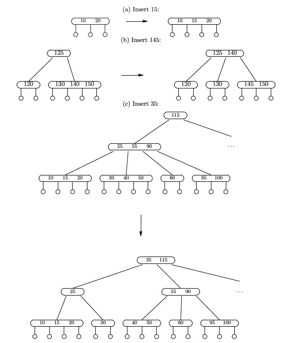 

图9.3：B-树插入操作。在图9.1所示的B-树上进行插入操作，分别插入15，145和35三个关键字。

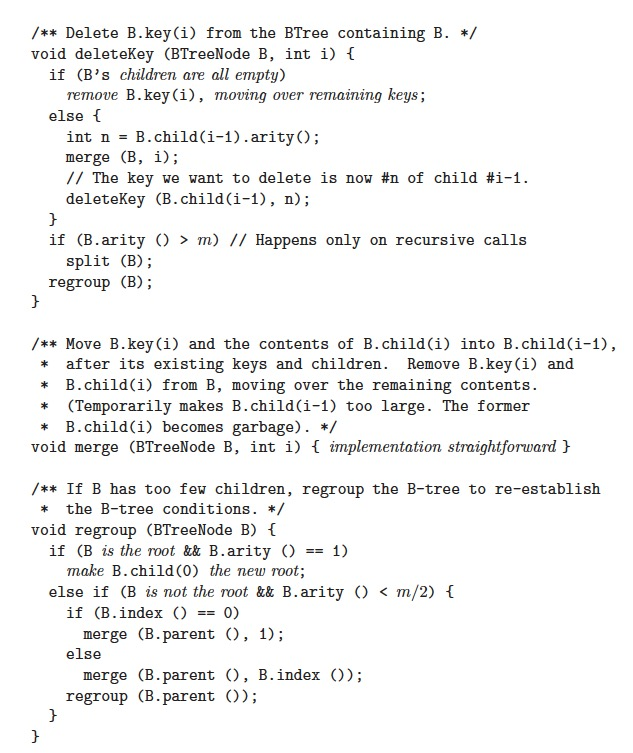 

图9.4：B-树删除操作。图9.5是过程示意图。

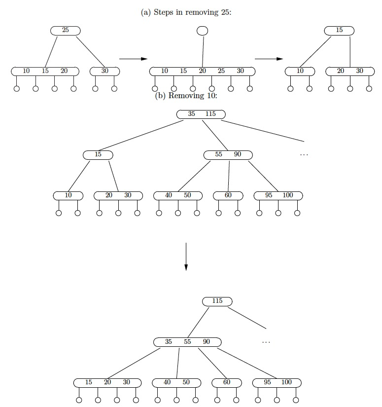 

图9.5：B-树删除操作。这个示例基于图9.3中的(c)部分。在(a)中，我们删除了关键字25。首先，移动25到底部并与其子节点合并。然后，删除关键字25，如果合并后的节点过大，我们需要进行分裂，并将关键字15提升为父节点。接下来，(b)在(a)删除的基础上，删除关键字10。从底部节点删除10会使该节点变小小，因此我们合并它，从父节点向下移动关键字15。这样会导致父节点变小，因此我们继续进行合并，将关键字35从根节点往下移动，得到最终的树。

### 9.1.3 红黑树：二分查找的(2, 4)树
一般B-树使用的节点实际上是关键字的有序数组。有序4阶B-树(也称为(2,4)树)，这种我们一般也称为红黑树。每一个(2,4)树会被映射成一个特定的二叉树，使得每个(2,4)树节点对应于1-3个二叉搜索树节点组成的小集群。因此，二叉搜索树大致平衡，从根节点到叶子节点的所有路径的长度最多相差2倍。图9.6显示了每个可能的(2,4)节点的表示。在一棵完整树中，我们可以仅在每个群集的根节点中设置布尔值来确定群集的边界。但是，习惯上我们将此布尔值为true的节点（以及空叶节点）描述为“黑色”，将其他节点描述为“红色”。

通过考虑图9.6和（2,4）树的结构，你可以推导出红黑树是二叉搜索树，它还遵循以下约束(在红黑树的标准处理中作为它们的定义)：

A. 根节点和所有（null）叶子节点都是黑色的。

B. 红色节点的子节点都是黑色节点；

C. 从根节点到叶子节点的任何路径都遍历相同数量的黑色节点。

同样，属性B和C表明红黑树是“bushy”的，即红黑树是平衡的。

当然，红黑树的搜索过程与普通的二叉树搜索相同。由于图中所示的(2,4)树和红黑树之间的映射，插入操作和删除操作的算法可以从用于4阶B-树的算法中推导出。红黑树的常用操作的实现通常不直接使用此对应关系，对于基本的操作视作普通的二叉搜索树操作，然后通过旋转重新平衡(参见§9.3)，根据当前节点及其相邻节点的颜色的重新着色。我们不会在这里详述。

## 9.2 字典树
一般来说，在一个包含N个关键字的平衡的二叉搜索树中查找某个特定的关键字所需时间为$\Theta(\lgN)$。当然这并不是完全正确的，因为可能忽略了关键字之间进行比较所花费的时间。例如，比较两个字符串所需要的时间取决于较短的那个串的长度。因此，我再此之前说到的"$\Theta(\lgN)$"都是指$\Theta(L\lgN)$，其中L是指关键字所包含的字节数。
在大多数应用中，这并不重要，因为L相对于N，L的增长速度而言几乎可以忽略。尽管如此，我们想到一个有趣的问题：
显然，在这里我们不能轻易忽略L这个因素的影响(具体取决于你正在查找的这个关键字)，但是我们是否可以摆脱$\lgN$的影响吗？


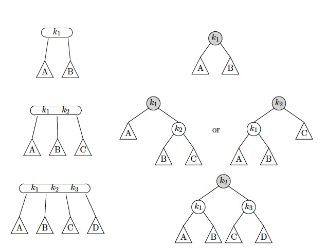     
图9.6：带有"红黑"节点的二叉树(2,4)节点的表示。左边是单个(2,4)节点的三种情形(1到3个关键字，或者2到4个子节点)。在右边是其对应的二叉查找树。在每一种情形下，顶部的二叉节点被涂成黑色，其他的节点均为红色。


### 9.2.1 字典树: 基本属性和算法
这个结果说明我们可以通过字典树*trie*这种数据结构来避免$\lgN$的影响。一个纯粹的字典树是一种树，由一些固定大小的字符组成的字符串表示，A = {$a_0$，$a_1$，...，$a_(M-1)$}。其中一个字符是只出现在单词末尾的特殊分隔符，'□'。例如，A可能是一组可打印的ASCII字符，'□'表示一个不能打印的字符，例如'\000'(NUL)。一棵字典树T，可以被下面的方式抽象的递归定义。      
   1. 空；  
   2. 一个叶子节点包含一个字符串；  
   3. 一个内部结点包含M个孩子也是字典树。通向这些孩子的边界用字母表中的字符标记，$a_i$，像这样：$C_(a_0)$，$C_(a_1)$，... $C_(a_(m-1))$。    
 
 我们可以认为字典树是叶子节点由字符串组成的树。除此外我们还附加了另外一个条件：  
    * 如从字典树的根开始，并且接下来的边标记为$s_0$，$s_1$，...，$s_(h-1)$，我们访问到的每一个字符串为$s_0$$s_1$$s_(h-1)$。
    
因此，可以将字典树的每个内部节点看作是它下面叶中所有字符串的前缀：具体地说，k级的内部节点代表其下每个字符串的前k个字符。

如果字典树T中从T的根节点开始，并且接下来的0个或者更多的边使用$s_0$，$s_1$，...，$s_(h-1)$标记，一个字符串S=$s_0$$s_1$$s_(m-1)，我们得到了这个字符串S。我们将假设T中的所有字符串都以'□'结尾，它只作为字符串的最后一个字符出现。  
    
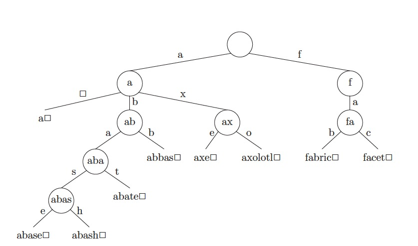   
图9.7：包含一些列字符串的字典树{a, abase, abash, abate，abbas， axe，axolotl，fabric，facet}。内部节点被标记为显示它们对应的字符串前缀。

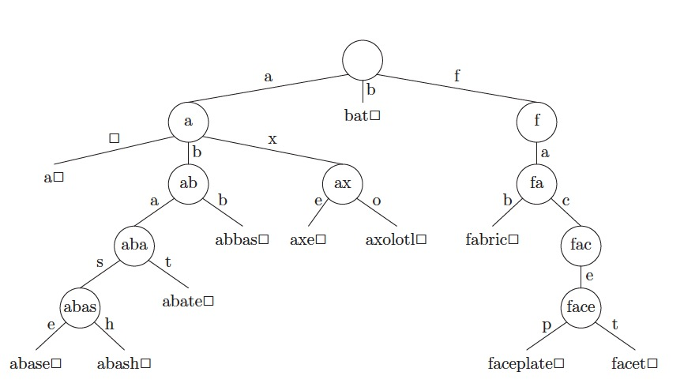   
 图9.8：图9.7中字符串"bat"和"faceplate"插入后的结果。
 
 图9.7表示了一个一组小规模字符串的字典树。为了查看字符串是否在集合中，我们从字典树的根开始，沿着用我们要查找的字符串中的连续字符标记的边(连接接到子节点),包括末尾的虚拟字符'□'。如果我们沿着这条路径成功地找到了一个字符串，它等于我们要搜索的字符串，那么我们要搜索的字符串就在字典树中，否则我们要找的这个字符串就不在其中。对于每个单词，我们只需要内部节点，因为存储的多个单词以遍历到该点的字符开头。以特殊字符结束一切事物的惯例允许我们区分三个词包含两个词的情况，一个词是另一个词的前缀（如“a”和“abate”），而三个词只包含一个长词。
 
 从字典树用户的角度来看，它看起来像一种带有字符串标签的树：
 
```java
public abstract class Trie {
    /** The empty Trie. */
    public static final Trie EMPTY = new EmptyTrie();
    
    /** The label at this node. Defined only on leaves. */
    abstract public String label();
    
    /** True if X is in this Trie. */
    public boolean isIn(String x) ...
    
    /** The result of inserting X into this Trie, if it is not
     * already there, and returning this. This trie is
     * unchanged if X is in it already. */
    public Trie insert(String x) ...
    
    /** The result of removing X from this Trie, if it is present.
     * The trie is unchanged if X is not present. */
    public Trie remove(String x) ...
    
    /** True if this Trie is a leaf (containing a single String). */
    abstract public boolean isLeaf();
    
    /** True if this Trie is empty */
    abstract public boolean isEmpty();
    
    /** The child numbered with character K. Requires that this node
     * not be empty. Child 0 corresponds to ✷. */
    abstract public Trie child(int k);
    
    /** Set the child numbered with character K to C. Requires that
     * this node not be empty. (Intended only for internal use. */
    abstract protected void setChild(int k, Trie C);
}
```

接下来的算法描述了字典树的搜索过程：

```java
    /** True if X is in this Trie. */
    public boolean isIn(String x) {
        Trie P = longestPrefix(x, 0);
        return P.isLeaf() && x.equals(P.label());
    }
    
    /** The node representing the longest prefix of X.substring(K) that
     * matches a String in this trie. */
    private Trie longestPrefix(String x, int k) {
        if (isEmpty() || isLeaf())
            return this;
        int c = nth(x, k);
        if (child(c).isEmpty())
            return this;
        else
            return child(c).longestPrefix(x, k+1);
    }
    
    /** Character K of X, or ✷ if K is off the end of X. */
    static char nth(String x, int k) {
        if (k >= x.length())
            return (char) 0;
        else
            return x.charAt(k);
}
```

从以下步骤可以清楚地看出，寻找关键字所需的时间与关键字的长度成正比。事实上，需要遍历的字典树的数量级别可以大大小于键的长度，特别是在存储的关键字的数量很少的情况下。但是，如果字符串在字典树中，则必须查看其所有字符，因此*isIn*方法的最坏时间复杂度为$\Theta(x.length)$。

为了在字典树中插入关键字X，我们再次在字典树中查找X的最长前缀，它对应于某个节点P。然后，如果P是一个叶子，我们插入足够多的内部节点来区分X和*P.label()*。否则，我们可以在P节点的适当子元素中插入X的叶子节点。图9.8表示字符串"bat"和"faceplate"插入图9.7后的结果。添加"bat"只需要向现有节点添加一个叶子。添加"faceplate"需要先插入两个新节点。

下面的方法是字典树的插入方法*insert()*。
```java
    /** The result of inserting X into this Trie, if it is not
    *  already there, and returning this. This trie is
    * unchanged if X is in it already. */
    public Trie insert(String X){
        return insert(X, 0);
    }
    
    /** Assumes this is a level L node in some Trie. Returns the
    * result of inserting X into this Trie. Has no effect (returns
    * this) if X is already in this Trie. */
    private Trie insert(String X, int L) {
        if (isEmpty())
            return new LeafTrie(X);
        int c = nth(X, L);
        if (isLeaf()) {
            if (X.equals(label()))
                return this;
            else if (c == label().charAt(L))
                return new InnerTrie(c, insert(X, L+1));
            else {
                Trie newNode = new InnerTrie(c, new LeafTrie(X));
                newNode.child(label().charAt(L), this);
                return newNode;
            }
        } else {
            child(c, child(c).insert(X, L+1));
            return this;
        }
    }
```

这里是**InnerTrie(c, T)** 的构造器，用于提供一个其中**child(c)** 为T,其他子节点为空的字典树。

从字典树中删除一个节点使该过程的逆过程。每当一个字典树节点被减少到包含一个叶子时，它就可以被那个叶子代替。以下程序表示该过程：

```java
    public Trie remove(String x){
        return remove(x, 0);
    }
    
/** Remove x from this Trie, which is assumed to be level L, and
* return the result. */
    private Trie remove(String x, int L){
        if (isEmpty())
            return this;
        if (isLeaf(T)) {
            if (x.equals(label()))
                return EMPTY;
            else
                return this;
        }
        int c = nth(x, L);
        child(c, child(c).remove(x, L+1));
        int d = onlyMember();
        if (d >= 0)
            return child(d);
        return this;
    }
    
    /** If this Trie contains a single string, which is in
    * child(K), return K. Otherwise returns -1. */
    private int onlyMember() { 
        /* Left to the reader. */ 
    }
```

### 9.2.2 字典树: 表示
我们剩下的问题是如何表示这些字典树。当然，主要的困难在于节点所包含的子节点数量是可变的。如果每个节中子节点的数量较少，那么可以使用5.2节中描述链表树。但是，为了快速访问，传统上使用数组来保存节点的子节点，并通过标记边缘的字符进行索引。

这会导致如下情况：

```java
class EmptyTrie extends Trie {
    public boolean isEmpty() { return true; }
    public boolean isLeaf() { return false; }
    public String label() { throw new Error(...); }
public Trie child(int c) { throw new Error(...); }
    protected void child(int c, Trie T) { throw new Error(...); }
}

class LeafTrie extends Trie {
    private String L;
    
    /** A Trie containing just the string S. */
    LeafTrie(String s) { L = s; }
    
    public boolean isEmpty() { return false; }
    public boolean isLeaf() { return true; }
    public String label() { return L; }
    public Trie child(int c) { return EMPTY; }
    protected void child(int c, Trie T) { throw new Error(...); }
}

class InnerTrie extends Trie {
    // ALPHABETSIZE has to be defined somewhere */
    private Trie[] kids = new kids[ALPHABETSIZE];
    
    /** A Trie with child(K) == T and all other children empty. */
    InnerTrie(int k, Trie T) {
        for (int i = 0; i < kids.length; i += 1)
        kids[i] = EMPTY;
        child(k, T);
    }
    
    public boolean isEmpty() { return false; }
    public boolean isLeaf() { return false; }
    public String label() { throw new Error(...); }
    public Trie child(int c) { return kids[c]; }
    protected void child(int c, Trie T) { kids[c] = T; }
}
```

### 9.2.3 表压缩
实际上，我们的字母表中可能有一些“漏洞”，这些编码的延伸部分与我们插入的字符串中出现的任何字符都不对应。
我们可以通过执行字符到压缩编码的初步映射来减少内部节点(子数组)的大小。例如，如果字符串中的字符是仅仅是数字0–9，则可以按如下方式重构**InnerTrie** ：
```java
class InnerTrie extends Trie {
    private static char[] charMap = new char[’9’+1];
    static {
        charMap[0] = 0;
        charMap[’0’] = 1; charMap[’1’] = 1; ...
    }
    
    public Trie child(int c) { return kids[charMap[c]]; }
    protected void child(int c, Trie T) { kids[charMap[c]] = T; }
}
```
这是有帮助的，但即便如此，可以用键中所有有效字符索引的数组可能相对较大(对于树节点)，例如m=60字节的顺序，即使对于只能包含数字的节点(假设每个指针有4个字节，每个对象有4个字节的开销，数组中的长度字段有4个字节)。如果所有键中总共有N个字符，那么所需的空间将以大约NM/2为界。只有在高度相似的情况下才能达边界(其中字典树只包含两个非常长的字符串，除了最后一个字符外，这些字符串是相同的)。然而，在字典树中的数组可能依然非常稀疏。

解决这个问题的一种方法是压缩表。这尤其适用于在容纳一些初始化字符串集后，插入很少的情况。顺便说一下，下面描述的技术通常适用于任何这样的稀疏数组，而不仅仅是字典树。

其基本思想是，稀疏数组(即那些主要包含空或“空”项的数组)可以通过确保其中一个非空项落在另一个空项的顶部而相互覆盖。我们将所有数组分配到一个大数组中，并在每个条目中存储额外的信息，这样我们就可以知道该条目所属的重叠数组中的哪一个。图9.9显示了适当的替代数据结构。

我们的想法是，当我们将每个节点的孩子数组存储在一起，并存储一个边缘标签，告诉我们每个字符应该对应哪个节点。这使得我们能够区分不同节点之间对应的字符。我们通过确保第0个子节点（对应于）始终满来安排每个节点的Me字段是唯一的。

作为一个例子，图9.10显示了图9.8中重叠在一起的字典树的十个内部节点。如图所示，这种表示可以非常紧凑。
右侧所需的额外空条目数量（防止索引数组越界）限制为M−1，因此当数组足够大时，可以忽略不计。(旁白：当希望以这种方式处理一组压缩的数组时，最好先分配一个满数组(最少稀疏)。)

如此精密的封装是有代价的：这将使插入操作变得很复杂。当向现有节点添加新的子节点时，所需的槽可能已被其他数组使用，首先从打包的存储区域中删除非空条目，从而有必要将节点移动到新位置。找到另一个点并将其条目移动到该点，最后更新指向父节点中正在移动的节点的指针。有一些方法可以消除这种情况，但我们不会在这里讨论它们。                                                   

## 9.3 旋转自平衡树
另一种二叉树平衡的方法是通过选择一个新的根节点，将子树高度较深一侧的节点移动到子树高度较低的一侧从而达到平衡，并且依然保持二叉搜索树的属性。
最简单的实现方式就是树的**旋转(rotations)**。图9.11展示了两棵节点元素集合相同的二叉搜索树。首先考虑右旋转(左旋转是镜像操作)。首先，旋转之后依然需要保证二叉树的属性，在未旋转的树中，A节点小于右侧的B节点，D节点大于
B节点，而且右子树C节点也是大于B节点的。你需要保证，在进行旋转后D节点下面的子节点仍然保持二叉树的性质。
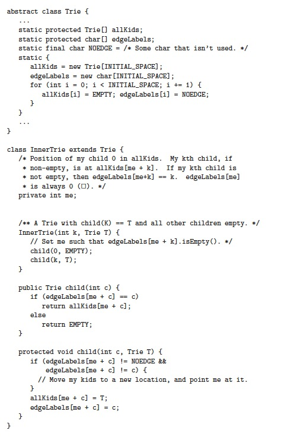   
 图9.9：使用压缩字典树的数据结构。  
 
 让我们使用符号$\H_A$，$\H_C$，$\H_E$，$\H_B$和$\H_D$来表示子树A，C和E以及根是节点B和D的子树的高度。子树A，C，E可以为空，这种情况下我们将其高度设为-1。左边树的高度为1+max($\H_E$, 1 + $\H_A$, 1 + $\H_C$ )。右边树的高度为1+max($\H_A$, 1 + $\H_C$, 1 + $\H_E$ )。因此，只要$\H_A$ > max($\H_C$ + 1, $\H_E$)(例如，在左倾树中就会出现这种情况)，右侧树的高度将小于左侧树的高度。另一个方向也是相似的情况。
 
 实际上，可以通过旋转将任何二叉搜索树转换为任何其他包含相同键的二叉搜索树。这相当于通过旋转，我们可以将二叉搜索树的任何节点移动到树的根节点，同时保留二叉搜索树属性(为什么这是一个充分条件？)。这个论点是对树结构的归纳。
    * 对于空树或者只有根节点的树显然是成立。
    * 对于一个更大的树，我们假设可以旋转所有较小的树以使它们的任何节点成为根节点，进行如下假设：
        * 如果我们期望的新的根节点已经是根节点，那么我们就完成该操作；
        * 如果我们期望的新的根节点在左子树(归纳假设)，然后在整个树上执行右旋转；
        * 如果该节点在右子树会进行类似的操作。

### 9.3.1 AVL树
当然，知道通过旋转可以重排列二叉搜索树，但是我们并不知道如何具体进行旋转操作。AVL树是该技术的一种具体示例，用于跟踪子树的高度并在它们差距过大时执行旋转操作。AVL树是一种二叉搜索树，并且满足**AVL属性** :任意节点的左子树和右子树的高度差小于1。

在这种树的底部增加或者删除节点(正如6.1节点简单二叉搜索树的插入和删除操作)会破坏所谓的AVL属性，但是可以通过从插入或删除点开始向根处理并执行某些选定的旋转来恢复，这取决于需要纠正的不平衡的性质。在下面的图示中，子树中的表达式代表它们的高度。

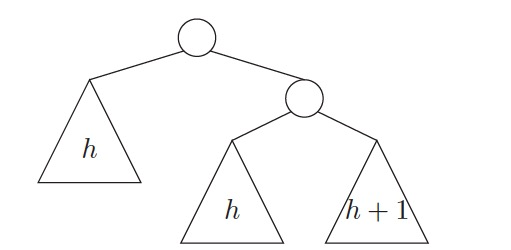 

一个不平衡的子树可以通过单次做旋转重新平衡，如下图所示的AVL树形式：

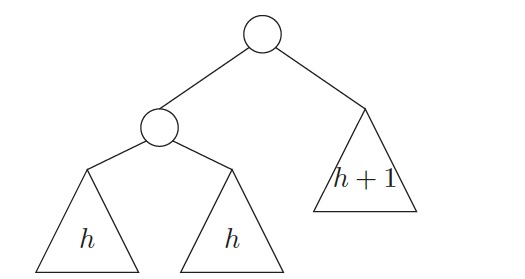 

最后我们在考虑一个不平衡的二叉树的示例

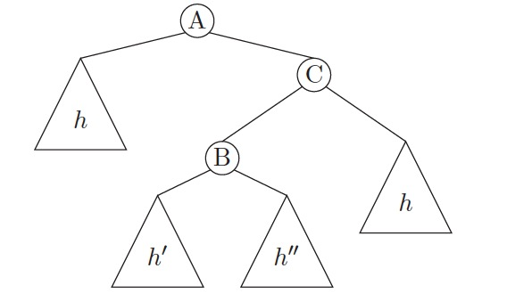 

$\h^'$和$\h^''$中至少有一个是h，并且另外一个也是h或者h-1。这里我们可以通过两次旋转实现平衡，首先是在节点C进行右旋转，然后在节点进行左旋转，得到正确的AVL树

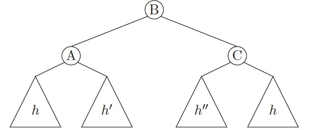 

另外可能的通过增加或者删除单个节点导致的重新平衡是上述的镜像操作。

因此，我们跟踪所有子树的高度，我们总是可以恢复AVL属性，从树的底部插入或删除的点开始并向上进行旋转实现平衡。事实上证明，我们没有必要知道所有子树精确的高度，仅仅需要每个节点属于三种情况：两棵子树有相同的高度，左子树比右子树高度高一层，或者左子树比右子树高度低一层。

## 9.4 伸展树
旋转允许我们在保持二叉树的属性的前提下，尽可能的将二叉树的节点移动到离根节点更近的位置。因此，至少我们可以在不平衡树中使用旋转来快速查找经常搜索的关键字。事实证明，我们可以做的更好。伸展树(Splay Tree)是一种自调整二叉搜索树，即使不通过改变树内容的操作也可以调整其结构以加速后续操作。这种数据结构具有一些有趣的特性，即某些单独的操作可能花费$\Theta(N)$时间(对于树中的N个节点)，但是对于K个同样操作的均摊时间成本(参考1.4节点)仍然是$\Theta(\lgK)。此外，它是基础(不平衡)二叉搜索树的特别简单的修改。

不出所料，此树中的定义操作是splaying，以特定方式将特定节点旋转成根节点。伸展节点意味着使用一系列展开步骤，以便将节点置于树的顶部。伸展具体有三种类型：

    1. 给定节点**t** **y** 是其子节点之一，围绕**t** 旋转**y** (即，根据需要向左或向右旋转，以使**y** 到达顶部)。
    2. 给定一个节点**t** ，它的一个子节点**y** 和**y**  的子节点**z** 在同一侧，然后绕**y** 旋转**z** 。
    3. 给定一个节点**t**，它的一个子节点**y** 和**y** 的子节点**z** 在不同侧，先围绕**y**旋转**z**，然后绕**t**旋转。
    
图9.12展示了这具体的三种步骤。

我们通常会从二叉搜索树根节点开始的遍历查找给定值，从而找到接受此操作的节点。要了解这种特定操作背后的动机，请考虑图9.13。
图左侧的树是典型的最坏时间复杂度的二叉搜索树。在展开节点0之后，我们得到图右侧的树，其大约是前者的一半高度。确实，我们必须进行7次旋转以伸展此节点，但是为了在左侧创建树，我们进行了8次常数时间的插入，因此(到目前为止)，所有9次操作的摊销成本(8次插入加1次))每个只有2个左右。

从普通二叉搜索树中搜索，插入和删除的操作都涉及搜索包含特定值的节点，或者尽可能接近特定值的节点。在伸展树中，找到此节点后，我们将其展开，将其带到树的根部并重新组织树的其余部分。为此，可以方便地修改用于在BST中搜索值的通常算法，以便它同时适用于伸展树。图9.15显示了一种在BST类型的树上可能的实现方式，如图9.14所示。这种特殊类型提供了旋转和替换将执行左或右操作的子节点的操作，允许我们将案例嵌套折叠成几个。

**splayFind** 函数是我们可以用来在二叉搜索树上实现通用操作的工具，如图9.16和9.17所示。

### 9.4.1 伸展树分析
创建非常不平衡的伸展树很容易。按顺序向树中插入数据项就可以实现。因此，将按顺序搜索树中的所有数据项。因此，如果N是树中节点（及关键字）的数量，则隔离的任何特定操作的代价是θ(N)。但是，你永远不会在一棵大树上执行单个操作；毕竟，你必须先创建树，而这当然必须花费至少与其大小成比例的时间。因此，如果我们要求在整个序列上分摊操作的时间，我们可能会得到不同的结果。在本节中，我们将展示实际上在伸展树上搜索，插入和删除操作的分摊时间界限为O(lgN)，就像其他平衡二叉树的最坏情况边界一样。

为此，我们首先在树上定义一个势函数，如§1.4所述，它将跟踪我们执行了多少便宜（和不平衡）操作，从而表明我们可以花多少时间在 昂贵的操作上，同时仍然保证一系列操作的总累积代价保持在适当的限制内。正如我们在公式1.1所做的，我们定义序列中第i个操作的摊余成本ai为

ci为实际的开销，φk是第k次操作之前数据结构中“存储电位”的数量。对于ci，我们可以很方便用旋转执行的次数来表示，当一个操作不涉及旋转时用1表示。这为我们提供了与实际工作量成比例的ci值。挑战是我们要找到一个φ允许我们吸收ci的峰值;当ai>ci时，我们保存φ中的“操作信用”并在ci变大的步骤中释放它（导致φ(i + 1) <φi）。 为了合适，我们必须一直确保φi>φ0。

对于包含一组节点的伸展树T，我们将使用它作为我们的势函数

其中s(x)是以x为根的子树的大小（节点数）。r(x) = lgs(x)称为x的等级。 因此，对于图9.13左侧的完全线性树，φ = P1≤i≤8lg i = lg8！≈15.3，而该图右侧的树具有 φ=4lg1+lg3+lg5+lg7+lg8≈9.7，表明通过降低电位来大大抵消了展开0的成本。

每个操作（搜索，插入或删除）中的所有工作都在splayFind中进行，因此分析它就足够了。我声明在根为t的树中查找和展开节点x的摊销代价 ≤3(r(t)-r(x))+1。因为t是根，我们知道r(t)≥r(x)≥0。此外，由于s(t)=N，N为树中节点的数量，证明展开的摊销代价必须为O(lgN)，如期望的那样。

我们用C(t,x)表示在以t为根的树中查找并展开节点x的分摊代价。即：
                    C(t, x) = max(1, 执行的旋转数)
                            + 树的最终电位 − 树的初始电位.
我们按照图9.15中程序的结构递归地进行，以表明
                    C(t, x) ≤ 3(r(t) − r(x)) + 1 = 3 lg(s(t)/s(x)) + 1.               (9.1)

我们很方便使用符号s'(z)表示“在展开步骤结束时s(z)的值”，且r'(z)表示“r(z)在结束处的值"。

    1. 当t是空树或v在它的根时，没有旋转，电位没有变化，我们将实际成本设为1。在这种情况下，断言9.1显然是正确的。
    2. 当x=y是t的孩子时（“zig”情况，如图9.12顶部所示），我们执行一次旋转，总实际代价为1.为了计算电位的变化，我们首先注意到我们必须考虑的节点只有t和x，因为所有其他节点的等级不会改变，因此当我们从旧节点中减去新的电位时会取消。因此，电位的变化是
                            r′(t) + r′(x) − r(t) − r(x)
                            = r′(t) − r(x), since r′(x) = r(t)
                            < r(t) − r(x), since r′(t) < r(t)
                            < 3(r(t) − r(x)), since r(t) − r(x) > 0
       因此，加上一个旋转的开销，摊销代价 <3(r(t) - r(x))+ 1。
    3. 在zig-zig的例子中，开销包括首先将x展开为t的孙子（图9.12的第二行中的节点z），然后执行两次旋转。根据假设，第一个展开步骤的摊余代价是C(z，x)≤3(r(z)-r(x))+ 1 (r(z)是在展开到z的前一个位置之后的x的等级，因为展开不会改变树的根的等级。我们会稍微滥用符号并将此展开后的节点x称为z，这样我们仍然可以使用r(x)作为x的原始等级)。旋转的代价是2，并且由这两个旋转引起的电位的变化仅取决于它在t，y和z的等级中引起的变化。 总结这些，这个例子的摊销成本是
                     C(t, x) = 2 + r′(t) + r′(y) + r′(z) − r(t) − r(y) − r(z) + C(z, x)
                             = 2 + r′(t) + r′(y) − r(y) − r(z) + C(z, x), since r′(z) = r(t)
                             ≤ 2 + r′(t) + r′(y) − r(y) − r(z) + 3(r(z) − r(x)) + 1
                             通过归纳假设
                             = 3(r(t) − r(x)) + 1 + 2 + r′(t) + r′(y) − r(y) + 2r(z) − 3r(t)
       所以我们想要的结果如下
                             2 + r′(t) + r′(y) − r(y) + 2r(z) − 3r(t) ≤ 0.             (9.2)         
       9.2展示如下：
                             2 + r′(t) + r′(y) − r(y) + 2r(z) − 3r(t)
                           ≤ 2 + r′(t) + r(z) − 2r(t)
                              since r(y) > r(z) and r(t) > r′(y).
                           = 2 + lg(s′(t)/s(t)) + lg(s(z)/s(t))
                              通过r的定义和lg的属性。
       现在，如果你在图9.12的zig-zig情况下检查树，你可以看到s'(t)+ s(z)+ 1 = s(t)，所以s'(t)/s(t)+s(z)/s(t)<1。因为lg是一个凹的，增加的函数，这反过来告诉我们(如§1.6中所讨论的),
                             2 + lg(s′(t)/s(t)) + lg(s(z)/s(t)) ≤ 2 + 2 lg(1/2) = 0.
    4. 最后，在zig-zig的例子中，如果我们能够证明上面的不等式9.2，我们再次得到想要的结果。 这次，我们有s'(y)+s'(t)+1 = s(t)，所以我们可以继续
                             2 + r′(t) + r′(y) − r(y) + 2r(z) − 3r(t)
                           ≤ 2 + r′(t) + r′(y) − 2r(t)
                             since r(y) > r(z) and r(t) > r(z).
                           = 2 + lg(s′(t)/s(t)) + lg(s′(y)/s(t))
       结果遵循与zig-zig例子相同的推理。
从而结束了证明。

插入和搜索的操作为展开时间增加了一个常数时间，删除时增加了常量和常数因子2(因为它涉及两个展开操作)。因此，对展开树的所有操作都具有O(lgN)的摊销时间(对于任何给定的操作序列，使用N为最大值)。

这种界限实际上是悲观的。正如我们所见，遍历有序树要花费树大小的线性时间。由于展开树只是一个BST，我们可以得到相同的界限。如果我们在遍历它们时将每个节点展开到根（这对于伸展树来说似乎是自然的），我们的分摊界限是O(NlgN)而不是O(N)。不仅如此，在遍历之后，我们的树将被转换为“串状”链表。然而，奇怪的是，可以证明，当遍历每个节点时，顺序遍历BST的成本实际上是O(N)。 然而，作者认为他已经将这个问题打败了，并且会为您提供详细信息。

## 9.5 跳表
B树是搜索树的一个例子，其中节点具有可变数量的子节点，每个子节点代表一些有序的键集。它通过将每个节点上的键细分为不相交的键范围来加速搜索，并且设法使这些序列具有可比较的长度，从而平衡树。在这里，我们看看另一个结构做了很多相同的事情，除了它根据需要使用旋转来近似平衡树，它只是以高概率而不是确定性实现这种平衡。考虑图9.1中的同一组整数键，排列在搜索树中，其中每个节点都有一个键和任意数量的子节点，并且任何节点的子节点都具有至少与其父节点一样大的键。图9.18显示了一种可能的安排。 键出现的最大高度根据规则独立地选择，该规则给出出现在高度k(0为底部)的键的(1 - p)p^k的概率。也就是说，0 < p < 1是任意常数，其表示高度大于等于e的所有高度的大于等于e的节点的大致比例。我们在左边添加了一个最小的(-∞)键高度作为整棵树的根。图9.18显示了使用p = 0.5创建的示例。为了查找一个关键字，我们可以从任何级别开始从左到右扫描此树并向下工作。从底部开始(0层)只是给我们一个简单的线性搜索。在更高层级，我们搜索树木森林，根据其根节点的值选择更密切地检查哪个森林。例如，要查看127是否在其中，我们可以看：
    * 0级的前15个条目（不包括-∞）[15个条目]; 或者
    * 前7个1级条目，然后是120个[9个条目]下面的2个0级项目; 或者
    * 前3个2级条目，然后是1级条目140，然后是120个[6个条目]下的2个0级项目; 或者
    * 等级3条目90，然后是等级2条目120，然后是等级1条目140，然后是低于120 [5个条目]的2个等级0项目。
    
我们可以将这个树表示为一种有序的线性节点列表（见图9.19），其中节点具有随机数的下一个链接，并且每个节点中的第i个下一个链接（从0开始编号）连接到 具有至少i + 1个链接的下一个节点。这个类似列表的表示，有一些链接“跳过”任意数量的列表元素，这个数据结构被称为：跳跃链表，简称跳表。

搜索非常简单。如果我们将这些节点之一的值表示为**L.value**(这里，我们将使用整数键)，并将高度为k的下一个指针表示为**L.next [k]**，则：

```java
    /** True iff X is in the skip list beginning at node L at
        * a height <= K, where K>=0. */
    static boolean contains (SkipListNode L, int k, int x) {
        if (x == L.next[k].value)
            return true;
        else if (x > L.next[k].value)
            return contains (L.next[k], k, x);
        else if (k > 0)
            return contains (L, k-1, x);
        else
            return false;
    }
```

我们可以在k≥0的任何级别开始直到树的高度。 事实证明，开始包含N个节点的列表的合理位置是$\log(1/p)*N$，如下所述。

要在列表中插入或删除，我们可以找到上述过程要添加或删除的节点的位置，跟踪我们遍历的节点。 添加或删除项目时，这些是可能需要更新其指针的节点。当我们插入节点时，我们随机选择一个高度，使得高度为k + 1的节点数大致为pk，其中p是一些概率（典型值可能是0.5或0.25）。也就是说，如果我们正在操作一个n层的搜索树，我们让p = 1 / n。 合适的过程可能如下所示：

```java
    /** A random integer, h, in the range 0 .. MAX such that
        * Pr(h ≥ k) = Pk, 0 ≤ k ≤ MAX. */
    static int randomHeight (double p, int max, Random r) {
        int h;
        h = 0;
        while (h < max && r.nextDouble () < p)
            h += 1;
        return h;
    }
```
一般来说，容纳任意大的高度是没有意义的，所以我们施加一些最大值，通常是人们期望需要的最大关键字个数的对数（基数1/p）。直观地，任何其高度至少为k的M个插入节点的序列将围绕每个1/p个节点随机地断开一个高度严格大于k的节点。同样，对于高度至少为k+1的节点，依此类推。 因此，如果我们的列表包含N个数据项，并且我们开始查看$\log(1/p)*N$层，我们期望看大多数(1/p)$\log(1/p)*N$个关键字(也就是说，每个$\log(1/p)*N$级别的1/p个关键字)。换句话说，θ(lgN)平均来说，这就是我们想要的。不可否认，这种分析有点过时，但真正的差距并没有很大。由于插入和删除包括查找节点，加上与节点高度成比例的一些插入或删除时间，因此我们实际上在搜索，插入和删除时具有θ(lgN)预期界限。

## 练习

**9.1** 根据注释完善代码

```java
    /** Return a modified version of T containing the same nodes
    * with the same inorder traversal, but with the node containing
    * label X at the root. Does not create any new Tree nodes. */
    static Tree rotateUp (Tree T, Object X) {
        // FILL IN
    }
```

**9.2** 包含N个节点的5-B树的最大高度是多少？ 最小高度是多少？ 什么序列的关键字获得最大高度（即，给出这些序列的一般特征）。 什么序列的关键字获得最小高度？

**9.3** 图9.15中给出的splayFind算法几乎不是人们可以想象的这个过程的最有效版本。 原始论文具有相同函数的迭代版本，它使用常量额外空间而不是我们的splayFind版本的线性递归。 它跟踪两棵树：L，包含小于v的节点，R，包含大于v的节点。当它从根向下迭代地向下进行时，它将当前节点的子树添加到L和R，直到它 到达它正在寻找的节点x。 此时，它通过将x的左右子树分别附加到L和R，然后将L和R作为新子项来完成。 在此过程中，子树附加到L以便增加标签，并按照标签减少的顺序附加到R. 重写splayFind以使用此策略。

**9.4** 为跳表编写包含函数的非递归版本（第9.5节）。

**9.5** 定义使用跳表表示的SortedSet接口的实现。

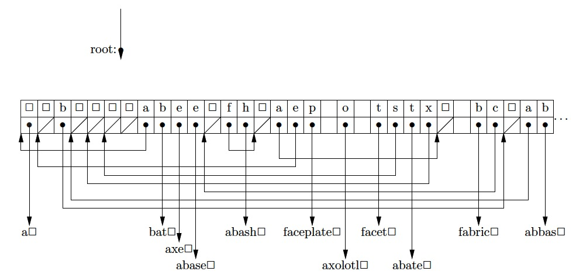 

图9.8中的trie的打包版本。 该图中的每个trie节点表示为由字符索引的子节点数组，作为子节点索引的字符存储在上面的行中（对应于数组**edgeLabels**）。 指向子项本身的指针位于下一行（对应于**allKids**数组）。 顶部的空框表示未使用的位置（**NOEDGE**值）。 为了压缩图表，我改变了字符集编码，使□为0，'a'为1，'b'为2，等等。下排的交叉框表示空节点。右侧（未示出）还必须有另外24个空条目记录存储的最右边的trie节点的c-z条目。 搜索算法使用edgeLabel来确定条目实际上何时属于它当前正在检查的节点。 例如，根节点应包含“a”，“b”和“f”的条目。事实上，如果您从上面的“根”框中算出1,2和6，您将找到边标签为'a'，'b'和'f'的条目。另一方面，如果从根盒中计算超过3，查找不存在的'c'边缘，则会找到边缘标签'e'，告诉您根节点没有'c'边缘。      
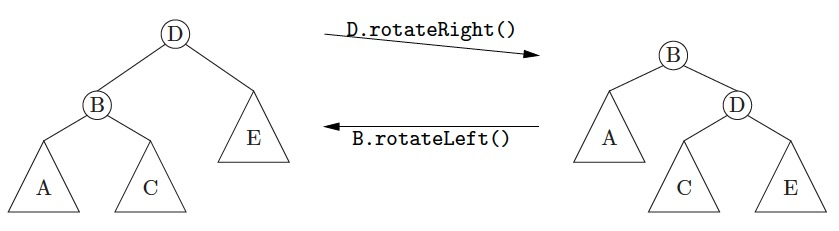 

二叉搜索树中的旋转。 三角形表示子树，圆圈表示单个节点。 二进制搜索树关系由两个操作维护，但各个节点的级别受到影响。

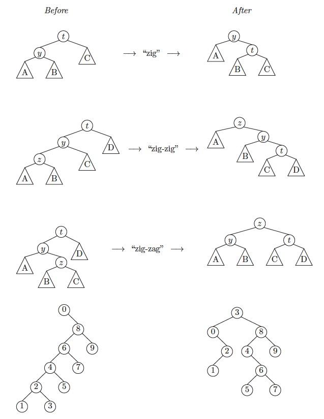 

 基本的展开步骤。 当y在t的另一侧时，存在镜像图像。 最后一行说明了完整的splaying操作（在节点3上）。 从底部开始，我们执行“zig”步骤，然后执行“zig-zig”，最后在节点3上执行“Zig-zag”，最后是右侧的树。

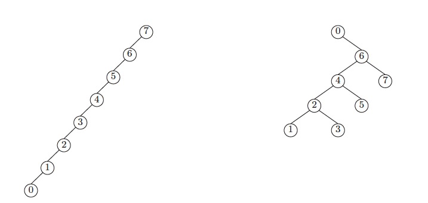 

在完全不平衡的树中伸展节点0。 结果树大约变成原高度的一半，这样大大加快了后续搜索速度。

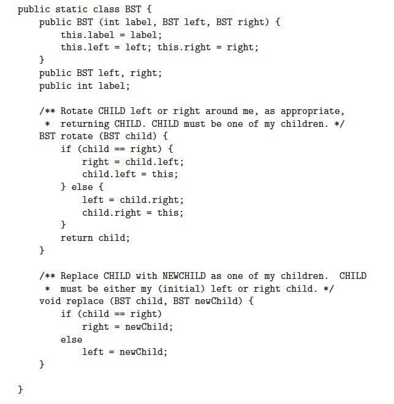 

用于我们的伸展树的二叉搜索树结构。 这只是一个普通的二叉搜索树，为旋转或更换孩子节点提供统一的操作。

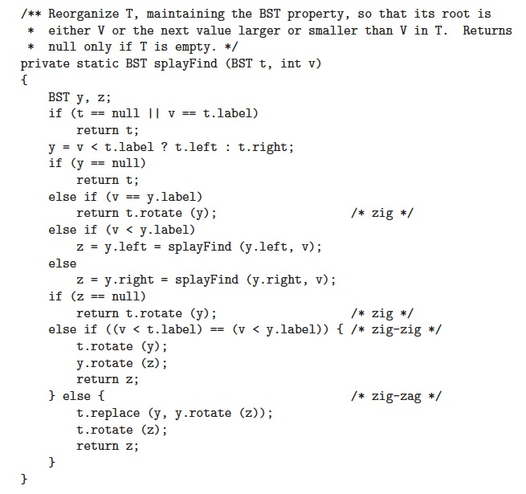 

用于查找和展开节点的**splayFind** 方法。 用于插入，删除和搜索。

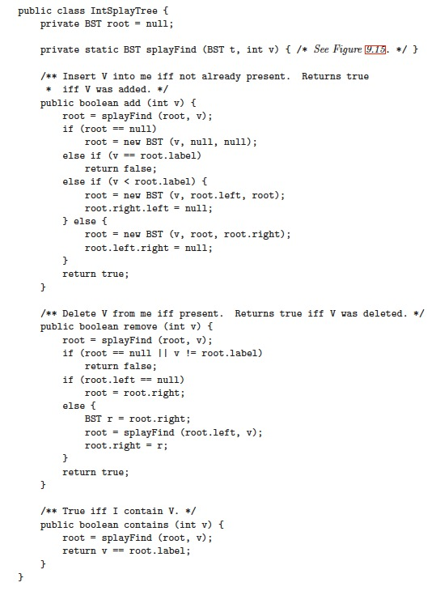 

伸展树上的标准集合操作。 该接口采用Java集合类的样式。 图9.17说明了这些方法。

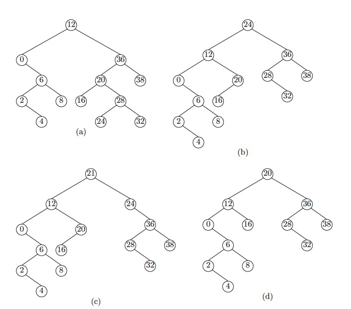 

展开树上的基本BST操作。(a)是原始树。(b)是对值21或24中的任何一个执行**splayFind**的结果。(c)是将值21加到(a)中的结果; 第一步是创建展开的树(b)。(d)是从原树(a)中删除24的结果; 再次，第一步是创建(b)，之后我们将24的左子项显示为值24，这保证大于该子项中的任何值。

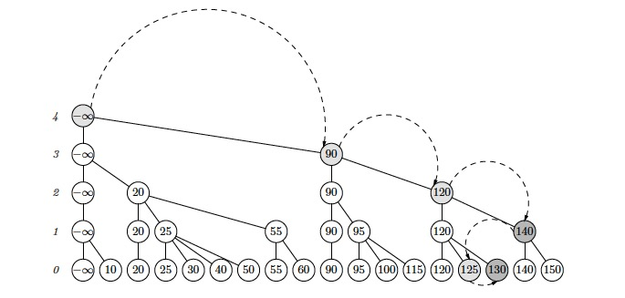 

跳过列表的抽象视图，显示其与（非二进制）搜索树的关系。 除-∞之外的每个密钥都复制到随机高度。 我们可以从任何级别开始搜索这个结构。 在最好的情况下，要搜索（失败）目标值127，我们只需要查看着色节点中的键。 较暗的阴影节点表示大于127的键绑定搜索。

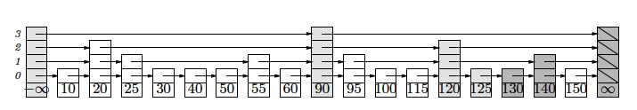 

图9.18中的跳过列表，显示了可能的表示。 数据结构是一个有序列表，其节点包含指向后面节点的随机数量的指针（允许在搜索期间跳过列表中的中间项;因此名称）。 如果一个节点至少有k个指针，那么它包含一个指向下一个节点的指针，该节点至少有k个指针。 右边的∞节点允许我们避免测试null。 同样，在搜索127期间查看的节点是阴影; 较暗的阴影表示限制搜索的节点。


# 第10章 并发和同步

> 译者：[Ruffianjiang](https://github.com/Ruffianjiang)

​	到目前为止，我们所做的每件事都隐含着一个假设，即一个程序正在修改我们的数据结构。在Java中，由于线程的存在，可能会产生多个程序使对象的效果

​	尽管用于描述线程的语言表明，线程的目的是允许同时发生几件事情，但这在一定程度上是一种误导。即使是最小的Java应用程序运行在 Sun 的 JDK 的平台上，例如，有五个线程，这是只有在应用程序没有创建任何本身，即使程序运行的机器由一个单处理器（一次只能执行一个指令）。这四个额外的“系统线程”执行许多任务（例如“finalizing”对象是程序不再可访问），这些任务在逻辑上独立于程序的其余部分。相对于程序的其余部分，它们的操作可以在任何时候有效地发生。换句话说，Sun的Java运行时系统使用线程作为其系统的组织工具。

​	使用图形用户界面（GUIs）的Java程序中有大量线程。一个线程绘制或重绘屏幕。另一个响应事件，如点击鼠标按钮在屏幕上的某个点。这些都是相关的，但在很大程度上是独立的活动：例如，当一个窗口变得不可见并显示它们时，必须重新绘制对象，这与程序正在执行的任何计算无关。线程违反了我们的隐含假设，即一个程序对我们的数据进行操作，因此，即使是一个完全实现的数据结构，其所有实例变量都是私有的，也可能以相当奇怪的方式受到破坏。在相同数据对象上运行的多个线程的存在也提出了一个普遍的问题，即这些线程如何以有序的方式彼此通信。


## 10.1 同步的数据结构


参考4.1节 `ArrayList` 的实现。在方法 `ensureCapacity` 中，我们发现
```java
public void ensureCapacity(int N) {
	if (N <= data.length)
		return;
	Object[] newData = new Object[N];
	System.arraycopy (data, 0,newData, 0, count);
	data = newData;
}
```

```java
public Object set(int k, Object x) {
    check (k, count);
    Object old = data[k];
    data[k] = x;
    return old;
}
```

​	假设一个程序执行 `ensureCapacity` ，而另一个程序正在相同的 `ArrayList` 对象上执行改动。我们可以看到他们的动作交叉在了一起，如下所示：
```java
/* Program 1 executes: */ newData = new Object[N];
/* Program 1 executes: */ System.arraycopy (data, 0,newData, 0, count);
/* Program 2 executes: */ data[k] = x;
/* Program 1 executes: */ data = newData;
```

​	因此，我们丢失了 `Program 2` 设置的值，因为它在 `data` 的内容复制到新的扩展数组之后，将这个值放入 `data` 的旧值中。为了解决 `ArrayList` 呈现出的简单问题，线程可以以互斥的方式安排访问任何特定的 `ArrayList` —— 也就是说，每次只有一个线程操作对象。Java的 `synchronized` 语句提供互斥，允许我们生成 `synchronized` （或线程安全）数据结构。下面是一个例子的一部分，展示了`synchronized`方法修饰符的使用和同步语句的等效使用：
```java
public class SyncArrayList<T> extends ArrayList<T> {
    ...
    public void ensureCapacity(int n) {
        synchronized (this) {
            super.ensureCapacity (n);
        }
    }
    public synchronized T set(int k, T x) {
        return super.set (k, x);
    }
    ...
}
```

​	为所有方法提供这样的包装函数清单的过程非常繁琐，以至于标准Java库类的 `java.util.Collections`  提供了以下方法：
```java
/** A synchronized (thread-safe) view of the list L, in which only
  * one thread at a time executes any method. To be effective,
  * (a) there should be no subsequent direct use of L,
  * and (b) the returned List must be synchronized upon
  * during any iteration, as in
  *
  * 	List aList = Collections.synchronizedList(new ArrayList());
  * 	...
  * 	synchronized(aList) {
  * 		for (Iterator i = aList.iterator(); i.hasNext(); )
  * 			foo(i.next());
  *		}
  */
public static List<T> synchronizedList (List L<T>) { ... }
```

​	不幸的是，每个操作的同步都有时间开销，这就是为什么Java库设计人员决定不同步 `Collection` 及其大多数子类型。另一方面，`StringBuffers` 和 `Vectors` 是同步的，不能被同时使用而损坏。

## 10.2 监控与有序通信

​	`synchronizedList` 方法返回的对象是最简单的监视器的例子。这个术语指的是控制（“监视器”）对某些数据结构的并发访问以使其正确工作的对象（或对象类型）。监视器的一个功能是在需要时提供对数据结构操作的互斥访问。另一种方法是安排线程之间的同步——这样一个线程就可以等待对象“准备好”为它提供一些服务。

​	监视器可以用一个典型的例子来说明：共享缓冲区或邮箱。其公共规范的一个简单版本如下：

```java
/** A container for a single message (an arbitrary Object). At any
  * time, a SmallMailbox is either empty (containing no message) or
  * full (containing one message). */
public class SmallMailbox {
    /** When THIS is empty, set its current message to MESSAGE, making
      * it full. */
    public synchronized void deposit (Object message)
        throws InterruptedException { ... }
    /** When THIS is full, empty it and return its current message. */
    public synchronized Object receive ()
        throws InterruptedException { ... }
}
```

​	自规范表明这两种方法都可能需要等待新的消息沉积或接收旧,我们尽可能地将两者都指定为抛出 `InterruptedException` ，这是标准Java方式表明，我们在等待时，其他线程打断我们。

​	“SmallMailbox” 规范说明了典型监视器的特性：
- 没有任何可修改的状态变量（即，字段）是公开的。
- 从单独的线程访问，使任何对可修改状态的引用相互排除；每次只有一个线程持有 `SmallMailbox` 对象上的锁。
- 线程可以暂时放弃锁，等待某些更改的通知。但是锁的所有权的变化只发生在程序中定义良好的点上。

  内部表示很简单：

```java
private Object message;
private boolean amFull;
```

​	这些实现使用了基本的Java特性来“等待直到被通知”：

```java
public synchronized void deposit (Object message)
    throws InterruptedException{
    while (amFull)
        wait (); // Same as this.wait ();
    this.message = message;
    this.amFull = true;
    notifyAll (); // Same as this.notifyAll ()
}
public synchronized Object receive ()
    throws InterruptedException{
    while (! amFull)
        wait ();
    amFull = false;
    notifyAll ();
    return message;
}
```

​	`SmallMailbox` 的方法只允许其他线程进入精心控制的点：等待的调用。例如，`deposit` 中的循环表示“如果仍然有旧的未接收邮件，请等到其他线程接收到它并再次唤醒我（使用 `notifyAll` ），然后我再次锁定了这个邮箱”。从执行 `deposit` 或 `receive` 的线程的角度来看，每次调用 `wait`  都会对 `this` 的实例变量造成一些变化——可能会受到其他调用 `deposit` 或 `receive` 的影响。

​	只要程序的线程小心翼翼地以这种方式保护它们在监视器中的所有数据，它们就会避免 10.1节开头描述的那种奇怪的交互。当然，天下没有免费的午餐；使用锁会导致死锁的情况，即两个或多个线程无限期地等待对方，如下面的人为例子所示：


```java
class Communicate {
    static SimpleMailbox
        box1 = new SimpleMailbox (),
    	box2 = new SimpleMailbox ();
}
// Thread #1: 					 | // Thread #2:
m1 = Communicate.box1.receive ();| m2 = Communicate.box2.receive();
Communicate.box2.deposit (msg1); | Communicate.box1.deposit (msg2);
```

​	由于两个线程在试图从其消息框中接收消息之前都不发送任何消息，所以两个线程都彼此等待（可以通过让其中一个线程反转接收和存储消息的顺序来解决这个问题）。

## 10.3 消息传递

​	监视器（Monitors）为多个线程提供了一种有序的方法来访问数据，而不会互相阻碍。隐藏在监视器概念背后的是一个简单的想法：

> 考虑到同时执行多个程序是很困难的，所以不要这样做!相反，编写一组单线程程序，让它们彼此交换数据

​	对于一般监视器，“交换数据”意味着设置每个监视器都可以看到的变量。如果我们更进一步，我们可以将“交换数据”定义为“读取输入和写入输出”。“我们有一个并发的编程规则，叫做消息传递。

​	在消息传递的世界中，线程是独立的顺序程序，而不是互相发送消息。他们读写消息使用是在 Java 的 `reader` 上读或在 Java 的 `PrintStreams` 上打印一致的方法。因此，只有当一个线程费力的“读取其消息”时，才会受到另一个线程的影响。

​	我们可以通过编写线程来实现消息传递的效果，通过邮箱来实现所有的交互。也就是说，线程共享一组邮箱，但是不共享其他可修改的对象或变量（不可修改的对象，比如`Strings`，可以共享）

## 练习

**10.1** 给10.1节的 `Collections.synchronizedList` 提供一个可能的静态方法的实现。


# 第十二章 图

> 译者：[yuanrw](https://github.com/yuanrw)

在计算机科学中，图是一种代表数学关系的数据结构，它包含一个*顶点（节点）*的集合和一个*边*（两个顶点组成的顶点对）的集合。如果顶点对是无序的，那就是一个*无向图*，如果顶点对是有序的，那就是一个*有向图*，有向图中每一条边都从一个顶点*出发*到另一个顶点*结束*。例如我们有顶点v和w，那么连接v和w的边就用(v,w)来表示，如果是一条无向边，那么也可以用{v,w}表示，如果是有向边，边的方向是从v出发到w，则用[v,w]表示。（v,w）是指连接顶点v和顶点w的一条边，如果(v,w)是无向的，那么我们就说v和w是*相邻顶点*，顶点的*度（degree）* 是指和这个顶点相连的边的条数。有向图中，*入度（in-degree）* 是指进入该顶点的边的条数，*出度（out-degree）* 是指从该顶点出发的边的条数。一般来说，一条边所连接的两个顶点是不一样的，一条边不会从一个顶点出发又回到这个顶点。

如果某一个图的顶点集是图G的顶点集的子集，边集也是图G边集的子集，那这个图就叫做G的*子图（subgraph）*。

若存在一个顶点序列,,…,其中v=，=，序列中任意两个顶点组成的边(,)都在图中，那么这个序列就叫做顶点v到的一条*路径（path）*，路径的长度（该路径上边的数目）k  0，这条定义对有向图和无向图都适用；在有向图中，路径是有方向的。如果路径中没有重复顶点，那我们就称它为*简单（simple）*路径。当k > 1且v=，那么它就是*环（cycle）*，如果环里的顶点…,不重复的，我们就称它*简单环（simple cycle）*；在无向图中，环还必须满足另一个条件：环中不能有两条重复的边。一个没有环的图我们称之为*无环图（acyclic）*。

如果从顶点v到顶点有路径，那么对于v来说就是*可达的（reachable）*。在无向图中，若存在一个子图，其中每个顶点对于图中的任意一个顶点都是可达的，并且子图外的顶点对于子图内的顶点都不可达，那么这个子图就是一个*连通分量（connected component）*。如果一个无向图中只有一个连通分量，那么这个图就是一个*连通（connected）图*（即连通分量中包含图的所有顶点）。

有向图的连通分量和无向图中一样，唯一的区别是所有的边都是有向边。有向图中如果有一子图，子图中任意两个顶点都是互相可达的，那么这个子图叫做*强连通分量（strongly connected component）*。见图12.1和图12.2。

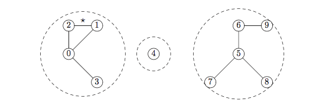

图12.1：一个无向图。星标的边与顶点1，2相连，顶点4的度为0；顶点3，7，8和9的度为1；顶点1，2和6的度为2；顶点0和5的度为3。被虚线包围的是连通分量；由于图中连通分量的数量大于1，因此这不是连通图。序列[2,1,0,3]是顶点2到顶点3的一条路径。路径[2,1,0,2]是一个环。图中唯一包含顶点4的路径是[4]，路径长度为0。最右图的连通分量是一个无环图，也叫自由树。

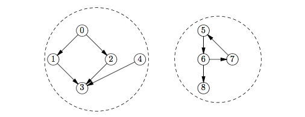

图12.2：一个有向图。被虚线包围的是连通分量。顶点5，6和7形成了一个强连通分量。其他的单个顶点自身也形成了强连通分量。最左图是一个无环图。顶点0和4的入度都为0；顶点1，2和5-8的入度都为1；顶点3的入度为3。顶点3和8的出度为0；顶点1，2，4，5和7的出度为1；顶点0和6的出度为2。

一个无向连通无环图被称为*自由树（free tree）*（图中任意两个顶点之间只有一条简单路径）。如果一个无向图中任意两个顶点之间有至少两条简单路径，那么这个图是*变连通的(biconnected)*。

在实际运用中，我们通常在图的边上绑定一些信息。例如，如果顶点表示城市，那么边就表示道路，我们可能希望在边上记录城市间的距离。又例如顶点表示泵站，边表示管道，那我们可能希望在边上记录水的容量。这些数字信息我们叫做*权重（weights）*。

## 12.1 一名程序员的规范

对于处理图的程序，现在没有一个单独鲜明的规范，因为不同的算法的不同需求可能会对合适的描述和方便支持这些描述的操作产生巨大的影响。但是处于教学目的，图12.3给出了一个通用的有向图的“一刀切”抽象示例，图12.4对无向图也给出了同样的抽象示例。其思想是顶点和边由自然数（非负整数）表示。而想要添加在顶点或边上的任何附加数据（例如包含更多信息的标签或权重）都可以按照以顶点或边号为索引的附加数组的形式，加在旁边。
```java
/** 一个常规的有向图。 对于这个类的任何实现, 下列操作的不同子集都有效。我* 们统一给所有顶点从0到N-1进行编号。*/
public interface Digraph {
	/** 顶点的数量。顶点的编号从0到numVertices()-1。 */ 
  int numVertices();
	/** 边的数量。边的编号从0到numEdges()-1。 */ 	
  int numEdges();
	/** 边E的起点顶点和终点顶点 */ 
  int leaves(int e);
	int enters(int e);
	/** 如果[v0,v1]是图中的边，则返回true。 */ 
  boolean isEdge(int v0, int v1);
	/** 顶点v的出度和入度。 */ 
  int outDegree(int v);
	int inDegree(int v);
	/** 以顶点v为起点的第K条边，0<=K<v的出度。 */ 
  int leaving(int v, int k);
	/** 以顶点v为终点的第K条边，0<=K<v的入度。 */
  int entering(int v, int k);
	/** 顶点v的第K个后继节点，0<=K<v的出度。succ(v,k) = enters(leaving(v,k))。 */
	int succ(int v, int k);
	/** 顶点v的第K个前驱节点, 0<=K<v的入度。pred(v,k) = *leaves(entering(v,k))。 */ 
  int pred(int v, int k);
	/** 向图中添加M个初始化的不连接的节点 */
  void addVertices(int M);
	/** 在顶点v0和v1之间添加一条边 */ 
  void addEdge(int v0, int v1);
	/** 删除顶点v的所有边 */
  void removeEdges(int v);
	/** 删除边(v0,v1) */
	void removeEdge(int v0, int v1);
}
```

图12.3：有向图的简单抽象接口（java描述）

```java
/** 一个常规的有向图。 对于这个类的任何实现, 下列操作的不同子集都有效。我* 们统一给所有顶点从0到N-1进行编号。*/
public interface Graph {
	/** 顶点的数量。顶点的编号从0到numVertices()-1。*/ 
  int numVertices();
	/** 边的数量。边的编号从0到numEdges()-1。 */ 
  int numEdges();
	/** 和边e连接的顶点。node0是编号较小的顶点。 */
	int node0(int e); int node1(int e);
	/** v0和v1是否相邻，是则返回true。 */ 
  boolean isEdge(int v0, int v1);
	/** 顶点#v的度（和顶点#v连接的边的数量）。 */ 
  int degree(int v);
	/** 和顶点V连接的第k条边的编号, 0<=k<degree(V)。 */ 
  int incident(int v, int k);
	/** 和v相邻的第k个顶点，adjacent(v,k)的值应等于 node0(incident(v,k))或者node1(incident(v,k))。 */
	int adjacent(int v, int k);
	/** 往图中添加M个独立的初始顶点。 */
	void addVertices(int M);
	/** 往顶点V0和V1中添加一条(无向)边。 */
	void addEdge(int v0, int v1);
	/** 移除所有和顶点v相连的边 */
  void removeEdges(int v);
	/** 移除（无向）边（v0,v1）*/ 	
  void removeEdge(int v0, int v1);
}
```

图12.4：无向图类的简单抽象（java描述）

## 12.2 图的表示方法

### 12.2.1邻接表

如果有向图中的*后继（succ）*，*前驱（pred）*，*离开（leaving）*，*进入（entering）*（或者无向图中的*连接（incident）*和*相邻（adjacent）*）等操作对与我们研究的问题很重要，那么用邻接表来表示图会很方便，即把每个顶点和它的前驱节点列表，后继结点列表或者相邻节点列表放在一起存储。邻接表有很多存储形式，比如链表。图12.5展示了用数组存储邻接表，数组的好处是通过有向图的相邻节点，或者边集可以方便地排序。这里展示了一些代表性的操作来说明这种数据结构的工作原理。它其实就是一个链表集，只是把含有指针的节点替换成了数组和整数。图12.6展示了一个特定的有向图和用于表示此图的数据结构。

```java
/** 一个有向图 */
public class AdjGraph implements Digraph {
	/** 初始化一个包含N个独立顶点的有向图 */ 
  public AdjGraph(int N) {
		numVertices = N; 
    numEdges = 0;
		enters = new int[N*N]; 
    leaves = new int[N*N]; 
    nextOutEdge = new int[N*N]; 
    nextInEdge = new int[N*N]; 
    edgeOut0 = new int[N]; 
    edgeIn0 = new int[N];
}
	/** 边e离开和进入的顶点。 */ 
  public int leaves(int e) { return leaves[e]; } 
  public int enters(int e) { return enters[e]; }
	/** 增加一条从v0出发到v1的边。 */ 
  public void addEdge(int v0, int v1) {
		if (numEdges >= enters.length)
		expandEdges(); // 扩展边数组
		enters[numEdges] = v1; 
    leaves[numEdges] = v0; 				
    nextInEdge[numEdges] = edgeIn0[v1]; 
    edgeIn0[v1] = numEdges; 
    nextOutEdge[numEdges] = edgeOut0[v0]; 
    edgeOut0[v0] = numEdges;
   	numEdges += 1;
	}
}
  /** 离开顶点v的第k条边的编号, 0<=K<outDegree(V). */ 
	public int leaving(int v, int k) {
		int e;
		for (e = edgeOut0[v]; k > 0; k -= 1)
     	e = nextOutEdge[e];
  	return e;
	}
···
	/* 私有域 */
	private int numVertices, numEdges;
	/* 下列域都以边的编号作为索引 */ 
	private int[] 
		enters, leaves,
		nextOutEdge, /* 指向从节点出发的下一个兄弟边, 没有即为-1。 */ 		nextInEdge; /* 指向进入节点的下一个兄弟边, 没有即为-1。 */
	/* 离开节点的第一条边, 没有即为-1。 */ 
	private int[] edgeOut0;
	/* 进入节点的第一条边, 没有即为-1。 */ 
	private int[] edgeIn0;
}
```

图12.5：用邻接表表示有向图。上述代码只展示了部分方法。

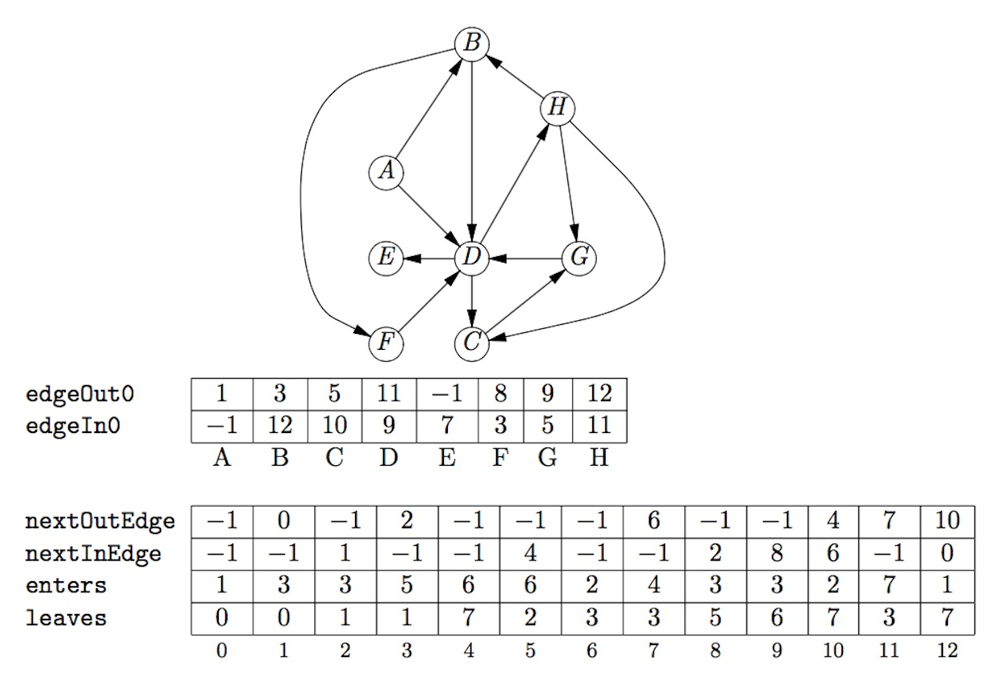

图12.6：图和它的邻接表（其中一种实现）。在这个例子里，用数组来实现邻接表。下面四个数组的索引是边的编号，上面两个数组的索引是顶点编号。nextOutEdge是从每个顶点出发的边组成的链表，表头存储在edgeOut0内。同样，nextInEdge和edgeIn0由进入每个顶点的边组成的链表。数组enters和leaves存储了每个顶点连接的边。

这种数据结构的另一种变体是把顶点和边分开。顶点和边会包含如下属性：

```java
class Vertex {
	private int num; /* 顶点的数量 */
	private Edge edgeOut0, edgeIn0; /* 以节点为起点、终点的第一条边。 */ 
  ...
}
class Edge {
	private int num; /* 边的数量 */ 
  private Vertex enters, leaves;
	private Edge nextOutEdge, nextInEdge;
}
```

### 12.2.2 边集表示法

如果我们只想列举出所有的边和所有相连的节点，那我们可以把12.2.1简化一下：去掉edgeOut0, edgeIn0, nextOutEdge, 和 nextInEdge。稍后我们会看到某些场景非常适用于这个算法。

### 12.2.3 邻接矩阵

如果图非常*稠密（dense）*（图中存在的边很多），并且以下操作很频繁：判断顶点之间是否存在边和获取边的权重，这种情况下我们可以使用*邻接矩阵（adjacency matrix）*。我们给顶点用数字0~|V|-1（|V|代表顶点集V的大小）编号，然后初始化一个|V|*|V|的矩阵，如果顶点i和顶点j之间有边，那么矩阵中的元素（i,j）的值设为1，反之设为0。如果是有权重的边，则把元素（i,j）的值设为权重，如果没有边也可以把值设为某个特殊值（这种情况可以由图12.3扩展而来）。无向图的矩阵是对称的。图12.7展示了一个无权有向图和一个无权无向图和他们的邻接矩阵。

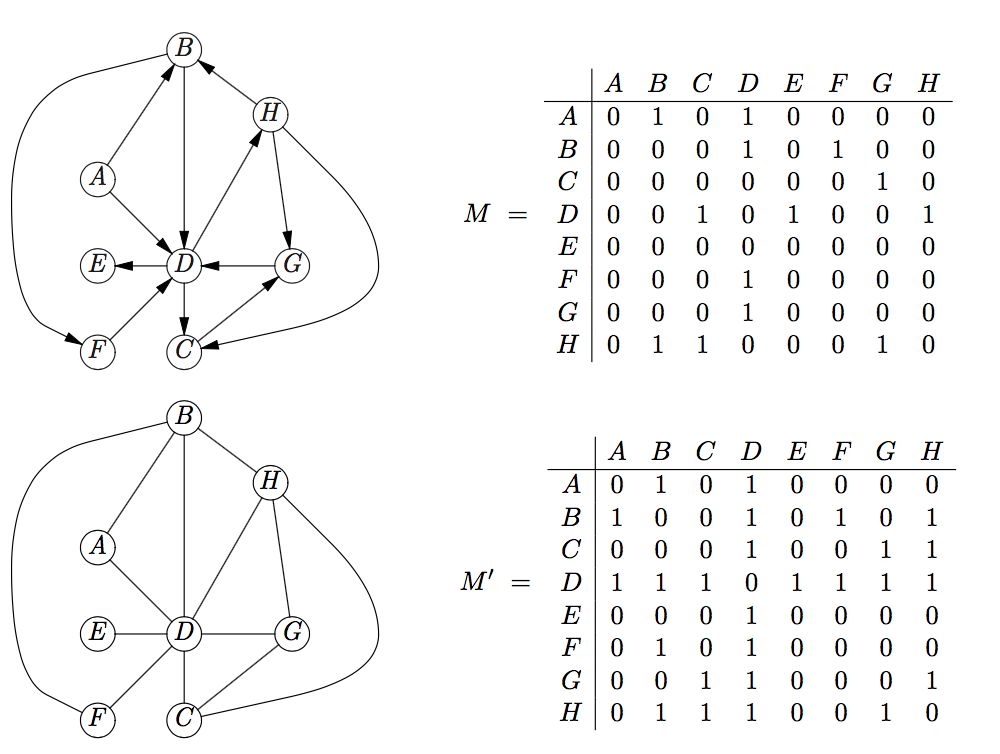

图12.7：上图：一个有向图和它的邻接矩阵。下图：一个无向图的变体和它的邻接矩阵。

无权图的邻接矩阵有一些有趣的特性。比如说图12.7的第一张图，首先我们把矩阵与自己相乘的结果定义为：_{ij}=\sum_{0%20\leq%20k<|V|}X_{ik}%20\cdot%20X_{kj}) 。然后把上述矩阵和自己相乘，得到结果：

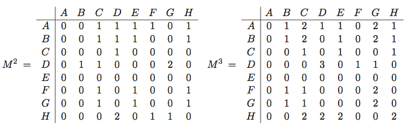

通过分析这个结果，可以看到_{ij})的值等于满足顶点i和顶点k之间有一条边（），顶点k和顶点j之间也有一条边（）的顶点k的数量。而对于其他的节点，和中至少有一个为0。所以显然，代表顶点i，j两点间长度为2的路的条数。同样，代表顶点i，j两点间长度为3的路的条数。如果用布尔代数来计算（布尔代数中0+1=1+1=1），那么当两个顶点满足：顶点间有至少一条长度为2的路径，它在矩阵中的值就为1。

稀疏的图（边的数量远远小于的图）不适合用邻接矩阵来存储。当你想动态地添加和删除顶点时，它们也会出问题。

### 12.3 图的算法

很多有趣的图算法都涉及到对图的顶点或边进行某种遍历。就像树一样，我们可以以深度优先或宽度优先的方式遍历一个图（直观来说，从起始点出发要尽可能快或尽可能慢）。

#### 12.3.1 标记

但是，和树不同的是，在图中顶点有可能通过边回到自身，这就需要记录哪些节点已经被访问过，这个操作叫做*标记（marking）*。有以下几种方式可以标记。

**标记位。** 如果顶点像图12.2.1中所示的类Vertex那样，是用对象表示的，我们可以在每个顶点中使用一个比特位，来记录是否访问过该顶点。这些位最开始必须全部置为开启（或关闭）状态，然后在第一次访问该顶点时被翻转。这种方法也适用于边。

**标记次数。** 标记位有一个问题，我们必须保证所有的顶点在遍历开始时都以相同的方式初始化。如果某次遍历不完全，会导致遍历结束后标记位不统一，解决这个问题我们可以使用更大的数字来标记。每次遍历使用的标记数字递增（第一次遍历是1，第二次是2，以此类推）。每次访问节点，将其标记位设置为当前的遍历数。每次遍历都确保产生一个和之前的标记数都不一样的新数字（假设标记字段已正确初始化，比如为0）。

**位数组。** 如果在我们的抽象里，每个顶点有数字索引，我们可以使用一个位数组M来标记，如果顶点i被访问过了，就将M[i]设为1。在遍历开始时重置位数组是很方便的。

**其他。** 有的时候，正在执行的某种特定遍历方法已经提供了一种识别节点是否被访问过的方法。所以我们不能笼统地谈论这个问题。

#### 12.3.2通用遍历模板

许多图形算法都具有以下通用形式。不同的应用，需要替换斜体大写字母的名称。

```java
/* 通用的遍历模板 */ 
COLLECTION OF VERTICES fringe;
fringe = INITIAL COLLECTION; 
while (! fringe.isEmpty()) {
	Vertex v = fringe.REMOVE HIGHEST PRIORITY ITEM ();
	if (! MARKED(v)) { 
    MARK (v);
		VISIT (v);
		For each edge (v,w) {
      if (NEEDS PROCESSING(w)) 
        Add w to fringe;
      } 
  	}
}
```

在接下来的几节中，我们会研究这个模板的各种实现算法。

#### 12.3.3通用的深度优先遍历和广度优先遍历

图的深度优先算法基本上和树是一样的，唯一不同的是图需要检查节点是否已被访问过。实现以下接口

```java
/** 在深度优先遍历中，对V可达的每个顶点都需要执行VISIT操作。 */
void depthFirstVisit(Vertex v)
```

我们使用通用的图遍历模板，并且替换以下实现：

COLLECTION OF VERTICES 是一个栈。

INITIAL COLLECTION 是一个集合{v}。

REMOVE HIGHEST PRIORITY ITEM 从顶部弹出一个元素。

MARK and MARKED 设置并检查一个标记位（参见上面的讨论）。

NEEDS PROCESSING 表示“未标记”。

通常情况下，我们可以去掉NEEDS PROCESSING字段（让它永远返回true）。唯一的影响就是增加了堆栈的大小。

宽度优先搜索基本相同。区别如下：

COLLECTION OF VERTICES 是一个（FIFO）队列。

REMOVE HIGHEST PRIORITY ITEM 是删除并返回队列中的第一个（最新添加的）元素。

#### 12.3.4 拓扑排序

有向图的*拓扑排序（topological sort）* 是指把顶点按照特定规则排序：如果对于顶点v来说，顶点w是可达的，那么w就排在v后面，如果我们把图想象成顶点的某种有序关系，那么拓扑排序就是一种线性的顺序。循环有向图不存在拓扑排序。例如，UNIX系统的make程序使用了拓扑排序，用来查找执行命令的顺序，然后更新每个文件，以便在后续命令中使用。

执行拓扑排序的时候，需要维护每个顶点在当前未处理的顶点集中的入度。以下版本使用一个数组来保存入度。拓扑排序的算法的当前实现：
```java
/** 返回按照拓扑顺序排列的图G顶点的数组，假设图G是无环图。 */
static int[] topologicalSort(Digraph G) {
	int[] count = new int[G.numVertices()]; 
  int[] result = new int[G.numVertices()]; 
  int k;
	for (int v = 0; v < G.numVertices(); v += 1) 
    count[v] = G.inDegree(v);
	把图遍历的模板替换成拓扑排序；
  return result;
}
```

模板中有下列地方需要替换：

COLLECTION OF VERTICES 可以是顶点的集合、multiset、列表或序列(栈、队列等)。

INITIAL COLLECTION 是所有v的集合，将count[v]初始化为0。

REMOVE HIGHEST PRIORITY ITEM 可以删除任意元素。

MARKED 和 MARK 可以是不重要的操作。(比如永远返回false，不做任何操作)。

VISIT(v) 将顶点v设为结果集中的下一个非空元素，并且把与顶点v的所有边（v,w）相邻的顶点的入度count[w]减1。

NEEDS PROCESSING 如果count[w]==0，则返回true。

图12.8展示了该算法。

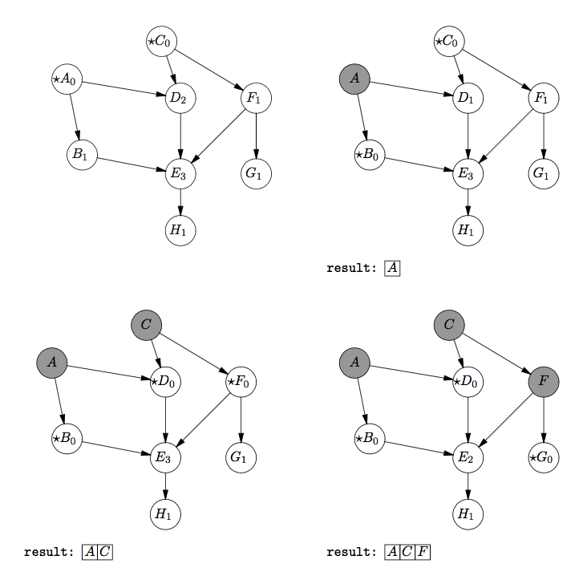

图12.8：拓扑排序的输入（左上图）和处理的三个阶段。灰色的是已处理并且放入结果集的节点。第一个处理的节点是图的边缘上的某一节点。字母下标代表节点入度。最终的结果是：A, C, F, D, B, E, G,H（这只是其中一种可能）。

### 12.3.5 最小生成树

现在讨论一个连通加权无向图。*最小(权值)生成树（minimun(-weight)spanning tree）*(简称MST)是一种树，它是给定图的子图，包含给定图的所有顶点，并且边权值的总和最小。比如，我们有一些城市，现在想以电话线作为路径把这些城市连接起来，并且让电话线的总成本达到最小。城市就是顶点，城市之间的连接就是边。寻找总值最小的连接集合的过程就是寻找最小生成树（可能不止一个）。为了实现这个算法，我们利用了最小连通树的一个有用定理。

**定理：** 如果连通图G的顶点被分成两个不相交的非空集，和，那么G的任意最小连通树一定包含这样一条边：边所连接的两个节点分别属于和（即横跨和），并且边的权值是横跨两个图的所有边中最小的（可能不止一条）。

**证明。** 可以很方便地用反证法证明。假设最小生成树T不包含横跨和且权值最小的边。现在给T添加一条横跨和且权值最小的边e，得到图（一定存在这样一条边，否则T就不是连通的）。因为T是一棵树，添加了这条新的边之后，会产生一个包含e的环（因为e连接的两个节点之间肯定是有路径的）。这个环中包含的另一条横跨和边，假设e的权值比小，把从中移除，得到一颗新的树，但是由于我们用替换了e，这棵新树的边权值之和小于T的边权值之和，和假设矛盾。得出T不包含从到的最小权值边的假设是错的。(证明)

利用这个定理，我们把已经选中的要作为树的边所连接的顶点放入已处理（已标记）集合，剩下的所有顶点放入集合。根据上述定理，我们可以安全地将已标记顶点到未标记顶点的任意最小权值边添加到树中。

这就是*普里姆算法（Prim’s algorithm）*。这次我们给每个节点引入两个额外信息，dist[v]（权重集）和parent[v]（顶点集）。在算法的每个点上，未处理顶点（仍然在队列中）的dist值是它与已处理顶点之间的最小距离（权重），parent的值是达到该最小距离的已处理顶点。

```java
/** 对于图G中的所有顶点, PARENT[v]是顶点v在MST中的父节点。
* DIST[v]可能会被任意设初始值。
* 假设图G是连通的。 WEIGHT[e]是边e的权值。 */
static void MST(Graph G, int[] weight, int[] parent, int[] dist) {
  for (int v = 0; v < G.numVertices(); v += 1) { 
    dist[v] = ∞;
    parent[v] = -1;
  }
	Let r be an arbitrary vertex in G; 
  dist[r] = 0;
	图遍历的模板替换成MST；
}
```

图遍历模板的适当“设置”如下。

COLLECTION OF VERTICES 是把顶点按照dist值排列的优先队列，值小的优先级高。

INITIAL COLLECTION 包含图G的所有顶点。

REMOVE HIGHEST PRIORITY ITEM 删除优先队列中的第一项。

VISIT(v)：对于每个边缘(v, w)和权重n，如果顶点w未处理且和dist [w] > n，则将dist [w] 值设为n，将parent[w]设为v。

NEEDS PROCESSING(v) 永远返回false。

图12.9演示了该算法的实际应用。

#### 12.3.6 单源最短路径

假设有一加权图（有向图或无向图），我们想找到从某个节点到它的每个可达节点的最短路径。最简洁的算法叫做*最短路径树（shortest-path tree）*。这是一颗生成树（不一定是最小生成树），它以我们选择的起始节点为根，从根到树中任意其它节点的路径也是整个图中总权重最小的路径。

最常见的是迪杰斯特拉算法，它看起来和Prim的MST算法基本一样。PARENT和DIST数据和之前一样。但是在Prim的算法中，DIST代表从未标记顶点到已标记顶点的最短距离，而在迪杰斯特拉算法中，DIST代表从起始节点开始到顶点所有已知的最短路径的长度。

```java
/** 对于起始点所有可达的顶点V, PARENT[v]表示以start为根的最短路径树中* v的父节点。 
* 对于树中的所有顶点, DIST[v]表示从起始点到顶点的距离
* WEIGHT[e]是边的非负权值。假设start在图G中。*/
static void shortestPaths(Graph G, int start, int[] weight, int[] parent, double[] dist)
{
  for (int v = 0; v < G.numVertices(); v += 1) {
  	dist[v] = ∞;
    parent[v] = -1;
  }
  dist[start] = 0;
	图遍历的模板替换成最短路径树算法；
}
```

我们把算法模板做如下替换：

COLLECTION OF VERTICES 是把顶点按照dist值排序的优先队列，值小的优先级高。

INITIAL COLLECTION 包含图G的所有顶点。

REMOVE HIGHEST PRIORITY ITEM 移除优先队列中的第一项。

MARKED 和 MARK可以是不重要的操作（返回false，什么都不做)。

VISIT(v)：每条边（v, w）和重量n，如果dist [w] > n + dist [v]，把dist [w] 设置为n + dist [v]，并把parent[w]设置为v。根据需要重排队列。

NEEDS PROCESSING(v) 永远返回false。

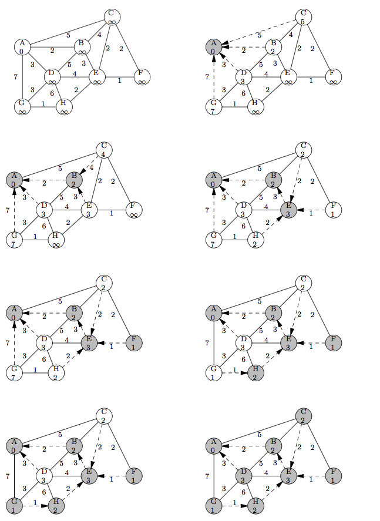

图12.9：最小生成树的Prim算法。顶点r是A。节点中的数字是dist值。虚线表示parent值；虚线最后会形成一个最小生成树。白色的节点位于队列中。最后两个步骤（不会改变父指针）合并为一个步骤。

图12.10演示了迪杰斯特拉算法的实际应用。

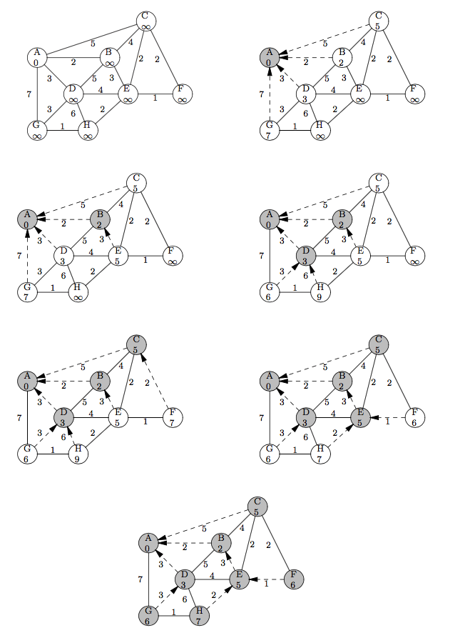

图12.10：Dijkstra的最短路径算法。起始节点为A。节点中的编号表示到目前找到的该节点到A的最小距离（dist）。虚线箭头表示父指针；它们的最终值是形成一颗最短路径树。最后三步已合并为了一步。

由于迪杰斯特拉算法和Prim算法的结构很相似，它们的时间复杂度也是相似的。每个节点只会被访问一次（从优先队列中删除一个节点），每访问一条边最多只会重排一次优先队列。因此，如果V是图G的顶点数，E是边数，那算法运行时间的上界就是%20\cdot%20lgv))。

#### 12.3.7 A星算法

Dijkstra算法可以有效地从图中的一个起点找到*所有*最短路径。但是，如果只想得到从一个起点到一个终点的一条最短路径。我们也可以修改访问迪杰斯特拉算法的步骤来实现：

VISIT(v)：[单个终点]如果v是终点则退出方法。否则，对于v的每条权值为n的边(v, w)，如果dist[w] > n + dist[v]，则将dist[w]设为n + dist[v]，并将parent[w]设为v。根据需要重排队列。

这样就避免了去计算距离起点更远的终点，但是Dijkstra算法还是可能做大量不必要的操作。

例如，假设你想找到一条从丹佛到纽约市的最短道路。虽然可以保证当从优先队列中选择纽约市时，停止算法。但是在算法考虑曼哈顿的某条街道之前，它已经找到了从丹佛到西海岸(除了阿拉斯加)、墨西哥和加拿大西部各省的几乎所有目的地的最短路径——然而这些方向都是错的！

我们可以通过改变挑选节点的顺序来修改算法——选择距离预期终点更近的节点。通过必要的调整后得到的算法称为A星算法:

```java
/** 对于从start到end的最短路径上的所有节点v，PARENT[v]代表v在这条路径 * 上的前驱节点，DIST[v]代表从start到该节点的距离。 WEIGHT[e]代表边的非* 负权值。 H[v]是v到end的启发式估计距离。假设顶点start和end都在图中，且* end对于start来说是可达的。*/
static void shortestPath(Graph G, int start, int end, int[] weight, int[] h,int[] parent, double dist[])
{
	for (int v = 0; v < G.numVertices(); v += 1) {
		dist[v] = ∞;
		parent[v] = -1;
	}
	dist[start] = 0;
	Graph-traversal schema replacement for A* search; 
}
```

A星搜索算法的模板和Dijkstra算法相同，只是把步骤VISTT替换为上面的单个终点的版本。

COLLECTION OF VERTICES [A* search]是把顶点按照dist(v)+h[v]值排序的优先队列，值小的优先级高。

换句话说，不同之处在于，我们要先假设通往终点的最短路径经过当前节点，然后估算出最短路径的大小。和Dijkstra算法本质上是相同的，只不过Dijkstra算法中h[v] = 0。

想要得到最优且正确的行为，我们需要h的做一些限制，即启发式距离估计。如注释所示，h是不变的。所以它必须是可容许的：h[v]不能比从v到终点的实际最短路径长度还要大。其次，如果(v, w)是一条边，那么

]+h[w]))

这是我们熟悉的三角形不等式的一个版本：三角形任意一条边的长度必须小于等于另外两条边的长度之和。满足这些条件的时候，A星算法是最优的，因为其它使用相同的启发式信息（h）的算法访问的节点不会更少（如果有多个权重相同的路径则需要其他限制）。

现在重新考虑从丹佛出发的路线规划，我们可以使用到纽约直线距离作为我们的启发式信息，因为这个距离满足三角不等式，且比两点之间的任意组合都要小。然而在实际的运用中，普遍的做法是对数据进行大量的预处理，这样查询的时候就不需要进行完整的搜索，从而加快操作速度。

#### 12.3.8 克鲁斯克尔算法

图遍历模板并不是唯一可行的方法，我们将考虑一种“经典”方法来形成最小生成树，称为*克鲁斯克尔算法（Kruskal’s algorithm）*。该算法依赖于一种叫*并查集（union-find）*的数据结构。任何时候，这个结构都包含一个顶点*分区（partition）*：一个包含所有顶点的不相交顶点集的集合。最开始，每个集合只有单独的一个节点。做法是每次增加一条边，来构成最小生成树。我们选择一条权重最小的跨越两个不同顶点集的边，把它增加到最小生成树中，然后把这两个顶点集合并成一个集合，重复此操作，直到所有顶点集合成一个（集合中必须包含所有的顶点）。每个集合都是一组顶点，这些顶点被我们添加到最小生成树中的边所连接起来，任意两个顶点都是可达的。当只有一个集合时，就说明所有的顶点都是可达的，那我们就得到了能够连接整棵树的边。根据§12.3.5中的定理，如果我们每次添加的边都是连接两个不相交顶点集的最小加权边，那么该边一定是最小生成树的一部分，因此最终得到的肯定是一颗最小生成树。图12.11展示了这个算法。

对于这个程序，假设我们使用并查集来存储顶点集。我们需要它进行两个操作：S.sameSet(v, w)返回顶点v和w是否在S中的同一个顶点集中，以及S.union(v, w)，它将包含顶点v和w的集合合并成一个集合。还有一个边集用来存储最终结果。

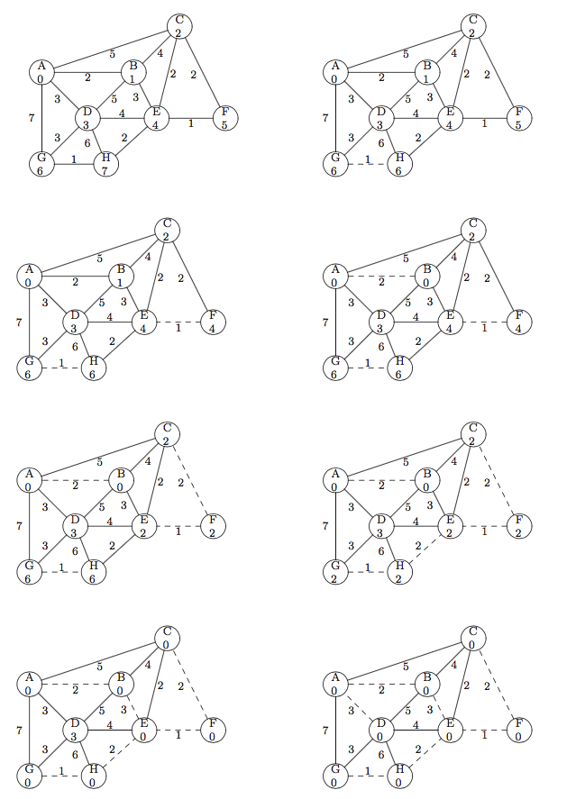

图12.11：克鲁斯克尔算法。顶点中的数字表示集合id：标记相同数字的顶点位于同一集合中。虚线表示边已经被添加到最小生成树中。这和图12.9中的最小生成树不同。

```java
/** 返回图G的最小生成树。G必须是一个连通无向图。weight表示边的权重 */
EdgeSet MST(Graph G, int[] weight) 
{
	UnionFind S;
	EdgeSet E;
	// 将S初始化为{{v} | v是图G的顶点}; 
  S = new UnionFind(G.numVertices());
	E = new EdgeSet();
	For each edge (v,w) in G in order of increasing weight { 
    if (! S.sameSet(v, w)) {
			Add (v,w) to E;
			S.union(v, w);
		}
	}
	return E; 
}
```

union-find位是比较复杂的部分。你可能认为每个sameSet操作的时间复杂度最坏情况下是Θ(nlgn)。有趣的是有一个更好的方法。假设（在这个问题中）集合包含从0到N - 1的整数。任何时候，最多有N个不相交的集合；我们从每个集合中选出一个数字，用该数字（一个数字0到N−1）作为集合id。对于某个数字代表的非空集合，可以通过顶点的集合id是否相同来判断两个顶点是否在同一个集合中。一种实现方式是将每个不相交集表示为一课顶点树，子节点指向父节点（您可能还记得我说过这样的数据结构会有用武之地）。每棵树的根都是集合id，可以通过父指针找到。例如，以下集合

{{1,2,4,6,7},{0,3,5},{8,9,10}}

可以表示成下面这样的森林

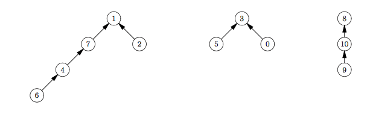

我们用一个整数数组 parent 来存储，其中parent[v]的值为v的父节点id，如果v没有父节点（即v的id就是集合id），那么parent[v]=-1。union操作很简单：执行S.union(v,w)，找到包含v和w的树的根（通过父指针向上找），然后把其中一个根变成另一个根的孩子。例如，执行S.union(6,0)，先找到6的集合id（1）和0的集合id（3），然后把3的父指针指向1：

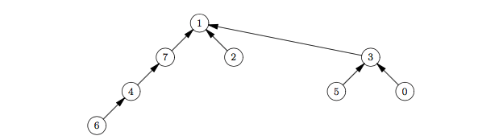

为了优化算法，我们应该把较小的树（一般是指高度）指向较大的树。

这个时候我们加入一个小插曲。在遍历了从顶点6到顶点1和从顶点0到顶点3的路径之后，我们把路径中经过的每个节点的父指针直接指向节点1，由此重新组织树（实际上是“记录”找到集合id的操作结果）。因此，在为6和0找到集合id并进行统一之后，我们得到下面这颗更平坦的树:

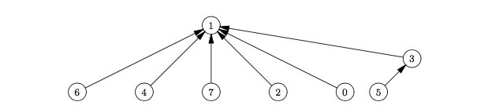

这种重排称为*路径压缩（path compression）*，它会使后续关于顶点6、4和0的访问比原来快很多。事实证明，这个技巧（包括把浅树指向一颗深的树形成一个集合），使包含N个元素的多个集合中的任意一个集合上的任意序列M中的union和sameSet操作时间复杂度为O(α(M, N) M)。在这里，α(M, N)是一个逆*阿克曼*的函数。具体来说,α(M, N)被定义为当i最小时A(i,⌊M/N⌋) > lgN，且

A(1,j) = ，当,
A(i,1) = A(i−1,2)，当,
A(i,j) = A(i − 1,A(i,j − 1))，当

好吧，这些相当复杂，但我只想说，A增长地非常快，所以α增长很缓慢，而且无论如何都小于等于4。简而言之，M的操作（任何组合中的union和sameSets）的*平摊成本（amortized cost ）*大致为常数。因此，Kruskal算法所需的时间主要由边的排序时间决定，对于边的数量E，趋近于O(elg E)。对于连通图等于O(elgv)，其中V是顶点的数量。

### 练习

**12.1。** 一只鹦鹉（snark）和一只魔鬼（borogove）发现自己身处迷宫中，迷宫中蜿蜒曲折的小通道连接着许多房间，其中有一个是迷宫出口。鹦鹉发现魔鬼特别美味。对于鹦鹉来说不幸的是，魔鬼跑得比鹦鹉快两倍，并且魔鬼有特殊能力可以找到通往出口的最短路径。对鹦鹉来说幸运的是，他异常敏锐的感官能随时准确地感应到魔鬼的位置，而且他对迷宫的结构了如指掌。如果他能比魔鬼先到达出口或魔鬼行走的路径上的任意房间（必须之前，不能是同时)，它就能抓住魔鬼。魔鬼并不聪明，它总是走最短的路径，即使是鹦鹉已经前面等着它，他也不会改变路线。例如，在下面的迷宫中，鹦鹉（起点在S点）经过6个时间单位就能到阴影房间用餐，魔鬼(起点在B点)经过7个时间单位能到。连接通道上的数字表示距离（房间内的数字只是标签）。鹦鹉的速度是0.5单位/小时，魔鬼的速度是1单位/小时。

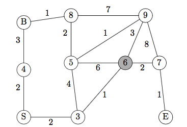

编写一个程序，读取上述迷宫，根据不同的情况打印以下两条信息之一：Snark eats或Borogove escapes。把你的代码写在Chase类中（参见cs61b / hw / hw7中的模板)。

输入如下：

* 一个正整数N3，表示房间数。你可以认为N < 1024。房间的编号是从0到N - 1的整数。0号房间总是出口。最开始魔鬼在1号房间，鹦鹉在2号房间。
* 边的序列，每条边由两个房间号（房间号的顺序任意）和一个距离整数组成。

如果同时有两条最短路径，魔鬼总是选择房间号小的那条。

迷宫的输入格式如下：

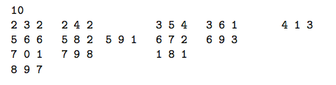


