参考：

[邓俊辉数据结构与算法学习笔记](https://blog.csdn.net/xiaodidadada/category_10348319.html)      
[算法可视化](http://algorithm-visualizer.org/)     

# 目录

**第1章 绪论**  

1.1 计算机与算法  
1.1.1 古埃及人的绳索 
1.1.2 欧几里德的尺规  
1.1.3 起泡排序  
1.1.4 算法  
1.1.5 算法效率  

1.2 复杂度度量 
1.2.1 问题规模、运行时间及时间复杂度  
1.2.2 渐进复杂度 
1.2.3 空间复杂度 

1.3 复杂度分析 
1.3.1 常数复杂度O(1)  
1.3.2 对数复杂度O(logn)  
1.3.3 线性复杂度O(n)  
1.3.4 多项式复杂度O(polynomial(n))  
1.3.5 指数复杂度O(2n)  
1.3.6 复杂度层次  
1.3.7 输入规模 

1.4* 递归 
1.4.1 线性递归  
1.4.2 递归分析  
1.4.3 递归模式  
1.4.4 递归消除  
1.4.5 二分递归 

1.5 抽象数据类型  

**第2章 向量**

2.1 从数组到向量
2.1.1 数组  
2.1.2 向量 

2.2 接口  
2.2.1 ADT接口  
2.2.2 操作实例  
2.2.3 Vector模板类  

2.3 构造与析构  
2.3.1 默认构造方法  
2.3.2 基于复制的构造方法  
2.3.3 析构方法  

2.4 动态空间管理  
2.4.1 静态空间管理  
2.4.2 可扩充向量  
2.4.3 扩容  
2.4.4 分摊分析  
2.4.5 缩容

2.5向量 
2.5.1 直接引用元素  
2.5.2 置乱器  
2.5.3 判等器与比较器  
2.5.4 无序查找  
2.5.5 插入  
2.5.6 删除  
2.5.7 唯一化  
2.5.8 遍历

2.6 有序向量 
2.6.1 比较器  
2.6.2 有序性甄别  
2.6.3 唯一化  
2.6.4 查找  
2.6.5 二分查找（版本A）  
2.6.6 Fibonacci查找  
2.6.7 二分查找（版本B）  
2.6.8 二分查找（版本C）

2.7 *排序与下界  
2.7.1 有序性  
2.7.2 排序及其分类  
2.7.3 下界  
2.7.4 比较树  
2.7.5 估计下界 

2.8 排序器 
2.8.1 统一入口  
2.8.2 起泡排序  
2.8.3 归并排序  

**第3章 列表**  

3.1 从向量到列表 
3.1.1 从静态存储到动态存储  
3.1.2 由秩到位置  
3.1.3 列表 

3.2 接口  
3.2.1 列表节点  
3.2.2 列表  

3.3 列表 
3.3.1 头、尾节点  
3.3.2 默认构造方法  
3.3.3 由秩到位置的转换  
3.3.4 查找  
3.3.5 插入  
3.3.6 基于复制的构造  
3.3.7 删除  
3.3.8 析构  
3.3.9 唯一化  
3.3.10 遍历  

3.4 有序列表  
3.4.1 唯一化  
3.4.2 查找 

3.5 排序器  
3.5.1 统一入口  
3.5.2 插入排序  
3.5.3 选择排序  
3.5.4 归并排序  

**第4章 栈与队列**  

4.1 栈  
4.1.1 概述  
4.1.2 ADT接口  
4.1.3 操作实例  
4.1.4 Stack模板类

4.2 栈与递归 
4.2.1 递归的实现  
4.2.2 避免递归 

4.3 典型应用 
4.3.1 逆序输出  
4.3.2 递归嵌套  
4.3.3 延迟缓冲  
4.3.4 逆波兰表达式

4.4* 试探回溯法
4.4.1 试探与回溯  
4.4.2 八皇后  
4.4.3 迷宫寻径

4.5 队列 
4.5.1 概述  
4.5.2 ADT接口  
4.5.3 操作实例  
4.5.4 Queue模板类  

4.6 队列应用  
4.6.1 循环分配器  
4.6.2 银行服务模拟  

**第5章 二叉树**

5.1 二叉树及其表示 
5.1.1 树  
5.1.2 二叉树  
5.1.3 多叉树  

5.2 编码树  
5.2.1 二进制编码  
5.2.2 二叉编码树  

5.3 二叉树的实现 
5.3.1 二叉树节点  
5.3.2 二叉树节点操作接口  
5.3.3 二叉树  

5.4 Huffman编码 
5.4.1 PFC编码  
5.4.2 最优编码树  
5.4.3 Huffman编码树  
5.4.4 Huffman编码算法

5.5 遍历  
5.5.1 递归式遍历  
5.5.2 迭代版先序遍历  
5.5.3 迭代版中序遍历  
5.5.4 迭代版后序遍历  
5.5.5 层次遍历  

**第6章 图**  

6.1 概述  

6.2 抽象数据类型 
6.2.1 操作接口  
6.2.2 Graph模板类 

6.3 邻接矩阵 
6.3.1 原理  
6.3.2 实现  
6.3.3 时间性能  
6.3.4 空间性能 

6.4 邻接表 
6.4.1 原理  
6.4.2 复杂度  

6.5 图遍历算法概述  
6.6 广度优先搜索 
6.6.1 策略  
6.6.2 实现  
6.6.3 实例  
6.6.4 复杂度  
6.6.5 应用  

6.7 深度优先搜索 
6.7.1 策略  
6.7.2 实现  
6.7.3 实例  
6.7.4 复杂度  
6.7.5 应用  

6.8 拓扑排序 
6.8.1 应用  
6.8.2 有向无环图  
6.8.3 算法  
6.8.4 实现  
6.8.5 实例  
6.8.6 复杂度  

6.9* 双连通域分解 
6.9.1 关节点与双连通域  
6.9.2 蛮力算法  
6.9.3 算法  
6.9.4 实现  
6.9.5 实例  
6.9.6 复杂度  

6.10 优先级搜索
6.10.1 优先级与优先级数  
6.10.2 基本框架  
6.10.3 复杂度 

6.11 最小支撑树  
6.11.1 支撑树  
6.11.2 最小支撑树  
6.11.3 歧义性  
6.11.4 蛮力算法  
6.11.5 Prim算法  

6.12 最短路径  
6.12.1 最短路径树  
6.12.2 歧义性  
6.12.3 Dijkstra算法  

**第7章 搜索树**  

7.1 搜索  
7.1.1 循关键码访问  
7.1.2 词条  
7.1.3 序与比较器  

7.2 二叉搜索树 
7.2.1 顺序性  
7.2.2 中序遍历序列  
7.2.3 BST模板类  
7.2.4 查找算法及其实现  
7.2.5 插入算法及其实现  
7.2.6 删除算法及其实现

7.3 平衡二叉搜索树  
7.3.1 树高与性能  
7.3.2 理想平衡与适度平衡  
7.3.3 等价二叉搜索树  
7.3.4 等价变换与局部调整  

7.4 AVL树 
7.4.1 AVL树  
7.4.2 节点插入  
7.4.3 节点删除  
7.4.4 统一重平衡算法  

**第8章 高级搜索树** 

8.1 伸展树  
8.1.1 局部性  
8.1.2 逐层伸展  
8.1.3 双层伸展  
8.1.4 分摊分析  
8.1.5 伸展树的实现 

8.2 B-树  
8.2.1 多路平衡搜索  
8.2.2 ADT接口及其实现  
8.2.3 关键码查找  
8.2.4 性能分析  
8.2.5 关键码插入  
8.2.6 上溢与分裂  
8.2.7 关键码删除  
8.2.8 下溢与合并 

8.3* 红黑树   
8.3.1 概述     
8.3.2 红黑树接口定义     
8.3.3 节点插入算法      
8.3.4 节点删除算法      

8.4* kd-树          
8.4.1 范围查询            
8.4.2 kd-树        
8.4.3 基于2d-树的范围查询算法        

**第9章 词典**

9.1 词典        
9.1.1 操作接口        
9.1.2 操作实例        
9.1.3 接口定义        
9.1.4 判等器        
9.1.5 实现方法 
       
9.2* 跳转表              
9.2.1 Skiplist模板类        
9.2.2 总体逻辑结构        
9.2.3 四联表        
9.2.4 查找        
9.2.5 空间复杂度        
9.2.6 时间复杂度        
9.2.7 插入        
9.2.8 删除       

9.3 散列表        
9.3.1 完美散列        
9.3.2 装填因子与空间利用率        
9.3.3 散列函数        
9.3.4 散列表        
9.3.5 冲突及其排解        
9.3.6 开放定址策略        
9.3.7 查找与删除        
9.3.8 插入        
9.3.9 更多开放定址策略        
9.3.10 散列码转换       
       
9.4* 散列应用              
9.4.1 桶排序        
9.4.2 最大间隙        
9.4.3 基数排序        

**第10章 优先级队列**  

10.1 优先级队列       
10.1.1 优先级与优先级队列        
10.1.2 关键码、比较器与偏序关系        
10.1.3 操作接口        
10.1.4 操作实例：选择排序        
10.1.5 接口定义        
10.1.6 应用实例：Huffman编码树        

10.2 堆        
10.2.1 完全二叉堆              
10.2.2 元素插入        
10.2.3 元素删除        
10.2.4 建堆        
10.2.5 就地堆排序       

10.3* 左式堆       
10.3.1 堆合并        
10.3.2 单侧倾斜        
10.3.3 PQ_LeftHeap模板类        
10.3.4 空节点路径长度        
10.3.5 左倾性与左式堆        
10.3.6 右侧链        
10.3.7 合并算法        
10.3.8 合并操作merge()的实现        
10.3.9 实例        
10.3.10 复杂度        
10.3.11 基于合并的插入和删除操作        

**第11章 串** 

11.1 串及串匹配       
11.1.1 串        
11.1.2 串匹配       
11.1.3 测评标准与策略       

11.2 蛮力算法        
11.2.1 算法描述        
11.2.2 算法实现        
11.2.3 时间复杂度       

11.3 KMP算法        
11.3.1 构思        
11.3.2 next表              
11.3.3 KMP算法        
11.3.4 next[0]=-1        
11.3.5 构造next表        
11.3.6 性能分析        
11.3.7 继续改进        

11.4* BM算法        
11.4.1 思路与框架        
11.4.2 坏字符策略        
11.4.3 好后缀策略        
11.4.4 综合性能       

11.5* Karp-Rabin算法        
11.5.1 构思        
11.5.2 算法与实现        

**第12章 排序** 
      
12.1 快速排序        
12.1.1 分治策略        
12.1.2 轴点        
12.1.3 快速排序算法        
12.1.4 快速划分算法        
12.1.5 复杂度        
12.1.6 应对退化        
 12.2* 选取与中位数        
12.2.1 概述        
12.2.2 主流数        
12.2.3 归并向量的中位数        
12.2.4 基于优先级队列的选取        
12.2.5 基于快速划分的选取        
12.2.6 k-选取算法        
 12.3* 希尔排序        
12.3.1 递减增量策略        
12.3.2 增量序列        
      


#笔记

## 第1章 绪论  

### 1.1 计算机与算法  

#### 1.1.1 古埃及人的绳索

#### 1.1.2 欧几里德的尺规 

#### 1.1.3 起泡排序  

#### 1.1.4 算法

#### 1.1.5 算法效率  

### 1.2 复杂度度量 

#### 1.2.1 问题规模、运行时间及时间复杂度  

#### 1.2.2 渐进复杂度 

复杂度顺序：坏->中-> 好： O --> theta --> Omega，通常情况下考虑最坏情况。

<center>  </center>    
<center>四种内存访问模式</center>    	

#### 1.2.3 空间复杂度 

### 1.3 复杂度分析

#### 1.3.1 常数复杂度O(1)  
#### 1.3.2 对数复杂度O(logn)  
#### 1.3.3 线性复杂度O(n)  
#### 1.3.4 多项式复杂度O(polynomial(n)) 

2-Subset 子集问题： 集合 S 中包含 n 个正整数，sum{S} = 2*m，则 S 是否有子集 T，满足 sum{T} = m

实例：美国大选，51 个州共 538 票，各州票数不同，获得 270 票即当选，问是否会出现恰好各得 269 票？

直觉算法：逐一枚举每一子集统计，复杂度为 2^n

有 n 个项的集合，子集共有 $2^n$ 个（考虑每个项包含和不包含在子集中的情况），遍历 0 ~ $2^n$，每个值转成二进制，依次判断：

```cpp
// 习题 [1-16]
//2-Subset 子集问题
int subset(int A[], int n, int m) {
    int end = (1<<n)-1; //2^n - 1
    for (int mask=0; mask<=end; mask ++) {
        int sum = 0;
        for(int i=0; i<n; i++) {
            if (mask & (1<<i)) {
                sum += A[i];
            }
        }
        if (sum == m)
            return mask; //mask 中的各个位数 1 代表所含的项
    }
    return 0;
}


int main() {
    int A[6] = {1, 2, 3, 4, 2, 6}; //sum=18=2X9
    cout << "subset(A, 6, 9)=" << subset(A, 6, 9) << endl;  //14, 1110, 表示 {2, 3, 4} 子集符合
}  
```

定理： 2-Subset is NP-complete，目前没有多项式复杂度的算法。

#### 1.3.5 指数复杂度O(2n)  

#### 1.3.6 复杂度层次 

<center>  </center>   

#### 1.3.7 输入规模 

循环次数的统计转为级数的计算。

次数对应面积：


次数对应级数和，几何级数与末项同阶：


### 1.4* 递归

#### 1.4.1 线性递归

```cpp
// 数组求和算法，线性递归版
int sum_linear_recursion(int A[], int n) {
    if (n < 1) // 平凡情况，递归基
        return 0;
    else //一般情况
        return sum_linear_recursion(A, n-1) + A[n-1]; //递归：前 n-1 项之和，再累计第 n-1 项
} //O(1)*递归深度 = O(1)*(n+1) = O(n)
```

平凡情况称为 **递归基** base case of recursion，用于结束递归。

`sum_linear_recursion` 算法是线性递归：每一递归实例对自身的调用至多一次，每一层上最多一个实例，且它们构成一线性次序关系。

这种形式中，问题总可分解成两个独立子问题：其一对应于单独的某元素，如 A[n-1]，故可直接求解;另一个对应剩余部分，且其结构与原问题相同，如 A[0, n-1]，最后，子问题解经过简单合并，可得到原问题的解。

线性递归模式，往往对应于 **减而治之 (decrease-and-conquer)** 的算法策略：递归每深入一层，问题的规模都缩减一个常数，直到最终蜕化为平凡的小（简单）问题。 


**Fibonacci 数：线性递归**

fib(n-1) 和 fib(n-2) 并非独立，将递归函数改为计算一对相邻的 Fib 数：

```cpp
// Fibonacci 线性递归版本，入口形式 fibonacci_linear_recursion(n, prev)
// 使用临时变量，避免重复递归计算
tint64 fibonacci_linear_recursion(int n, tint64& prev) {
    if (n == 0){ //若到达递归基，则
        prev = 1;
        return 0; // 直接取值： fib(-1) = 1, fib(0)=0
    } else {
        tint64 prevPrev; prev = fibonacci_linear_recursion(n-1, prevPrev); //递归计算前两项
        return prevPrev + prev; //其和即为正解
    }
} // 用辅助变量记录前一项，返回数列的当前项, O(n)
```
通过 prevPrev 调阅此前的记录，从而省略了 fib(n-2) 的递归计算，呈线性递归模式，递归深度线性正比于输入值 n，共出现 O(n) 的递归实例，时间和空间复杂度都为 O(n)。


#### 1.4.2 递归分析

#### 1.4.3 递归模式

**多向递归**

```cpp
typedef long long tint64;

inline tint64 square(tint64 a) { return a*a; }

tint64 power2(int n) { //幂函数 2^n算法，优化递归版本, n>=0
    if (0==n) return 1; //递归基
    return (n&1) ? square(power2(n >> 1)) << 1 : square(power2(n >> 1)); //视 n 的 奇偶分别递归
} // O(logn) = O(r), r 为输入指数 n 的比特位数
```

迭代版本为：

```cpp
typedef long long tint64;
//迭代版本
tint64 power2_loop(int n) {
    tint64 pow = 1; // 累积器初始化为 2^0
    tint64 p = 2; // 累乘项初始化为 2，对应最低位为 1 的情况
    while (n>0) { // 迭代 log(n) 轮
        if (n&1) // 根据当前比特位是否为 1, 决定
            pow *= p; // 将当前累乘项计入累积器
        n >>= 1; //指数减半
        p *= p; //累乘项自乘
    }
    return pow; 
} // O(logn) = O(r), r 为输入指数 n 的比特位数

//而一般性的 a^n 计算如下 
tint64 power_loop(tint64 a, int n) { // a^n 算法： n >= 0
    tint64 pow = 1; // 累积器初始化为 2^0
    tint64 p = a; // 累乘项初始化为 a，对应最低位为 1 的情况
    while (n>0) { // 迭代 log(n) 轮
        if (n&1) // 根据当前比特位是否为 1, 决定
            pow *= p; // 将当前累乘项计入累积器
        n >>= 1; //指数减半
        p *= p; //累乘项自乘
    }
    return pow; 
} // O(logn) = O(r), r 为输入指数 n 的比特位数
```

#### 1.4.4 递归消除

**尾递归及消除**

递归调用为算法的最后一步操作（即递归的任一实例都终止于这一递归调用），为尾递归，它们可转换为等效的迭代版本。

但上面数组求和的线性递归版本中，最后的操作是加法运算，不是纯递归调用，因此不是尾递归，但是也可以转换成迭代版本。

```cpp
// 数组倒置，将尾递归优化为迭代版本
void reverse_loop_version(int* A, int lo, int hi){
    while (lo < hi) {
        //swap(A[lo++], A[hi--]); //交换 A[lo], A[hi], 收缩待倒置区间
        int tmp = A[lo];
        A[lo] = A[hi];
        A[hi] = tmp;
        lo++;
        hi--;
    }
} // O(hi-lo+1)

```

##### Fibonacci 数：动态规划

```cpp
// Fibonacci 迭代版本： O(n)
// 采用动态规划策略，按规模自小而大求解各子问题
tint64 fibonacci_loop_version(int n) {
    tint64 f = 0, g = 1; // 初始化 fib(0)=0, fib(1)=1
    while (0 < n--) {
        g += f; f = g-f; //依原始定义，通过 n 次加法和减法计算 fib(n)
    }
    return f;
}
```

##### 最长公共子序列 LCS 问题：


递归版本 LCS(A[0,n], B[0,m]):

两个序列 A[0, n], B[0, m]

1. 若 n=-1 或 m=-1，则返回空串，这是一个递归基。
2. 自后向前比较，或 A[n] == B[m] == x，则取作 LCS(A[0, n), B[0, m)) + x，减而治之。
3. 若 A[n] != B[m]，这里分 2 种情况，一种是 B[m] 对 LCS 无贡献，此时最终值为 LCS(A[0, n], B[0, m)); 另一种是 A[n] 对 LCS 无贡献，此时最终值为 LCS(A[0, n), B[0, m])，返回这 2 种情况的最长者。

复杂度为 2^n。

这和 Fib() 类似，有大量重复的递归实例（子问题）。各子问题，分别对应于 A 和 B 的某前缀组合，总共有 O(nm) 种。 采用动态规划策略，只需 O(nm) 时间。

1. 将所有子问题（假想地）列为一个表
2. 颠倒计算方向，从 LCS(A[0], B[0]) 出发，依次计算所有项，并填写表格。
3. 对于每个单元，如果减而治之情况（元素匹配），则值取左上值+1，如果是分而治之（不匹配），则值为左边和右边值的最大值。


动态规划能消除重复。

#### 1.4.5 二分递归  

使用 **分而治之divide-and-conquer** 的策略，将问题持续分解成更小规模的子问题，至平凡情况。

和减而治之策略一样，也要对原问题重新表述，保证子问题与原问题在接口形式上一致。

每一递归实例都可能做多次递归，故称作 多路递归 multi-way recursion。通常是将原问题二分，故称二分递归 binary recursion。

数组求和采用二分递归：

```cpp
// 数组求和算法，二分递归版本，入口为 sum_binary_recursion(A, 0, n-1)
int sum_binary_recursion(int A[], int lo, int hi) {
    if (lo == hi) //如遇递归基（区间长度已降至 1)，则
        return A[lo]; //直接返回该元素
    else { // 否则是一般情况 lo < hi, 则
        int mi = (lo+hi) >> 1; //以居中单元为界，将原区间一分为二
        return sum_binary_recursion(A, lo, mi) + sum_binary_recursion(A, mi+1, hi); //递归对各子数组求和，然后合计
    }
} //O(hi-lo+1)，线性正比于区间的长度
```

Fibonacci 数的二分递归：

```cpp
// 计算 Fibonacci 数列的第 n 项，二分递归版本，O(2^n)
tint64 fibonacci_binary_recursion(int n) {
    return (n<2) ? 
        (tint64) n // 若到达递归基，直接取值
        : fibonacci_binary_recursion(n-1) + fibonacci_binary_recursion(n-2);
}
```

**优化策略，消除递归算法中重复的递归实例**

即：借助一定量的辅助空间，在各子问题求解后，及时记录下其对应的解。

1. 从原问题出发自顶向下，遇到子问题时，先查验是否计算过，避免重新计算，为制表(tabulation) 或记忆 (memoization) 策略。
2. 从递归基出发，自底而上递推地得出各子问题的解，直到最终原问题的解，即为动态规划(dynamic programming) 策略。

### 1.5 抽象数据类型  

## 第2章 向量 

### 2.1从数组到向量

线性结构统称为序列 sequence，又根据数据项的逻辑次序与其物理存储地址的对应关系，进一步分为向量 vector 和列表 list。

1. 向量：物理存放位置与逻辑次序吻合，此时的逻辑次序也称为秩 rank。
2. 列表：逻辑上相邻的数据项在物理上未必相邻。

#### 2.1.1 数组 


#### 2.1.2 向量

C语言中的数组能组织相同类型的数据项，并用下标存取数据项。元素的物理地址和下标满足线性关系，故称为线性数组 linear array。

### 2.2 接口  
#### 2.2.1 ADT接口 

向量是线性数组的一种抽象和泛化，它也是由具有线性次序的一组元素构成的集体，V = { V0, V1,..., V{n-1} }，其中的元素分别由秩 (rank) 相互区别（相当于下标）。各元素的秩互异，且均为 [0, n) 内的整数，若元素 e 有 r 个前驱元素，则其秩为 r。通过 r 亦可唯一确定e = V_r，称为 **循秩访问 call-by-rank**。

向量实际规模size与其内部数组容量capacity的比值size/capacity称装填因子load factor，用来衡量空间利用率。


#### 2.2.2 操作实例

#### 2.2.3 Vector模板类  

```C++
template <typename T> class Vector { //向量模板类
protected:
   Rank _size; int _capacity;  T* _elem; //规模、容量、数据区
   void copyFrom ( T const* A, Rank lo, Rank hi ); //复制数组区间A[lo, hi)
   void expand(); //空间不足时扩容
   void shrink(); //装填因子过小时压缩
   bool bubble ( Rank lo, Rank hi ); //扫描交换
   void bubbleSort ( Rank lo, Rank hi ); //起泡排序算法
   Rank max ( Rank lo, Rank hi ); //选取最大元素
   void selectionSort ( Rank lo, Rank hi ); //选择排序算法
   void merge ( Rank lo, Rank mi, Rank hi ); //归并算法
   void mergeSort ( Rank lo, Rank hi ); //归并排序算法
   void heapSort ( Rank lo, Rank hi ); //堆排序（稍后结合完全堆讲解）
   Rank partition ( Rank lo, Rank hi ); //轴点构造算法
   void quickSort ( Rank lo, Rank hi ); //快速排序算法
   void shellSort ( Rank lo, Rank hi ); //希尔排序算法
public:
// 构造函数
   Vector ( int c = DEFAULT_CAPACITY, int s = 0, T v = 0 ) //容量为c、规模为s、所有元素初始为v
   { _elem = new T[_capacity = c]; for ( _size = 0; _size < s; _elem[_size++] = v ); } //s<=c
   Vector ( T const* A, Rank n ) { copyFrom ( A, 0, n ); } //数组整体复制
   Vector ( T const* A, Rank lo, Rank hi ) { copyFrom ( A, lo, hi ); } //区间
   Vector ( Vector<T> const& V ) { copyFrom ( V._elem, 0, V._size ); } //向量整体复制
   Vector ( Vector<T> const& V, Rank lo, Rank hi ) { copyFrom ( V._elem, lo, hi ); } //区间
// 析构函数
   ~Vector() { delete [] _elem; } //释放内部空间
// 只读访问接口
   Rank size() const { return _size; } //规模
   bool empty() const { return !_size; } //判空
   Rank find ( T const& e ) const { return find ( e, 0, _size ); } //无序向量整体查找
   Rank find ( T const& e, Rank lo, Rank hi ) const; //无序向量区间查找
   Rank search ( T const& e ) const //有序向量整体查找
   { return ( 0 >= _size ) ? -1 : search ( e, 0, _size ); }
   Rank search ( T const& e, Rank lo, Rank hi ) const; //有序向量区间查找
// 可写访问接口
   T& operator[] ( Rank r ); //重载下标操作符，可以类似于数组形式引用各元素
   const T& operator[] ( Rank r ) const; //仅限于做右值的重载版本
   Vector<T> & operator= ( Vector<T> const& ); //重载赋值操作符，以便直接克隆向量
   T remove ( Rank r ); //删除秩为r的元素
   int remove ( Rank lo, Rank hi ); //删除秩在区间[lo, hi)之内的元素
   Rank insert ( Rank r, T const& e ); //插入元素
   Rank insert ( T const& e ) { return insert ( _size, e ); } //默认作为末元素插入
   void sort ( Rank lo, Rank hi ); //对[lo, hi)排序
   void sort() { sort ( 0, _size ); } //整体排序
   void unsort ( Rank lo, Rank hi ); //对[lo, hi)置乱
   void unsort() { unsort ( 0, _size ); } //整体置乱
   int deduplicate(); //无序去重
   int uniquify(); //有序去重
// 遍历
   void traverse ( void (* ) ( T& ) ); //遍历（使用函数指针，只读或局部性修改）
   template <typename VST> void traverse ( VST& ); //遍历（使用函数对象，可全局性修改）
}; //Vector
```

### 2.3 构造与析构  
#### 2.3.1 默认构造方法  
#### 2.3.2 基于复制的构造方法  
#### 2.3.3 析构方法  

### 2.4 动态空间管理  

#### 2.4.1 静态空间管理  

#### 2.4.2 可扩充向量


满员时进行插入操作，会自动扩容为原数组为两倍。

```cpp
template <typename T> void Vector<T>::expand() { //向量空间不足时扩容
    if (_size < _capacity)
        return; //尚未满员时，不必扩容

    if (_capacity < DEFAULT_CAPACITY)
        _capacity = DEFAULT_CAPACITY; //不低于最小容量

    T* oldElem = _elem;
    _elem = new T[_capacity <<= 1]; //容量加倍
    for (int i=0; i<_size; i++)
        _elem[i] = oldElem[i]; //复制原向量内容，T 为基本类型，或已重载赋值操作符 '='

    delete [] oldElem; //释放原空间
}
```


#### 2.4.3 扩容  
#### 2.4.4 分摊分析  

自动扩容时的插入操作，时间代价为 O(2n)=O(n)，但之后至少要再经过 n 次插入后，才会再次扩容操作，故分摊复杂度不高。

足够多次连续操作后，将期间消耗的时间分摊至所有的操作，分摊平均至单次操作的时间成本，称为分摊运行时间 (amortized running time)，它与平均运行时间（average running time) 有本质不同，后者是按照某种假定的概率分布，对各情况下所需执行时间的加权平均，故亦称为期望运行时间（expected running time);前者则要求，参与分摊的操作必须构成和来自一个真实可行的操作序列，且该序列还必须足够长。


考虑最坏情况，即都是插入操作，定义：

+ size(n) = 连接插入 n 个元素后向量的规模
+ capacity(n) = 连接插入 n 个元素后向量的容量
+ T(n) = 为连续插入 n 个元素而花费于扩容的时间
+ N 为初始容量

则 size(n) = N + n，既然不溢出，则装填因子不超过 100%，同时，只在满员时将容量加倍，则因子不低于 50%。

#### 2.4.5 缩容

```cpp
template <typename T> void Vector<T>::shrink(){ //装填因子过小时压缩向量所占空间
    if (_capacity < DEFAULT_CAPACITY<<1) //不致收缩到 DEFAULT_CAPACITY 以下
        return;

    if (_size<<2 > _capacity) // 以 25% 为界，大于 25% 时不收缩
        return;

    T* oldElem = _elem;
    _elem = new T[_capacity >>= 1]; //容量减半
    for (int i=0; i<_size; i++)
        _elem[i] = oldElem[i];

    delete [] oldElem;
}
```

这里缩容阈值是 25%，为避免出现频繁交替扩容和缩容，可选用更低的阈值，甚至取 0（禁止缩容）。分摊时间也是 O(1)。

### 2.5 向量

#### 2.5.1 直接引用元素    

#### 2.5.2 置乱器     

```cpp
template <typename T> void permute(Vector<T>& V) { //随机置乱向量，使各元素等概率出现于每一位置
    for (int i=V.size(); i>0; i--) //自后向前
        swap(V[i-1], V[rand() % i]); //V[i-1] 与 V[0, i) 中某一随机元素交换，rand() 返回 0~MAX之间的整数
}
```


#### 2.5.3 判等器与比较器  
#### 2.5.4 无序查找


```cpp
template <typename T> //无序向量的顺序查找，返回最后一个元素 e 的位置;失败时返回 lo-1
Rank Vector<T>::find(T const& e, Rank lo, Rank hi) const {  //在 [lo, hi) 内查找
    //assert: 0 <= lo < hi <= _size
    while ((lo < hi--) && (e != _elem[hi]))
        ; // 自后向前，顺序查找
    return hi; //若 hi<lo, 则意味着失败; 否则 hi 即命中元素的秩
}
```

复杂度最坏情况是 O(hi-lo)=O(n)，最好情况是 O(1)，故为输入敏感的算法。

#### 2.5.5 插入


```cpp
template <typename T> //将 e 作为秩为 r 的元素插入
Rank Vector<T>::insert(Rank r, T const& e) {
    //assert: 0 <= r <= size
    expand(); //若有必要， 扩容
    for (int i=_size; i>r; i--)
        _elem[i] = _elem[i-1]; //自后向前， 后继元素顺序后移一个单元

    _elem[r] = e; 
    _size++;
    return r;
}
```

复杂度为 O(n)。


#### 2.5.6 删除  


```cpp
template <typename T> int Vector<T>::remove(Rank lo, Rank hi) { //删除区间 [lo, hi)
    if (lo == hi) 
        return 0; //出于效率考虑，单独处理退化情况，比如 remove(0, 0)

    while (hi < _size)
        _elem[lo++] = _elem[hi++]; // [hi, _size] 顺次前移 hi-lo 个单元

    _size = lo; // 更新规模，直接丢弃尾部 [lo, _size=hi) 区间
    shrink(); //若有必要，则缩容
    return hi-lo; //返回被删除元素的数目
}
```

复杂度主要消耗于后续元素的前移，线性正比于后缀的长度。

#### 2.5.7 唯一化


```cpp
//删除无序向量中重复元素（高效版本）
template <typename T> int Vector<T>::deduplicate(){ 
    int oldSize = _size;
    Rank i = 1; //从 _elem[1] 开始
    while (i < _size) //自前向后逐一考查各元素 _elem[i]
        (find(_elem[i], 0, i) < 0) ? //在其前缀中寻找与之雷同者（至多一个）
            i++ : remove(i); //若无雷同则继续考查其后续，否则删除雷同者

    return oldSize - _size; //向量规模变化量，即被删除元素总数
}
```

每次迭代时间为 O(n),总体复杂度 O(n^2)。


```cpp
//有序向量重复元素删除算法（高效版本）
template <typename T> int Vector<T>::uniquify(){
    Rank i = 0, j = 0; //各对互异 "相邻“ 元素的秩
    while (++j < _size) //逐一扫描，直到末元素
        if (_elem[i] != _elem[j]) //跳过雷同者
            _elem[++i] = _elem[j]; //发现不同元素时，向前移至紧邻于前者右侧

    _size = ++i; //直接截除尾部多余元素
    shrink();
    return j - i; //返回删除元素总数
}
```


算法复杂度是 O(n)。


#### 2.5.8 遍历

### 2.6 有序向量

#### 2.6.1 比较器  
#### 2.6.2 有序性甄别  
#### 2.6.3 唯一化  
#### 2.6.4 查找  
#### 2.6.5 二分查找（版本A）

减而治之，二分查找（版本A）


```cpp
//二分查找版本A：在有序向量的区间 [lo, hi) 内查找元素 e, 0 <= lo <= hi <= _size
template <typename T> static Rank binSearch(T* A, T const& e, Rank lo, Rank hi) {
    while (lo < hi) { //每步迭代可能要做两次比较判断，有三个分支
        Rank mi = (lo + hi) >> 1; //以中点为轴点
        if (e < A[mi]) 
            hi = mi; //深入前半段 [lo, mi)继续查找
        else if ( e > A[mi])
            lo = mi + 1; //深入后半段
        else
            return mi; //在 mi 处命中
    } //成功查找可以提前终止
    return -1; //查找失败
} //有多个命中元素时，不能保证返回秩最大者； 查找失败时，简单返回 -1， 而不能指示失败的位置
```
最多 log_2(hi-lo)次迭代，时间复杂度 O(logn)

#### 2.6.6 Fibonacci查找  

指查找算法中元素大小比较操作的次数。


二分查找时，查找过程（模式）一致，因此每个元素的查找长度只与该元素的秩和总长度有关，与元素的具体值无关。

**Fibonacci 查找，按黄金分割比确定 mi**


该算法会拉长 1 次比较的子向量（左侧树），缩短 2 次比较的子向量（右侧树），从而减少平均查找长度。

```cpp
// Fibonacci 查找版本A：在有序向量的区间 [lo, hi) 内查找元素 e, 0 <= lo <= hi <= _size
template <typename T> static Rank fibSearch(T* A, T const& e, Rank lo, Rank hi) {
    Fib fib(hi-lo); //用 O(log_phi(hi-lo) 时间创建 Fib 数列，值不大于 hi-lo
    while (lo < hi) { //每步迭代可能要做两次比较，有三个分支
        while (hi-lo < fib.get())
            fib.prev(); //通过向前顺序查找（分摊O(1)) 
        Rank mi = lo + fib.get() - 1; //确定形如 Fib(k)-1 的轴点
        if (e < A[mi])
            hi = mi;
        else if (A[mi] < e)
            lo = mi + 1;
        else
            return mi; //命中
    } //成功查找可以提前终止
    return -1; //查找失败
} //有多个命中元素时，不能保证返回秩最大者； 查找失败时，简单返回 -1， 而不能指示失败的位置
```

平均查找长度为 1.44 * log_2 * n，常系数上有改善。

#### 2.6.7 二分查找（版本B）

从三分支改为两分支，从而使两分的子向量的比较次数都为 1，在切分点 mi 处只任一次 `<` 比较，判断成功进入前端 A[lo, mi) 继续，否则进入后端 A[mi, hi) 继续。


```cpp
//二分查找版本B：在有序向量的区间 [lo, hi) 内查找元素 e, 0 <= lo <= hi <= _size
template <typename T> static Rank binSearch(T* A, T const& e, Rank lo, Rank hi) {
    //循环在区间不足两个时中止
    while (1 < hi-lo) { //每步迭代仅做一次比较判断，有两个分支;成功查找不能提前终止
        Rank mi = (lo + hi) >> 1; //以中点为轴点
        (e < A[mi]) ? hi = mi : lo = mi; //经比较后确定深入 [lo, mi) 或 [mi, hi)
    } // 出口时 lo+1 == hi, 即区间中只剩下一个元素 A[lo]
    return (e == A[lo]) ? lo : -1; //查找成功时返回对应的秩，否则统一返回 -1 
} //有多个命中元素时，不能保证返回秩最大者； 查找失败时，简单返回 -1， 而不能指示失败的位置
```

命中时不能及时返回，最好情况下效率有倒退，作为补偿，最坏情况下效率有提高，因此各分支的查找长度更接进，整体性能更趋稳定（好）。

#### 2.6.8 二分查找（版本C）

返回的结果方便进行插入操作

- 当有多个命中元素时，必须返回最靠后（秩最大）者
- 失败时，应返回小于 e 的最大都（仿哨兵 A[lo-1])

```cpp
//二分查找版本C：在有序向量的区间 [lo, hi) 内查找元素 e, 0 <= lo <= hi <= _size
template <typename T> static Rank binSearch_VC(T* A, T const& e, Rank lo, Rank hi) {
    while (lo < hi) { //每步迭代仅做一次比较判断，有两个分支
        Rank mi = (lo + hi) >> 1; //以中点为轴点
        (e < A[mi]) ? hi = mi : lo = mi + 1; //经比较后确定深入 [lo, mi) 或 (mi, hi)
    } //成功查找不能提前终止
    return --lo; //循环结束时，lo 为大于 e 的元素的最小秩，故 lo-1 即不大于 e  的元素的最大秩
} //有多个命中元素时，总能保证返回秩最大者;查找失败时，能够返回失败的位置
```


假设有序向量中各元素均匀且独立分布，查找时分隔轴点 mi 根据查找值动态计算，从而提高收敛速度。


平均情况：每经一次比较，查找范围从 n 缩短为 根号 n。O(loglogn)。

与其它查找算法比较，优势不太明显。

综合使用：

+ 在大规模情况下：用插值查找快速缩小规模
+ 中规模：折半查找
+ 小规模：顺序查找

### 2.7 *排序与下界  

#### 2.7.1 有序性  
#### 2.7.2 排序及其分类  
#### 2.7.3 下界  
#### 2.7.4 比较树  
#### 2.7.5 估计下界 

### 2.8 排序器 

#### 2.8.1 统一入口  

#### 2.8.2 起泡排序

[冒泡排序的三种改进方法](https://www.cnblogs.com/mistermoney/p/9550590.html)

```cpp
template <typename T> //向量的起泡排序
void Vector<T>::bubbleSort(Rank lo, Rank hi) //assert: 0 <= lo < hi <= size
{
    while(!bubble(lo, hi--)) //逐趟扫描交换，直到全序
        ; // pass
}

template <typename T> bool Vector<T>::bubble(Rank lo, Rank hi) { //一趟扫描交换
    bool sorted = true; //整体有序标志
    while (++lo < hi) //自左向右，逐一检查各对相邻元素
        if (_elem[lo-1] > _elem[lo]) { //若逆序，则
            sorted = false; //意味着尚末整体有序，并需要
            swap(_elem[lo-1], _elem[lo]);
        }
    return sorted;
}
```

算法中只有相邻元素的前一个大于后者时，能会交换，保证了重复元素间的相对次序在排序前后的一致，即算法具有稳定性。

```cpp
//优化的起泡排序
//每趟扫描后，记录最右侧的逆序对位置，
//从而下趟可直接忽略后面已经就序的元素
template <typename T>
void Vector<T>::bubbleSort2(Rank lo, Rank hi)
{
    while (lo < (hi = bubble2(lo, hi)))
        ; //pass
}

template <typename T> Rank Vector<T>::bubble2(Rank lo, Rank hi) {
    Rank last = lo; //最右侧的逆序对初始化为 [lo-1, lo]
    while (++lo < hi) //自左向右，逐一检查各对相邻元素
        if (_elem[lo-1] > _elem[lo]) { //若逆序，则
            last = lo; //更新最右侧逆序对位置
            swap(_elem[lo-1], _elem[lo]);
        }
    return last;
}
```

```C++

//冒泡排序1

void bubbleSort(vector<int> &nums) {
	for (int i = 0; i < nums.size(); i++) {
		// -i是因为每轮上冒一个已有序
		//有序区的长度和排序的轮数是相等的
		for (int j = 0; j < nums.size() - i -1; j++) {
			//j的相邻原始比较，大的向上冒泡
			if (nums[j] > nums[j + 1]) {
				swap(nums[j], nums[j + 1]);
			}
		}
	}
}

//冒泡排序2

void bubbleSort2(vector<int> &nums) {

	for (int i = 0; i < nums.size(); i++) {
		bool isSorted = true;
		for (int j = 0; j < nums.size() - i - 1; j++) {
			//j的相邻原始比较向上冒泡
			if (nums[j] > nums[j + 1]) {
				swap(nums[j], nums[j + 1]);
				isSorted = false;
			}
		}
		if (isSorted) {
			break;
		}
	}
}

//冒泡排序3
void bubbleSort(vector<int> &nums) {

	int sortBorder = nums.size() - 1;
	int lastExchangeIndex = 0;
	for (int i = 0; i < nums.size(); i++) {
		bool isSorted = true;
		for (int j = 0; j < sortBorder; j++) {
			//j的相邻原始比较向上冒泡
			if (nums[j] > nums[j + 1]) {
				swap(nums[j], nums[j + 1]);
				isSorted = false;
				//设置有序边界,扩大有序区长度
				lastExchangeIndex = j;
			}
		}
		if (isSorted) {
			break;
		}
		sortBorder = lastExchangeIndex;
	}
}

```

#### 2.8.3 归并排序 

有序向量的二路归并 (2-way merge)，将两有有序序列合并成为一个有序序列：

迭代进行，每次迭代时只比较两个序列的首元素，将小者取出放在输出序列末尾。最后将另一个非空的向量整体接到输出向量的末尾。


```cpp
template <typename T> //向量归并排序
void Vector<T>::mergeSort(Rank lo, Rank hi) { // 0 <= lo < hi <= size
    if (hi-lo < 2) //单元素区间自然是有序
        return;

    int mi = (lo+hi) >> 1; //中点为界
    mergeSort(lo, mi); mergeSort(mi, hi); //分别对前后半段排序
    merge(lo, mi, hi); //归并
}

template <typename T> //有序向量的归并
void Vector<T>::merge(Rank lo, Rank mi, Rank hi){ //以 mi 为界，合并有序子向量 [lo, mi), [mi, hi)
    T* A = _elem + lo; //前子向量的首地址，合并后的结果地址也从这开始

    int first_len = mi-lo;
    T* B = new T[first_len]; //用于临时存放前子向量
    for (Rank i=0; i<first_len; B[i] = A[i++])
        ; //pass

    int second_len = hi-mi;
    T* C = _elem + mi; //后子向量的首地址

    for (Rank i=0, j=0, k=0; (j<first_len) || (j<second_len); ){ //将 B[j] 和 C[k] 中的小者续至 A 末尾

        // 前子向量还有元素未处理时，
        //   1. 如果后子向量已经处理完毕，或者
        //   2. 其第一个元素小于后子向量的第一个元素
        if ( (j<first_len) && ( !(k<second_len) || (B[j]<=C[k]) ) )
            A[i++] = B[j++];

        // 后子向量还有元素未处理时，
        //   1. 如果前子向量已经处理完毕，或者
        //   2. 其第一个元素小于前子向量的第一个元素
        if ( (k<second_len) && ( !(j<first_len) || (C[k] < B[j]) ) )
            A[i++] = C[k++];
    }

    delete [] B;
} //归并后得到完整的有序向量 [lo, hi)
```


二路归并时间与归并元素个数成线性关系，为 O(n)。

整体排序时，分而治之共分了 $log_2n$ 层，每层的 n 个元素进行归并，因此复杂度为 O(nlogn)。


二路归并的精简实现：

由于后子向量本身就位于结果向量后，如果前子向量提前处理完后，对后子向量的复制操作无需进行：


#### 2.8.4 习题整理

##### bitmap 位图结构

位图(Bitmap)是一种特殊的序列结构，其长度无限,且其中每个元素的值均为bool型。

```cpp
//习题 2-34 位图 Bitmap b)
class Bitmap {
    private:
        char* M; int N; //比特图所存放的空间 M[], 容量为 N * sizeof(char) * 8 比特。

    protected:
        void init(int n) {
            M = new char[N = (n+7)/8]; //申请能容纳 n 个比特的最少字节
            memset(M, 0, N);
        }

    public:
        Bitmap(int n=8) {
            init(n);
        }

        Bitmap(char* file, int n=8) { //从指定文件中读取比特图
            init(n);
            FILE* fp = fopen(file, "r");
            fread(M, sizeof(char), N, fp);
            fclose(fp);
        }

        ~Bitmap() {
            delete [] M;
            M = NULL;
        }

        void set(int k){ //将第 k 位置设置为 true
            expand(k);

            /*
             * k>>3 确定该位在哪个字节
             * k&0x07 确定字节中的位置
             * （0x80 >> (k & 0x07)) 将字节中的该位置 1
             */
            M[k >> 3] |= (0x80 >> (k & 0x07) );
        }

        void clear(int k){ //将第 k 位置设置为 false
            expand(k);

            /*
             * k>>3 确定该位在哪个字节
             * k&0x07 确定字节中的位置
             * (0x80 >> (k & 0x07)) 将字节中的该位置 1
             * ~(0x80 >> (k & 0x07)) 将字节中的该位置 0
             */
            M[k >> 3] &= ~(0x80 >> (k & 0x07));
        }

        bool test(int k){ //测试第 k 位是否为 true
            expand(k);

            /*
             * k>>3 确定该位在哪个字节
             * k&0x07 确定字节中的位置
             * （0x80 >> (k & 0x07)) 将字节中的该位置 1
             */
            return M[k >> 3] & (0x80 >> (k & 0x07) );
        }

        void dump(char* file) { //将位图整体导出至指定的文件，以便以后的新位图批量初始化
            FILE* fp = fopen(file, "w");
            fwrite(M, sizeof(char), N, fp);
            fclose(fp);
        }

        char* bits2string(int n) { //将前 n 位转换为字符串
            expand(n-1); //此时可能被访问的最高位为 bit[n-1]
            char* s = new char[n+1];
            s[n] = '\0'; //字符串所占空间，由上层调用者负责释放
            for (int i=0; i<n; i++)
                s[i] = test(i) ? '1' : '0';
            return s;
        }

        void expand(int k) { //若被访问的 Bitmap[k] 已出界，则需扩容
            if (k < 8*N)
                return;
            int oldN = N;
            char* oldM = M;
            init(2*k); //与向量类似，加倍策略
            memcpy(M, oldM, oldN);
            delete [] oldM;
        }
};

    //习题 [2-34] Bitmap b) 测试
    cout << "Bitmap test:" << endl;
    Bitmap bitmap = Bitmap();
    bitmap.set(0);
    bitmap.set(1);
    bitmap.set(9);
    cout << "Bitmap:" << bitmap.bits2string(15) << endl; //110000000100000

```

```cpp
//习题 2-34 c)
//创建 Bitmap 对象时，如何节省下为初始化所有元素所需的时间？
//如果还要支持 clear() 接口，则必须有效辨别两种无标记的位：从末标记过的
//和曾经标记后又被清除的。
//下面的实现中将清除后的 k 位，其对应的栈中的值约定为 -1-k。
class Bitmap_without_init2 { //以空间换时间，仅允许插入，支持删除
    private:
        Rank* F; Rank N; //规模为 N 的向量 F，
        Rank* T; Rank top; //容量为 N 和栈

    protected:
        inline bool valid(Rank r){ return (0 <= r) && (r < top); }
        inline bool erased(Rank k) {// 判断 [k] 是否曾经被标记过，后又被清除
            return valid (F[k]) &&
                (T[ F[k] ] == -1-k); //清除后的栈中值约定为 -1-k
        }

    public:
        Bitmap_without_init2(Rank n=8) {
            N = n;
            F = new Rank[N]; T = new Rank[N]; // 在 O(1) 内隐式地初始化
            top = 0; 
        }

        ~Bitmap_without_init2(){ delete [] F; delete [] T; }

        //接口
        inline void set(Rank k) {
            if (test(k))
                return;
            //要设置的位置 k，对应的 F[k] 处将值设置为栈的栈顶指针，
            //同时在栈中将栈顶指针处将值设置为 k，建立校验环
            //从而当要 test k 位置时，取出对应的 F[k] 处的值，即为当时
            //保存的栈顶指针，再从栈中取出值，如果值和 k 相同，则
            // k 位有设置值。
            //
            if (!erased(k)) //若初始标记，则创建新校验环，
                F[k] = top++; //
            T[ F[k] ] = k;  //若系曾经标记后被清除的，则恢复原校验环
        }

        inline void clear(Rank k) {
            if (test(k))
                T[ F[k] ] = -1-k;
        }

        inline bool test(Rank k) {
            return valid(F[k]) && ( k == T[ F[k] ] );
        }

        char* bits2string() { //将前 n 位转换为字符串
            char* s = new char[N+1];
            s[N] = '\0'; //字符串所占空间，由上层调用者负责释放
            for (int i=0; i<N; i++)
                s[i] = test(i) ? '1' : '0';

            return s;
        }
};

    //习题 [2-34] 无需初始化时间的 Bitmap c) 支持 clear()测试
    cout << "Bitmap_without_init2 test:" << endl;
    Bitmap_without_init2 bitmap3 = Bitmap_without_init2(10);
    bitmap3.set(0);
    bitmap3.set(1);
    bitmap3.set(9);
    cout << "Bitmap:" << bitmap3.bits2string() << endl; //1100000001
    bitmap3.clear(1);
    cout << "Bitmap:" << bitmap3.bits2string() << endl; //1000000001
```

#### Eratosthenes 筛法求不大于 n 的所有素数

Eratosthenes 筛法是将 1-n 中逐渐排除合数，剩下的就都是素数，具体为：

先标识 0 和 1，排除它们，因为它们不是素数。从 2 开始一直到 n，设当前值为 i，由于之前没有被排除，则它是素数，此时标识排除以 i 为倍数的数（2i, 3i, ... ki)。

```cpp
//习题 2-36 利用 Bitmap 计算出不大于 10^8 的所有素数 Eratosthenes 筛法
// ，因此 0, 1 都不是质数。
// 筛法求素数：计算不大于 n 的所有素数
//   先排除 0, 1 两个非素数，从 2 到 n 迭代进行：
//     接下来的数 i 是一个素数，并将素数的整数倍 (i, 2i, ... ki) 都标识为非素数。
// 根据素数理论，不大于 N 的素数最多 N/ln(N) 个。
void Eratosthenes(int n, char* file) {
    Bitmap bm(n);
    bm.set(0); bm.set(1); //0 和 1 都不是素数
    for (int i=2; i<n; i++) //反复地从
        if (!bm.test(i))   //下一个可认定的素数 i 起
            for (int j= min(i, 46340)*min(i, 46340); j<n; j += i) //以 i 为间隔
                bm.set(j); //将下一个数标记为合数
    B.dump(file); //将所有整数的筛法标记统一存入指定文件。
}
```


## 第3章 列表  

### 3.1 从向量到列表

列表中元素的前驱后续索引关系，用位置 position 表示，元素 “循位置访问” call-by-position，或 call-by-link，如同通过你的朋友找到他的朋友。


封装时，对象中始终包含两个哨兵节点(sentinel node) 头节点 header 和尾节点 trailer。而真正的第一个节点和最后一个节点称为首节点 first node 和 末结点 last node。

引用哨兵节点能简化算法的描述与实现，避免对各种分界退化情况做专门处理。

#### 3.1.1 从静态存储到动态存储  
#### 3.1.2 由秩到位置  
#### 3.1.3 列表 

### 3.2 接口  

#### 3.2.1 列表节点 

```C++

template <typename T> struct ListNode { //列表节点模板类（以双向链表形式实现）
// 成员
   T data; ListNodePosi(T) pred; ListNodePosi(T) succ; //数值、前驱、后继
// 构造函数
   ListNode() {} //针对header和trailer的构造
   ListNode ( T e, ListNodePosi(T) p = NULL, ListNodePosi(T) s = NULL )
      : data ( e ), pred ( p ), succ ( s ) {} //默认构造器
// 操作接口
   ListNodePosi(T) insertAsPred ( T const& e ); //紧靠当前节点之前插入新节点
   ListNodePosi(T) insertAsSucc ( T const& e ); //紧随当前节点之后插入新节点
};

```

#### 3.2.2 列表 

```C++
template <typename T> class List { //列表模板类

private:
   int _size; ListNodePosi(T) header; ListNodePosi(T) trailer; //规模、头哨兵、尾哨兵

protected:
   void init(); //列表创建时的初始化
   int clear(); //清除所有节点
   void copyNodes ( ListNodePosi(T), int ); //复制列表中自位置p起的n项
   void merge ( ListNodePosi(T)&, int, List<T>&, ListNodePosi(T), int ); //归并
   void mergeSort ( ListNodePosi(T)&, int ); //对从p开始连续的n个节点归并排序
   void selectionSort ( ListNodePosi(T), int ); //对从p开始连续的n个节点选择排序
   void insertionSort ( ListNodePosi(T), int ); //对从p开始连续的n个节点插入排序

public:
// 构造函数
   List() { init(); } //默认
   List ( List<T> const& L ); //整体复制列表L
   List ( List<T> const& L, Rank r, int n ); //复制列表L中自第r项起的n项
   List ( ListNodePosi(T) p, int n ); //复制列表中自位置p起的n项
// 析构函数
   ~List(); //释放（包含头、尾哨兵在内的）所有节点
// 只读访问接口
   Rank size() const { return _size; } //规模
   bool empty() const { return _size <= 0; } //判空
   T& operator[] ( Rank r ) const; //重载，支持循秩访问（效率低）
   ListNodePosi(T) first() const { return header->succ; } //首节点位置
   ListNodePosi(T) last() const { return trailer->pred; } //末节点位置
   bool valid ( ListNodePosi(T) p ) //判断位置p是否对外合法
   { return p && ( trailer != p ) && ( header != p ); } //将头、尾节点等同于NULL
   ListNodePosi(T) find ( T const& e ) const //无序列表查找
   { return find ( e, _size, trailer ); }
   ListNodePosi(T) find ( T const& e, int n, ListNodePosi(T) p ) const; //无序区间查找
   ListNodePosi(T) search ( T const& e ) const //有序列表查找
   { return search ( e, _size, trailer ); }
   ListNodePosi(T) search ( T const& e, int n, ListNodePosi(T) p ) const; //有序区间查找
   ListNodePosi(T) selectMax ( ListNodePosi(T) p, int n ); //在p及其n-1个后继中选出最大者
   ListNodePosi(T) selectMax() { return selectMax ( header->succ, _size ); } //整体最大者
// 可写访问接口
   ListNodePosi(T) insertAsFirst ( T const& e ); //将e当作首节点插入
   ListNodePosi(T) insertAsLast ( T const& e ); //将e当作末节点插入
   ListNodePosi(T) insertA ( ListNodePosi(T) p, T const& e ); //将e当作p的后继插入（After）
   ListNodePosi(T) insertB ( ListNodePosi(T) p, T const& e ); //将e当作p的前驱插入（Before）
   T remove ( ListNodePosi(T) p ); //删除合法位置p处的节点,返回被删除节点
   void merge ( List<T>& L ) { merge ( first(), size, L, L.first(), L._size ); } //全列表归并
   void sort ( ListNodePosi(T) p, int n ); //列表区间排序
   void sort() { sort ( first(), _size ); } //列表整体排序
   int deduplicate(); //无序去重
   int uniquify(); //有序去重
   void reverse(); //前后倒置（习题）
// 遍历
   void traverse ( void (* ) ( T& ) ); //遍历，依次实施visit操作（函数指针，只读或局部性修改）
   template <typename VST> //操作器
   void traverse ( VST& ); //遍历，依次实施visit操作（函数对象，可全局性修改）
}; //List
```


### 3.3 列表 
#### 3.3.1 头、尾节点  
#### 3.3.2 默认构造方法  
#### 3.3.3 由秩到位置的转换  
#### 3.3.4 查找  
#### 3.3.5 插入  
#### 3.3.6 基于复制的构造  
#### 3.3.7 删除  
#### 3.3.8 析构  
#### 3.3.9 唯一化  
#### 3.3.10 遍历  

### 3.4 有序列表  

#### 3.4.1 唯一化  

#### 3.4.2 查找  

### 3.5 排序器  

#### 3.5.1 统一入口 

#### 3.5.2 插入排序 insertion sort

适用于包括向量与列表在内的任何序列结构。

思路：始终将整个序列视作并切分为两部分，有序的前缀 s[0, r) 和无序了后缀 S[r, n);通过迭代，反复地将后缀的首元素转移到前缀中。由此亦看出插入排序算法的不变性。

在任何时刻，相对于当前节点 e=S[r], 前缀 S[0, r) 总是业已有序。


借助有序序列的查找算法，可在该前缀中定位到不大于e的最大元素，再将e从无序后缀中取出，并紧邻于查找返回的位置之后插入。

```cpp
//插入排序
template <typename T> //列表的插入排序：对起始于位置 p 的 n 个元素排序
void List<T>::insertionSort( ListNodePosi(T) p, int n) { //valid(p) && rank(p) + n <= size
    for (int r=0; r<n; r++) { //逐一为各节点
        // search(e, r, p) 返回 p 的 r 个真前驱中不大于 e 的最后者位置
        insertA( search(p->data, r, p), p->data); 
        p = p->succ; //转向下一节点
        remove(p->pred);
    }
} //O(n^2)

//有序列表的查找
//返回的位置应便于后续的（插入等）操作
template <typename T> //在有序列表内节点 p(可能是 trailer) 的 n 个真前驱中，找到 <= e 的最后者
ListNodePosi(T) List<T>::search( T const& e, int n , ListNodePosi(T) p ) const {
    // assert: 0 <= n <= rank(p) < _size
    while( 0 <= n--) //对于 p 的最近的 n 个前驱，从右到左逐个比较
        if ( ((p=p->pred)->data) <= e) //直到命中，数值越界或范围越界
            break;
    //assert: 至此位置 p 必符合输出语义约定--尽管此前最后一次关键码比较可能没有意义（等效于与 -inf比较)
    return p; //返回查找终止的位置
} //失败时，返回区间左边界的前驱（可能是 header) --调用者可通过 valid() 判断成功与否
//O(n)
```


插入排序时，分析第 r 个元素插入完成的时刻。在独立均匀分布的情况下，L[r] 插入到前面的 r+1 个位置的概率都是相同的，都是 1/(r+1)，而插入各位置所需的操作次数分别是 0, 1, ... r，从而 S[r] 表示花费时间的数学期望是 [r+(r-1)+...+1+0]/(r+1) + 1 = r/2 + 1

从而知道第 r 个元素的插入期望值为 r/2+1，从而总体元素的期望，即全部元素的期望的总和即为插入排序的平均时间复杂度，为 $O(n^2)$。


#### 3.5.3 选择排序 selection sort

也适用于向量与列表之类的序列结构。

构思： 将序列划分为无序的前缀 S[0, r) 及有序的后缀 S[r, n)，此后还要求前缀中的元素都不大于后缀中的元素。如此，每次只需从前缀中选出最大者，并作为最小元素转移至后缀中，即可使有序部分的范围不断扩张。


```cpp
//选择排序
//将序列划分为无序的前缀 S[0, r) 及有序的后缀 S[r, n)，此后还要求前缀中的元素都不大于后缀中的元素。如此，每次只需从前缀中选出最大者，并作为最小元素转移至后缀中，即可使有序部分的范围不断扩张。
template <typename T> //列表的选择排序算法，对起始于位置 p 的 n 个元素排序
void List<T>::selectionSort ( ListNodePosi(T) p, int n) { //valid(p) && rank(p)+n <= size
    ListNodePosi(T) head = p->pred;
    ListNodePosi(T) tail = p;
    for (int i=0; i<n; i++)
        tail = tail->succ; //将 head 和 tail 指向排序区列表的 header 和 tailer

    while( 1<n ) { //在至少还剩下两个节点之前，在待排序区间内
        ListNodePosi(T) max = selectMax( head->succ, n); //找出最大者
        insertB( tail, remove(max) ); // 将无序前缀中的最大者移到有序后缀中作为首元素
        // swap(tail->pred->data, max->data); // 优化：可以不用按上面进行删除和插入操作，只需互换数值即可, 习题 3-13
        tail = tail->pred;
        n--;
    }
} //O(n^2)


template <typename T> //从起始于位置 p 的 n 个元素中选出最大者，相同的返回最后者
ListNodePosi(T) List<T>::selectMax( ListNodePosi(T) p, int n) {
    ListNodePosi(T) max = p; //最大者暂定为首节点 p
    for ( ListNodePosi(T) cur = p; 1 < n; n--) //从首节点 p 出发，将后续节点逐一与 max 比较
        if ((cur=cur->succ)->data >= max->data) //若当前元素 >= max, 则
            max = cur;
    return max; //返回最大节点位置
}
```

#### 3.5.4 归并排序

```cpp
template <typename T> //有序列表的归并：当前列表中自 p 起的 n 个元素，与列表 L 中自 q 起的 m 个元素归并
void List<T>::merge( ListNodePosi(T) &p, int n, List<T>& L, ListNodePosi(T) q, int m) {
    //assert: this.valid(p) && rank(p)+n<=_size && this.sorted(p,n)
    //        L.valid(q) && rank(q)+m<=L._size && L.sorted(q,m)
    //注：在归并排序之类的场合，有可能 this==L && rank(p)+n=rank(q)
    //为方便归并排序，归并所得的有序列表依然起始于节点 p
    ListNodePosi(T) pp = p->pred; //方便之后能返回 p

    while ( 0 < m ) //在 q 尚未移出区间之前
        if ( (0<n) && (p->data <= q->data) ){ //若 p 仍在区间内且 v(p) <= v(q)
            if ( q == ( p=p->succ ) ) // 如果此时 p 部分已经处理完，则提前返回
                break;
            n--;  // p 归入合并的列表，并替换为其直接后继
        }
        else { //若 p 已超出右界或 v(q) < v(p) 则
            ListNodePosi(T) bb = insertB( p, L.remove( (q=q->succ)->pred )); //将 q 转移到 p 之前
            m--;
        }

    p = pp->succ; //确定归并后区间的起点
}


template <typename T> //列表的归并排序算法：对起始于位置 p 的 n 个元素排序
void List<T>::mergeSort( ListNodePosi(T) & p, int n) { //valid(p) && rank(p)+n <= _size
    if (n<2) 
        return;

    int m = n >> 1; //以中点为界
    ListNodePosi(T) q = p;
    for ( int i=0; i<m; i++) //均分列表
        q = q->succ; 

    mergeSort(p, m);
    mergeSort(q, n-m); //对前后子列表排序

    merge(p, m, *this, q, n-m); //归并
}//注意：排序后，p 依然指向归并后区间的起点

ListNodePosi(int) create_node(int data) {
    ListNodePosi(int) node = new ListNode<int>();
    node->data = data;
    return node;
}
```


## 第4章 栈与队列  

### 4.1 栈  

#### 4.1.1 概述


函数调用和递归调用都通过栈完成。调用栈中的各帧，依次对应一个尚未返回的调用实例（即当前的活跃函数实例 active function instance)，即每次调用时，都相应创建帧，记录调用实例在二进制程序中的返回地址，局部变量、传入参数等信息，并将该帧压入调用栈。

#### 4.1.2 ADT接口

```C++
#include "List/List.h" //以列表为基类，派生出栈模板类
template <typename T> class Stack: public List<T> { //将列表的首/末端作为栈顶/底
public: //size()、empty()以及其它开放接口，均可直接沿用
   void push ( T const& e ) { insertAsLast ( e ); } //入栈：等效于将新元素作为列表的首元素插入
   T pop() { return remove ( last() ); } //出栈：等效于删除列表的首元素
   T& top() { return last()->data; } //取顶：直接返回列表的首元素
};
```

```C++
//stack_vector
#include "Vector/Vector.h" //以向量为基类，派生出栈模板类
template <typename T> class Stack: public Vector<T> { //将向量的首/末端作为栈底/顶
public: //size()、empty()以及其它开放接口，均可直接沿用
   void push ( T const& e ) { insert ( e ); } //入栈：等效于将新元素作为向量的末元素插入
   T pop() { return remove ( size() - 1 ); } //出栈：等效于删除向量的末元素
   T& top() { return ( *this ) [size() - 1]; } //取顶：直接返回向量的末元素
};
```


#### 4.1.3 操作实例  
#### 4.1.4 Stack模板类

### 4.2 栈与递归 

#### 4.2.1 递归的实现  
#### 4.2.2 避免递归 

### 4.3 典型应用 

#### 4.3.1 逆序输出

##### 进制转换

```cpp
//栈的应用
// 逆序输出 1. 进制转换
void convert(Stack<char>& s, int n, int base) { //十进制数 n 到 base 进制的转换
    static char digit[] //0<n, 1<base<=16, 新进制下的数位符号，可视base取值适当扩充
        = {'0', '1', '2', '3', '4', '5', '6', '7', '8', '9', 'A', 'B', 'C', 'D', 'E', 'F' };

    while (n>0) { //由低到高，逐一计算出新进制下的各数位
        int remainder = (int) n % base; //余数即为当前位
        s.push(digit[remainder]);
        n /= base;
    }
}//新进制下由高到低的各数位，自顶而下保存于栈中

void convert_number(int n, int base) {
    Stack<char> s = Stack<char>();

    convert(s, 12345, 8);
    cout << "12345(10) --> ";
    while( !s.empty() ){
        cout << s.pop();
    }
    cout << "(8)" << endl;
}

convert_number(12345, 8); //30071
```

##### 栈混洗

考查三个栈 A, B 和 S。其中 B 和 S 为空，A 含有 n 个元素，自顶向下构成输入序列 `A = <a1, a2, ..., an]`。

只允许 2 种操作：

+ 将 A 中的元素 pop 出随即 push 到 S
+ 将 S 中的元素 pop 出随即 push 到 B

则经 n 次这样的操作后，A 中的元素全部 B 中，而 B 中的元素序列即为原输入序列的一个栈混洗 stack permutation。

下面是一个栈混洗实例，上左为 A（输入），上右为 B（输出），下面为 S（临时栈）：


可看出，对于长度为 n 的输入序列，每一个栈混洗对应于由 n 次 push 和 n 次 pop 构成的某一个合法操序列，比如上面的 `[3, 2, 4, 1]` 即对应于 `{push, push, push, pop, pop, push, pop, pop }`。反之，由 n 次 push 和 n 次 pop 构成的任何操作序列，只要满足 **任一前缀中的 push 不少于 pop** 这一限制，则该序列也必然对应于某个栈混洗。

###### 栈混洗数目

设长度为 n 的输入序列，共有 SP(n) 个栈混洗，则 SP(1) = 1， 考查元素从 S 中 pop 出随即 push 入 B 时，此时设 B 中已经有 k-1 个元素，那么 A 中还有 n-k 个元素，此时的 栈混洗数为 $SP(k-1) \cdot SP(n-k)$, 根据 k 的可能取值，则 

$$SP(n) = \sum_{k=1}^n SP(k-1) \cdot SP(n-k)$$

值恰好是著名的 catalan 数，为 $catalan(n) = (2n)!/（(n+1)! \cdot n!)$


###### 甄别是否合法栈混洗

当 n=3 时， `[1,2,3]` 共有 `6!/(4!*3!) = 5` 种合法栈混洗，而其全排序为 3!=6 种，只有 `B = [3, 1, 2]` 是非法的。

对于输入序列中有 `1<=i<j<k<=n` 时，如果输出中有 `[..., k,... i, ....,j,...>`，即必非栈混洗。

进一步地，对于 `i<j`，输出中必不含 模式 `[..., j+1, ..., i,..., j...>`。

充要性： A permutation is a stack permutation, it does **NOT** involve the permutation 312。(Kunth, 1968)


##### 括号匹配

合法的栈混洗中，满足 **任一前缀中的 push 不少于 pop** 这一限制。因此一个合法的栈混洗，刚好对应于一种括号匹配。如上面的 `{push, push, push, pop, pop, push, pop, pop }` 对应 `((())())`。

```cpp
//栈的应用 2. 括号匹配
bool parentheses_match(const char exp[], int lo, int hi) { //表达式括号匹配检查，可兼顾三种括号
    Stack<char> s = Stack<char>(); //使用栈记录已发现但尚未匹配的括号
    for( int i=lo; i<hi; i++) {
        switch( exp[i] ){
            case '(': case '[': case '{':  //左括号直接进栈
                s.push(exp[i]); 
                break;
            case ')':  //右括号若与栈顶失配，则表达式必不匹配
                if (s.empty() || s.pop() != '(') {
                    return false;
                }
                break;
            case ']':
                if (s.empty() || s.pop() != '[') {
                    return false;
                }
                break;
            case '}':
                if (s.empty() || s.pop() != '{') {
                    return false;
                }
                break;
        default: //非括号字符一律忽略
                break;
        }
    }
    return s.empty();
}


char* parentheses_str1 = "a / ( b [ i - 1 ] [ j + 1 ] + c [ i + 1 ] [ j - 1 ] ) * 2";
char* parentheses_str2 = "a / ( b [ i - 1 ] [ j + 1 ] ) + c [ i + 1 ] [ j - 1 ] ) * 2";
cout << parentheses_str1 << " is match: " << parentheses_match(parentheses_str1, 0, 56) << endl;
cout << parentheses_str2 << " is match: " << parentheses_match(parentheses_str2, 0, 58) << endl;
```


#### 4.3.2 递归嵌套 

#### 4.3.3 延迟缓冲 

如中缀表达式求值时，必须等所有表达式字符全部扫描后，才能进行求值，此时用栈来缓存。

下面的代码中，利用了栈来求值中缀表达式的值，并将中缀表达式转换成了后缀表达式（逆波兰表达式）。

```cpp
//习题 4-6
// 输出一个浮点数并压入栈中
float readNumber(char* &S, Stack<float> & opnd) {
    opnd.push(0); //初始化为 0
    char c = *S;
    bool is_decimal = false; //是否处理的是小数部分
    float decimal_base = 0.1;
    while ( *S ) {
        if (isdigit(*S)){
            float val = opnd.pop();
            int digit = int(*S)-0x30;

            if (!is_decimal) //处理非小数部分， x = x*10 + y
                opnd.push( val * 10 + digit );
            else { //处理小数部分，x=x+y*decimal_base
                opnd.push( val + digit*decimal_base );
                decimal_base *= 0.1; // 当有小数时，计算下一个数位的基数
            }
            S++;
        }
        else if ( *S == '.' ) {
            is_decimal = true;
            decimal_base = 0.1;
            S++;
        }
        else break;
    }
    return opnd.top();
}

float calcu(char op, float opnd) { //实施一元计算
    if (op == '!'){
        float ret = 1;
        for (int i=(int)opnd; i>1; i--)
            ret *= i;
        return ret;
    }
    return -1;
}

float calcu( float pOpnd1, char op, float pOpnd2 ) {//实施二元计算，结果入栈
    switch(op){
        case '+':
            return pOpnd1 + pOpnd2; break;
        case '-':
            return pOpnd1 - pOpnd2; break;
        case '*':
            return pOpnd1 * pOpnd2; break;
        case '/':
            return pOpnd1 / pOpnd2; break;
        case '^':
            return pow(pOpnd1, pOpnd2); break;
    }
    return -1;
}

void append( string &RPN, char op){ //读入操作数，并将其接至 PRN 末尾
    RPN = RPN + op;
}

void append( string &RPN, float opnd){ //读入操作数，并将其接至 PRN 末尾
    ostringstream ss;
    ss << opnd;
    RPN  = RPN + ss.str();
}

void append( string &RPN, double opnd){ //读入操作数，并将其接至 PRN 末尾
    ostringstream ss;
    ss << opnd;
    RPN  = RPN + ss.str();
}
//栈的应用 3. 中缀表达式求值
#define N_OPTR 9 //运算符总数
typedef enum { ADD, SUB, MUL, DIV, POW, FAC, L_P, R_P, EOE } Operator; //运算符集合
//加，减，乘，除，乘方，阶乘，左括号，右括号，起始符与终止符

const char pri[N_OPTR][N_OPTR] = { //运算符优先等级[栈顶][当前]
    /*          |------------当前运算符-----------| */
    /*          +     -     *     /     ^     !     (     )     \0 */
    /* -- + */ '>',  '>',  '<',  '<',  '<',  '<',  '<',  '>',  '>',    
    /* |  - */ '>',  '>',  '<',  '<',  '<',  '<',  '<',  '>',  '>',    
    /* 栈 * */ '>',  '>',  '>',  '>',  '<',  '<',  '<',  '>',  '>',    
    /* 顶 / */ '>',  '>',  '>',  '>',  '<',  '<',  '<',  '>',  '>',    
    /* 运 ^ */ '>',  '>',  '>',  '>',  '>',  '<',  '<',  '>',  '>',    
    /* 算 ! */ '>',  '>',  '>',  '>',  '>',  '>',  ' ',  '>',  '>',    
    /* 符 ( */ '<',  '<',  '<',  '<',  '<',  '<',  '<',  '=',  ' ',    
    /* |  ) */ ' ',  ' ',  ' ',  ' ',  ' ',  ' ',  ' ',  ' ',  ' ',    
    /* --\0 */ '<',  '<',  '<',  '<',  '<',  '<',  '<',  ' ',  '='    
};

int op2index(char op) {
    switch(op){
        case '+': return 0; break;
        case '-': return 1; break;
        case '*': return 2; break;
        case '/': return 3; break;
        case '^': return 4; break;
        case '!': return 5; break;
        case '(': return 6; break;
        case ')': return 7; break;
        case '\0': return 8; break;
        default: return -1; break;
    }
}

char orderBetween(char op1, char op2) { //视其与栈顶运算符之间优先级高低分别处理
    int index1 = op2index(op1);
    int index2 = op2index(op2);
    return pri[index1][index2];
}

float evaluate( char* S, string & RPN) { //对已剔除空白符的表达式求值，并转换为逆波兰式 RPN
    Stack<float> opnd; //运算数栈
    Stack<char> optr; //运算符栈

    optr.push('\0'); //尾哨兵 '\0' 也作为头哨兵首先入栈

    while (!optr.empty()) { //在运算符栈非空之前，逐个处理表达式中各字符
        if ( isdigit(*S) ) { //若当前字符为操作数，则
            readNumber(S, opnd);
            append( RPN, opnd.top() ); //读入操作数，并将其接至 PRN 末尾
        }
        else {//若当前字符为运算符
            switch( orderBetween(optr.top(), *S) ) { //视其与栈顶运算符之间优先级高低分别处理
                case '<': //栈顶运算符低优先级时
                    optr.push( *S ); S++; //计算推迟，当前运算符进栈
                    break;
                case '=': //优先级相等，（当前运算符为右括号或尾部哨兵\0)时
                    optr.pop(); S++; //脱括号并接收下一个字符
                    break;
                case '>':{ //栈顶运算符高优先级时，可实施相应的计算，并将结果重新入栈
                    char op = optr.pop(); append( RPN, op ); //栈顶运算符出栈并续接至 RPN 末尾
                    if ( '!' == op ) { //! 为一元操作符
                        float pOpnd = opnd.pop();
                        opnd.push( calcu( op, pOpnd ) ); //实施一元计算，结果入栈
                    } else { //其它都为二元操作符
                        float pOpnd2 = opnd.pop(), pOpnd1 = opnd.pop();
                        opnd.push( calcu( pOpnd1, op, pOpnd2 ) ); //实施二元计算，结果入栈
                    }
                    break;
                }
                default:
                    exit(-1); //逢语法错误，不做处理直接退出
                    break;
            } //switch
        }
    }//while

    return opnd.pop(); //弹出并返回最后的计算结果
}


char* exp = "(1+2)*3^4";
string RPN = "";
cout << exp << "=" << evaluate(exp, RPN) << endl; //(1+2)*3^4=243
cout << "RPN is:" << RPN << endl; //RPN is:12+34^*
```

#### 4.3.4 逆波兰表达式

手工将中缀表达式转换成后缀表达式：

+ 操作数的位置保持不变
+ 运算符的位置，恰好就是其对应的操作数均就绪时的后面。

例如： `( 0 ! + 1 ) * 2 ^ ( 3 ! + 4 ) - ( 5 ! - 67 - ( 8 + 9 ) )`，转换成 `0！1+  2  3！4+^*  5！ 67- 89+--`。

### 4.4* 试探回溯法

#### 4.4.1 试探与回溯  


#### 4.4.2 八皇后 

国际象棋中皇后的热力范围覆盖其所在的水平线、垂直线及两条对角线，考查在 nXn 的棋盘上放置 n 个皇后，如何使得她们互不攻击。

由鸽巢原理知，n 行 n 列棋盘上至多只能放 n 个皇后，反之，n 个皇后在 nXn 棋盘上的可行棋局通常也存在。


##### 算法实现：

基于试探回溯策略。既然每行能且仅能放置一个皇后，故首先将各皇后分配至每一行。然后从空棋盘开始，逐个尝试着将她们放置到无冲突的某列。每设置好一个皇后，再继续试探下一个。若当前皇后在任何列都会造成冲突，则后续皇后的试探都将是徒劳的，故此时应该回溯到上一个皇后进行再试探。

迭代版本中用一个栈来保存皇后的位置，开始为空棋盘，并从原点位置出发开始尝试。当栈中的元素个数等于棋盘行（列）数时，则得到一个解。

```cpp
//国际象棋中皇后的热力范围覆盖其所在的水平线、垂直线及两条对角线，考查在 nXn 的棋盘上放置 n 个皇后，如何使得她们互不攻击。
//由鸽巢原理知，n 行 n 列棋盘上至多只能放 n 个皇后，反之，n 个皇后在 nXn 棋盘上的可行棋局通常也存在。
struct Queen { //皇后类
    int x, y; //皇后在棋盘上的位置坐标
    Queen(int xx=0, int yy=0): x(xx), y(yy) {};
    bool operator == (Queen const& q) const { //重载判等操作符，以检测不同皇后之间可能的冲突
        return (x == q.x) // 行冲突，这一情况其实并不会发生，可省略
            || (y == q.y)
            || (x+y == q.x+q.y) //右上、左下对角线冲突
            || (x-y == q.x-q.y); // 左上、右下对象线冲突
    }

    bool operator != (Queen const& q) const { return ! (*this == q); }

};

int nSolu = 0; // 保存 N 皇后问题的解的个数
int nCheck = 0; //保存 N 皇后问题求解过程中的尝试次数

//迭代版本中用栈保存位置。
//开始为空棋盘，并从原点位置出发开始尝试
void placeQueens( int N ){ //N 皇后算法迭代版：采用试探/回溯策略，借助栈记录查找的结果
    Stack<Queen> solu; //存放（部分）解的栈
    Queen q(0, 0); //从原点位置出发

    do { //反复试探与回溯
        if ( N <= solu.size() || N <= q.y ) { //若已出界，则
            q = solu.pop(); //回溯一行，并接着试探该行中的下一列
            q.y++; 
        } 
        else { //否则，试探下一行
            while ( (q.y < N) && ( 0 <= solu.find(q)) ) { //通过与已有皇后的对比
                q.y++; //尝试找到可摆放下一皇后的列
                nCheck++;
            }

            if (q.y < N) { //若找到可摆放的列，则
                solu.push(q); //摆上当前皇后，并
                if (N <= solu.size() ) {  //若部分解已成为全局解，则通过全局变量 nSolu 计数
                    nSolu++;
                }

                q.x++; //转入下一行，从第 0 列开始，试探下一皇后
                q.y = 0;
            }
        }
    } while( ( 0<q.x ) || (q.y < N) );
}


placeQueens(8);
cout << "8 Queens solutions = " << nSolu << endl; //92
cout << "8 Queens solution checks = " << nCheck << endl; //13664
```


#### 4.4.3 迷宫寻径

nXn 个方格组成的迷宫，除了四周的围墙，还有分布期间的若干障碍物，只能水平或垂直移动。寻径的任务是：在任意指定的起始格点与目标格点之间，找出一条通路（如果的确存在）。


```cpp
// 迷宫寻径
// nXn 个方格组成的迷宫，除了四周的围墙，还有分布期间的若干障碍物，只能水平或垂直移动。寻径的任务是：在任意指定的起始格点与目标格点之间，找出一条通路（如果的确存在）。

//迷宫格点 Cell
typedef enum { AVAILABLE, ROUTE, BACKTRACED, WALL } Status; //迷宫单元格点状态
// 共 4 种状态： 原始可用，在当前路径上的，所有方向均尝试失败后回溯过的，不可使用的（墙）
// 属于当前路径的格点，还需记录其前驱和后继格点的方向。

typedef enum { UNKNOWN, EAST, SOUTH, WEST, NORTH, NO_WAY } ESWN;  //单元格点的相对邻接方向
// 未定，东，南，西，北，无路可通
// 既然只有上下左右四个连接方向，故 E S W N 可区别。特别地，因尚未搜索到而仍处理初始 AVAILABLE
// 状态的格点，邻格的方向都是 UNKNOWN，经过回溯后处于 BACKTRACED 状态的格点，与邻格间的连接关系
// 均关闭，故标记为 NO_WAY

inline ESWN nextESWN( ESWN eswn ) { return ESWN(eswn+1); } //依次转至下一邻接方向

struct Cell { //迷宫格点
    int x, y; Status status; // 坐标; 状态/类型
    ESWN incoming, outgoing; //进入，走出方向，即其前驱和后续格点的方位
};


#define LABY_MAX 13 //最大迷宫尺寸
Cell laby[LABY_MAX][LABY_MAX]; //迷宫，是一个二维数组

inline Cell* neighbor (Cell* cell) { //查询当前格点的后继格点
    switch( cell->outgoing ){
        case EAST: return cell + 1;         // ------->
        case WEST: return cell - 1;         // <-------
        case SOUTH: return cell + LABY_MAX; //       |
                                            //       V
        case NORTH: return cell - LABY_MAX; //   ^
                                            //   |
        default: exit(-1);
    }
}

inline Cell* advance ( Cell* cell ) { //从当前格点转入相邻格点，并设置前驱格点的方向
    Cell* next;
    switch( cell->outgoing ) {
        case EAST:
            next = cell + 1;
            next->incoming = WEST; break;
        case WEST:
            next =  cell - 1;
            next->incoming = EAST; break;
        case SOUTH: 
            next = cell + LABY_MAX;
            next->incoming = NORTH; break;
        case NORTH:
            next = cell - LABY_MAX;
            next->incoming = SOUTH; break;
        default: exit(-1);
    }
    return next;
}

//实现：借助栈按次序记录组成当前路径的所有格点，
//并动态地随着试探、回溯做入栈、出栈操作。
//路径的起始格点、当前的末端格点分别对应于路径中的
//栈底和栈项，当后者抵达目标格点时探索成功。
// 迷宫寻径算法：在格点 s 至 t 之间规划一条通路(如果的确存在）
bool labyrinth( Cell Laby[LABY_MAX][LABY_MAX], Cell* s, Cell* t, Stack<Cell*> &path) {
    if ( (AVAILABLE != s->status ) || (AVAILABLE != t->status) )
        return false; //退化情况

    //Stack<Cell*> path; //用栈记录通路

    s->incoming = UNKNOWN; //起点
    s->status = ROUTE;
    path.push(s);

    do { //从起点出发不断试探、回溯，直到抵达终点、或穷尽所有可能
        Cell* c = path.top(); //检查当前位置（栈顶）
        if (c == t) //若已抵达终点，则找到了一条通路，否则沿尚未试探的方向继续试探
            return true;

        while ( (c->outgoing = nextESWN(c->outgoing)) < NO_WAY ) //逐一检查所有方向
            if (AVAILABLE == neighbor(c)->status) //直到找到一个未尝试过的方向
                break;

        if ( NO_WAY <= c->outgoing ) { //若所有方向都已尝试过
            c->status = BACKTRACED; //则标记并且回溯
            c = path.pop();
        }
        else { //还有若尝试的，则向前试探一步
            path.push( c=advance(c) );
            c->outgoing = UNKNOWN;
            c->status = ROUTE;
        }
    } while (!path.empty());

    return false;
}

    cout << "test labyrinth:" << endl; //见P104 的 13X13 实例
    for (int i=0; i<LABY_MAX; i++) {
        for ( int j=0; j<LABY_MAX; j++) {
            laby[i][j].x = i;
            laby[i][j].y = j;
            laby[i][j].status = AVAILABLE;
            laby[i][j].incoming = UNKNOWN;
            laby[i][j].outgoing = UNKNOWN;
        }
    }

    for (int i=0; i<LABY_MAX; i++) {
        laby[0][i].status = WALL; //第一行
        laby[LABY_MAX-1][i].status = WALL; //最后一行

        laby[i][0].status = WALL; //第一列
        laby[i][LABY_MAX-1].status = WALL; //最后一列
    }

    laby[1][2].status = WALL;
    laby[1][3].status = WALL;
    laby[1][6].status = WALL;
    laby[2][1].status = WALL;
    laby[2][3].status = WALL;
    laby[2][4].status = WALL;
    laby[2][7].status = WALL;
    laby[2][9].status = WALL;
    laby[3][5].status = WALL;
    laby[3][6].status = WALL;
    laby[3][8].status = WALL;
    laby[4][5].status = WALL;
    laby[5][1].status = WALL;
    laby[5][5].status = WALL;
    laby[6][5].status = WALL;
    laby[7][2].status = WALL;
    laby[7][3].status = WALL;
    laby[7][6].status = WALL;
    laby[7][9].status = WALL;
    laby[8][1].status = WALL;
    laby[8][6].status = WALL;
    laby[9][3].status = WALL;
    laby[9][6].status = WALL;
    laby[9][7].status = WALL;
    laby[9][9].status = WALL;
    laby[10][10].status = WALL;
    laby[11][8].status = WALL;
    laby[11][10].status = WALL;
    laby[11][11].status = WALL;

    Cell* ss = &laby[4][9];
    Cell* tt = &laby[4][1];
    Stack<Cell*> path = Stack<Cell*>();

    cout << "has path =" <<  labyrinth( laby, ss, tt, path) << endl;
    while (!path.empty()) {
        Cell* c = path.pop();
        cout << "(" << c->x << "," << c->y << ") <-- ";
    }
    cout << endl;
```

### 4.5 队列

#### 4.5.1 概述


#### 4.5.2 ADT接口 

#### 4.5.3 操作实例 

#### 4.5.4 Queue模板类  

```C++
template <typename T> class Queue: public List<T> { //队列模板类（继承List原有接口）
public: //size()、empty()以及其它开放接口均可直接沿用
   void enqueue ( T const& e ) { insertAsLast ( e ); } //入队：尾部插入
   T dequeue() { return remove ( first() ); } //出队：首部删除
   T& front() { return first()->data; } //队首
};
```

### 4.6 队列应用  

#### 4.6.1 循环分配器 


队列可用于循环分配器模型中，即轮值（round robin) 算法中：

```
RoundRobin { //循环分配器
    Queue Q(clients); //参不资源分配癿所有客户组成队列Q
    while (!ServiceClosed()) { //在服务兲闭乀前,反复地
        e = Q.dequeue(); //队首癿客户出队,幵
        serve(e); //接叐服务,然后
        Q.enqueue(e); //重新入队
    }
}
```

#### 4.6.2 银行服务模拟 

```cpp
//列队使用
//银行服务模拟
//
struct Customer{ //顾客类：
    int window; //所属窗口（队列）
    unsigned int time; //需要的服务时长
    int id;
};

int bestWindow( Queue<Customer> windows[], int nWin) { //为新到顾客确定最佳队列
    int minSize = windows[0].size(), optiWin = 0; //最优队列（窗口）
    for ( int i=1; i< nWin; i++)
        if (minSize > windows[i].size() ) { //挑选出队列最短者
            minSize = windows[i].size();
            optiWin = i;
        } 

    return optiWin;
}

//模拟在银行中接受服务的过程
void simulate( int nWin, int servTime) { //按指定窗口数，服务总时间模拟银行业务
    Queue<Customer>* windows = new Queue<Customer>[nWin]; //为每一窗口创建一个队列

    for (int now=0; now<servTime; now++) { //在下班前，每隔一个单位时间
        if (rand() % (1+nWin)) { //新顾客以 nWin/(nWin+1) 的概率到达
            Customer c;
            c.id = now;
            c.time = 1 + rand() % 98; //新顾客到达，服务时长随机确定
            c.window = bestWindow(windows, nWin); //找出最佳（最短）的服务窗口
            windows[c.window].enqueue(c); //新顾客入对应的队列
            cout << "Customer " << c.id << " enters Queue " << c.window << endl;
        }

        for (int i=0; i< nWin; i++) //分别检查
            if (!windows[i].empty()) //各非空队列
                if (--windows[i].front().time <= 0) { // 队首顾客的服务时长减少一个单位
                    Customer c = windows[i].dequeue(); //服务完毕的顾客出列，由后继顾客接替
                    cout << "Customer " << c.id << " leaves Queue " << c.window << endl;
                }
    } //for

    for (int i=0; i<nWin; i++){
        cout << "Queue " << i+1 << " Size:" << windows[i].size() << endl;
    }
    
    delete [] windows;
}

simulate(10, 60*8);
```


## 第5章 二叉树

### 5.1 二叉树及其表示 

任何有根有序的多叉树，都可等价地转化并实现为二叉树。


+ 节点 v 的深度 depth(v): v 到根的通路上所经过的边的数目，也就是 v 所在的层。规定根在第 0 层
+ 节点 v 的度数或(出)度 deg(v): 即 v 的孩子总数。该值也表示该节点连出去的边数
+ n 个节点的树中，其边的总数为所有节点的出度（即 deg9v) 的总和，刚好为 n-1，O(n)
+ 树的所有节点深度的最大值称为树的高度 height(T)，约定只有一个节点（即根节点）的树的树高为 0,空树的高为 -1
+ 而节点 v 的高度即为其子树的高度 height(v)
+ 二叉树 binary tree: 即每个节点的度数不超过 2
+ K 叉树 k-ary tree: 每个节点的度数不超过 k 的有根树
+ 在二叉树中，在深度为 k 的层次上，最多有 $2^k$ 个节点
+ 在二叉树中，k 层最多 2^k 个节点，则当有 h 层时，最多有节点数 n= $\sum_{k=0} ^{h}2^k$ = 2^{h+1} -1 < $2^{h+1}$，特别地，当 n=$2^{h+1} -1$，称为满树


#### 5.1.1 树  
#### 5.1.2 二叉树  
#### 5.1.3 多叉树

+ 以父节点表示，每个节点中存储父节点信息。访问父节点 O(1)，访问子节点，要遍历所有节点，O(n)。


+ 以子节点表示，每个节点中将其所有子节点组织为一个列表或向量。若有 r 个子节点，则访问子节点 O(r+1)，访问父节点 O(n)。


+ 父节点+子节点表示，操作方便，但节点的添加删除时，树拓扑结构的维护成本高。


有序多叉树中，同一节点的所有子节点也定义有次序。

转换时后，原节点的**长子（即第一个子节点）** 成为了其左节点，原节点的**下一个兄弟** 成为了其右节点。


### 5.2 编码树  

编码即将一个字符集中的每一个字符映射到一个唯一的二进制串。为避免解码时产生歧义，编码方案中每个字符对应的编码都不能是某个字符编码的前缀。这是一种可行的编码方案，叫 **前缀无歧义编码, Prefix-Free Code，PFC**。

#### 5.2.1 二进制编码  

任一编码方案都可描述为一棵二叉树，每次向右（右）对应一个 0(1)。从根节点到每个节点的唯一通路，可以表述为一个二进制串，称为 **根通路串 root path string**。PFC 编码树的要求是，每个要映射的字符都必须位于叶子节点，否则，会出现某个字符是另一个字符的父节点，即其编码将会是另一编码的前缀。

如下图中，左边的是一个可行的 PFC 树，右边的不可行。


基于 PFC 编码树的解码算法，可以在二进制串的接收过程中实时进行，属于在线算法。

#### 5.2.2 二叉编码树  

### 5.3 二叉树的实现 

#### 5.3.1 二叉树节点  

```C++
#define BinNodePosi(T) BinNode<T>* //节点位置
#define stature(p) ((p) ? (p)->height : -1) //节点高度（与“空树高度为-1”的约定相统一）
typedef enum { RB_RED, RB_BLACK} RBColor; //节点颜色

template <typename T> struct BinNode { //二叉树节点模板类
// 成员（为简化描述起见统一开放，读者可根据需要进一步封装）
   T data; //数值
   BinNodePosi(T) parent; BinNodePosi(T) lc; BinNodePosi(T) rc; //父节点及左、右孩子
   int height; //高度（通用）
   int npl; //Null Path Length（左式堆，也可直接用height代替）
   RBColor color; //颜色（红黑树）
// 构造函数
   BinNode() :
      parent ( NULL ), lc ( NULL ), rc ( NULL ), height ( 0 ), npl ( 1 ), color ( RB_RED ) { }
   BinNode ( T e, BinNodePosi(T) p = NULL, BinNodePosi(T) lc = NULL, BinNodePosi(T) rc = NULL,
             int h = 0, int l = 1, RBColor c = RB_RED ) :
      data ( e ), parent ( p ), lc ( lc ), rc ( rc ), height ( h ), npl ( l ), color ( c ) { }
// 操作接口
   int size(); //统计当前节点后代总数，亦即以其为根的子树的规模
   BinNodePosi(T) insertAsLC ( T const& ); //作为当前节点的左孩子插入新节点
   BinNodePosi(T) insertAsRC ( T const& ); //作为当前节点的右孩子插入新节点
   BinNodePosi(T) succ(); //取当前节点的直接后继
   template <typename VST> void travLevel ( VST& ); //子树层次遍历
   template <typename VST> void travPre ( VST& ); //子树先序遍历
   template <typename VST> void travIn ( VST& ); //子树中序遍历
   template <typename VST> void travPost ( VST& ); //子树后序遍历
// 比较器、判等器（各列其一，其余自行补充）
   bool operator< ( BinNode const& bn ) { return data < bn.data; } //小于
   bool operator== ( BinNode const& bn ) { return data == bn.data; } //等于
   /*DSA*/
   /*DSA*/BinNodePosi(T) zig(); //顺时针旋转
   /*DSA*/BinNodePosi(T) zag(); //逆时针旋转
   /*DSA*/BinNodePosi(T) balance(); //完全平衡化
   /*DSA*/BinNodePosi(T) imitate( const BinNodePosi(T) );
};

#include "BinNode_implementation.h"
```

#### 5.3.2 二叉树节点操作接口  

#### 5.3.3 二叉树  

**完全二叉树 complete binary tree**

叶节点只能出现在最底部的两层，且最底层叶节点均处于次底层叶节点的左侧。


对于高度为 h 的完全二叉树，规模应在 $2^h$ 和 $2^{h+1} - 1$ 之间。

完全二叉树 可借助向量结构实现紧凑存储和高效访问。

**满二叉树 full binary tree**

每层结点都饱和。


第 k 层的节点数是 $2^k$，当高为 h 时，总结点数是 $2^0+ 2^1+\cdots+2^h = 2^{h+1}-1$，内部节点是 $2^{h+1}-1 -2^h = 2^h-1$，叶结点为 $2^h$，叶节点总是恰好比内部节点数多 1。


**二叉树的重构**

中序 + 先序（或后序）就能还原二叉树。


以先序+中序为例，用数学归纳法，设当 `n<N` 时以上结论成立。当 `n=N` 时，由先序遍历序列可知，这一节点为根节点。再由中序序列，可得出左子树和右子树，从而问题规模减少为两个子树，和假设相符，故成立。

只用先序+后序无法还原，因为当某个子树为空时会有岐义，但是当任何节点的子树个数为偶数时（0或2时，即为真二叉树）可还原。

### 5.4 Huffman编码 

#### 5.4.1 PFC编码


可自底而上，两两子集合并，最终生成一个全集。首先，由每一字符分别构造一棵单节点二叉树，并将它们视作一个森林（向量），此后，反复从森林中取出两棵树并将其合二为一，从而合并生成一棵完整的 PFC 编码树。再将 PFC 编码树转译成编码表。之后通过查表，将字符转化成对应的二进制编码串。

解码过程为，将接收到的编码串在编码树中反复从根节点出发做相应的漫游，依次完成各字符的解码

#### 5.4.2 最优编码树 

编码效率主要体现在所生成的二进制编码串的平均长度。

字符 x 的编码长度即为其对应叶节点的深度 depth(v(x))，而各字符的平均编码长度即为编码树 T 中各叶子节点的平均深度 (average leaf depth, ald)。

ald(T) 值最小时，对应一棵最优编码树。

最优编码树的性质：

+ 双子性：即该树必是真二叉树，其内部节点的左右子全双。
+ 层次性：任何叶节点间的深度差不得超过 1。

因此，其叶节点只能出现于最低两层，这类树的一种特例就是真完全树。

构建方法：若字符集含 n 个字符，则先创建一棵规模为 2n-1 的完全二叉树，将字符集中的字符任意分配给 T 的 n 个叶节点即可。

#### 5.4.3 Huffman编码树 

考虑字符出现的概率不同，考查带权平均编码长度与叶节点的带权平均深度 wald(T)。

这种情况下，完全二叉编码树或满树，其对应的 wald(T) 不一定是最小的。

#### 5.4.4 Huffman编码算法

其 wald(T) 最小。

性质：

+ 双子性依然满足
+ 层次性： 若字符 x 和 y 出现的概率最低，则它们必同处于最优树的最底层，且互为兄弟。

### Huffman 编码算法

已知字符集以及各字符出现的概率。

1、选出概率最小的两个字符，根据层次性，这两节点必处于最底层，将这两节点合并成一棵二叉树，树根节点的概率为该两字符概率之和。
2、将以上构建的子树的根假想为一个字符，返回原来的字符集中一并处理，返回第 1 步再反复合并。最后可得到一棵最优带权编码树（即 Huffman 编码树）。

Huffman 编码树只是最优带权编码树中的一棵。


### 5.5 遍历  

#### 5.5.1 递归式遍历 

**先序遍历**


递归版本：

```cpp
template <typename T, typename VST>
void travPre_R(BinNodePosi(T) p, VST& visit) { //二叉树先序遍历算法（递归版本）
    if (!p)
        return;

    visit(p->data);
    travPre_R(p->lChild, visit);
    travPre_R(p->rChild, visit);
}
```

**中序遍历**


递归版本:

```cpp
template <typename T, typename VST>
void travIn_R(BinNodePosi(T) p, VST& visit) { //二叉树中序遍历算法（递归版本）
    if (!p)
        return;

    travIn_R(p->lChild, visit);
    visit(p->data);
    travIn_R(p->rChild, visit);
}
```


**后序遍历**


递归版本:

```cpp
template <typename T, typename VST>
void travPost_R(BinNodePosi(T) p, VST& visit) { //二叉树后序遍历算法（递归版本）
    if (!p)
        return;

    travPost_R(p->lChild, visit);
    travPost_R(p->rChild, visit);
    visit(p->data);
}
```


#### 5.5.2 迭代版先序遍历 


考查先序遍历，它的过程，可分解为两段：

+ 先沿 **最左侧通路(leftmmost path)** 自顶而下访问沿途节点。
+ 再自底而上遍历对应的右子树。

在自顶而下过程中，引用辅助栈，存储对应节点的右子树。

```cpp
//从当前节点出发，自顶而下沿左分支不断深入，直到没有左分支的节点，沿途节点遇到后立即访问，
//引入辅助栈，存储对应节点的右子树
template <typename T, typename VST>
static void visitAlongLeftBranch(BinNodePosi(T) p, VST& visit, Stack<BinNodePosi(T)>& S){
    while (p) {
        visit(p->data); //访问当前节点

        if (p->rChild) //右孩子入栈暂存（优化：通过判断，避免空的右孩子入栈）
            S.push(p->rChild);
        
        p = p->lChild; //沿左分支深入一层
    }
}

template <typename T, typename VST>
void travPre_I2(BinNodePosi(T) p, VST& visit) { //二叉树先序遍历算法（迭代2）
    Stack<BinNodePosi(T)> S; //辅助栈

    S.push(p);

    while(!S.empty())
        visitAlongLeftBranch( S.pop(), visit, S);
}
```


#### 5.5.3 迭代版中序遍历

##### 直接后继及其定位

遍历能将半线性的二叉树转化为线性结构。于是指定遍历策略后，就能在节点间定义前驱和后继了。其中没有前驱（后继）的节点称作首（末）节点。    
定位中序遍历中的直接后继对二叉搜索树很重要。     

```cpp
template <typename T>
BinNodePosi(T) BinNode<T>::succ() { //定位节点 v 的直接后继
    BinNodePosi(T) s = this; //记录后继的临时变量

    if (rChild) { //若有右孩子，则直接后继必在右子树中，具体地就是
        s = rChild; //右子树中的
        while (HasLChild(*s)) //最靠左（最小）的节点
            s = s->lChild;
    } else { //否则，直接后继应是 “将当前节点包含于基左子树中的最低祖先”，具体地就是
        while (IsRChild(*s))
            s = s->parent; //逆向地沿右向分支，不断朝左上方移动

        s = s->parent; //最后再朝右上方移动一步，即抵达直接后继（如果存在）
    }

    return s;
}
```

有右孩子的情况，如下图中的节点 b, 直接后继就是右子树中的最左节点 c。

没有右孩子的情况，如图中的 e, 查找过程是先沿右向分支不断朝左上方移到 d，最后再朝右上方移动一步到 f，即后继为 f，特别地，节点 g 的后继为 NULL。


```C++
template <typename T> //从当前节点出发，沿左分支不断深入，直到没有左分支的节点
static void goAlongLeftBranch(BinNodePosi(T) p, Stack<BinNodePosi(T)>& S) {
    while (p){
        S.push(p);
        p = p->lChild;
    }
}

template <typename T, typename VST>
void travIn_I1(BinNodePosi(T) p, VST& visit) { //二叉树中序遍历算法，迭代版本 1
    Stack<BinNodePosi(T)> S; //辅助栈

    while( true ){
        goAlongLeftBranch(p, S); //从当前节点出发，逐批入栈
        if (S.empty()) //直到所有节点处理完毕
            break;
        p = S.pop(); visit(p->data); //弹出栈顶节点并访问
        p = p->rChild; //转向右子树
    }
}
```

#### 5.5.4 迭代版后序遍历  


将树 T 画在二维平面上，从左侧水平向右看去，未被遮挡的最高叶节点 v（称作最高左侧可见叶节点 HLVFL），即为后序遍历首先访问的节点，该节点可能是左孩子，也可能是右孩子（故用垂直边表示）。

沿着v 与树根之间的通路自底而上，整个遍历也可分解为若干个片段。每一片段，分别起始于通路上的一个节点，并包括三步：访问当前节点，遍历以其右兄弟（若存在）为根的子树，最后向上回溯至其父节点（若存在）并转下下一片段。

在此过程中，依然利用栈逆序地保存沿途所经各节点，以确定遍历序列各个片段在宏观上的拼接次序。

```cpp
template <typename T> //在以栈 S 顶节点为根的子树中，找到最高左侧可见叶节点
static void gotoHLVFL(Stack<BinNodePosi(T)> & S) { //沿途所遇节点依次入栈
    while (BinNodePosi(T) p = S.top()) //自顶而下，反复检查当前节点（即栈顶）
        if (HasLChild(*p)) { //尽可能向左
            if (HasRChild(*p))
                S.push(p->rChild); //若有右孩子，优先入栈
            S.push(p->lChild); //然后才转至左孩子
        }
        else //实不得已
            S.push(p->rChild); //才向右

    S.pop();//返回之前，弹出栈顶的空节点
}

template <typename T, typename VST>
void travPost_I(BinNodePosi(T) p, VST& visit) { //二叉树的后序遍历（迭代版本）
    Stack<BinNodePosi(T)> S; //辅助栈

    if (p)
        S.push(p); //根入栈

    while (!S.empty()) {
        if (S.top() != p->parent) //若栈顶不是当前节点之父（则必为其右兄），
            gotoHLVFL(S); //则此时以其右兄为根的子树中，找到 HLVFL

        p = S.pop(); //弹出该前一节点之后继，并访问
        visit(p->data); 
    }
}
```

#### 5.5.5 层次遍历 

层次遍历

即先上后下，先左后右，借助队列实现。


```cpp
// 层次遍历
//即先上后下，先左后右，借助队列实现。
template <typename T, typename VST>
void travLevel(BinNodePosi(T) p, VST& visit) { //二叉树层次遍历
    Queue<BinNodePosi(T)> Q; //辅助队列
    Q.enqueue(p); //根入队

    while (!Q.empty()) {
        BinNodePosi(T) p = Q.dequeue(); visit(p->data); //取出队首节点并访问

        if (HasLChild(*p))
                Q.enqueue(p->lChild);

        if (HasRChild(*p))
                Q.enqueue(p->rChild);
    }
}
```


## 第6章 图  

### 6.1 概述 

图graph定义为 G=(V,E)，其中集合 V 中的元素称作顶点vertex，集合 E 中的元素分别对应于 V 中的某一对顶点 (u, v)，表示它们之间的某种关系，称为边edge。

若边(u,v)所对应的顶点u和v的次序无所谓，则称为无向边undirected edge，例如同学关系; 否则为有向边directed edge，例如企业与银行间的借贷关系。

有向边 (u,v) 中的 u 称为边的起点origin或尾顶点tail，而 v 为终点destination或头顶点head。

由无向边组成的图为无向图undirected graph, undigraph，由有向边组成的为有向图directed graph, digraph，混合组成的为混合图mixed graph。


有向图更通用，因为无向边可以等价转化成两条有向边。故重点研究有向图。

**度**

边 e=(u,v) 中，称 u 和 v 彼此邻接 adjacent，互为邻居; 而顶点都与边 e 彼此关联 incident。无向图中，与顶点 v 关联的边数为 v 的度数 **degree, deg(v)**。而有向边中，边 e 称为 u 的出边 outgoing edge和 v 的入边 incoming edge。v 的出边总数称为其出席 out-degree, outdeg(v)，入边总数称为其入度 in-degree, indeg(v)。

简单图:联接于同一顶点之间的边，称为自环self-loop。不含任何自环的图称为简单图simple graph，为主要研究对象。

**通路与环路**

+ 通路或路径 **path** 就是由 m+1 个顶点和 m 条边交替而成的一个序列，边的总数 m 称为通路的长度。
+ 一条通路中，如果没有重复的顶点，称为简单通路 **simple path**。
+ 起点和终点相同的通路称为环路 **cycle**。
+ 不含任何环路的有向图称为有向无环图 **directed acyclic graph, DAG**。
+ 除起止点节，再没有其它重复顶点的环路称为简单环路 **simple cycle**。
+ 经过图中各边一次且恰好一次的环路称为欧拉环路 **Eulerian tour**，其长度为图中边的总数。
+ 经过图中各顶点一次且恰好一次的环路，称为哈密尔顿环路 **Hamilton tour**。
+ 各边带权重 **weight** 的图为带权图 **weighted graph** 或带权网络 **weighted network**。


**复杂度**

应以顶点数与边数的总和 (n + e) 来度量。

无论有多少顶点，边数都有可能为 0。考虑最多有多少边的情况：

+ 当为无向图时，每一对顶点贡献一条边，n 个顶点时，第一个顶点可与其后 n-1 个顶点可联边，第二个顶点可与其后 n-2 个顶点联边，...，总数为 (n-1)+(n-2)+ ... +1 = n(n-1)/2。
+ 当为有向图时，每一对顶点贡献两条边，总数为 n(n-1)。

### 6.2 抽象数据类型 

#### 6.2.1 操作接口  
#### 6.2.2 Graph模板类 

### 6.3 邻接矩阵 

#### 6.3.1 原理  
#### 6.3.2 实现 


n 个顶点的图用 `A[n][n]` 方阵表示，其中的每个单元描述顶点间的邻接关系，例如无权图用 1, 0 表示有无连接，有权图描述权重。

#### 6.3.3 时间性能  
#### 6.3.4 空间性能 

### 6.4 邻接表 

#### 6.4.1 原理 

邻接表 adjacency list

邻接矩阵法的 $O(n^2)$ 空间性能待改进，特别在平面图（没有跳线的图）之类的稀疏图（sparse graph) 中，边数渐进地不超过 O(n)，仅与顶点总数大致相当。


#### 6.4.2 复杂度  

邻接表所含列表数等于顶点总数 n,每条边在其中仅存一次（有向图）或两次（无向图），故空间总量为 O(n+e)，与图规模相当。            
但时间性能降低，例如  `exits(v, u)` 需在 v 对应的邻接表中顺序查找，O(n)。            
顶点的插入为 O(1),而非 O(n)，顶点删除为 O(e)。       
邻接表访问将同一顶点的所有关关联起来，有益于批量访问（这是图遍历等算法的典型处理流程和模式）。       

### 6.5 图遍历算法概述  


### 6.6 广度优先搜索

#### 6.6.1 策略  
#### 6.6.2 实现

以邻接表实现 

```cpp
template <typename Tv, typename Te> //广度优先搜索 BFS 算法（全图）
void Graph<Tv, Te>::bfs(int s) { //assert: 0 <= s < n
    //初始化
    reset();
    int clock = 0;
    int v = s; 

    do //逐一检查所有顶点
        if (UNDISCOVERED == status(v) ) //一旦遇到尚未发现的顶点
            BFS(v, clock); //即从该顶点出发启动一次 BFS
    while ( s != (v=(++v%n)) ); //按序号检查，故不漏不重
}

template <typename Tv, typename Te> //广度优先搜索 BFS 算法（单个连通域）
void Graph<Tv, Te>::BFS(int v, int& clock) { //assert: 0 <= v < n
    Queue<int> Q; //引入辅助队列

    status(v) = DISCOVERED; Q.enqueue(v); //初始化起点

    while(!Q.empty()) {
        int v = Q.dequeue();
        dTime(v) == ++clock; //取出队首顶点 v
        for (int u=firstNbr(v); -1<u; u=nextNbr(v, u)) //枚举 v 的所有邻居 u
            if (UNDISCOVERED == status(u)) { //若 u 尚未被发现，则
                status(u) == DISCOVERED; Q.enqueue(u); //发现该顶点
                type(v, u) = TREE; parent(u) = v; //引入树边拓展支撑树
            } else { //若 u 已被发现，或者甚至已访问完成，则
                type(v, u) = CROSS; //将 (v, u) 归类于跨边
            }

        status(v) = VISITED; //至此，当前顶点访问完毕
    }
}
```

BFS(s,clock)完成顶点s的连通或可达域的遍历，并标记出一棵遍历树BFS tree。     
bfs()后，将标记出一个BFS树的一个森林，BFS forest。     


#### 6.6.3 实例  
#### 6.6.4 复杂度   

#### 6.6.5 应用 

基于BFS搜索，可有效解决连通域分解，最短路径问题。

### 6.7 深度优先搜索 

#### 6.7.1 策略  
#### 6.7.2 实现

**深度优先搜索 depth-first search, DFS** 策略： **优先选取最后一个被访问到的顶点的邻居**。

```cpp
template <typename Tv, typename Te> //深度优先搜索 DFS 算法（全图）
void Graph<Tv, Te>::dfs(int s) { //assert: 0 <= s < n
    //初始化
    reset();
    int clock = 0;
    int v = s; 

    do //逐一检查所有顶点
        if (UNDISCOVERED == status(v) ) //一旦遇到尚未发现的顶点
            DFS(v, clock); //即从该顶点出发启动一次 DFS
    while ( s != (v=(++v%n)) ); //按序号检查，故不漏不重
}

template <typename Tv, typename Te> //深度优先搜索 DFS 算法（单个连通域）
void Graph<Tv, Te>::DFS(int v, int& clock) { //assert: 0 <= v < n
    dTime(v) = ++clock; //发现时间
    status(v) = DISCOVERED; //发现当前顶点 v

    for (int u=firstNbr(v); -1<u; u=nextNbr(v, u)) //枚举 v 的所有邻居 u
        switch( status(u) ) { //并视其状态分别处理
            case UNDISCOVERED: //u 尚未发现，意味着支撑树可在此拓展
                type(v, u) = TREE;
                parent(u) = v;
                DFS(u, clock);
                break;
            case DISCOVERED: //u 已被发现但尚未访问完毕，此处有一个有向环路，应属被后代指向的祖先                            
                type(v, u) = BACKWARD;
                break;
            default: //u 已访问完毕(VISITED, 有向图)，则视承袭关系分为前向边或跨边，
                     // 比对活跃期，判定在 DFS 树中 v 是否为 u 祖先，若是，则边 (v,u) 是前向边，否则
                     // 二者必然来自相互独立的两个分支，边 (v,u) 应归类为跨边 CROSS
                type(v, u) = ( dTime(v) < dTime(u) ) ? FORWARD : CROSS;
                break;
        }

    status(v) = VISITED; //至此，当前顶点 v 方告访问完毕
    fTime(v) = ++clock; // 完毕时间
}
```

这里为每个顶点 v 都记录了被发现的时刻 dTime 和访问完毕的时刻 fTime，对应的区间 [dTime(v), fTime(v)] 称为 v 的活跃期 **active duration**。 实际上，任意顶点 v 和 u 间是否存在祖先/后代关系，完全取决于二者的活跃期是否相互包含。


#### 6.7.3 实例  
#### 6.7.4 复杂度  
#### 6.7.5 应用  

### 6.8 拓扑排序 

#### 6.8.1 应用

拓扑排序(topological sorting)

将有向图中的所有顶点按“相容”原则排成一个线性序列。


+ 上图中，顶点 A 和 B 互换后依然是一个拓扑排序，故同一有向图的拓扑排序未必唯一。
+ 在 (b) 中引入从 F 到 B 的边，构成一个有向环路，则不可能得到一个 “相容” 的线性序列，故拓扑排序未必存在。
+ 但是有向无环图一定存在拓扑排序，反之，拓扑排序必然对应一个有向无环图。
  
#### 6.8.2 有向无环图  
#### 6.8.3 算法


### 算法 1


从图 G 中找出入度为 0 的某个顶点 m，将其放入辅助栈中，并将 m 及其边从 G 中删除，之后剩下的图 G‘ 也是一个有向无环图，也有拓扑排序。从递归来看，一旦得到了 G’ 的拓扑排序，只需将 m 作为最小顶点插入，即可得图 G 的拓扑排序。


### 算法 2 基于 DFS

在深度优先搜索过程中，首先因访问完成而转换到 VISITED 状态的顶点 m，必然是出度为 0 的顶点，该顶点在此后的搜索过程中也不再起任何作用，于是下一转换至 VISITED 状态的顶点也可等效地理解为是从图中剔除 m （及其边）之后的出度为 0 者，在拓扑排序中，该顶点应为顶点 m 的前驱。DFS 搜索过程中各顶点被标记为 VISITED 的次序，恰好（逆序）给出了原图的一个拓扑排序。此外，DFS 搜索中一旦发现有边为 BACKWARD，则表示有环路，从而可立即终止算法并报告 “因非 DAG 而无法拓扑排序。

```cpp
template <typename Tv, typename Te> //基于 DFS 的拓扑排序算法
Stack<Tv>* Graph<Tv, Te>::tSort_DFS(int s) { //assert: 0 <= s < n
    reset();
    int clock = 0;
    int v = s;
    Stack<Tv>* S = new Stack<Tv>; //用栈记录排序顶点

    do {
        if (UNDISCOVERED == status(v))
            if (!TSort_DFS(v, clock, S)) { // clock 并非必需
                while (!S->empty()) //任一连通域（亦即整图）非 DAG，则不必继续计算，直接返回
                    S->pop();
                break;
            }
    } while (s != (v=(++v % n)));

    return S; //若输入为 DAG，则 S 内各顶点自顶向底排序; 否则（不存在拓扑排序），为空
}

template <typename Tv, typename Te> //基于 DFS 的拓扑排序算法（单趟）
bool Graph<Tv, Te>::TSort_DFS(int v, int& clock, Stack<Tv>* S) { //assert: 0 <= v < n
    dTime = ++clock;
    status(v) = DISCOVERED; //发现顶点 v
    for (int u=firstNbr(v); -1 < u; u = nextNbr(v, u)) //枚举 v 所有邻居 u
        switch(status(u)) { //并视 u 的状态分别处理
            case UNDISCOVERED:
                parent(u) = v;
                status(v, u) = TREE;
                if (!TSort_DFS(u, clock, S)) //从顶点 u 处出发深入搜索
                    return false; //若 u 及其后代不能拓扑排序（则全图也如此）
                break;
            case DISCOVERED:
                status(v, u) = BACKWARD; //一旦发现后向边（非 DAG），则
                return false; //不必深入
            default: //VISITED (digraphs only)
                status(v, u) = (dTime(v) < dTime(u)) ? FORWARD : CROSS;
                break;
        }

    status(v) = VISITED;
    S->push(vertex(v)); //顶点被标记为 VISITED; 并入栈
    return true; //v 及后代可拓扑排序
}
```

#### 6.8.4 实现  
#### 6.8.5 实例  
#### 6.8.6 复杂度  

### 6.9* 双连通域分解 

#### 6.9.1 关节点与双连通域  
#### 6.9.2 蛮力算法  
#### 6.9.3 算法  
#### 6.9.4 实现  
#### 6.9.5 实例  
#### 6.9.6 复杂度  

### 6.10 优先级搜索

#### 6.10.1 优先级与优先级数  
#### 6.10.2 基本框架

图搜索应用的基本框架都类似，都需通过迭代逐一发现各顶点，将其纳入遍历树中并做相应处理，同时根据应用需求，做相应处理。各算法在功能上的不同，体现在每一步迭代中对新顶点的选取策略不同，如 BFS 搜索会优先考查更早发现的顶点，而 DFS 搜索相反，会优先考查最后被发现的顶点。

每种选取策略都等效于给所有顶点赋予不同的优先级，而且随着算法的推进不断调整，而每一步迭代所选取的顶点，都是当时的优先级最高者。因此力搜索框架也称为优先级搜索(priority-first search, PFS)，或最佳优先搜索(best-first search, BFS)。

顶点的优先级数初始化为一个最大值，如 INT_MAX，表示其优先级最低。

```cpp
//优先级搜索基本框架
template <typename Tv, typename Te> template <typename PU> //优先级搜索（全图）
void Graph<Tv, Te>::pfs( int s, PU prioUpdate){ //assert: 0 <= s < n
    reset(); int v = s; //初始化

    do //逐一检查所有顶点
        if (UNDISCOVERED == status(v)) //一旦遇到尚未发现的顶点
            PFS(v, prioUpdate); //即从该顶点出发启动一次 PFS
    while (s != (v=(++v % n))); //按序号检查，故不漏不重
}

template <typename Tv, typename Te> template <typename PU> //顶点，边，优先级更新器
void Graph<Tv, Te>::PFS(int v, PU prioUpdate){ //优先级搜索（单个连通域）
    //初始化
    priority(v) = 0;
    status(v) = VISITED;
    parent(v) = -1; //起点 v 加至 PFS 树中

    while(1) { //将下一顶点和边加至 PFS 树中
        for (int u=firstNbr(v); -1<u; u=nextNbr(v,u)) //枚举 v 的所有邻居
            prioUpdate(this, v, u); //更新顶点 u 的优先级及其父顶点

        //从尚未加入遍历树的顶点中选出一个优先级最高的顶点 v
        for (int shortest = INT_MAX, u=0; u<n; u++) //n 为顶点总数
            if (UNDISCOVERED == status(u))
                if (shortest > priority(u)) {
                    shortest = priority(u);
                    v = u;
                }

        if (VISITED == status(v)) //直到所有顶点均已加入
            break;

        status(v) = VISITED; //将 v 及其父的联边加入遍历树
        type(parent(v), v) = TREE;
    }
} //通过定义具体的优先级更新策略prioUpdate, 即可实现不同的算法功能
```

#### 6.10.3 复杂度 

### 6.11 最小支撑树  
#### 6.11.1 支撑树 

#### 6.11.2 最小支撑树  

**支撑树或生成树 spanning tree**： 连通图 G 的某一无环连通子图，并覆盖 G 中的所有顶点，即 “禁止环路” 前提下的极大子图，也是 “保持连通” 前提下的最小子图。    
若 G 为一带权网络，每一支撑树的成本即为其各边权重的总和，成本最小者为 **最小支撑树 minimum spanning tree, MST**。   
最小支撑树不唯一。

#### 6.11.3 歧义性  
#### 6.11.4 蛮力算法  
#### 6.11.5 Prim算法

基于以下事实：最小支撑树总是会采用联接每一割的最短跨越边。但这并不意味着同一割仅能为最小支撑树贡献一条跨越边。

基于贪心算法：每步迭代前，假设已得到最小支撑树 T 的一棵子树 $T_k = (V_k; E_K)$，其中 $V_k$ 含 k 个顶点， $E_K$ 含 $k-1$ 条边。若将 $V_K$ 及其补集视作一个割，则在找到该割的最短跨越边 $e_k$ 后，可将 $T_k$ 扩展为一棵更大的子树 $T_{k+1}$。而迭代基 $T_1$ 为不含边的单个顶点，可在原图中任意选取。


```cpp
//最小支撑树 Prim 算法
template <typename Tv, typename Te> struct PrimPU { //针对 Prim 算法的顶点优先级更新器
    virtual void operator() (Graph<Tv, Te>* g, int v, int u) {
        if (UNDISCOVERED == g->status(u)) //对于 v 的每一尚未发现的邻接顶点 u
            if (g->priority(u) > g->weight(v, u)) { //按 Prim 策略做松弛
                g->priority(u) = g->weight(v, u); //更新优先级（数）
                g->parent(u) = v; //更新父节点
            }
    }
};
```

即更新 v 的每一尚未发现的邻接顶点 u 的优先级 priority 的值为边 vu 的权重值 weight。时间复杂度 $O(n^2)$。

### 6.12 最短路径  
#### 6.12.1 最短路径树  
#### 6.12.2 歧义性  
#### 6.12.3 Dijkstra算法

类似 Prim, 每次由 $T_k$ 扩展到 $T_{k+1}$ 时，可将 $V_k$ 之外各顶点 u 到 $V_k$ 的距离看到 u 的优先级数。如此，每一最短跨越边所对应的顶点 u，都会因拥有最小优先级数（最高优先级）而被选中。

```cpp
//最短路径 Dijkstra 算法
template <typename Tv, typename Te> struct DijkstraPU { //针对 Dijkstra 算法的顶点优先级更新器
    virtual void operator() (Graph<Tv, Te>* g, int v, int u){
        if (UNDISCOVERED == g->status(u)) //对于 v 每一尚未被发现的邻接顶点 u, 按 Dijkstra 策略
            if (g->priority(u) > g->priority(v)+g->weight(v,u)) { //做松弛
                g->priority(u) = g->priority(v) + g->weight(v, u); //更新优先级（数）
                g->parent(u) = v; //并同时更新父节点
            }
    }
};
```


## 第7章 搜索树  

### 7.1 搜索  

#### 7.1.1 循关键码访问  
#### 7.1.2 词条  
#### 7.1.3 序与比较器  

### 7.2 二叉搜索树

#### 7.2.1 顺序性  

BST: 二叉搜索树 ； BBST:平衡二叉搜索树


#### 7.2.2 中序遍历序列  

#### 7.2.3 BST模板类  

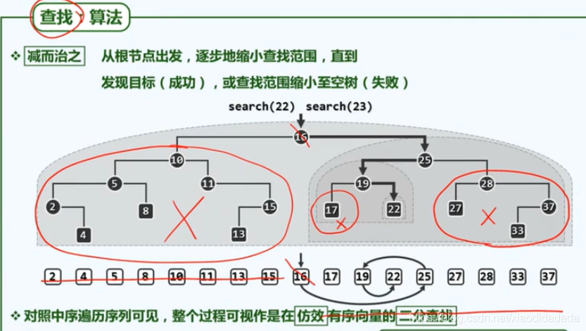


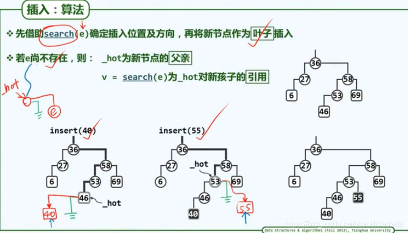


```C++
template <typename K, typename V> struct Entry { //词条模板类
   K key; V value; //关键码、数值
   Entry ( K k = K(), V v = V() ) : key ( k ), value ( v ) {}; //默认构造函数
   Entry ( Entry<K, V> const& e ) : key ( e.key ), value ( e.value ) {}; //基于克隆的构造函数
   bool operator< ( Entry<K, V> const& e ) { return key <  e.key; }  //比较器：小于
   bool operator> ( Entry<K, V> const& e ) { return key >  e.key; }  //比较器：大于
   bool operator== ( Entry<K, V> const& e ) { return key == e.key; } //判等器：等于
   bool operator!= ( Entry<K, V> const& e ) { return key != e.key; } //判等器：不等于
}; //得益于比较器和判等器，从此往后，不必严格区分词条及其对应的关键码

```

```cpp
//BST.h
template <typename T> class BST : public BinTree<T> { //由BinTree派生BST模板类
protected:
   BinNodePosi(T) _hot; //“命中”节点的父亲
   BinNodePosi(T) connect34 ( //按照“3 + 4”结构，联接3个节点及四棵子树
      BinNodePosi(T), BinNodePosi(T), BinNodePosi(T),
      BinNodePosi(T), BinNodePosi(T), BinNodePosi(T), BinNodePosi(T) );
   BinNodePosi(T) rotateAt ( BinNodePosi(T) x ); //对x及其父亲、祖父做统一旋转调整
public: //基本接口：以virtual修饰，强制要求所有派生类（BST变种）根据各自的规则对其重写
   virtual BinNodePosi(T) & search ( const T& e ); //查找
   virtual BinNodePosi(T) insert ( const T& e ); //插入
   virtual bool remove ( const T& e ); //删除
   /*DSA*/
   /*DSA*/void stretchToLPath() { stretchByZag ( _root ); } //借助zag旋转，转化为左向单链
   /*DSA*/void stretchToRPath() { stretchByZig ( _root ); } //借助zig旋转，转化为右向单链
   /*DSA*/void stretch();
};
```

#### 7.2.4 查找算法及其实现 

```C++
//BST_search.h
template <typename T> BinNodePosi(T) & BST<T>::search ( const T & e ) { //在BST中查找关键码e
   if ( !_root || e == _root->data ) { _hot = NULL; return _root; } //在树根v处命中
   for ( _hot = _root; ; ) { //自顶而下
      BinNodePosi(T) & c = ( e < _hot->data ) ? _hot->lc : _hot->rc; //确定方向
      if ( !c || e == c->data ) return c; _hot = c; //命中返回，或者深入一层
   } //无论命中或失败，hot均指向v之父亲（或为NULL）
} //返回目标节点位置的引用，以便后续插入、删除操作

```

#### 7.2.5 插入算法及其实现 

```C++

//bst_insert.h
template <typename T> BinNodePosi(T) BST<T>::insert ( const T& e ) { //将关键码e插入BST树中
   BinNodePosi(T) & x = search ( e ); if ( x ) return x; //确认目标不存在（留意对_hot的设置）
   x = new BinNode<T> ( e, _hot ); //创建新节点x：以e为关键码，以_hot为父
   _size++; //更新全树规模
   updateHeightAbove ( x ); //更新x及其历代祖先的高度
   return x; //新插入的节点，必为叶子
} //无论e是否存在于原树中，返回时总有x->data == e
```

#### 7.2.6 删除算法及其实现

### 7.3 平衡二叉搜索树  


#### 7.3.1 树高与性能  

#### 7.3.2 理想平衡与适度平衡  

#### 7.3.3 等价二叉搜索树  

#### 7.3.4 等价变换与局部调整 

```C++
//BST_RotateAt.h
template <typename T> BinNodePosi(T) BST<T>::rotateAt ( BinNodePosi(T) v ) { //v为非空孙辈节点
   /*DSA*/if ( !v ) { printf ( "\a\nFail to rotate a null node\n" ); exit ( -1 ); }
   BinNodePosi(T) p = v->parent; BinNodePosi(T) g = p->parent; //视v、p和g相对位置分四种情况
   if ( IsLChild ( *p ) ) /* zig */
      if ( IsLChild ( *v ) ) { /* zig-zig */ //*DSA*/printf("\tzIg-zIg: ");
         p->parent = g->parent; //向上联接
         return connect34 ( v, p, g, v->lc, v->rc, p->rc, g->rc );
      } else { /* zig-zag */  //*DSA*/printf("\tzIg-zAg: ");
         v->parent = g->parent; //向上联接
         return connect34 ( p, v, g, p->lc, v->lc, v->rc, g->rc );
      }
   else  /* zag */
      if ( IsRChild ( *v ) ) { /* zag-zag */ //*DSA*/printf("\tzAg-zAg: ");
         p->parent = g->parent; //向上联接
         return connect34 ( g, p, v, g->lc, p->lc, v->lc, v->rc );
      } else { /* zag-zig */  //*DSA*/printf("\tzAg-zIg: ");
         v->parent = g->parent; //向上联接
         return connect34 ( g, v, p, g->lc, v->lc, v->rc, p->rc );
      }
}
```

### 7.4 AVL树 

#### 7.4.1 AVL树 

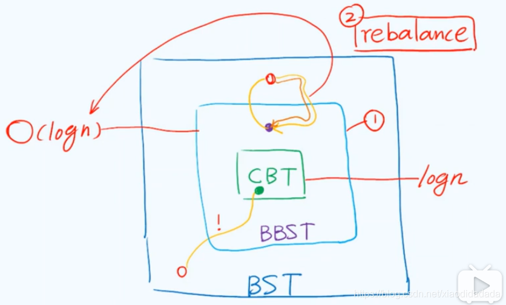


#### 7.4.2 节点插入

```cpp
//AVL.h
#include "BST/BST.h" //基于BST实现AVL树
template <typename T> class AVL : public BST<T> { //由BST派生AVL树模板类
public:
   BinNodePosi(T) insert ( const T& e ); //插入（重写）
   bool remove ( const T& e ); //删除（重写）
// BST::search()等其余接口可直接沿用
};


//AVL_Insert.h
template <typename T> BinNodePosi(T) AVL<T>::insert ( const T& e ) { //将关键码e插入AVL树中
   BinNodePosi(T) & x = search ( e ); if ( x ) return x; //确认目标节点不存在
   BinNodePosi(T) xx = x = new BinNode<T> ( e, _hot ); _size++; //创建新节点x
// 此时，x的父亲_hot若增高，则其祖父有可能失衡
   for ( BinNodePosi(T) g = _hot; g; g = g->parent ) { //从x之父出发向上，逐层检查各代祖先g
      if ( !AvlBalanced ( *g ) ) { //一旦发现g失衡，则（采用“3 + 4”算法）使之复衡，并将子树
         FromParentTo ( *g ) = rotateAt ( tallerChild ( tallerChild ( g ) ) ); //重新接入原树
         break; //g复衡后，局部子树高度必然复原；其祖先亦必如此，故调整随即结束
      } else //否则（g依然平衡），只需简单地
         updateHeight ( g ); //更新其高度（注意：即便g未失衡，高度亦可能增加）
   } //至多只需一次调整；若果真做过调整，则全树高度必然复原
   return xx; //返回新节点位置
} //无论e是否存在于原树中，总有AVL::insert(e)->data == e
```

#### 7.4.3 节点删除

```cpp
//AVL_remove.h
template <typename T> bool AVL<T>::remove ( const T& e ) { //从AVL树中删除关键码e
   BinNodePosi(T) & x = search ( e ); if ( !x ) return false; //确认目标存在（留意_hot的设置）
   removeAt ( x, _hot ); _size--; //先按BST规则删除之（此后，原节点之父_hot及其祖先均可能失衡）
   for ( BinNodePosi(T) g = _hot; g; g = g->parent ) { //从_hot出发向上，逐层检查各代祖先g
      if ( !AvlBalanced ( *g ) ) //一旦发现g失衡，则（采用“3 + 4”算法）使之复衡，并将该子树联至
         g = FromParentTo ( *g ) = rotateAt ( tallerChild ( tallerChild ( g ) ) ); //原父亲
      updateHeight ( g ); //并更新其高度（注意：即便g未失衡，高度亦可能降低）
   } //可能需做Omega(logn)次调整——无论是否做过调整，全树高度均可能降低
   return true; //删除成功
} //若目标节点存在且被删除，返回true；否则返回false
```


#### 7.4.4 统一重平衡算法  

## 第8章 高级搜索树 

### 8.1 伸展树  

#### 8.1.1 局部性  
#### 8.1.2 逐层伸展  
#### 8.1.3 双层伸展  
#### 8.1.4 分摊分析  
#### 8.1.5 伸展树的实现 

### 8.2 B-树  

#### 8.2.1 多路平衡搜索  
#### 8.2.2 ADT接口及其实现  
#### 8.2.3 关键码查找  
#### 8.2.4 性能分析  
#### 8.2.5 关键码插入  
#### 8.2.6 上溢与分裂  
#### 8.2.7 关键码删除  
#### 8.2.8 下溢与合并 

### 8.3* 红黑树 

#### 8.3.1 概述  
#### 8.3.2 红黑树接口定义  
#### 8.3.3 节点插入算法  
#### 8.3.4 节点删除算法

### 8.4* kd-树  

#### 8.4.1 范围查询  
#### 8.4.2 kd-树  
#### 8.4.3 基于2d-树的范围查询算法  

## 第9章 词典  
### 9.1 词典  
#### 9.1.1 操作接口

```cpp
//Entry.h

template <typename K, typename V> struct Entry { //词条模板类
   K key; V value; //关键码、数值
   Entry ( K k = K(), V v = V() ) : key ( k ), value ( v ) {}; //默认构造函数
   Entry ( Entry<K, V> const& e ) : key ( e.key ), value ( e.value ) {}; //基于克隆的构造函数
   bool operator< ( Entry<K, V> const& e ) { return key <  e.key; }  //比较器：小于
   bool operator> ( Entry<K, V> const& e ) { return key >  e.key; }  //比较器：大于
   bool operator== ( Entry<K, V> const& e ) { return key == e.key; } //判等器：等于
   bool operator!= ( Entry<K, V> const& e ) { return key != e.key; } //判等器：不等于
}; //得益于比较器和判等器，从此往后，不必严格区分词条及其对应的关键码

```

#### 9.1.2 操作实例  
#### 9.1.3 接口定义  
#### 9.1.4 判等器  
#### 9.1.5 实现方法  
### 9.2* 跳转表  
#### 9.2.1 Skiplist模板类  
#### 9.2.2 总体逻辑结构  
#### 9.2.3 四联表  
#### 9.2.4 查找  
#### 9.2.5 空间复杂度  
#### 9.2.6 时间复杂度  
#### 9.2.7 插入  
#### 9.2.8 删除 

### 9.3 散列表  
#### 9.3.1 完美散列  


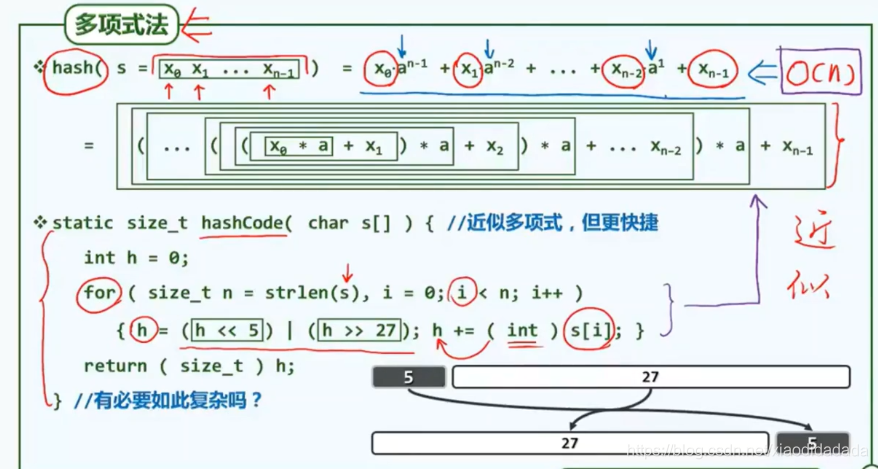

#### 9.3.2 装填因子与空间利用率  
#### 9.3.3 散列函数  
#### 9.3.4 散列表  

```cpp
//HashTable.h
template <typename K, typename V> //key、value
class Hashtable : public Dictionary<K, V> { //符合Dictionary接口的Hashtable模板类
   /*DSA*/friend class UniPrint;
private:
   Entry<K, V>** ht; //桶数组，存放词条指针
   int M; //桶数组容量
   int N; //词条数量
   Bitmap* lazyRemoval; //懒惰删除标记
#define lazilyRemoved(x)  (lazyRemoval->test(x))
#define markAsRemoved(x)  (lazyRemoval->set(x))
protected:
   int probe4Hit ( const K& k ); //沿关键码k对应的查找链，找到词条匹配的桶
   int probe4Free ( const K& k ); //沿关键码k对应的查找链，找到首个可用空桶
   void rehash(); //重散列算法：扩充桶数组，保证装填因子在警戒线以下
public:
   Hashtable ( int c = 5 ); //创建一个容量不小于c的散列表（为测试暂时选用较小的默认值）
   ~Hashtable(); //释放桶数组及其中各（非空）元素所指向的词条
   int size() const { return N; } // 当前的词条数目
   bool put ( K, V ); //插入（禁止雷同词条，故可能失败）
   V* get ( K k ); //读取
   bool remove ( K k ); //删除
};


//HashTable_constructor.h
template <typename K, typename V> Hashtable<K, V>::Hashtable ( int c ) { //创建散列表，容量为
   M = primeNLT ( c, 1048576, "../../_input/prime-1048576-bitmap.txt" ); //不小于c的素数M
   N = 0; ht = new Entry<K, V>*[M]; //开辟桶数组（还需核对申请成功），初始装填因子为N/M = 0%
   memset ( ht, 0, sizeof ( Entry<K, V>* ) *M ); //初始化各桶
   lazyRemoval = new Bitmap ( M ); //懒惰删除标记比特图
   //*DSA*/printf("A bucket array has been created with capacity = %d\n\n", M);
}

//HashTable_destructor.h
template <typename K, typename V> Hashtable<K, V>::~Hashtable() { //析构前释放桶数组及非空词条
   for ( int i = 0; i < M; i++ ) //逐一检查各桶
      if ( ht[i] ) release ( ht[i] ); //释放非空的桶
   release ( ht ); //释放桶数组
   release ( lazyRemoval ); //释放懒惰删除标记
} //release()负责释放复杂结构，与算法无直接关系，具体实现详见代码包


//HashTable_hashcode.h
static size_t hashCode ( char c ) { return ( size_t ) c; } //字符
static size_t hashCode ( int k ) { return ( size_t ) k; } //整数以及长长整数
static size_t hashCode ( long long i ) { return ( size_t ) ( ( i >> 32 ) + ( int ) i ); }
static size_t hashCode ( char s[] ) { //生成字符串的循环移位散列码（cyclic shift hash code）
   unsigned int h = 0; //散列码
   for ( size_t n = strlen ( s ), i = 0; i < n; i++ ) //自左向右，逐个处理每一字符
      { h = ( h << 5 ) | ( h >> 27 ); h += ( int ) s[i]; } //散列码循环左移5位，再累加当前字符
   return ( size_t ) h; //如此所得的散列码，实际上可理解为近似的“多项式散列码”
} //对于英语单词，"循环左移5位"是实验统计得出的最佳值
```


#### 9.3.5 冲突及其排解


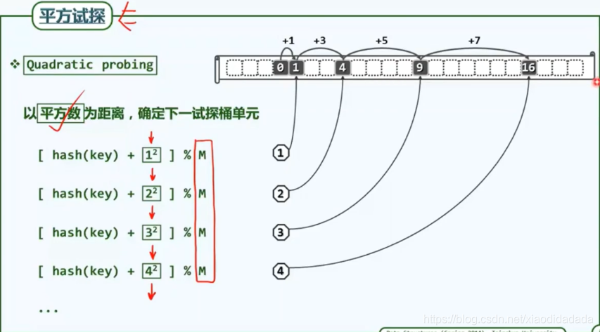


#### 9.3.6 开放定址策略  
#### 9.3.7 查找与删除  
#### 9.3.8 插入  
#### 9.3.9 更多开放定址策略  
#### 9.3.10 散列码转换  
### 9.4* 散列应用  
#### 9.4.1 桶排序 


#### 9.4.2 最大间隙  

#### 9.4.3 基数排序  

## 第10章 优先级队列  

### 10.1 优先级队列 

#### 10.1.1 优先级与优先级队列

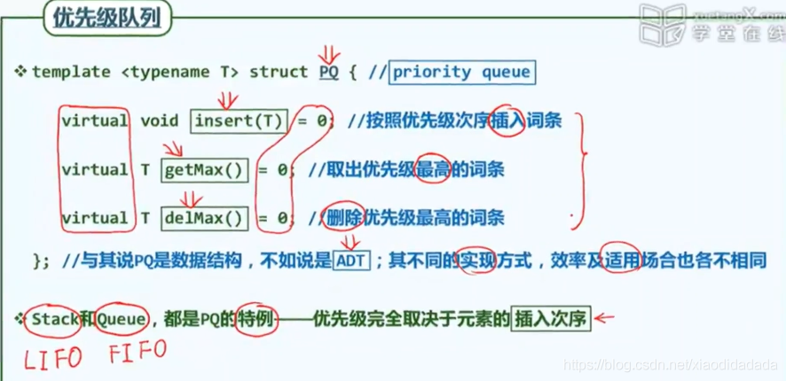


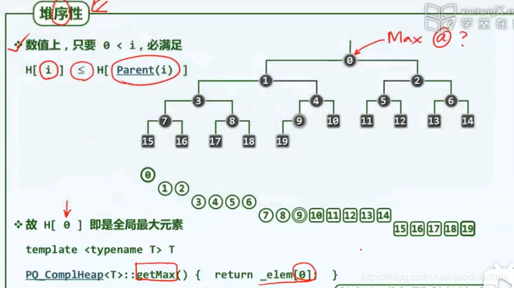


#### 10.1.2 关键码、比较器与偏序关系    

#### 10.1.3 操作接口   

```cpp
template <typename T> struct PQ { //优先级队列PQ模板类
   virtual void insert ( T ) = 0; //按照比较器确定的优先级次序插入词条
   virtual T getMax() = 0; //取出优先级最高的词条
   virtual T delMax() = 0; //删除优先级最高的词条
};
```

#### 10.1.4 操作实例：选择排序  
#### 10.1.5 接口定义  
#### 10.1.6 应用实例：Huffman编码树  

### 10.2 堆  


#### 10.2.1 完全二叉堆  

完全二叉堆插入与上滤

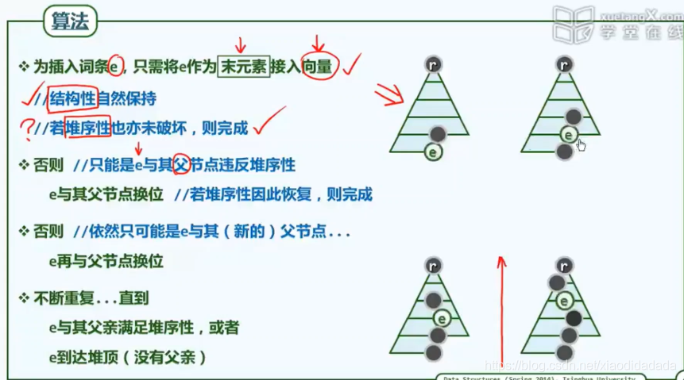


删除与下滤

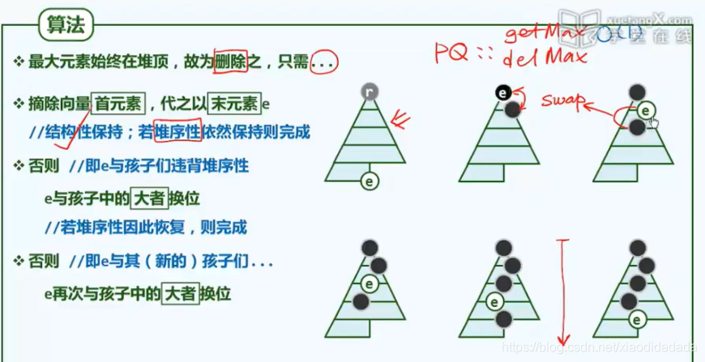

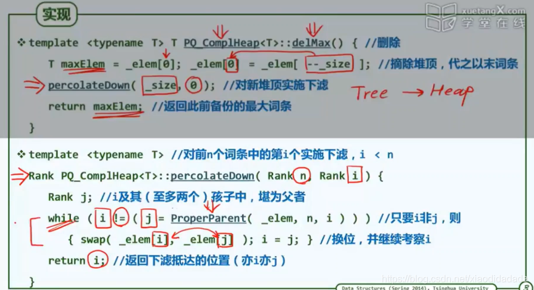


 完全二叉堆: 批量建堆


 堆排序算法
 
 


 

```cpp
//PQ_ComplHeap.h

#include "Vector/Vector.h" //借助多重继承机制，基于向量
#include "PQ/PQ.h" //按照优先级队列ADT实现的
template <typename T> struct PQ_ComplHeap : public PQ<T>, public Vector<T> { //完全二叉堆
   /*DSA*/friend class UniPrint; //演示输出使用，否则不必设置友类
   PQ_ComplHeap() { } //默认构造
   PQ_ComplHeap ( T* A, Rank n ) { copyFrom ( A, 0, n ); heapify ( _elem, n ); } //批量构造
   void insert ( T ); //按照比较器确定的优先级次序，插入词条
   T getMax(); //读取优先级最高的词条
   T delMax(); //删除优先级最高的词条
}; //PQ_ComplHeap
template <typename T> void heapify ( T* A, Rank n ); //Floyd建堆算法
template <typename T> Rank percolateDown ( T* A, Rank n, Rank i ); //下滤
template <typename T> Rank percolateUp ( T* A, Rank i ); //上滤


//PQ_ComplHeap_Heapify.h

template <typename T> void heapify ( T* A, const Rank n ) { //Floyd建堆算法，O(n)时间
   for ( int i = n/2 - 1; 0 <= i; i-- ) //自底而上，依次
/*DSA*///{
      percolateDown ( A, n, i ); //下滤各内部节点
/*DSA*///for ( int k = 0; k < n; k++ ) {
/*DSA*///  int kk = k; while ( i < kk ) kk = (kk - 1) / 2;
/*DSA*///  i == kk ? print(A[k]) : print("    " );
/*DSA*///}; printf("\n");
/*DSA*///}
}

//PQ_ComplHeap_insert.h
template <typename T> void PQ_ComplHeap<T>::insert ( T e ) { //将词条插入完全二叉堆中
   Vector<T>::insert ( e ); //首先将新词条接至向量末尾
   percolateUp ( _elem, _size - 1 ); //再对该词条实施上滤调整
}

//PQ_ComplHeap_percolateDown.h
//对向量前n个词条中的第i个实施下滤，i < n
template <typename T> Rank percolateDown ( T* A, Rank n, Rank i ) {
   Rank j; //i及其（至多两个）孩子中，堪为父者
   while ( i != ( j = ProperParent ( A, n, i ) ) ) //只要i非j，则
      { swap ( A[i], A[j] ); i = j; } //二者换位，并继续考查下降后的i
   return i; //返回下滤抵达的位置（亦i亦j）
}

//PQ_ComplHeap_percolateUp.h
//对向量中的第i个词条实施上滤操作，i < _size
template <typename T> Rank percolateUp ( T* A, Rank i ) {
   while ( 0 < i ) { //在抵达堆顶之前，反复地
      Rank j = Parent ( i ); //考查[i]之父亲[j]
      if ( lt ( A[i], A[j] ) ) break; //一旦父子顺序，上滤旋即完成；否则
      swap ( A[i], A[j] ); i = j; //父子换位，并继续考查上一层
   } //while
   return i; //返回上滤最终抵达的位置
}

//PQ_ComplHeap_getMax.h
template <typename T> T PQ_ComplHeap<T>::getMax() {  return _elem[0];  }

//PQ_ComplHeap_delMax.h
template <typename T> T PQ_ComplHeap<T>::delMax() { //删除非空完全二叉堆中优先级最高的词条
   T maxElem = _elem[0]; _elem[0] = _elem[ --_size ]; //摘除堆顶（首词条），代之以末词条
   percolateDown ( _elem, _size, 0 ); //对新堆顶实施下滤
   return maxElem; //返回此前备份的最大词条
}
```

#### 10.2.2 元素插入  
#### 10.2.3 元素删除  
#### 10.2.4 建堆  
#### 10.2.5 就地堆排序 

### 10.3* 左式堆 

#### 10.3.1 堆合并  
#### 10.3.2 单侧倾斜  
#### 10.3.3 PQ_LeftHeap模板类  
#### 10.3.4 空节点路径长度  
#### 10.3.5 左倾性与左式堆  
#### 10.3.6 右侧链  
#### 10.3.7 合并算法  
#### 10.3.8 合并操作merge()的实现  
#### 10.3.9 实例  
#### 10.3.10 复杂度  
#### 10.3.11 基于合并的插入和删除操作  

## 第11章 串 

### 11.1 串及串匹配

#### 11.1.1 串


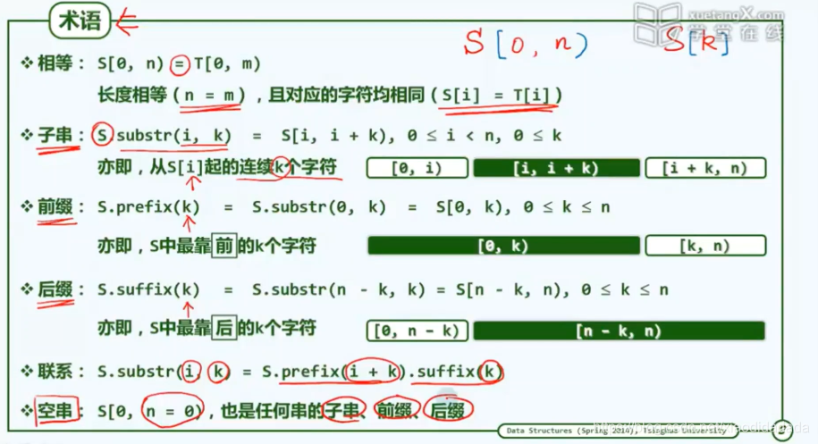


 
#### 11.1.2 串匹配 
#### 11.1.3 测评标准与策略  

### 11.2 蛮力算法  
#### 11.2.1 算法描述  
#### 11.2.2 算法实现  
#### 11.2.3 时间复杂度
  
### 11.3 KMP算法  
#### 11.3.1 构思  
#### 11.3.2 next表  
#### 11.3.3 KMP算法


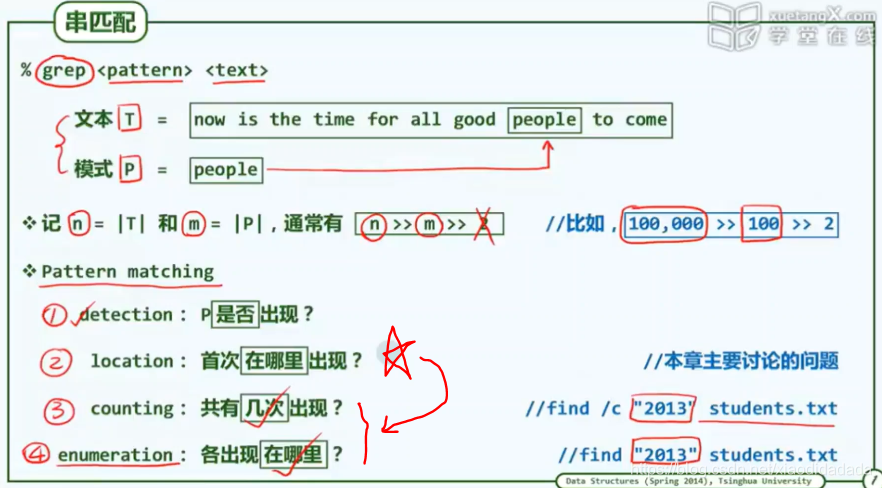

KMP算法：从记忆力到预知力

next[0] = -1, next构建过程就是P匹配自己的过程


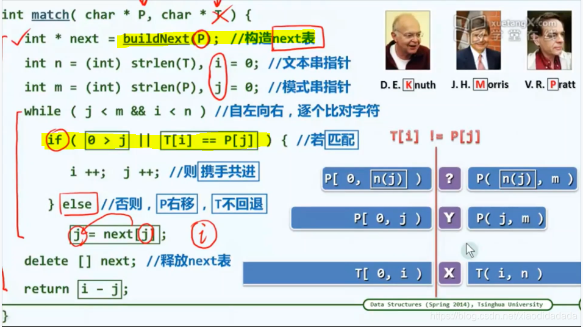

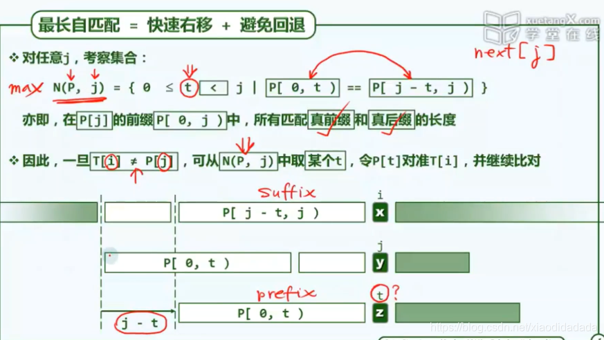


	   

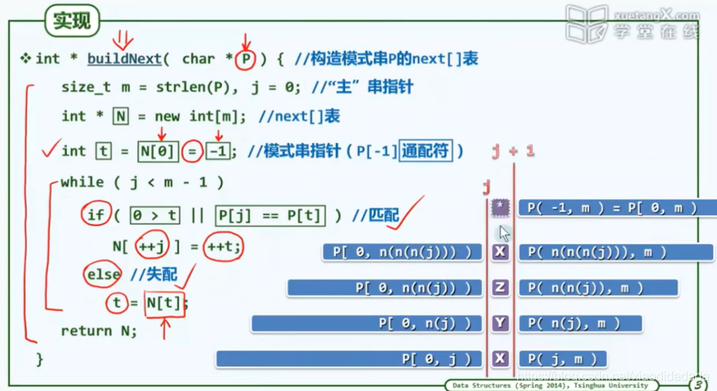

KMP算法再改进


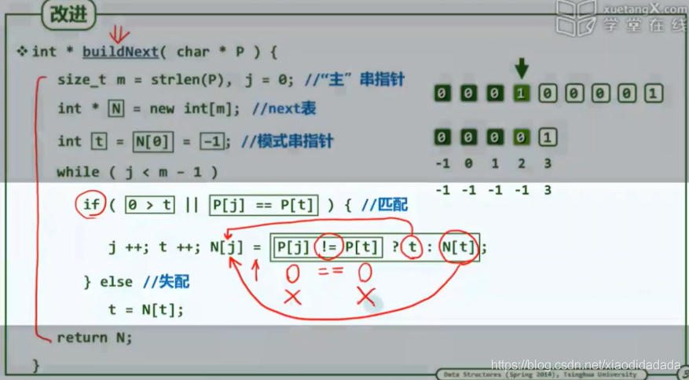

```cpp
int match ( char* P, char* T ) {  //KMP算法
   int* next = buildNext ( P ); //构造next表
   int n = ( int ) strlen ( T ), i = 0; //文本串指针
   int m = ( int ) strlen ( P ), j = 0; //模式串指针
   while ( j < m  && i < n ) //自左向右逐个比对字符
      /*DSA*/{
      /*DSA*/showProgress ( T, P, i - j, j );
      /*DSA*/printNext ( next, i - j, strlen ( P ) );
      /*DSA*/getchar(); printf ( "\n" );
      if ( 0 > j || T[i] == P[j] ) //若匹配，或P已移出最左侧（两个判断的次序不可交换）
         { i ++;  j ++; } //则转到下一字符
      else //否则
         j = next[j]; //模式串右移（注意：文本串不用回退）
      /*DSA*/}
   delete [] next; //释放next表
   return i - j;
}

int* buildNext ( char* P ) { //构造模式串P的next表
   size_t m = strlen ( P ), j = 0; //“主”串指针
   int* N = new int[m]; //next表
   int t = N[0] = -1; //模式串指针
   while ( j < m - 1 )
      if ( 0 > t || P[j] == P[t] ) { //匹配
         j ++; t ++;
         N[j] = t; //此句可改进...
      } else //失配
         t = N[t];
   /*DSA*/printString ( P ); printf ( "\n" );
   /*DSA*/printNext ( N, 0, m );
   return N;
}

int* buildNext ( char* P ) { //构造模式串P的next表（改进版本）
   size_t m = strlen ( P ), j = 0; //“主”串指针
   int* N = new int[m]; //next表
   int t = N[0] = -1; //模式串指针
   while ( j < m - 1 )
      if ( 0 > t || P[j] == P[t] ) { //匹配
         N[j] = ( P[++j] != P[++t] ? t : N[t] ); //注意此句与未改进之前的区别
      } else //失配
         t = N[t];
   /*DSA*/printString ( P ); printf ( "\n" );
   /*DSA*/printNext ( N, 0, strlen ( P ) );
   return N;
}

```

#### 11.3.4 next[0]=-1  
#### 11.3.5 构造next表  
#### 11.3.6 性能分析  
#### 11.3.7 继续改进  
### 11.4* BM算法  
#### 11.4.1 思路与框架  
#### 11.4.2 坏字符策略  
#### 11.4.3 好后缀策略  
#### 11.4.4 综合性能  
### 11.5* Karp-Rabin算法  
#### 11.5.1 构思  
#### 11.5.2 算法与实现  

## 第12章 排序  
### 12.1 快速排序 


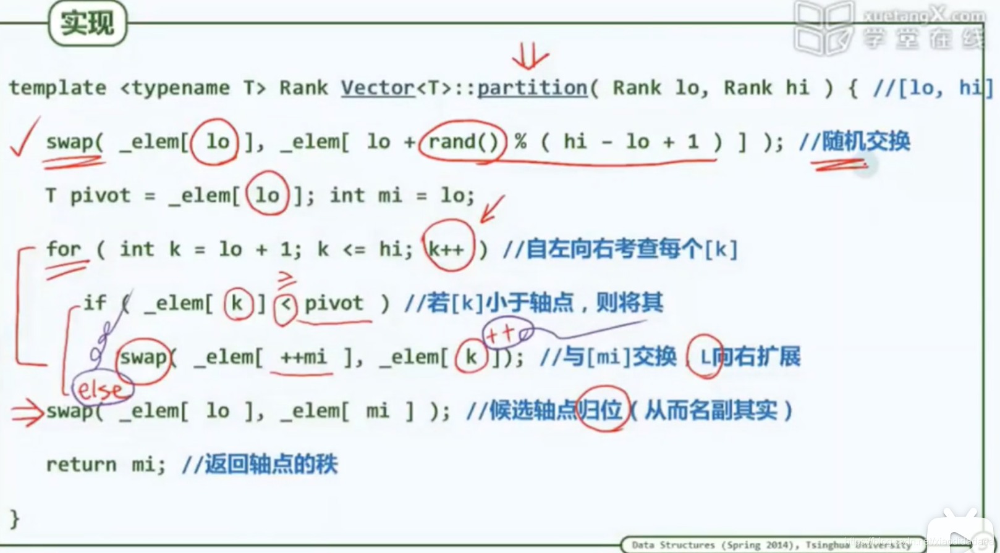

```cpp
//vector_partition_A.h
template <typename T> //轴点构造算法：通过调整元素位置构造区间[lo, hi)的轴点，并返回其秩
Rank Vector<T>::partition ( Rank lo, Rank hi ) { //版本A：基本形式
   swap ( _elem[lo], _elem[ lo + rand() % ( hi - lo ) ] ); //任选一个元素与首元素交换
   hi--; T pivot = _elem[lo]; //以首元素为候选轴点——经以上交换，等效于随机选取
   while ( lo < hi ) { //从向量的两端交替地向中间扫描
      while ( ( lo < hi ) && ( pivot <= _elem[hi] ) ) //在不小于pivot的前提下
         hi--; //向左拓展右端子向量
      _elem[lo] = _elem[hi]; //小于pivot者归入左侧子序列
      while ( ( lo < hi ) && ( _elem[lo] <= pivot ) ) //在不大于pivot的前提下
         lo++; //向右拓展左端子向量
      _elem[hi] = _elem[lo]; //大于pivot者归入右侧子序列
   } //assert: lo == hi
   _elem[lo] = pivot; //将备份的轴点记录置于前、后子向量之间
   return lo; //返回轴点的秩
}


template <typename T> //向量快速排序
void Vector<T>::quickSort ( Rank lo, Rank hi ) { //0 <= lo < hi <= size
   /*DSA*/ //printf ( "\tQUICKsort [%3d, %3d)\n", lo, hi );
   if ( hi - lo < 2 ) return; //单元素区间自然有序，否则...
   Rank mi = partition ( lo, hi ); //在[lo, hi)内构造轴点
   quickSort ( lo, mi ); //对前缀递归排序
   quickSort ( mi + 1, hi ); //对后缀递归排序
}

```
 
#### 12.1.1 分治策略  
#### 12.1.2 轴点  
#### 12.1.3 快速排序算法  
#### 12.1.4 快速划分算法  
#### 12.1.5 复杂度  
#### 12.1.6 应对退化
  
### 12.2* 选取与中位数

投票法


```cpp
template <typename T> bool majority ( Vector<T> A, T& maj ) { //众数查找算法：T可比较可判等
   maj = majEleCandidate ( A ); //必要性：选出候选者maj
   return majEleCheck ( A, maj ); //充分性：验证maj是否的确当选
}


template <typename T> T majEleCandidate ( Vector<T> A ) { //选出具备必要条件的众数候选者
   T maj; //众数候选者
// 线性扫描：借助计数器c，记录maj与其它元素的数量差额
   for ( int c = 0, i = 0; i < A.size(); i++ )
      if ( 0 == c ) { //每当c归零，都意味着此时的前缀P可以剪除
         maj = A[i]; c = 1; //众数候选者改为新的当前元素
      } else //否则
         maj == A[i] ? c++ : c--; //相应地更新差额计数器
   return maj; //至此，原向量的众数若存在，则只能是maj —— 尽管反之不然
}

```
  
#### 12.2.1 概述  
#### 12.2.2 主流数  
#### 12.2.3 归并向量的中位数  
#### 12.2.4 基于优先级队列的选取  
#### 12.2.5 基于快速划分的选取  
#### 12.2.6 k-选取算法  
### 12.3* 希尔排序  
#### 12.3.1 递减增量策略  


#### 12.3.2 增量序列  


