[邓俊辉数据结构与算法学习笔记](https://blog.csdn.net/xiaodidadada/category_10348319.html)

[算法可视化](http://algorithm-visualizer.org/)

# 目录

## 第7章 搜索树 

7.1 查找

7.2 二叉搜索树

7.3 平衡二叉搜索树

7.4 AVL 树

代码： BST、Entry 词条模板

## 第8章 高级搜索树 高级搜索树 

8.1 伸展树

8.2 B—树

8.3*红黑树

8.4*kd—树

代码：BTree、Splay

redBlack


## 第9章 词典 

9.1 词典 ADT

9.2*跳转表

9.3 散列表

9.4*散列应用

代码：Dictionary

skiplist

Hashtable


## 第10章 优先级队列 

10.1 优先级队列 ADT

10.2 堆

10.3*左式堆

代码: PQ、PQ_ComplHeap、PQ_List

## 第11章 串 

11.1 串及匹配

11.2 蛮力算法

11.3 KMP算法

11.4*BM 算法

11.5*Karp—Rabin算法

代码: string_pm相关

## 第12章 排序 

12.1 快速排序

12.2*选取与中位数

12.3*希尔排序

代码：selection

majority众数

median中位数

common library:

UniPrint


## 第7章 搜索树

### BST

BST: 二叉搜索树 ； BBST:平衡二叉搜索树


```cpp

template <typename K, typename V> struct Entry { //词条模板类
   K key; V value; //关键码、数值
   Entry ( K k = K(), V v = V() ) : key ( k ), value ( v ) {}; //默认构造函数
   Entry ( Entry<K, V> const& e ) : key ( e.key ), value ( e.value ) {}; //基于克隆的构造函数
   bool operator< ( Entry<K, V> const& e ) { return key <  e.key; }  //比较器：小于
   bool operator> ( Entry<K, V> const& e ) { return key >  e.key; }  //比较器：大于
   bool operator== ( Entry<K, V> const& e ) { return key == e.key; } //判等器：等于
   bool operator!= ( Entry<K, V> const& e ) { return key != e.key; } //判等器：不等于
}; //得益于比较器和判等器，从此往后，不必严格区分词条及其对应的关键码

```


```cpp
//BST.h
template <typename T> class BST : public BinTree<T> { //由BinTree派生BST模板类
protected:
   BinNodePosi(T) _hot; //“命中”节点的父亲
   BinNodePosi(T) connect34 ( //按照“3 + 4”结构，联接3个节点及四棵子树
      BinNodePosi(T), BinNodePosi(T), BinNodePosi(T),
      BinNodePosi(T), BinNodePosi(T), BinNodePosi(T), BinNodePosi(T) );
   BinNodePosi(T) rotateAt ( BinNodePosi(T) x ); //对x及其父亲、祖父做统一旋转调整
public: //基本接口：以virtual修饰，强制要求所有派生类（BST变种）根据各自的规则对其重写
   virtual BinNodePosi(T) & search ( const T& e ); //查找
   virtual BinNodePosi(T) insert ( const T& e ); //插入
   virtual bool remove ( const T& e ); //删除
   /*DSA*/
   /*DSA*/void stretchToLPath() { stretchByZag ( _root ); } //借助zag旋转，转化为左向单链
   /*DSA*/void stretchToRPath() { stretchByZig ( _root ); } //借助zig旋转，转化为右向单链
   /*DSA*/void stretch();
};
```


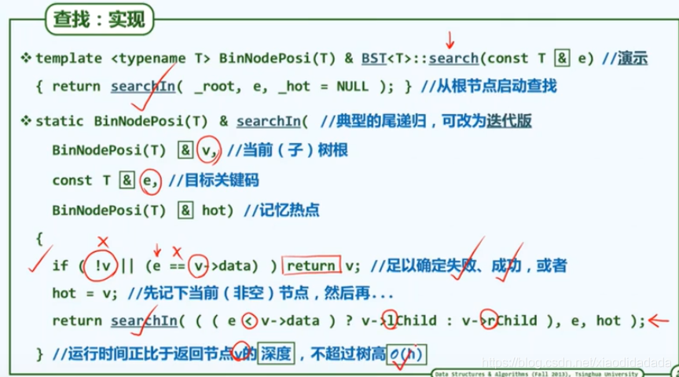


```cpp
//bst_insert.h
template <typename T> BinNodePosi(T) BST<T>::insert ( const T& e ) { //将关键码e插入BST树中
   BinNodePosi(T) & x = search ( e ); if ( x ) return x; //确认目标不存在（留意对_hot的设置）
   x = new BinNode<T> ( e, _hot ); //创建新节点x：以e为关键码，以_hot为父
   _size++; //更新全树规模
   updateHeightAbove ( x ); //更新x及其历代祖先的高度
   return x; //新插入的节点，必为叶子
} //无论e是否存在于原树中，返回时总有x->data == e


//BST_search.h
template <typename T> BinNodePosi(T) & BST<T>::search ( const T & e ) { //在BST中查找关键码e
   if ( !_root || e == _root->data ) { _hot = NULL; return _root; } //在树根v处命中
   for ( _hot = _root; ; ) { //自顶而下
      BinNodePosi(T) & c = ( e < _hot->data ) ? _hot->lc : _hot->rc; //确定方向
      if ( !c || e == c->data ) return c; _hot = c; //命中返回，或者深入一层
   } //无论命中或失败，hot均指向v之父亲（或为NULL）
} //返回目标节点位置的引用，以便后续插入、删除操作


//BST_RotateAt.h
template <typename T> BinNodePosi(T) BST<T>::rotateAt ( BinNodePosi(T) v ) { //v为非空孙辈节点
   /*DSA*/if ( !v ) { printf ( "\a\nFail to rotate a null node\n" ); exit ( -1 ); }
   BinNodePosi(T) p = v->parent; BinNodePosi(T) g = p->parent; //视v、p和g相对位置分四种情况
   if ( IsLChild ( *p ) ) /* zig */
      if ( IsLChild ( *v ) ) { /* zig-zig */ //*DSA*/printf("\tzIg-zIg: ");
         p->parent = g->parent; //向上联接
         return connect34 ( v, p, g, v->lc, v->rc, p->rc, g->rc );
      } else { /* zig-zag */  //*DSA*/printf("\tzIg-zAg: ");
         v->parent = g->parent; //向上联接
         return connect34 ( p, v, g, p->lc, v->lc, v->rc, g->rc );
      }
   else  /* zag */
      if ( IsRChild ( *v ) ) { /* zag-zag */ //*DSA*/printf("\tzAg-zAg: ");
         p->parent = g->parent; //向上联接
         return connect34 ( g, p, v, g->lc, p->lc, v->lc, v->rc );
      } else { /* zag-zig */  //*DSA*/printf("\tzAg-zIg: ");
         v->parent = g->parent; //向上联接
         return connect34 ( g, v, p, g->lc, v->lc, v->rc, p->rc );
      }
}

```
### AVL


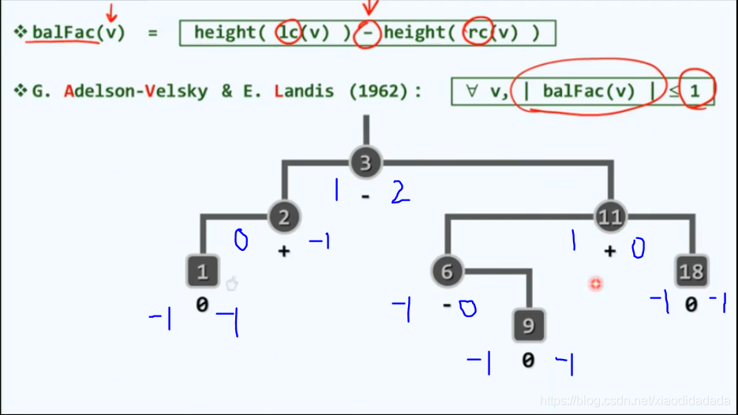

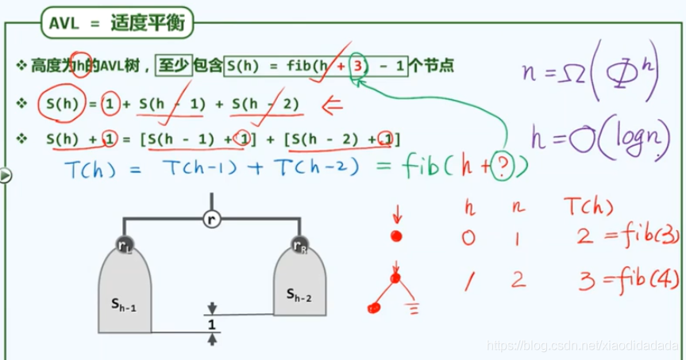


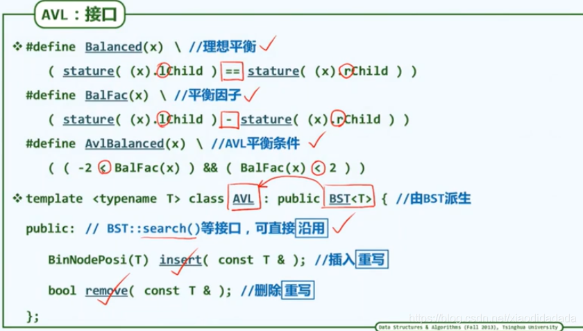


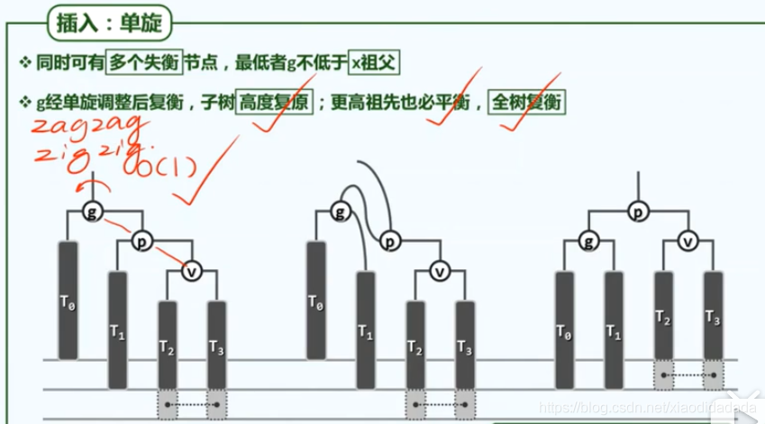


```cpp
//AVL.h
#include "BST/BST.h" //基于BST实现AVL树
template <typename T> class AVL : public BST<T> { //由BST派生AVL树模板类
public:
   BinNodePosi(T) insert ( const T& e ); //插入（重写）
   bool remove ( const T& e ); //删除（重写）
// BST::search()等其余接口可直接沿用
};


//AVL_Insert.h
template <typename T> BinNodePosi(T) AVL<T>::insert ( const T& e ) { //将关键码e插入AVL树中
   BinNodePosi(T) & x = search ( e ); if ( x ) return x; //确认目标节点不存在
   BinNodePosi(T) xx = x = new BinNode<T> ( e, _hot ); _size++; //创建新节点x
// 此时，x的父亲_hot若增高，则其祖父有可能失衡
   for ( BinNodePosi(T) g = _hot; g; g = g->parent ) { //从x之父出发向上，逐层检查各代祖先g
      if ( !AvlBalanced ( *g ) ) { //一旦发现g失衡，则（采用“3 + 4”算法）使之复衡，并将子树
         FromParentTo ( *g ) = rotateAt ( tallerChild ( tallerChild ( g ) ) ); //重新接入原树
         break; //g复衡后，局部子树高度必然复原；其祖先亦必如此，故调整随即结束
      } else //否则（g依然平衡），只需简单地
         updateHeight ( g ); //更新其高度（注意：即便g未失衡，高度亦可能增加）
   } //至多只需一次调整；若果真做过调整，则全树高度必然复原
   return xx; //返回新节点位置
} //无论e是否存在于原树中，总有AVL::insert(e)->data == e

//AVL_remove.h
template <typename T> bool AVL<T>::remove ( const T& e ) { //从AVL树中删除关键码e
   BinNodePosi(T) & x = search ( e ); if ( !x ) return false; //确认目标存在（留意_hot的设置）
   removeAt ( x, _hot ); _size--; //先按BST规则删除之（此后，原节点之父_hot及其祖先均可能失衡）
   for ( BinNodePosi(T) g = _hot; g; g = g->parent ) { //从_hot出发向上，逐层检查各代祖先g
      if ( !AvlBalanced ( *g ) ) //一旦发现g失衡，则（采用“3 + 4”算法）使之复衡，并将该子树联至
         g = FromParentTo ( *g ) = rotateAt ( tallerChild ( tallerChild ( g ) ) ); //原父亲
      updateHeight ( g ); //并更新其高度（注意：即便g未失衡，高度亦可能降低）
   } //可能需做Omega(logn)次调整——无论是否做过调整，全树高度均可能降低
   return true; //删除成功
} //若目标节点存在且被删除，返回true；否则返回false

```

## 第8章 高级搜索树 高级搜索树

## 第9章 词典


```cpp
//Entry.h

template <typename K, typename V> struct Entry { //词条模板类
   K key; V value; //关键码、数值
   Entry ( K k = K(), V v = V() ) : key ( k ), value ( v ) {}; //默认构造函数
   Entry ( Entry<K, V> const& e ) : key ( e.key ), value ( e.value ) {}; //基于克隆的构造函数
   bool operator< ( Entry<K, V> const& e ) { return key <  e.key; }  //比较器：小于
   bool operator> ( Entry<K, V> const& e ) { return key >  e.key; }  //比较器：大于
   bool operator== ( Entry<K, V> const& e ) { return key == e.key; } //判等器：等于
   bool operator!= ( Entry<K, V> const& e ) { return key != e.key; } //判等器：不等于
}; //得益于比较器和判等器，从此往后，不必严格区分词条及其对应的关键码

```

### 散列

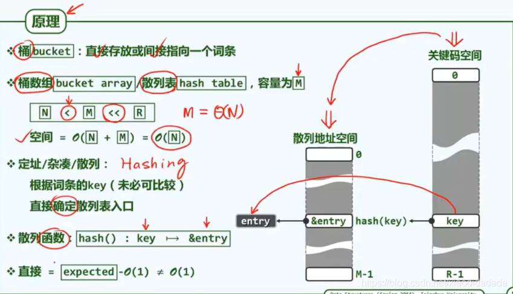


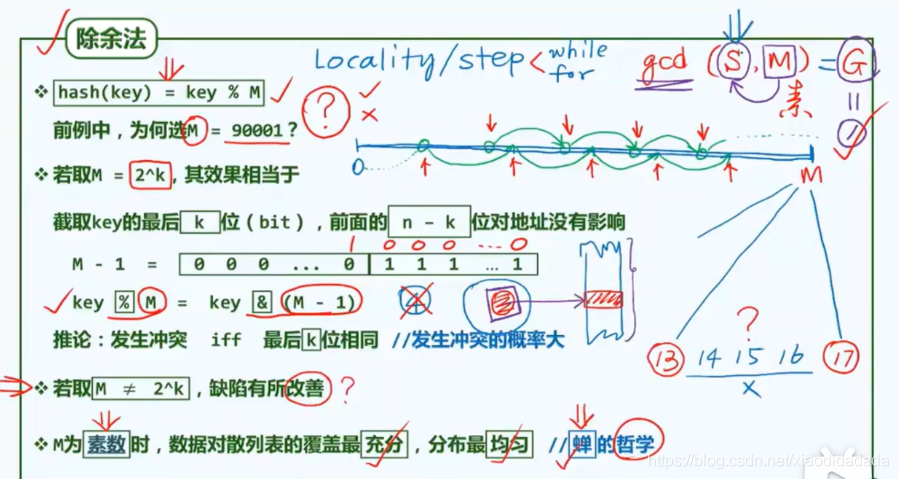


**hashtable**

```cpp
//HashTable.h
template <typename K, typename V> //key、value
class Hashtable : public Dictionary<K, V> { //符合Dictionary接口的Hashtable模板类
   /*DSA*/friend class UniPrint;
private:
   Entry<K, V>** ht; //桶数组，存放词条指针
   int M; //桶数组容量
   int N; //词条数量
   Bitmap* lazyRemoval; //懒惰删除标记
#define lazilyRemoved(x)  (lazyRemoval->test(x))
#define markAsRemoved(x)  (lazyRemoval->set(x))
protected:
   int probe4Hit ( const K& k ); //沿关键码k对应的查找链，找到词条匹配的桶
   int probe4Free ( const K& k ); //沿关键码k对应的查找链，找到首个可用空桶
   void rehash(); //重散列算法：扩充桶数组，保证装填因子在警戒线以下
public:
   Hashtable ( int c = 5 ); //创建一个容量不小于c的散列表（为测试暂时选用较小的默认值）
   ~Hashtable(); //释放桶数组及其中各（非空）元素所指向的词条
   int size() const { return N; } // 当前的词条数目
   bool put ( K, V ); //插入（禁止雷同词条，故可能失败）
   V* get ( K k ); //读取
   bool remove ( K k ); //删除
};


//HashTable_constructor.h
template <typename K, typename V> Hashtable<K, V>::Hashtable ( int c ) { //创建散列表，容量为
   M = primeNLT ( c, 1048576, "../../_input/prime-1048576-bitmap.txt" ); //不小于c的素数M
   N = 0; ht = new Entry<K, V>*[M]; //开辟桶数组（还需核对申请成功），初始装填因子为N/M = 0%
   memset ( ht, 0, sizeof ( Entry<K, V>* ) *M ); //初始化各桶
   lazyRemoval = new Bitmap ( M ); //懒惰删除标记比特图
   //*DSA*/printf("A bucket array has been created with capacity = %d\n\n", M);
}

//HashTable_destructor.h
template <typename K, typename V> Hashtable<K, V>::~Hashtable() { //析构前释放桶数组及非空词条
   for ( int i = 0; i < M; i++ ) //逐一检查各桶
      if ( ht[i] ) release ( ht[i] ); //释放非空的桶
   release ( ht ); //释放桶数组
   release ( lazyRemoval ); //释放懒惰删除标记
} //release()负责释放复杂结构，与算法无直接关系，具体实现详见代码包


//HashTable_hashcode.h
static size_t hashCode ( char c ) { return ( size_t ) c; } //字符
static size_t hashCode ( int k ) { return ( size_t ) k; } //整数以及长长整数
static size_t hashCode ( long long i ) { return ( size_t ) ( ( i >> 32 ) + ( int ) i ); }
static size_t hashCode ( char s[] ) { //生成字符串的循环移位散列码（cyclic shift hash code）
   unsigned int h = 0; //散列码
   for ( size_t n = strlen ( s ), i = 0; i < n; i++ ) //自左向右，逐个处理每一字符
      { h = ( h << 5 ) | ( h >> 27 ); h += ( int ) s[i]; } //散列码循环左移5位，再累加当前字符
   return ( size_t ) h; //如此所得的散列码，实际上可理解为近似的“多项式散列码”
} //对于英语单词，"循环左移5位"是实验统计得出的最佳值
```


**散列冲突解决**

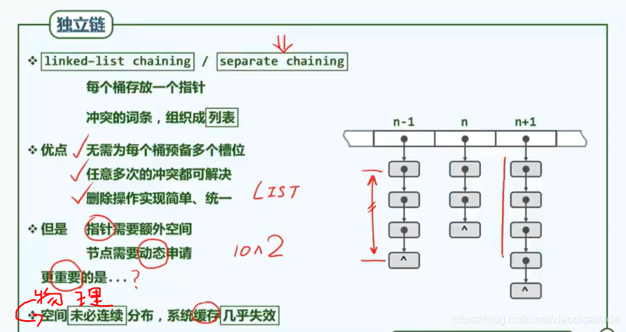


### 桶/计数排序


 


## 第10章 优先级队列


### PQ定义


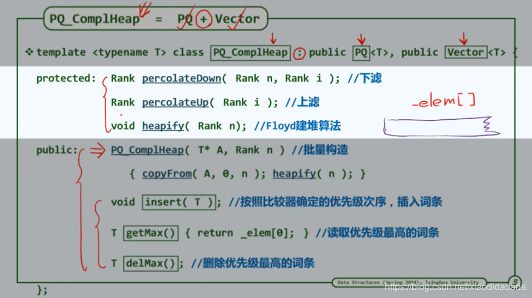


```cpp
template <typename T> struct PQ { //优先级队列PQ模板类
   virtual void insert ( T ) = 0; //按照比较器确定的优先级次序插入词条
   virtual T getMax() = 0; //取出优先级最高的词条
   virtual T delMax() = 0; //删除优先级最高的词条
};
```


### PQ_Complheap 

完全二叉堆插入与上滤


删除与下滤


 完全二叉堆: 批量建堆

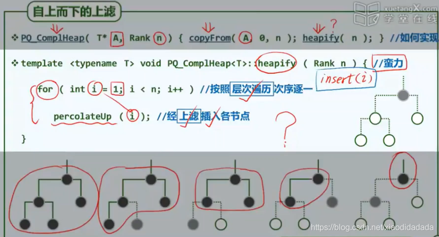


 堆排序算法
 
 


 

```cpp
//PQ_ComplHeap.h

#include "Vector/Vector.h" //借助多重继承机制，基于向量
#include "PQ/PQ.h" //按照优先级队列ADT实现的
template <typename T> struct PQ_ComplHeap : public PQ<T>, public Vector<T> { //完全二叉堆
   /*DSA*/friend class UniPrint; //演示输出使用，否则不必设置友类
   PQ_ComplHeap() { } //默认构造
   PQ_ComplHeap ( T* A, Rank n ) { copyFrom ( A, 0, n ); heapify ( _elem, n ); } //批量构造
   void insert ( T ); //按照比较器确定的优先级次序，插入词条
   T getMax(); //读取优先级最高的词条
   T delMax(); //删除优先级最高的词条
}; //PQ_ComplHeap
template <typename T> void heapify ( T* A, Rank n ); //Floyd建堆算法
template <typename T> Rank percolateDown ( T* A, Rank n, Rank i ); //下滤
template <typename T> Rank percolateUp ( T* A, Rank i ); //上滤


//PQ_ComplHeap_Heapify.h

template <typename T> void heapify ( T* A, const Rank n ) { //Floyd建堆算法，O(n)时间
   for ( int i = n/2 - 1; 0 <= i; i-- ) //自底而上，依次
/*DSA*///{
      percolateDown ( A, n, i ); //下滤各内部节点
/*DSA*///for ( int k = 0; k < n; k++ ) {
/*DSA*///  int kk = k; while ( i < kk ) kk = (kk - 1) / 2;
/*DSA*///  i == kk ? print(A[k]) : print("    " );
/*DSA*///}; printf("\n");
/*DSA*///}
}

//PQ_ComplHeap_insert.h
template <typename T> void PQ_ComplHeap<T>::insert ( T e ) { //将词条插入完全二叉堆中
   Vector<T>::insert ( e ); //首先将新词条接至向量末尾
   percolateUp ( _elem, _size - 1 ); //再对该词条实施上滤调整
}

//PQ_ComplHeap_percolateDown.h
//对向量前n个词条中的第i个实施下滤，i < n
template <typename T> Rank percolateDown ( T* A, Rank n, Rank i ) {
   Rank j; //i及其（至多两个）孩子中，堪为父者
   while ( i != ( j = ProperParent ( A, n, i ) ) ) //只要i非j，则
      { swap ( A[i], A[j] ); i = j; } //二者换位，并继续考查下降后的i
   return i; //返回下滤抵达的位置（亦i亦j）
}

//PQ_ComplHeap_percolateUp.h
//对向量中的第i个词条实施上滤操作，i < _size
template <typename T> Rank percolateUp ( T* A, Rank i ) {
   while ( 0 < i ) { //在抵达堆顶之前，反复地
      Rank j = Parent ( i ); //考查[i]之父亲[j]
      if ( lt ( A[i], A[j] ) ) break; //一旦父子顺序，上滤旋即完成；否则
      swap ( A[i], A[j] ); i = j; //父子换位，并继续考查上一层
   } //while
   return i; //返回上滤最终抵达的位置
}

//PQ_ComplHeap_getMax.h
template <typename T> T PQ_ComplHeap<T>::getMax() {  return _elem[0];  }

//PQ_ComplHeap_delMax.h
template <typename T> T PQ_ComplHeap<T>::delMax() { //删除非空完全二叉堆中优先级最高的词条
   T maxElem = _elem[0]; _elem[0] = _elem[ --_size ]; //摘除堆顶（首词条），代之以末词条
   percolateDown ( _elem, _size, 0 ); //对新堆顶实施下滤
   return maxElem; //返回此前备份的最大词条
}
```

## 第11章 串


### string定义

 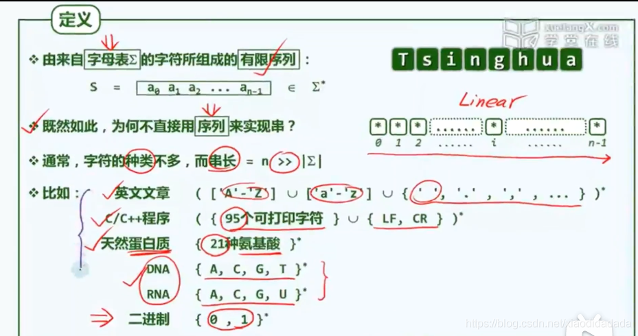

 
 
  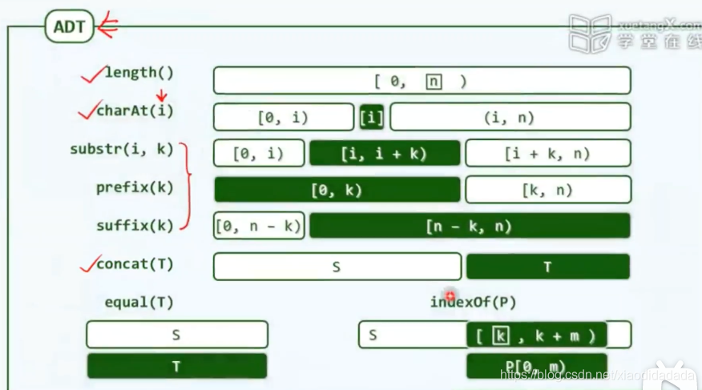
 
### 串匹配 KMP排序

 

KMP算法：从记忆力到预知力

next[0] = -1, next构建过程就是P匹配自己的过程


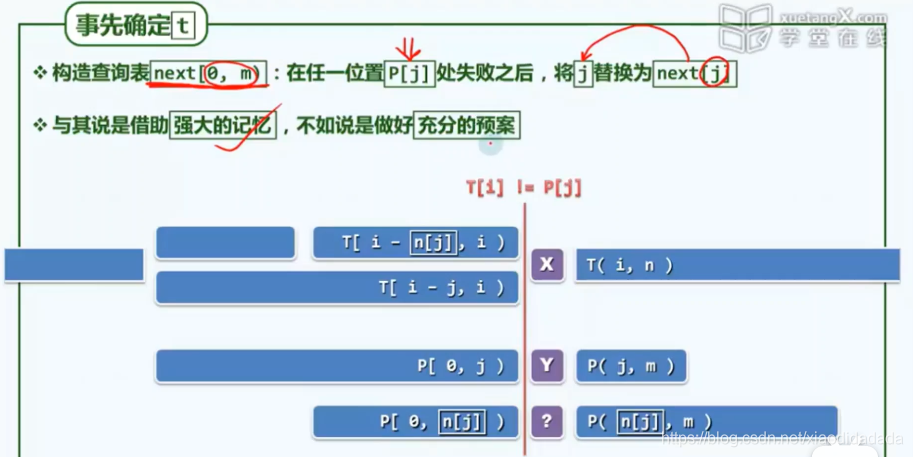

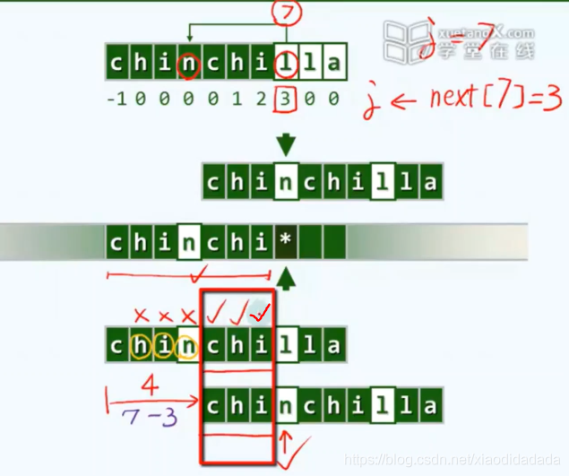

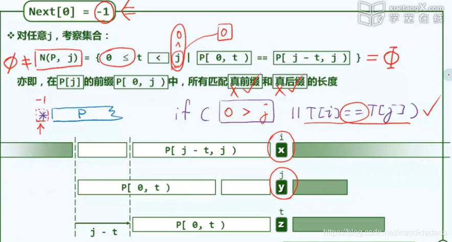
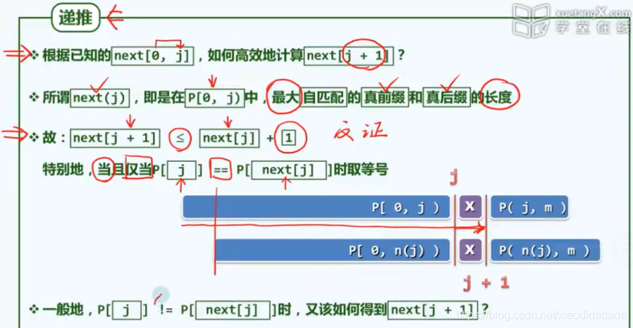
	   
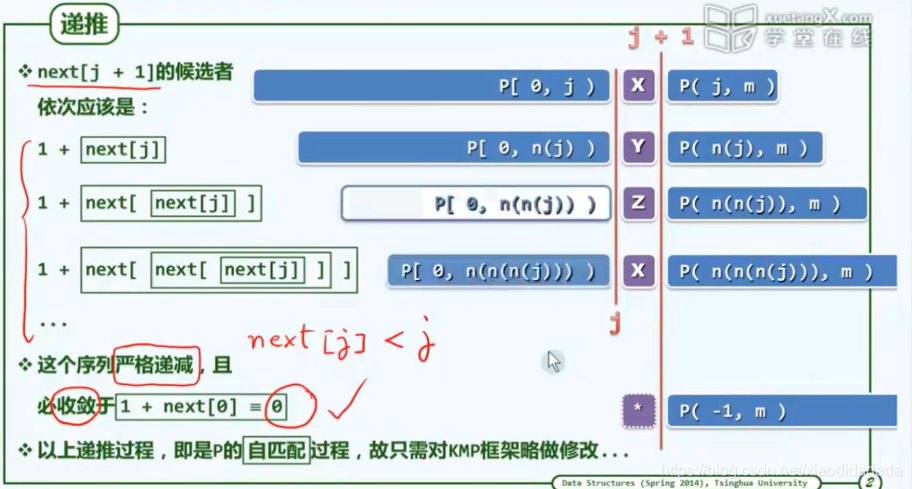


KMP算法再改进

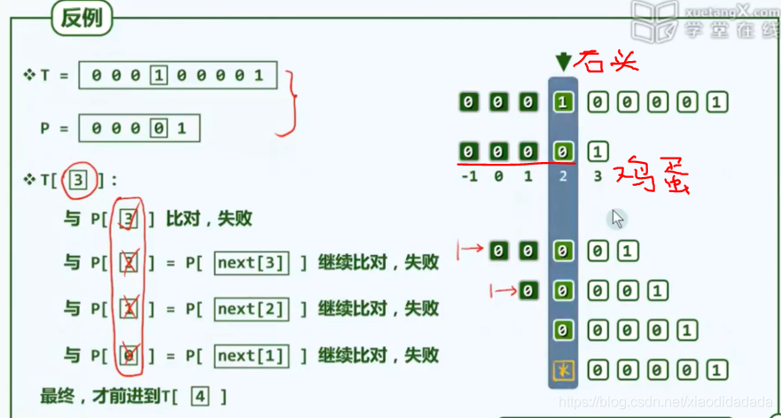


```cpp
int match ( char* P, char* T ) {  //KMP算法
   int* next = buildNext ( P ); //构造next表
   int n = ( int ) strlen ( T ), i = 0; //文本串指针
   int m = ( int ) strlen ( P ), j = 0; //模式串指针
   while ( j < m  && i < n ) //自左向右逐个比对字符
      /*DSA*/{
      /*DSA*/showProgress ( T, P, i - j, j );
      /*DSA*/printNext ( next, i - j, strlen ( P ) );
      /*DSA*/getchar(); printf ( "\n" );
      if ( 0 > j || T[i] == P[j] ) //若匹配，或P已移出最左侧（两个判断的次序不可交换）
         { i ++;  j ++; } //则转到下一字符
      else //否则
         j = next[j]; //模式串右移（注意：文本串不用回退）
      /*DSA*/}
   delete [] next; //释放next表
   return i - j;
}

int* buildNext ( char* P ) { //构造模式串P的next表
   size_t m = strlen ( P ), j = 0; //“主”串指针
   int* N = new int[m]; //next表
   int t = N[0] = -1; //模式串指针
   while ( j < m - 1 )
      if ( 0 > t || P[j] == P[t] ) { //匹配
         j ++; t ++;
         N[j] = t; //此句可改进...
      } else //失配
         t = N[t];
   /*DSA*/printString ( P ); printf ( "\n" );
   /*DSA*/printNext ( N, 0, m );
   return N;
}

int* buildNext ( char* P ) { //构造模式串P的next表（改进版本）
   size_t m = strlen ( P ), j = 0; //“主”串指针
   int* N = new int[m]; //next表
   int t = N[0] = -1; //模式串指针
   while ( j < m - 1 )
      if ( 0 > t || P[j] == P[t] ) { //匹配
         N[j] = ( P[++j] != P[++t] ? t : N[t] ); //注意此句与未改进之前的区别
      } else //失配
         t = N[t];
   /*DSA*/printString ( P ); printf ( "\n" );
   /*DSA*/printNext ( N, 0, strlen ( P ) );
   return N;
}

```

## 第12章 排序

### 快速排序


```cpp
//vector_partition_A.h
template <typename T> //轴点构造算法：通过调整元素位置构造区间[lo, hi)的轴点，并返回其秩
Rank Vector<T>::partition ( Rank lo, Rank hi ) { //版本A：基本形式
   swap ( _elem[lo], _elem[ lo + rand() % ( hi - lo ) ] ); //任选一个元素与首元素交换
   hi--; T pivot = _elem[lo]; //以首元素为候选轴点——经以上交换，等效于随机选取
   while ( lo < hi ) { //从向量的两端交替地向中间扫描
      while ( ( lo < hi ) && ( pivot <= _elem[hi] ) ) //在不小于pivot的前提下
         hi--; //向左拓展右端子向量
      _elem[lo] = _elem[hi]; //小于pivot者归入左侧子序列
      while ( ( lo < hi ) && ( _elem[lo] <= pivot ) ) //在不大于pivot的前提下
         lo++; //向右拓展左端子向量
      _elem[hi] = _elem[lo]; //大于pivot者归入右侧子序列
   } //assert: lo == hi
   _elem[lo] = pivot; //将备份的轴点记录置于前、后子向量之间
   return lo; //返回轴点的秩
}


template <typename T> //向量快速排序
void Vector<T>::quickSort ( Rank lo, Rank hi ) { //0 <= lo < hi <= size
   /*DSA*/ //printf ( "\tQUICKsort [%3d, %3d)\n", lo, hi );
   if ( hi - lo < 2 ) return; //单元素区间自然有序，否则...
   Rank mi = partition ( lo, hi ); //在[lo, hi)内构造轴点
   quickSort ( lo, mi ); //对前缀递归排序
   quickSort ( mi + 1, hi ); //对后缀递归排序
}

```


### 众数与中位数

投票法


```cpp
template <typename T> bool majority ( Vector<T> A, T& maj ) { //众数查找算法：T可比较可判等
   maj = majEleCandidate ( A ); //必要性：选出候选者maj
   return majEleCheck ( A, maj ); //充分性：验证maj是否的确当选
}


template <typename T> T majEleCandidate ( Vector<T> A ) { //选出具备必要条件的众数候选者
   T maj; //众数候选者
// 线性扫描：借助计数器c，记录maj与其它元素的数量差额
   for ( int c = 0, i = 0; i < A.size(); i++ )
      if ( 0 == c ) { //每当c归零，都意味着此时的前缀P可以剪除
         maj = A[i]; c = 1; //众数候选者改为新的当前元素
      } else //否则
         maj == A[i] ? c++ : c--; //相应地更新差额计数器
   return maj; //至此，原向量的众数若存在，则只能是maj —— 尽管反之不然
}

```


中位数


### 希尔排序


