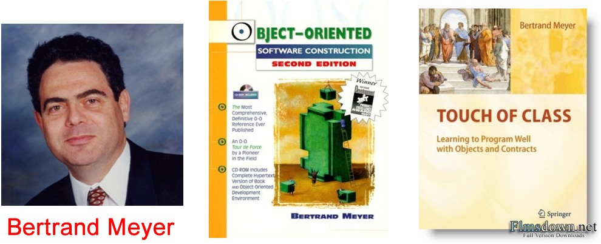
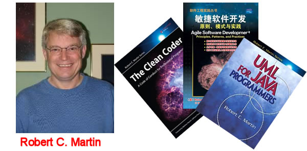
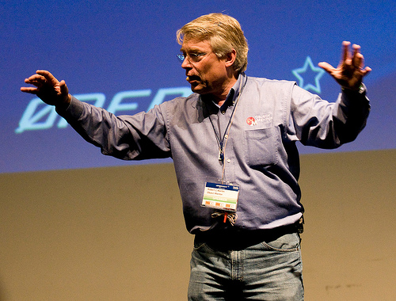
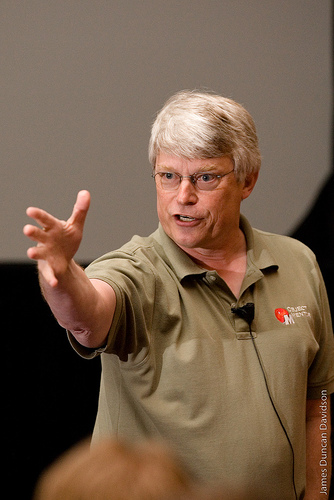
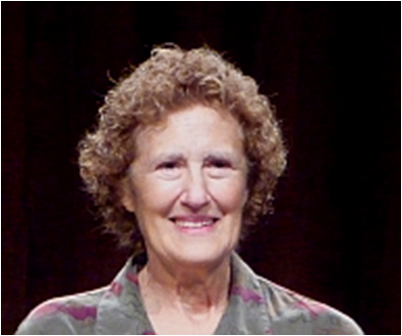
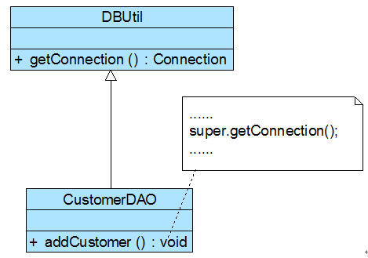
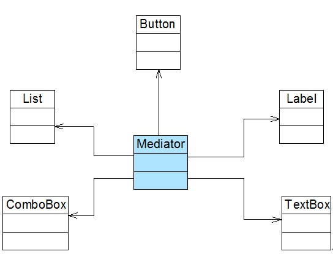

#史上最全设计模式导学目录（完整版）
   **圣诞献礼！**   

       2012年-2013年，Sunny在CSDN技术博客中陆续发表了100多篇与设计模式学习相关的文章，涵盖了**七个面向对象设计原则和24个设计模式（23个GoF设计模式 +  简单工厂模式）**，为了方便大家学习，现将所有文章的链接进行了整理，希望能给各位带来帮助！

       祝大家**圣诞节快乐**！ **花絮：本文的工作量大大超过之前的估计，几乎整个平安夜都花在它身上了，**

 

**基础知识**

 

**设计模式概述**

：设计模式从何而来？

：设计模式是什么？

：设计模式有什么用？附：个人观点

 

**面向对象设计原则**

 

**六个创建型模式**

 

**简单工厂模式-Simple Factory Pattern【学习难度：★★☆☆☆，使用频率：★★★☆☆】**

：图表库的设计

：简单工厂模式概述

：图表库的简单工厂模式解决方案

：图表库解决方案的改进，简单工厂模式的简化，简单工厂模式总结

 

**工厂方法模式-Factory Method Pattern【学习难度：★★☆☆☆，使用频率：★★★★★】**

：日志记录器的设计

：工厂方法模式概述

：日志记录器的工厂方法模式解决方案，反射与配置文件

：重载的工厂方法，工厂方法的隐藏，工厂方法模式总结

 

**抽象工厂模式-Abstract  Factory Pattern【学习难度：★★★★☆，使用频率：★★★★★】**

：界面皮肤库的初始设计

：产品等级结构与产品族

：抽象工厂模式概述

：界面皮肤库的抽象工厂模式解决方案

：“开闭原则”的倾斜性，抽象工厂模式总结

 

**单例模式-Singleton Pattern【学习难度：★☆☆☆☆，使用频率：★★★★☆】**

：单例模式的动机，单例模式概述

：负载均衡器的设计与实现

：饿汉式单例与懒汉式单例的讨论

：一种更好的单例实现方法（静态内部类）

：单例模式总结

 

**原型模式-Prototype Pattern【学习难度：★★★☆☆，使用频率：★★★☆☆】**

：大同小异的工作周报，原型模式概述

：工作周报的原型模式解决方案

：带附件的周报【浅克隆，深克隆】

：原型管理器的引入和实现，原型模式总结

 

**建造者模式-Builder Pattern【学习难度：★★★★☆，使用频率：★★☆☆☆】**

：游戏角色设计，建造者模式概述

：游戏角色设计的建造者模式解决方案

：关于Director的进一步讨论，建造者模式总结

 

 

**七个结构型模式**

 

**适配器模式-Adapter Pattern【学习难度：★★☆☆☆，使用频率：★★★★☆】**

 

：没有源码的算法库，适配器模式概述

：没有源码的算法库的适配器模式解决方案

：类适配器，双向适配器

：缺省适配器，适配器模式总结

 

**桥接模式-Bridge Pattern【学习难度：****★★★☆☆****，使用频率：****★★★☆☆****】**

：跨平台图像浏览系统

：桥接模式概述

：跨平台图像浏览系统的桥接模式解决方案

：适配器模式与桥接模式的联用，桥接模式总结

 

**组合模式-Composite Pattern【学习难度：★★★☆☆，使用频率：★★★★☆】**

：设计杀毒软件的框架结构

：组合模式概述

：杀毒软件的框架结构的组合模式解决方案

：透明组合模式与安全组合模式

：公司组织结构，组合模式总结

 

**装饰模式-Decorator Pattern【学习难度：★★★☆☆，使用频率：★★★☆☆】**

：图形界面构件库的设计

：装饰模式概述

：图形界面构件库的装饰模式解决方案

：透明装饰模式与半透明装饰模式，装饰模式注意事项，装饰模式总结

 

**外观模式-Facade Pattern【学习难度：★☆☆☆☆，使用频率：★★★★★】**

：外观模式概述，外观模式结构与实现

：外观模式应用实例（文件加密模块）

：抽象外观类，外观模式效果与适用场景

 

**享元模式-Flyweight Pattern【学习难度：★★★★☆，使用频率：★☆☆☆☆】**

：围棋棋子的设计，享元模式概述（上）

：享元模式概述（下）

：围棋棋子的享元模式解决方案

：带外部状态的围棋棋子解决方案

：单纯享元模式和复合享元模式，关于享元模式的几点补充，享元模式总结

 

**代理模式-Proxy Pattern【学习难度：★★★☆☆，使用频率：★★★★☆】**

 

：代理模式概述，代理模式结构与实现

：代理模式应用实例（收费商务信息查询系统）

：远程代理，虚拟代理，缓冲代理

：代理模式效果与适用场景

 

 

**十一个行为型模式**

 

**职责链模式-Chain of Responsibility Pattern【学习难度：★★★☆☆，使用频率：★★☆☆☆】**

：采购单的分级审批

：职责链模式概述

：采购单分级审批的职责链模式解决方案

：纯与不纯的职责链模式，职责链模式总结

 

**命令模式-Command Pattern【学习难度：★★★****☆☆****，使用频率：****★★★★☆****】**

：自定义功能键，命令模式概述

：自定义功能键的命令模式解决方案

：命令队列的实现

：撤销操作的简单实现

：请求日志

：宏命令，命令模式总结

 

**解释器模式-Interpreter Pattern【学习难度：★★★★★，使用频率：★☆☆☆☆】**

：机器人控制程序

：文法规则和抽象语法树

：解释器模式概述

：机器人控制程序的解释器模式解决方案

：再谈Context的作用

：解释器模式总结

 

**迭代器模式-Iterator Pattern【学习难度：★★★☆☆，使用频率：★★★★★】**

：销售管理系统中数据的遍历

：迭代器模式概述

：销售管理系统中数据的遍历的迭代器模式解决方案

：使用内部类实现迭代器

：JDK内置迭代器的使用

：迭代器模式总结

 

**中介者模式-Mediator Pattern【学习难度：★★★☆☆，使用频率：★★☆☆☆】**

：客户信息管理窗口的初始设计

：中介者模式概述

：客户信息管理窗口的中介者模式解决方案

：中介者与同事类的扩展

：中介者模式总结

 

**备忘录模式-Memento Pattern【学习难度：★★☆☆☆，使用频率：★★☆☆☆】**

：可悔棋的中国象棋

：备忘录模式概述

：中国象棋的备忘录模式解决方案

：实现多次撤销

：再谈备忘录的封装，备忘录模式总结

 

**观察者模式-Observer Pattern【学习难度：★★★☆☆，使用频率：★★★★★】**

：多人联机对战游戏的设计

：观察者模式概述

：多人联机对战游戏的观察者模式解决方案

：JDK对观察者模式的支持

：观察者模式与Java事件处理

：观察者模式与MVC，观察者模式总结

 

**状态模式-State Pattern【学习难度：★★★☆☆，使用频率：★★★☆☆】**

：银行系统中的账户类设计

：状态模式概述

：账户类的状态模式解决方案

：共享状态的实现

：使用环境类实现状态转换

：状态模式总结

 

**策略模式-Strategy Pattern【学习难度：★☆☆☆☆，使用频率：★★★★☆】**

：电影票打折方案

：策略模式概述

：电影票打折方案的策略模式解决方案

：策略模式的两个典型应用，策略模式总结

 

**模板方法模式-Template Method Pattern【学习难度：★★☆☆☆，使用频率：★★★☆☆】**

：模板方法模式概述，模板方法模式结构与实现

：模板方法模式应用实例（银行利息计算模块）

：钩子方法的使用，模板方法模式效果与适用场景

 

**访问者模式-Visitor Pattern【学习难度：★★★★☆，使用频率：★☆☆☆☆】**

：OA系统中员工数据汇总

：访问者模式概述

：OA系统中员工数据汇总的访问者模式解决方案

：访问者模式与组合模式联用，访问者模式总结

 

**设计模式趣味学习（复习）**

 

：创建型模式

：结构型模式

：行为型模式（上）

：行为型模式（下）

 

 

设计模式综合应用实例

 

多人联机射击游戏

 

：抽象工厂模式，建造者模式，工厂方法模式，迭代器模式，命令模式

：观察者模式，单例模式，状态模式，适配器模式

 

 

 

数据库同步系统

 

：数据库同步系统概述，建造者模式，简单工厂模式

：享元模式，单例模式，观察者模式，模板方法模式

：策略模式，组合模式，命令模式，职责链模式

#从招式与内功谈起——设计模式概述（一）
      关于金庸小说中到底是招式重要还是内功重要的争论从未停止，我们在这里并不分析张无忌的九阳神功和令狐冲的独孤九剑到底哪个更厉害，但我想每个武林人士梦寐以求的应该是既有淋漓的招式又有深厚的内功。看到这里大家可能会产生疑问了？搞什么，讨论什么招式与内功，我只是个软件开发人员。别急，正因为你是软件开发人员我才跟你谈这个，因为我们的软件开发技术也包括一些招式和内功：Java、C#、C++等编程语言，Eclipse、Visual Studio等开发工具，JSP、ASP.net等开发技术，Struts、Hibernate、JBPM等框架技术，所有这些我们都可以认为是招式；而数据结构、算法、设计模式、重构、软件工程等则为内功。招式可以很快学会，但是内功的修炼需要更长的时间。我想每一位软件开发人员也都希望成为一名兼具淋漓招式和深厚内功的“上乘”软件工程师，而对设计模式的学习与领悟将会让你“内功”大增，再结合你日益纯熟的“招式”，你的软件开发“功力”一定会达到一个新的境界。既然这样，还等什么，赶快行动吧。下面就让我们正式踏上神奇而又美妙的设计模式之旅。

 

## 1 设计模式从何而来

      在介绍设计模式的起源之前，我们先要了解一下模式的诞生与发展。与很多软件工程技术一样，模式起源于建筑领域，毕竟与只有几十年历史的软件工程相比，已经拥有几千年沉淀的建筑工程有太多值得学习和借鉴的地方。

      那么模式是如何诞生的？让我们先来认识一个人——Christopher Alexander（克里斯托弗.亚历山大），哈佛大学建筑学博士、美国加州大学伯克利分校建筑学教授、加州大学伯克利分校环境结构研究所所长、美国艺术和科学院院士……头衔真多，，不过他还有一个“昵称”——模式之父(The father of patterns)。Christopher Alexander博士及其研究团队用了约20年的时间，对住宅和周边环境进行了大量的调查研究和资料收集工作，**发现人们对舒适住宅和城市环境存在一些共同的认同规律**，Christopher Alexander在著作**A Pattern Language: Towns, Buildings, Construction**中把这些认同规律归纳为253个**模式**，对每一个模式(Pattern)都从Context（前提条件）、Theme或Problem（目标问题）、 Solution（解决方案）三个方面进行了描述，并给出了从用户需求分析到建筑环境结构设计直至经典实例的过程模型。

      在Christopher Alexander的另一部经典著作《建筑的永恒之道》中，他给出了关于模式的定义：

**      每个模式都描述了一个在我们的环境中不断出现的问题，然后描述了该问题的解决方案的核心，通过这种方式，我们可以无数次地重用那些已有的成功的解决方案，无须再重复相同的工作。**这个定义可以简单地用一句话表示：
|**模式是在特定环境下人们解决某类重复出现问题的一套成功或有效的解决方案。【A pattern is a successful or efficient solution to a recurring  problem within a context】**

       1990年，软件工程界开始关注ChristopherAlexander等在这一住宅、公共建筑与城市规划领域的重大突破。最早将模式的思想引入软件工程方法学的是1991-1992年以“四人组(Gang of Four，简称GoF，分别是**Erich Gamma, Richard Helm, Ralph Johnson和John Vlissides**)”自称的四位著名软件工程学者，他们在1994年归纳发表了23种在软件开发中使用频率较高的设计模式，旨在用模式来统一沟通面向对象方法在分析、设计和实现间的鸿沟。

      GoF将模式的概念引入软件工程领域，这标志着软件模式的诞生。软件模式(Software Patterns)是将模式的一般概念应用于软件开发领域，即软件开发的总体指导思路或参照样板。软件模式并非仅限于设计模式，还包括架构模式、分析模式和过程模式等，实际上，**在软件开发生命周期的每一个阶段都存在着一些被认同的模式**。

      软件模式是在软件开发中某些可重现问题的一些有效解决方法，软件模式的基础结构主要由四部分构成，包括问题描述【待解决的问题是什么】、前提条件【在何种环境或约束条件下使用】、解法【如何解决】和效果【有哪些优缺点】，如图1-1所示：

**图1-1 软件模式基本结构**

    软件模式与具体的应用领域无关，也就是说无论你从事的是移动应用开发、桌面应用开发、Web应用开发还是嵌入式软件的开发，都可以使用软件模式。

    在软件模式中，设计模式是研究最为深入的分支，**设计模式用于在特定的条件下为一些重复出现的软件设计问题提供合理的、有效的解决方案**，它融合了众多专家的设计经验，已经在成千上万的软件中得以应用。 1995年， GoF将收集和整理好的23种设计模式汇编成**Design Patterns: Elements of Reusable Object-Oriented Software**【《设计模式：可复用面向对象软件的基础》】一书，该书的出版也标志着设计模式正式成为面向对象(Object Oriented)软件工程的一个重要研究分支。

    从1995年至今，无论是在大型API或框架（如JDK、.net Framework等）、轻量级框架（如Struts、Spring、 Hibernate、JUnit等）、还是应用软件的开发中，设计模式都得到了广泛的应用。如果你正在从事面向对象开发或正准备从事面向对象开发，无论你是使用Java、C#、Objective-C、VB.net、Smalltalk等纯面向对象编程语言，还是使用C++、PHP、Delphi、JavaScript等可支持面向对象编程的语言，如果你一点设计模式也不懂，我可以毫不夸张的说：你真的out了。

【作者：刘伟 】

#从招式与内功谈起——设计模式概述（二）
## 1.2 设计模式是什么

       俗话说：站在别人的肩膀上，我们会看得更远。设计模式的出现可以让我们站在前人的肩膀上，通过一些成熟的设计方案来指导新项目的开发和设计，以便于我们开发出具有更好的灵活性和可扩展性，也更易于复用的软件系统。

       设计模式的一般定义如下：
|**设计模式(Design Pattern)是一套被反复使用、多数人知晓的、经过分类编目的、代码设计经验的总结，使用设计模式是为了可重用代码、让代码更容易被他人理解并且保证代码可靠性。**

      狭义的设计模式是指GoF在《设计模式：可复用面向对象软件的基础》一书中所介绍的23种经典设计模式，不过设计模式并不仅仅只有这23种，随着软件开发技术的发展，越来越多的新模式不断诞生并得以应用。

      设计模式一般包含模式名称、问题、目的、解决方案、效果等组成要素，其中关键要素是模式名称、问题、解决方案和效果。**模式名称(Pattern Name)**通过一两个词来描述模式的问题、解决方案和效果，以便更好地理解模式并方便开发人员之间的交流，绝大多数模式都是根据其功能或模式结构来命名的（GoF设计模式中没有一个模式用人名命名，）；**问题(Problem)**描述了应该在何时使用模式，它包含了设计中存在的问题以及问题存在的原因；**解决方案(Solution)**描述了一个设计模式的组成成分，以及这些组成成分之间的相互关系，各自的职责和协作方式，通常解决方案通过UML类图和核心代码来进行描述；**效果(Consequences)**描述了模式的优缺点以及在使用模式时应权衡的问题。

      虽然GoF设计模式只有23个，但是它们各具特色，每个模式都为某一个可重复的设计问题提供了一套解决方案。根据它们的用途，设计模式可分为创建型(Creational)，结构型(Structural)和行为型(Behavioral)三种，其中**创建型模式主要用于描述如何创建对象**，**结构型模式主要用于描述如何实现类或对象的组合**，**行为型模式主要用于描述类或对象怎样交互以及怎样分配职责**，在GoF 23种设计模式中包含5种创建型设计模式、7种结构型设计模式和11种行为型设计模式。此外，根据某个模式主要是用于处理类之间的关系还是对象之间的关系，设计模式还可以分为类模式和对象模式。我们经常将两种分类方式结合使用，如单例模式是对象创建型模式，模板方法模式是类行为型模式。

      值得一提的是，有一个设计模式虽然不属于GoF 23种设计模式，但一般在介绍设计模式时都会对它进行说明，它就是简单工厂模式，也许是太“简单”了，GoF并没有把它写到那本经典著作中，不过现在大部分的设计模式书籍都会对它进行专门的介绍。

      表1列出将要介绍的24种设计模式，其中**模式的学习难度**是我个人在多年模式使用和推广过程中的经验总结，仅作参考，**模式的使用频率**来自著名的模式推广和教育网站——http://www.dofactory.net。

 

**表1  常用设计模式一览表**
<td style="BACKGROUND: rgb(242,242,242)">**类型**</td><td style="BACKGROUND: rgb(242,242,242)">**模式名称**</td><td style="BACKGROUND: rgb(242,242,242)">**学习难度**</td><td style="BACKGROUND: rgb(242,242,242)">**使用频率**</td>

**模式名称**

**使用频率**
<td rowspan="6">创建型模式Creational Pattern</td>|单例模式Singleton Pattern|★☆☆☆☆|★★★★☆

Creational Pattern

Singleton Pattern

★★★★☆
|简单工厂模式Simple Factory Pattern|★★☆☆☆|★★★☆☆

Simple Factory Pattern

★★★☆☆
|工厂方法模式Factory Method Pattern|★★☆☆☆|★★★★★

Factory Method Pattern

★★★★★
|抽象工厂模式Abstract  Factory Pattern|★★★★☆|★★★★★

Abstract  Factory Pattern

★★★★★
|原型模式Prototype Pattern|★★★☆☆|★★★☆☆

Prototype Pattern

★★★☆☆
|建造者模式Builder Pattern|★★★★☆|★★☆☆☆

Builder Pattern

★★☆☆☆
<td rowspan="7">结构型模式Structural Pattern</td>|适配器模式Adapter Pattern|★★☆☆☆|★★★★☆

Structural Pattern

Adapter Pattern

★★★★☆
|桥接模式Bridge  Pattern|★★★☆☆|★★★☆☆

Bridge  Pattern

★★★☆☆
|组合模式Composite  Pattern|★★★☆☆|★★★★☆

Composite  Pattern

★★★★☆
|装饰模式Decorator  Pattern|★★★☆☆|★★★☆☆

Decorator  Pattern

★★★☆☆
|外观模式Façade  Pattern|★☆☆☆☆|★★★★★

Façade  Pattern

★★★★★
|享元模式Flyweight  Pattern|★★★★☆|★☆☆☆☆

Flyweight  Pattern

★☆☆☆☆
|代理模式Proxy  Pattern|★★★☆☆|★★★★☆

Proxy  Pattern

★★★★☆
<td rowspan="11">行为型模式Behavioral Pattern</td>|职责链模式Chain  of Responsibility Pattern|★★★☆☆|★★☆☆☆

Behavioral Pattern

Chain  of Responsibility Pattern

★★☆☆☆
|命令模式Command  Pattern|★★★☆☆|★★★★☆

Command  Pattern

★★★★☆
|解释器模式Interpreter  Pattern|★★★★★|★☆☆☆☆

Interpreter  Pattern

★☆☆☆☆
|迭代器模式Iterator  Pattern|★★★☆☆|★★★★★

Iterator  Pattern

★★★★★
|中介者模式Mediator  Pattern|★★★☆☆|★★☆☆☆

Mediator  Pattern

★★☆☆☆
|备忘录模式Memento  Pattern|★★☆☆☆|★★☆☆☆

Memento  Pattern

★★☆☆☆
|观察者模式Observer  Pattern|★★★☆☆|★★★★★

Observer  Pattern

★★★★★
|状态模式State  Pattern|★★★☆☆|★★★☆☆

State  Pattern

★★★☆☆
|策略模式Strategy  Pattern|★☆☆☆☆|★★★★☆

Strategy  Pattern

★★★★☆
|模板方法模式Template  Method Pattern|★★☆☆☆|★★★☆☆

Template  Method Pattern

★★★☆☆
|访问者模式Visitor  Pattern|★★★★☆|★☆☆☆☆

Visitor  Pattern

★☆☆☆☆

【作者：刘伟 】

#从招式与内功谈起——设计模式概述（三）
## 1.3 设计模式有什么用

##       下面我们来回答最后一个问题：设计模式到底有什么用？简单来说，设计模式至少有如下几个用途：

      (1) 设计模式来源众多专家的经验和智慧，它们是从许多优秀的软件系统中总结出的成功的、能够实现可维护性复用的设计方案，使用这些方案将可以让我们避免做一些重复性的工作，也许我们冥思苦想得到的一个“自以为很了不起”的设计方案其实就是某一个设计模式。在时间就是金钱的今天，设计模式无疑会为有助于我们提高开发和设计效率，但它不保证一定会提高，。

      (2) 设计模式提供了一套通用的设计词汇和一种通用的形式来方便开发人员之间沟通和交流，使得设计方案更加通俗易懂。交流通常很耗时，任何有助于提高交流效率的东西都可以为我们节省不少时间。无论你使用哪种编程语言，做什么类型的项目，甚至你处于一个国际化的开发团队，当面对同一个设计模式时，你和别人的理解并无二异，因为设计模式是跨语言、跨平台、跨应用、跨国界的，。

      (3) 大部分设计模式都兼顾了系统的可重用性和可扩展性，这使得我们可以更好地重用一些已有的设计方案、功能模块甚至一个完整的软件系统，避免我们经常做一些重复的设计、编写一些重复的代码。此外，随着软件规模的日益增大，软件寿命的日益变长，系统的可维护性和可扩展性也越来越重要，许多设计模式将有助于提高系统的灵活性和可扩展性，让我们在不修改或者少修改现有系统的基础上增加、删除或者替换功能模块。如果一点设计模式都不懂，我想要做到这一点恐怕还是很困难的，。

      (4) 合理使用设计模式并对设计模式的使用情况进行文档化，将有助于别人更快地理解系统。如果某一天因为升职或跳槽等原因，别人接手了你的项目，只要他也懂设计模式，我想他应该能够很快理解你的设计思路和实现方案，让你升职无后患之忧，跳槽也心安理得，何乐而不为呢？。

      (5) 最后一点对初学者很重要，学习设计模式将有助于初学者更加深入地理解面向对象思想，让你知道：如何将代码分散在几个不同的类中？为什么要有“接口”？何谓针对抽象编程？何时不应该使用继承？如果不修改源代码增加新功能？同时还让你能够更好地阅读和理解现有类库（如JDK）与其他系统中的源代码，让你早点脱离面向对象编程的“菜鸟期”，。

 

## 1.4 个人观点

       作为设计模式的忠实粉丝和推广人员，在正式学习设计模式之前，我结合多年的模式应用和教育培训经验与大家分享几点个人的看法，以作参考：

       (1) 掌握设计模式并不是件很难的事情，关键在于多思考，多实践，不要听到人家说懂几个设计模式就很“牛”，只要用心学习，设计模式也就那么回事，你也可以很“牛”的，一定要有信心。

      (2) 在学习每一个设计模式时至少应该掌握如下几点：这个设计模式的意图是什么，它要解决一个什么问题，什么时候可以使用它；它是如何解决的，掌握它的结构图，记住它的关键代码；能够想到至少两个它的应用实例，一个生活中的，一个软件中的；这个模式的优缺点是什么，在使用时要注意什么。当你能够回答上述所有问题时，恭喜你，你了解一个设计模式了，至于掌握它，那就在开发中去使用吧，用多了你自然就掌握了。

      (3) “如果想体验一下运用模式的感觉，那么最好的方法就是运用它们”。正如在本章最开始所说的，设计模式是“内功心法”，它还是要与“实战招式”相结合才能够相得益彰。学习设计模式的目的在于应用，如果不懂如何使用一个设计模式，而只是学过，能够说出它的用途，绘制它的结构，充其量也只能说你了解这个模式，严格一点说：不会在开发中灵活运用一个模式基本上等于没学。所以一定要做到：少说多做。

      (4) 千万不要滥用模式，不要试图在一个系统中用上所有的模式，也许有这样的系统，但至少目前我没有碰到过。每个模式都有自己的适用场景，不能为了使用模式而使用模式？【怎么理解，大家自己思考，】，滥用模式不如不用模式，因为滥用的结果得不到“艺术品”一样的软件，很有可能是一堆垃圾代码。

      (5) 如果将设计模式比喻成“三十六计”，那么每一个模式都是一种计策，它为解决某一类问题而诞生，不管这个设计模式的难度如何，使用频率高不高，我建议大家都应该好好学学，多学一个模式也就意味着你多了“一计”，说不定什么时候一不小心就用上了，。因此，模式学习之路上要不怕困难，勇于挑战，有的模式虽然难一点，但反复琢磨，反复研读，应该还是能够征服的。

      (6) 设计模式的“上乘”境界：“手中无模式，心中有模式”。模式使用的最高境界是你已经不知道具体某个设计模式的定义和结构了，但你会灵活自如地选择一种设计方案【其实就是某个设计模式】来解决某个问题，设计模式已经成为你开发技能的一部分，能够手到擒来，“内功”与“招式”已浑然一体，要达到这个境界并不是看完某本书或者开发一两个项目就能够实现的，它需要不断沉淀与积累，所以，对模式的学习不要急于求成。

      (7) 最后一点来自GoF已故成员、我个人最尊敬和崇拜的软件工程大师之一John Vlissides的著作《设计模式沉思录》(Pattern Hatching Design Patterns Applied)：模式从不保证任何东西，它不能保证你一定能够做出可复用的软件，提高你的生产率，更不能保证世界和平，。模式并不能替代人来完成软件系统的创造，它们只不过会给那些缺乏经验但却具备才能和创造力的人带来希望。

  
|    <table border="0" cellspacing="0" cellpadding="0" width="564"><tbody><tr><td>**** |**扩展**John Vlissides（1961-2005），GoF成员，斯坦福大学计算机科学博士，原IBM研究员，因患脑瘤于2005年11月24日（感恩节）病故，享年44岁，为纪念他的贡献，ACM SIGPLAN特设立John Vlissides奖。

John Vlissides（1961-2005），GoF成员，斯坦福大学计算机科学博士，原IBM研究员，因患脑瘤于2005年11月24日（感恩节）病故，享年44岁，为纪念他的贡献，ACM SIGPLAN特设立John Vlissides奖。

 【作者：刘伟  】

 
#面向对象设计原则概述
      对于面向对象软件系统的设计而言，在支持可维护性的同时，提高系统的可复用性是一个至关重要的问题，如何同时提高一个软件系统的可维护性和可复用性是面向对象设计需要解决的核心问题之一。在面向对象设计中，可维护性的复用是以设计原则为基础的。每一个原则都蕴含一些面向对象设计的思想，可以从不同的角度提升一个软件结构的设计水平。

**      面向对象设计原则为支持可维护性复用而诞生，这些原则蕴含在很多设计模式中，它们是从许多设计方案中总结出的指导性原则**。面向对象设计原则也是我们用于评价一个设计模式的使用效果的重要指标之一，在设计模式的学习中，大家经常会看到诸如“XXX模式符合XXX原则”、“XXX模式违反了XXX原则”这样的语句。

       最常见的7种面向对象设计原则如下表所示：

**表1  7种常用的面向对象设计原则**
<td style="background: rgb(243, 243, 243);">**设计原则名称**</td><td style="background: rgb(243, 243, 243);">**定  义**</td><td style="background: rgb(243, 243, 243);">**使用频率**</td>

**定  义**
|单一职责原则(Single Responsibility Principle, SRP)|一个类只负责一个功能领域中的相应职责|★★★★☆

(Single Responsibility Principle, SRP)

★★★★☆
|开闭原则(Open-Closed Principle, OCP)|软件实体应对扩展开放，而对修改关闭|★★★★★

(Open-Closed Principle, OCP)

★★★★★
|里氏代换原则(Liskov Substitution Principle, LSP)|所有引用基类对象的地方能够透明地使用其子类的对象 |★★★★★

(Liskov Substitution Principle, LSP)

 
|依赖倒转原则(Dependence  Inversion Principle, DIP)|抽象不应该依赖于细节，细节应该依赖于抽象|★★★★★

(Dependence  Inversion Principle, DIP)
|接口隔离原则(Interface Segregation Principle, ISP)|使用多个专门的接口，而不使用单一的总接口|★★☆☆☆

(Interface Segregation Principle, ISP)

★★☆☆☆
|合成复用原则(Composite Reuse Principle, CRP)|尽量使用对象组合，而不是继承来达到复用的目的 |★★★★☆

(Composite Reuse Principle, CRP)

★★★★☆
|迪米特法则(Law of Demeter, LoD)|一个软件实体应当尽可能少地与其他实体发生相互作用|★★★☆☆

(Law of Demeter, LoD)

★★★☆☆

【作者：刘伟  】

#面向对象设计原则之单一职责原则
      单一职责原则是最简单的面向对象设计原则，它用于控制类的粒度大小。单一职责原则定义如下：
| **单一职责原则(Single Responsibility Principle, SRP)：一个类只负责一个功能领域中的相应职责，或者可以定义为：就一个类而言，应该只有一个引起它变化的原因。** 

      单一职责原则告诉我们：一个类不能太“累”！在软件系统中，一个类（大到模块，小到方法）承担的职责越多，它被复用的可能性就越小，而且一个类承担的职责过多，就相当于将这些职责耦合在一起，当其中一个职责变化时，可能会影响其他职责的运作，因此要将这些职责进行分离，将不同的职责封装在不同的类中，即将不同的变化原因封装在不同的类中，如果多个职责总是同时发生改变则可将它们封装在同一类中。

      单一职责原则是实现**高内聚、低耦合**的指导方针，它是最简单但又最难运用的原则，需要设计人员发现类的不同职责并将其分离，而发现类的多重职责需要设计人员具有较强的分析设计能力和相关实践经验。

      下面通过一个简单实例来进一步分析单一职责原则：
| Sunny软件公司开发人员针对某CRM（Customer Relationship  Management，客户关系管理）系统中客户信息图形统计模块提出了如图1所示初始设计方案：  **图1  初始设计方案结构图** 在图1中，CustomerDataChart类中的方法说明如下：getConnection()方法用于连接数据库，findCustomers()用于查询所有的客户信息，createChart()用于创建图表，displayChart()用于显示图表。 现使用单一职责原则对其进行重构。 

**图1  初始设计方案结构图**

在图1中，CustomerDataChart类中的方法说明如下：getConnection()方法用于连接数据库，findCustomers()用于查询所有的客户信息，createChart()用于创建图表，displayChart()用于显示图表。

      在图1中，CustomerDataChart类承担了太多的职责，既包含与数据库相关的方法，又包含与图表生成和显示相关的方法。如果在其他类中也需要连接数据库或者使用findCustomers()方法查询客户信息，则难以实现代码的重用。无论是修改数据库连接方式还是修改图表显示方式都需要修改该类，它不止一个引起它变化的原因，违背了单一职责原则。因此需要对该类进行拆分，使其满足单一职责原则，类CustomerDataChart可拆分为如下三个类：

      (1) DBUtil：负责连接数据库，包含数据库连接方法getConnection()；

      (2) CustomerDAO：负责操作数据库中的Customer表，包含对Customer表的增删改查等方法，如findCustomers()；

      (3) CustomerDataChart：负责图表的生成和显示，包含方法createChart()和displayChart()。

      使用单一职责原则重构后的结构如图2所示：

**图2  重构后的结构图**

【作者：刘伟  】

#面向对象设计原则之开闭原则
      开闭原则是面向对象的可复用设计的第一块基石，它是最重要的面向对象设计原则。开闭原则由**Bertrand  Meyer**于1988年提出，其定义如下：
| **开闭原则(Open-Closed Principle, OCP)：一个软件实体应当对扩展开放，对修改关闭。即软件实体应尽量在不修改原有代码的情况下进行扩展。** 

      在开闭原则的定义中，**软件实体可以指一个软件模块、一个由多个类组成的局部结构或一个独立的类**。

      任何软件都需要面临一个很重要的问题，即它们的需求会随时间的推移而发生变化。当软件系统需要面对新的需求时，我们应该尽量保证系统的设计框架是稳定的。如果一个软件设计符合开闭原则，那么可以非常方便地对系统进行扩展，而且在扩展时无须修改现有代码，使得软件系统在拥有适应性和灵活性的同时具备较好的稳定性和延续性。随着软件规模越来越大，软件寿命越来越长，软件维护成本越来越高，设计满足开闭原则的软件系统也变得越来越重要。

      为了满足开闭原则，需要对系统进行抽象化设计，**抽象化是开闭原则的关键**。在Java、C#等编程语言中，可以为系统定义一个相对稳定的抽象层，而将不同的实现行为移至具体的实现层中完成。在很多面向对象编程语言中都提供了接口、抽象类等机制，可以通过它们定义系统的抽象层，再通过具体类来进行扩展。如果需要修改系统的行为，无须对抽象层进行任何改动，只需要增加新的具体类来实现新的业务功能即可，实现在不修改已有代码的基础上扩展系统的功能，达到开闭原则的要求。
|       Sunny软件公司开发的CRM系统可以显示各种类型的图表，如饼状图和柱状图等，为了支持多种图表显示方式，原始设计方案如图1所示：  **图1 初始设计方案结构图**       在ChartDisplay类的display()方法中存在如下代码片段： <pre>`......if (type.equals("pie")) {    PieChart chart = new PieChart();    chart.display();}else if (type.equals("bar")) {    BarChart chart = new BarChart();    chart.display();}......`</pre>       在该代码中，如果需要增加一个新的图表类，如折线图LineChart，则需要修改ChartDisplay类的display()方法的源代码，增加新的判断逻辑，违反了开闭原则。       现对该系统进行重构，使之符合开闭原则。 

      在ChartDisplay类的display()方法中存在如下代码片段：

      现对该系统进行重构，使之符合开闭原则。

       在本实例中，由于在ChartDisplay类的display()方法中针对每一个图表类编程，因此增加新的图表类不得不修改源代码。可以通过抽象化的方式对系统进行重构，使之增加新的图表类时无须修改源代码，满足开闭原则。具体做法如下：

      (1) 增加一个抽象图表类AbstractChart，将各种具体图表类作为其子类；

      (2)  ChartDisplay类针对抽象图表类进行编程，由客户端来决定使用哪种具体图表。

      重构后结构如图2所示：

**图2 重构后的结构图**

      在图2中，我们引入了抽象图表类AbstractChart，且ChartDisplay针对抽象图表类进行编程，并通过setChart()方法由客户端来设置实例化的具体图表对象，在ChartDisplay的display()方法中调用chart对象的display()方法显示图表。如果需要增加一种新的图表，如折线图LineChart，只需要将LineChart也作为AbstractChart的子类，在客户端向ChartDisplay中注入一个LineChart对象即可，无须修改现有类库的源代码。     

       注意：因为xml和properties等格式的配置文件是纯文本文件，可以直接通过VI编辑器或记事本进行编辑，且无须编译，因此在软件开发中，一般不把对配置文件的修改认为是对系统源代码的修改。如果一个系统在扩展时只涉及到修改配置文件，而原有的Java代码或C#代码没有做任何修改，该系统即可认为是一个符合开闭原则的系统。

#面向对象设计原则之依赖倒转原则
       如果说开闭原则是面向对象设计的目标的话，那么依赖倒转原则就是面向对象设计的主要实现机制之一，它是系统抽象化的具体实现。依赖倒转原则是**Robert C. Martin**在1996年为“C++Reporter”所写的专栏Engineering Notebook的第三篇，后来加入到他在2002年出版的经典著作“**Agile Software Development, Principles, Patterns, and Practices**”一书中。依赖倒转原则定义如下：
| **依赖倒转原则(Dependency Inversion  Principle, DIP)：抽象不应该依赖于细节，细节应当依赖于抽象。换言之，要针对接口编程，而不是针对实现编程。** 

      依赖倒转原则要求我们在程序代码中传递参数时或在关联关系中，尽量引用层次高的抽象层类，即使用接口和抽象类进行变量类型声明、参数类型声明、方法返回类型声明，以及数据类型的转换等，而不要用具体类来做这些事情。为了确保该原则的应用，一个具体类应当只实现接口或抽象类中声明过的方法，而不要给出多余的方法，否则将无法调用到在子类中增加的新方法。

      在引入抽象层后，系统将具有很好的灵活性，在程序中尽量使用抽象层进行编程，而将具体类写在配置文件中，这样一来，如果系统行为发生变化，只需要对抽象层进行扩展，并修改配置文件，而无须修改原有系统的源代码，在不修改的情况下来扩展系统的功能，满足开闭原则的要求。

      在实现依赖倒转原则时，我们需要针对抽象层编程，而将具体类的对象通过**依赖注入(DependencyInjection, DI)**的方式注入到其他对象中，**依赖注入是指当一个对象要与其他对象发生依赖关系时，通过抽象来注入所依赖的对象**。常用的注入方式有三种，分别是：**构造注入，设值注入（Setter注入）和接口注入**。构造注入是指通过构造函数来传入具体类的对象，设值注入是指通过Setter方法来传入具体类的对象，而接口注入是指通过在接口中声明的业务方法来传入具体类的对象。这些方法在定义时使用的是抽象类型，在运行时再传入具体类型的对象，由子类对象来覆盖父类对象。
|     <table border="0" cellspacing="0" cellpadding="0" width="631" style="width:631px; height:106px"><tbody><tr><td> ****  | **扩展** 软件工程大师Martin Fowler在其文章**Inversion of    Control Containers and the Dependency Injection pattern**中对依赖注入进行了深入的分析，参考链接： http://martinfowler.com/articles/injection.html 

软件工程大师Martin Fowler在其文章**Inversion of    Control Containers and the Dependency Injection pattern**中对依赖注入进行了深入的分析，参考链接：

      下面通过一个简单实例来加深对依赖倒转原则的理解：
|       Sunny软件公司开发人员在开发某CRM系统时发现：该系统经常需要将存储在TXT或Excel文件中的客户信息转存到数据库中，因此需要进行数据格式转换。在客户数据操作类中将调用数据格式转换类的方法实现格式转换和数据库插入操作，初始设计方案结构如图1所示：  **图1 初始设计方案结构图**       在编码实现图1所示结构时，Sunny软件公司开发人员发现该设计方案存在一个非常严重的问题，由于每次转换数据时数据来源不一定相同，因此需要更换数据转换类，如有时候需要将TXTDataConvertor改为ExcelDataConvertor，此时，需要修改CustomerDAO的源代码，而且在引入并使用新的数据转换类时也不得不修改CustomerDAO的源代码，系统扩展性较差，违反了开闭原则，现需要对该方案进行重构。 

**图1 初始设计方案结构图**

      在编码实现图1所示结构时，Sunny软件公司开发人员发现该设计方案存在一个非常严重的问题，由于每次转换数据时数据来源不一定相同，因此需要更换数据转换类，如有时候需要将TXTDataConvertor改为ExcelDataConvertor，此时，需要修改CustomerDAO的源代码，而且在引入并使用新的数据转换类时也不得不修改CustomerDAO的源代码，系统扩展性较差，违反了开闭原则，现需要对该方案进行重构。

      在本实例中，由于CustomerDAO针对具体数据转换类编程，因此在增加新的数据转换类或者更换数据转换类时都不得不修改CustomerDAO的源代码。我们可以通过引入抽象数据转换类解决该问题，在引入抽象数据转换类DataConvertor之后，CustomerDAO针对抽象类DataConvertor编程，而将具体数据转换类名存储在配置文件中，符合依赖倒转原则。根据里氏代换原则，程序运行时，具体数据转换类对象将替换DataConvertor类型的对象，程序不会出现任何问题。更换具体数据转换类时无须修改源代码，只需要修改配置文件；如果需要增加新的具体数据转换类，只要将新增数据转换类作为DataConvertor的子类并修改配置文件即可，原有代码无须做任何修改，满足开闭原则。重构后的结构如图2所示：

**图2重构后的结构图**

     

      在上述重构过程中，我们使用了开闭原则、里氏代换原则和依赖倒转原则，在大多数情况下，这三个设计原则会同时出现，**开闭原则是目标，里氏代换原则是基础，依赖倒转原则是手段**，它们相辅相成，相互补充，目标一致，只是分析问题时所站角度不同而已。
|     <table class="          " border="0" cellspacing="0" cellpadding="0" width="563" style="width:563px; height:174px"><tbody><tr><td> **扩展** Robert C. Martin(Bob大叔)：Object Mentor公司总裁，面向对象设计、模式、UML、敏捷方法学和极限编程领域内的资深顾问。  | **** | ** ** 

Robert C. Martin(Bob大叔)：Object Mentor公司总裁，面向对象设计、模式、UML、敏捷方法学和极限编程领域内的资深顾问。

****

     再上两张Bob大叔的“玉照”，：

【作者：刘伟  】

#面向对象设计原则之里氏代换原则
      里氏代换原则由2008年图灵奖得主、美国第一位计算机科学女博士**Barbara Liskov**教授和卡内基·梅隆大学Jeannette Wing教授于1994年提出。其严格表述如下：如果对每一个类型为S的对象o1，都有类型为T的对象o2，使得以T定义的所有程序P在所有的对象o1代换o2时，程序P的行为没有变化，那么类型S是类型T的子类型。这个定义比较拗口且难以理解，因此我们一般使用它的另一个通俗版定义：
|**里氏代换原则(Liskov Substitution Principle, LSP)：所有引用基类（父类）的地方必须能透明地使用其子类的对象。**

      里氏代换原则告诉我们，**在软件中将一个基类对象替换成它的子类对象，程序将不会产生任何错误和异常，反过来则不成立，如果一个软件实体使用的是一个子类对象的话，那么它不一定能够使用基类对象。**例如：我喜欢动物，那我一定喜欢狗，因为狗是动物的子类；但是我喜欢狗，不能据此断定我喜欢动物，因为我并不喜欢老鼠，虽然它也是动物。

      例如有两个类，一个类为BaseClass，另一个是SubClass类，并且SubClass类是BaseClass类的子类，那么一个方法如果可以接受一个BaseClass类型的基类对象base的话，如：method1(base)，那么它必然可以接受一个BaseClass类型的子类对象sub，method1(sub)能够正常运行。反过来的代换不成立，如一个方法method2接受BaseClass类型的子类对象sub为参数：method2(sub)，那么一般而言不可以有method2(base)，除非是重载方法。

      里氏代换原则是实现开闭原则的重要方式之一，由于使用基类对象的地方都可以使用子类对象，因此**在程序中尽量使用基类类型来对对象进行定义，而在运行时再确定其子类类型，用子类对象来替换父类对象**。

      在使用里氏代换原则时需要注意如下几个问题：

      (1)子类的所有方法必须在父类中声明，或子类必须实现父类中声明的所有方法。根据里氏代换原则，为了保证系统的扩展性，在程序中通常使用父类来进行定义，如果一个方法只存在子类中，在父类中不提供相应的声明，则无法在以父类定义的对象中使用该方法。

      (2)  我们在运用里氏代换原则时，尽量把父类设计为抽象类或者接口，让子类继承父类或实现父接口，并实现在父类中声明的方法，运行时，子类实例替换父类实例，我们可以很方便地扩展系统的功能，同时无须修改原有子类的代码，增加新的功能可以通过增加一个新的子类来实现。里氏代换原则是开闭原则的具体实现手段之一。

      (3) Java语言中，在编译阶段，Java编译器会检查一个程序是否符合里氏代换原则，这是一个与实现无关的、纯语法意义上的检查，但Java编译器的检查是有局限的。
|      在Sunny软件公司开发的CRM系统中，客户(Customer)可以分为VIP客户(VIPCustomer)和普通客户(CommonCustomer)两类，系统需要提供一个发送Email的功能，原始设计方案如图1所示：**********图1原始结构图**      在对系统进行进一步分析后发现，无论是普通客户还是VIP客户，发送邮件的过程都是相同的，也就是说两个send()方法中的代码重复，而且在本系统中还将增加新类型的客户。为了让系统具有更好的扩展性，同时减少代码重复，使用里氏代换原则对其进行重构。

**图1原始结构图**

      在对系统进行进一步分析后发现，无论是普通客户还是VIP客户，发送邮件的过程都是相同的，也就是说两个send()方法中的代码重复，而且在本系统中还将增加新类型的客户。为了让系统具有更好的扩展性，同时减少代码重复，使用里氏代换原则对其进行重构。

      在本实例中，可以考虑增加一个新的抽象客户类Customer，而将CommonCustomer和VIPCustomer类作为其子类，邮件发送类EmailSender类针对抽象客户类Customer编程，根据里氏代换原则，能够接受基类对象的地方必然能够接受子类对象，因此将EmailSender中的send()方法的参数类型改为Customer，如果需要增加新类型的客户，只需将其作为Customer类的子类即可。重构后的结构如图2所示：

**图2  重构后的结构图**

      **里氏代换原则是实现开闭原则的重要方式之一。**在本实例中，在传递参数时使用基类对象，除此以外，在定义成员变量、定义局部变量、确定方法返回类型时都可使用里氏代换原则。针对基类编程，在程序运行时再确定具体子类。
|    <table border="0" cellspacing="0" cellpadding="0" width="563" style="width:563px; height:174px"><tbody><tr><td>**扩展**里氏代换原则以Barbara Liskov（芭芭拉·利斯科夫）教授的姓氏命名。芭芭拉·利斯科夫：美国计算机科学家，2008年图灵奖得主，2004年约翰·冯诺依曼奖得主，美国工程院院士，美国艺术与科学院院士，美国计算机协会会士，麻省理工学院电子电气与计算机科学系教授，美国第一位计算机科学女博士。|****|** **

里氏代换原则以Barbara Liskov（芭芭拉·利斯科夫）教授的姓氏命名。芭芭拉·利斯科夫：美国计算机科学家，2008年图灵奖得主，2004年约翰·冯诺依曼奖得主，美国工程院院士，美国艺术与科学院院士，美国计算机协会会士，麻省理工学院电子电气与计算机科学系教授，美国第一位计算机科学女博士。

** **

 【作者：刘伟  】

#面向对象设计原则之接口隔离原则
      接口隔离原则定义如下：
| **接口隔离原则(Interface  Segregation Principle, ISP)：使用多个专门的接口，而不使用单一的总接口，即客户端不应该依赖那些它不需要的接口。** 

       根据接口隔离原则，当一个接口太大时，我们需要将它分割成一些更细小的接口，使用该接口的客户端仅需知道与之相关的方法即可。**每一个接口应该承担一种相对独立的角色，不干不该干的事，该干的事都要干。**这里的“接口”往往有两种不同的含义：一种是指一个类型所具有的方法特征的集合，仅仅是一种逻辑上的抽象；另外一种是指某种语言具体的“接口”定义，有严格的定义和结构，比如Java语言中的interface。对于这两种不同的含义，ISP的表达方式以及含义都有所不同：

      (1) 当把“接口”理解成一个类型所提供的所有方法特征的集合的时候，这就是一种逻辑上的概念，接口的划分将直接带来类型的划分。可以把接口理解成角色，一个接口只能代表一个角色，每个角色都有它特定的一个接口，此时，这个原则可以叫做“**角色隔离原则**”。

      (2) 如果把“接口”理解成狭义的特定语言的接口，那么ISP表达的意思是指**接口仅仅提供客户端需要的行为，客户端不需要的行为则隐藏起来，应当为客户端提供尽可能小的单独的接口，而不要提供大的总接口**。在面向对象编程语言中，实现一个接口就需要实现该接口中定义的所有方法，因此大的总接口使用起来不一定很方便，为了使接口的职责单一，需要将大接口中的方法根据其职责不同分别放在不同的小接口中，以确保每个接口使用起来都较为方便，并都承担某一单一角色。接口应该尽量细化，同时接口中的方法应该尽量少，每个接口中只包含一个客户端（如子模块或业务逻辑类）所需的方法即可，这种机制也称为“**定制服务**”，即为不同的客户端提供宽窄不同的接口。

      下面通过一个简单实例来加深对接口隔离原则的理解：
|       Sunny软件公司开发人员针对某CRM系统的客户数据显示模块设计了如图1所示接口，其中方法dataRead()用于从文件中读取数据，方法transformToXML()用于将数据转换成XML格式，方法createChart()用于创建图表，方法displayChart()用于显示图表，方法createReport()用于创建文字报表，方法displayReport()用于显示文字报表。  **图1 初始设计方案结构图**       在实际使用过程中发现该接口很不灵活，例如如果一个具体的数据显示类无须进行数据转换（源文件本身就是XML格式），但由于实现了该接口，将不得不实现其中声明的transformToXML()方法（至少需要提供一个空实现）；如果需要创建和显示图表，除了需实现与图表相关的方法外，还需要实现创建和显示文字报表的方法，否则程序编译时将报错。       现使用接口隔离原则对其进行重构。 

**图1 初始设计方案结构图**

      在实际使用过程中发现该接口很不灵活，例如如果一个具体的数据显示类无须进行数据转换（源文件本身就是XML格式），但由于实现了该接口，将不得不实现其中声明的transformToXML()方法（至少需要提供一个空实现）；如果需要创建和显示图表，除了需实现与图表相关的方法外，还需要实现创建和显示文字报表的方法，否则程序编译时将报错。

      在图1中，由于在接口CustomerDataDisplay中定义了太多方法，即该接口承担了太多职责，一方面导致该接口的实现类很庞大，在不同的实现类中都不得不实现接口中定义的所有方法，灵活性较差，如果出现大量的空方法，将导致系统中产生大量的无用代码，影响代码质量；另一方面由于客户端针对大接口编程，将在一定程序上破坏程序的封装性，客户端看到了不应该看到的方法，没有为客户端定制接口。因此需要将该接口按照接口隔离原则和单一职责原则进行重构，将其中的一些方法封装在不同的小接口中，确保每一个接口使用起来都较为方便，并都承担某一单一角色，每个接口中只包含一个客户端（如模块或类）所需的方法即可。

      通过使用接口隔离原则，本实例重构后的结构如图2所示：

**图2 重构后的结构图**

     ** 在使用接口隔离原则时，我们需要注意控制接口的粒度，接口不能太小，如果太小会导致系统中接口泛滥，不利于维护；接口也不能太大，太大的接口将违背接口隔离原则，灵活性较差，使用起来很不方便。**一般而言，接口中仅包含为某一类用户定制的方法即可，不应该强迫客户依赖于那些它们不用的方法。
| **扩展** 在《敏捷软件开发——原则、模式与实践》一书中，RobertC. Martin从解决“接口污染”的角度对接口隔离原则进行了详细的介绍，大家可以参阅该书第12章——**接口隔离原则(ISP)**进行深入的学习。 

在《敏捷软件开发——原则、模式与实践》一书中，RobertC. Martin从解决“接口污染”的角度对接口隔离原则进行了详细的介绍，大家可以参阅该书第12章——**接口隔离原则(ISP)**进行深入的学习。

 【作者：刘伟  】

 #面向对象设计原则之合成复用原则
      合成复用原则又称为组合/聚合复用原则(Composition/Aggregate Reuse Principle, CARP)，其定义如下：
| **合成复用原则(Composite Reuse Principle, CRP)：尽量使用对象组合，而不是继承来达到复用的目的。** 

      合成复用原则就是在一个新的对象里通过关联关系（包括组合关系和聚合关系）来使用一些已有的对象，使之成为新对象的一部分；新对象通过委派调用已有对象的方法达到复用功能的目的。简言之：**复用时要尽量使用组合/聚合关系（关联关系），少用继承**。

      在面向对象设计中，可以通过两种方法在不同的环境中复用已有的设计和实现，即通过组合/聚合关系或通过继承，但首先应该考虑使用组合/聚合，组合/聚合可以使系统更加灵活，降低类与类之间的耦合度，一个类的变化对其他类造成的影响相对较少；其次才考虑继承，在使用继承时，需要严格遵循里氏代换原则，有效使用继承会有助于对问题的理解，降低复杂度，而滥用继承反而会增加系统构建和维护的难度以及系统的复杂度，因此需要慎重使用继承复用。

      通过继承来进行复用的主要问题在于继承复用会破坏系统的封装性，因为继承会将基类的实现细节暴露给子类，由于基类的内部细节通常对子类来说是可见的，所以这种复用又称“白箱”复用，如果基类发生改变，那么子类的实现也不得不发生改变；从基类继承而来的实现是静态的，不可能在运行时发生改变，没有足够的灵活性；而且继承只能在有限的环境中使用（如类没有声明为不能被继承）。
|     <table border="0" cellspacing="0" cellpadding="0" width="564"><tbody><tr><td> ****  | **扩展**  对于继承的深入理解，大家可以参考《软件架构设计》一书作者温昱先生的文章——《见山只是山见水只是水——提升对继承的认识》。 

对于继承的深入理解，大家可以参考《软件架构设计》一书作者温昱先生的文章——《见山只是山见水只是水——提升对继承的认识》。

      由于组合或聚合关系可以将已有的对象（也可称为成员对象）纳入到新对象中，使之成为新对象的一部分，因此新对象可以调用已有对象的功能，这样做可以使得成员对象的内部实现细节对于新对象不可见，所以这种复用又称为“黑箱”复用，相对继承关系而言，其耦合度相对较低，成员对象的变化对新对象的影响不大，可以在新对象中根据实际需要有选择性地调用成员对象的操作；合成复用可以在运行时动态进行，新对象可以动态地引用与成员对象类型相同的其他对象。

      一般而言，如果两个类之间是“Has-A”的关系应使用组合或聚合，如果是“Is-A”关系可使用继承。"Is-A"是严格的分类学意义上的定义，意思是一个类是另一个类的"一种"；而"Has-A"则不同，它表示某一个角色具有某一项责任。

      下面通过一个简单实例来加深对合成复用原则的理解：
|       Sunny软件公司开发人员在初期的CRM系统设计中，考虑到客户数量不多，系统采用MySQL作为数据库，与数据库操作有关的类如CustomerDAO类等都需要连接数据库，连接数据库的方法getConnection()封装在DBUtil类中，由于需要重用DBUtil类的getConnection()方法，设计人员将CustomerDAO作为DBUtil类的子类，初始设计方案结构如图1所示：  **图1  初始设计方案结构图**       随着客户数量的增加，系统决定升级为Oracle数据库，因此需要增加一个新的OracleDBUtil类来连接Oracle数据库，由于在初始设计方案中CustomerDAO和DBUtil之间是继承关系，因此在更换数据库连接方式时需要修改CustomerDAO类的源代码，将CustomerDAO作为OracleDBUtil的子类，这将违反开闭原则。【当然也可以修改DBUtil类的源代码，同样会违反开闭原则。】       现使用合成复用原则对其进行重构。 

**图1  初始设计方案结构图**

      随着客户数量的增加，系统决定升级为Oracle数据库，因此需要增加一个新的OracleDBUtil类来连接Oracle数据库，由于在初始设计方案中CustomerDAO和DBUtil之间是继承关系，因此在更换数据库连接方式时需要修改CustomerDAO类的源代码，将CustomerDAO作为OracleDBUtil的子类，这将违反开闭原则。【当然也可以修改DBUtil类的源代码，同样会违反开闭原则。】

      根据合成复用原则，我们在实现复用时应该多用关联，少用继承。因此在本实例中我们可以使用关联复用来取代继承复用，重构后的结构如图2所示：

**图2  重构后的结构图**

      在图2中，CustomerDAO和DBUtil之间的关系由继承关系变为关联关系，采用依赖注入的方式将DBUtil对象注入到CustomerDAO中，可以使用构造注入，也可以使用Setter注入。如果需要对DBUtil的功能进行扩展，可以通过其子类来实现，如通过子类OracleDBUtil来连接Oracle数据库。由于CustomerDAO针对DBUtil编程，根据里氏代换原则，DBUtil子类的对象可以覆盖DBUtil对象，只需在CustomerDAO中注入子类对象即可使用子类所扩展的方法。例如在CustomerDAO中注入OracleDBUtil对象，即可实现Oracle数据库连接，原有代码无须进行修改，而且还可以很灵活地增加新的数据库连接方式。

【作者：刘伟  】

#面向对象设计原则之迪米特法则
      迪米特法则来自于1987年美国东北大学(Northeastern University)一个名为“Demeter”的研究项目。迪米特法则又称为最少知识原则(LeastKnowledge Principle, LKP)，其定义如下：
| **迪米特法则(Law of  Demeter, LoD)：一个软件实体应当尽可能少地与其他实体发生相互作用。** 

      如果一个系统符合迪米特法则，那么当其中某一个模块发生修改时，就会尽量少地影响其他模块，扩展会相对容易，这是对软件实体之间通信的限制，迪米特法则要求限制软件实体之间通信的宽度和深度。**迪米特法则可降低系统的耦合度，使类与类之间保持松散的耦合关系。**

      迪米特法则还有几种定义形式，包括**：****不要和“陌生人”说话**、**只与你的直接朋友通信**等，在迪米特法则中，对于一个对象，其朋友包括以下几类：

      (1) 当前对象本身(this)；

      (2) 以参数形式传入到当前对象方法中的对象；

      (3) 当前对象的成员对象；

      (4) 如果当前对象的成员对象是一个集合，那么集合中的元素也都是朋友；

      (5) 当前对象所创建的对象。

      任何一个对象，如果满足上面的条件之一，就是当前对象的“朋友”，否则就是“陌生人”。在应用迪米特法则时，一个对象只能与直接朋友发生交互，不要与“陌生人”发生直接交互，这样做可以降低系统的耦合度，一个对象的改变不会给太多其他对象带来影响。

      迪米特法则要求我们在设计系统时，**应该尽量减少对象之间的交互，如果两个对象之间不必彼此直接通信，那么这两个对象就不应当发生任何直接的相互作用，如果其中的一个对象需要调用另一个对象的某一个方法的话，可以通过第三者转发这个调用**。简言之，就是**通过引入一个合理的第三者来降低现有对象之间的耦合度**。

      在将迪米特法则运用到系统设计中时，要注意下面的几点：**在类的划分上，应当尽量创建松耦合的类，类之间的耦合度越低，就越有利于复用，一个处在松耦合中的类一旦被修改，不会对关联的类造成太大波及**；**在类的结构设计上，每一个类都应当尽量降低其成员变量和成员函数的访问权限**；**在类的设计上，只要有可能，一个类型应当设计成不变类**；**在对其他类的引用上，一个对象对其他对象的引用应当降到最低**。

      下面通过一个简单实例来加深对迪米特法则的理解：
|       Sunny软件公司所开发CRM系统包含很多业务操作窗口，在这些窗口中，某些界面控件之间存在复杂的交互关系，一个控件事件的触发将导致多个其他界面控件产生响应，例如，当一个按钮(Button)被单击时，对应的列表框(List)、组合框(ComboBox)、文本框(TextBox)、文本标签(Label)等都将发生改变，在初始设计方案中，界面控件之间的交互关系可简化为如图1所示结构：  **图1 初始设计方案结构图**       在图1中，由于界面控件之间的交互关系复杂，导致在该窗口中增加新的界面控件时需要修改与之交互的其他控件的源代码，系统扩展性较差，也不便于增加和删除新控件。       现使用迪米特对其进行重构。 

**图1 初始设计方案结构图**

      在图1中，由于界面控件之间的交互关系复杂，导致在该窗口中增加新的界面控件时需要修改与之交互的其他控件的源代码，系统扩展性较差，也不便于增加和删除新控件。

      在本实例中，可以通过引入一个专门用于控制界面控件交互的中间类(Mediator)来降低界面控件之间的耦合度。引入中间类之后，界面控件之间不再发生直接引用，而是将请求先转发给中间类，再由中间类来完成对其他控件的调用。当需要增加或删除新的控件时，只需修改中间类即可，无须修改新增控件或已有控件的源代码，重构后结构如图2所示：

**图2  重构后的结构图**

【作者：刘伟  】

