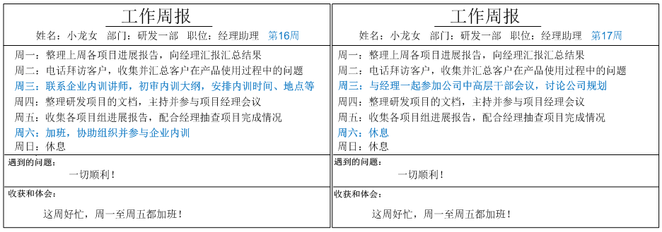
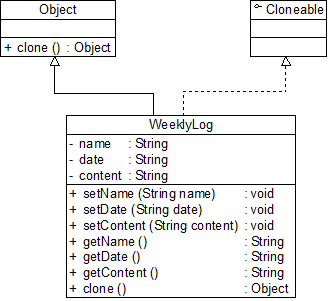

#工厂三兄弟之简单工厂模式（一）
       工厂模式是最常用的一类创建型设计模式，通常我们所说的工厂模式是指**工厂方法模式**，它也是使用频率最高的工厂模式。本章将要学习的**简单工厂模式**是工厂方法模式的“小弟”，它不属于GoF 23种设计模式，但在软件开发中应用也较为频繁，通常将它作为学习其他工厂模式的入门。此外，工厂方法模式还有一位“大哥”——**抽象工厂模式**。这三种工厂模式各具特色，难度也逐个加大，在软件开发中它们都得到了广泛的应用，成为面向对象软件中常用的创建对象的工具。

 

## 1 图表库的设计
|       Sunny软件公司欲基于Java语言开发一套图表库，该图表库可以为应用系统提供各种不同外观的图表，例如柱状图、饼状图、折线图等。Sunny软件公司图表库设计人员希望为应用系统开发人员提供一套灵活易用的图表库，而且可以较为方便地对图表库进行扩展，以便能够在将来增加一些新类型的图表。

       Sunny软件公司图表库设计人员提出了一个初始设计方案，将所有图表的实现代码封装在一个Chart类中，其框架代码如下所示：

```
class Chart {

	private String type; //图表类型

	

	public Chart(Object[][] data, String type) {

		this.type = type;

		if (type.equalsIgnoreCase("histogram")) {

			//初始化柱状图

		}

		else if (type.equalsIgnoreCase("pie")) {

			//初始化饼状图

		}

		else if (type.equalsIgnoreCase("line")) {

			//初始化折线图

		}

	}


	public void display() {

		if (this.type.equalsIgnoreCase("histogram")) {

			//显示柱状图

		}

		else if (this.type.equalsIgnoreCase("pie")) {

			//显示饼状图

		}

		else if (this.type.equalsIgnoreCase("line")) {

			//显示折线图

		}	

	}

}
```

       客户端代码通过调用Chart类的构造函数来创建图表对象，根据参数type的不同可以得到不同类型的图表，然后再调用display()方法来显示相应的图表。

       不难看出，Chart类是一个“巨大的”类，在该类的设计中存在如下几个问题：

       (1) 在Chart类中包含很多“if…else…”代码块，整个类的代码相当冗长，代码越长，阅读难度、维护难度和测试难度也越大；而且大量条件语句的存在还将影响系统的性能，程序在执行过程中需要做大量的条件判断。

       (2) Chart类的职责过重，它负责初始化和显示所有的图表对象，将各种图表对象的初始化代码和显示代码集中在一个类中实现，违反了“单一职责原则”，不利于类的重用和维护；而且将大量的对象初始化代码都写在构造函数中将导致构造函数非常庞大，对象在创建时需要进行条件判断，降低了对象创建的效率。

       (3) 当需要增加新类型的图表时，必须修改Chart类的源代码，违反了“开闭原则”。

       (4) 客户端只能通过new关键字来直接创建Chart对象，Chart类与客户端类耦合度较高，对象的创建和使用无法分离。

       (5) 客户端在创建Chart对象之前可能还需要进行大量初始化设置，例如设置柱状图的颜色、高度等，如果在Chart类的构造函数中没有提供一个默认设置，那就只能由客户端来完成初始设置，这些代码在每次创建Chart对象时都会出现，导致代码的重复。

       面对一个如此巨大、职责如此重，且与客户端代码耦合度非常高的类，我们应该怎么办？本章将要介绍的简单工厂模式**将在一定程度上解决上述问题**。

 

**      为什么要引入工厂类，大家可参见：。**

 

**【作者：刘伟 ****】**

#工厂三兄弟之简单工厂模式（二）
## 2 简单工厂模式概述

       简单工厂模式并不属于GoF 23个经典设计模式，但通常将它作为学习其他工厂模式的基础，它的设计思想很简单，其基本流程如下：

       首先将需要创建的各种不同对象（例如各种不同的Chart对象）的相关代码封装到不同的类中，这些类称为**具体产品类**，而将它们公共的代码进行抽象和提取后封装在一个**抽象产品类**中，每一个具体产品类都是抽象产品类的子类；然后提供一个**工厂类**用于创建各种产品，在工厂类中提供一个创建产品的工厂方法，该方法可以根据所传入的参数不同创建不同的具体产品对象；客户端只需调用工厂类的工厂方法并传入相应的参数即可得到一个产品对象。

       简单工厂模式定义如下：
|**       简单工厂模式(Simple Factory Pattern)：定义一个工厂类，它可以根据参数的不同返回不同类的实例，被创建的实例通常都具有共同的父类。因为在简单工厂模式中用于创建实例的方法是静态(static)方法，因此简单工厂模式又被称为静态工厂方法(Static Factory Method)模式，它属于类创建型模式。**

        简单工厂模式的要点在于：**当你需要什么，只需要传入一个正确的参数，就可以获取你所需要的对象，而无须知道其创建细节。**简单工厂模式结构比较简单，其核心是工厂类的设计，其结构如图1所示：


**图1  简单工厂模式结构图**

       在简单工厂模式结构图中包含如下几个角色：

      ** ● Factory（工厂角色）：**工厂角色即工厂类，它是简单工厂模式的核心，负责实现创建所有产品实例的内部逻辑；工厂类可以被外界直接调用，创建所需的产品对象；在工厂类中提供了静态的工厂方法factoryMethod()，它的返回类型为抽象产品类型Product。

    **   ● Product（抽象产品角色）：**它是工厂类所创建的所有对象的父类，封装了各种产品对象的公有方法，它的引入将提高系统的灵活性，使得在工厂类中只需定义一个通用的工厂方法，因为所有创建的具体产品对象都是其子类对象。

      ** ● ConcreteProduct（具体产品角色）：**它是简单工厂模式的创建目标，所有被创建的对象都充当这个角色的某个具体类的实例。每一个具体产品角色都继承了抽象产品角色，需要实现在抽象产品中声明的抽象方法。

       在简单工厂模式中，客户端通过工厂类来创建一个产品类的实例，而无须直接使用new关键字来创建对象，它是工厂模式家族中最简单的一员。

       在使用简单工厂模式时，首先需要对产品类进行重构，**不能设计一个包罗万象的产品类，而需根据实际情况设计一个产品层次结构**，将所有产品类公共的代码移至抽象产品类，并在抽象产品类中声明一些抽象方法，以供不同的具体产品类来实现，典型的抽象产品类代码如下所示：

```
abstract class Product {
    //所有产品类的公共业务方法
    public void methodSame() {
        //公共方法的实现
    }

    //声明抽象业务方法
    public abstract void methodDiff();
}
```

       在具体产品类中实现了抽象产品类中声明的抽象业务方法，不同的具体产品类可以提供不同的实现，典型的具体产品类代码如下所示：

```
class ConcreteProduct extends Product {
    //实现业务方法
    public void methodDiff() {
        //业务方法的实现
    }
}
```

       简单工厂模式的核心是工厂类，在没有工厂类之前，客户端一般会使用new关键字来直接创建产品对象，而在引入工厂类之后，客户端可以通过工厂类来创建产品，在简单工厂模式中，工厂类提供了一个静态工厂方法供客户端使用，根据所传入的参数不同可以创建不同的产品对象，典型的工厂类代码如下所示：

```
class Factory {
    //静态工厂方法
	public static Product getProduct(String arg) {
		Product product = null;
		if (arg.equalsIgnoreCase("A")) {
			product = new ConcreteProductA();
            //初始化设置product
		}
		else if (arg.equalsIgnoreCase("B")) {
			product = new ConcreteProductB();
            //初始化设置product
		}
		return product;
	}
}
```

       在客户端代码中，我们通过调用工厂类的工厂方法即可得到产品对象，典型代码如下所示：

```
class Client {
	public static void main(String args[]) {
		Product product; 
		product = Factory.getProduct("A"); //通过工厂类创建产品对象
		product.methodSame();
		product.methodDiff();
	}
}
```

**【作者：刘伟 ****】**
#工厂三兄弟之简单工厂模式（三）
## 3 完整解决方案

       为了将Chart类的职责分离，同时将Chart对象的创建和使用分离，Sunny软件公司开发人员决定使用简单工厂模式对图表库进行重构，重构后的结构如图2所示：


**图2 图表库结构图**

       在图2中，Chart接口充当抽象产品类，其子类HistogramChart、PieChart和LineChart充当具体产品类，ChartFactory充当工厂类。完整代码如下所示：

```
//抽象图表接口：抽象产品类

interface Chart {

	public void display();

}


//柱状图类：具体产品类

class HistogramChart implements Chart {

	public HistogramChart() {

		System.out.println("创建柱状图！");

	}

	

	public void display() {

		System.out.println("显示柱状图！");

	}

}


//饼状图类：具体产品类

class PieChart implements Chart {

	public PieChart() {

		System.out.println("创建饼状图！");

	}

	

	public void display() {

		System.out.println("显示饼状图！");

	}

}


//折线图类：具体产品类

class LineChart implements Chart {

	public LineChart() {

		System.out.println("创建折线图！");

	}

	

	public void display() {

		System.out.println("显示折线图！");

	}

}


//图表工厂类：工厂类

class ChartFactory {

    //静态工厂方法

	public static Chart getChart(String type) {

		Chart chart = null;

		if (type.equalsIgnoreCase("histogram")) {

			chart = new HistogramChart();

			System.out.println("初始化设置柱状图！");

		}

		else if (type.equalsIgnoreCase("pie")) {

			chart = new PieChart();

			System.out.println("初始化设置饼状图！");

		}

		else if (type.equalsIgnoreCase("line")) {

			chart = new LineChart();

			System.out.println("初始化设置折线图！");			

		}

		return chart;

	}

}
```

       编写如下客户端测试代码：

```
class Client {

	public static void main(String args[]) {

		Chart chart;

		chart = ChartFactory.getChart("histogram"); //通过静态工厂方法创建产品

		chart.display();

	}

}
```

       编译并运行程序，输出结果如下：


|创建柱状图！初始化设置柱状图！显示柱状图！

初始化设置柱状图！


       在客户端测试类中，我们使用工厂类的静态工厂方法创建产品对象，如果需要更换产品，只需修改静态工厂方法中的参数即可，例如将柱状图改为饼状图，只需将代码：


|**chart = ChartFactory.getChart("histogram"); **


       改为：


|**chart = ChartFactory.getChart("pie"); **


       编译并运行程序，输出结果如下：


|创建饼状图！初始化设置饼状图！显示饼状图！

初始化设置饼状图！


**【作者：刘伟 ****】**
#工厂三兄弟之简单工厂模式（四）
## 4 方案的改进

       Sunny软件公司开发人员发现在创建具体Chart对象时，每更换一个Chart对象都需要修改客户端代码中静态工厂方法的参数，客户端代码将要重新编译，这对于客户端而言，违反了“开闭原则”，有没有一种方法能够在不修改客户端代码的前提下更换具体产品对象呢？答案是肯定的，下面将介绍一种常用的实现方式。

       我们可以将静态工厂方法的参数存储在XML或properties格式的配置文件中，如下config.xml所示：

```
&lt;?xml version="1.0"?&gt;

&lt;config&gt;

	&lt;chartType&gt;histogram&lt;/chartType&gt;

&lt;/config&gt;
```

       再通过一个工具类XMLUtil来读取配置文件中的字符串参数，XMLUtil类的代码如下所示：

```
import javax.xml.parsers.*;

import org.w3c.dom.*;

import org.xml.sax.SAXException;

import java.io.*;


public class XMLUtil {

    //该方法用于从XML配置文件中提取图表类型，并返回类型名

	public static String getChartType() {

		try {

			//创建文档对象

			DocumentBuilderFactory dFactory = DocumentBuilderFactory.newInstance();

			DocumentBuilder builder = dFactory.newDocumentBuilder();

			Document doc;							

			doc = builder.parse(new File("config.xml")); 

		

			//获取包含图表类型的文本节点

			NodeList nl = doc.getElementsByTagName("chartType");

            Node classNode = nl.item(0).getFirstChild();

            String chartType = classNode.getNodeValue().trim();

            return chartType;

        }   

       	catch(Exception e) {

           	e.printStackTrace();

        	return null;

        }

    }

}
```

       在引入了配置文件和工具类XMLUtil之后，客户端代码修改如下：

```
class Client {

	public static void main(String args[]) {

		Chart chart;

		String type = XMLUtil.getChartType(); //读取配置文件中的参数

		chart = ChartFactory.getChart(type); //创建产品对象

		chart.display();

	}

}
```

       不难发现，在上述客户端代码中不包含任何与具体图表对象相关的信息，如果需要更换具体图表对象，只需修改配置文件config.xml，无须修改任何源代码，符合“开闭原则”。


|    <table border="0" cellspacing="0" cellpadding="0" width="564"><tbody><tr><td>****|**思考**在简单工厂模式中增加新的具体产品时是否符合“开闭原则”？如果不符合，原有系统需作出哪些修改？

在简单工厂模式中增加新的具体产品时是否符合“开闭原则”？如果不符合，原有系统需作出哪些修改？


       有时候，为了简化简单工厂模式，我们可以将抽象产品类和工厂类合并，将静态工厂方法移至抽象产品类中，如图3所示：


**图3 简化的简单工厂模式**

       在图3中，客户端可以通过产品父类的静态工厂方法，根据参数的不同创建不同类型的产品子类对象，这种做法在JDK等类库和框架中也广泛存在。

 

## 6 简单工厂模式总结

      简单工厂模式提供了专门的工厂类用于创建对象，将对象的创建和对象的使用分离开，它作为一种最简单的工厂模式在软件开发中得到了较为广泛的应用。

**         1. 主要优点**

       简单工厂模式的主要优点如下：

       (1) 工厂类包含必要的判断逻辑，可以决定在什么时候创建哪一个产品类的实例，客户端可以免除直接创建产品对象的职责，而仅仅“消费”产品，简单工厂模式实现了对象创建和使用的分离。

       (2) 客户端无须知道所创建的具体产品类的类名，只需要知道具体产品类所对应的参数即可，对于一些复杂的类名，通过简单工厂模式可以在一定程度减少使用者的记忆量。

       (3) 通过引入配置文件，可以在不修改任何客户端代码的情况下更换和增加新的具体产品类，在一定程度上提高了系统的灵活性。

 

**         2. 主要缺点**

       简单工厂模式的主要缺点如下：

       (1) 由于工厂类集中了所有产品的创建逻辑，职责过重，一旦不能正常工作，整个系统都要受到影响。

       (2) 使用简单工厂模式势必会增加系统中类的个数（引入了新的工厂类），增加了系统的复杂度和理解难度。

       (3) 系统扩展困难，一旦添加新产品就不得不修改工厂逻辑，在产品类型较多时，有可能造成工厂逻辑过于复杂，不利于系统的扩展和维护。

       (4) 简单工厂模式由于使用了静态工厂方法，造成工厂角色无法形成基于继承的等级结构。

 

**        3. 适用场景**

       在以下情况下可以考虑使用简单工厂模式：

       (1) 工厂类负责创建的对象比较少，由于创建的对象较少，不会造成工厂方法中的业务逻辑太过复杂。

       (2) 客户端只知道传入工厂类的参数，对于如何创建对象并不关心。


|    <table border="0" cellspacing="0" cellpadding="0" width="564"><tbody><tr><td>****|**练习**使用简单工厂模式设计一个可以创建不同几何形状（如圆形、方形和三角形等）的绘图工具，每个几何图形都具有绘制draw()和擦除erase()两个方法，要求在绘制不支持的几何图形时，提示一个UnSupportedShapeException。

使用简单工厂模式设计一个可以创建不同几何形状（如圆形、方形和三角形等）的绘图工具，每个几何图形都具有绘制draw()和擦除erase()两个方法，要求在绘制不支持的几何图形时，提示一个UnSupportedShapeException。


**【作者：刘伟 ****】**


#工厂三兄弟之工厂方法模式（一）
       简单工厂模式虽然简单，但存在一个很严重的问题。**当系统中需要引入新产品时，由于静态工厂方法通过所传入参数的不同来创建不同的产品，这必定要修改工厂类的源代码，将违背“开闭原则”，如何实现增加新产品而不影响已有代码？**工厂方法模式应运而生，本文将介绍第二种工厂模式——工厂方法模式。

 

**1 日志记录器的设计**


|       Sunny软件公司欲开发一个系统运行日志记录器(Logger)，该记录器可以通过多种途径保存系统的运行日志，如通过文件记录或数据库记录，用户可以通过修改配置文件灵活地更换日志记录方式。在设计各类日志记录器时，Sunny公司的开发人员发现需要对日志记录器进行一些初始化工作，初始化参数的设置过程较为复杂，而且某些参数的设置有严格的先后次序，否则可能会发生记录失败。如何封装记录器的初始化过程并保证多种记录器切换的灵活性是Sunny公司开发人员面临的一个难题。


       Sunny公司的开发人员通过对该需求进行分析，发现该日志记录器有两个设计要点：

       (1) 需要封装日志记录器的初始化过程，这些初始化工作较为复杂，例如需要初始化其他相关的类，还有可能需要读取配置文件（例如连接数据库或创建文件），导致代码较长，如果将它们都写在构造函数中，会导致构造函数庞大，不利于代码的修改和维护；

       (2) 用户可能需要更换日志记录方式，在客户端代码中需要提供一种灵活的方式来选择日志记录器，尽量在不修改源代码的基础上更换或者增加日志记录方式。

       Sunny公司开发人员最初使用简单工厂模式对日志记录器进行了设计，初始结构如图1所示：

 

**图1 基于简单工厂模式设计的日志记录器结构图**

       在图1中，LoggerFactory充当创建日志记录器的工厂，提供了工厂方法createLogger()用于创建日志记录器，Logger是抽象日志记录器接口，其子类为具体日志记录器。其中，工厂类LoggerFactory代码片段如下所示：

```
//日志记录器工厂

class LoggerFactory {

    //静态工厂方法

	public static Logger createLogger(String args) {

		if(args.equalsIgnoreCase("db")) {

			//连接数据库，代码省略

			//创建数据库日志记录器对象

			Logger logger = new DatabaseLogger(); 

			//初始化数据库日志记录器，代码省略

			return logger;

		}

		else if(args.equalsIgnoreCase("file")) {

			//创建日志文件

			//创建文件日志记录器对象

			Logger logger = new FileLogger(); 

			//初始化文件日志记录器，代码省略

			return logger;			

		}

		else {

			return null;

		}

	}

}
```

       为了突出设计重点，我们对上述代码进行了简化，省略了具体日志记录器类的初始化代码。在LoggerFactory类中提供了静态工厂方法createLogger()，用于根据所传入的参数创建各种不同类型的日志记录器。通过使用简单工厂模式，我们将日志记录器对象的创建和使用分离，客户端只需使用由工厂类创建的日志记录器对象即可，无须关心对象的创建过程，但是我们发现，虽然简单工厂模式实现了对象的创建和使用分离，但是仍然存在如下两个问题：

       (1) 工厂类过于庞大，包含了大量的if…else…代码，导致维护和测试难度增大；

       (2) 系统扩展不灵活，如果增加新类型的日志记录器，必须修改静态工厂方法的业务逻辑，违反了“开闭原则”。

       如何解决这两个问题，提供一种简单工厂模式的改进方案？这就是本文所介绍的工厂方法模式的动机之一。

 

**【作者：刘伟 ****】**

#工厂三兄弟之工厂方法模式（二）
**2 工厂方法模式概述**

       在简单工厂模式中只提供一个工厂类，该工厂类处于对产品类进行实例化的中心位置，它需要知道每一个产品对象的创建细节，并决定何时实例化哪一个产品类。简单工厂模式最大的缺点是当有新产品要加入到系统中时，必须修改工厂类，需要在其中加入必要的业务逻辑，这违背了“开闭原则”。此外，在简单工厂模式中，所有的产品都由同一个工厂创建，工厂类职责较重，业务逻辑较为复杂，具体产品与工厂类之间的耦合度高，严重影响了系统的灵活性和扩展性，而工厂方法模式则可以很好地解决这一问题。

       在工厂方法模式中，我们**不再提供一个统一的工厂类来创建所有的产品对象，而是针对不同的产品提供不同的工厂，系统提供一个与产品等级结构对应的工厂等级结构**。工厂方法模式定义如下：


|**       工厂方法模式(Factory Method Pattern)：定义一个用于创建对象的接口，让子类决定将哪一个类实例化。工厂方法模式让一个类的实例化延迟到其子类。工厂方法模式又简称为工厂模式(Factory Pattern)，又可称作虚拟构造器模式(Virtual Constructor Pattern)或多态工厂模式(Polymorphic Factory Pattern)。工厂方法模式是一种类创建型模式。**


       工厂方法模式提供一个抽象工厂接口来声明抽象工厂方法，而由其子类来具体实现工厂方法，创建具体的产品对象。工厂方法模式结构如图2所示：

 


**图2 工厂方法模式结构图**

       在工厂方法模式结构图中包含如下几个角色：

   **    ● Product（抽象产品）：**它是定义产品的接口，是工厂方法模式所创建对象的超类型，也就是产品对象的公共父类。

     **  ● ConcreteProduct（具体产品）：**它实现了抽象产品接口，某种类型的具体产品由专门的具体工厂创建，具体工厂和具体产品之间一一对应。

    **   ● Factory（抽象工厂）：**在抽象工厂类中，声明了工厂方法(Factory Method)，用于返回一个产品。抽象工厂是工厂方法模式的核心，所有创建对象的工厂类都必须实现该接口。

   **    ● ConcreteFactory（具体工厂）：**它是抽象工厂类的子类，实现了抽象工厂中定义的工厂方法，并可由客户端调用，返回一个具体产品类的实例。

       与简单工厂模式相比，工厂方法模式最重要的区别是引入了抽象工厂角色，抽象工厂可以是接口，也可以是抽象类或者具体类，其典型代码如下所示：

```
interface Factory {

    public Product factoryMethod();

}
```

       在抽象工厂中声明了工厂方法但并未实现工厂方法，具体产品对象的创建由其子类负责，客户端针对抽象工厂编程，可在运行时再指定具体工厂类，具体工厂类实现了工厂方法，不同的具体工厂可以创建不同的具体产品，其典型代码如下所示：

```
class ConcreteFactory implements Factory {

    public Product factoryMethod() {

        return new ConcreteProduct();

    }

}
```

       在实际使用时，具体工厂类在实现工厂方法时除了创建具体产品对象之外，还可以负责产品对象的初始化工作以及一些资源和环境配置工作，例如连接数据库、创建文件等。

       在客户端代码中，只需关心工厂类即可，不同的具体工厂可以创建不同的产品，典型的客户端类代码片段如下所示：

```
……

Factory factory;

factory = new ConcreteFactory(); //可通过配置文件实现

Product product;

product = factory.factoryMethod();

……
```

       可以通过配置文件来存储具体工厂类ConcreteFactory的类名，更换新的具体工厂时无须修改源代码，系统扩展更为方便。


|    <table border="0" cellspacing="0" cellpadding="0" width="564"><tbody><tr><td>|**思考**工厂方法模式中的工厂方法能否为静态方法？为什么？

工厂方法模式中的工厂方法能否为静态方法？为什么？


**【作者：刘伟 ****】**
#工厂三兄弟之工厂方法模式（三）
## 3 完整解决方案

        Sunny公司开发人员决定使用工厂方法模式来设计日志记录器，其基本结构如图3所示：


**图3 日志记录器结构图**

       在图3中，Logger接口充当抽象产品，其子类FileLogger和DatabaseLogger充当具体产品，LoggerFactory接口充当抽象工厂，其子类FileLoggerFactory和DatabaseLoggerFactory充当具体工厂。完整代码如下所示：

```
//日志记录器接口：抽象产品

interface Logger {

	public void writeLog();

}


//数据库日志记录器：具体产品

class DatabaseLogger implements Logger {

	public void writeLog() {

		System.out.println("数据库日志记录。");

	}

}


//文件日志记录器：具体产品

class FileLogger implements Logger {

	public void writeLog() {

		System.out.println("文件日志记录。");

	}

}


//日志记录器工厂接口：抽象工厂

interface LoggerFactory {

	public Logger createLogger();

}


//数据库日志记录器工厂类：具体工厂

class DatabaseLoggerFactory implements LoggerFactory {

	public Logger createLogger() {

			//连接数据库，代码省略

			//创建数据库日志记录器对象

			Logger logger = new DatabaseLogger(); 

			//初始化数据库日志记录器，代码省略

			return logger;

	}	

}


//文件日志记录器工厂类：具体工厂

class FileLoggerFactory implements LoggerFactory {

	public Logger createLogger() {

            //创建文件日志记录器对象

			Logger logger = new FileLogger(); 

			//创建文件，代码省略

			return logger;

	}	

}
```

       编写如下客户端测试代码：

```
class Client {

	public static void main(String args[]) {

		LoggerFactory factory;

		Logger logger;

		factory = new FileLoggerFactory(); //可引入配置文件实现

		logger = factory.createLogger();

		logger.writeLog();

	}

}
```

       编译并运行程序，输出结果如下：


|文件日志记录。


 

**4 反射与配置文件**

       为了让系统具有更好的灵活性和可扩展性，Sunny公司开发人员决定对日志记录器客户端代码进行重构，使得可以在不修改任何客户端代码的基础上更换或增加新的日志记录方式。

       在客户端代码中将不再使用new关键字来创建工厂对象，而是将具体工厂类的类名存储在配置文件（如XML文件）中，通过读取配置文件获取类名字符串，再使用Java的反射机制，根据类名字符串生成对象。在整个实现过程中需要用到两个技术：Java反射机制与配置文件读取。软件系统的配置文件通常为XML文件，我们可以使用DOM (Document Object Model)、SAX (Simple API for XML)、StAX (Streaming API for XML)等技术来处理XML文件。关于DOM、SAX、StAX等技术的详细学习大家可以参考其他相关资料，在此不予扩展。


|    <table border="0" cellspacing="0" cellpadding="0" width="564"><tbody><tr><td>|**扩展**关于Java与XML的相关资料，大家可以阅读Tom Myers和Alexander Nakhimovsky所著的《Java XML编程指南》一书或访问developer Works 中国中的“Java XML 技术专题”，参考链接：http://www.ibm.com/developerworks/cn/xml/theme/x-java.html

关于Java与XML的相关资料，大家可以阅读Tom Myers和Alexander Nakhimovsky所著的《Java XML编程指南》一书或访问developer Works 中国中的“Java XML 技术专题”，参考链接：


**       Java反射(Java Reflection)**是指在程序运行时获取已知名称的类或已有对象的相关信息的一种机制，包括类的方法、属性、父类等信息，还包括实例的创建和实例类型的判断等。在反射中使用最多的类是Class，Class类的实例表示正在运行的Java应用程序中的类和接口，其forName(String className)方法可以返回与带有给定字符串名的类或接口相关联的 Class对象，再通过Class对象的newInstance()方法创建此对象所表示的类的一个新实例，即通过一个类名字符串得到类的实例。如创建一个字符串类型的对象，其代码如下：

```
   //通过类名生成实例对象并将其返回

   Class c=Class.forName("String");

   Object obj=c.newInstance();

   return obj;
```

       此外，在JDK中还提供了java.lang.reflect包，封装了其他与反射相关的类，此处只用到上述简单的反射代码，在此不予扩展。

       Sunny公司开发人员创建了如下XML格式的配置文件config.xml用于存储具体日志记录器工厂类类名：

```
&lt;!— config.xml --&gt;

&lt;?xml version="1.0"?&gt;

&lt;config&gt;

	&lt;className&gt;FileLoggerFactory&lt;/className&gt;

&lt;/config&gt;
```

       为了读取该配置文件并通过存储在其中的类名字符串反射生成对象，Sunny公司开发人员开发了一个名为XMLUtil的工具类，其详细代码如下所示：

```
//工具类XMLUtil.java

import javax.xml.parsers.*;

import org.w3c.dom.*;

import org.xml.sax.SAXException;

import java.io.*;


public class XMLUtil {

//该方法用于从XML配置文件中提取具体类类名，并返回一个实例对象

	public static Object getBean() {

		try {

			//创建DOM文档对象

			DocumentBuilderFactory dFactory = DocumentBuilderFactory.newInstance();

			DocumentBuilder builder = dFactory.newDocumentBuilder();

			Document doc;							

			doc = builder.parse(new File("config.xml")); 

		

			//获取包含类名的文本节点

			NodeList nl = doc.getElementsByTagName("className");

            Node classNode=nl.item(0).getFirstChild();

            String cName=classNode.getNodeValue();

            

            //通过类名生成实例对象并将其返回

            Class c=Class.forName(cName);

	  	    Object obj=c.newInstance();

            return obj;

        }   

        catch(Exception e) {

           	e.printStackTrace();

           	return null;

         }

    }

}
```

       有了XMLUtil类后，可以对日志记录器的客户端代码进行修改，不再直接使用new关键字来创建具体的工厂类，而是将具体工厂类的类名存储在XML文件中，再通过XMLUtil类的静态工厂方法getBean()方法进行对象的实例化，代码修改如下：

```
class Client {

	public static void main(String args[]) {

		LoggerFactory factory;

		Logger logger;

		factory = (LoggerFactory)XMLUtil.getBean(); //getBean()的返回类型为Object，需要进行强制类型转换

		logger = factory.createLogger();

		logger.writeLog();

	}

}
```

       引入XMLUtil类和XML配置文件后，如果要增加新的日志记录方式，只需要执行如下几个步骤：

       (1) 新的日志记录器需要继承抽象日志记录器Logger；

       (2) 对应增加一个新的具体日志记录器工厂，继承抽象日志记录器工厂LoggerFactory，并实现其中的工厂方法createLogger()，设置好初始化参数和环境变量，返回具体日志记录器对象；

       (3) 修改配置文件config.xml，将新增的具体日志记录器工厂类的类名字符串替换原有工厂类类名字符串；

       (4) 编译新增的具体日志记录器类和具体日志记录器工厂类，运行客户端测试类即可使用新的日志记录方式，而原有类库代码无须做任何修改，完全符合“开闭原则”。

      通过上述重构可以使得系统更加灵活，由于很多设计模式都关注系统的可扩展性和灵活性，因此都定义了抽象层，在抽象层中声明业务方法，而将业务方法的实现放在实现层中。


|    <table border="0" cellspacing="0" cellpadding="0" width="564"><tbody><tr><td>****|**思考**       有人说：可以在客户端代码中直接通过反射机制来生成产品对象，在定义产品对象时使用抽象类型，同样可以确保系统的灵活性和可扩展性，增加新的具体产品类无须修改源代码，只需要将其作为抽象产品类的子类再修改配置文件即可，根本不需要抽象工厂类和具体工厂类。       试思考这种做法的可行性？如果可行，这种做法是否存在问题？为什么？

       有人说：可以在客户端代码中直接通过反射机制来生成产品对象，在定义产品对象时使用抽象类型，同样可以确保系统的灵活性和可扩展性，增加新的具体产品类无须修改源代码，只需要将其作为抽象产品类的子类再修改配置文件即可，根本不需要抽象工厂类和具体工厂类。


**【作者：刘伟 ****】**
#工厂三兄弟之工厂方法模式（四）
## 5 重载的工厂方法

       Sunny公司开发人员通过进一步分析，发现可以通过多种方式来初始化日志记录器，例如可以为各种日志记录器提供默认实现；还可以为数据库日志记录器提供数据库连接字符串，为文件日志记录器提供文件路径；也可以将参数封装在一个Object类型的对象中，通过Object对象将配置参数传入工厂类。此时，可以提供一组重载的工厂方法，以不同的方式对产品对象进行创建。当然，对于同一个具体工厂而言，无论使用哪个工厂方法，创建的产品类型均要相同。如图4所示：


**图4 重载的工厂方法结构图**

       引入重载方法后，抽象工厂LoggerFactory的代码修改如下：

```
interface LoggerFactory {

	public Logger createLogger();

	public Logger createLogger(String args);

	public Logger createLogger(Object obj);

}
```

       具体工厂类DatabaseLoggerFactory代码修改如下：

```
class DatabaseLoggerFactory implements LoggerFactory {

	public Logger createLogger() {

			//使用默认方式连接数据库，代码省略

			Logger logger = new DatabaseLogger(); 

			//初始化数据库日志记录器，代码省略

			return logger;

	}


	public Logger createLogger(String args) {

			//使用参数args作为连接字符串来连接数据库，代码省略

			Logger logger = new DatabaseLogger(); 

			//初始化数据库日志记录器，代码省略

			return logger;

	}	


	public Logger createLogger(Object obj) {

			//使用封装在参数obj中的连接字符串来连接数据库，代码省略

			Logger logger = new DatabaseLogger(); 

			//使用封装在参数obj中的数据来初始化数据库日志记录器，代码省略

			return logger;

	}	

}


//其他具体工厂类代码省略
```

       在抽象工厂中定义多个重载的工厂方法，在具体工厂中实现了这些工厂方法，这些方法可以包含不同的业务逻辑，以满足对不同产品对象的需求。

**6 工厂方法的隐藏**

       有时候，为了进一步简化客户端的使用，还可以对客户端隐藏工厂方法，此时，在工厂类中将直接调用产品类的业务方法，客户端无须调用工厂方法创建产品，直接通过工厂即可使用所创建的对象中的业务方法。

       如果对客户端隐藏工厂方法，日志记录器的结构图将修改为图5所示：


**图5 隐藏工厂方法后的日志记录器结构图**

       在图5中，抽象工厂类LoggerFactory的代码修改如下：

```
//改为抽象类

abstract class LoggerFactory {

    //在工厂类中直接调用日志记录器类的业务方法writeLog()

	public void writeLog() {

		Logger logger = this.createLogger();

		logger.writeLog();

	}

	

	public abstract Logger createLogger();	

}
```

       客户端代码修改如下：

```
class Client {

	public static void main(String args[]) {

		LoggerFactory factory;

		factory = (LoggerFactory)XMLUtil.getBean();

		factory.writeLog(); //直接使用工厂对象来调用产品对象的业务方法

	}

}
```

       通过将业务方法的调用移入工厂类，可以直接使用工厂对象来调用产品对象的业务方法，客户端无须直接使用工厂方法，在某些情况下我们也可以使用这种设计方案。

 

## 7 工厂方法模式总结

      工厂方法模式是简单工厂模式的延伸，它继承了简单工厂模式的优点，同时还弥补了简单工厂模式的不足。工厂方法模式是使用频率最高的设计模式之一，是很多开源框架和API类库的核心模式。

 

**        1. 主要优点**

       工厂方法模式的主要优点如下：

       (1) 在工厂方法模式中，工厂方法用来创建客户所需要的产品，同时还向客户隐藏了哪种具体产品类将被实例化这一细节，用户只需要关心所需产品对应的工厂，无须关心创建细节，甚至无须知道具体产品类的类名。

       (2) 基于工厂角色和产品角色的多态性设计是工厂方法模式的关键。它能够让工厂可以自主确定创建何种产品对象，而如何创建这个对象的细节则完全封装在具体工厂内部。工厂方法模式之所以又被称为多态工厂模式，就正是因为所有的具体工厂类都具有同一抽象父类。

       (3) 使用工厂方法模式的另一个优点是在系统中加入新产品时，无须修改抽象工厂和抽象产品提供的接口，无须修改客户端，也无须修改其他的具体工厂和具体产品，而只要添加一个具体工厂和具体产品就可以了，这样，系统的可扩展性也就变得非常好，完全符合“开闭原则”。

 

**      2. 主要缺点**

     工厂方法模式的主要缺点如下：

      (1) 在添加新产品时，需要编写新的具体产品类，而且还要提供与之对应的具体工厂类，系统中类的个数将成对增加，在一定程度上增加了系统的复杂度，有更多的类需要编译和运行，会给系统带来一些额外的开销。

      (2) 由于考虑到系统的可扩展性，需要引入抽象层，在客户端代码中均使用抽象层进行定义，增加了系统的抽象性和理解难度，且在实现时可能需要用到DOM、反射等技术，增加了系统的实现难度。

 

**       3. 适用场景**

       在以下情况下可以考虑使用工厂方法模式：

       (1) 客户端不知道它所需要的对象的类。在工厂方法模式中，客户端不需要知道具体产品类的类名，只需要知道所对应的工厂即可，具体的产品对象由具体工厂类创建，可将具体工厂类的类名存储在配置文件或数据库中。

       (2) 抽象工厂类通过其子类来指定创建哪个对象。在工厂方法模式中，对于抽象工厂类只需要提供一个创建产品的接口，而由其子类来确定具体要创建的对象，利用面向对象的多态性和里氏代换原则，在程序运行时，子类对象将覆盖父类对象，从而使得系统更容易扩展。


|    <table border="0" cellspacing="0" cellpadding="0" width="564"><tbody><tr><td>****|**练习**使用工厂方法模式设计一个程序来读取各种不同类型的图片格式，针对每一种图片格式都设计一个图片读取器，如GIF图片读取器用于读取GIF格式的图片、JPG图片读取器用于读取JPG格式的图片。需充分考虑系统的灵活性和可扩展性。

使用工厂方法模式设计一个程序来读取各种不同类型的图片格式，针对每一种图片格式都设计一个图片读取器，如GIF图片读取器用于读取GIF格式的图片、JPG图片读取器用于读取JPG格式的图片。需充分考虑系统的灵活性和可扩展性。


 #工厂三兄弟之抽象工厂模式（一）
       工厂方法模式通过引入工厂等级结构，解决了简单工厂模式中工厂类职责太重的问题，但由于工厂方法模式中的每个工厂只生产一类产品，可能会导致系统中存在大量的工厂类，势必会增加系统的开销。此时，我们可以考虑**将一些相关的产品组成一个“产品族”，由同一个工厂来统一生产**，这就是我们本文将要学习的抽象工厂模式的基本思想。

 

## 1 界面皮肤库的初始设计


|       Sunny软件公司欲开发一套界面皮肤库，可以对Java桌面软件进行界面美化。为了保护版权，该皮肤库源代码不打算公开，而只向用户提供已打包为jar文件的class字节码文件。用户在使用时可以通过菜单来选择皮肤，不同的皮肤将提供视觉效果不同的按钮、文本框、组合框等界面元素，其结构示意图如图1所示：**图1 界面皮肤库结构示意图**       该皮肤库需要具备良好的灵活性和可扩展性，用户可以自由选择不同的皮肤，开发人员可以在不修改既有代码的基础上增加新的皮肤。

**图1 界面皮肤库结构示意图**

       该皮肤库需要具备良好的灵活性和可扩展性，用户可以自由选择不同的皮肤，开发人员可以在不修改既有代码的基础上增加新的皮肤。


       Sunny软件公司的开发人员针对上述要求，决定使用工厂方法模式进行系统的设计，为了保证系统的灵活性和可扩展性，提供一系列具体工厂来创建按钮、文本框、组合框等界面元素，客户端针对抽象工厂编程，初始结构如图2所示：


**图2 基于工厂方法模式的界面皮肤库初始结构图**

       在图2中，提供了大量工厂来创建具体的界面组件，可以通过配置文件更换具体界面组件从而改变界面风格。但是，此设计方案存在如下问题：

       (1) 当需要增加新的皮肤时，虽然不要修改现有代码，但是需要增加大量类，针对每一个新增具体组件都需要增加一个具体工厂，类的个数成对增加，这无疑会导致系统越来越庞大，增加系统的维护成本和运行开销；

       (2) 由于同一种风格的具体界面组件通常要一起显示，因此需要为每个组件都选择一个具体工厂，用户在使用时必须逐个进行设置，如果某个具体工厂选择失误将会导致界面显示混乱，虽然我们可以适当增加一些约束语句，但客户端代码和配置文件都较为复杂。

       如何减少系统中类的个数并保证客户端每次始终只使用某一种风格的具体界面组件？这是Sunny公司开发人员所面临的两个问题，显然，工厂方法模式无法解决这两个问题，别着急，本文所介绍的抽象工厂模式可以让这些问题迎刃而解。

 

**【作者：刘伟 ****】**
#工厂三兄弟之抽象工厂模式（二）
## 2 产品等级结构与产品族

       在工厂方法模式中具体工厂负责生产具体的产品，每一个具体工厂对应一种具体产品，工厂方法具有唯一性，一般情况下，一个具体工厂中只有一个或者一组重载的工厂方法。但是有时候我们希望一个工厂可以提供多个产品对象，而不是单一的产品对象，如一个电器工厂，它可以生产电视机、电冰箱、空调等多种电器，而不是只生产某一种电器。为了更好地理解抽象工厂模式，我们先引入两个概念：

       (1) **产品等级结构**：**产品等级结构即产品的继承结构**，如一个抽象类是电视机，其子类有海尔电视机、海信电视机、TCL电视机，则抽象电视机与具体品牌的电视机之间构成了一个产品等级结构，抽象电视机是父类，而具体品牌的电视机是其子类。

       (2)** ****产品族**：在抽象工厂模式中，**产品族是指由同一个工厂生产的，位于不同产品等级结构中的一组产品**，如海尔电器工厂生产的海尔电视机、海尔电冰箱，海尔电视机位于电视机产品等级结构中，海尔电冰箱位于电冰箱产品等级结构中，海尔电视机、海尔电冰箱构成了一个产品族。

       产品等级结构与产品族示意图如图3所示：


**图3  产品族与产品等级结构示意图**

       在图3中，不同颜色的多个正方形、圆形和椭圆形分别构成了三个不同的产品等级结构，而相同颜色的正方形、圆形和椭圆形构成了一个产品族，每一个形状对象都位于某个产品族，并属于某个产品等级结构。图3中一共有五个产品族，分属于三个不同的产品等级结构。我们只要指明一个产品所处的产品族以及它所属的等级结构，就可以唯一确定这个产品。

       当系统所提供的工厂生产的具体产品并不是一个简单的对象，而是多个位于不同产品等级结构、属于不同类型的具体产品时就可以使用抽象工厂模式。**抽象工厂模式是所有形式的工厂模式中最为抽象和最具一般性的一种形式。**抽象工厂模式与工厂方法模式最大的区别在于，工厂方法模式针对的是一个产品等级结构，而抽象工厂模式需要面对多个产品等级结构，一个工厂等级结构可以负责多个不同产品等级结构中的产品对象的创建。**当一个工厂等级结构可以创建出分属于不同产品等级结构的一个产品族中的所有对象时，抽象工厂模式比工厂方法模式更为简单、更有效率。**抽象工厂模式示意图如图4所示：


**图4 抽象工厂模式示意图**

       在图4中，每一个具体工厂可以生产属于一个产品族的所有产品，例如生产颜色相同的正方形、圆形和椭圆形，所生产的产品又位于不同的产品等级结构中。如果使用工厂方法模式，图4所示结构需要提供15个具体工厂，而使用抽象工厂模式只需要提供5个具体工厂，极大减少了系统中类的个数。****

 

**【作者：刘伟 ****】**
#工厂三兄弟之抽象工厂模式（三）
## 3 抽象工厂模式概述

       抽象工厂模式为创建一组对象提供了一种解决方案。与工厂方法模式相比，抽象工厂模式中的具体工厂不只是创建一种产品，它负责创建一族产品。抽象工厂模式定义如下：


|**       抽象工厂模式(Abstract Factory Pattern)：提供一个创建一系列相关或相互依赖对象的接口，而无须指定它们具体的类。抽象工厂模式又称为Kit模式，它是一种对象创建型模式。**


       在抽象工厂模式中，每一个具体工厂都提供了多个工厂方法用于产生多种不同类型的产品，这些产品构成了一个产品族，抽象工厂模式结构如图5所示：


**图5  抽象工厂模式结构图**

       在抽象工厂模式结构图中包含如下几个角色：

      ** ● AbstractFactory（抽象工厂）：**它声明了一组用于创建一族产品的方法，每一个方法对应一种产品。

     **  ● ConcreteFactory（具体工厂）：**它实现了在抽象工厂中声明的创建产品的方法，生成一组具体产品，这些产品构成了一个产品族，每一个产品都位于某个产品等级结构中。

      ** ● AbstractProduct（抽象产品）：**它为每种产品声明接口，在抽象产品中声明了产品所具有的业务方法。

       **● ConcreteProduct（具体产品）：**它定义具体工厂生产的具体产品对象，实现抽象产品接口中声明的业务方法。

       在抽象工厂中声明了多个工厂方法，用于创建不同类型的产品，抽象工厂可以是接口，也可以是抽象类或者具体类，其典型代码如下所示：

```
abstract class AbstractFactory {

public abstract AbstractProductA createProductA(); //工厂方法一

public abstract AbstractProductB createProductB(); //工厂方法二

……

}
```

       具体工厂实现了抽象工厂，每一个具体的工厂方法可以返回一个特定的产品对象，而同一个具体工厂所创建的产品对象构成了一个产品族。对于每一个具体工厂类，其典型代码如下所示：

```
class ConcreteFactory1 extends AbstractFactory {

    //工厂方法一

public AbstractProductA createProductA() {

    return new ConcreteProductA1();

}


//工厂方法二

public AbstractProductB createProductB() {

    return new ConcreteProductB1();

}


……

}
```

       与工厂方法模式一样，抽象工厂模式也可为每一种产品提供一组重载的工厂方法，以不同的方式对产品对象进行创建。


|    <table border="0" cellspacing="0" cellpadding="0" width="564"><tbody><tr><td>|**思考**       抽象工厂模式是否符合“开闭原则”？【从增加新的产品等级结构和增加新的产品族两方面进行思考。】

       抽象工厂模式是否符合“开闭原则”？【从增加新的产品等级结构和增加新的产品族两方面进行思考。】


 

**【作者：刘伟 ****】**
#工厂三兄弟之抽象工厂模式（四）
## 4 完整解决方案

       Sunny公司开发人员使用抽象工厂模式来重构界面皮肤库的设计，其基本结构如图6所示：


**图6 界面皮肤库结构图**

       在图6中，SkinFactory接口充当抽象工厂，其子类SpringSkinFactory和SummerSkinFactory充当具体工厂，接口Button、TextField和ComboBox充当抽象产品，其子类SpringButton、SpringTextField、SpringComboBox和SummerButton、SummerTextField、SummerComboBox充当具体产品。完整代码如下所示：

```
//在本实例中我们对代码进行了大量简化，实际使用时，界面组件的初始化代码较为复杂，还需要使用JDK中一些已有类，为了突出核心代码，在此只提供框架代码和演示输出。
//按钮接口：抽象产品
interface Button {
	public void display();
}

//Spring按钮类：具体产品
class SpringButton implements Button {
	public void display() {
		System.out.println("显示浅绿色按钮。");
	}
}

//Summer按钮类：具体产品
class SummerButton implements Button {
	public void display() {
		System.out.println("显示浅蓝色按钮。");
	}	
}

//文本框接口：抽象产品
interface TextField {
	public void display();
}

//Spring文本框类：具体产品
class SpringTextField implements TextField {
	public void display() {
		System.out.println("显示绿色边框文本框。");
	}
}

//Summer文本框类：具体产品
class SummerTextField implements TextField {
	public void display() {
		System.out.println("显示蓝色边框文本框。");
	}	
}

//组合框接口：抽象产品
interface ComboBox {
	public void display();
}

//Spring组合框类：具体产品
class SpringComboBox implements ComboBox {
	public void display() {
		System.out.println("显示绿色边框组合框。");
	}
}

//Summer组合框类：具体产品
class SummerComboBox implements ComboBox {
	public void display() {
		System.out.println("显示蓝色边框组合框。");
	}	
}

//界面皮肤工厂接口：抽象工厂
interface SkinFactory {
	public Button createButton();
	public TextField createTextField();
	public ComboBox createComboBox();
}

//Spring皮肤工厂：具体工厂
class SpringSkinFactory implements SkinFactory {
	public Button createButton() {
		return new SpringButton();
	}

	public TextField createTextField() {
		return new SpringTextField();
	}

	public ComboBox createComboBox() {
		return new SpringComboBox();
	}
}

//Summer皮肤工厂：具体工厂
class SummerSkinFactory implements SkinFactory {
	public Button createButton() {
		return new SummerButton();
	}

	public TextField createTextField() {
		return new SummerTextField();
	}

	public ComboBox createComboBox() {
		return new SummerComboBox();
	}
}
```

       为了让系统具备良好的灵活性和可扩展性，我们引入了工具类XMLUtil和配置文件，其中，XMLUtil类的代码如下所示：

```
import javax.xml.parsers.*;
import org.w3c.dom.*;
import org.xml.sax.SAXException;
import java.io.*;

public class XMLUtil {
//该方法用于从XML配置文件中提取具体类类名，并返回一个实例对象
	public static Object getBean() {
		try {
			//创建文档对象
			DocumentBuilderFactory dFactory = DocumentBuilderFactory.newInstance();
			DocumentBuilder builder = dFactory.newDocumentBuilder();
			Document doc;							
			doc = builder.parse(new File("config.xml")); 
		
			//获取包含类名的文本节点
			NodeList nl = doc.getElementsByTagName("className");
            Node classNode=nl.item(0).getFirstChild();
            String cName=classNode.getNodeValue();
            
            //通过类名生成实例对象并将其返回
            Class c=Class.forName(cName);
	  	    Object obj=c.newInstance();
            return obj;
        }   
        catch(Exception e) {
           	e.printStackTrace();
           	return null;
       	}
	}
}
```

       配置文件config.xml中存储了具体工厂类的类名，代码如下所示：

```
&lt;?xml version="1.0"?&gt;
&lt;config&gt;
	&lt;className&gt;SpringSkinFactory&lt;/className&gt;
&lt;/config&gt;
```

       编写如下客户端测试代码：

```
class Client {
	public static void main(String args[]) {
        //使用抽象层定义
		SkinFactory factory;
		Button bt;
		TextField tf;
		ComboBox cb;
		factory = (SkinFactory)XMLUtil.getBean();
		bt = factory.createButton();
		tf = factory.createTextField();
		cb = factory.createComboBox();
		bt.display();
		tf.display();
		cb.display();
	}
}
```

       编译并运行程序，输出结果如下：
|显示浅绿色按钮。显示绿色边框文本框。显示绿色边框组合框。

显示绿色边框文本框。

       如果需要更换皮肤，只需修改配置文件即可，在实际环境中，我们可以**提供可视化界面，例如菜单或者窗口来修改配置文件，用户无须直接修改配置文件**。如果需要增加新的皮肤，只需增加一族新的具体组件并对应提供一个新的具体工厂，修改配置文件即可使用新的皮肤，原有代码无须修改，符合“开闭原则”。
|    <table border="0" cellspacing="0" cellpadding="0" width="564"><tbody><tr><td>       |**扩展**       在真实项目开发中，我们通常会为配置文件提供一个可视化的编辑界面，类似Struts框架中的struts.xml编辑器，大家可以自行开发一个简单的图形化工具来修改配置文件，实现真正的纯界面操作。

       在真实项目开发中，我们通常会为配置文件提供一个可视化的编辑界面，类似Struts框架中的struts.xml编辑器，大家可以自行开发一个简单的图形化工具来修改配置文件，实现真正的纯界面操作。


**【作者：刘伟  ****】**
#工厂三兄弟之抽象工厂模式（五）
## 5 “开闭原则”的倾斜性

       Sunny公司使用抽象工厂模式设计了界面皮肤库，该皮肤库可以较为方便地增加新的皮肤，但是现在遇到一个非常严重的问题：由于设计时考虑不全面，忘记为单选按钮(RadioButton)提供不同皮肤的风格化显示，导致无论选择哪种皮肤，单选按钮都显得那么“格格不入”。Sunny公司的设计人员决定向系统中增加单选按钮，但是发现原有系统居然不能够在符合“开闭原则”的前提下增加新的组件，原因是抽象工厂SkinFactory中根本没有提供创建单选按钮的方法，如果需要增加单选按钮，首先需要修改抽象工厂接口SkinFactory，在其中新增声明创建单选按钮的方法，然后逐个修改具体工厂类，增加相应方法以实现在不同的皮肤中创建单选按钮，此外还需要修改客户端，否则单选按钮无法应用于现有系统。

       怎么办？答案是抽象工厂模式无法解决该问题，这也是抽象工厂模式最大的缺点。**在抽象工厂模式中，增加新的产品族很方便，但是增加新的产品等级结构很麻烦**，抽象工厂模式的这种性质称为**“开闭原则”的倾斜性**。“开闭原则”要求系统对扩展开放，对修改封闭，通过扩展达到增强其功能的目的，对于涉及到多个产品族与多个产品等级结构的系统，其功能增强包括两方面：

      ** (1) ****增加产品族**：对于增加新的产品族，抽象工厂模式很好地支持了“开闭原则”，只需要增加具体产品并对应增加一个新的具体工厂，对已有代码无须做任何修改。

      ** (2) ****增加新的产品等级结构**：对于增加新的产品等级结构，需要修改所有的工厂角色，包括抽象工厂类，在所有的工厂类中都需要增加生产新产品的方法，违背了“开闭原则”。

       正因为抽象工厂模式存在“开闭原则”的倾斜性，它以一种倾斜的方式来满足“开闭原则”，为增加新产品族提供方便，但不能为增加新产品结构提供这样的方便，因此要求设计人员在设计之初就能够全面考虑，不会在设计完成之后向系统中增加新的产品等级结构，也不会删除已有的产品等级结构，否则将会导致系统出现较大的修改，为后续维护工作带来诸多麻烦。

 

## 6 抽象工厂模式总结

       抽象工厂模式是工厂方法模式的进一步延伸，由于它提供了功能更为强大的工厂类并且具备较好的可扩展性，在软件开发中得以广泛应用，尤其是在一些框架和API类库的设计中，例如在Java语言的AWT（抽象窗口工具包）中就使用了抽象工厂模式，它使用抽象工厂模式来实现在不同的操作系统中应用程序呈现与所在操作系统一致的外观界面。抽象工厂模式也是在软件开发中最常用的设计模式之一。

 

**       1. 主要优点**

       抽象工厂模式的主要优点如下：

       (1) 抽象工厂模式隔离了具体类的生成，使得客户并不需要知道什么被创建。由于这种隔离，更换一个具体工厂就变得相对容易，所有的具体工厂都实现了抽象工厂中定义的那些公共接口，因此只需改变具体工厂的实例，就可以在某种程度上改变整个软件系统的行为。

       (2) 当一个产品族中的多个对象被设计成一起工作时，它能够保证客户端始终只使用同一个产品族中的对象。

       (3) 增加新的产品族很方便，无须修改已有系统，符合“开闭原则”。

 

**       2. 主要缺点**

       抽象工厂模式的主要缺点如下：

       增加新的产品等级结构麻烦，需要对原有系统进行较大的修改，甚至需要修改抽象层代码，这显然会带来较大的不便，违背了“开闭原则”。

 

**       3. 适用场景**

       在以下情况下可以考虑使用抽象工厂模式：

       (1) 一个系统不应当依赖于产品类实例如何被创建、组合和表达的细节，这对于所有类型的工厂模式都是很重要的，用户无须关心对象的创建过程，将对象的创建和使用解耦。

       (2) 系统中有多于一个的产品族，而每次只使用其中某一产品族。可以通过配置文件等方式来使得用户可以动态改变产品族，也可以很方便地增加新的产品族。

       (3) 属于同一个产品族的产品将在一起使用，这一约束必须在系统的设计中体现出来。同一个产品族中的产品可以是没有任何关系的对象，但是它们都具有一些共同的约束，如同一操作系统下的按钮和文本框，按钮与文本框之间没有直接关系，但它们都是属于某一操作系统的，此时具有一个共同的约束条件：操作系统的类型。

       (4) 产品等级结构稳定，设计完成之后，不会向系统中增加新的产品等级结构或者删除已有的产品等级结构。
|    <table border="0" cellspacing="0" cellpadding="0" width="564"><tbody><tr><td>****|**练习**Sunny软件公司欲推出一款新的手机游戏软件，该软件能够支持Symbian、Android和Windows Mobile等多个智能手机操作系统平台，针对不同的手机操作系统，该游戏软件提供了不同的游戏操作控制(OperationController)类和游戏界面控制(InterfaceController)类，并提供相应的工厂类来封装这些类的初始化过程。软件要求具有较好的扩展性以支持新的操作系统平台，为了满足上述需求，试采用抽象工厂模式对其进行设计。

Sunny软件公司欲推出一款新的手机游戏软件，该软件能够支持Symbian、Android和Windows Mobile等多个智能手机操作系统平台，针对不同的手机操作系统，该游戏软件提供了不同的游戏操作控制(OperationController)类和游戏界面控制(InterfaceController)类，并提供相应的工厂类来封装这些类的初始化过程。软件要求具有较好的扩展性以支持新的操作系统平台，为了满足上述需求，试采用抽象工厂模式对其进行设计。


  
 #确保对象的唯一性——单例模式 （一）

## 3.1 单例模式的动机

      对于一个软件系统的某些类而言，我们无须创建多个实例。举个大家都熟知的例子——Windows任务管理器，如图3-1所示，我们可以做一个这样的尝试，在Windows的“任务栏”的右键弹出菜单上多次点击“启动任务管理器”，看能否打开多个任务管理器窗口？如果你的桌面出现多个任务管理器，我请你吃饭，（注：电脑中毒或私自修改Windows内核者除外）。通常情况下，无论我们启动任务管理多少次，Windows系统始终只能弹出一个任务管理器窗口，也就是说在一个Windows系统中，任务管理器存在唯一性。为什么要这样设计呢？我们可以从以下两个方面来分析：其一，如果能弹出多个窗口，且这些窗口的内容完全一致，全部是重复对象，这势必会浪费系统资源，任务管理器需要获取系统运行时的诸多信息，这些信息的获取需要消耗一定的系统资源，包括CPU资源及内存资源等，浪费是可耻的，而且根本没有必要显示多个内容完全相同的窗口；其二，如果弹出的多个窗口内容不一致，问题就更加严重了，这意味着在某一瞬间系统资源使用情况和进程、服务等信息存在多个状态，例如任务管理器窗口A显示“CPU使用率”为10%，窗口B显示“CPU使用率”为15%，到底哪个才是真实的呢？这纯属“调戏”用户，，给用户带来误解，更不可取。由此可见，确保Windows任务管理器在系统中有且仅有一个非常重要。


         **图3-1 Windows任务管理器**

      回到实际开发中，我们也经常遇到类似的情况，为了节约系统资源，有时需要确保系统中某个类只有唯一一个实例，当这个唯一实例创建成功之后，我们无法再创建一个同类型的其他对象，所有的操作都只能基于这个唯一实例。为了确保对象的唯一性，我们可以通过单例模式来实现，这就是单例模式的动机所在。

 

## 3.2 单例模式概述

      下面我们来模拟实现Windows任务管理器，假设任务管理器的类名为TaskManager，在TaskManager类中包含了大量的成员方法，例如构造函数TaskManager()，显示进程的方法displayProcesses()，显示服务的方法displayServices()等，该类的示意代码如下：

```
class TaskManager
{
     public TaskManager() {……} //初始化窗口
     public void displayProcesses()  {……} //显示进程
     public void  displayServices() {……} //显示服务
     ……
}
```

       为了实现Windows任务管理器的唯一性，我们通过如下三步来对该类进行重构：

      (1)  由于每次使用new关键字来实例化TaskManager类时都将产生一个新对象，为了确保TaskManager实例的唯一性，我们需要禁止类的外部直接使用new来创建对象，因此需要将TaskManager的构造函数的可见性改为private，如下代码所示：

```
private TaskManager() {……}
```

       (2)  将构造函数改为private修饰后该如何创建对象呢？不要着急，虽然类的外部无法再使用new来创建对象，但是在TaskManager的内部还是可以创建的，可见性只对类外有效。因此，我们可以在TaskManager中创建并保存这个唯一实例。为了让外界可以访问这个唯一实例，需要在TaskManager中定义一个静态的TaskManager类型的私有成员变量，如下代码所示：

```
private static TaskManager tm = null;
```

      (3)  为了保证成员变量的封装性，我们将TaskManager类型的tm对象的可见性设置为private，但外界该如何使用该成员变量并何时实例化该成员变量呢？答案是增加一个公有的静态方法，如下代码所示：

```
public static TaskManager getInstance()
{
    if (tm == null)
    {
        tm = new TaskManager();
    }
    return tm;
}
```

       在getInstance()方法中首先判断tm对象是否存在，如果不存在（即tm == null），则使用new关键字创建一个新的TaskManager类型的tm对象，再返回新创建的tm对象；否则直接返回已有的tm对象。

      需要注意的是getInstance()方法的修饰符，首先它应该是一个public方法，以便供外界其他对象使用，其次它使用了static关键字，即它是一个静态方法，在类外可以直接通过类名来访问，而无须创建TaskManager对象，事实上在类外也无法创建TaskManager对象，因为构造函数是私有的。 
|    <table border="0" cellspacing="0" cellpadding="0" width="564"><tbody><tr><td>**** |**思考**为什么要将成员变量tm定义为静态变量？

为什么要将成员变量tm定义为静态变量？


       通过以上三个步骤，我们完成了一个最简单的单例类的设计，其完整代码如下：

```
class TaskManager
{
     private static TaskManager tm = null;
     private TaskManager() {……} //初始化窗口
     public void  displayProcesses() {……} //显示进程
     public void  displayServices() {……} //显示服务
     public static TaskManager getInstance()
     {
        if (tm == null)
        {
            tm = new TaskManager();
        }
        return tm;
    }
   ……
}
```

       在类外我们无法直接创建新的TaskManager对象，但可以通过代码TaskManager.getInstance()来访问实例对象，第一次调用getInstance()方法时将创建唯一实例，再次调用时将返回第一次创建的实例，从而确保实例对象的唯一性。

      上述代码也是单例模式的一种最典型实现方式，有了以上基础，理解单例模式的定义和结构就非常容易了。单例模式定义如下： 
|**单例模式(Singleton Pattern)：确保某一个类只有一个实例，而且自行实例化并向整个系统提供这个实例，这个类称为单例类，它提供全局访问的方法。单例模式是一种对象创建型模式。**

      单例模式有三个要点：一是某个类只能有一个实例；二是它必须自行创建这个实例；三是它必须自行向整个系统提供这个实例。

       单例模式是结构最简单的设计模式一，在它的核心结构中只包含一个被称为单例类的特殊类。单例模式结构如图3-2所示：


      单例模式结构图中只包含一个单例角色：

      ● Singleton（单例）：在单例类的内部实现只生成一个实例，同时它提供一个静态的getInstance()工厂方法，让客户可以访问它的唯一实例；为了防止在外部对其实例化，将其构造函数设计为私有；在单例类内部定义了一个Singleton类型的静态对象，作为外部共享的唯一实例。

【作者：刘伟  】

#确保对象的唯一性——单例模式 （二）
## 3.3 负载均衡器的设计与实现
|       Sunny软件公司承接了一个服务器负载均衡(Load Balance)软件的开发工作，该软件运行在一台负载均衡服务器上，可以将并发访问和数据流量分发到服务器集群中的多台设备上进行并发处理，提高系统的整体处理能力，缩短响应时间。由于集群中的服务器需要动态删减，且客户端请求需要统一分发，因此需要确保负载均衡器的唯一性，只能有一个负载均衡器来负责服务器的管理和请求的分发，否则将会带来服务器状态的不一致以及请求分配冲突等问题。如何确保负载均衡器的唯一性是该软件成功的关键。

      Sunny公司开发人员通过分析和权衡，决定使用单例模式来设计该负载均衡器，结构图如图3-3所示：


```
import java.util.*;

//负载均衡器LoadBalancer：单例类，真实环境下该类将非常复杂，包括大量初始化的工作和业务方法，考虑到代码的可读性和易理解性，只列出部分与模式相关的核心代码
class LoadBalancer {
	//私有静态成员变量，存储唯一实例
	private static LoadBalancer instance = null;
	//服务器集合
	private List serverList = null;
	
	//私有构造函数
	private LoadBalancer() {
		serverList = new ArrayList();
	}
	
	//公有静态成员方法，返回唯一实例
	public static LoadBalancer getLoadBalancer() {
		if (instance == null) {
			instance = new LoadBalancer();
		}
		return instance;
	}
	
	//增加服务器
	public void addServer(String server) {
		serverList.add(server);
	}
	
	//删除服务器
	public void removeServer(String server) {
		serverList.remove(server);
	}
	
	//使用Random类随机获取服务器
	public String getServer() {
		Random random = new Random();
		int i = random.nextInt(serverList.size());
		return (String)serverList.get(i);
	}
}
```

```
class Client {
	public static void main(String args[]) {
        //创建四个LoadBalancer对象
		LoadBalancer balancer1,balancer2,balancer3,balancer4;
		balancer1 = LoadBalancer.getLoadBalancer();
		balancer2 = LoadBalancer.getLoadBalancer();
		balancer3 = LoadBalancer.getLoadBalancer();
		balancer4 = LoadBalancer.getLoadBalancer();
		
		//判断服务器负载均衡器是否相同
		if (balancer1 == balancer2 &amp;&amp; balancer2 == balancer3 &amp;&amp; balancer3 == balancer4) {
			System.out.println("服务器负载均衡器具有唯一性！");
		}
		
		//增加服务器
		balancer1.addServer("Server 1");
		balancer1.addServer("Server 2");
		balancer1.addServer("Server 3");
		balancer1.addServer("Server 4");
		
		//模拟客户端请求的分发
		for (int i = 0; i &lt; 10; i++) {
            String server = balancer1.getServer();
			System.out.println("分发请求至服务器： " + server);
      }
	}
}
```
|服务器负载均衡器具有唯一性！分发请求至服务器：  Server 1分发请求至服务器：  Server 3分发请求至服务器：  Server 4分发请求至服务器：  Server 2分发请求至服务器：  Server 3分发请求至服务器：  Server 2分发请求至服务器：  Server 3分发请求至服务器：  Server 4分发请求至服务器：  Server 4分发请求至服务器：  Server 1

分发请求至服务器：  Server 1

分发请求至服务器：  Server 4

分发请求至服务器：  Server 3

分发请求至服务器：  Server 3

分发请求至服务器：  Server 4

        虽然创建了四个LoadBalancer对象，但是它们实际上是同一个对象，因此，通过使用单例模式可以确保LoadBalancer对象的唯一性。

【作者：刘伟  】 

#确保对象的唯一性——单例模式 （三）
## 3.4 饿汉式单例与懒汉式单例的讨论

      Sunny公司开发人员使用单例模式实现了负载均衡器的设计，但是在实际使用中出现了一个非常严重的问题，当负载均衡器在启动过程中用户再次启动该负载均衡器时，系统无任何异常，但当客户端提交请求时出现请求分发失败，通过仔细分析发现原来系统中还是存在多个负载均衡器对象，导致分发时目标服务器不一致，从而产生冲突。为什么会这样呢？Sunny公司开发人员百思不得其解。

      现在我们对负载均衡器的实现代码进行再次分析，当第一次调用getLoadBalancer()方法创建并启动负载均衡器时，instance对象为null值，因此系统将执行代码instance= new LoadBalancer()，在此过程中，由于要对LoadBalancer进行大量初始化工作，需要一段时间来创建LoadBalancer对象。而在此时，如果再一次调用getLoadBalancer()方法（通常发生在多线程环境中），由于instance尚未创建成功，仍为null值，判断条件(instance== null)为真值，因此代码instance= new LoadBalancer()将再次执行，导致最终创建了多个instance对象，这违背了单例模式的初衷，也导致系统运行发生错误。

      如何解决该问题？我们至少有两种解决方案，在正式介绍这两种解决方案之前，先介绍一下单例类的两种不同实现方式，饿汉式单例类和懒汉式单例类。

 

**1.饿汉式单例类**

      饿汉式单例类是实现起来最简单的单例类，饿汉式单例类结构图如图3-4所示：


```
class EagerSingleton { 
    private static final EagerSingleton instance = new EagerSingleton(); 
    private EagerSingleton() { } 

    public static EagerSingleton getInstance() {
        return instance; 
    }   
}
```

**2.懒汉式单例类与线程锁定**

      除了饿汉式单例，还有一种经典的懒汉式单例，也就是前面的负载均衡器LoadBalancer类的实现方式。懒汉式单例类结构图如图3-5所示：


```
class LazySingleton { 
    private static LazySingleton instance = null; 

    private LazySingleton() { } 

    synchronized public static LazySingleton getInstance() { 
        if (instance == null) {
            instance = new LazySingleton(); 
        }
        return instance; 
    }
}
```

```
public static LazySingleton getInstance() { 
    if (instance == null) {
        synchronized (LazySingleton.class) {
            instance = new LazySingleton(); 
        }
    }
    return instance; 
}
```

      假如在某一瞬间线程A和线程B都在调用getInstance()方法，此时instance对象为null值，均能通过instance == null的判断。由于实现了synchronized加锁机制，线程A进入synchronized锁定的代码中执行实例创建代码，线程B处于排队等待状态，必须等待线程A执行完毕后才可以进入synchronized锁定代码。但当A执行完毕时，线程B并不知道实例已经创建，将继续创建新的实例，导致产生多个单例对象，违背单例模式的设计思想，因此需要进行进一步改进，在synchronized中再进行一次(instance == null)判断，这种方式称为**双重检查锁定(Double-Check Locking)**。使用双重检查锁定实现的懒汉式单例类完整代码如下所示：

```
class LazySingleton { 
    private volatile static LazySingleton instance = null; 

    private LazySingleton() { } 

    public static LazySingleton getInstance() { 
        //第一重判断
        if (instance == null) {
            //锁定代码块
            synchronized (LazySingleton.class) {
                //第二重判断
                if (instance == null) {
                    instance = new LazySingleton(); //创建单例实例
                }
            }
        }
        return instance; 
    }
}
```

       需要注意的是，如果使用双重检查锁定来实现懒汉式单例类，需要在静态成员变量instance之前增加**修饰符volatile**，被volatile修饰的成员变量可以确保多个线程都能够正确处理，且该代码只能在JDK 1.5及以上版本中才能正确执行。由于volatile关键字会屏蔽Java虚拟机所做的一些代码优化，可能会导致系统运行效率降低，因此即使使用双重检查锁定来实现单例模式也不是一种完美的实现方式。 
|    <table style="width: 807px; height: 95px;" border="0" cellspacing="0" cellpadding="0" width="807"><tbody><tr><td>**** |**扩展**IBM公司高级软件工程师Peter    Haggar 2004年在IBM developerWorks上发表了一篇名为《**双重检查锁定及单例模式——全面理解这一失效的编程习语**》的文章，对JDK    1.5之前的双重检查锁定及单例模式进行了全面分析和阐述，参考链接：

IBM公司高级软件工程师Peter    Haggar 2004年在IBM developerWorks上发表了一篇名为《**双重检查锁定及单例模式——全面理解这一失效的编程习语**》的文章，对JDK    1.5之前的双重检查锁定及单例模式进行了全面分析和阐述，参考链接：

**** 

**3.饿汉式单例类与懒汉式单例类比较**

      饿汉式单例类在类被加载时就将自己实例化，它的优点在于无须考虑多线程访问问题，可以确保实例的唯一性；从调用速度和反应时间角度来讲，由于单例对象一开始就得以创建，因此要优于懒汉式单例。但是无论系统在运行时是否需要使用该单例对象，由于在类加载时该对象就需要创建，因此从资源利用效率角度来讲，饿汉式单例不及懒汉式单例，而且在系统加载时由于需要创建饿汉式单例对象，加载时间可能会比较长。

      懒汉式单例类在第一次使用时创建，无须一直占用系统资源，实现了延迟加载，但是必须处理好多个线程同时访问的问题，特别是当单例类作为资源控制器，在实例化时必然涉及资源初始化，而资源初始化很有可能耗费大量时间，这意味着出现多线程同时首次引用此类的机率变得较大，需要通过双重检查锁定等机制进行控制，这将导致系统性能受到一定影响。

【作者：刘伟  】
#确保对象的唯一性——单例模式 （四）
## 3.5 一种更好的单例实现方法

       饿汉式单例类不能实现延迟加载，不管将来用不用始终占据内存；懒汉式单例类线程安全控制烦琐，而且性能受影响。可见，无论是饿汉式单例还是懒汉式单例都存在这样那样的问题，有没有一种方法，能够将两种单例的缺点都克服，而将两者的优点合二为一呢？答案是：Yes！下面我们来学习这种更好的被称之为**Initialization Demand Holder (IoDH)**的技术。

      在IoDH中，我们在单例类中增加一个**静态(static)内部类**，在该内部类中创建单例对象，再将该单例对象通过getInstance()方法返回给外部使用，实现代码如下所示：

```
//Initialization on Demand Holder
class Singleton {
	private Singleton() {
	}
	
	private static class HolderClass {
            private final static Singleton instance = new Singleton();
	}
	
	public static Singleton getInstance() {
	    return HolderClass.instance;
	}
	
	public static void main(String args[]) {
	    Singleton s1, s2; 
            s1 = Singleton.getInstance();
	    s2 = Singleton.getInstance();
	    System.out.println(s1==s2);
	}
}
```

       编译并运行上述代码，运行结果为：true，即创建的单例对象s1和s2为同一对象。由于静态单例对象没有作为Singleton的成员变量直接实例化，因此类加载时不会实例化Singleton，第一次调用getInstance()时将加载内部类HolderClass，在该内部类中定义了一个static类型的变量instance，此时会首先初始化这个成员变量，由Java虚拟机来保证其线程安全性，确保该成员变量只能初始化一次。由于getInstance()方法没有任何线程锁定，因此其性能不会造成任何影响。

      **通过使用IoDH，我们既可以实现延迟加载，又可以保证线程安全，不影响系统性能，不失为一种最好的Java语言单例模式实现方式**（其缺点是与编程语言本身的特性相关，很多面向对象语言不支持IoDH）。
|    <table border="0" cellspacing="0" cellpadding="0" width="564"><tbody><tr><td>**** |**练习**分别使用饿汉式单例、带双重检查锁定机制的懒汉式单例以及IoDH技术实现负载均衡器LoadBalancer。

分别使用饿汉式单例、带双重检查锁定机制的懒汉式单例以及IoDH技术实现负载均衡器LoadBalancer。


      至此，三种单例类的实现方式我们均已学习完毕，它们分别是**饿汉式单例、懒汉式单例以及IoDH**。

【作者：刘伟  】
#确保对象的唯一性——单例模式 （五）
## 3.6 单例模式总结

       单例模式作为一种目标明确、结构简单、理解容易的设计模式，在软件开发中使用频率相当高，在很多应用软件和框架中都得以广泛应用。

 

**1.主要优点**

       单例模式的主要优点如下：

       (1) 单例模式提供了对唯一实例的受控访问。因为单例类封装了它的唯一实例，所以它可以严格控制客户怎样以及何时访问它。

       (2) 由于在系统内存中只存在一个对象，因此可以节约系统资源，对于一些需要频繁创建和销毁的对象单例模式无疑可以提高系统的性能。

       (3) 允许可变数目的实例。基于单例模式我们可以进行扩展，使用与单例控制相似的方法来获得指定个数的对象实例，既节省系统资源，又解决了单例单例对象共享过多有损性能的问题。

 

**2.主要缺点**

       单例模式的主要缺点如下：

       (1) 由于单例模式中没有抽象层，因此单例类的扩展有很大的困难。

       (2) 单例类的职责过重，在一定程度上违背了“单一职责原则”。因为单例类既充当了工厂角色，提供了工厂方法，同时又充当了产品角色，包含一些业务方法，将产品的创建和产品的本身的功能融合到一起。

       (3) 现在很多面向对象语言(如Java、C#)的运行环境都提供了自动垃圾回收的技术，因此，如果实例化的共享对象长时间不被利用，系统会认为它是垃圾，会自动销毁并回收资源，下次利用时又将重新实例化，这将导致共享的单例对象状态的丢失。

 

**3.适用场景**

       在以下情况下可以考虑使用单例模式：

       (1) 系统只需要一个实例对象，如系统要求提供一个唯一的序列号生成器或资源管理器，或者需要考虑资源消耗太大而只允许创建一个对象。

       (2) 客户调用类的单个实例只允许使用一个公共访问点，除了该公共访问点，不能通过其他途径访问该实例。

 
|    <table border="0" cellspacing="0" cellpadding="0" width="564"><tbody><tr><td>**** |**思考**如何对单例模式进行改造，使得系统中某个类的对象可以存在有限多个，例如两例或三例？【注：改造之后的类可称之为多例类。】

如何对单例模式进行改造，使得系统中某个类的对象可以存在有限多个，例如两例或三例？【注：改造之后的类可称之为多例类。】

 

 #对象的克隆——原型模式（一）
      张纪中版《西游记》以出乎意料的造型和雷人的台词遭到广大观众朋友的热议，我们在此对该话题不作过多讨论。但无论是哪个版本的《西游记》，孙悟空都是其中的一号雄性主角，关于他（或它）拔毛变小猴的故事几乎人人皆知，孙悟空可以用猴毛根据自己的形象，复制（又称“克隆”或“拷贝”）出很多跟自己长得一模一样的“身外身”来。在设计模式中也存在一个类似的模式，可以通过一个原型对象克隆出多个一模一样的对象，该模式称之为原型模式。

## 7.1 大同小异的工作周报 
| Sunny软件公司一直使用自行开发的一套OA (Office Automatic，办公自动化)系统进行日常工作办理，但在使用过程中，越来越多的人对工作周报的创建和编写模块产生了抱怨。追其原因，Sunny软件公司的OA管理员发现，由于某些岗位每周工作存在重复性，工作周报内容都大同小异，如图7-1工作周报示意图。这些周报只有一些小地方存在差异，但是现行系统每周默认创建的周报都是空白报表，用户只能通过重新输入或不断复制粘贴来填写重复的周报内容，极大降低了工作效率，浪费宝贵的时间。如何快速创建相同或者相似的工作周报，成为Sunny公司OA开发人员面临的一个新问题。  **图7-1 工作周报示意图** 

**图7-1 工作周报示意图**

       Sunny公司的开发人员通过对问题进行仔细分析，决定按照如下思路对工作周报模块进行重新设计和实现：

       (1)除了允许用户创建新周报外，还允许用户将创建好的周报保存为模板；

       (2)用户在再次创建周报时，可以创建全新的周报，还可以选择合适的模板复制生成一份相同的周报，然后对新生成的周报根据实际情况进行修改，产生新的周报。

        只要按照如上两个步骤进行处理，工作周报的创建效率将得以大大提高。这个过程让我们想到平时经常进行的两个电脑基本操作：复制和粘贴，快捷键通常为Ctrl + C和Ctrl + V，通过对已有对象的复制和粘贴，我们可以创建大量的相同对象。如何在一个面向对象系统中实现对象的复制和粘贴呢？不用着急，本章我们介绍的原型模式正为解决此类问题而诞生。

## 7.2 原型模式概述

      在使用原型模式时，我们需要首先创建一个原型对象，再通过复制这个原型对象来创建更多同类型的对象。试想，如果连孙悟空的模样都不知道，怎么拔毛变小猴子呢？原型模式的定义如下：
| 原型模式(Prototype  Pattern)：使用原型实例指定创建对象的种类，并且通过拷贝这些原型创建新的对象。原型模式是一种对象创建型模式。 

      原型模式的工作原理很简单：将一个原型对象传给那个要发动创建的对象，这个要发动创建的对象通过请求原型对象拷贝自己来实现创建过程。由于在软件系统中我们经常会遇到需要创建多个相同或者相似对象的情况，因此原型模式在真实开发中的使用频率还是非常高的。原型模式是一种“另类”的创建型模式，创建克隆对象的工厂就是原型类自身，工厂方法由克隆方法来实现。

      需要注意的是通过克隆方法所创建的对象是全新的对象，它们在内存中拥有新的地址，通常对克隆所产生的对象进行修改对原型对象不会造成任何影响，每一个克隆对象都是相互独立的。通过不同的方式修改可以得到一系列相似但不完全相同的对象。

       原型模式的结构如图7-2所示：


**图7-2 原型模式结构图**

      在原型模式结构图中包含如下几个角色：

      ●Prototype（抽象原型类）：它是声明克隆方法的接口，是所有具体原型类的公共父类，可以是抽象类也可以是接口，甚至还可以是具体实现类。

      ● ConcretePrototype（具体原型类）：它实现在抽象原型类中声明的克隆方法，在克隆方法中返回自己的一个克隆对象。

      ● Client（客户类）：让一个原型对象克隆自身从而创建一个新的对象，在客户类中只需要直接实例化或通过工厂方法等方式创建一个原型对象，再通过调用该对象的克隆方法即可得到多个相同的对象。由于客户类针对抽象原型类Prototype编程，因此用户可以根据需要选择具体原型类，系统具有较好的可扩展性，增加或更换具体原型类都很方便。

      原型模式的核心在于如何实现克隆方法，下面将介绍两种在Java语言中常用的克隆实现方法：

**1.通用实现方法**

      通用的克隆实现方法是在具体原型类的克隆方法中实例化一个与自身类型相同的对象并将其返回，并将相关的参数传入新创建的对象中，保证它们的成员属性相同。示意代码如下所示：
| class ConcretePrototype implements Prototype {<!-- --> private String  attr; //成员属性 public void  setAttr(String attr) {<!-- -->     this.attr = attr; } public String  getAttr() {<!-- -->     return this.attr; } public Prototype  clone() //克隆方法 {<!-- -->     Prototype  prototype = new ConcretePrototype(); //创建新对象     prototype.setAttr(this.attr);     return prototype; } } 

{<!-- -->

public void  setAttr(String attr)

    this.attr = attr;

public String  getAttr()

    return this.attr;

public Prototype  clone() //克隆方法

    Prototype  prototype = new ConcretePrototype(); //创建新对象

    return prototype;

}
|     <table border="0" cellspacing="0" cellpadding="0" width="564"><tbody><tr><td> **** | **思考** 能否将上述代码中的clone()方法写成：public Prototype clone() { return this; }？给出你的理由。 

能否将上述代码中的clone()方法写成：public Prototype clone() { return this; }？给出你的理由。

      在客户类中我们只需要创建一个ConcretePrototype对象作为原型对象，然后调用其clone()方法即可得到对应的克隆对象，如下代码所示：
| Prototype obj1  = new ConcretePrototype(); obj1.setAttr("Sunny"); Prototype obj2  = obj1.clone(); 

obj1.setAttr("Sunny");

      这种方法可作为原型模式的通用实现，它与编程语言特性无关，任何面向对象语言都可以使用这种形式来实现对原型的克隆。

**2. Java语言提供的clone()方法**

      学过Java语言的人都知道，所有的Java类都继承自java.lang.Object。事实上，Object类提供一个clone()方法，可以将一个Java对象复制一份。因此在Java中可以直接使用Object提供的clone()方法来实现对象的克隆，Java语言中的原型模式实现很简单。

      需要注意的是能够实现克隆的Java类必须实现一个标识接口Cloneable，表示这个Java类支持被复制。如果一个类没有实现这个接口但是调用了clone()方法，Java编译器将抛出一个CloneNotSupportedException异常。如下代码所示：
| class ConcretePrototype implements  Cloneable {<!-- --> …… public Prototype  clone() {<!-- --> 　　Object object = null; 　　try {<!-- --> 　　　　　object = super.clone(); 　　} catch (CloneNotSupportedException exception) {<!-- --> 　　　　　System.err.println("Not support cloneable"); 　　} 　　return (Prototype )object; } …… } 

{<!-- -->

public Prototype  clone()

　　Object object = null;

　　　　　object = super.clone();

　　　　　System.err.println("Not support cloneable");

　　return (Prototype )object;

……

      在客户端创建原型对象和克隆对象也很简单，如下代码所示：
| Prototype obj1  = new ConcretePrototype(); Prototype obj2  = obj1.clone(); 

Prototype obj2  = obj1.clone();

      一般而言，Java语言中的clone()方法满足：

(1)  对任何对象x，都有x.clone() != x，即克隆对象与原型对象不是同一个对象；

(2)  对任何对象x，都有x.clone().getClass() == x.getClass()，即克隆对象与原型对象的类型一样；

(3)  如果对象x的equals()方法定义恰当，那么x.clone().equals(x)应该成立。

       为了获取对象的一份拷贝，我们可以直接利用Object类的clone()方法，具体步骤如下：

(1)  在派生类中覆盖基类的clone()方法，并声明为public；

(2)  在派生类的clone()方法中，调用super.clone()；

(3)派生类需实现Cloneable接口。

      此时，Object类相当于抽象原型类，所有实现了Cloneable接口的类相当于具体原型类。

【作者：刘伟】

 #对象的克隆——原型模式（二）
## 7.3 完整解决方案

      Sunny公司开发人员决定使用原型模式来实现工作周报的快速创建，快速创建工作周报结构图如图7-3所示：



**图7-3 快速创建工作周报结构图**

      在图7-3中，WeeklyLog充当具体原型类，Object类充当抽象原型类，clone()方法为原型方法。WeeklyLog类的代码如下所示：
| //工作周报WeeklyLog：具体原型类，考虑到代码的可读性和易理解性，只列出部分与模式相关的核心代码 class WeeklyLog implements Cloneable {<!-- -->        private  String name;        private  String date;        private  String content;        public  void setName(String name) {<!-- -->               this.name  = name;         }        public  void setDate(String date) {<!-- -->               this.date  = date;         }        public  void setContent(String content) {<!-- -->               this.content  = content;         }        public  String getName() {<!-- -->               return  (this.name);         }        public  String getDate() {<!-- -->               return  (this.date);         }        public  String getContent() {<!-- -->               return  (this.content);         }      //克隆方法clone()，此处使用Java语言提供的克隆机制 **       public WeeklyLog clone()** **       {<!-- -->** **              Object obj = null;** **              try** **              {<!-- -->** **                     obj = super.clone();** **                     return (WeeklyLog)obj;      ** **              }** **              catch(CloneNotSupportedException e)** **              {<!-- -->** **                     System.out.println("不支持复制！");** **                     return null;** **              }** **       }** } 

class WeeklyLog implements Cloneable

       private  String name;

       private  String content;

              this.name  = name; 

       public  void setDate(String date) {<!-- -->

       }

              this.content  = content; 

       public  String getName() {<!-- -->

       }

              return  (this.date); 

       public  String getContent() {<!-- -->

       }

**       public WeeklyLog clone()**

**              Object obj = null;**

**              {<!-- -->**

**                     return (WeeklyLog)obj;      **

**              catch(CloneNotSupportedException e)**

**                     System.out.println("不支持复制！");**

**              }**

}

编写如下客户端测试代码：
| class Client {<!-- -->        public  static void main(String args[])        {<!-- -->               ** WeeklyLog log_previous = new WeeklyLog();  //****创建原型对象**               log_previous.setName("张无忌");               log_previous.setDate("第12周");               log_previous.setContent("这周工作很忙，每天加班！");                               System.out.println("****周报****");               System.out.println("周次：" +  log_previous.getDate());               System.out.println("姓名：" +  log_previous.getName());               System.out.println("内容：" +  log_previous.getContent());               System.out.println("--------------------------------");                               WeeklyLog  log_new;        **       log_new  = log_previous.clone(); //****调用克隆方法创建克隆对象**               log_new.setDate("第13周");               System.out.println("****周报****");               System.out.println("周次：" + log_new.getDate());               System.out.println("姓名：" + log_new.getName());               System.out.println("内容：" + log_new.getContent());        } } 

{<!-- -->

       {<!-- -->

              log_previous.setName("张无忌");

              log_previous.setContent("这周工作很忙，每天加班！");

              System.out.println("****周报****");

              System.out.println("姓名：" +  log_previous.getName());

              System.out.println("--------------------------------");

              WeeklyLog  log_new;

              log_new.setDate("第13周");

              System.out.println("周次：" + log_new.getDate());

              System.out.println("内容：" + log_new.getContent());

}

      编译并运行程序，输出结果如下：
| ****周报**** 周次：第12周 姓名：张无忌 内容：这周工作很忙，每天加班！ -------------------------------- ****周报**** 周次：第13周 姓名：张无忌 内容：这周工作很忙，每天加班！ 

周次：第12周

内容：这周工作很忙，每天加班！

****周报****

姓名：张无忌

      通过已创建的工作周报可以快速创建新的周报，然后再根据需要修改周报，无须再从头开始创建。原型模式为工作流系统中任务单的快速生成提供了一种解决方案。
|     <table border="0" cellspacing="0" cellpadding="0" width="564"><tbody><tr><td> ****  | **思考** 如果在Client类的main()函数中增加如下几条语句： System.out.println(log_previous == log_new); System.out.println(log_previous.getDate() == log_new.getDate()); System.out.println(log_previous.getName() == log_new.getName()); System.out.println(log_previous.getContent() == log_new.getContent()); 预测这些语句的输出结果。 

如果在Client类的main()函数中增加如下几条语句：

System.out.println(log_previous.getDate() == log_new.getDate());

System.out.println(log_previous.getContent() == log_new.getContent());

【作者：刘伟 】

#对象的克隆——原型模式（三）
## 7.4 带附件的周报

      通过引入原型模式，Sunny软件公司OA系统支持工作周报的快速克隆，极大提高了工作周报的编写效率，受到员工的一致好评。但有员工又发现一个问题，有些工作周报带有附件，例如经理助理“小龙女”的周报通常附有本周项目进展报告汇总表、本周客户反馈信息汇总表等，如果使用上述原型模式来复制周报，周报虽然可以复制，但是周报的附件并不能复制，这是由于什么原因导致的呢？如何才能实现周报和附件的同时复制呢？我们在本节将讨论如何解决这些问题。

      在回答这些问题之前，先介绍一下两种不同的克隆方法，浅克隆(ShallowClone)和深克隆(DeepClone)。在Java语言中，数据类型分为值类型（基本数据类型）和引用类型，值类型包括int、double、byte、boolean、char等简单数据类型，引用类型包括类、接口、数组等复杂类型。浅克隆和深克隆的主要区别在于是否支持引用类型的成员变量的复制，下面将对两者进行详细介绍。

 

**1.浅克隆**

      在浅克隆中，如果原型对象的成员变量是值类型，将复制一份给克隆对象；如果原型对象的成员变量是引用类型，则将引用对象的地址复制一份给克隆对象，也就是说原型对象和克隆对象的成员变量指向相同的内存地址。简单来说，在浅克隆中，当对象被复制时只复制它本身和其中包含的值类型的成员变量，而引用类型的成员对象并没有复制，如图7-4所示：


**图7-4 浅克隆示意图**

      在Java语言中，通过覆盖Object类的clone()方法可以实现浅克隆。为了让大家更好地理解浅克隆和深克隆的区别，我们首先使用浅克隆来实现工作周报和附件类的复制，其结构如图7-5所示：


**图7-5 带附件的周报结构图（浅克隆）**

      附件类Attachment代码如下：
|//附件类class Attachment{<!-- -->       private  String name; //附件名       public  void setName(String name)       {<!-- -->              this.name  = name;       }       public  String getName()       {<!-- -->              return  this.name;       }     public void download()     {<!-- -->            System.out.println("下载附件，文件名为" + name);     }}

class Attachment

       private  String name; //附件名

       {<!-- -->

       }

       {<!-- -->

       }

     {<!-- -->

     }

      修改工作周报类WeeklyLog，修改后的代码如下：
|//工作周报WeeklyLogclass WeeklyLog implements Cloneable{<!-- -->     //为了简化设计和实现，假设一份工作周报中只有一个附件对象，实际情况中可以包含多个附件，可以通过List等集合对象来实现       **private Attachment attachment;**private String name;       private  String date;       private  String content;**    public void setAttachment(Attachment  attachment) {<!-- -->****              this.attachment = attachment;****       }**       public  void setName(String name) {<!-- -->              this.name  = name;       }       public  void setDate(String date) {<!-- -->              this.date  = date;       }       public  void setContent(String content) {<!-- -->              this.content  = content;       }**public Attachment  getAttachment(){<!-- -->****              return (this.attachment);****       }**       public  String getName() {<!-- -->              return  (this.name);       }       public  String getDate() {<!-- -->              return  (this.date);       }       public  String getContent() {<!-- -->              return  (this.content);       }     //使用clone()方法实现浅克隆**       public WeeklyLog clone()****       {<!-- -->****              Object obj = null;****              try****              {<!-- -->****                     obj = super.clone();****                     return (WeeklyLog)obj;****              }****              catch(CloneNotSupportedException  e)****              {<!-- -->****                     System.out.println("不支持复制！");****                     return null;****              }****       }**}

class WeeklyLog implements Cloneable

     //为了简化设计和实现，假设一份工作周报中只有一个附件对象，实际情况中可以包含多个附件，可以通过List等集合对象来实现

private String name;

       private  String content;

**              this.attachment = attachment;**

       public  void setName(String name) {<!-- -->

       }

              this.date  = date;

       public  void setContent(String content) {<!-- -->

       }

**              return (this.attachment);**

       public  String getName() {<!-- -->

       }

              return  (this.date);

       public  String getContent() {<!-- -->

       }

**       public WeeklyLog clone()**

**              Object obj = null;**

**              {<!-- -->**

**                     return (WeeklyLog)obj;**

**              catch(CloneNotSupportedException  e)**

**                     System.out.println("不支持复制！");**

**              }**

}

      客户端代码如下所示：
|class Client{<!-- -->       public  static void main(String args[])       {<!-- -->              WeeklyLog  log_previous, log_new;              log_previous  = new WeeklyLog(); //创建原型对象              Attachment  attachment = new Attachment(); //创建附件对象              log_previous.setAttachment(attachment);  //将附件添加到周报中              log_new  = log_previous.clone(); //调用克隆方法创建克隆对象              //比较周报              System.out.println("周报是否相同？ " + (log_previous ==  log_new));              //比较附件              System.out.println("附件是否相同？ " +  (log_previous.getAttachment() == log_new.getAttachment()));       }}

{<!-- -->

       {<!-- -->

              log_previous  = new WeeklyLog(); //创建原型对象

              log_previous.setAttachment(attachment);  //将附件添加到周报中

              //比较周报

              //比较附件

       }

      编译并运行程序，输出结果如下：
|周报是否相同？  false附件是否相同？ true

附件是否相同？ true

       由于使用的是浅克隆技术，因此工作周报对象复制成功，通过“==”比较原型对象和克隆对象的内存地址时输出false；但是比较附件对象的内存地址时输出true，说明它们在内存中是同一个对象。

 

**2.深克隆**

      在深克隆中，无论原型对象的成员变量是值类型还是引用类型，都将复制一份给克隆对象，深克隆将原型对象的所有引用对象也复制一份给克隆对象。简单来说，在深克隆中，除了对象本身被复制外，对象所包含的所有成员变量也将复制，如图7-6所示：


**图7-6 深克隆示意图**

      在Java语言中，如果需要实现深克隆，可以通过序列化(Serialization)等方式来实现。序列化就是将对象写到流的过程，写到流中的对象是原有对象的一个拷贝，而原对象仍然存在于内存中。通过序列化实现的拷贝不仅可以复制对象本身，而且可以复制其引用的成员对象，因此通过序列化将对象写到一个流中，再从流里将其读出来，可以实现深克隆。需要注意的是能够实现序列化的对象其类必须实现Serializable接口，否则无法实现序列化操作。下面我们使用深克隆技术来实现工作周报和附件对象的复制，由于要将附件对象和工作周报对象都写入流中，因此两个类均需要实现Serializable接口，其结构如图7-7所示：


**图7-7 带附件的周报结构图（深克隆）**

      修改后的附件类Attachment代码如下：
|**import  java.io.*;**//附件类**class  Attachment implements Serializable**{<!-- -->       private  String name; //附件名       public  void setName(String name)       {<!-- -->              this.name  = name;       }       public  String getName()       {<!-- -->              return  this.name;       }     public void download()     {<!-- -->            System.out.println("下载附件，文件名为" + name);     }}


**class  Attachment implements Serializable**

       private  String name; //附件名

       {<!-- -->

       }

       {<!-- -->

       }

     {<!-- -->

     }

      工作周报类WeeklyLog不再使用Java自带的克隆机制，而是通过序列化来从头实现对象的深克隆，我们需要重新编写clone()方法，修改后的代码如下：
|**import  java.io.*;******//工作周报类**class  WeeklyLog implements Serializable**{<!-- -->       private  Attachment attachment;       private  String name;       private  String date;       private  String content;       public  void setAttachment(Attachment attachment) {<!-- -->              this.attachment  = attachment;       }       public  void setName(String name) {<!-- -->              this.name  = name;       }       public  void setDate(String date) {<!-- -->              this.date  = date;       }       public  void setContent(String content) {<!-- -->              this.content  = content;       }       public  Attachment getAttachment(){<!-- -->              return  (this.attachment);       }       public  String getName() {<!-- -->              return  (this.name);       }       public  String getDate() {<!-- -->              return  (this.date);       }       public  String getContent() {<!-- -->              return  (this.content);       }   **//****使用序列化技术实现深克隆****       public WeeklyLog deepClone() throws  IOException, ClassNotFoundException, OptionalDataException****       {<!-- -->****              //将对象写入流中****              ByteArrayOutputStream bao=new  ByteArrayOutputStream();****              ObjectOutputStream oos=new  ObjectOutputStream(bao);****              oos.writeObject(this);****             ****              //将对象从流中取出****              ByteArrayInputStream bis=new  ByteArrayInputStream(bao.toByteArray());****              ObjectInputStream ois=new  ObjectInputStream(bis);****              return  (WeeklyLog)ois.readObject();****       }**}

****

**class  WeeklyLog implements Serializable**

       private  Attachment attachment;

       private  String date;

       public  void setAttachment(Attachment attachment) {<!-- -->

       }

              this.name  = name;

       public  void setDate(String date) {<!-- -->

       }

              this.content  = content;

       public  Attachment getAttachment(){<!-- -->

       }

              return  (this.name);

       public  String getDate() {<!-- -->

       }

              return  (this.content);

   **//****使用序列化技术实现深克隆**

**       {<!-- -->**

**              ByteArrayOutputStream bao=new  ByteArrayOutputStream();**

**              oos.writeObject(this);**

**              //将对象从流中取出**

**              ObjectInputStream ois=new  ObjectInputStream(bis);**

**       }**

      客户端代码如下所示：
|class Client{<!-- -->       public  static void main(String args[])       {<!-- -->              WeeklyLog  log_previous, log_new = null;              log_previous  = new WeeklyLog(); //创建原型对象              Attachment  attachment = new Attachment(); //创建附件对象              log_previous.setAttachment(attachment);  //将附件添加到周报中**              try****              {<!-- -->****                     log_new =  log_previous.deepClone(); //调用深克隆方法创建克隆对象                  ****              }****              catch(Exception e)****              {<!-- -->****                     System.err.println("克隆失败！");****              }**              //比较周报              System.out.println("周报是否相同？ " + (log_previous ==  log_new));              //比较附件              System.out.println("附件是否相同？ " +  (log_previous.getAttachment() == log_new.getAttachment()));       }}

{<!-- -->

       {<!-- -->

              log_previous  = new WeeklyLog(); //创建原型对象

              log_previous.setAttachment(attachment);  //将附件添加到周报中

**              {<!-- -->**

**              }**

**              {<!-- -->**

**              }**

              System.out.println("周报是否相同？ " + (log_previous ==  log_new));

              System.out.println("附件是否相同？ " +  (log_previous.getAttachment() == log_new.getAttachment()));

}

      编译并运行程序，输出结果如下：
|周报是否相同？  false附件是否相同？  false

附件是否相同？  false

       从输出结果可以看出，由于使用了深克隆技术，附件对象也得以复制，因此用“==”比较原型对象的附件和克隆对象的附件时输出结果均为false。深克隆技术实现了原型对象和克隆对象的完全独立，对任意克隆对象的修改都不会给其他对象产生影响，是一种更为理想的克隆实现方式。
|    <table class="  " border="0" cellspacing="0" cellpadding="0" width="564"><tbody><tr><td>****|**扩展**Java语言提供的Cloneable接口和Serializable接口的代码非常简单，它们都是空接口，这种空接口也称为标识接口，标识接口中没有任何方法的定义，其作用是告诉JRE这些接口的实现类是否具有某个功能，如是否支持克隆、是否支持序列化等。

Java语言提供的Cloneable接口和Serializable接口的代码非常简单，它们都是空接口，这种空接口也称为标识接口，标识接口中没有任何方法的定义，其作用是告诉JRE这些接口的实现类是否具有某个功能，如是否支持克隆、是否支持序列化等。


【作者：刘伟】
#对象的克隆——原型模式（四）
## 7.5 原型管理器的引入和实现

      原型管理器(Prototype Manager)是将多个原型对象存储在一个集合中供客户端使用，它是一个专门负责克隆对象的工厂，其中定义了一个集合用于存储原型对象，如果需要某个原型对象的一个克隆，可以通过复制集合中对应的原型对象来获得。在原型管理器中针对抽象原型类进行编程，以便扩展。其结构如图7-8所示：

                             

**图7-8 带原型管理器的原型模式**

      下面通过模拟一个简单的公文管理器来介绍原型管理器的设计与实现：
| Sunny软件公司在日常办公中有许多公文需要创建、递交和审批，例如《可行性分析报告》、《立项建议书》、《软件需求规格说明书》、《项目进展报告》等，为了提高工作效率，在OA系统中为各类公文均创建了模板，用户可以通过这些模板快速创建新的公文，这些公文模板需要统一进行管理，系统根据用户请求的不同生成不同的新公文。 

        我们使用带原型管理器的原型模式实现公文管理器的设计，其结构如图7-9所示：


**图7-9 公文管理器结构图**

      以下是实现该功能的一些核心代码，考虑到代码的可读性，我们对所有的类都进行了简化：
| import java.util.*;   //抽象公文接口，也可定义为抽象类，提供clone()方法的实现，将业务方法声明为抽象方法 interface OfficialDocument extends  Cloneable {<!-- -->        public  OfficialDocument clone();        public  void display(); }   //可行性分析报告(Feasibility Analysis Report)类 class FAR implements OfficialDocument {<!-- -->        public  OfficialDocument clone()       {<!-- -->               OfficialDocument  far = null;               try               {<!-- -->                      far  = (OfficialDocument)super.clone();               }               catch(CloneNotSupportedException  e)               {<!-- -->                       System.out.println("不支持复制！");               }               return  far;        }                public  void display()        {<!-- -->               System.out.println("《可行性分析报告》");        } }   //软件需求规格说明书(Software Requirements Specification)类 class SRS implements OfficialDocument {<!-- -->        public  OfficialDocument clone()        {<!-- -->               OfficialDocument  srs = null;               try               {<!-- -->                      srs  = (OfficialDocument)super.clone();               }               catch(CloneNotSupportedException  e)               {                         System.out.println("不支持复制！");               }               return  srs;        }                public  void display()        {<!-- -->               System.out.println("《软件需求规格说明书》");        } }   **//原型管理器（使用饿汉式单例实现）** **class  PrototypeManager** **{<!-- -->** **       //定义一个Hashtable，用于存储原型对象** **       private Hashtable ht=new Hashtable();** **       private static PrototypeManager pm =  new PrototypeManager();** **        ** **       //为Hashtable增加公文对象   ** **     private  PrototypeManager()** **     {<!-- -->** **              ht.put("far",new  FAR());** **              ht.put("srs",new  SRS());               ** **     }** **   ** **     //增加新的公文对象** **       public void addOfficialDocument(String  key,OfficialDocument doc)** **       {<!-- -->** **              ht.put(key,doc);** **       }** ** ** **       //通过浅克隆获取新的公文对象** **       public OfficialDocument  getOfficialDocument(String key)** **       {<!-- -->** **              return  ((OfficialDocument)ht.get(key)).clone();** **       }** **        ** **       public static PrototypeManager  getPrototypeManager()** **       {<!-- -->** **              return pm;** **       }** **}** 

 

interface OfficialDocument extends  Cloneable

       public  OfficialDocument clone();

}

//可行性分析报告(Feasibility Analysis Report)类

{<!-- -->

      {<!-- -->

              try

                     far  = (OfficialDocument)super.clone();

              catch(CloneNotSupportedException  e)

                      System.out.println("不支持复制！");

              return  far;

       

       {<!-- -->

       }

 

class SRS implements OfficialDocument

       public  OfficialDocument clone()

              OfficialDocument  srs = null;

              {<!-- -->

              }

              {   

              }

       }

       public  void display()

              System.out.println("《软件需求规格说明书》");

}

**//原型管理器（使用饿汉式单例实现）**

**{<!-- -->**

**       private Hashtable ht=new Hashtable();**

**        **

**     private  PrototypeManager()**

**              ht.put("far",new  FAR());**

**     }**

**     //增加新的公文对象**

**       {<!-- -->**

**       }**

**       //通过浅克隆获取新的公文对象**

**       {<!-- -->**

**       }**

**       public static PrototypeManager  getPrototypeManager()**

**              return pm;**

**}**

      客户端代码如下所示：
| class Client {<!-- -->        public  static void main(String args[])        {<!-- --> **              //获取原型管理器对象** **              PrototypeManager pm =  PrototypeManager.getPrototypeManager();  **                               OfficialDocument  doc1,doc2,doc3,doc4;                               doc1  = pm.getOfficialDocument("far");               doc1.display();               doc2  = pm.getOfficialDocument("far");               doc2.display();               System.out.println(doc1  == doc2);                               doc3  = pm.getOfficialDocument("srs");               doc3.display();               doc4  = pm.getOfficialDocument("srs");               doc4.display();               System.out.println(doc3  == doc4);        } } 

{<!-- -->

       {<!-- -->

**              PrototypeManager pm =  PrototypeManager.getPrototypeManager();  **

              OfficialDocument  doc1,doc2,doc3,doc4;

              doc1  = pm.getOfficialDocument("far");

              doc2  = pm.getOfficialDocument("far");

              System.out.println(doc1  == doc2);

              doc3  = pm.getOfficialDocument("srs");

              doc4  = pm.getOfficialDocument("srs");

              System.out.println(doc3  == doc4);

}

      编译并运行程序，输出结果如下：
| 《可行性分析报告》 《可行性分析报告》 false 《软件需求规格说明书》 《软件需求规格说明书》 false 

《可行性分析报告》

《软件需求规格说明书》

false

      在PrototypeManager中定义了一个Hashtable类型的集合对象，使用“键值对”来存储原型对象，客户端可以通过Key（如“far”或“srs”）来获取对应原型对象的克隆对象。PrototypeManager类提供了类似工厂方法的getOfficialDocument()方法用于返回一个克隆对象。在本实例代码中，我们将PrototypeManager设计为单例类，使用饿汉式单例实现，确保系统中有且仅有一个PrototypeManager对象，有利于节省系统资源，并可以更好地对原型管理器对象进行控制。
|     <table border="0" cellspacing="0" cellpadding="0" width="564"><tbody><tr><td> ****  | **思考** 如果需要增加一种新类型的公文，如《项目进展报告》(Project    Progress Report, PPR)，公文管理器系统源代码如何修改，动手实践你的修改方案。 

如果需要增加一种新类型的公文，如《项目进展报告》(Project    Progress Report, PPR)，公文管理器系统源代码如何修改，动手实践你的修改方案。


## 7.6 原型模式总结

      原型模式作为一种快速创建大量相同或相似对象的方式，在软件开发中应用较为广泛，很多软件提供的复制(Ctrl + C)和粘贴(Ctrl + V)操作就是原型模式的典型应用，下面对该模式的使用效果和适用情况进行简单的总结。

**1.主要优点**

      原型模式的主要优点如下：

(1)  当创建新的对象实例较为复杂时，使用原型模式可以简化对象的创建过程，通过复制一个已有实例可以提高新实例的创建效率。

(2)  扩展性较好，由于在原型模式中提供了抽象原型类，在客户端可以针对抽象原型类进行编程，而将具体原型类写在配置文件中，增加或减少产品类对原有系统都没有任何影响。

(3)  原型模式提供了简化的创建结构，工厂方法模式常常需要有一个与产品类等级结构相同的工厂等级结构，而原型模式就不需要这样，原型模式中产品的复制是通过封装在原型类中的克隆方法实现的，无须专门的工厂类来创建产品。

(4)  可以使用深克隆的方式保存对象的状态，使用原型模式将对象复制一份并将其状态保存起来，以便在需要的时候使用（如恢复到某一历史状态），可辅助实现撤销操作。

**2.主要缺点**

      原型模式的主要缺点如下：

(1)  需要为每一个类配备一个克隆方法，而且该克隆方法位于一个类的内部，当对已有的类进行改造时，需要修改源代码，违背了“开闭原则”。

(2)  在实现深克隆时需要编写较为复杂的代码，而且当对象之间存在多重的嵌套引用时，为了实现深克隆，每一层对象对应的类都必须支持深克隆，实现起来可能会比较麻烦。

**3.适用场景**

        在以下情况下可以考虑使用原型模式：

(1)  创建新对象成本较大（如初始化需要占用较长的时间，占用太多的CPU资源或网络资源），新的对象可以通过原型模式对已有对象进行复制来获得，如果是相似对象，则可以对其成员变量稍作修改。

(2)  如果系统要保存对象的状态，而对象的状态变化很小，或者对象本身占用内存较少时，可以使用原型模式配合备忘录模式来实现。

(3)  需要避免使用分层次的工厂类来创建分层次的对象，并且类的实例对象只有一个或很少的几个组合状态，通过复制原型对象得到新实例可能比使用构造函数创建一个新实例更加方便。
|     <table border="0" cellspacing="0" cellpadding="0" width="564"><tbody><tr><td> ****  | **练习** 设计并实现一个客户类Customer，其中包含一个名为客户地址的成员变量，客户地址的类型为Address，用浅克隆和深克隆分别实现Customer对象的复制并比较这两种克隆方式的异同。 

设计并实现一个客户类Customer，其中包含一个名为客户地址的成员变量，客户地址的类型为Address，用浅克隆和深克隆分别实现Customer对象的复制并比较这两种克隆方式的异同。

 

#复杂对象的组装与创建——建造者模式（一）
      没有人买车会只买一个轮胎或者方向盘，大家买的都是一辆包含轮胎、方向盘和发动机等多个部件的完整汽车。如何将这些部件组装成一辆完整的汽车并返回给用户，这是建造者模式需要解决的问题。建造者模式又称为生成器模式，它是一种较为复杂、使用频率也相对较低的创建型模式。建造者模式为客户端返回的不是一个简单的产品，而是一个由多个部件组成的复杂产品。

## 8.1 游戏角色设计
<td style="vertical-align:top;"> Sunny软件公司游戏开发小组决定开发一款名为《Sunny群侠传》的网络游戏，该游戏采用主流的RPG(Role Playing Game,角色扮演游戏)模式，玩家可以在游戏中扮演虚拟世界中的一个特定角色，角色根据不同的游戏情节和统计数据（如力量、魔法、技能等）具有不同的能力，角色也会随着不断升级而拥有更加强大的能力。 作为RPG游戏的一个重要组成部分，需要对游戏角色进行设计，而且随着该游戏的升级将不断增加新的角色。不同类型的游戏角色，其性别、脸型、服装、发型等外部特性都有所差异，例如“天使”拥有美丽的面容和披肩的长发，并身穿一袭白裙；而“恶魔”极其丑陋，留着光头并穿一件刺眼的黑衣。 Sunny公司决定开发一个小工具来创建游戏角色，可以创建不同类型的角色并可以灵活增加新的角色。 </td>

作为RPG游戏的一个重要组成部分，需要对游戏角色进行设计，而且随着该游戏的升级将不断增加新的角色。不同类型的游戏角色，其性别、脸型、服装、发型等外部特性都有所差异，例如“天使”拥有美丽的面容和披肩的长发，并身穿一袭白裙；而“恶魔”极其丑陋，留着光头并穿一件刺眼的黑衣。

       Sunny公司的开发人员通过分析发现，游戏角色是一个复杂对象，它包含性别、脸型等多个组成部分，不同的游戏角色其组成部分有所差异，如图8-1所示：


**图8-1 几种不同的游戏角色造型**

**（注：本图中的游戏角色造型来源于网络，特此说明）**

       无论是何种造型的游戏角色，它的创建步骤都大同小异，都需要逐步创建其组成部分，再将各组成部分装配成一个完整的游戏角色。如何一步步创建一个包含多个组成部分的复杂对象，建造者模式为解决此类问题而诞生。

## 8.2 建造者模式概述

      建造者模式是较为复杂的创建型模式，它将客户端与包含多个组成部分（或部件）的复杂对象的创建过程分离，客户端无须知道复杂对象的内部组成部分与装配方式，只需要知道所需建造者的类型即可。它关注如何一步一步创建一个的复杂对象，不同的具体建造者定义了不同的创建过程，且具体建造者相互独立，增加新的建造者非常方便，无须修改已有代码，系统具有较好的扩展性。

      建造者模式定义如下：
<td style="vertical-align:top;"> **建造者模式(Builder Pattern)：将一个复杂对象的构建与它的表示分离，使得同样的构建过程可以创建不同的表示。建造者模式是一种对象创建型模式。** </td>

      建造者模式一步一步创建一个复杂的对象，它允许用户只通过指定复杂对象的类型和内容就可以构建它们，用户不需要知道内部的具体构建细节。建造者模式结构如图8-2所示：


**图8-2 建造者模式结构图**

      在建造者模式结构图中包含如下几个角色：

● Builder（抽象建造者）：它为创建一个产品Product对象的各个部件指定抽象接口，在该接口中一般声明两类方法，一类方法是buildPartX()，它们用于创建复杂对象的各个部件；另一类方法是getResult()，它们用于返回复杂对象。Builder既可以是抽象类，也可以是接口。

●ConcreteBuilder（具体建造者）：它实现了Builder接口，实现各个部件的具体构造和装配方法，定义并明确它所创建的复杂对象，也可以提供一个方法返回创建好的复杂产品对象。

●Product（产品角色）：它是被构建的复杂对象，包含多个组成部件，具体建造者创建该产品的内部表示并定义它的装配过程。

● Director（指挥者）：指挥者又称为导演类，它负责安排复杂对象的建造次序，指挥者与抽象建造者之间存在关联关系，可以在其construct()建造方法中调用建造者对象的部件构造与装配方法，完成复杂对象的建造。客户端一般只需要与指挥者进行交互，在客户端确定具体建造者的类型，并实例化具体建造者对象（也可以通过配置文件和反射机制），然后通过指挥者类的构造函数或者Setter方法将该对象传入指挥者类中。

      在建造者模式的定义中提到了**复杂对象**，那么什么是复杂对象？简单来说，复杂对象是指那些包含多个成员属性的对象，这些成员属性也称为部件或零件，如汽车包括方向盘、发动机、轮胎等部件，电子邮件包括发件人、收件人、主题、内容、附件等部件，一个典型的复杂对象类代码示例如下：
<td style="vertical-align:top;"> class Product  {<!-- -->        private  String partA; //定义部件，部件可以是任意类型，包括值类型和引用类型        private  String partB;        private  String partC;        //partA的Getter方法和Setter方法省略        //partB的Getter方法和Setter方法省略        //partC的Getter方法和Setter方法省略 } </td>

       private  String partA; //定义部件，部件可以是任意类型，包括值类型和引用类型

       private  String partC;

       //partB的Getter方法和Setter方法省略

}

      在抽象建造者类中定义了产品的创建方法和返回方法，其典型代码如下：
<td style="vertical-align:top;"> abstract class Builder {<!-- -->      //创建产品对象        protected  Product product=new Product();               public  abstract void buildPartA();        public  abstract void buildPartB();        public  abstract void buildPartC();             //返回产品对象        public  Product getResult() {<!-- -->               return  product;        } } </td>

     //创建产品对象

      

       public  abstract void buildPartB();

      

       public  Product getResult() {<!-- -->

       }

      在抽象类Builder中声明了一系列抽象的buildPartX()方法用于创建复杂产品的各个部件，具体建造过程在ConcreteBuilder中实现，此外还提供了工厂方法getResult()，用于返回一个建造好的完整产品。

      在ConcreteBuilder中实现了buildPartX()方法，通过调用Product的setPartX()方法可以给产品对象的成员属性设值。不同的具体建造者在实现buildPartX()方法时将有所区别，如setPartX()方法的参数可能不一样，在有些具体建造者类中某些setPartX()方法无须实现（提供一个空实现）。而这些对于客户端来说都无须关心，客户端只需知道具体建造者类型即可。

      在建造者模式的结构中还引入了一个指挥者类Director，该类主要有两个作用：一方面它隔离了客户与创建过程；另一方面它控制产品的创建过程，包括某个buildPartX()方法是否被调用以及多个buildPartX()方法调用的先后次序等。指挥者针对抽象建造者编程，客户端只需要知道具体建造者的类型，即可通过指挥者类调用建造者的相关方法，返回一个完整的产品对象。在实际生活中也存在类似指挥者一样的角色，如一个客户去购买电脑，电脑销售人员相当于指挥者，只要客户确定电脑的类型，电脑销售人员可以通知电脑组装人员给客户组装一台电脑。指挥者类的代码示例如下：
<td style="vertical-align:top;"> class Director {<!-- -->        private  Builder builder;               public  Director(Builder builder) {<!-- -->               this.builder=builder;        }               public  void setBuilder(Builder builder) {<!-- -->               this.builder=builer;        }             //产品构建与组装方法 **       public Product construct() {<!-- -->** **              builder.buildPartA();** **              builder.buildPartB();** **              builder.buildPartC();** **              return builder.getResult();** **       }** } </td>

       private  Builder builder;

       public  Director(Builder builder) {<!-- -->

       }

       public  void setBuilder(Builder builder) {<!-- -->

       }

     //产品构建与组装方法

**              builder.buildPartA();**

**              builder.buildPartC();**

**       }**

      在指挥者类中可以注入一个抽象建造者类型的对象，其核心在于提供了一个建造方法construct()，在该方法中调用了builder对象的构造部件的方法，最后返回一个产品对象。

      对于客户端而言，只需关心具体的建造者即可，一般情况下，客户端类代码片段如下所示：
<td style="vertical-align:top;"> …… **Builder  builder = new ConcreteBuilder(); //可通过配置文件实现** Director director = new  Director(builder); Product product = director.construct(); …… </td>

**Builder  builder = new ConcreteBuilder(); //可通过配置文件实现**

Product product = director.construct();

      可以通过配置文件来存储具体建造者类ConcreteBuilder的类名，使得更换新的建造者时无须修改源代码，系统扩展更为方便。在客户端代码中，无须关心产品对象的具体组装过程，只需指定具体建造者的类型即可。

      建造者模式与抽象工厂模式有点相似，但是建造者模式返回一个完整的复杂产品，而抽象工厂模式返回一系列相关的产品；在抽象工厂模式中，客户端通过选择具体工厂来生成所需对象，而在建造者模式中，客户端通过指定具体建造者类型并指导Director类如何去生成对象，侧重于一步步构造一个复杂对象，然后将结果返回。如果将抽象工厂模式看成一个汽车配件生产厂，生成不同类型的汽车配件，那么建造者模式就是一个汽车组装厂，通过对配件进行组装返回一辆完整的汽车。
<td style="vertical-align:top;">     <table border="0" cellpadding="0" cellspacing="0" style="width:564px;"><tbody><tr><td style="vertical-align:top;">   </td><td style="vertical-align:top;"> **思考** 如果没有指挥者类Director，客户端将如何构建复杂产品？ </td>

**思考**

【作者：刘伟 】

#复杂对象的组装与创建——建造者模式（二）
## 8.3 完整解决方案

      Sunny公司开发人员决定使用建造者模式来实现游戏角色的创建，其基本结构如图8-3所示：


**图8-3 游戏角色创建结构图**

      在图8-3中，ActorController充当指挥者，ActorBuilder充当抽象建造者，HeroBuilder、AngelBuilder和DevilBuilder充当具体建造者，Actor充当复杂产品。完整代码如下所示：
| //Actor角色类：复杂产品，考虑到代码的可读性，只列出部分成员属性，且成员属性的类型均为String，真实情况下，有些成员属性的类型需自定义 class Actor {<!-- -->        private  String type; //角色类型        private  String sex; //性别        private  String face; //脸型        private  String costume; //服装        private  String hairstyle; //发型                public  void setType(String type) {<!-- -->               this.type  = type;         }        public  void setSex(String sex) {<!-- -->               this.sex  = sex;         }        public  void setFace(String face) {<!-- -->               this.face  = face;         }        public  void setCostume(String costume) {<!-- -->               this.costume  = costume;         }        public  void setHairstyle(String hairstyle) {<!-- -->               this.hairstyle  = hairstyle;         }        public  String getType() {<!-- -->               return  (this.type);         }        public  String getSex() {<!-- -->               return  (this.sex);         }        public  String getFace() {<!-- -->               return  (this.face);         }        public  String getCostume() {<!-- -->               return  (this.costume);         }        public  String getHairstyle() {<!-- -->               return  (this.hairstyle);         } }   //角色建造器：抽象建造者 abstract class ActorBuilder {<!-- -->        protected  Actor actor = new Actor();                public  abstract void buildType();        public  abstract void buildSex();        public  abstract void buildFace();        public  abstract void buildCostume();        public  abstract void buildHairstyle();   **    //工厂方法，返回一个完整的游戏角色对象** **       public Actor createActor()** **       {<!-- -->** **              return actor;** **       }** }   //英雄角色建造器：具体建造者 class HeroBuilder extends ActorBuilder {<!-- -->        public  void buildType()        {<!-- -->               actor.setType("英雄");        }        public  void buildSex()        {<!-- -->               actor.setSex("男");        }        public  void buildFace()        {<!-- -->               actor.setFace("英俊");        }        public  void buildCostume()        {<!-- -->               actor.setCostume("盔甲");        }        public  void buildHairstyle()        {<!-- -->               actor.setHairstyle("飘逸");        }       }   //天使角色建造器：具体建造者 class AngelBuilder extends ActorBuilder {<!-- -->        public  void buildType()        {<!-- -->               actor.setType("天使");        }        public  void buildSex()        {<!-- -->               actor.setSex("女");        }        public  void buildFace()        {<!-- -->               actor.setFace("漂亮");        }        public  void buildCostume()        {<!-- -->               actor.setCostume("白裙");        }        public  void buildHairstyle()        {<!-- -->               actor.setHairstyle("披肩长发");        }       }   //恶魔角色建造器：具体建造者 class DevilBuilder extends ActorBuilder {<!-- -->        public  void buildType()        {<!-- -->               actor.setType("恶魔");        }        public  void buildSex()        {<!-- -->               actor.setSex("妖");        }        public  void buildFace()        {<!-- -->               actor.setFace("丑陋");        }        public  void buildCostume()        {<!-- -->               actor.setCostume("黑衣");        }        public  void buildHairstyle()        {<!-- -->               actor.setHairstyle("光头");        }       }   

class Actor

       private  String type; //角色类型

       private  String face; //脸型

       private  String hairstyle; //发型

       public  void setType(String type) {<!-- -->

       }

              this.sex  = sex; 

       public  void setFace(String face) {<!-- -->

       }

              this.costume  = costume; 

       public  void setHairstyle(String hairstyle) {<!-- -->

       }

              return  (this.type); 

       public  String getSex() {<!-- -->

       }

              return  (this.face); 

       public  String getCostume() {<!-- -->

       }

              return  (this.hairstyle); 

}

//角色建造器：抽象建造者

{<!-- -->

       

       public  abstract void buildSex();

       public  abstract void buildCostume();

 

**       public Actor createActor()**

**              return actor;**

}

//英雄角色建造器：具体建造者

{<!-- -->

       {<!-- -->

       }

       {<!-- -->

       }

       {<!-- -->

       }

       {<!-- -->

       }

       {<!-- -->

       }      

 

class AngelBuilder extends ActorBuilder

       public  void buildType()

              actor.setType("天使");

       public  void buildSex()

              actor.setSex("女");

       public  void buildFace()

              actor.setFace("漂亮");

       public  void buildCostume()

              actor.setCostume("白裙");

       public  void buildHairstyle()

              actor.setHairstyle("披肩长发");

}

//恶魔角色建造器：具体建造者

{<!-- -->

       {<!-- -->

       }

       {<!-- -->

       }

       {<!-- -->

       }

       {<!-- -->

       }

       {<!-- -->

       }      

 

      指挥者类ActorController定义了construct()方法，该方法拥有一个抽象建造者ActorBuilder类型的参数，在该方法内部实现了游戏角色对象的逐步构建，代码如下所示：
| //游戏角色创建控制器：指挥者 class ActorController {<!-- -->   **  //****逐步构建复杂产品对象** **       public Actor construct(ActorBuilder ab)** **       {<!-- -->** **              Actor actor;** **              ab.buildType();** **              ab.buildSex();** **              ab.buildFace();** **              ab.buildCostume();** **              ab.buildHairstyle();** **              actor=ab.createActor();** **              return actor;** **       }** } 

class ActorController

  **  //****逐步构建复杂产品对象**

**       {<!-- -->**

**              ab.buildType();**

**              ab.buildFace();**

**              ab.buildHairstyle();**

**              return actor;**

}

        为了提高系统的灵活性和可扩展性，我们将具体建造者类的类名存储在配置文件中，并通过工具类XMLUtil来读取配置文件并反射生成对象，XMLUtil类的代码如下所示：
| import javax.xml.parsers.*; import org.w3c.dom.*; import org.xml.sax.SAXException; import java.io.*; class XMLUtil {<!-- --> //该方法用于从XML配置文件中提取具体类类名，并返回一个实例对象        public  static Object getBean()        {<!-- -->               try               {<!-- -->                      //创建文档对象                      DocumentBuilderFactory  dFactory = DocumentBuilderFactory.newInstance();                      DocumentBuilder  builder = dFactory.newDocumentBuilder();                      Document  doc;                                                                       doc  = builder.parse(new File("config.xml"));                                       //获取包含类名的文本节点                      NodeList  nl = doc.getElementsByTagName("className");             Node  classNode=nl.item(0).getFirstChild();             String  cName=classNode.getNodeValue();                          //通过类名生成实例对象并将其返回             Class c=Class.forName(cName);                  Object obj=c.newInstance();             return obj;          }              catch(Exception e)          {<!-- -->               e.printStackTrace();               return null;           }        } } 

import org.w3c.dom.*;

import java.io.*;

{<!-- -->

       public  static Object getBean()

              try

                     //创建文档对象

                     DocumentBuilder  builder = dFactory.newDocumentBuilder();

                     doc  = builder.parse(new File("config.xml")); 

                     //获取包含类名的文本节点

            Node  classNode=nl.item(0).getFirstChild();

            

            Class c=Class.forName(cName);

            return obj;

         catch(Exception e)

              e.printStackTrace();

          }

}

        配置文件config.xml中存储了具体建造者类的类名，代码如下所示：
| &lt;?xml version="1.0"?&gt; &lt;config&gt;        &lt;className&gt;AngelBuilder&lt;/className&gt; &lt;/config&gt;      

&lt;config&gt;

&lt;/config&gt;     

        编写如下客户端测试代码：
| class Client {<!-- -->        public  static void main(String args[])        {<!-- --> **              ActorBuilder ab; //针对抽象建造者编程** **              ab =  (ActorBuilder)XMLUtil.getBean(); //反射生成具体建造者对象**            **ActorController ac = new  ActorController();** **              Actor actor;** **              actor = ac.construct(ab); //通过指挥者创建完整的建造者对象**                 String  type = actor.getType();               System.out.println(type  + "的外观：");               System.out.println("性别：" + actor.getSex());               System.out.println("面容：" + actor.getFace());               System.out.println("服装：" + actor.getCostume());               System.out.println("发型：" + actor.getHairstyle());        } } 

{<!-- -->

       {<!-- -->

**              ab =  (ActorBuilder)XMLUtil.getBean(); //反射生成具体建造者对象**

         **ActorController ac = new  ActorController();**

**              actor = ac.construct(ab); //通过指挥者创建完整的建造者对象**

              String  type = actor.getType();

              System.out.println("性别：" + actor.getSex());

              System.out.println("服装：" + actor.getCostume());

       }

      编译并运行程序，输出结果如下：
| 天使的外观： 性别：女 面容：漂亮 服装：白裙 发型：披肩长发 

性别：女

服装：白裙

      在建造者模式中，客户端只需实例化指挥者类，指挥者类针对抽象建造者编程，客户端根据需要传入具体的建造者类型，指挥者将指导具体建造者一步一步构造一个完整的产品（逐步调用具体建造者的buildX()方法），相同的构造过程可以创建完全不同的产品。在游戏角色实例中，如果需要更换角色，只需要修改配置文件，更换具体角色建造者类即可；如果需要增加新角色，可以增加一个新的具体角色建造者类作为抽象角色建造者的子类，再修改配置文件即可，原有代码无须修改，完全符合“开闭原则”。

【作者：刘伟 】
#复杂对象的组装与创建——建造者模式（三）
## 8.4 关于Director的进一步讨论

        指挥者类Director在建造者模式中扮演非常重要的作用，简单的Director类用于指导具体建造者如何构建产品，它按一定次序调用Builder的buildPartX()方法，控制调用的先后次序，并向客户端返回一个完整的产品对象。下面我们讨论几种Director的高级应用方式：

**       1.省略Director**

      在有些情况下，为了简化系统结构，可以将Director和抽象建造者Builder进行合并，在Builder中提供逐步构建复杂产品对象的construct()方法。由于Builder类通常为抽象类，因此可以将construct()方法定义为静态(static)方法。如果将游戏角色设计中的指挥者类ActorController省略，ActorBuilder类的代码修改如下：
| abstract class ActorBuilder {<!-- --> **       protected static Actor actor = new  Actor();**                public  abstract void buildType();        public  abstract void buildSex();        public  abstract void buildFace();        public  abstract void buildCostume();        public  abstract void buildHairstyle();   **       public static Actor  construct(ActorBuilder ab)** **       {<!-- -->** **              ab.buildType();** **              ab.buildSex();** **              ab.buildFace();** **              ab.buildCostume();** **              ab.buildHairstyle();** **              return actor;** **       }** } 

{<!-- -->

       

       public  abstract void buildSex();

       public  abstract void buildCostume();

 

**       {<!-- -->**

**              ab.buildSex();**

**              ab.buildCostume();**

**              return actor;**

}

      对应的客户端代码也将发生修改，其代码片段如下所示：
|               ……               ActorBuilder  ab;               ab  = (ActorBuilder)XMLUtil.getBean();                               Actor  actor; **              actor =  ActorBuilder.construct(ab);**                 …… 

              ActorBuilder  ab;

               

**              actor =  ActorBuilder.construct(ab);**

        除此之外，还有一种更简单的处理方法，可以将construct()方法的参数去掉，直接在construct()方法中调用buildPartX()方法，代码如下所示：
| abstract class ActorBuilder {<!-- -->        protected  Actor actor = new Actor();                public  abstract void buildType();        public  abstract void buildSex();        public  abstract void buildFace();        public  abstract void buildCostume();        public  abstract void buildHairstyle();   **       public Actor construct()** **       {<!-- -->** **              this.buildType();** **              this.buildSex();** **              this.buildFace();** **              this.buildCostume();** **              this.buildHairstyle();** **              return actor;** **       }** } 

{<!-- -->

       

       public  abstract void buildSex();

       public  abstract void buildCostume();

 

**       {<!-- -->**

**              this.buildSex();**

**              this.buildCostume();**

**              return actor;**

}

      客户端代码代码片段如下所示：
| ……               ActorBuilder  ab;               ab  = (ActorBuilder)XMLUtil.getBean();                               Actor  actor; **              actor = ab.construct();** …… 

              ActorBuilder  ab;

               

**              actor = ab.construct();**

      此时，construct()方法定义了其他buildPartX()方法调用的次序，为其他方法的执行提供了一个流程模板，这与我们在后面要学习的模板方法模式非常类似。

      以上两种对Director类的省略方式都不影响系统的灵活性和可扩展性，同时还简化了系统结构，但加重了抽象建造者类的职责，如果construct()方法较为复杂，待构建产品的组成部分较多，建议还是将construct()方法单独封装在Director中，这样做更符合“单一职责原则”。

**       2.钩子方法的引入**

        建造者模式除了逐步构建一个复杂产品对象外，还可以通过Director类来更加精细地控制产品的创建过程，例如增加一类称之为钩子方法(HookMethod)的特殊方法来控制是否对某个buildPartX()的调用。

        钩子方法的返回类型通常为boolean类型，方法名一般为isXXX()，钩子方法定义在抽象建造者类中。例如我们可以在游戏角色的抽象建造者类ActorBuilder中定义一个方法isBareheaded()，用于判断某个角色是否为“光头(Bareheaded)”，在ActorBuilder为之提供一个默认实现，其返回值为false，代码如下所示：
| abstract class ActorBuilder {<!-- -->        protected  Actor actor = new Actor();                public  abstract void buildType();        public  abstract void buildSex();        public  abstract void buildFace();        public  abstract void buildCostume();        public  abstract void buildHairstyle();         **       //钩子方法** **public boolean isBareheaded()** **       {<!-- -->** **              return false;** **       }**                public  Actor createActor()        {<!-- -->               return  actor;        } } 

{<!-- -->

       

       public  abstract void buildSex();

       public  abstract void buildCostume();

       

**public boolean isBareheaded()**

**              return false;**

       

       {<!-- -->

       }

      如果某个角色无须构建头发部件，例如“恶魔(Devil)”，则对应的具体建造器DevilBuilder将覆盖isBareheaded()方法，并将返回值改为true，代码如下所示：
| class DevilBuilder extends ActorBuilder {<!-- -->        public  void buildType()        {<!-- -->               actor.setType("恶魔");        }        public  void buildSex()        {<!-- -->               actor.setSex("妖");        }        public  void buildFace()        {<!-- -->               actor.setFace("丑陋");        }        public  void buildCostume()        {<!-- -->               actor.setCostume("黑衣");        }        public  void buildHairstyle()        {<!-- -->               actor.setHairstyle("光头");        }      **//****覆盖钩子方法** **       public boolean isBareheaded()** **       {<!-- -->** **              return true;** **       }     ** } 

{<!-- -->

       {<!-- -->

       }

       {<!-- -->

       }

       {<!-- -->

       }

       {<!-- -->

       }

       {<!-- -->

       }

**       public boolean isBareheaded()**

**              return true;**

}

      此时，指挥者类ActorController的代码修改如下：
| class ActorController {<!-- -->        public  Actor construct(ActorBuilder ab)        {<!-- -->               Actor  actor;               ab.buildType();               ab.buildSex();               ab.buildFace();               ab.buildCostume();         ** //****通过钩子方法来控制产品的构建** **              if(!ab.isBareheaded())** **              {<!-- -->** **                     ab. buildHairstyle();** **              }**               actor=ab.createActor();               return  actor;        } } 

{<!-- -->

       {<!-- -->

              ab.buildType();

              ab.buildFace();

        ** //****通过钩子方法来控制产品的构建**

**              {<!-- -->**

**              }**

              return  actor;

}

        当在客户端代码中指定具体建造者类型并通过指挥者来实现产品的逐步构建时，将调用钩子方法isBareheaded()来判断游戏角色是否有头发，如果isBareheaded()方法返回true，即没有头发，则跳过构建发型的方法buildHairstyle()；否则将执行buildHairstyle()方法。通过引入钩子方法，我们可以在Director中对复杂产品的构建进行精细的控制，不仅指定buildPartX()方法的执行顺序，还可以控制是否需要执行某个buildPartX()方法。

## 8.5 建造者模式总结

      建造者模式的核心在于如何一步步构建一个包含多个组成部件的完整对象，使用相同的构建过程构建不同的产品，在软件开发中，如果我们需要创建复杂对象并希望系统具备很好的灵活性和可扩展性可以考虑使用建造者模式。

**1.主要优点**

      建造者模式的主要优点如下：

(1)  在建造者模式中，客户端不必知道产品内部组成的细节，将产品本身与产品的创建过程解耦，使得相同的创建过程可以创建不同的产品对象。

(2)  每一个具体建造者都相对独立，而与其他的具体建造者无关，因此可以很方便地替换具体建造者或增加新的具体建造者，用户使用不同的具体建造者即可得到不同的产品对象。由于指挥者类针对抽象建造者编程，增加新的具体建造者无须修改原有类库的代码，系统扩展方便，符合“开闭原则”

(3)  可以更加精细地控制产品的创建过程。将复杂产品的创建步骤分解在不同的方法中，使得创建过程更加清晰，也更方便使用程序来控制创建过程。

**2.主要缺点**

      建造者模式的主要缺点如下：

(1)  建造者模式所创建的产品一般具有较多的共同点，其组成部分相似，如果产品之间的差异性很大，例如很多组成部分都不相同，不适合使用建造者模式，因此其使用范围受到一定的限制。

(2)  如果产品的内部变化复杂，可能会导致需要定义很多具体建造者类来实现这种变化，导致系统变得很庞大，增加系统的理解难度和运行成本。

**3.适用场景**

      在以下情况下可以考虑使用建造者模式：

(1)  需要生成的产品对象有复杂的内部结构，这些产品对象通常包含多个成员属性。

(2)  需要生成的产品对象的属性相互依赖，需要指定其生成顺序。

(3)  对象的创建过程独立于创建该对象的类。在建造者模式中通过引入了指挥者类，将创建过程封装在指挥者类中，而不在建造者类和客户类中。

(4)  隔离复杂对象的创建和使用，并使得相同的创建过程可以创建不同的产品。
|     <table border="0" cellspacing="0" cellpadding="0" width="564"><tbody><tr><td> ****  | **练习** Sunny软件公司欲开发一个视频播放软件，为了给用户使用提供方便，该播放软件提供多种界面显示模式，如完整模式、精简模式、记忆模式、网络模式等。在不同的显示模式下主界面的组成元素有所差异，如在完整模式下将显示菜单、播放列表、主窗口、控制条等，在精简模式下只显示主窗口和控制条，而在记忆模式下将显示主窗口、控制条、收藏列表等。尝试使用建造者模式设计该软件。 

Sunny软件公司欲开发一个视频播放软件，为了给用户使用提供方便，该播放软件提供多种界面显示模式，如完整模式、精简模式、记忆模式、网络模式等。在不同的显示模式下主界面的组成元素有所差异，如在完整模式下将显示菜单、播放列表、主窗口、控制条等，在精简模式下只显示主窗口和控制条，而在记忆模式下将显示主窗口、控制条、收藏列表等。尝试使用建造者模式设计该软件。

【作者：刘伟 】


