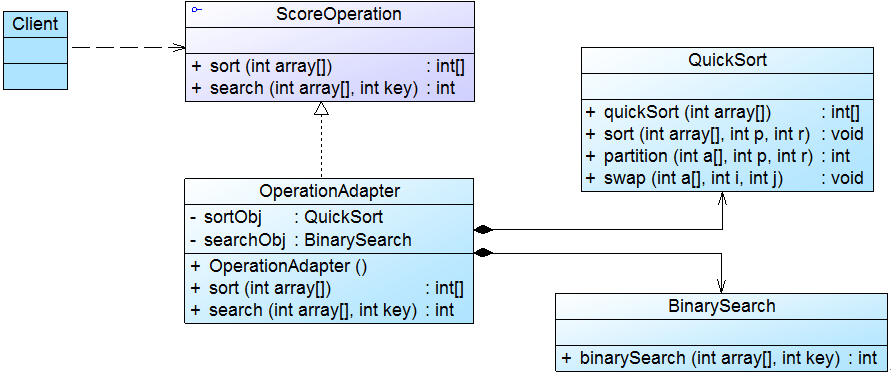
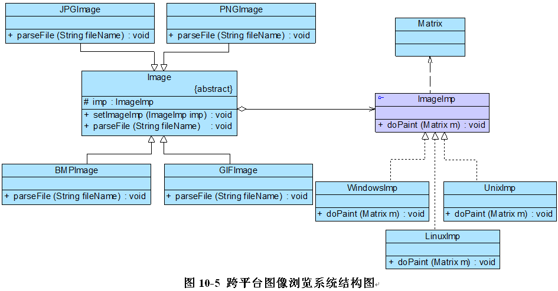
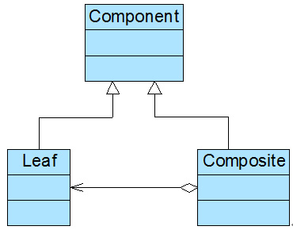
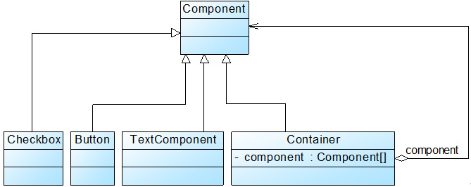
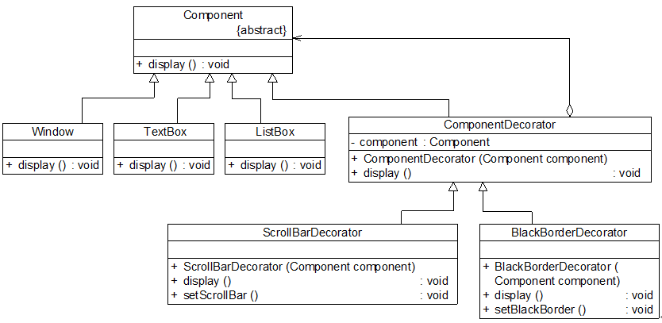
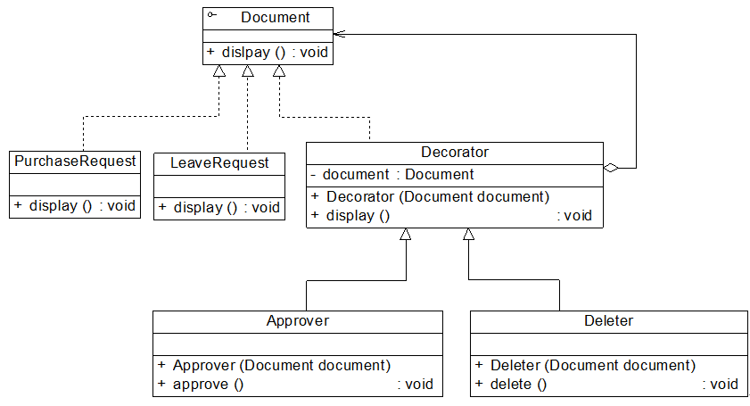
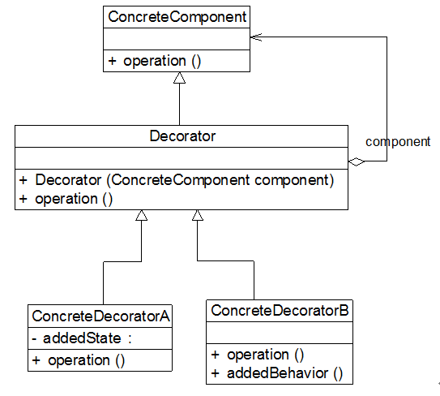

#不兼容结构的协调——适配器模式（一）
      我的笔记本电脑的工作电压是20V，而我国的家庭用电是220V，如何让20V的笔记本电脑能够在220V的电压下工作？答案是引入一个**电源适配器(AC Adapter)**，俗称充电器或变压器，有了这个电源适配器，生活用电和笔记本电脑即可兼容，如图9-1所示：


**图9-1 电源适配器示意图**

      在软件开发中，有时也存在类似这种不兼容的情况，我们也可以像引入一个电源适配器一样引入一个称之为适配器的角色来协调这些存在不兼容的结构，这种设计方案即为适配器模式。

 

## 9.1 没有源码的算法库
|       Sunny软件公司在很久以前曾开发了一个算法库，里面包含了一些常用的算法，例如排序算法和查找算法，在进行各类软件开发时经常需要重用该算法库中的算法。在为某学校开发教务管理系统时，开发人员发现需要对学生成绩进行排序和查找，该系统的设计人员已经开发了一个成绩操作接口ScoreOperation，在该接口中声明了排序方法sort(int[]) 和查找方法search(int[], int)，为了提高排序和查找的效率，开发人员决定重用算法库中的快速排序算法类QuickSort和二分查找算法类BinarySearch，其中QuickSort的quickSort(int[])方法实现了快速排序，BinarySearch 的binarySearch (int[], int)方法实现了二分查找。       由于某些原因，现在Sunny公司开发人员已经找不到该算法库的源代码，无法直接通过复制和粘贴操作来重用其中的代码；部分开发人员已经针对ScoreOperation接口编程，如果再要求对该接口进行修改或要求大家直接使用QuickSort类和BinarySearch类将导致大量代码需要修改。       Sunny软件公司开发人员面对这个没有源码的算法库，遇到一个幸福而又烦恼的问题：如何在既不修改现有接口又不需要任何算法库代码的基础上能够实现算法库的重用？

       由于某些原因，现在Sunny公司开发人员已经找不到该算法库的源代码，无法直接通过复制和粘贴操作来重用其中的代码；部分开发人员已经针对ScoreOperation接口编程，如果再要求对该接口进行修改或要求大家直接使用QuickSort类和BinarySearch类将导致大量代码需要修改。

       通过分析，我们不难得知，现在Sunny软件公司面对的问题有点类似本章最开始所提到的电压问题，成绩操作接口ScoreOperation好比只支持20V电压的笔记本，而算法库好比220V的家庭用电，这两部分都没有办法再进行修改，而且它们原本是两个完全不相关的结构，如图9-2所示：


**图9-2 需协调的两个系统的结构示意图**

       现在我们需要ScoreOperation接口能够和已有算法库一起工作，让它们在同一个系统中能够兼容，最好的实现方法是增加一个类似电源适配器一样的适配器角色，通过适配器来协调这两个原本不兼容的结构。如何在软件开发中设计和实现适配器是本章我们将要解决的核心问题，下面就让我们正式开始学习这种用于解决不兼容结构问题的适配器模式。

 

**9.2 适配器模式概述**

       与电源适配器相似，在适配器模式中引入了一个被称为适配器(Adapter)的包装类，而它所包装的对象称为适配者(Adaptee)，即被适配的类。适配器的实现就是把客户类的请求转化为对适配者的相应接口的调用。也就是说：当客户类调用适配器的方法时，在适配器类的内部将调用适配者类的方法，而这个过程对客户类是透明的，客户类并不直接访问适配者类。因此，适配器让那些由于接口不兼容而不能交互的类可以一起工作。

       适配器模式可以将一个类的接口和另一个类的接口匹配起来，而无须修改原来的适配者接口和抽象目标类接口。适配器模式定义如下：
|**适配器模式(Adapter Pattern)：将一个接口转换成客户希望的另一个接口，使接口不兼容的那些类可以一起工作，其别名为包装器(Wrapper)。适配器模式既可以作为类结构型模式，也可以作为对象结构型模式。**

**【注：在适配器模式定义中所提及的接口是指广义的接口，它可以表示一个方法或者方法的集合。】**

       在适配器模式中，我们通过增加一个新的适配器类来解决接口不兼容的问题，使得原本没有任何关系的类可以协同工作。根据适配器类与适配者类的关系不同，适配器模式可分为对象适配器和类适配器两种，**在对象适配器模式中，适配器与适配者之间是关联关系；在类适配器模式中，适配器与适配者之间是继承（或实现）关系**。在实际开发中，对象适配器的使用频率更高，对象适配器模式结构如图9-3所示：


**图 9-3 对象适配器模式结构图**

       在对象适配器模式结构图中包含如下几个角色：

       ●** Target（目标抽象类）：**目标抽象类定义客户所需接口，可以是一个抽象类或接口，也可以是具体类。

       ●** Adapter（适配器类）：**适配器可以调用另一个接口，作为一个转换器，对Adaptee和Target进行适配，适配器类是适配器模式的核心，在对象适配器中，它通过继承Target并关联一个Adaptee对象使二者产生联系。

       ● **Adaptee****（适配者类）：**适配者即被适配的角色，它定义了一个已经存在的接口，这个接口需要适配，适配者类一般是一个具体类，包含了客户希望使用的业务方法，在某些情况下可能没有适配者类的源代码。

       根据对象适配器模式结构图，在对象适配器中，客户端需要调用request()方法，而适配者类Adaptee没有该方法，但是它所提供的specificRequest()方法却是客户端所需要的。为了使客户端能够使用适配者类，需要提供一个包装类Adapter，即适配器类。这个包装类包装了一个适配者的实例，从而将客户端与适配者衔接起来，在适配器的request()方法中调用适配者的specificRequest()方法。因为适配器类与适配者类是关联关系（也可称之为委派关系），所以这种适配器模式称为对象适配器模式。典型的对象适配器代码如下所示：

```
class Adapter extends Target {
	private Adaptee adaptee; //维持一个对适配者对象的引用
	
	public Adapter(Adaptee adaptee) {
		this.adaptee=adaptee;
	}
	
	public void request() {
		adaptee.specificRequest(); //转发调用
	}
}
```

 
|    <table style="width: 737px; height: 86px;" border="0" cellspacing="0" cellpadding="0" width="737"><tbody><tr><td>**** |**思考**       在对象适配器中，一个适配器能否适配多个适配者？如果能，应该如何实现？如果不能，请说明原因？

       在对象适配器中，一个适配器能否适配多个适配者？如果能，应该如何实现？如果不能，请说明原因？


 

【作者：刘伟  】
#不兼容结构的协调——适配器模式（二）
## 9.3 完整解决方案

      Sunny软件公司开发人员决定使用适配器模式来重用算法库中的算法，其基本结构如图9-4所示：



**图9-4  算法库重用结构图**

       在图9-4中，ScoreOperation接口充当抽象目标，QuickSort和BinarySearch类充当适配者，OperationAdapter充当适配器。完整代码如下所示：

```
//抽象成绩操作类：目标接口
interface ScoreOperation {
	public int[] sort(int array[]); //成绩排序
	public int search(int array[],int key); //成绩查找
}

//快速排序类：适配者
class QuickSort {
	public int[] quickSort(int array[]) {
		sort(array,0,array.length-1);
		return array;
	}

	public void sort(int array[],int p, int r) {
		int q=0;
		if(p&lt;r) {
			q=partition(array,p,r);
			sort(array,p,q-1);
            sort(array,q+1,r);
		}
	}

	public int partition(int[] a, int p, int r) {
		int x=a[r];
		int j=p-1;
		for (int i=p;i&lt;=r-1;i++) {
			if (a[i]&lt;=x) {
				j++;
				swap(a,j,i);
			}
		}
		swap(a,j+1,r);
		return j+1;	
	}

	public void swap(int[] a, int i, int j) {   
        int t = a[i];   
        a[i] = a[j];   
        a[j] = t;   
	}
}

//二分查找类：适配者
class BinarySearch {
	public int binarySearch(int array[],int key) {
		int low = 0;
		int high = array.length -1;
		while(low &lt;= high) {
			int mid = (low + high) / 2;
			int midVal = array[mid];
			if(midVal &lt; key) {  
low = mid +1;  
}
			else if (midVal &gt; key) {  
high = mid -1;  
}
			else {  
return 1; //找到元素返回1  
}
		}
		return -1;  //未找到元素返回-1
	}
}

//操作适配器：适配器
class OperationAdapter implements ScoreOperation {
	private QuickSort sortObj; //定义适配者QuickSort对象
	private BinarySearch searchObj; //定义适配者BinarySearch对象

	public OperationAdapter() {
		sortObj = new QuickSort();
		searchObj = new BinarySearch();
	}

	public int[] sort(int array[]) {  
return sortObj.quickSort(array); //调用适配者类QuickSort的排序方法
}

	public int search(int array[],int key) {  
return searchObj.binarySearch(array,key); //调用适配者类BinarySearch的查找方法
}
}
```

       为了让系统具备良好的灵活性和可扩展性，我们引入了工具类XMLUtil和配置文件，其中，XMLUtil类的代码如下所示：

```
import javax.xml.parsers.*;
import org.w3c.dom.*;
import org.xml.sax.SAXException;
import java.io.*;
class XMLUtil {
//该方法用于从XML配置文件中提取具体类类名，并返回一个实例对象
	public static Object getBean() {
		try {
			//创建文档对象
			DocumentBuilderFactory dFactory = DocumentBuilderFactory.newInstance();
			DocumentBuilder builder = dFactory.newDocumentBuilder();
			Document doc;							
			doc = builder.parse(new File("config.xml")); 
		
			//获取包含类名的文本节点
			NodeList nl = doc.getElementsByTagName("className");
            Node classNode=nl.item(0).getFirstChild();
            String cName=classNode.getNodeValue();
            
            //通过类名生成实例对象并将其返回
            Class c=Class.forName(cName);
	  	    Object obj=c.newInstance();
            return obj;
        }   
        catch(Exception e) {
           	e.printStackTrace();
           	return null;
       	}
	}
}
```

       配置文件config.xml中存储了适配器类的类名，代码如下所示：

```
&lt;?xml version="1.0"?&gt;
&lt;config&gt;
	&lt;className&gt;OperationAdapter&lt;/className&gt;
&lt;/config&gt;
```

       编写如下客户端测试代码：

```
class Client {
	public static void main(String args[]) {
		ScoreOperation operation;  //针对抽象目标接口编程
		operation = (ScoreOperation)XMLUtil.getBean(); //读取配置文件，反射生成对象
		int scores[] = {84,76,50,69,90,91,88,96}; //定义成绩数组
		int result[];
		int score;
		
		System.out.println("成绩排序结果：");
		result = operation.sort(scores);

        //遍历输出成绩
		for(int i : scores) {
			System.out.print(i + ",");
		}
		System.out.println();
		
		System.out.println("查找成绩90：");
		score = operation.search(result,90);
		if (score != -1) {
			System.out.println("找到成绩90。");
		}
		else {
			System.out.println("没有找到成绩90。");
		}
		
		System.out.println("查找成绩92：");
		score = operation.search(result,92);
		if (score != -1) {
			System.out.println("找到成绩92。");
		}
		else {
			System.out.println("没有找到成绩92。");
		}
	}
}
```

        编译并运行程序，输出结果如下：
|成绩排序结果：50,69,76,84,88,90,91,96,查找成绩90：找到成绩90。查找成绩92：没有找到成绩92。

50,69,76,84,88,90,91,96,

找到成绩90。

没有找到成绩92。

       在本实例中使用了对象适配器模式，同时引入了配置文件，将适配器类的类名存储在配置文件中。如果需要使用其他排序算法类和查找算法类，可以增加一个新的适配器类，使用新的适配器来适配新的算法，原有代码无须修改。通过引入配置文件和反射机制，可以在不修改客户端代码的情况下使用新的适配器，无须修改源代码，符合“开闭原则”。

【作者：刘伟  】
#不兼容结构的协调——适配器模式（四）
## 9.6 缺省适配器       
|**缺省适配器模式(Default Adapter Pattern)：当不需要实现一个接口所提供的所有方法时，可先设计一个抽象类实现该接口，并为接口中每个方法提供一个默认实现（空方法），那么该抽象类的子类可以选择性地覆盖父类的某些方法来实现需求，它适用于不想使用一个接口中的所有方法的情况，又称为单接口适配器模式。**

       缺省适配器模式结构如图9-7所示：

 

**图9-7  缺省适配器模式结构图**

       在缺省适配器模式中，包含如下三个角色：

     ** ● ServiceInterface（适配者接口）：**它是一个接口，通常在该接口中声明了大量的方法。

      **● AbstractServiceClass（缺省适配器类）：**它是缺省适配器模式的核心类，使用空方法的形式实现了在ServiceInterface接口中声明的方法。通常将它定义为抽象类，因为对它进行实例化没有任何意义。

      **● ConcreteServiceClass（具体业务类）：**它是缺省适配器类的子类，在没有引入适配器之前，它需要实现适配者接口，因此需要实现在适配者接口中定义的所有方法，而对于一些无须使用的方法也不得不提供空实现。在有了缺省适配器之后，可以直接继承该适配器类，根据需要有选择性地覆盖在适配器类中定义的方法。

       在JDK类库的事件处理包java.awt.event中广泛使用了缺省适配器模式，如WindowAdapter、KeyAdapter、MouseAdapter等。下面我们以处理窗口事件为例来进行说明：在Java语言中，一般我们可以使用两种方式来实现窗口事件处理类，一种是通过实现WindowListener接口，另一种是通过继承WindowAdapter适配器类。如果是使用第一种方式，直接实现WindowListener接口，事件处理类需要实现在该接口中定义的七个方法，而对于大部分需求可能只需要实现一两个方法，其他方法都无须实现，但由于语言特性我们不得不为其他方法也提供一个简单的实现（通常是空实现），这给使用带来了麻烦。而使用缺省适配器模式就可以很好地解决这一问题，在JDK中提供了一个适配器类WindowAdapter来实现WindowListener接口，该适配器类为接口中的每一个方法都提供了一个空实现，此时事件处理类可以继承WindowAdapter类，而无须再为接口中的每个方法都提供实现。如图9-8所示：

 

**图9-8  WindowListener和WindowAdapter结构图**

 

## 9.7 适配器模式总结

      适配器模式将现有接口转化为客户类所期望的接口，实现了对现有类的复用，它是一种使用频率非常高的设计模式，在软件开发中得以广泛应用，在Spring等开源框架、驱动程序设计（如JDBC中的数据库驱动程序）中也使用了适配器模式。

 

**       1. 主要优点**

       无论是对象适配器模式还是类适配器模式都具有如下优点：

       (1) **将目标类和适配者类解耦**，通过引入一个适配器类来重用现有的适配者类，无须修改原有结构。

       (2)** ****增加了类的透明性和复用性**，将具体的业务实现过程封装在适配者类中，对于客户端类而言是透明的，而且提高了适配者的复用性，同一个适配者类可以在多个不同的系统中复用。

       (3) **灵活性和扩展性都非常好**，通过使用配置文件，可以很方便地更换适配器，也可以在不修改原有代码的基础上增加新的适配器类，完全符合“开闭原则”。

      具体来说，类适配器模式还有如下优点：

      由于适配器类是适配者类的子类，因此**可以在适配器类中置换一些适配者的方法**，使得适配器的灵活性更强。

      对象适配器模式还有如下优点：

      (1) 一个对象适配器**可以把多个不同的适配者适配到同一个目标**；

      (2) **可以适配一个适配者的子类**，由于适配器和适配者之间是关联关系，根据“里氏代换原则”，适配者的子类也可通过该适配器进行适配。

 

**      2. 主要缺点**

     **类适配器模式**的缺点如下：

      (1) 对于Java、C#等不支持多重类继承的语言，一次最多只能适配一个适配者类，**不能同时适配多个适配者**；

      (2) **适配者类不能为最终类**，如在Java中不能为final类，C#中不能为sealed类；

      (3) 在Java、C#等语言中，**类适配器模式中的目标抽象类只能为接口，不能为类**，其使用有一定的局限性。

      **对象适配器模式**的缺点如下：

      与类适配器模式相比，**要在适配器中置换适配者类的某些方法比较麻烦**。如果一定要置换掉适配者类的一个或多个方法，可以先做一个适配者类的子类，将适配者类的方法置换掉，然后再把适配者类的子类当做真正的适配者进行适配，实现过程较为复杂。

 

**      3. 适用场景**

      在以下情况下可以考虑使用适配器模式：

       (1) 系统需要使用一些现有的类，而这些类的接口（如方法名）不符合系统的需要，甚至没有这些类的源代码。

       (2) 想创建一个可以重复使用的类，用于与一些彼此之间没有太大关联的一些类，包括一些可能在将来引进的类一起工作。

 
|    <table style="width: 782px; height: 53px;" border="0" cellspacing="0" cellpadding="0" width="782"><tbody><tr><td>****|**练习**       Sunny软件公司OA系统需要提供一个加密模块，将用户机密信息（如口令、邮箱等）加密之后再存储在数据库中，系统已经定义好了数据库操作类。为了提高开发效率，现需要重用已有的加密算法，这些算法封装在一些由第三方提供的类中，有些甚至没有源代码。试使用适配器模式设计该加密模块，实现在不修改现有类的基础上重用第三方加密方法。

       Sunny软件公司OA系统需要提供一个加密模块，将用户机密信息（如口令、邮箱等）加密之后再存储在数据库中，系统已经定义好了数据库操作类。为了提高开发效率，现需要重用已有的加密算法，这些算法封装在一些由第三方提供的类中，有些甚至没有源代码。试使用适配器模式设计该加密模块，实现在不修改现有类的基础上重用第三方加密方法。


 
 #处理多维度变化——桥接模式（一）
       在正式介绍桥接模式之前，我先跟大家谈谈两种常见文具的区别，它们是毛笔和蜡笔。假如我们需要大中小3种型号的画笔，能够绘制12种不同的颜色，如果使用蜡笔，需要准备3×12 = 36支，但如果使用毛笔的话，只需要提供3种型号的毛笔，外加12个颜料盒即可，涉及到的对象个数仅为 3 + 12 = 15，远小于36，却能实现与36支蜡笔同样的功能。如果增加一种新型号的画笔，并且也需要具有12种颜色，对应的蜡笔需增加12支，而毛笔只需增加一支。为什么会这样呢？通过分析我们可以得知：在蜡笔中，颜色和型号两个不同的变化维度（即两个不同的变化原因）融合在一起，无论是对颜色进行扩展还是对型号进行扩展都势必会影响另一个维度；但在毛笔中，颜色和型号实现了分离，增加新的颜色或者型号对另一方都没有任何影响。如果使用软件工程中的术语，我们可以认为在蜡笔中颜色和型号之间存在较强的耦合性，而毛笔很好地将二者解耦，使用起来非常灵活，扩展也更为方便。在软件开发中，我们也提供了一种设计模式来处理与画笔类似的具有多变化维度的情况，即本章将要介绍的桥接模式。

## 10.1 跨平台图像浏览系统
|       Sunny软件公司欲开发一个跨平台图像浏览系统，要求该系统能够显示BMP、JPG、GIF、PNG等多种格式的文件，并且能够在Windows、Linux、Unix等多个操作系统上运行。系统首先将各种格式的文件解析为像素矩阵(Matrix)，然后将像素矩阵显示在屏幕上，在不同的操作系统中可以调用不同的绘制函数来绘制像素矩阵。系统需具有较好的扩展性以支持新的文件格式和操作系统。 

      Sunny软件公司的开发人员针对上述要求，提出了一个初始设计方案，其基本结构如图10-1所示：


        在图10-1的初始设计方案中，使用了一种多层继承结构，Image是抽象父类，而每一种类型的图像类，如BMPImage、JPGImage等作为其直接子类，不同的图像文件格式具有不同的解析方法，可以得到不同的像素矩阵；由于每一种图像又需要在不同的操作系统中显示，不同的操作系统在屏幕上显示像素矩阵有所差异，因此需要为不同的图像类再提供一组在不同操作系统显示的子类，如为BMPImage提供三个子类BMPWindowsImp、BMPLinuxImp和BMPUnixImp，分别用于在Windows、Linux和Unix三个不同的操作系统下显示图像。

        我们现在对该设计方案进行分析，发现存在如下两个主要问题：

       (1)由于采用了多层继承结构，导致系统中类的个数急剧增加，图10-1中，在各种图像的操作系统实现层提供了12个具体类，加上各级抽象层的类，系统中类的总个数达到了17个，在该设计方案中，具体层的类的个数 = 所支持的图像文件格式数×所支持的操作系统数。

       (2)系统扩展麻烦，由于每一个具体类既包含图像文件格式信息，又包含操作系统信息，因此无论是增加新的图像文件格式还是增加新的操作系统，都需要增加大量的具体类，例如在图10-1中增加一种新的图像文件格式TIF，则需要增加3个具体类来实现该格式图像在3种不同操作系统的显示；如果增加一个新的操作系统Mac OS，为了在该操作系统下能够显示各种类型的图像，需要增加4个具体类。这将导致系统变得非常庞大，增加运行和维护开销。

        如何解决这两个问题？我们通过分析可得知，该系统**存在两个独立变化的维度**：图像文件格式和操作系统，如图10-2所示：


        如何改进？我们的方案是将图像文件格式（对应**图像格式的解析**）与操作系统（对应**像素矩阵的显示**）两个维度分离，使得它们可以独立变化，增加新的图像文件格式或者操作系统时都对另一个维度不造成任何影响。看到这里，大家可能会问，到底如何在软件中实现将两个维度分离呢？不用着急，本章我将为大家详细介绍一种用于处理多维度变化的设计模式——桥接模式。

【作者：刘伟】

#处理多维度变化——桥接模式（二）
## 10.2 桥接模式概述

        桥接模式是一种很实用的结构型设计模式，如果软件系统中某个类存在两个独立变化的维度，通过该模式可以将这两个维度分离出来，使两者可以独立扩展，让系统更加符合“单一职责原则”。与多层继承方案不同，它将两个独立变化的维度设计为两个独立的继承等级结构，并且在抽象层建立一个抽象关联，该关联关系类似一条连接两个独立继承结构的桥，故名桥接模式。

        桥接模式用一种巧妙的方式处理多层继承存在的问题，用抽象关联取代了传统的多层继承，将类之间的静态继承关系转换为动态的对象组合关系，使得系统更加灵活，并易于扩展，同时有效控制了系统中类的个数。桥接定义如下：
| **桥接模式(Bridge Pattern)：将抽象部分与它的实现部分分离，使它们都可以独立地变化。它是一种对象结构型模式，又称为柄体(Handle and Body)模式或接口(Interface)模式。** 

        桥接模式的结构与其名称一样，存在一条连接两个继承等级结构的桥，桥接模式结构如图10-3所示：


        在桥接模式结构图中包含如下几个角色：

●Abstraction（抽象类）：用于定义抽象类的接口，它一般是抽象类而不是接口，其中定义了一个Implementor（实现类接口）类型的对象并可以维护该对象，它与Implementor之间具有关联关系，它既可以包含抽象业务方法，也可以包含具体业务方法。

●RefinedAbstraction（扩充抽象类）：扩充由Abstraction定义的接口，通常情况下它不再是抽象类而是具体类，它实现了在Abstraction中声明的抽象业务方法，在RefinedAbstraction中可以调用在Implementor中定义的业务方法。

●Implementor（实现类接口）：定义实现类的接口，这个接口不一定要与Abstraction的接口完全一致，事实上这两个接口可以完全不同，一般而言，Implementor接口仅提供基本操作，而Abstraction定义的接口可能会做更多更复杂的操作。Implementor接口对这些基本操作进行了声明，而具体实现交给其子类。通过关联关系，在Abstraction中不仅拥有自己的方法，还可以调用到Implementor中定义的方法，使用关联关系来替代继承关系。

●ConcreteImplementor（具体实现类）：具体实现Implementor接口，在不同的ConcreteImplementor中提供基本操作的不同实现，在程序运行时，ConcreteImplementor对象将替换其父类对象，提供给抽象类具体的业务操作方法。

        桥接模式是一个非常有用的模式，在桥接模式中体现了很多面向对象设计原则的思想，包括“单一职责原则”、“开闭原则”、“合成复用原则”、“里氏代换原则”、“依赖倒转原则”等。熟悉桥接模式有助于我们深入理解这些设计原则，也有助于我们形成正确的设计思想和培养良好的设计风格。

        在使用桥接模式时，我们首先应该识别出一个类所具有的两个独立变化的维度，将它们设计为两个独立的继承等级结构，为两个维度都提供抽象层，并建立抽象耦合。通常情况下，我们将具有两个独立变化维度的类的一些普通业务方法和与之关系最密切的维度设计为“抽象类”层次结构（抽象部分），而将另一个维度设计为“实现类”层次结构（实现部分）。例如：对于毛笔而言，由于型号是其固有的维度，因此可以设计一个抽象的毛笔类，在该类中声明并部分实现毛笔的业务方法，而将各种型号的毛笔作为其子类；颜色是毛笔的另一个维度，由于它与毛笔之间存在一种“设置”的关系，因此我们可以提供一个抽象的颜色接口，而将具体的颜色作为实现该接口的子类。在此，**型号可认为是毛笔的抽象部分，而颜色是毛笔的实现部分**，结构示意图如图10-4所示：


    在具体编码实现时，由于在桥接模式中存在两个独立变化的维度，为了使两者之间耦合度降低，首先需要针对两个不同的维度提取抽象类和实现类接口，并建立一个抽象关联关系。对于“实现部分”维度，典型的实现类接口代码如下所示：

```
interface Implementor {
	public void operationImpl();
}

```

        在实现Implementor接口的子类中实现了在该接口中声明的方法，用于定义与该维度相对应的一些具体方法。

        对于另一“抽象部分”维度而言，其典型的抽象类代码如下所示：

```
abstract class Abstraction {
	protected Implementor impl; //定义实现类接口对象
	
	public void setImpl(Implementor impl) {
		this.impl=impl;
	}
	
	public abstract void operation();  //声明抽象业务方法
}
```

        在抽象类Abstraction中定义了一个实现类接口类型的成员对象impl，再通过**注入**的方式给该对象赋值，一般将该对象的可见性定义为protected，以便在其子类中访问Implementor的方法，其子类一般称为扩充抽象类或细化抽象类(RefinedAbstraction)，典型的RefinedAbstraction类代码如下所示：

```
class RefinedAbstraction extends Abstraction {
	public void operation() {
		//业务代码
		impl.operationImpl();  //调用实现类的方法
		//业务代码
	}
}
```

      对于客户端而言，可以针对两个维度的抽象层编程，在程序运行时再动态确定两个维度的子类，动态组合对象，将两个独立变化的维度完全解耦，以便能够灵活地扩充任一维度而对另一维度不造成任何影响。
|     <table border="0" cellspacing="0" cellpadding="0" width="564"><tbody><tr><td>| **思考** 如果系统中存在两个以上的变化维度，是否可以使用桥接模式进行处理？如果可以，系统该如何设计？ 

如果系统中存在两个以上的变化维度，是否可以使用桥接模式进行处理？如果可以，系统该如何设计？


【作者：刘伟 】

#处理多维度变化——桥接模式（三）
## 10.3  完整解决方案

        为了减少所需生成的子类数目，实现将操作系统和图像文件格式两个维度分离，使它们可以独立改变，Sunny公司开发人员使用桥接模式来重构跨平台图像浏览系统的设计，其基本结构如图10-5所示：



```
//像素矩阵类：辅助类，各种格式的文件最终都被转化为像素矩阵，不同的操作系统提供不同的方式显示像素矩阵
class Matrix {
	//此处代码省略
}

//抽象图像类：抽象类
abstract class Image {
	protected ImageImp imp;

	public void setImageImp(ImageImp imp) {
		this.imp = imp;
	} 

	public abstract void parseFile(String fileName);
}

//抽象操作系统实现类：实现类接口
interface ImageImp {
	public void doPaint(Matrix m);  //显示像素矩阵m
} 

//Windows操作系统实现类：具体实现类
class WindowsImp implements ImageImp {
    public void doPaint(Matrix m) {
    	//调用Windows系统的绘制函数绘制像素矩阵
    	System.out.print("在Windows操作系统中显示图像：");
    }
}

//Linux操作系统实现类：具体实现类
class LinuxImp implements ImageImp {
    public void doPaint(Matrix m) {
    	//调用Linux系统的绘制函数绘制像素矩阵
    	System.out.print("在Linux操作系统中显示图像：");
    }
}

//Unix操作系统实现类：具体实现类
class UnixImp implements ImageImp {
    public void doPaint(Matrix m) {
    	//调用Unix系统的绘制函数绘制像素矩阵
    	System.out.print("在Unix操作系统中显示图像：");
    }
}

//JPG格式图像：扩充抽象类
class JPGImage extends Image {
	public void parseFile(String fileName) {
        //模拟解析JPG文件并获得一个像素矩阵对象m;
        Matrix m = new Matrix(); 
        imp.doPaint(m);
        System.out.println(fileName + "，格式为JPG。");
    }
}

//PNG格式图像：扩充抽象类
class PNGImage extends Image {
	public void parseFile(String fileName) {
        //模拟解析PNG文件并获得一个像素矩阵对象m;
        Matrix m = new Matrix(); 
        imp.doPaint(m);
        System.out.println(fileName + "，格式为PNG。");
    }
}

//BMP格式图像：扩充抽象类
class BMPImage extends Image {
	public void parseFile(String fileName) {
        //模拟解析BMP文件并获得一个像素矩阵对象m;
        Matrix m = new Matrix(); 
        imp.doPaint(m);
        System.out.println(fileName + "，格式为BMP。");
    }
}

//GIF格式图像：扩充抽象类
class GIFImage extends Image {
	public void parseFile(String fileName) {
        //模拟解析GIF文件并获得一个像素矩阵对象m;
        Matrix m = new Matrix(); 
        imp.doPaint(m);
        System.out.println(fileName + "，格式为GIF。");
    }
}
```

        为了让系统具有更好的灵活性和可扩展性，我们引入了配置文件，将具体扩充抽象类和具体实现类类名都存储在配置文件中，再通过反射生成对象，将生成的具体实现类对象注入到扩充抽象类对象中，其中，配置文件config.xml的代码如下所示：

```
&lt;?xml version="1.0"?&gt;
&lt;config&gt;
	&lt;!--RefinedAbstraction--&gt;
	&lt;className&gt;JPGImage&lt;/className&gt; 
	&lt;!--ConcreteImplementor--&gt;
	&lt;className&gt;WindowsImp&lt;/className&gt;
&lt;/config&gt;
```

        用于读取配置文件config.xml并反射生成对象的XMLUtil类的代码如下所示：

```
import javax.xml.parsers.*;
import org.w3c.dom.*;
import org.xml.sax.SAXException;
import java.io.*;
public class XMLUtil {
//该方法用于从XML配置文件中提取具体类类名，并返回一个实例对象
	public static Object getBean(String args) {
		try {
			//创建文档对象
			DocumentBuilderFactory dFactory = DocumentBuilderFactory.newInstance();
			DocumentBuilder builder = dFactory.newDocumentBuilder();
			Document doc;							
			doc = builder.parse(new File("config.xml")); 
			NodeList nl=null;
			Node classNode=null;
			String cName=null;
			nl = doc.getElementsByTagName("className");
			
			if(args.equals("image")) {
				//获取第一个包含类名的节点，即扩充抽象类
	            classNode=nl.item(0).getFirstChild();
	            
			}
			else if(args.equals("os")) {
			   //获取第二个包含类名的节点，即具体实现类
	            classNode=nl.item(1).getFirstChild();
			}
			
	         cName=classNode.getNodeValue();
	         //通过类名生成实例对象并将其返回
	         Class c=Class.forName(cName);
		  	 Object obj=c.newInstance();
	         return obj;		
           }   
           catch(Exception e) {
              e.printStackTrace();
              return null;
          }
     }
}
```

        编写如下客户端测试代码：

```
class Client {
	public static void main(String args[]) {
		Image image;
		ImageImp imp;
		image = (Image)XMLUtil.getBean("image");
		imp = (ImageImp)XMLUtil.getBean("os");
		image.setImageImp(imp);
		image.parseFile("小龙女");
	}
}
```

        编译并运行程序，输出结果如下：
| 在Windows操作系统中显示图像：小龙女，格式为JPG。 

        如果需要更换图像文件格式或者更换操作系统，只需修改配置文件即可，在实际使用时，**可以通过分析图像文件格式后缀名来确定具体的文件格式，在程序运行时获取操作系统信息来确定操作系统类型**，无须使用配置文件。当增加新的图像文件格式或者操作系统时，原有系统无须做任何修改，只需增加一个对应的扩充抽象类或具体实现类即可，系统具有较好的可扩展性，完全符合“开闭原则”。

【作者：刘伟  】

#处理多维度变化——桥接模式（四）
## 10.4 适配器模式与桥接模式的联用

        在软件开发中，适配器模式通常可以与桥接模式联合使用。适配器模式可以解决两个已有接口间不兼容问题，在这种情况下被适配的类往往是一个黑盒子，有时候我们不想也不能改变这个被适配的类，也不能控制其扩展。适配器模式通常用于现有系统与第三方产品功能的集成，采用增加适配器的方式将第三方类集成到系统中。桥接模式则不同，用户可以通过接口继承或类继承的方式来对系统进行扩展。

        桥接模式和适配器模式用于设计的不同阶段，桥接模式用于系统的初步设计，对于存在两个独立变化维度的类可以将其分为抽象化和实现化两个角色，使它们可以分别进行变化；而在初步设计完成之后，当发现系统与已有类无法协同工作时，可以采用适配器模式。但有时候在设计初期也需要考虑适配器模式，特别是那些涉及到大量第三方应用接口的情况。

        下面通过一个实例来说明适配器模式和桥接模式的联合使用：

        在某系统的报表处理模块中，需要将报表显示和数据采集分开，系统可以有多种报表显示方式也可以有多种数据采集方式，如可以从文本文件中读取数据，也可以从数据库中读取数据，还可以从Excel文件中获取数据。如果需要从Excel文件中获取数据，则需要调用与Excel相关的API，而这个API是现有系统所不具备的，该API由厂商提供。使用适配器模式和桥接模式设计该模块。

        在设计过程中，由于存在报表显示和数据采集两个独立变化的维度，因此可以使用桥接模式进行初步设计；为了使用Excel相关的API来进行数据采集则需要使用适配器模式。系统的完整设计中需要将两个模式联用，如图10-6所示：


        桥接模式是设计Java虚拟机和实现JDBC等驱动程序的核心模式之一，应用较为广泛。在软件开发中如果一个类或一个系统有多个变化维度时，都可以尝试使用桥接模式对其进行设计。桥接模式为多维度变化的系统提供了一套完整的解决方案，并且降低了系统的复杂度。

**1.主要优点**

        桥接模式的主要优点如下：

        (1)分离抽象接口及其实现部分。桥接模式使用“对象间的关联关系”解耦了抽象和实现之间固有的绑定关系，使得抽象和实现可以沿着各自的维度来变化。所谓抽象和实现沿着各自维度的变化，也就是说抽象和实现不再在同一个继承层次结构中，而是“子类化”它们，使它们各自都具有自己的子类，以便任何组合子类，从而获得多维度组合对象。

        (2)在很多情况下，桥接模式可以取代多层继承方案，多层继承方案违背了“单一职责原则”，复用性较差，且类的个数非常多，桥接模式是比多层继承方案更好的解决方法，它极大减少了子类的个数。

        (3)桥接模式提高了系统的可扩展性，在两个变化维度中任意扩展一个维度，都不需要修改原有系统，符合“开闭原则”。

**2.主要缺点**

        桥接模式的主要缺点如下：

        (1)桥接模式的使用会增加系统的理解与设计难度，由于关联关系建立在抽象层，要求开发者一开始就针对抽象层进行设计与编程。

        (2)桥接模式要求正确识别出系统中两个独立变化的维度，因此其使用范围具有一定的局限性，如何正确识别两个独立维度也需要一定的经验积累。

**3.适用场景**

        在以下情况下可以考虑使用桥接模式：

        (1)如果一个系统需要在抽象化和具体化之间增加更多的灵活性，避免在两个层次之间建立静态的继承关系，通过桥接模式可以使它们在抽象层建立一个关联关系。

        (2)“抽象部分”和“实现部分”可以以继承的方式独立扩展而互不影响，在程序运行时可以动态将一个抽象化子类的对象和一个实现化子类的对象进行组合，即系统需要对抽象化角色和实现化角色进行动态耦合。

        (3)一个类存在两个（或多个）独立变化的维度，且这两个（或多个）维度都需要独立进行扩展。

        (4)对于那些不希望使用继承或因为多层继承导致系统类的个数急剧增加的系统，桥接模式尤为适用。
|    <table border="0" cellspacing="0" cellpadding="0" width="564"><tbody><tr><td>**** |**练习**Sunny软件公司欲开发一个数据转换工具，可以将数据库中的数据转换成多种文件格式，例如txt、xml、pdf等格式，同时该工具需要支持多种不同的数据库。试使用桥接模式对其进行设计。

Sunny软件公司欲开发一个数据转换工具，可以将数据库中的数据转换成多种文件格式，例如txt、xml、pdf等格式，同时该工具需要支持多种不同的数据库。试使用桥接模式对其进行设计。


 #树形结构的处理——组合模式（一）
      树形结构在软件中随处可见，例如操作系统中的目录结构、应用软件中的菜单、办公系统中的公司组织结构等等，如何运用面向对象的方式来处理这种树形结构是组合模式需要解决的问题，组合模式通过一种巧妙的设计方案使得用户可以一致性地处理整个树形结构或者树形结构的一部分，也可以一致性地处理树形结构中的叶子节点（不包含子节点的节点）和容器节点（包含子节点的节点）。下面将学习这种用于处理树形结构的组合模式。

 

## 11.1 设计杀毒软件的框架结构


|      Sunny软件公司欲开发一个杀毒(AntiVirus)软件，该软件既可以对某个文件夹(Folder)杀毒，也可以对某个指定的文件(File)进行杀毒。该杀毒软件还可以根据各类文件的特点，为不同类型的文件提供不同的杀毒方式，例如图像文件(ImageFile)和文本文件(TextFile)的杀毒方式就有所差异。现需要提供该杀毒软件的整体框架设计方案。


      在介绍Sunny公司开发人员提出的初始解决方案之前，我们先来分析一下操作系统中的文件目录结构，例如在Windows操作系统中，存在如图11-1所示目录结构：


**图11-1 Windows目录结构**

      图11-1可以简化为如图11-2所示树形目录结构：


**图11-2 树形目录结构示意图**

      我们可以看出，在图11-2中包含**文件（灰色节点）和文件夹（白色节点）两类不同的元素**，其中**在文件夹中可以包含文件，还可以继续包含子文件夹，但是在文件中不能再包含子文件或者子文件夹**。在此，我们可以**称文件夹为容器(Container)，而不同类型的各种文件是其成员，也称为叶子(Leaf)，一个文件夹也可以作为另一个更大的文件夹的成员**。如果我们现在要对某一个文件夹进行操作，如查找文件，那么需要对指定的文件夹进行遍历，如果存在子文件夹则打开其子文件夹继续遍历，如果是文件则判断之后返回查找结果。

      Sunny软件公司的开发人员通过分析，决定使用面向对象的方式来实现对文件和文件夹的操作，定义了如下图像文件类ImageFile、文本文件类TextFile和文件夹类Folder：

```java
//为了突出核心框架代码，我们对杀毒过程的实现进行了大量简化
import java.util.*;

//图像文件类
class ImageFile {
	private String name;

	public ImageFile(String name) {
		this.name = name;
	}

	public void killVirus() {
		//简化代码，模拟杀毒
		System.out.println("----对图像文件'" + name + "'进行杀毒");
	}
}

//文本文件类
class TextFile {
	private String name;

	public TextFile(String name) {
		this.name = name;
	}

	public void killVirus() {
		//简化代码，模拟杀毒
		System.out.println("----对文本文件'" + name + "'进行杀毒");
	}
}

//文件夹类
class Folder {
	private String name;
	//定义集合folderList，用于存储Folder类型的成员
	private ArrayList&lt;Folder&gt; folderList = new ArrayList&lt;Folder&gt;();
	//定义集合imageList，用于存储ImageFile类型的成员
	private ArrayList&lt;ImageFile&gt; imageList = new ArrayList&lt;ImageFile&gt;();
	//定义集合textList，用于存储TextFile类型的成员
	private ArrayList&lt;TextFile&gt; textList = new ArrayList&lt;TextFile&gt;();
	
	public Folder(String name) {
		this.name = name;
	}
	
	//增加新的Folder类型的成员
	public void addFolder(Folder f) {
		folderList.add(f);
	}
	
	//增加新的ImageFile类型的成员
	public void addImageFile(ImageFile image) {
		imageList.add(image);
	}
	
	//增加新的TextFile类型的成员
	public void addTextFile(TextFile text) {
		textList.add(text);
	}
		
	//需提供三个不同的方法removeFolder()、removeImageFile()和removeTextFile()来删除成员，代码省略

	//需提供三个不同的方法getChildFolder(int i)、getChildImageFile(int i)和getChildTextFile(int i)来获取成员，代码省略

	public void killVirus() {
		System.out.println("****对文件夹'" + name + "'进行杀毒");  //模拟杀毒
		
		//如果是Folder类型的成员，递归调用Folder的killVirus()方法
		for(Object obj : folderList) {
			((Folder)obj).killVirus();
		}
		
		//如果是ImageFile类型的成员，调用ImageFile的killVirus()方法
		for(Object obj : imageList) {
			((ImageFile)obj).killVirus();
		}
		
		//如果是TextFile类型的成员，调用TextFile的killVirus()方法
		for(Object obj : textList) {
			((TextFile)obj).killVirus();
		}
	} 
}
```

      编写如下客户端测试代码进行测试：

```java
class Client {
	public static void main(String args[]) {
		Folder folder1,folder2,folder3;
		folder1 = new Folder("Sunny的资料");
		folder2 = new Folder("图像文件");
		folder3 = new Folder("文本文件");
		
		ImageFile image1,image2;
		image1 = new ImageFile("小龙女.jpg");
		image2 = new ImageFile("张无忌.gif");
		
		TextFile text1,text2;
		text1 = new TextFile("九阴真经.txt");
		text2 = new TextFile("葵花宝典.doc");
		
		folder2.addImageFile(image1);
		folder2.addImageFile(image2);
		folder3.addTextFile(text1);
		folder3.addTextFile(text2);
		folder1.addFolder(folder2);
		folder1.addFolder(folder3);
		
		folder1.killVirus();
	}
}
```

      编译并运行程序，输出结果如下：


|****对文件夹'Sunny的资料'进行杀毒****对文件夹'图像文件'进行杀毒----对图像文件'小龙女.jpg'进行杀毒----对图像文件'张无忌.gif'进行杀毒****对文件夹'文本文件'进行杀毒----对文本文件'九阴真经.txt'进行杀毒----对文本文件'葵花宝典.doc'进行杀毒

****对文件夹'图像文件'进行杀毒

----对图像文件'张无忌.gif'进行杀毒

----对文本文件'九阴真经.txt'进行杀毒


      Sunny公司开发人员“成功”实现了杀毒软件的框架设计，但通过仔细分析，发现该设计方案存在如下问题：

      (1) 文件夹类Folder的设计和实现都非常复杂，需要定义多个集合存储不同类型的成员，而且需要针对不同的成员提供增加、删除和获取等管理和访问成员的方法，存在大量的冗余代码，系统维护较为困难；

      (2) 由于系统没有提供抽象层，客户端代码必须有区别地对待充当容器的文件夹Folder和充当叶子的ImageFile和TextFile，无法统一对它们进行处理；

      (3) 系统的灵活性和可扩展性差，如果需要增加新的类型的叶子和容器都需要对原有代码进行修改，例如如果需要在系统中增加一种新类型的视频文件VideoFile，则必须修改Folder类的源代码，否则无法在文件夹中添加视频文件。

      面对以上问题，Sunny软件公司的开发人员该如何来解决？这就需要用到本章将要介绍的组合模式，**组合模式为处理树形结构提供了一种较为完美的解决方案，它描述了如何将容器和叶子进行递归组合，使得用户在使用时无须对它们进行区分，可以一致地对待容器和叶子**。

【作者：刘伟 】

#树形结构的处理——组合模式（二）
## 11.2 组合模式概述

      对于树形结构，当容器对象（如文件夹）的某一个方法被调用时，将遍历整个树形结构，寻找也包含这个方法的成员对象（可以是容器对象，也可以是叶子对象）并调用执行，牵一而动百，其中使用了递归调用的机制来对整个结构进行处理。由于容器对象和叶子对象在功能上的区别，在使用这些对象的代码中必须有区别地对待容器对象和叶子对象，而实际上大多数情况下我们希望一致地处理它们，因为对于这些对象的区别对待将会使得程序非常复杂。组合模式为解决此类问题而诞生，它可以让叶子对象和容器对象的使用具有一致性。

      组合模式定义如下：
|**组合模式(Composite Pattern)：组合多个对象形成树形结构以表示具有“整体—部分”关系的层次结构。组合模式对单个对象（即叶子对象）和组合对象（即容器对象）的使用具有一致性，组合模式又可以称为“整体—部分”(Part-Whole)模式，它是一种对象结构型模式。**

      在组合模式中引入了抽象构件类Component，它是所有容器类和叶子类的公共父类，客户端针对Component进行编程。组合模式结构如图11-3所示：


**图11-3  组合模式结构图**

      在组合模式结构图中包含如下几个角色：

      **● Component（抽象构件）：**它可以是接口或抽象类，为叶子构件和容器构件对象声明接口，在该角色中可以包含所有子类共有行为的声明和实现。在抽象构件中定义了访问及管理它的子构件的方法，如增加子构件、删除子构件、获取子构件等。

     ** ● Leaf（叶子构件）：** 它在组合结构中表示叶子节点对象，叶子节点没有子节点，它实现了在抽象构件中定义的行为。对于那些访问及管理子构件的方法，可以通过异常等方式进行处理。

      **● Composite（容器构件）：**它在组合结构中表示容器节点对象，容器节点包含子节点，其子节点可以是叶子节点，也可以是容器节点，它提供一个集合用于存储子节点，实现了在抽象构件中定义的行为，包括那些访问及管理子构件的方法，在其业务方法中可以递归调用其子节点的业务方法。

**      组合模式的关键是定义了一个抽象构件类，它既可以代表叶子，又可以代表容器，而客户端针对该抽象构件类进行编程，无须知道它到底表示的是叶子还是容器，可以对其进行统一处理。**同时容器对象与抽象构件类之间还建立一个聚合关联关系，在容器对象中既可以包含叶子，也可以包含容器，以此实现递归组合，形成一个树形结构。

      如果不使用组合模式，客户端代码将过多地依赖于容器对象复杂的内部实现结构，容器对象内部实现结构的变化将引起客户代码的频繁变化，带来了代码维护复杂、可扩展性差等弊端。组合模式的引入将在一定程度上解决这些问题。

      下面通过简单的示例代码来分析组合模式的各个角色的用途和实现。对于组合模式中的抽象构件角色，其典型代码如下所示：

```
abstract class Component {

	public abstract void add(Component c); //增加成员

	public abstract void remove(Component c); //删除成员

	public abstract Component getChild(int i); //获取成员

	public abstract void operation();  //业务方法

}
```

      一般将抽象构件类设计为接口或抽象类，将所有子类共有方法的声明和实现放在抽象构件类中。对于客户端而言，将针对抽象构件编程，而无须关心其具体子类是容器构件还是叶子构件。

      如果继承抽象构件的是叶子构件，则其典型代码如下所示：

```
class Leaf extends Component {

	public void add(Component c) { 

		//异常处理或错误提示 

	}	

		

	public void remove(Component c) { 

		//异常处理或错误提示 

	}

	

	public Component getChild(int i) { 

		//异常处理或错误提示

		return null; 

	}

	

	public void operation() {

		//叶子构件具体业务方法的实现

	} 

}
```

      作为抽象构件类的子类，在叶子构件中需要实现在抽象构件类中声明的所有方法，包括业务方法以及管理和访问子构件的方法，但是叶子构件不能再包含子构件，因此**在叶子构件中实现子构件管理和访问方法时需要提供异常处理或错误提示**。当然，这无疑会给叶子构件的实现带来麻烦。

      如果继承抽象构件的是容器构件，则其典型代码如下所示：

```
class Composite extends Component {

	private ArrayList&lt;Component&gt; list = new ArrayList&lt;Component&gt;();

	

	public void add(Component c) {

		list.add(c);

	}

	

	public void remove(Component c) {

		list.remove(c);

	}

	

	public Component getChild(int i) {

		return (Component)list.get(i);

	}

	

	public void operation() {

		//容器构件具体业务方法的实现

        //递归调用成员构件的业务方法

		for(Object obj:list) {

			((Component)obj).operation();

		}

	} 	

}
```

      在容器构件中实现了在抽象构件中声明的所有方法，既包括业务方法，也包括用于访问和管理成员子构件的方法，如add()、remove()和getChild()等方法。需要注意的是在实现具体业务方法时，由于容器构件充当的是容器角色，包含成员构件，因此它将调用其成员构件的业务方法。**在组合模式结构中，由于容器构件中仍然可以包含容器构件，因此在对容器构件进行处理时需要使用递归算法**，即在容器构件的operation()方法中递归调用其成员构件的operation()方法。


|    <table style="WIDTH: 682px; HEIGHT: 112px" border="0" cellspacing="0" cellpadding="0" width="682"><tbody><tr><td>|**思考**      在组合模式结构图中，如果聚合关联关系不是从Composite到Component的，而是从Composite到Leaf的，如图11-4所示，会产生怎样的结果？**图11-4   组合模式思考题结构图**

      在组合模式结构图中，如果聚合关联关系不是从Composite到Component的，而是从Composite到Leaf的，如图11-4所示，会产生怎样的结果？

**图11-4   组合模式思考题结构图**


【作者：刘伟 】

#树形结构的处理——组合模式（三）
## 11.3  完整解决方案

      为了让系统具有更好的灵活性和可扩展性，客户端可以一致地对待文件和文件夹，Sunny公司开发人员使用组合模式来进行杀毒软件的框架设计，其基本结构如图11-5所示：


**图11-5  杀毒软件框架设计结构图**

    在图11-5中， AbstractFile充当抽象构件类，Folder充当容器构件类，ImageFile、TextFile和VideoFile充当叶子构件类。完整代码如下所示：

```
import java.util.*;


//抽象文件类：抽象构件

abstract class AbstractFile {

	public abstract void add(AbstractFile file);

	public abstract void remove(AbstractFile file);

	public abstract AbstractFile getChild(int i);

	public abstract void killVirus();

}


//图像文件类：叶子构件

class ImageFile extends AbstractFile {

	private String name;

	

	public ImageFile(String name) {

		this.name = name;

	}

	

	public void add(AbstractFile file) {

	   System.out.println("对不起，不支持该方法！");

	}

	

	public void remove(AbstractFile file) {

		System.out.println("对不起，不支持该方法！");

	}

	

	public AbstractFile getChild(int i) {

		System.out.println("对不起，不支持该方法！");

		return null;

	}

	

	public void killVirus() {

		//模拟杀毒

		System.out.println("----对图像文件'" + name + "'进行杀毒");

	}

}


//文本文件类：叶子构件

class TextFile extends AbstractFile {

	private String name;

	

	public TextFile(String name) {

		this.name = name;

	}

	

	public void add(AbstractFile file) {

	   System.out.println("对不起，不支持该方法！");

	}

	

	public void remove(AbstractFile file) {

		System.out.println("对不起，不支持该方法！");

	}

	

	public AbstractFile getChild(int i) {

		System.out.println("对不起，不支持该方法！");

		return null;

	}

	

	public void killVirus() {

		//模拟杀毒

		System.out.println("----对文本文件'" + name + "'进行杀毒");

	}

}


//视频文件类：叶子构件

class VideoFile extends AbstractFile {

	private String name;

	

	public VideoFile(String name) {

		this.name = name;

	}

	

	public void add(AbstractFile file) {

	   System.out.println("对不起，不支持该方法！");

	}

	

	public void remove(AbstractFile file) {

		System.out.println("对不起，不支持该方法！");

	}

	

	public AbstractFile getChild(int i) {

		System.out.println("对不起，不支持该方法！");

		return null;

	}

	

	public void killVirus() {

		//模拟杀毒

		System.out.println("----对视频文件'" + name + "'进行杀毒");

	}

}


//文件夹类：容器构件

class Folder extends AbstractFile {

	//定义集合fileList，用于存储AbstractFile类型的成员

	private ArrayList&lt;AbstractFile&gt; fileList=new ArrayList&lt;AbstractFile&gt;();

	private String name;

		

	public Folder(String name) {

		this.name = name;

	}

	

	public void add(AbstractFile file) {

	   fileList.add(file);	

	}

	

	public void remove(AbstractFile file) {

		fileList.remove(file);

	}

	

	public AbstractFile getChild(int i) {

		return (AbstractFile)fileList.get(i);

	}

	

	public void killVirus() {

		System.out.println("****对文件夹'" + name + "'进行杀毒");  //模拟杀毒

		

		//递归调用成员构件的killVirus()方法

		for(Object obj : fileList) {

			((AbstractFile)obj).killVirus();

		}

	}

}
```

      编写如下客户端测试代码：

```
class Client {

	public static void main(String args[]) {

        //针对抽象构件编程

		AbstractFile file1,file2,file3,file4,file5,folder1,folder2,folder3,folder4;

		

		folder1 = new Folder("Sunny的资料");

		folder2 = new Folder("图像文件");

		folder3 = new Folder("文本文件");

		folder4 = new Folder("视频文件");

		

		file1 = new ImageFile("小龙女.jpg");

		file2 = new ImageFile("张无忌.gif");

		file3 = new TextFile("九阴真经.txt");

		file4 = new TextFile("葵花宝典.doc");

		file5 = new VideoFile("笑傲江湖.rmvb");


		folder2.add(file1);

		folder2.add(file2);

		folder3.add(file3);

		folder3.add(file4);

		folder4.add(file5);

		folder1.add(folder2);

		folder1.add(folder3);

		folder1.add(folder4);

		

        //从“Sunny的资料”节点开始进行杀毒操作

		folder1.killVirus();

	}

}
```

      编译并运行程序，输出结果如下：


|****对文件夹'Sunny的资料'进行杀毒****对文件夹'图像文件'进行杀毒----对图像文件'小龙女.jpg'进行杀毒----对图像文件'张无忌.gif'进行杀毒****对文件夹'文本文件'进行杀毒----对文本文件'九阴真经.txt'进行杀毒----对文本文件'葵花宝典.doc'进行杀毒****对文件夹'视频文件'进行杀毒----对视频文件'笑傲江湖.rmvb'进行杀毒

****对文件夹'图像文件'进行杀毒

----对图像文件'张无忌.gif'进行杀毒

----对文本文件'九阴真经.txt'进行杀毒

****对文件夹'视频文件'进行杀毒


      由于在本实例中使用了组合模式，在抽象构件类中声明了所有方法，包括用于管理和访问子构件的方法，如add()方法和remove()方法等，因此在ImageFile等叶子构件类中实现这些方法时必须进行相应的异常处理或错误提示。在容器构件类Folder的killVirus()方法中将递归调用其成员对象的killVirus()方法，从而实现对整个树形结构的遍历。

      如果需要更换操作节点，例如只需对文件夹“文本文件”进行杀毒，客户端代码只需修改一行即可，将代码：


|folder1.killVirus();


       改为：


|folder3.killVirus();


       输出结果如下：


|****对文件夹'文本文件'进行杀毒----对文本文件'九阴真经.txt'进行杀毒----对文本文件'葵花宝典.doc'进行杀毒

----对文本文件'九阴真经.txt'进行杀毒


       在具体实现时，我们可以创建图形化界面让用户选择所需操作的根节点，无须修改源代码，符合“开闭原则”，客户端无须关心节点的层次结构，可以对所选节点进行统一处理，提高系统的灵活性。

【作者：刘伟  】

#树形结构的处理——组合模式（四）
## 11.4  透明组合模式与安全组合模式

      通过引入组合模式，Sunny公司设计的杀毒软件具有良好的可扩展性，在增加新的文件类型时，无须修改现有类库代码，只需增加一个新的文件类作为AbstractFile类的子类即可，但是由于在AbstractFile中声明了大量用于管理和访问成员构件的方法，例如add()、remove()等方法，我们不得不在新增的文件类中实现这些方法，提供对应的错误提示和异常处理。为了简化代码，我们有以下两个解决方案：

**      解决方案一：**将叶子构件的add()、remove()等方法的实现代码移至AbstractFile类中，由AbstractFile提供统一的默认实现，代码如下所示：

```
//提供默认实现的抽象构件类
abstract class AbstractFile {
	public void add(AbstractFile file) {
		System.out.println("对不起，不支持该方法！");
	}
	
	public void remove(AbstractFile file) {
		System.out.println("对不起，不支持该方法！");
	}
	
	public AbstractFile getChild(int i) {
		System.out.println("对不起，不支持该方法！");
		return null;
	}
	
	public abstract void killVirus();
}
```

      如果客户端代码针对抽象类AbstractFile编程，在调用文件对象的这些方法时将出现错误提示。如果不希望出现任何错误提示，我们可以在客户端定义文件对象时不使用抽象层，而直接使用具体叶子构件本身，客户端代码片段如下所示：

```
class Client {
	public static void main(String args[]) {
        //不能透明处理叶子构件
		ImageFile file1,file2;
		TextFile file3,file4;
		VideoFile file5;
		AbstractFile folder1,folder2,folder3,folder4;
        //其他代码省略
      }
}

```

      这样就产生了一种不透明的使用方式，即在客户端不能全部针对抽象构件类编程，需要使用具体叶子构件类型来定义叶子对象。

**      解决方案二：**除此之外，还有一种解决方法是在抽象构件AbstractFile中不声明任何用于访问和管理成员构件的方法，代码如下所示：

```
abstract class AbstractFile {
	public abstract void killVirus();
}
```

      此时，由于在AbstractFile中没有声明add()、remove()等访问和管理成员的方法，其叶子构件子类无须提供实现；而且无论客户端如何定义叶子构件对象都无法调用到这些方法，不需要做任何错误和异常处理，容器构件再根据需要增加访问和管理成员的方法，但这时候也存在一个问题：客户端不得不使用容器类本身来声明容器构件对象，否则无法访问其中新增的add()、remove()等方法，如果客户端一致性地对待叶子和容器，将会导致容器构件的新增对客户端不可见，客户端代码对于容器构件无法再使用抽象构件来定义，客户端代码片段如下所示：

```
class Client {
	public static void main(String args[]) {
		
		AbstractFile file1,file2,file3,file4,file5;
		Folder folder1,folder2,folder3,folder4; //不能透明处理容器构件
		//其他代码省略
	}
}
```

      在使用组合模式时，根据抽象构件类的定义形式，我们可将组合模式分为透明组合模式和安全组合模式两种形式：****

**      (1) 透明组合模式**

      透明组合模式中，抽象构件Component中声明了所有用于管理成员对象的方法，包括add()、remove()以及getChild()等方法，这样做的好处是确保所有的构件类都有相同的接口。在客户端看来，叶子对象与容器对象所提供的方法是一致的，客户端可以相同地对待所有的对象。透明组合模式也是组合模式的标准形式，虽然上面的**解决方案一**在客户端可以有不透明的实现方法，但是由于在抽象构件中包含add()、remove()等方法，因此它还是透明组合模式，透明组合模式的完整结构如图11-6所示：


**图11-6  透明组合模式结构图**

      透明组合模式的缺点是不够安全，因为叶子对象和容器对象在本质上是有区别的。叶子对象不可能有下一个层次的对象，即不可能包含成员对象，因此为其提供add()、remove()以及getChild()等方法是没有意义的，这在编译阶段不会出错，但在运行阶段如果调用这些方法可能会出错（如果没有提供相应的错误处理代码）。

**      (2) 安全组合模式**

      安全组合模式中，在抽象构件Component中没有声明任何用于管理成员对象的方法，而是在Composite类中声明并实现这些方法。这种做法是安全的，因为根本不向叶子对象提供这些管理成员对象的方法，对于叶子对象，客户端不可能调用到这些方法，这就是**解决方案二**所采用的实现方式。安全组合模式的结构如图11-7所示：


**图11-7  安全组合模式结构图**

       安全组合模式的缺点是不够透明，因为叶子构件和容器构件具有不同的方法，且容器构件中那些用于管理成员对象的方法没有在抽象构件类中定义，因此客户端不能完全针对抽象编程，必须有区别地对待叶子构件和容器构件。在实际应用中，安全组合模式的使用频率也非常高，在Java AWT中使用的组合模式就是安全组合模式。

【作者：刘伟 】

#树形结构的处理——组合模式（五）
## 11.5 公司组织结构

       在学习和使用组合模式时，Sunny软件公司开发人员发现树形结构其实随处可见，例如Sunny公司的组织结构就是“一棵标准的树”，如图11-8所示：


**图11-8  Sunny公司组织结构图**

      在Sunny软件公司的内部办公系统Sunny OA系统中，有一个与公司组织结构对应的树形菜单，行政人员可以给各级单位下发通知，这些单位可以是总公司的一个部门，也可以是一个分公司，还可以是分公司的一个部门。用户只需要选择一个根节点即可实现通知的下发操作，而无须关心具体的实现细节。这不正是组合模式的“特长”吗？于是Sunny公司开发人员绘制了如图11-9所示结构图：


**图11-9  Sunny公司组织结构组合模式示意图**

       在图11-9中，“单位”充当了抽象构件角色，“公司”充当了容器构件角色，“研发部”、“财务部”和“人力资源部”充当了叶子构件角色。
|    <table border="0" cellspacing="0" cellpadding="0" width="564"><tbody><tr><td>**** |**思考**如何编码实现图11-9中的“公司”类？

如何编码实现图11-9中的“公司”类？


## 11.6 组合模式总结

      组合模式使用面向对象的思想来实现树形结构的构建与处理，描述了如何将容器对象和叶子对象进行递归组合，实现简单，灵活性好。由于在软件开发中存在大量的树形结构，因此组合模式是一种使用频率较高的结构型设计模式，Java SE中的AWT和Swing包的设计就基于组合模式，在这些界面包中为用户提供了大量的容器构件（如Container）和成员构件（如Checkbox、Button和TextComponent等），其结构如图11-10所示：



**图11-10 AWT组合模式结构示意图**

      在图11-10中，Component类是抽象构件，Checkbox、Button和TextComponent是叶子构件，而Container是容器构件，在AWT中包含的叶子构件还有很多，因为篇幅限制没有在图中一一列出。在一个容器构件中可以包含叶子构件，也可以继续包含容器构件，这些叶子构件和容器构件一起组成了复杂的GUI界面。

      除此以外，在XML解析、组织结构树处理、文件系统设计等领域，组合模式都得到了广泛应用。

**      1. 主要优点**

      组合模式的主要优点如下：

      (1) 组合模式可以清楚地定义分层次的复杂对象，表示对象的全部或部分层次，它让客户端忽略了层次的差异，方便对整个层次结构进行控制。

      (2) 客户端可以一致地使用一个组合结构或其中单个对象，不必关心处理的是单个对象还是整个组合结构，简化了客户端代码。

      (3) 在组合模式中增加新的容器构件和叶子构件都很方便，无须对现有类库进行任何修改，符合“开闭原则”。

      (4) 组合模式为树形结构的面向对象实现提供了一种灵活的解决方案，通过叶子对象和容器对象的递归组合，可以形成复杂的树形结构，但对树形结构的控制却非常简单。

**      2. 主要缺点**

      组合模式的主要缺点如下：

      在增加新构件时很难对容器中的构件类型进行限制。有时候我们希望一个容器中只能有某些特定类型的对象，例如在某个文件夹中只能包含文本文件，使用组合模式时，不能依赖类型系统来施加这些约束，因为它们都来自于相同的抽象层，在这种情况下，必须通过在运行时进行类型检查来实现，这个实现过程较为复杂。

**      3. 适用场景**

      在以下情况下可以考虑使用组合模式：

      (1) 在具有整体和部分的层次结构中，希望通过一种方式忽略整体与部分的差异，客户端可以一致地对待它们。

      (2) 在一个使用面向对象语言开发的系统中需要处理一个树形结构。

      (3) 在一个系统中能够分离出叶子对象和容器对象，而且它们的类型不固定，需要增加一些新的类型。
|    <table style="WIDTH: 775px; HEIGHT: 109px" border="0" cellspacing="0" cellpadding="0" width="775"><tbody><tr><td>**** |**练习**Sunny软件公司欲开发一个界面控件库，界面控件分为两大类，一类是单元控件，例如按钮、文本框等，一类是容器控件，例如窗体、中间面板等，试用组合模式设计该界面控件库。

Sunny软件公司欲开发一个界面控件库，界面控件分为两大类，一类是单元控件，例如按钮、文本框等，一类是容器控件，例如窗体、中间面板等，试用组合模式设计该界面控件库。


 

 #扩展系统功能——装饰模式（一）
      尽管目前房价依旧很高，但还是阻止不了大家对新房的渴望和买房的热情。如果大家买的是毛坯房，无疑还有一项艰巨的任务要面对，那就是装修。对新房进行装修并没有改变房屋用于居住的本质，但它可以让房子变得更漂亮、更温馨、更实用、更能满足居家的需求。在软件设计中，我们也有一种类似新房装修的技术可以对已有对象（新房）的功能进行扩展（装修），以获得更加符合用户需求的对象，使得对象具有更加强大的功能。这种技术对应于一种被称之为装饰模式的设计模式，本章将介绍用于扩展系统功能的装饰模式。

## 12.1 图形界面构件库的设计
|       Sunny软件公司基于面向对象技术开发了一套图形界面构件库VisualComponent，该构件库提供了大量基本构件，如窗体、文本框、列表框等，由于在使用该构件库时，用户经常要求定制一些特效显示效果，如带滚动条的窗体、带黑色边框的文本框、既带滚动条又带黑色边框的列表框等等，因此经常需要对该构件库进行扩展以增强其功能，如图12-1所示：  **图12-1   带滚动条的窗体示意图**       如何提高图形界面构件库性的可扩展性并降低其维护成本是Sunny公司开发人员必须面对的一个问题。 

**图12-1   带滚动条的窗体示意图**

      如何提高图形界面构件库性的可扩展性并降低其维护成本是Sunny公司开发人员必须面对的一个问题。

      Sunny软件公司的开发人员针对上述要求，提出了一个基于继承复用的初始设计方案，其基本结构如图12-2所示：


**图12-2  图形界面构件库初始设计方案**

      图12-2中，在抽象类Component中声明了抽象方法display()，其子类Window、TextBox等实现了display()方法，可以显示最简单的控件，再通过它们的子类来对功能进行扩展，例如，在Window的子类ScrollBarWindow、BlackBorderWindow中对Window中的display()方法进行扩展，分别实现带滚动条和带黑色边框的窗体。仔细分析该设计方案，我们不难发现存在如下几个问题：

        (1) **系统扩展麻烦，在某些编程语言中无法实现。**如果用户需要一个既带滚动条又带黑色边框的窗体，在图12-2中通过增加了一个新的类ScrollBarAndBlackBorderWindow来实现，该类既作为ScrollBarWindow的子类，又作为BlackBorderWindow的子类；但现在很多面向对象编程语言，如Java、C#等都不支持多重类继承，因此在这些语言中无法通过继承来实现对来自多个父类的方法的重用。此外，如果还需要扩展一项功能，例如增加一个透明窗体类TransparentWindow，它是Window类的子类，可以将一个窗体设置为透明窗体，现在需要一个同时拥有三项功能（带滚动条、带黑色边框、透明）的窗体，必须再增加一个类作为三个窗体类的子类，这同样在Java等语言中无法实现。系统在扩展时非常麻烦，有时候甚至无法实现。

       (2)**代码重复。**从图12-2中我们可以看出，不只是窗体需要设置滚动条，文本框、列表框等都需要设置滚动条，因此在ScrollBarWindow、ScrollBarTextBox和ScrollBarListBox等类中都包含用于增加滚动条的方法setScrollBar()，该方法的具体实现过程基本相同，代码重复，不利于对系统进行修改和维护。

        (3) **系统庞大，类的数目非常多。**如果增加新的控件或者新的扩展功能系统都需要增加大量的具体类，这将导致系统变得非常庞大。在图12-2中，3种基本控件和2种扩展方式需要定义9个具体类；如果再增加一个基本控件还需要增加3个具体类；增加一种扩展方式则需要增加更多的类，如果存在3种扩展方式，对于每一个控件而言，需要增加7个具体类，因为这3种扩展方式存在7种组合关系（大家自己分析为什么需要7个类？）。

      总之，图12-2不是一个好的设计方案，怎么办？如何让系统中的类可以进行扩展但是又不会导致类数目的急剧增加？不用着急，让我们先来分析为什么这个设计方案会存在如此多的问题。**根本原因在于复用机制的不合理**，图12-2采用了继承复用，例如在ScrollBarWindow中需要复用Window类中定义的display()方法，同时又增加新的方法setScrollBar()，ScrollBarTextBox和ScrollBarListBox都必须做类似的处理，在复用父类的方法后再增加新的方法来扩展功能。根据“合成复用原则”，**在实现功能复用时，我们要多用关联，少用继承**，因此我们可以换个角度来考虑，将setScrollBar()方法抽取出来，封装在一个独立的类中，在这个类中定义一个Component类型的对象，通过调用Component的display()方法来显示最基本的构件，同时再通过setScrollBar()方法对基本构件的功能进行增强。由于Window、ListBox和TextBox都是Component的子类，根据“里氏代换原则”，程序在运行时，我们只要向这个独立的类中注入具体的Component子类的对象即可实现功能的扩展。这个独立的类一般称为装饰器(Decorator)或装饰类，顾名思义，它的作用就是对原有对象进行装饰，通过装饰来扩展原有对象的功能。

      装饰类的引入将大大简化本系统的设计，它也是装饰模式的核心，下面让我们正式进入装饰模式的学习。

#扩展系统功能——装饰模式（二）
## 12.2 装饰模式概述

      装饰模式可以在不改变一个对象本身功能的基础上给对象增加额外的新行为，在现实生活中，这种情况也到处存在，例如一张照片，我们可以不改变照片本身，给它增加一个相框，使得它具有防潮的功能，而且用户可以根据需要给它增加不同类型的相框，甚至可以在一个小相框的外面再套一个大相框。

      装饰模式是一种用于替代继承的技术，它通过一种无须定义子类的方式来给对象动态增加职责，使用对象之间的关联关系取代类之间的继承关系。在装饰模式中引入了装饰类，在装饰类中既可以调用待装饰的原有类的方法，还可以增加新的方法，以扩充原有类的功能。

      装饰模式定义如下：
| **装饰模式(Decorator Pattern)：动态地给一个对象增加一些额外的职责，就增加对象功能来说，装饰模式比生成子类实现更为灵活。装饰模式是一种对象结构型模式。** 

      在装饰模式中，为了让系统具有更好的灵活性和可扩展性，我们通常会定义一个抽象装饰类，而将具体的装饰类作为它的子类，装饰模式结构如图12-3所示：


**图12-3  装饰模式结构图**

      在装饰模式结构图中包含如下几个角色：

● Component（抽象构件）：它是具体构件和抽象装饰类的共同父类，声明了在具体构件中实现的业务方法，它的引入可以使客户端以一致的方式处理未被装饰的对象以及装饰之后的对象，实现客户端的透明操作。

● ConcreteComponent（具体构件）：它是抽象构件类的子类，用于定义具体的构件对象，实现了在抽象构件中声明的方法，装饰器可以给它增加额外的职责（方法）。

● Decorator（抽象装饰类）：它也是抽象构件类的子类，用于给具体构件增加职责，但是具体职责在其子类中实现。它维护一个指向抽象构件对象的引用，通过该引用可以调用装饰之前构件对象的方法，并通过其子类扩展该方法，以达到装饰的目的。

● ConcreteDecorator（具体装饰类）：它是抽象装饰类的子类，负责向构件添加新的职责。每一个具体装饰类都定义了一些新的行为，它可以调用在抽象装饰类中定义的方法，并可以增加新的方法用以扩充对象的行为。

      由于具体构件类和装饰类都实现了相同的抽象构件接口，因此装饰模式以对客户透明的方式动态地给一个对象附加上更多的责任，换言之，客户端并不会觉得对象在装饰前和装饰后有什么不同。装饰模式可以在不需要创造更多子类的情况下，将对象的功能加以扩展。

      装饰模式的核心在于抽象装饰类的设计，其典型代码如下所示：
| class Decorator implements Component {<!-- --> **       private Component component;  //维持一个对抽象构件对象的引用** **       public Decorator(Component component)  //注入一个抽象构件类型的对象** **       {<!-- -->** **              this.component=component;** **       }** ** ** **       public void operation()** **       {<!-- -->** **              component.operation();  //调用原有业务方法** **       }** } 

{<!-- -->

**       public Decorator(Component component)  //注入一个抽象构件类型的对象**

**              this.component=component;**

** **

**       {<!-- -->**

**       }**

      在抽象装饰类Decorator中定义了一个Component类型的对象component，维持一个对抽象构件对象的引用，并可以通过构造方法或Setter方法将一个Component类型的对象注入进来，同时由于Decorator类实现了抽象构件Component接口，因此需要实现在其中声明的业务方法operation()，需要注意的是在Decorator中并未真正实现operation()方法，而只是调用原有component对象的operation()方法，它没有真正实施装饰，而是提供一个统一的接口，将具体装饰过程交给子类完成。

      在Decorator的子类即具体装饰类中将继承operation()方法并根据需要进行扩展，典型的具体装饰类代码如下：
| class ConcreteDecorator extends Decorator {<!-- --> **       public ConcreteDecorator(Component  component)** **       {<!-- -->** **              super(component);** **       }**   **       public void operation()** **       {<!-- -->** **              super.operation();  //调用原有业务方法** **              addedBehavior();  //调用新增业务方法** **       }**        //新增业务方法        public  void addedBehavior()        {                …… } } 

{<!-- -->

**       {<!-- -->**

**       }**

**       public void operation()**

**              super.operation();  //调用原有业务方法**

**       }**

     //新增业务方法

       {      

}

      在具体装饰类中可以调用到抽象装饰类的operation()方法，同时可以定义新的业务方法，如addedBehavior()。

        由于在抽象装饰类Decorator中注入的是Component类型的对象，因此我们可以将一个具体构件对象注入其中，再通过具体装饰类来进行装饰；此外，我们还可以将一个已经装饰过的Decorator子类的对象再注入其中进行多次装饰，从而对原有功能的多次扩展。
|     <table border="0" cellspacing="0" cellpadding="0" width="564"><tbody><tr><td> ****  | **思考** 能否在装饰模式中找出两个独立变化的维度？试比较装饰模式和桥接模式的相同之处和不同之处？ 

能否在装饰模式中找出两个独立变化的维度？试比较装饰模式和桥接模式的相同之处和不同之处？

【作者：刘伟 】
#扩展系统功能——装饰模式（三）
## 12.3 完整解决方案

       为了让系统具有更好的灵活性和可扩展性，克服继承复用所带来的问题，Sunny公司开发人员使用装饰模式来重构图形界面构件库的设计，其中部分类的基本结构如图12-4所示：



**图12-4  图形界面构件库结构图**

      在图12-4中，Component充当抽象构件类，其子类Window、TextBox、ListBox充当具体构件类，Component类的另一个子类ComponentDecorator充当抽象装饰类，ComponentDecorator的子类ScrollBarDecorator和BlackBorderDecorator充当具体装饰类。完整代码如下所示：
| //抽象界面构件类：抽象构件类，为了突出与模式相关的核心代码，对原有控件代码进行了大量的简化 abstract class Component {<!-- -->        public  abstract void display(); }   //窗体类：具体构件类 class Window extends Component {<!-- -->        public  void display()        {<!-- -->               System.out.println("显示窗体！");        } }   //文本框类：具体构件类 class TextBox extends Component {<!-- -->        public  void display()        {<!-- -->               System.out.println("显示文本框！");        } }   //列表框类：具体构件类 class ListBox extends Component {<!-- -->        public  void display()        {<!-- -->               System.out.println("显示列表框！");        } }   //构件装饰类：抽象装饰类 class ComponentDecorator extends Component {<!-- --> **       private Component component;  //维持对抽象构件类型对象的引用** ** ** **       public ComponentDecorator(Component  component)  //注入抽象构件类型的对象** **       {<!-- -->** **              this.component = component;** **       }**   **       public void display()** **       {<!-- -->** **              component.display();** **       }** }   //滚动条装饰类：具体装饰类 class ScrollBarDecorator extends  ComponentDecorator {<!-- --> **       public ScrollBarDecorator(Component  component)** **       {<!-- -->** **              super(component);** **       }** ** ** **       public void display()** **       {<!-- -->** **              this.setScrollBar();** **              super.display();** **       }**          public  void setScrollBar()        {<!-- -->               System.out.println("为构件增加滚动条！");        } }   //黑色边框装饰类：具体装饰类 class BlackBorderDecorator extends  ComponentDecorator {<!-- --> **       public BlackBorderDecorator(Component  component)** **       {<!-- -->** **              super(component);** **       }** ** ** **       public void display()** **       {<!-- -->** **              this.setBlackBorder();** **              super.display();** **       }**          public  void setBlackBorder()        {<!-- -->               System.out.println("为构件增加黑色边框！");        } } 

abstract class Component

       public  abstract void display();

 

class Window extends Component

       public  void display()

              System.out.println("显示窗体！");

}

//文本框类：具体构件类

{<!-- -->

       {<!-- -->

       }

 

class ListBox extends Component

       public  void display()

              System.out.println("显示列表框！");

}

//构件装饰类：抽象装饰类

{<!-- -->

** **

**       {<!-- -->**

**       }**

**       public void display()**

**              component.display();**

}

//滚动条装饰类：具体装饰类

{<!-- -->

**       {<!-- -->**

**       }**

**       public void display()**

**              this.setScrollBar();**

**       }**

       public  void setScrollBar()

              System.out.println("为构件增加滚动条！");

}

//黑色边框装饰类：具体装饰类

{<!-- -->

**       {<!-- -->**

**       }**

**       public void display()**

**              this.setBlackBorder();**

**       }**

       public  void setBlackBorder()

              System.out.println("为构件增加黑色边框！");

}

      编写如下客户端测试代码：
| class Client {<!-- -->        public  static void main(String args[])        {<!-- --> **              Component component,componentSB;  //使用抽象构件定义** **              component = new Window(); //定义具体构件** **              componentSB = new  ScrollBarDecorator(component); //定义装饰后的构件** **              componentSB.display();**        } } 

{<!-- -->

       {<!-- -->

**              component = new Window(); //定义具体构件**

**              componentSB.display();**

}

      编译并运行程序，输出结果如下：
| 为构件增加滚动条！ 显示窗体！ 

显示窗体！

      在客户端代码中，我们先定义了一个Window类型的具体构件对象component，然后将component作为构造函数的参数注入到具体装饰类ScrollBarDecorator中，得到一个装饰之后对象componentSB，再调用componentSB的display()方法后将得到一个有滚动条的窗体。如果我们希望得到一个既有滚动条又有黑色边框的窗体，不需要对原有类库进行任何修改，只需将客户端代码修改为如下所示：
| class Client {<!-- -->        public  static void main(String args[])        {<!-- --> **              Component  component,componentSB,componentBB; //全部使用抽象构件定义** **              component = new Window();** **              componentSB = new  ScrollBarDecorator(component);** **              componentBB = new  BlackBorderDecorator(componentSB); //将装饰了一次之后的对象继续注入到另一个装饰类中，进行第二次装饰** **              componentBB.display();**        } } 

{<!-- -->

       {<!-- -->

**              component = new Window();**

**              componentBB = new  BlackBorderDecorator(componentSB); //将装饰了一次之后的对象继续注入到另一个装饰类中，进行第二次装饰**

       }

      编译并运行程序，输出结果如下：
| 为构件增加黑色边框！ 为构件增加滚动条！ 显示窗体！ 

为构件增加滚动条！

      我们可以将装饰了一次之后的componentSB对象注入另一个装饰类BlackBorderDecorator中实现第二次装饰，得到一个经过两次装饰的对象componentBB，再调用componentBB的display()方法即可得到一个既有滚动条又有黑色边框的窗体。

      如果需要在原有系统中增加一个新的具体构件类或者新的具体装饰类，无须修改现有类库代码，只需将它们分别作为抽象构件类或者抽象装饰类的子类即可。与图12-2所示的继承结构相比，使用装饰模式之后将大大减少了子类的个数，让系统扩展起来更加方便，而且更容易维护，是取代继承复用的有效方式之一。

【作者：刘伟 】
#扩展系统功能——装饰模式（四）
## 12.4 透明装饰模式与半透明装饰模式

      装饰模式虽好，但存在一个问题。如果客户端希望单独调用具体装饰类新增的方法，而不想通过抽象构件中声明的方法来调用新增方法时将遇到一些麻烦，我们通过一个实例来对这种情况加以说明：
| 在Sunny软件公司开发的Sunny OA系统中，采购单(PurchaseRequest)和请假条(LeaveRequest)等文件(Document)对象都具有显示功能，现在要为其增加审批、删除等功能，使用装饰模式进行设计。 

      我们使用装饰模式可以得到如图12-5所示结构图：



**图12-5文件对象功能增加实例结构图**

      在图12-5中，Document充当抽象构件类，PurchaseRequest和LeaveRequest充当具体构件类，Decorator充当抽象装饰类，Approver和Deleter充当具体装饰类。其中Decorator类和Approver类的示例代码如下所示：
| //抽象装饰类 class Decorator implements  Document {<!-- --> **      private Document  document;** **      ** **      public Decorator(Document  document)** **      {<!-- -->** **             this.  document = document;** **      }**              public void display()       {<!-- -->              document.display();       } }   //具体装饰类 class Approver extends  Decorator {<!-- -->       public Approver(Document document)       {<!-- -->              super(document);              System.out.println("增加审批功能！");       }        **      public void approve()** **      {<!-- -->** **             System.out.println("**审批文件！"); **      }** } 

class Decorator implements  Document

**      private Document  document;**

**      public Decorator(Document  document)**

**             this.  document = document;**

      

      {<!-- -->

      }

 

class Approver extends  Decorator

      public Approver(Document document)

             super(document);

      }

**      public void approve()**

**             System.out.println("**审批文件！");

}

      大家注意，Approver类继承了抽象装饰类Decorator的display()方法，同时新增了业务方法approve()，但这两个方法是独立的，没有任何调用关系。如果客户端需要分别调用这两个方法，代码片段如下所示：
| **Document  doc; //使用抽象构件类型定义** doc = new PurchaseRequest(); **Approver newDoc; //使用具体装饰类型定义** newDoc = new Approver(doc); newDoc.display();**//****调用原有业务方法** newDoc.approve();**//****调用新增业务方法** 

doc = new PurchaseRequest();

newDoc = new Approver(doc);

newDoc.approve();**//****调用新增业务方法**

      如果newDoc也使用Document类型来定义，将导致客户端无法调用新增业务方法approve()，因为在抽象构件类Document中没有对approve()方法的声明。也就是说，在客户端无法统一对待装饰之前的具体构件对象和装饰之后的构件对象。

      在实际使用过程中，由于新增行为可能需要单独调用，因此这种形式的装饰模式也经常出现，这种装饰模式被称为**半透明****(Semi-transparent)装饰模式**，而标准的装饰模式是**透明****(Transparent)装饰模式**。下面我们对这两种装饰模式进行较为详细的介绍：

**(1)透明装饰模式**

      在透明装饰模式中，要求客户端完全针对抽象编程，装饰模式的透明性要求客户端程序不应该将对象声明为具体构件类型或具体装饰类型，而应该全部声明为抽象构件类型。对于客户端而言，具体构件对象和具体装饰对象没有任何区别。也就是应该使用如下代码：
| **Component  c, c1; //使用抽象构件类型定义对象** c = new ConcreteComponent()； c1 = new ConcreteDecorator (c)； 

c = new ConcreteComponent()；

      而不应该使用如下代码：
| **ConcreteComponent c; //使用具体构件类型定义对象** c = new ConcreteComponent()； 

c = new ConcreteComponent()；

      或
| **ConcreteDecorator c1; //使用具体装饰类型定义对象** c1 = new ConcreteDecorator(c)； 

c1 = new ConcreteDecorator(c)；

      在12.3节图形界面构件库的设计方案中使用的就是透明装饰模式，在客户端中存在如下代码片段：
| …… **Component component,componentSB,componentBB; //全部使用抽象构件定义** **component = new Window();** **componentSB = new ScrollBarDecorator(component);** **componentBB = new BlackBorderDecorator(componentSB);** **componentBB.display();** …… 

**Component component,componentSB,componentBB; //全部使用抽象构件定义**

**componentSB = new ScrollBarDecorator(component);**

**componentBB.display();**

      使用抽象构件类型Component定义全部具体构件对象和具体装饰对象，客户端可以一致地使用这些对象，因此符合透明装饰模式的要求。

      透明装饰模式可以让客户端透明地使用装饰之前的对象和装饰之后的对象，无须关心它们的区别，此外，还可以对一个已装饰过的对象进行多次装饰，得到更为复杂、功能更为强大的对象。在实现透明装饰模式时，要求具体装饰类的operation()方法覆盖抽象装饰类的operation()方法，除了调用原有对象的operation()外还需要调用新增的addedBehavior()方法来增加新行为，

**(2)半透明装饰模式**

      透明装饰模式的设计难度较大，而且有时我们需要单独调用新增的业务方法。为了能够调用到新增方法，我们不得不用具体装饰类型来定义装饰之后的对象，而具体构件类型还是可以使用抽象构件类型来定义，这种装饰模式即为半透明装饰模式，也就是说，对于客户端而言，具体构件类型无须关心，是透明的；但是具体装饰类型必须指定，这是不透明的。如本节前面所提到的文件对象功能增加实例，为了能够调用到在Approver中新增方法approve()，客户端代码片段如下所示：
| …… **Document  doc; //使用抽象构件类型定义** doc = new PurchaseRequest(); **Approver newDoc; //使用具体装饰类型定义** newDoc = new Approver(doc); …… 

**Document  doc; //使用抽象构件类型定义**

**Approver newDoc; //使用具体装饰类型定义**

……

      半透明装饰模式可以给系统带来更多的灵活性，设计相对简单，使用起来也非常方便；但是其最大的缺点在于不能实现对同一个对象的多次装饰，而且客户端需要有区别地对待装饰之前的对象和装饰之后的对象。在实现半透明的装饰模式时，我们只需在具体装饰类中增加一个独立的addedBehavior()方法来封装相应的业务处理，由于客户端使用具体装饰类型来定义装饰后的对象，因此可以单独调用addedBehavior()方法来扩展系统功能。
|     <table border="0" cellspacing="0" cellpadding="0" width="564"><tbody><tr><td> ****  | **思考** 为什么半透明装饰模式不能实现对同一个对象的多次装饰？ 

为什么半透明装饰模式不能实现对同一个对象的多次装饰？


## 12.5 装饰模式注意事项

      在使用装饰模式时，通常我们需要注意以下几个问题：

(1)  尽量保持装饰类的接口与被装饰类的接口相同，这样，对于客户端而言，无论是装饰之前的对象还是装饰之后的对象都可以一致对待。这也就是说，在可能的情况下，我们应该尽量使用透明装饰模式。

(2)  尽量保持具体构件类ConcreteComponent是一个“轻”类，也就是说不要把太多的行为放在具体构件类中，我们可以通过装饰类对其进行扩展。

(3)  如果只有一个具体构件类，那么抽象装饰类可以作为该具体构件类的直接子类。如图12-6所示：



**图12-6  没有抽象构件类的装饰模式**

## 12.6 装饰模式总结

      装饰模式降低了系统的耦合度，可以动态增加或删除对象的职责，并使得需要装饰的具体构件类和具体装饰类可以独立变化，以便增加新的具体构件类和具体装饰类。在软件开发中，装饰模式应用较为广泛，例如在JavaIO中的输入流和输出流的设计、javax.swing包中一些图形界面构件功能的增强等地方都运用了装饰模式。

**1.主要优点**

      装饰模式的主要优点如下：

(1)  对于扩展一个对象的功能，装饰模式比继承更加灵活性，不会导致类的个数急剧增加。

(2)  可以通过一种动态的方式来扩展一个对象的功能，通过配置文件可以在运行时选择不同的具体装饰类，从而实现不同的行为。

(3)  可以对一个对象进行多次装饰，通过使用不同的具体装饰类以及这些装饰类的排列组合，可以创造出很多不同行为的组合，得到功能更为强大的对象。

(4)  具体构件类与具体装饰类可以独立变化，用户可以根据需要增加新的具体构件类和具体装饰类，原有类库代码无须改变，符合“开闭原则”。

**2.主要缺点**

      装饰模式的主要缺点如下：

(1)  使用装饰模式进行系统设计时将产生很多小对象，这些对象的区别在于它们之间相互连接的方式有所不同，而不是它们的类或者属性值有所不同，大量小对象的产生势必会占用更多的系统资源，在一定程序上影响程序的性能。

(2)  装饰模式提供了一种比继承更加灵活机动的解决方案，但同时也意味着比继承更加易于出错，排错也很困难，对于多次装饰的对象，调试时寻找错误可能需要逐级排查，较为繁琐。

**3.适用场景**

      在以下情况下可以考虑使用装饰模式：

(1)  在不影响其他对象的情况下，以动态、透明的方式给单个对象添加职责。

(2)  当不能采用继承的方式对系统进行扩展或者采用继承不利于系统扩展和维护时可以使用装饰模式。不能采用继承的情况主要有两类：第一类是系统中存在大量独立的扩展，为支持每一种扩展或者扩展之间的组合将产生大量的子类，使得子类数目呈爆炸性增长；第二类是因为类已定义为不能被继承（如Java语言中的final类）。
|     <table border="0" cellspacing="0" cellpadding="0" width="564"><tbody><tr><td> ****  | **练习** Sunny软件公司欲开发了一个数据加密模块，可以对字符串进行加密。最简单的加密算法通过对字母进行移位来实现，同时还提供了稍复杂的逆向输出加密，还提供了更为高级的求模加密。用户先使用最简单的加密算法对字符串进行加密，如果觉得还不够可以对加密之后的结果使用其他加密算法进行二次加密，当然也可以进行第三次加密。试使用装饰模式设计该多重加密系统。 

Sunny软件公司欲开发了一个数据加密模块，可以对字符串进行加密。最简单的加密算法通过对字母进行移位来实现，同时还提供了稍复杂的逆向输出加密，还提供了更为高级的求模加密。用户先使用最简单的加密算法对字符串进行加密，如果觉得还不够可以对加密之后的结果使用其他加密算法进行二次加密，当然也可以进行第三次加密。试使用装饰模式设计该多重加密系统。

  

#深入浅出外观模式（一）
      外观模式是一种使用频率非常高的结构型设计模式，它通过引入一个外观角色来简化客户端与子系统之间的交互，为复杂的子系统调用提供一个统一的入口，降低子系统与客户端的耦合度，且客户端调用非常方便。

 

## 1. 外观模式概述

      不知道大家有没有比较过自己泡茶和去茶馆喝茶的区别，如果是自己泡茶需要自行准备茶叶、茶具和开水，如图1(A)所示，而去茶馆喝茶，最简单的方式就是跟茶馆服务员说想要一杯什么样的茶，是铁观音、碧螺春还是西湖龙井？正因为茶馆有服务员，顾客无须直接和茶叶、茶具、开水等交互，整个泡茶过程由服务员来完成，顾客只需与服务员交互即可，整个过程非常简单省事，如图1(B)所示。


**图1 两种喝茶方式示意图**

       在软件开发中，有时候为了完成一项较为复杂的功能，一个客户类需要和多个业务类交互，而这些需要交互的业务类经常会作为一个整体出现，由于涉及到的类比较多，导致使用时代码较为复杂，此时，特别需要一个类似服务员一样的角色，由它来负责和多个业务类进行交互，而客户类只需与该类交互。外观模式通过引入一个新的**外观类(Facade)**来实现该功能，外观类充当了软件系统中的“服务员”，它为多个业务类的调用提供了一个统一的入口，简化了类与类之间的交互。在外观模式中，那些需要交互的业务类被称为**子系统(Subsystem)**。如果没有外观类，那么每个客户类需要和多个子系统之间进行复杂的交互，系统的耦合度将很大，如图2(A)所示；而引入外观类之后，客户类只需要直接与外观类交互，客户类与子系统之间原有的复杂引用关系由外观类来实现，从而降低了系统的耦合度，如图2(B)所示。


**图2 外观模式示意图**

       **外观模式中，一个子系统的外部与其内部的通信通过一个统一的外观类进行，外观类将客户类与子系统的内部复杂性分隔开，使得客户类只需要与外观角色打交道，而不需要与子系统内部的很多对象打交道。**

      外观模式定义如下：


|**外观模式：**为子系统中的一组接口提供一个统一的入口。外观模式定义了一个高层接口，这个接口使得这一子系统更加容易使用。**Facade Pattern: **Provide a unified interface to a set of interfaces in a subsystem. Facade defines a higher-level interface that makes the subsystem easier to use.

**Facade Pattern: **Provide a unified interface to a set of interfaces in a subsystem. Facade defines a higher-level interface that makes the subsystem easier to use.


      外观模式又称为门面模式，它是一种对象结构型模式。外观模式是迪米特法则的一种具体实现，通过引入一个新的外观角色可以降低原有系统的复杂度，同时降低客户类与子系统的耦合度。

 

## 2. 外观模式结构与实现

### 2.1 模式结构

      外观模式没有一个一般化的类图描述，通常使用如图2(B)所示示意图来表示外观模式。图3所示的类图也可以作为描述外观模式的结构图：


**图3 外观模式结构图**

       由图3可知，外观模式包含如下两个角色：

**      (1) Facade（外观角色）：**在客户端可以调用它的方法，在外观角色中可以知道相关的（一个或者多个）子系统的功能和责任；在正常情况下，它将所有从客户端发来的请求委派到相应的子系统去，传递给相应的子系统对象处理。

**      (2) SubSystem（子系统角色）：**在软件系统中可以有一个或者多个子系统角色，每一个子系统可以不是一个单独的类，而是一个类的集合，它实现子系统的功能；每一个子系统都可以被客户端直接调用，或者被外观角色调用，它处理由外观类传过来的请求；子系统并不知道外观的存在，对于子系统而言，外观角色仅仅是另外一个客户端而已。

 

### 2.2 模式实现

      外观模式的主要目的在于降低系统的复杂程度，在面向对象软件系统中，类与类之间的关系越多，不能表示系统设计得越好，反而表示系统中类之间的耦合度太大，这样的系统在维护和修改时都缺乏灵活性，因为一个类的改动会导致多个类发生变化，而外观模式的引入在很大程度上降低了类与类之间的耦合关系。引入外观模式之后，增加新的子系统或者移除子系统都非常方便，客户类无须进行修改（或者极少的修改），只需要在外观类中增加或移除对子系统的引用即可。从这一点来说，外观模式在一定程度上并不符合开闭原则，增加新的子系统需要对原有系统进行一定的修改，虽然这个修改工作量不大。

      外观模式中所指的子系统是一个广义的概念，它可以是一个类、一个功能模块、系统的一个组成部分或者一个完整的系统。子系统类通常是一些业务类，实现了一些具体的、独立的业务功能，其典型代码如下：

```
class SubSystemA
{
    public void MethodA()
    {
        //业务实现代码
    }
}

class SubSystemB
{
    public void MethodB()
    {
        //业务实现代码
     }
}

class SubSystemC
{
    public void MethodC()
    {
        //业务实现代码
    }
}
```

      在引入外观类之后，与子系统业务类之间的交互统一由外观类来完成，在外观类中通常存在如下代码：

```
class Facade
{
    private SubSystemA obj1 = new SubSystemA();
    private SubSystemB obj2 = new SubSystemB();
    private SubSystemC obj3 = new SubSystemC();

    public void Method()
    {
        obj1.MethodA();
        obj2.MethodB();
        obj3.MethodC();
    }
}
```

      由于在外观类中维持了对子系统对象的引用，客户端可以通过外观类来间接调用子系统对象的业务方法，而无须与子系统对象直接交互。引入外观类后，客户端代码变得非常简单，典型代码如下：

```
class Program
{
    static void Main(string[] args)
    {
        Facade facade = new Facade();
        facade.Method();
    }
}
```

【作者：刘伟 】
#深入浅出外观模式（二）
 

## 3. 外观模式应用实例

       下面通过一个应用实例来进一步学习和理解外观模式。

 

**       1. 实例说明**
|      ** 某软件公司欲开发一个可应用于多个软件的文件加密模块，该模块可以对文件中的数据进行加密并将加密之后的数据存储在一个新文件中，具体的流程包括三个部分，分别是读取源文件、加密、保存加密之后的文件，其中，读取文件和保存文件使用流来实现，加密操作通过求模运算实现。这三个操作相对独立，为了实现代码的独立重用，让设计更符合单一职责原则，这三个操作的业务代码封装在三个不同的类中。****       现使用外观模式设计该文件加密模块。**

**       现使用外观模式设计该文件加密模块。**

**       **

**       2. 实例类图**

       通过分析，本实例结构图如图4所示。


**图4 文件加密模块结构图**

       在图4中，EncryptFacade充当外观类，FileReader、CipherMachine和FileWriter充当子系统类。

 

**       3. 实例代码**

       (1) FileReader：文件读取类，充当子系统类。

```
//FileReader.cs
using System;
using System.Text;
using System.IO;

namespace FacadeSample
{
    class FileReader
    {
        public string Read(string fileNameSrc) 
        {
	   Console.Write("读取文件，获取明文：");
            FileStream fs = null;
            StringBuilder sb = new StringBuilder();
	   try
            {
                fs = new FileStream(fileNameSrc, FileMode.Open);
                int data;
    	       while((data = fs.ReadByte())!= -1) 
                {
    		sb = sb.Append((char)data);
    	       }
     	       fs.Close();
     	       Console.WriteLine(sb.ToString());
	   }
	   catch(FileNotFoundException e) 
            {
	       Console.WriteLine("文件不存在！");
	   }
	   catch(IOException e) 
            {
	       Console.WriteLine("文件操作错误！");
	   }
	   return sb.ToString();
        }
    }
}
```

       (2) CipherMachine：数据加密类，充当子系统类。

```
//CipherMachine.cs
using System;
using System.Text;

namespace FacadeSample
{
    class CipherMachine
    {
       public string Encrypt(string plainText) 
       {
	   Console.Write("数据加密，将明文转换为密文：");
	   string es = "";
            char[] chars = plainText.ToCharArray();
	   foreach(char ch in chars) 
            {
                string c = (ch % 7).ToString();
	       es += c;
	   }
            Console.WriteLine(es);
	   return es;
	}
    }
}
```

       (3) FileWriter：文件保存类，充当子系统类。

```
//FileWriter.cs
using System;
using System.IO;
using System.Text;

namespace FacadeSample
{
    class FileWriter
    {
        public void Write(string encryptStr,string fileNameDes) 
        {
	   Console.WriteLine("保存密文，写入文件。");
            FileStream fs = null;
	   try
            {
     	       fs = new FileStream(fileNameDes, FileMode.Create);
                byte[] str = Encoding.Default.GetBytes(encryptStr);
                fs.Write(str,0,str.Length);
                fs.Flush();
      	       fs.Close();
	   }	
	   catch(FileNotFoundException e) 
            {
		Console.WriteLine("文件不存在！");
	   }
	   catch(IOException e) 
            {
                Console.WriteLine(e.Message);
	       Console.WriteLine("文件操作错误！");
	   }		
        }
    }
}
```

       (4) EncryptFacade：加密外观类，充当外观类。

```
// EncryptFacade.cs
namespace FacadeSample
{
    class EncryptFacade
    {
        //维持对其他对象的引用
         private FileReader reader;
        private CipherMachine cipher;
        private FileWriter writer;

        public EncryptFacade()
        {
            reader = new FileReader();
            cipher = new CipherMachine();
            writer = new FileWriter();
        }

        //调用其他对象的业务方法
         public void FileEncrypt(string fileNameSrc, string fileNameDes)
        {
            string plainStr = reader.Read(fileNameSrc);
            string encryptStr = cipher.Encrypt(plainStr);
            writer.Write(encryptStr, fileNameDes);
        }
    }
}
```

       (5) Program：客户端测试类

```
//Program.cs
using System;

namespace FacadeSample
{
    class Program
    {
        static void Main(string[] args)
        {
            EncryptFacade ef = new EncryptFacade();
            ef.FileEncrypt("src.txt", "des.txt");
            Console.Read();
        }
    }
}
```

**        4. 结果及分析**

       编译并运行程序，输出结果如下：


|读取文件，获取明文：Hello world!数据加密，将明文转换为密文：233364062325保存密文，写入文件。

数据加密，将明文转换为密文：233364062325


       在本实例中，对文件src.txt中的数据进行加密，该文件内容为“Hello world!”，加密之后将密文保存到另一个文件des.txt中，程序运行后保存在文件中的密文为“233364062325”。在加密类CipherMachine中，采用求模运算对明文进行加密，将明文中的每一个字符除以一个整数（本例中为7，可以由用户来进行设置）后取余数作为密文。

【作者：刘伟 】
#深入浅出外观模式（三）
## 

4. 抽象外观类

      在标准的外观模式结构图中，如果需要增加、删除或更换与外观类交互的子系统类，必须修改外观类或客户端的源代码，这将违背开闭原则，因此可以通过引入**抽象外观类**来对系统进行改进，在一定程度上可以解决该问题。在引入抽象外观类之后，客户端可以针对抽象外观类进行编程，对于新的业务需求，不需要修改原有外观类，而对应增加一个新的具体外观类，由新的具体外观类来关联新的子系统对象，同时通过修改配置文件来达到不修改任何源代码并更换外观类的目的。

      下面通过一个具体实例来学习如何使用抽象外观类：

      如果在应用实例“文件加密模块”中需要更换一个加密类，不再使用原有的基于求模运算的加密类CipherMachine，而改为基于移位运算的新加密类NewCipherMachine，其代码如下：

```
using System;

namespace FacadeSample
{
    class NewCipherMachine
    {
        public string Encrypt(string plainText) 
        {
		    Console.Write("数据加密，将明文转换为密文：");
		    string es = "";
		    int key = 10;//设置密钥，移位数为10
            char[] chars = plainText.ToCharArray();
            foreach(char ch in chars) 
            {
                int temp = Convert.ToInt32(ch);
                //小写字母移位
			    if (ch &gt;= 'a' &amp;&amp; ch &lt;= 'z') {
				    temp += key % 26;
			        if (temp &gt; 122) temp -= 26;
                    if (temp &lt; 97) temp += 26;
			    }
                //大写字母移位
			    if (ch &gt;= 'A' &amp;&amp; ch &lt;= 'Z') {
                    temp += key % 26;
                    if (temp &gt; 90) temp -= 26;
                    if (temp &lt; 65) temp += 26;
			    }
                es += ((char)temp).ToString();
		    }
            Console.WriteLine(es);
		    return es;
	    }
    }
}
```

       如果不增加新的外观类，只能通过修改原有外观类EncryptFacade的源代码来实现加密类的更换，将原有的对CipherMachine类型对象的引用改为对NewCipherMachine类型对象的引用，这违背了开闭原则，因此需要通过增加新的外观类来实现对子系统对象引用的改变。

       如果增加一个新的外观类NewEncryptFacade来与FileReader类、FileWriter类以及新增加的NewCipherMachine类进行交互，虽然原有系统类库无须做任何修改，但是因为客户端代码中原来针对EncryptFacade类进行编程，现在需要改为NewEncryptFacade类，因此需要修改客户端源代码。

       如何在不修改客户端代码的前提下使用新的外观类呢？解决方法之一是：**引入一个抽象外观类，客户端针对抽象外观类编程，而在运行时再确定具体外观类**，引入抽象外观类之后的文件加密模块结构图如图5所示：


**图5 引入抽象外观类之后的文件加密模块结构图**

       在图5中，客户类Client针对抽象外观类AbstractEncryptFacade进行编程，AbstractEncryptFacade代码如下：

```
namespace FacadeSample
{
    abstract class AbstractEncryptFacade
    {
        public abstract void FileEncrypt(string fileNameSrc, string fileNameDes);
    }
}
```

       新增具体加密外观类NewEncryptFacade代码如下：

```
namespace FacadeSample
{
    class NewEncryptFacade : AbstractEncryptFacade
    {
        private FileReader reader;
        private NewCipherMachine cipher;
        private FileWriter writer;

        public NewEncryptFacade()
        {
            reader = new FileReader();
            cipher = new NewCipherMachine();
            writer = new FileWriter();
        }

        public override void FileEncrypt(string fileNameSrc, string fileNameDes)
        {
            string plainStr = reader.Read(fileNameSrc);
            string encryptStr = cipher.Encrypt(plainStr);
            writer.Write(encryptStr, fileNameDes);
        }
    }
}
```

       配置文件App.config中存储了具体外观类的类名，代码如下：

```
&lt;?xml version="1.0" encoding="utf-8" ?&gt;
&lt;configuration&gt;
  &lt;appSettings&gt;
    &lt;add key="facade" value="FacadeSample.NewEncryptFacade"/&gt;
  &lt;/appSettings&gt;
&lt;/configuration&gt;
```

       客户端测试代码修改如下：

```
using System;
using System.Configuration;
using System.Reflection;

namespace FacadeSample
{
    class Program
    {
        static void Main(string[] args)
        {
            AbstractEncryptFacade ef; //针对抽象外观类编程
            //读取配置文件
            string facadeString = ConfigurationManager.AppSettings["facade"];
            //反射生成对象
            ef = (AbstractEncryptFacade)Assembly.Load("FacadeSample"). CreateInstance (facadeString);
            ef.FileEncrypt("src.txt", "des.txt");
            Console.Read();
        }
    }
}
```

       编译并运行程序，输出结果如下：


|读取文件，获取明文：Hello world!数据加密，将明文转换为密文：Rovvy gybvn!保存密文，写入文件。

数据加密，将明文转换为密文：Rovvy gybvn!


       原有外观类EncryptFacade也需作为抽象外观类AbstractEncryptFacade类的子类，更换具体外观类时只需修改配置文件，无须修改源代码，符合开闭原则。

 

## 5. 外观模式效果与适用场景

       外观模式是一种使用频率非常高的设计模式，它通过引入一个外观角色来简化客户端与子系统之间的交互，为复杂的子系统调用提供一个统一的入口，使子系统与客户端的耦合度降低，且客户端调用非常方便。外观模式并不给系统增加任何新功能，它仅仅是简化调用接口。在几乎所有的软件中都能够找到外观模式的应用，如绝大多数B/S系统都有一个首页或者导航页面，大部分C/S系统都提供了菜单或者工具栏，在这里，首页和导航页面就是B/S系统的外观角色，而菜单和工具栏就是C/S系统的外观角色，通过它们用户可以快速访问子系统，降低了系统的复杂程度。所有涉及到与多个业务对象交互的场景都可以考虑使用外观模式进行重构。

 

### 5.1 模式优点

       外观模式的主要优点如下：

       (1) 它对客户端屏蔽了子系统组件，减少了客户端所需处理的对象数目，并使得子系统使用起来更加容易。通过引入外观模式，客户端代码将变得很简单，与之关联的对象也很少。

       (2) 它实现了子系统与客户端之间的松耦合关系，这使得子系统的变化不会影响到调用它的客户端，只需要调整外观类即可。

       (3) 一个子系统的修改对其他子系统没有任何影响，而且子系统内部变化也不会影响到外观对象。

 

### 5.2 模式缺点

       外观模式的主要缺点如下：

       (1) 不能很好地限制客户端直接使用子系统类，如果对客户端访问子系统类做太多的限制则减少了可变性和灵活 性。

       (2) 如果设计不当，增加新的子系统可能需要修改外观类的源代码，违背了开闭原则。

 

### 5.3 模式适用场景

       在以下情况下可以考虑使用外观模式：

       (1) 当要为访问一系列复杂的子系统提供一个简单入口时可以使用外观模式。

       (2) 客户端程序与多个子系统之间存在很大的依赖性。引入外观类可以将子系统与客户端解耦，从而提高子系统的独立性和可移植性。

       (3) 在层次化结构中，可以使用外观模式定义系统中每一层的入口，层与层之间不直接产生联系，而通过外观类建立联系，降低层之间的耦合度。

 

 #实现对象的复用——享元模式（一）
        当前咱们国家正在大力倡导构建和谐社会，其中一个很重要的组成部分就是建设资源节约型社会，“浪费可耻，节俭光荣”。在软件系统中，有时候也会存在资源浪费的情况，例如在计算机内存中存储了多个完全相同或者非常相似的对象，如果这些对象的数量太多将导致系统运行代价过高，内存属于计算机的“稀缺资源”，不应该用来“随便浪费”，那么是否存在一种技术可以用于节约内存使用空间，实现对这些相同或者相似对象的共享访问呢？答案是肯定，这种技术就是我们本章将要学习的享元模式。

## 14.1 围棋棋子的设计
|       Sunny软件公司欲开发一个围棋软件，其界面效果如图14-1所示：  **图14-1 围棋软件界面效果图** 

**图14-1 围棋软件界面效果图**

      Sunny软件公司开发人员通过对围棋软件进行分析，发现在围棋棋盘中包含大量的黑子和白子，它们的形状、大小都一模一样，只是出现的位置不同而已。如果将每一个棋子都作为一个独立的对象存储在内存中，将导致该围棋软件在运行时所需内存空间较大，**如何降低运行代价、提高系统性能是Sunny公司开发人员需要解决的一个问题**。为了解决这个问题，Sunny公司开发人员决定使用享元模式来设计该围棋软件的棋子对象，那么享元模式是如何实现节约内存进而提高系统性能的呢？别着急，下面让我们正式进入享元模式的学习。

## 14.2 享元模式概述

      当一个软件系统在运行时产生的对象数量太多，将导致运行代价过高，带来系统性能下降等问题。例如在一个文本字符串中存在很多重复的字符，如果每一个字符都用一个单独的对象来表示，将会占用较多的内存空间，那么我们如何去避免系统中出现大量相同或相似的对象，同时又不影响客户端程序通过面向对象的方式对这些对象进行操作？享元模式正为解决这一类问题而诞生。享元模式通过共享技术实现相同或相似对象的重用，**在逻辑上每一个出现的字符都有一个对象与之对应，然而在物理上它们却共享同一个享元对象**，这个对象可以出现在一个字符串的不同地方，相同的字符对象都指向同一个实例，在享元模式中，存储这些共享实例对象的地方称为**享元池(Flyweight Pool)**。我们可以针对每一个不同的字符创建一个享元对象，将其放在享元池中，需要时再从享元池取出。如图14-2所示：


**图14-2 字符享元对象示意图**

      享元模式以共享的方式高效地支持大量细粒度对象的重用，享元对象能做到共享的关键是区分了**内部状态(Intrinsic State)**和**外部状态(Extrinsic State)**。下面将对享元的内部状态和外部状态进行简单的介绍：

      (1)  **内部状态是存储在享元对象内部并且不会随环境改变而改变的状态，内部状态可以共享**。如字符的内容，不会随外部环境的变化而变化，无论在任何环境下字符“a”始终是“a”，都不会变成“b”。

      (2)  **外部状态是随环境改变而改变的、不可以共享的状态**。享元对象的外部状态通常由客户端保存，并在享元对象被创建之后，需要使用的时候再传入到享元对象内部。一个外部状态与另一个外部状态之间是相互独立的。如字符的颜色，可以在不同的地方有不同的颜色，例如有的“a”是红色的，有的“a”是绿色的，字符的大小也是如此，有的“a”是五号字，有的“a”是四号字。而且字符的颜色和大小是两个独立的外部状态，它们可以独立变化，相互之间没有影响，客户端可以在使用时将外部状态注入享元对象中。

      正因为区分了内部状态和外部状态，我们可以**将具有相同内部状态的对象存储在享元池中**，享元池中的对象是可以实现共享的，需要的时候就将对象从享元池中取出，实现对象的复用。通过向取出的对象注入不同的外部状态，可以得到一系列相似的对象，而这些对象在内存中实际上只存储一份。

      享元模式定义如下：
| **享元模式(Flyweight Pattern)：运用共享技术有效地支持大量细粒度对象的复用。系统只使用少量的对象，而这些对象都很相似，状态变化很小，可以实现对象的多次复用。由于享元模式要求能够共享的对象必须是细粒度对象，因此它又称为轻量级模式，它是一种对象结构型模式。** 

【作者：刘伟  】

#实现对象的复用——享元模式（二）
 

**图14-3 享元模式结构图**

      在享元模式结构图中包含如下几个角色：

      ● Flyweight（抽象享元类）：通常是一个接口或抽象类，在抽象享元类中声明了具体享元类公共的方法，这些方法可以向外界提供享元对象的内部数据（内部状态），同时也可以通过这些方法来设置外部数据（外部状态）。

      ● ConcreteFlyweight（具体享元类）：它实现了抽象享元类，其实例称为享元对象；在具体享元类中为内部状态提供了存储空间。通常我们可以结合单例模式来设计具体享元类，为每一个具体享元类提供唯一的享元对象。

      ● UnsharedConcreteFlyweight（非共享具体享元类）：并不是所有的抽象享元类的子类都需要被共享，不能被共享的子类可设计为非共享具体享元类；当需要一个非共享具体享元类的对象时可以直接通过实例化创建。

      ● FlyweightFactory（享元工厂类）：享元工厂类用于创建并管理享元对象，它针对抽象享元类编程，将各种类型的具体享元对象存储在一个享元池中，享元池一般设计为一个存储“键值对”的集合（也可以是其他类型的集合），可以结合工厂模式进行设计；当用户请求一个具体享元对象时，享元工厂提供一个存储在享元池中已创建的实例或者创建一个新的实例（如果不存在的话），返回新创建的实例并将其存储在享元池中。

      在享元模式中引入了享元工厂类，享元工厂类的作用在于提供一个用于存储享元对象的享元池，当用户需要对象时，首先从享元池中获取，如果享元池中不存在，则创建一个新的享元对象返回给用户，并在享元池中保存该新增对象。典型的享元工厂类的代码如下：
| class FlyweightFactory {<!-- --> **    //定义一个HashMap用于存储享元对象，实现享元池** **       private HashMap flyweights = newHashMap();**         **       public Flyweight getFlyweight(String key){<!-- -->** **              //如果对象存在，则直接从享元池获取** **              if(flyweights.containsKey(key)){<!-- -->** **                     return(Flyweight)flyweights.get(key);** **              }** **              //如果对象不存在，先创建一个新的对象添加到享元池中，然后返回** **              else {<!-- -->** **                     Flyweight fw = newConcreteFlyweight();** **                     flyweights.put(key,fw);** **                     return fw;** **              }** **       }** } 

**    //定义一个HashMap用于存储享元对象，实现享元池**

       

**              //如果对象存在，则直接从享元池获取**

**                     return(Flyweight)flyweights.get(key);**

**              //如果对象不存在，先创建一个新的对象添加到享元池中，然后返回**

**                     Flyweight fw = newConcreteFlyweight();**

**                     return fw;**

**       }**

      享元类的设计是享元模式的要点之一，在享元类中要将内部状态和外部状态分开处理，通常将内部状态作为享元类的成员变量，而外部状态通过注入的方式添加到享元类中。典型的享元类代码如下所示：
| class Flyweight {<!-- -->      ** //****内部状态intrinsicState作为成员变量，同一个享元对象其内部状态是一致的** **       private String intrinsicState;**                public  Flyweight(String intrinsicState) {<!-- -->               this.intrinsicState=intrinsicState;        }         **        //外部状态extrinsicState在使用时由外部设置，不保存在享元对象中，即使是同一个对象，在每一次调用时也可以传入不同的外部状态** **       public void operation(String  extrinsicState) {<!-- -->** **              ......** **       }     ** } 

     ** //****内部状态intrinsicState作为成员变量，同一个享元对象其内部状态是一致的**

       

              this.intrinsicState=intrinsicState;

       

**       public void operation(String  extrinsicState) {<!-- -->**

**       }     **

【作者：刘伟  】
#实现对象的复用——享元模式（三）
## 14.3 完整解决方案

       为了节约存储空间，提高系统性能，Sunny公司开发人员使用享元模式来设计围棋软件中的棋子，其基本结构如图14-4所示：

 ****

**图14-4 围棋棋子结构图**

       在图14-4中，IgoChessman充当抽象享元类，BlackIgoChessman和WhiteIgoChessman充当具体享元类，IgoChessmanFactory充当享元工厂类。完整代码如下所示：

```
import java.util.*;

//围棋棋子类：抽象享元类
abstract class IgoChessman {
	public abstract String getColor();

	public void display() {
		System.out.println("棋子颜色：" + this.getColor());	
	}
}

//黑色棋子类：具体享元类
class BlackIgoChessman extends IgoChessman {
	public String getColor() {
		return "黑色";
	}	
}

//白色棋子类：具体享元类
class WhiteIgoChessman extends IgoChessman {
	public String getColor() {
		return "白色";
	}
}

//围棋棋子工厂类：享元工厂类，使用单例模式进行设计
class IgoChessmanFactory {
	private static IgoChessmanFactory instance = new IgoChessmanFactory();
	private static Hashtable ht; //使用Hashtable来存储享元对象，充当享元池
	
	private IgoChessmanFactory() {
		ht = new Hashtable();
		IgoChessman black,white;
		black = new BlackIgoChessman();
		ht.put("b",black);
		white = new WhiteIgoChessman();
		ht.put("w",white);
	}
	
    //返回享元工厂类的唯一实例
	public static IgoChessmanFactory getInstance() {
		return instance;
	}
	
    //通过key来获取存储在Hashtable中的享元对象
	public static IgoChessman getIgoChessman(String color) {
		return (IgoChessman)ht.get(color);	
	}
}
```

      编写如下客户端测试代码：

```
class Client {
	public static void main(String args[]) {
		IgoChessman black1,black2,black3,white1,white2;
		IgoChessmanFactory factory;
        
        //获取享元工厂对象
		factory = IgoChessmanFactory.getInstance();

        //通过享元工厂获取三颗黑子
		black1 = factory.getIgoChessman("b");
		black2 = factory.getIgoChessman("b");
		black3 = factory.getIgoChessman("b");
		System.out.println("判断两颗黑子是否相同：" + (black1==black2));

        //通过享元工厂获取两颗白子
		white1 = factory.getIgoChessman("w");
		white2 = factory.getIgoChessman("w");
		System.out.println("判断两颗白子是否相同：" + (white1==white2));

        //显示棋子
		black1.display();
		black2.display();
		black3.display();
		white1.display();
		white2.display();
	}
}
```

       编译并运行程序，输出结果如下：
| 判断两颗黑子是否相同：true 判断两颗白子是否相同：true 棋子颜色：黑色 棋子颜色：黑色 棋子颜色：黑色 棋子颜色：白色 棋子颜色：白色 

判断两颗白子是否相同：true

棋子颜色：黑色

棋子颜色：白色

       从输出结果可以看出，虽然我们获取了三个黑子对象和两个白子对象，但是它们的内存地址相同，也就是说，它们实际上是同一个对象。在实现享元工厂类时我们使用了单例模式和简单工厂模式，确保了享元工厂对象的唯一性，并提供工厂方法来向客户端返回享元对象。

【作者：刘伟  】
#实现对象的复用——享元模式（四）
## 14.5 带外部状态的解决方案

       Sunny软件公司开发人员通过对围棋棋子进行进一步分析，发现虽然黑色棋子和白色棋子可以共享，但是它们将显示在棋盘的不同位置，如何让相同的黑子或者白子能够多次重复显示且位于一个棋盘的不同地方？解决方法就是将棋子的位置定义为棋子的一个外部状态，在需要时再进行设置。因此，我们在图14-4中增加了一个新的类Coordinates（坐标类），用于存储每一个棋子的位置，修改之后的结构图如图14-5所示：


**图14-5 引入外部状态之后的围棋棋子结构图**

       在图14-5中，除了增加一个坐标类Coordinates以外，抽象享元类IgoChessman中的display()方法也将对应增加一个Coordinates类型的参数，用于在显示棋子时指定其坐标，Coordinates类和修改之后的IgoChessman类的代码如下所示：

```
//坐标类：外部状态类
class Coordinates {
	private int x;
	private int y;
	
	public Coordinates(int x,int y) {
		this.x = x;
		this.y = y;
	}
	
	public int getX() {
		return this.x;
	}
	
	public void setX(int x) {
		this.x = x;
	}
	
	public int getY() {
		return this.y;
	}
	
	public void setY(int y) {
		this.y = y;
	}
} 

//围棋棋子类：抽象享元类
abstract class IgoChessman {
	public abstract String getColor();
	
	public void display(Coordinates coord){
		System.out.println("棋子颜色：" + this.getColor() + "，棋子位置：" + coord.getX() + "，" + coord.getY() );	
	}
}
```

       客户端测试代码修改如下：

```
class Client {
	public static void main(String args[]) {
		IgoChessman black1,black2,black3,white1,white2;
		IgoChessmanFactory factory;
        
        //获取享元工厂对象
		factory = IgoChessmanFactory.getInstance();

        //通过享元工厂获取三颗黑子
		black1 = factory.getIgoChessman("b");
		black2 = factory.getIgoChessman("b");
		black3 = factory.getIgoChessman("b");
		System.out.println("判断两颗黑子是否相同：" + (black1==black2));

        //通过享元工厂获取两颗白子
		white1 = factory.getIgoChessman("w");
		white2 = factory.getIgoChessman("w");
		System.out.println("判断两颗白子是否相同：" + (white1==white2));

        //显示棋子，同时设置棋子的坐标位置
		black1.display(new Coordinates(1,2));
		black2.display(new Coordinates(3,4));
		black3.display(new Coordinates(1,3));
		white1.display(new Coordinates(2,5));
		white2.display(new Coordinates(2,4));
	}
}
```

       编译并运行程序，输出结果如下：
| 判断两颗黑子是否相同：true 判断两颗白子是否相同：true **棋子颜色：黑色，棋子位置：1，2** **棋子颜色：黑色，棋子位置：3，4** **棋子颜色：黑色，棋子位置：1，3** **棋子颜色：白色，棋子位置：2，5** **棋子颜色：白色，棋子位置：2，4** 

判断两颗白子是否相同：true

**棋子颜色：黑色，棋子位置：3，4**

**棋子颜色：白色，棋子位置：2，5**

       从输出结果可以看到，在每次调用display()方法时，都设置了不同的外部状态——坐标值，因此相同的棋子对象虽然具有相同的颜色，但是它们的坐标值不同，将显示在棋盘的不同位置。

【作者：刘伟  】 
#实现对象的复用——享元模式（五）
## 14.5 单纯享元模式和复合享元模式

       标准的享元模式结构图中既包含可以共享的具体享元类，也包含不可以共享的非共享具体享元类。但是在实际使用过程中，我们有时候会用到两种特殊的享元模式：单纯享元模式和复合享元模式，下面将对这两种特殊的享元模式进行简单的介绍：

**       1.单纯享元模式**

       在单纯享元模式中，所有的具体享元类都是可以共享的，不存在非共享具体享元类。单纯享元模式的结构如图14-6所示：


**图14-6  单纯享元模式结构图**

**       2.复合享元模式**

       将一些单纯享元对象使用组合模式加以组合，还可以形成复合享元对象，这样的复合享元对象本身不能共享，但是它们可以分解成单纯享元对象，而后者则可以共享。复合享元模式的结构如图14-7所示：


**图14-7  复合享元模式结构图**

       通过复合享元模式，可以确保复合享元类CompositeConcreteFlyweight中所包含的每个单纯享元类ConcreteFlyweight都具有相同的外部状态，而这些单纯享元的内部状态往往可以不同。**如果希望为多个内部状态不同的享元对象设置相同的外部状态，可以考虑使用复合享元模式。**

## 14.6 关于享元模式的几点补充

**       1.与其他模式的联用**

       享元模式通常需要和其他模式一起联用，几种常见的联用方式如下：

       (1)在享元模式的享元工厂类中通常提供一个静态的工厂方法用于返回享元对象，使用**简单工厂模式**来生成享元对象。

       (2)在一个系统中，通常只有唯一一个享元工厂，因此可以使用**单例模式**进行享元工厂类的设计。

       (3)享元模式可以结合**组合模式**形成复合享元模式，统一对多个享元对象设置外部状态。

**       2.享元模式与String类**

       JDK类库中的String类使用了享元模式，我们通过如下代码来加以说明：
| class Demo {<!-- -->        public  static void main(String args[]) {<!-- -->               String  str1 = "abcd";               String  str2 = "abcd";               String  str3 = "ab" + "cd";               String  str4 = "ab";               str4  += "cd";                               System.out.println(str1  == str2);               System.out.println(str1  == str3);               System.out.println(str1  == str4);                               str2  += "e";               System.out.println(str1  == str2);        } } 

       public  static void main(String args[]) {<!-- -->

              String  str2 = "abcd";

              String  str4 = "ab";

               

              System.out.println(str1  == str3);

               

              System.out.println(str1  == str2);

}

       在Java语言中，如果每次执行类似String str1="abcd"的操作时都创建一个新的字符串对象将导致内存开销很大，因此如果第一次创建了内容为"abcd"的字符串对象str1，下一次再创建内容相同的字符串对象str2时会将它的引用指向"abcd"，不会重新分配内存空间，从而实现了"abcd"在内存中的共享。上述代码输出结果如下：
| **true** **true** false false 

**true**

false

       可以看出，前两个输出语句均为true，说明str1、str2、str3在内存中引用了相同的对象；如果有一个字符串str4，其初值为"ab"，再对它进行操作str4 += "cd"，此时虽然str4的内容与str1相同，但是由于str4的初始值不同，在创建str4时重新分配了内存，所以第三个输出语句结果为false；最后一个输出语句结果也为false，说明当对str2进行修改时将创建一个新的对象，修改工作在新对象上完成，而原来引用的对象并没有发生任何改变，str1仍然引用原有对象，而str2引用新对象，str1与str2引用了两个完全不同的对象。
|     <table border="0" cellspacing="0" cellpadding="0" width="564"><tbody><tr><td> ****  | **扩展** 关于Java    String类这种在修改享元对象时，先将原有对象复制一份，然后在新对象上再实施修改操作的机制称为“Copy On Write”，大家可以自行查询相关资料来进一步了解和学习“Copy On Write”机制，在此不作详细说明。 

关于Java    String类这种在修改享元对象时，先将原有对象复制一份，然后在新对象上再实施修改操作的机制称为“Copy On Write”，大家可以自行查询相关资料来进一步了解和学习“Copy On Write”机制，在此不作详细说明。


## 14.7 享元模式总结

       当系统中存在大量相同或者相似的对象时，享元模式是一种较好的解决方案，它通过共享技术实现相同或相似的细粒度对象的复用，从而节约了内存空间，提高了系统性能。相比其他结构型设计模式，享元模式的使用频率并不算太高，但是作为一种以“节约内存，提高性能”为出发点的设计模式，它在软件开发中还是得到了一定程度的应用。

**       1.主要优点**

       享元模式的主要优点如下：

       (1) 可以极大减少内存中对象的数量，使得相同或相似对象在内存中只保存一份，从而可以节约系统资源，提高系统性能。

       (2) 享元模式的外部状态相对独立，而且不会影响其内部状态，从而使得享元对象可以在不同的环境中被共享。

**       2.主要缺点**

       享元模式的主要缺点如下：

       (1) 享元模式使得系统变得复杂，需要分离出内部状态和外部状态，这使得程序的逻辑复杂化。

       (2) 为了使对象可以共享，享元模式需要将享元对象的部分状态外部化，而读取外部状态将使得运行时间变长。

**       3.适用场景**

       在以下情况下可以考虑使用享元模式：

       (1) 一个系统有大量相同或者相似的对象，造成内存的大量耗费。

       (2) 对象的大部分状态都可以外部化，可以将这些外部状态传入对象中。

       (3) 在使用享元模式时需要维护一个存储享元对象的享元池，而这需要耗费一定的系统资源，因此，应当在需要多次重复使用享元对象时才值得使用享元模式。
|     <table border="0" cellspacing="0" cellpadding="0" width="564"><tbody><tr><td> ****  | **练习**  Sunny软件公司欲开发一个多功能文档编辑器，在文本文档中可以插入图片、动画、视频等多媒体资料，为了节约系统资源，相同的图片、动画和视频在同一个文档中只需保存一份，但是可以多次重复出现，而且它们每次出现时位置和大小均可不同。试使用享元模式设计该文档编辑器。 

Sunny软件公司欲开发一个多功能文档编辑器，在文本文档中可以插入图片、动画、视频等多媒体资料，为了节约系统资源，相同的图片、动画和视频在同一个文档中只需保存一份，但是可以多次重复出现，而且它们每次出现时位置和大小均可不同。试使用享元模式设计该文档编辑器。


 # C#设计模式之代理模式（一）

## 

        代理模式是常用的结构型设计模式之一，当无法直接访问某个对象或访问某个对象存在困难时可以通过一个代理对象来间接访问，为了保证客户端使用的透明性，所访问的真实对象与代理对象需要实现相同的接口。根据代理模式的使用目的不同，代理模式又可以分为多种类型，例如保护代理、远程代理、虚拟代理、缓冲代理等，它们应用于不同的场合，满足用户的不同需求。

 

## 15.1 代理模式概述

       近年来，代购已逐步成为电子商务的一个重要分支。何谓代购，简单来说就是找人帮忙购买所需要的商品，当然你可能需要向实施代购的人支付一定的费用。代购通常分为两种类型：一种是因为在当地买不到某件商品，又或者是因为当地这件商品的价格比其他地区的贵，因此托人在其他地区甚至国外购买该商品，然后通过快递发货或者直接携带回来；还有一种代购，由于消费者对想要购买的商品相关信息的缺乏，自已无法确定其实际价值而又不想被商家宰，只好委托中介机构帮其讲价或为其代买。代购网站为此应运而生，它为消费者提供在线的代购服务，如果看中某国外购物网站上的商品，可以登录代购网站填写代购单并付款，代购网站会帮助进行购买然后通过快递公司将商品发送给消费者。商品代购过程如图15-1所示：


**图15-1 商品代购示意图**

       在软件开发中，也有一种设计模式可以提供与代购网站类似的功能。由于某些原因，客户端不想或不能直接访问一个对象，此时可以通过一个称之为“代理”的第三者来实现间接访问，该方案对应的设计模式被称为代理模式。

       代理模式是一种应用很广泛的结构型设计模式，而且变化形式非常多，常见的代理形式包括远程代理、保护代理、虚拟代理、缓冲代理、智能引用代理等，后面将学习这些不同的代理形式。

       代理模式定义如下：


|**代理模式：给某一个对象提供一个代理或占位符，并由代理对象来控制对原对象的访问。****Proxy Pattern: Provide a surrogate or placeholder for another object to control access to it.**

**Proxy Pattern: Provide a surrogate or placeholder for another object to control access to it.**


       代理模式是一种对象结构型模式。在代理模式中引入了一个新的代理对象，代理对象在客户端对象和目标对象之间起到中介的作用，它去掉客户不能看到的内容和服务或者增添客户需要的额外的新服务。

 

**15.2 代理模式结构与实现**

### 15.2.1 模式结构

      代理模式的结构比较简单，其核心是代理类，为了让客户端能够一致性地对待真实对象和代理对象，在代理模式中引入了抽象层，代理模式结构如图15-2所示：


**图15-2 代理模式结构图**

       由图15-2可知，代理模式包含如下三个角色：

**       (1) Subject（抽象主题角色）：**它声明了真实主题和代理主题的共同接口，这样一来在任何使用真实主题的地方都可以使用代理主题，客户端通常需要针对抽象主题角色进行编程。

**       (2) Proxy（代理主题角色）：**它包含了对真实主题的引用，从而可以在任何时候操作真实主题对象；在代理主题角色中提供一个与真实主题角色相同的接口，以便在任何时候都可以替代真实主题；代理主题角色还可以控制对真实主题的使用，负责在需要的时候创建和删除真实主题对象，并对真实主题对象的使用加以约束。通常，在代理主题角色中，客户端在调用所引用的真实主题操作之前或之后还需要执行其他操作，而不仅仅是单纯调用真实主题对象中的操作。

**       (3) RealSubject（真实主题角色）：**它定义了代理角色所代表的真实对象，在真实主题角色中实现了真实的业务操作，客户端可以通过代理主题角色间接调用真实主题角色中定义的操作。

 

### 15.2.2 模式实现

       代理模式的结构图比较简单，但是在真实的使用和实现过程中要复杂很多，特别是代理类的设计和实现。

       抽象主题类声明了真实主题类和代理类的公共方法，它可以是接口、抽象类或具体类，客户端针对抽象主题类编程，一致性地对待真实主题和代理主题，典型的抽象主题类代码如下：

```
abstract class Subject

{

    public abstract void Request();

}
```

       真实主题类继承了抽象主题类，提供了业务方法的具体实现，其典型代码如下：

```
class RealSubject : Subject

{

    public override void Request()

    {

        //业务方法具体实现代码

    }

}
```

       代理类也是抽象主题类的子类，它维持一个对真实主题对象的引用，调用在真实主题中实现的业务方法，在调用时可以在原有业务方法的基础上附加一些新的方法来对功能进行扩充或约束，最简单的代理类实现代码如下：

```java
class Proxy : Subject

{

    private RealSubject realSubject = new RealSubject(); //维持一个对真实主题对象的引用


    public void PreRequest() 

    {

        …...

    }


    public override void Request() 

    {

        PreRequest();

        realSubject.Request(); //调用真实主题对象的方法

         PostRequest();

    }


    public void PostRequest() 

    {

        ……

    }

}
```

       在实际开发过程中，代理类的实现比上述代码要复杂很多，代理模式根据其目的和实现方式不同可分为很多种类，其中常用的几种代理模式简要说明如下：

      ** (1) ****远程代理(Remote Proxy)**：**为一个位于不同的地址空间的对象提供一个本地的代理对象，这个不同的地址空间可以是在同一台主机中，也可是在另一台主机中，远程代理又称为大使(Ambassador)。**

      ** (2) ****虚拟代理(Virtual Proxy)：如果需要创建一个资源消耗较大的对象，先创建一个消耗相对较小的对象来表示，真实对象只在需要时才会被真正创建。**

      ** (3) ****保护代理(Protect Proxy)**：**控制对一个对象的访问，可以给不同的用户提供不同级别的使用权限。**

      ** (4) ****缓冲代理(Cache Proxy)**：**为某一个目标操作的结果提供临时的存储空间，以便多个客户端可以共享这些结果。**

    **   (5) ****智能引用代理(Smart Reference Proxy)**：**当一个对象被引用时，提供一些额外的操作，例如将对象被调用的次数记录下来等。**

       在这些常用的代理模式中，有些代理类的设计非常复杂，例如远程代理类，它封装了底层网络通信和对远程对象的调用，其实现较为复杂。

#C#设计模式之代理模式（二）
## 15.3 代理模式应用实例

       下面通过一个应用实例来进一步学习和理解代理模式。

**       1. 实例说明**


|**       某软件公司承接了某信息咨询公司的收费商务信息查询系统的开发任务，该系统的基本需求如下：****       (1) 在进行商务信息查询之前用户需要通过身份验证，只有合法用户才能够使用该查询系统；****       (2) 在进行商务信息查询时系统需要记录查询日志，以便根据查询次数收取查询费用。****       该软件公司开发人员已完成了商务信息查询模块的开发任务，现希望能够以一种松耦合的方式向原有系统增加身份验证和日志记录功能，客户端代码可以无区别地对待原始的商务信息查询模块和增加新功能之后的商务信息查询模块，而且可能在将来还要在该信息查询模块中增加一些新的功能。****       试使用代理模式设计并实现该收费商务信息查询系统。**

**       (1) 在进行商务信息查询之前用户需要通过身份验证，只有合法用户才能够使用该查询系统；**

**       该软件公司开发人员已完成了商务信息查询模块的开发任务，现希望能够以一种松耦合的方式向原有系统增加身份验证和日志记录功能，客户端代码可以无区别地对待原始的商务信息查询模块和增加新功能之后的商务信息查询模块，而且可能在将来还要在该信息查询模块中增加一些新的功能。**


**       2. 实例分析及类图**

       通过分析，可以采用一种间接访问的方式来实现该商务信息查询系统的设计，在客户端对象和信息查询对象之间增加一个代理对象，让代理对象来实现身份验证和日志记录等功能，而无须直接对原有的商务信息查询对象进行修改，如图15-3所示：


**图15-3 商务信息查询系统设计方案示意图**

       在图15-3中，客户端对象通过代理对象间接访问具有商务信息查询功能的真实对象，在代理对象中除了调用真实对象的商务信息查询功能外，还增加了身份验证和日志记录等功能。使用代理模式设计该商务信息查询系统，结构图如图15-4所示。


**图15-4 商务信息查询系统结构图**

       在图15-4中，业务类AccessValidator用于验证用户身份，业务类Logger用于记录用户查询日志，Searcher充当抽象主题角色，RealSearcher充当真实主题角色，ProxySearcher充当代理主题角色。

**       3. 实例代码**

       (1) AccessValidator：身份验证类，业务类，它提供方法Validate()来实现身份验证。

```
//AccessValidator.cs

using System;


namespace ProxySample

{

    class AccessValidator

    {

        //模拟实现登录验证

        public bool Validate(string userId) 

        {

		    Console.WriteLine("在数据库中验证用户'" + userId + "'是否是合法用户？");

		    if (userId.Equals("杨过")) {

			    Console.WriteLine("'{0}'登录成功！",userId);

			    return true;

		    }

		    else {

                Console.WriteLine("'{0}'登录失败！", userId);

			    return false;

		    }

	    }

    }

}
```

       (2) Logger：日志记录类，业务类，它提供方法Log()来保存日志。

```
//Logger.cs

using System;


namespace ProxySample

{

    class Logger

    {

        //模拟实现日志记录

        public void Log(string userId) {

            Console.WriteLine("更新数据库，用户'{0}'查询次数加1！",userId);

	    }

    }

}
```

       (3) Searcher：抽象查询类，充当抽象主题角色，它声明了DoSearch()方法。

```
//Searcher.cs

namespace ProxySample

{

    interface Searcher

    {

        string DoSearch(string userId, string keyword);

    }

}
```

       (4) RealSearcher：具体查询类，充当真实主题角色，它实现查询功能，提供方法DoSearch()来查询信息。

```
//RealSearcher.cs

using System;


namespace ProxySample

{

    class RealSearcher : Searcher

    {

        //模拟查询商务信息

        public string DoSearch(string userId, string keyword) {

            Console.WriteLine("用户'{0}'使用关键词'{1}'查询商务信息！",userId,keyword);

		    return "返回具体内容";

	    }

    }

}
```

       (5) ProxySearcher：代理查询类，充当代理主题角色，它是查询代理，维持了对RealSearcher对象、AccessValidator对象和Logger对象的引用。

```
//ProxySearcher.cs

namespace ProxySample

{

    class ProxySearcher : Searcher

    {

        private RealSearcher searcher = new RealSearcher(); //维持一个对真实主题的引用

        private AccessValidator validator;

        private Logger logger;


        public string DoSearch(string userId, string keyword)

        {

            //如果身份验证成功，则执行查询

            if (this.Validate(userId))

            {

                string result = searcher.DoSearch(userId, keyword); //调用真实主题对象的查询方法

                this.Log(userId); //记录查询日志

                return result; //返回查询结果

            }

            else

            {

                return null;

            }

        }


        //创建访问验证对象并调用其Validate()方法实现身份验证

        public bool Validate(string userId)

        {

            validator = new AccessValidator();

            return validator.Validate(userId);

        }


        //创建日志记录对象并调用其Log()方法实现日志记录

        public void Log(string userId)

        {

            logger = new Logger();

            logger.Log(userId);

        }

    }

}
```

       (6) 配置文件App.config，在配置文件中存储了代理主题类类名。

```
&lt;?xml version="1.0" encoding="utf-8" ?&gt;

&lt;configuration&gt;

  &lt;appSettings&gt;

    &lt;add key="proxy" value="ProxySample.ProxySearcher"/&gt;

  &lt;/appSettings&gt;

&lt;/configuration&gt;
```

       (7) Program：客户端测试类

```
//Program.cs

using System;

using System.Configuration;

using System.Reflection;


namespace ProxySample

{

    class Program

    {

        static void Main(string[] args)

        {

            //读取配置文件

            string proxy = ConfigurationManager.AppSettings["proxy"];


            //反射生成对象，针对抽象编程，客户端无须分辨真实主题类和代理类

            Searcher searcher;

            searcher = (Searcher)Assembly.Load("ProxySample").CreateInstance(proxy);


            String result = searcher.DoSearch("杨过", "玉女心经");

            Console.Read();

        }

    }

}
```

**       4. 结果及分析**

        编译并运行程序，输出结果如下：


|在数据库中验证用户'杨过'是否是合法用户？'杨过'登录成功！用户'杨过'使用关键词'玉女心经'查询商务信息！更新数据库，用户'杨过'查询次数加1！

'杨过'登录成功！

更新数据库，用户'杨过'查询次数加1！


       本实例是**保护代理**和**智能引用代理**的应用实例，在代理类ProxySearcher中实现对真实主题类的权限控制和引用计数，如果需要在访问真实主题时增加新的访问控制机制和新功能，只需增加一个新的代理类，再修改配置文件，在客户端代码中使用新增代理类即可，源代码无须修改，符合开闭原则。

 

#C#设计模式之代理模式（三）
## 15.4 远程代理

    **  远程代理(Remote Proxy)**是一种常用的代理模式，它使得客户端程序可以访问在远程主机上的对象，远程主机可能具有更好的计算性能与处理速度，可以快速响应并处理客户端的请求。远程代理可以将网络的细节隐藏起来，使得客户端不必考虑网络的存在。客户端完全可以认为被代理的远程业务对象是在本地而不是在远程，而远程代理对象承担了大部分的网络通信工作，并负责对远程业务方法的调用。

       远程代理示意图如图15-5所示，客户端对象不能直接访问远程主机中的业务对象，只能采取间接访问的方式。远程业务对象在本地主机中有一个代理对象，该代理对象负责对远程业务对象的访问和网络通信，它对于客户端对象而言是透明的。客户端无须关心实现具体业务的是谁，只需要按照服务接口所定义的方式直接与本地主机中的代理对象交互即可。


**图15-5 远程代理示意图**

      在基于.NET平台的分布式技术，例如DCOM(Distribute Component Object Model，分布式组件对象模型)、Web Service中，都应用了远程代理模式，大家可以查阅相关资料进行扩展学习。

 

## 15.5 虚拟代理

      ** 虚拟代理(Virtual Proxy)**也是一种常用的代理模式，对于一些占用系统资源较多或者加载时间较长的对象，可以给这些对象提供一个虚拟代理。在真实对象创建成功之前虚拟代理扮演真实对象的替身，而当真实对象创建之后，虚拟代理将用户的请求转发给真实对象。

       通常，在以下两种情况下可以考虑使用虚拟代理：

        (1) 由于对象本身的复杂性或者网络等原因导致一个对象需要较长的加载时间，此时可以用一个加载时间相对较短的代理对象来代表真实对象。通常在实现时可以结合多线程技术，一个线程用于显示代理对象，其他线程用于加载真实对象。这种虚拟代理模式可以应用在程序启动的时候，由于创建代理对象在时间和处理复杂度上要少于创建真实对象，因此，在程序启动时，可以用代理对象代替真实对象初始化，大大加速了系统的启动时间。当需要使用真实对象时，再通过代理对象来引用，而此时真实对象可能已经成功加载完毕，可以缩短用户的等待时间。

      (2) 当一个对象的加载十分耗费系统资源的时候，也非常适合使用虚拟代理。虚拟代理可以让那些占用大量内存或处理起来非常复杂的对象推迟到使用它们的时候才创建，而在此之前用一个相对来说占用资源较少的代理对象来代表真实对象，再通过代理对象来引用真实对象。为了节省内存，在第一次引用真实对象时再创建对象，并且该对象可被多次重用，在以后每次访问时需要检测所需对象是否已经被创建，因此在访问该对象时需要进行存在性检测，这需要消耗一定的系统时间，但是可以节省内存空间，这是一种用时间换取空间的做法。

       无论是以上哪种情况，虚拟代理都是用一个“虚假”的代理对象来代表真实对象，通过代理对象来间接引用真实对象，可以在一定程度上提高系统的性能。

 

## 15.6 缓冲代理

       **缓冲代理(Cache Proxy)**也是一种较为常用的代理模式，它为某一个操作的结果提供临时的缓存存储空间，以便在后续使用中能够共享这些结果，从而可以避免某些方法的重复执行，优化系统性能。

       在微软示例项目PetShop 4.0的业务逻辑层(Business Logic Layer, BLL)中定义了Product、Category、Item等类，它们封装了相关的业务方法，用于调用数据访问层(Data Access Layer, DAL)对象访问数据库，以获取相关数据。为了改进系统性能，PetShop 4.0为这些实现方法增加缓存机制，引入一个新的对象去控制原来的BLL业务逻辑对象，这些新的对象对应于代理模式中的代理对象。在引入代理模式后，实现了在缓存级别上对业务对象的封装，增强了对业务对象的控制，如果需要访问的数据在缓存中已经存在，则无须再重复执行获取数据的方法，直接返回存储在缓存中的数据即可。由于原有业务对象（真实对象）和新增代理对象暴露在外的方法是一致的，因而对于调用方即客户端而言，调用代理对象与真实对象并没有实质的区别。

       这些新引入的代理类包括ProductDataProxy、CategoryDataProxy和ItemDataProxy等。下面以PetShop.BLL.Product业务对象为例进行说明，PetShop 4.0为其建立了代理对象ProductDataProxy，并在ProductDataProxy的GetProductsByCategory()方法中调用了业务逻辑层Product类的GetProductsByCategory()方法，同时增加了缓存机制。如图15-6所示：


**图15-6 PetShop4.0缓存代理示意图**

       在ProductDataProxy类中存在如下代码片段：

```
public static class ProductDataProxy

{

    private static readonly int productTimeout = int.Parse(ConfigurationManager.AppSettings ["ProductCacheDuration"]);

    private static readonly bool enableCaching = bool.Parse(ConfigurationManager. AppSettings["EnableCaching"]); 


    public static IList GetProductsByCategory(string category)

    {        

        Product product = new Product();


        //如果缓存被禁用，则直接通过product对象来获取数据

         if (!enableCaching)

        {

            return product.GetProductsByCategory(category);

        }


        string key = "product_by_category_" + category;

        //从缓存中获取数据

         IList data = (IList )HttpRuntime.Cache[key];  


        //如果缓存中没有数据则执行如下代码

          if (data == null)

        {            

          data = product.GetProductsByCategory(category);            

          //通过工厂创建AggregateCacheDependency对象

            AggregateCacheDependency cd = DependencyFacade.GetProductDependency (); 

          //将数据存储在缓存中，并添加必要的AggregateCacheDependency对象

            HttpRuntime.Cache.Add(key, data, cd, DateTime.Now.AddHours(product Timeout), Cache.NoSlidingExpiration, CacheItemPriority.High, null); 

        }

        return data;

    }

        ……

}
```

       在上述代码中，AggregateCacheDependency是从.NET Framework 2.0开始新增的一个类，它负责监视依赖项对象的集合。当这个集合中的任意一个依赖项对象发生改变时，该依赖项对象对应的缓存对象都将被自动移除。在此不对AggregateCacheDependency进行详细说明，大家可以查阅相关资料进行扩展学习。

       与业务逻辑层Product对象的GetProductsByCategory()方法相比，上述代码增加了缓存机制。当缓存内不存在相关数据项时，则直接调用业务逻辑层Product的GetProductsByCategory()方法来获取数据，并将其与对应的AggregateCacheDependency对象一起存储在缓存中。在ProductDataProxy类的每一个业务方法中都实例化了Product类，再调用Product类的相应方法，因此ProductDataProxy与Product之间属于依赖关系，这是标准代理模式的一种变形，可以按照标准代理模式对其进行改进，包括引入高层的抽象接口。

 

#C#设计模式之代理模式（四）
## 15.7 代理模式效果与适用场景

       代理模式是常用的结构型设计模式之一，它为对象的间接访问提供了一个解决方案，可以对对象的访问进行控制。代理模式类型较多，其中远程代理、虚拟代理、保护代理等在软件开发中应用非常广泛。

 

### 15.7.1 模式优点

       代理模式的共同优点如下：

       (1) 能够协调调用者和被调用者，在一定程度上降低了系统的耦合度。

       (2) 客户端可以针对抽象主题角色进行编程，增加和更换代理类无须修改源代码，符合开闭原则，系统具有较好的灵活性和可扩展性。

       此外，不同类型的代理模式也具有独特的优点，例如：

       (1) **远程代理**为位于两个不同地址空间对象的访问提供了一种实现机制，可以将一些消耗资源较多的对象和操作移至性能更好的计算机上，提高系统的整体运行效率。

       (2) **虚拟代理**通过一个消耗资源较少的对象来代表一个消耗资源较多的对象，可以在一定程度上节省系统的运行开销。

       (3) **缓冲代理**为某一个操作的结果提供临时的缓存存储空间，以便在后续使用中能够共享这些结果，优化系统性能，缩短执行时间。

       (4) **保护代理**可以控制对一个对象的访问权限，为不同用户提供不同级别的使用权限。

 

### 15.7.2 模式缺点

       代理模式的主要缺点如下：

       (1) 由于在客户端和真实主题之间增加了代理对象，因此有些类型的代理模式可能会造成请求的处理速度变慢，例如保护代理。

       (2) 实现代理模式需要额外的工作，而且有些代理模式的实现过程较为复杂，例如远程代理。

 

### 15.7.3 模式适用场景

       代理模式的类型较多，不同类型的代理模式有不同的优缺点，它们应用于不同的场合：

**       (1) 当客户端对象需要访问远程主机中的对象时可以使用远程代理。**

**       (2) 当需要用一个消耗资源较少的对象来代表一个消耗资源较多的对象，从而降低系统开销、缩短运行时间时可以使用虚拟代理，例如一个对象需要很长时间才能完成加载时。**

**       (3) 当需要为某一个被频繁访问的操作结果提供一个临时存储空间，以供多个客户端共享访问这些结果时可以使用缓冲代理。通过使用缓冲代理，系统无须在客户端每一次访问时都重新执行操作，只需直接从临时缓冲区获取操作结果即可。**

**       (4) 当需要控制对一个对象的访问，为不同用户提供不同级别的访问权限时可以使用保护代理。**

**       (5) 当需要为一个对象的访问（引用）提供一些额外的操作时可以使用智能引用代理。**

 

**习题**

       1. Windows操作系统中的应用程序快捷方式是(    )模式的应用实例。

       A. 代理 (Proxy)            B. 组合 (Composite)

       C. 装饰 (Decorator)         D. 外观 (Facade)

       2. 毕业生通过职业介绍所找工作，请问该过程蕴含了哪种设计模式，绘制相应的类图。

       3. 在某应用软件中需要记录业务方法的调用日志，在不修改现有业务类的基础上为每一个类提供一个日志记录代理类，在代理类中输出日志，如在业务方法Method()调用之前输出“方法Method()被调用，调用时间为2012-11-5 10:10:10”，调用之后如果没有抛异常则输出“方法Method()调用成功”，否则输出“方法Method()调用失败”。在代理类中调用真实业务类的业务方法，使用代理模式设计该日志记录模块的结构，绘制类图并使用C#语言编程模拟实现。

       4. 某软件公司欲开发一款基于C/S的网络图片查看器，具体功能描述如下：用户只需在图片查看器中输入网页URL，程序将自动将该网页所有图片下载到本地，考虑到有些网页图片比较多，而且某些图片文件比较大，因此将先以图标的方式显示图片，不同类型的图片使用不同的图标，并且在图标下面标注该图片的文件名，用户单击图标后可查看真正的图片，界面效果如图15-7所示。试使用虚拟代理模式设计并实现该图片查看器。（注：可以结合多线程机制，使用一个线程显示小图标，同时启动另一个线程在后台加载原图。）


**图15-7 图片查看器界面效果图**

**【友情提示：建议大家有时间的话把这些练习都做一做，有问题欢迎讨论！】**

 


