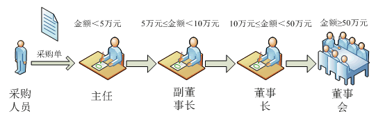
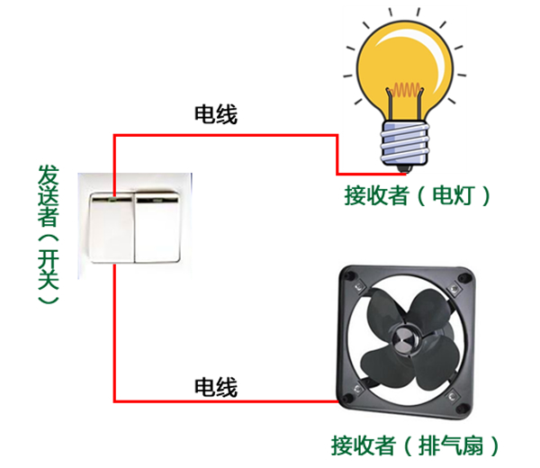
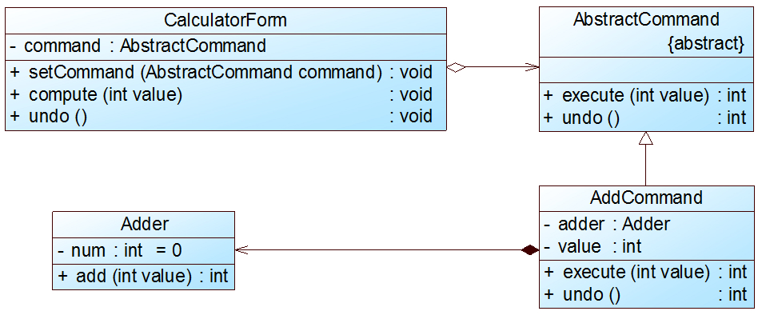
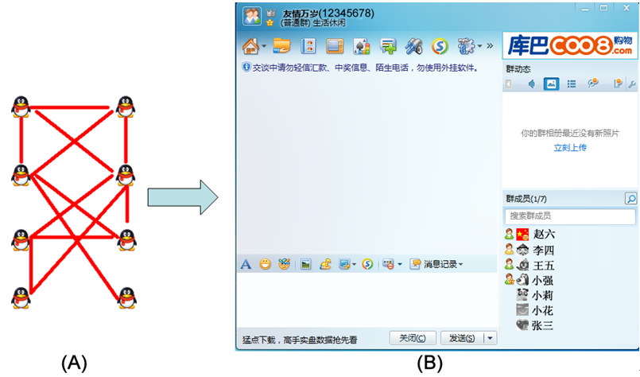
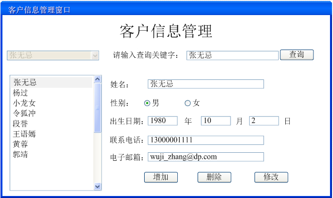
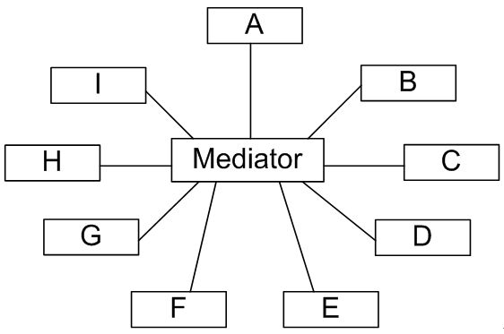
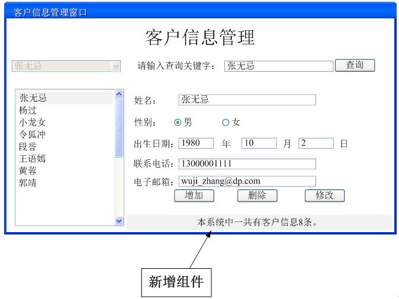
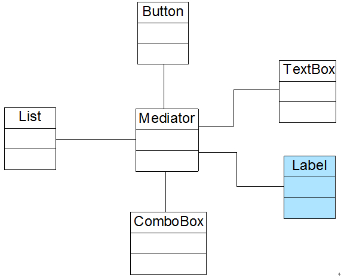
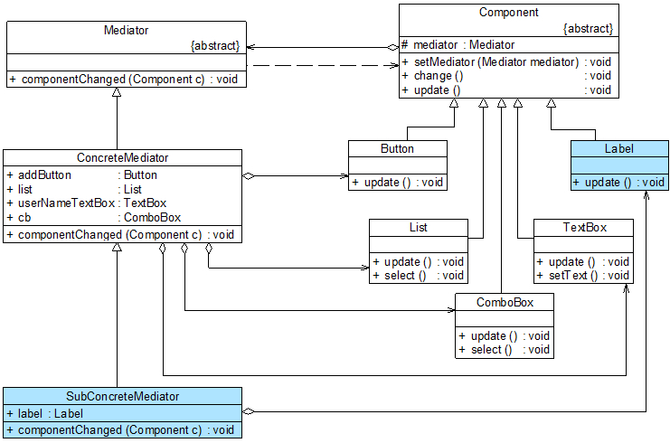

#请求的链式处理——职责链模式（一）
      “一对二”，“过”，“过”……这声音熟悉吗？你会想到什么？对！纸牌。在类似“斗地主”这样的纸牌游戏中，某人出牌给他的下家，下家看看手中的牌，如果要不起上家的牌则将出牌请求再转发给他的下家，其下家再进行判断。一个循环下来，如果其他人都要不起该牌，则最初的出牌者可以打出新的牌。在这个过程中，牌作为一个请求沿着一条链在传递，每一位纸牌的玩家都可以处理该请求。在设计模式中，我们也有一种专门用于处理这种请求链式传递的模式，它就是本章将要介绍的职责链模式。

 

## 16.1 采购单的分级审批
|      Sunny软件公司承接了某企业SCM(Supply Chain Management，供应链管理)系统的开发任务，其中包含一个采购审批子系统。该企业的采购审批是分级进行的，即根据采购金额的不同由不同层次的主管人员来审批，主任可以审批5万元以下（不包括5万元）的采购单，副董事长可以审批5万元至10万元（不包括10万元）的采购单，董事长可以审批10万元至50万元（不包括50万元）的采购单，50万元及以上的采购单就需要开董事会讨论决定。如图16-1所示：**图16-1 采购单分级审批示意图**

**图16-1 采购单分级审批示意图**

      如何在软件中实现采购单的分级审批？Sunny软件公司开发人员提出了一个初始解决方案，在系统中提供一个采购单处理类PurchaseRequestHandler用于统一处理采购单，其框架代码如下所示：

```
//采购单处理类
class PurchaseRequestHandler {
	//递交采购单给主任
	public void sendRequestToDirector(PurchaseRequest request) {
		if (request.getAmount() &lt; 50000) {
			//主任可审批该采购单
			this.handleByDirector(request);
		}
		else if (request.getAmount() &lt; 100000) {
			//副董事长可审批该采购单
			this.handleByVicePresident(request);
		}
		else if (request.getAmount() &lt; 500000) {
			//董事长可审批该采购单
			this.handleByPresident(request);
		}
		else {
			//董事会可审批该采购单
			this.handleByCongress(request);
		}
	}
	
	//主任审批采购单
	public void handleByDirector(PurchaseRequest request) {
		//代码省略
	}
	
	//副董事长审批采购单
	public void handleByVicePresident(PurchaseRequest request) {
		//代码省略
	}
	
	//董事长审批采购单
	public void handleByPresident(PurchaseRequest request) {
		//代码省略
	}
	
	//董事会审批采购单
	public void handleByCongress(PurchaseRequest request) {
		//代码省略
	}
}
```

        问题貌似很简单，但仔细分析，发现上述方案存在如下几个问题：

       (1)PurchaseRequestHandler类较为庞大，各个级别的审批方法都集中在一个类中，违反了“单一职责原则”，测试和维护难度大。

       (2)如果需要增加一个新的审批级别或调整任何一级的审批金额和审批细节（例如将董事长的审批额度改为60万元）时都必须修改源代码并进行严格测试，此外，如果需要移除某一级别（例如金额为10万元及以上的采购单直接由董事长审批，不再设副董事长一职）时也必须对源代码进行修改，违反了“开闭原则”。

       (3)审批流程的设置缺乏灵活性，现在的审批流程是“主任--&gt;副董事长--&gt;董事长--&gt;董事会”，如果需要改为“主任--&gt;董事长--&gt;董事会”，在此方案中只能通过修改源代码来实现，客户端无法定制审批流程。

       如何针对上述问题对系统进行改进？Sunny公司开发人员迫切需要一种新的设计方案，还好有职责链模式，通过使用职责链模式我们可以最大程度地解决这些问题，下面让我们正式进入职责链模式的学习。

**【作者：刘伟  ****】**
#请求的链式处理——职责链模式（二）
## 16.2 职责链模式概述

      很多情况下，在一个软件系统中可以处理某个请求的对象不止一个，例如****SCM系统中的采购单审批，主任、副董事长、董事长和董事会都可以处理采购单，他们可以构成一条处理采购单的链式结构，采购单沿着这条链进行传递，这条链就称为职责链。职责链可以是一条直线、一个环或者一个树形结构，最常见的职责链是直线型，即沿着一条单向的链来传递请求。链上的每一个对象都是请求处理者，职责链模式可以将请求的处理者组织成一条链，并让请求沿着链传递，由链上的处理者对请求进行相应的处理，客户端无须关心请求的处理细节以及请求的传递，只需将请求发送到链上即可，实现请求发送者和请求处理者解耦。****

      职责链模式定义如下：
|**职责链模式(Chain of Responsibility  Pattern)：避免请求发送者与接收者耦合在一起，让多个对象都有可能接收请求，将这些对象连接成一条链，并且沿着这条链传递请求，直到有对象处理它为止。职责链模式是一种对象行为型模式。**

      职责链模式结构的核心在于引入了一个抽象处理者。职责链模式结构如图16-2所示：


      在职责链模式结构图中包含如下几个角色：

      ● **Handler****（抽象处理者）**：它定义了一个处理请求的接口，一般设计为抽象类，由于不同的具体处理者处理请求的方式不同，因此在其中定义了抽象请求处理方法。因为每一个处理者的下家还是一个处理者，因此在抽象处理者中定义了一个抽象处理者类型的对象（如结构图中的successor），作为其对下家的引用。通过该引用，处理者可以连成一条链。

      ●** ConcreteHandler（具体处理者）**：它是抽象处理者的子类，可以处理用户请求，在具体处理者类中实现了抽象处理者中定义的抽象请求处理方法，在处理请求之前需要进行判断，看是否有相应的处理权限，如果可以处理请求就处理它，否则将请求转发给后继者；在具体处理者中可以访问链中下一个对象，以便请求的转发。

      在职责链模式里，很多对象由每一个对象对其下家的引用而连接起来形成一条链。请求在这个链上传递，直到链上的某一个对象决定处理此请求。发出这个请求的客户端并不知道链上的哪一个对象最终处理这个请求，这使得**系统可以在不影响客户端的情况下动态地重新组织链和分配责任**。

      职责链模式的核心在于抽象处理者类的设计，抽象处理者的典型代码如下所示：

```
abstract class Handler {
	//维持对下家的引用
protected Handler successor;
	
	public void setSuccessor(Handler successor) {
		this.successor=successor;
	}
	
	public abstract void handleRequest(String request);
}
```

       上述代码中，抽象处理者类定义了对下家的引用对象，以便将请求转发给下家，该对象的访问符可设为protected，在其子类中可以使用。在抽象处理者类中声明了抽象的请求处理方法，具体实现交由子类完成。

        具体处理者是抽象处理者的子类，它具有两大作用：**第一是处理请求**，不同的具体处理者以不同的形式实现抽象请求处理方法handleRequest()；**第二是转发请求**，如果该请求超出了当前处理者类的权限，可以将该请求转发给下家。具体处理者类的典型代码如下：

```
class ConcreteHandler extends Handler {
	public void handleRequest(String request) {
		if (请求满足条件) {
			//处理请求
		}
		else {
			this.successor.handleRequest(request);  //转发请求
		}
	}
}
```

       在具体处理类中通过对请求进行判断可以做出相应的处理。

        需要注意的是**，职责链模式并不创建职责链，职责链的创建工作必须由系统的其他部分来完成，一般是在使用该职责链的客户端中创建职责链**。职责链模式降低了请求的发送端和接收端之间的耦合，使多个对象都有机会处理这个请求。 
|    <table border="0" cellspacing="0" cellpadding="0" width="564"><tbody><tr><td>**** |**思考**如何在客户端创建一条职责链？

如何在客户端创建一条职责链？


** 【作者：刘伟  ****】**
#请求的链式处理——职责链模式（三）
## 16.3 完整解决方案

      为了让采购单的审批流程更加灵活，并实现采购单的链式传递和处理，Sunny公司开发人员使用职责链模式来实现采购单的分级审批，其基本结构如图16-3所示：


```
//采购单：请求类
class PurchaseRequest {
	private double amount;  //采购金额
	private int number;  //采购单编号
	private String purpose;  //采购目的
	
	public PurchaseRequest(double amount, int number, String purpose) {
		this.amount = amount;
		this.number = number;
		this.purpose = purpose;
	}
	
	public void setAmount(double amount) {
		this.amount = amount;
	}
	
	public double getAmount() {
		return this.amount;
	}
	
	public void setNumber(int number) {
		this.number = number;
	}
	
	public int getNumber() {
		return this.number;
	}
	
	public void setPurpose(String purpose) {
		this.purpose = purpose;
	}
	
	public String getPurpose() {
		return this.purpose;
	}
}

//审批者类：抽象处理者
abstract class Approver {
	protected Approver successor; //定义后继对象
	protected String name; //审批者姓名
	
	public Approver(String name) {
		this.name = name;
	}

	//设置后继者
	public void setSuccessor(Approver successor) { 
		this.successor = successor;
	}

    //抽象请求处理方法
    public abstract void processRequest(PurchaseRequest request);
}

//主任类：具体处理者
class Director extends Approver {
	public Director(String name) {
		super(name);
	}
	
    //具体请求处理方法
 	public void processRequest(PurchaseRequest request) {
 		if (request.getAmount() &lt; 50000) {
 			System.out.println("主任" + this.name + "审批采购单：" + request.getNumber() + "，金额：" + request.getAmount() + "元，采购目的：" + request.getPurpose() + "。");  //处理请求
 		}
 		else {
 			this.successor.processRequest(request);  //转发请求
 		}	
 	}
}

//副董事长类：具体处理者
class VicePresident extends Approver {
	public VicePresident(String name) {
		super(name);
	}
	
    //具体请求处理方法
 	public void processRequest(PurchaseRequest request) {
 		if (request.getAmount() &lt; 100000) {
 			System.out.println("副董事长" + this.name + "审批采购单：" + request.getNumber() + "，金额：" + request.getAmount() + "元，采购目的：" + request.getPurpose() + "。");  //处理请求
 		}
 		else {
 			this.successor.processRequest(request);  //转发请求
 		}	
 	}
}

//董事长类：具体处理者
class President extends Approver {
	public President(String name) {
		super(name);
	}
	
    //具体请求处理方法
 	public void processRequest(PurchaseRequest request) {
 		if (request.getAmount() &lt; 500000) {
 			System.out.println("董事长" + this.name + "审批采购单：" + request.getNumber() + "，金额：" + request.getAmount() + "元，采购目的：" + request.getPurpose() + "。");  //处理请求
 		}
 		else {
 			this.successor.processRequest(request);  //转发请求
 		}
 	}
}

//董事会类：具体处理者
class Congress extends Approver {
	public Congress(String name) {
		super(name);
	}
	
    //具体请求处理方法
 	public void processRequest(PurchaseRequest request) {
 		System.out.println("召开董事会审批采购单：" + request.getNumber() + "，金额：" + request.getAmount() + "元，采购目的：" + request.getPurpose() + "。");	    //处理请求
 	}    
}
```

```
class Client {
	public static void main(String[] args) {
		Approver wjzhang,gyang,jguo,meeting;
		wjzhang = new Director("张无忌");
		gyang = new VicePresident("杨过");
		jguo = new President("郭靖");
		meeting = new Congress("董事会");
	
		//创建职责链
		wjzhang.setSuccessor(gyang);
		gyang.setSuccessor(jguo);
		jguo.setSuccessor(meeting);
		
		//创建采购单
		PurchaseRequest pr1 = new PurchaseRequest(45000,10001,"购买倚天剑");
		wjzhang.processRequest(pr1);
		
		PurchaseRequest pr2 = new PurchaseRequest(60000,10002,"购买《葵花宝典》");
		wjzhang.processRequest(pr2);
	
		PurchaseRequest pr3 = new PurchaseRequest(160000,10003,"购买《金刚经》");
		wjzhang.processRequest(pr3);

		PurchaseRequest pr4 = new PurchaseRequest(800000,10004,"购买桃花岛");
		wjzhang.processRequest(pr4);
	}
} 
```
|主任张无忌审批采购单：10001，金额：45000.0元，采购目的：购买倚天剑。副董事长杨过审批采购单：10002，金额：60000.0元，采购目的：购买《葵花宝典》。董事长郭靖审批采购单：10003，金额：160000.0元，采购目的：购买《金刚经》。召开董事会审批采购单：10004，金额：800000.0元，采购目的：购买桃花岛。

副董事长杨过审批采购单：10002，金额：60000.0元，采购目的：购买《葵花宝典》。

召开董事会审批采购单：10004，金额：800000.0元，采购目的：购买桃花岛。

      如果需要在系统增加一个新的具体处理者，如增加一个经理(Manager)角色可以审批5万元至8万元（不包括8万元）的采购单，需要编写一个新的具体处理者类Manager，作为抽象处理者类Approver的子类，实现在Approver类中定义的抽象处理方法，如果采购金额大于等于8万元，则将请求转发给下家，代码如下所示：

```
//经理类：具体处理者
class Manager extends Approver {
	public Manager(String name) {
		super(name);
	}
	
    //具体请求处理方法
 	public void processRequest(PurchaseRequest request) {
 		if (request.getAmount() &lt; 80000) {
 			System.out.println("经理" + this.name + "审批采购单：" + request.getNumber() + "，金额：" + request.getAmount() + "元，采购目的：" + request.getPurpose() + "。");  //处理请求
 		}
 		else {
 			this.successor.processRequest(request);  //转发请求
 		}	
 	}
}
```

       由于链的创建过程由客户端负责，因此增加新的具体处理者类对原有类库无任何影响，无须修改已有类的源代码，符合“开闭原则”。

      在客户端代码中，如果要将新的具体请求处理者应用在系统中，需要创建新的具体处理者对象，然后将该对象加入职责链中。如在客户端测试代码中增加如下代码：

```
Approver rhuang;
rhuang = new Manager("黄蓉");
```

        将建链代码改为：

```
//创建职责链
wjzhang.setSuccessor(rhuang); //将“黄蓉”作为“张无忌”的下家
rhuang.setSuccessor(gyang); //将“杨过”作为“黄蓉”的下家
gyang.setSuccessor(jguo);
jguo.setSuccessor(meeting);
```

       重新编译并运行程序，输出结果如下：
|主任张无忌审批采购单：10001，金额：45000.0元，采购目的：购买倚天剑。**经理黄蓉审批采购单：10002，金额：60000.0元，采购目的：购买《葵花宝典》。**董事长郭靖审批采购单：10003，金额：160000.0元，采购目的：购买《金刚经》。召开董事会审批采购单：10004，金额：800000.0元，采购目的：购买桃花岛。

**经理黄蓉审批采购单：10002，金额：60000.0元，采购目的：购买《葵花宝典》。**

召开董事会审批采购单：10004，金额：800000.0元，采购目的：购买桃花岛。

 
|    <table border="0" cellspacing="0" cellpadding="0" width="564"><tbody><tr><td>**** |**思考**       如果将审批流程由“主任--&gt;副董事长--&gt;董事长--&gt;董事会”调整为“主任--&gt;董事长--&gt;董事会”，系统将做出哪些改动？预测修改之后客户端代码的输出结果。

       如果将审批流程由“主任--&gt;副董事长--&gt;董事长--&gt;董事会”调整为“主任--&gt;董事长--&gt;董事会”，系统将做出哪些改动？预测修改之后客户端代码的输出结果。


 

**【作者：刘伟 ****】**

** **
#请求的链式处理——职责链模式（四）
## 16.4 纯与不纯的职责链模式

      职责链模式可分为纯的职责链模式和不纯的职责链模式两种：

 

**       (1) 纯的职责链模式**

      一个纯的职责链模式要求一个具体处理者对象只能在两个行为中选择一个：**要么承担全部责任，要么将责任推给下家**，不允许出现某一个具体处理者对象在承担了一部分或全部责任后又将责任向下传递的情况。而且在纯的职责链模式中，**要求一个请求必须被某一个处理者对象所接收**，不能出现某个请求未被任何一个处理者对象处理的情况。在前面的采购单审批实例中应用的是纯的职责链模式。

 

**       (2)不纯的职责链模式**

      在一个不纯的职责链模式中**允许某个请求被一个具体处理者部分处理后再向下传递，或者一个具体处理者处理完某请求后其后继处理者可以继续处理该请求，而且一个请求可以最终不被任何处理者对象所接收**。Java AWT 1.0中的事件处理模型应用的是不纯的职责链模式，其基本原理如下：由于窗口组件（如按钮、文本框等）一般都位于容器组件中，因此当事件发生在某一个组件上时，先通过组件对象的handleEvent()方法将事件传递给相应的事件处理方法，该事件处理方法将处理此事件，然后决定是否将该事件向上一级容器组件传播；上级容器组件在接到事件之后可以继续处理此事件并决定是否继续向上级容器组件传播，如此反复，直到事件到达顶层容器组件为止；如果一直传到最顶层容器仍没有处理方法，则该事件不予处理。**每一级组件在接收到事件时，都可以处理此事件，而不论此事件是否在上一级已得到处理，还存在事件未被处理的情况**。显然，这就是不纯的职责链模式，早期的Java AWT事件模型(JDK 1.0及更早)中的这种事件处理机制又叫**事件浮升(Event Bubbling)机制**。从Java.1.1以后，JDK使用观察者模式代替职责链模式来处理事件。目前，在JavaScript中仍然可以使用这种事件浮升机制来进行事件处理。

 

## 16.5 职责链模式总结

      职责链模式通过建立一条链来组织请求的处理者，请求将沿着链进行传递，请求发送者无须知道请求在何时、何处以及如何被处理，实现了请求发送者与处理者的解耦。在软件开发中，如果遇到有多个对象可以处理同一请求时可以应用职责链模式，例如在Web应用开发中创建一个**过滤器(Filter)链**来对请求数据进行过滤，在工作流系统中实现公文的分级审批等等，使用职责链模式可以较好地解决此类问题。

 

**       1.主要优点**

      职责链模式的主要优点如下：

       (1) 职责链模式使得一个对象无须知道是其他哪一个对象处理其请求，对象仅需知道该请求会被处理即可，接收者和发送者都没有对方的明确信息，且链中的对象不需要知道链的结构，由客户端负责链的创建，降低了系统的耦合度。

       (2) 请求处理对象仅需维持一个指向其后继者的引用，而不需要维持它对所有的候选处理者的引用，可简化对象的相互连接。

       (3) 在给对象分派职责时，职责链可以给我们更多的灵活性，可以通过在运行时对该链进行动态的增加或修改来增加或改变处理一个请求的职责。

       (4) 在系统中增加一个新的具体请求处理者时无须修改原有系统的代码，只需要在客户端重新建链即可，从这一点来看是符合“开闭原则”的。

**      **

**       2.主要缺点**

      职责链模式的主要缺点如下：

       (1) 由于一个请求没有明确的接收者，那么就不能保证它一定会被处理，该请求可能一直到链的末端都得不到处理；一个请求也可能因职责链没有被正确配置而得不到处理。

       (2) 对于比较长的职责链，请求的处理可能涉及到多个处理对象，系统性能将受到一定影响，而且在进行代码调试时不太方便。

       (3) 如果建链不当，可能会造成循环调用，将导致系统陷入死循环。

 

**       3.适用场景**

      在以下情况下可以考虑使用职责链模式：

       (1) 有多个对象可以处理同一个请求，具体哪个对象处理该请求待运行时刻再确定，客户端只需将请求提交到链上，而无须关心请求的处理对象是谁以及它是如何处理的。

       (2) 在不明确指定接收者的情况下，向多个对象中的一个提交一个请求。

        (3) 可动态指定一组对象处理请求，客户端可以动态创建职责链来处理请求，还可以改变链中处理者之间的先后次序。 

 
|    <table border="0" cellspacing="0" cellpadding="0" width="564"><tbody><tr><td>**** |**练习**       Sunny软件公司的OA系统需要提供一个假条审批模块：如果员工请假天数小于3天，主任可以审批该假条；如果员工请假天数大于等于3天，小于10天，经理可以审批；如果员工请假天数大于等于10天，小于30天，总经理可以审批；如果超过30天，总经理也不能审批，提示相应的拒绝信息。试用职责链模式设计该假条审批模块。

       Sunny软件公司的OA系统需要提供一个假条审批模块：如果员工请假天数小于3天，主任可以审批该假条；如果员工请假天数大于等于3天，小于10天，经理可以审批；如果员工请假天数大于等于10天，小于30天，总经理可以审批；如果超过30天，总经理也不能审批，提示相应的拒绝信息。试用职责链模式设计该假条审批模块。

 

 
#请求发送者与接收者解耦——命令模式（一）
       装修新房的最后几道工序之一是安装插座和开关，通过开关可以控制一些电器的打开和关闭，例如电灯或者排气扇。在购买开关时，我们并不知道它将来到底用于控制什么电器，也就是说，开关与电灯、排气扇并无直接关系，一个开关在安装之后可能用来控制电灯，也可能用来控制排气扇或者其他电器设备。开关与电器之间通过电线建立连接，如果开关打开，则电线通电，电器工作；反之，开关关闭，电线断电，电器停止工作。相同的开关可以通过不同的电线来控制不同的电器，如图1所示：



**图1 开关与电灯、排气扇示意图**

       在图1中，我们可以将开关理解成一个请求的发送者，用户通过它来发送一个“开灯”请求，而电灯是“开灯”请求的最终接收者和处理者，在图中，开关和电灯之间并不存在直接耦合关系，它们通过电线连接在一起，使用不同的电线可以连接不同的请求接收者，只需更换一根电线，相同的发送者（开关）即可对应不同的接收者（电器）。

       在软件开发中也存在很多与开关和电器类似的请求发送者和接收者对象，例如一个按钮，它可能是一个“关闭窗口”请求的发送者，而按钮点击事件处理类则是该请求的接收者。为了降低系统的耦合度，将请求的发送者和接收者解耦，我们可以使用一种被称之为命令模式的设计模式来设计系统，在命令模式中，发送者与接收者之间引入了新的命令对象（类似图1中的电线），将发送者的请求封装在命令对象中，再通过命令对象来调用接收者的方法。本章我们将学习用于将请求发送者和接收者解耦的命令模式。

 

## 1 自定义功能键
|       Sunny软件公司开发人员为公司内部OA系统开发了一个桌面版应用程序，该应用程序为用户提供了一系列自定义功能键，用户可以通过这些功能键来实现一些快捷操作。Sunny软件公司开发人员通过分析，发现不同的用户可能会有不同的使用习惯，在设置功能键的时候每个人都有自己的喜好，例如有的人喜欢将第一个功能键设置为“打开帮助文档”，有的人则喜欢将该功能键设置为“最小化至托盘”，为了让用户能够灵活地进行功能键的设置，开发人员提供了一个“功能键设置”窗口，该窗口界面如图2所示：**图2  “功能键设置”界面效果图**       通过如图2所示界面，用户可以将功能键和相应功能绑定在一起，还可以根据需要来修改功能键的设置，而且系统在未来可能还会增加一些新的功能或功能键。

**图2  “功能键设置”界面效果图**

       通过如图2所示界面，用户可以将功能键和相应功能绑定在一起，还可以根据需要来修改功能键的设置，而且系统在未来可能还会增加一些新的功能或功能键。

       Sunny软件公司某开发人员欲使用如下代码来实现功能键与功能处理类之间的调用关系：

```
//FunctionButton：功能键类，请求发送者
class FunctionButton {
	private HelpHandler help; //HelpHandler：帮助文档处理类，请求接收者
	
    //在FunctionButton的onClick()方法中调用HelpHandler的display()方法
public void onClick() {
		help = new HelpHandler();
		help.display(); //显示帮助文档
	}
}
```

       在上述代码中，功能键类FunctionButton充当请求的发送者，帮助文档处理类HelpHandler充当请求的接收者，在发送者FunctionButton的onClick()方法中将调用接收者HelpHandler的display()方法。显然，如果使用上述代码，将给系统带来如下几个问题：

       (1) 由于请求发送者和请求接收者之间存在方法的直接调用，耦合度很高，**更换请求接收者必须修改发送者的源代码**，如果需要将请求接收者HelpHandler改为WindowHanlder（窗口处理类），则需要修改FunctionButton的源代码，违背了“开闭原则”。

       (2) FunctionButton类在设计和实现时功能已被固定，如果增加一个新的请求接收者，如果不修改原有的FunctionButton类，则必须增加一个新的与FunctionButton功能类似的类，这将**导致系统中类的个数急剧增加**。由于请求接收者HelpHandler、WindowHanlder等类之间可能不存在任何关系，它们没有共同的抽象层，因此也很难依据“依赖倒转原则”来设计FunctionButton。

       (3) **用户无法按照自己的需要来设置某个功能键的功能**，一个功能键类的功能一旦固定，在不修改源代码的情况下无法更换其功能，系统缺乏灵活性。

       不难得知，所有这些问题的产生都是因为请求发送者FunctionButton类和请求接收者HelpHandler、WindowHanlder等类之间存在直接耦合关系，如何降低请求发送者和接收者之间的耦合度，让相同的发送者可以对应不同的接收者？这是Sunny软件公司开发人员在设计“功能键设置”模块时不得不考虑的问题。命令模式正为解决这类问题而诞生，此时，如果我们使用命令模式，可以在一定程度上解决上述问题（**注：命令模式无法解决类的个数增加的问题**），下面就让我们正式进入命令模式的学习，看看命令模式到底如何实现请求发送者和接收者解耦。

 

## 2 命令模式概述

       在软件开发中，我们经常需要向某些对象发送请求（调用其中的某个或某些方法），但是并不知道请求的接收者是谁，也不知道被请求的操作是哪个，此时，我们特别希望能够以一种松耦合的方式来设计软件，使得请求发送者与请求接收者能够消除彼此之间的耦合，让对象之间的调用关系更加灵活，可以灵活地指定请求接收者以及被请求的操作。命令模式为此类问题提供了一个较为完美的解决方案。

**       命令模式可以将请求发送者和接收者完全解耦，发送者与接收者之间没有直接引用关系，发送请求的对象只需要知道如何发送请求，而不必知道如何完成请求**。

       命令模式定义如下：
|**命令模式(Command Pattern)：将一个请求封装为一个对象，从而让我们可用不同的请求对客户进行参数化；对请求排队或者记录请求日志，以及支持可撤销的操作。命令模式是一种对象行为型模式，其别名为动作(Action)模式或事务(Transaction)模式。**

       命令模式的定义比较复杂，提到了很多术语，例如“用不同的请求对客户进行参数化”、“对请求排队”，“记录请求日志”、“支持可撤销操作”等，在后面我们将对这些术语进行一一讲解。

       命令模式的核心在于引入了命令类，通过命令类来降低发送者和接收者的耦合度，请求发送者只需指定一个命令对象，再通过命令对象来调用请求接收者的处理方法，其结构如图3所示：


**图3 命令模式结构图**

       在命令模式结构图中包含如下几个角色：

       ● Command（抽象命令类）：抽象命令类一般是一个抽象类或接口，在其中声明了用于执行请求的execute()等方法，通过这些方法可以调用请求接收者的相关操作。

       ● ConcreteCommand（具体命令类）：具体命令类是抽象命令类的子类，实现了在抽象命令类中声明的方法，它对应具体的接收者对象，将接收者对象的动作绑定其中。在实现execute()方法时，将调用接收者对象的相关操作(Action)。

       ● Invoker（调用者）：调用者即请求发送者，它通过命令对象来执行请求。一个调用者并不需要在设计时确定其接收者，因此它只与抽象命令类之间存在关联关系。在程序运行时可以将一个具体命令对象注入其中，再调用具体命令对象的execute()方法，从而实现间接调用请求接收者的相关操作。

       ● Receiver（接收者）：接收者执行与请求相关的操作，它具体实现对请求的业务处理。

**       命令模式的本质是对请求进行封装，一个请求对应于一个命令，将发出命令的责任和执行命令的责任分割开**。每一个命令都是一个操作：请求的一方发出请求要求执行一个操作；接收的一方收到请求，并执行相应的操作。**命令模式允许请求的一方和接收的一方独立开来，使得请求的一方不必知道接收请求的一方的接口，更不必知道请求如何被接收、操作是否被执行、何时被执行，以及是怎么被执行的**。

**       命令模式的关键在于引入了抽象命令类，请求发送者针对抽象命令类编程，只有实现了抽象命令类的具体命令才与请求接收者相关联。**在最简单的抽象命令类中只包含了一个抽象的execute()方法，每个具体命令类将一个Receiver类型的对象作为一个实例变量进行存储，从而具体指定一个请求的接收者，不同的具体命令类提供了execute()方法的不同实现，并调用不同接收者的请求处理方法。

        典型的抽象命令类代码如下所示：

```
abstract class Command {
	public abstract void execute();
}
```

       对于请求发送者即调用者而言，将针对抽象命令类进行编程，**可以通过构造注入或者设值注入的方式在运行时传入具体命令类对象**，**并在业务方法中调用命令对象的execute()方法**，其典型代码如下所示：

```
class Invoker {
	private Command command;
	
    //构造注入
	public Invoker(Command command) {
		this.command = command;
	}
	
    //设值注入
	public void setCommand(Command command) {
		this.command = command;
	}
	
	//业务方法，用于调用命令类的execute()方法
	public void call() {
		command.execute();
	}
}
```

       具体命令类继承了抽象命令类，它与请求接收者相关联，实现了在抽象命令类中声明的execute()方法，并在实现时调用接收者的请求响应方法action()，其典型代码如下所示：

```
class ConcreteCommand extends Command {
	private Receiver receiver; //维持一个对请求接收者对象的引用

	public void execute() {
		receiver.action(); //调用请求接收者的业务处理方法action()
	}
}
```

       请求接收者Receiver类具体实现对请求的业务处理，它提供了action()方法，用于执行与请求相关的操作，其典型代码如下所示：

```
class Receiver {
	public void action() {
		//具体操作
	}
}
```

 
|    <table border="0" cellspacing="0" cellpadding="0" width="564"><tbody><tr><td>****|**思考**一个请求发送者能否对应多个请求接收者？如何实现？

一个请求发送者能否对应多个请求接收者？如何实现？

 

 

【作者：刘伟   】

 #请求发送者与接收者解耦——命令模式（二）
**3 完整解决方案**

       为了降低功能键与功能处理类之间的耦合度，让用户可以自定义每一个功能键的功能，Sunny软件公司开发人员使用命令模式来设计“自定义功能键”模块，其核心结构如图4所示：


**图4 自定义功能键核心结构图**

       在图4中，FBSettingWindow是“功能键设置”界面类，FunctionButton充当请求调用者，Command充当抽象命令类，MinimizeCommand和HelpCommand充当具体命令类，WindowHanlder和HelpHandler充当请求接收者。完整代码如下所示：

```
import java.util.*;

//功能键设置窗口类
class FBSettingWindow {
	private String title; //窗口标题
    //定义一个ArrayList来存储所有功能键
	private ArrayList&lt;FunctionButton&gt; functionButtons = new ArrayList&lt;FunctionButton&gt;();
	
	public FBSettingWindow(String title) {
		this.title = title;
	}
	
	public void setTitle(String title) {
		this.title = title;
	}
	
	public String getTitle() {
		return this.title;
	}
	
	public void addFunctionButton(FunctionButton fb) {
		functionButtons.add(fb);
	}
	
	public void removeFunctionButton(FunctionButton fb) {
		functionButtons.remove(fb);
	}
	
    //显示窗口及功能键
	public void display() {
		System.out.println("显示窗口：" + this.title);
		System.out.println("显示功能键：");
		for (Object obj : functionButtons) {
			System.out.println(((FunctionButton)obj).getName());
		}
		System.out.println("------------------------------");
	}	
}

//功能键类：请求发送者
class FunctionButton {
	private String name; //功能键名称
	private Command command; //维持一个抽象命令对象的引用
	
	public FunctionButton(String name) {
		this.name = name;
	}
	
	public String getName() {
		return this.name;
	}
	
    //为功能键注入命令
	public void setCommand(Command command) {
		this.command = command;
	}
	
    //发送请求的方法
	public void onClick() {
		System.out.print("点击功能键：");
		command.execute();
	}
}

//抽象命令类
abstract class Command {
	public abstract void execute();
}

//帮助命令类：具体命令类
class HelpCommand extends Command {
	private HelpHandler hhObj; //维持对请求接收者的引用
	
	public HelpCommand() {
		hhObj = new HelpHandler();
	}
	
    //命令执行方法，将调用请求接收者的业务方法
	public void execute() {
		hhObj.display();
	}
}

//最小化命令类：具体命令类
class MinimizeCommand extends Command {
	private WindowHanlder whObj; //维持对请求接收者的引用
	
	public MinimizeCommand() {
		whObj = new WindowHanlder();
	}
	
//命令执行方法，将调用请求接收者的业务方法
	public void execute() {
		whObj.minimize();
	}
}

//窗口处理类：请求接收者
class WindowHanlder {
	public void minimize() {
		System.out.println("将窗口最小化至托盘！");
	}
}

//帮助文档处理类：请求接收者
class HelpHandler {
	public void display() {
		System.out.println("显示帮助文档！");
	}
}
```

       为了提高系统的灵活性和可扩展性，我们将具体命令类的类名存储在配置文件中，并通过工具类XMLUtil来读取配置文件并反射生成对象，XMLUtil类的代码如下所示：

```
import javax.xml.parsers.*;
import org.w3c.dom.*;
import org.xml.sax.SAXException;
import java.io.*;

public class XMLUtil {
//该方法用于从XML配置文件中提取具体类类名，并返回一个实例对象，可以通过参数的不同返回不同类名节点所对应的实例
	public static Object getBean(int i) {
		try {
			//创建文档对象
			DocumentBuilderFactory dFactory = DocumentBuilderFactory.newInstance();
			DocumentBuilder builder = dFactory.newDocumentBuilder();
			Document doc;							
			doc = builder.parse(new File("config.xml")); 
		
			//获取包含类名的文本节点
			NodeList nl = doc.getElementsByTagName("className");
            Node classNode = null;
            if (0 == i) {
            	classNode = nl.item(0).getFirstChild();
            }
            else {
            	classNode = nl.item(1).getFirstChild();
            } 

            String cName = classNode.getNodeValue();
            
            //通过类名生成实例对象并将其返回
            Class c = Class.forName(cName);
	  	    Object obj = c.newInstance();
            return obj;
        }   
        catch(Exception e){
            e.printStackTrace();
           	return null;
        }
	}
}

```

       配置文件config.xml中存储了具体建造者类的类名，代码如下所示：

```
&lt;?xml version="1.0"?&gt;
&lt;config&gt;
	&lt;className&gt;HelpCommand&lt;/className&gt;
    &lt;className&gt;MinimizeCommand&lt;/className&gt;
&lt;/config&gt;

```

       编写如下客户端测试代码：

```
class Client {
	public static void main(String args[]) {
		FBSettingWindow fbsw = new FBSettingWindow("功能键设置");
			
		FunctionButton fb1,fb2;
		fb1 = new FunctionButton("功能键1");
		fb2 = new FunctionButton("功能键1");
		
		Command command1,command2;
        //通过读取配置文件和反射生成具体命令对象
		command1 = (Command)XMLUtil.getBean(0);
		command2 = (Command)XMLUtil.getBean(1);
	    
        //将命令对象注入功能键
		fb1.setCommand(command1);
		fb2.setCommand(command2);
		
		fbsw.addFunctionButton(fb1);
		fbsw.addFunctionButton(fb2);
		fbsw.display();
		
        //调用功能键的业务方法
		fb1.onClick();
		fb2.onClick();
	}
}
```

       编译并运行程序，输出结果如下：
|显示窗口：功能键设置显示功能键：功能键1功能键1------------------------------点击功能键：显示帮助文档！点击功能键：将窗口最小化至托盘！

显示功能键：

功能键1

点击功能键：显示帮助文档！

       如果需要修改功能键的功能，例如某个功能键可以实现“自动截屏”，只需要对应增加一个新的具体命令类，在该命令类与屏幕处理者(ScreenHandler)之间创建一个关联关系，然后将该具体命令类的对象通过配置文件注入到某个功能键即可，原有代码无须修改，符合“开闭原则”。在此过程中，**每一个具体命令类对应一个请求的处理者（接收者），通过向请求发送者注入不同的具体命令对象可以使得相同的发送者对应不同的接收者，从而实现“将一个请求封装为一个对象，用不同的请求对客户进行参数化”**，客户端只需要将具体命令对象作为参数注入请求发送者，无须直接操作请求的接收者。

 

【作者：刘伟   】
#请求发送者与接收者解耦——命令模式（三）
**4 命令队列的实现**

       有时候我们需要**将多个请求排队**，**当一个请求发送者发送一个请求时，将不止一个请求接收者产生响应，这些请求接收者将逐个执行业务方法，完成对请求的处理**。此时，我们可以通过**命令队列**来实现。

       命令队列的实现方法有多种形式，其中最常用、灵活性最好的一种方式是增加一个CommandQueue类，由该类来负责存储多个命令对象，而不同的命令对象可以对应不同的请求接收者，CommandQueue类的典型代码如下所示：

```
import java.util.*;

class CommandQueue {
    //定义一个ArrayList来存储命令队列
	private ArrayList&lt;Command&gt; commands = new ArrayList&lt;Command&gt;();
	
	public void addCommand(Command command) {
		commands.add(command);
	}
	
	public void removeCommand(Command command) {
		commands.remove(command);
	}
	
    //循环调用每一个命令对象的execute()方法
	public void execute() {
		for (Object command : commands) {
			((Command)command).execute();
		}
	}
}
```

       在增加了命令队列类CommandQueue以后，请求发送者类Invoker将针对CommandQueue编程，代码修改如下：

```
class Invoker {
	private CommandQueue commandQueue; //维持一个CommandQueue对象的引用
	
    //构造注入
	public Invoker(CommandQueue commandQueue) {
		this. commandQueue = commandQueue;
	}
	
    //设值注入
	public void setCommandQueue(CommandQueue commandQueue) {
		this.commandQueue = commandQueue;
	}
	
	//调用CommandQueue类的execute()方法
	public void call() {
		commandQueue.execute();
	}
}
```

       命令队列与我们常说的“批处理”有点类似。批处理，顾名思义，可以对一组对象（命令）进行批量处理，当一个发送者发送请求后，将有一系列接收者对请求作出响应，命令队列可以用于设计批处理应用程序，如果请求接收者的接收次序没有严格的先后次序，我们还可以使用多线程技术来并发调用命令对象的execute()方法，从而提高程序的执行效率。

【作者：刘伟   】
#请求发送者与接收者解耦——命令模式（四）
## 5 撤销操作的实现

       在命令模式中，我们可以通过调用一个命令对象的execute()方法来实现对请求的处理，如果需要撤销(Undo)请求，可通过在命令类中增加一个逆向操作来实现。
|    <table style="width: 739px; height: 106px;" border="0" cellspacing="0" cellpadding="0" width="739"><tbody><tr><td>****|**扩展**除了通过一个**逆向操作**来实现撤销(Undo)外，还可以通过**保存对象的历史状态**来实现撤销，后者可使用备忘录模式(Memento Pattern)来实现。

除了通过一个**逆向操作**来实现撤销(Undo)外，还可以通过**保存对象的历史状态**来实现撤销，后者可使用备忘录模式(Memento Pattern)来实现。


       下面通过一个简单的实例来学习如何使用命令模式实现撤销操作：
|       Sunny软件公司欲开发一个简易计算器，该计算器可以实现简单的数学运算，还可以对运算实施撤销操作。

       Sunny软件公司开发人员使用命令模式设计了如图5所示结构图，其中计算器界面类CalculatorForm充当请求发送者，实现了数据求和功能的加法类Adder充当请求接收者，界面类可间接调用加法类中的add()方法实现加法运算，并且提供了可撤销加法运算的undo()方法。



**图5  简易计算器结构图**

       本实例完整代码如下所示：

```
//加法类：请求接收者
class Adder {
	private int num=0; //定义初始值为0
	
    //加法操作，每次将传入的值与num作加法运算，再将结果返回
	public int add(int value) {
		num += value;
		return num;
	}
}

//抽象命令类
abstract class AbstractCommand {
	public abstract int execute(int value); //声明命令执行方法execute()
	public abstract int undo(); //声明撤销方法undo()
}

//具体命令类
class ConcreteCommand extends AbstractCommand {
	private Adder adder = new Adder();
	private int value;
		
	//实现抽象命令类中声明的execute()方法，调用加法类的加法操作
public int execute(int value) {
		this.value=value;
		return adder.add(value);
	}
	
    //实现抽象命令类中声明的undo()方法，通过加一个相反数来实现加法的逆向操作
	public int undo() {
		return adder.add(-value);
	}
}

//计算器界面类：请求发送者
class CalculatorForm {
	private AbstractCommand command;
	
	public void setCommand(AbstractCommand command) {
		this.command = command;
	}
	
    //调用命令对象的execute()方法执行运算
	public void compute(int value) {
		int i = command.execute(value);
		System.out.println("执行运算，运算结果为：" + i);
	}
	
    //调用命令对象的undo()方法执行撤销
	public void undo() {
		int i = command.undo();
		System.out.println("执行撤销，运算结果为：" + i);
	}
}
```

       编写如下客户端测试代码：

```
class Client {
	public static void main(String args[]) {
		CalculatorForm form = new CalculatorForm();
		AbstractCommand command;
		command = new ConcreteCommand();
		form.setCommand(command); //向发送者注入命令对象
		
		form.compute(10);
		form.compute(5);
		form.compute(10);
		form.undo();
	}
}
```

        编译并运行程序，输出结果如下：
|执行运算，运算结果为：10执行运算，运算结果为：15执行运算，运算结果为：25**执行撤销，运算结果为：15**

执行运算，运算结果为：15

**执行撤销，运算结果为：15**

 
|    <table border="0" cellspacing="0" cellpadding="0" width="564"><tbody><tr><td>****|**思考**如果连续调用“form.undo()”两次，预测客户端代码的输出结果。

如果连续调用“form.undo()”两次，预测客户端代码的输出结果。


       需要注意的是在本实例中只能实现一步撤销操作，因为没有保存命令对象的历史状态，可以通过引入一个命令集合或其他方式来存储每一次操作时命令的状态，从而实现多次撤销操作。除了Undo操作外，还可以采用类似的方式实现恢复(Redo)操作，即恢复所撤销的操作（或称为**二次撤销**）。
|    <table border="0" cellspacing="0" cellpadding="0" width="564"><tbody><tr><td>****|**练习**修改简易计算器源代码，使之能够实现多次撤销(Undo)和恢复(Redo)。

修改简易计算器源代码，使之能够实现多次撤销(Undo)和恢复(Redo)。


 

【作者：刘伟   】
#请求发送者与接收者解耦——命令模式（五）
## 6 请求日志

       请求日志就是将请求的历史记录保存下来，通常以**日志文件(Log File)**的形式永久存储在计算机中。很多系统都提供了日志文件，例如Windows日志文件、Oracle日志文件等，日志文件可以记录用户对系统的一些操作（例如对数据的更改）。请求日志文件可以实现很多功能，常用功能如下：

       (1) “天有不测风云”，一旦系统发生故障，日志文件可以为系统提供一种恢复机制，在请求日志文件中可以记录用户对系统的每一步操作，从而让系统能够顺利恢复到某一个特定的状态；

       (2) 请求日志也可以用于实现批处理，在一个请求日志文件中可以存储一系列命令对象，例如一个命令队列；

       (3) 可以将命令队列中的所有命令对象都存储在一个日志文件中，每执行一个命令则从日志文件中删除一个对应的命令对象，防止因为断电或者系统重启等原因造成请求丢失，而且可以避免重新发送全部请求时造成某些命令的重复执行，只需读取请求日志文件，再继续执行文件中剩余的命令即可。

       在实现请求日志时，我们可以**将命令对象通过序列化写到日志文件中**，此时命令类必须实现java.io.Serializable接口。下面我们通过一个简单实例来说明日志文件的用途以及如何实现请求日志：
|       Sunny软件公司开发了一个网站配置文件管理工具，可以通过一个可视化界面对网站配置文件进行增删改等操作，该工具使用命令模式进行设计，结构如图6所示：**图6  网站配置文件管理工具结构图**       现在Sunny软件公司开发人员希望将对配置文件的操作请求记录在日志文件中，如果网站重新部署，只需要执行保存在日志文件中的命令对象即可修改配置文件。

**图6  网站配置文件管理工具结构图**

       现在Sunny软件公司开发人员希望将对配置文件的操作请求记录在日志文件中，如果网站重新部署，只需要执行保存在日志文件中的命令对象即可修改配置文件。

       本实例完整代码如下所示：

```
import java.io.*;
import java.util.*;

//抽象命令类，由于需要将命令对象写入文件，因此它实现了Serializable接口
abstract class Command implements Serializable {
	protected String name; //命令名称
	protected String args; //命令参数
	protected ConfigOperator configOperator; //维持对接收者对象的引用
	
	public Command(String name) {
		this.name = name;
	}
	
	public String getName() {
		return this.name;
	}
	
	public void setName(String name) {
		this.name = name;
	}
	
	public void setConfigOperator(ConfigOperator configOperator) {
		this.configOperator = configOperator;
	}
	
    //声明两个抽象的执行方法execute()
	public abstract void execute(String args);
	public abstract void execute();
}

//增加命令类：具体命令
class InsertCommand extends Command {
	public InsertCommand(String name) {
		super(name);
	}
	
	public void execute(String args) {
		this.args = args;
		configOperator.insert(args);
	}
	
	public void execute() {
		configOperator.insert(this.args);
	}
}

//修改命令类：具体命令
class ModifyCommand extends Command {
	public ModifyCommand(String name) {
		super(name);
	}
	
	public void execute(String args) {
		this.args = args;
		configOperator.modify(args);
	}
	
	public void execute() {
		configOperator.modify(this.args);
	}
}

//省略了删除命令类DeleteCommand

//配置文件操作类：请求接收者。由于ConfigOperator类的对象是Command的成员对象，它也将随Command对象一起写入文件，因此ConfigOperator也需要实现Serializable接口
class ConfigOperator implements Serializable {
	public void insert(String args) {
		System.out.println("增加新节点：" + args);
	}
	
	public void modify(String args) {
		System.out.println("修改节点：" + args);
	}
	
	public void delete(String args) {
		System.out.println("删除节点：" + args);
	}
}

//配置文件设置窗口类：请求发送者
class ConfigSettingWindow {
    //定义一个集合来存储每一次操作时的命令对象
	private ArrayList&lt;Command&gt; commands = new ArrayList&lt;Command&gt;();
	private Command command; 

    //注入具体命令对象
	public void setCommand(Command command) {
		this.command = command;
	}
	
    //执行配置文件修改命令，同时将命令对象添加到命令集合中
	public void call(String args) {
		command.execute(args);
		commands.add(command);
	}
	
    //记录请求日志，生成日志文件，将命令集合写入日志文件
	public void save() {
		FileUtil.writeCommands(commands);
	}
	
    //从日志文件中提取命令集合，并循环调用每一个命令对象的execute()方法来实现配置文件的重新设置
	public void recover() {
		ArrayList list;
		list = FileUtil.readCommands();
		
		for (Object obj : list) {
			((Command)obj).execute();
		}
	}
}

//工具类：文件操作类
class FileUtil {
    //将命令集合写入日志文件
	public static void writeCommands(ArrayList commands) {
		try {
			FileOutputStream file = new FileOutputStream("config.log");
			//创建对象输出流用于将对象写入到文件中
    		ObjectOutputStream objout = new ObjectOutputStream(new BufferedOutputStream(file));
			//将对象写入文件
    		objout.writeObject(commands);
    		objout.close();
    		}
    	catch(Exception e) {
    			System.out.println("命令保存失败！");	
    			e.printStackTrace();
    	    }
	}
	
    //从日志文件中提取命令集合
	public static ArrayList readCommands() {
		try {
			FileInputStream file = new FileInputStream("config.log");
			//创建对象输入流用于从文件中读取对象
    		ObjectInputStream objin = new ObjectInputStream(new BufferedInputStream(file));
			
			//将文件中的对象读出并转换为ArrayList类型
    		ArrayList commands = (ArrayList)objin.readObject();
    		objin.close();
    		return commands;
    		}
    	catch(Exception e) {
    			System.out.println("命令读取失败！");
    			e.printStackTrace();
    			return null;	
    	    }		
	}
}
```

       编写如下客户端测试代码：

```
class Client {
	public static void main(String args[]) {
		ConfigSettingWindow csw = new ConfigSettingWindow(); //定义请求发送者
		Command command; //定义命令对象
		ConfigOperator co = new ConfigOperator(); //定义请求接收者
		
        //四次对配置文件的更改
		command = new InsertCommand("增加");
		command.setConfigOperator(co);
		csw.setCommand(command);
		csw.call("网站首页");
		
		command = new InsertCommand("增加");
		command.setConfigOperator(co);
		csw.setCommand(command);
		csw.call("端口号");
		
		command = new ModifyCommand("修改");
		command.setConfigOperator(co);
		csw.setCommand(command);
		csw.call("网站首页");
		
		command = new ModifyCommand("修改");
		command.setConfigOperator(co);
		csw.setCommand(command);		
		csw.call("端口号");
		
		System.out.println("----------------------------");
		System.out.println("保存配置");
		csw.save();
			
		System.out.println("----------------------------");	
		System.out.println("恢复配置");
		System.out.println("----------------------------");	
		csw.recover();	
	}
}
```

       编译并运行程序，输出结果如下：
|增加新节点：网站首页增加新节点：端口号修改节点：网站首页修改节点：端口号----------------------------保存配置----------------------------恢复配置----------------------------**增加新节点：网站首页****增加新节点：端口号****修改节点：网站首页****修改节点：端口号**

增加新节点：端口号

修改节点：端口号

保存配置

恢复配置

**增加新节点：网站首页**

**修改节点：网站首页**

【作者：刘伟   】
#请求发送者与接收者解耦——命令模式（六）
## 7 宏命令

**       宏命令(Macro Command)又称为组合命令，它是组合模式和命令模式联用的产物**。宏命令是一个具体命令类，它拥有一个集合属性，在该集合中包含了对其他命令对象的引用。**通常宏命令不直接与请求接收者交互，而是通过它的成员来调用接收者的方法**。当调用宏命令的execute()方法时，将递归调用它所包含的每个成员命令的execute()方法，一个宏命令的成员可以是简单命令，还可以继续是宏命令。**执行一个宏命令将触发多个具体命令的执行，从而实现对命令的批处理**，其结构如图7所示：


**图7  宏命令结构图**

 

## 8 命令模式总结

       命令模式是一种使用频率非常高的设计模式，它可以将请求发送者与接收者解耦，请求发送者通过命令对象来间接引用请求接收者，使得系统具有更好的灵活性和可扩展性。在基于GUI的软件开发，无论是在电脑桌面应用还是在移动应用中，命令模式都得到了广泛的应用。

 

**       1. 主要优点**

       命令模式的主要优点如下：

       (1) **降低系统的耦合度**。由于请求者与接收者之间不存在直接引用，因此请求者与接收者之间实现完全解耦，相同的请求者可以对应不同的接收者，同样，相同的接收者也可以供不同的请求者使用，两者之间具有良好的独立性。

       (2) **新的命令可以很容易地加入到系统中**。由于增加新的具体命令类不会影响到其他类，因此增加新的具体命令类很容易，无须修改原有系统源代码，甚至客户类代码，满足“开闭原则”的要求。

       (3) **可以比较容易地设计一个命令队列或宏命令（组合命令）**。

       (4) **为请求的撤销(Undo)和恢复(Redo)操作提供了一种设计和实现方案**。

 

**       2. 主要缺点**

       命令模式的主要缺点如下：

       **使用命令模式可能会导致某些系统有过多的具体命令类**。因为针对每一个对请求接收者的调用操作都需要设计一个具体命令类，因此在某些系统中可能需要提供大量的具体命令类，这将影响命令模式的使用。

 

**       3. 适用场景**

      在以下情况下可以考虑使用命令模式：

       (1) 系统需要将请求调用者和请求接收者解耦，使得调用者和接收者不直接交互。请求调用者无须知道接收者的存在，也无须知道接收者是谁，接收者也无须关心何时被调用。

       (2) 系统需要在不同的时间指定请求、将请求排队和执行请求。一个命令对象和请求的初始调用者可以有不同的生命期，换言之，最初的请求发出者可能已经不在了，而命令对象本身仍然是活动的，可以通过该命令对象去调用请求接收者，而无须关心请求调用者的存在性，可以通过请求日志文件等机制来具体实现。

       (3) 系统需要支持命令的撤销(Undo)操作和恢复(Redo)操作。

       (4) 系统需要将一组操作组合在一起形成宏命令。
|    <table class="  " border="0" cellspacing="0" cellpadding="0" width="564"><tbody><tr><td>****|**练习**Sunny软件公司欲开发一个基于Windows平台的公告板系统。该系统提供了一个主菜单(Menu)，在主菜单中包含了一些菜单项(MenuItem)，可以通过Menu类的addMenuItem()方法增加菜单项。菜单项的主要方法是click()，每一个菜单项包含一个抽象命令类，具体命令类包括OpenCommand(打开命令)，CreateCommand(新建命令)，EditCommand(编辑命令)等，命令类具有一个execute()方法，用于调用公告板系统界面类(BoardScreen)的open()、create()、edit()等方法。试使用命令模式设计该系统，以便降低MenuItem类与BoardScreen类之间的耦合度。

Sunny软件公司欲开发一个基于Windows平台的公告板系统。该系统提供了一个主菜单(Menu)，在主菜单中包含了一些菜单项(MenuItem)，可以通过Menu类的addMenuItem()方法增加菜单项。菜单项的主要方法是click()，每一个菜单项包含一个抽象命令类，具体命令类包括OpenCommand(打开命令)，CreateCommand(新建命令)，EditCommand(编辑命令)等，命令类具有一个execute()方法，用于调用公告板系统界面类(BoardScreen)的open()、create()、edit()等方法。试使用命令模式设计该系统，以便降低MenuItem类与BoardScreen类之间的耦合度。


 
 #自定义语言的实现——解释器模式（一）
      有朋友一直在等待我的解释器模式文稿，，现把某个版本发在博客上，欢迎大家讨论！

       虽然目前计算机编程语言有好几百种，但有时候我们还是希望能用一些简单的语言来实现一些特定的操作，我们只要向计算机输入一个句子或文件，它就能够按照预先定义的文法规则来对句子或文件进行解释，从而实现相应的功能。例如提供一个简单的加法/减法解释器，只要输入一个加法/减法表达式，它就能够计算出表达式结果，如图18-1所示，当输入字符串表达式为“1 + 2 + 3 – 4 + 1”时，将输出计算结果为3。


**图18-1  加法/减法解释器示意图**

       我们知道，像C++、Java和C#等语言无法直接解释类似“1+ 2 + 3 – 4 + 1”这样的字符串（如果直接作为数值表达式时可以解释），我们必须自己定义一套文法规则来实现对这些语句的解释，即设计一个自定义语言。在实际开发中，这些简单的自定义语言可以基于现有的编程语言来设计，如果所基于的编程语言是面向对象语言，此时可以使用解释器模式来实现自定义语言。

## 18.1 机器人控制程序
|        Sunny软件公司欲为某玩具公司开发一套机器人控制程序，在该机器人控制程序中包含一些简单的英文控制指令，每一个指令对应一个表达式(expression)，该表达式可以是简单表达式也可以是复合表达式，每一个简单表达式由移动方向(direction)，移动方式(action)和移动距离(distance)三部分组成，其中移动方向包括上(up)、下(down)、左(left)、右(right)；移动方式包括移动(move)和快速移动(run)；移动距离为一个正整数。两个表达式之间可以通过与(and)连接，形成复合(composite)表达式。        用户通过对图形化的设置界面进行操作可以创建一个机器人控制指令，机器人在收到指令后将按照指令的设置进行移动，例如输入控制指令：up move 5，则“向上移动5个单位”；输入控制指令：down  run 10 and left move 20，则“向下快速移动10个单位再向左移动20个单位”。 

       用户通过对图形化的设置界面进行操作可以创建一个机器人控制指令，机器人在收到指令后将按照指令的设置进行移动，例如输入控制指令：up move 5，则“向上移动5个单位”；输入控制指令：down  run 10 and left move 20，则“向下快速移动10个单位再向左移动20个单位”。

       Sunny软件公司开发人员决定自定义一个简单的语言来解释机器人控制指令，根据上述需求描述，用形式化语言来表示该简单语言的文法规则如下：
| expression ::= direction action distance | composite //表达式 composite ::= expression 'and' expression //复合表达式 direction ::= 'up' | 'down' | 'left' | 'right' //移动方向 action ::= 'move' | 'run' //移动方式 distance ::= an integer //移动距离 

composite ::= expression 'and' expression //复合表达式

action ::= 'move' | 'run' //移动方式

       上述语言一共定义了五条文法规则，对应五个语言单位，这些语言单位可以分为两类，一类为终结符（也称为终结符表达式），例如direction、action和distance，它们是语言的最小组成单位，不能再进行拆分；另一类为非终结符（也称为非终结符表达式），例如expression和composite，它们都是一个完整的句子，包含一系列终结符或非终结符。

       我们根据上述规则定义出的语言可以构成很多语句，计算机程序将根据这些语句进行某种操作。为了实现对语句的解释，可以使用解释器模式，在解释器模式中每一个文法规则都将对应一个类，扩展、改变文法以及增加新的文法规则都很方便，下面就让我们正式进入解释器模式的学习，看看使用解释器模式如何来实现对机器人控制指令的处理。

【作者：刘伟 】

 
#自定义语言的实现——解释器模式（二）
## 18.2 文法规则和抽象语法树

**       解释器模式描述了如何为简单的语言定义一个文法，如何在该语言中表示一个句子，以及如何解释这些句子。**在正式分析解释器模式结构之前，我们先来学习如何表示一个语言的文法规则以及如何构造一棵抽象语法树。

       在前面所提到的加法/减法解释器中，每一个输入表达式，例如“1 + 2 + 3 – 4 + 1”，都包含了三个语言单位，可以使用如下文法规则来定义：
| expression ::= value | operation operation ::= expression '+' expression | expression '-'  expression value ::= an integer //一个整数值 

operation ::= expression '+' expression | expression '-'  expression

       该文法规则包含三条语句，第一条表示表达式的组成方式，其中value和operation是后面两个语言单位的定义，每一条语句所定义的字符串如operation和value称为语言构造成分或语言单位，符号“::=”表示“定义为”的意思，其左边的语言单位通过右边来进行说明和定义，语言单位对应终结符表达式和非终结符表达式。如本规则中的operation是非终结符表达式，它的组成元素仍然可以是表达式，可以进一步分解，而value是终结符表达式，它的组成元素是最基本的语言单位，不能再进行分解。

       在文法规则定义中可以使用一些符号来表示不同的含义，如使用“|”表示或，使用“{<!-- -->”和“}”表示组合，使用“*”表示出现0次或多次等，其中使用频率最高的符号是表示“或”关系的“|”，如文法规则“boolValue ::= 0 | 1”表示终结符表达式boolValue的取值可以为0或者1。

       除了使用文法规则来定义一个语言，在解释器模式中还可以通过一种称之为**抽象语法树(Abstract Syntax Tree, AST)**的图形方式来直观地表示语言的构成，每一棵抽象语法树对应一个语言实例，如加法/减法表达式语言中的语句“1+ 2 + 3 – 4 + 1”，可以通过如图18-2所示抽象语法树来表示：


**图18-2   抽象语法树示意图**

       在该抽象语法树中，可以通过终结符表达式value和非终结符表达式operation组成复杂的语句，**每个文法规则的语言实例都可以表示为一个抽象语法树**，即每一条具体的语句都可以用类似图18-2所示的抽象语法树来表示，**在图中终结符表达式类的实例作为树的叶子节点，而非终结符表达式类的实例作为非叶子节点，它们可以将终结符表达式类的实例以及包含终结符和非终结符实例的子表达式作为其子节点**。抽象语法树描述了如何构成一个复杂的句子，通过对抽象语法树的分析，可以识别出语言中的终结符类和非终结符类。

【作者：刘伟    】

#自定义语言的实现——解释器模式（三）
## 18.3 解释器模式概述

       解释器模式是一种使用频率相对较低但学习难度较大的设计模式，它用于描述如何使用面向对象语言构成一个简单的语言解释器。在某些情况下，为了更好地描述某一些特定类型的问题，我们可以创建一种新的语言，这种语言拥有自己的表达式和结构，即文法规则，这些问题的实例将对应为该语言中的句子。此时，可以使用解释器模式来设计这种新的语言。对解释器模式的学习能够加深我们对面向对象思想的理解，并且掌握编程语言中文法规则的解释过程。

       解释器模式定义如下：
| **解释器模式(Interpreter Pattern)：定义一个语言的文法，并且建立一个解释器来解释该语言中的句子，这里的“语言”是指使用规定格式和语法的代码。解释器模式是一种类行为型模式。** 

       由于表达式可分为终结符表达式和非终结符表达式，因此解释器模式的结构与组合模式的结构有些类似，但在解释器模式中包含更多的组成元素，它的结构如图18-3所示：


**图18-3   解释器模式结构图**

       在解释器模式结构图中包含如下几个角色：

       ● AbstractExpression（抽象表达式）：在抽象表达式中声明了抽象的解释操作，它是所有终结符表达式和非终结符表达式的公共父类。

       ● TerminalExpression（终结符表达式）：终结符表达式是抽象表达式的子类，它实现了与文法中的终结符相关联的解释操作，在句子中的每一个终结符都是该类的一个实例。通常在一个解释器模式中只有少数几个终结符表达式类，它们的实例可以通过非终结符表达式组成较为复杂的句子。

       ● NonterminalExpression（非终结符表达式）：非终结符表达式也是抽象表达式的子类，它实现了文法中非终结符的解释操作，由于在非终结符表达式中可以包含终结符表达式，也可以继续包含非终结符表达式，因此其解释操作一般通过递归的方式来完成。

       ● Context（环境类）：环境类又称为上下文类，它用于存储解释器之外的一些全局信息，通常它临时存储了需要解释的语句。

       在解释器模式中，每一种终结符和非终结符都有一个具体类与之对应，正因为使用类来表示每一条文法规则，所以系统将具有较好的灵活性和可扩展性。对于所有的终结符和非终结符，我们首先需要抽象出一个公共父类，即抽象表达式类，其典型代码如下所示：
| abstract class AbstractExpression {<!-- -->        public  abstract void interpret(Context ctx); } 

       public  abstract void interpret(Context ctx);

       终结符表达式和非终结符表达式类都是抽象表达式类的子类，对于终结符表达式，其代码很简单，主要是对终结符元素的处理，其典型代码如下所示：
| class TerminalExpression extends  AbstractExpression {<!-- -->        public  void interpret(Context ctx) {<!-- -->               //终结符表达式的解释操作        } } 

       public  void interpret(Context ctx) {<!-- -->

       }

       对于非终结符表达式，其代码相对比较复杂，因为可以通过非终结符将表达式组合成更加复杂的结构，对于包含两个操作元素的非终结符表达式类，其典型代码如下：
| class NonterminalExpression extends  AbstractExpression {<!-- -->        private  AbstractExpression left;        private  AbstractExpression right;                public  NonterminalExpression(AbstractExpression left,AbstractExpression right) {<!-- -->               this.left=left;               this.right=right;        }         **       public void interpret(Context ctx) {<!-- -->** **              //递归调用每一个组成部分的interpret()方法** **              //在递归调用时指定组成部分的连接方式，即非终结符的功能** **       }      ** } 

       private  AbstractExpression left;

       

              this.left=left;

       }

**       public void interpret(Context ctx) {<!-- -->**

**              //在递归调用时指定组成部分的连接方式，即非终结符的功能**

}

       除了上述用于表示表达式的类以外，通常在解释器模式中还提供了一个环境类Context，用于存储一些全局信息，通常在Context中包含了一个HashMap或ArrayList等类型的集合对象（也可以直接由HashMap等集合类充当环境类），存储一系列公共信息，如变量名与值的映射关系（key/value）等，用于在进行具体的解释操作时从中获取相关信息。其典型代码片段如下：
| class Context {<!-- -->      private HashMap map = new HashMap();       public void assign(String key, String value) {<!-- -->          //往环境类中设值      }  public String  lookup(String key) {<!-- -->          //获取存储在环境类中的值      } } 

     private HashMap map = new HashMap();

     public void assign(String key, String value) {<!-- -->

     }

public String  lookup(String key) {<!-- -->

     }

       当系统无须提供全局公共信息时可以省略环境类，可根据实际情况决定是否需要环境类。
|     <table class=" " border="0" cellspacing="0" cellpadding="0" width="564"><tbody><tr><td> **** | **思考** 绘制加法/减法解释器的类图并编写核心实现代码。 

绘制加法/减法解释器的类图并编写核心实现代码。

【作者：刘伟    】
#自定义语言的实现——解释器模式（四）
## 18.4 完整解决方案

      为了能够解释机器人控制指令，Sunny软件公司开发人员使用解释器模式来设计和实现机器人控制程序。针对五条文法规则，分别提供五个类来实现，其中终结符表达式direction、action和distance对应DirectionNode类、ActionNode类和DistanceNode类，非终结符表达式expression和composite对应SentenceNode类和AndNode类。

      我们可以通过抽象语法树来表示具体解释过程，例如机器人控制指令“down run 10 and left move 20”对应的抽象语法树如图18-4所示：


**图18-4   机器人控制程序抽象语法树实例**

      机器人控制程序实例基本结构如图18-5所示：


**图18-5    机器人控制程序结构图**

      在图18-5中，AbstractNode充当抽象表达式角色，DirectionNode、ActionNode和DistanceNode充当终结符表达式角色，AndNode和SentenceNode充当非终结符表达式角色。完整代码如下所示：

```
//注：本实例对机器人控制指令的输出结果进行模拟，将英文指令翻译为中文指令，实际情况是调用不同的控制程序进行机器人的控制，包括对移动方向、方式和距离的控制等
import java.util.*;

//抽象表达式
abstract class AbstractNode {
	public abstract String interpret();
}

//And解释：非终结符表达式
class AndNode extends AbstractNode {
	private AbstractNode left; //And的左表达式
	private AbstractNode right; //And的右表达式

	public AndNode(AbstractNode left, AbstractNode right) {
		this.left = left;
		this.right = right;
	}
    
    //And表达式解释操作
	public String interpret() {
		return left.interpret() + "再" + right.interpret();
	}
}

//简单句子解释：非终结符表达式
class SentenceNode extends AbstractNode {
	private AbstractNode direction;
	private AbstractNode action;
	private AbstractNode distance;

	public SentenceNode(AbstractNode direction,AbstractNode action,AbstractNode distance) {
		this.direction = direction;
		this.action = action;
		this.distance = distance;
	}
    
    //简单句子的解释操作
	public String interpret() {
		return direction.interpret() + action.interpret() + distance.interpret();
	}	
}

//方向解释：终结符表达式
class DirectionNode extends AbstractNode {
	private String direction;
	
	public DirectionNode(String direction) {
		this.direction = direction;
	}
	
    //方向表达式的解释操作
	public String interpret() {
		if (direction.equalsIgnoreCase("up")) {
			return "向上";
		}
		else if (direction.equalsIgnoreCase("down")) {
			return "向下";
		}
		else if (direction.equalsIgnoreCase("left")) {
			return "向左";
		}
		else if (direction.equalsIgnoreCase("right")) {
			return "向右";
		}
		else {
			return "无效指令";
		}
	}
}

//动作解释：终结符表达式
class ActionNode extends AbstractNode {
	private String action;
	
	public ActionNode(String action) {
		this.action = action;
	}
	
    //动作（移动方式）表达式的解释操作
	public String interpret() {
		if (action.equalsIgnoreCase("move")) {
			return "移动";
		}
		else if (action.equalsIgnoreCase("run")) {
			return "快速移动";
		}
		else {
			return "无效指令";
		}
	}
}

//距离解释：终结符表达式
class DistanceNode extends AbstractNode {
	private String distance;
	
	public DistanceNode(String distance) {
		this.distance = distance;
	}
	
//距离表达式的解释操作
	public String interpret() {
		return this.distance;
	}	
}

//指令处理类：工具类
class InstructionHandler {
	private String instruction;
	private AbstractNode node;
    
    public void handle(String instruction) {
    	AbstractNode left = null, right = null;
    	AbstractNode direction = null, action = null, distance = null;
    	Stack stack = new Stack(); //声明一个栈对象用于存储抽象语法树
    	String[] words = instruction.split(" "); //以空格分隔指令字符串
    	for (int i = 0; i &lt; words.length; i++) {
//本实例采用栈的方式来处理指令，如果遇到“and”，则将其后的三个单词作为三个终结符表达式连成一个简单句子SentenceNode作为“and”的右表达式，而将从栈顶弹出的表达式作为“and”的左表达式，最后将新的“and”表达式压入栈中。    		        if (words[i].equalsIgnoreCase("and")) {
    			left = (AbstractNode)stack.pop(); //弹出栈顶表达式作为左表达式
    		    String word1= words[++i];
    		    direction = new DirectionNode(word1);
    		    String word2 = words[++i];
    		    action = new ActionNode(word2);
    		    String word3 = words[++i];
    		    distance = new DistanceNode(word3);
    		    right = new SentenceNode(direction,action,distance); //右表达式
    			stack.push(new AndNode(left,right)); //将新表达式压入栈中
    		}
            //如果是从头开始进行解释，则将前三个单词组成一个简单句子SentenceNode并将该句子压入栈中
    		else {
    		    String word1 = words[i];
    		    direction = new DirectionNode(word1);
    		    String word2 = words[++i];
    		    action = new ActionNode(word2);
    		    String word3 = words[++i];
    		    distance = new DistanceNode(word3);
    		    left = new SentenceNode(direction,action,distance);
    		    stack.push(left); //将新表达式压入栈中
    		}
    	}
    	this.node = (AbstractNode)stack.pop(); //将全部表达式从栈中弹出
    }
	
	public String output() {
		String result = node.interpret(); //解释表达式
		return result;
	}
}
```

       工具类InstructionHandler用于对输入指令进行处理，将输入指令分割为字符串数组，将第1个、第2个和第3个单词组合成一个句子，并存入栈中；如果发现有单词“and”，则将“and”后的第1个、第2个和第3个单词组合成一个新的句子作为“and”的右表达式，并从栈中取出原先所存句子作为左表达式，然后组合成一个And节点存入栈中。依此类推，直到整个指令解析结束。

       编写如下客户端测试代码：

```
class Client {
	public static void main(String args[]) {
		String instruction = "up move 5 and down run 10 and left move 5";
		InstructionHandler handler = new InstructionHandler();
		handler.handle(instruction);
		String outString;
		outString = handler.output();
		System.out.println(outString);
	}
}
```

       编译并运行程序，输出结果如下：
| 向上移动5再向下快速移动10再向左移动5 

【作者：刘伟     】

#自定义语言的实现——解释器模式（五）
## 18.5 再谈Context的作用

       在解释器模式中，环境类Context用于存储解释器之外的一些全局信息，它通常作为参数被传递到所有表达式的解释方法interpret()中，可以在Context对象中存储和访问表达式解释器的状态，向表达式解释器提供一些全局的、公共的数据，此外还可以在Context中增加一些所有表达式解释器都共有的功能，减轻解释器的职责。

       在上面的机器人控制程序实例中，我们省略了环境类角色，下面再通过一个简单实例来说明环境类的用途：
|        Sunny软件公司开发了一套简单的基于字符界面的格式化指令，可以根据输入的指令在字符界面中输出一些格式化内容，例如输入“LOOP 2 PRINT杨过 SPACE SPACE PRINT 小龙女 BREAK END PRINT郭靖 SPACE SPACE PRINT 黄蓉”，将输出如下结果：           <table border="1" cellspacing="0" cellpadding="0" style="background:white; width:142px; height:87px"><tbody><tr><td> 杨过     小龙女 杨过     小龙女 郭靖     黄蓉 

杨过     小龙女

郭靖     黄蓉

       其中关键词LOOP表示“循环”，后面的数字表示循环次数；PRINT表示“打印”，后面的字符串表示打印的内容；SPACE表示“空格”；BREAK表示“换行”；END表示“循环结束”。每一个关键词对应一条命令，计算机程序将根据关键词执行相应的处理操作。

       现使用解释器模式设计并实现该格式化指令的解释，对指令进行分析并调用相应的操作执行指令中每一条命令。

       Sunny软件公司开发人员通过分析，根据该格式化指令中句子的组成，定义了如下文法规则：
| expression ::= command* //表达式，一个表达式包含多条命令 command ::= loop | primitive //语句命令 loop ::= 'loop**number'** expression  'end' //循环命令，其中number为自然数 primitive ::= 'print**string'**  | 'space' | 'break' //基本命令，其中string为字符串 

command ::= loop | primitive //语句命令

primitive ::= 'print**string'**  | 'space' | 'break' //基本命令，其中string为字符串

       根据以上文法规则，通过进一步分析，绘制如图18-6所示结构图：


**图18-6     格式化指令结构图**

       在图18-6中，Context充当环境角色，Node充当抽象表达式角色，ExpressionNode、CommandNode和LoopCommandNode充当非终结符表达式角色，PrimitiveCommandNode充当终结符表达式角色。完整代码如下所示：

```
import java.util.*;

//环境类：用于存储和操作需要解释的语句，在本实例中每一个需要解释的单词可以称为一个动作标记(Action Token)或命令
class Context {
	private StringTokenizer tokenizer; //StringTokenizer类，用于将字符串分解为更小的字符串标记(Token)，默认情况下以空格作为分隔符
	private String currentToken; //当前字符串标记
	
	public Context(String text) {
		tokenizer = new StringTokenizer(text); //通过传入的指令字符串创建StringTokenizer对象
		nextToken();
	}
	
	//返回下一个标记
	public String nextToken() {
		if (tokenizer.hasMoreTokens()) {
			currentToken = tokenizer.nextToken();
		}
		else {
			currentToken = null;
		}
		return currentToken;
	}
	
	//返回当前的标记
	public String currentToken() {
		return currentToken;
	}
	
	//跳过一个标记
	public void skipToken(String token) {
		if (!token.equals(currentToken)) {
			System.err.println("错误提示：" + currentToken + "解释错误！");
			}
		nextToken();
	}
	
	//如果当前的标记是一个数字，则返回对应的数值
	public int currentNumber() {
		int number = 0;
		try{
			number = Integer.parseInt(currentToken); //将字符串转换为整数
		}
		catch(NumberFormatException e) {
			System.err.println("错误提示：" + e);
		}
		return number;
	}
}

//抽象节点类：抽象表达式
abstract class Node {
	public abstract void interpret(Context text); //声明一个方法用于解释语句
	public abstract void execute(); //声明一个方法用于执行标记对应的命令
}

//表达式节点类：非终结符表达式
class ExpressionNode extends Node {
	private ArrayList&lt;Node&gt; list = new ArrayList&lt;Node&gt;(); //定义一个集合用于存储多条命令
	
	public void interpret(Context context) {
        //循环处理Context中的标记
		while (true){
            //如果已经没有任何标记，则退出解释
			if (context.currentToken() == null) {
				break;
			}
            //如果标记为END，则不解释END并结束本次解释过程，可以继续之后的解释
			else if (context.currentToken().equals("END")) {
				context.skipToken("END");
				break;
			}
            //如果为其他标记，则解释标记并将其加入命令集合
			else {
				Node commandNode = new CommandNode();
				commandNode.interpret(context);
				list.add(commandNode);
			}
		}
	}
	
    //循环执行命令集合中的每一条命令
	public void execute() {
		Iterator iterator = list.iterator();
		while (iterator.hasNext()){
			((Node)iterator.next()).execute();
		}
	}
}

//语句命令节点类：非终结符表达式
class CommandNode extends Node {
	private Node node;
	
	public void interpret(Context context) {
        //处理LOOP循环命令
		if (context.currentToken().equals("LOOP")) {
			node = new LoopCommandNode();
			node.interpret(context);
		}
        //处理其他基本命令
		else {
			node = new PrimitiveCommandNode();
			node.interpret(context);
		}
	}
	
	public void execute() {
		node.execute();
	}
}

//循环命令节点类：非终结符表达式
class LoopCommandNode extends Node {
	private int number; //循环次数
	private Node commandNode; //循环语句中的表达式
	
    //解释循环命令
	public void interpret(Context context) {
		context.skipToken("LOOP");
		number = context.currentNumber();
		context.nextToken();
		commandNode = new ExpressionNode(); //循环语句中的表达式
		commandNode.interpret(context);
	}
	
	public void execute() {
		for (int i=0;i&lt;number;i++)
			commandNode.execute();
	}
}

//基本命令节点类：终结符表达式
class PrimitiveCommandNode extends Node {
	private String name;
	private String text;
	
    //解释基本命令
	public void interpret(Context context) {
		name = context.currentToken();
		context.skipToken(name);
	    if (!name.equals("PRINT") &amp;&amp; !name.equals("BREAK") &amp;&amp; !name.equals ("SPACE")){
			System.err.println("非法命令！");
		}
		if (name.equals("PRINT")){
			text = context.currentToken();
			context.nextToken();
		}
	}
	
	public void execute(){
		if (name.equals("PRINT"))
			System.out.print(text);
		else if (name.equals("SPACE"))
			System.out.print(" ");
		else if (name.equals("BREAK"))
			System.out.println();
	}
}
```

       在本实例代码中，环境类Context类似一个工具类，它提供了用于处理指令的方法，如nextToken()、currentToken()、skipToken()等，同时它存储了需要解释的指令并记录了每一次解释的当前标记(Token)，而具体的解释过程交给表达式解释器类来处理。我们还可以将各种解释器类包含的公共方法移至环境类中，更好地实现这些方法的重用和扩展。

       针对本实例代码，我们编写如下客户端测试代码：

```
class Client{
	public static void main(String[] args){
		String text = "LOOP 2 PRINT 杨过 SPACE SPACE PRINT 小龙女 BREAK END PRINT 郭靖 SPACE SPACE PRINT 黄蓉";
		Context context = new Context(text);
			
		Node node = new ExpressionNode();
		node.interpret(context);
		node.execute();
	}
}
```

       编译并运行程序，输出结果如下：
| 杨过     小龙女 杨过     小龙女 郭靖     黄蓉 

杨过     小龙女

 
|     <table border="0" cellspacing="0" cellpadding="0" width="564"><tbody><tr><td> ****  | **思考** 预测指令“LOOP    2 LOOP 2 PRINT杨过 SPACE SPACE    PRINT 小龙女 BREAK END PRINT   郭靖 SPACE SPACE PRINT 黄蓉    BREAK END”的输出结果。 

预测指令“LOOP    2 LOOP 2 PRINT杨过 SPACE SPACE    PRINT 小龙女 BREAK END PRINT   郭靖 SPACE SPACE PRINT 黄蓉    BREAK END”的输出结果。


【作者：刘伟    】

#自定义语言的实现——解释器模式（六）
## 18.6 解释器模式总结

      解释器模式为自定义语言的设计和实现提供了一种解决方案，它用于定义一组文法规则并通过这组文法规则来解释语言中的句子。虽然解释器模式的使用频率不是特别高，但是它在正则表达式、XML文档解释等领域还是得到了广泛使用。与解释器模式类似，目前还诞生了很多基于抽象语法树的源代码处理工具，例如Eclipse中的Eclipse AST，它可以用于表示Java语言的语法结构，用户可以通过扩展其功能，创建自己的文法规则。

**      1. 主要优点**

      解释器模式的主要优点如下：

      (1) 易于改变和扩展文法。由于在解释器模式中使用类来表示语言的文法规则，因此可以通过继承等机制来改变或扩展文法。

      (2) 每一条文法规则都可以表示为一个类，因此可以方便地实现一个简单的语言。

      (3) 实现文法较为容易。在抽象语法树中每一个表达式节点类的实现方式都是相似的，这些类的代码编写都不会特别复杂，还可以通过一些工具自动生成节点类代码。

      (4) 增加新的解释表达式较为方便。如果用户需要增加新的解释表达式只需要对应增加一个新的终结符表达式或非终结符表达式类，原有表达式类代码无须修改，符合“开闭原则”。

**      2. 主要缺点**

      解释器模式的主要缺点如下：

      (1) 对于复杂文法难以维护。在解释器模式中，每一条规则至少需要定义一个类，因此如果一个语言包含太多文法规则，类的个数将会急剧增加，导致系统难以管理和维护，此时可以考虑使用语法分析程序等方式来取代解释器模式。

      (2) 执行效率较低。由于在解释器模式中使用了大量的循环和递归调用，因此在解释较为复杂的句子时其速度很慢，而且代码的调试过程也比较麻烦。

**      3. 适用场景**

      在以下情况下可以考虑使用解释器模式：

      (1) 可以将一个需要解释执行的语言中的句子表示为一个抽象语法树。

      (2) 一些重复出现的问题可以用一种简单的语言来进行表达。

      (3) 一个语言的文法较为简单。

      (4) 执行效率不是关键问题。【注：高效的解释器通常不是通过直接解释抽象语法树来实现的，而是需要将它们转换成其他形式，使用解释器模式的执行效率并不高。】
|     <table border="0" cellspacing="0" cellpadding="0" width="564"><tbody><tr><td> ****  | **练习** Sunny软件公司欲为数据库备份和同步开发一套简单的数据库同步指令，通过指令可以对数据库中的数据和结构进行备份，例如，输入指令“COPY VIEW FROM srcDB TO desDB”表示将数据库srcDB中的所有视图(View)对象都拷贝至数据库desDB；输入指令“MOVE TABLE Student FROM srcDB TO desDB”表示将数据库srcDB中的Student表移动至数据库desDB。试使用解释器模式来设计并实现该数据库同步指令。 **【注：本练习是2010年我在给某公司进行设计模式内训时该公司正在开发的一个小工具！】** 

Sunny软件公司欲为数据库备份和同步开发一套简单的数据库同步指令，通过指令可以对数据库中的数据和结构进行备份，例如，输入指令“COPY VIEW FROM srcDB TO desDB”表示将数据库srcDB中的所有视图(View)对象都拷贝至数据库desDB；输入指令“MOVE TABLE Student FROM srcDB TO desDB”表示将数据库srcDB中的Student表移动至数据库desDB。试使用解释器模式来设计并实现该数据库同步指令。


**      解释器模式可以说是所有设计模式中难度较大、使用频率较低的一个模式，如果您能够静下心来把这几篇文章都看完，我相信您对解释器模式应该有了一个较为全面的了解，欢迎大家与我交流和讨论。**

**      感谢您能够坚持看完这六篇关于解释器模式的文章，！**

 

#遍历聚合对象中的元素——迭代器模式（一）
       20世纪80年代，那时我家有一台“古老的”电视机，牌子我忘了，只记得是台黑白电视机，没有遥控器，每次开关机或者换台都需要通过电视机上面的那些按钮来完成，我印象最深的是那个用来换台的按钮，需要亲自用手去旋转（还要使点劲才能拧动），每转一下就“啪”的响一声，如果没有收到任何电视频道就会出现一片让人眼花的雪花点。当然，电视机上面那两根可以前后左右移动，并能够变长变短的天线也是当年电视机的标志性部件之一，我记得小时候每次画电视机时一定要画那两根天线，要不总觉得不是电视机，。随着科技的飞速发展，越来越高级的电视机相继出现，那种古老的电视机已经很少能够看到了。与那时的电视机相比，现今的电视机给我们带来的最大便利之一就是增加了**电视机遥控器**，我们在进行开机、关机、换台、改变音量等操作时都无须直接操作电视机，可以通过遥控器来间接实现。我们可以将电视机看成一个存储电视频道的集合对象，通过遥控器可以对电视机中的电视频道集合进行操作，如返回上一个频道、跳转到下一个频道或者跳转至指定的频道。遥控器为我们操作电视频道带来很大的方便，用户并不需要知道这些频道到底如何存储在电视机中。电视机遥控器和电视机示意图如图1所示：

 

**图1 电视机遥控器与电视机示意图**

       在软件开发中，也存在大量类似电视机一样的类，它们可以存储多个成员对象（元素），这些类通常称为聚合类(Aggregate Classes)，对应的对象称为聚合对象。为了更加方便地操作这些聚合对象，同时可以很灵活地为聚合对象增加不同的遍历方法，我们也需要类似电视机遥控器一样的角色，可以访问一个聚合对象中的元素但又不需要暴露它的内部结构。本章我们将要学习的迭代器模式将为聚合对象提供一个遥控器，通过引入迭代器，客户端无须了解聚合对象的内部结构即可实现对聚合对象中成员的遍历，还可以根据需要很方便地增加新的遍历方式。

 

## 1 销售管理系统中数据的遍历
|       Sunny软件公司为某商场开发了一套销售管理系统，在对该系统进行分析和设计时，Sunny软件公司开发人员发现经常需要对系统中的商品数据、客户数据等进行遍历，为了复用这些遍历代码，Sunny公司开发人员设计了一个抽象的数据集合类AbstractObjectList，而将存储商品和客户等数据的类作为其子类，AbstractObjectList类结构如图2所示：******图2  AbstractObjectList类结构图**       在图2中，List类型的对象objects用于存储数据，方法说明如表1所示：**表1  AbstractObjectList类方法说明**    <table style="width: 656px; height: 356px;" border="1" cellspacing="0" cellpadding="0" align="center"><tbody><tr><td style="background: rgb(242, 242, 242);">**方法名**<td style="background: rgb(242, 242, 242);">**方法说明**</td>

**图2  AbstractObjectList类结构图**

**表1  AbstractObjectList类方法说明**

**方法说明**
<td style="background: white;">AbstractObjectList()</td><td style="background: white;">构造方法，用于给objects对象赋值</td>

构造方法，用于给objects对象赋值
<td style="background: white;">addObject()</td><td style="background: white;">增加元素</td>

增加元素
<td style="background: white;">removeObject()</td><td style="background: white;">删除元素</td>

删除元素
<td style="background: white;">getObjects()</td><td style="background: white;">获取所有元素</td>

获取所有元素
<td style="background: white;">next()</td><td style="background: white;">移至下一个元素</td>

移至下一个元素
<td style="background: white;">isLast()</td><td style="background: white;">判断当前元素是否是最后一个元素</td>

判断当前元素是否是最后一个元素
<td style="background: white;">previous()</td><td style="background: white;">移至上一个元素</td>

移至上一个元素
<td style="background: white;">isFirst()</td><td style="background: white;">判断当前元素是否是第一个元素</td>

判断当前元素是否是第一个元素
<td style="background: white;">getNextItem()</td><td style="background: white;">获取下一个元素</td>

获取下一个元素
<td style="background: white;">getPreviousItem()</td><td style="background: white;">获取上一个元素</td>

获取上一个元素

       AbstractObjectList类的子类ProductList和CustomerList分别用于存储商品数据和客户数据。

         Sunny软件公司开发人员通过对AbstractObjectList类结构进行分析，发现该设计方案存在如下几个问题：

        (1) 在图2所示类图中，addObject()、removeObject()等方法用于管理数据，而next()、isLast()、previous()、isFirst()等方法用于遍历数据。这将导致聚合类的职责过重，它既负责存储和管理数据，又负责遍历数据，违反了“单一职责原则”，由于聚合类非常庞大，实现代码过长，还将给测试和维护增加难度。

        (2) 如果将抽象聚合类声明为一个接口，则在这个接口中充斥着大量方法，不利于子类实现，违反了“接口隔离原则”。

        (3) 如果将所有的遍历操作都交给子类来实现，将导致子类代码庞大，而且必须暴露AbstractObjectList的内部存储细节，向子类公开自己的私有属性，否则子类无法实施对数据的遍历，这将破坏AbstractObjectList类的封装性。

       如何解决上述问题？解决方案之一就是**将聚合类中负责遍历数据的方法提取出来，封装到专门的类中，实现数据存储和数据遍历分离，无须暴露聚合类的内部属性即可对其进行操作**，而这正是迭代器模式的意图所在。

**【作者：刘伟   ****】** 


#遍历聚合对象中的元素——迭代器模式（二）
## 2 迭代器模式概述

       在软件开发中，我们经常需要使用聚合对象来存储一系列数据。聚合对象拥有两个职责：一是**存储数据**；二是**遍历数据**。从依赖性来看，前者是聚合对象的基本职责；而后者既是可变化的，又是可分离的。因此，可以将遍历数据的行为从聚合对象中分离出来，封装在一个被称之为“迭代器”的对象中，由迭代器来提供遍历聚合对象内部数据的行为，这将简化聚合对象的设计，更符合“单一职责原则”的要求。

       迭代器模式定义如下：
|**迭代器模式(Iterator Pattern)：提供一种方法来访问聚合对象，而不用暴露这个对象的内部表示，其别名为游标(Cursor)。迭代器模式是一种对象行为型模式。**

       在迭代器模式结构中包含聚合和迭代器两个层次结构，考虑到系统的灵活性和可扩展性，**在迭代器模式中应用了工厂方法模式**，其模式结构如图3所示：


**图3 迭代器模式结构图**

       在迭代器模式结构图中包含如下几个角色：

       **● Iterator（抽象迭代器）：**它定义了访问和遍历元素的接口，声明了用于遍历数据元素的方法，例如：用于获取第一个元素的first()方法，用于访问下一个元素的next()方法，用于判断是否还有下一个元素的hasNext()方法，用于获取当前元素的currentItem()方法等，在具体迭代器中将实现这些方法。

       **● ConcreteIterator（具体迭代器）：**它实现了抽象迭代器接口，完成对聚合对象的遍历，同时在具体迭代器中通过游标来记录在聚合对象中所处的当前位置，在具体实现时，游标通常是一个表示位置的非负整数。

       **● Aggregate（抽象聚合类）：**它用于存储和管理元素对象，声明一个createIterator()方法用于创建一个迭代器对象，充当抽象迭代器工厂角色。

      ** ● ConcreteAggregate（具体聚合类）：**它实现了在抽象聚合类中声明的createIterator()方法，该方法返回一个与该具体聚合类对应的具体迭代器ConcreteIterator实例。

       在迭代器模式中，提供了一个外部的迭代器来对聚合对象进行访问和遍历，迭代器定义了一个访问该聚合元素的接口，并且可以跟踪当前遍历的元素，了解哪些元素已经遍历过而哪些没有。迭代器的引入，将使得对一个复杂聚合对象的操作变得简单。

       下面我们结合代码来对迭代器模式的结构进行进一步分析。在迭代器模式中应用了工厂方法模式，抽象迭代器对应于抽象产品角色，具体迭代器对应于具体产品角色，抽象聚合类对应于抽象工厂角色，具体聚合类对应于具体工厂角色。

       在抽象迭代器中声明了用于遍历聚合对象中所存储元素的方法，典型代码如下所示：

```
interface Iterator {
	public void first(); //将游标指向第一个元素
	public void next(); //将游标指向下一个元素
	public boolean hasNext(); //判断是否存在下一个元素
	public Object currentItem(); //获取游标指向的当前元素
}
```

       在具体迭代器中将实现抽象迭代器声明的遍历数据的方法，如下代码所示：

```
class ConcreteIterator implements Iterator {
	private ConcreteAggregate objects; //维持一个对具体聚合对象的引用，以便于访问存储在聚合对象中的数据
	private int cursor; //定义一个游标，用于记录当前访问位置
	public ConcreteIterator(ConcreteAggregate objects) {
		this.objects=objects;
	}

	public void first() {  ......  }
		
	public void next() {  ......  }

	public boolean hasNext() {  ......  }
	
	public Object currentItem() {  ......  }
}
```

       需要注意的是抽象迭代器接口的设计非常重要，一方面需要充分满足各种遍历操作的要求，尽量为各种遍历方法都提供声明，另一方面又不能包含太多方法，接口中方法太多将给子类的实现带来麻烦。因此，可以考虑**使用抽象类来设计抽象迭代器，在抽象类中为每一个方法提供一个空的默认实现**。**如果需要在具体迭代器中为聚合对象增加全新的遍历操作，则必须修改抽象迭代器和具体迭代器的源代码，这将违反“开闭原则”，因此在设计时要考虑全面，避免之后修改接口。**

       聚合类用于存储数据并负责创建迭代器对象，最简单的抽象聚合类代码如下所示：

```
interface Aggregate {
	Iterator createIterator();
}
```

       具体聚合类作为抽象聚合类的子类，一方面负责存储数据，另一方面实现了在抽象聚合类中声明的工厂方法createIterator()，用于返回一个与该具体聚合类对应的具体迭代器对象，代码如下所示：

```
class ConcreteAggregate implements Aggregate {	
    ......	
    public Iterator createIterator() {
	return new ConcreteIterator(this);
    }
	......
}
```

 
|    <table border="0" cellspacing="0" cellpadding="0" width="564"><tbody><tr><td>****|**思考**理解迭代器模式中具体聚合类与具体迭代器类之间存在的依赖关系和关联关系。

理解迭代器模式中具体聚合类与具体迭代器类之间存在的依赖关系和关联关系。


**【作者：刘伟   ****】** 


#遍历聚合对象中的元素——迭代器模式（三）
## 3 完整解决方案

       为了简化AbstractObjectList类的结构，并给不同的具体数据集合类提供不同的遍历方式，Sunny软件公司开发人员使用迭代器模式来重构AbstractObjectList类的设计，重构之后的销售管理系统数据遍历结构如图4所示：


**图4 销售管理系统数据遍历结构图**

**（注：为了简化类图和代码，本结构图中只提供一个具体聚合类和具体迭代器类）**

       在图4中，AbstractObjectList充当抽象聚合类，ProductList充当具体聚合类，AbstractIterator充当抽象迭代器，ProductIterator充当具体迭代器。完整代码如下所示：

```
//在本实例中，为了详细说明自定义迭代器的实现过程，我们没有使用JDK中内置的迭代器，事实上，JDK内置迭代器已经实现了对一个List对象的正向遍历
import java.util.*;

//抽象聚合类
abstract class AbstractObjectList {
	protected List&lt;Object&gt; objects = new ArrayList&lt;Object&gt;();

	public AbstractObjectList(List objects) {
		this.objects = objects;
	}
	
	public void addObject(Object obj) {
		this.objects.add(obj);
	}
	
	public void removeObject(Object obj) {
		this.objects.remove(obj);
	}
	
	public List getObjects() {
		return this.objects;
	}
	
    //声明创建迭代器对象的抽象工厂方法
	public abstract AbstractIterator createIterator();
}

//商品数据类：具体聚合类
class ProductList extends AbstractObjectList {
	public ProductList(List products) {
		super(products);
	}
	
    //实现创建迭代器对象的具体工厂方法
	public AbstractIterator createIterator() {
		return new ProductIterator(this);
	}
} 

//抽象迭代器
interface AbstractIterator {
	public void next(); //移至下一个元素
	public boolean isLast(); //判断是否为最后一个元素
	public void previous(); //移至上一个元素
	public boolean isFirst(); //判断是否为第一个元素
	public Object getNextItem(); //获取下一个元素
	public Object getPreviousItem(); //获取上一个元素
}

//商品迭代器：具体迭代器
class ProductIterator implements AbstractIterator {
	private ProductList productList;
	private List products;
	private int cursor1; //定义一个游标，用于记录正向遍历的位置
	private int cursor2; //定义一个游标，用于记录逆向遍历的位置
	
	public ProductIterator(ProductList list) {
		this.productList = list;
		this.products = list.getObjects(); //获取集合对象
		cursor1 = 0; //设置正向遍历游标的初始值
		cursor2 = products.size() -1; //设置逆向遍历游标的初始值
	}
	
	public void next() {
		if(cursor1 &lt; products.size()) {
			cursor1++;
		}
	}
	
	public boolean isLast() {
		return (cursor1 == products.size());
	}
	
	public void previous() {
		if (cursor2 &gt; -1) {
			cursor2--;
		}
	}
	
	public boolean isFirst() {
		return (cursor2 == -1);
	}
	
	public Object getNextItem() {
		return products.get(cursor1);
	} 
		
	public Object getPreviousItem() {
		return products.get(cursor2);
	} 	
}
```

       编写如下客户端测试代码：

```
class Client {
	public static void main(String args[]) {
		List products = new ArrayList();
		products.add("倚天剑");
		products.add("屠龙刀");
		products.add("断肠草");
		products.add("葵花宝典");
		products.add("四十二章经");
			
		AbstractObjectList list;
		AbstractIterator iterator;
		
		list = new ProductList(products); //创建聚合对象
		iterator = list.createIterator();	//创建迭代器对象
		
		System.out.println("正向遍历：");	
		while(!iterator.isLast()) {
			System.out.print(iterator.getNextItem() + "，");
			iterator.next();
		}
		System.out.println();
		System.out.println("-----------------------------");
		System.out.println("逆向遍历：");
		while(!iterator.isFirst()) {
			System.out.print(iterator.getPreviousItem() + "，");
			iterator.previous();
		}
	}
}
```

       编译并运行程序，输出结果如下：
|正向遍历：倚天剑，屠龙刀，断肠草，葵花宝典，四十二章经，-----------------------------逆向遍历：四十二章经，葵花宝典，断肠草，屠龙刀，倚天剑，

倚天剑，屠龙刀，断肠草，葵花宝典，四十二章经，

逆向遍历：

       如果需要增加一个新的具体聚合类，如客户数据集合类，并且需要为客户数据集合类提供不同于商品数据集合类的正向遍历和逆向遍历操作，只需增加一个新的聚合子类和一个新的具体迭代器类即可，原有类库代码无须修改，符合“开闭原则”；如果需要为ProductList类更换一个迭代器，只需要增加一个新的具体迭代器类作为抽象迭代器类的子类，重新实现遍历方法，原有迭代器代码无须修改，也符合“开闭原则”；但是如果要在迭代器中增加新的方法，则需要修改抽象迭代器源代码，这将违背“开闭原则”。

 

**【作者：刘伟   ****】** 

#遍历聚合对象中的元素——迭代器模式（四）
## 4 使用内部类实现迭代器

       在迭代器模式结构图中，我们可以看到具体迭代器类和具体聚合类之间存在双重关系，其中一个关系为关联关系，在具体迭代器中需要维持一个对具体聚合对象的引用，该关联关系的目的是访问存储在聚合对象中的数据，以便迭代器能够对这些数据进行遍历操作。

       除了使用关联关系外，**为了能够让迭代器可以访问到聚合对象中的数据**，我们还**可以将迭代器类设计为聚合类的内部类**，JDK中的迭代器类就是通过这种方法来实现的，如下AbstractList类代码片段所示：

```
package java.util;
……
public abstract class AbstractList&lt;E&gt; extends AbstractCollection&lt;E&gt; implements List&lt;E&gt; {
    ......
    private class Itr implements Iterator&lt;E&gt; {
	    int cursor = 0;
        ......
}
……
}
```

       我们可以通过类似的方法来设计第3节中的ProductList类，将ProductIterator类作为ProductList类的内部类，代码如下所示：

```
//商品数据类：具体聚合类
class ProductList extends AbstractObjectList {
	public ProductList(List products) {
		super(products);
	}
	
	public AbstractIterator createIterator() {
		return new ProductIterator();
	}
	
	//商品迭代器：具体迭代器，内部类实现
	private class ProductIterator implements AbstractIterator {
		private int cursor1;
		private int cursor2;
		
		public ProductIterator() {
			cursor1 = 0;
			cursor2 = objects.size() -1;
		}
		
		public void next() {
			if(cursor1 &lt; objects.size()) {
				cursor1++;
			}
		}
		
		public boolean isLast() {
			return (cursor1 == objects.size());
		}
		
		public void previous() {
			if(cursor2 &gt; -1) {
				cursor2--;
			}
		}
		
		public boolean isFirst() {
			return (cursor2 == -1);
		}
		
		public Object getNextItem() {
			return objects.get(cursor1);
		} 
			
		public Object getPreviousItem() {
			return objects.get(cursor2);
		} 	
	}
}
```

       无论使用哪种实现机制，客户端代码都是一样的，也就是说客户端无须关心具体迭代器对象的创建细节，只需通过调用工厂方法createIterator()即可得到一个可用的迭代器对象，这也是使用工厂方法模式的好处，通过工厂来封装对象的创建过程，简化了客户端的调用。

 

**【作者：刘伟   ****】** 

#遍历聚合对象中的元素——迭代器模式（五）
## 5 JDK内置迭代器

       为了让开发人员能够更加方便地操作聚合对象，在Java、C#等编程语言中都提供了内置迭代器。在Java集合框架中，常用的List和Set等聚合类都继承（或实现）了java.util.Collection接口，在Collection接口中声明了如下方法（部分）：

```
package java.util;

public interface Collection&lt;E&gt; extends Iterable&lt;E&gt; {
    ……
boolean add(Object c);
boolean addAll(Collection c);
boolean remove(Object o);
boolean removeAll(Collection c);
boolean remainAll(Collection c); 
Iterator iterator();
……
}
```

       除了包含一些增加元素和删除元素的方法外，还提供了一个iterator()方法，用于返回一个Iterator迭代器对象，以便遍历聚合中的元素；具体的Java聚合类可以通过实现该iterator()方法返回一个具体的Iterator对象。

       JDK中定义了抽象迭代器接口Iterator，代码如下所示：

```
package java.util;

public interface Iterator&lt;E&gt; {
boolean hasNext();
E next();
void remove();
}
```

       其中，hasNext()用于判断聚合对象中是否还存在下一个元素，为了不抛出异常，在每次调用next()之前需先调用hasNext()，如果有可供访问的元素，则返回true；next()方法用于将游标移至下一个元素，通过它可以逐个访问聚合中的元素，它返回游标所越过的那个元素的引用；remove()方法用于删除上次调用next()时所返回的元素。

       Java迭代器工作原理如图5所示，在第一个next()方法被调用时，迭代器游标由“元素1”与“元素2”之间移至“元素2”与“元素3”之间，跨越了“元素2”，因此next()方法将返回对“元素2”的引用；在第二个next()方法被调用时，迭代器由“元素2”与“元素3”之间移至“元素3”和“元素4”之间，next()方法将返回对“元素3”的引用，如果此时调用remove()方法，即可将“元素3”删除。

 

**图5 Java迭代器示意图**

       如下代码片段可用于删除聚合对象中的第一个元素：

```
Iterator iterator = collection.iterator();   //collection是已实例化的聚合对象
iterator.next();	 	// 跳过第一个元素
iterator.remove(); 	// 删除第一个元素
```

     需要注意的是，在这里，next()方法与remove()方法的调用是相互关联的。如果调用remove()之前，没有先对next()进行调用，那么将会抛出一个IllegalStateException异常，因为没有任何可供删除的元素。****

     如下代码片段可用于删除两个相邻的元素：

```
iterator.remove();
iterator.next();  //如果删除此行代码程序将抛异常
iterator.remove();  

```

       在上面的代码片段中如果将代码iterator.next();去掉则程序运行抛异常，因为第二次删除时将找不到可供删除的元素。

       在JDK中，Collection接口和Iterator接口充当了迭代器模式的抽象层，分别对应于抽象聚合类和抽象迭代器，而Collection接口的子类充当了具体聚合类，下面以List为例加以说明，图6列出了JDK中部分与List有关的类及它们之间的关系：


**图****6 Java****集合框架中部分类结构图**

**（注：为了简化类图，本图省略了大量方法）**

       在JDK中，实际情况比图6要复杂很多，在图6中，List接口除了继承Collection接口的iterator()方法外，还增加了新的工厂方法listIterator()，专门用于创建ListIterator类型的迭代器，在List的子类LinkedList中实现了该方法，可用于创建具体的ListIterator子类ListItr的对象，代码如下所示：

```
public ListIterator&lt;E&gt; listIterator(int index) {
return new ListItr(index);
}
```

       listIterator()方法用于返回具体迭代器ListItr类型的对象。在JDK源码中，AbstractList中的iterator()方法调用了listIterator()方法，如下代码所示：

```
    public Iterator&lt;E&gt; iterator() {
        return listIterator();
    }
```

       客户端通过调用LinkedList类的iterator()方法，即可得到一个专门用于遍历LinkedList的迭代器对象。

      大家可能会问？**既然有了iterator()方法，为什么还要提供一个listIterator()方法呢？这两个方法的功能不会存在重复吗？干嘛要多此一举？**

      这是一个好问题，。我给大家简单解释一下为什么要这样设计：由于在Iterator接口中定义的方法太少，只有三个，通过这三个方法只能实现正向遍历，而有时候我们需要对一个聚合对象进行逆向遍历等操作，因此在JDK的ListIterator接口中声明了用于逆向遍历的hasPrevious()和previous()等方法，如果客户端需要调用这两个方法来实现逆向遍历，就不能再使用iterator()方法来创建迭代器了，因为此时创建的迭代器对象是不具有这两个方法的。我们只能通过如下代码来创建ListIterator类型的迭代器对象：

```
    ListIterator i = c.listIterator();
```

       正因为如此，在JDK的List接口中不得不增加对listIterator()方法的声明，该方法可以返回一个ListIterator类型的迭代器，ListIterator迭代器具有更加强大的功能。
|    <table border="0" cellspacing="0" cellpadding="0" width="564"><tbody><tr><td>****|**思考**为什么使用iterator()方法创建的迭代器无法实现逆向遍历？

为什么使用iterator()方法创建的迭代器无法实现逆向遍历？


       在Java语言中，我们可以直接使用JDK内置的迭代器来遍历聚合对象中的元素，下面的代码演示了如何使用Java内置的迭代器：

```
import java.util.*;

class IteratorDemo {
   public static void process(Collection c) {
   	  	Iterator i = c.iterator(); //创建迭代器对象
		
        //通过迭代器遍历聚合对象
		while(i.hasNext()) {
			System.out.println(i.next().toString());
		}
   }

	public static void main(String args[]) {
	    Collection persons;
persons = new ArrayList(); //创建一个ArrayList类型的聚合对象
		persons.add("张无忌");
		persons.add("小龙女");
		persons.add("令狐冲");
		persons.add("韦小宝");
		persons.add("袁紫衣");
		persons.add("小龙女");
		
		process(persons);
	}
}
```

       在静态方法process()中使用迭代器Iterator对Collection对象进行处理，该代码运行结果如下：
|张无忌小龙女令狐冲韦小宝袁紫衣小龙女

小龙女

韦小宝

小龙女

       如果需要更换聚合类型，如将List改成Set，则只需更换具体聚合类类名，如将上述代码中的ArrayList改为HashSet，则输出结果如下：
|令狐冲张无忌韦小宝小龙女袁紫衣

张无忌

小龙女

       在HashSet中合并了重复元素，并且元素以随机次序输出，其结果与使用ArrayList不相同。由此可见，通过使用迭代器模式，使得更换具体聚合类变得非常方便，而且还可以根据需要增加新的聚合类，新的聚合类只需要实现Collection接口，无须修改原有类库代码，符合“开闭原则”。

 
|    <table border="0" cellspacing="0" cellpadding="0" width="564"><tbody><tr><td>****|**练习**在Sunny软件公司开发的某教务管理系统中，一个班级(Class in    School)包含多个学生(Student)，使用Java内置迭代器实现对学生信息的遍历，要求按学生年龄由大到小的次序输出学生信息。

在Sunny软件公司开发的某教务管理系统中，一个班级(Class in    School)包含多个学生(Student)，使用Java内置迭代器实现对学生信息的遍历，要求按学生年龄由大到小的次序输出学生信息。


**【作者：刘伟   ****】** 
#遍历聚合对象中的元素——迭代器模式（六）
## 6 迭代器模式总结

       迭代器模式是一种使用频率非常高的设计模式，通过引入迭代器可以将数据的遍历功能从聚合对象中分离出来，聚合对象只负责存储数据，而遍历数据由迭代器来完成。由于很多编程语言的类库都已经实现了迭代器模式，因此在实际开发中，我们只需要直接使用Java、C#等语言已定义好的迭代器即可，迭代器已经成为我们操作聚合对象的基本工具之一。

 

**       1. 主要优点**

       迭代器模式的主要优点如下：

       (1) 它支持以不同的方式遍历一个聚合对象，在同一个聚合对象上可以定义多种遍历方式。在迭代器模式中只需要用一个不同的迭代器来替换原有迭代器即可改变遍历算法，我们也可以自己定义迭代器的子类以支持新的遍历方式。

       (2) 迭代器简化了聚合类。由于引入了迭代器，在原有的聚合对象中不需要再自行提供数据遍历等方法，这样可以简化聚合类的设计。

       (3) 在迭代器模式中，由于引入了抽象层，增加新的聚合类和迭代器类都很方便，无须修改原有代码，满足“开闭原则”的要求。

 

**       2. 主要缺点**

       迭代器模式的主要缺点如下：

       (1) 由于迭代器模式将存储数据和遍历数据的职责分离，增加新的聚合类需要对应增加新的迭代器类，类的个数成对增加，这在一定程度上增加了系统的复杂性。

       (2) 抽象迭代器的设计难度较大，需要充分考虑到系统将来的扩展，例如JDK内置迭代器Iterator就无法实现逆向遍历，如果需要实现逆向遍历，只能通过其子类ListIterator等来实现，而ListIterator迭代器无法用于操作Set类型的聚合对象。在自定义迭代器时，创建一个考虑全面的抽象迭代器并不是件很容易的事情。

 

**       3. 适用场景**

       在以下情况下可以考虑使用迭代器模式：

       (1) 访问一个聚合对象的内容而无须暴露它的内部表示。将聚合对象的访问与内部数据的存储分离，使得访问聚合对象时无须了解其内部实现细节。

       (2) 需要为一个聚合对象提供多种遍历方式。

       (3) 为遍历不同的聚合结构提供一个统一的接口，在该接口的实现类中为不同的聚合结构提供不同的遍历方式，而客户端可以一致性地操作该接口。
|    <table class=" " border="0" cellspacing="0" cellpadding="0" width="564"><tbody><tr><td>**** |**练习**       设计一个逐页迭代器，每次可返回指定个数（一页）元素，并将该迭代器用于对数据进行分页处理。

       设计一个逐页迭代器，每次可返回指定个数（一页）元素，并将该迭代器用于对数据进行分页处理。


 #协调多个对象之间的交互——中介者模式（一）
      腾讯公司推出的QQ作为一款免费的即时聊天软件深受广大用户的喜爱，它已经成为很多人学习、工作和生活的一部分（不要告诉我你没有QQ哦，）。在QQ聊天中，一般有两种聊天方式：**第一种是用户与用户直接聊天**，**第二种是通过QQ群聊天**，如图20-1所示。如果我们使用图20-1(A)所示方式，一个用户如果要与别的用户聊天或发送文件，通常需要加其他用户为好友，用户与用户之间存在多对多的联系，这将导致系统中用户之间的关系非常复杂，一个用户如果要将相同的信息或文件发送给其他所有用户，必须一个一个的发送，于是QQ群产生了，如图20-1(B)所示，如果使用QQ群，一个用户就可以向多个用户发送相同的信息和文件而无须一一进行发送，只需要将信息或文件发送到群中或作为群共享即可，群的作用就是将发送者所发送的信息和文件转发给每一个接收者用户。通过引入群的机制，将极大减少系统中用户之间的两两通信，用户与用户之间的联系可以通过群来实现。



**图20-1 QQ聊天示意图**

       在有些软件中，某些类/对象之间的相互调用关系错综复杂，类似QQ用户之间的关系，此时，我们特别需要一个类似“QQ群”一样的中间类来协调这些类/对象之间的复杂关系，以降低系统的耦合度。有一个设计模式正为此而诞生，它就是本章将要介绍的**中介者模式**。

 

## 20.1 客户信息管理窗口的初始设计
|       Sunny软件公司欲开发一套CRM系统，其中包含一个客户信息管理模块，所设计的“客户信息管理窗口”界面效果图如图20-2所示：**图20-2 “客户信息管理窗口”界面图**       Sunny公司开发人员通过分析发现，在图20-2中，界面组件之间存在较为复杂的交互关系：如果删除一个客户，要在客户列表(List)中删掉对应的项，客户选择组合框(ComboBox)中客户名称也将减少一个；如果增加一个客户信息，客户列表中需增加一个客户，且组合框中也将增加一项。       如果实现界面组件之间的交互是Sunny公司开发人员必须面对的一个问题？

**图20-2 “客户信息管理窗口”界面图**

       Sunny公司开发人员通过分析发现，在图20-2中，界面组件之间存在较为复杂的交互关系：如果删除一个客户，要在客户列表(List)中删掉对应的项，客户选择组合框(ComboBox)中客户名称也将减少一个；如果增加一个客户信息，客户列表中需增加一个客户，且组合框中也将增加一项。

        Sunny公司开发人员对组件之间的交互关系进行了分析，结果如下：

       (1) 当用户单击“增加”按钮、“删除”按钮、“修改”按钮或“查询”按钮时，界面左侧的“客户选择组合框”、“客户列表”以及界面中的文本框将产生响应。

       (2) 当用户通过“客户选择组合框”选中某个客户姓名时，“客户列表”和文本框将产生响应。

       (3) 当用户通过“客户列表”选中某个客户姓名时，“客户选择组合框”和文本框将产生响应。

      于是，Sunny公司开发人员根据组件之间的交互关系绘制了如图20-3所示初始类图：


**图20-3 “客户信息管理窗口”原始类图**

      与类图20-3所对应的框架代码片段如下：

```
//按钮类

class Button {

	private List list;

	private ComboBox cb;

	private TextBox tb;

	......


    //界面组件的交互

	public void change() {

		list.update();

		cb.update();

		tb.update();

	}


	public void update() {

		......

	}

	......

}


//列表框类

class List {

	private ComboBox cb;

	private TextBox tb;

	......


//界面组件的交互

	public void change() {

		cb.update();

		tb.update();

	}


	public void update() {

		......

	}

	......	

}


//组合框类

class ComboBox {

	private List list;

	private TextBox tb;

	......


//界面组件的交互

	public void change() {

		list.update();

		tb.update();

	}


	public void update() {

		......

	}

	......	

}


//文本框类

class TextBox {

	public void update() {

		......

	}

	......	

}
```

        分析图20-3所示初始结构图和上述代码，我们不难发现该设计方案存在如下问题：

     **  (1) ****系统结构复杂且耦合度高**：每一个界面组件都与多个其他组件之间产生相互关联和调用，若一个界面组件对象发生变化，需要跟踪与之有关联的其他所有组件并进行处理，系统组件之间呈现一种较为复杂的网状结构，组件之间的耦合度高。

     **  (2) ****组件的可重用性差**：由于每一个组件和其他组件之间都具有很强的关联，若没有其他组件的支持，一个组件很难被另一个系统或模块重用，这些组件表现出来更像一个不可分割的整体，而在实际使用时，我们往往需要每一个组件都能够单独重用，而不是重用一个由多个组件组成的复杂结构。

     **  (3) ****系统的可扩展性差**：如果在上述系统中增加一个新的组件类，则必须修改与之交互的其他组件类的源代码，将导致多个类的源代码需要修改，同样，如果要删除一个组件也存在类似的问题，这违反了“开闭原则”，可扩展性和灵活性欠佳。

       由于存在上述问题，Sunny公司开发人员不得不对原有系统进行重构，那如何重构呢？大家想到了“迪米特法则”，**引入一个“第三者”来降低现有系统中类之间的耦合度**。由这个“第三者”来封装并协调原有组件两两之间复杂的引用关系，使之成为一个松耦合的系统，这个“第三者”又称为“中介者”，中介者模式因此而得名。下面让我们正式进入中介者模式的学习，学会如何使用中介者类来协调多个类/对象之间的交互，以达到降低系统耦合度的目的。

 

【作者：刘伟 】

#协调多个对象之间的交互——中介者模式（二）
## 20.2 中介者模式概述

       如果在一个系统中对象之间的联系呈现为网状结构，如图20-4所示。对象之间存在大量的多对多联系，将导致系统非常复杂，这些对象既会影响别的对象，也会被别的对象所影响，这些对象称为**同事对象**，它们之间通过彼此的相互作用实现系统的行为。在网状结构中，几乎每个对象都需要与其他对象发生相互作用，而这种相互作用表现为一个对象与另外一个对象的直接耦合，这将导致一个过度耦合的系统。


**图20-4 对象之间存在复杂关系的网状结构**

      中介者模式可以使对象之间的关系数量急剧减少，通过引入中介者对象，可以将系统的网状结构变成以中介者为中心的星形结构，如图20-5所示。在这个星形结构中，同事对象不再直接与另一个对象联系，它通过中介者对象与另一个对象发生相互作用。中介者对象的存在保证了对象结构上的稳定，也就是说，系统的结构不会因为新对象的引入带来大量的修改工作。



**图20-5 引入中介者对象的星型结构**

      如果在一个系统中对象之间存在多对多的相互关系，我们可以将对象之间的一些交互行为从各个对象中分离出来，并集中封装在一个中介者对象中，并由该中介者进行统一协调，这样对象之间多对多的复杂关系就转化为相对简单的一对多关系。通过引入中介者来简化对象之间的复杂交互，**中介者模式是“迪米特法则”的一个典型应用**。

 

      中介者模式定义如下：
|**中介者模式(Mediator Pattern)：用一个中介对象（中介者）来封装一系列的对象交互，中介者使各对象不需要显式地相互引用，从而使其耦合松散，而且可以独立地改变它们之间的交互。中介者模式又称为调停者模式，它是一种对象行为型模式。**

      在中介者模式中，我们引入了用于协调其他对象/类之间相互调用的中介者类，为了让系统具有更好的灵活性和可扩展性，通常还提供了抽象中介者，其结构图如图20-6所示：


**图20-6 中介者模式结构图**

      在中介者模式结构图中包含如下几个角色：

      ● **Mediator****（抽象中介者）：**它定义一个接口，该接口用于与各同事对象之间进行通信。

      ● **ConcreteMediator****（具体中介者）：**它是抽象中介者的子类，通过协调各个同事对象来实现协作行为，它维持了对各个同事对象的引用。

      ● **Colleague****（抽象同事类）：**它定义各个同事类公有的方法，并声明了一些抽象方法来供子类实现，同时它维持了一个对抽象中介者类的引用，其子类可以通过该引用来与中介者通信。

      ● **ConcreteColleague****（具体同事类）：**它是抽象同事类的子类；每一个同事对象在需要和其他同事对象通信时，先与中介者通信，通过中介者来间接完成与其他同事类的通信；在具体同事类中实现了在抽象同事类中声明的抽象方法。

 

      中介者模式的核心在于中介者类的引入，在中介者模式中，中介者类承担了两方面的职责：

      ** (1) ****中转作用（结构性）：**通过中介者提供的中转作用，各个同事对象就不再需要显式引用其他同事，当需要和其他同事进行通信时，可通过中介者来实现间接调用。该中转作用属于中介者在结构上的支持。

      **(2) ****协调作用（行为性）：**中介者可以更进一步的对同事之间的关系进行封装，同事可以一致的和中介者进行交互，而不需要指明中介者需要具体怎么做，中介者根据封装在自身内部的协调逻辑，对同事的请求进行进一步处理，将同事成员之间的关系行为进行分离和封装。该协调作用属于中介者在行为上的支持。

      在中介者模式中，典型的抽象中介者类代码如下所示：

```
abstract class Mediator {

	protected ArrayList&lt;Colleague&gt; colleagues; //用于存储同事对象


    //注册方法，用于增加同事对象

	public void register(Colleague colleague) {

		colleagues.add(colleague);

	}


	//声明抽象的业务方法

	public abstract void operation();

}
```

       在抽象中介者中可以定义一个同事类的集合，用于存储同事对象并提供注册方法，同时声明了具体中介者类所具有的方法。在具体中介者类中将实现这些抽象方法，典型的具体中介者类代码如下所示：

```
class ConcreteMediator extends Mediator {

    //实现业务方法，封装同事之间的调用

	public void operation() {

		......

		((Colleague)(colleagues.get(0))).method1(); //通过中介者调用同事类的方法

		......

	}

}
```

      在具体中介者类中将调用同事类的方法，调用时可以增加一些自己的业务代码对调用进行控制。

      在抽象同事类中维持了一个抽象中介者的引用，用于调用中介者的方法，典型的抽象同事类代码如下所示：

```
abstract class Colleague {

	protected Mediator mediator; //维持一个抽象中介者的引用

	

	public Colleague(Mediator mediator) {

		this.mediator=mediator;

	}

	

	public abstract void method1(); //声明自身方法，处理自己的行为

	

	//定义依赖方法，与中介者进行通信

	public void method2() {

		mediator.operation();

	}

}
```

       在抽象同事类中声明了同事类的抽象方法，而在具体同事类中将实现这些方法，典型的具体同事类代码如下所示：

```
class ConcreteColleague extends Colleague {

	public ConcreteColleague(Mediator mediator) {

		super(mediator);

	}

	

    //实现自身方法

	public void method1() {

		......

	}

}
```

      在具体同事类ConcreteColleague中实现了在抽象同事类中声明的方法，其中方法method1()是同事类的**自身方法(Self-Method)**，用于处理自己的行为，而方法method2()是**依赖方法(Depend-Method)**，用于调用在中介者中定义的方法，依赖中介者来完成相应的行为，例如调用另一个同事类的相关方法。

 

 


|****|**思考**如何理解同事类中的自身方法与依赖方法？ 

如何理解同事类中的自身方法与依赖方法？ 


【作者：刘伟 】

#协调多个对象之间的交互——中介者模式（三）
## 20.3 完整解决方案

      为了协调界面组件对象之间的复杂交互关系，Sunny公司开发人员使用中介者模式来设计客户信息管理窗口，其结构示意图如图20-7所示：


**图20-7 引入了中介者类的“客户信息管理窗口”结构示意图**

      图20-7只是一个重构之后的结构示意图，在具体实现时，为了确保系统具有更好的灵活性和可扩展性，我们需要定义抽象中介者和抽象组件类，其中抽象组件类是所有具体组件类的公共父类，完整类图如图20-8所示：


**图20-8 重构后的“客户信息管理窗口”结构图**

      在图20-8中，Component充当抽象同事类，Button、List、ComboBox和TextBox充当具体同事类，Mediator充当抽象中介者类，ConcreteMediator充当具体中介者类，ConcreteMediator维持了对具体同事类的引用，为了简化ConcreteMediator类的代码，我们在其中只定义了一个Button对象和一个TextBox对象。完整代码如下所示：

```
//抽象中介者

abstract class Mediator {

	public abstract void componentChanged(Component c);

}


//具体中介者

class ConcreteMediator extends Mediator {

	//维持对各个同事对象的引用

	public Button addButton;

	public List list;

	public TextBox userNameTextBox;

	public ComboBox cb;


    //封装同事对象之间的交互

	public void componentChanged(Component c) {

		//单击按钮

if(c == addButton) {

			System.out.println("--单击增加按钮--");

			list.update();

			cb.update();

			userNameTextBox.update();

		}

        //从列表框选择客户

		else if(c == list) {

			System.out.println("--从列表框选择客户--");

			cb.select();

			userNameTextBox.setText();

		}

        //从组合框选择客户

		else if(c == cb) {

			System.out.println("--从组合框选择客户--");

			cb.select();

			userNameTextBox.setText();

		}

	}

}


//抽象组件类：抽象同事类

abstract class Component {

	protected Mediator mediator;

	

	public void setMediator(Mediator mediator) {

		this.mediator = mediator;

	}


	//转发调用

	public void changed() {

		mediator.componentChanged(this);

	}

	

	public abstract void update();	

}


//按钮类：具体同事类

class Button extends Component {

	public void update() {

		//按钮不产生交互

	}

}


//列表框类：具体同事类

class List extends Component {

	public void update() {

		System.out.println("列表框增加一项：张无忌。");

	}

	

	public void select() {

		System.out.println("列表框选中项：小龙女。");

	}

}


//组合框类：具体同事类

class ComboBox extends Component {

	public void update() {

		System.out.println("组合框增加一项：张无忌。");

	}

	

	public void select() {

		System.out.println("组合框选中项：小龙女。");

	}

}


//文本框类：具体同事类

class TextBox extends Component {

	public void update() {

		System.out.println("客户信息增加成功后文本框清空。");

	}

	

	public void setText() {

		System.out.println("文本框显示：小龙女。");

	}

}
```

      编写如下客户端测试代码：

```
class Client {

	public static void main(String args[]) {

        //定义中介者对象

		ConcreteMediator mediator;

		mediator = new ConcreteMediator();

		

        //定义同事对象

		Button addBT = new Button();

		List list = new List();

	    ComboBox cb = new ComboBox();

	    TextBox userNameTB = new TextBox();


		addBT.setMediator(mediator);

		list.setMediator(mediator);

		cb.setMediator(mediator);

		userNameTB.setMediator(mediator);


		mediator.addButton = addBT;

		mediator.list = list;

		mediator.cb = cb;

		mediator.userNameTextBox = userNameTB;

		

		addBT.changed();

		System.out.println("-----------------------------");

		list.changed();

	}

}
```

      编译并运行程序，输出结果如下：


|--单击增加按钮--列表框增加一项：张无忌。组合框增加一项：张无忌。客户信息增加成功后文本框清空。-------------------------------从列表框选择客户--组合框选中项：小龙女。文本框显示：小龙女。

列表框增加一项：张无忌。

客户信息增加成功后文本框清空。

--从列表框选择客户--

文本框显示：小龙女。


【作者：刘伟 】

#协调多个对象之间的交互——中介者模式（四）
## 20.4 中介者与同事类的扩展

       Sunny软件公司CRM系统的客户对“客户信息管理窗口”提出了一个修改意见：**要求在窗口的下端能够及时显示当前系统中客户信息的总数**。修改之后的界面如图20-9所示：



**图20-9 修改之后的“客户信息管理窗口”界面图**

       从图20-9中我们不难发现，可以通过增加一个**文本标签(Label)**来显示客户信息总数，而且当用户点击“增加”按钮或者“删除”按钮时，将改变文本标签的内容。

      由于使用了中介者模式，在原有系统中增加新的组件（即新的同事类）将变得很容易，我们至少有如下两种解决方案：

**       【解决方案一】**增加一个界面组件类Label，修改原有的具体中介者类ConcreteMediator，增加一个对Label对象的引用，然后修改componentChanged()方法中其他相关组件对象的业务处理代码，原有组件类无须任何修改，客户端代码也需针对新增组件Label进行适当修改。

**       【解决方案二】**与方案一相同，首先增加一个Label类，但不修改原有具体中介者类ConcreteMediator的代码，而是增加一个ConcreteMediator的子类SubConcreteMediator来实现对Label对象的引用，然后在新增的中介者类SubConcreteMediator中通过覆盖componentChanged()方法来实现所有组件（包括新增Label组件）之间的交互，同样，原有组件类无须做任何修改，客户端代码需少许修改。

      引入Label之后“客户信息管理窗口”类结构示意图如图20-10所示：



**图20-10 增加Label组件类后的“客户信息管理窗口”结构示意图**

       由于**【解决方案二】**无须修改ConcreteMediator类，更符合“开闭原则”，因此我们选择该解决方案来对新增Label类进行处理，对应的完整类图如图20-11所示：



**图20-11 修改之后的“客户信息管理窗口”结构图**

      在图20-11中，新增了具体同事类Label和具体中介者类SubConcreteMediator，代码如下所示：

```
//文本标签类：具体同事类

class Label extends Component {

	public void update() {

		System.out.println("文本标签内容改变，客户信息总数加1。");

	}

}


//新增具体中介者类

class SubConcreteMediator extends ConcreteMediator {

	//增加对Label对象的引用

	public Label label;

	

	public void componentChanged(Component c) {

	    //单击按钮

if(c == addButton) {

			System.out.println("--单击增加按钮--");

			list.update();

			cb.update();

			userNameTextBox.update();

			label.update(); //文本标签更新

		}

        //从列表框选择客户

		else if(c == list) {

			System.out.println("--从列表框选择客户--");

			cb.select();

			userNameTextBox.setText();

		}

        //从组合框选择客户

		else if(c == cb) {

			System.out.println("--从组合框选择客户--");

			cb.select();

			userNameTextBox.setText();

		}

	}

}
```

       修改客户端测试代码：

```
class Client {

	public static void main(String args[]) {

        //用新增具体中介者定义中介者对象

		SubConcreteMediator mediator;

		mediator = new SubConcreteMediator();

		

		Button addBT = new Button();

		List list = new List();

	    ComboBox cb = new ComboBox();

	    TextBox userNameTB = new TextBox();

	    Label label = new Label();


		addBT.setMediator(mediator);

		list.setMediator(mediator);

		cb.setMediator(mediator);

		userNameTB.setMediator(mediator);

		label.setMediator(mediator);

		

		mediator.addButton = addBT;

		mediator.list = list;

		mediator.cb = cb;

		mediator.userNameTextBox = userNameTB;

		mediator.label = label;

			

		addBT.changed();

		System.out.println("-----------------------------");

		list.changed();

	}

}
```

       编译并运行程序，输出结果如下：


|--单击增加按钮--列表框增加一项：张无忌。组合框增加一项：张无忌。客户信息增加成功后文本框清空。**文本标签内容改变，客户信息总数加1。**-------------------------------从列表框选择客户--组合框选中项：小龙女。文本框显示：小龙女。

列表框增加一项：张无忌。

客户信息增加成功后文本框清空。

-----------------------------

组合框选中项：小龙女。


       由于在本实例中不同的组件类（即不同的同事类）所拥有的方法并不完全相同，因此中介者类没有针对抽象同事类编程，导致在具体中介者类中需要维持对具体同事类的引用，客户端代码无法完全透明地对待所有同事类和中介者类。在某些情况下，如果设计得当，可以在客户端透明地对同事类和中介者类编程，这样系统将具有更好的灵活性和可扩展性。


|    <table style="WIDTH: 811px; HEIGHT: 58px" border="0" cellspacing="0" cellpadding="0" width="811"><tbody><tr><td>****|**思考**如果不使用中介者模式，按照图20-3所示设计方案，增加新组件时原有系统该如何修改？

如果不使用中介者模式，按照图20-3所示设计方案，增加新组件时原有系统该如何修改？


       在中介者模式的实际使用过程中，**如果需要引入新的具体同事类，只需要继承抽象同事类并实现其中的方法即可，由于具体同事类之间并无直接的引用关系，因此原有所有同事类无须进行任何修改，它们与新增同事对象之间的交互可以通过修改或者增加具体中介者类来实现**；**如果需要在原有系统中增加新的具体中介者类，只需要继承抽象中介者类（或已有的具体中介者类）并覆盖其中定义的方法即可，在新的具体中介者中可以通过不同的方式来处理对象之间的交互，也可以增加对新增同事的引用和调用**。在客户端中只需要修改少许代码（如果引入配置文件的话有时可以不修改任何代码）就可以实现中介者的更换。

【作者：刘伟 】

#协调多个对象之间的交互——中介者模式（五）
## 20.4 中介者模式总结

      中介者模式**将一个网状的系统结构变成一个以中介者对象为中心的星形结构**，在这个星型结构中，使用中介者对象与其他对象的一对多关系来取代原有对象之间的多对多关系。中介者模式在事件驱动类软件中应用较为广泛，特别是基于GUI（Graphical User Interface，图形用户界面）的应用软件，此外，在类与类之间存在错综复杂的关联关系的系统中，中介者模式都能得到较好的应用。

 

**       1. 主要优点**

       中介者模式的主要优点如下：

       (1) 中介者模式**简化了对象之间的交互**，它用中介者和同事的一对多交互代替了原来同事之间的多对多交互，一对多关系更容易理解、维护和扩展，将原本难以理解的网状结构转换成相对简单的星型结构。

      (2) 中介者模式**可将各同事对象解耦**。中介者有利于各同事之间的松耦合，我们可以独立的改变和复用每一个同事和中介者，增加新的中介者和新的同事类都比较方便，更好地符合“开闭原则”。

      (3) 可以**减少子类生成**，中介者将原本分布于多个对象间的行为集中在一起，改变这些行为只需生成新的中介者子类即可，这使各个同事类可被重用，无须对同事类进行扩展。

 

**      2. 主要缺点**

      中介者模式的主要缺点如下：

      在具体中介者类中包含了大量同事之间的交互细节，**可能会导致具体中介者类非常复杂**，使得系统难以维护。

 

**      3. 适用场景**

      在以下情况下可以考虑使用中介者模式：

      (1) 系统中**对象之间存在复杂的引用关系**，系统结构混乱且难以理解。

      (2) 一个对象由于引用了其他很多对象并且直接和这些对象通信，导致**难以复用该对象**。

      (3) 想**通过一个中间类来封装多个类中的行为，而又不想生成太多的子类**。可以通过引入中介者类来实现，在中介者中定义对象交互的公共行为，如果需要改变行为则可以增加新的具体中介者类。

 
|    <table style="WIDTH: 815px; HEIGHT: 64px" border="0" cellspacing="0" cellpadding="0" width="815"><tbody><tr><td>****|**练习**Sunny软件公司欲开发一套图形界面类库。该类库需要包含若干预定义的窗格(Pane)对象，例如TextPane、ListPane、GraphicPane等，窗格之间不允许直接引用。基于该类库的应用由一个包含一组窗格的窗口(Window)组成，窗口需要协调窗格之间的行为。试采用中介者模式设计该系统。

Sunny软件公司欲开发一套图形界面类库。该类库需要包含若干预定义的窗格(Pane)对象，例如TextPane、ListPane、GraphicPane等，窗格之间不允许直接引用。基于该类库的应用由一个包含一组窗格的窗口(Window)组成，窗口需要协调窗格之间的行为。试采用中介者模式设计该系统。

 

**2010年上半年 软件设计师 下午试卷 第三题**

**      【说明】**

       某运输公司决定为新的售票机开发车票销售的控制软件。图I给出了售票机的面板示意图以及相关的控制部件。


**图I 售票机面板示意图**

       售票机相关部件的作用如下所述：

       (1) 目的地键盘用来输入行程目的地的代码（例如，200表示总站）。

       (2) 乘客可以通过车票键盘选择车票种类（单程票、多次往返票和座席种类）。

       (3) 继续/取消键盘上的取消按钮用于取消购票过程，继续按钮允许乘客连续购买多张票。

       (4) 显示屏显示所有的系统输出和用户提示信息。

       (5) 插卡口接受MCard（现金卡），硬币口和纸币槽接受现金。

       (6) 打印机用于输出车票。

       (7) 所有部件均可实现自检并恢复到初始状态。

       现采用面向对象方法开发该系统，使用UML进行建模，系统的顶层用例图和类图分别如图II和图III所示。


**图II 顶层用例图**


**图III 类图**

**【问题1】**       根据说明中的描述，给出图II中A1和A2所对应的执行者，U1所对应的用例，以及(1)、(2)处所对应的关系。**【问题2】**       根据说明中的描述，给出图III中缺少的C1-C4所对应的类名以及(3)-(6)处所对应的多重度。**【问题3】**

       图III中的类图设计采用了**中介者(Mediator)设计模式**，请说明该模式的内涵。

 


 

 
