#设计模式与足球（一）
        今天晚上2012年欧洲杯决赛（西班牙 VS 意大利），作为一名铁杆球迷，偶当然不会错过（请不要让我来预测比分，我不是章鱼，更何况这两个队我都非常喜欢，输赢我都很淡定，），在静候决赛的这段时间，突然萌发一个想法，将设计模式跟足球联系到一起写点啥，就像当年那篇知名度极高的《追MM与设计模式》一样，以供娱乐！，话不多说，即刻动手！

 

  **    创建型模式**

     ** (1) 工厂方法模式**：近年来大型足球比赛（世界杯和欧洲杯）的指定用球都是阿迪达斯的（据说是签了合同的），当然Adidas足球是由Adidas公司生产的，除此之外，Nike公司也生产Nike足球，KAPPA（背靠背）公司也生产背靠背足球，足球生产商是工厂，足球是产品。增加一种新的足球品牌，对应需要增加一个新的生产商。

      工厂方法模式(Factory Method)：定义一个用于创建对象的接口，让子类决定将哪一个类实例化。工厂方法模式使一个类的实例化延迟到其子类。

 

     ** (2) 抽象工厂模式**：Adidas工厂除了生产Adidas足球外，还生产Adidas球鞋、球服、球袜（adidas is all in）；Nike工厂也生产Nike足球、球鞋、球服、球袜等，在此，Adidas和Nike是工厂，同一品牌的足球、球鞋、球服、球袜构成了一个产品族，一个工厂可以生产一族产品，而不只是一种产品。

       抽象工厂模式(Abstract Factory): 提供一个创建一系列相关或相互依赖对象的接口，而无须指定它们具体的类。    

**** 

**      (3) 单例模式**：在比赛过程中（在场上的，替补不算）每个球队的守门员有且仅有一个，肯定不会有两个穿相同球衣的守门员同时上场，这不是单例吗？如果布冯或者卡西能出场，还有哪个意大利或者西班牙守门员敢去跟他们抢首发呢？？布冯你是唯一的！卡西，你也是！当然，皮尔洛也是，哈维也是，小法也是，巴神也是......原来有这么多单例。

      单例模式(Singleton): 保证一个类仅有一个实例，并提供一个访问它的全局访问点。

 

     ** (4) 建造者模式**：如果我要一套完整的意大利国家队足球装备（除球鞋，这个貌似没有统一）：包括球衣、球裤、球袜，只需跟某专卖店销售人员说一下（想象，想象......）：我要一套意大利队的足球装备，大小为XL，返回给你的是一套经典的蓝色意大利国家队队服，包括蓝色的足球袜；当然你的朋友可以说他要一套西班牙队的足球装备，返回给他的是一套红色的斗牛士足球装备，袜子，当然也是红的。在此，销售人员相当于建造者模式中的指挥者(Director)，他向用户返回一个复杂产品(足球装备)，该复杂产品由多个部件组成(球衣、球裤、球袜等)，用户无须关心具体组装过程即可得到一个完整的复杂产品。

       建造者模式(Builder): 将一个复杂对象的构建与它的表示分离，使得同样的构建过程可以创建不同的表示。

 

      **(5) 原型模式**：无论是足球还是球服，都是批量生产的，例如2012年欧洲杯的指定用球Adidas 探戈12（Tango 12），先做一个原型（模板），然后照着生产就好了，想要多少就生产多少。

      原型模式(Prototype):用原型实例指定创建对象的种类，并且通过拷贝这个原型来创建新的对象。

 【作者：刘伟 】

#设计模式与足球（二）
  **    结构型模式**

**       (6) 适配器模式**：很多足球队都喜欢请外国教练（其中有一支我们都非常熟悉的国家队，名字偶就不说了，大家都懂的，），外国教练请回来通常很难跟队员直接交流（语言不通），因此需要配翻译，此时，翻译充当了教练和队员之间的适配器，负责协调教练和队员之间的交流。

       例如：pass --&gt; shoot --&gt; goal  **转换**  传球 --&gt; 射门 --&gt; 进球

      适配器模式(Adapter): 将一个类的接口转换成用户希望的另一个接口，使得原本由于接口不兼容而不能一起工作的那些类可以一起工作。

 

**       (7) 桥接模式**：在足球比赛中，有人踢前锋、有人踢中场（前腰、中卫）、有人踢后卫；当然，有人习惯踢左边、有人习惯踢右边、也有人喜欢站在中间，因此诞生了左中卫、右前锋、中后卫、右后卫等名词，难道这不是两个变化维度的组合吗？

       桥接模式(Bridge): 将抽象部分与实现部分分离，使它们都可以独立地变化。

 

**      (8) 组合模式**：2012年欧洲杯一共分为四个组，每个组四个队，每个队有23名球员，如果要用一个图来表示2012年欧洲杯全体球员及各国分组情况，不用说，一定是个树状图，组里有队，队里有人，如果想要召开B组（赛前公认的死亡之组）队员大会，在B组的节点上写下通知：“下午3点，召开重要会议，事关出线！”，想必荷兰、德国、葡萄牙、丹麦队员都会积极响应，随叫这几个“苦逼”队位于同一个节点的分支上呢？

     组合模式(Composite): 将对象组合成树形结构以表示“部分-整体”的层次结构，它使得客户对单个对象和复合对象的使用具有一致性。

 

     ** (9) 装饰模式**：现在足球服上的广告越来越多了，2012年欧洲杯夺冠热门之一（赛前预测）德国队队服胸前右边一个奔驰，左边一个阿迪，当然还可以继续增加，广告既没有改变球衣的用途和性能，还能起到装饰效果，增加收入，何乐而不为呢？就是半决赛没能够让巴神继续“思考人生”，悲催的德国队！增加新的广告，只需对原有球服继续装饰即可。

      装饰模式(Decorator): 动态地给一个对象添加一些额外的职责，就扩展功能而言， 它比生成子类的方式更为灵活。

 

**      (10) 外观模式**：为了给记者和球队（球员、教练等）提供一个交流的平台，欧洲杯组委会在每场足球比赛前后都安排了新闻发布会，记者可以通过新闻发布会来与球队进行沟通交流（虽然不是每个队员会出现在新闻发布会上），在此，新闻发布会充当了记者（客户端）和队员、教练（子系统）之间的外观角色。当然，新闻发布会并不会影响某位记者单独采访某位球员（这一点也与外观类的定义一致，）。

      外观模式(Facade): 子系统中的一组接口提供一个一致的界面，定义一个高层接口，这个接口使得这一子系统更加容易使用。

 **      (11) 享元模式**：同一个国家队的队员，他们都共享着一个伟大的称谓，即"XXX国家队队员"，例如“意大利国家队队员”、“西班牙国家队队员”（一说到“中国国家队队员”就伤心，还是不说了，），因此，"XXX国家队队员"是一个可以共享的内部状态。但是在比赛过程中，每个队员身披不同号码的球衣，球衣号码是不能共享的，同一个国家队的队员每个人都拥有不同的号码，因此，球衣号码是不能够共享的外部状态。在享元模式中区分了对象的内部状态和外部状态。

      享元模式(Flyweight): 运用共享技术有效地支持大量细粒度的对象。

 

**      (12) 代理模式**：足球场外，球员转会是一个热门话题。转会当然离不开球员的经纪人，经纪人将球员的想法传递给另一家俱乐部。经纪人就是球员的代理，球员是目标对象，而经纪人是代理对象，经纪人隔离了球员和“客户端”，“拍广告，请找我的经纪人”，“采访，请找我的经纪人”......

      代理模式(Proxy)：为其他对象提供一个代理以控制对这个对象的访问。

【作者：刘伟   】

#设计模式与足球（三）
**      (13) 职责链模式**：布冯手抛球给基耶利尼、基耶利尼传给皮尔洛、皮尔洛带球过人之后将球直塞给快速插上的巴洛特利，巴洛特利倒钩射门，球进了，球进了，又是巴洛特利，巴洛特利立功了，伟大的意大利前锋！他继承了意大利的光荣传统，巴乔、因扎吉、皮耶罗在这一刻灵魂附体！巴洛特利代表了意大利足球悠久的历史和传统，在这一刻他不是一个人在战斗，他不是一个人！

      在此，足球就是一个请求，而球员就是请求的处理者，足球在球员间不断进行传递，构成了一条传递链。

      职责链模式(Chain of Responsibility): 为解除请求的发送者和接收者之间耦合，而使多个对象都有机会处理这个请求；将这些对象连成一条链，并沿着这条链传递该请求，直到有一个对象处理它。

 

**     (14) 命令模式**：普兰德利掌心朝外，向前一推，意大利全线压上；普兰德利掌心朝内，向后一拨，意大利全线退防。作为意大利主教练，普兰德利就是命令的发送者，手势就是命令对象，所有队员都是命令的接收者。不同的命令对象将对应不同的执行动作。

      命令模式(Command): 将一个请求封装为一个对象，从而可用不同的请求对客户进行参数化；对请求排队或记录请求日志，以及支持可取消的操作。

 

**      (15) 解释器模式**：在足球场上，教练的手势就是一门语言，有的表示“传球”，有的表示“全线压上”，有的表示“全线防守”，每个队员都需要在比赛中阅读教练的手势并将其转换成执行指令，按照教练的意图来展开攻守。

      解释器模式(Interpreter): 定义语言的文法，并且建立一个解释器来解释该语言中的句子。

 

**      (16) 迭代器模式**：下面出场的是西班牙队：1号守门员卡西利亚斯、3号后卫皮克、6号中场球员伊内斯塔、8号哈维、9号托雷斯......一个个来，不急，这次是按照球衣号码，下次再按照位置从前到后、从左到右介绍一次。西班牙队是一个包含多个队员的聚合对象，可以提供一个迭代器来遍历其中的队员。

      迭代器模式(Iterator): 提供一种方法顺序访问一个聚合对象中各个元素，而又不需暴露该对象的内部表示。

 

**       (17) 中介者模式**：比赛摔倒怎么办？看裁判；没顶到球怎么办？看裁判；被踢中要害部位怎么办？看裁判；球到底进没进，看裁判！。裁判经常是足球赛场的主角，当两队队员发生冲突时，裁判还是很重要滴，他充当了球员之间的中介者（调停者）。一切需服从裁判，他才是球场的老大！

      中介者模式(Mediator): 用一个中介对象来封装一系列的对象交互；中介者使各对象不需要显式地相互引用，从而使其耦合松散，而且可以独立地改变它们之间的交互。

【作者：刘伟     】

#设计模式与足球（四）
**    行为型模式（下）**

**   意大利昨晚太杯具了！！！不说了，继续把最后一部分写完。**

**    (18****) 备忘录模式：**足球是圆的，一切皆有可能发生。要是有后悔药的话，如果能回到昨晚2012年欧洲杯决赛的中场休息，我相信普兰德利一定不会用莫塔换下蒙托利沃；如果能回到昨晚比赛开始，我相信一开始就不会让基耶利尼上场，如果能回到......（再回可能意大利就被德国淘汰了，）能回到吗？回不到哦，要是能回到过去的话我还真想再过一次20岁（回忆那段青葱岁月），可惜人生没有后悔药啊。幸好软件系统中可以通过备忘录模式来实现对象的状态恢复，备忘录就是软件中的后悔药，它就是软件中的月光宝盒。Ctrl + Z，撤销随你！

      备忘录模式(Memento): 在不破坏封装性的前提下，捕获一个对象的内部状态，并在该对象之外保存这个状态，这样以后就可将该对象恢复到先前保存的状态。

 

     **(19) 观察者模式：**教练大手一挥，全线压上。此时，教练是观察目标，球员是观察者，观察目标与观察者之间有一对多的联动，当然裁判也可以看成是球员的观察目标，终场哨一吹，西班牙乐成一片，意大利哭成一片，不同的观察者反应还真的有所不同，。

      观察者模式(Observer): 定义对象间的一种一对多的依赖关系，以便当一个对象的状态发生改变时，所有依赖于它的对象都得到通知并自动更新。

 

     **(20) 状态模式：**踢足球是要看状态的，当然状态是会转换的。有的球员上场时状态不行，老是“思考人生”，此时处于“梦游状态”；踢着踢着状态好起来了，头顶脚踢，运气好的话还能进球，此时处于“亢奋状态”；然后随着体力下降，动作变形，射门软绵无力，一碰就倒，此时又处于“体力透支状态”。随着比赛的进行，这几个状态会发生转换，而且在不同状态下球员的行为也不同，在梦游状态下基本上没有射门，在亢奋状态下基本上没有传球（全自己射了），在体力透支状态下基本上没有抢断（自己都拿不稳了，还抢啥抢）。如果将每一种状态封装在一个状态类中，那么球员就是拥有状态的环境类了。

       状态模式(State): 允许一个对象在其内部状态改变时改变它的行为，对象看起来似乎修改了它所属的类。

 

     **(21) 策略模式：**据说1863年足球刚开始的时候流行1-0-9阵型，1个后卫，9个前锋，木有越位，。随着足球的发展，现代足球阵型的变化越来越多，面对防守型球队，可以选择3-5-3阵型，面对攻击性强的球队，可以选择5-4-1阵型，当然还有经典的4-4-2。每一种阵型都是一种策略，面对不同的对手可以选择不同的策略。

      策略模式(Strategy): 定义一系列的算法,把它们一个个封装起来，并且使它们可相互替换，策略模式使得算法的变化可独立于使用它的客户。

 

     **(22) 模板方法模式：**“角球！这是意大利的机会，今天意大利面对全面占优的西班牙办法不多，定位球可能是最有效的破门方式了。皮尔洛开出一个战术角球，传给卡萨诺，卡萨诺传前点，马尔基西奥头球抢点，球顶高了。不过这次角球配合设计得很精妙，给西班牙带来了威胁，可惜整场比赛这种机会不多啊！！”。在战术角球中，A开球、B传球、C抢点再射门，这是一个战术的框架，当然C到底是抢前点还是抢后点可以根据实际情况来选择，如果将踢战术角球设计为一个模板方法，那么每一个步骤就是其中要调用的基本方法了，而且在不同战术中某些具体步骤的实施还各不相同。Perfect！真是模板方法模式的非典型应用！

      模板方法模式(Template Method): 定义一个操作中的算法的骨架，而将一些步骤延迟到子类中，使得子类可以不改变一个算法的结构即可重定义该算法的某些特定步骤。

 

      **(23) 访问者模式：**有些从事足球比赛研究的人很喜欢数据。有的专门研究一场比赛中每个球员的跑动距离，有的研究每个球员的抢断次数，有的研究每个球员的射门次数，有的研究球员传球次数，有的研究球员传球成功率......如果将每一种研究类型看成一个访问者，那么球队就是一个包含多个队员元素的对象结构，以供不同访问者来研究，，当然，我们还可以很方便地增加新的访问者（研究者），例如，研究每个球员在比赛中吐口水的次数，研究每个球员在比赛中与对方球员“亲密接触”次数......

      访问者模式(Visitor): 表示一个作用于某对象结构中的各元素的操作，可以在不改变各元素的类的前提下定义作用于这些元素的新操作。

 

      因才疏学浅，，部分设计模式的解释难免有点牵强，仅供大家茶余饭后娱乐娱乐，请笑纳！

【作者：刘伟     】


#多人联机射击游戏中的设计模式应用（一）
     为了方便大家更加系统地学习和掌握各种常用的设计模式，下面通过一个综合实例——“**多人联机射击游戏**”来学习如何在实际开发中综合使用设计模式。

 

      反恐精英(Counter-Strike, CS)、三角洲部队、战地等多人联机射击游戏广受玩家欢迎，在多人联机射击游戏的设计中，可以使用多种设计模式。下面我选取一些较为常用的设计模式进行分析：

 

**      (1) 抽象工厂模式**

      在联机射击游戏中提供了多种游戏场景，不同的游戏场景提供了不同的地图、不同的背景音乐、不同的天气等，因此可以使用抽象工厂模式进行设计，类图如图1所示：

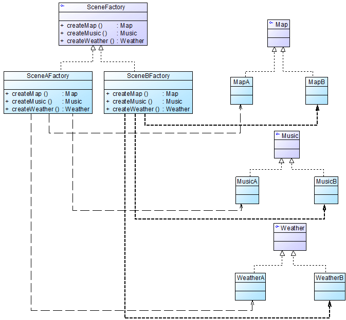

**图1 抽象工厂模式实例类图**

       在图1中，SceneFactory充当抽象工厂，其子类SceneAFactory等充当具体工厂，可以创建具体的地图(Map)、背景音乐(Music)和天气(Weather)等产品对象，如果需要增加新场景，只需增加新的具体场景工厂类即可。

 

**      (2) 建造者模式**

      在联机射击游戏中每一个游戏人物角色都需要提供一个完整的角色造型，包括人物造型、服装、武器等，可以使用建造者模式来创建一个完整的游戏角色，类图如图2所示：

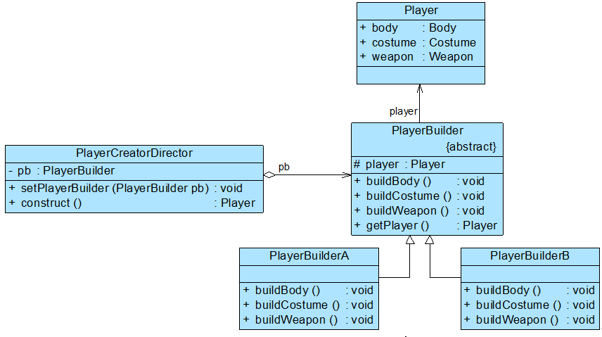

**图2 建造者模式实例类图**

      在图2中，PlayerCreatorDirector充当指挥者角色，PlayerBuilder是抽象建造者，其子类PlayerBuilderA和PlayerBuilderB是具体建造者，用于创建不同的游戏角色，Player是所创建的完整产品，即完整的游戏角色，它包含形体(body)、服装(costume)和武器(weapon)等组成部分。

 

**      (3) 工厂方法模式**

      在射击游戏中，AK47冲锋步枪、狙击枪、手枪等不同武器(Weapon)的外观、使用方法和杀伤力都不相同，玩家可以使用不同的武器，而且游戏升级时还可以增加新的武器，无需对现有系统做太多修改，可使用工厂方法模式来设计武器系统，类图如图3所示：

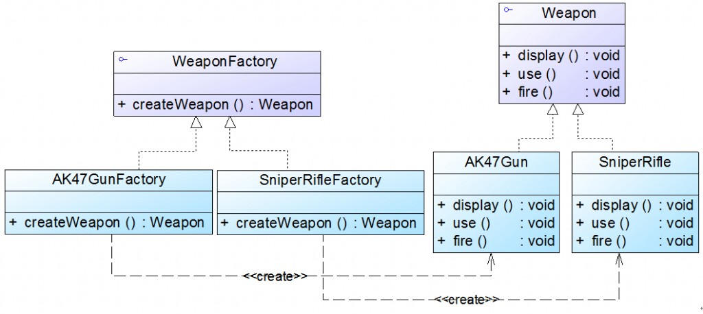

**图3 工厂方法模式实例类图**

       在图3中，WeaponFactory接口表示抽象武器工厂，其子类AK47GunFactory生产AK47Gun，SniperRifleFactory生产SniperRifle，不同的武器的display()、use()和fire()等方法有不同的实现。

 

**      (4) 迭代器模式**

      在射击游戏中，一个玩家可以拥有多种武器，如既可以拥有AK47冲锋枪，还可以拥有手枪和匕首，因此系统需要定义一个弹药库（武器的集合），在游戏过程中可以遍历弹药库(Magazine)，选取合适的武器，在遍历弹药库时可使用迭代器模式，如类图如图4所示：

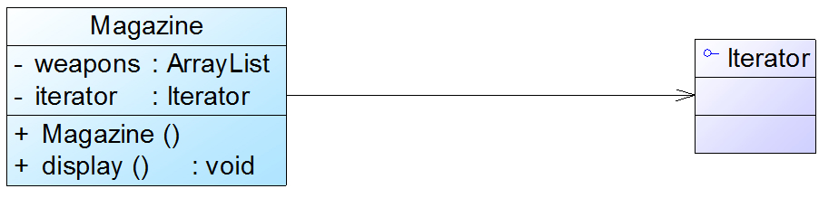

**图4 迭代器模式实例类图**

      在类Magazine中，可以通过迭代器遍历弹药库，Magazine类的代码片段如下所示：

```
public class Magazine {
	private ArrayList weapons;
	private Iterator iterator;


	public Magazine() {
		weapons = new ArrayList();
		iterator = weapons.iterator();
	}

	public void display() {
		while(iterator.hasNext()) {
			((Weapon)iterator.next()).display();
		}
	}
	......
}
```

      除了遍历弹药库外，迭代器模式还可以用于遍历战队盟友等聚合对象。

 

**      (5) 命令模式**

      在射击游戏中，用户可以自定义快捷键，根据使用习惯来设置快捷键，如“W”键可以设置为“开枪”的快捷键，也可以设置为“前进”的快捷键，可通过命令模式来实现快捷键设置，类图如图5所示：

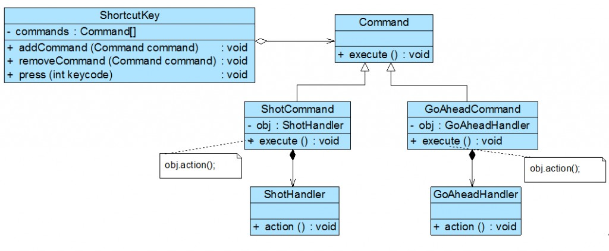

**图5 命令模式实例类图**

      在图5中，ShortcutKey充当请求调用者，在其press()方法中将判断用户按的是哪个按键，再调用命令对象的execute()方法，在具体命令对象的execute()方法中将调用接收者如ShotHandler、GoAheadHandler的action()方法来执行具体操作。在实现时可以将具体命令类类名和键盘按键的键码(Keycode)存储在配置文件中，配置文件格式如下所示：

```
……
&lt;FunctionMapping keycode="87" commandClass="ShotCommand"/&gt;
&lt;FunctionMapping keycode="38" commandClass="GoAheadCommand"/&gt;
……
```

      如果需要更换快捷键，只需修改键码和具体命令类的映射关系即可；如果需要在游戏的升级版本中增加一个新功能，只需增加一个新的具体命令类，可通过修改配置文件来为其设置对应的按键，原有类库代码无需任何修改，很好地符合开闭原则。


【作者：刘伟 】


#多人联机射击游戏中的设计模式应用（二）
**      (6) 观察者模式**

**     **联机射击游戏可以实时显示队友和敌人的存活信息，如果有队友或敌人阵亡，所有在线游戏玩家将收到相应的消息，可以提供一个统一的中央角色控制类(CenterController)来实现消息传递机制，在中央角色控制器中定义一个集合用于存储所有的玩家信息，如果某玩家角色(Player)阵亡，则调用CenterController的通知方法notifyPlayers()，该方法将遍历用户信息集合，调用每一个Player的display()方法显示阵亡信息，队友阵亡和敌人阵亡的提示信息有所不同，在使用notifyPlayers()方法通知其他用户的同时，阵亡的角色对象将从用户信息集合中被删除。可使用观察者模式来实现信息的一对多发送，类图如图6所示：

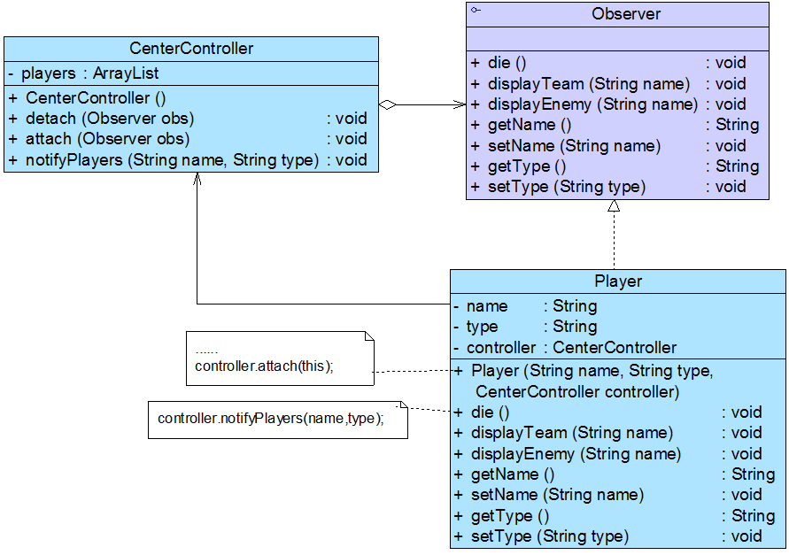

**图6 观察者模式实例类图**

      在图6中，CenterController充当观察目标，Observer充当抽象观察者，Player充当具体观察者。在Player类中，name属性表示角色名，type属性表示角色类型，如“战队A”或“战队B”等。Player的die()方法执行时将调用CenterController的notifyPlayers()方法，在notifyPlayers()方法中调用其他Player对象的提示方法，如果是队友阵亡则调用displayTeam()，如果是敌人阵亡则调用displayEnemy()；还将调用detach()方法删除阵亡的Player对象，其中CenterController类的notifyPlayers()方法代码片段如下所示：

```
for(Object player : players) {
    if(player.getName().equals(name)) {
      this.detach(player);  //删除阵亡的角色
     }
    else {
        if(player.getType().equals(type)) {
            player.displayTeam(name);  //队友显示提示信息
         }
        else {
            player.displayEnemy(name);  //敌人显示提示信息
          }
    }
}
```

**** 

**      (7) 单例模式**

      为了节约系统资源，在联机射击游戏中可以使用单例模式来实现一些管理器(Manager)，如场景管理器(SceneManager)、声音管理器(SoundManager)等，如图7所示的场景管理器SceneManager类：

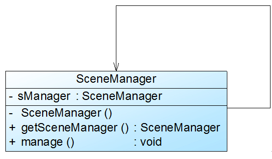

**图7 单例模式实例类图**

       SceneManager类的实现代码片段如下所示【注：以下代码未考虑多线程访问的问题】：

```
class SceneManager {
	private static SceneManager sManager = null;

	private SceneManager() {
		//初始化代码
	}

	public synchronized static SceneManager getInstance() {
		if(sManager==null) {
			sManager = new SceneManager();
		}
		return sManager;
	}

	public void manage() {
		//业务方法
	}
}
```

**      (8) 状态模式**

      在射击游戏中，游戏角色存在几种不同的状态，如正常状态、暂停状态、阵亡状态等，在不同状态下角色对象的行为不同，可使用状态模式来设计和实现角色状态的转换，类图如图8所示：

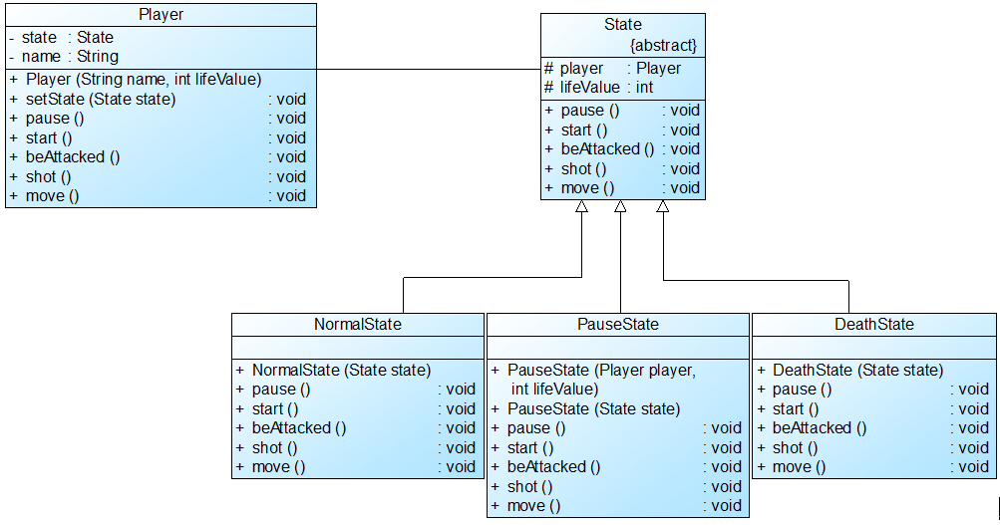

**图8 状态模式实例类图**

       在图8中，游戏角色类Player充当环境类，State充当抽象状态类，其子类NormalState、PauseState和DeathState充当具体状态类，在具体状态类的pause()、start()、beAttacked()等方法中可实现状态转换，其中NormalState类的代码片段如下所示：

```
class NormalState extends State
{
	public void pause()  //游戏暂停
	{
		//暂停代码省略
		player.setState(new PauseState(this));  //转为暂停状态
	}
	public void start()  //游戏启动
	{
		//游戏程序正在运行中，该方法不可用
	}
	public void beAttacked()  //被攻击
	{
		//其他代码省略
		if(lifeValue&lt;=0)
		{
			player.setState(new DeathState(this));  //转为阵亡状态
		}
	}
	public void shot()  //射击
	{
		//代码省略
	}
	public void move()  //移动
	{
		//代码省略
	}
}
```

**       (9) 适配器模式**

       为了增加游戏的灵活性，某些射击游戏还可以通过游戏手柄来进行操作，游戏手柄的操作程序和驱动程序由游戏手柄制造商提供，为了让当前的射击游戏可以与游戏手柄兼容，可使用适配器模式来进行设计，类图如图9所示：

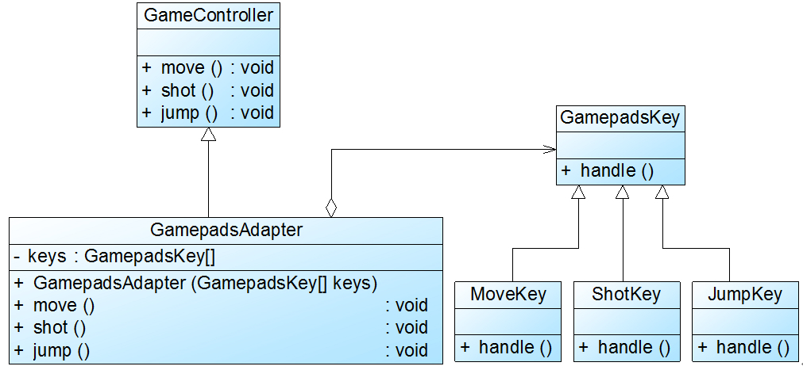

**图9 适配器模式实例类图**

       在图9中，GamepadsAdapter充当适配器，它将游戏手柄中按键(GamepadsKey)的方法适配到现有系统中，在其move()方法中可以调用MoveKey类的handle()方法，在其shot()方法中可以调用ShotKey的handle()方法，从而实现通过手柄来控制游戏运行。

 

【作者：刘伟 】


#设计模式综合实例分析之数据库同步系统（一）
        最近有很多朋友跟我聊到关于“**在软件项目开发中如何合理使用设计模式**”的问题，希望我能够给出一些相对比较完整的真实项目实例，为了满足大家的要求，在后续文章中，我将拿出几个较为复杂的实例与大家一起分享，有些项目是我参与开发的，有些项目是在我的指导下开发的，希望能给大家带来帮助！在此我也**希望大家能够分享自己的一些设计模式使用心得和好的设计模式应用实例**，可以整理一份给我（可发送到邮箱：），在下一本设计模式图书（有计划明年写一本**《设计模式案例剖析》**，暂定名）中我将选取部分实例加入其中，如有入选者，Sunny承诺送签名图书两本，，选择范围包括已经出版的**《设计模式》**、**《设计模式实训教程》**、**《设计模式的艺术》**，还包括马上要出版的**《C#设计模式》**和正在编写的**《UML建模实训教程》**，任君挑选，正版保证，假一罚十！

 

        从本文开始，我将介绍一个**数据库同步系统**的设计方案，该系统是我在2010年给某软件公司做设计模式内训时指导几位开发人员所开发的一个项目，系统以某省级移动公司应急管理系统数据备份（数据库同步）需求为原型，基本需求如下：

        为了在数据库发生故障的情况下不影响核心业务的运行，需要将生产数据库定期备份到应急数据库，以备生产数据库发生故障时，能切换到应急数据库，保证业务的正常运行。由于移动公司的数据量非常大，所以只需要对基础数据和关键数据进行备份，为了确保切换到应急数据库时保证核心业务能够运行，还需要备份整个数据库结构。

      系统目前需求仅要求支持Oracle数据库的同步，但系统设计时需要考虑以后可以方便地支持其他数据库。Oracle数据库的结构由各种数据库对象组成，要求完成对各种数据库对象的同步，包括表（包括约束）、索引、触发器、分区表、视图、存储过程、函数、包、数据库连接、序列、物化视图和同义词。各类数据库对象的同步有一定的顺序关系，总体流程如图1所示：

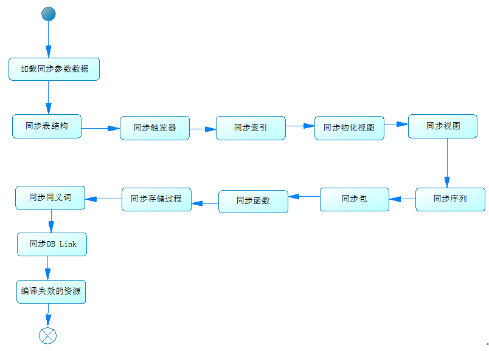

**图1 数据库同步流程图**

 

       数据库同步系统界面如图2所示：

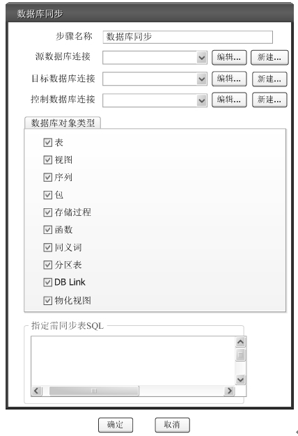

**图2 数据库同步系统界面**

       用户在操作界面指定源数据库、目标数据库、控制数据库（用于读取配置信息）的数据库连接串，同时选取需要同步的数据库对象类型，对象类型存储在配置文件database_syn_config.xml中，通过输入SQL语句可以获取需要同步的表数据。

       数据库对象同步的处理逻辑描述如下：

       (1) 对于一般的数据库对象，同步时先取出源数据库与目标数据库该类数据库对象进行对比，然后将对象更新到目标数据库。

       (2) 对于DBLink对象，由于数据库环境发生变化，需要手工调整，同步过程只记录新增的DBLink信息，而不执行创建操作。

       (3) 表的同步处理由于其包含数据，因此较为特殊，需先对表结构变化进行分析，再同步数据。表数据的同步有三种方式：增量同步、先Delete后Insert方式、临时表方式。

       (I) 增量同步。适用于可确定最后修改时间戳字段的情况。

       (II) 先Delete后Insert方式。即先删除表的数据，再将源数据库的该表数据插入到目标数据库，为确保数据安全，要求在一个事务内完成。

       (III) 临时表方式。用于最大限度保证数据的完整性，是一种在发生意外情况时，不丢失数据而使用的较为复杂的方式。

       由于对数据库结构修改无法做事务回滚，因此如果后面的步骤发生异常，需要通过手工编码方式来实现目标数据库结构变化的回滚。

       在本系统实现过程中使用了多种设计模式，下面对其进行简要分析（**为了简化代码和类图，省略了关于包的描述，在实际应用中已将不同的类封装在不同包中**）：

 

**         1. 建造者模式**

       在本系统实现时提供了一个数据库同步流程管理器DBSynchronizeManager类，它用于负责控制数据库同步的具体执行步骤。用户在前台界面可以配置同步参数，程序运行时，需要根据这些参数来创建DBSynchronizeManager对象，创建完整DBSynchronizeManager对象的过程由类DBSynchronizeManagerBuilder负责，此时可以使用建造者模式来一步一步构造一个完整的复杂对象，类图如图3所示：

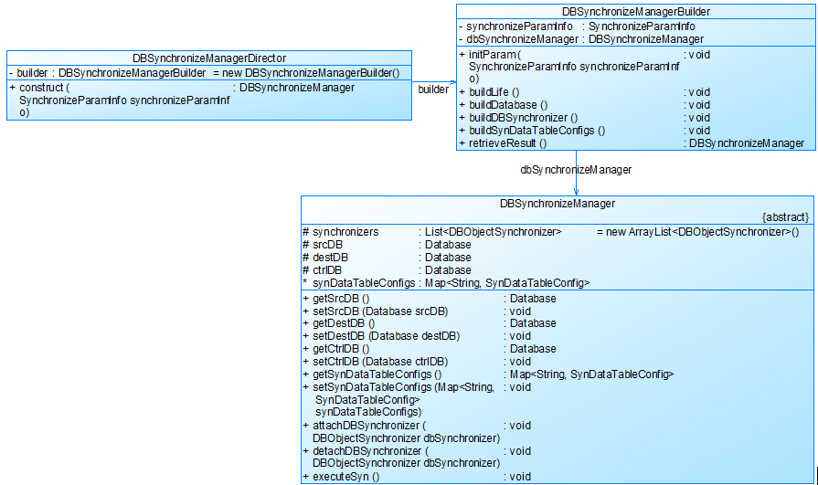

**图3 建造者模式实例类图**

       在图3中省略了抽象建造者，DBSynchronizeManagerDirector充当指挥者类，DBSynchronizeManagerBuilder充当建造者，DBSynchronizeManager充当复杂产品。

 

**      2. 简单工厂模式**

       DBSynchronizeManagerBuilder类的buildLife()方法可以创建一个初始的DBSynchronizeManager实例，再一步一步为其设置属性，为了保证在更换数据库时无须修改DBSynchronizeManagerBuilder类的源代码，在此处使用简单工厂模式进行设计，将数据库类型存储在配置文件中，如下片段代码所示：

```
……
&lt;dbSynchronizeManager dbType="oracle" class="com. chinacreator.dbSyn.oracle.OracleDB SynchronizeManager"/&gt;	
……

```

       类图如图4所示：

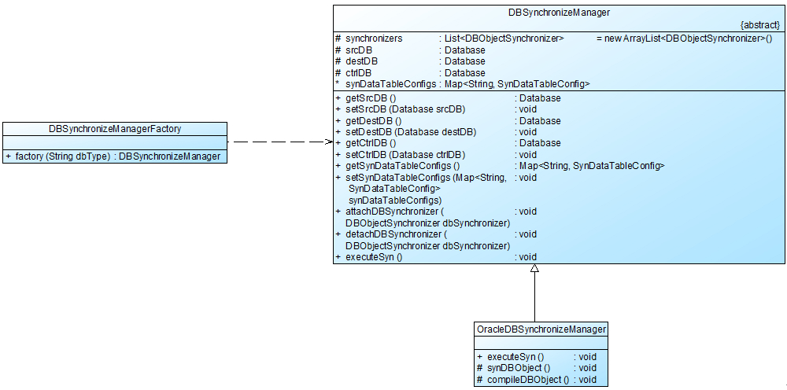

**图4 简单工厂模式实例类图**

       使用简单工厂模式设计的工厂类DBSynchronizeManagerFactory代码如下所示：

```
public class DBSynchronizeManagerFactory {	
	public static DBSynchronizeManager factory(String dbType) throws Exception {
		String className = DBSynConfigParser.getSynchronizeManagerClass(dbType);
		return (DBSynchronizeManager)Class.forName(className).newInstance();
	}
}
```

       其中DBSynConfigParser类用于读取配置文件，在图4中，DBSynchronizeManagerFactory类充当数据库同步流程管理器的简单工厂，DBSynchronizeManager是抽象产品，而OracleDBSynchronizeManager为具体产品。

 

【作者：刘伟   】 

#设计模式综合实例分析之数据库同步系统（二）
       接““。

 

**        3. 享元模式和单例模式**

       在数据库同步系统中，抽象类DBObjectSynchronizer表示需要同步的数据库对象，对于不同的数据库对象类型，提供了不同的子类实现，在数据库同步时可能有多个线程在同时进行同步工作，为了节省系统资源，可以使用享元模式来共享DBObjectSynchroizer对象，提供了享元工厂类DBObjectSynchronizerFlyweightFactory，且享元工厂类使用单例模式实现，类图如图5所示：

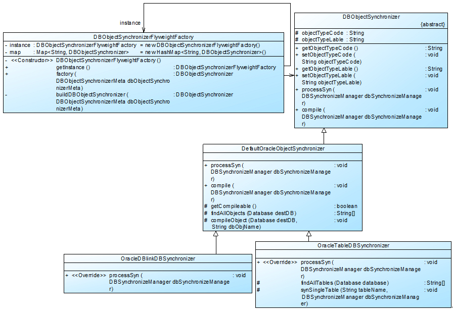

**图5 享元模式和单例模式实例类图**

       在图5中，DBObjectSynchronizerFlyweightFactory充当数据库对象同步执行者的享元工厂，同步对象执行类DBObjectSynchronizer充当抽象享元，其间接子类OracleDBlinkDBSynchronizer、OracleTableDBSynchronizer等充当具体享元（由于篇幅问题，未将所有数据库对象类一一列出）。

       在实现DBObjectSynchronizerFlyweightFactory时使用了单例模式（饿汉式单例），其代码片段如下所示：

```
public class DBObjectSynchronizerFlyweightFactory {
	private static DBObjectSynchronizerFlyweightFactory instance = new DBObjectSynchronizerFlyweightFactory();
	private Map&lt;String, DBObjectSynchronizer&gt; map = new HashMap&lt;String, DBObjectSynchronizer&gt;();
	private DBObjectSynchronizerFlyweightFactory(){	}
	public static DBObjectSynchronizerFlyweightFactory getInstance(){
	return instance;
……
}
```

 

 

**        4. 观察者模式**

       在数据库同步系统中，用户可以自行决定需要同步哪些对象，需要同步的DBObjectSynchronizer子类对象将注册到DBSynchronizeManager中，DBSynchronizeManager类的代码片段如下所示：

```
public abstract class DBSynchronizeManager{	
    ……
	public void attachDBSynchronizer(DBObjectSynchronizer dbSynchronizer) {
		synchronizers.add(dbSynchronizer);
	}
	public void detachDBSynchronizer(DBObjectSynchronizer dbSynchronizer) {
		synchronizers.remove(dbSynchronizer);
	}
	public abstract void executeSyn() throws Exception;
}
```

       其中attachDBSynchronizer(DBObjectSynchronizerdbSynchronizer)为注册方法，detachDBSynchronizer(DBObjectSynchronizerdbSynchronizer)为注销方法，executeSyn()为抽象的通知方法，其子类OracleDBSynchronizeManager为executeSyn()方法提供了具体实现，类图如图6所示：

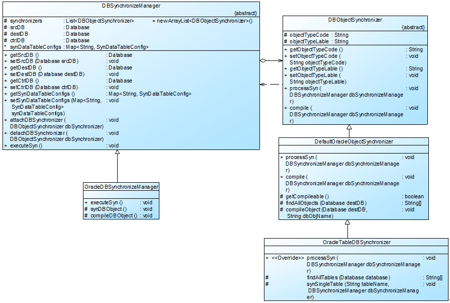

**图6 观察者模式实例类图**

       在数据库同步时，如果DBSynchronizeManager的executeSyn()方法被调用，将遍历观察者集合，调用每一个DBObjectSynchronizer对象的executeSyn()方法和compileDBObject()方法，此时DBSynchronizeManager充当抽象观察目标，OracleDBSynchronizeManager充当具体观察目标，DBObjectSynchronizer充当抽象观察者，OracleTableDBSynchronizer充当具体观察者。

 

**       5. 模板方法模式**

       在执行同步时，OracleDBSynchronizeManager的executeSyn()方法将依次调用synDBObject()和compileDBObject()方法，并在这两个方法中分别调用DBObjectSynchronizer的processSyn()和compile()方法，在OracleDBSynchronizeManager的子类中可以覆盖synDBObject()和compileDBObject()方法，如图7所示：

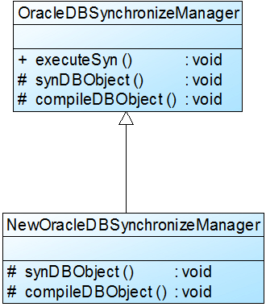

**图7 模板方法模式实例类图**

       在图7中，OracleDBSynchronizeManager充当抽象父类，其中定义了模板方法executeSyn()，NewOracleDBSynchronizeManager充当具体子类，其中OracleDBSynchronize Manager的代码片段如下所示：

```
public class OracleDBSynchronizeManager extends DBSynchronizeManager {
	public void executeSyn() throws Exception {
		synDBObject();
		compileDBObject();
	}
	protected void synDBObject(){
		for (DBObjectSynchronizer dbSynchronizer : synchronizers) {
			try {
				dbSynchronizer.processSyn(this);
			} catch (Exception e) {
				e.printStackTrace();
			}
		}
	}
	protected void compileDBObject(){
		for (DBObjectSynchronizer dbSynchronizer : synchronizers) {
			try {
				dbSynchronizer.compile(this);
			} catch (Exception e) {
				e.printStackTrace();
			}
		}
	}
}
```

       由于Oracle数据库对象类型较多，而大部分对象的处理逻辑大同小异，只有少部分对象类型同步结构后需要重新编译，因此在设计DefaultOracleObjectSynchronizer类时也可以使用模板方法模式，在其中定义一个钩子方法getCompileable()，由子类决定是否要调用编译逻辑，代码片段如下所示：

```
public class DefaultOracleObjectSynchronizer extends DBObjectSynchronizer {
	......
	public void compile(DBSynchronizeManager dbSynchronizeManager)
			throws Exception {
		if (getCompileable()){
			Database destDB = dbSynchronizeManager.getDestDB();
			String[] compileObjs = findAllObjects(destDB);
			int iLen = compileObjs.length;
			for (int i = 0; i &lt; iLen; i++) {
				compileObject(destDB, compileObjs[i]);
			}
		}
		
	}
	......
}
```

【作者：刘伟   】
#设计模式综合实例分析之数据库同步系统（三）
       接““。

 

**        6. 策略模式**

       由于表数据的同步方式有三种，分别是增量同步、先Delete后Insert方式、临时表方式，因此可以定义一个同步策略接口DataSynStrategy，并提供三个具体实现类：IncSynStrategy、DelAndInsSynStrategy和TempTableSynStrategy。类图如图8所示：

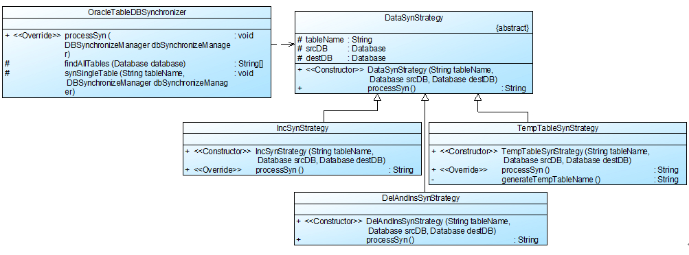

**图8 策略模式实例类图**

       在图8中，Oracle表同步对象类OracleTableDBSynchronizer充当环境类，DataSynStrategy充当抽象策略类，其子类IncSynStrategy、DelAndInsSynStrategy和TempTableSynStrategy充当具体策略类。

       在OracleTableDBSynchronizer中将DataSynStrategy作为方法synSingleTable()的局部变量，因此OracleTableDBSynchronizer与DataSynStrategy为依赖关系，如果为全局变量，则为关联关系。

 

**       7. <strong>组合模式、命令模式和职责链模式**</strong>

         在使用临时表方式实现表同步时可以定义一系列命令对象，这些命令封装对数据库的操作，由于有些操作修改了数据库结构，因此传统的JDBC事务控制起不到作用，需要自己实现操作失败后的回滚逻辑。此时可以使用命令模式进行设计，在设计时还可以提供宏命令MacroCommand，用于将一些具体执行数据库操作的命令组合起来，形成复合命令。类图如图9所示（由于原始类图比较复杂，考虑到可读性，图9进行了适当简化，不过简化了之后还是挺复杂的，）：

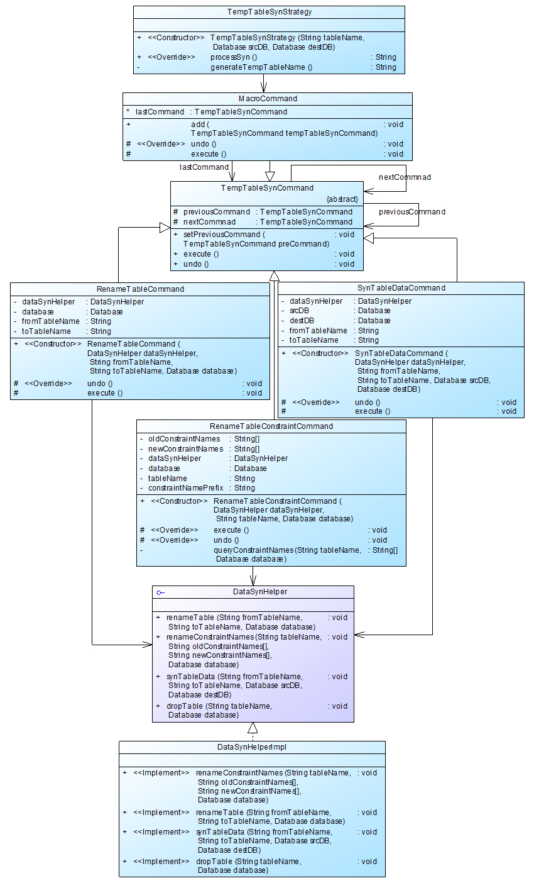

**图9 组合模式、命令模式和职责链模式实例类图**

**（由于涉及到多个模式的联用，此图有点点复杂，）**

       在图9中，TempTableSynCommand充当抽象命令，MacroCommand充当宏命令类，RenameTableCommand、SynTableDataCommand和RenameTableConstraintCommand充当具体命令，TempTableSynStrategy充当请求调用者，DataSynHelper充当请求接收者，在DataSynHelper中定义了辅助实现临时表方式同步的一些方法，在命令类中将调用这些方法。在TempTableSynCommand中声明了公共的execute()方法，并提供了回滚方法undo()，其子类实现具体的执行操作与恢复操作。DataSynHelper接口声明了进行数据库操作的方法，在其子类DataSynHelperImpl中实现了这些方法。

       在TempTableSynCommand中还定义了两个子类型的变量previousCommand、nextCommnad用于保存前一个命令和后一个命令，其中nextCommnad用于在执行完当前命令的业务逻辑后，再执行下一个命令的业务逻辑；而previousCommand用于在出现异常时，调用上一个命令的undo()方法实现恢复操作。此时使用了职责链模式，nextCommnad.execute()实现正向职责链，而previousCommand.undo()加上Java的异常处理机制实现反向职责链。

       MacroCommand是宏命令，其代码片段如下所示：

```
public class MacroCommand extends TempTableSynCommand {
	TempTableSynCommand lastCommand = this;
	public void add(TempTableSynCommand tempTableSynCommand) {
		tempTableSynCommand.setPreviousCommand(lastCommand);
		lastCommand = tempTableSynCommand;		//创建命令链
	}
    protected void execute() throws Exception {
……
}
protected void undo() throws Exception {
……
}
}
```

       在请求调用者类TempTableSynStrategy中通过如下代码片段来调用宏命令对象的execute()方法：

```
public class TempTableSynStrategy extends DataSynStrategy {
	public String processSyn() {
		//其他代码省略	
		String tempTableName = generateTempTableName();
		String backupTableName =  "BAK_" + tempTableName;
		DataSynHelper dataSynHelper = new DataSynHelperImpl();
		MacroCommand marcoCommand = new MacroCommand();
		marcoCommand.add(new RenameTableConstraintCommand(dataSynHelper, tableName, destDB));
		marcoCommand.add(new SynTableDataCommand(dataSynHelper, tableName, tempTableName, srcDB, destDB));
		marcoCommand.add(new RenameTableCommand(dataSynHelper, tableName, backupTableName, destDB));
		marcoCommand.add(new RenameTableCommand(dataSynHelper, tempTableName, tableName, destDB));
		try{
			marcoCommand.execute();			
			try {
				//其他代码省略	
			} catch (Exception e) {
				e.printStackTrace();
			}
		} catch (Exception e){
			e.printStackTrace();
		}
//其他代码省略
	}
}
```

 

**【本实例分析到此全部结束，希望能给各位带来帮助，！】**

【作者：刘伟   】

