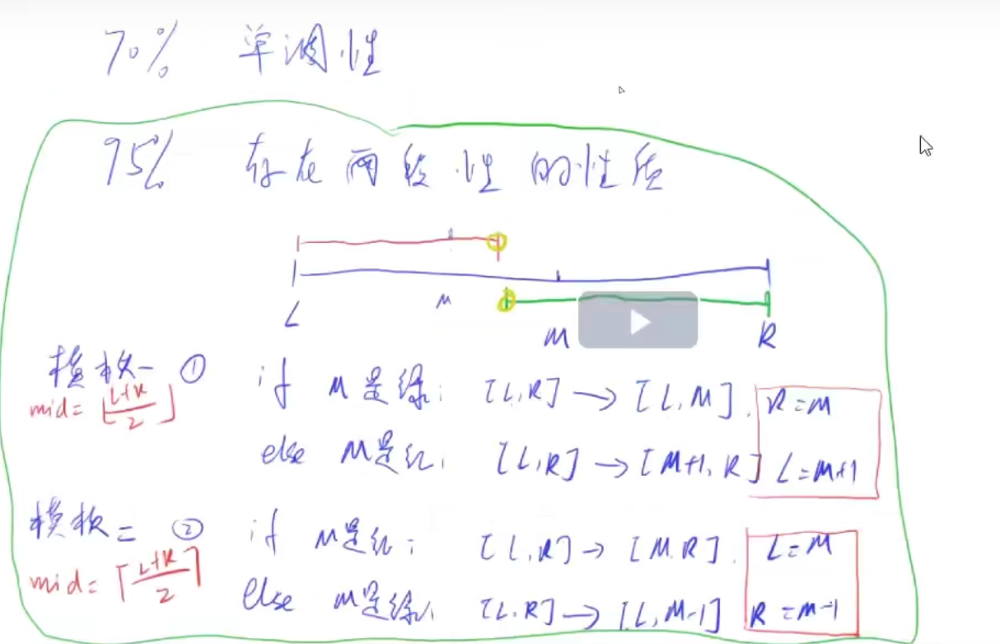
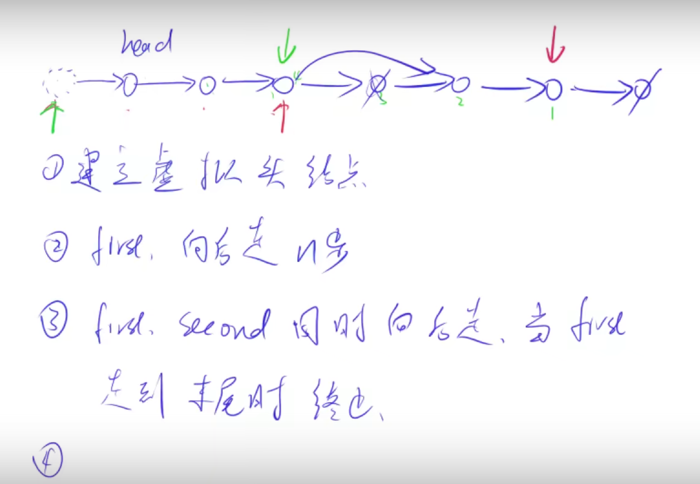

yxc leetcode全解(究极班)： https://www.acwing.com/activity/content/activity_person/content/29799/44/

### 1  2019刷题 +提高班

#### 1 位运算(数学) 

n &(n - 1) 将最低位的n移除。     
lowbit:n &(-n) 获取n的二进制表示的最低位的1。负数表示绝对值的补码，x的补码是 ~X + 1。         
(i >> j) & 1 取i的第j位。     

位运算优先级最低，注意加括号    

^不进位的加法

LeetCode 137. 只出现一次的数字 II：32位统计法。     
LeetCode 260. 只出现一次的数字 II :借助lowbit，借k位区分分别^。     
LeetCode 371. 两整数之和：位运算计算加法：拆分无进位加法和进位之和。带符号数赋值一个超范围的数，结果undefined,无符号数赋值一个超范围的数，结果是对无符号数总数取模的余数。     
LeetCode 201. 数字范围按位与：寻找公共前缀。    
Leetcode 477 汉明距离总和：n x (n - c) 

#### 2 二分与双指针 

两段性和单调性，折线法，寻找分解条件

步骤：
1 确定二分的边界。   
2 编写二分的代码框架。    
3 设计一个check(性质)。  
4 判断区间如何更新。  
5 如果更新方式是l=mid,r = mid -1,则算mid的时候需要加上1。

模板1: L + r下取整。 找后一段的绿色的开始端点，左边界。   
模板2：L + r + 1上取整,避免L = R - 1的时候，L < R 死循环。 找前一段的红色的结束段点，右边界。 

 <div align="center">  </div><br>


相关题目：

Leetcode  153. 寻找旋转排序数组中的最小值：nums.back()的秒用。     
Leetcode 33. 搜索旋转排序数组:先找最小值，去掉干扰条件。  
offer 11 旋转数组的最小数字：先去掉干扰条件。  
Offer 03 数组中重复的数字：反复交换法

#### 3 贪心 

Leetcode 560. 和为 K 的子数组: 简化的前缀和。  

#### 4 栈与队列 单调栈与单调队列 

Leetcode 167. 两数之和 II - 输入有序数组： 首尾指针              
Leetcode 88. 合并两个有序数组：双指针从后向前合并。                                                    
Leetcode 26. 删除有序数组中的重复项：前后指针                                        
LeetCode 76. 最小覆盖字串:  单个hash + i(hash[key]--)  j(hash[key]++) 双指针  简化滑动窗口问题                           
Leetcode 32. 最长有效括号：起始加-1,栈底元素为当前已经遍历过的元素中「最后一个没有被匹配的右括号的下标]                                      
Leetcode 42. 接雨水:两遍max, 左边一遍Left_max，右边一遍right_max，min(left_max[i],right_max[i]) - height[i]  
Leetcode 84. 柱状图中最大的矩形:两遍栈，左边一遍单调上升栈，右边一遍单独上升栈，height[i] * (right[i] - left[i] - 1)

单调栈注意是正向遍历还是反向遍历，是单调上升栈，还是下降栈。

LeetCode 496. 下一个更大元素 I :反向遍历，单调栈，存值或者索引    
LeetCode 503. 下一个更大元素 II：拆环为链反向循环法  / 环形%正向模拟
LeetCode 456. 132 模式:反向遍历单调栈。


```C++
//单调栈代码段
while (stk.size() && heights[stk.top()] >= heights[i]) stk.pop();
if (stk.empty()) left[i] = -1;
else left[i] = stk.top();
stk.push(i);
```                       
Leetcode 239. 滑动窗口最大值:单调下降队列简化
                         
```C++
//单调队列代码段
if (q.size() && i - k >= q.front()) q.pop_front();
while (q.size() && nums[q.back()] <= nums[i]) q.pop_back();
q.push_back(i);
if (i >= k - 1) res.push_back(nums[q.front()]);
```         
                        
leetcode 918: 拆环为链 + 前缀和 +单调上升队列

前缀和：A从1开始,S从1开始,for从1开始,S[i] = S[i - 1] + A[i]。A从0开始,S从1开始(n+1),for从0开始,S[i+1] = S[i] + A[i]。默认S[0] = 0，S一定从1开始。

单调队列：针对前缀和S的,所以i-k >= n 有等号。 

#### 5 堆、并查集 

LeetCode 547. Friend Circles :并查集  
LeetCode 684. Redundant Connection: 并差集变形，1->n 下标从1开始。  
Leetcode 692. 前K个高频单词:小顶堆(大顶key加负号)流过程,保证second的字典序排序，也可以自定义比较函数。  
pair 设置 --> make_pair或者 直接构造 PIS t(-word.second, word.first);
 
优先队列默认大的在队首，字符串则为字典序由大到小。int，double，char，string类型都可以这样定义。
 
LeetCode 295. Find Median from Data Stream：对顶堆，小上大下 --> 小右大左。动态流，图参考：https://blog.csdn.net/jiahonghao2002/article/details/114108760
 
1 2 3 4 (大顶) | 5 6 7 8(小顶) : right.size() > left.size(), right 比left至多多一个,添加时优先添加right, 先添加后调整。

#### 6 字符串与hash表 

模式： 
    while (k < s.size() && s[k] == s[j]) k ++ ;  
    while (k < s.size() && s[k] == ' ') k ++ ;

unordered_map<string,vector<string>> hash;

为什么 STL 中的容器和算法都是用的左闭右开区间？：https://www.zhihu.com/question/61054439

reverse、str.find
 
string substr (size_t pos = 0, size_t len = npos)  //如果没有n,默认到末尾，长度是len,包含pos + len位置的字符。
 
to_string() 转字符串

stoi或 atoi(s1.substr(i, x - i).c_str())
 
leetcode 3 无重复字符的最长字串: hash逐加逐减, ij双变量循环代替滑窗。
leetcode 17 电话号码的字母组合：三重简单循环代替dfs
 
Leetcode 187. 重复的DNA序列: unordered_map(hash) 使用。 
Leetcode 652. 寻找重复的子树: 中序遍历与后序或者中序遍历与前序遍历都可以唯一确定一棵树。两遍hash,第一遍树变成字符串，第二遍变成数。
 

前缀和和+hash的时候，注意是否需要hash[0] = 1;
 
Leetcode 454. 四数相加 II：分组hash      
Leetcode 560. 和为 K 的子数组：简易前缀和，hash[0] = 1;       
Leetcode 525. 连续数组: 简易前缀和，hash[0] = -1;     
Leetcode 350. 两个数组的交集 II:  multiset删除一个元素 mulSet.erase(mulSet.find(num));      
Leetcode 290. 单词规律：stringstream 相当于sscanf和sprintf, getline截断string, 双hash      
Leetcode 149. 直线上最多的点数： hash存储 long double slope，竖直线单独考虑   
Leetcode 554. 砖墙：hash    

LeetCode 131. 分割回文串：动态规划f + DFS回溯   
LeetCode 214. Shortest Palindrome：字符串hash131或改进kmp(最大前缀和最长后缀匹配) 
 
哈希检索算法（Robin-Karp，RK 算法）
 
**7 链表**

链表画图看，添加虚拟头节点(涉及到头节点可能会变的情况下)

 <div align="center">  </div><br>
 
 涉及到要修改头节点的时候，需要dummy,
 
 19 删除链表的倒数第N个节点：
```
auto dummy = new ListNode(-1);
dummy->next = head;
auto fast = dummy,slow = dummy;
 
//链表循环模式
while(cur->next && cur->val == cur->next->val) cur->next = cur->next->next;
//判空是判断cur还是cur->next

//链表反转迭代
 ListNode* reverseList(ListNode* head) {
     ListNode* temp; // 保存cur的下一个节点
     ListNode* cur = head;
     ListNode* pre = NULL;
     while(cur) {
         temp = cur->next;  // 保存一下 cur的下一个节点，因为接下来要改变cur->next
         cur->next = pre; // 翻转操作
         // 更新pre 和 cur指针
         pre = cur;
         cur = temp;
     }
     return pre;
 }
 
//链表反转递归 carl版
class Solution {
public:
    ListNode* reverseList(ListNode* head) {
        // 边缘条件判断
        if(head == NULL) return NULL;
        if (head->next == NULL) return head;
        
        // 递归调用，翻转第二个节点开始往后的链表
        ListNode *last = reverseList(head->next);
        // 翻转头节点与第二个节点的指向
        head->next->next = head;
        // 此时的 head 节点为尾节点，next 需要指向 NULL
        head->next = NULL;
        return last;
    }
}; 
```
链表Cout调试
 

两个生成的都是指针
```c++
ListNode *dummy = new ListNode(-1);
auto dummy2 = new ListNode(-1);
```
 
**8 树与图**

栈的递归、迭代（stack中序）

树的递归问题：枚举最高点 + 左右最大(当前)返回

LCA: 236. 二叉树的最近公共祖先，树天然递归   
94. 二叉树的中序遍历： 栈的递归、迭代（stack中序）   
124 二叉树中的最大路径和：枚举最高点 + 左右最大(当前)返回


**9 DFS(回溯)与BFS**

bfs一般求最小步数和最短距离，dfs状态数量非常大，但是解的数量很小。
 
leetcode 47 全排列II  遍历的时候跳过相同元素，人为规定相同数字的相对顺序不变 
 
```
while(i + 1 < nums.size() && nums[i] == nums[i+1]) i++;
```
                         
leetcode 78 子集  位运算+循环,简化子集问题, 递归结构相当于一层循环。  
leetcode 90 子集II  回溯去重  
LeetCode 52. N-Queens II    dfs代替行, col + d + ud 数组标记解法，精确覆盖问题。   
LeetCode 37. Sudoku Solver  dfs 逐行, col + row + cell 数组标记解法，row[9][9]: 9行,0-9的数有了哪几个                
Leetcode 473. 火柴拼正方形   剪枝优化技巧
 
bfs 空间大，最短最小性，不会有爆栈风险。    
dfs空间和递归深度成正比，有爆栈风险，比如树的深度最坏可能有1000层，不能搜最短最小。    
                         
Leetcode 329. 矩阵中的最长递增路径： 记忆化dfs,memo,既当visit又存储值     
Leetcode 130 被围绕的区域：四边dfs + 涂色法   
                         
Leetcode 127 单词接龙: 双向BFS搜索（26子母扩展）        
Leetcode 126 单词接龙 II：BFS(26扩展) + DFS(反向搜索)      
                         
Leetcode 207 课程表：拓扑排序(模板)，比较点数和入度为0的点数量。   
Leetcode 210 课程表2：拓扑排序，保存序列。  
                         
LeetCode 733. Flood Fill：dfs的flood fill方法，搜索连通块。        
LeetCode 542. 01 Matrix：矩形多源头的bfs，类比入度为0的拓扑排序。BFS有两种，一种内循环需要先取size，如树的层序遍历,另外一种不需要，如四方向遍历，有dist记录。
        
#### 10 动态规划专题
                         
LeetCode 115. 不同的子序列: 字符串的dp，求方案数要加在一起。                        
                         
**数字三角形模型**   
                         
LeetCode 120. Triangle：滚动数组优化版 + 普通二维数组版本      
LeetCode 221. 最大正方形：理解推导 f[i][j] = min(f[i - 1][j - 1], min(f[i - 1][j], f[i][j - 1])) + 1         
Leetcode 376. 出界的路径数       
三维DP: f[i][j][k]:移动k次到达i和j的路径总数         
static constexpr int MOD = 1e9 + 7;                         
                         
**子序列问题**
                         
LeetCode 300. 最长递增子序列LIS：双循环dp O(n*n) 或者贪心+二分查找（替换）O(nlog(n))    
LeetCode 354. 俄罗斯套娃信封问题: 二维子序列问题，先排序，再调用LIS模型(双循环dp或者贪心+二分查找（替换）)   
Leetcode 132. 分割回文串 II：回文字符串dp(' ' +方法) + LIS dp，注意枚举的顺序，使用的状态必须是已经计算出来的。                     
 
**状态机问题**

动归不一定只有f数组的，dp的递归型也是动归。                      
                         
股票问题：   
LeetCode 121. 买卖股票的最佳时机    
LeetCode 122. 买卖股票的最佳时机 II    
LeetCode 123. 买卖股票的最佳时机 III   
LeetCode 188. 买卖股票的最佳时机 IV   
LeetCode 309. 最佳买卖股票时机含冷冻期   
LeetCode 714. 买卖股票的最佳时机含手续费   

先买后卖                               
贪心法、dp状态机法(carl一维数组-->buy(0) + sell(1)简化，carl二维数组（K次交易，冷冻期）--> buy + sell数组简化)     
买入股票的状态不代表当天一定买入股票，是一种可能的状态         
 
LeetCode买卖股票问题——模版总结(简化dp)：https://www.acwing.com/blog/content/526/  
代码随想录股票问题(二维dp)：https://programmercarl.com
 
LeetCode 213. 打家劫舍 II: 1. 选头不选尾  2. 选尾不选头 3. 头尾都不选(包含在1、2中), 双向dp (left->right, right->left)。   
LeetCode 264. Ugly Number II: 状态机模型,三指针动态规划。    

**背包问题：**
                         
```cpp
 //滚动数组优化
vector<int> f[2];
f[0] = f[1] = vector<int>(n);

auto &a = f[i & 1], &b = f[i - 1 & 1];
a[j] = INT_MAX;

//i,j的0行0列填充，可以初始填好，也可以循环内进行条件判断
if (j) a[j] = b[j - 1] + triangle[i][j];
if (j <= i - 1) a[j] = min(a[j], b[j] + triangle[i][j]);
```
 
LeetCode 63. 不同路径 II：循环内处理好0行0列。  
LeetCode 322. 零钱兑换 I: 完全背包的二维和一维解法。        
LeetCode 518. 零钱兑换 II: 完全背包的二维和一维解法。  
LeetCode 664. Strange Printer:s[l-1]=s[k-1],f[l][r] = min(f[l][r], f[l][k - 1] + f[k + 1][r]);
         
LeetCode 279 完全平方数：完全背包。
 
**区间dp:**
       
len -> 左端点 -> 决策
 
Leetcode 1000. 合并石头的最低成本: 石子合并变形。      
LeetCode 312. 戳气球：左右各加1，区间dp。         
LeetCode 486. 预测赢家。f[i,j] 表示当前玩家与另一个玩家分数之差的最大值，可能是先手，也可能是后手,     
注意转移方程f[l][r] = max(nums[l] - f[l + 1][r], nums[r] - f[l][r - 1]),f[l + 1][r]或者f[l][r - 1]是另外一个玩家的。结果返回是f[0,n-1]表示先手的赢的情况。  
 
**状态压缩dp**
 
Leetcode 526 优美的排列：状态压缩dp,f[i]代表选法是i的时候的方案数，i的每一位代表是否选择当前的数

 
 
其他经典：
LeetCode 10. 正则表达式匹配: sp加' ',*提前判断
 


 
### 2 究极班题选
 
腾讯精选练习 50 题: https://leetcode-cn.com/problem-list/ex0k24j/
 
LeetCode 精选 TOP 面试题: https://leetcode-cn.com/problem-list/2ckc81c/
 
 
### 3 面试题
 
**代码简化方法**

同类型变量定义，一句可以定义多个。

for  while 单句的内循环不加括号。

灵活利用for  while的循环判断条件，单个for内灵活运用多个变量同时循环。

灵活使用三目运算符

灵活使用连续等号
 
灵活使用值的引用： auto &info = jun.back();
 
for(auto& junction :junctionInfos) 或者 (const auto &p :points)
 
使用swap函数交换

卡常数，又称底层常数优化，特指在OI/ACM-ICPC等算法竞赛中针对程序基本操作进行的底层优化，一般在对程序性能要求较为严苛的题目或是在算法已经达到理论最优时间复杂度时使用，有时也用于非正解的强行优化。实现方法有使用register寄存器关键字、利用空间连续性使数组进入缓存、输入输出优化等

```c++
int a = 0,b = 0;

while (j < s.size() && s[j] != ' ') j ++ ;

 for (auto c:hash[u - '2'])
     for (auto path:res)
         now.push_back(path + c);
         
for (int j = i, k = 2 * (n - 1) - i; j < s.size() || k < s.size(); j += 2 * (n - 1), k += 2 * (n - 1))
{
    if (j < s.size()) res += s[j];
    if (k < s.size()) res += s[k];
}

int b = y == j ? 0 : atoi(s2.substr(j, y - j).c_str());

st[i] = d[i + u] = ud[i - u + n] = 1;
```
  
 
 
