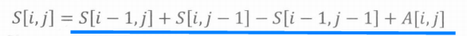
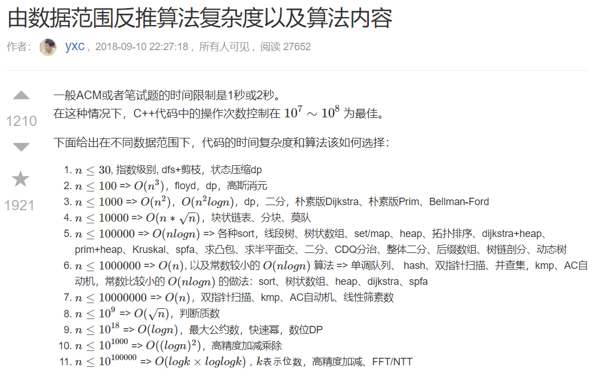
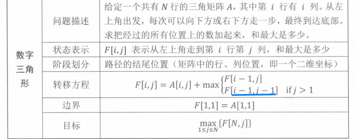
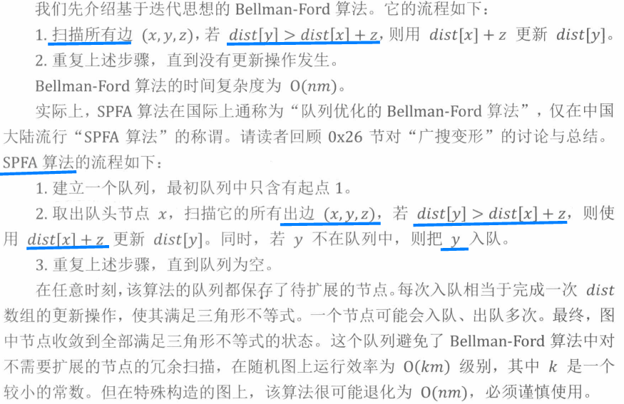

### 0x00 基本算法

#### 0x01 位运算

lowbit(x)是x的二进制表达式中最低位的1所对应的值（位置）。

```cpp
//6的二进制是110，所以lowbit(6)=2
int lowbit(int x)
{
    return x&(-x);
}

int lowbit(int x)
{
    return x&(x^(x-1));
}
```

#### 0x02 递推与递归

tallest conv 区间操作转为左右端点操作,额外的辅助数组存储操作结果

缩小问题空间：自身调用自身，回溯时还原现场

分治法等比数列求和

#### 0x03 前缀和与差分

前缀和：下标从1开始。

二维数组的前缀和

<div align="center">  </div><br>

前缀和和差分是一对互逆运算。

差分：将原序列上的区间操作转为差分序列上的单点操作。

<div align="center">  </div><br>


#### 0x04 二分

二分求解转判定

整数域上的二分

模板1：寻找左边界、模板2：寻找右边界

实数域上的二分

#### 0x05 排序

排序：基于比较方法、按位划分，分类映射

离散化：a数组排序并去重之后得到b数组，b的下标i与b[i]建立映射关系，在b中二分查找a即可

中位数：对顶堆(在线)、链表+ hash(离线)

第k大的数：快排划分

逆序对：归并排序求逆序对个数，合并时考虑

#### 0x06 倍增

倍增 + 二进制划分结合（RMQ区间最值、LCA最近公共祖先）

#### 0x07 贪心

一般先排序

决策包容性、邻项交换

区间合并：st end 延迟处理法

区间问题：按左端点、右端点、先左后右端点排序

### 0x10 基本数据结构

由数据范围反推算法复杂度以及算法内容: https://www.acwing.com/blog/content/32/

<div align="center">  </div><br>

ios::sync_with_stdio(false)详解： https://blog.csdn.net/L1558198727/article/details/81512350

取消cin于stdin的同步。

STL开o2优化，效率和数组差不多。

scanf("%s%d%d"),s一般开p[2]

回文子串的最大长度： 加#中心展开法

超市：归并排序变形

#### 0x11 栈

双栈：栈A存储序列，栈B存储最小值

对顶栈：栈A：开头到光标，栈B:光标到结尾，f数组存储前缀和最大值

进出栈序列问题：

表达式：中缀、前缀、后缀

单调栈：求直方图的矩形面积

#### 0x12 队列

单调队列：最大子序和，单调队列+前缀和，下标位置递增，对应的前缀和S的值也递增
```cpp
//hh--->tt之间的一段数组组成的队列，hh小，tt大
//常见模型：找出滑动窗口中的最大值/最小值
//hh++ 队头出，++tt队尾入，tt-- 队尾出
int hh = 0, tt = -1;
for (int i = 0; i < n; i ++ )
{
    while (hh <= tt && check_out(q[hh])) hh ++ ;  // 判断队头是否滑出窗口
    while (hh <= tt && check(q[tt], i)) tt -- ;
    q[ ++ tt] = i;
}
```

决策集合中及时排除不是最优解的选择

#### 0x13 链表与邻接表

链表：head和tail哨兵

数组模拟链表、下标模拟指针

写工程用动态链表，算法题用静态链表要快

链表(数组模拟链表c++)：https://blog.csdn.net/Annabel_CM/article/details/107446710

```cpp
// head存储链表头，e[]存储节点的值，ne[]存储节点的next指针，idx表示当前用到了哪个节点
//下标从零开始，第k 个数对应数组e[k - 1]；
int head, e[N], ne[N], idx;

// 在链表头插入一个数a, 先将x的指针指向原来head的位置，然后将head指向x
void insert(int a)
{
    e[idx] = a, ne[idx] = head, head = idx ++ ;
}

// 将头结点删除，需要保证头结点存在;在删除节点时，要判断该节点是否为头节点，若为头节点，直接head指向该节点所指向的位置
void remove()
{
    head = ne[head];
}
// 将x插到下标是k的点后面
void add(int k, int x)
{
   e[idx] = x, ne[idx] = ne[k], ne[k] = idx ++ ;
}

// 将下标是k的点后面的点删掉
void remove(int k)
{
    ne[k] = ne[ne[k]];
}
```

```cpp
//双向链表
// 在节点a的右边插入一个数x
void insert(int a, int x)
{
    e[idx] = x;
    l[idx] = a, r[idx] = r[a];
    l[r[a]] = idx, r[a] = idx ++ ; //先将要插入的数左右指针分别指向对应位置,然后先将原来第k个数右指针所指的位置的左指针指向x,即l[r[k]] = idx;
}
```

hash表记录指针

邻接表：带有索引数组的多个数据链表构成的结构集合，可以看成n类，head是入口，新数据在表头插入

head + next + ver(终点) + edge

无向边的存储：成对变换，xor 1定位反向边

#### 0x14 Hash

hash：开散列方案，邻接表结构，hash的值域作为表头数组的head

最简单的hash:数组计数

H(x) = (x mod P) + 1

字符串hash：字符串看成P进制数，分配一个大于0的数值，代表每种字符，P = 131或13331，

H(S + c) = (H(S)*P + value[c]) mod M

H(T) = (H(S + T) - H[S]*P^length(T)) mod M

字符串前缀hash

回文子串：枚举中心点，奇偶前缀hash比较

后缀数组：

#### 0x15 字符串

自我匹配next[i]:A中以i结尾的非前缀子串与A的前缀能够匹配的最长长度

f[i]：B中以i结尾的子串与A的前缀能够匹配的最长长度

最小表示：循环同构中字典序最小的，可以复制一份接在后面比较

AcWing 831. KMP字符串: https://www.cnblogs.com/Inabameguru/p/14932861.html

ne退：直到退无可退，为了下一次分配，最少移动多少。

**字串最长相同前后缀**
```cpp
假如A[]:abababf, 
则其全部前缀为：a,ab,aba,abab,ababa,ababab,ababab, 全部后缀为： f,bf,abf,babf,ababf,bababf,bababf

ne[i]代表了以第i个字符结尾的字串最长相同前后缀大小,很明显"ne[1]=0"
动态规划角度：用ne[i-1]推出ne[i]，当取到i时，也说明了前i个字符的字串也匹配成功，因此ne[0,i]有解。

For()
{

我们设立一个指针j，j指向与ne[i-1]匹配的左串末尾。
因此我们也确保了有P[0,j]==P[i-1-j,i-1]。
(1)当P[j+1]==P[i]时:
　　有P[0,j+1]==P[i-j-1,i]，也就是ne[i]=j+1;
　　break;
(2)当P[j+1]!=P[i]时：
　　也就没有P[0,j+1]==P[i-j-1],因此对于ne[i]的求解仍需要循环求解(此后j变为ne[ne[i-1]]匹配的左串末端)，直至答案求出
(3)ne[i]=0;

}

//s、p数组从1 开始，长度M、N是数组的有效长度
int sLen = 5;
int pLen = 3;
char p[] = {'\0','a','b','a'};
char s[] = {'\0','a','b','a','b','a'};
int ne[pLen];
for(int i = 2,j = 0;i <= pLen ;i++){
    if(j && p[i] != p[j+1]) j = ne[j];
    if(p[i] == p[j+1]) j++;
    ne[i] = j;
}
for(int i = 1,j = 0;i <=sLen;i++){
    if(j && s[i] != p[j+1]) j = ne[j];
    if(s[i] == p[j+1]) j++;
    if(j == pLen){
        cout << i - pLen << endl;
        j = ne[j];
    }
}
```
#### 0x16 Trie

```cpp
int son[N][26], cnt[N], idx;
// 0号点既是根节点，又是空节点，因为里面是++idx
// son[][]存储树中每个节点的子节点
// cnt[]存储以每个节点结尾的单词数量
```

#### 0x17 二叉堆

二叉堆：insert、getTop、Extract、Remove

sequence问题：多个序列，求前n小的组合

Huffman树：权值大的叶子节点的深度尽量小

K叉的huffman树求解，先补加一些额外的权值为0的叶子节点，使叶子节点个数n满足（n-1) mod(k-1)= 0,每次从堆中取出最小的k个值

### 0x20 搜索

#### 0x21 树与图的遍历

**邻接表**

相当于链表数组：head -> 沿着行方向展开成h[N]

```cpp
// 对于每个点k，开一个单链表，存储k所有可以走到的点。h[k]存储这个单链表的头结点
int h[N], e[N], ne[N], idx;

// 添加一条边a->b
void add(int a, int b)
{
    e[idx] = b, ne[idx] = h[a], h[a] = idx ++ ;
}
//遍历邻接表
//st相当于visit数组
for (int i = h[u]; i != -1; i = ne[i])
{
    int j = e[i];
    if (!st[j]) dfs(j);
}
// 初始化
idx = 0;
memset(h, -1, sizeof h);
```
v 记录访问

dfn：第一次被访问的顺序

DFS序：每个节点的编号出现两次，借此把子树转为区间统计问题

BFS:d[x]是节点x的层次,两段性和单调性

拓扑排序：topsort,不断选择图中入度为0的点，然后把x连向的点的入度减1

topsort：邻接表结构+ queue

#### 0x22 深度优先捜索

数独的优化:位运算进行常数优化，记录和可填性检查

回溯恢复现场

#### 0x23 剪枝

优化搜索顺序、排除等效冗余、可行性剪枝（上下界）、最优性剪枝、记忆化(v memo)

sticks：遍历枚举dfs

#### 0x24 迭代加深

当搜索树规范随层次的深入增长很快，并且我们能够确保答案在一个比较浅层的节点时，可以迭代加深的dfs

迭代加深：在当前深度限制下搜不到答案，就把深度限制增加，重新进行一次搜索

双向搜索:从初态和终态出发各搜索一半状态，产生两棵深度减半的搜索树，在中间交会、组合成最终的答案

#### 0x25 广度优先捜索

BFS就是一种dijkstra算法

走地图问题：将变化的部分提取为状态, BFS一次扩展对应一步，当一个状态第一次被访问的时，就得到了从起始状态到达该状态的最小步数

矩阵距离：有多个起始状态发flood-fill问题，把这些起始状态全部插入到队列，逐层扩展

#### 0x26 广捜变形

推箱子问题：双重BFS, 外层箱子和人合体BFS_box，内层BFS_man；输出具体方案，额外数组记录f_box和f_man从哪个状态更新来的，求出最优解后向前递推箱子的运动轨迹

双端队列BFS: 电路维修，边权是0或1，边权为0的边，队头入队，边权为1的边，队尾入队。

优先队列BFS: full tank加油，任意值代价，相当于带权图最短路，二叉堆取当前代价最小的状态进行扩展，每个状态只扩展一次

双向BFS:从起始状态、目标状态分别开始，两边轮流进行，每次各扩展一整层，当两边各个有一个状态发生重复时，说明相遇，合并得到起点到终点的最少步数

#### 0x27 A*

路径规划 | 图搜索算法：DFS、BFS、GBFS、Dijkstra、A*： https://zhuanlan.zhihu.com/p/346666812

估价函数，以任意状态作为输入，计算当前状态到目标状态锁需要的代价值，维护一个堆，从堆中不断取出当前代价+未来估价最小的状态扩展

f(state) <= g(state)

A*一定能在目标状态第一次被从堆中取出时得到最优解，并且在搜索过程中每个状态只需要被扩展一次

#### 0x28 IDA*

IDA*：迭代加深的A*算法

估价函数：估价每个状态到目标装需要的步数

若当前深度+未来估价步数 > 深度限制，则立即从当前分支回溯

### 0x30 数学知识

#### 0x31 质数

质数判断：sqrt(n)

Eratosthenes筛法：任意整数x的倍数2x,3x...都不是质数。对于每个数x,从x2开始，把x2,(x+1)*x,...,[N/x]*x标记为合数

线性筛法：让合数的质因子从大到小累加，每个合数只被它最小的质因子筛一次。

#### 0x32 约数

gcd(a,b) x lcm(a,b) = a*b

欧几里得算法 gcd(a,b) = gcd(b,a mod b)

#### 0x33 同余

#### 0x34 矩阵乘法

#### 0x35 高斯消元与线性空间

#### 0x36 组合计数

加法原理、乘法原理、排列数

高精度运算：为避免除法，可以利用阶乘分解方法，把分子分母快速分解质因数，然后把对应的质因子指数相减，再把剩余的质因子乘起来

catalan数列：给定n个0和n个1，它们按照某种顺序排成长度为2n的序列，满足任意前缀中0的个数都不少于1的个数的序列的数量为Catn = C_{2n}^{n}/ n+1

推论：以下问题都与Catalan数有关：

1 n个左括号和n个右括号组成的合法括号序列的数量为Catn.

2 1,2,...n经过一个栈，形成的合法出栈序列的数量为Catn.

3 n个节点构成的不同二叉树的数量为Catn.

4 在平面直角坐标系上，每一步只能向上或向右走，从(0,0)走到(n,m)并且除两个端点不接触直线y=x的路线数量为2Catn-1

#### 0x37 容斥原理与Möbius函数

#### 0x38 概率与数学期望

#### 0x39 0/1分数规划

0-1 分数规划：二分法求非负值

0-1分数规划模型： https://blog.csdn.net/niiick/article/details/80925267

0/1分数规划模型是，给定整数a1,a2,...an以及b1,b2,...bn,求解一组xi，使 ∑ai*xi/∑bi*xi 最大。

也就是给定n对整数ai,bi,从中选出若干对，使得选出的数对a之和与b之和的商最大

二分答案，二分值是mid时，计算∑(ai - mid*bi)*xi的最大值，检查最大值是否非负

#### 0x3A 博弈论之SG函数

NIM博弈：NIM博弈先手必胜，当且仅当 A1 xor A2 xor ... An !=0

任何一个公平组合游戏都可以转化为有向图游戏，把每个局面看成图中的一个节点，并且从每个局面向沿着合法行动能够到达的下一个局面连有向边

### 0x40 数据结构进阶

#### 0x41 并査集

f[x]保存元素x所在集合的代表，fa[i] = i

get + merge

路径优化、按秩合并

**带距离的并查集的路径压缩方法**
```cpp
// 返回x的祖宗节点
int find(int x)
{
    if (p[x] != x)
    {
        int u = find(p[x]);
        d[x] += d[p[x]];
        p[x] = u;
    }
    return p[x];
}
```
并查集擅长动态维护许多具有传递性的关系。

扩展域与边带权

d[x]保存节点x到父节点fa[x]之间的边权，利用路径压缩统计节点到树根之间的路径上的信息

拓展域：X域拆分Xodd、Xeven，X拆分Xself、Xeat、Xenemy

#### 0x42 树状数组

二进制划分与倍增思想

按照二进制位(2的次幂)进行区间划分，维护序列的前缀和，对应序列a,建立数组c,c[x]保存序列a的区间[x - lowbit(x) +1,x]中所有数的和

树状数组支持操作：查询前缀和(ask)、单点增加(给序列中的数a[x]加上y,同时维护前缀和)

维护数列的具体值转为维护指令的累积影响

逆序对，left+right两遍扫描

分离包含有多个变量的项，使公式中不同变量之间互相独立

#### 0x43 线段树

分治思想

每个节点代表一个区间，每个叶节点代表一个长度为1的元区间，对每个内部节点[l,r],它的左子节点是[l,mid],右子节点是[mid+1,r]

线段树：主要对序列进行维护，支持查询和修改指令

延迟标记：节点P增加一个标记，标识该节点曾被修改，但子节点尚未被更新

扫描线法

#### 0x44 分块

段长和段数都是sqrt(N)，大段维护、局部朴素

#### 0x45 点分治

#### 0x46 二叉査找树与平衡树初步

树上的每个节点带有一个数值，称为关键码

BST性质：该节点的关键码不小于它的左子树中任意节点的关键码，不大于它的右子树任意节点的关键码

BST查找、插入、删除、前驱后继(右子树一直向左)

Treap: tree + heap

### 0x50 动态规划

闫氏DP法，集合观点： https://www.cnblogs.com/IzayoiMiku/p/13635809.html

三要素：状态、阶段、决策

三个基本条件：重叠子问题、无后效性、最优子结构

每个子问题的求解过程就是一个阶段

无后效性：已经求解的子问题不受后续阶段的影响

dp对状态空间的遍历对应一张有向无环图：节点对应问题的状态，边对应状态间的转移，转移的选取对应决策

状态转移方程：把相同的计算过程作用于各个阶段的同类子问题

#### 0x51 线性DP




LIS、LCS、数字三角形状态转移方程

递推遍历方向

LCIS

决策元素只增多不减少的场景，可以维护一个变量来记录决策集合的当前信息，避免重复扫描

mobile service:求解线性dp问题，先确定阶段，若阶段不足以表示一个状态，则把所需要的附加信息作为状态的维度；确定dp状态时，选择最小的能覆盖整个状态空间的维度集合

如果下标有i-1,则从1开始循环，否则从0开始循环。

#### 0x52 背包

0-1背包：使用滚动数组时为何要逆序枚举: https://blog.csdn.net/aidway/article/details/50726472

如果用上一次状态，则从大到小枚举体积；如果用本次状态，则从小到大枚举体积。

完全背包：内循环采用正序，对应着每种物品可以使用无限次

多重背包：i物品有Ci个数量限制，中间加一层Ci的循环。单调队列优化多重背包:used数组

分组背包：i组有ci个物品，每组至多选一个。内循环加一层Ci的循环。i是阶段，i和j共同构成状态，k是决策

#### 0x53 区间DP

初态：长度为1的元区间，一个状态由若干个更小的包含于它的区间转移而来

决策：划分区间的方法

向下划分，再向上递推

AcWing282 石子合并：分清阶段、状态与决策，三者由外向内的顺序

AcWing283 多边形游戏：任选一个位置断开，复制成2倍长度的链

AcWing284 金字塔：拆环为链，复制一倍在后面。

方案计数类的动态规划，一个状态的各个决策之间满足加法原理，每个决策划分的几个子状态之间满足乘法原理

#### 0x54 树形DP

树形dp：一般以节点从深到浅(子树从小到大)的顺序作为dp的阶段

第一维通常是节点的编号(代表该节点为根的树)

采用递归方式实现树形dp，对于每个节点x,先递归在它的每个子节点上进行dp，回溯时，从子节点向节点x进行状态转移

AcWing285 没有上司的舞：树形dp时，用邻接表存下N-1条无向边，任选一点出发执行dfs,并标记节点是否已经被访问过，避免反向边回到父节点

背包类树形dp: AcWing286 选课：增加虚拟0节点，将N个点的森林转为N+1个点的树

二次扫描与换根法: Acwing 287 accumulation degree:D数组(x为根的子树中,x作源点)+ F数组(x作源点，流向整个水系)

#### 0x55 环形与后效性处理

AcWing290 Naptime:两次dp,第一次任意位置断开，线性求解，第二次通过适当的条件和赋值，保证计算出来的状态，相当于把断开发位置强制相连。

AcWing289 环路运输：环拆为链，复制一倍接在末尾

Broken Robot：有后效性的状态转移；分阶段带环，DP和高斯消元相结合，整体dp，局部高斯消元；倒推

#### 0x56 状态压缩DP

求出最优解的状态和未求出最优解的状态在各个维度的分界点组成dp扩展的轮廓

用一个集合记录轮廓信息，便于状态转移

集合转整数记录：集合看成N位的K进制数，以[0,K^N - 1]之间的十进制整数的形式作为dp状态的一维

AcWing291 蒙德里安的梦想: DP前预处理出[0,2^M -1]内所有满足二进制表示下每一段连续的0都有偶数个的整数，记录在集合S中

#### 0x57 倍增优化DP

AcWing293 开车旅行

1 预处理：用阶段成倍增长的DP,计算出若干与2的整数次幂相关的代表状态

2 拼凑：基于二进制划分的思想，用上一步得到的代表状态组合成最终的答案

#### 0x58 数据结构优化DP

决策的候选集合只扩大，不缩小，可以仅用一个变量维护最值

#### 0x59 单调队列优化DP

AcWing298 围栏:考虑内循环j和决策k时，把外循环i看作定值，据此调整状态转移方程。维护一个决策点k单调递增，数值F[i-1,k] -Pi*k单调递减的序列

AcWing299 裁剪序列：二叉堆+单调队列，建立映射关系。保存相同的候选集，同时插入和删除。

单调队列优化多重背包问题：优化到O(N*M)，队列：决策点k单调递减，数值F[u+k*Vi] - K*Wi单调递减的队列，维护候选集合

1D/1D的动态规划问题：F[i]= min {F[j] + val(i,j)},L(i)<j<R(i)

val(i,j)分成两部分，第一部分仅与i有关，第二部分仅与j有关，是使用单调队列进行优化的基本条件

#### 0x5A 斜率优化

#### 0x5B 四边形不等式

#### 0x5C 计数类DP

#### 0x5D 数位统计DP

先预处理，再拼凑，试填

### 0x60 图论

#### 0x61 最短路

无向边：看成两条方向相反的有向边

邻接表：head ver edge  next

稠密图：邻接矩阵；稀疏图：邻接表

**SSSP问题**

<div align="center">  </div><br>
Dijkstra:非负权，每次选择未被标记的，dist[x]最小的节点x，标记x，扫描并更新x的所有出边。使用二叉堆优化基于贪心的Dijkstra算法。

找点，循环基于点

二叉堆优化的dijkstra:只能处理非负权的，priority_queue中存放的是<distance,index>。

<div align="center">  </div><br>
Bellman-ford：扫描所有边，如果dist[y] > dist[x] + z，则用dist[x] + z更新dist[y]，使其满足三角不等式。需要备份，防止串联;找边，循环基于边

SPFA: 队列优化Bellman-Ford算法，起初队列只有起点1，更新完dist[y]，如果y不在队列中，则y入队列。可以优先队列(二叉堆)优化基于BFS的SPFA算法。

SPFA：可以处理负值，queue中存放的是index。

二叉堆优化的dijkstra，SPFA都是基于邻接表结构的。

AcWing341 最优贸易:正图D(x),反图F(x)，

AcWing342 道路与航线:先处理双向边形成连通块，把连通块缩成点，再处理单向边，拓扑序求ssp


**floyd算法(Floyd-Warshall 插点法)**

利用dp的思想寻找给定的加权图中APSP(多源最短路径)，通过一个图的权值矩阵求出它的每两点间的最短路径矩阵，边权可正可负

D[k,i,j]经过若干编号不超过k的节点，从i到j的最短路长度

D[k,i,j] = min(D[k-1,i,j],D[k-1,i,k] + D[k-1,k,j])，k是阶段，在外循环，i和j是附加状态，内循环

省略一维：D[i,j] = min(D[i,j],D[i,k] + D[k,j])

传递闭包：通过传递性退出尽可能多元素之间的关系

#### 0x62 最小生成树

**Kruskal**

维护无向图的最小生成森林，从剩余边中选择权重最小的，且两个端点不连通的边加入森林，

用并查集f[x]维护

Kruskal常用，效果好

**Prim**

维护最小生成树的一部分，Prim找到两个端点y∈T(最小生成树节点集)和x∈S(剩余节点集)的权值最小的边z加入答案，x从S删除加入T。

d[x]数组，如果x∈S，表示x与T中节点之间权值最小的边的权值；如果x∈T 表示x加入T时选出的最小边的权值

#### 0x63 树的直径与最近公共祖先

树的直径：树中最远两点之间的距离

树形DP求直径:D(x) + F(x)

两次BFS(DFS)求直径：从任意一个节点出发，一次BFS，求与出发点距离最远的点p；从p出发，一次BFS,求与p距离最远的点q，求p和q之间的距离。

AcWing351 树网的核：枚举+贪心->二分->单调队列

**求LCA**

向上标记法

树上倍增法

LCA的tarjan算法:并查集优化向上标记法。

树上差分法：类似区间的增减转化为左端点加1，右端点减1，节点x权加1，y权加1，LCA(x,y)权减2

#### 0x64 基环树

基环树：N个顶点，N条边，1个环，如果不连通，则是基环树森林

外向树：每个点有且仅有一条入边的基环树

内向树：每个点有且仅有一条出边的基环树

先找出图中唯一的环，把环作为基环树的广义根节点，把除环之外的部分按照若干棵树处理，再考虑和环一起计算

AcWing359 创世纪：两次树形dp代替基环树dp，一次断开，一次强制连接

#### 0x65 负环与差分约束

负环的判断：bellman-ford、SPFA

特殊的N元一次不等式组，N个变量，M个约束条件，每个约束条件都是两个变量做差得到 

#### 0x66 Tarjan算法与无向图连通性

60 分钟搞定图论中的 Tarjan 算法（一）:https://zhuanlan.zhihu.com/p/101923309

无向图割点：删除x和与x关联的边之后，G分裂成两个以上的不相连子图

无向图割边(桥)：删除边e之后，G分裂成两个以上的不相连子图

时间戳：dfn(x)，节点第一次被访问的时间顺序

搜索树：

追溯值：Low(x)：subtree(x)中的节点；通过一条不在搜索树上的边，能够到达subtree(x)的节点

割边判定法则：无向边(x,y)是桥，当且仅当搜索树上存在x的子节点y，满足dfn(x) < low(y)

割点判定法则：x不是搜索树的根节点，x是割点，当且仅当搜索树上存在x的子节点y,满足dfn(x) < low(y)；如果x是根节点，则至少两个子节点满足上述条件

v-DCC:极大点双连通子图，称为点双连通分量

e-DCC:极大边双连通子图，称为边双连通分量

e-DCC求解：求出所有的桥，把桥都删除后，图分成若干连通块，每个块就是一个边双连通分量

缩点：把e-DCC收缩为一个节点的方法

v-DCC求解：栈+判定法则

v-DCC缩点:p个割点和t个v-DCC,新建一个p+t个节点的新图，把每个v-DCC和每个割点都作为新图中的节点，并把每个割点和包含它的所有v-DCC之间连边

**欧拉路问题**

欧拉路：给定一张无向图，如果存在一条从S到T的路径，恰好不重不漏的经过每条边一次，称该路径为S到T的欧拉路。

欧拉回路：欧拉路 + 最终返回节点S

欧拉路判定：无向图连通，且每个点的度数都是偶数。

欧拉回路求解：DFS+栈

#### 0x67 Tarjan算法与有向图连通性

流图(G,r) 从r出发能到达V中的所有点，r是源点

流图(G,r)的搜索树：从r出发进行dfs,每个点只访问一边，所有发生递归的边构成一课以r为根的树，称为搜索树

流图(G,r)的四种边：树枝边、前向边、后向边、横叉边

强连通图：既有x->y路径，也有y->x路径

SCC:强连通分量

Tarjan:对于每个点，尽量找到与它一起构成环的所有节点。

追溯值

SCC判定法则：追溯值计算过程中，若从x回溯前，有low[x] = dfn[x]成立，则栈中从x到栈顶的所有节点构成一个强连通分量

SCC缩点

**2-SAT**

N个变量，每个变量两种取值，M个条件，每个条件都限制两个变量的取值，求是否存在对两个变量的合法赋值

判定方法：建立2N个节点的有向图，每个变量Ai对应2个节点，设为i和i+N,对每个条件ij，连接对应的边i和j

2-SAT建成的有向图：一侧节点1 ~ N，一侧是N+1 ~ 2N

#### 0x68 二分图的匹配

如果无向图的N个点可以拆分成A和B两个集合，其中A∩B为空，同一集合内的点之间没有边相连，则该无向图是一个二分图

A、B是二分图的左部和右部

判定：一张无向图是二分图，当且仅当图中不存在奇环(长度为奇数的环)

染色法进行证明：标记一个节点时，它的相邻节点标记为相反的颜色，如果标记过程存在冲突，则图中存在奇数环。

**二分图的最大匹配**

包含边数最多的一组匹配。

增广路：二分图中存在一条连接两个非匹配点的路径path,使得非匹配边和匹配边在path上交替出现，则path是增广路(交错路)

增广路性质：长度奇数；1,3,5...匹配边，2,4,6非匹配边

二分图的一组匹配S是最大匹配，当且仅当图中不存在S的增广路

匈牙利算法(增广路算法)：计算二分图的最大匹配

过程：S =∅所有边都是非匹配边-->寻找增广路path,把路径上所有边的匹配状态取反，得到更大的匹配S' -->重复直至图中不存在增广路

特点：一个节点成为匹配点后，至多因为找到增广路而更换匹配对象，但绝不会再变回非匹配点。

AcWing372 棋盘覆盖： 0要素(两个集合，集合内部0条边)、1要素(每个节点只能与1条匹配边相连)，染色


完备匹配；给定一张二分图，左部、右部节点数相同，均为N个节点，如果最大匹配包含N条匹配边，则二分图具有完备匹配。

多重匹配：N个左部节点，M个右部节点，从中选出尽量多的边，使得第i个左部节点至多与kLi条选出的边相连，第j个右部节点至多与kRj调选出的边相连。

多重匹配解决方案：拆点、左部节点Kli次dfs、网络流

AcWing374 导弹防御塔：拆点法

二分图当且仅当图中不含奇数环，由于图中不含奇数环，所以染色过程中一定没有矛盾。

**二分图的带权匹配**

前提是匹配数最大，然后再最大化匹配边的权值总和


顶标：左部节点Ai,右部Bj,Ai + Bj >= w(i,j)

相等子图：二分图中所有节点和满足Ai + Bj = w(i,j)的边构成的子图

KM算法：先在满足Ai + Bj >= w(i,j)的前提下，每个节点随意赋值一个顶标，然后采取适当策略不断扩大相等子图的规模，直到相等子图存在完备匹配。

#### 0x69 二分图的覆盖与独立集

**二分图最小点覆盖**

给定一张二分图，求最小点集S，图中任意一条边都有至少一个端点属于S

2要素：每条边2个端点，二者至少选择一个

图的独立集：任意两点之间都没有边相连

最大独立集：包含点数最多的独立集

团：任意两点之间都有一条边相连的子图是无向图的团

最大团：点数最多的团

n个节点的图G的最大独立集大小等于n减去最大匹配数

**有向无环图的最小路径点覆盖**

用尽量少的不相交的简单路径覆盖有向无环图中的所有顶点

拆点二分图G2:G中每个点x拆分成编号x和x+n的两个点，1 ~ n是左部点，n+1 ~ 2n是右部点

有向无环图G的最小路径点覆盖包含的路径条数 = n - 拆点二分图G2的最大匹配数

最小路径可重复点覆盖：用尽量少的可相交的简单路径，覆盖有向无环图中的所有顶点(一个节点可以覆盖多次)

求G的最小路径可重复点覆盖：先对有向图传递闭包，得到有向无环图G'，再在G'上求一般的最小路径点覆盖。

#### 0x6A 网络流初步


G=(V,E)是有向图，每条有向边(x,y)∈E都有一个给定的权重c(x,y)，是边的容量

S源点，T汇点

网络流函数f，对于(x,y)∈E，f(x,y)是边的流量，c(x,y)-f(x,y)是边的剩余容量

满足：f(x,y) < c(x,y);f(x,y)= -f(y,x);x ≠ S且 x ≠ T

性质：容量限制、斜对称和流量守恒

流量守恒：网络中除源点和汇点外，任何节点不储存流，其流入总量等于流出总量

网络最大流：使整个网络的f(S,v)最大的流函数

二分图的最大匹配数等于网络的最大流量

增广路：一条从源点S到汇点T的各条边的剩余容量都大于0，这条路径是一条增广路。

Edmonds-Karp算法:不断用BFS寻找增广路，直至网络上不存在增广路为止。只考虑f(x,y)< c(x,y)的边

分层图：d[x]表示S到x最少需要经过的边数。残量网络中，满足d[y]=d[x]+1的边(x,y)构成的子图称为分层图

Dinic算法：残量网，不断重复 1 残量网络上BFS求节点的层次，构造分层图 2 分层图上DFS寻找增广路，在回溯时实时更新剩余容量。

**最小割**

网络G=(V,E)，若一个边集E'被删去之后，源点S和汇点T不再连通，则该边集称为网络的割。容量和最小的是最小割。

任何一个网络中最大流量等于最小割中边的容量之和，最大流=最小割

点边转化，拆点拆边

费用流：容量限制c(x,y)，单位费用w(x,y),当(x,y)流量是f(x,y)时，要花费f(x,y)*w(x,y),最小最大费用流
