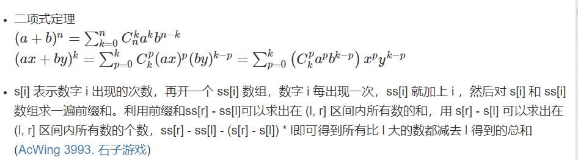

AcWing算法基础课&提高课 笔记要点 + OIer必备小知识: https://www.acwing.com/blog/content/8368/

常用技巧&写法: https://www.acwing.com/blog/content/7027/

模板级补全——唤醒词列表： https://www.acwing.com/blog/content/5224/  

# 1 基础课

## 1.1 基础算法

- 有单调性一定可以二分，没有单调性可能可以二分  
  二分的本质是边界，区间可以一分为二，一边满足性质，一边不满足性质  
  求最小的最大，求最大的最小也常用二分  
- 双指针：O(N^2)通过一定性质转化为O(N)  
- hash:模数取大于hash数组长度的一个质数（可以提前打表寻找合适的模数），且离2的整数次幂尽量远，删除操作一般不真的删除，打个标记即可
  开放寻址法 数组需开2~3倍的空间  
  拉链法    
  字符串hash ： 1.进制取P=131或13331，模数取Q=2^64（使用unsigned long long自然溢出即可）时，一般不会发生冲突 2.不要把一个字母映射为0 3.可用O(1)时间判断字符串

是否相等

- ≥x的数中最小的一个

```powershell
while (l < r)
{
    int mid = l + r >> 1;
    if (a[mid] >= x) r = mid; 
    else l = mid + 1;
}
return l;
```
- ≤x的数中最大的一个

```powershell
while (l < r)
{
    int mid = l + r + 1 >> 1;
    if (check(mid)) l = mid;
    else r = mid - 1;
    }
return l;
```

- 离散化：1.保序：排序判重二分    2.不需保序：map/hash表

排序模板题：
- AcWing 785 快速排序
- AcWing 786 第k个数
- AcWing 789 数的范围
- AcWing 790 数的三次方根
- AcWing 787 归并排序
- AcWing 788 逆序对的数量

高精度模板题：
- AcWing 791 高精度加法
- AcWing 792 高精度减法
- AcWing 793 高精度乘法
- AcWing 794 高精度除法

前缀和与差分模板题：
- AcWing 795 前缀和
- AcWing 796 子矩阵的和：二维前缀和
- AcWing 797 差分
- AcWing 798 差分矩阵

双指针算法模板题：

- AcWing 799 最长连续不重复子序列
- AcWing 800 数组元素的目标和

- AcWing 801 二进制中1的个数:位运算

离散化模板题：
- AcWing 802 区间和

贪心：
- AcWing 803 区间合并:模板题。
- AcWing 908 最大不相交区间数量
- AcWing 906 区间分组
- AcWing 907 区间覆盖
- AcWing 148 合并果子
- AcWing 913 排队打水
- AcWing 104 货仓选址：中位数
- AcWing 125 耍杂技的牛
- AcWing 2816 判断子序列
- AcWing 3302 表达式求值
- AcWing 905 区间选点

> N×N的棋盘，N为奇数时，与八数码问题相同。逆序奇偶同性可互达
> N为偶数时，空格每上下移动一次，奇偶性改变。称空格位置所在的行到目标空格所在的行步数为空格的距离（不计左右距离），若两个状态的可相互到达，则有，两个状态的逆序

奇偶性相同且空格距离为偶数，或者，逆序奇偶性不同且空格距离为奇数数。否则不能。  
也就是说，当此表达式成立时，两个状态可相互到达：(状态1奇偶性状态2奇偶性)(空格距离%2==0)。  
推广到三维N×N×N:  
当N为奇数时，N-1和N^2-1均为偶数，也就是任意移动空格逆序奇偶性不变。那么逆序奇偶性相同的两个状态可相互到达。  
当N为偶数时，N-1和N^2-1均为奇数，也就是令空格位置到目标状态空格位置的y z方向的距离之和，称为空格距离。若空格距离为偶数，两个逆序奇偶性相同的状态可相互到达；  

若空格距离为奇数，两个逆序奇偶性不同的状态可相互到达。  
原文链接：https://blog.csdn.net/hnust_xiehonghao/article/details/7951173  

- **[【模板】vector + __int128压位高精度](https://www.acwing.com/blog/content/10210/)**
- 数组的函数传参  
  一维数组  
  传递数组给函数的3个原则  
  1.函数调用时只需传递数组名。  
  2.在函数定义中，形参的类型必须与数组的相同，数组的大小不必指定。  
  3.函数原型必须定义为参数是一个数组。  
  二维数组  
  1.函数调用时只需传递数组名。  
  2.在函数定义中，必须使用两个方括号以表明数组为二维的。  
  3.必须指定数组第二个维的大小。  
  4.函数原型的定义必须与函数头相同。  

## 1.2 数据结构

链表模板题：
- AcWing 826 单链表
- AcWing 827 双链表

栈与队列模板题：
- AcWing 828 模拟栈
- AcWing 829 模拟队列
- AcWing 830 单调栈
- AcWing 154 滑动窗口

字符串模板题：
- AcWing 831 KMP字符串

Trie树模板题：
- AcWing 835 Trie字符串统计
- AcWing 143 最大异或对
- AcWing 836 合并集合
- AcWing 837 连通块中点的数量

堆模板题：
- AcWing 838 堆排序
- AcWing 839 模拟堆

hash模板题:
- AcWing 840 模拟散列表
- AcWing 841 字符串哈希

并查集模板题：
- AcWing 240 食物链

#### KMP算法

AcWing 831. KMP字符串题解：https://www.acwing.com/solution/content/14666/

牛蛙点点题解AcWing831 KMP字符串： https://www.acwing.com/activity/content/code/content/910733/


1、s[ ]是模式串，即比较长的字符串。     
2、p[ ]是模板串，即比较短的字符串。     
3、“非平凡前缀”：指除了最后一个字符以外，一个字符串的全部头部组合。     
4、“非平凡后缀”：指除了第一个字符以外，一个字符串的全部尾部组合。（后面会有例子，均简称为前/后缀）    
5、“部分匹配值”：前缀和后缀的最长共有元素的长度。    
6、next[ ]是“部分匹配值表”，即next数组，它存储的是每一个下标对应的“部分匹配值”，是KMP算法的核心。（后面作详细讲解）。    

核心思想：在每次失配时，不是把p串往后移一位，而是把p串往后移动至下一次可以和前面部分匹配的位置，这样就可以跳过大多数的失配步骤。而每次p串移动的步数就是通过查找next[ ]数组确定的。
     
```C++
//KMP模板
#include <iostream>

using namespace std;

const int N = 100010, M = 10010; //N为模式串长度，M匹配串长度

int n, m;
int ne[M]; //next[]数组，避免和头文件next冲突
char s[N], p[M];  //s为模式串， p为匹配串

int main()
{
    cin >> n >> s+1 >> m >> p+1;  //下标从1开始

    //求next[]数组
    for(int i = 2, j = 0; i <= m; i++)
    {
        while(j && p[i] != p[j+1]) j = ne[j];
        if(p[i] == p[j+1]) j++;
        ne[i] = j;
    }
    //匹配操作
    for(int i = 1, j = 0; i <= n; i++)
    {
        while(j && s[i] != p[j+1]) j = ne[j];
        if(s[i] == p[j+1]) j++;
        if(j == m)  //满足匹配条件，打印开头下标, 从0开始
        {
            //匹配完成后的具体操作
            //如：输出以0开始的匹配子串的首字母下标
            //printf("%d ", i - m); (若从1开始，加1)
            j = ne[j];            //再次继续匹配
        }
    }

    return 0;
}
```


## 1.3 搜索与图论

### 1.3.1 搜索

- dfs使用stack，空间为O(h)  
  bfs使用queue空间为O(2^h)  
- BFS具有两段性，单调性 => 最短路性质（当边权相等时，队列递增，相当于dijkstra的优先队列，将其转化为dijkstra即可证明其正确性，第一次搜到即为最短路）,适用于求最小，基于迭代，不会爆栈

当边权不相等时，如0和1，用deque + bfs做时每个点可能入队多次，第一次入队不一定为最优解，当做特殊的dijkstra做即可  
当状态空间很大时，bfs的优化（双向bfs和A* )才有效果  
除朴素bfs每个点只入队一次之外，deque+bfs，A*，dijkstra都可能入队多次  

- 一个图是二分图当且仅当图中不含奇数边的环 

DFS:
- AcWing 842 排列数字
- AcWing 843 n-皇后问题
- AcWing 846 树的重心
- AcWing 845 八数码 

BFS:
- AcWing 844 走迷宫

### 1.3.2 图论

- 树的重心  
  定义：一棵具有n个节点的无向树，若以某个节点为整棵树的根，他的每个儿子节点的大小（即子树的节点数）都<=n/2 ，则这个节点即为该树的重心  
  性质：  
		  删除重心后所得的所有子树，节点数不超过原树的1/2，一棵树最多有两个重心  
		  树中所有节点到重心的距离之和最小，如果有两个重心，那么他们距离之和相等  
		  两个树通过一条边合并，新的重心在原树两个重心的路径上  
		  树删除或添加一个叶子节点，重心最多只移动一条边  
- 若图中每个点的出度均为1，则只能构成三种情况：1、一条链；2、一个环；3、一条链连接着一个环。此时求最小环除了Floyd之外还可以用并查集（记录到根的距离，唯一可以

形成环的情况就是链头的元素连到了链中的元素上，每次连边操作都是将一个链头连到另一条链上），搜索，tarjan等方法  
在遍历过程中若遇到走过的点，用当前走到的步数减去在此节点原先记录的步数，便得到这个环的长度  

- 最短路注重问题的转化和抽象（使原问题的方案和图上的路径一一对应）   

| 类型       |              |                                        | 算法           | 时间复杂度          | 备注                                                         |
| ---------- | ------------ | -------------------------------------- | -------------- | ------------------- | ------------------------------------------------------------ |
| 最短路     | 单源最短路   | 所有边权非负                           | 朴素Dijkstra   | O(N ^ 2)            | 适用于稠密图。基于贪心性质，每次找未拓展的点中dis最小的一个进行拓展，拓展过的点的dis一定是最优解 |
|            |              |                                        | 堆优化Dijkstra | O((M + N) * log N)  | 适用于稀疏图。使用堆优化“找最小”的操作。手写堆可任意修改堆中元素，保证堆的大小不超过N，而使用stl堆会有冗余（用vis标记每个元素，第一次出队拓展后再出队就不再拓展），堆的大小不超过M，但由于M < N^2,logM < 2logN, 所以时间复杂度影响不大 |
|            |              | 存在负权边，但最短路径上不存在负权回路 | Bellman-Ford   | O(NM)               | 可用于求经不超过k条边的最短路（SPFA不行）。迭代k次后的dis表示从起点经过不超过k条边到每个点的最短距离，若迭代N次后仍有结点被更新，说明这条最短路径上至少有N条边，则一定是负环（但由于复杂度较高，一般用spfa判断负环） |
|            |              |                                        | SPFA           | 一般O(M)，最坏O(NM) | 在迭代过程中只有dis[U]改变了，dis[V]才需要更新，故用队列放入每次dis改变的点进行更新，每个点可能进队出队多次，vis表示其是否在队列中。可用于判断负环 |
|            | 多源汇最短路 |                                        | Floyd          | O(N ^ 3)            | dis[i][j]表示所有从i到j，经过节点编号不超过k的路径，可用于求最短路（不能处理负环）；传递闭包；找最小环；dis[k][i][j]表示所有从i到j，经过边数恰好为k的路径，用倍增思想优化后可以用O(N ^ 3 * log_2 K)的时间复杂度求恰好(和bellman-ford不同)经过K条边的最短路（可以包含负环） |
| 最小生成树 |              | Prim                                   | 朴素Prim       | O(N ^ 2)            | 适用于稠密图（邻接矩阵），尤其是完全图                       |
|            |              |                                        | 堆优化Prim     | O(M log N)          | 代码不如Kruskal好写，一般不用                                |
|            |              | Kruskal                                |                | O(M log M)          | 适用于稀疏图，可以合并少于N - 1条边，求最小生成“森林”，也可以在已有连通块的基础上继续求最小生成树。循环到第i条边时可以求出由前i条边（边权<=d[i].w的边）所构成的所有连通块, 每次加边都是将两个连通块进行连通，且此边为新连通块中的最大边 |

- 图上限制次数的操作可以尝试考虑分层图

- AcWing 847 图中点的层次:BFS遍历图
- AcWing 848 有向图的拓扑序列：拓扑排序模板题

单源最短路：
- AcWing 849 Dijkstra求最短
- AcWing 850 Dijkstra求最短
- AcWing 851 spfa求最短路
- AcWing 852 spfa判断负环
- AcWing 853 有边数限制的最短路

多源最短路：
- AcWing 854 Floyd求最短路

最小生成树：
- AcWing 858 Prim算法求最小生成树
- AcWing 859 Kruskal算法求最小生成树

二分图：
- AcWing 860 染色法判定二分图
- AcWing 861 二分图的最大匹配

## 1.4 数学

##### 欧几里得算法

```C++
int gcd(int a, int b)
{
    return b ? gcd(b, a % b) : a;
}
```
##### 卡特兰数

给定n个0和n个1，它们按照某种顺序排成长度为2n的序列，满足任意前缀中0的个数都不少于1的个数的序列的数量为： Cat(n) = C(2n, n) / (n + 1)


- 试除法判断质数时循环边界应写成i <= N / i，i <= sqrt(N)效率较低，i * i <= N当N接近int上限时i*i会溢出为负数
- N中最多只包含一个大于sqrt(N)的质因子
- 小于2的整数既不是质数也不是合数
- 质数定理：N足够大时，1~N中有N /lnN个质数(实际范围建议一定要自己根据数据范围验证并更正),而合数很稠密，接近N
- 线性筛原理：
  从小到大枚举p[j]
  1.if i%p[j] == 0 则p[j]是i的最小质因子，也是p
  [j] * i 的最小质因子，标记后即退出循环
  2.if i%p[j] != 0 则p[j]一定小于i的最小质因子，p[j]也一定是p[j] * i的最小质因子
  注：第二层循环枚举j的时候可以不加上j <= cnt的边界条件，因为i为合数时会在j=最小质因子时停止，i为质数时会在j=i时停止
- a mod b = a - ⌊a/b⌋ * b
- [若a,b互素，则a必然存在模b的逆元](https://blog.csdn.net/qq_25847123/article/details/99953705?ops_request_misc=%7B%22request%5Fid%22%3A%22162729777316780261977649%22%2C%22scm%22%3A%2220140713.130102334.pc%5Fall.%22%7D&request_id=162729777316780261977649&biz_id=0&utm_medium=distribute.pc_search_result.none-task-blog-2~all~first_rank_v2~rank_v29-2-99953705.pc_search_result_cache&utm_term=若正整数a%2Cb互素则必然存在逆元&spm=1018.2226.3001.4187)；[若a,b不互素，则a必然不存在模b的逆元](https://blog.csdn.net/qq_25847123/article/details/101049590)
- 逆元的递推公式inv[0] = inv[1] = 1 , inv[i]=(M-M/i)*inv[M%i]%M (其中M为模数，要求为奇质数)
- ax+by=(a,b)的通解为x = x0 - b/d * k, y = y0 + a/d * k(k为整数)
- 由(a, b) = (b, a % b) ==> ax + by = by' + (a -a / b * b)x'可以推出exgcd的式子
- 解同余方程ax+by=c的注意事项：  
  (a,b)是ax+by能凑出来的最小正整数，ax+by一定是(a,b)的倍数（因为a,b都是其倍数）  
  设d = gcd(a,b), 则d | c时才有解  
  由于x0 / d不一定能整除，所以不能写成`x0 / d * c`的形式，而应写成`c / d * x0`的形式  
  注意在`(ll)c / d * x0`的计算过程中转换为ll防止int溢出  
  通过不断加减b / d可求int范围内的通解，可以用mod (b / d)实现，而加减d 个 b / d就相当于加减一个b，所以mod B肯定也能得到一个解。求最  小正整数解用(x0 % P + P) % P，P = abs(b / d);  
- d = a ^ b ^ c 可以推出 a = d ^ b ^ c.  
  异或运算还具有消去律：ab=bc => a=c，与、或运算均不满足该性质。  
  现在给你其中有n对数和1个单独的数（一对数指这两个数相等），要求用O(n)的时间找出单独的数，把所有的数字异或起来即可  
- [EXCRT](https://www.acwing.com/solution/content/57834/)
- [高斯消元](https://www.acwing.com/solution/content/22897/) O(N^3)

1. 找主元（为了保证精度应找当前列中各行绝对值最大的数）  
2. 把当前行与绝对值最大数所在行交换  
3. 将当前行同除以该数，使该系数变为1  
4. 将下面各行的当前列系数都减为1  
5. 从最后一行往前将倒三角矩阵化为对角线矩阵  
   每个自由变量的每个取值都对应一组解，自由变量的个数就是高斯消元后N - 非零行的个数

- SG定理：游戏和的SG函数等于各个游戏SG函数的Nim和（Nim和：各个数相异或的结果）
  多个独立局面的SG值，等于这些局面SG的异或和  
- 求多个元素两两乘积之和 = 所有元素和的平方 - 平方和，如2ab+2bc+2ac=(a+b+c)2-(a2+b2+c2)  

## 1.5 DP 动态规划

数字三角形模型：
- AcWing 898 数字三角形:模板题
- AcWing 899 编辑距离
- AcWing 901 滑雪
- AcWing 902 最短编辑距离

最长上升子序列模型：
- AcWing 895 最长上升子序列:模板题
- AcWing 897 最长公共子序列:模板题
- AcWing 896 最长上升子序列

背包DP：
- AcWing 2 01背包问题:模板题
- AcWing 3 完全背包问题:模板题
- AcWing 4 多重背包问题:模板题
- AcWing 9 分组背包问题:模板题
- AcWing 5 多重背包问题:模板题
- AcWing 900 整数划分

区间dp:
- AcWing 282 石子合并

树形dp:
- AcWing 285 没有上司的舞会
- AcWing 91 最短Hamilton路径

状态压缩dp:
- AcWing 291 蒙德里安的梦想
- AcWing 338 计数问题


## 1.6 其它

- 系统为某一程序分配空间时，所需时间与空间大小无关，与申请次数有关  
  stl常见用法 见 “算法基础课 第二章 数据结构（三）”
- 调试代码常用方法：1.输出中间变量的结果 2.删去（注释掉）一部分代码进行检查  
  debug之前先通读一遍，过滤掉大多错误
- 每道题写代码调试出现的错误可以标注在代码注释中方便以后再次注意
- 数组越界了什么错误都有可能发生，不一定是段错误或RE
- C++ if 的判断条件，非0即真（负数也为真）  
  if (A || B) 如果A是真，就不会计算B表达式了  
  if (A && B) 如果A是假，就不会计算B表达式了      
- 对于二进制数i，for (int j = (i - 1); j; j = (j - 1) & i)可以枚举出其所有非全集子集j（改成int j = i即包含了全集），比如 i = (1101)2的时候，j可以枚举到：1101、1100、1001、1000、0101、0100、0001、（0000）

------

# 2 提高课

------

## 2.1 DP

- 闫氏DP思考法  
  状态表示：集合与属性（max/min/数量）  
  状态计算：集合的划分（原则：不漏/一般不重复）  
  重要的划分依据：最后  
  看当前是由哪些状态转移过来，或者当前可以更新哪些状态  
  闫氏最优化问题分析法：  
  最优化问题可以从集合角度考虑，不重不漏  
  在一个有限集合中求最值或个数  
  若是无限集合，常证明最优解在一个有限子集中      
- 当状态较少无法转移时可以考虑增加一维状态转移    
  增加数组的维度，将更多的条件和状态记录下来，有可能更利于进行转移  
  如果遇见选择或者不选择状态的题目时，可以考虑背包，可以额外用数组的一维0或1表示拿与不拿的状态    

**DP** 

- 1 优化方式  
	- 1 推公式（类似完全背包的从状态表达式本身入手、滑动窗口（单调队列）    
	- 2 数据结构（线段树、树状数组、splay)   
	- 3 决策集合的元素只增多不减少的情况像LCIS一样采用维护一个变量来记录决策集合的当前信息.     
	- 4 要取类似aabbbbb(左边都是a, 右边都是b(或者与a相关/与b相关), 理论上要枚举分割点，计算区间和O(n2)，实际上可以通过先计算b的前缀和变为O(n)     
	(例如[l, r], ts[l-1] = 0, 再计算[l, r]的b的前缀和, 用ts[r]直接表示全选b的情况的答案(要更新进去)之后从[l, r], 用sum数组记录前面选1~l-r+1个a的值, 用sum + ts[r] - ts[k]来更新答案)

- 2 解题经验
	- 1 求解线性DP一般先确定阶段, 若阶段不足以表达一个状态, 则把所需的附加信息也放入状态的其他维度, 无后效性由阶段保证(内存不足有时可以通过滚动数组), 并且确定下状态后要排除冗余维度,用尽量少的维度来表示状态。   
	- 2 若状态中的某一维可以由其他维或者别的什么导出,那就可以不存这一维状态。   
	- 3 把无序变有序, 算是考虑贪心了吧, 选择了一个好求点的有序序列的解, 当然要证明这样子的方案中存在最优解.    
	- 4 DP的最终答案, 要看状态表示是什么, 题目要求是什么, 不总在最后一行, 如这题这种找到一个区域, 最大值可能出现在中间, 枚举答案要全部枚举一遍或者, 边更新。  
	

**记录方案(决策)**

开一个把dp状态的状态全部记录下的结构体,用pre。    
注意while的结束要看什么时候是不用继续记录方案, 这里明显是前面没有选的个数的时候。  
```
inline void Schprint(S t)
{
  int i,j,l,r,z1,z2;
  i = t.i, j = t.j, l = t.l, r = t.r, z1 = t.z1, z2 = t.z2;
  while(j) //应当是看上一个的j的个数还有没有
  {
    for(int p = r; p >= l; p --)
      ans.push_back(mkp(i, p));
    t = pre[i][j][l][r][z1][z2];
    i = t.i, j = t.j, l = t.l, r = t.r, z1 = t.z1, z2 = t.z2;
  }
  reverse(ans.begin(), ans.end());
  for(int p = 0; p < ans.size(); p ++)
    cout << ans[p].fi << ' ' << ans[p].se << endl;
}
```
在状态转移可以更新当前值的时候更新pre数组
```
inline void solve_print(int i)
{
    if(!i) return;
    solve_print(pre[i]);
    cout << a[i] << ' ';
}
```

### 数字三角形模型 

- AcWing 1015 摘花生: dp[i][j]=max(dp[i-1][j],dp[i][j-1])+s[i][j];  
- Acwing 1018 最低通行费:  

### 最长上升子序列模型

- AcWing1017 怪盗基德滑翔翼:双向LIS
- AcWing1014 登山问题:折线LIS  
- AcWing 1010 拦截导弹：最长LIS + LIS数目  

最长上升子序列 II --子序列数目：贪心  
		开一个q[]记录所有下降子序列末尾元素，q[]一开始是空集，长度为0，遍历每个数，对于当前这个数：  
		情况1：在q[]中若找不到比这个数更小的数，扩大q[]长度并记录这个数  
		情况2：在q[]中可以找到比这个数小的最大的数, 则将它覆盖到所找到的位置上

- AcWing 187 导弹防御系统： dfs + 上升下降子序列  

### 背包DP

			for 物品：   
				for 体积：  
					for 决策：  

当空间优化为1维之后，只有完全背包问题的体积是从小到大循环的。    
二维数组的时候，循环顺序无所谓  

完全背包：求所有前缀的最大值    
多重背包：求滑动窗口内的最大值  

背包9讲代码模板：https://blog.csdn.net/yandaoqiusheng/article/details/84782655

- AcWing 2 0-1背包问题模板    
https://www.acwing.com/solution/content/1374/   

```C++
//二维
for (int i = 1; i <= n; i++) {
    for (int j = 1; j <= m; j++) {
        // 当前背包容量装不进第i个物品，则价值等于前i-1个物品
        if (j < v[i]) {
            f[i][j] = f[i - 1][j];
        }
         // 能装，需进行决策是否选择第i个物品
        else {
            f[i][j] = max(f[i - 1][j], f[i - 1][j - v[i]] + w[i]);
        }
    }
}
//一维优化
for (int i = 1; i <= n; i++) {
    for (int j = m; j >= v[i]; j--) {
        f[j] = max(f[j], f[j - v[i]] + w[i]);
    }
}

```

- AcWing 3 完全背包问题模板     
https://www.acwing.com/solution/content/5345/   

```C++
for (int i = 1; i <= n; i++) {
    for (int j = 0; j <= m; j++) {
        for (int k = 0; k * v[i] <= j; k++) {

            f[i][j] = max(f[i][j], f[i - 1][j - k * v[i]] + k * w[i]);
        }
    }
}
//一维优化
for (int i = 1; i <= n; i++) {
    for (int j = v[i]; j <= m; j++) {
        f[j] = max(f[j], f[j - v[i]] + w[i]);
    }

}
```
 
- AcWing 4 多重背包问题模板    

```C++
for (int i = 1; i <= n; i ++ )
    for (int j = 0; j <= m; j ++ )
        for (int k = 0; k <= s[i] && k * v[i] <= j; k ++ )
            f[i][j] = max(f[i][j], f[i - 1][j - v[i] * k] + w[i] * k);
```

- AcWing 7 混合背包问题模板   

```C++
for (int i = 0; i < n; i ++ )
{
    int v, w, s;
    cin >> v >> w >> s;
    if (!s) //完全背包
    {
        for (int j = v; j <= m; j ++ )
            f[j] = max(f[j], f[j - v] + w);
    }
    else
    {
        if (s == -1) s = 1; //01背包
        for (int k = 1; k <= s; k *= 2)
        {
            for (int j = m; j >= k * v; j -- )
                f[j] = max(f[j], f[j - k * v] + k * w);
            s -= k;
        }
        if (s) //多重背包二进制优化
        {
            for (int j = m; j >= s * v; j -- )
                f[j] = max(f[j], f[j - s * v] + s * w);
        }
    }
}


```

- AcWing 9 分组背包问题模板    

```C++
for (int i = 1; i <= n; i ++ )
    for (int j = m; j >= 0; j -- )
        for (int k = 0; k < s[i]; k ++ )
            if (v[i][k] <= j)
                f[j] = max(f[j], f[j - v[i][k]] + w[i][k]);


```

- AcWing 8 二维费用的背包问题模板   

```C++
for (int i = 0; i < n; i++) {
    int v, m, w;
    cin >> v >> m >> w;
    for (int j = V; j >= v; j--)
        for (int k = M; k >= m; k--)
            f[j][k] = max(f[j][k], f[j - v][k - m] + w);
}
```


拓展：https://blog.csdn.net/qq_35577488/article/details/108932689    
      https://blog.csdn.net/qq_35577488/article/details/108937340     

- Acwing 6 多重背包问题3：

dp[i][j] = max(dp[i-1][j], dp[i-1][j-v] + w, dp[i-1][j-2*v] + 2*w,..., dp[i-1][j-k*v] + k*w)

多重背包问题3单调队列优化： https://www.acwing.com/solution/content/6500/

- AcWing 8 二维背包:二维费用问题
- AcWing 7 混合背包：完全+0-1背包  
- AcWing 10. 有依赖的背包问题:树形dp + 分组背包 , https://www.acwing.com/activity/content/code/content/118840/          
- AcWing 11. 背包问题求方案数: 记录法 , https://www.acwing.com/activity/content/code/content/120228/       
- AcWing 12. 背包问题求具体方案:相当于图论最短路径,反向回推(求最大n->1,再求方案1->n) ,  https://www.acwing.com/activity/content/code/content/119629/      

- AcWing 532 货币系统：凑零钱问题，F[i]表示ai~ai-1可以凑出来ai

> 背包问题：for物品 for体积 for决策   
> 对于f[i个物品,体积j]=价值w   
> 体积最多是i 初始化全部为0 枚举时体积j>=0   
> 体积恰好是i 初始化f[0,0]=0,f[0,j]=+oo 枚举时体积>=0   
> 体积至少是i 初始化f[0,0]=0,f[0,j]=+oo 枚举时体积可以为负数（>=负数可以转换为>=0）   

> 求方案数初始化总结  
> 二维情况   
> 1、体积至多j，f[0][i] = 1, 0 <= i <= m，其余是0   
> 2、体积恰好j，f[0][0] = 1, 其余是0   
> 3、体积至少j，f[0][0] = 1，其余是0   
> 一维情况    
> 1、体积至多j，f[i] = 1, 0 <= i <= m，   
> 2、体积恰好j，f[0] = 1, 其余是0   
> 3、体积至少j，f[0] = 1，其余是0   
> 求最大值最小值初始化总结   
> 二维情况   
> 1、体积至多j，f[i,k] = 0，0 <= i <= n, 0 <= k <= m（只会求价值的最大值）   
> 2、体积恰好j，
> 当求价值的最小值：f[0][0] = 0, 其余是INF   
> 当求价值的最大值：f[0][0] = 0, 其余是-INF   
> 3、体积至少j，f[0][0] = 0，其余是INF（只会求价值的最小值）  
> 一维情况   
> 1、体积至多j，f[i] = 0, 0 <= i <= m（只会求价值的最大值）   
> 2、体积恰好j，   
> 当求价值的最小值：f[0] = 0, 其余是INF   
> 当求价值的最大值：f[0] = 0, 其余是-INF   
> 3、体积至少j，f[0] = 0，其余是INF（只会求价值的最小值）   
> 作者：小呆呆  
> 背包问题中体积至多是j，恰好是j，至少是j的初始化问题的研究：https://www.acwing.com/blog/content/458/              

有依赖背包问题：树形dp转分组背包。     
背包问题求方案数：f求最优解和g方案数。     
背包问题求具体方案：字典序最小的，判断和哪个值相同，反推出来方案。     

### 状态机模型

用状态机表示状态，可以类比状态压缩

- AcWing 1049 大盗阿福：0-1 状态机  
https://www.acwing.com/solution/content/23723/

	0 不抢(自循环) <----> 1 抢
	f[i][0] = max(f[i - 1][0], f[i - 1][1]);
	f[i][1] = f[i - 1][0] + w[i];

- AcWing 1057 股票买卖IV：

	0 手中有货 <------->1 手中无货
	
	dp[i][j][0]:最多进行j次交易的情况下，第i天结束后，手中不持股的最大利润
	dp[i][j][1]:最多进行j次交易的情况下，第i天结束后，手中持股的最大利润
	初始化：dp[0][i][1] = -INF 因为第0天结束后不可能持股
	注意：卖股票不算交易次数，注意状态转移方程。
		
	dp[i][j][0] = max(dp[i-1][j][0], dp[i-1][j][1] + w[i]);
	dp[i][j][1] = max(dp[i-1][j][1], dp[i-1][j-1][0] - w[i]);
	
	初始化状态：0合法，-INF不合法

- AcWing 1058 股票买卖V：

	0-1-2 状态机  
	f[i][0]=max(f[i-1][0],f[i-1][2]-a[i]);
	f[i][1]=f[i-1][0]+a[i];
	f[i][2]=max(f[i-1][1],f[i-1][2]);

- AcWing 1053 修复DNA： Ac自动机= Trie + KMP

### 状态压缩DP

棋盘式(基于连通性)：预处理

- AcWing 1064 骑士：井格，左右不存在相邻的1，上下不存在相邻两位a&b，斜线不存在a|b  
- AcWing 327 玉米田：十字，左右不存在相邻的1，上下不存在相邻两位a&b  
- AcWing 292 炮兵阵地：十字延伸，
    
	if ((a & b) | (b & c) | (a & c))continue;
	if (g[i - 1] & a | g[i] & b) continue

- N<=20 可能考虑状压dp        
- 状压dp中为避免顺序不同的重复转移，可以预处理出每个二进制数的最后一位0，每次转移时把最后一位0变为1即可（把1变为0也是一样的道理）
- 当一层状态只与前几层状态有关时，可以进行滚动数组优化，注意滚动数组的每一层是否都要初始化       

### 区间DP 

- AcWing 1068 环形石子合并：破环成链，枚举len + 循环双指针l r + 循环枚举k(l~r)  
- AcWing 1069 凸多边形的划分: 固定好一个边，就确定了两个点，那么再连一个点就构成一个三角形。f[L,R] = min(f[L,R],f[L,K] + f[K,R]+w[L]*w[K]*w[R])  
- AcWing 321 棋盘切割: 记忆化搜索。f[x1][y1][x2][y2][k]  

### 树形DP

- AcWing 1072 树的最长路径：dfs 次大+最大，在树中任选一个节点a,找到距离这个节点的最远的节点u,之后再找到距离u最远的节点v,那么u-v之间的距离就是整个树的最大距离。  
- AcWing 1075 数字转换: 首先预处理出每个数的约数之和,可以对每一个合法的路径进行建边,最后就可以转化为求树的最长路径问题。  
- AcWing 1074 二叉苹果树：f[i][j]表示枚举i节点的子树选择j个树枝的最大价值

- AcWing 285 没有上司的舞会：树形dp状态机，最大独立集。  
- AcWing 323 战略游戏：树形dp状态机，每条边必选一个点。  
- AcWing 1077 皇宫看守： 

	f[i][0] += min(f[j][1], f[j][2]); 父节点看护
	f[i][1] = min(f[i][1], sum - min(f[j][1], f[j][2]) + f[j][2]); 子节点看护
	f[i][2] += min(min(f[j][0], f[j][1]), f[j][2]);

### 数位DP

用来解决一类特定问题，这种问题比较好辨认，一般具有这几个特征：  
- 要求统计满足一定条件的数的数量（即，最终目的为计数）；
- 这些条件经过转化后可以使用「数位」的思想去理解和判断；
- 输入会提供一个数字区间（有时也只提供上界）来作为统计的限制；
- 上界很大（比如 ），暴力枚举验证会超时。

技巧1：区间转化，[X,Y] == f(Y) - f(X-1)   
技巧2：树的方式考虑  

- AcWing 1081 度的数量:init+dp(拆位->分类讨论)  
- AcWing 1082 数字游戏  
- AcWing 1083 Windy数

- 数位dp：分成贴合上界和不贴合上界两种情况，不贴合上界情况可以用数学方法直接算或是用f记忆化存储答案（有时可以预处理），贴合上界的情况对下一位继续进行分类   

### 单调队列DP

单调队列辅助进行序列的窗口中F[i]单调值的存储

- AcWing 135 最大子序和: 长度不超过m的区间中找最值，前缀和+滑动窗口+dp，  
- AcWing 1088 旅行问题: 拆环为链+顺时针一遍+逆时针一遍+前缀和+单调队列区间最小值  
- AcWing 1089 烽火传递：f[i]表示前1~i座烽火台满足条件，且第i座烽火台点燃的方案集合, f[i] = min(f[j])+wi

- AcWing 1090 绿色通道：二分判定 + 烽火台  
- AcWing 1087 修剪草坪：f[i] = s[i] + f[j-1]-s[j],队列中f[j-1] - s[j]最大的  
- AcWing 1091 理想正方形：先逐行滑窗n的最大最小值存储到row_max[i]和row_min[i],再逐列滑窗n的最大最小值存储b[j]和c[j],再遍历所有列求max(b[j] - c[j])。

- 单调队列尽量用数组写，deque比较慢    
  head=0,tail=0或tail=-1皆可    
  某些题目里队列中的第一个元素很特殊，会取0，那么此时head = tail = 0会表示定义了一个队列，且队列中已经有一个元素0了，而不是定义了一个空队列。
  
### 斜率优化dp

怎么在维护的凸包中找到截距最小的点?   
相当于在一个单调的队列中，找到第一个大于某-个数的点。   
1.斜率单调递增，新加的点的横坐标也单调递增。    
在查询的时候。可以将队头小于当前斜率的点全部阳掉。   
在插入的时候，将队尾所有不在凸包上的点全部删掉。    
2.斜率不再具有单调性，但是新加的点的橫坐标一定单调递增。   
在查询的时候，只能二分来找。   
在插入的时候，将队尾不在凸包上的点全部删掉。  
3.新加的点的橫坐标不再具有单调性，但是斜率一定单调递增。   
可以倒序DP，设计一个状态转移方程，让 sumTi是横坐标，sumCi是斜率中的一项。仍然可以用单调队列维护凸壳，用二分法求出最优决策——摘自《算法竞赛进阶指南》第五版327页。   
4.斜率、新加的点的橫坐标都不再具有单调性
    
用平衡树维护（NOI2007）          
- 在进行状态转移时如果很多转移都没有用，可以进行路径压缩（或称离散化），比如说在线性dp中dp[i] -> dp[j]，通过将i->j的距离修改为 (j - i) % lcm（lcm是所有转移步数的最小公倍数）将很长的区间变小，注意看一下dp[j]最后一步是可以由哪些状态转移过来的，这些状态必须在压缩后可以走到（比如人为的再将距离加上一个lcm）   
  例如 [NOIP2005 提高组] 过河       
- 有时候题目中如“每张卡片仅能使用一次”这样的让人以为是搜索回溯的条件也可以转化为“每种卡片最多使用k次”（同一种卡片完全相同）这样的与动态规划相接近的条件      
- 数据范围较小时考虑状压dp或搜索   
- 用后序遍历求一棵树的dfs序列可用于dp（如有依赖的背包问题，[NOIP2006 提高组] 金明的预算方案），一个点的左兄弟就是dfs进入这个点时dfs序列中的最后一个点         
- [AcWing 1086. 恨7不成妻](https://www.acwing.com/solution/content/57811/)：可用后几位和与后几位平方和推出平方和，如611112+622222+63333^2 = 3*(60000)^2 + (11112+22222+3333^2) + 2*60000*(1111+2222+3333)


## 2.2 贪心

- 贪心证明方法：   
  ❶反证法   
  例如：若最优解不是按从小到大排序，则必然存在相邻两项A,B且A>B   
  ❷A：贪心结果 B：最优解   
  A=B 即证A<=B 且 A>=B   
  B<=A 方案合法   
  A<=B 调整法：   
  假设A与B方案不同，找到第一个不同的位置，将贪心方案与最优方案等价互换，对结果没有影响，从贪心方案同样能得到最优解（最优解一定能替换成算法所得解）   
  ❸数学归纳法  
  ❹邻项交换法（特别是排序问题）  
  【贪心做法建议先证明，找反例调试】     
- 证明最小值技巧：先证ans>=x，再构造一种方案证可以取等，则最小值为x   
- 证明任意一个方法都对应一个解，任意一个解都对应一个方法，两个问题一一对应，包含集合相同

## 2.3 搜索

### BFS

#### Flood Fill

计算连通图，可以基于BFS,也可以基于DFS(可能爆栈)

- AcWing 1097 池塘计数：八连通遍历，枚举bfs flood fill + bool st判重  
- AcWing 1098 城堡问题: 四连通遍历，枚举bfs flood fill + bool st判重  
- AcWing 1106 山峰和山谷：八连通遍历，二维循环,枚举bfs flood fill + bool st判重

#### 最短路模型

图中权都是1的时候，可以bfs求最短路径

证明：单调性、两段性

- AcWing 1076 迷宫问题：反向搜，pair<int,int> st[N][N] 记录路径+判重  
- AcWing 188 武士风度的牛：走日遍历，dist[x][y]+1  
- AcWing 1100 抓住那头牛:

#### 多源BFS

加一个虚拟源点，把多个源连接起来；队列初始化后，把所有距离为1的点加进来,初始化为0  
- 两段性：x x x;x+1 x+1 x+1,队列中只有x和x+1两种
- 单调性：每次队头元素出来的时候就是最小值了
  
- AcWing 173 矩阵距离:队列初始化后，把所有距离为1的点加进来,初始化为0

#### 最小步数模型

最小步数模型：将整个“图”视为一个状态也即一个节点. 状态的转移视为权值为1的边.

- AcWing 1107 魔板：按照a->b->c顺序拓展，一定可以找到最小字典序的操作，unordered_map<string,pair<char,string>> pre 记录转移路径和操作

#### 双端队列广搜

边权是0或1，边权为0的边，队头入队，边权为1的边，队尾入队  
扩展之后仍然满足两段性，单调性  
- AcWing175 电路维修：双端队列bfs

#### 双向广搜

优化效果明显，可以优化最小步数模型。
方式有A一步，B一步或者每次选择当前队列中元素较少的方向拓展。  
unordered_map<string, int> da, db：分别记录从起点状态（状态：这里是字符串）到中间某状态的最小步数，从终点状态到中间某状态的最小步数。  
两个队列，q[a]和q[b]，来分别进行bfs：while(qa.size() && qb.size())  
标志位t来记录双向广搜是否相遇，结构结果是两者之和
  
- AcWing 190 字串变换：双向广搜

#### A*

BFS的队列换成优先队列；

队列中存储的元素包含的信息：1.当前状态 2. 从起点到当前点的真实距离 + 从当前点到终点的估计距离;

每次选择预测距离最小的点扩展。

	while(!q.empty())
	{
		t <-- 优先队列的队头；
		当终点第一次出队时，break;
		for t的所有邻边：
			将邻边入队
	}

A* 处理的边权非负就可以，估计距离必须 <= 真实距离;  
只能保证终点出队的时候，距离是最优的。  
BFS入队时判重，Dijkstra出队的时判重，A*出队时不判重。

- AcWing 179 八数码问题  
	bfs or A*，逆序对数量偶数有解，奇数无解。  
	对八数码问题的一些补充：https://www.acwing.com/solution/content/45382/  
	1.采用曼哈顿距离之和作为启发式时可以保证每一个结点出队时都已经找到了它的最优路径  
	估价函数:以任意“状态”为输入，计算出从该状态到目标状态所需代价的估计值。  
	估价函数:当前状态中每个数与它的目标位置的曼哈顿距离之和。

- AcWing 178 第k短路

- dfs求最小步数：  
  1.记一个全局最小值   
  2.迭代加深      
- Floodfill 在线性时间内找到某点所在连通块
- meet in the middle 适用于状态数量很大的题目，一般是指数级别，复杂度从O(xn)优化为O(2*x(n/2))，注意要求搜索图中的节点状态都是可逆的
- bfs第一次入队为最优解（第一次入队后判重）   
  dijkstra第一次出队为最优解（第一次出队后判重）   
  A*：（不需判重）   
  只有终点能保证第一次出队时为最短距离   
  除终点之外的点可能被扩展多次       
- 栈空间默认是1MB

### DFS

优点：栈思路，代码短，比BFS简单和快  
缺点：层数太多的时候，有可能爆栈  
深搜的两类模型：一类是棋盘上能否到达某个点（内部搜索），一个是某个状态的棋盘能否转移成另外一个状态的棋盘（棋盘整体作为一个状态，外部搜索）。

是否恢复现场：内部搜索不需要恢复，外部搜索整体作为一个状态需要恢复现场。

#### 连通性模型

- AcWing 1112 迷宫：DFS判断可达性，判断是否。  
- AcWing 1113 红与黑：DFS的floodfill问题，返回cnt个数。

#### 搜索顺序 

- AcWing 1116 马走日：回溯，系统栈帮忙模拟的，搜索树，每个棋盘状态都是一个节点。  
- AcWing 1117 单词接龙：最短重合前后缀  
- AcWing 1118 分成互质组：如果ai和组内数都互质，将ai加入当前组；如果ai不符合条件，需要重新开一组

#### 剪枝与优化

1 优化搜索顺序：大部分情况下，应优先搜索分支（选择策略）较少的节点。 
2 排除等效冗余 
3 可行性剪枝 
4 最优性剪枝 
5 记忆化搜索(DP)

- AcWing 165 小猫爬山：优先放重猫；超过当前最优答案则停止。  
- AcWing 166 数独：位运算剪枝，选择分支最少的格子。  
- AcWing 167 木棒：优化搜索顺序，从大到小枚举；排除等效冗余（按照组合数方式枚举；如果当前木棍加到当前棒中失败，则后面略过所有长度相等的木棍；如果木棒的第一根木棍失败了，则进行回溯） ，模板题。
- AcWing 168 生日蛋糕 

#### 迭代加深

某些层特别深，但是答案在比较浅的层里面，可以迭代加深搜，while(!dfs(1,k)) k++。  
- AcWing 170 加成序列：迭代加深，优先枚举较大的数，排除等效冗余。枚举所有选择，枚举选择i：u-1->0,j：i->0。

#### 双向DFS

用空间换时间，先暴搜前一半，结果存下来，然后暴搜后一半，去表中二分查找。  
AcWing 171 送礼物(dfs+二分)：先将所有物品按重量从大到小排序；先将前K件物品凑出的所有重量打表，然后排序去重；搜索剩下的N-K件物品的选择方式，然后在表中二分出不超过w的最大值。

#### IDA*

结合迭代加深，在每个搜索树节点的位置，估计当前点到目标点超过了迭代加深的上限max_step,则从当前节点continue。

- AcWing 180 排书：估价函数，错后继数量。枚举长度[l,r]放在k的后面去。  
- AcWing 181 回转游戏：估价函数（8-cnt（中间相同数的个数），不枚举上一次的逆操作。  

- 走迷宫模型，每个点只走一次，不需回溯；走状态模型，需要回溯后再走到下一个状态
- 搜索顺序：按“组合”的方式来搜，而不是按“排列”的方式，可以避免重复，比如按下标升序搜索
- 尽量减少搜索树的分支，如“把x加到之前任意一组”改为“每一组都尽量枚举完，把x加到最后一组中”
- 先保证正确性再优化   
  剪枝：   
  1.优化搜索顺序（一般优先选择搜索分支较少的节点，要求能搜索到所有方案）   
  2.排除等效冗余（如按“组合”顺序进行枚举）   
  3.可行性剪枝（如上下界剪枝）  
  4.最优性剪枝   
  5.记忆化搜索    
- 迭代加深：适用于分支较深，但答案所在层数较浅，且比bfs所用空间少，且IDA*可以配合迭代加深使用

## 2.4 图论

### 单源最短路的建图方式

- AcWing 1129 热浪：SPFA。 
- AcWing 1128 信使：广播模型，每个点来说，接到信的时间，等于到指挥部的最短距离。floyd算法。  
- AcWing 1127 香甜的黄油：所有牛到达路程和最短的牧场。多源汇最短路问题，逐点枚举每个牧场SPFA求解所有奶牛到该牧场的最短路距离之和，循环队列，每个点进队列不只一次。  
- AcWing 1126 最小花费：Dijkstra,乘积路径更新。  
- AcWing 920 最优乘车：BFS求最短路。  
- AcWing 903 昂贵的聘礼：添加虚拟原点的最短路径dijkstra。  

### 单源最短路的综合应用

- AcWing 1135 新年好

- 1 先预处理出从1,a,b,c,d,e出发到其他所有点的单源最短路径。
- 2 DFS所有拜访顺序，5！，对于每一种拜访顺序，可以通过查表方式算出最短距离。

- AcWing 340 通信线路：二分判定，第K+1大的值；可以将所有边分类，如果边长大于x，则边权看成1，否则边权为0；用双端队列BFS来求从1到N的最短路。  
- AcWing 342 道路与航线：道路，双向，边求非负；航线，单向，边长可正可以负。  
如果边权非负，可以Dijkstra算法，时间复杂mlogn；如果拓扑图，不管边权正负，都可以拓扑序扫描，时间复杂度为线性的。  
DFS（处理处连通块） + 拓扑排序（连通块间）+ Dijkstra（连通块内）  

- AcWing 341 最优贸易：分界点k，k之前1~k买入的最小值dmin，k之后卖出的最大值dmax。spfa正向求一遍最小值，反向求一遍最大值。

最短路和dp关系很大，dp可以看成拓扑图上的最短路过程。  
有环的dp最短路问题可以用高斯消元法来解。  
Dijkstra算法每个点只会出来一次。   
Bellman-ford迭代N次，for迭代n-1次，for边用三角不等式更新。

### 单源最短路的扩展应用

- AcWing 1137 选择最佳的线路：  
任选起点的最短路。创建虚拟源点，从源点向每个起点出发，连接一个长度为0的边。  
st数组：BFS当前元素是否被遍历过，dijkstra当前元素是否出队，spfa当前队列是否在队列中。
  
- AcWing 1131 拯救大兵瑞恩：  
d(i,j,state):所有从起点走到（x,y）这个格子，并且已经拥有的钥匙是state的所有路线的集合。  
d(x,y,state)可以用来更新哪些状态。  
最短路问题--->转化为dp问题来分析--->转化为最短路问题来解决；状态是0和1用双端队列，时间复杂度稳定的线性的。

- AcWing 1134 最短路计数：  
最短路的条数。先求出全局最小值是多少，分别求出每个子集中等于全局最小值的元素个数。  
BFS，dist[i]、cnt[i]  
最短路树（拓扑图）  
BFS：每个点入队一次，出队一次；Dijkstra:每个点第一次出队的序列必定满足拓扑序；bellford(spfa):本身不具备拓扑序。

- AcWing383 观光:d[i,0]最短路径，d[i,1]次短路径。dijkstra(优先队列优化) + cnt。

#### floyd算法及其变形

适用：多源最短路，传递闭包、找最小环(总和最小的)、恰好经过K条边的最短路(倍增)
原理：d[i][j] = inf，d[i][i] = 0;三重循环，基于dp的思想。
```C++
for (int k = 0; k < n; k ++ )
	for (int i = 0; i < n; i ++ )
		for (int j = 0; j < n; j ++ )
			d[i][j] = min(d[i][j], d[i][k] + d[k][j]);
```

d[i][j][k]:从i到j,经过的编号不超过k。   
d[k][i][j] = min(d[k-1][i][j], d[k-1][i][k] + d[k-1][k][j]) 降低一维。

- AcWing 1125 牛的旅行：牧场是一个连通块，情况1 取>=所有连通块之间的最大值，情况2 经过新边的最长路径。    
方法：1 flyod求出任意两点之间的最短路径 2 求maxd[i]表示和i连通的且距离i最远的点的距离 3 情况1 求maxd[i]的最大值 情况2 枚举在哪两个点之间连边，需要满足条件d[i][j]=inf,maxd[i]+dist[i][j] + maxd[j].     

- AcWing 343 排序：传递闭包，所有间接能到达的点都新连一条直接的边，flyod时间复杂度是O(n3)，求原图的一个传递闭包。    
人为规定所有边的权值为1，三重循环判断传递，d[i][j] |= d[i][k] && d[k][j];           
三种情况：1矛盾 d[i][i] = 1；2 能唯一确定 i!=j,dij和dji必有一个是1；3 顺序不唯一。        
如何排序：每次找到没有标记的最小值输出，再标记一下。              
优化掉一维：a和b连接一条边，如果x和a可以连通，y和b可以连通，则x和y可以连通。         
flyod求最小环，最优化问题，从集合角度考虑，不容易丢东西。   
环上节点的编号最大的是k，环的最短距离：d[i][j] + w[i][k] + w[k][j],k是从i到j的路径中编号最大的点。   
```C++
if ((long long)d[i][j] + g[j][k] + g[k][i] < res)
{
	res = d[i][j] + g[j][k] + g[k][i];
	cnt = 0;
	//更新路径
}
```
- AcWing 345 牛站：恰好经过N条边的最短路。d[i][j]表示从i到j,恰好经过编号不超过k的最短路径。    
flyod变形为经过不超过k条边，在k上求倍增。d[a+b][i][j] = min(d[a][i][j] + d[b][k][j]),k = 1~n。    
d[n][s][e] 从s到e最多经过n条边，可以处理负环。    
n段路径：路径之间独立，可以使用结合律，矩阵乘法，快速幂，倍增方法拼接路径。复杂度n3/*logn    

```C++
void qmi()
{
    memset(res, 0x3f, sizeof res);
    for (int i = 1; i <= n; i ++ ) res[i][i] = 0;

    while (k)
    {
        if (k & 1) mul(res, res, g);    // res = res * g
        mul(g, g, g);   // g = g * g
        k >>= 1;
    }
}
```

### 最小生成树的典型应用

prim:朴素版（邻接矩阵）和堆优化的版本，处理无向边。当前连通块和外面的点里面找连接的距离最小的。相当于一个国王，不断向往扩张。

kruskal:m*log(n)，直接存边。相当于许多部落，不断的发动兼并战争，无向边，使用并查集实现，灵活常用。

- AcWing 1140 最短网络：prim算法

- AcWing 1141 局域网：每个连通块内，求一颗最小生成树。相当于求原图的最小生成森林。并查集实现，sort排序，如果ab不连通，则去掉。
做kruskal算法：将所有边权从小到大排序；依次枚举每条边a,b,w,如果a和b不连通，那么就将当前边加到最小生成树中去。

- AcWing 1142 繁忙的都市：kruskal并查集，1 将所有边从小到大排序；2 从小到大依次枚举每条边a,b,w，如果a和b不连通，那么就将当前边选出来。  
普通的最小生成树：所有边权之和最小；本题最小生成树：最大边权之和最小。 

- AcWing 1143 联络员：先加必选边，再kruskal加非必选边。   
- AcWing 1144 连接格点:并查集，先必须存在的边加入一个集合，然后把剩下的边先按竖直方向，再按照横向连接，每次累加。

### 最小生成树的扩展应用

1 任意一棵最小生成树一定可以包含无向图中权值最小的边。

2 给定一张无向图G=(V,E),n=|V|,m=|E|,从E中选出来k<n-1条边构成G的一个生成森林，若再从剩余的m-k条边中选n-1-k条边添加到生成森林中，  
使其成为G的生成树，并且选出的边的权值之和最小，则该生成树一定可以包含m-k条边中连接生成森林的两个不连通节点的权值最小的边。

- AcWing 1146 新的开始：添加虚拟原点（超级发电站），连接每个节点到超级发电站，权值是wi，成为n+1的最小生成树问题。prim算法。

- AcWing 1145 北极通信网络：找一个最小的d值，使得将所有权值大于d的边删去之后，整个图形的连通块个数不超过k。

求连通块个数：DFS、BFS、并查集维护kruscal

这里不需要二分，直接枚举答案即可。

- AcWing 346 走廊泼水节：添加的新边需要大于连通当前两棵子树的树边，合并的时候新边都取wi+1。res +=(size[a]*size[b] - 1)*(w + 1)

- AcWing 1148 秘密的牛奶运输：次小生成树，给一个带权的图，把图的所有生成树按权值从小到大排序，第二小的称为次小生成树。

方法1：先求最小生成树，再枚举删去最小生成树中的边求解。时间复杂度，O(m*logm + nm)
方法2：先求最小生成树，然后依次枚举非树边，然后将该边加入树中，同时从树中去掉一条边，使得最终的图仍是一棵树，则一定可以求出次小生成树。

设T是图G的一棵生成树，对于非树边a和b,插入边a并删除边b的操作记为(+a,-b)，如果T+a-b之后，仍然是一棵生成树，则称(+a,-b)是T的一个可行交换，称由T进行一次可行交换得到的新的生成树集合为T的邻集。

定理：次小生成树，一定在最小生成树的邻集当中。

1.求最小生成树，统计标记每条边是树边，还是非树边；同时把最小生成树建立起来。  
2.预处理任意两点间的边权最大值dist[a][b]。  
3.依次枚举所有树边，求min(sum+w-dist[a][b]),满足w>dist[a][b]。  

### SPFA求负环

Bellmen-Ford判定负环: 若经过n轮迭代，算法仍未结束（仍有能产生更新的边），则图中存在负环;若n - 1轮迭代之内，算法结束（所有边满足三角不等式），则图中无负环

SPFA判定负环:
- 1 设cnt[x]表示从1到x的最短路径包含的边数，cnt[1] = 0。当执行更新dist[y] = dist[x] + z 时，并更新cnt[y] = cnt[x] + 1。若此时发现cnt[y] >= n，即最短路径中包含的边数 >= n, 则图中有负环，若算法正常结束则不存在负环。
- 2 记录每个点的入队次数，如果某个点入队n次，则说明有负环。

比较：一般情况下第二种方法的效率不如第一种的高，例如在n个点构成一个负环的图中，第一种的判定方法只要绕行一次，就能发现负环，而第二种方法要绕环n次.

求负环和差分约束都是SPFA的拓展应用。

SPFA求负环代码理解：原图上把所有点加入队列，等价于在新图上新建超级虚拟源点，把虚拟源点加入队列;dist[i]都是0，求负环，初值无所谓，每次减去有限值，最终都更新为-inf。

spfa O(m)
当所有点的入队次数超过2n时，就认为图中很大可能存在负环。
- AcWing 904 虫洞：虫洞相当于负权边，spfa求负环的模板题， cnt[j] = cnt[t] + 1; if (cnt[j] >= n) return true;
AcWing 904 虫洞(spfa求负环): https://www.acwing.com/solution/content/20506/
- AcWing 361 观光奶牛：点权之和/边权之和最大，0-1分数规划，二分0~1000之间。
sum点权/sum边权 > mid 点权放在边上 -> 求和(fi - mid*ti) > 0 -> 图中是否存在正环 
```C++
if (dist[j] < dist[t] + wf[t] - mid * wt[i])
{
	dist[j] = dist[t] + wf[t] - mid * wt[i];
	cnt[j] = cnt[t] + 1;
```
- AcWing 1165 单词环：环串的平均长度最大。sum(wi-m/*1) > 0 等价于图中存在正环 -> 二分m(0~1000),浮点数二分模板。
优化方法：统计所有点的更新的总次数，如果>2n，则存在正环，return true。
```C++
if (dist[j] < dist[t] + w[i] - mid)
{
	dist[j] = dist[t] + w[i] - mid;
	cnt[j] = cnt[t] + 1;
	if ( ++ count > 10000) return true; // 经验上的trick
```

### 差分约束

差分约束：https://blog.csdn.net/qq_45830025/article/details/119747610

差分约束可以求什么:1 求不等式组的可行解，2 求最大值或者最小值

(1)如何求不等式组的可行解

形如:xi <= xj + ck的不等式，其中xi、xj为自变量，ck为常量，可以看成j-->i(c)的边，对于每一条边都会满足dist[i] <= dist[j] + c

满足条件: 从源点出发,一定可以走到所有的边。

- 1 先将每个不等式xi <= xj + Ck的一条边转换成一条从xj走到xi，长度为Ck的一条边。  
- 2 找一个超级源点,使得该源点一定可以遍历到所有边。  
- 3 从源点求一遍单源最短路。   
	若存在负环则存在矛盾,  
	结果1:如果存在负环,则原不等式组一定无解     
	结果2:如果没有负环,则dist[i]就是原不等式组的一个可行解    

(2)如何求最大值或者最小值(每个变量的最值)

结论：如果求的是最小值,所有下界里面找最大的，则应该求最长路;如果求的是最大值,所有上界里面找最小的，则应该求最短路。  
问题:如何转化xi<=c,其中c是一个常数,这类不等式：  
方法：建立一个超级源点0，xi<=c 转换为xi<=x0+c，然后建立0-->i，长度为c的边即可。

以求xi最大值为例:从所有xi出发,构成不等式链xi<=xj+c1<xk+c1+c2+c3+...所计算出的上界,最终xi的最大值等于所有上界的最小值。  
每个链式不等式都是从0出发走到i的一条路径。  

SPFA判断负环：尝试队列换成栈，其他问题用栈会慢。

- AcWing1169 糖果：转化为 >= 符号的不等式组。SPFA（用栈 cnt判断负环） + 反推dist加一遍。
AcWing 1169 糖果(spfa负环做差分约束问题) ： https://www.acwing.com/solution/content/20514/

- AcWing362 区间：S[i]表1~i中被选出的数的个数，求S[50001]的最小值。

满足: s[0]=0，s[i] >= s[i−1]，s[i]−s[i−1]≤1(i这个数最多选1次）,Sbi - Sai-1 >= Ci,表示([ai,bi]区间里取的数至少有ci个)。

- AcWing 1170 排队布局：
		Xi <= Xi+1 + 0
		Xb - Xa <= L --> Xb < Xa + L  
		Xb - Xa >= D --> Xa <= Xb - D   
		求1号点到N号点的最大距离，可以把一号点的距离定下来，然后求一遍最短距离，如果最后dist[N] = INF，则无解  

- AcWing 393 雇佣收银员：

转化为前缀和

0 <= Si - Si-1 <=num[i]        
Si - Si-8 >= ri，i >= 8      
Si + S24 - Si+16 >= ri, 0<i<7      

转化 ---> Si - Si+16 >= ri-c , 0<i<7 且 S24 >= S0 + C   

枚举c(0-1000)中每个数，是否有解。0是超级源点。  

### 最近公共祖先 LCA

1 向上标记法 O(n)
2 倍增：
fa[i,j]表示从i开始，向上走2^j步所能走到的节点，0 <=j <=logn,depth[i]表示深度。   
步骤 1 先将两个点跳到同一层 2 让两个点同时往上跳，一直跳到他们的最近公共祖先的下一层。   
二进制拼凑的思想， j=0,f[i][i]的父节点；j>0,f[i][j] = f[f[i][j]][j-1]     
Lca 可以加速最小生成树的效率。     
预处理 O(logn)   查询O(logn)     
3 Tarjan-离线求LCA O(n+m)              
在深度优先遍历时，将所有点分成三大类：a 已经遍历过，且回溯过的点 b 正在搜索的分支 c  还未搜索到的点。  

- AcWing 1172 祖孙询问：LCA模板题。
AcWing 1172. 祖孙询问(树上倍增LCA) ：https://www.acwing.com/solution/content/20554/
```C++
void bfs(int root)
{
    memset(depth, 0x3f, sizeof depth);
    depth[0] = 0, depth[root] = 1;
    int hh = 0, tt = 0;
    q[0] = root;
    while (hh <= tt)
    {
        int t = q[hh ++ ];
        for (int i = h[t]; ~i; i = ne[i])
        {
            int j = e[i];
            if (depth[j] > depth[t] + 1)
            {
                depth[j] = depth[t] + 1;
                q[ ++ tt] = j;
                fa[j][0] = t;
                for (int k = 1; k <= 15; k ++ )
                    fa[j][k] = fa[fa[j][k - 1]][k - 1];
            }
        }
    }
}

int lca(int a, int b)
{
    if (depth[a] < depth[b]) swap(a, b);
    for (int k = 15; k >= 0; k -- )
        if (depth[fa[a][k]] >= depth[b])
            a = fa[a][k];
    if (a == b) return a;
    for (int k = 15; k >= 0; k -- )
        if (fa[a][k] != fa[b][k])
        {
            a = fa[a][k];
            b = fa[b][k];
        }
    return fa[a][0];
}
```
- AcWing 1171 距离：
AcWing 1171 距离(tarjan求lca)： https://www.acwing.com/solution/content/24569/
离线做法，tarjan利用并查集合并节点到各自的根节点，根节点就是代表元素，也是LCA,然后离线处理某个点时，相关查询是否已经算出来。并查集的时间复杂度O(1)。
dfs计算depth + tarjan +并查集 
```C++
int anc = find(y);
res[id] = dist[u] + dist[y] - dist[anc] * 2;
```

基于RMQ的做法：dfs遍历区间最小值问题。
- AcWing 356 次小生成树：kruskal建图，然后枚举所有边，kruskal + BFS + LCA。
AcWing 356 次小生成树(kruskal+lca+证明)：https://www.acwing.com/solution/content/24609/
定理：对于一张无向图，如果存在最小生成树和（严格）次小生成树，那么对于任何一棵最小生成树，都存在一棵(严格)次小生成树，使得这两棵树只有一条边不同。
ans = 最小生成树边权之和。
生成候选生成树：   
将多余边替换掉最大权值边：  W = ans + z − Val1，即W = 最小生成边权之和 + 加上多余边 − 最大权值边    
将多余边强行替换掉次大权值边:   W = ans + z − Val2，即W = 最小生成树之和 + 加入多余边 − 次大权值边   
最大边数组和严格次大边数组： 
Lca倍增数组：f[x][k]=f[fa[x][k−1]][k−1]

- AcWing 352 暗之连锁：
AcWing 352  闇の連鎖(lca倍增+树上差分)： https://www.acwing.com/solution/content/24653/  
只能删除一条主要边,一条附加边,一种边叫做主要边,一种边叫做附加边。   
附加边(x,y):就是将树上x,y之间的路径上的每条主要边,都覆盖了一次。当(x,y)路径上的任意一条主要边消失后,他都可以成为主要边,去维护连通性.   
问题转化：给定一个n−1条边的树,求每一条树边(主要边),被非树边(附加边)覆盖了多少次。   
每一条附加边,使得(x,y)节点的路径上,每一个节点的权值+1.   
情况：
c = 0，+m，删除主要边后，可以随意删除任一条附加边。         
c = 1，+1， 删除主要边后，只能删除主要边的附加边。         
c > 1, +0，没有可以去的。      

```C++
d[a] ++, d[b] ++, d[p] -= 2;
//切边逻辑
int s = dfs(j, u);
if (s == 0) ans += m;
else if (s == 1) ans ++ ;
res += s;
```
树上差分：    
对树上的一段路径进行操作，并询问某个点或某条边被经过的次数。可以在o(1)的时间给某个路径上的所有的边加上一个权值，再用o(n)时间求出来每个点/边的值最终是多少。    
d[x] += c,d[y] += c,d[p] -=2c，x,y求LCA公共祖先的点P，树上差分时需要求LCA。     

点差分：两点u,v之间路径上的所有点权增加x，o=LCA(u,v),o的父亲节点为p，diff[u]+=x,diff[v]+=x,diff[o]-=x,diff[p]-=x;    
边差分：将两点u,v之间路径上的所有边权增加x，o=LCA(u,v)，diff[u]+=x,diff[v]+=x,diff[o]-=2/*x;    

### 有向图的强连通分量

60 分钟搞定图论中的 Tarjan 算法: https://zhuanlan.zhihu.com/p/101923309     
Tarjan 关于图的连通性 & 连通分量: https://www.acwing.com/blog/content/159/   
有向图求强联通分量算法模板: https://www.acwing.com/blog/content/42/ 

连通分量:有向图中，对于分量中任意两点u、v，必然可以从u走到v,且从v走到u。
强连通分量scc：极大连通分量(加上任意一些点之后，都不是一个连通分量了)。
scc作用：通过缩点将有向图转化为拓扑图。
有向图-->缩点(将所有连通分量缩成一个点)-->有向无环图(DAG,拓扑图)。   
有向无环图：可以按照拓扑序去求最短/最长路，递推。
先去求图中的所有强连通分量，然后将所有的强连通分量缩成一个点，再按照拓扑序去处理这个问题。
dfs过程中，边分类：1 树状边(x,y) 2 前向边(x,y,y是x的父亲) 3 后向边(x,y,x反向y) 4 横叉边(左右其他分支搜)

情况1：存在一条后向边，指向祖先节点。2：先走到了横叉边，横叉边再走到祖先节点。 

Tarjan求强连通分量(SCC):
- 时间戳：dfs[u]表示遍历到u的时间戳，low[u]从u开始走，所能遍历到的最小时间戳。
- u是其所在强连通分量的最高点(深度最小的点)，等价于dfn[u] = low[u]
tarjan - 有向图强连通分量:模板，借助栈实现，时间复杂度o(m+n)。
```C++

// Tarjan算法求强连通分量
void tarjan(int u) {
    dfn[u] = low[u] = ++timestamp;      //初始化u节点的遍历序号(连通块号),从u开始走所能遍历到的最小时间戳
    stk[++top] = u;                     // u入栈,栈的意义一会TODO
    in_stk[u] = true;                   //标识u在栈中
    for (int i = h[u]; ~i; i = ne[i]) { //枚举u的每一条出边
        int j = e[i];
        if (!dfn[j]) {                    //如果j没有被访问过
            tarjan(j);                    // dfs继续探索
            low[u] = min(low[u], low[j]); //我孩子能到达的最小遍历序号，我也可以用
        } else if (in_stk[j])             //如果访问过，而且这个点出现在栈中，表示是后向边，回头路
            low[u] = min(low[u], low[j]); //看看是不是可以被回头路上的low[j]改的更小
    }
    if (dfn[u] == low[u]) { // 找到该连通分量的最高点
        ++cnt;              //强连通分量的序号
        int x;              //临时变量x,用于枚举栈中当前强连通分量中每个节点
        do {
            x = stk[top--];    //弹出节点
            in_stk[x] = false; //标识不在栈中了
            id[x] = cnt;       //记录id号
            sz[cnt]++;         //这个强连通分量中节点的个数+1
        } while (x != u);      //将此强连通分量中的所有节点处理完，都出栈
    }
}
```

缩点：
```C++
for 每个顶点u
	for u的每个邻点v
		if u和v不在同一个强连通分量中
			添加一条从id[u]到id[v]的有向边。
```

拓扑序:做完Tarjan算法后，进行缩点之后的强连通分量已经按照其编号递减的顺序完成拓扑序。因为深度优先搜索把一个强连通分量中所有点找出之后，会给它们设置同一个编号。并且当前编号的强连通分量不会有其它还未搜索到的后继强连通分量，也就是说它的后继都已经处理完成。因为在Tarjan算法中，后继结点后入栈，所以会先被弹出栈进行处理。

- AcWing 1174 最受欢迎的牛：求强连通分量scc + 缩点 + 拓扑序。    
参考：AcWing 1174 受欢迎的牛(tarjan dfs序时间戳+缩环成点)：https://www.acwing.com/solution/content/20678/

1. 如果在这个拓扑图中至少存在两个点的出度为0（终点无后继），那么就不存在被除自己之外的所有牛认为是受欢迎的牛，至少有另外一个终点没有认为它受欢迎。
2.如果只存在一个点其出度为0，那么这个点所代表的强联通分量中的所有牛都是被除自己之外的所有牛认为是受欢迎的牛。因为在该强连通分量内部，所有点都是连通的；在该强连通分量外部，这种关系是具有传递性，最终会沿着拓扑序走到该强连通分量。
```C++
//缩点
//遍历所有点，计算强连通分量的出度
for(int u = 1; u <= n; u++)
	for(int i = h[u]; ~i; i = ne[i])
	{
		int v = e[i];
		//u和v不属于同一个强连通分量
		if(id[u] != id[v]) dout[id[u]]++;
	}

```
- AcWing 367 学校网络 
AcWing 367 学校网络(tarjan+加边缩点证明):https://www.acwing.com/file_system/file/content/whole/index/content/1437715/ 
p个起点(入度=0) q个终点(出度=0)，则初始起码每个起点都要发(因为起点不能被其他点传递到)>=p
最少加max(p,q)个边得到强连通分量
- AcWing 1175 最大半连通子图：
AcWing 1175 最大半连通子图(tarjan缩点拓扑序dp+解释为什么tarjan是逆dfs序) :https://www.acwing.com/solution/content/24796/
半连通 u -> v 或 v -> u，强连通分量必然是半连通。
先把所有强连通求出来并缩点后得到拓扑图：
1 tarjan求scc 
2 缩点 建图 给边判重。对于选中的两点,他们之间的边要么全选,要么一条都不选。建图时要给边判重。
3 按拓扑序递推：求最大半连通子图  <=>  求最长无分叉链(有分叉时scc3不能走到scc6 scc6也不能走到scc3)   
链上权重是连通分量里节点数量
4 统计最长链方案数：统计最长链方案数  <=> 拓扑图求最长路(权重是结点数,权重越大,结点数越多)

```C++
权重最大值         f[i]
让f[i]最大的方案数 g[i]
强连通分量i结点数  s[i]
j ↘
o  → i  if f[j]+s[i] > f[i]:
o ↗         更新路径权重f[i]=f[j]+s[i]
             更新方案数g[i]=g[j]
        if f[j]+s[i] == f[i]:
            不用更新路径权重
            只更新方案数g[i]+=g[j]
			
unordered_set<LL> S;// 边是(u,v) hash后 u*1000000+v
// 边判重
LL hash = a*1000000ll+b;
// 如果a和b不在一个强连通分量 且 边(a,b)没被加过
if(a!=b && !S.count(hash))
```
- AcWing368 银河：
AcWing 368 银河(tarjan+topo图 做差分约束问题)： https://www.acwing.com/solution/content/24811/
N 颗恒星的亮度值总和至少有多大;求最小->求所有下界的最大->最长路 √;求最大->求所有上界的最小->最短路

```C++
spfa最长路 - 做完后每个点的距离就是最小值    
1 边是正的 - 存在正环 => 无解       
2 有解:必须有绝对值;超级源点(能到所有边);x[i]≥x[0]+1
不同于糖果用栈保证spfa的时间复杂度O(n),这里用强连通分量保证时间复杂度 

1 首先用tarjan求scc,一个正环一定是某一个scc当中的,对于一个scc中的所有边,只要一个边的权重是严格>0,
如 u + w → v,w>0   
又u和v 在一个scc中,则v也一定能到u(且w[v][u]>=0(因为我们的不等式约束得到的)), 即只要scc中有一个边>=0 就必然存在正环
则 scc中无正环 <=> scc中的边==0 <=> scc中所有点相同(由不等式知双向边==0时 A==B )  <=> 可近似看成一个点
那么当没有正环时,经过tarjan后的图就是topo图
x[i]最小 <=> 求 x[i]下界最大 <=> 求最长路dist[i]
1 tarjan   
2 缩点+建图    
3 topo序dp最长路   

// 结果 = 新图里每个scc的距离 * scc里的点数 = dist[scc] * cnt[scc] 
for(int i=1;i<=scc_cnt;i++) res+=(LL)dist[i]*scc_size[i];
```

###  无向图的双连通分量

1 边的双连通分量；e-DCC，桥，极大的不包含桥的连通块。         
2 点的双连通分量：v-DCC，割点，极大的不包含割点的连通快。每个割点至少属于两个连通分量。
  
1 边的双连通分量：dfn[x],low[x]。         
a 如何找到桥：x和y之间是桥 <=> dfn[x] < low[y] y无论如何往上走不到x+y能到的最高的点low[y] = dfn[y]      
b 如何找到所有边的双连通分量：将所有桥删掉；stack;         
dfn[x] == low[x] <=> x无论如何走不到x的上面 <=> 从x开始的子树可以用一个栈存      
- AcWing395 冗余路径:
AcWing 395 冗余路径(tarjan无向图边双连通分量 桥):https://www.acwing.com/solution/content/20697/
结论：一个边的双连通分量 <=> 任何两个点之间至少存在两个不相交路径
给定一个无向连通图，问最少加几条边，可以将其变为一个边双连通分量。
有向图，max(P,Q)； 无向图，[(cnt+1)/2]取整，其中cnt为缩完点后度数==1的点的个数。
```C++
void tarjan(int u, int from)
{
    dfn[u] = low[u] = ++ timestamp;
    stk[ ++ top] = u;

    for (int i = h[u]; i!=-1; i = ne[i])
    {
        int j = e[i];
        if (!dfn[j])//j未遍历过
        {
            tarjan(j, i);//dfs(j)
            low[u] = min(low[u], low[j]);//用j更新u
            if (dfn[u] < low[j])//j到不了u
                // 则x-y的边为桥,
                //正向边is_bridge[i] 反向边is_bridge[i ^ 1]都是桥
                is_bridge[i] = is_bridge[i ^ 1] = true;
                // 这里i==idx 如果idx==奇数 则反向边=idx-1 = idx^1
                //            如果idx==偶数 则反向边=idx+1 = idx^1
        }
        // j遍历过 且i不是反向边(即i不是指向u的父节点的边)
        // 因为我们不能用u的父节点的时间戳更新u
        else if (i != (from ^ 1))
            low[u] = min(low[u], dfn[j]);
    }
    //双连通分量起点u  /
    //                u
    //               /
    //              ne1
    //             ne2 
    if (dfn[u] == low[u])
    {
        ++ dcc_cnt;
        int y;
        do {
            y = stk[top -- ];
            id[y] = dcc_cnt;
        } while (y != u);
    }
}
tarjan(1, -1);//防止搜反向边 用一个from

for (int i = 0; i < idx; i ++ )
	//如果边i是桥 在其所连的出边的点j所在强连通分量的度+1
	// 桥两边的双连通分量各+1
	if (is_bridge[i])
		d[id[e[i]]] ++ ;
```

- AcWing 1183 电力:
AcWing 1183 电力(tarjan无向图点双连通块 割点): https://www.acwing.com/solution/content/20702/
1 如何求割点：low[y] >= dfn(x):y能到达的最早的节点 > x的时间戳
a 如果x不是根节点,那么x是割点
b 如果x是根节点,至少有两个子节点yi,且有low[yi]≥dfn[x]
2 求点双连通分量
stk[]
if(dfn(x)<=low(y))
{
    cnt++
    if(x非根||cnt>1)x是割点
    stk.pop(j) while j!=y将栈中元素弹出至y为止
    且x也属于该 点双连通分量
}

1 统计连通块个数cnt     
2 枚举从哪个块j中删     
  2.1 从块j中删除哪个点i     
  2.2 删除点i后块j分成s部分(在样例3中删2后s=0)     
      总共分成的部分 = s(i新的子块的个数)+cnt(删前总的连通块数)-1(删前子块的个数)     
                     = 当前块的部分(s)+剩余连通块的数量(cnt-1)     
					 
问题转化为依次删除每个割点,求全局最大值。

- AcWing 396 矿场搭建
AcWing 396 矿场搭建(tarjan割点)
求点的双连通分量：给一个不一定连通的无向图，问最少在几个点设置出口，使得任意一个出口坏掉后,其他所有点都可以和某个出口连通。
总结:
1 无割点          放2个出口 方案数 *= C[cnt][2] = cnt*(cnt-1)/2
2 有割点 V-DCC==1 放1个出口 方案数 /*= C[cnt-1][1] = cnt-1 (不包含割点)
3 有割点 V-DCC>=2 放0个出口 方案数 /*= 1


### 二分图

1 二分图：不存在奇数环(奇数个节点的环)，染色法不存在矛盾。反证法证明。二分图一般是无向图。  
2 匈牙利算法：匹配、最大匹配、匹配点、增广路径。  
3 最小点覆盖、最大独立集、最小路径点覆盖（最小重复点覆盖）。

最大匹配数 = 最小点覆盖 = 总点数 - 最大独立集 = 总点数 - 最小路径覆盖。     
匹配点: 匹配边上的点；非匹配点: 不在匹配边上的点   
增广路(径): 一边的非匹配点到另一边的非匹配点的一条非匹配边和匹配边交替经过的路径.     
通俗:由一个未匹配的顶点开始，经过若干个匹配顶点，最后到达对面集合的一个未匹配顶点的路径，即这条路径将两个不同集合的两个未匹配顶点通过一系列匹配顶点相连。

左边所有非匹配点一定都被标记了，右边所有非匹配点一定没被标记，对于匹配边，左右两个点要么同时被标记，要么同时不被标记。    
最大匹配等价于不存在增广路径。     
最小点覆盖:一条边都选一个点

4 最优匹配：KM

5 多重匹配：  

- AcWing 257 关押罪犯：并查集判奇环，二分 + 二分图(染色法判断)   
- AcWing 372 棋盘覆盖：i+j的值做方块的标记，偶数的染成白色，奇数染成黑色，值为偶数的方块放到一个集合，值为奇数的放在一个集合中，构造一个二分图。

骨牌看作连接两个方块的一条边，不让骨牌重叠就是不让两条边有重叠的点，放最多的骨牌就可以看作找到最多的边。

- AcWing 376 机器任务: 最小覆盖点+二分图最大匹配。   
一个模式看成一个点，如果一个任务i可以在A的a[i]模式或B的b[i]模式下完成，就在a[i]点和b[i]点连一条边，那么完成这个任务就需要选这条边，求最小点覆盖就是求最大二分图匹配。

- AcWing 378 骑士放置: n/*m - k - res，k为坏掉的格子数量，res为最大匹配的数目。

最大独立集:选出最多的点，使得选出的点之间没有边。  
最大团：选出最多的点，使得选出的点之间有边。原图的最大独立集就是补图的最大团。  
二分图中求最大独立集 <=> 去掉最少的点，将所有边都破坏掉 <=> 最小点覆盖 <=> 最大匹配。  
最大独立集 = 总点数 - 最小点覆盖 = 总点数 - 最大匹配数。    
最大独立集是二分图的时候可以用匈牙利来做。  

- AcWing 379 捉迷藏:

最小路径点覆盖：DAG(有向无环图)用最少的互不相交的路径将所有点覆盖。  
拆点：将DAG中的点拆成出点和入点，构成一个二分图。   
原图中每一个路径，转换到新图中都一个匹配。原图的路径的终点，转为左部的非匹配点。  
让左侧非匹配点最少 n-m <=> 让左侧匹配点最多 m <=> 找最大匹配边数 m <=> 二分图最大匹配数 = 总点数-最小路径点覆盖   
最小路径重复点覆盖：相较于最小路径点覆盖，取消了无公共点的限制。    
求法：先做一次传递闭包。原图G最小路径重复点覆盖 == 新图G’最小路径点覆盖

### 欧拉回路和欧拉路径

哥尼斯基 七桥问题  一笔画法    
要能一笔画的话:起点边数 = 奇数，终点边数 = 奇数，中间点边数= 偶数，所以七桥问题没有一笔画法。

欧拉回路:终点就是起点    
一、无向图    
   1 存在欧拉路径的充要条件 : 度数为奇数的点只能有0或2个        
   2 存在欧拉回路的充要条件 : 度数为奇数的点只能有0个        
二、有向图   
   1 存在欧拉路径的充要条件 : 要么所有点的出度均==入度；要么除了两个点之外，其余所有点的出度==入度 剩余的两个点:一个满足出度-入度==1(起点) 一个满足入度-出度==1(终点)      
   2 存在欧拉回路的充要条件 : 所有点的出度均等于入度         
   
```C++
1 无向图：所有点的度数必须是奇数；所有边连通
2 有向图:所有点的入度等于出度；所有边连通

合并环的方法:有环先走环
_O_ 环可以合并进边  或者环可以和环合并 OO
对于除了起点与终点外中间的点  
由于它们的度数是偶数 则只要它从某一个过环的出度出发 则必然会走完这个环回到这个点

dfs(u)
{
 for 从n出发的所有边
    dfs() 扩展
 把u加入序列  seq[]←u
}
最终 seq[]中存下的就是欧拉路径的倒序

有向图:
      每用一条边 删掉
无向图:
      每用一条边标记对应的反向边(XOR技巧)
      a→b
      b→a
用边判重
```
- AcWing 1123 铲雪车(欧拉回路)：https://www.acwing.com/solution/content/21113/
每条路是双向道 -> 每条边都要铲两次:
双向道:每个点的出度==入度 <=> 必然存在欧拉回路 <=> 必然存在一笔画法
- AcWing 1184:欧拉回路，模板题。https://www.acwing.com/solution/content/25516/
- AcWing1124 骑马修栅栏：无向图欧拉路径输出字典序最小的一条路径。

### 拓扑排序

- AcWing 1191 家谱树:拓扑排序模板。

拓扑图 -> 有向无环图
```
        入度：1 将所要入度为0的点入队
              2 while(q非空）
        	  {
        		 t <- q的头节点
        		 for t的所有出边t   t->j
        			--d[j]
        			if(d[j] == 0)
        				j入队
        	  }
        	  
        	  return tt== n-1  //判断是否存在环
```
- AcWing 1192 奖金：虚拟源点，各个点连接到虚拟源点，实现可以设置各个点初值为100

差分约束问题：边权正负均有。求最小值使用最长路，最大值使用最短路。
		边权无限制：spfa,O(nm);
		边权非负 (连通块内边权为0):强连通分量,tarjan，O(n+m）;
		边权为正:拓扑排序,O(n+m）
		
这里a的奖金比b高，则从b到a连一条长度为1的边。边权都是正的，无解当且仅当存在环，如果无环的话，则可以按照拓扑序求最长路，而不需要用SPFA。  
思路就是先拓扑排序，然后按照拓扑序更新每个点的最长路。

- AcWing 164 可达性统计：拓扑排序+状态压缩，先拓扑排序，再反向推一遍

f[i] = {i} U {f[j1]} U {f[j2]} U {f[j3]}

长度为n的二进制串表示集合,bitset<>(n/32,0),第i位是1表示x能到i，0则不能到i，f[i].count() 返回1的个数。

- AcWing456 车站分级: 虚拟点+拓扑排序+反推一遍  
停靠过的车站的等级一定严格大于为停靠过的车站的等级，且不存在环。  
车站A等级大于车站B，A >= B+1，从B向A连一条边，表示等级关系，要求车站的最小等级中最大是多少，求最长路，差分约束系统。  
建立中间虚拟点v=n+i：集合A->中间点->集合B,将边数从n*n降成n/2 + n/2。

> 半欧拉图：只有欧拉路径，没有欧拉回路的图。   
> 判定：   
> 首先是个连通图   
> 如果所有点的度数都是偶数则为欧拉图。   
> 如果只有两个点的度数为奇数，其它点的度数都是偶数，该图为半欧拉图。   
> 寻找欧拉路径和欧拉回路的方法：   
> 从起点出发，若当前点是x，递归走与x点所有相连的没有走过的路径，走完把x按顺序存起来， 最后倒序输出就是欧拉回路。   
> 在半欧拉图中，要求欧拉路径的话，从度数为奇数的点出发就行了。   

- 邻接表建图最好先memset(head, -1, sizeof head);
  不过memset比较费时
- 乘法最短路   
  对w1w2w3取log,log(w1w2w3) = logw1 + logw2 + logw3，可转化为一般的最短路问题   
  当0<=w<1时，logw<0，求log(w1w2w3)的最大值可变形为求(-logw1) + (-logw2) + (-logw3)的最小值，即非负权图上的最短路问题，可用dijkstra   
  当w>=0时，边权可正可负，用spfa即可    
- 邻接表忘记初始化表头可能会导致TLE  
- 对于拓扑图最短路， 不管边权正负，均可按拓扑序搜索
- dp大多相当于拓扑图上的最短路问题   
  当依赖关系存在环不可以用dp，但可以转化为最短路,dp和最短路都可用看成在集合上的最优化问题。   
  一些dp可以用高斯消元   
- dijkstra的适用前提：点第一次出堆即为最优解，不会再被其它点更新，也只有这样才能保证其时间复杂度   
  bellman-ford的适用前提：最短路经过边数小于n - 1   
- 多源多汇最短路可以用超级源点超级汇点   
- 分层最短路可以从dp的角度考虑   
- 对于边权0和1的最短路，deque+bfs可以保证在最坏情况下仍是线性复杂度
- 求方案数：先求出最优解，再分别求出每个子集中等于最优解的元素个数。DP类型的问题状态更新必须满足拓扑序。对于最短路求解方案数，考虑最短路树（简单考虑可以认为边权都大于0），图上不可能有权值和为0的环（会导致方案数无数种）  
  求解单源最短路径的算法可以分为三大类：   
  （1）BFS：每次扩展一层，只入队一次，出队一次，被更新的点的父节点一定已经是最短距离了，并且这个点的条数已经被完全更新过了，一定可以得到拓扑图。   
  （2）Dijkstra（包含双端队列广搜）：每个点只出队一次，第一次出队的时候一定已是最小值了，且已确定最短距离的点不可能再被更新，可以构成拓扑性质   
  （3）[Bellman_ford（spfa）：不一定满足拓扑序。因为某个点可能入队多次，出队多次，被更新距离的点也是不确定的。](https://www.acwing.com/solution/content/6867/)   
  如果图中存在负权边，可以先使用spfa求出最短路径；然后建立最短路径树，用dis[v] == dis[u] + w[i]在这个树上统计最短路径次数，注意u的最短路径数应当提前算完    
- （最小生成树）如何证明当前边一定可以被选：   
  假设不选当前边，最终得到一棵树，再把当前边加上，必然出现一个环，在环上一定可以找出一条长度不小于当前边的边，那么将当前边替换上去，结果一定不会变差     
- DAG常用拓扑排序得到遍历顺序，有向有环图可以想到缩点，利用DAG的特性，许多算法在 DAG 上可以有更优/更方便的解。
- 无向图的最小生成树一定是最小瓶颈生成树
- 如果边权可正可负，求将所有点连通的最小边权和，可以把负权边先全部选上再kruskal
- 一定存在一棵次小生成树和最小生成树只有一条边不同，对最小生成树插入非树边删除环上树边的方法可以求严格次小生成树和非严格次小生成树
- 判断负环：常用cnt[x]记录1到x的最短路所包含的边数，若cnt[x] >= N则说明有负环，注意初始化时将所有点都加入队列，dis可初始化成任意值（可以从虚拟源点的角度考虑）。  
  优化：❶trick：当更新次数超过2 * N时，图中还有可能存在负环，可以直接判断存在，如果N比较小而M比较大的话可能考虑将更新次数上限调大，这是损失一定正确性来优化时间  
  ❷将队列换成栈（不要用stl，用手写，队列下标是递增的，进队次数可能会很多，所以访问到的下标可能很大，需要循环队列。但栈不管插入多少次，最多只会用前n个位置，不需要循环。），或把基于bfs的spfa改成基于dfs，但注意可能严重降低负环不存在时计算最短路的效率 
- 差分约束   
  ❶求不等式组的可行解  
  源点需要满足的条件:从源点出发可以走到所有的边。  
  步骤:   
  [1]先将每个不等式xi <= xj + c,转化成一条从xj走到xi,长度为c的一条边  
  [2]找一个超级源点，一定可以遍历到所有边(可以遍历到所有点则可遍历所有边，反之不一定成立)  
  [3]从源点求一遍单源最短路   
  如果存在负环，则无解；如果没有负环,则dis[i]就是原不等式组的一个可行解   
  ❷求最大值或者最小值（这里的最值指的是每个变量的最值）   
  结论:如果求的是最小值，则应该求最长路;如果求的是最大值,则应该求最短路;（xi <= xj + c可直接用最短路，负环无解；xi >= xj + c可直接用最长路，正环无解，也可转化为xj <= xi + (-c) ; xi = xj可转化为xi <= xj且xi >= xj ; xi < xj可转化为xi <= xj - 1）   
  可行解只能满足相对大小关系，如果不等式中有绝对值条件xi <= C才可以求最值，对于这样的条件建立一个超级源点0，然后建立0->i,长度是c的边即可。   
  以求xi的最大值为例:对于所有xi在左边的关系x_i <= x_i-1 + c_i-1都可以放缩：x_i <= x_i-2 + c_i-2 + c_i-1<=...<=x_0 + c_0 + c_1 +...+c_i-1，即x_i <= c_0 + c_1 + c_2 +..+c_i-1，这里的c_0~c_i-1即为从0到i的一条路径上的边，边权和即为xi的一个上界，xi的最大值即为所有上界的最小值，也就是从0到x的最短路；同理，xi的最小值即为从0到x的最长路（若从0到不了i，dis[i] = inf，意味着不等式链有残缺，xi可以取任何值）   
  若既要判断负环又要求最短路，可以初始化把所有的点都压入队列，但除了dis[1] = 0之外dis都为inf    
- tarjan、缩点（可建图）、依据拓扑序递推（用tarjan缩点所得连通分量编号递减的顺序一定是拓扑序）   
  将有向图变为一个SCC最少需要加max{入度为0的点数，出度为0的点数}条边
- e-DCC性质   
  不管删掉哪条边图依然联通  
  e-DCC <=> 任意两点之间都存在两条不相交（没有公共边）的路径   
  桥的两个端点不一定是割点  
  e_DCC中，每个边只会属于一个e_DCC，且桥不会属于任何e_DCC   
  e-DCC不一定是v-DCC   
  将无向图变为一个e-DCC最少需要加⌊ cnt + 1 / 2 ⌋条边，其中cnt是叶子节点个数（度为1）  
  e-DCC缩点后是一棵树（将一棵树变为一个e-DCC 至少增加的边数 =（ 这棵树总度数为1的结点数 + 1 ）/ 2）  
- v-DCC性质  
  每个割点至少属于两个v-DCC  
  两个割点之间的边不一定是桥   
  v-DCC不一定是e-DCC   
  一个点也是一个v-DCC   
  [->关于Tarjan算法中用dfn不能用low的问题](https://www.acwing.com/file_system/file/content/whole/index/content/2666065/)  
- 二分图(一般都是无向图，但两点之间只建一条有向边)  
  一个图是二分图 <=> 图中不存在奇数环 <=> 染色不存在矛盾  
  最大匹配数 = 最小点覆盖 = 总点数 - 最大独立集 = 总点数 - 最小路径点覆盖  
- 字典序拓扑排序可以用优先队列 
- 查分约束 求最小值（最长路） 

1. 边权可正可负 spfa O(KM)      
2. 边权非负 tarjan O(N + M) 若有解，每个SCC内的边都为0，一旦有正边就会构成正环          
3. 边权为正 拓扑排序 O(N + M) 一旦有环则无解       

- 如果对于两个图N， M，一个图的所有结点都要向另一张图的所有结点连边，总共要连N * M条边，但如在中间加一个虚拟点，左图所有结点向虚拟点连边，右图所有结点向虚拟点连边，则可优化为总共只需要N + M边   
- 宽搜的倒序就是拓扑序

## 2.5 数据结构进阶

并查集：
- AcWing 1250 格子游戏
- AcWing 1252 搭配购买
- AcWing 237 程序自动分析
- AcWing 238 银河英雄传说

树状数组：
- AcWing 239 奇偶游戏
- AcWing 241 楼兰图腾
- AcWing 242 一个简单的整数问题
- AcWing 243 一个简单的整数问题2
- AcWing 244 谜一样的牛

线段树：
- AcWing 1275 最大数
- AcWing 245 你能回答这些问题吗
- AcWing 246 区间最大公约数
- AcWing 243 一个简单的整数问题2
- AcWing 247 亚特兰蒂斯
- AcWing 1277 维护序列

可持久化数据结构：
- AcWing 256 最大异或和
- AcWing 255 第K小数

平衡树：
- AcWing 253 普通平衡树
- AcWing 265 营业额统计

AC自动机：
- AcWing 1282 搜索关键词
- AcWing 1285 单词


- 循环队列  

```cpp
int hh = 0, tt = 0;
Q[tt++] = X;
...
while(hh != tt){
    int U = Q[hh++];
    if (hh == maxn) hh = 0;
    ...
    Q[tt++] = V;
    if (tt == maxn) tt = 0;
} 
```

- 对顶堆：1.小根堆的所有元素大于等于大根堆的所有元素   
  2.大根堆的元素个数与小根堆元素个数相等或多1   
- ST表建议预处理log函数省时间，for (int i = 2 ; i <= N ; i++) lg[i] = lg[i >> 1] + 1;   
  对于st[i][j]=f(st[i][j-1],st[i+(1<<j-1)][j-1])，我们将i,j的顺序调换一下可以提高效率
- BIT（树状数组）的原数组下标一定要从1开始,它只支持满足“区间减法”的操作，即知道[1, r] [1, l - 1]的信息，就可以推出[l,r]的信息，如区间和，区间异或和，乘积。   
  树状数组初始化：   
  1.用update操作 O(NlogN)   

1. 先求前缀和数组S，tr[x] = S[x] - S[x - lowbit(x)] O(N)  
2. tr[x] = a[x] + [x - lowbit(x) + 1, x - 1]的区间和   

```perl
for(int x = 1;x <= n;x ++) {
    tr[x] = a[x];
    for(int i = x - 1;i >= x - lowbit(x) + 1;i -= lowbit(i))
         tr[x] += tr[i];
}
```

二分 + 树状数组可以同时实现平衡树的删除元素和查询第k大元素的操作   

- 线段树是否需要维护额外信息：通过左右子区间的属性能不能算出父区间的属性？
- 可持久化的前提：本身的拓扑结构不变
- Trie的trick，如果空间限制不太够的话，可以根据根据空间限制开trie数组（注意数组空间略小于空间限制）
- 单词A中单词B出现的次数，其实就是看在A所有的前缀中以单词B为后缀的次数，与next数组类似
- 双队列优化：对一个单调队列中的数进行修改操作后再放入队列，如果修改后不一定是队列最大值最小值（不能确定放队头还是队尾），同时多次操作得到的一系列新数都有序的话，可以再开一个单调队列存储新数，每次的最大值即为单调两队列队尾的最大值   
  例如“合并果子”问题（哈夫曼树）中的O(nlogn)堆做法就可以优化为O(n)桶排 + 双队列做法   
- 一般区间操作首先要想差分 

### 并查集

并查集有两个功能：合并集合、查询祖宗节点  
优化方式：路径压缩，按秩合并  
记录每个集合的大小size，绑定到根节点。记录每个点到根节点的距离distance，绑定到子节点。 
并查集的高级应用：扩展并查集、带权并查集  

- AcWing 1250 格子游戏:并查集   
- AcWing 1252 搭配购买:并查集找连通块(合并体积和价值,类似size)+0-1背包。
- AcWing 237 程序自动分析: 

离散化：

保序:排序，判重，二分(离线操作，需要把所有需要离散化处理的数据都读入后再操作)  
不要求保序:map, hash （不要忘记n = 0; S.clear();）（在线离散化）  

```c++
//保序
sort(id + 1, id + n + 1);
n = unique(id + 1, id + n + 1) - (id + 1);

int get_id(int x)
{
    return lower_bound(id + 1, id + n + 1, x) - (id + 1) + 1; // 返回下标以1开始
}

//不保序
unordered_map<int, int> S;
int get(int x)
{
    if (S.count(x) == 0) S[x] = ++ n;
    return S[x];
}
```

- AcWing238 银河英雄传说: pa接到pb后面，size[pb] += size[pa]。
- AcWing239 奇偶游戏:带边权法、拓展域法，前缀和。
    
带边权法：d%2 偶数同类，奇数不同类，d[pa] = d[a] ^ d[b] ^ t。      
拓展域法：变量x拆成两个节点xodd和xeven，xodd表示sum[x]是奇数，xeven表示sum[x]是偶数。   
若xodd和yodd在同一集合内，则两者的奇偶性相同。若xodd和yeven在同一集合内，则两者的奇偶性不同。    
存储：x(x是偶数)、x+n(x是奇数)

- 在01区间中求从后往前第一个为0的位置可以用并查集优化

- 并查集常见操作：
  1.在根节点记录每个集合大小   
  2.用[带权并查集](https://blog.csdn.net/yjr3426619/article/details/82315133)记录每个点到根节点距离(相当于每个点出度为1的有向图)   

```cpp
inline int find(int X){
    if (fa[X] == X) return X;
    int root = find(fa[X]);//防止多次合并成一条链的情况，必须先更新父节点
    d[X] += d[fa[X]]; //d[X]是 X 到 fa[X] 的距离，再加上fa[X] 到 root的距离即可
    return fa[X] = root;
}

if (fx != fy){
	f[fx] = fy;
	d[px] = -d[x] + d[y] + s;
} //注意这里x -> y长为s的边转换成了fx -> fy的一条边
```

将元素分成k类：   
1.带边权并查集 记录每个点到根节点距离 维护元素相对关系 时间复杂度与k无关，k较大时宜选择   
2.扩展域并查集 将每个元素按分类拆成多个条件，同一个集合中一个条件成立则其它条件也成立 相当于枚举各类情况 每次操作O(k)    
区间染色问题：长为n的序列，每次将l到r的数全染成c色，求最终的序列颜色。    
我们考虑将染色反着来，则一个数若被染色一次，则这就是它的最终颜色，不会改变。   
所以下次若在遇到这个数则需要跳过，也就是对已经染色的区间[l,r]，我们令其中的所有数都有一个指针，以指向右边第一个还没有操作的数。   
于是我们令fa[i]表示i右边（包括i）第一个没有染色的数，将i染色后，令fa[i] = find(i + 1)，用并查集操作即可。    

具有无向（或者说双向）的传递性关系（若已知A与B，B与C的关系，则可以推出A与C的关系）可以用并查集或传递闭包，而具有有向的传递性关系只能用传递闭包      
敌人的敌人是朋友（例：[NOIP2010 提高组] 关押罪犯）在对敌人进行合并时，注意一定要将find其祖先进行合并，即f[x] = find(enemy[y])

###  树状数组

树状数组学习笔记：https://www.acwing.com/blog/content/80/

难写难调：线段树、splay 平衡树、块状链表。    
能用树状数组的题：单点更新 + 维护前缀“操作和”(前缀和，前缀积，前缀最大最小)   
树状数组的建立方式，复杂度nlogn     

```C++
int lowbit(int x)
{
    return x & -x;
}

void add(int x, int c)
{
    for (int i = x; i <= n; i += lowbit(i)) tr[i] += c;
}

int sum(int x)
{
    int res = 0;
    for (int i = x; i; i -= lowbit(i)) res += tr[i];
    return res;
}
```

- AcWing 241 楼兰图腾：区间加，求单点和。
- AcWing 242 一个简单的整数问题1 ：区间加，求单点和，借助差分。
- AcWing 243 一个简单的整数问题2 ：区间加，区间求和，差分b,维护两个前缀和bi、i/*bi。
- AcWing 244 谜一样的牛: 1 从剩余的数中，找到第K小的数。 2 删除某个数，a1~an=1表示当前数可用，等价于找一个最小的x,sum(x)=k，二分查找。

### 线段树

线段树总结: https://www.acwing.com/blog/content/3369/      
走近ZWK(张昆玮) 线段树（一）：https://zhuanlan.zhihu.com/p/29876526     

树状数组只能维护前缀“操作和”(前缀和，前缀积，前缀最大最小)，而线段树可以维护区间操作和。  
线段树直接维护的就是区间信息，所以一切满足结合律的操作都能维护区间和，并且lazy标记的存在还能使线段树能够支持区间修改。

5个基本操作：build、modify、query、pushUP(子到父)、pushDown(区间修改，父到子)。
分裂最多两条链，每条logn级别，最多4logn。  

```C++
struct Tree{
    int l, r;    //表示该节点区间左右边界
    int val;   // 代表该区间特征的某个值 ，如最大值，区间和等等。。。。
}
int a[N] , 叶子节点的值

void pushup(int u){        // 往上推
     tr[u].val = tr[u << 1].val + tr[u << 1].val; // 用区间和做示范，具体依据情况而定
     // tr[u].val = max(tr[u << 1].val , tr[u << 1].val);   求区间最大值
}
void build(int u,int l,int r){
    if(l == r)tr[u] = {l ,r ，a[i]};
    else
    {
        int mid = l + r >> 1;
        tr[u] = {l , r, 0};
        build(u << 1 , l ,mid),build(u << 1 , mid + 1 , r);   // 递归建立左右子树，从下而上建树
        pushup(u);
    }
}

//单点修改
void change(int u,int x,int d){
    if(tr[u ].l == x && tr[u].r == x)
    {
        tr[u].val += d;
        return ;
    }
    else
    {
        int mid = tr[u].l + tr[u].r >> 1;
        if(l <= mid)change(u << 1 , x , d);
        else change(u << 1 | 1 , x, d);         // 往有交集的区间递归修改
        pushup(u);               // 修改完成后还要往上推
    }
}

//区间查询
int query(int u,int l,int r){
     if(tr[u].l >= l && tr[u].r <= r)return tr[u].val;   // 只有在查询区间的的节点才会返回
     else
     {
         int val = 0;
         int mid = tr[u].l + tr[u].r >> 1;
         if(l <= mid)val = max(val, query(u << 1 , l ,r))   // or val + query(u << 1 , l ,r)
         if(r > mid )val = max(val, query(u << 1 | 1 , l ,r))   // or val + query(u << 1 | 1, l ,r)
         return sum;
     }

}
```

- AcWing 1275 最大数:修改点，查询空间，求某个空间的某种属性。pushUP由于子节点信息计算父节点信息，单点修改不需要lazy,时间logn。
- AcWing 245 你能回答这些问题吗：单点修改 + 查询区间内的最大子段和；横跨两个区间的最大子段和  < 左子区间最大后缀 + 右子区间的最大前缀；query需要pushUP。
- AcWing 246 区间最大公约数：差分b, gcd符合结合律，交换律,辗转相除法。
- AcWing 243 一个简单的整数问题2：pushdown懒标记传递
- AcWing 247 亚特兰蒂斯: 扫描线法，线段树节点，永远只往下看，不往上看。 1 永远只考虑根节点信息，查询的时候不需要pushdown。 2 所有操作成对出现，先加后减，modify不需要pushdown. 
离散化 + 线段树 + 线性扫描
- AcWing 1277 维护序列：先乘再加上。

### 数据结构的可持久化

前提：本身拓扑结构在操作过程中不变，可以存下来数据结构的所有历史版本。         
核心：只记录每个版本与前一个版本不一样的地方。           
平衡树不支持可持久化。      

**trie的可持久化**

有变化的点分裂开成一个新的路径。建边指向原来的点。

- Acwing 256 最大异或和：trie可持久化。query更好选择tr[p](v异或1)

**线段树的可持久化**

可持久化的线段树：主席树，m次修改，会有m个版本。一个节点当前次修改发生变化，则创建一个新的节点。    
可持久化的线段树难以进行区间修改操作，懒标记难以处理，可以使用永久化代替标记的下传。

- AcWing 255 第k小的树:划分树，树套树，可持久化线段树，nlogn。1 离散化 2 在数值上建立线段树，维护每个数值区间中一共有多少个数。           
insert/query:线段树可以在树上做二分。 cnt > k 递归左边，否则递归右边。         

```C++
sort(nums.begin(), nums.end());
nums.erase(unique(nums.begin(), nums.end()), nums.end());

//找离散化的映射值
int find(int x)
{
    return lower_bound(nums.begin(), nums.end(), x) - nums.begin();
}

int build(int l, int r)
{
    int p = ++ idx;
    if (l == r) return p;
    int mid = l + r >> 1;
    tr[p].l = build(l, mid), tr[p].r = build(mid + 1, r);
    return p;
}
int query(int q, int p, int l, int r, int k)
{
    if (l == r) return r;
    int cnt = tr[tr[q].l].cnt - tr[tr[p].l].cnt;
    int mid = l + r >> 1;
    if (k <= cnt) return query(tr[q].l, tr[p].l, l, mid, k);
    else return query(tr[q].r, tr[p].r, mid + 1, r, k - cnt);
}
```

### 平衡树

平衡树treap：tree + heap(大根堆)      
红黑树、splay(用的多)、sbt、avl   

**bst**

二叉搜索树

当前节点的左子树任何节点的值都 < 当前节点的值，右子树任何节点的值都 > 当前节点的值。可以动态维护一个有序序列。

set(红黑树实现)支持的操作：insert、erase、get_prev(前驱，左子树最右节点)、get_next(后继，右子树最左节点)、getMin、getMax。     
set不支持的操作：get_rank_by_value、getKthNum、求比某个数小的最大值、比某个数大的最小值。     

bst会退化成一条链

**treap**

核心：让bst尽量随机。在插入每个新节点时，给节点一个随机生成的额外的权值，然后就像二叉树的插入过程一样。自底向上依次检查，当某个节点不满足大根堆的性质时，将该点与父节点交换。    
treap通过适当的单旋转，在维持节点关键码满足bst性质的同时，还使每个节点上随机生成的额外权值满足大根堆的性质，各种操作时间复杂度都是O(logn)。        

加两个哨兵，-inf,inf。       
作用对象：旋转前处于父节点位置的节点作为左右旋的对象。        
左旋zag，右旋zig不影响中序的遍历顺序。    
左儿子大则右旋，右儿子大则左旋，把大的儿子旋转上去。    

基本函数：get_node、build、zig、zag、insert、get_prev、get_next

- AcWing 253 普通平衡树：get_prev、get_next、get_rank_by_val、get_val_by_rank,size记录以该节点为根的子树的副本数之和。     
- AcWing 265 营业额统计：a[1]~a[i-1]中找到与a[i]相差最小的数a[j]。1 插入一个数；2 找到>=a[i]的最小的，get_next，也可以set的low_bound; 3 <=a[i]的最大的，get_prev，也可以用set是upper_bound。类似136临值查找。

```C++
set<int> s; 
s.insert(1); 
s.insert(4);

auto it = s.lower_bound(2); 
auto it = s.upper_bound(2); 
```

### AC自动机

牛蛙点点 AcWing 1282  搜索关键词----AC自动机模板题(KMP + trie)： https://www.acwing.com/solution/content/50169/

next数组这里叫fail数组。

ac自动机三步曲：

1 构造一棵Trie，作为AC自动机的搜索数据结构。          
2 构造fail指针，使当前字符失配时跳转到具有最长公共前后缀的字符继续匹配。跳转后的串的前缀，必为跳转前的模式串的后缀并且跳转的新位置的深度（匹配字符个数）一定小于跳之前的节点。利用 bfs在 Trie上面进行每一层节点 fail指针的求解。           
3 扫描主串进行匹配。     

fail数组的定义是:从a串跳到b串,b串一定是a的字串，那么那么b串一定也是a串某个前缀的后缀。       
核心： 当前模式串后缀和fail指针指向的模式串部分前缀相同。     

当我们遍历到 s 的时候，由于存在s这个节点，就让它的fail指针指向他父亲节点a的fail指针指向的那个节点（根）的具有相同字母的子节点（第一层的s）。
如果不存在这个子节点，他的树节点值也等于父节点的fail指向的节点中具有相同字母的子节点。

trie类比数组，每个点有一个next数组，kmp每次匹配一个串，ac自动机每层匹配一堆串。    
f[i][j]前i个字母，当前走到了ac自动机的第j个位置的所有操作方案中，最少修改字母的数量。    

```C++
#include <cstdio>
#include <cstring>
#include <iostream>
#include <algorithm>

using namespace std;

const int N = 10010, S = 55, M = 1000010;

int n;
int tr[N * S][26], cnt[N * S], idx;
char str[M];
int q[N * S], ne[N * S];

void insert()
{
    int p = 0;
    for (int i = 0; str[i]; i ++ )
    {
        int t = str[i] - 'a';
        if (!tr[p][t]) tr[p][t] = ++ idx;
        p = tr[p][t];
    }
    cnt[p] ++ ;
}

void build()
{
    int hh = 0, tt = -1;
    for (int i = 0; i < 26; i ++ )
        if (tr[0][i])
            q[ ++ tt] = tr[0][i];

    while (hh <= tt)
    {
        int t = q[hh ++ ];
        for (int i = 0; i < 26; i ++ )
        {
            int p = tr[t][i];
            if (!p) tr[t][i] = tr[ne[t]][i];
            else
            {
                ne[p] = tr[ne[t]][i];
                q[ ++ tt] = p;
            }
        }
    }
}

int main()
{
    int T;
    scanf("%d", &T);
    while (T -- )
    {
        memset(tr, 0, sizeof tr);
        memset(cnt, 0, sizeof cnt);
        memset(ne, 0, sizeof ne);
        idx = 0;

        scanf("%d", &n);
        for (int i = 0; i < n; i ++ )
        {
            scanf("%s", str);
            insert();
        }

        build();

        scanf("%s", str);

        int res = 0;
        for (int i = 0, j = 0; str[i]; i ++ )
        {
            int t = str[i] - 'a';
            j = tr[j][t];

            int p = j;
            while (p)
            {
                res += cnt[p];
                cnt[p] = 0;
                p = ne[p];
            }
        }

        printf("%d\n", res);
    }

    return 0;
}
```

- AcWing 1282. 搜索关键词----AC自动机模板题(KMP + trie) ： https://www.acwing.com/solution/content/50169/
- AcWing 1053 修复DNA： Ac自动机= Trie + KMP
- AcWing 1285 单词


## 2.6 数学

- 用分治可以快速求等比数列之和   
- gcd具有结合律、交换律，gcd(a−nb,b)=gcd(a,b)，gcd(a,b)=gcd(a,−b)，gcd(a,a)=a，   
  gcd(ka,kb)=k*gcd(a,b)   
  当k与b互质，gcd(ka,b)=gcd(a,b)，也就是约掉两个数中只有一个数含有的因子不影响gcd。[特殊地，当k=2时，可用于高精度求gcd](https://www.acwing.com/activity/content/code/content/1499298/)
  (a1, a2, a3,..., an) = (a1, a2 - a1, a3 - a2, ..., an - a(n-1))可用于差分 + 线段树实现区间加减 + 区间求gcd     
- 异或和同样可以预处理前缀异或和数组，[l, r]的异或和 = S[r] ^ S[l - 1]   
- 1/2 + 1/3 + 1/4 + ... + 1/N = ln N + c ≈ logN   
  1/2 + 1/3 + 1/5 + ... + 1/N(分母是质数) ≈ loglogN     
- N的因子有d，则也有N/d，设d≤N/d，得d≤√N，即N一定有小于等于√N的因子，利用此性质可以用1~√N的质数的倍数筛出N范围内多个较小区间的质数（二次筛法）。数论中数据范围较大时，常尝试用小范围求出大范围，起到四两拨千斤的作用       
- ⌈N / P⌉ * P大于等于N的最小的P的倍数，即（N + P - 1）/ P * P，注：⌈N / P⌉ = ⌊(N + P - 1) / P ⌋ , 上取整和下取整函数为floor和ceil
- 给一个数N分解质因数的最坏时间复杂度是√N
- N!中因子P的次数为⌊N/P⌋ + ⌊N/P/P⌋ + ⌊N/P/P/P⌋ + ... + ⌊N/(P^k)⌋ ( P^k<=N)
- 除了全等数列之外，一个数列的前三项不可能既等差又等比
- 正难则反， 补集思想
- 取模余数在数学定义中是非负的，但C++中负数取模可能是负数，需要先+P再%P转化。取模运算中有减法时一定要注意是否需要转化
- 1~N中所有数的数的约数个数之和为N/1 + N/2 + N/3 + ... + N/N ≈ NlogN，int范围内（0≤N≤2147483647）约数最多的数的约数个数为1600个
- 关于约数的题目一般不去对每个数求约数(O(N√N))，而是去考虑其倍数(N / 1 + N / 2 +...+ N / N = O(NlogN))
- 对于y = c / (x + a)，a,c为正常数，x,y皆为正整数，要求x的个数，即为求c的约数个数
- 10 ^ 6内有78498个质数
- 当题目没有思路的时候可以尝试想想题目有什么性质
- lcm(x, y) = x * y / gcd(x, y)
- 求一个数N的因数从1~√N进行枚举需要O(√N)，[如果先筛出1~√N内的质数，再对N质因数分解，用dfs构造所有约数可以使时间复杂度优化到O(√N / log(N))](https://www.acwing.com/solution/content/3101/)
- [C++中余数的正负与被除数的正负相同，与数学定义有区别
  5 % -2 = 1, -5 % 2 = -1, -5 % -2 = -1](https://blog.csdn.net/qq_43152052/article/details/101023628)
- 当相乘结果爆long long，但超出范围不多，相加不爆long long时，可以用龟速乘    
- 矩阵乘法具有结合律，不具有交换律。矩阵快速幂中求快速幂的矩阵不能有变量，应把变量化成不带变量系数的式子    
- 当dp的每一个状态和上一个状态都有一个线性递推关系，且各项系数不变时，可以用矩阵快速幂优化（当然矩阵不能太大，矩阵乘法的复杂度是O(N^3)）   
- 快速幂的乘法运算记得先(ll)强转类型
- 求组合数时先看一下数据范围及是否取模，判断是否需要高精度。    
  当N很大时，C(N, K)可以分解质因数再约分转化为乘法高精度来求。    
  对于高精度，在数据范围可以的情况下，用递推式只需高精度加法，较好写。   
  模数为质数时才可以用lucas   
  当C(M, N)中M很大N很小时，可以直接用定义求组合数效率较高，即M * (M - 1) * ... * (M - N + 1) / N!，注意初始化fac[0] = fac[1] = inv[0] = inv[1] = 1，[inv[i\]=(M-M/i)*inv[M%i]%M](https://www.luogu.com.cn/blog/zjp-shadow/cheng-fa-ni-yuan) 递推求inv的话还要再进行阶乘     
- [求逆元：](https://www.luogu.com.cn/blog/68706/solution-p3811) 
  一个数有逆元的充分必要条件是gcd(a,p)=1，此时逆元唯一存在   
  模数为质数时才可使用费马小定理   
  模数不论是否为质数都可用exgcd，(x0 % p + p) % p即为逆元   
  递推求逆元注意初始化 inv[0] = inv[1] = 1; [inv[i\]=(M-M/i)*inv[M%i]%M   ](https://www.luogu.com.cn/blog/zjp-shadow/cheng-fa-ni-yuan)
  当数较小时分数取模可以用公式(a / b) % p = a % (p * b) / b;   
- 组合计数：递推法，隔板法，加法原理，乘法原理，排列组合（Lucas， Catania数列/明安图数），容斥原理（补集思想）
- 对于同一直线（斜率不是0或无穷大）上的点，其规律常常与坐标或横纵坐标差的gcd有关，如(a, b)和(c, d)所在直线上，这两点之间的整数格点有gcd(c - a, d - b) - 1个
- 对于不等式组0 ≤ a1 ≤ a2 ≤ ... ≤ ak ≤ N, ai是整数，求a序列的方案数    
  1 . 可以构造差分数组x1 = a1, x2 = a2 - a1, x3 = a3 - a2, ... , ak = ak - a(k - 1), 相当于x1 + x2 + x3 + ... + xk ≤ N，xi 为非负整数 <===> (对于x为非负整数的问题进行映射，转化为正整数，则可以使用隔板法) (x1 + 1) + (x2 + 1) + ... + (xk + 1) ≤ N + k, 即y1 + y2 + ... + yk ≤ N + k, yi 为正整数 转化为线性不等式（如果是等号，可以直接用C(N + k - 1, k - 1)），使用隔板法，相当于有N + k个1， 在N + k个空隙（开头不能插，但末尾可以插）中插入k个板，其中第k个板表示其右边的1全部不选，这样就可以使前k - 1个板隔开的数的总和为≤N + k的所有可能的数，方案数即为C(N + k, k)  
  2 . 将非严格单调递增序列转化为严格单调递增序列，令b1 = a1, b2 = a2 + 1, b3 = a3 + 2, ..., bk = ak + k - 1, 则a序列可以映射为0 ≤ b1 < b2 < b3 < ... < bk ≤ N + k -1 , 用C(N + k - 1 - 0 + 1, k)    
  3 . 实际上我们在意的是元素的相对关系，对于L ≤ a1 ≤ a2 ≤ ... ≤ ak ≤ R的问题可以映射转化为0 ≤ a1 ≤ a2 ≤ ... ≤ ak ≤ N，令N = R - L即可   
  4 . 如果k不确定，需要枚举的话，需要使用组合数公式C(N + 1, 1) + C(N + 2, 2) + ... + C(N + M, M) = (C(N + 1, N + 1) - 1) + C(N + 1, N) + C(N + 2, N) + ... + C(N + M, N) = C(N + 2, N + 1) - 1 + C(N + 2, N) + ... + C(N + M, N) = C(N + M + 1, N + 1) - 1     
- 对于x1 + x2 + ... + xn = M, xi ≥ 0
  <===> 设yi = xi + 1, y1 + y2 + ... + yn = M + n, yi > 0, 隔板法即可，方案数为C(M + n - 1, n - 1)
- 卡特兰数的判断：    

1. 递推式f[n] = f[1] * f[n - 1] + f[2] * f[n - 2] +...， 如二叉树个数      
2. 挖掘性质：任意前缀中0的个数≥1的个数   
   C(2n, n) - C(2n, n - 1) = C(2n, n) / (n + 1)   
   若有f[3] = 5 ，可考虑卡特兰数。   
   卡特兰数列：1, 2, 5, 14, 42, 132, 429, 1430, 4862, 16796, 58786    
   斐波那契数列：1、1、2、3、5、8、13、21、34        

- 容斥原理常与集合的并集有关，可用二进制枚举所有并集情况，时间复杂度为O(2 ^ N), 题目N的范围一般很小
- 整除分块：用O(√n)求∑⌊n / i⌋，定义使⌊a/g(x)⌋ = ⌊a/x⌋的最大的g(x)（即⌊a/(g(x)+1)⌋ < ⌊a/x⌋）等于⌊a/⌊a/x⌋⌋
- E(aX + bY) = aE(X) + bE(Y)（a，b是X，Y发生的概率，常数项可以直接提出）    
  期望问题往往起点唯一，终点不唯一，常从终点倒推至起点    
- 线性筛素数   

```cpp
void get_prime(int N){
    for (int i = 2 ; i <= N ; i++){
        if (!vis[i]) prime[++cnt] = i, vis[i] = i;
        for (int j = 1 ; prime[j] <= N / i ; j++){  //注意<= N / i这里必须有等号
            vis[prime[j] * i] = prime[j];
            if (i % prime[j] == 0) break;
        }
    }
} 
```

- 枚举一个数的所有因数

```perl
for(int i=1;i*i<=x;i++) 
 if(x%i==0){
                ...
                int j=x/i;//得到另一个因子
                if(i==j) continue; 
                ...
    }
```

- gcd(x,a0)=a1 ---> a1 | x 且 gcd(x/a1,a0/a1)=1   
  lcm(x,b0)=b1 ---> x | b1 且 gcd(b1/b0,b1/x)=1   
  （例：[NOIP2009 提高组] Hankson 的趣味题）    
- 有向无环图上移棋子   
  一个棋子 先手必胜 <=> SG(S) != 0   
  多个棋子 先手必胜 <=> SG(S1) ^ SG(S2) ^ ... ^ SG(Sk) != 0   
- 二项式定理   

 <div align="center">  </div><br>
- s[i] 表示数字 i 出现的次数，再开一个 ss[i] 数组，数字 i 每出现一次，ss[i] 就加上 i ，然后对 s[i] 和 ss[i] 数组求一遍前缀和。利用前缀和ss[r] - ss[l]可以求出在 (l, r] 区间内所有数的和，用 s[r] - s[l] 可以求出在 (l, r] 区间内所有数的个数，ss[r] - ss[l] - (s[r] - s[l]) * l即可得到所有比 l 大的数都减去 l 得到的总和([AcWing 3993. 石子游戏](https://www.acwing.com/activity/content/problem/content/5658/))
- [NOIP2014 提高组] 解方程   
  将一元n次多项式的求值问题转化为n个一次式的算法  
  需要经过(n+1)*n/2次乘法和n次加法，而秦九韶算法只需要n次乘法和n次加法   

## 2.7 其它

### 2.7.1 字符

- 字符串函数

```scss
#include<cctype>
1、isalpha(x) 判断x是否为字母
2、isdigit(x) 判断x是否为数字
3、islower(x) 判断x是否为小写字母
4、isupper(x) 判断x是否为大写字母
5、isalnum(x) 判断x是否为字母或数字
6、ispunct(x) 判断x是否为标点符号
7、isspace(x) 判断x是否为空格
8、toupper(x) 如果x是小写字母，将其转换成大写字母
9、tolower(x) 如果x是大写字母，将其转换成小写字母
#include<string>
1、s.erase(x,y) 表示将字符串s从x位置起删除y个字符
2、s.insert(x,y) 表示将字符串y（或字符y）插入到s的x位置处
3、s.push_back(x) 表示在s的末尾插入字符x

reverse(s.begin(),s.end()) 将字符串s翻转
str.replace(2,4, "ABCD"); //从下标为2的位置,替换4个字节,为"ABCD"
```

- [C++字符串摘录](https://www.luogu.com.cn/blog/2721402616cgp/c-zi-fu-chuan)
- s.substr(pos, n)中若pos的值超过了string的大小，则函数会抛出一个out_of_range异常；若pos+n的值超过了string的大小，只拷贝到string的末尾
- [char数组函数整理](https://www.cnblogs.com/gzx6688/p/10741507.html)
- memcpy(d + 1,s + 2,3); 从字符数组d的第1位（最前面一位为第0位）开始，用s字符数组从第2位开始的3位字符覆盖
  相当于memcpy(d + 1,s+2*sizeof(char),3*sizeof(char));
- “空格+%c”或“%s”能够忽略getchar缓冲区的空白字符   
  scanf的格式匹配字符串中空格表示空白字符的占位符(任何空白字符都会自动匹配上这个空格,所以相当于这个空白字符被getchar掉了）   
  而%s则会忽略前导的空白字符   
  【为了防止空白字符的干扰，即使读入一个字符也建议用%s】    
- 字母'A'的ASCII码是41H（0100 0001B），字母'a'的ASCII码是61H（0110 0001B），字母'A'与'a'的二进制后5位是相同的，所以无论是大写字母还是小写字母x，x & 31（1 1111B）的值就是x在字母表里的顺序。    
- 对于输入有很多字符的模拟题，如果在线操作比较复杂，可以尝试用字符串保存输入再进行处理

### 2.7.2 输入输出

- 快读快输

```cpp
template <typename TT> 
void inline rd(TT &x){
	x = 0;
	TT f = 1;
	char ch = getchar();
	for ( ; ch < '0' || ch > '9' ; ch = getchar()) if (ch == '-') f = -1;
	for ( ; ch >= '0' && ch <= '9' ; x = (x<<3) + (x<<1) + (ch^48), ch = getchar());
	x *= f;
}

template <typename TT> 
void inline wt(TT x){
	if (x < 0) x = ~(x - 1), putchar('-');
	if (x > 9) wt(x / 10);
	putchar(x % 10 + '0');
}
```

ios::sync_with_stdio(false) 需特别注意[无输出的错位输出的比赛常见错误](https://studyingfather.com/archives/521)

- cin解锁（ios::sync_with_stdio(false)）不要和scanf 、getchar、puts、gets等混用[（会因为缓冲区出现问题）](https://studyingfather.com/archives/521)
  ios::sync_with_stdio(false);cin.tie(0), cout.tie(0);
- sstream库:stringstream ss 赋值有两种方式， 1. ss(s) ; 2. ss << s; 使用ss可以先接收字符串，再将字符串作为 输入流 >> 转化成整型（会忽略字符串里 的空格、回车、tab）。 缓冲区中，getline(cin, s) 遇到回车会结束接收，并且删掉的回车。
- 对于一些题目需要注意输入数据是否已经排好了顺序*，有时候输入数据并没有说明保证有序，可能需要先sort一遍。建图注意是否有自环重边。注意如果输入（x，y）时需要`x，数据会不会出现`x>y`的情况
- 

快读适用于数据量大的，比如 10^6及以上 级别的数据，scanf对中等数据比快读快   
快读快输注意0和负数的情况    

### 2.7.3 数据类型

- 能用int尽量不用long long，容易MLE，在计算过程中int强转ll即可
- unsigned long long的范围是[0,264-1],越界以后相当于对264求模(遇到范围是263，取模264的这种题目,要想到用unsigned long long类型)
  long long的范围是[-263,263-1]，越上界后会从-263开始计数，越下界则从263-1开始计数

> double可以存储比unsigned long long更大的数字   
> 原因是无符号 long long 会存储精确整数，而 double 存储尾数有限的精度和一个指数。   
> 这允许 double 存储非常大的数字（大约10^308 ），一个 double 中有大约15个（近16个）有效的十进制数字，   
> 也就是说double的精度（15或16位）比long long(19位）位要小，但是double取值范围为 -1.7976E+308 到到-4.94065645841246544E-324，正值取值范围为 4.94065645841246544E-324 到 1.797693E+308。   
> 对于long long   
> 其64位的范围应该是[-2^63 ，2^63],既-9223372036854775808~9223372036854775807。  
> long double 会保存二进制最高 64 位和指数  
> double的这种存储方式也就意味着 2 的幂是不会对精度产生影响的   

- double fmod(double x,double y) 返回x除以y的余数。       
  fmod()用来对浮点数进行取模，设x=k*n+h，则返回值为h（h和x的符号相同）。     
  %只用于整型的计算，后一个数不能为0;      
  fmod()可以对浮点型数据进行取模运算，后一个数可以为0，返回NaN(NaN，是Not a Number的缩写,用于处理计算中出现的错误情况，比如 0.0 除以 0.0 或者求负数的平方根)。   
- 对于超出unsigned long long范围不是很多的数，可以尝试用long double（取模可以用fmod，注意精度损失，cout默认只保留6位有效数字，应当使用printf("%LF")，F小写和大写没影响，但是 l 必须大写成L,如果"%LF"无输出，则只好强转double保留15位有效数字）或两个unsigned long long代替高精度      
- lcm为防止溢出，不可先乘后除，而且为保证精度应尽量整除     
- 四舍五入可以用``中的round函数（保留几位小数可以先乘10的幂再round再除以10的幂）也可以用%.0lf输出，若强转int的话小数部分会直接舍弃     
- [通常取eps的值为：1e-10~1e-8，判断正数的条件改为x > -eps](https://blog.csdn.net/weixin_40693830/article/details/113196595)  

### 2.7.4 STL

- 非C++11可以用map，但是使用unordered_map（数据存储无序，不保证与插入顺序一致）需要`#include  
  unordered_multimap,unordered_set和unordered_multiset同理  
- set的insert不支持返回迭代器，需要二分查找，但multiset可以  

```cpp
typedef multiset<int>::iterator iter;  
iter it=s.insert(x);//插入x，并返回x在s中的位置（迭代器）  
```

- set专有的s.lower_bound(x)比lower_bound(s.begin(), s.end(), x)会更快  
- 对于结构体/pair 赋值，a={x,y}是C++11开始才有的语法   
  旧版本可以这样写：   
  1.转化为pair类型   
  a=(pair<int,int>){x,y};   
  2.调用pair的构造函数   
  a=pair<int,int>(x,y);   
  3.使用STL中的make_pair函数  
  a=make_pair(x,y);     
- iostream包含`和`（可以使用pair类型）头文件，包含swap，max，min，getline（接收一行字符串，忽略回车符。），不包含freopen（只在库中）    
- end()指向的是最后一个元素的下一个位置，back()返回的是最后一个元素.类比字符串，end( )返回的是’\0’，back( )返回的是字符串的最后一个字符     

### 2.7.5 优化技巧

- 越在内层循环的数组维度在定义数组时越靠后，能提高运行效率（在连续的存储空间内）（例如ST表的数组，倍增数组注意把指数的一维放在前面）  
- ST表建议预处理log函数省时间，for (int i = 2 ; i <= N ; i++) lg[i] = lg[i >> 1] + 1;       
  对于st[i][j]=f(st[i][j-1],st[i+(1<<j-1)][j-1])，我们将i,j的顺序调换一下可以提高效率      
- noip可以用exit(0)和goto，但是请谨慎使用。goto 语句可用于跳出深嵌套循环，可以往后跳，也可以往前跳，且一直往后执行。goto只能在函数体内跳转，不能跳到函数体外的函数。即goto有局部作用域，需要在同一个栈内。  
- 万能头 `include<bits/stdc++.h>`（注意有些比赛可能不允许使用） 会增加编译时间，但是比赛评测程序的时间限制指的是运行时间限制，而不是编译时间限制，所以包含万能头文件不会影响到评分。
- memset使用时要小心，在给char以外的数组赋值时，一般初始化为0或者-1或者0x3f或者-0x3f。     
  memset -1其实是赋值为NaN，NaN在任何比较运算都返回false      
- CLOCKS_PER_SEC可以返回1s内clock()对应值，注意clock()运算速度慢，可以每多少次循环执行一次clock()

- 卡常

```
#include <ctime>

int start = clock();

if(clock() - start >= CLOCKS_PER_SEC * 0.9)
{
    cout << ... << endl;
    exit(0);
}
```
注意：clock()函数很慢， 为了减少clock()的次数（控制在几百次可能），前面加上某个条件减少次数 如 i % 1000000 == 0   
使用常量CLOCKS_PER_SEC，因为不同系统下可能常量不同

- iostream库中有rand()可以产生0~0x7fff(32367)的随机数，初始化种子srand((unsigned int)time(0))（使用time函数获取系统时间，得到的值是一个时间戳，即从1970年1月1日0点到现在时间的秒数，然后将得到的time_t类型数据转化为(unsigned int)的数  
- 建议一次性写好常用头文件，这样就不用写到一半再补加，打断思路）  
- 分配空间比较慢，用static可以防止每次重新分配空间  


- 使用前缀和的时候，若用到-1，（j - i-1）考虑把所有的下标向后移一位。  
- 拓扑排序判断有无环: return tt == n - 1; [0, n - 1]  
- 二维坐标化一维 x, y -> x * n + y(x, y [0, n - 1])  
- 位运算枚举一个集合T的子集: for(int S = T; S; S = T&(S-1))   
- 滚动数组不要反复memset, 把它赋值回INF就好了。用到上一层的[i, j]就把上一层的[i, j]赋值回INF!!!也建议在状态更新的最外层, 先判断上一层这个状态是否合法, 是否可以用于转移见测试。
- memset结构体   
		单个 - memset(&Node,0,sizeof Node);
		数组 - memset(Node,0,10*sizeof Node);

- 关于差分约束的问题（求最小解 最长路为例）
		边权无限制，spfa - O(nm)
		边权非负权（特殊），有向图tarjan，强连通分量 - O(n + m)
		边权 > 0 拓扑排序 - O(n + m)

- 剪边若是左边的点集指向右边的点集，可以在两集合之间建一个虚拟点，边数n * m -> n + m，相当于找了个跳板。例，因使用拓扑排序涉及入度、出度时，要每次建立一个虚拟源点，可以采用n + i(i [1, m])，所以q[]大小开N + M。  
- 拆点（在到一个点时，这个点的状态有多个的时候）。  

### 2.7.6 解题技巧

- 编程：思维（数学），编程能力（实践，即手速【非常重要，需要自己练】+正确率）    
- 解题注意尝试逆向思维  
- 别忘了打表也是一种颇有妙用的算法  
- noip一定要把暴力分部分分拿足  
- 看到题目可以先考虑暴力模拟的方法，理解题意，理清思路，然后再根据理想的时间复杂度找到复杂度的瓶颈，对代码各步不断进行优化直到满足要求，注意在空间足够的情况下最好不要为省空间而压缩数组减少变量，在时间复杂度足够的情况下不要使用太多不一定正确而又复杂的优化，码风应清晰，不要压行，尽可能防止自己出错  
- 考试注意事项：     
  保持心态，可以带口香糖之类食物缓解压力，简单题要看清题意先做，很久没有思路就要想方设法写暴力  
- 在做题前把细节想清楚，怎么写比较简便    
- 对于较大数据范围，如果自己的做法会超时，当数据比较随机时可以尝试trick：减少操作次数，比如人为限定循环执行的次数以保证不超时，期望能得到正确答案  
- 对于多个变量的数据范围，可以尝试从小的数据范围找突破口  
- 对于O(N ^ 2)优化为O(N)：尝试能不能从多层循环枚举多个变量 改为 （使用一些数组存储答案）只枚举一个变量       
  例如要枚举左右边界，可以考虑通过记录前缀和、记录最后一个合法左边界的位置等方法，使得只需枚举右边界即可解出答案  
- 注意部分分，当题目有多个条件时可以考虑满足其中部分条件的做法，再尝试添加一个条件的做法应该如何改进  
- 想学好算法，要提高打代码的速度   
  想学好数学，要提高写字速度，多练习多计算，提高计算能力与熟练度，尤其是高中生   
  ——yxc  
  暴力强解很重要，与其去想很多技巧，不如去强解，因为强解很快，计算能力足够强就可以掩盖掉很多劣势，技巧跳跃性强，发挥不稳定，不容易想到，而暴力可以规避掉这些风险   
  ——yxc  

### 2.7.7 其它

- 在把数组作为参数传递给函数时，函数的数组参数相当于指向该数组第一个元素的指针，所以不可以通过sizeof运算符得到函数数组的大小，直接用数组大小 * 字节数即可。而对于全局变量和局部变量（如函数内新建的数组）可以直接用sizeof  
- strict weak ordering  
  stl的相关容器要求严格弱序。 
  即 a>b 和 b>a 不能同时为真。  
  stl判断等价用的是 !(a<b) && !(b<a)  
  所以重载<运算符的时候应判断<，不可判断<=  
- 矩阵乘法具有结合律不具有交换律  
  具有结合律的问题可以尝试倍增优化  
- y1, next, prev, has, hash在非c++11中可能会与保留字冲突  
- [NP问题常识](http://www.matrix67.com/blog/archives/105)  
- noip已将栈空间开至内存空间的大小，不需担心爆栈的问题  
- 对于二维数组数组名作为形参，函数形参声明一定要至少给出第二个维度的大小  

## 2.8 NOIP

- ### [[洛谷日报#86\]OIer 必知的编程技巧](https://studyingfather.blog.luogu.org/some-coding-tips-for-oiers)  

- ### [OI选手常见作死错误列表](https://studyingfather.com/archives/521)  

应特别注意ios::sync_with_stdio(false) 无输出的错位输出的比赛常见错误  

- ### [（转）CSP前必须记住的30句话](https://www.acwing.com/blog/content/798/)  

- [guide入门必看](https://www.goldenpotato.cn/其他/手把手带你入门guide/)[文章](https://www.luogu.com.cn/blog/GoldenPotato/Introduction-To-GUIDE#)  

- [由数据范围反推算法复杂度以及算法内容](https://www.acwing.com/file_system/file/content/whole/index/content/3074/)    
  guide推荐字体：Consolas  
  关闭自动补全，修改括号匹配、背景色、光标行高亮    

- [优化技巧](https://blog.csdn.net/dianning8393/article/details/101620547)  

> 普及组    
> 模拟1: 2004不高兴的津津, 2004花生采集，2005陶陶摘苹果, 2005校i ]外的树  
> 模拟2: 2010按水问题， 2012刀宝, 2016买铅笔, 2018标题统计  
> 枚举1: 2010数字统计, 2010导弹拦截2012质因数分解, 2013计数问题  
> 枚举2: 2014珠心算测验, 2014比例简化，2015扫雷游戏，2016回文日期  
> 字符串处理: 2003兵 乓球，2008ISBN号码，2008立体图，2009多项式输出  
> 排序: 2006明明的随机数, 2007奖学金, 2009分数线划定, 2011瑞土轮  
> 数学: 2003麦森数, 2005循环, 2006数列, 2016魔法阵  
> 贪心: 2004火星 人2007纪念品分组, 2008排座椅, 2015推销员  
> DP1:  
> 2003数字游戏，2006开心的金明，2007守望者的逃离，2014子矩阵  
> DP2:  
> 2008传球游戏，2009道路游戏, 2011表达式的值，2012摆花  
> 提高组  
> 模拟: 2003侦探推理, 20104机器翻译, 2015神奇的幻方，2017时间复杂度  
> 二分: 2010关押罪犯 201 1聪明的质检员2012借教室, 2015跳石头  
> 数学: 2009Hankson的计算题， 201 1计算系数, 2016组合数问题, 2017小凯的疑惑  
> 贪心: 2004合并果子， 201 1观光公交2012国王游戏, 2013积木大赛  
> DFS: 2003传染病控制， 2009靶形数独，201 1Mayan游戏, 2015斗地主  
> 树: 2007树网的核, 2014联合权值，2015运输计划, 2018旅行  
> 图论: 2003神经网络, 2008双栈排序, 2009最优贸易, 2015信息传递  
> DP1: 2003加分二叉树, 2004合唱队形, 2005过河，2006金明的预算方案  
> DP2: 2007矩阵取数游戏, 2008传纸条，2010乌龟棋2015子串  
> DP3: 2016愤怒的小鸟, 2016换教室, 2017宝藏2018保卫王国  

## 2.9 好东西：

### [♥ 我的QQ音乐宝藏歌单 ♥ （强烈安利qwq~](https://y.qq.com/portal/profile.html?uin=7ivqNK6P7K-k#sub=other&tab=create&)

> [OIerDb选手成绩资料库](http://bytew.net/OIer/)  
> [mikutap音乐游戏](https://static.hfi.me/mikutap/)  
> [graph图论绘图工具](https://csacademy.com/app/graph_editor/)  
> [weavesilk对称之美](http://weavesilk.com/)  
> [euclidea尺规作图游戏](https://www.euclidea.xyz/)  
> [diep.io](https://diep.io/)  
> [florr.io](https://florr.io/)  
> [zombs.io](http://zombs.io/)  
> [nightz.io](https://nightz.io/)  
> [zombsroyale.io](https://zombsroyale.io/)  
> [iogames](https://iogames.space/)  
> [在线PS](http://ps.xunjiepdf.com/)     
> [标准指法练习TT（不一定适合打代码）](https://www.zhihu.com/question/27021761)及[安装包](https://link.zhihu.com/?target=http%3A//www.skywind.me/mw/images/e/eb/TT-Dosbox.7z)   
> （打代码按键方式建议根据个人习惯喜好）      
> [截屏转换Latex数学公式软件：Mathpix Snip](https://mathpix.com/)   
> excel转换markdown 表格制作软件：Typora   
> [markdown latex表格在线生成](https://tableconvert.com/)  
> [sm.ms在线图库](https://sm.ms/)  
> [geogebra数学绘图工具](https://www.geogebra.org/graphing)   
> [numberempire数学计算器](https://zh.numberempire.com/)  
> [oeis数列大全](http://oeis.org/)  

### 一些还未来的及整理也不会再回来整理的东西

- 善用调试
- noi linux2.0中Geany的快捷键：
  缩进和撤销缩进代码块
  CRTL + I 缩进
  CRTL + U 撤销缩进
  2.将代码块注释掉
  CRTL + E 注释（再按一次取消注释）
  Ctrl （shift）+
  Ctrl -
  F8，F9，F5
- 分段打表
- namespace的使用
- [gnu-pbds](https://www.luogu.com.cn/blog/Chanis/gnu-pbds)
- 带负环最短路计数，标记负环
- manacher算法
- [网页](https://mp.weixin.qq.com/s?__biz=MzA5NjEwNjE0OQ==&mid=2247486886&idx=1&sn=4e1549e18584db90ac347cf392f14ed0&source=41#wechat_redirect)[视频](http://www.flvcd.com/)
- 入度为0出度为0极大回路
- 生成函数
- 最大团
- 有时候在树上一层一层地操作，可以先按层搜索预处理找出每层的节点
- 在一条线段(序列)上截取一段有长度限制的片段，可以用双指针尺取法
- 正难则反 例：[CSP-S2019] Emiya 家今天的饭
- 没时间打高精度，可以尝试用取模判断尾数的方法期望一定的正确性

------


