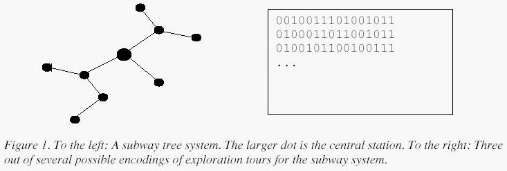
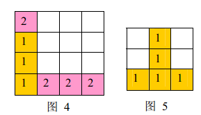

#### 0x08 总结与练习

##### 116. 飞行员兄弟

“飞行员兄弟”这个游戏，需要玩家顺利的打开一个拥有 16 个把手的冰箱。

已知每个把手可以处于以下两种状态之一：打开或关闭。

只有当所有把手都打开时，冰箱才会打开。

把手可以表示为一个 4×4 的矩阵，您可以改变任何一个位置 [i,j] 上把手的状态。

但是，这也会使得第 i 行和第 j 列上的所有把手的状态也随着改变。

请你求出打开冰箱所需的切换把手的次数最小值是多少。

**输入格式**
输入一共包含四行，每行包含四个把手的初始状态。

符号 + 表示把手处于闭合状态，而符号 - 表示把手处于打开状态。

至少一个手柄的初始状态是关闭的。

**输出格式**

第一行输出一个整数 N，表示所需的最小切换把手次数。

接下来 N 行描述切换顺序，每行输出两个整数，代表被切换状态的把手的行号和列号，数字之间用空格隔开。

**注意：**如果存在多种打开冰箱的方式，则按照优先级整体从上到下，同行从左到右打开。

**数据范围**

1≤i,j≤4

**输入样例：**
```
-+--
----
----
-+--
```
**输出样例：**
```
6
1 1
1 3
1 4
4 1
4 3
4 4
```
##### 117. 占卜DIY

达达学会了使用扑克 DIY 占卜。

**方法如下：**

一副去掉大小王的扑克共 52 张，打乱后均分为 13 堆，编号 1∼13，每堆 4 张，其中第 13 堆称作“生命牌”，也就是说你有 4 条命。

这里边，4 张 K 被称作死神。

初始状态下，所有的牌背面朝上扣下。

流程如下：

1.抽取生命牌中的最上面一张(第一张)。

2.把这张牌翻开，正面朝上，放到牌上的数字所对应编号的堆的最上边。(例如抽到 2，正面朝上放到第 2 堆牌最上面，又比如抽到 J，放到第 11 堆牌最上边，注意是正面朝上放)

3.从刚放了牌的那一堆最底下(最后一张)抽取一张牌，重复第 2 步。（例如你上次抽了 2，放到了第二堆顶部，现在抽第二堆最后一张发现是 8，又放到第 8 堆顶部.........）

4.在抽牌过程中如果抽到 K，则称死了一条命，就扔掉 K 再从第 1 步开始。

5.当发现四条命都死了以后，统计现在每堆牌上边正面朝上的牌的数目，只要同一数字的牌出现 4 张正面朝上的牌(比如 4 个 A)，则称“开了一对”，当然 4 个 K 是不算的。

6.统计一共开了多少对，开了 0 对称作”极凶”，1∼2 对为“大凶”，3 对为“凶”，4∼5 对为“小凶”，6 对为“中庸”，7∼8 对“小吉”，9 对为“吉”，10∼11 为“大吉”，12 为“满堂开花，极吉”。

**输入格式**

一共输入 13 行数据，每行四个数字或字母，表示每堆牌的具体牌型(不区分花色只区分数字)，每堆输入的顺序为从上到下。

为了便于读入，用 0 代表 10。

同行数字用空格隔开。

**输出格式**

输出一个整数，代表统计得到的开出的总对数。

**输入样例：**
```
8 5 A A
K 5 3 2
9 6 0 6
3 4 3 4
3 4 4 5
5 6 7 6
8 7 7 7
9 9 8 8
9 0 0 0
K J J J
Q A Q K
J Q 2 2
A K Q 2
```
**输出样例：**
```
9
```

##### 118. 分形

分形，具有以非整数维形式充填空间的形态特征。

通常被定义为“一个粗糙或零碎的几何形状，可以分成数个部分，且每一部分都（至少近似地）是整体缩小后的形状”，即具有自相似的性质。

现在，定义“盒子分形”如下：

一级盒子分形：

   X
二级盒子分形：

   X X
    X
   X X
如果用 B(n−1) 代表第 n−1 级盒子分形，那么第 n 级盒子分形即为：
```
  B(n - 1)        B(n - 1)

          B(n - 1)

  B(n - 1)        B(n - 1)
```  
你的任务是绘制一个 n 级的盒子分形。

**输入格式**

输入包含几个测试用例。

输入的每一行包含一个不大于 7 的正整数 n，代表要输出的盒子分形的等级。

输入的最后一行为 −1，代表输入结束。

**输出格式**

对于每个测试用例，使用 X 符号输出对应等级的盒子分形。

请注意 X 是一个大写字母。

每个测试用例后输出一个独立一行的短划线。

**输入样例**

```
1
2
3
4
-1
```
**输出样例**

```
X
-
X X
 X
X X
-
X X   X X
 X     X
X X   X X
   X X
    X
   X X
X X   X X
 X     X
X X   X X
-
X X   X X         X X   X X
 X     X           X     X
X X   X X         X X   X X
   X X               X X
    X                 X
   X X               X X
X X   X X         X X   X X
 X     X           X     X
X X   X X         X X   X X
         X X   X X
          X     X
         X X   X X
            X X
             X
            X X
         X X   X X
          X     X
         X X   X X
X X   X X         X X   X X
 X     X           X     X
X X   X X         X X   X X
   X X               X X
    X                 X
   X X               X X
X X   X X         X X   X X
 X     X           X     X
X X   X X         X X   X X
-
```

##### 119. 袭击

在与联盟的战斗中屡战屡败后，帝国撤退到了最后一个据点。

依靠其强大的防御系统，帝国击退了联盟的六波猛烈进攻。

经过几天的苦思冥想，联盟将军亚瑟终于注意到帝国防御系统唯一的弱点就是能源供应。

该系统由 N 个核电站供应能源，其中任何一个被摧毁都会使防御系统失效。

将军派出了 N 个特工进入据点之中，打算对能源站展开一次突袭。

不幸的是，由于受到了帝国空军的袭击，他们未能降落在预期位置。

作为一名经验丰富的将军，亚瑟很快意识到他需要重新安排突袭计划。

他现在最想知道的事情就是哪个特工距离其中任意一个发电站的距离最短。

你能帮他算出来这最短的距离是多少吗？

**输入格式**

输入中包含多组测试用例。

第一行输入整数 T，代表测试用例的数量。

对于每个测试用例，第一行输入整数 N。

接下来 N 行，每行输入两个整数 X 和 Y，代表每个核电站的位置的 X，Y 坐标。

在接下来 N 行，每行输入两个整数 X 和 Y，代表每名特工的位置的 X，Y 坐标。

**输出格式**

每个测试用例，输出一个最短距离值，结果保留三位小数。

每个输出结果占一行。

数据范围
```
1≤N≤100000,
0≤X,Y≤1000000000
```
**输入样例：**

```
2
4
0 0
0 1
1 0
1 1
2 2
2 3
3 2
3 3
4
0 0
0 0
0 0
0 0
0 0
0 0
0 0
0 0
```

**输出样例：**

```
1.414
0.000
```

##### AcWing 120. 防线  

达达学习数学竞赛的时候受尽了同仁们的鄙视，终于有一天......受尽屈辱的达达黑化成为了黑暗英雄怪兽达达。

就如同中二漫画的情节一样，怪兽达达打算毁掉这个世界。

数学竞赛界的精英 lqr 打算阻止怪兽达达的阴谋，于是她集合了一支由数学竞赛选手组成的超级行动队。

由于队员们个个都智商超群，很快，行动队便来到了怪兽达达的黑暗城堡的下方。

但是，同样强大的怪兽达达在城堡周围布置了一条“不可越过”的坚固防线。

防线由很多防具组成，这些防具分成了 N 组。

我们可以认为防线是一维的，那么每一组防具都分布在防线的某一段上，并且同一组防具是等距离排列的。

也就是说，我们可以用三个整数 S， E 和 D 来描述一组防具，即这一组防具布置在防线的 S，S+D，S+2D，…，S+KD(K∈Z，S+KD≤E，S+(K+1)D>E)位置上。

黑化的怪兽达达设计的防线极其精良。

如果防线的某个位置有偶数个防具，那么这个位置就是毫无破绽的(包括这个位置一个防具也没有的情况，因为 0 也是偶数)。

只有有奇数个防具的位置有破绽，但是整条防线上也最多只有一个位置有奇数个防具。

作为行动队的队长，lqr 要找到防线的破绽以策划下一步的行动。

但是，由于防具的数量太多，她实在是不能看出哪里有破绽。

作为 lqr 可以信任的学弟学妹们，你们要帮助她解决这个问题。

**输入格式**

输入文件的第一行是一个整数 T，表示有 T 组互相独立的测试数据。

每组数据的第一行是一个整数 N。

之后 N 行，每行三个整数 Si，Ei，Di，代表第 i 组防具的三个参数，数据用空格隔开。

**输出格式**

对于每组测试数据，如果防线没有破绽，即所有的位置都有偶数个防具，输出一行 "There's no weakness."(不包含引号) 。

否则在一行内输出两个空格分隔的整数 P 和 C，表示在位置 P 有 C 个防具。当然 C 应该是一个奇数。

**数据范围**
```
防具总数不多于10^8,

Si≤Ei,

1≤T≤5,

N≤200000,

0≤Si，Ei，Di≤2^31−1
```

**输入样例：**
```
3
2
1 10 1
2 10 1
2
1 10 1 
1 10 1 
4
1 10 1 
4 4 1 
1 5 1 
6 10 1
```
**输出样例：**
```
1 1

There's no weakness.

4 3
```

##### 121. 赶牛入圈

农夫约翰希望为他的奶牛们建立一个畜栏。

这些挑剔的畜生要求畜栏必须是正方形的，而且至少要包含 C 单位的三叶草，来当做它们的下午茶。

畜栏的边缘必须与 X，Y 轴平行。

约翰的土地里一共包含 N 单位的三叶草，每单位三叶草位于一个 1×1 的土地区域内，区域位置由其左下角坐标表示，并且区域左下角的 X,Y 坐标都为整数，范围在 1 到 10000 以内。

多个单位的三叶草可能会位于同一个 1×1 的区域内，因为这个原因，在接下来的输入中，同一个区域坐标可能出现多次。

只有一个区域完全位于修好的畜栏之中，才认为这个区域内的三叶草在畜栏之中。

请你帮约翰计算一下，能包含至少 C 单位面积三叶草的情况下，畜栏的最小边长是多少。

**输入格式**

第一行输入两个整数 C 和 N。

接下来 N 行，每行输入两个整数 X 和 Y，代表三叶草所在的区域的 X,Y 坐标。

同一行数据用空格隔开。

**输出格式**

输出一个整数，代表畜栏的最小边长。

数据范围
```
1≤C≤500,
C≤N≤500
```

**输入样例：**
```
3 4
1 2
2 1
4 1
5 2
```
**输出样例：**
```
4
```

##### 122. 糖果传递

有 n 个小朋友坐成一圈，每人有 a[i] 个糖果。

每人只能给左右两人传递糖果。

每人每次传递一个糖果代价为 1。

求使所有人获得均等糖果的最小代价。

**输入格式**

第一行输入一个正整数 n，表示小朋友的个数。

接下来 n 行，每行一个整数 a[i]，表示第 i 个小朋友初始得到的糖果的颗数。

**输出格式**

输出一个整数，表示最小代价。

**数据范围**
```
1≤n≤1000000,
0≤a[i]≤2×10^9,
```
数据保证一定有解。

**输入样例**
```
4
1
2
5
4
```
**输出样例：**
```
4
```

##### 123. 士兵

格格兰郡的 N 名士兵随机散落在全郡各地。

格格兰郡中的位置由一对 (x,y) 整数坐标表示。

士兵可以进行移动，每次移动，一名士兵可以向上，向下，向左或向右移动一个单位（因此，他的 x 或 y 坐标也将加 1 或减 1）。

现在希望通过移动士兵，使得所有士兵彼此相邻的处于同一条水平线内，即所有士兵的 y 坐标相同并且 x 坐标相邻。

请你计算满足要求的情况下，所有士兵的总移动次数最少是多少。

需注意，两个或多个士兵不能占据同一个位置。

**输入格式**
第一行输入整数 N，代表士兵的数量。

接下来的 N 行，每行输入两个整数 x 和 y，分别代表一个士兵所在位置的 x 坐标和 y 坐标，第 i 行即为第 i 个士兵的坐标 (x[i],y[i])。

**输出格式**

输出一个整数，代表所有士兵的总移动次数的最小值。

**数据范围**

```
1≤N≤10000,
−10000≤x[i],y[i]≤10000
```

**输入样例：**

```
5
1 2
2 2
1 3
3 -2
3 3
```
输出样例：

```
8
```

##### 124. 数的进制转换

编写一个程序，可以实现将一个数字由一个进制转换为另一个进制。

这里有 62 个不同数位 {0−9,A−Z,a−z}。

**输入格式**

第一行输入一个整数，代表接下来的行数。

接下来每一行都包含三个数字，首先是输入进制（十进制表示），然后是输出进制（十进制表示），最后是用输入进制表示的输入数字，数字之间用空格隔开。

输入进制和输出进制都在 2 到 62 的范围之内。

（在十进制下）A=10，B=11，…，Z=35，a=36，b=37，…，z=61 (0−9 仍然表示 0−9)。

**输出格式**

对于每一组进制转换，程序的输出都由三行构成。

第一行包含两个数字，首先是输入进制（十进制表示），然后是用输入进制表示的输入数字。

第二行包含两个数字，首先是输出进制（十进制表示），然后是用输出进制表示的输入数字。

第三行为空白行。

同一行内数字用空格隔开。

**输入样例：**

```
8
62 2 abcdefghiz
10 16 1234567890123456789012345678901234567890
16 35 3A0C92075C0DBF3B8ACBC5F96CE3F0AD2
35 23 333YMHOUE8JPLT7OX6K9FYCQ8A
23 49 946B9AA02MI37E3D3MMJ4G7BL2F05
49 61 1VbDkSIMJL3JjRgAdlUfcaWj
61 5 dl9MDSWqwHjDnToKcsWE1S
5 10 42104444441001414401221302402201233340311104212022133030
```

**输出样例：**

```
62 abcdefghiz
2 11011100000100010111110010010110011111001001100011010010001

10 1234567890123456789012345678901234567890
16 3A0C92075C0DBF3B8ACBC5F96CE3F0AD2

16 3A0C92075C0DBF3B8ACBC5F96CE3F0AD2
35 333YMHOUE8JPLT7OX6K9FYCQ8A

35 333YMHOUE8JPLT7OX6K9FYCQ8A
23 946B9AA02MI37E3D3MMJ4G7BL2F05

23 946B9AA02MI37E3D3MMJ4G7BL2F05
49 1VbDkSIMJL3JjRgAdlUfcaWj

49 1VbDkSIMJL3JjRgAdlUfcaWj
61 dl9MDSWqwHjDnToKcsWE1S

61 dl9MDSWqwHjDnToKcsWE1S
5 42104444441001414401221302402201233340311104212022133030

5 42104444441001414401221302402201233340311104212022133030
10 1234567890123456789012345678901234567890
```
##### 125. 耍杂技的牛

农民约翰的 N 头奶牛（编号为 1..N）计划逃跑并加入马戏团，为此它们决定练习表演杂技。

奶牛们不是非常有创意，只提出了一个杂技表演：

叠罗汉，表演时，奶牛们站在彼此的身上，形成一个高高的垂直堆叠。

奶牛们正在试图找到自己在这个堆叠中应该所处的位置顺序。

这 N 头奶牛中的每一头都有着自己的重量 Wi 以及自己的强壮程度 Si。

一头牛支撑不住的可能性取决于它头上所有牛的总重量（不包括它自己）减去它的身体强壮程度的值，现在称该数值为风险值，风险值越大，这只牛撑不住的可能性越高。

您的任务是确定奶牛的排序，使得所有奶牛的风险值中的最大值尽可能的小。

**输入格式**

第一行输入整数 N，表示奶牛数量。

接下来 N 行，每行输入两个整数，表示牛的重量和强壮程度，第 i 行表示第 i 头牛的重量 Wi 以及它的强壮程度 Si。

**输出格式**

输出一个整数，表示最大风险值的最小可能值。

**数据范围**

```
1≤N≤50000,
1≤Wi≤10,000,
1≤Si≤1,000,000,000
```
**输入样例：**

```
3
10 3
2 5
3 3
```
**输出样例：**

```
2
```
##### 126. 最大的和

给定一个包含整数的二维矩阵，子矩形是位于整个阵列内的任何大小为 1×1 或更大的连续子阵列。

矩形的总和是该矩形中所有元素的总和。

在这个问题中，具有最大和的子矩形被称为最大子矩形。

例如，下列数组：
```
0 -2 -7 0 
9 2 -6 2 
-4 1 -4 1 
-1 8 0 -2 
```
其最大子矩形为:

```
9 2 
-4 1 
-1 8
```

它拥有最大和 15。

输入格式

输入中将包含一个 N×N 的整数数组。

第一行只输入一个整数 N，表示方形二维数组的大小。

从第二行开始，输入由空格和换行符隔开的 N2 个整数，它们即为二维数组中的 N2 个元素，输入顺序从二维数组的第一行开始向下逐行输入，同一行数据从左向右逐个输入。

数组中的数字会保持在 [−127,127] 的范围内。

输出格式
输出一个整数，代表最大子矩形的总和。

数据范围
```
1≤N≤100
```
输入样例：

```
4
0 -2 -7 0 9 2 -6 2
-4 1 -4  1 -1

8  0 -2
```
输出样例：
```
15
```

##### 127. 任务

今天某公司有 M 个任务需要完成。

每个任务都有相应的难度级别和完成任务所需时间。

第 i 个任务的难度级别为 yi，完成任务所需时间为 xi 分钟。

如果公司完成此任务，他们将获得（500×xi+2×yi）美元收入。

该公司有 N 台机器，每台机器都有最长工作时间和级别。

如果任务所需时间超过机器的最长工作时间，则机器无法完成此任务。

如果任务难度级别超过机器的级别，则机器无法完成次任务。

每台机器一天内只能完成一项任务。

每个任务只能由一台机器完成。

请为他们设计一个任务分配方案，使得该公司能够最大化他们今天可以完成的任务数量。

如果有多种解决方案，他们希望选取赚取利润最高的那种。

**输入格式**

输入包含几个测试用例。

对于每个测试用例，第一行包含两个整数 N 和 M，分别代表机器数量和任务数量。

接下来 N 行，每行包含两个整数 xi,yi，分别代表机器最长工作时间和机器级别。

再接下来 M 行，每行包含两个整数 xi,yi，分别代表完成任务所需时间和任务难度级别。

**输出格式**

对于每个测试用例，输出两个整数，代表公司今天可以完成的最大任务数以及他们将获得的收入。

**数据范围**

```
1≤N,M≤100000,
0<xi<1440,
0≤yi≤100
```

**输入样例：**

```
1 2
100 3
100 2
100 1
```

**输出样例：**

```
1 50004
```

#### 0x18 总结与练习

##### 150. 括号画家

达达是一名漫画家，她有一个奇特的爱好，就是在纸上画括号。

这一天，刚刚起床的达达画了一排括号序列，其中包含小括号 ( )、中括号 [ ] 和大括号 { }，总长度为 N。

这排随意绘制的括号序列显得杂乱无章，于是达达定义了什么样的括号序列是美观的：

1 空的括号序列是美观的；

2 若括号序列 A 是美观的，则括号序列 (A)、[A]、{A} 也是美观的；

3 若括号序列 A、B 都是美观的，则括号序列 AB 也是美观的。

例如 [(){}]() 是美观的括号序列，而)({)[}]( 则不是。

现在达达想在她绘制的括号序列中，找出其中连续的一段，满足这段子串是美观的，并且长度尽量大。

你能帮帮她吗？

**输入格式**

输入一行由括号组成的字符串。

**输出格式**

输出一个整数，表示最长的美观的子段的长度。

**数据范围**

字符串长度不超过 105。

**输入样例：**
```
({({(({()}})}{())})})[){{{([)()((()]]}])[{)]}{[}{)
```

**输出样例：**
```
4
```

##### 151. 表达式计算4

给出一个表达式,其中运算符仅包含+,-,*,/,^ （加 减 乘 整除 乘方）要求求出表达式的最终值。

数据可能会出现括号情况，还有可能出现多余括号情况。

数据保证不会出现大于或等于231的答案。

数据可能会出现负数情况。

**输入格式**

输入仅一行，即为表达式。

**输出格式**

输出仅一行，既为表达式算出的结果。

**输入样例：**

```
(2+2)^(1+1)
```

**输出样例：**

```
16
```

##### 152. 城市游戏

有一天，小猫 rainbow 和 freda 来到了湘西张家界的天门山玉蟾宫，玉蟾宫宫主蓝兔盛情地款待了它们，并赐予它们一片土地。

这片土地被分成 N×M 个格子，每个格子里写着 R 或者 F，R 代表这块土地被赐予了 rainbow，F 代表这块土地被赐予了 freda。

现在 freda 要在这里卖萌。。。它要找一块矩形土地，要求这片土地都标着 F 并且面积最大。

但是 rainbow 和 freda 的 OI 水平都弱爆了，找不出这块土地，而蓝兔也想看 freda 卖萌（她显然是不会编程的……），所以它们决定，如果你找到的土地面积为 S，它们将给你 3×S 两银子。

**输入格式**

第一行包括两个整数 N,M，表示矩形土地有 N 行 M 列。

接下来 N 行，每行 M 个用空格隔开的字符 F 或 R，描述了矩形土地。

每行末尾没有多余空格。

**输出格式**

输出一个整数，表示你能得到多少银子，即(3×最大 F 矩形土地面积)的值。

**数据范围**

```
1≤N,M≤1000
```

**输入样例：**
```
5 6
R F F F F F
F F F F F F
R R R F F F
F F F F F F
F F F F F F
```

**输出样例：**

```
45
```
##### 153. 双栈排序

Tom 最近在研究一个有趣的排序问题。

通过 2 个栈 S1 和 S2，Tom 希望借助以下 4 种操作实现将输入序列升序排序。

操作 a

如果输入序列不为空，将第一个元素压入栈 S1

操作 b

如果栈 S1 不为空，将 S1 栈顶元素弹出至输出序列

操作 c

如果输入序列不为空，将第一个元素压入栈 S2

操作 d

如果栈 S2 不为空，将 S2 栈顶元素弹出至输出序列

如果一个 1~n 的排列 P 可以通过一系列操作使得输出序列为 1,2,…,(n−1),n，Tom 就称 P 是一个”可双栈排序排列”。

例如 (1,3,2,4) 就是一个”可双栈排序序列”，而 (2,3,4,1) 不是。

下图描述了一个将 (1,3,2,4) 排序的操作序列：<a, c, c, b, a, d, d, b>


当然，这样的操作序列有可能有几个，对于上例 (1,3,2,4)，<a, c, c, b, a, d, d, b>是另外一个可行的操作序列。

Tom 希望知道其中字典序最小的操作序列是什么。

**输入格式**

第一行是一个整数 n。

第二行有 n 个用空格隔开的正整数，构成一个 1∼n 的排列。

**输出格式**

输出共一行，如果输入的排列不是”可双栈排序排列”，输出数字 0。

否则输出字典序最小的操作序列，每两个操作之间用空格隔开，行尾没有空格。

**数据范围**

1≤n≤1000

**输入样例：**
```
4
1 3 2 4
```
**输出样例：**

```
a b a a b b a b
```
##### 154. 滑动窗口

给定一个大小为 n≤106 的数组。

有一个大小为 k 的滑动窗口，它从数组的最左边移动到最右边。

你只能在窗口中看到 k 个数字。

每次滑动窗口向右移动一个位置。

以下是一个例子：

```
该数组为 [1 3 -1 -3 5 3 6 7]，k 为 3。

窗口位置	最小值	最大值

[1 3 -1] -3 5 3 6 7	-1	3
1 [3 -1 -3] 5 3 6 7	-3	3
1 3 [-1 -3 5] 3 6 7	-3	5
1 3 -1 [-3 5 3] 6 7	-3	5
1 3 -1 -3 [5 3 6] 7	3	6
1 3 -1 -3 5 [3 6 7]	3	7
```

你的任务是确定滑动窗口位于每个位置时，窗口中的最大值和最小值。

**输入格式**

输入包含两行。

第一行包含两个整数 n 和 k，分别代表数组长度和滑动窗口的长度。

第二行有 n 个整数，代表数组的具体数值。

同行数据之间用空格隔开。

**输出格式**

输出包含两个。

第一行输出，从左至右，每个位置滑动窗口中的最小值。

第二行输出，从左至右，每个位置滑动窗口中的最大值。

**输入样例:**

```
8 3
1 3 -1 -3 5 3 6 7
```

**输出样例：**
```
-1 -3 -3 -3 3 3
3 3 5 5 6 7
```
##### 155. 内存分配

内存是计算机重要的资源之一，程序运行的过程中必须对内存进行分配。

经典的内存分配过程是这样进行的：

1、内存以内存单元为基本单位，每个内存单元用一个固定的整数作为标识，称为地址。地址从 0 开始连续排列，地址相邻的内存单元被认为是逻辑上连续的。我们把从地址 i 开始的 s 个连续的内存单元称为首地址为 i 长度为 s 的地址片。

2、运行过程中有若干进程需要占用内存，对于每个进程有一个申请时刻 T，需要内存单元数 M 及运行时间 P。在运行时间 P 内（即 T 时刻开始，T+P 时刻结束），这 M 个被占用的内存单元不能再被其他进程使用。

3、假设在T时刻有一个进程申请 M 个单元，且运行时间为 P，则：

若 T 时刻内存中存在长度为 M 的空闲地址片，则系统将这 M 个空闲单元分配给该进程。若存在多个长度为 M 个空闲地址片，则系统将首地址最小的那个空闲地址片分配给该进程。

如果 T 时刻不存在长度为 M 的空闲地址片，则该进程被放入一个等待队列。对于处于等待队列队头的进程，只要在任一时刻，存在长度为 M 的空闲地址片，系统马上将该进程取出队列，并为它分配内存单元。注意，在进行内存分配处理过程中，处于等待队列队头的进程的处理优先级最高，队列中的其它进程不能先于队头进程被处理。

现在给出一系列描述进程的数据，请编写一程序模拟系统分配内存的过程。

**输入格式**

第一行是一个数 N，表示总内存单元数（即地址范围从 0 到 N−1）。

从第二行开始每行描述一个进程的三个整数 T、M、P（M≤N）。

最后一行用三个 0 表示结束。

数据已按 T 从小到大排序。

输入文件最多 10000 行，且所有数据都小于 109。

输入文件中同一行相邻两项之间用一个或多个空格隔开。

**输出格式**

输出包括 2 行。

第一行是全部进程都运行完毕的时刻。

第二行是被放入过等待队列的进程总数。

**输入样例：**
```
10
1 3 10
2 4 3
3 4 4
4 1 4
5 3 4
0 0 0
```
**输出样例：**
```
12
2
```
提示


##### 156. 矩阵

给定一个 M 行 N 列的 01 矩阵（只包含数字 0 或 1 的矩阵），再执行 Q 次询问，每次询问给出一个 A 行 B 列的 01 矩阵，求该矩阵是否在原矩阵中出现过。

**输入格式**

第一行四个整数 M,N,A,B。

接下来一个 M 行 N 列的 01 矩阵，数字之间没有空格。

接下来一个整数 Q。

接下来 Q 个 A 行 B 列的 01 矩阵，数字之间没有空格。

**输出格式**
对于每个询问，输出 1 表示出现过，0 表示没有出现过。

**数据范围**

A≤100，M,N,B≤1000，Q≤1000

**输入样例：**

```
3 3 2 2
111
000
111
3
11
00
11
11
00
11
```

**输出样例：**

```
1
0
1
```
##### 157. 树形地铁系统

一些主要城市拥有树形的地铁系统，即在任何一对车站之间，有且只有一种方式可以乘坐地铁。

此外，这些城市大多数都有一个中央车站。

想象一下，你是一名在拥有树形地铁系统的城市游玩的游客，你想探索该城市完整的地铁线路。

你从中央车站出发，随机选择一条地铁线，然后乘坐地铁行进。

每次到达一个车站，你都将选择一条尚未乘坐过的地铁线路进行乘坐。

如果不存在未乘坐过的线路，则退回到上一个车站，再做选择。

直到你将所有地铁线路都乘坐过两次（往返各一次），此时你将回到中央车站。

之后，你以一种特殊的方式回忆自己的坐车过程，你将你的完整地铁乘坐路线编码为一个二进制字符串。

其中 0 编码表示你乘坐地铁线路到达距离中央车站更远的一站，1 编码表示你乘坐地铁线路到达距离中央车站更近的一站。



**输入格式**

第一行输入一个正整数 n，代表测试用例数量。

每个测试用例由两行组成，每行输入一个由字符 0 和 1 构成的字符串，长度最多为 3000， 两个字符串都描述了一种树形地铁系统的正确探索路线。

**输出格式**

对于每个测试用例，如果两个字符串描述的探索路线可以视为同一个地铁系统的两种探索路线，则输出 same。

否则，输出 different。

每行输出一个结果。

**输入样例：**

```
2
0010011101001011
0100011011001011
0100101100100111
0011000111010101
```

**输出样例：**

same

different

##### 158. 项链

有一天，达达捡了一条价值连城的宝石项链，但是，一个严重的问题是，他并不知道项链的主人是谁！

在得知此事后，很多人向达达发来了很多邮件，都说项链是自己的，要求他归还（显然其中最多只有一个人说了真话）。

达达要求每个人都写了一段关于自己项链的描述： 项链上的宝石用数字 0 至 9 来标示。

一个对于项链的表示就是从项链的某个宝石开始，顺指针绕一圈，沿途记下经过的宝石，比如项链： 0−1−2−3，它的可能的四种表示是 0123、1230、2301、3012。

达达现在心急如焚，于是他找到了你，希望你能够编写一个程序，判断两个给定的描述是否代表同一个项链（注意，项链是不会翻转的）。

也就是说给定两个项链的表示，判断他们是否可能是一条项链。

**输入格式**

输入文件只有两行，每行一个由字符 0 至 9 构成的字符串，描述一个项链的表示（保证项链的长度是相等的）。

**输出格式**

如果两个对项链的描述不可能代表同一个项链，那么输出 No，否则的话，第一行输出一个 Yes，第二行输出该项链的字典序最小的表示。

**数据范围**

设项链的长度为 L，1≤L≤1000000

**输入样例：**

```
2234342423
2423223434
```

**输出样例：**

```
Yes
2234342423
```

##### 159. 奶牛矩阵

每天早上，农夫约翰的奶牛们被挤奶的时候，都会站成一个 R 行 C 列的方阵。

现在在每个奶牛的身上标注表示其品种的大写字母，则所有奶牛共同构成了一个 R 行 C 列的字符矩阵。

现在给定由所有奶牛构成的矩阵，求它的最小覆盖子矩阵的面积是多少。

如果一个子矩阵无限复制扩张之后得到的矩阵能包含原来的矩阵，则称该子矩阵为覆盖子矩阵。

**输入格式**

第 1 行：输入两个用空格隔开的整数，R 和 C。

第 2..R+1 行：描绘由奶牛构成的 R 行 C 列的矩阵，每行 C 个字符，字符之间没有空格。

**输出格式**

输出最小覆盖子矩阵的面积。（每个字符的面积为 1）

**数据范围**
```
1≤R≤10000,
1≤C≤75
```
**输入样例：**
```
2 5
ABABA
ABABA
```
**输出样例：**
```
2
```
提示:样例中给出的矩阵的最小覆盖子矩阵为 AB，面积为 2。

##### 160. 匹配统计

阿轩在纸上写了两个字符串，分别记为 A 和 B。

利用在数据结构与算法课上学到的知识，他很容易地求出了“字符串 A 从任意位置开始的后缀子串”与“字符串 B”匹配的长度。

不过阿轩是一个勤学好问的同学，他向你提出了 Q 个问题：

在每个问题中，他给定你一个整数 x，请你告诉他有多少个位置，满足“字符串 A 从该位置开始的后缀子串”与 B 匹配的长度恰好为 x。

例如：A=aabcde，B=ab，则 A 有 aabcde、abcde、bcde、cde、de、e 这 6 个后缀子串，它们与 B=ab 的匹配长度分别是 1、2、0、0、0、0。

因此 A 有 4 个位置与 B 的匹配长度恰好为 0，有 1 个位置的匹配长度恰好为 1，有 1 个位置的匹配长度恰好为 2。

**输入格式**
第一行输入三个整数 N,M,Q，分别表示 A 串长度、B 串长度、问题个数。

第二行输入字符串 A，第三行输入字符串 B。

接下来 Q 行每行输入 1 个整数 x，表示一个问题。

**输出格式**

输出共 Q 行，依次表示每个问题的答案。

**数据范围**

```
1≤N,M,Q,x≤200000
```
**输入样例：**
```
6 2 5
aabcde
ab

0
1
2
3
4
```
**输出样例：**
```
4
1
1
0
0
```

##### 161. 电话列表

给出一个电话列表，如果列表中存在其中一个号码是另一个号码的前缀这一情况，那么就称这个电话列表是不兼容的。

假设电话列表如下：

Emergency 911

Alice 97 625 999

Bob 91 12 54 26

在此例中，报警电话号码（911）为 Bob 电话号码（91 12 54 26）的前缀，所以该列表不兼容。

**输入格式**

第一行输入整数 t，表示测试用例数量。

对于每个测试用例，第一行输入整数 n，表示电话号码数量。

接下来 n 行，每行输入一个电话号码，号码内数字之间无空格，电话号码不超过 10 位。

**输出格式**

对于每个测试用例，如果电话列表兼容，则输出 YES。

否则，输出 NO。

**数据范围**
```
1≤t≤40,
1≤n≤10000
```
**输入样例：**
```
2
3
911
97625999
91125426
5
113
12340
123440
12345
98346
```
**输出样例：**
```
NO
YES
```

##### 162. 黑盒子

黑盒子代表一个原始的数据库。

它可以用来储存整数数组，并且它拥有一个特殊变量 i。

在最开始，黑盒子是空的，并且 i=0。

现在对黑盒子进行一系列的操作处理，操作包括以下两种：

1 ADD(x)：表示将 x 加入到黑盒子中。
2 GET：使 i 增加 1，输出黑盒子中第 i 小的数值（即将所有数按升序排序后的第 i 个数）。

下面给出一个具体例子：

```
序号 操作        i     盒子内数（升序排列后）             输出的值 
1    ADD(3)      0     3   
2    GET         1     3                                    3 
3    ADD(1)      1     1, 3   
4    GET         2     1, 3                                 3 
5    ADD(-4)     2     -4, 1, 3   
6    ADD(2)      2     -4, 1, 2, 3   
7    ADD(8)      2     -4, 1, 2, 3, 8   
8    ADD(-1000)  2     -1000, -4, 1, 2, 3, 8   
9    GET         3     -1000, -4, 1, 2, 3, 8                1 
10   GET         4     -1000, -4, 1, 2, 3, 8                2 
11   ADD(2)      4     -1000, -4, 1, 2, 2, 3, 8   
```

为了方便描述，下面我们定义两个序列：

1 A(1),A(2),…,A(M)：这个序列由加入到黑盒子内的所有元素按加入顺序排列后得到，上例中的 A 序列为 (3,1,−4,2,8,−1000,2)。

2 u(1),u(2),…,u(N)：这个序列的第 i 项表示的是第 i 次 GET 操作时，盒子内元素的数量。上例中的 u 序列为 (1,2,6,6)。

现在请你根据给出的序列 A 和 u 求出操作过程中输出的所有数值。

**输入格式**

输入包括三行。

第一行包含两个整数 M 和 N，表示 A 序列和 u 序列的长度。

第二行包含 M 个整数，表示 A 序列的每一个元素。

第三行包含 N 个整数，表示 u 序列的每一个元素。

同行每个数之间用空格隔开。

**输出格式**

输出操作过程中所有 GET 操作输出的数值。

每个数值占一行。

**数据范围**
```
|A(i)|≤2×109,
1≤N≤M≤30000,
对于所有 p（1≤p≤N）, p≤u(p)≤M 成立。
```

**输入样例：**
```
7 4
3 1 -4 2 8 -1000 2
1 2 6 6
```
**输出样例：**
```
3
3
1
2
```


##### 163. 生日礼物

翰翰 18 岁生日的时候，达达给她看了一个神奇的序列 A1,A2,…,AN。

她被允许从中选择不超过 M 个连续的部分作为自己的生日礼物。

翰翰想要知道选择元素之和的最大值。

你能帮助她吗？

**输入格式**

第一行包含两个整数 N,M。

第二行包含 N 个整数 A1∼AN。

**输出格式**

输出一个整数，表示答案。

**数据范围**
```
1≤N,M≤105,
|Ai|≤104
```
**输入样例：**
```
5 2 
2 -3 2 -1 2
```
**输出样例：**

5

#### 0x29 总结与练习    

##### 183. 靶形数独

小城和小华都是热爱数学的好学生，最近，他们不约而同地迷上了数独游戏，好胜的他们想用数独来一比高低。

但普通的数独对他们来说都过于简单了，于是他们向 Z 博士请教，Z 博士拿出了他最近发明的“靶形数独”，作为这两个孩子比试的题目。

靶形数独的方格同普通数独一样，在 9×9 的大九宫格中有 9 个 3×3 的小九宫格（用粗黑色线隔开的）。

在这个大九宫格中，有一些数字是已知的，根据这些数字，利用逻辑推理，在其他的空格上填入 1 到 9 的数字。

每个数字在每个小九宫格内不能重复出现，每个数字在每行、每列也不能重复出现。

但靶形数独有一点和普通数独不同，即每一个方格都有一个分值，而且如同一个靶子一样，离中心越近则分值越高（如下图所示）。


上图具体的分值分布是：最里面一格（黄色区域）为 10 分，黄色区域外面的一圈（红色区域）每个格子为 9 分，再外面一圈（蓝色区域）每个格子为 8 分，蓝色区域外面一圈（棕色区域）每个格子为 7 分，最外面一圈（白色区域）每个格子为 6 分，如上图所示。

比赛的要求是：每个人必须完成一个给定的数独（每个给定数独可能有不同的填法），而且要争取更高的总分数。

而这个总分数即每个方格上的分值和完成这个数独时填在相应格上的数字的乘积的总和。

如图，在以下的这个已经填完数字的靶形数独游戏中，总分数为 2829。

游戏规定，将以总分数的高低决出胜负。


由于求胜心切，小城找到了善于编程的你，让你帮他求出，对于给定的靶形数独，能够得到的最高分数。

**输入格式**

输入一共包含 9 行。

每行 9 个整数（每个数都在 0—9 的范围内），表示一个尚未填满的数独方格，未填的空格用 0 表示。

每两个数字之间用一个空格隔开。

**输出格式**

输出可以得到的靶形数独的最高分数。

如果这个数独无解，则输出整数 −1。

**数据范围**

40% 的数据，数独中非 0 数的个数不少于 30。

80% 的数据，数独中非 0 数的个数不少于 26。

100% 的数据，数独中非 0 数的个数不少于 24。

**输入样例：**

```
7 0 0 9 0 0 0 0 1 
1 0 0 0 0 5 9 0 0 
0 0 0 2 0 0 0 8 0 
0 0 5 0 2 0 0 0 3 
0 0 0 0 0 0 6 4 8 
4 1 3 0 0 0 0 0 0 
0 0 7 0 0 2 0 9 0 
2 0 1 0 6 0 8 0 4 
0 8 0 5 0 4 0 1 2 
```
**输出样例：**

2829

##### 184. 虫食算

所谓虫食算，就是原先的算式中有一部分被虫子啃掉了，需要我们根据剩下的数字来判定被啃掉的字母。

来看一个简单的例子：
```
 43#9865#045
+  8468#6633
--------------
 44445506978
```

其中 # 号代表被虫子啃掉的数字。

根据算式，我们很容易判断：第一行的两个数字分别是 5 和 3，第二行的数字是 5。

现在，我们对问题做两个限制：

首先，我们只考虑加法的虫食算。这里的加法是 N 进制加法，算式中三个数都有 N 位，允许有前导的 0。

其次，虫子把所有的数都啃光了，我们只知道哪些数字是相同的，我们将相同的数字用相同的字母表示，不同的数字用不同的字母表示。

如果这个算式是 N 进制的，我们就取英文字母表的前 N 个大写字母来表示这个算式中的 0 到 N−1 这 N 个不同的数字：但是这 N 个字母并不一定顺序地代表 0 到 N−1。

输入数据保证 N 个字母分别至少出现一次。
```
   BADC
+  CBDA
----------
   DCCC
```
上面的算式是一个 4 进制的算式。

很显然，我们只要让 ABCD 分别代表 0123，便可以让这个式子成立了。

你的任务是，对于给定的 N 进制加法算式，求出 N 个不同的字母分别代表的数字，使得该加法算式成立。

输入数据保证有且仅有一组解。

**输入格式**

输入包含 4 行。

第一行有一个正整数 N(N≤26)，后面的 3 行每行有一个由大写字母组成的字符串，分别代表两个加数以及和。

这 3 个字符串左右两端都没有空格，并且恰好有 N 位。

**输出格式**

输出包含一行。

在这一行中，应当包含唯一的那组解。

解是这样表示的：输出 N 个数字，分别表示 A，B，C…… 所代表的数字，相邻的两个数字用一个空格隔开，不能有多余的空格。

**输入样例：**

```
5
ABCED
BDACE
EBBAA
```
**输出样例：**
```
1 0 3 4 2
```
##### 185. 玛雅游戏

玛雅难题是最近流行起来的一个游戏。

游戏界面是一个 7 行 5 列的棋盘，上面堆放着一些方块，方块不能悬空堆放，即方块必须放在最下面一行，或者放在其他方块之上。

游戏通关是指在规定的步数内消除所有的方块，消除方块的规则如下：

1、每步移动可以且仅可以沿横向（即向左或向右）拖动某一方块一格：当拖动这一方块时，如果拖动后到达的位置（以下称目标位置）也有方块，那么这两个方块将交换位置（参见输入输出样例说明中的图 6 到图 7）；如果目标位置上没有方块，那么被拖动的方块将从原来的竖列中抽出，并从目标位置上掉落（直到不悬空，参见下面图 1 和图 2 ）；


2、任一时刻，如果在一横行或者竖列上有连续三个或者三个以上相同颜色的方块，则它们将立即被消除（参见图 1 到图 3）。
注意：
a) 如果同时有多组方块满足消除条件，几组方块会同时被消除（例如下面图 4 ，三个颜色为 1 的方块和三个颜色为 2 的方块会同时被消除，最后剩下一个颜色为 2 的方块）。
b) 当出现行和列都满足消除条件且行列共享某个方块时，行和列上满足消除条件的所有方块会被同时消除（例如下面图 5 所示的情形，5 个方块会同时被消除）。



3、方块消除之后，消除位置之上的方块将掉落，掉落后可能会引起新的方块消除。注意：掉落的过程中将不会有方块的消除。

上面图 1 到图 3 给出了在棋盘上移动一块方块之后棋盘的变化。

棋盘的左下角方块的坐标为 (0,0)，将位于 (3,3) 的方块向左移动之后，游戏界面从图 1 变成图 2 所示的状态，此时在一竖列上有连续三块颜色为 4 的方块，满足消除条件，消除连续 3 块颜色为 4 的方块后，上方的颜色为 3 的方块掉落，形成图 3 所示的局面。

输入格式
第一行为一个正整数 n，表示要求游戏通关的步数（这里指的是恰好 n 步通关）。

接下来的 5 行，描述 7×5 的游戏界面。

每行若干个整数，每两个整数之间用一个空格隔开，每行以一个 0 结束，自下向上表示每竖列方块的颜色编号（颜色不多于 10 种，从 1 开始顺序编号，相同数字表示相同颜色）。

输入数据保证初始棋盘中没有可以消除的方块。

输出格式
如果有解决方案，输出 n 行，每行包含 3 个整数 x，y，g，表示一次移动，每两个整数之间用一个空格隔开，其中 (x，y) 表示要移动的方块的坐标，g 表示移动的方向，1 表示向右移动，−1 表示向左移动。

注意：多组解时，按照 x 为第一关健字，y 为第二关健字，1 优先于 −1，给出一组字典序最小的解。

游戏界面左下角的坐标为 (0，0)。

如果没有解决方案，输出一行，包含一个整数 −1。

数据范围
对于 30% 的数据，初始棋盘上的方块都在棋盘的最下面一行；
对于 100% 的数据，0<n≤5。

输入样例：
```
3 
1 0 
2 1 0 
2 3 4 0 
3 1 0 
2 4 3 4 0
```
输出样例：
```
2 1 1 
3 1 1 
3 0 1
```
样例解释

按箭头方向的顺序分别为图 6 到图 11


样例输入的游戏局面如图 6 所示，依次移动的三步是：

1、(2，1) 处的方格向右移动。
2、(3，1) 处的方格向右移动。
3、(3，0) 处的方格向右移动。

最后可以将棋盘上所有方块消除。

##### 186. 巴士

一名男子在 12:00 抵达了某巴士站，并且在 12：00∼12：59 期间他将在那里逗留。

巴士站有很多巴士路线，巴士抵达的时间均已给出。

该男子观察巴士的抵达时间，有所发现：

1、在 12：00∼12：59 期间，同一线路上的巴士以相同的时间间隔到站。

2、每条巴士线路至少有两辆车到达本站。

3、不同线路的巴士可以同时到达本站。

4、不同巴士线路的车首次到达本站的时间和到站的时间间隔都有可能相同。

5、测试用例中的总线路不会超过 17 条。

请你编写一个程序，求出在所有巴士到达本站的时刻满足输入数据的要求的情况下，巴士线路的总数量最小是多少。

**输入格式**

输入数据第一行包含整数 n，表示在这一小时内抵达到该站的巴士总数量。

第二行包含 n 个整数，表示按升序排序得到的 n 个巴士的到站时间。

**输出格式**

输出一个整数，表示最小巴士线路数。

**数据范围**

1≤n≤300

**输入样例：**
```
17
0 3 5 13 13 15 21 26 27 29 37 39 39 45 51 52 53
```
**输出样例：**

3

##### 187. 导弹防御系统

为了对抗附近恶意国家的威胁，R 国更新了他们的导弹防御系统。

一套防御系统的导弹拦截高度要么一直 严格单调 上升要么一直 严格单调 下降。

例如，一套系统先后拦截了高度为 3 和高度为 4 的两发导弹，那么接下来该系统就只能拦截高度大于 4 的导弹。

给定即将袭来的一系列导弹的高度，请你求出至少需要多少套防御系统，就可以将它们全部击落。

**输入格式**

输入包含多组测试用例。

对于每个测试用例，第一行包含整数 n，表示来袭导弹数量。

第二行包含 n 个不同的整数，表示每个导弹的高度。

当输入测试用例 n=0 时，表示输入终止，且该用例无需处理。

**输出格式**

对于每个测试用例，输出一个占据一行的整数，表示所需的防御系统数量。

**数据范围**

1≤n≤50

**输入样例：**
```
5
3 5 2 4 1
0
``` 
**输出样例：**
```
2
```
样例解释

对于给出样例，最少需要两套防御系统。

一套击落高度为 3,4 的导弹，另一套击落高度为 5,2,1 的导弹。

##### 188. 武士风度的牛

农民 John 有很多牛，他想交易其中一头被 Don 称为 The Knight 的牛。

这头牛有一个独一无二的超能力，在农场里像 Knight 一样地跳（就是我们熟悉的象棋中马的走法）。

虽然这头神奇的牛不能跳到树上和石头上，但是它可以在牧场上随意跳，我们把牧场用一个 x，y 的坐标图来表示。

这头神奇的牛像其它牛一样喜欢吃草，给你一张地图，上面标注了 The Knight 的开始位置，树、灌木、石头以及其它障碍的位置，除此之外还有一捆草。

现在你的任务是，确定 The Knight 要想吃到草，至少需要跳多少次。

The Knight 的位置用 K 来标记，障碍的位置用 * 来标记，草的位置用 H 来标记。

这里有一个地图的例子：
```

             11 | . . . . . . . . . .
             10 | . . . . * . . . . . 
              9 | . . . . . . . . . . 
              8 | . . . * . * . . . . 
              7 | . . . . . . . * . . 
              6 | . . * . . * . . . H 
              5 | * . . . . . . . . . 
              4 | . . . * . . . * . . 
              3 | . K . . . . . . . . 
              2 | . . . * . . . . . * 
              1 | . . * . . . . * . . 
              0 ----------------------
                                    1 
                0 1 2 3 4 5 6 7 8 9 0 
```
The Knight 可以按照下图中的 A,B,C,D… 这条路径用 5 次跳到草的地方（有可能其它路线的长度也是 5）：
```
             11 | . . . . . . . . . .
             10 | . . . . * . . . . .
              9 | . . . . . . . . . .
              8 | . . . * . * . . . .
              7 | . . . . . . . * . .
              6 | . . * . . * . . . F<
              5 | * . B . . . . . . .
              4 | . . . * C . . * E .
              3 | .>A . . . . D . . .
              2 | . . . * . . . . . *
              1 | . . * . . . . * . .
              0 ----------------------
                                    1
                0 1 2 3 4 5 6 7 8 9 0
```
注意： 数据保证一定有解。

**输入格式**

第 1 行： 两个数，表示农场的列数 C 和行数 R。

第 2..R+1 行: 每行一个由 C 个字符组成的字符串，共同描绘出牧场地图。

**输出格式**
一个整数，表示跳跃的最小次数。

**数据范围**

1≤R,C≤150

**输入样例：**
```
10 11
..........
....*.....
..........
...*.*....
.......*..
..*..*...H
*.........
...*...*..
.K........
...*.....*
..*....*..
```
**输出样例：**

5

##### 189. 乳草的入侵

农民约翰一直努力让他的草地充满鲜美多汁而又健康的牧草。

可惜天不从人愿，他在植物大战人类中败下阵来。

邪恶的乳草已经在他的农场的西北部份占领了一片立足之地。

草地像往常一样，被分割成一个高度为 Y，宽度为 X 的直角网格。

(1,1) 是左下角的格（也就是说坐标排布跟一般的 X,Y 坐标相同）。

乳草一开始占领了格 (Mx,My)。

每个星期，乳草传播到已被乳草占领的格子四面八方的每一个没有很多石头的格（包括垂直与水平相邻的和对角线上相邻的格）内。

1周之后，这些新占领的格又可以把乳草传播到更多的格里面了。

达达想要在草地被乳草完全占领之前尽可能的享用所有的牧草。

她很好奇到底乳草要多久才能占领整个草地。

如果乳草在 0 时刻处于格 (Mx,My)，那么几个星期以后它们可以完全占领入侵整片草地呢（对给定的数据总是会发生）？

在草地地图中，. 表示草，而 * 表示大石。

比如这个 X=4,Y=3 的例子。

```
....
..*.
.**.
```

如果乳草一开始在左下角（第 1 排，第 1 列），那么草地的地图将会以如下态势发展：
```
      ....  ....  MMM.  MMMM  MMMM  
      ..*.  MM*.  MM*.  MM*M  MM*M  
      M**.  M**.  M**.  M**.  M**M  
星期数  0     1     2     3     4
```

乳草会在 4 星期后占领整片土地。

**输入格式**

第 1 行: 四个由空格隔开的整数: X, Y, Mx, My

第 2 到第 Y+1 行: 每行包含一个由 X 个字符（. 表示草地，* 表示大石） 构成的字符串，共同描绘了草地的完整地图。

**输出格式**

输出一个整数，表示乳草完全占领草地所需要的星期数。

**数据范围**

1≤X,Y≤100

**输入样例：**

```
4 3 1 1
....
..*.
.**.
```
**输出样例：**

4
 
##### 190. 字串变换

已知有两个字串 A, B 及一组字串变换的规则（至多 6 个规则）:
```
A1→B1
A2→B2
…
```
规则的含义为：在 A 中的子串 A1 可以变换为 B1、A2 可以变换为 B2…。

例如：A＝abcd B＝xyz

变换规则为：

abc → xu ud → y y → yz

则此时，A 可以经过一系列的变换变为 B，其变换的过程为：

abcd → xud → xy → xyz

共进行了三次变换，使得 A 变换为 B。

**输入格式**

输入格式如下：
```
A B
A1 B1
A2 B2
… …
```
第一行是两个给定的字符串 A 和 B。

接下来若干行，每行描述一组字串变换的规则。

所有字符串长度的上限为 20。

**输出格式**

若在 10 步（包含 10 步）以内能将 A 变换为 B ，则输出最少的变换步数；否则输出 NO ANSWER!。

**输入样例：**

```
abcd xyz
abc xu
ud y
y yz
```

**输出样例：**

3

##### 191. 天气预报

你是一个可以控制风的神仙。

通过把云吹到不同的位置，你可以控制降雨。

云下地区会降雨，没有云的地方阳光灿烂。

你是一个仁慈的神，希望土地在平时可以有足够的雨水，在赶集和过节能够充满阳光。

你负责掌控一个村子的天气状况。

这个村子呈 4×4 的网格状分布，村子内的每个区域被编号如下图所示：

 

你拥有一片 2×2 大小的云，这片云不能到村子以外的地方。

你将获得一段时间内村子每个区域的赶集和过节时间表。

在这段时间的第一天，中部地区（6−7−10−11）将会下雨。

在接下来的每一天中，您可以在四个基本方向（东南西北）之中选取一个方向，将云移动 1 或 2 个方格，或将其保持在相同位置。

不允许对角线移动，所有动作都在一天开始时发生。

任何地区都不能连续七天或以上时间都不降雨。

这段时间以外的日子的下雨状况你无需做任何考虑。

**输入格式**

输入包含多组测试用例。

对于每组测试用例，第一行包含一个整数 N，表示这段时间的具体天数。

接下里 N 行，描绘了接下来 N 天的赶集和过节时间表，第 i 行表示第 i 天的时间表。

这 N 行里，每行包含 16 个数字（0 或 1），0 表示正常的一天，1 表示赶集和过节的一天，第 i 个数字表示第 i 个区域的具体情况。

每行数字之间用空格隔开。

当输入测试用例 N=0 时，表示输入终止，且该用例无需处理。

**输出格式**

每个测试用例输出一个整数 0 或 1，如果可以保证整个时间段内，该下雨的地方下雨，不该下的地方不下，则输出 1。

如果不能保证则输出 0，每个结果占一行。

**数据范围**

1≤N≤365

**输入样例：**
```
1
0 0 0 0 0 1 0 0 0 0 0 0 0 0 0 0
7
0 0 0 0 0 0 0 0 0 0 0 0 0 0 0 0
1 0 0 0 0 0 1 0 0 0 0 1 1 0 0 1
0 0 0 0 0 0 0 0 1 0 0 0 0 1 0 1
0 0 0 0 0 0 0 0 0 1 0 1 0 0 0 0
0 1 0 1 0 0 0 0 0 0 0 0 0 0 0 0
1 0 0 1 0 0 0 0 0 0 0 0 0 0 0 1
0 0 0 0 0 1 0 0 1 0 0 0 0 0 0 0
7
0 0 0 0 0 0 0 0 1 0 0 0 0 0 0 0
0 0 1 0 0 0 0 1 0 0 0 0 0 1 0 0
0 0 0 1 0 0 0 0 0 0 1 0 1 0 0 0
0 1 0 0 0 0 0 1 0 0 0 0 1 0 0 0
0 0 0 0 0 0 0 0 1 0 0 0 0 0 0 0
0 0 0 0 0 0 0 1 1 0 1 0 0 0 0 1
0 0 0 0 0 0 0 0 0 0 0 1 0 0 0 0
15
0 0 0 0 0 0 0 0 0 0 0 0 0 0 1 0
0 0 0 0 0 0 0 0 1 0 0 0 0 0 0 0
0 0 0 0 0 0 0 0 1 1 0 0 0 0 0 0
0 0 0 0 0 0 0 0 1 0 0 0 0 0 0 0
0 0 0 0 0 0 0 0 0 0 0 0 0 0 0 0
0 0 0 0 0 0 0 0 0 0 0 0 0 0 0 0
0 0 0 0 0 0 0 0 1 1 0 1 0 0 0 0
0 0 0 0 0 0 0 0 0 0 0 0 1 0 0 0
0 0 1 1 0 0 0 0 0 1 0 0 0 0 0 0
1 1 0 0 0 0 0 0 0 0 1 0 0 1 0 0
0 0 0 0 0 1 0 0 0 0 0 1 0 0 0 0
0 0 1 0 0 0 0 0 0 0 0 0 0 0 1 0
1 0 0 1 1 0 0 0 0 1 0 1 0 0 0 0
0 0 0 0 0 0 0 0 0 0 0 0 0 0 1 0
0 0 0 0 0 1 0 1 0 1 0 0 0 0 0 0
0
```
**输出样例：**
```
0
1
0
1
```

##### 192. 立体推箱子2

达达发明了一种立体推箱子游戏。

他发明的游戏里并没有那么多的规则和限制，在他的设定里游戏具有无限的平面空间，并且所有的区域都属于硬地。（关于立体推箱子游戏的各种概念和设定请参考 172 题）

终点永远都位于坐标 (0,0) 处的情况下，请你求出从起点到终点所需的最少移动次数是多少。

**输入格式**

输入包含多组测试用例。

每组测试数据在一行内，格式为 C x y，其中 C 为一个字母，x 和 y 是两个整数。

这表示长方体覆盖住了平台上的格子 (x,y)，且其状态为 C。

若 C 为字母 U，表明长方体是竖立的。

若 C 为字母 V，表明长方体与 x 轴平行，且其覆盖的另一个格子为 (x+1,y)。

若 C 为字母 H，表明长方体与 y 轴平行，且其覆盖的另一个格子为 (x,y+1)。

**输出格式**

对于每个测试用例，输出一个占一行的整数，表示所需的最少移动次数。

**数据范围**

0≤x,y≤1000000000

**输入样例：**
```
U 0 0
H 0 0
V 1 0
```
**输出样例：**

```
0
4
1
```
##### 193. 算乘方的牛

约翰的奶牛希望能够非常快速地计算一个数字的整数幂 P 是多少，这需要你的帮助。

在它们计算得到最终结果的过程中只能保留两个工作变量用于中间结果。

第一个工作变量初始化为 x，第二个工作变量初始化为 1。

奶牛可以将任意一对工作变量相乘或相除（可以是一个工作变量与自己相乘或相除），并将结果储存在任意一个工作变量中，但是所有结果都只能储存为整数。

举个例子，如果它们想要得到 x 的 31 次方，则得到这一结果的一种执行方法如下所示：

```
                                            工作变量1  工作变量2

                                    开始 :     x        1

     工作变量1与本身相乘，结果置于工作变量2:   x        x^2

     工作变量2与本身相乘，结果置于工作变量2:   x        x^4

     工作变量2与本身相乘，结果置于工作变量2:   x        x^8

     工作变量2与本身相乘，结果置于工作变量2:   x        x^16

     工作变量2与本身相乘，结果置于工作变量2:   x        x^32

     工作变量2除以工作变量1，结果置于工作变量2：  x        x^31
```

因此，x 的 31 次方经过六个操作就可得到。

现在给出你希望求得的具体次幂数，请你计算至少需要多少个操作才能得到。

**输入格式**

输入包含一个整数 P，表示具体次幂数。

**输出格式**

输出包含一个整数，表示所需最少操作数。

**数据范围**

1≤P≤20000

**输入样例：**

31

**输出样例：**

6

##### 194. 涂满它！

Flood-it 是谷歌+平台上的非常好玩的一款游戏，游戏界面如下所示：


在游戏开始时，系统将随机生成 N×N 的方形区域，并且区域内的每个网格都被涂成了六种颜色中的一种。

玩家从左上角开始游戏。

在每个步骤中，玩家选择一种颜色并将与左上角连通的所有格子（包括左上角）都变成该种颜色。

这里连通定义为：两个格子有公共边，并且颜色相同。

通过这种方式，玩家可以从左上角开始将所有格子都变为同一种颜色。

下图显示了 4×4 游戏的最早步骤（颜色标记为 0 到 5）：


请你求出，给定最初区域以后，最少要多少步才能把所有格子的颜色变成一样的。

**输入格式**

输入包含不超过 20 个测试用例。

每个测试用例，第一行包含一个整数 N，表示方形区域大小。

接下里 N 行，每行包含 N 个整数（0−5），第 i 行第 j 个整数表示第 i 行第 j 列的格子的颜色。

当输入样例 N=0 时，表示输入终止，该用例无需处理。

**输出格式**
每个测试用例输出一个占据一行的整数，表示所需最少步数。

**数据范围**

2≤N≤8

**输入样例：**

```
2
0 0 
0 0
3
0 1 2
1 1 2
2 2 1
0
```
输出样例：
```
0
3
```

##### 195. 骑士精神

在一个 5×5 的棋盘上有 12 个白色的骑士和 12 个黑色的骑士，且有一个空位。

在任何时候一个骑士都能按照骑士的走法（它可以走到和它横坐标相差为 1，纵坐标相差为 2 或者横坐标相差为 2，纵坐标相差为 1 的格子）移动到空位上。

给定一个初始的棋盘，怎样才能经过移动变成如下目标棋盘：为了体现出骑士精神，他们必须以最少的步数完成任务。


**输入格式**

第一行有一个正整数 T，表示一共有 T 组数据。

接下来有 T 个 5×5 的矩阵，0 表示白色骑士，1 表示黑色骑士，* 表示空位。

两组数据之间没有空行。

**输出格式**

每组数据输出占一行。

如果能在 15 步以内（包括 15 步）到达目标状态，则输出步数，否则输出 −1。

**数据范围**

1≤T≤10

**输入样例：**

```
2
10110
01*11
10111
01001
00000
01011
110*1
01110
01010
00100
```
输出样例：
```
7
-1
```

