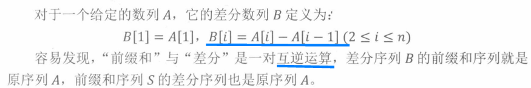
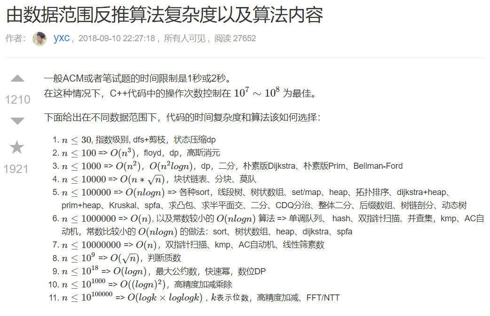
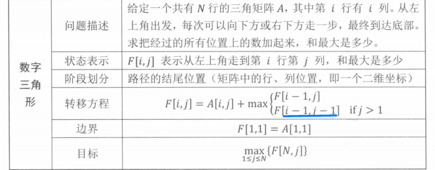
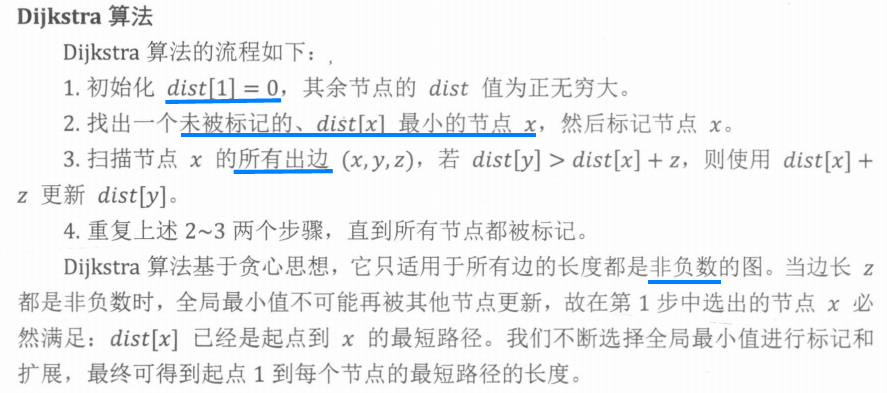
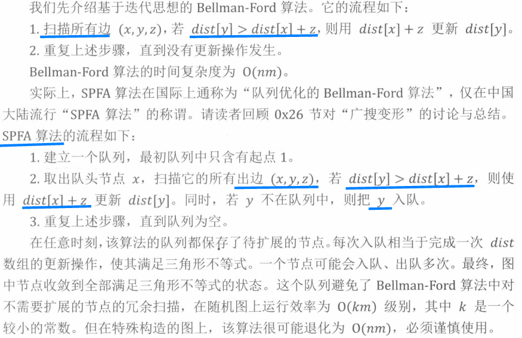
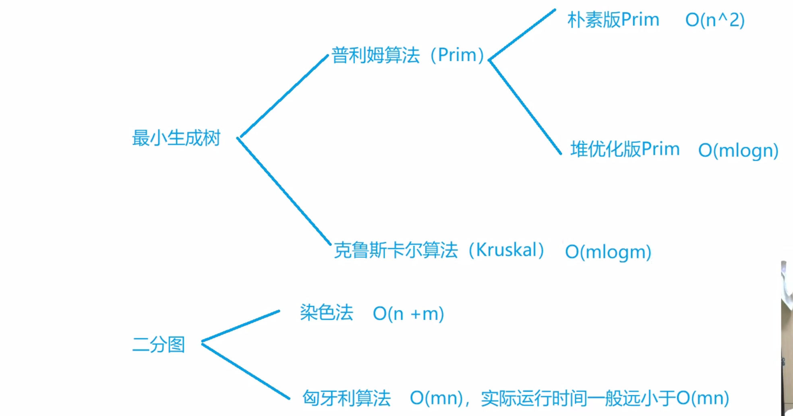

### 平台开源

[力扣](https://leetcode-cn.com/problemset/all/)

[leetcode食用指南](https://github.com/azl397985856/leetcode)

[牛客网](https://www.nowcoder.com/)

[Comet OJ](https://www.cometoj.com/contests)

[HDU](http://acm.hdu.edu.cn/)

[HihoCoder](https://hihocoder.com/)

[洛谷](https://www.luogu.org/)

[LibreOJ(算法竞赛一本通——提高篇)](https://loj.ac)

**OI wiki**

[学习资源](https://oi-wiki.org/intro/resources/)  

[OI wiki](https://oi-wiki.org/)

[OI & ACM 课件分享](https://github.com/hzwer/shareOI)  

Just Code [[github]](https://github.com/YaxeZhang/Just-Code) 
  
写在20年初的校招面试心得与自学CS经验及找工作分享 [github](https://github.com/conanhujinming/tips_for_interview/blob/master/README-zh_CN.md)   

### ACM模板：

https://github.com/Bryce1010/bryce1010-ACM-Template

KuangBin的ACM模板 [[github]](https://github.com/kuangbin/ACM-ICPC)  

f-zyj/ACM 模板 [[github]](https://github.com/f-zyj/ACM)

f-zyj/ACM 在线模板：https://blog.csdn.net/f_zyj/article/details/51594851

https://github.com/soulmachine/acm-cheat-sheet

### 进阶指南

https://github.com/livrth/algorithm-competition-advanced-guide

[算法竞赛进阶指南 题目练习](https://ac.nowcoder.com/acm/archive/oi-advance/problem)

[算法竞赛知识合集 目录](https://blog.csdn.net/weixin_45697774/article/details/105603064)

算法竞赛进阶指南 杂谈 https://blog.nowcoder.net/zhxu98/2671

算法竞赛进阶指南题解笔记 秦淮岸： https://www.acwing.com/blog/content/89/

大雪菜：https://blog.csdn.net/GarfieldEr007

模板级补全——唤醒词列表： https://www.acwing.com/blog/content/5224/  

### 课程代码

算法基础课：https://www.acwing.com/activity/content/activity_person/content/4102/1/

算法进阶指南：https://www.acwing.com/activity/content/activity_person/content/1349/9/

算法提高课：https://www.acwing.com/activity/content/activity_person/content/9226/1/

LeetCode究极班: https://www.acwing.com/activity/content/activity_person/content/29799/1/

https://github.com/lydrainbowcat/tedukuri


### 输入输出

STL开o2优化，效率和数组差不多。

scanf("%s%d%d"),s一般开p[2]

scanf(“格式控制字符串”, 地址表列)    
printf("<格式化字符串>", <参量表>)   

```cpp
int a,b,c;
scanf("%d%d%d",&a,&b,&c);
scanf("%5d",&a);   //指定输入宽度
scanf("%ld",&a);
printf("%ld",a);
```
#include<bits/stdc++.h> 万能头文件    
void *memcpy(void *str1, const void *str2, size_t n) 反向的从str2中拷贝n个到str1。    

memset(f,0x3f,sizeof(f))   

cin>>x>>y>>w :cin输入多个值


### 0x00 基本算法

#### 0x01 位运算

lowbit(x)是x的二进制表达式中最低位的1所对应的值（位置）。

```cpp
//6的二进制是110，所以lowbit(6)=2
int lowbit(int x)
{
    return x&(-x);
}

int lowbit(int x)
{
    return x&(x^(x-1));
}
```

-1 取反是0，反向循环的时候，~-1 可以作为截止条件

位运算操作：

置1： x| = 1<<i     
置0： x& = ~(1<<i)    
取反：x^ = 1 << i    
取某一位： (x >> i) &1    
  
- AcWing95 费解的开关：
  
#include<bits/stdc++.h> 万能头文件    
void *memcpy(void *str1, const void *str2, size_t n) 反向的从str2中拷贝n个到str1。 

- 最短hamilton距离(状态压缩DP 模板题)
  
f[i][j] 这里i代表方案结合，每个位置j代表这个点是否被经过过。

状态压缩DP: 方案i --> 位置j-->转移点k

```cpp
#include  <stdio.h>
#include <string.h>
#include <iostream>

using namespace std;

const int N = 20, M = 1 << 20;
int nums[N][N], f[M][N];

int main() {
    int n;
    cin >> n;
    for (int i = 0; i < n; i++) {
        for (int j = 0; j < n; j++) {
            cin >> nums[i][j];
        }
    }
    
    memset(f,0x3f,sizeof(f));
    //i 方案
    f[1][0] = 0;
    for (int i = 0; i < (1 << n); i++) {
        //j 位置
        for (int j = 0; j < n; j++) {
            if ((i >> j) & 1) {
                //枚举到j的点k
                for (int k = 0; k < n; k++) {
                    //i - (1 << j)  --> i ^ (1 << j) 去掉状态j的集合i。每个点只能到达一次，所以想从 k -> j，到达 k 时不可经过 j。
                    if (i - (1 << j) >> k & 1) {
                        f[i][j] = min(f[i][j], f[i - (1 << j)][k] + nums[k][j]);
                    }
                }
            }
        }
    }
    cout << f[(1 << n) - 1][n - 1] <<endl;
}

```

#### 0x02 递推与递归

tallest conv 区间操作转为左右端点操作,额外的辅助数组存储操作结果。    
缩小问题空间：自身调用自身，回溯时还原现场。    
分治法等比数列求和

- AcWing92 递归实现指数型枚举
```C++
void dfs(int u, int state)
{
    if (u == n)
    {
        for (int i = 0; i < n; i ++ )
            if (state >> i & 1)
                cout << i + 1 << ' ';
        cout << endl;
        return;
    }

    dfs(u + 1, state);
    dfs(u + 1, state + (1 << u));
}
```
- AcWing93 递归实现组合型枚举

```C++
void dfs(int u, int s, int state)
{
    if (s == m)
    {
        for (int i = 0; i < n; i ++ )
            if (state >> i & 1)
                cout << i + 1 << ' ';
        cout << endl;
        return;
    }
    if (u == n) return;

    for (int i = u; i < n; i ++ )
    {
        dfs(i + 1, s + 1, state + (1 << i));
    }
}
```
- AcWing94 递归实现排列型枚举

```C++
void dfs(int u, int state)
{
    if (u == n)
    {
        for (auto x : path) cout << x << ' ';
        cout << endl;
        return;
    }

    for (int i = 0; i < n; i ++ )
        if (!(state >> i & 1))
        {
            path.push_back(i + 1);
            dfs(u + 1, state + (1 << i));
            path.pop_back();
        }
}
```

- AcWing96 奇怪的汉诺塔：

n盘3塔：d[n] = d[n-1]*2 + 1       
n盘4塔：f[i] = min(2*f[i] + d[n-i]),i < n,f[1] = 1     
                                           
#### 0x03 前缀和与差分

前缀和：下标从1开始。
二维数组的前缀和：

<div align="center">  </div><br>


前缀和和差分是一对互逆运算。

差分：将原序列上的区间操作转为差分序列上的单点操作。

<div align="center">  </div><br>
 
- AcWing99 激光炸弹
- 
```C++
// 预处理前缀和
for (int i = 1; i <= n; i ++ )
    for (int j = 1; j <= m; j ++ )
        s[i][j] += s[i - 1][j] + s[i][j - 1] - s[i - 1][j - 1];

int res = 0;

// 枚举所有边长是R的矩形，枚举(i, j)为右下角
for (int i = R; i <= n; i ++ )
    for (int j = R; j <= m; j ++ )
        res = max(res, s[i][j] - s[i - R][j] - s[i][j - R] + s[i - R][j - R]);
```
  
- AcWing100 IncDec序列：   
差分序列: A的差分序列是B，B[1]=A[1],B[i]=A[i]-A[i-1](2<=i<=n)           
改成目标为把b2,b3...bn变成全0，最终数列由n个b1构成，这里b[1]=一个常数(b1-b0，实际没有0)。  

- AcWing 101 最高的牛：    
差分：序列A的区间[l,r] + d 等价于序列Bl + d,Br+1 - d。       
牛A和B可以相互看到，则[A+1，B-1]区间的牛高度都-1。   
最高的牛的位置肯定是0，因为它左右的牛都看不到。    
  
####  0x04 二分

二分求解转判定

整数域上的二分：

模板1：寻找左边界、模板2：寻找右边界

实数域上的二分：

- AcWing102	最佳牛围栏:二分转判定。
```C++
bool check(double avg)
{
    for (int i = 1; i <= n; i ++ )
        sum[i] = sum[i - 1] + cows[i] - avg;

    double mins = 0;
    for (int i = m, j = 0; i <= n; i ++, j ++ )
    {
        mins = min(mins, sum[j]);
        if (sum[i] - mins >= 0) return true;
    }

    return false;
}


while (r - l > 1e-5)
{
    double mid = (l + r) / 2;
    if (check(mid)) l = mid;
    else r = mid;
}
```

#### 0x05 排序

排序：基于比较方法、按位划分，分类映射

离散化：a数组排序并去重之后得到b数组，b的下标i与b[i]建立映射关系，在b中二分查找a即可

中位数：对顶堆(在线)、链表+ hash(离线)

第k大的数：快排划分

逆序对：归并排序求逆序对个数，合并时考虑

  
- AcWing103 电影 

离散化技巧(稀疏->稠密)   

```cpp
//数组的迭代器,end是不到达的点
sort(cinema + 1, cinema + tot + 1);
//unique + find 离散化索引
k = unique(cinema + 1, cinema + tot + 1) - (cinema + 1);

int find(int x) {
    return lower_bound(cinema + 1, cinema + 1 + k, x) - (cinema + 1);
}
```
 统计每个科学家的语言，遍历电影去找max1、max2。
 
- AcWing106 动态中位数   
对顶堆(在线)   
  
- AcWing104 货仓选址：中位数
  
排序 + 中位数       
找到中位数，累加出每个点到中位数的距离之和   

- AcWing 105 七夕祭

贪心+前缀和+中位数+排序    

只会改变一行的喜爱小摊或者一列的喜爱小摊，而不会同时改变行和列的喜爱小摊。一部分是求行的最少次数，一部分是求列的最少次数。     
贪心参考：环形均分纸牌问题       
行列环形均分纸牌问题 
  
- AcWing 122 糖果传递 

https://www.acwing.com/solution/content/41677/

均分纸牌问题: ∑ i=1~n−1 |Si|，其中 Si 为 Ai 的前缀和，即Ai = ci - T/M，Si是第i个人要给第i+1个人的牌的数量,ci减去均值的前缀和。    
      
环形均分纸牌问题：破环成链，一定存在一个最优解方案，环上有相邻的两个人之间没有发生交换。    
      
可以直接枚举断点K的位置，再做一遍线性纸牌均分。断点Sk可以直接取排序后的中位数即可，然后使用货仓选择模型计算最小距离 ∑i=1 n |Si−Sk|。    

减去均值的前缀和 + 货仓中位数计算距离
  
- AcWing 107  超快速排序 

归并排序变形：统计逆序对的数量 

```cpp
while (i <= mid && j <= r) {
	if (a[i] < a[j]) tmp[k++] = a[i++];
	else {
		tmp[k++] = a[j++];
		ans += mid - i + 1; //归并变形，计算逆序对数量
	}
}
```
注：快排的变形是快选，归并的变形是逆序对统计。   

- AcWing 108 奇数码问题 

左右移动完全不改变逆序对个数，而上下移动并不改变逆序对的奇偶性。        
性质：因为两个矩阵,逆序对奇偶性如果不同的话,是肯定不可以变成一样的,这是可以肯定的。       
0是空格,不加入逆序对计算之中。    

ans += mid - i + 1; //归并变形，计算逆序对数量  
  
  
#### 0x06 倍增

倍增 + 二进制划分结合（RMQ区间最值、LCA最近公共祖先）
  
RMQ/ST表/区间最值查询 ---- 模板： https://www.acwing.com/blog/content/7942/    

算法学习笔记(12): ST表： https://zhuanlan.zhihu.com/p/105439034 


- AcWing 109 天才ACM 

倍增 + 二路归并优化：https://www.acwing.com/solution/content/82450/

https://www.acwing.com/solution/content/15458/

倍增:从小区间往大区间扩展，效率高于二分。  

```cpp
while (start <= n) {
	int step = 1;
	while (step) {
		//start到end是已经排好序的
		if (end + step <= n && check(start, end, end + step)) {
			end += step;
			step *= 2;
			if (end > n) break;
			//已经校验完成的区间拷贝回去
			for (int i = start; i <= end; i++) {
				b[i] = t[i - start];
			}
		} else {
			step /= 2;
		}
	}
	start = end + 1;
	ans++;
}
```
						    
#### 0x07 贪心

一般先排序    
决策包容性、邻项交换    

区间合并：st end 延迟处理法    
区间问题：按左端点、右端点、先左后右端点排序

- AcWing 110 防晒  

贪心一般都有排序

匈牙利算法：如果一个匹配不存在增广路径，则该匹配是二分图的一个最大匹配。    
给每头奶牛匹配一个尽可能大的防晒霜。    

```cpp
//优先满足大的
//区间排序 按照first第一个关键字，second第二关键字排序
sort(cows, cows + n);
//从右往左
int res = 0;
spfS[0] = spfS[1001] = n;
for(int i = n - 1;i >= 0;i--){
	auto iter = spfS.upper_bound(cows[i].second);
	iter--; 
	if(iter->first >= cows[i].first && iter->first <= cows[i].second){
		iter->second--;
		res++;
		if(iter->second == 0) spfS.erase(iter);
	}
}
```

- AcWing 111 畜栏预定 

https://www.acwing.com/solution/content/1060/
 
同一时刻，最大交集的数量。类似于砖墙问题。         

//pair 当结构体使用
pair<PII, int> cows[N];

//堆用来维护区间问题
priority_queue<PII,vector<PII>,greater<PII>> heap;

- AcWing 112 雷达设备 

转换为区间问题：https://www.acwing.com/solution/content/1061/

```cpp
for (int i = 0; i < n; i++) {
	if (a[i].first > end + eps) {
		res++;
		end = a[i].second;
	} else {
		end = min(end, a[i].second);
	}
}
```
	
- AcWing 114 国王游戏 

贪心都有排序，需要制定排序规则，根据区间起点、终点、两数乘积、两数(字符串)之和等

```cpp
//国王不参与排序
sort(nums + 1, nums + n + 1, [](PII & a, PII & b) {
	return a.first * a.second < b.first * b.second;
});
```

高精度乘法模板：乘从低位开始,返回数是反着的。
高精度除法模板：除从高位开始。is_first作flag判首位不能为0

vector比较大小 模板

```cpp
vector<int> max_vec(vector<int> a, vector<int> b) {
    if (a.size() > b.size()) return a;
    if (a.size() < b.size()) return b;
    if (vector<int>(a.rbegin(), a.rend()) > vector<int>(b.rbegin(), b.rend())) return a;
    return b;
}
```


#### 练习

- AcWing 116 飞行员兄弟:枚举/位运算
- AcWing 117 占卜DIY：模拟
- AcWing 118 分形：递归/分形
- AcWing 119 袭击:分治/平面最近点时
- AcWing 120 防线：二分
- AcWing 121 赶牛入圈：二分/离散化/前缀和
- AcWing 122 糖果传递：排序/中位数/环形均分纸牌
- AcWing 123 士兵：排序/中位数/货仓选址问题扩展
- AcWing 124 数的进制转换：高精度运算/进制转换
- AcWing 125 耍杂技的牛：贪心/邻项交换
- AcWing 126 最大的和：贪心
- AcWing 127 任务：贪心


- AcWing115 给树染色 

树的贪心合并，并查集的变形    

每次找出当前权值最大的非根节点，将其染色顺序排在紧随父节点之后的位置，然后将该点合并进父节点中，更新父节点的权值。直到将所有点都合并进根节点为止。    
为了方便计算，每次会将两组点合并，将其中一组点接在另外一组点的后面，比如两组点分别是xi和yi,将yi接在xi之后，则yi中每个点所乘的系数都会增加一个相同的偏移量，这个偏移量就是xi中点的个数，假设是k,
则合并之后，总的权重直接加上 k * Σyi。

```cpp
struct Node {
    int p, s, v; //parent nums value
    double avg;
};
```
	
- AcWing 116 飞行员兄弟 

构造一个16位的二进制数，二进制数的每一位代表4*4矩阵中的一位，只需要枚举这个16位的二进制数，就可以确定我们的方案。最优解方案，

```Cpp
//矩阵转int表示状态
for (int i = 0; i < N; i++) {
	for (int j = 0; j < N; j++) {
		for (int k = 0; k < N; k++) change[i][j] += (1 << get(i, k)) + (1 << get(k, j));
		change[i][j] -= (1 << get(i, j));
	}
}

//枚举所有的可能
for (int i = 0; i < (1 << 16); i++) {
	for (int j = 0; j < 16; j++) {
		if(i >> j & 1)
	}
}
```
	
- AcWing 120 防线 

枚举每一个等差数列(起点s,终点e,差为d),如果s <= x，则两区间存在交集，它与[minn,x]的共同区间是[s,min(e,x)],此区间包含数列个数是[(min(e,x)-s)/d] + 1。    
前缀和 + 二分     getSum(l) - getSum(l - 1)     
										       
```cpp
long long get(int x) {
    long long sum = 0;
    for (int i = 0; i < n; i++) {
        if (seqs[i].s <= x) {
            sum += (min(seqs[i].e, x) - seqs[i].s)/ seqs[i].d + 1;
        }
    }
    return sum;
}
```

- AcWing 121 赶牛入圈  

二维前缀和 + 离散化(sort，unique和erase的惯用法 + get(二分)) + 二分判定

sort，unique和erase的惯用法  + get(二分)

unique的功能是去除相邻的重复元素(只保留一个),其实它并不真正把重复的元素删除，是把重复的元素移到后面去了，然后依然保存到了原数组中,返回去重后最后一个元素的地址,unique去除的是相邻的重复元素，所以一般用之前都会要排一下序。
```cpp
//前缀和数组会用到下标0，所有0压入number，让离散化从1开始。
//离散化
nums.emplace_back(0);
sort(nums.begin(), nums.end());
nums.erase(unique(nums.begin(), nums.end()), nums.end());

//枚举len要去掉下边界
while (nums[x2] - nums[x1 + 1] + 1 > len) x1++;
```
    
什么时候用离散化后的索引，什么时候用离散化前的索引，这个要灵活对待。 

- AcWing 123 士兵 

排序、中位数、货仓选址问题扩展      
推导：|X0 - 0 - a|、|Xn- n - a|，这里的a取avg的值。    
	
	
- AcWing 125 耍杂技的牛 

typdef long long LL    
typdef pair<long long> PLL    
typdef pair<double double> PDD     

邻项交换原则: 1 关键字 总和(w + s)排序 2 关键字 w 排序。   

贪心推导： max(①,②) ⩾ max(③,④) ,且Wi+Si >= Wi+1 + Si+1   	


- AcWing 126 最大的和     

二维前缀和简化(4 for) ——> 压缩列方向的前缀和(3 for)。      
涉及前缀和问题、字符串匹配之类的，索引需要从1开始，正常都是从0开始。       

```cpp
//双指针枚举行
for (int i = 1; i <= n; i++) {
	for (int j = i; j <= n; j++) {
		//枚举列
		int last = 0;//last 缓存此次枚举前面的列
		for (int k = 1; k <= n; k++) {
			last = max(last, 0) + a[j][k] - a[i - 1][k];
			ans = max(ans, last);
		}
	}
}
```
				      
- AcWing 127 任务     

lower_bound支持的迭代器：set、map、multiset、multimap、vector(先sort)

```cpp
//vector 用法
vector<int> nums = { 3,2,4,1,5 };
sort(nums.begin(), nums.end());
auto iter = upper_bound(nums.begin(), nums.end(), 1);

//map 用法
map<int, int> m;
auto iter = m.lower_bound(3);    
```

最小或最优匹配问题

策略可以变成以x从大到小的顺序考虑每一个任务，如果能匹配机器，则从能匹配的机器中选择机器y最小的一个。 
	
```cpp
while (j >= 0 && machs[j].first >= tasks[i].first) ys.insert(machs[j--].second);
	auto it = ys.lower_bound(tasks[i].second);	
```		

### 0x10 基本数据结构

由数据范围反推算法复杂度以及算法内容: https://www.acwing.com/blog/content/32/

<div align="center">  </div><br>
ios::sync_with_stdio(false)详解： https://blog.csdn.net/L1558198727/article/details/81512350

取消cin于stdin的同步。


#### 0x11 栈

双栈：栈A存储序列，栈B存储最小值

对顶栈：栈A：开头到光标，栈B:光标到结尾，f数组存储前缀和最大值

进出栈序列问题：

表达式：中缀、前缀、后缀

单调栈：求直方图的矩形面积

- AcWing 128 编辑器      

对顶栈问题：left + right

- AcWing 130 火车进出栈问题     

计算 C(n,2n)/(N+1)：2n!/(n! * (2n - n)! *(n + 1))	
	
- AcWing 131 直方图中最大的矩形    

哨兵：避免对于边界值的判断   
直方图最大矩形模板(单调栈)：先判上升/下降  

https://www.acwing.com/solution/content/34591/ 

两个单调上升栈，寻找左右边界   

```cpp
#include <iostream>
#include <stack>

using namespace std;

const int N = 100010;
using LL = long long;
int h[N], l[N], r[N];
int n;

LL solve() {
    stack<int> left;
    stack<int> right;

    left.emplace(0);
    h[0] = h[n + 1] = -1; //哨兵
    //单调上升栈，寻找左右边界
    for (int i = 1; i <= n; i++) {
        while (left.size() && h[left.top()] >= h[i]) left.pop();
        l[i] = left.top();
        left.emplace(i);
    }

    right.emplace(n + 1);
    for (int i = n; i >= 1; i--) {
        while (right.size() && h[right.top()] >= h[i]) right.pop();
        r[i] = right.top();
        right.emplace(i);
    }

    LL ans = 0;
    for (int i = 1; i <= n; i++) {
        ans = max(ans, 1LL* h[i] * (r[i] - l[i] - 1));
    }
    return ans;
}

int main() {
    while (cin >> n, n) {
        for (int i = 1; i <= n; i++) {
            cin >> h[i];
        }
        LL ans = solve();
        cout << ans << endl;
    }

    return 0;
}

```


#### 0x12 队列

单调队列：最大子序和，单调队列+前缀和，下标位置递增，对应的前缀和S的值也递增。 

```C++
//hh--->tt之间的一段数组组成的队列，hh小，tt大
//常见模型：找出滑动窗口中的最大值/最小值
//hh++ 队头出，++tt队尾入，tt-- 队尾出
int hh = 0, tt = -1;
for (int i = 0; i < n; i ++ )
{
    while (hh <= tt && check_out(q[hh])) hh ++ ;  // 判断队头是否滑出窗口
    while (hh <= tt && check(q[tt], i)) tt -- ;
    q[ ++ tt] = i;
}
```

决策集合中及时排除不是最优解的选择

**AcWing132 小组队列**

queue 存tid  + queue数组 ，类似纵向展开的邻接表

```cpp
while(cin >> command,command != "STOP")// while 读取并判断结构    

queue<int> persons[N] //queue队列
```
	
**AcWing 133 蚯蚓**

三个队列模拟优先队列，    
q1：切后第一段； q2：切后第二段； q3:存储蚯蚓长度    
排序：从高到低。   
每次取各个队头并求max       
每个队列都隐藏着单调队列的性质。    	
	
**AcWing 134 双端队列** 

https://www.acwing.com/solution/content/27971/

单谷性质：先单调递减，后单调递增，这一段可以对应原问题的双端队列。用一个变量记录当前拼成的序列末尾处于递增还是递减状态。 
递减的一段相当于从队头插入，递增的一段相当于从队尾插入。
如果A中存在几个相等的数，那么这几个数在排序时是不定的，我们可以任意交换他们的顺序，使得B数组能够分成更少的段数。
dir:1变成-1 会统计数量。

```cpp
if (last < minx) last = maxx;
else
{
	res ++ ;
	last = minx;
	dir = -1;
}
```		  
		  
- AcWing 135 最大子序和：单调队列

```C++
int res = -INF;
int hh = 0, tt = 0;
for (int i = 1; i <= n; i ++ )
{
    if (q[hh] < i - m) hh ++ ;
    res = max(res, s[i] - s[q[hh]]);
    while (hh <= tt && s[q[tt]] >= s[i]) tt -- ;
    q[ ++ tt] = i;
}
```

#### 0x13 链表与邻接表

链表:

head和tail哨兵   
数组模拟链表、下标模拟指针    
写工程用动态链表，算法题用静态链表要快  
链表(数组模拟链表c++)：https://blog.csdn.net/Annabel_CM/article/details/107446710

```cpp
// head存储链表头，e[]存储节点的值，ne[]存储节点的next指针，idx表示当前用到了哪个节点
//下标从零开始，第k 个数对应数组e[k - 1]；
int head, e[N], ne[N], idx;

// 在链表头插入一个数a, 先将x的指针指向原来head的位置，然后将head指向x
void insert(int a)
{
    e[idx] = a, ne[idx] = head, head = idx ++ ;
}

// 将头结点删除，需要保证头结点存在;在删除节点时，要判断该节点是否为头节点，若为头节点，直接head指向该节点所指向的位置
void remove()
{
    head = ne[head];
}
// 将x插到下标是k的点后面
void add(int k, int x)
{
   e[idx] = x, ne[idx] = ne[k], ne[k] = idx ++ ;
}

// 将下标是k的点后面的点删掉
void remove(int k)
{
    ne[k] = ne[ne[k]];
}
```

```cpp
//双向链表
// 在节点a的右边插入一个数x
void insert(int a, int x)
{
    e[idx] = x;
    l[idx] = a, r[idx] = r[a];
    l[r[a]] = idx, r[a] = idx ++ ; //先将要插入的数左右指针分别指向对应位置,然后先将原来第k个数右指针所指的位置的左指针指向x,即l[r[k]] = idx;
}
```

**邻接表**

<div align="center">  </div><br>

hash表记录指针    
邻接表：带有索引数组的多个数据链表构成的结构集合，可以看成n类，head是入口，新数据在表头插入   
head + next + ver(终点) + edge   
无向边的存储：成对变换，xor 1定位反向边

	
- AcWing136 邻值查找      

PLL 数组存储 值+索引   

数组排序，串成一个链表，取一个节点的前驱和后继比较，求最近的。

```cpp
//双哨兵
a[0].first = -3e9,a[n + 1].first = 3e9;
//删节点
l[right] = left, r[left] = right;   
```
	
#### 0x14 Hash

hash：拉链法（邻接表结构，hash的值域作为表头数组的head）;开放定址法

<div align="center">  </div><br>

最简单的hash:数组计数

H(x) = (x mod P) + 1

**字符串hash**

字符串看成P进制数，分配一个大于0的数值，代表每种字符，P = 131或13331，

<div align="center">  </div><br>
H(S + c) = (H(S)*P + value[c]) mod M

H(T) = (H(S + T) - H[S]*P^length(T)) mod M

字符串前缀hash
		      
**AcWing138 兔子与兔子**

scanf("%s",str + 1); //str偏移一位后，读输入，即str有效数据从1开始。
int n = strlen(str + 1);

```cpp
//字符串hash模板
scanf("%s", str + 1);
int n = strlen(str + 1);
power[0] = 1;
for (int i = 1; i <= n; i ++ )
{
	h[i] = h[i - 1] * p + str[i] - 'a' + 1;
	power[i] = power[i - 1] * p;
}

//获取一个区间值
ULL get(int l, int r)
{
    return h[r] - h[l - 1] * power[r - l + 1];
}
```				      
		      
- AcWing 139 回文子串的最大长度       

字符串hash(前缀/后缀) + 二分   

hl：从前向后求字符串前缀的hash值
hr：从后向前求字符串后缀的hash值   
枚举回文串的中心点，求最大半径。二分半径长度。
插入#法：将字符串长度变为奇数。    

```cpp
n *= 2;
p[0] = 1;
for (int i = 1, j = n; i <= n; i ++, j -- )
{
	hl[i] = hl[i - 1] * base + str[i] - 'a' + 1; 
	hr[i] = hr[i - 1] * base + str[j] - 'a' + 1;
	p[i] = p[i - 1] * base;
}
```

- AcWing 140 后缀数组      

后缀数组的模板题: https://www.acwing.com/solution/content/30646/

后缀数组：字符串S的所有后缀按照字典序排列，排名为i的后缀记为SA[i]
最长公共前缀：排名为i的后缀和排名为i-1的后缀，两者的最长公共前缀长度是Height[i]

对后缀进行排序，排序方法是计算最长的公共前缀，然后取前缀的下一个。

```cpp
sa[i]是以str[i]字符为首字母的后缀字符串

//后缀的最长公共前缀
int get_max_common_prefix(int a, int b) {
    int l = 0, r = min(n - a + 1, n - b + 1);
    while (l < r) {
        int mid = l + r + 1 >> 1;
        if (get(a, a + mid - 1) != get(b, b + mid - 1)) r = mid - 1;
        else l = mid;
    }
    return l;
}

//后缀排序
bool cmp(int a, int b) {
    int l = get_max_common_prefix(a, b);
    int av = a + l > n ? INT32_MIN : str[a + l];
    int bv = b + l > n ? INT32_MIN : str[b + l];
    return av < bv;
}
```

#### 0x15 字符串

自我匹配next[i]:A中以i结尾的非前缀子串与A的前缀能够匹配的最长长度

f[i]：B中以i结尾的子串与A的前缀能够匹配的最长长度

最小表示：循环同构中字典序最小的，可以复制一份接在后面比较。

- AcWing 831. KMP字符串: https://www.cnblogs.com/Inabameguru/p/14932861.html

ne退：直到退无可退，为了下一次分配，最少移动多少。

**字串最长相同前后缀**

```cpp
假如A[]:abababf, 
则其全部前缀为：a,ab,aba,abab,ababa,ababab,ababab, 全部后缀为： f,bf,abf,babf,ababf,bababf,bababf

ne[i]代表了以第i个字符结尾的字串最长相同前后缀大小,很明显"ne[1]=0"
动态规划角度：用ne[i-1]推出ne[i]，当取到i时，也说明了前i个字符的字串也匹配成功，因此ne[0,i]有解。

For()
{

我们设立一个指针j，j指向与ne[i-1]匹配的左串末尾。
因此我们也确保了有P[0,j]==P[i-1-j,i-1]。
(1)当P[j+1]==P[i]时:
　　有P[0,j+1]==P[i-j-1,i]，也就是ne[i]=j+1;
　　break;
(2)当P[j+1]!=P[i]时：
　　也就没有P[0,j+1]==P[i-j-1],因此对于ne[i]的求解仍需要循环求解(此后j变为ne[ne[i-1]]匹配的左串末端)，直至答案求出
(3)ne[i]=0;

}

//s、p数组从1 开始，长度M、N是数组的有效长度
int sLen = 5;
int pLen = 3;
char p[] = {'\0','a','b','a'};
char s[] = {'\0','a','b','a','b','a'};
int ne[pLen];
for(int i = 2,j = 0;i <= pLen ;i++){
    if(j && p[i] != p[j+1]) j = ne[j];
    if(p[i] == p[j+1]) j++;
    ne[i] = j;
}
for(int i = 1,j = 0;i <=sLen;i++){
    if(j && s[i] != p[j+1]) j = ne[j];
    if(s[i] == p[j+1]) j++;
    if(j == pLen){
        cout << i - pLen << endl;
        j = ne[j];
    }
}
```
				
- AcWing141 周期      

对于某一个字符串S[1 ~ i], 在它众多的next[i]的候选中，如果存在一个next[i],使得i%(i-next[i]) == 0,那么S[1~(i-next[i])]可以为S[1~i]的循环元，而i/(i-next[i])是它的循环次数K。

```cpp
const int N = 1000010;

int n;
char str[N];
int nxt[N];

void get_next()
{
    for (int i = 2, j = 0; i <= n; i ++ )
    {
        while (j && str[i] != str[j + 1]) j = nxt[j];
        if (str[i] == str[j + 1]) j ++ ;
        nxt[i] = j;
    }
}

int main()
{
    int T = 1;
    while (scanf("%d", &n), n)
    {
        scanf("%s", str + 1);

        get_next();

        printf("Test case #%d\n", T ++ );
        for (int i = 2; i <= n; i ++ )
        {
            int t = i - nxt[i];
            if (i > t && i % t == 0) printf("%d %d\n", i, i / t);
        }
        puts("");
    }

    return 0;
}		   
```		
	
#### 0x16 Trie

```cpp
int son[N][26], cnt[N], idx;
// 0号点既是根节点，又是空节点，因为里面是++idx
// son[][]存储树中每个节点的子节点
// cnt[]存储以每个节点结尾的单词数量
```
- AcWing142 前缀统计:trie模板题。

- AcWing 143 最大异或对    

https://www.acwing.com/solution/content/9587/ 
		 
trie(二进制) :30位从高位到低位		   

字典树不单单可以高效存储和查找字符串集合,还可以存储二进制数字。           
cin.tie(0) 和ios::sync_with_stdio(false)是等价的，解除与cout输出流的关联，这样每次cin或cout之前都不会刷新彼此的缓冲区。        
int的最高位是第31位，且最高位是符号。            
res = res*2+1  等价于 res += 1 << i;     
				
				
- AcWing 144 最长异或值路径   

D[x]表示根节点到x的路径上的所有边权的xor值,D[x] = D[father(x)] xor weight(x,father(x)) 也就是D[x节点的父亲]异或上x节点到他父亲的路径。
x节点到y节点上所有的异或权值就是D[x] xor D[y]    

问题转化：D[1]~D[n]中选择任意两个数,xor的结果值就会变成最大。

dfs 邻接表 + trie(二进制)  

邻接表模板：https://www.acwing.com/file_system/file/content/whole/index/content/1528095/

```cpp
// edge[m] 表示编号为 m 的边的终点
// weight[m] 表示编号为 m 的边的权值
// Next[tot] = head[x] next是邻接表
// head[x] = m 表示点 x 的邻接表的表头是编号为 m 的边
// 邻接表加入有向边 (x, y)，权值为 z
void add(int x, int y, int z) {
    // 真实数据
    edge[tot] = y, weight[tot] = z;
    // 在表头 x 处插入
    Next[tot] = head[x], head[x] = tot++;
}

memset(head, 0xff, sizeof(head));      等价于   memset(head, -1, sizeof(head));
for (int i = head[x]; i != -1; i = Next[i])  等价于   for (int i = head[x]; ~i; i = Next[i]) 
~0 = -1    
~ -1 = 0    
```	

#### 0x17 二叉堆

二叉堆：insert、getTop、Extract、Remove   

Huffman树：权值大的叶子节点的深度尽量小  
K叉的huffman树求解，先补加一些额外的权值为0的叶子节点，使叶子节点个数n满足（n-1) mod(k-1)= 0,每次从堆中取出最小的k个值

- AcWing 145 超市：小顶堆。  
- AcWing 146 序列：多个序列，求前n小的组合，模板题。  
- AcWing 148 合并果子：Huffman树
- AcWing149 荷马史诗：Huffman树 
	
- AcWing 145 超市    

https://www.acwing.com/solution/content/28939/

二叉堆 + 贪心、并查集(天数) + 贪心   


并差集按size大小合并模板：LeetCode1627 带阈值的图连通性：https://www.acwing.com/file_system/file/content/whole/index/content/1382246/
```cpp
void merge(int x, int y) {
	int fx = find(x), fy = find(y);
	if (fx == fy)
		return;
	if (sz[fx] < sz[fy]) {
		f[fx] = fy;
		sz[fy] += sz[fx];
	} else {
		f[fy] = fx;
		sz[fx] += sz[fy];
	}
}
```

并差集，天数为坑，向前移动占坑：fa[r] = r - 1;

```cpp
#include <iostream>
#include <algorithm>

using namespace std;
const int N = 10010;
int fa[N];

int find(int x) {
    if (fa[x] != x) fa[x] = find(fa[x]);
    return fa[x];
}

int main() {
    pair<int, int> a[N];
    int n;
    while (cin >> n) {
        int d = 0;
        for (int i = 0; i < n; i++) {
            cin >> a[i].first >> a[i].second;
            d = max(d, a[i].second);
        }
        sort(a, a + n);
        for (int i = 0; i <= d; i++) {
            fa[i] = i;
        }

        int ans = 0;
        for (int i = n - 1; i >= 0; i--) {
            int r = find(a[i].second);
            if (r) {
                ans += a[i].first;
                fa[r] = r - 1;
            }
        }
        cout << ans << endl;
    }
    return 0;
}

```

- AcWing 146 序列   

m个序列的组合的n个最小值问题，礼物问题    

memcpy: 长度单位是字节   

序列问题模板：

```cpp
//合并a和b
priority_queue<PII, vector<PII>, greater<PII>> heap;
for (int i = 0; i < n; i++) {
	heap.push({a[0] + b[i], 0});
}
for (int i = 0; i < n; i++) {
	auto t = heap.top();
	heap.pop();
	c[i] = t.first;
	heap.push({t.first+ a[t.second + 1]  - a[t.second] , t.second + 1});
}
memcpy(a, c, 4 * n);
```
	
- AcWing 147 数据备份   

优先队列/set +贪心+ 链表

D[i]表示第i个办公楼和第i-1个办公楼之间的距离。
选择1：选择了D[i],那么D[i-1]和D[i+1]都不能选择了
选择2：选择了D[i+1]和D[i-1],则无法选择D[i]了。

最小值的左右两侧的数,要么都选择,要么都不选择  
先取最小值D[i]，然后把D[i-1]、D[i]和D[i+1]从D数列中删除，然后再插入D[i-1]+D[i+1]-D[i],也就是选择左右两个位置不选择D[i]的方案。

```cpp
d[p] = d[left] + d[right] - d[p];
S.insert({d[p], p});
```
	
- AcWing148 合并果子     

二叉huffman树

- AcWing149 荷马史诗     

为了最小化权重w*距离l的总和，让权值大的叶子节点的深度尽量小。         
k叉huffman树的求解，每次从堆中取出最小的k个权值。为了防止最后一轮循环时，堆中剩余子节点个数小于k，需要补加一些额外的     
权值为0的叶子节点，使叶子节点的个数n满足（n-1)mod(k-1) = 0,让子节点不足k个的情况发生在最底层，而不是根节点处。     

权值相同的节点，优先考虑当前深度最小的(已合并次数最少)的进行合并。      

```cpp
//填充0
while ((n - 1) % (m - 1)) {
	heap.push({0ll, 0});
	n++;
}

LL sum = 0;
int depth = 0;
for (int i = 0; i < m; i ++ )
{
	sum += heap.top().first;
	depth = max(depth, heap.top().second);//优先考虑深度最小的，靠近根节点进行合并
	heap.pop();
}
res += sum;
heap.push({sum, depth + 1});
```

#### 练习

- AcWing 150 括号画家：栈
- AcWing 151 表达式计算：栈/中缀表达式计算
- AcWing 152 城市游戏：单调栈
- AcWing 153 双栈排序：栈
- AcWing 154 滑动窗口：单调队列
- AcWing 155 内存分配：链表/二叉堆
- AcWing 156 矩阵：字符串hash
- AcWing 157 树形地铁系统:hash/树的最小表示
- AcWing 158 项链：字符串/最小表示法
- AcWing 159 奶牛矩阵：字符串/kmp模式匹配
- AcWing 160 匹配统计：字符串hash或kmp模式匹配
- AcWing 161 电话列表：Trie
- AcWing 162 黑盒子:二叉堆/对顶堆
- AcWing 163 生日礼物：等价于数据备份，二叉堆+链表+贪心

- AcWing 150 括号画家  

栈处理括号问题：栈模拟匹配的过程，把所有配对的括号都删掉，遍历的时候求出来被删掉的连续一段的长度最大是多少。
栈存索引 
```cpp
char c = str[i];
if (c == ')' && stk.size() && str[stk.top()] == '(') stk.pop();
else if (c == ']' && stk.size() && str[stk.top()] == '[') stk.pop();
else if (c == '}' && stk.size() && str[stk.top()] == '{') stk.pop();
else stk.push(i);
```
		     

- AcWing 152 城市游戏   

列方向累加，压缩列方向的和

```cpp
    for (int i = 1; i <= m; i++) {
        for (int j = 1; j <= n; j++) {
            cin >> g[i][j];
            if (g[i][j] == 'F') sum[i][j] = sum[i - 1][j] + 1;
            else sum[i][j] = 0;
        }
    }
```

逐行应用直方图最大矩形(单调栈)模板

- AcWing 153 双栈排序    

建图 + 染色法判断+ 栈(字典序输出)

https://www.acwing.com/solution/content/3710/

从栈底到栈顶仍然可以保持降序。
从前往后遍历每个数，每次先将当前数压入栈中，如果后面的所有数均比栈顶元素大，则将栈顶弹出，否则栈顶不能被弹出。
两个数 i,j(i≤j) 不能被放入同一个栈中，当且仅当存在k,k>j, 且 q[k]<q[i]<q[j]。    

所有满足条件的点分到两个栈，转化为图论问题，如果i,j满足条件，则在i和j之间连一条边。      
字典序最小：先将当前点分配到第一个栈中，出栈优先出第一个栈里面的。


- AcWing 154 滑动窗口    

单调队列模板题：deque 双端队列，索引头出，单调尾出

最小值，上升栈；最大值，下降栈；队列取头   
区别严格和不严格单调，这里是严格单调。     

清空队列的方法：q = deque<int>();  

```cpp
#include <iostream>
#include <deque>

using namespace std;
const int N = 1000010;
int a[N];


int main() {
    int n, k;
    cin >> n >> k;
    for (int i = 0; i < n; i++) {
        cin >> a[i];
    }
    deque<int> q;
    for (int i = 0; i < n; i++) {
        if (q.size() && i - q.front() >= k) q.pop_front();
        //最小值，单调上升栈
        while (q.size() && a[q.back()] >= a[i]) q.pop_back();
        q.push_back(i);
        if (i >= k - 1) cout << a[q.front()] << " ";
    }

    cout << endl;
    q = deque<int>(); 
    for (int i = 0; i < n; i++) {
        if (q.size() && i - q.front() >= k) q.pop_front();
        //最大值，单调下降栈
        while (q.size() && a[q.back()] <= a[i]) q.pop_back();
        q.push_back(i);
        if (i >= k - 1) cout << a[q.front()] << " ";
    }
    return 0;
}
```
		      
- AcWing 155 内存分配   

Set + priority_queue

Set(平衡树)：排序,log级别的插入、删除、求前驱、后继操作，替换双链表。

内存块先释放后删除。

申请时刻 T，需要内存单元数 M 及运行时间 P  

https://www.acwing.com/solution/content/1840/

```cpp
ans;  //ans:全部进程都运行完毕的时刻,cnt:被放入过等待队列的进程总数
queue<PII> waits;   //等待队列，first: 内存长度，second: 占用时间
set<PII> runs;      //当前进程，first: 起始下标，second：长度
priority_queue<PII, vector<PII>, greater<PII>> endts;    //小根堆，维护释放顺序，first: 释放时间，second: 起始下标  
//runs 和endts维护内容一样的，endts方便小根堆释放    
```

set + priority_queue 结构，将set的起始下标放入堆中，便于寻找满足释放时间的起始点。set 空间维度，增加了一个时间维度。   


- AcWing156 矩阵   

二维字符串hash：P进制数，m x n位长   

求p进制的数组          
预先将每一行hash化           
枚举每一个a*b矩阵，将hash值填入set中         

二维hash 模板题

```cpp
#include <iostream>
#include <unordered_set>

using namespace std;

using ULL = unsigned long long;
const int N = 1010, M = N * N, P = 131;
int m, n, a, b;
ULL hashv[N][N], p[M];
char str[N];

ULL get(ULL h[], int l, int r) {
    return h[r] - h[l - 1] * p[r - l + 1];
}

int main() {
    cin >> m >> n >> a >> b;
    p[0] = 1;
	
    //求p进制的数组
	for (int i = 1; i <= m *n; i++) {
        p[i] = p[i - 1] * P;
    }
			     
    //预先将每一行hash化
    for (int i = 1; i <= m; i++) {
        cin >> str + 1;
        for (int j = 1; j <= n; j++) {
            hashv[i][j] = hashv[i][j - 1] * P + str[j] - '0';
        }
    }
    
    //枚举每一个a*b矩阵，将hash值填入set中 
    unordered_set<ULL> set;
    for (int i = b; i <= n; i++) {
        int l = i - b + 1, r = i;
        ULL s = 0;
        for (int j = 1; j <= m; j++) {
            s = s * p[b] + get(hashv[j], l, r);
            if (j > a) s -= get(hashv[j - a], l, r) * p[a * b];
            if (j >= a) set.insert(s);
        }
    }
    int q;
    cin >> q;
    while (q--) {
        ULL s = 0;
        for (int i = 1; i <= a; i++) {
            cin >> str + 1;
            for (int j = 1; j <= b; j++) {
                s = s * P + str[j] - '0';
            }
        }
        if (set.count(s)) cout << "1" << endl;
        else cout << "0" << endl;
    }
    return 0;
}
```


- AcWing157 树形地铁系统   

最小表示相同的树就是同构的。  
最小表示即与这棵树同构的最小的dfs序。     
求树的最小表示可以递归实现，求出所有子树的dfs序，然后从小到大排序拼接起来。        

当前节点以它所有的子树为单位进行排序，合成它合法的最小遍历方式，将它的遍历方式上报给它的父亲节点，让它的父亲节点进行同样的操作

每一段看做一棵子树的操作，第一个数一定是0（来到这棵子树的根节点），最后一个数一定是1（回到这棵子树的根节点） 


- AcWing158 项链  

求字符串的最小表示模板题

https://oi-wiki.org/string/minimal-string/ 

给定一个字符串S[1~n]，不断把它的最后一个字符放到开头，最终会得到n个字符串，称这n个字符串是循环同构的。这些字符串中字典序最小的一个，称为字符串S的最小表示。

```cpp
int get_min(char str[])
{
    int i = 0, j = 1;
    while (i < n && j < n)
    {
        int k = 0;
        while (k < n && str[i + k] == str[j + k]) k ++ ;
        if (k == n) break;
        if (str[i + k] > str[j + k]) i += k + 1;
        else j += k + 1;
        if (i == j) i ++ ;
    }
    int res = min(i, j);
    str[res + n] = 0;
    return res;
}
```

- AcWing160 匹配统计    

KMP算法详解：https://www.acwing.com/blog/content/2347/

https://www.acwing.com/solution/content/15841/

KMP + 后缀和   

Next[i]表示模式串P中以i（下标从 1 开始）结尾的真后缀能匹配 P 的前缀的最大长度。

```cpp
if (a[i] == b[j + 1]) j ++ ;
// 字符串 A 中，以 i−j+1 为起点的与 B 匹配的长度最小为 j
```

cnt[x]：存的是满足匹配的前缀长度至少为 x 的后缀数量    
满足匹配的前缀恰好为 x 的答案：匹配的前缀至少为 x 的后缀数量 减去 匹配的前缀至少为 x + 1的后缀数量。
	

- AcWing159 奶牛矩阵      

n-next[n]就是最小循环节的长度，行的最小循环节*列的最小循环节          
求行列的循环节  
    
https://www.acwing.com/solution/content/114474/  

```cpp
#include <iostream>
#include <cstring>
#include <string>

using namespace std;
const int N = 10010;

string s[N], st[N];
int r, c, ne[N], h, w;

int main() {
    cin >> r >> c;
    for (int i = 1; i <= r; i++) {
        string str;
        cin >> str;
        s[i] = " " + str;
        for (int j = 1; j <= c; j++) {
            st[j] += s[i][j]; //转置
        }
    }

    ne[0] = 0;
    for (int i = 2, j = 0; i <= r; i++) {
        while (j && s[i] != s[j + 1]) j = ne[j];
        if (s[i] == s[j + 1]) j++;
        ne[i] = j;
    }
    int width = r - ne[r];

    memset(ne, 0, sizeof(ne[0]));
    ne[0] = 0;
    for (int i = 2, j = 0; i <= c; i++) {
        while (j && st[i] != st[j + 1]) j = ne[j];
        if (st[i] == st[j + 1]) j++;
        ne[i] = j;
    }
    int height = c - ne[c];
    cout << width * height << endl;
    return 0;
}

```

- AcWing 161 电话列表    

Trie[N][10]    
Trie模板改进：插入和判断同时进行     

- AcWing 162 黑盒子    

对顶堆模板题：大根堆down ---------> <------- 小根堆up ，从左到右数值是递增的   

第k小的数：第i次get，盒子内总数是u[i]的时候，第i小的数。
每次get操作，大顶堆最多增加一个元素。    
对比动态中位数：优先加入大根堆down，然后根据数量关系(max_heap.size() > min_heap.size() + 1)和平衡关系(min_heap.top() < max_heap.top())进行调整。   
相同点：down.top是第i小的数/中位数


- AcWing 163 生日礼物   

https://www.acwing.com/solution/content/3787/

双链表 + 堆 

问题转化：将连续的正数和负数合并，选若干段的问题。      
压缩正数和负数段，确保相邻的异号。     
先将所有的正数都选上，和res,如果正数段< M 则输出。否则需要减少的段记为k。  
减少段数的方法：   
1 删除一段正数，res -= 这个值。  
2 将多段正数和连接他们的负数一起选上，减去其中负数段的绝对值。就是合并正数段。  

数据备份模板题：选当前段、选左右段，两种只会出现一种。  


	

### 0x20 搜索

#### 0x21 树与图的遍历

**邻接表**

相当于链表数组：head -> 沿着行方向展开成h[N]

```cpp
// 对于每个点k，开一个单链表，存储k所有可以走到的点。h[k]存储这个单链表的头结点
int h[N], e[N], ne[N], idx;

// 添加一条边a->b
void add(int a, int b)
{
    e[idx] = b, ne[idx] = h[a], h[a] = idx ++ ;
}
//遍历邻接表
//st相当于visit数组
for (int i = h[u]; i != -1; i = ne[i])
{
    int j = e[i];
    if (!st[j]) dfs(j);
}
// 初始化
idx = 0;
memset(h, -1, sizeof h);
```
v 记录访问

dfn：第一次被访问的顺序

DFS序：每个节点的编号出现两次，借此把子树转为区间统计问题

BFS:d[x]是节点x的层次,两段性和单调性

拓扑排序：topsort,不断选择图中入度为0的点，然后把x连向的点的入度减1

topsort：邻接表结构+ queue

- AcWing164 可达性统计：拓扑排序模板题。   

拓扑排序模板题 + 状态压缩(bitset) 模板题

拓扑排序:

广度优先遍历队列中的元素关于层次满足两段性和单调性:         
1 在访问完所有第i层的节点后，才会访问第i+1层节点        
2 任意时候，队列中最多有两个层次的节点(i层和i+1层)。           

https://www.acwing.com/solution/content/32117/

从点x出发的点构成的集合是f(x),则f(x) = {x} U ( Uf(y),存在有向边(x,y))，也就是x的各个后续节点y出发能到达点的并集，再加上x自身。   
先求拓扑序，然后按照拓扑序倒序计算。拓扑排序中，对于任意一条边(x,y),x都在y之前。      

bitset: 支持 |、cout()

```cpp
bitset<N> f[N]; //N位的bitset对象 构成的数组

for (int i = n - 1; i >= 0; i--) {
	int j = seq[i];
	f[j][j] = 1;  // j这个点可以到达自己   f[j][j] =表示从 j出发的点，
				  // 能够到的点（1表示可以到， 0表示不能到），j可以到自己，
				  // 因此f[j][j]=1
	for (int k = h[j]; ~k; k = ne[k]) {  //所有能到到达的点
		f[j] |= f[e[k]];  // j这个点可以到达的点的数量= {j} U {y1} U {y2}
						  // ... {yn}
	}
}

for (int i = 1; i <= n; i ++ ) cout << f[i].count() << endl;
```

```cpp
bitset<16> third("1110011");  //将二进制字符串初始化到对象中
cout << third.count() << endl;  //统计bitset里面1的位数
cout << first.to_string() << endl;   //以二进制字符串形式输出，将所有二进制位输出

```	

#### 0x22 深度优先捜索

<div align="center">  </div><br>

回溯恢复现场

- AcWing 165 小猫爬山：dfs +剪枝。

https://www.acwing.com/solution/content/32118/

优化搜索顺序：贪心降序排列，先运大的猫     
可行性剪枝： if (cab[i] + cat[now] <= w)  不超过车承重     
最优性剪枝： if (cnt >= ans)  return    

- AcWing 166 数独：位运算(结合lowbit)进行常数优化，记录和可填性检查

数独 舞蹈链解法 Dancing links解法：https://www.acwing.com/solution/content/3843/     
位运算 + dfs解法：https://www.acwing.com/solution/content/31873/     
 
打表: 查表法是一种在某些条件下简化算法的办法,通过打表技巧获得一个有序表或常量表。     

位为1表示可选，待填充；为0表示已填充。  

```cpp
//标记数组
int row[N], col[N], cell[3][3];/
对每行、列和九宫格，分别用一个9位二进制数保持哪些数字可以填，对应位是1，该数可以填，回溯恢复现场修改。 

//打表
for (int i = 0; i < N; i++) {
	map[1 << i] = i; //打表，快速知道是哪一个数字
}
for (int i = 0; i < 1 << N; i++) {
	int s = 0;
	for (int j = i; j; j -= lowBit(j)) s++;
	ones[i] = s; //记录每个状态有多少个1
}


//位运算的映射与反映射
row[i] = col[i] = (1 << N) - 1;  //初始化为全1
int t = str[k] - '1'; 
row[i] -= 1 << t;    //注意第4位对应1 << 3   
```

优化搜索顺序：dfs优先选一个1的个数最少的，这样的分支数量最少。依次做lowbit操作，选择每个分支。   
可行性剪枝：if (dfs(cnt - 1)) return true;   
排除等效冗余：避免重复遍历若干棵覆盖同一状态空间的等效搜索树。   
	

#### 0x23 剪枝

优化搜索顺序、排除等效冗余、可行性剪枝（上下界）、最优性剪枝、记忆化(v memo)

- AcWing 167 木棒:遍历枚举dfs,剪枝模板题。   

https://www.acwing.com/solution/content/36030/

优化搜索序列:优先选择较长的木棒   
排除等效冗余：   
1 先后加入的木棒具有单调性      
2 对于当前木棒，如果拼接失败，不能再尝试和他等长的木棒。    
3 第一次尝试拼入木棒就递归失败，那么后面必然失败。    
4 如果最后一个木棒失败，则一定失败。      

截止条件：双阈值，u 组成的木棍数量，cur 已经拼接的长度      

```cpp
bool dfs(int u, int cur, int start) {
    if (u * length == sum) return true;
    if (cur == length) return dfs(u + 1, 0, 0);

    for (int i = start; i < n; i++) {
        if(st[i]) continue;
        int l = sticks[i];
        if (cur + l <= length) {
            st[i] = true;
            if (dfs(u, cur + l, i + 1)) return true;
            st[i] = false;
            if (!cur) return false; //第一次尝试失败，后面也会失败
            if (cur + l == length) return false; //最后一根失败了，也会失败
            int j = i;
            while (j < n && sticks[j] == l) j++; //等长的木棍都会失败，跳过
            i = j - 1;
        }
    }
    return false;
}
```  
			
			
- AcWing 168 生日蛋糕：优化搜索顺序，可行性剪枝。   

https://www.acwing.com/solution/content/31876/

https://img-blog.csdnimg.cn/20210127003014554.png

总体积n，层数m，表面积S最小   

优化搜索顺序(二维,影响性大到小原则)：层间，从下到上;层内，先枚举半径再枚举高(R影响大)，半径由大到小，高度由大到小。   
第u层： 
R:  u <= Ru <= min{Ru+1−1 ，(int)sqrt(n - v)}
H:  u <= Hu <= min{Hu+1−1， (n - v) / r / r)}
推导：根据表面积和体积关系，推导 S + 2(n−V)/Ru+1 >= Sans 剪枝  
最优性剪枝：上面(1~u-1) + 下面(u ~m) < res(面积最优解)

```cpp   
void dfs(int u, int v, int s) {
    if (v + minv[u] > n) return;
    if (s + mins[u] >= ans) return;
    if (s + 2 * (n - v) / R[u + 1] >= ans) return;

    if (!u) {
        if (v == n) ans = s;
        return;
    }
    //枚举r ,h取最小u
    for (int r = min(R[u + 1] - 1, (int)sqrt(n - v)); r >= u; r--) {
        for (int h = min(H[u + 1] - 1, (n - v) / r / r); h >= u; h--) {
            int t = 0;
            if (u == m) t = r * r;
            R[u] = r;
            H[u] = h;
            dfs(u - 1, v + r * r * h, s + 2 * r * h + t);
        }
    }
}

```

#### 0x24 迭代加深

当搜索树规范随层次的深入增长很快，并且我们能够确保答案在一个比较浅层的节点时，可以迭代加深的dfs

迭代加深：在当前深度限制下搜不到答案，就把深度限制增加，重新进行一次搜索。   
双向搜索:从初态和终态出发各搜索一半状态，产生两棵深度减半的搜索树，在中间交会、组合成最终的答案。    

- AcWing170	加成序列：迭代加深   
		    
迭代加深:在当前深度限制下搜不到答案，就把深度限制增加，重新进行一次搜索。先搜索浅层，再搜索深层。
     
https://www.acwing.com/solution/content/6859/   

迭代加深+dfs(双指针+剪枝)

```cpp
for (int i = u - 1; i >= 0; i -- )
	for (int j = i; j >= 0; j -- )
	{
		int s = path[i] + path[j];
		if (s > n || s <= path[u - 1] || st[s]) continue;
		st[s] = true;

		path[u] = s;
		if (dfs(u + 1, k)) return true;
	}
```

- AcWing171	送礼物：双向搜索。   
				       
双向搜索：从初态和终态出个各搜索一半的状态，产生两棵深度减半的搜索树，在中间交会、合成最终的答案。 

https://www.acwing.com/solution/content/38250/

dfs1先搜索出前一半礼物(1 ~ N/2 + 2)选出若干，得到 0~W 之间，放入数组A。
dfs2再从后一半礼物(N/2 + 3 ~ N)中选出一些，达到的重量是t,数组A中二分出来一个 <= W - t 最大的，用两者和更新答案。

```cpp
void dfs2(int u, int s) {
    //截止条件
    if (u == n) {
        int l = 0, r = cnt - 1;
        while (l < r) {
            int mid = l + r + 1 >> 1;
            if (weights[mid] + (long long )s <= m) l = mid;
            else r = mid - 1;
        }
        if (weights[l] + (long long) s <= m) ans = max(ans, weights[l] + s);
        return;
    }
    //不选
    dfs2(u + 1, s);

    //选
    if ((long long) s + g[u] <= m) {
        dfs2(u + 1, s + g[u]);
    }
}
```				       				       
				       

#### 0x25 广度优先捜索

BFS就是一种dijkstra算法

BFS是逐层遍历搜索树的算法，所有状态按照入队的先后顺序具有层次单调性(步数单调性),如果没一次扩展恰好对应一步，那么当一个状态第一次被访问（入队）时，就得到了从起始状态到达该状态的最小步数。

- AcWing 172  立体推箱子：走地图问题：将变化的部分提取为状态, BFS一次扩展对应一步，当一个状态第一次被访问的时，就得到了从起始状态到达该状态的最小步数。   
				 
https://www.acwing.com/solution/content/16264/

箱子共有三种状态：立着，记录为0; 竖躺着，记录为 1; 横躺着，记录为 2  

坐标记录：
对于立着的，坐标记为其所立的位置。
对于竖躺着的，坐标记为其靠上的方块的坐标。
对于横躺着的，坐标记为其靠左的方块的坐标。

广搜之前记录下三个状态扩展的偏移量。 

```cpp
dx[3][4] = {       // x 坐标的偏移量
    {-2, 0, 1, 0}, // 0 向上扩展，x - 2，向左 x 不变，向下 x + 1，向右 x 不变
    {-1, 0, 2, 0}, // 1，同上
    {-1, 0, 1, 0}  // 2
}, dy[3][4] = {    // y 坐标的偏移量
    {0, -2, 0, 1},
    {0, -1, 0, 1},
    {0, -1, 0, 2}
}, dl[3][4] = {    // lie 的偏移量
    {1, 2, 1, 2},
    {0, 1, 0, 1},
    {2, 0, 2, 0}
};
```				 
				 
- AcWing 173  矩阵距离：有多个起始状态发flood-fill问题，把这些起始状态全部插入到队列，逐层扩展。   
				 
多源BFS 模板题

```cpp
memset(d, -1, sizeof(d));
queue<PII> q;
for (int i = 0; i < m; i++) {
	for (int j = 0; j < n; j++) {
		if (g[i][j] == '1') {
			q.push({i, j});
			d[i][j] = 0;
		};
	}
}
```   
		    
- AcWing 174  推箱子：双重BFS, 外层箱子和人合体BFS_box，内层BFS_man；输出具体方案，额外数组记录f_box和f_man从哪个状态更新来的，求出最优解后向前递推箱子的运动轨迹

#### 0x26 广捜变形

双端队列BFS、优先队列BFS、双向BFS
		    
**BFS根据边权情况进行总结：**
- 1 问题只计最少步数，等价于在边权为1的图上求最短路。
使用普通的BFS,时间复杂度是O(n)
每个状态**只访问(入队)一次。第一次入队时**即为该状态的最少步数。
- 2 问题每次扩展的代价是0或1，等价于在边权只有0和1的图上求最短路。   
使用双端队列BFS,时间复杂度是O(N)    
每个状态被**更新(入队)多次，只扩展一次，第一次出队时**即为该状态的最小代价。    
- 3 问题每次扩展的代价是任意数值，等价于一般的最短路问题。    
(1) 使用优先队列BFS,时间复杂度是O(N logN)   
每个状态被**更新(入队)多次，只扩展一次，第一次出队**即为改状态的最小代价。   
(2) 使用迭代思想 + 普通的BFS,时间复杂度 O(N*N)
每个状态被更新(入队)、扩展(出队)多次，最终完成搜索后，记录数组中保存了最小代价。
		    

- AcWing 175 电路维修：双端队列BFS，电路维修，边权是0或1，边权为0的边，队头入队，边权为1的边，队尾入队。      
		    
https://www.acwing.com/solution/content/21775/

**双端队列BFS**    

区分格子的坐标和角点坐标    
点和格子双枚举：左上角，右上角，右下角，左下角     

```cpp
//对于点的顺时针枚举
int dx[4] = {-1, -1, 1, 1};
int dy[4] = {-1, 1, 1, -1};

//对于格子的枚举
int ix[4] = {-1, -1, 0, 0};
int iy[4] = {-1, 0, 0, -1};

char cs[] = "\\/\\/";
```

旋转电线，则从当前的点到想去的点边权是1，否则是0。  

每次从队头取出元素，并进行拓展其他元素时         
1 若拓展某一元素的边权是0，则将该元素插入到队头。       
2 若拓展某一元素的边权是1，则将该元素插入到队尾。    
在边权不同一的情况下，更新其他点的距离并不是最短距离，而出队的点的距离才是最短距离。        

```cpp
while (q.size())
{
	auto t = q.front();
	q.pop_front();

	int x = t.first, y = t.second;
	if (st[x][y]) continue;
	st[x][y] = true;  //出队的点的距离才是最短距离

	for (int i = 0; i < 4; i ++ )
	{
		int a = x + dx[i], b = y + dy[i];
		int j = x + ix[i], k = y + iy[i];
		if (a >= 0 && a <= n && b >= 0 && b <= m)
		{
			int w = 0;
			if (g[j][k] != cs[i]) w = 1; //对比格子的状态
			if (d[a][b] > d[x][y] + w)
			{
				d[a][b] = d[x][y] + w;
				if (w) q.push_back({a, b});
				else q.push_front({a, b});
			}
		}
	}
}

//点比格子数多，所以是m、n  
if (d[n][m] == 0x3f3f3f3f) return -1;
return d[n][m];
```
		    
- AcWing 176 装满的油箱：优先队列BFS，任意值代价，相当于带权图最短路，二叉堆取当前代价最小的状态进行扩展，每个状态只扩展一次。  
		    
**优先队列BFS** 

带权图上求从起点到每个节点的最短路的两种方式：   
1 不能保证每个状态第一次入队就得到最小代价，允许一个状态被多次更新、进出队列，不断搜索直到队列为空。   
2 优先队列广搜。每次取出队列中代价最小的状态进行扩展。一个状态可能多次更新、多次进出队列，一个状态也可能以不同的代价在队列中同时存在。   
不过，每个状态第一次从队列中被取出时，就得到了从起始状态到该状态的最小代价。之后若再被取出，则可以直接忽略，不再扩展。优先队列BFS中每个状态只扩展一次。    


https://www.acwing.com/solution/content/16438/

堆优化的dijkstra + 双状态维护

重载 < 号，大根堆变成小根堆。         
维护状态(city,fuel) :城市编号u + 剩余油量c，扩展从两维扩展。  

分层图最短路问题,(x,c) --> 扩展 (x,c+1)，边权为px 代表加一单位油需要的花费;扩展邻边
 
```cpp
int dist[N][C];
bool st[N][C];

struct Ver
{
    int d, u, c;
    bool operator< (const Ver &W)const
    {
        return d > W.d;
    }
};

int dijkstra(int start, int end, int cap)
{
    memset(dist, 0x3f, sizeof dist);
    memset(st, false, sizeof st);
    priority_queue<Ver> heap;
    heap.push({0, start, 0});
    dist[start][0] = 0;

    while (heap.size())
    {
        auto t = heap.top(); heap.pop();

        if (t.u == end) return t.d;

        if (st[t.u][t.c]) continue;
        st[t.u][t.c] = true;
		
	//油箱未满，尝试扩展C  
        if (t.c < cap)
        {
            if (dist[t.u][t.c + 1] > t.d + price[t.u])
            {
                dist[t.u][t.c + 1] = t.d + price[t.u];
                heap.push({dist[t.u][t.c + 1], t.u, t.c + 1});
            }
        }
		
	//扩展邻边u
        for (int i = h[t.u]; ~i; i = ne[i])
        {
            int j = e[i];
            if (t.c >= w[i])
            {
                if (dist[j][t.c - w[i]] > t.d)
                {
                    dist[j][t.c - w[i]] = t.d;
                    heap.push({dist[j][t.c - w[i]], j, t.c - w[i]});
                }
            }
        }
    }

    return -1;
}
```		    
		    
- AcWing177  噩梦：双向BFS，从起始状态、目标状态分别开始，两边轮流进行，每次各扩展一整层，当两边各个有一个状态发生重复时，说明相遇，合并得到起点到终点的最少步数。

https://www.acwing.com/solution/content/16498/   

**双向BFS**
		    
普通的求最少步数的双向bfs,需要从起始状态、目标状态分别开始，两边轮流进行，每次扩展一层。当两边各自有一个状态在记录数组
中发生重复时，说明两个搜索过程相遇了，可以合并得出起点到终点的最少步数。**入队的时候，比较和记录状态**。

```cpp
while (qb.size() || qg.size())
{
	step ++ ;
	for (int i = 0; i < 3; i ++ )
		for (int j = 0, len = qb.size(); j < len; j ++ )
		{
			auto t = qb.front();
			qb.pop();
			int x = t.first, y = t.second;
			if (!check(x, y, step)) continue;
			for (int k = 0; k < 4; k ++ )
			{
				int a = x + dx[k], b = y + dy[k];
				if (check(a, b, step))
				{
					if (st[a][b] == 2)// st的不同值对应途经状态
					{
						return step;
					}
					if (!st[a][b])
					{
						st[a][b] = 1;
						qb.push({a, b});
					}
				}
			}
		}

	for (int i = 0; i < 1; i ++ )
		for (int j = 0, len = qg.size(); j < len; j ++ )
		{
			auto t = qg.front();
			qg.pop();

			int x = t.first, y = t.second;
			if (!check(x, y, step)) continue;
			for (int k = 0; k < 4; k ++ )
			{
				int a = x + dx[k], b = y + dy[k];
				if (check(a, b, step))
				{
					if (st[a][b] == 1)
					{
						return step;
					}
					if (!st[a][b])
					{
						st[a][b] = 2;
						qg.push({a, b});
					}
				}
			}
		}
}

```

对比AcWing190 字串变换: 每次每边扩展完整一层		    
		    
		    
#### 0x27 A*

路径规划 | 图搜索算法：DFS、BFS、GBFS、Dijkstra、A*： https://zhuanlan.zhihu.com/p/346666812

估价函数，以任意状态作为输入，计算当前状态到目标状态锁需要的代价值，维护一个堆，从堆中不断取出当前代价+未来估价最小的状态扩展

f(state) <= g(state)

A*一定能在目标状态第一次被从堆中取出时得到最优解，并且在搜索过程中每个状态只需要被扩展一次

#### 0x28 IDA*

IDA*：迭代加深的A*算法

估价函数：估价每个状态到目标装需要的步数

若当前深度+未来估价步数 > 深度限制，则立即从当前分支回溯

#### 练习

- AcWing 183 靶形数独：DFS/剪枝/位运算优化
- AcWing 184 虫食算：DFS/剪枝
- AcWing 185 玛雅游戏：DFS
- AcWing 186 巴士：DFS/迭代加深
- AcWing 187 导弹防御系统：DFS/迭代加深
- AcWing 188 武士风度的牛：BFS
- AcWing 189 乳草的入侵：BFS
- AcWing 190 字串变换：BFS/双向广搜
- AcWing 191 天气预报：BFS
- AcWing 192 立体推箱子：BFS/分情况讨论。
- AcWing 193 算乘方的牛：A*
- AcWing 194 涂满它：IDA*
- AcWing 195 骑士精神：IDA*  

		    
- AcWing 183  靶形数独   

数独的位运算模板
 
```cpp
inline void draw(int x, int y, int t)
{
    int s = 1;
    if (t > 0) g[x][y] = t;
    else
    {
        s = -1;
        t = -t;
        g[x][y] = 0;
    }

    t--;
    row[x] -= (1 << t) * s;
    col[y] -= (1 << t) * s;
    cell[x / 3][y / 3] -= (1 << t) * s;
}


void dfs(int cnt, int score) {
    if (!cnt) {
        ans = max(ans, score);
        return;
    }
	
    //枚举最少选择的分支
    int minv = 10;
    int x, y;
    for (int i = 0; i < N; i++) {
        for (int j = 0; j < N; j++) {
            if (!g[i][j]) {
                int t = ones[get(i, j)];
                if (t < minv) {
                    x = i, y = j;
                    minv = ones[get(i, j)];
                }
            }
        }
    }
	
	//依次做lowbit操作，选择每个分支
    for (int j = get(x, y); j; j -= lowbit(j)) {
        int t = map[lowbit(j)] + 1;
        draw(x, y, t);
        dfs(cnt - 1, score + get_score(x, y, t));
        draw(x, y, -t);
    }
}
```
			     
- AcWing 184 虫食算   

https://www.acwing.com/solution/content/83532/   

N个字母并不一定顺序地代表0到N−1。   
q[u]来定位字母，path[q[u]]来得到字母的赋值结果,枚举u ；          
path置为-1为判断字母是否被赋值做铺垫；    

提前剪枝：直接用a+b>=n包含了a+b+0>=n和a+b+1>=n两种情况   

```cpp
bool check()
{
    for (int i = n - 1, t = 0; i >= 0; i -- )
    {
        int a = e[0][i] - 'A', b = e[1][i] - 'A', c = e[2][i] - 'A';    //转化 
        if (path[a] != -1 && path[b] != -1 && path[c] != -1)    //剪枝：判断一列的三个字母是否都确定 
        {
            a = path[a], b = path[b], c = path[c];
            if (t != -1)    //上一列字母全部确定 
            {
                if ((a + b + t) % n != c) return false;
                if (!i && a + b + t >= n) return false;     //第一列特判 
                t = (a + b + t) / n; 
            }
            else    //上一列字母中有没有确定的
            {
                if ((a + b + 0) % n != c && (a + b + 1) % n != c) return false;     //剪枝：若进位是0或1的两种情况取膜后均无法得到c则返回false 
                if (!i && a + b >= n) return false;     //第一列特判 
            }
        }
        else t = -1;
    }

    return true;    //历经百般磨难都没有false说明满足题意，成功返回true 
}

bool dfs(int u)
{
    if (u == n) return true;     

    for (int i = 0; i < n; i ++ )
        if (!st[i])
        {
            st[i] = true;   //某字母出现过 
            path[q[u]] = i;     //选择编号q[u](某字母)可能的数字i
            if (check() && dfs(u + 1)) return true;   //每次确定一个字母都进行check判断 
            st[i] = false;      //回溯 
            path[q[u]] = -1;
        }

    return false;   //已经判断过该组合无法满足题意，因此false 
}
```			     

- AcWing 186 巴士     

https://www.acwing.com/solution/content/4221/

剪枝策略：       
1 枚举组合数，为避免重复在DFS时传入当前枚举的起点。          
2 将所有等差数列按长度排序，优先枚举长度较长的等差数列，这样搜索树的前几层分支少，可以快速回溯。    
3 因为2，当前路线覆盖的点数是最多的，如果当前路线覆盖的点数*剩余可选的路径点数 + 当前已经覆盖的点数 < 总点数，则当前方案一定非法，直接回溯即可。      

```cpp
bool is_route(int a, int d) {
    for (int i = a; i < 60; i += d) {
        if (!bus[i]) {
            return false;
        }
    }
    return true;
}
//depth尝试线路数,u当前线路号，sum 当前累积点数，start可行路线
bool dfs(int depth, int u, int sum, int start) {
    if (depth == u) return sum == n;
    if (routes[start].first * (depth - u) + sum < n) return false;

    for (int i = start; i < routes.size(); i++) {
        auto r = routes[i];
        int a = r.second.first, d = r.second.second;
        if (!is_route(a, d)) continue;
        for (int j = a; j < 60; j += d) bus[j]--;
        if (dfs(depth, u + 1, sum + r.first, i)) return true;
        for (int j = a; j < 60; j += d) bus[j]++;
    }
    return false;
}

for (int i = 0; i < 60; i++) {
	for (int j = i + 1; i + j < 60; j++) {
		if (is_route(i, j)) {
			routes.push_back({(59 - i) / j + 1, {i, j}});//点数、起点、方差
		}
	}
}
```

- AcWing 187 导弹防御系统   

https://www.acwing.com/solution/content/4258/

dfs(LIS) + 迭代加深  

从前往后枚举每颗导弹属于某个上升子序列，还是下降子序列；    
如果属于上升子序列，则枚举属于哪个上升子序列（包括新开一个上升子序列）；如果属于下降子序列，可以类似处理。  
类似最长上升子序列问题 LIS II，分别记录每个上升子序列的末尾数up[]、和下降子序列的末尾数down[]，可以快速判断当前数接在某个序列的后面。  

贪心：当前数接在最大的数后面，一定不会比接在其他数列后面更差。这样up和down是单调的。  


```cpp
int h[N];
int down[N], up[N]; //因为贪心的性质，up和down是单调的
int n;

//su 上升序列数量， sd 下降序列数量
//up需要从1开始，保持数量和索引的一致
bool dfs(int depth, int u, int su, int sd) {
    if (su + sd > depth) return false;
    if (u == n) return true;

    //枚举放在上升子序列后面
    bool flag = false;
    for (int i = 1; i <= su; i++) {
        if (up[i] < h[u]) {
            int t = up[i];
            up[i] = h[u];
            if (dfs(depth, u + 1, su, sd)) return true;

            up[i] = t;
            flag = true;
            break;
        }
    }
    //新开一个
    if (!flag) {
        up[su + 1] = h[u];
        if (dfs(depth, u + 1, su + 1, sd)) return true;
    }

    //枚举放在下降子序列后面
    flag = false;
    for (int i = 1; i <= sd; i++) {
        if (down[i] > h[u]) {
            int t = down[i];
            down[i] = h[u];
            if (dfs(depth, u + 1, su, sd)) return true;
            down[i] = t;
            flag = true;
            break;
        }
    }
    if (!flag) {
        down[sd + 1] = h[u];
        if (dfs(depth, u + 1, su, sd + 1)) return true;
    }

    return false;
}
```
		    
- AcWing188 武士风度的牛 

BFS的日字型遍历    

```cpp
int dx[8] = {-2, -1, 1, 2, 2, 1, -1, -2};
int dy[8] = { 1, 2, 2, 1, -1, -2, -2,-1};
```

- AcWing189 乳草的入侵 

https://www.acwing.com/solution/content/112028/  

8连通BFS遍历   
起点直角坐标转换数组坐标：平移到左下角(x = n - y)，交换x,y, 给出坐标(1,1)开始，所以 x = n + 1 - y    
```cpp
for (int x = t.first - 1; x <= t.first + 1; x++) {
	for (int y = t.second - 1; y <= t.second + 1; y++) {
	
	}
```

- AcWing190 字串变换    

https://www.acwing.com/solution/content/5434/  

双向BFS模板题      
扩展方式：分别枚举在原字符串中使用替换规则的起点，和所使用的的替换规则。  

```cpp
int extend(queue<string> &q, unordered_map<string, int> &da, unordered_map<string, int> &db, string a[N], string b[N]) {
    //出队同一层的元素的判断方法
    int d = da[q.front()];
    while (q.size() && da[q.front()] == d) {
        auto t = q.front();
        q.pop();

        //遍历变换规则
        for (int i = 0; i < n; i++) {
            for (int j = 0; j < t.size(); j++) {
                if (t.substr(j, a[i].size()) == a[i]) {
                    string ne = t.substr(0, j) + b[i] + t.substr(j + a[i].size(), t.size());
                    if (db.count(ne)) return da[t] + db[ne] + 1;
                    if (da.count(ne)) continue;
                    da[ne] = da[t] + 1;
                    q.push(ne);
                }
            }
        }
    }
    return 11;
}

int bfs() {
    if (A == B) return 0;
    queue<string> qa, qb;
    unordered_map<string, int> da, db;
    qa.push(A);
    qb.push(B);
    da[A] = db[B] = 0;

    int step = 0;
    while (qa.size() && qb.size()) {
        int t = 0;
        if (qa.size() < qb.size()) t = extend(qa, da, db, a, b);
        else t = extend(qb, db, da, b, a);
        if (t <= 10) return t;
        if (++step == 10) return -1;
    }

    return -1;
}
```

- AcWing191 天气预报   

https://www.acwing.com/solution/content/15341/   

bfs走重复路，可以通过bool或者通过最短路径的时候更改数组的值来实现。      
四个角下雨天是相邻三个格子下雨天的子集，每个格子7天内都下过雨当且仅当四个角七天内下过雨。 

```cpp
int state[N][4][4];
int n;
//bfs 防止走重复路，可以通过bool 自己
//天、坐标、四个角没有下雨的天数
//最多不能超过7天不下雨
bool st[N][3][3][7][7][7][7];

struct Node{
    int day,x,y,s0,s1,s2,s3;
};
```		    
		    

### 0x30 数学知识

#### 0x31 质数

质数判断：sqrt(n)

Eratosthenes筛法：任意整数x的倍数2x,3x...都不是质数。对于每个数x,从x2开始，把x2,(x+1)*x,...,[N/x]*x标记为合数

线性筛法：让合数的质因子从大到小累加，每个合数只被它最小的质因子筛一次。

#### 0x32 约数

gcd(a,b) x lcm(a,b) = a*b

欧几里得算法 gcd(a,b) = gcd(b,a mod b)

#### 0x33 同余

#### 0x34 矩阵乘法

#### 0x35 高斯消元与线性空间

#### 0x36 组合计数

加法原理、乘法原理、排列数

高精度运算：为避免除法，可以利用阶乘分解方法，把分子分母快速分解质因数，然后把对应的质因子指数相减，再把剩余的质因子乘起来

catalan数列：给定n个0和n个1，它们按照某种顺序排成长度为2n的序列，满足任意前缀中0的个数都不少于1的个数的序列的数量为Catn = C_{2n}^{n}/ n+1

推论：以下问题都与Catalan数有关：

1 n个左括号和n个右括号组成的合法括号序列的数量为Catn.

2 1,2,...n经过一个栈，形成的合法出栈序列的数量为Catn.

3 n个节点构成的不同二叉树的数量为Catn.

4 在平面直角坐标系上，每一步只能向上或向右走，从(0,0)走到(n,m)并且除两个端点不接触直线y=x的路线数量为2Catn-1

#### 0x37 容斥原理与Möbius函数

#### 0x38 概率与数学期望

#### 0x39 0/1分数规划

0-1 分数规划：二分法求非负值

0-1分数规划模型： https://blog.csdn.net/niiick/article/details/80925267

0/1分数规划模型是，给定整数a1,a2,...an以及b1,b2,...bn,求解一组xi，使 ∑ai*xi/∑bi*xi 最大。

也就是给定n对整数ai,bi,从中选出若干对，使得选出的数对a之和与b之和的商最大

二分答案，二分值是mid时，计算∑(ai - mid*bi)*xi的最大值，检查最大值是否非负

#### 0x3A 博弈论之SG函数

NIM博弈：NIM博弈先手必胜，当且仅当 A1 xor A2 xor ... An !=0

任何一个公平组合游戏都可以转化为有向图游戏，把每个局面看成图中的一个节点，并且从每个局面向沿着合法行动能够到达的下一个局面连有向边

### 0x40 数据结构进阶

#### 0x41 并査集

f[x]保存元素x所在集合的代表，fa[i] = i

get + merge

路径优化、按秩合并

**带距离的并查集的路径压缩方法**

```cpp
// 返回x的祖宗节点
int find(int x)
{
    if (p[x] != x)
    {
        int u = find(p[x]);
        d[x] += d[p[x]];
        p[x] = u;
    }
    return p[x];
}
```

并查集擅长动态维护许多具有传递性的关系。

d[x]保存节点x到父节点fa[x]之间的边权，利用路径压缩统计节点到树根之间的路径上的信息。 


**扩展域与边带权**   

- AcWing 237 程序自动分析：约束条件查询合并，并查集能在一张无向图中维护节点之间的连通性。  
		    
https://www.acwing.com/solution/content/28513/     
可视化理解：https://www.acwing.com/solution/content/33345/   

unordered_map 离散化

并差集模板题：对立关系

```cpp
int fa[N * 2];  
unordered_map<int, int> H; //离散化   
vector<PII> eqs, uneqs;    

//离散化
int mapping(int x) {
    if (H.count(x)) return H[x];
    return H[x] = cnt++;
}
```  
		    
- AcWing 238 银河英雄传说：路径压缩并查集。  
		    
https://www.acwing.com/solution/content/11000/

树形图理解
p[x]存储每个点的祖宗节点  
d[x](x与p[x]之间边的权值，到祖宗节点的距离) + size[p[x]](表示祖宗节点所在集合中的点的数量)   

```cpp
int find(int x) {
    if (p[x] != x) {
        int root = find(p[x]); //tmp
        d[x] += d[p[x]];       //add
        p[x] = root;   
    }
    return p[x];
}

//union
x = find(x), y = find(y); //tmp
d[x] = size[y];           //add d 
size[y] += size[x];		  //add size 
p[x] = y;                 //Assign 
```
		    
- AcWing 239 奇偶游戏：边带权, 或扩展域(X域拆分Xodd、Xeven)。   
		    
https://www.acwing.com/solution/content/29308/

S[L~R]偶数个1，等价于 L-1 ~ R奇偶性相同     
X拆分成 Xodd(sum[x]是奇数) 和 Xeven(sum[x]是偶数)     
ans = 0: 合并 Xodd和Yodd，Xeven和Yeven       
ans = 1: 合并 Xodd和Yeven，Xeven和Yodd 


扩展域    

```cpp
a = get(a - 1), b = get(b);
if (type == "even") {
	if (find(a + Base) == find(b)) {
		res = i - 1;
		break;
	}
	p[find(a)] = find(b);
	p[find(a + Base)] = find(b + Base);
} else {
	if (find(a) == find(b)) {
		res = i - 1;
		break;
	}
	p[find(a + Base)] = find(b);
	p[find(a)] = find(b + Base);
}
```
		    
- AcWing 240 食物链：扩展域, X拆分Xself、Xeat、Xenemy  
		  
https://www.acwing.com/solution/content/15938/

https://www.acwing.com/solution/content/1357/

边带权 

d[i]:i到父节点的距离，不是根节点的距离。 
路径压缩：查询某个节点i时，如果i的父节点不为根节点的话，就会进行递归调用，将i节点沿途路径上所有节点均指向父节点。
路径压缩前，每段权值是1，递归find压缩后，每段都指向父节点，权值根据关系不同而不同。
 
x, y是同类的话的d[x]与d[y]模三同余（路径压缩后根节点就是父节点）  
x吃y的话的d[x] - 1与d[y]模三同余   
y吃x的话的d[x] + 1与d[y]模三同余   

向量理解：d[px] = d[y] + d[x->y] - d[x]

```cpp
int px = find(x);
int py = find(y);
if (t == 1) {
	if (px == py && (d[x] - d[y]) % 3) res++; //自己
	else if (px != py) {
		p[px] = py; //合并父节点
		d[px] = d[y] - d[x];
	}
} else {
	if (px == py && (d[x] - 1 - d[y]) % 3) res++; //自己
	else if (px != py) {
		p[px] = py; //合并父节点
		d[px] = d[y] - d[x] + 1;
	}
}
```		   

#### 0x42 树状数组

二进制划分与倍增思想

按照二进制位(2的次幂)进行区间划分，维护序列的前缀和，对应序列a,建立数组c,c[x]保存序列a的区间[x - lowbit(x) +1,x]中所有数的和

树状数组支持操作：查询前缀和(ask)、单点增加(给序列中的数a[x]加上y,同时维护前缀和)

维护数列的具体值转为维护指令的累积影响

逆序对，left+right两遍扫描

分离包含有多个变量的项，使公式中不同变量之间互相独立

```C++
int lowbit(int x)
{
    return x & -x;
}

void add(int x, int c)
{
    for (int i = x; i <= n; i += lowbit(i)) tr[i] += c;
}

int sum(int x)
{
    int res = 0;
    for (int i = x; i; i -= lowbit(i)) res += tr[i];
    return res;
}

```
- AcWing 241  楼兰图腾
- AcWing 242  一个简单的整数问题
- AcWing 243  一个简单的整数问题
- AcWing 244  谜一样的牛

#### 0x43 线段树

分治思想

每个节点代表一个区间，每个叶节点代表一个长度为1的元区间，对每个内部节点[l,r],它的左子节点是[l,mid],右子节点是[mid+1,r]

线段树：主要对序列进行维护，支持查询和修改指令

延迟标记：节点P增加一个标记，标识该节点曾被修改，但子节点尚未被更新

扫描线法

#### 0x44 分块

段长和段数都是sqrt(N)，大段维护、局部朴素

#### 0x45 点分治

#### 0x46 二叉査找树与平衡树初步

树上的每个节点带有一个数值，称为关键码

BST性质：该节点的关键码不小于它的左子树中任意节点的关键码，不大于它的右子树任意节点的关键码

BST查找、插入、删除、前驱后继(右子树一直向左)

Treap: tree + heap

#### 练习

- AcWing 257 关押罪犯：并查集/扩展域或边带权
- AcWing 258 石头剪子布：并查集/扩展域或边带权
- AcWing 259 真正的骗子：并查集+背包
- AcWing 260 买票：树状数组


### 0x50 动态规划

闫氏DP法，集合观点： https://www.cnblogs.com/IzayoiMiku/p/13635809.html

属性：min max count

<div align="center">  </div><br>
<div align="center">  </div><br>
三要素：状态、阶段、决策

三个基本条件：重叠子问题、无后效性、最优子结构

每个子问题的求解过程就是一个阶段

无后效性：已经求解的子问题不受后续阶段的影响

dp对状态空间的遍历对应一张有向无环图：节点对应问题的状态，边对应状态间的转移，转移的选取对应决策

状态转移方程：把相同的计算过程作用于各个阶段的同类子问题

#### 0x51 线性DP

<div align="center">  </div><br>
<div align="center">  </div><br>

LIS、LCS、数字三角形状态转移方程

递推遍历方向

LCIS

决策元素只增多不减少的场景，可以维护一个变量来记录决策集合的当前信息，避免重复扫描

- AcWing 272 最长公共上升子序列:最后一个不同的元素划分。
- AcWing 274 移动服务： f[i + 1][x][y] = min(f[i + 1][x][y], v + w[z][u]);求解线性dp问题，先确定阶段，若阶段不足以表示一个状态，则把所需要的附加信息作为状态的维度；确定dp状态时，选择最小的能覆盖整个状态空间的维度集合。如果下标有i-1,则从1开始循环，否则从0开始循环。
- AcWing 277 饼干：贪心 + dp

#### 0x52 背包

0-1背包：使用滚动数组时为何要逆序枚举: https://blog.csdn.net/aidway/article/details/50726472

如果用上一次状态，则从大到小枚举体积；如果用本次状态，则从小到大枚举体积。

完全背包：内循环采用正序，对应着每种物品可以使用无限次。  
多重背包：i物品有Ci个数量限制，中间加一层Ci的循环。单调队列优化多重背包:used数组。
分组背包：i组有ci个物品，每组至多选一个。内循环加一层Ci的循环。i是阶段，i和j共同构成状态，k是决策。

- AcWing 278 数字组合:0-1背包
- AcWing 279 自然数拆分:完全背包
- AcWing 280 陪审团：完全背包
- AcWing 281 硬币：多重背包

#### 0x53 区间DP

<div align="center">  </div><br>

初态：长度为1的元区间，一个状态由若干个更小的包含于它的区间转移而来。     
决策：划分区间的方法。    
向下划分，再向上递推。    

长度 -->l(计算r) --> k

```C++
for (int len = 2; len <= n; len ++ )
    for (int l = 1; l + len - 1 <= n; l ++ )
    {
        int r = l + len - 1;
        f[l][r] = INF;
        for (int k = l; k < r; k ++ )
            f[l][r] = min(f[l][r], f[l][k] + f[k + 1][r] + s[r] - s[l - 1]);
    }
```

- AcWing282 石子合并：分清阶段、状态与决策，三者由外向内的顺序， 模板题。     
- AcWing283 多边形游戏：拆环为链，任选一个位置断开，复制成2倍长度的链。         
- AcWing284 金字塔：拆环为链，复制一倍在后面。方案计数类的动态规划，一个状态的各个决策之间满足加法原理，每个决策划分的几个子状态之间满足乘法原理

#### 0x54 树形DP

树形dp：一般以节点从深到浅(子树从小到大)的顺序作为dp的阶段

第一维通常是节点的编号(代表该节点为根的树)

采用递归方式实现树形dp，对于每个节点x,先递归在它的每个子节点上进行dp，回溯时，从子节点向节点x进行状态转移

- AcWing 285 没有上司的舞：树形dp时，用邻接表存下N-1条无向边，任选一点出发执行dfs,并标记节点是否已经被访问过，避免反向边回到父节点。   

**背包类树形dp**

- AcWing 286 选课：增加虚拟0节点，将N个点的森林转为N+1个点的树。   

**二次扫描与换根法**

- Acwing 287 accumulation degree:，D数组(x为根的子树中,x作源点)+ F数组(x作源点，流向整个水系)

#### 0x55 环形与后效性处理

- AcWing 290 Naptime:两次dp,第一次任意位置断开，线性求解，第二次通过适当的条件和赋值，保证计算出来的状态，相当于把断开发位置强制相连。      
- AcWing 289 环路运输：环拆为链，复制一倍接在末尾。 

**有后效性的状态转移**

- AcWing290	坏掉的机器人：分阶段带环，DP和高斯消元相结合，整体dp，局部高斯消元；倒推。

#### 0x56 状态压缩DP

<div align="center">  </div><br>

求出最优解的状态和未求出最优解的状态在各个维度的分界点组成dp扩展的轮廓

用一个集合记录轮廓信息，便于状态转移

集合转整数记录：集合看成N位的K进制数，以[0,K^N - 1]之间的十进制整数的形式作为dp状态的一维
```C++
//预处理
for (int i = 0; i < 1 << n; i ++ )
{
    state[i].clear();
    for (int j = 0; j < 1 << n; j ++ )
        if ((i & j) == 0 && st[i | j])
            state[i].push_back(j);
}
//计算
memset(f, 0, sizeof f);
f[0][0] = 1;
for (int i = 1; i <= m; i ++ )
    for (int j = 0; j < 1 << n; j ++ )
        for (auto k : state[j])
            f[i][j] += f[i - 1][k];
```

- AcWing291 蒙德里安的梦想: DP前预处理出[0,2^M -1]内所有满足二进制表示下每一段连续的0都有偶数个的整数，记录在集合S中。模板题。

#### 0x57 倍增优化DP

- AcWing293 开车旅行: 1 预处理：用阶段成倍增长的DP,计算出若干与2的整数次幂相关的代表状态。 2 拼凑：基于二进制划分的思想，用上一步得到的代表状态组合成最终的答案。   

#### 0x58 数据结构优化DP

决策的候选集合只扩大，不缩小，可以仅用一个变量维护最值

#### 0x59 单调队列优化DP

- AcWing298 围栏:考虑内循环j和决策k时，把外循环i看作定值，据此调整状态转移方程。维护一个决策点k单调递增，数值F[i-1,k] -Pi*k单调递减的序列

- AcWing299 裁剪序列：二叉堆+单调队列，建立映射关系。保存相同的候选集，同时插入和删除。

单调队列优化多重背包问题：优化到O(N*M)，队列：决策点k单调递减，数值F[u+k*Vi] - K*Wi单调递减的队列，维护候选集合

1D/1D的动态规划问题：F[i]= min {F[j] + val(i,j)},L(i)<j<R(i)

val(i,j)分成两部分，第一部分仅与i有关，第二部分仅与j有关，是使用单调队列进行优化的基本条件

#### 0x5A 斜率优化

#### 0x5B 四边形不等式

#### 0x5C 计数类DP

#### 0x5D 数位统计DP

先预处理，再拼凑，试填

#### 练习

- AcWing 312 乌龟棋：线性DP
- AcWing 313 花店橱窗：线性DP/输出方案
- AcWing 314 低买：线性DP/统计LIS方案数
- AcWing 315 旅行：线性DP/统计LCS方案数并输出
- AcWing 316 减操作：线性DP
- AcWing 318 划分大理石：背包/多重背包
- AcWing 319 折叠序列：区间DP
- AcWing 320 能量项链：区间DP/环拆链并复制一份
- AcWing 321 棋盘分割：区间DP/二维平面上的区间DP
- AcWing 322 消木块：区间DP
- AcWing 323 战略游戏:树形DP
- AcWing 324 贿赂FIPA:树形DP/背包类树形DP
- AcWing 325 计算机:树形DP/二次扫描与换根法
- AcWing 326 XOR和路径：有后效性/高斯消元/数学期望
- AcWing 1194 岛和桥：状态压缩DP
- AcWing 327 玉米田：状态压缩DP/填充网格图形
- AcWing 328 芯片：状态压缩DP/填充网格图形
- AcWing 330 估算：堆优化DP/中位数
- AcWing 331 干草堆：单调队列优化DP/贪心
- AcWing 332 股票交易：单调队列优化DP
- AcWing 333 最大子矩阵：单调队列优化DP
- AcWing 334 K匿名序列：单调队列优化DP

### 0x60 图论

#### 0x61 最短路

无向边：看成两条方向相反的有向边

邻接表：head ver edge  next

稠密图：邻接矩阵；稀疏图：邻接表

邻接表模板（算法竞赛进阶指南）： https://www.acwing.com/blog/content/4689/  

<div align="center">  </div><br>

**SSSP(单源最短路)问题**

<div align="center">  </div><br>

- Dijkstra: 邻接矩阵 + 贪心，非负权，每次选择未被标记的，dist[x]最小的节点x，标记x，扫描并更新x的所有出边。

找点，循环基于点。

- 二叉堆优化的dijkstra: 邻接表 + 小顶堆，只能处理非负权的，priority_queue中存放的是<distance,index>。

<div align="center">  </div><br>

- Bellman-ford：邻接矩阵，动态规划算法，n次松弛操作，先backup备份数组，然后直接对边集合进行遍历。     
可以处理负权，扫描所有边，如果dist[y] > dist[x] + z，则用dist[x] + z更新dist[y]，使其满足三角不等式。需要备份，防止串联;找边，循环基于边。

- SPFA: 邻接表 + 队列，队列优化Bellman-Ford算法，起初队列只有起点1，更新完dist[y]，如果y不在队列中，则y入队列。可以优先队列(二叉堆)优化基于BFS的SPFA算法。    
SPFA：可以处理负值，queue中存放的是index。

Bellman Ford/SPFA都是基于动态规划，其原始的状态定义为f[i][k]代表从起点到i点，且经过最多k条边的最短路径。这样的状态定义引导我们能够使用 Bellman Ford 来解决有边数限制的最短路问题。

二叉堆优化的dijkstra，SPFA都是基于邻接表结构的。

- AcWing341 最优贸易:正图D(x),反图F(x)。
- AcWing342 道路与航线:先处理双向边形成连通块，把连通块缩成点，再处理单向边，拓扑序求ssp。
- AcWing 853. 有边数限制的最短路:https://www.acwing.com/solution/content/14088/

**floyd算法(Floyd-Warshall 插点法)**

多源汇最短路算法 Floyd也是基于动态规划，其原始的三维状态定义为f[i][j][k] 代表从点i到点j，且经过的所有点编号不会超过k（即可使用点编号范围为[1,k]）的最短路径。这样的状态定义引导我们能够使用 Floyd 求最小环或者求“重心点”（即删除该点后，最短路值会变大）。     

利用dp的思想寻找给定的加权图中APSP(多源最短路径)，通过一个图的权值矩阵求出它的每两点间的最短路径矩阵，边权可正可负

D[k,i,j]经过若干编号不超过k的节点，从i到j的最短路长度

D[k,i,j] = min(D[k-1,i,j],D[k-1,i,k] + D[k-1,k,j])，k是阶段，在外循环，i和j是附加状态，内循环

省略一维：D[i,j] = min(D[i,j],D[i,k] + D[k,j])

传递闭包：通过传递性退出尽可能多元素之间的关系

多源最短路，任意起点到任意终点的最短距离。三层循环:枚举中转点-->枚举起点-->枚举终点-->松弛操作。 

- AcWing343 排序:传递闭包，floyd算法。

#### 0x62 最小生成树

<div align="center">  </div><br>

**Kruskal**

维护无向图的最小生成森林，从剩余边中选择权重最小的，且两个端点不连通的边加入森林，

用并查集f[x]维护

Kruskal常用，效果好

**Prim**

维护最小生成树的一部分，Prim找到两个端点y∈T(最小生成树节点集)和x∈S(剩余节点集)的权值最小的边z加入答案，x从S删除加入T。

d[x]数组，如果x∈S，表示x与T中节点之间权值最小的边的权值；如果x∈T 表示x加入T时选出的最小边的权值

- AcWing 346 走廊泼水节: Prim

#### 0x63 树的直径与最近公共祖先

树的直径：树中最远两点之间的距离

树形DP求直径:D(x) + F(x)

两次BFS(DFS)求直径：从任意一个节点出发，一次BFS，求与出发点距离最远的点p；从p出发，一次BFS,求与p距离最远的点q，求p和q之间的距离。

- AcWing 351 树网的核：枚举+贪心->二分->单调队列

**求LCA**

向上标记法

树上倍增法

LCA的tarjan算法:并查集优化向上标记法。

树上差分法：类似区间的增减转化为左端点加1，右端点减1，节点x权加1，y权加1，LCA(x,y)权减2

#### 0x64 基环树

基环树：N个顶点，N条边，1个环，如果不连通，则是基环树森林

外向树：每个点有且仅有一条入边的基环树

内向树：每个点有且仅有一条出边的基环树

先找出图中唯一的环，把环作为基环树的广义根节点，把除环之外的部分按照若干棵树处理，再考虑和环一起计算

- AcWing 359 创世纪：两次树形dp代替基环树dp，一次断开，一次强制连接

#### 0x65 负环与差分约束

负环的判断：bellman-ford、SPFA

**Bellmen-Ford判定负环**    
- 若经过n轮迭代，算法仍未结束（仍有能产生更新的边），则图中存在负环；   
- 若n - 1轮迭代之内，算法结束（所有边满足三角不等式），则图中无负环。  

**SPFA判定负环**
- 设cnt[x]表示从1到x的最短路径包含的边数，cnt[1] = 0。当执行更新dist[y] = dist[x] + z 时，同样更新cnt[y] = cnt[x] + 1。若此时发现cnt[y] >= n，则图中有负环，若算法正常结束则不存在负环。
- 另一种方法是记录每个点的入队次数，次数达到n时说明有负环。

两种方法的比较：一般情况下第二种方法的效率不如第一种的高，例如在n个点构成一个负环的图中，第一种的判定方法只要绕行一次，就能发现负环，而第二种方法要绕环n次。

特殊的N元一次不等式组，N个变量，M个约束条件，每个约束条件都是两个变量做差得到 

#### 0x66 Tarjan算法与无向图连通性

60 分钟搞定图论中的 Tarjan 算法: https://zhuanlan.zhihu.com/p/101923309  
  
Tarjan 关于图的连通性 & 连通分量: https://www.acwing.com/blog/content/159/
  
有向图求强联通分量算法模板: https://www.acwing.com/blog/content/42/


无向图割点：删除x和与x关联的边之后，G分裂成两个以上的不相连子图

无向图割边(桥)：删除边e之后，G分裂成两个以上的不相连子图

时间戳：dfn(x)，节点第一次被访问的时间顺序

搜索树：

追溯值：Low(x)：subtree(x)中的节点；通过一条不在搜索树上的边，能够到达subtree(x)的节点

割边判定法则：无向边(x,y)是桥，当且仅当搜索树上存在x的子节点y，满足dfn(x) < low(y)

割点判定法则：x不是搜索树的根节点，x是割点，当且仅当搜索树上存在x的子节点y,满足dfn(x) < low(y)；如果x是根节点，则至少两个子节点满足上述条件

v-DCC:极大点双连通子图，称为点双连通分量

e-DCC:极大边双连通子图，称为边双连通分量

e-DCC求解：求出所有的桥，把桥都删除后，图分成若干连通块，每个块就是一个边双连通分量

缩点：把e-DCC收缩为一个节点的方法

v-DCC求解：栈+判定法则

v-DCC缩点:p个割点和t个v-DCC,新建一个p+t个节点的新图，把每个v-DCC和每个割点都作为新图中的节点，并把每个割点和包含它的所有v-DCC之间连边

**欧拉路问题**

欧拉路：给定一张无向图，如果存在一条从S到T的路径，恰好不重不漏的经过每条边一次，称该路径为S到T的欧拉路。

欧拉回路：欧拉路 + 最终返回节点S

欧拉路判定：无向图连通，且每个点的度数都是偶数。

欧拉回路求解：DFS+栈

#### 0x67 Tarjan算法与有向图连通性

流图(G,r) 从r出发能到达V中的所有点，r是源点

流图(G,r)的搜索树：从r出发进行dfs,每个点只访问一边，所有发生递归的边构成一课以r为根的树，称为搜索树

流图(G,r)的四种边：树枝边、前向边、后向边、横叉边

强连通图：既有x->y路径，也有y->x路径

SCC:强连通分量

Tarjan:对于每个点，尽量找到与它一起构成环的所有节点。

追溯值

SCC判定法则：追溯值计算过程中，若从x回溯前，有low[x] = dfn[x]成立，则栈中从x到栈顶的所有节点构成一个强连通分量

SCC缩点

**2-SAT**

N个变量，每个变量两种取值，M个条件，每个条件都限制两个变量的取值，求是否存在对两个变量的合法赋值

判定方法：建立2N个节点的有向图，每个变量Ai对应2个节点，设为i和i+N,对每个条件ij，连接对应的边i和j

2-SAT建成的有向图：一侧节点1 ~ N，一侧是N+1 ~ 2N

#### 0x68 二分图的匹配

如果无向图的N个点可以拆分成A和B两个集合，其中A∩B为空，同一集合内的点之间没有边相连，则该无向图是一个二分图

A、B是二分图的左部和右部

判定：一张无向图是二分图，当且仅当图中不存在奇环(长度为奇数的环)

染色法进行证明：标记一个节点时，它的相邻节点标记为相反的颜色，如果标记过程存在冲突，则图中存在奇数环。

**二分图的最大匹配**

包含边数最多的一组匹配。

增广路：二分图中存在一条连接两个非匹配点的路径path,使得非匹配边和匹配边在path上交替出现，则path是增广路(交错路)

增广路性质：长度奇数；1,3,5...匹配边，2,4,6非匹配边

二分图的一组匹配S是最大匹配，当且仅当图中不存在S的增广路

匈牙利算法(增广路算法)：计算二分图的最大匹配

过程：S =∅所有边都是非匹配边-->寻找增广路path,把路径上所有边的匹配状态取反，得到更大的匹配S' -->重复直至图中不存在增广路

特点：一个节点成为匹配点后，至多因为找到增广路而更换匹配对象，但绝不会再变回非匹配点。

- AcWing372 棋盘覆盖： 0要素(两个集合，集合内部0条边)、1要素(每个节点只能与1条匹配边相连)，染色

完备匹配；给定一张二分图，左部、右部节点数相同，均为N个节点，如果最大匹配包含N条匹配边，则二分图具有完备匹配。

多重匹配：N个左部节点，M个右部节点，从中选出尽量多的边，使得第i个左部节点至多与kLi条选出的边相连，第j个右部节点至多与kRj调选出的边相连。

多重匹配解决方案：拆点、左部节点Kli次dfs、网络流

- AcWing374 导弹防御塔：拆点法

二分图当且仅当图中不含奇数环，由于图中不含奇数环，所以染色过程中一定没有矛盾。

**二分图的带权匹配**

前提是匹配数最大，然后再最大化匹配边的权值总和


顶标：左部节点Ai,右部Bj,Ai + Bj >= w(i,j)

相等子图：二分图中所有节点和满足Ai + Bj = w(i,j)的边构成的子图

KM算法：先在满足Ai + Bj >= w(i,j)的前提下，每个节点随意赋值一个顶标，然后采取适当策略不断扩大相等子图的规模，直到相等子图存在完备匹配。

#### 0x69 二分图的覆盖与独立集

**二分图最小点覆盖**

给定一张二分图，求最小点集S，图中任意一条边都有至少一个端点属于S

2要素：每条边2个端点，二者至少选择一个

图的独立集：任意两点之间都没有边相连

最大独立集：包含点数最多的独立集

团：任意两点之间都有一条边相连的子图是无向图的团

最大团：点数最多的团

n个节点的图G的最大独立集大小等于n减去最大匹配数

**有向无环图的最小路径点覆盖**

用尽量少的不相交的简单路径覆盖有向无环图中的所有顶点

拆点二分图G2:G中每个点x拆分成编号x和x+n的两个点，1 ~ n是左部点，n+1 ~ 2n是右部点

有向无环图G的最小路径点覆盖包含的路径条数 = n - 拆点二分图G2的最大匹配数

最小路径可重复点覆盖：用尽量少的可相交的简单路径，覆盖有向无环图中的所有顶点(一个节点可以覆盖多次)

求G的最小路径可重复点覆盖：先对有向图传递闭包，得到有向无环图G'，再在G'上求一般的最小路径点覆盖。

#### 0x6A 网络流初步


G=(V,E)是有向图，每条有向边(x,y)∈E都有一个给定的权重c(x,y)，是边的容量

S源点，T汇点

网络流函数f，对于(x,y)∈E，f(x,y)是边的流量，c(x,y)-f(x,y)是边的剩余容量

满足：f(x,y) < c(x,y);f(x,y)= -f(y,x);x ≠ S且 x ≠ T

性质：容量限制、斜对称和流量守恒

流量守恒：网络中除源点和汇点外，任何节点不储存流，其流入总量等于流出总量

网络最大流：使整个网络的f(S,v)最大的流函数

二分图的最大匹配数等于网络的最大流量

增广路：一条从源点S到汇点T的各条边的剩余容量都大于0，这条路径是一条增广路。

Edmonds-Karp算法:不断用BFS寻找增广路，直至网络上不存在增广路为止。只考虑f(x,y)< c(x,y)的边

分层图：d[x]表示S到x最少需要经过的边数。残量网络中，满足d[y]=d[x]+1的边(x,y)构成的子图称为分层图

Dinic算法：残量网，不断重复 1 残量网络上BFS求节点的层次，构造分层图 2 分层图上DFS寻找增广路，在回溯时实时更新剩余容量。

**最小割**

网络G=(V,E)，若一个边集E'被删去之后，源点S和汇点T不再连通，则该边集称为网络的割。容量和最小的是最小割。

任何一个网络中最大流量等于最小割中边的容量之和，最大流=最小割

点边转化，拆点拆边

费用流：容量限制c(x,y)，单位费用w(x,y),当(x,y)流量是f(x,y)时，要花费f(x,y)*w(x,y),最小最大费用流

