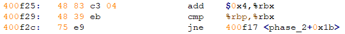
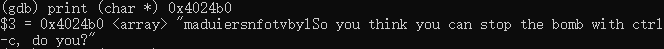
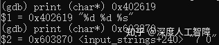
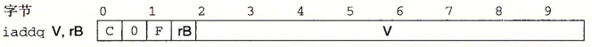

[[实验\]DataLab](https://zhuanlan.zhihu.com/p/106109635)

[[实验\]BombLab](https://zhuanlan.zhihu.com/p/106316877)

[[实验\]ArchLab](https://zhuanlan.zhihu.com/p/109824219)

[[实验\]ShellLab](https://zhuanlan.zhihu.com/p/119034923)

[[实验\]MallocLab](https://zhuanlan.zhihu.com/p/126341872)

[实验]ProxyLab 

# [读书笔记]CSAPP：DataLab


 

**下载地址：**

[http://www.cs.cmu.edu/afs/cs/academic/class/15213-f15/www/labs/datalab-handout.tarwww.cs.cmu.edu/afs/cs/academic/class/15213-f15/www/labs/datalab-handout.tar](https://link.zhihu.com/?target=http%3A//www.cs.cmu.edu/afs/cs/academic/class/15213-f15/www/labs/datalab-handout.tar)

------

该实验主要考查同学对位级运算、无符号数编码、补码以及浮点数编码的掌握程度。**实验过程：**

1. 在`bits.c`中做题目
2. 使用`make clean`和`make`进行编译
3. 调用`./btest -f funcName`测试`funcName`函数的结果，可以在代码中中插入`printf`输出中间结果，但是要记得最后删掉
4. 调用`./dlc bits.c`查看是否使用了非法或过多的运算符
5. 重复以上步骤，最后可以直接运行`./btest`输出最后结果。

## bitXor

```c
/* 
 * bitXor - x^y using only ~ and & 
 *   Example: bitXor(4, 5) = 1
 *   Legal ops: ~ &
 *   Max ops: 14
 *   Rating: 1
 */
int bitXor(int x, int y)
{
  int notand = ~(x & y);
  int or = ~(~x&~y);
  return notand & or;
}
```

要求只能使用`^`和`&`实现异或运算符，通过查看`AND`、`OR`和`XOR`的真值表，我们可以发现`x^y=~(x&y)&(x|y)`，而我们这里缺少`|`运算，但是可以通过`~`和`&`构造出来，即`x|y=~(~x&~y)`。


## tmin

```c
/* 
 * tmin - return minimum two's complement integer 
 *   Legal ops: ! ~ & ^ | + << >>
 *   Max ops: 4
 *   Rating: 1
 */
int tmin(void) {
  return 1<<31;
}
```

这个主要考查补码的定义，通过将最高有效位置1，就能得到补码中的最小值，而且程序是32位的，所以直接对1左移31位就行。

## isTmax

```c
/*
 * isTmax - returns 1 if x is the maximum, two's complement number,
 *     and 0 otherwise 
 *   Legal ops: ! ~ & ^ | +
 *   Max ops: 10
 *   Rating: 2
 */
int isTmax(int x) {
  int a = x+1;
  return !((~a+1)^a)&(!!a); //加一溢出到TMin，并且-TMin==TMin，然后消除全1可能
}
```

同样考查补码的性质，我们知道补码中的最大值是最高有效位为0，其他为1，但是该题中限制了不允许使用移位操作，所以无法直接进行移位。首先，Tmax加一会正溢出得到Tmin，而Tmin一个特殊性质就是Tmin的相反数和Tmin相等，所以我们可以首先通过`a=x+1`，然后判断其相反数是否和自身相同，即`(~a+1)^a`，并且我们要消除全1的情况。

## allOddBits

```c
/* 
 * allOddBits - return 1 if all odd-numbered bits in word set to 1
 *   Examples allOddBits(0xFFFFFFFD) = 0, allOddBits(0xAAAAAAAA) = 1
 *   Legal ops: ! ~ & ^ | + << >>
 *   Max ops: 12
 *   Rating: 2
 */
int allOddBits(int x) {
  int a = x&(x>>2); //2 4
  int b = a&(a>>4); //2 4 6 8
  int c = b&(b>>8); //2 4 6 8 10 12 14 16
  int d = c&(c>>16);
  return (d>>1)&0x01;
}
```

该算法要求判断是否全部偶数位都为1。我们通过不断的移位操作，能够将所有偶数位的值都“与”到倒数第二低的有效位上，然后直接判断其值是否为1。

## negate

```c
/* 
 * negate - return -x 
 *   Example: negate(1) = -1.
 *   Legal ops: ! ~ & ^ | + << >>
 *   Max ops: 5
 *   Rating: 2
 */
int negate(int x) {
  return ~x+1;
}
```

这题主要考察对补码的理解。我们补码对应的有符号数的运算可以直接在补码的位向量上进行计算，所以要保证相反数相加为0，表示需要使得两个位向量相加刚好低32位为0，所以直接对其取反加一，这样就能使得相加结果溢出1位，截断后就为0。

## isAsciiDigit

```c
/* 
 * isAsciiDigit - return 1 if 0x30 <= x <= 0x39 (ASCII codes for characters '0' to '9')
 *   Example: isAsciiDigit(0x35) = 1.
 *            isAsciiDigit(0x3a) = 0.
 *            isAsciiDigit(0x05) = 0.
 *   Legal ops: ! ~ & ^ | + << >>
 *   Max ops: 15
 *   Rating: 3
 */
int isAsciiDigit(int x) {
  //x-0x30>=0-->x+~0x30+1>=0-->!((x+~0x30+1)>>31)
  //x-0x39<=0-->x+~0x39+1<=0-->(x+~0x39+1)>>31
  int less = !((x+~0x30+1)>>31);
  int judge = x+~0x39+1;
  return less&((!judge)|(judge>>31));
}
```

这题主要考察如何实现大小比较。通过两数相减结果的正负来判断两个数之间的大小关系，但是这里不支持减法，但是`a-b`可以转化为`a+(-b)`，而`-b`就是`~b+1`，所以`a-b=a+(~b+1)`。然后我们可以判断该结果最高有效位是否为1，来判断结果的正负。

## conditional

```c
/* 
 * conditional - same as x ? y : z 
 *   Example: conditional(2,4,5) = 4
 *   Legal ops: ! ~ & ^ | + << >>
 *   Max ops: 16
 *   Rating: 3
 */
int conditional(int x, int y, int z) {
  //!x: x is False-->zero-->0x01, x is True-->non-zero-->0x00
  //!x<<31>>31: 0x01-->0xFFFFFF, 0x00-->0x00
  int mask = !x<<31>>31;
  return (mask&z)+((~mask)&y);
}
```

要实现条件分支，有一个思路是如果将条件结果转化为全0或全1，由此乘到分支上进行筛选，即`(mask&z)+(~mask&y)`，如果mask为全1，则选择z，如果mask为全0，则为y。

但是这里要如何将条件转化为全0和全1呢？这里利用了补码右移时是使用算数右移的特点。这里条件`x`是`int`类型，表示使用补码编码， 首先使用`!`判断x是否为0，如果不是0，则最低有效位为1，我们通过左移31位将其置为最高有效位，然后右移时就能全部置为1。

## isLessOrEqual

```c
/* 
 * isLessOrEqual - if x <= y  then return 1, else return 0 
 *   Example: isLessOrEqual(4,5) = 1.
 *   Legal ops: ! ~ & ^ | + << >>
 *   Max ops: 24
 *   Rating: 3
 */
int isLessOrEqual(int x, int y) {
  //不同符号相减容易出现溢出问题，所以先判断符号是否相同，只有相同时才进行相减
  int diff = (x>>31)^(y>>31);
  //diff ? !(y>>31) : y-x
  int part1 = x+~y+1;
  int part2 = !part1;
  int part3 = !!(part1>>31);
  
  int judge = part2 | part3;
  
  int ans = (!diff&judge)+(diff&(!(y>>31)));
  return ans;
}
```

这里也可以通过相减然后判断结果的正负来得到结果，但是要注意两个符号不同的补码相减容易造成溢出，使得结果比较难判断，而符号相同进行相减，就不会有溢出的问题了。我们首先可以通过两个数的最高有效位来判断符号是否相同，如果不同，可以很容易得到结果，如果相同，则需要相减来判断。

## logicalNeg

```c
/* 
 * logicalNeg - implement the ! operator, using all of 
 *              the legal operators except !
 *   Examples: logicalNeg(3) = 0, logicalNeg(0) = 1
 *   Legal ops: ~ & ^ | + << >>
 *   Max ops: 12
 *   Rating: 4 
 */
int logicalNeg(int x) {
  //0的相反数还是0，其他的数字，要么自己，要么相反数最高位为1，就能由此判断
  return (~(x|(~x+1))>>31)&1;
}
```

0的相反数还是0，而其他数或者它的相反数一定有一个是负的，而负数算数右移31位能使得最低有效位置为1。

## howManyBits

```c
/* howManyBits - return the minimum number of bits required to represent x in
 *             two's complement
 *  Examples: howManyBits(12) = 5
 *            howManyBits(298) = 10
 *            howManyBits(-5) = 4
 *            howManyBits(0)  = 1
 *            howManyBits(-1) = 1
 *            howManyBits(0x80000000) = 32
 *  Legal ops: ! ~ & ^ | + << >>
 *  Max ops: 90
 *  Rating: 4
 */
int howManyBits(int x) {
  int b16,b8,b4,b2,b1,b0;
  int sign=x>>31;
  x = (sign&~x)|(~sign&x);//如果x为正则不变，否则按位取反（这样好找最高位为1的，原来是最高位为0的，这样也将符号位去掉了）
  // 不断缩小范围
  b16 = !!(x>>16)<<4;//高十六位是否有1
  x = x>>b16;//如果有（至少需要16位），则将原数右移16位
  b8 = !!(x>>8)<<3;//剩余位高8位是否有1
  x = x>>b8;//如果有（至少需要16+8=24位），则右移8位
  b4 = !!(x>>4)<<2;//同理
  x = x>>b4;
  b2 = !!(x>>2)<<1;
  x = x>>b2;
  b1 = !!(x>>1);
  x = x>>b1;
  b0 = x;
  return b16+b8+b4+b2+b1+b0+1;//+1表示加上符号位
}
```

网上抄的……

## float_twice

```c
/* 
 * float_twice - Return bit-level equivalent of expression 2*f for
 *   floating point argument f.
 *   Both the argument and result are passed as unsigned int's, but
 *   they are to be interpreted as the bit-level representation of
 *   single-precision floating point values.
 *   When argument is NaN, return argument
 *   Legal ops: Any integer/unsigned operations incl. ||, &&. also if, while
 *   Max ops: 30
 *   Rating: 4
 */
unsigned float_twice(unsigned uf) {
  //参数定义放在函数头
  unsigned exp = uf>>23;
  unsigned ans;
  //NaN and inf
  if(!((exp&0xFF)^0xFF)){
	  return uf;
  }
  //non-normalized 直接左移
  if(!(exp&0xFF)){
	  unsigned sign = uf>>31<<31;
	  return (uf<<1)|sign;
  }
  //normalized 指数部分加一
  ans = (1<<23)+uf;
  //inf
  if(!(((ans>>23)&0xFF)^0xFF)){
	  return ans>>23<<23;
  }else{
	  return ans;
  }
}
```

这里主要考察对浮点数编码的理解。浮点数的编码分成三种情况：

- 规格化数：要求尾数表示为`1.f1,f2,...`，所以我们无法直接对尾数部分进行左移来乘2，但是我们可以直接对阶码部分加1来乘上2，需要判断阶码部分是否超出规格化数的表示范围，变成了无穷。
- 非规格化数，要求阶码全为0，所以无法直接对解码进行加1，但是尾数表示为`0.f1,f2,...`所以我们可以直接对尾数部分左移来乘上2。而在非规格化数的最大值（尾数部分全为1）为 ![[公式]](https://www.zhihu.com/equation?tex=%5Csum_%7Bi%3D1%7D%5E%7Bn%7D2%5E%7B-i%7D%5Ctimes2%5E%7B2-2%5E%7Bk-1%7D%7D) ，如果对其右移，会变成规格化数，其值为 ![[公式]](https://www.zhihu.com/equation?tex=%28%5Csum_%7Bi%3D1%7D%5E%7Bn-1%7D2%5E%7B-i%7D%2B1%29%5Ctimes2%5E%7B2%2B2%5E%7Bk-1%7D%7D%3D%28%5Csum_%7Bi%3D0%7D%5E%7Bn-1%7D2%5E%7B-i%7D%29%5Ctimes2%5E%7B2%2B2%5E%7Bk-1%7D%7D%3D2%5Ctimes%28%5Csum_%7Bi%3D1%7D%5E%7Bn%7D2%5E%7B-i%7D%29%5Ctimes2%5E%7B2%2B2%5E%7Bk-1%7D%7D) ，刚好是两倍关系，所以对所有非规格化数都能直接左移。

## float_i2f

```c
/* 
 * float_i2f - Return bit-level equivalent of expression (float) x
 *   Result is returned as unsigned int, but
 *   it is to be interpreted as the bit-level representation of a
 *   single-precision floating point values.
 *   Legal ops: Any integer/unsigned operations incl. ||, &&. also if, while
 *   Max ops: 30
 *   Rating: 4
 */
unsigned float_i2f(int x) {
	unsigned ux, mask, temp, e, sign = 0;
	int E = 0, count;
	
	if(!x) return 0; //0就直接返回
	
	//将有符号数转化为无符号数
	if(x&0x80000000){
		ux = ~x+1;
		sign = 0x80000000;
	}
	else ux=x;
	
	//统计有几位
	temp = ux;
	while(temp){
		E += 1;
		temp = temp>>1;
	}
	ux = ux&(~(1<<(E-1))); //去掉最高位
	e = E+126; //计算e的值
	//对尾数进行移位
	if(E<=24){
		ux = ux<<(24-E); //尾数位数小于23的，直接将其移到顶
	}else{//尾数位数大于23的，要进行截断，需要考虑舍入问题
		count = 0;
		while(E>25){
			if(ux&0x01) count+=1;
			ux = ux>>1;
			E -= 1;
		}
		mask = ux&0x01;
		ux = ux>>1;
		if(mask){
			if(count) ux+=1;
			else{
				if(ux&0x01) ux+=1;
			}
		}
		if(ux>>23){//进位造成多一位
			e+=1;
			ux = ux&0x7FFFFF;//(~(1<<23)); //去掉最高位
		}
	}
	
	return sign+(e<<23)+ux;
}
```

将补码转化为浮点数编码步骤：

1. 将补码转化为无符号数，并根据补码的符号来设置浮点数的符号位

2. 因为补码一定是大于等于0的数，所以要么为0，要么为规格化数。如果是规格化数，首先统计除了最高有效位外一共需要几位，得到的就是E，然后通过 ![[公式]](https://www.zhihu.com/equation?tex=E%3De%2B1-2%5E%7Bk-1%7D) 得到解码位为 ![[公式]](https://www.zhihu.com/equation?tex=e%3DE-1%2B2%5E%7Bk-1%7D) 。

3. 无符号数后面E位就是尾数部分，但是需要判断该部分是否23位，如果小于23位，直接将其左移填充；如果大于23位，需要对其进行舍入：

4. 1. 如果是中间值，就需要向偶数舍入
   2. 如果不是中间值，就需要向最近的进行舍入

## float_f2i

```c
/* 
 * float_f2i - Return bit-level equivalent of expression (int) f
 *   for floating point argument f.
 *   Argument is passed as unsigned int, but
 *   it is to be interpreted as the bit-level representation of a
 *   single-precision floating point value.
 *   Anything out of range (including NaN and infinity) should return
 *   0x80000000u.
 *   Legal ops: Any integer/unsigned operations incl. ||, &&. also if, while
 *   Max ops: 30
 *   Rating: 4
 */
int float_f2i(unsigned uf) {
  //只可能是规格化数
  int e = ((uf>>23)&0xFF)-127;
  unsigned sign = uf>>31;
  unsigned frac = (uf&0x7FFFFF)|0x800000; //加上1
  if(e<0) return 0;	//小数
  //先转到无符号数
  if(e>31) return 0x80000000u;	//超出范围
  if(e>23) frac = frac<<(e-23);
  else frac = frac>>(23-e);
  //将无符号数转化为补码
  if(sign){ //负数
	if(frac>>31) 	//溢出
		return 0x80000000u;
	else
		return ~frac+1;
  }else{	//正数
	if(frac>>31)	//溢出
		return 0x80000000u;
	else
		return frac;
  }
}
```

将浮点数转化为补码步骤：

1. 首先假设浮点数为规格化数，则 ![[公式]](https://www.zhihu.com/equation?tex=E%3De-Bias) 得到指数部分，我们知道如果 ![[公式]](https://www.zhihu.com/equation?tex=E%3C0)，则计算出来的结果一定是小数（包括非规格化数），此时能直接舍入到0；如果 ![[公式]](https://www.zhihu.com/equation?tex=E%3E31) ，表示至少要将尾数部分右移31位，此时一定会超过补码的表示范围，所以直接将其溢出。
2. 可通过最低23位得到尾数部分
3. 尾数部分需要自己在最高有效位添1，如果是负数，则补码的最高位为1，就要求其对应的无符号编码最高位不为1，否则是负溢出溢出；如果是整数，则补码的最高位为0，就要求其编码的最高位为0，否则是正溢出。

## 最终结果


# [读书笔记]CSAPP：BombLab


 

**代码地址：**[http://csapp.cs.cmu.edu/3e/bomb.tar](https://link.zhihu.com/?target=http%3A//csapp.cs.cmu.edu/3e/bomb.tar)

**x86-64 GDB命令：**[http://csapp.cs.cmu.edu/3e/docs/gdbnotes-x86-64.pdf](https://link.zhihu.com/?target=http%3A//csapp.cs.cmu.edu/3e/docs/gdbnotes-x86-64.pdf)

**说明：**[http://csapp.cs.cmu.edu/3e/bomblab.pdf](https://link.zhihu.com/?target=http%3A//csapp.cs.cmu.edu/3e/bomblab.pdf)

**README：**[http://csapp.cs.cmu.edu/3e/README-bomblab](https://link.zhihu.com/?target=http%3A//csapp.cs.cmu.edu/3e/README-bomblab)

------

该实验为了考验同学GDB使用、反汇编器以及代码机器指令的熟练程度，我们需要分析代码来确定输入的6条字符串内容，来破解6个炸弹。

**实验步骤：**

1. 可以创建一个文件专门放你输入的答案，我这里创建一个文件`ans`
2. 运行`objdump -d bomb > bomb.s`来反编译可执行文件`bomb`，得到该代码的汇编代码`bomb.s`
3. 运行`gdb bomb`来调试`bomb`
4. 为了防止炸弹爆炸，先使用`break explode_bomb`在炸弹爆炸代码处设置一个断点，防止不小心爆炸
5. 设置完所有断点后，输入`run ans`来执行代码
6. 通过分析机器代码来确定需要输入的代码

## phase_1

首先第一关的C语言代码为


我们知道首先需要输入一个字符串`input`，然后将其作为参数输入到函数`phase_1`中。计算机在保存字符串时，是保存在连续的内存空间，并将字符串第一个字符的地址作为该字符串的地址。而该字符串作为函数`phase_1`的第一个参数，所以该字符串的地址保存在`%rdi`中。

第一关的汇编代码为


首先将`0x402400`保存在`%rsi`中，然后执行函数`strings_not_equal`，所以该函数是用来判断字符串是否相同，如果相同则将`%rax`设置为0，否则设置为1。所以这里第一个参数是我们输入的字符串，而第二个参数是地址`0x402400`保存的字符串。 然后`test %eax, %eax`判断结果的值，`je`表示值为0时跳过爆炸函数。所以我们只要输入地址`0x402400`保存的字符串就行了。

通过`print (char *) 0x402400`就能知道需要输入的代码是什么


## phase_2

首先通过`sub $0x28,%rsp`扩展了该函数的栈帧，然后通过`mov %rsp,%rsi`将当前的栈顶作为第二个参数，我们输入的字符串地址作为第一个参数，调用函数` read_six_numbers`。


在`read_six_numbers`函数中，后面会调用函数`__isoc99_sscanf@plt`，即`sscanf`函数，该函数形式为

```text
int sscanf(const char *buffer, const char *format, [argument]...)
```

其中，`buffer`是输入的字符串，`format`是字符串的格式，`argument`是根据format提取出来的内容保存的位置，而该函数的返回值为格式化参数的数目。

而且汇编代码中对`%rdi`、`%rsi`、`%rdx`等寄存器的赋值操作，所以以上代码是设置函数`sscanf`的参数。

我们知道`%rdi`保存的是我们输入的字符串的地址，`%rsi`保存的是函数`phase_2`的栈顶地址。所以我们可以知道这些参数保存的内容：

- 第三个参数`%rdx`保存栈顶地址
- 第四个参数`%rcx`保存栈顶地址向上偏移`0x4`
- 第五个参数`%r8`保存栈顶指针向上偏移`0x8`
- 第六个参数`%r9`保存栈顶指针向上偏移`0xc`

并且该函数输入超过6个参数的话，就会将其他的参数保存到内存地址中，其中有两个参数保存在内存中，对应的汇编代码为


并且越靠前的参数，保存的地址越小，所以

- 第七个参数保存在地址`%rsp`处，内容是栈顶指针向上偏移`0x10`
- 第八个参数保存在地址`%rsp+0x8`处，内容是栈顶指针向上偏移`0x14`

最后修改了第二个参数`%rsi`保存`0x4025c3`。

我们知道函数 `sscanf`第二个参数是字符串你的格式，所以我们输入`print (char *) 0x4025c3`来获得格式的内容


所以我们知道，我们需要输入的格式内容是6个数字，并且数字之间要以空格间隔。并且我们可以根据参数顺序来确定函数`phase_2`栈帧中各个位置保存的内容。

从函数`sscanf`返回后，第一行命令`cmpl $0x1,(%rsp)`比较的是栈顶指针`%rsp`对应的数字和1的大小，而栈顶指针`%rsp`保存的是我们输入的第一个数字，而下一行指令`je 400f30 `表示相等时跳过爆炸函数，所以我们输入的第一个数字就是1。

当输入第一个数字是1时，就会跳转到


表示将第二个数字地址保存在`%rbx`，栈顶向上偏移`0x18`的地址保存在`%rbp`，然后跳转回去。


首先`%eax`保存第一个数字，然后将其乘2，然后与`%rbx`指向的内存地址的值进行比较，这里就是与第二个数字相比，如果两者相同，就跳过炸弹爆炸函数 ，所以我们知道第二个数字是第一个数字的两倍。



将`%rbx`内容加上`0x4`，则`%rbx`保存的是第三个数字的内存地址，然后与`%rbp`相比，如果不相同，还是跳转回去。


所以这个是一个循环的函数，我们保存的最大地址是栈顶指针向上偏移`0x14`，而`%rbx`保存栈顶指针向上偏移`0x18`，并且我们输入的都是`int`数字类型，刚好占4字节，所以`%rbx`表示该循环的终点，表示所有数字都适用。 所以第三个数字是第二个数字的两倍，第四个数字是第三个数字的两倍，以此类推。

由此对应的答案就是`1 2 4 8 16 32`。

## phase_3

第三道题是一个比较典型的`switch`代码。

首先在`400f5b`中还是要执行一个`sscanf`函数，所以首先设置该函数的参数

- 第一个参数`%rdi`是我们输入的字符串
- 第二个参数`%rsi`是地址`0x4025cf`处的格式字符串，通过`print (char *) 0x4025cf`可以知道我们需要输入的字符串格式


所以我们需要输入两个数字

- 第三个参数`%rdx`表示将第一个数字保存在`0x8(%rsp)`处
- 第四个参数`%rcx`表示将第二个数字保存在`0xc(%rsp)`处

经过若干行通过函数`sscanf`返回的格式化输入数目，来判断我们是否按照要求输入了两个数字。然后会碰到`switch`的第一个组成部分


从这段代码我们可以知道

1. 进入`switch`之前，都需要将我们输入的值减掉`switch`所有分支中的最小值，将其转化为一个无符号数，但是这里没有，说明要求我们输入的是大于等于0的数字。而这里使用`0x8(%rsp)`进行比较，所以我们输入的第一个数字要求大于等于0
2. `cmpl $0x7,0x8(%rsp)`表示我们输入的第一个数字最大只能是7

然后到了`switch`的跳转部分


从这里我们知道，`switch`对应的跳转表的表头保存在`0x402470`处，并且根据我们输入的第一个参数进行跳转。所以我们可以先输出跳转表的所有内容，查看输入不同值时跳转到什么位置


通过跳转表和汇编代码，我们可以直接设置第一个数字为1，使其跳转到最靠近末尾的地址`400fb9`，此时汇编代码为


这里首先将`0x137`保存到`%eax`中，然后将其和第二个数字进行比较，如果相同，则释放内存空间，所以我们可以输入`print /d 0x137`得到对应的十进制值


所以答案为`1 311`。

## phase_4

这道题一进去还是要我们输入两个数字，将第一个数字保存在`0x8(%rsp)`中，第二个数字保存在`0xc(%rsp)`中。


表示第一个数字必须要比14小。然后设置第一个参数为第一个数字，第二个参数为0，第三个参数为14，调用函数`func4`，我们可以将该函数转化为对应的C代码

```c
int func4(int a=arg1, int b=0, int c=14){
  if(c-b>=0){
    int ans=(c-b)/2;
  }else{
    int ans=(c-b+1)/2;
  }
  int temp1=ans+b;
  if(temp1-a<=0){
    int ans=0;
    if(temp1-a>=0){
      return ans;
    }else{
      b=temp1+1;
      int ans = func4(a,b,c);
      ans=ans*2+1;
      return ans;
    }
  }else{
    c = temp1-1;
    int ans = func4(a,b,c);
    return ans*2;
  }
} 
```

**注意：**其中有一行命令是`sar %eax`，我一开始以为是向右移动`%cl`中记录的位数，但是这里其实是向右移动一位。

首先看后面的汇编代码


可以知道我们想要函数`func4`输出的值为0，所以我们这里可以直接输入第一个数字为7，此时就能使得该函数返回0。


然后后面这段代码中，`cmpl $0x0,0xc(%rsp)`表示要对第二个参数与0进行比较，`je 40105d `表示相等时就释放变量空间，所以第二个参数是0。所以答案为`7 0`。

## phase_5

这里首先`mov %rdi,%rbx`将我们的输入字符串保存到`%rbx`中，然后以下保存了一个金丝雀值，不需要去考虑它的值。


这里调用了`string_length`函数，此时输入值`%rdi`保存着我们输入的字符串，所以该函数返回我们输入字符串的长度，然后和`0x6`比较，只有相等时才不会引爆炸弹，所以我们需要输入6个字符。


这里首先将`%rax`置为0，然后开始到函数内部循环


- `movzbl (%rbx,%rax,1),%ecx`这里可以把`%rax`看成是在我们输入字符串的索引值，然后根据索引，将当前字符保存到`%rcx`中。
- `mov %cl,(%rsp)`和`mov (%rsp),%rdx`表示将`%rcx`低8位保存到`%rdx`中
- `and $0xf,%edx`表示保留`%rdx`低4位，即当前字符的低4位
- `movzbl 0x4024b0(%rdx),%edx`表示用我们当前字符的低4位作为偏移量，将地址`0x4024b0`偏移后值保存到`%edx`，我们可以通过`print (char *) 0x4024b0`查看这个地址中保存的内容，说明`%edx`中保存的是一个字符值



- `mov %dl,0x10(%rsp,%rax,1)`表示将我们提取出来的字符保存到`0x10(%rsp, %rax, 1)`处
- `add $0x1,%rax`和 `cmp $0x6,%rax`表示修改索引值，并且索引值最大为6

所以这个循环的目的就是根据我们输入的字符串，提取低4个字节的值作为`0x4024b0`的偏移量，然后将对应的字符保存到`%rsp+0x10`到`%rsp+0x16`处，并且`movb $0x0,0x16(%rsp)`表示最后补充一个`\0`作为字符串的结尾。


这段代码表示将地址`0x40245e`保存的字符串，和我们提取出来的字符串通过`string_not_equal`函数相互比较，所以就要保证我们提取出来的字符串和地址`0x40245e`保存的字符串相同。

首先通过`print (cahr *) 0x40245e`获得该目标字符串


所以当前我们需要构造输入字符串，使得其ascii码的低4位可以从"maduiersnfotvbylSo you think you can stop the bomb with ctrl-c, do you?"索引出"flyers"。

可以输入`man ascii`获得所有ascii码


由于低4位就是一个十六进制值，所以根据想要的索引值，选择对应行都是正确答案。我这里输入的字符串是`ionefg`。

## phase_6

这部分汇编代码比较长，主要分成4部分。

首先在地址`0x401153`之前是对输入进行检测，要求输入6个数字，范围在1到6之间，并且要求输入不同的数字。地址`0x40116f`之前是对输入进行处理，将输入对7进行取补操作。

从`0x40116f`到`0x4011a9`之间是我看最久的代码。首先`%rdx`保存了一个内存地址`0x6032d0`，然后有一句`0x8(%rdx),%rdx`表示将`%rdx`中的地址偏移`0x8`再将其保存到`%rdx`中，而`%rdx,0x20(%rsp,%rsi,2)`表示将`%rdx`中的内容保存到栈对应的偏移位置。我们首先可视化以下这段内容保存的内容


我们就可以知道这段内容保存的是一个链表结构，而我们刚刚的操作是将对应位置的链表节点地址保存到栈空间中。

最后一段代码从`0x4011ab`到`0x4011f5`中是对我们保存顺序的要求，它要求我们按照节点内容的大小从大到小排序。

而节点中各个值可以转成十进制进行比较


所以从大到小的索引序列为`3 4 5 6 1 2`，然后根据代码我们还要对其用7取补，得到最终答案为`4 3 2 1 6 5`。

至此，该实验做完了，总体感觉是，做`phase_1`时确实刚上手不太熟练，但是按顺序做下来后感觉难度还行，就最后`phase_6`代码量稍微大一点，有点棘手。


## secret_phase

做题的时候发现有个`func7`一直没有用过，就搜索了一下该函数，发现在一个`secret_phase`中调用过该函数，说明还有一个隐藏关卡，现在需要考虑如何进入这个隐藏关卡。搜索了一下`secret_phase`，发现在`phase_defused`函数中调用过，说明我们是通过`phase_defused`进入的。

首先，`cmpl $0x6,0x202181(%rip)`会对比当前是否是第六关，如果不是就跳出。 然后会调用`sscanf`函数进行输入，首先看一下输入的参数



可以发现这里要求输入的是两个数字和一个字符串，而当前输入的只有两个数字，并且这两个数字刚好就是`phase_4`的答案。我们接着往下看，下面调用了`strings_not_equal`函数，说明要对输入进行判断，而两个参数分别是`lea 0x10(%rsp),%rdi`和`mov $0x402622,%esi`。其中`0x10(%rsp)`是输入的第三个字符串，而`0x402622`保存的内容是


说明我们可以将`phase_4`的答案改成`7 0 DrEvil`进入隐藏关卡


在`secret_phase`中，首先会调用一个`strtol`函数将我们输入的内容转换成10进制数，说明我们的输入要是一个数字


这个要求我们输入的数字要小于等于999。

然后将`0x6030f0`作为第一个参数，将我们输入的数字作为第二个参数，调用函数`func7`，我将其转换为C代码

```c
int func7(int *ad, int inp){
  if(!ad) return ans;
  int temp = &ad;
  int ans;
  if(temp-inp<=0){
    ans = 0;
    if(temp==inp) return ans;
    ad = *(ad+0x10);
    ans = func7(ad, inp);
    ans = ans*2+1;
    return ans;
  }else{
    ad = *(ad+0x8);
    ans = func7(ad, inp)*2;
    return ans;
  }
}
```

可以发现它是对一个二叉树进行访问，一侧保存在地址偏移`0x10`处，一侧保存在地址偏移`0x8`处，我们可以输出`0x6030f0`的内容知道二叉树的结构


将其整理下可得二叉树

```text
└─ 36
   ├─ 8
   │  ├─ 6
   │  │  ├─ left: 1
   │  │  └─ right: 7
   │  └─ 22
   │     ├─ left: 20
   │     └─ right: 35
   └─ 50
      ├─ 45
      │  ├─ left: 40
      │  └─ right: 47
      └─ 107
         ├─ left: 99
         └─ right: 1001
```

我们的目标是要函数`func7`输出2，遍历二叉树结构可得答案有`20`和`22`。

所以，最终答案为

```text
Border relations with Canada have never been better.
1 2 4 8 16 32
1 311
7 0 DrEvil
ionefg
4 3 2 1 6 5
20
 
```


# [读书笔记]CSAPP：ArchLab


 **README：**[http://csapp.cs.cmu.edu/3e/README-archlab](https://link.zhihu.com/?target=http%3A//csapp.cs.cmu.edu/3e/README-archlab)

**说明：**[http://csapp.cs.cmu.edu/3e/archlab.pdf](https://link.zhihu.com/?target=http%3A//csapp.cs.cmu.edu/3e/archlab.pdf)

**代码：**[http://csapp.cs.cmu.edu/3e/archlab-handout.tar](https://link.zhihu.com/?target=http%3A//csapp.cs.cmu.edu/3e/archlab-handout.tar)

------

该实验主要是学习流水线Y86-64处理器的设计和实现，同时对处理器和基准测试程序进行优化以使性能最大化。

主要包含三个实验：在A部分中，将编写一些简单的Y86-64程序，并熟悉Y86-64工具。在B部分中，对SEQ仿真器进行扩展。这两部分将为C部分（实验的核心）做好准备，在C部分中，将优化Y86-64基准程序和处理器设计。

我们首先下载得到`archlab-handout.tar`文件，然后运行

```text
tar xvf archlab-handout.tar
cd archlab-handout
tar xvf sim.tar
```

你后续的所有工作都是在sim文件夹中进行操作的，然后执行

```text
make clean; make
```

如果出现错误，则执行以下命令

```text
# .make: flex：命令未找到
sudo apt-get install bison flex
```

## part A

该部分主要是在文件夹`sim/misc`中，主要是用Y86-64提供的指令集完成`example.c`中的函数编写，其中包含三个函数：`sum_list`、`rsum_list`和`copy_block`。可以使用汇编器`yas`对Y86-64程序进行汇编，然后使用指令集模拟器`yis`运行可执行文件。

**Y86-64指令集：**


Y86-64中包含的**程序员可见状态**有


### 1. sum_list

在`examples.c`中首先定义了一个链节点的结构体

```c
/* linked list element */
typedef struct ELE {
    long val;
    struct ELE *next;
} *list_ptr;
 
```

`sum_list`函数对应的C代码如下所示，是对链表`ls`元素进行累加

```c
long sum_list(list_ptr ls)
{
    long val = 0;
    while (ls) {
	val += ls->val;
	ls = ls->next;
    }
    return val;
}
```

我们需要写一个Y86-64汇编程序对以下链表结构调用`sum_list`函数

```text
  .align 8
ele1:
  .quad 0x00a
  .quad ele2
ele2:
  .quad 0x0b0
  .quad ele3
ele3:
  .quad 0xc00
  .quad 0 
```

**注意：**链表是保存在内存中的，并且根据结构体`ELE`的声明，一个`ELE`实例在内存中的分布是8字节的`val`值以及8字节的`ELE *`值。

将以下代码保存到`sum.ys`中

```text
  .pos 0 #设置当前位置为0
  irmovq stack, %rsp #设置栈指针
  call main
  halt

#链表
  .align 8 #地址和8字节对齐
ele1:
  .quad 0x00a
  .quad ele2
ele2:
  .quad 0x0b0
  .quad ele3
ele3:
  .quad 0xc00
  .quad 0

main:
  irmovq ele1, %rdi #将链表的第一个元素ele1作为输入
  call sum_list
  ret

sum_list:
  pushq %rbx #%rbx为被调用者保存寄存器，后面有用到该寄存器，所以需要先压入栈中
  xorq %rax, %rax #用%rax保存val值，首先置零
  jmp test
loop:
  mrmovq (%rdi), %rbx #将链节点中的val保存到%rbx中
  addq %rbx, %rax
  mrmovq 8(%rdi), %rdi #将当前指向链节点val地址的%rdi增加8字节，指向了保存下一个链节点地址的地址，再访问内存，得到下一个节点的地址
test:
  andq %rdi,%rdi #对输入链节点进行判断
  jne loop #如果链节点是非零的，就进入循环loop
  popq %rbx
  ret

  .pos 0x200 #设置栈地址
stack:
```

然后在`sim/misc`文件夹中运行`./yas sum.ys`得到`sum.yo`可执行文件，然后运行`./yis sum.yo`得到运行结果


其中`%rax`中保存着计算结果。

### 2. rsum_list

`rsum_list`函数对应的C代码如下所示，是通过递归形式完成链表累加

```c
long rsum_list(list_ptr ls)
{
    if (!ls)
	return 0;
    else {
	long val = ls->val;
	long rest = rsum_list(ls->next);
	return val + rest;
    }
} 
```

和上一节一样，我们创建一个`rsum.ys`文件，写入以下代码

```text
   .pos 0
  irmovq stack, %rsp
  call main
  halt

  .align 8
ele1:
  .quad 0x00a
  .quad ele2
ele2:
  .quad 0x0b0
  .quad ele3
ele3:
  .quad 0xc00
  .quad 0

main:
  irmovq ele1, %rdi
  call rsum_list
  ret

rsum_list:
  pushq %rbx
  xorq %rax, %rax
  andq %rdi, %rdi
  je finish
  mrmovq (%rdi), %rbx
  mrmovq 8(%rdi), %rdi
  call rsum_list
  addq %rbx, %rax #当调用rsum_list后，结果保存在%rax中
finish:
  popq %rbx
  ret
  
  .pos 0x200
stack:
```

运行结果为


### 3 copy_block

`copy_block`函数是将内存中的一个块复制到另一个不重叠的区域，并且计算所有复制单词的xor校验和Xor，对应的C代码为

```c
long copy_block(long *src, long *dest, long len)
{
    long result = 0;
    while (len > 0) {
	long val = *src++;
	*dest++ = val;
	result ^= val;
	len--;
    }
    return result;
} 
```

我们写一个Y86-64程序，将下列的块作为函数的输入

```text
  .align 8
# Source block
src:
  .quad 0x00a
  .quad 0x0b0
  .quad 0xc00
# Destination block
dest:
  .quad 0x111
  .quad 0x222
  .quad 0x333
```

我们创建`copy.ys`保存以下代码

```text
  .pos 0
  irmovq stack, %rsp
  call main
  halt

  .align 8
# Source block
src:
  .quad 0x00a
  .quad 0x0b0
  .quad 0xc00
# Destination block
dest:
  .quad 0x111
  .quad 0x222
  .quad 0x333

main:
  irmovq src, %rdi
  irmovq dest, %rsi
  irmovq $3, %rdx
  call copy_block
  ret

copy_block:
  pushq %rbx
  pushq %r12
  pushq %r13
  xorq %rax, %rax
  irmovq $8, %r12
  irmovq $1, %r13
loop:
  andq %rdx, %rdx
  jle finish
  mrmovq (%rdi), %rbx
  rmmovq %rbx, (%rsi)
  xorq %rbx, %rax
  addq %r12, %rdi
  addq %r12, %rsi
  subq %r13, %rdx
  jmp loop
finish:
  popq %r13
  popq %r12
  popq %rbx
  ret

  .pos 0x200
stack: 
```

**注意：**

- Y86-64指令集中不包含立即数和寄存器之间的运算指令，所以需要先通过`irmovq`将立即数保存到寄存器中，再用该寄存器进行计算
- 出入栈的寄存器顺序要相反

运行结果为


## part B

该部分在`sim/seq`文件夹中，想要我们对SEQ处理器进行扩展，使其支持`iaddq`指令。

根据题目4.3我们可以知道`iaddq`的指令编码



然后我们可以参考`opq`指令和`irmovq`的执行过程得到`iaddq`的执行过程


然后我们需要在`seq-full.hcl`文件中进行修改，使其包含`iaddq`指令。首先该HCL中包含了`iaddq`的指令代码`IIADDQ`，然后我将需要修改的内容列在下方

```text
#取指阶段
##该信号判断是否为合法指令
bool instr_valid = icode in 
	{ INOP, IHALT, IRRMOVQ, IIRMOVQ, IRMMOVQ, IMRMOVQ,
	  IOPQ, IJXX, ICALL, IRET, IPUSHQ, IPOPQ , IIADDQ}; 
##由于iaddq指令需要读取寄存器rB
bool need_regids =
	icode in { IRRMOVQ, IOPQ, IPUSHQ, IPOPQ, 
		   IIRMOVQ, IRMMOVQ, IMRMOVQ , IIADDQ};
#由于iaddq指令还需要立即数
bool need_valC =
	icode in { IIRMOVQ, IRMMOVQ, IMRMOVQ, IJXX, ICALL ,IIADDQ}; 

#译码阶段和写回阶段
##因为iaddq要使用rB寄存器，所以需要设置srcB的源为rB
word srcB = [
	icode in { IOPQ, IRMMOVQ, IMRMOVQ, IIADDQ} : rB;
	icode in { IPUSHQ, IPOPQ, ICALL, IRET } : RRSP;
	1 : RNONE;  # Don't need register
];
##计算完的结果valE需要保存到寄存器rB中
word dstE = [
	icode in { IRRMOVQ } && Cnd : rB;
	icode in { IIRMOVQ, IOPQ, IIADDQ} : rB;
	icode in { IPUSHQ, IPOPQ, ICALL, IRET } : RRSP;
	1 : RNONE;  # Don't write any register
];

#执行阶段
##iaddq指令需要将valC作为aluA的值
word aluA = [
	icode in { IRRMOVQ, IOPQ } : valA;
	icode in { IIRMOVQ, IRMMOVQ, IMRMOVQ, IIADDQ } : valC;
	icode in { ICALL, IPUSHQ } : -8;
	icode in { IRET, IPOPQ } : 8;
	# Other instructions don't need ALU
];
##iaddq指令需要将aluB的值设置为valB
word aluB = [
	icode in { IRMMOVQ, IMRMOVQ, IOPQ, ICALL, 
		   IPUSHQ, IRET, IPOPQ, IIADDQ } : valB;
	icode in { IRRMOVQ, IIRMOVQ } : 0;
	# Other instructions don't need ALU
];
##iaddq指令也需要更新CC
bool set_cc = icode in { IOPQ , IIADDQ};
```

修改完后需要通过该HCL文件构建SEQ仿真器（ssim）的新实例，然后对其进行测试：

- 根据`seq-full.hcl`文件构建新的仿真器

```text
make VERSION=full
```

**注意：**如果你不含有`Tcl/Tk`，需要在`Makefile`中将对应行注释掉

- 在小的Y86-64程序中测试你的方法

```text
./ssim -t ../y86-code/asumi.yo
```

如果失败了，还要重新修改你的实现

- 使用基准程序来测试你的方法

```text
(cd ../y86-code; make testssim)
```

这将在基准程序上运行ssim，并通过将结果处理器状态与高级ISA仿真中的状态进行比较来检查正确性。注意，这些程序均未测试添加的指令，只是确保你的方法没有为原始说明注入错误。

- 一旦可以正确执行基准测试程序，则应在`../ptest`中运行大量的回归测试

测试除了`iaddq`以外的所有指令

```text
(cd ../ptest; make SIM=../seq/ssim) 
```


测试我们实现的`iaddq`指令

```text
 (cd ../ptest; make SIM=../seq/ssim TFLAGS=-i)
```


## part C

该部分在`sim/pipe`中进行，需要我们修改`ncopy.ys`使得`ncopy`函数尽可能块，也可以修改`pipe-full.hcl`文件来增加`iaddq`指令。

当你修改了了`ncopy.ys`文件时，需要使用`make drivers`进行编译，当修改了`pipe-full.hcl`时，需要使用`make psim VERSION=full`编译。

可以用`./correctness.pl`测试`ncopy`函数的正确性，然后使用`./benchmark.pl`来测试函数的性能，希望CPE越小越好。初始CPE为15.18，大于10.5为0分，小于7.5为满分60。

我只得到8.63的CPE，只有37.4，代码如下

```text
	xorq %rax,%rax		# count = 0;
	
	iaddq $-5, %rdx
	jg Loop6x6
	iaddq $5, %rdx
	jg Loop1
	ret

Loop1:
	mrmovq (%rdi), %r8
	rrmovq %rax, %r14
	iaddq $1, %r14
	andq %r8, %r8
	cmovg %r14, %rax
	rmmovq %r8, (%rsi)
		
	iaddq $8, %rdi		# src++
	iaddq $8, %rsi		# dst++
	iaddq $-1, %rdx		# len--

	jg Loop1
	ret

Loop6x6:
	mrmovq (%rdi), %r8
	rrmovq %rax, %r14
	iaddq $1, %r14
	andq %r8, %r8
	cmovg %r14, %rax
	rmmovq %r8, (%rsi)
	
	mrmovq 8(%rdi), %r8
	rrmovq %rax, %r14
	iaddq $1, %r14
	andq %r8, %r8
	cmovg %r14, %rax
	rmmovq %r8, 8(%rsi)
	
	mrmovq 16(%rdi), %r8
	rrmovq %rax, %r14
	iaddq $1, %r14
	andq %r8, %r8
	cmovg %r14, %rax
	rmmovq %r8, 16(%rsi)
	
	mrmovq 24(%rdi), %r8
	rrmovq %rax, %r14
	iaddq $1, %r14
	andq %r8, %r8
	cmovg %r14, %rax
	rmmovq %r8, 24(%rsi)
	
	mrmovq 32(%rdi), %r8
	rrmovq %rax, %r14
	iaddq $1, %r14
	andq %r8, %r8
	cmovg %r14, %rax
	rmmovq %r8, 32(%rsi)
	
	mrmovq 40(%rdi), %r8
	rrmovq %rax, %r14
	iaddq $1, %r14
	andq %r8, %r8
	cmovg %r14, %rax
	rmmovq %r8, 40(%rsi)
	
	
	iaddq $48, %rdi		# src++
	iaddq $48, %rsi		# dst++
	iaddq $-6, %rdx		# len--
	
	jg Loop6x6
	iaddq $5, %rdx
	jg Loop1 
```

修改了以下几部分：

- 加上了`iaddq`指令，并将代码中包含立即数加减法的指令替换成`iaddq`。15.18-->13.70
- 因为当前处理器采用AT策略来预测分支，所以修改了跳转指令，使其跳转到可能性较大的分支。13.70-->13.55
- 使用条件转义指令，并将其放在读取内存之后，消除加载/使用冒险。13.55-->13.11
- 使用循环展开，不同结果如下所示


所以这里采用7x7进行展开

- 在跳转之前，我们都用`and`来得到条件码，其实计算出值后就会得到对应的条件码，所以可以删除`and`。9.70-->9.52
- 消除一些冗余的，不需要的计算。9.52-->9.02
- 重新测了一下循环展开的数量，现在6x6更好。9.02-->9.01
- 去掉不必要的跳转指令。9.01-->8.63


# [读书笔记]CSAPP：CacheLab


 **README：**[http://csapp.cs.cmu.edu/3e/README-cachelab](https://link.zhihu.com/?target=http%3A//csapp.cs.cmu.edu/3e/README-cachelab)

**说明：**[http://csapp.cs.cmu.edu/3e/cachelab.pdf](https://link.zhihu.com/?target=http%3A//csapp.cs.cmu.edu/3e/cachelab.pdf)

**代码：**[http://csapp.cs.cmu.edu/3e/cachelab-handout.tar](https://link.zhihu.com/?target=http%3A//csapp.cs.cmu.edu/3e/cachelab-handout.tar)

**复习：**[http://www.cs.cmu.edu/afs/cs/academic/class/15213-f15/www/recitations/rec07.pdf](https://link.zhihu.com/?target=http%3A//www.cs.cmu.edu/afs/cs/academic/class/15213-f15/www/recitations/rec07.pdf)

------

实验室由两部分组成，在第一部分中，将编写一个小的C程序来模拟高速缓存的行为，统计出命中、不命中和驱逐的次数。在第二部分中，将优化一个小型矩阵转置函数，以最大程度地减少高速缓存未命中的次数。

## Part A

Linux中提供`valgrind`程序，能够返回执行特定命令的轨迹，比如运行

```text
valgrind --log-fd=1 --tool=lackey -v --trace-mem=yes ls -l
```

就会返回执行`ls -l`时，按照内存访问的顺序顺序捕获内存访问轨迹。比如会返回

```text
I 0400d7d4,8
 M 0421c7f0,4
 L 04f6b868,8
 S 7ff0005c8,8
```

其中，第一列为操作符，`I`表示加载指令，`L`表示加载数据，`S`表示保存数据，`M`表示加载数据后再保存数据。然后第二列为地址，第三列为访问的数据大小。

该任务向我们我们在`csim.c`中写代码，会给出参数

```text
-s <s>: Number of set index bits (S = 2s is the number of sets)
-E <E>: Associativity (number of lines per set)
-b <b>: Number of block bits (B = 2b is the block size)
-t <tracefile>: Name of the valgrind trace to replay
```

来指定高速缓存结构，然后统计`tracefile`中内存访问轨迹的命中、不被命中和驱逐的次数。

我们首先来分析：

- 由于该实验主要考虑数据的读写，所以不考虑`I`
- `M`中的加载操作和`L`相同，并且`M`后面的保存操作是在相同的地址中进行的，所以可以直接将保存操作当做hit
- `L`和`S`是相同的

```c
#include <getopt.h>
#include <stdlib.h>
#include <stdio.h>
#include <limits.h>
#include "cachelab.h"

//定义结构体
typedef struct {
	long tag; //标识
	long time;  //时间戳
	int valid_bit;  //有效位
} Line;

//创建缓存
Line **initCache(int s, int E){
	Line **cache;
	int i,j;
	int S = 1 << s; //2^s
	cache = (Line **)malloc(S*sizeof(Line*));
	if(cache==NULL) exit(1);
	for(i=0;i<S;i++){
		cache[i] = (Line*)malloc(E*sizeof(Line));
		for(j=0;j<E;j++){
			cache[i][j].tag=0;
			cache[i][j].time=0;
			cache[i][j].valid_bit=0;
		}
	}
	return cache;
}
int main(int argc, char** argv){
	int opt,s,E,b;
	int S,tag;  //解析每一条对应的组号和标志
	char *fileName;
	Line **cache;
	int hit_count=0, miss_count=0, eviction_count=0;
	int isHit, isEvic;  //标记是否命中或驱逐
	FILE *pFile;
	char identifier;
	unsigned long long address;
	int size;
	int saveIndex;
	long time_stamp=0;    //不断增加的时间戳
	long min_time;  //LRU
	int index;

	//读取参数
	while(-1 != (opt = getopt(argc, argv, "s:E:b:t:"))){
		switch(opt){
			case 's':
				s = atoi(optarg);
				break;
			case 'E':
				E = atoi(optarg);
				break;
			case 'b':
				b = atoi(optarg);
				break;
			case 't':
				fileName = (char *)optarg;
			default:
				printf("wrong argument\n");
				break;
		}
	}

	//初始化缓存
	cache = initCache(s, E);

	pFile = fopen(fileName, "r");
	while(fscanf(pFile," %c %llx,%d", &identifier, &address, &size)>0){
		if(identifier == 'I') continue; //不考虑指令读取

		//获取当前的组号和标志
		address = address >> b;
		S = address & ~(~0 << s);
		tag = address >> s;

		isHit = 0;
		isEvic = 0;
		min_time = LONG_MAX;

		for(index=0; index<E; index++){
			Line line = cache[S][index];
			if(line.valid_bit==0){
				saveIndex = index;
				min_time = LONG_MIN;
				isEvic = 0;
				continue;
			}
			if(line.tag!=tag){
				if(min_time > line.time){
					min_time = line.time;
					saveIndex = index;
					isEvic = 1;
				}
				continue;
			}
			saveIndex = index;
			isHit = 1;
			break;
		}
		cache[S][saveIndex].time = time_stamp;
		time_stamp += 1;
		if(identifier == 'M') hit_count += 1;
		if(isHit){
            hit_count += 1;
            continue;
        }
        miss_count += 1;
        if(isEvic) eviction_count += 1;
        cache[S][saveIndex].valid_bit = 1;
        cache[S][saveIndex].tag = tag;
	}
	free(cache);
	printSummary(hit_count, miss_count, eviction_count);
    return 0;
}
```

然后运行

```text
make clean
make
./test-csim
```

可以得到最终结果


## Part B

该任务要求我们在`trans.c`文件中完成`transpose_submit`函数，使得矩阵转置时的不命中次数尽可能小，分别对 ![[公式]](https://www.zhihu.com/equation?tex=32%5Ctimes+32) 、 ![[公式]](https://www.zhihu.com/equation?tex=64%5Ctimes+64) 和 ![[公式]](https://www.zhihu.com/equation?tex=61%5Ctimes+67) 矩阵进行实验。

**要求：**

- 只运行使用最多12个`int`局部变量
- 不能使用递归函数
- 不能对矩阵A进行修改
- 不能通过`malloc`申请空间

该高速缓存的架构为`s=5, E=1, b=5`。

### 32x32

想要降低不命中次数，需要提高函数的局部性，要么通过修改循环顺序来提高空间局部性，要么通过分块技术来提高时间局部性。

```c
void trans(int M, int N, int A[N][M], int B[M][N]){
    int i, j, tmp;
    for (i = 0; i < N; i++) {
        for (j = 0; j < M; j++) {
            tmp = A[i][j];
            B[j][i] = tmp;
        }
    }    
}
```

以上为该任务提供的一个baseline，就是最简单的矩阵转置操作。从空间局部性来看，矩阵`A`的步长为1，所以空间局部性良好，而矩阵`B`的步长为N，空间局部性较差，并且无论我们怎么调整循环顺序，都无法改变，所以无法从空间局部性的角度来减少不命中次数。

所以我们需要通过分块技术来优化时间局部性。由于缓存中每个块大小为 ![[公式]](https://www.zhihu.com/equation?tex=2%5Eb%3D2%5E5%3D32) 字节，而`int`类型为4字节，所以缓存中的每个数据块可以保存8个元素，由于矩阵是行优先存储的，所以相当于保存了`A[0][0]~A[0][7]`，我们希望能够充分利用该数据块，所以需要保存对应的`B[0][0]~B[7][0]`，意味着需要8个高速缓存行，分别保存`B[0][0]~B[0][7]`、`B[1][0]~B[1][7]`……由于32x32矩阵中，每一行有32个元素，则相邻两行间隔了3个高速缓存行，比如根据矩阵`B`的地址，其元素保存在高速缓存中是如下形式


可以发现，我们想要的`B[0][0]~B[0][7]`和`B[1][0]~B[1][7]`之间还间隔了3个高速缓存行。而该高速缓存配置刚好能保存8行，所以我们设置分块技术的块大小为8，此时高速缓存中就保存了`B[0][0]~B[0][7]`到`B[7][0]~B[7][7]`的块，则在内侧的循环中，就能充分利用这些块后才会将其丢弃，减少了原始代码中由于缓存空间有限，而驱逐了后面要用的块。

可以得到以下代码

```c
void transpose_submit(int M, int N, int A[N][M], int B[M][N]){
    int ii,jj,i,j,temp;
    int bsize=8;
    int ren = bsize * (N/bsize); /* Amount that fits evenly into blocks */
    int cen = bsize * (M/bsize); /* Amount that fits evenly into blocks */
	
    for(ii=0; ii<ren; ii+=bsize){
        for(jj=0; jj<cen; jj+=bsize){
             //分成bsize*bsize大小的块
             for(i=ii; i<ii+bsize; i+=1){
                 for(j=jj; j<jj+bsize; j+=1){
                     temp = A[i][j];
                     B[j][i] = temp;
                 }
             }
        }
    }
} 
```

> 分块技术相当于将B中特定大小的块全部保存在高速缓存中，优化类似B[j][i]这种空间局部性差的代码。

通过块大小为8的分块技术，我们可以将不命中次数从1183降低到343。


**需要注意：**复习PPT中说了，矩阵`A`和`B`被存储在内存中的地址中，使得它们都对齐到缓存中的同一位置，这就意味着在矩阵`A`和矩阵`B`的同一行会反复出现冲突不命中。

我们可以把A和B存放在不对齐的地址中，但是该任务中限制了我们不能使用`malloc`。那我们可以尝试一次性将所有元素都读取出来，这样就不用反复从内存中读取，也就不存在冲突不命中了。

```c
 void transpose_submit(int M, int N, int A[N][M], int B[M][N])
{
	int i,j,k;
	int v1,v2,v3,v4,v5,v6,v7,v8;
	
	for(i=0; i<M; i+=8){
		for(j=0; j<N; j+=8){
			for(k=i; k<i+8; k+=1){
				v1 = A[k][j+0]; //以下会从矩阵A中读取数据
				v2 = A[k][j+1];
				v3 = A[k][j+2];
				v4 = A[k][j+3];
				v5 = A[k][j+4];
				v6 = A[k][j+5];
				v7 = A[k][j+6];
				v8 = A[k][j+7];
				
				B[j+0][k] = v1; //这里B会覆盖A的内容，然后开始保存数据
				B[j+1][k] = v2;
				B[j+2][k] = v3;
				B[j+3][k] = v4;
				B[j+4][k] = v5;
				B[j+5][k] = v6;
				B[j+6][k] = v7;
				B[j+7][k] = v8;
			}
		}
	}
}
```

通过以上方法可以减少很多冲突不命中，结果得到了287。

### 64x64

这里同样使用分块技术进行优化，需要注意的是，当矩阵大小变为64x64时，矩阵中的每一行需要8个高速缓存行进行保存，使得高速缓存中只能保存4行的矩阵内容，如果我们还是使用块大小为8的分块技术，就会使得第5行和第1行冲突、第6行和第2行冲突等等，由此就会出现冲突不命中，所以我们只能设置块大小为4。

比如我们使用块大小为8，则不命中数目为4723，当修改块大小为4时，不命中次数为1891，当解决冲突不命中时，不命中次数为1699。

### 61x67

由于这里行和列的数目不同，以及每一行元素个数不是刚好保存填充完整的行，所以元素保存在缓存中会存在错位，可能会减少`B`的冲突不命中，所以可以使用较大的块。比如我们使用大小为17的块，结果为1950。


# [读书笔记]CSAPP：ShellLab


 **README：**[http://csapp.cs.cmu.edu/3e/README-shlab](https://link.zhihu.com/?target=http%3A//csapp.cs.cmu.edu/3e/README-shlab)

**说明：**[http://csapp.cs.cmu.edu/3e/shlab.pdf](https://link.zhihu.com/?target=http%3A//csapp.cs.cmu.edu/3e/shlab.pdf)

**代码：**[http://csapp.cs.cmu.edu/3e/shlab-handout.tar](https://link.zhihu.com/?target=http%3A//csapp.cs.cmu.edu/3e/shlab-handout.tar)

**复习：**[http://www.cs.cmu.edu/afs/cs/academic/class/15213-f15/www/recitations/rec09.pdf](https://link.zhihu.com/?target=http%3A//www.cs.cmu.edu/afs/cs/academic/class/15213-f15/www/recitations/rec09.pdf)

------

该实验主要自己实现一个简易的shell，有一些难度，而且有些错误很难找，做完后感觉对shell有了更好的理解。

该实验在`tsh.c`文件中实现了大部分的框架，需要自己完成以下函数内容：

- `eval`：解析和解释命令行的主例程，大约70行。

- `builtin_cmd`：识别并解释内置命令：`quit`、`fg`、`bg`和`job`，大约25行。

- - `quit`：退出当前shell
  - `fg `：通过发送`SIGCONT`信号来重启``，并在前台运行。其中``可以是作业也可以是进程，`%1`表示作业号为`1`的作业，`1`表示进程号为`1`的进程。
  - `bg `：通过发送`SIGCONT`信号来重启``，并在后台运行。
  - `job`：列出所有后台作业。

- `waitfg`：等待前台作业完成

- `sigchld_handler`：`SIGCHLD`信号的处理函数

- `sigint_handler`：`SIGINT`信号的处理函数

- `sigtstp_handler`：`SIGTSTP`信号的处理函数

我们希望实现的shell具有以下功能：

- 提示应为字符串`tsh>`
- 用户键入的命令行应包含一个名称和零个或多个参数，所有参数均由一个或多个空格分隔。 如果名称是内置命令，则shell应该立即处理它并等待下一个命令行。 否则，shell应该假定名称是可执行文件的路径，它在初始子进程的上下文中加载并运行。
- shell不需要支持管道`|`或I/O重定向`<`和`>`
- 键入`ctrl-c`（`ctrl-z`）应该会导致`SIGINT`（`SIGTSTP`）信号发送到当前前台作业以及该作业的任何后代，如果没有前台作业，那么信号应该没有效果。
- 如果命令行以`＆`结束，则shell应该在后台运行作业，否则它将在前台运行该作业。
- 每个作业都可以通过进程ID（PID）或作业ID（JID）进行标识，该ID是tsh分配的正整数。
- shell需要支持以下内置命令：`quit`、`jobs`、`bg `和`fg `。
- shell应该回收所有僵死子进程，如果任何作业由于接收到未捕获到的信号而终止，则shell应该识别此事件并打印一条消息，其中包含该作业的PID和有问题的信号的描述。

通过`make`来得到我们shell的可执行目标文件，然后这里给出了一系列的验证文件，比如`trace01.txt`，其中包含了一些命令，我们可以通过`make test01`来得到我们shell的输出结果，可以和`make rtest01`输出的结果对比，或`tshref.out`比较，判断我们shell是否正确。

接下来将通过以下各个函数来介绍shell的行为

```c
int main(int argc, char **argv) 
{
    char c;
    char cmdline[MAXLINE];
    int emit_prompt = 1; /* emit prompt (default) */

    /* Redirect stderr to stdout (so that driver will get all output
     * on the pipe connected to stdout) */
    dup2(1, 2);

    /* Parse the command line */
    while ((c = getopt(argc, argv, "hvp")) != EOF) {
        switch (c) {
			case 'h':             /* print help message */
				usage();
				break;
			case 'v':             /* emit additional diagnostic info */
				verbose = 1;
				break;
			case 'p':             /* don't print a prompt */
				emit_prompt = 0;  /* handy for automatic testing */
				break;
			default:
				usage();
		}
    }

    /* Install the signal handlers */

    /* These are the ones you will need to implement */
    Signal(SIGINT,  sigint_handler);   /* ctrl-c */
    Signal(SIGTSTP, sigtstp_handler);  /* ctrl-z */
    Signal(SIGCHLD, sigchld_handler);  /* Terminated or stopped child */

    /* This one provides a clean way to kill the shell */
    Signal(SIGQUIT, sigquit_handler); 

    /* Initialize the job list */
    initjobs(jobs);

    /* Execute the shell's read/eval loop */
    while (1) {
		/* Read command line */
		if (emit_prompt) {
			printf("%s", prompt);
			fflush(stdout);
		}
		if ((fgets(cmdline, MAXLINE, stdin) == NULL) && ferror(stdin))
			app_error("fgets error");
		if (feof(stdin)) { /* End of file (ctrl-d) */
			fflush(stdout);
			exit(0);
		}

		/* Evaluate the command line */
		eval(cmdline);
		fflush(stdout);
		fflush(stdout);
    } 

    exit(0); /* control never reaches here */
}
```

在`main`函数中，我们为了能捕获`Ctrl+C`、`Ctrl+Z`、命令`quit`和子进程发出的`SIGINT`、`SIGTSTP`、`SITGQUIT`和`SIGCHLD`信号，需要通过`Signal`将信号和对应的处理函数绑定起来。然后通过死循环通过`eval`函数来重复解析输入的命令行。

```c
void eval(char *cmdline){
	int bg;
	static char array[MAXLINE]; /* holds local copy of command line */
        char *buf = array;          /* ptr that traverses command line */
	char *argv[MAXARGS];	//命令行参数
	pid_t pid;	//子进程PID
	sigset_t mask_one, prev, mask_all;
	
	strcpy(buf, cmdline);	//缓存命令行
	bg = parseline(buf, argv);
	
	if(argv[0] == NULL)
		return;
	
	if(!builtin_cmd(argv)){
		sigemptyset(&mask_one);
		sigaddset(&mask_one, SIGCHLD);
		sigfillset(&mask_all);
		//防止addjob和deletejob竞争，需要先阻塞SIGCHLD信号
		sigprocmask(SIG_BLOCK, &mask_one, &prev);
		//如果不是内置命令，则fork一个子进程，并execve程序
		if((pid = fork()) == 0){	//子进程中
			//printf("in process:%d\n",pid);
			fflush(stdout);
			setpgid(0, 0);	//将子进程放入新的进程组，防止和shell冲突
			sigprocmask(SIG_SETMASK, &prev, NULL);
			if(execve(argv[0], argv, environ) < 0){
				printf("%s: Command not found\n", argv[0]);
				exit(0);
			}
		}
		//printf("parent:%d\n",getpid());
		//对全局数据结构jobs进行访问时，要阻塞所有信号
		sigprocmask(SIG_BLOCK, &mask_all, NULL);
		addjob(jobs, pid, bg?BG:FG, buf);
		//listjobs(jobs);
		sigprocmask(SIG_SETMASK, &prev, NULL);	//解阻塞
		
		if(bg){	//后台作业
			printf("[%d] (%d) %s", pid2jid(pid), pid, buf);
		}else{	//前台作业
			waitfg(pid);	//需要等待前台作业完成
		}
	}
} 
```

在`eval`函数中主要解析刚刚输入的命令行，首先通过`parseline`函数来将输入的命令行解析为命令和若干个参数的集合`argv`，其形式为`{命令, arg1, arg2, ..., NULL}`，并且会判断最后的字符是否为`&`来判断该命令是前台的还是后台的。

然后会将命令`argv[0]`输入到`build_cmd`来判断是否为内置命令，如果是内置命令，就直接在`build_cmd`函数中执行了，否则需要在shell中通过`fork`新建一个子进程，并在该子进程中用`execve`来执行该命令，然后在shell中通过`addjob`来添加该作业，如果是前台作业，就等待前台作业运行完毕，如果是后台作业，就执行解析下一条命令。

**注意：**

- **内置命令和非内置命令的区别：** 内置命令会直接运行，而非内置命令需要shell通过`fork`新建一个子进程，并在子进程中通过`execve`执行该命令，并且需要添加该作业，并等待前台作业。
- 我们通过`fork`函数新建一个子进程后，该进程可能在任意时刻终止或停止，使得shell跳转去执行对应的信号处理程序，并在该信号处理程序中对该作业进行修改，如果在`addjob`函数之前跳转，则由于未保存该作业而导致错误，所以需要在`fork`函数之前将`SIGCHLD`信号阻塞。并且由于子进程共享`fork`函数之前的设置，所以子进程也阻塞了`SIGCHLD`信号，所以子进程中需要恢复接收该信号。由于`execve`函数除非出错，否则不会再返回，所以需要在执行`execve`之前恢复该信号。
- 这里可以看到在子进程中，我们通过`setpgid(0, 0)`将当前进程的进程组ID设置为自己的PID。这要从shell的角度来看，shell本身为一个进程，我们通过`fork`函数创建的子进程与shell本身都处在相同的进程组中，当我们键入`Ctrl+C`或`Ctrl+Z`想要终止或停止前台作业时，会发送`SIGINT`或`SIGTSTP`信号给shell，此时我们会通过`kill`函数将该信号发送到前台作业所在的进程组中的所有进程，来终止或停止这些进程，由于shell也在该进程组中，所以shell也会受到影响。所以需要将子进程和shell独立开来，通过将子进程设置自己的进程组ID，使得对子进程所在进程组发送信号时，不会影响到shell。
- 我们这里以看到一种shell视图，shell本身是一个进程，我们通过`fork`创建一个子进程，在该子进程中执行作业，该子进程具有自己的PID以及JID，而该子进程中执行命令会自己再创建一系列进程，这些进程都属于相同的进程组中，对于shell而言，它可以通过PID和JID获得该子进程或该作业的入口。
- 这里将保存作业的数组定义为

```c
struct job_t {              /* The job struct */
    pid_t pid;              /* job PID */
    int jid;                /* job ID [1, 2, ...] */
    int state;              /* UNDEF, BG, FG, or ST */
    char cmdline[MAXLINE];  /* command line */
};
struct job_t jobs[MAXJOBS]; /* The job list */
```

则在`addjob`函数中，会对全局共享结构体`jobs`进行修改，从安全信号处理的角度来看，需要在执行`addjob`函数之前阻塞所有信号，然后在`addjob`之后恢复对这些信号的接收，防止`addjob`函数在对`jobs`进行修改时，由于信号中断而使得`jobs`中各部分的状态不同。

- **前台作业和后台作业的区别：** 前台作业shell需要等待该作业执行完毕，而后台作业shel无需等待。

```c
int builtin_cmd(char **argv){
	if(!strcmp(argv[0], "quit")){
		exit(0);
	}
	if(!strcmp(argv[0], "jobs")){
		listjobs(jobs);
		return 1;
	}
	if(!strcmp(argv[0], "&")){
		return 1;
	}
	if(!strcmp(argv[0], "bg") || !strcmp(argv[0], "fg")){
		do_bgfg(argv);
		return 1;
	}
    return 0;     /* not a builtin command */
}
```

该内置命令只要执行一些简单的命令，如果输入的命令`argv`是内置命令，则返回1，否则返回0。其中`do_bgfg`函数主要用来执行`bg `和`fg `内置命令。

```c
 void do_bgfg(char **argv){
	int jid;
	struct job_t *job;
	pid_t pid;
	sigset_t mask, prev;
	
	if(argv[1] == NULL){
		printf("%s command requires PID or %%jobid argument\n",argv[0]);
		return;
	}
	
	//首先确定是pid还是jid，然后将其转化为kill的参数
	if(sscanf(argv[1],"%%%d",&jid) > 0){	//jid
		job = getjobjid(jobs, jid);	//需要获得job，因为要修改job信息
		if(job == NULL || job->state == UNDEF){
			printf("%s: No such job\n", argv[1]);
			return;
		}
	}else if(sscanf(argv[1],"%d",&pid) > 0){	//pid
		job = getjobpid(jobs, pid);
		if(job == NULL || job->state == UNDEF){
			printf("(%s): No such process\n", argv[1]);
			return;
		}
	}else{
		printf("%s: argument must be a PID or %%jobid\n", argv[0]);
		return;
	}
	//修改job信息
	sigfillset(&mask);
	sigprocmask(SIG_BLOCK, &mask, &prev);
	if(!strcmp(argv[0], "fg")){	
		job->state = FG;
	}else{
		job->state = BG;
	}
	sigprocmask(SIG_SETMASK, &prev, NULL);
	
	pid = job->pid;
	//发送SIGCONT重启
	kill(-pid, SIGCONT);
	if(!strcmp(argv[0], "fg")){
		waitfg(pid);
	}else{
		printf("[%d] (%d) %s", job->jid, pid, job->cmdline);
	}
}
```

我们通过`waitfg`函数来等待前台作业的完成

```c
void waitfg(pid_t pid){
    //这里就用简单的sleep来等待
	while(pid == fgpid(jobs)){
		sleep(1);
	}
} 
```

这里根据实验要求，就用简单的`sleep`函数等待一段时间，反复检测当前子进程的PID是否为前台进程的PID。还有更好的方式来实现等待，可以通过`sigsuspend`函数。

接下来是比较复杂的信号处理程序，先从简单的来看

```c
void sigint_handler(int sig){
    int old_errno = errno;	//首先需要保存原始的errno
    pid_t pid = fgpid(jobs);
    if(pid!=0){
        kill(-pid,sig);
    }
	errno = old_errno; 
}

void sigtstp_handler(int sig){
    int old_errno = errno;	//首先需要保存原始的errno
    pid_t pid = fgpid(jobs);
    if(pid!=0){
        kill(-pid,sig);
    }
	errno = old_errno; 
}
```

当我们键入`Ctrl+C`时，内核会发送`SIGINT`信号给shell，而shell只需要通过`kill`函数将其转发给子进程，当我们键入`Ctrl+Z`时也同理。

**注意：**

- 我们需要保存`errno`，并在返回时重新赋值，防止它被改变。

- 我写这段代码时，一直有个疑惑，我们在最外侧通过`Signal`来捕获了这两个信号，则`fork`新建的子进程应该也会通过这两个信号处理程序来处理该信号。所以当shell发送`SIGINT`或`SIGTSTP`信号给前台进程时，前台进程不也会跑到这两个信号处理程序中吗？但是我发现会跑到`SIGCHLD`的信号处理程序中。**这里是由于：**

- - 当一个进程调用`fork`时，因为子进程在开始时复制父进程的存储映像，信号处理程序的地址在子进程中是有意义的，所以子进程继承父进程定义的信号处理程序。
  - 但是当子进程调用`execve`后，因为`execve`运行新的程序后会覆盖从父进程继承来的存储映像，那么信号处理程序在新程序中已无意义，所以`execve`会将原先设置为要捕捉的信号都更改为默认动作。所以当shell发送`SIGINT`和`SIGTSTP`信号给子进程时，他们会执行默认操作，即终止进程，所以当子进程终止时，内核会发送`SIGCHLD`信号给父进程，所以可以发送跳转到shell的`SIGCHLD`的信号处理程序中了。

```c
void sigchld_handler(int sig){
	int old_errno = errno;	//首先需要保存原始的errno
	pid_t pid;
	sigset_t mask, prev;
	int state;	//保存waitpid的状态，用来判断子进程是终止还是停止
	struct job_t *job;
	
	sigfillset(&mask);
	//由于信号不存在队列，而waitpid一次只会回收一个子进程，所以用whild
	while((pid = waitpid(-1, &state, WNOHANG | WUNTRACED)) > 0){	//要检查停止和终止的，并且不要卡在这个循环中
		//对全局结构变量jobs进行修改时，要阻塞所有信号
		sigprocmask(SIG_BLOCK, &mask, &prev);
		if(WIFEXITED(state)){	//子进程通过调用exit或return正常终止，需要从jobs中删除该作业
			deletejob(jobs, pid);
		}else if(WIFSIGNALED(state)){	//子进程因为一个未捕获的信号终止
			printf("Job [%d] (%d) terminated by signal %d\n", pid2jid(pid), pid, WTERMSIG(state));		
			deletejob(jobs, pid);
		}else if(WIFSTOPPED(state)){	//如果子进程是停止的，需要修改改作业的状态
			job = getjobpid(jobs, pid);
			job->state = ST;
			printf("Job [%d] (%d) stopped by signal %d\n", job->jid, pid, WSTOPSIG(state));
		}
		sigprocmask(SIG_SETMASK, &prev, NULL);	//恢复信号接收
	}
	errno = old_errno;
}
```

`SIGCHLD`信号的处理程序比较复杂。首先，由于信号不存在队列，所以我们需要假设一个未处理信号表明至少有一个信号到达，所以我们需要使用`while`循环，而不能用`if`。其次，在使用`waitpid`函数回收子进程时，我们需要设置选项为`WNOHANG | WUNTRACED`，`WNOHANG`表示当没有子进程终止时，父进程不会被挂起，而是`waitpid`函数返回0，这样防止当shell中还存在子进程时，由于`while`的存在，而卡在这个循环中；`WUNTRACED`保证能返回被终止和停止的子进程PID，因为子进程收到`SIGINT`和`SIGTSTP`信号时会采取默认默认行为而终止和停止，则内核会发送`SIGCHLD`信号给shell，如果没有`WUNTRACED`，则当子进程是被停止的，则会卡在这个循环中。

这里可以通过不同的信息来决定如何修改`jobs`的状态。

**此外我们还需注意：**

- 执行信号处理程序和主程序处于相同的进程中
- 信号是内核发送给父进程的，比如键入`Ctrl+C`或`Ctrl+Z`时，内核会发送`SIGINT`或`SIGTSTP`信号给父进程，当子进程停止或终止时，内核会发送`SIGCHLD`信号给父进程，然后在父进程中执行对应的信号处理程序。需要时刻注意当前的执行的进程是什么。

------

**简单总结以下shell的行为。**

shell本身作为一个进程，接收到命令行后，会先判断是否为内置命令

- 如果该命令为内置命令，则shell直接执行该命令
- 如果不是内置命令，则shell会通过`fork`新建一个子进程，并未该子进程分配一个独立的进程组ID，与shell进程独立开来，然后通过`execve`函数来执行可执行目标文件。如果是前台作业，则shell会等待该作业执行完毕，如果是后台作业，则shell会直接读取下一条命令。**注意：**`execve`函数会消除我们定义的信号处理程序。

当我们键入`Ctrl+C`或`Ctrl+Z`时，由于我们是在执行shell进程，所以内核会发送`SIGINT`或`SIGTSTP`信号给shell，此时shell就需要将该信号通过`kill`函数发送给对应的前台进程。由于该前台进程执行了`execve`函数，所以会采用默认行为，要么终止或停止该子进程，然后内核会发送`SIGCHLD`信号给shell，表示有子进程被终止或停止了，然后shell再通过对应的信号处理程序对该子进程进行回收或修改作业状态。


# [读书笔记]CSAPP：MallocLab


 **README：**[http://csapp.cs.cmu.edu/3e/README-malloclab](https://link.zhihu.com/?target=http%3A//csapp.cs.cmu.edu/3e/README-malloclab)

**说明：**[http://csapp.cs.cmu.edu/3e/malloclab.pdf](https://link.zhihu.com/?target=http%3A//csapp.cs.cmu.edu/3e/malloclab.pdf)

**代码：**[http://csapp.cs.cmu.edu/3e/malloclab-handout.tar](https://link.zhihu.com/?target=http%3A//csapp.cs.cmu.edu/3e/malloclab-handout.tar)

**复习：**[http://www.cs.cmu.edu/afs/cs/academic/class/15213-f15/www/recitations/rec11.pdf](https://link.zhihu.com/?target=http%3A//www.cs.cmu.edu/afs/cs/academic/class/15213-f15/www/recitations/rec11.pdf)

该作业编译成32位程序，我使用的是Windows的WSL子操作系统，不支持32位的程序，可参考[这里](https://link.zhihu.com/?target=https%3A//www.jianshu.com/p/3df082840b40)来修改。

------

做了两天，一直遇到段错误，好难debug，但是做出了一点结果，不追求满分了，就加强对动态分配器的理解吧。

该实验主要是让我们实现一个动态分配器，实现`mm_init`、`mm_malloc`、`mm_free`和`mm_realloc`函数。然后提供了两个简单的验证文件`short1-bal.rep`和`short2-bal.rep`来测试我们算法的内存利用率和吞吐量。我们可以调用`./mdriver -f short1-bal.rep -V`来查看单个文件的测试结果。然后github上有人上传了该课程的其他测试数据，可以从[这里](https://link.zhihu.com/?target=https%3A//github.com/Ethan-Yan27/CSAPP-Labs/tree/master/yzf-malloclab-handout/traces)下载，得到一个`trace`文件夹，然后调用`./mdriver -t ./trace -V`来查看测试结果。

## 隐式空闲链表

首先，我们使用带有脚部的块的数据结构，如下所示。并且设置指向块的指针`bp`是指向有效载荷的，这样就能通过`bp`直接访问块中的有效载荷。


基于此，我们可以确定一些宏

```c
//字大小和双字大小
#define WSIZE 4
#define DSIZE 8
//当堆内存不够时，向内核申请的堆空间
#define CHUNKSIZE (1<<12)
//将val放入p开始的4字节中
#define PUT(p,val) (*(unsigned int*)(p) = (val))
//获得头部和脚部的编码
#define PACK(size, alloc) ((size) | (alloc))
//从头部或脚部获得块大小和已分配位
#define GET_SIZE(p) (*(unsigned int*)(p) & ~0x7)
#define GET_ALLO(p) (*(unsigned int*)(p) & 0x1)
//获得块的头部和脚部
#define HDRP(bp) ((char*)(bp) - WSIZE)
#define FTRP(bp) ((char*)(bp) + GET_SIZE(HDRP(bp)) - DSIZE)
//获得上一个块和下一个块
#define NEXT_BLKP(bp) ((char*)(bp) + GET_SIZE(HDRP(bp)))
#define PREV_BLKP(bp) ((char*)(bp) - GET_SIZE((char*)(bp) - DSIZE))

#define MAX(x,y) ((x)>(y)?(x):(y))
```

**注意：** 我们传入的`bp`指针可能是`void *`类型的，如果对`bp`进行计算时，要将其强制类型转换为`char *`，这样加减的值就是字节数目。

```c
//指向隐式空闲链表的序言块的有效载荷
static char *heap_listp;
/* 
 * mm_init - initialize the malloc package.
 */
int mm_init(void){
	if((heap_listp = mem_sbrk(4*WSIZE)) == (void*)-1)	//申请4字空间
		return -1;
	PUT(heap_listp, 0);	//填充块
	PUT(heap_listp+1*WSIZE, PACK(DSIZE, 1));	//序言块头部
	PUT(heap_listp+2*WSIZE, PACK(DSIZE, 1));	//序言块脚部
	PUT(heap_listp+3*WSIZE, PACK(0, 1));		//结尾块
	
	heap_listp += DSIZE;	//指向序言块有效载荷的指针
	
	if(expend_heap(CHUNKSIZE/WSIZE) == NULL)	//申请更多的堆空间
		return -1;
	return 0;
}
```

该部分是用来创建初始隐式空闲链表的，我们的隐式空闲链表具有以下结构


首先需要一个包含头部和脚部的已分配序言块，永远不会被释放，大小为8字节，作为隐式空闲链表的开头。后续就是一些我们普通的块，包含已分配块和空闲块，最后是一个块大小为0的已分配结尾块，只包含头部，大小为4字节，作为隐式空闲链表的结尾，为什么结尾块是这么设置的，后面会看到原因。

现在普通块1加上序言块和自己的头部就有3个字，为了保证块的有效载荷都是双字对齐的，就在堆的起始位置填充一个字的块。

然后我们令一个指针`heap_listp`指向序言块的有效载荷部分，作为隐式空闲链表的起始指针。然后当前隐式空闲链表还没有可以装其他数据的部分，所以调用`expend_heap`来申请更多的堆空间，这里一次申请固定大小的空间，由`CHUNKSIZE`定义。

```c
static void *expend_heap(size_t words){
	size_t size;
	void *bp;
	
	size = words%2 ? (words+1)*WSIZE : words*WSIZE;	//对大小双字对对齐
	if((bp = mem_sbrk(size)) == (void*)-1)	//申请空间
		return NULL;
	
	PUT(HDRP(bp), PACK(size, 0));	//设置头部
	PUT(FTRP(bp), PACK(size, 0));	//设置脚部
	PUT(HDRP(NEXT_BLKP(bp)), PACK(0, 1));	//设置新的结尾块
	
	//立即合并
	return imme_coalesce(bp);
	//return bp;
}
```

该函数传入字数目，首先要保证字数目是双字对齐的，然后申请对应的堆空间。接下来就将申请的堆空间作为一个空闲块，设置头部和脚部。需要注意，此时的`bp`指针和隐式空闲链表的关系如下所示


此时我们调用`PUT(HDRP(bp),PACK(size,0));`来设置新空闲块的头部，可以发现是将之前的结尾块作为当前空闲块的头部，而`PUT(HDRP(NEXT_BLKP(bp)),PACK(0,1));`是将最终结尾的一个字作为结尾块。这样就充分利用了原来的结尾块空间。

此时该空闲块的前面可能也为空闲块，所以可以调用`imme_coalesce(bp)`进行立即合并。

```c
static void *imme_coalesce(void *bp){
	size_t prev_alloc = GET_ALLO(FTRP(PREV_BLKP(bp)));	//获得前面块的已分配位
	size_t next_alloc = GET_ALLO(HDRP(NEXT_BLKP(bp)));	//获得后面块的已分配位
	size_t size = GET_SIZE(HDRP(bp));	//获得当前块的大小
	
	if(prev_alloc && next_alloc){
		return bp;
	}else if(prev_alloc && !next_alloc){
		size += GET_SIZE(HDRP(NEXT_BLKP(bp)));
		PUT(HDRP(bp), PACK(size, 0));
		PUT(FTRP(bp), PACK(size, 0));
	}else if(!prev_alloc && next_alloc){
		size += GET_SIZE(FTRP(PREV_BLKP(bp)));
		PUT(HDRP(PREV_BLKP(bp)), PACK(size, 0));
		PUT(FTRP(bp), PACK(size, 0));
		bp = PREV_BLKP(bp);
	}else{
		size += GET_SIZE(HDRP(NEXT_BLKP(bp))) +
				GET_SIZE(FTRP(PREV_BLKP(bp)));
		PUT(HDRP(PREV_BLKP(bp)), PACK(size, 0));
		PUT(FTRP(NEXT_BLKP(bp)), PACK(size, 0));
		bp = PREV_BLKP(bp);
	}
	return bp;
}
```

该函数会根据`bp`前面一块和后面一块的已分配位的不同情况，来决定如何进行合并， 如下所示


其实我们这里只需要修改对应块的头部和脚部中的块大小字段就可以了，然后根据需要修改`bp`使它指向合并后的空闲块。

接下来就能看看我们的`mm_malloc`函数了

```c
 void *mm_malloc(size_t size){
	size_t asize;
	void *bp;
	
	if(size == 0)
		return NULL;
	//满足最小块要求和对齐要求，size是有效负载大小
	asize = size<=DSIZE ? 2*DSIZE : DSIZE * ((size + (DSIZE) + (DSIZE-1)) / DSIZE);
	//首次匹配
	if((bp = first_fit(asize)) != NULL){
		place(bp, asize);
		return bp;
	}
	//最佳匹配
	/*if((bp = best_fit(asize)) != NULL){
		place(bp, asize);
		return bp;
	}*/
	//推迟合并
	//delay_coalesce();
	//最佳匹配
	/*if((bp = best_fit(asize)) != NULL){
		place(bp, asize);
		return bp;
	}*/
	//首次匹配
	/*if((bp = first_fit(asize)) != NULL){
		place(bp, asize);
		return bp;
	}*/
	if((bp = expend_heap(MAX(CHUNKSIZE, asize)/WSIZE)) == NULL)
		return NULL;
	place(bp, asize);
	return bp;
}
```

首先，`mm_malloc`传进来的大小参数`size`是指块的有效载荷，当我们对空闲块进行搜索时，空闲块的大小包括了头部、有效载荷和脚部，所以我们需要将`size`加上这两部分的大小且进行双字对齐，得到进行比较的大小`asize`。然后我们就可以使用`asize`来搜索合适的空闲块，这里有两个策略：首次适配和最佳适配。并且如果我们采用延迟合并空闲块的话，如果找不到合适的空闲块，就要进行延迟合并，然后再找一次，如果还是找不到，则说明没有足够的堆空间，此时要再申请堆空间，然后将我们想要的空间大小放入空闲块中。

首先看首次适配

```c
static void *first_fit(size_t asize){
	void *bp = heap_listp;
	size_t size;
	while((size = GET_SIZE(HDRP(bp))) != 0){	//遍历全部块
		if(size >= asize && !GET_ALLO(HDRP(bp)))	//寻找大小大于asize的空闲块
			return bp;
		bp = NEXT_BLKP(bp);
	}
	return NULL;
} 
```

将隐式空闲链表的结尾块作为结尾，依次判断链表中的块，如果有大小大于`asize`的空闲块，就直接返回。

我们也可以看看最佳适配

```c
static void *best_fit(size_t asize){
	void *bp = heap_listp;
	size_t size;
	void *best = NULL;
	size_t min_size = 0;
	
	while((size = GET_SIZE(HDRP(bp))) != 0){
		if(size >= asize && !GET_ALLO(HDRP(bp)) && (min_size == 0 || min_size>size)){	//记录最小的合适的空闲块
			min_size = size;
			best = bp;
		}
		bp = NEXT_BLKP(bp);
	}
	return best;
} 
```

它将搜索最小的合适的空闲块，这样就能减少碎片的产生，提高内存利用率。

当找到合适的空闲块时，我们就需要将我们需要的空间放入空闲块中

```c
static void place(void *bp, size_t asize){
	size_t remain_size;
	remain_size = GET_SIZE(HDRP(bp)) - asize;	//计算空闲块去掉asize后的剩余空间
	if(remain_size >= DSIZE){	//如果剩余空间满足最小块大小，就将其作为一个新的空闲块
		PUT(HDRP(bp), PACK(asize, 1));
		PUT(FTRP(bp), PACK(asize, 1));
		PUT(HDRP(NEXT_BLKP(bp)), PACK(remain_size, 0));
		PUT(FTRP(NEXT_BLKP(bp)), PACK(remain_size, 0));
	}else{
		PUT(HDRP(bp), PACK(GET_SIZE(HDRP(bp)), 1));
		PUT(FTRP(bp), PACK(GET_SIZE(HDRP(bp)), 1));
	}
}
```

首先，我们需要计算空闲块去掉`asize`后的剩余空间，如果剩余空间还能填充头部和脚部构成一个新的空闲块，则对该空闲块进行分割，否则就使用整个空闲块，设置块的已分配位。

然后可以看看延迟合并的代码

```c
static void *delay_coalesce(){
	void *bp = heap_listp;
	while(GET_SIZE(HDRP(bp)) != 0){
		if(!GET_ALLO(HDRP(bp)))
			bp = imme_coalesce(bp);
		bp = NEXT_BLKP(bp);
	}
}
```

遍历空闲链表的所有块，如果是空闲块，就将其和周围进行合并。

接下来可以看看我们的`mm_free`

```c
/*
 * mm_free - Freeing a block does nothing.
 */
void mm_free(void *ptr){
	size_t size = GET_SIZE(HDRP(ptr));
	PUT(HDRP(ptr), PACK(size, 0));
	PUT(FTRP(ptr), PACK(size, 0));
	
	//立即合并
	imme_coalesce(ptr);
} 
```

我们首先设置块的已分配位，将其设置为空闲状态，然后对其立即合并就行。

最终是我们的`mm_realloc`

```c
 /*
 * mm_realloc - Implemented simply in terms of mm_malloc and mm_free
 */
void *mm_realloc(void *ptr, size_t size){
	size_t asize, ptr_size;
	void *new_bp;
	
	if(ptr == NULL)
		return mm_malloc(size);
	if(size == 0){
		mm_free(ptr);
		return NULL;
	}
	
	asize = size<=DSIZE ? 2*DSIZE : DSIZE * ((size + (DSIZE) + (DSIZE-1)) / DSIZE);
	new_bp = imme_coalesce(ptr);	//尝试是否有空闲的
	ptr_size = GET_SIZE(HDRP(new_bp));
	PUT(HDRP(new_bp), PACK(ptr_size, 1));
	PUT(FTRP(new_bp), PACK(ptr_size, 1));
	if(new_bp != ptr)	//如果合并了前面的空闲块，就将原本的内容前移
		memcpy(new_bp, ptr, GET_SIZE(HDRP(ptr)) - DSIZE);
	
	if(ptr_size == asize)
		return new_bp;
	else if(ptr_size > asize){
		place(new_bp, asize);
		return new_bp;
	}else{
		ptr = mm_malloc(asize);
		if(ptr == NULL)
			return NULL;
		memcpy(ptr, new_bp, ptr_size - DSIZE);
		mm_free(new_bp);
		return ptr;
	}
}
```

首先，如果`ptr`为NULL，则直接分配`size`大小的空间，如果`size`为0，则直接释放`ptr`指向的空间。否则就需要执行`mm_realloc`。 当我们执行`mm_realloc`时，`ptr`指向的是已分配块，它的周围可能有空闲块，而加上空闲块后，可能就会满足`asize`的大小要求了，所以我们可以先尝试将`ptr`和周围的空闲块进行合并。

然后下面是实验结果

**首次适配+立即合并：**

```text
Results for mm malloc:
trace  valid  util     ops      secs  Kops
 0       yes   99%    5694  0.014197   401
 1       yes   99%    5848  0.013547   432
 2       yes   99%    6648  0.021787   305
 3       yes  100%    5380  0.016372   329
 4       yes   66%   14400  0.001061 13570
 5       yes   92%    4800  0.014609   329
 6       yes   92%    4800  0.013454   357
 7       yes   55%   12000  0.203199    59
 8       yes   51%   24000  0.572411    42
 9       yes   44%   14401  0.152757    94
10       yes   45%   14401  0.029385   490
Total          77%  112372  1.052780   107

Perf index = 46 (util) + 7 (thru) = 53/100
```

**首次匹配+延迟合并：**

```text
Results for mm malloc:
trace  valid  util     ops      secs  Kops
 0       yes   99%    5694  0.033440   170
 1       yes   99%    5848  0.028946   202
 2       yes   99%    6648  0.062765   106
 3       yes   99%    5380  0.056375    95
 4       yes   66%   14400  0.001050 13721
 5       yes   92%    4800  0.029646   162
 6       yes   90%    4800  0.027486   175
 7       yes   60%   12000  0.214382    56
 8       yes   53%   24000  0.584505    41
 9       yes   35%   14401  0.813350    18
10       yes   45%   14401  0.019537   737
Total          76%  112372  1.871480    60

Perf index = 46 (util) + 4 (thru) = 50/100
```

**最佳匹配+立即合并：**

```text
Results for mm malloc:
trace  valid  util     ops      secs  Kops
 0       yes   99%    5694  0.015399   370
 1       yes   99%    5848  0.014503   403
 2       yes   99%    6648  0.023172   287
 3       yes  100%    5380  0.017809   302
 4       yes   66%   14400  0.001038 13878
 5       yes   96%    4800  0.030279   159
 6       yes   95%    4800  0.028814   167
 7       yes   55%   12000  0.201558    60
 8       yes   51%   24000  0.601187    40
 9       yes   40%   14401  0.003348  4302
10       yes   45%   14401  0.002100  6856
Total          77%  112372  0.939206   120

Perf index = 46 (util) + 8 (thru) = 54/100
```

**最佳匹配+延迟合并：**

```text
Results for mm malloc:
trace  valid  util     ops      secs  Kops
 0       yes   99%    5694  0.038064   150
 1       yes   99%    5848  0.036293   161
 2       yes   99%    6648  0.073700    90
 3       yes   99%    5380  0.072891    74
 4       yes   66%   14400  0.001064 13535
 5       yes   95%    4800  0.048523    99
 6       yes   94%    4800  0.046162   104
 7       yes   60%   12000  0.223058    54
 8       yes   53%   24000  0.592458    41
 9       yes   65%   14401  0.004285  3361
10       yes   76%   14401  0.001220 11800
Total          82%  112372  1.137718    99

Perf index = 49 (util) + 7 (thru) = 56/100
```

## 分离的空闲链表

对于分离的空闲链表，需要首先确定块的数据结构


这里空闲块在第二字和第三字记录了空闲块的前驱和后继的空闲块，由此通过指针的方式将所有空闲块显示链接起来，就能通过该指针直接遍历所有的空闲块了。

我们定义以下的宏

```c
//字大小和双字大小
#define WSIZE 4
#define DSIZE 8
//当堆内存不够时，向内核申请的堆空间
#define CHUNKSIZE (1<<12)
//将val放入p开始的4字节中
#define PUT(p,val) (*(unsigned int*)(p) = (val))
#define GET(p) (*(unsigned int*)(p))
//获得头部和脚部的编码
#define PACK(size, alloc) ((size) | (alloc))
//从头部或脚部获得块大小和已分配位
#define GET_SIZE(p) (GET(p) & ~0x7)
#define GET_ALLO(p) (GET(p) & 0x1)
//获得块的头部和脚部
#define HDRP(bp) ((char*)(bp) - WSIZE)
#define FTRP(bp) ((char*)(bp) + GET_SIZE(HDRP(bp)) - DSIZE)
//获得上一个块和下一个块
#define NEXT_BLKP(bp) ((char*)(bp) + GET_SIZE(HDRP(bp)))
#define PREV_BLKP(bp) ((char*)(bp) - GET_SIZE((char*)(bp) - DSIZE))

//获得块中记录后继和前驱的地址
#define PRED(bp) ((char*)(bp) + WSIZE)
#define SUCC(bp) ((char*)bp)
//获得块的后继和前驱的地址
#define PRED_BLKP(bp) (GET(PRED(bp)))
#define SUCC_BLKP(bp) (GET(SUCC(bp)))

#define MAX(x,y) ((x)>(y)?(x):(y))
```

这里`bp`指向的是头部后面一个字的位置，我们将第一个字用来记录空闲块后继的地址，第二个块用来记录前驱的地址。为什么这样后面会有说明。

然后我们需要确定分离的空闲链表的大小类，由于一个空闲块包含头部、后继、前驱和脚部，至少需要16字节，所以空闲块的最小块为16字节，小于16字节就无法记录完整的空闲块内容，所以大小类设置为

```text
{16-31},{32-63},{64-127},{128-255},{256-511},{512-1023},{1024-2047},{2048-4095},{4096-inf}
```

我们需要在堆的开始包含这些大小类的root节点，指向各自对应的空闲链表，则root需要一个字的空间用来保存地址。其次，还是需要保存序言块和结尾块，用来作为块之间移动的标志。所以`mm_init`如下所示

```c
static char *heap_listp;
static char *listp;

/* 
 * mm_init - initialize the malloc package.
 */
int mm_init(void){
	if((heap_listp = mem_sbrk(12*WSIZE)) == (void*)-1)
		return -1;
	//空闲块的最小块包含头部、前驱、后继和脚部，有16字节
	PUT(heap_listp+0*WSIZE, NULL);	//{16~31}
	PUT(heap_listp+1*WSIZE, NULL);	//{32~63}
	PUT(heap_listp+2*WSIZE, NULL);	//{64~127}
	PUT(heap_listp+3*WSIZE, NULL);	//{128~255}
	PUT(heap_listp+4*WSIZE, NULL);	//{256~511}
	PUT(heap_listp+5*WSIZE, NULL);	//{512~1023}
	PUT(heap_listp+6*WSIZE, NULL);	//{1024~2047}
	PUT(heap_listp+7*WSIZE, NULL);	//{2048~4095}
	PUT(heap_listp+8*WSIZE, NULL);	//{4096~inf}
	
	//还是要包含序言块和结尾块
	PUT(heap_listp+9*WSIZE, PACK(DSIZE, 1));
	PUT(heap_listp+10*WSIZE, PACK(DSIZE, 1));
	PUT(heap_listp+11*WSIZE, PACK(0, 1));
	
	listp = heap_listp;
	heap_listp += 10*WSIZE;
	
	
	if(expend_heap(CHUNKSIZE/WSIZE) == NULL)
		return -1;
	return 0;
}
```

这里首先申请了12个字的空间，然后接下来的9各自依次保存各个大小类的root指针，初始为NULL。然后后面3个字用来保存序言块和结尾块，让`listp`指向大小类数组的起始位置，让`heap_listp`指向序言块的有效载荷，然后调用`expend_heap`来申请堆空间。**注意：**root指针相当于只有后继的块，所以可以通过`SUCC`宏来查看后继。

```c
static void *expend_heap(size_t words){
	size_t size;
	void *bp;
	
	size = words%2 ? (words+1)*WSIZE : words*WSIZE;
	if((bp = mem_sbrk(size)) == (void*)-1)
		return NULL;
	PUT(HDRP(bp), PACK(size, 0));
	PUT(FTRP(bp), PACK(size, 0));
	PUT(HDRP(NEXT_BLKP(bp)), PACK(0, 1));
	
	PUT(PRED(bp), NULL);
	PUT(SUCC(bp), NULL);
	
	//立即合并
	bp = imme_coalesce(bp);
	bp = add_block(bp);
	return bp;
}
```

首先获得对齐的大小`size`，然后和隐式空闲链表一样设置空闲块的头部、脚部和结尾块。然后由于该空闲块还没插入空闲链表中，所以先设置该空闲块的前驱和后继指针为NULL，然后调用`imme_coalesce`函数对该空闲块进行立即合并，再调用`add_block`函数将该空闲块插入合适的大小类的空闲链表中。

```c
static void *imme_coalesce(void *bp){
	size_t prev_alloc = GET_ALLO(FTRP(PREV_BLKP(bp)));
	size_t next_alloc = GET_ALLO(HDRP(NEXT_BLKP(bp)));
	size_t size = GET_SIZE(HDRP(bp));
	
	if(prev_alloc && next_alloc){
		return bp;
	}else if(prev_alloc && !next_alloc){
		size += GET_SIZE(HDRP(NEXT_BLKP(bp)));
		delete_block(NEXT_BLKP(bp));
		PUT(HDRP(bp), PACK(size, 0));
		PUT(FTRP(bp), PACK(size, 0));
	}else if(!prev_alloc && next_alloc){
		size += GET_SIZE(FTRP(PREV_BLKP(bp)));
		delete_block(PREV_BLKP(bp));
		PUT(HDRP(PREV_BLKP(bp)), PACK(size, 0));
		PUT(FTRP(bp), PACK(size, 0));
		bp = PREV_BLKP(bp);
	}else{
		size += GET_SIZE(HDRP(NEXT_BLKP(bp))) +
				GET_SIZE(FTRP(PREV_BLKP(bp)));
		delete_block(NEXT_BLKP(bp));
		delete_block(PREV_BLKP(bp));
		PUT(HDRP(PREV_BLKP(bp)), PACK(size, 0));
		PUT(FTRP(NEXT_BLKP(bp)), PACK(size, 0));
		bp = PREV_BLKP(bp);
	}
	return bp;
}
```

首先查找空闲块`bp`前后相邻的块的已分配位，根据已分配位的组合分成4种情况。


可以发现，如果有周围有空闲块，则首先需要通过`delete_block`函数将该空闲块从显示空闲链表中删除对应于图中调整指针的部分，然后再设置对应的头部和脚部，使得空闲块进行合并，并让`bp`指向新的空闲块的有效载荷部分。

```c
 static void delete_block(void *bp){
	PUT(SUCC(PRED_BLKP(bp)), SUCC_BLKP(bp));
	if(SUCC_BLKP(bp)!=NULL)
		PUT(PRED(SUCC_BLKP(bp)), PRED_BLKP(bp));
}
```

从显示空闲链表中删除指定的空闲块其实很简单，就是调整前驱和后继的指针，使其跳过当前的空闲块就好。

在合并完空闲块后，我们需要将其插入到合适的大小类的显示空闲链表中

```c
static void *add_block(void *bp){
	size_t size = GET_SIZE(HDRP(bp));
	int index = Index(size);
	void *root = listp+index*WSIZE;
	
	//LIFO
	return LIFO(bp, root);
        //AddressOrder
	//return AddressOrder(bp, root);
}
```

在将空闲块插入显示空闲链表时，首先需要确定该空闲块所在的大小类

```c
static int Index(size_t size){
	int ind = 0;
	if(size >= 4096)
		return 8;
	
	size = size>>5;
	while(size){
		size = size>>1;
		ind++;
	}
	return ind;
}
```

由此就能得到对应大小类的显示空闲链表的root指针，此时提供两种在该显示空闲链表插入空闲块的策略：LIFO策略和地址顺序策略。

```c
static void *LIFO(void *bp, void *root){
	if(SUCC_BLKP(root)!=NULL){
		PUT(PRED(SUCC_BLKP(root)), bp);	//SUCC->BP
		PUT(SUCC(bp), SUCC_BLKP(root));	//BP->SUCC
	}else{
		PUT(SUCC(bp), NULL);	//缺了这个！！！！
	}
	PUT(SUCC(root), bp);	//ROOT->BP
	PUT(PRED(bp), root);	//BP->ROOT
	return bp;
}
```

LIFO策略是直接将空闲块插入称为头结点。注意当root后没后继节点时，说明是直接将`bp`查到root后面，此时要记得将`bp`的后继节点置为NULL。

```c
 static void *AddressOrder(void *bp, void *root){
	void *succ = root;
	while(SUCC_BLKP(succ) != NULL){
		succ = SUCC_BLKP(succ);
		if(succ >= bp){
			break;
		}
	}
	if(succ == root){
		return LIFO(bp, root);
	}else if(SUCC_BLKP(succ) == NULL){
		PUT(SUCC(succ), bp);
		PUT(PRED(bp), succ);
		PUT(SUCC(bp), NULL);
	}else{
		PUT(SUCC(PRED_BLKP(succ)), bp);
		PUT(PRED(bp), PRED_BLKP(succ));
		PUT(SUCC(bp), succ);
		PUT(PRED(succ), bp);
	}
	return bp;
}
```

而地址顺序就是让显示空闲链表中的空闲块地址依次递增。这种策略的首次适配会比LIFO的首次适配有更高的内存利用率。

接下来就可以看看我们的`mm_malloc`函数了

```c
void *mm_malloc(size_t size){
	size_t asize;
	void *bp;
	
	if(size == 0)
		return NULL;
	//满足最小块要求和对齐要求，size是有效负载大小
	asize = size<=DSIZE ? 2*DSIZE : DSIZE * ((size + (DSIZE) + (DSIZE-1)) / DSIZE);
	//首次匹配
	if((bp = first_fit(asize)) != NULL){
		place(bp, asize);
		return bp;
	}
	//最佳匹配
	/*if((bp = best_fit(asize)) != NULL){
		place(bp, asize);
		return bp;
	}*/
	if((bp = expend_heap(MAX(CHUNKSIZE, asize)/WSIZE)) == NULL)
		return NULL;
	place(bp, asize);
	return bp;
} 
```

首先会计算满足最小块和对其要求的空闲块大小`asize`，**注意：** 空闲块需要额外的两个字来保存前驱和后继指针，但是已分配的块不需要，所以这里的`asize`还是和隐式空闲链表的相同。

这里提供了首次匹配和最佳匹配两种策略

```c
static void *first_fit(size_t asize){
	int ind = Index(asize);
	void *succ;
	while(ind <= 8){
		succ = listp+ind*WSIZE;
		while((succ = SUCC_BLKP(succ)) != NULL){
			if(GET_SIZE(HDRP(succ)) >= asize && !GET_ALLO(HDRP(succ))){
				return succ;
			}
		}
		ind+=1;
	}
	return NULL;
}
```

在首次匹配中，首先需要确定`asize`大小的空闲块处于哪个大小类，然后搜索该大小类对应的显示空闲链表，如果找到大小合适的空闲块，则直接返回，如果该显示空闲链表没找到合适的空闲块，就遍历下一个大小类的显示空闲链表，因为下一个大小类的空闲块一定比当前大小类的大。

```c
 static void *best_fit(size_t asize){
	int ind = Index(asize);
	void *best = NULL;
	int min_size = 0, size;
	void *succ;
	while(ind <= 8){
		succ = listp+ind*WSIZE;
		while((succ = SUCC_BLKP(succ)) != NULL){
			size = GET_SIZE(HDRP(succ));
			if(size >= asize && !GET_ALLO(HDRP(succ)) && (size<min_size||min_size==0)){
				best = succ;
				min_size = size;
			}
		}
		if(best != NULL)
			return best;
		ind+=1;
	}
	return NULL;
}
```

而最佳适配就是要找到满足大小要求的最小空闲块。

当找到合适的空闲块后，我们需要调用`place`函数来使用该空闲块

```c
static void place(void *bp, size_t asize){
	size_t remain_size;
	remain_size = GET_SIZE(HDRP(bp)) - asize;
	delete_block(bp);
	if(remain_size >= DSIZE*2){	//分割
		PUT(HDRP(bp), PACK(asize, 1));
		PUT(FTRP(bp), PACK(asize, 1));
		PUT(HDRP(NEXT_BLKP(bp)), PACK(remain_size, 0));
		PUT(FTRP(NEXT_BLKP(bp)), PACK(remain_size, 0));
		add_block(NEXT_BLKP(bp));
	}else{
		PUT(HDRP(bp), PACK(GET_SIZE(HDRP(bp)), 1));
		PUT(FTRP(bp), PACK(GET_SIZE(HDRP(bp)), 1));
	}
}
```

在`place`函数中，我们首先要将该空闲块从显示空闲链表中删除，然后判断剩余空间是否满足空闲块的最小要求，如果满足则对空闲块进行分割，然后剩余的空闲块调用`add_block`函数将其放到合适的大小类的显示空闲链表中，如果剩余空间不足以构成一个空闲块，则直接使用整个空闲块。

接下来可以看看我们的`mm_free`函数了

```c
/*
 * mm_free - Freeing a block does nothing.
 */
void mm_free(void *ptr){
	size_t size = GET_SIZE(HDRP(ptr));

	PUT(HDRP(ptr), PACK(size, 0));
	PUT(FTRP(ptr), PACK(size, 0));
	
	//立即合并
	ptr = imme_coalesce(ptr);
	add_block(ptr);
}
 
```

该函数首先修改已分配块的头部和脚部，将其置为空闲块，然后调用`imme_coalesce`函数进行立即合并，然后调用`add_block`函数将其插入合适的大小类的显示空闲链表中的合适位置。

接下来看看我们的`mm_realloc`函数

```c
/*
 * mm_realloc - Implemented simply in terms of mm_malloc and mm_free
 */
void *mm_realloc(void *ptr, size_t size){
	size_t asize, ptr_size, remain_size;
	void *new_bp;
	
	if(ptr == NULL){
		return mm_malloc(size);
	}
	if(size == 0){
		mm_free(ptr);
		return NULL;
	}
	
	asize = size<=DSIZE ? 2*DSIZE : DSIZE * ((size + (DSIZE) + (DSIZE-1)) / DSIZE);
	new_bp = imme_coalesce(ptr);	//尝试是否有空闲的
	ptr_size = GET_SIZE(HDRP(new_bp));
	PUT(HDRP(new_bp), PACK(ptr_size, 1));
	PUT(FTRP(new_bp), PACK(ptr_size, 1));
	if(new_bp != ptr)
		memcpy(new_bp, ptr, GET_SIZE(HDRP(ptr)) - DSIZE);
	
	if(ptr_size == asize){
		return new_bp;
	}else if(ptr_size > asize){
		remain_size = ptr_size - asize;
		if(remain_size >= DSIZE*2){	//分割
			PUT(HDRP(new_bp), PACK(asize, 1));
			PUT(FTRP(new_bp), PACK(asize, 1));
			PUT(HDRP(NEXT_BLKP(new_bp)), PACK(remain_size, 0));
			PUT(FTRP(NEXT_BLKP(new_bp)), PACK(remain_size, 0));
			add_block(NEXT_BLKP(new_bp));
		}
		return new_bp;
	}else{
		if((ptr = mm_malloc(asize)) == NULL)
			return NULL;
		memcpy(ptr, new_bp, ptr_size - DSIZE);
		mm_free(new_bp);
		return ptr;
	}
} 
```

这里和之前介绍的思路是相同的。

其次，离散的空闲链表在指针方面比较容易出错，这里提供一个输出各个大小类的显示空闲链表的代码，用来检测是否有指针出错

```c
static void print_listp(){
	int ind;
	void *node, *root;
	printf("print listp\n");
	for(ind=1;ind<=8;ind++){
		node = listp+ind*WSIZE;
		root = listp+ind*WSIZE;
		printf("%d:\n",ind);
		while(SUCC_BLKP(node)){
			node = SUCC_BLKP(node);
			printf("-->%p,%d",node, GET_SIZE(HDRP(node)));
		}
		printf("-->%p\n",SUCC_BLKP(node));
		while(node!=root){
			printf("<--%p,%d",node, GET_SIZE(HDRP(node)));
			node = PRED_BLKP(node);
		}
		printf("<--%p\n",node);
	}
}
```

然后下面是实验结果

**立即合并+首次适配+LIFO：**

```text
trace  valid  util     ops      secs  Kops
 0       yes   98%    5694  0.000925  6158
 1       yes   94%    5848  0.001066  5487
 2       yes   98%    6648  0.001315  5054
 3       yes   99%    5380  0.000914  5887
 4       yes   66%   14400  0.001441  9991
 5       yes   89%    4800  0.001068  4495
 6       yes   85%    4800  0.001189  4037
 7       yes   55%   12000  0.001854  6474
 8       yes   51%   24000  0.003982  6027
 9       yes   48%   14401  0.153353    94
10       yes   45%   14401  0.034466   418
Total          75%  112372  0.201572   557

Perf index = 45 (util) + 37 (thru) = 82/100
```

**立即合并+最佳适配+LIFO：**

```text
Results for mm malloc:
trace  valid  util     ops      secs  Kops
 0       yes   99%    5694  0.001026  5548
 1       yes   99%    5848  0.001052  5558
 2       yes   99%    6648  0.001170  5682
 3       yes  100%    5380  0.001103  4878
 4       yes   66%   14400  0.001601  8993
 5       yes   96%    4800  0.002048  2344
 6       yes   95%    4800  0.001930  2487
 7       yes   55%   12000  0.001934  6206
 8       yes   51%   24000  0.004590  5229
 9       yes   40%   14401  0.004290  3357
10       yes   45%   14401  0.003162  4555
Total          77%  112372  0.023907  4700

Perf index = 46 (util) + 40 (thru) = 86/100
```

**立即合并+最佳适配+AddressOrder：**

```text
Results for mm malloc:
trace  valid  util     ops      secs  Kops
 0       yes   99%    5694  0.001086  5244
 1       yes   99%    5848  0.001069  5473
 2       yes   99%    6648  0.001304  5097
 3       yes  100%    5380  0.001135  4738
 4       yes   66%   14400  0.001509  9544
 5       yes   96%    4800  0.003104  1546
 6       yes   95%    4800  0.003175  1512
 7       yes   55%   12000  0.020766   578
 8       yes   51%   24000  0.071639   335
 9       yes   40%   14401  0.004262  3379
10       yes   45%   14401  0.003016  4775
Total          77%  112372  0.112065  1003

Perf index = 46 (util) + 40 (thru) = 86/100
```

**立即合并+首次适配+AddressOrder：**

```text
Results for mm malloc:
trace  valid  util     ops      secs  Kops
 0       yes   99%    5694  0.000945  6023
 1       yes   99%    5848  0.001001  5843
 2       yes   99%    6648  0.001177  5649
 3       yes  100%    5380  0.000948  5676
 4       yes   66%   14400  0.001481  9720
 5       yes   93%    4800  0.002984  1608
 6       yes   91%    4800  0.002907  1651
 7       yes   55%   12000  0.020213   594
 8       yes   51%   24000  0.070960   338
 9       yes   40%   14401  0.004211  3420
10       yes   45%   14401  0.002934  4908
Total          76%  112372  0.109762  1024

Perf index = 46 (util) + 40 (thru) = 86/100
```


