# 目录

**第1章　计算机系统漫游** 

1.1　信息就是位+上下文
   
1.2　程序被其他程序翻译成不同的格式
  
1.3　了解编译系统如何工作是大有益处的
 
1.4　处理器读并解释储存在内存中的指令
 
1.4.1　系统的硬件组成
 
1.4.2　运行hello程序
 
1.5　高速缓存至关重要
 
1.6　存储设备形成层次结构 

1.7　操作系统管理硬件 

1.7.1　进程 

1.7.2　线程 

1.7.3　虚拟内存 

1.7.4　文件 

1.8　系统之间利用网络通信 

1.9　重要主题 

1.9.1　Amdahl定律 

1.9.2　并发和并行 

1.9.3　计算机系统中抽象的重要性

**第一部分   程序结构和执行**

**第2章　信息的表示和处理**

2.1　信息存储

2.1.1　十六进制表示法

2.1.2　字数据大小

2.1.3　寻址和字节顺序

2.1.4　表示字符串

2.1.5　表示代码

2.1.6　布尔代数简介

2.1.7　C语言中的位级运算

2.1.8　C语言中的逻辑运算

2.1.9　C语言中的移位运算

2.2　整数表示

2.2.1　整型数据类型

2.2.2　无符号数的编码

2.2.3　补码编码

2.2.4　有符号数和无符号数之间的转换

2.2.5　C语言中的有符号数与无符号数

2.2.6　扩展一个数字的位表示

2.2.7　截断数字

2.2.8　关于有符号数与无符号数的建议

2.3　整数运算

2.3.1　无符号加法

2.3.2　补码加法

2.3.3　补码的非

2.3.4　无符号乘法

2.3.5　补码乘法

2.3.6　乘以常数

2.3.7　除以2的幂

2.3.8　关于整数运算的最后思考

2.4　浮点数

2.4.1　二进制小数

2.4.2　IEEE浮点表示

2.4.3　数字示例

2.4.4　舍入

2.4.5　浮点运算

2.4.6　C语言中的浮点数

**第3章　程序的机器级表示**

3.1　历史观点

3.2　程序编码

3.2.1　机器级代码

3.2.2　代码示例

3.2.3　关于格式的注解

3.3　数据格式

3.4　访问信息

3.4.1　操作数指示符

3.4.2　数据传送指令

3.4.3　数据传送示例

3.4.4　压入和弹出栈数据

3.5　算术和逻辑操作

3.5.1　加载有效地址

3.5.2　一元和二元操作

3.5.3　移位操作

3.5.4　讨论

3.5.5　特殊的算术操作

3.6　控制

3.6.1　条件码

3.6.2　访问条件码

3.6.3　跳转指令

3.6.4　跳转指令的编码

3.6.5　用条件控制来实现条件分支

3.6.6　用条件传送来实现条件分支

3.6.7　循环

3.6.8　switch语句

3.7　过程

3.7.1　运行时栈

3.7.2　转移控制

3.7.3　数据传送

3.7.4　栈上的局部存储

3.7.5　寄存器中的局部存储空间

3.7.6　递归过程

3.8　数组分配和访问

3.8.1　基本原则

3.8.2　指针运算

3.8.3　嵌套的数组

3.8.4　定长数组

3.8.5　变长数组

3.9　异质的数据结构

3.9.1　结构

3.9.2　联合

3.9.3　数据对齐

3.10　在机器级程序中将控制与数据结合起来

3.10.1　理解指针

3.10.2　应用：使用GDB调试器

3.10.3　内存越界引用和缓冲区溢出

3.10.4　对抗缓冲区溢出攻击

3.10.5　支持变长栈帧

3.11　浮点代码

3.11.1　浮点传送和转换操作

3.11.2　过程中的浮点代码

3.11.3　浮点运算操作

3.11.4　定义和使用浮点常数

3.11.5　在浮点代码中使用位级操作

3.11.6　浮点比较操作

3.11.7　对浮点代码的观察结论

**第4章　处理器体系结构**

4.1　Y86-64指令集体系结构

4.1.1　程序员可见的状态

4.1.2　Y86-64指令

4.1.3　指令编码

4.1.4　Y86-64异常

4.1.5　Y86-64程序

4.1.6　一些Y86-64指令的详情

4.2　逻辑设计和硬件控制语言HCL

4.2.1　逻辑门

4.2.2　组合电路和HCL布尔表达式

4.2.3　字级的组合电路和HCL整数表达式

4.2.4　集合关系

4.2.5　存储器和时钟

4.3　Y86-64的顺序实现

4.3.1　将处理组织成阶段

4.3.2　SEQ硬件结构

4.3.3　SEQ的时序

4.3.4　SEQ阶段的实现

4.4　流水线的通用原理

4.4.1　计算流水线

4.4.2　流水线操作的详细说明

4.4.3　流水线的局限性

4.4.4　带反馈的流水线系统

4.5　Y86-64的流水线实现

4.5.1　SEQ+：重新安排计算阶段

4.5.2　插入流水线寄存器

4.5.3　对信号进行重新排列和标号

4.5.4　预测下一个PC

4.5.5　流水线冒险

4.5.6　异常处理

4.5.7　PIPE各阶段的实现

4.5.8　流水线控制逻辑

4.5.9　性能分析

4.5.10　未完成的工作

**第5章　优化程序性能**

5.1　优化编译器的能力和局限性

5.2　表示程序性能

5.3　程序示例

5.4　消除循环的低效率

5.5　减少过程调用

5.6　消除不必要的内存引用

5.7　理解现代处理器

5.7.1　整体操作

5.7.2　功能单元的性能

5.7.3　处理器操作的抽象模型

5.8　循环展开

5.9　提高并行性

5.9.1　多个累积变量

5.9.2　重新结合变换

5.10　优化合并代码的结果小结

5.11　一些限制因素

5.11.1　寄存器溢出

5.11.2　分支预测和预测错误处罚

5.12　理解内存性能

5.12.1　加载的性能

5.12.2　存储的性能

5.13　应用：性能提高技术

5.14　确认和消除性能瓶颈

5.14.1　程序剖析

5.14.2　使用剖析程序来指导优化

5.15　小结

参考文献说明

家庭作业

练习题答案

**第6章　存储器层次结构**

6.1　存储技术

6.1.1　随机访问存储器

6.1.2　磁盘存储

6.1.3　固态硬盘

6.1.4　存储技术趋势

6.2　局部性

6.2.1　对程序数据引用的局部性

6.2.2　取指令的局部性

6.2.3　局部性小结

6.3　存储器层次结构

6.3.1　存储器层次结构中的缓存

6.3.2　存储器层次结构概念小结

6.4　高速缓存存储器

6.4.1　通用的高速缓存存储器组织结构

6.4.2　直接映射高速缓存

6.4.3　组相联高速缓存

6.4.4　全相联高速缓存

6.4.5　有关写的问题

6.4.6　一个真实的高速缓存层次结构的解剖

6.4.7　高速缓存参数的性能影响

6.5　编写高速缓存友好的代码

6.6　综合：高速缓存对程序性能的影响

6.6.1　存储器山

6.6.2　重新排列循环以提高空间局部性

6.6.3　在程序中利用局部性

# 笔记目录

[1[V\]课程综述](https://zhuanlan.zhihu.com/p/103768843)

[2[B\]计算机系统漫游](https://zhuanlan.zhihu.com/p/103969274)

[3[VB\]整型数据类型](https://zhuanlan.zhihu.com/p/104019655)

[4[VB\]浮点数据类型](https://zhuanlan.zhihu.com/p/104270134)

[[实验\]DataLab](https://zhuanlan.zhihu.com/p/106109635)

[5[VB\]机器级表示：基础](https://zhuanlan.zhihu.com/p/104516688)

[6[VB\]机器级表示：控制](https://zhuanlan.zhihu.com/p/104731421)

[7[VB\]机器级表示：函数](https://zhuanlan.zhihu.com/p/104858020)

[8[VB\]机器级表示：数据](https://zhuanlan.zhihu.com/p/105072458)

[9[B\]机器级表示：浮点数](https://zhuanlan.zhihu.com/p/105242663)

[[实验\]BombLab](https://zhuanlan.zhihu.com/p/106316877)

[10[VB\]机器级表示：进阶](https://zhuanlan.zhihu.com/p/105428280)

[[实验\]AttackLab](https://zhuanlan.zhihu.com/p/107048472)

[11[B\]处理器体系结构：基础](https://zhuanlan.zhihu.com/p/107373092)

[12[B\]处理器体系结构：顺序实现](https://zhuanlan.zhihu.com/p/107450834)

[13[B\]处理器体系结构：流水线](https://zhuanlan.zhihu.com/p/107760564)

[14[VB\]优化程序性能](https://zhuanlan.zhihu.com/p/107369491)

[[实验\]ArchLab](https://zhuanlan.zhihu.com/p/109824219)

[15[VB\]存储层次结构](https://zhuanlan.zhihu.com/p/111015165)

[16[VB\]高速缓存存储器](https://zhuanlan.zhihu.com/p/111613441)

[[实验\]CacheLab](https://zhuanlan.zhihu.com/p/112040924)


# [读书笔记]CSAPP：1[V]课程综述


视频地址：**

[【精校中英字幕】2015 CMU 15-213 CSAPP 深入理解计算机系统 课程视频_哔哩哔哩 (゜-゜)つロ 干杯~-bilibiliwww.bilibili.com/video/av31289365](https://link.zhihu.com/?target=https%3A//www.bilibili.com/video/av31289365)

**课件地址：**

[http://www.cs.cmu.edu/afs/cs/academic/class/15213-f15/www/lectures/01-overview.pdfwww.cs.cmu.edu/afs/cs/academic/class/15213-f15/www/lectures/01-overview.pdf](https://link.zhihu.com/?target=http%3A//www.cs.cmu.edu/afs/cs/academic/class/15213-f15/www/lectures/01-overview.pdf)

本课程使用CSAPP第三版作为教材，可以从[CS:APP3e, Bryant and O'Hallaron](https://link.zhihu.com/?target=http%3A//csapp.cs.cmu.edu/)中获得大量补充材料，并且实验都是直接来自于书中讨论的内容。**建议每一章读三遍，然后完成练习**。这门课程的主要信息来源是**课程网页：**[Introduction to Computer Systems](https://link.zhihu.com/?target=http%3A//www.cs.cmu.edu/afs/cs/academic/class/15213-f15/www/index.html)，其中有完整的课程和作业安排。

推荐一本C的书本：Brian Kernighan和Dennis Ritchie的《The C Programming Language》。

------

这门课程的**主题**在于：Abstraction is good but don't forget reality，指的是你即使学会了编程，但是你可能并不了解计算机的本质，而这门课程就是要让你能够深入了解当执行你的代码时，计算机具体是在做什么的，通过这些来帮助你在你想做的事情上做得更好。这里有两个**目标**：

1. 你将了解工具、技巧和方法，大规模的软件工程项目、系统硬件设计或计算机技术的任何方面，它会帮助你们做的更好。你会明白程序是如何运行的，机器是如何支持程序运行的，会明白为什么有时程序可以正常运行有时却不能。
2. 会专注于一些与主题有关的方面，比如计算机网络、操作系统和嵌入式系统，你会从这门课上学到一些概念然后能够学习更局限但是更深层次的运行规律。

实际上，现实中的计算机和你所期望的可能完全不同，并且本书也分成了以下几个**主题**

**Great Reality 1：Ints are not Integers, Floats are not Reals**

**例1：**

我们理解中 ![[公式]](https://www.zhihu.com/equation?tex=x%5E2%5Cgeq0) 在实数域中是成立的，而在计算机中float类型是成立的，但是对于int类型却不一定了。比如以下例子，计算`50000*50000`得到的却是负数


这是因为计算机期望数字可以表示为32位的值，但是当你做完乘法运算后，结果的位格式刚好是负数的格式，这就使得计算结果为负数了，这个称为**溢出**。

或者我们连乘几个比较大的值，比如以下例子


这得到的结果明显是错误的，其实和上面相似，计算结果都发生了溢出。

当溢出发生时，值可能变成整数或者负数，但是结果通常是不正确的。

> 计算机中，int是由若干位表示的，当结果超过这个位所能表示的极限时，就会发生溢出，使得计算结果错误。但是int始终满足交换律、结合律等。

**例2：**

我们理解中，加减法是满足结合律交换律等等的，比如 ![[公式]](https://www.zhihu.com/equation?tex=%28x%2By%29%2Bz%3Dx%2B%28y%2Bz%29) 。而在计算机中，int类型也是满足这些性质的，但是对于float类型却不一定。比如以下例子

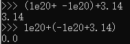

第一个算式里，两个比较大的值相加会变成0，所以会得到的结果就是正确的3.14。但是第二个算式里，1e20相比3.14大太多了，3.14就显得微不足道了，所以括号里的结果就是-1e20，使得最后得到错误的结果0。

> 计算机中，float的取值范围特别大，当两个相差特别大的数进行运算时，可能会使得较小的数字消失，所以不满足结合律。

所以可以看到，int和float都存在一些不符合常理的特点，这是因为它们使用有限的位来表示数域中无穷的数，这就使得它们需要在某些方面做出妥协。

在计算机算数中，它会严格按照数学性质进行运算，不会产生随机值。但是由于表示的有限性，我们并不能假设所有常规的数学性质都是满足的，我们需要知道在什么情况下使用什么东西。所以这门课程将首先讨论数字、数字的表示及其属性。

**Great Reality 2：You've got to know assembly**

这门课将花费大量时间来学习机器级编程的意义。指令可以使用目标代码来进行描述，表示为位级别的二进制编码，但是指令通常使用汇编语言进行描述，然后由计算机执行，汇编语言可以看成是指令的文本版本。

本课程将观察编写的C语言代码是如何变成机器码，以及如何在机器上执行的。所以会首先关注如何获取编译器生成的汇编代码，然后尝试阅读并理解它。

本课程将特别关注Intel处理器的汇编语言，它最新版本是x86-64，指令集是64位版本的。

**Great Reality 3：Memory Matters**

现代计算机有一个非常复杂的分层存储系统，尝试同时提供大容量和高性能的存储器，这也意味着如果你程序写的好，它可能运行的很好，否则它的运行效果就很很糟糕，因为程序没有利用这个分成存储系统。

C程序中通常会有**内存引用错误**，所以本课程也将关注这些错误是什么，表现是什么，以及如何防止它们出现。

比如我们创建一个结构体并对其进行赋值

```cpp
typedef struct {
  int a[2];
  double d;
} struct_t;

double fun(int i) {
  volatile struct_t s;
  s.d = 3.14;
  s.a[i] = 1073741824; /* Possibly out of bounds */
  return s.d;
}
```

当我们运行`fun(0)`和`fun(1)`时， 都返回`3.14`，但是当我们运行`fun(2)`时，就返回`3.1399998664856`，运行`fun(3)`返回`2.00000061035156`，运行`fun(4)`返回`3.14`，并且运行`fun(6)`时，就会出现`Segmentation fault` 。

这其实和数组如何在内存中布局，以及内存是如何访问的相关。我们首先看一下这个结构是如何实现和排列的

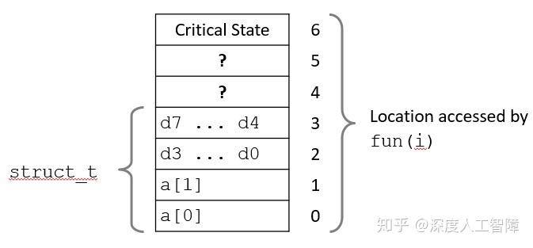

这里每一行表示4个字节，并且int是4个字节，double是8个字节。然后在它上面，此结构体和其他结构之间还有一些其他东西。这里我们就可以看到，当我们运行`fun(0)`和`fun(1)`时，修改的就是数组a中的值，但是但我们运行`fun(2)`后，修改的就是浮点数d中的内容了， 所以就会出现上面奇怪的数字，当我们输入到某个值后，我们就修改了某些用来维持该程序运行的状态，这就导致了程序崩溃。 所以内存引用错误主要是因为C和C++没有提供边界检查，所以很容易编写出非法的代码。

C和C++并没有提供内存保护，比如有超出边界的数组、非法的指针以及滥用的malloc/free通常都会造成bug，这个bug是否出现，还取决于你的系统和编译器，并且这个bug可能要运行很多次才会发现。这里你可能就需要根据内存的排列方式来对某个数据结构进行修改。

**Great Reality 4：There's more to performance than asymptotic complexity**

课程的第四个主题是要从程序角度增加它的性能。CS课程的其他部分，更多强调在正确的数据结构中获得正确的算法，但是他们需要进行**不同层次的优化：**算法、数据表示、过程和循环。这时候你需要知道系统到底是如何运行的，是什么让它运行很好，以及是什么让它运行不好。

比如以下两个函数

```cpp
# 代码一
void copyij(int src[2048][2048],
            int dst[2048][2048])
{
  int i,j;
  for (i = 0; i < 2048; i++)
    for (j = 0; j < 2048; j++)
      dst[i][j] = src[i][j];
}
# 代码二
void copyji(int src[2048][2048],
            int dst[2048][2048])
{
  int i,j;
  for (j = 0; j < 2048; j++)
    for (i = 0; i < 2048; i++)
      dst[i][j] = src[i][j];
}
```

他们的行为方面完全一样，都是将一个矩阵或数组从原地址`src`复制到目标地址`dst`，这两个代码唯一的不同仅在于嵌套顺序不同，代码一进行的是行优先，而代码二进行的是列优先的。但是在普通的系统中，代码一运行速度为4.3ms，而代码二运行速度为81.8ms，性能相差差不多20倍。

首先可以看以下这张图，它显示了四种不同的内存访问模式，这里不会细究，我们可以发现这两个函数在这个内存访问模式中处于不同的位置，`copyij`代表以行优先形式进行访问，而`copyji`代表以列优先形式进行访问， 并且`copyij`比`copyji`性能好很多，这和内存层次结构中的缓存有关。

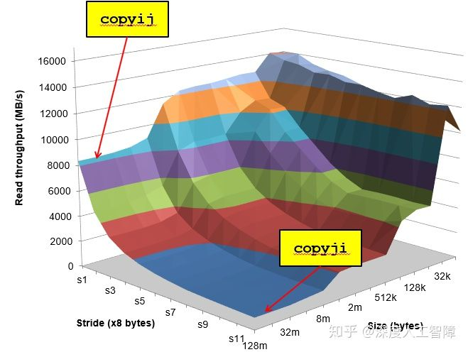

**Great Reality 5：Computers do more than execute programs**

课程的最后一部分将更多讨论不仅让计算机孤立运行小程序，而且能够通过网络来彼此交谈，实现像web服务器这样的服务。


本节课程可以作为其他后续课程的基础，它们每一个都基于这门课程中的一个或多个方面。


本书有4个主要**组成部分**：

1. Lectures：用来讲解高层次的概念。
2. Recitations：每周由助教主持一次一小时的课程，主要帮助完成实验。
3. Labs：总共有7个实验，是本课程的核心和灵魂，每个实验持续1-2周，通常涉及某种编程或测量数据。
4. Exams：期中和期末考。

可以将7个实验分成5个部分：

### 1. 程序和数据

前三个实验涵盖了程序和数据的程序表示：

\1. **DataLab**教你关于数据的位级表示。

\2. **BombLab**教你如何阅读和理解汇编语言，为了化解炸弹，你必须开启GDB，单步调试直到找到每一阶段的代码，然后逆向编译，找出它想要你输入的内容来化解炸弹。

\3. **AttackLab**专门为64位操作系统开发的实验，是**代码注入（code injection）**攻击的基础。利用一种称为返回到**返回导向编辑（return to return oriented programming）**的现代技术，你将学会如何编写漏洞。黑客使用这种方式来应对新型计算机中栈位置不固定，并且禁止在栈上操作代码的问题。

### 2. 层次存储

在研究内存层次结构时，有一个**CacheLab**实验，你会建立自己的缓存模拟器，并且尝试让你代码在你的模拟器上运行时产生尽可能少miss-hit，由此来学习高速缓存存储器这种硬件的工作原理，并且利用这种层次结构进行编程。

### 3. 异常控制流

然后从硬件转换到与系统级软件、操作系统进行交互，**异常控制流（Exceptional Control Flow）**是一种常见概念，存在于系统的所有部分，这代表着从硬件到软件的智能转换。当你了解了一种特殊的控制流程，比如低层次的硬件中断和异常，然后在更高层次的操作涉及硬件和操作系统软件，其实是操作进程上下文切换的想法，所以这里你就知道进程是什么，如何让内核为你创造和管理进程。在更高层次上，以软件形式的异常控制流被称为信号，然后在更高层次上有一个应用程序C语言版本的异常控制流调用，被称为固定移动和远距离转移（set jump and long jump）。这里使用**TsLab**实验来进行学习，你将编写自己的Linux Shell。

### 4. 虚拟内存

然后将研究**虚拟内存（Virtual Memory）**，它是硬件和软件的结合，虚拟内存提供了非常高级的抽象，使得称为线性字节序列的结构，使得系统更容易控制。我们将学习它的工作原理，以及程序中可能对性能造成潜在影响的部分，并且也将学习如何管理它提供给你的大量内存，有对应的**MallocLab**，你将重新实现C标准库中的Malloc和Free函数。

### 5. 网络和并发

在之前的课程，已经讨论了正在机器上运行的程序，然后在课程的最后一部分将处理I/O，将数据发送到机器和从机器输出，我们会了解Linux I/O基本概念。在**ProxyLab**中，将学习如何网络编程，学习如何编写使用使用套接字接口的程序。


# [读书笔记]CSAPP：2[B]计算机系统漫游


本节主要针对视频课程中没有涉及的书本第一章——计算机系统漫游。

------

## 1. 程序是如何存储和执行的

在这一节中，将介绍程序是如何保存在计算机中，并且如何转换成计算机可识别、可执行的信息，然后介绍计算机硬件中是如何一步步执行程序的。

所以首先简单介绍计算机的硬件组成，以此作为基础后，一步步介绍程序是如何存储并执行的。

### 1.1 计算机硬件简介

一个典型的计算机硬件组成如下图所示，可以将其分成三部分：CPU、RAM以及I/O。我们将简单介绍其中的若干个比较重要的组成部分：

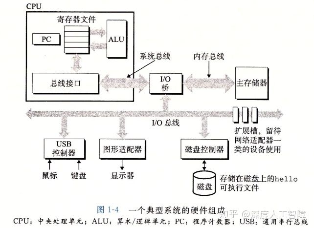

**1. 总线（Bus）**

总线是贯穿各个计算机硬件的桥梁，它携带信息并负责在各个部件之间进行传递。总线通常被设计成传送特定长度的字节块，称为**字（Word）**，这是一个基本的系统参数，不同系统中各不相同。

总线主要包含数据总线、地址总线和控制总线。顾名思义，数据总线通常是用来传输数据的，比如从主存RAM中传输数据到CPU中，就是使用数据总线进行传输的。地址总线主要用来传输地址，比如要从RAM的地址1000处获取数据，这个1000就是通过地址总线进行传输的。控制总线主要传输控制和时序信息的，比如读写、中断等等。

**2. I/O设备**

I/O设备是系统和外部世界的联系通道。每个I/O设备都通过一个控制器或适配器与I/O总线相连，负责I/O设备和I/O总线间的信息传递。

**控制器和适配器的区别：**控制器是I/O设备或主板的芯片组，适配器是插在主板卡槽的卡。

**3. 主存（RAM）**

是一个临时存储设备。当程序运行时，主要保存程序以及程序处理的数据。基本单位是**字节（Byte）**，从逻辑上看，对每个字节都指定了唯一的地址，这个地址从0开始。

**4. 处理器**

是用来解释或执行存储在主存中的引擎。一个CPU由若干部分组成：

**寄存器：**通常为8位寄存器，用来保存一个字节的数据。CPU中有若干寄存器，每个寄存器都有唯一的地址，用来保存CPU中临时运算结果。其中有两个寄存器比较特殊：

**指令地址寄存器：**用来保存当前指令在内存中的地址，每次执行完一条指令后，会对该寄存器的值进行修改，指向下一条指令的地址。

**指令寄存器：**用来保存当前从主存中获取的，需要执行的指令。

**ALU：**算术逻辑单元，主要用来处理CPU中的数学和逻辑运算。它包含两个二进制输入，以及一个操作码输入，用来决定对两个输入进行的算数逻辑操作。然后会输出对应的运算结果，以及具有各种标志位，比如结果是否为0、结果是否为负数等等。

**控制单元：**是一系列门控电路，通过门控电路来判断指令寄存器中保存的指令内容，然后调整控制主存和寄存器的读写数据和地址，以及使用ALU进行运算。我的理解就是一系列门控电路，然后根据你程序的指令来调控CPU中的各种资源。

**CPU中执行指令的过程：**首先根据指令地址寄存器从内存中获取对应地址的数据，然后将其保存在指令寄存器中，然后控制单元会对指令内容进行判断，并调用寄存器、ALU等执行指令内容，然后更新指令地址寄存器，使其指向下一个要执行的指令地址。

**可参考：**

[深度人工智障：[读书笔记\]《计算机科学速成课》—5 算术逻辑单元-ALU](https://zhuanlan.zhihu.com/p/103505660)

[深度人工智障：[读书笔记\]《计算机科学速成课》—6 寄存器和内存](https://zhuanlan.zhihu.com/p/103505753)

[深度人工智障：[读书笔记\]《计算机科学速成课》—7 中央处理器CPU](https://zhuanlan.zhihu.com/p/103505881)

### 1.2 程序存储和执行

我们以最简单的C程序为例

```c
#include <stdio.h>
int main(){
    printf("hello world\n");
    return 0;
}
```

这段代码需要保存在一个文件中，称为源文件，这是这段程序生命周期的开始。但是计算机只知道0和1的二进制数，并不知道你写的这些文本到底是什么。所以大部分的现代计算机系统都会使用ASCII标准来表示这些文本，简单来说就是给每个字符都指定一个唯一的单字节大小的编号，然后将文本中的字符都根据ASCII标准替换成对应的编号后，就转换成了字节序列，所以该源文件是以字节序列的形式保存在文件中的。

> 系统中的所有信息都是由一串比特表示的，区分不同数据对象的唯一方法就是上下文。

我们为了人们能够读懂程序时做什么的，所以使用了高级的C语言写了这段程序，但是对于计算机来说太过于复杂了，它只能执行指令集中包含的指令。所以为了能够在系统中运行这段程序，我们需要先将每句C语句都转换成一系列的低级机器语言指令，然后这些指令按照可执行目标程序的格式打包好后，以二进制磁盘文件形式保存起来，该文件称为目标文件。这种从源文件转换到目标文件的过程由编译器驱动的。该过程主要分为4个阶段：

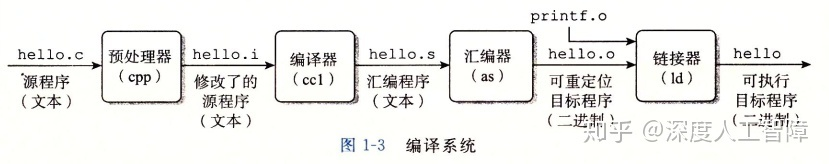


**1. 预处理阶段**

预处理器将源文件中以`#`开头的命令修改为原始的C程序。比如将`#include `替换成头文件`stdio.h`中的内容。

**2. 编译阶段**

编译器将C语言的`hello.i`翻译成汇编语言的`hello.s`。 这样做的好处在于，通过为不同语言不同系统上配置不同的编译器，能够提供通用的汇编语言，这样对于相同的语言，就能兼容不同的操作系统，而对于同一个系统上，通过安装不同语言的编译器，也能运行不同语言写的程序了。

而汇编语言相对C语言更加低级，它对机器码进行了修饰，为每一个操作码提供了更加简单、容易记的助记符，并且提供了很多机器码不具有的功能，比如自动解析JUMP指令地址等等。该语言的编写和底层硬件连接很密切，程序员仍需要思考使用什么寄存器和内存地址。

我们这里使用**指令集架构**来提供对实际处理器硬件的抽象，这样机器代码就好像运行在一个一次只执行一条指令的处理器上。

**可参考：**[深度人工智障：[读书笔记\]《计算机科学速成课》—11 编程语言发展史](https://zhuanlan.zhihu.com/p/103506075)

**3. 汇编阶段**

汇编器将汇编语言写的`hello.s`翻译成由机器语言指令构成的`hello.o`，并保存成二进制文件。

**4. 链接阶段**

我们写代码时通常会使用C标准库中提供的函数，但是我们代码中并没有这些函数的具体实现，所以就需要在链接阶段将该函数的具体实现合并到我们的`hello.o`。比如我们程序中使用了`printf`函数，而该函数存在于一个单独预编译好的目标文件`printf.o`中，所以我们只需要将该文件合并到我们的`hello.o`中，就能正确使用该函数了。

最终得到的`hello`文件就是可执行目标文件，可以被加载到内存中，由系统执行。


通过以上的编译过程，我们从由C语言的源文件`hello.c`编译得到了可执行目标文件`hello`，接下来我们就可以运行该目标文件了

1. shell读入我们输入的字符`./hello`后，将其逐一读入到CPU的寄存器中，然后再将其存放到主存中。
2. 输入回车后，shell执行一系列指令将hello目标文件中的代码和数据从磁盘复制到主存。
3. CPU开始执行hello的main程序中的机器指令，它将`hello, world\n`字符串中的字节从主存复制到CPU寄存器，再从CPU寄存器复制到显示设备。

通过以上过程，我们就完成了程序的保存和执行的完整过程。

**可参考：**[深度人工智障：[读书笔记\]《计算机科学速成课》—7 中央处理器CPU](https://zhuanlan.zhihu.com/p/103505881)

## 2. 高速缓存

执行代码时，会花费大量时间将代码和数据进行复制，如果使这些复制尽快完成就能进行系统加速。

首先根据**机械原理**可知，较大的存储设备比较小的存储设备运行得慢，而高速设备的造价远高于同类的低速设备。因为寄存器远小于主存，所以在寄存器上处理器读取数据的速度比主存快很多，并且这种差距还在持续增大。而根据**局部性原理**可知，程序具有访问局部区域内的数据和代码的趋势，所以在处理器和一个较大较慢的设备之间插入一个更小更快的存储设备，来暂时保存处理器近期可能会需要的数据，使得大部分的内存操作都能在高速缓存内完成，就能极大提高系统速度了，而这个设备称为**高速缓存存储器**。

在单处理器系统中，一般含有二级缓存，最小的**L1高速缓存**速度几乎和访问存储器相当，大一些的**L2高速缓存**通过特殊总线连接到处理器，虽然比L1高速缓存慢，但是还是比直接访问主存来的快。在多核处理器中，还有一个**L3高速缓存**，用来共享多个核之间的数据。

一般利用了高速缓存的程序会比没有使用高速缓存的程序的性能提高一个数量级。

## 3. 存储器层次结构

高速缓存的思想其实不仅仅能应用于CPU中，其实对其进行扩展，就能将计算机系统中的存储设备都组织成一个存储器层次结构，如下图所示

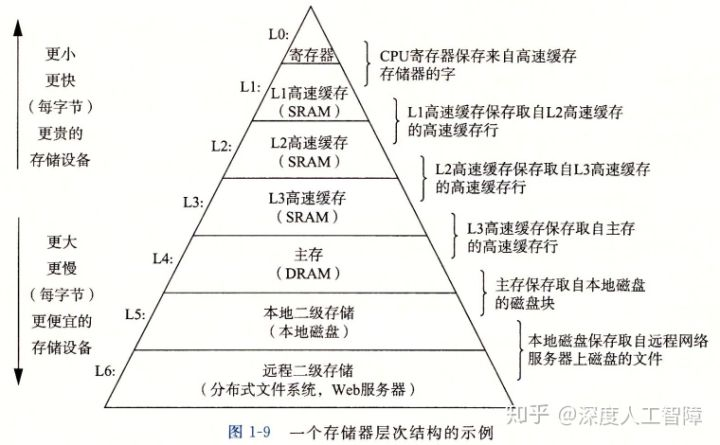

存储器层次结构的**主要思想**是将上一层的存储器作为下一层存储器的高速缓存。程序员可以利用对整个存储器层次结构的理解来提高程序性能。

## 4. 操作系统对硬件的抽象

操作系统的出现避免了程序员直接去操作硬件（主存、处理器、I/O设备），它可以看成是应用程序和硬件之间的一层软件，给程序员提供硬件的抽象，比如将正在运行的程序抽象为进程；将程序操作的主存抽象为虚拟内存；将各种I/O设备抽象为文件的形式，让程序员能够直接通过这层软件很好地调用硬件，避免了过多的硬件细节。接下来将简单介绍这三层抽象。

### 4.1 进程

计算机执行程序时，需要将程序对应的指令保存在内存中，并且使用CPU和I/O设备，但是单核计算机一个时刻只能处理一个程序。但是从我们的视角来看，计算机像在同时处理好多程序，比如你可以在shell中运行`hello`，此时就运行了shell程序和`hello`程序。

为了方便对运行程序时所需的硬件进行操作，操作系统对正在运行的程序提供了一种抽象——**进程**。**提供了一种错觉：**一个系统上可以同时运行多个进程，而每个进程好像在独占地使用硬件。这样程序员就无需考虑程序之间切换所需操作的硬件，这些由操作系统的内核进行管理。

> **内核：**操作系统常驻内存的部分，不是一个独立的进程，而是管理全部进程所用代码和数据结构的集合。

操作系统通过交错执行若干个程序的指令，不断地在进程间进行切换来提供这种错觉，这个称为**并发运行**。

首先，当进程A要切换到进程B时，进程A通过系统调用，将控制权递给操作系统，然后操作系统会保存进程A所需的所有状态信息，称为上下文，比如寄存器以及内存内容，然后创建进程B及其上下文，然后将控制权递给进程B。当进程B终止后，操作系统就会恢复进程A的上下文，并将控制权还给进程A，这样进程A就能从断点处继续执行。这个过程都是由操作系统的内容进行控制的。

现代系统中，一个进程中可以并发多个线程，每条线程并行执行不同的任务，线程是操作系统能够进行运算调动的最小单位，是进程中的实际运作单位。每个线程运行在进程的上下文中，并共享相同的代码和全局数据。**优点：**多线程之间比多进程之间更容易共享数据，并且效率更高。

**解析：**这里一个进程中可以并发多个线程，指的是一个进程一次只能运行一个线程，但是一个进程可以同时含有多个线程，每个线程可以执行不同的任务，进程让线程之间快速切换来达到并发线程。

> **注意：**并发运行中每次还是只能运行一个单位，但是通过快速切换来达到同时运行多个单位的错觉。

### 4.2 虚拟内存

计算机会将多个程序的指令和数据保存在内存中，当某个程序的数据增时，可能不会保存在内存的连续地址中，这就使得代码需要对这些在内存中非连续存储的数据进行读取，会造成很大的困难。

为了解决这个问题，操作系统对内存和I/O设备进行抽象——**虚拟内存**。**它提供了一种错觉：**程序运行在从0开始的连续虚拟内存空间中，而操作系统负责将程序的虚拟内存地址投影到对应的真实物理内存中。这样使得程序员能直接对连续的空间地址进行操作，而无需考虑非连续的物理内存地址。**主要方法：**把进程虚拟内存的内容保存在磁盘中，然后将主存当做磁盘的高速缓存。

操作系统将进程的虚拟内存划分为多个区域，每个区域都有自己的功能，接下来从最低的地址开始介绍：

- **程序代码和数据：**对所有进程来说，代码都是从同一固定地址开始，然后是C全局变量。这部分在进程一开始运行时就被指定大小了。
- **堆：**当调用类似C中的`malloc`和`free`标准库函数时，堆会在进程运行时动态扩展和伸缩。
- **共享库：**用来存放像C标准库和数学库这样公共库的代码和数据的区域。
- **栈：**位于用户虚拟内存顶部，编译器用来实现函数调用，当调用函数时，栈就增长，当返回一个函数时，栈就缩小。
- **内核虚拟内存：**地址空间顶部的区域为内核保留，不运行程序读写这个区域，或直接调用内核代码定义的函数。

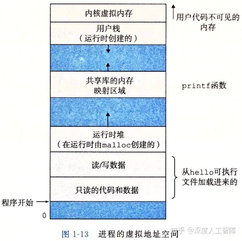

### 4.3 文件

操作系统将所有I/O设备看成是文件，而文件是字节序列，这样系统中的所有输入输出可以调用系统函数来读写文件实现，简化了对各种各样的I/O设备的操作。

## 5. 网络

从一个单独的系统来看，网络可以看成一个I/O设备，当系统从主存复制一串字节到**网络适配器**时，计算机就会自动将其发送到另一台机器。在后续的课程会详细介绍。

## 6. 并发和并行

**并发（Concurrency）**指一个同时具有多个活动的系统。**并行（Paralleism）**指的是用并发来时一个系统运行得更快。并行可以在计算机系统的多个抽象层次上运用。

### 6.1 线程级并发

在单处理器系统中，通过进程之间的并发可以设计出多个程序执行的系统；通过线程之间的并发，可以在一个进程中执行多个控制流。

多处理器系统主要分成超线程和多核处理器。

随着CPU的发展，引入了超标量、乱序运行、大量的寄存器及寄存器重命名、多指令解码器、预测运行等特性，这些特性的原理是让CPU拥有大量资源，可是在现实中这些资源经常闲置，为了有效利用这些资源，可以多增加某些硬件，比如有多个指令地址寄存器和寄存器，而其他硬件部分只有一部分，这就空出了可以额外执行另一个线程的硬件了，超线程技术就可以让一个核同时运行两个线程了。

(上一段不太确定，如有错误请指出，谢谢)

而多核处理器就是将多个CPU集成到一个集成电路中，然后使用一个L3高速缓存来在多个核之间共享数据。

这两个多处理器系统技术的出现，能够减少执行多个程序时模拟并发的需求，并且能够使应用程序运行的更快。

### 6.2 指令级并行

一个指令的执行过程通常包含：取指令阶段、解码阶段和执行指令阶段。最初的指令执行过程是每个指令完整经过一整个过程后，才运行下一条指令，但是其实每个阶段使用的都是处理器中不同的硬件部分，这就使得我们可以流水线式地运行多个指令，这就达到了差不多一个时钟周期运行一条指令的地步。

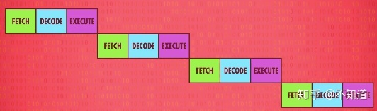CPU顺序处理指令

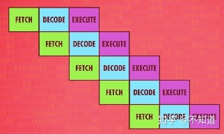CPU并行处理指令

即使有流水线设计，在指令执行阶段，处理器还有些区域还是可能会空闲，比如执行一个“从内存取值”指令期间，ALU就会空闲，所以一次性处理多条指令（取值+解码）会更好，如果多条指令要ALU的不同部分，就多条同时执行。我们也可以更进一步，多加几个相同的电路来执行出现频率很高的指令，比如很多CPU有四个、八个甚至更多完全相同的ALU，可以同时执行多个数学运算。这就使得一个机器周期可以运行多个指令。

超标量处理器

**参考：**[深度人工智障：[读书笔记\]《计算机科学速成课》—9 高级CPU设计](https://zhuanlan.zhihu.com/p/103506009)

### 6.3 单指令、多数据并行

很多现代处理器拥有特殊的硬件，允许一条指令产生多个可以并行执行的操作，这种方式称为单指令、多数据，即**SIMD并行**。

## 7. Amdahl定律

Amdahl定律对提升系统某一部分性能所带来的的效果进行量化。它的**主要思想**是**：**当我们对系统某部分加速时，其对系统整体性能的影响取决于该部分的**重要性**和**加速程度**。
假设某应用程序原始执行时间`T_old`，某部分所需执行时间与该时间的比例为`alpha`，该部分提升比例为k，则新的**总执行时间**为：
![[公式]](https://www.zhihu.com/equation?tex=T_%7Bnew%7D%3D%281-%5Calpha%29T_%7Bold%7D%2B%5Calpha+T_%7Bold%7D%2Fk%3DT_%7Bold%7D%5B%281-%5Calpha%29%2B%5Calpha%2Fk%5D)
**加速比**为：
![[公式]](https://www.zhihu.com/equation?tex=S%3D%5Cfrac%7B1%7D%7B%281-%5Calpha%29%2Ba%2Fk%7D)
当k趋向于无穷时，可以计算出该部分加速到极限时所能得到的加速比为：
![[公式]](https://www.zhihu.com/equation?tex=S%3D%5Cfrac%7B1%7D%7B1-%5Calpha%7D)

该定律提供的一个主要观点是：要想显著加速整个系统，必须提升全系统中相当大的部分的速度。


# [读书笔记]CSAPP：3[VB]整型数据类型


 

**视频地址：**

[【精校中英字幕】2015 CMU 15-213 CSAPP 深入理解计算机系统 课程视频_哔哩哔哩 (゜-゜)つロ 干杯~-bilibiliwww.bilibili.com/video/av31289365?p=2](https://link.zhihu.com/?target=https%3A//www.bilibili.com/video/av31289365%3Fp%3D2)

[【精校中英字幕】2015 CMU 15-213 CSAPP 深入理解计算机系统 课程视频_哔哩哔哩 (゜-゜)つロ 干杯~-bilibiliwww.bilibili.com/video/av31289365?p=3](https://link.zhihu.com/?target=https%3A//www.bilibili.com/video/av31289365%3Fp%3D3)

**课件地址：**

[http://www.cs.cmu.edu/afs/cs/academic/class/15213-f15/www/lectures/02-03-bits-ints.pdfwww.cs.cmu.edu/afs/cs/academic/class/15213-f15/www/lectures/02-03-bits-ints.pdf](https://link.zhihu.com/?target=http%3A//www.cs.cmu.edu/afs/cs/academic/class/15213-f15/www/lectures/02-03-bits-ints.pdf)

对应于书本的2.1~2.3。

**如有错误请指出，谢谢。**

------

**小点：**

- 模运算相当于忽略某些位的值，比如计算`x mod 8`，则只保留x低三位的值。
- 比较有符号数和无符号数之间的大小，先将其转化为二进制编码，再根据特定编码计算比较。
- 所有性质都可以直接通过二进制以及对应的编码去解释，首先考虑二进制的值是什么。
- 补码和无符号数对应的位向量，在计算结果上都是相同的，大部分计算机中使用相同的机器指令进行计算，所以可以先将补码转换为无符号数进行推导，再转为补码会更容易。
- 加法逆元的求法就是通过溢出实现的，比如求x的加法逆元，直接计算~x+1，就能保证有效位里都是0。
- 尽量不使用无符号数。

------

现代计算机存储和处理的信息是以二值信号表示的，是基于二进制进行编码的，**好处在于：**1. 比如我们可以将低电压表示0，将高电压表示1，如果电路中存在噪音或不完善的地方，只要不超过你设定的阈值，你就会得到一个清晰的信号；2. 对于信息存储而言，存储一位信息或一个数字值比存储一个模拟值更容易。


当我们将若干个二进制数组合在一起，再加上某种解释，就能给这些二进制数赋予特定的含义，这个“解释”就是编码。比如对于文档中的字符和符号，我们可以使用标准的字符码将二进制数与字符和符号对应起来；对于数字表示，我们可以使用无符号编码来表示大于或等于零的数字，可以使用补码来表示有符号整数，可以使用浮点数编码来表示数字的科学计数法。

> 由于浮点数和整型数使用不同的编码规则，所以即使他们存储相同的数字，可能二进制序列也不相同。

计算机的表示法是用有限的位来表示无穷的数字，而整数和浮点数对数字处理方式的不同，导致了它们具有不同的**性质：**整数能够编码一个相对较小的精确数值范围，而浮点数能够编码一个较大的近似数值范围。这就使得整数会发生溢出问题，但是整数的计算机运算能满足真正整数运算的性质，比如结合律和交换律，而浮点数虽然能够保证两个整数相乘一定是正的，但是浮点运算是不可结合的。

接下来的篇章，首先会介绍不同信息是如何存储的，以及一些基础运算方法，然后会介绍整数的表示以及整数的运算。至于浮点数的表示和运算会放到下一篇文章进行介绍。

## 1. 信息的表示和处理

### 1.1 信息的存储

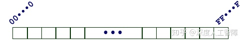

我们知道，计算机将8个bit当做一个块，称为**字节（Byte）**，作为可寻址的最小内存单位。而操作系统给每个进程提供了虚拟内存的抽象，让进程都能访问从相同地址开始的、连续的虚拟内存空间，每个内存单位都有唯一的编码进行标识，这个编码称为**地址（Address）**，而所有地址的集合就构成了虚拟内存空间。

那每个虚拟内存空间最大能有多大呢？这主要取决于计算机的一个参数——**字长（Word Size）**，我们可以将若干个字节当做一个块，称为**字（Word）**，而这里的字节的数目就是字长。字长指明了指针数据的**标称大小（Nominal Size）**，而指针指向虚拟内存空间，它的位数就决定了它能索引多大的空间，由此也就规定了虚拟内存空间的最大大小。所以虚拟空间的最大大小由字长决定。

> 字长定义了操作系统通常处理多大的值和算数运算，并且指针和地址大小也是字长确定的。

现在大部分机器是32位字长或者64位字长的，而程序可以通过不同的编译指令将其编译成32位程序或者64位程序（程序的字长是由编译决定的），其中32位机器可以运行32位程序，但是不能运行64位程序，而64位机器可以运行32位程序和64位程序。并且32位程序和64位程序对C数据类型的典型大小也有影响

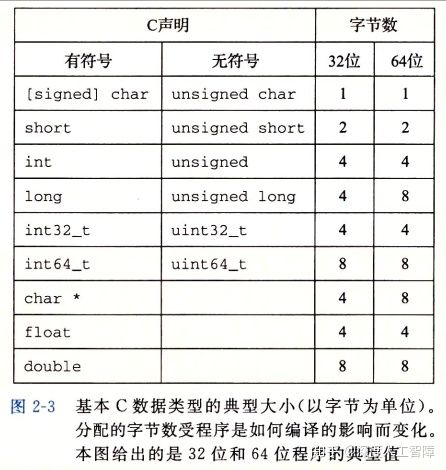

为了避免由于依赖典型大小和不同编译器设置带来的兼容性问题，ISO C99引入了数据大小固定，不随编译器和机器设置而变化的数据类型，比如`int32_t`就是4字节的`int`类型，`int64_t`就是8字节的`int`类型。

> 注意：不同字长的机器中，指针的大小也就不同，并且不同机器/操作系统配置使用不同的存储分配规则，会使得指针的长度和内容差很多。

内存是一系列字节，我们可以根据字长将其划分成不同的**字（Word）**，每个字的地址是该字中最低位的地址。**主要思想**是，我们可以把任意多的字节组合起来称之为一个字。

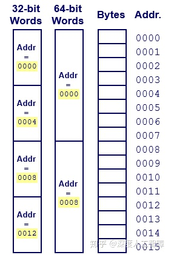

当你某个数据对象跨越了多个字节，则在虚拟内存空间中，这个多字节对象是存在连续的地址中，并且该对象的地址是所使用字节中最小的地址。可以根据该对象的类型来确定字节数目。而多个字节的排列方法分为两种：**小端法（Little Endian）**和**大端法（Big Endian）**。小端法就是最低有效字节在较小的内存地址中，而大端法就是最低有效字节在较大的内存地址中。不同的机器也支持不同的排列方法，有的机器支持双端法，也就是可以把它配置成作为大端或者小端的机器运行。一单选择了特定操作系统，那字节顺序也就固定下来了。

一般而言，机器所使用的的字节顺序是不可见的，但是在有些情况下需要注意字节顺序带来的影响：

1. 在两个不同类型的机器之间通过网络传输数据时，如果这两个机器使用了不同的字节顺序，就会造成问题。所以网络应用程序的代码编写必须遵守已建立的关于字节顺序的规则， 确保发送方机器将它的内部表示转换成网络标准，而接收方机器将网络标准转换为它自己的内部表示。
2. 当我们通过反汇编器得到可执行程序的指令序列时，字节顺序也很重要。

当我们**保存字符串**时，会使用某个标准编码将字符串中的所有字符都转换为对应的编码，比如ASCII字符码、Unicode编码，并且还会在字符串末尾加上全零的二进制数作为字符串结尾。**注意：**在使用ASCII作为字符码的任何系统上，都将得到相同的结果，与字节顺序和字大小规则无关。

当我们**保存代码**时，如上一节介绍的，编译器首先会将源文件编译成字节表示的机器代码，是由不同的机器指令构成的，需要**注意**的是，不同机器类型使用不同的且不兼容的机器指令和指令编码方式，所以同一段代码在不同机器中编译的结果是不同的且不兼容的。

### 1.2 C中的基本运算

### 1.2.1 位级运算

C中的整型数据类型是使用二进制数进行编码的，二进制数可以对应为布尔代数的位向量，所以它可以支持按位的布尔运算，比如`|`表示OR、`&`表示AND、`~`表示NOT、`^`表示XOR。

位向量的一个重要应用就是表示**有限集合**，所以一个字节可以表示8种情况，比如`[01101001]`表示集合`{0,3,5,6}`，这样布尔运算的`|`和分别对应于集合的并和交，而`~`对应于集合的补、`^`对应于集合的对称差。

其次，位级运算的一个常见用法就是实现**掩码运算**。这里的掩码就是一个位模式，表示从一个字中选出的为的集合。比如提取最低有效字节`x&0xFF`，保留除了最低有效字节以外的字节`x&~0xFF`。

> 布尔代数的`&`对`|`具有分配率，而`|`对`&`也具有分配率。元素与自身异或会得到0。0异或任意元素保持不变。与全F取异或是取反。

### 1.2.2 逻辑运算

C提供了一组逻辑运算符`||`、`&&`和`!`分别对应于命题逻辑中的`OR`、`AND`和`NOT`运算。要注意逻辑运算和位级运算的区别，在逻辑运算中，只要是非零的数据就表示为`TRUE`，全零的数据就表示为`FALSE`，所以计算时候先将其转换为`TRUE`和`FALSE`，然后计算出来的结果只会是`0x00`或`0x01`，分别对应`FALSE`和`TRUE`。

逻辑运算中有一个特点：**提早终止（Early Termination）**。当计算逻辑与和逻辑或时，如果只通过左侧的式子就已经能得到最终的结果，就不会再计算右侧的式子了。比如

```c
int i=0;
int ans1=i&&(++i);
//因为i=0，所以计算逻辑与时能够直接得到结果是FALSE，就无需计算右侧的++i了。所以ans=0，i=0
int ans2=i||(++i);
//由于i=0计算逻辑或时无法直接得到结果，所以还需要计算右侧的式子，此时i=1，所以ans=1，i=1
```

### 1.2.3 移位运算

C语言表示的二进制编码，可以对其进行移位操作。x向左移k位，表示为`x<，此时会丢弃最高的k位，并在右侧补充k个零。x向右移k位，表示为`x>>k`，由于整型编码的问题，会将右移操作分为逻辑右移和算数右移，逻辑右移就是丢弃最低的k位，并在左侧补充k个零，而算数右移中，因为有符号数使用最高位来表示数字的正负性，为了保证数字的正负性不变，就丢弃最低的k位，并在左侧补充最高有效位的值，本文后续会有介绍。

C语言没有对何时使用逻辑右移和算数右移进行规定，但是一般编译器/及其组合都对有符号数使用算数右移， 而对于无符号数，就使用逻辑右移。

**注意：**当k的值大于数据类型的位数w时，有些机器和JAVA会通过计算`k mod w`来确定位移量，所以对于8位的数左移8位，该数不变。但是C语言没有限制，所以要自己保证 ![[公式]](https://www.zhihu.com/equation?tex=0%5Cleq+k%3Cw) 。

## 2. 整数的表示

### 2.1 整型数据类型

C语言提供了多种由不同字节数目构成的、具有不同范围的整型数据类型，并且每种整型数据类型都有**有符号（signed）**和**无符号（unsigned）**两个版本，常量默认是有符号版本，可以加上后缀`u`或者`U`来将其指定为无符号版本。C语言标准定义了每种数据类型必须能够表示的**最小的取值范围**，如下图所示

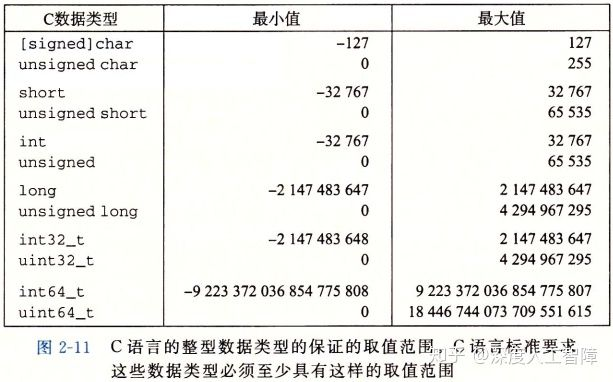

可以发现除了固定大小的数据类型`int32_t`和`int64_t`的取值范围是不对称的以外，其他的有符号数据类型的取值范围都是对称的。

目前32位程序和64位程序上C语言整型数据类型的典型取值范围如下

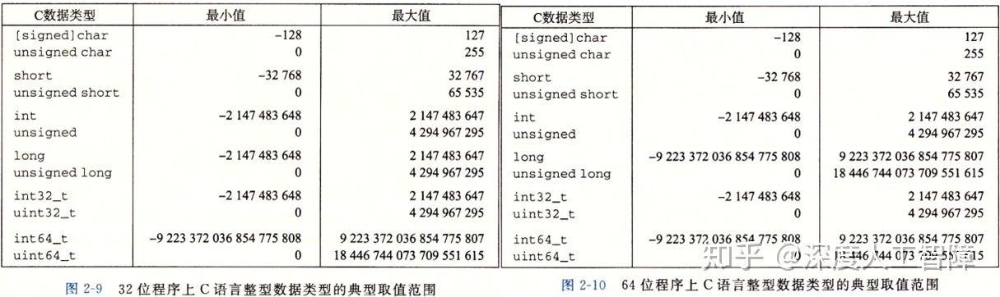

可以发现，有符号数的取值范围是不对称的，负数的范围比正数范围大1。

给定一串二进制编码来表示整数，具体如何解释这些二进制主要取决于它的编码方式，对相同的二进制采用不同的编码方式得到的整数结果是不同的，接下来介绍编码无符号数和有符号数的方法。

### 2.2 无符号数的编码

假设一个整型数类型为w位，我们可以将它的位向量写成x，或者写成 ![[公式]](https://www.zhihu.com/equation?tex=%5Bx_%7Bw-1%7D%2Cx_%7Bw-2%7D%2C...%2Cx_0%5D) 。我们可以直接将x看成是一个二进制表示的，就获得了x的无符号表示。定义一个函数 ![[公式]](https://www.zhihu.com/equation?tex=B2U_w) （Binary to Unsigned）表示将w位的二进制转化为无符号数，我们可以得到该函数的表达式为

![[公式]](https://www.zhihu.com/equation?tex=B2U_w%3D%5Csum_%7Bi%3D0%7D%5E%7Bw-1%7D%7Bx_i2%5Ei%7D)

相当于就是将二进制数转化为十进制数。

- **最小值：**位向量为 ![[公式]](https://www.zhihu.com/equation?tex=%5B0%2C0%2C...%2C0%5D) ，也就是0。
- **最大值：**位向量为 ![[公式]](https://www.zhihu.com/equation?tex=%5B1%2C1%2C...%2C1%5D) ，表示为 ![[公式]](https://www.zhihu.com/equation?tex=UMax_w%3D%5Csum_%7Bi%3D0%7D%5E%7Bw-1%7D%7B2%5Ei%7D%3D2%5Ew-1) 。

C中有一些内置函数返回的是无符号数，比如`sizeof`，如果将其与有符号数进行计算时要格外小心。

### 2.3 有符号数的编码

有符号数有很多不同的编码方式，比如**补码（two's complement）**、**反码（one's complement）**和**原码（sign-magnitude）**。其中最常见的是补码编码，C语言标准没有要求要用何种形式的编码来表示有符号整数，但是几乎所有机器都会使用补码编码。

我们定义一个函数 ![[公式]](https://www.zhihu.com/equation?tex=B2T_w) （Binary to Two's complement）表示将w位的二进制转化为补码编码的有符号数，我们定义该函数的表达式为

![[公式]](https://www.zhihu.com/equation?tex=B2T_w%3D-x_%7Bw-1%7D2%5E%7Bw-1%7D%2B%5Csum_%7Bi%3D0%7D%5E%7Bw-2%7Dx_iw%5Ei)

补码将最高有效位 ![[公式]](https://www.zhihu.com/equation?tex=x_%7Bw-1%7D) 当做**符号位（Sign Bit）**，并且赋予了权重 ![[公式]](https://www.zhihu.com/equation?tex=-2%5E%7Bw-1%7D) 。

- **最小值：**位向量为 ![[公式]](https://www.zhihu.com/equation?tex=%5B1%2C0%2C...%2C0%5D) ，表示为 ![[公式]](https://www.zhihu.com/equation?tex=TMin_w%3D-2%5E%7Bw-1%7D)
- **最大值：**位向量为 ![[公式]](https://www.zhihu.com/equation?tex=%5B0%2C1%2C...%2C1%5D) ，表示为 ![[公式]](https://www.zhihu.com/equation?tex=TMax_w%3D%5Csum_%7Bi%3D0%7D%5E%7Bw-2%7D%7B2%5Ei%7D%3D2%5E%7Bw-1%7D-1) 。
- **-1：**位向量为 ![[公式]](https://www.zhihu.com/equation?tex=%5B1%2C1%2C...%2C1%5D) ，刚好和 ![[公式]](https://www.zhihu.com/equation?tex=UMax_w) 的编码方式相同。

我们可以观察到**两个性质：**

1. 补码编码的范围是不对称的， ![[公式]](https://www.zhihu.com/equation?tex=%7CTMax_w%7C%2B1%3D%7CTMin_w%7C) ，这是因为通过设置符号位，将一半的位模式表示为负数，将另一半的位模式表示为非负数，而0是非负数，所以负数就比正数多1个。所以**测试时要特别小心 ![[公式]](https://www.zhihu.com/equation?tex=TMin_w) 。**
2. ![[公式]](https://www.zhihu.com/equation?tex=UMax_w%3D2%5Ctimes+TMax_w%2B1) 。**证明：**![[公式]](https://www.zhihu.com/equation?tex=UMax_w) 的位模式为 ![[公式]](https://www.zhihu.com/equation?tex=%5B1%2C1%2C...%2C1%5D) ， ![[公式]](https://www.zhihu.com/equation?tex=TMax_w) 的位模式为 ![[公式]](https://www.zhihu.com/equation?tex=%5B0%2C1%2C1%2C...%2C1%5D) ，通过将 ![[公式]](https://www.zhihu.com/equation?tex=TMax_w) 左移一位并加1，就能得到 ![[公式]](https://www.zhihu.com/equation?tex=UMax_w) 的位模式，并且左移一位对应于乘2。

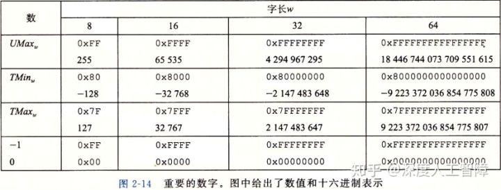

上图提供了一些比较重要的数字及其编码，C库中的文件``定义了一组常量，来限定编译器运行的这台机器的不同整型数据类型的取值范围，比如它定义了常量`INT_MAX`、`INT_MIN`和`UINT_MAX`，就分别对应上面推导的最大值和最小值。

对于反码编码，我们可以定义一个函数 ![[公式]](https://www.zhihu.com/equation?tex=B2O_w) （Binary to One's complement），我们定义它的表达式为

![[公式]](https://www.zhihu.com/equation?tex=B2O_w%3D-x_%7Bw-1%7D%282%5E%7Bw-1%7D-1%29%2B%5Csum_%7Bi%3D0%7D%5E%7Bw-2%7D%7Bx_i2%5Ei%7D)

对于原码编码，我们可以定义一个函数 ![[公式]](https://www.zhihu.com/equation?tex=B2S_w) （Binary to Sign magnitude），我们定义它的表达式为

![[公式]](https://www.zhihu.com/equation?tex=B2S_w%3D%28-1%29%5E%7Bx_%7Bw-1%7D%7D%5Ccdot%5Csum_%7Bi%3D0%7D%5E%7Bw-2%7D%7Bx_i2%5Ei%7D)

它们有个奇怪的**特点：**对于数字0有两种不同的编码方式。

### 2.4 有符号数和无符号数之间的转换（同样字长的类型之间）

C语言可以在各种不同的数字类型之间做强制类型转换，它的具体实现要从位级角度来看，它保持位值不变，只是改变了解释这些位的方式。比如对于一个位模式 ![[公式]](https://www.zhihu.com/equation?tex=%5Bx_%7Bw-1%7D%2Cx_%7Bw-2%7D%2C...%2Cx_0%5D) ，通过采用有符号的编码和补码达到在有符号数和无符号数之间的类型转换，对于位模式中的值并不会改变。而有符号数编码和补码之间的区别只有 ![[公式]](https://www.zhihu.com/equation?tex=2%5E%7Bw-1%7D) 符号的变化。

### 2.4.1 补码转换为无符号数

对于大于0的补码，符号位并没有使用，所以它能得到有无符号数相同的值；对于小于0的补码，它的符号位为1，使得它的值相对无符号数小 ![[公式]](https://www.zhihu.com/equation?tex=2%5Ctimes2%5E%7Bw-1%7D%3D2%5Ew) ，所以将小于0的补码值加上 ![[公式]](https://www.zhihu.com/equation?tex=2%5Ew) 就能得到对应的无符号数。我们定义一个函数 ![[公式]](https://www.zhihu.com/equation?tex=T2U_w%28x%29) ，表示将补码x转换为无符号数，其函数形式为

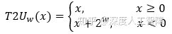

这就使得小于0的有符号数转换为补码时，发生了跳转，一下变得很大。

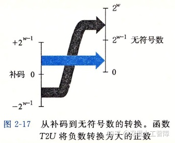

### **2.4.2 无符号数转换为补码**

对于小于 ![[公式]](https://www.zhihu.com/equation?tex=TMax_w) 的无符号数，它还能保证最高有效位为0，这和补码表示正数时相同，所以可以直接将小于 ![[公式]](https://www.zhihu.com/equation?tex=TMax_w) 的无符号数转换为补码；而对于大于 ![[公式]](https://www.zhihu.com/equation?tex=TMax_w)的无符号数，它的最高有效位为1，使得它的值相对补码大![[公式]](https://www.zhihu.com/equation?tex=2%5Ctimes2%5E%7Bw-1%7D%3D2%5Ew)，所以要将其减去 ![[公式]](https://www.zhihu.com/equation?tex=2%5Ew) 就得到补了。我们定义一个函数 ![[公式]](https://www.zhihu.com/equation?tex=U2T_w%28u%29) 将无符号数转化为补码，其函数形式为


这就使得大于 ![[公式]](https://www.zhihu.com/equation?tex=TMax_w) 的无符号数转化为补码时会发生跳转，一下变得很小。

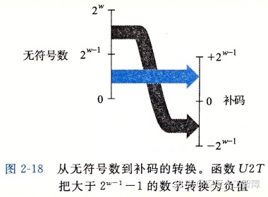

在C语言中，当一个有符号数和一个无符号数进行计算时，会**隐式地将有符号数转化为无符号数**。当进行逻辑判断时，可能会出现问题

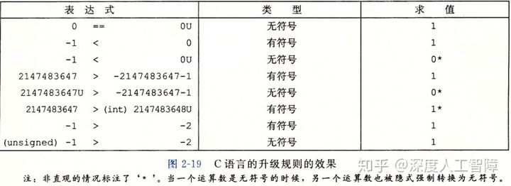

比如`-1<0U`，首先有`0U`是无符号类型，所以会先将`-1`转化为无符号类型，就需要加上 ![[公式]](https://www.zhihu.com/equation?tex=2%5Ew) ，就使得值变得很大，所以结果为0。

**比较的最好方法是将其转换成二进制编码，然后根据特定编码进行计算。**比如`2147483547`，它是补码的最大值，二进制编码为 ![[公式]](https://www.zhihu.com/equation?tex=%5B0%2C1%2C1%2C...%2C1%5D) ，而`-2147483547-1`是补码的最小值，二进制编码为 ![[公式]](https://www.zhihu.com/equation?tex=%5B1%2C0%2C...%2C0%5D) ，当将这两个二进制编码转化成无符号数时，肯定第二个值更大。其他依次类推。

由于有符号数到无符号数的隐式转换，可能会导致错误或漏洞，因此建议**绝不使用无符号数**。但是如果我们想把字看成是位的集合，而没有实际意义，则无符号数非常有用。

### 2.5 不同字长的类型转换

在不同字长的整数之间进行类型转换，要保持在数据类型范围内的数值是不变的。以下有两种情况：从较短字长的数据类型转换到较长字长的数据类型，比如short到int，就需要进行扩展位；从较长字长的数据类型转换到较短字长的数据类型，比如int到short，就需要截断位。

### 2.5.1 扩展位

我们想要在不改变值的情况下进行扩展。

对于无符号数，根据无符号数编码的定义，我们可以直接在位向量的前端扩展0，这个称为**零扩展（Zero Extension）**。

**证明：**定义宽度为w的位向量 ![[公式]](https://www.zhihu.com/equation?tex=%5Cbar%7Bu%7D%3D%5Bu_%7Bw-1%7D%2Cu_%7Bw-2%7D%2C...%2Cu_0%5D) 和宽度为w'的位向量 ![[公式]](https://www.zhihu.com/equation?tex=%5Cbar%7Bu%27%7D%3D%5B0%2C...%2C0%2Cu_%7Bw-1%7D%2C...%2Cu_0%5D) ，其中 ![[公式]](https://www.zhihu.com/equation?tex=w%27%3Ew) ，根据无符号编码的定义，可知

![[公式]](https://www.zhihu.com/equation?tex=B2U_%7Bw%27%7D%28%5Cbar%7Bu%27%7D%29%3D%5Csum_%7Bi%3D0%7D%5E%7Bw%27-1%7D%7Bu_i2%5Ei%7D%3D%5Csum_%7Bi%3D0%7D%5E%7Bw-1%7D%7Bu_i2%5Ei%7D%3DB2U_w%28%5Cbar%7Bu%7D%29)

对于补码，我们直接在在位向量的前端扩展最高有效位的值，这个称为**符号扩展（Sign Extension）**。

**证明：**定义宽度为w的位向量 ![[公式]](https://www.zhihu.com/equation?tex=%5Cbar%7Bx%7D%3D%5Bx_%7Bw-1%7D%2Cx_%7Bw-2%7D%2C...%2Cx_0%5D) 和宽度为w'的位向量 ![[公式]](https://www.zhihu.com/equation?tex=%5Cbar%7Bx%27%7D%3D%5Bx_%7Bw-1%7D%2Cx_%7Bw-1%7D%2C...%2Cx_%7Bw-1%7D%2Cx_%7Bw-2%7D%2C...%2Cx_0%5D) ，其中 ![[公式]](https://www.zhihu.com/equation?tex=w%27%3Ew) ，我们要证明 ![[公式]](https://www.zhihu.com/equation?tex=B2T_w%28%5Cbar%7Bx%7D%29%3DB2T_%7Bw%27%7D%28%5Cbar%7Bx%27%7D%29) 。我们可以先证明当 ![[公式]](https://www.zhihu.com/equation?tex=w%27%3Dw%2B1) 时，即扩展一位时的情况，如果成立，则通过若干次扩展，就能得到宽度为w'的补码。

![[公式]](https://www.zhihu.com/equation?tex=B2T_%7Bw%2B1%7D%28%5Bx_%7Bw-1%7D%2Cx_%7Bw-1%7D%2Cx_%7Bw-2%7D%2C...%2Cx_0%5D%29%3D-x_%7Bw-1%7D2%5E%7Bw%7D%2B%5Csum_%7Bi%3D0%7D%5E%7Bw-1%7D%7Bx_i2%5Ei%7D) ![[公式]](https://www.zhihu.com/equation?tex=%3D-x_%7Bw-1%7D2%5E%7Bw%7D%2Bx_%7Bw-1%7D2%5E%7Bw-1%7D%2B%5Csum_%7Bi%3D0%7D%5E%7Bw-2%7D%7Bx_i2%5Ei%7D%3D-x_%7Bw-1%7D2%5E%7Bw-1%7D%2B%5Csum_%7Bi%3D0%7D%5E%7Bw-2%7D%7Bx_i2%5Ei%7D) ![[公式]](https://www.zhihu.com/equation?tex=%3D%3DB2T_%7Bw%7D%28%5Bx_%7Bw-1%7D%2Cx_%7Bw-2%7D%2C...%2Cx_0%5D%29)


当扩展位以及有符号数和无符号数之间的顺序变化时，会影响最终计算出来的结果：

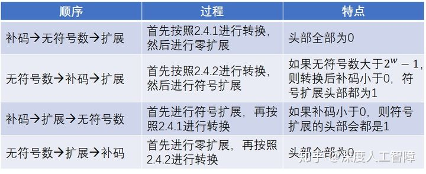

**需要注意：**如果先进行扩展，则位数w发生变化后，无符号数转化为补码的阈值 ![[公式]](https://www.zhihu.com/equation?tex=TMax_w) 以及变化的量 ![[公式]](https://www.zhihu.com/equation?tex=2%5Ew) 会发生变化。

C语言标准要求先进行扩展位，再进行有符号和无符号转换。

### 2.5.2 截断位

对于无符号数，定义宽度为w的位向量 ![[公式]](https://www.zhihu.com/equation?tex=%5Cbar%7Bu%7D%3D%5Bu_%7Bw-1%7D%2Cu_%7Bw-2%7D%2C...%2Cu_0%5D) 和宽度为w'的位向量 ![[公式]](https://www.zhihu.com/equation?tex=%5Cbar%7Bu%27%7D%3D%5Bu_%7Bw%27-1%7D%2Cu_%7Bw%27-2%7D%2C...%2Cu_0%5D) ，其中 ![[公式]](https://www.zhihu.com/equation?tex=w%27%3Cw) ，将比w'高的位直接丢弃，这会改变数的值，也是**溢出**的一种形式。两者值的关系为 ![[公式]](https://www.zhihu.com/equation?tex=B2U_%7Bw%27%7D%5Cbar%7Bu%27%7D%3DB2U_w%7B%5Cbar%7Bu%7D%7D%5C%252%5E%7Bw%27%7D) 。

**证明：** ![[公式]](https://www.zhihu.com/equation?tex=B2U_w%28%5Cbar%7Bu%7D%29%5C%252%5E%7Bw%27%7D%3D%5B%5Csum_%7Bi%3D0%7D%5E%7Bw-1%7D%7Bu_i2%5Ei%7D%5D%5C%252%5E%7Bw%27%7D%3D%5Csum_%7Bi%3D0%7D%5E%7Bw%27-1%7D%7Bu_i2%5Ei%7D%3DB2U_%7Bw%27%7D%28%5Cbar%7Bu%27%7D%29)

**对 ![[公式]](https://www.zhihu.com/equation?tex=2%5E%7Bw%27%7D) 取模就相当于丢弃w'之前的位。**

对于补码，可以先将二进制数转换成无符号数，通过上面的公式进行截断后，再转换成补码，即 ![[公式]](https://www.zhihu.com/equation?tex=B2T_%7Bw%27%7D%28%5Cbar%7Bu%27%7D%29%3DU2T_%7Bw%27%7D%28B2U_%7Bw%7D%28%5Cbar%7Bx%7D%29%5C%252%5E%7Bw%27%7D%29) 。

截断位时，数值通常会发生变化，并且正数可能变成负数，负数可能变成正数。

## 3. 整数运算

计算机中计算都是通过二进制数来计算的，所以无论是无符号数还是有符号数，计算得到的位模式是相同的（这也保证了他们使用相同的算法、指令进行运算）。但是由于有限位以及编码方式（无符号数、补码）的限制，可能会导致计算机计算的结果和真实结果之间存在差异，也就发生了**溢出**。

> **溢出：**完整的计算结果不能放到数据类型的字长限制中。

接下来会探讨不同编码不同运算的计算结果。

### 3.1 无符号数加法

w位的无符号数的取值范围为 ![[公式]](https://www.zhihu.com/equation?tex=%5B0%2C2%5E%7Bw%7D%29) ，其中最大值对应的位向量为 ![[公式]](https://www.zhihu.com/equation?tex=%5B1%2C1%2C...%2C1%5D) ，当计算结果大于等于 ![[公式]](https://www.zhihu.com/equation?tex=2%5Ew) 时，就需要w+1位来表示，此时直接去掉w+1位的结果，就是计算机最终计算的结果（就是相加后，直接去掉超过的位数）。而直接去掉w+1之后的位，相当于是计算结果对 ![[公式]](https://www.zhihu.com/equation?tex=2%5Ew) 取模，所以该方法称为**模数加法**。模数加法是**可交换可结合的**。

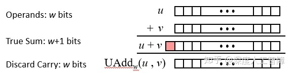

定义运算符 ![[公式]](https://www.zhihu.com/equation?tex=%2B_w%5Eu) 表示w位的无符号数加法运算符，我们可以得到无符号数加法和真实加法之间的函数关系 ![[公式]](https://www.zhihu.com/equation?tex=x%2B_w%5Euy%3D%28x%2By%29%5C%252%5Ew) 。当计算结果超过 ![[公式]](https://www.zhihu.com/equation?tex=2%5Ew) 时发生溢出，并且溢出结果会发生反转，产生比较小的值。

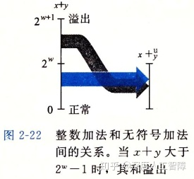

- **判断溢出方法：**当 ![[公式]](https://www.zhihu.com/equation?tex=x%2By%3Cy) 或 ![[公式]](https://www.zhihu.com/equation?tex=x%2By%3Cx) 时就发生溢出了。

**证明：**当发生溢出时，计算结果为 ![[公式]](https://www.zhihu.com/equation?tex=x%2By%3D%28x%2By%29%5C%252%5Ew%3Dx%2By-2%5Ew) ，因为x和y的最大值都小于 ![[公式]](https://www.zhihu.com/equation?tex=2%5Ew) ，所以该计算结果一定小于x或y。

- **加法逆元：**利用溢出效应，每个元素都有一个加法逆元，当与自己的加法逆元相加时，就得到0。**注意：**无符号数的加法逆元和数学上的相反数数值不同。

在计算机运算中，要想两个非零数相加为0，就需要利用溢出来实现。计算x的加法逆元x'时，只要保证 ![[公式]](https://www.zhihu.com/equation?tex=x%2B_w%5Eux%27%3D%5B1%2C0%2C0%2C...%2C0%5D) ，其中位向量有w+1位，发生了溢出，就会将最高有效位截断，使得结果变为0。而该位向量的真实计算结果为 ![[公式]](https://www.zhihu.com/equation?tex=2%5Ew) ，所以元素x的加法逆元为 ![[公式]](https://www.zhihu.com/equation?tex=2%5Ew-x) 。用函数表示加法逆元为

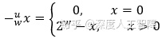

### 3.2 补码加法

使用补码的一个**优势在于**：补码加法可以使用和无符号数加法相同的硬件，相同的算法，就得到到有符号数的加法。所以大多数计算机用相同的机器指令来执行补码和无符号数加法。

定义 ![[公式]](https://www.zhihu.com/equation?tex=%2B_w%5Et) 为w位的补码加法符号，定义两个数之间的补码加法为 ![[公式]](https://www.zhihu.com/equation?tex=x%2B_w%5Ety%3DU2T_w%28T2U_w%28x%29%2B_w%5EuT2U_w%28y%29%29) 。我们接下来证明这种相同的位向量可以得到正确的结果。

**证明：**

![[公式]](https://www.zhihu.com/equation?tex=x%2B_w%5Ety%3DU2T_w%28%28x_%7Bw-1%7D2%5Ew%2Bx%2By_%7Bw-1%7D2%5Ew%2By%29%5Cmod+2%5Ew%29)

![[公式]](https://www.zhihu.com/equation?tex=%3DU2T_w%28%28x%2By%29%5Cmod2%5Ew%29)

- 当 ![[公式]](https://www.zhihu.com/equation?tex=0%5Cleq+x%2By%3C2%5E%7Bw-1%7D) 时，原式化为 ![[公式]](https://www.zhihu.com/equation?tex=U2T_w%28x%2By%29%3Dx%2By) 。所以当补码位于非负数取值范围内，可得到正确计算结果。
- 当 ![[公式]](https://www.zhihu.com/equation?tex=-2%5E%7Bw-1%7D%5Cleq+x%2By%3C0) 时， ![[公式]](https://www.zhihu.com/equation?tex=%28x%2By%29%5Cmod+2%5Ew%3Dx%2By%2B2%5Ew) ，此时 ![[公式]](https://www.zhihu.com/equation?tex=2%5E%7Bw-1%7D%5Cleq+x%2By%2B2%5Ew%3C2%5Ew) ，所以 ![[公式]](https://www.zhihu.com/equation?tex=U2T_w%28x%2By%2B2%5Ew%29%3Dx%2By%2B2%5Ew-2%5Ew%3Dx%2By) 。所以当补码位于负数取值范围内，可得到正确计算结果。
- 当 ![[公式]](https://www.zhihu.com/equation?tex=-2%5Ew%5Cleq+x%2By%3C-2%5E%7Bw-1%7D) 时， ![[公式]](https://www.zhihu.com/equation?tex=%28x%2By%29%5Cmod+2%5Ew%3Dx%2By%2B2%5Ew) ，此时 ![[公式]](https://www.zhihu.com/equation?tex=0%5Cleq+x%2By%2B2%5Ew%3C2%5E%7Bw-1%7D) ，所以 ![[公式]](https://www.zhihu.com/equation?tex=U2T_w%28x%2By%2B2%5Ew%29%3Dx%2By%2B2%5Ew) 。此时出现了**负溢出，会跳转到较大正值**。
- 当 ![[公式]](https://www.zhihu.com/equation?tex=2%5E%7Bw-1%7D%5Cleq+x%2By%3C2%5Ew) 时，原式化为 ![[公式]](https://www.zhihu.com/equation?tex=U2T_w%28x%2By%29%3Dx%2By-2%5Ew) 。此时出现**正溢出，会跳转到较小负值**。

综上所述，补码加法中，使用和无符号数相同的位向量，可以保证在补码取值范围内计算正确，而和超过最大值称为正溢出，超过最小值称为负溢出。

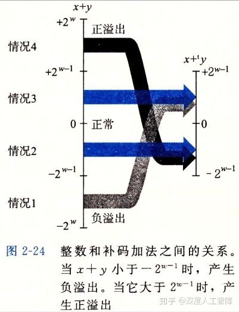

- **判断溢出方法：**当x>0, y>0，计算结果小于等于0时，发生了正溢出；当x<0, y<0，计算结果大于等于0时，发生了负溢出。
- **加法逆元：**也是利用溢出的原理来计算补码的加法逆元。**注意：**部分补码的加法逆元和数学上的相反数是相同的。

根据补码的取值范围 ![[公式]](https://www.zhihu.com/equation?tex=%5B-2%5E%7Bw-1%7D%2C2%5E%7Bw-1%7D%29) ，我们可以分成两种情况讨论：

1. 当 ![[公式]](https://www.zhihu.com/equation?tex=x%3DTMin_w) 时，对应的位向量为 ![[公式]](https://www.zhihu.com/equation?tex=%5B1%2C0%2C0%2C...%2C0%5D_w) ，当两个 ![[公式]](https://www.zhihu.com/equation?tex=TMin_w) 相加后，位向量为 ![[公式]](https://www.zhihu.com/equation?tex=%5B1%2C0%2C0%2C...%2C0%5D_%7Bw%2B1%7D) ，发生了溢出，所以会将最高有效位截断，就得到了结果0。所以 ![[公式]](https://www.zhihu.com/equation?tex=TMin_w) 的加法逆元就是它本身。（与相反数不同）
2. 当 ![[公式]](https://www.zhihu.com/equation?tex=x%3ETMin_w) 时，可以对位向量取反再加1就求出了对应的加法逆元。这部分的加法逆元与相反数值相同。

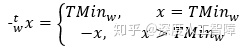

### 3.3 无符号乘法

对于两个w位的无符号数相乘，会得到2w位的数，计算机会截断得到低w位作为计算结果。我们定义 ![[公式]](https://www.zhihu.com/equation?tex=%2A_w%5Eu) 表示w位的无符号数乘法符号，对于 ![[公式]](https://www.zhihu.com/equation?tex=0%5Cleq+x%2Cy%5Cleq+UMax_w) ，最终计算的值为：

![[公式]](https://www.zhihu.com/equation?tex=x%2A_w%5Euy%3D%28x%2Ay%29%5Cmod+2%5Ew)

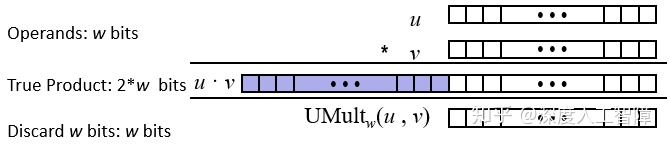

### 3.4 补码乘法

对于两个w位的补码相乘，也是得到2w位的数，同样截断低w位作为结果，在计算时使用对 ![[公式]](https://www.zhihu.com/equation?tex=2%5Ew) 取余进行截断，但是取余后会得到无符号数（计算结果为正），此时就要将无符号数转化为对应的补码。我们定义 ![[公式]](https://www.zhihu.com/equation?tex=%2A_w%5Et) 表示w位的补码乘法符号，对于 ![[公式]](https://www.zhihu.com/equation?tex=TMin_w%5Cleq+x%2Cy%5Cleq+TMax_w) ，最终计算的值为：

![[公式]](https://www.zhihu.com/equation?tex=x%2A_w%5Ety%3DU2T_w%28%28x%2Ay%29%5Cmod2%5Ew%29)

可以发现，当两个比较大的正数相乘时，由于 ![[公式]](https://www.zhihu.com/equation?tex=U2T_w) 函数，所以会得到负的结果，发生了溢出。

我们可以证明 ![[公式]](https://www.zhihu.com/equation?tex=x%2A_w%5Ety) 和 ![[公式]](https://www.zhihu.com/equation?tex=x_w%5Euy) 的位向量是相同的。

**问题：**对于长度为w的两个位向量 ![[公式]](https://www.zhihu.com/equation?tex=%5Cbar%7Bx%7D) 和 ![[公式]](https://www.zhihu.com/equation?tex=%5Cbar%7By%7D) ，使用补码编码对应的值为x和y，使用无符号编码对应的值为x'和y'，我们想要证明 ![[公式]](https://www.zhihu.com/equation?tex=T2B_w%28x%2A_w%5Ety%29%3DU2B_w%28x%27%2A_w%5Euy%27%29) 。

**证明：**

首先， ![[公式]](https://www.zhihu.com/equation?tex=x%27%3Dx_%7Bw-1%7D2%5Ew%2Bx) 和 ![[公式]](https://www.zhihu.com/equation?tex=y%27%3Dy_%7Bw-1%7D2%5Ew%2By) ，则

![[公式]](https://www.zhihu.com/equation?tex=x%27%2A_w%5Euy%27%3D%28x%27%2Ay%27%29%5Cmod+2%5Ew%3D%28%28x_%7Bw-1%7D2%5Ew%2Bx%29%5Ccdot%28y_%7Bw-1%7D2%5Ew%2By%29%29%5Cmod2%5Ew)

![[公式]](https://www.zhihu.com/equation?tex=%3D%28xy%2Bxy_%7Bw-1%7D2%5Ew%2Bx_%7Bw-1%7D2%5Ewy%2Bx_%7Bw-1%7Dy_%7Bw-1%7D2%5E%7B2w%7D%29%5Cmod2%5Ew%3D%28x%5Ccdot+y%29%5Cmod+2%5Ew)

![[公式]](https://www.zhihu.com/equation?tex=T2U_w%28x%2A_w%5Ety%29%3DT2U_w%28U2T_w%28%28x%2Ay%29%5Cmod2%5Ew%29%29%3D%28x%5Ccdot+y%29%5Cmod+2%5Ew)

所以， ![[公式]](https://www.zhihu.com/equation?tex=T2U_w%28x%2A_w%5Ety%29%3Dx%27%2A_w%5Euy)

所以 ![[公式]](https://www.zhihu.com/equation?tex=U2B_w%28T2U%28x%2A_w%5Ety%29%29%3DT2B_w%28x%2A_w%5Ety%29%3DU2B_w%28x%27%2A_w%5Euy%27%29)

所以使用这种方式计算可以保证补码乘法和无符号乘法计算出来的位向量相同。

## 4. 计算机实现乘除法

计算机中支持各种整数运算，比如加法、减法、位级运算和移位。而大多数机器中，整数乘法指令和整数除法指令都很慢，通常需要几十个时钟周期，所以计算机通常会用移位和加减法的组合来代替乘除法。

### 4.1 计算机实现乘法

首先我们讨论乘上2幂的特殊情况，然后将其扩展到乘上任意数。

### 4.1.1 乘上2幂

对于w位的无符号数 ![[公式]](https://www.zhihu.com/equation?tex=%5Bx_%7Bw-1%7D%2Cx_w%2C...%2Cx_0%5D) ，如果我们左移k位，可得到的值为

![[公式]](https://www.zhihu.com/equation?tex=%28%5Bx_%7Bw-1%7D%2Cx_w%2C...%2Cx_0%5D%3C%3Ck%29%5Cmod+2%5Ew%3D%5Bx_%7Bw-1%7D%2Cx_w%2C...%2Cx_0%2C0%2C0%2C...%2C0%5D%5Cmod+2%5Ew)

![[公式]](https://www.zhihu.com/equation?tex=%3D%28%5Csum_%7Bi%3D0%7D%5E%7Bw-1%7Dx_i2%5E%7Bi%2Bk%7D%29%5Cmod+2%5Ew%3D%28%28%5Csum_%7Bi%3D0%7D%5E%7Bw-1%7Dx_i2%5E%7Bk%7D%29%5Ccdot+2%5Ek%29%5Cmod+2%5Ew%3D%28x%5Ccdot+2%5Ek%29%5Cmod+2%5Ew%3Dx%2A_w%5Eu2%5Ek)

所以如果在w位表示范围内，左移k位相当于乘上了 ![[公式]](https://www.zhihu.com/equation?tex=2%5Ek) ，如果超过了表示范围，就会发生溢出。

而补码计算结果的位向量和无符号数计算结果的位向量相同，所以对于补码x左移k位，得到的结果是 ![[公式]](https://www.zhihu.com/equation?tex=x%2A_w%5Et2%5Ek) 。

由此，乘上2幂，只要左移幂次就行。

### 4.1.2 乘上任意数

对于任意整数K，我们可以先对计算关于2幂次的展开，比如 ![[公式]](https://www.zhihu.com/equation?tex=14%3D2%5E3%2B2%5E2%2B2%5E1) ，则 ![[公式]](https://www.zhihu.com/equation?tex=x%2A14%3Dx%2A2%5E3%2Bx%2A2%5E2%2Bx%2A2%5E1%3D%28x%3C%3C3%29%2B%28x%3C%3C2%29%2B%28x%3C%3C1%29) 。由此就将一个乘法运算转化为了3个移位操作和2个加法操作。更进一步我们可以得到 ![[公式]](https://www.zhihu.com/equation?tex=14%3D2%5E4-2%5E1) ，所以 ![[公式]](https://www.zhihu.com/equation?tex=x%2A14%3D%28x%3C%3C4%29-%28x%3C%3C1%29) ，转化为了2个移位操作和1个减法操作。

综上所述，想要乘上K，我们可以得到它的位向量，然后根据位向量进行移位并相加，就能得到乘法运算结果。

大多数编译器只有在需要少量移位、加法和减法时才用这种优化，不然就直接使用一个乘法操作了。

### 4.2 计算机实现除法

通乘法相同，我们可以通过右移操作来除以2的幂。对于无符号数，我们使用逻辑右移来除以2的幂，而对于补码，我们要用算术右移来保持符号不变。

在除法运算中，比较麻烦的是出现除不尽的情况，此时就需要舍入，我们希望计算结果都是向0舍入的。

**无符号数：**我们定义x的位模式为 ![[公式]](https://www.zhihu.com/equation?tex=%5Bx_%7Bw-1%7D%2Cx_%7Bw-2%7D%2C...%2Cx_0%5D) ，x'的位模式为 ![[公式]](https://www.zhihu.com/equation?tex=%5Bx_%7Bw-1%7D%2Cx_%7Bw-2%7D%2C...%2Cx_k%5D) ，x''的位模式为 ![[公式]](https://www.zhihu.com/equation?tex=%5Bx_%7Bk-1%7D%2Cx_%7Bk-2%7D%2C...%2Cx_0%5D) ，所以 ![[公式]](https://www.zhihu.com/equation?tex=x%3D%28x%27%3C%3Ck%29%2Bx%27%27%3Dx%27%2A2%5Ek%2Bx%27%27) ，所以 ![[公式]](https://www.zhihu.com/equation?tex=x%3E%3Ek%3Dx%2F2%5Ek%3D%28x%27%2A2%5Ek%2Bx%27%27%29%2F2%5Ek%3Dx%27%2Bx%27%27%2F2%5Ek) ，因为x''的取值范围为 ![[公式]](https://www.zhihu.com/equation?tex=%5B0%2C2%5Ek%29) ，所以 ![[公式]](https://www.zhihu.com/equation?tex=0%5Cleq+x%27%27%2F2%5Ek%3C1) ，所以对x右移k位得到的x'是向0取整的结果。

**补码：**我们定义补码x的位模式为 ![[公式]](https://www.zhihu.com/equation?tex=%5Bx_%7Bw-1%7D%2Cx_%7Bw-2%7D%2C...%2Cx_0%5D) ，高八位补码x'的位模式为 ![[公式]](https://www.zhihu.com/equation?tex=%5Bx_%7Bw-1%7D%2Cx_%7Bw-2%7D%2C...%2Cx_k%5D) ，无符号数x''的位模式为 ![[公式]](https://www.zhihu.com/equation?tex=%5Bx_%7Bk-1%7D%2Cx_%7Bk-2%7D%2C...%2Cx_0%5D) ，同理 ![[公式]](https://www.zhihu.com/equation?tex=x%3Dx%27%2A2%5Ek%2Bx%27%27) 。如果对x进行算术右移k位，得到 ![[公式]](https://www.zhihu.com/equation?tex=%5Bx_%7Bw-1%7D%2C...%2Cx_%7Bw-1%7D%2Cx_%7Bw-2%7D%2C...%2Cx_k%5D) ，通过2.5.1小节的结论可知，它等价于x'。所以对x进行算数右移k位，得到结果为x'，因为 ![[公式]](https://www.zhihu.com/equation?tex=0%5Cleq+x%27%27%2F2%5Ek%3C1)，所以当补码大于0时，也是向0舍入，满足预期。但是**当补码小于0时，结果是远离0进行取整的，不符合预期**。

所以对于补码的算术右移，我们需要先加上一个偏移量，使其满足向0舍入的预期。

**偏移量：**

首先需要一个公式 ![[公式]](https://www.zhihu.com/equation?tex=%5Clceil+x%2Fy%5Crceil%3D%5Clfloor%28x%2By-1%29%2Fy%5Crfloor)

**证明：**令 ![[公式]](https://www.zhihu.com/equation?tex=x%3Dqy%2Br) ，且 ![[公式]](https://www.zhihu.com/equation?tex=0%5Cleq+r%3Cy) 则 ![[公式]](https://www.zhihu.com/equation?tex=%5Clfloor%28x%2By-1%29%2Fy%5Crfloor%3D%5Clfloor%28qy%2Br%2By-1%29%2Fy+%5Crfloor%3Dq%2B%5Clfloor%28r%2By-1%29%2Fy+%5Crfloor)。当r=0时，结果为q，当r>0时，结果为q+1。

我们可以直接将y替换成 ![[公式]](https://www.zhihu.com/equation?tex=2%5Ek) ，则偏移量为 ![[公式]](https://www.zhihu.com/equation?tex=2%5Ek-1%3D%281%3C%3Ck%29-1) ，所以对于补码小于0时，我们可以加上该偏移量保证其向0取整。

所以C中使用算数右移的表达式为：

```c
(x<0 ? x+(1<<k)-1 : x) >> k
```

保证补码在正数和负数下都是向0取整的。

可惜除法无法像乘法那样对任意数进行扩展。

------

如果使用无符号数，可能会出现一些比较诡异的异常。

**例子1：**

```text
for(unsigned i=n-1;i>=0;i--){
    //loop
}
```

当运行到i=0时，对应的位模式为全零，这时候再减一，得到的是全一，对应到无符号编码得到的就是 ![[公式]](https://www.zhihu.com/equation?tex=UMax_w) ，所以i不会小于0，所以循环不会停止，或者出现索引错误。

**例子2：**

```text
#define DELTA sizeof(int)
int i;
for (i = CNT; i-DELTA >= 0; i-= DELTA)
```

这里因为sizeof函数返回的是size_t类型的数，它是unsigned long的，所以还是会出现上面的问题。

比较好的代码模式是：

```text
unsigned i;
for (i = cnt-2; i < cnt; i--)
  a[i] += a[i+1];
```

当出现溢出时，刚好可以停止。更好的是使用`size_t`，因为`unsigned`是32位的，而`size_t`定义为字长，是64位的。

这里如果cnt是有符号数，并且小于0时，i就会会变成很大的正值。

**PPT中的作业：**

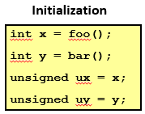

- `x<0`推出`((x*2)<0)`：如果x是 ![[公式]](https://www.zhihu.com/equation?tex=TMin_w) ，则左移一位会变成0，所以错误。
- `ux>=0`： 因为它是无符号数，所以正确。
- `x&7==7`推出`(x<<30)<0`：可以将第一个7看成是模向量，所以通过与运算可以知道x低3位为`111`，左移30位后，因为int为32位，所以会溢出一位，得到最高两位为1，其余为0，所以结果小于0。 所以正确。
- `ux>-1`： 因为`ux`是无符号数，而`-1`是有符号数，所以`-1`首先会转换成无符号数，也就变得特别大，所以这个错误。
- `x>y`推出`-x<-y`：如果y为 ![[公式]](https://www.zhihu.com/equation?tex=TMin_w)，则其相反数还是 ![[公式]](https://www.zhihu.com/equation?tex=TMin_w) ，只要x不是 ![[公式]](https://www.zhihu.com/equation?tex=TMin_w) 就不成立，所以错误。
- `x*x>=0`：根据计算公式，知道还有一个 ![[公式]](https://www.zhihu.com/equation?tex=U2T_w) 函数，如果值过大发生溢出后，就小于0了。所以错误。
- `x>0 && y>0`推出`x+y>0`： 如果发生正溢出就不符合，所以错误。
- `x>=0`推出`-x<=0`：正确。
- `x<=0`推出`-x>=0`：如果x为 ![[公式]](https://www.zhihu.com/equation?tex=TMin_w)，则其相反数还是 ![[公式]](https://www.zhihu.com/equation?tex=TMin_w) ，还是小于0。所以错误。
- `(x|-x)>>31==-1`： 如果x为0就是错误的。
- `ux>>3==ux/8`：正确。
- `x>>3==x/8`：如果x小于0，它是朝着远离0舍入的，与`x/8`朝着0舍入不同。错误。
- `x&(x-1)!=0`：当x的位向量中只有一个为1，则结果为0。错误。

**思路：**

1. 溢出时会发生值的跳变。
2. 对于有符号数，考虑 ![[公式]](https://www.zhihu.com/equation?tex=TMin_w) 的相反数还是自己本身；小于零的移位操作是远离0进行舍入的。
3. 如果无符号数和有符号数同时出现，会自动将有符号数转化为无符号数，考虑此时是否发生值的跳变。


# [读书笔记]CSAPP：4[VB]浮点数据类型


 

**视频地址：**

[【精校中英字幕】2015 CMU 15-213 CSAPP 深入理解计算机系统 课程视频_哔哩哔哩 (゜-゜)つロ 干杯~-bilibiliwww.bilibili.com/video/av31289365?p=4](https://link.zhihu.com/?target=https%3A//www.bilibili.com/video/av31289365%3Fp%3D4)

**课件地址：**

[http://www.cs.cmu.edu/afs/cs/academic/class/15213-f15/www/lectures/04-float.pdfwww.cs.cmu.edu/afs/cs/academic/class/15213-f15/www/lectures/04-float.pdf](https://link.zhihu.com/?target=http%3A//www.cs.cmu.edu/afs/cs/academic/class/15213-f15/www/lectures/04-float.pdf)

对应于书本的2.4。

**如有错误请指出，谢谢。**

------

## 1 浮点数简介

浮点表示对形如 ![[公式]](https://www.zhihu.com/equation?tex=V%3Dx%5Ctimes+2%5Ey) 的有理数进行编码，比较适用于非常大的数字、非常接近0的数字。它常常不会太多关注运算的准确性，而是把实现的速度和简便性看得比数字精确性更重要。1985年提出了IEEE标准754，仔细制定了表示浮点数机器运算的标准，后续所有计算机都支持这个标准，极大提高了程序可移植性。

首先会介绍IEEE浮点表示方法，然后由于数字不能精确被表示，所以会介绍浮点数的舍入问题。最后介绍浮点数相关的运算。

## 2 IEEE浮点表示

IEEE浮点表示使用 ![[公式]](https://www.zhihu.com/equation?tex=V%3D%28-1%29%5Es%5Ctimes+M%5Ctimes+2%5EE) 表示数字。其中包含三部分：

- **符号（Sign）s：**用来确定V的正负性，当s=0时表示正数，s=1时表示负数。用一个单独的符号位直接进行编码。
- **尾数（Significand）M：** 是一个二进制小数，通常介于1和2之间的小数。使用k位二进制进行编码的小数。
- **阶码（Exponent）E：**对浮点数进行加权。使用n位进行编码的正数 ![[公式]](https://www.zhihu.com/equation?tex=e_%7Bk-1%7D%2Ce_%7Bk-2%7D%2C...%2Ce_0)。

C语言中有单精度精浮点数`float`，其中s=1、k=8、n=23；还有双精度浮点数`double`，其中s=1、k=11、n=52。

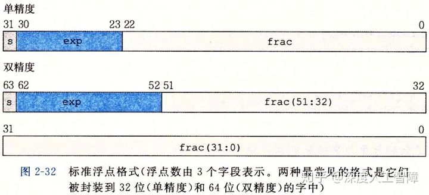

我们可以根据尾数和阶码的不同取值，将其分成三种情况：

1. **规格化的值：**当 ![[公式]](https://www.zhihu.com/equation?tex=exp%5Cin+%280%2C+2%5Ew-1%29) 时， ![[公式]](https://www.zhihu.com/equation?tex=E%3Dexp-Bias) ，其中 ![[公式]](https://www.zhihu.com/equation?tex=Bias%3D2%5E%7Bk-1%7D-1) ，由此能将E重新投影到正负值，并且能够和非规格化进行平滑； ![[公式]](https://www.zhihu.com/equation?tex=M%3D1%2Bfrac) ，因为我们可以通过调整E使得 ![[公式]](https://www.zhihu.com/equation?tex=1%5Cleq+M%3C2) ，所以通过这种形式将尾数变成 ![[公式]](https://www.zhihu.com/equation?tex=1.f_%7Bn-1%7D%2Cf_%7Bn-2%7D%2C...%2Cf_0) 的形式，就能获得额外的精度。g规格化数能够表示大范围的数。
2. **非规格化的值：**当 ![[公式]](https://www.zhihu.com/equation?tex=exp%3D0) 时， ![[公式]](https://www.zhihu.com/equation?tex=E%3D1-Bias) ，由此来保证和规格化值的连续性； ![[公式]](https://www.zhihu.com/equation?tex=M%3Dfrac%3D0.f_%7Bn-1%7D%2Cf_%7Bn-2%7D%2C...%2Cf_0) 。非规格化数能够表示正负0以及趋近于0的数。
3. **特殊值：**当阶码全为1时，如果尾数全为0，则表示无穷，比如两个很大的数相乘，或除以0时；否则表示NaN（Not a Number），比如求-1的根号。


通过上面我们可以观察到几个**现象**：

1. 非规格数稠密地分布在靠近0的区域；
2. 有些数的间隔是等距的，因为当exp值不变，在`frac`尾数区域进行增加会乘上相同的指数；
3. 越大的数间隔越大，因为比较大的数，它的指数 ![[公式]](https://www.zhihu.com/equation?tex=2%5EE) 会比较大，使得每次变化量会比较大。

**根据二进制编码计算数值：**

1. 计算 ![[公式]](https://www.zhihu.com/equation?tex=Bias%3D2%5E%7Bk-1%7D-1)
2. 计算阶码的值exp和尾数的值frac
3. 如果为规格化值，则 ![[公式]](https://www.zhihu.com/equation?tex=E%3Dexp-Bias) ， ![[公式]](https://www.zhihu.com/equation?tex=M%3D1%2Bfrac) ；如果为非规格化值，则 ![[公式]](https://www.zhihu.com/equation?tex=E%3D1-Bias) ， ![[公式]](https://www.zhihu.com/equation?tex=M%3Dfrac) 。
4. 计算最终的值 ![[公式]](https://www.zhihu.com/equation?tex=V%3D%28-1%29%5Es%5Ctimes+M%5Ctimes+2%5EE)

我们以正数为例（s=0），说明几个比较**特殊的值：**

- **0：**只有非规格化才能表示0，exp和frac全部为0时，结果为0。
- **最小的正非规格化数：**![[公式]](https://www.zhihu.com/equation?tex=E%3D1-%282%5E%7Bk-1%7D-1%29%3D2-2%5E%7Bk-1%7D) 是固定值，在frac取值范围内的最小值正数是 ![[公式]](https://www.zhihu.com/equation?tex=%5B0%2C0%2C...%2C1%5D) ，则 ![[公式]](https://www.zhihu.com/equation?tex=M%3Dfrac%3D2%5E%7B-n%7D) ，所以 ![[公式]](https://www.zhihu.com/equation?tex=V%3DM%5Ctimes+2%5EE%3D2%5E%7B-n%7D%5Ctimes+2%5E%7B2-2%5E%7Bk-1%7D%7D%3Dx%5E%7B-n%2B2-2%5E%7Bk-1%7D%7D) 。
- **最大非规格化数：**E还是固定值 ![[公式]](https://www.zhihu.com/equation?tex=2-2%5E%7Bk-1%7D) ，在frac取值范围内的最大值是 ![[公式]](https://www.zhihu.com/equation?tex=%5B1%2C1%2C...%2C1%2C0%5D) ，则 ![[公式]](https://www.zhihu.com/equation?tex=M%3Dfrac%3D1-2%5E%7B-n%7D) ，所以 ![[公式]](https://www.zhihu.com/equation?tex=V%3D%281-2%5E%7B-n%7D%29%5Ctimes+2%5E%7B2-2%5E%7Bk-1%7D%7D) 。
- **最小规格化数：**exp的最小值为 ![[公式]](https://www.zhihu.com/equation?tex=%5B0%2C0%2C...%2C0%2C1%5D%3D1) ，所以 ![[公式]](https://www.zhihu.com/equation?tex=E%3Dexp-Bias%3D1-%282%5E%7Bk-1%7D-1%29%3D2-2%5E%7Bk-1%7D) ；frac全0时，M取得最小值1，所以 ![[公式]](https://www.zhihu.com/equation?tex=V%3D2%5E%7B2-2%5E%7Bk-1%7D%7D) 。
- **1：**要表示1，则需要用规格化来表示，当frac全为0时，M=1，需要让E=0，则 ![[公式]](https://www.zhihu.com/equation?tex=exp%3DBias%3D2%5E%7Bk-1%7D-1) ，即exp为 ![[公式]](https://www.zhihu.com/equation?tex=%5B0%2C1%2C1%2C...%2C1%5D) 。
- **最大规格化数：**exp的最大值为 ![[公式]](https://www.zhihu.com/equation?tex=%5B1%2C1%2C...%2C1%2C0%5D%3D2%5E%7Bk%7D-2) ，frac的最大值为全1，即 ![[公式]](https://www.zhihu.com/equation?tex=frac%3D1-2%5E%7B-n%7D) ，所以 ![[公式]](https://www.zhihu.com/equation?tex=E%3Dexp-Bias%3D2%5Ek-2-%282%5E%7Bk-1%7D-1%29%3D2%5E%7Bk-1%7D-1) ， ![[公式]](https://www.zhihu.com/equation?tex=M%3D1%2Bfrac%3D2-2%5E%7B-n%7D) ，所以 ![[公式]](https://www.zhihu.com/equation?tex=V%3D%282-2%5E%7B-n%7D%29%5Ctimes+2%5E%7B2%5E%7Bk-1%7D-1%7D%3D%281-2%5E%7B-n-1%7D%29%5Ctimes+2%5E%7Bk-1%7D) 。

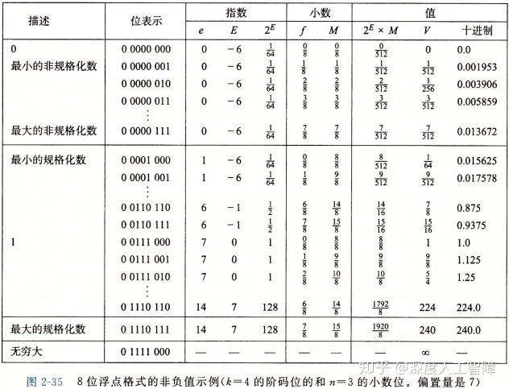

**IEEE设计的好处：**

1. 最大非规格化值 ![[公式]](https://www.zhihu.com/equation?tex=%281-2%5E%7B-n%7D%29%5Ctimes+2%5E%7B2-2%5E%7Bk-1%7D%7D) 和最小规格化值 ![[公式]](https://www.zhihu.com/equation?tex=2%5E%7B2-2%5E%7Bk-1%7D%7D) 之间的幅度是 ![[公式]](https://www.zhihu.com/equation?tex=2%5E%7B-n%7D) ，是n位尾数所能表示的最小值，可以看成是**光滑转变**。
2. 从最小非规格化数到最大规格化数的位向量的变化是顺序的，和无符号整数的排序相同。所以可以用无符号数的排序函数来对浮点数进行排序。**注意：**负无穷转化为无符号数进行比较时会有问题。

**将十进制化为浮点数表示：**

以12345为例，我们推算单精度浮点数的编码

1. 计算 ![[公式]](https://www.zhihu.com/equation?tex=Bias%3D2%5E%7Bk-1%7D-1%3D2%5E%7B7%7D-1%3D127)
2. 将12345化为二进制数 ![[公式]](https://www.zhihu.com/equation?tex=%5B11000000111001%5D)
3. 首先将二进制数其化成小于1的科学技术法 ![[公式]](https://www.zhihu.com/equation?tex=0.11000000111001%5Ctimes+2%5E%7B14%7D) ，很明显指数14不为 ![[公式]](https://www.zhihu.com/equation?tex=1-Bias%3D-126) ，所以是规格化数，所以将其转化为大于1的科学计数法 ![[公式]](https://www.zhihu.com/equation?tex=1.1000000111001%5Ctimes+2%5E%7B13%7D) ，所以 ![[公式]](https://www.zhihu.com/equation?tex=M%3D1.1000000111001) ， ![[公式]](https://www.zhihu.com/equation?tex=E%3D14) 。
4. 因为 ![[公式]](https://www.zhihu.com/equation?tex=M%3D1%2Bfrac) ，所以frac的编码为 ![[公式]](https://www.zhihu.com/equation?tex=%5B1000000111001%5D) 。因为 ![[公式]](https://www.zhihu.com/equation?tex=E%3Dexp-Bias%3Dexp-127) ，所以 ![[公式]](https://www.zhihu.com/equation?tex=exp%3D127%2B13%3D140%3D%5B10001100%5D) 。
5. 将frac和exp的二进制编码扩展到对应位数并拼接在一起，补上符号位就为最终结果 ![[公式]](https://www.zhihu.com/equation?tex=010001100+10000001110010000000000) 。

**注意：**要在exp前面补0，在frac后面补0。因为exp表示整数，frac表示小数。

**对比无符号数的编码，我们可以发现：**因为无符号数一定大于0，所以相同的数想用浮点数编码只能使用规范化数进行编码，而规范化数会将frac的最高有效位1去掉，所以无符号数的编码和浮点数编码，在frac部分是相似的，浮点数会少了最高有效位的1。而无符号数的其他部分就是0，而浮点数的其他部分是表示指数的编码。

## 3 浮点数舍入

浮点数由于有限的位数，所以对于真实值x，我们想要用一种系统的方法来找到能够用浮点数表示的“最接近的x”匹配值x'，这个过程就称为**舍入**。

常见的舍入方法有四种：向零舍入、向上舍入、向下舍入以及向偶数舍入。以十进制为例可以看以下表格


其中比较特殊的是**向偶数舍入：**如果处于中间值，就朝着令最后一个有效位为偶数来舍入；否则朝着最近的值舍入。比如1.40，由于靠近1就朝1舍入；1.6靠近2就朝2舍入；1.50位于十进制的中间值，就朝着偶数舍入，所以为2。

**向偶数舍入的意义：**如果对一系列值进行向上舍入，则舍入后的平均值会比真实值更大；使用向下舍入，则舍入后的平均值会比真实值更小。通过向偶数舍入，每个值就有50%概率变大、50%概率变小，使得总的统计量保持较为稳定。

十进制的中间值为 ![[公式]](https://www.zhihu.com/equation?tex=500..._%7B10%7D) ，比这个中间值大就向上舍入，比这个中间值小就向下舍入，否则朝着偶数舍入。

而二进制的中间值是 ![[公式]](https://www.zhihu.com/equation?tex=100..._%7B2%7D) ，比如 ![[公式]](https://www.zhihu.com/equation?tex=101..._%7B2%7D) 就比中间值大， ![[公式]](https://www.zhihu.com/equation?tex=010..._2) 就比中间值小。而且二进制中，当最后一个有效位为0时，为偶数。比如

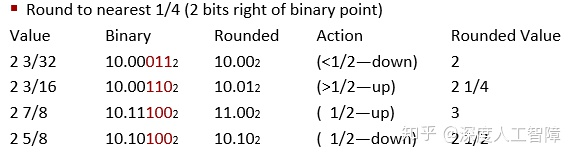

- `10.00011`：由于`011`比中间值小，所以直接向下舍入，为`10.00`。
- `10.00110`：由于`110`比中间值大，所以直接向上舍入，为`10.01`。
- `10.11100`：由于`100`为中间值，而`10.11`最后一个有效位1位奇数，所以向上舍入为偶数`11.00`。
- `10.10100`：由于`100`为中间值，而`10.10`最后一个有效位0位偶数，所以直接向下舍入`10.10`。

## 4 浮点数运算

浮点数运算无法直接通过在位向量上运算得到。

### 4.1 浮点数乘法

对于两个浮点数 ![[公式]](https://www.zhihu.com/equation?tex=%28-1%29%5E%7Bs_1%7D%5Ctimes+M_1%5Ctimes+2%5E%7BE_1%7D) 和 ![[公式]](https://www.zhihu.com/equation?tex=%28-1%29%5E%7Bs_2%7D%5Ctimes+M_2%5Ctimes+2%5E%7BE_2%7D) ，计算结果为 ![[公式]](https://www.zhihu.com/equation?tex=%28-1%29%5Es%5Ctimes+M%5Ctimes+2%5EE) ，其中 ![[公式]](https://www.zhihu.com/equation?tex=s%3Ds_1XORs_2) ， ![[公式]](https://www.zhihu.com/equation?tex=M%3DM_1%5Ctimes+M_2) ， ![[公式]](https://www.zhihu.com/equation?tex=E%3DE_1%2BE_2) 。

- 如果 ![[公式]](https://www.zhihu.com/equation?tex=M%5Cgeq2) ，就将frac右移一位，并对E加一。
- 如果E超过了表示范围，就发生了溢出。
- 如果M超过了表示范围，对frac进行舍入。

**数学性质：**

- 可交换
- 不可结合：可能出现溢出和不精确的舍入，比如 ![[公式]](https://www.zhihu.com/equation?tex=1e20%2A%281e20%2A1e-20%29%3D1e20) ，而 ![[公式]](https://www.zhihu.com/equation?tex=%281e20%2A1e20%29%2A1e-20%3DINF) 。
- 不可分配：如果分配了可能会出现NaN，比如 ![[公式]](https://www.zhihu.com/equation?tex=1e20%2A%281e20-1e20%29%3D0) ，而 ![[公式]](https://www.zhihu.com/equation?tex=1e20%2A1e20-1e20%2A1e20%3DNaN) 。
- 保证，只要 ![[公式]](https://www.zhihu.com/equation?tex=a%5Cne+NaN) ，则 ![[公式]](https://www.zhihu.com/equation?tex=a%2A%5Et+a%5Cgeq0) 。

### 4.2 浮点数加法

对于两个浮点数 ![[公式]](https://www.zhihu.com/equation?tex=%28-1%29%5E%7Bs_1%7D%5Ctimes+M_1%5Ctimes+2%5E%7BE_1%7D) 和 ![[公式]](https://www.zhihu.com/equation?tex=%28-1%29%5E%7Bs_2%7D%5Ctimes+M_2%5Ctimes+2%5E%7BE_2%7D) ，计算结果为 ![[公式]](https://www.zhihu.com/equation?tex=%28-1%29%5Es%5Ctimes+M%5Ctimes+2%5EE) ，其中s和M是对其后的运算结果， ![[公式]](https://www.zhihu.com/equation?tex=E%3Dmax%28E_1%2CE_2%29) 。

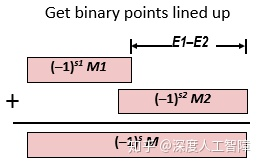

- 如果 ![[公式]](https://www.zhihu.com/equation?tex=M%5Cgeq2) ，则frac右移一位，并对E加1。
- 如果 ![[公式]](https://www.zhihu.com/equation?tex=M%3C1) ，则frac左移一位，并对E减1。
- 如果E超过表示范围，就发生溢出。
- 如果M超过表示范围，就对frac进行舍入。

**数学性质：**

- 由于溢出，可能得到无穷之。
- 可交换
- 不可结合（由于舍入），因为较大的数和较小的数相加，由于舍入问题，会将较小的数舍入，比如 ![[公式]](https://www.zhihu.com/equation?tex=%283.14%2B1e10%29-1e10%3D0) 而 ![[公式]](https://www.zhihu.com/equation?tex=3.14%2B%281e10-1e10%29%3D3.14) 。
- 除了无穷和NaN，存在加法逆元。
- 满足单调性，如果 ![[公式]](https://www.zhihu.com/equation?tex=a%5Cgeq+b) ，则对于任意a、b和x，都有 ![[公式]](https://www.zhihu.com/equation?tex=x%2Ba%5Cgeq+x%2Bb) 。NaN除外。无符号数和补码由于溢出会发生值的跳变，所以不满足单调性。


**注意：**需要考虑好清楚数值的范围，如果计算的数值范围变化很大，需要重新结合或改变运算顺序，避免由于溢出或舍入出现计算问题。

## 5 C中的浮点数

C中提供了`float`和`double`两种精度的浮点数。由于编码不同，所以在浮点数和整型数之间强制类型转换时，会修改编码，并且会出现溢出和舍入。

- **float/double转换成int：**首先小数部分会被截断，也就是向0舍入。`float`的尾数部分为23字节，比int的32字节小，所以int可以精确表示float的整数部分，而`double`的尾数有52位，可能会出现舍入。并且当超过int的取值范围或NaN时，微处理器会指定 ![[公式]](https://www.zhihu.com/equation?tex=%5B100...0%5D) 为整数不确定值，即对应的 ![[公式]](https://www.zhihu.com/equation?tex=TMin_w) ，所以一个很大的浮点数转化为int时，可能会出现负数。
- **int或float转换为double：**double尾数有52位，而int只有32位，float只有23位，所以double会精确表示int和float，不会出现溢出和输入。
- **int转换为float：**不会发生溢出，但是由于float尾数位数比较少，会出现舍入。
- **double转换为float：**可能会出现溢出和舍入。

**总结：**超过数值表示范围，会发生溢出；尾数较短，会发生输入。

------

**课堂作业：**

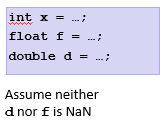

- `x==(int)(float)x`：int有32位，float尾数有23位，从int强制类型转换到float会出现舍入，所以错误。
- `x==(int)(double)x`：int有32位，double尾数有52位，所以从int强制类型转换到float不会出现舍入，所以正确。
- `f==(float)(double)f`：double的精度和范围都比float大，所以能够无损地从float强制类型转换到double，所以正确。
- `d==(double)(float)d`：因为float的精度和范围都比double小，可能会出现溢出和输入，所以错误。
- `f==-(-f)`：因为只要改变一个符号位，所以正确。
- `2/3==2/3.0`： 因为`2/3`是int类型，会舍入变成0，而`2/3.0`是double类型，会得到数值，所以错误。
- `d<0.0`推出`((d*2)<0.0)`：乘2相当于exp加一，如果出现溢出，也是无穷小，所以正确。
- `d>f`推出`-f>-d`： 只要改变一个符号位，所以正确。
- `d*d>=0.0`： 正确。
- `(d+f)-d==f`：不符合结合律，可能会出现舍入和溢出。

------


# [读书笔记]CSAPP：5[VB]机器级表示：基础


 

**视频链接：**

[【精校中英字幕】2015 CMU 15-213 CSAPP 深入理解计算机系统 课程视频_哔哩哔哩 (゜-゜)つロ 干杯~-bilibiliwww.bilibili.com/video/av31289365?p=5](https://link.zhihu.com/?target=https%3A//www.bilibili.com/video/av31289365%3Fp%3D5)

**课件链接：**

[http://www.cs.cmu.edu/afs/cs/academic/class/15213-f15/www/lectures/05-machine-basics.pdfwww.cs.cmu.edu/afs/cs/academic/class/15213-f15/www/lectures/05-machine-basics.pdf](https://link.zhihu.com/?target=http%3A//www.cs.cmu.edu/afs/cs/academic/class/15213-f15/www/lectures/05-machine-basics.pdf)

对应于书本的3.1~3.5。

**如果有错误请指出，谢谢。**

------

**小点：**

- 生成4字节数据的指令会把高位 4个字节置零。
- 使用寄存器进行内存引用时，要用64位寄存器。
- 局部变量通常保存在寄存器中，访问速度会比存放在内存中快很多。
- 对于程序而言，无法看到缓存，没有操作缓存的指令，也无法直接访问缓存。
- 可以将寄存器当做你正在处理的临时数据。

------

## 1. 机器级表示

我们当前使用的高级编程语言提高了比较高的抽象，使得工作效率更高也更可靠，并且保证了程序可以在很多不同的机器上编译和执行，而低级语言，比如汇编或机器语言，却和特定机器密切相关，使得移植性较差。但是学习阅读这些汇编代码，我们能够：

- 理解编译器的优化能力，分析代码中隐含的低效率
- 高级语言提供的抽象层会隐藏程序运行时的行为，通过阅读汇编，能够详细了解机器是如何运行的
- 攻击程序通常涉及程序运行时控制信息的方式的细节，我们想要了解这些漏洞就需要懂得机器级表示

并且使用低级语言，我们可以获得更多有用的数据：

- **程序计数器（Program Counter）**指示了下个指令的内存地址。
- 程序员实际使用的**寄存器（Register）**，可以看成非常小的内存，可以通过特定名字来指定。
- 只有几个位的**状态码（Condition Codes）**指示了最近一些指令的运行结果，比如是否产生0、是否产生负数或正数等等。这些值可以用来实现条件分支。

对于机器级编程来说，有两个抽象十分重要：

1. 由**指令集体系结构**或**指令集架构（Instruction Set Architecture，ISA）**来定义机器级程序的格式和行为，它定义了处理器状态、指令的格式，以及每条指令对状态的影响。大多数ISA都将程序的行为描述为按顺序执行每条指令。这是编译器的目标，提供一系列指令告诉机器要做什么。而**微结构（Microarchitecture）**是指这个架构的实现。
2. 机器级程序使用的内存地址是虚拟内存地址，使得内存模型看上去是一个很大的连续字节数组。然后由操作系统将其转换为真实的物理内存地址。在任意给定的时刻，只有有限的一部分虚拟地址是合法的。

我们这里的表述主要基于x86-64，它是Intel 64位体系结构，它的前身是32位的IA32。x86是对Intel处理器的口头称呼，因为第一个芯片被称为8086。x86又被称为**复杂指令集计算机（Complex Instruction Set Computer，CISC）**。目前处理器和常用的另一大类是**ARM（Acorn RISC Machine）**，RISC是**精简指令集计算机（Reduced Instruction Set Computer）**，由于它更简单，所以它比x86机器功耗更低。

## 2. 程序编码

计算机执行的是机器代码，是字节序列编码低级的操作，我们很难通过观察字节去理解含义，而汇编代码作为机器代码的文本表示，可以让人们更容易理解。从源代码转为机器代码的过程：

1. **预处理器**会扩展源代码，插入所有用`#include`指令的文件，扩展所有用`#define`声明指定的宏。
2. **编译器**基于编程语言的规则、目标机器的指令集和操作系统的惯例，会将源代码转换为汇编代码作为输出，给出程序的每一条指令。
3. **汇编器**将汇编代码转化为二进制目标代码文件，它是机器代码的一种形式，包含了所有指令的二进制表示，但是还没有填入全局值的地址。
4. **链接器**将目标代码文件和实现库函数的代码合并，产生最终可执行代码文件。


我们接下来就看看这些编码的形式。

### 2.1 编译器

文件`mstore.c`中包含以下代码：

```text
long mult2(long, long);
void multstore(long x, long y,long *dest){
    long t = mult2(x,y);
    *dest = t;
} 
```

我们通过命令`gcc -0g -S mstore.c`将其编译成汇编代码，得到`mstore.s`。其中，

- `-Og`：是生成机器代码的优化等级，这个表示编译器会生成符合原始C代码整体结构的机器代码，这是用于调试的级别，便于我们学习观察。其他的`-O1`或`-O2`会得到更好的程序性能，但是机器代码和源代码的关系就比较难以理解。
- `-S`：只生成到汇编代码。

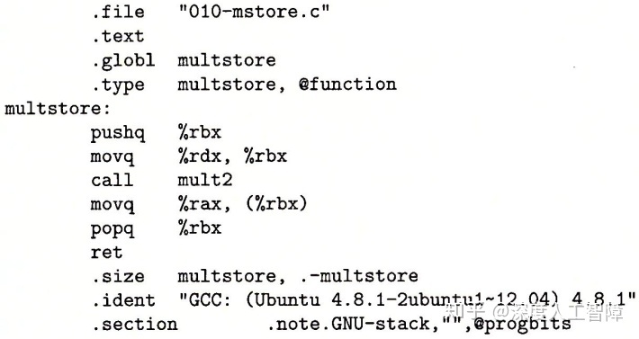

所有以`.`开头的行都是指导汇编器和链接器工作的伪指令，我们通常可以忽略这些行。对其化简并加上解释，可以得到汇编代码：


汇编代码相比C语言有**几个特点：**

- 有许多不同类型的整型数据类型，它们存储时不区分符号和无符号。
- 指针是以简单的数字的形式保存在计算机中的。
- 浮点数以和整型数据完全不同的方式进行处理，并且使用完全不同的寄存器组。
- 程序本身是一系列字节。
- 机器级别并不存在类似数组和结构这样的基本数据类型，它们是由编译器构成的。
- 汇编语言中的每条语言能做的都非常有限。
- 变量所有名称在汇编代码级别完全丢失了，变成了寄存器和内存中的某个位置。

### 2.2 汇编器

我们可以运行`gcc -Og -c mstore.c`来进行编译和汇编，会生成二进制文件`mstore.o`，它是对一系列指令的编码，机器直接执行这些字节序列，对源代码一无所知。

我们可以通过**反汇编器（Disassembler）**来将机器代码转化为类似汇编代码的格式，在Linux中，我们可以运行`objdump -d mstore.o`，可以得到


最左侧一栏是对应的字节地址，中间是每个指令的编码，右侧是生成的汇编代码。我们可以发现：

1. 每个指令需要的字节数不同，常用的指令和需要较少操作数的指令所需的字节数比较少。
2. 每个指令都有自己对应的编码。
3. 反汇编得到的汇编代码和直接生成的有略微差异。

同样可能使用`gdb`然后输入`disassemble`来反汇编代码


### 2.3 链接器

使用链接器将目标代码文件转化为可执行代码，**要求：**目标代码文件中必须含有一个`main`函数，作为程序的入口。

我们构建一个文件`main.c`

```text
#include <stdio.h>
void multstore(long, long, long*);

int main(){
    long d;
    multstore(2, 3, &d);
    printf("%d\n", d);
    return 0;
} 
long mult2(long a, long b){
    long s = a*b;
    return s;
}
```

然后运行命令`gcc -Og -o prog main.c mstore.c`将main.c和mstore.c链接起来，并添加启动和终止程序的代码，以及用来与操作系统交互的代码生成可执行代码，生成最终的可执行文件`prog`。我们通过对其反汇编，可以得到如下内容


可以发现和汇编器生成的**区别有**：

1. 链接器将代码移到了新的地址范围内。
2. 第4行中，链接器补充了调用函数`mult2`需要使用的地址。
3. 多了两行`nop`，可以使得函数代码变成16字节，更好放置下一个代码。

大概了解后，我们需要开始学习汇编代码了，

## 3 数据格式

在x84-64中C语言数据类型的大小如下图所示


大多数GCC生成的汇编代码指令都有一个表示操作数大小的后缀。**注意：**汇编代码使用`l`表示4字节整数和 8字节双精度浮点数，由于浮点数使用完全不同的指令和寄存器，所以不会产生冲突。

## 4 访问信息

一个x86-64的CPU中包含16个存储64位值的通用目的寄存器，可以用来存储整数数据和指针。有些寄存器有**特殊用途：**

- 栈指针`%rsp`用来指明运行时栈的结束位置
- 比如`%rdi`、`%rsi`、`%rdx`、`%rcx`、`%r8`和`%r9`用来保存函数的参数
- `%rip`用来保存当前执行指令的地址
- `%rax`用来存放函数的返回值

在大部分情况下这些寄存器都可用来保存程序数据。并且有一组标准编程规范控制着如何使用寄存器来管理栈、传递函数参数、从函数返回值，以及存储局部和临时数据。

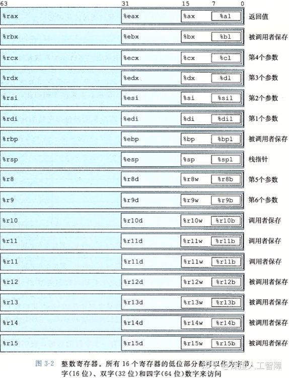

我们可以对这些寄存器的低位字节中存放的不同大小的数据进行操作，`%r`表示64位、`%e`表示32位。

对于生成小于8字节结果的指令，**有两条规则：**

1. 生成1字节或2字节数据的指令会保持剩下的字节内容不变；
2. **生成4字节数据的指令会把高位 4个字节置零。**

## **4.1 操作数指示符**

大多数指令由一个或多个操作数（Operand），指示出一个操作中要使用的元数据值，以及放置结果的目的位置。x86-64支持的操作数格式如下


其中包含三种类型：

- **立即数（Immediate）：**用来表示常数值，书写格式是在`$`后面跟一个标准C表示法表示的整数。
- **寄存器（Register）：**表示某个寄存器的内容。
- **内存引用：**它会根据计算出来的地址访问某个内存位置。有不同的寻址模式，最常用的是 ![[公式]](https://www.zhihu.com/equation?tex=Imm%28r_b%2Cr_i%2Cs%29) ，其中，**要求寄存器大小都是64位的**，才能完整索引整个虚拟内存空间，并且不能使用`%rsp`。

### 4.2 数据传送指令

最频繁使用的指令是将数据从一个位置复制到另一个位置的指令。

### 4.2.1 源和目的大小匹配

该类数据传送指令将数据从一个位置复制到另一个位置，不做任何变化。不同类型指令指定了不同的数据大小（一个字为两个字节）。**源操作数**是一个立即数，可以保存在寄存器或内存中；**目的操作数**是一个位置，可以是寄存器或内存位置。


**注意：**

- 两个操作数不能同时为内存地址。如果要在两个内存位置传输数据，必须用一个寄存器进行中转。
- 使用到的寄存器大小一定要和指令最后一个字符指定的大小匹配。
- `movl`以寄存器为目的时，会将寄存器的高位4字节置0。
- 如果用`movq`来传输立即数时，该立即数只能表示为32位补码，然后扩展到64位的值。而`movabsq`能够以任意64位立即数作为源操作数，并且只能以寄存器作为目的。


这里可以把寄存器当做临时存储。

### 4.2.2 源寄存器小于目的寄存器

在将较小的源值复制到较大的目的时，提供两个类`MOVZ`和`MOVS`。`MOVZ`是将目的中剩余的字节填充0，`MOVS`是将目的剩余的字节填充符号位的值。它们每条指令后面吗都有两个字符，分别表示源大小和目的大小。


**注意：**

- 不存在`movzlq`，可以直接使用`movl`。因为当使用`movl`传输数据到32位目的寄存器中时， 会自动将目的寄存器的高位4字节置零。
- `cltq`没有操作数，总是以`%eax`作为源寄存器，以`%rax`作为目的寄存器，等价于`movslq %eax,%rax`。

**当源寄存器大于目的寄存器时，会报错。**

**例1：**

给定代码

```c
long exchange(long *xp, long y){
    long x = *xp;
    *xp = y;
    return x;
}
```

其中，`xp`保存在`%rdi`中，`y`保存在`%rsi`中，补充以下代码

```text
 exchange:
    ______________
    ______________
    ret
```

首先，像`x`这样的局部变量，通常会保存在寄存器而不是内存中，因为访问寄存器会比内存快很多。所以第一行就是将`*xp`移到一个寄存器中，因为`xp`保存在`%rdi`中，而指针`xp`保存的是存储数据的内存地址，所以要用`(%rdi)`来访问对应的内存数据来作为源，而`long`数据类型保存的是64位数据，所以需要使用`movq`来传输。所以第一行是`movq (%rdi),%rax`。接下来将`y`中的数据保存到指针对应的内存地址中就行了，所以是`movq %rsi,(%rdi)`。

**例2：**

有以下强制类型转换代码

```text
src_t *sp;
dest_t *dp;
*dp = (dest_t) *sp;
```

其中`sp`和`dp`分别保存在寄存器`%rdi`和`%rsi`中。对于不同的`src_t`和`dest_t`，我们推测它的汇编指令。

- `long`--> `long`： 由于两个类型相同，照理说是可以直接`movq (%rdi), (%rsi)`，但是x86-64限制不能在内存地址间传输，所以需要先经过一个寄存器，所以汇编指令为：`movq (%rdi), %rax`，`movq %rax, (%rsi)`。
- `char`--> `int`：两个都是有符号数，而`char`时1个字节，`int`是4个字节，所以要先对数据进行有符号扩展，即`movsbl (%rdi), %eax`。然后将其转到对应的内存地址`movl %eax, (%rsi)`。
- `char`--> `unsigned`：当大小和符号同时改变时，C中是先改变大小，再改变符号的。而`char`是有符号数，所以先对其进行有符号扩展`movsbl (%rdi), %eax`。由于有符号数和无符号数之间的位向量是相同的，所以直接将其保存到对应的内存地址就行，即`movl %eax, (%rsi)`。
- `unsigned char`--> `long`：由于`long`是64位的，而且对`unsigned char`进行无符号扩展时是补充0，所以我们可以直接对低32位赋值，这样高4字节也会自动变成零，即`movzbl (%rdi),%eax`。然后将其整个转到对应的内存地址`movq %rax, (%rsi)`。
- `int`--> `char`：因为`int`是32位的，而`char`是8位的，所以要直接对其进行截断。这里是先将其整个移到寄存器中，然后再将部分保存到内存中，即`movl (%rdi), %eax`，`movb %al, (%rsi)`。
- `unsigned`--> `unsigned char`： 上同。
- `char`--> `short`：`movbw (%rdi), %ax`，`movw %ax, (%rsi)`。

**综上：**

1. 两个指针之间进行传输，由于是直接对内存进行操作的，所以需要先经过一个寄存器。
2. 小的数据类型转换到大的数据类型，是根据前面的数据类型决定是`MOVZ`还是`MOVS`。
3. 大的数据类型转换到小的数据类型时，先将其保存得到寄存器中，再将部分保存到内存中。

### 4.3 压入和弹出栈数据

栈在处理过程调用中起着至关重要的作用，在内存中栈顶位于较小的内存地址中。入栈时，就需要先将栈顶地址增加，由此指向了要放数据的地址，然后将数据存入对应的内存中。出栈时，先从内存中取出对应的数据，然后再将栈地址减小，来指向当前的栈顶地址。

这里使用一个特殊的寄存器`%rsp`来保存栈顶内存地址。并且提供两个操作指令`PUSH`和`POP`分别对应入栈和出栈，以操作64位数据为例，如下图所示


（这里的8是指8个字节）

因为栈和程序代码和其他的程序数据都放在同一内存中，所以我们可以根据`%rsp`来访问栈中的任意位置。假设栈顶元素是8字节的，则`movq 8(%rsp), %rdx`表示将第二个元素保存在寄存器`%rdx`中。

## 5 算数和逻辑操作

以下列出了x86-64中的一些算数和逻辑操作，除了`leaq`以外，其他都有对不同大小数据的指令。


- `leaq S D`是将S计算出的地址付给寄存器D。通常会被用来执行加法和有限形式的乘法。比如对于比例变址寻址 ![[公式]](https://www.zhihu.com/equation?tex=Imm%28r_b%2Cr_i%2Cs%29) ，得到的地址会是 ![[公式]](https://www.zhihu.com/equation?tex=Imm%2Br_b%2Bs%5Ccdot+r_i) ，所以`leaq Imm(%rax, %rbx, s), %rcx`就是将`Imm+%rax+s*%rbx`保存到`%rcx`。**注意：**目的操作数只能是寄存器。

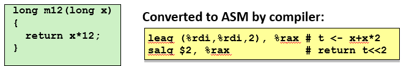

- 一元操作符中，操作数可以是寄存器也可以是内存地址。
- 二元操作符中，第一个操作数可以是立即数、寄存器或内存地址；第二个操作数可以是寄存器或内存地址。
- 移位操作中，第一个操作数可以是立即数或放在**寄存器`%cl`**中，第二个操作数可以是寄存器或内存位置。**注意：**如果我们对w位的数据进行移位，则只考虑`%cl`中 ![[公式]](https://www.zhihu.com/equation?tex=log_2w) 位，保证不会将数据移出边界。 比如`salb`只会考虑低3位的值，`salw`只会考虑低4位的值，以此类推。

**注意：**

- 以上操作除了右移以外，在无符号数和补码间都是通用的，也体现了补码的优势。
- 可以使用`xorl %edx, %edx`来对寄存器`%rdx`置零。

## 6 特殊计算操作

### 6.1 除法

在3-10中我们并没有看到除法操作，它是使用比较特殊的指令进行计算的，如下图所示


其中`R[%rdx]:R[%rax]`表示将两个寄存器的值拼接起来作为一个数，其中寄存器`%rdx`是高八字节，`%rax`是低八字节。它这里只有一个操作数表示除数，而被除数保存在`%rax`和`%rdx`中。

**有符号数除法：**

1. 将占用`%rax`和`%rdx`的数据`mov`到别的寄存器中
2. 将被除数中的64位`mov`到`%rax`中
3. 如果被除数是64位的，则要用`cqto`根据`%rax`中的最高有效位对`%rdx`进行符号扩展；如果被除数是128位的，就将剩下的64位`mov`到`%rdx`中
4. 使用`idiv`进行计算。

**无符号数除法：**

1. 将占用`%rax`和`%rdx`的数据`mov`到别的寄存器中
2. 将被除数中的64位`mov`到`%rax`中
3. 如果被除数是64位的，则使用`xorq %rdx, %rdx`将高64位置零；如果被除数是128位的，就将剩下的64位`mov`到`%rdx`中
4. 使用`div`进行计算。

### 6.2 128位乘法

我们知道，64位数乘上64位数会得到128位的数，x86-64提供了这种乘法的指令，如下图所示

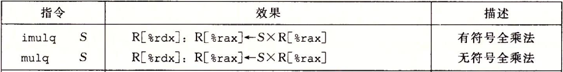

我们可以发现，指令`imul`和图3-10中的普通乘法指令是一样的，但是这个128位乘法只有一个操作数，普通乘法有两个操作数，汇编器会通过操作数的数目来判断是执行哪条指令。

1. 将占用`%rax`的数据`mov`到别的寄存器中
2. 将其中一个乘数`mov`到`%rax`中
3. 如果是有符号乘法，就使用`imul`，如果是无符号乘法，就是用`mul`
4. 对结果进行保存，比如保存在`(%rdi)`中：如果是在小端机器中，则为`movq %rax, (%rdi)`，`movq %rdx, 8(%rdi)`；如果是打断机器中，则为`movq %rax, 8(%rdi)`，`movq %rdx, (%rdi)`。


# [读书笔记]CSAPP：6[VB]机器级表示：控制


 

**视频地址：**

[【精校中英字幕】2015 CMU 15-213 CSAPP 深入理解计算机系统 课程视频_哔哩哔哩 (゜-゜)つロ 干杯~-bilibiliwww.bilibili.com/video/av31289365?p=6](https://link.zhihu.com/?target=https%3A//www.bilibili.com/video/av31289365%3Fp%3D6)

**课件地址：**

[http://www.cs.cmu.edu/afs/cs/academic/class/15213-f15/www/lectures/06-machine-control.pdfwww.cs.cmu.edu/afs/cs/academic/class/15213-f15/www/lectures/06-machine-control.pdf](https://link.zhihu.com/?target=http%3A//www.cs.cmu.edu/afs/cs/academic/class/15213-f15/www/lectures/06-machine-control.pdf)

对应于书本的3.6。

**如有错误请指出，谢谢。**

------

**小点：**

- 大多数情况下，机器对有符号数和无符号数都使用一样的指令，因为大多数算数运算对无符号数和补码都是相同的位级行为。但是在右移、除法和乘法指令以及条件码组合中，需要区分无符号数和补码。
- 保存在64位寄存器中的数据类型，除了`long`和`unsigned long`以外，还可以是指针（对于64位操作系统而言）。
- 条件跳转只能是直接跳转。
- 当`switch`的分支跨度很大，并且很稀疏时，会保存很大的跳转表，可能影响性能，编译器可能会将其构建成树的结构。此时建议使用`if-else`语句。
- 这一节比较重要的概念：条件jump、条件mov以及跳转表的思想，

------

之前介绍的只是指令一条条顺序执行的，也就是对应于直线代码的行为。当出现条件语句、循环语句等，就需要有条件地执行指令。机器代码通过测试数据值，然后根据测试的结果来改变控制流或者数据流。

## 1 条件码

除了之前介绍的保存整数和指针的16个64的寄存器以外，CPU还维护了一组单个位的**条件码（Condition Code）寄存器**，我们不会直接对条件码进行设置，而是根据最近的算数、逻辑或者测试的结果，自动设置这些条件码寄存器的值。

**条件码包括：**

- **ZF：**零标志，最近的操作得到的结果是否为0。

- **无符号数：**

- - **CF：**进位标志，最近的操作使得最高位产生进位。可用来检查无符号数是否存在溢出。

- **补码：**

- - **SF：**符号标志，最近的操作得到的结果为负数。
  - **OF：**溢出标志，最近的操作导致补码溢出（可以通过符号位进一步判断是正溢出还是负溢出）。

当我们执行如下操作时，不仅目的寄存器会发生改变，同时会设置这些条件码寄存器。

**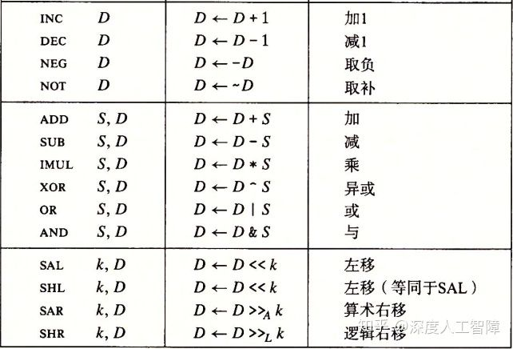**

**注意：**

- `lea`不会设置条件码，因为它只是单纯计算地址。
- 逻辑操作的CF和OF会设置为0。
- 移位操作CF为最后一个被移出的位，OF=0。
- INC和DEC会设置OF和ZF，不会改变CF。

x86-64提供了另外两类指令，**只会设置条件码而不会改变目的寄存器**：

- `CMP S1, S2`：用来比较`S1`和`S2`，根据`S2-S1`的结果来设置条件码。主要用来比较两个数的大小。
- `TEST S1, S2`：用来测试`S1`和`S2`，根据`S1 & S2`的结果来设置条件码。可以将一个操作数作为掩码，用来指示哪些位用来测试。比如`testq %rax, %rax`就可以检查`%rax`是正数、负数还是0。

**注意：**使用`CMP`进行比较时，要注意顺序是相反的。比如`CMP S1, S2`得到大于的结果，则表示`S2`大于`S1`。

我们可以执行这两个指令后，自己根据条件码的组合来比较或测试结果，但是这里提供了一类`SET`指令，能够自动根据条件码的组合来得到结果，如下图所示

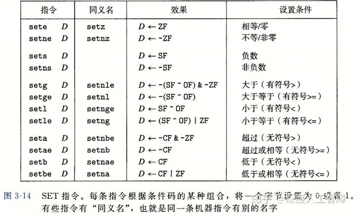

这里的目的操作数是**低位单字节寄存器**，或者一个字节的内存位置。如果要得到32位或64位结果，我们可以使用`MOVZ`对其进行传输。

**注意：**这里无符号数和补码的条件码组合不同，所以需要使用不同的`SET`指令，所以可以通过`SET`指令来判断所操作的数是无符号的还是补码的。

所以常见的**使用顺序**为：

1. 使用`CMP`进行比较或`TEST`进行测试，来设置条件码。
2. 根据条件码组合或者`SET`将结果保存在单字节寄存器中。
3. 使用`movbl`将结果保存在32位寄存器中，并且会自动设置高4字节为0。

## 2 跳转指令

之前介绍的都是顺序执行指令的代码，而**跳转（Jump）指令**能够改变指令执行的顺序，跳转到新的指令后继续顺序执行。而跳转指令我们可以分成**不同的类型：**

- **根据提供跳转目标的方式：**

- - **直接跳转：**跳转目标作为指令的一部分进行编码。汇编语言中，跳转目标通常用一个**标号（Label）**指明，比如下面汇编代码里的`.L1`就是标号。在产生目标代码时，汇编器以及链接器会确定跳转目标的适当编码，并将其编码为跳转指令的一部分。
  - **间接跳转：**跳转目标从寄存器或内存位置中读取出来。需要在前面添加一个`*`，比如`jmp *%rax`就是跳转到寄存器`%rax`中保存的地址；`jmp *(%rax)`就是跳转到内存地址`(%rax)`中保存的地址。

```text
  movq $0, %rax
  jmp .L1
  movq (%rax), %rdx
.L1:
  popq %rdx
```

- **根据跳转的条件：**

- - **无条件跳转：**没有任何条件，看到`jmp`就直接跳转。
  - **有条件跳转：**根据条件码组合来判断是否进行跳转。

常见的所有跳转指令如下图所示


**注意：**条件跳转只能是直接跳转。

对于直接跳转的跳转目标的编码，有**两种编码方式：**

- **PC相对的（PC-relative）：**跳转目标地址减去跳转指令下一条指令的地址的差。编码长度可以为1、2或4字节。
- **绝对地址：**用4字节直接给定目标地址。

对于如下代码，我们使用PC相对编码

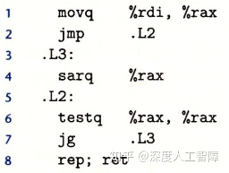

我们反汇编汇编器的结果和链接器的结果，如下图所示

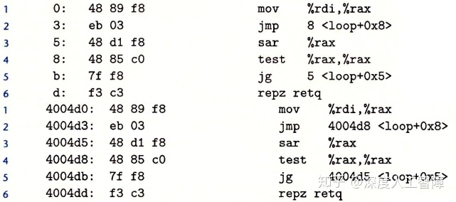

可以发现，无论是汇编器的反汇编结果，还是偏移到新的地址空间的链接器的反汇编结果，第二行的`jmp`的编码都是`eb 03`，其中`eb`是`jmp`的编码，而`03`就是计算出来的差值，而第5行的`jg`的编码都是`7f f8`，其中`7f`是`jg`的编码，而`f8`是计算出来的结果。所以即使偏移到新的地址空间，使用PC相对的编码方式也不用修改`jmp`的编码。

**通过看`jmp`的编码，就能知道跳转的地址的差值。**

通过跳转指令，就能实现条件执行和不同循环结构。

## 3 使用跳转指令实现条件执行和循环结构

### 3.1 用条件控制实现条件分支

实现条件操作的传统方法是通过使用控制的条件转移，当条件满足时，程序沿着一条执行路径执行，而当条件不满足时，就走另一条路径。对于条件分支

```c
if(x<y){
  proc1;
}else{
  proc2;
}
```

其中x保存在`%rdi`，y保存在`%rsi`，可以定义对应的汇编语言

```text
  cmpq %rsi, %rdi
  jge .L1
  PROC2
  ret
.L1:
  PROC1
  ret
```

### 3.2 用条件传送来实现条件分支

以上方法的性能并不是很优越。

处理器在执行一条指令时，会经历一系列过程，而每个过程执行所需操作的一小部分，通过重叠连续指令可以提高性能，比如当前指令执行计算时，下一条指令可以执行取指阶段，这个方法称为**流水线（Pipelining）**。但是当遇到条件需要跳转时，只有知道跳转结果才能确定指令顺序，才能使用流水线，现在处理器采用**分支预测**的方法来预测跳转的结果，即处理器会预测当前跳转的结果，然后将预测的指令进行流水线，如果预测正确则会提高性能，如果预测错误，就需要把之前流水线清空，然后在正确的分支重新开始流水线，会损失很多性能。

> **分支预测处罚计算：**预测错误概率为p，预测正确时代码执行时间为TOK，而预测错误的处罚为TMP。则执行代码的平均时间为TAVG(p)=(1-p)TOK+p(TOK+TMP)=TOK+pTMP，所以TMP=(TAVG(p)-TOK)/p。

上一节的用**条件控制**的方法就会存在这个问题，由于存在不确定的跳转，所以处理器会通过分支预测来将填满流水线，如果分支预测错误，就使得性能受损。

而用**条件传送**来实现条件分支，不会先判断跳转，而是先将两个分支的结果进行计算，将结果分别保存在两个寄存器中，然后再通过**条件传送指令`CMOV`**将正确结果传送到输出的寄存器中。

比如以下的计算x和y的差的绝对值的函数：

```text
long absdiff(long x, long y){
  if(x<y)
    return y-x;
  else:
    return x-y;
}
```

使用条件控制的方法实现的汇编代码为：

```text
absdiff:
  cmpq %rsi, %rdi //y-x
  jl .L1
  movq %rdi, %rax           //y>=x
  subq %rsi, %rax
  ret
.L1:
  movq %rsi, %rax
  subq %rdi, %rax
  ret
```

这里在第二行中会直接执行一个`cmp`，所以就存在不确定的分支，处理器为了能够流水线执行指令，就会先预测结果，如果预测错误，就会很损伤性能。

使用条件传送方法实现的汇编代码为：

```text
absdiff:
  movq %rsi, %rax
  subq %rdi, %rax  //y-x
  movq %rdi, %rdx
  subq %rsi, %rdx  //x-y
  cmpq %rsi, %rdi
  cmovge %rdx, %rax
  ret 
```

这里会直接将两个分支的计算结果`x-y`和`y-x`分别保存在寄存器`%rdx`和`%rax`中，然后最后通过`cmovge`判断如果`x>y`就将`x-y`的结果保存在`%rax`。这里就不需要进行分支预测，性能就十分稳定。

x86-64上提供了一些**条件传送指令`CMOV`**，只有在满足条件时，才会将源数据传送到目的中，如下图所示，其中源值可以从寄存器也可以从内存地址获取，而目的只能是寄存器。并且这里**不支持单字节**。

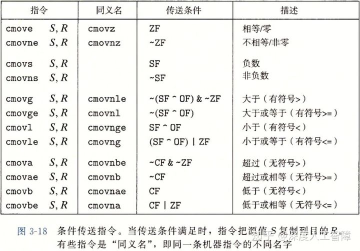

但是条件传送也实现的条件分支也存在**局限性**：

1. 如果条件判断是里面执行语句的可行性判断时，使用条件传送实现条件分支就会出现错误。比如对于指针`xp`，有个条件分支为`xp?*xp:0`，如果使用条件传送来实现，就会先运行`*xp`，如果该指针不存在，就会报错。
2. 如果执行语句需要大量计算时，由于条件传送会先全部计算后再进行选择，则会浪费一些时间。

所以只有当两个执行语句很简单时，才会使用条件传送来实现条件分支。

## 4 循环

循环也和之前相同的思路。

### 4.1 do-while

比如代码

```c
long fact_do(long n){
  long result = 1;
  do{
    result *= n;
    n = n-1;
  }while(n>1);
  return result;
}
```

对应的汇编代码为：

```text
fact_do:
  movl $1, %eax
.L1:
  imulq %rdi, %rax
  subq $1, %rdi
  cmpq $1, %rdi
  jg .L1
  rep; ret
```

可以发现，在跳转标号`.L1`之前是循环的初始化，跳转标号之后就是循环体，然后最后要判断是否继续循环体。

### 4.2 while

有两种实现while循环的方法，在实现初始测试的方法不同。

对于以下代码

```c
long fact_while(long n){
  long result = 1;
  while(n>1){
    result *= n;
    n = n-1;
  }
  return resul;
}
```

### 4.2.1 Jump-to-middle

类似于do-while的汇编代码，只是需要在开始就跳转到后面的判断语句

```text
fact_while:
  movl $1, %eax
  jmp .JUDGE
.L1:
  imulq %rdi, %rax
  subq $1, %rdi
.JUDGE:
  cmpq $1, %rdi
  jg .L1
  rep; ret
```

**特点：**一开始就有一个无条件跳转指令。

### 4.2.2 guarded-do

当使用较高优化等级时，比如`-O1`时，GCC会使用这种策略

```text
fact_while:
  cmpq $1, %rdi
  jle .L1
  movl $1, %eax
.L2:
  imulq %rdi, %rax
  subq $1, %rdi
  cmpq $1, %rdi
  jne .L2
  rep; ret
.L1:
  movl $1, %eax
  ret 
```

这里是直接进行判断。这个之所以更加高效，是因为一开始进入循环时，通常不会不满足循环条件，即一开始不会跳转到后面，所以会直接顺序一直执行循环体。

### 4.3 for

for循环可以转化为while循环，然后根据优化等级，GCC会为其产生的代码是while循环的两种方法之一。比如对于代码

```c
long fact_for(long n){
  long i;
  long result = 1;
  for(i=2; i<=n; i++){
    result *= i;
  }
  return result;
}
```

可以将其转化为while语句

```c
long fact_for_while(long n){
  long i=2;
  long result = 1;
  while(i<=n){
    result *= i;
    i += 1;
  }
  return result;
}
```

由此就能使用4.2中介绍的两种方法进行翻译了。

### 4.4 switch

`switch`语句可以根据一个整数索引数值进行多重分支。通常使用**跳转表（Jump Table）**数据结构使得实现更加高效，它是一个数组，每个元素是对应的代码块起始地址，根据整数索引得到对应的代码地址后，就可以直接跳转到对应的代码块。相比很长的`if-else`语句的**优势在于**：执行`switch`语句的时间与分支数目无关。比如有很长的分支语句，如果用`if-else`实现，则可能需要经过若干个`if-else`才能跳转到目的代码块，而使用`switch`能根据跳转表直接获得代码块地址。


如下图所示的C语言代码


我们首先看GCC提供对跳转表支持后的C语言代码

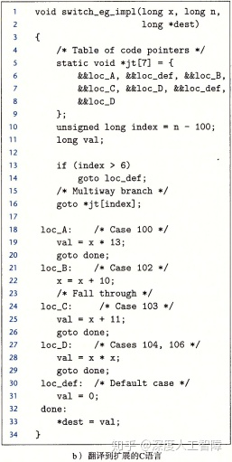

里面有一个跳转表数组`jt`，GCC提供了一个新的运算`&&`，能够创建一个指向代码位置的指针。首先在第9行中，计算输入值`x`和`switch`的最小值的差，并将其保存到无符号数中。然后将其作为跳转表的索引，直接在第16行中跳转到索引的代码位置。

**注意：**这里使用无符号数的原因在于，即使你输入比`switch`中最小值还小的值，则相减会得到负数，由于无符号数会将负数溢出到很大的正数，所以还是会跳转到`default`。所以汇编代码会使用`ja`对其使用无符号数的判断，判断是小于0还是大于最大值。

**注意：**跳转表中会创建从最小值到最大值的代码位置，对于重复的情况，比如`104`和`106`，就会跳转到相同的代码位置；对于缺失的情况，比如`101`和`105`，就会直接跳转到`default`。

我们可以看一下对应的汇编代码

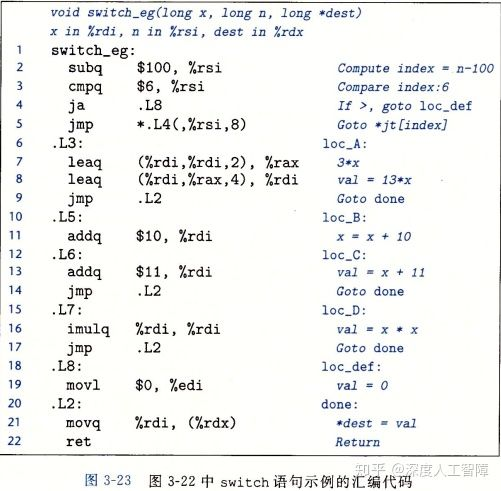

**注意：**通过第2行可以知道`switch`的最小值，第3行可以知道`switch`的最大值，第4行可以知道`default`的标号。

这里首先将计算结果保存在`%rsi`中，然后在第4行中`jmp *.L4(, %rsi, 8)`利用了跳转表，跳转表的内容由编译器自动生成填写，其声明如下所示


`.rodata`表示这是只读数据（Read-Only Data），`.align 8`表示将元素地址与8对其，`.L4`就定义了一个跳转表，其枚举了从最小值到最大值的跳转目标。对于`*.L4(, %rsi, 8)`，首先根据`.L4`可以获得该跳转表的初始位置，然后因为该跳转表每个元素占8个字节，所以计算`(, %rsi, 8)`，即`8*%rsi`，就能得到对应的跳转目标。

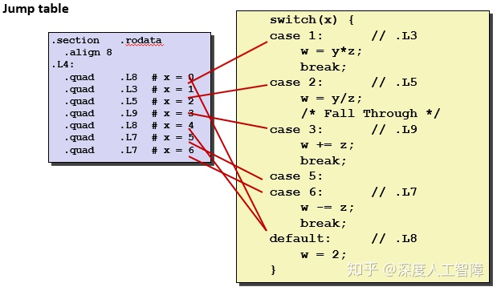

由于以上跳转表的性质，所以当出现跨度很大，并且很稀疏的分支情况时，建议使用`if-else`。


# [读书笔记]CSAPP：7[VB]机器级表示：函数


 

**视频地址：**

[【精校中英字幕】2015 CMU 15-213 CSAPP 深入理解计算机系统 课程视频_哔哩哔哩 (゜-゜)つロ 干杯~-bilibiliwww.bilibili.com/video/av31289365?p=7](https://link.zhihu.com/?target=https%3A//www.bilibili.com/video/av31289365%3Fp%3D7)

**课件地址：**

[http://www.cs.cmu.edu/afs/cs/academic/class/15213-f15/www/lectures/07-machine-procedures.pdfwww.cs.cmu.edu/afs/cs/academic/class/15213-f15/www/lectures/07-machine-procedures.pdf](https://link.zhihu.com/?target=http%3A//www.cs.cmu.edu/afs/cs/academic/class/15213-f15/www/lectures/07-machine-procedures.pdf)

对应于书本的3.7。

**如有错误请指出，谢谢。**

------

**小点：**

- C中的取地址符`&`返回的是内存地址，所以一定要保存在内存中。
- 保存到内存中进行参数传输时，要求每个参数大小为8字节的倍数，即要求相对`%rsp`的偏移量为8的倍数
- 不会显示地操作程序计数器寄存器`%rip`，没有指令可以对其操作，只能通过类似`call`或`ret`间接对其操作。
- 栈顶指针`%rsp`是随着函数运行不断变化的。
- 函数可以假设“被调用者保存寄存器”的值是不变的，而可以用“调用者保存寄存器”来保存临时值。
- 某个函数要永久使用的值，要么保存在“被调用者保存寄存器”中，要么保存在内存中。
- 当函数需要使用“被调用者保存寄存器”时，就直接将其`push`到栈中，使用过后再`pop`重置。
- 无论是“被保存的寄存器”还是“局部变量”以及“参数构造区”，一开始如何申请这些区域，后面使用完后还会逆向地通过`%rsp`将这些区域释放掉，这是动态的过程，使得一个函数运行完时，`%rsp`指向的就是返回地址，就能直接通过`ret`返回到调用者的断点处。


- 进入一个函数时，首先将要使用的“被调用者保存寄存器”`push`到栈中，然后**通过`%rsp`来申请一段固定大小的空间**，用来存放局部变量和参数构造区，最后再释放申请的空间。

------

要提供对函数的机器级支持，必须处理许多不同的属性。我们假设函数P调用函数Q，Q执行后返回P。这个过程包括以下一个或多个**机制：**

- **传递控制：**在进入函数Q的时候，程序计数器要设置为Q的代码的起始位置。从函数Q返回时，要把程序计数器设置为P中调用Q后面那条指令的地址，即从P中的断点处继续执行。
- **传递数据：**函数P必须能够向函数Q传递一个或多个参数，而函数Q必须能够向函数P返回一个值。
- **分配和释放内存：**开始时，函数Q可能需要为局部变量分配空间，而在返回前，又要释放这些存储空间。

要想详细了解这些机制，我们首先要知道在内存中是如何保存函数的。

## 1 运行时栈

C语言的函数调用机制一个**关键特性**在于使用了栈的内存管理原则。通过栈的先进后出的性质，能够在内存中保证函数调用并返回的顺序。这里首先需要知道一个概念——**栈帧**。

**栈帧：**当函数需要的存储空间超出寄存器能够存放的大小，或者调用别的函数需要保存额外数据时，就会在栈上分配一个空间，这个空间称为函数的**栈帧（Stack Frame）**。相对的，当某个函数的所有局部变量都能保存在寄存器中，并且不会调用任何的函数时，就无需开辟该函数的栈帧了。当给一个函数创建栈帧时，编译器会给函数分配**所需**的**定长**的栈帧，在函数开始时就分配好后就不会改变了，所以栈顶指针`%rsp`就知道当函数返回时，需要释放多少空间。而有些函数需要变长的栈帧，这部分内容可参考[深度人工智障：[读书笔记\]CSAPP：10[VB]机器级表示：进阶](https://zhuanlan.zhihu.com/p/105428280)。

**注意：**栈顶的栈帧对应了正在运行的函数。

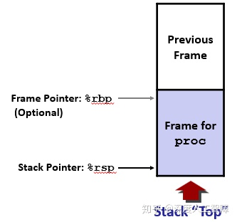

所以每个函数的栈帧就作为栈的基本元素，来起到函数调用时先进后出的效果，会在栈中保存之前所有还未返回的函数的栈帧，将之前的函数先挂起。这里提供了`PUSH`和`POP`指令对栈进行操作，也可以直接对栈顶指针`%rsp`进行操作。

**注意：**因为未返回的函数都会在内存中保存自己的栈帧，而栈的空间是有限的，所以当调用过多时，会造成栈的溢出。

我们先简单介绍下函数调用时，可能会做的一些操作：

- **当函数P调用函数Q运行时：**

- - 由于x86-64只提供6个寄存器来传递函数输入值，所以当函数P传递给函数Q的参数多于6个时，需要函数P在自己的栈帧中存储好这些输入参数。
  - 会先将返回地址压入栈中，表明当函数Q返回时，要从函数P中的哪个位置继续执行，这个作为P的栈帧的一部分。

- **函数Q运行时：**函数Q会扩展当前栈的边界，分配函数Q的栈帧所需的空间，可以用来保存寄存器的值、分配局部变量空间，为函数Q调用其他函数设置参数。

- **函数Q返回时：**释放分配给函数Q的栈帧，并且让程序计数器调用返回地址，继续从函数P的断点处继续执行。


为了能够完成以上过程，就需要上面介绍的3中机制相互配合，接下来会介绍每个函数在栈帧上的各个组成部分，依次为：被保存的寄存器-->局部变量-->参数构造区-->返回地址。

## 2 栈帧的组成部分

### 2.1 被保存的寄存器

寄存器是所有函数共享的资源，当函数P调用Q时，如果函数Q改变了函数P保存在寄存器的值，则当函数Q返回时，函数P就无法完全从断点继续执行，因为寄存器中的值已经被函数Q改变了。

我们对除了栈指针`%rsp`外的所有寄存器分成两类：

- **被调用者保存寄存器：**`%rbx`、`%rbp`和`%r12`~`%r15`。这部分寄存是由被调用者，即Q保存的。如果Q改变了这部分寄存器的值，就需要将其保存在Q自己栈帧中的**“被保存的寄存器”**中。当Q返回时，再将这部分寄存器的值根据内存复原。所以函数P可以假设“被调用者保存寄存器”的值是始终不变的。
- **调用者保存寄存器：**除了上面的寄存器外，都属于被调用者保存寄存器。 任何函数都能修改这些寄存器的值，并且不会保存在“被保存的寄存器”中，所以P要自己将这部分寄存的内容保存起来。所以函数P可以假设“调用者保存寄存器”的值是变化的，需要自己保存，可以用这部分寄存器保存临时值。

**注意：**当函数P调用函数Q时，“被调用者保存寄存器”就会保存在函数Q的栈帧中，所以当函数Q返回时，这部分寄存器会被重置为函数P使用时的状态。而**其他寄存器的值是需要函数P自己保存的，所以函数P需要自己开辟局部变量区域来保存其他寄存器的值**。

**步骤：**

```text
//1.函数一进来，就需要通过push指令将自己要使用的“被调用者保存寄存器”保存在自己的栈帧中
//比如使用了%rbx和%rbp
  pushq %rbx    //保存%rbx到栈帧中
  pushq %rbp    //保存%rbp到栈帧中
... //可以使用“被调用者保存寄存器”来保存值
//2.当“被调用者保存寄存器”不够保存当前函数的值时，需要开辟局部变量空间保存其他值
//比如保存8字节值
  subq $8, %rsp //将栈指针下移8个字节
  movq %rdi, (%rsp)  //将需要保存的值保存到栈上
//3.调用别的函数
  call func //调用函数func，则“被调用者保存寄存器”会保存在函数func的栈帧中
... //可以继续使用“被调用者保存寄存器”，因为函数func返回时会重置这些寄存器到原始值
//4.释放局部变量空间
  addq $8, %rsp
//5.重置“被调用者保存寄存器”的值，注意顺序要相反
  popq %rbp
  popq %rbx
```

**综上所述：**

1. 将要使用的“被调用者保存寄存器”`push`到栈中。（存储调用当前函数的函数的值）
2. 将除了“被调用者保存寄存器”的其他寄存器保存在空闲的“被调用者保存寄存器”中，如果保存不下，就将其保存在内存的“局部变量”区域
3. 调用其他函数
4. 释放 “局部变量”区域
5. 将“被调用者保存寄存器”的值通过`pop`从栈中恢复。注意：顺序要和`push`时相反

**注意：**如果“被调用者保存寄存器”还没有使用完毕时，可以在调用别的函数之前将其他寄存器的值保存到“被调用者保存寄存器”中。

### 2.2 局部变量

当函数需要保存的数据不多时，就会将数据保存在“被调用者保存寄存器”中。但是以下情况必须**保存在内存中**，该部分称为该函数的**局部变量：**

- “被调用者保存寄存器”不足以保存所有的本地数据
- 当一个局部变量使用取地址符&时，指的是返回该变量在内存中的地址，就必须将其保存在内存中
- 当局部变量是数组或结构时

以以下函数为例

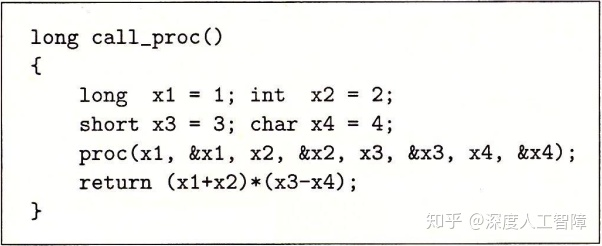

```text
call_proc:
  //1. 因为x1、x2、x3和x4都有取地址符，所以都是保存在内存中的，首先要通过%rsp分配存储空间
  subq $32, %rsp       //将栈顶指针%rsp下移32，扩展了32字节空间
  //2. 将数据保存在内存中
  movq $1, 24(%rsp)    //因为x1为long，所以需要8字节空间，所以将1保存在24(%rsp)处
  movl $2, 20(%rsp)    //因为x2为int，所以需要4字节空间
  movw $3, 18(%rsp)    //因为x3为short，所以需要2字节空间
  movb $4, 17(%rsp)    //因为x4为char，所以需要1字节空间
  //3. 依次根据proc传入参数的顺序保存在内存和寄存器中
  //因为总共要传入8个参数，超过了6个参数，所以要将最后的x4和&x4保存在内存中，这里要求和8字节对齐
  leaq 17(%rsp), %rax  //获取&x4，因为不能直接在内存间mov，所以需要先保存到寄存器%rax
  movq %rax, 8(%rsp)   //参数8：将&x4保存在内存8(%rsp)中，这里要求是8的倍数
  movl $4, (%rsp)      //参数7：将x4保存在内存(%rsp)中
  leaq 18(%rsp), %r9   //参数6：将&x3保存在%r9中
  movl $3, %r8d        //参数5：将x3保存在%r8中
  leaq 20(%rsp), %rcx  //参数4：将&x2保存在%rcx中
  movl $2, %edx        //参数3：将x2保存在%rdx中
  leaq 24(%rsp), %rsi  //参数2：将&x1保存在%rsi中
  movl $1, %edi        //参数1：将x1保存在%rdi中
  //4. 调用函数
  call proc
  //5. 根据%rsp将保存在内存中的数据进行计算
...
  //6. 删除空间
  addq $32, %rsp
```

可以将其总结为以下几步：

1. 申请局部空间，通过对栈顶指针`%rsp`减掉一个值
2. 根据数据大小，通过`%rsp`索引将数据保存在内存空间中
3. 根据传入参数顺序，将其保存到内存和寄存器中。**注意：**参数大小要为8字节的倍数。
4. 释放局部空间，通过对栈顶指针`%rsp` 加上`1.`中的值

### 2.3 参数构造区

**主要任务：**函数P必须能够向函数Q传递一个或多个参数，而函数Q必须能够向函数P返回一个值。

在函数间传递数据，主要**通过寄存器**进行，x86-64提供了6个用于传递**参数**的寄存器，根据参数的顺序，需要放入特定的寄存器中。x86-64将寄存器`%rax`作为函数**返回值**的寄存器。

**注意：**这些寄存器只能用来保存整数或指针类型。


如果某个函数要传递超过6个参数的话，就需要将第7个到第n个参数保存在**栈**中，然后通过**栈顶指针`%rsp`**进行索引其中第7个参数在栈顶位置。要求每个参数的大小要为8字节的倍数。这部分区域称为**参数构造区**。保存在寄存器中的参数访问起来比保存在内存中快很多。


由于栈顶还要保存一个8字节的返回地址，所以第7个参数的地址为`8(%rsp)`，如果第7个元素大小不超过8字节，则第8个元素的地址为`16(%rsp)`，以此类推。

### 2.4 返回地址

**主要任务：**在进入函数Q的时候，程序计数器要设置为Q的代码的起始位置。从函数Q返回时，要把程序计数器设置为P中调用Q后面那条指令的地址，即从P中的断点处继续执行。

x86-64提供了一组指令来完成上述操作

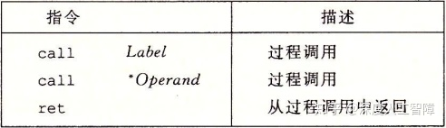

- `call`：可以直接将函数名作为跳转目标，其编码的计算方式和`jmp`相同。相当于`push`和设置`%rip`的组合。

- - 将栈指针减8，留出保存返回地址的空间
  - 将紧跟`call`指令后面那条指令的地址作为返回地址，保存到栈中。
  - 将程序计数器设置为调用函数的地址。

- `ret`：从当前函数返回，不需要操作数。相当于设置`%rip`和`pop`的组合。

- - 将程序计数器设置为栈顶元素。
  - 将栈指针加8。

**注意：**在64位操作系统中，返回地址是64位8字节的。

以以下汇编代码为例

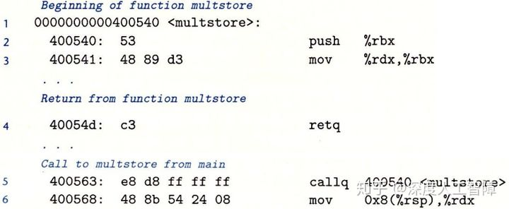

从第5行的`main`函数开始，调用了`multstore`函数。

1. 当前程序计数器为`400563`，`callq 400540`会先将下一行的地址`400568`压入栈中，并将程序计数器设置为`400540`；
2. 执行完`multstore`函数后，运行第4行的`retq`时，会将程序计数器设置为栈顶元素，并将栈顶元素出栈。

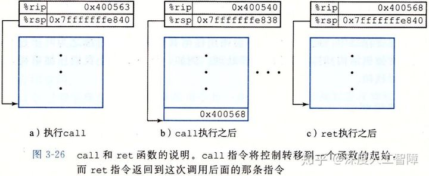

我们这里可以计算一下为什么第5行的编码是`e8 d8 ff ff ff`。首先，这个`e8`是`call`指令的编码，而`call`的目标地址为`400540`，该下一行的地址为`400568`，则计算目标地址和下一行地址的差，得到`400540-400568=ffffffd8`就是对应的编码，而这里是小端机，所以需要对字节进行翻转，就得到`d8ffffff`。


**综上所述：**

1. （被保存的寄存器）函数P将要使用的“被调用者保存寄存器”通过`push`保存在函数的栈帧中。
2. （局部变量）如果函数P使用了“调用者保存寄存器”，就需要将其保存在栈中，才能调用函数Q。并且函数P根据需要申请空间来保存其他局部变量。
3. （参数构造区）函数P将参数保存在寄存器中，如果超过6个参数，就申请空间保存到内存中。
4. （返回地址）函数P使用`call`指令调用函数Q，会将`call`的下一行指令的地址压入栈中，并将程序计数器指向函数Q的第一条指令的地址。
5. 当函数Q运行时会随着使用动态申请和释放局部变量，当函数Q运行完时，首先使用栈“被调用者保存寄存器”的值，然后使用`ret`指令返回将程序计数器设置为栈顶的返回地址，最后将栈顶的返回地址弹出。

我们可以发现有趣的一点是，无论是“被保存的寄存器”还是“局部变量”以及“参数构造区”，一开始如何申请这些区域，后面使用完后还会逆向地通过`%rsp`将这些区域释放掉，这是动态的过程，使得一个函数运行完时，`%rsp`指向的就是返回地址，就能直接通过`ret`返回到调用者的断点处。


# [读书笔记]CSAPP：8[VB]机器级表示：数据


 

**视频地址：**

[【精校中英字幕】2015 CMU 15-213 CSAPP 深入理解计算机系统 课程视频_哔哩哔哩 (゜-゜)つロ 干杯~-bilibiliwww.bilibili.com/video/av31289365?p=8](https://link.zhihu.com/?target=https%3A//www.bilibili.com/video/av31289365%3Fp%3D8)

**课件地址：**

[http://www.cs.cmu.edu/afs/cs/academic/class/15213-f15/www/lectures/08-machine-data.pdfwww.cs.cmu.edu/afs/cs/academic/class/15213-f15/www/lectures/08-machine-data.pdf](https://link.zhihu.com/?target=http%3A//www.cs.cmu.edu/afs/cs/academic/class/15213-f15/www/lectures/08-machine-data.pdf)

对应于课本3.8、3.9。

**如有错误请指出，谢谢。**

------

**小点：**

- 当你声明了一个数组，你既为它分配了空间，并且创建了一个允许进行指针运算的数组名称。而当你声明一个指针时，你所分配的只有指针本身的空间。
- 当程序要用一个常数作为数维度或者缓冲区大小时，最好通过`#define`声明将这个常数与一个名字联系起来，后面就一直使用这个名字代替常数的数值。
- 在`struct`和`union`中的对象，都是保存在内存中的。
- 定义结构体时，按照对象K值的大小，**从大到小声明**，可以减少填充的空间，节省整个结构体的大小。

------

## 1 数组

对于数据类型`T`和整形常量`N`，声明一个数组变量`A`：

```c
T A[N];
```

主要经历**两个步骤：**

1. 根据数据类型`T`的大小`L`字节，先在内存空间中分配一个大小为`L*N`的连续空间；
2. 将`A`作为这个连续内存空间的起始指针，即A的值`xA`就是该内存空间的起始地址。

**注意：**当你声明了一个数组，你既为它分配了空间，并且创建了一个允许进行指针运算的数组名称。而当你声明一个指针时，你所分配的只有指针本身的空间，所以如果没有初始化指针，直接对其进行解引用可能会出现错误。

我们首先看下**数组和指针的区别：**

```text
int A1[3];
int *A2;
int *A3[3];
int (*A4)[3];
```

- `sizeof(A1)`为12，返回的是数组内保存的全部元素大小； `sizeof(*A1)`为4，返回的是第一个元素的大小，即`int`的大小。而`sizeof(A2)`为8，返回的只是指针的大小；`sizeof(*A2)`为4，返回的也是`int`的大小。
- 如果没有对`A2`进行初始化，直接调用`*A2`可能会报错，因为它没有指向合理的对象。而`*A1`不可能出错，因为创建数组时，已经为他分配好了空间。
- `A3`声明了大小为3的数组，每个元素的类型为`int *`，所以`sizeof(A3)`为24，因为数组内有3个元素，每个元素都是指针，大小为8。而`sizeof(*A3)`为8，因为`A3`的第一个元素是一个指针，大小就为8。而`sizeof(**A3)`为4，它表示的是数组中第一个指针指向的`int`，所以是4。因为`A3`首先声明的是一个数组，所以它会自动分配好数组的空间，所以`*A3`不会是空指针，但是它里面保存的是指针，所以`**A3`可能会是空指针。
- `A4`定义了一个指向大小为3的`int`数组的指针。所以`sizeof(A4)`为8，只是一个单纯的指针的大小；`sizeof(*A4)`为12，它表示`A4`指向的数组的大小。而`sizeof(**A4)`为4，它表示`A4`指向的数组的第一个元素。 因为这里只是单纯声明了一个指针，所以`*A4`和`**A4`都可能是空指针。

如果我们将该数组的起始地址`xA`和索引值`i`保存在寄存器中，就能通过“比例变址寻址”的方式获得对应内存地址的数据。比如我们将起始地址保存在寄存器`%rdx`，将索引值保存在寄存器`%rcx`中，假设数据类型为`int`4字节，则访问该位置的汇编代码为

```text
movl (%rdx, %rcx, 4), %eax
```

**注意：**无论C语言中是在数组中获取数据，比如`A[func(i)]`，还是获得某个元素的地址，比如`A+func(i)`，只有将偏移量`func(i)`乘上对应的数据大小`L`，才是其在内存地址中的偏移量。

**例：**

假设整型数据`E`的起始地址`xE`和整数索引`i`分别保存在寄存器`%rdx`和`%rcx`中，则计算下面的值及其汇编代码。

1. `E+i-1`： 索引的偏移量`i-1`乘上`int`的大小4字节，得到在内存空间中的地址偏移量`4i-4`，则其表示的是`xE+4i-4`，汇编代码为`leaq -4(%rdx, %rcx, 4), %rax`。
2. `*(E+2i+3)`：索引的偏移量`2i+3`乘上`int`的大小4字节，得到在内存空间中的地址偏移量`8i+12`，则其表示的是`M[xE+8i+12]`，汇编代码为`movl 12(%rdx, %rcx, 8), %eax`。

**综上：**假设数据大小为`L`，起始地址`x`保存在`%rdx`，索引`i`保存在`%rcx`中，索引偏移量通过`func(i)`计算得到，则：

1. 通过索引偏移量`func(i)`计算内存地址的偏移量`L*func(i)=Ai+B`
2. 获取内存地址的汇编代码为`lea_ B(%rdx, %rcx, A), %_`。获得数据的汇编代码为`mov_ B(%rdx, %rcx, A), %_`。

**注意：**指令`lea_`和`mov_`，以及保存的寄存器`%_`需要根据`L`的大小进行选择。

我们同样可以声明嵌套的数组

```c
T D[R][C]
```

其中，`R`是行数，`C`是列数。

在内存中，这种二维数组是按照“行优先”的形式保存在内存中的，即先按顺序保存`D[0]`的`C`个元素，然后再紧接着保存`D[1]`的`C`个元素，以此类推。


所以当该数组的起始地址为`x`，`T`的大小为`L`时，`D[i][j]`的地址为`x+L(Ci+j)`。类似一元数组，我们也可以很容易地通过“比例变址寻址”的方式进行索引。


我们要注意**区分以下代码：**

- **普通的二维矩阵**

```c
#define ZLEN 5
typedef int zip_dig[ZLEN];
zip_dig pgh[PCOUNT] = 
  {{1, 5, 2, 0, 6},
   {1, 5, 2, 1, 3 },
   {1, 5, 2, 1, 7 },
   {1, 5, 2, 2, 1 }};
```

其在内存中的存储是按照行优先的形式存储的，所以获得某个索引的值的C代码为

```c
int get_pgh_digit(int index, int dig){
  return pgh[index][dig];
}
```

对应的汇编代码为

```text
# index in %rdi, dig in %rsi
get_pgh_digit:
  leaq (%rdi, %rdi, 4), %rax    #5*index
  addl %rax, %rsi               #5*index+dig
  movl pgh(,%rsi, 4), %eax      #Mem[pgh+20*index+4*digit]
  ret
```

- **特殊的矩阵**

```c
#define UCOUNT 3
zip_dig cmu = { 1, 5, 2, 1, 3 };
zip_dig mit = { 0, 2, 1, 3, 9 };
zip_dig ucb = { 9, 4, 7, 2, 0 };

int *univ[UCOUNT] = {mit, cmu, ucb};
```

`univ`声明了3个指向数组的指针，存储形式为

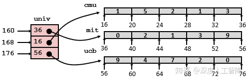

则获取索引下的数据的C代码为

```c
int get_univ_digit(size_t index, size_t dight){
  return univ[index][digit];
}
```

对应的汇编代码为

```text
#index in %rdi, digit in %rsi
get_univ_digit:
  salq $3, %rsi  #8*index
  movq univ(%rsi), %rax #获得指针
  movl (%rax, %rsi, 4), %eax  #Mem[Mem[univ+8*index]+4*digit]
  ret
```

这里有两次内存引用过程。

### 1.1 定长数组

当我们使用`#define`定义一个变量`N`为常量后，再用`N`来确定数组大小，则该数组是一个定长数组，这里展示一个`-O1`时GCC采用的优化。

对于以下代码：


我们首先看它经过优化后的C代码


可以发现这里省略了变量`j`，并且将所有数组引用都转换成了指针间的引用，避免了索引`A[i][j]`要计算乘法`A+L(Ci+j)`的巨大损耗。

对应的汇编代码为


### 1.2 变长数组

过去C要求数组的大小要在编译时就确定，才能生成对应的汇编代码。如果需要变长数组，就需要程序员自己对数组分配存储空间。ISO-C99允许数组的维度为表达式，在数组被分配时才计算出来，例如

```c
int A[exp1][exp2];
```

只要求`exp1`和`exp2`定义在上面那个声明之前。

我们接下来对比下定长数组和变长数组在索引时汇编代码的区别

- 定长数组

```c
typedef int fix_matrix[5][3];
int fix_ele(fix_matrix A, long i, long j){
  return A[i][j];
}
```

对应的汇编代码为

```text
fix_ele:
  leaq (%rsi, %rsi, 2), %rax    #compute 3i
  leaq (%rdi, %rax, 4), %rax    #compute A+12i
  movl (%rax, %rdx, 4), %eax    #read fomr M[A+12i+4j]
  ret
```

- 变长数组

```c
int var_ele(int n, int A[n][n], long i, long j){
  return A[i][j];
}
```

对应的汇编代码为

```text
var_ele:
  imulq %rdx, %rdi             #compute ni
  leaq  (%rsi, %rdi, 4), %rax  #compute A+4ni
  movl  (%rax, %rcx, 4), %eax  #read from M[A+4ni+4j]
  ret
```

看汇编代码可以发现以下区别：

- 增加了参数n，使得寄存器的使用改变了，
- 用了乘法指令来计算`ni`，而不是用`leaq`来计算`3i`，乘法会导致无法避免的性能损失

## 2 异质的数据结构

C提供了两种能将不同类型的对象组合到一起的数据结构。

### 2.1 结构

C语言中，可以用`struct`声明创建一个**数据类型**，具有以下特点：

- **定义：**可以将不同类型的对象聚合到一个对象中，并使用名字来引用结构中的各个组成部分。
- **存储：**结构的所有组成部分都存放在内存中一段**连续的**区域内，指向结构的**指针**是结构第一字节的地址。
- **获得元素：**编译器会维护关于每个结构类型的信息，了解每个字段的偏移量，由此作为内存引用指令的唯一，来对结构元素进行引用。

比如我们定义以下结构

```c
struct rec{
  int i;
  int j;
  int a[2];
  int *p;
};
```

由此就将4个对象包装到了结构类型`rec`中了，这些对象大小依次为4、4、8和8字节，它的存储是按顺序连续地排列在内存空间中的


则指针`struct rec*`指向的就是第一个字节的位置。我们可以通过不同大小的偏移量访问不同的对象，假设我们定义对象`struct rec* r`，并且`r`放在寄存器`rdi`中，则：

- `*(r).i`：`movl (%rdi), %eax`。
- `*(r).j`：`movl 4(%rdi), %eax` 。
- `*(r).a[i]`：如果索引`i`保存在寄存器`%rcx`中，则为`movl 8(%rdi, %rcx, 4), %eax` 。

**注意：**要根据对象大小选择合适的指令大小。

所以结构的各个字段的选取完全是在编译时处理的，机器代码不包含关于字段申明或字段名字的信息。

我们同样可以声明嵌套的结构体

```c
struct prob{
  int *p;
  struct {
    int x;
    int y;
  }s;
  struct prob *next;
};
```

其在内存中的分布为


### 数据对齐

在真实的内存中存放`struct`时，并不一定是像上面介绍的那种紧凑的排列方式。由于硬件问题，目前大多数机器一次从内存中取出64字节的数据，如果因为没有一个对齐的地址，一个特定数据跨越了两个块之间的边界，则会让硬件甚至操作系统采取额外的步骤来处理，所以数据对齐会提高效率。在x86-64上，即使数据不对齐，也不会影响任何功能，但是有些机器如果访问未对其的数据，可能会造成内存错误。

**对齐原则**是任何K字节的基本对象的地址必须是K的倍数


为此，在`struct`中两个连续的对象，编译器可能中间会插入间隙，来满足各自对内存地址的要求。并且还有**两个额外的要求：**

- 要求结构的初始地址一定是结构体中最大对象大小的倍数，使得偏移量加上初始地址才是真的满足倍数关系的。
- 在结构体末尾填充，使其是结构体中最大对象大小的倍数，使得结构数组中下一个元素的地址也是成倍数关系的。

我们给出几个例子，并依次判断每个对象的偏移量

- `struct P1{int i; char c; int j; char d; };`

`i`偏移量为0，是4的倍数，满足；`c`偏移量为4，是1的倍数，满足；`j`偏移量为5，不是4的倍数，需要填充3个字节，使得偏移量为8，才是4的倍数；`d`偏移量为12，是1的倍数，满足，总共大小为13字节，而最大对象是`int`4字节，所以需要填充3字节，使其为4的倍数，所以该结构体为16字节。

- `struct P2{int i; char c; char d; long j; };`

`i`的偏移量为0，是4的倍数，满足；`c`的偏移量为4，是1的倍数，满足；`d`的偏移量为5，是1的倍数，满足；`j`的偏移量为6，不是8的倍数，需要补充2个字节，使其偏移量为8。总共大小为16字节，是最大对象`long`的倍数，所以不用填充。

- `struct P3{short w[3]; char c[3]; };`

数组`w`的偏移量为0，然后依次排列3个大小为2字节的数据，能够保证每个偏移量都是2的倍数，满足；数组`c`的第一个元素的偏移量为6，是1的倍数，而后依次排列3个大小为1字节的数据。总共大小为9字节，不是结构中最大对象`short`的倍数，所以还要填充1个字节，所以该结构大小为10字节。

- `struct P4{short w[5]; char *c[3]; };`

数组`w`的偏移量为0，然后依次排列5个大小为2字节的数据，能够保证每个偏移量都是2的倍数，满足；数组`c`的第一个元素偏移量为10，不是8的倍数，所以要填充6个字节，使其偏移量为16，是8的倍数，然后就能依次排列3个大小为8字节的数据了。总共大小为40字节，是2的倍数，所以对齐了。

- `struct P5{struct P3 a[2]; struct P2 t; };`

我们从上面可以知道要保存两个`struct P3`，一共需要20个字节，并且保证初始地址是2的倍数。而`struct P2`要求初始地址是8的倍数，但是第一个对象`i`的偏移量是20，不是8的倍数，所以要填充4个字节，使得`i`的偏移量为24，是4的倍数，然后直接把`struct P2`的所有对象按上面的方式填充进去。总共大小是40字节，是8的倍数，所以对齐了。


**综上：**

我们可以画图把一个个对象依次填充进去，并且要求它的偏移量是满足K的倍数。然后考虑要在末尾填充多少字节能够使得总共大小是最大对象大小的倍数。最终最大对象的大小就是对初始地址的对齐要求。

**注意：**我们这里只对最简单的数据类型进行对齐，不包括聚合数据类型。

对于结构体

```c
struct{
  char *a;
  short b;
  double c;
  char d;
  float e;
  char f;
  long g;
  int h;
} rec;
```

`a`偏移量为0；`b`偏移量为8；`c`偏移量为10，不是8的倍数，填充6的字节，使得偏移量为16；`d`偏移量为24；`e`偏移量为25，不是4的倍数，填充3个字节，使得偏移量为28；`f`的偏移量为32；`g`的偏移量为33，不是8的倍数，填充7个字节，使得偏移量为40；`h`的偏移量为48，最后的地址为52，不是第一个元素`a`要求的8的倍数，所以还要在末尾填充4个字节， 所以最终大小为56个字节。

我们可以改变声明的顺序，按照从大到小的形式进行声明，可以减少填充的字节数目，节省该结构的空间大小

```c
struct {
  char *a;
  double c;
  long g;
  float e;
  int h;
  short b;
  char d;
  char f;
} rec;
```

这样依次排列下来，只要40个字节，节省了28.5%的存储空间。

### 2.2 联合

C语言中，可以用`union`声明创建一个**数据类型**，具有以下特点：

- **定义：**允许以多种类型来引用一个对象。
- **存储：**保存在**公共的**一块内存中，通过不同对象的类型来赋予这块内存不同的含义。内存大小为最大字段的大小。


主要具有以下**应用情况：**

- 如果我们事先知道两个不同字段是互斥的，就能将其定义在一个union中，就能节省内存空间。

比如对于二叉树，叶子节点有两个`double`类型的数值，而内部节点有两个指向子树的指针。由于两个`double`类型的数值和两个指针是互斥的，就可以将其定义成union的形式

```c
union node_u{
  double data[2];
  struct{
    union node_u *left;
    union node_u *right;
  } internal;
} ;
```

由此我们就节省了一般的内存空间。但是当我们得到一个指向`union node_u*`的指针时，我们并不知道是要将其解释为子树还是数值，所以还需要定义一个类型，即

```c
typedef enum {N_LEAF, N_INTERNAL} nodetype_t;
struct node_t{
  nodetype_t type;
  union node_u{
    double data[2];
    struct{
      union node_u *left;
      union node_u *right;
    } internal;
  } info;
};
```

由此我们就能通过`type`知道该节点的类型了。

- 访问相同位模式下不同数据类型的值。

比如我们对一个`double`类型的对象`d`使用强制类型转换到`long`，则除了0的情况，他们的位模式会发生很大变化。如果我们想要保持位模式不变，则可以使用union

```c
long double2long(double d){
  union{
    double d;
    long l;
  } temp;
  temp.d = d;
  return temp.l;
} 
```

此时返回的就能保持位模式不发生变化了，因为是直接调用相同的内存空间。

**`struct`和`union`的区别：**`struct`为每个对象分配了单独的内存空间，而`union`分配了共用的内存空间。

**什么时候用`union`什么时候用`struct`：**当你要信息同时存在时，就需要分配到不同的内存中，就要用`struct`，否则用`union`。

**计算struct和union嵌套的数据类型的内存分布：**

- 如果是包裹在struct内的，就按顺序按照对象大小依次排列下来
- 如果是包裹在union内的，就看最大的对象大小，直接分配一块内存就行

# [读书笔记]CSAPP：9[B]机器级表示：浮点数


 浮点数的在机器级表示的层次上，与整型和指针有很大的不同，因此本文将其独立起来进行整理。

对应于书中的3.11小节。

## 1 历史

在很久之前，8086处理器上有一块8087芯片，能够提供实现完整IEEE浮点数所需的所有硬件，事实上，它是与IEEE浮点标准本身共同开发的，但是它的编程模型非常难用。

**SIMD（Single Instruction Multiple Data）**是指一条指令能够操作多个数据，是对CPU指令的扩展，主要用来进行小数据的并行操作。比如图像处理中，一个像素点的一个分量只需要小于等于8位来表示，如果我们用处理整型的64位寄存器用来处理，则只用到了低8位，造成很大浪费，如果将64位寄存器拆成8个8位的寄存器，就能同时对8个分量进行操作，则计算效率提高了8倍。这就是SIMD的主要想法，随着后续的发展，赋予的功能也越来越多。

Intel最初支持SIMD的指令集是1996年集成在Pentium里的**MMX（Multi-Media Extension，多媒体扩展）**，它的主要目标是为了支持MPEG视频解码。MMX占用了FPU的8个80位寄存器，因此当MMX指令执行时，FPU就无法工作了。MMX只使用寄存器中尾数部分的64位，分别命名为`MM0`~`MM7`，将高16位置为1，因此它的浮点数值为NaN或inf，由此来区分寄存器是用于浮点数运算还是用于MMX。为了实现SIMD运算，MMX将64位寄存器当成两个32位、或4个16位、或8个8位寄存器来使用，只能处理整型计算。

Intel在1999年Pentium3中推出了**SSE（Streaming SIMD Extensions，流式SIMD扩展）**，是继MMX的扩展指令集，主要用于3D图形计算，AMD后来在Athlon XP中加入了支持。这里处理器为SSE提供了自己的8个128位寄存器，称为`XMM0`~`XMM7`。这些寄存器可以用于4个单精度浮点数的SIMD运算，并且可以和MMX整数运算或x87浮点运算混合使用。 SSE指令要求数据是16字节对齐的。

Intel在2001年Pentium4中推出了**SSE2**进一步扩展了SSE指令集，用来提供高新能计算。支持在XMM寄存器上执行2个双精度浮点数、4个单精度浮点数，以及8/16/32位的整型SIMD运算，这也使得SIMD技术基本完善了。由于这里也支持整型的SIMD运算了，所以不需要MMX指令集了，同样也避免了占用浮点数寄存器。而AMD后来在Opteron和Athlon64中加入了支持，并且对它扩展增加了8个XMM寄存器，称为`XMM8`~`XMM15`，但是需要切换到64位模式（x86-64/AMD64）才可以使用这些寄存器。Intel后来在其Intel 64架构中也增加了对x86-64的支持。

Intel在2004年Pentium4E Prescott推出了**SSE3**，主要用于科学计算，AMD在Athlon64的第五个版本、Venice也加入了支持。这个指令集扩展的指令包含寄存器的局部位之间的运算，例如高位和低位之间的加减运算；浮点数到整数的转换，以及对超线程技术的支持。

Intel在2006年Core Duo推出了**SSSE3**，只是对SSE3指令集的额外扩充。

Intel在2007年Core2 Duo Penryn推出了**SSE4**，AMD也开发了属于自己的SSE4a多媒体指令集，并内建在Phenom与Opteron等K10架构处理器中，不过无法与Intel的SSE4系列指令集兼容。SSE4新增了了很多指令，并且优化了数据移动，能够支持不对齐的数据移动。

从上面我们可以看出，都是Intel首先提出新的指令集，而后AMD提供支持。而在**SSE5**指令集是2007年8月首先由AMD抢先提出的，则Intel不支持SSE5，也不开发SSE5指令集，转而在2008年3月份提出了AVX指令集。在SSE5中有几项革新：3操作数、4操作数指令，置换与条件移动指令，乘法指令以及其他一系列解决现有SSE指令集缺陷的新指令。

Intel在2008年3月份提出了**AVX指令集（Advanced Vector Extension，高级向量扩展）**，它是SSE延伸架构，将SSE中的16个128位XMM寄存器扩展位16个256位YMM寄存器，增加了一倍的运算效率。包含了AMD提出的SSE5的工鞥呢，只是实现形式不同，并且AVX还加入了一些SSE5没有的特性：SIMD浮点指令长度加倍，为旧版SSE指令增加3操作数指令支持，为未来的指令扩展预留大量OpCode空间等。由于SSE5和AVX指令集功能类似，并且AVX包含更多的优秀特性，因此AMD决定支持AVX指令集。

**总结：**SSE和AVX都提供了支持SIMD的指令集，使得可以在物理层面上实现同时对多个整型和浮点数进行并行运算，SSE有独立的16个128位XMM寄存器，AVX进一步扩展得到16个256位YMM寄存器，每个XMM寄存器都是对应的YMM寄存器的低128位。

我们这里主要讨论AVX2，即AVX第二版。

**参考：**

[Sinaean Dean：SIMD指令集](https://zhuanlan.zhihu.com/p/31271788)

[【整理】SIMD、MMX、SSE、AVX、3D Now！、neon](https://link.zhihu.com/?target=https%3A//blog.csdn.net/conowen/article/details/7255920)

## 2 浮点代码

处理器的浮点体系结构包含多个方面，会影响对浮点数据操作的程序如何映射到机器上，包括：

- 如何存储和访问浮点数值
- 对浮点数据操作的指令
- 向函数传递浮点数参数和从函数返回浮点数结果的规则
- 函数调用过程中保存寄存器的规则

通过上一节我们知道，可以通过SSE提供的XMM寄存器和AVX提供的YMM寄存器来对浮点数进行SIMD运算，包含的寄存器如下所示


我们可以发现，一个XMM寄存器，可以满足16个char、8个short、4个int、4个float和2个double同时进行操作，也就实现了SIMD运算。

在浮点运算中，指令被分成了**标量指令（Scalar Operations）**和**SIMD指令**，在指令中分别用`s`和`p`表示。比如`addss %xmm0, %xmm1`表示将保存在`%xmm0`中的单精度浮点数加到`%xmm1`中的标量指令，运算结果如下图所示（左边为低位）


而对应的SIMD指令为`addps %xmm0, %xmm1`，运算的结果如下图所示


所以标量指令只对低4字节或8字节进行操作，而向量指令会对其他的字节采取并行的操作。

我们下面只对标量指令进行介绍。

### 2.1 浮点传送


其中，引用内存的都是标量指令，而在两个XMM寄存器之间传送数据的是SIMD指令。其中`a`表示aligned，当读写内存时，要求满足16字节对齐（因为XMM是16字节的），否则会报错，而这里直接在两个XMM寄存器之间传输，绝不会出现错误对齐的情况。 建议32位内存数据满足4字节对齐，64位数据满足8字节对齐。

**例子：**

```text
float float_mov(float v1, float *src, float *dst){
  float v2 = *src;
  *dst = v1;
  return v2;
}
```

对应的汇编代码为

```text
#v1 in %xmm0, src in %rdi, dst in %rsi
float_mov:
  vmovaps %xmm1, %xmm1  #v2是返回值，要使用%xmm0，而当前v1占用了%xmm0，所以先挪一下
  vmovss (%rdi), %xmm0
  vmovss %xmm1, (%rsi)
  ret
```

**注意：**传入参数，如果是浮点数，就保存在XMM寄存器中，如果是指针或整型，就保存在常规寄存器中。而返回值也是如此。

### 2.2 浮点转换操作

### 2.2.1 浮点数-->整型


前面的`cvt`表示转换（convert），后一个`t`表示截断（truncated）。在将浮点数转换成整数时，指令会执行截断，把值向0进行舍入。可以发现这些都是标量指令。

### 2.2.2 整型-->浮点数


在整型转换成浮点数时，提供了三操作数指令，这里通常可以忽略第二个操作数，因为它的值只会影响高位字节，通常使用目的寄存器。常见的使用方式为`vcvtsi2sdq %rax, %xmm1, %xmm1` 。

### 2.2.3 浮点数相互转换

浮点数相互转换的命令比较特殊，不是提供单一指令进行的。

```text
# Conversion from single to double precision
vunpcklps %xmm0, %xmm0, %xmm0  #replicate first vector element
vcvtps2pd %xmm0, %xmm0         #convert two vector elements to double

# Conversion from double to single precision
vmovddup %xmm0, %xmm0     #replicate first vector element
vcvtpd2psx %xmm0, %xmm0   #convert two vector elements to single
```

对这个代码还看得不是很懂，过后补充。

### 2.3 函数中的浮点代码

从之前的图我们可以看到

- 函数传入的浮点数，或者函数使用浮点数进行计算时，都需要使用上述寄存器。也可以使用栈来传递额外的浮点参数。
- %xmm0既是函数第一个参数的寄存器，也是函数返回值的寄存器
- 所有寄存器都是“调用者保存寄存器”，所以函数要先将这些值保存在内存中，才去调用别的函数。

**注意：**参数到寄存器的映射取决于参数的顺序和类型。如果是整型或指针，就使用通用寄存器，如果是浮点数，就使用XMM寄存器。

### 2.4 浮点运算操作

我们提供一组执行算数运算你的标量AVX2浮点指令


每条指令可以有一个源操作数或两个源操作数，以及一个目的操作数。其中，第一个源操作数可以是XMM寄存器或内存位置，而第二个操作数和目的操作数只能是XMM寄存器。

**注意：**当计算中出现整型、float和double混合时，需要将整型和float都转换成double再计算。

### 2.5 定义和使用浮点常数

和整数运算操作不同，AVX浮点操作不能用立即数作为常数。编译器会为浮点常数分配和初始化存储空间，然后代码再从内存中读取这些值。比如以下代码

```text
double cel2fahr(double temp){
  return 1.8*temp+32.0;
}
```

其中`1.8`和`32.0`是浮点常数，编译器会将其保存在内存中，而不是作为立即数

```text
.LC2:
  .long 3435973837
  .long 1073532108
.LC3:
  .long 0
  .long 1077936128
```

这里分别用标号`.LC2`和`.LC3`表示`1.8`和`3.6`。这里使用两个`.long`声明和十进制表示的值来表示一个`double`常量的。我们可以推算一下这个值：首先这里使用的是小端法，数值的最低有效位保存在了较小的地址中，所以`3435973837`表示低4字节的值，而`1073532108`表示高4字节的值。而表示为十进制时，我们可以直接将其转换成十六进制的值，就能获得正确排列的字节序列（因为小端法只是表示机器怎么存储数据的，而整数值是真实字节对应的数值）。 `3435973837`的十六进制数为`0xcccccccd`，` 1073532108`的十六进制数为`0x3ffccccc`，则按顺序排列就能得到浮点数的编码`0x3ffccccccccccccd`。我们知道`double`类型的第一位为符号位，然后接下来的11位为阶码位，最后的52位为尾数位。前3个十六进制数为`0x3ff`转化为二进制数为`001111111111`，则阶码为`01111111111`，对应的无符号数为1023，偏移量为 ![[公式]](https://www.zhihu.com/equation?tex=2%5E%7B11-1%7D-1%3D1023) ，则 ![[公式]](https://www.zhihu.com/equation?tex=E%3D0) ；而尾数部分的十六进制数为`0xccccccccccccd`，它表示的是二进制分数，则转化为十进制数为0.8，再加上1为1.8，所以最后的值为1.8。

则该段C代码对应的汇编代码为

```text
cel2fahr:
  vmulsd .LC2(%rip), %xmm0, %xmm0
  vaddsd .LC3(%rip), %xmm0, %xmm0
  ret 
```

### 2.6 浮点代码中的位级操作


### 2.7 浮点比较操作


其中第二个操作数必须在XMM寄存器中，第二个操作数可以在XMM寄存器，也可以在内存中。类似于CMP指令，会设置三个条件码：零标志为ZF、进位标志位CF和奇偶标志位PF。当进行浮点比较时，如果有任何一个是NaN，则会设置PF，并且比较失败。

条件码的设置条件如下，只要有任何一个操作数为NaN，就会出现无序的情况。


当出现无序的结果，可以使用指令`jp`（jump on parity）来进行跳转，而其他结果和无符号数的比较相同。


# [读书笔记]CSAPP：10[VB]机器级表示：进阶


 

**视频地址：**

[【精校中英字幕】2015 CMU 15-213 CSAPP 深入理解计算机系统 课程视频_哔哩哔哩 (゜-゜)つロ 干杯~-bilibiliwww.bilibili.com/video/av31289365?p=9](https://link.zhihu.com/?target=https%3A//www.bilibili.com/video/av31289365%3Fp%3D9)

**课件地址：**

[http://www.cs.cmu.edu/afs/cs/academic/class/15213-f17/www/lectures/09-machine-advanced.pdfwww.cs.cmu.edu/afs/cs/academic/class/15213-f17/www/lectures/09-machine-advanced.pdf](https://link.zhihu.com/?target=http%3A//www.cs.cmu.edu/afs/cs/academic/class/15213-f17/www/lectures/09-machine-advanced.pdf)

对应于书中的3.10小节。

**如有错误请指出，谢谢。**

------

## 1 x86-64内存分布

真实物理内存通过操作系统将其映射**虚拟内存**，从程序员的角度，内存就被抽象为一个很大的字节数组，每个元素是一个字节。在86-64机器上，64位二进制数为该数组地址进行编码，意味着64位操作系统最大能容纳 ![[公式]](https://www.zhihu.com/equation?tex=2%5E%7B64%7D) 字节的内存大小，目前市面上该大小的内存还不是很普及。现在64位机器会限制只使用47位的地址，这也能支持 ![[公式]](https://www.zhihu.com/equation?tex=2%5E%7B47%7D) 字节，即128T的内存大小。只使用47位编码时，最小地址为`0x0`，而最大的地址为`0x00007FFFFFFFFFFF`。

虚拟内存存储数据也是分不同区域的，如下图所示（不是按比例绘制的），地址从下到上依次递增。


- **Stack：**在Linux中，将栈放置在整个地址空间的最顶部，用于函数调用，及**局部变量**的存储，这样随着函数的运行，栈顶就能向低地址不断扩展。常用系统中栈的大小是8MB，可通过命令`limit`查看，如果用栈指针访问超过8MB范围的地址，就会出现**段错误（Segmentation Fault）**。 相同程序的栈的分配是固定的。
- **Shared Libraries：**类似于`printf`和`malloc`的这类**库函数**平时是被存储在磁盘上的，当我们程序需要使用库函数时，就会在程序开始执行时，将它们加载到你的程序中，这称为**动态加载（Dynamic Linking**）。
- **Heap：**用来存放通过**`malloc`、`callc`或`new`**等申请的变量，这些变量在程序运行时会动态变化。当你不断通过`malloc`申请空间又没释放时，堆顶的指针就不会断向高地址增加，使得占用的内存不断变多。堆在分配时是具有随机性的。
- **Data：**该数据区用来存放程序开始时分配的数据，你声明的**全局变量、静态变量或字符常量等**都在这个数据段中。
- **Text：**根据可执行目标文件的内容进行初始化，是放置你的**可执行程序**的位置。这部分区域是只读的。

以以下代码为例


`big_array`、`huge_array`和`global`是全局变量，因此存储在Data区中。`useless`和`main`是函数，因此存放在Text中。`main`函数中的`p1`、`p2`、`p3`、`p4`是通过`malloc`申请空间的，所以保存在Heap区。`local`是局部变量，所以保存在Stack区中。


我们可以发现，通过`malloc`申请的变量，较小的会保存到靠近Data区，而较大的会保存到靠近Stack极限的位置。由于Heap中有部分还没有申请，所以如果尝试引用Heap中空白的区域，会产生段错误。

## 2 理解指针

指针类型不是机器代码的一部分，而是C语言提供的关于内存地址的抽象，指针的值存储的是对象的地址，可以直接通过指针来间接对内存进行访问，避免程序员寻址错误。特殊的`NULL(0)`表示该指针不指向任何值。如果指针通过`&`创建，表示获得某个对象的地址，在机器代码中对应于`leaq`。如果指针通过`*`进行访问，表示访问该指针指向的对象的值，在机器代码中对应于内存引用。

对于多字节对象，指针指示指向该对象的第一个字节，那通过机器代码通过内存引用访问该对象内容时，怎么知道需要访问多少字节呢？这由指针的数据类型来确定，比如我们通过`int *p;`定义了一个`int *`类型的指针`p`，则通过`p`获取对象内容时，就会获取4字节数据作为该对象内容。

而指针和数组联系十分紧密，并且指针的数据类型还会影响指针运算的伸缩，比如我们计算`p+1`表示的是访问数组中第2个int对象，在内存中地址偏移量为4字节，如果我们定义指针为`char *p;`，同样计算`p+1`，也是访问数组中的第2个char对象，此时在内存中地址偏移量为1字节。

我们同样可以声明**函数指针**，表示指向函数在机器代码中的第一条指令的内存地址

```c
T (*fp)(arg1T, arg2T,...);
```

其中，`T`为函数的返回值类型，`arg1T`表示第一个参数的类型，以此类推。然后将函数名赋值给该函数指针，就能直接通过该函数指针调用函数了。

## 3 缓冲区溢出

### 3.1 概念

数据栈中保存着函数的返回地址、“被调用者保存寄存器”以及局部变量等其他信息。C语言声明的数组也保存在栈的局部变量区，并且C语言不会对数组的引用进行任何边界检查，使得我们可以超出数组的边界对栈中的其他数据进行修改，此时程序就会出现很严重的问题。

这种破坏方法称为**缓冲区溢出（Buffer Overflow）**，现在栈中分配一个字符数组用来保存字符串，然后输入的字符串超出了数组分配的空间。

比如对于以下代码

```c
char *get_line(){
  char buf[4];
  char *result;
  gets(buf);
  result = malloc(strlen(buf));
  strcpy(result, buf);
  return result;
}
```

通过反汇编可得到调用`gets`函数之前的汇编代码

```text
get_line:
  pushq %rbx       #保存被调用者保存寄存器的值
  subq $0x10, %rsp #申请一个16字节的缓冲区，用于存储buf
  movq %rsp, %rdi  #将缓冲区的地址作为第一个参数
  callq gets       #调用gets函数
```

假设调用`get_line`的返回地址为`0x400076`，而寄存器`%rbx`中保存着`0x123456789ABCDEF`，如果我们输入`0123456789012345678901234`时，会造成什么影响。

首先，栈的初始状态为（一行为8字节）

初始栈状态

最开始进入函数`get_line`时，会将需要使用的“被调用者保存寄存器”保存到栈中，所以运行`pushq %rbx`时，会将寄存器`%rbx`的值保存到栈中

pushq %rbx

当调用`subq $0x10, %rsp`时，会将栈指针`%rsp`移动16个字节，为数组`buf`提供空间

subq $0x10, %rsp

接下来通过`callq gets`就会调用函数`gets`输入数组的内容，注意要将字符转为对应的ASCII码，并且字符串末尾要填充`\0`。

callq gets

此时我们就可以看出，输入这段字符串后，不仅将寄存器`%rbx`的值修改为`0x3332313039383736`，并且还将返回地址修改为`0x40034`，当从函数`get_line`返回时，就会访问错误的指令。

**注意：**如果这里使用`strlen`查看缓冲区大小，就会获得真实大小，因为C中通过检测`\0`来判断字符串长度。

出现缓冲区溢出问题的主要原因是那些存储字符串的库函数，不会进行边界检查，比如`strcpy`、`strcat`和`gets`等等，这样就能输入超过缓冲区大小的字符串来进行攻击。通过这种缓冲区溢出攻击，可以输入一些可执行代码的字节编码，或者覆盖返回地址，使得`ret`指令会跳转到攻击者指定的代码。

比如以下代码


函数P调用函数Q后，会先在栈中写入返回地址A，对应于函数P中的断点位置。而在函数Q中，首先会为buf申请一段空间，如果我们写入一些攻击代码，比如转化为字节形式的指令，并且将返回地址A覆盖为该buf的起始位置。这样当函数Q运行完后，只是通过移动栈指针来释放空间，但是我们注入的代码还保存在栈中，并且`ret`会调用返回地址B，就返回到了我们注入代码的起始位置，就会开始执行我们注入的代码了。


### 3.2 对抗缓冲区溢出攻击

### 3.2.1 不使用具有缓冲溢出的函数

首先就是我们的应用在编写代码时可以写的更安全，比如使用`fgets`代替`gets`，因为`fgets`有一个用来指定程序最多可以读取多少字节的参数， 如果输入的字节超过这个数字，就会对其进行截断。同样可以使用`strncpy`代替`strcpy`。要注意不要直接使用`scanf`的`%s`来读取字符串，要么使用`fgets`代替，要么使用`%ns`来指定最多可以输入多长的字符串。

这些方法可以保护代码不会受到缓冲区溢出的攻击，并且现在已经开发出了可以帮助我们跟踪这些问题的工具了。

### 3.2.2 地址空间布局随机化

为了在系统中插入攻击代码，攻击者不仅要插入攻击代码，还要插入指向这段攻击代码的指针，所以需要知道代码放置的位置。对此，可以使用**地址空间布局随机化（Address-Space Layout Randomization，ASLR）**技术，每次运行程序时程序的不同部分，包括程序代码、库代码、栈、全局变量和堆数据都会加载到内存的不同区域，使得代码位置不是很好获得。对应的破解方法是使用**空操作雪橇（Nop Sled）**，通过在攻击代码前插入一段很长的`nop`指令，当运行到`nop`指令时，就会“滑到”最终的攻击代码位置，通过枚举不同的起始地址，然后执行这段攻击代码，就能成功，只是效率可能会有点低。

ASLR中有一种**栈随机化**技术，每次程序运行时，在栈中分配一段0~n字节的随机大小空间，就能使得栈的位置在程序每次运行时都有变化。

如下图所示，我们每次会在栈中申请一段随机的空间，使得栈的位置发生变化。由于我们注入的代码需要修改返回地址来指向缓冲区的位置，但是每次地址都是变化的，就无法确定要如何修改返回地址。


比如我们使用重复运行以下代码获得栈地址范围

```text
 int main(){
  long local;
  printf("local at %p\n",&local);
  return 0;
}
```

假设获得最小地址为`0xFFFFB754`，最小地址为`0xFFFFD754`，则随机化的空间为8192个字节。如果我们构建一个128字节的nop sled，则只要尝试`8192/128=64`次就能成功，所以随机化程度不能太小，同时也别太大占用程序的空间。

### 3.2.3 限制可执行代码区域

我们上面注入的形式，使得要执行的代码跑到了栈上，但是内存布局中，可执行代码应该位于Text区域。所以在原始的x86上，每个内存区域都有一个标记位，来表示该区域属于哪种类型，包括：**可写、可读**（等价于可执行）。在过去的10年左右，首先是AMD，然后是Intel，添加了第三种标志：**可执行**。所以我们可以简单地标记栈是不可执行的，就能防止通过修改返回地址，返回到栈上执行注入代码。

### 3.2.4 栈破坏检测

缓冲区溢出攻击通常在缓冲区溢出时发生，所以当我们能够检测到什么时候发生缓冲区溢出，就能终止该程序。

GCC首先会尝试确定一个函数是否容易受到栈溢出攻击，比如函数中有局部char类型缓冲区时，就会使用一种**栈保护者（Stack Protector）机制**，通过在该函数栈帧中的局部变量区与栈状态（返回地址和寄存器保存区）之间存入一个随机的**金丝雀值（Canary）**，然后在恢复寄存器状态和返回返回地址之前，会检测该值是否发生变化，如果发生变化，则程序异常终止。

比如加入栈保护者机制后，上面的汇编代码变为

```text
get_line:
  pushq %rbx           #保存被调用者保存寄存器的值
  subq $0x10, %rsp     #申请一个16字节的缓冲区，用于存储buf
  movq %fs:40, %rax    #从内存中获得一个随机的只读的金丝雀值
  movq %rax, 4(%rsp)   #将该值保存在局部变量和帧状态之间
  movq %rsp, %rdi      #将缓冲区的地址作为第一个参数
  callq gets           #调用gets函数
...
  movq 4(%rsp), %rax   #获得金丝雀值
  xorq %fs:40, %rax    #比较看是否发生变化
  je .L9
  call __stack_chk_fail
.L9:
  addq $0x10, %rsp     #释放局部变量空间
  ret
```

**技巧：**将缓冲区放在靠近金丝雀值的位置，防止其他局部变量被修改。

## 4 ROP攻击

针对上述的3个系统提供的防御措施：栈随机化、限制可执行代码区域以及插入金丝雀值，我们可以使用新的攻击方法**ROP攻击（Return-Oriented Programming Attacks）**来破解前两种防御措施。

ROP的**策略**是：即使我们不知道栈的位置在哪，但我们知道代码存在哪里，因为栈随机化并没有修改全局变量和代码本身的位置，我们就可以使用现有的可执行代码片段来拼凑出我们想要的整体代码。

**注意：**该方法无法克服金丝雀值，即只能输入缓冲区限制的字节数目。

**步骤：**

- **第一步：**在现有的代码中找到我们需要的所有字节片段，并且要求以`ret`结尾（后面会说为什么） 。比如


通过这段代码我们就能得到`%rdi`和`%rdx`的值，这段代码的地址为`0x4004d4`


通过这段代码，我们可以将`%rax`的值赋给`%rdi`，就能作为函数的参数。这段代码的地址为`0x400dc`。

我们可以通过类似上述的方法获得一系列我们需要的代码片段，来组成我们想要运行的最终程序。

- **第二步：**将上述获得的所有代码片段地址，依次输入到栈中


- **第三步：**我们可以修改`%rbp`的值，使得释放栈帧时栈顶指针`%rsp`还是只想当前的栈顶，这样程序执行自己的ret指令就能开始攻击了。

为什么这个是有效的呢？首先，程序执行一条`ret`时，会从栈顶获得返回地址，而当前栈顶处的返回地址为我们注入的代码片段地址，程序就会去执行我们指定的代码片段，因为我们要求代码片段都以`ret`结尾，使得执行完一个代码片段后，执行`ret`指令就会从栈中获得下一个代码片段的地址，然后继续去执行下一个代码片段，依次类推，最终就能完成所有攻击代码了。

## 5 支持变长栈帧

之前介绍的栈帧的申请，编译器都是直接分配一个固定大小的区域，用于存储局部变量以及参数构造区，但是对于一些栈大小是变化的函数，就需要支持变长栈帧。由于这部分内容涉及数组和对齐，所以放到这里才介绍。

为了管理变长栈帧，x86-64代码使用`%rbp`作为**帧指针（Frame Pointer）**。进入函数时，先将其存入到“保存寄存器区”，然后将当前的栈指针`%rsp`的值赋予`%rbp`，则函数最后可直接通过将`%rbp`的值赋予`%rsp`就能释放变长的栈帧，并且通过“保存寄存器区”来重置`%rbp`的值。

以以下代码为例


这里使用了`*p[n]`申请了一块变长的存储空间，对应的汇编代码为


我们逐行进行解析

1. 函数入口
2. 由于在变长栈帧中要使用`%rbp`作为初始地址，而且`%rsp`是“被调用者保存寄存器”，所以要先将其压入栈中保存原始值
3. 将当前的栈指针`%rsp`保存到`%rbp`中，用于后续的释放空间
4. 由于C代码中对`i`访问了地址，所以需要将`i`保存到内存中，所以申请了一段16个字节大小的内存空间，用于存放`i`
5. 用`%rax`保存`8n+22`
6. `$-16`的十六进制表示为`0xFFFFFFFFFFFFFFF0`，将它和`%rax`进行与操作，相当于将`8n+22`变为16的倍数，如果n是奇数，则为`8n+8`，如果n是偶数，则为`8n+16`。
7. 用`%rax`计算的值申请存储`p`的空间。这里涉及到了对齐操作，由于`p`中保存的元素都是8字节大小的指针，则要求整个存储该字节的整个空间大小是8的倍数，而通过5.中的计算，能够保证`%rax`是8的倍数。
8. 由于我们要找到8的倍数用来存储指针，这里需要对其进行舍入处理，使其能够向上舍入，这里计算的就是偏移量
9. 计算得到最近的8倍数，用来开始保存数组`p`

最后的`leave`指令，等价于

```text
movq %rbp, %rsp #释放之前申请的变长栈帧
popq %rbp       #重置%rbp的值
```

所以变长栈帧的申请，会自动进行对齐操作，并且使用`%rbp`作为初始地址，在函数返回时释放存储空间。


# [读书笔记]CSAPP：11[B]处理器体系结构：基础


 **指令集体系结构（Instruction-Set Architecutre，ISA）：**一个**处理器**支持的指令和指令的字节级编码，称为处理器的ISA。ISA在编译器编写者和处理器设计人员之间提供一层**抽象**，编译器编写者只需要知道该处理器支持哪些指令，以及这些指令是如何编码的；处理器设计人员要建造出执行这些指令的处理器。

不同处理器家族，比如Intel IA32和x86-64、IBM和ARM，都有不同的ISA，意味着程序编译出来的可执行文件不能在不同处理器上运行，因为它们具有不同的ISA。而同一个处理器家族的ISA通常是可兼容的。

需要注意，现代处理器的实际工作方式可能和ISA隐含的计算模型相差很大。ISA模型隐含的是顺序执行每条指令，但是为了提高效率，处理器会同时处理多条指令的不同部分，并且采用一些特殊机制保证处理器运行结果和顺序执行相同。

本章首先定义了一个简单的指令集Y86-64，作为处理器实现的运行实例。本章可以分成以下**三部分内容：**

1. 提供一些硬件设计背景，描述处理器中使用的基本结构块以及它们如何连接和操作的。
2. 给出一个基于顺序操作、功能正确的Y86-64处理器。每个时钟周期执行一条完整得到Y86-64指令。
3. 创建一个**流水线化的处理器（Pipelined processor）**，处理器将每条指令分成五个阶段，每个阶段在独立的硬件部分或阶段处理，由此处理器能同时执行五条指令的不同阶段。

------

## 1 硬件控制语言HCL

**硬件描述语言（Hardware Description Language，HDL）**可以用来描述硬件结构，是一种文本语言，类似于编程语言，包括Verilog和VHDL。**逻辑合成程序（Logic Synthesis）**可以根据HDL的描述来生成有效的电路设计。所以从手工设计电路到合成生成的转变，就好像从手写汇编到高级语言的转变。

**硬件控制语言（Hardware Control Language，HCL）只**表达硬件设计的控制部分，只有有限的操作集合，也没有模块化，可以参考[这里](https://link.zhihu.com/?target=http%3A//csapp.cs.cmu.edu/3e/waside/waside-hcl.pdf)。

这么课开发了将HCL翻译成Verilog的工具，然后结合基本硬件单元的Verilog代码，就能产生HDL描述，由此就能合成实际能工作的微处理器了。可以参考[这里](https://link.zhihu.com/?target=http%3A//csapp.cs.cmu.edu/3e/waside/waside-verilog.pdf)。

## 2 逻辑设计

当前逻辑`1`是由1.0伏特左右的高电压表示，逻辑`0`是由0.0伏特左右的低电压表示。

实现一个数字系统主要有**三个组成部分：**

1. 计算对位进行操作的函数的组合逻辑
2. 存储位的存储器单元
3. 控制存储器单元更新的时钟信号

### 2.1 组合逻辑

逻辑门是数字电路的**基本计算单元**。如下图所示


其中第一行是布尔表达式，第二行是标准符号，第三行是HCL表达式。我们可以将AND和OR扩展到多个输入的版本。

**注意：**1. 逻辑门只对单个位的值进行操作。2. 当一个门的输入发生变化时，输出会很快相应变化。

将很多逻辑门组合成一个实现某种功能的网，就能构成**计算块（Computational block）**，称为**组合电路（Combinational Circuits）**。想要构建有效的组合电路，有以下**限制：**

- 每个逻辑门的输入必须连接到以下其中之一：

- - 一个系统输入
  - 某个存储器单元的输出
  - 某个逻辑门的输出

- 两个或多个逻辑门的输出不能连接在一起

- 网络不能形成回路

**例1：**


**HCL表达式：**`bool eq = (a && b) || (!a && !b);`

**功能：**用来判断输入`a`和`b`是否相同，结果保存在`eq`中。

**例2：**


**HCL表达式：**`bool out = (s && a) || (!s && b);`

**功能：**该组合电路称为**多路复用器（Multiplexor，MUX）**， 当`s=1`时，`out`的值就是`a`的值；当`s=0`时，`out`值就是`b`的值。

**HCL表达式和C语言逻辑表达式区别：**

- `=`在HCL表达式中表示给表达式赋予的名字
- 组合电路中输出会持续相应输入的变化，而C语言只有在程序执行过程中遇到了才进行求职
- 逻辑门只允许对0和1进行操作，而C语言将0表示为FASLE，将其余任意值表示为TRUE
- C语言中存在部分求值的特点，组合逻辑中不存在

以上HCL都是对单个位进行运算的，可以很容易对其进行扩展实现对数据**字（Word）**进行操作的电路。

**例1：**


直接合并64个位级相等的组合电路，再加上一个逻辑与门，就能得到一个64位的字级相等组合电路。右边是对其的抽象，其中实线表示字级信号，虚线表示布尔信号。

为了简单，可以将所有字级信号都声明为int，不指定字的大小，则该组合电路可以由两个int类型的参数A和B构成的HCL表达式描述`bool Eq = (A == B);`。

**例2：**


这是一个64位字级多路复用器电路。这里只产生了一次`!s`，可以减少需要的逻辑门数量。在HCL中，多路复用器函数可以用**情况表达式（Case Expression）**来描述

```text
[
  select1 : expr1;
  select2 : expr2;
  ...
  selectk : exprk;
]
```

其中，`select`是布尔表达式，`expr`是字级表达式。

**注意：**1. 在HCL中，不要求不同的选择表达式之间是互斥的，但是实际的多路复用器的信号必须互斥。2. 选择表达式是**顺序求值**的，所以后续的选择表达式可以在之前的选择表达式的基础上进行简化。

右侧是字级多路复用器的抽象，根据HCL表达式可知，首先根据`s`的值来判断是否选择`A`，如果不选择，就一定会选择`B`。

**例3：**


这是一个通过两个信号来控制的四路复用器。对应的HCL表达式为

```text
word Out4 = [
  !s1 && !s2 : A; #00
  !s1        : B; #01
  !s2        : C; #10
  1          : D; #11
]
```

而我们需要从两位`code`中提取出两个信号，可以通过相等测试：

```text
bool s1 = code == 2 || code == 3;
bool s0 = code == 1 || code == 3; 
```

也可以通过**判断集合关系**的方式，其通用格式为`iexpr in {iexpr1, iexpr2, ..., iexprk}`，所以可以表示为

```text
bool s1 = code in {2,3};
bool s0 = code in {1,3}; 
```

比较重要的一个字级组合电路是**算数/逻辑单元（ALU）**，它包含3个输入：标号为A和B的两个数据输入，以及一个控制输入。根据控制输入的值来选择要对A和B进行的运算。如下图所示，是位Y86-64设计的ALU模型。


**注意：**组合电路值进行逻辑运算，不设计存储信息，当某个抽象能够存储信息，就不是组合电路。

### 2.2 存储器和时钟

为了产生**时序电路（Sequential Circuit）**，即存在状态并且能在这个状态上进行计算的系统，我们必须引入按位存储信息的设备。而这些存储设备是由同一个具有周期性信号的**时钟**控制的，决定什么时候将新值保存到存储器中。

主要有**两类存储器设备：**

- **时钟寄存器（寄存器）：**存储单个位或字，主要作为电路不同部分的组合逻辑之间的屏障。

- **随机访问存储器（内存）：**存储多个字，用地址来选择读写哪个字。**包括：**

- - **处理器的虚拟内存系统：**通过操作系统对存储器进行抽象，使得处理器可以在很大的地址空间中访问，地址为虚拟内存的索引值。
  - **寄存器文件：**是一个以寄存器标识符为地址，存储着对应程序寄存器值的随机访问存储器。在IA32或Y86-64处理器中，有15个程序寄存器（`%rax`~`%r14`）。

这里要注意区分机器级编程中的寄存器和硬件中的寄存器

- **硬件：**寄存器指的是时钟寄存器，直接将它的输入和输出连接到电路的其他部分。这里称为硬件寄存器。
- **机器级编程：**寄存器代表的是存储在寄存器文件中的，CPU中少数可寻址的字，地址为寄存器标识符。这里称为程序寄存器。

### 2.2.1 硬件寄存器


如上图所示，硬件寄存器大多数时候会保持在稳定状态x，产生的输出也是它当前的状态。当寄存器的输入发生改变时，寄存器的输出也不会马上变化，而是等时钟变成高电位时，才会将当前状态修改为输入值。由此将当前寄存器两侧的逻辑电路分隔开来。

Y86-64处理器会使用硬件寄存器老保存程序计数器（PC）、条件代码（CC）和程序状态（Stat）。

### 2.2.2 寄存器文件


寄存器文件包含两个读端口和一个写端口，意味着能读取两个程序寄存器的同时对第三个程序寄存器进行写操作。这里的地址就是程序寄存器标识符。

寄存器文件的写入操作受时钟信号控制，只有当时钟为高电平时，才将`valW`中的值写入`dstw`指示的程序寄存器中。

### 2.2.3 虚拟内存系统


处理器用虚拟内存来保存程序数据。`read`和`write`是两个标志位，用来控制当前是要读还是写。包含通过逻辑电路实现的边界检查，如果地址超过虚拟内存地址空间，就会使得`error=1`。

虚拟内存的写入操作受时钟信号控制，只有当`write=1`并且时钟为高电平时，才会将`data in`的数据保存到对应地址的位置。

**注意：**向存储器（时钟寄存器、随机访问存储器）写入值时会受到时钟的控制，所以存在时序，而向存储器读取值时不受到时钟的控制，不存在时序，可以直接将其近似于逻辑电路，输入地址，一段延迟后，就会将值返回到输出中。


# [读书笔记]CSAPP：12[B]处理器体系结构：顺序实现


 我们想要构建顺序实现的Y86-64处理器，首先需要构建Y86-64指令集体系结构，然后基于该ISA来构建处理器。

## 1 Y86-64指令集体系结构

想要定义一个指令集体系结构，需要包含：

- 定义状态单元
- 指令集和他们的编码
- 编程规范和异常事件处理

### 1.1 状态单元

我们将每条指令会读取或修改处理器状态的部分称为**程序员可见**状态，如下图所示


- **程序寄存器RF：**这里对x86-64的寄存器进行省略，降低复杂度。其中`%rsp`用于指示出栈、入栈、函数调用和返回地址。
- **条件码CC：**保存最近算数或逻辑指令造成的影响。
- **程序计数器PC：**保存当前正在执行的指令的地址。
- **内存DEME：**操作系统将物理内存抽象为一个单一的字节数组。
- **程序状态Stat：**表明当前程序运行的状态，取值如下图所示。当出现异常时，处理器会调用异常处理程序，这里为了简化，直接让处理器停止执行指令。


### 1.2 Y86-64指令及其编码

指令集的设计要求字节编码要有唯一的解释。这里实现如下图所示的Y86-64指令集，左侧为汇编指令，右侧为指令对应的编码。


- 传送指令分成了`rrmovq`、`irmovq`、`rmmovq`和`mrmovq`。其中第一个字母表示源，第二个字母表示目的，`r`寄存器、`i`立即数、`m`内存。这里为了简化，只支持基址和偏移量形式的内存引用。
- 整数操作指令`OPq`，包含`addq`、`subq`、`andq`和`xorq`。会设置条件码`ZF`、`SF`和`OF`。
- 跳转指令`jXX`，包括`jmp`、`jle`、`jl`、`je`、`jne`、`jge`和`jg`。这里`jXX`使用绝对地址。
- 条件传送指令`cmovXX`，包括`cmovle`、`cmovl`、`cmove`、`cmovne`、`cmovge`和`cmovg`。
- `call`使用绝对地址。
- `push`和`pop`是对栈的调整，`push %rsp`是先将`%rsp`的内容保存到栈中，再对`%rsp`减8；`pop %rsp`等价于`mrmovq (%rsp), %rsp`。
- `halt`指令停止指令的执行。

我们将指令的高8位称为**指令指示符**，可以用来确定指令类型，其中高4位为**代码部分**，低4位为**功能部分**。代码部分能确定指令执行的步骤，而功能部分能确定ALU要进行什么运算以及确定条件码的组合，比如功能部分我`1`表示让ALU进行减法运算并设置对应的条件码，则整数操作指令会得到计算结果，分支指令和传送指令会根据条件码来确定是否跳转和传送。`OPq`、`jXX`和`cmovXX`的编码如下图所示


**对于指令操作数的编码：**

- 当指令不包含操作数时，比如`ret`，只需要一个字节长度。
- 当指令包含寄存器作为操作数时，需要额外添加**寄存器指示符字节**，可以使用如下图所示的寄存器标识符，当只有一个寄存器操作数时，需要将另4个字节标识为`0xF`。此时需要两个字节长度。


- 当指令包含立即数、带偏移量的内存引用和目标地址，需要额外的8字节进行编码。

**例：**`rmmovq %rsp, 0x123456789abcd(%rdx)`的编码

`rmmovq`的编码形式为


其中，`%rsp`的寄存器标志符为`0x4`，`%rdx`的寄存器标志符为`0x2`。这里立即数不满足8字节，所以需要在其前面填充得到8字节，即`0x000123456789abcd`，由于采用小端法，所以要对字节顺序进行调整得到`cd ab 89 67 45 23 01 00`。最终将所有编码都拼接起来，得到`40 42 cd ab 89 67 45 23 01 00`。

### 1.3 Y86-64程序例子


以上是Y86-64完整的汇编代码。其中以`.`开头的为**汇编器伪指令（Assembler Directives）**，用于让汇编器调整地址。`.pos address`表示从`address`处开始产生代码，如第2行的`.pos 0`表示从0开始产生代码，第`.pos 0x200`表示从`0x200`处开始产生栈。`.align 8`表示在8字节边界处对其。

这里可以通过汇编器YAS将其转变为可执行代码


这里实现了一个指令集模拟器YIS，可以模拟Y86-64机器代码程序的执行


## 2 Y86-64的顺序实现

### 2.1 处理指令的阶段

处理一条指令我们可以将其划分成若干个阶段：

1. **取指（Fetch）：**根据程序计数器PC从内存中读取指令字节。然后完成以下步骤

2. 1. 从指令中提取出指令指示符字节，并且确定出指令代码（`icode`）和指令功能（`ifun`）
   2. 如果存在寄存器指示符，则从指令中确定两个寄存器标识符`rA`和`rB`
   3. 如果存在常数字，则从指令中确定`ValC`
   4. 根据指令指令长度以及指令地址，可确定下一条指令的地址`valP`

3. **译码（Decode）：**如果存在`rA`和`rB`，则译码阶段会从寄存器文件中读取`rA`和`rB`的值`valA`和`valB`。对于`push`和`pop`指令，译码阶段还会从寄存器文件中读取`%rsp`的值。

4. **执行（Execute）：**算术逻辑单元（ALU）会根据`ifun`的值执行对应的计算，得到结果`valE`，包括

5. 1. 计算运算结果，会设置条件码的值，则条件传送和跳转指令会根据`ifun`来确定条件码组合，确定是否跳转或传送。
   2. 计算内存引用的有效地址
   3. 增加或减少栈指针

6. **访存（Memory）：**写入内存或从内存读取数据`valM`。

7. **写回（Write Back）：**将结果写入寄存器文件中。

8. **更新PC（PC Update）：**将PC更新为`valP`，使其指向下一条指令。

接下来将Y86-64的指令按照以上框架进行整理


这里可以发现，相同`icode`具有相同的步骤，而相同的`ifun`在执行阶段具有相同的计算方式，比如`addq`、`jmp`和`rrmovq`的`ifun`都是0，所以都进行加法计算。

**注意：**`OPq`中会将`ifun`传入给ALU来确定`OP`的类型。


**注意：**`pop`在译码阶段读了两次栈顶指针的值，这是为了使后续流程和别的指令相似。


这里都会对PC值进行修改，`jXX`在执行阶段会根据`ifun`和条件码来设置是否跳转`Cnd`。`call`需要将下一条指令的地址作为返回值存入栈中，并修改栈顶指针的值。`ret`需要从栈顶指针出获得返回地址，将其设置为PC，并且还要修改栈顶指针的值。

这里的每一行表示某个值的计算（比如`valP`）或者激活某个硬件单元（比如内存），我们列出这些计算和动作，其中增加了`valA`的源`srcA`、`valB`的源`srcB`、写入计算结果`valE`的寄存器`dstE`、写入内存值`valM`的寄存器`dstM`。


接下来将创建硬件设计来实现这6个阶段，并将其连接起来。

### 2.2 SEQ硬件结构

我们可以得到顺序实现的SEQ抽象视图


- 数据内存和指令内存都是在相同的内存空间中，只是根据不同的功能对其进行划分
- 寄存器文件包含两个读端口`A`和`B`，以及两个写端口`M`和`E`，分别接收来自内存的值`valM`以及ALU计算的结构`valE`。
- PC更新的值可能来自于：下一条指令地址`valP`、来自内存的值`valM`、调用指令或跳转指令的目标地址`valC`。

更加详细的图如下所示


- 白色方框为时钟寄存器；蓝色方框为硬件单元，当做黑盒子而不关心细节设计；白色圆圈表示线路名字。
- 宽度为字长的数据使用粗线；宽度为字节或更窄的数据用细线；单个位的数据用虚线，主要表示控制值。
- 灰色圆角矩形表示控制逻辑块，能在不同硬件单元之间传递数据，以及操作这些硬件单元，使得对每个不同的指令执行指定的运算。是本章的重点，会给出对应的HCL表达式。

SEQ的实现包括组合逻辑和两种存储器：时钟寄存器（程序计数器和条件码寄存器）和随机访问存储器（寄存器文件、指令内存和数据内存）。我们知道组合逻辑和存储器的读取是没有时序的，只要输入一给定，输出就会发生对应的变化。但是存储器的写入是受到时钟的控制的，只有当时钟为高电位时，才会将值写入存储器中。

所以涉及到写数据的存储器（程序计数器、条件码寄存器、寄存器文件和数据内存）就需要对时序进行明确的控制，才能控制好指令各阶段的执行顺序。为了保证每条指令执行的结果能和上一节中介绍的顺序执行的结果相同，我们要保证指令的计算**不会回读**，即处理器不需要为了完成一条指令的执行而去读取由该指令更新的状态。因为该指令更新的状态是写入数据，需要经过一个时钟周期，如果该指令需要读取更新过的状态，就需要空出一个时钟周期。

我们通过寄存器和内存的时钟控制，由此设计了上一节中的指令执行阶段，这样能够保证即使所有状态同时更新，也能等价于顺序执行各个阶段，也保证了能够在一个周期中完成一条指令。


如上图所示，每次时钟从低电平变为高电平时，就会执行一条指令。开始执行`addq %rdx, %rbx`时，在时钟周期起点①处，会在寄存器和内存中写入上一条指令计算的结果，此时逻辑电路（白色部分）还没开始计算，到了时钟周期结尾②处，会执行得到该条指令的结果，并且更新程序计数器指向下一条指令，但是由于时钟还处于低电平，所以还未写入内存和寄存器中。当开始执行`je dest`时，在时钟周期起点③处，由于时钟变为了高电平，所以会将`addq %rdx, %rbx`计算的结果写入寄存器和内存中，此时就会指向`je dest`指令，但是逻辑电路还没还是计算，到了时钟周期结尾④处时，就会计算得到该条指令的结果，但是还没写入内存和寄存器中。

### 2.3 SEQ的HCL表达式

我们首先对指令进行编码


### 2.3.1 取指阶段


该部分访问**内存硬件单元**。首先以PC作为第一个字节的地址，一次从内存中读取10个字节。灰色部分是我们需要确定的HCL表达式

- `icode`为第一字节的高4位，当指令地址越界时，指令内存会返回`imem_error`信号，此时直接将其表示为`nop`指令，否则获得高4位值

```text
word icode = [
  imem_error : INOP;
  1          : imem_icode;
];
```

- `ifun`为第一字节的低4位，当出现`imem_error`信号时，会使用默认功能码，否则获得低4位值

```text
word ifun = [
  imem_error : FNONE;
  1          : imem_ifun;
];
```

- `instr_valid`表示是否为合法指令

```text
bool instr_valid = icode in {
  INOP, IHALT, IRRMOVQ, IIRMOVQ, IRMMOVQ, IMRMOVQ, IOPQ, IJXX, ICALL, IRET, IPUSHQ, IPOPQ
};
```

- `need_regids`表示该指令否包含寄存器指示符字节，如果指令不含有寄存器指示符字节，则会将其赋值为`0xFF`。

```text
bool need_regids = icode in {
  IRRMOVQ, IOPQ, IPUSHQ, IPOPQ, IIRMOVQ, IRMMOVQ, IMRMOVQ
};
```

- `need_valC`表示该指令是否含有常数字节

```text
bool need_valC = icode in {
  IIRMOVQ, IRMMOVQ, IMRMOVQ, IJXX, ICALL
};
```

PC增加器会根据PC值、`need_valC`和`need_regids`来确定`valP`值，则

```
valP = PC+1+need_regids+8*need_valC
```

### 2.3.2 译码和写回阶段

这两个阶段都涉及**寄存器文件**，会根据`icode`、条件信号`Cnd`、`rA`和`rB`来设置写入的目的和读取的源。


- 写入的目的`dstE`和`dstM`

```text
word dstE = [
  icode in {IRRMOVQ} && Cnd             : rB; #cmovXX指令，可以将其看成是rrmovq和条件信号Cnd的组合 
  icode in {IIRMOVQ, IOPQ}              : rB;
  icode in {IPUSHQ, IPOPQ, ICALL, IRET} : RRSP; #获取%rsp
  1                                     : RNONE;
];
word dstM = [
  icode in {IMRMOVQ, IPOPQ} : rA;
  1                         : RNONE;
];
```

- 读取的源`srcA`和`srcB`

```text
word srcA = [
  icode in {IRRMOVQ, IRMMOVQ, IOPQ, IPUSHQ} : rA;
  icode in {IPOPQ, IRET}                    : RRSP;
  1                                         : RNONE;
];
word srcB = [
  icode in {IOPQ, IRMMOVQ, IMRMOVQ}     : rB;
  icode in {IPUSHQ, IPOPQ, ICALL, IRET} : RRSP;
  1                                     : RNONE;
];
```

### 2.3.3 执行阶段

该部分包括**ALU**。该部分逻辑主要根据`icode`来设置进入ALU进行计算的两个数字`aluA`和`aluB`，会根据`ifun`来设置需要ALU进行的计算。其中根据`ifun`和条件码计算得到的条件信息`Cnd`是通过cond硬件模块。


- 进入ALU进行计算的两个值`aluA`和`aluB`

```text
word aluA = [
  icode in {IRRMOVQ, IOPQ}             : valA; #包含两个寄存器时，aluA为寄存器的值valA
  icode in {IIRMOVQ, IRMMOVQ, IMRMOVQ} : valC; #当出现立即数、偏移量时，aluA为常数值
  icode in {ICALL, IPUSHQ}             : -8; #入栈需要将栈顶地址下移8字节
  icode in {IRET, IPOPQ}               : 8; #出栈需要将栈顶地址上移8字节
];
word aluB = [
  icode in {IRMMOVQ, IMRMOVQ, IOPQ, ICALL, IPUSHQ, IRET, IPOPQ} : valB;
  icode in {IRRMOVQ, IIRMOVQ}                                   : 0;
];
```

- 设置ALU进行的函数`alufun`

```text
word alufun = [
  icode == IOPQ : ifun;
  1             : ALUADD;
];
```

- 获得是否设置条件码`set_cc`

```text
bool set_cc = icode in {IOPQ};
```

### 2.3.4 访存阶段

这部分包含**数据内存**，设计从从数据内存读写程序数据。


- 确定是从内存中读取数据还是写入数据

```text
bool mem_read = icode in {IMRMOVQ, IPOPQ, IRET};
bool mem_write = icode in {IRMMOVQ, IPUSHQ, ICALL};
```

- 获得内存地址`mem_addr`

```text
mem_addr = [
  icode in {IRMMOVQ, IPUSHQ, ICALL, IMRMOVQ} : valE; #IPUSHQ和ICALL设计栈地址计算，IRMMOVQ和IMRMOVQ设计内存引用计算，所以都是ALU的计算结果
  icode in {IPOPQ, IRET}                     : valA; #这部分没涉及ALU计算
];
```

- 获得输入内存的数据`mem_data`

```text
word mem_data = [
  icode in {IRMMOVQ, IPUSHQ} : valA; #从寄存器获得值
  icode == ICALL             : valP; #当调用函数时，会将返回地址写入内存中
  #默认不写入任何信息
];
```

- **确定程序状态`Stat`**

```text
word Stat = [
  imem_error || dmem_error: ASDR;
  !instr_valid            : SINS;
  icode == IHALT          : SHLT;
  1                       : SAOK;
];
```

### 2.3.5 更新PC阶段


```text
word new_pc = [
  icode == ICALL       : valC; #调用函数时，会直接将PC更新为目标函数的地址
  icode == IJXX && Cnd : valC; #当条件跳转指令满足时，会跳转到目标地址
  icode == IRET        : valM; #ret会从内存中读取返回地址，所以是valM
  1                    : valP; #默认为valP
];
```

### 2.4 SEQ性能

我们通过将指令执行过程划分成了若干个阶段，使得我们能通过统一框架来描述各个指令执行的过程，也能进一步减少需要的硬件。但是由于每次时钟变为高电平时需要写入数据，使得需要在一个时间周期内完成所有步骤，所以我们要求时钟周期特别慢。

比如执行`ret`时，当前PC指向`ret`指令的地址，当时钟变为高电平时，我们需要在下一次时钟变为高电平之前，完成：两次从寄存器文件读取`%rsp`内容，通过ALU计算`%rsp`上移8字节的地址，根据`%rsp`从内存中获得返回地址，然后将新的`%rsp`值写回寄存器文件中（此时由于时钟还是低电平，所以还没有真实写入，只是设置为了值）。由此能够保证在下一个时钟变为高电平时，能够把正确的`%rsp`值写回寄存器文件中。

而且我们可以发现，指令执行的不同阶段是在处理器的不同硬件部分，所以完全可以让不同指令同时运行，只要求他们处于不同阶段，这也是下一章中流水线的主要思想。

------

想要更进一步了解的话，可以看ECE 741课程。


# [读书笔记]CSAPP：13[B]处理器体系结构：流水线


 1 流水线的通用原理


如上图所示是一个非流水线化的计算硬件。当信号输入到组合逻辑中时，通过一系列逻辑门经过300ps获得输出信号，然后经过20ps将结果加载到寄存器中，由于时钟周期控制存储器写入的频率，为了保证当时钟变为高电平之前，能够得到将计算好的结果放到寄存器的输入端口，则这里的时钟周期设定为300+20=320ps。

我们将从头到尾执行一条指令所需的时间称为**延迟（Delay）**，则这里延迟为320ps。我们将系统在单位时间内能执行的指令数目称为**吞吐量（Throughput）**，则

![[公式]](https://www.zhihu.com/equation?tex=Throughput%3D%5Cfrac%7B1I%7D%7B320ps%7D%5Ccdot%5Cfrac%7B1000ps%7D%7B1ns%7D%3D3.12GIPS)

意味着一秒能执行3.12G条指令。

由于这个是非流水线化的计算硬件，所以从流水线图中可以看到在开始下一条指令之前必须完成上一条指令。如果我们将组合逻辑根据不同功能，通过**流水线寄存器（Pipline Register）**划分成独立的三阶段，就能得到简易的流水线化计算硬件。


由于每阶段的组合逻辑实现独立的功能，并且能通过流水线寄存器来控制进入下一阶段的时机，所以如上图的流水线图所示，只需要通过流水线寄存器控制每个阶段只执行一条指令，就能流水线化地执行指令。

对于每个阶段，我们需要100ps的组合逻辑计算时间以及20ps加载到寄存器的时间，所以我们这里能将时钟周期设定为120ps。并且我们可以发现每过一个时钟周期就有一条指令完成，所以吞吐量变为了8.33GIPS，提高了2.67倍。但是每条指令需要经过3个时钟周期，所以延迟为360ps，变为原来的1.12倍。

所以**流水线特点**为：提高系统的吞吐量，但是会轻微增加延迟。


上图是其中一段时间详细过程。

1. 239ps时，`I2`经过组合逻辑A的计算到达寄存器A，`I1`经过组合逻辑B的计算到达寄存器B，此时时钟还处于低电平，则流水线寄存器还未读取组合逻辑计算的结果，还保持着原来的值。
2. 241ps时，时钟已经变成高电平了，此时寄存器就会读取组合逻辑计算的结果，将其保存到寄存器中。则寄存器A保存`I2`在组合逻辑A中计算的结果，寄存器B保存`I1`在组合逻辑B中计算的结果。
3. 300ps时，寄存器中的值已经输入到下一阶段的逻辑电路一段时间了，则该输入信号会以不同的速率在逻辑电路中传播，形成了图中所示的**波阵面（Curved Wavafront）**。
4. 359ps时，又重复到了1中相似的状态。

**时钟周期的影响：**时钟周期用来控制流水线寄存器的读取频率，用来将不同阶段分隔开来，互不干扰。如果时钟周期太快，组合逻辑的计算还未完成，就会使得非法的值保存到寄存器中。如果时钟周期太慢，不会导致计算错误，只是效率会比较低。

### 1.1 流水线的局限性

### 1.1.1 不一致的划分

处理器中的某些硬件单元，比如ALU或内存，是无法划分成多个延迟较小的单元的，这使得我们划分的不同阶段的组合逻辑具有不同的延迟。


如上图所示，其中组合逻辑B需要150ps进行计算。由于整个系统共用一个时钟周期，为了保证组合逻辑B能在一个时钟周期内计算出正确结果，使得保存到流水线寄存器中，我们就需要将时钟周期设定为150+20=170ps，这使得系统吞吐量变为5.88GIPS，而运行一条指令需要的延迟为3*170=510ps。

**注意：**想要吞吐量最大，我们需要使得时钟周期尽可能小，而时钟周期受到最慢的组合逻辑的限制，所以我们可以将最小的组合逻辑的时间加上一个寄存器的时延作为时钟周期。想要延迟最小，就不使用流水线。

### 1.1.2 流水线过深，收益下降

我们将每个组合逻辑进一步划分成更小的部分，构建更深的流水线


这里时钟周期变为70ps，则吞吐量为14.29GIPS。这里我们可以发现，虽然我们将组合逻辑分成了更小的单元，使得组合逻辑的时延缩小了两倍，但是吞吐量的性能并没有提升两倍。这是由于更深的流水线，会扩大寄存器时延的影响，在70ps的时钟周期中，寄存器的时延就占了28.6%，意味着更深的流水线的吞吐量会依赖于寄存器时延的性能。

### 1.2 指令相关

我们之前考虑流水线时，只有当指令之间是不相关时才是完全正确的。但是真实系统中，指令之间存在两种形式的相关：**数据相关（Data Dependency）**，下一条指令会用到这条指令计算出来的结果；**控制相关（Control Denpendency）**，一条指令要确定下一条指令的位置。这些相关可能会导致流水线产生计算错误，称为**冒险（Hazard）**，包括：**数据冒险（Data Hazard）**和**控制冒险（Control Hazard）**。

### 2 Y86-64流水线实现

### 2.1 SEQ+和PIPE-

为了平衡一个流水线系统各个阶段的延迟，需要使用**电路重定时（Circuit Retiming）**在不改变逻辑行为的基础上，修改系统的状态表示。如下图所示，顺序实现的SEQ中，更新PC阶段是在时钟周期结束时才执行的，通过组合电路计算得到的`icode`、`Cnd`、`valC`、`valM`和`valP`通过组合电路计算得到新的PC，将其保存到PC的时钟寄存器中。但是这些值是在不同阶段中计算出来的，所以SEQ+新增了一系列状态寄存器来保存之前计算出来的结果，然后将更新PC阶段放到了时钟周期开始执行，这样在每个阶段时钟周期变成高电平时就会将该阶段计算出来的值保存到状态寄存器中，然后PC逻辑电路就能根据当前的状态寄存器的值来预测下一步的PC值。


对应的SEQ+硬件结构如下图所示，可以发现将更新PC阶段移到了时钟周期开始的位置。


我们可以在各个阶段中加入流水线寄存器，并将信号重新排列来将SEQ+转换成初步的流水线处理器PIPE-，硬件结构如下图所示


- 分别插入了5个流水线寄存器用来保存后续阶段所需的信号，编号为`F`、`D`、`E`、`M`和`W`。我们可以发现在`D`和`E`中都有`stat`信号，分别表示为`D_stat`和`E_stat`。在取指阶段和访存阶段都有通过逻辑计算得到`stat`信号，分别表示为`f_stat`和`m_stat`。
- 在SEQ+中，在译码阶段通过逻辑电路计算得到`dstE`和`dstM`，会直接将其连接到寄存器文件的写端口的地址输入，当计算出`valE`和`valM`时直接写回到对应寄存器中。但是`dstE`和`dstM`是在译码阶段计算出来的，而`valE`是在执行阶段计算得到，`valM`是在访存阶段获得的，在流水线系统PIPE-中各个阶段是相互独立的，当某条指令运行到写回阶段时，得到了`valE`和`valM`，但是当前的`dstE`和`dstM`是处于译码阶段的指令计算出来的，会出现错误，所以需要将`dstE`和`dstM`一直保存到后续的流水线寄存器中。**通用规则：**我们要保存处于一个流水线阶段中的指令的所有信息。
- 我们可以发现，只有`call`指令需要将`valP`保存到内存中，即我们为了`call`指令需要将取指阶段得到的`valP`一直保存到后续的流水线寄存器中，直到访存阶段将其保存到内存中。但是我们发现`call`指令只使用`valB`保存`%rsp`的值，并不会使用`valA`，所以我们可以通过PIPE-中的`selectA`模块将`valP`保存到`valA`，由此就不需要保存`valP`了。同理条件跳转指令，当不选择跳转分支时，后面也需要`valP`，也可以将其保存到`valA`中，由此也不需要保存`valP`了。**通用规则：**通过合并信号来减少寄存器状态和线路的数量。

### 2.2 处理控制相关

对于`call`和`jmp`指令，下一条指令的地址就是`valC`，而除了条件分支和`ret`指令外，下一条指令的地址就是`valP`，这些指令不存在控制相关，使得流水线处理器能够每个时钟周期就处理一条指令。如果出现了条件分支，则需要该指令运行到执行阶段后才知道是否选择该分支，如果出现了`ret`指令，则需要该指令运行到访存阶段，才知道返回地址，此时就存在了控制相关，使得处理器要经过几个时钟周期才知道要运行的下一条指令的地址，所以**控制冒险只会出现在条件分支和`ret`指令中**，我们可以通过预测下一条PC来处理这个问题。

- **条件分支：**我们可以通过**分支预测**技术来预测分支方向，并根据预测开始取值。常见的技术包括：

- - **总是选择（always taken，AT）：**总是预测处理器选择了条件分支，因此预测PC值为`valC`，成功率大约为60%。
  - **从不选择（never taken，NT）：**总是预测处理器不选择条件分支，因此预测PC值为`valP`，成功率大约为40%。
  - **反向选择、正向不选择（backward taken, forward not-taken，BTFNT）：**条件分支通常用于循环操作，当跳转地址比下一条指令地址小，说明进入了循环，否则退出循环，而循环通常会执行多次，因此当跳转地址比下一条指令地址低就选择分支，否则就不选择分支， 成功率大约为65%。

- `ret`指令：常见的技术包括

- - 暂停处理新指令，直到`ret`指令通过写回阶段知道下一条指令的地址
  - 在取指单元中放入一个硬件栈，保存过程调用指令产生的返回地址

当预测PC出现错误时出现控制冒险，会执行错误的指令，所以会极大影响流水线处理器的性能，后面再讨论这个问题。

在本文中，条件分支使用AT策略，`ret`指令使用第一条策略。从PIPE-硬件结构中可知，在取值阶段首先根据`icode`从`valP`和`valC`中选出预测的PC值，对于`call`和分支使用`valC`，其他指令使用`valP`。然后`Select PC`逻辑电路再从`predPC`、`M_valA`和`W_valM`中进行选择。我们推测为什么是这样的

- **条件分支：**首先条件分支在取指阶段会直接选择条件分支，使得`predPC`为`valC`，则当条件分支执行到译码阶段时，`valC`对应的指令就会在取指阶段开始执行。当条件分支执行到执行阶段时，可以通过`CC`知道是否真的要选择条件分支，如果真的选择分支，则继续执行，否则条件分支的下一条指令地址应该是`valP`，此时该条件分支对应的`valP`保存在`M_valA`中，所以可以让`Select PC`选择`M_valA`来重新执行条件分支的部分。
- **`ret`指令：**当执行`ret`指令时，会暂停传入新的指令，知道`ret`指令执行到访存阶段时，才从内存中读取了下一条指令的返回地址，保存在`W_valM`中，所以`Select PC`可以选择`W_valM`来执行返回地址对应的指令。

### 2.3 流水线冒险

流水线冒险主要包含数据冒险和控制冒险，当程序状态的读写**不处于同一阶段**，就可能出现数据冒险，当出现分支预测错误或`ret`指令时，会出现控制冒险。

在Y86-64中，程序状态包含程序寄存器、内存、条件码寄存器和状态寄存器。程序寄存器的读取处于译码阶段，而写入处于写回阶段，因此程序寄存器会出现数据冒险的可能，以以下代码为例


我们在代码中插入了三行`nop`指令，则当`addq %rdx, %rax`处于译码阶段读取寄存器时，第一行和第二行指令已经完成了对寄存器`%rdx`和`%rax`的写入操作，因此该代码不会出现数据冒险，但是如果减少`nop`指令，第一行和第二行指令还没完成对寄存器的写入操作时，`addq %rdx, %rax`已经处于译码阶段读取寄存器了，此时就会读取到错误的值而出现数据冒险。由于读取操作和写入操作相差3个时钟周期，所以如果一条指令的操作数被它前面三条指令中的任何一条修改时，就会出现数据冒险。

而内存的读写都处于访存阶段、条件码寄存器的读写都处于执行阶段因此它们不会出现数据冒险的情况，而我们为每个阶段都在流水线寄存器中保留了stat值，所以当异常发生时，处理器就能有条理地停止。

所以这里我们主要探讨程序寄存器数据冒险和控制冒险。

### 2.3.1 用暂停来避免数据冒险

我们可以在执行阶段中插入一段自动产生的`nop`指令，来保持寄存器、内存、条件码和程序状态不变，使得当前指令停在译码阶段，并且会控制程序计数器不变，使得下一条指令停在取指阶段，直到产生指令的源操作数的指令通过了写回阶段。（相当于产生类似上图的指令序列）

该方法指令要停顿最少一个最多三个时钟周期，严重降低整体的吞吐量。

### 2.3.2 用转发来避免数据冒险

对于以下代码我们可以发现，`I1`处于访存阶段而`I2`处于执行阶段，都还没有将`valE`保存在`%rdx`和`%rax`中，所以`I3`的译码阶段无法从寄存器文件中读取到正确的`%rax`和`%rdx`。


但是即使还没有将`valE`保存到对应的寄存器文件中，其实`I1`在执行阶段已经将`%rdx`的值保存到流水线寄存器M中`M_valE`，而`I2`在执行阶段通过ALU计算得到了`%rax`的值`e_valE`，所以即使没有写入对应的寄存器文件中，已经能从`M_valE`和`e_valE`得到`%rax`和`%rbx`的值了，所以`I3`的译码阶段可以从以下形式

```text
valA = R[%rdx]
valB = R[%rax]
```

变成

```text
valA = M_valE
valB = e_valE
```

此时就不存在数据冒险，以及暂停了。

除了通过ALU的计算结果来转发，还能通过内存来进行转发，并且通过当前阶段的`dstE`和`dstM`与目标指令的`srcA`和`srcB`进行判断来决定是否转发。在处理器中，`valA`和`valB`一共有5个转发源：

- `e_valE`：在执行阶段，ALU中计算得到的结果`valE`，通过`E_dstE`与`d_srcA`和`d_src_B`进行比较决定是否转发。
- `M_valE`：将ALU计算的结果`valE`保存到流水线寄存器M中，通过`M_dstE`与`d_srcA`和`d_src_B`进行比较决定是否转发。
- `m_valM`：在访存阶段，从内存中读取的值`valM`，通过`M_dstM`与`d_srcA`和`d_src_B`进行比较决定是否转发。
- `W_valM`：将内存中的值`valM`保存到流水线寄存器W中，通过`W_dstM`与`d_srcA`和`d_src_B`进行比较决定是否转发。
- `W_valE` ：将ALU计算的结果`valE`保存到流水线寄存器W中，通过`W_dstE`与`d_srcA`和`d_src_B`进行比较决定是否转发。

数据转发需要在基本的PIPE-的硬件结构基础上增加一些额外的数据连接和控制逻辑，则PIPE的硬件结构如下图所示


其中`Fwd B`负责`valB`的转发逻辑，`Sel+Fwd A`负责是`Select A`模块加上`valA`的转发逻辑。

### 2.3.3 加载/使用数据冒险

我们考虑以下代码，可以发现在执行`0x032`指令的译码阶段时，`%rbx`的值通过转发技术可以从`M_valE`中获得，但是`%rax`的值需要`0x028`指令执行到访存阶段，才能从内存中读取到`%rax`的值，但是当前`0x028`指令处于执行阶段，所以无法通过转发技术来解决这个数据冒险。


我们可以通过**加载互锁（Load Interlock）**方法来处理这种加载/使用数据冒险，其实就是引入了暂停，如下图所示，当`0x032`指令执行到译码阶段时，对该指令暂停一个时钟周期，此时`0x028`指令就能执行到访存阶段，此时就能从`m_valM`中获得`%rax`的值。


**结合加载互锁和转发技术足以解决所有类型的数据冒险**，并且对模型的吞吐量不会造成很大的影响。

### 2.3.4 避免控制冒险

控制冒险只会出现在`ret`指令和跳转指令预测错方向时产生。

- `ret`指令


对于以上代码，对应的流水线图为


可以发现，当执行`call proc`时，在取指阶段就能获得`valC`表示下一条指令的地址，所以会取到`ret`指令。而`ret`指令只有运行到访存阶段时才能获得返回地址`valM`，并且在写回阶段的时钟电平变高时，才会写入PC寄存器中，所以需要在`ret`指令后添加3个bubble。

- 跳转指令


对于以上代码，对应的流水线图为


首先对于跳转分支，我们采用AT策略，所以在执行`jne target`的取指阶段时获得的`valC`会直接作为下一条指令的地址。当跳转指令运行执行阶段时，就会通过`CC`和`ifun`得知是否预测正确，此时已经将下一条指令运行到译码阶段，第二条指令运行到了取指阶段，如果预测错误，就会分别插入两个bubble，避免运行到后续阶段，改变程序员可见状态，会浪费两个时钟周期。

### 2.4 异常处理

异常可以由程序执行从内部产生，也可以由某个外部信号从外部产生。当前的ISA包含三种内部产生的异常：1. halt指令；2. 非法指令码和功能码组合的指令；3. 取值或数据读写访问非法地址。外部产生的异常包括：接收到一个网络接口受到新包的信号、点击鼠标的信号等等。

在我们的ISA中，希望处理器遇到异常时，会停止并设置适当的状态码。**要求：**异常指令之前的所有指令已经完成，后续的指令都不能修改条件码寄存器和内存。流水线系统包含以下问题：


1. 当同时多条指令引起异常时，处理器应该向操作系统报告哪个异常？**基本原则：**由流水线中最深的指令引起的异常，优先级最高，因为指令在流水线中越深的阶段，表示该指令越早执行。
2. 在分支预测中，当预测分支中出现了异常，而后由于预测错误而取消该指令时，需要取消异常。

在PIPE硬件架构中，我们对每个流水线寄存器中都设置了一个`stat`信号，用来保存当前阶段的异常信号，随着流水线的进行，就能解决以上问题：

1. `stat`信号只是简单存放在流水线寄存器的状态字段中，不会对流水线中的指令流有任何影响，保证了异常指令之前的指令都能完成，但是要进制流水线中后面的指令不能更新条件码寄存器和内存。
2. 当出现异常的指令到达写回阶段时，由于流水线中的指令是顺序执行的，所以能保证当前异常是最早出现的异常。
3. 当条件分支预测错误时，直接取消该指令后，`stat`信号就不会保存下去了。
4. 最终流水线寄存器W中的`stat`信号会被记录为程序状态。

## 3 PIPE的HCL代码

接下来我们看看各个逻辑块的设置。

### 3.1 PC选择和取指阶段


当前阶段需要完成选择程序计数器的值，并且预测下一个PC值。

预测PC值时，对于`call`指令时，会直接将`valC`作为下一个PC值，对于条件分支指令，我们选择AT策略，所以也会直接将`valC`作为下一个PC值，其他除了`ret`指令外，都是使用`valP`作为下一个PC值。在图中为`Predict PC`模块，对应的HCL代码为

```text
word f_predPC = [
  f_icode in {IJXX, ICALL} : f_valC;
  1                        : f_valP;
];
```

**注意：** 这里需要用前缀表明使用了哪个阶段的值，比如`f_valC`表示使用了取指阶段中计算出来的`valC`，如果是`D_valC`表示保存在流水线寄存器D中的`valC`值。

选择PC值时主要分以下三种情况：

1. 当条件分支运行到执行阶段时，会知道是否出现预测错误，如果出现预测错误，则需要将PC值设置为`valP`值，而当前的`valP`值保存在`M_valA`中
2. 当出现`ret`指令时，会暂停后续指令，直到`ret`指令运行到访存阶段时，从内存读取出了返回地址才是PC值，而当前返回地址保存在`W_valM`中
3. 对于其他指令，直接使用预测的PC值`F_predPC`就行了

**注意：**`f_predPC`表示当前阶段预测的下一个PC值，而`F_predPC`表示前一条指令预测的当前指令的PC值。

在图中为`Select PC`模块，对应的HCL代码为：

```text
word f_pc = [
  #通过M_icode知道是否为条件分支指令，并且在执行阶段会根据ifun和计算结果设置信号Cnd
  M_icode == IJXX && !M_Cnd : M_valA;
  #通过W_icode知道是否为ret指令
  W_icode == IRET           : W_valM;
  #默认
  1                         : F_predPC;
];
```

其他部分和SEQ的HCL代码类似

```text
#确定指令的icode
word f_icode = [
  imem_error : INOP;
  1          : imem_icode;
];

#确定指令的ifun
word f_ifun = [
  imem_error :INOP;
  1          : imem_ifun;
];

#判断指令是否合法
bool instr_valid = f_icode in{
  INOP, IHALT, IRRMOVQ, IIRMOVQ, IRMMOVQ, IMRMOVQ,
  IOPQ, IJXX, ICALL, IRET, IPUSHQ, IPOPQ
};

#判断取指阶段的状态
word f_stat = [
  imem_error       : SADR;
  !instr_valid     : SINS;
  f_icode == IHALT : SHLT;
  1                : SAOK;
];

#判断是否需要寄存器
bool need_regids = f_icode in {
  IRRMOVQ, IOPQ, IPUSHQ, IPOPQ, IIRMOVQ, IRMMOVQ, IMRMOVQ 
};

#判断是否包含valC
bool need_valC = f_icode in {
  IIRMOVQ, IRMMOVQ, IMRMOVQ, IJXX, ICALL
};
```

### 3.2 译码和写回阶段


在译码阶段，比较复杂的逻辑单元与转发逻辑和合并信号相关

- **合并信号：** 我们可以发现只有`call`指令和条件跳转指令在后面阶段需要`valP`，前者用于压入栈中，后者用于预测错误时跳回，并且该两种指令都不需要从寄存器文件A端口读取数据，所以对于这两种指令，可以将`valA`的值设置为`valP`的值，减少流水线寄存器需要保存的信号。
- **转发逻辑：** 由于对寄存器文件的读写不在同一阶段，所以可能会造成数据冒险，可以直接使用流水线寄存器中保存的或者每个阶段中计算出来的值，而无需要求从寄存器文件中读取。一共包含5中转发源：`e_valE`、`m_valM`、`M_valE`、`W_valM`和`W_valE`，为了保证能读取到最新指令的结果，应该设置转发源满足从左到右依次降低的优先级。

由此我们可以完成译码阶段的HCL代码

```text
#设置从寄存器文件中读取的源
word d_srcA = [
  D_icode in {IRRMOVQ, IRMMOVQ, IOPQ, IPUSHQ} : D_rA; #这些指令需要从寄存器rA中读取数据
  D_icode in {IPOPQ, IRET}                    : RRSP; #需要设置栈顶指针，所以需要读取栈值
  1                                           : RNONE;
];
word d_srcB = [
  D_icode in {IOPQ, IRMMOVQ, IMRMOVQ}     : D_rB; #从内存中读取时需要从寄存器中读取偏移量
  D_icode in {IPUSHQ, IPOPQ, ICALL, IRET} : RRSP;
  1                                       : RNONE;
];
#设置写入寄存器文件的目的
#注意：在译码阶段并不会进行写入，只是先计算出当前指令需要的目的寄存器地址，保存到流水线寄存器中，而后在写回阶段才使用
word d_dstE = [
  D_icode in {IRRMOVQ, IIRMOVQ, IOPQ}     : D_rB;
  D_icode in {IPUSHQ, IPOPQ, ICALL, IRET} : RRSP;
  1                                       : RNONE;
];
word d_dstM = [
  D_icode in {IMRMOVQ, IPOPQ} : D_rA;
  1                           : RNONE;
];

#通过合并信息和转发机制设置valA的值
word d_valA = [
  #合并信息
  D_icode in {ICALL, IJXX} : D_valP;
  #按照转发源的优先级设置转发源
  d_srcA == e_dstE         : e_valE;
  d_srcA == M_dstM         : m_valM;
  d_srcA == M_dstE         : M_valE;
  d_srcA == W_dstM         : W_valM;
  d_srcA == W_dstE         : W_valE;
  #默认都是从寄存器文件中读取的
  1                        : d_rvalA;
];
#通过转发机制设置valB的值
word d_valB = [
  d_srcB == e_dstE         : e_valE;
  d_srcB == M_dstM         : m_valM;
  d_srcB == M_dstE         : M_valE;
  d_srcB == W_dstM         : W_valM;
  d_srcB == W_dstE         : W_valE;
  1                        : d_rvalB;
];
```

**注意：** 在写回阶段时，我们要写入的寄存器文件目的是`W_dstE`和`W_dstM`的值。

当指令运行到最终的写回阶段时，因为流水线寄存器中的`stat`信号表示最近完成指令的处理器状态，所以就可以用来设置处理器的状态

```text
word Stat = [
  W_stat == SBUB : SAOK; #特殊情况，当写回阶段时bubble时
  1              : W_stat;
]; 
```

### 3.3 执行阶段


在执行阶段中和SEQ的类似，只是要注意，当前面的指令出现异常时，需要保证条件码寄存器不进行修改，对应的HCL代码为

```text
bool set_cc = E_icode == IOPQ && #首先要保证当前指令是算数指令，才会设置CC
  !m_stat in {SADR, SINS, SHLT} && #保证上一条处在访存阶段的指令没有出现异常
  !W_stat in {SADR, SINS, SHLT}; #保证上两条指令没有出现异常
```

其他部分与SEQ的类似

```text
#设置进入ALU的值
word aluA = [
  E_icode in {IRRMOVQ, IOPQ}             : E_valA; #直接从寄存器中读取的值
  E_icode in {IIRMOVQ, IRMMOVQ, IMRMOVQ} : E_valC; #包含立即数的值
  E_icode in {ICALL, IPUSHQ}             : -8; #入栈，修改栈顶指针
  E_icode in {IRET, IPOPQ}               : 8; #出栈，修改栈顶指针
];
word aluB = [
  E_icode in {IRMMOVQ, IMRMOVQ, IOPQ, ICALL, IPUSHQ, IRET, IPOPQ } : E_valB;
  E_icode in { IRRMOVQ, IIRMOVQ }                                  : 0;
];

#设置ALU进行的运算
word alufun = [
  E_icode == IOPQ : E_ifun;
  1               : ALUADD;
];

#根据ALU计算的结果设置条件转移
word e_dstE = [
  E_icode == IRRMOVQ && !e_Cnd :RNONE; #当为寄存器之间移动时，这里时条件转移
  1                            : E_dstE;
];

#call指令需要的valP保存在valA中，在访存阶段需要使用
#并且在取指阶段，还会通过当前的M_Cnd来判断跳转指令预测是否正确，再使用M_valA返回
#所以需要将e_val传递下去
word e_valA = E_valA;
```

### 3.4 访存阶段


这部分的HCL代码和SEQ的类似

```text
#设置内存地址
word mem_addr = [
  M_icode in {IRMMOVQ, IPUSHQ, ICALL, IMRMOVQ} : M_valE;
  M_icode in {IPOPQ, IRET}                     : M_valA;
];

#设置读写的控制信号
bool mem_read = M_icode in {IMRMOVQ, IPOPQ, IRET};
bool mem_write = M_icode in {IRMMOVQ, IPUSHQ, ICALL};

#由于当前阶段可能出现内存地址错误，所以还需要设置状态
word m_stat = [
  dmem_error :SADR;
  1          : M_stat;
];

#将其他需要的值传递下去
word w_dstE = W_dstE;
word w_valE = W_valE;
word w_dstM = W_dstM;
word w_valM = W_valM;
```

## 4 流水线控制逻辑

会讨论流水线中低级机制，使得流水线控制逻辑能将指令阻塞在流水线寄存器或往流水线中插入一个气泡。并且在流水线中，还有些特殊情况是其他机制不能处理的，包括：加载/使用冒险、处理`ret`、预测错误的分支、异常等情况。

### 4.1 暂停和气泡

暂停和气泡是流水线中低级的机制，**暂停**能将指令阻塞在某个阶段，往流水线中插入**bubble**能使得流水线继续运行，但是不会改变当前阶段的寄存器、内存、条件码或程序状态。这两个状态决定了当时钟电平变高时，如何修改流水线寄存器。

对于正常状态，即不是用暂停和bubble时，只要时钟电平变高，就会将流水线寄存器的状态修改为输入值，并作为新的输出。


- **暂停**

通过加入流水线寄存器，我们将指令的执行划分成了不同的阶段，并且每个阶段的输入就是流水线寄存器中的内容，所以如果我们想要将指令暂停在某个阶段时，我们可以直接将该阶段的流水线寄存器固定不变，使得该阶段的输入信息保持不变，就能在该阶段反复地执行指令，就是的指令阻塞在当前阶段了。

所以将指令暂停在某个阶段，就是当时钟电平变高时，保持该阶段的流水线寄存器的状态不变


- **bubble**

当时钟电平变高时，上一阶段指令的执行结果会保存到当前阶段的流水线寄存器，执行当前阶段后就会修改程序员可见状态，当我们想要保持程序员可见状态不变，可以插入一个bubble，使得寄存器状态设置成某个固定的复位配置，得到一个等效于`nop`指令的状态，相当于取消指令的运行


### 4.2 加载/使用冒险

`mrmovq`和`popq`指令`I1`会从内存中读取值保存到寄存器中，但是是在访存阶段才会读取到内存的值，所以如果下一条指令`I2`会读取这个寄存器的值，就会出现加载/使用冒险，因为当`I2`处于译码阶段读取寄存器值时，`I1`还是处于执行阶段，所以无法读取到内存的值。**触发条件**为

```text
E_icode in {IMRMOVQ, IPOPQ} && E_dstM in {d_srcA, d_srcB} 
```

**理想处理方式**为：固定流水线寄存器D和F，使得指令`I2`和下一条指令`I3`能分别阻塞在译码阶段和取指阶段，然后在译码阶段后面插入一个时钟周期的bubble，使得`I1`和前面的指令可以继续向后执行一个时钟周期，则`I1`此时处于访存阶段，就能读取到内存的值了。


所以当触发了加载/使用冒险时，流水线寄存器会如下设置一个时钟周期


### 4.2 处理`ret`指令

执行`ret`指令时，会从栈中读取返回地址作为下一条指令的地址，所以当`ret`执行到访存阶段时，才能读取到下一条指令的地址，然后在写回阶段的时钟电路变成高电平时，才会将其写入流水线寄存器M中，然后将`M_valM`传回去到`Select PC`逻辑模块。**触发条件**为：

```text
IRET in {D_icode, E_icode, M_icode}
```

**理想处理方式**为：当`ret`执行到译码阶段时，会触发触发条件，此时就固定流水线寄存器F，就能保持不断读取下一条指令`I2`，并且后面在译码阶段插入3个时钟周期的bubble（根据取指阶段的HCL，会不断执行`valP`的错误指令，但是通过插入bubble，使得它只能执行到取指阶段），使得`ret`指令能向后执行3个时钟周期到达写回阶段，此时就能直接通过`W_valM`获得下一个PC的地址。


所以当触发了`ret`指令时，流水线寄存器会如下设置3个时钟周期


### 4.3 预测错误的分支

我们采用AT分支预测策略，所以当遇到条件分支指令`I1`时，会直接跳转到对应的地址开始执行，只有当`I1`执行到执行阶段时，才能通过`e_Cnd`判断是否发生跳转，此时已经执行了后续的两个指令`I2`和`I3`，分别处于译码阶段和取指阶段。预测错误的**触发条件**为：

```text
E_icode == IJXX && !e_Cnd
```

当出现预测错误时，说明我们并不需要执行已经执行了的`I2`和`I3`指令，**理想的处理方式**为：直接在译码阶段插入bubbl中断`I3`，在执行阶段插入bubble中断`I2`，然后将正确的指令放入取指阶段开始执行，所以分支预测错误最多损耗两个时钟周期。


所以当触发了预测错误的分支时，流水线寄存器就会如下设置一个时钟周期


### 4.4 异常指令

当出现`halt`指令、错误的指令码和函数码组合的指令或内存地址错误时，就会出现异常，所以异常通常在取指阶段和访存阶段被发现，对于异常**理想的处理方式**为：异常指令之前的指令都能完成，之后的指令都不会修改程序员可见状态，异常指令到达写回阶段时停止执行。

但是存在以下**困难：**异常在取指阶段和访存阶段被发现，程序员可见状态在执行阶段、访存阶段和写回阶段被修改。

我们首先在所有阶段的流水线寄存器中都包含一个程序状态信号`stat`，即使出现了异常，也只是将其当做普通信号传到下一阶段。当异常指令到达访存阶段时，后续的三条指令分别处于执行阶段、译码阶段和取指阶段，只有处于执行阶段的指令会修改条件码寄存器，所以要禁止执行阶段中的指令设置条件码。并且在访存阶段插入bubble，使得异常指令执行到写回阶段时，下一条指令就阻塞在执行阶段，不会到达访存阶段来修改内存。由于流水线处理器是按顺序处理指令的，所以第一次在写回阶段检测到异常指令就是最新的异常，所以只要在写回阶段检测到异常指令，就暂停写回，并暂停流水线。

**触发条件**为：

```text
m_stat in {SADR, SINS, SHLT} || W_stat in {SADR, SINS, SHLT}
```

### 4.5 特殊情况组合

以上讨论都假设了一个时钟周期只发生一种特殊情况，我们还需要讨论在一个时钟周期中是否可能发生同时出现多个特殊情况。

下图为出现各种特殊情况是流水线寄存器的情况，我们可以大多数情况中特殊情况的触发条件都是互斥的，但是有两种组合可能会出现。


- **组合A：**

预测错误的触发条件为

```text
E_icode == IJXX && !e_Cnd
```

`ret`的触发条件为

```text
 IRET in {D_icode, E_icode, M_icode}
```

所以预测错误可能和`ret1`同时出现。

当执行阶段为条件分支，而译码阶段为`ret`时，由于预测分支采用了AT策略，说明`ret`指令是条件分支跳转后的第一条指令。此时由于预测错误，说明我们不应该执行`ret`指令，则理想的处理方式是对执行阶段插入bubble来取消`ret`的执行。并且当预测错误时，PC选择逻辑会选择`E_valA`，所以不用考虑流水线寄存器F采取的动作。

我们组合两种特殊情况的流水线控制动作，可以发现在E中使用了bubble符合理想的处理方式，兵器在取指阶段使用暂停不会造成影响。


- **组合B：**

`ret`指令在译码阶段会读取`%rsp`的值，如果我们上一条指令是从内存中读取值来设置`%rsp`，则会出现加载/使用冒险和`ret1`的组合。

我们需要优先保证处理加载/使用冒险，来对`%rsp`进行设置，然后再处理`ret`指令，所以需要将`ret`指令阻塞在译码阶段，所以对流水线寄存器D需要使用暂停。我们组合两种特殊情况的流水线控制动作


### 4.6 流水线控制逻辑的HCL代码


如上图所示是流水线控制逻辑的整体结构，我们依次来说明对应的HCL代码

```text
#取指阶段
##是否对F进行暂停
bool F_stall = 
  #出现加载/使用冒险时
  E_icode in {IMRMOVQ, IPOPQ} && E_dstM in {d_srcA, d_srcB} || #加载/使用冒险的触发条件
  #出现ret指令时
  IRET in {D_icode, E_icode, M_icode}; #ret的触发条件
##F是不会插入bubble的
bool F_bubble = 0;

#译码阶段
##是否对D进行暂停
bool D_stall = 
  #出现加载/使用冒险时
  E_icode in {IMRMOVQ, IPOPQ} && E_dstM in {d_srcA, d_srcB};
##是否对D插入bubble
bool D_bubble = 
  #出现预测错误时
  (E_icode == IJXX && !e_Cnd) || #预测错误的触发条件
  #出现了ret，但是没有出现加载/使用冒险，（组合B）
  !(E_icode in {IMRMOVQ, IPOPQ} && E_dstM in {d_srcA, d_srcB}) &&
  IRET in {D_icode, E_icode, M_icode};

#执行阶段
##因为没有特殊情况对E进行暂停，所以直接为0
bool E_stall = 0;
##是否对E插入bubble
bool E_bubble = 
  #出现预测错误时
  (E_icode == IJXX && !e_Cnd) ||
  #出现加载/使用冒险时
  E_icode in {IMRMOVQ, IPOPQ} && E_dstM in {d_srcA, d_srcB};
##当出现异常时，我们需确保后续指令不会对条件码寄存器进行修改
bool set_cc = E_icode == IOPQ && #首先要保证当前指令是算数指令，才会设置CC
  !m_stat in {SADR, SINS, SHLT} && #保证上一条处在访存阶段的指令没有出现异常
  !W_stat in {SADR, SINS, SHLT}; #保证上两条指令没有出现异常

#访存阶段
##没有指令会在访存阶段进行暂停
bool M_stall = 0;
##当之前的指令出现异常时，我们需要插入bubble来取消指令，防止对内存进行修改
bool M_bubble = m_stat in {SADR, SINS, SHLT} || W_stat in {SADR, SINS, SHLT};

#写回阶段
#没有指令会插入bubble
bool W_bubble = 0;
#当出现异常时，会在写回阶段暂停
bool W_stall = W_stat in {SADR, SINS, SHLT};
```

### 4.7 性能分析

我们通过计算PIPE执行一条指令所需的平均时钟周期来衡量系统的性能，该指标为**CPI（Cycles Per Instruction）**。而影响该指标的因素是流水线中插入bubble的数目，因为插入bubble时就会损失一个流水线周期。

我们可以在处理器中运行某个基准程序，然后统计执行阶段中运行的指令数 ![[公式]](https://www.zhihu.com/equation?tex=C_i) 和bubble数 ![[公式]](https://www.zhihu.com/equation?tex=C_b) ，就得到对应的CPI指标

![[公式]](https://www.zhihu.com/equation?tex=CPI%3D%5Cfrac%7BC_i%2BC_p%7D%7BC_i%7D%3D1%2B%5Cfrac%7BC_p%7D%7BC_i%7D)

由于只有三种特殊请款（加载/使用冒险、预测错误、`ret`指令）会插入bubble，所以我们可以将惩罚项 ![[公式]](https://www.zhihu.com/equation?tex=%5Cfrac%7BC_b%7D%7BC_i%7D) 分为三部分，`lp`表示加载/使用冒险插入bubble的平均数，`mp`表示预测错误插入bubble的平均数，`rp`表示`ret`指令插入bubble的平均数，则CPI可变为

![[公式]](https://www.zhihu.com/equation?tex=CPI%3D1.0%2Blp%2Bmp%2Brp)

我们可以根据指令出现的频率以及出现特殊情况的频率对CPI进行计算

- `mrmovq`和`popq`占所有执行指令的25%，其中20%会导致加载/使用冒险
- 条件分支指令栈所有执行指令的20%，使用AT策略会有60%的成功率
- `ret`指令栈所有执行指令的2%

由此我们可以得到三种特殊情况的惩罚


## 5 额外内容

### 5.1 多周期指令

我们提供的Y86-64指令集只有简单的操作，在执行阶段都能在一个时钟周期内完成，但是如果要实现整数乘法和除法以及浮点数运算，我们首先要增加额外的硬件来执行这些计算，并且这些指令在执行阶段通常都需要多个时钟周期才能完成，所以执行这些指令时，我们需要平衡流水线各个部分之间的关系。

实现多周期指令的简单方法是直接暂停取指阶段和译码阶段，直到执行阶段执行了所需的时钟周期后才恢复，这种方法的性能通常比较差。

常见的方法是使用独立于主流水线的特殊硬件功能单元来处理复杂的操作，通常会有一个功能单位来处理整数乘法和除法，还有一个功能单位来处理浮点数运算。在译码阶段中遇到多周期指令时，就可以将其发射到对应的功能单元进行运算，而主流水线会继续执行其他指令，使得多周期指令和其他指令能在功能单元和主流水线中并发执行。但是如果不同功能单元以及主流水线的指令存在数据相关时，就需要暂停系统的某部分来解决数据冒险。也同样可以使用暂停、转发以及流水线控制。

### 5.2 与存储系统的接口

我们假设了取指单元和数据内存都能在一个时钟周期内读写内存中的任意位置，但是实际上并不是。

1. 处理器的存储系统是由多种硬件存储器和管理虚拟内存的操作系统共同组成的，而存储系统包含层次结构，最靠近处理器的一层是**高速缓存（Cache）存储器**，能够提供对最常使用的存储器位置的快速访问。典型系统中包含一个用于读指令的cache和一个用于读写数据的cache，并且还有一个**翻译后备缓冲器（Translation Look-aside Buffer，TLB）**来提供从虚拟地址到物理地址的快速翻译。将TLB和cache结合起来，大多数时候能再一个时钟周期内读指令并读写数据。
2. 当我们想要的引用位置不在cache中时，则出现高速缓存**不命中（Miss）**，则流水线会将指令暂停在取指阶段或访存阶段，然后从较高层次的cache或处理器的内存中找到不命中的数据，然后将其保存到cache中，就能恢复指令的运行。这通常需要3~20个时钟周期。
3. 如果我们没有从较高层次的cache或处理器的内存中找到不命中的数据，则需要从磁盘存储器中寻找。硬件会先产生一个**缺页（Page Fault）**异常信号，然后调用操作系统的异常处理程序代码，则操作系统会发起一个从磁盘到主存的传送操作，完成后操作系统会返回原来的程序，然后重新执行导致缺页异常的指令。其中访问磁盘需要数百万个时钟周期，操作系统的缺页中断处理程序需要数百个时钟周期。

### 5.3 当前的微处理器设计

我们采用的五阶段流水线设计，吞吐量都现在最多一个时钟周期执行一条指令，CPI测量值不可能小于1.0。较新的处理器支持**超标量（Superscalar）**操作，能够在取值、译码和执行阶段并行处理多条指令，使得CPI测量值小于1.0，通常会使用IPC（每个周期执行的指令数）来测量性能。更新的处理器会支持**乱序（Out-of-order）**技术，对指令执行顺序进行打乱来并行执行多条指令。


# [读书笔记]CSAPP：14[VB]优化程序性能


 **视频地址：**

[【精校中英字幕】2015 CMU 15-213 CSAPP 深入理解计算机系统 课程视频_哔哩哔哩 (゜-゜)つロ 干杯~-bilibiliwww.bilibili.com/video/av31289365?p=10](https://link.zhihu.com/?target=https%3A//www.bilibili.com/video/av31289365%3Fp%3D10)

**课件地址：**

[http://www.cs.cmu.edu/afs/cs/academic/class/15213-f15/www/lectures/10-optimization.pdfwww.cs.cmu.edu/afs/cs/academic/class/15213-f15/www/lectures/10-optimization.pdf](https://link.zhihu.com/?target=http%3A//www.cs.cmu.edu/afs/cs/academic/class/15213-f15/www/lectures/10-optimization.pdf)

对应书中的第五章。

**如有错误请指出，谢谢。**

------

- 使用内联方式来优化函数调用问题

- **优化方法：**

- - **基本编码原则：**

  - - **消除连续的函数引用**：识别要执行多次（比如在循环内）但是计算结果不会改变的计算，将该计算移到前面。同时也考虑减少循环中函数的调用。
    - **消除不必要的内存引用：**当在循环中使用指针时，会反复对内存进行读写，我们可以引入一个临时变量来保存中间结果，使其保存在寄存器中，就无需涉及内存引用了，最终再将寄存器中的值保存到指针中。

  - **低级优化：**

  - - **kx1循环展开：**一个循环中计算多个操作，减少需要的循环次数，能减少不必要的操作，但是没有消除数据相关，无法突破延迟界限。
    - **kxk循环展开：**声明多个独立变量，在循环中独立计算，能减少循环次数，并使用多个功能单元及其流水线，能消除数据相关突破延迟界限。当 ![[公式]](https://www.zhihu.com/equation?tex=k%5Cge+C+%5Ctimes+L) 时接近吞吐量界限，其中C为操作容量、L为操作延迟。
    - **重新结合：**通过修改结合方法，来减少目标寄存器上的操作，由此减少关键路径上的操作数。
    - 反复测试代码，使得汇编代码产生条件传送。

- 上下相同寄存器才会构成一段数据相关链

- **注意：**延迟是指执行一个操作所需的时钟周期，但是由于功能单元存在流水线，所以可以每个时钟周期都开始一个操作。只有当两个操作之间存在数据相关时，无法使用流水线了，才考虑操作的延迟。

- 数据相关是针对寄存器而言的

- 要在更大范围观察写/读相关，不一定存在一个迭代中，可能在相邻迭代中，只要发现有存储操作，而后执行相同地址的加载操作，就会有写/读相关。

------

编写高效程序要做到：

1. 选择合适的算法和数据结构
2. 编写出编译器能够有效优化以转化成高效可执行代码的源文件**（重要）**
3. 针对处理运算量较大的计算，可以将一个任务分成多个部分，然后在多核和多处理器的某些组合上并行计算。（第12章再介绍）

比较**理想的情况**是，编译器能够接受我们编写的任何代码，并产生尽可能高效的、具有指定行为的机器级程序。但是编译器会受到**optimization blocker（OB）**的影响，即程序行为中严重依赖于执行环境的方面，所以程序员要写出编译器容易优化的代码。

**程序优化的步骤：**

1. 消除不必要的工作，让代码尽可能有效地执行所期望的任务。包括消除不必要的函数调用、条件测试和内存引用。
2. 利用处理器提供的指令级并行能力来同时执行多条指令，会介绍降低一个计算不同部分之间的数据相关，来提高并行度。
3. 使用**代码剖析程序（Profiler）**来测量程序各部分性能，找到代码中效率最低的部分。

我们这里简单地将程序优化看成是一系列转换的线性变换，但是实际上我们需要通过汇编代码来确定代码执行的具体细节，比如寄存器使用不当、可以并行执行的操作、如何使用处理器资源等等，然后不断修改源代码使得编译器能够产生高效的代码就可以了，由此保证了代码的可移植性。

## 1 前言

### 1.1 编译器的能力和局限性

编译器能够提供对程序的不同优化级别，命令行选项`-Og`调用GCC使用一组基本的优化，而`-O1`、`-O2`和`-O3`可以让GCC进行更大量的优化， 但是过度的优化会使得程序规模变大，且更难调试，通常使用`-O2`级别的优化。

但是编译器只会提供安全的优化，保证优化前后的程序由一样的行为，这里会有两个OB使得编译器不会对其进行优化：

- **内存别名使用（Memory Aliasing）**：编译器会假设不同的指针可能会指向相同的位置，如果发现会改变程序行为，就会避免一些优化

```c
void twiddle1(long *xp, long *yp){
  *xp += *yp;
  *xp +== *yp;
}
```

以上代码需要6次内存引用（2次读取`yp`、2次读取`xp`和2次写`xp`），我们可以将其优化为

```c
void twiddle2(long *xp, long *yp){
  *xp += 2* *yp;
}
```

这里只需要3次内存引用（1次读取`yp`，1次读取`xp`和1次写`xp`），但是编译器会假设`xp`和`yp`指向相同的内存位置，由此函数`twiddle1`和`twiddle2`的计算结果就不同了，所以编译器不会讲`twiddle2`作为`twiddle1`的优化版本。

- **函数调用**：大多数编译器不会试图判断函数是否没有副作用，如果没有就会对函数调用进行优化，但是编译器会假设最坏的情况，保持所有函数的调用不变

```c
long f();
long func1(){
  return f()+f()+f()+f();
}
long func2(){
  return 4*f();
}
```

函数`func1`需要调用4次函数`f`，而函数`func2`只需要调用1次函数`f`，但是如果函数`f`是以下形式

```c
long count = 0;
long f(){
 return count++;
} 
```

就具有副作用，改变调用`f`的次数会改变程序行为，所以编译器不会将函数`func1`优化为`func2`。

> 对于会改变在哪里调用函数或调用次数的变化，编译器都会十分小心

我们通常可以使用**内联函数替换（Inline Substitution，内联）**来优化函数调用，它直接将函数调用替换成函数体，然后在对调用函数进行优化。比如以上例子中，会得到一个内联函数

```c
long func1in(){
  long t = count++;
  t += count++;
  t += count++;
  t += count++;
  return t;
} 
```

由此不仅减少了函数调用带来的开销，并且能够对代码进一步优化，得到以下形式

```c
long func1opt(){
  long t = 4*count+6;
  count += 4;
  return t;
}
```

在GCC中，我们可以使用`-finline`、`-O1`或更高级别的优化来得到这种优化。但是具有以下**缺点**：

- GCC只支持在单个文件中定义的函数的内联
- 当对某个函数调用使用了内联，则无法在该函数调用上使用断点和跟踪
- 当对某个函数调用使用了内联，则无法使用代码剖析来分析函数调用

### 1.2 表示程序性能

许多过程都含有在一组元素上迭代的循环，比如以下`psum1`是对一个长度为n的向量计算前置和，而`psum2`是使用**循环展开（Loop Unrolling）**技术对其进行优化

```c
void psum1(float a[], float p[], long n){
  long i;
  p[0] = a[0];
  for(i=1, i<n; i++){
    p[i] = p[i-1]+a[i];
  }
} 

void psum2(float a[], float p[], long n){
  long i;
  p[0] = a[0];
  for(i=1; i<n-1; i+=2){
    float mid_val = p[i-1]+a[i];
    p[i] = mid_val;
    p[i+1] = mid_val+a[i+1];
  }
  if(i<n){
    p[i] = p[i-1]+a[i];
  }
}
```

由于使用循环展开优化的函数，迭代次数通常会减少，并且我们更关注对于给定的向量长度`n`，程序运行的速度如何，所以我们使用度量标准**CPE（Cycles Per Element）**来度量计算每个元素需要的周期数，CPE更适合用来度量执行重复计算的程序。

我们可以调整输入的向量大小，得到以上两个函数计算时所需的周期数，然后使用最小二乘拟合来得到曲线图。`psum1`函数的结果为`368+9.0n`，而`psum2`的结果为`368+6.0n`，其中斜率就是CPE指标，所以`psum1`为9.0，`psum2`为6.0，所以根据CPE指标，`psum2`更优于`psum1`。


我们可以通过这种方式得到不同函数的曲线图，由此可以计算出各种函数性能最优的元素个数区间。

## 2 对程序进行优化

### 2.1 程序实例

我们定义了以下数据结构、生成向量、访问向量以及确定向量长度的基本过程

数据结构

生成向量、访问向量以及确定向量长度

我们通过声明数据类型`data_t`、初始值`IDENT`和运算符`OP`来测量整数/浮点数数据的累加/累乘函数的性能。首先给出合并运算的初始实现


对应的CPE度量值如下图所示


我们将在函数`combine1`的基础上对其进行优化来降低CPE度量值，**最好的方法**是实验加分析：反复尝试不同方法，进行测量，检查汇编代码来确定底层的性能瓶颈。

### 2.2 消除循环的低效率

我们对`combine1`函数进行编译得到如下图所示的汇编代码，可以发现每次循环迭代时都会执行`call vec_length`指令来计算向量长度，但是向量长度在该函数中是不变的，所以我们可以将计算向量长度的代码移到循环外面，得到`combine2`。


当前性能如下图所示


该优化称为**代码移动（Code Motion）**：识别要执行多次（比如在循环内）但是计算结果不会改变的计算（会增加很多额外的函数调用，出现`ret`指令会降低流水线效率），就将该计算移到前面。

> 由于存在函数调用OB，编译器会非常小心修改调用函数位置以及调用函数次数，所以编译器不会自动完成上述优化。

### 2.3 减少过程调用

过程调用通常会带来开销，并且会阻碍编译器对程序进行优化。

我们可以看到`combine2`函数在循环中会反复调用`get_vev_element`函数来获得下一个向量元素，而在`get_vev_element`函数中会反复检查数组边界，我们可以发现该步骤在`combine2`函数中是冗余的，会损害性能。

我们可以将其改为以下形式来减少函数调用


但是该函数的性能如下图所示，性能并没有提升，说明内循环中的其他操作才是瓶颈。


> 由于存在函数调用OB，编译器不会自动完成上述优化。

### 2.4 减少不必要的内存引用

我们对`combine3`进行编译，得到循环内对应的汇编代码


可以发现每次循环时，首先会从内存中读取`*dest`的值，然后将其写回内存中，再一次迭代时，又从内存中读取刚写入的`*dest`值，这就存在不必要的内存读写。

> 声明为指针的数据会保存在数据栈内存中，读取指针值时会读取内存，对指针值进行赋值时，会写入内存

我们可以将代码修改为以下形式


当函数中的局部变量数目少于寄存器数目时，就会将局部变量保存到寄存器中，就无须在内存中进行读写了，其对应的汇编代码为


对应的性能为


> 由于存在内存别名使用，两个函数可能会不同的行为，所以编译器不会自动进行优化。

## 3 现代处理器

以上方法只是减少过程调用的开销，消除一些重大的OB，但是想要进一步优化程序性能，就需要针对目标处理器微体系结构来进行优化。

现代处理器在指令运行中提供了大量的优化，支持**指令级并行**，使得能够同时对多条指令进行求值，并且通过一系列机制来确保指令级并行能获得机器级程序要求的顺序语义模型，这就使得处理器的实际操作和机器及程序描述的有很大差别。

### 3.1 整体操作

乱序处理器框图

如上图所示是一个简化的Intel处理器的结构，包含**两个特点：**

- **超标量（Superscalar）：** 处理器可以在每个时钟周期执行多个操作
- **乱序（Out-of-order）：** 指令执行的顺序不一定和机器代码的顺序相同，提高指令级并行

该处理器主要由两部分构成：

- **指令控制单元（Instruction Control Unit，ICU）：** 通过取值控制逻辑从指令高速缓存中读出指令序列，并根据这些指令序列生成一组针对程序数据的基本操作，然后发送到EU中。

- - **取指控制逻辑：** 包含分支预测，来完成确定要取哪些指令。

  - - **分支预测（Branch Prediction）技术：** 当程序遇到分支时，程序有两个可能的前进方向，处理器会猜测是否选择分支，同时预测分支的目标地址，直接取目标地址处的指令。

  - **指令高速缓存（Instruction Cache）：** 特殊的高速存储器，包含最近访问的指令。ICU通常会很早就取指，给指令译码留出时间。

  - **指令译码逻辑：** 接收实际的程序指令，将其转换成一组基本操作（微操作），并且可以在不同的硬件单元中并行地执行不同的基本操作。比如x86-64中的`addq %rax, 8(%rdx)`，可以分解成访问内存数据`8(%rdx)`、将其加到`%rax`上、将结果保存会内存中。

  - **退役单元（Retirement Unit）：** 指令译码时会将指令信息放到队列中，确保它遵守机器级程序的顺序语义。队列中的指令主要包含两个状态：

  - - **退役（Retired）：** 当指令完成，且引起这条指令的分支点预测正确，则这条指令会从队列中出队，然后完成对寄存器文件的更新。
    - **清空（Flushed）：** 如果引起该指令的分支点预测错误，就会将该指令出队，并丢弃计算结果，由此保证预测错误不会改变程序状态。
    - **寄存器文件：**包含整数、浮点数和最近的SSE和AVX寄存器。

- **执行单元（Execution Unit，EU）：**使用投机执行技术执行由ICU产生的基本操作，通常每个时钟周期会接收多个基本操作，将这些操作分配到一组功能单元中来执行实际的操作。

- - **投机执行（Speculative Execution）技术：** 直接执行ICU的预测指令，但是最终结果不会存放在程序寄存器或数据内存中，直到处理器能确定应该执行这些指令。分支操作会被送到EU中来确定分支预测是否正确。如果预测错误，EU会丢弃分支点之后计算出来的结果，并告诉分支模块。

  - **功能单元：** 专门用来处理不同类型操作的模块，并且可以使用寄存器重命名机制将“操作结果”直接在不同单元间进行交换，这是数据转发技术的高级版本。

  - - **存储模块**和**加载模块**负责通过数据高速缓存来读写数据内存，各自包含一个**加法器**来完成地址的计算，并且单元内部都包含**缓冲区**来保存未完成的内存操作请求集合。每个时钟周期可完成开始一个操作。

    - **分支模块：** 当得知分支预测错误，就会在正确的分支目的中取指。

    - **算数运算模块：** 能够执行各种不同的操作。

    - **寄存器重命名机制（Register Renaming）：**会维护一个寄存器的重命名表来进行数据转发，主要有以下步骤

    - - 当执行一条更新寄存器`r`的指令`I1`，会产生一个指向该操作结果的唯一标识符`t`，然后将`(r, t)`加入重命名表中。
      - 当后续有需要用到寄存器`r`作为操作数的指令时，会将`t`作为操作数源的值输入到单元中进行执行
      - 当`I1`执行完成时，就会产生一个结果`(v, t)`，表示标识符`t`的操作产生了结果`v`，然后所有等待`t`作为源的操作都会使用`v`作为源值。
      - **意义：** 使用寄存器重命名机制，可以将值从一个操作直接转发到另一个操作，而无需进行寄存器文件的读写，使得后续的操作能在第一个操作`I1`完成后尽快开始。并且投机执行中，在预测正确之前不会将结果写入寄存器中，而通过该机制就可以预测着执行操作的整个序列。
      - **注意：** 重命名表只包含未进行寄存器写操作的寄存器，如果有个操作需要的寄存器没有在重命名表中，就可以直接从寄存器文件中获取值。

  - **数据高速缓存（Data Cache）：** 存放最近访问的数据值。

### 3.2 功能单元的性能

我们提供一种参考机Intel Core i7 Haswell，总共具有8个功能单元

- 整数运算、浮点乘、整数和浮点数除法、分支
- 整数运算、浮点加、整数乘、浮点乘
- 加载、地址计算
- 加载、地址计算
- 存储
- 整数运算
- 整数运算、分支
- 存储、地址计算

其中，整数运算包含加法、位级操作和移位等等。存储操作需要两个功能单元，一个用于计算存储地址，一个使用保存数据。我们可以发现，其中有4个能进行整数运算的功能单元，说明处理器一个时钟周期内可执行4个整数运算操作。其中有2个能进行加载的功能单元，说明处理器一个时钟周期可读取两个操作数。

该参考机的算数运算性能如下图所示

参考机的运算性能

- **延迟（Latency）：** 表示完成单独一个运算所需的时钟周期总数
- **发射时间（Issue Time）：** 表示采用流水线时，两个连续的同类型运算之间需要的最小时钟周期数
- **容量（Capacity）：** 表示能够执行该运算的功能单元数量

每个运算都能在对应的功能单元进行计算，每个功能单元内部都是用流水线实现的，使得运算在功能单元内是分阶段执行的。发射时间为1的运算，意味着对应的功能单元是**完全流水线化的（Fully Popelined）**，要求运算在功能单元内的各个阶段是连续的，且逻辑上独立的，才能每个时钟周期执行一个运算。当发射时间大于1，意味着该运算在功能单元内不是完全流水线化的，特别是除法运算的延迟等于发射时间，意味着需要完全执行完当前的除法运算，才能执行下一条除法运算。

从系统层次而言，可以通过吞吐量来衡量运算的性能，对于一个容量为`C`，发射时间为`I`的操作而言，其吞吐量为`C/I`。

根据以上运算性能，我们可以得到CPE值的两个基本界限，来描述程序的最大性能：

- **延迟界限：**

- - **意义：** 当指令存在数据相关时，指令的执行必须严格顺序执行，就会限制了处理器指令级并行的能力，延迟界限就会限制程序性能。
  - **解释：** 当存在数据相关时，指令是严格顺序执行的，意味着我们无法通过指令并行来进行加速。而通过参考机的运算性能知道执行每种运算所需的延迟，就确定了执行该运算所需的最小时钟周期数，此时CPE的延迟界限就是运算操作的延迟。比如整数乘法的延迟为3个时钟周期，意味着我们需要用3个时钟周期才能完成一个整数乘法运算，不可能更快了，所以当前的CPE值为3。

- **吞吐量界限：**

- - **意义：** 刻画了处理器功能单元的原始计算能力，是程序性能的终极限制。
  - **解释：** 表示我们考虑系统中的所有的功能单元，计算出来运算结果的最大速率。比如参考机含有4个可以执行整数加法的功能单元，且整数加法的发射时间为1，所以系统执行整数加法的吞吐量为4，意味着CPE值为0.25，但是参考机中只有两个支持加载的功能单元，意味着每个时钟周期只能读取两个操作数，所以这里的吞吐量就受到了加载的限制，CPE值为0.5。再比如参考机内只含有一个能执行整数乘法的功能单元，说明一个时钟周期只能执行一个整数乘法，此时性能吞吐量就受到了功能单元运算的限制，CPE值为1。


我们可以发现除了整数加法外，`combine4`的结果与延迟界限结果相同，说明`combine4`中存在数据相关问题。

### 3.3 处理器操作的抽象模型

这里介绍一种非正式的程序的**数据流（Data-flow）** 表示，可以展示不同操作之间的数据相关是如何限制操作的执行顺序，并且图中的**关键路径（Cirtical Path）**给出了执行这些指令所需的时钟周期数的下界。

### 3.3.1 从机器级代码到数据流图

由于对于大向量而言，循环执行的计算是决定性能的主要因素，我们这里主要考虑循环的数据流图。首先可以得到循环对应的机器级代码


我们根据机器级代码可以获得寄存器在执行指令时进行的操作，然后可以得到以下对应的数据流图。


上方寄存器为输入的寄存器，下方寄存器为输出的寄存器，从寄存器指向操作的箭头表示该操作读取寄存器的值，从操作指向寄存器表示操作的结果保存在寄存器中，如果某些操作产生的值不对应于任何寄存器，就在操作间用弧线连接起来。其中，`vmulsd (%rdx), %xmm0, %xmm0`包含从内存中读取`(%rdx)`的值，然后计算浮点数乘法的基本操作。

根据数据流图可以将寄存器分成以下几种：

- **只读：** 只包含寄存器指向操作的箭头，不包含从操作指向该寄存器的箭头。比如`%rax`。
- **只写：** 只包含从操作指向该寄存器的箭头，不包含从寄存器指向操作的箭头。
- **局部：** 寄存器值在循环内部修改和使用，迭代与迭代之间不相关。比如条件码寄存器。
- **循环：** 寄存器既作为源又作为目的，并且一次迭代中产生的值会在另一次迭代中使用。比如`%rdx`和`%xmm0`。

**注意：** 因为迭代之间是数据相关的，必须保证循环寄存器在上一轮迭代中计算完成，才能在下一轮迭代中使用该循环寄存器，所以循环寄存器之间的操作链决定了限制性能的数据相关。

我们可以对数据流图进行修改，上方寄存器只有只读寄存器和循环寄存器，下方寄存器只有只写寄存器和循环寄存器，得到如下图所示的数据流图


所以同时出现在上方和下方的寄存器为循环寄存器。我们删除非循环寄存器以外的寄存器，并删除不在循环寄存器之间的操作，得到以下简化的数据流图


其中下方每个寄存器代表了一个数据相关：

- `%xmm0`：当前迭代中`%xmm0`的计算，需要上一轮计算出来的`%xmm0`以及`%rdx`
- `%rdx`：当前迭代中`%rdx`的计算，需要上一轮计算出来的`%rdx`

我们可以将上图中的数据流重复n次，就得到了函数中循环n次的数据流图


可以发现里面有两个数据相关链，只有当上方的计算完成时才会计算下一个。并且由于相邻迭代的循环寄存器存在数据相关，所以只能顺序执行，所以要独立地考虑操作对应的延迟。由于参考机中浮点数乘法的延迟为5个时钟周期，而整数加法的延迟为1个时钟周期，所以左侧数据相关链是关键路径，限制了程序的性能。只要左侧操作的延迟大于1个时钟周期（比右侧的延迟大），则程序的CPE就是该操作的延迟。

**注意：** 数据流中的关键路径只是提供程序需要周期数的下界，还有很多其他因素会限制性能。比如当我们将左侧的操作变为整数加法时，根据数据流预测的CPE应该为1，但是由于这里的操作变得很快，使得其他操作供应数据的速度不够快，造成实际得到的CPE为1.27。

------

这里说明下习题5.5和5.6的原理

首先有一个函数

```c
double poly(double a[], double x, long degree){
  long i;
  double result = a[0];
  double xpwr = x;
  for(i=1; i<=degree; i++){
    result += a[i]*xpwr;
    xpwr = x*xpwr;
  }
  return result;
}
```

对应的汇编代码为


其中，`%xmm1`保存`xpwr`，`%rdi`保存`a`，`%rax`保存`i`，`%xmm2`保存`result`、`%xmm0`保存`x`。我们可以画出对应的数据流图


其中两个`mul`由于不存在数据相关，所以可以在不同的功能单元，或者在相同的功能单元中流水线执行。 一共有3个循环寄存器，所以存在3个数据相关，延迟最大的是`%xmm1`进行的浮点数乘法，需要5个时钟周期，所以该路径为关键路径，所以CPE为5。

另一个函数为

```c
double polyh(double a[], double x, long degree){
  long i;
  double result = a[degree];
  for(i=degree-1; i>=0; i--){
    result = a[i]+x*result;
  }
  return result;
}
```

对应的汇编代码为


其中，`%xmm0`保存`x`，`%xmm1`保存`reslut`，`%rdi`保存`a`，`%rsi`保存`i`。可以获得对应的数据流图


可以发现左侧的是关键路径，需要的延迟包含浮点数乘法和浮点数加法，所以CPE为8。

可以发现，迭代n次时，函数`poly`需要的加法次数为2n，乘法次数为2n；函数`polyh`需要的加法次数为2n，乘法次数为1n。虽然`polyh`计算次数减少了，但是CPE却变得更差了，说明函数具有更少的操作不意味着具有更好的性能。

**注意：** 我们只要关注单独循环寄存器之间的延迟，然后再在各个循环寄存器之间进行比较，得到最大的延迟。

------

### 3.4 循环展开

我们可以通过对函数实行循环展开，增加每次迭代计算的元素数量，减少循环的迭代次数。

这里介绍一种**kx1循环展开**方法，格式如下所示，将一个循环展开成了两部分，第一部分是每次循环处理k个元素，能够减少循环次数；第二部分处理剩下还没计算的元素，是逐个进行计算的。

```c
#define k 2
void combine5(vec_ptr v, data_t *dest){
  long i;
  long length = vec_length(v);
  long limit = length-k+1;
  data_t *data = get_vec_start(v);
  data_t acc = IDENT;
  for(i=0; i<limit; i+=k){
    acc = ((acc OP data[i]) OP data[i+1]) ... OP data[i+k-1];
  }
  for(; i<length; i++){
    acc = acc OP data[i];
  }
  return acc;
}
```

我们看到改程序具有以下性能


可以发现整数加法优化到了延迟界限，因为延迟展开能减少不必要的操作的数量（例如循环索引计算和条件分支），但是其他的并没有优化，因为其延迟界限是主要限制因素。

可以发现循环展开无法突破延迟界限。我们可以得到`combine5`循环部分的汇编代码


可以得到对应的数据流图


其中，`%xmm0`保存`acc`，`%rdx`保存`i`。可以发现循环展开虽然能将循环次数减少为原来的k分之一，但是每次迭代所需的时钟周期变为了原来的k倍，使得总体的延迟不变，无法突破延迟界限。

**总结：**延迟展开可以减少迭代次数，使得不必要的操作数量减少，但是没有解决数据相关问题，无法突破延迟界限。

### 3.5 多个变量提高并行性

我们可以通过引入多个变量来提高循环中的并行性。

这里介绍一种**kxk循环展开**方法，格式如下所示，将一个循环展开成了两部分，第一部分是每次循环处理k个元素，能够减少循环次数，并且引入k个变量保存结果；第二部分处理剩下还没计算的元素，是逐个进行计算的。

```c
#define K 2
void combine6(vec_ptr v, data_t *dest){
  long i;
  long length = vec_length(v);
  long limit = length-k+1;
  data_t *data = get_vec_start(v);
  data_t acc0 = IDENT;
  data_t acc1 = IDENT;
  ...
  data_t acck_1 = IDENT; //k个变量

  for(i=0; i<limit; i+=k){
    acc0 = acc0 OP data[0];
    acc1 = acc1 OP data[1];
    ...
    acck_1 = acck_1 OP data[k-1]; //更新k个变量
  }  
  for(; i<length; i++){
    acc0 = acc0 OP data[i];
  }
  *dest = acc0 OP acc1 OP ... OP acck_1;
}
```

我们看到改程序具有以下性能


可以通过循环对应的数据流图来分析


其中，`%xmm0`保存`acc0`，`%xmm`保存`%acc1`，`%rdx`保存`i`。可以发现，我们通过在循环中引入多个变量，使得原来在同一个循环寄存器中的浮点数乘法运算分配到不同的循环寄存器中，就消除了循环寄存器的数据相关限制，就可以使用不同的功能单元，或利用功能单元的流水线进行并行计算，就**能突破延迟界限**。

为了接近吞吐量界限，我们需要使用系统中的所有功能单元，并且保证功能单元的流水线始终是慢的，所以对于容量为C、延迟为L的操作而言，需要设置 ![[公式]](https://www.zhihu.com/equation?tex=k%5Cge+C%5Ctimes+L+) （最快每个时钟周期执行一个操作）。

### 限制

使用kxk循环展开时，我们需要申请k个局部变量来保存中间结果，如果k大于寄存器的数目，则中间结果就会保存到内存的堆栈中，使得计算中间结果要反复读写内存，造成性能损失。


### 3.6 改变结合顺序提供并行性

`combine5`中还存在数据相关，是因为循环里中的计算如下所示

```c
acc = ((acc OP data[i]) OP data[i+1]) ... OP data[i+k-1];
```

中间计算的局部结果会不断保存到`acc`的循环寄存器中，使得数据流图如下所示


如果我们改变计算方法为下图所示

```c
acc = acc OP (data[i] OP (data[i+1]) (... OP data[i+k-1])));
```

则中间计算的局部结果不会直接保存到acc的循环寄存器中，数据流图变为如下所示


由此能减少关键路径中`%xmm0`的操作数量，并且通过循环展开来利用多个功能单元、及其功能单元的流水线，这样就能够**突破延迟界限**。

**注意：**我们可以统计对`acc`的操作次数，知道关键路径中有几个操作。

该方法的性能如下图所示


可以发现kx1a的性能类似于kxk的性能。

### 3.7 使用SIMD提高并行度

**参考：**

[吉良吉影：SIMD简介416 赞同 · 12 评论文章](https://zhuanlan.zhihu.com/p/55327037)

[http://csapp.cs.cmu.edu/3e/waside/waside-simd.pdfcsapp.cs.cmu.edu/3e/waside/waside-simd.pdf](https://link.zhihu.com/?target=http%3A//csapp.cs.cmu.edu/3e/waside/waside-simd.pdf)


由于AVX指令集不包括64位整数的并行乘法指令，所以无法对其进行优化。

## 4 分支预测

在使用投机执行的处理器中，会直接执行预测分支的执行，并且EU不会直接修改寄存器或内存，知道确定预测是否正确，当分支预测错误时，会丢弃之前执行的结果，重新开始取指令过程，会造成性能损失。

但是一般分支是很容易预测的，比如函数`combine2`中的边界检查一定是正确的，循环操作除了最后一次分支是跳出循环以外，之前的分支都是继续循环操作，所以这些分支是可预测的，并且分支指令的执行和我们循环体的执行通常不会有数据相关，所以当我们使用AT策略预测分支时，能使得将其全部流水线化，不会造成很大的性能损失。

> 当分支是高度可预测，且分支和循环体不存在数据相关时，不会造成很大的性能损失

如果处理器将条件分支使用条件传送时，就能将其变为流水线的一部分，无需进行分支预测，也就没有了预测错误的处罚了。我们需要尝试不断修改代码使编译器将分支变成条件传送指令。

比如以下代码


会被翻译成条件控制形式，但是如果我们改成以下代码，就会翻译成条件传送


## 5 内存性能

所有现代处理器都包含一个或多个高速缓存存储器，现在考虑所有数据都存放在高速缓存中，研究设计加载（从内存到寄存器）和存储（从寄存器到内存）操作的程序性能。

### 5.1 加载性能

我们的参考机包含两个加载功能单元，意味着当流水线完全时，一个时钟周期最多能够执行两个加载操作，由于每个元素的计算需要加载一个值，所以CPE的最小值只能是0.5。对于每个元素的计算需要加载k个值的应用而言，CPE的最小值只能是k/2。

由于我们之前计算内存地址都是通过循环索引`i`，所以两个加载操作之间不存在数据相关（每一轮的加载操作只要根据`i`计算地址，无需等到上一轮加载操作完成才能计算当前轮的内存地址），也就不用考虑加载延迟。

但是对于如下所示的链表函数，计算当前加载地址，需要先获取上一轮的地址，由此加载操作之间就存在数据相关，就需要考虑加载延迟了。


循环中对应的汇编代码为


其中，`%rax`保存`len`，`%rdi`保存`ls`，我们可以得到对应的数据流图


可以发现这里有两个数据相关的循环寄存器`%rdi`和`%rax`，其中加法操作需要的延迟通常比加载操作的延迟小，所以左侧为关键路径，这里测得该函数的CPE为4.0，就是加载操作对应的延迟。

### 5.2 存储性能

存储操作是将寄存器中的数据保存到内存中，所以存储操作不会产生数据相关，但是存储操作会影响加载操作，出现**写/读相关（Write/Read Dependency）**。

首先需要先了解加载和存储单元的细节。如下图所示，在存储单元中会有一个**存储缓冲区**，用来保存发射到存储单元但是还未保存到数据高速缓存的存储操作的地址和数据，由此避免存储操作之间的等待。并且加载操作会检查存储缓冲区中是否有需要的地址，如果有，则直接将存储缓冲区中的数据作为加载操作的结果。


我们看以下代码，会从`*src`处读取数据，然后将其保存到`*dest`


循环内对应的汇编代码为


我们可以的带对应的数据流图


我们需要注意以下几点：

- `movq %rax, (%rsi)`表示存储操作，首先会进行`s_addr`操作计算存储操作的地址，在存储缓冲区创建一个条目，并设置该条目的地址字段。完成后才进行`s_data`操作来计算存储操作的数据字段。
- 后续`movq (%rdi), %rax`的`load`操作会等待`s_addr`操作计算完成后，判断加载操作的地址和`s_addr`操作计算出来的地址是否相同，如果相同，则需要等`s_data`操作将其结果保存到存储缓冲区中，如果不同，则`load`操作无需等待`s_data`操作。所以`load`操作和`s_addr`操作之间存在数据相关，而`load`操作和`s_data`操作之间存在有条件的数据相关。

对其进行重新排列，并且去除掉非循环寄存器，可以得到如下的数据流图


我们可以发现：

- 当加载操作和存储操作的地址相同：图中的虚线就存在，则`%rax`为循环寄存器，关键路径为左侧路径，包含存储数据计算、加载操作和加法操作，CPE大约为7.3。
- 当加载操作和存储操作的地址不同：图中的虚线就不存在，则`%rax`就不是循环寄存器，其中`s_data`操作和`load`操作可以并行执行，关键路径为右侧路径，只有一个减法操作，CPE大约为1.3。

**注意：** 要在更大范围观察写/读相关，不一定存在一个迭代中，可能在相邻迭代中，只要发现有存储操作，而后执行相同地址的加载操作，就会有写/读相关。

## 6 程序剖析

**程序剖析（Profiling）** 会在代码中插入工具代码，来确定程序的各个部分需要的时间。可以在实际的基准数据上运行实际程序的同时进行剖析，不过运行会比正常慢一些（2倍左右）。

Unix系统提供一个剖析程序GPROF，提供以下信息：

- 确定程序中每个函数运行的CPU时间，用来确定函数的重要性
- 计算每个函数被调用的次数，来理解程序的动态行为

GPROF具有以下特点：

- 计时不准确。编译过的程序为每个函数维护一个计时器，操作系统每隔x会中断一次程序，当中断时，会确定程序正在执行什么函数，然后将该函数的计时器加上x。
- 假设没有执行内联替换，则调用信息是可靠的
- 默认情况下，不会对库函数计时，将库函数的执行时间算到调用该库函数的函数上

**使用方法：**

- 程序要为剖析而编译和连接，加上`-pg`，并且确保没有进行内联替换优化函数调用

```text
gcc -Og -pg prog.c -o prog
```

- 正常执行程序，会产生一个文件`gmon.out`
- 使用GPROF分析`gmon.out`的数据

```text
gprof prog
```

书中的几个建议：

- 使用快速排序来进行排序
- 通常使用迭代来代替递归
- 使用哈希函数来对链表进行划分，减少链表扫描的时间
- 链表的创建要注意插入位置的影响
- 要尽量使得哈希函数分布均匀，并且要产生较大范围


# [读书笔记]CSAPP：15[VB]存储层次结构


 **视频地址：**

[【精校中英字幕】2015 CMU 15-213 CSAPP 深入理解计算机系统 课程视频_哔哩哔哩 (゜-゜)つロ 干杯~-bilibiliwww.bilibili.com/video/av31289365?p=11](https://link.zhihu.com/?target=https%3A//www.bilibili.com/video/av31289365%3Fp%3D11)

**课件地址：**

[http://www.cs.cmu.edu/afs/cs/academic/class/15213-f15/www/lectures/11-memory-hierarchy.pdfwww.cs.cmu.edu/afs/cs/academic/class/15213-f15/www/lectures/11-memory-hierarchy.pdf](https://link.zhihu.com/?target=http%3A//www.cs.cmu.edu/afs/cs/academic/class/15213-f15/www/lectures/11-memory-hierarchy.pdf)

对应于书中的6.1-6.3。

------

需要看到代码就能判断代码的局部性，避免代码出现差的局部性。

------

理想状态中，我们将存储器系统视为一个线性字节数组，CPU能在常数时间内访问每个存储器位置。但实际上**存储器系统（Memory System）** 是一个具有不同容量、成本和访问时间的存储设备的层次结构，分别具有以下几部分：

1. CPU中的寄存器保存最常使用的数据，能在0个时钟周期内访问
2. **高速缓存存储器（Cache Memory）**是靠近CPU的、较小的快速存储器，保存一部分从**主存储器（Main Memory）** 取出的常用指令和数据，能在4~75个时钟周期内访问
3. 主存缓存存储磁盘上的数据，需要上百个时钟周期访问
4. 磁盘存储通过网络连接的其他机器的磁盘或磁带上的数据，需要几千万格周期进行访问

上方存储器作为下方存储器的缓存，速度更快、容量更小。

存储器的层次结构之所有有效，是因为程序具有**局部性（Locality）** 的基本属性，倾向于不断访问相同的数据项集合，或者倾向于访问相邻的数据项集合。我们希望程序能具有更好的局部性，使得数据项存储在较高层次的存储器中，这样程序就会倾向于从存储器结构中较高层次访问数据项，运行会更快。

## 1 存储技术

### 1.1 随机访问存储器

**随机访问存储器（Random-Access Memory，RAM）** 根据存储单元实现方式可以分为两类：静态的RAM（SRAM）和动态的RAM（DRAM）。


### 1.1.1 SRAM

- 将每个位保存到由6个晶体管电路构成的**双稳态的（Bistable）** 存储器单元。
- **属性：** 可以无限期地保持在两个不同的电压配置或状态之一，而其他的都是不稳定状态，会迅速转移到两个稳定状态之一。
- **特点：** 由于具有双稳态，所以只要有电，就会永远保持它的值，即使有干扰，当干扰消除时就会恢复到稳态。

由于SRAM存取速度较快，只要供电就会保持不变，对光和电噪音等干扰不敏感，但是每位的存储需要6个晶体管，使得造价较为昂贵，且密集度低，使其适合作为小容量高速的高速缓存存储器。

### 1.1.2 DRAM

- 将每个位保存为，对一个由访问晶体管控制的电容的充电。

- **特点：**

- - 由于每个存储单元比较小，DRAM可以制造的十分密集，可以作为主存或图形系统的帧缓冲区。
  - 由于通过电容电压来保存位，当电容电压受到扰动时就无法恢复了。并且电容存在漏电现象，存储单元10~100毫秒会失去电荷，使得内存系统必须周期性通过读出重写来刷新内存的每一位。
  - 暴露在光线中会导致电容电压改变。

我们可以将w个DRAM单元组成一个**超单元（Supercell）**，使得一个超单元就能存储w位的信息，并且将d个超单元组合在一个构成一个 ![[公式]](https://www.zhihu.com/equation?tex=d%5Ctimes+w) **DRAM芯片**，能够存储dw位信息，并且能对每个超单元进行寻址。并且为了降低地址引脚的数量，我们可以将d个超单元组织成r行、c列的阵列形式。


如上图所示，我们有一个 ![[公式]](https://www.zhihu.com/equation?tex=16%5Ctimes8) 的DRAM芯片，其中包含16个超单元，每个超单元由8个DRAM单元组成，使得每个超单元能存储8位信息。并且16个超单元被组成4行4列的阵列形式。由一个**内存控制器（Memory Controller）** 通过`addr`引脚和`data`引脚将控制DRAM芯片数据的传入和传出，比如想要获得`(2,1)`处超单元的数据

1. 内存控制器发送**行地址（Row Access Strobe，RAS）** 2到DRAM芯片，则DRAM芯片会将行2中的整行内容复制到**内部行缓冲区**。
2. 内存控制器发送**列地址（Column Access Strobe，CAS）** 1到DRAM芯片，则DRAM芯片会从内部行缓冲区获得1列的数据，将其发送到内存控制器。

**注意：**

- 内存控制器发送RAS和CAS时，使用相同的`addr`引脚，使得必须分两步发送地址，会增加访问时间。
- 如果将16个DRAM单元组织成线性形式，则需要4位的地址引脚才能索引到每个超单元，但是将其组织成4行4列的阵列形式，只需要2位的地址引脚。

为了一次性能访问更多的数据，可以将多个DRAM芯片封装到一个**内存模块（Memory Module）** 中，将其扎到主板的扩展槽中。


如上图所示是封装了8个 ![[公式]](https://www.zhihu.com/equation?tex=8M%5Ctimes+8) DRAM芯片的内存模块，每个DRAM芯片负责8位数据，这样一次能对64位字进行读写。比如想要获得地址A处的字：

- 内存控制器首先将A转化为`(i,j)`的超单元地址，然后内存控制器依次将`i`和`j`广播到所有DRAM芯片中
- 每个DRAM芯片依次接收到RAS`i`和CAS`j`，会通过上述的方法输出8位数据
- 模块中的电路收集到所有DRAM芯片输出的8位数据，然后将其合并成一个64位的字，返回给内存控制器

为了进一步扩大存储能力，可以将多个内存模块连接到内存控制器，能够聚合成主存。当内存控制器想要读取地址A处的字时，会先找到包含地址A的内存模块k，然后根据上述步骤得到对应的字。

而基于传统的DRAM单元，可以做一些优化来提高访问基本DRAM单元的速度：

- **快页模式DRAM（Fast Page Mode DRAM，FPM DRAM）：** 传统的DRAM芯片通过CAS获得数据后，会将那一行的数据从内部行缓冲区直接删掉，如果访问多个在同一行的超单元时，需要反复读取相同的行。而FPM DRAM能够获取一次行数据后，后面的读取直接从内部行缓冲区读取。
- **扩展数据输出DRAM（Extended Data Out DRAM，EDO DRAM）：** 对FPM DRAM进行改进，使得各个CAS信号在时间上更加紧密。
- **同步DRAM（Synchronous DRAM，SDRAM）：** DRAM芯片与内存控制器的通信使用一组显示的控制信号，通常是异步的，而SDRAM使用了，控制内存控制器的外部时钟信号的上升沿来代替控制信号。
- **双倍数据速率同步DRAM（Double Data-Rate Sychronous DRAM，DDR SDRAM）：** 对SDRAM的优化，通过使用两个时钟沿作为控制信号，从而使得DRAM的速度翻倍。
- **视频RAM（Video RAM，VRAM）：** 用于图形系统的帧缓冲区，与FPM DRAM的区别：VRAM的输出是通过对内部缓冲区的移位得到的，VRAM允许对内存并行地读和写。

从更高层面来看，数据流是通过称为**总线（Bus）** 的共享电子电路在处理器和DRAM主存之间传递数据的。总线是一组并行的导线，能够携带地址、数据和控制信号，也可以将数据和地址信号使用相同的导线。


如上图所示是一个连接CPU和DRAM主存的总线结构。其中**I/O桥接器（I/O Bridge）** 芯片组包括内存控制器，能够将系统总线的电子信号和内存总线的电子信号互相翻译，也能将系统总线和内存总线连接到I/O总线。

当从内存加载数据到寄存器中：

1. CPU芯片通过**总线接口（Bus Interface）**在总线上发起**读事务（Read Transaction）**
2. CPU会将内存地址发送到系统总线上
3. I/O桥将信号传递到内存总线
4. 内存接收到内存总线上的地址信号，会从DRAM读取出数据字，然后将数据写到内存总线
5. I/O桥将内存总线信号翻译成系统总线信号，然后传递到系统总线上
6. CPU从总能线上读取数据，并将其复制到寄存器中

当将寄存器中的数据保存到内存中：

1. CPU芯片通过总线接口发起**写事务（Write Transaction）**
2. CPU会将内存地址发送到系统总线上
3. I/O桥将信号传递到内存总线
4. 内存接收到内存总线上的地址信号，会等待数据到达
5. CPU将寄存器中的数据字复制到系统总线
6. I/O桥将内存总线信号翻译成系统总线信号，然后传递到系统总线上
7. 内存从内存总线读出数据，并将其保存到DRAM中。

这里的读事务和写事务统称为**总线事务（Bus Transaction）**。

### 1.1.3 非易失性存储器

之前介绍的DRAM和SRAM在断电时都会丢失数据，所以是**易失的（Volatile）**，而**非易失性存储器（Nonvolatile Memory）** 即使断电后，也会保存信息，该类存储器称为**只读存储器（Read-Only Memory，ROM）**，但是现在ROM中有的类型既可以读也可以写了，可以根据ROM能够重编程的次数以及对它们进行重编程所用的机制进行区分，包括：

- **可编程ROM（PROM）：** 可以编程一次
- **可擦写PROM（EPROM）：** 可以批量擦除
- **闪存（Flash Memory）：** 具有部分（块级）擦除功能，大约擦除十万次后会耗尽

存储在ROM设备中的程序称为**固件（Firmware）**，包括BIOS、磁盘控制器、网卡、图形加速器和安全子系统等。当计算机系统通电后，会运行存储在ROM中的固件。

### 1.2 磁盘存储

**磁盘（Disk）** 是被用来保存大量数据的存储设备，但是读信息的速度比DRAM慢10万倍，比SRAM慢100万倍。


如上图所示是一个磁盘的构造。磁盘是由多个叠放在一起的**盘片（Platter）** 构成，每个盘片有两个覆盖着磁性记录材料的**表面（Surface）**。每个表面由一组称为**磁道（Track）** 的同心圆组成，每个磁道被划分为若干**扇区（Sector）**，每个扇区包含相同数量的数据位（通常为512位）作为读写数据的基本单位。扇区之间通过**间隙（Gap）** 分隔开来，间隙不保存数据信息，只用来表示扇区的格式化位。通常会使用**柱面（Cylinder）** 来描述不同表面上相同磁道的集合，比如柱面k就是6个表面上磁道k的集合。盘片中央会有一个可以旋转的**主轴（Spindle）**，使得盘片以固定的旋**转速率（Rotational Rate）** 旋转，单位通常为**RPM（Revolution Per Minute）**。

将磁盘能记录的最大位数称为最大容量（容量），主要由以下方面决定：

- **记录密度（Recording Density）：** 一英寸的磁道中可以放入的位数
- **磁道密度（Track Density）：** 从盘片中心出发，沿着半径方向一英寸，包含多少磁道
- **面密度（Areal Density）：** 记录密度和磁道密度的乘积

磁盘容量的计算公式为：


在面密度较低时，每个磁道都被分成了相同的扇区，所以能够划分的扇区数由最内侧磁道能记录的扇区数决定，这就使得外侧的磁道具有很多间隙。现代大容量磁盘采用**多区记录（Multiple Zone Recording）** 技术，将一组连续的柱面划分成一个区，在同一个区中，每个柱面的每条磁道都有相同数量的扇区，由该区中最内侧的磁道决定，由此使得外侧的区能划分成更多的扇区。


如上图所示，磁盘通过一个连接在**传动臂（Actuator Arm）** 上的 **读/写头（Read/Write Head）** 来进行读写，对于有多个盘面的磁盘，会用多个位于同一柱面上的垂直排列的读/写头。对于扇区的**访问时间（Access Time）** 由以下几部分构成：

- **寻道时间：** 为了读取到目标扇区，会先控制传动臂将读/写头移动到该扇区对应的磁道上，该时间称为寻道时间。

- - **影响因素：** 依赖于读/写头之前的位置，以及传动臂在盘面上移动的速度。
  - 通常为3~9ms，最大时间可为20ms。

- **旋转时间：** 当读/写头处于目标磁道时，需要等待目标扇区的第一个位旋转到读/写头下。

- - **影响因素：** 目标扇区之前的位置，以及磁盘的旋转速度。
  - ![[公式]](https://www.zhihu.com/equation?tex=T_%7Bmax%5C+rotation%7D%3D%5Cfrac%7B1%7D%7BRPM%7D%5Ccdot+%5Cfrac%7B60s%7D%7B1min%7D)，平均旋转时间为一半

- **传送时间：** 当读/写头处于目标扇区的第一位时，就可以进行传送了

- - **影响因素：** 磁盘旋转速率，以及每条磁道的扇区数
  - ![[公式]](https://www.zhihu.com/equation?tex=T_%7Bavg%5C+transfer%7D%3D%5Cfrac%7B1%7D%7BRPM%7D%5Ccdot+%5Cfrac%7B1%7D%7B%E5%B9%B3%E5%9D%87%E6%AF%8F%E6%9D%A1%E7%A3%81%E9%81%93%E7%9A%84%E6%89%87%E5%8C%BA%E6%95%B0%7D%5Ctimes+%5Cfrac%7B60s%7D%7B1min%7D)


**可以发现：** 寻道时间和旋转时间是主要影响部分，并且两者大致相等，通常可以寻道时间乘2来估计访问时间。

由于磁盘构造的复杂性，现代磁盘将其抽象为B个扇区大小的逻辑块序列，编号为`0,1,...,B-1`，通过磁盘中的**磁盘控制器**来维护逻辑块号和实际扇区之间的映射关系。为此需要通过磁盘控制器对磁盘进行格式化：

- 会用表示扇区的信息填写在扇区之间的间隙
- 表示出表面有故障的柱面，并且不进行使用
- 在每个区会预留一组柱面作为备用，没有映射为逻辑块。当损坏时，磁盘控制器会将数据复制到备用柱面，则磁盘就可以继续正常工作了。

当从磁盘读取数据到主存，需要以下步骤：

1. 操作系统发送一个命令到磁盘控制器，读取某个逻辑块号
2. 磁盘控制器上的固件执行快速表查找，得到该逻辑块号翻译成一个三元组`（盘面，磁道，扇区）`
3. 磁盘控制器解释三元组信息，将读/写头移动到对应的扇区
4. 将读取到的信息放到磁盘控制器的缓冲区中
5. 将缓冲区中的数据保存到主存中。


如上图所示是一个总线结构实例。对于像图形卡、鼠标、键盘、监视器这类输入/输出设备，都是通过**I/O总线**连接到CPU和主存的，比如Intel的**外围设备互联（Peripheral Component Interconnect，PCI）总线**，在PCI模型中，系统中所有的设备共享总线，一个时刻只能有一台设备访问这些线路，目前PCI总线已被PCEe总线取代了。虽然I/O总线比系统总线和内存总线慢，但是能容纳种类繁多的第三方I/O设备

- **通用串行总线（Universal Serial Bus，USB）控制器：** USB总线是一个广泛使用的标准，连接许多外围I/O设备，而USB控制器作为连接到USB总线的设备的中转站。
- **图形卡（或适配器）：** 包含硬件和软件逻辑，负责CPU在显示器上画像素。
- **主机总线适配器：** 用于将一个或多个磁盘连接到I/O总线，使用**主机总线接口**定义的通信协议，磁盘接口包括**SCSI**和**SATA**，通常SCSI磁盘比SATA磁盘速度更快更昂贵，且SCSI主机总线适配器可以支持多个磁盘驱动器，而SATA只能支持一个。
- **网络适配器：** 可以通过将适配器插入到主板上空的插槽，从而连接到I/O总线。

**注意：** 系统总线和内存总线是与CPU相关的，而PCI总线这样的I/O总线被设计成与底层CPU无关。

CPU会在地址空间中保留一块地址用于与I/O设备通信，每个地址称为**I/O端口（I/O Port）**，而连接到总线的设备会被映射到一个或多个端口，则处理器可通过端口地址来访问该I/O设备，该技术称为**内存映射I/O（Memory-mapped I/O）**。

假设磁盘控制器映射到端口`0xa0`，探讨磁盘的读取过程：

- CPU会通过对地址`0xa0`执行三个存储指令，将地址`0xa0`的内容保存到内存中，完成对磁盘的读取。发送完指令后，由于磁盘读取速度比CPU执行速度慢很多，所以CPU会先去执行其他工作。

- - 指令1：发送一个命令字，告诉磁盘发起一个Read
  - 指令2：指明应该读取的逻辑块号
  - 指令3：指明保存的内存地址

- 磁盘控制器接收到Read命令后，会通过上述方法直接将磁盘内容传送到主存中。这种设备可以自己执行读写总线事务而无需CPU干涉的过程，称为**直接内存访问（Direct Memory Access，DMA）**。

- 磁盘发送完数据后，会给CPU发送一个中断信号，暂停CPU正在做的工作，然后将控制返回到CPU被中断的地方。

### 1.3 固态硬盘

**固态硬盘（Solid State Disk，SSD）** 是一种基于闪存的存储技术，插在I/O总线上标准硬盘插槽（通常为USB或SATA），处于磁盘和DRAM存储器的中间点。从CPU的角度来看，SSD与磁盘完全相同，有相同的接口和包装。


如上图所示是一个SSD的基本结构。它由**闪存**和** 闪存翻译层（Flash Translation Layer）**组成

- 闪存翻译层是一个硬件/固件设备，用来将对逻辑块的请求翻译成对底层物理设备的访问。
- 闪存的基本属性决定了SSD随机读写的性能，通常由B个块的序列组成，每个块由P页组成，页作为数据的单位进行读写。通常页大小为512字节~4KB，块中包含32~128页，则块的大小有16KB~512KB。

当对页进行写操作时，首先需要先对该页所处的整个块进行擦除。


以上是Intel SSD 730的性能，IOPS是每秒I/O操作数，吞吐量数量基于4KB块的读写。我们可以发现随机写操作较慢，这是因为：

- 对页进行写操作时，通常需要花费较长时间来擦除块，比访问页所需的时间慢了一个数量级
- 当块中包含其他数据时，会先将块中带有有效数据的页复制到被擦出过的块中，才能对那个块进行擦除。在闪存翻译层中实现了复杂的逻辑，试图最小化这些重复的操作。

块的擦除次数是有限的，当块磨损后，就不能再使用了，闪存翻译层中的**平均磨损（Wear Leveling）**逻辑会试图将擦除平均到所有块中，来最大化每个块的寿命。

SSD的优缺点：

- **优点：** 由于闪存是半导体存储器，没有移动的部件，所以速度比磁盘更快且磨损小，能耗低
- **缺点：** SSD每字节比磁盘贵大约30倍，所以常用的存储容量比磁盘小100倍左右。

### 1.4 存储技术趋势

具有以下重要思想：

- **不同存储技术有不同的价格和性能折中：** 从性能而言，SRAM>DRAM>SSD>磁盘，而从每字节造价而言，SRAM>DRAM>SSD>磁盘。
- 不同存储技术的价格和性能属性以不同的速率变化着


从上一图中可看出，DRAM主存和磁盘的性能滞后于CPU性能，访问时间比单个处理器的周期时间更慢，而SRAM的性能虽然也滞后于CPU性能，但是还保持增长，所以现代计算机会使用基于SRAM的高速缓存，来弥补CPU和内存之间的差距。

## 2 局部性

具有良好**局部性（Locality）** 的程序，会倾向于引用最近引用过的数据项本身，或者引用最近引用过的数据项周围的数据项。局部性主要具有两种形式：

- **时间局部性（Temporal Locality）：** 引用过的数据项在不久会被多次引用。


- **空间局部性（Spatial Locality）：** 引用过的数据项，在不久会引用附近的数据项。


从硬件到操作系统，再到应用程序，都利用了局部性

- **硬件：** 在处理器和主存之间引入一个小而快速的高速缓存存储器，来保存最近引用的指令和数据，从而提高对主存的访问速度。
- **操作系统：** 用主存来缓存虚拟空间中最近被引用的数据块。
- **应用程序：** 比如Web浏览器会将最近引用的文档放入本地磁盘中，来缓存服务器的数据。

有良好局部性的程序比局部性较差的程序运行更快。

想要分析一个程序的局部性是否好，可以依次分析程序中的每个变量，然后根据所有变量的时间局部性和空间局部性来总和判断程序的局部性。

**例1：**


分析上述程序的局部性。对于变量`sum`，每一轮迭代都会引用一次，所以`sum`具有好的时间局部性，而`sum`是标量，所以没有空间局部性。对于变量`v`，其数据在内存中的分布如图b中所示，每一轮迭代都是引用不同的数据项，所以时间局部性较差，但是会按照内存存储的顺序依次引用数据项，所以空间局部性较好。 综合来说，该程序具有较好的局部性。

并且由于程序是以指令形式保存在内存中的，而CPU会从内存中读取指令，所以也可以考虑取指的局部性。由于该循环体内的指令是顺序保存在内存中的，而CPU会按顺序进行取指，所以具有良好的空间局部性，并且迭代多次会反复读取相同的指令，所以具有良好的时间局部性，所以该程序的局部性较好。

对于一个向量，如果每一轮引用的数据项之间在内存空间中相隔k，则称该程序具有**步长为k的引用模式（Stride-k Reference Pattern）**。步长k越大，则每一轮引用的数据在内存中间隔很大，则空间局部性越差。

**例2：**


对于以上代码，变量`sum`的时间局部性较好且不具有空间局部性，对于二维数组变量`v`，在内存中是按照行优先存储的，而代码中也是按照行优顺序进行应用的，所以变量`v`具有步长为1的引用模式，所以具有较好的空间局部性，而时间局部性较差。总体来说，该程序具有良好的局部性。

**例3：**


上述代码将变量`v`的引用顺序变为了列优先，则根据`v`的内存存储形式，变量`v`具有步长为N的引用模式，则时间局部性较差，且空间局部性也较差。总体来说，该程序的局部性较差。

**例4：**


我们需要判断以上三个函数的局部性。首先根据结构体的定义可以得到结构体数组在内存中的存储形式如下所示


则`clear1`函数的步长为1，具有良好的空间局部性；而`clear2`函数会在结构体中不同的字段中反复跳跃，空间局部性相对`clear1`差一些；而`clear3`函数会在相邻两个结构体中反复跳跃，空间局部性相比`clear2`更差。

**总体而言：**

- 重复引用相同变量的程序具有良好的时间局部性
- 考虑变量的内存存储形式，判断程序引用模式的步长，步长越大则空间局部性越差
- 从取指角度而言，具有循环体则空间局部性和时间局部性较好，而且循环体越小、迭代次数越多，则局部性越好。

## 3 存储器层次结构

通过上面两节，我们可以得到存储技术和软件的**基本属性：**

- 不同存储技术的访问时间相差较大，速度快的技术每字节的成本比速度慢的技术高，且容量小。并且CPU和主存之间的差距在变大。
- 编写良好的程序具有良好的局部性。

两者存在一定的互补，由此可以得到一种组织存储器系统的方法，**存储器层次结构（Memory Hierarchy）**。


如上图所示是一种经典的存储器层次结构，会使用基于SRAM的高速缓存存储器来解决CPU和DRAM主存之间的鸿沟，通常还可以在DRAM主存和本地磁盘之间添加一层SSD，来弥补两者之间的差距。通常还可以在本地磁盘下方添加一个本地磁带，提供成本更低的存储。

**高速缓存（Cache）** 是一个小而快速的存储设备，用来作为存储在更大更慢设备中的数据对象的缓冲区域。而使用高速缓存的过程称为**缓存（Caching）**。

存储器层次结构的**中心思想**是让层次结构中的每一层来缓存低一层的数据对象，将第k层的更快更小的存储设备作为第k+1层的更大更慢的存储设备的缓存。

**该结构之所以有效**，是因为程序的局部性原理。相比于第k+1层的数据，程序会倾向于访问存储在第k层的数据。如果我们访问第k+1层存储的数据，我们会将其拷贝到第k层，因为根据局部性原理我们很有可能将再次访问该数据，由此我们就能以第k层的访问速度来访问数据。而且因为我们不经常访问第k+1层的数据，我们就可以使用速度更慢且更便宜的存储设备。


上图展示的是存储器层次结构的基本缓存原理。每一层存储器都会被划分成连续的数据对象组块，称为**块（Block）**，每个块都有一个唯一的地址或名字，并且通常块的大小都是固定的。第k层作为第k+1层的缓存，数据会以块大小作为**传送单元（Transfer Unit）** 在第k层和第k+1层之间来回赋值，使得第k层保存第k+1层块的一个子集的副本。通常存储器层次结构中较低层的设备的访问时间较长，所以较低层中会使用较大的块。

### 3.1 缓存命中

当程序需要第k+1层的某个数据对象d时，会现在第k层的块中搜索d，如果d刚好缓存在第k层中，则成为**缓存命中（Cache Hit）**，则该程序会直接从第k层中读取d。根据存储器层次结构，可以知道第k层的读取速度更快，因此缓存命中会使得程序更快。

### 3.2 缓存不命中

如果第k层没有缓存数据对象d，则称为**缓存不命中（Cache Miss）**，则会从第k+1层中取出包含d的块，然后第k层的缓存会执行某个**放置策略（Placement Policy）**来决定该块要保存在第k层的什么位置

- 来自第k+1层的任意块能保存在第k层的任意块中，如果第k层的缓存满了，则会覆盖现存的一个**牺牲块（Victim Block）**，称为**替换（Replacing）**或**驱逐（Evicting）** 这个牺牲块，会根据**替换策略（Replacement Policy）** 来决定要替换第k层的哪个块

- - **随机替换策略：** 会随机选择一个牺牲块
  - **最近最少被使用（LRU）替换策略：** 选择最后被访问的时间离现在最远的块

随机放置块会使得定位起来代价很高。

- 可以采用更严格的放置策略，将第k+1层的某个块限制放置在第k层块的一个小的子集中，比如第k+1层的第i个块保存在第k层的`i mod 4`中。但是该放置策略会引起**冲突不命中（Conflict Miss）**，此时缓冲区足够大，但是由于需要的对象会反复映射到同一个缓存块，使得缓存一直不命中。此时就需要修改放置策略。

比较特殊的情况是第k层的缓存为空，那么对于任意的数据对象的访问都会不命中。空的缓存称为**冷缓存（Cold Cache）**，该不命中称为**强制性不命中（Compulsory Miss）**或**冷不命中（Cold Miss）**。

程序通常会按照一系列阶段来运行，每个阶段会访问缓存块的某个相对稳定不变的集合，则该集合称为**工作集（Working Set）**，如果工作集大小超过缓存大小，则缓存会出现**容量不命中（Capacity Miss）**，这是由缓存太小导致的。

## 3.3 缓存管理

对于每层存储器，都会有某种形式的逻辑来管理缓存：将缓存划分成块、在不同层之间传递块、判断缓存是否命中并进行处理。

- 编译器管理寄存器文件，当寄存器文件中不含有数据时出现不命中，它会决定何时发射加载操作，以及确定用哪个寄存器来存放数据。
- SRAM高速缓存是DRAM主存的缓存，由内置在缓存中的硬件逻辑管理的。
- 在有虚拟内存的系统中，DRAM主存是本地磁盘的缓存，由操作系统软件和CPU上的地址翻译硬件共同管理。
- 在具有分布式文件系统的机器中，本地磁盘作为缓存，由运行在本地机器上的客户端进程管理。


通过以上内容，就能解释局部性好的程序的优势：

- **时间局部性：** 当一个数据对象在第一次不命中被复制到缓存中时，我们希望程序的时间局部性好，则在不久的将来就能反复在第k层访问到该块，使得程序运行更快。
- **空间局部性：** 由于缓存中一个块包含多个数据对象，我们希望程序的空间局部性好，就可以直接利用第k层的数据块，避免再从第k+1层传输块到第k层。

# [读书笔记]CSAPP：16[VB]高速缓存存储器


 **视频地址：**

[【精校中英字幕】2015 CMU 15-213 CSAPP 深入理解计算机系统 课程视频_哔哩哔哩 (゜-゜)つロ 干杯~-bilibiliwww.bilibili.com/video/av31289365?p=12](https://link.zhihu.com/?target=https%3A//www.bilibili.com/video/av31289365%3Fp%3D12)

**课件地址：**

[http://www.cs.cmu.edu/afs/cs/academic/class/15213-f15/www/lectures/12-cache-memories.pdfwww.cs.cmu.edu/afs/cs/academic/class/15213-f15/www/lectures/12-cache-memories.pdf](https://link.zhihu.com/?target=http%3A//www.cs.cmu.edu/afs/cs/academic/class/15213-f15/www/lectures/12-cache-memories.pdf)

该部分对应于书中的6.4-6.7。

------

- 当高速缓存大小大于数据的大小，如果分配良好，则只会出现冷不命中。

- 缓存不命中比内存访问次数影响更大

- 由内存系统的设计来决定块大小，是内存系统的固定参数。首先决定块大小，然后决定期望的缓存大小，然后再决定关联性，最终就能知道组的数目。

- 块的目的就是利用空间局部性

- 缓存是硬件自动执行的，没有提供指令集对其进行操作

- **建议：**

- - 将注意力集中在内循环中，因为大部分的计算和内存访问都集中在这里
  - 按照数据对象存储在内存中的顺序，以步长为1来读数据，使得空间局部性最大。比如步长为2的命中率就比步长为1的命中率降低一半。
  - 一旦从存储器读入一个数据对象时，就尽可能使用它，使得时间局部性最大。特别是局部变量，编译器会将其保存在寄存器中。

------

这一章主要介绍存储器层次结构中的高速缓存部分，包含在CPU中，使用SRAM存储器实现，完全由硬件管理。

## 1 高速缓存存储器

较早期的计算机系统的存储器层次结构只有三层：CPU寄存器、主存和磁盘，但是随着CPU的发展，使得主存和CPU之间的读取速度逐渐拉大，由此在CPU和主存之间插入一个小而快速的SRAM高速缓存存储器，称为**L1高速缓存**，随着后续的发展，又增加了**L2高速缓存**和**L3高速缓存**。


### 1.1 通用的高速缓存存储器组织结构


如上图的b中所示，会将m位的地址划分成三部分：

- **s位：** 高速缓存被组织成一个数组，而该数组通过 ![[公式]](https://www.zhihu.com/equation?tex=S%3D2%5Es+)进行索引。
- **b位：** 每个组中包含E个**高速缓存行（Cache Line）**，每个行有一个 ![[公式]](https://www.zhihu.com/equation?tex=B%3D2%5Eb) 字节的**数据块（Block）**组成。
- **t位：** 每一个高速缓存行有一个 ![[公式]](https://www.zhihu.com/equation?tex=t%3Dm-%28s%2Bb%29) 位的**标记位（Valid Bit）**，唯一表示存储在这个高速缓存行中的数据块，用于搜索数据块。

该高速缓存的结构可以通过元组`(S, E, B, m)`来描述，且容量C为所有块的大小之和， ![[公式]](https://www.zhihu.com/equation?tex=C%3DS%5Ctimes+E%5Ctimes+B) 。

**注意：** 如果将组索引放在最高有效位，则连续的内存块就会映射到相同的高速缓存组中，通过将组索引放在中间，可以使得连续的内存块尽可能分散在各个高速缓存组中，可以充分利用各个高速缓存组


当一条加载指令指示CPU从主存地址A中读取一个字w时，会将该主存地址A发送到高速缓存中，则高速缓存会根据以下步骤判断地址A是否命中：

1. **组选择：** 根据地址划分，将中间的s位表示为无符号数作为组的索引，可得到该地址对应的组。
2. **行匹配：** 根据地址划分，可得到t位的标志位，由于组内的任意一行都可以包含任意映射到该组的数据块，所以就要线性搜索组中的每一行，判断是否有和标志位匹配且设置了有效位的行，如果存在，则缓存命中，否则缓冲不命中。
3. **字抽取：** 如果找到了对应的高速缓存行，则可以将b位表示为无符号数作为块偏移量，得到对应位置的字。

当高速缓存命中时，会很快抽取出字w，并将其返回给CPU。如果缓存不命中，CPU会进行等待，高速缓存会向主存请求包含字w的数据块，当请求的块从主存到达时，高速缓存会将这个块保存到它的一个高速缓存行中，然后从被存储的块中抽取出字w，将其返回给CPU。

**注意：** 为了使得地址中的b位能够编码块偏移量，要求从下一层存储器中，根据块偏移量的值从中截取出块大小的数据块。

该编码方式具有以下**特点：**

- 能够通过组索引位来唯一确定高速缓存组
- 映射到同一个高速缓存组的块由标志位唯一地标识
- 标记位和组索引位能够唯一的表示内存中的每个块
- 有可能会存在多个块映射到同一个高速缓存组中（只要地址的组索引相同）

可以根据每个组的高速缓存行数E，将高速缓存分成不同的类型

### 1.1.1 直接映射高速缓存


如上图所示，当 ![[公式]](https://www.zhihu.com/equation?tex=E%3D1) 时，高速缓存称为**直接映射高速缓存（Direct-mapped Cache）**，每个高速缓存组中只含有一个高速缓存行。

当缓存不命中时需要进行缓存行替换，会先从下一层的存储器中请求得到包含目标的块，然后根据地址计算出高速缓存组的索引，然后由于一个组中只含有一个高速缓存行，所以会直接将该块替换当前的块。

这里需要**注意**的一点是：当程序访问大小为2的幂的数组时，直接映射高速缓存中通常会发生冲突不命中。


如以上代码，该函数具有良好的空间局部性，所以我们期望它的缓存命中率会高一点。

我们首先假设数组`x`排在数组`y`之前，且`x`的地址从0开始。然后直接映射高速缓存的 ![[公式]](https://www.zhihu.com/equation?tex=b%3D4) 和 ![[公式]](https://www.zhihu.com/equation?tex=s%3D2) ，即有两个高速缓存组，每个高速缓存组有一个高速缓存行，每个高速缓存行能保存16字节数据块，即4个浮点数，则高速缓存容量为32字节，我们可以得到高速缓存对地址的划分如下所示（64位系统中）


然后我们可以根据这两个数组的地址得到它们在高速缓存中的组索引（因为只有一个高速缓存行，所以不考虑标志位）


我们可以发现，循环第一次迭代引用`x[0]`时，缓存不命中会使得包含`x[0]`~`x[3]`的数据块保存到高速缓存组0处，但是当引用`y[0]`时，会发现高速缓存组0处保存的数据不匹配，又出现了缓存不命中，就会使得包含`y[0]`~`y[3]`的数据块保存到高速缓存0处，依次类推。可以发现始终会发生缓存不命中，使得性能下降。这种情况称为**抖动（Thrash）**，即高速缓存反复地加载和驱逐相同的高速缓存块的组。

**可以发现：** 即使程序的局部性良好，且工作集的大小没有超过高速缓存容量，但是由于这些数据块都被映射到了相同的高速缓存组中，且直接映射高速缓存每个组中只有一个高速缓存行，所以会出现抖动，不断出现缓存不命中。

我们这里想要相同所以的`x`和`y`可以保存到不同的高速缓存组中，就能避免抖动现象，这里可以在数组`x`后填充B个字节，使得数组`y`的地址向后偏移，得到如下形式


### 1.1.2 组相联高速缓存

直接映射高速缓存的冲突不命中是由于每个高速缓存组中只有一个高速缓存行，所以扩大E的值，当 ![[公式]](https://www.zhihu.com/equation?tex=1%3CE%3CC%2FB) 时，称为**E路组相联高速缓存（Set Associative Cache）**，此时需要额外的硬件逻辑来进行行匹配，所以更加昂贵。（ ![[公式]](https://www.zhihu.com/equation?tex=E%3CC%2FB) 即要求 ![[公式]](https://www.zhihu.com/equation?tex=S%3E1) ）

2路组相联高速缓存

当缓存不命中时需要进行缓存行替换，如果对应的高速缓存组中有空的高速缓存行，则直接将其保存到空行中。但是如果没有空行，就要考虑合适的**替换策略**：

- 最简单的替换策略是随机选择要替换的行
- **最不常使用（Least-Frequently-Used，LFU）策略：** 替换过去某个时间窗口内引用次数最少的一行。
- **最近最少使用（Least-Recently-Used，LRU）策略：** 替换最后一次访问时间最久远的那一行

### 1.1.3 全相联高速缓存

**全相联高速缓存（Full Associative Cache）** 是用一个包含所有高速缓存行的组组成的，其中 ![[公式]](https://www.zhihu.com/equation?tex=E%3DC%2FB) ，即 ![[公式]](https://www.zhihu.com/equation?tex=S%3D1) 。


由于全相联高速缓存只有一个组，所以不包含组索引编码


其行匹配和字选择与组相联高速缓存相同，只是规模大小不同。想要得到高速的全相联高速缓存十分困难，所以通常适合用于较小的高速缓存，比如虚拟内存中的翻译备用缓冲器（TLB）。

### 1.2 写操作

当CPU想要对地址A进行写操作时，会通过地址A判断是否缓存了该地址，如果缓存了称为**写命中（Write Hit）**，否则称为**写不命中（Write Miss）**。

- **写命中：** 高速缓存会先更新缓存的副本，然后可以采取不同方法更新下一层的副本

- - **直写（Write-Though）：** 立即更新下一层的副本值。缺点是每次写都会引起总线流量。
  - **写回（Write-Back）：** 为每个高速缓存行维护一个**修改位（Dirty Bit）**，表明这个高速缓存块是否被修改。当被修改的高速缓存块被驱逐时，会查看修改位，判断该块是否被修改，只有被修改才会更新下一层的副本值。能够显著减少总线流量，但是复杂性高。

- **写不命中：**

- - **写不分配（Not-Write-Allocate）：** 直接将字写到下一层中。
  - **写分配（Write-Allocate）：** 加载相应的下一层的块到当前层的高速缓存中，然后更新当前高速缓存块。得益于空间局部性，进行一次写分配后，下一次有较高几率会写命中，但是缺点是每次写不命中就要将块从第一层向上传输。

直写高速缓存通常为写不分配的，写回高速缓存通常为写分配的。

建议采用写回写分配模型，因为随着逻辑电路密度的提高，写回的复杂性不再成为阻碍，并且和处理读相同，都利用了局部性原理，效率较高。

### 1.3 真实高速缓存结构

之前介绍的高速缓存值保存程序数据，但是高速缓存同样也能保存指令。可以将高速缓存分成以下几种：

- **i-cache：** 只保存指令的高速缓存
- **d-cache：** 只保存程序数据的高速缓存
- **Unified Cache：** 即能保存指令，也能保存程序数据的高速缓存


如上图所示是Intel Core i7的高速缓存层次结构，可以发现在L1高速缓存中分成了L1 d-cache和L1 i-cache，这样做的**好处在于：**

1. 将数据和指令分别保存在两个高速缓存中，使得处理器可以同时读一个指令字和一个数据字
2. i-cache通常是只读的，所以会比较简单
3. 可以针对不同的访问模式优化这两个高速缓存，使用不同的块大小、相联度和容量
4. 确保数据访问和指令访问之间不形成冲突不命中

代价就是会导致高速缓存容量变小，提高出现容量不命中的可能性。

### 1.4 参数对性能的影响

衡量高速缓存的指标有：

- **命中率（Hit Rate）：** 内存引用命中的比率，`命中数量/引用数量`。
- **不命中率（Miss Rate）：** 内存引用不命中的比率，`不命中数量/引用数量`。通常，L1高速缓存为3~10%，L2高速缓存为<1%。
- **命中时间（Hit Time）：** 从高速缓存传输一个字到CPU的时间，包括组选择、行匹配和字选择时间。通常，L1高速缓存需要4个时钟周期，L2高速缓存需要10个时钟周期。
- **不命中处罚（Miss Penalty）：** 当缓存不命中时，要从下一层的存储结构中传输对应块到当前层中，需要额外的时间（不包含命中时间）。通常，主存需要50~200个时钟周期。

**注意：** 命中和不命中两者对性能影响很大，比如99%命中率的性能会比97%命中率高两倍。

接下来讨论高速缓存中不同参数对高速缓存性能的影响：


想要编写高速缓存友好（Cache Friendly）的代码，**基本方法为：**

- 让最常见的情况运行得快，将注意力集中在核心函数的循环中
- 尽可能减少每个循环内部的缓存不命中，可以对局部变量反复引用，因为编译器会将其保存到寄存器中，其他的变量最好使用步长为1的引用模式。

------

以书中的练习题6.17为例探讨缓存命中和不命中的情况。

首先根据题目可了解到，`src`数组和`dest`数组在内存中的存储方式为


L1高速缓存的块大小为8字节，则`b=3`且一次存放两个`int`，而高速缓存大小为16个数据字节，说明高速缓存组为2组，则`s=1`。采用直接映射的、直写和写分配的高速缓存。一开始为空的，探讨以下代码的命中情况


第一轮：高速缓存为空，则对`src[0][0]`的读取会不命中，根据地址`...00000`可知，将其存放在组0中，且数据块保存了`src[0][0]`和`src[1][1]`。对`dest[0][0]`写时，根据其地址`...10000`可知会查看0组的位置，由于标志位不同，所以写不命中，会采用写分配，将对应的数据块保存到组0，其数据块包含`dest[0][0]`和`dest[0][1]`，然后更新`dest[0][0]`。此时的高速缓存的内容为


第二轮：读取`src[0][1]`时，根据其地址`...00100`可知，需要访问组0，由于标志位不同，所以读取不命中，会重新将`src[0][0]`和`src[0][1]`的数据块保存到0组中。对`dest[1][0]`写时，其地址为`...11000`，说明会访问组1，发现其中不包含任何数据，会出现写不命中，然后将包含`dest[1][0]`和`dest[1][1]`的数据块保存到组1中。


第三轮：读取`src[1][0]`时，根据其地址`...01000`，需要访问组1，由于其标志位不同，所以读取不命中，会将包含`src[1]][0]`和`src[1][1]`的数据块保存到组1中。对`dest[0][1]`写时，其地址为`...10100`，会访问组0，发现标志位不同，会出现写不命中，然后将`dest[0][0]`和`dest[0][1]`写入组0中。


第四轮：读取`src[1][1]`时，其地址为`...01100`，需要访问组1，可以发现标志位相同，缓存命中了。对`dest[1][1]`写时，其地址为`...11100`，需要访问组1，发现标志位不相同，出现写不命中，就会将包含`dest[1][0]`和`dest[1][1]`的数据块保存到组1中。

------

## 2 存储器山

一个程序从存储器系统中读取数据的速率称为**读吞吐量（Read Throughput）**或**读带宽（Read Bandwidth）** ，单位为`MB/s`。 我们通过以下代码来衡量空间局部性和时间局部性对程序吞吐量的影响


第37行我们首先对高速缓存进行暖身，然后在第38行计算程序运行的时钟周期个数。

- **时间局部性：** 通过`size`来控制我们工作集的大小，由此来控制工作集存放的高速缓存的级别。假设工作集很小，则工作集会全部存放在L1高速缓存中，模拟了时间局部性优异的程序反复读取之前访问过的数据，则都是从L1高速缓存读取数据的。假设工作集很大，则工作集会存放到L3高速缓存中，模拟了时间局部性很差的程序，不断读取新的数据，则会出现缓存不命中，而不断从L3高速缓存中取数据的过程。所以通过控制工作集大小，来模拟程序局部性。
- **空间局部性：** 通过`stride`来控制读取的步长，来控制程序的空间局部性。

通过调整`size`和`stride`来度量程序的吞吐量，可以得到以下存储器山（Memory Mountain）


可以保持`stride`不变，观察高速缓存的大小和时间局部性对性能的影响


可以发现，当工作集大小小于L1高速缓存的大小时，模拟了时间局部性很好的程序，所有读都是直接在L1高速缓存中进行的，则吞吐量较高；当工作集大小较大时，模拟了时间局部性较差的程序，读操作需要从更高的高速缓存中加载，则吞吐量下降了。

可以保持工作集为4MB，沿着L3山脊查看空间局部性对性能的影响


可以发现，步长越小越能充分利用L1高速缓存，使得吞吐量较高。当步长为8字节时，会跨越64字节，而当前高速缓存的块大小只有64字节，说明每次读取都无法在L2高速缓存中命中，都需要从L3高速缓存读取，所以后续保持不变。

**综上所述：** 需要利用时间局部性来访问L1高速缓存，还需要利用空间局部性，使得尽可能多的字从一个高速缓存行中读取到。

## 3 改善程序

### 3.1 重新排列循环来改善空间局部性

我们可以有不同的循环方式来实现矩阵乘法


假设每个块中能保存4个元素，则可以分析每个变量的命中率


说明我们可以对循环重排列，来提高空间局部性，增加命中率。

### 3.2 使用分块来提高时间局部性

分块的主要思想是将一个程序中的数据结构组织成大的**片（Chunk）**，使得能够将一个片加载到L1高速缓存中，并在这个偏重进行读写。


如上图所示是一个普通的矩阵乘法函数，这里将二维数组想象成一个连续的字节数组，通过显示计算偏移量进行计算。这里假设每个块中可保存8个元素，并且高速缓存容量远小于矩阵的行列数。

每一次迭代就计算一个C的元素值，我们分析每一次迭代的不命中次数


对于矩阵`a`，一次会保存行的8个元素到块中，则一行元素一共会有`n/8`次不命中。对于矩阵`b`，因为是列优先读取的，所以无法利用高速缓存中保存的块，所以一行元素会有n次不命中。则一共会有`9n/8`次不命中，对于C中的`n*n`个元素，一共会有 ![[公式]](https://www.zhihu.com/equation?tex=9n%5E3%2F8) 次不命中。


如上图所示是使用分块技术实现的矩阵乘法，将矩阵乘法分解为若干个`BxB`小矩阵的乘法，每次能将一个`BxB`的小矩阵加载到缓存中。

每一次迭代就计算C中一个`BxB`大小的块，我们分析每一次迭代的不命中次数


每个块有 ![[公式]](https://www.zhihu.com/equation?tex=B%5E2%2F8) 次不命中次数，而每一行每一列有`n/B`个块，所以计算一次C中的一个块会有 ![[公式]](https://www.zhihu.com/equation?tex=2n%2FB%5Ctimes+B%5E2%2F8%3DnB%2F4) 次不命中，则一共会有 ![[公式]](https://www.zhihu.com/equation?tex=nB%2F4%5Ctimes+%28n%2FB%29%5E2%3Dn%5E3%2F%284B%29) ，我们就能调整B的大小来减小不命中率。

分块降低不命中率是因为加载一个块后，就反复使用该块，提高了空间局部性。

> 分块技术的介绍：[http://csapp.cs.cmu.edu/2e/waside/waside-blocking.pdf](https://link.zhihu.com/?target=http%3A//csapp.cs.cmu.edu/2e/waside/waside-blocking.pdf)

**建议：**

- 将注意力集中在内循环中，因为大部分的计算和内存访问都集中在这里
- 按照数据对象存储在内存中的顺序，以步长为1来读数据，使得空间局部性最大。比如步长为2的命中率就比步长为1的命中率降低一半。
- 一旦从存储器读入一个数据对象时，就尽可能使用它，使得时间局部性最大。特别是局部变量，编译器会将其保存在寄存器中。


