# 目录

**第二部分   在系统上运行程序**

**第7章　链接**

7.1　编译器驱动程序

7.2　静态链接

7.3　目标文件

7.4　可重定位目标文件

7.5　符号和符号表

7.6　符号解析

7.6.1　链接器如何解析多重定义的全局符号

7.6.2　与静态库链接

7.6.3　链接器如何使用静态库来解析引用

7.7　重定位

7.7.1　重定位条目

7.7.2　重定位符号引用

7.8　可执行目标文件

7.9　加载可执行目标文件

7.10　动态链接共享库

7.11　从应用程序中加载和链接共享库

7.12　位置无关代码

7.13　库打桩机制

7.13.1　编译时打桩

7.13.2　链接时打桩

7.13.3　运行时打桩

7.14　处理目标文件的工具

**第8章　异常控制流**

8.1　异常

8.1.1　异常处理

8.1.2　异常的类别

8.1.3　Linux/x86-64系统中的异常

8.2　进程

8.2.1　逻辑控制流

8.2.2　并发流

8.2.3　私有地址空间

8.2.4　用户模式和内核模式

8.2.5　上下文切换

8.3　系统调用错误处理

8.4　进程控制

8.4.1　获取进程ID

8.4.2　创建和终止进程

8.4.3　回收子进程

8.4.4　让进程休眠

8.4.5　加载并运行程序

8.4.6　利用fork和execve运行程序

8.5　信号

8.5.1　信号术语

8.5.2　发送信号

8.5.3　接收信号

8.5.4　阻塞和解除阻塞信号

8.5.5　编写信号处理程序

8.5.6　同步流以避免讨厌的并发错误

8.5.7　显式地等待信号

8.6　非本地跳转

8.7　操作进程的工具

**第9章　虚拟内存**

9.1　物理和虚拟寻址

9.2　地址空间

9.3　虚拟内存作为缓存的工具

9.3.1　DRAM缓存的组织结构

9.3.2　页表

9.3.3　页命中

9.3.4　缺页

9.3.5　分配页面

9.3.6　又是局部性救了我们

9.4　虚拟内存作为内存管理的工具

9.5　虚拟内存作为内存保护的工具

9.6　地址翻译

9.6.1　结合高速缓存和虚拟内存

9.6.2　利用TLB加速地址翻译

9.6.3　多级页表

9.6.4　综合：端到端的地址翻译

9.7　案例研究：Intel Core i7/Linux内存系统

9.7.1　Core i7地址翻译

9.7.2　Linux虚拟内存系统

9.8　内存映射

9.8.1　再看共享对象

9.8.2　再看fork函数

9.8.3　再看execve函数

9.8.4　使用mmap函数的用户级内存映射

9.9　动态内存分配

9.9.1　malloc和free函数

9.9.2　为什么要使用动态内存分配

9.9.3　分配器的要求和目标

9.9.4　碎片

9.9.5　实现问题

9.9.6　隐式空闲链表

9.9.7　放置已分配的块

9.9.8　分割空闲块

9.9.9　获取额外的堆内存

9.9.10　合并空闲块

9.9.11　带边界标记的合并

9.9.12　综合：实现一个简单的分配器

9.9.13　显式空闲链表

9.9.14　分离的空闲链表

9.10　垃圾收集

9.10.1　垃圾收集器的基本知识

9.10.2　Mark&Sweep垃圾收集器

9.10.3　C程序的保守Mark&Sweep

9.11　C程序中常见的与内存有关的错误

9.11.1　间接引用坏指针

9.11.2　读未初始化的内存

9.11.3　允许栈缓冲区溢出

9.11.4　假设指针和它们指向的对象是相同大小的

9.11.5　造成错位错误

9.11.6　引用指针，而不是它所指向的对象

9.11.7　误解指针运算

9.11.8　引用不存在的变量

9.11.9　引用空闲堆块中的数据

9.11.10　引起内存泄漏

# 笔记目录

[17[VB\]链接](https://zhuanlan.zhihu.com/p/113571281)，配套[静态链接ELF文件介绍](https://zhuanlan.zhihu.com/p/114348061)

[18[VB\]ECF：异常和进程](https://zhuanlan.zhihu.com/p/115407445)

[19[VB\]ECF：信号和非本地跳转](https://zhuanlan.zhihu.com/p/117269612)

[[实验\]ShellLab](https://zhuanlan.zhihu.com/p/119034923)

[20[VB\]虚拟内存：概念](https://zhuanlan.zhihu.com/p/121000009)

[21[VB\]虚拟内存：系统](https://zhuanlan.zhihu.com/p/122175112)

[22[VB\]内存分配：显示分配器](https://zhuanlan.zhihu.com/p/124286932)

[23[VB\]内存分配：垃圾收集器](https://zhuanlan.zhihu.com/p/126295291)

[[实验\]MallocLab](https://zhuanlan.zhihu.com/p/126341872)


# [读书笔记]CSAPP：17[VB]链接


 **视频链接：**

[【精校中英字幕】2015 CMU 15-213 CSAPP 深入理解计算机系统 课程视频_哔哩哔哩 (゜-゜)つロ 干杯~-bilibiliwww.bilibili.com/video/av31289365?p=13](https://link.zhihu.com/?target=https%3A//www.bilibili.com/video/av31289365%3Fp%3D13)

**课件链接：**

[http://www.cs.cmu.edu/afs/cs/academic/class/15213-f15/www/lectures/13-linking.pdfwww.cs.cmu.edu/afs/cs/academic/class/15213-f15/www/lectures/13-linking.pdf](https://link.zhihu.com/?target=http%3A//www.cs.cmu.edu/afs/cs/academic/class/15213-f15/www/lectures/13-linking.pdf)

该部分对应于书中的第7章。

（最近在写毕设，耽误了点时间，这章的中文翻译看着好累。）

到了这一章，书中的内容也到了第二部分了，在前一部分中，主要介绍了程序和硬件之间的交互关系，而到了这部分后，将探索程序和操作系统之间的关系。操作系统给程序提供了一层抽象，让程序以为自己独占了处理器和内存。

------

由于局部非静态变量保存在寄存器或栈中，所以符号只包含函数、全局变量和静态变量。

**判断符号的信息：**

- **判断符号所在的节：**

- - 如果是函数，则在`.text`节中
  - 如果是未初始化全局变量，则在`COMMIN`节中
  - 如果是未初始化静态变量，以及初始化为0的全局变量或静态变量，则在`.bss`节中
  - 如果是初始化过的全局变量或静态变量，则在`.data`节中

- **判断符号类型：**

- - 如果是在当前文件中定义的函数或全局变量，则为全局符号
  - 如果是在当前文件定义的静态函数或静态全局变量，则为局部符号
  - 如果在别的文件中定义，则为外部符号

- **注意：**局部非静态变量保存在栈或寄存器中，所以不考虑

保存在什么表，是根据符号的类型和定义情况，而定义和引用是从变量或函数的角度来看的

**判断符号采用哪种定义：**

- 在各个文件中确定同名全局符号的强弱，其中符号和初始化的全局符号为强符号，未初始化的全局符号为弱符号
- 如果存在多个同名的强符号，则会出现链接错误
- 如果存在一个强符号和多个同名的弱符号，则会采用强符号的定义
- 如果存在多个同名的弱符号，则会随机采用一个弱符号的定义

需要根据目标文件和库之间对符号解析的依赖关系，来确定命令行中输入文件的顺序，保证前面文件中未解析的符号，能在后面文件中得到解析。

重定位包含两层意思：分配内存地址，根据重定位表条目来修改占位符。

------

**链接（Linking）** 是将各种代码和数据片段收集并组合成一个单一的文件的过程，然后该文件会被加载到内存中执行。该过程由**链接器（Linker）** 程序自动执行。   
**链接存在三种类型：**

- 执行于**编译时（Compile Time）**，即在源代码被翻译成机器代码时的传统静态链接
- 执行于**加载时（Load Time）**，即程序被**加载器（Loader）** 加载到内存并执行时的动态链接
- 执行于**运行时（Run Time）**，即由应用程序来执行的动态链接

**作用：** 链接的存在，使得**分离编译（Separate Compilation）** 成为可能，一个大型应用程序可以分解成若干个小的模块，只需要对这些模块进行修改编译，然后通过链接器将其组合成大的可执行文件就行。

**学习的意义：** 能帮助你构建大型程序，避免一些危险的编程错误，理解语言的作用域规则是如何实现的，理解其他重要的系统概念，比如加载和运行程序、虚拟内存、分页和内存映射，并且可以让你利用共享库。

**本文使用的环境：** 运行Linux的x86-64系统，使用标准的ELF-64目标文件格式。

## 1 基本概念

大多数编译系统提供**编译器驱动程序（Compiler Driver）**，使得用户可以调用预处理器、编译器、汇编器和链接器对程序进行编译。


如上图所示是一个示例程序，对于GNU编译系统，可以通过输入

```text
gcc -Og -o prog main.c sum.c
```

来调用GCC驱动程序，然后执行以下过程：

1. GCC驱动程序运行**C预处理器（cpp）**，将C源程序`main.c`翻译为ASCII码的中间文件`main.i`。`cpp [other arg] main.c /tmp/main.i`
2. GCC驱动程序运行**C编译器（ccl）**，将`main.i`翻译成ASCII汇编语言文件`main.s`。`ccl /tmp/main.i -Og [other arg] -o /tmp/main.s`。
3. GCC驱动程序运行**汇编器（as）**，将`main.s`翻译成一个**可重定位目标文件（Relocatable Object File）**`main.o`。`as [other arg] -o /tmp/main.o /tmp/main.s`。
4. 对`sum.c`执行相同的过程，得到`sum.o`。
5. GCC驱动程序运行**链接器（ld）**，将`main.o`和`sum.o`以及其他必要的系统目标文件组合起来，得到**可执行目标文件（Executable Object File）**`prog`。`ld -o prog [system object files and args] /tmp/main.o /tmp/sum.o`。
6. 在shell中输入`./prog`，则shell会调用操作系统的**加载器（Loader）** 函数，将该可执行文件`prog`复制到内存中，然后执行该程序。


可以发现存在不同的目标文件，**主要包含：**

- **可重定位目标文件：** 由各种不同的二进制代码和**数据节（Section）**组成，每一节是一个连续的字节序列，不同节存放不同的数据。

- - **生成：** 由编译器和汇编器生成
  - **用处：** 在编译时与其他可重定位目标文件合并起来，得到一个可执行目标文件。

- **可执行目标文件：** 包含二进制代码和数据

- - **生成：** 将可重定位目标文件和静态库输入到链接器中，可产生可执行目标文件
  - **用处：** 可被加载器直接复制到内存中并执行

- **共享目标文件：** 特殊类型的可重定位目标文件，可以在加载时或运行时被动态地加载进内存并链接。

**注意：** 我们称 **目标模块（Object Module）** 为一个字节序列，而**目标文件（Object File）** 是以文件形式存放在磁盘的目标模块。

目标文件是按照特定的目标文件格式进行组织的，Windews中使用**可移植可执行（Portable Executable，PE）** 格式，Max OS-X使用**Mach-O**格式，x86-64 Linux和Unix使用**可执行可链接格式（Executable and Linkable Format，ELF）**。

以可重定位目标文件的ELF格式为例，如下图所示


- **ELF头（ELF header）：** 包含生成该目标文件的系统的字大小和字节顺序、ELF头的大小、目标文件类型、机器类型、节头部表的文件偏移，以及节头部表中条目的大小和数目。

- `.text`： 已编译程序的机器代码

- `.rodata`： 只读数据，比如跳转表等等

- `**.data**`： 保存已初始化的全局变量和静态变量（全局和局部）

- `**.bss**`： 保存未初始化的静态变量（全局和局部），以及被初始化为0的全局变量和静态变量（全局和局部）

- - **注意：**

  - - 在目标文件中`.bss`不占据实际的空间，只是一个占位符
    - 之所以要将初始化和未初始化分成两个节，因为在目标文件中，未初始化变量不需要占据任何实际的磁盘空间，运行时，再在内存中分配这些变量，初始值为0。
    - 局部变量在运行时只保存在栈中，不出现在`.data`和`.bss`中
    - 静态局部变量不受函数栈的管理，所以也要在这个位置创建

- `**.symtab**`： 符号表，存放在程序中**定义和引用**的函数和变量的符号信息

- - **注意：** 不包含局部非静态变量条目，因为该变量是由栈管理的

- `.rel.text`：`.text`节的重定位信息，可执行目标文件中需要修改的指令地址

- `.rel.data`： `.data`节的重定位信息，合并后的可执行目标文件中需要修改的指针数据的地址

- - **注意：**

  - - 一般已初始化的全局变量，如果初始值是一个全局变量地址或外部定义函数的地址，就需要被修改
    - 可执行目标文件已完成重定位，就不需要`.rel.text`和`.rel.data`数据节了。

- `.debug`：调试符号表，其条目是程序中定义的局部变量和类型定义，程序汇总定义和引用的全局变量，以及原始的C源文件

- `.line`： 原始C源程序中的行号和.text节中机器指令之间的映射

- - **注意：** 只有以-g选项调用编译器驱动程序，才会出现`.debug`和`.line`

- `.strtab`： 字符串表，包括`.symtab`和`.debug`节中的符号表，以及节头部中的节名字

- **节头部表（Section Header Table）：** 给出不同节的大小和位置等其他信息

> 我们可以使用GNU READELF程序来查看目标文件内容。

每个可重定位目标模块都会有一个由汇编器构造的**符号表.symtab**，包含了当前模块中定义和引用的符号信息。在链接器的上下文中（链接器是对不同的可重定位目标文件进行操作的，所以它的上下文就是不同的可重定位目标模块），根据符号定义和引用的情况，可以将其分成以下类型：

- **全局链接器符号：** 在当前可重定位目标模块中定义，并能被其他模块引用的符号。对应于非静态的函数和全局变量。
- **外部链接器符号：** 在别的可重定位目标模块中定义，并被当前模块引用的符号。对应于在其他模块中定义的非静态的函数和全局变量。（外部连接器符号也是全局连接器符号）
- **局部链接器符号：** 只在当前可重定位目标模块定义和引用的符号。对应于静态的函数和全局变量，这些符号在当前模块中任何位置都可见，但不能被别的模块引用。

**注意：** 局部静态变量不在栈中管理，所以编译器在`.data`或`.bss`中为其分配空间，并在符号表`.symtab`中创建一个有唯一名字的局部链接器符号。

符号表`.symtab`中的每个条目具有以下格式


- **name：** 保存符号的名字，是`.strtab`的字节偏移量

- **type：** 说明该符号的类型，是函数、变量还是数据节等等

- **binding：** 说明该符号是局部还是全局的

- **value：** 对于可重定位目标文件而言，是定义该符号的节到该符号的偏移量（比如函数就是在`.text`中，初始化的变量在`.data`，未初始化的变量在`.bss`中）；对于可执行目标文件而言，是绝对运行形式地址。

- **size：** 是符号的值的字节数目。（通过value和size就能获得该符号的值）

- **section：** 说明该符号保存在哪个节中，是节头部表中的偏移量。

- - **注意：** 可重定位目标文件中有三个无法通过节头部表进行索引的数据节，称为**伪节（Pseudosection）**

  - - **ABS：** 不该被重定位的符号
    - **UNDEF：** 未定义的符号，即在当前可重定位目标文件中引用，但在别的地方定义的符号
    - **COMMON：** 表示未被分配位置的未初始化的全局变量。此时value给出对齐要求，size给出最小的大小。

对于像Linux LD这样的**静态链接器（Static Linker）**，是以一组可重定位目标文件和命令参数为输入，生成一个完全链接的、可以加载和运行的可执行目标文件作为输出。为了构造可执行目标文件，**链接器有两个任务：**

- **符号解析（Symbol Resolution）：** 将每个符号引用和一个符号定义关联起来
- **重定位（Relocation）：** 编译器和汇编器生成从地址0开始的代码和数据节，链接器会对代码、数据节、符号分配内存地址，然后使用汇编器产生的**重定位条目（Relocation Entry）** 的指令，修改所有对这些符号的引用，使得它们指向正确的内存位置。

## 2 符号解析

**定义：** 链接器符号解析是将每个符号引用与输入的所有可重定位目标文件的符号表中的一个确定的符号定义关联起来。

- 对于局部链接器符号，由于符号定义和符号引用都在同一个可重定位目标文件中，情况相对简单，编译器只允许每个可重定位目标文件中每个局部链接器符号只有一个定义。而局部静态变量也会有局部链接器符号，所以编译器还要确保它有一个唯一的名字。
- 对于全局符号（包括全局符号和外部符号），编译器可能会碰到不在当前文件中定义的符号，则会假设该符号是在别的文件中定义的，就会在重定位表中产生该符号的条目，让链接器去解决。而链接器可能还会碰到在多个可重定位目标文件中定义相同名字的全局符号，也要解决这些冲突。

### 2.1 链接器解析多重定义的全局符号

编译器会向汇编器输出每个全局符号是**强（Strong）** 还是**弱（Weak）**，而汇编器会把这些信息隐式编码在可重定位目标文件的符号表中。函数和已初始化的全局符号是强符号，未初始化的全局符号是弱符号。

然后链接器通过以下规则来处理在多个可重定位目标文件中重复定义的全局符号：

1. 不允许有多个同名的强符号，如果存在，则链接器会报错
2. 如果有一个强符号和多个弱符号同名，则符号选择强符号的定义
3. 如果有多个弱符号同名，符号就随机选择一个弱符号的定义

我们从编译器的角度来看，当编译器看到一个弱全局符号时，它并不确定是否会在别的文件中对该符号进行定义，也无法确定链接器会采用多重定义的哪个定义。所以编译器将未初始化的全局符号放在`COMMON`表中，让链接器去决定。而当全局符号初始化为0时，它就是一个强全局符号，根据规则1可知该符号是唯一的，所以编译器可以直接将其分配到`.bss`中。而对于静态变量，由于其符号也是唯一的，所以编译器也可以直接将其放到`.bss`或`.data`中。

特别要注意的是，当同名符号的类型不同时，规则2和3可能会导致意想不到的错误，比如以下代码


这里在文件`foo5.c`中，`x`和`y`是强全局符号，而在文件`bar5.c`中，`x`是弱全局符号，所以链接器会选择`foo5.c`中对`x`的定义，将其定义为`int`类型。但是`f`函数会用`double`类型的`-0.0`对`x`进行赋值，而`int`是4字节，`double`是8字节的，可能会造成错误。

### 2.2 静态库的链接与解析引用

链接器除了能将一组可重定位目标文件链接起来得到可执行目标文件以外，编译系统还提供一种机制，将所有相关的目标模块打包为一个单独文件，称为**静态库（Static Library）**，可以作为链接器的输入。静态库是以**存档（Achive）** 的文件格式存放在磁盘的，它是一组连接起来的可重定位目标文件的集合，有一个头部来描述每个成员目标文件的大小和位置，后缀为`.a`。**使用静态库的优点有：**

- 相关的函数可以被编译为独立的目标模块，然后封装成一个独立的静态库文件。
- 链接时，链接器只会复制静态库中被应用程序引用的目标模块，减少了可执行文件在磁盘和内存中的大小
- 应用程序员只需要包含较少的库文件名就能包含很多的目标模块，比如ISO C99中在`libc.a`静态库中包含了`atoi.o`、`scanf.o`、`strcpy.o`等可重定位目标模块，在`libm.a`静态库中包含了数学函数的目标模块。

比如我们有以下函数


我们可以用AR工具创建包含这些函数的静态库，首先需要得到这两个函数的可重定位目标文件

```text
gcc -c addvec.c multvec.c
```

由此可以得到`addvec.o`和`multvec.o`，然后创建包含这两个可重定位目标文件的静态库

```text
ar rcs libvector.a addvec.o multvec.o 
```

由此就得到了静态库`libvector.a`。

为了便于说明静态库中包含了那些函数，以及这些函数的原型，我们会创建一个头文件来包含这两个函数的函数原型，便于想要使用该静态库的人员查看**（不确定？）**


如上面的代码，在头文件`vector.h`中给出了函数`addvec`和`multvec`的函数原型。想要创建可执行目标文件，就要编译和链接`main2.o`和`libvector.a`。首先先产生可重定位目标文件

```text
gcc -c main2.c 
```

由此可以得到`main2.o`，然后运行以下代码：

```text
gcc -static -o prog2c main2.o ./libvector.a 
```

由此就能得到一个可执行目标文件`prog2c`。这里的`-static`表示链接器需要构建一个完全链接的可执行目标文件，可以加载到内存并运行，无需进一步链接。我们同样可以使用以下方法：

```text
gcc -static -o prog2c main.o -L. -lvector 
```

这里的`-lvector`是`libvector.a`的缩写，`-L.`告诉链接器在当前目录中查找`libvector.a`静态库。

当运行了该命令行，在符号解析阶段，链接器会维护一个可重定位目标文件的集合`E`，一个引用了但是还未定义的符号集合`U`，一个前面输入文件中已经定义的符号集合`D`，然后在命令行中从左到右依次扫描可重定位目标文件和存档文件：

- 如果输入文件是可重定位目标文件，链接器就将其添加到`E`中，然后根据该文件的符号表来修改`U`和`D`，然后继续下一个输入文件。
- 如果输入文件是存档文件，则链接器会依次扫描存档文件中的成员`m`，如果`m`定义了`U`中的一个符号，则将`m`添加到`E`中，然后根据`m`的符号表来修改`U`和`D`。最后没有包含在`E`中的成员就会被丢弃，然后继续下一个输入文件。
- 如果链接器扫描完毕，`U`中还存在没有确定定义的符号，则链接器会报错并终止，否则链接器会合并和重定位`E`中的目标文件，得到可执行目标文件。

在这个例子中，链接器首先得到输入文件`mian2.o`，其中存在未解析的符号`addvec`，则会将该符号保存在集合`U`中，然后扫描下一个输入文件`libvector.a`时，由于是存档文件，就会依次扫描其中的成员，首先扫描到`addvec.o`时，能对符号`addvec`进行解析，则将`addvec.o`保存在`E`中，并将符号`addvec`从`U`中删除，扫描到`multvec.o`时，由于`U`中已不存在未解析的符号了，所以不会将`multvec.o`包含在`E`中，最终链接器会合并和重定位`E`中的目标文件，得到可执行目标文件。所以链接器最终只会从静态库`libvector.a`中提取`addvec.o`


根据以上过程的描述，我们**需要小心命令行上库和目标文件的顺序**，要保证前面输入文件中未解析的符号能在后续输入文件中进行解析，否则会出现链接错误，一般是将库放在后面，如果库之间存在依赖，也要注意库之间的顺序，并且为了满足依赖关系，可以在命令行上重复库。

**特别的：** 首先输入目标文件，由于目标文件会直接包含在`E`中，所以可以得到目标文件中所有未解析的符号，并且提供了该目标文件中的所有解析的符号，相当于“无条件加入”的，如果存在库依赖目标文件，就无需再输入目标文件了。然后根据库之间的依赖来排序库，存档文件会根据`U`的内容来确定是否将成员`m`保存在`E`中，相当于“按序加入”的，所以需要重复输入库来满足依赖关系。

比如`p.o -> libx.a -> liby.a`且`liby.a -> libx.a -> p.o`。此时我们先输入`p.o`，就包含了解析`lib.a`符号的定义了，然后我们根据依赖输入`libx.a liby.a`，此时由于第一个`libx.a`只是解析了`p.o`中未定义的符号，而`liby.a`中还存在由`libx.a`解析的符号，所以我们还需输入`libx.a`来解析`liby.a`的符号。

## 3 重定位

当链接器完成符号解析时，就能确定在多个目标文件中重定义的全局符号的解析，以及获得静态库中需要的目标模块，此时所有符号引用都能和一个符号定义关联起来了。此时开始重定位步骤，**包括：**

- 链接器将所有目标模块中相同类型的节合并成同一类型的新的聚合节，比如将所有输入目标模块的`.data`节聚合成可执行文件中的`.data`节，其他节也如此操作。
- 此时链接器知道代码节和数据节的确切大小，就将运行时内存地址赋给新的聚合节，以及输入模块定义的每个符号。此时程序的每条指令和全局变量都有唯一的运行时内存地址了。
- 记得之前可重定位目标文件中，由于编译器和汇编器并不知道符号的运行时内存地址，所以使用一个占位符来设置符号引用的地址，而当前链接器已为符号分配了内存地址，所以链接器需要修改代码节和数据节中对每个符号的引用，使它们指向正确的运行时内存地址。

当汇编器生成目标模块时，它无法确定数据和代码最终会放在内存的什么位置，也无法确定该模块引用外部定义的函数和全局变量的位置，所以汇编器先用占位符来占领位置，然后对地址未知的符号产生一个**重定位条目（Relocation Entry）**，代码的重定位条目会保存在`.rel.text`节中，已初始化数据的重定位条目会保存在`rel.data.`节中。重定位条目的数据结构如下所示


其中，`offset`表示要修改符号引用的内存地址，`type`表示重定位的类型，`symbol`是符号表的索引值，表示引用的符号，可以通过该符号获得真实的内存地址，`addend`是一个有符号常数，有些重定位需要使用这个参数来修改引用位置。

我们通过以下代码来介绍两个重定位类型：`R_X86_64_PC32`和`R_X86_64_32`。


我们可以通过`objdump -dx main.o`来得到`main.o`的反汇编代码，可以发现该函数中无法确定`array`和其他目标模块中定义的函数`sum`在内存中的地址，所以会对`array`和`sum`产生重定位条目


### 3.1 `R_X86_64_PC32`

该重定位条目主要用来产生32位PC相对地址的引用，即函数调用时的重定位。

其中`call`指令的开始地址处于节偏移`0xe`处，然后有一个字节的操作码`e8`，后面跟着的就是函数`sum`的32位PC相对引用的**占位符**，所以链接器修改的位置在当前节偏移`0xf`处。该重定位条目`r`包含以下字段

```text
r.offset = 0xf //该值是当前节的偏移量，定位到重定位的位置
r.symbol = sum //保存的是要重定位的符号
r.type = R_X86_64_PC32 //保存的是重定位的类型
r.addend = -4 
```

当前链接器已经确定了各个节和符号的的内存地址，该代码处于`.text`节中，则我们可以通过`.text`和`r.offset`的值来确定占位符的内存地址

```text
ADDR(s) = ADDR(.text) = 0x4004d0
refaddr = ADDR(s) + r.offset
        = 0x4004d0 + 0xf
        = 0x4004df
```

然后我们需要计算占位符的内容，根据相对地址的计算方法，可以知道占位符的内容是目标地址减去当前PC的下一条指令的地址。可以通过`ADDR(r.symbol)`来获得目标地址，即`sum`函数的地址，可以通过`refaddr`减去4字节来获得下一指令的地址，然后可以通过以下计算公式来计算占位符内容

```text
refptr = s + r.offset //占位符的指针
ADDR(r.symbol) = ADDR(sum) = 0x4004e8
*refptr = (unsigned)(ADDR(s.symbol) + r.addend - refaddr)
        = (unsigned)(0x4004e8 + (-4) - 0x4004df)
        = (unsigned) 0x5
```

由此在可执行目标文件中，`call`指令就有如下的重定位形式：


### 3.2 `R_X86_64_32`

该重定位条目主要用来产生32位绝对地址的引用，即数组的重定位。

使用数组`array`的指令处于`.text`节偏移`0x9`处，后面有一个字节的操作码，后面跟着的就是数组`array`的32位绝对地址的引用的**占位符**，所以链接器修改的位置在当前节偏移`0xa`处。该重定位条目`r`包含以下字段

```text
r.offset = 0xa
r.symbol = array
r.type = R_X86_64_32
r.added = 0
```

我们可以通过`r.symbol`的地址来确定数组`array`的内存地址，然后直接将该内存地址保存到占位符中，即

```text
refptr = s + r.offset //占位符的指针
*refptr = (unsigned)(ADDR(r.symbol) + r.addend)
        = (unsigned) 0x601018 
```

由此在可执行目标文件中，该引用有以下重定位形式


重定位后，加载器就会将这些节的字节直接复制到内存中，可以直接执行。

## 4 可执行目标文件

### 4.1 ELF格式

通过以上符号解析和重定位过程，链接器已将可重定位目标文件和库合并成一个可执行目标文件了，目标文件的ELF格式如下所示


- **ELF头：**描述了文件的总体格式，还包括程序的**入口点（Entry Point）**，即当程序运行时要执行的第一条指令的地址。
- `.init`：定义了一个小函数`_init`，程序的初始化代码会调用
- `.text`、`.rodata`和`.data`和可重定位目标文件中的类似，只是这里被重定位到了最终的运行时内存地址
- 由于可执行目标文件是完全链接的，已经不需要重定位了，所以不需要`.rel`节了。

**段头部表（Segment Header Table）：** 包括页大小、虚拟地址内存段（节）、段大小等等。描述了可执行文件连续的片到连续的内存段的映射关系，如下图所示是通过`OBJDUMP`显示的`prog`的段头部表


在可执行目标文件中，根据不同数据节对读写执行的不同要求，将不同的数据节分成了两个段：代码段和数据段，其中**代码段**包含ELF头、段头部表、`.init`、`.text`和`.rodata`，**数据段**包括`.data`和`.bss`。然后段头部表中就描述了代码段和数据段到内存段的映射关系，其中`off`是目标文件中的偏移，表示要从目标文件的什么位置开始读取该段；`vaddr/paddr`是内存地址，表示要将该段加载到的内存地址；`align`是对齐要求；`filesz`是目标文件中的段大小，则通过`off`和`filesz`就能确定我们要加载的段的内容；`memsz`是内存中的段大小，表示我们养将目标文件中的该段加载到多大的内存空间中；`flags`表示该段运行时的访问权限。

比如第1行、第2行描述的就是代码段，表示将目标文件中从`0x0`开始的`0x69c`个字节数据保存到从`0x400000`开始的，大小为`0x69c`字节的内存空间中，并具有读和可执行权限。第3行、第4行描述的是数据段，表示将目标文件从`0xdf8`开始的`0x228`个字节数据保存到从`0x600df8`开始的，大小为`0x230`字节的内存空间中，并具有读写权限。

这里为了使得程序执行时，目标文件中的段能高效地传送到内存中，要求

![[公式]](https://www.zhihu.com/equation?tex=vaddr%5C+mod%5C+align+%3D+off%5C+mod%5C+align+)

### 4.2 加载可执行目标文件

当我得到可执行目标文件`prog`时，我们可以在`shell`中输入`./prog`。

由于`prog`不是内置的shell命令，所以shell会认为`prog`是一个可执行目标文件，就通过调用`execve`函数来调用内核中的**加载器（Loader）**，则加载器会在可执行目标文件的段头部表的引导下，将可执行文件中的数据段和代码段复制到对应的内存位置，然后加载器会创建如下运行时内存映射


- **代码段和数据段：** x86-64通常将代码段保存在`0x400000`处，所以会将可执行目标文件的代码段和数据段映射为如上形式。**注意：**这里数据段为了满足对齐要求，会和代码段之间存在间隙。
- **运行时堆：** 在数据段之后会有一个运行时堆，是通过调用`malloc`库动态往上增长的
- **共享库：** 在堆之后是一个共享库的内存映射区域
- **用户栈：** 用户栈是从最大的合法用户地址开始，向较小的地址增长
- **内核：** 最上方的是位内核中的数据和代码保留的，是操作系统驻留在内存的位置

**注意：** 链接器通常会使用地址空间布局随机化（ASLR）来修改堆、共享库和栈的地址，但是会保持三者相对位置不变。

随后加载器会跳转到程序的入口点，到达`_start`函数的地址，然后该函数代用系统启动函数`_libc_start_main`，然后该函数初始化执行环境，然后调用用户层的`main`函数。其中，`_start`定义在系统目标文件`ctrl.o`，`__libc_start_main`定义在`libc.so`中。

## 5 共享库

**静态库具有以下缺点：** 需要定期维护和更新，并且几乎所有C程序都会使用标准I/O函数，则运行时这些函数的代码会被复制到每个运行进程的文本段中，占用大量的内存资源。

为了解决静态库的问题提出了**共享库（Shared Library）**，它是一个目标模块，不会在产生可执行目标文件时将数据段和代码段复制到可执行目标文件中进行静态链接，而是等到程序要加载时或要运行时才进行链接，我们可以提供最新的共享库，使得可执行目标文件可以直接和最新的共享库在加载或运行时链接，无需重新产生可执行目标文件。共享库由**动态链接器（Dynamic Linker）** 加载到任意的内存地址，并和一个在内存中的程序链接起来，该过程称为**动态链接（Dynamic Linking）**。动态链接器本身就是一个共享目标，Linux中为`ld-linux.so`。

共享库的“共享”具有**两层含义：**

- 在任意文件系统中，一个库只有一个`.so`文件，所有引用该共享库的可执行目标文件都共享该`.so`文件中的代码和数据，不像静态库的内容会被复制到可执行目标文件中。
- 在内存中，一个共享库的`.text`节可以被不同正在运行的进程共享。

### 5.1 加载时动态链接

我们可以通过以下形式产生共享库

```text
gcc -shared -fpic -o libvector.so addvec.c multvec.c
```

其中，`-shared`指示链接器创建一个共享的目标文件，`-fpic`指示编译器生成与位置无关的代码。然后我们可以通过以下形式利用该共享库

```text
gcc -o prog2l main2.c ./libvector.so 
```

由此就创建了一个可执行目标文件`prog2l`，其过程如下图所示


- 在创建可执行目标文件时，链接器会复制共享库中的重定位`.rel`和符号表`.symtab`信息，使得运行时可以解析对共享库中代码和数据的引用，由此得到部分链接的可执行目标文件。**注意：** 此时没有将共享库的代码和数据节复制到可执行文件中。
- 调用加载器加载部分链接的可执行目标文件时，加载器会在段头部表的引导下，将可执行文件中的数据段和代码段复制到对应的内存位置。
- 加载器可以在`prog2l`中发现`.interp`节，其中保存了动态链接器的路径，则加载器会加载和运行这个动态链接器
- 动态链接器会将不同的共享库的代码和数据保存到不同的内存段中
- 动态链接器还会根据共享库在内存的位置，来重定位`prog2l`中所有对共享库定义的符号的引用
- 最后加载器将控制权传递给应用程序，此时共享库的位置就固定了，并在程序执行的过程中不会改变。

此时就能在应用程序被加载之后，在运行之前动态链接器加载和链接共享库。

### 5.2 运行时动态链接

应用程序还可以在它运行时要求动态链接器加载和链接某个共享库。

Linux为动态链接器提供一个接口，使得应用程序在运行时加载和链接共享库

```c
#include <dlfcn.h>
void *dlopen(const char *filename, int flag);
```

`dlopen`函数可以打开`filename`指定的共享库，并返回句柄指针，而参数`flag`可以用来确定共享库符号解析方式以及作用范围，两个可用`|`相连，包括：

- `RTLD_NOW`：在dlopen返回前，解析出全部没有定义符号，假设解析不出来，则返回NULL
- `RTLD_LAZY`：在dlopen返回前，对于共享库中的没有定义的符号不运行解析，直到执行来自共享库中的代码（仅仅对函数引用有效，对于变量引用总是马上解析）。
- `RTLD_GLOBAL`：共享库中定义的符号可被其后打开的其他库用于符号解析
- `RTLD_LOCAL`：与`RTLD_GLOBAL`作用相反，共享库中定义的符号不能被其后打开的其他库用于重定位，是默认的。

```c
#include <dlfcn.h>
void *dlsym(void *handle, char *symbol);
```

该函数返回之前打开的共享库的句柄中`symbol`指定的符号的地址

```c
#include <dlfcn.h>
void dlclose(void *handle); 
```

用来关闭打开的共享库句柄

```c
#include <dlfcn.h>
const char *dlerror(void);
```

如果`dlopen`、`dlsym`或`dlclose`函数发生错误，就返回字符串。

如下图所示的代码示例


该程序就会在运行时动态链接共享库`libvector.so`，然后调用`addvec`函数。

我们可以用以下的编译方式

```text
gcc -rdynamic -o prog2r dll.c -ldl
```

其中，`-rdynamic`通知链接器将全部符号加入到动态符号表中，就可以通过使用`dlopen`来实现向后跟踪，`-ldl`表示程序运行时会动态加载共享库。

### 5.3 位置无关代码

当链接器产生可执行目标文件时，已为目标文件中的数据节和符号分配好了内存地址，如果可执行目标文件有引用共享库中的符号时，就需要假设共享库符号的地址。较早存在**静态共享库（Static Shared Library）** 方法，即操作系统会在某个特定的地址中划分一部分，为已知的共享库预留空间，则共享库会被加载到对应的地址空间中，而可执行目标文件就可以在对应的地址空间中找到想要的共享库。但是该方法会造成地址冲突，并造成地址空间的浪费，以及维护的困难。

所以就想能否将共享库加载到任意的内存位置，还能使得可执行目标文件能找到。类似于使用静态库时，链接器会根据重定位表和分配好的内存地址来替换编译时未知的地址，这里可以使用**加载时重定位（Load Time Relocation）** 方法，由于编译、汇编和链接时对共享库在内存的位置是未知的，所以可执行目标文件对共享库的符号的引用也用占位符代替，当加载器加载可执行目标文件进行加载时，会调用动态链接加载器将共享库加载到内存中，此时就能根据共享库被加载的内存地址，对可执行目标文件中的占位符进行重定位。但是该方法会对共享库中的指令进行修改，由于指令被重定位后对于每个进程是不同的，所以该共享库无法在多个进程中共享。但是共享库中的数据部分在多个进程中是有自己备份的，所以可以通过该方法来解决。

我们的目的其实就是希望共享的指令部分在装载时不需要因为装载地址的改变而改变，所以实现的基本想法就是把指令中那些需要被修改的部分分离出来，跟数据部分放在一起，这样指令部分就可以保持不变，而数据部分可以在每个进程中拥有一个副本。这种方案就是目前被称为**地址无关代码(PC, Position-independent Code)**的技术。

**注意：** 对于动态库的创建，`-fpic`选择地址无关代码是必须的编译选项。

### 5.3.1 实例介绍

当你在代码中调用共享库中的函数或全局变量时，编译器、汇编器以及链接器并不知道该函数和全局变量在内存中的位置，只有当可执行目标文件加载时或运行时动态链接共享库，动态链接器将共享库加载到内存时，才知道共享库中的地址。

但是可执行目标文件中的代码段是不可写的，所以无法通过动态链接器对可执行目标文件的代码段进行修改，使其指向共享库的函数或变量的地址；其次，比如动态库A的函数调用了动态库`glibc.so`中定义的`printf`函数时，只有在动态链接器加载了`glibc.so`时，动态库A才能知道`printf`函数所在的内存地址，但是我们也不能对动态库A的代码段进行修改，否则动态库A就无法在各个进程中共享了。

这里链接器使用**全局偏移量表（Global Offset Table，GOT）** 和 **过程链接表（Procedure Linkage Table，PLT）** 来解决这个问题。我们以下方的例子进行介绍


我们可以通过以下命令行来产生位置无关代码的共享库`libvector.so`

```text
gcc -shared -fpic -o libvector.so addvec.c multvec.c
```

然后通过以下命令行产生可执行目标文件`prog`

```text
gcc -o prog main2.c ./libvector.so
```

首先，由于可执行目标文件无法对代码段进行修改，所以链接器无法对引用了共享库的函数或变量的地址进行修改，所以链接器在可执行目标文件中的数据段新建了一个数据节`.got`，用来保存共享库函数的地址，由于数据节是可写的，所以就能在知道共享库函数地址时，对该数据节进行修改，使其指向正确的共享库函数的地址。比如我们这里可以通过`readelf -a -x .got prog`来解读可执行目标文件，得到以下`.got`数据节

```text
Hex dump of section '.got':
 NOTE: This section has relocations against it, but these have NOT been applied to this dump.
  0x00200fb0 b00d2000 00000000 00000000 00000000 .. .............
  0x00200fc0 00000000 00000000 46060000 00000000 ........F.......
  0x00200fd0 56060000 00000000 00000000 00000000 V...............
  0x00200fe0 00000000 00000000 00000000 00000000 ................
  0x00200ff0 00000000 00000000 00000000 00000000 ................
```

其次，由于链接器无法修改编译器产生的汇编代码，所以无法修改调用共享库的函数的`call`指令，所以链接器在可执行目标文件的代码段新建一个`.plt`节，然后对所有引用了共享库中的函数都在该数据节中创建一个新函数`xxx@plt`，然后将代码中调用地址替换成`call xxx@plt`，所以就能通过函数`xxx@plt`来完成对`.got`的更新，以及指向正确的地址。

我们这里可以通过`objdump -dx prog`来将其转化为汇编代码。首先查看`main`函数中对共享库`libvector.so`的`addvec`函数和共享库`glibc.so`的`printf`函数的调用

```text
000000000000077a <main>:
 77a:	48 83 ec 08          	sub    $0x8,%rsp
 77e:	b9 02 00 00 00       	mov    $0x2,%ecx
 783:	48 8d 15 9e 08 20 00 	lea    0x20089e(%rip),%rdx        # 201028 <z>
 78a:	48 8d 35 7f 08 20 00 	lea    0x20087f(%rip),%rsi        # 201010 <y>
 791:	48 8d 3d 80 08 20 00 	lea    0x200880(%rip),%rdi        # 201018 <x>
 798:	e8 a3 fe ff ff       	callq  640 <addvec@plt>
 79d:	8b 0d 89 08 20 00    	mov    0x200889(%rip),%ecx        # 20102c <z+0x4>
 7a3:	8b 15 7f 08 20 00    	mov    0x20087f(%rip),%edx        # 201028 <z>
 7a9:	48 8d 35 a4 00 00 00 	lea    0xa4(%rip),%rsi        # 854 <_IO_stdin_used+0x4>
 7b0:	bf 01 00 00 00       	mov    $0x1,%edi
 7b5:	b8 00 00 00 00       	mov    $0x0,%eax
 7ba:	e8 91 fe ff ff       	callq  650 <__printf_chk@plt>
 7bf:	b8 00 00 00 00       	mov    $0x0,%eax
 7c4:	48 83 c4 08          	add    $0x8,%rsp
 7c8:	c3                   	retq   
 7c9:	0f 1f 80 00 00 00 00 	nopl   0x0(%rax)
```

可以发现，这里将对`addvec`函数和对`prinrf`函数的调用转化为了对`addvec@plt`和对`__printf_chk@plt`函数的调用，这两个函数就是在`.plt`节中定义的，而`.plt`节中的内容如下所示

```text
 Disassembly of section .plt:

0000000000000630 <.plt>:
 630:	ff 35 82 09 20 00    	pushq  0x200982(%rip)        # 200fb8 <_GLOBAL_OFFSET_TABLE_+0x8>
 636:	ff 25 84 09 20 00    	jmpq   *0x200984(%rip)        # 200fc0 <_GLOBAL_OFFSET_TABLE_+0x10>
 63c:	0f 1f 40 00          	nopl   0x0(%rax)

0000000000000640 <addvec@plt>:
 640:	ff 25 82 09 20 00    	jmpq   *0x200982(%rip)        # 200fc8 <addvec>
 646:	68 00 00 00 00       	pushq  $0x0
 64b:	e9 e0 ff ff ff       	jmpq   630 <.plt>

0000000000000650 <__printf_chk@plt>:
 650:	ff 25 7a 09 20 00    	jmpq   *0x20097a(%rip)        # 200fd0 <__printf_chk@GLIBC_2.3.4>
 656:	68 01 00 00 00       	pushq  $0x1
 65b:	e9 d0 ff ff ff       	jmpq   630 <.plt>
```

这里首先需要介绍一个**位置无关代码的性质**：我们将可以加载而无需重定位的代码称为位置无关代码。由于我们无论在内存什么位置加载该目标模块（包括共享目标模块），数据段与代码段的距离总是保持不变的。所以我们可以让处于代码段的`plt`函数通过距离常量来访问处于数据段中对应的`got`中保存的地址。

比如上面我们调用`addvec@plt`函数时，会执行`0x640`处的`jmpq *0x200982(%rip)`指令， 这里的`0x200982`就是上面所说的距离常量，用来指向特定的`got`项，这里可以得到访问的`got`项的地址为`0x200982+0x646=0x200fc8`，而该地址对应的`got`内容如下所示

```text
0x00200fc0 00000000 00000000 46060000 00000000 ........F.......
```

根据小端法可以只为`0x664`，即跳转回到下一条指令，然后调用`.plt`函数

```text
0000000000000630 <.plt>:
 630:	ff 35 82 09 20 00    	pushq  0x200982(%rip)        # 200fb8 <_GLOBAL_OFFSET_TABLE_+0x8>
 636:	ff 25 84 09 20 00    	jmpq   *0x200984(%rip)        # 200fc0 <_GLOBAL_OFFSET_TABLE_+0x10>
 63c:	0f 1f 40 00          	nopl   0x0(%rax)
```

其中第一条指令是将地址`0x200982+0x636=0x200fb8`作为参数压入栈中，而第二条指令是跳转到`0x200984+0x63c=0x200fc0`处保存的地址，我们通过上面可以看到，在未运行可执行目标文件时，该地址的值为`0`，而当运行了可执行目标文件时，该地址的值会修改到动态链接器中的`_dl_runtime_resolve`函数，来进行地址解析，查看共享库的`addvec`被加载到什么内存地址。那该函数是如何知道要获得哪个函数的地址，以及要将函数地址保存到哪个`got`项呢？

我们观察可执行目标文件中以下共享库的函数

```text
0000000000000640 <addvec@plt>:
 640:	ff 25 82 09 20 00    	jmpq   *0x200982(%rip)        # 200fc8 <addvec>
 646:	68 00 00 00 00       	pushq  $0x0
 64b:	e9 e0 ff ff ff       	jmpq   630 <.plt>

0000000000000650 <__printf_chk@plt>:
 650:	ff 25 7a 09 20 00    	jmpq   *0x20097a(%rip)        # 200fd0 <__printf_chk@GLIBC_2.3.4>
 656:	68 01 00 00 00       	pushq  $0x1
 65b:	e9 d0 ff ff ff       	jmpq   630 <.plt>
```

可以发现每个函数的第一条指令是跳转到对应的`got`项，而对应的`got`项被初始化为下一条指令的地址，当`got`项没有被修改时，就自动跳转到下一条指令。而第二条指令在不同函数中是不同的，其实对应的是`.rela.plt`的索引

```text
Relocation section '.rela.plt' at offset 0x5e8 contains 2 entries:
  Offset          Info           Type           Sym. Value    Sym. Name + Addend
000000200fc8  000300000007 R_X86_64_JUMP_SLO 0000000000000000 addvec + 0
000000200fd0  000500000007 R_X86_64_JUMP_SLO 0000000000000000 __printf_chk@GLIBC_2.3.4 + 0
```

其中，`offset`表示对应的`got`项的地址，`Sym.Name`就是函数的名字。所以动态链接器通过索引值和`.rela.plt`数据组就能确定要定位哪个动态库函数，以及将其内存地址保存到哪个`got`项。

当动态链接后的`addvec`函数的内存地址保存到对应的`got`项时，下次再调用`addvec`函数时，就能直接通过该`got`项直接获得`addvec`函数的内存地址。

我们可以发现，第一次调用共享库的函数时，对应的`xxx@plt`函数并不会跳转到正确的函数地址，而是调用动态链接器来获得函数的地址，然后将其保存到`got`项中，下一次再运行时，才会跳转到正确的函数地址，该方法称为**延迟绑定（Lazy Binding）**，只有共享库的函数要用时，才会重定位它的地址，否则不会，由此防止可执行目标文件加载时需要对大量的共享库的地址进行重定位。

**综上所述：** 当函数要访问共享库中的函数时，实现执行`call xxx@plt`，访问该函数的封装函数，然后该`plt`函数会访问对应的`got`项，如果`got`项被赋值为对应的`xxx`函数的地址，则会调用该函数，否则会调用`.plt[0]`中的动态链接器，来定位`xxx`函数的内存地址，然后将其保存到对应的`got`项中。

## 6 库打桩

Linux链接器支持**库打桩（Library Interpositioning）** 技术，允许你截获对共享库函数的调用，替换成自己的代码。**基本思想**为：创建一个与共享库函数相同函数原型的包装函数，是不不同的库打桩技术，使得系统调用包装函数，而不是调用目标函数。

### 6.1 编译时打桩


我们以以上代码为例，说明编译时打桩技术，替换动态库`libc.so`的`malloc`和`free`函数的调用。

首先，我们可以定义一个本地的头文件`malloc.h`，如下所示

```text
//本地malloc.h
#define malloc(size) mymalloc(size)
#define free(ptr) myfree(ptr)
```

然后在编译`int.c`时，使用`-I.`编译选项，使得预处理器首先从本地查找`malloc.h`文件，由此就能将共享库的`malloc`和`free`函数替换成我们自己的`mymalloc`混合`myfree`函数。

而我们需要自己实现`mymalloc`和`myfree`函数，其中需要调用原始的`malloc.h`，所以需要先将该函数进行编译，所以创建以下文件


所以我们可以通过以下代码得到该函数的可重定位目标文件`mymalloc.o`

```text
gcc -DCOMPILETIME -c mymalloc.c
```

然后在本地的`malloc.h`中给出包装函数的函数原型，即


然后就可以通过以下命令行进行编译时打桩

```text
gcc -I. -o intc int.c mymalloc.o 
```

此时，由于`-I.`编译选项，对于`int.c`中的`malloc.h`，预处理器会首先从本地搜索`malloc.h`文件，而在本地`malloc.h`文件中，对`malloc`和`free`函数重新包装成`mymalloc`和`myfree`函数，而这两个函数在之前编译好的`mymalloc.o`可重定位目标文件中，此时就完成了编译时打桩。

**综上所述：** 想要在编译时打桩，意味着要通过`#define`来使用预处理器将目标函数替换成包装函数。

### 6.2 链接时打桩

Linux静态链接器也支持使用`--wrap f`标志进行链接时打桩，此时会将符号`f`解析为`__wrap_f`，而将对`__real_f`符号的引用解析为`f`， 意味着原始对函数`f`的调用，还会替换成对`__wrap_f`函数的调用，而通过`__real_f`函数来调用原始函数`f`。

我们定义以下函数


然后我们可以同时进行编译

```text
gcc -DLINKTIME -Wl,--wrap,malloc -Wl,--wrap,free -o intl int.c mymalloc.c
```

也可以分开编译

```text
gcc -DLINKTIME -c mymalloc.c
gcc -c int.c
gcc -Wl,--wrap,malloc -Wl,--wrap,free -o intl int.o mymalloc.o
```

其中，`-Wl`表示传递链接器参数，而这些参数通过`,`相连。

由此，`int.c`中对`malloc`和`free`函数的调用，会变成对`__wrap_malloc`和`__wrap_free`函数的调用。

**综上所述：** 想要在链接时打桩，意味着在对可重定位目标文件的符号进行解析时，进行替换。

### 6.3 运行时打桩

想要在运行时进行打桩，意味着是对共享库的函数进行打桩，这里使用动态链接器提供的`LD_PRELOAD`环境变量，通过该变量设置共享库路径列表，执行可执行目标文件时，动态链接器就会先搜索`LD_PRELOAD`共享库。

我们可以定义以下函数


然后通过以下命令行将其编译成共享库

```text
gcc -DRUNTIME -shared -fpic -o mymalloc.so mymalloc.c -ldl 
```

然后在运行时指定环境变量`LD_PRELOAD`

```text
gcc -o intr int.c
./LD_PRELOAD="./mymalloc.so" ./intr 
```

此时运行到`malloc`和`free`函数时，就会调用动态链接器搜索该符号的定义，此时会先搜索`LD_PRELOAD`指定的共享库，而`mymalloc.so`中定义了这两个符号，所以就替换了这两个函数的具体实现。**注意：** 如果想要调用原始的定义，就需要用运行动态链接的方式，通过指定`dlsym`的参数为`RTLD_NEXT`，来在后续的共享库中获得`malloc`的定义。


**参考：**

[符号解析与重定位 - yooooooo - 博客园](https://link.zhihu.com/?target=https%3A//www.cnblogs.com/linhaostudy/p/9115764.html%23_label2)

[dlopen 方式调用 Linux 的动态链接库](https://link.zhihu.com/?target=https%3A//www.cnblogs.com/brucemengbm/p/6999503.html)

[地址无关码 - yooooooo - 博客园](https://link.zhihu.com/?target=https%3A//www.cnblogs.com/linhaostudy/p/9624594.html)

[聊聊Linux动态链接中的PLT和GOT（１）--何谓PLT与GOT_运维_海枫的专栏-CSDN博客](https://link.zhihu.com/?target=https%3A//blog.csdn.net/linyt/article/details/51635768)


# [读书笔记]CSAPP：18[VB]ECF：异常和进程


 **视频地址：**

[【精校中英字幕】2015 CMU 15-213 CSAPP 深入理解计算机系统 课程视频_哔哩哔哩 (゜-゜)つロ 干杯~-bilibiliwww.bilibili.com/video/av31289365?p=14](https://link.zhihu.com/?target=https%3A//www.bilibili.com/video/av31289365%3Fp%3D14)

**课件地址：**

[http://www.cs.cmu.edu/afs/cs/academic/class/15213-f15/www/lectures/14-ecf-procs.pdfwww.cs.cmu.edu/afs/cs/academic/class/15213-f15/www/lectures/14-ecf-procs.pdf](https://link.zhihu.com/?target=http%3A//www.cs.cmu.edu/afs/cs/academic/class/15213-f15/www/lectures/14-ecf-procs.pdf)

本章对应书本的8.1-8.4。

------

从系统加电到断点，程序计数器都假设一个值的序列 ![[公式]](https://www.zhihu.com/equation?tex=a_0%2Ca_1%2C...%2Ca_%7Bn-1%7D) ，其中每个值是一个指令地址。这里将从 ![[公式]](https://www.zhihu.com/equation?tex=a_k) 跳转到 ![[公式]](https://www.zhihu.com/equation?tex=a_%7Bk%2B1%7D) 的过程称为**控制转移（Control Transfer）**，将控制转移序列称为**物理控制流（Flow of Control或Control Flow）**。当控制流中相邻指令地址在内存是相邻的，则称该控制流是**平滑的**，否则存在**突变**，比如分支跳转或方法调用。

系统会通过使控制流发生突变来对系统状态的变化做出反应，比如必须处理硬件定时器定期产生的信号、必须将到达网络适配器的数据包存放在内存等等，这种突变称为**异常控制流（Exceptional Control Flow，ECF）**。ECF存在**不同的层次：**

- **异常：** 硬件检测到的事件会触发控制转移到异常处理程序。其中，异常位于硬件和操作系统交接的部分，由硬件和操作系统软件共同实现。
- **上下文切换：** 内核通过上下文切换将控制从一个用户进程转移到另一个用户进程，由操作系统软件和硬件计时器实现。
- **信号：** 一个进程可以发送信号到另一个进程，而接受者会将控制转移到它的信号处理程序，由操作系统实现。
- **非本地跳转：** 由C运行时库实现，是ECF的一种应用层形式，允许你违背正常的`call`和`return`模式。

学习ECF的意义在于：

- 将有助于理解重要的系统概念，ECF是操作系统用来实现I/O、进程和虚拟内存的基本机制。
- 将有助于理解应用程序是如何与操作系统交互的，应用程序通过**系统调用（System Call）**的ECF形式，向操作系统请求服务。
- 将有助于理解并发机制
- 将有助于理解软件异常的工作方式

## 1 异常

### 1.1 简介

在处理器中，状态被编码为不同的位和信号，而状态变化成为**事件（Event）**。当出现事件时，**异常（Exception）** 会将控制权转移到操作系统内核，来响应处理器状态中的某些变化，由此形成了控制流中的突变。异常位于硬件和操作系统交接的部分，通过硬件修改`%rip`来实现控制转移，而由于该异常而执行的代码是由操作系统内核设置和确定的，所以异常一部分由硬件实现，一部分由软件实现。

系统为每种类型的异常都分配了一个唯一的非负整数的**异常号（Exception Number）**，有些异常号由处理器设计者分配，有些异常号由操作系统内核设计者分配，分别用来表示不同层次的异常。在系统启动时，操作系统会分配和初始化一张称为**异常表（Exception Table）** 的跳转表，其中第k个表项包含专门处理异常号为k的异常的**异常处理程序（Exception Handler）**


而该异常表的起始地址保存在特殊的CPU寄存器中，称为**异常表基址寄存器（Exception Table Base Register）**。当处理器检测到有事件发生时，并确定了异常号`k`时，就会通过异常号确定偏移量，比如在64位系统中，内存地址为8字节，则偏移量为`8k`，然后通过异常表基址寄存器保存的异常表起始地址，加上偏移量来得到异常处理程序的内存地址，然后跳转到对应的异常处理程序。

在跳转到异常处理程序之前，根据异常的类型，会将不同的返回地址压入栈中，要么返回到事件发生时的地址，要么返回到事件发生时的下一条指令地址。此外，处理器会将一些额外的处理器状态压入栈中，使得当处理器返回时，能从栈中返回中断程序原始的状态。**注意：** 如果控制从用户程序转移到内核，则这些数据都保存在内核栈中，而不是用户栈。此外，异常处理程序运行在内核模式下，使得它们对所有系统资源都有完全的访问权限。

当异常处理运行完成时，将执行“从中断返回”指令，根据栈中的数据确定返回地址和恢复中断前程序的状态，如果引起异常中断的是用户程序，就将状态恢复为用户模式。

### 1.2 异常类型

异常可以分成以下**四种类型**


其中，异步异常是由于处理器外部发生的状态变化而引起的，而同步异常指的是当前指令运行的结果，这类指令也称为**故障指令（Faulting Instruction）**。

在x86-64中，一共有256种不同的异常，其中0~31号异常是由Intel架构师定义的异常，32~255号异常是由操作系统定义的中断和陷阱。几个比较特殊的如下所示


### 1.2.1 中断异常

中断异常是由I/O设备的信号触发的，不是由指令造成的。在I/O设备中，通过向处理器芯片上的中断引脚发送信号，将标识引起中断的设备的异常号放在系统总线上，来触发中断。则当当前指令执行完后，处理器发现中断引脚的电压变高，就从系统总线中获取异常号，然后调用对应的**中断处理程序（Interrupt Handler）**，执行完毕后返回执行下一条指令。


中断的一个常见例子是**定时器中断（Timer Interrupt）**。所有系统都有一个内置计时器，每隔几毫秒就会关闭一次，此时就将中断引脚置为高电平，并且有一个特殊的异常编号用于定时器中断，由此来使得内核再次获得对系统的控制，再由内核决定要做什么，否则用户程序可能会陷入无限循环永远运行，无法让操作系统获得控制权。

其次来自外部设备的**I/O中断（I/O Interrupt）**也是一个常见的例子。

### 1.2.2 陷阱异常

操作系统内核为程序提供各种服务，但是你的程序没有直接访问内核的权限，无法调用内核函数，无法访问内核数据，因此在用户程序和内核之间提供一个类似函数的接口，称为**系统调用**（`syscall n`指令），用户会通过执行系统调用来向内核请求服务，比如读取文件（read）、创建新进程（fork）、加载程序（execve）或终止程序（exit），所以陷阱异常是一个有意的异常。处理器会根据`syscall n`的参数，调用适当的内核程序，然后再将控制权返回给调用程序。


**注意：**

- 从程序员角度来看，系统调用和函数调用一样，但是两者存在巨大的区别。系统调用运行在内核模式，而函数调用运行在用户模式。
- 系统调用是陷阱的一种，陷阱是同步异常的一种，要分清层次关系。

通常每个系统调用都有唯一一个对应的整数号，对应于一个到内核中跳转表的偏移量。

**注意：** 该跳转表和异常表不同，异常表保存的是到异常号对应的异常处理程序的内存地址，而该跳转表是保存对应的系统调用函数。

在x86-64系统中，系统调用是通过一条`syscall`陷阱指令执行的，该指令的参数都是通过寄存器传递的，不会通过栈传递，其中，`%rax`中包含系统调用号，`%rdi`、`%rsi`、`%rdx`、`%r10`、`%r8`和`%r9`分别用来保存参数。当从系统调用返回时，会破坏`%rcx`和`%r11`，而将返回值保存在`%rax`中。

而C程序中，可以通过`syscall`函数来直接调用系统调用，但是其实标准C库提供了一组包装函数，将参数打包到了一起，如下所示，这里将系统调用和对应的包装函数称为**系统级函数**。


### 1.2.3 故障异常

故障异常由错误引起的，但是能被故障处理程序修正。当发生故障时，处理器将控制转移给故障处理程序，如果处理程序能修复故障，则重新执行引发中断的指令，否则处理程序返回到内核的`abort`例程，终止应用程序。


当应用尝试除以0时，会出现除法错误（异常0），Unix不会尝试从除法错误中恢复，而是直接终止程序，而Linux shell通常会吧除法错误报告为**浮点异常（Floating Exception）**。造成一般保护故障（异常13）的原因有很多，通常是因为程序引用了一个未定义的虚拟内存区域，或者程序试图写一个只读文件，Linux不会尝试恢复这类故障，shell中会将其报告为**段故障（Segmentation Fault）**。遇到缺页异常（异常14），处理器会将适当的磁盘上的虚拟内存的一个页面映射到物理内存的一个页面，然后重新执行产生故障的指令。

### 1.2.4 终止异常

终止异常通常是不可修复的错误造成的，通常是硬件错误，处理程序会直接将控制返回一个`abort`例程，终止应用程序。


比如在x86-64中，机器检查异常（异常18）是在导致故障的指令中检测到致命的硬件错误。

## 2 进程

异常是允许操作系统内核提供**进程（Process）**概念的基本构造块。

进程就是一个执行中程序的实例，每个程序都会运行在某个由内核维护的进程**上下文（Context）** 中，其中包含了保证程序正确运行所需的状态，包括存放在内存中的程序的代码和数据、栈、通用目的寄存器的内容、程序计数器、环境变量等等。当我们执行可执行文件时，shell会先创建一个新的进程，给程序提供自己的上下文，然后再在该进程的上下文中运行这个可执行目标文件。

**注意：** 进程与程序是不同的，程序可以保存在不同地方，比如保存为C文件的文本，保存为`.text`的二进制文件，可以作为已加载到内存中的字节存在，而进程指的是正在运行的程序的实例。

而进程的出现，给我们提供了以下**假象：**

- 我们的程序是当前唯一在系统运行的程序
- 我们的程序独占地使用处理器和内存
- 处理器好像无间断地执行我们程序中的指令
- 我们程序中的代码和数据好像是系统内存中唯一的对象

我们这里只讨论处理器和内存系统的假象。

### 2.1 处理器

当我们单步执行程序时，可以看到一系列PC值，这个PC序列就称为**逻辑控制流**，简称**逻辑流**。**注意：** 之前的控制流值的是物理控制流，是在系统层次上的指令地址序列，而逻辑控制流是在程序级别上的，所以物理控制流包含逻辑控制流。


如上图所示，运行了3个进程，每个进程上下文中的PC值序列就是对应的逻辑流，就是上图中的黑色竖线，而物理控制流就是所有竖线的合并。所以处理器中的物理控制流被分成了3个逻辑控制流，每个进程有一个。并且可以看出，3个逻辑流是交错进行的，只有轮到了进程的逻辑流，才表示该进程在使用处理器，所以进程是轮流使用处理器的，当进程执行了一部分逻辑流时，就会被别的进程**抢占（Preempted）**。但是从当个进程的角度来看，它的逻辑流是连续的，意味着提供了独占处理器的假象，只是指令执行过程中有时会出现停顿，那时候就是出现了抢占。

这里将多个进程轮流运行的概念称为**多任务（Multitasking）**，将进程每次执行一部分逻辑流的时间称为**时间片（Time Slice）**，则多任务也叫**时间分片（Time Slicing）**。比如进程A就由两个时间片组成。

当逻辑流X在逻辑流Y开始之后和Y结束之前运行，或逻辑流Y在逻辑流X开始之后和X结束之前运行，则称这两个流为**并发流（Concurrent Flow）**。比如进程A和B是并发流，进程A和C也是并发流。我们将这种多个流并发地执行的现象称为**并发（Concurrency）**。

**注意：** 并发流的思想与流运行的处理器数目或计算机数目无关，只和它们运行时间是否重叠有关。但是，如果两个并发流是在不同的处理器核或计算机上运行的，则称它们为并行流**（Parallel Flow）**。

> 两个进程的逻辑流在时间上重叠，则成为并发流，如果并发流在不同核或计算机上运行，则成为并行流。并行流属于并发流，区别只在于是否在同一处理器上运行。

### 2.2 内存系统

进程为每个程序提供了他自己的**私有地址空间**，其他进程不能读或写该地址空间中的内存字节。如下是一个私有地址空间的架构


### 2.3 用户模式和内核模式

处理器为进程提供了两种模式，用户模式和内核模式，处理器通过某个控制寄存器的**模式位（Mode Bit）**来进行切换

- **内核模式：** 当处理器设置了模式位时，为内核模式。此时进程可以执行指令集中的所有指令，并且可以访问系统中的任何内存位置。
- **用户模式：** 当处理器不设置模式位时，为用户模式，是进程的初始模式。此时进程不能执行**特权指令（Privileged Instruction）**，比如停止处理器、改变模式位或者发起I/O操作，也不能引用内核区域中的指令和数据，只能通过系统调用接口来间接访问。

进程初始是为用户模式，当出现异常（中断、陷阱、故障）时会变为内核模式，并跳转到异常处理程序中，当返回应用程序时，又会改回用户模式。

为了处于用户模式的进程能访问内和数据结构的内容，Linux提供了`/proc`文件系统。

### 2.4 上下文切换

我们知道内核为每个进程维护了一个上下文，包含了进程所需的所有信息。当进程执行出现中断或某些异常时，内核中的**调度器（Scheduler）** 会决定抢占当前进程，并重新开始一个之前被抢断了的进程，此时就需要进行**上下文切换（Context Switch）**，将当前进程的上下切换成要运行的进程的上下文，比如地址空间和寄存器的变化。主要包含以下步骤：

- 保存当前进程的上下文，方便过后再进行调度
- 恢复之前某个被抢占进程的上下文
- 将控制传递给这个新恢复的进程

**注意：** 上下文切换是较高层次的异常控制流，建立在之前低层次异常机制之上。


比如以上过程中，首先内核开始执行进程A，处于用户模式。当进程A调用了`read`系统调用时，内核中的陷阱处理程序请求来自磁盘控制器的DMA传输，由于磁盘读取数据比较耗时，所以调度程序决定运行进程B，就会重新指定地址空间，完成进程B的寄存器加载，然后将控制权转移到进程B，进程B就从中断处继续运行，内核就完成了从进程A切换到进程B并开始执行进程B。当磁盘控制器完成从磁盘到内存的数据传输后，磁盘会发起中断，此时内核判断进程B已运行了足够长的时间了，就会从进程B切换到进程A，直到下次异常出现。

**注意：** 进程是由内存中共享的内核进行管理的，内核并不是独立的进程，而是作为某些现有进程的一部分，始终位于地址空间顶部的代码，当出现异常时会进行执行。

## 3 进程控制

现在Linux提供许多函数，可以从用户程序调用操作进程，这个操作进程的过程称为**进程控制（Process Control）**。这些函数主要通过系统级函数的形式来进行系统调用，如果出现错误，通常会返回-1，然后设置全局变量`errno`来指明原因，所以我们必须检查这些函数的返回值，通常可以对这些函数进行封装，比如

```c
void unix_error(char *msg){
  fprintf(stderr, "%s: %s\n", msg, strerror(errno));
  exit(0);
}
pid_t Fork(void){
  pid_t pid;
  if((pid = fork()) < 0)
    unix_error("Fork error");
  return pid;
}
```

### 3.1 获取进程ID

每个进程都有一个唯一的正数**进程ID（PID）**，可以通过`getpid`函数返回当前进程的PID，可以通过`getppid`函数返回创建当前进程的父进程PID。类型都为`pid_t`，Linux系统中在`type.h`中定义为`int`。

```c
#include <unistd.h>
#include <sys/types.h>
pid_t getpid(void);
pid_t getppid(void);
```

### 3.2 进程状态

进程会处于以下三种状态之一：

- **运行：** 进程要么在CPU上执行，要么在等待被执行且最终会被内核调度。即被抢占的进程也属于运行状态。
- **停止：** 当进程收到`SIGSTOP`、`SIGTSTP`、`SIGTTIN`或`SIGTTOU`信号时，进程的执行被**挂起（Suspended）**且不会被调度，直到收到`SIGCONT`信号，进程才会运行。即进程暂时不会被调度，但是还有可能被调度。
- **终止：** 进程被永久停止了，主要**原因在于：**进程收到了终止进程的信号；从主程序返回`return`；调用`exit`函数。

```c
#include <stdlib.h>
void exit(int status);
```

其中，`status`表示进程的退出状态，等价于`return status;`。

### 3.3 创建子进程

父进程通过`fork`函数创建一个子进程

```c
#include <unistd.h>
#include <sys/types.h>
pid_t fork(void);
```

当调用`fork`函数时，就立即以当前进程作为父进程，创建一个新的子进程，具有以下**特点：**


- 两个进程具有相同的地址空间，意味着两个进程具有相同的用户栈、局部变量值、堆、全局变量和代码。但是两者的地址空间又是独立的，所以`fork`函数之后对两个进程的操作都是独立的。即父子进程具有执行`fork`函数之前相同的设置，而执行完`fork`函数后，两个进程就是并发独立的了。
- 子进程还获得与父进程任何打开文件描述符相同的副本，即子进程可以读写父进程打开的任何文件。
- `fork`函数会有两个返回值——父进程会返回子进程的PID，而子进程会返回0。所以我们可以通过`fork`函数的返回值判断当前所处的进程，如果不加以区分，则父进程和子进程会执行后续相同的代码。

**例1：**

```c
#include <unistd.h>
#include <sys/types.h>
#include <stdio.h>

int main(){
  int x = 1;
  pid_t pid;
  
  pid = Fork();
  if(pid == 0){ //处于子进程中
    printf("Child%d : x=%d\n",getpid(), ++x);
  }else{ //处于父进程中
    printf("parent%d : x=%d\n", getpid(), --x);
  }
  exit(0);
}
```

这里在父进程中的`x=0`，在子进程中的结果为`x=2`，由于这两个进程是并发的，所以无法确定这两条输出哪条先显示。


**例2：**

```c
#include <unistd.h>

int main(){
  Fork();
  Fork();
  printf("hello\n");
  exit(0);
} 
```


**注意：** 有`fork`存在的程序，最好画出进程图，进程图的全排列是所有可能出现的结果。

### 3.4 回收子进程

当子进程终止时，内核会一直保持它的状态直到它被父进程**回收（Reaped）**，因为父进程可能想知道子进程的退出状态，这类进程称为**僵死进程（Zombie）**，仍然消耗系统的内存资源。当父进程回收僵死进程时，内核就会将子进程的退出状态返回给父进程，并抛弃僵死进程。有一个特殊的进程**init进程**，其PID为1，是所有进程的祖先。如果父进程终止了，则由init进程接管它所有的子进程，并回收它的僵死进程。

比如以下代码

```c
void fork7() {
    if (fork() == 0) {
        /* Child */
        printf("Terminating Child, PID = %d\n", getpid());
        exit(0);
    } else {
        printf("Running Parent, PID = %d\n", getpid());
        while (1)
            ; /* Infinite loop */
    }
}
```

这里会死循环父进程，而子进程会直接退出


可以看见，父进程的PID为125，子进程的PID位126，由于父进程没有对子进程进行回收，所以子进程变成了僵死进程`defunct`。当终止父进程时，子进程会由`init`进程回收，则父进程和子进程都被删除了。

```c
 void fork8()
{
    if (fork() == 0) {
        /* Child */
        printf("Running Child, PID = %d\n",
               getpid());
        while (1)
            ; /* Infinite loop */
    } else {
        printf("Terminating Parent, PID = %d\n",
               getpid());
        exit(0);
    }
}
```

这里会死循环子进程，而父进程会直接退出


可以发现父进程会直接终止，而子进程会继续执行，必须要显示地对子进程进行终止。

**注意：** 如果父进程没有对子进程进行回收，则子进程会成为僵死进程。子进程可以自己独立运行，需要显示进行终止。

我们可通过调用以下函数来等待子进程的终止或停止，父进程会得到被回收的子进程PID，且内核会删除僵死进程

```c
#include <sys/types.h>
#include <sys/wait.h>
pid_t waitpid(pid_t pid, int *statusp, int options); 
```

- **等待集合`pid`**

- - 如果`pid>0`，则等待集合就是一个单独的子进程
  - 如果`pid=-1`，则等待集合就是该进程的所有子进程
  - **注意：** 当父进程创造了许多子进程，这里通过`pid=-1`进行回收时，子程序的回收顺序是不确定的，并不会按照父进程生成子进程的顺序进行回收。可通过按顺序保存子进程的PID，然后按顺序指定`pid`参数来消除这种不确定性。

- **等待行为`options`**

- - **`0`：** 默认选项，则会挂起当前进程，直到等待集合中的一个子进程终止，则函数返回该子进程的PID。此时，已终止的子进程已被回收。
  - **`WNOHANG`：** 如果等待子进程终止的同时还向做其他工作，该选项会立即返回，如果子进程终止，则返回该子进程的PID，否则返回0。
  - **`WUNTRACED`：** 当子进程被终止或暂停时，都会返回。
  - **`WCONTINUED`：** 挂起当前进程，知道等待集合中一个正在运行的子进程被终止，或停止的子进程收到`SIGCONT`信号重新开始运行。
  - **注意：** 这些选项可通过`|`合并。

- 如果`statusp`非空，则`waitpid`函数会将子进程的状态信息放在`statusp`中，可通过`wait.h`中定义的宏进行解析

- - **`WIFEXITED(statusp)`：** 如果子进程通过调用`exit`或`return`正常终止，则返回真，。此时可通过`WEXITSTATUS(statusp)`获得退出状态。
  - **`WIFSIGNALED(status)`：** 如果子进程是因为一个未捕获的信号终止的，则返回真。此时可通过`WTERMSIG(statusp)`获得该信号的编号。
  - **`WIFSTOPPED(statusp)`：** 如果引起函数返回的子进程是停止的，则返回真。此时可通过`WSTOPSIG(statusp)`获得引起子进程停止的信号编号。
  - **`WIFCONTINUED(statusp)`：** 如果子进程收到`SIGCONT`信号重新运行，则返回真。

- 如果当前进程没有子进程，则`waitpid`返回-1，并设置`errno`为`ECHILD`，如果`waitpid`函数被信号中断，则返回-1，并设置`errno`为`EINTR`。否则返回被回收的子进程PID。

**注意：**`waitpid`通过设置`options`来决定是否回收停止的子进程。并且能通过`statusp`来判断进程终止或停止的原因。

有个简化的`waitpid`函数

```c
#include <sys/types.h>
#include <sys/wait.h>
pid_t wait(int *statusp);
```

调用`wait(&status)`等价于调用`waitpid(-1, &status, 0)`。

**注意：** 当调用`waitpid`函数之前，就有子进程被终止或停止，一调用`waitpid`函数就会马上将该子进程回收。

——————————————————————————————————————

**例：** 输出下列可能的输出序列


对于类似的题，我们需要画出对应的进程图。


首先，通过`Fork`函数会从当前进程产生一个相同的子进程，得到两个并发运行的分支。而从父进程的`waitpid`函数的参数可知，父进程会挂起直到其所有子进程终止。所以子进程的`exit`会连接到父进程的`waitpid`函数。

——————————————————————————————————————

### 3.5 休眠进程

```text
#include <unistd.h>
unsigned int sleep(unsigned int secs);
int pause(void);
```

函数`sleep`将进程挂起一段时间，而该函数的返回值为剩下的休眠时间。

函数`pause`将进程挂起，直到该进程收到一个信号。

### 3.6 加载并运行程序

`execve`函数可在当前进程的上下文中加载并运行一个程序

```c
#include <unistd.h>
int execve(const char *filename, const char *argv[], const char *envp[]); 
```

`execve`函数加载并运行`filename`可执行目标文件，参数列表`argv`和环境列表`envp`是以`NULL`结尾的字符串指针数组，其中`argv[0]`为文件名。


调用`exevec`函数其实就是调用加载器，则加载器会在可执行目标文件`filename`的指导下，将文件中的内容复制到代码段和数据段，再调用`_libc_start_main`来初始化执行环境，调用`main`函数，`main`函数的函数原型如下所示

```c
int main(int argc, char *argv[], char *envp[]);
```

其中，`argc`为参数数目，`argv`为参数列表，`envp`为环境列表。其用户栈的架构如下所示


**注意：** 可以通过全局变量`environ`来获得环境列表。

这里还有一些函数用来对环境变量进行操作

```c
#include <stdlib.h>

char *getenv(const char *name); //获得名字为name的环境值
int setenv(const char *name, const char *newvalue, int overwrite); //对环境值进行修改
int unsetenv(const char *name); // 删除环境变量
```

**`fork`函数和`execve`区别：**

- `fork`函数新建一个不同PID的子进程，具有和父进程相同的上下文，是父进程的复制品，运行相同的代码、程序和变量，就是程序不变，而在不同进程。而`execve`函数保持PID不变，在当前进程的上下文中加载并运行一个新程序，会覆盖当前进程的地址空间，并继承调用`execve`函数时已打开的所有文件描述符，就是保持进程不变，但是运行完全不同的程序。
- `fork`函数调用一次返回两次，而`execve`函数调用后，只有出现错误才会返回到调用程序。
- 当你想要创建并发服务器时，可以通过`fork`函数创建多个服务器副本，可以运行多个相同代码。

想要保持当前进行运行的情况下，运行另一个程序，可以先通过`fork`新建一个进程，然后在子进程中用`execve`执行另一个程序，此时在父进程就运行原来的程序，而在子进程中就运行另一个程序。

**例子：** 我们想要在当前环境中，在子进程中运行`/bin/ls -lt /usr/include`

首先可以设置参数`argv`和`envp`


然后调用以下代码

```c
if ((pid = Fork()) == 0) {  //在子进程中运行
  if (execve(myargv[0], myargv, environ) < 0) {  //这里直接用全局变量environ，表示在当前环境中运行
    printf("%s: Command not found.\n", myargv[0]);
    exit(1); 
  }
}
```

**参考：**[linux fork()和execve()的区别 - C/C++-Chinaunix](https://link.zhihu.com/?target=http%3A//bbs.chinaunix.net/thread-1777307-1-1.html)


# [读书笔记]CSAPP：19[VB]ECF：信号和非本地跳转


 **视频地址：**

[【精校中英字幕】2015 CMU 15-213 CSAPP 深入理解计算机系统 课程视频_哔哩哔哩 (゜-゜)つロ 干杯~-bilibiliwww.bilibili.com/video/av31289365?p=15](https://link.zhihu.com/?target=https%3A//www.bilibili.com/video/av31289365%3Fp%3D15)

**课件地址：**

[http://www.cs.cmu.edu/afs/cs/academic/class/15213-f15/www/lectures/15-ecf-signals.pdfwww.cs.cmu.edu/afs/cs/academic/class/15213-f15/www/lectures/15-ecf-signals.pdf](https://link.zhihu.com/?target=http%3A//www.cs.cmu.edu/afs/cs/academic/class/15213-f15/www/lectures/15-ecf-signals.pdf)

对应于书中的8.5-8.8。

------

处理器根据异常号调用对应的异常处理程序，来处理异常。用户通过系统调用来执行内核的函数。当信号传递给进程时，调用信号处理程序来对信号进行响应。

父进程和子进程处于相似但独立的地址空间中，它们对变量的操作都是互相独立的。

要确定信号传递给了那个进程，以及该进程对应的全局变量值。

信号可能在任何位置返回，不要对代码有任何假设，要确保在代码之间尽量消除竞争

信号处理程序与主程序在相同进程中并发执行，所以具有相同的上下文。

信号发送的对象是进程

------

这里介绍一下shell程序的内容。实际上系统上的进程呈现为层次结构


当你启动系统时，第一个创建的进程是`init`进程，它的PID为1，系统上其他所有进程都是`init`进程的子进程。`init`进程启动时会创建**守护进程（Daemon）**，该进程一般是一个长期运行的程序，通常用来提供服务，比如web服务等其他你想要一直在系统上运行的服务。然后`init`进程还会 创建登录进程，即**登录shell（Login Shell）**，它为用户提供了命令行接口，所以当你登录到一个Linux系统，最终得到的是一个登录shell。

然后登录shell会以你的身份来执行程序，比如我们输入`ls`命令，即要求shell运行名为`ls`的可执行程序，则shell会创建一个子进程，在该子进程中执行`ls`程序，而该子进程也可能创建其他的子进程。

所以shell就是就是一个以用户身份来运行程序的应用程序。在Linux中的默认shell叫做bash。

在shell中执行程序就是一系列读和解析命令行的过程。

```c
int main()
{
    char cmdline[MAXLINE]; /* command line */

    while (1) {
        /* read */
        printf("> ");
        Fgets(cmdline, MAXLINE, stdin);
        if (feof(stdin))
            exit(0);

        /* evaluate */
        eval(cmdline);
    }
}

void eval(char *cmdline)
{
    char *argv[MAXARGS]; /* Argument list execve() */
    char buf[MAXLINE];   /* Holds modified command line */
    int bg;              /* Should the job run in bg or fg? */
    pid_t pid;           /* Process id */

    strcpy(buf, cmdline);
    bg = parseline(buf, argv);
    if (argv[0] == NULL)
        return;   /* Ignore empty lines */

    if (!builtin_command(argv)) {
        if ((pid = Fork()) == 0) {   /* Child runs user job */
            if (execve(argv[0], argv, environ) < 0) {
                printf("%s: Command not found.\n", argv[0]);
                exit(0);
            }
        }

        /* Parent waits for foreground job to terminate */
	if (!bg) {
            int status;
            if (waitpid(pid, &status, 0) < 0)
                unix_error("waitfg: waitpid error");
        }
        else
            printf("%d %s", pid, cmdline);
    }
    return;
}
```

这里可以看出，前台作业和后台作业的区别只是shell需要等待前台作业完毕。

这里的后台作业会导致内存泄漏。

------

## 1 信号

这一章将讨论一种更高层次的软件形式的异常，称为Linux**信号**。信号就是一条小消息，可以通知系统中发生了一个某种类型的事件，**比如：**

- 内核检测到了一个系统事件，比如除零错误、执行非法指令或子进程终止，低层次的硬件异常都是由内核异常处理程序处理的，对用户进程是不可见的，但是可以通过给用户进程发送信号的形式来告知，比如除零错误就发送`SIGFPE`信号，执行非法指令就发送`SIGILL`信号，子进程终止内核就发送`SIGHLD`到父进程中，则此时父进程就能对该子进程调用`waitpid`来进行回收。
- 内核或其他进程出现了较高层次的软件事件，比如输入组合键，或一个进程尝试终止其他进程，都是显示要求内核发送一个信号给目标进程，比如输入组合键内核会发送`SIGINT`信号给所有进程，进程可以发送`SIGKILL`信号给别的进程来进行终止。

**注意：** 与异常机制很类似，只是异常是由硬件和软件共同实现的，而信号时完全由软件实现的，且都是由内核进行发送的。

所以信号可以是内核检测到事件来发送到目标进程，也可以是其他进程通过内核来发送信号到目标进程。如下所示是Linux系统上支持的不同类型的信号，每种信号类型都对应某种系统事件


- `SIGINT`：当用户输入`Ctrl+C`时，内核会向前台作业发送`SIGINT`信号，该信号默认终止该作业。
- `SIGTSTP`：当用户输入`Ctrl+Z`时，内核会向前台作业发送`SIGTSTP`信号，默认停止作业，可通过发送`SIGCONT`信号来恢复该作业。
- `SIGKILL`：该信号的默认行为是用来终止进程的，无法被修改或忽略。
- `SIGSEGV`：当你试图访问受保护的或非法的内存区域，就会出现段错误，内核会发送该信号给进程，默认终止该进程。
- `SIGCHLD`：当子进程终止或停止时，内核会发送该信号给父进程，由此父进程可以对子进程进行回收。

传送一个信号到目的进程是由两个步骤组成的：

- **发送信号：** 内核通过更新目的进程上下文中的某个状态，来表示发送了一个信号到目的进程，所以这里除了目标进程上下文中的一些位被改变了，其他没有任何变化。
- **接收信号：** 当目的进程被内核强迫以某种方式对信号的发送做出反应时，它就接受了信号。比如忽略信号、终止进程，或执行用户级的**信号处理程序（Signal Handler）**来捕获信号。

**注意：** 执行信号处理程序类似于执行异常处理程序，只是异常处理程序是内核级别的，而信号处理程序就只是你的C代码程序。


当执行完信号处理程序后，会返回到下一条指令继续执行，类似于一次中断。

我们将发送了但是还没被接收的信号称为**待处理信号（Pending Signal）**，而进程可以选择阻塞接收某种信号，则该信号可以被发送，但是在阻塞解除前无法被目标进程处理。我们可以发现不同的信号具有不同的编码，所以内核为每个进程在 **`pending`位向量** 中维护待处理信号的集合，根据信号的编号来设置对应位的值，来传送信号，当进程接收了该信号，就会将其从`pending`位向量中重置该位的值；也为每个进程在 **`blocked`位向量** 中维护了被阻塞的信号集合，可以通过查看位向量对应的位来确定该信号是否被阻塞。

**注意：** 通过位向量的形式来保存待处理信号和被阻塞信号，可以发现每种类型的信号最多只会有一个待处理信号，并且一个待处理信号只能被接受一次。

## 1.1 发送信号

Unix基于**进程组（Process Group）**的概念，提供了大量向进程发送信号的机制。

进程组由一个正整数**进程组ID**来标识，每个进程组包含一个或多个进程，而每个进程都只属于一个进程组，默认父进程和子进程属于同一个进程组。我们将shell为了对一条命令行进行求值而创建的进程称为**作业（Job）**，比如输入`ls / sort`命令行，就会创建两个进程，分别运行`ls`程序和`sort`程序，这两个进程通过Unix管道连接到一起，由此就得到了一个作业。
**注意：**

- 任何时刻，最多只有一个前台作业和任意数量的后台作业。
- shell会为每个作业创建一个独立的进程组，该进程组ID由该作业中任意一个父进程的PID决定。


这里提供了以下对进程组的操作，允许你可以同时给一组进程发送信号。

```c
#include <unistd.h>
pid_t getpgrp(void); //返回所在的进程组
int setpgip(pid_t pid, pid_t pgid); //设置进程组
/* 
 * 如果pid大于零，就使用进程pid；如果pid等于0，就使用当前进程的PID。
 * 如果pgid大于0，就将对应的进程组ID设置为pgid；如果pgid等于0，就用pid指向的进程的PID作为进程组ID
 */ 
```

- **用`/bin/kill`向进程发送任意信号**

程序`/bin/kill`具有以下格式

```text
/bin/kill [-信号编号] id  
```

当`id>0`时，表示将信号传递给PID为`id`的进程；当`id<0`时，表示将信号传递给进程组ID为`|id|`的所有进程。我们可以通过制定信号编号来确定要传输的信号，默认使用`-15`，即`SIGTERM`信号，为软件终止信号。


- **从键盘发送信号**

通过键盘上输入`Ctrl+C`会使得内核发送一个`SIGINT`信号到前台进程组中的所有进程，终止前台作业；通过输入`Ctrl+Z`会发送一个`SIGTSTP`信号到前台进程组的所有进程，停止前台作业，直到该进程收到`SIGCONT`信号。


`ps`命令可以查看进程的信息，`STAT`表示进程的状态：`S`表示进程处于睡眠状态，`T`表示进程处于停止状态，`R`表示进程处于运行状态，`Z`表示僵死进程，而`+`表示前台作业。

在以上代码中，我们输入`Ctrl-Z`，可以发现两个`fork`进程的状态变成了停止状态了，通过输入`fg`命令可以将这些被挂起的进程恢复到前台运行，再通过`Ctrl+C`可以停止这两个前台进程。

- **用`kill`函数发送信号**

可以在函数中调用`kill`函数来对目的进程发送信号

```c
#include <sys/types.h>
#include <signal.h>
int kill(pid_t pid, int sig); 
```

当`pid>0`时，会将信号`sig`发送给进程`pid`；当`pid=0`时，会将信号`sig`发送给当前进程所在进程组的所有进程；当`pid<0`时，会将信号`sig`发送给进程组ID为`|pid|`的所有进程。


- **用`alarm`函数发送`SIGALARM`信号**

```c
#include <unistd.h>
unsigned int alarm(unsigned int secs); 
```

当`alarm`函数时，会取消待处理的闹钟，返回待处理闹钟剩下的时间，并在`secs`秒后发送一个`SIGALARM`信号给当前进程。

## 1.2 接收信号

当内核把进程p从内核模式切换回用户模式时，比如从系统调用返回或完成了一次上下文切换时，会检查进程p的未被阻塞的待处理信号的集合，即`pending & ~blocked`，如果是空集合，则内核会将控制传递给p的逻辑流中的下一条指令，如果集合非空，则内核会选择集合中编号最小的信号k（所以我们需要根据优先级来排列信号），强制进程p采取某些行为来接收该信号，对该集合中的所有信号都重复这个操作，直到集合为空，此时内核再将控制传递回p的逻辑流中的下一条指令。

> 每次从内核模式切换回用户模式，将处理所有信号


每种信号类型具有以下一种预定的**默认行为：**

- 进程终止
- 进程终止并dumps core
- 进程挂起直到被`SIGCONT`信号重启
- 进程忽略信号

我们这里可以通过`signal`函数来修改信号的默认行为，但是无法修改`SIGSTOP`和`SIGKILL`信号的默认行为

```c
#include <signal.h>
typedef void (*sighandler_t)(int); 
sighandler_t signal(int signum, sighandler_t handler);
```

- `signum`为信号编号，可以直接输入信号名称

- `handler`为我们想要对信号`signum`采取的行为

- - 当`handler`为`SIG_IGN`，表示要进程忽略该信号
  - 当`handler`为`SIG_DFL`，表示要恢复该信号的默认行为
  - 当`handler`为用户自定义的**信号处理程序**地址，则会调用该函数来处理该信号，该函数原型为`void signal_handler(int sig);`。调用信号处理程序称为**捕获信号**，置信信号处理程序称为**处理信号**。当信号处理程序返回时，会将控制传递回逻辑流中的下一条指令。**注意：** 信号处理程序可以被别的信号处理程序中断。

- 当`signal`函数执行成功，则返回之前`signal handler`的值，否则返回`SIG_ERR`

**例子：**

```c
#include <signal.h>
void handler(int sig){
  if((waitpid(-1, NULL, 0)) < 0)
    unix_error("waitpid error");
}
int main(){
  if(signal(SIGCHLD, handler) == SIG_ERR)
    unix_error("signal error");
  return 0;
}
```

这里只要在`main`函数开始调用一次`signal`，就相当于从此以后改变了`SIGCHLD`信号的默认行为，让它去执行`handler`处理程序。当子进程终止或停止时，内核就会发送一个`SIGCHLD`信号到父进程中，此时就能让父进程去执行自己的工作，当子进程终止或停止时，发送`SIGCHLD`信号到父进程，则父进程会调用`handler`函数来对该子进程进行回收。

## 1.3 阻塞信号

Linux提供阻塞信号的隐式和显示的机制：

- **隐式阻塞机制：** 内核默认阻塞当前正在处理信号类型的待处理信号。
- **显示阻塞机制：** 应用程序通过`sigprocmask`函数来显示阻塞和解阻塞选定的信号。

```c
#include <signal.h>
int sigprocmask(int how, const sigset_t *set, sigset_t *oldset);
```

- 通过`how`来决定如何改变阻塞的信号集合`blocked`

- - 当`how=SIG_BLOCK`时，`blocked = blocked | set`
  - 当`how=SIG_UNBLOCK`时，`blocked = blocked & ~set`
  - 当`how=SETMASK`时，`block = set`

- 如果`oldset`非空，则会将原始的`blocked`值保存在`oldset`中，用于恢复原始的阻塞信号集合

这里还提供一些额外的函数来对`set`信号集合进行操作

```c
#include <signal.h>
int sigemptyset(sigset_t *set); //初始化set为空集合
int sigfillset(sigset_t *set); //把每个信号都添加到set中
int sigaddset(sigset_t *set, int signum); //将signum信号添加到set中
int sigdelset(sigset_t *set, int signum); //将signum从set中删除
int sigismember(const sigset_t *set, int signum); //如果signum是set中的成员，则返回1，否则返回0
```

以下是一个使用例子


以上执行内部函数时，就不会接收到`SIGINT`信号，即不会被`Ctrl+C`终止。

通过阻塞信号来消除函数冲突，或者保证程序运行逻辑正确。

## 2 信号处理程序

我们之前已经看过了进程之间的并发了，只要两个进程的逻辑流在时间上是重叠的，则这两个进程的逻辑流是并发流。由于进程有各自独立的地址空间，所以比较不用担心一个进程受到别的进程的影响，所以并发流不会互相妨碍。

而信号也是并发的一个例子，信号处理程序是一个独立的逻辑流（不是进程），与主程序并发运行。比如我们在进程A中执行一个`while`循环，当该进程受到一个信号时，内核会将控制权转移给该信号的处理程序，所以该信号处理程序是并发执行的，当信号处理程序结束时，再将控制转移给主程序。由于信号处理程序与主程序在同一进程中，所以具有相同的上下文，所以会共享程序中的所有全局变量。


**注意：** 信号处理程序与主程序在相同进程中并发执行。

将信号处理程序看成并发流的另一种方式是使用上下文切换图。当有个信号传递给进程A时，只是简单的设置了`pending`位向量对应的位，并不会有额外操作，当进程A后面执行上下文切换，到达进程B后，进程B执行若干指令后，通过上下文切换到达进程A，此时就会根据`pending`位向量记录的未处理信号集合来依次调用对应的信号处理程序，过后再将其传递到下一条指令的地址。所以信号处理程序和其他程序都处于相同的进程中。


信号发送的对象是进程，因为信号处理程序执行在相同的进程中，所以当该进程接收到信号时，信号处理程序是可以被别的信号处理程序中断的，构成以下多层嵌套的信号处理程序，由于这些信号处理程序和主程序处于相同的进程中，所以共享相同的全局变量，这就使得全局变量的状态较难控制。


### 2.1 安全的信号处理

信号处理的一个**难点在于：** 处理程序与主程序在同一进程中是并发运行的，它们共享同样的全局变量，可能会与主程序和其他处理程序相互干扰。这里推荐一系列措施来进行安全的信号处理：

- **G0：** 处理程序要尽可能简单。

- - 当处理程序尽可能简单时，就能避免很多错误。**推荐做法：** 处理程序修改全局标志指示出现的信号，然后直接返回，主程序会周期性检查并重置这个全局标志。

- **G1：** 在处理程序中调用异步信号安全的函数。

- - 异步信号安全的函数能被处理程序安全地调用，因为它是可重入的（比如所有变量都是保存在栈上的局部变量），或不能被信号处理程序中断的。Linux中保证安全的系统级函数如下所示，**注意：**`printf`，`sprintf`，`malloc`和`exit`是不安全的，而`write`是安全的。


- **G2：** 保存和恢复`errno`

- - 全局变量`errno`在系统级函数出现错误时才会被赋值，许多Linux异步信号安全的函数都会在出错时返回并设置`errno`，当处理程序要返回时，最好提前将`errno`保存为局部变量，再在返回时重置`errno`，使得主程序可以使用原本的`errno`。

- **G3：** 阻塞所有的信号，保护对共享全局数据结构的访问

- - 对于数据结构的访问（读取或写入），可能需要若干条指令，当主程序在访问全局数据结构中途被中断，进入处理程序时，如果处理程序也访问当前数据结构，可能会发现该数据结构的状态是不一致的。所以对全局数据结构进行访问时，要阻塞所有的信号（无论在主程序还是信号处理程序中）。

- **G4：** 用`volatile`声明在主程序和信号处理程序共享的全局变量

- - 比如G0说的使用全局变量来保存标志，处理程序更新标志，主程序周期性读取该标志，编译器可能会感觉主程序中该标注没有变化过，所以直接将其值缓存在寄存器中，则主程序就无法读取到处理程序的更新值。所以我们需要使用`volatile`来声明该标志，使得编译器不会缓存该变量，使得主程序每次都从内存中读取该标志。

- **G5：** 用`sig_atomic_t`声明那些仅进行读写操作，不会进行增量或更新操作的变量

- - 通过使用C提供的整型数据类型`sig_atomic_t`来声明变量，使得对它的读写都是原子的，不会被中断，所以就不需要暂时阻塞信号了。大多数系统中，`sig_atomic_t`是`int`类型。**注意：** 对原子性的保证只适用于单个读和写，不适用于`flag++`或`flag+=1`这类操作。

**综上所述：** 是处理函数尽可能简单，在处理程序中调用安全函数，保存和恢复`errno`，保护对共享数据结构的访问，使用`volatile`和`sig_atomic_t`。

### 2.2 正确的信号处理

在信号处理中，还存在一个**问题：** 我们这里使用`pending`位向量来保存未处理的信号集合，当处理程序处理信号时，就会将其从该集合中删除，但是由于是位向量形式，所以当集合中存在信号k时，就不会再接收信号k了，**意味着：** 如果存在一个未处理的信号k，则表明至少有一个信号k到达，所以我们不能通过信号来对其他进程中发生的事件进行记数，我们要使得处理程序一次能够执行尽可能多的操作。

比如主程序通过接收`SIGCHLD`信号来回收子程序，不正确的处理程序时如下形式的


此时如果众多子进程一次性发送过多的`SIGCHLD`信号给父进程，当父进程还在信号处理程序时，就会丢失若干个`SIGCHLD`信号，使得无法得到正确的回收子进程的数目，可以改成如下形式

```c
void child_handler2(int sig)
{
    int olderrno = errno;
    pid_t pid;
    while ((pid = wait(NULL)) > 0) {
        ccount--;
        Sio_puts("Handler reaped child ");
        Sio_putl((long)pid);
        Sio_puts(" \n");
    }
    if (errno != ECHILD)
        Sio_error("wait error");
    errno = olderrno;
}
```

这里我们假设接收到一个`SIGCHLD`信号意味着有多个信号被终止或停止，所以通过`while`循环来回收所有的进程，此时就不会遗漏子进程的回收。

> 但是不会造成好多`handler2`函数都在运行嘛？

**例：** 判断下列程序的输出


这里需要注意以下几点：

- 在23行捕获一个`SIGUSR1`信号，此时还没有到`fork`函数，所以是父进程和子进程共享的代码，所以父进程和所有子进程都要捕获这个信号。
- 在27行父进程给子进程发送`SIGUSR1`信号，当子进程捕获到这个信号时，会跳转到执行`handler1`函数，这里对全局共享的变量的访问要阻塞信号。然后通过安全的`_exit(0)`终止子进程。
- **注意：** 通过`fork`函数创建的子进程，具有和父进程相似但独立的地址空间，意味着在子进程中`--counter`，并不会影响父进程中的`counter`值。

### 2.3 可移植的信号处理

信号处理的另一个**缺陷**是：不同的系统有不同的信号处理语义，比如：

- `signal`函数的语义各不相同，有的Unix系统，当处理完信号时，就会将对该信号的处理恢复为默认行为。
- 存在一些潜在的会阻塞进程较长时间的系统调用，称为**慢速系统调用**，比如`read`、`write`或`accpet`。在执行慢速系统调用时，如果进程接收到一个信号，可能会中断该慢速系统调用，并且当信号处理程序返回时，无法继续执行慢速系统调用，而是返回一个错误条件，并将`errno`设置为`EINTR`。

这些可以通过`sigaction`函数来明确信号处理语义，由于该函数的复杂性，提供一个封装好的函数


可以类似`signal`函数那样使用，信号处理语义为：

- 只有当前信号处理程序正在处理的信号类型会被阻塞
- 只要可能，被中断你的系统调用会自动重启
- 一旦设置了信号处理程序，就会一直保持

### 2.4 其他

### 2.4.1 同步流来消除并发错误

并发流可能以任何交错方式运行，所以信号发送的时机很难预测，可能会出现错误，所以需要首先对目标信号进行阻塞，先执行预定操作，然后将其解阻塞进行捕获。比如以下代码


如果缺少30和32行，则`addjob`函数和`deletejob`函数之间存在竞争，必须在`deletejob`函数之前调用`addjob`函数，否则在`deletejob`函数中通过`waitpid`函数释放了子进程，过后调用`addjob`函数就会出错。但是由于内核调度进程是不可控的，以及`SIGCHLD`信号的发送时机是不确定的，所以可能出现这个错误。可以如上所示，在主进程中先对`SIGCHLD`信号进行阻塞，在执行完`addjob`函数后再解阻塞，保证了先执行`addjob`函数再执行`deletejob`函数。

**经验之谈：** 不要对代码做任何假设，比如子进程运行到这里才终止。

**注意：** 可以通过阻塞信号来控制信号的接收时机。

### 2.4.2 显示等待信号

当我们想要主进程显示等待某个信号时，可以用以下代码


这里主进程会显示等待子进程被回收，这里使用了`sigsuspend(&mask)`函数，它等价于

```c
sigprocmask(SIG_SETMASK, &mask, &prev);
pause();
sigprocmask(SIG_SETMASK, &prev, NULL); 
```

但是它是这三条代码的原子版本，即第一行和第二行是一起调用的，则`SIGCHLD`信号不会出现在第一行和第二行之间，造成程序不会停止。

**注意：** 第26行要先对`SIGCHLD`信号进行阻塞，防止过早发送给主进程，则`pause`函数就无法中断，就会使得程序不会停止。

## 3 非本地跳转

C语言提供了一种用户级异常控制流形式，称为**非本地跳转（Nonlocal Jmup）**，它可以直接将控制从一个函数转移到另一个当前正在执行的函数，不需要经过调用-返回。

这里需要两个函数

```c
#include <setjmp.h>
int setjmp(jmp_buf env);
void longjmp(jmp_buf env, int retval);
```

我们首先需要定义一个`jmp_buf`类型的全局变量`env`，通过调用`setjmp(env)`，能将当前调用环境保存到`env`中，包括程序计数器、栈指针和通用目的寄存器，而`setjmp`函数会返回0。而后我们在代码某处调用`longjmp(env, retval)`，会从`env`中恢复调用环境，并跳转到最近一次初始化`env`的`setjmp`函数，让`setjmp`函数返回`retval`。

接下来介绍非本地跳转的两个应用

### 3.1 无需解析调用栈，直接从深层嵌套函数中返回


在`main`函数中，首先在12行中执行`setjmp(buf)`函数将当前调用环境保存到`buf`中，并返回0，所以就调用`foo`函数和`bar`函数，当这两个函数中出现错误，则通过`longjmp(buf, retval)`恢复调用环境，并跳转回第13行，然后让`setjmp`函数返回`retval`的值，由此就无需解析调用栈了。但是该方法可能存在内存泄露问题。

### 3.2 控制信号处理程序结束后的位置

在信号处理中也有对应的两个非本地跳转的函数

```c
#include <setjmp.h>
int sigsetjmp(sigjmp_buf env, int savesigs);
void siglomgjmp(sigjmp_buf env, int retval); 
```

其中`sigsetjmp`函数还会将待处理信号和被阻塞信号保存到`env`中。


首先，在`main`函数中第12行通过`sigsetjmp`函数将调用环境保存到`buf`中，并返回0，随后设置信号处理程序。当用户输入`Ctrl+C`时，会调用信号处理程序`handler`，此时会通过`siglongjmp`恢复调用环境，然后跳转回第12行，然后让`sigsetjmp`返回`1`，此时就避免了返回到中断的下一条指令处。

**注意：**`signal`要在`sigsetjmp`之内，避免还未设置`sigsetjmp`就接收到信号而执行`siglongjmp`。

该程序的执行结果为


**问题：**`siglongjmp`函数会恢复调用环境，再返回到`sigsetjmp`处。而调用`sigsetjmp`时还未设置`SIGINT`信号的处理函数，那么调用环境中应该也不包含该信号处理函数吧？那么`siglongjmp`函数恢复调用环境后，应该就不会用`handler`来处理`SIGINT`信号了吧？


# [读书笔记]CSAPP：ShellLab


 **README：**[http://csapp.cs.cmu.edu/3e/README-shlab](https://link.zhihu.com/?target=http%3A//csapp.cs.cmu.edu/3e/README-shlab)

**说明：**[http://csapp.cs.cmu.edu/3e/shlab.pdf](https://link.zhihu.com/?target=http%3A//csapp.cs.cmu.edu/3e/shlab.pdf)

**代码：**[http://csapp.cs.cmu.edu/3e/shlab-handout.tar](https://link.zhihu.com/?target=http%3A//csapp.cs.cmu.edu/3e/shlab-handout.tar)

**复习：**[http://www.cs.cmu.edu/afs/cs/academic/class/15213-f15/www/recitations/rec09.pdf](https://link.zhihu.com/?target=http%3A//www.cs.cmu.edu/afs/cs/academic/class/15213-f15/www/recitations/rec09.pdf)

------

该实验主要自己实现一个简易的shell，有一些难度，而且有些错误很难找，做完后感觉对shell有了更好的理解。

该实验在`tsh.c`文件中实现了大部分的框架，需要自己完成以下函数内容：

- `eval`：解析和解释命令行的主例程，大约70行。

- `builtin_cmd`：识别并解释内置命令：`quit`、`fg`、`bg`和`job`，大约25行。

- - `quit`：退出当前shell
  - `fg `：通过发送`SIGCONT`信号来重启``，并在前台运行。其中``可以是作业也可以是进程，`%1`表示作业号为`1`的作业，`1`表示进程号为`1`的进程。
  - `bg `：通过发送`SIGCONT`信号来重启``，并在后台运行。
  - `job`：列出所有后台作业。

- `waitfg`：等待前台作业完成

- `sigchld_handler`：`SIGCHLD`信号的处理函数

- `sigint_handler`：`SIGINT`信号的处理函数

- `sigtstp_handler`：`SIGTSTP`信号的处理函数

我们希望实现的shell具有以下功能：

- 提示应为字符串`tsh>`
- 用户键入的命令行应包含一个名称和零个或多个参数，所有参数均由一个或多个空格分隔。 如果名称是内置命令，则shell应该立即处理它并等待下一个命令行。 否则，shell应该假定名称是可执行文件的路径，它在初始子进程的上下文中加载并运行。
- shell不需要支持管道`|`或I/O重定向`<`和`>`
- 键入`ctrl-c`（`ctrl-z`）应该会导致`SIGINT`（`SIGTSTP`）信号发送到当前前台作业以及该作业的任何后代，如果没有前台作业，那么信号应该没有效果。
- 如果命令行以`＆`结束，则shell应该在后台运行作业，否则它将在前台运行该作业。
- 每个作业都可以通过进程ID（PID）或作业ID（JID）进行标识，该ID是tsh分配的正整数。
- shell需要支持以下内置命令：`quit`、`jobs`、`bg `和`fg `。
- shell应该回收所有僵死子进程，如果任何作业由于接收到未捕获到的信号而终止，则shell应该识别此事件并打印一条消息，其中包含该作业的PID和有问题的信号的描述。

通过`make`来得到我们shell的可执行目标文件，然后这里给出了一系列的验证文件，比如`trace01.txt`，其中包含了一些命令，我们可以通过`make test01`来得到我们shell的输出结果，可以和`make rtest01`输出的结果对比，或`tshref.out`比较，判断我们shell是否正确。

接下来将通过以下各个函数来介绍shell的行为

```c
int main(int argc, char **argv) 
{
    char c;
    char cmdline[MAXLINE];
    int emit_prompt = 1; /* emit prompt (default) */

    /* Redirect stderr to stdout (so that driver will get all output
     * on the pipe connected to stdout) */
    dup2(1, 2);

    /* Parse the command line */
    while ((c = getopt(argc, argv, "hvp")) != EOF) {
        switch (c) {
			case 'h':             /* print help message */
				usage();
				break;
			case 'v':             /* emit additional diagnostic info */
				verbose = 1;
				break;
			case 'p':             /* don't print a prompt */
				emit_prompt = 0;  /* handy for automatic testing */
				break;
			default:
				usage();
		}
    }

    /* Install the signal handlers */

    /* These are the ones you will need to implement */
    Signal(SIGINT,  sigint_handler);   /* ctrl-c */
    Signal(SIGTSTP, sigtstp_handler);  /* ctrl-z */
    Signal(SIGCHLD, sigchld_handler);  /* Terminated or stopped child */

    /* This one provides a clean way to kill the shell */
    Signal(SIGQUIT, sigquit_handler); 

    /* Initialize the job list */
    initjobs(jobs);

    /* Execute the shell's read/eval loop */
    while (1) {
		/* Read command line */
		if (emit_prompt) {
			printf("%s", prompt);
			fflush(stdout);
		}
		if ((fgets(cmdline, MAXLINE, stdin) == NULL) && ferror(stdin))
			app_error("fgets error");
		if (feof(stdin)) { /* End of file (ctrl-d) */
			fflush(stdout);
			exit(0);
		}

		/* Evaluate the command line */
		eval(cmdline);
		fflush(stdout);
		fflush(stdout);
    } 

    exit(0); /* control never reaches here */
}
```

在`main`函数中，我们为了能捕获`Ctrl+C`、`Ctrl+Z`、命令`quit`和子进程发出的`SIGINT`、`SIGTSTP`、`SITGQUIT`和`SIGCHLD`信号，需要通过`Signal`将信号和对应的处理函数绑定起来。然后通过死循环通过`eval`函数来重复解析输入的命令行。

```c
void eval(char *cmdline){
	int bg;
	static char array[MAXLINE]; /* holds local copy of command line */
        char *buf = array;          /* ptr that traverses command line */
	char *argv[MAXARGS];	//命令行参数
	pid_t pid;	//子进程PID
	sigset_t mask_one, prev, mask_all;
	
	strcpy(buf, cmdline);	//缓存命令行
	bg = parseline(buf, argv);
	
	if(argv[0] == NULL)
		return;
	
	if(!builtin_cmd(argv)){
		sigemptyset(&mask_one);
		sigaddset(&mask_one, SIGCHLD);
		sigfillset(&mask_all);
		//防止addjob和deletejob竞争，需要先阻塞SIGCHLD信号
		sigprocmask(SIG_BLOCK, &mask_one, &prev);
		//如果不是内置命令，则fork一个子进程，并execve程序
		if((pid = fork()) == 0){	//子进程中
			//printf("in process:%d\n",pid);
			fflush(stdout);
			setpgid(0, 0);	//将子进程放入新的进程组，防止和shell冲突
			sigprocmask(SIG_SETMASK, &prev, NULL);
			if(execve(argv[0], argv, environ) < 0){
				printf("%s: Command not found\n", argv[0]);
				exit(0);
			}
		}
		//printf("parent:%d\n",getpid());
		//对全局数据结构jobs进行访问时，要阻塞所有信号
		sigprocmask(SIG_BLOCK, &mask_all, NULL);
		addjob(jobs, pid, bg?BG:FG, buf);
		//listjobs(jobs);
		sigprocmask(SIG_SETMASK, &prev, NULL);	//解阻塞
		
		if(bg){	//后台作业
			printf("[%d] (%d) %s", pid2jid(pid), pid, buf);
		}else{	//前台作业
			waitfg(pid);	//需要等待前台作业完成
		}
	}
} 
```

在`eval`函数中主要解析刚刚输入的命令行，首先通过`parseline`函数来将输入的命令行解析为命令和若干个参数的集合`argv`，其形式为`{命令, arg1, arg2, ..., NULL}`，并且会判断最后的字符是否为`&`来判断该命令是前台的还是后台的。

然后会将命令`argv[0]`输入到`build_cmd`来判断是否为内置命令，如果是内置命令，就直接在`build_cmd`函数中执行了，否则需要在shell中通过`fork`新建一个子进程，并在该子进程中用`execve`来执行该命令，然后在shell中通过`addjob`来添加该作业，如果是前台作业，就等待前台作业运行完毕，如果是后台作业，就执行解析下一条命令。

**注意：**

- **内置命令和非内置命令的区别：** 内置命令会直接运行，而非内置命令需要shell通过`fork`新建一个子进程，并在子进程中通过`execve`执行该命令，并且需要添加该作业，并等待前台作业。
- 我们通过`fork`函数新建一个子进程后，该进程可能在任意时刻终止或停止，使得shell跳转去执行对应的信号处理程序，并在该信号处理程序中对该作业进行修改，如果在`addjob`函数之前跳转，则由于未保存该作业而导致错误，所以需要在`fork`函数之前将`SIGCHLD`信号阻塞。并且由于子进程共享`fork`函数之前的设置，所以子进程也阻塞了`SIGCHLD`信号，所以子进程中需要恢复接收该信号。由于`execve`函数除非出错，否则不会再返回，所以需要在执行`execve`之前恢复该信号。
- 这里可以看到在子进程中，我们通过`setpgid(0, 0)`将当前进程的进程组ID设置为自己的PID。这要从shell的角度来看，shell本身为一个进程，我们通过`fork`函数创建的子进程与shell本身都处在相同的进程组中，当我们键入`Ctrl+C`或`Ctrl+Z`想要终止或停止前台作业时，会发送`SIGINT`或`SIGTSTP`信号给shell，此时我们会通过`kill`函数将该信号发送到前台作业所在的进程组中的所有进程，来终止或停止这些进程，由于shell也在该进程组中，所以shell也会受到影响。所以需要将子进程和shell独立开来，通过将子进程设置自己的进程组ID，使得对子进程所在进程组发送信号时，不会影响到shell。
- 我们这里以看到一种shell视图，shell本身是一个进程，我们通过`fork`创建一个子进程，在该子进程中执行作业，该子进程具有自己的PID以及JID，而该子进程中执行命令会自己再创建一系列进程，这些进程都属于相同的进程组中，对于shell而言，它可以通过PID和JID获得该子进程或该作业的入口。
- 这里将保存作业的数组定义为

```c
struct job_t {              /* The job struct */
    pid_t pid;              /* job PID */
    int jid;                /* job ID [1, 2, ...] */
    int state;              /* UNDEF, BG, FG, or ST */
    char cmdline[MAXLINE];  /* command line */
};
struct job_t jobs[MAXJOBS]; /* The job list */
```

则在`addjob`函数中，会对全局共享结构体`jobs`进行修改，从安全信号处理的角度来看，需要在执行`addjob`函数之前阻塞所有信号，然后在`addjob`之后恢复对这些信号的接收，防止`addjob`函数在对`jobs`进行修改时，由于信号中断而使得`jobs`中各部分的状态不同。

- **前台作业和后台作业的区别：** 前台作业shell需要等待该作业执行完毕，而后台作业shel无需等待。

```c
int builtin_cmd(char **argv){
	if(!strcmp(argv[0], "quit")){
		exit(0);
	}
	if(!strcmp(argv[0], "jobs")){
		listjobs(jobs);
		return 1;
	}
	if(!strcmp(argv[0], "&")){
		return 1;
	}
	if(!strcmp(argv[0], "bg") || !strcmp(argv[0], "fg")){
		do_bgfg(argv);
		return 1;
	}
    return 0;     /* not a builtin command */
}
```

该内置命令只要执行一些简单的命令，如果输入的命令`argv`是内置命令，则返回1，否则返回0。其中`do_bgfg`函数主要用来执行`bg `和`fg `内置命令。

```c
 void do_bgfg(char **argv){
	int jid;
	struct job_t *job;
	pid_t pid;
	sigset_t mask, prev;
	
	if(argv[1] == NULL){
		printf("%s command requires PID or %%jobid argument\n",argv[0]);
		return;
	}
	
	//首先确定是pid还是jid，然后将其转化为kill的参数
	if(sscanf(argv[1],"%%%d",&jid) > 0){	//jid
		job = getjobjid(jobs, jid);	//需要获得job，因为要修改job信息
		if(job == NULL || job->state == UNDEF){
			printf("%s: No such job\n", argv[1]);
			return;
		}
	}else if(sscanf(argv[1],"%d",&pid) > 0){	//pid
		job = getjobpid(jobs, pid);
		if(job == NULL || job->state == UNDEF){
			printf("(%s): No such process\n", argv[1]);
			return;
		}
	}else{
		printf("%s: argument must be a PID or %%jobid\n", argv[0]);
		return;
	}
	//修改job信息
	sigfillset(&mask);
	sigprocmask(SIG_BLOCK, &mask, &prev);
	if(!strcmp(argv[0], "fg")){	
		job->state = FG;
	}else{
		job->state = BG;
	}
	sigprocmask(SIG_SETMASK, &prev, NULL);
	
	pid = job->pid;
	//发送SIGCONT重启
	kill(-pid, SIGCONT);
	if(!strcmp(argv[0], "fg")){
		waitfg(pid);
	}else{
		printf("[%d] (%d) %s", job->jid, pid, job->cmdline);
	}
}
```

我们通过`waitfg`函数来等待前台作业的完成

```c
void waitfg(pid_t pid){
    //这里就用简单的sleep来等待
	while(pid == fgpid(jobs)){
		sleep(1);
	}
} 
```

这里根据实验要求，就用简单的`sleep`函数等待一段时间，反复检测当前子进程的PID是否为前台进程的PID。还有更好的方式来实现等待，可以通过`sigsuspend`函数。

接下来是比较复杂的信号处理程序，先从简单的来看

```c
void sigint_handler(int sig){
    int old_errno = errno;	//首先需要保存原始的errno
    pid_t pid = fgpid(jobs);
    if(pid!=0){
        kill(-pid,sig);
    }
	errno = old_errno; 
}

void sigtstp_handler(int sig){
    int old_errno = errno;	//首先需要保存原始的errno
    pid_t pid = fgpid(jobs);
    if(pid!=0){
        kill(-pid,sig);
    }
	errno = old_errno; 
}
```

当我们键入`Ctrl+C`时，内核会发送`SIGINT`信号给shell，而shell只需要通过`kill`函数将其转发给子进程，当我们键入`Ctrl+Z`时也同理。

**注意：**

- 我们需要保存`errno`，并在返回时重新赋值，防止它被改变。

- 我写这段代码时，一直有个疑惑，我们在最外侧通过`Signal`来捕获了这两个信号，则`fork`新建的子进程应该也会通过这两个信号处理程序来处理该信号。所以当shell发送`SIGINT`或`SIGTSTP`信号给前台进程时，前台进程不也会跑到这两个信号处理程序中吗？但是我发现会跑到`SIGCHLD`的信号处理程序中。**这里是由于：**

- - 当一个进程调用`fork`时，因为子进程在开始时复制父进程的存储映像，信号处理程序的地址在子进程中是有意义的，所以子进程继承父进程定义的信号处理程序。
  - 但是当子进程调用`execve`后，因为`execve`运行新的程序后会覆盖从父进程继承来的存储映像，那么信号处理程序在新程序中已无意义，所以`execve`会将原先设置为要捕捉的信号都更改为默认动作。所以当shell发送`SIGINT`和`SIGTSTP`信号给子进程时，他们会执行默认操作，即终止进程，所以当子进程终止时，内核会发送`SIGCHLD`信号给父进程，所以可以发送跳转到shell的`SIGCHLD`的信号处理程序中了。

```c
void sigchld_handler(int sig){
	int old_errno = errno;	//首先需要保存原始的errno
	pid_t pid;
	sigset_t mask, prev;
	int state;	//保存waitpid的状态，用来判断子进程是终止还是停止
	struct job_t *job;
	
	sigfillset(&mask);
	//由于信号不存在队列，而waitpid一次只会回收一个子进程，所以用whild
	while((pid = waitpid(-1, &state, WNOHANG | WUNTRACED)) > 0){	//要检查停止和终止的，并且不要卡在这个循环中
		//对全局结构变量jobs进行修改时，要阻塞所有信号
		sigprocmask(SIG_BLOCK, &mask, &prev);
		if(WIFEXITED(state)){	//子进程通过调用exit或return正常终止，需要从jobs中删除该作业
			deletejob(jobs, pid);
		}else if(WIFSIGNALED(state)){	//子进程因为一个未捕获的信号终止
			printf("Job [%d] (%d) terminated by signal %d\n", pid2jid(pid), pid, WTERMSIG(state));		
			deletejob(jobs, pid);
		}else if(WIFSTOPPED(state)){	//如果子进程是停止的，需要修改改作业的状态
			job = getjobpid(jobs, pid);
			job->state = ST;
			printf("Job [%d] (%d) stopped by signal %d\n", job->jid, pid, WSTOPSIG(state));
		}
		sigprocmask(SIG_SETMASK, &prev, NULL);	//恢复信号接收
	}
	errno = old_errno;
}
```

`SIGCHLD`信号的处理程序比较复杂。首先，由于信号不存在队列，所以我们需要假设一个未处理信号表明至少有一个信号到达，所以我们需要使用`while`循环，而不能用`if`。其次，在使用`waitpid`函数回收子进程时，我们需要设置选项为`WNOHANG | WUNTRACED`，`WNOHANG`表示当没有子进程终止时，父进程不会被挂起，而是`waitpid`函数返回0，这样防止当shell中还存在子进程时，由于`while`的存在，而卡在这个循环中；`WUNTRACED`保证能返回被终止和停止的子进程PID，因为子进程收到`SIGINT`和`SIGTSTP`信号时会采取默认默认行为而终止和停止，则内核会发送`SIGCHLD`信号给shell，如果没有`WUNTRACED`，则当子进程是被停止的，则会卡在这个循环中。

这里可以通过不同的信息来决定如何修改`jobs`的状态。

**此外我们还需注意：**

- 执行信号处理程序和主程序处于相同的进程中
- 信号是内核发送给父进程的，比如键入`Ctrl+C`或`Ctrl+Z`时，内核会发送`SIGINT`或`SIGTSTP`信号给父进程，当子进程停止或终止时，内核会发送`SIGCHLD`信号给父进程，然后在父进程中执行对应的信号处理程序。需要时刻注意当前的执行的进程是什么。

------

**简单总结以下shell的行为。**

shell本身作为一个进程，接收到命令行后，会先判断是否为内置命令

- 如果该命令为内置命令，则shell直接执行该命令
- 如果不是内置命令，则shell会通过`fork`新建一个子进程，并未该子进程分配一个独立的进程组ID，与shell进程独立开来，然后通过`execve`函数来执行可执行目标文件。如果是前台作业，则shell会等待该作业执行完毕，如果是后台作业，则shell会直接读取下一条命令。**注意：**`execve`函数会消除我们定义的信号处理程序。

当我们键入`Ctrl+C`或`Ctrl+Z`时，由于我们是在执行shell进程，所以内核会发送`SIGINT`或`SIGTSTP`信号给shell，此时shell就需要将该信号通过`kill`函数发送给对应的前台进程。由于该前台进程执行了`execve`函数，所以会采用默认行为，要么终止或停止该子进程，然后内核会发送`SIGCHLD`信号给shell，表示有子进程被终止或停止了，然后shell再通过对应的信号处理程序对该子进程进行回收或修改作业状态。


# [读书笔记]CSAPP：20[VB]虚拟内存：概念


 **视频地址：**

[【精校中英字幕】2015 CMU 15-213 CSAPP 深入理解计算机系统 课程视频_哔哩哔哩 (゜-゜)つロ 干杯~-bilibiliwww.bilibili.com/video/BV1iW411d7hd?p=17](https://link.zhihu.com/?target=https%3A//www.bilibili.com/video/BV1iW411d7hd%3Fp%3D17)

**课件地址：**

[http://www.cs.cmu.edu/afs/cs/academic/class/15213-f15/www/lectures/17-vm-concepts.pdfwww.cs.cmu.edu/afs/cs/academic/class/15213-f15/www/lectures/17-vm-concepts.pdf](https://link.zhihu.com/?target=http%3A//www.cs.cmu.edu/afs/cs/academic/class/15213-f15/www/lectures/17-vm-concepts.pdf)

对应于书中的9.1~9.6。

------

- 虚拟内存被组织为存放在磁盘上的N个连续字节大小的单元数组，每个字节都有一个唯一的虚拟地址，而该数组的内容被缓存在主存中。（所以虚拟内存本质上是磁盘上的字节数组，该数组的索引就是虚拟地址，且主存作为该数组的缓存。）
- CPU通过虚拟内存地址进行访问，会首先确定对应的PTE，然后通过PTE的状态访问对应的物理页。
- 加载器不会将磁盘内容复制到内存，而是为可执行目标文件分配虚拟页，初始化页表。实际的加载工作由内核完成。
- 只有分配页面了，CPU才会产生该页的虚拟地址
- MMU负责地址翻译和访问权限检查
- 页表和TLB中只需要保存PPN。


------

进程之间相互共享CPU和主存资源，但是如果太多进程需要太多内存资源，可能就会使得进程无法运行，并且当进程写了另一个进程使用的内存时，会造成错误。所以为了更好管理内存，现代系统提供了一种对主存的抽闲概念，称为**虚拟内存（Virtual Memory）**，它完美交互了硬件异常、硬件地址翻译、主存、磁盘文件和内核软件，为每个进程都提供了一个大的、一致的私有的地址空间。

## 1 地址空间

**地址空间（Address Space）** 是一个非负整数地址的有序集合 ![[公式]](https://www.zhihu.com/equation?tex=%5C%7B0%2C1%2C2%2C...%5C%7D) ，如果地址空间中的整数是连续的，则称为**线性地址空间（Linear Address Space）**。

计算机系统的主存被组织成一个由M个字节大小的单元组成的数组，每个字节都有一个唯一的**物理地址（Physical Address）**，并且物理地址是连续的。由此就构成了一个**物理地址空间（Physical Address Space）**，对应于系统中物理内存的M个字节。CPU可以通过物理地址来访问内存，这种方式称为**物理寻址（Physical Addressing）**，再将获得的数据字保存到寄存器中。

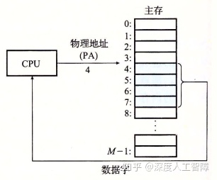

现代系统会尝试虚拟化资源，提供资源不同的视图，通常会呈现某种抽象或某种不同的资源视图，你可以通过介入对该资源的访问过程来实现。所以当你有一些资源，并且想要进行虚拟化时，可以通过干预或介入对该资源的访问过程来实现，一单你拦截了访问的过程，你就能用任何你想要的方式来处理它，就能有很多方法来改变那个资源对用户的视图。比如访问磁盘特定的扇区，需要制定柱面、磁道和盘面，但是磁盘控制器将磁盘抽象成一系列逻辑块的形式，使得内核能直接直接制定逻辑块号来访问磁盘，这就是一种虚拟化技术，它通过拦截来自内核的读写请求来呈现出这种视图，将内核发送的逻辑块号转化为实际的物理地址。

对于主存存储器资源也可以通过虚拟内存提供另一种不同的视图。现代CPU从一个有 ![[公式]](https://www.zhihu.com/equation?tex=N%3D2%5En) 个地址的地址空间中生成**虚拟地址（Virtual Address）**，该地址空间称为**虚拟地址空间（Virtual Address Space）**，虚拟地址空间的大小由表示最大虚拟地址所需的位数 ![[公式]](https://www.zhihu.com/equation?tex=n) 来确定，现代系统支持32位或64位的虚拟地址空间。CPU会使用虚拟地址来访问主存，称为**虚拟寻址（Virtual Addressing）**，需要首先通过**地址翻译（Address Translation）** 将虚拟地址转换为对应的物理地址，再通过物理地址来访问内存。而地址翻译类似于异常处理（软硬结合），需要CPU上的**内存管理单元（Memory Management Unit，MMU）**，以及内存中由操作系统管理的查询表来动态翻译虚拟内存。所以通过MMU来控制对内存的读写，达到对内存进行虚拟化的目的。


通常虚拟地址空间会比物理地址空间大很多，物理地址空间对应于系统中实际拥有的DRAM容量，对于系统上运行的所有进程，虚拟地址空间是相同的。

为什么要增加MMU来对内存进行抽象呢？**主要原因在于：**

- 虚拟内存将DRAM内存作为磁盘上实际数据的高速缓存，即我们可以在主存访问磁盘大小的空间，而主存只保存活动区域，根据需要在磁盘和主存之间来回传送数据，使得进程可以得到更大的地址空间，并且更有效地利用主存资源。
- 虚拟内存为每个进程提供一致的虚拟地址空间，代码和数据总是加载到固定的地址，堆栈位于用户课件地址空间的顶部等等，但是实际上与那些虚拟地址相对应的内容分布在整个主存储器中，所以通过使用虚拟内存可以简化内存的管理。
- 虚拟内存保护每个进程的地址空间不会被别的进程破坏。

## 2 虚拟内存的作用

### 2.1 虚拟内存作为缓存的工具

### 2.1.1 基本概念

虚拟内存被组织为存放在磁盘上的N个连续字节大小的单元数组，每个字节都有一个唯一的虚拟地址，而该数组的内容被缓存在主存中。（所以虚拟内存本质上是磁盘上的字节数组，该数组的索引就是虚拟地址，且主存作为该数组的缓存。）

> 缓存可以参考之前的[内容](https://zhuanlan.zhihu.com/p/111613441)

虚拟内存是在20世纪60年代早期发明的，早于SRAM高速缓存之前，所以即使两者使用相似的概念，术语也存在很大的不同。在虚拟内存中，数据块被称为**页（Page）**，磁盘和内存之间传送给页称为**交换（Swapping）**或**页面调度（Paging）**。所有现代系统都使用**按序页面调度（Demand Paging）**的方式，一直等待直到发生不命中时，才换页面。

虚拟内存之所以有效，也是因为局部性。虚拟内存作为下一层存储器层次，大小会比物理内存大，所以运行过程中程序引用的不同页面总数可能会超出物理内存大小。如果程序具有好的局部性，则在任意时刻的工作集较小，程序会趋于在一个较小的**活动页面（Active Page）** 集合上工作，所以只需要在一开始将工作集页面调度到物理内存中，过后就不会产生额外的磁盘流量了。但是如果局部性较差，则工作集超过了物理内存大小，则会发生**抖动（Thrashing）**，使得不断从磁盘中读取页到物理内存中，程序性能大大降低。在Linux中，可以通过`getrusage`函数检测缺页的数量。

> 虚拟内存从缓存的概念考虑，要求程序具有较好的局部性

从缓存的角度来看，内存是作为虚拟内存的缓存，则这两层存储器层次之间传输数据的块大小相同，都为 ![[公式]](https://www.zhihu.com/equation?tex=P%3D2%5Ep) 字节，在物理内存中的数据块称为**物理页（Physical Page，PP）**，也称为**页帧（Page Frame），**在虚拟内存中的数据块称为**虚拟页（Virtual Page，VP）**。虚拟页有三种状态：
 
- **未分配的：** 未分配的虚拟页就是没有任何数据和它关联的数据块，不占用任何磁盘空间。
- **缓存的：** 已保存在物理页中的已分配的虚拟页
- **未缓存的：** 还未保存在物理页中的已分配的虚拟页


其次，主存作为虚拟内存的缓存，如果主存不命中，就会从速度特别慢的磁盘中读取数据，造成很大的开销，所以虚拟内存和主存之间传输的数据块大小P较大，通常为4KB~2MB，由此增强空间局部性。并且为了避免数据块冲突，内存是全相联的，意味着虚拟页能保存在任意的物理页中。最后，由于对磁盘的访问时间较长，内存采用写回的形式。

虚拟页到物理页的映射关系保存在物理内存中常驻的**页表（Page Table）** 数据结构中，该页表由操作系统维护，每个虚拟页在页表中都保存了它对应的物理页，所以一共需要 ![[公式]](https://www.zhihu.com/equation?tex=2%5En%2FP) 个**页表条目（Page Table Entry，PTE）**。每次地址翻译硬件将一个虚拟地址转换为物理地址时，就会访问该页表。


如上所示是一个页表数据结构，每个PTE包含一个有效位和一个n位地址字段组成。当有效位为1时，表示已将该虚拟页缓存在物理页中，则地址字段就是对应的物理页的起始物理地址；当有效位为0时，如果虚拟页是未分配的，则地址字段为NULL，如果虚拟页分配了，则地址字段就是对应的虚拟页在磁盘上的起始地址。

**注意：** 由于内存采用全相联结构，所以任意的虚拟页能缓存在任意的物理页中。

### 2.1.2 操作

当CPU想要访问位于虚拟地址`x`中的数据字时，会首先通过地址翻译硬件将虚拟地址作为一个索引来定位PTE，然后通过PTE来确定对应的虚拟页的状态。如果PTE的有效位为1，说明该虚拟页被缓存在物理内存了，则CPU可以通过该PTE的地址字段获得物理内存的地址，然后进行访问


如果该PTE的有效位为0，且地址字段指向虚拟页在磁盘的位置，则说明该虚拟页还未缓存在物理页中，则出现了**缺页（Page Fault）**（对应于不命中）。处理器会发起缺页异常，然后调用内核中的缺页异常处理程序，会执行以下步骤：

- 由于内存使用全相联结构，如果存在空的高速缓存行，则会选择该物理页，否则会从中选择一个牺牲页，由于采用了写回的策略，所以如果该物理页的数据被修改过，就将其复制会磁盘中。
- 修改牺牲页对应的PTE，将地址字段指向虚拟页在磁盘的位置，说明该虚拟页未被缓存
- 内核从磁盘复制目标虚拟页到该牺牲页中，并修改目标虚拟页对应的PTE，将地址字段指向牺牲页的物理内存地址
- 缺页异常返回到导致缺页异常的指令，重新执行该指令，此时由于缓存了目标虚拟页，所以会命中


当CPU想要分配一个新的虚拟页时，比如调用了`malloc`函数，则首先在磁盘中创建一个虚拟页大小的空间，然后修改对应的PTE，将有效位置为1，且地址字段指向新的虚拟页在磁盘中的位置。

### 2.2 虚拟内存作为内存管理的工具

（这一节一下解释了之前的很多疑问）

内核在进程上下文中为每个进程都维护了自己独立的页表，使得每个进程有独立的虚拟地址空间。每个进程的页表将该进程连续的虚拟地址空间映射到DRAM物理地址空间中的任意位置，并且不同的虚拟页和不同的进程可以映射到不同的物理页中。通过这种形式，可以提供一种视图：每个进程都有一个非常相似的虚拟地址空间，有相同大小的地址空间，代码和数据分别从同一个地址开始，但是进程使用的物理页实际上可能会分散在DRAM内存中。


按序页表调度和独立的虚拟地址空间，提供了以下便利：

- **简化链接：** 由于每个进程都有自己独立的虚拟地址空间，则相同的虚拟地址在不同的进程可以通过进程自己的页表来确定最终的物理地址，所以链接器生成可执行目标文件确定内存地址时，无需考虑当前物理内存的状态，可以根据我们预定义的内存模型来分配虚拟内存地址，因为不同进程之间的虚拟地址是独立的，最终可以通过页表来映射到真实的物理地址。这就极大简化了链接器的工作，可以直接按内存模型来分配地址。

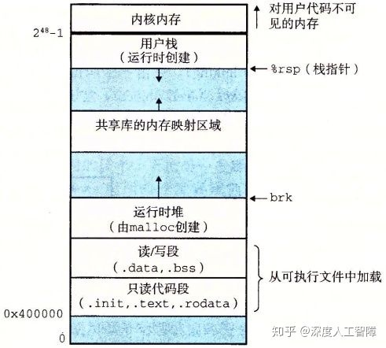

- **简化加载：** 想要把可执行目标文件加载到物理内存中，Linux加载器只需要为可执行目标文件中的代码段和数据段分配虚拟页，然后在页表中将这些虚拟页设置为无效的（表示还未缓存），然后将地址字段指向对应的位置，则实际的加载工作会由操作系统自动地按需执行。当访问某一虚拟地址时，发现其对应的PTE是无效的，则会发起缺页异常，通过缺页异常处理程序自动地将虚拟页加载到物理页中。所以加载器不会将磁盘内容复制到内存，而是为可执行目标文件分配虚拟页。这种将一组连续的虚拟页映射到任意一个文件中的任意位置称为**内存映射（Memory Mapping）**。

- - 加载实际是非常高效的机制，比如你的程序中包含一个巨大的数组，但是你只访问该数组的一部分，实际上不会将整个数组对应的虚拟页保存到物理页中，因为加载器只是初始化页表。当你代码中访问该数组的一部分时，内核会执行缺页异常处理程序，将包含你想要的数据的虚拟页加载到对应的物理页中，所以效率很高。

- **简化共享：** 通过为每个进程设置独立的页表，可以很简单地实现共享库和内核的共享。之前介绍过，共享库会在加载时或运行时动态加载到物理内存的任意位置，让所有进程进行共享。这里只需要在进程中通过一个PTE指向该共享的数据或代码的物理页，就能实现在所有进程中共享的结果。也侧面说明了`plt`和`got`的必要性，可以避免修改共享库的内容。

- **简化内存分配：** 进行内存分配时，可以通过`malloc`函数在物理内存中的任意位置进行创建，因为页表只需要让虚拟页指向该物理页，就能提供连续的虚拟地址抽象，让进程误以为是在连续的地址空间中进行操作的，由此简化了内存分配需要的工作。

（妙啊！）

### 2.3 虚拟内存作为内存保护的工具

通过对页表的改进，可以很容易地进行内存保护


这里在每个PTE中引入了三个字段：

- `SUP`：确定该物理页的访问权限，确定是否需要内核模式才能访问
- `READ`：确定该物理页的读权限
- `WRITE`：确定该物理页的写权限

MMU每次访问时都会检查这些位，如果有一条指令违背了这些许可条件，就会触发一个保护故障，Linux shell一般会将这种异常报告为**段错误（Segment Fault）**。

## 3 地址翻译

### 3.1 基础

接下来简单介绍下地址翻译，地址翻译就是一个N元素的虚拟地址空间（VAS）中的元素和一个M元素的物理地址空间（PAS）中元素之间的映射


主要通过MMU硬件利用保存在物理内存中的页表来实现，MMU具有以下结构


首先，虚拟页大小为P个字节，所以需要虚拟地址的低p位来索引一个虚拟页中的字节，得到**虚拟页偏移量（Virtual Page Offset，VPO）**，然后通过虚拟地址的高n-p位来确定虚拟页在也表中的索引，得到**虚拟页号（Virtual Page Number，VPN）**。而页表的起始地址保存在一个特殊的CPU寄存器**页表基址寄存器（Page Table Base Register，PTBR）** 中，所以可以通过VPN和PTBR得到想要的PTE的物理内存地址。并且由于虚拟页和物理页的大小相同，所以两者编码页中偏移量所需的位数p相同，可以假设数据在虚拟页和在物理页中的偏移量相同，由此就无需在页表中保存**物理页偏移量（Physical Page Offset，PPO）**，只需要保存**物理页号（Physical Page Number，PPN）**，可以直接将VPO复制给PPO，来确定数据在物理页中的偏移量。

> 从全相联缓存的角度来看，VPN其实就是标志位，而VPO就是块偏移。

**注意：** 页表中只保存PPN。

**页面命中主要执行以下步骤**，可以发现完全由硬件处理：

- CPU生成一个虚拟地址，将它发送给MMU
- MMU根据虚拟地址获得VPN，然后通过PTBR确定该PTE所在的物理内存地址（PTEA）（因为页表保存在物理内存中），然后将PTEA发送给物理内存
- 物理内存根据PTEA将对应的PTE发送给MMU，其中PTE只包含PPN（因为假设了数据在页内偏移量相同）
- MMU将PPN和VPO拼接起来，就可以得到虚拟地址对应的物理地址。然后MMU再将物理地址发送给物理内存
- 物理内存根据物理地址将数据发送给处理器


**缺页主要执行以下步骤**，由硬件和操作系统共同完成：

- 前三步相同，当MMU接收到PTE时，发现有效位为0，说明该虚拟页还未缓存在物理页中，就会发起一个缺页异常，由内核来执行缺页异常处理程序。
- 通过内核来确定一个牺牲页，如果该牺牲页中的数据被修改过，就将其复制到对应的磁盘虚拟页中
- 内核将需要的虚拟页保存到对应的物理页中，并修改对应的PTE
- 从缺页异常处理程序返回到导致异常的指令，重新执行该指令，就会执行页面命中的步骤。

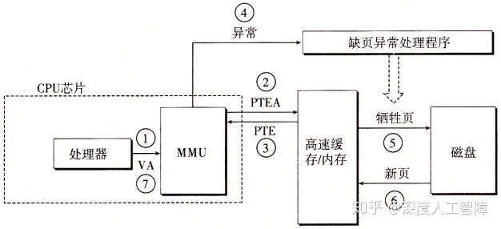

在高速缓存中，为了不同进程能共享相同的物理页且避免相同虚拟页的冲突，这里使用物理寻址。所以MMU负责地址翻译和访问权限检查，然后使用物理内存地址访问高速缓存


### 3.2 利用TLB加速地址翻译

可以发现，每次CPU将一个虚拟地址发送给MMU时，MMU都会将需要的PTE物理地址发送给高速缓存/内存来获得PTE，如果高速缓存刚好保存了该PTE，则MMU可以很快获得，否则需要等待很多时钟周期从内存中读取。

为了减小这个开销并进一步利用局部性原理，在MMU中引入了一个保存最近使用的PTE缓存，称为**翻译后备缓冲器（Translationi Lookaside Buffer，TLB）**。在TLB中，使用虚拟地址进行寻址，具有较高的相联度，每个高速缓存行保存一个PTE，每次都是以一整个PTE进行读写，不需要含有块偏移，记得我们之前是通过VPN在页表中索引获得PTE，所以虚拟地址的划分为


> 这里使用虚拟地址来访问TLB，如果不同进程使用相同虚拟地址访问TLB，不就造成错误了？这里也没使用PTBR来确定使用哪个页表，难道每次进行上下文切换改变进程时，都会将TLB清空，只保存当前进程的PTE来避免冲突？？

所以**当TLB命中时**的步骤为：

- CPU产生一个虚拟地址，发送给MMU
- MMU提取出当前虚拟地址的VPN，发送给TLB
- TLB对VPN进行分解，得到TLBI和TLBT，根据TLBI确定所在的高速缓存组，然后在高速缓存组中依次比较各个高速缓存行的标记是否和TLBT相同，如果相同，则TLB命中，将对应的PPN发送给MMU
- MMU将PPN和VPO拼接起来得到虚拟地址对应的物理地址。然后MMU再将物理地址发送给物理内存
- 物理内存根据物理地址将数据发送给处理器

由于TLB位于MMU中，速度特别快。

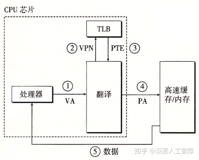

当**TLB不命中时**的步骤为：

- CPU产生一个虚拟地址，发送给MMU
- MMU提取出当前虚拟地址的VPN，发送给TLB
- TLB对VPN进行分解，得到TLBI和TLBT，没有找到有效的PTE，发生TLB不命中
- MMU根据PTBR和VPN得到PTE对应的PTEA，将其发送给高速缓存/内存
- 高速缓存/内存将对应的PTE发送给MMU和TLB
- TLB会根据VPN将PTE保存在合适的位置
- MMU接收到PTE后，将PPN和VPO拼接起来得到虚拟地址对应的物理地址。然后MMU再将物理地址发送给物理内存
- 物理内存根据物理地址将数据发送给处理器


### 3.3 多级页表

在一个32位地址空间中，每个页面大小为4KB，则一共需要 ![[公式]](https://www.zhihu.com/equation?tex=2%5E%7B32%7D%2F2%5E%7B2%2B10%7D%3D2%5E%7B20%7D%3D1M) 个页面，假设每个PTE大小为4字节，则页表总共为4MB。当使用一级页表时，需要始终在内存中保存着4MB大小的页表，我们这里可以使用多级页表来压缩内存中保存的页表内容。


首先，我们这里有1M个虚拟页，将连续的1024个虚拟页当成一个**片（chunk）**，一级页表就负责指向每个片对应的二级页表，则一级页表需要 ![[公式]](https://www.zhihu.com/equation?tex=2%5E%7B20%7D%E9%A1%B5%2F2%5E%7B10%7D%E7%89%87%3D1K) 个PTE，每个PTE4字节，则一共需要4KB大小的一级页表。**注意：** 这里只有当片中至少一个页被分配了才会指向对应的二级页表，否则为NULL。而二级页表就类似于我们之前的页表结构，这里只需要负责一个片的虚拟页，则每个二级页表为4KB。

当一级页表的某个PTE为NULL时，表示该片不存在被分配的虚拟页，所以就可以去掉对应的二级页表。并且在内存中只保存一级页表和较常使用的二级页表，极大减小了内存的压力，而其他的二级页表按需创建调入调出。

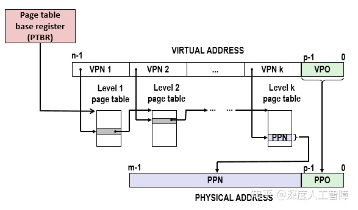

以上是一个k级页表层次结构的地址翻译，前面k-1个页表的PTE都是指向下一级页表的基址，而第k级页表指向的是PPN或磁盘地址。所以每次地址翻译时，MMU需要从内存中访问k个PTE，但是TLB的存在弥补了这个开销。首先，一级页表覆盖了所有的地址空间，所以一定会缓存在TLB中，而二级页表覆盖了大量的地址空间，所以他们也有很大可能会在TLB中，以此类推，只要你程序具有良好的局部性，就有很大概率从TLB中获得想要的PTE，由此弥补了多次访问页表的性能损失。

> TLB应该要将不同层次的PTE独立开来

### 3.5 地址翻译实例

首先我们需要作出以下假设：

1. 内存是按字节寻址的
2. 内存访问是针对1字节的字的
3. 虚拟地址是14位长的
4. 物理地址是12位长的
5. 页面大小是64字节的
6. TLB是四路组相连的，总共有16个条目
7. L1 d-cache是直接映射的，行大小为4字节，总共有16个字节

根据以上假设，我们可以从获取页表、TLB和高速缓存的信息：

- **页表：** 当前只使用一级页表，页表大小为64字节，则虚拟页有 ![[公式]](https://www.zhihu.com/equation?tex=2%5E%7B14%7D%2F2%5E6%3D256) 个，则页表具有256个PTE；物理页有 ![[公式]](https://www.zhihu.com/equation?tex=2%5E%7B12%7D%2F2%5E6%3D64) 个。根据地址翻译，可以将虚拟地址和物理地址进行以下划分


由此可以通过VPN在页表中获得对应的PTE，然后通过VPO获得在虚拟页中的数据，物理地址也同理。

- **TLB：** 四路组相连说明每个高速缓存组中具有四个高速缓存行，而TLB是以PTE为单位进行存取的，所以每个高速缓存行能保存一个PTE，而TLB一共能保存16个PTE，说明该缓存具有4个高速缓存组，则需要2位的组索引TLBI。因为TLB是虚拟寻址的，所以是在虚拟地址上进行划分的，且以PTE为单位进行存取，所以是在VPN中进行划分的，低2位为TLBI，则高6位为标志位TLBT


- **高速缓存：** 直接映射的高速缓存，说明每个高速缓存组只有一个高速缓存行，行大小为4字节，则需要2位的块偏移（CO），一个有16个组，则需要4位的组索引（CI），其余的为标志位（CT）。由于高速缓存是物理寻址的，所以要在物理地址上进行划分


假设当前页表、TLB和高速缓存的内容如下

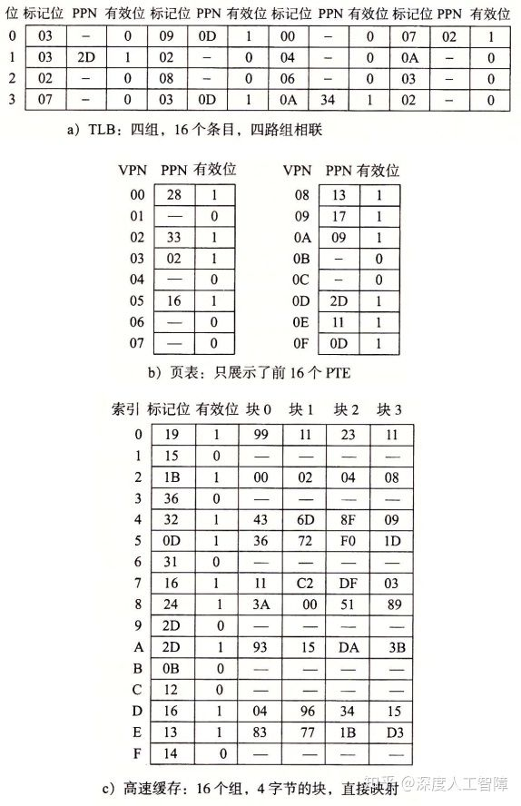

当CPU产生虚拟地址`0x03d4`时，执行步骤为：

- 首先根据虚拟地址，我们可以进行以下划分，MMU会将VPN字段`0x0f`发送给TLB

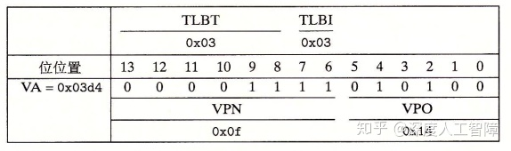

- 当TLB接收到VPN时，会从中划分出TLBT`0x03`和TLBI`0x03`，然后根据TIBI确定在TLB中的高速缓存组，依次将TLBT和标志位进行比较，可以发现第二个高速缓存行具有相同的标志，则TLB命中，会返回对应的PPN`0x0D`给MMU
- MMU将PPN`0x0D`和VPO`0x14`拼接起来，得到物理页对应的物理地址`0x354`
- 根据物理地址，可以进行以下划分，MMU将物理地址发送给高速缓存

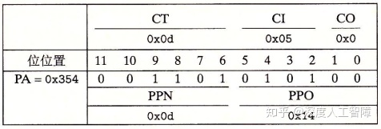

- 高速缓存根据CI确定所在的高速缓存组，并将组内的高速缓存行的标志位依次与CT进行比较，可以发现高速缓存命中了，并根据CO在块内偏移，得到想要的数据`0x36`，将其返回给MMU
- MMU获得数据后，将其返回给CPU

以上是比较简单的情况，即TLB命中和高速缓存命中，其他较复杂的情况需要MMU很多后续的操作。

**大致的步骤为：**

1. 将虚拟地址根据TLB规则进行划分，在TLB中进行检索，如果存在则将PPN返回给MMU，如果不存在，将地址根据页表规则进行划分，得到对应的PTE，将其保存到TLB，并将PPN返回给MMU
2. MMU根据PPN和VPO构建出物理地址，并将物理地址发送给高速缓存
3. 将物理地址根据高速缓存规则进行换分，在高速缓存中检索，如果存在则将数据返回给MMU，如果不存在则需要从内存中进行检索

**综上：** 页表和TLB是虚拟寻址的，都是返回对应的PPN；高速缓存是物理寻址的，返回对应的数据。

# [读书笔记]CSAPP：21[VB]虚拟内存：系统


 **视频地址：**

[【精校中英字幕】2015 CMU 15-213 CSAPP 深入理解计算机系统 课程视频_哔哩哔哩 (゜-゜)つロ 干杯~-bilibiliwww.bilibili.com/video/BV1iW411d7hd?p=18](https://link.zhihu.com/?target=https%3A//www.bilibili.com/video/BV1iW411d7hd%3Fp%3D18)

**课件地址：**

[http://www.cs.cmu.edu/afs/cs/academic/class/15213-f15/www/lectures/18-vm-systems.pdfwww.cs.cmu.edu/afs/cs/academic/class/15213-f15/www/lectures/18-vm-systems.pdf](https://link.zhihu.com/?target=http%3A//www.cs.cmu.edu/afs/cs/academic/class/15213-f15/www/lectures/18-vm-systems.pdf)

本章对应于书中的9.7-9.8。

------

- 有一系列保存在磁盘中的数据，首先以页为单位将其划分成很多数据块（虚拟页），然后根据每个数据块的特点（比如读写权限）进行组合，得到若干个由若干个数据块组成的段，通过任务结构对这些段进行描述，包括：段的起始虚拟地址、段的终止虚拟地址、段的读写权限等等，由此就确定了段中每个数据块所能用的虚拟地址范围以及读写权写。接下来根据这个约束，对每个数据块分配一个虚拟地址，然后分配一个指向数据块磁盘位置的指针，确定该数据块的读写权限，然后将所有数据块的信息组合起来，就得到了页表。

> 页表是描述每个数据块的，任务结构是描述由数据块组成的段，确定了页表的信息。

- 虚拟内存在磁盘的内容称为交换空间
- 对于私有对象，页设置为只读的，页所在的段设置为私有的写时复制的。则当尝试对页进行写操作时，会触发保护故障，然后根据私有的写时复制进行操作。
- 为了能维护自己的状态，需要将状态所在的段标记为私有写时复制的。当没有对其进行修改时，所有都共享相同的物理页，如果对其修改了，就会新建一个物理页，这样就能保证自己的状态不会被别的进程修改。
- 内存映射仅仅是将虚拟内存和磁盘文件对应起来，并没有拷贝到内存中，只是指定虚拟页的初始值。会按需自动加载虚拟页到物理页中。

------

## 1 Intel Core i7/Linux内存系统

这里通过介绍运行Linux的Intel Core i7来总结虚拟内存的内容。

### 1.1 Intel Core i7

现在的Core i7支持48位虚拟地址空间和52位物理地址空间，还兼容32位虚拟和物理地址空间。


如上图所示是一个**处理器封装（Processor Package）**，其中有一组基于QuickPath技术的点对点链路，为了让一个核与其他核和外部I/O桥直接通信。

- **高速缓存：** 具有3层高速缓存层次结构，其中L3是所有核共享的高速缓存，其中数据块大小为64字节，所以高速缓存具有以下性质。其中，数据块为64字节，则需要6位的块偏移，L1 d-cache有64组，则需要6位的组索引，其余的为标志位。


- **页表：** 这里采用4级页表结构，页大小为4KB，说明需要12位的VPO，而虚拟地址为48位，所以VPN为36位，则每一级的VPN为9位。每个进程有自己私有的页表层次结构，并且存在CR3控制寄存器指向第一级页表的起始位置，其中CR3是每个进程上下文的一部分，每次进行上下文切换时，都会被恢复。页表的PTE格式如下所示


其中每个PTE为8字节，而每一级的VPN为9位，则每个PTE引用了一个 ![[公式]](https://www.zhihu.com/equation?tex=2%5E9%2A2%5E3%3D4KB) 的子页表，这里就要求物理页4KB对齐。由于物理地址为52位，PPO为12位，则PPN为40位，所以这里的页表物理基地址为40位。这里增加了3个权限位来控制对页的访问：`R/W`、`U/S`和`XD`，其中`XD`是64位系统引入的，限制了只能在只读代码段执行，降低了缓冲区溢出攻击的风险。此外，当MMU访问一个页时，会设置**引用位（Reference Bit）** A位，让内核实现页替换算法，当MMU修改一个页时，会设置**脏位（Dirty Bit）** D位，使得内核对牺牲页进行写回。以下是Core i7的页表翻译


- **TLB：** 这里TLB也采用层次结构，并且为数据和指令分别使用两个一级TLB。其中，L1 d-TLB有4路64个PTE，则一共有16个组，需要4位TLBI；L1 i-TLB有4路128个PTE，一共有32组，需要5位TLBI；L2 TLB有4路512个PTE，一共有128个组，需要7位TLBI。

- - 这里之所以使用L2 TLB而不是扩大L1 TLB，是因为如果舍弃L2 TLB而增大L1 TLB，仍然可能出现工作集大于缓存的情况，就会出现容量不命中，通过增加L2 TLB来减少不命中惩罚。

下面是Core i7地址翻译的整体架构（省略了i-cache、i-TLB和L2统一TLB）


这里可以发现一个**特点：** 高速缓存的CI+CO=12位，而VPO也是12位。这不是巧合，而是故意这样设计来加速地址翻译。我们知道，VPO=PPO，而PPN需要通过地址翻译获得，则一开始输入虚拟地址时，就能一下等到PPO，然后等待检索PPN。此时我们就能直接将PPO输入到高速缓存中，因为PPO确定了对应的高速缓存组和块偏移量，就能先通过PPO获得对应的高速缓存组，然后只要等检索到PPN时，就能直接和高速缓存组中每一行的标志位进行比较，极大加速了地址翻译过程。


### 1.2 Linux虚拟内存系统

Linux为每个进程都维护了一个单独的虚拟地址空间，如下所示


可以发现内核将一组连续的虚拟页（大小等于DRAM总量）映射到一组相应的连续物理页上，这样内核可以在这个虚拟内存上进行读写，实际上就是对物理内存进行读写，这为内核提供一种便利的方法来访问物理内存。这部分内容对所有进程都是一样的。

此外， 与进程相关的一些信息被保存在内核虚拟内存中，并且Linux将虚拟内存组织成段集合的形式，比如代码段、数据段、共享库段以及用户栈，这些段就是已分配的连续虚拟页。每个已分配的虚拟页都保存在某个段中。通过这种组织成段的形式，可以使得虚拟地址存在间隙。这是通过内核为系统中每个进程维护一个单独的`task_struct`实现的（在最上面那块中），该结构中包含或指向内核运行该进程所需的所有信息，其中有一条指向描述虚拟内存当前状态的结构`mm_struct`，其中包含的`pgd`就是指向一级页表的起始地址，当进程被调度时，就会将`pdg`条目拷贝到CR3中，通过这种形式来改变虚拟地址空间；`mmap`指向一个链表结构的头结点，其中每个节点`vm_area_struct`就描述了虚拟内存中的一个段，其中包含：

- `vm_end`段结束的虚拟地址；
- `vm_start`段开始的虚拟地址；
- `vm_prot`段中所有页的读写权限；
- `vm_flags`描述当前段中的虚拟页是否与其他进程共享，如果是共享的，则称为**共享段**，否则称为**私有段**；
- `vm_next`下一个段的节点。

由此，就能通过将输入虚拟地址与各个节点的起始地址和终止地址进行比较，判断虚拟地址所在的段。


该任务结构的存在，使得缺页异常处理多了虚拟地址的判断。当MMU翻译虚拟地址A时，由于还未将对应的虚拟页缓存到物理页中，所以触发了缺页异常，随后执行缺页异常处理程序，包含以下步骤：

- **判断虚拟地址A是否合法：** 虚拟地址是否合法，主要看它是否存在某个段中。处理程序会将虚拟地址A与链表中的所有节点中的`vm_start`和`vm_end`进行比较，判断虚拟地址A所处的段，如果不存在任一段中，则会触发段错误，终止进程。
- **判断对虚拟地址A的访问是否合法：** 当虚拟地址A处在某个段中时，可以通过`vm_prot`确定该段的读写许可，然后与我们所需要的操作进行对比，如果操作违背了许可，则会触发保护异常，终止进程，Linux也将其报告为段错误。
- 如果以上两个步骤都是合法的，则执行正常的缺页处理。处理程序会选择一个物理牺牲页，如果牺牲页被修改了，则进行写回，然后将虚拟地址A对应的虚拟页写入对应的物理页中，修改对应的页表，然后从处理程序返回。

**注意：**

- 缺页异常时才会检查虚拟地址是否合法
- task_struct是比页表更大的结构，该task_struct是以段为单位来组织虚拟地址，其中包含了许多虚拟页，而页表是以虚拟页为单位来组织虚拟地址，所以需要先从task_struct开始。

## 2 内存映射

如果虚拟内存系统可以集成到传统的文件系统中，就能提供一种简单而高效的方法把程序和数据加载到内存中。这里通过**内存映射（Memory Mapping）** 将一个虚拟内存段与一个磁盘上的**对象（Object）** 关联起来，来初始化虚拟内存段的内容，所以当我们第一次引用某个段时，它的初始值来自于磁盘上的普通文件，然后通过按需页面调度，将需要的虚拟内存段加载到物理内存中。

> 主要说明如何将虚拟内存段和磁盘内容关联起来。
> 每个段包含的虚拟页都和磁盘文件中的某些部分关联起来，并且虚拟页的初始内容都来自于磁盘文件。

内存映射可以用两种磁盘上的对象来初始化虚拟内存段：

- **Linux文件系统中的普通文件：** 比如一个可执行目标文件，将其分成页大小的数据块，用来初始化对应的虚拟内存段，如果段比文件大，则用0来填充剩下的内容。然后按需将虚拟页复制到物理页中。
- **匿名文件：** 内核可以创建大小任意的全是二进制0的匿名文件，该文件其实并不存在。当我们想要创建一个全为0的页，可以将虚拟页和匿名文件关联起来，当内核引用该虚拟页时，会直接覆盖牺牲页的内容，得到全为0的页，然后修改对应的页表内容。这个过程磁盘和内存之间没有实际的数据传送。

> 匿名文件主要用于创建全为0的页。

这些与虚拟内存段关联的磁盘内容处于**交换空间（Swap Space）** 中（即虚拟内存在磁盘空间上的内容就是在交换空间中，也就是说交换空间保存了映射到虚拟内存中的磁盘数据，则交换空间大小其实就是虚拟内存大小），则交换空间限制了当前运行着的进程能够分配的虚拟页总数（虚拟内存大小确定了，虚拟页大小也确定了，则页数目也就确定了）。

> 交换空间是所有进程的虚拟内存可用的总空间**（不确定？）**

内存映射概念的存在，使得我们可以重新回去看共享对象和私有对象、`fork`函数和`execve`函数。

### 2.1 共享对象

如上所述，虚拟内存段中通过`vm_prot`确定该虚拟内存段中的虚拟页是否在进程之间共享，如果共享，则称该段为**共享段**，则各个进程在该段中的操作是互相可见的，且变化也会反映在磁盘上；如果不共享，则称该段为**私有段**，则各个进程在该段中的操作是互相不可见的，也不会反映到磁盘上。

在进程1中，当我们将磁盘上的一个对象通过内存映射与该进程的一个共享段关联起来时，就会使得虚拟页对应的PTE指向该对象，当引用该对象时，就会将对应的虚拟页加载到物理页中；而进程2也要将该对象与自己的一个共享段关联起来时，当对其引用时，由于每个对象都有一个唯一的文件名，所以内核可以发现进程1将该对象加载的物理页，就直接在进程2中将对应的PTE指向相同的物理页就行了。

**注意：**

- 进程1和进程2 的虚拟地址空间是不同的
- 即使一个对象与多个进程的共享段关联，物理内存中始终只有该对象的一个副本。


### 2.2 私有对象

在进程1中，当我们将磁盘上的一个对象通过内存映射与该进程的一个私有段关联起来时，就会使得虚拟页对应的PTE指向该对象，当引用该对象时，就会将对应的虚拟页加载到物理页中；当进程2也要将该对象与自己的一个私有段关联起来时，当对其引用时，也会直接在进程2中将对应的PTE指向相同的物理页，即当未对私有对象进行修改时，物理内存中只会保存同一个对象副本，且各个进程中对该对象的PTE都是只读的，而虚拟内存段被标记为**私有写时复制的（Private Copy-On-Write）**。


但是假设进程2对该私有对象进行修改时，会触发保护故障，处理程序就会在物理内存中创建一个该物理页的副本，然后让进程2对该对象的PTE指向新的副本，并设置该虚拟页具有写权限，然后处理程序返回，从写指令重新运行。


> 图中大块的表示对象，可能由很多个页组成，当我们尝试对其中一个页进行修改时，只会对该页进行复制，并修改该页对应的PTE，而该对象的其他页保持不变。

**问题：** 当虚拟页的读写权限修改后，与所在段的读写权限冲突时，是否要修改虚拟页所在的段？即上图进程2深色和浅色的页是处在不用段中？还是说段的读写权限是用来初始化其中包含的虚拟页的读写权限，但是虚拟页的读写权限可以自己修改？

通过写时复制这种策略，尽可能延迟物理内存中的拷贝，能最大效率地使用物理内存。

> 当只对虚拟空间进行读操作，则永远不会复制，而是共享相同的物理内存。

### 2.3 `fork`函数

在父进程中调用`fork`函数时，会创建一个具有相似但独立虚拟地址空间的子进程，并分配一个唯一的PID，而写时复制技术会给`fork`函数提供一个高效的解决方案：

- 为了具有和父进程相同的**虚拟内存状态**，内核会复制父进程的`mm_struct`
- 为了具有和父进程相同的**虚拟内存段分配**，内核会复制父进程的`vm_area_struct`
- 为了子进程和父进程具有相同的**虚拟内存内容**，内核会复制父进程的页表，就能将相同的磁盘内容映射到相同的虚拟页中，并将虚拟页缓存在相同的物理页中。
- 为了子进程和父进程的虚拟地址空间能**相互独立**，两个进程的页都设置为只读的，且段都标记为私有的写回复制。当父子进程都没有对页进行修改时，父子进程是共享相同的物理内存的，当其中一个进程对页进行修改时，就会对该页进行写回复制，并为该页赋予写权限，并更新进程对应的页表。

### 2.4 `execve`函数

当我们运行`execve("a.out", NULL, NULL)`执行可执行目标文件`a.out`时，包含以下步骤：

- **删除用户段：** 将进程的虚拟地址空间中的用户段删除，即删除`vm_area_struct`和页表。

- **映射私有段：** 首先为可执行目标文件中的不同数据节创建对应的段，即在`vm_area_struct`中新建节点，并设置对应的段起始虚拟地址、段终止虚拟地址，设置这些段为私有写回复制的。然后将这些段通过内存映射与`a.out`中的内容关联起来。（对私有对象的读写参考2.2）

- - 对于需要初始化为0的段，可将其与匿名文件进行关联。

- **映射共享段：** 对于共享库的内容，会将其映射到共享库的内存映射段中，即在`vm_area_struct`中创建一个共享段，然后将其与共享库的内容关联起来，这样就能在多个进程中共享相同的共享库。（对共享对象的读写参考2.1）

- - 如果共享库有维护状态的静态变量，比如随机生成器在调用时会维持状态，且不同的进程的状态不同，对于这种要修改静态数据的函数，应该将该段标记为私有写时复制的，这样就能在不同进程中维护自己独立的状态。


- 设置程序计数器，使其指向代码段的入口点。

> 通过将对象映射到不同的段中，就能决定对该对象进行读写时的特点。

**注意：** 当程序运行时，我们并没有加载任何内容到内存中，所做的只是设置内存映射，在内核中创建数据结构，由此创建了虚拟地址空间和这些对象之间的映射关系，而实际的拷贝工作会由缺页异常按需完成。

### 2.5 通过`mmap`函数自定义内存映射

用户通过`mmap`函数能自己创建虚拟内存段，并将对象映射到该段中，由此我们可以通过修改该段的参数，来达到对对象的设置。比如设置该虚拟内存段是全部进程共享的，则映射到该段的对象就能在所有进程中共享。

```c
#include <unistd.h>
#include <sys/mman.h>
void *mmap(void *start, size_t length, int port, int flags, int fd, off_t offset);
```

文件描述符`fd`指定一个磁盘文件，该函数会将磁盘文件中偏移`offset`处的`length`个字节的对象映射到虚拟内存中的`start`处。`start`指定的段如果是有效的，则内核会将其映射到指定段，如果指定段的部分虚拟地址空间被某个已存在的段包含了，则内核会另外找一个有效的位置，`start`可以设置为NULL，让内核自动分配。


其中，`prot`对应于段结构中的`vm_prot`参数，用来确定该虚拟内存段的读写权限：`PROT_EXEC`表示该段中的页是可执行的；`PROT_READ`表示该段中的页是可读的；`PROT_WRITE`表示该段中的页是可写的；`PROT_NONE`表示该段内的页是不可访问的。

`flags`对应于段结构中的`vm_flags`：`MAP_PRIVATE`表示该段是私有的写时复制的；`MAP_SHARED`表示该段是共享的。也可以设置`MAP_ANON`，表示是一个匿名对象。

当函数执行成功时，会返回指向该段的指针，如果失败，则返回`MAP_FAILED`。

可以通过以下函数来删除虚拟内存中的段：

```c
#include <unistd.h>
#include <sys/mman.h>
int munmap(void *start, size_t length); 
```

使用自定义内存映射的**好处在于：**

- 使得磁盘文件中的一块数据能与虚拟内存地址空间中的某个段建立映射关系，此时我们就能直接通过对该虚拟内存段的访问来间接访问磁盘文件内容，不必执行文件I/O操作，也无需对文件内容进行缓存处理。并且虚拟内存进行按序页面调度的，当你访问了文件内容，它就会将对应的虚拟页加载到物理页中，此时就能从内存中很快地访问文件内容。当你处理大文件或频繁读写文件时能提速，因为此时就直接将文件内容加载到物理内存中了，一切读写操作都是在物理内存中进行的，速度特别快，只有在内核将其牺牲时，才会进行写回。
- 通过内存映射方法，我们还能定义一个进程共享的虚拟内存段，使得能让多个进程对一个区域进行访问和修改。


# [读书笔记]CSAPP：22[VB]内存分配：显示分配器


 **视频地址：**

[【精校中英字幕】2015 CMU 15-213 CSAPP 深入理解计算机系统 课程视频_哔哩哔哩 (゜-゜)つロ 干杯~-bilibiliwww.bilibili.com/video/BV1iW411d7hd?p=19](https://link.zhihu.com/?target=https%3A//www.bilibili.com/video/BV1iW411d7hd%3Fp%3D19)

[https://www.bilibili.com/video/BV1iW411d7hd?p=20www.bilibili.com/video/BV1iW411d7hd?p=20](https://link.zhihu.com/?target=https%3A//www.bilibili.com/video/BV1iW411d7hd%3Fp%3D20)

**课件地址：**

[http://www.cs.cmu.edu/afs/cs/academic/class/15213-f15/www/lectures/19-malloc-basic.pdfwww.cs.cmu.edu/afs/cs/academic/class/15213-f15/www/lectures/19-malloc-basic.pdf](https://link.zhihu.com/?target=http%3A//www.cs.cmu.edu/afs/cs/academic/class/15213-f15/www/lectures/19-malloc-basic.pdf)

[http://www.cs.cmu.edu/afs/cs/academic/class/15213-f15/www/lectures/20-malloc-advanced.pdfwww.cs.cmu.edu/afs/cs/academic/class/15213-f15/www/lectures/20-malloc-advanced.pdf](https://link.zhihu.com/?target=http%3A//www.cs.cmu.edu/afs/cs/academic/class/15213-f15/www/lectures/20-malloc-advanced.pdf)

对应于书中的9.9。

------

不能分配小于最小块大小的块。

------

- 虚拟页的存在是作为虚拟内存和物理内存传输数据块的单位，是由一系列连续的虚拟内存地址组成的，并且这些虚拟地址的特点由虚拟页定义。而虚拟内存段是将一系列大量的连续的具有相似特点的虚拟地址聚集起来，且虚拟内存段也描述了这些虚拟地址的一些特点，并且这些虚拟地址以虚拟页为单位进行组织，即虚拟内存段包含虚拟页。
  我们使用虚拟内存时是以虚拟地址为单位的，只是根据我们对其使用方式的不同要求和权限，会处于不同虚拟段中的不同虚拟页中。
- 当调用`malloc`函数来分配块时，首先会在空闲链表中寻找是否有合适的空闲块，如果尝试了合并空闲块还是没找到，则会调用`sbrk`函数来向内核申请更大的堆内存。所以在一开始将堆与匿名文件映射时，堆内存为0，则第一次调用`malloc`函数时，会直接调用`sbrk`函数来申请得到一块大的空闲块，该空闲块可能会比你尝试分配的块大，然后就一直在这个堆中进行操作。
- 堆的起始地址到`brk`之间是已申请的堆内存，可以在里面进行动态内存分配，而`brk`之外的是未申请的堆内存，只有当找不到合适的空闲块时，才会向内核申请更大的可用空间，此时就会移动`brk`。

------

除了上一章介绍的通过`mmap`函数能让用户自定义内存映射，将磁盘文件映射到虚拟内存中以外，也可以在运行时使用**动态内存分配器（Dynamic Memory Allocator）** 来分配额外的虚拟内存。动态内存分配器维护着虚拟内存中的堆段，将堆视为一组不同大小的块的集合，每个块由若干个连续的虚拟地址构成（一个块不一定处在同一个虚拟页），每个块具有**两种状态：**

- **已分配：** 已分配的块能为应用程序所用，且块会保持已分配状态直到被释放
- **空闲的：** 空闲的块无法使用，直到它被分配


而在最开始进行内存映射时，堆是与匿名文件关联起来的，所以堆是一个全0的段，即处于空闲状态，它紧跟在未初始的数据段后面，向地址更大的方向延伸，且内核对每个进程都维护了`brk`变量来指向堆顶。

动态内存分配器具有两种类型，都要求由应用程序显示分配块，但是由不同实体来负责释放已分配的块：

- **显示分配器（Explicit Allocator）：** 要求应用程序显示释放已分配的块。比如C中通过`malloc`来分配块，再通过`free`来显示释放已分配的块，C++中的`new`和`delete`相同。
- **隐式分配器（Implicit Allocator）：** 由分配器检测哪些块已不被应用程序使用，就自动释放这些块。这种隐式分配器称为**垃圾收集器（Garbage Collector）**，而这种过程称为**垃圾收集（Garbage Collection）**。比如Java、ML和Lisp。

程序使用动态内存分配器来动态分配内存的**意义在于：** 有些数据结构只有在程序运行时才知道大小。通过这种方式就无需通过硬编码方式来指定数组大小，而是根据需要动态分配内存。

```c
#include <stdio.h>
#include <stdlib.h>
int main(){
  int *array, i, n;
  scanf("%d", &n);
  array = (int *)malloc(n*sizeof(int));
  for(i=0; i<n; i++){
    scanf("%d", &array[i]);
  }
  free(array);
  exit(0);
}
```

这一章主要介绍管理堆内存的显示分配器。

## 1 `malloc`和`free`函数

C中提供了malloc显示分配器，程序可以通过`malloc`函数来显示地从堆中分配块

```c
#include <stdlib.h>
void *malloc(size_t size); 
```

该函数会返回一个指向大小至少为`size`字节的未初始化内存块的指针，且根据程序的编译时选择的字长，来确定内存地址对齐的位数，比如`-m32`表示32位模式，地址与8对齐，`-m64`表示64位模式，地址与16对齐。如果函数出现错误，则返回NULL，并设置`errno`。我们也可以使用`calloc`函数来将分配的内存块初始化为0，也可以使用`realloc`函数来改变已分配块的大小。

程序可以通过`free`函数来释放已分配的堆块

```c
#include <stdlib.h>
void free(void *ptr);
```

其中`ptr`参数要指向通过`malloc`、`calloc`或`realloc`函数获得的堆内存。

动态内存分配器可以使用`mmap`和`munmap`函数，也可以使用`sbrk`函数来向内核申请堆内存空间，只有先申请获得堆内存空间后，才能尝试对块进行分配让应用程序使用。

```c
#include <unistd.h>
void *sbrk(intptr_t incr); 
int brk(void *addr);
brk`函数会将`brk`设置为`addr`指定的值。`sbrk`函数通过`incr`来增加`brk
```

- 当`incr`小于0时，会减小`brk`来解除已分配的堆内存
- 当`incr`等于0时，会返回当前的`brk`值
- 当`incr`大于0时，会增加`brk`来分配更多的堆内存

当`sbrk`函数运行正常时，会返回之前的`brk`值，否则会返回-1并设置`errno`为`ENOMEM`。

当我们使用`malloc`函数申请较小的堆内存时，会通过`brk`或`sbrk`函数设置`brk`来实现。`brk`和`sbrk`函数分配的对控件类似于缓冲池，每次`malloc`从缓冲池获得内存时，如果缓冲池大小不够，就会调用`brk`或`sbrk`函数来扩充缓冲池，然后从该缓冲池中获得对应的内存，而`free`函数就会将应用程序使用的内存空间归还缓冲池。

通过`sbrk`和`brk`函数来针对小块内存的申请，会产生内存碎片问题。对于大块内存的申请，会直接使用`mmap`函数，直接将大段的虚拟地址空间与匿名文件关联起来，就不会有内存碎片问题。

在本节课中，以字为单位进行操作，每个字为4字节，并进行双字对齐。

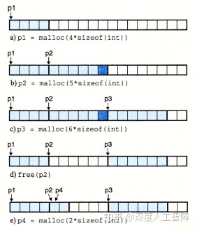

**注意：**

- 分配堆内存时，会进行地址对齐
- 释放内存后，其指针不会被删除，所以要谨慎被删除的指针的使用

**参考：**

[理解brk和sbrk - 在于思考 - 博客园](https://link.zhihu.com/?target=https%3A//www.cnblogs.com/chengxuyuancc/p/3566710.html)

[系统调用与内存管理（sbrk、brk、mmap、munmap）_运维_Apollon_krj的博客-CSDN博客](https://link.zhihu.com/?target=https%3A//blog.csdn.net/apollon_krj/article/details/54565768)

[何柄融：malloc 的实现原理 内存池 mmap sbrk 链表](https://zhuanlan.zhihu.com/p/57863097)

## 2 显示分配器的要求和目标

显示分配器的**要求**有：

- 只要满足每个释放请求都对应于一个由以前分配请求获得的已分配的块，则应用程序可以以任意顺序发送分配请求和释放请求。
- 分配器必须立即响应请求，不允许对请求进行重排列或缓存。
- 为了使分配器是可扩展的，分配器使用的任何非标量数据结构都必须保存在堆内。
- 为了能保存任意类型的数据对象，分配必须对齐块。（比如讲解`struct`时，它根据对齐要求对起始虚拟地址是有要求的）
- 当块被分配了，分配器不允许对其进行修改或移动，因为已分配块属于应用程序了。

显示分配器的**目标**为：吞吐率最大化和内存使用率最大化

- 吞吐率是指每个单位时间内完成的请求数。一个分配请求的最差运行时间与空闲块的数量成线性关系（要一次搜索每个空闲块来确定是否适合），而一个释放请求的运行时间是常数，则我们可以通过最小化分配请求和释放请求的平均运行时间来最大化吞吐率，主要约束项在分配请求。

- 一个系统中所有进程分配的虚拟内存的全部数量是受磁盘上的交换空间限制的，所以要尽可能最大化内存使用率。首先，我们给定n个分配请求和释放请求的序列 ![[公式]](https://www.zhihu.com/equation?tex=R_0%2C+R_1%2C...%2CR_k%2C...%2CR_%7Bn-1%7D) ，然后定义以下概念：

- - **有效载荷（Payload）：** 应用程序请求一个p字节的块，则该已分配的块的有效载荷为p字节。（分配器为了对齐要求和块的格式，可能会申请比p更大的块）
  - **聚集有效载荷（Aggregate Payload）** P：当前已分配的块的有效载荷之和
  - 然后我们可以通过`brk`变量来确定堆当前的大小 ![[公式]](https://www.zhihu.com/equation?tex=H_k) （假设是单调不递减的）
    由此我们可以确定前k+1个请求的**峰值利用率（Peak Utilization）**![[公式]](https://www.zhihu.com/equation?tex=U_k%3D%5Cfrac%7Bmax_%7Bi%5Cle+k%7DP_i%7D%7BH_k%7D) 。通过峰值利用率就能确定分配器使用堆的效率，并且对于任意的分配和释放序列，最大的 ![[公式]](https://www.zhihu.com/equation?tex=P_i) 是相同的。在理想状态下，每个块的内容都是有效载荷，所以利用率为1。

造成堆内存使用效率低下的主要原因是**碎片（Fragmentation）** 现象，当空闲的内存不能满足分配请求时就会产生碎片，主要分为两种：

- **内部碎片（Internal Fragmentation）：** 当已分配的块比有效载荷大时，就会产生内部碎片。比如分配器为了满足对齐要求或保存块的数据结构，就会对分配块增加额外的内存空间。我们可以通过已分配块的大小与其有效载荷的差来量化内部碎片，则内部碎片的数量主要取决于之前请求的模式和分配器的实现方法。


- **外部碎片（External Fragmentation）：** 当空闲的内存合起来够满足一个分配请求，但单独一个空闲内存不够时，就会产生外部碎片。外部碎片比较难进行量化，因为它主要取决于未来请求的模式，所以分配器通常试图维持少量的大的空闲块。


为了让分配器能平衡吞吐率和利用率，需要考虑以下几个**问题：**

- 如何记录堆中空闲的块？
- 如何选择一个合适的空闲块来放置一个新分配的块？
- 再将一个新分配的块放置在某个空闲块后，如何处理空闲块中剩余部分？
- 如何处理一个刚刚被释放的块？
- 当我们对一个指针调用`free`时，怎么知道要释放多少内存？

### 2.1 隐式空闲链表

对于堆内存中的块，我们可以将其定义为以下数据结构形式


则每个块由三部分构成：

- **头部：** 大小为一个字（一个字为4字节），可以用来保存块大小，如果我们添加一个双字的对齐要求，则块大小就总是8的倍数，则头部中表示块大小的低3位就总是0，我们可以拿这3位来表示该块是否被分配。（则一个块最大只能是 ![[公式]](https://www.zhihu.com/equation?tex=2%5E%7B29%7D-1) 字节）
- **有效载荷：** 应用通过`malloc`请求的有效载荷
- **填充：** 可选的，分配器可用来处理外部碎片，或满足对齐要求。

我们通过块的这种数据结构来组织堆内存，则通过块头部的块大小来将堆中的所有块链接起来。分配器可以通过遍历所有块，然后通过块头部的字段来判断该块是否空闲的，来间接遍历整个空闲块集合。我们可以通过一个大小为0的已分配块来作为**终止头部（Terminating Header）**，来表示结束块。

大小/已分配位

**注意：** 计算块大小时，要先将有效载荷加上块头部大小，然后再计算满足对齐要求时的块大小。

由于地址对齐要求和分配器对块格式的选择，会对**最小块**的大小有限制，没有已分配的块和空闲块比最小块还小，如果比最小块还小，就会变成外部碎片（所以最小块越大，内部碎片程度越高）。比如这里如果对齐要求是双字8字节的，则最小块大小为双字：第一个字用来保存头部，另一个字用来满足对齐要求。

### 选择空闲块

当应用请求一个k字节的空闲块时，分配器会搜索空闲链表，并根据不同的**放置策略（Placement Policy）**来确定使用的空闲块：

- **首次适配（First Fit）：** 分配器从头开始搜索空闲链表，选择第一个块大小大于k的空闲块。

- - **优点：** 趋向于将大的空闲块保留在空闲链表后面。
  - **缺点：** 空闲链表开始部分会包含很多碎片


- **下一次适配（Next Fit）：** 分配器从上一次查询结束的地方开始进行搜索，选择第一个块大小大于k的空闲块。

- - **优点：** 运行比首次适配块一些，可以跳过开头的碎片
  - **缺点：** 内存利用率比首次适配低很多

- **最佳适配（Best Fit）：** 分配器会查找所有空闲块，选择块大小大于k的最小空闲块。

- - **优点：** 内存利用率比前两者都高一些
  - **缺点：** 需要遍历完整的空闲链表

如果分配器可以找到满足要求的空闲块，则需要**确定如何使用这个空闲块：**

- 如果空闲块与k大小相近，则可以直接使用这一整个空闲块
- 如果空闲块比k大很多，如果直接使用整个空闲块，则会造成很大的内部碎片，所以会尝试对该空闲块进行分割，一部分用来保存k字节数据，另一部分构成新的空闲块。


如果分配器找不到满足要求的空闲块，则会首先尝试将物理上相邻的两个空闲块合并起来创建一个更大的空闲块，如果还是不满足要求，则分配器会调用`sbrk`函数来向内核申请额外的堆内存，然后将申请到的新空间当做是一个空闲块。

### 合并空闲块

当我们尝试释放分配块时，如果当前块与其他空闲块相邻，则会产生**假碎片（Fault Fragmentation）** 现象，即许多可用的空闲块被分割为小的无法使用的空闲块，此时分配器就可以合并相邻空闲块来解决假碎片问题，具有以下策略：

- **立即合并（Immediate Coalescing）：** 当我们释放一个分配块时，就合并与其相邻的空闲块。

- - **优点：** 可在常数时间内完成
  - **缺点：** 可能一个空闲块会被来回分割和合并，产生抖动

- **推迟合并（Deferred Coalescing）：** 当找不到合适的空闲块时，再扫描整个堆来合并所有空闲块。


为了高效合并前一个空闲块，需要使用**边界标记（Boundary Tag）** 技术，使得当前块能迅速判断前一个块是否为空闲的


在块的数据结构中，会添加一个块头部的副本得到脚部。这样当前块从起始位置向前偏移一个字长度，就能得到前一个块的脚部，通过脚部就能判断前一个快是否为空闲的，并且也能得到前一个块的大小。且当前块通过自己头部的块大小就能得到下一个块的头部，由此来判断下一个块是否空闲，以及下一个块的大小。


可以将所有情况分成以下几种：


- 前一块和后一块都是分配的：此时不会发生合并操作。
- 前一块是已分配的，后一块是空闲的：当前块会将头部中的块大小设置为当前快的大小和下一块大小之和，并且修改下一块的脚部。
- 前一块是空闲的，下一块是已分配的：前一块会将头部中的块大小设置为自己的块大小和当前块大小之和，并且修改当前块的脚部。
- 前一块和当前快都是空闲的：前一块会将头部中的块大小设置为这三个块的大小之和，并修改下一块的脚部。

该技术的缺点是会显著增加内存开销，由于引入了脚部，使得有效载荷大小变小，而使得内部碎片变多了，并且最小块的大小变大导致外部碎片也变多了。

我们可以对其进行优化，有些情况是不需要边界标记的，只有在合并时才需要脚部，而我们只会在空闲块上进行合并，所以在已分配的块上可以不需要脚部，那空闲块如何判断前一个块是否为已分配的呢？可以在自己的头部的3个位中用一个位来标记前一个块是否为空闲的，如果前一个块为已分配的，则无需关心前一个块的大小，因为不会进行合并；如果前一个块为空闲的，则前一个块自己就有脚部，说明了前一个块的大小，则可以顺利进行合并操作。

> 通过合并操作，空闲块的两侧一定都是已分配的块。


### 2.2 显示空闲链表

我们这里可以将空闲块组织成某种形式的显示数据结构。因为空闲块中除了头部和脚部以外都是没用的，所以可以在空闲块中的其余部分引入其他信息，这里引入了一个指向前一个空闲块的`pred`指针，还有一个指向下一个空闲块的`succ`指针，由此就将空闲块组织成双向链表形式。 但是这种方法需要更大的空闲最小块，否则不够存放两个指针，这就提高了外部碎片的程度。


对于已分配块，可以通过头部和脚部来得到地址相邻两个块的信息，而对于空闲块，可以通过头部和脚部来得到地址相邻两个块，也可以通过两个指针直接获得相邻的两个空闲块。**注意：** 逻辑上看这两个空闲块是相邻的，但物理地址上不一定是相邻的。


分配器使用这种形式的块结构，可以将首次适配时间从块总数的线性时间降低为空闲块总数的线性时间（因为要依次遍历检索到满足要求的空闲块）。比如我们这里存在以下3个空闲块的双向链表，此时想要分配中间的空闲块，且对其进行分割


此时就会获得以下形式，因为已分配块可以根据指针来定位，所以不需要额外进行链接。而空闲块会从中分割出合适的部分用于分配，其余部分作为新的空闲块，此时只要更新6个指针使其指向和的位置就行。


而当我们想要释放已分配块时，它并不在空闲链表中，要将其放在空闲链表什么位置？我们对空闲链表的维护会影响释放已分配块的时间：

- **后进先出（LIFO）策略：** 将释放的已分配块放到空闲链表开始的地方，则只需要常数时间就能释放一个块。如果使用后进先出和首次适配策略，则分配器会先检索最近使用过的块。但是碎片化会比地址顺序策略严重。
- **地址顺序策略：** 释放一个块需要遍历空闲链表，保证链表中每个空闲块的地址都小于它后继的地址。这种策略的首次适配会比后进先出的首次适配有更高的内存利用率。

接下来以LIFO策略为例，说明在四种情况下如何进行空闲块合并：

情况一：要释放的块前后都为已分配的块

我们可以通过后面块的头部以及前面块的脚部来得知相邻两个块的已分配状况（这就是保留头部和脚部的意义）。由于相邻的都是已分配的块，所以不会进行空闲块合并，直接更新Root的`succ`指针使其指向要释放的块，而让要释放的块的`pred`指向Root，`succ`指向原来第一个空闲块，然后更新原来的第一个空闲块的`pred`指针。

情况一解决方案

情况二：要释放的块后面为空闲块，前面为已分配的块

要释放的块后面为空闲块，则需要将当前块和后一块进行合并。我们可以简单地修改头部和脚部直接将两个空闲块合并，但是后一块为空闲块，会处于空闲链表的某个位置，所以要修改后一块的前后两个空闲块的指针，使其跳过后一块。然后修改对应指针就行。

情况二的解决方案

情况三：要释放的块前面为空闲块，后面为已分配的块

和情况二类似。如果不是LIFO策略，其实可以直接保留前一个块的指针。

情况三的解决方案

情况四：当前块的前后两个块都为空闲块

情况四其实就是情况二和三的合并。对于前后两个空闲块，直接让其指针前后的两个空闲块修改指针跳过，然后修改头部和脚部进行合并

情况四的解决方案


### 2.3 分离的空闲链表

为了减少分配时间，可以使用**分离存储（Segregrated Storage）** 方法，首先将所有空闲块根据块大小分成不同类别，称为**大小类（Size Class）**，比如可以根据2幂次分成


这样不同空闲块就落在不同的大小类中，然后对于每个大小类都生成自己独立的空闲链表，然后分配器根据大小类的大小，将对应的空闲链表按照升序保存在数组中。由此能极大加快分配速度。


当我们想要分配一个大小为n的块时，会首先根据空闲链表数组确定对应的大小类，找到合适的空闲链表，搜索是否有合适的空闲块，如果有，可以对其进行分割，则剩下的部分要放到合适合适的空闲链表中，如果没有合适的空闲块，则会找下一个更大的大小类，重复上述步骤。

如果遍历了所有大小类的空闲链表还是找不到合适的空闲块时，分配器就会向内核申请更大的堆内存空间，然后将作为一个空闲块放在最大的大小类的空闲链表中。

当我们想要释放一个块时，需要对其地址周围的空闲块进行合并，然后将其放在合适的大小类中。

分离的空闲链表是当前最好的分配器类型，对于吞吐量方面，由于将原来巨大的空闲链表根据大小类将其划分为很多小的空闲链表，使得在单一空闲链表中搜索速度快很多，对于内存利用率方面，由于大小类的存在，使得你正在所的空闲链表是最适合你想要分配的大小，在这里使用首次适配策略就能得到接近在整个空闲链表中使用最佳适配策略的性能。最极端的情况是为每个块都设置一个大小类，这样就等于最佳适配策略的性能了。

### 2.3.1 简单分离存储

简单分离存储具有以下**特点：**

- 每个大小类中都只包含大小相同的块，且块大小就是这个大小类中最大元素的大小。比如`{5~8}`就只包含大小为8的空闲块。
- 不执行分割
- 不执行合并

当进行分配时，会根据块大小先找到对应的空闲链表，如果存在空闲块则直接分配第一个空闲块，如果不存在，则分配器向内核请求得到一个固定大小的虚拟内存片，然后将其划分为大小相同的空闲块，将其链接起来得到新的空闲链表。

当进行释放时，直接将其插入对应的空闲链表头部。

- **优点：** 分配和释放块都是常数时间，不分割，不合并，已分配块不需要头部和脚部，空闲链表只需是单向的，因此最小块为单字大小。
- **缺点：** 由于使用分割和合并，所以会有大量的内部和外部碎片。

### 2.3.2 分离适配

分离适配的分配器维护一个空闲链表的数组，每个链表和一个大小类相关联，包含大小不同的块。分配块时，确定请求的大小类，对适当的空闲链表做首次适配，如果找到合适的块，可以分割它，将剩余的部分插入适当的空闲链表中；如果没找到合适的块，查找更大的大小类的空闲链表。如果没有合适的块，就向内核请求额外的堆内存，从这堆内存中分割出合适的块，然后将剩余部分放到合适的大小类中。每释放一个块时，就进行合并，并将其放到合适的大小类中。

分离适配方法比较常见，如GNU malloc包。这种方法既快、利用率也高。

### 2.3.3 伙伴系统

伙伴系统（Buddy System）是分离适配的一种特例，要求每个大小类都是2的幂。假设一个堆大小为 ![[公式]](https://www.zhihu.com/equation?tex=2%5Em) ，为每个大小为 ![[公式]](https://www.zhihu.com/equation?tex=2%5Ek) 的空闲块都维护了对应的空闲链表。最开始只有一个 ![[公式]](https://www.zhihu.com/equation?tex=2%5Em) 大小的空闲块：

- **请求分配时：** 找到第一个可用的大小为 ![[公式]](https://www.zhihu.com/equation?tex=2%5Ej) 的空闲块，将其递归平均分割直到刚好能装下我们的数据。每次分割下来的另一部分为伙伴，被放在相应的空闲链表中。
- **请求释放时：** 会不断合并空闲的伙伴，直到遇到一个已分配的伙伴就停止。

我们可以通过地址和块大小很快计算出伙伴地址。主要优点在于快速搜索和快速合并，但是会造成大量的内部碎片。

## 3 实现隐式空闲链表

这里简单实现一个隐式空闲链表，会使用立即边界标记合并。

首先，为了不干扰系统层的分配器，需要如下构建一个内存系统模型


其中，`mem_heap`指向了堆的起始地址，`mem_brk`指向了堆顶地址，`mem_max_addr`指向了堆最大的地址。在`mem_init`函数中，还会首先申请一个`MAX_HEAP`的空间作为我们的堆内存，而`mem_brk`初始指向起始地址，因为不含有元素。`mem_sbrk`函数主要用来移动`mem_brk`来对我们可用的堆内存进行调整。

其次，分配器使用带有边界标记的堆块格式

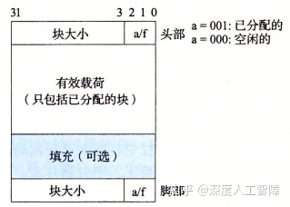

而隐式空闲链表具有以下格式。首先使用第一个填充字来保证边界对其，然后在初始时创建**序言块（Prologue Block）** 作为起始，永不释放，具有一个8字节的头部和8字节的脚部，是已分配的。而在结尾具有一个**结尾块（Epilogue Block）**，只有头部的大小为0的已分配块。这里会有一个指针`heap_llistp`来指向该序言块。


为此，我们需要定义以下基本常数和宏


其中，`CHUNKSIZE`表示当已申请的堆内存不够时，向内核申请的堆内存大小。`PACK`用来获得块头部，因为块头部的低3位用来表示是否分配。`GET`和`PUT`表示在地址`p`处读写一个字。`GET_SIZE`和`GET_ALLOC`表示从地址`p`处获得块大小和是否分配。`HDRP`和`FTRP`是输入指向第一个有效载荷字节的**块指针（Block Pointer）**，用来获得块头部和脚部。`NEXT_BLKP`和`PREV_BLKP`用来获得下一个和前一个块。

定义好后，我们首先需要根据隐式空闲链表的格式来初始化堆内存


首先，最小的隐式空闲链表需要包含一个字用于对齐，以及两个字的序言块和一个字的结尾块，所以首先使用`mem_sbrk`申请4个字的堆内存。然后根据要求填充对应的内容，然后让`heap_listp`指向序言块脚部的起始地址。初始完后，由于是空的堆内存，所以需要调用`extend_heap`函数来申请`CHUNKSIZE`字节。


首先会判断我们申请的字是否满足对齐要求，然后再申请需要的空间。接下来就需要根据隐式空闲链表的要求再对堆进行设置，首先将申请到的空间作为一整个空闲块，设置了对应的头部和脚部，**注意：** 在第8行申请`size`个字节后，`bp`指向的是结尾块的下一个字，所以在第12行设置空闲块头部时，根据`PUT`定义，可知这里新申请的空闲块覆盖了之前的结尾块，将其作为了自己的头部字，然后在设置脚部时，留下了一个字用来作为新的结尾块。

最终如果前面是一个空闲块，就会尝试进行合并。


在`coalesce`函数中，会根据前后两个块是否空闲来确定是否合并，合并其实也就是修改空闲块的头部和脚部。释放操作的`free`函数其实就是将块的头部和脚部设置为空闲的，然后执行合并操作就行。

接下来就是关键的我们实现的`malloc`方法


首先字节数`size`传进来后，会现在第12行到14行判断是否满足对齐要求，然后得到满足对齐要求的字节数`asize`。然后尝试寻找合适的空闲块进行分配，如果没有找到合适的空闲块，就需要向内核再申请堆内存空间，再尝试分配。


# [读书笔记]CSAPP：23[VB]内存分配：垃圾收集器


 **视频地址：**

[【精校中英字幕】2015 CMU 15-213 CSAPP 深入理解计算机系统 课程视频_哔哩哔哩 (゜-゜)つロ 干杯~-bilibiliwww.bilibili.com/video/BV1iW411d7hd?p=20](https://link.zhihu.com/?target=https%3A//www.bilibili.com/video/BV1iW411d7hd%3Fp%3D20)

**课件地址：**

[http://www.cs.cmu.edu/afs/cs/academic/class/15213-f15/www/lectures/20-malloc-advanced.pdfwww.cs.cmu.edu/afs/cs/academic/class/15213-f15/www/lectures/20-malloc-advanced.pdf](https://link.zhihu.com/?target=http%3A//www.cs.cmu.edu/afs/cs/academic/class/15213-f15/www/lectures/20-malloc-advanced.pdf)

本章对应于书中的9.10~9.11。

------

在上一章中介绍了显示分配器要求应用程序显示地调用`free`函数来释放已分配块，比如以下代码中在`garbage`函数中调用了`malloc`函数来分配块，但是函数返回时并没进行释放，使得`p`指向的分配块始终保持已分配的状态，则分配器就无权对该分配块进行操作，由于`p`保存在函数`garbage`的栈帧中，当`garbage`返回时也丢失了`p`，所以这个已分配块就变成了垃圾，无法被使用，直到程序终止。

```c
void garbage(){
  int *p = (int *)malloc(128);
  return;
} 
```

而在隐式分配器中，分配器会释放程序不再使用的已分配块，自动对其调用`free`函数进行释放。则应用程序只需要显示分配自己需要的块，而回收过程由分配器自动完成。

本章主要介绍Mark&Sweep算法，它建立在malloc包的基础上，使得C和C++就有垃圾收集的能力。

## 1 垃圾收集器

### 1.1 基础知识

垃圾收集器将内存视为一个有向**可达图（Reachability Graph）**，其中具有两种节点：

- **根节点（Root Node）：** 对应于不在堆中但包含指向堆中的指针，可以是寄存器、栈中变量或全局变量等等。
- **堆节点（Heap Node）：** 对应于堆中的一个已分配的块。

有向边 ![[公式]](https://www.zhihu.com/equation?tex=p%5Crightarrow+q) 表示p中的某个位置指向q中的某个位置，说明p需要q的存在。我们可以从根节点触发找到所有可达的节点，则剩下的不可达的节点就是垃圾，因为不存在使用这些不可达节点的入口，应用程序无法再次访问这些不可达的已分配块。垃圾收集器就是在维护这样一个有向可达图，并释放不可达节点。


对于像ML和Java语言，其对指针创建和使用有严格的要求，由此来构建十分精确的可达图，所以能回收所有垃圾。而对于像C和C++这样的语言，垃圾收集器无法维护十分精确的可达图，只能正确地标记所有可达节点，而有一些不可达节点会被错误地标记为可达的，所以会遗留部分垃圾，这种垃圾收集器称为**保守的垃圾收集器（Conservative Garbage Collector）**。

在C中使用垃圾收集器可以有两种方法：

- **按需的：** 将其集成到`malloc`函数中。当引用调用`malloc`函数来分配块时，如果无法找到合适的空闲块，就会调用垃圾收集器来识别出所有垃圾，并调用`free`函数来进行释放。
- **自动的：** 可以将垃圾收集器作为一个和应用并行的独立线程，不断更新可达图和回收垃圾。

### 1.2 Mark&Sweep垃圾收集器

Mark&Sweep垃圾收集器由两个阶段组成：
 
- **标记（Mark）阶段：** 标记出根节点的所有科大的和已分配的后继。为此，需要在块的头部和脚部的低3位中用一位来表示其是否可达的。
- **清除（Sweep）阶段：** 释放所有未标记的已分配块。

这两个阶段的伪代码如下所示


标记阶段为每个根节点都调用一次`mark`函数，首先会判断输入`p`是否为指针，如果是则返回`p`指向的堆节点`b`，然后判断`b`是否被标记，如果没有，则对其进行标记，并返回`b`中不包含头部的以字为单位的长度，这样就能依次遍历`b`中每个字是否指向其他堆节点，再递归地进行标记。这是对图进行DFS。

清除阶段会调用一次`sweep`函数，它会在所有堆节点上反复循环，如果堆节点`b`是已标记的，则消除它的标记，如果是未标记的已分配堆节点，则将其释放，然后指向`b`的后继节点。


### 1.3 C程序的保守Mark&Sweep

C程序想要使用Mark&Sweep垃圾收集器，在实现`isPtr`函数时**具有两个困难：**

- 进入`isPtr`函数时，首先需要判断输入的`p`是否为指针，只有`p`为指针，才判断`p`是否指向某个已分配块的有效载荷。但是在C语言不会用类型信息来标记内存位置，比如`int`或`float`这些标量就可能被伪装成指针，比如`p`对应的是一个`int`类型数据，但是C误以为是指针，而将该数据作为指针又正好指向某个不可达的已分配块中，则分配器会误以为该分配块时可达的，造成无法对该垃圾进行回收。这也是C程序的Mark&Sweep垃圾收集器必须是保守的原因。
- 当判断`p`为指针时，如何确定它所在块的头部。这里可以将已分配的块组织成平衡二叉树的形式，如下所示，保证左子树所有的块都在较小的地址处，右子树所有的块都在较大的地址处。此时输入一个指针`p`，从该树的根节点开始，根据块头部的块大小字段来判断指针是否指向该块，如果不是，根据地址大小可跳转到左子树或右子树进行查找。


## 2 C程序中常见的与内存有关的错误

先介绍C程序中怎么判断指针的内容：首先在变量名左右根据下方操作符的优先级确定先定义那个操作符，然后依次判断就可以得到变量的定义。

C操作符的优先级和结合方向

- `int *p`：p is a pointer to int
- `int *p[13]`：p is an array[13] of pointer to int
- `int *(p[13])`：p is an array[13] of pointer to int
- `int **p`：p is a pointer to a pointer to an int
- `int (*p)[13]`：p is a pointer to an array[13] of int
- `int *f()`：f is a function returning a pointer to int
- `int (*f)()`：f is a pointer to a function returning int
- `int (*(*f())[13])()`：f is a function returning ptr to an array[13] of pointers to functions returning int
- `int (*(*x[3])())[5]`：x is an array[3] of pointers to functions returning pointers to array[5] of ints

接下来将介绍一些常见的与内存有关的错误来结束对虚拟内存的讨论。

### 2.1 间接引用坏指针

我们知道，对于每个进程，内核维护了一个`vm_area_struct`数据结构，来将虚拟内存划分成不同的段，这也造成虚拟内存可能是不连续的，如果我们尝试对不处于任何段的虚拟内存进行引用时，内核就会发出段异常终止程序。其次，不同段限制了不同页的读写权限，如果我们尝试对只读虚拟页进行写操作时，内核就会发出保护异常终止程序。

所以对地址的引用和读写要满足要求。比如我们错误地使用了以下代码

```c
scanf("%d", val);
```

此时就会尝试对`val`作为虚拟地址，对其进行写操作，如果`val`的值作为虚拟地址不处于任何段，或处于只读段，则会报错。

### 2.2 读未初始化的内存

我们定义的未初始化的全局变量处于`.bss`段中，该段会与匿名文件进行关联，使得未初始化的全局变量都为0。但是使用`malloc`分配堆内存时，只是简单的修改了`brk`指针，并不会对已分配的块进行任何初始化，所以要对动态内存分配得到的堆内存进行初始化。

### 2.3 假设指针和他们指向的对象是相同大小的


以上代码尝分配一个n*m大小的二维数组，但是第5行中应该使用`sizeof(int*)`，但是这里却使用`sizeof(int)`，只有在`int *`和`int`大小相同的系统中才会执行正确，如果在大小不同的系统中就会执行错误。

执行`malloc`函数后，其会分配一个指定大小的块，并设置好块的头部和脚部。当我们在第7行和第8行进行初始化时对`A`进行初始化时，由于`int`比`int *`小，使得会覆盖已分配块的脚部，一开始没有什么问题，但是在后面执行`free`进行释放时，如果尝试合并空闲块，就会由于脚部被覆盖而出现未知的错误。

### 2.4 造成错位错误


以上代码在第7行中的`i<=n`应该为`i，这里会覆盖`A[n]`的内容，这个是其他堆块的内容。

### 2.5 引用指针而不是指针指向的对象

当操作符优先级和结合性考虑错误时，可能会错误地操作指针，而不是指针指向的对象。


第6行中，由于`*`和`--`的优先级相同，所以会从右往左执行，此时就会先对`size`指针减1。

# [读书笔记]CSAPP：MallocLab


 **README：**[http://csapp.cs.cmu.edu/3e/README-malloclab](https://link.zhihu.com/?target=http%3A//csapp.cs.cmu.edu/3e/README-malloclab)

**说明：**[http://csapp.cs.cmu.edu/3e/malloclab.pdf](https://link.zhihu.com/?target=http%3A//csapp.cs.cmu.edu/3e/malloclab.pdf)

**代码：**[http://csapp.cs.cmu.edu/3e/malloclab-handout.tar](https://link.zhihu.com/?target=http%3A//csapp.cs.cmu.edu/3e/malloclab-handout.tar)

**复习：**[http://www.cs.cmu.edu/afs/cs/academic/class/15213-f15/www/recitations/rec11.pdf](https://link.zhihu.com/?target=http%3A//www.cs.cmu.edu/afs/cs/academic/class/15213-f15/www/recitations/rec11.pdf)

该作业编译成32位程序，我使用的是Windows的WSL子操作系统，不支持32位的程序，可参考[这里](https://link.zhihu.com/?target=https%3A//www.jianshu.com/p/3df082840b40)来修改。

------

做了两天，一直遇到段错误，好难debug，但是做出了一点结果，不追求满分了，就加强对动态分配器的理解吧。

该实验主要是让我们实现一个动态分配器，实现`mm_init`、`mm_malloc`、`mm_free`和`mm_realloc`函数。然后提供了两个简单的验证文件`short1-bal.rep`和`short2-bal.rep`来测试我们算法的内存利用率和吞吐量。我们可以调用`./mdriver -f short1-bal.rep -V`来查看单个文件的测试结果。然后github上有人上传了该课程的其他测试数据，可以从[这里](https://link.zhihu.com/?target=https%3A//github.com/Ethan-Yan27/CSAPP-Labs/tree/master/yzf-malloclab-handout/traces)下载，得到一个`trace`文件夹，然后调用`./mdriver -t ./trace -V`来查看测试结果。

## 隐式空闲链表

首先，我们使用带有脚部的块的数据结构，如下所示。并且设置指向块的指针`bp`是指向有效载荷的，这样就能通过`bp`直接访问块中的有效载荷。

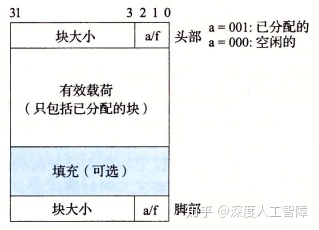

基于此，我们可以确定一些宏

```c
//字大小和双字大小
#define WSIZE 4
#define DSIZE 8
//当堆内存不够时，向内核申请的堆空间
#define CHUNKSIZE (1<<12)
//将val放入p开始的4字节中
#define PUT(p,val) (*(unsigned int*)(p) = (val))
//获得头部和脚部的编码
#define PACK(size, alloc) ((size) | (alloc))
//从头部或脚部获得块大小和已分配位
#define GET_SIZE(p) (*(unsigned int*)(p) & ~0x7)
#define GET_ALLO(p) (*(unsigned int*)(p) & 0x1)
//获得块的头部和脚部
#define HDRP(bp) ((char*)(bp) - WSIZE)
#define FTRP(bp) ((char*)(bp) + GET_SIZE(HDRP(bp)) - DSIZE)
//获得上一个块和下一个块
#define NEXT_BLKP(bp) ((char*)(bp) + GET_SIZE(HDRP(bp)))
#define PREV_BLKP(bp) ((char*)(bp) - GET_SIZE((char*)(bp) - DSIZE))

#define MAX(x,y) ((x)>(y)?(x):(y))
```

**注意：** 我们传入的`bp`指针可能是`void *`类型的，如果对`bp`进行计算时，要将其强制类型转换为`char *`，这样加减的值就是字节数目。

```c
//指向隐式空闲链表的序言块的有效载荷
static char *heap_listp;
/* 
 * mm_init - initialize the malloc package.
 */
int mm_init(void){
	if((heap_listp = mem_sbrk(4*WSIZE)) == (void*)-1)	//申请4字空间
		return -1;
	PUT(heap_listp, 0);	//填充块
	PUT(heap_listp+1*WSIZE, PACK(DSIZE, 1));	//序言块头部
	PUT(heap_listp+2*WSIZE, PACK(DSIZE, 1));	//序言块脚部
	PUT(heap_listp+3*WSIZE, PACK(0, 1));		//结尾块
	
	heap_listp += DSIZE;	//指向序言块有效载荷的指针
	
	if(expend_heap(CHUNKSIZE/WSIZE) == NULL)	//申请更多的堆空间
		return -1;
	return 0;
}
```

该部分是用来创建初始隐式空闲链表的，我们的隐式空闲链表具有以下结构


首先需要一个包含头部和脚部的已分配序言块，永远不会被释放，大小为8字节，作为隐式空闲链表的开头。后续就是一些我们普通的块，包含已分配块和空闲块，最后是一个块大小为0的已分配结尾块，只包含头部，大小为4字节，作为隐式空闲链表的结尾，为什么结尾块是这么设置的，后面会看到原因。

现在普通块1加上序言块和自己的头部就有3个字，为了保证块的有效载荷都是双字对齐的，就在堆的起始位置填充一个字的块。

然后我们令一个指针`heap_listp`指向序言块的有效载荷部分，作为隐式空闲链表的起始指针。然后当前隐式空闲链表还没有可以装其他数据的部分，所以调用`expend_heap`来申请更多的堆空间，这里一次申请固定大小的空间，由`CHUNKSIZE`定义。

```c
static void *expend_heap(size_t words){
	size_t size;
	void *bp;
	
	size = words%2 ? (words+1)*WSIZE : words*WSIZE;	//对大小双字对对齐
	if((bp = mem_sbrk(size)) == (void*)-1)	//申请空间
		return NULL;
	
	PUT(HDRP(bp), PACK(size, 0));	//设置头部
	PUT(FTRP(bp), PACK(size, 0));	//设置脚部
	PUT(HDRP(NEXT_BLKP(bp)), PACK(0, 1));	//设置新的结尾块
	
	//立即合并
	return imme_coalesce(bp);
	//return bp;
}
```

该函数传入字数目，首先要保证字数目是双字对齐的，然后申请对应的堆空间。接下来就将申请的堆空间作为一个空闲块，设置头部和脚部。需要注意，此时的`bp`指针和隐式空闲链表的关系如下所示


此时我们调用`PUT(HDRP(bp),PACK(size,0));`来设置新空闲块的头部，可以发现是将之前的结尾块作为当前空闲块的头部，而`PUT(HDRP(NEXT_BLKP(bp)),PACK(0,1));`是将最终结尾的一个字作为结尾块。这样就充分利用了原来的结尾块空间。

此时该空闲块的前面可能也为空闲块，所以可以调用`imme_coalesce(bp)`进行立即合并。

```c
static void *imme_coalesce(void *bp){
	size_t prev_alloc = GET_ALLO(FTRP(PREV_BLKP(bp)));	//获得前面块的已分配位
	size_t next_alloc = GET_ALLO(HDRP(NEXT_BLKP(bp)));	//获得后面块的已分配位
	size_t size = GET_SIZE(HDRP(bp));	//获得当前块的大小
	
	if(prev_alloc && next_alloc){
		return bp;
	}else if(prev_alloc && !next_alloc){
		size += GET_SIZE(HDRP(NEXT_BLKP(bp)));
		PUT(HDRP(bp), PACK(size, 0));
		PUT(FTRP(bp), PACK(size, 0));
	}else if(!prev_alloc && next_alloc){
		size += GET_SIZE(FTRP(PREV_BLKP(bp)));
		PUT(HDRP(PREV_BLKP(bp)), PACK(size, 0));
		PUT(FTRP(bp), PACK(size, 0));
		bp = PREV_BLKP(bp);
	}else{
		size += GET_SIZE(HDRP(NEXT_BLKP(bp))) +
				GET_SIZE(FTRP(PREV_BLKP(bp)));
		PUT(HDRP(PREV_BLKP(bp)), PACK(size, 0));
		PUT(FTRP(NEXT_BLKP(bp)), PACK(size, 0));
		bp = PREV_BLKP(bp);
	}
	return bp;
}
```

该函数会根据`bp`前面一块和后面一块的已分配位的不同情况，来决定如何进行合并， 如下所示

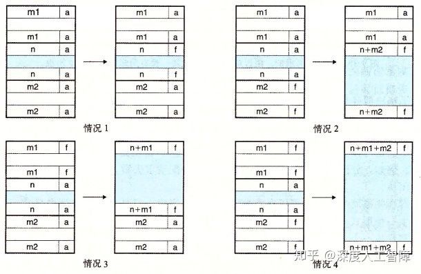

其实我们这里只需要修改对应块的头部和脚部中的块大小字段就可以了，然后根据需要修改`bp`使它指向合并后的空闲块。

接下来就能看看我们的`mm_malloc`函数了

```c
 void *mm_malloc(size_t size){
	size_t asize;
	void *bp;
	
	if(size == 0)
		return NULL;
	//满足最小块要求和对齐要求，size是有效负载大小
	asize = size<=DSIZE ? 2*DSIZE : DSIZE * ((size + (DSIZE) + (DSIZE-1)) / DSIZE);
	//首次匹配
	if((bp = first_fit(asize)) != NULL){
		place(bp, asize);
		return bp;
	}
	//最佳匹配
	/*if((bp = best_fit(asize)) != NULL){
		place(bp, asize);
		return bp;
	}*/
	//推迟合并
	//delay_coalesce();
	//最佳匹配
	/*if((bp = best_fit(asize)) != NULL){
		place(bp, asize);
		return bp;
	}*/
	//首次匹配
	/*if((bp = first_fit(asize)) != NULL){
		place(bp, asize);
		return bp;
	}*/
	if((bp = expend_heap(MAX(CHUNKSIZE, asize)/WSIZE)) == NULL)
		return NULL;
	place(bp, asize);
	return bp;
}
```

首先，`mm_malloc`传进来的大小参数`size`是指块的有效载荷，当我们对空闲块进行搜索时，空闲块的大小包括了头部、有效载荷和脚部，所以我们需要将`size`加上这两部分的大小且进行双字对齐，得到进行比较的大小`asize`。然后我们就可以使用`asize`来搜索合适的空闲块，这里有两个策略：首次适配和最佳适配。并且如果我们采用延迟合并空闲块的话，如果找不到合适的空闲块，就要进行延迟合并，然后再找一次，如果还是找不到，则说明没有足够的堆空间，此时要再申请堆空间，然后将我们想要的空间大小放入空闲块中。

首先看首次适配

```c
static void *first_fit(size_t asize){
	void *bp = heap_listp;
	size_t size;
	while((size = GET_SIZE(HDRP(bp))) != 0){	//遍历全部块
		if(size >= asize && !GET_ALLO(HDRP(bp)))	//寻找大小大于asize的空闲块
			return bp;
		bp = NEXT_BLKP(bp);
	}
	return NULL;
} 
```

将隐式空闲链表的结尾块作为结尾，依次判断链表中的块，如果有大小大于`asize`的空闲块，就直接返回。

我们也可以看看最佳适配

```c
static void *best_fit(size_t asize){
	void *bp = heap_listp;
	size_t size;
	void *best = NULL;
	size_t min_size = 0;
	
	while((size = GET_SIZE(HDRP(bp))) != 0){
		if(size >= asize && !GET_ALLO(HDRP(bp)) && (min_size == 0 || min_size>size)){	//记录最小的合适的空闲块
			min_size = size;
			best = bp;
		}
		bp = NEXT_BLKP(bp);
	}
	return best;
} 
```

它将搜索最小的合适的空闲块，这样就能减少碎片的产生，提高内存利用率。

当找到合适的空闲块时，我们就需要将我们需要的空间放入空闲块中

```c
static void place(void *bp, size_t asize){
	size_t remain_size;
	remain_size = GET_SIZE(HDRP(bp)) - asize;	//计算空闲块去掉asize后的剩余空间
	if(remain_size >= DSIZE){	//如果剩余空间满足最小块大小，就将其作为一个新的空闲块
		PUT(HDRP(bp), PACK(asize, 1));
		PUT(FTRP(bp), PACK(asize, 1));
		PUT(HDRP(NEXT_BLKP(bp)), PACK(remain_size, 0));
		PUT(FTRP(NEXT_BLKP(bp)), PACK(remain_size, 0));
	}else{
		PUT(HDRP(bp), PACK(GET_SIZE(HDRP(bp)), 1));
		PUT(FTRP(bp), PACK(GET_SIZE(HDRP(bp)), 1));
	}
}
```

首先，我们需要计算空闲块去掉`asize`后的剩余空间，如果剩余空间还能填充头部和脚部构成一个新的空闲块，则对该空闲块进行分割，否则就使用整个空闲块，设置块的已分配位。

然后可以看看延迟合并的代码

```c
static void *delay_coalesce(){
	void *bp = heap_listp;
	while(GET_SIZE(HDRP(bp)) != 0){
		if(!GET_ALLO(HDRP(bp)))
			bp = imme_coalesce(bp);
		bp = NEXT_BLKP(bp);
	}
}
```

遍历空闲链表的所有块，如果是空闲块，就将其和周围进行合并。

接下来可以看看我们的`mm_free`

```c
/*
 * mm_free - Freeing a block does nothing.
 */
void mm_free(void *ptr){
	size_t size = GET_SIZE(HDRP(ptr));
	PUT(HDRP(ptr), PACK(size, 0));
	PUT(FTRP(ptr), PACK(size, 0));
	
	//立即合并
	imme_coalesce(ptr);
} 
```

我们首先设置块的已分配位，将其设置为空闲状态，然后对其立即合并就行。

最终是我们的`mm_realloc`

```c
 /*
 * mm_realloc - Implemented simply in terms of mm_malloc and mm_free
 */
void *mm_realloc(void *ptr, size_t size){
	size_t asize, ptr_size;
	void *new_bp;
	
	if(ptr == NULL)
		return mm_malloc(size);
	if(size == 0){
		mm_free(ptr);
		return NULL;
	}
	
	asize = size<=DSIZE ? 2*DSIZE : DSIZE * ((size + (DSIZE) + (DSIZE-1)) / DSIZE);
	new_bp = imme_coalesce(ptr);	//尝试是否有空闲的
	ptr_size = GET_SIZE(HDRP(new_bp));
	PUT(HDRP(new_bp), PACK(ptr_size, 1));
	PUT(FTRP(new_bp), PACK(ptr_size, 1));
	if(new_bp != ptr)	//如果合并了前面的空闲块，就将原本的内容前移
		memcpy(new_bp, ptr, GET_SIZE(HDRP(ptr)) - DSIZE);
	
	if(ptr_size == asize)
		return new_bp;
	else if(ptr_size > asize){
		place(new_bp, asize);
		return new_bp;
	}else{
		ptr = mm_malloc(asize);
		if(ptr == NULL)
			return NULL;
		memcpy(ptr, new_bp, ptr_size - DSIZE);
		mm_free(new_bp);
		return ptr;
	}
}
```

首先，如果`ptr`为NULL，则直接分配`size`大小的空间，如果`size`为0，则直接释放`ptr`指向的空间。否则就需要执行`mm_realloc`。 当我们执行`mm_realloc`时，`ptr`指向的是已分配块，它的周围可能有空闲块，而加上空闲块后，可能就会满足`asize`的大小要求了，所以我们可以先尝试将`ptr`和周围的空闲块进行合并。

然后下面是实验结果

**首次适配+立即合并：**

```text
Results for mm malloc:
trace  valid  util     ops      secs  Kops
 0       yes   99%    5694  0.014197   401
 1       yes   99%    5848  0.013547   432
 2       yes   99%    6648  0.021787   305
 3       yes  100%    5380  0.016372   329
 4       yes   66%   14400  0.001061 13570
 5       yes   92%    4800  0.014609   329
 6       yes   92%    4800  0.013454   357
 7       yes   55%   12000  0.203199    59
 8       yes   51%   24000  0.572411    42
 9       yes   44%   14401  0.152757    94
10       yes   45%   14401  0.029385   490
Total          77%  112372  1.052780   107

Perf index = 46 (util) + 7 (thru) = 53/100
```

**首次匹配+延迟合并：**

```text
Results for mm malloc:
trace  valid  util     ops      secs  Kops
 0       yes   99%    5694  0.033440   170
 1       yes   99%    5848  0.028946   202
 2       yes   99%    6648  0.062765   106
 3       yes   99%    5380  0.056375    95
 4       yes   66%   14400  0.001050 13721
 5       yes   92%    4800  0.029646   162
 6       yes   90%    4800  0.027486   175
 7       yes   60%   12000  0.214382    56
 8       yes   53%   24000  0.584505    41
 9       yes   35%   14401  0.813350    18
10       yes   45%   14401  0.019537   737
Total          76%  112372  1.871480    60

Perf index = 46 (util) + 4 (thru) = 50/100
```

**最佳匹配+立即合并：**

```text
Results for mm malloc:
trace  valid  util     ops      secs  Kops
 0       yes   99%    5694  0.015399   370
 1       yes   99%    5848  0.014503   403
 2       yes   99%    6648  0.023172   287
 3       yes  100%    5380  0.017809   302
 4       yes   66%   14400  0.001038 13878
 5       yes   96%    4800  0.030279   159
 6       yes   95%    4800  0.028814   167
 7       yes   55%   12000  0.201558    60
 8       yes   51%   24000  0.601187    40
 9       yes   40%   14401  0.003348  4302
10       yes   45%   14401  0.002100  6856
Total          77%  112372  0.939206   120

Perf index = 46 (util) + 8 (thru) = 54/100
```

**最佳匹配+延迟合并：**

```text
Results for mm malloc:
trace  valid  util     ops      secs  Kops
 0       yes   99%    5694  0.038064   150
 1       yes   99%    5848  0.036293   161
 2       yes   99%    6648  0.073700    90
 3       yes   99%    5380  0.072891    74
 4       yes   66%   14400  0.001064 13535
 5       yes   95%    4800  0.048523    99
 6       yes   94%    4800  0.046162   104
 7       yes   60%   12000  0.223058    54
 8       yes   53%   24000  0.592458    41
 9       yes   65%   14401  0.004285  3361
10       yes   76%   14401  0.001220 11800
Total          82%  112372  1.137718    99

Perf index = 49 (util) + 7 (thru) = 56/100
```

## 分离的空闲链表

对于分离的空闲链表，需要首先确定块的数据结构


这里空闲块在第二字和第三字记录了空闲块的前驱和后继的空闲块，由此通过指针的方式将所有空闲块显示链接起来，就能通过该指针直接遍历所有的空闲块了。

我们定义以下的宏

```c
//字大小和双字大小
#define WSIZE 4
#define DSIZE 8
//当堆内存不够时，向内核申请的堆空间
#define CHUNKSIZE (1<<12)
//将val放入p开始的4字节中
#define PUT(p,val) (*(unsigned int*)(p) = (val))
#define GET(p) (*(unsigned int*)(p))
//获得头部和脚部的编码
#define PACK(size, alloc) ((size) | (alloc))
//从头部或脚部获得块大小和已分配位
#define GET_SIZE(p) (GET(p) & ~0x7)
#define GET_ALLO(p) (GET(p) & 0x1)
//获得块的头部和脚部
#define HDRP(bp) ((char*)(bp) - WSIZE)
#define FTRP(bp) ((char*)(bp) + GET_SIZE(HDRP(bp)) - DSIZE)
//获得上一个块和下一个块
#define NEXT_BLKP(bp) ((char*)(bp) + GET_SIZE(HDRP(bp)))
#define PREV_BLKP(bp) ((char*)(bp) - GET_SIZE((char*)(bp) - DSIZE))

//获得块中记录后继和前驱的地址
#define PRED(bp) ((char*)(bp) + WSIZE)
#define SUCC(bp) ((char*)bp)
//获得块的后继和前驱的地址
#define PRED_BLKP(bp) (GET(PRED(bp)))
#define SUCC_BLKP(bp) (GET(SUCC(bp)))

#define MAX(x,y) ((x)>(y)?(x):(y))
```

这里`bp`指向的是头部后面一个字的位置，我们将第一个字用来记录空闲块后继的地址，第二个块用来记录前驱的地址。为什么这样后面会有说明。

然后我们需要确定分离的空闲链表的大小类，由于一个空闲块包含头部、后继、前驱和脚部，至少需要16字节，所以空闲块的最小块为16字节，小于16字节就无法记录完整的空闲块内容，所以大小类设置为

```text
{16-31},{32-63},{64-127},{128-255},{256-511},{512-1023},{1024-2047},{2048-4095},{4096-inf}
```

我们需要在堆的开始包含这些大小类的root节点，指向各自对应的空闲链表，则root需要一个字的空间用来保存地址。其次，还是需要保存序言块和结尾块，用来作为块之间移动的标志。所以`mm_init`如下所示

```c
static char *heap_listp;
static char *listp;

/* 
 * mm_init - initialize the malloc package.
 */
int mm_init(void){
	if((heap_listp = mem_sbrk(12*WSIZE)) == (void*)-1)
		return -1;
	//空闲块的最小块包含头部、前驱、后继和脚部，有16字节
	PUT(heap_listp+0*WSIZE, NULL);	//{16~31}
	PUT(heap_listp+1*WSIZE, NULL);	//{32~63}
	PUT(heap_listp+2*WSIZE, NULL);	//{64~127}
	PUT(heap_listp+3*WSIZE, NULL);	//{128~255}
	PUT(heap_listp+4*WSIZE, NULL);	//{256~511}
	PUT(heap_listp+5*WSIZE, NULL);	//{512~1023}
	PUT(heap_listp+6*WSIZE, NULL);	//{1024~2047}
	PUT(heap_listp+7*WSIZE, NULL);	//{2048~4095}
	PUT(heap_listp+8*WSIZE, NULL);	//{4096~inf}
	
	//还是要包含序言块和结尾块
	PUT(heap_listp+9*WSIZE, PACK(DSIZE, 1));
	PUT(heap_listp+10*WSIZE, PACK(DSIZE, 1));
	PUT(heap_listp+11*WSIZE, PACK(0, 1));
	
	listp = heap_listp;
	heap_listp += 10*WSIZE;
	
	
	if(expend_heap(CHUNKSIZE/WSIZE) == NULL)
		return -1;
	return 0;
}
```

这里首先申请了12个字的空间，然后接下来的9各自依次保存各个大小类的root指针，初始为NULL。然后后面3个字用来保存序言块和结尾块，让`listp`指向大小类数组的起始位置，让`heap_listp`指向序言块的有效载荷，然后调用`expend_heap`来申请堆空间。**注意：**root指针相当于只有后继的块，所以可以通过`SUCC`宏来查看后继。

```c
static void *expend_heap(size_t words){
	size_t size;
	void *bp;
	
	size = words%2 ? (words+1)*WSIZE : words*WSIZE;
	if((bp = mem_sbrk(size)) == (void*)-1)
		return NULL;
	PUT(HDRP(bp), PACK(size, 0));
	PUT(FTRP(bp), PACK(size, 0));
	PUT(HDRP(NEXT_BLKP(bp)), PACK(0, 1));
	
	PUT(PRED(bp), NULL);
	PUT(SUCC(bp), NULL);
	
	//立即合并
	bp = imme_coalesce(bp);
	bp = add_block(bp);
	return bp;
}
```

首先获得对齐的大小`size`，然后和隐式空闲链表一样设置空闲块的头部、脚部和结尾块。然后由于该空闲块还没插入空闲链表中，所以先设置该空闲块的前驱和后继指针为NULL，然后调用`imme_coalesce`函数对该空闲块进行立即合并，再调用`add_block`函数将该空闲块插入合适的大小类的空闲链表中。

```c
static void *imme_coalesce(void *bp){
	size_t prev_alloc = GET_ALLO(FTRP(PREV_BLKP(bp)));
	size_t next_alloc = GET_ALLO(HDRP(NEXT_BLKP(bp)));
	size_t size = GET_SIZE(HDRP(bp));
	
	if(prev_alloc && next_alloc){
		return bp;
	}else if(prev_alloc && !next_alloc){
		size += GET_SIZE(HDRP(NEXT_BLKP(bp)));
		delete_block(NEXT_BLKP(bp));
		PUT(HDRP(bp), PACK(size, 0));
		PUT(FTRP(bp), PACK(size, 0));
	}else if(!prev_alloc && next_alloc){
		size += GET_SIZE(FTRP(PREV_BLKP(bp)));
		delete_block(PREV_BLKP(bp));
		PUT(HDRP(PREV_BLKP(bp)), PACK(size, 0));
		PUT(FTRP(bp), PACK(size, 0));
		bp = PREV_BLKP(bp);
	}else{
		size += GET_SIZE(HDRP(NEXT_BLKP(bp))) +
				GET_SIZE(FTRP(PREV_BLKP(bp)));
		delete_block(NEXT_BLKP(bp));
		delete_block(PREV_BLKP(bp));
		PUT(HDRP(PREV_BLKP(bp)), PACK(size, 0));
		PUT(FTRP(NEXT_BLKP(bp)), PACK(size, 0));
		bp = PREV_BLKP(bp);
	}
	return bp;
}
```

首先查找空闲块`bp`前后相邻的块的已分配位，根据已分配位的组合分成4种情况。


可以发现，如果有周围有空闲块，则首先需要通过`delete_block`函数将该空闲块从显示空闲链表中删除对应于图中调整指针的部分，然后再设置对应的头部和脚部，使得空闲块进行合并，并让`bp`指向新的空闲块的有效载荷部分。

```c
 static void delete_block(void *bp){
	PUT(SUCC(PRED_BLKP(bp)), SUCC_BLKP(bp));
	if(SUCC_BLKP(bp)!=NULL)
		PUT(PRED(SUCC_BLKP(bp)), PRED_BLKP(bp));
}
```

从显示空闲链表中删除指定的空闲块其实很简单，就是调整前驱和后继的指针，使其跳过当前的空闲块就好。

在合并完空闲块后，我们需要将其插入到合适的大小类的显示空闲链表中

```c
static void *add_block(void *bp){
	size_t size = GET_SIZE(HDRP(bp));
	int index = Index(size);
	void *root = listp+index*WSIZE;
	
	//LIFO
	return LIFO(bp, root);
        //AddressOrder
	//return AddressOrder(bp, root);
}
```

在将空闲块插入显示空闲链表时，首先需要确定该空闲块所在的大小类

```c
static int Index(size_t size){
	int ind = 0;
	if(size >= 4096)
		return 8;
	
	size = size>>5;
	while(size){
		size = size>>1;
		ind++;
	}
	return ind;
}
```

由此就能得到对应大小类的显示空闲链表的root指针，此时提供两种在该显示空闲链表插入空闲块的策略：LIFO策略和地址顺序策略。

```c
static void *LIFO(void *bp, void *root){
	if(SUCC_BLKP(root)!=NULL){
		PUT(PRED(SUCC_BLKP(root)), bp);	//SUCC->BP
		PUT(SUCC(bp), SUCC_BLKP(root));	//BP->SUCC
	}else{
		PUT(SUCC(bp), NULL);	//缺了这个！！！！
	}
	PUT(SUCC(root), bp);	//ROOT->BP
	PUT(PRED(bp), root);	//BP->ROOT
	return bp;
}
```

LIFO策略是直接将空闲块插入称为头结点。注意当root后没后继节点时，说明是直接将`bp`查到root后面，此时要记得将`bp`的后继节点置为NULL。

```c
 static void *AddressOrder(void *bp, void *root){
	void *succ = root;
	while(SUCC_BLKP(succ) != NULL){
		succ = SUCC_BLKP(succ);
		if(succ >= bp){
			break;
		}
	}
	if(succ == root){
		return LIFO(bp, root);
	}else if(SUCC_BLKP(succ) == NULL){
		PUT(SUCC(succ), bp);
		PUT(PRED(bp), succ);
		PUT(SUCC(bp), NULL);
	}else{
		PUT(SUCC(PRED_BLKP(succ)), bp);
		PUT(PRED(bp), PRED_BLKP(succ));
		PUT(SUCC(bp), succ);
		PUT(PRED(succ), bp);
	}
	return bp;
}
```

而地址顺序就是让显示空闲链表中的空闲块地址依次递增。这种策略的首次适配会比LIFO的首次适配有更高的内存利用率。

接下来就可以看看我们的`mm_malloc`函数了

```c
void *mm_malloc(size_t size){
	size_t asize;
	void *bp;
	
	if(size == 0)
		return NULL;
	//满足最小块要求和对齐要求，size是有效负载大小
	asize = size<=DSIZE ? 2*DSIZE : DSIZE * ((size + (DSIZE) + (DSIZE-1)) / DSIZE);
	//首次匹配
	if((bp = first_fit(asize)) != NULL){
		place(bp, asize);
		return bp;
	}
	//最佳匹配
	/*if((bp = best_fit(asize)) != NULL){
		place(bp, asize);
		return bp;
	}*/
	if((bp = expend_heap(MAX(CHUNKSIZE, asize)/WSIZE)) == NULL)
		return NULL;
	place(bp, asize);
	return bp;
} 
```

首先会计算满足最小块和对其要求的空闲块大小`asize`，**注意：** 空闲块需要额外的两个字来保存前驱和后继指针，但是已分配的块不需要，所以这里的`asize`还是和隐式空闲链表的相同。

这里提供了首次匹配和最佳匹配两种策略

```c
static void *first_fit(size_t asize){
	int ind = Index(asize);
	void *succ;
	while(ind <= 8){
		succ = listp+ind*WSIZE;
		while((succ = SUCC_BLKP(succ)) != NULL){
			if(GET_SIZE(HDRP(succ)) >= asize && !GET_ALLO(HDRP(succ))){
				return succ;
			}
		}
		ind+=1;
	}
	return NULL;
}
```

在首次匹配中，首先需要确定`asize`大小的空闲块处于哪个大小类，然后搜索该大小类对应的显示空闲链表，如果找到大小合适的空闲块，则直接返回，如果该显示空闲链表没找到合适的空闲块，就遍历下一个大小类的显示空闲链表，因为下一个大小类的空闲块一定比当前大小类的大。

```c
 static void *best_fit(size_t asize){
	int ind = Index(asize);
	void *best = NULL;
	int min_size = 0, size;
	void *succ;
	while(ind <= 8){
		succ = listp+ind*WSIZE;
		while((succ = SUCC_BLKP(succ)) != NULL){
			size = GET_SIZE(HDRP(succ));
			if(size >= asize && !GET_ALLO(HDRP(succ)) && (size<min_size||min_size==0)){
				best = succ;
				min_size = size;
			}
		}
		if(best != NULL)
			return best;
		ind+=1;
	}
	return NULL;
}
```

而最佳适配就是要找到满足大小要求的最小空闲块。

当找到合适的空闲块后，我们需要调用`place`函数来使用该空闲块

```c
static void place(void *bp, size_t asize){
	size_t remain_size;
	remain_size = GET_SIZE(HDRP(bp)) - asize;
	delete_block(bp);
	if(remain_size >= DSIZE*2){	//分割
		PUT(HDRP(bp), PACK(asize, 1));
		PUT(FTRP(bp), PACK(asize, 1));
		PUT(HDRP(NEXT_BLKP(bp)), PACK(remain_size, 0));
		PUT(FTRP(NEXT_BLKP(bp)), PACK(remain_size, 0));
		add_block(NEXT_BLKP(bp));
	}else{
		PUT(HDRP(bp), PACK(GET_SIZE(HDRP(bp)), 1));
		PUT(FTRP(bp), PACK(GET_SIZE(HDRP(bp)), 1));
	}
}
```

在`place`函数中，我们首先要将该空闲块从显示空闲链表中删除，然后判断剩余空间是否满足空闲块的最小要求，如果满足则对空闲块进行分割，然后剩余的空闲块调用`add_block`函数将其放到合适的大小类的显示空闲链表中，如果剩余空间不足以构成一个空闲块，则直接使用整个空闲块。

接下来可以看看我们的`mm_free`函数了

```c
/*
 * mm_free - Freeing a block does nothing.
 */
void mm_free(void *ptr){
	size_t size = GET_SIZE(HDRP(ptr));

	PUT(HDRP(ptr), PACK(size, 0));
	PUT(FTRP(ptr), PACK(size, 0));
	
	//立即合并
	ptr = imme_coalesce(ptr);
	add_block(ptr);
}
 
```

该函数首先修改已分配块的头部和脚部，将其置为空闲块，然后调用`imme_coalesce`函数进行立即合并，然后调用`add_block`函数将其插入合适的大小类的显示空闲链表中的合适位置。

接下来看看我们的`mm_realloc`函数

```c
/*
 * mm_realloc - Implemented simply in terms of mm_malloc and mm_free
 */
void *mm_realloc(void *ptr, size_t size){
	size_t asize, ptr_size, remain_size;
	void *new_bp;
	
	if(ptr == NULL){
		return mm_malloc(size);
	}
	if(size == 0){
		mm_free(ptr);
		return NULL;
	}
	
	asize = size<=DSIZE ? 2*DSIZE : DSIZE * ((size + (DSIZE) + (DSIZE-1)) / DSIZE);
	new_bp = imme_coalesce(ptr);	//尝试是否有空闲的
	ptr_size = GET_SIZE(HDRP(new_bp));
	PUT(HDRP(new_bp), PACK(ptr_size, 1));
	PUT(FTRP(new_bp), PACK(ptr_size, 1));
	if(new_bp != ptr)
		memcpy(new_bp, ptr, GET_SIZE(HDRP(ptr)) - DSIZE);
	
	if(ptr_size == asize){
		return new_bp;
	}else if(ptr_size > asize){
		remain_size = ptr_size - asize;
		if(remain_size >= DSIZE*2){	//分割
			PUT(HDRP(new_bp), PACK(asize, 1));
			PUT(FTRP(new_bp), PACK(asize, 1));
			PUT(HDRP(NEXT_BLKP(new_bp)), PACK(remain_size, 0));
			PUT(FTRP(NEXT_BLKP(new_bp)), PACK(remain_size, 0));
			add_block(NEXT_BLKP(new_bp));
		}
		return new_bp;
	}else{
		if((ptr = mm_malloc(asize)) == NULL)
			return NULL;
		memcpy(ptr, new_bp, ptr_size - DSIZE);
		mm_free(new_bp);
		return ptr;
	}
} 
```

这里和之前介绍的思路是相同的。

其次，离散的空闲链表在指针方面比较容易出错，这里提供一个输出各个大小类的显示空闲链表的代码，用来检测是否有指针出错

```c
static void print_listp(){
	int ind;
	void *node, *root;
	printf("print listp\n");
	for(ind=1;ind<=8;ind++){
		node = listp+ind*WSIZE;
		root = listp+ind*WSIZE;
		printf("%d:\n",ind);
		while(SUCC_BLKP(node)){
			node = SUCC_BLKP(node);
			printf("-->%p,%d",node, GET_SIZE(HDRP(node)));
		}
		printf("-->%p\n",SUCC_BLKP(node));
		while(node!=root){
			printf("<--%p,%d",node, GET_SIZE(HDRP(node)));
			node = PRED_BLKP(node);
		}
		printf("<--%p\n",node);
	}
}
```

然后下面是实验结果

**立即合并+首次适配+LIFO：**

```text
trace  valid  util     ops      secs  Kops
 0       yes   98%    5694  0.000925  6158
 1       yes   94%    5848  0.001066  5487
 2       yes   98%    6648  0.001315  5054
 3       yes   99%    5380  0.000914  5887
 4       yes   66%   14400  0.001441  9991
 5       yes   89%    4800  0.001068  4495
 6       yes   85%    4800  0.001189  4037
 7       yes   55%   12000  0.001854  6474
 8       yes   51%   24000  0.003982  6027
 9       yes   48%   14401  0.153353    94
10       yes   45%   14401  0.034466   418
Total          75%  112372  0.201572   557

Perf index = 45 (util) + 37 (thru) = 82/100
```

**立即合并+最佳适配+LIFO：**

```text
Results for mm malloc:
trace  valid  util     ops      secs  Kops
 0       yes   99%    5694  0.001026  5548
 1       yes   99%    5848  0.001052  5558
 2       yes   99%    6648  0.001170  5682
 3       yes  100%    5380  0.001103  4878
 4       yes   66%   14400  0.001601  8993
 5       yes   96%    4800  0.002048  2344
 6       yes   95%    4800  0.001930  2487
 7       yes   55%   12000  0.001934  6206
 8       yes   51%   24000  0.004590  5229
 9       yes   40%   14401  0.004290  3357
10       yes   45%   14401  0.003162  4555
Total          77%  112372  0.023907  4700

Perf index = 46 (util) + 40 (thru) = 86/100
```

**立即合并+最佳适配+AddressOrder：**

```text
Results for mm malloc:
trace  valid  util     ops      secs  Kops
 0       yes   99%    5694  0.001086  5244
 1       yes   99%    5848  0.001069  5473
 2       yes   99%    6648  0.001304  5097
 3       yes  100%    5380  0.001135  4738
 4       yes   66%   14400  0.001509  9544
 5       yes   96%    4800  0.003104  1546
 6       yes   95%    4800  0.003175  1512
 7       yes   55%   12000  0.020766   578
 8       yes   51%   24000  0.071639   335
 9       yes   40%   14401  0.004262  3379
10       yes   45%   14401  0.003016  4775
Total          77%  112372  0.112065  1003

Perf index = 46 (util) + 40 (thru) = 86/100
```

**立即合并+首次适配+AddressOrder：**

```text
Results for mm malloc:
trace  valid  util     ops      secs  Kops
 0       yes   99%    5694  0.000945  6023
 1       yes   99%    5848  0.001001  5843
 2       yes   99%    6648  0.001177  5649
 3       yes  100%    5380  0.000948  5676
 4       yes   66%   14400  0.001481  9720
 5       yes   93%    4800  0.002984  1608
 6       yes   91%    4800  0.002907  1651
 7       yes   55%   12000  0.020213   594
 8       yes   51%   24000  0.070960   338
 9       yes   40%   14401  0.004211  3420
10       yes   45%   14401  0.002934  4908
Total          76%  112372  0.109762  1024

Perf index = 46 (util) + 40 (thru) = 86/100
```

