# 目录

**第三部分  程序间的交互和通信**

**第10章　系统级I/O　10.1　Unix I/O**

10.2　文件

10.3　打开和关闭文件

10.4　读和写文件

10.5　用RIO包健壮地读写

10.5.1　RIO的无缓冲的输入输出函数

10.5.2　RIO的带缓冲的输入函数

10.6　读取文件元数据

10.7　读取目录内容

10.8　共享文件

10.9　I/O重定向

10.10　标准I/O

10.11　综合：我该使用哪些I/O函数？

**第11章　网络编程**

11.1　客户端服务器编程模型

11.2　网络

11.3　全球IP因特网

11.3.1　IP地址

11.3.2　因特网域名

11.3.3　因特网连接

11.4　套接字接口

11.4.1　套接字地址结构

11.4.2　socket函数

11.4.3　connect函数

11.4.4　bind函数

11.4.5　listen函数

11.4.6　accept函数

11.4.7　主机和服务的转换

11.4.8　套接字接口的辅助函数

11.4.9　echo客户端和服务器的示例

11.5　Web服务器

11.5.1　Web基础

11.5.2　Web内容

11.5.3　HTTP事务

11.5.4　服务动态内容

11.6　综合：TINY Web服务器

**第12章　并发编程**

12.1　基于进程的并发编程

12.2　基于I/O多路复用的并发编程

12.3　基于线程的并发编程

12.4　多线程程序中的共享变量

12.5　用信号量同步线程

12.6　使用线程提高并行性

12.7　其他并发问题

# 笔记目录

[24[VB\]系统级I/O](https://zhuanlan.zhihu.com/p/128585227)

[25[VB\]网络编程1](https://zhuanlan.zhihu.com/p/129040027)

[26[VB\]网络编程2](https://zhuanlan.zhihu.com/p/129357760)

[27[VB\]并发编程](https://zhuanlan.zhihu.com/p/129799583)

[28[VB\]同步](https://zhuanlan.zhihu.com/p/130401283)

[29[VB\]线程级并行](https://zhuanlan.zhihu.com/p/130967135)

[[实验\]ProxyLab](https://zhuanlan.zhihu.com/p/130986643)


# [读书笔记]CSAPP：24[VB]系统级I/O


 **视频地址：**

[【精校中英字幕】2015 CMU 15-213 CSAPP 深入理解计算机系统 课程视频_哔哩哔哩 (゜-゜)つロ 干杯~-bilibiliwww.bilibili.com/video/BV1iW411d7hd?p=16](https://link.zhihu.com/?target=https%3A//www.bilibili.com/video/BV1iW411d7hd%3Fp%3D16)

**课件地址：**

[http://www.cs.cmu.edu/afs/cs/academic/class/15213-f15/www/lectures/16-io.pdfwww.cs.cmu.edu/afs/cs/academic/class/15213-f15/www/lectures/16-io.pdf](https://link.zhihu.com/?target=http%3A//www.cs.cmu.edu/afs/cs/academic/class/15213-f15/www/lectures/16-io.pdf)

对应于书中的第10章。

------

Linux将所有资源都看成文件的形式。

------

到这就进入了新的一部分，过去一直假设程序时独立运行的，但是其实应用程序可利用操作系统提供的服务来与I/O设备及其他程序通信，这一部分将学习Unix操作系统提供的基本I/O服务，以及如何利用这些服务来构造引用程序。

## 1 基础知识

**输入/输出**（I/O）是在主存和外部设备（磁盘驱动器、终端和网络）之间复制数据的过程。输入操作就是从I/O设备复制数据到主存，输出操作就是将主存数据复制到I/O设备。这里我们将所有I/O设备都抽象为Linux文件，即m个字节的序列，这样所有输入和输出操作都可以看成是对文件的读写，使得所有输入和输出都能以统一的方法来执行：

- **打开文件**：一个应用程序通过要求内核打开某个文件，来确定要访问的I/O设备。此时内核会记录有关该文件的所有信息，而应用程序会获得该文件的**描述符**，来标识该文件。

- **修改当前读写文件的位置**：对于每个打开的文件，内核会维护一个**文件位置k**来表示当前要读写文件的位置，是从文件头开始的字节偏移量，初始化为0。应用程序可以通过`seek`操作来修改读写文件的位置。

--但是无法修改基于终端的输入的文件位置，因为无法移动、备份和恢复先前已读入的数据，也无法提前接收还未键入的数据。比如套接字。

- **读写文件**：读文件就是在文件中从k开始复制n个字节到内存，并更新`k=k+n`，如果k超出了文件大小，则会给引用程序返回EOF。而写文件就是从内存 复制n个字节到文件位置k处，然后更新`k=k+n`。

- **关闭文件**：当应用程序通知内核关闭文件时，内核会释放打开文件的数据结构，并将该描述符恢复到可用的描述符池中。

通过将I/O设备抽象为文件的形式，使得对I/O设备的输入输出统一为对文件的读写操作，而应用程序可以通过文件描述符来对指定的I/O设备进行操作。在创建进程时，内核会默认打开三个文件，标准输入（描述符为0）、标准输出（描述符为1）和标准错误（描述符为2），可通过`STDIN_FILENO`、`STDOUT_FILENO`和`STDERR_FILENO`代替描述符来访问这三个文件。当进程终止时，内核会关闭所有打开的文件，并释放内存资源。

在Linux中，**文件具有不同的类型：**

- **普通文件（Regular File）**：包含任意数据。通常分为：
-- **文本文件（Text File）**：只含有ASCII或Unicode字符的普通文件，是一系列文本行的序列，以`\n`符号间隔。
-- **二进制文件（Binary File）**：所有其他的文件。应用程序会进行区分，而对于内核而言没有区别。

- **目录（Directory）**：包含一组通过文件名映射到文件的**链接(Link)** 的文件。每个链接都是目录文件中的一个条目。

- **套接字（Socket）**：用来与另一个进程进行跨网络通信的文件。

Linux将所有文件组织成目录层次结构（Directory Hierarchy），其中`/`表示**根目录**，其他所有文件都是根目录的直接或间接的后代。 而目录层次结构中的位置可以用**路径名（Pathname）** 来指定，具有两种形式：

- **绝对路径名（Absolute Pathname）：** 从根目录开始的路径。
- **相对路径名（Relative Pathname）：** 以文件名开始，表示从**当前工作目录（Current Working Directory）** 开始的路径。


## 2 文件操作

### 2.1 打开和关闭文件

```c
#include <sys/types.h>
#include <sys/stat.h>
#include <fcntl.h>
int open(char *filename, int flags, mode_t mode);
```

`open`函数可以打开已存在的文件或创建一个新的文件，其中`filename`会转换为一个文件描述符，并返回进程中当前没有打开的最小描述符数字，作为进程对文件操作的接口，可以通过`limit`查看描述符的上限。`flags`参数用来表明访问的方式，可通过`|`来合并多个掩码

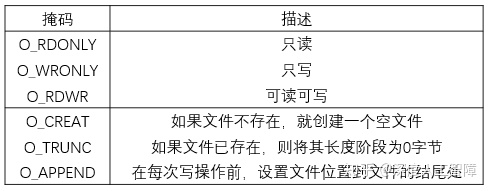

`mode`参数用来指定新文件的访问权限，而每个进程可通过`umask`函数来设置用户默认权限的补码，则文件最终的权限是通过`mode & ~umask`确定的。


```c
#include <unistd.h>
int close(int fd);
```

可以将文件描述符编号传入`close`函数来关闭文件。如果尝试关闭一个已关闭的文件，则会报错返回`-1`。

**例：**下列程序的输出是什么？

```c
#include <csapp.h>
int main(){
  int fd1, fd2;
  fd1 = open("foo.txt", O_RDONLY, 0);
  close(fd1);
  fd2 = open("baz.txt", O_RDONLY, 0);
  printf("fd2 = %d\n", fd2);
  exit(0);
}
```

创建进程时，内核会默认打开3个文件：标准输入（描述符为0,）、标准输出（描述符为1）和标准错误（描述符为2），直到进程终止时才回收。而为打开的文件分配最小的描述符，当打开`fd1`时，分配了描述符3给`fd1`，而当关闭`fd1`时，就将描述符3回收了，所以当打开`fd2`时，又将描述符3赋给第二个文件了。所以这里输出`fd2 = 3`。

### 2.2 读写文件

```c
#include <unistd.h>
ssize_t read(int fd, void *buf, size_t n);
ssize_t write(int fd, const void *buf, size_t n);
```

可通过`read`函数从文件描述符`fd`的文件位置复制最多`n`个字节到内存位置`buf`中，如果发生错误就返回`-1`，如果遇到EOF就返回`0`，否则返回实际传送的字节数目。而`write`函数是将内存位置`buf`的`n`个字节复制到文件描述符`fd`的文件位置，如果成功完成写操作，就返回字节数目。

**注意：**在x86-64中，`size_t`为`unsigned long`，而`ssize_t`为`long`。由于`read`和`write`函数会返回有符号数，所以这里需要设置为`ssize_t`。

```c
#include <unistd.h>

int main(){
  char c;
  while(read(STDIN_FILENO, &c, 1) != 0){
    write(STDOUT_FILENO, &c, 1);
  }
  return 0;
}
```

以上代码就是将你通过标准输入的字符一个个输出到标准输出中。由于这些都是系统调用，所以速度会特别慢。

有些时候`read`和`write`函数传送的字节数比应用程序要求的少，称为**不足值（Short Count）**，主要因为：

- `read`函数遇到EOF时，比如文件中中剩下20个字节，而`read`函数想要读取50个字节，则第一次会读取20个字节并返回20，而下一次读取时会返回0表示遇到EOF了。
- 如果打开的文件与终端相关联，则每个`read`函数将依次传送一个文本行，返回的就是文本行的字节数，
- 如果打开的文件与套接字相关联，则由于内部缓冲和网络延迟，就会造成这个现象。

## 3 RIO包

有一个RIO（Robust I/O）包可以处理上述的问题，它提供了两类不同的函数：

- **无缓冲的输入输出函数：**直接在内存和文件之间传送数据，没有应用级缓冲，主要用来克服不足值问题。
- **带缓冲的输入输出函数：**允许你高效地从文件中读取文本行和二进制数据，这些文件的内容缓存在应用级缓冲区中，主要用来克服不足值问题，和反复调用系统函数的耗时。

### 3.1 无缓冲的输入输出函数

```c
#include <csapp.h>
ssize_t rio_readn(int fd, void *usrbuf, size_t n) 
{
    size_t nleft = n;
    ssize_t nread;
    char *bufp = usrbuf;

    while (nleft > 0) {  //不断循环，直到读取到n个字节
	if ((nread = read(fd, bufp, nleft)) < 0) {
	    if (errno == EINTR) /* Interrupted by sig handler return */
		nread = 0;      /* and call read() again */
	    else
		return -1;      /* errno set by read() */ 
	} 
	else if (nread == 0)
	    break;              /* EOF */
	nleft -= nread;
	bufp += nread;
    }
    return (n - nleft);         /* Return >= 0 */
}

ssize_t rio_writen(int fd, void *usrbuf, size_t n) 
{
    size_t nleft = n;
    ssize_t nwritten;
    char *bufp = usrbuf;

    while (nleft > 0) {  //不断循环，直到写了n个节
	if ((nwritten = write(fd, bufp, nleft)) <= 0) {
	    if (errno == EINTR)  /* Interrupted by sig handler return */
		nwritten = 0;    /* and call write() again */
	    else
		return -1;       /* errno set by write() */
	}
	nleft -= nwritten;
	bufp += nwritten;
    }
    return n;
}
```

以上`rio_readn`函数从文件描述符`fd`的文件位置传送最多`n`个字节到`usrbuf`中，如果遇到EOF就返回一个不足值，而`rio_writen`函数是将`usrbuf`中的`n`个字节传送到文件描述符`fd`的文件位置，不会出现不足值。

### 3.2 带缓冲的输入函数

带缓冲的I/O会给文件分配关联的缓冲区，如果程序正在执行读操作，它将填满该缓冲区，当用户程序想要提取若干字节时，它会先看看缓冲区内是否有还未读取的字节，如果有就继续读取，如果没有就重新填满缓冲区。带缓冲区的好处在于，不用每次需要一个或少两字节就调用系统调用，而是先调用一次，将若干字节缓存起来，后面需要时就直接从缓冲区读取就行了。


首先我们定义一个读缓冲区的数据结构

```c
#define RIO_BUFSIZE 8192
typedef struct{
  int rio_fd;  //该缓冲区的文件描述符
  int rio_cnt;  //缓冲区中未读的字节数
  char *rio_bufptr;  //缓冲区中未读的下一个字节
  char rio_buf[RIO_BUFSIZE];  //读缓冲区
} rio_t;
```

然后我们可以通过`rio_readinitb`函数将文件描述符`fd`和一个`rio_t`读缓冲区关联起来

```c
void rio_readinitb(rio_t *rp, int fd){
    rp->rio_fd = fd;  
    rp->rio_cnt = 0;  
    rp->rio_bufptr = rp->rio_buf;
} 
```

这里首先将读缓冲区的文件描述符设置为输入的文件描述符`fd`，然后初始化`rio_cnt`和`rio_bufptr`，可以用来保存已读但还未被应用程序使用的字节。由此我们可以得到一个`read`函数的带缓冲区的版本

```c
static ssize_t rio_read(rio_t *rp, char *usrbuf, size_t n){
    int cnt;
    while (rp->rio_cnt <= 0) {  /* Refill if buf is empty */
	rp->rio_cnt = read(rp->rio_fd, rp->rio_buf, sizeof(rp->rio_buf));
	if (rp->rio_cnt < 0) {
	    if (errno != EINTR) /* Interrupted by sig handler return */
		return -1;
	}
	else if (rp->rio_cnt == 0)  /* EOF */
	    return 0;
	else 
	    rp->rio_bufptr = rp->rio_buf; /* Reset buffer ptr */
    }
    /* Copy min(n, rp->rio_cnt) bytes from internal buf to user buf */
    cnt = n;          
    if (rp->rio_cnt < n)   
	cnt = rp->rio_cnt;
    memcpy(usrbuf, rp->rio_bufptr, cnt);
    rp->rio_bufptr += cnt;
    rp->rio_cnt -= cnt;
    return cnt;
} 
```

首先，如果读缓冲区中还有未读的数据，就不进行读取，而是直接将`min(n, rp->rio_cnt)`个字节从读缓冲区中复制到用户的缓冲区中。如果读缓冲区中没有未读的数据，就尝试将读缓冲区填满，并且如果`read`函数报错，需要重新执行`read`函数，然后再将`min(n, rp->rio_cnt)`个字节从读缓冲区中复制到用户的缓冲区中。

基于这个带缓冲区的`rio_read`函数，我们可以尝试一次从文本文件中读取一行的操作

```c
ssize_t rio_readlineb(rio_t *rp, void *usrbuf, size_t maxlen) 
{
    int n, rc;
    char c, *bufp = usrbuf;

    for (n = 1; n < maxlen; n++) { 
        if ((rc = rio_read(rp, &c, 1)) == 1) {
	    *bufp++ = c;
	    if (c == '\n') {
                n++;
     		break;
            }
	} else if (rc == 0) {
	    if (n == 1)
		return 0; /* EOF, no data read */
	    else
		break;    /* EOF, some data was read */
	} else
	    return -1;	  /* Error */
    }
    *bufp = 0;
    return n-1;
} 
```

`rio_readlineb`函数会逐字节读取并判断是否为`\n`来确定是否为一个文本行，如果使用普通的`read`函数，则会不断发起中断来进行读取，但是这里使用了带读缓冲区的`rio_read`函数，在第一次调用`rio_read(rp,&c,1)`函数时，虽然只设置读取一个字节，但它会尝试调用一次`read`函数将读缓冲区填满，这样后面再调用`rio_read(rp,&c,1)`就是直接从读缓冲区获取数据，无需再发起中断了。

此外我们也可以得到一个`rio_readn`函数带读缓冲区的版本，用来读取二进制文件

```c
ssize_t rio_readnb(rio_t *rp, void *usrbuf, size_t n) 
{
    size_t nleft = n;
    ssize_t nread;
    char *bufp = usrbuf;
    
    while (nleft > 0) {
	if ((nread = rio_read(rp, bufp, nleft)) < 0) 
            return -1;          /* errno set by read() */ 
	else if (nread == 0)
	    break;              /* EOF */
	nleft -= nread;
	bufp += nread;
    }
    return (n - nleft);         /* return >= 0 */
} 
```

比如这里我们可以通过将标准输入的文件描述符`STDIN_FILENO`与输入缓存关联起来，然后调用`rio_readlineb`来一次读取一行，再将其写到标准输出中

```c
#include "csapp.h"

int main(int argc, char **argv){
  int n;
  rio_t rio;
  char buf[MAXLINE];
  rio_readinitb(&rio, STDIN_FILENO);
  while((n = rio_readlineb(&rio, buf, MAXLINE)) != 0)
    rio_writen(STDOUT_FILENO, buf, n);
} 
```

### 4 其他

```c
#include <unistd.h>
#include <sys/stat.h>
int stat(const *filename, struct stat *buf);
int fstat(int fd, struct stat *buf);
```

我们可以通过这两个函数来得到文件的**元数据（metadata）**，该函数会填写数据结构物`stat`，具有以下信息


其中`st_size`包含了文件的字节数大小，`st_mode`编码了文件访问许可位，我们可以通过`sys/stat.h`中定义的宏来确定该部分的信息：

- `S_ISREG(st_mode)`： 是否为普通文件
- `S_ISDIR(st_mode)`：是否为目录文件
- `S_ISSOCK(st_mode)`：是否为套接字

对于目录的操作，我们将目录项定义为以下数据结构

```c
struct dirent{
  int_t d_ino;  //文件位置
  char d_name[256];  //文件名
}
```

我们可以传递一个路径名给以下函数来获得目录项的列表

```c
#include <sys/types.h>
#include <dirent.h>
DIR *opendir(const char *name);
```

然后可通过循环调用以下函数来不断获得列表中的下一个目录项，并根据目录项的数据结构来获得目录的信息

```c
#include <dirent.h>
struct dirent *readdir(DIR *dirp);
```

## 5 共享文件

内核有三种数据结构来表示打开的文件：

- **描述符表（Descriptor Table）：**每个进程有自己独立的描述符表，进程打开的所有文件描述符都包含在该表中，每个文件描述符指向文件表中的一个表项。（每次打开一个文件，就会在文件表中分配一个表项）
- **文件表（File Table）：**所有进程共享文件表，包含所有打开文件的文件位置和指向的v-node表项，由于可能在不同进程中共享同一个文件表表项，所以会有一个引用次数表示有多少个描述符指向当前文件表表项，只有当表项的引用次数为0才会删除该表项。该文件表描述了指向对应文件表象的描述符的信息，有操作系统维护。
- **v-node表：**所有进程共享v-node表，每个表项包含了`stat`结构中的大多数信息，用来描述文件的信息。在系统中的每个文件无论是否打开，都在v-node表汇总有一个对应的表项。

总的来说，我们在进程中每次打开文件获得的文件描述符都是描述符表中的一个表项，然后指向对应的文件表表项，描述了该文件描述符的信息，而对应文件的信息可通过文件表表项指向的v-node表项来获得。

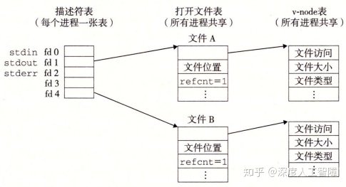

每个描述符都有自己的文件位置，表明了当前读取文件的位置，如果对同一文件用不同的`open`打开，由于分配了不同的文件描述符，使其指向不同的文件表表项，而获得不同的文件位置，但是由于是相同文件，所以会指向同一个v-node表项，这就使得这两个文件描述符可以对同一个文件的不同文件位置进行读写，将不同的描述符操作独立开来。


在父进程使用`fork`函数创建一个子进程时，子进程会复制父进程的描述符表，由于描述符表中包含指向文件表中的指针，所以子进程中相同的描述符也指向了相同的文件表表项，所以父子进程对文件位置的修改是共享的


**注意：**描述符指向的文件表项决定了它的文件位置，判断是否共享文件表项。

例：

```c
#include "csapp.h"

int main(){
  int fd1, fd2;
  char c;
  fd1 = open("foobar.txt", O_RDONLY, 0);
  fd2 = open("foobar.txt", O_RDONLY, 0);
  read(fd1, &c, 1);
  read(fd2, &c, 1);
  printf("c = %c\n", c);
  return 0;
}
```

这里通过两个不同的`open`函数来打开相同的文件`foobar.txt`，由于这两个获得不同的文件描述符，所以指向不同的文件表表项，所以会有自己独立的文件位置，所以第一个`read`会移动`fd1`对应的文件位置，但是不会影响`fd2`对应的文件位置，而`foobar.txt`文件包含6个ASCII码字符`foobar`，所以这里输出`c = f`。

```c
#include "csapp.h"

int main(){
  int fd;
  char c;
  fd = open("foobar.txt", O_RDONLY, 0);
  if(fork() == 0){
    read(fd, &c, 1);
    exit(0);
  }
  read(fd, &c, 1);
  printf("c = %c\n", c);
  exit(0);
} 
```

这里首先在父进程中使用`open`函数为文件`foobar.txt`分配了一个文件描述符，而调用`fork`函数生成一个子进程时，会复制父进程完整的描述符表，使得`fd`指向相同的文件表表项，所以在子进程和父进程中共享相同的文件位置，在子进程中调用`read`函数后会修改文件位置，使得在父进程中输出的就是`c = o`。

## 6 I/O重定向

I/O重定向操作符允许用户将磁盘文件和标准输入输出关联起来，可以通过调用`dup2`函数实现

```c
#include <unistd.h>
int dup2(int oldfd, int newfd); 
```

如果`newfd`是已打开的文件，`dup2`会首先关闭`newfd`，然后将`oldfd`对应的描述符表项替换`newfd`描述符表项，使得将`newfd`重定向到`oldfd`，如果原始`newfd`对应的文件表表项的引用计数为0，则会删除对应的文件表表项和v-node表项。比如将标准输出重定向到描述符4，就是运行`dup2(4, STDOUT_FILENO)`。


## 7 标准I/O

C语言基于Unix I/O提出了一组高级输入输出函数，称为标准I/O，它在输入和输出都包含有缓冲区，比如输出操作会先将其要输出的内容保存在缓冲区中，当遇到`\n`或调用`fflush`函数时，会清空缓冲区，并调用`write`系统调用来将其输出。标准I/O将一个打开文件抽象为一个流，是对文件描述符和流缓冲区的抽象，就是一个指向`FILE`类的指针。程序开始时就会打开3个流，对应于标准输入、标准输出和标准错误：

```c
#include <stdio.h>
extern FILE *stdin;
extern FILE *stdout;
extern FILE *stderr;
```


标准I/O是全双工的，程序能在同一个流上执行输入和输出。对流的读操作发生在流的开头，写操作发生在流的末尾。执行写操作后，由于文件位置在流的末尾，所以是不可读的，执行读操作后，如果执行写操作就会覆盖后面的内容，所以最好不要执行写操作，所以读写交替时要修改文件位置到一个可读或可写的文件位置。其次，对于一个可读可写的流，对读操作和写操作共享一个流缓冲区，所以在读取内容到缓冲区之前要先把缓冲区里要写的内容写到文件中。同理，在写内容到缓冲区之前要先把缓冲区里要读的内容清空。

所以想在输出函数之后执行输入函数，需要先执行`fflush`函数将流缓冲区中要输出的内容执行完，然后执行`fseek`、`fsetpos`或`rewind`函数来修改文件位置到可读的文件位置。想在输入函数之后执行输出函数，需要先执行`fseek`、`fsetpos`或`rewind`来修改文件位置到可写的文件位置，并且会对流缓冲区中缓存的输入数据进行操作，比如将其保存到程序的 缓冲区等等。

对于套接字的使用，因为可以`fflush`来清空写操作的缓冲数据，所以可以用标准I/O来模拟套接字的写操作。但是由于套接字无法使用定位函数，就无法在执行读操作后，通过定位函数来处理缓冲区中未读的数据，则读后再写就会产生问题，所以无法用标准I/O来模拟套接字的读操作。所以我们不要用标准I/O函数来进行套接字的输入和输出，而是使用RIO函数，它是基于Unix I/O的`read`和`write`函数，没有流缓冲区的问题。

**参考：**[CSAPP第10章系统级I/O问题？](https://www.zhihu.com/question/31499851/answer/817800909)

**Unix I/O的特点：**

- **优点：**

- - Unix I/O是最通用，开销最低的I/O形式
  - 所有其他I/O软件包均使用Unix I/O函数实现
  - Unix I/O提供用于访问文件元数据的功能
  - Unix I/O函数是异步信号安全的，可以在信号处理程序中安全使用

- **缺点：**

- - 处理短计数非常棘手且容易出错
  - 高效读取文本行需要某种形式的缓冲，也很棘手且容易出错
  - 这两个问题均通过标准I/O和RIO包解决

**标准I/O的特点：**

- **优点：**

- - 缓冲通过减少读写系统调用的数量来提高效率
  - 不足值自动处理

- **缺点：**

- - 不提供访问文件元数据的功能
  - 标准I/O功能不是异步信号安全的，并且不适用于信号处理程序
  - 标准I/O不适合网络套接字上的输入和输出

**对于使用什么I/O，建议：**

- 只要有可能就使用标准I/O，当操作硬盘或中断时要使用标准I/O
- 对套接字的I/O使用RIO包
- 当写信号处理程序时要使用Unix I/O，因为它是异步信号安全的

**注意：**处理文本文件的函数，比如`fgets`、`scanf`或`rio_readlineb`函数，是基于文本行的概念针对文本文件进行操作的，在处理0xa字符时会停止读入。而处理字符串的函数，比如`strlen`、`strcpy`或`strcat`函数，会将`0`视为字符串的结尾。这些对某些特殊字节进行特殊解释的函数，不适合用来读写二进制文件。


# [读书笔记]CSAPP：25[VB]网络编程1


 **视频地址：**

[【精校中英字幕】2015 CMU 15-213 CSAPP 深入理解计算机系统 课程视频_哔哩哔哩 (゜-゜)つロ 干杯~-bilibiliwww.bilibili.com/video/BV1iW411d7hd?p=21](https://link.zhihu.com/?target=https%3A//www.bilibili.com/video/BV1iW411d7hd%3Fp%3D21)

**课件地址：**

[http://www.cs.cmu.edu/afs/cs/academic/class/15213-f15/www/lectures/21-netprog1.pdfwww.cs.cmu.edu/afs/cs/academic/class/15213-f15/www/lectures/21-netprog1.pdf](https://link.zhihu.com/?target=http%3A//www.cs.cmu.edu/afs/cs/academic/class/15213-f15/www/lectures/21-netprog1.pdf)

本章对应于书中的11.1-11.4。

------

将套接字当做一个文件，则在网络中传输数据可以看成是对文件的读写

------

## 1 客户端-服务器编程模型

网络应用都是基于**客户端-服务器模型**的，应用由一个**服务器进程**和一个或多个**客户端进程**组成，服务器会管理着某些资源，通过操作这些资源来为它的客户端提供某种服务。比如Web服务器管理着一组磁盘文件，会代替客户端进行检索和执行。该模型主要执行以下步骤：

- 当一个客户端需要服务时，就向服务器发送一个请求。比如Web浏览器需要一个文件时，就会发送一个请求到Web服务器。
- 服务器接收到请求后，会对其进行解释并以适当方式操作它的资源。比如当Web服务器接收到请求后，就读一个磁盘文件。
- 服务器给客户端发送一个响应，等待下一次请求。比如Web服务器将文件发送回客户端。
- 客户端接收到响应并进行处理。比如当Web浏览器收到来自服务器的数据后，就将其显示在屏幕上。


**注意：**所谓的客户端和服务器是进程，而不是机器或主机。

## 2 网络基础

### 2.1 网络

当客户端进程和服务器进程处于不同主机时，两个进程就需要通过**计算机网络**的硬件和软件资源进行通信。对主机而言，计算机网络其实只是一个I/O设备，通过插在I/O总线扩展槽的**适配器**提供到网络的物理接口，从网络接收到的数据从适配器经过I/O总线和内存总线复制到内存，而数据也可以从内存复制到网络。

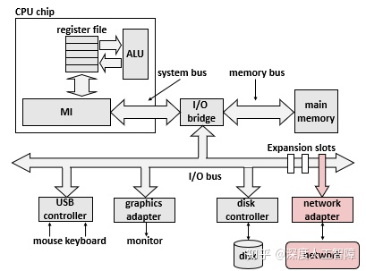

网络是具有层次结构的，最底层的是**局域网（Local Area Network，LAN）**，通常是在一个较小范围内构成的网络，比如一个建筑物，而最流行的局域网技术是**以太网（Ethernet）。**

**层次一：**一个**以太网段（Ethernet Segment）**由一些电缆和一个**集线器**组成，通常跨越一些更小的区域，比如一个房间。电缆的一段连接着主机的适配器，另一端连接到集线器的某个端口，这些电缆通常具有相同的最大位带宽。当主机通过适配器发送数据时，集线器会从一个端口中接收到并将其广播到其他端口，所以其他连接到相同适配器的主机也会收到这些数据。


为了标识每个主机，为每个以太网适配器都提供一个唯一的48位地址，保存在适配器的非易失性存储器上，称为**MAC地址**。所以当主机发送数据时，可以在数据的**头部（Header）**包含标识该数据的源和目的地址以及数据长度的信息，随后才是放数据的**有效载荷（Payload）**，由此构成一个**数据帧（Data Frame）**进行传输，这样连接到相同集线器的其他主机就能通过这个数据的头部来判断该数据是不是传输给自己的。

**层次二：**我们可以通过电缆将一些集线器连接到**网桥（Bridge）**，并通过电缆将一些网桥连接起来，得到更大的局域网，称为**桥接以太网（Bridge Ethernet）**，这两种电缆通常具有不同的带宽。

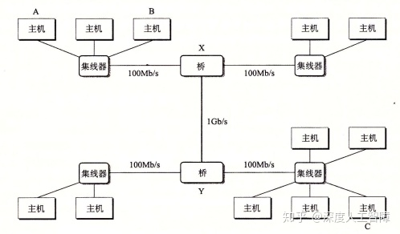

相比集线器不加区分地广播数据，网桥会使用更好的分配算法，它会自动学习哪些主机通过哪些端口是可达的，并将对应的数据传到对应的端口，节约了其余端口的带宽。比如主机A想传递数据到处于同一以太网段的主机B，则集线器会接收到该数据并广播到所有端口，此时网桥X也会接收到该数据，但是它判断该数据的目和源处于相同以太网段，所以就不进行转发。再比如主机想传递数据到不同以太网段的主机C，则网桥X和网桥Y会将其传递到合适的端口进行转发，使其最终到达主机C。

**层次三：**通过以上两个层次可以构建出若干个互不兼容的局域网，这些局域网可以通过**路由器（Router）**这一 特殊计算器相连组成internet，每台路由器对它连接到的每个网络都有一个适配器。而路由器之间可以通过**广域网（Wide-Area Network，WAN）**相连，来跨越更大的地理范围。


> 主机（适配器）-->以太网段（集线器）-->桥接以太网（网桥）-->internet（路由器）

可以发现，internet是由采用不同和不兼容技术的各种局域网和广域网构成的，为了消除不同网络之间的差异，需要在每台主机和路由器上运行**协议软件**，来控制主机和路由器如何协同工作来实现数据传输。**该协议具有两个基本功能：**

- **命名机制：**在各个局域网中，由于主机数目较少，可以通过集线器直接广播主机的MAC地址或通过网桥记录一些主机MAC地址对应的端口，就能实现主机之间的数据传输。但是到了路由器层面时，主机数目变得特别多，直接广播MAC地址不现实，而记录各个主机MAC地址对应的端口时，由于MAC地址都是各个主机唯一且不具有地域性，就需要一张特别大的表来进行记录。但其实同一局域网的主机具有一定的地域性，都连接在路由器的一个端口，所以路由器其实只需要记录局域网对应的端口就行。所以如果我们能为主机分配唯一的具有地域性的地址时，能通过该主机地址得知对应的局域网就能在路由器中确定对应的端口，就能大量减轻了路由器记录的负担。该地址称为**IP地址**。
- **传送机制：**在不同层面上传输数据需要不同的地址，比如在局域网中需要通过MAC地址来确定目标主机，而在internet中需要通过IP地址确定路由器的端口。所以互联网协议需要在数据最外侧添加路由器的MAC地址，来使得数据能先传输到路由器，然后内侧再添加IP地址，使得路由器能确定端口。IP地址和数据构成了**数据报（Datagram）**。

**参考：**[IP地址和MAC地址的区别和联系是什么？](https://www.zhihu.com/question/49335649)

PH：包头，FH：帧头

以上面为例，说明如何从主机A传输数据到主机B

- 运行在主机A中的客户端通过系统调用，从客户端的虚拟地址空间复制数据到内核缓冲区中。
- 主机A上的协议软件在数据前添加数据帧头`FH1`和数据包头`PH`，其中`FH1`中记录了路由器1的MAC地址，`PH`记录了主机B的IP地址。主机A将该数据帧传输到自己的适配器上。
- LAN 1根据帧头中记录的MAC地址，对其进行广播和转发。
- 路由器1的适配器会接收到该数据帧，并将其传送到协议软件。
- 协议软件从中剥离掉帧头`FH1`，获得`PH`中记录的主机B的IP地址，就能将其作为路由器表的索引获得要将其转发到路由器的哪个端口。这里是将其转发到传输到路由器2的端口。
- 当路由器2获得该数据包时，可以从一个表中得知该IP地址对应的MAC地址，即主机B的MAC地址，就将将其再次封装成数据帧的形式，通过适配器将其传输到LAN 2中。
- 在LAN 2根据帧头中记录的MAC地址，对其进行广播和转发。
- 当主机B接收到该数据帧时，将其传送到协议软件中。
- 在协议软件中，判断数据帧头中记录的目的MAC地址是否与自己的MAC地址相同，发现是相同的，则会剥离包头和帧头获得数据。当服务器进行一个读取这些数据的系统调用时，就将其复制到服务器的虚拟地址空间中。

### 2.2 全球IP因特网

每台主机都运行实现**TCP/IP协议**，它是一个协议族，其中每个都提供了不同的功能。比如**IP协议**提供了上文介绍的基本的命名方法和传送机制，由此保证了能从一台主机向别的主机发送数据报，但是这种传送机制是不可靠的，因为如果数据报发生丢失，IP协议并不会试图恢复。而基于IP协议提出了**UDP协议**和**TCP协议**，由此保证了包可以在进程之间而不是主机之间进行传送。而客户端-服务器应用程序就正需要TCP/IP协议这种在进程间传送数据的能力，它们通过**套接字接口函数**系统调用，在内核中调用各种内核模式的TCP/IP函数，由此在客户端进程和服务器进程之间传送数据。

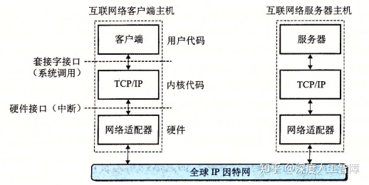

我们这里就间TCP/IP看成一个单独的整体协议，值讨论TCP和IP为应用程序提供的某些功能。我们可以将因特网看成是一个世界范围的主机集合，满足以下**特点：**

- 主机集合被映射为一组32位的**IP地址**。
- 这组IP地址被映射为一组称为**因特网域名（Internet Domain Name）**的标识符。
- 因特网主机上的进程能通过**连接（Connection）**和任何其他因特网主机上的进程通信。

### 2.2.1 IP地址

IP地址是一个32位的无符号整数，具有以下数据结构


我们知道不同主机可以有不同的主机字节顺序，常用的是小端法，而TCP/IP为任意整数定义了统一的**网络字节顺序（Network Byte Order）**，来规定IP地址的字节顺序（总是大端法）。Unix提供了以下函数来进行转换

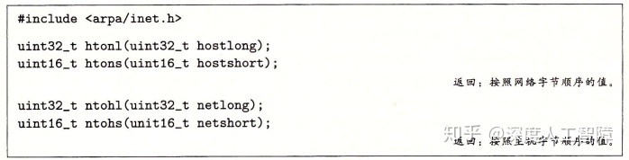

`htonl`函数是将32位整数由主机字节顺序转换为网络字节顺序；`ntohl`函数是将32位整数由网络字节顺序转换为主机字节顺序。

IP地址通常用**点分十进制表示法**来表示，每个字节由它对应的十进制数来表示，而不用数之间通过`.`间隔，由于IP地址为32位的，所以会有4个整数。这里提供以下函数来实现IP地址和点分十进制串之间的转换


`inet_pton`函数将一个点分十进制串`src`转换为二进制的网络字节顺序的IP地址，其中`AF_INET`表示32位的IPv4地址，而`AF_INET6`表示64位的IPv6地址。`inet_ntop`函数将二进制的网络字节顺序的IP地址`src`转换为对应的点分十进制表示。

在1996年IETF推出了具有128位地址的IPv6，打算作为IPv4的后继者，截至2015年，绝大多数互联网流量仍由IPv4承载，只有4％的用户使用IPv6访问Google服务。我们将主要介绍IPv4，但会展示如何编写独立于协议的网络代码。

### 2.2.2 域名

由于IP地址较难记忆，所以定义了一组**域名（Domain Name）**以及一种将域名映射到实际IP地址的机制。域名的集合形成一种层次结构，每个域名编码了它在这个层次中的位置。

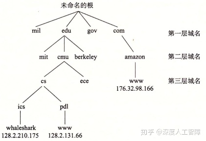

根节点为未命名的根，第一层为**一级域名（First-level Domain Name）**，由ICANN组织定义，再下一层为**二级域名（Second-level Domain Name）**，由ICANN的各个授权代理按照先到先得服务进行分配的，只要有组织得到二级域名，就能在这个子域中创建任何新的域名。从叶子结点返回到一级域名的路径就构成了一条完整的域名，通过非常大的分布式**域名系统（Domain Name System，DNS）**将其映射到对应的IP地址。

每台主机都有本地定义的域名`localhost`，总是映射为**回送地址（Loopback Address）**`127.0.0.1`。`hostname`可以确定本地主机的实际域名，然后可以通过`nslookup`程序来查看DNS映射的一些属性，可以发现通常多个域名可以映射到同一组的多个IP地址，而有些合法的域名没有映射到任何IP地址。

**注意：**存在多个域名对应一个IP地址，或一个域名对应多个IP地址，因为一些大型网络不止有一台服务器，可能会有多台服务器在处理你的数据，所以DNS会根据你的显示位置来返回多个IP地址。

### 2.2.3 因特网连接

客户端和服务器通过在**连接**上发送和接收数据来进行通信，连接具有以下特点：

- **点对点：**连接了一对进程
- **全双工：**数据可以同时在连接双向流动
- **可靠的：**由源进程发出的字节流最终被目的进程按序接收

连接的两端分别是客户端套接字和服务器套接字，每个套接字都有相应的**套接字地址**，由IP地址和16位整数**端口**组成，表示为`地址:端口`。其中客户端套接字中的端口是由内核自动分配的**临时端口（Ephemeral Port）**，而服务器套接字的端口与服务器提供的服务相关，比如Web服务器就使用端口`80`、FTP服务器就是用端口`25`，可通过`/etc/services`查看。

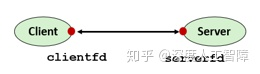

所以一个连接由它两端的套接字地址唯一确定，称为**套接字对（Socket Pair）**，表示为`(cliaddr:cliport, servaddr:servport)`。


通常内核需要区分传入机器的不同连接，并且当别的机器的数据到达时，判断要为该连接启动什么软件和进程，实际上，每个端口都有特定的进程执行程序来处理这些请求。并且一个客户端可以同时和单一服务器上的不同端口通信，来获得该服务器的不同服务，但这需要建立不同的连接，避免相互干扰。


**注意：**对Linux内核而言，套接字就是通信的一个端点。对程序员而言，套接字就是一个有相应描述符的打开文件（与上一章关联起来，Linux中将所有资源都视为文件，套接字也不例外）。

## 3 套接字接口

**套接字接口（Socket Interface）**是一组函数，他们和Unix I/O函数结合起来，用以创建网络应用。以下是一个基于套接字接口的网络应用概述

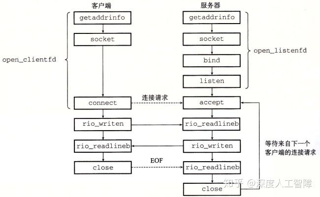

### 3.1 套接字地址结构

套接字地址具有以下两种数据结构


这是因为在一开始设计socket时，是打算兼容各种不同协议的套接字地址，而不同协议的套接字地址有自己不同的地址构造，比如IPv4就是`sockaddr_in`、IPv6就是`sockaddr_in6`等等，而`sockaddr`就是这些不同协议地址的抽象，仔细观察上面两个不同结构的声明顺序，两者定义的内存分布如下所示


这样通过将`sockaddr_in`强制类型转换为`sockaddr`时，`sockaddr`的`sa_family`值就是 `sockaddr_in`的`sa_family`值，而`sockaddr`的`sa_data`值就是`sockaddr_in`中`sin_port`、`sin_addr`和`sin_zero`拼接起来的结果。由此通过将不同协议的地址强制类型转换为`sockaddr`类型，就能得到统一的套接字地址，而后的函数都是基于`sockaddr`类型的，方便兼容不同协议的地址。

**注意：**这些地址字节顺序都是网络字节顺序，即大端法。

**参考：**[ustcsse308：信息安全课程8：套接字（socket） 编程](https://zhuanlan.zhihu.com/p/59296026)

### 3.2 常用函数

首先，套接字作为一种文件，我们需要在服务器和客户端将其打开来得到**套接字描述符（Socket Descriptor）**

```c
#include <sys/types.h>
#include <sys/socket.h>
int socket(int domain, int type, int protocol);
```

为了使套接字作为连接的端点，可使用如下硬编码的参数来调用`socket`函数

```c
socket(AF_INET, SOCK_STREAM, 0); 
```

`AF_INET`表示是一个32位的IPv4地址，`SOCK_STREAM`表明连接是一个TCP连接。此时就会返回套接字描述符，客户端套接字描述符写成`clientfd`，服务器套接字描述符写成`sockfd`。

**在服务器方面**，接下来需要将服务器套接字地址和它的描述符`sockfd`联系起来

```c
#include <sys/socket.h>
int bind(int sockfd, const struct sockaddr *addr, socklen_t addrlen); 
```

该内核函数会将服务器套接字描述符`sockfd`与服务器套接字地址`addr`关联起来，其中`addrlen=sizeof(sockaddr_in)`，此时`addr`中包含了端口号，也就将`sockfd`与该服务器的某个端口绑定在一起，用于提供特定的服务。

由于`socket`函数创建的是**主动套接字描述符（Active Socket Descriptor）**，而服务器是接收请求方，所以需要将服务器套接字描述符转换为**监听套接字描述符（Listening Socket Descriptor）**

```c
#include <sys/socket.h>
int listen(int sockfd, int backlog);
```

该函数会将服务器套接字的描述符`sockfd`转换为监听套接字描述符`listenfd`，也相当于高速内核当前为服务器。接下来服务器就能监听等待来自客户端的连接请求

```c
#include <sys/socket.h>
int accept(int listenfd, struct sockaddr *addr, int *addrlen); 
```

该函数会等待来自客户端的连接请求到达监听描述符`listenfd`，然后将客户端的套接字地址填写到`addr`中，并返回一个**已连接描述符（Connected Descriptor）**`connfd`，这样服务器就能通过`connfd`和Unix I/O来与客户端通信了。

**注意：**服务器通常只创建一次监听套接字描述符`listenfd`，并存在于服务器的整个生命周期，作为客户端连接请求的一个端点，服务器可从`listenfd`得知是否有客户端发送连接请求 ，而后服务器每次接受连接请求时就会创建一个已连接描述符`connfd`来作为与客户端建立起连接的一个端点，只存在于服务器为一个客户端服务的过程，当客户端不需要该服务器的服务时，就会删掉该`connfd`。这两种描述符的存在，使得我们可以构建并发的服务器来同时处理多个客户端连接，每当`accept`返回一个`connfd`时，就表示服务器接收了一个客户端的连接，此时就能通过`fork`函数创建一个子进程来通过该`connfd`与客户端通信，而父进程继续监听`listenfd`来查看是否有另一个客户端发送连接请求。

> **服务器方面：**创建套接字描述符`sockfd`（`socket`）-->将`sockfd`与服务器套接字地址进行关联（`bind`）-->将`sockfd`转换为监听套接字描述符`listenfd`（`listen`）-->等待客户端的连接请求，并得到已连接描述符`connfd`（`accept`）-->通过`connfd`和Unix I/O与客户端进行通信。

**在客户端方面**，在创建了客户端套接字描述符`clientfd`后，就能通过以下函数来建立与服务器的连接

```c
#include <sys/socket.h>
int connect(int clientfd, const struct sockaddr *addr, socklen_t addrlen); 
```

该函数会尝试与服务器套接字地址`addr`建立一个连接，其中`addrlen=sizeof(sockaddr_in)`。该函数会阻塞直到连接建立成功或发生错误，如果成功，客户端就能通过`clientfd`和Unix I/O与服务器进行通信了。

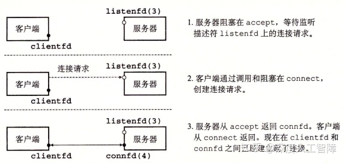

### 3.3 IP协议无关代码

Linux提供一些函数来实现二进制套接字地址结构和主机名、主机地址、服务名和端口号的字符串表示之间的相互转化，当与套接字接口一起使用时，能让我们编写独立于任何特定版本的IP协议的网络程序。

### 3.3.1 `getaddrinfo`函数

```c
#include <sys/types.h>
#include <sys/socket.h>
#include <netdb.h>

int getaddrinfo(const char *host, const char *service,
                const struct addrinfo *hints,
                const struct addrinfo **result);
void freeaddrinfo(struct addrinfo *result);
const char *gai_strerror(int errcode);
```

`getaddrinfo`函数能将主机名、主机地址、服务名和端口号的字符串转换成套接字地址结构。其中，`host`参数可以是域名、点分十进制数字地址或NULL，`service`参数可以是服务名（如http）、十进制端口号或NULL，两者必须制定一个。而`hits`和`result`参数分别是`addinfo`结构的指针和链表

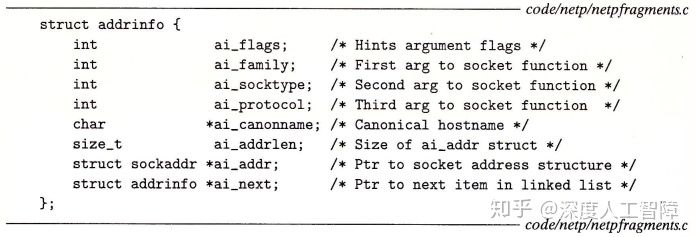

`result`是通过`host`和`service`构建的一系列套接字地址结构，可以通过`ai_next`来一次遍历链表中的每个`addrinfo`结构，而每个`addrinfo`结构的`ai_family`、`ai_socktype`和`ai_protocol`可以直接传递给`socket`函数，而`ai_addr`和`ai_addrlen`可以直接传递给`connect`和`bind`函数，使得我们只要传递`host`和`service`参数给`getaddrinfo`函数，就能编写独立于某个特定版本的IP协议的客户端和服务器。


可以通过`hits`来控制`result`的结果。设置`hits`时，通常用`memset`将整个结构清空，再有选择地设置一些字段：

- `ai_family`：`result`默认会包含IPv4和IPv6的套接字地址，可以通过设置`ai_family`为`AF_INET`或`AF_INET6`来限制只包含IPv4或IPv6的套接字地址。

- `ai_socktype`：将其设置为`SOCK_STREAM`可以将`result`限制为每个地址最多只有一个`addrinfo`结构，可以用来作为连接的一个端点。

- `ai_flags`：是一个位掩码，可以修改默认行为：

- - `AI_ADDRCONFIG`：只有当本地主机被配置了IPv4时，`result`才会返回IPv4地址，IPv6同理。
  - `AI_CANONNAME`：如果设置了该位，则`result`第一个`addrinfo`结构的`ai_cannonname`字段指向`host`的官方名字。
  - `AI_NUMERICSERV`：强制`service`参数只能是端口号。
  - `AI_PASSIVE`：使得返回的套接字地址可以被服务器用作监听套接字，此时`host`应该为NULL，就会使得返回的套接字地址结构中的地址字段为**通配符地址**。

> 从上面可知，一个域名可能会对应多个IP地址，通过这个`getaddrinfo`函数就能寻找域名对应的所有可用的IP地址。

最终要调用`freeaddrinfo`函数来释放你得到的结果`result`，如果出错，可以调用`gai_strerror`函数来查看错误信息。

### 3.3.2 `getnameinfo`函数

```c
#include <sys/socket.h>
#include <netdb.h>
int getnameinfo(const struct sockaddr *sa, socklen_t salen,
                char *host, size_t hostlen,
                char *service, size_t servlen, int flags); 
```

该函数和`getaddrinfo`函数相反，通过传入套接字地址`sa`，能够返回对应的主机名字符串`host`和服务名字字符串`service`。其中`flags`可以修改该函数的默认行为：

- `NI_NUMERICHOST`：该函数默认返回`host`中的域名，通过设置这个标志位来返回数字地址字符串。
- `NI_NUMERICSERV`：该函数默认检查`/etc/service`并返回服务名，通过设置这个标志位来返回端口号。

> 从上面可知，一个IP地址可能会对应多个域名，通过这个`getnameinfo`函数就能寻找IP地址对应的所有可用的域名。

### 3.3.3 套接字接口的辅助函数

这里提供两个封装函数`open_clientfd`和`open_listenfd`来封装`getnameinfo`和`getaddrinfo`函数来进行客户端和服务端的通信。

```c
int open_clientfd(char *hostname, char *port){
    int clientfd;
    struct addrinfo hints, *listp, *p;

    /* Get a list of potential server addresses */
    memset(&hints, 0, sizeof(struct addrinfo));  //初始化hints为0
    hints.ai_socktype = SOCK_STREAM;  /* Open a connection */
    hints.ai_flags = AI_NUMERICSERV;  /* ... using a numeric port arg. */
    hints.ai_flags |= AI_ADDRCONFIG;  /* Recommended for connections */
    getaddrinfo(hostname, port, &hints, &listp);  //获得一系列套接字地址
  
    /* Walk the list for one that we can successfully connect to */
    for (p = listp; p; p = p->ai_next) {  //遍历所有套接字地址，找到一个可以连接的
        /* Create a socket descriptor */
        if ((clientfd = socket(p->ai_family, p->ai_socktype, p->ai_protocol)) < 0) 
            continue; /* Socket failed, try the next */

        /* Connect to the server */
        if (connect(clientfd, p->ai_addr, p->ai_addrlen) != -1) 
            break; /* Success */
        close(clientfd); /* Connect failed, try another */  //line:netp:openclientfd:closefd
    } 

    /* Clean up */
    freeaddrinfo(listp);
    if (!p) /* All connects failed */
        return -1;
    else    /* The last connect succeeded */
        return clientfd;
}
```

客户端可以通过`open_clientfd`函数来简历与服务器的连接，该服务器运行在`hostname`主机上，并在`port`端口监听连接请求。首先会通过`getaddrinfo`函数找到一系列套接字地址，并依次遍历寻找可以创建套接字描述符且连接成功的一个套接字地址，然后返回准备好的套接字描述符，客户端可以直接通过`clientfd`和Unix I/O来与服务器进行通信。

```c
 int open_listenfd(char *port){
    struct addrinfo hints, *listp, *p;
    int listenfd, optval=1;

    /* Get a list of potential server addresses */
    memset(&hints, 0, sizeof(struct addrinfo));
    hints.ai_socktype = SOCK_STREAM;             /* Accept connections */
    hints.ai_flags = AI_PASSIVE | AI_ADDRCONFIG; /* ... on any IP address */
    //AI_PASSIVE保证套接字地址可被服务器用作监听套接字
    hints.ai_flags |= AI_NUMERICSERV;            /* ... using port number */
    getaddrinfo(NULL, port, &hints, &listp);  //这里的host为NULL

    /* Walk the list for one that we can bind to */
    for (p = listp; p; p = p->ai_next) {
        /* Create a socket descriptor */
        if ((listenfd = socket(p->ai_family, p->ai_socktype, p->ai_protocol)) < 0) 
            continue;  /* Socket failed, try the next */

        /* Eliminates "Address already in use" error from bind */
        setsockopt(listenfd, SOL_SOCKET, SO_REUSEADDR,    //line:netp:csapp:setsockopt
                   (const void *)&optval , sizeof(int));

        /* Bind the descriptor to the address */
        if (bind(listenfd, p->ai_addr, p->ai_addrlen) == 0)
            break; /* Success */
        close(listenfd); /* Bind failed, try the next */
    }

    /* Clean up */
    freeaddrinfo(listp);
    if (!p) /* No address worked */
        return -1;

    /* Make it a listening socket ready to accept connection requests */
    if (listen(listenfd, LISTENQ) < 0) {
        Close(listenfd);
	return -1;
    }
    return listenfd;
}
```

服务器可通过`open_listenfd`来创建一个监听描述符，并准备好连接请求。首先`hints.ai_flags`包含`AI_PASSIVE`使得返回的套接字地址可被服务器作为监听套接字，并在`socket`函数中将`host`设置为NULL，使得后面的`p->ai_addr`为通配符地址，这样在`bind`函数中就能使得服务器监听所有发送请求的客户端IP地址，并且这里只指定了端口号，所以就是将`listenfd`用于该端口的监听。这里的`setsockopt`函数使得服务器能被终止、重启和立即开始接收连接请求。最终，服务器可以直接通过`listenfd`和Unix I/O来与客户端进行通信。

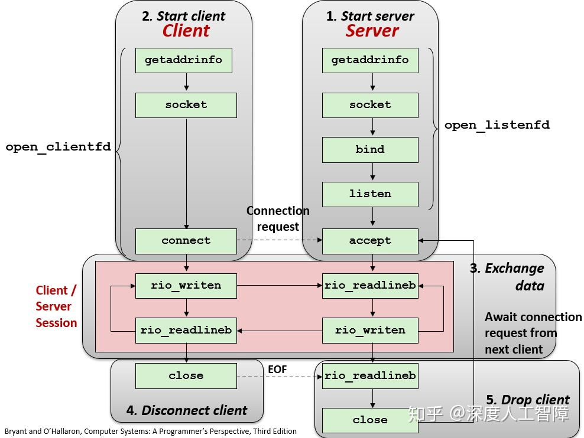

通过以上`open_clientfd`和`open_listenfd`函数，使得我们无需考虑之前`socket`和`bind`等函数在不同协议下的代码，使得客户端可以直接传输服务器的域名和端口到`open_clientfd`函数来完成与服务器的连接，而服务器也可以直接传输监听的端口到`open_listenfd`函数来完成监听，避免了底层的很多设置。

### 3.4 echo客户端和服务端实例

echo客户端

该客户端中，直接将服务器主机`host`和端口号`port`传入`open_clientfd`来完成`socket`和`connect`函数，直接返回可以使用的套接字描述符`clientfd`，然后从标准输入读取数据保存在`buf`中，再将`clientfd`当做普通文件的描述符，直接使用`Rio_writen`和`Rio_readlineb`来与服务器进行传输数据。

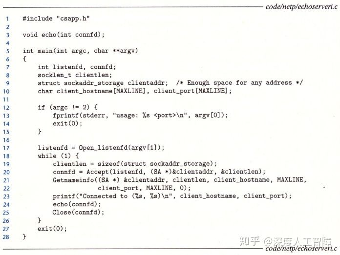echo服务器

服务器中首先通过`open_listenfd`来调用`socket`、`bind`和`listen`函数来监听特定端口，然后不断循环调用`accept`来查看是否有客户端发送请求，并将发送请求的客户端套接字地址保存在`clientaddr`中，并返回已连接套接字描述符`connfd`，可以对`clientaddr`调用`getnameinfo`函数来获取客户端的地址，也可以将`connfd`当做普通文件的描述符，直接使用`Rio_writen`和`Rio_readlineb`来与客户端进行传输数据。这里调用了`echo`函数


该函数中就是通过`connfd`来执行`Rio_readlineb`函数，读取客户端发送过来的一行文本，然后将其输出，并返回到客户端中。

**注意：**要先开启服务器，再运行客户端。这里的服务器一次只能与一个客户端相连。

# [读书笔记]CSAPP：26[VB]网络编程2


 **视频地址（英文）：**

[https://www.bilibili.com/video/BV1XW411A7fB?p=21www.bilibili.com/video/BV1XW411A7fB?p=21](https://link.zhihu.com/?target=https%3A//www.bilibili.com/video/BV1XW411A7fB%3Fp%3D21)

**课件地址：**

[http://www.cs.cmu.edu/afs/cs/academic/class/15213-f15/www/lectures/22-netprog2.pdfwww.cs.cmu.edu/afs/cs/academic/class/15213-f15/www/lectures/22-netprog2.pdf](https://link.zhihu.com/?target=http%3A//www.cs.cmu.edu/afs/cs/academic/class/15213-f15/www/lectures/22-netprog2.pdf)

本章对应于书中的11.5-11.6。

------

本章主要来创建自己的Web服务器。

## 1 Web基础

Web客户端和服务器之间的交互基于**超文本传输协议（Hypertext Transfer Protocol，HTTP）**，该协议是建立在TCP协议之上的。传输的过程为

1. 一个Web客户端（即浏览器）打开一个到Web服务器的连接，并请求某些**内容**
2. Web服务器响应所请求的内容，然后关闭连接
3. Web客户端读取这些内容，再将其显示在屏幕上

其中，这些内容是一串字节序列，Web服务器会发送一个**MIME（Multipurpose Internet Mail Extensions）**类型来帮助浏览器识别一个HTTP请求返回的是什么内容的数据，应该如何打开、如何显示，即MIME类型是用来标注网络数据的，常见类型包括

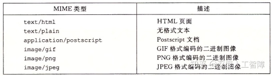

**参考：**[既然有文件后缀名,为何还需要MIME类型?](https://www.zhihu.com/question/60495696/answer/204530120)

Web服务器提供的内容也有两种不同的方式：

- **服务静态内容（Serving Static Content）：**取一个磁盘文件，并将其内容返回给客户端。
- **服务动态内容（Serving Dynamic Content）：**运行一个可执行目标文件，将其输出返回给客户端。

所以Web服务器返回的每条内容都与它管理的某个文件相关联，这些文件都有一个唯一的名字，称为**URL（Universal Resource Locator）**。比如对于`http://www.google.com:80/index.html`，客户端使用前缀`http://www.google.com:80`来决定与哪个Web服务器联系以及Web服务器的监听端口，而Web服务器使用后缀`/index.html`来发现在它文件系统中的文件，确定请求内容是静态还是动态的。此外，URL还可以用`?`字符来分隔文件名和参数，用`&`分隔多个参数，来向动态内容传送参数，这个后缀称为**URI（Universal Resource Indentifier）**。

对于服务器如何解释一个URL后缀：

- 没有标准来确定后缀是动态内容还是静态内容，过去是将所有可执行目标文件都放在同一个目录中。
- 后缀中最开始的`/`并不表示Web服务器中的根目录，而是被请求内容类型的主目录。
- 如果URL没有后缀，则浏览器会在URL后添加缺失的`/`并将其传递给Web服务器，Web服务器又将`/`扩充到某个默认的文件名，比如`/index.html`，由此来展示网站的主页。

## 2 HTTP事务

可以使用Linux的TELNET程序来和Web服务器执行事务，如


在第1行中运行`telnet www.aol.com 80`，表示要打开一个到AOL Web服务器的连接，此时TELNET会输出3段信息，然后等待我们的输入，我们可以输入一个文本行，此时TELNET就会读取并添加回车和换行符号，然后将其发送到服务器。

### 2.1 HTTP请求

在第5~7行，我们输入了一个**HTTP请求（HTTP Requests）**，它**主要包含：**

- **请求行（Request Line）：**
  在第5行中，主要形式为`method URI version`。
  HTTP这里支持不同方法，这里主要介绍**`GET`方法**，它将指导服务器生成和返回URI标识的内容。而`version`字段表明该请求的HTTP版本，并表明接下来的请求报头是`HTTP/1.1`格式的。
  总的来说，第5行要求服务器取出并返回HTML文件`/index.html`。
- **请求报头（Request Hearder）：**
  主要是为服务器提供额外的信息，格式为`header-name: header-data`。
  比如这里我们提供了`HTTP/1.1`需要的`Host`信息。在客户端和**原始服务器（Irigin Server）**之间存在很多缓存了原始服务器内容的代理，称为**代理链（Proxy Chain）**，通过`Host`字段来指明原始服务器的域名，使得代理链中的代理能判断是否在他们本地缓存了被请求内容的副本，避免从很远的原始服务器调用数据。
- 一个空文本行来终止请求报头列表

### 2.2 HTTP请求响应

在TELNET将我们的HTTP请求发送给Web服务器后，Web服务器就会返回一个**HTTP响应（HTTP Responses）**，它**主要包含：**

- **响应行（Response Line）：**
  响应行和请求行类似，格式为`version status-code status-message`。
  `version`字段表明响应使用的HTTP版本，而`status-code`和`status-message`主要指明请求的状态，表示你的请求是否被正确处理或出现什么问题


- **响应报头（Response Header）：**
  是关于响应的附加信息，比如`Content-type`表示Web服务器发送给浏览器的响应主体的MIME类型，使得浏览器能正确解析这些字节序列。`Content-Length`用来表明响应主体的字节大小。
- 一个终止报头的空行
- **响应主体（Response Body）：**包含被请求的内容。

### 2.3 服务动态内容

比如Web服务器接收到浏览器的发送的URI时

```http
GET /cgi-bin/adder?15000&213 HTTP/1.1
```

其中`/cgi-bin/adder`称为**CGI（Common Gateway Interface）程序**，该程序是使用CGI标准来让Web服务器服务动态内容。而其中的`15000&213`是浏览器发送给CGI程序的参数。

- Web服务器首先调用`fork`创建一个子进程，并在子进程中设置对应的CGI环境变量


比如将程序的参数保存在`QUERY_STRING`中，则CGI程序可以通过`getenv("QUERY_STRING")`函数来获得浏览器发送的参数。然后调用`dup2`函数将子进程的标准输出重定向到和客户端相关联的已连接描述符

- 调用`execve`来执行`/cgi-bin/adder`程序
- CGI程序负责生成`Content-type`和`Content-Length`响应报头，并将它的动态内容发送到标准输出

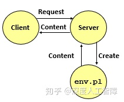

我们可以自己写CGI程序，但是要注意当执行CGI程序时，是在Web服务器中的一个子进程中，需要通过`getenv`来获得程序参数，且标准输出已被重定向到与浏览器关联的已连接描述符，并且要根据执行的结果来生成`Content-type`和`Content-Length`响应报头。

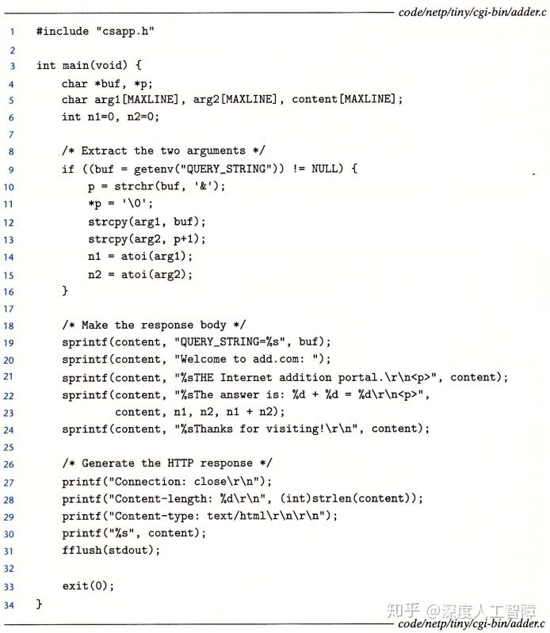

**注意：**CGI实际上定义了一个简单的标准，用于在客户端（浏览器），服务器和子进程之间传输信息。它是用于生成动态内容的原始标准，由于创建子进程十分昂贵且慢，目前已被其他更快的技术取代：比如fastCGI，Apache模块，Java Servlet，Rails控制器。

## 3 TINY Web服务器

这一节将实现一个简单的Web服务器来提供静态和动态内容。

```c
/*
 * tiny.c - A simple, iterative HTTP/1.0 Web server that uses the 
 *     GET method to serve static and dynamic content.
 */
#include "csapp.h"

void doit(int fd);
void read_requesthdrs(rio_t *rp);
int parse_uri(char *uri, char *filename, char *cgiargs);
void serve_static(int fd, char *filename, int filesize);
void get_filetype(char *filename, char *filetype);
void serve_dynamic(int fd, char *filename, char *cgiargs);
void clienterror(int fd, char *cause, char *errnum, 
		 char *shortmsg, char *longmsg);

int main(int argc, char **argv) 
{
    int listenfd, connfd;
    char hostname[MAXLINE], port[MAXLINE];
    socklen_t clientlen;
    struct sockaddr_storage clientaddr;

    /* Check command line args */
    if (argc != 2) {
	fprintf(stderr, "usage: %s <port>\n", argv[0]);
	exit(1);
    }

    listenfd = Open_listenfd(argv[1]);
    while (1) {
	clientlen = sizeof(clientaddr);
	connfd = Accept(listenfd, (SA *)&clientaddr, &clientlen); //line:netp:tiny:accept
        Getnameinfo((SA *) &clientaddr, clientlen, hostname, MAXLINE, 
                    port, MAXLINE, 0);
        printf("Accepted connection from (%s, %s)\n", hostname, port);
	doit(connfd);                                             //line:netp:tiny:doit
	Close(connfd);                                            //line:netp:tiny:close
    }
}
```

首先，这个是Web服务器的代码，我们可以传入一个端口参数，使得Web服务器能调用`open_listenfd`来监听该端口，并返回一个监听套接字描述符，并进入死循环，不断调用`accept`函数来判断是否有浏览器发起连接请求，如果有则返回已连接描述符`connfd`，并且可以通过`getnameinfo`函数来获得浏览器的信息，然后调用`doit`函数来处理一个HTTP事务。

```c
void doit(int fd) 
{
    int is_static;
    struct stat sbuf;
    char buf[MAXLINE], method[MAXLINE], uri[MAXLINE], version[MAXLINE];
    char filename[MAXLINE], cgiargs[MAXLINE];
    rio_t rio;

    /* Read request line and headers */
    Rio_readinitb(&rio, fd);
    if (!Rio_readlineb(&rio, buf, MAXLINE))  //line:netp:doit:readrequest
        return;
    printf("%s", buf);
    sscanf(buf, "%s %s %s", method, uri, version);       //line:netp:doit:parserequest
    if (strcasecmp(method, "GET")) {                     //line:netp:doit:beginrequesterr
        clienterror(fd, method, "501", "Not Implemented",
                    "Tiny does not implement this method");
        return;
    }                                                    //line:netp:doit:endrequesterr
    read_requesthdrs(&rio);                              //line:netp:doit:readrequesthdrs

    /* Parse URI from GET request */
    is_static = parse_uri(uri, filename, cgiargs);       //line:netp:doit:staticcheck
    if (stat(filename, &sbuf) < 0) {                     //line:netp:doit:beginnotfound
	clienterror(fd, filename, "404", "Not found",
		    "Tiny couldn't find this file");
	return;
    }                                                    //line:netp:doit:endnotfound

    if (is_static) { /* Serve static content */          
	if (!(S_ISREG(sbuf.st_mode)) || !(S_IRUSR & sbuf.st_mode)) { //line:netp:doit:readable
	    clienterror(fd, filename, "403", "Forbidden",
			"Tiny couldn't read the file");
	    return;
	}
	serve_static(fd, filename, sbuf.st_size);        //line:netp:doit:servestatic
    }
    else { /* Serve dynamic content */
	if (!(S_ISREG(sbuf.st_mode)) || !(S_IXUSR & sbuf.st_mode)) { //line:netp:doit:executable
	    clienterror(fd, filename, "403", "Forbidden",
			"Tiny couldn't run the CGI program");
	    return;
	}
	serve_dynamic(fd, filename, cgiargs);            //line:netp:doit:servedynamic
    }
} 

void read_requesthdrs(rio_t *rp) 
{
    char buf[MAXLINE];

    Rio_readlineb(rp, buf, MAXLINE);
    printf("%s", buf);
    while(strcmp(buf, "\r\n")) {          //line:netp:readhdrs:checkterm
	Rio_readlineb(rp, buf, MAXLINE);
	printf("%s", buf);
    }
    return;
}
```

该函数中，将已连接描述符当做普通文件的描述符，通过该描述符来与客户端进行通信。首先调用`Rio_readinitb`函数将描述符和输入缓存关联起来。此时浏览器会发送HTTP请求，这里可以通过一个`Rio_readlineb`函数来读取HTTP请求的第一行内容，即请求头，然后从中解析出HTTP方法`method`、URI`uri`和HTTP版本`version`。这里TINY Web服务器只支持`GET`方法，所以传入其他方法就直接返回主程序。然后通过`read_requesthdrs`函数来读取请求报头，但是TINY不使用任何请求报头的信息，所以只传入输入缓存`rio`，然后依次判断什么时候读取到`\r\n`就表示HTTP请求结束了。

接下来通过调用`parse_uri`函数来判断URI是否为静态服务。该TINY Web服务器将所有静态文件都放在当前目录，而可执行目标文件都放在`./cgi-bin`中，所以先通过`strstr`函数来判断URI中是否含有`cgi-bin`子串来判断当前HTTP请求是要静态内容还是动态内容。如果是静态内容，就将静态内容对应的文件保存在`filename`中，并清空CGI参数`cgiargs`；如果是动态内容，首先从中分解出CGI程序和CGI参数，分别将其保存在`filename`和`cgiargs`参数中。

```c
int parse_uri(char *uri, char *filename, char *cgiargs) 
{
    char *ptr;

    if (!strstr(uri, "cgi-bin")) {  /* Static content */ //line:netp:parseuri:isstatic
	strcpy(cgiargs, "");                             //line:netp:parseuri:clearcgi
	strcpy(filename, ".");                           //line:netp:parseuri:beginconvert1
	strcat(filename, uri);                           //line:netp:parseuri:endconvert1
	if (uri[strlen(uri)-1] == '/')                   //line:netp:parseuri:slashcheck
	    strcat(filename, "home.html");               //line:netp:parseuri:appenddefault
	return 1;
    }
    else {  /* Dynamic content */                        //line:netp:parseuri:isdynamic
	ptr = index(uri, '?');                           //line:netp:parseuri:beginextract
	if (ptr) {
	    strcpy(cgiargs, ptr+1);
	    *ptr = '\0';
	}
	else 
	    strcpy(cgiargs, "");                         //line:netp:parseuri:endextract
	strcpy(filename, ".");                           //line:netp:parseuri:beginconvert2
	strcat(filename, uri);                           //line:netp:parseuri:endconvert2
	return 0;
    }
} 
```

则在`doit`函数中可以先通过`stat`函数来判断是否存在对应的文件，然后如果是静态文件就调用`serve_static`函数，如果是动态文件就调用`serve_dynamic`函数。

```c
void serve_static(int fd, char *filename, int filesize) 
{
    int srcfd;
    char *srcp, filetype[MAXLINE], buf[MAXBUF];
 
    /* Send response headers to client */
    get_filetype(filename, filetype);       //line:netp:servestatic:getfiletype
    sprintf(buf, "HTTP/1.0 200 OK\r\n");    //line:netp:servestatic:beginserve
    sprintf(buf, "%sServer: Tiny Web Server\r\n", buf);
    sprintf(buf, "%sConnection: close\r\n", buf);
    sprintf(buf, "%sContent-length: %d\r\n", buf, filesize);
    sprintf(buf, "%sContent-type: %s\r\n\r\n", buf, filetype);  //最终的\r\n表示响应的空白行
    Rio_writen(fd, buf, strlen(buf));       //line:netp:servestatic:endserve
    printf("Response headers:\n");
    printf("%s", buf);

    /* Send response body to client */
    srcfd = Open(filename, O_RDONLY, 0);    //line:netp:servestatic:open
    srcp = Mmap(0, filesize, PROT_READ, MAP_PRIVATE, srcfd, 0);//line:netp:servestatic:mmap
    Close(srcfd);                           //line:netp:servestatic:close
    Rio_writen(fd, srcp, filesize);         //line:netp:servestatic:write
    Munmap(srcp, filesize);                 //line:netp:servestatic:munmap
}
void get_filetype(char *filename, char *filetype) 
{
    if (strstr(filename, ".html"))
	strcpy(filetype, "text/html");
    else if (strstr(filename, ".gif"))
	strcpy(filetype, "image/gif");
    else if (strstr(filename, ".png"))
	strcpy(filetype, "image/png");
    else if (strstr(filename, ".jpg"))
	strcpy(filetype, "image/jpeg");
    else
	strcpy(filetype, "text/plain");
}  
```

在`serve_static`中，首先通过`Rio_writen`函数将HTTP响应内容输出到已连接描述符`connfd`中，将其发送给浏览器。然后通过调用`mmap`函数使用内存映射的方式来读取静态文件内容，将文件描述符`srcfd`偏移`0`的`filesize`个字节内容映射到虚拟内存中，并且设置该虚拟内存段中的虚拟页都是可读的，且是私有的写时复制的，尽可能节约物理内存空间。然后调用`Rio_writen`函数将这个虚拟内存中的内容输出给`connfd`，然后通过`munmap`函数来删除该虚拟内存段。

**注意：**这里的`Content-Length`只是文件的字节数，不包含响应头部的字节数。

> **复习：**通过`mmap`函数将文件内容内存映射到一个虚拟内存段后，并未将其保存到物理内存中，而`Rio_writen`函数是将物理内存中的内容写出来，所以这里会首先触发一个缺页异常，然后在缺页异常处理处理程序中将对应缺少的虚拟页复制到物理页中，由此按需地将文件中的内容保存在物理内存中。

```c
void serve_dynamic(int fd, char *filename, char *cgiargs) 
{
    char buf[MAXLINE], *emptylist[] = { NULL };

    /* Return first part of HTTP response */
    sprintf(buf, "HTTP/1.0 200 OK\r\n"); 
    Rio_writen(fd, buf, strlen(buf));
    sprintf(buf, "Server: Tiny Web Server\r\n");
    Rio_writen(fd, buf, strlen(buf));
  
    if (Fork() == 0) { /* Child */ //line:netp:servedynamic:fork
	/* Real server would set all CGI vars here */
	setenv("QUERY_STRING", cgiargs, 1); //line:netp:servedynamic:setenv
	Dup2(fd, STDOUT_FILENO);         /* Redirect stdout to client */ //line:netp:servedynamic:dup2
	Execve(filename, emptylist, environ); /* Run CGI program */ //line:netp:servedynamic:execve
    }
    Wait(NULL); /* Parent waits for and reaps child */ //line:netp:servedynamic:wait
}
```

在`serve_dynamic`函数中，会首先发送一个表示正确的HTTP响应。然后创建一个子进程来执行该可执行目标文件，首先对于CGI程序，需要先通过`setenv`函数将参数保存到CGI环境变量`QUERY_STRING`中，然后将子进程的标准输出重定位到已连接描述符`connfd`，使得子进程的标准输出都能直接发送到浏览器，然后通过`execve`函数来执行CGI程序。

**注意：**

- 可以发现这里只返回了表示成功的HTTP响应，而其他的比如`Content-Length`和`Content-type`信息只有真正运行的CGI程序知道，所以这两个响应信息是由CGI程序来填写的。
- `execve`函数将保留之前打开的文件和环境变量。

# [读书笔记]CSAPP：27[VB]并发编程


 **视频地址（英文）：**

[2015CMU 15-213 CSAPP 深入理解计算机系统 课程视频含英文字幕（精校字幕视频见av31289365！！！）_哔哩哔哩 (゜-゜)つロ 干杯~-bilibiliwww.bilibili.com/video/BV1XW411A7fB?p=25](https://link.zhihu.com/?target=https%3A//www.bilibili.com/video/BV1XW411A7fB%3Fp%3D25)

**课件地址：**

[http://www.cs.cmu.edu/afs/cs/academic/class/15213-f15/www/lectures/23-concprog.pdfwww.cs.cmu.edu/afs/cs/academic/class/15213-f15/www/lectures/23-concprog.pdf](https://link.zhihu.com/?target=http%3A//www.cs.cmu.edu/afs/cs/academic/class/15213-f15/www/lectures/23-concprog.pdf)

本章对应于书中的12.1-12.3。

------

我们可以通过创建很多线程来完成任务的一部分，如果要求整个任务都完成才能执行下一个任务，则要求对等线程都是可结合的，主线程就能通过`phread_join`来等待所有对等线程执行完毕。如果我们不需要等待整个任务都完成，此时就可以分离对等线程，让对等线程执行完毕后被自动回收。

------

我们之前在[这里](https://zhuanlan.zhihu.com/p/115407445)提过，如果不同进程的逻辑流在时间上是重叠的，则称它们是**并发的（Concurrent）**，将这种现象称为**并发（Concurrency）**。比如进程之间通过内核完成上下文切换，使得各个进程的逻辑流在时间上是重叠的，从而使得两个进程并发执行。比如异常处理程序中，当出现异常时，会触发内核去执行异常处理程序。比如通过发送信号，可以使得在同一进程中跳转到信号处理程序中等等。

我们将使用应用级并发的应用程序称为**并发程序（Concurrent Program）**，该类程序主要具有以下经典问题：

- **竞争（Races）：**结果的输出取决于系统中其他地方的任意调度决策，比如SellLab中我们要小心处理`addjob`和`deletejob`函数之间的竞争。
- **死锁（Deadlock）：**当你存在多个逻辑流在等待永远不会发生的场景时就会出现死锁。比如在信号处理程序中使用异步信号不安全的`printf`函数就可能会出现死锁现象。在主程序中执行了`printf`函数，则该函数会请求某些资源的一个锁，当该`printf`函数请求这个锁时它被某个信号处理程序中断了，而在信号处理程序中也要执行一个`printf`函数，这个`printf`也试图请求那个锁，但是由于主程序中的`printf`函数持有那个锁，所以信号处理程序中的`printf`得不到那个锁，所以这个`printf`就在等待那个锁被释放的锁，但是主程序只有在信号处理程序返回时才可能释放那个锁，所以这里就造成了死锁。
- **活锁（Livelock）**、**饿死（Starvation）**和**公平（Fairness）**：当你始终无法获得时间时会出现饿死，比如你有两个进程，而内核使用调度进程A而不调度进程B，则进程B会由于不当的进程调度而出现饿死，则这种不当的调度方式会出现不公平。

本章不会介绍上面的全部内容，只是给出一个大致的概念。目前有三种方法来构建并发程序：

- **基于进程：**每个进程执行一部分逻辑流，有内核负责在进程之间切换来达到逻辑流并发的效果。由于各个进程有自己独立的虚拟内存空间，所以控制流必须使用**进程间通信（Interprocess Communication，IPC）**机制来和其他流通信。
- **基于事件：**使用I/O多路复用技术，应用程序在一个进程中显示地调度它们的逻辑流，由于程序是一个单独的进程，所以所有流都共享一个虚拟内存空间。
- **基于线程：**可以看成上面两种方法的混合体，线程是运行在同一进程的逻辑流，由内核负责调度，共享一个虚拟内存空间。

接下来将介绍这三种并发编程方法，并尝试实现一个迭代echo服务器的并发版本。

## 1 基于进程的并发编程

> 进程的基础内容可参考：[深度人工智障：[读书笔记\]CSAPP：18[VB]ECF：异常和进程](https://zhuanlan.zhihu.com/p/115407445)
> 信号的基础内容可参考：[深度人工智障：[读书笔记\]CSAPP：19[VB]ECF：信号和非本地跳转](https://zhuanlan.zhihu.com/p/117269612)
> 综合应用可参考：[深度人工智障：[读书笔记\]CSAPP：ShellLab](https://zhuanlan.zhihu.com/p/119034923)

其实有之前的基础后，想要通过进程来实现并发编程就很直观了。首先在Web服务器的父进程中监听一个监听描述符`listenfd`的连接请求，当有客户端发送连接请求，则在父进程中会获得已连接描述符`connfd`，则我们可以为该连接通过`fork`函数来创建一个独立的子进程，在子进程中使用`connfd`来与客户端进行通信，而父进程会继续监听`listenfd`看是否有其他客户端发送连接请求，并且通过`SIGCHLD`信号的处理程序来回收结束的客户端连接所在的僵死进程。


**注意：**

- 通过`fork`函数创建的子进程会复制父进程的描述符表，使得子进程也有`listenfd`，由于不需要子进程自己监听`listenfd`，所以在子进程中需要关闭`listenfd`。
- 在父进程中获得的`connfd`让子进程来使用，父进程只负责监听`listenfd`，所以需要在父进程中关闭`connfd`，并且要注意的时，`connfd`在父进程的描述符表中占据一个表项，如果父进程不关闭`connfd`，则会一直占据`connfd`的描述符，可能会造成内存泄漏。
- 父子进程的`connfd`描述符指向相同的文件表表项，使得该文件表表项的引用数为2，只有当引用数为0时，才会终止和客户端的连接。
- 父进程必须对僵死进程进行回收。

```c
#include "csapp.h"
void echo(int connfd);

void sigchld_handler(int sig) //line:conc:echoserverp:handlerstart
{
    while (waitpid(-1, 0, WNOHANG) > 0)
	;
    return;
} //line:conc:echoserverp:handlerend

int main(int argc, char **argv) 
{
    int listenfd, connfd;
    socklen_t clientlen;
    struct sockaddr_storage clientaddr;

    if (argc != 2) {
	fprintf(stderr, "usage: %s <port>\n", argv[0]);
	exit(0);
    }

    Signal(SIGCHLD, sigchld_handler);
    listenfd = Open_listenfd(argv[1]);
    while (1) {
	clientlen = sizeof(struct sockaddr_storage); 
	connfd = Accept(listenfd, (SA *) &clientaddr, &clientlen);
	if (Fork() == 0) { 
	    Close(listenfd); /* Child closes its listening socket */
	    echo(connfd);    /* Child services client */ //line:conc:echoserverp:echofun
	    Close(connfd);   /* Child closes connection with client */ //line:conc:echoserverp:childclose
	    exit(0);         /* Child exits */
	}
	Close(connfd); /* Parent closes connected socket (important!) */ //line:conc:echoserverp:parentclose
    }
}
```

该方法的**特点：**具有共享的文件表和不共享的用户空间

- **优点：**由于进程具有自己独立的虚拟内存空间，所以无需担心被其他进程覆盖
- **缺点：**独立的地址空间使得进程之间共享状态信息较困难，必须用显示的IPC机制，比如`waitpid`函数和信号或者套接字接口等等，或者某个磁盘文件或内存映射。并且进程控制和IPC的开销很大，使得速度较慢。

## 2 基于事件的并发编程

如果你想要echo服务器能响应用户在服务器上的标准输入的键入，则服务器需要响应两个I/O事件：客户端发送的连接请求、用户在服务器上键入的命令行。如果你使用`accept`函数来接受客户端的连接请求，则会服务器会阻塞而无法处理键入的命令行，如果你想要用`read`函数来处理键入的命令行，就会使得服务器阻塞而无法处理客户端请求的连接。

这里我们需要使用**I/O多路复用（I/O Multiplexing）**技术。我们知道服务器监听端口使用监听描述符`listenfd`，而标准输入使用描述符`STDIN_FILENO`，可以用`select`函数先将进程挂起，然后判断这两个描述符的任意一个是否准备好读

```c
#include <sys/select.h>
int select(int n, fd_set *fdset, NULL, NULL, NULL);

FD_ZERO(fd_set *fdset);  //清空fdset中的所有位
FD_CLR(int fd, fd_set *fdset);  //清除fdset中的描述符fd
FD_SET(int fd, fd_set *fdset);  //开启fdset中的描述符fd
FD_ISSET(int fd, fd_set *fdset);  //判断fdset中的描述符fd是否开启
```

其中，`fd_set`类型的参数称为**描述符集合**，它使用一个大小为n的位向量![[公式]](https://www.zhihu.com/equation?tex=b_%7Bn-1%7D%2Cb_%7Bn-2%7D%2C...%2Cb_0) 来标记我们关注的描述符集合，比如我们这里的`listenfd`为`3`，而标准输入`STDIN_FILENO`为`0`，则我们可以用`FD_ZERO`和`FD_SET`函数来定义一个大小为4的位向量 ![[公式]](https://www.zhihu.com/equation?tex=1001) 来表示我们关注的位向量。将该描述符集合`fdset`传入`select`函数，它就知道要关注哪些描述符，会先将进程挂起，如果能从描述符`0`或`3`读取一个字节而不会阻塞，`select`函数就修改传入的`fdset`，用来表示哪个描述符准备好了，我们可以通过`FD_ISSET`函数来进行判断，从而执行对应的函数。

**注意：**由于`select`函数会修改传入的`fdset`参数，所以每次调用`select`函数都要更新`fdset`。


如上所示是用`select`函数实现的服务器。首先在第18~20行中根据`STDIN_FILENO`和`listenfd`定义好描述符集合`fdset`，然后在服务器死循环中通过`select`函数来监听这个描述符集合，该函数会先挂起进程，只要`STDIN_FILENO`或`listenfd`准备好了，`select`就会返回并设置好`fdset`参数，我们通过`FD_ISSET`函数来判断是哪个描述符准备好了，如果是`STDIN_FILENO`，则表示用户在服务器的标准输入中键入了命令行，如果是`listenfd`，则表示有客户端发起连接请求。

通过这种方式，服务器能同时处理用户在标准输入中的键入和客户端的连接请求，但是如果服务器与客户端连接后，就会执行`echo`函数，无法处理标准输入的键入了。

### 2.1 基于I/O多路复用的并发事件驱动服务器

I/O多路复用可以用做**并发事件驱动程序**的基础。在事件驱动程序中，一般将逻辑流抽象为**状态机（State Machine）**，具有一组**状态（State）**、**输入事件（Inpute Event）**和**转移（Transition）**，当某个状态下发生了某个输入事件时，就会转移到另一个状态。

我们这里为了实现多个客户端并发的echo服务器，首先将连接的客户端当做一个个状态机，放在池子中，每个状态机处于“等待描述符可读”状态，然后服务器使用`select`函数来检测输入事件的发生，当`select`检测到有客户端发送了请求连接这个事件，就会将新的状态机放到池子中；如果`select`检测到“描述符d准备好可读了”，则会对对应的状态进行转移，即读写一个文本行，然后状态机又转移回“等待描述符可读”状态。

首先，我们需要构建一个装状态机的池子数据结构

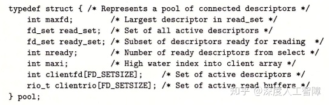

这里将所有客户端的已连接描述符保存在`clientfd`数组中，并且保存了对应的缓冲区`clientrio`数组。

然后是服务器的主函数


服务器获得监听描述符后，会先对池子进行初始化


池子中使用`maxi`参数来表示保存了多少个已连接客户端，这里初始化为-1，并将所有客户端的描述符初始化为-1。使用`maxfd`来保存最大的描述符，这里一开始只有一个`listenfd`，所以就初始化为`listenfd`，然后设置好`read_set`，使得`select`函数能判断`listenfd`描述符是否准备好。

在主函数中，调用`select`函数来检测描述符组`p->read_set`，最开始只有一个`listenfd`，所以就是检测是否有客户端发起连接请求，如果有，则执行`add_client`函数将该已连接客户端放入池子中

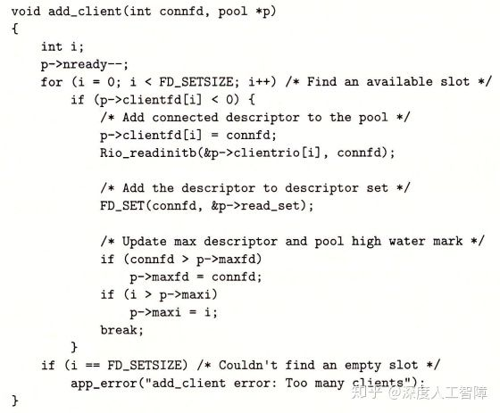

在`add_client`函数中，会寻找一个合适的索引来放`connfd`和客户端对应的缓冲区，然后就会修改`p->read_set`，添加该已连接客户端的`connfd`，使得`select`函数能检测该客户端的已连接描述符是否准备好。

在主函数中，如果`select`函数检测到的不是`listenfd`，则就是客户端发送的数据，就会调用`check_clients`函数

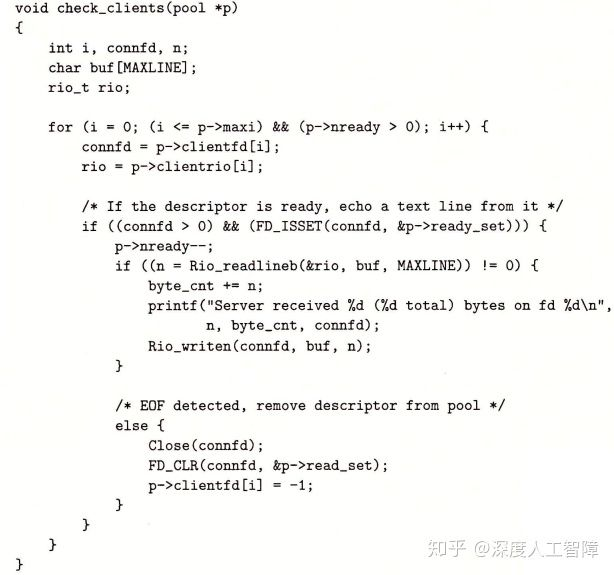

在该函数中，会对发送数据的客户端进行读取，并将发送了`EOF`的客户端进行关闭，并设置`p->read_set`以及将其从池子中删除。

**综上所述：**I/O多路复用其实就是使用`select`函数一次性检查多个描述符是否准备好可读了，然后通过`FD_ISSET`函数来判断是哪个描述符准备好了，再对其进行读取。并且不像之前串行服务器那样，连接上的客户端就不断读取数据，而是每个准备好的客户端都只读取一行，然后又调用`select`等待新的准备好的描述符，避免了一个客户端长时间占用服务器，使得别的客户端无法使用。

该方法的特点：

- **优点：**

- - 比基于进程的方法更好控制程序的行为，比如可以为某些客户端提供它们需要的服务
  - 所有客户端运行在单一的进程中，使得每个逻辑流能访问该进程的所有地址空间，使得流之间共享数据很容易
  - 由于是单个进程，就很容易调试，类似于顺序程序
  - 由于不需要进程的上下文切换，使得基于I/O多路复用的方法比基于进程的方法高效很多

- **缺点：**

- - 编码复杂，我们这里编写的粒度是读取每一行，如果阻塞在读取某个客户端的一行，就会使得其他客户端也不可用，而基于进程的方法不存在这个问题，如果我们想要编写更细粒度的程序，代码就更加复杂了。
  - 不能充分利用多核处理器。

## 3 基于线程的并发编程

### 3.1 线程基础

首先，我们可以看看进程的基本构成，它是由一个进程上下文和代码、数据和栈构成的


而我们这里将栈从虚拟地址空间中取出与线程的上下文结合起来，将其称为**线程（Thread）**，而其余部分保持不变。

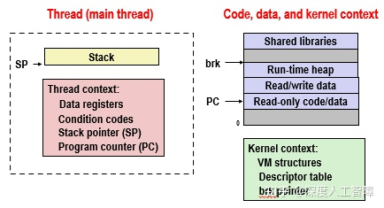

线程就是运行在进程上下文中的逻辑流，每个进程开始生命周期时都是单一线程的，该线程称为**主线程（Main Thread）**，该主线程可以创建一个**对等线程（Peer Thread）**，由此这两个线程就并发执行，且每个线程有自己的逻辑流。该过程类似于多进程并发

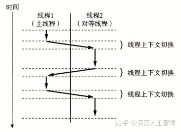

首先，每个线程都有自己的**线程上下文（Thread Context）**，包括一个唯一的整数**线程ID（Thread ID，TID）**、栈、栈指针、程序计数器、通用目的寄存器和条件码，且每个线程有自己的栈用来保存局部变量。而内核会负责线程之间的调度，比如主线程在运行一个慢速系统调用时，内核就会调用线程上下文切换将控制转移到对等线程，当对等线程执行一段时间后，内核又会调用线程上下文切换将控制转移到主线程。

**线程之间的关系：**所有运行在一个进程里的线程共享该进程的整个虚拟地址空间，包括代码、数据、堆、共享库和打开的文件，这些与一个进程相关的线程组成一个**对等线程池**，线程之间不是父子关系，而是对等关系，即一个线程可以杀死它的任意对等线程，或等待它的任意对等线程终止。而主线程和对等线程的区别仅仅是主线程是进程中第一个运行的线程。

**进程与线程的相同点：**

- 每个都有自己的逻辑流
- 都能并发运行
- 可以上下文切换

**进程与线程的区别：**

- 每个进程具有自己的独立虚拟地址空间，而处于同一个进程上下文的线程共享该进程的整个虚拟地址空间，变成之间会共享所有代码和数据（除了局部栈）。
- 由于线程上下文比进程上下文小很多，所以内核进行线程上下文切换比进程上下文切换快很多。
- 进程之间存在父子关系，而线程之间是对等关系。


### 3.2 线程编程


以上是一个简单的线程编程例子，这里封装了大部分的函数，来首先理解线程编程的思想。首先，我们需要构建一个**线程例程（Thread Routine）**来包含线程的代码和本地数据，比如第12~16行的`thread`就是一个线程例程，线程例程都是以一个`void *`指针作为输入，并返回一个`void *`指针，如果想要传递多个参数给线程或线程想返回多个参数，就要将其放入一个结构中，并使用指向该结构的指针。在`main`函数中，首先会通过`Phread_create`函数来创建一个对等线程，将对等线程的线程例程作为参数，并返回该线程的TID`tid`，此时主线程和刚创建的对等线程就会同时运行，接下来调用`Phread_join`函数，主线程就会等待对等线程终止。


接下来我们依次详细看一下线程编程的函数

### 3.2.1 创建线程

```c
#include <pthread.h>
typedef void *(func)(void *);
int pthread_create(pthread_t *tid, pthread_attr_t *attr, func *f, void *arg);
pthread_t pthread_self(void); 
```

我们可以通过将线程例程`f`传入`pthread_create`函数来获得线程TID`tid`，当该函数返回时，就会在新线程的上下文中将参数`arg`传给`f`并运行`f`。我们可以通过`atte`来修改线程的默认行为，这里不做介绍。在线程例程中，可以通过`pthread_self`来获得所在线程的TID。

### 3.2.2 终止线程

```c
#include <pthread.h>
void pthread_exit(void *thread_return);
int pthread_cancel(pthread_t tid); 
```

线程终止有以下几种方式：

- 当顶层的线程例程返回时，线程会隐式地终止。（**不懂？**）
- 当某个对等线程调用`exit`函数时，会终止进程以及所有与该进程相关的线程。
- 线程例程可以调用`pthread_exit`函数来终止线程，并将`thread_return`作为终止信号。如果是在主线程中调用该函数，它会等其他所有对等线程终止后，才终止主线程和进程。
- 可以通过`pthread_cancel`发送线程终止请求给`tid`线程。

**参考：**

- [线程取消(pthread_cancel) - Cynthia&Sky - 博客园](https://link.zhihu.com/?target=https%3A//www.cnblogs.com/lijunamneg/archive/2013/01/25/2877211.html)
- [pthread_exit()_运维_佑邦的专栏-CSDN博客](https://link.zhihu.com/?target=https%3A//blog.csdn.net/youbang321/article/details/7816016)

### 3.2.3 回收已终止线程的资源

类似于进程，当子进程终止时，父进程要通过调用`waitpid`来回收子进程的资源。同理，我们也要回收终止线程的资源

```c
#include <pthread.h>
int pthread_join(pthread_t tid, void **thread_return); 
```

当我们调用该函数时，它会阻塞直到线程`tid`终止，此时会将线程例程返回的`void *`保存到`thread_return`中，然后回收已终止线程的资源。

**注意：**我们这里只能等待一个指定的线程`tid`终止，而无法像`waitpid`那样等待任意的进程终止。

### 3.2.4 分离线程

线程具有**两种状态：**

- **可结合的（Joinable）：**线程默认是可结合的，可被其他线程终止，当线程终止时，它的内存资源不会释放，需要被其他线程通过`pthread_join`函数来回收。
- **分离的（Detached）：**我们可以通过以下函数来将可结合的线程变为分离的线程，此时它就无法被其他线程终止或回收了，它会在它自己终止时由系统自动释放资源。线程可以在自己线程例程刚开始时，使用`pthread_self`函数来将自己设置为分离的。

```c
#include <pthread.h>
int pthread_detach(pthread_t tid);
```

### 3.2.5 初始化线程

当我们在多线程环境中编程时，可能想要初始化与线程例程相关的状态，比如初始化多个线程共享的全局变量时，这些初始化只想执行一次，此时就可以使用以下函数

```c
#include <pthread.h>

pthread_once_t once_control = PTHREAD_ONCE_INIT;
int pthread_once(pthread_once_t *once_control, void (*init_routine)(void));
```

首先，我们需要自己定义一个初始化的函数`init_routine`，然后在各个线程例程中调用`pthread_once`函数，此时会通过`once_control`参数来控制只执行一次初始化函数`init_routine`。

### 3.3 基于线程的并发服务器

我们可以实现基于线程的并发echo服务器

```c
#include "csapp.h"

void echo(int connfd);
void *thread(void *vargp);

int main(int argc, char **argv) 
{
    int listenfd, *connfdp;
    socklen_t clientlen;
    struct sockaddr_storage clientaddr;
    pthread_t tid; 

    if (argc != 2) {
	fprintf(stderr, "usage: %s <port>\n", argv[0]);
	exit(0);
    }
    listenfd = Open_listenfd(argv[1]);

    while (1) {
        clientlen=sizeof(struct sockaddr_storage);
	connfdp = Malloc(sizeof(int)); //line:conc:echoservert:beginmalloc
	*connfdp = Accept(listenfd, (SA *) &clientaddr, &clientlen); //line:conc:echoservert:endmalloc
	Pthread_create(&tid, NULL, thread, connfdp);
    }
}

/* Thread routine */
void *thread(void *vargp) 
{  
    int connfd = *((int *)vargp);
    Pthread_detach(pthread_self()); //line:conc:echoservert:detach
    Free(vargp);                    //line:conc:echoservert:free
    echo(connfd);
    Close(connfd);
    return NULL;
}
```

它这个过程类似于基于进程的并发服务器，`main`函数中会死循环等待是否有客户端发送连接请求， 通过`accept`函数获得已连接描述符`connfd`，然后将其作为线程例程`thread`的参数来通过`pthread_create`函数创建一个对等例程，当`ptread_create`函数返回时，此时主线程和对等线程就会同时并发运行，所以服务器可以用一个对等线程来处理一个客户端的连接，而通过主线程来进行监听，由此达到了多个客户端并发的效果。

由于`main`函数不显示地回收对等线程，所以在线程例程中，需要分离该线程，让它自己线程终止时就自动回收资源。

该函数中需要**注意两点：**

首先，为什么已连接描述符`connfd`想要传入线程例程时，要采用上面的那种形式

```c
connfdp = Malloc(sizeof(int));
*connfdp = Accept(listenfd, (SA *) &clientaddr, &clientlen); 
Pthread_create(&tid, NULL, thread, connfdp);
```

如果我们采用下面这种形式会不会出现问题

```c
connfd = Accept(listenfd, (SA *) &clientaddr, &clientlen); 
Pthread_create(&tid, NULL, thread, &connfd);

void *thread(void *vargp) 
{  
    int connfd = *((int *)vargp);
    ...
}
```

这里需要注意，传入线程例程的是一个指针参数，指向的是`connfd`的地址，当我们在`thread`函数中完成类型转换获得局部变量`connfd`之前，下一个客户端发送了连接请求，使得`accept`函数修改了`connfd`的值时，由于同一进程中的所有线程共享相同的虚拟地址空间，所以会使得`thread`函数中的`connfd`变成下一个客户端的`connfd`了，产生了竞争。所以这里每次都会申请一个新的地址来存放`connfd`，避免存在竞争，并且由于每个线程有自己的栈，所以线程中的局部变量并不会相互影响。

其次，我们注意到，在基于进程的并发服务器中，在父子进程中都有对`connfd`的关闭，这是因为父子进程都有自己独立的虚拟地址空间，有独立的描述符表，所以需要两个进程从自己的描述符表中清除`connfd`，避免内存泄漏。而基于线程的并发服务器，由于所有线程共享当前进程的虚拟地址空间，即共享了同一个描述符表，此时在线程例程中关闭`connfd`后，就会直接从进程的描述符表中清除`connfd`了，就无需主线程关闭`connfd`了。

该方法的特点：

- **优点：**

- - 易于在线程之间共享数据结构，比如日志记录信息和文件缓存
  - 线程比进程更高效

- **缺点：**无意的共享会引入细微且难以再现的错误！

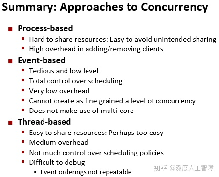

# [读书笔记]CSAPP：28[VB]同步


 **视频地址：**

[【精校中英字幕】2015 CMU 15-213 CSAPP 深入理解计算机系统 课程视频_哔哩哔哩 (゜-゜)つロ 干杯~-bilibiliwww.bilibili.com/video/BV1iW411d7hd?p=22](https://link.zhihu.com/?target=https%3A//www.bilibili.com/video/BV1iW411d7hd%3Fp%3D22)

[2015CMU 15-213 CSAPP 深入理解计算机系统 课程视频含英文字幕（精校字幕视频见av31289365！！！）_哔哩哔哩 (゜-゜)つロ 干杯~-bilibiliwww.bilibili.com/video/BV1XW411A7fB?p=23](https://link.zhihu.com/?target=https%3A//www.bilibili.com/video/BV1XW411A7fB%3Fp%3D23)

**课件地址：**

[http://www.cs.cmu.edu/afs/cs/academic/class/15213-f15/www/lectures/24-sync-basic.pdfwww.cs.cmu.edu/afs/cs/academic/class/15213-f15/www/lectures/24-sync-basic.pdf](https://link.zhihu.com/?target=http%3A//www.cs.cmu.edu/afs/cs/academic/class/15213-f15/www/lectures/24-sync-basic.pdf)

[http://www.cs.cmu.edu/afs/cs/academic/class/15213-f15/www/lectures/25-sync-advanced.pdfwww.cs.cmu.edu/afs/cs/academic/class/15213-f15/www/lectures/25-sync-advanced.pdf](https://link.zhihu.com/?target=http%3A//www.cs.cmu.edu/afs/cs/academic/class/15213-f15/www/lectures/25-sync-advanced.pdf)

本章对应于书中的12.4, 12.5和12.7。

------

- 只有资源共享才会产生同步问题，如果线程没有共享任何资源，就没有同步问题。判断一个变量是否是共享的，首先判断该变量在内存的实例个数，然后看该变量的一个实例是否被多个线程引用。对共享变量进行操作时要进行同步。
- 多线程程序要画出进度图来分析
- 互斥锁主要是用来保护共享变量的，只要有多个线程访问共享变量，就加上互斥锁。如果要对资源进行调度，就使用计数信息量。
- **多线程代码：**首先判断哪些变量是共享变量，加上互斥锁。如果有多个互斥锁，画出进度图，避免出现死锁。
- 由于同步的开销很大，所以尽量写成可重入的形式。
- 多进程程序中，需要注意对信号进行阻塞；多线程程序中，需要注意对共享变量进行同步。
- 多线程程序要注意：共享变量，竞争，死锁，线程安全。

------

## 1 多线程程序的共享变量

我们以下面的程序为例来说明多线程共享变量的问题


一组并发的线程运行在一个进程上下文中，每个线程具有自己的线程上下文，包括TID、栈、栈指针、程序计数器、条件码和通用目的寄存器值，这就说明每个进程可以通过自己的程序计数器运行自己的代码，而通过栈可以保存自己的局部变量，这些栈是保存在虚拟地址空间中的栈区域。而进程的其余部分在所有线程中是共享的，包括整个用户虚拟地址空间，其中有代码、读写数据、堆、共享代码库代码数据区域、打开的文件描述符和信号处理程序等等。

但是并不会完全遵守以上的线程内存模型，比如我们这里要求每个线程有自己独立的栈，但是这里并不会对其他线程的访问进行限制，比如上面代码在线程例程中通过全局变量ptr来访问主线程中栈的局部变量`msgs`，所以要十分小心这个线程内存模型。

根据[链接](https://zhuanlan.zhihu.com/p/113571281)这一章可知，未初始化静态变量、以及初始化为0的全局变量或静态变量的符号`.bss`节中，初始化过的全局变量或静态变量的符号在`.data`节中，这两个数据节在生成可执行目标文件时，都被分配到了数据段中，所以全局变量和静态变量的实例是保存在进程的虚拟地址空间中的数据段中的，所有线程都能访问到，且虚拟内存空间值包含一个实例。而局部非静态变量是保存在栈或寄存器中的，每个线程都有自己的栈和寄存器值，所以局部非静态变量的实例是保存在线程的栈或寄存器中的，通常只有自己能访问到。

而判断一个变量是否是共享的，就看该变量的一个实例是否被多个线程引用。

- `ptr`：它是未初始化全局变量，实例保存在`.bss`节中，所有线程都可以访问。在主线程和两个对等线程中都有引用过，所以是共享的。
- `cnt`：它是初始化了的静态变量，实例保存在`.data`节中，所有线程都可以访问。在两个对等线程中都有引用过，所以是共享的。
- `i.m`：主线程中的变量`i`是局部变量，保存在主线程中的栈，没有被其他线程引用过，所以是不共享的。
- `msgs.m`：主线程中的变量`msgs`是局部变量，保存在主线程中的栈。由于全局变量`ptr`指向了`msgs`，而两个对等线程通过`ptr`间接地引用了`msgs`的数据，所以是共享的。
- `myid.0`和`myid.1`：在两个对等线程中的局部变量`myid`，它们各自保存在对等线程自己的栈中，也不存在间接引用，所以它们是不共享的。


## 2 用信号量同步线程

由于共享变量的存在，可能会引入**同步错误（Synchronization Error）**。

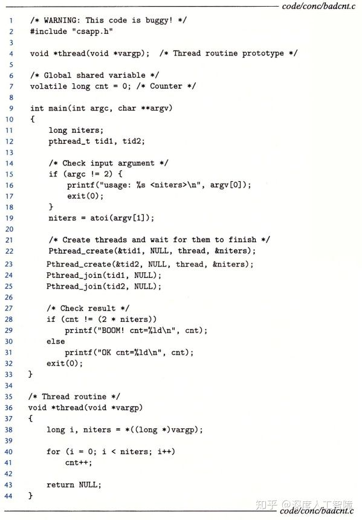

**注意：**由于我们这里在线程例程中不会对`niters`进行修改，所以可以直接将`niters`的地址传入`pthread_create`函数而不用担心竞争。

我们运行该程序时，希望`cnt`的值为`2*niters`，但是运行出来的结果却是

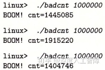

我们观察在线程例程中的汇编

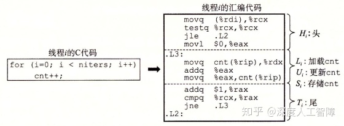

其中，`%rcx`保存`niters`的值，`%rax`保存`i`的值，`%rdx`保存`cnt`的值。我们知道，在单核线程并发时，是由内核调度这两个线程的逻辑流进行交替运行的，而上图的中间部分是两个逻辑流对共享变量`cnt`的操作，所以当其中一个线程运行到中间部分又被内核调度到另一个线程时，就可能会出错。这两个线程的逻辑流具有一些能得到正确结果的执行顺序，也有一些会得到错误结果的执行顺序，比如


我们可以通过**进度图（Process Graph）**来探讨指令执行的顺序。首先有n个并发线程就创建n维笛卡尔积空间，每个维度对应一个线程的进度，根据线程的指令顺序对每一维进行划分，则在该笛卡尔积空间中的某一条轨迹就是并发线程的指令执行顺序。**注意：**

- 图的原点是所有并发线程还未开始执行的初始状态
- 两条指令不能同时执行，所以不存在斜线
- 程序不允许反向运行，所以轨迹总是向右上方增长的


如上图所示就是根据汇编指令得到的一条指令执行顺序的轨迹。其中我们将操作共享变量`cnt`的指令 ![[公式]](https://www.zhihu.com/equation?tex=%28L_i%2CU_i%2CS_i%29) 当做**临界区（Critical Section）**，我们希望临界区不和其他线程的临界区交替执行，来使得线程拥有对共享变量的**互斥访问（Mutually Exclusive Access）**。我们可以将两个线程的临界区围起来构成一个**不安全区（Unsafe Region）**，只要有一条轨迹穿过不安全区，说明两个线程对共享变量`cnt`的操作是交替执行的，可能就会出现错误。我们将穿过不安全区的轨迹称为**不安全轨迹（Unsafe Trajectory）**，而其他的轨迹就是**安全轨迹（Safe Trajectory）**。

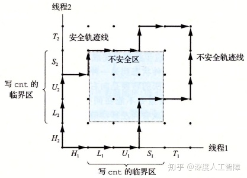

为了保证可以获得安全轨迹，可以通过信号量的方法同步线程来获得安全轨迹。

### 2.1 信号量

为了同步线程，提出了一种特殊类型变量**信号量（Semaphore）**`s`，它是具有非负整数的全局变量，只能通过两个系统调用函数进行操作：

- **`P(s)`：**

- - 如果`s`是非零的，就对其减1并立即返回（原子操作）
  - 如果`s`是0，则将当前线程挂起，直到被`V(s)`函数加1且重启线程，`P(s)`才会再对`s`减1并返回。

- **`V(s)`：**将`s`加1（原子操作），如果有任何线程被P挂起，该函数会重启其中任意一个线程，此时控制权又回到了那个线程的P中。

P和V这样的定义是为了保证了信号量`s`不会变成负值，才能够对线程进行同步，这种属性称为**信号量不变性（Semaphore Invariant）**。这里有一些信号量的函数

```c
#include <semaphore.h>

int sem_init(sem_t *sem, 0, unsigned int value);
int sem_wait(sem_t *s);  //P
int sem_post(sem_t *s);  //V
```

其中，每个信号量都要通过`sem_init`函数进行初始化，且初始化值为`value`，然后通过`sem_wait`和`sem_post`函数来调用P和V。我们这里提供这两个的封装

```c
#include "csapp.h"
int P(sem_t *s);
int V(sem_t *s); 
```

使用信号量来确保对共享变量的互斥访问，**基本思想**是将共享变量和一个信号量联系起来，然后使用P和V将对应的临界区包围起来。比如我们将原来的代码改为

```c
sem_t mutex;  //信号量
//主线程中初始化信号量
sem_init(&mutex, 0, 1);
//对等线程例程中
for(i=0; i<niters; i++){
  P(&mutex);
  cnt++;
  V(&mutex);
}
```

这里我们声明了一个信号量`mutex`，然后在线程例程中用P和V将`cnt++`围住了。首先，当还没有线程执行线程例程时，`mutex`被初始化为1，当有一个线程A在执行线程例程时，会首先执行`P(&mutex)`，此时由于`mutex`不是0，所以会将其减1，然后执行`cnt++`，此时`mutex`就为0，如果在执行`cnt++`指令的中间有另一个线程B也要执行线程例程时，在`P(&mutex)`中由于当前`mutex`为0，则P会将线程B挂起，直到线程A执行到`V(&mutex)`时，会将`mutex`加1，然后重启线程B，此时线程B又会执行`P(&mutex)`，此时由于`mutex`为1，所以也会顺利执行。

更形式化来说，我们将这种用来保护共享变量的信号称为**二元信号量（Binary Semaphore）**，因为它的值总是0或1。以提供互斥为目的的二元信号量也称为**互斥锁（Mutex）**，则执行P操作就称为**上锁**，执行V操作就称为**解锁**，一个线程对互斥锁上锁了还未解锁，就称该线程**占用**这个互斥锁。我们通过互斥锁将线程的临界区包围起来，则会构成一个**禁止区（Forbidden Region）**，在禁止区内由于信号量都为-1，想要操作共享变量就要通过P对信号量减1，此时就会将当前线程挂起，直到占用的线程解锁

图中每个点的值为信号量的值

### 2.2 利用信息量来调度共享资源

除了用二元信息量来提供互斥锁以外，还能用来作为一组可用资源的计数器，称为**计数信号量**，用来调度对共享资源的访问，经典的模型有**生产者-消费者问题（Producer-Consumer Problem）**和**读者-写者问题（Reader-Writer Problem）**。

### 2.2.1 生产者-消费者问题

我们考虑这样一类问题，假设目前我们去一个商场购买口罩，我们作为消费者可以自己去购买，如果口罩不够了，则消费者就等待生产者生产出更多的口罩放在商场供我们购买，如果生产者一不小心生产了太多口罩，则商场放不下了，就要等商场有空的区域时再生产。这就是一个生产者-消费者问题。

在这里，我们将生产者和消费者看成是生产者线程和消费者线程，而商场看成是一个具有有限空间的缓冲区，生产者线程会不断生成新的**项目（Item）**，然后将其插入缓冲区中，而消费者线程会不断从缓冲区中取出这些项目去消费。


由于缓冲区在这两个线程中是共享变量，从中取出项目和插入项目都要更新共享变量，所以要对缓冲区设置一个互斥锁，保证只有一个线程能访问缓冲区。其次，我们还需要通过计数信号量对缓冲区的访问进行调度，当缓冲区有空间来插入项目时，生产者线程才尝试插入项目，当缓冲区中有项目时，消费者线程才尝试从中取出项目。我们可以首先定义缓冲区的数据结构


其中，`buf`是一个动态分配的缓冲区，`n`是缓冲区的大小，`front`和`rear`是第一个项目和最后一个项目的索引，这里将`buf`实现为循环的数组。`mutex`是访问缓冲区的互斥锁，`slots`是用来调度生产者线程的计数信息量，`items`是用来调度消费者线程的计数信息量。

**注意：**计数信息量`slot`和`items`是用来判断能否执行生产者线程或消费者线程，如果可以，则会对`buf`进行访问，由于`buf`是共享变量，所以它的访问需要`mutex`互斥锁，所以这里会有三个信息量。

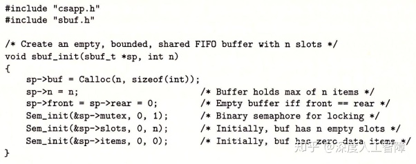

首先，我们需要初始化该缓冲区，其中`sp->mutex`要初始化为二院信息量，`sp->slots`要初始化为`n`，表示有`n`个空间供生产者线程使用，`sp->items`要初始化为0，表示现在还没有项目供消费者线程消费。


生产者线程可以调用`sbuf_insert`函数来将将项目插入到缓冲区中。首先需要通过`sp->slots`查看是否有空闲的区域，如果`sp->slots`为0，说明没有空闲的区域，则`P`会将生产者线程挂起，直到`sp->slots`大于0且该线程被`V`重启。然后需要通过`sp->mutex`来获得缓冲区的互斥锁，然后才能将`item`插入缓冲区中。随后通过`V`将`sp->mutex`解锁，然后用`V`将`sp->items`加1，如果刚好有消费者由于`sp->items`为0而挂起，则该`V`会随机重启一个消费者线程。


消费者线程可以调用`sbuf_remove`函数来从缓冲区中获得项目。首先通过`sp->items`查看缓冲区中是否存在项目，如果`sp->items`为0表示没有项目供消费者线程消费，此时消费者线程会挂起，直到被生产者线程的`P(&sp->items)`重启。然后通过`sp->mutex`来获得缓冲区的互斥锁，然后才能从缓冲区中获得项目`item`。随后通过`V`将`sp->mutex`解锁，然后用`V`将`sp->slots`加1，如果刚好有生产者线程由于`sp->slots`为0而挂起，则该`V`会随机重启一个生产者线程。

最终我们可以通过以下函数来释放缓冲区

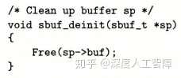

### 2.2.2 读者-写者问题

当一组并发的线程要访问一个共享对象时，有些线程只读对象称为**读者线程**，而其他对象只写对象称为**写者线程**，写者线程必须有对对象的独占访问，而读者线程可以和其他读者线程共享对象。根据读者和写者的优先级，可以**分成两类问题：**

- **第一类：**读者优先级高于写者，除非写者已占用互斥锁，否则读者都不会一直等待，在等待的写者之后到达的读者具有更高的优先级。
- **第二类：**写者优先级高于读者，一旦写者准备好写时，它会尽快执行写操作，在写者之后到达的读者必须等待。

这两种情况都会出现饥饿问题。这里提供一个第一类读者-写者问题的代码


这里定义了一个全局共享变量`readcnt`来统计读者线程的数目，由于不同读线程要对其进行访问，所以需要一个互斥锁`mutex`来控制对`readcnt`的访问，然后还有一个`w`互斥锁来控制对对象的访问。

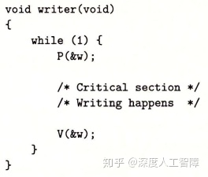

在写者线程中，会通过用`P(&w)`和`V(&w)`将临界区包围住，从而根据互斥锁`w`的状态来访问对象，此时保证了一次只能有一个写者线程能访问对象。


在读者线程中，首先要通过`readcnt`来统计其中有多少个读者线程，因为是读者优先的，所以只有进入的读者数目`readcnt`为0时，才能让写者线程去访问对象，所以这里每个读者线程进来和出去时都要修改`readcnt`，而`readcnt`是共享变量，所以需要通过`mutex`来对其上锁。其次，我们只有当`readcnt`为1时才执行`P(&w)`对`w`进行上锁，当有写者线程尝试访问对象时，会被挂起，而当有其他读者线程进入时，由于`readcnt`被修改了，所以不会访问到`P(&w)`，也就不会被挂起，此时后续的读者线程就能不断进入临界区访问对象。而只有当`readcnt`为0时才执行`V(&w)`对`w`解锁，此时挂起的写者线程就能被重启。

### 2.3 基于预线程化的并发服务器

我们之前实现的基于线程的并发服务器，为每个客户端都生成一个线程进行处理，其实十分耗费资源。我们可以基于生产者-消费者问题来构建一个**预线程化（Prethreading）**的并发服务器，它将主线程看成是生产者，不断接收客户端发送的连接请求，并将已连接描述符放在缓冲区中，而提前创建的一系列线程就是消费者，不断从缓冲区中取出已连接描述符与客户端通信

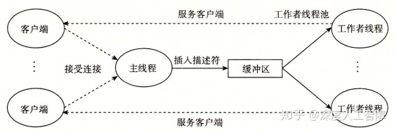

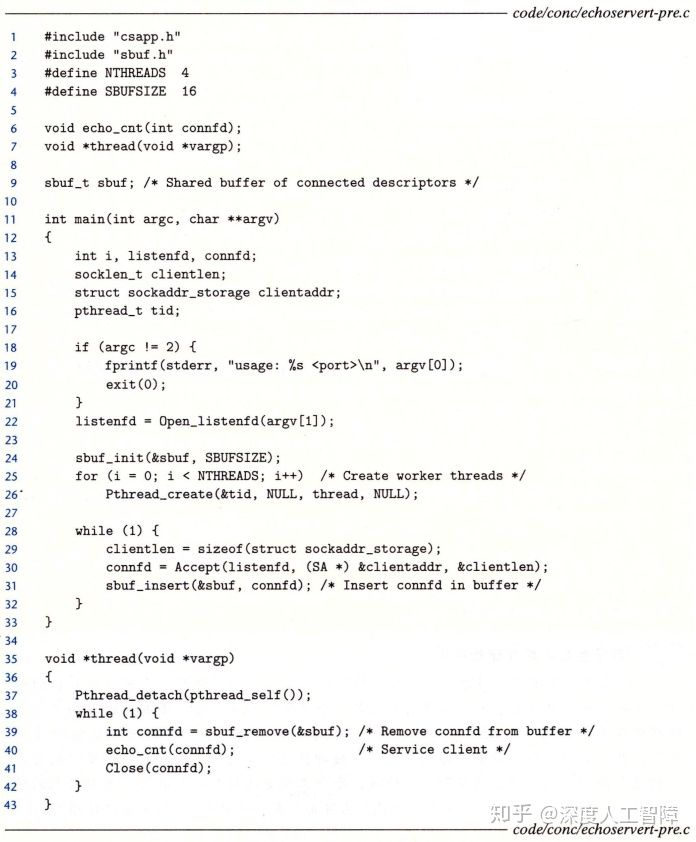

第24行首先对缓冲区进行初始化，然后生成了`NTHREADS`个消费者线程，在线程例程中，会通过`pthread_detach`函数来分离消费者线程，然后死循环通过`sbuf_remove`函数来从缓冲区中获得已连接描述符`connfd`，当`pthread_create`函数返回时，这些消费者线程就开始运行了，此时由于`sbuf->items`为0，所以这些消费者线程会被`P(&sbuf->items)`挂起。然后在生产者线程中通过`accept`函数来获得已连接描述符`connfd`，并通过`sbuf_insert`函数将其插入到缓冲区中，此时`sbuf->items`就不为0了，那些被挂起的消费者线程就会一个个被`V(&sbuf->items)`重启，然后将获得的`connfd`传入`echo_cnt`函数来与客户端通信。这里的对等线程的数目是我们一开始创建的那些线程，而不是等到获得`connfd`时才创建，所以称为预线程化，可以自己控制对等线程的数目。


这个`echo_cnt`函数会通过全局变量`byte_cnt`来统计服务器总共从客户端获得的字节数，由于不同的消费者线程都会调用`echo_cnt`函数，所以会有多个线程来访问`byte_cnt`共享变量，所以我们对`byte_cnt`的访问需要使用互斥锁。而我们这里将互斥锁和`byte_cnt`的初始化过程放在了子线程中，通过`pthread_once`函数来保证该初始化函数`init_echo_cnt`函数只被执行一次。

## 3 其他并发问题

可以发现，线程由于会对共享变量进行操作，所以我们尝试使用同步技术来解决操作共享资源时出现的问题，接下来会介绍几个典型问题。

### 3.1 线程安全

当且仅当一个函数被多个并发线程反复调用还会一直产生正确结果时，才称为**线程安全的（Thread-Safe）**，我们可以根据线程不安全的原因分成以下几个类：

- **第一类：不保护共享变量的函数：**当我们没有对共享变量进行保护，而它的操作也是非原子的时，就可能会造成错误。

- - **解决方法：**引入互斥锁，使用`P`和`V`将对共享变量访问的部分围起来，但程序速度会变慢。

- **第二类：跨多个函数调用依赖于持久状态：**比如以下伪随机数生成器，在单个线程程序中，我们可以通过`srand`函数定义相同的随机种子来得到可重复的随机数序列，但是在多个线程中调用`rand`函数时，由于`rand`函数中依赖于共享的前一个状态`next_seed`，此时`next_seed`可能会被其他线程修改而无法获得相同的随机数序列。

- - **解决方法：**重写函数，将状态作为参数的一部分传递，避免被其他线程修改。


- **第三类：返回指向静态变量的指针的函数：**静态变量保存在数据区，在进程中只有一个实例，是所有线程共享的，当你返回一个静态变量的指针时，是指向一个内存地址，而在别的线程中可能也会通过该静态变量对该内存地址的内容进行修改。

- - **解决方法：**

  - - 重写函数，让调用者传递保存结果的地址
    - 使用**加锁-复制（Lock-and-Copy）**技术，将线程不安全函数与一个互斥锁联系起来，用`P`和`V`函数将该不安全函数的调用部分包围起来，并将其结果保存在一个局部变量中。**问题：**需要引入额外的同步操作，会降低程序的速度，其次是有一些函数会返回十分复杂的数据结构，比如`getaddrinfo`，此时就需要深拷贝才能复制整个结构数据。


- **第四类：调用线程不安全函数的函数：**如果该线程不安全函数属于第二类，就要修改函数的源码，如果是第一类或第三类，可以直接通过互斥锁的方式保证函数时线程安全的。

Linux系统提供的大多数线程不安全函数都有对应的线程安全版本，一般是以`_r`结尾的。


我们可以更进一步得到线程安全函数中的一类**可重入函数（Reentrant Function）**，当他们被多个线程引用时，不会引用任何共享数据。可将其分成两类：

- **显示可重入的（Explicitly Reentrant）：**函数参数全都是值传递，且函数内的数据应用都是局部变量，不含有全局变量或静态变量。
- **隐式可重入的（Implicitly Reentrant）：**函数参数可以是引用传递的，如果调用线程传递一个非共享数据的指针，它就是可重入的。

可重入函数包括显示可重入和隐式可重入，说明可重入函数可能也依赖于调用线程的属性，比如传递一个非共享数据的指针到隐式可重入函数，保证其是可重入的，这类函数就不需要任何同步技术来保证多线程结果的正确。由于同步的开销很大，所以尽量写成可重入的形式。

上面第二类线程不安全函数，只能通过修改函数使其是线程安全的，并且由于无法使用互斥锁，所以只能将其改为可重入的


**注意：**可重入函数是线程安全函数的真子集，所以可重入函数一定是线程安全函数，而线程安全函数不一定是可重入函数，可能是用互斥锁来实现线程安全的。可重入函数由于不用同步操作，所以通常速度会更快。

### 3.2 竞争

多线程程序要求对进度图中任何可行的轨迹都正确工作，而程序员可能会下意识假设了某种特殊的轨迹，比如一个程序的正确性依赖于线程A要在线程B执行到y之前先执行到x，此时就会出现**竞争（Race）**。

这个例子之前也说过


该程序中，第13行创建线程时传入的参数为`&i`，而在线程例程中通过`*((int*)vargp)`将其转化为`int`，此时就会出现竞争。因为主线程中的局部变量`i`保存在主线程的栈中，而传入的线程例程的参数是`i`的地址，在前一个线程在第22行读取该地址中的`i`之前，第12行修改了该地址内的数据，就会造成竞争。这里假设了第22行在第12行之前执行。


正确的方法是申请一个独立的空间

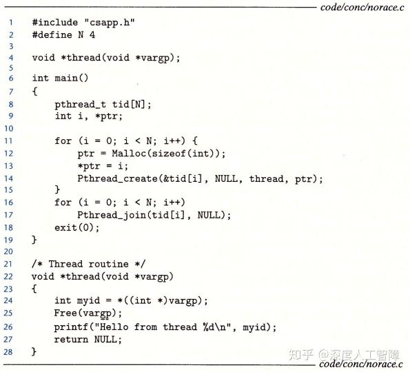

### 3.3 死锁

**死锁（Deadlock）**就是一组线程被阻塞，等待一个永远不会为真的条件。比如下图是一个使用了两个互斥锁的进度图


我们可以发现，当轨迹进入图中所示的**死锁区（Deadlock）**时，线程1占用互斥锁`s`，线程2占用互斥锁`t`，而轨迹要从死锁区出来，要么线程1占用互斥锁`s`，要么线程2占用互斥锁`t`，这两个都是不可能为真的条件，所以就陷入了死锁状态。所以轨迹可以进入死锁区，但是无法从死锁区出来。

可以发现是由于P和V的操作顺序不当，使得两个互斥锁的禁止区出现了重叠，导致死锁区的出现，这种原因导致的死锁常用的解决方法是定义一个**互斥锁加锁顺序规则**，给定所有互斥操作的一个全序，如果每个线程都是以一种顺序获得互斥锁并以相反的顺序释放锁，则该程序时无死锁的。也就是对于有多个互斥锁的情况，我们在所有线程中按照相同顺序来上锁，在解锁时用相反顺序。

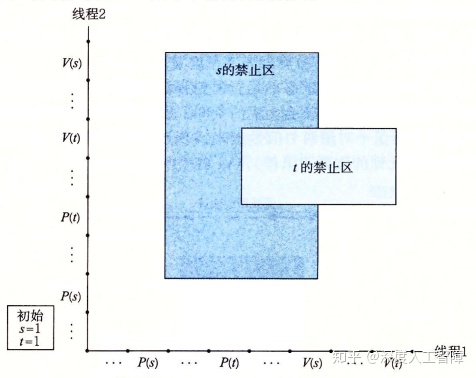

**注意：**要注意互斥锁的初始状态。

# [读书笔记]CSAPP：29[VB]线程级并行


 **视频地址：**

[2015CMU 15-213 CSAPP 深入理解计算机系统 课程视频含英文字幕（精校字幕视频见av31289365！！！）_哔哩哔哩 (゜-゜)つロ 干杯~-bilibiliwww.bilibili.com/video/BV1XW411A7fB?p=24](https://link.zhihu.com/?target=https%3A//www.bilibili.com/video/BV1XW411A7fB%3Fp%3D24)

**课件地址：**

[http://www.cs.cmu.edu/afs/cs/academic/class/15213-f15/www/lectures/26-parallelism.pdfwww.cs.cmu.edu/afs/cs/academic/class/15213-f15/www/lectures/26-parallelism.pdf](https://link.zhihu.com/?target=http%3A//www.cs.cmu.edu/afs/cs/academic/class/15213-f15/www/lectures/26-parallelism.pdf)

本章对应于书中的12.6。

------

- 同步互斥锁的代价很大，要避免进行同步
- 并行程序一般一个核运行一个线程

------

根据程序逻辑流的数目，可以将程序分为顺序程序和并发程序，其中顺序程序只有一个逻辑流，而并发程序具有多个逻辑流。当在多个处理器中运行并发程序时，就成为了并行程序，速度会更快，因为内核在多个核上并行地调度这些并行线程，而不是在单个核上顺序地调度。


我们以一个简单的例子来看并行程序的例子，用并行程序来计算 ![[公式]](https://www.zhihu.com/equation?tex=0%2C1%2C...%2Cn-1%2Cn) 的和。首先，我们可以根据线程数目将这些数字划分成若干个组，每个线程在自己的组中计算结果，再将其放入一个共享全局变量中，需要用互斥锁保护这个变量。


第30行中我们将每个线程的组号作为参数传递到线程例程中，再让主线程等待所有对等线程运行完毕，再与正确结果比较是否正确。


在线程例程中，首先根据组号计算出线程需要计算的范围，然后对全局变量进行加和时，要注意用互斥锁将其保护起来。我们可以得到这个程序在四核系统上计算 ![[公式]](https://www.zhihu.com/equation?tex=2%5E%7B31%7D) 的性能为

单位为秒

可以发现效果很差，其实**主要原因**是由于`P`和`V`对互斥锁的保护。我们可以将每个线程计算的结果保存在全局数组中的特定位置，这样就不用对数组进行保护

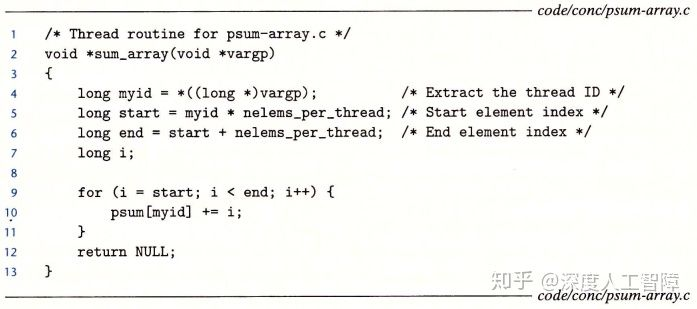

该程序的性能为


可以发现去掉互斥锁后性能提升了很多。根据之前[优化程序性能](https://zhuanlan.zhihu.com/p/107369491)介绍的，要避免内存的读写，使用一个局部变量保存循环中计算的结果，在循环计算后再将其保存到数组中，程序性能为

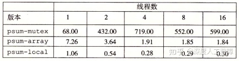

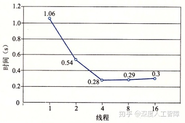在四核系统上的性能

可以一开始线程数目每增加一个，运行速度就下降一半，而当线程数到达4时，就不变了。这是因为这个程序运行在四核系统中，当线程数大于4时，每个核中就需要内核进行线程上下文切换来对线程进行调度，此时就会增加开销。并行程序一般一个核运行一个线程。

这里介绍几个度量并行程序利用并行性程度的**指标：**

- **加速比（Speedup）：**![[公式]](https://www.zhihu.com/equation?tex=S_p%3D%5Cfrac%7BT_1%7D%7BT_p%7D)
  其中p是核数目， ![[公式]](https://www.zhihu.com/equation?tex=T_p) 是并行程序p个核上的运行时间

- - **绝对加速比（Absolute Speedup）：**![[公式]](https://www.zhihu.com/equation?tex=T_1) 是顺序程序执行时间。需要编写两套代码，较复杂，但能更真实衡量并行的好处。
  - **相对加速比（Relative Speedup）：**![[公式]](https://www.zhihu.com/equation?tex=T_1) 是并发程序在一个核上的执行时间。由于并发程序需要增加同步开销，会得到比绝对加速比更大的结果。

- **效率（Efficiency）：**![[公式]](https://www.zhihu.com/equation?tex=E_p%3D%5Cfrac%7BS_p%7D%7Bp%7D)
  主要用来衡量并行化造成的开销，效率越高，说明程序在有用工作上花费更多时间，在同步和通信上花费较少的时间。


接下来我们以排序为例来介绍并行程序，尝试实现并行版的快速排序。首先看一下快速排序的顺序版本

```c
void qsort_serial(data_t *base, size_t nele) {
  if (nele <= 1)
    return;
  if (nele == 2) {
    if (base[0] > base[1])
      swap(base, base+1);
    return;
  }

  /* Partition returns index of pivot */
  size_t m = partition(base, nele);
  if (m > 1)
    qsort_serial(base, m);
  if (nele-1 > m+1)
    qsort_serial(base+m+1, nele-m-1);
}
```

可以发现我们首先对最左侧的部分进行排序，当左侧子部分排序完成时，才对右侧部分进行排序。最简单的并行方法就是将数据分成左右两部分，用两个线程分别对这两部分进行排序，称为**分而治之并行（Divide-and-Conquer Parallelism）**。此外我们还可以使用生产者-消费者模型。


