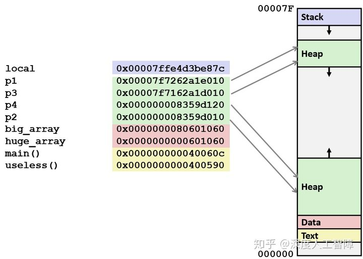
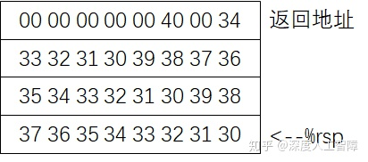

# [读书笔记]CSAPP：10[VB]机器级表示：进阶


 

**视频地址：**

[【精校中英字幕】2015 CMU 15-213 CSAPP 深入理解计算机系统 课程视频_哔哩哔哩 (゜-゜)つロ 干杯~-bilibiliwww.bilibili.com/video/av31289365?p=9](https://link.zhihu.com/?target=https%3A//www.bilibili.com/video/av31289365%3Fp%3D9)

**课件地址：**

[http://www.cs.cmu.edu/afs/cs/academic/class/15213-f17/www/lectures/09-machine-advanced.pdfwww.cs.cmu.edu/afs/cs/academic/class/15213-f17/www/lectures/09-machine-advanced.pdf](https://link.zhihu.com/?target=http%3A//www.cs.cmu.edu/afs/cs/academic/class/15213-f17/www/lectures/09-machine-advanced.pdf)

对应于书中的3.10小节。

**如有错误请指出，谢谢。**

------

## 1 x86-64内存分布

真实物理内存通过操作系统将其映射**虚拟内存**，从程序员的角度，内存就被抽象为一个很大的字节数组，每个元素是一个字节。在86-64机器上，64位二进制数为该数组地址进行编码，意味着64位操作系统最大能容纳 ![[公式]](https://www.zhihu.com/equation?tex=2%5E%7B64%7D) 字节的内存大小，目前市面上该大小的内存还不是很普及。现在64位机器会限制只使用47位的地址，这也能支持 ![[公式]](https://www.zhihu.com/equation?tex=2%5E%7B47%7D) 字节，即128T的内存大小。只使用47位编码时，最小地址为`0x0`，而最大的地址为`0x00007FFFFFFFFFFF`。

虚拟内存存储数据也是分不同区域的，如下图所示（不是按比例绘制的），地址从下到上依次递增。


- **Stack：**在Linux中，将栈放置在整个地址空间的最顶部，用于函数调用，及**局部变量**的存储，这样随着函数的运行，栈顶就能向低地址不断扩展。常用系统中栈的大小是8MB，可通过命令`limit`查看，如果用栈指针访问超过8MB范围的地址，就会出现**段错误（Segmentation Fault）**。 相同程序的栈的分配是固定的。
- **Shared Libraries：**类似于`printf`和`malloc`的这类**库函数**平时是被存储在磁盘上的，当我们程序需要使用库函数时，就会在程序开始执行时，将它们加载到你的程序中，这称为**动态加载（Dynamic Linking**）。
- **Heap：**用来存放通过**`malloc`、`callc`或`new`**等申请的变量，这些变量在程序运行时会动态变化。当你不断通过`malloc`申请空间又没释放时，堆顶的指针就不会断向高地址增加，使得占用的内存不断变多。堆在分配时是具有随机性的。
- **Data：**该数据区用来存放程序开始时分配的数据，你声明的**全局变量、静态变量或字符常量等**都在这个数据段中。
- **Text：**根据可执行目标文件的内容进行初始化，是放置你的**可执行程序**的位置。这部分区域是只读的。

以以下代码为例


`big_array`、`huge_array`和`global`是全局变量，因此存储在Data区中。`useless`和`main`是函数，因此存放在Text中。`main`函数中的`p1`、`p2`、`p3`、`p4`是通过`malloc`申请空间的，所以保存在Heap区。`local`是局部变量，所以保存在Stack区中。



我们可以发现，通过`malloc`申请的变量，较小的会保存到靠近Data区，而较大的会保存到靠近Stack极限的位置。由于Heap中有部分还没有申请，所以如果尝试引用Heap中空白的区域，会产生段错误。

## 2 理解指针

指针类型不是机器代码的一部分，而是C语言提供的关于内存地址的抽象，指针的值存储的是对象的地址，可以直接通过指针来间接对内存进行访问，避免程序员寻址错误。特殊的`NULL(0)`表示该指针不指向任何值。如果指针通过`&`创建，表示获得某个对象的地址，在机器代码中对应于`leaq`。如果指针通过`*`进行访问，表示访问该指针指向的对象的值，在机器代码中对应于内存引用。

对于多字节对象，指针指示指向该对象的第一个字节，那通过机器代码通过内存引用访问该对象内容时，怎么知道需要访问多少字节呢？这由指针的数据类型来确定，比如我们通过`int *p;`定义了一个`int *`类型的指针`p`，则通过`p`获取对象内容时，就会获取4字节数据作为该对象内容。

而指针和数组联系十分紧密，并且指针的数据类型还会影响指针运算的伸缩，比如我们计算`p+1`表示的是访问数组中第2个int对象，在内存中地址偏移量为4字节，如果我们定义指针为`char *p;`，同样计算`p+1`，也是访问数组中的第2个char对象，此时在内存中地址偏移量为1字节。

我们同样可以声明**函数指针**，表示指向函数在机器代码中的第一条指令的内存地址

```c
T (*fp)(arg1T, arg2T,...);
```

其中，`T`为函数的返回值类型，`arg1T`表示第一个参数的类型，以此类推。然后将函数名赋值给该函数指针，就能直接通过该函数指针调用函数了。

## 3 缓冲区溢出

### 3.1 概念

数据栈中保存着函数的返回地址、“被调用者保存寄存器”以及局部变量等其他信息。C语言声明的数组也保存在栈的局部变量区，并且C语言不会对数组的引用进行任何边界检查，使得我们可以超出数组的边界对栈中的其他数据进行修改，此时程序就会出现很严重的问题。

这种破坏方法称为**缓冲区溢出（Buffer Overflow）**，现在栈中分配一个字符数组用来保存字符串，然后输入的字符串超出了数组分配的空间。

比如对于以下代码

```c
char *get_line(){
  char buf[4];
  char *result;
  gets(buf);
  result = malloc(strlen(buf));
  strcpy(result, buf);
  return result;
}
```

通过反汇编可得到调用`gets`函数之前的汇编代码

```text
get_line:
  pushq %rbx       #保存被调用者保存寄存器的值
  subq $0x10, %rsp #申请一个16字节的缓冲区，用于存储buf
  movq %rsp, %rdi  #将缓冲区的地址作为第一个参数
  callq gets       #调用gets函数
```

假设调用`get_line`的返回地址为`0x400076`，而寄存器`%rbx`中保存着`0x123456789ABCDEF`，如果我们输入`0123456789012345678901234`时，会造成什么影响。

首先，栈的初始状态为（一行为8字节）

初始栈状态

最开始进入函数`get_line`时，会将需要使用的“被调用者保存寄存器”保存到栈中，所以运行`pushq %rbx`时，会将寄存器`%rbx`的值保存到栈中

pushq %rbx

当调用`subq $0x10, %rsp`时，会将栈指针`%rsp`移动16个字节，为数组`buf`提供空间

subq $0x10, %rsp

接下来通过`callq gets`就会调用函数`gets`输入数组的内容，注意要将字符转为对应的ASCII码，并且字符串末尾要填充`\0`。

callq gets

此时我们就可以看出，输入这段字符串后，不仅将寄存器`%rbx`的值修改为`0x3332313039383736`，并且还将返回地址修改为`0x40034`，当从函数`get_line`返回时，就会访问错误的指令。

**注意：**如果这里使用`strlen`查看缓冲区大小，就会获得真实大小，因为C中通过检测`\0`来判断字符串长度。

出现缓冲区溢出问题的主要原因是那些存储字符串的库函数，不会进行边界检查，比如`strcpy`、`strcat`和`gets`等等，这样就能输入超过缓冲区大小的字符串来进行攻击。通过这种缓冲区溢出攻击，可以输入一些可执行代码的字节编码，或者覆盖返回地址，使得`ret`指令会跳转到攻击者指定的代码。

比如以下代码


函数P调用函数Q后，会先在栈中写入返回地址A，对应于函数P中的断点位置。而在函数Q中，首先会为buf申请一段空间，如果我们写入一些攻击代码，比如转化为字节形式的指令，并且将返回地址A覆盖为该buf的起始位置。这样当函数Q运行完后，只是通过移动栈指针来释放空间，但是我们注入的代码还保存在栈中，并且`ret`会调用返回地址B，就返回到了我们注入代码的起始位置，就会开始执行我们注入的代码了。


### 3.2 对抗缓冲区溢出攻击

### 3.2.1 不使用具有缓冲溢出的函数

首先就是我们的应用在编写代码时可以写的更安全，比如使用`fgets`代替`gets`，因为`fgets`有一个用来指定程序最多可以读取多少字节的参数， 如果输入的字节超过这个数字，就会对其进行截断。同样可以使用`strncpy`代替`strcpy`。要注意不要直接使用`scanf`的`%s`来读取字符串，要么使用`fgets`代替，要么使用`%ns`来指定最多可以输入多长的字符串。

这些方法可以保护代码不会受到缓冲区溢出的攻击，并且现在已经开发出了可以帮助我们跟踪这些问题的工具了。

### 3.2.2 地址空间布局随机化

为了在系统中插入攻击代码，攻击者不仅要插入攻击代码，还要插入指向这段攻击代码的指针，所以需要知道代码放置的位置。对此，可以使用**地址空间布局随机化（Address-Space Layout Randomization，ASLR）**技术，每次运行程序时程序的不同部分，包括程序代码、库代码、栈、全局变量和堆数据都会加载到内存的不同区域，使得代码位置不是很好获得。对应的破解方法是使用**空操作雪橇（Nop Sled）**，通过在攻击代码前插入一段很长的`nop`指令，当运行到`nop`指令时，就会“滑到”最终的攻击代码位置，通过枚举不同的起始地址，然后执行这段攻击代码，就能成功，只是效率可能会有点低。

ASLR中有一种**栈随机化**技术，每次程序运行时，在栈中分配一段0~n字节的随机大小空间，就能使得栈的位置在程序每次运行时都有变化。

如下图所示，我们每次会在栈中申请一段随机的空间，使得栈的位置发生变化。由于我们注入的代码需要修改返回地址来指向缓冲区的位置，但是每次地址都是变化的，就无法确定要如何修改返回地址。


比如我们使用重复运行以下代码获得栈地址范围

```text
 int main(){
  long local;
  printf("local at %p\n",&local);
  return 0;
}
```

假设获得最小地址为`0xFFFFB754`，最小地址为`0xFFFFD754`，则随机化的空间为8192个字节。如果我们构建一个128字节的nop sled，则只要尝试`8192/128=64`次就能成功，所以随机化程度不能太小，同时也别太大占用程序的空间。

### 3.2.3 限制可执行代码区域

我们上面注入的形式，使得要执行的代码跑到了栈上，但是内存布局中，可执行代码应该位于Text区域。所以在原始的x86上，每个内存区域都有一个标记位，来表示该区域属于哪种类型，包括：**可写、可读**（等价于可执行）。在过去的10年左右，首先是AMD，然后是Intel，添加了第三种标志：**可执行**。所以我们可以简单地标记栈是不可执行的，就能防止通过修改返回地址，返回到栈上执行注入代码。

### 3.2.4 栈破坏检测

缓冲区溢出攻击通常在缓冲区溢出时发生，所以当我们能够检测到什么时候发生缓冲区溢出，就能终止该程序。

GCC首先会尝试确定一个函数是否容易受到栈溢出攻击，比如函数中有局部char类型缓冲区时，就会使用一种**栈保护者（Stack Protector）机制**，通过在该函数栈帧中的局部变量区与栈状态（返回地址和寄存器保存区）之间存入一个随机的**金丝雀值（Canary）**，然后在恢复寄存器状态和返回返回地址之前，会检测该值是否发生变化，如果发生变化，则程序异常终止。

比如加入栈保护者机制后，上面的汇编代码变为

```text
get_line:
  pushq %rbx           #保存被调用者保存寄存器的值
  subq $0x10, %rsp     #申请一个16字节的缓冲区，用于存储buf
  movq %fs:40, %rax    #从内存中获得一个随机的只读的金丝雀值
  movq %rax, 4(%rsp)   #将该值保存在局部变量和帧状态之间
  movq %rsp, %rdi      #将缓冲区的地址作为第一个参数
  callq gets           #调用gets函数
...
  movq 4(%rsp), %rax   #获得金丝雀值
  xorq %fs:40, %rax    #比较看是否发生变化
  je .L9
  call __stack_chk_fail
.L9:
  addq $0x10, %rsp     #释放局部变量空间
  ret
```

**技巧：**将缓冲区放在靠近金丝雀值的位置，防止其他局部变量被修改。

## 4 ROP攻击

针对上述的3个系统提供的防御措施：栈随机化、限制可执行代码区域以及插入金丝雀值，我们可以使用新的攻击方法**ROP攻击（Return-Oriented Programming Attacks）**来破解前两种防御措施。

ROP的**策略**是：即使我们不知道栈的位置在哪，但我们知道代码存在哪里，因为栈随机化并没有修改全局变量和代码本身的位置，我们就可以使用现有的可执行代码片段来拼凑出我们想要的整体代码。

**注意：**该方法无法克服金丝雀值，即只能输入缓冲区限制的字节数目。

**步骤：**

- **第一步：**在现有的代码中找到我们需要的所有字节片段，并且要求以`ret`结尾（后面会说为什么） 。比如


通过这段代码我们就能得到`%rdi`和`%rdx`的值，这段代码的地址为`0x4004d4`


通过这段代码，我们可以将`%rax`的值赋给`%rdi`，就能作为函数的参数。这段代码的地址为`0x400dc`。

我们可以通过类似上述的方法获得一系列我们需要的代码片段，来组成我们想要运行的最终程序。

- **第二步：**将上述获得的所有代码片段地址，依次输入到栈中


- **第三步：**我们可以修改`%rbp`的值，使得释放栈帧时栈顶指针`%rsp`还是只想当前的栈顶，这样程序执行自己的ret指令就能开始攻击了。

为什么这个是有效的呢？首先，程序执行一条`ret`时，会从栈顶获得返回地址，而当前栈顶处的返回地址为我们注入的代码片段地址，程序就会去执行我们指定的代码片段，因为我们要求代码片段都以`ret`结尾，使得执行完一个代码片段后，执行`ret`指令就会从栈中获得下一个代码片段的地址，然后继续去执行下一个代码片段，依次类推，最终就能完成所有攻击代码了。

## 5 支持变长栈帧

之前介绍的栈帧的申请，编译器都是直接分配一个固定大小的区域，用于存储局部变量以及参数构造区，但是对于一些栈大小是变化的函数，就需要支持变长栈帧。由于这部分内容涉及数组和对齐，所以放到这里才介绍。

为了管理变长栈帧，x86-64代码使用`%rbp`作为**帧指针（Frame Pointer）**。进入函数时，先将其存入到“保存寄存器区”，然后将当前的栈指针`%rsp`的值赋予`%rbp`，则函数最后可直接通过将`%rbp`的值赋予`%rsp`就能释放变长的栈帧，并且通过“保存寄存器区”来重置`%rbp`的值。

以以下代码为例


这里使用了`*p[n]`申请了一块变长的存储空间，对应的汇编代码为


我们逐行进行解析

1. 函数入口
2. 由于在变长栈帧中要使用`%rbp`作为初始地址，而且`%rsp`是“被调用者保存寄存器”，所以要先将其压入栈中保存原始值
3. 将当前的栈指针`%rsp`保存到`%rbp`中，用于后续的释放空间
4. 由于C代码中对`i`访问了地址，所以需要将`i`保存到内存中，所以申请了一段16个字节大小的内存空间，用于存放`i`
5. 用`%rax`保存`8n+22`
6. `$-16`的十六进制表示为`0xFFFFFFFFFFFFFFF0`，将它和`%rax`进行与操作，相当于将`8n+22`变为16的倍数，如果n是奇数，则为`8n+8`，如果n是偶数，则为`8n+16`。
7. 用`%rax`计算的值申请存储`p`的空间。这里涉及到了对齐操作，由于`p`中保存的元素都是8字节大小的指针，则要求整个存储该字节的整个空间大小是8的倍数，而通过5.中的计算，能够保证`%rax`是8的倍数。
8. 由于我们要找到8的倍数用来存储指针，这里需要对其进行舍入处理，使其能够向上舍入，这里计算的就是偏移量
9. 计算得到最近的8倍数，用来开始保存数组`p`

最后的`leave`指令，等价于

```text
movq %rbp, %rsp #释放之前申请的变长栈帧
popq %rbp       #重置%rbp的值
```

所以变长栈帧的申请，会自动进行对齐操作，并且使用`%rbp`作为初始地址，在函数返回时释放存储空间。