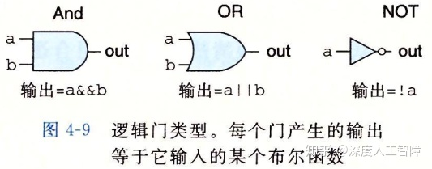
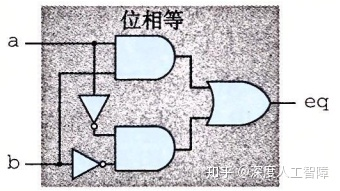
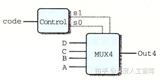
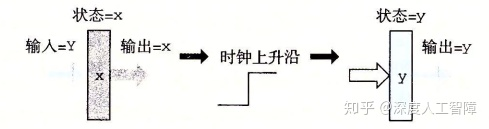
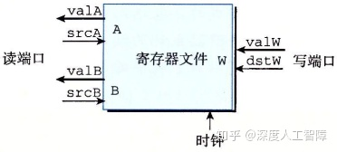

# [读书笔记]CSAPP：11[B]处理器体系结构：基础


 **指令集体系结构（Instruction-Set Architecutre，ISA）：**一个**处理器**支持的指令和指令的字节级编码，称为处理器的ISA。ISA在编译器编写者和处理器设计人员之间提供一层**抽象**，编译器编写者只需要知道该处理器支持哪些指令，以及这些指令是如何编码的；处理器设计人员要建造出执行这些指令的处理器。

不同处理器家族，比如Intel IA32和x86-64、IBM和ARM，都有不同的ISA，意味着程序编译出来的可执行文件不能在不同处理器上运行，因为它们具有不同的ISA。而同一个处理器家族的ISA通常是可兼容的。

需要注意，现代处理器的实际工作方式可能和ISA隐含的计算模型相差很大。ISA模型隐含的是顺序执行每条指令，但是为了提高效率，处理器会同时处理多条指令的不同部分，并且采用一些特殊机制保证处理器运行结果和顺序执行相同。

本章首先定义了一个简单的指令集Y86-64，作为处理器实现的运行实例。本章可以分成以下**三部分内容：**

1. 提供一些硬件设计背景，描述处理器中使用的基本结构块以及它们如何连接和操作的。
2. 给出一个基于顺序操作、功能正确的Y86-64处理器。每个时钟周期执行一条完整得到Y86-64指令。
3. 创建一个**流水线化的处理器（Pipelined processor）**，处理器将每条指令分成五个阶段，每个阶段在独立的硬件部分或阶段处理，由此处理器能同时执行五条指令的不同阶段。

------

## 1 硬件控制语言HCL

**硬件描述语言（Hardware Description Language，HDL）**可以用来描述硬件结构，是一种文本语言，类似于编程语言，包括Verilog和VHDL。**逻辑合成程序（Logic Synthesis）**可以根据HDL的描述来生成有效的电路设计。所以从手工设计电路到合成生成的转变，就好像从手写汇编到高级语言的转变。

**硬件控制语言（Hardware Control Language，HCL）只**表达硬件设计的控制部分，只有有限的操作集合，也没有模块化，可以参考[这里](https://link.zhihu.com/?target=http%3A//csapp.cs.cmu.edu/3e/waside/waside-hcl.pdf)。

这么课开发了将HCL翻译成Verilog的工具，然后结合基本硬件单元的Verilog代码，就能产生HDL描述，由此就能合成实际能工作的微处理器了。可以参考[这里](https://link.zhihu.com/?target=http%3A//csapp.cs.cmu.edu/3e/waside/waside-verilog.pdf)。

## 2 逻辑设计

当前逻辑`1`是由1.0伏特左右的高电压表示，逻辑`0`是由0.0伏特左右的低电压表示。

实现一个数字系统主要有**三个组成部分：**

1. 计算对位进行操作的函数的组合逻辑
2. 存储位的存储器单元
3. 控制存储器单元更新的时钟信号

### 2.1 组合逻辑

逻辑门是数字电路的**基本计算单元**。如下图所示



其中第一行是布尔表达式，第二行是标准符号，第三行是HCL表达式。我们可以将AND和OR扩展到多个输入的版本。

**注意：**1. 逻辑门只对单个位的值进行操作。2. 当一个门的输入发生变化时，输出会很快相应变化。

将很多逻辑门组合成一个实现某种功能的网，就能构成**计算块（Computational block）**，称为**组合电路（Combinational Circuits）**。想要构建有效的组合电路，有以下**限制：**

- 每个逻辑门的输入必须连接到以下其中之一：

- - 一个系统输入
  - 某个存储器单元的输出
  - 某个逻辑门的输出

- 两个或多个逻辑门的输出不能连接在一起

- 网络不能形成回路

**例1：**



**HCL表达式：**`bool eq = (a && b) || (!a && !b);`

**功能：**用来判断输入`a`和`b`是否相同，结果保存在`eq`中。

**例2：**


**HCL表达式：**`bool out = (s && a) || (!s && b);`

**功能：**该组合电路称为**多路复用器（Multiplexor，MUX）**， 当`s=1`时，`out`的值就是`a`的值；当`s=0`时，`out`值就是`b`的值。

**HCL表达式和C语言逻辑表达式区别：**

- `=`在HCL表达式中表示给表达式赋予的名字
- 组合电路中输出会持续相应输入的变化，而C语言只有在程序执行过程中遇到了才进行求职
- 逻辑门只允许对0和1进行操作，而C语言将0表示为FASLE，将其余任意值表示为TRUE
- C语言中存在部分求值的特点，组合逻辑中不存在

以上HCL都是对单个位进行运算的，可以很容易对其进行扩展实现对数据**字（Word）**进行操作的电路。

**例1：**


直接合并64个位级相等的组合电路，再加上一个逻辑与门，就能得到一个64位的字级相等组合电路。右边是对其的抽象，其中实线表示字级信号，虚线表示布尔信号。

为了简单，可以将所有字级信号都声明为int，不指定字的大小，则该组合电路可以由两个int类型的参数A和B构成的HCL表达式描述`bool Eq = (A == B);`。

**例2：**


这是一个64位字级多路复用器电路。这里只产生了一次`!s`，可以减少需要的逻辑门数量。在HCL中，多路复用器函数可以用**情况表达式（Case Expression）**来描述

```text
[
  select1 : expr1;
  select2 : expr2;
  ...
  selectk : exprk;
]
```

其中，`select`是布尔表达式，`expr`是字级表达式。

**注意：**1. 在HCL中，不要求不同的选择表达式之间是互斥的，但是实际的多路复用器的信号必须互斥。2. 选择表达式是**顺序求值**的，所以后续的选择表达式可以在之前的选择表达式的基础上进行简化。

右侧是字级多路复用器的抽象，根据HCL表达式可知，首先根据`s`的值来判断是否选择`A`，如果不选择，就一定会选择`B`。

**例3：**



这是一个通过两个信号来控制的四路复用器。对应的HCL表达式为

```text
word Out4 = [
  !s1 && !s2 : A; #00
  !s1        : B; #01
  !s2        : C; #10
  1          : D; #11
]
```

而我们需要从两位`code`中提取出两个信号，可以通过相等测试：

```text
bool s1 = code == 2 || code == 3;
bool s0 = code == 1 || code == 3; 
```

也可以通过**判断集合关系**的方式，其通用格式为`iexpr in {iexpr1, iexpr2, ..., iexprk}`，所以可以表示为

```text
bool s1 = code in {2,3};
bool s0 = code in {1,3}; 
```

比较重要的一个字级组合电路是**算数/逻辑单元（ALU）**，它包含3个输入：标号为A和B的两个数据输入，以及一个控制输入。根据控制输入的值来选择要对A和B进行的运算。如下图所示，是位Y86-64设计的ALU模型。


**注意：**组合电路值进行逻辑运算，不设计存储信息，当某个抽象能够存储信息，就不是组合电路。

### 2.2 存储器和时钟

为了产生**时序电路（Sequential Circuit）**，即存在状态并且能在这个状态上进行计算的系统，我们必须引入按位存储信息的设备。而这些存储设备是由同一个具有周期性信号的**时钟**控制的，决定什么时候将新值保存到存储器中。

主要有**两类存储器设备：**

- **时钟寄存器（寄存器）：**存储单个位或字，主要作为电路不同部分的组合逻辑之间的屏障。

- **随机访问存储器（内存）：**存储多个字，用地址来选择读写哪个字。**包括：**

- - **处理器的虚拟内存系统：**通过操作系统对存储器进行抽象，使得处理器可以在很大的地址空间中访问，地址为虚拟内存的索引值。
  - **寄存器文件：**是一个以寄存器标识符为地址，存储着对应程序寄存器值的随机访问存储器。在IA32或Y86-64处理器中，有15个程序寄存器（`%rax`~`%r14`）。

这里要注意区分机器级编程中的寄存器和硬件中的寄存器

- **硬件：**寄存器指的是时钟寄存器，直接将它的输入和输出连接到电路的其他部分。这里称为硬件寄存器。
- **机器级编程：**寄存器代表的是存储在寄存器文件中的，CPU中少数可寻址的字，地址为寄存器标识符。这里称为程序寄存器。

### 2.2.1 硬件寄存器



如上图所示，硬件寄存器大多数时候会保持在稳定状态x，产生的输出也是它当前的状态。当寄存器的输入发生改变时，寄存器的输出也不会马上变化，而是等时钟变成高电位时，才会将当前状态修改为输入值。由此将当前寄存器两侧的逻辑电路分隔开来。

Y86-64处理器会使用硬件寄存器老保存程序计数器（PC）、条件代码（CC）和程序状态（Stat）。

### 2.2.2 寄存器文件



寄存器文件包含两个读端口和一个写端口，意味着能读取两个程序寄存器的同时对第三个程序寄存器进行写操作。这里的地址就是程序寄存器标识符。

寄存器文件的写入操作受时钟信号控制，只有当时钟为高电平时，才将`valW`中的值写入`dstw`指示的程序寄存器中。

### 2.2.3 虚拟内存系统


处理器用虚拟内存来保存程序数据。`read`和`write`是两个标志位，用来控制当前是要读还是写。包含通过逻辑电路实现的边界检查，如果地址超过虚拟内存地址空间，就会使得`error=1`。

虚拟内存的写入操作受时钟信号控制，只有当`write=1`并且时钟为高电平时，才会将`data in`的数据保存到对应地址的位置。

**注意：**向存储器（时钟寄存器、随机访问存储器）写入值时会受到时钟的控制，所以存在时序，而向存储器读取值时不受到时钟的控制，不存在时序，可以直接将其近似于逻辑电路，输入地址，一段延迟后，就会将值返回到输出中。