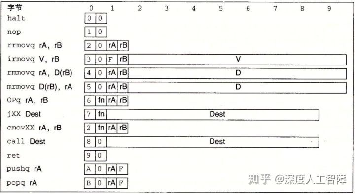
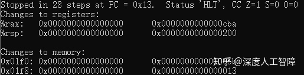
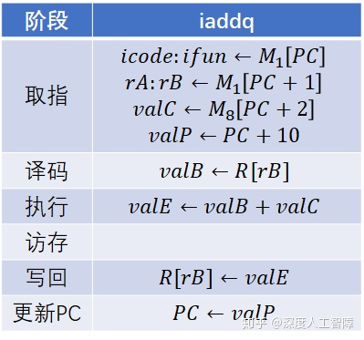

# [读书笔记]CSAPP：ArchLab


 **README：**[http://csapp.cs.cmu.edu/3e/README-archlab](https://link.zhihu.com/?target=http%3A//csapp.cs.cmu.edu/3e/README-archlab)

**说明：**[http://csapp.cs.cmu.edu/3e/archlab.pdf](https://link.zhihu.com/?target=http%3A//csapp.cs.cmu.edu/3e/archlab.pdf)

**代码：**[http://csapp.cs.cmu.edu/3e/archlab-handout.tar](https://link.zhihu.com/?target=http%3A//csapp.cs.cmu.edu/3e/archlab-handout.tar)

------

该实验主要是学习流水线Y86-64处理器的设计和实现，同时对处理器和基准测试程序进行优化以使性能最大化。

主要包含三个实验：在A部分中，将编写一些简单的Y86-64程序，并熟悉Y86-64工具。在B部分中，对SEQ仿真器进行扩展。这两部分将为C部分（实验的核心）做好准备，在C部分中，将优化Y86-64基准程序和处理器设计。

我们首先下载得到`archlab-handout.tar`文件，然后运行

```text
tar xvf archlab-handout.tar
cd archlab-handout
tar xvf sim.tar
```

你后续的所有工作都是在sim文件夹中进行操作的，然后执行

```text
make clean; make
```

如果出现错误，则执行以下命令

```text
# .make: flex：命令未找到
sudo apt-get install bison flex
```

## part A

该部分主要是在文件夹`sim/misc`中，主要是用Y86-64提供的指令集完成`example.c`中的函数编写，其中包含三个函数：`sum_list`、`rsum_list`和`copy_block`。可以使用汇编器`yas`对Y86-64程序进行汇编，然后使用指令集模拟器`yis`运行可执行文件。

**Y86-64指令集：**




Y86-64中包含的**程序员可见状态**有


### 1. sum_list

在`examples.c`中首先定义了一个链节点的结构体

```c
/* linked list element */
typedef struct ELE {
    long val;
    struct ELE *next;
} *list_ptr;
 
```

`sum_list`函数对应的C代码如下所示，是对链表`ls`元素进行累加

```c
long sum_list(list_ptr ls)
{
    long val = 0;
    while (ls) {
	val += ls->val;
	ls = ls->next;
    }
    return val;
}
```

我们需要写一个Y86-64汇编程序对以下链表结构调用`sum_list`函数

```text
  .align 8
ele1:
  .quad 0x00a
  .quad ele2
ele2:
  .quad 0x0b0
  .quad ele3
ele3:
  .quad 0xc00
  .quad 0 
```

**注意：**链表是保存在内存中的，并且根据结构体`ELE`的声明，一个`ELE`实例在内存中的分布是8字节的`val`值以及8字节的`ELE *`值。

将以下代码保存到`sum.ys`中

```text
  .pos 0 #设置当前位置为0
  irmovq stack, %rsp #设置栈指针
  call main
  halt

#链表
  .align 8 #地址和8字节对齐
ele1:
  .quad 0x00a
  .quad ele2
ele2:
  .quad 0x0b0
  .quad ele3
ele3:
  .quad 0xc00
  .quad 0

main:
  irmovq ele1, %rdi #将链表的第一个元素ele1作为输入
  call sum_list
  ret

sum_list:
  pushq %rbx #%rbx为被调用者保存寄存器，后面有用到该寄存器，所以需要先压入栈中
  xorq %rax, %rax #用%rax保存val值，首先置零
  jmp test
loop:
  mrmovq (%rdi), %rbx #将链节点中的val保存到%rbx中
  addq %rbx, %rax
  mrmovq 8(%rdi), %rdi #将当前指向链节点val地址的%rdi增加8字节，指向了保存下一个链节点地址的地址，再访问内存，得到下一个节点的地址
test:
  andq %rdi,%rdi #对输入链节点进行判断
  jne loop #如果链节点是非零的，就进入循环loop
  popq %rbx
  ret

  .pos 0x200 #设置栈地址
stack:
```

然后在`sim/misc`文件夹中运行`./yas sum.ys`得到`sum.yo`可执行文件，然后运行`./yis sum.yo`得到运行结果



其中`%rax`中保存着计算结果。

### 2. rsum_list

`rsum_list`函数对应的C代码如下所示，是通过递归形式完成链表累加

```c
long rsum_list(list_ptr ls)
{
    if (!ls)
	return 0;
    else {
	long val = ls->val;
	long rest = rsum_list(ls->next);
	return val + rest;
    }
} 
```

和上一节一样，我们创建一个`rsum.ys`文件，写入以下代码

```text
   .pos 0
  irmovq stack, %rsp
  call main
  halt

  .align 8
ele1:
  .quad 0x00a
  .quad ele2
ele2:
  .quad 0x0b0
  .quad ele3
ele3:
  .quad 0xc00
  .quad 0

main:
  irmovq ele1, %rdi
  call rsum_list
  ret

rsum_list:
  pushq %rbx
  xorq %rax, %rax
  andq %rdi, %rdi
  je finish
  mrmovq (%rdi), %rbx
  mrmovq 8(%rdi), %rdi
  call rsum_list
  addq %rbx, %rax #当调用rsum_list后，结果保存在%rax中
finish:
  popq %rbx
  ret
  
  .pos 0x200
stack:
```

运行结果为


### 3 copy_block

`copy_block`函数是将内存中的一个块复制到另一个不重叠的区域，并且计算所有复制单词的xor校验和Xor，对应的C代码为

```c
long copy_block(long *src, long *dest, long len)
{
    long result = 0;
    while (len > 0) {
	long val = *src++;
	*dest++ = val;
	result ^= val;
	len--;
    }
    return result;
} 
```

我们写一个Y86-64程序，将下列的块作为函数的输入

```text
  .align 8
# Source block
src:
  .quad 0x00a
  .quad 0x0b0
  .quad 0xc00
# Destination block
dest:
  .quad 0x111
  .quad 0x222
  .quad 0x333
```

我们创建`copy.ys`保存以下代码

```text
  .pos 0
  irmovq stack, %rsp
  call main
  halt

  .align 8
# Source block
src:
  .quad 0x00a
  .quad 0x0b0
  .quad 0xc00
# Destination block
dest:
  .quad 0x111
  .quad 0x222
  .quad 0x333

main:
  irmovq src, %rdi
  irmovq dest, %rsi
  irmovq $3, %rdx
  call copy_block
  ret

copy_block:
  pushq %rbx
  pushq %r12
  pushq %r13
  xorq %rax, %rax
  irmovq $8, %r12
  irmovq $1, %r13
loop:
  andq %rdx, %rdx
  jle finish
  mrmovq (%rdi), %rbx
  rmmovq %rbx, (%rsi)
  xorq %rbx, %rax
  addq %r12, %rdi
  addq %r12, %rsi
  subq %r13, %rdx
  jmp loop
finish:
  popq %r13
  popq %r12
  popq %rbx
  ret

  .pos 0x200
stack: 
```

**注意：**

- Y86-64指令集中不包含立即数和寄存器之间的运算指令，所以需要先通过`irmovq`将立即数保存到寄存器中，再用该寄存器进行计算
- 出入栈的寄存器顺序要相反

运行结果为


## part B

该部分在`sim/seq`文件夹中，想要我们对SEQ处理器进行扩展，使其支持`iaddq`指令。

根据题目4.3我们可以知道`iaddq`的指令编码


然后我们可以参考`opq`指令和`irmovq`的执行过程得到`iaddq`的执行过程



然后我们需要在`seq-full.hcl`文件中进行修改，使其包含`iaddq`指令。首先该HCL中包含了`iaddq`的指令代码`IIADDQ`，然后我将需要修改的内容列在下方

```text
#取指阶段
##该信号判断是否为合法指令
bool instr_valid = icode in 
	{ INOP, IHALT, IRRMOVQ, IIRMOVQ, IRMMOVQ, IMRMOVQ,
	  IOPQ, IJXX, ICALL, IRET, IPUSHQ, IPOPQ , IIADDQ}; 
##由于iaddq指令需要读取寄存器rB
bool need_regids =
	icode in { IRRMOVQ, IOPQ, IPUSHQ, IPOPQ, 
		   IIRMOVQ, IRMMOVQ, IMRMOVQ , IIADDQ};
#由于iaddq指令还需要立即数
bool need_valC =
	icode in { IIRMOVQ, IRMMOVQ, IMRMOVQ, IJXX, ICALL ,IIADDQ}; 

#译码阶段和写回阶段
##因为iaddq要使用rB寄存器，所以需要设置srcB的源为rB
word srcB = [
	icode in { IOPQ, IRMMOVQ, IMRMOVQ, IIADDQ} : rB;
	icode in { IPUSHQ, IPOPQ, ICALL, IRET } : RRSP;
	1 : RNONE;  # Don't need register
];
##计算完的结果valE需要保存到寄存器rB中
word dstE = [
	icode in { IRRMOVQ } && Cnd : rB;
	icode in { IIRMOVQ, IOPQ, IIADDQ} : rB;
	icode in { IPUSHQ, IPOPQ, ICALL, IRET } : RRSP;
	1 : RNONE;  # Don't write any register
];

#执行阶段
##iaddq指令需要将valC作为aluA的值
word aluA = [
	icode in { IRRMOVQ, IOPQ } : valA;
	icode in { IIRMOVQ, IRMMOVQ, IMRMOVQ, IIADDQ } : valC;
	icode in { ICALL, IPUSHQ } : -8;
	icode in { IRET, IPOPQ } : 8;
	# Other instructions don't need ALU
];
##iaddq指令需要将aluB的值设置为valB
word aluB = [
	icode in { IRMMOVQ, IMRMOVQ, IOPQ, ICALL, 
		   IPUSHQ, IRET, IPOPQ, IIADDQ } : valB;
	icode in { IRRMOVQ, IIRMOVQ } : 0;
	# Other instructions don't need ALU
];
##iaddq指令也需要更新CC
bool set_cc = icode in { IOPQ , IIADDQ};
```

修改完后需要通过该HCL文件构建SEQ仿真器（ssim）的新实例，然后对其进行测试：

- 根据`seq-full.hcl`文件构建新的仿真器

```text
make VERSION=full
```

**注意：**如果你不含有`Tcl/Tk`，需要在`Makefile`中将对应行注释掉

- 在小的Y86-64程序中测试你的方法

```text
./ssim -t ../y86-code/asumi.yo
```

如果失败了，还要重新修改你的实现

- 使用基准程序来测试你的方法

```text
(cd ../y86-code; make testssim)
```

这将在基准程序上运行ssim，并通过将结果处理器状态与高级ISA仿真中的状态进行比较来检查正确性。注意，这些程序均未测试添加的指令，只是确保你的方法没有为原始说明注入错误。

- 一旦可以正确执行基准测试程序，则应在`../ptest`中运行大量的回归测试

测试除了`iaddq`以外的所有指令

```text
(cd ../ptest; make SIM=../seq/ssim) 
```


测试我们实现的`iaddq`指令

```text
 (cd ../ptest; make SIM=../seq/ssim TFLAGS=-i)
```


## part C

该部分在`sim/pipe`中进行，需要我们修改`ncopy.ys`使得`ncopy`函数尽可能块，也可以修改`pipe-full.hcl`文件来增加`iaddq`指令。

当你修改了了`ncopy.ys`文件时，需要使用`make drivers`进行编译，当修改了`pipe-full.hcl`时，需要使用`make psim VERSION=full`编译。

可以用`./correctness.pl`测试`ncopy`函数的正确性，然后使用`./benchmark.pl`来测试函数的性能，希望CPE越小越好。初始CPE为15.18，大于10.5为0分，小于7.5为满分60。

我只得到8.63的CPE，只有37.4，代码如下

```text
	xorq %rax,%rax		# count = 0;
	
	iaddq $-5, %rdx
	jg Loop6x6
	iaddq $5, %rdx
	jg Loop1
	ret

Loop1:
	mrmovq (%rdi), %r8
	rrmovq %rax, %r14
	iaddq $1, %r14
	andq %r8, %r8
	cmovg %r14, %rax
	rmmovq %r8, (%rsi)
		
	iaddq $8, %rdi		# src++
	iaddq $8, %rsi		# dst++
	iaddq $-1, %rdx		# len--

	jg Loop1
	ret

Loop6x6:
	mrmovq (%rdi), %r8
	rrmovq %rax, %r14
	iaddq $1, %r14
	andq %r8, %r8
	cmovg %r14, %rax
	rmmovq %r8, (%rsi)
	
	mrmovq 8(%rdi), %r8
	rrmovq %rax, %r14
	iaddq $1, %r14
	andq %r8, %r8
	cmovg %r14, %rax
	rmmovq %r8, 8(%rsi)
	
	mrmovq 16(%rdi), %r8
	rrmovq %rax, %r14
	iaddq $1, %r14
	andq %r8, %r8
	cmovg %r14, %rax
	rmmovq %r8, 16(%rsi)
	
	mrmovq 24(%rdi), %r8
	rrmovq %rax, %r14
	iaddq $1, %r14
	andq %r8, %r8
	cmovg %r14, %rax
	rmmovq %r8, 24(%rsi)
	
	mrmovq 32(%rdi), %r8
	rrmovq %rax, %r14
	iaddq $1, %r14
	andq %r8, %r8
	cmovg %r14, %rax
	rmmovq %r8, 32(%rsi)
	
	mrmovq 40(%rdi), %r8
	rrmovq %rax, %r14
	iaddq $1, %r14
	andq %r8, %r8
	cmovg %r14, %rax
	rmmovq %r8, 40(%rsi)
	
	
	iaddq $48, %rdi		# src++
	iaddq $48, %rsi		# dst++
	iaddq $-6, %rdx		# len--
	
	jg Loop6x6
	iaddq $5, %rdx
	jg Loop1 
```

修改了以下几部分：

- 加上了`iaddq`指令，并将代码中包含立即数加减法的指令替换成`iaddq`。15.18-->13.70
- 因为当前处理器采用AT策略来预测分支，所以修改了跳转指令，使其跳转到可能性较大的分支。13.70-->13.55
- 使用条件转义指令，并将其放在读取内存之后，消除加载/使用冒险。13.55-->13.11
- 使用循环展开，不同结果如下所示


所以这里采用7x7进行展开

- 在跳转之前，我们都用`and`来得到条件码，其实计算出值后就会得到对应的条件码，所以可以删除`and`。9.70-->9.52
- 消除一些冗余的，不需要的计算。9.52-->9.02
- 重新测了一下循环展开的数量，现在6x6更好。9.02-->9.01
- 去掉不必要的跳转指令。9.01-->8.63

还有一定差距，后面有时间的话再来研究研究。