# [读书笔记]CSAPP：16[VB]高速缓存存储器

 **视频地址：**

[【精校中英字幕】2015 CMU 15-213 CSAPP 深入理解计算机系统 课程视频_哔哩哔哩 (゜-゜)つロ 干杯~-bilibiliwww.bilibili.com/video/av31289365?p=12](https://link.zhihu.com/?target=https%3A//www.bilibili.com/video/av31289365%3Fp%3D12)

**课件地址：**

[http://www.cs.cmu.edu/afs/cs/academic/class/15213-f15/www/lectures/12-cache-memories.pdfwww.cs.cmu.edu/afs/cs/academic/class/15213-f15/www/lectures/12-cache-memories.pdf](https://link.zhihu.com/?target=http%3A//www.cs.cmu.edu/afs/cs/academic/class/15213-f15/www/lectures/12-cache-memories.pdf)

该部分对应于书中的6.4-6.7。

------

- 当高速缓存大小大于数据的大小，如果分配良好，则只会出现冷不命中。

- 缓存不命中比内存访问次数影响更大

- 由内存系统的设计来决定块大小，是内存系统的固定参数。首先决定块大小，然后决定期望的缓存大小，然后再决定关联性，最终就能知道组的数目。

- 块的目的就是利用空间局部性

- 缓存是硬件自动执行的，没有提供指令集对其进行操作

- **建议：**

- - 将注意力集中在内循环中，因为大部分的计算和内存访问都集中在这里
  - 按照数据对象存储在内存中的顺序，以步长为1来读数据，使得空间局部性最大。比如步长为2的命中率就比步长为1的命中率降低一半。
  - 一旦从存储器读入一个数据对象时，就尽可能使用它，使得时间局部性最大。特别是局部变量，编译器会将其保存在寄存器中。

------

这一章主要介绍存储器层次结构中的高速缓存部分，包含在CPU中，使用SRAM存储器实现，完全由硬件管理。

## 1 高速缓存存储器

较早期的计算机系统的存储器层次结构只有三层：CPU寄存器、主存和磁盘，但是随着CPU的发展，使得主存和CPU之间的读取速度逐渐拉大，由此在CPU和主存之间插入一个小而快速的SRAM高速缓存存储器，称为**L1高速缓存**，随着后续的发展，又增加了**L2高速缓存**和**L3高速缓存**。

### 1.1 通用的高速缓存存储器组织结构

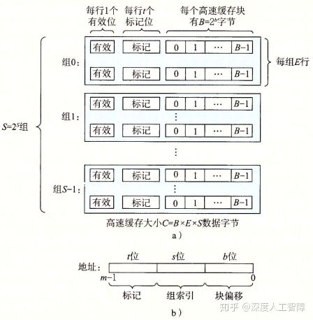

如上图的b中所示，会将m位的地址划分成三部分：

- **s位：**高速缓存被组织成一个数组，而该数组通过 ![[公式]](https://www.zhihu.com/equation?tex=S%3D2%5Es+)进行索引。
- **b位：**每个组中包含E个**高速缓存行（Cache Line）**，每个行有一个 ![[公式]](https://www.zhihu.com/equation?tex=B%3D2%5Eb) 字节的**数据块（Block）**组成。
- **t位：**每一个高速缓存行有一个 ![[公式]](https://www.zhihu.com/equation?tex=t%3Dm-%28s%2Bb%29) 位的**标记位（Valid Bit）**，唯一表示存储在这个高速缓存行中的数据块，用于搜索数据块。

该高速缓存的结构可以通过元组`(S, E, B, m)`来描述，且容量C为所有块的大小之和， ![[公式]](https://www.zhihu.com/equation?tex=C%3DS%5Ctimes+E%5Ctimes+B) 。

**注意：**如果将组索引放在最高有效位，则连续的内存块就会映射到相同的高速缓存组中，通过将组索引放在中间，可以使得连续的内存块尽可能分散在各个高速缓存组中，可以充分利用各个高速缓存组

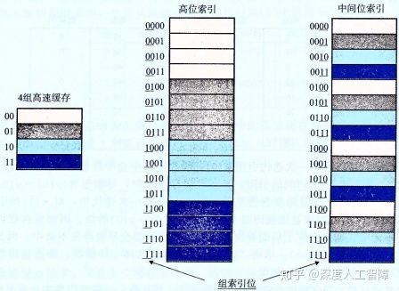

当一条加载指令指示CPU从主存地址A中读取一个字w时，会将该主存地址A发送到高速缓存中，则高速缓存会根据以下步骤判断地址A是否命中：

1. **组选择：**根据地址划分，将中间的s位表示为无符号数作为组的索引，可得到该地址对应的组。
2. **行匹配：**根据地址划分，可得到t位的标志位，由于组内的任意一行都可以包含任意映射到该组的数据块，所以就要线性搜索组中的每一行，判断是否有和标志位匹配且设置了有效位的行，如果存在，则缓存命中，否则缓冲不命中。
3. **字抽取：**如果找到了对应的高速缓存行，则可以将b位表示为无符号数作为块偏移量，得到对应位置的字。

当高速缓存命中时，会很快抽取出字w，并将其返回给CPU。如果缓存不命中，CPU会进行等待，高速缓存会向主存请求包含字w的数据块，当请求的块从主存到达时，高速缓存会将这个块保存到它的一个高速缓存行中，然后从被存储的块中抽取出字w，将其返回给CPU。

**注意：**为了使得地址中的b位能够编码块偏移量，要求从下一层存储器中，根据块偏移量的值从中截取出块大小的数据块。

该编码方式具有以下**特点：**

- 能够通过组索引位来唯一确定高速缓存组
- 映射到同一个高速缓存组的块由标志位唯一地标识
- 标记位和组索引位能够唯一的表示内存中的每个块
- 有可能会存在多个块映射到同一个高速缓存组中（只要地址的组索引相同）

可以根据每个组的高速缓存行数E，将高速缓存分成不同的类型

### 1.1.1 直接映射高速缓存

如上图所示，当 ![[公式]](https://www.zhihu.com/equation?tex=E%3D1) 时，高速缓存称为**直接映射高速缓存（Direct-mapped Cache）**，每个高速缓存组中只含有一个高速缓存行。

当缓存不命中时需要进行缓存行替换，会先从下一层的存储器中请求得到包含目标的块，然后根据地址计算出高速缓存组的索引，然后由于一个组中只含有一个高速缓存行，所以会直接将该块替换当前的块。

这里需要**注意**的一点是：当程序访问大小为2的幂的数组时，直接映射高速缓存中通常会发生冲突不命中。

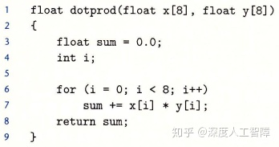

如以上代码，该函数具有良好的空间局部性，所以我们期望它的缓存命中率会高一点。

我们首先假设数组`x`排在数组`y`之前，且`x`的地址从0开始。然后直接映射高速缓存的 ![[公式]](https://www.zhihu.com/equation?tex=b%3D4) 和 ![[公式]](https://www.zhihu.com/equation?tex=s%3D2) ，即有两个高速缓存组，每个高速缓存组有一个高速缓存行，每个高速缓存行能保存16字节数据块，即4个浮点数，则高速缓存容量为32字节，我们可以得到高速缓存对地址的划分如下所示（64位系统中）

然后我们可以根据这两个数组的地址得到它们在高速缓存中的组索引（因为只有一个高速缓存行，所以不考虑标志位）

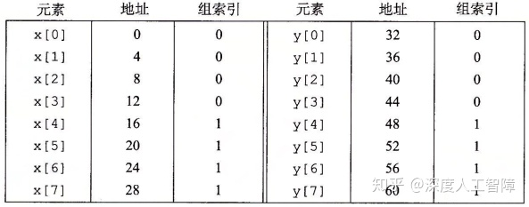

我们可以发现，循环第一次迭代引用`x[0]`时，缓存不命中会使得包含`x[0]`~`x[3]`的数据块保存到高速缓存组0处，但是当引用`y[0]`时，会发现高速缓存组0处保存的数据不匹配，又出现了缓存不命中，就会使得包含`y[0]`~`y[3]`的数据块保存到高速缓存0处，依次类推。可以发现始终会发生缓存不命中，使得性能下降。这种情况称为**抖动（Thrash）**，即高速缓存反复地加载和驱逐相同的高速缓存块的组。

**可以发现：**即使程序的局部性良好，且工作集的大小没有超过高速缓存容量，但是由于这些数据块都被映射到了相同的高速缓存组中，且直接映射高速缓存每个组中只有一个高速缓存行，所以会出现抖动，不断出现缓存不命中。

我们这里想要相同所以的`x`和`y`可以保存到不同的高速缓存组中，就能避免抖动现象，这里可以在数组`x`后填充B个字节，使得数组`y`的地址向后偏移，得到如下形式

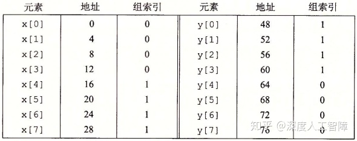

### 1.1.2 组相联高速缓存

直接映射高速缓存的冲突不命中是由于每个高速缓存组中只有一个高速缓存行，所以扩大E的值，当 ![[公式]](https://www.zhihu.com/equation?tex=1%3CE%3CC%2FB) 时，称为**E路组相联高速缓存（Set Associative Cache）**，此时需要额外的硬件逻辑来进行行匹配，所以更加昂贵。（ ![[公式]](https://www.zhihu.com/equation?tex=E%3CC%2FB) 即要求 ![[公式]](https://www.zhihu.com/equation?tex=S%3E1) ）

2路组相联高速缓存

当缓存不命中时需要进行缓存行替换，如果对应的高速缓存组中有空的高速缓存行，则直接将其保存到空行中。但是如果没有空行，就要考虑合适的**替换策略**：

- 最简单的替换策略是随机选择要替换的行
- **最不常使用（Least-Frequently-Used，LFU）策略：**替换过去某个时间窗口内引用次数最少的一行。
- **最近最少使用（Least-Recently-Used，LRU）策略：**替换最后一次访问时间最久远的那一行

### 1.1.3 全相联高速缓存

**全相联高速缓存（Full Associative Cache）**是用一个包含所有高速缓存行的组组成的，其中 ![[公式]](https://www.zhihu.com/equation?tex=E%3DC%2FB) ，即 ![[公式]](https://www.zhihu.com/equation?tex=S%3D1) 。

由于全相联高速缓存只有一个组，所以不包含组索引编码

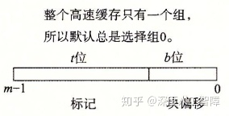

其行匹配和字选择与组相联高速缓存相同，只是规模大小不同。想要得到高速的全相联高速缓存十分困难，所以通常适合用于较小的高速缓存，比如虚拟内存中的翻译备用缓冲器（TLB）。

### 1.2 写操作

当CPU想要对地址A进行写操作时，会通过地址A判断是否缓存了该地址，如果缓存了称为**写命中（Write Hit）**，否则称为**写不命中（Write Miss）**。

- **写命中：**高速缓存会先更新缓存的副本，然后可以采取不同方法更新下一层的副本

- - **直写（Write-Though）：**立即更新下一层的副本值。缺点是每次写都会引起总线流量。
  - **写回（Write-Back）：**为每个高速缓存行维护一个**修改位（Dirty Bit）**，表明这个高速缓存块是否被修改。当被修改的高速缓存块被驱逐时，会查看修改位，判断该块是否被修改，只有被修改才会更新下一层的副本值。能够显著减少总线流量，但是复杂性高。

- **写不命中：**

- - **写不分配（Not-Write-Allocate）：**直接将字写到下一层中。
  - **写分配（Write-Allocate）：**加载相应的下一层的块到当前层的高速缓存中，然后更新当前高速缓存块。得益于空间局部性，进行一次写分配后，下一次有较高几率会写命中，但是缺点是每次写不命中就要将块从第一层向上传输。

直写高速缓存通常为写不分配的，写回高速缓存通常为写分配的。

建议采用写回写分配模型，因为随着逻辑电路密度的提高，写回的复杂性不再成为阻碍，并且和处理读相同，都利用了局部性原理，效率较高。

### 1.3 真实高速缓存结构

之前介绍的高速缓存值保存程序数据，但是高速缓存同样也能保存指令。可以将高速缓存分成以下几种：

- **i-cache：**只保存指令的高速缓存
- **d-cache：**只保存程序数据的高速缓存
- **Unified Cache：**即能保存指令，也能保存程序数据的高速缓存

如上图所示是Intel Core i7的高速缓存层次结构，可以发现在L1高速缓存中分成了L1 d-cache和L1 i-cache，这样做的**好处在于：**

1. 将数据和指令分别保存在两个高速缓存中，使得处理器可以同时读一个指令字和一个数据字
2. i-cache通常是只读的，所以会比较简单
3. 可以针对不同的访问模式优化这两个高速缓存，使用不同的块大小、相联度和容量
4. 确保数据访问和指令访问之间不形成冲突不命中

代价就是会导致高速缓存容量变小，提高出现容量不命中的可能性。

### 1.4 参数对性能的影响

衡量高速缓存的指标有：

- **命中率（Hit Rate）：**内存引用命中的比率，`命中数量/引用数量`。
- **不命中率（Miss Rate）：**内存引用不命中的比率，`不命中数量/引用数量`。通常，L1高速缓存为3~10%，L2高速缓存为<1%。
- **命中时间（Hit Time）：** 从高速缓存传输一个字到CPU的时间，包括组选择、行匹配和字选择时间。通常，L1高速缓存需要4个时钟周期，L2高速缓存需要10个时钟周期。
- **不命中处罚（Miss Penalty）：**当缓存不命中时，要从下一层的存储结构中传输对应块到当前层中，需要额外的时间（不包含命中时间）。通常，主存需要50~200个时钟周期。

**注意：**命中和不命中两者对性能影响很大，比如99%命中率的性能会比97%命中率高两倍。

接下来讨论高速缓存中不同参数对高速缓存性能的影响：

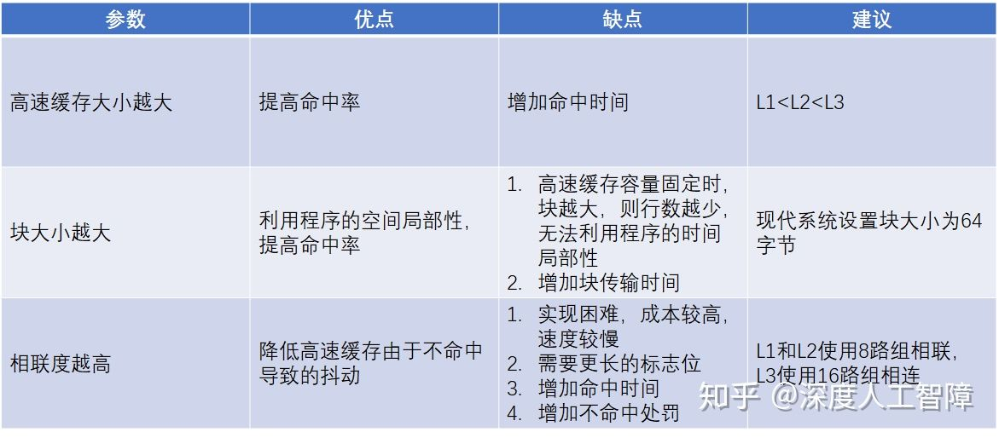

想要编写高速缓存友好（Cache Friendly）的代码，**基本方法为：**

- 让最常见的情况运行得快，将注意力集中在核心函数的循环中
- 尽可能减少每个循环内部的缓存不命中，可以对局部变量反复引用，因为编译器会将其保存到寄存器中，其他的变量最好使用步长为1的引用模式。

------

以书中的练习题6.17为例探讨缓存命中和不命中的情况。

首先根据题目可了解到，`src`数组和`dest`数组在内存中的存储方式为

L1高速缓存的块大小为8字节，则`b=3`且一次存放两个`int`，而高速缓存大小为16个数据字节，说明高速缓存组为2组，则`s=1`。采用直接映射的、直写和写分配的高速缓存。一开始为空的，探讨以下代码的命中情况

第一轮：高速缓存为空，则对`src[0][0]`的读取会不命中，根据地址`...00000`可知，将其存放在组0中，且数据块保存了`src[0][0]`和`src[1][1]`。对`dest[0][0]`写时，根据其地址`...10000`可知会查看0组的位置，由于标志位不同，所以写不命中，会采用写分配，将对应的数据块保存到组0，其数据块包含`dest[0][0]`和`dest[0][1]`，然后更新`dest[0][0]`。此时的高速缓存的内容为

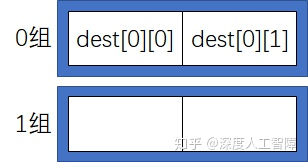

第二轮：读取`src[0][1]`时，根据其地址`...00100`可知，需要访问组0，由于标志位不同，所以读取不命中，会重新将`src[0][0]`和`src[0][1]`的数据块保存到0组中。对`dest[1][0]`写时，其地址为`...11000`，说明会访问组1，发现其中不包含任何数据，会出现写不命中，然后将包含`dest[1][0]`和`dest[1][1]`的数据块保存到组1中。

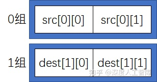

第三轮：读取`src[1][0]`时，根据其地址`...01000`，需要访问组1，由于其标志位不同，所以读取不命中，会将包含`src[1]][0]`和`src[1][1]`的数据块保存到组1中。对`dest[0][1]`写时，其地址为`...10100`，会访问组0，发现标志位不同，会出现写不命中，然后将`dest[0][0]`和`dest[0][1]`写入组0中。

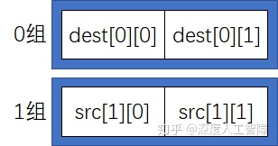

第四轮：读取`src[1][1]`时，其地址为`...01100`，需要访问组1，可以发现标志位相同，缓存命中了。对`dest[1][1]`写时，其地址为`...11100`，需要访问组1，发现标志位不相同，出现写不命中，就会将包含`dest[1][0]`和`dest[1][1]`的数据块保存到组1中。

------

## 2 存储器山

一个程序从存储器系统中读取数据的速率称为**读吞吐量（Read Throughput）**或**读带宽（Read Bandwidth）**，单位为`MB/s`。 我们通过以下代码来衡量空间局部性和时间局部性对程序吞吐量的影响

第37行我们首先对高速缓存进行暖身，然后在第38行计算程序运行的时钟周期个数。

- **时间局部性：**通过`size`来控制我们工作集的大小，由此来控制工作集存放的高速缓存的级别。假设工作集很小，则工作集会全部存放在L1高速缓存中，模拟了时间局部性优异的程序反复读取之前访问过的数据，则都是从L1高速缓存读取数据的。假设工作集很大，则工作集会存放到L3高速缓存中，模拟了时间局部性很差的程序，不断读取新的数据，则会出现缓存不命中，而不断从L3高速缓存中取数据的过程。所以通过控制工作集大小，来模拟程序局部性。
- **空间局部性：**通过`stride`来控制读取的步长，来控制程序的空间局部性。

通过调整`size`和`stride`来度量程序的吞吐量，可以得到以下存储器山（Memory Mountain）

可以保持`stride`不变，观察高速缓存的大小和时间局部性对性能的影响

可以发现，当工作集大小小于L1高速缓存的大小时，模拟了时间局部性很好的程序，所有读都是直接在L1高速缓存中进行的，则吞吐量较高；当工作集大小较大时，模拟了时间局部性较差的程序，读操作需要从更高的高速缓存中加载，则吞吐量下降了。

可以保持工作集为4MB，沿着L3山脊查看空间局部性对性能的影响

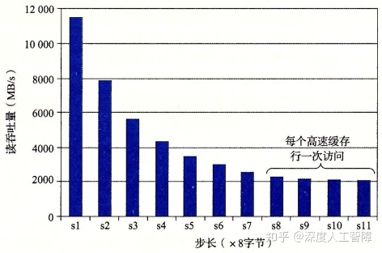

可以发现，步长越小越能充分利用L1高速缓存，使得吞吐量较高。当步长为8字节时，会跨越64字节，而当前高速缓存的块大小只有64字节，说明每次读取都无法在L2高速缓存中命中，都需要从L3高速缓存读取，所以后续保持不变。

**综上所述：**需要利用时间局部性来访问L1高速缓存，还需要利用空间局部性，使得尽可能多的字从一个高速缓存行中读取到。

## 3 改善程序

### 3.1 重新排列循环来改善空间局部性

我们可以有不同的循环方式来实现矩阵乘法

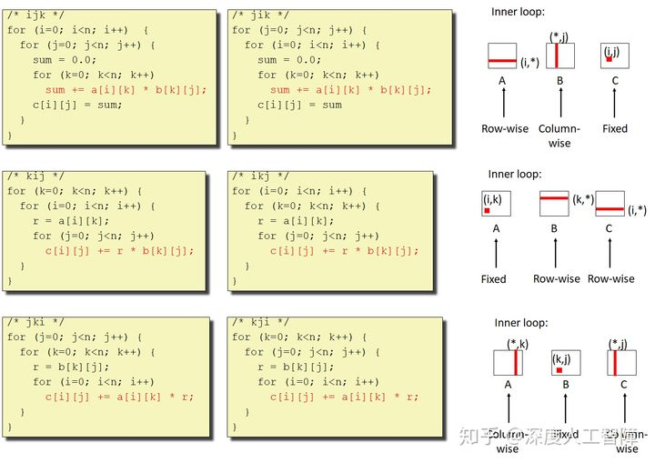

假设每个块中能保存4个元素，则可以分析每个变量的命中率

说明我们可以对循环重排列，来提高空间局部性，增加命中率。

### 3.2 使用分块来提高时间局部性

分块的主要思想是将一个程序中的数据结构组织成大的**片（Chunk）**，使得能够将一个片加载到L1高速缓存中，并在这个偏重进行读写。

如上图所示是一个普通的矩阵乘法函数，这里将二维数组想象成一个连续的字节数组，通过显示计算偏移量进行计算。这里假设每个块中可保存8个元素，并且高速缓存容量远小于矩阵的行列数。

每一次迭代就计算一个C的元素值，我们分析每一次迭代的不命中次数

对于矩阵`a`，一次会保存行的8个元素到块中，则一行元素一共会有`n/8`次不命中。对于矩阵`b`，因为是列优先读取的，所以无法利用高速缓存中保存的块，所以一行元素会有n次不命中。则一共会有`9n/8`次不命中，对于C中的`n*n`个元素，一共会有 ![[公式]](https://www.zhihu.com/equation?tex=9n%5E3%2F8) 次不命中。

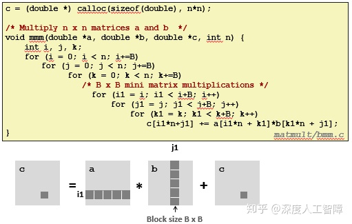

如上图所示是使用分块技术实现的矩阵乘法，将矩阵乘法分解为若干个`BxB`小矩阵的乘法，每次能将一个`BxB`的小矩阵加载到缓存中。

每一次迭代就计算C中一个`BxB`大小的块，我们分析每一次迭代的不命中次数

每个块有 ![[公式]](https://www.zhihu.com/equation?tex=B%5E2%2F8) 次不命中次数，而每一行每一列有`n/B`个块，所以计算一次C中的一个块会有 ![[公式]](https://www.zhihu.com/equation?tex=2n%2FB%5Ctimes+B%5E2%2F8%3DnB%2F4) 次不命中，则一共会有 ![[公式]](https://www.zhihu.com/equation?tex=nB%2F4%5Ctimes+%28n%2FB%29%5E2%3Dn%5E3%2F%284B%29) ，我们就能调整B的大小来减小不命中率。

分块降低不命中率是因为加载一个块后，就反复使用该块，提高了空间局部性。

> 分块技术的介绍：[http://csapp.cs.cmu.edu/2e/waside/waside-blocking.pdf](https://link.zhihu.com/?target=http%3A//csapp.cs.cmu.edu/2e/waside/waside-blocking.pdf)

**建议：**

- 将注意力集中在内循环中，因为大部分的计算和内存访问都集中在这里
- 按照数据对象存储在内存中的顺序，以步长为1来读数据，使得空间局部性最大。比如步长为2的命中率就比步长为1的命中率降低一半。
- 一旦从存储器读入一个数据对象时，就尽可能使用它，使得时间局部性最大。特别是局部变量，编译器会将其保存在寄存器中。