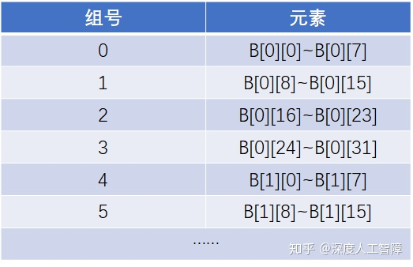
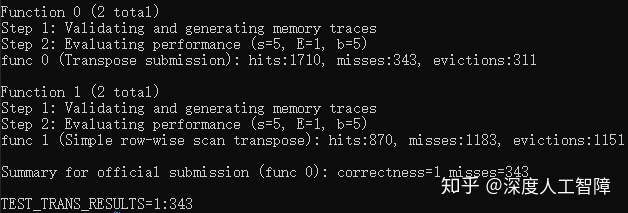

# [读书笔记]CSAPP：CacheLab


 **README：**[http://csapp.cs.cmu.edu/3e/README-cachelab](https://link.zhihu.com/?target=http%3A//csapp.cs.cmu.edu/3e/README-cachelab)

**说明：**[http://csapp.cs.cmu.edu/3e/cachelab.pdf](https://link.zhihu.com/?target=http%3A//csapp.cs.cmu.edu/3e/cachelab.pdf)

**代码：**[http://csapp.cs.cmu.edu/3e/cachelab-handout.tar](https://link.zhihu.com/?target=http%3A//csapp.cs.cmu.edu/3e/cachelab-handout.tar)

**复习：**[http://www.cs.cmu.edu/afs/cs/academic/class/15213-f15/www/recitations/rec07.pdf](https://link.zhihu.com/?target=http%3A//www.cs.cmu.edu/afs/cs/academic/class/15213-f15/www/recitations/rec07.pdf)

------

实验室由两部分组成，在第一部分中，将编写一个小的C程序来模拟高速缓存的行为，统计出命中、不命中和驱逐的次数。在第二部分中，将优化一个小型矩阵转置函数，以最大程度地减少高速缓存未命中的次数。

## Part A

Linux中提供`valgrind`程序，能够返回执行特定命令的轨迹，比如运行

```text
valgrind --log-fd=1 --tool=lackey -v --trace-mem=yes ls -l
```

就会返回执行`ls -l`时，按照内存访问的顺序顺序捕获内存访问轨迹。比如会返回

```text
I 0400d7d4,8
 M 0421c7f0,4
 L 04f6b868,8
 S 7ff0005c8,8
```

其中，第一列为操作符，`I`表示加载指令，`L`表示加载数据，`S`表示保存数据，`M`表示加载数据后再保存数据。然后第二列为地址，第三列为访问的数据大小。

该任务向我们我们在`csim.c`中写代码，会给出参数

```text
-s <s>: Number of set index bits (S = 2s is the number of sets)
-E <E>: Associativity (number of lines per set)
-b <b>: Number of block bits (B = 2b is the block size)
-t <tracefile>: Name of the valgrind trace to replay
```

来指定高速缓存结构，然后统计`tracefile`中内存访问轨迹的命中、不被命中和驱逐的次数。

我们首先来分析：

- 由于该实验主要考虑数据的读写，所以不考虑`I`
- `M`中的加载操作和`L`相同，并且`M`后面的保存操作是在相同的地址中进行的，所以可以直接将保存操作当做hit
- `L`和`S`是相同的

```c
#include <getopt.h>
#include <stdlib.h>
#include <stdio.h>
#include <limits.h>
#include "cachelab.h"

//定义结构体
typedef struct {
	long tag; //标识
	long time;  //时间戳
	int valid_bit;  //有效位
} Line;

//创建缓存
Line **initCache(int s, int E){
	Line **cache;
	int i,j;
	int S = 1 << s; //2^s
	cache = (Line **)malloc(S*sizeof(Line*));
	if(cache==NULL) exit(1);
	for(i=0;i<S;i++){
		cache[i] = (Line*)malloc(E*sizeof(Line));
		for(j=0;j<E;j++){
			cache[i][j].tag=0;
			cache[i][j].time=0;
			cache[i][j].valid_bit=0;
		}
	}
	return cache;
}
int main(int argc, char** argv){
	int opt,s,E,b;
	int S,tag;  //解析每一条对应的组号和标志
	char *fileName;
	Line **cache;
	int hit_count=0, miss_count=0, eviction_count=0;
	int isHit, isEvic;  //标记是否命中或驱逐
	FILE *pFile;
	char identifier;
	unsigned long long address;
	int size;
	int saveIndex;
	long time_stamp=0;    //不断增加的时间戳
	long min_time;  //LRU
	int index;

	//读取参数
	while(-1 != (opt = getopt(argc, argv, "s:E:b:t:"))){
		switch(opt){
			case 's':
				s = atoi(optarg);
				break;
			case 'E':
				E = atoi(optarg);
				break;
			case 'b':
				b = atoi(optarg);
				break;
			case 't':
				fileName = (char *)optarg;
			default:
				printf("wrong argument\n");
				break;
		}
	}

	//初始化缓存
	cache = initCache(s, E);

	pFile = fopen(fileName, "r");
	while(fscanf(pFile," %c %llx,%d", &identifier, &address, &size)>0){
		if(identifier == 'I') continue; //不考虑指令读取

		//获取当前的组号和标志
		address = address >> b;
		S = address & ~(~0 << s);
		tag = address >> s;

		isHit = 0;
		isEvic = 0;
		min_time = LONG_MAX;

		for(index=0; index<E; index++){
			Line line = cache[S][index];
			if(line.valid_bit==0){
				saveIndex = index;
				min_time = LONG_MIN;
				isEvic = 0;
				continue;
			}
			if(line.tag!=tag){
				if(min_time > line.time){
					min_time = line.time;
					saveIndex = index;
					isEvic = 1;
				}
				continue;
			}
			saveIndex = index;
			isHit = 1;
			break;
		}
		cache[S][saveIndex].time = time_stamp;
		time_stamp += 1;
		if(identifier == 'M') hit_count += 1;
		if(isHit){
            hit_count += 1;
            continue;
        }
        miss_count += 1;
        if(isEvic) eviction_count += 1;
        cache[S][saveIndex].valid_bit = 1;
        cache[S][saveIndex].tag = tag;
	}
	free(cache);
	printSummary(hit_count, miss_count, eviction_count);
    return 0;
}
```

然后运行

```text
make clean
make
./test-csim
```

可以得到最终结果


## Part B

该任务要求我们在`trans.c`文件中完成`transpose_submit`函数，使得矩阵转置时的不命中次数尽可能小，分别对 ![[公式]](https://www.zhihu.com/equation?tex=32%5Ctimes+32) 、 ![[公式]](https://www.zhihu.com/equation?tex=64%5Ctimes+64) 和 ![[公式]](https://www.zhihu.com/equation?tex=61%5Ctimes+67) 矩阵进行实验。

**要求：**

- 只运行使用最多12个`int`局部变量
- 不能使用递归函数
- 不能对矩阵A进行修改
- 不能通过`malloc`申请空间

该高速缓存的架构为`s=5, E=1, b=5`。

### 32x32

想要降低不命中次数，需要提高函数的局部性，要么通过修改循环顺序来提高空间局部性，要么通过分块技术来提高时间局部性。

```c
void trans(int M, int N, int A[N][M], int B[M][N]){
    int i, j, tmp;
    for (i = 0; i < N; i++) {
        for (j = 0; j < M; j++) {
            tmp = A[i][j];
            B[j][i] = tmp;
        }
    }    
}
```

以上为该任务提供的一个baseline，就是最简单的矩阵转置操作。从空间局部性来看，矩阵`A`的步长为1，所以空间局部性良好，而矩阵`B`的步长为N，空间局部性较差，并且无论我们怎么调整循环顺序，都无法改变，所以无法从空间局部性的角度来减少不命中次数。

所以我们需要通过分块技术来优化时间局部性。由于缓存中每个块大小为 ![[公式]](https://www.zhihu.com/equation?tex=2%5Eb%3D2%5E5%3D32) 字节，而`int`类型为4字节，所以缓存中的每个数据块可以保存8个元素，由于矩阵是行优先存储的，所以相当于保存了`A[0][0]~A[0][7]`，我们希望能够充分利用该数据块，所以需要保存对应的`B[0][0]~B[7][0]`，意味着需要8个高速缓存行，分别保存`B[0][0]~B[0][7]`、`B[1][0]~B[1][7]`……由于32x32矩阵中，每一行有32个元素，则相邻两行间隔了3个高速缓存行，比如根据矩阵`B`的地址，其元素保存在高速缓存中是如下形式



可以发现，我们想要的`B[0][0]~B[0][7]`和`B[1][0]~B[1][7]`之间还间隔了3个高速缓存行。而该高速缓存配置刚好能保存8行，所以我们设置分块技术的块大小为8，此时高速缓存中就保存了`B[0][0]~B[0][7]`到`B[7][0]~B[7][7]`的块，则在内侧的循环中，就能充分利用这些块后才会将其丢弃，减少了原始代码中由于缓存空间有限，而驱逐了后面要用的块。

可以得到以下代码

```c
void transpose_submit(int M, int N, int A[N][M], int B[M][N]){
    int ii,jj,i,j,temp;
    int bsize=8;
    int ren = bsize * (N/bsize); /* Amount that fits evenly into blocks */
    int cen = bsize * (M/bsize); /* Amount that fits evenly into blocks */
	
    for(ii=0; ii<ren; ii+=bsize){
        for(jj=0; jj<cen; jj+=bsize){
             //分成bsize*bsize大小的块
             for(i=ii; i<ii+bsize; i+=1){
                 for(j=jj; j<jj+bsize; j+=1){
                     temp = A[i][j];
                     B[j][i] = temp;
                 }
             }
        }
    }
} 
```

> 分块技术相当于将B中特定大小的块全部保存在高速缓存中，优化类似B[j][i]这种空间局部性差的代码。

通过块大小为8的分块技术，我们可以将不命中次数从1183降低到343。



**需要注意：**复习PPT中说了，矩阵`A`和`B`被存储在内存中的地址中，使得它们都对齐到缓存中的同一位置，这就意味着在矩阵`A`和矩阵`B`的同一行会反复出现冲突不命中。

我们可以把A和B存放在不对齐的地址中，但是该任务中限制了我们不能使用`malloc`。那我们可以尝试一次性将所有元素都读取出来，这样就不用反复从内存中读取，也就不存在冲突不命中了。

```c
 void transpose_submit(int M, int N, int A[N][M], int B[M][N])
{
	int i,j,k;
	int v1,v2,v3,v4,v5,v6,v7,v8;
	
	for(i=0; i<M; i+=8){
		for(j=0; j<N; j+=8){
			for(k=i; k<i+8; k+=1){
				v1 = A[k][j+0]; //以下会从矩阵A中读取数据
				v2 = A[k][j+1];
				v3 = A[k][j+2];
				v4 = A[k][j+3];
				v5 = A[k][j+4];
				v6 = A[k][j+5];
				v7 = A[k][j+6];
				v8 = A[k][j+7];
				
				B[j+0][k] = v1; //这里B会覆盖A的内容，然后开始保存数据
				B[j+1][k] = v2;
				B[j+2][k] = v3;
				B[j+3][k] = v4;
				B[j+4][k] = v5;
				B[j+5][k] = v6;
				B[j+6][k] = v7;
				B[j+7][k] = v8;
			}
		}
	}
}
```

通过以上方法可以减少很多冲突不命中，结果得到了287。

### 64x64

这里同样使用分块技术进行优化，需要注意的是，当矩阵大小变为64x64时，矩阵中的每一行需要8个高速缓存行进行保存，使得高速缓存中只能保存4行的矩阵内容，如果我们还是使用块大小为8的分块技术，就会使得第5行和第1行冲突、第6行和第2行冲突等等，由此就会出现冲突不命中，所以我们只能设置块大小为4。

比如我们使用块大小为8，则不命中数目为4723，当修改块大小为4时，不命中次数为1891，当解决冲突不命中时，不命中次数为1699。

### 61x67

由于这里行和列的数目不同，以及每一行元素个数不是刚好保存填充完整的行，所以元素保存在缓存中会存在错位，可能会减少`B`的冲突不命中，所以可以使用较大的块。比如我们使用大小为17的块，结果为1950。