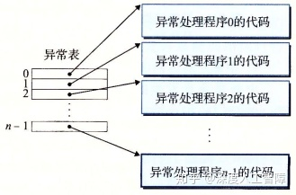
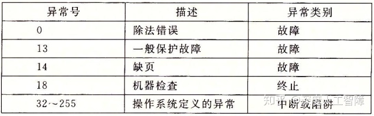
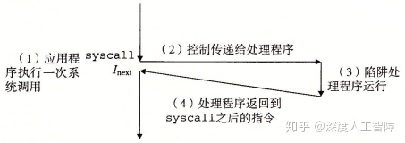
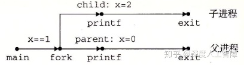

# [读书笔记]CSAPP：18[VB]ECF：异常和进程


 **视频地址：**

[【精校中英字幕】2015 CMU 15-213 CSAPP 深入理解计算机系统 课程视频_哔哩哔哩 (゜-゜)つロ 干杯~-bilibiliwww.bilibili.com/video/av31289365?p=14](https://link.zhihu.com/?target=https%3A//www.bilibili.com/video/av31289365%3Fp%3D14)

**课件地址：**

[http://www.cs.cmu.edu/afs/cs/academic/class/15213-f15/www/lectures/14-ecf-procs.pdfwww.cs.cmu.edu/afs/cs/academic/class/15213-f15/www/lectures/14-ecf-procs.pdf](https://link.zhihu.com/?target=http%3A//www.cs.cmu.edu/afs/cs/academic/class/15213-f15/www/lectures/14-ecf-procs.pdf)

本章对应书本的8.1-8.4。

------

从系统加电到断点，程序计数器都假设一个值的序列 ![[公式]](https://www.zhihu.com/equation?tex=a_0%2Ca_1%2C...%2Ca_%7Bn-1%7D) ，其中每个值是一个指令地址。这里将从 ![[公式]](https://www.zhihu.com/equation?tex=a_k) 跳转到 ![[公式]](https://www.zhihu.com/equation?tex=a_%7Bk%2B1%7D) 的过程称为**控制转移（Control Transfer）**，将控制转移序列称为**物理控制流（Flow of Control或Control Flow）**。当控制流中相邻指令地址在内存是相邻的，则称该控制流是**平滑的**，否则存在**突变**，比如分支跳转或方法调用。

系统会通过使控制流发生突变来对系统状态的变化做出反应，比如必须处理硬件定时器定期产生的信号、必须将到达网络适配器的数据包存放在内存等等，这种突变称为**异常控制流（Exceptional Control Flow，ECF）**。ECF存在**不同的层次：**

- **异常：**硬件检测到的事件会触发控制转移到异常处理程序。其中，异常位于硬件和操作系统交接的部分，由硬件和操作系统软件共同实现。
- **上下文切换：**内核通过上下文切换将控制从一个用户进程转移到另一个用户进程，由操作系统软件和硬件计时器实现。
- **信号：**一个进程可以发送信号到另一个进程，而接受者会将控制转移到它的信号处理程序，由操作系统实现。
- **非本地跳转：**由C运行时库实现，是ECF的一种应用层形式，允许你违背正常的`call`和`return`模式。

学习ECF的意义在于：

- 将有助于理解重要的系统概念，ECF是操作系统用来实现I/O、进程和虚拟内存的基本机制。
- 将有助于理解应用程序是如何与操作系统交互的，应用程序通过**系统调用（System Call）**的ECF形式，向操作系统请求服务。
- 将有助于理解并发机制
- 将有助于理解软件异常的工作方式

## 1 异常

### 1.1 简介

在处理器中，状态被编码为不同的位和信号，而状态变化成为**事件（Event）**。当出现事件时，**异常（Exception）**会将控制权转移到操作系统内核，来响应处理器状态中的某些变化，由此形成了控制流中的突变。异常位于硬件和操作系统交接的部分，通过硬件修改`%rip`来实现控制转移，而由于该异常而执行的代码是由操作系统内核设置和确定的，所以异常一部分由硬件实现，一部分由软件实现。

系统为每种类型的异常都分配了一个唯一的非负整数的**异常号（Exception Number）**，有些异常号由处理器设计者分配，有些异常号由操作系统内核设计者分配，分别用来表示不同层次的异常。在系统启动时，操作系统会分配和初始化一张称为**异常表（Exception Table）**的跳转表，其中第k个表项包含专门处理异常号为k的异常的**异常处理程序（Exception Handler）**



而该异常表的起始地址保存在特殊的CPU寄存器中，称为**异常表基址寄存器（Exception Table Base Register）**。当处理器检测到有事件发生时，并确定了异常号`k`时，就会通过异常号确定偏移量，比如在64位系统中，内存地址为8字节，则偏移量为`8k`，然后通过异常表基址寄存器保存的异常表起始地址，加上偏移量来得到异常处理程序的内存地址，然后跳转到对应的异常处理程序。

在跳转到异常处理程序之前，根据异常的类型，会将不同的返回地址压入栈中，要么返回到事件发生时的地址，要么返回到事件发生时的下一条指令地址。此外，处理器会将一些额外的处理器状态压入栈中，使得当处理器返回时，能从栈中返回中断程序原始的状态。**注意：**如果控制从用户程序转移到内核，则这些数据都保存在内核栈中，而不是用户栈。此外，异常处理程序运行在内核模式下，使得它们对所有系统资源都有完全的访问权限。

当异常处理运行完成时，将执行“从中断返回”指令，根据栈中的数据确定返回地址和恢复中断前程序的状态，如果引起异常中断的是用户程序，就将状态恢复为用户模式。

### 1.2 异常类型

异常可以分成以下**四种类型**


其中，异步异常是由于处理器外部发生的状态变化而引起的，而同步异常指的是当前指令运行的结果，这类指令也称为**故障指令（Faulting Instruction）**。

在x86-64中，一共有256种不同的异常，其中0~31号异常是由Intel架构师定义的异常，32~255号异常是由操作系统定义的中断和陷阱。几个比较特殊的如下所示



### 1.2.1 中断异常

中断异常是由I/O设备的信号触发的，不是由指令造成的。在I/O设备中，通过向处理器芯片上的中断引脚发送信号，将标识引起中断的设备的异常号放在系统总线上，来触发中断。则当当前指令执行完后，处理器发现中断引脚的电压变高，就从系统总线中获取异常号，然后调用对应的**中断处理程序（Interrupt Handler）**，执行完毕后返回执行下一条指令。


中断的一个常见例子是**定时器中断（Timer Interrupt）**。所有系统都有一个内置计时器，每隔几毫秒就会关闭一次，此时就将中断引脚置为高电平，并且有一个特殊的异常编号用于定时器中断，由此来使得内核再次获得对系统的控制，再由内核决定要做什么，否则用户程序可能会陷入无限循环永远运行，无法让操作系统获得控制权。

其次来自外部设备的**I/O中断（I/O Interrupt）**也是一个常见的例子。

### 1.2.2 陷阱异常

操作系统内核为程序提供各种服务，但是你的程序没有直接访问内核的权限，无法调用内核函数，无法访问内核数据，因此在用户程序和内核之间提供一个类似函数的接口，称为**系统调用**（`syscall n`指令），用户会通过执行系统调用来向内核请求服务，比如读取文件（read）、创建新进程（fork）、加载程序（execve）或终止程序（exit），所以陷阱异常是一个有意的异常。处理器会根据`syscall n`的参数，调用适当的内核程序，然后再将控制权返回给调用程序。



**注意：**

- 从程序员角度来看，系统调用和函数调用一样，但是两者存在巨大的区别。系统调用运行在内核模式，而函数调用运行在用户模式。
- 系统调用是陷阱的一种，陷阱是同步异常的一种，要分清层次关系。

通常每个系统调用都有唯一一个对应的整数号，对应于一个到内核中跳转表的偏移量。

**注意：**该跳转表和异常表不同，异常表保存的是到异常号对应的异常处理程序的内存地址，而该跳转表是保存对应的系统调用函数。

在x86-64系统中，系统调用是通过一条`syscall`陷阱指令执行的，该指令的参数都是通过寄存器传递的，不会通过栈传递，其中，`%rax`中包含系统调用号，`%rdi`、`%rsi`、`%rdx`、`%r10`、`%r8`和`%r9`分别用来保存参数。当从系统调用返回时，会破坏`%rcx`和`%r11`，而将返回值保存在`%rax`中。

而C程序中，可以通过`syscall`函数来直接调用系统调用，但是其实标准C库提供了一组包装函数，将参数打包到了一起，如下所示，这里将系统调用和对应的包装函数称为**系统级函数**。


### 1.2.3 故障异常

故障异常由错误引起的，但是能被故障处理程序修正。当发生故障时，处理器将控制转移给故障处理程序，如果处理程序能修复故障，则重新执行引发中断的指令，否则处理程序返回到内核的`abort`例程，终止应用程序。


当应用尝试除以0时，会出现除法错误（异常0），Unix不会尝试从除法错误中恢复，而是直接终止程序，而Linux shell通常会吧除法错误报告为**浮点异常（Floating Exception）**。造成一般保护故障（异常13）的原因有很多，通常是因为程序引用了一个未定义的虚拟内存区域，或者程序试图写一个只读文件，Linux不会尝试恢复这类故障，shell中会将其报告为**段故障（Segmentation Fault）**。遇到缺页异常（异常14），处理器会将适当的磁盘上的虚拟内存的一个页面映射到物理内存的一个页面，然后重新执行产生故障的指令。

### 1.2.4 终止异常

终止异常通常是不可修复的错误造成的，通常是硬件错误，处理程序会直接将控制返回一个`abort`例程，终止应用程序。


比如在x86-64中，机器检查异常（异常18）是在导致故障的指令中检测到致命的硬件错误。

## 2 进程

异常是允许操作系统内核提供**进程（Process）**概念的基本构造块。

进程就是一个执行中程序的实例，每个程序都会运行在某个由内核维护的进程**上下文（Context）**中，其中包含了保证程序正确运行所需的状态，包括存放在内存中的程序的代码和数据、栈、通用目的寄存器的内容、程序计数器、环境变量等等。当我们执行可执行文件时，shell会先创建一个新的进程，给程序提供自己的上下文，然后再在该进程的上下文中运行这个可执行目标文件。

**注意：**进程与程序是不同的，程序可以保存在不同地方，比如保存为C文件的文本，保存为`.text`的二进制文件，可以作为已加载到内存中的字节存在，而进程指的是正在运行的程序的实例。

而进程的出现，给我们提供了以下**假象：**

- 我们的程序是当前唯一在系统运行的程序
- 我们的程序独占地使用处理器和内存
- 处理器好像无间断地执行我们程序中的指令
- 我们程序中的代码和数据好像是系统内存中唯一的对象

我们这里只讨论处理器和内存系统的假象。

### 2.1 处理器

当我们单步执行程序时，可以看到一系列PC值，这个PC序列就称为**逻辑控制流**，简称**逻辑流**。**注意：**之前的控制流值的是物理控制流，是在系统层次上的指令地址序列，而逻辑控制流是在程序级别上的，所以物理控制流包含逻辑控制流。


如上图所示，运行了3个进程，每个进程上下文中的PC值序列就是对应的逻辑流，就是上图中的黑色竖线，而物理控制流就是所有竖线的合并。所以处理器中的物理控制流被分成了3个逻辑控制流，每个进程有一个。并且可以看出，3个逻辑流是交错进行的，只有轮到了进程的逻辑流，才表示该进程在使用处理器，所以进程是轮流使用处理器的，当进程执行了一部分逻辑流时，就会被别的进程**抢占（Preempted）**。但是从当个进程的角度来看，它的逻辑流是连续的，意味着提供了独占处理器的假象，只是指令执行过程中有时会出现停顿，那时候就是出现了抢占。

这里将多个进程轮流运行的概念称为**多任务（Multitasking）**，将进程每次执行一部分逻辑流的时间称为**时间片（Time Slice）**，则多任务也叫**时间分片（Time Slicing）**。比如进程A就由两个时间片组成。

当逻辑流X在逻辑流Y开始之后和Y结束之前运行，或逻辑流Y在逻辑流X开始之后和X结束之前运行，则称这两个流为**并发流（Concurrent Flow）**。比如进程A和B是并发流，进程A和C也是并发流。我们将这种多个流并发地执行的现象称为**并发（Concurrency）**。

**注意：**并发流的思想与流运行的处理器数目或计算机数目无关，只和它们运行时间是否重叠有关。但是，如果两个并发流是在不同的处理器核或计算机上运行的，则称它们为并行流**（Parallel Flow）**。

> 两个进程的逻辑流在时间上重叠，则成为并发流，如果并发流在不同核或计算机上运行，则成为并行流。并行流属于并发流，区别只在于是否在同一处理器上运行。

### 2.2 内存系统

进程为每个程序提供了他自己的**私有地址空间**，其他进程不能读或写该地址空间中的内存字节。如下是一个私有地址空间的架构


### 2.3 用户模式和内核模式

处理器为进程提供了两种模式，用户模式和内核模式，处理器通过某个控制寄存器的**模式位（Mode Bit）**来进行切换

- **内核模式：**当处理器设置了模式位时，为内核模式。此时进程可以执行指令集中的所有指令，并且可以访问系统中的任何内存位置。
- **用户模式：**当处理器不设置模式位时，为用户模式，是进程的初始模式。此时进程不能执行**特权指令（Privileged Instruction）**，比如停止处理器、改变模式位或者发起I/O操作，也不能引用内核区域中的指令和数据，只能通过系统调用接口来间接访问。

进程初始是为用户模式，当出现异常（中断、陷阱、故障）时会变为内核模式，并跳转到异常处理程序中，当返回应用程序时，又会改回用户模式。

为了处于用户模式的进程能访问内和数据结构的内容，Linux提供了`/proc`文件系统。

### 2.4 上下文切换

我们知道内核为每个进程维护了一个上下文，包含了进程所需的所有信息。当进程执行出现中断或某些异常时，内核中的**调度器（Scheduler）**会决定抢占当前进程，并重新开始一个之前被抢断了的进程，此时就需要进行**上下文切换（Context Switch）**，将当前进程的上下切换成要运行的进程的上下文，比如地址空间和寄存器的变化。主要包含以下步骤：

- 保存当前进程的上下文，方便过后再进行调度
- 恢复之前某个被抢占进程的上下文
- 将控制传递给这个新恢复的进程

**注意：**上下文切换是较高层次的异常控制流，建立在之前低层次异常机制之上。


比如以上过程中，首先内核开始执行进程A，处于用户模式。当进程A调用了`read`系统调用时，内核中的陷阱处理程序请求来自磁盘控制器的DMA传输，由于磁盘读取数据比较耗时，所以调度程序决定运行进程B，就会重新指定地址空间，完成进程B的寄存器加载，然后将控制权转移到进程B，进程B就从中断处继续运行，内核就完成了从进程A切换到进程B并开始执行进程B。当磁盘控制器完成从磁盘到内存的数据传输后，磁盘会发起中断，此时内核判断进程B已运行了足够长的时间了，就会从进程B切换到进程A，直到下次异常出现。

**注意：**进程是由内存中共享的内核进行管理的，内核并不是独立的进程，而是作为某些现有进程的一部分，始终位于地址空间顶部的代码，当出现异常时会进行执行。

## 3 进程控制

现在Linux提供许多函数，可以从用户程序调用操作进程，这个操作进程的过程称为**进程控制（Process Control）**。这些函数主要通过系统级函数的形式来进行系统调用，如果出现错误，通常会返回-1，然后设置全局变量`errno`来指明原因，所以我们必须检查这些函数的返回值，通常可以对这些函数进行封装，比如

```c
void unix_error(char *msg){
  fprintf(stderr, "%s: %s\n", msg, strerror(errno));
  exit(0);
}
pid_t Fork(void){
  pid_t pid;
  if((pid = fork()) < 0)
    unix_error("Fork error");
  return pid;
}
```

### 3.1 获取进程ID

每个进程都有一个唯一的正数**进程ID（PID）**，可以通过`getpid`函数返回当前进程的PID，可以通过`getppid`函数返回创建当前进程的父进程PID。类型都为`pid_t`，Linux系统中在`type.h`中定义为`int`。

```c
#include <unistd.h>
#include <sys/types.h>
pid_t getpid(void);
pid_t getppid(void);
```

### 3.2 进程状态

进程会处于以下三种状态之一：

- **运行：**进程要么在CPU上执行，要么在等待被执行且最终会被内核调度。即被抢占的进程也属于运行状态。
- **停止：**当进程收到`SIGSTOP`、`SIGTSTP`、`SIGTTIN`或`SIGTTOU`信号时，进程的执行被**挂起（Suspended）**且不会被调度，直到收到`SIGCONT`信号，进程才会运行。即进程暂时不会被调度，但是还有可能被调度。
- **终止：**进程被永久停止了，主要**原因在于：**进程收到了终止进程的信号；从主程序返回`return`；调用`exit`函数。

```c
#include <stdlib.h>
void exit(int status);
```

其中，`status`表示进程的退出状态，等价于`return status;`。

### 3.3 创建子进程

父进程通过`fork`函数创建一个子进程

```c
#include <unistd.h>
#include <sys/types.h>
pid_t fork(void);
```

当调用`fork`函数时，就立即以当前进程作为父进程，创建一个新的子进程，具有以下**特点：**


- 两个进程具有相同的地址空间，意味着两个进程具有相同的用户栈、局部变量值、堆、全局变量和代码。但是两者的地址空间又是独立的，所以`fork`函数之后对两个进程的操作都是独立的。即父子进程具有执行`fork`函数之前相同的设置，而执行完`fork`函数后，两个进程就是并发独立的了。
- 子进程还获得与父进程任何打开文件描述符相同的副本，即子进程可以读写父进程打开的任何文件。
- `fork`函数会有两个返回值——父进程会返回子进程的PID，而子进程会返回0。所以我们可以通过`fork`函数的返回值判断当前所处的进程，如果不加以区分，则父进程和子进程会执行后续相同的代码。

**例1：**

```c
#include <unistd.h>
#include <sys/types.h>
#include <stdio.h>

int main(){
  int x = 1;
  pid_t pid;
  
  pid = Fork();
  if(pid == 0){ //处于子进程中
    printf("Child%d : x=%d\n",getpid(), ++x);
  }else{ //处于父进程中
    printf("parent%d : x=%d\n", getpid(), --x);
  }
  exit(0);
}
```

这里在父进程中的`x=0`，在子进程中的结果为`x=2`，由于这两个进程是并发的，所以无法确定这两条输出哪条先显示。



**例2：**

```c
#include <unistd.h>

int main(){
  Fork();
  Fork();
  printf("hello\n");
  exit(0);
} 
```


**注意：**有`fork`存在的程序，最好画出进程图，进程图的全排列是所有可能出现的结果。

### 3.4 回收子进程

当子进程终止时，内核会一直保持它的状态直到它被父进程**回收（Reaped）**，因为父进程可能想知道子进程的退出状态，这类进程称为**僵死进程（Zombie）**，仍然消耗系统的内存资源。当父进程回收僵死进程时，内核就会将子进程的退出状态返回给父进程，并抛弃僵死进程。有一个特殊的进程**init进程**，其PID为1，是所有进程的祖先。如果父进程终止了，则由init进程接管它所有的子进程，并回收它的僵死进程。

比如以下代码

```c
void fork7() {
    if (fork() == 0) {
        /* Child */
        printf("Terminating Child, PID = %d\n", getpid());
        exit(0);
    } else {
        printf("Running Parent, PID = %d\n", getpid());
        while (1)
            ; /* Infinite loop */
    }
}
```

这里会死循环父进程，而子进程会直接退出


可以看见，父进程的PID为125，子进程的PID位126，由于父进程没有对子进程进行回收，所以子进程变成了僵死进程`defunct`。当终止父进程时，子进程会由`init`进程回收，则父进程和子进程都被删除了。

```c
 void fork8()
{
    if (fork() == 0) {
        /* Child */
        printf("Running Child, PID = %d\n",
               getpid());
        while (1)
            ; /* Infinite loop */
    } else {
        printf("Terminating Parent, PID = %d\n",
               getpid());
        exit(0);
    }
}
```

这里会死循环子进程，而父进程会直接退出


可以发现父进程会直接终止，而子进程会继续执行，必须要显示地对子进程进行终止。

**注意：**如果父进程没有对子进程进行回收，则子进程会成为僵死进程。子进程可以自己独立运行，需要显示进行终止。

我们可通过调用以下函数来等待子进程的终止或停止，父进程会得到被回收的子进程PID，且内核会删除僵死进程

```c
#include <sys/types.h>
#include <sys/wait.h>
pid_t waitpid(pid_t pid, int *statusp, int options); 
```

- **等待集合`pid`**

- - 如果`pid>0`，则等待集合就是一个单独的子进程
  - 如果`pid=-1`，则等待集合就是该进程的所有子进程
  - **注意：**当父进程创造了许多子进程，这里通过`pid=-1`进行回收时，子程序的回收顺序是不确定的，并不会按照父进程生成子进程的顺序进行回收。可通过按顺序保存子进程的PID，然后按顺序指定`pid`参数来消除这种不确定性。

- **等待行为`options`**

- - **`0`：**默认选项，则会挂起当前进程，直到等待集合中的一个子进程终止，则函数返回该子进程的PID。此时，已终止的子进程已被回收。
  - **`WNOHANG`：**如果等待子进程终止的同时还向做其他工作，该选项会立即返回，如果子进程终止，则返回该子进程的PID，否则返回0。
  - **`WUNTRACED`：**当子进程被终止或暂停时，都会返回。
  - **`WCONTINUED`：**挂起当前进程，知道等待集合中一个正在运行的子进程被终止，或停止的子进程收到`SIGCONT`信号重新开始运行。
  - **注意：**这些选项可通过`|`合并。

- 如果`statusp`非空，则`waitpid`函数会将子进程的状态信息放在`statusp`中，可通过`wait.h`中定义的宏进行解析

- - **`WIFEXITED(statusp)`：**如果子进程通过调用`exit`或`return`正常终止，则返回真，。此时可通过`WEXITSTATUS(statusp)`获得退出状态。
  - **`WIFSIGNALED(status)`：**如果子进程是因为一个未捕获的信号终止的，则返回真。此时可通过`WTERMSIG(statusp)`获得该信号的编号。
  - **`WIFSTOPPED(statusp)`：**如果引起函数返回的子进程是停止的，则返回真。此时可通过`WSTOPSIG(statusp)`获得引起子进程停止的信号编号。
  - **`WIFCONTINUED(statusp)`：**如果子进程收到`SIGCONT`信号重新运行，则返回真。

- 如果当前进程没有子进程，则`waitpid`返回-1，并设置`errno`为`ECHILD`，如果`waitpid`函数被信号中断，则返回-1，并设置`errno`为`EINTR`。否则返回被回收的子进程PID。

**注意：**`waitpid`通过设置`options`来决定是否回收停止的子进程。并且能通过`statusp`来判断进程终止或停止的原因。

有个简化的`waitpid`函数

```c
#include <sys/types.h>
#include <sys/wait.h>
pid_t wait(int *statusp);
```

调用`wait(&status)`等价于调用`waitpid(-1, &status, 0)`。

**注意：**当调用`waitpid`函数之前，就有子进程被终止或停止，一调用`waitpid`函数就会马上将该子进程回收。

——————————————————————————————————————

**例：**输出下列可能的输出序列


对于类似的题，我们需要画出对应的进程图。


首先，通过`Fork`函数会从当前进程产生一个相同的子进程，得到两个并发运行的分支。而从父进程的`waitpid`函数的参数可知，父进程会挂起直到其所有子进程终止。所以子进程的`exit`会连接到父进程的`waitpid`函数。

——————————————————————————————————————

### 3.5 休眠进程

```text
#include <unistd.h>
unsigned int sleep(unsigned int secs);
int pause(void);
```

函数`sleep`将进程挂起一段时间，而该函数的返回值为剩下的休眠时间。

函数`pause`将进程挂起，直到该进程收到一个信号。

### 3.6 加载并运行程序

`execve`函数可在当前进程的上下文中加载并运行一个程序

```c
#include <unistd.h>
int execve(const char *filename, const char *argv[], const char *envp[]); 
```

`execve`函数加载并运行`filename`可执行目标文件，参数列表`argv`和环境列表`envp`是以`NULL`结尾的字符串指针数组，其中`argv[0]`为文件名。


调用`exevec`函数其实就是调用加载器，则加载器会在可执行目标文件`filename`的指导下，将文件中的内容复制到代码段和数据段，再调用`_libc_start_main`来初始化执行环境，调用`main`函数，`main`函数的函数原型如下所示

```c
int main(int argc, char *argv[], char *envp[]);
```

其中，`argc`为参数数目，`argv`为参数列表，`envp`为环境列表。其用户栈的架构如下所示


**注意：**可以通过全局变量`environ`来获得环境列表。

这里还有一些函数用来对环境变量进行操作

```c
#include <stdlib.h>

char *getenv(const char *name); //获得名字为name的环境值
int setenv(const char *name, const char *newvalue, int overwrite); //对环境值进行修改
int unsetenv(const char *name); // 删除环境变量
```

**`fork`函数和`execve`区别：**

- `fork`函数新建一个不同PID的子进程，具有和父进程相同的上下文，是父进程的复制品，运行相同的代码、程序和变量，就是程序不变，而在不同进程。而`execve`函数保持PID不变，在当前进程的上下文中加载并运行一个新程序，会覆盖当前进程的地址空间，并继承调用`execve`函数时已打开的所有文件描述符，就是保持进程不变，但是运行完全不同的程序。
- `fork`函数调用一次返回两次，而`execve`函数调用后，只有出现错误才会返回到调用程序。
- 当你想要创建并发服务器时，可以通过`fork`函数创建多个服务器副本，可以运行多个相同代码。

想要保持当前进行运行的情况下，运行另一个程序，可以先通过`fork`新建一个进程，然后在子进程中用`execve`执行另一个程序，此时在父进程就运行原来的程序，而在子进程中就运行另一个程序。

**例子：**我们想要在当前环境中，在子进程中运行`/bin/ls -lt /usr/include`

首先可以设置参数`argv`和`envp`


然后调用以下代码

```c
if ((pid = Fork()) == 0) {  //在子进程中运行
  if (execve(myargv[0], myargv, environ) < 0) {  //这里直接用全局变量environ，表示在当前环境中运行
    printf("%s: Command not found.\n", myargv[0]);
    exit(1); 
  }
}
```

**参考：**[linux fork()和execve()的区别 - C/C++-Chinaunix](https://link.zhihu.com/?target=http%3A//bbs.chinaunix.net/thread-1777307-1-1.html)