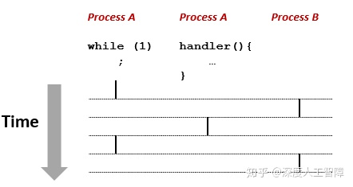
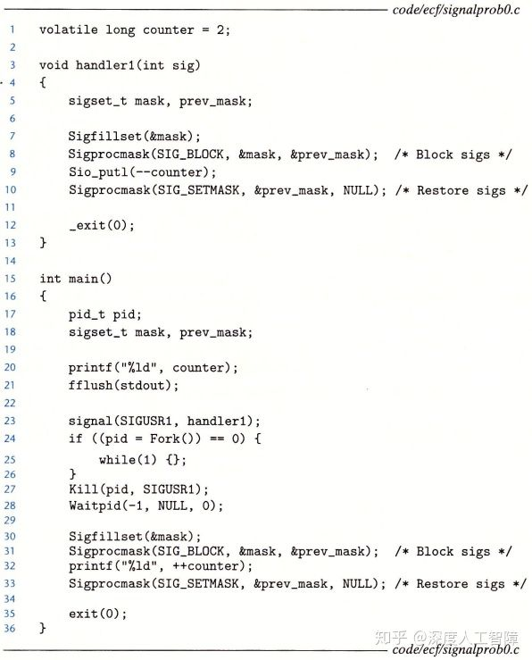
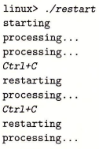

# [读书笔记]CSAPP：19[VB]ECF：信号和非本地跳转


 **视频地址：**

[【精校中英字幕】2015 CMU 15-213 CSAPP 深入理解计算机系统 课程视频_哔哩哔哩 (゜-゜)つロ 干杯~-bilibiliwww.bilibili.com/video/av31289365?p=15](https://link.zhihu.com/?target=https%3A//www.bilibili.com/video/av31289365%3Fp%3D15)

**课件地址：**

[http://www.cs.cmu.edu/afs/cs/academic/class/15213-f15/www/lectures/15-ecf-signals.pdfwww.cs.cmu.edu/afs/cs/academic/class/15213-f15/www/lectures/15-ecf-signals.pdf](https://link.zhihu.com/?target=http%3A//www.cs.cmu.edu/afs/cs/academic/class/15213-f15/www/lectures/15-ecf-signals.pdf)

对应于书中的8.5-8.8。

------

处理器根据异常号调用对应的异常处理程序，来处理异常。用户通过系统调用来执行内核的函数。当信号传递给进程时，调用信号处理程序来对信号进行响应。

父进程和子进程处于相似但独立的地址空间中，它们对变量的操作都是互相独立的。

要确定信号传递给了那个进程，以及该进程对应的全局变量值。

信号可能在任何位置返回，不要对代码有任何假设，要确保在代码之间尽量消除竞争

信号处理程序与主程序在相同进程中并发执行，所以具有相同的上下文。

信号发送的对象是进程

------

这里介绍一下shell程序的内容。实际上系统上的进程呈现为层次结构


当你启动系统时，第一个创建的进程是`init`进程，它的PID为1，系统上其他所有进程都是`init`进程的子进程。`init`进程启动时会创建**守护进程（Daemon）**，该进程一般是一个长期运行的程序，通常用来提供服务，比如web服务等其他你想要一直在系统上运行的服务。然后`init`进程还会 创建登录进程，即**登录shell（Login Shell）**，它为用户提供了命令行接口，所以当你登录到一个Linux系统，最终得到的是一个登录shell。

然后登录shell会以你的身份来执行程序，比如我们输入`ls`命令，即要求shell运行名为`ls`的可执行程序，则shell会创建一个子进程，在该子进程中执行`ls`程序，而该子进程也可能创建其他的子进程。

所以shell就是就是一个以用户身份来运行程序的应用程序。在Linux中的默认shell叫做bash。

在shell中执行程序就是一系列读和解析命令行的过程。

```c
int main()
{
    char cmdline[MAXLINE]; /* command line */

    while (1) {
        /* read */
        printf("> ");
        Fgets(cmdline, MAXLINE, stdin);
        if (feof(stdin))
            exit(0);

        /* evaluate */
        eval(cmdline);
    }
}

void eval(char *cmdline)
{
    char *argv[MAXARGS]; /* Argument list execve() */
    char buf[MAXLINE];   /* Holds modified command line */
    int bg;              /* Should the job run in bg or fg? */
    pid_t pid;           /* Process id */

    strcpy(buf, cmdline);
    bg = parseline(buf, argv);
    if (argv[0] == NULL)
        return;   /* Ignore empty lines */

    if (!builtin_command(argv)) {
        if ((pid = Fork()) == 0) {   /* Child runs user job */
            if (execve(argv[0], argv, environ) < 0) {
                printf("%s: Command not found.\n", argv[0]);
                exit(0);
            }
        }

        /* Parent waits for foreground job to terminate */
	if (!bg) {
            int status;
            if (waitpid(pid, &status, 0) < 0)
                unix_error("waitfg: waitpid error");
        }
        else
            printf("%d %s", pid, cmdline);
    }
    return;
}
```

这里可以看出，前台作业和后台作业的区别只是shell需要等待前台作业完毕。

这里的后台作业会导致内存泄漏。

------

## 1 信号

这一章将讨论一种更高层次的软件形式的异常，称为Linux**信号**。信号就是一条小消息，可以通知系统中发生了一个某种类型的事件，**比如：**

- 内核检测到了一个系统事件，比如除零错误、执行非法指令或子进程终止，低层次的硬件异常都是由内核异常处理程序处理的，对用户进程是不可见的，但是可以通过给用户进程发送信号的形式来告知，比如除零错误就发送`SIGFPE`信号，执行非法指令就发送`SIGILL`信号，子进程终止内核就发送`SIGHLD`到父进程中，则此时父进程就能对该子进程调用`waitpid`来进行回收。
- 内核或其他进程出现了较高层次的软件事件，比如输入组合键，或一个进程尝试终止其他进程，都是显示要求内核发送一个信号给目标进程，比如输入组合键内核会发送`SIGINT`信号给所有进程，进程可以发送`SIGKILL`信号给别的进程来进行终止。

**注意：**与异常机制很类似，只是异常是由硬件和软件共同实现的，而信号时完全由软件实现的，且都是由内核进行发送的。

所以信号可以是内核检测到事件来发送到目标进程，也可以是其他进程通过内核来发送信号到目标进程。如下所示是Linux系统上支持的不同类型的信号，每种信号类型都对应某种系统事件


- `SIGINT`：当用户输入`Ctrl+C`时，内核会向前台作业发送`SIGINT`信号，该信号默认终止该作业。
- `SIGTSTP`：当用户输入`Ctrl+Z`时，内核会向前台作业发送`SIGTSTP`信号，默认停止作业，可通过发送`SIGCONT`信号来恢复该作业。
- `SIGKILL`：该信号的默认行为是用来终止进程的，无法被修改或忽略。
- `SIGSEGV`：当你试图访问受保护的或非法的内存区域，就会出现段错误，内核会发送该信号给进程，默认终止该进程。
- `SIGCHLD`：当子进程终止或停止时，内核会发送该信号给父进程，由此父进程可以对子进程进行回收。

传送一个信号到目的进程是由两个步骤组成的：

- **发送信号：**内核通过更新目的进程上下文中的某个状态，来表示发送了一个信号到目的进程，所以这里除了目标进程上下文中的一些位被改变了，其他没有任何变化。
- **接收信号：**当目的进程被内核强迫以某种方式对信号的发送做出反应时，它就接受了信号。比如忽略信号、终止进程，或执行用户级的**信号处理程序（Signal Handler）**来捕获信号。

**注意：**执行信号处理程序类似于执行异常处理程序，只是异常处理程序是内核级别的，而信号处理程序就只是你的C代码程序。


当执行完信号处理程序后，会返回到下一条指令继续执行，类似于一次中断。

我们将发送了但是还没被接收的信号称为**待处理信号（Pending Signal）**，而进程可以选择阻塞接收某种信号，则该信号可以被发送，但是在阻塞解除前无法被目标进程处理。我们可以发现不同的信号具有不同的编码，所以内核为每个进程在**`pending`位向量**中维护待处理信号的集合，根据信号的编号来设置对应位的值，来传送信号，当进程接收了该信号，就会将其从`pending`位向量中重置该位的值；也为每个进程在**`blocked`位向量**中维护了被阻塞的信号集合，可以通过查看位向量对应的位来确定该信号是否被阻塞。

**注意：**通过位向量的形式来保存待处理信号和被阻塞信号，可以发现每种类型的信号最多只会有一个待处理信号，并且一个待处理信号只能被接受一次。

## 1.1 发送信号

Unix基于**进程组（Process Group）**的概念，提供了大量向进程发送信号的机制。

进程组由一个正整数**进程组ID**来标识，每个进程组包含一个或多个进程，而每个进程都只属于一个进程组，默认父进程和子进程属于同一个进程组。我们将shell为了对一条命令行进行求值而创建的进程称为**作业（Job）**，比如输入`ls / sort`命令行，就会创建两个进程，分别运行`ls`程序和`sort`程序，这两个进程通过Unix管道连接到一起，由此就得到了一个作业。**注意：**

- 任何时刻，最多只有一个前台作业和任意数量的后台作业。
- shell会为每个作业创建一个独立的进程组，该进程组ID由该作业中任意一个父进程的PID决定。


这里提供了以下对进程组的操作，允许你可以同时给一组进程发送信号。

```c
#include <unistd.h>
pid_t getpgrp(void); //返回所在的进程组
int setpgip(pid_t pid, pid_t pgid); //设置进程组
/* 
 * 如果pid大于零，就使用进程pid；如果pid等于0，就使用当前进程的PID。
 * 如果pgid大于0，就将对应的进程组ID设置为pgid；如果pgid等于0，就用pid指向的进程的PID作为进程组ID
 */ 
```

- **用`/bin/kill`向进程发送任意信号**

程序`/bin/kill`具有以下格式

```text
/bin/kill [-信号编号] id  
```

当`id>0`时，表示将信号传递给PID为`id`的进程；当`id<0`时，表示将信号传递给进程组ID为`|id|`的所有进程。我们可以通过制定信号编号来确定要传输的信号，默认使用`-15`，即`SIGTERM`信号，为软件终止信号。


- **从键盘发送信号**

通过键盘上输入`Ctrl+C`会使得内核发送一个`SIGINT`信号到前台进程组中的所有进程，终止前台作业；通过输入`Ctrl+Z`会发送一个`SIGTSTP`信号到前台进程组的所有进程，停止前台作业，直到该进程收到`SIGCONT`信号。


`ps`命令可以查看进程的信息，`STAT`表示进程的状态：`S`表示进程处于睡眠状态，`T`表示进程处于停止状态，`R`表示进程处于运行状态，`Z`表示僵死进程，而`+`表示前台作业。

在以上代码中，我们输入`Ctrl-Z`，可以发现两个`fork`进程的状态变成了停止状态了，通过输入`fg`命令可以将这些被挂起的进程恢复到前台运行，再通过`Ctrl+C`可以停止这两个前台进程。

- **用`kill`函数发送信号**

可以在函数中调用`kill`函数来对目的进程发送信号

```c
#include <sys/types.h>
#include <signal.h>
int kill(pid_t pid, int sig); 
```

当`pid>0`时，会将信号`sig`发送给进程`pid`；当`pid=0`时，会将信号`sig`发送给当前进程所在进程组的所有进程；当`pid<0`时，会将信号`sig`发送给进程组ID为`|pid|`的所有进程。


- **用`alarm`函数发送`SIGALARM`信号**

```c
#include <unistd.h>
unsigned int alarm(unsigned int secs); 
```

当`alarm`函数时，会取消待处理的闹钟，返回待处理闹钟剩下的时间，并在`secs`秒后发送一个`SIGALARM`信号给当前进程。

## 1.2 接收信号

当内核把进程p从内核模式切换回用户模式时，比如从系统调用返回或完成了一次上下文切换时，会检查进程p的未被阻塞的待处理信号的集合，即`pending & ~blocked`，如果是空集合，则内核会将控制传递给p的逻辑流中的下一条指令，如果集合非空，则内核会选择集合中编号最小的信号k（所以我们需要根据优先级来排列信号），强制进程p采取某些行为来接收该信号，对该集合中的所有信号都重复这个操作，直到集合为空，此时内核再将控制传递回p的逻辑流中的下一条指令。

> 每次从内核模式切换回用户模式，将处理所有信号


每种信号类型具有以下一种预定的**默认行为：**

- 进程终止
- 进程终止并dumps core
- 进程挂起直到被`SIGCONT`信号重启
- 进程忽略信号

我们这里可以通过`signal`函数来修改信号的默认行为，但是无法修改`SIGSTOP`和`SIGKILL`信号的默认行为

```c
#include <signal.h>
typedef void (*sighandler_t)(int); 
sighandler_t signal(int signum, sighandler_t handler);
```

- `signum`为信号编号，可以直接输入信号名称

- `handler`为我们想要对信号`signum`采取的行为

- - 当`handler`为`SIG_IGN`，表示要进程忽略该信号
  - 当`handler`为`SIG_DFL`，表示要恢复该信号的默认行为
  - 当`handler`为用户自定义的**信号处理程序**地址，则会调用该函数来处理该信号，该函数原型为`void signal_handler(int sig);`。调用信号处理程序称为**捕获信号**，置信信号处理程序称为**处理信号**。当信号处理程序返回时，会将控制传递回逻辑流中的下一条指令。**注意：**信号处理程序可以被别的信号处理程序中断。

- 当`signal`函数执行成功，则返回之前`signal handler`的值，否则返回`SIG_ERR`

**例子：**

```c
#include <signal.h>
void handler(int sig){
  if((waitpid(-1, NULL, 0)) < 0)
    unix_error("waitpid error");
}
int main(){
  if(signal(SIGCHLD, handler) == SIG_ERR)
    unix_error("signal error");
  return 0;
}
```

这里只要在`main`函数开始调用一次`signal`，就相当于从此以后改变了`SIGCHLD`信号的默认行为，让它去执行`handler`处理程序。当子进程终止或停止时，内核就会发送一个`SIGCHLD`信号到父进程中，此时就能让父进程去执行自己的工作，当子进程终止或停止时，发送`SIGCHLD`信号到父进程，则父进程会调用`handler`函数来对该子进程进行回收。

## 1.3 阻塞信号

Linux提供阻塞信号的隐式和显示的机制：

- **隐式阻塞机制：**内核默认阻塞当前正在处理信号类型的待处理信号。
- **显示阻塞机制：**应用程序通过`sigprocmask`函数来显示阻塞和解阻塞选定的信号。

```c
#include <signal.h>
int sigprocmask(int how, const sigset_t *set, sigset_t *oldset);
```

- 通过`how`来决定如何改变阻塞的信号集合`blocked`

- - 当`how=SIG_BLOCK`时，`blocked = blocked | set`
  - 当`how=SIG_UNBLOCK`时，`blocked = blocked & ~set`
  - 当`how=SETMASK`时，`block = set`

- 如果`oldset`非空，则会将原始的`blocked`值保存在`oldset`中，用于恢复原始的阻塞信号集合

这里还提供一些额外的函数来对`set`信号集合进行操作

```c
#include <signal.h>
int sigemptyset(sigset_t *set); //初始化set为空集合
int sigfillset(sigset_t *set); //把每个信号都添加到set中
int sigaddset(sigset_t *set, int signum); //将signum信号添加到set中
int sigdelset(sigset_t *set, int signum); //将signum从set中删除
int sigismember(const sigset_t *set, int signum); //如果signum是set中的成员，则返回1，否则返回0
```

以下是一个使用例子


以上执行内部函数时，就不会接收到`SIGINT`信号，即不会被`Ctrl+C`终止。

通过阻塞信号来消除函数冲突，或者保证程序运行逻辑正确。

## 2 信号处理程序

我们之前已经看过了进程之间的并发了，只要两个进程的逻辑流在时间上是重叠的，则这两个进程的逻辑流是并发流。由于进程有各自独立的地址空间，所以比较不用担心一个进程受到别的进程的影响，所以并发流不会互相妨碍。

而信号也是并发的一个例子，信号处理程序是一个独立的逻辑流（不是进程），与主程序并发运行。比如我们在进程A中执行一个`while`循环，当该进程受到一个信号时，内核会将控制权转移给该信号的处理程序，所以该信号处理程序是并发执行的，当信号处理程序结束时，再将控制转移给主程序。由于信号处理程序与主程序在同一进程中，所以具有相同的上下文，所以会共享程序中的所有全局变量。



**注意：**信号处理程序与主程序在相同进程中并发执行。

将信号处理程序看成并发流的另一种方式是使用上下文切换图。当有个信号传递给进程A时，只是简单的设置了`pending`位向量对应的位，并不会有额外操作，当进程A后面执行上下文切换，到达进程B后，进程B执行若干指令后，通过上下文切换到达进程A，此时就会根据`pending`位向量记录的未处理信号集合来依次调用对应的信号处理程序，过后再将其传递到下一条指令的地址。所以信号处理程序和其他程序都处于相同的进程中。


信号发送的对象是进程，因为信号处理程序执行在相同的进程中，所以当该进程接收到信号时，信号处理程序是可以被别的信号处理程序中断的，构成以下多层嵌套的信号处理程序，由于这些信号处理程序和主程序处于相同的进程中，所以共享相同的全局变量，这就使得全局变量的状态较难控制。


### 2.1 安全的信号处理

信号处理的一个**难点在于：**处理程序与主程序在同一进程中是并发运行的，它们共享同样的全局变量，可能会与主程序和其他处理程序相互干扰。这里推荐一系列措施来进行安全的信号处理：

- **G0：**处理程序要尽可能简单。

- - 当处理程序尽可能简单时，就能避免很多错误。**推荐做法：**处理程序修改全局标志指示出现的信号，然后直接返回，主程序会周期性检查并重置这个全局标志。

- **G1：**在处理程序中调用异步信号安全的函数。

- - 异步信号安全的函数能被处理程序安全地调用，因为它是可重入的（比如所有变量都是保存在栈上的局部变量），或不能被信号处理程序中断的。Linux中保证安全的系统级函数如下所示，**注意：**`printf`，`sprintf`，`malloc`和`exit`是不安全的，而`write`是安全的。


- **G2：**保存和恢复`errno`

- - 全局变量`errno`在系统级函数出现错误时才会被赋值，许多Linux异步信号安全的函数都会在出错时返回并设置`errno`，当处理程序要返回时，最好提前将`errno`保存为局部变量，再在返回时重置`errno`，使得主程序可以使用原本的`errno`。

- **G3：**阻塞所有的信号，保护对共享全局数据结构的访问

- - 对于数据结构的访问（读取或写入），可能需要若干条指令，当主程序在访问全局数据结构中途被中断，进入处理程序时，如果处理程序也访问当前数据结构，可能会发现该数据结构的状态是不一致的。所以对全局数据结构进行访问时，要阻塞所有的信号（无论在主程序还是信号处理程序中）。

- **G4：**用`volatile`声明在主程序和信号处理程序共享的全局变量

- - 比如G0说的使用全局变量来保存标志，处理程序更新标志，主程序周期性读取该标志，编译器可能会感觉主程序中该标注没有变化过，所以直接将其值缓存在寄存器中，则主程序就无法读取到处理程序的更新值。所以我们需要使用`volatile`来声明该标志，使得编译器不会缓存该变量，使得主程序每次都从内存中读取该标志。

- **G5：**用`sig_atomic_t`声明那些仅进行读写操作，不会进行增量或更新操作的变量

- - 通过使用C提供的整型数据类型`sig_atomic_t`来声明变量，使得对它的读写都是原子的，不会被中断，所以就不需要暂时阻塞信号了。大多数系统中，`sig_atomic_t`是`int`类型。**注意：**对原子性的保证只适用于单个读和写，不适用于`flag++`或`flag+=1`这类操作。

**综上所述：**是处理函数尽可能简单，在处理程序中调用安全函数，保存和恢复`errno`，保护对共享数据结构的访问，使用`volatile`和`sig_atomic_t`。

### 2.2 正确的信号处理

在信号处理中，还存在一个**问题：**我们这里使用`pending`位向量来保存未处理的信号集合，当处理程序处理信号时，就会将其从该集合中删除，但是由于是位向量形式，所以当集合中存在信号k时，就不会再接收信号k了，**意味着：**如果存在一个未处理的信号k，则表明至少有一个信号k到达，所以我们不能通过信号来对其他进程中发生的事件进行记数，我们要使得处理程序一次能够执行尽可能多的操作。

比如主程序通过接收`SIGCHLD`信号来回收子程序，不正确的处理程序时如下形式的


此时如果众多子进程一次性发送过多的`SIGCHLD`信号给父进程，当父进程还在信号处理程序时，就会丢失若干个`SIGCHLD`信号，使得无法得到正确的回收子进程的数目，可以改成如下形式

```c
void child_handler2(int sig)
{
    int olderrno = errno;
    pid_t pid;
    while ((pid = wait(NULL)) > 0) {
        ccount--;
        Sio_puts("Handler reaped child ");
        Sio_putl((long)pid);
        Sio_puts(" \n");
    }
    if (errno != ECHILD)
        Sio_error("wait error");
    errno = olderrno;
}
```

这里我们假设接收到一个`SIGCHLD`信号意味着有多个信号被终止或停止，所以通过`while`循环来回收所有的进程，此时就不会遗漏子进程的回收。

> 但是不会造成好多`handler2`函数都在运行嘛？

**例：**判断下列程序的输出



这里需要注意以下几点：

- 在23行捕获一个`SIGUSR1`信号，此时还没有到`fork`函数，所以是父进程和子进程共享的代码，所以父进程和所有子进程都要捕获这个信号。
- 在27行父进程给子进程发送`SIGUSR1`信号，当子进程捕获到这个信号时，会跳转到执行`handler1`函数，这里对全局共享的变量的访问要阻塞信号。然后通过安全的`_exit(0)`终止子进程。
- **注意：**通过`fork`函数创建的子进程，具有和父进程相似但独立的地址空间，意味着在子进程中`--counter`，并不会影响父进程中的`counter`值。

### 2.3 可移植的信号处理

信号处理的另一个**缺陷**是：不同的系统有不同的信号处理语义，比如：

- `signal`函数的语义各不相同，有的Unix系统，当处理完信号时，就会将对该信号的处理恢复为默认行为。
- 存在一些潜在的会阻塞进程较长时间的系统调用，称为**慢速系统调用**，比如`read`、`write`或`accpet`。在执行慢速系统调用时，如果进程接收到一个信号，可能会中断该慢速系统调用，并且当信号处理程序返回时，无法继续执行慢速系统调用，而是返回一个错误条件，并将`errno`设置为`EINTR`。

这些可以通过`sigaction`函数来明确信号处理语义，由于该函数的复杂性，提供一个封装好的函数


可以类似`signal`函数那样使用，信号处理语义为：

- 只有当前信号处理程序正在处理的信号类型会被阻塞
- 只要可能，被中断你的系统调用会自动重启
- 一旦设置了信号处理程序，就会一直保持

### 2.4 其他

### 2.4.1 同步流来消除并发错误

并发流可能以任何交错方式运行，所以信号发送的时机很难预测，可能会出现错误，所以需要首先对目标信号进行阻塞，先执行预定操作，然后将其解阻塞进行捕获。比如以下代码


如果缺少30和32行，则`addjob`函数和`deletejob`函数之间存在竞争，必须在`deletejob`函数之前调用`addjob`函数，否则在`deletejob`函数中通过`waitpid`函数释放了子进程，过后调用`addjob`函数就会出错。但是由于内核调度进程是不可控的，以及`SIGCHLD`信号的发送时机是不确定的，所以可能出现这个错误。可以如上所示，在主进程中先对`SIGCHLD`信号进行阻塞，在执行完`addjob`函数后再解阻塞，保证了先执行`addjob`函数再执行`deletejob`函数。

**经验之谈：**不要对代码做任何假设，比如子进程运行到这里才终止。

**注意：**可以通过阻塞信号来控制信号的接收时机。

### 2.4.2 显示等待信号

当我们想要主进程显示等待某个信号时，可以用以下代码


这里主进程会显示等待子进程被回收，这里使用了`sigsuspend(&mask)`函数，它等价于

```c
sigprocmask(SIG_SETMASK, &mask, &prev);
pause();
sigprocmask(SIG_SETMASK, &prev, NULL); 
```

但是它是这三条代码的原子版本，即第一行和第二行是一起调用的，则`SIGCHLD`信号不会出现在第一行和第二行之间，造成程序不会停止。

**注意：**第26行要先对`SIGCHLD`信号进行阻塞，防止过早发送给主进程，则`pause`函数就无法中断，就会使得程序不会停止。

## 3 非本地跳转

C语言提供了一种用户级异常控制流形式，称为**非本地跳转（Nonlocal Jmup）**，它可以直接将控制从一个函数转移到另一个当前正在执行的函数，不需要经过调用-返回。

这里需要两个函数

```c
#include <setjmp.h>
int setjmp(jmp_buf env);
void longjmp(jmp_buf env, int retval);
```

我们首先需要定义一个`jmp_buf`类型的全局变量`env`，通过调用`setjmp(env)`，能将当前调用环境保存到`env`中，包括程序计数器、栈指针和通用目的寄存器，而`setjmp`函数会返回0。而后我们在代码某处调用`longjmp(env, retval)`，会从`env`中恢复调用环境，并跳转到最近一次初始化`env`的`setjmp`函数，让`setjmp`函数返回`retval`。

接下来介绍非本地跳转的两个应用

### 3.1 无需解析调用栈，直接从深层嵌套函数中返回


在`main`函数中，首先在12行中执行`setjmp(buf)`函数将当前调用环境保存到`buf`中，并返回0，所以就调用`foo`函数和`bar`函数，当这两个函数中出现错误，则通过`longjmp(buf, retval)`恢复调用环境，并跳转回第13行，然后让`setjmp`函数返回`retval`的值，由此就无需解析调用栈了。但是该方法可能存在内存泄露问题。

### 3.2 控制信号处理程序结束后的位置

在信号处理中也有对应的两个非本地跳转的函数

```c
#include <setjmp.h>
int sigsetjmp(sigjmp_buf env, int savesigs);
void siglomgjmp(sigjmp_buf env, int retval); 
```

其中`sigsetjmp`函数还会将待处理信号和被阻塞信号保存到`env`中。


首先，在`main`函数中第12行通过`sigsetjmp`函数将调用环境保存到`buf`中，并返回0，随后设置信号处理程序。当用户输入`Ctrl+C`时，会调用信号处理程序`handler`，此时会通过`siglongjmp`恢复调用环境，然后跳转回第12行，然后让`sigsetjmp`返回`1`，此时就避免了返回到中断的下一条指令处。

**注意：**`signal`要在`sigsetjmp`之内，避免还未设置`sigsetjmp`就接收到信号而执行`siglongjmp`。

该程序的执行结果为



**问题：**`siglongjmp`函数会恢复调用环境，再返回到`sigsetjmp`处。而调用`sigsetjmp`时还未设置`SIGINT`信号的处理函数，那么调用环境中应该也不包含该信号处理函数吧？那么`siglongjmp`函数恢复调用环境后，应该就不会用`handler`来处理`SIGINT`信号了吧？