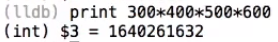

# [读书笔记]CSAPP：1[V]课程综述


 

视频地址：**

[【精校中英字幕】2015 CMU 15-213 CSAPP 深入理解计算机系统 课程视频_哔哩哔哩 (゜-゜)つロ 干杯~-bilibiliwww.bilibili.com/video/av31289365](https://link.zhihu.com/?target=https%3A//www.bilibili.com/video/av31289365)

**课件地址：**

[http://www.cs.cmu.edu/afs/cs/academic/class/15213-f15/www/lectures/01-overview.pdfwww.cs.cmu.edu/afs/cs/academic/class/15213-f15/www/lectures/01-overview.pdf](https://link.zhihu.com/?target=http%3A//www.cs.cmu.edu/afs/cs/academic/class/15213-f15/www/lectures/01-overview.pdf)

本课程使用CSAPP第三版作为教材，可以从[CS:APP3e, Bryant and O'Hallaron](https://link.zhihu.com/?target=http%3A//csapp.cs.cmu.edu/)中获得大量补充材料，并且实验都是直接来自于书中讨论的内容。**建议每一章读三遍，然后完成练习**。这门课程的主要信息来源是**课程网页：**[Introduction to Computer Systems](https://link.zhihu.com/?target=http%3A//www.cs.cmu.edu/afs/cs/academic/class/15213-f15/www/index.html)，其中有完整的课程和作业安排。

推荐一本C的书本：Brian Kernighan和Dennis Ritchie的《The C Programming Language》。

------

这门课程的**主题**在于：Abstraction is good but don't forget reality，指的是你即使学会了编程，但是你可能并不了解计算机的本质，而这门课程就是要让你能够深入了解当执行你的代码时，计算机具体是在做什么的，通过这些来帮助你在你想做的事情上做得更好。这里有两个**目标**：

1. 你将了解工具、技巧和方法，大规模的软件工程项目、系统硬件设计或计算机技术的任何方面，它会帮助你们做的更好。你会明白程序是如何运行的，机器是如何支持程序运行的，会明白为什么有时程序可以正常运行有时却不能。
2. 会专注于一些与主题有关的方面，比如计算机网络、操作系统和嵌入式系统，你会从这门课上学到一些概念然后能够学习更局限但是更深层次的运行规律。

实际上，现实中的计算机和你所期望的可能完全不同，并且本书也分成了以下几个**主题**

**Great Reality 1：Ints are not Integers, Floats are not Reals**

**例1：**

我们理解中 ![[公式]](https://www.zhihu.com/equation?tex=x%5E2%5Cgeq0) 在实数域中是成立的，而在计算机中float类型是成立的，但是对于int类型却不一定了。比如以下例子，计算`50000*50000`得到的却是负数


这是因为计算机期望数字可以表示为32位的值，但是当你做完乘法运算后，结果的位格式刚好是负数的格式，这就使得计算结果为负数了，这个称为**溢出**。

或者我们连乘几个比较大的值，比如以下例子



这得到的结果明显是错误的，其实和上面相似，计算结果都发生了溢出。

当溢出发生时，值可能变成整数或者负数，但是结果通常是不正确的。

> 计算机中，int是由若干位表示的，当结果超过这个位所能表示的极限时，就会发生溢出，使得计算结果错误。但是int始终满足交换律、结合律等。

**例2：**

我们理解中，加减法是满足结合律交换律等等的，比如 ![[公式]](https://www.zhihu.com/equation?tex=%28x%2By%29%2Bz%3Dx%2B%28y%2Bz%29) 。而在计算机中，int类型也是满足这些性质的，但是对于float类型却不一定。比如以下例子


第一个算式里，两个比较大的值相加会变成0，所以会得到的结果就是正确的3.14。但是第二个算式里，1e20相比3.14大太多了，3.14就显得微不足道了，所以括号里的结果就是-1e20，使得最后得到错误的结果0。

> 计算机中，float的取值范围特别大，当两个相差特别大的数进行运算时，可能会使得较小的数字消失，所以不满足结合律。

所以可以看到，int和float都存在一些不符合常理的特点，这是因为它们使用有限的位来表示数域中无穷的数，这就使得它们需要在某些方面做出妥协。

在计算机算数中，它会严格按照数学性质进行运算，不会产生随机值。但是由于表示的有限性，我们并不能假设所有常规的数学性质都是满足的，我们需要知道在什么情况下使用什么东西。所以这门课程将首先讨论数字、数字的表示及其属性。

**Great Reality 2：You've got to know assembly**

这门课将花费大量时间来学习机器级编程的意义。指令可以使用目标代码来进行描述，表示为位级别的二进制编码，但是指令通常使用汇编语言进行描述，然后由计算机执行，汇编语言可以看成是指令的文本版本。

本课程将观察编写的C语言代码是如何变成机器码，以及如何在机器上执行的。所以会首先关注如何获取编译器生成的汇编代码，然后尝试阅读并理解它。

本课程将特别关注Intel处理器的汇编语言，它最新版本是x86-64，指令集是64位版本的。

**Great Reality 3：Memory Matters**

现代计算机有一个非常复杂的分层存储系统，尝试同时提供大容量和高性能的存储器，这也意味着如果你程序写的好，它可能运行的很好，否则它的运行效果就很很糟糕，因为程序没有利用这个分成存储系统。

C程序中通常会有**内存引用错误**，所以本课程也将关注这些错误是什么，表现是什么，以及如何防止它们出现。

比如我们创建一个结构体并对其进行赋值

```cpp
typedef struct {
  int a[2];
  double d;
} struct_t;

double fun(int i) {
  volatile struct_t s;
  s.d = 3.14;
  s.a[i] = 1073741824; /* Possibly out of bounds */
  return s.d;
}
```

当我们运行`fun(0)`和`fun(1)`时， 都返回`3.14`，但是当我们运行`fun(2)`时，就返回`3.1399998664856`，运行`fun(3)`返回`2.00000061035156`，运行`fun(4)`返回`3.14`，并且运行`fun(6)`时，就会出现`Segmentation fault` 。

这其实和数组如何在内存中布局，以及内存是如何访问的相关。我们首先看一下这个结构是如何实现和排列的


这里每一行表示4个字节，并且int是4个字节，double是8个字节。然后在它上面，此结构体和其他结构之间还有一些其他东西。这里我们就可以看到，当我们运行`fun(0)`和`fun(1)`时，修改的就是数组a中的值，但是但我们运行`fun(2)`后，修改的就是浮点数d中的内容了， 所以就会出现上面奇怪的数字，当我们输入到某个值后，我们就修改了某些用来维持该程序运行的状态，这就导致了程序崩溃。 所以内存引用错误主要是因为C和C++没有提供边界检查，所以很容易编写出非法的代码。

C和C++并没有提供内存保护，比如有超出边界的数组、非法的指针以及滥用的malloc/free通常都会造成bug，这个bug是否出现，还取决于你的系统和编译器，并且这个bug可能要运行很多次才会发现。这里你可能就需要根据内存的排列方式来对某个数据结构进行修改。

**Great Reality 4：There's more to performance than asymptotic complexity**

课程的第四个主题是要从程序角度增加它的性能。CS课程的其他部分，更多强调在正确的数据结构中获得正确的算法，但是他们需要进行**不同层次的优化：**算法、数据表示、过程和循环。这时候你需要知道系统到底是如何运行的，是什么让它运行很好，以及是什么让它运行不好。

比如以下两个函数

```cpp
# 代码一
void copyij(int src[2048][2048],
            int dst[2048][2048])
{
  int i,j;
  for (i = 0; i < 2048; i++)
    for (j = 0; j < 2048; j++)
      dst[i][j] = src[i][j];
}
# 代码二
void copyji(int src[2048][2048],
            int dst[2048][2048])
{
  int i,j;
  for (j = 0; j < 2048; j++)
    for (i = 0; i < 2048; i++)
      dst[i][j] = src[i][j];
}
```

他们的行为方面完全一样，都是将一个矩阵或数组从原地址`src`复制到目标地址`dst`，这两个代码唯一的不同仅在于嵌套顺序不同，代码一进行的是行优先，而代码二进行的是列优先的。但是在普通的系统中，代码一运行速度为4.3ms，而代码二运行速度为81.8ms，性能相差差不多20倍。

首先可以看以下这张图，它显示了四种不同的内存访问模式，这里不会细究，我们可以发现这两个函数在这个内存访问模式中处于不同的位置，`copyij`代表以行优先形式进行访问，而`copyji`代表以列优先形式进行访问， 并且`copyij`比`copyji`性能好很多，这和内存层次结构中的缓存有关。


**Great Reality 5：Computers do more than execute programs**

课程的最后一部分将更多讨论不仅让计算机孤立运行小程序，而且能够通过网络来彼此交谈，实现像web服务器这样的服务。


本节课程可以作为其他后续课程的基础，它们每一个都基于这门课程中的一个或多个方面。


本书有4个主要**组成部分**：

1. Lectures：用来讲解高层次的概念。
2. Recitations：每周由助教主持一次一小时的课程，主要帮助完成实验。
3. Labs：总共有7个实验，是本课程的核心和灵魂，每个实验持续1-2周，通常涉及某种编程或测量数据。
4. Exams：期中和期末考。

可以将7个实验分成5个部分：

### 1. 程序和数据

前三个实验涵盖了程序和数据的程序表示：

\1. **DataLab**教你关于数据的位级表示。

\2. **BombLab**教你如何阅读和理解汇编语言，为了化解炸弹，你必须开启GDB，单步调试直到找到每一阶段的代码，然后逆向编译，找出它想要你输入的内容来化解炸弹。

\3. **AttackLab**专门为64位操作系统开发的实验，是**代码注入（code injection）**攻击的基础。利用一种称为返回到**返回导向编辑（return to return oriented programming）**的现代技术，你将学会如何编写漏洞。黑客使用这种方式来应对新型计算机中栈位置不固定，并且禁止在栈上操作代码的问题。

### 2. 层次存储

在研究内存层次结构时，有一个**CacheLab**实验，你会建立自己的缓存模拟器，并且尝试让你代码在你的模拟器上运行时产生尽可能少miss-hit，由此来学习高速缓存存储器这种硬件的工作原理，并且利用这种层次结构进行编程。

### 3. 异常控制流

然后从硬件转换到与系统级软件、操作系统进行交互，**异常控制流（Exceptional Control Flow）**是一种常见概念，存在于系统的所有部分，这代表着从硬件到软件的智能转换。当你了解了一种特殊的控制流程，比如低层次的硬件中断和异常，然后在更高层次的操作涉及硬件和操作系统软件，其实是操作进程上下文切换的想法，所以这里你就知道进程是什么，如何让内核为你创造和管理进程。在更高层次上，以软件形式的异常控制流被称为信号，然后在更高层次上有一个应用程序C语言版本的异常控制流调用，被称为固定移动和远距离转移（set jump and long jump）。这里使用**TsLab**实验来进行学习，你将编写自己的Linux Shell。

### 4. 虚拟内存

然后将研究**虚拟内存（Virtual Memory）**，它是硬件和软件的结合，虚拟内存提供了非常高级的抽象，使得称为线性字节序列的结构，使得系统更容易控制。我们将学习它的工作原理，以及程序中可能对性能造成潜在影响的部分，并且也将学习如何管理它提供给你的大量内存，有对应的**MallocLab**，你将重新实现C标准库中的Malloc和Free函数。

### 5. 网络和并发

在之前的课程，已经讨论了正在机器上运行的程序，然后在课程的最后一部分将处理I/O，将数据发送到机器和从机器输出，我们会了解Linux I/O基本概念。在**ProxyLab**中，将学习如何网络编程，学习如何编写使用使用套接字接口的程序。

------

仔细查看完教学计划和书本目录，除了书中的第4章 处理器体系结构，教学计划都包含在内。因此最后会将书本第4章作为独立一章进行整理。

第一节课程为《Bits, Bytes, and Ints》对应于书本第2章 信息的表示和处理。所以会先整理书本第1章 计算机系统漫游，再开始第一节课程。