# [读书笔记]CSAPP：20[VB]虚拟内存：概念

 **视频地址：**

[【精校中英字幕】2015 CMU 15-213 CSAPP 深入理解计算机系统 课程视频_哔哩哔哩 (゜-゜)つロ 干杯~-bilibiliwww.bilibili.com/video/BV1iW411d7hd?p=17](https://link.zhihu.com/?target=https%3A//www.bilibili.com/video/BV1iW411d7hd%3Fp%3D17)

**课件地址：**

[http://www.cs.cmu.edu/afs/cs/academic/class/15213-f15/www/lectures/17-vm-concepts.pdfwww.cs.cmu.edu/afs/cs/academic/class/15213-f15/www/lectures/17-vm-concepts.pdf](https://link.zhihu.com/?target=http%3A//www.cs.cmu.edu/afs/cs/academic/class/15213-f15/www/lectures/17-vm-concepts.pdf)

对应于书中的9.1~9.6。

------

- 虚拟内存被组织为存放在磁盘上的N个连续字节大小的单元数组，每个字节都有一个唯一的虚拟地址，而该数组的内容被缓存在主存中。（所以虚拟内存本质上是磁盘上的字节数组，该数组的索引就是虚拟地址，且主存作为该数组的缓存。）
- CPU通过虚拟内存地址进行访问，会首先确定对应的PTE，然后通过PTE的状态访问对应的物理页。
- 加载器不会将磁盘内容复制到内存，而是为可执行目标文件分配虚拟页，初始化页表。实际的加载工作由内核完成。
- 只有分配页面了，CPU才会产生该页的虚拟地址
- MMU负责地址翻译和访问权限检查
- 页表和TLB中只需要保存PPN。

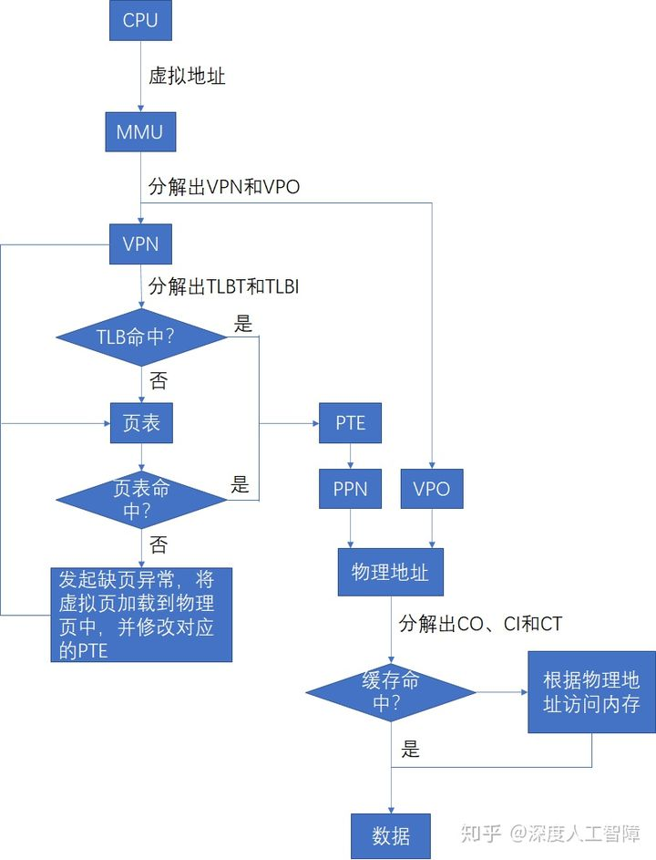

------

进程之间相互共享CPU和主存资源，但是如果太多进程需要太多内存资源，可能就会使得进程无法运行，并且当进程写了另一个进程使用的内存时，会造成错误。所以为了更好管理内存，现代系统提供了一种对主存的抽闲概念，称为**虚拟内存（Virtual Memory）**，它完美交互了硬件异常、硬件地址翻译、主存、磁盘文件和内核软件，为每个进程都提供了一个大的、一致的私有的地址空间。

## 1 地址空间

**地址空间（Address Space）**是一个非负整数地址的有序集合 ![[公式]](https://www.zhihu.com/equation?tex=%5C%7B0%2C1%2C2%2C...%5C%7D) ，如果地址空间中的整数是连续的，则称为**线性地址空间（Linear Address Space）**。

计算机系统的主存被组织成一个由M个字节大小的单元组成的数组，每个字节都有一个唯一的**物理地址（Physical Address）**，并且物理地址是连续的。由此就构成了一个**物理地址空间（Physical Address Space）**，对应于系统中物理内存的M个字节。CPU可以通过物理地址来访问内存，这种方式称为**物理寻址（Physical Addressing）**，再将获得的数据字保存到寄存器中。

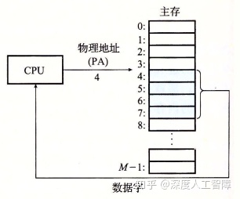

现代系统会尝试虚拟化资源，提供资源不同的视图，通常会呈现某种抽象或某种不同的资源视图，你可以通过介入对该资源的访问过程来实现。所以当你有一些资源，并且想要进行虚拟化时，可以通过干预或介入对该资源的访问过程来实现，一单你拦截了访问的过程，你就能用任何你想要的方式来处理它，就能有很多方法来改变那个资源对用户的视图。比如访问磁盘特定的扇区，需要制定柱面、磁道和盘面，但是磁盘控制器将磁盘抽象成一系列逻辑块的形式，使得内核能直接直接制定逻辑块号来访问磁盘，这就是一种虚拟化技术，它通过拦截来自内核的读写请求来呈现出这种视图，将内核发送的逻辑块号转化为实际的物理地址。

对于主存存储器资源也可以通过虚拟内存提供另一种不同的视图。现代CPU从一个有 ![[公式]](https://www.zhihu.com/equation?tex=N%3D2%5En) 个地址的地址空间中生成**虚拟地址（Virtual Address）**，该地址空间称为**虚拟地址空间（Virtual Address Space）**，虚拟地址空间的大小由表示最大虚拟地址所需的位数 ![[公式]](https://www.zhihu.com/equation?tex=n) 来确定，现代系统支持32位或64位的虚拟地址空间。CPU会使用虚拟地址来访问主存，称为**虚拟寻址（Virtual Addressing）**，需要首先通过**地址翻译（Address Translation）**将虚拟地址转换为对应的物理地址，再通过物理地址来访问内存。而地址翻译类似于异常处理（软硬结合），需要CPU上的**内存管理单元（Memory Management Unit，MMU）**，以及内存中由操作系统管理的查询表来动态翻译虚拟内存。所以通过MMU来控制对内存的读写，达到对内存进行虚拟化的目的。

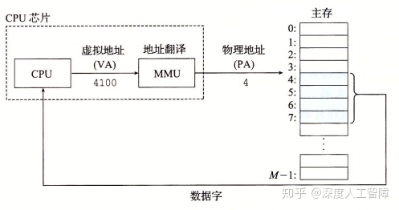

通常虚拟地址空间会比物理地址空间大很多，物理地址空间对应于系统中实际拥有的DRAM容量，对于系统上运行的所有进程，虚拟地址空间是相同的。

为什么要增加MMU来对内存进行抽象呢？**主要原因在于：**

- 虚拟内存将DRAM内存作为磁盘上实际数据的高速缓存，即我们可以在主存访问磁盘大小的空间，而主存只保存活动区域，根据需要在磁盘和主存之间来回传送数据，使得进程可以得到更大的地址空间，并且更有效地利用主存资源。
- 虚拟内存为每个进程提供一致的虚拟地址空间，代码和数据总是加载到固定的地址，堆栈位于用户课件地址空间的顶部等等，但是实际上与那些虚拟地址相对应的内容分布在整个主存储器中，所以通过使用虚拟内存可以简化内存的管理。
- 虚拟内存保护每个进程的地址空间不会被别的进程破坏。

## 2 虚拟内存的作用

### 2.1 虚拟内存作为缓存的工具

### 2.1.1 基本概念

虚拟内存被组织为存放在磁盘上的N个连续字节大小的单元数组，每个字节都有一个唯一的虚拟地址，而该数组的内容被缓存在主存中。（所以虚拟内存本质上是磁盘上的字节数组，该数组的索引就是虚拟地址，且主存作为该数组的缓存。）

> 缓存可以参考之前的[内容](https://zhuanlan.zhihu.com/p/111613441)

虚拟内存是在20世纪60年代早期发明的，早于SRAM高速缓存之前，所以即使两者使用相似的概念，术语也存在很大的不同。在虚拟内存中，数据块被称为**页（Page）**，磁盘和内存之间传送给页称为**交换（Swapping）**或**页面调度（Paging）**。所有现代系统都使用**按序页面调度（Demand Paging）**的方式，一直等待直到发生不命中时，才换页面。

虚拟内存之所以有效，也是因为局部性。虚拟内存作为下一层存储器层次，大小会比物理内存大，所以运行过程中程序引用的不同页面总数可能会超出物理内存大小。如果程序具有好的局部性，则在任意时刻的工作集较小，程序会趋于在一个较小的**活动页面（Active Page）**集合上工作，所以只需要在一开始将工作集页面调度到物理内存中，过后就不会产生额外的磁盘流量了。但是如果局部性较差，则工作集超过了物理内存大小，则会发生**抖动（Thrashing）**，使得不断从磁盘中读取页到物理内存中，程序性能大大降低。在Linux中，可以通过`getrusage`函数检测缺页的数量。

> 虚拟内存从缓存的概念考虑，要求程序具有较好的局部性

从缓存的角度来看，内存是作为虚拟内存的缓存，则这两层存储器层次之间传输数据的块大小相同，都为 ![[公式]](https://www.zhihu.com/equation?tex=P%3D2%5Ep) 字节，在物理内存中的数据块称为**物理页（Physical Page，PP）**，也称为**页帧（Page Frame），**在虚拟内存中的数据块称为**虚拟页（Virtual Page，VP）**。虚拟页有三种状态：

- **未分配的：**未分配的虚拟页就是没有任何数据和它关联的数据块，不占用任何磁盘空间。
- **缓存的：**已保存在物理页中的已分配的虚拟页
- **未缓存的：**还未保存在物理页中的已分配的虚拟页

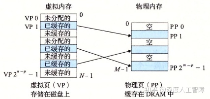

其次，主存作为虚拟内存的缓存，如果主存不命中，就会从速度特别慢的磁盘中读取数据，造成很大的开销，所以虚拟内存和主存之间传输的数据块大小P较大，通常为4KB~2MB，由此增强空间局部性。并且为了避免数据块冲突，内存是全相联的，意味着虚拟页能保存在任意的物理页中。最后，由于对磁盘的访问时间较长，内存采用写回的形式。

虚拟页到物理页的映射关系保存在物理内存中常驻的**页表（Page Table）**数据结构中，该页表由操作系统维护，每个虚拟页在页表中都保存了它对应的物理页，所以一共需要 ![[公式]](https://www.zhihu.com/equation?tex=2%5En%2FP) 个**页表条目（Page Table Entry，PTE）**。每次地址翻译硬件将一个虚拟地址转换为物理地址时，就会访问该页表。

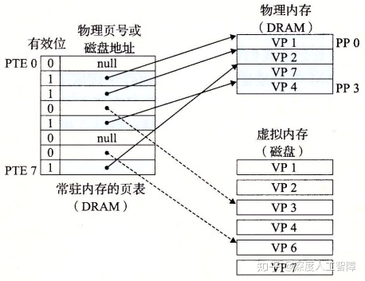

如上所示是一个页表数据结构，每个PTE包含一个有效位和一个n位地址字段组成。当有效位为1时，表示已将该虚拟页缓存在物理页中，则地址字段就是对应的物理页的起始物理地址；当有效位为0时，如果虚拟页是未分配的，则地址字段为NULL，如果虚拟页分配了，则地址字段就是对应的虚拟页在磁盘上的起始地址。

**注意：**由于内存采用全相联结构，所以任意的虚拟页能缓存在任意的物理页中。

### 2.1.2 操作

当CPU想要访问位于虚拟地址`x`中的数据字时，会首先通过地址翻译硬件将虚拟地址作为一个索引来定位PTE，然后通过PTE来确定对应的虚拟页的状态。如果PTE的有效位为1，说明该虚拟页被缓存在物理内存了，则CPU可以通过该PTE的地址字段获得物理内存的地址，然后进行访问

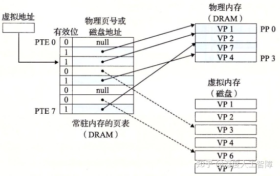

如果该PTE的有效位为0，且地址字段指向虚拟页在磁盘的位置，则说明该虚拟页还未缓存在物理页中，则出现了**缺页（Page Fault）**（对应于不命中）。处理器会发起缺页异常，然后调用内核中的缺页异常处理程序，会执行以下步骤：

- 由于内存使用全相联结构，如果存在空的高速缓存行，则会选择该物理页，否则会从中选择一个牺牲页，由于采用了写回的策略，所以如果该物理页的数据被修改过，就将其复制会磁盘中。
- 修改牺牲页对应的PTE，将地址字段指向虚拟页在磁盘的位置，说明该虚拟页未被缓存
- 内核从磁盘复制目标虚拟页到该牺牲页中，并修改目标虚拟页对应的PTE，将地址字段指向牺牲页的物理内存地址
- 缺页异常返回到导致缺页异常的指令，重新执行该指令，此时由于缓存了目标虚拟页，所以会命中

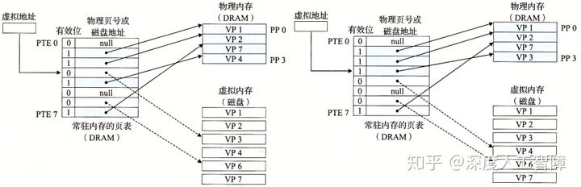

当CPU想要分配一个新的虚拟页时，比如调用了`malloc`函数，则首先在磁盘中创建一个虚拟页大小的空间，然后修改对应的PTE，将有效位置为1，且地址字段指向新的虚拟页在磁盘中的位置。

### 2.2 虚拟内存作为内存管理的工具

（这一节一下解释了之前的很多疑问）

内核在进程上下文中为每个进程都维护了自己独立的页表，使得每个进程有独立的虚拟地址空间。每个进程的页表将该进程连续的虚拟地址空间映射到DRAM物理地址空间中的任意位置，并且不同的虚拟页和不同的进程可以映射到不同的物理页中。通过这种形式，可以提供一种视图：每个进程都有一个非常相似的虚拟地址空间，有相同大小的地址空间，代码和数据分别从同一个地址开始，但是进程使用的物理页实际上可能会分散在DRAM内存中。

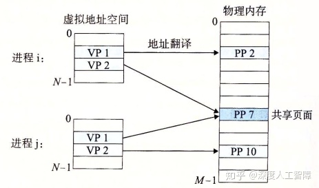

按序页表调度和独立的虚拟地址空间，提供了以下便利：

- **简化链接：**由于每个进程都有自己独立的虚拟地址空间，则相同的虚拟地址在不同的进程可以通过进程自己的页表来确定最终的物理地址，所以链接器生成可执行目标文件确定内存地址时，无需考虑当前物理内存的状态，可以根据我们预定义的内存模型来分配虚拟内存地址，因为不同进程之间的虚拟地址是独立的，最终可以通过页表来映射到真实的物理地址。这就极大简化了链接器的工作，可以直接按内存模型来分配地址。

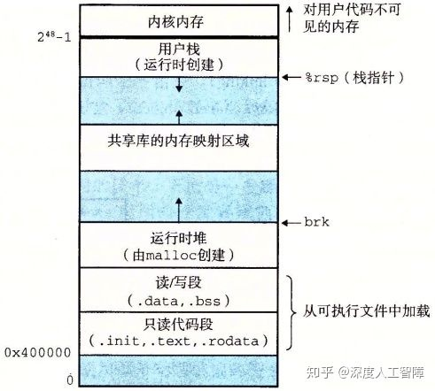

- **简化加载：**想要把可执行目标文件加载到物理内存中，Linux加载器只需要为可执行目标文件中的代码段和数据段分配虚拟页，然后在页表中将这些虚拟页设置为无效的（表示还未缓存），然后将地址字段指向对应的位置，则实际的加载工作会由操作系统自动地按需执行。当访问某一虚拟地址时，发现其对应的PTE是无效的，则会发起缺页异常，通过缺页异常处理程序自动地将虚拟页加载到物理页中。所以加载器不会将磁盘内容复制到内存，而是为可执行目标文件分配虚拟页。这种将一组连续的虚拟页映射到任意一个文件中的任意位置称为**内存映射（Memory Mapping）**。

- - 加载实际是非常高效的机制，比如你的程序中包含一个巨大的数组，但是你只访问该数组的一部分，实际上不会将整个数组对应的虚拟页保存到物理页中，因为加载器只是初始化页表。当你代码中访问该数组的一部分时，内核会执行缺页异常处理程序，将包含你想要的数据的虚拟页加载到对应的物理页中，所以效率很高。

- **简化共享：**通过为每个进程设置独立的页表，可以很简单地实现共享库和内核的共享。之前介绍过，共享库会在加载时或运行时动态加载到物理内存的任意位置，让所有进程进行共享。这里只需要在进程中通过一个PTE指向该共享的数据或代码的物理页，就能实现在所有进程中共享的结果。也侧面说明了`plt`和`got`的必要性，可以避免修改共享库的内容。

- **简化内存分配：**进行内存分配时，可以通过`malloc`函数在物理内存中的任意位置进行创建，因为页表只需要让虚拟页指向该物理页，就能提供连续的虚拟地址抽象，让进程误以为是在连续的地址空间中进行操作的，由此简化了内存分配需要的工作。

（妙啊！）

### 2.3 虚拟内存作为内存保护的工具

通过对页表的改进，可以很容易地进行内存保护

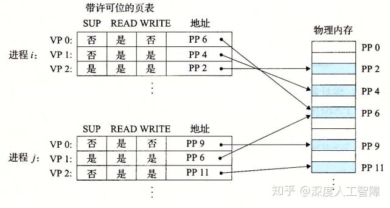

这里在每个PTE中引入了三个字段：

- `SUP`：确定该物理页的访问权限，确定是否需要内核模式才能访问
- `READ`：确定该物理页的读权限
- `WRITE`：确定该物理页的写权限

MMU每次访问时都会检查这些位，如果有一条指令违背了这些许可条件，就会触发一个保护故障，Linux shell一般会将这种异常报告为**段错误（Segment Fault）**。

## 3 地址翻译

### 3.1 基础

接下来简单介绍下地址翻译，地址翻译就是一个N元素的虚拟地址空间（VAS）中的元素和一个M元素的物理地址空间（PAS）中元素之间的映射

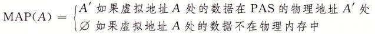

主要通过MMU硬件利用保存在物理内存中的页表来实现，MMU具有以下结构

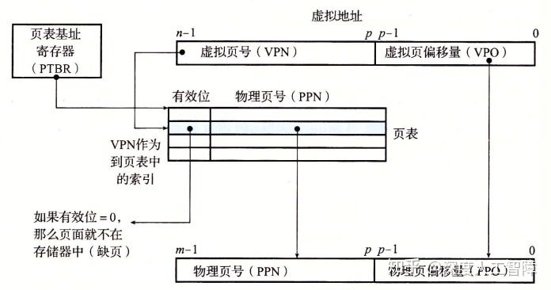

首先，虚拟页大小为P个字节，所以需要虚拟地址的低p位来索引一个虚拟页中的字节，得到**虚拟页偏移量（Virtual Page Offset，VPO）**，然后通过虚拟地址的高n-p位来确定虚拟页在也表中的索引，得到**虚拟页号（Virtual Page Number，VPN）**。而页表的起始地址保存在一个特殊的CPU寄存器**页表基址寄存器（Page Table Base Register，PTBR）**中，所以可以通过VPN和PTBR得到想要的PTE的物理内存地址。并且由于虚拟页和物理页的大小相同，所以两者编码页中偏移量所需的位数p相同，可以假设数据在虚拟页和在物理页中的偏移量相同，由此就无需在页表中保存**物理页偏移量（Physical Page Offset，PPO）**，只需要保存**物理页号（Physical Page Number，PPN）**，可以直接将VPO复制给PPO，来确定数据在物理页中的偏移量。

> 从全相联缓存的角度来看，VPN其实就是标志位，而VPO就是块偏移。

**注意：**页表中只保存PPN。

**页面命中主要执行以下步骤**，可以发现完全由硬件处理：

- CPU生成一个虚拟地址，将它发送给MMU
- MMU根据虚拟地址获得VPN，然后通过PTBR确定该PTE所在的物理内存地址（PTEA）（因为页表保存在物理内存中），然后将PTEA发送给物理内存
- 物理内存根据PTEA将对应的PTE发送给MMU，其中PTE只包含PPN（因为假设了数据在页内偏移量相同）
- MMU将PPN和VPO拼接起来，就可以得到虚拟地址对应的物理地址。然后MMU再将物理地址发送给物理内存
- 物理内存根据物理地址将数据发送给处理器

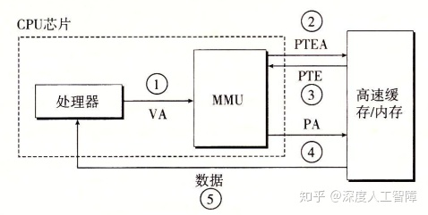

**缺页主要执行以下步骤**，由硬件和操作系统共同完成：

- 前三步相同，当MMU接收到PTE时，发现有效位为0，说明该虚拟页还未缓存在物理页中，就会发起一个缺页异常，由内核来执行缺页异常处理程序。
- 通过内核来确定一个牺牲页，如果该牺牲页中的数据被修改过，就将其复制到对应的磁盘虚拟页中
- 内核将需要的虚拟页保存到对应的物理页中，并修改对应的PTE
- 从缺页异常处理程序返回到导致异常的指令，重新执行该指令，就会执行页面命中的步骤。

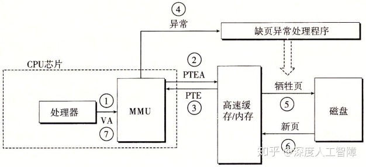

在高速缓存中，为了不同进程能共享相同的物理页且避免相同虚拟页的冲突，这里使用物理寻址。所以MMU负责地址翻译和访问权限检查，然后使用物理内存地址访问高速缓存

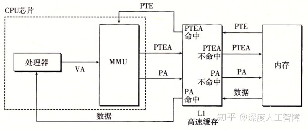

### 3.2 利用TLB加速地址翻译

可以发现，每次CPU将一个虚拟地址发送给MMU时，MMU都会将需要的PTE物理地址发送给高速缓存/内存来获得PTE，如果高速缓存刚好保存了该PTE，则MMU可以很快获得，否则需要等待很多时钟周期从内存中读取。

为了减小这个开销并进一步利用局部性原理，在MMU中引入了一个保存最近使用的PTE缓存，称为**翻译后备缓冲器（Translationi Lookaside Buffer，TLB）**。在TLB中，使用虚拟地址进行寻址，具有较高的相联度，每个高速缓存行保存一个PTE，每次都是以一整个PTE进行读写，不需要含有块偏移，记得我们之前是通过VPN在页表中索引获得PTE，所以虚拟地址的划分为

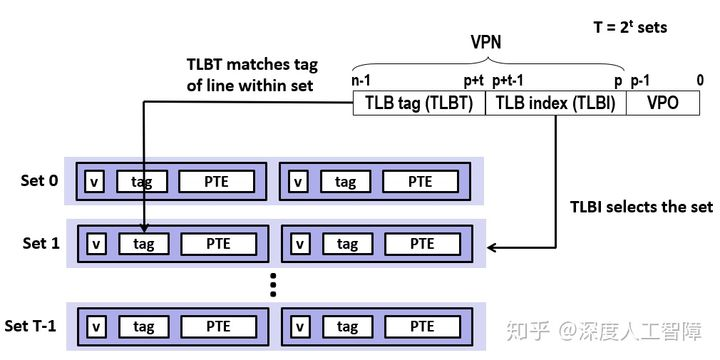

> 这里使用虚拟地址来访问TLB，如果不同进程使用相同虚拟地址访问TLB，不就造成错误了？这里也没使用PTBR来确定使用哪个页表，难道每次进行上下文切换改变进程时，都会将TLB清空，只保存当前进程的PTE来避免冲突？？

所以**当TLB命中时**的步骤为：

- CPU产生一个虚拟地址，发送给MMU
- MMU提取出当前虚拟地址的VPN，发送给TLB
- TLB对VPN进行分解，得到TLBI和TLBT，根据TLBI确定所在的高速缓存组，然后在高速缓存组中依次比较各个高速缓存行的标记是否和TLBT相同，如果相同，则TLB命中，将对应的PPN发送给MMU
- MMU将PPN和VPO拼接起来得到虚拟地址对应的物理地址。然后MMU再将物理地址发送给物理内存
- 物理内存根据物理地址将数据发送给处理器

由于TLB位于MMU中，速度特别快。

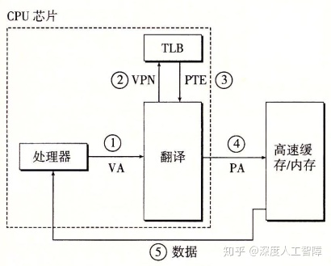

当**TLB不命中时**的步骤为：

- CPU产生一个虚拟地址，发送给MMU
- MMU提取出当前虚拟地址的VPN，发送给TLB
- TLB对VPN进行分解，得到TLBI和TLBT，没有找到有效的PTE，发生TLB不命中
- MMU根据PTBR和VPN得到PTE对应的PTEA，将其发送给高速缓存/内存
- 高速缓存/内存将对应的PTE发送给MMU和TLB
- TLB会根据VPN将PTE保存在合适的位置
- MMU接收到PTE后，将PPN和VPO拼接起来得到虚拟地址对应的物理地址。然后MMU再将物理地址发送给物理内存
- 物理内存根据物理地址将数据发送给处理器

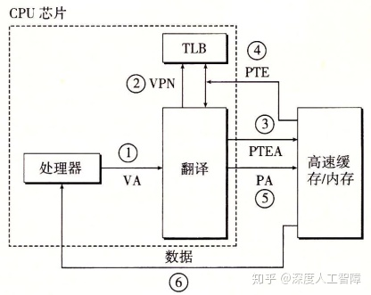

### 3.3 多级页表

在一个32位地址空间中，每个页面大小为4KB，则一共需要 ![[公式]](https://www.zhihu.com/equation?tex=2%5E%7B32%7D%2F2%5E%7B2%2B10%7D%3D2%5E%7B20%7D%3D1M) 个页面，假设每个PTE大小为4字节，则页表总共为4MB。当使用一级页表时，需要始终在内存中保存着4MB大小的页表，我们这里可以使用多级页表来压缩内存中保存的页表内容。

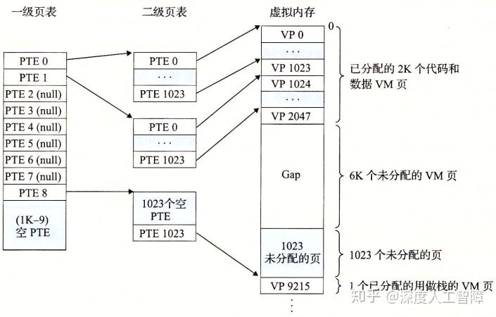

首先，我们这里有1M个虚拟页，将连续的1024个虚拟页当成一个**片（chunk）**，一级页表就负责指向每个片对应的二级页表，则一级页表需要 ![[公式]](https://www.zhihu.com/equation?tex=2%5E%7B20%7D%E9%A1%B5%2F2%5E%7B10%7D%E7%89%87%3D1K) 个PTE，每个PTE4字节，则一共需要4KB大小的一级页表。**注意：**这里只有当片中至少一个页被分配了才会指向对应的二级页表，否则为NULL。而二级页表就类似于我们之前的页表结构，这里只需要负责一个片的虚拟页，则每个二级页表为4KB。

当一级页表的某个PTE为NULL时，表示该片不存在被分配的虚拟页，所以就可以去掉对应的二级页表。并且在内存中只保存一级页表和较常使用的二级页表，极大减小了内存的压力，而其他的二级页表按需创建调入调出。

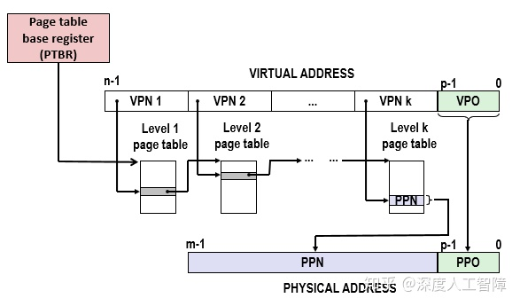

以上是一个k级页表层次结构的地址翻译，前面k-1个页表的PTE都是指向下一级页表的基址，而第k级页表指向的是PPN或磁盘地址。所以每次地址翻译时，MMU需要从内存中访问k个PTE，但是TLB的存在弥补了这个开销。首先，一级页表覆盖了所有的地址空间，所以一定会缓存在TLB中，而二级页表覆盖了大量的地址空间，所以他们也有很大可能会在TLB中，以此类推，只要你程序具有良好的局部性，就有很大概率从TLB中获得想要的PTE，由此弥补了多次访问页表的性能损失。

> TLB应该要将不同层次的PTE独立开来

### 3.5 地址翻译实例

首先我们需要作出以下假设：

1. 内存是按字节寻址的
2. 内存访问是针对1字节的字的
3. 虚拟地址是14位长的
4. 物理地址是12位长的
5. 页面大小是64字节的
6. TLB是四路组相连的，总共有16个条目
7. L1 d-cache是直接映射的，行大小为4字节，总共有16个字节

根据以上假设，我们可以从获取页表、TLB和高速缓存的信息：

- **页表：**当前只使用一级页表，页表大小为64字节，则虚拟页有 ![[公式]](https://www.zhihu.com/equation?tex=2%5E%7B14%7D%2F2%5E6%3D256) 个，则页表具有256个PTE；物理页有 ![[公式]](https://www.zhihu.com/equation?tex=2%5E%7B12%7D%2F2%5E6%3D64) 个。根据地址翻译，可以将虚拟地址和物理地址进行以下划分

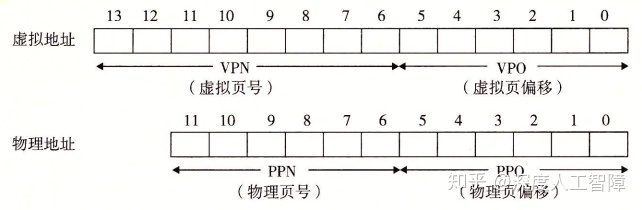

由此可以通过VPN在页表中获得对应的PTE，然后通过VPO获得在虚拟页中的数据，物理地址也同理。

- **TLB：**四路组相连说明每个高速缓存组中具有四个高速缓存行，而TLB是以PTE为单位进行存取的，所以每个高速缓存行能保存一个PTE，而TLB一共能保存16个PTE，说明该缓存具有4个高速缓存组，则需要2位的组索引TLBI。因为TLB是虚拟寻址的，所以是在虚拟地址上进行划分的，且以PTE为单位进行存取，所以是在VPN中进行划分的，低2位为TLBI，则高6位为标志位TLBT

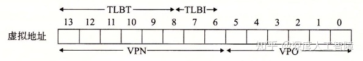

- **高速缓存：**直接映射的高速缓存，说明每个高速缓存组只有一个高速缓存行，行大小为4字节，则需要2位的块偏移（CO），一个有16个组，则需要4位的组索引（CI），其余的为标志位（CT）。由于高速缓存是物理寻址的，所以要在物理地址上进行划分

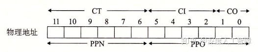

假设当前页表、TLB和高速缓存的内容如下

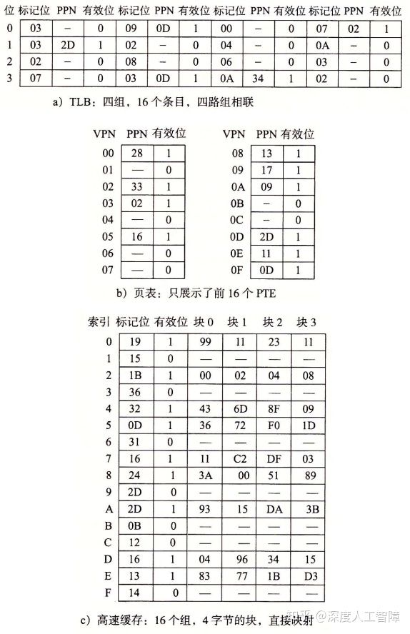

当CPU产生虚拟地址`0x03d4`时，执行步骤为：

- 首先根据虚拟地址，我们可以进行以下划分，MMU会将VPN字段`0x0f`发送给TLB

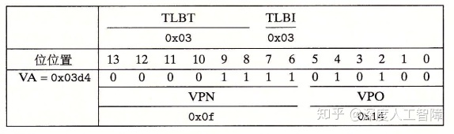

- 当TLB接收到VPN时，会从中划分出TLBT`0x03`和TLBI`0x03`，然后根据TIBI确定在TLB中的高速缓存组，依次将TLBT和标志位进行比较，可以发现第二个高速缓存行具有相同的标志，则TLB命中，会返回对应的PPN`0x0D`给MMU
- MMU将PPN`0x0D`和VPO`0x14`拼接起来，得到物理页对应的物理地址`0x354`
- 根据物理地址，可以进行以下划分，MMU将物理地址发送给高速缓存

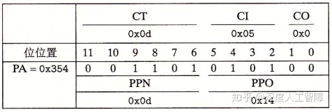

- 高速缓存根据CI确定所在的高速缓存组，并将组内的高速缓存行的标志位依次与CT进行比较，可以发现高速缓存命中了，并根据CO在块内偏移，得到想要的数据`0x36`，将其返回给MMU
- MMU获得数据后，将其返回给CPU

以上是比较简单的情况，即TLB命中和高速缓存命中，其他较复杂的情况需要MMU很多后续的操作。

**大致的步骤为：**

1. 将虚拟地址根据TLB规则进行划分，在TLB中进行检索，如果存在则将PPN返回给MMU，如果不存在，将地址根据页表规则进行划分，得到对应的PTE，将其保存到TLB，并将PPN返回给MMU
2. MMU根据PPN和VPO构建出物理地址，并将物理地址发送给高速缓存
3. 将物理地址根据高速缓存规则进行换分，在高速缓存中检索，如果存在则将数据返回给MMU，如果不存在则需要从内存中进行检索

**综上：**页表和TLB是虚拟寻址的，都是返回对应的PPN；高速缓存是物理寻址的，返回对应的数据。