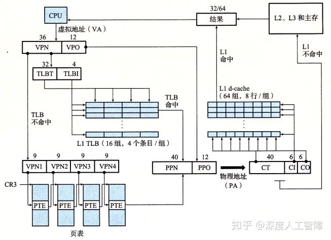
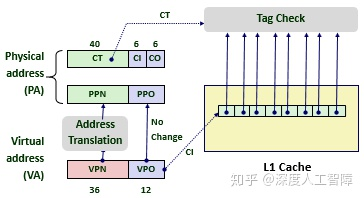
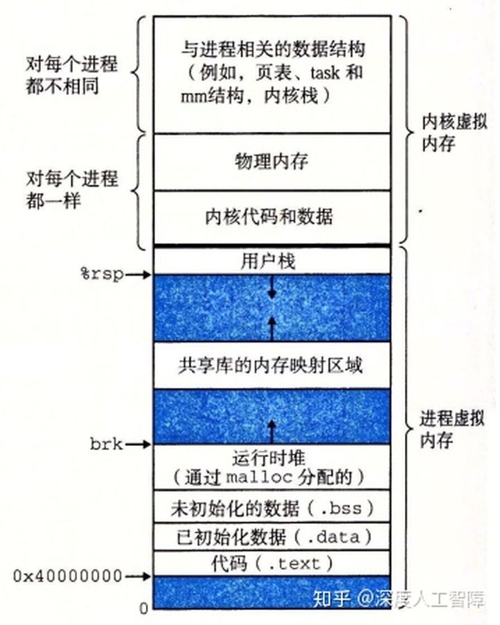
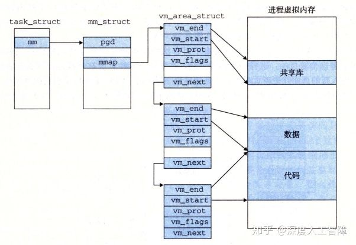
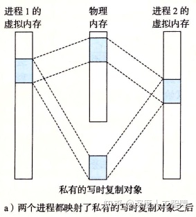
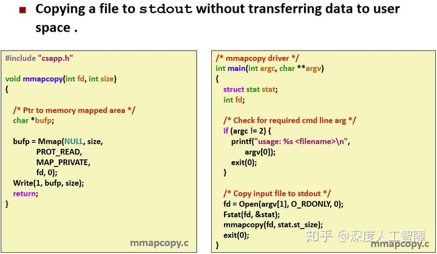

# [读书笔记]CSAPP：21[VB]虚拟内存：系统


 **视频地址：**

[【精校中英字幕】2015 CMU 15-213 CSAPP 深入理解计算机系统 课程视频_哔哩哔哩 (゜-゜)つロ 干杯~-bilibiliwww.bilibili.com/video/BV1iW411d7hd?p=18](https://link.zhihu.com/?target=https%3A//www.bilibili.com/video/BV1iW411d7hd%3Fp%3D18)

**课件地址：**

[http://www.cs.cmu.edu/afs/cs/academic/class/15213-f15/www/lectures/18-vm-systems.pdfwww.cs.cmu.edu/afs/cs/academic/class/15213-f15/www/lectures/18-vm-systems.pdf](https://link.zhihu.com/?target=http%3A//www.cs.cmu.edu/afs/cs/academic/class/15213-f15/www/lectures/18-vm-systems.pdf)

本章对应于书中的9.7-9.8。

------

- 有一系列保存在磁盘中的数据，首先以页为单位将其划分成很多数据块（虚拟页），然后根据每个数据块的特点（比如读写权限）进行组合，得到若干个由若干个数据块组成的段，通过任务结构对这些段进行描述，包括：段的起始虚拟地址、段的终止虚拟地址、段的读写权限等等，由此就确定了段中每个数据块所能用的虚拟地址范围以及读写权写。接下来根据这个约束，对每个数据块分配一个虚拟地址，然后分配一个指向数据块磁盘位置的指针，确定该数据块的读写权限，然后将所有数据块的信息组合起来，就得到了页表。

> 页表是描述每个数据块的，任务结构是描述由数据块组成的段，确定了页表的信息。

- 虚拟内存在磁盘的内容称为交换空间
- 对于私有对象，页设置为只读的，页所在的段设置为私有的写时复制的。则当尝试对页进行写操作时，会触发保护故障，然后根据私有的写时复制进行操作。
- 为了能维护自己的状态，需要将状态所在的段标记为私有写时复制的。当没有对其进行修改时，所有都共享相同的物理页，如果对其修改了，就会新建一个物理页，这样就能保证自己的状态不会被别的进程修改。
- 内存映射仅仅是将虚拟内存和磁盘文件对应起来，并没有拷贝到内存中，只是指定虚拟页的初始值。会按需自动加载虚拟页到物理页中。

------

## 1 Intel Core i7/Linux内存系统

这里通过介绍运行Linux的Intel Core i7来总结虚拟内存的内容。

### 1.1 Intel Core i7

现在的Core i7支持48位虚拟地址空间和52位物理地址空间，还兼容32位虚拟和物理地址空间。


如上图所示是一个**处理器封装（Processor Package）**，其中有一组基于QuickPath技术的点对点链路，为了让一个核与其他核和外部I/O桥直接通信。

- **高速缓存：**具有3层高速缓存层次结构，其中L3是所有核共享的高速缓存，其中数据块大小为64字节，所以高速缓存具有以下性质。其中，数据块为64字节，则需要6位的块偏移，L1 d-cache有64组，则需要6位的组索引，其余的为标志位。


- **页表：**这里采用4级页表结构，页大小为4KB，说明需要12位的VPO，而虚拟地址为48位，所以VPN为36位，则每一级的VPN为9位。每个进程有自己私有的页表层次结构，并且存在CR3控制寄存器指向第一级页表的起始位置，其中CR3是每个进程上下文的一部分，每次进行上下文切换时，都会被恢复。页表的PTE格式如下所示


其中每个PTE为8字节，而每一级的VPN为9位，则每个PTE引用了一个 ![[公式]](https://www.zhihu.com/equation?tex=2%5E9%2A2%5E3%3D4KB) 的子页表，这里就要求物理页4KB对齐。由于物理地址为52位，PPO为12位，则PPN为40位，所以这里的页表物理基地址为40位。这里增加了3个权限位来控制对页的访问：`R/W`、`U/S`和`XD`，其中`XD`是64位系统引入的，限制了只能在只读代码段执行，降低了缓冲区溢出攻击的风险。此外，当MMU访问一个页时，会设置**引用位（Reference Bit）**A位，让内核实现页替换算法，当MMU修改一个页时，会设置**脏位（Dirty Bit）**D位，使得内核对牺牲页进行写回。以下是Core i7的页表翻译


- **TLB：**这里TLB也采用层次结构，并且为数据和指令分别使用两个一级TLB。其中，L1 d-TLB有4路64个PTE，则一共有16个组，需要4位TLBI；L1 i-TLB有4路128个PTE，一共有32组，需要5位TLBI；L2 TLB有4路512个PTE，一共有128个组，需要7位TLBI。

- - 这里之所以使用L2 TLB而不是扩大L1 TLB，是因为如果舍弃L2 TLB而增大L1 TLB，仍然可能出现工作集大于缓存的情况，就会出现容量不命中，通过增加L2 TLB来减少不命中惩罚。

下面是Core i7地址翻译的整体架构（省略了i-cache、i-TLB和L2统一TLB）



这里可以发现一个**特点：**高速缓存的CI+CO=12位，而VPO也是12位。这不是巧合，而是故意这样设计来加速地址翻译。我们知道，VPO=PPO，而PPN需要通过地址翻译获得，则一开始输入虚拟地址时，就能一下等到PPO，然后等待检索PPN。此时我们就能直接将PPO输入到高速缓存中，因为PPO确定了对应的高速缓存组和块偏移量，就能先通过PPO获得对应的高速缓存组，然后只要等检索到PPN时，就能直接和高速缓存组中每一行的标志位进行比较，极大加速了地址翻译过程。



### 1.2 Linux虚拟内存系统

Linux为每个进程都维护了一个单独的虚拟地址空间，如下所示



可以发现内核将一组连续的虚拟页（大小等于DRAM总量）映射到一组相应的连续物理页上，这样内核可以在这个虚拟内存上进行读写，实际上就是对物理内存进行读写，这为内核提供一种便利的方法来访问物理内存。这部分内容对所有进程都是一样的。

此外， 与进程相关的一些信息被保存在内核虚拟内存中，并且Linux将虚拟内存组织成段集合的形式，比如代码段、数据段、共享库段以及用户栈，这些段就是已分配的连续虚拟页。每个已分配的虚拟页都保存在某个段中。通过这种组织成段的形式，可以使得虚拟地址存在间隙。这是通过内核为系统中每个进程维护一个单独的`task_struct`实现的（在最上面那块中），该结构中包含或指向内核运行该进程所需的所有信息，其中有一条指向描述虚拟内存当前状态的结构`mm_struct`，其中包含的`pgd`就是指向一级页表的起始地址，当进程被调度时，就会将`pdg`条目拷贝到CR3中，通过这种形式来改变虚拟地址空间；`mmap`指向一个链表结构的头结点，其中每个节点`vm_area_struct`就描述了虚拟内存中的一个段，其中包含：

- `vm_end`段结束的虚拟地址；
- `vm_start`段开始的虚拟地址；
- `vm_prot`段中所有页的读写权限；
- `vm_flags`描述当前段中的虚拟页是否与其他进程共享，如果是共享的，则称为**共享段**，否则称为**私有段**；
- `vm_next`下一个段的节点。

由此，就能通过将输入虚拟地址与各个节点的起始地址和终止地址进行比较，判断虚拟地址所在的段。




该任务结构的存在，使得缺页异常处理多了虚拟地址的判断。当MMU翻译虚拟地址A时，由于还未将对应的虚拟页缓存到物理页中，所以触发了缺页异常，随后执行缺页异常处理程序，包含以下步骤：

- **判断虚拟地址A是否合法：**虚拟地址是否合法，主要看它是否存在某个段中。处理程序会将虚拟地址A与链表中的所有节点中的`vm_start`和`vm_end`进行比较，判断虚拟地址A所处的段，如果不存在任一段中，则会触发段错误，终止进程。
- **判断对虚拟地址A的访问是否合法：**当虚拟地址A处在某个段中时，可以通过`vm_prot`确定该段的读写许可，然后与我们所需要的操作进行对比，如果操作违背了许可，则会触发保护异常，终止进程，Linux也将其报告为段错误。
- 如果以上两个步骤都是合法的，则执行正常的缺页处理。处理程序会选择一个物理牺牲页，如果牺牲页被修改了，则进行写回，然后将虚拟地址A对应的虚拟页写入对应的物理页中，修改对应的页表，然后从处理程序返回。

**注意：**

- 缺页异常时才会检查虚拟地址是否合法
- task_struct是比页表更大的结构，该task_struct是以段为单位来组织虚拟地址，其中包含了许多虚拟页，而页表是以虚拟页为单位来组织虚拟地址，所以需要先从task_struct开始。

## 2 内存映射

如果虚拟内存系统可以集成到传统的文件系统中，就能提供一种简单而高效的方法把程序和数据加载到内存中。这里通过**内存映射（Memory Mapping）**将一个虚拟内存段与一个磁盘上的**对象（Object）**关联起来，来初始化虚拟内存段的内容，所以当我们第一次引用某个段时，它的初始值来自于磁盘上的普通文件，然后通过按需页面调度，将需要的虚拟内存段加载到物理内存中。

> 主要说明如何将虚拟内存段和磁盘内容关联起来。
> 每个段包含的虚拟页都和磁盘文件中的某些部分关联起来，并且虚拟页的初始内容都来自于磁盘文件。

内存映射可以用两种磁盘上的对象来初始化虚拟内存段：

- **Linux文件系统中的普通文件：**比如一个可执行目标文件，将其分成页大小的数据块，用来初始化对应的虚拟内存段，如果段比文件大，则用0来填充剩下的内容。然后按需将虚拟页复制到物理页中。
- **匿名文件：**内核可以创建大小任意的全是二进制0的匿名文件，该文件其实并不存在。当我们想要创建一个全为0的页，可以将虚拟页和匿名文件关联起来，当内核引用该虚拟页时，会直接覆盖牺牲页的内容，得到全为0的页，然后修改对应的页表内容。这个过程磁盘和内存之间没有实际的数据传送。

> 匿名文件主要用于创建全为0的页。

这些与虚拟内存段关联的磁盘内容处于**交换空间（Swap Space）**中（即虚拟内存在磁盘空间上的内容就是在交换空间中，也就是说交换空间保存了映射到虚拟内存中的磁盘数据，则交换空间大小其实就是虚拟内存大小，**不确定？**），则交换空间限制了当前运行着的进程能够分配的虚拟页总数（虚拟内存大小确定了，虚拟页大小也确定了，则页数目也就确定了）。

> 交换空间是所有进程的虚拟内存可用的总空间**（不确定？）**

内存映射概念的存在，使得我们可以重新回去看共享对象和私有对象、`fork`函数和`execve`函数。

### 2.1 共享对象

如上所述，虚拟内存段中通过`vm_prot`确定该虚拟内存段中的虚拟页是否在进程之间共享，如果共享，则称该段为**共享段**，则各个进程在该段中的操作是互相可见的，且变化也会反映在磁盘上；如果不共享，则称该段为**私有段**，则各个进程在该段中的操作是互相不可见的，也不会反映到磁盘上。

在进程1中，当我们将磁盘上的一个对象通过内存映射与该进程的一个共享段关联起来时，就会使得虚拟页对应的PTE指向该对象，当引用该对象时，就会将对应的虚拟页加载到物理页中；而进程2也要将该对象与自己的一个共享段关联起来时，当对其引用时，由于每个对象都有一个唯一的文件名，所以内核可以发现进程1将该对象加载的物理页，就直接在进程2中将对应的PTE指向相同的物理页就行了。

**注意：**

- 进程1和进程2 的虚拟地址空间是不同的
- 即使一个对象与多个进程的共享段关联，物理内存中始终只有该对象的一个副本。


### 2.2 私有对象

在进程1中，当我们将磁盘上的一个对象通过内存映射与该进程的一个私有段关联起来时，就会使得虚拟页对应的PTE指向该对象，当引用该对象时，就会将对应的虚拟页加载到物理页中；当进程2也要将该对象与自己的一个私有段关联起来时，当对其引用时，也会直接在进程2中将对应的PTE指向相同的物理页，即当未对私有对象进行修改时，物理内存中只会保存同一个对象副本，且各个进程中对该对象的PTE都是只读的，而虚拟内存段被标记为**私有写时复制的（Private Copy-On-Write）**。



但是假设进程2对该私有对象进行修改时，会触发保护故障，处理程序就会在物理内存中创建一个该物理页的副本，然后让进程2对该对象的PTE指向新的副本，并设置该虚拟页具有写权限，然后处理程序返回，从写指令重新运行。


> 图中大块的表示对象，可能由很多个页组成，当我们尝试对其中一个页进行修改时，只会对该页进行复制，并修改该页对应的PTE，而该对象的其他页保持不变。

**问题：**当虚拟页的读写权限修改后，与所在段的读写权限冲突时，是否要修改虚拟页所在的段？即上图进程2深色和浅色的页是处在不用段中？还是说段的读写权限是用来初始化其中包含的虚拟页的读写权限，但是虚拟页的读写权限可以自己修改？

通过写时复制这种策略，尽可能延迟物理内存中的拷贝，能最大效率地使用物理内存。

> 当只对虚拟空间进行读操作，则永远不会复制，而是共享相同的物理内存。

### 2.3 `fork`函数

在父进程中调用`fork`函数时，会创建一个具有相似但独立虚拟地址空间的子进程，并分配一个唯一的PID，而写时复制技术会给`fork`函数提供一个高效的解决方案：

- 为了具有和父进程相同的**虚拟内存状态**，内核会复制父进程的`mm_struct`
- 为了具有和父进程相同的**虚拟内存段分配**，内核会复制父进程的`vm_area_struct`
- 为了子进程和父进程具有相同的**虚拟内存内容**，内核会复制父进程的页表，就能将相同的磁盘内容映射到相同的虚拟页中，并将虚拟页缓存在相同的物理页中。
- 为了子进程和父进程的虚拟地址空间能**相互独立**，两个进程的页都设置为只读的，且段都标记为私有的写回复制。当父子进程都没有对页进行修改时，父子进程是共享相同的物理内存的，当其中一个进程对页进行修改时，就会对该页进行写回复制，并为该页赋予写权限，并更新进程对应的页表。

### 2.4 `execve`函数

当我们运行`execve("a.out", NULL, NULL)`执行可执行目标文件`a.out`时，包含以下步骤：

- **删除用户段：**将进程的虚拟地址空间中的用户段删除，即删除`vm_area_struct`和页表。

- **映射私有段：**首先为可执行目标文件中的不同数据节创建对应的段，即在`vm_area_struct`中新建节点，并设置对应的段起始虚拟地址、段终止虚拟地址，设置这些段为私有写回复制的。然后将这些段通过内存映射与`a.out`中的内容关联起来。（对私有对象的读写参考2.2）

- - 对于需要初始化为0的段，可将其与匿名文件进行关联。

- **映射共享段：**对于共享库的内容，会将其映射到共享库的内存映射段中，即在`vm_area_struct`中创建一个共享段，然后将其与共享库的内容关联起来，这样就能在多个进程中共享相同的共享库。（对共享对象的读写参考2.1）

- - 如果共享库有维护状态的静态变量，比如随机生成器在调用时会维持状态，且不同的进程的状态不同，对于这种要修改静态数据的函数，应该将该段标记为私有写时复制的，这样就能在不同进程中维护自己独立的状态。


- 设置程序计数器，使其指向代码段的入口点。

> 通过将对象映射到不同的段中，就能决定对该对象进行读写时的特点。

**注意：**当程序运行时，我们并没有加载任何内容到内存中，所做的只是设置内存映射，在内核中创建数据结构，由此创建了虚拟地址空间和这些对象之间的映射关系，而实际的拷贝工作会由缺页异常按需完成。

### 2.5 通过`mmap`函数自定义内存映射

用户通过`mmap`函数能自己创建虚拟内存段，并将对象映射到该段中，由此我们可以通过修改该段的参数，来达到对对象的设置。比如设置该虚拟内存段是全部进程共享的，则映射到该段的对象就能在所有进程中共享。

```c
#include <unistd.h>
#include <sys/mman.h>
void *mmap(void *start, size_t length, int port, int flags, int fd, off_t offset);
```

文件描述符`fd`指定一个磁盘文件，该函数会将磁盘文件中偏移`offset`处的`length`个字节的对象映射到虚拟内存中的`start`处。`start`指定的段如果是有效的，则内核会将其映射到指定段，如果指定段的部分虚拟地址空间被某个已存在的段包含了，则内核会另外找一个有效的位置，`start`可以设置为NULL，让内核自动分配。


其中，`prot`对应于段结构中的`vm_prot`参数，用来确定该虚拟内存段的读写权限：`PROT_EXEC`表示该段中的页是可执行的；`PROT_READ`表示该段中的页是可读的；`PROT_WRITE`表示该段中的页是可写的；`PROT_NONE`表示该段内的页是不可访问的。

`flags`对应于段结构中的`vm_flags`：`MAP_PRIVATE`表示该段是私有的写时复制的；`MAP_SHARED`表示该段是共享的。也可以设置`MAP_ANON`，表示是一个匿名对象。

当函数执行成功时，会返回指向该段的指针，如果失败，则返回`MAP_FAILED`。

可以通过以下函数来删除虚拟内存中的段：

```c
#include <unistd.h>
#include <sys/mman.h>
int munmap(void *start, size_t length); 
```

使用自定义内存映射的**好处在于：**

- 使得磁盘文件中的一块数据能与虚拟内存地址空间中的某个段建立映射关系，此时我们就能直接通过对该虚拟内存段的访问来间接访问磁盘文件内容，不必执行文件I/O操作，也无需对文件内容进行缓存处理。并且虚拟内存进行按序页面调度的，当你访问了文件内容，它就会将对应的虚拟页加载到物理页中，此时就能从内存中很快地访问文件内容。当你处理大文件或频繁读写文件时能提速，因为此时就直接将文件内容加载到物理内存中了，一切读写操作都是在物理内存中进行的，速度特别快，只有在内核将其牺牲时，才会进行写回。
- 通过内存映射方法，我们还能定义一个进程共享的虚拟内存段，使得能让多个进程对一个区域进行访问和修改。




编辑于 2020-04-05