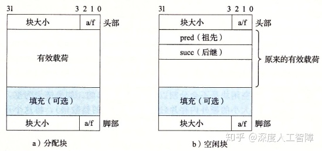
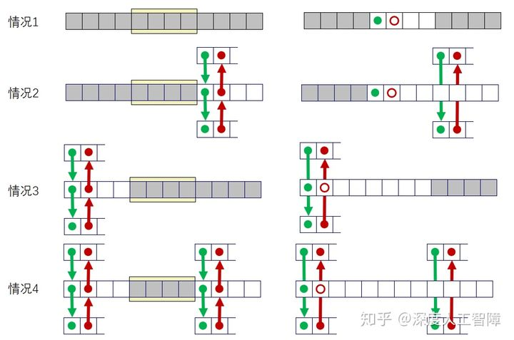

# [读书笔记]CSAPP：MallocLab


 **README：**[http://csapp.cs.cmu.edu/3e/README-malloclab](https://link.zhihu.com/?target=http%3A//csapp.cs.cmu.edu/3e/README-malloclab)

**说明：**[http://csapp.cs.cmu.edu/3e/malloclab.pdf](https://link.zhihu.com/?target=http%3A//csapp.cs.cmu.edu/3e/malloclab.pdf)

**代码：**[http://csapp.cs.cmu.edu/3e/malloclab-handout.tar](https://link.zhihu.com/?target=http%3A//csapp.cs.cmu.edu/3e/malloclab-handout.tar)

**复习：**[http://www.cs.cmu.edu/afs/cs/academic/class/15213-f15/www/recitations/rec11.pdf](https://link.zhihu.com/?target=http%3A//www.cs.cmu.edu/afs/cs/academic/class/15213-f15/www/recitations/rec11.pdf)

该作业编译成32位程序，我使用的是Windows的WSL子操作系统，不支持32位的程序，可参考[这里](https://link.zhihu.com/?target=https%3A//www.jianshu.com/p/3df082840b40)来修改。

------

做了两天，一直遇到段错误，好难debug，但是做出了一点结果，不追求满分了，就加强对动态分配器的理解吧。

该实验主要是让我们实现一个动态分配器，实现`mm_init`、`mm_malloc`、`mm_free`和`mm_realloc`函数。然后提供了两个简单的验证文件`short1-bal.rep`和`short2-bal.rep`来测试我们算法的内存利用率和吞吐量。我们可以调用`./mdriver -f short1-bal.rep -V`来查看单个文件的测试结果。然后github上有人上传了该课程的其他测试数据，可以从[这里](https://link.zhihu.com/?target=https%3A//github.com/Ethan-Yan27/CSAPP-Labs/tree/master/yzf-malloclab-handout/traces)下载，得到一个`trace`文件夹，然后调用`./mdriver -t ./trace -V`来查看测试结果。

## 隐式空闲链表

首先，我们使用带有脚部的块的数据结构，如下所示。并且设置指向块的指针`bp`是指向有效载荷的，这样就能通过`bp`直接访问块中的有效载荷。


基于此，我们可以确定一些宏

```c
//字大小和双字大小
#define WSIZE 4
#define DSIZE 8
//当堆内存不够时，向内核申请的堆空间
#define CHUNKSIZE (1<<12)
//将val放入p开始的4字节中
#define PUT(p,val) (*(unsigned int*)(p) = (val))
//获得头部和脚部的编码
#define PACK(size, alloc) ((size) | (alloc))
//从头部或脚部获得块大小和已分配位
#define GET_SIZE(p) (*(unsigned int*)(p) & ~0x7)
#define GET_ALLO(p) (*(unsigned int*)(p) & 0x1)
//获得块的头部和脚部
#define HDRP(bp) ((char*)(bp) - WSIZE)
#define FTRP(bp) ((char*)(bp) + GET_SIZE(HDRP(bp)) - DSIZE)
//获得上一个块和下一个块
#define NEXT_BLKP(bp) ((char*)(bp) + GET_SIZE(HDRP(bp)))
#define PREV_BLKP(bp) ((char*)(bp) - GET_SIZE((char*)(bp) - DSIZE))

#define MAX(x,y) ((x)>(y)?(x):(y))
```

**注意：**我们传入的`bp`指针可能是`void *`类型的，如果对`bp`进行计算时，要将其强制类型转换为`char *`，这样加减的值就是字节数目。

```c
//指向隐式空闲链表的序言块的有效载荷
static char *heap_listp;
/* 
 * mm_init - initialize the malloc package.
 */
int mm_init(void){
	if((heap_listp = mem_sbrk(4*WSIZE)) == (void*)-1)	//申请4字空间
		return -1;
	PUT(heap_listp, 0);	//填充块
	PUT(heap_listp+1*WSIZE, PACK(DSIZE, 1));	//序言块头部
	PUT(heap_listp+2*WSIZE, PACK(DSIZE, 1));	//序言块脚部
	PUT(heap_listp+3*WSIZE, PACK(0, 1));		//结尾块
	
	heap_listp += DSIZE;	//指向序言块有效载荷的指针
	
	if(expend_heap(CHUNKSIZE/WSIZE) == NULL)	//申请更多的堆空间
		return -1;
	return 0;
}
```

该部分是用来创建初始隐式空闲链表的，我们的隐式空闲链表具有以下结构


首先需要一个包含头部和脚部的已分配序言块，永远不会被释放，大小为8字节，作为隐式空闲链表的开头。后续就是一些我们普通的块，包含已分配块和空闲块，最后是一个块大小为0的已分配结尾块，只包含头部，大小为4字节，作为隐式空闲链表的结尾，为什么结尾块是这么设置的，后面会看到原因。

现在普通块1加上序言块和自己的头部就有3个字，为了保证块的有效载荷都是双字对齐的，就在堆的起始位置填充一个字的块。

然后我们令一个指针`heap_listp`指向序言块的有效载荷部分，作为隐式空闲链表的起始指针。然后当前隐式空闲链表还没有可以装其他数据的部分，所以调用`expend_heap`来申请更多的堆空间，这里一次申请固定大小的空间，由`CHUNKSIZE`定义。

```c
static void *expend_heap(size_t words){
	size_t size;
	void *bp;
	
	size = words%2 ? (words+1)*WSIZE : words*WSIZE;	//对大小双字对对齐
	if((bp = mem_sbrk(size)) == (void*)-1)	//申请空间
		return NULL;
	
	PUT(HDRP(bp), PACK(size, 0));	//设置头部
	PUT(FTRP(bp), PACK(size, 0));	//设置脚部
	PUT(HDRP(NEXT_BLKP(bp)), PACK(0, 1));	//设置新的结尾块
	
	//立即合并
	return imme_coalesce(bp);
	//return bp;
}
```

该函数传入字数目，首先要保证字数目是双字对齐的，然后申请对应的堆空间。接下来就将申请的堆空间作为一个空闲块，设置头部和脚部。需要注意，此时的`bp`指针和隐式空闲链表的关系如下所示


此时我们调用`PUT(HDRP(bp),PACK(size,0));`来设置新空闲块的头部，可以发现是将之前的结尾块作为当前空闲块的头部，而`PUT(HDRP(NEXT_BLKP(bp)),PACK(0,1));`是将最终结尾的一个字作为结尾块。这样就充分利用了原来的结尾块空间。

此时该空闲块的前面可能也为空闲块，所以可以调用`imme_coalesce(bp)`进行立即合并。

```c
static void *imme_coalesce(void *bp){
	size_t prev_alloc = GET_ALLO(FTRP(PREV_BLKP(bp)));	//获得前面块的已分配位
	size_t next_alloc = GET_ALLO(HDRP(NEXT_BLKP(bp)));	//获得后面块的已分配位
	size_t size = GET_SIZE(HDRP(bp));	//获得当前块的大小
	
	if(prev_alloc && next_alloc){
		return bp;
	}else if(prev_alloc && !next_alloc){
		size += GET_SIZE(HDRP(NEXT_BLKP(bp)));
		PUT(HDRP(bp), PACK(size, 0));
		PUT(FTRP(bp), PACK(size, 0));
	}else if(!prev_alloc && next_alloc){
		size += GET_SIZE(FTRP(PREV_BLKP(bp)));
		PUT(HDRP(PREV_BLKP(bp)), PACK(size, 0));
		PUT(FTRP(bp), PACK(size, 0));
		bp = PREV_BLKP(bp);
	}else{
		size += GET_SIZE(HDRP(NEXT_BLKP(bp))) +
				GET_SIZE(FTRP(PREV_BLKP(bp)));
		PUT(HDRP(PREV_BLKP(bp)), PACK(size, 0));
		PUT(FTRP(NEXT_BLKP(bp)), PACK(size, 0));
		bp = PREV_BLKP(bp);
	}
	return bp;
}
```

该函数会根据`bp`前面一块和后面一块的已分配位的不同情况，来决定如何进行合并， 如下所示


其实我们这里只需要修改对应块的头部和脚部中的块大小字段就可以了，然后根据需要修改`bp`使它指向合并后的空闲块。

接下来就能看看我们的`mm_malloc`函数了

```c
 void *mm_malloc(size_t size){
	size_t asize;
	void *bp;
	
	if(size == 0)
		return NULL;
	//满足最小块要求和对齐要求，size是有效负载大小
	asize = size<=DSIZE ? 2*DSIZE : DSIZE * ((size + (DSIZE) + (DSIZE-1)) / DSIZE);
	//首次匹配
	if((bp = first_fit(asize)) != NULL){
		place(bp, asize);
		return bp;
	}
	//最佳匹配
	/*if((bp = best_fit(asize)) != NULL){
		place(bp, asize);
		return bp;
	}*/
	//推迟合并
	//delay_coalesce();
	//最佳匹配
	/*if((bp = best_fit(asize)) != NULL){
		place(bp, asize);
		return bp;
	}*/
	//首次匹配
	/*if((bp = first_fit(asize)) != NULL){
		place(bp, asize);
		return bp;
	}*/
	if((bp = expend_heap(MAX(CHUNKSIZE, asize)/WSIZE)) == NULL)
		return NULL;
	place(bp, asize);
	return bp;
}
```

首先，`mm_malloc`传进来的大小参数`size`是指块的有效载荷，当我们对空闲块进行搜索时，空闲块的大小包括了头部、有效载荷和脚部，所以我们需要将`size`加上这两部分的大小且进行双字对齐，得到进行比较的大小`asize`。然后我们就可以使用`asize`来搜索合适的空闲块，这里有两个策略：首次适配和最佳适配。并且如果我们采用延迟合并空闲块的话，如果找不到合适的空闲块，就要进行延迟合并，然后再找一次，如果还是找不到，则说明没有足够的堆空间，此时要再申请堆空间，然后将我们想要的空间大小放入空闲块中。

首先看首次适配

```c
static void *first_fit(size_t asize){
	void *bp = heap_listp;
	size_t size;
	while((size = GET_SIZE(HDRP(bp))) != 0){	//遍历全部块
		if(size >= asize && !GET_ALLO(HDRP(bp)))	//寻找大小大于asize的空闲块
			return bp;
		bp = NEXT_BLKP(bp);
	}
	return NULL;
} 
```

将隐式空闲链表的结尾块作为结尾，依次判断链表中的块，如果有大小大于`asize`的空闲块，就直接返回。

我们也可以看看最佳适配

```c
static void *best_fit(size_t asize){
	void *bp = heap_listp;
	size_t size;
	void *best = NULL;
	size_t min_size = 0;
	
	while((size = GET_SIZE(HDRP(bp))) != 0){
		if(size >= asize && !GET_ALLO(HDRP(bp)) && (min_size == 0 || min_size>size)){	//记录最小的合适的空闲块
			min_size = size;
			best = bp;
		}
		bp = NEXT_BLKP(bp);
	}
	return best;
} 
```

它将搜索最小的合适的空闲块，这样就能减少碎片的产生，提高内存利用率。

当找到合适的空闲块时，我们就需要将我们需要的空间放入空闲块中

```c
static void place(void *bp, size_t asize){
	size_t remain_size;
	remain_size = GET_SIZE(HDRP(bp)) - asize;	//计算空闲块去掉asize后的剩余空间
	if(remain_size >= DSIZE){	//如果剩余空间满足最小块大小，就将其作为一个新的空闲块
		PUT(HDRP(bp), PACK(asize, 1));
		PUT(FTRP(bp), PACK(asize, 1));
		PUT(HDRP(NEXT_BLKP(bp)), PACK(remain_size, 0));
		PUT(FTRP(NEXT_BLKP(bp)), PACK(remain_size, 0));
	}else{
		PUT(HDRP(bp), PACK(GET_SIZE(HDRP(bp)), 1));
		PUT(FTRP(bp), PACK(GET_SIZE(HDRP(bp)), 1));
	}
}
```

首先，我们需要计算空闲块去掉`asize`后的剩余空间，如果剩余空间还能填充头部和脚部构成一个新的空闲块，则对该空闲块进行分割，否则就使用整个空闲块，设置块的已分配位。

然后可以看看延迟合并的代码

```c
static void *delay_coalesce(){
	void *bp = heap_listp;
	while(GET_SIZE(HDRP(bp)) != 0){
		if(!GET_ALLO(HDRP(bp)))
			bp = imme_coalesce(bp);
		bp = NEXT_BLKP(bp);
	}
}
```

遍历空闲链表的所有块，如果是空闲块，就将其和周围进行合并。

接下来可以看看我们的`mm_free`

```c
/*
 * mm_free - Freeing a block does nothing.
 */
void mm_free(void *ptr){
	size_t size = GET_SIZE(HDRP(ptr));
	PUT(HDRP(ptr), PACK(size, 0));
	PUT(FTRP(ptr), PACK(size, 0));
	
	//立即合并
	imme_coalesce(ptr);
} 
```

我们首先设置块的已分配位，将其设置为空闲状态，然后对其立即合并就行。

最终是我们的`mm_realloc`

```c
 /*
 * mm_realloc - Implemented simply in terms of mm_malloc and mm_free
 */
void *mm_realloc(void *ptr, size_t size){
	size_t asize, ptr_size;
	void *new_bp;
	
	if(ptr == NULL)
		return mm_malloc(size);
	if(size == 0){
		mm_free(ptr);
		return NULL;
	}
	
	asize = size<=DSIZE ? 2*DSIZE : DSIZE * ((size + (DSIZE) + (DSIZE-1)) / DSIZE);
	new_bp = imme_coalesce(ptr);	//尝试是否有空闲的
	ptr_size = GET_SIZE(HDRP(new_bp));
	PUT(HDRP(new_bp), PACK(ptr_size, 1));
	PUT(FTRP(new_bp), PACK(ptr_size, 1));
	if(new_bp != ptr)	//如果合并了前面的空闲块，就将原本的内容前移
		memcpy(new_bp, ptr, GET_SIZE(HDRP(ptr)) - DSIZE);
	
	if(ptr_size == asize)
		return new_bp;
	else if(ptr_size > asize){
		place(new_bp, asize);
		return new_bp;
	}else{
		ptr = mm_malloc(asize);
		if(ptr == NULL)
			return NULL;
		memcpy(ptr, new_bp, ptr_size - DSIZE);
		mm_free(new_bp);
		return ptr;
	}
}
```

首先，如果`ptr`为NULL，则直接分配`size`大小的空间，如果`size`为0，则直接释放`ptr`指向的空间。否则就需要执行`mm_realloc`。 当我们执行`mm_realloc`时，`ptr`指向的是已分配块，它的周围可能有空闲块，而加上空闲块后，可能就会满足`asize`的大小要求了，所以我们可以先尝试将`ptr`和周围的空闲块进行合并。

然后下面是实验结果

**首次适配+立即合并：**

```text
Results for mm malloc:
trace  valid  util     ops      secs  Kops
 0       yes   99%    5694  0.014197   401
 1       yes   99%    5848  0.013547   432
 2       yes   99%    6648  0.021787   305
 3       yes  100%    5380  0.016372   329
 4       yes   66%   14400  0.001061 13570
 5       yes   92%    4800  0.014609   329
 6       yes   92%    4800  0.013454   357
 7       yes   55%   12000  0.203199    59
 8       yes   51%   24000  0.572411    42
 9       yes   44%   14401  0.152757    94
10       yes   45%   14401  0.029385   490
Total          77%  112372  1.052780   107

Perf index = 46 (util) + 7 (thru) = 53/100
```

**首次匹配+延迟合并：**

```text
Results for mm malloc:
trace  valid  util     ops      secs  Kops
 0       yes   99%    5694  0.033440   170
 1       yes   99%    5848  0.028946   202
 2       yes   99%    6648  0.062765   106
 3       yes   99%    5380  0.056375    95
 4       yes   66%   14400  0.001050 13721
 5       yes   92%    4800  0.029646   162
 6       yes   90%    4800  0.027486   175
 7       yes   60%   12000  0.214382    56
 8       yes   53%   24000  0.584505    41
 9       yes   35%   14401  0.813350    18
10       yes   45%   14401  0.019537   737
Total          76%  112372  1.871480    60

Perf index = 46 (util) + 4 (thru) = 50/100
```

**最佳匹配+立即合并：**

```text
Results for mm malloc:
trace  valid  util     ops      secs  Kops
 0       yes   99%    5694  0.015399   370
 1       yes   99%    5848  0.014503   403
 2       yes   99%    6648  0.023172   287
 3       yes  100%    5380  0.017809   302
 4       yes   66%   14400  0.001038 13878
 5       yes   96%    4800  0.030279   159
 6       yes   95%    4800  0.028814   167
 7       yes   55%   12000  0.201558    60
 8       yes   51%   24000  0.601187    40
 9       yes   40%   14401  0.003348  4302
10       yes   45%   14401  0.002100  6856
Total          77%  112372  0.939206   120

Perf index = 46 (util) + 8 (thru) = 54/100
```

**最佳匹配+延迟合并：**

```text
Results for mm malloc:
trace  valid  util     ops      secs  Kops
 0       yes   99%    5694  0.038064   150
 1       yes   99%    5848  0.036293   161
 2       yes   99%    6648  0.073700    90
 3       yes   99%    5380  0.072891    74
 4       yes   66%   14400  0.001064 13535
 5       yes   95%    4800  0.048523    99
 6       yes   94%    4800  0.046162   104
 7       yes   60%   12000  0.223058    54
 8       yes   53%   24000  0.592458    41
 9       yes   65%   14401  0.004285  3361
10       yes   76%   14401  0.001220 11800
Total          82%  112372  1.137718    99

Perf index = 49 (util) + 7 (thru) = 56/100
```

## 分离的空闲链表

对于分离的空闲链表，需要首先确定块的数据结构



这里空闲块在第二字和第三字记录了空闲块的前驱和后继的空闲块，由此通过指针的方式将所有空闲块显示链接起来，就能通过该指针直接遍历所有的空闲块了。

我们定义以下的宏

```c
//字大小和双字大小
#define WSIZE 4
#define DSIZE 8
//当堆内存不够时，向内核申请的堆空间
#define CHUNKSIZE (1<<12)
//将val放入p开始的4字节中
#define PUT(p,val) (*(unsigned int*)(p) = (val))
#define GET(p) (*(unsigned int*)(p))
//获得头部和脚部的编码
#define PACK(size, alloc) ((size) | (alloc))
//从头部或脚部获得块大小和已分配位
#define GET_SIZE(p) (GET(p) & ~0x7)
#define GET_ALLO(p) (GET(p) & 0x1)
//获得块的头部和脚部
#define HDRP(bp) ((char*)(bp) - WSIZE)
#define FTRP(bp) ((char*)(bp) + GET_SIZE(HDRP(bp)) - DSIZE)
//获得上一个块和下一个块
#define NEXT_BLKP(bp) ((char*)(bp) + GET_SIZE(HDRP(bp)))
#define PREV_BLKP(bp) ((char*)(bp) - GET_SIZE((char*)(bp) - DSIZE))

//获得块中记录后继和前驱的地址
#define PRED(bp) ((char*)(bp) + WSIZE)
#define SUCC(bp) ((char*)bp)
//获得块的后继和前驱的地址
#define PRED_BLKP(bp) (GET(PRED(bp)))
#define SUCC_BLKP(bp) (GET(SUCC(bp)))

#define MAX(x,y) ((x)>(y)?(x):(y))
```

这里`bp`指向的是头部后面一个字的位置，我们将第一个字用来记录空闲块后继的地址，第二个块用来记录前驱的地址。为什么这样后面会有说明。

然后我们需要确定分离的空闲链表的大小类，由于一个空闲块包含头部、后继、前驱和脚部，至少需要16字节，所以空闲块的最小块为16字节，小于16字节就无法记录完整的空闲块内容，所以大小类设置为

```text
{16-31},{32-63},{64-127},{128-255},{256-511},{512-1023},{1024-2047},{2048-4095},{4096-inf}
```

我们需要在堆的开始包含这些大小类的root节点，指向各自对应的空闲链表，则root需要一个字的空间用来保存地址。其次，还是需要保存序言块和结尾块，用来作为块之间移动的标志。所以`mm_init`如下所示

```c
static char *heap_listp;
static char *listp;

/* 
 * mm_init - initialize the malloc package.
 */
int mm_init(void){
	if((heap_listp = mem_sbrk(12*WSIZE)) == (void*)-1)
		return -1;
	//空闲块的最小块包含头部、前驱、后继和脚部，有16字节
	PUT(heap_listp+0*WSIZE, NULL);	//{16~31}
	PUT(heap_listp+1*WSIZE, NULL);	//{32~63}
	PUT(heap_listp+2*WSIZE, NULL);	//{64~127}
	PUT(heap_listp+3*WSIZE, NULL);	//{128~255}
	PUT(heap_listp+4*WSIZE, NULL);	//{256~511}
	PUT(heap_listp+5*WSIZE, NULL);	//{512~1023}
	PUT(heap_listp+6*WSIZE, NULL);	//{1024~2047}
	PUT(heap_listp+7*WSIZE, NULL);	//{2048~4095}
	PUT(heap_listp+8*WSIZE, NULL);	//{4096~inf}
	
	//还是要包含序言块和结尾块
	PUT(heap_listp+9*WSIZE, PACK(DSIZE, 1));
	PUT(heap_listp+10*WSIZE, PACK(DSIZE, 1));
	PUT(heap_listp+11*WSIZE, PACK(0, 1));
	
	listp = heap_listp;
	heap_listp += 10*WSIZE;
	
	
	if(expend_heap(CHUNKSIZE/WSIZE) == NULL)
		return -1;
	return 0;
}
```

这里首先申请了12个字的空间，然后接下来的9各自依次保存各个大小类的root指针，初始为NULL。然后后面3个字用来保存序言块和结尾块，让`listp`指向大小类数组的起始位置，让`heap_listp`指向序言块的有效载荷，然后调用`expend_heap`来申请堆空间。**注意：**root指针相当于只有后继的块，所以可以通过`SUCC`宏来查看后继。

```c
static void *expend_heap(size_t words){
	size_t size;
	void *bp;
	
	size = words%2 ? (words+1)*WSIZE : words*WSIZE;
	if((bp = mem_sbrk(size)) == (void*)-1)
		return NULL;
	PUT(HDRP(bp), PACK(size, 0));
	PUT(FTRP(bp), PACK(size, 0));
	PUT(HDRP(NEXT_BLKP(bp)), PACK(0, 1));
	
	PUT(PRED(bp), NULL);
	PUT(SUCC(bp), NULL);
	
	//立即合并
	bp = imme_coalesce(bp);
	bp = add_block(bp);
	return bp;
}
```

首先获得对齐的大小`size`，然后和隐式空闲链表一样设置空闲块的头部、脚部和结尾块。然后由于该空闲块还没插入空闲链表中，所以先设置该空闲块的前驱和后继指针为NULL，然后调用`imme_coalesce`函数对该空闲块进行立即合并，再调用`add_block`函数将该空闲块插入合适的大小类的空闲链表中。

```c
static void *imme_coalesce(void *bp){
	size_t prev_alloc = GET_ALLO(FTRP(PREV_BLKP(bp)));
	size_t next_alloc = GET_ALLO(HDRP(NEXT_BLKP(bp)));
	size_t size = GET_SIZE(HDRP(bp));
	
	if(prev_alloc && next_alloc){
		return bp;
	}else if(prev_alloc && !next_alloc){
		size += GET_SIZE(HDRP(NEXT_BLKP(bp)));
		delete_block(NEXT_BLKP(bp));
		PUT(HDRP(bp), PACK(size, 0));
		PUT(FTRP(bp), PACK(size, 0));
	}else if(!prev_alloc && next_alloc){
		size += GET_SIZE(FTRP(PREV_BLKP(bp)));
		delete_block(PREV_BLKP(bp));
		PUT(HDRP(PREV_BLKP(bp)), PACK(size, 0));
		PUT(FTRP(bp), PACK(size, 0));
		bp = PREV_BLKP(bp);
	}else{
		size += GET_SIZE(HDRP(NEXT_BLKP(bp))) +
				GET_SIZE(FTRP(PREV_BLKP(bp)));
		delete_block(NEXT_BLKP(bp));
		delete_block(PREV_BLKP(bp));
		PUT(HDRP(PREV_BLKP(bp)), PACK(size, 0));
		PUT(FTRP(NEXT_BLKP(bp)), PACK(size, 0));
		bp = PREV_BLKP(bp);
	}
	return bp;
}
```

首先查找空闲块`bp`前后相邻的块的已分配位，根据已分配位的组合分成4种情况。



可以发现，如果有周围有空闲块，则首先需要通过`delete_block`函数将该空闲块从显示空闲链表中删除对应于图中调整指针的部分，然后再设置对应的头部和脚部，使得空闲块进行合并，并让`bp`指向新的空闲块的有效载荷部分。

```c
 static void delete_block(void *bp){
	PUT(SUCC(PRED_BLKP(bp)), SUCC_BLKP(bp));
	if(SUCC_BLKP(bp)!=NULL)
		PUT(PRED(SUCC_BLKP(bp)), PRED_BLKP(bp));
}
```

从显示空闲链表中删除指定的空闲块其实很简单，就是调整前驱和后继的指针，使其跳过当前的空闲块就好。

在合并完空闲块后，我们需要将其插入到合适的大小类的显示空闲链表中

```c
static void *add_block(void *bp){
	size_t size = GET_SIZE(HDRP(bp));
	int index = Index(size);
	void *root = listp+index*WSIZE;
	
	//LIFO
	return LIFO(bp, root);
        //AddressOrder
	//return AddressOrder(bp, root);
}
```

在将空闲块插入显示空闲链表时，首先需要确定该空闲块所在的大小类

```c
static int Index(size_t size){
	int ind = 0;
	if(size >= 4096)
		return 8;
	
	size = size>>5;
	while(size){
		size = size>>1;
		ind++;
	}
	return ind;
}
```

由此就能得到对应大小类的显示空闲链表的root指针，此时提供两种在该显示空闲链表插入空闲块的策略：LIFO策略和地址顺序策略。

```c
static void *LIFO(void *bp, void *root){
	if(SUCC_BLKP(root)!=NULL){
		PUT(PRED(SUCC_BLKP(root)), bp);	//SUCC->BP
		PUT(SUCC(bp), SUCC_BLKP(root));	//BP->SUCC
	}else{
		PUT(SUCC(bp), NULL);	//缺了这个！！！！
	}
	PUT(SUCC(root), bp);	//ROOT->BP
	PUT(PRED(bp), root);	//BP->ROOT
	return bp;
}
```

LIFO策略是直接将空闲块插入称为头结点。注意当root后没后继节点时，说明是直接将`bp`查到root后面，此时要记得将`bp`的后继节点置为NULL。

```c
 static void *AddressOrder(void *bp, void *root){
	void *succ = root;
	while(SUCC_BLKP(succ) != NULL){
		succ = SUCC_BLKP(succ);
		if(succ >= bp){
			break;
		}
	}
	if(succ == root){
		return LIFO(bp, root);
	}else if(SUCC_BLKP(succ) == NULL){
		PUT(SUCC(succ), bp);
		PUT(PRED(bp), succ);
		PUT(SUCC(bp), NULL);
	}else{
		PUT(SUCC(PRED_BLKP(succ)), bp);
		PUT(PRED(bp), PRED_BLKP(succ));
		PUT(SUCC(bp), succ);
		PUT(PRED(succ), bp);
	}
	return bp;
}
```

而地址顺序就是让显示空闲链表中的空闲块地址依次递增。这种策略的首次适配会比LIFO的首次适配有更高的内存利用率。

接下来就可以看看我们的`mm_malloc`函数了

```c
void *mm_malloc(size_t size){
	size_t asize;
	void *bp;
	
	if(size == 0)
		return NULL;
	//满足最小块要求和对齐要求，size是有效负载大小
	asize = size<=DSIZE ? 2*DSIZE : DSIZE * ((size + (DSIZE) + (DSIZE-1)) / DSIZE);
	//首次匹配
	if((bp = first_fit(asize)) != NULL){
		place(bp, asize);
		return bp;
	}
	//最佳匹配
	/*if((bp = best_fit(asize)) != NULL){
		place(bp, asize);
		return bp;
	}*/
	if((bp = expend_heap(MAX(CHUNKSIZE, asize)/WSIZE)) == NULL)
		return NULL;
	place(bp, asize);
	return bp;
} 
```

首先会计算满足最小块和对其要求的空闲块大小`asize`，**注意：**空闲块需要额外的两个字来保存前驱和后继指针，但是已分配的块不需要，所以这里的`asize`还是和隐式空闲链表的相同。

这里提供了首次匹配和最佳匹配两种策略

```c
static void *first_fit(size_t asize){
	int ind = Index(asize);
	void *succ;
	while(ind <= 8){
		succ = listp+ind*WSIZE;
		while((succ = SUCC_BLKP(succ)) != NULL){
			if(GET_SIZE(HDRP(succ)) >= asize && !GET_ALLO(HDRP(succ))){
				return succ;
			}
		}
		ind+=1;
	}
	return NULL;
}
```

在首次匹配中，首先需要确定`asize`大小的空闲块处于哪个大小类，然后搜索该大小类对应的显示空闲链表，如果找到大小合适的空闲块，则直接返回，如果该显示空闲链表没找到合适的空闲块，就遍历下一个大小类的显示空闲链表，因为下一个大小类的空闲块一定比当前大小类的大。

```c
 static void *best_fit(size_t asize){
	int ind = Index(asize);
	void *best = NULL;
	int min_size = 0, size;
	void *succ;
	while(ind <= 8){
		succ = listp+ind*WSIZE;
		while((succ = SUCC_BLKP(succ)) != NULL){
			size = GET_SIZE(HDRP(succ));
			if(size >= asize && !GET_ALLO(HDRP(succ)) && (size<min_size||min_size==0)){
				best = succ;
				min_size = size;
			}
		}
		if(best != NULL)
			return best;
		ind+=1;
	}
	return NULL;
}
```

而最佳适配就是要找到满足大小要求的最小空闲块。

当找到合适的空闲块后，我们需要调用`place`函数来使用该空闲块

```c
static void place(void *bp, size_t asize){
	size_t remain_size;
	remain_size = GET_SIZE(HDRP(bp)) - asize;
	delete_block(bp);
	if(remain_size >= DSIZE*2){	//分割
		PUT(HDRP(bp), PACK(asize, 1));
		PUT(FTRP(bp), PACK(asize, 1));
		PUT(HDRP(NEXT_BLKP(bp)), PACK(remain_size, 0));
		PUT(FTRP(NEXT_BLKP(bp)), PACK(remain_size, 0));
		add_block(NEXT_BLKP(bp));
	}else{
		PUT(HDRP(bp), PACK(GET_SIZE(HDRP(bp)), 1));
		PUT(FTRP(bp), PACK(GET_SIZE(HDRP(bp)), 1));
	}
}
```

在`place`函数中，我们首先要将该空闲块从显示空闲链表中删除，然后判断剩余空间是否满足空闲块的最小要求，如果满足则对空闲块进行分割，然后剩余的空闲块调用`add_block`函数将其放到合适的大小类的显示空闲链表中，如果剩余空间不足以构成一个空闲块，则直接使用整个空闲块。

接下来可以看看我们的`mm_free`函数了

```c
/*
 * mm_free - Freeing a block does nothing.
 */
void mm_free(void *ptr){
	size_t size = GET_SIZE(HDRP(ptr));

	PUT(HDRP(ptr), PACK(size, 0));
	PUT(FTRP(ptr), PACK(size, 0));
	
	//立即合并
	ptr = imme_coalesce(ptr);
	add_block(ptr);
}
 
```

该函数首先修改已分配块的头部和脚部，将其置为空闲块，然后调用`imme_coalesce`函数进行立即合并，然后调用`add_block`函数将其插入合适的大小类的显示空闲链表中的合适位置。

接下来看看我们的`mm_realloc`函数

```c
/*
 * mm_realloc - Implemented simply in terms of mm_malloc and mm_free
 */
void *mm_realloc(void *ptr, size_t size){
	size_t asize, ptr_size, remain_size;
	void *new_bp;
	
	if(ptr == NULL){
		return mm_malloc(size);
	}
	if(size == 0){
		mm_free(ptr);
		return NULL;
	}
	
	asize = size<=DSIZE ? 2*DSIZE : DSIZE * ((size + (DSIZE) + (DSIZE-1)) / DSIZE);
	new_bp = imme_coalesce(ptr);	//尝试是否有空闲的
	ptr_size = GET_SIZE(HDRP(new_bp));
	PUT(HDRP(new_bp), PACK(ptr_size, 1));
	PUT(FTRP(new_bp), PACK(ptr_size, 1));
	if(new_bp != ptr)
		memcpy(new_bp, ptr, GET_SIZE(HDRP(ptr)) - DSIZE);
	
	if(ptr_size == asize){
		return new_bp;
	}else if(ptr_size > asize){
		remain_size = ptr_size - asize;
		if(remain_size >= DSIZE*2){	//分割
			PUT(HDRP(new_bp), PACK(asize, 1));
			PUT(FTRP(new_bp), PACK(asize, 1));
			PUT(HDRP(NEXT_BLKP(new_bp)), PACK(remain_size, 0));
			PUT(FTRP(NEXT_BLKP(new_bp)), PACK(remain_size, 0));
			add_block(NEXT_BLKP(new_bp));
		}
		return new_bp;
	}else{
		if((ptr = mm_malloc(asize)) == NULL)
			return NULL;
		memcpy(ptr, new_bp, ptr_size - DSIZE);
		mm_free(new_bp);
		return ptr;
	}
} 
```

这里和之前介绍的思路是相同的。

其次，离散的空闲链表在指针方面比较容易出错，这里提供一个输出各个大小类的显示空闲链表的代码，用来检测是否有指针出错

```c
static void print_listp(){
	int ind;
	void *node, *root;
	printf("print listp\n");
	for(ind=1;ind<=8;ind++){
		node = listp+ind*WSIZE;
		root = listp+ind*WSIZE;
		printf("%d:\n",ind);
		while(SUCC_BLKP(node)){
			node = SUCC_BLKP(node);
			printf("-->%p,%d",node, GET_SIZE(HDRP(node)));
		}
		printf("-->%p\n",SUCC_BLKP(node));
		while(node!=root){
			printf("<--%p,%d",node, GET_SIZE(HDRP(node)));
			node = PRED_BLKP(node);
		}
		printf("<--%p\n",node);
	}
}
```

然后下面是实验结果

**立即合并+首次适配+LIFO：**

```text
trace  valid  util     ops      secs  Kops
 0       yes   98%    5694  0.000925  6158
 1       yes   94%    5848  0.001066  5487
 2       yes   98%    6648  0.001315  5054
 3       yes   99%    5380  0.000914  5887
 4       yes   66%   14400  0.001441  9991
 5       yes   89%    4800  0.001068  4495
 6       yes   85%    4800  0.001189  4037
 7       yes   55%   12000  0.001854  6474
 8       yes   51%   24000  0.003982  6027
 9       yes   48%   14401  0.153353    94
10       yes   45%   14401  0.034466   418
Total          75%  112372  0.201572   557

Perf index = 45 (util) + 37 (thru) = 82/100
```

**立即合并+最佳适配+LIFO：**

```text
Results for mm malloc:
trace  valid  util     ops      secs  Kops
 0       yes   99%    5694  0.001026  5548
 1       yes   99%    5848  0.001052  5558
 2       yes   99%    6648  0.001170  5682
 3       yes  100%    5380  0.001103  4878
 4       yes   66%   14400  0.001601  8993
 5       yes   96%    4800  0.002048  2344
 6       yes   95%    4800  0.001930  2487
 7       yes   55%   12000  0.001934  6206
 8       yes   51%   24000  0.004590  5229
 9       yes   40%   14401  0.004290  3357
10       yes   45%   14401  0.003162  4555
Total          77%  112372  0.023907  4700

Perf index = 46 (util) + 40 (thru) = 86/100
```

**立即合并+最佳适配+AddressOrder：**

```text
Results for mm malloc:
trace  valid  util     ops      secs  Kops
 0       yes   99%    5694  0.001086  5244
 1       yes   99%    5848  0.001069  5473
 2       yes   99%    6648  0.001304  5097
 3       yes  100%    5380  0.001135  4738
 4       yes   66%   14400  0.001509  9544
 5       yes   96%    4800  0.003104  1546
 6       yes   95%    4800  0.003175  1512
 7       yes   55%   12000  0.020766   578
 8       yes   51%   24000  0.071639   335
 9       yes   40%   14401  0.004262  3379
10       yes   45%   14401  0.003016  4775
Total          77%  112372  0.112065  1003

Perf index = 46 (util) + 40 (thru) = 86/100
```

**立即合并+首次适配+AddressOrder：**

```text
Results for mm malloc:
trace  valid  util     ops      secs  Kops
 0       yes   99%    5694  0.000945  6023
 1       yes   99%    5848  0.001001  5843
 2       yes   99%    6648  0.001177  5649
 3       yes  100%    5380  0.000948  5676
 4       yes   66%   14400  0.001481  9720
 5       yes   93%    4800  0.002984  1608
 6       yes   91%    4800  0.002907  1651
 7       yes   55%   12000  0.020213   594
 8       yes   51%   24000  0.070960   338
 9       yes   40%   14401  0.004211  3420
10       yes   45%   14401  0.002934  4908
Total          76%  112372  0.109762  1024

Perf index = 46 (util) + 40 (thru) = 86/100
```


编辑于 2020-04-09