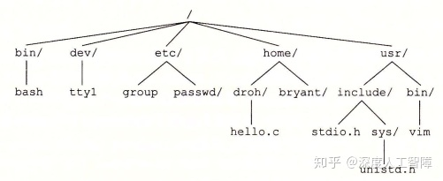
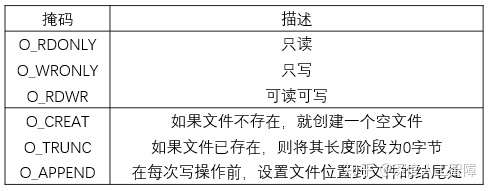
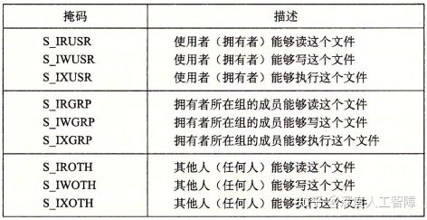
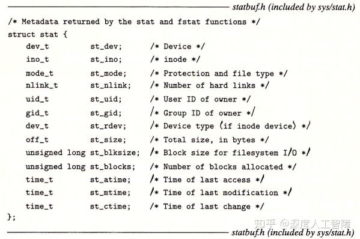
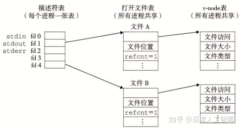
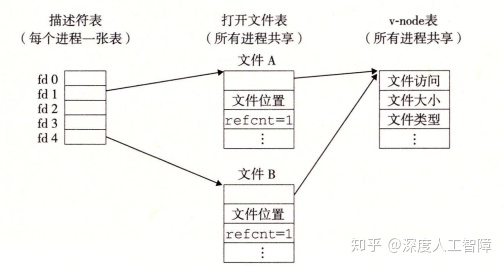
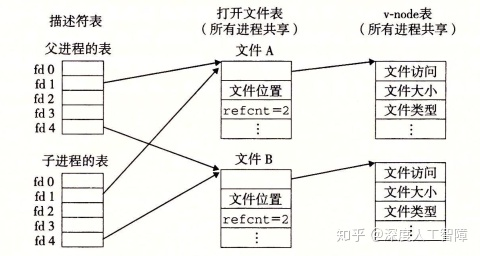
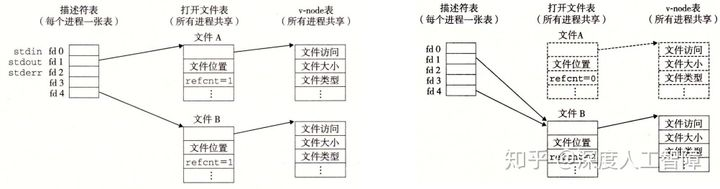
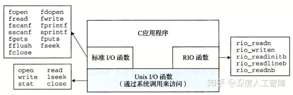

# [读书笔记]CSAPP：24[VB]系统级I/O


 **视频地址：**

[【精校中英字幕】2015 CMU 15-213 CSAPP 深入理解计算机系统 课程视频_哔哩哔哩 (゜-゜)つロ 干杯~-bilibiliwww.bilibili.com/video/BV1iW411d7hd?p=16](https://link.zhihu.com/?target=https%3A//www.bilibili.com/video/BV1iW411d7hd%3Fp%3D16)

**课件地址：**

[http://www.cs.cmu.edu/afs/cs/academic/class/15213-f15/www/lectures/16-io.pdfwww.cs.cmu.edu/afs/cs/academic/class/15213-f15/www/lectures/16-io.pdf](https://link.zhihu.com/?target=http%3A//www.cs.cmu.edu/afs/cs/academic/class/15213-f15/www/lectures/16-io.pdf)

对应于书中的第10章。

------

Linux将所有资源都看成文件的形式。

------

到这就进入了新的一部分，过去一直假设程序时独立运行的，但是其实应用程序可利用操作系统提供的服务来与I/O设备及其他程序通信，这一部分将学习Unix操作系统提供的基本I/O服务，以及如何利用这些服务来构造引用程序。

## 1 基础知识

**输入/输出（I/O）**是在主存和外部设备（磁盘驱动器、终端和网络）之间复制数据的过程。输入操作就是从I/O设备复制数据到主存，输出操作就是将主存数据复制到I/O设备。这里我们将所有I/O设备都抽象为Linux文件，即m个字节的序列，这样所有输入和输出操作都可以看成是对文件的读写，使得所有输入和输出都能以统一的方法来执行：

- **打开文件：**一个应用程序通过要求内核打开某个文件，来确定要访问的I/O设备。此时内核会记录有关该文件的所有信息，而应用程序会获得该文件的**描述符**，来标识该文件。

- **修改当前读写文件的位置：**对于每个打开的文件，内核会维护一个**文件位置k**来表示当前要读写文件的位置，是从文件头开始的字节偏移量，初始化为0。应用程序可以通过`seek`操作来修改读写文件的位置。

- - 但是无法修改基于终端的输入的文件位置，因为无法移动、备份和恢复先前已读入的数据，也无法提前接收还未键入的数据。比如套接字。

- **读写文件：**读文件就是在文件中从k开始复制n个字节到内存，并更新`k=k+n`，如果k超出了文件大小，则会给引用程序返回EOF。而写文件就是从内存 复制n个字节到文件位置k处，然后更新`k=k+n`。

- **关闭文件：**当应用程序通知内核关闭文件时，内核会释放打开文件的数据结构，并将该描述符恢复到可用的描述符池中。

通过将I/O设备抽象为文件的形式，使得对I/O设备的输入输出统一为对文件的读写操作，而应用程序可以通过文件描述符来对指定的I/O设备进行操作。在创建进程时，内核会默认打开三个文件，标准输入（描述符为0）、标准输出（描述符为1）和标准错误（描述符为2），可通过`STDIN_FILENO`、`STDOUT_FILENO`和`STDERR_FILENO`代替描述符来访问这三个文件。当进程终止时，内核会关闭所有打开的文件，并释放内存资源。

在Linux中，**文件具有不同的类型：**

- **普通文件（Regular File）：**包含任意数据。通常分为：

- - **文本文件（Text File）：**只含有ASCII或Unicode字符的普通文件，是一系列文本行的序列，以`\n`符号间隔。
  - **二进制文件（Binary File）：**所有其他的文件。
    应用程序会进行区分，而对于内核而言没有区别。

- **目录（Directory）：**包含一组通过文件名映射到文件的**链接（Link）**的文件。每个链接都是目录文件中的一个条目。

- **套接字（Socket）：**用来与另一个进程进行跨网络通信的文件。

Linux将所有文件组织成**目录层次结构（Directory Hierarchy）**，其中`/`表示**根目录**，其他所有文件都是根目录的直接或间接的后代。 而目录层次结构中的位置可以用**路径名（Pathname）**来指定，具有两种形式：

- **绝对路径名（Absolute Pathname）：**从根目录开始的路径。
- **相对路径名（Relative Pathname）：**以文件名开始，表示从**当前工作目录（Current Working Directory）**开始的路径。



## 2 文件操作

### 2.1 打开和关闭文件

```c
#include <sys/types.h>
#include <sys/stat.h>
#include <fcntl.h>
int open(char *filename, int flags, mode_t mode);
```

`open`函数可以打开已存在的文件或创建一个新的文件，其中`filename`会转换为一个文件描述符，并返回进程中当前没有打开的最小描述符数字，作为进程对文件操作的接口，可以通过`limit`查看描述符的上限。`flags`参数用来表明访问的方式，可通过`|`来合并多个掩码



`mode`参数用来指定新文件的访问权限，而每个进程可通过`umask`函数来设置用户默认权限的补码，则文件最终的权限是通过`mode & ~umask`确定的。



```c
#include <unistd.h>
int close(int fd);
```

可以将文件描述符编号传入`close`函数来关闭文件。如果尝试关闭一个已关闭的文件，则会报错返回`-1`。

**例：**下列程序的输出是什么？

```c
#include <csapp.h>
int main(){
  int fd1, fd2;
  fd1 = open("foo.txt", O_RDONLY, 0);
  close(fd1);
  fd2 = open("baz.txt", O_RDONLY, 0);
  printf("fd2 = %d\n", fd2);
  exit(0);
}
```

创建进程时，内核会默认打开3个文件：标准输入（描述符为0,）、标准输出（描述符为1）和标准错误（描述符为2），直到进程终止时才回收。而为打开的文件分配最小的描述符，当打开`fd1`时，分配了描述符3给`fd1`，而当关闭`fd1`时，就将描述符3回收了，所以当打开`fd2`时，又将描述符3赋给第二个文件了。所以这里输出`fd2 = 3`。

### 2.2 读写文件

```c
#include <unistd.h>
ssize_t read(int fd, void *buf, size_t n);
ssize_t write(int fd, const void *buf, size_t n);
```

可通过`read`函数从文件描述符`fd`的文件位置复制最多`n`个字节到内存位置`buf`中，如果发生错误就返回`-1`，如果遇到EOF就返回`0`，否则返回实际传送的字节数目。而`write`函数是将内存位置`buf`的`n`个字节复制到文件描述符`fd`的文件位置，如果成功完成写操作，就返回字节数目。

**注意：**在x86-64中，`size_t`为`unsigned long`，而`ssize_t`为`long`。由于`read`和`write`函数会返回有符号数，所以这里需要设置为`ssize_t`。

```c
#include <unistd.h>

int main(){
  char c;
  while(read(STDIN_FILENO, &c, 1) != 0){
    write(STDOUT_FILENO, &c, 1);
  }
  return 0;
}
```

以上代码就是将你通过标准输入的字符一个个输出到标准输出中。由于这些都是系统调用，所以速度会特别慢。

有些时候`read`和`write`函数传送的字节数比应用程序要求的少，称为**不足值（Short Count）**，主要因为：

- `read`函数遇到EOF时，比如文件中中剩下20个字节，而`read`函数想要读取50个字节，则第一次会读取20个字节并返回20，而下一次读取时会返回0表示遇到EOF了。
- 如果打开的文件与终端相关联，则每个`read`函数将依次传送一个文本行，返回的就是文本行的字节数，
- 如果打开的文件与套接字相关联，则由于内部缓冲和网络延迟，就会造成这个现象。

## 3 RIO包

有一个RIO（Robust I/O）包可以处理上述的问题，它提供了两类不同的函数：

- **无缓冲的输入输出函数：**直接在内存和文件之间传送数据，没有应用级缓冲，主要用来克服不足值问题。
- **带缓冲的输入输出函数：**允许你高效地从文件中读取文本行和二进制数据，这些文件的内容缓存在应用级缓冲区中，主要用来克服不足值问题，和反复调用系统函数的耗时。

### 3.1 无缓冲的输入输出函数

```c
#include <csapp.h>
ssize_t rio_readn(int fd, void *usrbuf, size_t n) 
{
    size_t nleft = n;
    ssize_t nread;
    char *bufp = usrbuf;

    while (nleft > 0) {  //不断循环，直到读取到n个字节
	if ((nread = read(fd, bufp, nleft)) < 0) {
	    if (errno == EINTR) /* Interrupted by sig handler return */
		nread = 0;      /* and call read() again */
	    else
		return -1;      /* errno set by read() */ 
	} 
	else if (nread == 0)
	    break;              /* EOF */
	nleft -= nread;
	bufp += nread;
    }
    return (n - nleft);         /* Return >= 0 */
}

ssize_t rio_writen(int fd, void *usrbuf, size_t n) 
{
    size_t nleft = n;
    ssize_t nwritten;
    char *bufp = usrbuf;

    while (nleft > 0) {  //不断循环，直到写了n个节
	if ((nwritten = write(fd, bufp, nleft)) <= 0) {
	    if (errno == EINTR)  /* Interrupted by sig handler return */
		nwritten = 0;    /* and call write() again */
	    else
		return -1;       /* errno set by write() */
	}
	nleft -= nwritten;
	bufp += nwritten;
    }
    return n;
}
```

以上`rio_readn`函数从文件描述符`fd`的文件位置传送最多`n`个字节到`usrbuf`中，如果遇到EOF就返回一个不足值，而`rio_writen`函数是将`usrbuf`中的`n`个字节传送到文件描述符`fd`的文件位置，不会出现不足值。

### 3.2 带缓冲的输入函数

带缓冲的I/O会给文件分配关联的缓冲区，如果程序正在执行读操作，它将填满该缓冲区，当用户程序想要提取若干字节时，它会先看看缓冲区内是否有还未读取的字节，如果有就继续读取，如果没有就重新填满缓冲区。带缓冲区的好处在于，不用每次需要一个或少两字节就调用系统调用，而是先调用一次，将若干字节缓存起来，后面需要时就直接从缓冲区读取就行了。


首先我们定义一个读缓冲区的数据结构

```c
#define RIO_BUFSIZE 8192
typedef struct{
  int rio_fd;  //该缓冲区的文件描述符
  int rio_cnt;  //缓冲区中未读的字节数
  char *rio_bufptr;  //缓冲区中未读的下一个字节
  char rio_buf[RIO_BUFSIZE];  //读缓冲区
} rio_t;
```

然后我们可以通过`rio_readinitb`函数将文件描述符`fd`和一个`rio_t`读缓冲区关联起来

```c
void rio_readinitb(rio_t *rp, int fd){
    rp->rio_fd = fd;  
    rp->rio_cnt = 0;  
    rp->rio_bufptr = rp->rio_buf;
} 
```

这里首先将读缓冲区的文件描述符设置为输入的文件描述符`fd`，然后初始化`rio_cnt`和`rio_bufptr`，可以用来保存已读但还未被应用程序使用的字节。由此我们可以得到一个`read`函数的带缓冲区的版本

```c
static ssize_t rio_read(rio_t *rp, char *usrbuf, size_t n){
    int cnt;
    while (rp->rio_cnt <= 0) {  /* Refill if buf is empty */
	rp->rio_cnt = read(rp->rio_fd, rp->rio_buf, sizeof(rp->rio_buf));
	if (rp->rio_cnt < 0) {
	    if (errno != EINTR) /* Interrupted by sig handler return */
		return -1;
	}
	else if (rp->rio_cnt == 0)  /* EOF */
	    return 0;
	else 
	    rp->rio_bufptr = rp->rio_buf; /* Reset buffer ptr */
    }
    /* Copy min(n, rp->rio_cnt) bytes from internal buf to user buf */
    cnt = n;          
    if (rp->rio_cnt < n)   
	cnt = rp->rio_cnt;
    memcpy(usrbuf, rp->rio_bufptr, cnt);
    rp->rio_bufptr += cnt;
    rp->rio_cnt -= cnt;
    return cnt;
} 
```

首先，如果读缓冲区中还有未读的数据，就不进行读取，而是直接将`min(n, rp->rio_cnt)`个字节从读缓冲区中复制到用户的缓冲区中。如果读缓冲区中没有未读的数据，就尝试将读缓冲区填满，并且如果`read`函数报错，需要重新执行`read`函数，然后再将`min(n, rp->rio_cnt)`个字节从读缓冲区中复制到用户的缓冲区中。

基于这个带缓冲区的`rio_read`函数，我们可以尝试一次从文本文件中读取一行的操作

```c
ssize_t rio_readlineb(rio_t *rp, void *usrbuf, size_t maxlen) 
{
    int n, rc;
    char c, *bufp = usrbuf;

    for (n = 1; n < maxlen; n++) { 
        if ((rc = rio_read(rp, &c, 1)) == 1) {
	    *bufp++ = c;
	    if (c == '\n') {
                n++;
     		break;
            }
	} else if (rc == 0) {
	    if (n == 1)
		return 0; /* EOF, no data read */
	    else
		break;    /* EOF, some data was read */
	} else
	    return -1;	  /* Error */
    }
    *bufp = 0;
    return n-1;
} 
```

`rio_readlineb`函数会逐字节读取并判断是否为`\n`来确定是否为一个文本行，如果使用普通的`read`函数，则会不断发起中断来进行读取，但是这里使用了带读缓冲区的`rio_read`函数，在第一次调用`rio_read(rp,&c,1)`函数时，虽然只设置读取一个字节，但它会尝试调用一次`read`函数将读缓冲区填满，这样后面再调用`rio_read(rp,&c,1)`就是直接从读缓冲区获取数据，无需再发起中断了。

此外我们也可以得到一个`rio_readn`函数带读缓冲区的版本，用来读取二进制文件

```c
ssize_t rio_readnb(rio_t *rp, void *usrbuf, size_t n) 
{
    size_t nleft = n;
    ssize_t nread;
    char *bufp = usrbuf;
    
    while (nleft > 0) {
	if ((nread = rio_read(rp, bufp, nleft)) < 0) 
            return -1;          /* errno set by read() */ 
	else if (nread == 0)
	    break;              /* EOF */
	nleft -= nread;
	bufp += nread;
    }
    return (n - nleft);         /* return >= 0 */
} 
```

比如这里我们可以通过将标准输入的文件描述符`STDIN_FILENO`与输入缓存关联起来，然后调用`rio_readlineb`来一次读取一行，再将其写到标准输出中

```c
#include "csapp.h"

int main(int argc, char **argv){
  int n;
  rio_t rio;
  char buf[MAXLINE];
  rio_readinitb(&rio, STDIN_FILENO);
  while((n = rio_readlineb(&rio, buf, MAXLINE)) != 0)
    rio_writen(STDOUT_FILENO, buf, n);
} 
```

### 4 其他

```c
#include <unistd.h>
#include <sys/stat.h>
int stat(const *filename, struct stat *buf);
int fstat(int fd, struct stat *buf);
```

我们可以通过这两个函数来得到文件的**元数据（metadata）**，该函数会填写数据结构物`stat`，具有以下信息



其中`st_size`包含了文件的字节数大小，`st_mode`编码了文件访问许可位，我们可以通过`sys/stat.h`中定义的宏来确定该部分的信息：

- `S_ISREG(st_mode)`： 是否为普通文件
- `S_ISDIR(st_mode)`：是否为目录文件
- `S_ISSOCK(st_mode)`：是否为套接字

对于目录的操作，我们将目录项定义为以下数据结构

```c
struct dirent{
  int_t d_ino;  //文件位置
  char d_name[256];  //文件名
}
```

我们可以传递一个路径名给以下函数来获得目录项的列表

```c
#include <sys/types.h>
#include <dirent.h>
DIR *opendir(const char *name);
```

然后可通过循环调用以下函数来不断获得列表中的下一个目录项，并根据目录项的数据结构来获得目录的信息

```c
#include <dirent.h>
struct dirent *readdir(DIR *dirp);
```

## 5 共享文件

内核有三种数据结构来表示打开的文件：

- **描述符表（Descriptor Table）：**每个进程有自己独立的描述符表，进程打开的所有文件描述符都包含在该表中，每个文件描述符指向文件表中的一个表项。（每次打开一个文件，就会在文件表中分配一个表项）
- **文件表（File Table）：**所有进程共享文件表，包含所有打开文件的文件位置和指向的v-node表项，由于可能在不同进程中共享同一个文件表表项，所以会有一个引用次数表示有多少个描述符指向当前文件表表项，只有当表项的引用次数为0才会删除该表项。该文件表描述了指向对应文件表象的描述符的信息，有操作系统维护。
- **v-node表：**所有进程共享v-node表，每个表项包含了`stat`结构中的大多数信息，用来描述文件的信息。在系统中的每个文件无论是否打开，都在v-node表汇总有一个对应的表项。

总的来说，我们在进程中每次打开文件获得的文件描述符都是描述符表中的一个表项，然后指向对应的文件表表项，描述了该文件描述符的信息，而对应文件的信息可通过文件表表项指向的v-node表项来获得。



每个描述符都有自己的文件位置，表明了当前读取文件的位置，如果对同一文件用不同的`open`打开，由于分配了不同的文件描述符，使其指向不同的文件表表项，而获得不同的文件位置，但是由于是相同文件，所以会指向同一个v-node表项，这就使得这两个文件描述符可以对同一个文件的不同文件位置进行读写，将不同的描述符操作独立开来。



在父进程使用`fork`函数创建一个子进程时，子进程会复制父进程的描述符表，由于描述符表中包含指向文件表中的指针，所以子进程中相同的描述符也指向了相同的文件表表项，所以父子进程对文件位置的修改是共享的



**注意：**描述符指向的文件表项决定了它的文件位置，判断是否共享文件表项。

例：

```c
#include "csapp.h"

int main(){
  int fd1, fd2;
  char c;
  fd1 = open("foobar.txt", O_RDONLY, 0);
  fd2 = open("foobar.txt", O_RDONLY, 0);
  read(fd1, &c, 1);
  read(fd2, &c, 1);
  printf("c = %c\n", c);
  return 0;
}
```

这里通过两个不同的`open`函数来打开相同的文件`foobar.txt`，由于这两个获得不同的文件描述符，所以指向不同的文件表表项，所以会有自己独立的文件位置，所以第一个`read`会移动`fd1`对应的文件位置，但是不会影响`fd2`对应的文件位置，而`foobar.txt`文件包含6个ASCII码字符`foobar`，所以这里输出`c = f`。

```c
#include "csapp.h"

int main(){
  int fd;
  char c;
  fd = open("foobar.txt", O_RDONLY, 0);
  if(fork() == 0){
    read(fd, &c, 1);
    exit(0);
  }
  read(fd, &c, 1);
  printf("c = %c\n", c);
  exit(0);
} 
```

这里首先在父进程中使用`open`函数为文件`foobar.txt`分配了一个文件描述符，而调用`fork`函数生成一个子进程时，会复制父进程完整的描述符表，使得`fd`指向相同的文件表表项，所以在子进程和父进程中共享相同的文件位置，在子进程中调用`read`函数后会修改文件位置，使得在父进程中输出的就是`c = o`。

## 6 I/O重定向

I/O重定向操作符允许用户将磁盘文件和标准输入输出关联起来，可以通过调用`dup2`函数实现

```c
#include <unistd.h>
int dup2(int oldfd, int newfd); 
```

如果`newfd`是已打开的文件，`dup2`会首先关闭`newfd`，然后将`oldfd`对应的描述符表项替换`newfd`描述符表项，使得将`newfd`重定向到`oldfd`，如果原始`newfd`对应的文件表表项的引用计数为0，则会删除对应的文件表表项和v-node表项。比如将标准输出重定向到描述符4，就是运行`dup2(4, STDOUT_FILENO)`。



## 7 标准I/O

C语言基于Unix I/O提出了一组高级输入输出函数，称为标准I/O，它在输入和输出都包含有缓冲区，比如输出操作会先将其要输出的内容保存在缓冲区中，当遇到`\n`或调用`fflush`函数时，会清空缓冲区，并调用`write`系统调用来将其输出。标准I/O将一个打开文件抽象为一个流，是对文件描述符和流缓冲区的抽象，就是一个指向`FILE`类的指针。程序开始时就会打开3个流，对应于标准输入、标准输出和标准错误：

```c
#include <stdio.h>
extern FILE *stdin;
extern FILE *stdout;
extern FILE *stderr;
```



标准I/O是全双工的，程序能在同一个流上执行输入和输出。对流的读操作发生在流的开头，写操作发生在流的末尾。执行写操作后，由于文件位置在流的末尾，所以是不可读的，执行读操作后，如果执行写操作就会覆盖后面的内容，所以最好不要执行写操作，所以读写交替时要修改文件位置到一个可读或可写的文件位置。其次，对于一个可读可写的流，对读操作和写操作共享一个流缓冲区，所以在读取内容到缓冲区之前要先把缓冲区里要写的内容写到文件中。同理，在写内容到缓冲区之前要先把缓冲区里要读的内容清空。

所以想在输出函数之后执行输入函数，需要先执行`fflush`函数将流缓冲区中要输出的内容执行完，然后执行`fseek`、`fsetpos`或`rewind`函数来修改文件位置到可读的文件位置。想在输入函数之后执行输出函数，需要先执行`fseek`、`fsetpos`或`rewind`来修改文件位置到可写的文件位置，并且会对流缓冲区中缓存的输入数据进行操作，比如将其保存到程序的 缓冲区等等。

对于套接字的使用，因为可以`fflush`来清空写操作的缓冲数据，所以可以用标准I/O来模拟套接字的写操作。但是由于套接字无法使用定位函数，就无法在执行读操作后，通过定位函数来处理缓冲区中未读的数据，则读后再写就会产生问题，所以无法用标准I/O来模拟套接字的读操作。所以我们不要用标准I/O函数来进行套接字的输入和输出，而是使用RIO函数，它是基于Unix I/O的`read`和`write`函数，没有流缓冲区的问题。

**参考：**[CSAPP第10章系统级I/O问题？](https://www.zhihu.com/question/31499851/answer/817800909)

**Unix I/O的特点：**

- **优点：**

- - Unix I/O是最通用，开销最低的I/O形式
  - 所有其他I/O软件包均使用Unix I/O函数实现
  - Unix I/O提供用于访问文件元数据的功能
  - Unix I/O函数是异步信号安全的，可以在信号处理程序中安全使用

- **缺点：**

- - 处理短计数非常棘手且容易出错
  - 高效读取文本行需要某种形式的缓冲，也很棘手且容易出错
  - 这两个问题均通过标准I/O和RIO包解决

**标准I/O的特点：**

- **优点：**

- - 缓冲通过减少读写系统调用的数量来提高效率
  - 不足值自动处理

- **缺点：**

- - 不提供访问文件元数据的功能
  - 标准I/O功能不是异步信号安全的，并且不适用于信号处理程序
  - 标准I/O不适合网络套接字上的输入和输出

**对于使用什么I/O，建议：**

- 只要有可能就使用标准I/O，当操作硬盘或中断时要使用标准I/O
- 对套接字的I/O使用RIO包
- 当写信号处理程序时要使用Unix I/O，因为它是异步信号安全的

**注意：**处理文本文件的函数，比如`fgets`、`scanf`或`rio_readlineb`函数，是基于文本行的概念针对文本文件进行操作的，在处理0xa字符时会停止读入。而处理字符串的函数，比如`strlen`、`strcpy`或`strcat`函数，会将`0`视为字符串的结尾。这些对某些特殊字节进行特殊解释的函数，不适合用来读写二进制文件。