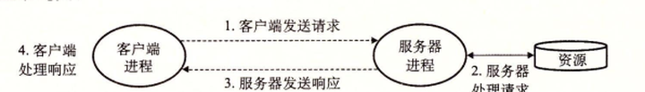
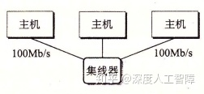
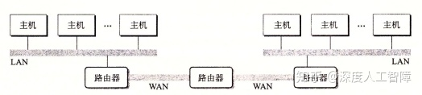
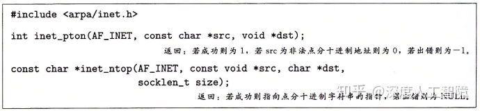
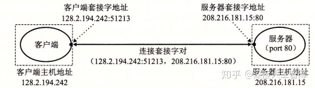
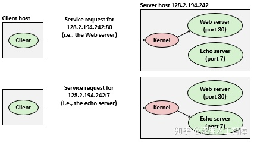
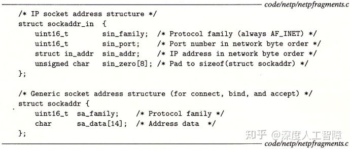
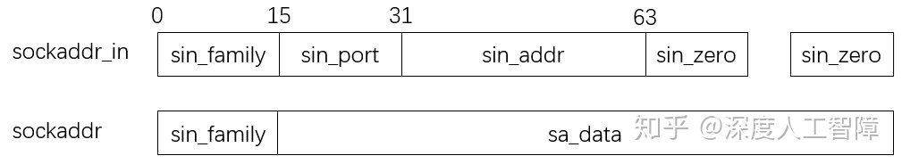
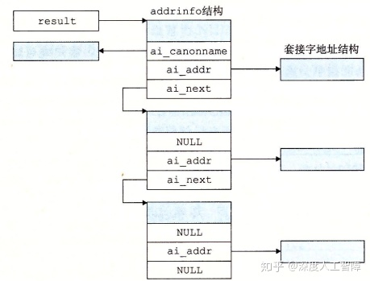
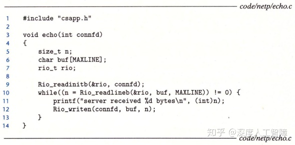

# [读书笔记]CSAPP：25[VB]网络编程1


 **视频地址：**

[【精校中英字幕】2015 CMU 15-213 CSAPP 深入理解计算机系统 课程视频_哔哩哔哩 (゜-゜)つロ 干杯~-bilibiliwww.bilibili.com/video/BV1iW411d7hd?p=21](https://link.zhihu.com/?target=https%3A//www.bilibili.com/video/BV1iW411d7hd%3Fp%3D21)

**课件地址：**

[http://www.cs.cmu.edu/afs/cs/academic/class/15213-f15/www/lectures/21-netprog1.pdfwww.cs.cmu.edu/afs/cs/academic/class/15213-f15/www/lectures/21-netprog1.pdf](https://link.zhihu.com/?target=http%3A//www.cs.cmu.edu/afs/cs/academic/class/15213-f15/www/lectures/21-netprog1.pdf)

本章对应于书中的11.1-11.4。

------

将套接字当做一个文件，则在网络中传输数据可以看成是对文件的读写

------

## 1 客户端-服务器编程模型

网络应用都是基于**客户端-服务器模型**的，应用由一个**服务器进程**和一个或多个**客户端进程**组成，服务器会管理着某些资源，通过操作这些资源来为它的客户端提供某种服务。比如Web服务器管理着一组磁盘文件，会代替客户端进行检索和执行。该模型主要执行以下步骤：

- 当一个客户端需要服务时，就向服务器发送一个请求。比如Web浏览器需要一个文件时，就会发送一个请求到Web服务器。
- 服务器接收到请求后，会对其进行解释并以适当方式操作它的资源。比如当Web服务器接收到请求后，就读一个磁盘文件。
- 服务器给客户端发送一个响应，等待下一次请求。比如Web服务器将文件发送回客户端。
- 客户端接收到响应并进行处理。比如当Web浏览器收到来自服务器的数据后，就将其显示在屏幕上。



**注意：**所谓的客户端和服务器是进程，而不是机器或主机。

## 2 网络基础

### 2.1 网络

当客户端进程和服务器进程处于不同主机时，两个进程就需要通过**计算机网络**的硬件和软件资源进行通信。对主机而言，计算机网络其实只是一个I/O设备，通过插在I/O总线扩展槽的**适配器**提供到网络的物理接口，从网络接收到的数据从适配器经过I/O总线和内存总线复制到内存，而数据也可以从内存复制到网络。


网络是具有层次结构的，最底层的是**局域网（Local Area Network，LAN）**，通常是在一个较小范围内构成的网络，比如一个建筑物，而最流行的局域网技术是**以太网（Ethernet）。**

**层次一：**一个**以太网段（Ethernet Segment）**由一些电缆和一个**集线器**组成，通常跨越一些更小的区域，比如一个房间。电缆的一段连接着主机的适配器，另一端连接到集线器的某个端口，这些电缆通常具有相同的最大位带宽。当主机通过适配器发送数据时，集线器会从一个端口中接收到并将其广播到其他端口，所以其他连接到相同适配器的主机也会收到这些数据。



为了标识每个主机，为每个以太网适配器都提供一个唯一的48位地址，保存在适配器的非易失性存储器上，称为**MAC地址**。所以当主机发送数据时，可以在数据的**头部（Header）**包含标识该数据的源和目的地址以及数据长度的信息，随后才是放数据的**有效载荷（Payload）**，由此构成一个**数据帧（Data Frame）**进行传输，这样连接到相同集线器的其他主机就能通过这个数据的头部来判断该数据是不是传输给自己的。

**层次二：**我们可以通过电缆将一些集线器连接到**网桥（Bridge）**，并通过电缆将一些网桥连接起来，得到更大的局域网，称为**桥接以太网（Bridge Ethernet）**，这两种电缆通常具有不同的带宽。


相比集线器不加区分地广播数据，网桥会使用更好的分配算法，它会自动学习哪些主机通过哪些端口是可达的，并将对应的数据传到对应的端口，节约了其余端口的带宽。比如主机A想传递数据到处于同一以太网段的主机B，则集线器会接收到该数据并广播到所有端口，此时网桥X也会接收到该数据，但是它判断该数据的目和源处于相同以太网段，所以就不进行转发。再比如主机想传递数据到不同以太网段的主机C，则网桥X和网桥Y会将其传递到合适的端口进行转发，使其最终到达主机C。

**层次三：**通过以上两个层次可以构建出若干个互不兼容的局域网，这些局域网可以通过**路由器（Router）**这一 特殊计算器相连组成internet，每台路由器对它连接到的每个网络都有一个适配器。而路由器之间可以通过**广域网（Wide-Area Network，WAN）**相连，来跨越更大的地理范围。



> 主机（适配器）-->以太网段（集线器）-->桥接以太网（网桥）-->internet（路由器）

可以发现，internet是由采用不同和不兼容技术的各种局域网和广域网构成的，为了消除不同网络之间的差异，需要在每台主机和路由器上运行**协议软件**，来控制主机和路由器如何协同工作来实现数据传输。**该协议具有两个基本功能：**

- **命名机制：**在各个局域网中，由于主机数目较少，可以通过集线器直接广播主机的MAC地址或通过网桥记录一些主机MAC地址对应的端口，就能实现主机之间的数据传输。但是到了路由器层面时，主机数目变得特别多，直接广播MAC地址不现实，而记录各个主机MAC地址对应的端口时，由于MAC地址都是各个主机唯一且不具有地域性，就需要一张特别大的表来进行记录。但其实同一局域网的主机具有一定的地域性，都连接在路由器的一个端口，所以路由器其实只需要记录局域网对应的端口就行。所以如果我们能为主机分配唯一的具有地域性的地址时，能通过该主机地址得知对应的局域网就能在路由器中确定对应的端口，就能大量减轻了路由器记录的负担。该地址称为**IP地址**。
- **传送机制：**在不同层面上传输数据需要不同的地址，比如在局域网中需要通过MAC地址来确定目标主机，而在internet中需要通过IP地址确定路由器的端口。所以互联网协议需要在数据最外侧添加路由器的MAC地址，来使得数据能先传输到路由器，然后内侧再添加IP地址，使得路由器能确定端口。IP地址和数据构成了**数据报（Datagram）**。

**参考：**[IP地址和MAC地址的区别和联系是什么？](https://www.zhihu.com/question/49335649)

PH：包头，FH：帧头

以上面为例，说明如何从主机A传输数据到主机B

- 运行在主机A中的客户端通过系统调用，从客户端的虚拟地址空间复制数据到内核缓冲区中。
- 主机A上的协议软件在数据前添加数据帧头`FH1`和数据包头`PH`，其中`FH1`中记录了路由器1的MAC地址，`PH`记录了主机B的IP地址。主机A将该数据帧传输到自己的适配器上。
- LAN 1根据帧头中记录的MAC地址，对其进行广播和转发。
- 路由器1的适配器会接收到该数据帧，并将其传送到协议软件。
- 协议软件从中剥离掉帧头`FH1`，获得`PH`中记录的主机B的IP地址，就能将其作为路由器表的索引获得要将其转发到路由器的哪个端口。这里是将其转发到传输到路由器2的端口。
- 当路由器2获得该数据包时，可以从一个表中得知该IP地址对应的MAC地址，即主机B的MAC地址，就将将其再次封装成数据帧的形式，通过适配器将其传输到LAN 2中。
- 在LAN 2根据帧头中记录的MAC地址，对其进行广播和转发。
- 当主机B接收到该数据帧时，将其传送到协议软件中。
- 在协议软件中，判断数据帧头中记录的目的MAC地址是否与自己的MAC地址相同，发现是相同的，则会剥离包头和帧头获得数据。当服务器进行一个读取这些数据的系统调用时，就将其复制到服务器的虚拟地址空间中。

### 2.2 全球IP因特网

每台主机都运行实现**TCP/IP协议**，它是一个协议族，其中每个都提供了不同的功能。比如**IP协议**提供了上文介绍的基本的命名方法和传送机制，由此保证了能从一台主机向别的主机发送数据报，但是这种传送机制是不可靠的，因为如果数据报发生丢失，IP协议并不会试图恢复。而基于IP协议提出了**UDP协议**和**TCP协议**，由此保证了包可以在进程之间而不是主机之间进行传送。而客户端-服务器应用程序就正需要TCP/IP协议这种在进程间传送数据的能力，它们通过**套接字接口函数**系统调用，在内核中调用各种内核模式的TCP/IP函数，由此在客户端进程和服务器进程之间传送数据。


我们这里就间TCP/IP看成一个单独的整体协议，值讨论TCP和IP为应用程序提供的某些功能。我们可以将因特网看成是一个世界范围的主机集合，满足以下**特点：**

- 主机集合被映射为一组32位的**IP地址**。
- 这组IP地址被映射为一组称为**因特网域名（Internet Domain Name）**的标识符。
- 因特网主机上的进程能通过**连接（Connection）**和任何其他因特网主机上的进程通信。

### 2.2.1 IP地址

IP地址是一个32位的无符号整数，具有以下数据结构


我们知道不同主机可以有不同的主机字节顺序，常用的是小端法，而TCP/IP为任意整数定义了统一的**网络字节顺序（Network Byte Order）**，来规定IP地址的字节顺序（总是大端法）。Unix提供了以下函数来进行转换


`htonl`函数是将32位整数由主机字节顺序转换为网络字节顺序；`ntohl`函数是将32位整数由网络字节顺序转换为主机字节顺序。

IP地址通常用**点分十进制表示法**来表示，每个字节由它对应的十进制数来表示，而不用数之间通过`.`间隔，由于IP地址为32位的，所以会有4个整数。这里提供以下函数来实现IP地址和点分十进制串之间的转换



`inet_pton`函数将一个点分十进制串`src`转换为二进制的网络字节顺序的IP地址，其中`AF_INET`表示32位的IPv4地址，而`AF_INET6`表示64位的IPv6地址。`inet_ntop`函数将二进制的网络字节顺序的IP地址`src`转换为对应的点分十进制表示。

在1996年IETF推出了具有128位地址的IPv6，打算作为IPv4的后继者，截至2015年，绝大多数互联网流量仍由IPv4承载，只有4％的用户使用IPv6访问Google服务。我们将主要介绍IPv4，但会展示如何编写独立于协议的网络代码。

### 2.2.2 域名

由于IP地址较难记忆，所以定义了一组**域名（Domain Name）**以及一种将域名映射到实际IP地址的机制。域名的集合形成一种层次结构，每个域名编码了它在这个层次中的位置。


根节点为未命名的根，第一层为**一级域名（First-level Domain Name）**，由ICANN组织定义，再下一层为**二级域名（Second-level Domain Name）**，由ICANN的各个授权代理按照先到先得服务进行分配的，只要有组织得到二级域名，就能在这个子域中创建任何新的域名。从叶子结点返回到一级域名的路径就构成了一条完整的域名，通过非常大的分布式**域名系统（Domain Name System，DNS）**将其映射到对应的IP地址。

每台主机都有本地定义的域名`localhost`，总是映射为**回送地址（Loopback Address）**`127.0.0.1`。`hostname`可以确定本地主机的实际域名，然后可以通过`nslookup`程序来查看DNS映射的一些属性，可以发现通常多个域名可以映射到同一组的多个IP地址，而有些合法的域名没有映射到任何IP地址。

**注意：**存在多个域名对应一个IP地址，或一个域名对应多个IP地址，因为一些大型网络不止有一台服务器，可能会有多台服务器在处理你的数据，所以DNS会根据你的显示位置来返回多个IP地址。

### 2.2.3 因特网连接

客户端和服务器通过在**连接**上发送和接收数据来进行通信，连接具有以下特点：

- **点对点：**连接了一对进程
- **全双工：**数据可以同时在连接双向流动
- **可靠的：**由源进程发出的字节流最终被目的进程按序接收

连接的两端分别是客户端套接字和服务器套接字，每个套接字都有相应的**套接字地址**，由IP地址和16位整数**端口**组成，表示为`地址:端口`。其中客户端套接字中的端口是由内核自动分配的**临时端口（Ephemeral Port）**，而服务器套接字的端口与服务器提供的服务相关，比如Web服务器就使用端口`80`、FTP服务器就是用端口`25`，可通过`/etc/services`查看。


所以一个连接由它两端的套接字地址唯一确定，称为**套接字对（Socket Pair）**，表示为`(cliaddr:cliport, servaddr:servport)`。



通常内核需要区分传入机器的不同连接，并且当别的机器的数据到达时，判断要为该连接启动什么软件和进程，实际上，每个端口都有特定的进程执行程序来处理这些请求。并且一个客户端可以同时和单一服务器上的不同端口通信，来获得该服务器的不同服务，但这需要建立不同的连接，避免相互干扰。



**注意：**对Linux内核而言，套接字就是通信的一个端点。对程序员而言，套接字就是一个有相应描述符的打开文件（与上一章关联起来，Linux中将所有资源都视为文件，套接字也不例外）。

## 3 套接字接口

**套接字接口（Socket Interface）**是一组函数，他们和Unix I/O函数结合起来，用以创建网络应用。以下是一个基于套接字接口的网络应用概述


### 3.1 套接字地址结构

套接字地址具有以下两种数据结构



这是因为在一开始设计socket时，是打算兼容各种不同协议的套接字地址，而不同协议的套接字地址有自己不同的地址构造，比如IPv4就是`sockaddr_in`、IPv6就是`sockaddr_in6`等等，而`sockaddr`就是这些不同协议地址的抽象，仔细观察上面两个不同结构的声明顺序，两者定义的内存分布如下所示



这样通过将`sockaddr_in`强制类型转换为`sockaddr`时，`sockaddr`的`sa_family`值就是 `sockaddr_in`的`sa_family`值，而`sockaddr`的`sa_data`值就是`sockaddr_in`中`sin_port`、`sin_addr`和`sin_zero`拼接起来的结果。由此通过将不同协议的地址强制类型转换为`sockaddr`类型，就能得到统一的套接字地址，而后的函数都是基于`sockaddr`类型的，方便兼容不同协议的地址。

**注意：**这些地址字节顺序都是网络字节顺序，即大端法。

**参考：**[ustcsse308：信息安全课程8：套接字（socket） 编程](https://zhuanlan.zhihu.com/p/59296026)

### 3.2 常用函数

首先，套接字作为一种文件，我们需要在服务器和客户端将其打开来得到**套接字描述符（Socket Descriptor）**

```c
#include <sys/types.h>
#include <sys/socket.h>
int socket(int domain, int type, int protocol);
```

为了使套接字作为连接的端点，可使用如下硬编码的参数来调用`socket`函数

```c
socket(AF_INET, SOCK_STREAM, 0); 
```

`AF_INET`表示是一个32位的IPv4地址，`SOCK_STREAM`表明连接是一个TCP连接。此时就会返回套接字描述符，客户端套接字描述符写成`clientfd`，服务器套接字描述符写成`sockfd`。

**在服务器方面**，接下来需要将服务器套接字地址和它的描述符`sockfd`联系起来

```c
#include <sys/socket.h>
int bind(int sockfd, const struct sockaddr *addr, socklen_t addrlen); 
```

该内核函数会将服务器套接字描述符`sockfd`与服务器套接字地址`addr`关联起来，其中`addrlen=sizeof(sockaddr_in)`，此时`addr`中包含了端口号，也就将`sockfd`与该服务器的某个端口绑定在一起，用于提供特定的服务。

由于`socket`函数创建的是**主动套接字描述符（Active Socket Descriptor）**，而服务器是接收请求方，所以需要将服务器套接字描述符转换为**监听套接字描述符（Listening Socket Descriptor）**

```c
#include <sys/socket.h>
int listen(int sockfd, int backlog);
```

该函数会将服务器套接字的描述符`sockfd`转换为监听套接字描述符`listenfd`，也相当于高速内核当前为服务器。接下来服务器就能监听等待来自客户端的连接请求

```c
#include <sys/socket.h>
int accept(int listenfd, struct sockaddr *addr, int *addrlen); 
```

该函数会等待来自客户端的连接请求到达监听描述符`listenfd`，然后将客户端的套接字地址填写到`addr`中，并返回一个**已连接描述符（Connected Descriptor）**`connfd`，这样服务器就能通过`connfd`和Unix I/O来与客户端通信了。

**注意：**服务器通常只创建一次监听套接字描述符`listenfd`，并存在于服务器的整个生命周期，作为客户端连接请求的一个端点，服务器可从`listenfd`得知是否有客户端发送连接请求 ，而后服务器每次接受连接请求时就会创建一个已连接描述符`connfd`来作为与客户端建立起连接的一个端点，只存在于服务器为一个客户端服务的过程，当客户端不需要该服务器的服务时，就会删掉该`connfd`。这两种描述符的存在，使得我们可以构建并发的服务器来同时处理多个客户端连接，每当`accept`返回一个`connfd`时，就表示服务器接收了一个客户端的连接，此时就能通过`fork`函数创建一个子进程来通过该`connfd`与客户端通信，而父进程继续监听`listenfd`来查看是否有另一个客户端发送连接请求。

> **服务器方面：**创建套接字描述符`sockfd`（`socket`）-->将`sockfd`与服务器套接字地址进行关联（`bind`）-->将`sockfd`转换为监听套接字描述符`listenfd`（`listen`）-->等待客户端的连接请求，并得到已连接描述符`connfd`（`accept`）-->通过`connfd`和Unix I/O与客户端进行通信。

**在客户端方面**，在创建了客户端套接字描述符`clientfd`后，就能通过以下函数来建立与服务器的连接

```c
#include <sys/socket.h>
int connect(int clientfd, const struct sockaddr *addr, socklen_t addrlen); 
```

该函数会尝试与服务器套接字地址`addr`建立一个连接，其中`addrlen=sizeof(sockaddr_in)`。该函数会阻塞直到连接建立成功或发生错误，如果成功，客户端就能通过`clientfd`和Unix I/O与服务器进行通信了。


### 3.3 IP协议无关代码

Linux提供一些函数来实现二进制套接字地址结构和主机名、主机地址、服务名和端口号的字符串表示之间的相互转化，当与套接字接口一起使用时，能让我们编写独立于任何特定版本的IP协议的网络程序。

### 3.3.1 `getaddrinfo`函数

```c
#include <sys/types.h>
#include <sys/socket.h>
#include <netdb.h>

int getaddrinfo(const char *host, const char *service,
                const struct addrinfo *hints,
                const struct addrinfo **result);
void freeaddrinfo(struct addrinfo *result);
const char *gai_strerror(int errcode);
```

`getaddrinfo`函数能将主机名、主机地址、服务名和端口号的字符串转换成套接字地址结构。其中，`host`参数可以是域名、点分十进制数字地址或NULL，`service`参数可以是服务名（如http）、十进制端口号或NULL，两者必须制定一个。而`hits`和`result`参数分别是`addinfo`结构的指针和链表


`result`是通过`host`和`service`构建的一系列套接字地址结构，可以通过`ai_next`来一次遍历链表中的每个`addrinfo`结构，而每个`addrinfo`结构的`ai_family`、`ai_socktype`和`ai_protocol`可以直接传递给`socket`函数，而`ai_addr`和`ai_addrlen`可以直接传递给`connect`和`bind`函数，使得我们只要传递`host`和`service`参数给`getaddrinfo`函数，就能编写独立于某个特定版本的IP协议的客户端和服务器。



可以通过`hits`来控制`result`的结果。设置`hits`时，通常用`memset`将整个结构清空，再有选择地设置一些字段：

- `ai_family`：`result`默认会包含IPv4和IPv6的套接字地址，可以通过设置`ai_family`为`AF_INET`或`AF_INET6`来限制只包含IPv4或IPv6的套接字地址。

- `ai_socktype`：将其设置为`SOCK_STREAM`可以将`result`限制为每个地址最多只有一个`addrinfo`结构，可以用来作为连接的一个端点。

- `ai_flags`：是一个位掩码，可以修改默认行为：

- - `AI_ADDRCONFIG`：只有当本地主机被配置了IPv4时，`result`才会返回IPv4地址，IPv6同理。
  - `AI_CANONNAME`：如果设置了该位，则`result`第一个`addrinfo`结构的`ai_cannonname`字段指向`host`的官方名字。
  - `AI_NUMERICSERV`：强制`service`参数只能是端口号。
  - `AI_PASSIVE`：使得返回的套接字地址可以被服务器用作监听套接字，此时`host`应该为NULL，就会使得返回的套接字地址结构中的地址字段为**通配符地址**。

> 从上面可知，一个域名可能会对应多个IP地址，通过这个`getaddrinfo`函数就能寻找域名对应的所有可用的IP地址。

最终要调用`freeaddrinfo`函数来释放你得到的结果`result`，如果出错，可以调用`gai_strerror`函数来查看错误信息。

### 3.3.2 `getnameinfo`函数

```c
#include <sys/socket.h>
#include <netdb.h>
int getnameinfo(const struct sockaddr *sa, socklen_t salen,
                char *host, size_t hostlen,
                char *service, size_t servlen, int flags); 
```

该函数和`getaddrinfo`函数相反，通过传入套接字地址`sa`，能够返回对应的主机名字符串`host`和服务名字字符串`service`。其中`flags`可以修改该函数的默认行为：

- `NI_NUMERICHOST`：该函数默认返回`host`中的域名，通过设置这个标志位来返回数字地址字符串。
- `NI_NUMERICSERV`：该函数默认检查`/etc/service`并返回服务名，通过设置这个标志位来返回端口号。

> 从上面可知，一个IP地址可能会对应多个域名，通过这个`getnameinfo`函数就能寻找IP地址对应的所有可用的域名。

### 3.3.3 套接字接口的辅助函数

这里提供两个封装函数`open_clientfd`和`open_listenfd`来封装`getnameinfo`和`getaddrinfo`函数来进行客户端和服务端的通信。

```c
int open_clientfd(char *hostname, char *port){
    int clientfd;
    struct addrinfo hints, *listp, *p;

    /* Get a list of potential server addresses */
    memset(&hints, 0, sizeof(struct addrinfo));  //初始化hints为0
    hints.ai_socktype = SOCK_STREAM;  /* Open a connection */
    hints.ai_flags = AI_NUMERICSERV;  /* ... using a numeric port arg. */
    hints.ai_flags |= AI_ADDRCONFIG;  /* Recommended for connections */
    getaddrinfo(hostname, port, &hints, &listp);  //获得一系列套接字地址
  
    /* Walk the list for one that we can successfully connect to */
    for (p = listp; p; p = p->ai_next) {  //遍历所有套接字地址，找到一个可以连接的
        /* Create a socket descriptor */
        if ((clientfd = socket(p->ai_family, p->ai_socktype, p->ai_protocol)) < 0) 
            continue; /* Socket failed, try the next */

        /* Connect to the server */
        if (connect(clientfd, p->ai_addr, p->ai_addrlen) != -1) 
            break; /* Success */
        close(clientfd); /* Connect failed, try another */  //line:netp:openclientfd:closefd
    } 

    /* Clean up */
    freeaddrinfo(listp);
    if (!p) /* All connects failed */
        return -1;
    else    /* The last connect succeeded */
        return clientfd;
}
```

客户端可以通过`open_clientfd`函数来简历与服务器的连接，该服务器运行在`hostname`主机上，并在`port`端口监听连接请求。首先会通过`getaddrinfo`函数找到一系列套接字地址，并依次遍历寻找可以创建套接字描述符且连接成功的一个套接字地址，然后返回准备好的套接字描述符，客户端可以直接通过`clientfd`和Unix I/O来与服务器进行通信。

```c
 int open_listenfd(char *port){
    struct addrinfo hints, *listp, *p;
    int listenfd, optval=1;

    /* Get a list of potential server addresses */
    memset(&hints, 0, sizeof(struct addrinfo));
    hints.ai_socktype = SOCK_STREAM;             /* Accept connections */
    hints.ai_flags = AI_PASSIVE | AI_ADDRCONFIG; /* ... on any IP address */
    //AI_PASSIVE保证套接字地址可被服务器用作监听套接字
    hints.ai_flags |= AI_NUMERICSERV;            /* ... using port number */
    getaddrinfo(NULL, port, &hints, &listp);  //这里的host为NULL

    /* Walk the list for one that we can bind to */
    for (p = listp; p; p = p->ai_next) {
        /* Create a socket descriptor */
        if ((listenfd = socket(p->ai_family, p->ai_socktype, p->ai_protocol)) < 0) 
            continue;  /* Socket failed, try the next */

        /* Eliminates "Address already in use" error from bind */
        setsockopt(listenfd, SOL_SOCKET, SO_REUSEADDR,    //line:netp:csapp:setsockopt
                   (const void *)&optval , sizeof(int));

        /* Bind the descriptor to the address */
        if (bind(listenfd, p->ai_addr, p->ai_addrlen) == 0)
            break; /* Success */
        close(listenfd); /* Bind failed, try the next */
    }

    /* Clean up */
    freeaddrinfo(listp);
    if (!p) /* No address worked */
        return -1;

    /* Make it a listening socket ready to accept connection requests */
    if (listen(listenfd, LISTENQ) < 0) {
        Close(listenfd);
	return -1;
    }
    return listenfd;
}
```

服务器可通过`open_listenfd`来创建一个监听描述符，并准备好连接请求。首先`hints.ai_flags`包含`AI_PASSIVE`使得返回的套接字地址可被服务器作为监听套接字，并在`socket`函数中将`host`设置为NULL，使得后面的`p->ai_addr`为通配符地址，这样在`bind`函数中就能使得服务器监听所有发送请求的客户端IP地址，并且这里只指定了端口号，所以就是将`listenfd`用于该端口的监听。这里的`setsockopt`函数使得服务器能被终止、重启和立即开始接收连接请求。最终，服务器可以直接通过`listenfd`和Unix I/O来与客户端进行通信。


通过以上`open_clientfd`和`open_listenfd`函数，使得我们无需考虑之前`socket`和`bind`等函数在不同协议下的代码，使得客户端可以直接传输服务器的域名和端口到`open_clientfd`函数来完成与服务器的连接，而服务器也可以直接传输监听的端口到`open_listenfd`函数来完成监听，避免了底层的很多设置。

### 3.4 echo客户端和服务端实例

echo客户端

该客户端中，直接将服务器主机`host`和端口号`port`传入`open_clientfd`来完成`socket`和`connect`函数，直接返回可以使用的套接字描述符`clientfd`，然后从标准输入读取数据保存在`buf`中，再将`clientfd`当做普通文件的描述符，直接使用`Rio_writen`和`Rio_readlineb`来与服务器进行传输数据。

echo服务器

服务器中首先通过`open_listenfd`来调用`socket`、`bind`和`listen`函数来监听特定端口，然后不断循环调用`accept`来查看是否有客户端发送请求，并将发送请求的客户端套接字地址保存在`clientaddr`中，并返回已连接套接字描述符`connfd`，可以对`clientaddr`调用`getnameinfo`函数来获取客户端的地址，也可以将`connfd`当做普通文件的描述符，直接使用`Rio_writen`和`Rio_readlineb`来与客户端进行传输数据。这里调用了`echo`函数



该函数中就是通过`connfd`来执行`Rio_readlineb`函数，读取客户端发送过来的一行文本，然后将其输出，并返回到客户端中。

**注意：**要先开启服务器，再运行客户端。这里的服务器一次只能与一个客户端相连。