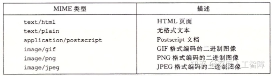
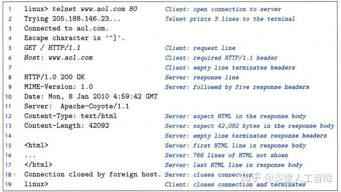
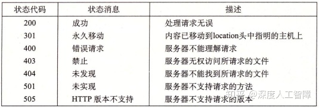
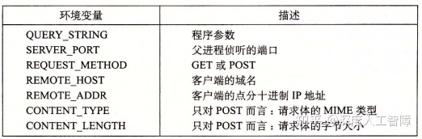
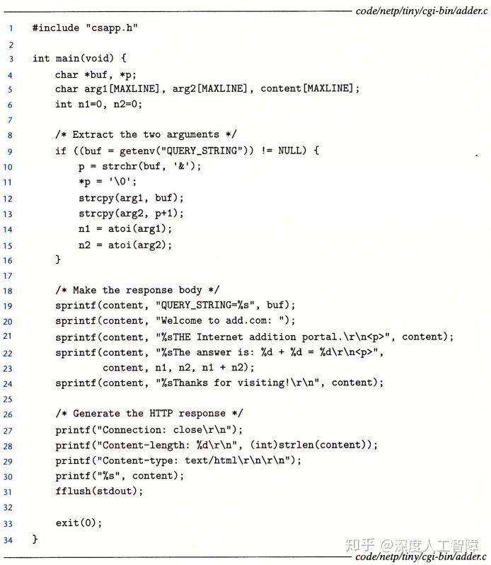

# [读书笔记]CSAPP：26[VB]网络编程2


 **视频地址（英文）：**

[https://www.bilibili.com/video/BV1XW411A7fB?p=21www.bilibili.com/video/BV1XW411A7fB?p=21](https://link.zhihu.com/?target=https%3A//www.bilibili.com/video/BV1XW411A7fB%3Fp%3D21)

**课件地址：**

[http://www.cs.cmu.edu/afs/cs/academic/class/15213-f15/www/lectures/22-netprog2.pdfwww.cs.cmu.edu/afs/cs/academic/class/15213-f15/www/lectures/22-netprog2.pdf](https://link.zhihu.com/?target=http%3A//www.cs.cmu.edu/afs/cs/academic/class/15213-f15/www/lectures/22-netprog2.pdf)

本章对应于书中的11.5-11.6。

------

本章主要来创建自己的Web服务器。

## 1 Web基础

Web客户端和服务器之间的交互基于**超文本传输协议（Hypertext Transfer Protocol，HTTP）**，该协议是建立在TCP协议之上的。传输的过程为

1. 一个Web客户端（即浏览器）打开一个到Web服务器的连接，并请求某些**内容**
2. Web服务器响应所请求的内容，然后关闭连接
3. Web客户端读取这些内容，再将其显示在屏幕上

其中，这些内容是一串字节序列，Web服务器会发送一个**MIME（Multipurpose Internet Mail Extensions）**类型来帮助浏览器识别一个HTTP请求返回的是什么内容的数据，应该如何打开、如何显示，即MIME类型是用来标注网络数据的，常见类型包括



**参考：**[既然有文件后缀名,为何还需要MIME类型?](https://www.zhihu.com/question/60495696/answer/204530120)

Web服务器提供的内容也有两种不同的方式：

- **服务静态内容（Serving Static Content）：**取一个磁盘文件，并将其内容返回给客户端。
- **服务动态内容（Serving Dynamic Content）：**运行一个可执行目标文件，将其输出返回给客户端。

所以Web服务器返回的每条内容都与它管理的某个文件相关联，这些文件都有一个唯一的名字，称为**URL（Universal Resource Locator）**。比如对于`http://www.google.com:80/index.html`，客户端使用前缀`http://www.google.com:80`来决定与哪个Web服务器联系以及Web服务器的监听端口，而Web服务器使用后缀`/index.html`来发现在它文件系统中的文件，确定请求内容是静态还是动态的。此外，URL还可以用`?`字符来分隔文件名和参数，用`&`分隔多个参数，来向动态内容传送参数，这个后缀称为**URI（Universal Resource Indentifier）**。

对于服务器如何解释一个URL后缀：

- 没有标准来确定后缀是动态内容还是静态内容，过去是将所有可执行目标文件都放在同一个目录中。
- 后缀中最开始的`/`并不表示Web服务器中的根目录，而是被请求内容类型的主目录。
- 如果URL没有后缀，则浏览器会在URL后添加缺失的`/`并将其传递给Web服务器，Web服务器又将`/`扩充到某个默认的文件名，比如`/index.html`，由此来展示网站的主页。

## 2 HTTP事务

可以使用Linux的TELNET程序来和Web服务器执行事务，如



在第1行中运行`telnet www.aol.com 80`，表示要打开一个到AOL Web服务器的连接，此时TELNET会输出3段信息，然后等待我们的输入，我们可以输入一个文本行，此时TELNET就会读取并添加回车和换行符号，然后将其发送到服务器。

### 2.1 HTTP请求

在第5~7行，我们输入了一个**HTTP请求（HTTP Requests）**，它**主要包含：**

- **请求行（Request Line）：**
  在第5行中，主要形式为`method URI version`。
  HTTP这里支持不同方法，这里主要介绍**`GET`方法**，它将指导服务器生成和返回URI标识的内容。而`version`字段表明该请求的HTTP版本，并表明接下来的请求报头是`HTTP/1.1`格式的。
  总的来说，第5行要求服务器取出并返回HTML文件`/index.html`。
- **请求报头（Request Hearder）：**
  主要是为服务器提供额外的信息，格式为`header-name: header-data`。
  比如这里我们提供了`HTTP/1.1`需要的`Host`信息。在客户端和**原始服务器（Irigin Server）**之间存在很多缓存了原始服务器内容的代理，称为**代理链（Proxy Chain）**，通过`Host`字段来指明原始服务器的域名，使得代理链中的代理能判断是否在他们本地缓存了被请求内容的副本，避免从很远的原始服务器调用数据。
- 一个空文本行来终止请求报头列表

### 2.2 HTTP请求响应

在TELNET将我们的HTTP请求发送给Web服务器后，Web服务器就会返回一个**HTTP响应（HTTP Responses）**，它**主要包含：**

- **响应行（Response Line）：**
  响应行和请求行类似，格式为`version status-code status-message`。
  `version`字段表明响应使用的HTTP版本，而`status-code`和`status-message`主要指明请求的状态，表示你的请求是否被正确处理或出现什么问题



- **响应报头（Response Header）：**
  是关于响应的附加信息，比如`Content-type`表示Web服务器发送给浏览器的响应主体的MIME类型，使得浏览器能正确解析这些字节序列。`Content-Length`用来表明响应主体的字节大小。
- 一个终止报头的空行
- **响应主体（Response Body）：**包含被请求的内容。

### 2.3 服务动态内容

比如Web服务器接收到浏览器的发送的URI时

```http
GET /cgi-bin/adder?15000&213 HTTP/1.1
```

其中`/cgi-bin/adder`称为**CGI（Common Gateway Interface）程序**，该程序是使用CGI标准来让Web服务器服务动态内容。而其中的`15000&213`是浏览器发送给CGI程序的参数。

- Web服务器首先调用`fork`创建一个子进程，并在子进程中设置对应的CGI环境变量



比如将程序的参数保存在`QUERY_STRING`中，则CGI程序可以通过`getenv("QUERY_STRING")`函数来获得浏览器发送的参数。然后调用`dup2`函数将子进程的标准输出重定向到和客户端相关联的已连接描述符

- 调用`execve`来执行`/cgi-bin/adder`程序
- CGI程序负责生成`Content-type`和`Content-Length`响应报头，并将它的动态内容发送到标准输出


我们可以自己写CGI程序，但是要注意当执行CGI程序时，是在Web服务器中的一个子进程中，需要通过`getenv`来获得程序参数，且标准输出已被重定向到与浏览器关联的已连接描述符，并且要根据执行的结果来生成`Content-type`和`Content-Length`响应报头。



**注意：**CGI实际上定义了一个简单的标准，用于在客户端（浏览器），服务器和子进程之间传输信息。它是用于生成动态内容的原始标准，由于创建子进程十分昂贵且慢，目前已被其他更快的技术取代：比如fastCGI，Apache模块，Java Servlet，Rails控制器。

## 3 TINY Web服务器

这一节将实现一个简单的Web服务器来提供静态和动态内容。

```c
/*
 * tiny.c - A simple, iterative HTTP/1.0 Web server that uses the 
 *     GET method to serve static and dynamic content.
 */
#include "csapp.h"

void doit(int fd);
void read_requesthdrs(rio_t *rp);
int parse_uri(char *uri, char *filename, char *cgiargs);
void serve_static(int fd, char *filename, int filesize);
void get_filetype(char *filename, char *filetype);
void serve_dynamic(int fd, char *filename, char *cgiargs);
void clienterror(int fd, char *cause, char *errnum, 
		 char *shortmsg, char *longmsg);

int main(int argc, char **argv) 
{
    int listenfd, connfd;
    char hostname[MAXLINE], port[MAXLINE];
    socklen_t clientlen;
    struct sockaddr_storage clientaddr;

    /* Check command line args */
    if (argc != 2) {
	fprintf(stderr, "usage: %s <port>\n", argv[0]);
	exit(1);
    }

    listenfd = Open_listenfd(argv[1]);
    while (1) {
	clientlen = sizeof(clientaddr);
	connfd = Accept(listenfd, (SA *)&clientaddr, &clientlen); //line:netp:tiny:accept
        Getnameinfo((SA *) &clientaddr, clientlen, hostname, MAXLINE, 
                    port, MAXLINE, 0);
        printf("Accepted connection from (%s, %s)\n", hostname, port);
	doit(connfd);                                             //line:netp:tiny:doit
	Close(connfd);                                            //line:netp:tiny:close
    }
}
```

首先，这个是Web服务器的代码，我们可以传入一个端口参数，使得Web服务器能调用`open_listenfd`来监听该端口，并返回一个监听套接字描述符，并进入死循环，不断调用`accept`函数来判断是否有浏览器发起连接请求，如果有则返回已连接描述符`connfd`，并且可以通过`getnameinfo`函数来获得浏览器的信息，然后调用`doit`函数来处理一个HTTP事务。

```c
void doit(int fd) 
{
    int is_static;
    struct stat sbuf;
    char buf[MAXLINE], method[MAXLINE], uri[MAXLINE], version[MAXLINE];
    char filename[MAXLINE], cgiargs[MAXLINE];
    rio_t rio;

    /* Read request line and headers */
    Rio_readinitb(&rio, fd);
    if (!Rio_readlineb(&rio, buf, MAXLINE))  //line:netp:doit:readrequest
        return;
    printf("%s", buf);
    sscanf(buf, "%s %s %s", method, uri, version);       //line:netp:doit:parserequest
    if (strcasecmp(method, "GET")) {                     //line:netp:doit:beginrequesterr
        clienterror(fd, method, "501", "Not Implemented",
                    "Tiny does not implement this method");
        return;
    }                                                    //line:netp:doit:endrequesterr
    read_requesthdrs(&rio);                              //line:netp:doit:readrequesthdrs

    /* Parse URI from GET request */
    is_static = parse_uri(uri, filename, cgiargs);       //line:netp:doit:staticcheck
    if (stat(filename, &sbuf) < 0) {                     //line:netp:doit:beginnotfound
	clienterror(fd, filename, "404", "Not found",
		    "Tiny couldn't find this file");
	return;
    }                                                    //line:netp:doit:endnotfound

    if (is_static) { /* Serve static content */          
	if (!(S_ISREG(sbuf.st_mode)) || !(S_IRUSR & sbuf.st_mode)) { //line:netp:doit:readable
	    clienterror(fd, filename, "403", "Forbidden",
			"Tiny couldn't read the file");
	    return;
	}
	serve_static(fd, filename, sbuf.st_size);        //line:netp:doit:servestatic
    }
    else { /* Serve dynamic content */
	if (!(S_ISREG(sbuf.st_mode)) || !(S_IXUSR & sbuf.st_mode)) { //line:netp:doit:executable
	    clienterror(fd, filename, "403", "Forbidden",
			"Tiny couldn't run the CGI program");
	    return;
	}
	serve_dynamic(fd, filename, cgiargs);            //line:netp:doit:servedynamic
    }
} 

void read_requesthdrs(rio_t *rp) 
{
    char buf[MAXLINE];

    Rio_readlineb(rp, buf, MAXLINE);
    printf("%s", buf);
    while(strcmp(buf, "\r\n")) {          //line:netp:readhdrs:checkterm
	Rio_readlineb(rp, buf, MAXLINE);
	printf("%s", buf);
    }
    return;
}
```

该函数中，将已连接描述符当做普通文件的描述符，通过该描述符来与客户端进行通信。首先调用`Rio_readinitb`函数将描述符和输入缓存关联起来。此时浏览器会发送HTTP请求，这里可以通过一个`Rio_readlineb`函数来读取HTTP请求的第一行内容，即请求头，然后从中解析出HTTP方法`method`、URI`uri`和HTTP版本`version`。这里TINY Web服务器只支持`GET`方法，所以传入其他方法就直接返回主程序。然后通过`read_requesthdrs`函数来读取请求报头，但是TINY不使用任何请求报头的信息，所以只传入输入缓存`rio`，然后依次判断什么时候读取到`\r\n`就表示HTTP请求结束了。

接下来通过调用`parse_uri`函数来判断URI是否为静态服务。该TINY Web服务器将所有静态文件都放在当前目录，而可执行目标文件都放在`./cgi-bin`中，所以先通过`strstr`函数来判断URI中是否含有`cgi-bin`子串来判断当前HTTP请求是要静态内容还是动态内容。如果是静态内容，就将静态内容对应的文件保存在`filename`中，并清空CGI参数`cgiargs`；如果是动态内容，首先从中分解出CGI程序和CGI参数，分别将其保存在`filename`和`cgiargs`参数中。

```c
int parse_uri(char *uri, char *filename, char *cgiargs) 
{
    char *ptr;

    if (!strstr(uri, "cgi-bin")) {  /* Static content */ //line:netp:parseuri:isstatic
	strcpy(cgiargs, "");                             //line:netp:parseuri:clearcgi
	strcpy(filename, ".");                           //line:netp:parseuri:beginconvert1
	strcat(filename, uri);                           //line:netp:parseuri:endconvert1
	if (uri[strlen(uri)-1] == '/')                   //line:netp:parseuri:slashcheck
	    strcat(filename, "home.html");               //line:netp:parseuri:appenddefault
	return 1;
    }
    else {  /* Dynamic content */                        //line:netp:parseuri:isdynamic
	ptr = index(uri, '?');                           //line:netp:parseuri:beginextract
	if (ptr) {
	    strcpy(cgiargs, ptr+1);
	    *ptr = '\0';
	}
	else 
	    strcpy(cgiargs, "");                         //line:netp:parseuri:endextract
	strcpy(filename, ".");                           //line:netp:parseuri:beginconvert2
	strcat(filename, uri);                           //line:netp:parseuri:endconvert2
	return 0;
    }
} 
```

则在`doit`函数中可以先通过`stat`函数来判断是否存在对应的文件，然后如果是静态文件就调用`serve_static`函数，如果是动态文件就调用`serve_dynamic`函数。

```c
void serve_static(int fd, char *filename, int filesize) 
{
    int srcfd;
    char *srcp, filetype[MAXLINE], buf[MAXBUF];
 
    /* Send response headers to client */
    get_filetype(filename, filetype);       //line:netp:servestatic:getfiletype
    sprintf(buf, "HTTP/1.0 200 OK\r\n");    //line:netp:servestatic:beginserve
    sprintf(buf, "%sServer: Tiny Web Server\r\n", buf);
    sprintf(buf, "%sConnection: close\r\n", buf);
    sprintf(buf, "%sContent-length: %d\r\n", buf, filesize);
    sprintf(buf, "%sContent-type: %s\r\n\r\n", buf, filetype);  //最终的\r\n表示响应的空白行
    Rio_writen(fd, buf, strlen(buf));       //line:netp:servestatic:endserve
    printf("Response headers:\n");
    printf("%s", buf);

    /* Send response body to client */
    srcfd = Open(filename, O_RDONLY, 0);    //line:netp:servestatic:open
    srcp = Mmap(0, filesize, PROT_READ, MAP_PRIVATE, srcfd, 0);//line:netp:servestatic:mmap
    Close(srcfd);                           //line:netp:servestatic:close
    Rio_writen(fd, srcp, filesize);         //line:netp:servestatic:write
    Munmap(srcp, filesize);                 //line:netp:servestatic:munmap
}
void get_filetype(char *filename, char *filetype) 
{
    if (strstr(filename, ".html"))
	strcpy(filetype, "text/html");
    else if (strstr(filename, ".gif"))
	strcpy(filetype, "image/gif");
    else if (strstr(filename, ".png"))
	strcpy(filetype, "image/png");
    else if (strstr(filename, ".jpg"))
	strcpy(filetype, "image/jpeg");
    else
	strcpy(filetype, "text/plain");
}  
```

在`serve_static`中，首先通过`Rio_writen`函数将HTTP响应内容输出到已连接描述符`connfd`中，将其发送给浏览器。然后通过调用`mmap`函数使用内存映射的方式来读取静态文件内容，将文件描述符`srcfd`偏移`0`的`filesize`个字节内容映射到虚拟内存中，并且设置该虚拟内存段中的虚拟页都是可读的，且是私有的写时复制的，尽可能节约物理内存空间。然后调用`Rio_writen`函数将这个虚拟内存中的内容输出给`connfd`，然后通过`munmap`函数来删除该虚拟内存段。

**注意：**这里的`Content-Length`只是文件的字节数，不包含响应头部的字节数。

> **复习：**通过`mmap`函数将文件内容内存映射到一个虚拟内存段后，并未将其保存到物理内存中，而`Rio_writen`函数是将物理内存中的内容写出来，所以这里会首先触发一个缺页异常，然后在缺页异常处理处理程序中将对应缺少的虚拟页复制到物理页中，由此按需地将文件中的内容保存在物理内存中。

```c
void serve_dynamic(int fd, char *filename, char *cgiargs) 
{
    char buf[MAXLINE], *emptylist[] = { NULL };

    /* Return first part of HTTP response */
    sprintf(buf, "HTTP/1.0 200 OK\r\n"); 
    Rio_writen(fd, buf, strlen(buf));
    sprintf(buf, "Server: Tiny Web Server\r\n");
    Rio_writen(fd, buf, strlen(buf));
  
    if (Fork() == 0) { /* Child */ //line:netp:servedynamic:fork
	/* Real server would set all CGI vars here */
	setenv("QUERY_STRING", cgiargs, 1); //line:netp:servedynamic:setenv
	Dup2(fd, STDOUT_FILENO);         /* Redirect stdout to client */ //line:netp:servedynamic:dup2
	Execve(filename, emptylist, environ); /* Run CGI program */ //line:netp:servedynamic:execve
    }
    Wait(NULL); /* Parent waits for and reaps child */ //line:netp:servedynamic:wait
}
```

在`serve_dynamic`函数中，会首先发送一个表示正确的HTTP响应。然后创建一个子进程来执行该可执行目标文件，首先对于CGI程序，需要先通过`setenv`函数将参数保存到CGI环境变量`QUERY_STRING`中，然后将子进程的标准输出重定位到已连接描述符`connfd`，使得子进程的标准输出都能直接发送到浏览器，然后通过`execve`函数来执行CGI程序。

**注意：**

- 可以发现这里只返回了表示成功的HTTP响应，而其他的比如`Content-Length`和`Content-type`信息只有真正运行的CGI程序知道，所以这两个响应信息是由CGI程序来填写的。
- `execve`函数将保留之前打开的文件和环境变量。