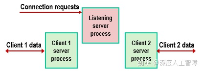
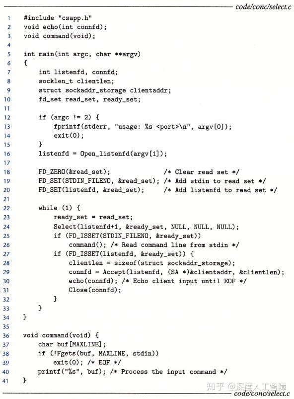
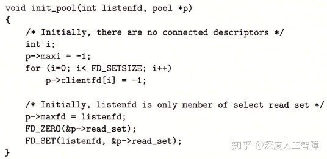
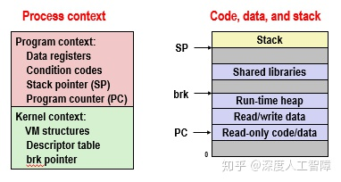

# [读书笔记]CSAPP：27[VB]并发编程


 **视频地址（英文）：**

[2015CMU 15-213 CSAPP 深入理解计算机系统 课程视频含英文字幕（精校字幕视频见av31289365！！！）_哔哩哔哩 (゜-゜)つロ 干杯~-bilibiliwww.bilibili.com/video/BV1XW411A7fB?p=25](https://link.zhihu.com/?target=https%3A//www.bilibili.com/video/BV1XW411A7fB%3Fp%3D25)

**课件地址：**

[http://www.cs.cmu.edu/afs/cs/academic/class/15213-f15/www/lectures/23-concprog.pdfwww.cs.cmu.edu/afs/cs/academic/class/15213-f15/www/lectures/23-concprog.pdf](https://link.zhihu.com/?target=http%3A//www.cs.cmu.edu/afs/cs/academic/class/15213-f15/www/lectures/23-concprog.pdf)

本章对应于书中的12.1-12.3。

------

我们可以通过创建很多线程来完成任务的一部分，如果要求整个任务都完成才能执行下一个任务，则要求对等线程都是可结合的，主线程就能通过`phread_join`来等待所有对等线程执行完毕。如果我们不需要等待整个任务都完成，此时就可以分离对等线程，让对等线程执行完毕后被自动回收。

------

我们之前在[这里](https://zhuanlan.zhihu.com/p/115407445)提过，如果不同进程的逻辑流在时间上是重叠的，则称它们是**并发的（Concurrent）**，将这种现象称为**并发（Concurrency）**。比如进程之间通过内核完成上下文切换，使得各个进程的逻辑流在时间上是重叠的，从而使得两个进程并发执行。比如异常处理程序中，当出现异常时，会触发内核去执行异常处理程序。比如通过发送信号，可以使得在同一进程中跳转到信号处理程序中等等。

我们将使用应用级并发的应用程序称为**并发程序（Concurrent Program）**，该类程序主要具有以下经典问题：

- **竞争（Races）：**结果的输出取决于系统中其他地方的任意调度决策，比如SellLab中我们要小心处理`addjob`和`deletejob`函数之间的竞争。
- **死锁（Deadlock）：**当你存在多个逻辑流在等待永远不会发生的场景时就会出现死锁。比如在信号处理程序中使用异步信号不安全的`printf`函数就可能会出现死锁现象。在主程序中执行了`printf`函数，则该函数会请求某些资源的一个锁，当该`printf`函数请求这个锁时它被某个信号处理程序中断了，而在信号处理程序中也要执行一个`printf`函数，这个`printf`也试图请求那个锁，但是由于主程序中的`printf`函数持有那个锁，所以信号处理程序中的`printf`得不到那个锁，所以这个`printf`就在等待那个锁被释放的锁，但是主程序只有在信号处理程序返回时才可能释放那个锁，所以这里就造成了死锁。
- **活锁（Livelock）**、**饿死（Starvation）**和**公平（Fairness）**：当你始终无法获得时间时会出现饿死，比如你有两个进程，而内核使用调度进程A而不调度进程B，则进程B会由于不当的进程调度而出现饿死，则这种不当的调度方式会出现不公平。

本章不会介绍上面的全部内容，只是给出一个大致的概念。目前有三种方法来构建并发程序：

- **基于进程：**每个进程执行一部分逻辑流，有内核负责在进程之间切换来达到逻辑流并发的效果。由于各个进程有自己独立的虚拟内存空间，所以控制流必须使用**进程间通信（Interprocess Communication，IPC）**机制来和其他流通信。
- **基于事件：**使用I/O多路复用技术，应用程序在一个进程中显示地调度它们的逻辑流，由于程序是一个单独的进程，所以所有流都共享一个虚拟内存空间。
- **基于线程：**可以看成上面两种方法的混合体，线程是运行在同一进程的逻辑流，由内核负责调度，共享一个虚拟内存空间。

接下来将介绍这三种并发编程方法，并尝试实现一个迭代echo服务器的并发版本。

## 1 基于进程的并发编程

> 进程的基础内容可参考：[深度人工智障：[读书笔记\]CSAPP：18[VB]ECF：异常和进程](https://zhuanlan.zhihu.com/p/115407445)
> 信号的基础内容可参考：[深度人工智障：[读书笔记\]CSAPP：19[VB]ECF：信号和非本地跳转](https://zhuanlan.zhihu.com/p/117269612)
> 综合应用可参考：[深度人工智障：[读书笔记\]CSAPP：ShellLab](https://zhuanlan.zhihu.com/p/119034923)

其实有之前的基础后，想要通过进程来实现并发编程就很直观了。首先在Web服务器的父进程中监听一个监听描述符`listenfd`的连接请求，当有客户端发送连接请求，则在父进程中会获得已连接描述符`connfd`，则我们可以为该连接通过`fork`函数来创建一个独立的子进程，在子进程中使用`connfd`来与客户端进行通信，而父进程会继续监听`listenfd`看是否有其他客户端发送连接请求，并且通过`SIGCHLD`信号的处理程序来回收结束的客户端连接所在的僵死进程。



**注意：**

- 通过`fork`函数创建的子进程会复制父进程的描述符表，使得子进程也有`listenfd`，由于不需要子进程自己监听`listenfd`，所以在子进程中需要关闭`listenfd`。
- 在父进程中获得的`connfd`让子进程来使用，父进程只负责监听`listenfd`，所以需要在父进程中关闭`connfd`，并且要注意的时，`connfd`在父进程的描述符表中占据一个表项，如果父进程不关闭`connfd`，则会一直占据`connfd`的描述符，可能会造成内存泄漏。
- 父子进程的`connfd`描述符指向相同的文件表表项，使得该文件表表项的引用数为2，只有当引用数为0时，才会终止和客户端的连接。
- 父进程必须对僵死进程进行回收。

```c
#include "csapp.h"
void echo(int connfd);

void sigchld_handler(int sig) //line:conc:echoserverp:handlerstart
{
    while (waitpid(-1, 0, WNOHANG) > 0)
	;
    return;
} //line:conc:echoserverp:handlerend

int main(int argc, char **argv) 
{
    int listenfd, connfd;
    socklen_t clientlen;
    struct sockaddr_storage clientaddr;

    if (argc != 2) {
	fprintf(stderr, "usage: %s <port>\n", argv[0]);
	exit(0);
    }

    Signal(SIGCHLD, sigchld_handler);
    listenfd = Open_listenfd(argv[1]);
    while (1) {
	clientlen = sizeof(struct sockaddr_storage); 
	connfd = Accept(listenfd, (SA *) &clientaddr, &clientlen);
	if (Fork() == 0) { 
	    Close(listenfd); /* Child closes its listening socket */
	    echo(connfd);    /* Child services client */ //line:conc:echoserverp:echofun
	    Close(connfd);   /* Child closes connection with client */ //line:conc:echoserverp:childclose
	    exit(0);         /* Child exits */
	}
	Close(connfd); /* Parent closes connected socket (important!) */ //line:conc:echoserverp:parentclose
    }
}
```

该方法的**特点：**具有共享的文件表和不共享的用户空间

- **优点：**由于进程具有自己独立的虚拟内存空间，所以无需担心被其他进程覆盖
- **缺点：**独立的地址空间使得进程之间共享状态信息较困难，必须用显示的IPC机制，比如`waitpid`函数和信号或者套接字接口等等，或者某个磁盘文件或内存映射。并且进程控制和IPC的开销很大，使得速度较慢。

## 2 基于事件的并发编程

如果你想要echo服务器能响应用户在服务器上的标准输入的键入，则服务器需要响应两个I/O事件：客户端发送的连接请求、用户在服务器上键入的命令行。如果你使用`accept`函数来接受客户端的连接请求，则会服务器会阻塞而无法处理键入的命令行，如果你想要用`read`函数来处理键入的命令行，就会使得服务器阻塞而无法处理客户端请求的连接。

这里我们需要使用**I/O多路复用（I/O Multiplexing）**技术。我们知道服务器监听端口使用监听描述符`listenfd`，而标准输入使用描述符`STDIN_FILENO`，可以用`select`函数先将进程挂起，然后判断这两个描述符的任意一个是否准备好读

```c
#include <sys/select.h>
int select(int n, fd_set *fdset, NULL, NULL, NULL);

FD_ZERO(fd_set *fdset);  //清空fdset中的所有位
FD_CLR(int fd, fd_set *fdset);  //清除fdset中的描述符fd
FD_SET(int fd, fd_set *fdset);  //开启fdset中的描述符fd
FD_ISSET(int fd, fd_set *fdset);  //判断fdset中的描述符fd是否开启
```

其中，`fd_set`类型的参数称为**描述符集合**，它使用一个大小为n的位向量![[公式]](https://www.zhihu.com/equation?tex=b_%7Bn-1%7D%2Cb_%7Bn-2%7D%2C...%2Cb_0) 来标记我们关注的描述符集合，比如我们这里的`listenfd`为`3`，而标准输入`STDIN_FILENO`为`0`，则我们可以用`FD_ZERO`和`FD_SET`函数来定义一个大小为4的位向量 ![[公式]](https://www.zhihu.com/equation?tex=1001) 来表示我们关注的位向量。将该描述符集合`fdset`传入`select`函数，它就知道要关注哪些描述符，会先将进程挂起，如果能从描述符`0`或`3`读取一个字节而不会阻塞，`select`函数就修改传入的`fdset`，用来表示哪个描述符准备好了，我们可以通过`FD_ISSET`函数来进行判断，从而执行对应的函数。

**注意：**由于`select`函数会修改传入的`fdset`参数，所以每次调用`select`函数都要更新`fdset`。



如上所示是用`select`函数实现的服务器。首先在第18~20行中根据`STDIN_FILENO`和`listenfd`定义好描述符集合`fdset`，然后在服务器死循环中通过`select`函数来监听这个描述符集合，该函数会先挂起进程，只要`STDIN_FILENO`或`listenfd`准备好了，`select`就会返回并设置好`fdset`参数，我们通过`FD_ISSET`函数来判断是哪个描述符准备好了，如果是`STDIN_FILENO`，则表示用户在服务器的标准输入中键入了命令行，如果是`listenfd`，则表示有客户端发起连接请求。

通过这种方式，服务器能同时处理用户在标准输入中的键入和客户端的连接请求，但是如果服务器与客户端连接后，就会执行`echo`函数，无法处理标准输入的键入了。

### 2.1 基于I/O多路复用的并发事件驱动服务器

I/O多路复用可以用做**并发事件驱动程序**的基础。在事件驱动程序中，一般将逻辑流抽象为**状态机（State Machine）**，具有一组**状态（State）**、**输入事件（Inpute Event）**和**转移（Transition）**，当某个状态下发生了某个输入事件时，就会转移到另一个状态。

我们这里为了实现多个客户端并发的echo服务器，首先将连接的客户端当做一个个状态机，放在池子中，每个状态机处于“等待描述符可读”状态，然后服务器使用`select`函数来检测输入事件的发生，当`select`检测到有客户端发送了请求连接这个事件，就会将新的状态机放到池子中；如果`select`检测到“描述符d准备好可读了”，则会对对应的状态进行转移，即读写一个文本行，然后状态机又转移回“等待描述符可读”状态。

首先，我们需要构建一个装状态机的池子数据结构


这里将所有客户端的已连接描述符保存在`clientfd`数组中，并且保存了对应的缓冲区`clientrio`数组。

然后是服务器的主函数


服务器获得监听描述符后，会先对池子进行初始化



池子中使用`maxi`参数来表示保存了多少个已连接客户端，这里初始化为-1，并将所有客户端的描述符初始化为-1。使用`maxfd`来保存最大的描述符，这里一开始只有一个`listenfd`，所以就初始化为`listenfd`，然后设置好`read_set`，使得`select`函数能判断`listenfd`描述符是否准备好。

在主函数中，调用`select`函数来检测描述符组`p->read_set`，最开始只有一个`listenfd`，所以就是检测是否有客户端发起连接请求，如果有，则执行`add_client`函数将该已连接客户端放入池子中


在`add_client`函数中，会寻找一个合适的索引来放`connfd`和客户端对应的缓冲区，然后就会修改`p->read_set`，添加该已连接客户端的`connfd`，使得`select`函数能检测该客户端的已连接描述符是否准备好。

在主函数中，如果`select`函数检测到的不是`listenfd`，则就是客户端发送的数据，就会调用`check_clients`函数


在该函数中，会对发送数据的客户端进行读取，并将发送了`EOF`的客户端进行关闭，并设置`p->read_set`以及将其从池子中删除。

**综上所述：**I/O多路复用其实就是使用`select`函数一次性检查多个描述符是否准备好可读了，然后通过`FD_ISSET`函数来判断是哪个描述符准备好了，再对其进行读取。并且不像之前串行服务器那样，连接上的客户端就不断读取数据，而是每个准备好的客户端都只读取一行，然后又调用`select`等待新的准备好的描述符，避免了一个客户端长时间占用服务器，使得别的客户端无法使用。

该方法的特点：

- **优点：**

- - 比基于进程的方法更好控制程序的行为，比如可以为某些客户端提供它们需要的服务
  - 所有客户端运行在单一的进程中，使得每个逻辑流能访问该进程的所有地址空间，使得流之间共享数据很容易
  - 由于是单个进程，就很容易调试，类似于顺序程序
  - 由于不需要进程的上下文切换，使得基于I/O多路复用的方法比基于进程的方法高效很多

- **缺点：**

- - 编码复杂，我们这里编写的粒度是读取每一行，如果阻塞在读取某个客户端的一行，就会使得其他客户端也不可用，而基于进程的方法不存在这个问题，如果我们想要编写更细粒度的程序，代码就更加复杂了。
  - 不能充分利用多核处理器。

## 3 基于线程的并发编程

### 3.1 线程基础

首先，我们可以看看进程的基本构成，它是由一个进程上下文和代码、数据和栈构成的



而我们这里将栈从虚拟地址空间中取出与线程的上下文结合起来，将其称为**线程（Thread）**，而其余部分保持不变。


线程就是运行在进程上下文中的逻辑流，每个进程开始生命周期时都是单一线程的，该线程称为**主线程（Main Thread）**，该主线程可以创建一个**对等线程（Peer Thread）**，由此这两个线程就并发执行，且每个线程有自己的逻辑流。该过程类似于多进程并发


首先，每个线程都有自己的**线程上下文（Thread Context）**，包括一个唯一的整数**线程ID（Thread ID，TID）**、栈、栈指针、程序计数器、通用目的寄存器和条件码，且每个线程有自己的栈用来保存局部变量。而内核会负责线程之间的调度，比如主线程在运行一个慢速系统调用时，内核就会调用线程上下文切换将控制转移到对等线程，当对等线程执行一段时间后，内核又会调用线程上下文切换将控制转移到主线程。

**线程之间的关系：**所有运行在一个进程里的线程共享该进程的整个虚拟地址空间，包括代码、数据、堆、共享库和打开的文件，这些与一个进程相关的线程组成一个**对等线程池**，线程之间不是父子关系，而是对等关系，即一个线程可以杀死它的任意对等线程，或等待它的任意对等线程终止。而主线程和对等线程的区别仅仅是主线程是进程中第一个运行的线程。

**进程与线程的相同点：**

- 每个都有自己的逻辑流
- 都能并发运行
- 可以上下文切换

**进程与线程的区别：**

- 每个进程具有自己的独立虚拟地址空间，而处于同一个进程上下文的线程共享该进程的整个虚拟地址空间，变成之间会共享所有代码和数据（除了局部栈）。
- 由于线程上下文比进程上下文小很多，所以内核进行线程上下文切换比进程上下文切换快很多。
- 进程之间存在父子关系，而线程之间是对等关系。


### 3.2 线程编程


以上是一个简单的线程编程例子，这里封装了大部分的函数，来首先理解线程编程的思想。首先，我们需要构建一个**线程例程（Thread Routine）**来包含线程的代码和本地数据，比如第12~16行的`thread`就是一个线程例程，线程例程都是以一个`void *`指针作为输入，并返回一个`void *`指针，如果想要传递多个参数给线程或线程想返回多个参数，就要将其放入一个结构中，并使用指向该结构的指针。在`main`函数中，首先会通过`Phread_create`函数来创建一个对等线程，将对等线程的线程例程作为参数，并返回该线程的TID`tid`，此时主线程和刚创建的对等线程就会同时运行，接下来调用`Phread_join`函数，主线程就会等待对等线程终止。


接下来我们依次详细看一下线程编程的函数

### 3.2.1 创建线程

```c
#include <pthread.h>
typedef void *(func)(void *);
int pthread_create(pthread_t *tid, pthread_attr_t *attr, func *f, void *arg);
pthread_t pthread_self(void); 
```

我们可以通过将线程例程`f`传入`pthread_create`函数来获得线程TID`tid`，当该函数返回时，就会在新线程的上下文中将参数`arg`传给`f`并运行`f`。我们可以通过`atte`来修改线程的默认行为，这里不做介绍。在线程例程中，可以通过`pthread_self`来获得所在线程的TID。

### 3.2.2 终止线程

```c
#include <pthread.h>
void pthread_exit(void *thread_return);
int pthread_cancel(pthread_t tid); 
```

线程终止有以下几种方式：

- 当顶层的线程例程返回时，线程会隐式地终止。（**不懂？**）
- 当某个对等线程调用`exit`函数时，会终止进程以及所有与该进程相关的线程。
- 线程例程可以调用`pthread_exit`函数来终止线程，并将`thread_return`作为终止信号。如果是在主线程中调用该函数，它会等其他所有对等线程终止后，才终止主线程和进程。
- 可以通过`pthread_cancel`发送线程终止请求给`tid`线程。

**参考：**

- [线程取消(pthread_cancel) - Cynthia&Sky - 博客园](https://link.zhihu.com/?target=https%3A//www.cnblogs.com/lijunamneg/archive/2013/01/25/2877211.html)
- [pthread_exit()_运维_佑邦的专栏-CSDN博客](https://link.zhihu.com/?target=https%3A//blog.csdn.net/youbang321/article/details/7816016)

### 3.2.3 回收已终止线程的资源

类似于进程，当子进程终止时，父进程要通过调用`waitpid`来回收子进程的资源。同理，我们也要回收终止线程的资源

```c
#include <pthread.h>
int pthread_join(pthread_t tid, void **thread_return); 
```

当我们调用该函数时，它会阻塞直到线程`tid`终止，此时会将线程例程返回的`void *`保存到`thread_return`中，然后回收已终止线程的资源。

**注意：**我们这里只能等待一个指定的线程`tid`终止，而无法像`waitpid`那样等待任意的进程终止。

### 3.2.4 分离线程

线程具有**两种状态：**

- **可结合的（Joinable）：**线程默认是可结合的，可被其他线程终止，当线程终止时，它的内存资源不会释放，需要被其他线程通过`pthread_join`函数来回收。
- **分离的（Detached）：**我们可以通过以下函数来将可结合的线程变为分离的线程，此时它就无法被其他线程终止或回收了，它会在它自己终止时由系统自动释放资源。线程可以在自己线程例程刚开始时，使用`pthread_self`函数来将自己设置为分离的。

```c
#include <pthread.h>
int pthread_detach(pthread_t tid);
```

### 3.2.5 初始化线程

当我们在多线程环境中编程时，可能想要初始化与线程例程相关的状态，比如初始化多个线程共享的全局变量时，这些初始化只想执行一次，此时就可以使用以下函数

```c
#include <pthread.h>

pthread_once_t once_control = PTHREAD_ONCE_INIT;
int pthread_once(pthread_once_t *once_control, void (*init_routine)(void));
```

首先，我们需要自己定义一个初始化的函数`init_routine`，然后在各个线程例程中调用`pthread_once`函数，此时会通过`once_control`参数来控制只执行一次初始化函数`init_routine`。

### 3.3 基于线程的并发服务器

我们可以实现基于线程的并发echo服务器

```c
#include "csapp.h"

void echo(int connfd);
void *thread(void *vargp);

int main(int argc, char **argv) 
{
    int listenfd, *connfdp;
    socklen_t clientlen;
    struct sockaddr_storage clientaddr;
    pthread_t tid; 

    if (argc != 2) {
	fprintf(stderr, "usage: %s <port>\n", argv[0]);
	exit(0);
    }
    listenfd = Open_listenfd(argv[1]);

    while (1) {
        clientlen=sizeof(struct sockaddr_storage);
	connfdp = Malloc(sizeof(int)); //line:conc:echoservert:beginmalloc
	*connfdp = Accept(listenfd, (SA *) &clientaddr, &clientlen); //line:conc:echoservert:endmalloc
	Pthread_create(&tid, NULL, thread, connfdp);
    }
}

/* Thread routine */
void *thread(void *vargp) 
{  
    int connfd = *((int *)vargp);
    Pthread_detach(pthread_self()); //line:conc:echoservert:detach
    Free(vargp);                    //line:conc:echoservert:free
    echo(connfd);
    Close(connfd);
    return NULL;
}
```

它这个过程类似于基于进程的并发服务器，`main`函数中会死循环等待是否有客户端发送连接请求， 通过`accept`函数获得已连接描述符`connfd`，然后将其作为线程例程`thread`的参数来通过`pthread_create`函数创建一个对等例程，当`ptread_create`函数返回时，此时主线程和对等线程就会同时并发运行，所以服务器可以用一个对等线程来处理一个客户端的连接，而通过主线程来进行监听，由此达到了多个客户端并发的效果。

由于`main`函数不显示地回收对等线程，所以在线程例程中，需要分离该线程，让它自己线程终止时就自动回收资源。

该函数中需要**注意两点：**

首先，为什么已连接描述符`connfd`想要传入线程例程时，要采用上面的那种形式

```c
connfdp = Malloc(sizeof(int));
*connfdp = Accept(listenfd, (SA *) &clientaddr, &clientlen); 
Pthread_create(&tid, NULL, thread, connfdp);
```

如果我们采用下面这种形式会不会出现问题

```c
connfd = Accept(listenfd, (SA *) &clientaddr, &clientlen); 
Pthread_create(&tid, NULL, thread, &connfd);

void *thread(void *vargp) 
{  
    int connfd = *((int *)vargp);
    ...
}
```

这里需要注意，传入线程例程的是一个指针参数，指向的是`connfd`的地址，当我们在`thread`函数中完成类型转换获得局部变量`connfd`之前，下一个客户端发送了连接请求，使得`accept`函数修改了`connfd`的值时，由于同一进程中的所有线程共享相同的虚拟地址空间，所以会使得`thread`函数中的`connfd`变成下一个客户端的`connfd`了，产生了竞争。所以这里每次都会申请一个新的地址来存放`connfd`，避免存在竞争，并且由于每个线程有自己的栈，所以线程中的局部变量并不会相互影响。

其次，我们注意到，在基于进程的并发服务器中，在父子进程中都有对`connfd`的关闭，这是因为父子进程都有自己独立的虚拟地址空间，有独立的描述符表，所以需要两个进程从自己的描述符表中清除`connfd`，避免内存泄漏。而基于线程的并发服务器，由于所有线程共享当前进程的虚拟地址空间，即共享了同一个描述符表，此时在线程例程中关闭`connfd`后，就会直接从进程的描述符表中清除`connfd`了，就无需主线程关闭`connfd`了。

该方法的特点：

- **优点：**

- - 易于在线程之间共享数据结构，比如日志记录信息和文件缓存
  - 线程比进程更高效

- **缺点：**无意的共享会引入细微且难以再现的错误！

