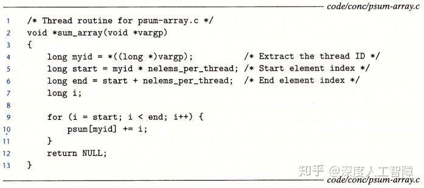
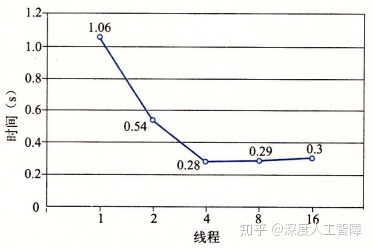

# [读书笔记]CSAPP：29[VB]线程级并行


 **视频地址：**

[2015CMU 15-213 CSAPP 深入理解计算机系统 课程视频含英文字幕（精校字幕视频见av31289365！！！）_哔哩哔哩 (゜-゜)つロ 干杯~-bilibiliwww.bilibili.com/video/BV1XW411A7fB?p=24](https://link.zhihu.com/?target=https%3A//www.bilibili.com/video/BV1XW411A7fB%3Fp%3D24)

**课件地址：**

[http://www.cs.cmu.edu/afs/cs/academic/class/15213-f15/www/lectures/26-parallelism.pdfwww.cs.cmu.edu/afs/cs/academic/class/15213-f15/www/lectures/26-parallelism.pdf](https://link.zhihu.com/?target=http%3A//www.cs.cmu.edu/afs/cs/academic/class/15213-f15/www/lectures/26-parallelism.pdf)

本章对应于书中的12.6。

------

- 同步互斥锁的代价很大，要避免进行同步
- 并行程序一般一个核运行一个线程

------

根据程序逻辑流的数目，可以将程序分为顺序程序和并发程序，其中顺序程序只有一个逻辑流，而并发程序具有多个逻辑流。当在多个处理器中运行并发程序时，就成为了并行程序，速度会更快，因为内核在多个核上并行地调度这些并行线程，而不是在单个核上顺序地调度。


我们以一个简单的例子来看并行程序的例子，用并行程序来计算 ![[公式]](https://www.zhihu.com/equation?tex=0%2C1%2C...%2Cn-1%2Cn) 的和。首先，我们可以根据线程数目将这些数字划分成若干个组，每个线程在自己的组中计算结果，再将其放入一个共享全局变量中，需要用互斥锁保护这个变量。


第30行中我们将每个线程的组号作为参数传递到线程例程中，再让主线程等待所有对等线程运行完毕，再与正确结果比较是否正确。


在线程例程中，首先根据组号计算出线程需要计算的范围，然后对全局变量进行加和时，要注意用互斥锁将其保护起来。我们可以得到这个程序在四核系统上计算 ![[公式]](https://www.zhihu.com/equation?tex=2%5E%7B31%7D) 的性能为

单位为秒

可以发现效果很差，其实**主要原因**是由于`P`和`V`对互斥锁的保护。我们可以将每个线程计算的结果保存在全局数组中的特定位置，这样就不用对数组进行保护



该程序的性能为


可以发现去掉互斥锁后性能提升了很多。根据之前[优化程序性能](https://zhuanlan.zhihu.com/p/107369491)介绍的，要避免内存的读写，使用一个局部变量保存循环中计算的结果，在循环计算后再将其保存到数组中，程序性能为


在四核系统上的性能

可以一开始线程数目每增加一个，运行速度就下降一半，而当线程数到达4时，就不变了。这是因为这个程序运行在四核系统中，当线程数大于4时，每个核中就需要内核进行线程上下文切换来对线程进行调度，此时就会增加开销。并行程序一般一个核运行一个线程。

这里介绍几个度量并行程序利用并行性程度的**指标：**

- **加速比（Speedup）：**![[公式]](https://www.zhihu.com/equation?tex=S_p%3D%5Cfrac%7BT_1%7D%7BT_p%7D)
  其中p是核数目， ![[公式]](https://www.zhihu.com/equation?tex=T_p) 是并行程序p个核上的运行时间

- - **绝对加速比（Absolute Speedup）：**![[公式]](https://www.zhihu.com/equation?tex=T_1) 是顺序程序执行时间。需要编写两套代码，较复杂，但能更真实衡量并行的好处。
  - **相对加速比（Relative Speedup）：**![[公式]](https://www.zhihu.com/equation?tex=T_1) 是并发程序在一个核上的执行时间。由于并发程序需要增加同步开销，会得到比绝对加速比更大的结果。

- **效率（Efficiency）：**![[公式]](https://www.zhihu.com/equation?tex=E_p%3D%5Cfrac%7BS_p%7D%7Bp%7D)
  主要用来衡量并行化造成的开销，效率越高，说明程序在有用工作上花费更多时间，在同步和通信上花费较少的时间。


接下来我们以排序为例来介绍并行程序，尝试实现并行版的快速排序。首先看一下快速排序的顺序版本

```c
void qsort_serial(data_t *base, size_t nele) {
  if (nele <= 1)
    return;
  if (nele == 2) {
    if (base[0] > base[1])
      swap(base, base+1);
    return;
  }

  /* Partition returns index of pivot */
  size_t m = partition(base, nele);
  if (m > 1)
    qsort_serial(base, m);
  if (nele-1 > m+1)
    qsort_serial(base+m+1, nele-m-1);
}
```

可以发现我们首先对最左侧的部分进行排序，当左侧子部分排序完成时，才对右侧部分进行排序。最简单的并行方法就是将数据分成左右两部分，用两个线程分别对这两部分进行排序，称为**分而治之并行（Divide-and-Conquer Parallelism）**。此外我们还可以使用生产者-消费者模型。

发布于 2020-04-15