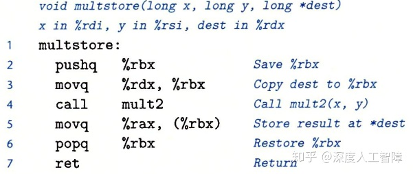
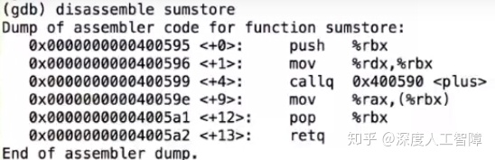
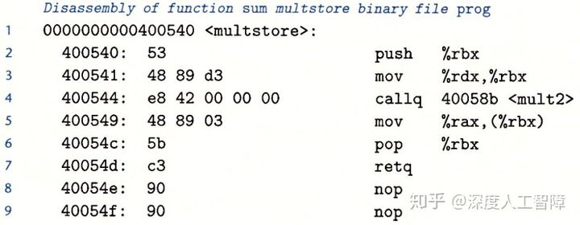
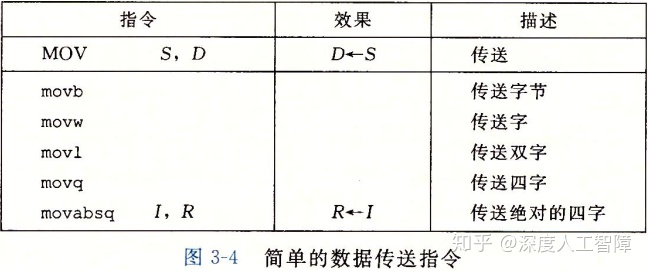
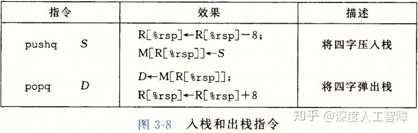
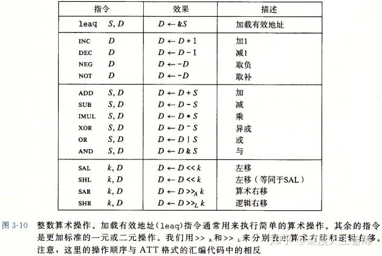
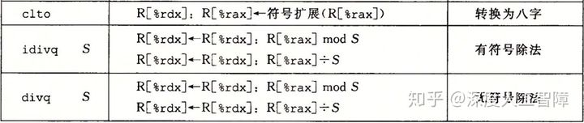

# [读书笔记]CSAPP：5[VB]机器级表示：基础


 

**视频链接：**

[【精校中英字幕】2015 CMU 15-213 CSAPP 深入理解计算机系统 课程视频_哔哩哔哩 (゜-゜)つロ 干杯~-bilibiliwww.bilibili.com/video/av31289365?p=5](https://link.zhihu.com/?target=https%3A//www.bilibili.com/video/av31289365%3Fp%3D5)

**课件链接：**

[http://www.cs.cmu.edu/afs/cs/academic/class/15213-f15/www/lectures/05-machine-basics.pdfwww.cs.cmu.edu/afs/cs/academic/class/15213-f15/www/lectures/05-machine-basics.pdf](https://link.zhihu.com/?target=http%3A//www.cs.cmu.edu/afs/cs/academic/class/15213-f15/www/lectures/05-machine-basics.pdf)

对应于书本的3.1~3.5。

**如果有错误请指出，谢谢。**

------

**小点：**

- 生成4字节数据的指令会把高位 4个字节置零。
- 使用寄存器进行内存引用时，要用64位寄存器。
- 局部变量通常保存在寄存器中，访问速度会比存放在内存中快很多。
- 对于程序而言，无法看到缓存，没有操作缓存的指令，也无法直接访问缓存。
- 可以将寄存器当做你正在处理的临时数据。

------

## 1. 机器级表示

我们当前使用的高级编程语言提高了比较高的抽象，使得工作效率更高也更可靠，并且保证了程序可以在很多不同的机器上编译和执行，而低级语言，比如汇编或机器语言，却和特定机器密切相关，使得移植性较差。但是学习阅读这些汇编代码，我们能够：

- 理解编译器的优化能力，分析代码中隐含的低效率
- 高级语言提供的抽象层会隐藏程序运行时的行为，通过阅读汇编，能够详细了解机器是如何运行的
- 攻击程序通常涉及程序运行时控制信息的方式的细节，我们想要了解这些漏洞就需要懂得机器级表示

并且使用低级语言，我们可以获得更多有用的数据：

- **程序计数器（Program Counter）**指示了下个指令的内存地址。
- 程序员实际使用的**寄存器（Register）**，可以看成非常小的内存，可以通过特定名字来指定。
- 只有几个位的**状态码（Condition Codes）**指示了最近一些指令的运行结果，比如是否产生0、是否产生负数或正数等等。这些值可以用来实现条件分支。

对于机器级编程来说，有两个抽象十分重要：

1. 由**指令集体系结构**或**指令集架构（Instruction Set Architecture，ISA）**来定义机器级程序的格式和行为，它定义了处理器状态、指令的格式，以及每条指令对状态的影响。大多数ISA都将程序的行为描述为按顺序执行每条指令。这是编译器的目标，提供一系列指令告诉机器要做什么。而**微结构（Microarchitecture）**是指这个架构的实现。
2. 机器级程序使用的内存地址是虚拟内存地址，使得内存模型看上去是一个很大的连续字节数组。然后由操作系统将其转换为真实的物理内存地址。在任意给定的时刻，只有有限的一部分虚拟地址是合法的。

我们这里的表述主要基于x86-64，它是Intel 64位体系结构，它的前身是32位的IA32。x86是对Intel处理器的口头称呼，因为第一个芯片被称为8086。x86又被称为**复杂指令集计算机（Complex Instruction Set Computer，CISC）**。目前处理器和常用的另一大类是**ARM（Acorn RISC Machine）**，RISC是**精简指令集计算机（Reduced Instruction Set Computer）**，由于它更简单，所以它比x86机器功耗更低。

## 2. 程序编码

计算机执行的是机器代码，是字节序列编码低级的操作，我们很难通过观察字节去理解含义，而汇编代码作为机器代码的文本表示，可以让人们更容易理解。从源代码转为机器代码的过程：

1. **预处理器**会扩展源代码，插入所有用`#include`指令的文件，扩展所有用`#define`声明指定的宏。
2. **编译器**基于编程语言的规则、目标机器的指令集和操作系统的惯例，会将源代码转换为汇编代码作为输出，给出程序的每一条指令。
3. **汇编器**将汇编代码转化为二进制目标代码文件，它是机器代码的一种形式，包含了所有指令的二进制表示，但是还没有填入全局值的地址。
4. **链接器**将目标代码文件和实现库函数的代码合并，产生最终可执行代码文件。


我们接下来就看看这些编码的形式。

### 2.1 编译器

文件`mstore.c`中包含以下代码：

```text
long mult2(long, long);
void multstore(long x, long y,long *dest){
    long t = mult2(x,y);
    *dest = t;
} 
```

我们通过命令`gcc -0g -S mstore.c`将其编译成汇编代码，得到`mstore.s`。其中，

- `-Og`：是生成机器代码的优化等级，这个表示编译器会生成符合原始C代码整体结构的机器代码，这是用于调试的级别，便于我们学习观察。其他的`-O1`或`-O2`会得到更好的程序性能，但是机器代码和源代码的关系就比较难以理解。
- `-S`：只生成到汇编代码。


所有以`.`开头的行都是指导汇编器和链接器工作的伪指令，我们通常可以忽略这些行。对其化简并加上解释，可以得到汇编代码：



汇编代码相比C语言有**几个特点：**

- 有许多不同类型的整型数据类型，它们存储时不区分符号和无符号。
- 指针是以简单的数字的形式保存在计算机中的。
- 浮点数以和整型数据完全不同的方式进行处理，并且使用完全不同的寄存器组。
- 程序本身是一系列字节。
- 机器级别并不存在类似数组和结构这样的基本数据类型，它们是由编译器构成的。
- 汇编语言中的每条语言能做的都非常有限。
- 变量所有名称在汇编代码级别完全丢失了，变成了寄存器和内存中的某个位置。

### 2.2 汇编器

我们可以运行`gcc -Og -c mstore.c`来进行编译和汇编，会生成二进制文件`mstore.o`，它是对一系列指令的编码，机器直接执行这些字节序列，对源代码一无所知。

我们可以通过**反汇编器（Disassembler）**来将机器代码转化为类似汇编代码的格式，在Linux中，我们可以运行`objdump -d mstore.o`，可以得到


最左侧一栏是对应的字节地址，中间是每个指令的编码，右侧是生成的汇编代码。我们可以发现：

1. 每个指令需要的字节数不同，常用的指令和需要较少操作数的指令所需的字节数比较少。
2. 每个指令都有自己对应的编码。
3. 反汇编得到的汇编代码和直接生成的有略微差异。

同样可能使用`gdb`然后输入`disassemble`来反汇编代码



### 2.3 链接器

使用链接器将目标代码文件转化为可执行代码，**要求：**目标代码文件中必须含有一个`main`函数，作为程序的入口。

我们构建一个文件`main.c`

```text
#include <stdio.h>
void multstore(long, long, long*);

int main(){
    long d;
    multstore(2, 3, &d);
    printf("%d\n", d);
    return 0;
} 
long mult2(long a, long b){
    long s = a*b;
    return s;
}
```

然后运行命令`gcc -Og -o prog main.c mstore.c`将main.c和mstore.c链接起来，并添加启动和终止程序的代码，以及用来与操作系统交互的代码生成可执行代码，生成最终的可执行文件`prog`。我们通过对其反汇编，可以得到如下内容



可以发现和汇编器生成的**区别有**：

1. 链接器将代码移到了新的地址范围内。
2. 第4行中，链接器补充了调用函数`mult2`需要使用的地址。
3. 多了两行`nop`，可以使得函数代码变成16字节，更好放置下一个代码。

大概了解后，我们需要开始学习汇编代码了，

## 3 数据格式

在x84-64中C语言数据类型的大小如下图所示


大多数GCC生成的汇编代码指令都有一个表示操作数大小的后缀。**注意：**汇编代码使用`l`表示4字节整数和 8字节双精度浮点数，由于浮点数使用完全不同的指令和寄存器，所以不会产生冲突。

## 4 访问信息

一个x86-64的CPU中包含16个存储64位值的通用目的寄存器，可以用来存储整数数据和指针。有些寄存器有**特殊用途：**

- 栈指针`%rsp`用来指明运行时栈的结束位置
- 比如`%rdi`、`%rsi`、`%rdx`、`%rcx`、`%r8`和`%r9`用来保存函数的参数
- `%rip`用来保存当前执行指令的地址
- `%rax`用来存放函数的返回值

在大部分情况下这些寄存器都可用来保存程序数据。并且有一组标准编程规范控制着如何使用寄存器来管理栈、传递函数参数、从函数返回值，以及存储局部和临时数据。


我们可以对这些寄存器的低位字节中存放的不同大小的数据进行操作，`%r`表示64位、`%e`表示32位。

对于生成小于8字节结果的指令，**有两条规则：**

1. 生成1字节或2字节数据的指令会保持剩下的字节内容不变；
2. **生成4字节数据的指令会把高位 4个字节置零。**

## **4.1 操作数指示符**

大多数指令由一个或多个操作数（Operand），指示出一个操作中要使用的元数据值，以及放置结果的目的位置。x86-64支持的操作数格式如下


其中包含三种类型：

- **立即数（Immediate）：**用来表示常数值，书写格式是在`$`后面跟一个标准C表示法表示的整数。
- **寄存器（Register）：**表示某个寄存器的内容。
- **内存引用：**它会根据计算出来的地址访问某个内存位置。有不同的寻址模式，最常用的是 ![[公式]](https://www.zhihu.com/equation?tex=Imm%28r_b%2Cr_i%2Cs%29) ，其中，**要求寄存器大小都是64位的**，才能完整索引整个虚拟内存空间，并且不能使用`%rsp`。

### 4.2 数据传送指令

最频繁使用的指令是将数据从一个位置复制到另一个位置的指令。

### 4.2.1 源和目的大小匹配

该类数据传送指令将数据从一个位置复制到另一个位置，不做任何变化。不同类型指令指定了不同的数据大小（一个字为两个字节）。**源操作数**是一个立即数，可以保存在寄存器或内存中；**目的操作数**是一个位置，可以是寄存器或内存位置。



**注意：**

- 两个操作数不能同时为内存地址。如果要在两个内存位置传输数据，必须用一个寄存器进行中转。
- 使用到的寄存器大小一定要和指令最后一个字符指定的大小匹配。
- `movl`以寄存器为目的时，会将寄存器的高位4字节置0。
- 如果用`movq`来传输立即数时，该立即数只能表示为32位补码，然后扩展到64位的值。而`movabsq`能够以任意64位立即数作为源操作数，并且只能以寄存器作为目的。


这里可以把寄存器当做临时存储。

### 4.2.2 源寄存器小于目的寄存器

在将较小的源值复制到较大的目的时，提供两个类`MOVZ`和`MOVS`。`MOVZ`是将目的中剩余的字节填充0，`MOVS`是将目的剩余的字节填充符号位的值。它们每条指令后面吗都有两个字符，分别表示源大小和目的大小。


**注意：**

- 不存在`movzlq`，可以直接使用`movl`。因为当使用`movl`传输数据到32位目的寄存器中时， 会自动将目的寄存器的高位4字节置零。
- `cltq`没有操作数，总是以`%eax`作为源寄存器，以`%rax`作为目的寄存器，等价于`movslq %eax,%rax`。

**当源寄存器大于目的寄存器时，会报错。**

**例1：**

给定代码

```c
long exchange(long *xp, long y){
    long x = *xp;
    *xp = y;
    return x;
}
```

其中，`xp`保存在`%rdi`中，`y`保存在`%rsi`中，补充以下代码

```text
 exchange:
    ______________
    ______________
    ret
```

首先，像`x`这样的局部变量，通常会保存在寄存器而不是内存中，因为访问寄存器会比内存快很多。所以第一行就是将`*xp`移到一个寄存器中，因为`xp`保存在`%rdi`中，而指针`xp`保存的是存储数据的内存地址，所以要用`(%rdi)`来访问对应的内存数据来作为源，而`long`数据类型保存的是64位数据，所以需要使用`movq`来传输。所以第一行是`movq (%rdi),%rax`。接下来将`y`中的数据保存到指针对应的内存地址中就行了，所以是`movq %rsi,(%rdi)`。

**例2：**

有以下强制类型转换代码

```text
src_t *sp;
dest_t *dp;
*dp = (dest_t) *sp;
```

其中`sp`和`dp`分别保存在寄存器`%rdi`和`%rsi`中。对于不同的`src_t`和`dest_t`，我们推测它的汇编指令。

- `long`--> `long`： 由于两个类型相同，照理说是可以直接`movq (%rdi), (%rsi)`，但是x86-64限制不能在内存地址间传输，所以需要先经过一个寄存器，所以汇编指令为：`movq (%rdi), %rax`，`movq %rax, (%rsi)`。
- `char`--> `int`：两个都是有符号数，而`char`时1个字节，`int`是4个字节，所以要先对数据进行有符号扩展，即`movsbl (%rdi), %eax`。然后将其转到对应的内存地址`movl %eax, (%rsi)`。
- `char`--> `unsigned`：当大小和符号同时改变时，C中是先改变大小，再改变符号的。而`char`是有符号数，所以先对其进行有符号扩展`movsbl (%rdi), %eax`。由于有符号数和无符号数之间的位向量是相同的，所以直接将其保存到对应的内存地址就行，即`movl %eax, (%rsi)`。
- `unsigned char`--> `long`：由于`long`是64位的，而且对`unsigned char`进行无符号扩展时是补充0，所以我们可以直接对低32位赋值，这样高4字节也会自动变成零，即`movzbl (%rdi),%eax`。然后将其整个转到对应的内存地址`movq %rax, (%rsi)`。
- `int`--> `char`：因为`int`是32位的，而`char`是8位的，所以要直接对其进行截断。这里是先将其整个移到寄存器中，然后再将部分保存到内存中，即`movl (%rdi), %eax`，`movb %al, (%rsi)`。
- `unsigned`--> `unsigned char`： 上同。
- `char`--> `short`：`movbw (%rdi), %ax`，`movw %ax, (%rsi)`。

**综上：**

1. 两个指针之间进行传输，由于是直接对内存进行操作的，所以需要先经过一个寄存器。
2. 小的数据类型转换到大的数据类型，是根据前面的数据类型决定是`MOVZ`还是`MOVS`。
3. 大的数据类型转换到小的数据类型时，先将其保存得到寄存器中，再将部分保存到内存中。

### 4.3 压入和弹出栈数据

栈在处理过程调用中起着至关重要的作用，在内存中栈顶位于较小的内存地址中。入栈时，就需要先将栈顶地址增加，由此指向了要放数据的地址，然后将数据存入对应的内存中。出栈时，先从内存中取出对应的数据，然后再将栈地址减小，来指向当前的栈顶地址。

这里使用一个特殊的寄存器`%rsp`来保存栈顶内存地址。并且提供两个操作指令`PUSH`和`POP`分别对应入栈和出栈，以操作64位数据为例，如下图所示



（这里的8是指8个字节）

因为栈和程序代码和其他的程序数据都放在同一内存中，所以我们可以根据`%rsp`来访问栈中的任意位置。假设栈顶元素是8字节的，则`movq 8(%rsp), %rdx`表示将第二个元素保存在寄存器`%rdx`中。

## 5 算数和逻辑操作

以下列出了x86-64中的一些算数和逻辑操作，除了`leaq`以外，其他都有对不同大小数据的指令。



- `leaq S D`是将S计算出的地址付给寄存器D。通常会被用来执行加法和有限形式的乘法。比如对于比例变址寻址 ![[公式]](https://www.zhihu.com/equation?tex=Imm%28r_b%2Cr_i%2Cs%29) ，得到的地址会是 ![[公式]](https://www.zhihu.com/equation?tex=Imm%2Br_b%2Bs%5Ccdot+r_i) ，所以`leaq Imm(%rax, %rbx, s), %rcx`就是将`Imm+%rax+s*%rbx`保存到`%rcx`。**注意：**目的操作数只能是寄存器。


- 一元操作符中，操作数可以是寄存器也可以是内存地址。
- 二元操作符中，第一个操作数可以是立即数、寄存器或内存地址；第二个操作数可以是寄存器或内存地址。
- 移位操作中，第一个操作数可以是立即数或放在**寄存器`%cl`**中，第二个操作数可以是寄存器或内存位置。**注意：**如果我们对w位的数据进行移位，则只考虑`%cl`中 ![[公式]](https://www.zhihu.com/equation?tex=log_2w) 位，保证不会将数据移出边界。 比如`salb`只会考虑低3位的值，`salw`只会考虑低4位的值，以此类推。

**注意：**

- 以上操作除了右移以外，在无符号数和补码间都是通用的，也体现了补码的优势。
- 可以使用`xorl %edx, %edx`来对寄存器`%rdx`置零。

## 6 特殊计算操作

### 6.1 除法

在3-10中我们并没有看到除法操作，它是使用比较特殊的指令进行计算的，如下图所示



其中`R[%rdx]:R[%rax]`表示将两个寄存器的值拼接起来作为一个数，其中寄存器`%rdx`是高八字节，`%rax`是低八字节。它这里只有一个操作数表示除数，而被除数保存在`%rax`和`%rdx`中。

**有符号数除法：**

1. 将占用`%rax`和`%rdx`的数据`mov`到别的寄存器中
2. 将被除数中的64位`mov`到`%rax`中
3. 如果被除数是64位的，则要用`cqto`根据`%rax`中的最高有效位对`%rdx`进行符号扩展；如果被除数是128位的，就将剩下的64位`mov`到`%rdx`中
4. 使用`idiv`进行计算。

**无符号数除法：**

1. 将占用`%rax`和`%rdx`的数据`mov`到别的寄存器中
2. 将被除数中的64位`mov`到`%rax`中
3. 如果被除数是64位的，则使用`xorq %rdx, %rdx`将高64位置零；如果被除数是128位的，就将剩下的64位`mov`到`%rdx`中
4. 使用`div`进行计算。

### 6.2 128位乘法

我们知道，64位数乘上64位数会得到128位的数，x86-64提供了这种乘法的指令，如下图所示


我们可以发现，指令`imul`和图3-10中的普通乘法指令是一样的，但是这个128位乘法只有一个操作数，普通乘法有两个操作数，汇编器会通过操作数的数目来判断是执行哪条指令。

1. 将占用`%rax`的数据`mov`到别的寄存器中
2. 将其中一个乘数`mov`到`%rax`中
3. 如果是有符号乘法，就使用`imul`，如果是无符号乘法，就是用`mul`
4. 对结果进行保存，比如保存在`(%rdi)`中：如果是在小端机器中，则为`movq %rax, (%rdi)`，`movq %rdx, 8(%rdi)`；如果是打断机器中，则为`movq %rax, 8(%rdi)`，`movq %rdx, (%rdi)`。