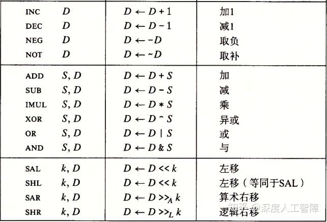
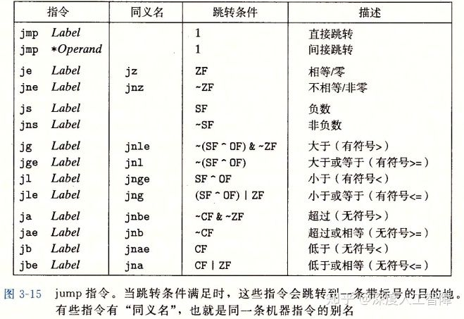
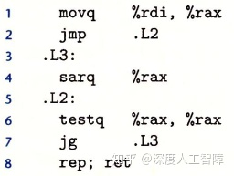
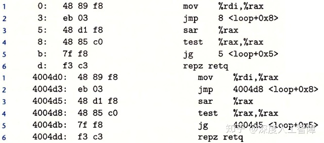
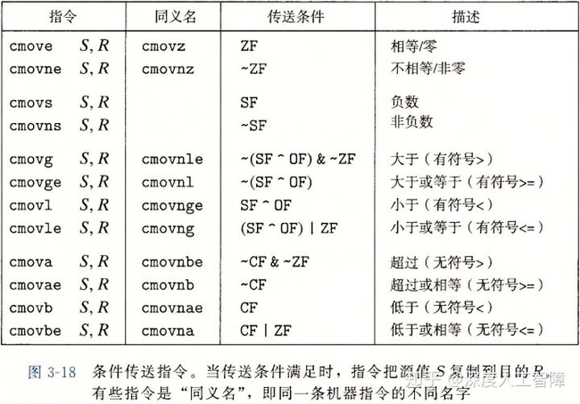
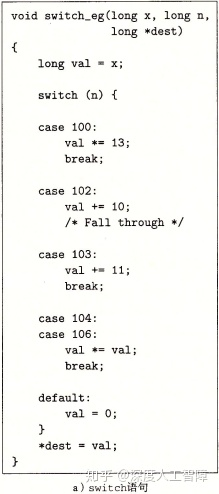

# [读书笔记]CSAPP：6[VB]机器级表示：控制


 

**视频地址：**

[【精校中英字幕】2015 CMU 15-213 CSAPP 深入理解计算机系统 课程视频_哔哩哔哩 (゜-゜)つロ 干杯~-bilibiliwww.bilibili.com/video/av31289365?p=6](https://link.zhihu.com/?target=https%3A//www.bilibili.com/video/av31289365%3Fp%3D6)

**课件地址：**

[http://www.cs.cmu.edu/afs/cs/academic/class/15213-f15/www/lectures/06-machine-control.pdfwww.cs.cmu.edu/afs/cs/academic/class/15213-f15/www/lectures/06-machine-control.pdf](https://link.zhihu.com/?target=http%3A//www.cs.cmu.edu/afs/cs/academic/class/15213-f15/www/lectures/06-machine-control.pdf)

对应于书本的3.6。

**如有错误请指出，谢谢。**

------

**小点：**

- 大多数情况下，机器对有符号数和无符号数都使用一样的指令，因为大多数算数运算对无符号数和补码都是相同的位级行为。但是在右移、除法和乘法指令以及条件码组合中，需要区分无符号数和补码。
- 保存在64位寄存器中的数据类型，除了`long`和`unsigned long`以外，还可以是指针（对于64位操作系统而言）。
- 条件跳转只能是直接跳转。
- 当`switch`的分支跨度很大，并且很稀疏时，会保存很大的跳转表，可能影响性能，编译器可能会将其构建成树的结构。此时建议使用`if-else`语句。
- 这一节比较重要的概念：条件jump、条件mov以及跳转表的思想，

------

之前介绍的只是指令一条条顺序执行的，也就是对应于直线代码的行为。当出现条件语句、循环语句等，就需要有条件地执行指令。机器代码通过测试数据值，然后根据测试的结果来改变控制流或者数据流。

## 1 条件码

除了之前介绍的保存整数和指针的16个64的寄存器以外，CPU还维护了一组单个位的**条件码（Condition Code）寄存器**，我们不会直接对条件码进行设置，而是根据最近的算数、逻辑或者测试的结果，自动设置这些条件码寄存器的值。

**条件码包括：**

- **ZF：**零标志，最近的操作得到的结果是否为0。

- **无符号数：**

- - **CF：**进位标志，最近的操作使得最高位产生进位。可用来检查无符号数是否存在溢出。

- **补码：**

- - **SF：**符号标志，最近的操作得到的结果为负数。
  - **OF：**溢出标志，最近的操作导致补码溢出（可以通过符号位进一步判断是正溢出还是负溢出）。

当我们执行如下操作时，不仅目的寄存器会发生改变，同时会设置这些条件码寄存器。

****

**注意：**

- `lea`不会设置条件码，因为它只是单纯计算地址。
- 逻辑操作的CF和OF会设置为0。
- 移位操作CF为最后一个被移出的位，OF=0。
- INC和DEC会设置OF和ZF，不会改变CF。

x86-64提供了另外两类指令，**只会设置条件码而不会改变目的寄存器**：

- `CMP S1, S2`：用来比较`S1`和`S2`，根据`S2-S1`的结果来设置条件码。主要用来比较两个数的大小。
- `TEST S1, S2`：用来测试`S1`和`S2`，根据`S1 & S2`的结果来设置条件码。可以将一个操作数作为掩码，用来指示哪些位用来测试。比如`testq %rax, %rax`就可以检查`%rax`是正数、负数还是0。

**注意：**使用`CMP`进行比较时，要注意顺序是相反的。比如`CMP S1, S2`得到大于的结果，则表示`S2`大于`S1`。

我们可以执行这两个指令后，自己根据条件码的组合来比较或测试结果，但是这里提供了一类`SET`指令，能够自动根据条件码的组合来得到结果，如下图所示


这里的目的操作数是**低位单字节寄存器**，或者一个字节的内存位置。如果要得到32位或64位结果，我们可以使用`MOVZ`对其进行传输。

**注意：**这里无符号数和补码的条件码组合不同，所以需要使用不同的`SET`指令，所以可以通过`SET`指令来判断所操作的数是无符号的还是补码的。

所以常见的**使用顺序**为：

1. 使用`CMP`进行比较或`TEST`进行测试，来设置条件码。
2. 根据条件码组合或者`SET`将结果保存在单字节寄存器中。
3. 使用`movbl`将结果保存在32位寄存器中，并且会自动设置高4字节为0。

## 2 跳转指令

之前介绍的都是顺序执行指令的代码，而**跳转（Jump）指令**能够改变指令执行的顺序，跳转到新的指令后继续顺序执行。而跳转指令我们可以分成**不同的类型：**

- **根据提供跳转目标的方式：**

- - **直接跳转：**跳转目标作为指令的一部分进行编码。汇编语言中，跳转目标通常用一个**标号（Label）**指明，比如下面汇编代码里的`.L1`就是标号。在产生目标代码时，汇编器以及链接器会确定跳转目标的适当编码，并将其编码为跳转指令的一部分。
  - **间接跳转：**跳转目标从寄存器或内存位置中读取出来。需要在前面添加一个`*`，比如`jmp *%rax`就是跳转到寄存器`%rax`中保存的地址；`jmp *(%rax)`就是跳转到内存地址`(%rax)`中保存的地址。

```text
  movq $0, %rax
  jmp .L1
  movq (%rax), %rdx
.L1:
  popq %rdx
```

- **根据跳转的条件：**

- - **无条件跳转：**没有任何条件，看到`jmp`就直接跳转。
  - **有条件跳转：**根据条件码组合来判断是否进行跳转。

常见的所有跳转指令如下图所示



**注意：**条件跳转只能是直接跳转。

对于直接跳转的跳转目标的编码，有**两种编码方式：**

- **PC相对的（PC-relative）：**跳转目标地址减去跳转指令下一条指令的地址的差。编码长度可以为1、2或4字节。
- **绝对地址：**用4字节直接给定目标地址。

对于如下代码，我们使用PC相对编码



我们反汇编汇编器的结果和链接器的结果，如下图所示



可以发现，无论是汇编器的反汇编结果，还是偏移到新的地址空间的链接器的反汇编结果，第二行的`jmp`的编码都是`eb 03`，其中`eb`是`jmp`的编码，而`03`就是计算出来的差值，而第5行的`jg`的编码都是`7f f8`，其中`7f`是`jg`的编码，而`f8`是计算出来的结果。所以即使偏移到新的地址空间，使用PC相对的编码方式也不用修改`jmp`的编码。

**通过看`jmp`的编码，就能知道跳转的地址的差值。**

通过跳转指令，就能实现条件执行和不同循环结构。

## 3 使用跳转指令实现条件执行和循环结构

### 3.1 用条件控制实现条件分支

实现条件操作的传统方法是通过使用控制的条件转移，当条件满足时，程序沿着一条执行路径执行，而当条件不满足时，就走另一条路径。对于条件分支

```c
if(x<y){
  proc1;
}else{
  proc2;
}
```

其中x保存在`%rdi`，y保存在`%rsi`，可以定义对应的汇编语言

```text
  cmpq %rsi, %rdi
  jge .L1
  PROC2
  ret
.L1:
  PROC1
  ret
```

### 3.2 用条件传送来实现条件分支

以上方法的性能并不是很优越。

处理器在执行一条指令时，会经历一系列过程，而每个过程执行所需操作的一小部分，通过重叠连续指令可以提高性能，比如当前指令执行计算时，下一条指令可以执行取指阶段，这个方法称为**流水线（Pipelining）**。但是当遇到条件需要跳转时，只有知道跳转结果才能确定指令顺序，才能使用流水线，现在处理器采用**分支预测**的方法来预测跳转的结果，即处理器会预测当前跳转的结果，然后将预测的指令进行流水线，如果预测正确则会提高性能，如果预测错误，就需要把之前流水线清空，然后在正确的分支重新开始流水线，会损失很多性能。

> **分支预测处罚计算：**预测错误概率为p，预测正确时代码执行时间为TOK，而预测错误的处罚为TMP。则执行代码的平均时间为TAVG(p)=(1-p)TOK+p(TOK+TMP)=TOK+pTMP，所以TMP=(TAVG(p)-TOK)/p。

上一节的用**条件控制**的方法就会存在这个问题，由于存在不确定的跳转，所以处理器会通过分支预测来将填满流水线，如果分支预测错误，就使得性能受损。

而用**条件传送**来实现条件分支，不会先判断跳转，而是先将两个分支的结果进行计算，将结果分别保存在两个寄存器中，然后再通过**条件传送指令`CMOV`**将正确结果传送到输出的寄存器中。

比如以下的计算x和y的差的绝对值的函数：

```text
long absdiff(long x, long y){
  if(x<y)
    return y-x;
  else:
    return x-y;
}
```

使用条件控制的方法实现的汇编代码为：

```text
absdiff:
  cmpq %rsi, %rdi //y-x
  jl .L1
  movq %rdi, %rax           //y>=x
  subq %rsi, %rax
  ret
.L1:
  movq %rsi, %rax
  subq %rdi, %rax
  ret
```

这里在第二行中会直接执行一个`cmp`，所以就存在不确定的分支，处理器为了能够流水线执行指令，就会先预测结果，如果预测错误，就会很损伤性能。

使用条件传送方法实现的汇编代码为：

```text
absdiff:
  movq %rsi, %rax
  subq %rdi, %rax  //y-x
  movq %rdi, %rdx
  subq %rsi, %rdx  //x-y
  cmpq %rsi, %rdi
  cmovge %rdx, %rax
  ret 
```

这里会直接将两个分支的计算结果`x-y`和`y-x`分别保存在寄存器`%rdx`和`%rax`中，然后最后通过`cmovge`判断如果`x>y`就将`x-y`的结果保存在`%rax`。这里就不需要进行分支预测，性能就十分稳定。

x86-64上提供了一些**条件传送指令`CMOV`**，只有在满足条件时，才会将源数据传送到目的中，如下图所示，其中源值可以从寄存器也可以从内存地址获取，而目的只能是寄存器。并且这里**不支持单字节**。



但是条件传送也实现的条件分支也存在**局限性**：

1. 如果条件判断是里面执行语句的可行性判断时，使用条件传送实现条件分支就会出现错误。比如对于指针`xp`，有个条件分支为`xp?*xp:0`，如果使用条件传送来实现，就会先运行`*xp`，如果该指针不存在，就会报错。
2. 如果执行语句需要大量计算时，由于条件传送会先全部计算后再进行选择，则会浪费一些时间。

所以只有当两个执行语句很简单时，才会使用条件传送来实现条件分支。

## 4 循环

循环也和之前相同的思路。

### 4.1 do-while

比如代码

```c
long fact_do(long n){
  long result = 1;
  do{
    result *= n;
    n = n-1;
  }while(n>1);
  return result;
}
```

对应的汇编代码为：

```text
fact_do:
  movl $1, %eax
.L1:
  imulq %rdi, %rax
  subq $1, %rdi
  cmpq $1, %rdi
  jg .L1
  rep; ret
```

可以发现，在跳转标号`.L1`之前是循环的初始化，跳转标号之后就是循环体，然后最后要判断是否继续循环体。

### 4.2 while

有两种实现while循环的方法，在实现初始测试的方法不同。

对于以下代码

```c
long fact_while(long n){
  long result = 1;
  while(n>1){
    result *= n;
    n = n-1;
  }
  return resul;
}
```

### 4.2.1 Jump-to-middle

类似于do-while的汇编代码，只是需要在开始就跳转到后面的判断语句

```text
fact_while:
  movl $1, %eax
  jmp .JUDGE
.L1:
  imulq %rdi, %rax
  subq $1, %rdi
.JUDGE:
  cmpq $1, %rdi
  jg .L1
  rep; ret
```

**特点：**一开始就有一个无条件跳转指令。

### 4.2.2 guarded-do

当使用较高优化等级时，比如`-O1`时，GCC会使用这种策略

```text
fact_while:
  cmpq $1, %rdi
  jle .L1
  movl $1, %eax
.L2:
  imulq %rdi, %rax
  subq $1, %rdi
  cmpq $1, %rdi
  jne .L2
  rep; ret
.L1:
  movl $1, %eax
  ret 
```

这里是直接进行判断。这个之所以更加高效，是因为一开始进入循环时，通常不会不满足循环条件，即一开始不会跳转到后面，所以会直接顺序一直执行循环体。

### 4.3 for

for循环可以转化为while循环，然后根据优化等级，GCC会为其产生的代码是while循环的两种方法之一。比如对于代码

```c
long fact_for(long n){
  long i;
  long result = 1;
  for(i=2; i<=n; i++){
    result *= i;
  }
  return result;
}
```

可以将其转化为while语句

```c
long fact_for_while(long n){
  long i=2;
  long result = 1;
  while(i<=n){
    result *= i;
    i += 1;
  }
  return result;
}
```

由此就能使用4.2中介绍的两种方法进行翻译了。

### 4.4 switch

`switch`语句可以根据一个整数索引数值进行多重分支。通常使用**跳转表（Jump Table）**数据结构使得实现更加高效，它是一个数组，每个元素是对应的代码块起始地址，根据整数索引得到对应的代码地址后，就可以直接跳转到对应的代码块。相比很长的`if-else`语句的**优势在于**：执行`switch`语句的时间与分支数目无关。比如有很长的分支语句，如果用`if-else`实现，则可能需要经过若干个`if-else`才能跳转到目的代码块，而使用`switch`能根据跳转表直接获得代码块地址。


如下图所示的C语言代码



我们首先看GCC提供对跳转表支持后的C语言代码


里面有一个跳转表数组`jt`，GCC提供了一个新的运算`&&`，能够创建一个指向代码位置的指针。首先在第9行中，计算输入值`x`和`switch`的最小值的差，并将其保存到无符号数中。然后将其作为跳转表的索引，直接在第16行中跳转到索引的代码位置。

**注意：**这里使用无符号数的原因在于，即使你输入比`switch`中最小值还小的值，则相减会得到负数，由于无符号数会将负数溢出到很大的正数，所以还是会跳转到`default`。所以汇编代码会使用`ja`对其使用无符号数的判断，判断是小于0还是大于最大值。

**注意：**跳转表中会创建从最小值到最大值的代码位置，对于重复的情况，比如`104`和`106`，就会跳转到相同的代码位置；对于缺失的情况，比如`101`和`105`，就会直接跳转到`default`。

我们可以看一下对应的汇编代码


**注意：**通过第2行可以知道`switch`的最小值，第3行可以知道`switch`的最大值，第4行可以知道`default`的标号。

这里首先将计算结果保存在`%rsi`中，然后在第4行中`jmp *.L4(, %rsi, 8)`利用了跳转表，跳转表的内容由编译器自动生成填写，其声明如下所示


`.rodata`表示这是只读数据（Read-Only Data），`.align 8`表示将元素地址与8对其，`.L4`就定义了一个跳转表，其枚举了从最小值到最大值的跳转目标。对于`*.L4(, %rsi, 8)`，首先根据`.L4`可以获得该跳转表的初始位置，然后因为该跳转表每个元素占8个字节，所以计算`(, %rsi, 8)`，即`8*%rsi`，就能得到对应的跳转目标。


由于以上跳转表的性质，所以当出现跨度很大，并且很稀疏的分支情况时，建议使用`if-else`。