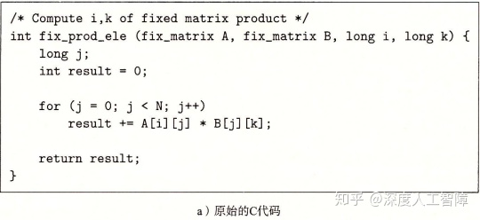
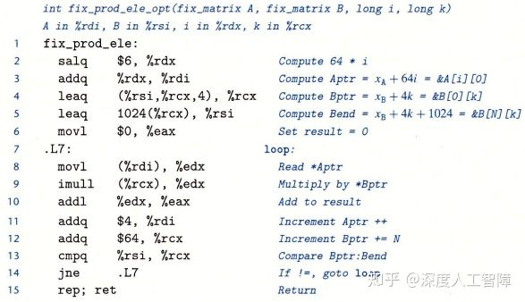

# [读书笔记]CSAPP：8[VB]机器级表示：数据


 

**视频地址：**

[【精校中英字幕】2015 CMU 15-213 CSAPP 深入理解计算机系统 课程视频_哔哩哔哩 (゜-゜)つロ 干杯~-bilibiliwww.bilibili.com/video/av31289365?p=8](https://link.zhihu.com/?target=https%3A//www.bilibili.com/video/av31289365%3Fp%3D8)

**课件地址：**

[http://www.cs.cmu.edu/afs/cs/academic/class/15213-f15/www/lectures/08-machine-data.pdfwww.cs.cmu.edu/afs/cs/academic/class/15213-f15/www/lectures/08-machine-data.pdf](https://link.zhihu.com/?target=http%3A//www.cs.cmu.edu/afs/cs/academic/class/15213-f15/www/lectures/08-machine-data.pdf)

对应于课本3.8、3.9。

**如有错误请指出，谢谢。**

------

**小点：**

- 当你声明了一个数组，你既为它分配了空间，并且创建了一个允许进行指针运算的数组名称。而当你声明一个指针时，你所分配的只有指针本身的空间。
- 当程序要用一个常数作为数维度或者缓冲区大小时，最好通过`#define`声明将这个常数与一个名字联系起来，后面就一直使用这个名字代替常数的数值。
- 在`struct`和`union`中的对象，都是保存在内存中的。
- 定义结构体时，按照对象K值的大小，**从大到小声明**，可以减少填充的空间，节省整个结构体的大小。

------

## 1 数组

对于数据类型`T`和整形常量`N`，声明一个数组变量`A`：

```c
T A[N];
```

主要经历**两个步骤：**

1. 根据数据类型`T`的大小`L`字节，先在内存空间中分配一个大小为`L*N`的连续空间；
2. 将`A`作为这个连续内存空间的起始指针，即A的值`xA`就是该内存空间的起始地址。

**注意：**当你声明了一个数组，你既为它分配了空间，并且创建了一个允许进行指针运算的数组名称。而当你声明一个指针时，你所分配的只有指针本身的空间，所以如果没有初始化指针，直接对其进行解引用可能会出现错误。

我们首先看下**数组和指针的区别：**

```text
int A1[3];
int *A2;
int *A3[3];
int (*A4)[3];
```

- `sizeof(A1)`为12，返回的是数组内保存的全部元素大小； `sizeof(*A1)`为4，返回的是第一个元素的大小，即`int`的大小。而`sizeof(A2)`为8，返回的只是指针的大小；`sizeof(*A2)`为4，返回的也是`int`的大小。
- 如果没有对`A2`进行初始化，直接调用`*A2`可能会报错，因为它没有指向合理的对象。而`*A1`不可能出错，因为创建数组时，已经为他分配好了空间。
- `A3`声明了大小为3的数组，每个元素的类型为`int *`，所以`sizeof(A3)`为24，因为数组内有3个元素，每个元素都是指针，大小为8。而`sizeof(*A3)`为8，因为`A3`的第一个元素是一个指针，大小就为8。而`sizeof(**A3)`为4，它表示的是数组中第一个指针指向的`int`，所以是4。因为`A3`首先声明的是一个数组，所以它会自动分配好数组的空间，所以`*A3`不会是空指针，但是它里面保存的是指针，所以`**A3`可能会是空指针。
- `A4`定义了一个指向大小为3的`int`数组的指针。所以`sizeof(A4)`为8，只是一个单纯的指针的大小；`sizeof(*A4)`为12，它表示`A4`指向的数组的大小。而`sizeof(**A4)`为4，它表示`A4`指向的数组的第一个元素。 因为这里只是单纯声明了一个指针，所以`*A4`和`**A4`都可能是空指针。

如果我们将该数组的起始地址`xA`和索引值`i`保存在寄存器中，就能通过“比例变址寻址”的方式获得对应内存地址的数据。比如我们将起始地址保存在寄存器`%rdx`，将索引值保存在寄存器`%rcx`中，假设数据类型为`int`4字节，则访问该位置的汇编代码为

```text
movl (%rdx, %rcx, 4), %eax
```

**注意：**无论C语言中是在数组中获取数据，比如`A[func(i)]`，还是获得某个元素的地址，比如`A+func(i)`，只有将偏移量`func(i)`乘上对应的数据大小`L`，才是其在内存地址中的偏移量。

**例：**

假设整型数据`E`的起始地址`xE`和整数索引`i`分别保存在寄存器`%rdx`和`%rcx`中，则计算下面的值及其汇编代码。

1. `E+i-1`： 索引的偏移量`i-1`乘上`int`的大小4字节，得到在内存空间中的地址偏移量`4i-4`，则其表示的是`xE+4i-4`，汇编代码为`leaq -4(%rdx, %rcx, 4), %rax`。
2. `*(E+2i+3)`：索引的偏移量`2i+3`乘上`int`的大小4字节，得到在内存空间中的地址偏移量`8i+12`，则其表示的是`M[xE+8i+12]`，汇编代码为`movl 12(%rdx, %rcx, 8), %eax`。

**综上：**假设数据大小为`L`，起始地址`x`保存在`%rdx`，索引`i`保存在`%rcx`中，索引偏移量通过`func(i)`计算得到，则：

1. 通过索引偏移量`func(i)`计算内存地址的偏移量`L*func(i)=Ai+B`
2. 获取内存地址的汇编代码为`lea_ B(%rdx, %rcx, A), %_`。获得数据的汇编代码为`mov_ B(%rdx, %rcx, A), %_`。

**注意：**指令`lea_`和`mov_`，以及保存的寄存器`%_`需要根据`L`的大小进行选择。

我们同样可以声明嵌套的数组

```c
T D[R][C]
```

其中，`R`是行数，`C`是列数。

在内存中，这种二维数组是按照“行优先”的形式保存在内存中的，即先按顺序保存`D[0]`的`C`个元素，然后再紧接着保存`D[1]`的`C`个元素，以此类推。


所以当该数组的起始地址为`x`，`T`的大小为`L`时，`D[i][j]`的地址为`x+L(Ci+j)`。类似一元数组，我们也可以很容易地通过“比例变址寻址”的方式进行索引。


我们要注意**区分以下代码：**

- **普通的二维矩阵**

```c
#define ZLEN 5
typedef int zip_dig[ZLEN];
zip_dig pgh[PCOUNT] = 
  {{1, 5, 2, 0, 6},
   {1, 5, 2, 1, 3 },
   {1, 5, 2, 1, 7 },
   {1, 5, 2, 2, 1 }};
```

其在内存中的存储是按照行优先的形式存储的，所以获得某个索引的值的C代码为

```c
int get_pgh_digit(int index, int dig){
  return pgh[index][dig];
}
```

对应的汇编代码为

```text
# index in %rdi, dig in %rsi
get_pgh_digit:
  leaq (%rdi, %rdi, 4), %rax    #5*index
  addl %rax, %rsi               #5*index+dig
  movl pgh(,%rsi, 4), %eax      #Mem[pgh+20*index+4*digit]
  ret
```

- **特殊的矩阵**

```c
#define UCOUNT 3
zip_dig cmu = { 1, 5, 2, 1, 3 };
zip_dig mit = { 0, 2, 1, 3, 9 };
zip_dig ucb = { 9, 4, 7, 2, 0 };

int *univ[UCOUNT] = {mit, cmu, ucb};
```

`univ`声明了3个指向数组的指针，存储形式为


则获取索引下的数据的C代码为

```c
int get_univ_digit(size_t index, size_t dight){
  return univ[index][digit];
}
```

对应的汇编代码为

```text
#index in %rdi, digit in %rsi
get_univ_digit:
  salq $3, %rsi  #8*index
  movq univ(%rsi), %rax #获得指针
  movl (%rax, %rsi, 4), %eax  #Mem[Mem[univ+8*index]+4*digit]
  ret
```

这里有两次内存引用过程。

### 1.1 定长数组

当我们使用`#define`定义一个变量`N`为常量后，再用`N`来确定数组大小，则该数组是一个定长数组，这里展示一个`-O1`时GCC采用的优化。

对于以下代码：



我们首先看它经过优化后的C代码


可以发现这里省略了变量`j`，并且将所有数组引用都转换成了指针间的引用，避免了索引`A[i][j]`要计算乘法`A+L(Ci+j)`的巨大损耗。

对应的汇编代码为



### 1.2 变长数组

过去C要求数组的大小要在编译时就确定，才能生成对应的汇编代码。如果需要变长数组，就需要程序员自己对数组分配存储空间。ISO-C99允许数组的维度为表达式，在数组被分配时才计算出来，例如

```c
int A[exp1][exp2];
```

只要求`exp1`和`exp2`定义在上面那个声明之前。

我们接下来对比下定长数组和变长数组在索引时汇编代码的区别

- 定长数组

```c
typedef int fix_matrix[5][3];
int fix_ele(fix_matrix A, long i, long j){
  return A[i][j];
}
```

对应的汇编代码为

```text
fix_ele:
  leaq (%rsi, %rsi, 2), %rax    #compute 3i
  leaq (%rdi, %rax, 4), %rax    #compute A+12i
  movl (%rax, %rdx, 4), %eax    #read fomr M[A+12i+4j]
  ret
```

- 变长数组

```c
int var_ele(int n, int A[n][n], long i, long j){
  return A[i][j];
}
```

对应的汇编代码为

```text
var_ele:
  imulq %rdx, %rdi             #compute ni
  leaq  (%rsi, %rdi, 4), %rax  #compute A+4ni
  movl  (%rax, %rcx, 4), %eax  #read from M[A+4ni+4j]
  ret
```

看汇编代码可以发现以下区别：

- 增加了参数n，使得寄存器的使用改变了，
- 用了乘法指令来计算`ni`，而不是用`leaq`来计算`3i`，乘法会导致无法避免的性能损失

## 2 异质的数据结构

C提供了两种能将不同类型的对象组合到一起的数据结构。

### 2.1 结构

C语言中，可以用`struct`声明创建一个**数据类型**，具有以下特点：

- **定义：**可以将不同类型的对象聚合到一个对象中，并使用名字来引用结构中的各个组成部分。
- **存储：**结构的所有组成部分都存放在内存中一段**连续的**区域内，指向结构的**指针**是结构第一字节的地址。
- **获得元素：**编译器会维护关于每个结构类型的信息，了解每个字段的偏移量，由此作为内存引用指令的唯一，来对结构元素进行引用。

比如我们定义以下结构

```c
struct rec{
  int i;
  int j;
  int a[2];
  int *p;
};
```

由此就将4个对象包装到了结构类型`rec`中了，这些对象大小依次为4、4、8和8字节，它的存储是按顺序连续地排列在内存空间中的


则指针`struct rec*`指向的就是第一个字节的位置。我们可以通过不同大小的偏移量访问不同的对象，假设我们定义对象`struct rec* r`，并且`r`放在寄存器`rdi`中，则：

- `*(r).i`：`movl (%rdi), %eax`。
- `*(r).j`：`movl 4(%rdi), %eax` 。
- `*(r).a[i]`：如果索引`i`保存在寄存器`%rcx`中，则为`movl 8(%rdi, %rcx, 4), %eax` 。

**注意：**要根据对象大小选择合适的指令大小。

所以结构的各个字段的选取完全是在编译时处理的，机器代码不包含关于字段申明或字段名字的信息。

我们同样可以声明嵌套的结构体

```c
struct prob{
  int *p;
  struct {
    int x;
    int y;
  }s;
  struct prob *next;
};
```

其在内存中的分布为


### 数据对齐

在真实的内存中存放`struct`时，并不一定是像上面介绍的那种紧凑的排列方式。由于硬件问题，目前大多数机器一次从内存中取出64字节的数据，如果因为没有一个对齐的地址，一个特定数据跨越了两个块之间的边界，则会让硬件甚至操作系统采取额外的步骤来处理，所以数据对齐会提高效率。在x86-64上，即使数据不对齐，也不会影响任何功能，但是有些机器如果访问未对其的数据，可能会造成内存错误。

**对齐原则**是任何K字节的基本对象的地址必须是K的倍数


为此，在`struct`中两个连续的对象，编译器可能中间会插入间隙，来满足各自对内存地址的要求。并且还有**两个额外的要求：**

- 要求结构的初始地址一定是结构体中最大对象大小的倍数，使得偏移量加上初始地址才是真的满足倍数关系的。
- 在结构体末尾填充，使其是结构体中最大对象大小的倍数，使得结构数组中下一个元素的地址也是成倍数关系的。

我们给出几个例子，并依次判断每个对象的偏移量

- `struct P1{int i; char c; int j; char d; };`

`i`偏移量为0，是4的倍数，满足；`c`偏移量为4，是1的倍数，满足；`j`偏移量为5，不是4的倍数，需要填充3个字节，使得偏移量为8，才是4的倍数；`d`偏移量为12，是1的倍数，满足，总共大小为13字节，而最大对象是`int`4字节，所以需要填充3字节，使其为4的倍数，所以该结构体为16字节。

- `struct P2{int i; char c; char d; long j; };`

`i`的偏移量为0，是4的倍数，满足；`c`的偏移量为4，是1的倍数，满足；`d`的偏移量为5，是1的倍数，满足；`j`的偏移量为6，不是8的倍数，需要补充2个字节，使其偏移量为8。总共大小为16字节，是最大对象`long`的倍数，所以不用填充。

- `struct P3{short w[3]; char c[3]; };`

数组`w`的偏移量为0，然后依次排列3个大小为2字节的数据，能够保证每个偏移量都是2的倍数，满足；数组`c`的第一个元素的偏移量为6，是1的倍数，而后依次排列3个大小为1字节的数据。总共大小为9字节，不是结构中最大对象`short`的倍数，所以还要填充1个字节，所以该结构大小为10字节。

- `struct P4{short w[5]; char *c[3]; };`

数组`w`的偏移量为0，然后依次排列5个大小为2字节的数据，能够保证每个偏移量都是2的倍数，满足；数组`c`的第一个元素偏移量为10，不是8的倍数，所以要填充6个字节，使其偏移量为16，是8的倍数，然后就能依次排列3个大小为8字节的数据了。总共大小为40字节，是2的倍数，所以对齐了。

- `struct P5{struct P3 a[2]; struct P2 t; };`

我们从上面可以知道要保存两个`struct P3`，一共需要20个字节，并且保证初始地址是2的倍数。而`struct P2`要求初始地址是8的倍数，但是第一个对象`i`的偏移量是20，不是8的倍数，所以要填充4个字节，使得`i`的偏移量为24，是4的倍数，然后直接把`struct P2`的所有对象按上面的方式填充进去。总共大小是40字节，是8的倍数，所以对齐了。


**综上：**

我们可以画图把一个个对象依次填充进去，并且要求它的偏移量是满足K的倍数。然后考虑要在末尾填充多少字节能够使得总共大小是最大对象大小的倍数。最终最大对象的大小就是对初始地址的对齐要求。

**注意：**我们这里只对最简单的数据类型进行对齐，不包括聚合数据类型。

对于结构体

```c
struct{
  char *a;
  short b;
  double c;
  char d;
  float e;
  char f;
  long g;
  int h;
} rec;
```

`a`偏移量为0；`b`偏移量为8；`c`偏移量为10，不是8的倍数，填充6的字节，使得偏移量为16；`d`偏移量为24；`e`偏移量为25，不是4的倍数，填充3个字节，使得偏移量为28；`f`的偏移量为32；`g`的偏移量为33，不是8的倍数，填充7个字节，使得偏移量为40；`h`的偏移量为48，最后的地址为52，不是第一个元素`a`要求的8的倍数，所以还要在末尾填充4个字节， 所以最终大小为56个字节。

我们可以改变声明的顺序，按照从大到小的形式进行声明，可以减少填充的字节数目，节省该结构的空间大小

```c
struct {
  char *a;
  double c;
  long g;
  float e;
  int h;
  short b;
  char d;
  char f;
} rec;
```

这样依次排列下来，只要40个字节，节省了28.5%的存储空间。

### 2.2 联合

C语言中，可以用`union`声明创建一个**数据类型**，具有以下特点：

- **定义：**允许以多种类型来引用一个对象。
- **存储：**保存在**公共的**一块内存中，通过不同对象的类型来赋予这块内存不同的含义。内存大小为最大字段的大小。


主要具有以下**应用情况：**

- 如果我们事先知道两个不同字段是互斥的，就能将其定义在一个union中，就能节省内存空间。

比如对于二叉树，叶子节点有两个`double`类型的数值，而内部节点有两个指向子树的指针。由于两个`double`类型的数值和两个指针是互斥的，就可以将其定义成union的形式

```c
union node_u{
  double data[2];
  struct{
    union node_u *left;
    union node_u *right;
  } internal;
} ;
```

由此我们就节省了一般的内存空间。但是当我们得到一个指向`union node_u*`的指针时，我们并不知道是要将其解释为子树还是数值，所以还需要定义一个类型，即

```c
typedef enum {N_LEAF, N_INTERNAL} nodetype_t;
struct node_t{
  nodetype_t type;
  union node_u{
    double data[2];
    struct{
      union node_u *left;
      union node_u *right;
    } internal;
  } info;
};
```

由此我们就能通过`type`知道该节点的类型了。

- 访问相同位模式下不同数据类型的值。

比如我们对一个`double`类型的对象`d`使用强制类型转换到`long`，则除了0的情况，他们的位模式会发生很大变化。如果我们想要保持位模式不变，则可以使用union

```c
long double2long(double d){
  union{
    double d;
    long l;
  } temp;
  temp.d = d;
  return temp.l;
} 
```

此时返回的就能保持位模式不发生变化了，因为是直接调用相同的内存空间。

**`struct`和`union`的区别：**`struct`为每个对象分配了单独的内存空间，而`union`分配了共用的内存空间。

**什么时候用`union`什么时候用`struct`：**当你要信息同时存在时，就需要分配到不同的内存中，就要用`struct`，否则用`union`。

**计算struct和union嵌套的数据类型的内存分布：**

- 如果是包裹在struct内的，就按顺序按照对象大小依次排列下来
- 如果是包裹在union内的，就看最大的对象大小，直接分配一块内存就行