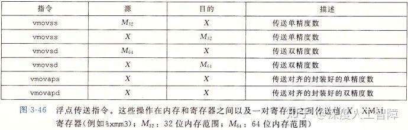
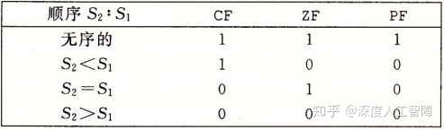

# [读书笔记]CSAPP：9[B]机器级表示：浮点数


 浮点数的在机器级表示的层次上，与整型和指针有很大的不同，因此本文将其独立起来进行整理。

对应于书中的3.11小节。

## 1 历史

在很久之前，8086处理器上有一块8087芯片，能够提供实现完整IEEE浮点数所需的所有硬件，事实上，它是与IEEE浮点标准本身共同开发的，但是它的编程模型非常难用。

**SIMD（Single Instruction Multiple Data）**是指一条指令能够操作多个数据，是对CPU指令的扩展，主要用来进行小数据的并行操作。比如图像处理中，一个像素点的一个分量只需要小于等于8位来表示，如果我们用处理整型的64位寄存器用来处理，则只用到了低8位，造成很大浪费，如果将64位寄存器拆成8个8位的寄存器，就能同时对8个分量进行操作，则计算效率提高了8倍。这就是SIMD的主要想法，随着后续的发展，赋予的功能也越来越多。

Intel最初支持SIMD的指令集是1996年集成在Pentium里的**MMX（Multi-Media Extension，多媒体扩展）**，它的主要目标是为了支持MPEG视频解码。MMX占用了FPU的8个80位寄存器，因此当MMX指令执行时，FPU就无法工作了。MMX只使用寄存器中尾数部分的64位，分别命名为`MM0`~`MM7`，将高16位置为1，因此它的浮点数值为NaN或inf，由此来区分寄存器是用于浮点数运算还是用于MMX。为了实现SIMD运算，MMX将64位寄存器当成两个32位、或4个16位、或8个8位寄存器来使用，只能处理整型计算。

Intel在1999年Pentium3中推出了**SSE（Streaming SIMD Extensions，流式SIMD扩展）**，是继MMX的扩展指令集，主要用于3D图形计算，AMD后来在Athlon XP中加入了支持。这里处理器为SSE提供了自己的8个128位寄存器，称为`XMM0`~`XMM7`。这些寄存器可以用于4个单精度浮点数的SIMD运算，并且可以和MMX整数运算或x87浮点运算混合使用。 SSE指令要求数据是16字节对齐的。

Intel在2001年Pentium4中推出了**SSE2**进一步扩展了SSE指令集，用来提供高新能计算。支持在XMM寄存器上执行2个双精度浮点数、4个单精度浮点数，以及8/16/32位的整型SIMD运算，这也使得SIMD技术基本完善了。由于这里也支持整型的SIMD运算了，所以不需要MMX指令集了，同样也避免了占用浮点数寄存器。而AMD后来在Opteron和Athlon64中加入了支持，并且对它扩展增加了8个XMM寄存器，称为`XMM8`~`XMM15`，但是需要切换到64位模式（x86-64/AMD64）才可以使用这些寄存器。Intel后来在其Intel 64架构中也增加了对x86-64的支持。

Intel在2004年Pentium4E Prescott推出了**SSE3**，主要用于科学计算，AMD在Athlon64的第五个版本、Venice也加入了支持。这个指令集扩展的指令包含寄存器的局部位之间的运算，例如高位和低位之间的加减运算；浮点数到整数的转换，以及对超线程技术的支持。

Intel在2006年Core Duo推出了**SSSE3**，只是对SSE3指令集的额外扩充。

Intel在2007年Core2 Duo Penryn推出了**SSE4**，AMD也开发了属于自己的SSE4a多媒体指令集，并内建在Phenom与Opteron等K10架构处理器中，不过无法与Intel的SSE4系列指令集兼容。SSE4新增了了很多指令，并且优化了数据移动，能够支持不对齐的数据移动。

从上面我们可以看出，都是Intel首先提出新的指令集，而后AMD提供支持。而在**SSE5**指令集是2007年8月首先由AMD抢先提出的，则Intel不支持SSE5，也不开发SSE5指令集，转而在2008年3月份提出了AVX指令集。在SSE5中有几项革新：3操作数、4操作数指令，置换与条件移动指令，乘法指令以及其他一系列解决现有SSE指令集缺陷的新指令。

Intel在2008年3月份提出了**AVX指令集（Advanced Vector Extension，高级向量扩展）**，它是SSE延伸架构，将SSE中的16个128位XMM寄存器扩展位16个256位YMM寄存器，增加了一倍的运算效率。包含了AMD提出的SSE5的工鞥呢，只是实现形式不同，并且AVX还加入了一些SSE5没有的特性：SIMD浮点指令长度加倍，为旧版SSE指令增加3操作数指令支持，为未来的指令扩展预留大量OpCode空间等。由于SSE5和AVX指令集功能类似，并且AVX包含更多的优秀特性，因此AMD决定支持AVX指令集。

**总结：**SSE和AVX都提供了支持SIMD的指令集，使得可以在物理层面上实现同时对多个整型和浮点数进行并行运算，SSE有独立的16个128位XMM寄存器，AVX进一步扩展得到16个256位YMM寄存器，每个XMM寄存器都是对应的YMM寄存器的低128位。

我们这里主要讨论AVX2，即AVX第二版。

**参考：**

[Sinaean Dean：SIMD指令集](https://zhuanlan.zhihu.com/p/31271788)

[【整理】SIMD、MMX、SSE、AVX、3D Now！、neon](https://link.zhihu.com/?target=https%3A//blog.csdn.net/conowen/article/details/7255920)

## 2 浮点代码

处理器的浮点体系结构包含多个方面，会影响对浮点数据操作的程序如何映射到机器上，包括：

- 如何存储和访问浮点数值
- 对浮点数据操作的指令
- 向函数传递浮点数参数和从函数返回浮点数结果的规则
- 函数调用过程中保存寄存器的规则

通过上一节我们知道，可以通过SSE提供的XMM寄存器和AVX提供的YMM寄存器来对浮点数进行SIMD运算，包含的寄存器如下所示


我们可以发现，一个XMM寄存器，可以满足16个char、8个short、4个int、4个float和2个double同时进行操作，也就实现了SIMD运算。

在浮点运算中，指令被分成了**标量指令（Scalar Operations）**和**SIMD指令**，在指令中分别用`s`和`p`表示。比如`addss %xmm0, %xmm1`表示将保存在`%xmm0`中的单精度浮点数加到`%xmm1`中的标量指令，运算结果如下图所示（左边为低位）


而对应的SIMD指令为`addps %xmm0, %xmm1`，运算的结果如下图所示


所以标量指令只对低4字节或8字节进行操作，而向量指令会对其他的字节采取并行的操作。

我们下面只对标量指令进行介绍。

### 2.1 浮点传送



其中，引用内存的都是标量指令，而在两个XMM寄存器之间传送数据的是SIMD指令。其中`a`表示aligned，当读写内存时，要求满足16字节对齐（因为XMM是16字节的），否则会报错，而这里直接在两个XMM寄存器之间传输，绝不会出现错误对齐的情况。 建议32位内存数据满足4字节对齐，64位数据满足8字节对齐。

**例子：**

```text
float float_mov(float v1, float *src, float *dst){
  float v2 = *src;
  *dst = v1;
  return v2;
}
```

对应的汇编代码为

```text
#v1 in %xmm0, src in %rdi, dst in %rsi
float_mov:
  vmovaps %xmm1, %xmm1  #v2是返回值，要使用%xmm0，而当前v1占用了%xmm0，所以先挪一下
  vmovss (%rdi), %xmm0
  vmovss %xmm1, (%rsi)
  ret
```

**注意：**传入参数，如果是浮点数，就保存在XMM寄存器中，如果是指针或整型，就保存在常规寄存器中。而返回值也是如此。

### 2.2 浮点转换操作

### 2.2.1 浮点数-->整型


前面的`cvt`表示转换（convert），后一个`t`表示截断（truncated）。在将浮点数转换成整数时，指令会执行截断，把值向0进行舍入。可以发现这些都是标量指令。

### 2.2.2 整型-->浮点数


在整型转换成浮点数时，提供了三操作数指令，这里通常可以忽略第二个操作数，因为它的值只会影响高位字节，通常使用目的寄存器。常见的使用方式为`vcvtsi2sdq %rax, %xmm1, %xmm1` 。

### 2.2.3 浮点数相互转换

浮点数相互转换的命令比较特殊，不是提供单一指令进行的。

```text
# Conversion from single to double precision
vunpcklps %xmm0, %xmm0, %xmm0  #replicate first vector element
vcvtps2pd %xmm0, %xmm0         #convert two vector elements to double

# Conversion from double to single precision
vmovddup %xmm0, %xmm0     #replicate first vector element
vcvtpd2psx %xmm0, %xmm0   #convert two vector elements to single
```

对这个代码还看得不是很懂，过后补充。

### 2.3 函数中的浮点代码

从之前的图我们可以看到

- 函数传入的浮点数，或者函数使用浮点数进行计算时，都需要使用上述寄存器。也可以使用栈来传递额外的浮点参数。
- %xmm0既是函数第一个参数的寄存器，也是函数返回值的寄存器
- 所有寄存器都是“调用者保存寄存器”，所以函数要先将这些值保存在内存中，才去调用别的函数。

**注意：**参数到寄存器的映射取决于参数的顺序和类型。如果是整型或指针，就使用通用寄存器，如果是浮点数，就使用XMM寄存器。

### 2.4 浮点运算操作

我们提供一组执行算数运算你的标量AVX2浮点指令


每条指令可以有一个源操作数或两个源操作数，以及一个目的操作数。其中，第一个源操作数可以是XMM寄存器或内存位置，而第二个操作数和目的操作数只能是XMM寄存器。

**注意：**当计算中出现整型、float和double混合时，需要将整型和float都转换成double再计算。

### 2.5 定义和使用浮点常数

和整数运算操作不同，AVX浮点操作不能用立即数作为常数。编译器会为浮点常数分配和初始化存储空间，然后代码再从内存中读取这些值。比如以下代码

```text
double cel2fahr(double temp){
  return 1.8*temp+32.0;
}
```

其中`1.8`和`32.0`是浮点常数，编译器会将其保存在内存中，而不是作为立即数

```text
.LC2:
  .long 3435973837
  .long 1073532108
.LC3:
  .long 0
  .long 1077936128
```

这里分别用标号`.LC2`和`.LC3`表示`1.8`和`3.6`。这里使用两个`.long`声明和十进制表示的值来表示一个`double`常量的。我们可以推算一下这个值：首先这里使用的是小端法，数值的最低有效位保存在了较小的地址中，所以`3435973837`表示低4字节的值，而`1073532108`表示高4字节的值。而表示为十进制时，我们可以直接将其转换成十六进制的值，就能获得正确排列的字节序列（因为小端法只是表示机器怎么存储数据的，而整数值是真实字节对应的数值）。 `3435973837`的十六进制数为`0xcccccccd`，` 1073532108`的十六进制数为`0x3ffccccc`，则按顺序排列就能得到浮点数的编码`0x3ffccccccccccccd`。我们知道`double`类型的第一位为符号位，然后接下来的11位为阶码位，最后的52位为尾数位。前3个十六进制数为`0x3ff`转化为二进制数为`001111111111`，则阶码为`01111111111`，对应的无符号数为1023，偏移量为 ![[公式]](https://www.zhihu.com/equation?tex=2%5E%7B11-1%7D-1%3D1023) ，则 ![[公式]](https://www.zhihu.com/equation?tex=E%3D0) ；而尾数部分的十六进制数为`0xccccccccccccd`，它表示的是二进制分数，则转化为十进制数为0.8，再加上1为1.8，所以最后的值为1.8。

则该段C代码对应的汇编代码为

```text
cel2fahr:
  vmulsd .LC2(%rip), %xmm0, %xmm0
  vaddsd .LC3(%rip), %xmm0, %xmm0
  ret 
```

### 2.6 浮点代码中的位级操作


### 2.7 浮点比较操作


其中第二个操作数必须在XMM寄存器中，第二个操作数可以在XMM寄存器，也可以在内存中。类似于CMP指令，会设置三个条件码：零标志为ZF、进位标志位CF和奇偶标志位PF。当进行浮点比较时，如果有任何一个是NaN，则会设置PF，并且比较失败。

条件码的设置条件如下，只要有任何一个操作数为NaN，就会出现无序的情况。



当出现无序的结果，可以使用指令`jp`（jump on parity）来进行跳转，而其他结果和无符号数的比较相同。