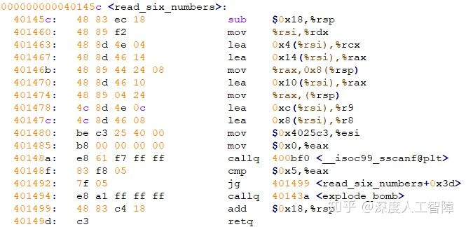
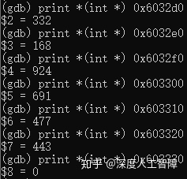
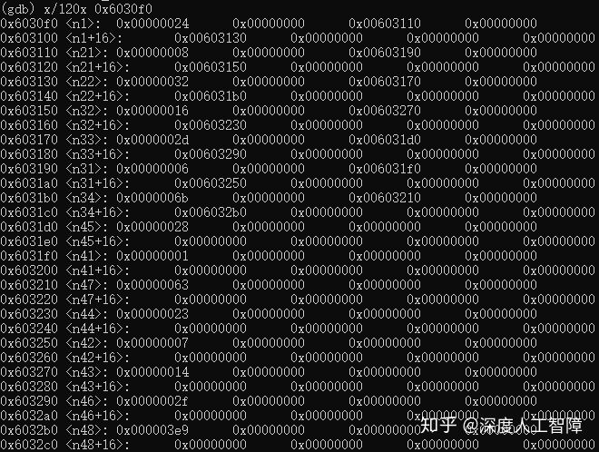
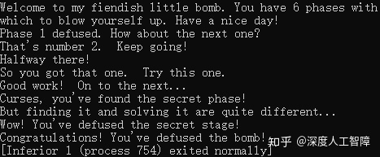

# [读书笔记]CSAPP：BombLab


 

**代码地址：**[http://csapp.cs.cmu.edu/3e/bomb.tar](https://link.zhihu.com/?target=http%3A//csapp.cs.cmu.edu/3e/bomb.tar)

**x86-64 GDB命令：**[http://csapp.cs.cmu.edu/3e/docs/gdbnotes-x86-64.pdf](https://link.zhihu.com/?target=http%3A//csapp.cs.cmu.edu/3e/docs/gdbnotes-x86-64.pdf)

**说明：**[http://csapp.cs.cmu.edu/3e/bomblab.pdf](https://link.zhihu.com/?target=http%3A//csapp.cs.cmu.edu/3e/bomblab.pdf)

**README：**[http://csapp.cs.cmu.edu/3e/README-bomblab](https://link.zhihu.com/?target=http%3A//csapp.cs.cmu.edu/3e/README-bomblab)

------

该实验为了考验同学GDB使用、反汇编器以及代码机器指令的熟练程度，我们需要分析代码来确定输入的6条字符串内容，来破解6个炸弹。

**实验步骤：**

1. 可以创建一个文件专门放你输入的答案，我这里创建一个文件`ans`
2. 运行`objdump -d bomb > bomb.s`来反编译可执行文件`bomb`，得到该代码的汇编代码`bomb.s`
3. 运行`gdb bomb`来调试`bomb`
4. 为了防止炸弹爆炸，先使用`break explode_bomb`在炸弹爆炸代码处设置一个断点，防止不小心爆炸
5. 设置完所有断点后，输入`run ans`来执行代码
6. 通过分析机器代码来确定需要输入的代码

## phase_1

首先第一关的C语言代码为


我们知道首先需要输入一个字符串`input`，然后将其作为参数输入到函数`phase_1`中。计算机在保存字符串时，是保存在连续的内存空间，并将字符串第一个字符的地址作为该字符串的地址。而该字符串作为函数`phase_1`的第一个参数，所以该字符串的地址保存在`%rdi`中。

第一关的汇编代码为


首先将`0x402400`保存在`%rsi`中，然后执行函数`strings_not_equal`，所以该函数是用来判断字符串是否相同，如果相同则将`%rax`设置为0，否则设置为1。所以这里第一个参数是我们输入的字符串，而第二个参数是地址`0x402400`保存的字符串。 然后`test %eax, %eax`判断结果的值，`je`表示值为0时跳过爆炸函数。所以我们只要输入地址`0x402400`保存的字符串就行了。

通过`print (char *) 0x402400`就能知道需要输入的代码是什么


## phase_2

首先通过`sub $0x28,%rsp`扩展了该函数的栈帧，然后通过`mov %rsp,%rsi`将当前的栈顶作为第二个参数，我们输入的字符串地址作为第一个参数，调用函数` read_six_numbers`。



在`read_six_numbers`函数中，后面会调用函数`__isoc99_sscanf@plt`，即`sscanf`函数，该函数形式为

```text
int sscanf(const char *buffer, const char *format, [argument]...)
```

其中，`buffer`是输入的字符串，`format`是字符串的格式，`argument`是根据format提取出来的内容保存的位置，而该函数的返回值为格式化参数的数目。

而且汇编代码中对`%rdi`、`%rsi`、`%rdx`等寄存器的赋值操作，所以以上代码是设置函数`sscanf`的参数。

我们知道`%rdi`保存的是我们输入的字符串的地址，`%rsi`保存的是函数`phase_2`的栈顶地址。所以我们可以知道这些参数保存的内容：

- 第三个参数`%rdx`保存栈顶地址
- 第四个参数`%rcx`保存栈顶地址向上偏移`0x4`
- 第五个参数`%r8`保存栈顶指针向上偏移`0x8`
- 第六个参数`%r9`保存栈顶指针向上偏移`0xc`

并且该函数输入超过6个参数的话，就会将其他的参数保存到内存地址中，其中有两个参数保存在内存中，对应的汇编代码为


并且越靠前的参数，保存的地址越小，所以

- 第七个参数保存在地址`%rsp`处，内容是栈顶指针向上偏移`0x10`
- 第八个参数保存在地址`%rsp+0x8`处，内容是栈顶指针向上偏移`0x14`

最后修改了第二个参数`%rsi`保存`0x4025c3`。

我们知道函数 `sscanf`第二个参数是字符串你的格式，所以我们输入`print (char *) 0x4025c3`来获得格式的内容


所以我们知道，我们需要输入的格式内容是6个数字，并且数字之间要以空格间隔。并且我们可以根据参数顺序来确定函数`phase_2`栈帧中各个位置保存的内容。

从函数`sscanf`返回后，第一行命令`cmpl $0x1,(%rsp)`比较的是栈顶指针`%rsp`对应的数字和1的大小，而栈顶指针`%rsp`保存的是我们输入的第一个数字，而下一行指令`je 400f30 `表示相等时跳过爆炸函数，所以我们输入的第一个数字就是1。

当输入第一个数字是1时，就会跳转到


表示将第二个数字地址保存在`%rbx`，栈顶向上偏移`0x18`的地址保存在`%rbp`，然后跳转回去。


首先`%eax`保存第一个数字，然后将其乘2，然后与`%rbx`指向的内存地址的值进行比较，这里就是与第二个数字相比，如果两者相同，就跳过炸弹爆炸函数 ，所以我们知道第二个数字是第一个数字的两倍。


将`%rbx`内容加上`0x4`，则`%rbx`保存的是第三个数字的内存地址，然后与`%rbp`相比，如果不相同，还是跳转回去。


所以这个是一个循环的函数，我们保存的最大地址是栈顶指针向上偏移`0x14`，而`%rbx`保存栈顶指针向上偏移`0x18`，并且我们输入的都是`int`数字类型，刚好占4字节，所以`%rbx`表示该循环的终点，表示所有数字都适用。 所以第三个数字是第二个数字的两倍，第四个数字是第三个数字的两倍，以此类推。

由此对应的答案就是`1 2 4 8 16 32`。

## phase_3

第三道题是一个比较典型的`switch`代码。

首先在`400f5b`中还是要执行一个`sscanf`函数，所以首先设置该函数的参数

- 第一个参数`%rdi`是我们输入的字符串
- 第二个参数`%rsi`是地址`0x4025cf`处的格式字符串，通过`print (char *) 0x4025cf`可以知道我们需要输入的字符串格式


所以我们需要输入两个数字

- 第三个参数`%rdx`表示将第一个数字保存在`0x8(%rsp)`处
- 第四个参数`%rcx`表示将第二个数字保存在`0xc(%rsp)`处

经过若干行通过函数`sscanf`返回的格式化输入数目，来判断我们是否按照要求输入了两个数字。然后会碰到`switch`的第一个组成部分


从这段代码我们可以知道

1. 进入`switch`之前，都需要将我们输入的值减掉`switch`所有分支中的最小值，将其转化为一个无符号数，但是这里没有，说明要求我们输入的是大于等于0的数字。而这里使用`0x8(%rsp)`进行比较，所以我们输入的第一个数字要求大于等于0
2. `cmpl $0x7,0x8(%rsp)`表示我们输入的第一个数字最大只能是7

然后到了`switch`的跳转部分


从这里我们知道，`switch`对应的跳转表的表头保存在`0x402470`处，并且根据我们输入的第一个参数进行跳转。所以我们可以先输出跳转表的所有内容，查看输入不同值时跳转到什么位置


通过跳转表和汇编代码，我们可以直接设置第一个数字为1，使其跳转到最靠近末尾的地址`400fb9`，此时汇编代码为


这里首先将`0x137`保存到`%eax`中，然后将其和第二个数字进行比较，如果相同，则释放内存空间，所以我们可以输入`print /d 0x137`得到对应的十进制值


所以答案为`1 311`。

## phase_4

这道题一进去还是要我们输入两个数字，将第一个数字保存在`0x8(%rsp)`中，第二个数字保存在`0xc(%rsp)`中。


表示第一个数字必须要比14小。然后设置第一个参数为第一个数字，第二个参数为0，第三个参数为14，调用函数`func4`，我们可以将该函数转化为对应的C代码

```c
int func4(int a=arg1, int b=0, int c=14){
  if(c-b>=0){
    int ans=(c-b)/2;
  }else{
    int ans=(c-b+1)/2;
  }
  int temp1=ans+b;
  if(temp1-a<=0){
    int ans=0;
    if(temp1-a>=0){
      return ans;
    }else{
      b=temp1+1;
      int ans = func4(a,b,c);
      ans=ans*2+1;
      return ans;
    }
  }else{
    c = temp1-1;
    int ans = func4(a,b,c);
    return ans*2;
  }
} 
```

**注意：**其中有一行命令是`sar %eax`，我一开始以为是向右移动`%cl`中记录的位数，但是这里其实是向右移动一位。

首先看后面的汇编代码


可以知道我们想要函数`func4`输出的值为0，所以我们这里可以直接输入第一个数字为7，此时就能使得该函数返回0。


然后后面这段代码中，`cmpl $0x0,0xc(%rsp)`表示要对第二个参数与0进行比较，`je 40105d `表示相等时就释放变量空间，所以第二个参数是0。所以答案为`7 0`。

## phase_5

这里首先`mov %rdi,%rbx`将我们的输入字符串保存到`%rbx`中，然后以下保存了一个金丝雀值，不需要去考虑它的值。


这里调用了`string_length`函数，此时输入值`%rdi`保存着我们输入的字符串，所以该函数返回我们输入字符串的长度，然后和`0x6`比较，只有相等时才不会引爆炸弹，所以我们需要输入6个字符。


这里首先将`%rax`置为0，然后开始到函数内部循环


- `movzbl (%rbx,%rax,1),%ecx`这里可以把`%rax`看成是在我们输入字符串的索引值，然后根据索引，将当前字符保存到`%rcx`中。
- `mov %cl,(%rsp)`和`mov (%rsp),%rdx`表示将`%rcx`低8位保存到`%rdx`中
- `and $0xf,%edx`表示保留`%rdx`低4位，即当前字符的低4位
- `movzbl 0x4024b0(%rdx),%edx`表示用我们当前字符的低4位作为偏移量，将地址`0x4024b0`偏移后值保存到`%edx`，我们可以通过`print (char *) 0x4024b0`查看这个地址中保存的内容，说明`%edx`中保存的是一个字符值


- `mov %dl,0x10(%rsp,%rax,1)`表示将我们提取出来的字符保存到`0x10(%rsp, %rax, 1)`处
- `add $0x1,%rax`和 `cmp $0x6,%rax`表示修改索引值，并且索引值最大为6

所以这个循环的目的就是根据我们输入的字符串，提取低4个字节的值作为`0x4024b0`的偏移量，然后将对应的字符保存到`%rsp+0x10`到`%rsp+0x16`处，并且`movb $0x0,0x16(%rsp)`表示最后补充一个`\0`作为字符串的结尾。


这段代码表示将地址`0x40245e`保存的字符串，和我们提取出来的字符串通过`string_not_equal`函数相互比较，所以就要保证我们提取出来的字符串和地址`0x40245e`保存的字符串相同。

首先通过`print (cahr *) 0x40245e`获得该目标字符串


所以当前我们需要构造输入字符串，使得其ascii码的低4位可以从"maduiersnfotvbylSo you think you can stop the bomb with ctrl-c, do you?"索引出"flyers"。

可以输入`man ascii`获得所有ascii码


由于低4位就是一个十六进制值，所以根据想要的索引值，选择对应行都是正确答案。我这里输入的字符串是`ionefg`。

## phase_6

这部分汇编代码比较长，主要分成4部分。

首先在地址`0x401153`之前是对输入进行检测，要求输入6个数字，范围在1到6之间，并且要求输入不同的数字。地址`0x40116f`之前是对输入进行处理，将输入对7进行取补操作。

从`0x40116f`到`0x4011a9`之间是我看最久的代码。首先`%rdx`保存了一个内存地址`0x6032d0`，然后有一句`0x8(%rdx),%rdx`表示将`%rdx`中的地址偏移`0x8`再将其保存到`%rdx`中，而`%rdx,0x20(%rsp,%rsi,2)`表示将`%rdx`中的内容保存到栈对应的偏移位置。我们首先可视化以下这段内容保存的内容


我们就可以知道这段内容保存的是一个链表结构，而我们刚刚的操作是将对应位置的链表节点地址保存到栈空间中。

最后一段代码从`0x4011ab`到`0x4011f5`中是对我们保存顺序的要求，它要求我们按照节点内容的大小从大到小排序。

而节点中各个值可以转成十进制进行比较



所以从大到小的索引序列为`3 4 5 6 1 2`，然后根据代码我们还要对其用7取补，得到最终答案为`4 3 2 1 6 5`。

至此，该实验做完了，总体感觉是，做`phase_1`时确实刚上手不太熟练，但是按顺序做下来后感觉难度还行，就最后`phase_6`代码量稍微大一点，有点棘手。


## secret_phase

做题的时候发现有个`func7`一直没有用过，就搜索了一下该函数，发现在一个`secret_phase`中调用过该函数，说明还有一个隐藏关卡，现在需要考虑如何进入这个隐藏关卡。搜索了一下`secret_phase`，发现在`phase_defused`函数中调用过，说明我们是通过`phase_defused`进入的。

首先，`cmpl $0x6,0x202181(%rip)`会对比当前是否是第六关，如果不是就跳出。 然后会调用`sscanf`函数进行输入，首先看一下输入的参数


可以发现这里要求输入的是两个数字和一个字符串，而当前输入的只有两个数字，并且这两个数字刚好就是`phase_4`的答案。我们接着往下看，下面调用了`strings_not_equal`函数，说明要对输入进行判断，而两个参数分别是`lea 0x10(%rsp),%rdi`和`mov $0x402622,%esi`。其中`0x10(%rsp)`是输入的第三个字符串，而`0x402622`保存的内容是


说明我们可以将`phase_4`的答案改成`7 0 DrEvil`进入隐藏关卡


在`secret_phase`中，首先会调用一个`strtol`函数将我们输入的内容转换成10进制数，说明我们的输入要是一个数字


这个要求我们输入的数字要小于等于999。

然后将`0x6030f0`作为第一个参数，将我们输入的数字作为第二个参数，调用函数`func7`，我将其转换为C代码

```c
int func7(int *ad, int inp){
  if(!ad) return ans;
  int temp = &ad;
  int ans;
  if(temp-inp<=0){
    ans = 0;
    if(temp==inp) return ans;
    ad = *(ad+0x10);
    ans = func7(ad, inp);
    ans = ans*2+1;
    return ans;
  }else{
    ad = *(ad+0x8);
    ans = func7(ad, inp)*2;
    return ans;
  }
}
```

可以发现它是对一个二叉树进行访问，一侧保存在地址偏移`0x10`处，一侧保存在地址偏移`0x8`处，我们可以输出`0x6030f0`的内容知道二叉树的结构



将其整理下可得二叉树

```text
└─ 36
   ├─ 8
   │  ├─ 6
   │  │  ├─ left: 1
   │  │  └─ right: 7
   │  └─ 22
   │     ├─ left: 20
   │     └─ right: 35
   └─ 50
      ├─ 45
      │  ├─ left: 40
      │  └─ right: 47
      └─ 107
         ├─ left: 99
         └─ right: 1001
```

我们的目标是要函数`func7`输出2，遍历二叉树结构可得答案有`20`和`22`。

所以，最终答案为

```text
Border relations with Canada have never been better.
1 2 4 8 16 32
1 311
7 0 DrEvil
ionefg
4 3 2 1 6 5
20
 
```

