参考：

[读书笔记]CSAPP深入理解计算机系统：https://zhuanlan.zhihu.com/p/103476182           
九曲阑干笔记：https://blog.csdn.net/qq_33034981/category_9806839.html        
南京大学 计算机系统基础(一) 袁春风： https://www.bilibili.com/video/BV1kE411X7S5       
南京大学 计算机系统基础（二） 袁春风： https://www.bilibili.com/video/BV1rE41127Re       
南京大学 计算机系统基础(三) 袁春风： https://www.bilibili.com/video/av74071598       


# 目录

**第1章　计算机系统漫游** 

1.1　信息就是位+上下文          
1.2　程序被其他程序翻译成不同的格式                 
1.3　了解编译系统如何工作是大有益处的    
1.4　处理器读并解释储存在内存中的指令    
1.4.1　系统的硬件组成        
1.4.2　运行hello程序      
1.5　高速缓存至关重要           
1.6　存储设备形成层次结构       
1.7　操作系统管理硬件       
1.7.1　进程       
1.7.2　线程       
1.7.3　虚拟内存       
1.7.4　文件       
1.8　系统之间利用网络通信       
1.9　重要主题       
1.9.1　Amdahl定律       
1.9.2　并发和并行       
1.9.3　计算机系统中抽象的重要性      

**第一部分   程序结构和执行**  
    
**第2章　信息的表示和处理**   

2.1　信息存储                
2.1.1　十六进制表示法          
2.1.2　字数据大小          
2.1.3　寻址和字节顺序          
2.1.4　表示字符串          
2.1.5　表示代码          
2.1.6　布尔代数简介          
2.1.7　C语言中的位级运算          
2.1.8　C语言中的逻辑运算          
2.1.9　C语言中的移位运算          
2.2　整数表示          
2.2.1　整型数据类型          
2.2.2　无符号数的编码          
2.2.3　补码编码          
2.2.4　有符号数和无符号数之间的转换          
2.2.5　C语言中的有符号数与无符号数          
2.2.6　扩展一个数字的位表示          
2.2.7　截断数字          
2.2.8　关于有符号数与无符号数的建议          
2.3　整数运算          
2.3.1　无符号加法                    
2.3.2　补码加法                    
2.3.3　补码的非          
2.3.4　无符号乘法          
2.3.5　补码乘法          
2.3.6　乘以常数          
2.3.7　除以2的幂          
2.3.8　关于整数运算的最后思考          
2.4　浮点数          
2.4.1　二进制小数          
2.4.2　IEEE浮点表示          
2.4.3　数字示例          
2.4.4　舍入          
2.4.5　浮点运算          
2.4.6　C语言中的浮点数          

**第3章　程序的机器级表示**

3.1　历史观点          
3.2　程序编码          
3.2.1　机器级代码          
3.2.2　代码示例          
3.2.3　关于格式的注解          
3.3　数据格式                    
3.4　访问信息          
3.4.1　操作数指示符                    
3.4.2　数据传送指令          
3.4.3　数据传送示例                    
3.4.4　压入和弹出栈数据                    
3.5　算术和逻辑操作                    
3.5.1　加载有效地址                    
3.5.2　一元和二元操作                    
3.5.3　移位操作
3.5.4　讨论
3.5.5　特殊的算术操作                    
3.6　控制          
3.6.1　条件码          
3.6.2　访问条件码          
3.6.3　跳转指令          
3.6.4　跳转指令的编码          
3.6.5　用条件控制来实现条件分支          
3.6.6　用条件传送来实现条件分支          
3.6.7　循环          
3.6.8　switch语句          
3.7　过程          
3.7.1　运行时栈          
3.7.2　转移控制          
3.7.3　数据传送                    
3.7.4　栈上的局部存储          
3.7.5　寄存器中的局部存储空间          
3.7.6　递归过程                    
3.8　数组分配和访问                    
3.8.1　基本原则                    
3.8.2　指针运算                    
3.8.3　嵌套的数组          
3.8.4　定长数组          
3.8.5　变长数组          
3.9　异质的数据结构          
3.9.1　结构          
3.9.2　联合          
3.9.3　数据对齐          
3.10　在机器级程序中将控制与数据结合起来          
3.10.1　理解指针          
3.10.2　应用：使用GDB调试器          
3.10.3　内存越界引用和缓冲区溢出          
3.10.4　对抗缓冲区溢出攻击          
3.10.5　支持变长栈帧          
3.11　浮点代码          
3.11.1　浮点传送和转换操作          
3.11.2　过程中的浮点代码          
3.11.3　浮点运算操作          
3.11.4　定义和使用浮点常数          
3.11.5　在浮点代码中使用位级操作          
3.11.6　浮点比较操作          
3.11.7　对浮点代码的观察结论          

**第4章　处理器体系结构**

4.1　Y86-64指令集体系结构          
4.1.1　程序员可见的状态          
4.1.2　Y86-64指令          
4.1.3　指令编码          
4.1.4　Y86-64异常          
4.1.5　Y86-64程序          
4.1.6　一些Y86-64指令的详情          
4.2　逻辑设计和硬件控制语言HCL          
4.2.1　逻辑门          
4.2.2　组合电路和HCL布尔表达式          
4.2.3　字级的组合电路和HCL整数表达式          
4.2.4　集合关系          
4.2.5　存储器和时钟          
4.3　Y86-64的顺序实现          
4.3.1　将处理组织成阶段          
4.3.2　SEQ硬件结构          
4.3.3　SEQ的时序          
4.3.4　SEQ阶段的实现          
4.4　流水线的通用原理                    
4.4.1　计算流水线          
4.4.2　流水线操作的详细说明          
4.4.3　流水线的局限性          
4.4.4　带反馈的流水线系统          
4.5　Y86-64的流水线实现          
4.5.1　SEQ+：重新安排计算阶段          
4.5.2　插入流水线寄存器          
4.5.3　对信号进行重新排列和标号          
4.5.4　预测下一个PC          
4.5.5　流水线冒险          
4.5.6　异常处理          
4.5.7　PIPE各阶段的实现          
4.5.8　流水线控制逻辑          
4.5.9　性能分析          
4.5.10　未完成的工作          

**第5章　优化程序性能**

5.1　优化编译器的能力和局限性          
5.2　表示程序性能          
5.3　程序示例          
5.4　消除循环的低效率          
5.5　减少过程调用          
5.6　消除不必要的内存引用          
5.7　理解现代处理器          
5.7.1　整体操作          
5.7.2　功能单元的性能          
5.7.3　处理器操作的抽象模型          
5.8　循环展开          
5.9　提高并行性          
5.9.1　多个累积变量          
5.9.2　重新结合变换          
5.10　优化合并代码的结果小结          
5.11　一些限制因素          
5.11.1　寄存器溢出          
5.11.2　分支预测和预测错误处罚          
5.12　理解内存性能          
5.12.1　加载的性能          
5.12.2　存储的性能          
5.13　应用：性能提高技术
5.14　确认和消除性能瓶颈          
5.14.1　程序剖析          
5.14.2　使用剖析程序来指导优化          
5.15　小结          

**第6章　存储器层次结构**

6.1　存储技术          
6.1.1　随机访问存储器          
6.1.2　磁盘存储          
6.1.3　固态硬盘          
6.1.4　存储技术趋势          
6.2　局部性                    
6.2.1　对程序数据引用的局部性                    
6.2.2　取指令的局部性                    
6.2.3　局部性小结                    
6.3　存储器层次结构                    
6.3.1　存储器层次结构中的缓存                    
6.3.2　存储器层次结构概念小结                    
6.4　高速缓存存储器                    
6.4.1　通用的高速缓存存储器组织结构                    
6.4.2　直接映射高速缓存                    
6.4.3　组相联高速缓存                    
6.4.4　全相联高速缓存                    
6.4.5　有关写的问题                    
6.4.6　一个真实的高速缓存层次结构的解剖                    
6.4.7　高速缓存参数的性能影响                    
6.5　编写高速缓存友好的代码          
6.6　综合：高速缓存对程序性能的影响          
6.6.1　存储器山          
6.6.2　重新排列循环以提高空间局部性          
6.6.3　在程序中利用局部性          


# 笔记

## CSAPP：[V]课程综述

https://csapp.cs.cmu.edu/

http://www.cs.cmu.edu/afs/cs/academic/class/15213-f15/www/index.html

推荐C的书本：Brian Kernighan和Dennis Ritchie的《The C Programming Language》。

**Great Reality 1：Ints are not Integers, Floats are not Reals**

当溢出发生时，值可能变成整数或者负数，但是结果通常是不正确的。
		
		计算机中，int是由若干位表示的，当结果超过这个位所能表示的极限时，就会发生溢出，使得计算结果错误。但是int始终满足交换律、结合律等。

计算机中，float的取值范围特别大，当两个相差特别大的数进行运算时，可能会使得较小的数字消失，所以不满足结合律。

int和float都存在一些不符合常理的特点，这是因为它们使用有限的位来表示数域中无穷的数。


**Great Reality 2：You've got to know assembly**

观察编写的C语言代码是如何变成机器码，以及如何在机器上执行的,Intel处理器的汇编语言，它最新版本是x86-64，指令集是64位版本的。

**Great Reality 3：Memory Matters**

```C++
typedef struct {
  int a[2];
  double d;
} struct_t;

double fun(int i) {
  volatile struct_t s;
  s.d = 3.14;
  s.a[i] = 1073741824; /* Possibly out of bounds */
  return s.d;
}
```

<center>  </center>
<center>数组的内存布局：</center>

fun(6)时，就会出现Segmentation fault。

内存引用错误主要是因为C和C++没有提供边界检查。

C和C++并没有提供内存保护，比如有超出边界的数组、非法的指针以及滥用的malloc/free通常都会造成bug，这个bug是否出现，还取决于你的系统和编译器，并且这个bug可能要运行很多次才会发现。这里你可能就需要根据内存的排列方式来对某个数据结构进行修改。

**Great Reality 4：There's more to performance than asymptotic complexity**

```cpp
# 代码一
void copyij(int src[2048][2048],
            int dst[2048][2048])
{
  int i,j;
  for (i = 0; i < 2048; i++)
    for (j = 0; j < 2048; j++)
      dst[i][j] = src[i][j];
}
# 代码二
void copyji(int src[2048][2048],
            int dst[2048][2048])
{
  int i,j;
  for (j = 0; j < 2048; j++)
    for (i = 0; i < 2048; i++)
      dst[i][j] = src[i][j];
}
```

代码一进行的是行优先，而代码二进行的是列优先的。但是在普通的系统中，代码一运行速度为4.3ms，而代码二运行速度为81.8ms，性能相差差不多20倍。


<center>  </center>
<center>四种内存访问模式</center>


**Great Reality 5：Computers do more than execute programs**

https://pic1.zhimg.com/80/v2-9261fa5b390395e7b190ead4d369ff8c_720w.jpg

## CSAPP：第1章 计算机系统漫游

### 1.4　处理器读并解释储存在内存中的指令 

#### 1.4.1　系统的硬件组成 

<center>  </center>
<center>计算机硬件组成</center>

寄存器：通常为8位寄存器，用来保存一个字节的数据。CPU中有若干寄存器，每个寄存器都有唯一的地址，用来保存CPU中临时运算结果。其中有两个寄存器比较特殊：   

					指令地址寄存器：用来保存当前指令在内存中的地址，每次执行完一条指令后，会对该寄存器的值进行修改，指向下一条指令的地址。     
					指令寄存器：用来保存当前从主存中获取的，需要执行的指令。     

ALU：算术逻辑单元，主要用来处理CPU中的数学和逻辑运算。

#### 1.4.2　运行hello程序

<center>  </center>
<center>程度的编译与执行</center>

gcc -o hello hello.c

预处理器：将源文件中以`#`开头的命令修改为原始的C程序。比如将`#include `替换成头文件`stdio.h`中的内容。

编译器：将C语言的`hello.i`翻译成汇编语言的`hello.s`。通过为不同语言不同系统上配置不同的编译器，能够提供通用的汇编语言，这样对于相同的语言，就能兼容不同的操作系统。

汇编器：将汇编语言写的`hello.s`翻译成由机器语言指令构成的`hello.o`，并保存成二进制文件。

链接阶段：通常会使用C标准库中提供的函数，但是我们代码中并没有这些函数的具体实现，所以就需要在链接阶段将该函数的具体实现合并到我们的`hello.o`。

**执行hello程序**

1. shell读入我们输入的字符`./hello`后，将其逐一读入到CPU的寄存器中，然后再将其存放到主存中。    
2. 输入回车后，shell执行一系列指令将hello目标文件中的代码和数据从磁盘复制到主存。    
3. CPU开始执行hello的main程序中的机器指令，它将`hello, world\n`字符串中的字节从主存复制到CPU寄存器，再从CPU寄存器复制到显示设备。  
   
### 1.5　高速缓存至关重要

局部性原理：程序具有访问局部区域内的数据和代码的趋势。

在单处理器系统中，一般含有二级缓存，最小的L1高速缓存速度几乎和访问存储器相当，大一些的L2高速缓存通过特殊总线连接到处理器，虽然比L1高速缓存慢，但是还是比直接访问主存来的快。在多核处理器中，还有一个L3高速缓存，用来共享多个核之间的数据。


### 1.6　存储设备形成层次结构

<center>  </center>
<center>存储器层次结构</center>

存储器层次结构的主要思想是将上一层的存储器作为下一层存储器的高速缓存。程序员可以利用对整个存储器层次结构的理解来提高程序性能。  
     
### 1.7　操作系统管理硬件  

#### 1.7.1　进程

> 内核：操作系统常驻内存的部分，不是一个独立的进程，而是管理全部进程所用代码和数据结构的集合。

操作系统通过交错执行若干个程序的指令，不断地在进程间进行切换来提供这种错觉，这个称为并发运行。

首先，当进程A要切换到进程B时，进程A通过系统调用，将控制权递给操作系统，然后操作系统会保存进程A所需的所有状态信息，称为上下文，比如寄存器以及内存内容，然后创建进程B及其上下文，然后将控制权递给进程B。当进程B终止后，操作系统就会恢复进程A的上下文，并将控制权还给进程A，这样进程A就能从断点处继续执行。这个过程都是由操作系统的内容进行控制的。   

#### 1.7.2　线程

现代系统中，一个进程中可以并发多个线程，每条线程并行执行不同的任务，线程是操作系统能够进行运算调动的最小单位，是进程中的实际运作单位。每个线程运行在进程的上下文中，并共享相同的代码和全局数据。优点：多线程之间比多进程之间更容易共享数据，并且效率更高。		
		
解析：这里一个进程中可以并发多个线程，指的是一个进程一次只能运行一个线程，但是一个进程可以同时含有多个线程，每个线程可以执行不同的任务，进程让线程之间快速切换来达到并发线程。

> 注意：并发运行中每次还是只能运行一个单位，但是通过快速切换来达到同时运行多个单位的错觉。		     

#### 1.7.3　虚拟内存

程序运行在从0开始的连续虚拟内存空间中，而操作系统负责将程序的虚拟内存地址投影到对应的真实物理内存中。这样使得程序员能直接对连续的空间地址进行操作，而无需考虑非连续的物理内存地址。主要方法：把进程虚拟内存的内容保存在磁盘中，然后将主存当做磁盘的高速缓存。

操作系统将进程的虚拟内存划分为多个区域，每个区域都有自己的功能，接下来从最低的地址开始介绍：

- 程序代码和数据：对所有进程来说，代码都是从同一固定地址开始，然后是C全局变量。这部分在进程一开始运行时就被指定大小了。
- 堆：当调用类似C中的malloc和free标准库函数时，堆会在进程运行时动态扩展和伸缩。
- 共享库：用来存放像C标准库和数学库这样公共库的代码和数据的区域。
- 栈：位于用户虚拟内存顶部，编译器用来实现函数调用，当调用函数时，栈就增长，当返回一个函数时，栈就缩小。
- 内核虚拟内存：地址空间顶部的区域为内核保留，不运行程序读写这个区域，或直接调用内核代码定义的函数。

<center>  </center>
<center>进程的虚拟地址空间</center>   

#### 1.7.4　文件

操作系统将所有I/O设备看成是文件，而文件是字节序列，这样系统中的所有输入输出可以调用系统函数来读写文件实现，简化了对各种各样的I/O设备的操作。       

### 1.8　系统之间利用网络通信  

从一个单独的系统来看，网络可以看成一个I/O设备，当系统从主存复制一串字节到网络适配器时，计算机就会自动将其发送到另一台机器。在后续的课程会详细介绍。

#### 1.9.1　Amdahl定律

Amdahl定律对提升系统某一部分性能所带来的的效果进行量化。

它的主要思想是：当我们对系统某部分加速时，其对系统整体性能的影响取决于该部分的重要性和加速程度。
假设某应用程序原始执行时间`T_old`，某部分所需执行时间与该时间的比例为`alpha`，该部分提升比例为k，则新的**总执行时间**为：
![[公式]](https://www.zhihu.com/equation?tex=T_%7Bnew%7D%3D%281-%5Calpha%29T_%7Bold%7D%2B%5Calpha+T_%7Bold%7D%2Fk%3DT_%7Bold%7D%5B%281-%5Calpha%29%2B%5Calpha%2Fk%5D)
**加速比**为：
![[公式]](https://www.zhihu.com/equation?tex=S%3D%5Cfrac%7B1%7D%7B%281-%5Calpha%29%2Ba%2Fk%7D)
当k趋向于无穷时，可以计算出该部分加速到极限时所能得到的加速比为：
![[公式]](https://www.zhihu.com/equation?tex=S%3D%5Cfrac%7B1%7D%7B1-%5Calpha%7D)

该定律提供的一个主要观点是：要想显著加速整个系统，必须提升全系统中相当大的部分的速度。 
      
#### 1.9.2　并发和并行

并发（Concurrency）指一个同时具有多个活动的系统。并行（Paralleism）指的是用并发来时一个系统运行得更快。并行可以在计算机系统的多个抽象层次上运用。

### 1.9.2.1 线程级并发

在单处理器系统中，通过进程之间的并发可以设计出多个程序执行的系统；通过线程之间的并发，可以在一个进程中执行多个控制流。

多处理器系统主要分成超线程和多核处理器。

超线程技术：随着CPU的发展，引入了超标量、乱序运行、大量的寄存器及寄存器重命名、多指令解码器、预测运行等特性，这些特性的原理是让CPU拥有大量资源，可是在现实中这些资源经常闲置，为了有效利用这些资源，可以多增加某些硬件，比如有多个指令地址寄存器和寄存器，而其他硬件部分只有一部分，这就空出了可以额外执行另一个线程的硬件了，超线程技术就可以让一个核同时运行两个线程了。

多核处理器：就是将多个CPU集成到一个集成电路中，然后使用一个L3高速缓存来在多个核之间共享数据。

### 1.9.2.2 指令级并行

一个指令的执行过程通常包含：取指令阶段、解码阶段和执行指令阶段

<center>  </center>
<center>CPU顺序处理指令</center>

<center>  </center>
<center>CPU并行处理指令</center>

###  1.9.2.3 单指令、多数据并行

很多现代处理器拥有特殊的硬件，允许一条指令产生多个可以并行执行的操作，这种方式称为单指令、多数据，即SIMD并行

## CSAPP：第2章 信息的表示和处理

### 2.1　信息存储 

#### 2.1.1　十六进制表示法

二进制转十六进制时，如果位数不满足4的倍数，则左边补0。        
二进制与十六进制的快速转换：      

假设将2的n次方转换为十六进制，n=i+4j，则十六进制的表示为2的i次方后面接j个0。    
例：2的11次方转换为十六进制，11=3+4*2，则十六进制表示为2的3次方后面接2个0，即为0x800。   

十进制转n进制：用十进制数除n，取余，用商继续除，直到商为0。    
c语言中每个字符串都有一个结尾字符null，用ascii码表示，ascii码具有较好的平台移植性。

#### 2.1.2　字数据大小

字长（Word Size）定义了操作系统通常处理多大的值和算数运算，并且指针和地址大小也是字长确定的。
程序可以通过不同的编译指令将其编译成32位程序或者64位程序（程序的字长是由编译决定的）。
32位程序可以允许在32位机器或者64位机器上，但是64位程序只能允许在64位机器上。32位机器虚拟地址空间4GB，64位机器虚拟地址空间16EB。

> 不同字长的机器中，指针的大小也就不同，并且不同机器/操作系统配置使用不同的存储分配规则，会使得指针的长度和内容差很多。

<center>  </center>


#### 2.1.3　寻址和字节顺序

1bit = 8位二进制数 = 1个字节。
字节的存储顺序：大端法（IBM，Sun）正序，小端法（intel，android，ios）逆序，新机器（ARM）支持双端配置。
一个字节=8位二进制数，这种一位一位表示数据的方法称为位模式。
    
> 在两个不同类型的机器之间通过网络传输数据时，如果这两个机器使用了不同的字节顺序，就会造成问题。所以网络应用程序的代码编写必须遵守已建立的关于字节顺序的规则， 确保发送方机器将它的内部表示转换成网络标准，而接收方机器将网络标准转换为它自己的内部表示。
> 当我们通过反汇编器得到可执行程序的指令序列时，字节顺序也很重要。

#### 2.1.4　表示字符串

#### 2.1.7　C语言中的位级运算

位级运算:|表示OR、&表示AND、~表示NOT、^表示XOR，常见用法就是实现掩码运算。

#### 2.1.8　C语言中的逻辑运算

逻辑运算: 提早终止（Early Termination）。

#### 2.1.9　C语言中的移位运算

移位运算：逻辑右移就是丢弃最低的k位，并在左侧补充k个零；算数右移，丢弃最低的k位，并在左侧补充最高有效位的值。    
一般编译器/及其组合都对有符号数使用算数右移， 而对于无符号数，就使用逻辑右移。

### 2.2　整数表示

#### 2.2.1　整型数据类型

有符号（signed）和无符号（unsigned）两个版本，常量默认是有符号版本，可以加上后缀u或者U来将其指定为无符号版本。

<center>  </center>
<center>CPU并行处理指令</center>

有符号数的取值范围是不对称的，负数的范围比正数范围大1。

给定一串二进制编码来表示整数，具体如何解释这些二进制主要取决于它的编码方式，对相同的二进制采用不同的编码方式得到的整数结果是不同的。

<center>  </center>

C库中的文件<limits.h>定义了一组常量，来限定编译器运行的这台机器的不同整型数据类型的取值范围，比如它定义了常量INT_MAX、INT_MIN和UINT_MAX，就分别对应上面推导的最大值和最小值。


#### 2.2.2　无符号数的编码

假设一个整型数类型为w位，我们可以将它的位向量写成x，或者写成 ![[公式]](https://www.zhihu.com/equation?tex=%5Bx_%7Bw-1%7D%2Cx_%7Bw-2%7D%2C...%2Cx_0%5D) 。我们可以直接将x看成是一个二进制表示的，就获得了x的无符号表示。定义一个函数 ![[公式]](https://www.zhihu.com/equation?tex=B2U_w) （Binary to Unsigned）表示将w位的二进制转化为无符号数，我们可以得到该函数的表达式为

![[公式]](https://www.zhihu.com/equation?tex=B2U_w%3D%5Csum_%7Bi%3D0%7D%5E%7Bw-1%7D%7Bx_i2%5Ei%7D)

相当于就是将二进制数转化为十进制数。


C中有一些内置函数返回的是无符号数，比如`sizeof`，如果将其与有符号数进行计算时要格外小心。

#### 2.2.3　补码编码
#### 2.2.4　有符号数和无符号数之间的转换

C语言可以在各种不同的数字类型之间做强制类型转换，它的具体实现要从位级角度来看，它保持位值不变，只是改变了解释这些位的方式。

#### 2.2.5　C语言中的有符号数与无符号数

- 在C语言中，当一个有符号数和一个无符号数进行计算时，会隐式地将有符号数转化为无符号数。当进行逻辑判断时，可能会出现问题。
- 由于有符号数到无符号数的隐式转换，可能会导致错误或漏洞，因此建议绝不使用无符号数。但是如果我们想把字看成是位的集合，而没有实际意义，则无符号数非常有用。    
- 补码用来表示有符号数，符号位不只是负号，是有数值含义的；0101中符号位的0=0，所以0101=5;1011中符号位的1=-8，所以1011=-5。       
- 对无符号数来说，最大值就是所有位=1时表示的值，最小值就是0;对有符号数来说，最大值就是符号位为0，其余位为1时表示的值，最小值就是符号位为1，其余位为0时表示的值。    所以，有符号数所有位=1时表示-1，注意和无符号数的最大值区分开。  

- 有符号数和无符号数的转换：位模式不变，强行改变解释，因此数值会发生变化。          
- 当执行运算时同时出现有符号数和无符号数，此时有符号数会被强制转换为无符号数进行运算，会出现-1>0的情况。            
- 强制转换时如果是大数向小数转换，会出现大数可能被截断的情况。     

#### 2.2.6　扩展一个数字的位表示

我们想要在不改变值的情况下进行扩展。    
对于无符号数，根据无符号数编码的定义，我们可以直接在位向量的前端扩展0，这个称为**零扩展（Zero Extension）**。

在不同字长的整数之间进行类型转换，要保持在数据类型范围内的数值是不变的。以下有两种情况：从较短字长的数据类型转换到较长字长的数据类型，比如short到int，就需要进行扩展位；从较长字长的数据类型转换到较短字长的数据类型，比如int到short，就需要截断位。

#### 2.2.7　截断数字

### 2.3　整数运算

计算机中计算都是通过二进制数来计算的，所以无论是无符号数还是有符号数，计算得到的位模式是相同的

溢出：完整的计算结果不能放到数据类型的字长限制中。

- 无符号数加法可能会遇到溢出：
～例如1个字节的255+1=0，0是如何得到的？低位全0进位，最高位1溢出丢失。溢出不会报错，可以通过对和进行判断是否大于其中一个无符号值来判断是否出现溢出的状态。
～有符号加法会出现正向溢出和负向溢出，溢出结果推算同上，注意有符号数的位模式即可。如果正+正为负，负+负为非负，即可发现出现了溢出。
- 怎么求-x？
无符号数：0的逆元是自己，其他逆元 = 最大值 - 自己
有符号数：最小值的逆元是自己，其他逆元 =- 自己

- 乘法和除法可以等价为移位和加减法的组合，注意有符号数的右移是算数右移。
- 整数除法有余数时，采取向0舍入的规则，此时有符号数的负数需要先加上偏置再进行算术右移，右移k位，则偏置=2的k次方-1。
- 与乘法不同，整数的除法右移规则只能针对2的幂次，不能推广至任意常数，对一般常数的除法暂缺。

#### 2.3.1　无符号加法

- 判断溢出方法：当x>0, y>0，计算结果小于等于0时，发生了正溢出；当x<0, y<0，计算结果大于等于0时，发生了负溢出。
- 加法逆元：也是利用溢出的原理来计算补码的加法逆元。注意：部分补码的加法逆元和数学上的相反数是相同的。

#### 2.3.2　补码加法

使用补码的一个优势在于：补码加法可以使用和无符号数加法相同的硬件，相同的算法，就得到到有符号数的加法。所以大多数计算机用相同的机器指令来执行补码和无符号数加法。  
综上所述，补码加法中，使用和无符号数相同的位向量，可以保证在补码取值范围内计算正确，而和超过最大值称为正溢出，超过最小值称为负溢出。

#### 2.3.3　补码的非

#### 2.3.4　无符号乘法

对于两个w位的无符号数相乘，会得到2w位的数，计算机会截断得到低w位作为计算结果

#### 2.3.5　补码乘法

对于两个w位的补码相乘，也是得到2w位的数，同样截断低w位作为结果。

#### 2.3.6　乘以常数

乘上2幂: 只要左移幂次就行      
乘上任意整数K: 可以先对计算关于2幂次的展开,想要乘上K，可以得到它的位向量，然后根据位向量进行移位并相加，就能得到乘法运算结果。

#### 2.3.7　除以2的幂

右移操作来除以2的幂。对于无符号数，我们使用逻辑右移来除以2的幂，而对于补码，我们要用算术右移来保持符号不变。    
出现除不尽的情况，计算结果都是向0舍入的。  

### 2.4　浮点数

#### 2.4.2　IEEE浮点表示

IEEE浮点表示使用 ![[公式]](https://www.zhihu.com/equation?tex=V%3D%28-1%29%5Es%5Ctimes+M%5Ctimes+2%5EE) 表示数字。其中包含三部分：

- **符号（Sign）s：**用来确定V的正负性，当s=0时表示正数，s=1时表示负数。用一个单独的符号位直接进行编码。
- **尾数（Significand）M：** 是一个二进制小数，通常介于1和2之间的小数。使用k位二进制进行编码的小数。
- **阶码（Exponent）E：**对浮点数进行加权。使用n位进行编码的正数 ![[公式]](https://www.zhihu.com/equation?tex=e_%7Bk-1%7D%2Ce_%7Bk-2%7D%2C...%2Ce_0)。

C语言中有单精度精浮点数`float`，其中s=1、k=8、n=23；还有双精度浮点数`double`，其中s=1、k=11、n=52。


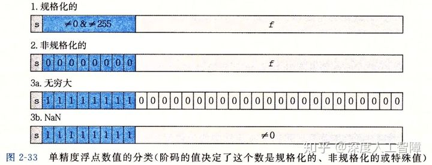

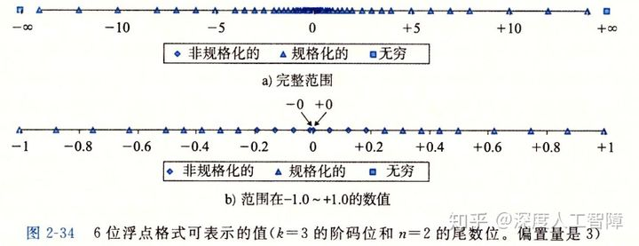

- float由一个符号位+8个阶码位+23个小数位表示
- 根据阶码位的三种状态，可表示四种数值：  
阶码不全为0或全为1，表示规格化值
阶码全为0，表示非规格化值
阶码全为1，小数为0，表示无穷值inf
阶码全为1，小数为不为0，表示非数值nan
- 规格化值的计算公式如图，注意偏置的计算与阶码位数相关
- 非规格化的数用来表示正负0，以及非常接近0的小数。
- 可以用浮点数来表示整数，通过上述公式推理浮点数的符号位、阶码和小数位

#### 2.4.4　舍入

常见的舍入方法有四种：向零舍入、向上舍入、向下舍入以及向偶数舍入。以十进制为例可以看以下表格


#### 2.4.5　浮点运算


#### 2.4.6　C语言中的浮点数

- float/double转换成int：首先小数部分会被截断，也就是向0舍入。float的尾数部分为23字节，比int的32字节小，所以int可以精确表示float的整数部分，而double的尾数有52位，可能会出现舍入。
并且当超过int的取值范围或NaN时，微处理器会指定 [100...0] 为整数不确定值，即对应的 TMinw ，所以一个很大的浮点数转化为int时，可能会出现负数。
- int或float转换为double：double尾数有52位，而int只有32位，float只有23位，所以double会精确表示int和float，不会出现溢出和输入。
- int转换为float：不会发生溢出，但是由于float尾数位数比较少，会出现舍入。
- double转换为float：可能会出现溢出和舍入。
- 由于舍入导致的精度损失，浮点数的加法和乘法都不满足结合率和分配率。

总结：超过数值表示范围，会发生溢出；尾数较短，会发生输入。


## CSAPP 第3章　程序的机器级表示


#### 3.1 机器级表示

- intel处理器的发展历史，从1978年的8086到现在的i9，从16位扩展到64位
- 生成汇编文件x.s，汇编文件里面包括以.开头的指导汇编器和链接器的指令，以及与代码相关的汇编代码
- intel中把16位看作一个字，所以32位称为双字，64位称为四字，汇编码中指令后缀的字母可以代表数据类型，例如movb,movw分别代表复制字节，复制字
- gcc中-s参数表示从c文件生成汇编文件s，改成-c参数则是从c文件生成机器代码o
- 利用反汇编工具objdump可以从机器代码o生成汇编代码s。

程序计数器（Program Counter）：指示了下个指令的内存地址。
程序员实际使用的寄存器（Register）：可以看成非常小的内存，可以通过特定名字来指定。
只有几个位的状态码（Condition Codes）：指示了最近一些指令的运行结果，比如是否产生0、是否产生负数或正数等等。这些值可以用来实现条件分支。

- 两个抽象：1 由指令集体系结构或指令集架构（Instruction Set Architecture，ISA）来定义机器级程序的格式和行为，它定义了处理器状态、指令的格式，以及每条指令对状态的影响；2 机器级程序使用的内存地址是虚拟内存地址，使得内存模型看上去是一个很大的连续字节数组。

#### 3.2　程序编码

1. **预处理器**会扩展源代码，插入所有用`#include`指令的文件，扩展所有用`#define`声明指定的宏。
2. **编译器**基于编程语言的规则、目标机器的指令集和操作系统的惯例，会将源代码转换为汇编代码作为输出，给出程序的每一条指令。
3. **汇编器**将汇编代码转化为二进制目标代码文件，它是机器代码的一种形式，包含了所有指令的二进制表示，但是还没有填入全局值的地址。
4. **链接器**将目标代码文件和实现库函数的代码合并，产生最终可执行代码文件。

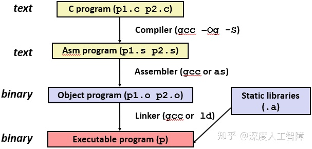

**编译器**

文件`mstore.c`中包含以下代码：

```text
long mult2(long, long);
void multstore(long x, long y,long *dest){
    long t = mult2(x,y);
    *dest = t;
} 
```

我们通过命令`gcc -0g -S mstore.c`将其编译成汇编代码，得到`mstore.s`。其中，

-  `-Og`：是生成机器代码的优化等级，这个表示编译器会生成符合原始C代码整体结构的机器代码，这是用于调试的级别，便于我们学习观察。其他的`-O1`或`-O2`会得到更好的程序性能，但是机器代码和源代码的关系就比较难以理解。
- `-S`：只生成到汇编代码。


**汇编器**

运行`gcc -Og -c mstore.c`来进行编译和汇编，会生成二进制文件`mstore.o`，它是对一系列指令的编码，机器直接执行这些字节序列，对源代码一无所知。

可以通过**反汇编器（Disassembler）**来将机器代码转化为类似汇编代码的格式，在Linux中，我们可以运行`objdump -d mstore.o`，可以得到。

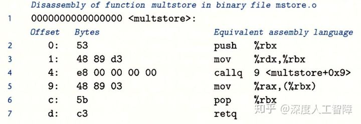

最左侧一栏是对应的字节地址，中间是每个指令的编码，右侧是生成的汇编代码。我们可以发现：

1. 每个指令需要的字节数不同，常用的指令和需要较少操作数的指令所需的字节数比较少。
2. 每个指令都有自己对应的编码。
3. 反汇编得到的汇编代码和直接生成的有略微差异。

**链接器**

链接器将目标代码文件转化为可执行代码，要求：目标代码文件中必须含有一个`main`函数，作为程序的入口。

我们构建一个文件`main.c`

```text
#include <stdio.h>
void multstore(long, long, long*);

int main(){
    long d;
    multstore(2, 3, &d);
    printf("%d\n", d);
    return 0;
} 
long mult2(long a, long b){
    long s = a*b;
    return s;
}
```

然后运行命令`gcc -Og -o prog main.c mstore.c`将main.c和mstore.c链接起来，并添加启动和终止程序的代码，以及用来与操作系统交互的代码生成可执行代码，生成最终的可执行文件`prog`。

### 3.3　数据格式

在x84-64中C语言数据类型的大小如下图所示

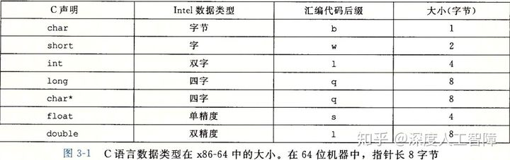

- 生成4字节数据的指令会把高位 4个字节置零。
- 使用寄存器进行内存引用时，要用64位寄存器。
- 局部变量通常保存在寄存器中，访问速度会比存放在内存中快很多。
- 对于程序而言，无法看到缓存，没有操作缓存的指令，也无法直接访问缓存。
- 可以将寄存器当做你正在处理的临时数据。

### 3.4　访问信息


一个x86-64的CPU中包含16个存储64位值的通用目的寄存器，可以用来存储整数数据和指针。有些寄存器有**特殊用途：**

- 栈指针`%rsp`用来指明运行时栈的结束位置
- 比如`%rdi`、`%rsi`、`%rdx`、`%rcx`、`%r8`和`%r9`用来保存函数的参数
- `%rip`用来保存当前执行指令的地址
- `%rax`用来存放函数的返回值


小点：
- intel x86-64处理器有16个通用寄存器，名字都以%r开头。
- 使用寄存器时包括调用者保存和被调用者保存两种策略，16个寄存器分别被定义成不同的策略。
- 通过一些编程规范，寄存器在不同程序中扮演了不同角色，例如rax用来保存程序返回值，rsp用来保存程序栈的结束位置，还有6个寄存器用来传递函数参数。
- 寄存器带小括号表示内存引用。
- mov指令复制时有源操作数和目的操作数 。
- 源操作数可以是立即数、内存引用、寄存器地址，目的操作数不可以是立即数。
- 源操作数和目的操作数也不可以同时是内存地址，即一个数在内存中进行复制时，需要两条mov指令，只能先复制到寄存器，再从寄存器复制到内存。

#### 3.4.1　操作数指示符

大多数指令由一个或多个操作数（Operand），指示出一个操作中要使用的元数据值，以及放置结果的目的位置。x86-64支持的操作数格式如下

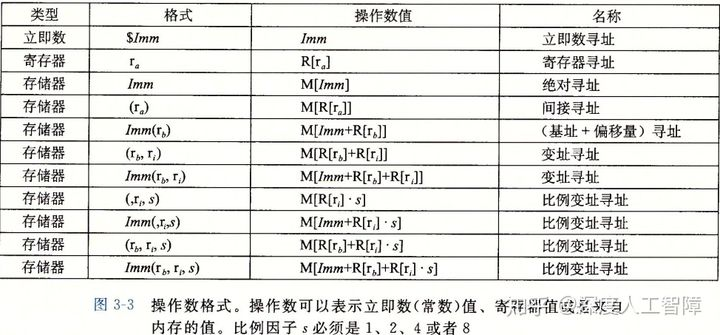

其中包含三种类型：

- **立即数（Immediate）：**用来表示常数值，书写格式是在`$`后面跟一个标准C表示法表示的整数。
- **寄存器（Register）：**表示某个寄存器的内容。
- **内存引用：**它会根据计算出来的地址访问某个内存位置。有不同的寻址模式，最常用的是 ![[公式]](https://www.zhihu.com/equation?tex=Imm%28r_b%2Cr_i%2Cs%29) ，其中，**要求寄存器大小都是64位的**，才能完整索引整个虚拟内存空间，并且不能使用`%rsp`。


#### 3.4.2　数据传送指令

最频繁使用的指令是将数据从一个位置复制到另一个位置的指令。

##### 源和目的大小匹配

该类数据传送指令将数据从一个位置复制到另一个位置，不做任何变化。不同类型指令指定了不同的数据大小（一个字为两个字节）。**源操作数**是一个立即数，可以保存在寄存器或内存中；**目的操作数**是一个位置，可以是寄存器或内存位置。


**注意：**

- 两个操作数不能同时为内存地址。如果要在两个内存位置传输数据，必须用一个寄存器进行中转。
- 使用到的寄存器大小一定要和指令最后一个字符指定的大小匹配。
- `movl`以寄存器为目的时，会将寄存器的高位4字节置0。
- 如果用`movq`来传输立即数时，该立即数只能表示为32位补码，然后扩展到64位的值。而`movabsq`能够以任意64位立即数作为源操作数，并且只能以寄存器作为目的。

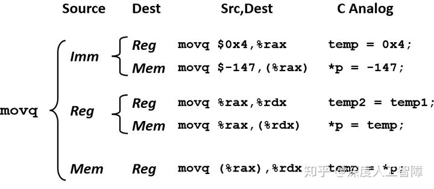

这里可以把寄存器当做临时存储。

##### 源寄存器小于目的寄存器

在将较小的源值复制到较大的目的时，提供两个类`MOVZ`和`MOVS`。`MOVZ`是将目的中剩余的字节填充0，`MOVS`是将目的剩余的字节填充符号位的值。它们每条指令后面都有两个字符，分别表示源大小和目的大小。


**综上：**

1. 两个指针之间进行传输，由于是直接对内存进行操作的，所以需要先经过一个寄存器。
2. 小的数据类型转换到大的数据类型，是根据前面的数据类型决定是`MOVZ`还是`MOVS`。
3. 大的数据类型转换到小的数据类型时，先将其保存得到寄存器中，再将部分保存到内存中。

#### 3.4.4　压入和弹出栈数据

栈在处理过程调用中起着至关重要的作用，在内存中栈顶位于较小的内存地址中。入栈时，就需要先将栈顶地址增加，由此指向了要放数据的地址，然后将数据存入对应的内存中。出栈时，先从内存中取出对应的数据，然后再将栈地址减小，来指向当前的栈顶地址。

这里使用一个特殊的寄存器`%rsp`来保存栈顶内存地址。并且提供两个操作指令`PUSH`和`POP`分别对应入栈和出栈，以操作64位数据为例，如下图所示


因为栈和程序代码和其他的程序数据都放在同一内存中，所以我们可以根据`%rsp`来访问栈中的任意位置。假设栈顶元素是8字节的，则`movq 8(%rsp), %rdx`表示将第二个元素保存在寄存器`%rdx`中。

### 3.5　算术和逻辑操作

以下列出了x86-64中的一些算数和逻辑操作，除了`leaq`以外，其他都有对不同大小数据的指令。


#### 3.5.5　特殊的算术操作

在3-10中我们并没有看到除法操作，它是使用比较特殊的指令进行计算的，如下图所示


其中`R[%rdx]:R[%rax]`表示将两个寄存器的值拼接起来作为一个数，其中寄存器`%rdx`是高八字节，`%rax`是低八字节。它这里只有一个操作数表示除数，而被除数保存在`%rax`和`%rdx`中。

128位乘法

### 3.6　控制

- 大多数情况下，机器对有符号数和无符号数都使用一样的指令，因为大多数算数运算对无符号数和补码都是相同的位级行为。但是在右移、除法和乘法指令以及条件码组合中，需要区分无符号数和补码。
- 保存在64位寄存器中的数据类型，除了`long`和`unsigned long`以外，还可以是指针（对于64位操作系统而言）。
- 条件跳转只能是直接跳转。
- 当`switch`的分支跨度很大，并且很稀疏时，会保存很大的跳转表，可能影响性能，编译器可能会将其构建成树的结构。此时建议使用`if-else`语句。
- 这一节比较重要的概念：条件jump、条件mov以及跳转表的思想，

#### 3.6.1　条件码

除了之前介绍的保存整数和指针的16个64的寄存器以外，CPU还维护了一组单个位的**条件码（Condition Code）寄存器**，我们不会直接对条件码进行设置，而是根据最近的算数、逻辑或者测试的结果，自动设置这些条件码寄存器的值。

**条件码包括：**
- ZF：零标志，最近的操作得到的结果是否为0。
- **无符号数：**
- - **CF：**进位标志，最近的操作使得最高位产生进位。可用来检查无符号数是否存在溢出。
- **补码：**
- - **SF：**符号标志，最近的操作得到的结果为负数。
- - **OF：**溢出标志，最近的操作导致补码溢出（可以通过符号位进一步判断是正溢出还是负溢出）

x86-64提供了另外两类指令，只会设置条件码而不会改变目的寄存器：

- `CMP S1, S2`：用来比较`S1`和`S2`，根据`S2-S1`的结果来设置条件码。主要用来比较两个数的大小。
- `TEST S1, S2`：用来测试`S1`和`S2`，根据`S1 & S2`的结果来设置条件码。可以将一个操作数作为掩码，用来指示哪些位用来测试。比如`testq %rax, %rax`就可以检查`%rax`是正数、负数还是0。

**注意：**使用`CMP`进行比较时，要注意顺序是相反的。比如`CMP S1, S2`得到大于的结果，则表示`S2`大于`S1`。


所以常见的**使用顺序**为：

1. 使用`CMP`进行比较或`TEST`进行测试，来设置条件码。
2. 根据条件码组合或者`SET`将结果保存在单字节寄存器中。
3. 使用`movbl`将结果保存在32位寄存器中，并且会自动设置高4字节为0。

#### 3.6.3　跳转指令

**根据提供跳转目标的方式：**

-  **直接跳转：**跳转目标作为指令的一部分进行编码。汇编语言中，跳转目标通常用一个**标号（Label）**指明，比如下面汇编代码里的`.L1`就是标号。在产生目标代码时，汇编器以及链接器会确定跳转目标的适当编码，并将其编码为跳转指令的一部分。
- **间接跳转：**跳转目标从寄存器或内存位置中读取出来。需要在前面添加一个`*`，比如`jmp *%rax`就是跳转到寄存器`%rax`中保存的地址；`jmp *(%rax)`就是跳转到内存地址`(%rax)`中保存的地址。

常见的所有跳转指令如下图所示

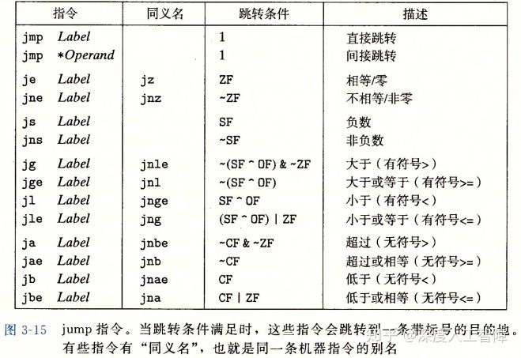

对于直接跳转的跳转目标的编码，有**两种编码方式：**

- **PC相对的（PC-relative）：**跳转目标地址减去跳转指令下一条指令的地址的差。编码长度可以为1、2或4字节。
- **绝对地址：**用4字节直接给定目标地址。

#### 3.6.5　用条件控制来实现条件分支

实现条件操作的传统方法是通过使用控制的条件转移，当条件满足时，程序沿着一条执行路径执行，而当条件不满足时，就走另一条路径。对于条件分支

```c
if(x<y){
  proc1;
}else{
  proc2;
}
```

其中x保存在`%rdi`，y保存在`%rsi`，可以定义对应的汇编语言

```text
  cmpq %rsi, %rdi
  jge .L1
  PROC2
  ret
.L1:
  PROC1
  ret
```

#### 3.6.6　用条件传送来实现条件分支

处理器在执行一条指令时，会经历一系列过程，而每个过程执行所需操作的一小部分，通过重叠连续指令可以提高性能，比如当前指令执行计算时，下一条指令可以执行取指阶段，这个方法称为**流水线（Pipelining）**。但是当遇到条件需要跳转时，只有知道跳转结果才能确定指令顺序，才能使用流水线，现在处理器采用**分支预测**的方法来预测跳转的结果，即处理器会预测当前跳转的结果，然后将预测的指令进行流水线，如果预测正确则会提高性能，如果预测错误，就需要把之前流水线清空，然后在正确的分支重新开始流水线，会损失很多性能。

> **分支预测处罚计算：**预测错误概率为p，预测正确时代码执行时间为TOK，而预测错误的处罚为TMP。则执行代码的平均时间为TAVG(p)=(1-p)TOK+p(TOK+TMP)=TOK+pTMP，所以TMP=(TAVG(p)-TOK)/p。

x86-64上提供了一些条件传送指令CMOV，只有在满足条件时，才会将源数据传送到目的中，如下图所示，其中源值可以从寄存器也可以从内存地址获取，而目的只能是寄存器。并且这里不支持单字节。


#### 3.6.7　循环

**do-while**

比如代码

```c
long fact_do(long n){
  long result = 1;
  do{
    result *= n;
    n = n-1;
  }while(n>1);
  return result;
}
```

对应的汇编代码为：

```text
fact_do:
  movl $1, %eax
.L1:
  imulq %rdi, %rax
  subq $1, %rdi
  cmpq $1, %rdi
  jg .L1
  rep; ret
```

可以发现，在跳转标号`.L1`之前是循环的初始化，跳转标号之后就是循环体，然后最后要判断是否继续循环体。


**Jump-to-middle**

类似于do-while的汇编代码，只是需要在开始就跳转到后面的判断语句

```text
fact_while:
  movl $1, %eax
  jmp .JUDGE
.L1:
  imulq %rdi, %rax
  subq $1, %rdi
.JUDGE:
  cmpq $1, %rdi
  jg .L1
  rep; ret
```

**特点：**一开始就有一个无条件跳转指令。

**for循环**

可以转化为while循环，然后根据优化等级，GCC会为其产生的代码是while循环的两种方法之一。比如对于代码

```c
long fact_for(long n){
  long i;
  long result = 1;
  for(i=2; i<=n; i++){
    result *= i;
  }
  return result;
}
```

可以将其转化为while语句

```c
long fact_for_while(long n){
  long i=2;
  long result = 1;
  while(i<=n){
    result *= i;
    i += 1;
  }
  return result;
}
```

#### 3.6.8　switch语句

`switch`语句可以根据一个整数索引数值进行多重分支。通常使用**跳转表（Jump Table）**数据结构使得实现更加高效，它是一个数组，每个元素是对应的代码块起始地址，根据整数索引得到对应的代码地址后，就可以直接跳转到对应的代码块。

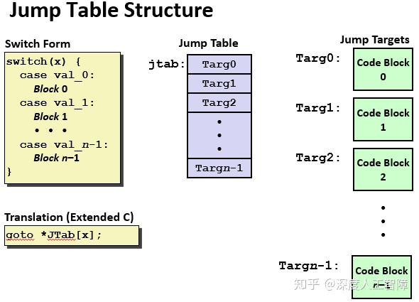

如下图所示的C语言代码

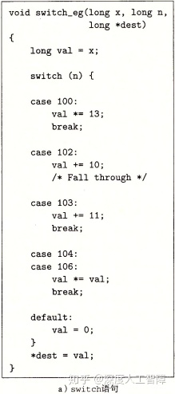

我们首先看GCC提供对跳转表支持后的C语言代码


里面有一个跳转表数组`jt`，GCC提供了一个新的运算`&&`，能够创建一个指向代码位置的指针。首先在第9行中，计算输入值`x`和`switch`的最小值的差，并将其保存到无符号数中。然后将其作为跳转表的索引，直接在第16行中跳转到索引的代码位置。


### 3.7　过程

**小点1**

- 当函数执行时需要的存储空间大于寄存器空间时，就会借用栈上的存储空间。
- main函数在调用子函数时，要把返回地址存到栈中，子函数调用结束后，就接着把栈中的返回地址弹出来，接着运行main函数。
- 当一个函数的参数多于6个时，多余的参数要通过栈来传递。
- 用栈来传递参数时，存储数据的大小都是以8个字节的倍数分配空间。
- 用栈来保存局部变量时，局部变量不需要8字节对齐

**小点2**

- C中的取地址符`&`返回的是内存地址，所以一定要保存在内存中。
- 保存到内存中进行参数传输时，要求每个参数大小为8字节的倍数，即要求相对`%rsp`的偏移量为8的倍数
- 不会显示地操作程序计数器寄存器`%rip`，没有指令可以对其操作，只能通过类似`call`或`ret`间接对其操作。
- 栈顶指针`%rsp`是随着函数运行不断变化的。
- 函数可以假设“被调用者保存寄存器”的值是不变的，而可以用“调用者保存寄存器”来保存临时值。
- 某个函数要永久使用的值，要么保存在“被调用者保存寄存器”中，要么保存在内存中。
- 当函数需要使用“被调用者保存寄存器”时，就直接将其`push`到栈中，使用过后再`pop`重置。
- 无论是“被保存的寄存器”还是“局部变量”以及“参数构造区”，一开始如何申请这些区域，后面使用完后还会逆向地通过`%rsp`将这些区域释放掉，这是动态的过程，使得一个函数运行完时，`%rsp`指向的就是返回地址，就能直接通过`ret`返回到调用者的断点处。


- 进入一个函数时，首先将要使用的“被调用者保存寄存器”`push`到栈中，然后**通过`%rsp`来申请一段固定大小的空间**，用来存放局部变量和参数构造区，最后再释放申请的空间。

#### 3.7.1　运行时栈

##### 栈帧：

- 当函数需要的存储空间超出寄存器能够存放的大小，或者调用别的函数需要保存额外数据时，就会在栈上分配一个空间，这个空间称为函数的**栈帧（Stack Frame）**。

- 相对的，当某个函数的所有局部变量都能保存在寄存器中，并且不会调用任何的函数时，就无需开辟该函数的栈帧了。
- 当给一个函数创建栈帧时，编译器会给函数分配所需的**定长**的栈帧，在函数开始时就分配好后就不会改变了，所以栈顶指针`%rsp`就知道当函数返回时，需要释放多少空间。而有些函数需要变长的栈帧。

注意：栈顶的栈帧对应了正在运行的函数。

- 所以每个函数的栈帧就作为栈的基本元素，来起到函数调用时先进后出的效果，会在栈中保存之前所有还未返回的函数的栈帧，将之前的函数先挂起。这里提供了`PUSH`和`POP`指令对栈进行操作，也可以直接对栈顶指针`%rsp`进行操作。

注意：因为未返回的函数都会在内存中保存自己的栈帧，而栈的空间是有限的，所以当调用过多时，会造成栈的溢出。

#### 3.7.2　转移控制

当函数P调用函数Q运行时：
   - 由于x86-64只提供6个寄存器来传递函数输入值，所以当函数P传递给函数Q的参数多于6个时，需要函数P在自己的栈帧中存储好这些输入参数。
   - 会先将返回地址压入栈中，表明当函数Q返回时，要从函数P中的哪个位置继续执行，这个作为P的栈帧的一部分。

- 函数Q运行时：函数Q会扩展当前栈的边界，分配函数Q的栈帧所需的空间，可以用来保存寄存器的值、分配局部变量空间，为函数Q调用其他函数设置参数。

- 函数Q返回时：释放分配给函数Q的栈帧，并且让程序计数器调用返回地址，继续从函数P的断点处继续执行。


#### 3.7.3　数据传送

**被保存的寄存器**

被调用者保存寄存器：%rbx、%rbp和%r12~%r15。这部分寄存是由被调用者，即Q保存的。
调用者保存寄存器：除了上面的寄存器外，都属于被调用者保存寄存器。
注意：当函数P调用函数Q时，“被调用者保存寄存器”就会保存在函数Q的栈帧中，所以当函数Q返回时，这部分寄存器会被重置为函数P使用时的状态。而其他寄存器的值是需要函数P自己保存的，所以函数P需要自己开辟局部变量区域来保存其他寄存器的值。


#### 3.7.4　栈上的局部存储

**局部变量**

当函数需要保存的数据不多时，就会将数据保存在“被调用者保存寄存器”中。但是以下情况必须保存在内存中，该部分称为该函数的局部变量：

- “被调用者保存寄存器”不足以保存所有的本地数据
- 当一个局部变量使用取地址符&时，指的是返回该变量在内存中的地址，就必须将其保存在内存中。
- 当局部变量是数组或结构时。

#### 3.7.5　寄存器中的局部存储空间

**参数构造区**

- 主要任务：函数P必须能够向函数Q传递一个或多个参数，而函数Q必须能够向函数P返回一个值。    
- 在函数间传递数据，主要通过寄存器进行，x86-64提供了6个用于传递参数的寄存器，根据参数的顺序，需要放入特定的寄存器中。x86-64将寄存器%rax作为函数返回值的寄存器。
- 如果某个函数要传递超过6个参数的话，就需要将第7个到第n个参数保存在栈中，然后通过栈顶指针%rsp进行索引其中第7个参数在栈顶位置。要求每个参数的大小要为8字节的倍数。这部分区域称为参数构造区

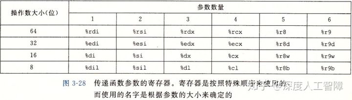

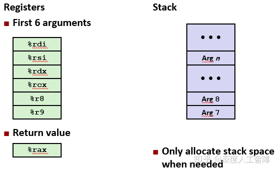

由于栈顶还要保存一个8字节的返回地址，所以第7个参数的地址为`8(%rsp)`，如果第7个元素大小不超过8字节，则第8个元素的地址为`16(%rsp)`，以此类推。

注意：这些寄存器只能用来保存整数或指针类型。

#### 3.7.6　递归过程

**返回地址**

主要任务：在进入函数Q的时候，程序计数器要设置为Q的代码的起始位置。从函数Q返回时，要把程序计数器设置为P中调用Q后面那条指令的地址，即从P中的断点处继续执行。

x86-64提供了一组指令来完成上述操作


注意：在64位操作系统中，返回地址是64位8字节的。

- 1.（被保存的寄存器）函数P将要使用的“被调用者保存寄存器”通过push保存在函数的栈帧中。
- 2.（局部变量）如果函数P使用了“调用者保存寄存器”，就需要将其保存在栈中，才能调用函数Q。并且函数P根据需要申请空间来保存其他局部变量。
- 3.（参数构造区）函数P将参数保存在寄存器中，如果超过6个参数，就申请空间保存到内存中。
- 4.（返回地址）函数P使用call指令调用函数Q，会将call的下一行指令的地址压入栈中，并将程序计数器指向函数Q的第一条指令的地址。
当函数Q运行时会随着使用动态申请和释放局部变量，当函数Q运行完时，首先使用栈“被调用者保存寄存器”的值，然后使用ret指令返回将程序计数器设置为栈顶的返回地址，最后将栈顶的返回地址弹出。

### 3.8　数组分配和访问

- 指针进行加减运算时会根据指针类型选择加的基数。
- 当（定长）二维数组A的某行和（定长）二维数组B的某列进行内积运算时，c语言的实验是一个循环，汇编语言的优化指令就是条件加跳转，首先记录下A行的首地址，B列的首地址和尾地址，相乘之后放到一个寄存器中，再移动到下一个要相乘的数，直到B列地址与尾地址相同。

- 当你声明了一个数组，你既为它分配了空间，并且创建了一个允许进行指针运算的数组名称。而当你声明一个指针时，你所分配的只有指针本身的空间。
- 当程序要用一个常数作为数维度或者缓冲区大小时，最好通过`#define`声明将这个常数与一个名字联系起来，后面就一直使用这个名字代替常数的数值。
- 在`struct`和`union`中的对象，都是保存在内存中的。
- 定义结构体时，按照对象K值的大小，**从大到小声明**，可以减少填充的空间，节省整个结构体的大小。


#### 3.8.1　基本原则

对于数据类型`T`和整形常量`N`，声明一个数组变量`A`：

```c
T A[N];
```

主要经历两个步骤：

1. 根据数据类型`T`的大小`L`字节，先在内存空间中分配一个大小为`L*N`的连续空间；
2. 将`A`作为这个连续内存空间的起始指针，即A的值`xA`就是该内存空间的起始地址。

注意：当你声明了一个数组，你既为它分配了空间，并且创建了一个允许进行指针运算的数组名称。而当你声明一个指针时，你所分配的只有指针本身的空间，所以如果没有初始化指针，直接对其进行解引用可能会出现错误。

#### 3.8.2　指针运算

看下**数组和指针的区别：**

```text
int A1[3];
int *A2;
int *A3[3];
int (*A4)[3];
```

- `sizeof(A1)`为12，返回的是数组内保存的全部元素大小； `sizeof(*A1)`为4，返回的是第一个元素的大小，即`int`的大小。而`sizeof(A2)`为8，返回的只是指针的大小；`sizeof(*A2)`为4，返回的也是`int`的大小。
- 如果没有对`A2`进行初始化，直接调用`*A2`可能会报错，因为它没有指向合理的对象。而`*A1`不可能出错，因为创建数组时，已经为他分配好了空间。
- `A3`声明了大小为3的数组，每个元素的类型为`int *`，所以`sizeof(A3)`为24，因为数组内有3个元素，每个元素都是指针，大小为8。而`sizeof(*A3)`为8，因为`A3`的第一个元素是一个指针，大小就为8。而`sizeof(**A3)`为4，它表示的是数组中第一个指针指向的`int`，所以是4。因为`A3`首先声明的是一个数组，所以它会自动分配好数组的空间，所以`*A3`不会是空指针，但是它里面保存的是指针，所以`**A3`可能会是空指针。
- `A4`定义了一个指向大小为3的`int`数组的指针。所以`sizeof(A4)`为8，只是一个单纯的指针的大小；`sizeof(*A4)`为12，它表示`A4`指向的数组的大小。而`sizeof(**A4)`为4，它表示`A4`指向的数组的第一个元素。 因为这里只是单纯声明了一个指针，所以`*A4`和`**A4`都可能是空指针。

综上：假设数据大小为L，起始地址x保存在%rdx，索引i保存在%rcx中，索引偏移量通过func(i)计算得到，则：

通过索引偏移量func(i)计算内存地址的偏移量L*func(i)=Ai+B
获取内存地址的汇编代码为lea_ B(%rdx, %rcx, A), %_。获得数据的汇编代码为mov_ B(%rdx, %rcx, A), %_。

#### 3.8.3　嵌套的数组

```c
T D[R][C]
```

其中，`R`是行数，`C`是列数。

在内存中，这种二维数组是按照“行优先”的形式保存在内存中的，即先按顺序保存`D[0]`的`C`个元素，然后再紧接着保存`D[1]`的`C`个元素，以此类推。

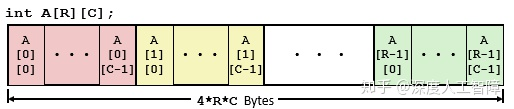

所以当该数组的起始地址为`x`，`T`的大小为`L`时，`D[i][j]`的地址为`x+L(Ci+j)`。类似一元数组，我们也可以很容易地通过“比例变址寻址”的方式进行索引。

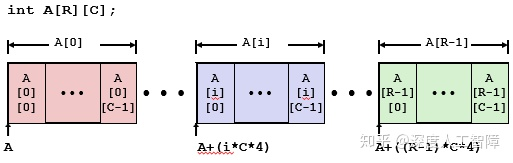

#### 3.8.4　定长数组

当我们使用`#define`定义一个变量`N`为常量后，再用`N`来确定数组大小，则该数组是一个定长数组，这里展示一个`-O1`时GCC采用的优化。

对于以下代码：

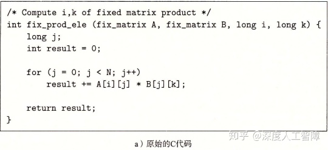

我们首先看它经过优化后的C代码

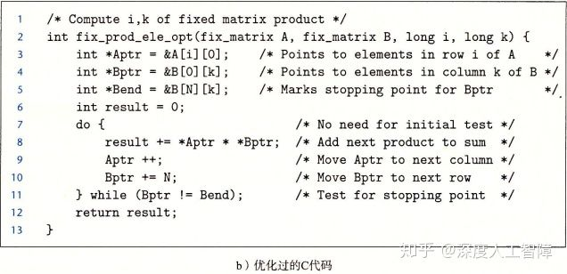

可以发现这里省略了变量`j`，并且将所有数组引用都转换成了指针间的引用，避免了索引`A[i][j]`要计算乘法`A+L(Ci+j)`的巨大损耗。

对应的汇编代码为

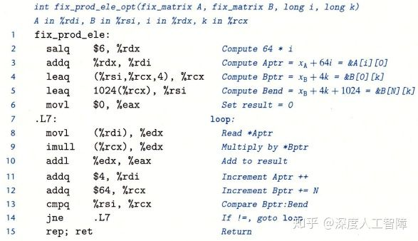

#### 3.8.5　变长数组

ISO-C99允许数组的维度为表达式，在数组被分配时才计算出来，例如

```c
int A[exp1][exp2];
```

只要求`exp1`和`exp2`定义在上面那个声明之前。

对比下定长数组和变长数组在索引时汇编代码的区别

- 定长数组

```c
typedef int fix_matrix[5][3];
int fix_ele(fix_matrix A, long i, long j){
  return A[i][j];
}
```

对应的汇编代码为

```text
fix_ele:
  leaq (%rsi, %rsi, 2), %rax    #compute 3i
  leaq (%rdi, %rax, 4), %rax    #compute A+12i
  movl (%rax, %rdx, 4), %eax    #read fomr M[A+12i+4j]
  ret
```

- 变长数组

```c
int var_ele(int n, int A[n][n], long i, long j){
  return A[i][j];
}
```

对应的汇编代码为

```text
var_ele:
  imulq %rdx, %rdi             #compute ni
  leaq  (%rsi, %rdi, 4), %rax  #compute A+4ni
  movl  (%rax, %rcx, 4), %eax  #read from M[A+4ni+4j]
  ret
```

看汇编代码可以发现以下区别：

- 增加了参数n，使得寄存器的使用改变了。
- 用了乘法指令来计算`ni`，而不是用`leaq`来计算`3i`，乘法会导致无法避免的性能损失,因此定长的性能会更好。


### 3.9　异质的数据结构

#### 3.9.1　结构

用`struct`声明创建一个**数据类型**，具有以下特点：

- **定义：**可以将不同类型的对象聚合到一个对象中，并使用名字来引用结构中的各个组成部分。
- **存储：**结构的所有组成部分都存放在内存中一段连续的区域内，指向结构的**指针**是结构第一字节的地址。
- **获得元素：**编译器会维护关于每个结构类型的信息，了解每个字段的偏移量，由此作为内存引用指令的唯一，来对结构元素进行引用。

由此就将4个对象包装到了结构类型`rec`中了，这些对象大小依次为4、4、8和8字节，它的存储是按顺序连续地排列在内存空间中的

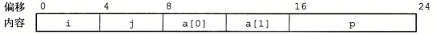

我们同样可以声明嵌套的结构体

```c
struct prob{
  int *p;
  struct {
    int x;
    int y;
  }s;
  struct prob *next;
};
```

其在内存中的分布为

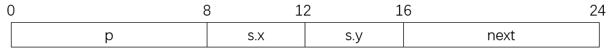

注意：结构体分配地址空间时，对不同类型的值的起始地址有固定的要求，例如占8个字节的数据类型，起始地址必须是8的倍数，因此如果按顺序排列不满足，就会在前面或者后面插空（为了满足结构体数组，也即是末尾地址要满足下一个结构体首元素的起始地址）直到满足起始地址要求。

#### 3.9.2　联合

用union声明创建一个数据类型，具有以下特点：

- 定义：允许以多种类型来引用一个对象。
- 存储：保存在公共的一块内存中，通过不同对象的类型来赋予这块内存不同的含义。内存大小为最大字段的大小。

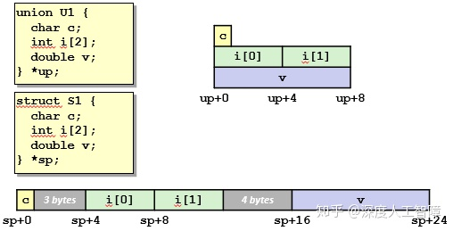

主要具有以下应用情况：

- 如果我们事先知道两个不同字段是互斥的，就能将其定义在一个union中，就能节省内存空间。
- 访问相同位模式下不同数据类型的值。

联合体可以不同的类型共享同样的空间，一般很少用，但例如强制类型转换时，就可以定义联合体以一种类型存储，另一种类型访问。

struct和union的区别：struct为每个对象分配了单独的内存空间，而union分配了共用的内存空间。    
什么时候用union什么时候用struct：当你要信息同时存在时，就需要分配到不同的内存中，就要用struct，否则用union。    

计算struct和union嵌套的数据类型的内存分布：    
- 如果是包裹在struct内的，就按顺序按照对象大小依次排列下来
- 如果是包裹在union内的，就看最大的对象大小，直接分配一块内存就行


#### 3.9.3　数据对齐

**对齐原则**是任何K字节的基本对象的地址必须是K的倍数


为此，在`struct`中两个连续的对象，编译器可能中间会插入间隙，来满足各自对内存地址的要求。并且还有**两个额外的要求：**

- 要求结构的初始地址一定是结构体中最大对象大小的倍数，使得偏移量加上初始地址才是真的满足倍数关系的。
- 在结构体末尾填充，使其是结构体中最大对象大小的倍数，使得结构数组中下一个元素的地址也是成倍数关系的。

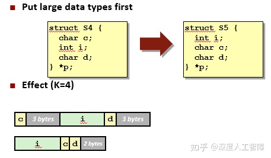

我们可以画图把一个个对象依次填充进去，并且要求它的偏移量是满足K的倍数。然后考虑要在末尾填充多少字节能够使得总共大小是最大对象大小的倍数。最终最大对象的大小就是对初始地址的对齐要求。

### 3.10　在机器级程序中将控制与数据结合起来

**x86-64内存分布**

真实物理内存通过操作系统将其映射虚拟内存，从程序员的角度，内存就被抽象为一个很大的字节数组，每个元素是一个字节。在86-64机器上，64位二进制数为该数组地址进行编码，意味着64位操作系统最大能容纳2^64字节的内存大小。

虚拟内存存储数据也是分不同区域的，如下图所示（不是按比例绘制的），地址从下到上依次递增。

<center> 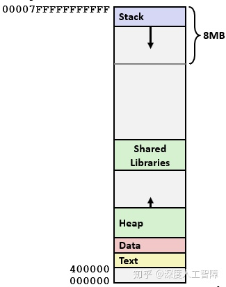 </center>     


- **Stack**：在Linux中，将栈放置在整个地址空间的最顶部，用于函数调用，及**局部变量**的存储，这样随着函数的运行，栈顶就能向低地址不断扩展。常用系统中栈的大小是8MB，可通过命令`limit`查看，如果用栈指针访问超过8MB范围的地址，就会出现**段错误（Segmentation Fault）**。 相同程序的栈的分配是固定的。
- **Shared Libraries：**类似于`printf`和`malloc`的这类**库函数**平时是被存储在磁盘上的，当我们程序需要使用库函数时，就会在程序开始执行时，将它们加载到你的程序中，这称为**动态加载（Dynamic Linking**）。
- **Heap：**用来存放通过**`malloc`、`callc`或`new`**等申请的变量，这些变量在程序运行时会动态变化。当你不断通过`malloc`申请空间又没释放时，堆顶的指针就不会断向高地址增加，使得占用的内存不断变多。堆在分配时是具有随机性的。
- **Data：**该数据区用来存放程序开始时分配的数据，你声明的**全局变量、静态变量或字符常量等**都在这个数据段中。
- **Text：**根据可执行目标文件的内容进行初始化，是放置你的可执行程序的位置。这部分区域是只读的。

以以下代码为例

<center>  </center>     


`big_array`、`huge_array`和`global`是全局变量，因此存储在Data区中。`useless`和`main`是函数，因此存放在Text中。`main`函数中的`p1`、`p2`、`p3`、`p4`是通过`malloc`申请空间的，所以保存在Heap区。`local`是局部变量，所以保存在Stack区中。


我们可以发现，通过`malloc`申请的变量，较小的会保存到靠近Data区，而较大的会保存到靠近Stack极限的位置。由于Heap中有部分还没有申请，所以如果尝试引用Heap中空白的区域，会产生段错误。

#### 3.10.1　理解指针

如果指针通过`&`创建，表示获得某个对象的地址，在机器代码中对应于`leaq`。如果指针通过*进行访问，表示访问该指针指向的对象的值，在机器代码中对应于内存引用。    
特殊的NULL(0)表示该指针不指向任何值。    

通过int *p;定义了一个int *类型的指针p，则通过p获取对象内容时，就会获取4字节数据作为该对象内容。

同样可以声明**函数指针**，表示指向函数在机器代码中的第一条指令的内存地址

```c
T (*fp)(arg1T, arg2T,...);
```

其中，`T`为函数的返回值类型，`arg1T`表示第一个参数的类型，以此类推。然后将函数名赋值给该函数指针，就能直接通过该函数指针调用函数了。

#### 3.10.2　应用：使用GDB调试器

#### 3.10.3　内存越界引用和缓冲区溢出

#### 3.10.4　对抗缓冲区溢出攻击

**使用安全函数**

gets函数有一个问题就是不知道返回的数据大小是否超过缓冲区的栈空间，如果溢出的话会导致返回地址错误，程序会跳转到意想不到的地方。

因为fgets有一个用来指定程序最多可以读取多少字节的参数，如果输入的字节超过这个数字，就会对其进行截断。
可以使用strncpy代替strcpy。要注意不要直接使用scanf的%s来读取字符串，要么使用fgets代替，要么使用%ns来指定最多可以输入多长的字符串。

- 保护机制一：地址空间布局随机化，程序的不同部分会被加载到内存的不同区域
- 保护机制二：栈破坏检测，在缓冲区与栈保护中间加一个金丝雀值，在函数返回时判断金丝雀值是否变化来判断是否有错误
- 保护机制三：栈中的页可以被设置属性为可读、可写、不可执行，通过限制可执行代码区域来放置缓冲区溢出

#### 3.10.5　支持变长栈帧

为了管理变长栈帧，x86-64代码使用`%rbp`作为**帧指针（Frame Pointer）**。进入函数时，先将其存入到“保存寄存器区”，然后将当前的栈指针`%rsp`的值赋予`%rbp`，则函数最后可直接通过将`%rbp`的值赋予`%rsp`就能释放变长的栈帧，并且通过“保存寄存器区”来重置`%rbp`的值。

### 3.11　浮点代码

通过SSE提供的XMM寄存器和AVX提供的YMM寄存器来对浮点数进行SIMD运算。

包含的寄存器如下所示

<center> 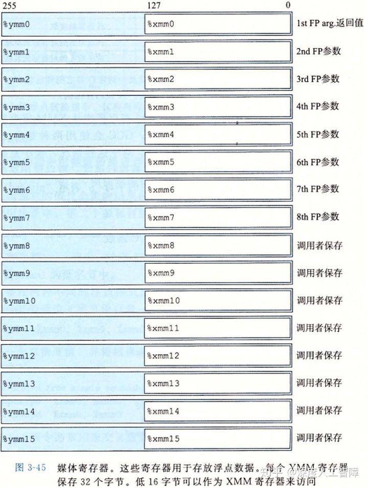 </center>     

一个XMM寄存器，可以满足16个char、8个short、4个int、4个float和2个double同时进行操作，也就实现了SIMD运算。

#### 3.11.1　浮点传送和转换操作


浮点数-->整型：


前面的`cvt`表示转换（convert），后一个`t`表示截断（truncated）。在将浮点数转换成整数时，指令会执行截断，把值向0进行舍入。可以发现这些都是标量指令。

整型-->浮点数：


#### 3.11.2　过程中的浮点代码

- 函数传入的浮点数，或者函数使用浮点数进行计算时，都需要使用上述寄存器。也可以使用栈来传递额外的浮点参数。
- %xmm0既是函数第一个参数的寄存器，也是函数返回值的寄存器
- 所有寄存器都是“调用者保存寄存器”，所以函数要先将这些值保存在内存中，才去调用别的函数。

注意：参数到寄存器的映射取决于参数的顺序和类型。如果是整型或指针，就使用通用寄存器，如果是浮点数，就使用XMM寄存器。

#### 3.11.3　浮点运算操作

提供一组执行算数运算你的标量AVX2浮点指令

<center>  </center>     

每条指令可以有一个源操作数或两个源操作数，以及一个目的操作数。其中，第一个源操作数可以是XMM寄存器或内存位置，而第二个操作数和目的操作数只能是XMM寄存器。

注意：当计算中出现整型、float和double混合时，需要将整型和float都转换成double再计算。

#### 3.11.4　定义和使用浮点常数

和整数运算操作不同，AVX浮点操作不能用立即数作为常数。编译器会为浮点常数分配和初始化存储空间，然后代码再从内存中读取这些值。

## CSAPP 第4章　处理器体系结构 

### 4.1　Y86-64指令集体系结构

#### 4.1.1　程序员可见的状态

硬件描述语言（Hardware Description Language，HDL）可以用来描述硬件结构，是一种文本语言，类似于编程语言，包括Verilog和VHDL。

实现一个数字系统主要有三个组成部分：

- 1 计算对位进行操作的函数的组合逻辑
- 2 存储位的存储器单元
- 3 控制存储器单元更新的时钟信号

#### 4.1.2　Y86-64指令

### 4.2　逻辑设计和硬件控制语言HCL

#### 4.2.1　逻辑门

将很多逻辑门组合成一个实现某种功能的网，就能构成**计算块（Computational block）**，称为**组合电路（Combinational Circuits）**。想要构建有效的组合电路，有以下**限制：**

- 每个逻辑门的输入必须连接到以下其中之一：

- - 一个系统输入
  - 某个存储器单元的输出
  - 某个逻辑门的输出

- 两个或多个逻辑门的输出不能连接在一起

- 网络不能形成回路

#### 4.2.2　组合电路和HCL布尔表达式

**例1：**


**HCL表达式：**`bool eq = (a && b) || (!a && !b);`

**功能：**用来判断输入`a`和`b`是否相同，结果保存在`eq`中。

**例2：**


**HCL表达式：**`bool out = (s && a) || (!s && b);`

**功能：**该组合电路称为**多路复用器（Multiplexor，MUX）**， 当`s=1`时，`out`的值就是`a`的值；当`s=0`时，`out`值就是`b`的值。

**HCL表达式和C语言逻辑表达式区别：**

- `=`在HCL表达式中表示给表达式赋予的名字
- 组合电路中输出会持续相应输入的变化，而C语言只有在程序执行过程中遇到了才进行求职
- 逻辑门只允许对0和1进行操作，而C语言将0表示为FASLE，将其余任意值表示为TRUE
- C语言中存在部分求值的特点，组合逻辑中不存在

#### 4.2.5　存储器和时钟

为了产生时序电路（Sequential Circuit），即存在状态并且能在这个状态上进行计算的系统，我们必须引入按位存储信息的设备。而这些存储设备是由同一个具有周期性信号的时钟控制的，决定什么时候将新值保存到存储器中。

主要有两类存储器设备：

- **时钟寄存器（寄存器）：**存储单个位或字，主要作为电路不同部分的组合逻辑之间的屏障。

- **随机访问存储器（内存）：**存储多个字，用地址来选择读写哪个字。**包括：**

- - **处理器的虚拟内存系统：**通过操作系统对存储器进行抽象，使得处理器可以在很大的地址空间中访问，地址为虚拟内存的索引值。
  - **寄存器文件：**是一个以寄存器标识符为地址，存储着对应程序寄存器值的随机访问存储器。在IA32或Y86-64处理器中，有15个程序寄存器（`%rax`~`%r14`）。

这里要注意区分机器级编程中的寄存器和硬件中的寄存器

- **硬件：**寄存器指的是时钟寄存器，直接将它的输入和输出连接到电路的其他部分。这里称为硬件寄存器。
- **机器级编程：**寄存器代表的是存储在寄存器文件中的，CPU中少数可寻址的字，地址为寄存器标识符。这里称为程序寄存器。

### 4.3　Y86-64的顺序实现
#### 4.3.1　将处理组织成阶段
#### 4.3.2　SEQ硬件结构

我们可以得到顺序实现的SEQ抽象视图

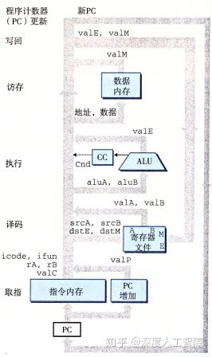

- 数据内存和指令内存都是在相同的内存空间中，只是根据不同的功能对其进行划分
- 寄存器文件包含两个读端口`A`和`B`，以及两个写端口`M`和`E`，分别接收来自内存的值`valM`以及ALU计算的结构`valE`。
- PC更新的值可能来自于：下一条指令地址`valP`、来自内存的值`valM`、调用指令或跳转指令的目标地址`valC`。

更加详细的图如下所示

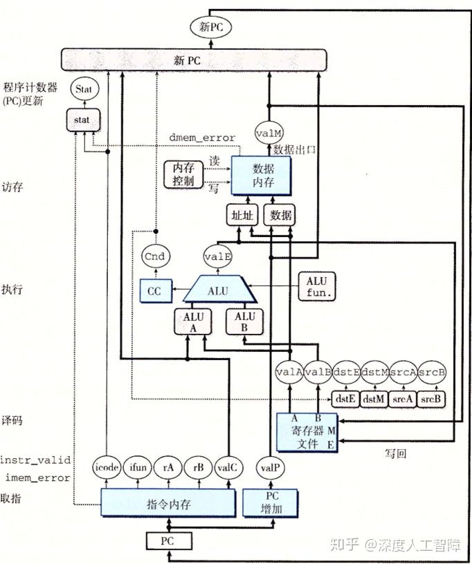

- 白色方框为时钟寄存器；蓝色方框为硬件单元，当做黑盒子而不关心细节设计；白色圆圈表示线路名字。
- 宽度为字长的数据使用粗线；宽度为字节或更窄的数据用细线；单个位的数据用虚线，主要表示控制值。
- 灰色圆角矩形表示控制逻辑块，能在不同硬件单元之间传递数据，以及操作这些硬件单元，使得对每个不同的指令执行指定的运算。是本章的重点，会给出对应的HCL表达式。

#### 4.3.3　SEQ的时序
#### 4.3.4　SEQ阶段的实现

### 4.4　流水线的通用原理

#### 4.4.1　计算流水线
#### 4.4.2　流水线操作的详细说明
#### 4.4.3　流水线的局限性
#### 4.4.4　带反馈的流水线系统

### 4.5　Y86-64的流水线实现

#### 4.5.1　SEQ+：重新安排计算阶段


对应的SEQ+硬件结构如下图所示，可以发现将更新PC阶段移到了时钟周期开始的位置。

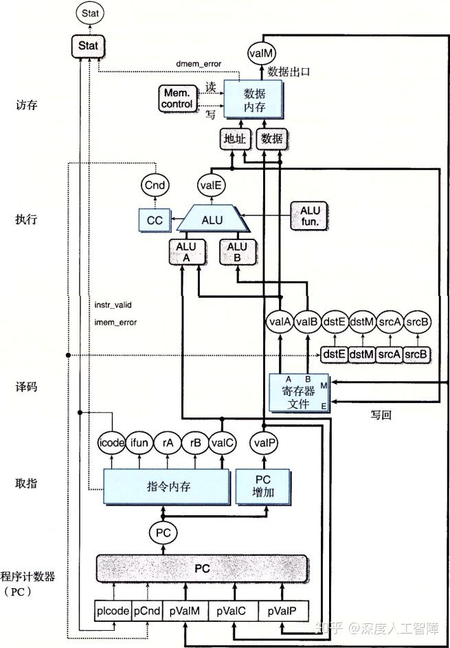

我们可以在各个阶段中加入流水线寄存器，并将信号重新排列来将SEQ+转换成初步的流水线处理器PIPE-，硬件结构如下图所示


#### 4.5.2　插入流水线寄存器
#### 4.5.3　对信号进行重新排列和标号
#### 4.5.4　预测下一个PC
#### 4.5.5　流水线冒险

流水线冒险主要包含数据冒险和控制冒险，当程序状态的读写**不处于同一阶段**，就可能出现数据冒险，当出现分支预测错误或`ret`指令时，会出现控制冒险。

在Y86-64中，程序状态包含程序寄存器、内存、条件码寄存器和状态寄存器。程序寄存器的读取处于译码阶段，而写入处于写回阶段，因此程序寄存器会出现数据冒险的可能，以以下代码为例

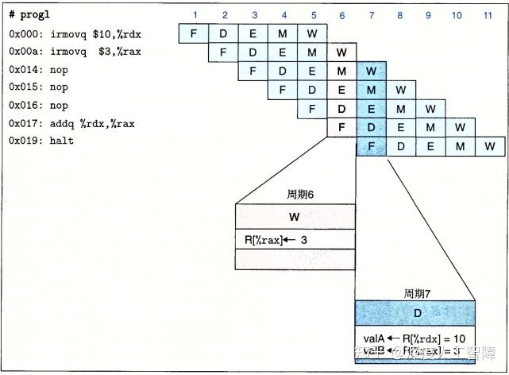

#### 4.5.6　异常处理
#### 4.5.7　PIPE各阶段的实现
#### 4.5.8　流水线控制逻辑
#### 4.5.9　性能分析
#### 4.5.10　未完成的工作


## CSAPP 第5章　优化程序性能

参考：https://zhuanlan.zhihu.com/p/107369491

- 使用内联方式来优化函数调用问题   
- **优化方法：**  
  - 基本编码原则：
	- 消除连续的函数引用：识别要执行多次（比如在循环内）但是计算结果不会改变的计算，将该计算移到前面。同时也考虑减少循环中函数的调用。
	-消除不必要的内存引用：当在循环中使用指针时，会反复对内存进行读写，我们可以引入一个临时变量来保存中间结果，使其保存在寄存器中，就无需涉及内存引用了，最终再将寄存器中的值保存到指针中。

  - 低级优化：

    - **kx1循环展开：**一个循环中计算多个操作，减少需要的循环次数，能减少不必要的操作，但是没有消除数据相关，无法突破延迟界限。
    - **kxk循环展开：**声明多个独立变量，在循环中独立计算，能减少循环次数，并使用多个功能单元及其流水线，能消除数据相关突破延迟界限。当 k  >= C X L时接近吞吐量界限，其中C为操作容量、L为操作延迟。
    - **重新结合：**通过修改结合方法，来减少目标寄存器上的操作，由此减少关键路径上的操作数。
    - 反复测试代码，使得汇编代码产生条件传送。

- 上下相同寄存器才会构成一段数据相关链   
- 注意：延迟是指执行一个操作所需的时钟周期，但是由于功能单元存在流水线，所以可以每个时钟周期都开始一个操作。只有当两个操作之间存在数据相关时，无法使用流水线了，才考虑操作的延迟。   
- 数据相关是针对寄存器而言的   
- 要在更大范围观察写/读相关，不一定存在一个迭代中，可能在相邻迭代中，只要发现有存储操作，而后执行相同地址的加载操作，就会有写/读相关。  


编写高效程序要做到：

1. 选择合适的算法和数据结构
2. 编写出编译器能够有效优化以转化成高效可执行代码的源文件
3. 针对处理运算量较大的计算，可以将一个任务分成多个部分，然后在多核和多处理器的某些组合上并行计算。

**程序优化的步骤：**

1. 消除不必要的工作，让代码尽可能有效地执行所期望的任务。包括消除不必要的函数调用、条件测试和内存引用。
2. 利用处理器提供的指令级并行能力来同时执行多条指令，会介绍降低一个计算不同部分之间的数据相关，来提高并行度。
3. 使用**代码剖析程序（Profiler）**来测量程序各部分性能，找到代码中效率最低的部分。

我们这里简单地将程序优化看成是一系列转换的线性变换，但是实际上我们需要通过汇编代码来确定代码执行的具体细节，比如寄存器使用不当、可以并行执行的操作、如何使用处理器资源等等，然后不断修改源代码使得编译器能够产生高效的代码就可以了，由此保证了代码的可移植性。

### 5.1　优化编译器的能力和局限性

编译器能够提供对程序的不同优化级别，命令行选项`-Og`调用GCC使用一组基本的优化，而`-O1`、`-O2`和`-O3`可以让GCC进行更大量的优化， 但是过度的优化会使得程序规模变大，且更难调试，通常使用`-O2`级别的优化。

- **内存别名使用（Memory Aliasing）**：编译器会假设不同的指针可能会指向相同的位置，如果发现会改变程序行为，就会避免一些优化

```c
void twiddle1(long *xp, long *yp){
  *xp += *yp;
  *xp +== *yp;
}
```

以上代码需要6次内存引用（2次读取`yp`、2次读取`xp`和2次写`xp`），我们可以将其优化为

```c
void twiddle2(long *xp, long *yp){
  *xp += 2* *yp;
}
```
这里只需要3次内存引用（1次读取`yp`，1次读取`xp`和1次写`xp`），但是编译器会假设`xp`和`yp`指向相同的内存位置，由此函数`twiddle1`和`twiddle2`的计算结果就不同了，所以编译器不会讲`twiddle2`作为`twiddle1`的优化版本。

- **函数调用**：大多数编译器不会试图判断函数是否没有副作用，如果没有就会对函数调用进行优化，但是编译器会假设最坏的情况，保持所有函数的调用不变

```c
long f();
long func1(){
  return f()+f()+f()+f();
}
long func2(){
  return 4*f();
}
```

函数`func1`需要调用4次函数`f`，而函数`func2`只需要调用1次函数`f`，但是如果函数`f`是以下形式

```c
long count = 0;
long f(){
 return count++;
} 
```

> 对于会改变在哪里调用函数或调用次数的变化，编译器都会十分小心

可以使用**内联函数替换（Inline Substitution，内联）**来优化函数调用，它直接将函数调用替换成函数体，然后在对调用函数进行优化。比如以上例子中，会得到一个内联函数

```c
long func1in(){
  long t = count++;
  t += count++;
  t += count++;
  t += count++;
  return t;
} 
```

由此不仅减少了函数调用带来的开销，并且能够对代码进一步优化，得到以下形式

```c
long func1opt(){
  long t = 4*count+6;
  count += 4;
  return t;
}
```

在GCC中，我们可以使用`-finline`、`-O1`或更高级别的优化来得到这种优化。但是具有以下**缺点**：

- GCC只支持在单个文件中定义的函数的内联
- 当对某个函数调用使用了内联，则无法在该函数调用上使用断点和跟踪
- 当对某个函数调用使用了内联，则无法使用代码剖析来分析函数调用


### 5.2　表示程序性能

许多过程都含有在一组元素上迭代的循环，比如以下`psum1`是对一个长度为n的向量计算前置和，而`psum2`是使用**循环展开（Loop Unrolling）**技术对其进行优化

```c
void psum1(float a[], float p[], long n){
  long i;
  p[0] = a[0];
  for(i=1, i<n; i++){
    p[i] = p[i-1]+a[i];
  }
} 

void psum2(float a[], float p[], long n){
  long i;
  p[0] = a[0];
  for(i=1; i<n-1; i+=2){
    float mid_val = p[i-1]+a[i];
    p[i] = mid_val;
    p[i+1] = mid_val+a[i+1];
  }
  if(i<n){
    p[i] = p[i-1]+a[i];
  }
}
```

由于使用循环展开优化的函数，迭代次数通常会减少，并且我们更关注对于给定的向量长度`n`，程序运行的速度如何，所以我们使用度量标准**CPE（Cycles Per Element）**来度量计算每个元素需要的周期数，CPE更适合用来度量执行重复计算的程序。

我们可以调整输入的向量大小，得到以上两个函数计算时所需的周期数，然后使用最小二乘拟合来得到曲线图。`psum1`函数的结果为`368+9.0n`，而`psum2`的结果为`368+6.0n`，其中斜率就是CPE指标，所以`psum1`为9.0，`psum2`为6.0，所以根据CPE指标，`psum2`更优于`psum1`。


我们可以通过这种方式得到不同函数的曲线图，由此可以计算出各种函数性能最优的元素个数区间。

### 5.3　程序示例

我们定义了以下数据结构、生成向量、访问向量以及确定向量长度的基本过程

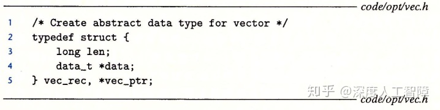数据结构

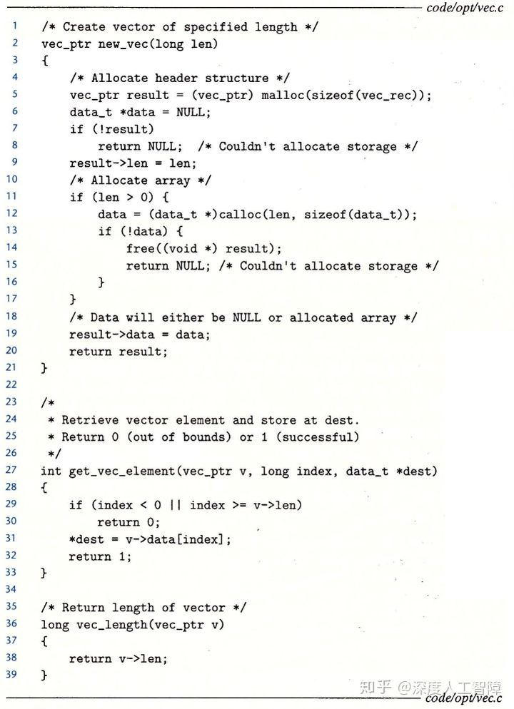生成向量、访问向量以及确定向量长度

我们通过声明数据类型`data_t`、初始值`IDENT`和运算符`OP`来测量整数/浮点数数据的累加/累乘函数的性能。首先给出合并运算的初始实现

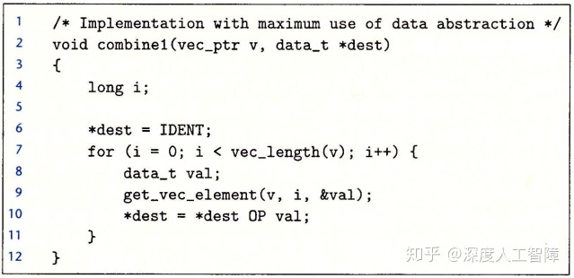

对应的CPE度量值如下图所示

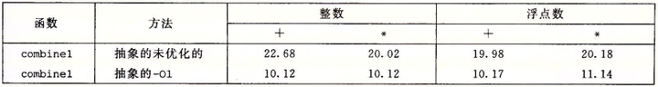

我们将在函数`combine1`的基础上对其进行优化来降低CPE度量值，**最好的方法**是实验加分析：反复尝试不同方法，进行测量，检查汇编代码来确定底层的性能瓶颈。

### 5.4　消除循环的低效率

我们对`combine1`函数进行编译得到如下图所示的汇编代码，可以发现每次循环迭代时都会执行`call vec_length`指令来计算向量长度，但是向量长度在该函数中是不变的，所以我们可以将计算向量长度的代码移到循环外面，得到`combine2`。


当前性能如下图所示


该优化称为**代码移动（Code Motion）**：识别要执行多次（比如在循环内）但是计算结果不会改变的计算（会增加很多额外的函数调用，出现`ret`指令会降低流水线效率），就将该计算移到前面。

> 由于存在函数调用OB，编译器会非常小心修改调用函数位置以及调用函数次数，所以编译器不会自动完成上述优化。

### 5.5　减少过程调用

过程调用通常会带来开销，并且会阻碍编译器对程序进行优化。

我们可以看到`combine2`函数在循环中会反复调用`get_vev_element`函数来获得下一个向量元素，而在`get_vev_element`函数中会反复检查数组边界，我们可以发现该步骤在`combine2`函数中是冗余的，会损害性能。

我们可以将其改为以下形式来减少函数调用

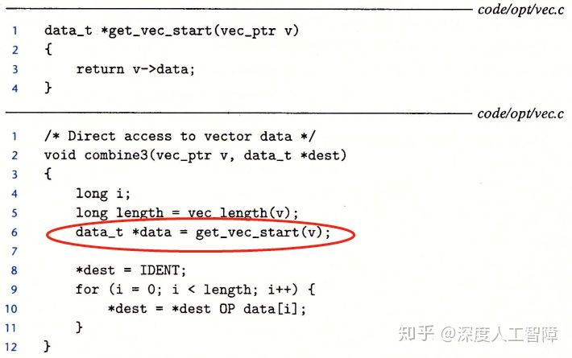

但是该函数的性能如下图所示，性能并没有提升，说明内循环中的其他操作才是瓶颈。

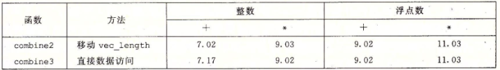

> 由于存在函数调用OB，编译器不会自动完成上述优化。

### 5.6　消除不必要的内存引用

我们对`combine3`进行编译，得到循环内对应的汇编代码


可以发现每次循环时，首先会从内存中读取`*dest`的值，然后将其写回内存中，再一次迭代时，又从内存中读取刚写入的`*dest`值，这就存在不必要的内存读写。

> 声明为指针的数据会保存在数据栈内存中，读取指针值时会读取内存，对指针值进行赋值时，会写入内存

我们可以将代码修改为以下形式


当函数中的局部变量数目少于寄存器数目时，就会将局部变量保存到寄存器中，就无须在内存中进行读写了，其对应的汇编代码为

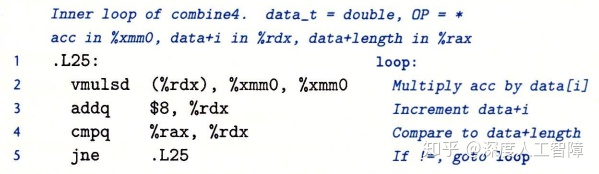

对应的性能为

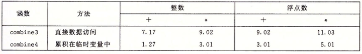

> 由于存在内存别名使用，两个函数可能会不同的行为，所以编译器不会自动进行优化。

### 5.7　理解现代处理器

以上方法只是减少过程调用的开销，消除一些重大的OB，但是想要进一步优化程序性能，就需要针对目标处理器微体系结构来进行优化。

现代处理器在指令运行中提供了大量的优化，支持**指令级并行**，使得能够同时对多条指令进行求值，并且通过一系列机制来确保指令级并行能获得机器级程序要求的顺序语义模型，这就使得处理器的实际操作和机器及程序描述的有很大差别。

#### 5.7.1　整体操作


乱序处理器框图

如上图所示是一个简化的Intel处理器的结构，包含**两个特点：**

- **超标量（Superscalar）：** 处理器可以在每个时钟周期执行多个操作
- **乱序（Out-of-order）：** 指令执行的顺序不一定和机器代码的顺序相同，提高指令级并行

该处理器主要由两部分构成：

- **指令控制单元（Instruction Control Unit，ICU）：** 通过取值控制逻辑从指令高速缓存中读出指令序列，并根据这些指令序列生成一组针对程序数据的基本操作，然后发送到EU中。

- - **取指控制逻辑：** 包含分支预测，来完成确定要取哪些指令。

  - - **分支预测（Branch Prediction）技术：** 当程序遇到分支时，程序有两个可能的前进方向，处理器会猜测是否选择分支，同时预测分支的目标地址，直接取目标地址处的指令。

  - **指令高速缓存（Instruction Cache）：** 特殊的高速存储器，包含最近访问的指令。ICU通常会很早就取指，给指令译码留出时间。

  - **指令译码逻辑：** 接收实际的程序指令，将其转换成一组基本操作（微操作），并且可以在不同的硬件单元中并行地执行不同的基本操作。比如x86-64中的`addq %rax, 8(%rdx)`，可以分解成访问内存数据`8(%rdx)`、将其加到`%rax`上、将结果保存会内存中。

  - **退役单元（Retirement Unit）：** 指令译码时会将指令信息放到队列中，确保它遵守机器级程序的顺序语义。队列中的指令主要包含两个状态：

  - - **退役（Retired）：** 当指令完成，且引起这条指令的分支点预测正确，则这条指令会从队列中出队，然后完成对寄存器文件的更新。
    - **清空（Flushed）：** 如果引起该指令的分支点预测错误，就会将该指令出队，并丢弃计算结果，由此保证预测错误不会改变程序状态。
    - **寄存器文件：**包含整数、浮点数和最近的SSE和AVX寄存器。

- **执行单元（Execution Unit，EU）：**使用投机执行技术执行由ICU产生的基本操作，通常每个时钟周期会接收多个基本操作，将这些操作分配到一组功能单元中来执行实际的操作。

- - **投机执行（Speculative Execution）技术：** 直接执行ICU的预测指令，但是最终结果不会存放在程序寄存器或数据内存中，直到处理器能确定应该执行这些指令。分支操作会被送到EU中来确定分支预测是否正确。如果预测错误，EU会丢弃分支点之后计算出来的结果，并告诉分支模块。

  - **功能单元：** 专门用来处理不同类型操作的模块，并且可以使用寄存器重命名机制将“操作结果”直接在不同单元间进行交换，这是数据转发技术的高级版本。

  - - **存储模块**和**加载模块**负责通过数据高速缓存来读写数据内存，各自包含一个**加法器**来完成地址的计算，并且单元内部都包含**缓冲区**来保存未完成的内存操作请求集合。每个时钟周期可完成开始一个操作。

    - **分支模块：** 当得知分支预测错误，就会在正确的分支目的中取指。

    - **算数运算模块：** 能够执行各种不同的操作。

    - **寄存器重命名机制（Register Renaming）：**会维护一个寄存器的重命名表来进行数据转发，主要有以下步骤

    - - 当执行一条更新寄存器`r`的指令`I1`，会产生一个指向该操作结果的唯一标识符`t`，然后将`(r, t)`加入重命名表中。
      - 当后续有需要用到寄存器`r`作为操作数的指令时，会将`t`作为操作数源的值输入到单元中进行执行
      - 当`I1`执行完成时，就会产生一个结果`(v, t)`，表示标识符`t`的操作产生了结果`v`，然后所有等待`t`作为源的操作都会使用`v`作为源值。
      - **意义：** 使用寄存器重命名机制，可以将值从一个操作直接转发到另一个操作，而无需进行寄存器文件的读写，使得后续的操作能在第一个操作`I1`完成后尽快开始。并且投机执行中，在预测正确之前不会将结果写入寄存器中，而通过该机制就可以预测着执行操作的整个序列。
      - **注意：** 重命名表只包含未进行寄存器写操作的寄存器，如果有个操作需要的寄存器没有在重命名表中，就可以直接从寄存器文件中获取值。

  - **数据高速缓存（Data Cache）：** 存放最近访问的数据值。

#### 5.7.2　功能单元的性能


#### 5.7.3　处理器操作的抽象模型

### 5.8　循环展开

我们可以通过对函数实行循环展开，增加每次迭代计算的元素数量，减少循环的迭代次数。

这里介绍一种**kx1循环展开**方法，格式如下所示，将一个循环展开成了两部分，第一部分是每次循环处理k个元素，能够减少循环次数；第二部分处理剩下还没计算的元素，是逐个进行计算的。

```c
#define k 2
void combine5(vec_ptr v, data_t *dest){
  long i;
  long length = vec_length(v);
  long limit = length-k+1;
  data_t *data = get_vec_start(v);
  data_t acc = IDENT;
  for(i=0; i<limit; i+=k){
    acc = ((acc OP data[i]) OP data[i+1]) ... OP data[i+k-1];
  }
  for(; i<length; i++){
    acc = acc OP data[i];
  }
  return acc;
}
```

我们看到改程序具有以下性能

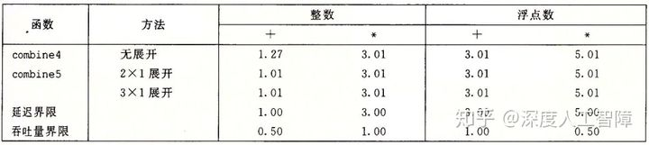

可以发现整数加法优化到了延迟界限，因为延迟展开能减少不必要的操作的数量（例如循环索引计算和条件分支），但是其他的并没有优化，因为其延迟界限是主要限制因素。

可以发现循环展开无法突破延迟界限。我们可以得到`combine5`循环部分的汇编代码


可以得到对应的数据流图

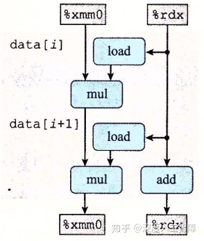

其中，`%xmm0`保存`acc`，`%rdx`保存`i`。可以发现循环展开虽然能将循环次数减少为原来的k分之一，但是每次迭代所需的时钟周期变为了原来的k倍，使得总体的延迟不变，无法突破延迟界限。

**总结：**延迟展开可以减少迭代次数，使得不必要的操作数量减少，但是没有解决数据相关问题，无法突破延迟界限。


### 5.9　提高并行性

#### 5.9.1　多个累积变量

们可以通过引入多个变量来提高循环中的并行性。

这里介绍一种**kxk循环展开**方法，格式如下所示，将一个循环展开成了两部分，第一部分是每次循环处理k个元素，能够减少循环次数，并且引入k个变量保存结果；第二部分处理剩下还没计算的元素，是逐个进行计算的。

```c
#define K 2
void combine6(vec_ptr v, data_t *dest){
  long i;
  long length = vec_length(v);
  long limit = length-k+1;
  data_t *data = get_vec_start(v);
  data_t acc0 = IDENT;
  data_t acc1 = IDENT;
  ...
  data_t acck_1 = IDENT; //k个变量

  for(i=0; i<limit; i+=k){
    acc0 = acc0 OP data[0];
    acc1 = acc1 OP data[1];
    ...
    acck_1 = acck_1 OP data[k-1]; //更新k个变量
  }  
  for(; i<length; i++){
    acc0 = acc0 OP data[i];
  }
  *dest = acc0 OP acc1 OP ... OP acck_1;
}
```

我们看到改程序具有以下性能

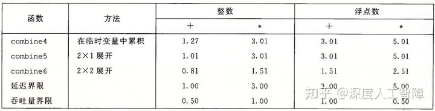

可以通过循环对应的数据流图来分析

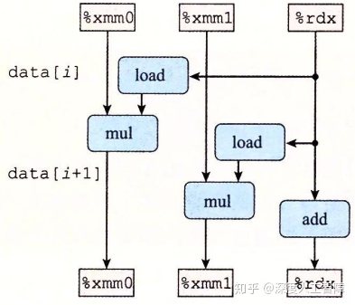

其中，`%xmm0`保存`acc0`，`%xmm`保存`%acc1`，`%rdx`保存`i`。可以发现，我们通过在循环中引入多个变量，使得原来在同一个循环寄存器中的浮点数乘法运算分配到不同的循环寄存器中，就消除了循环寄存器的数据相关限制，就可以使用不同的功能单元，或利用功能单元的流水线进行并行计算，就**能突破延迟界限**。

为了接近吞吐量界限，我们需要使用系统中的所有功能单元，并且保证功能单元的流水线始终是慢的，所以对于容量为C、延迟为L的操作而言，需要设置 ![[公式]](https://www.zhihu.com/equation?tex=k%5Cge+C%5Ctimes+L+) （最快每个时钟周期执行一个操作）。

限制：使用kxk循环展开时，我们需要申请k个局部变量来保存中间结果，如果k大于寄存器的数目，则中间结果就会保存到内存的堆栈中，使得计算中间结果要反复读写内存，造成性能损失。

#### 5.9.2　重新结合变换

### 5.10　优化合并代码的结果小结

### 5.11　一些限制因素

#### 5.11.1　寄存器溢出
#### 5.11.2　分支预测和预测错误处罚

### 5.12　理解内存性能

所有现代处理器都包含一个或多个高速缓存存储器，现在考虑所有数据都存放在高速缓存中，研究设计加载（从内存到寄存器）和存储（从寄存器到内存）操作的程序性能。


#### 5.12.1　加载的性能

我们的参考机包含两个加载功能单元，意味着当流水线完全时，一个时钟周期最多能够执行两个加载操作，由于每个元素的计算需要加载一个值，所以CPE的最小值只能是0.5。对于每个元素的计算需要加载k个值的应用而言，CPE的最小值只能是k/2。

由于我们之前计算内存地址都是通过循环索引`i`，所以两个加载操作之间不存在数据相关（每一轮的加载操作只要根据`i`计算地址，无需等到上一轮加载操作完成才能计算当前轮的内存地址），也就不用考虑加载延迟。

但是对于如下所示的链表函数，计算当前加载地址，需要先获取上一轮的地址，由此加载操作之间就存在数据相关，就需要考虑加载延迟了。


循环中对应的汇编代码为

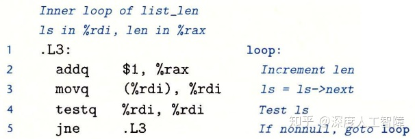

其中，`%rax`保存`len`，`%rdi`保存`ls`，我们可以得到对应的数据流图


可以发现这里有两个数据相关的循环寄存器`%rdi`和`%rax`，其中加法操作需要的延迟通常比加载操作的延迟小，所以左侧为关键路径，这里测得该函数的CPE为4.0，就是加载操作对应的延迟。


#### 5.12.2　存储的性能

存储操作是将寄存器中的数据保存到内存中，所以存储操作不会产生数据相关，但是存储操作会影响加载操作，出现**写/读相关（Write/Read Dependency）**。

首先需要先了解加载和存储单元的细节。如下图所示，在存储单元中会有一个**存储缓冲区**，用来保存发射到存储单元但是还未保存到数据高速缓存的存储操作的地址和数据，由此避免存储操作之间的等待。并且加载操作会检查存储缓冲区中是否有需要的地址，如果有，则直接将存储缓冲区中的数据作为加载操作的结果。

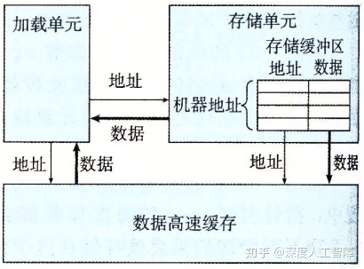

我们看以下代码，会从`*src`处读取数据，然后将其保存到`*dest`


循环内对应的汇编代码为


我们可以的带对应的数据流图

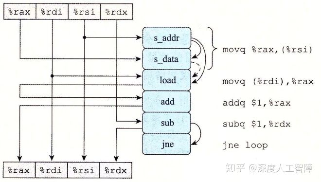

我们需要注意以下几点：

- `movq %rax, (%rsi)`表示存储操作，首先会进行`s_addr`操作计算存储操作的地址，在存储缓冲区创建一个条目，并设置该条目的地址字段。完成后才进行`s_data`操作来计算存储操作的数据字段。
- 后续`movq (%rdi), %rax`的`load`操作会等待`s_addr`操作计算完成后，判断加载操作的地址和`s_addr`操作计算出来的地址是否相同，如果相同，则需要等`s_data`操作将其结果保存到存储缓冲区中，如果不同，则`load`操作无需等待`s_data`操作。所以`load`操作和`s_addr`操作之间存在数据相关，而`load`操作和`s_data`操作之间存在有条件的数据相关。

对其进行重新排列，并且去除掉非循环寄存器，可以得到如下的数据流图


我们可以发现：

- 当加载操作和存储操作的地址相同：图中的虚线就存在，则`%rax`为循环寄存器，关键路径为左侧路径，包含存储数据计算、加载操作和加法操作，CPE大约为7.3。
- 当加载操作和存储操作的地址不同：图中的虚线就不存在，则`%rax`就不是循环寄存器，其中`s_data`操作和`load`操作可以并行执行，关键路径为右侧路径，只有一个减法操作，CPE大约为1.3。

**注意：** 要在更大范围观察写/读相关，不一定存在一个迭代中，可能在相邻迭代中，只要发现有存储操作，而后执行相同地址的加载操作，就会有写/读相关。

### 5.13　应用：性能提高技术

### 5.14　确认和消除性能瓶颈

#### 5.14.1　程序剖析

**程序剖析（Profiling）** 会在代码中插入工具代码，来确定程序的各个部分需要的时间。可以在实际的基准数据上运行实际程序的同时进行剖析，不过运行会比正常慢一些（2倍左右）。

Unix系统提供一个剖析程序GPROF，提供以下信息：

- 确定程序中每个函数运行的CPU时间，用来确定函数的重要性
- 计算每个函数被调用的次数，来理解程序的动态行为

GPROF具有以下特点：

- 计时不准确。编译过的程序为每个函数维护一个计时器，操作系统每隔x会中断一次程序，当中断时，会确定程序正在执行什么函数，然后将该函数的计时器加上x。
- 假设没有执行内联替换，则调用信息是可靠的
- 默认情况下，不会对库函数计时，将库函数的执行时间算到调用该库函数的函数上

#### 5.14.2　使用剖析程序来指导优化

**使用方法：**

- 程序要为剖析而编译和连接，加上`-pg`，并且确保没有进行内联替换优化函数调用

```text
gcc -Og -pg prog.c -o prog
```

- 正常执行程序，会产生一个文件`gmon.out`
- 使用GPROF分析`gmon.out`的数据

```text
gprof prog
```

书中的几个建议：

- 使用快速排序来进行排序
- 通常使用迭代来代替递归
- 使用哈希函数来对链表进行划分，减少链表扫描的时间
- 链表的创建要注意插入位置的影响
- 要尽量使得哈希函数分布均匀，并且要产生较大范围

## CSAPP 第6章　存储器层次结构


理想状态中，我们将存储器系统视为一个线性字节数组，CPU能在常数时间内访问每个存储器位置。但实际上**存储器系统（Memory System）** 是一个具有不同容量、成本和访问时间的存储设备的层次结构，分别具有以下几部分：

1. CPU中的寄存器保存最常使用的数据，能在0个时钟周期内访问
2. **高速缓存存储器（Cache Memory）**是靠近CPU的、较小的快速存储器，保存一部分从**主存储器（Main Memory）** 取出的常用指令和数据，能在4~75个时钟周期内访问
3. 主存缓存存储磁盘上的数据，需要上百个时钟周期访问
4. 磁盘存储通过网络连接的其他机器的磁盘或磁带上的数据，需要几千万格周期进行访问


### 6.1　存储技术

#### 6.1.1　随机访问存储器

**随机访问存储器（Random-Access Memory，RAM）** 根据存储单元实现方式可以分为两类：静态的RAM（SRAM）和动态的RAM（DRAM）。


**非易失性存储器**

之前介绍的DRAM和SRAM在断电时都会丢失数据，所以是**易失的（Volatile）**，而**非易失性存储器（Nonvolatile Memory）** 即使断电后，也会保存信息，该类存储器称为**只读存储器（Read-Only Memory，ROM）**，但是现在ROM中有的类型既可以读也可以写了，可以根据ROM能够重编程的次数以及对它们进行重编程所用的机制进行区分，包括：

- **可编程ROM（PROM）：** 可以编程一次
- **可擦写PROM（EPROM）：** 可以批量擦除
- **闪存（Flash Memory）：** 具有部分（块级）擦除功能，大约擦除十万次后会耗尽

#### 6.1.2　磁盘存储

**磁盘（Disk）** 是被用来保存大量数据的存储设备，但是读信息的速度比DRAM慢10万倍，比SRAM慢100万倍。

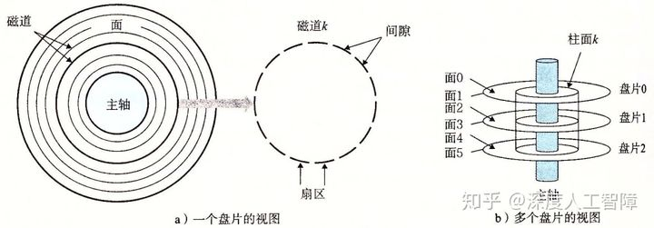

如上图所示是一个磁盘的构造。磁盘是由多个叠放在一起的**盘片（Platter）** 构成，每个盘片有两个覆盖着磁性记录材料的**表面（Surface）**。每个表面由一组称为**磁道（Track）** 的同心圆组成，每个磁道被划分为若干**扇区（Sector）**，每个扇区包含相同数量的数据位（通常为512位）作为读写数据的基本单位。扇区之间通过**间隙（Gap）** 分隔开来，间隙不保存数据信息，只用来表示扇区的格式化位。通常会使用**柱面（Cylinder）** 来描述不同表面上相同磁道的集合，比如柱面k就是6个表面上磁道k的集合。盘片中央会有一个可以旋转的**主轴（Spindle）**，使得盘片以固定的旋**转速率（Rotational Rate）** 旋转，单位通常为**RPM（Revolution Per Minute）**。

将磁盘能记录的最大位数称为最大容量（容量），主要由以下方面决定：

- **记录密度（Recording Density）：** 一英寸的磁道中可以放入的位数
- **磁道密度（Track Density）：** 从盘片中心出发，沿着半径方向一英寸，包含多少磁道
- **面密度（Areal Density）：** 记录密度和磁道密度的乘积

磁盘容量的计算公式为：


在面密度较低时，每个磁道都被分成了相同的扇区，所以能够划分的扇区数由最内侧磁道能记录的扇区数决定，这就使得外侧的磁道具有很多间隙。现代大容量磁盘采用**多区记录（Multiple Zone Recording）** 技术，将一组连续的柱面划分成一个区，在同一个区中，每个柱面的每条磁道都有相同数量的扇区，由该区中最内侧的磁道决定，由此使得外侧的区能划分成更多的扇区。

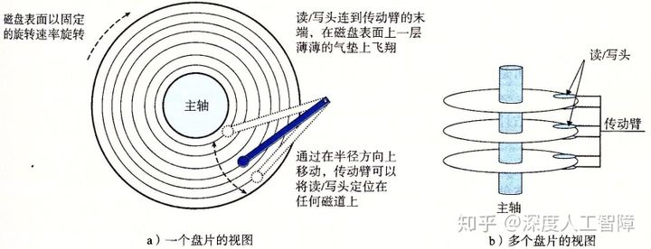

如上图所示，磁盘通过一个连接在**传动臂（Actuator Arm）** 上的 **读/写头（Read/Write Head）** 来进行读写，对于有多个盘面的磁盘，会用多个位于同一柱面上的垂直排列的读/写头。对于扇区的**访问时间（Access Time）** 由以下几部分构成：

- **寻道时间：** 为了读取到目标扇区，会先控制传动臂将读/写头移动到该扇区对应的磁道上，该时间称为寻道时间。

- - **影响因素：** 依赖于读/写头之前的位置，以及传动臂在盘面上移动的速度。
  - 通常为3~9ms，最大时间可为20ms。

- **旋转时间：** 当读/写头处于目标磁道时，需要等待目标扇区的第一个位旋转到读/写头下。

- - **影响因素：** 目标扇区之前的位置，以及磁盘的旋转速度。
  - ![[公式]](https://www.zhihu.com/equation?tex=T_%7Bmax%5C+rotation%7D%3D%5Cfrac%7B1%7D%7BRPM%7D%5Ccdot+%5Cfrac%7B60s%7D%7B1min%7D)，平均旋转时间为一半

- **传送时间：** 当读/写头处于目标扇区的第一位时，就可以进行传送了

- - **影响因素：** 磁盘旋转速率，以及每条磁道的扇区数
  - ![[公式]](https://www.zhihu.com/equation?tex=T_%7Bavg%5C+transfer%7D%3D%5Cfrac%7B1%7D%7BRPM%7D%5Ccdot+%5Cfrac%7B1%7D%7B%E5%B9%B3%E5%9D%87%E6%AF%8F%E6%9D%A1%E7%A3%81%E9%81%93%E7%9A%84%E6%89%87%E5%8C%BA%E6%95%B0%7D%5Ctimes+%5Cfrac%7B60s%7D%7B1min%7D)

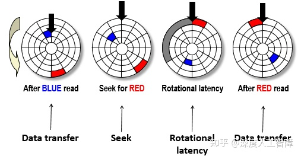

**可以发现：** 寻道时间和旋转时间是主要影响部分，并且两者大致相等，通常可以寻道时间乘2来估计访问时间。

由于磁盘构造的复杂性，现代磁盘将其抽象为B个扇区大小的逻辑块序列，编号为`0,1,...,B-1`，通过磁盘中的**磁盘控制器**来维护逻辑块号和实际扇区之间的映射关系。为此需要通过磁盘控制器对磁盘进行格式化：

- 会用表示扇区的信息填写在扇区之间的间隙
- 表示出表面有故障的柱面，并且不进行使用
- 在每个区会预留一组柱面作为备用，没有映射为逻辑块。当损坏时，磁盘控制器会将数据复制到备用柱面，则磁盘就可以继续正常工作了。

#### 6.1.3　固态硬盘

**固态硬盘（Solid State Disk，SSD）** 是一种基于闪存的存储技术，插在I/O总线上标准硬盘插槽（通常为USB或SATA），处于磁盘和DRAM存储器的中间点。从CPU的角度来看，SSD与磁盘完全相同，有相同的接口和包装。


如上图所示是一个SSD的基本结构。它由**闪存**和** 闪存翻译层（Flash Translation Layer）**组成

- 闪存翻译层是一个硬件/固件设备，用来将对逻辑块的请求翻译成对底层物理设备的访问。
- 闪存的基本属性决定了SSD随机读写的性能，通常由B个块的序列组成，每个块由P页组成，页作为数据的单位进行读写。通常页大小为512字节~4KB，块中包含32~128页，则块的大小有16KB~512KB。


### 6.2　局部性

具有良好**局部性（Locality）** 的程序，会倾向于引用最近引用过的数据项本身，或者引用最近引用过的数据项周围的数据项。局部性主要具有两种形式：

- **时间局部性（Temporal Locality）：** 引用过的数据项在不久会被多次引用。


- **空间局部性（Spatial Locality）：** 引用过的数据项，在不久会引用附近的数据项。


从硬件到操作系统，再到应用程序，都利用了局部性

- **硬件：** 在处理器和主存之间引入一个小而快速的高速缓存存储器，来保存最近引用的指令和数据，从而提高对主存的访问速度。
- **操作系统：** 用主存来缓存虚拟空间中最近被引用的数据块。
- **应用程序：** 比如Web浏览器会将最近引用的文档放入本地磁盘中，来缓存服务器的数据。

有良好局部性的程序比局部性较差的程序运行更快。

想要分析一个程序的局部性是否好，可以依次分析程序中的每个变量，然后根据所有变量的时间局部性和空间局部性来总和判断程序的局部性。

**例1：**

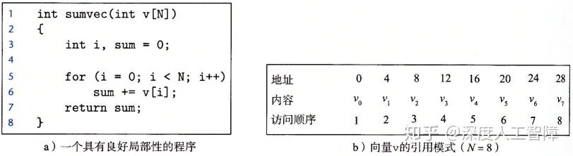

分析上述程序的局部性。对于变量`sum`，每一轮迭代都会引用一次，所以`sum`具有好的时间局部性，而`sum`是标量，所以没有空间局部性。对于变量`v`，其数据在内存中的分布如图b中所示，每一轮迭代都是引用不同的数据项，所以时间局部性较差，但是会按照内存存储的顺序依次引用数据项，所以空间局部性较好。 综合来说，该程序具有较好的局部性。

并且由于程序是以指令形式保存在内存中的，而CPU会从内存中读取指令，所以也可以考虑取指的局部性。由于该循环体内的指令是顺序保存在内存中的，而CPU会按顺序进行取指，所以具有良好的空间局部性，并且迭代多次会反复读取相同的指令，所以具有良好的时间局部性，所以该程序的局部性较好。

对于一个向量，如果每一轮引用的数据项之间在内存空间中相隔k，则称该程序具有**步长为k的引用模式（Stride-k Reference Pattern）**。步长k越大，则每一轮引用的数据在内存中间隔很大，则空间局部性越差。

**例2：**


对于以上代码，变量`sum`的时间局部性较好且不具有空间局部性，对于二维数组变量`v`，在内存中是按照行优先存储的，而代码中也是按照行优顺序进行应用的，所以变量`v`具有步长为1的引用模式，所以具有较好的空间局部性，而时间局部性较差。总体来说，该程序具有良好的局部性。

**例3：**

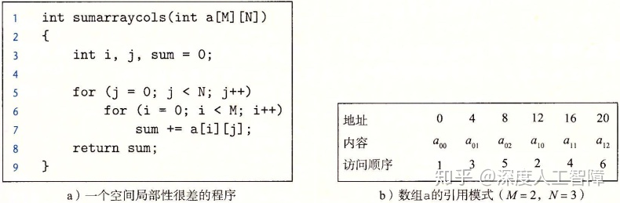

上述代码将变量`v`的引用顺序变为了列优先，则根据`v`的内存存储形式，变量`v`具有步长为N的引用模式，则时间局部性较差，且空间局部性也较差。总体来说，该程序的局部性较差。

**例4：**

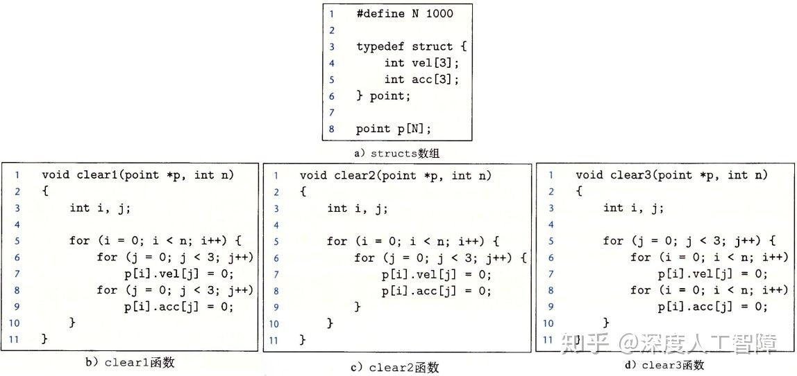

我们需要判断以上三个函数的局部性。首先根据结构体的定义可以得到结构体数组在内存中的存储形式如下所示

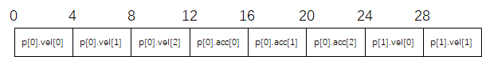

则`clear1`函数的步长为1，具有良好的空间局部性；而`clear2`函数会在结构体中不同的字段中反复跳跃，空间局部性相对`clear1`差一些；而`clear3`函数会在相邻两个结构体中反复跳跃，空间局部性相比`clear2`更差。

**总体而言：**

- 重复引用相同变量的程序具有良好的时间局部性
- 考虑变量的内存存储形式，判断程序引用模式的步长，步长越大则空间局部性越差
- 从取指角度而言，具有循环体则空间局部性和时间局部性较好，而且循环体越小、迭代次数越多，则局部性越好。


### 6.3　存储器层次结构

#### 6.3.1　存储器层次结构中的缓存

- 从寄存器到外接的机械硬盘甚至远程磁盘，每一级都可以看作是下一级的缓存。
- 相邻层之间块大小是一致的，离cpu越远的层就用越大的块来做缓存。
- 缓存只是下一层的一个子集副本，取数据时会出现缓存命中和不命中两种情况。
- cache都是基于SRAM的。
- 从cache中取数据时，高位使用tag而不是set来索引，这样做的好处是使得相邻的内存块映射到不同的set中，如果取一个连续的数组时，就不需要一直进行cache line的替换。


**高速缓存（Cache）** 是一个小而快速的存储设备，用来作为存储在更大更慢设备中的数据对象的缓冲区域。而使用高速缓存的过程称为**缓存（Caching）**。

存储器层次结构的**中心思想**是让层次结构中的每一层来缓存低一层的数据对象，将第k层的更快更小的存储设备作为第k+1层的更大更慢的存储设备的缓存。

**该结构之所以有效**，是因为程序的局部性原理。相比于第k+1层的数据，程序会倾向于访问存储在第k层的数据。如果我们访问第k+1层存储的数据，我们会将其拷贝到第k层，因为根据局部性原理我们很有可能将再次访问该数据，由此我们就能以第k层的访问速度来访问数据。而且因为我们不经常访问第k+1层的数据，我们就可以使用速度更慢且更便宜的存储设备。


上图展示的是存储器层次结构的基本缓存原理。每一层存储器都会被划分成连续的数据对象组块，称为**块（Block）**，每个块都有一个唯一的地址或名字，并且通常块的大小都是固定的。第k层作为第k+1层的缓存，数据会以块大小作为**传送单元（Transfer Unit）** 在第k层和第k+1层之间来回赋值，使得第k层保存第k+1层块的一个子集的副本。通常存储器层次结构中较低层的设备的访问时间较长，所以较低层中会使用较大的块。

##### 缓存命中

当程序需要第k+1层的某个数据对象d时，会现在第k层的块中搜索d，如果d刚好缓存在第k层中，则成为**缓存命中（Cache Hit）**，则该程序会直接从第k层中读取d。根据存储器层次结构，可以知道第k层的读取速度更快，因此缓存命中会使得程序更快。

##### 缓存不命中

如果第k层没有缓存数据对象d，则称为**缓存不命中（Cache Miss）**，则会从第k+1层中取出包含d的块，然后第k层的缓存会执行某个**放置策略（Placement Policy）**来决定该块要保存在第k层的什么位置

- 来自第k+1层的任意块能保存在第k层的任意块中，如果第k层的缓存满了，则会覆盖现存的一个**牺牲块（Victim Block）**，称为**替换（Replacing）**或**驱逐（Evicting）** 这个牺牲块，会根据**替换策略（Replacement Policy）** 来决定要替换第k层的哪个块
  - **随机替换策略：** 会随机选择一个牺牲块
  - **最近最少被使用（LRU）替换策略：** 选择最后被访问的时间离现在最远的块

### 6.4　高速缓存存储器

- 当高速缓存大小大于数据的大小，如果分配良好，则只会出现冷不命中。  
- 缓存不命中比内存访问次数影响更大   
- 由内存系统的设计来决定块大小，是内存系统的固定参数。首先决定块大小，然后决定期望的缓存大小，然后再决定关联性，最终就能知道组的数目。   
- 块的目的就是利用空间局部性  
- 缓存是硬件自动执行的，没有提供指令集对其进行操作

- **建议：**  
- - 将注意力集中在内循环中，因为大部分的计算和内存访问都集中在这里
  - 按照数据对象存储在内存中的顺序，以步长为1来读数据，使得空间局部性最大。比如步长为2的命中率就比步长为1的命中率降低一半。
  - 一旦从存储器读入一个数据对象时，就尽可能使用它，使得时间局部性最大。特别是局部变量，编译器会将其保存在寄存器中。

#### 6.4.1　通用的高速缓存存储器组织结构

较早期的计算机系统的存储器层次结构只有三层：CPU寄存器、主存和磁盘，但是随着CPU的发展，使得主存和CPU之间的读取速度逐渐拉大，由此在CPU和主存之间插入一个小而快速的SRAM高速缓存存储器，称为**L1高速缓存**，随着后续的发展，又增加了**L2高速缓存**和**L3高速缓存**。


通用的高速缓存存储器组织结构：


- **s位：** 高速缓存被组织成一个数组，而该数组通过 ![[公式]](https://www.zhihu.com/equation?tex=S%3D2%5Es+)进行索引。
- **b位：** 每个组中包含E个**高速缓存行（Cache Line）**，每个行有一个 ![[公式]](https://www.zhihu.com/equation?tex=B%3D2%5Eb) 字节的**数据块（Block）**组成。
- **t位：** 每一个高速缓存行有一个 ![[公式]](https://www.zhihu.com/equation?tex=t%3Dm-%28s%2Bb%29) 位的**标记位（Valid Bit）**，唯一表示存储在这个高速缓存行中的数据块，用于搜索数据块。

该高速缓存的结构可以通过元组`(S, E, B, m)`来描述，且容量C为所有块的大小之和， ![[公式]](https://www.zhihu.com/equation?tex=C%3DS%5Ctimes+E%5Ctimes+B) 。

当一条加载指令指示CPU从主存地址A中读取一个字w时，会将该主存地址A发送到高速缓存中，则高速缓存会根据以下步骤判断地址A是否命中：

1. **组选择：** 根据地址划分，将中间的s位表示为无符号数作为组的索引，可得到该地址对应的组。
2. **行匹配：** 根据地址划分，可得到t位的标志位，由于组内的任意一行都可以包含任意映射到该组的数据块，所以就要线性搜索组中的每一行，判断是否有和标志位匹配且设置了有效位的行，如果存在，则缓存命中，否则缓冲不命中。
3. **字抽取：** 如果找到了对应的高速缓存行，则可以将b位表示为无符号数作为块偏移量，得到对应位置的字。

当高速缓存命中时，会很快抽取出字w，并将其返回给CPU。如果缓存不命中，CPU会进行等待，高速缓存会向主存请求包含字w的数据块，当请求的块从主存到达时，高速缓存会将这个块保存到它的一个高速缓存行中，然后从被存储的块中抽取出字w，将其返回给CPU。

#### 6.4.2　直接映射高速缓存


如上图所示，当 ![[公式]](https://www.zhihu.com/equation?tex=E%3D1) 时，高速缓存称为**直接映射高速缓存（Direct-mapped Cache）**，每个高速缓存组中只含有一个高速缓存行。

#### 6.4.3　组相联高速缓存

直接映射高速缓存的冲突不命中是由于每个高速缓存组中只有一个高速缓存行，所以扩大E的值，当 ![[公式]](https://www.zhihu.com/equation?tex=1%3CE%3CC%2FB) 时，称为**E路组相联高速缓存（Set Associative Cache）**，此时需要额外的硬件逻辑来进行行匹配，所以更加昂贵。（ ![[公式]](https://www.zhihu.com/equation?tex=E%3CC%2FB) 即要求 ![[公式]](https://www.zhihu.com/equation?tex=S%3E1) ）

2路组相联高速缓存

当缓存不命中时需要进行缓存行替换，如果对应的高速缓存组中有空的高速缓存行，则直接将其保存到空行中。但是如果没有空行，就要考虑合适的**替换策略**：

- 最简单的替换策略是随机选择要替换的行
- **最不常使用（Least-Frequently-Used，LFU）策略：** 替换过去某个时间窗口内引用次数最少的一行。
- **最近最少使用（Least-Recently-Used，LRU）策略：** 替换最后一次访问时间最久远的那一行

#### 6.4.4　全相联高速缓存

全相联高速缓存（Full Associative Cache）是用一个包含所有高速缓存行的组组成的。

#### 6.4.5　有关写的问题
 
#### 6.4.7　高速缓存参数的性能影响

衡量高速缓存的指标有：

- **命中率（Hit Rate）：** 内存引用命中的比率，`命中数量/引用数量`。
- **不命中率（Miss Rate）：** 内存引用不命中的比率，`不命中数量/引用数量`。通常，L1高速缓存为3~10%，L2高速缓存为<1%。
- **命中时间（Hit Time）：** 从高速缓存传输一个字到CPU的时间，包括组选择、行匹配和字选择时间。通常，L1高速缓存需要4个时钟周期，L2高速缓存需要10个时钟周期。
- **不命中处罚（Miss Penalty）：** 当缓存不命中时，要从下一层的存储结构中传输对应块到当前层中，需要额外的时间（不包含命中时间）。通常，主存需要50~200个时钟周期。

**注意：** 命中和不命中两者对性能影响很大，比如99%命中率的性能会比97%命中率高两倍。

接下来讨论高速缓存中不同参数对高速缓存性能的影响：

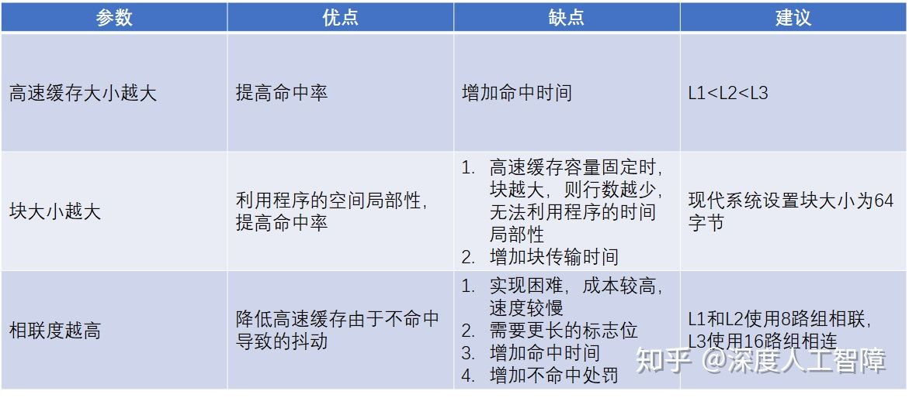

想要编写高速缓存友好（Cache Friendly）的代码，**基本方法为：**

- 让最常见的情况运行得快，将注意力集中在核心函数的循环中
- 尽可能减少每个循环内部的缓存不命中，可以对局部变量反复引用，因为编译器会将其保存到寄存器中，其他的变量最好使用步长为1的引用模式。


### 6.5　编写高速缓存友好的代码
### 6.6　综合：高速缓存对程序性能的影响
#### 6.6.1　存储器山

一个程序从存储器系统中读取数据的速率称为**读吞吐量（Read Throughput）**或**读带宽（Read Bandwidth）** ，单位为`MB/s`。 我们通过以下代码来衡量空间局部性和时间局部性对程序吞吐量的影响

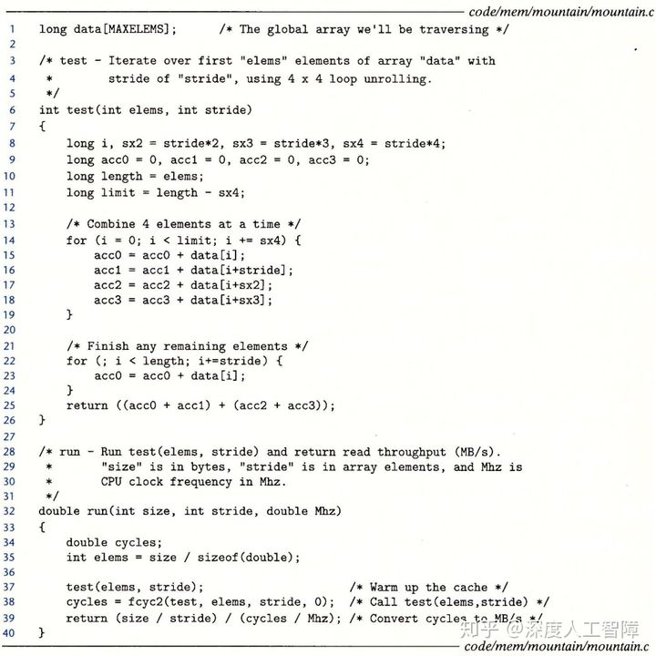

第37行我们首先对高速缓存进行暖身，然后在第38行计算程序运行的时钟周期个数。

- **时间局部性：** 通过`size`来控制我们工作集的大小，由此来控制工作集存放的高速缓存的级别。假设工作集很小，则工作集会全部存放在L1高速缓存中，模拟了时间局部性优异的程序反复读取之前访问过的数据，则都是从L1高速缓存读取数据的。假设工作集很大，则工作集会存放到L3高速缓存中，模拟了时间局部性很差的程序，不断读取新的数据，则会出现缓存不命中，而不断从L3高速缓存中取数据的过程。所以通过控制工作集大小，来模拟程序局部性。
- **空间局部性：** 通过`stride`来控制读取的步长，来控制程序的空间局部性。

通过调整`size`和`stride`来度量程序的吞吐量，可以得到以下存储器山（Memory Mountain）


可以保持`stride`不变，观察高速缓存的大小和时间局部性对性能的影响


可以发现，当工作集大小小于L1高速缓存的大小时，模拟了时间局部性很好的程序，所有读都是直接在L1高速缓存中进行的，则吞吐量较高；当工作集大小较大时，模拟了时间局部性较差的程序，读操作需要从更高的高速缓存中加载，则吞吐量下降了。

可以保持工作集为4MB，沿着L3山脊查看空间局部性对性能的影响

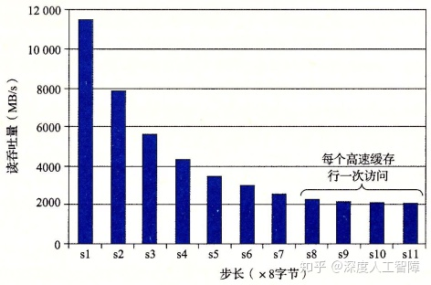

可以发现，步长越小越能充分利用L1高速缓存，使得吞吐量较高。当步长为8字节时，会跨越64字节，而当前高速缓存的块大小只有64字节，说明每次读取都无法在L2高速缓存中命中，都需要从L3高速缓存读取，所以后续保持不变。

**综上所述：** 需要利用时间局部性来访问L1高速缓存，还需要利用空间局部性，使得尽可能多的字从一个高速缓存行中读取到。

#### 6.6.2　重新排列循环以提高空间局部性

我们可以有不同的循环方式来实现矩阵乘法

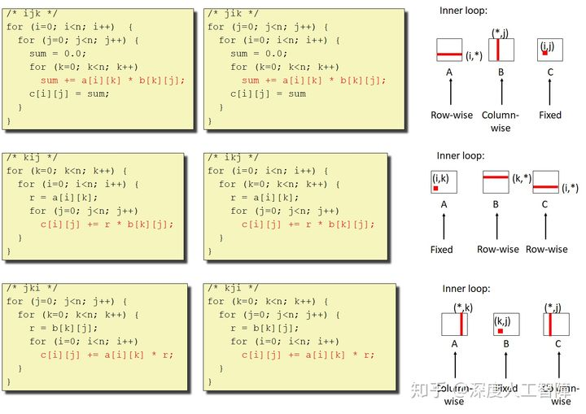

假设每个块中能保存4个元素，则可以分析每个变量的命中率


说明我们可以对循环重排列，来提高空间局部性，增加命中率。

#### 6.6.3　在程序中利用局部性

分块的主要思想是将一个程序中的数据结构组织成大的**片（Chunk）**，使得能够将一个片加载到L1高速缓存中，并在这个偏重进行读写。


如上图所示是一个普通的矩阵乘法函数，这里将二维数组想象成一个连续的字节数组，通过显示计算偏移量进行计算。这里假设每个块中可保存8个元素，并且高速缓存容量远小于矩阵的行列数。

每一次迭代就计算一个C的元素值，我们分析每一次迭代的不命中次数

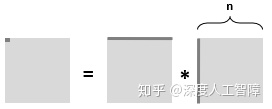

对于矩阵`a`，一次会保存行的8个元素到块中，则一行元素一共会有`n/8`次不命中。对于矩阵`b`，因为是列优先读取的，所以无法利用高速缓存中保存的块，所以一行元素会有n次不命中。则一共会有`9n/8`次不命中，对于C中的`n*n`个元素，一共会有 ![[公式]](https://www.zhihu.com/equation?tex=9n%5E3%2F8) 次不命中。


如上图所示是使用分块技术实现的矩阵乘法，将矩阵乘法分解为若干个`BxB`小矩阵的乘法，每次能将一个`BxB`的小矩阵加载到缓存中。

每一次迭代就计算C中一个`BxB`大小的块，我们分析每一次迭代的不命中次数


每个块有 ![[公式]](https://www.zhihu.com/equation?tex=B%5E2%2F8) 次不命中次数，而每一行每一列有`n/B`个块，所以计算一次C中的一个块会有 ![[公式]](https://www.zhihu.com/equation?tex=2n%2FB%5Ctimes+B%5E2%2F8%3DnB%2F4) 次不命中，则一共会有 ![[公式]](https://www.zhihu.com/equation?tex=nB%2F4%5Ctimes+%28n%2FB%29%5E2%3Dn%5E3%2F%284B%29) ，我们就能调整B的大小来减小不命中率。

分块降低不命中率是因为加载一个块后，就反复使用该块，提高了空间局部性。

> 分块技术的介绍：[http://csapp.cs.cmu.edu/2e/waside/waside-blocking.pdf](https://link.zhihu.com/?target=http%3A//csapp.cs.cmu.edu/2e/waside/waside-blocking.pdf)

**建议：**

- 将注意力集中在内循环中，因为大部分的计算和内存访问都集中在这里
- 按照数据对象存储在内存中的顺序，以步长为1来读数据，使得空间局部性最大。比如步长为2的命中率就比步长为1的命中率降低一半。
- 一旦从存储器读入一个数据对象时，就尽可能使用它，使得时间局部性最大。特别是局部变量，编译器会将其保存在寄存器中。


