# 目录

**第二部分  在系统上运行程序**

**第7章　链接**

7.1　编译器驱动程序          
7.2　静态链接          
7.3　目标文件                    
7.4　可重定位目标文件          
7.5　符号和符号表          
7.6　符号解析          
7.6.1　链接器如何解析多重定义的全局符号          
7.6.2　与静态库链接          
7.6.3　链接器如何使用静态库来解析引用          
7.7　重定位          
7.7.1　重定位条目          
7.7.2　重定位符号引用                    
7.8　可执行目标文件          
7.9　加载可执行目标文件          
7.10　动态链接共享库          
7.11　从应用程序中加载和链接共享库          
7.12　位置无关代码                    
7.13　库打桩机制          
7.13.1　编译时打桩          
7.13.2　链接时打桩          
7.13.3　运行时打桩          
7.14　处理目标文件的工具          

**第8章　异常控制流**

8.1　异常          
8.1.1　异常处理          
8.1.2　异常的类别                    
8.1.3　Linux/x86-64系统中的异常          
8.2　进程          
8.2.1　逻辑控制流          
8.2.2　并发流          
8.2.3　私有地址空间          
8.2.4　用户模式和内核模式          
8.2.5　上下文切换          
8.3　系统调用错误处理          
8.4　进程控制          
8.4.1　获取进程ID          
8.4.2　创建和终止进程          
8.4.3　回收子进程          
8.4.4　让进程休眠          
8.4.5　加载并运行程序          
8.4.6　利用fork和execve运行程序          
8.5　信号          
8.5.1　信号术语          
8.5.2　发送信号          
8.5.3　接收信号          
8.5.4　阻塞和解除阻塞信号          
8.5.5　编写信号处理程序          
8.5.6　同步流以避免讨厌的并发错误          
8.5.7　显式地等待信号          
8.6　非本地跳转          
8.7　操作进程的工具          

**第9章　虚拟内存**

9.1　物理和虚拟寻址          
9.2　地址空间          
9.3　虚拟内存作为缓存的工具          
9.3.1　DRAM缓存的组织结构          
9.3.2　页表          
9.3.3　页命中          
9.3.4　缺页                    
9.3.5　分配页面          
9.3.6　又是局部性救了我们          
9.4　虚拟内存作为内存管理的工具          
9.5　虚拟内存作为内存保护的工具          
9.6　地址翻译          
9.6.1　结合高速缓存和虚拟内存          
9.6.2　利用TLB加速地址翻译          
9.6.3　多级页表          
9.6.4　综合：端到端的地址翻译          
9.7　案例研究：Intel Core i7/Linux内存系统          
9.7.1　Core i7地址翻译          
9.7.2　Linux虚拟内存系统          
9.8　内存映射          
9.8.1　再看共享对象          
9.8.2　再看fork函数          
9.8.3　再看execve函数          
9.8.4　使用mmap函数的用户级内存映射          
9.9　动态内存分配          
9.9.1　malloc和free函数          
9.9.2　为什么要使用动态内存分配          
9.9.3　分配器的要求和目标          
9.9.4　碎片          
9.9.5　实现问题          
9.9.6　隐式空闲链表          
9.9.7　放置已分配的块          
9.9.8　分割空闲块          
9.9.9　获取额外的堆内存          
9.9.10　合并空闲块          
9.9.11　带边界标记的合并          
9.9.12　综合：实现一个简单的分配器          
9.9.13　显式空闲链表          
9.9.14　分离的空闲链表          
9.10　垃圾收集          
9.10.1　垃圾收集器的基本知识          
9.10.2　Mark&Sweep垃圾收集器          
9.10.3　C程序的保守Mark&Sweep          
9.11　C程序中常见的与内存有关的错误          
9.11.1　间接引用坏指针                    
9.11.2　读未初始化的内存          
9.11.3　允许栈缓冲区溢出          
9.11.4　假设指针和它们指向的对象是相同大小的          
9.11.5　造成错位错误          
9.11.6　引用指针，而不是它所指向的对象          
9.11.7　误解指针运算                    
9.11.8　引用不存在的变量          
9.11.9　引用空闲堆块中的数据          
9.11.10　引起内存泄漏          

**第三部分  程序间的交互和通信**

**第10章　系统级I/O　10.1　Unix I/O**

10.2　文件          
10.3　打开和关闭文件          
10.4　读和写文件          
10.5　用RIO包健壮地读写          
10.5.1　RIO的无缓冲的输入输出函数          
10.5.2　RIO的带缓冲的输入函数          
10.6　读取文件元数据          
10.7　读取目录内容          
10.8　共享文件          
10.9　I/O重定向          
10.10　标准I/O          
10.11　综合：我该使用哪些I/O函数？          

**第11章　网络编程**

11.1　客户端服务器编程模型          
11.2　网络          
11.3　全球IP因特网          
11.3.1　IP地址          
11.3.2　因特网域名          
11.3.3　因特网连接          
11.4　套接字接口          
11.4.1　套接字地址结构          
11.4.2　socket函数          
11.4.3　connect函数          
11.4.4　bind函数          
11.4.5　listen函数          
11.4.6　accept函数          
11.4.7　主机和服务的转换          
11.4.8　套接字接口的辅助函数          
11.4.9　echo客户端和服务器的示例          
11.5　Web服务器          
11.5.1　Web基础          
11.5.2　Web内容          
11.5.3　HTTP事务                    
11.5.4　服务动态内容          
11.6　综合：TINY Web服务器          

**第12章　并发编程**

12.1　基于进程的并发编程          
12.2　基于I/O多路复用的并发编程          
12.3　基于线程的并发编程          
12.4　多线程程序中的共享变量          
12.5　用信号量同步线程          
12.6　使用线程提高并行性          
12.7　其他并发问题          

# 笔记

# 第二部分   在系统上运行程序 

## CSAPP 第7章　链接 

**参考：**

[符号解析与重定位 - yooooooo - 博客园](https://link.zhihu.com/?target=https%3A//www.cnblogs.com/linhaostudy/p/9115764.html%23_label2)

[dlopen 方式调用 Linux 的动态链接库](https://link.zhihu.com/?target=https%3A//www.cnblogs.com/brucemengbm/p/6999503.html)

[地址无关码 - yooooooo - 博客园](https://link.zhihu.com/?target=https%3A//www.cnblogs.com/linhaostudy/p/9624594.html)

[聊聊Linux动态链接中的PLT和GOT（１）--何谓PLT与GOT_运维_海枫的专栏-CSDN博客](https://link.zhihu.com/?target=https%3A//blog.csdn.net/linyt/article/details/51635768)


由于局部非静态变量保存在寄存器或栈中，所以符号只包含函数、全局变量和静态变量。

**判断符号的信息：**

- **判断符号所在的节：**

- - 如果是函数，则在`.text`节中
  - 如果是未初始化全局变量，则在`COMMIN`节中
  - 如果是未初始化静态变量，以及初始化为0的全局变量或静态变量，则在`.bss`节中
  - 如果是初始化过的全局变量或静态变量，则在`.data`节中

- **判断符号类型：**

- - 如果是在当前文件中定义的函数或全局变量，则为全局符号
  - 如果是在当前文件定义的静态函数或静态全局变量，则为局部符号
  - 如果在别的文件中定义，则为外部符号

- **注意：**局部非静态变量保存在栈或寄存器中，所以不考虑

保存在什么表，是根据符号的类型和定义情况，而定义和引用是从变量或函数的角度来看的

**判断符号采用哪种定义：**

- 在各个文件中确定同名全局符号的强弱，其中符号和初始化的全局符号为强符号，未初始化的全局符号为弱符号
- 如果存在多个同名的强符号，则会出现链接错误
- 如果存在一个强符号和多个同名的弱符号，则会采用强符号的定义
- 如果存在多个同名的弱符号，则会随机采用一个弱符号的定义

需要根据目标文件和库之间对符号解析的依赖关系，来确定命令行中输入文件的顺序，保证前面文件中未解析的符号，能在后面文件中得到解析。

重定位包含两层意思：分配内存地址，根据重定位表条目来修改占位符。

------

**链接（Linking）** 是将各种代码和数据片段收集并组合成一个单一的文件的过程，然后该文件会被加载到内存中执行。该过程由**链接器（Linker）** 程序自动执行。**链接存在三种类型：**

- 执行于**编译时（Compile Time）**，即在源代码被翻译成机器代码时的传统静态链接
- 执行于**加载时（Load Time）**，即程序被**加载器（Loader）**加载到内存并执行时的动态链接
- 执行于**运行时（Run Time）**，即由应用程序来执行的动态链接

**作用：** 链接的存在，使得 **分离编译（Separate Compilation）** 成为可能，一个大型应用程序可以分解成若干个小的模块，只需要对这些模块进行修改编译，然后通过链接器将其组合成大的可执行文件就行。

**学习的意义：** 能帮助你构建大型程序，避免一些危险的编程错误，理解语言的作用域规则是如何实现的，理解其他重要的系统概念，比如加载和运行程序、虚拟内存、分页和内存映射，并且可以让你利用共享库。

**本文使用的环境：** 运行Linux的x86-64系统，使用标准的ELF-64目标文件格式。

### 7.1　编译器驱动程序

- 1. 链接是将各种代码和数据整理成一个文件的过程，然后这个文件被执行
- 2. 我们写的程序常常包括调用的各种基本库、外部库、自己写的库，所以实际上在计算机中的存储形式是很多个单独的小模块，每次更改其中的一个小模块时，只需要重新编译这个小模块，其他的不变。
- 3. 当我们写的程序非常小的时候，链接这个过程就由链接器默默处理了，但理解链接这个过程，可以让我们设计程序代码和编译修改时更加清晰。
- 4. 在debug时，用gcc编译时使用-Og参数可以让编译器优化后生成的文件符合C语言代码结构，便于我们调试读懂，正式使用时常常用-O1或者-O2参数达到最佳优化性能。
- 5. c文件-预处理-ascii码文件-编译-汇编文件-汇编-可重定位目标文件-链接-可执行文件
- 6. 上述步骤都可以手动完成：
预处理：cpp -o main.i main.c 或者 gcc -E -o mian.i main.c
编译：cc -S -o mian.s main.i 或者 gcc -S -o main.s main.i
汇编：as -o main.o main.s
链接：(这里的sum.o也是通过上面三个步骤得到的，其他的是编译器自带的，crt的意思是cruntime）
- 7. 得到可执行文件后 shell程序中直接输入./prog，此时shell程序会调用加载器，将prog包含的代码和数据拷贝到内存中，并使cpu从prog的第一行指令开始执行。

大多数编译系统提供**编译器驱动程序（Compiler Driver）**，使得用户可以调用预处理器、编译器、汇编器和链接器对程序进行编译。


如上图所示是一个示例程序，对于GNU编译系统，可以通过输入

```text
gcc -Og -o prog main.c sum.c
```

来调用GCC驱动程序，然后执行以下过程：

1. GCC驱动程序运行**C预处理器（cpp）**，将C源程序`main.c`翻译为ASCII码的中间文件`main.i`。`cpp [other arg] main.c /tmp/main.i`
2. GCC驱动程序运行**C编译器（ccl）**，将`main.i`翻译成ASCII汇编语言文件`main.s`。`ccl /tmp/main.i -Og [other arg] -o /tmp/main.s`。
3. GCC驱动程序运行**汇编器（as）**，将`main.s`翻译成一个**可重定位目标文件（Relocatable Object File）**`main.o`。`as [other arg] -o /tmp/main.o /tmp/main.s`。
4. 对`sum.c`执行相同的过程，得到`sum.o`。
5. GCC驱动程序运行**链接器（ld）**，将`main.o`和`sum.o`以及其他必要的系统目标文件组合起来，得到**可执行目标文件（Executable Object File）**`prog`。`ld -o prog [system object files and args] /tmp/main.o /tmp/sum.o`。
6. 在shell中输入`./prog`，则shell会调用操作系统的**加载器（Loader）**函数，将该可执行文件`prog`复制到内存中，然后执行该程序。


### 7.2　静态链接

### 7.3　目标文件

可以发现存在不同的目标文件，**主要包含：**

- **可重定位目标文件：**由各种不同的二进制代码和**数据节（Section）**组成，每一节是一个连续的字节序列，不同节存放不同的数据。

- - **生成：**由编译器和汇编器生成
  - **用处：**在编译时与其他可重定位目标文件合并起来，得到一个可执行目标文件。

- **可执行目标文件：**包含二进制代码和数据

- - **生成：**将可重定位目标文件和静态库输入到链接器中，可产生可执行目标文件
  - **用处：**可被加载器直接复制到内存中并执行

- **共享目标文件：**特殊类型的可重定位目标文件，可以在加载时或运行时被动态地加载进内存并链接。

**注意：**我们称**目标模块（Object Module）**为一个字节序列，而**目标文件（Object File）**是以文件形式存放在磁盘的目标模块。

目标文件是按照特定的目标文件格式进行组织的，Windews中使用**可移植可执行（Portable Executable，PE）**格式，Max OS-X使用**Mach-O**格式，x86-64 Linux和Unix使用**可执行可链接格式（Executable and Linkable Format，ELF）**。

### 7.4　可重定位目标文件

- 1. wc -c main.o 可以查看main.o文件一共包含多少字节
- 2. 一个可重定位目标文件可以分为三部分：ELF header、各种section、描述各个section的表
- 3. readelf -h main.o 可以查看elf文件中的header部分
- 4. ELF header的第一行：

- 5. magic是用来确认文件类型的，加载时如果文件类型不匹配就拒绝加载
- 6. ELF header还会说明自己的大小和表的大小，从而可以推算sections部分的起始位置以及整个ELF文件的大小
- 7. readelf -S main.o 可以查看elf文件中的表部分
- 8. sections中包括.text，存放的是指令机器代码；然后是.data，存放的是已出实话的全局变量和静态变量的值；接着的.bss存放为初始化或初始化为0的全局变量的静态变量（.bss不占空间，只是占位符）；还有一些其他的section如下图所示


以可重定位目标文件的ELF格式为例，如下图所示

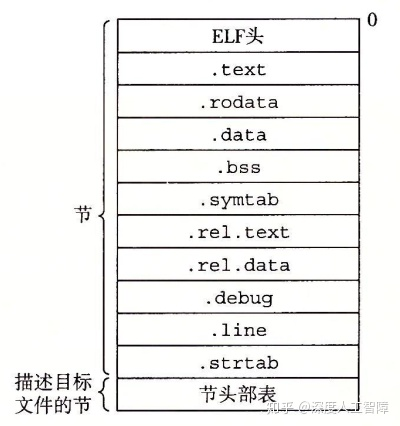

- **ELF头（ELF header）：**包含生成该目标文件的系统的字大小和字节顺序、ELF头的大小、目标文件类型、机器类型、节头部表的文件偏移，以及节头部表中条目的大小和数目。

- `.text`： 已编译程序的机器代码

- `.rodata`： 只读数据，比如跳转表等等

- `**.data**`： 保存已初始化的全局变量和静态变量（全局和局部）

- `**.bss**`： 保存未初始化的静态变量（全局和局部），以及被初始化为0的全局变量和静态变量（全局和局部）

- - **注意：**

  - - 在目标文件中`.bss`不占据实际的空间，只是一个占位符
    - 之所以要将初始化和未初始化分成两个节，因为在目标文件中，未初始化变量不需要占据任何实际的磁盘空间，运行时，再在内存中分配这些变量，初始值为0。
    - 局部变量在运行时只保存在栈中，不出现在`.data`和`.bss`中
    - 静态局部变量不受函数栈的管理，所以也要在这个位置创建

- `**.symtab**`： 符号表，存放在程序中**定义和引用**的函数和变量的符号信息

- - **注意：**不包含局部非静态变量条目，因为该变量是由栈管理的

- `.rel.text`：`.text`节的重定位信息，可执行目标文件中需要修改的指令地址

- `.rel.data`： `.data`节的重定位信息，合并后的可执行目标文件中需要修改的指针数据的地址

- - **注意：**

  - - 一般已初始化的全局变量，如果初始值是一个全局变量地址或外部定义函数的地址，就需要被修改
    - 可执行目标文件已完成重定位，就不需要`.rel.text`和`.rel.data`数据节了。

- `.debug`：调试符号表，其条目是程序中定义的局部变量和类型定义，程序汇总定义和引用的全局变量，以及原始的C源文件

- `.line`： 原始C源程序中的行号和.text节中机器指令之间的映射

- - **注意：**只有以-g选项调用编译器驱动程序，才会出现`.debug`和`.line`

- `.strtab`： 字符串表，包括`.symtab`和`.debug`节中的符号表，以及节头部中的节名字

- **节头部表（Section Header Table）：**给出不同节的大小和位置等其他信息

> 我们可以使用GNU READELF程序来查看目标文件内容。

每个可重定位目标模块都会有一个由汇编器构造的**符号表.symtab**，包含了当前模块中定义和引用的符号信息。在链接器的上下文中（链接器是对不同的可重定位目标文件进行操作的，所以它的上下文就是不同的可重定位目标模块），根据符号定义和引用的情况，可以将其分成以下类型：

- **全局链接器符号：**在当前可重定位目标模块中定义，并能被其他模块引用的符号。对应于非静态的函数和全局变量。
- **外部链接器符号：**在别的可重定位目标模块中定义，并被当前模块引用的符号。对应于在其他模块中定义的非静态的函数和全局变量。（外部连接器符号也是全局连接器符号）
- **局部链接器符号：**只在当前可重定位目标模块定义和引用的符号。对应于静态的函数和全局变量，这些符号在当前模块中任何位置都可见，但不能被别的模块引用。

**注意：**局部静态变量不在栈中管理，所以编译器在`.data`或`.bss`中为其分配空间，并在符号表`.symtab`中创建一个有唯一名字的局部链接器符号。

### 7.5　符号和符号表

- 1. 符号就是对各个可重定位文件进行链接时给定的规则
- 2. 符号表中的符号包括函数类型的main/func还有OBJECT类型的全局/局部变量
- 3. 每一个可重定位文件都有一个符号表，包含这个可重定位模块包含该模块定义和定义的符号信息
- 4. 符号表中的符号可分为三类：
由该模块定义，同时能被其他模块引用的全局符号；
被其他模块定义，被该模块引用的外部符号；
只能被该模块定义和引用的局部符号，带有static属性的函数和变量。


- **name：**保存符号的名字，是`.strtab`的字节偏移量

- **type：**说明该符号的类型，是函数、变量还是数据节等等

- **binding：**说明该符号是局部还是全局的

- **value：**对于可重定位目标文件而言，是定义该符号的节到该符号的偏移量（比如函数就是在`.text`中，初始化的变量在`.data`，未初始化的变量在`.bss`中）；对于可执行目标文件而言，是绝对运行形式地址。

- **size：**是符号的值的字节数目。（通过value和size就能获得该符号的值）

- **section：**说明该符号保存在哪个节中，是节头部表中的偏移量。

- - **注意：**可重定位目标文件中有三个无法通过节头部表进行索引的数据节，称为**伪节（Pseudosection）**

对于像Linux LD这样的**静态链接器（Static Linker）**，是以一组可重定位目标文件和命令参数为输入，生成一个完全链接的、可以加载和运行的可执行目标文件作为输出。为了构造可执行目标文件，**链接器有两个任务：**

- **符号解析（Symbol Resolution）：**将每个符号引用和一个符号定义关联起来
- **重定位（Relocation）：**编译器和汇编器生成从地址0开始的代码和数据节，链接器会对代码、数据节、符号分配内存地址，然后使用汇编器产生的**重定位条目（Relocation Entry）**的指令，修改所有对这些符号的引用，使得它们指向正确的内存位置。

### 7.6　符号解析

**定义：**链接器符号解析是将每个符号引用与输入的所有可重定位目标文件的符号表中的一个确定的符号定义关联起来。

- 对于局部链接器符号，由于符号定义和符号引用都在同一个可重定位目标文件中，情况相对简单，编译器只允许每个可重定位目标文件中每个局部链接器符号只有一个定义。而局部静态变量也会有局部链接器符号，所以编译器还要确保它有一个唯一的名字。
- 对于全局符号（包括全局符号和外部符号），编译器可能会碰到不在当前文件中定义的符号，则会假设该符号是在别的文件中定义的，就会在重定位表中产生该符号的条目，让链接器去解决。而链接器可能还会碰到在多个可重定位目标文件中定义相同名字的全局符号，也要解决这些冲突。

#### 7.6.1　链接器如何解析多重定义的全局符号

**链接器解析多重定义的全局符号**

编译器会向汇编器输出每个全局符号是**强（Strong）**还是**弱（Weak）**，而汇编器会把这些信息隐式编码在可重定位目标文件的符号表中。     
函数和已初始化的全局符号是强符号，未初始化的全局符号是弱符号。     

然后链接器通过以下规则来处理在多个可重定位目标文件中重复定义的全局符号：

1. 不允许有多个同名的强符号，如果存在，则链接器会报错
2. 如果有一个强符号和多个弱符号同名，则符号选择强符号的定义
3. 如果有多个弱符号同名，符号就随机选择一个弱符号的定义

#### 7.6.2　与静态库链接

#### 7.6.3　链接器如何使用静态库来解析引用

**静态库的链接与解析引用**

链接器除了能将一组可重定位目标文件链接起来得到可执行目标文件以外，编译系统还提供一种机制，将所有相关的目标模块打包为一个单独文件，称为**静态库（Static Library）**，可以作为链接器的输入。静态库是以**存档（Achive）**的文件格式存放在磁盘的，它是一组连接起来的可重定位目标文件的集合，有一个头部来描述每个成员目标文件的大小和位置，后缀为`.a`。**使用静态库的优点有：**

- 相关的函数可以被编译为独立的目标模块，然后封装成一个独立的静态库文件。
- 链接时，链接器只会复制静态库中被应用程序引用的目标模块，减少了可执行文件在磁盘和内存中的大小
- 应用程序员只需要包含较少的库文件名就能包含很多的目标模块，比如ISO C99中在`libc.a`静态库中包含了`atoi.o`、`scanf.o`、`strcpy.o`等可重定位目标模块，在`libm.a`静态库中包含了数学函数的目标模块。

比如我们有以下函数


我们可以用AR工具创建包含这些函数的静态库，首先需要得到这两个函数的可重定位目标文件

```text
gcc -c addvec.c multvec.c
```

由此可以得到`addvec.o`和`multvec.o`，然后创建包含这两个可重定位目标文件的静态库

```text
ar rcs libvector.a addvec.o multvec.o 
```

由此就得到了静态库`libvector.a`。

为了便于说明静态库中包含了那些函数，以及这些函数的原型，我们会创建一个头文件来包含这两个函数的函数原型，便于想要使用该静态库的人员查看**（不确定？）**


如上面的代码，在头文件`vector.h`中给出了函数`addvec`和`multvec`的函数原型。想要创建可执行目标文件，就要编译和链接`main2.o`和`libvector.a`。首先先产生可重定位目标文件

```text
gcc -c main2.c 
```

由此可以得到`main2.o`，然后运行以下代码：

```text
gcc -static -o prog2c main2.o ./libvector.a 
```

由此就能得到一个可执行目标文件`prog2c`。这里的`-static`表示链接器需要构建一个完全链接的可执行目标文件，可以加载到内存并运行，无需进一步链接。我们同样可以使用以下方法：

```text
gcc -static -o prog2c main.o -L. -lvector 
```

这里的`-lvector`是`libvector.a`的缩写，`-L.`告诉链接器在当前目录中查找`libvector.a`静态库。

当运行了该命令行，在符号解析阶段，链接器会维护一个可重定位目标文件的集合`E`，一个引用了但是还未定义的符号集合`U`，一个前面输入文件中已经定义的符号集合`D`，然后在命令行中从左到右依次扫描可重定位目标文件和存档文件：

- 如果输入文件是可重定位目标文件，链接器就将其添加到`E`中，然后根据该文件的符号表来修改`U`和`D`，然后继续下一个输入文件。
- 如果输入文件是存档文件，则链接器会依次扫描存档文件中的成员`m`，如果`m`定义了`U`中的一个符号，则将`m`添加到`E`中，然后根据`m`的符号表来修改`U`和`D`。最后没有包含在`E`中的成员就会被丢弃，然后继续下一个输入文件。
- 如果链接器扫描完毕，`U`中还存在没有确定定义的符号，则链接器会报错并终止，否则链接器会合并和重定位`E`中的目标文件，得到可执行目标文件。

在这个例子中，链接器首先得到输入文件`mian2.o`，其中存在未解析的符号`addvec`，则会将该符号保存在集合`U`中，然后扫描下一个输入文件`libvector.a`时，由于是存档文件，就会依次扫描其中的成员，首先扫描到`addvec.o`时，能对符号`addvec`进行解析，则将`addvec.o`保存在`E`中，并将符号`addvec`从`U`中删除，扫描到`multvec.o`时，由于`U`中已不存在未解析的符号了，所以不会将`multvec.o`包含在`E`中，最终链接器会合并和重定位`E`中的目标文件，得到可执行目标文件。所以链接器最终只会从静态库`libvector.a`中提取`addvec.o`


根据以上过程的描述，我们**需要小心命令行上库和目标文件的顺序**，要保证前面输入文件中未解析的符号能在后续输入文件中进行解析，否则会出现链接错误，一般是将库放在后面，如果库之间存在依赖，也要注意库之间的顺序，并且为了满足依赖关系，可以在命令行上重复库。

**特别的：**首先输入目标文件，由于目标文件会直接包含在`E`中，所以可以得到目标文件中所有未解析的符号，并且提供了该目标文件中的所有解析的符号，相当于“无条件加入”的，如果存在库依赖目标文件，就无需再输入目标文件了。然后根据库之间的依赖来排序库，存档文件会根据`U`的内容来确定是否将成员`m`保存在`E`中，相当于“按序加入”的，所以需要重复输入库来满足依赖关系。

比如`p.o -> libx.a -> liby.a`且`liby.a -> libx.a -> p.o`。此时我们先输入`p.o`，就包含了解析`lib.a`符号的定义了，然后我们根据依赖输入`libx.a liby.a`，此时由于第一个`libx.a`只是解析了`p.o`中未定义的符号，而`liby.a`中还存在由`libx.a`解析的符号，所以我们还需输入`libx.a`来解析`liby.a`的符号。

### 7.7　重定位

#### 7.7.1　重定位条目

当链接器完成符号解析时，就能确定在多个目标文件中重定义的全局符号的解析，以及获得静态库中需要的目标模块，此时所有符号引用都能和一个符号定义关联起来了。此时开始重定位步骤，**包括：**

- 链接器将所有目标模块中相同类型的节合并成同一类型的新的聚合节，比如将所有输入目标模块的`.data`节聚合成可执行文件中的`.data`节，其他节也如此操作。
- 此时链接器知道代码节和数据节的确切大小，就将运行时内存地址赋给新的聚合节，以及输入模块定义的每个符号。此时程序的每条指令和全局变量都有唯一的运行时内存地址了。
- 记得之前可重定位目标文件中，由于编译器和汇编器并不知道符号的运行时内存地址，所以使用一个占位符来设置符号引用的地址，而当前链接器已为符号分配了内存地址，所以链接器需要修改代码节和数据节中对每个符号的引用，使它们指向正确的运行时内存地址。

当汇编器生成目标模块时，它无法确定数据和代码最终会放在内存的什么位置，也无法确定该模块引用外部定义的函数和全局变量的位置，所以汇编器先用占位符来占领位置，然后对地址未知的符号产生一个**重定位条目（Relocation Entry）**，代码的重定位条目会保存在`.rel.text`节中，已初始化数据的重定位条目会保存在`rel.data.`节中。重定位条目的数据结构如下所示


其中，`offset`表示要修改符号引用的内存地址，`type`表示重定位的类型，`symbol`是符号表的索引值，表示引用的符号，可以通过该符号获得真实的内存地址，`addend`是一个有符号常数，有些重定位需要使用这个参数来修改引用位置。

我们通过以下代码来介绍两个重定位类型：`R_X86_64_PC32`和`R_X86_64_32`。


我们可以通过`objdump -dx main.o`来得到`main.o`的反汇编代码，可以发现该函数中无法确定`array`和其他目标模块中定义的函数`sum`在内存中的地址，所以会对`array`和`sum`产生重定位条目


#### 7.7.2　重定位符号引用

**R_X86_64_PC32**

该重定位条目主要用来产生32位PC相对地址的引用，即函数调用时的重定位。

**R_X86_64_32**

该重定位条目主要用来产生32位绝对地址的引用，即数组的重定位。

### 7.8　可执行目标文件

通过以上符号解析和重定位过程，链接器已将可重定位目标文件和库合并成一个可执行目标文件了，目标文件的ELF格式如下所示


- **ELF头：**描述了文件的总体格式，还包括程序的**入口点（Entry Point）**，即当程序运行时要执行的第一条指令的地址。
- `.init`：定义了一个小函数`_init`，程序的初始化代码会调用
- `.text`、`.rodata`和`.data`和可重定位目标文件中的类似，只是这里被重定位到了最终的运行时内存地址
- 由于可执行目标文件是完全链接的，已经不需要重定位了，所以不需要`.rel`节了。

**段头部表（Segment Header Table）：**包括页大小、虚拟地址内存段（节）、段大小等等。描述了可执行文件连续的片到连续的内存段的映射关系，如下图所示是通过`OBJDUMP`显示的`prog`的段头部表

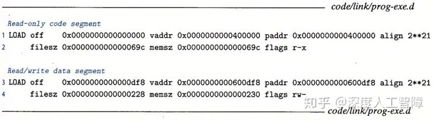

在可执行目标文件中，根据不同数据节对读写执行的不同要求，将不同的数据节分成了两个段：代码段和数据段，其中**代码段**包含ELF头、段头部表、`.init`、`.text`和`.rodata`，**数据段**包括`.data`和`.bss`。然后段头部表中就描述了代码段和数据段到内存段的映射关系，其中`off`是目标文件中的偏移，表示要从目标文件的什么位置开始读取该段；`vaddr/paddr`是内存地址，表示要将该段加载到的内存地址；`align`是对齐要求；`filesz`是目标文件中的段大小，则通过`off`和`filesz`就能确定我们要加载的段的内容；`memsz`是内存中的段大小，表示我们养将目标文件中的该段加载到多大的内存空间中；`flags`表示该段运行时的访问权限。

比如第1行、第2行描述的就是代码段，表示将目标文件中从`0x0`开始的`0x69c`个字节数据保存到从`0x400000`开始的，大小为`0x69c`字节的内存空间中，并具有读和可执行权限。第3行、第4行描述的是数据段，表示将目标文件从`0xdf8`开始的`0x228`个字节数据保存到从`0x600df8`开始的，大小为`0x230`字节的内存空间中，并具有读写权限。

这里为了使得程序执行时，目标文件中的段能高效地传送到内存中，要求

![[公式]](https://www.zhihu.com/equation?tex=vaddr%5C+mod%5C+align+%3D+off%5C+mod%5C+align+)


### 7.9　加载可执行目标文件

当我得到可执行目标文件`prog`时，我们可以在`shell`中输入`./prog`。

由于`prog`不是内置的shell命令，所以shell会认为`prog`是一个可执行目标文件，就通过调用`execve`函数来调用内核中的**加载器（Loader）**，则加载器会在可执行目标文件的段头部表的引导下，将可执行文件中的数据段和代码段复制到对应的内存位置，然后加载器会创建如下运行时内存映射


- **代码段和数据段：**x86-64通常将代码段保存在`0x400000`处，所以会将可执行目标文件的代码段和数据段映射为如上形式。**注意：**这里数据段为了满足对齐要求，会和代码段之间存在间隙。
- **运行时堆：**在数据段之后会有一个运行时堆，是通过调用`malloc`库动态往上增长的
- **共享库：**在堆之后是一个共享库的内存映射区域
- **用户栈：**用户栈是从最大的合法用户地址开始，向较小的地址增长
- **内核：**最上方的是位内核中的数据和代码保留的，是操作系统驻留在内存的位置

**注意：**链接器通常会使用地址空间布局随机化（ASLR）来修改堆、共享库和栈的地址，但是会保持三者相对位置不变。

随后加载器会跳转到程序的入口点，到达`_start`函数的地址，然后该函数代用系统启动函数`_libc_start_main`，然后该函数初始化执行环境，然后调用用户层的`main`函数。其中，`_start`定义在系统目标文件`ctrl.o`，`__libc_start_main`定义在`libc.so`中。


### 7.10　动态链接共享库

**静态库具有以下缺点：**需要定期维护和更新，并且几乎所有C程序都会使用标准I/O函数，则运行时这些函数的代码会被复制到每个运行进程的文本段中，占用大量的内存资源。

为了解决静态库的问题提出了**共享库（Shared Library）**，它是一个目标模块，不会在产生可执行目标文件时将数据段和代码段复制到可执行目标文件中进行静态链接，而是等到程序要加载时或要运行时才进行链接，我们可以提供最新的共享库，使得可执行目标文件可以直接和最新的共享库在加载或运行时链接，无需重新产生可执行目标文件。共享库由**动态链接器（Dynamic Linker）**加载到任意的内存地址，并和一个在内存中的程序链接起来，该过程称为**动态链接（Dynamic Linking）**。动态链接器本身就是一个共享目标，Linux中为`ld-linux.so`。

共享库的“共享”具有**两层含义：**

- 在任意文件系统中，一个库只有一个`.so`文件，所有引用该共享库的可执行目标文件都共享该`.so`文件中的代码和数据，不像静态库的内容会被复制到可执行目标文件中。
- 在内存中，一个共享库的`.text`节可以被不同正在运行的进程共享。

### 7.11　从应用程序中加载和链接共享库

#### 7.11.1 加载时动态链接

我们可以通过以下形式产生共享库

```text
gcc -shared -fpic -o libvector.so addvec.c multvec.c
```

其中，`-shared`指示链接器创建一个共享的目标文件，`-fpic`指示编译器生成与位置无关的代码。然后我们可以通过以下形式利用该共享库

```text
gcc -o prog2l main2.c ./libvector.so 
```

由此就创建了一个可执行目标文件`prog2l`，其过程如下图所示


- 在创建可执行目标文件时，链接器会复制共享库中的重定位`.rel`和符号表`.symtab`信息，使得运行时可以解析对共享库中代码和数据的引用，由此得到部分链接的可执行目标文件。**注意：**此时没有将共享库的代码和数据节复制到可执行文件中。
- 调用加载器加载部分链接的可执行目标文件时，加载器会在段头部表的引导下，将可执行文件中的数据段和代码段复制到对应的内存位置。
- 加载器可以在`prog2l`中发现`.interp`节，其中保存了动态链接器的路径，则加载器会加载和运行这个动态链接器
- 动态链接器会将不同的共享库的代码和数据保存到不同的内存段中
- 动态链接器还会根据共享库在内存的位置，来重定位`prog2l`中所有对共享库定义的符号的引用
- 最后加载器将控制权传递给应用程序，此时共享库的位置就固定了，并在程序执行的过程中不会改变。

此时就能在应用程序被加载之后，在运行之前动态链接器加载和链接共享库。

#### 7.11.2 运行时动态链接

应用程序还可以在它运行时要求动态链接器加载和链接某个共享库。

Linux为动态链接器提供一个接口，使得应用程序在运行时加载和链接共享库

```c
#include <dlfcn.h>
void *dlopen(const char *filename, int flag);
```

`dlopen`函数可以打开`filename`指定的共享库，并返回句柄指针，而参数`flag`可以用来确定共享库符号解析方式以及作用范围，两个可用`|`相连，包括：

- `RTLD_NOW`：在dlopen返回前，解析出全部没有定义符号，假设解析不出来，则返回NULL
- `RTLD_LAZY`：在dlopen返回前，对于共享库中的没有定义的符号不运行解析，直到执行来自共享库中的代码（仅仅对函数引用有效，对于变量引用总是马上解析）。
- `RTLD_GLOBAL`：共享库中定义的符号可被其后打开的其他库用于符号解析
- `RTLD_LOCAL`：与`RTLD_GLOBAL`作用相反，共享库中定义的符号不能被其后打开的其他库用于重定位，是默认的。

```c
#include <dlfcn.h>
void *dlsym(void *handle, char *symbol);
```

该函数返回之前打开的共享库的句柄中`symbol`指定的符号的地址

```c
#include <dlfcn.h>
void dlclose(void *handle); 
```

用来关闭打开的共享库句柄

```c
#include <dlfcn.h>
const char *dlerror(void);
```

如果`dlopen`、`dlsym`或`dlclose`函数发生错误，就返回字符串。

如下图所示的代码示例


该程序就会在运行时动态链接共享库`libvector.so`，然后调用`addvec`函数。

我们可以用以下的编译方式

```text
gcc -rdynamic -o prog2r dll.c -ldl
```

其中，`-rdynamic`通知链接器将全部符号加入到动态符号表中，就可以通过使用`dlopen`来实现向后跟踪，`-ldl`表示程序运行时会动态加载共享库。

### 7.12　位置无关代码

我们的目的其实就是希望共享的指令部分在装载时不需要因为装载地址的改变而改变，所以实现的基本想法就是把指令中那些需要被修改的部分分离出来，跟数据部分放在一起，这样指令部分就可以保持不变，而数据部分可以在每个进程中拥有一个副本。这种方案就是目前被称为**地址无关代码(PC, Position-independent Code)**的技术。

**注意：**对于动态库的创建，`-fpic`选择地址无关代码是必须的编译选项。

**实例介绍**

链接器使用**全局偏移量表（Global Offset Table，GOT）**和**过程链接表（Procedure Linkage Table，PLT）**

我们可以发现，第一次调用共享库的函数时，对应的`xxx@plt`函数并不会跳转到正确的函数地址，而是调用动态链接器来获得函数的地址，然后将其保存到`got`项中，下一次再运行时，才会跳转到正确的函数地址，该方法称为**延迟绑定（Lazy Binding）**，只有共享库的函数要用时，才会重定位它的地址，否则不会，由此防止可执行目标文件加载时需要对大量的共享库的地址进行重定位。

### 7.13　库打桩机制

Linux链接器支持**库打桩（Library Interpositioning）**技术，允许你截获对共享库函数的调用，替换成自己的代码。**基本思想**为：创建一个与共享库函数相同函数原型的包装函数，是不不同的库打桩技术，使得系统调用包装函数，而不是调用目标函数。

#### 7.13.1　编译时打桩


我们以以上代码为例，说明编译时打桩技术，替换动态库`libc.so`的`malloc`和`free`函数的调用。

首先，我们可以定义一个本地的头文件`malloc.h`，如下所示

```text
//本地malloc.h
#define malloc(size) mymalloc(size)
#define free(ptr) myfree(ptr)
```

然后在编译`int.c`时，使用`-I.`编译选项，使得预处理器首先从本地查找`malloc.h`文件，由此就能将共享库的`malloc`和`free`函数替换成我们自己的`mymalloc`混合`myfree`函数。

而我们需要自己实现`mymalloc`和`myfree`函数，其中需要调用原始的`malloc.h`，所以需要先将该函数进行编译，所以创建以下文件


所以我们可以通过以下代码得到该函数的可重定位目标文件`mymalloc.o`

```text
gcc -DCOMPILETIME -c mymalloc.c
```

然后在本地的`malloc.h`中给出包装函数的函数原型，即

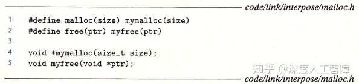

然后就可以通过以下命令行进行编译时打桩

```text
gcc -I. -o intc int.c mymalloc.o 
```

此时，由于`-I.`编译选项，对于`int.c`中的`malloc.h`，预处理器会首先从本地搜索`malloc.h`文件，而在本地`malloc.h`文件中，对`malloc`和`free`函数重新包装成`mymalloc`和`myfree`函数，而这两个函数在之前编译好的`mymalloc.o`可重定位目标文件中，此时就完成了编译时打桩。

**综上所述：**想要在编译时打桩，意味着要通过`#define`来使用预处理器将目标函数替换成包装函数。

#### 7.13.2　链接时打桩


Linux静态链接器也支持使用`--wrap f`标志进行链接时打桩，此时会将符号`f`解析为`__wrap_f`，而将对`__real_f`符号的引用解析为`f`， 意味着原始对函数`f`的调用，还会替换成对`__wrap_f`函数的调用，而通过`__real_f`函数来调用原始函数`f`。

我们定义以下函数


然后我们可以同时进行编译

```text
gcc -DLINKTIME -Wl,--wrap,malloc -Wl,--wrap,free -o intl int.c mymalloc.c
```

也可以分开编译

```text
gcc -DLINKTIME -c mymalloc.c
gcc -c int.c
gcc -Wl,--wrap,malloc -Wl,--wrap,free -o intl int.o mymalloc.o
```

其中，`-Wl`表示传递链接器参数，而这些参数通过`,`相连。

由此，`int.c`中对`malloc`和`free`函数的调用，会变成对`__wrap_malloc`和`__wrap_free`函数的调用。

**综上所述：**想要在链接时打桩，意味着在对可重定位目标文件的符号进行解析时，进行替换。

#### 7.13.3　运行时打桩

想要在运行时进行打桩，意味着是对共享库的函数进行打桩，这里使用动态链接器提供的`LD_PRELOAD`环境变量，通过该变量设置共享库路径列表，执行可执行目标文件时，动态链接器就会先搜索`LD_PRELOAD`共享库。

我们可以定义以下函数


然后通过以下命令行将其编译成共享库

```text
gcc -DRUNTIME -shared -fpic -o mymalloc.so mymalloc.c -ldl 
```

然后在运行时指定环境变量`LD_PRELOAD`

```text
gcc -o intr int.c
./LD_PRELOAD="./mymalloc.so" ./intr 
```

此时运行到`malloc`和`free`函数时，就会调用动态链接器搜索该符号的定义，此时会先搜索`LD_PRELOAD`指定的共享库，而`mymalloc.so`中定义了这两个符号，所以就替换了这两个函数的具体实现。**注意：**如果想要调用原始的定义，就需要用运行动态链接的方式，通过指定`dlsym`的参数为`RTLD_NEXT`，来在后续的共享库中获得`malloc`的定义。


### 7.14　处理目标文件的工具

## 第8章　异常控制流 

### 8.1　异常

从系统加电到断点，程序计数器都假设一个值的序列a0，a1,...an+1 ，其中每个值是一个指令地址。这里将从ak 跳转到ak+1的过程称为**控制转移（Control Transfer）**，将控制转移序列称为**物理控制流（Flow of Control或Control Flow）**。当控制流中相邻指令地址在内存是相邻的，则称该控制流是**平滑的**，否则存在**突变**，比如分支跳转或方法调用。

系统会通过使控制流发生突变来对系统状态的变化做出反应，比如必须处理硬件定时器定期产生的信号、必须将到达网络适配器的数据包存放在内存等等，这种突变称为**异常控制流（Exceptional Control Flow，ECF）**。ECF存在**不同的层次：**

- **异常：**硬件检测到的事件会触发控制转移到异常处理程序。其中，异常位于硬件和操作系统交接的部分，由硬件和操作系统软件共同实现。
- **上下文切换：**内核通过上下文切换将控制从一个用户进程转移到另一个用户进程，由操作系统软件和硬件计时器实现。
- **信号：**一个进程可以发送信号到另一个进程，而接受者会将控制转移到它的信号处理程序，由操作系统实现。
- **非本地跳转：**由C运行时库实现，是ECF的一种应用层形式，允许你违背正常的`call`和`return`模式。

#### 8.1.1　异常处理

在处理器中，状态被编码为不同的位和信号，而状态变化成为**事件（Event）**。当出现事件时，**异常（Exception）**会将控制权转移到操作系统内核，来响应处理器状态中的某些变化，由此形成了控制流中的突变。异常位于硬件和操作系统交接的部分，通过硬件修改`%rip`来实现控制转移，而由于该异常而执行的代码是由操作系统内核设置和确定的，所以异常一部分由硬件实现，一部分由软件实现。

系统为每种类型的异常都分配了一个唯一的非负整数的**异常号（Exception Number）**，有些异常号由处理器设计者分配，有些异常号由操作系统内核设计者分配，分别用来表示不同层次的异常。在系统启动时，操作系统会分配和初始化一张称为**异常表（Exception Table）**的跳转表，其中第k个表项包含专门处理异常号为k的异常的**异常处理程序（Exception Handler）**


而该异常表的起始地址保存在特殊的CPU寄存器中，称为**异常表基址寄存器（Exception Table Base Register）**。当处理器检测到有事件发生时，并确定了异常号`k`时，就会通过异常号确定偏移量，比如在64位系统中，内存地址为8字节，则偏移量为`8k`，然后通过异常表基址寄存器保存的异常表起始地址，加上偏移量来得到异常处理程序的内存地址，然后跳转到对应的异常处理程序。

在跳转到异常处理程序之前，根据异常的类型，会将不同的返回地址压入栈中，要么返回到事件发生时的地址，要么返回到事件发生时的下一条指令地址。此外，处理器会将一些额外的处理器状态压入栈中，使得当处理器返回时，能从栈中返回中断程序原始的状态。**注意：**如果控制从用户程序转移到内核，则这些数据都保存在内核栈中，而不是用户栈。此外，异常处理程序运行在内核模式下，使得它们对所有系统资源都有完全的访问权限。

当异常处理运行完成时，将执行“从中断返回”指令，根据栈中的数据确定返回地址和恢复中断前程序的状态，如果引起异常中断的是用户程序，就将状态恢复为用户模式。


#### 8.1.2　异常的类别

异常可以分成以下**四种类型**

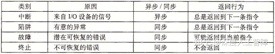

其中，异步异常是由于处理器外部发生的状态变化而引起的，而同步异常指的是当前指令运行的结果，这类指令也称为**故障指令（Faulting Instruction）**。

#### 8.1.3　Linux/x86-64系统中的异常

在x86-64中，一共有256种不同的异常，其中0~31号异常是由Intel架构师定义的异常，32~255号异常是由操作系统定义的中断和陷阱。几个比较特殊的如下所示


#### 8.1.3.1 中断异常

中断异常是由I/O设备的信号触发的，不是由指令造成的。在I/O设备中，通过向处理器芯片上的中断引脚发送信号，将标识引起中断的设备的异常号放在系统总线上，来触发中断。则当当前指令执行完后，处理器发现中断引脚的电压变高，就从系统总线中获取异常号，然后调用对应的**中断处理程序（Interrupt Handler）**，执行完毕后返回执行下一条指令。


中断的一个常见例子是**定时器中断（Timer Interrupt）**。所有系统都有一个内置计时器，每隔几毫秒就会关闭一次，此时就将中断引脚置为高电平，并且有一个特殊的异常编号用于定时器中断，由此来使得内核再次获得对系统的控制，再由内核决定要做什么，否则用户程序可能会陷入无限循环永远运行，无法让操作系统获得控制权。

其次来自外部设备的**I/O中断（I/O Interrupt）**也是一个常见的例子。

#### 8.1.3.2 陷阱异常

操作系统内核为程序提供各种服务，但是你的程序没有直接访问内核的权限，无法调用内核函数，无法访问内核数据，因此在用户程序和内核之间提供一个类似函数的接口，称为**系统调用**（`syscall n`指令），用户会通过执行系统调用来向内核请求服务，比如读取文件（read）、创建新进程（fork）、加载程序（execve）或终止程序（exit），所以陷阱异常是一个有意的异常。处理器会根据`syscall n`的参数，调用适当的内核程序，然后再将控制权返回给调用程序。


**注意：**

- 从程序员角度来看，系统调用和函数调用一样，但是两者存在巨大的区别。系统调用运行在内核模式，而函数调用运行在用户模式。
- 系统调用是陷阱的一种，陷阱是同步异常的一种，要分清层次关系。

通常每个系统调用都有唯一一个对应的整数号，对应于一个到内核中跳转表的偏移量。

**注意：**该跳转表和异常表不同，异常表保存的是到异常号对应的异常处理程序的内存地址，而该跳转表是保存对应的系统调用函数。

在x86-64系统中，系统调用是通过一条`syscall`陷阱指令执行的，该指令的参数都是通过寄存器传递的，不会通过栈传递，其中，`%rax`中包含系统调用号，`%rdi`、`%rsi`、`%rdx`、`%r10`、`%r8`和`%r9`分别用来保存参数。当从系统调用返回时，会破坏`%rcx`和`%r11`，而将返回值保存在`%rax`中。

而C程序中，可以通过`syscall`函数来直接调用系统调用，但是其实标准C库提供了一组包装函数，将参数打包到了一起，如下所示，这里将系统调用和对应的包装函数称为**系统级函数**。

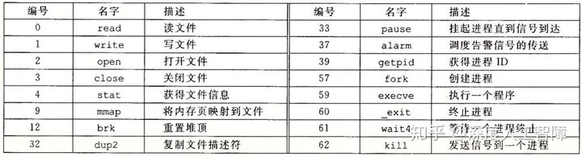

#### 8.1.3.3 故障异常

故障异常由错误引起的，但是能被故障处理程序修正。当发生故障时，处理器将控制转移给故障处理程序，如果处理程序能修复故障，则重新执行引发中断的指令，否则处理程序返回到内核的`abort`例程，终止应用程序。


当应用尝试除以0时，会出现除法错误（异常0），Unix不会尝试从除法错误中恢复，而是直接终止程序，而Linux shell通常会吧除法错误报告为**浮点异常（Floating Exception）**。造成一般保护故障（异常13）的原因有很多，通常是因为程序引用了一个未定义的虚拟内存区域，或者程序试图写一个只读文件，Linux不会尝试恢复这类故障，shell中会将其报告为**段故障（Segmentation Fault）**。遇到缺页异常（异常14），处理器会将适当的磁盘上的虚拟内存的一个页面映射到物理内存的一个页面，然后重新执行产生故障的指令。

#### 8.1.3.4 终止异常

终止异常通常是不可修复的错误造成的，通常是硬件错误，处理程序会直接将控制返回一个`abort`例程，终止应用程序。


比如在x86-64中，机器检查异常（异常18）是在导致故障的指令中检测到致命的硬件错误。

### 8.2　进程

异常是允许操作系统内核提供**进程（Process）**概念的基本构造块。

进程就是一个执行中程序的实例，每个程序都会运行在某个由内核维护的进程**上下文（Context）**中，其中包含了保证程序正确运行所需的状态，包括存放在内存中的程序的代码和数据、栈、通用目的寄存器的内容、程序计数器、环境变量等等。当我们执行可执行文件时，shell会先创建一个新的进程，给程序提供自己的上下文，然后再在该进程的上下文中运行这个可执行目标文件。

**注意：**进程与程序是不同的，程序可以保存在不同地方，比如保存为C文件的文本，保存为`.text`的二进制文件，可以作为已加载到内存中的字节存在，而进程指的是正在运行的程序的实例。

而进程的出现，给我们提供了以下**假象：**

- 我们的程序是当前唯一在系统运行的程序
- 我们的程序独占地使用处理器和内存
- 处理器好像无间断地执行我们程序中的指令
- 我们程序中的代码和数据好像是系统内存中唯一的对象

我们这里只讨论处理器和内存系统的假象。

#### 8.2.1　逻辑控制流（处理器）

当我们单步执行程序时，可以看到一系列PC值，这个PC序列就称为**逻辑控制流**，简称**逻辑流**。**注意：**之前的控制流值的是物理控制流，是在系统层次上的指令地址序列，而逻辑控制流是在程序级别上的，所以物理控制流包含逻辑控制流。


如上图所示，运行了3个进程，每个进程上下文中的PC值序列就是对应的逻辑流，就是上图中的黑色竖线，而物理控制流就是所有竖线的合并。所以处理器中的物理控制流被分成了3个逻辑控制流，每个进程有一个。并且可以看出，3个逻辑流是交错进行的，只有轮到了进程的逻辑流，才表示该进程在使用处理器，所以进程是轮流使用处理器的，当进程执行了一部分逻辑流时，就会被别的进程**抢占（Preempted）**。但是从当个进程的角度来看，它的逻辑流是连续的，意味着提供了独占处理器的假象，只是指令执行过程中有时会出现停顿，那时候就是出现了抢占。

这里将多个进程轮流运行的概念称为**多任务（Multitasking）**，将进程每次执行一部分逻辑流的时间称为**时间片（Time Slice）**，则多任务也叫**时间分片（Time Slicing）**。比如进程A就由两个时间片组成。

#### 8.2.2　并发流

当逻辑流X在逻辑流Y开始之后和Y结束之前运行，或逻辑流Y在逻辑流X开始之后和X结束之前运行，则称这两个流为**并发流（Concurrent Flow）**。比如进程A和B是并发流，进程A和C也是并发流。我们将这种多个流并发地执行的现象称为**并发（Concurrency）**。

**注意：**并发流的思想与流运行的处理器数目或计算机数目无关，只和它们运行时间是否重叠有关。但是，如果两个并发流是在不同的处理器核或计算机上运行的，则称它们为并行流**（Parallel Flow）**。

> 两个进程的逻辑流在时间上重叠，则成为并发流，如果并发流在不同核或计算机上运行，则成为并行流。并行流属于并发流，区别只在于是否在同一处理器上运行。

#### 8.2.3　私有地址空间(内存系统)

进程为每个程序提供了他自己的**私有地址空间**，其他进程不能读或写该地址空间中的内存字节。如下是一个私有地址空间的架构


#### 8.2.4　用户模式和内核模式

处理器为进程提供了两种模式，用户模式和内核模式，处理器通过某个控制寄存器的**模式位（Mode Bit）**来进行切换

- **内核模式：**当处理器设置了模式位时，为内核模式。此时进程可以执行指令集中的所有指令，并且可以访问系统中的任何内存位置。
- **用户模式：**当处理器不设置模式位时，为用户模式，是进程的初始模式。此时进程不能执行**特权指令（Privileged Instruction）**，比如停止处理器、改变模式位或者发起I/O操作，也不能引用内核区域中的指令和数据，只能通过系统调用接口来间接访问。

进程初始是为用户模式，当出现异常（中断、陷阱、故障）时会变为内核模式，并跳转到异常处理程序中，当返回应用程序时，又会改回用户模式。

为了处于用户模式的进程能访问内和数据结构的内容，Linux提供了`/proc`文件系统。

#### 8.2.5　上下文切换

我们知道内核为每个进程维护了一个上下文，包含了进程所需的所有信息。当进程执行出现中断或某些异常时，内核中的**调度器（Scheduler）**会决定抢占当前进程，并重新开始一个之前被抢断了的进程，此时就需要进行**上下文切换（Context Switch）**，将当前进程的上下切换成要运行的进程的上下文，比如地址空间和寄存器的变化。主要包含以下步骤：

- 保存当前进程的上下文，方便过后再进行调度
- 恢复之前某个被抢占进程的上下文
- 将控制传递给这个新恢复的进程

**注意：**上下文切换是较高层次的异常控制流，建立在之前低层次异常机制之上。


比如以上过程中，首先内核开始执行进程A，处于用户模式。当进程A调用了`read`系统调用时，内核中的陷阱处理程序请求来自磁盘控制器的DMA传输，由于磁盘读取数据比较耗时，所以调度程序决定运行进程B，就会重新指定地址空间，完成进程B的寄存器加载，然后将控制权转移到进程B，进程B就从中断处继续运行，内核就完成了从进程A切换到进程B并开始执行进程B。当磁盘控制器完成从磁盘到内存的数据传输后，磁盘会发起中断，此时内核判断进程B已运行了足够长的时间了，就会从进程B切换到进程A，直到下次异常出现。

**注意：**进程是由内存中共享的内核进行管理的，内核并不是独立的进程，而是作为某些现有进程的一部分，始终位于地址空间顶部的代码，当出现异常时会进行执行。

### 8.3　系统调用错误处理


### 8.4　进程控制

现在Linux提供许多函数，可以从用户程序调用操作进程，这个操作进程的过程称为**进程控制（Process Control）**。这些函数主要通过系统级函数的形式来进行系统调用，如果出现错误，通常会返回-1，然后设置全局变量`errno`来指明原因，所以我们必须检查这些函数的返回值，通常可以对这些函数进行封装，比如

```c
void unix_error(char *msg){
  fprintf(stderr, "%s: %s\n", msg, strerror(errno));
  exit(0);
}
pid_t Fork(void){
  pid_t pid;
  if((pid = fork()) < 0)
    unix_error("Fork error");
  return pid;
}
```

#### 8.4.1　获取进程ID

每个进程都有一个唯一的正数**进程ID（PID）**，可以通过`getpid`函数返回当前进程的PID，可以通过`getppid`函数返回创建当前进程的父进程PID。类型都为`pid_t`，Linux系统中在`type.h`中定义为`int`。

```c
#include <unistd.h>
#include <sys/types.h>
pid_t getpid(void);
pid_t getppid(void);
```

#### 8.4.2　创建和终止进程

进程会处于以下三种状态之一：

- **运行：**进程要么在CPU上执行，要么在等待被执行且最终会被内核调度。即被抢占的进程也属于运行状态。
- **停止：**当进程收到`SIGSTOP`、`SIGTSTP`、`SIGTTIN`或`SIGTTOU`信号时，进程的执行被**挂起（Suspended）**且不会被调度，直到收到`SIGCONT`信号，进程才会运行。即进程暂时不会被调度，但是还有可能被调度。
- **终止：**进程被永久停止了，主要**原因在于：**进程收到了终止进程的信号；从主程序返回`return`；调用`exit`函数。

```c
#include <stdlib.h>
void exit(int status);
```

其中，`status`表示进程的退出状态，等价于`return status;`。

##### 创建子进程

父进程通过`fork`函数创建一个子进程

```c
#include <unistd.h>
#include <sys/types.h>
pid_t fork(void);
```

当调用`fork`函数时，就立即以当前进程作为父进程，创建一个新的子进程，具有以下**特点：**


- 两个进程具有相同的地址空间，意味着两个进程具有相同的用户栈、局部变量值、堆、全局变量和代码。但是两者的地址空间又是独立的，所以`fork`函数之后对两个进程的操作都是独立的。即父子进程具有执行`fork`函数之前相同的设置，而执行完`fork`函数后，两个进程就是并发独立的了。
- 子进程还获得与父进程任何打开文件描述符相同的副本，即子进程可以读写父进程打开的任何文件。
- `fork`函数会有两个返回值——父进程会返回子进程的PID，而子进程会返回0。所以我们可以通过`fork`函数的返回值判断当前所处的进程，如果不加以区分，则父进程和子进程会执行后续相同的代码。

**例1：**

```c
#include <unistd.h>
#include <sys/types.h>
#include <stdio.h>

int main(){
  int x = 1;
  pid_t pid;
  
  pid = Fork();
  if(pid == 0){ //处于子进程中
    printf("Child%d : x=%d\n",getpid(), ++x);
  }else{ //处于父进程中
    printf("parent%d : x=%d\n", getpid(), --x);
  }
  exit(0);
}
```

这里在父进程中的`x=0`，在子进程中的结果为`x=2`，由于这两个进程是并发的，所以无法确定这两条输出哪条先显示。


**例2：**

```c
#include <unistd.h>

int main(){
  Fork();
  Fork();
  printf("hello\n");
  exit(0);
} 
```


**注意：**有`fork`存在的程序，最好画出进程图，进程图的全排列是所有可能出现的结果。

#### 8.4.3　回收子进程


当子进程终止时，内核会一直保持它的状态直到它被父进程**回收（Reaped）**，因为父进程可能想知道子进程的退出状态，这类进程称为**僵死进程（Zombie）**，仍然消耗系统的内存资源。当父进程回收僵死进程时，内核就会将子进程的退出状态返回给父进程，并抛弃僵死进程。有一个特殊的进程**init进程**，其PID为1，是所有进程的祖先。如果父进程终止了，则由init进程接管它所有的子进程，并回收它的僵死进程。

比如以下代码

```c
void fork7() {
    if (fork() == 0) {
        /* Child */
        printf("Terminating Child, PID = %d\n", getpid());
        exit(0);
    } else {
        printf("Running Parent, PID = %d\n", getpid());
        while (1)
            ; /* Infinite loop */
    }
}
```

这里会死循环父进程，而子进程会直接退出

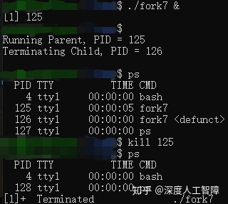

可以看见，父进程的PID为125，子进程的PID位126，由于父进程没有对子进程进行回收，所以子进程变成了僵死进程`defunct`。当终止父进程时，子进程会由`init`进程回收，则父进程和子进程都被删除了。

```c
 void fork8()
{
    if (fork() == 0) {
        /* Child */
        printf("Running Child, PID = %d\n",
               getpid());
        while (1)
            ; /* Infinite loop */
    } else {
        printf("Terminating Parent, PID = %d\n",
               getpid());
        exit(0);
    }
}
```

这里会死循环子进程，而父进程会直接退出

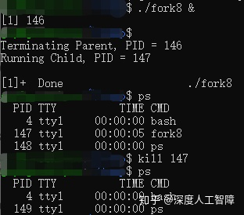

可以发现父进程会直接终止，而子进程会继续执行，必须要显示地对子进程进行终止。

**注意：**如果父进程没有对子进程进行回收，则子进程会成为僵死进程。子进程可以自己独立运行，需要显示进行终止。

我们可通过调用以下函数来等待子进程的终止或停止，父进程会得到被回收的子进程PID，且内核会删除僵死进程

```c
#include <sys/types.h>
#include <sys/wait.h>
pid_t waitpid(pid_t pid, int *statusp, int options); 
```

- **等待集合`pid`**

- - 如果`pid>0`，则等待集合就是一个单独的子进程
  - 如果`pid=-1`，则等待集合就是该进程的所有子进程
  - **注意：**当父进程创造了许多子进程，这里通过`pid=-1`进行回收时，子程序的回收顺序是不确定的，并不会按照父进程生成子进程的顺序进行回收。可通过按顺序保存子进程的PID，然后按顺序指定`pid`参数来消除这种不确定性。

- **等待行为`options`**

- - **`0`：**默认选项，则会挂起当前进程，直到等待集合中的一个子进程终止，则函数返回该子进程的PID。此时，已终止的子进程已被回收。
  - **`WNOHANG`：**如果等待子进程终止的同时还向做其他工作，该选项会立即返回，如果子进程终止，则返回该子进程的PID，否则返回0。
  - **`WUNTRACED`：**当子进程被终止或暂停时，都会返回。
  - **`WCONTINUED`：**挂起当前进程，知道等待集合中一个正在运行的子进程被终止，或停止的子进程收到`SIGCONT`信号重新开始运行。
  - **注意：**这些选项可通过`|`合并。

- 如果`statusp`非空，则`waitpid`函数会将子进程的状态信息放在`statusp`中，可通过`wait.h`中定义的宏进行解析

- - **`WIFEXITED(statusp)`：**如果子进程通过调用`exit`或`return`正常终止，则返回真，。此时可通过`WEXITSTATUS(statusp)`获得退出状态。
  - **`WIFSIGNALED(status)`：**如果子进程是因为一个未捕获的信号终止的，则返回真。此时可通过`WTERMSIG(statusp)`获得该信号的编号。
  - **`WIFSTOPPED(statusp)`：**如果引起函数返回的子进程是停止的，则返回真。此时可通过`WSTOPSIG(statusp)`获得引起子进程停止的信号编号。
  - **`WIFCONTINUED(statusp)`：**如果子进程收到`SIGCONT`信号重新运行，则返回真。

- 如果当前进程没有子进程，则`waitpid`返回-1，并设置`errno`为`ECHILD`，如果`waitpid`函数被信号中断，则返回-1，并设置`errno`为`EINTR`。否则返回被回收的子进程PID。

**注意：**`waitpid`通过设置`options`来决定是否回收停止的子进程。并且能通过`statusp`来判断进程终止或停止的原因。

有个简化的`waitpid`函数

```c
#include <sys/types.h>
#include <sys/wait.h>
pid_t wait(int *statusp);
```

调用`wait(&status)`等价于调用`waitpid(-1, &status, 0)`。

**注意：**当调用`waitpid`函数之前，就有子进程被终止或停止，一调用`waitpid`函数就会马上将该子进程回收。

——————————————————————————————————————

**例：**输出下列可能的输出序列


对于类似的题，我们需要画出对应的进程图。


首先，通过`Fork`函数会从当前进程产生一个相同的子进程，得到两个并发运行的分支。而从父进程的`waitpid`函数的参数可知，父进程会挂起直到其所有子进程终止。所以子进程的`exit`会连接到父进程的`waitpid`函数。


#### 8.4.4　让进程休眠

```text
#include <unistd.h>
unsigned int sleep(unsigned int secs);
int pause(void);
```

函数`sleep`将进程挂起一段时间，而该函数的返回值为剩下的休眠时间。

函数`pause`将进程挂起，直到该进程收到一个信号。

#### 8.4.5　加载并运行程序

`execve`函数可在当前进程的上下文中加载并运行一个程序

```c
#include <unistd.h>
int execve(const char *filename, const char *argv[], const char *envp[]); 
```

`execve`函数加载并运行`filename`可执行目标文件，参数列表`argv`和环境列表`envp`是以`NULL`结尾的字符串指针数组，其中`argv[0]`为文件名。


调用`exevec`函数其实就是调用加载器，则加载器会在可执行目标文件`filename`的指导下，将文件中的内容复制到代码段和数据段，再调用`_libc_start_main`来初始化执行环境，调用`main`函数，`main`函数的函数原型如下所示

```c
int main(int argc, char *argv[], char *envp[]);
```

其中，`argc`为参数数目，`argv`为参数列表，`envp`为环境列表。其用户栈的架构如下所示


**注意：**可以通过全局变量`environ`来获得环境列表。

这里还有一些函数用来对环境变量进行操作

```c
#include <stdlib.h>

char *getenv(const char *name); //获得名字为name的环境值
int setenv(const char *name, const char *newvalue, int overwrite); //对环境值进行修改
int unsetenv(const char *name); // 删除环境变量
```

#### 8.4.6　利用fork和execve运行程序

**`fork`函数和`execve`区别：**

- `fork`函数新建一个不同PID的子进程，具有和父进程相同的上下文，是父进程的复制品，运行相同的代码、程序和变量，就是程序不变，而在不同进程。而`execve`函数保持PID不变，在当前进程的上下文中加载并运行一个新程序，会覆盖当前进程的地址空间，并继承调用`execve`函数时已打开的所有文件描述符，就是保持进程不变，但是运行完全不同的程序。
- `fork`函数调用一次返回两次，而`execve`函数调用后，只有出现错误才会返回到调用程序。
- 当你想要创建并发服务器时，可以通过`fork`函数创建多个服务器副本，可以运行多个相同代码。

想要保持当前进行运行的情况下，运行另一个程序，可以先通过`fork`新建一个进程，然后在子进程中用`execve`执行另一个程序，此时在父进程就运行原来的程序，而在子进程中就运行另一个程序。

**例子：**我们想要在当前环境中，在子进程中运行`/bin/ls -lt /usr/include`

首先可以设置参数`argv`和`envp`


然后调用以下代码

```c
if ((pid = Fork()) == 0) {  //在子进程中运行
  if (execve(myargv[0], myargv, environ) < 0) {  //这里直接用全局变量environ，表示在当前环境中运行
    printf("%s: Command not found.\n", myargv[0]);
    exit(1); 
  }
}
```

**参考：**[linux fork()和execve()的区别 - C/C++-Chinaunix](https://link.zhihu.com/?target=http%3A//bbs.chinaunix.net/thread-1777307-1-1.html)

### 8.5　信号

这里介绍一下shell程序的内容。实际上系统上的进程呈现为层次结构


当你启动系统时，第一个创建的进程是`init`进程，它的PID为1，系统上其他所有进程都是`init`进程的子进程。`init`进程启动时会创建**守护进程（Daemon）**，该进程一般是一个长期运行的程序，通常用来提供服务，比如web服务等其他你想要一直在系统上运行的服务。然后`init`进程还会 创建登录进程，即**登录shell（Login Shell）**，它为用户提供了命令行接口，所以当你登录到一个Linux系统，最终得到的是一个登录shell。

然后登录shell会以你的身份来执行程序，比如我们输入`ls`命令，即要求shell运行名为`ls`的可执行程序，则shell会创建一个子进程，在该子进程中执行`ls`程序，而该子进程也可能创建其他的子进程。

所以shell就是就是一个以用户身份来运行程序的应用程序。在Linux中的默认shell叫做bash。

在shell中执行程序就是一系列读和解析命令行的过程。

```c
int main()
{
    char cmdline[MAXLINE]; /* command line */

    while (1) {
        /* read */
        printf("> ");
        Fgets(cmdline, MAXLINE, stdin);
        if (feof(stdin))
            exit(0);

        /* evaluate */
        eval(cmdline);
    }
}

void eval(char *cmdline)
{
    char *argv[MAXARGS]; /* Argument list execve() */
    char buf[MAXLINE];   /* Holds modified command line */
    int bg;              /* Should the job run in bg or fg? */
    pid_t pid;           /* Process id */

    strcpy(buf, cmdline);
    bg = parseline(buf, argv);
    if (argv[0] == NULL)
        return;   /* Ignore empty lines */

    if (!builtin_command(argv)) {
        if ((pid = Fork()) == 0) {   /* Child runs user job */
            if (execve(argv[0], argv, environ) < 0) {
                printf("%s: Command not found.\n", argv[0]);
                exit(0);
            }
        }

        /* Parent waits for foreground job to terminate */
	if (!bg) {
            int status;
            if (waitpid(pid, &status, 0) < 0)
                unix_error("waitfg: waitpid error");
        }
        else
            printf("%d %s", pid, cmdline);
    }
    return;
}
```

这里可以看出，前台作业和后台作业的区别只是shell需要等待前台作业完毕。

这里的后台作业会导致内存泄漏。

#### 8.5.1　信号术语

这一章将讨论一种更高层次的软件形式的异常，称为Linux**信号**。信号就是一条小消息，可以通知系统中发生了一个某种类型的事件，**比如：**

- 内核检测到了一个系统事件，比如除零错误、执行非法指令或子进程终止，低层次的硬件异常都是由内核异常处理程序处理的，对用户进程是不可见的，但是可以通过给用户进程发送信号的形式来告知，比如除零错误就发送`SIGFPE`信号，执行非法指令就发送`SIGILL`信号，子进程终止内核就发送`SIGHLD`到父进程中，则此时父进程就能对该子进程调用`waitpid`来进行回收。
- 内核或其他进程出现了较高层次的软件事件，比如输入组合键，或一个进程尝试终止其他进程，都是显示要求内核发送一个信号给目标进程，比如输入组合键内核会发送`SIGINT`信号给所有进程，进程可以发送`SIGKILL`信号给别的进程来进行终止。

**注意：**与异常机制很类似，只是异常是由硬件和软件共同实现的，而信号时完全由软件实现的，且都是由内核进行发送的。

所以信号可以是内核检测到事件来发送到目标进程，也可以是其他进程通过内核来发送信号到目标进程。如下所示是Linux系统上支持的不同类型的信号，每种信号类型都对应某种系统事件


- `SIGINT`：当用户输入`Ctrl+C`时，内核会向前台作业发送`SIGINT`信号，该信号默认终止该作业。
- `SIGTSTP`：当用户输入`Ctrl+Z`时，内核会向前台作业发送`SIGTSTP`信号，默认停止作业，可通过发送`SIGCONT`信号来恢复该作业。
- `SIGKILL`：该信号的默认行为是用来终止进程的，无法被修改或忽略。
- `SIGSEGV`：当你试图访问受保护的或非法的内存区域，就会出现段错误，内核会发送该信号给进程，默认终止该进程。
- `SIGCHLD`：当子进程终止或停止时，内核会发送该信号给父进程，由此父进程可以对子进程进行回收。

传送一个信号到目的进程是由两个步骤组成的：

- **发送信号：**内核通过更新目的进程上下文中的某个状态，来表示发送了一个信号到目的进程，所以这里除了目标进程上下文中的一些位被改变了，其他没有任何变化。
- **接收信号：**当目的进程被内核强迫以某种方式对信号的发送做出反应时，它就接受了信号。比如忽略信号、终止进程，或执行用户级的**信号处理程序（Signal Handler）**来捕获信号。

**注意：**执行信号处理程序类似于执行异常处理程序，只是异常处理程序是内核级别的，而信号处理程序就只是你的C代码程序。


当执行完信号处理程序后，会返回到下一条指令继续执行，类似于一次中断。

我们将发送了但是还没被接收的信号称为**待处理信号（Pending Signal）**，而进程可以选择阻塞接收某种信号，则该信号可以被发送，但是在阻塞解除前无法被目标进程处理。我们可以发现不同的信号具有不同的编码，所以内核为每个进程在**`pending`位向量**中维护待处理信号的集合，根据信号的编号来设置对应位的值，来传送信号，当进程接收了该信号，就会将其从`pending`位向量中重置该位的值；也为每个进程在**`blocked`位向量**中维护了被阻塞的信号集合，可以通过查看位向量对应的位来确定该信号是否被阻塞。

**注意：**通过位向量的形式来保存待处理信号和被阻塞信号，可以发现每种类型的信号最多只会有一个待处理信号，并且一个待处理信号只能被接受一次。


#### 8.5.2　发送信号

Unix基于**进程组（Process Group）**的概念，提供了大量向进程发送信号的机制。

进程组由一个正整数**进程组ID**来标识，每个进程组包含一个或多个进程，而每个进程都只属于一个进程组，默认父进程和子进程属于同一个进程组。我们将shell为了对一条命令行进行求值而创建的进程称为**作业（Job）**，比如输入`ls / sort`命令行，就会创建两个进程，分别运行`ls`程序和`sort`程序，这两个进程通过Unix管道连接到一起，由此就得到了一个作业。**注意：**

- 任何时刻，最多只有一个前台作业和任意数量的后台作业。
- shell会为每个作业创建一个独立的进程组，该进程组ID由该作业中任意一个父进程的PID决定。


这里提供了以下对进程组的操作，允许你可以同时给一组进程发送信号。

```c
#include <unistd.h>
pid_t getpgrp(void); //返回所在的进程组
int setpgip(pid_t pid, pid_t pgid); //设置进程组
/* 
 * 如果pid大于零，就使用进程pid；如果pid等于0，就使用当前进程的PID。
 * 如果pgid大于0，就将对应的进程组ID设置为pgid；如果pgid等于0，就用pid指向的进程的PID作为进程组ID
 */ 
```

- **用`/bin/kill`向进程发送任意信号**

程序`/bin/kill`具有以下格式

```text
/bin/kill [-信号编号] id  
```

当`id>0`时，表示将信号传递给PID为`id`的进程；当`id<0`时，表示将信号传递给进程组ID为`|id|`的所有进程。我们可以通过制定信号编号来确定要传输的信号，默认使用`-15`，即`SIGTERM`信号，为软件终止信号。

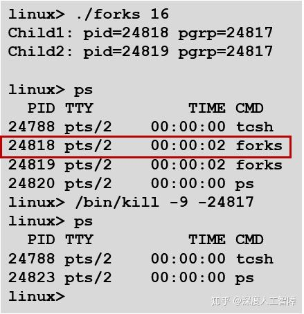

- **从键盘发送信号**

通过键盘上输入`Ctrl+C`会使得内核发送一个`SIGINT`信号到前台进程组中的所有进程，终止前台作业；通过输入`Ctrl+Z`会发送一个`SIGTSTP`信号到前台进程组的所有进程，停止前台作业，直到该进程收到`SIGCONT`信号。

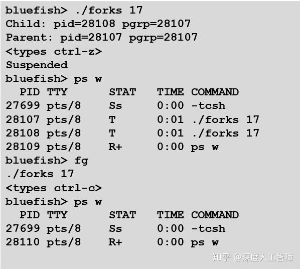

`ps`命令可以查看进程的信息，`STAT`表示进程的状态：`S`表示进程处于睡眠状态，`T`表示进程处于停止状态，`R`表示进程处于运行状态，`Z`表示僵死进程，而`+`表示前台作业。

在以上代码中，我们输入`Ctrl-Z`，可以发现两个`fork`进程的状态变成了停止状态了，通过输入`fg`命令可以将这些被挂起的进程恢复到前台运行，再通过`Ctrl+C`可以停止这两个前台进程。

- **用`kill`函数发送信号**

可以在函数中调用`kill`函数来对目的进程发送信号

```c
#include <sys/types.h>
#include <signal.h>
int kill(pid_t pid, int sig); 
```

当`pid>0`时，会将信号`sig`发送给进程`pid`；当`pid=0`时，会将信号`sig`发送给当前进程所在进程组的所有进程；当`pid<0`时，会将信号`sig`发送给进程组ID为`|pid|`的所有进程。


- **用`alarm`函数发送`SIGALARM`信号**

```c
#include <unistd.h>
unsigned int alarm(unsigned int secs); 
```

当`alarm`函数时，会取消待处理的闹钟，返回待处理闹钟剩下的时间，并在`secs`秒后发送一个`SIGALARM`信号给当前进程。


#### 8.5.3　接收信号


当内核把进程p从内核模式切换回用户模式时，比如从系统调用返回或完成了一次上下文切换时，会检查进程p的未被阻塞的待处理信号的集合，即`pending & ~blocked`，如果是空集合，则内核会将控制传递给p的逻辑流中的下一条指令，如果集合非空，则内核会选择集合中编号最小的信号k（所以我们需要根据优先级来排列信号），强制进程p采取某些行为来接收该信号，对该集合中的所有信号都重复这个操作，直到集合为空，此时内核再将控制传递回p的逻辑流中的下一条指令。

> 每次从内核模式切换回用户模式，将处理所有信号


每种信号类型具有以下一种预定的**默认行为：**

- 进程终止
- 进程终止并dumps core
- 进程挂起直到被`SIGCONT`信号重启
- 进程忽略信号

我们这里可以通过`signal`函数来修改信号的默认行为，但是无法修改`SIGSTOP`和`SIGKILL`信号的默认行为

```c
#include <signal.h>
typedef void (*sighandler_t)(int); 
sighandler_t signal(int signum, sighandler_t handler);
```

- `signum`为信号编号，可以直接输入信号名称

- `handler`为我们想要对信号`signum`采取的行为

- - 当`handler`为`SIG_IGN`，表示要进程忽略该信号
  - 当`handler`为`SIG_DFL`，表示要恢复该信号的默认行为
  - 当`handler`为用户自定义的**信号处理程序**地址，则会调用该函数来处理该信号，该函数原型为`void signal_handler(int sig);`。调用信号处理程序称为**捕获信号**，置信信号处理程序称为**处理信号**。当信号处理程序返回时，会将控制传递回逻辑流中的下一条指令。**注意：**信号处理程序可以被别的信号处理程序中断。

- 当`signal`函数执行成功，则返回之前`signal handler`的值，否则返回`SIG_ERR`

**例子：**

```c
#include <signal.h>
void handler(int sig){
  if((waitpid(-1, NULL, 0)) < 0)
    unix_error("waitpid error");
}
int main(){
  if(signal(SIGCHLD, handler) == SIG_ERR)
    unix_error("signal error");
  return 0;
}
```

这里只要在`main`函数开始调用一次`signal`，就相当于从此以后改变了`SIGCHLD`信号的默认行为，让它去执行`handler`处理程序。当子进程终止或停止时，内核就会发送一个`SIGCHLD`信号到父进程中，此时就能让父进程去执行自己的工作，当子进程终止或停止时，发送`SIGCHLD`信号到父进程，则父进程会调用`handler`函数来对该子进程进行回收。

#### 8.5.4　阻塞和解除阻塞信号

Linux提供阻塞信号的隐式和显示的机制：

- **隐式阻塞机制：**内核默认阻塞当前正在处理信号类型的待处理信号。
- **显示阻塞机制：**应用程序通过`sigprocmask`函数来显示阻塞和解阻塞选定的信号。

```c
#include <signal.h>
int sigprocmask(int how, const sigset_t *set, sigset_t *oldset);
```

- 通过`how`来决定如何改变阻塞的信号集合`blocked`

- - 当`how=SIG_BLOCK`时，`blocked = blocked | set`
  - 当`how=SIG_UNBLOCK`时，`blocked = blocked & ~set`
  - 当`how=SETMASK`时，`block = set`

- 如果`oldset`非空，则会将原始的`blocked`值保存在`oldset`中，用于恢复原始的阻塞信号集合

这里还提供一些额外的函数来对`set`信号集合进行操作

```c
#include <signal.h>
int sigemptyset(sigset_t *set); //初始化set为空集合
int sigfillset(sigset_t *set); //把每个信号都添加到set中
int sigaddset(sigset_t *set, int signum); //将signum信号添加到set中
int sigdelset(sigset_t *set, int signum); //将signum从set中删除
int sigismember(const sigset_t *set, int signum); //如果signum是set中的成员，则返回1，否则返回0
```

以下是一个使用例子

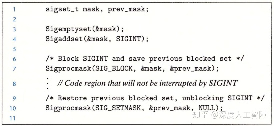

以上执行内部函数时，就不会接收到`SIGINT`信号，即不会被`Ctrl+C`终止。

通过阻塞信号来消除函数冲突，或者保证程序运行逻辑正确。


#### 8.5.5　编写信号处理程序

而信号也是并发的一个例子，信号处理程序是一个独立的逻辑流（不是进程），与主程序并发运行。比如我们在进程A中执行一个`while`循环，当该进程受到一个信号时，内核会将控制权转移给该信号的处理程序，所以该信号处理程序是并发执行的，当信号处理程序结束时，再将控制转移给主程序。由于信号处理程序与主程序在同一进程中，所以具有相同的上下文，所以会共享程序中的所有全局变量。


**注意：**信号处理程序与主程序在相同进程中并发执行。

将信号处理程序看成并发流的另一种方式是使用上下文切换图。当有个信号传递给进程A时，只是简单的设置了`pending`位向量对应的位，并不会有额外操作，当进程A后面执行上下文切换，到达进程B后，进程B执行若干指令后，通过上下文切换到达进程A，此时就会根据`pending`位向量记录的未处理信号集合来依次调用对应的信号处理程序，过后再将其传递到下一条指令的地址。所以信号处理程序和其他程序都处于相同的进程中。


信号发送的对象是进程，因为信号处理程序执行在相同的进程中，所以当该进程接收到信号时，信号处理程序是可以被别的信号处理程序中断的，构成以下多层嵌套的信号处理程序，由于这些信号处理程序和主程序处于相同的进程中，所以共享相同的全局变量，这就使得全局变量的状态较难控制。

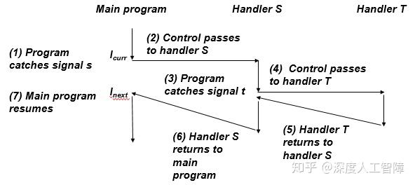

##### 8.5.5.1 安全的信号处理

信号处理的一个**难点在于：**处理程序与主程序在同一进程中是并发运行的，它们共享同样的全局变量，可能会与主程序和其他处理程序相互干扰。这里推荐一系列措施来进行安全的信号处理：

- **G0：**处理程序要尽可能简单。

- - 当处理程序尽可能简单时，就能避免很多错误。**推荐做法：**处理程序修改全局标志指示出现的信号，然后直接返回，主程序会周期性检查并重置这个全局标志。

- **G1：**在处理程序中调用异步信号安全的函数。

- - 异步信号安全的函数能被处理程序安全地调用，因为它是可重入的（比如所有变量都是保存在栈上的局部变量），或不能被信号处理程序中断的。Linux中保证安全的系统级函数如下所示，**注意：**`printf`，`sprintf`，`malloc`和`exit`是不安全的，而`write`是安全的。


- **G2：**保存和恢复`errno`

- - 全局变量`errno`在系统级函数出现错误时才会被赋值，许多Linux异步信号安全的函数都会在出错时返回并设置`errno`，当处理程序要返回时，最好提前将`errno`保存为局部变量，再在返回时重置`errno`，使得主程序可以使用原本的`errno`。

- **G3：**阻塞所有的信号，保护对共享全局数据结构的访问

- - 对于数据结构的访问（读取或写入），可能需要若干条指令，当主程序在访问全局数据结构中途被中断，进入处理程序时，如果处理程序也访问当前数据结构，可能会发现该数据结构的状态是不一致的。所以对全局数据结构进行访问时，要阻塞所有的信号（无论在主程序还是信号处理程序中）。

- **G4：**用`volatile`声明在主程序和信号处理程序共享的全局变量

- - 比如G0说的使用全局变量来保存标志，处理程序更新标志，主程序周期性读取该标志，编译器可能会感觉主程序中该标注没有变化过，所以直接将其值缓存在寄存器中，则主程序就无法读取到处理程序的更新值。所以我们需要使用`volatile`来声明该标志，使得编译器不会缓存该变量，使得主程序每次都从内存中读取该标志。

- **G5：**用`sig_atomic_t`声明那些仅进行读写操作，不会进行增量或更新操作的变量

- - 通过使用C提供的整型数据类型`sig_atomic_t`来声明变量，使得对它的读写都是原子的，不会被中断，所以就不需要暂时阻塞信号了。大多数系统中，`sig_atomic_t`是`int`类型。**注意：**对原子性的保证只适用于单个读和写，不适用于`flag++`或`flag+=1`这类操作。

**综上所述：**是处理函数尽可能简单，在处理程序中调用安全函数，保存和恢复`errno`，保护对共享数据结构的访问，使用`volatile`和`sig_atomic_t`。

##### 8.5.5.2 正确的信号处理

在信号处理中，还存在一个**问题：**我们这里使用`pending`位向量来保存未处理的信号集合，当处理程序处理信号时，就会将其从该集合中删除，但是由于是位向量形式，所以当集合中存在信号k时，就不会再接收信号k了，**意味着：**如果存在一个未处理的信号k，则表明至少有一个信号k到达，所以我们不能通过信号来对其他进程中发生的事件进行记数，我们要使得处理程序一次能够执行尽可能多的操作。

##### 8.5.5.3 可移植的信号处理

信号处理的另一个**缺陷**是：不同的系统有不同的信号处理语义，比如：

- `signal`函数的语义各不相同，有的Unix系统，当处理完信号时，就会将对该信号的处理恢复为默认行为。
- 存在一些潜在的会阻塞进程较长时间的系统调用，称为**慢速系统调用**，比如`read`、`write`或`accpet`。在执行慢速系统调用时，如果进程接收到一个信号，可能会中断该慢速系统调用，并且当信号处理程序返回时，无法继续执行慢速系统调用，而是返回一个错误条件，并将`errno`设置为`EINTR`。

这些可以通过`sigaction`函数来明确信号处理语义，由于该函数的复杂性，提供一个封装好的函数


可以类似`signal`函数那样使用，信号处理语义为：

- 只有当前信号处理程序正在处理的信号类型会被阻塞
- 只要可能，被中断你的系统调用会自动重启
- 一旦设置了信号处理程序，就会一直保持

#### 8.5.6　同步流以避免讨厌的并发错误

并发流可能以任何交错方式运行，所以信号发送的时机很难预测，可能会出现错误，所以需要首先对目标信号进行阻塞，先执行预定操作，然后将其解阻塞进行捕获。比如以下代码


如果缺少30和32行，则`addjob`函数和`deletejob`函数之间存在竞争，必须在`deletejob`函数之前调用`addjob`函数，否则在`deletejob`函数中通过`waitpid`函数释放了子进程，过后调用`addjob`函数就会出错。但是由于内核调度进程是不可控的，以及`SIGCHLD`信号的发送时机是不确定的，所以可能出现这个错误。可以如上所示，在主进程中先对`SIGCHLD`信号进行阻塞，在执行完`addjob`函数后再解阻塞，保证了先执行`addjob`函数再执行`deletejob`函数。

**经验之谈：**不要对代码做任何假设，比如子进程运行到这里才终止。

**注意：**可以通过阻塞信号来控制信号的接收时机。

#### 8.5.7　显式地等待信号

当我们想要主进程显示等待某个信号时，可以用以下代码

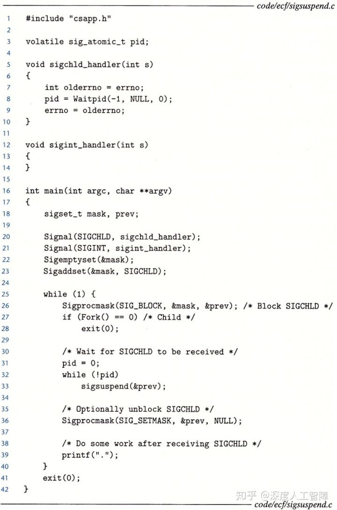

这里主进程会显示等待子进程被回收，这里使用了`sigsuspend(&mask)`函数，它等价于

```c
sigprocmask(SIG_SETMASK, &mask, &prev);
pause();
sigprocmask(SIG_SETMASK, &prev, NULL); 
```

但是它是这三条代码的原子版本，即第一行和第二行是一起调用的，则`SIGCHLD`信号不会出现在第一行和第二行之间，造成程序不会停止。

**注意：**第26行要先对`SIGCHLD`信号进行阻塞，防止过早发送给主进程，则`pause`函数就无法中断，就会使得程序不会停止。


### 8.6　非本地跳转

C语言提供了一种用户级异常控制流形式，称为**非本地跳转（Nonlocal Jmup）**，它可以直接将控制从一个函数转移到另一个当前正在执行的函数，不需要经过调用-返回。

这里需要两个函数

```c
#include <setjmp.h>
int setjmp(jmp_buf env);
void longjmp(jmp_buf env, int retval);
```

我们首先需要定义一个`jmp_buf`类型的全局变量`env`，通过调用`setjmp(env)`，能将当前调用环境保存到`env`中，包括程序计数器、栈指针和通用目的寄存器，而`setjmp`函数会返回0。而后我们在代码某处调用`longjmp(env, retval)`，会从`env`中恢复调用环境，并跳转到最近一次初始化`env`的`setjmp`函数，让`setjmp`函数返回`retval`。


### 8.7　操作进程的工具


## 第9章　虚拟内存 

### 9.1　物理和虚拟寻址

### 9.2　地址空间

### 9.3　虚拟内存作为缓存的工具

#### 9.3.1　DRAM缓存的组织结构

#### 9.3.2　页表

#### 9.3.3　页命中

#### 9.3.4　缺页

#### 9.3.5　分配页面

#### 9.3.6　又是局部性救了我们

### 9.4　虚拟内存作为内存管理的工具

### 9.5　虚拟内存作为内存保护的工具

### 9.6　地址翻译

#### 9.6.1　结合高速缓存和虚拟内存

#### 9.6.2　利用TLB加速地址翻译

#### 9.6.3　多级页表

#### 9.6.4　综合：端到端的地址翻译

### 9.7　案例研究：Intel Core i7/Linux内存系统

#### 9.7.1　Core i7地址翻译

#### 9.7.2　Linux虚拟内存系统

### 9.8　内存映射

#### 9.8.1　再看共享对象

#### 9.8.2　再看fork函数

#### 9.8.3　再看execve函数

#### 9.8.4　使用mmap函数的用户级内存映射

### 9.9　动态内存分配

#### 9.9.1　malloc和free函数

#### 9.9.2　为什么要使用动态内存分配

#### 9.9.3　分配器的要求和目标

#### 9.9.4　碎片

#### 9.9.5　实现问题

#### 9.9.6　隐式空闲链表

#### 9.9.7　放置已分配的块

#### 9.9.8　分割空闲块

#### 9.9.9　获取额外的堆内存

#### 9.9.10　合并空闲块

#### 9.9.11　带边界标记的合并

#### 9.9.12　综合：实现一个简单的分配器

#### 9.9.13　显式空闲链表

#### 9.9.14　分离的空闲链表

### 9.10　垃圾收集

#### 9.10.1　垃圾收集器的基本知识

#### 9.10.2　Mark&Sweep垃圾收集器

#### 9.10.3　C程序的保守Mark&Sweep

### 9.11　C程序中常见的与内存有关的错误

#### 9.11.1　间接引用坏指针

#### 9.11.2　读未初始化的内存

#### 9.11.3　允许栈缓冲区溢出

#### 9.11.4　假设指针和它们指向的对象是相同大小的

#### 9.11.5　造成错位错误

#### 9.11.6　引用指针，而不是它所指向的对象

#### 9.11.7　误解指针运算

#### 9.11.8　引用不存在的变量

#### 9.11.9　引用空闲堆块中的数据

#### 9.11.10　引起内存泄漏


# 第三部分  程序间的交互和通信

## 第10章　系统级I/O　10.1　Unix I/O 

### 10.2　文件

### 10.3　打开和关闭文件

### 10.4　读和写文件

### 10.5　用RIO包健壮地读写

#### 10.5.1　RIO的无缓冲的输入输出函数

#### 10.5.2　RIO的带缓冲的输入函数

### 10.6　读取文件元数据

### 10.7　读取目录内容

### 10.8　共享文件

### 10.9　I/O重定向

### 10.10　标准I/O

### 10.11　综合：我该使用哪些I/O函数？

## 第11章　网络编程 

### 11.1　客户端服务器编程模型

### 11.2　网络

### 11.3　全球IP因特网

#### 11.3.1　IP地址

#### 11.3.2　因特网域名

#### 11.3.3　因特网连接

### 11.4　套接字接口

#### 11.4.1　套接字地址结构

#### 11.4.2　socket函数

#### 11.4.3　connect函数

#### 11.4.4　bind函数

#### 11.4.5　listen函数

#### 11.4.6　accept函数

#### 11.4.7　主机和服务的转换

#### 11.4.8　套接字接口的辅助函数

#### 11.4.9　echo客户端和服务器的示例

### 11.5　Web服务器

#### 11.5.1　Web基础

#### 11.5.2　Web内容

#### 11.5.3　HTTP事务

#### 11.5.4　服务动态内容

### 11.6　综合：TINY Web服务器

## 第12章　并发编程 

### 12.1　基于进程的并发编程

### 12.2　基于I/O多路复用的并发编程

### 12.3　基于线程的并发编程

### 12.4　多线程程序中的共享变量

### 12.5　用信号量同步线程

### 12.6　使用线程提高并行性

### 12.7　其他并发问题


