# 目录

**第二部分  在系统上运行程序**

**第7章　链接**

7.1　编译器驱动程序          
7.2　静态链接          
7.3　目标文件                    
7.4　可重定位目标文件          
7.5　符号和符号表          
7.6　符号解析          
7.6.1　链接器如何解析多重定义的全局符号          
7.6.2　与静态库链接          
7.6.3　链接器如何使用静态库来解析引用          
7.7　重定位          
7.7.1　重定位条目          
7.7.2　重定位符号引用                    
7.8　可执行目标文件          
7.9　加载可执行目标文件          
7.10　动态链接共享库          
7.11　从应用程序中加载和链接共享库          
7.12　位置无关代码                    
7.13　库打桩机制          
7.13.1　编译时打桩          
7.13.2　链接时打桩          
7.13.3　运行时打桩          
7.14　处理目标文件的工具          

**第8章　异常控制流**

8.1　异常          
8.1.1　异常处理          
8.1.2　异常的类别                    
8.1.3　Linux/x86-64系统中的异常          
8.2　进程          
8.2.1　逻辑控制流          
8.2.2　并发流          
8.2.3　私有地址空间          
8.2.4　用户模式和内核模式          
8.2.5　上下文切换          
8.3　系统调用错误处理          
8.4　进程控制          
8.4.1　获取进程ID          
8.4.2　创建和终止进程          
8.4.3　回收子进程          
8.4.4　让进程休眠          
8.4.5　加载并运行程序          
8.4.6　利用fork和execve运行程序          
8.5　信号          
8.5.1　信号术语          
8.5.2　发送信号          
8.5.3　接收信号          
8.5.4　阻塞和解除阻塞信号          
8.5.5　编写信号处理程序          
8.5.6　同步流以避免讨厌的并发错误          
8.5.7　显式地等待信号          
8.6　非本地跳转          
8.7　操作进程的工具          

**第9章　虚拟内存**

9.1　物理和虚拟寻址          
9.2　地址空间          
9.3　虚拟内存作为缓存的工具          
9.3.1　DRAM缓存的组织结构          
9.3.2　页表          
9.3.3　页命中          
9.3.4　缺页                    
9.3.5　分配页面          
9.3.6　又是局部性救了我们          
9.4　虚拟内存作为内存管理的工具          
9.5　虚拟内存作为内存保护的工具          
9.6　地址翻译          
9.6.1　结合高速缓存和虚拟内存          
9.6.2　利用TLB加速地址翻译          
9.6.3　多级页表          
9.6.4　综合：端到端的地址翻译          
9.7　案例研究：Intel Core i7/Linux内存系统          
9.7.1　Core i7地址翻译          
9.7.2　Linux虚拟内存系统          
9.8　内存映射          
9.8.1　再看共享对象          
9.8.2　再看fork函数          
9.8.3　再看execve函数          
9.8.4　使用mmap函数的用户级内存映射          
9.9　动态内存分配          
9.9.1　malloc和free函数          
9.9.2　为什么要使用动态内存分配          
9.9.3　分配器的要求和目标          
9.9.4　碎片          
9.9.5　实现问题          
9.9.6　隐式空闲链表          
9.9.7　放置已分配的块          
9.9.8　分割空闲块          
9.9.9　获取额外的堆内存          
9.9.10　合并空闲块          
9.9.11　带边界标记的合并          
9.9.12　综合：实现一个简单的分配器          
9.9.13　显式空闲链表          
9.9.14　分离的空闲链表          
9.10　垃圾收集          
9.10.1　垃圾收集器的基本知识          
9.10.2　Mark&Sweep垃圾收集器          
9.10.3　C程序的保守Mark&Sweep          
9.11　C程序中常见的与内存有关的错误          
9.11.1　间接引用坏指针                    
9.11.2　读未初始化的内存          
9.11.3　允许栈缓冲区溢出          
9.11.4　假设指针和它们指向的对象是相同大小的          
9.11.5　造成错位错误          
9.11.6　引用指针，而不是它所指向的对象          
9.11.7　误解指针运算                    
9.11.8　引用不存在的变量          
9.11.9　引用空闲堆块中的数据          
9.11.10　引起内存泄漏          

**第三部分  程序间的交互和通信**

**第10章　系统级I/O　10.1　Unix I/O**

10.2　文件          
10.3　打开和关闭文件          
10.4　读和写文件          
10.5　用RIO包健壮地读写          
10.5.1　RIO的无缓冲的输入输出函数          
10.5.2　RIO的带缓冲的输入函数          
10.6　读取文件元数据          
10.7　读取目录内容          
10.8　共享文件          
10.9　I/O重定向          
10.10　标准I/O          
10.11　综合：我该使用哪些I/O函数？          

**第11章　网络编程**

11.1　客户端服务器编程模型          
11.2　网络          
11.3　全球IP因特网          
11.3.1　IP地址          
11.3.2　因特网域名          
11.3.3　因特网连接          
11.4　套接字接口          
11.4.1　套接字地址结构          
11.4.2　socket函数          
11.4.3　connect函数          
11.4.4　bind函数          
11.4.5　listen函数          
11.4.6　accept函数          
11.4.7　主机和服务的转换          
11.4.8　套接字接口的辅助函数          
11.4.9　echo客户端和服务器的示例          
11.5　Web服务器          
11.5.1　Web基础          
11.5.2　Web内容          
11.5.3　HTTP事务                    
11.5.4　服务动态内容          
11.6　综合：TINY Web服务器          

**第12章　并发编程**

12.1　基于进程的并发编程          
12.2　基于I/O多路复用的并发编程          
12.3　基于线程的并发编程          
12.4　多线程程序中的共享变量          
12.5　用信号量同步线程          
12.6　使用线程提高并行性          
12.7　其他并发问题          

# 笔记

# 第二部分   在系统上运行程序 

## CSAPP 第7章　链接 

**参考：**

[符号解析与重定位 - yooooooo - 博客园](https://link.zhihu.com/?target=https%3A//www.cnblogs.com/linhaostudy/p/9115764.html%23_label2)

[dlopen 方式调用 Linux 的动态链接库](https://link.zhihu.com/?target=https%3A//www.cnblogs.com/brucemengbm/p/6999503.html)

[地址无关码 - yooooooo - 博客园](https://link.zhihu.com/?target=https%3A//www.cnblogs.com/linhaostudy/p/9624594.html)

[聊聊Linux动态链接中的PLT和GOT（１）--何谓PLT与GOT_运维_海枫的专栏-CSDN博客](https://link.zhihu.com/?target=https%3A//blog.csdn.net/linyt/article/details/51635768)


由于局部非静态变量保存在寄存器或栈中，所以符号只包含函数、全局变量和静态变量。

**判断符号的信息：**

- **判断符号所在的节：**

- - 如果是函数，则在`.text`节中
  - 如果是未初始化全局变量，则在`COMMIN`节中
  - 如果是未初始化静态变量，以及初始化为0的全局变量或静态变量，则在`.bss`节中
  - 如果是初始化过的全局变量或静态变量，则在`.data`节中

- **判断符号类型：**

- - 如果是在当前文件中定义的函数或全局变量，则为全局符号
  - 如果是在当前文件定义的静态函数或静态全局变量，则为局部符号
  - 如果在别的文件中定义，则为外部符号

- **注意：**局部非静态变量保存在栈或寄存器中，所以不考虑

保存在什么表，是根据符号的类型和定义情况，而定义和引用是从变量或函数的角度来看的

**判断符号采用哪种定义：**

- 在各个文件中确定同名全局符号的强弱，其中符号和初始化的全局符号为强符号，未初始化的全局符号为弱符号
- 如果存在多个同名的强符号，则会出现链接错误
- 如果存在一个强符号和多个同名的弱符号，则会采用强符号的定义
- 如果存在多个同名的弱符号，则会随机采用一个弱符号的定义

需要根据目标文件和库之间对符号解析的依赖关系，来确定命令行中输入文件的顺序，保证前面文件中未解析的符号，能在后面文件中得到解析。

重定位包含两层意思：分配内存地址，根据重定位表条目来修改占位符。

------

**链接（Linking）** 是将各种代码和数据片段收集并组合成一个单一的文件的过程，然后该文件会被加载到内存中执行。该过程由**链接器（Linker）** 程序自动执行。**链接存在三种类型：**

- 执行于**编译时（Compile Time）**，即在源代码被翻译成机器代码时的传统静态链接
- 执行于**加载时（Load Time）**，即程序被**加载器（Loader）**加载到内存并执行时的动态链接
- 执行于**运行时（Run Time）**，即由应用程序来执行的动态链接

**作用：** 链接的存在，使得 **分离编译（Separate Compilation）** 成为可能，一个大型应用程序可以分解成若干个小的模块，只需要对这些模块进行修改编译，然后通过链接器将其组合成大的可执行文件就行。

**学习的意义：** 能帮助你构建大型程序，避免一些危险的编程错误，理解语言的作用域规则是如何实现的，理解其他重要的系统概念，比如加载和运行程序、虚拟内存、分页和内存映射，并且可以让你利用共享库。

**本文使用的环境：** 运行Linux的x86-64系统，使用标准的ELF-64目标文件格式。

### 7.1　编译器驱动程序

- 1. 链接是将各种代码和数据整理成一个文件的过程，然后这个文件被执行
- 2. 我们写的程序常常包括调用的各种基本库、外部库、自己写的库，所以实际上在计算机中的存储形式是很多个单独的小模块，每次更改其中的一个小模块时，只需要重新编译这个小模块，其他的不变。
- 3. 当我们写的程序非常小的时候，链接这个过程就由链接器默默处理了，但理解链接这个过程，可以让我们设计程序代码和编译修改时更加清晰。
- 4. 在debug时，用gcc编译时使用-Og参数可以让编译器优化后生成的文件符合C语言代码结构，便于我们调试读懂，正式使用时常常用-O1或者-O2参数达到最佳优化性能。
- 5. c文件-预处理-ascii码文件-编译-汇编文件-汇编-可重定位目标文件-链接-可执行文件
- 6. 上述步骤都可以手动完成：
预处理：cpp -o main.i main.c 或者 gcc -E -o mian.i main.c
编译：cc -S -o mian.s main.i 或者 gcc -S -o main.s main.i
汇编：as -o main.o main.s
链接：(这里的sum.o也是通过上面三个步骤得到的，其他的是编译器自带的，crt的意思是cruntime）
- 7. 得到可执行文件后 shell程序中直接输入./prog，此时shell程序会调用加载器，将prog包含的代码和数据拷贝到内存中，并使cpu从prog的第一行指令开始执行。

大多数编译系统提供**编译器驱动程序（Compiler Driver）**，使得用户可以调用预处理器、编译器、汇编器和链接器对程序进行编译。


如上图所示是一个示例程序，对于GNU编译系统，可以通过输入

```text
gcc -Og -o prog main.c sum.c
```

来调用GCC驱动程序，然后执行以下过程：

1. GCC驱动程序运行**C预处理器（cpp）**，将C源程序`main.c`翻译为ASCII码的中间文件`main.i`。`cpp [other arg] main.c /tmp/main.i`
2. GCC驱动程序运行**C编译器（ccl）**，将`main.i`翻译成ASCII汇编语言文件`main.s`。`ccl /tmp/main.i -Og [other arg] -o /tmp/main.s`。
3. GCC驱动程序运行**汇编器（as）**，将`main.s`翻译成一个**可重定位目标文件（Relocatable Object File）**`main.o`。`as [other arg] -o /tmp/main.o /tmp/main.s`。
4. 对`sum.c`执行相同的过程，得到`sum.o`。
5. GCC驱动程序运行**链接器（ld）**，将`main.o`和`sum.o`以及其他必要的系统目标文件组合起来，得到**可执行目标文件（Executable Object File）**`prog`。`ld -o prog [system object files and args] /tmp/main.o /tmp/sum.o`。
6. 在shell中输入`./prog`，则shell会调用操作系统的**加载器（Loader）**函数，将该可执行文件`prog`复制到内存中，然后执行该程序。


### 7.2　静态链接

### 7.3　目标文件

可以发现存在不同的目标文件，**主要包含：**

- **可重定位目标文件：**由各种不同的二进制代码和**数据节（Section）**组成，每一节是一个连续的字节序列，不同节存放不同的数据。

- - **生成：**由编译器和汇编器生成
  - **用处：**在编译时与其他可重定位目标文件合并起来，得到一个可执行目标文件。

- **可执行目标文件：**包含二进制代码和数据

- - **生成：**将可重定位目标文件和静态库输入到链接器中，可产生可执行目标文件
  - **用处：**可被加载器直接复制到内存中并执行

- **共享目标文件：**特殊类型的可重定位目标文件，可以在加载时或运行时被动态地加载进内存并链接。

**注意：**我们称**目标模块（Object Module）**为一个字节序列，而**目标文件（Object File）**是以文件形式存放在磁盘的目标模块。

目标文件是按照特定的目标文件格式进行组织的，Windews中使用**可移植可执行（Portable Executable，PE）**格式，Max OS-X使用**Mach-O**格式，x86-64 Linux和Unix使用**可执行可链接格式（Executable and Linkable Format，ELF）**。

### 7.4　可重定位目标文件

- 1. wc -c main.o 可以查看main.o文件一共包含多少字节
- 2. 一个可重定位目标文件可以分为三部分：ELF header、各种section、描述各个section的表
- 3. readelf -h main.o 可以查看elf文件中的header部分
- 4. ELF header的第一行：

- 5. magic是用来确认文件类型的，加载时如果文件类型不匹配就拒绝加载
- 6. ELF header还会说明自己的大小和表的大小，从而可以推算sections部分的起始位置以及整个ELF文件的大小
- 7. readelf -S main.o 可以查看elf文件中的表部分
- 8. sections中包括.text，存放的是指令机器代码；然后是.data，存放的是已出实话的全局变量和静态变量的值；接着的.bss存放为初始化或初始化为0的全局变量的静态变量（.bss不占空间，只是占位符）；还有一些其他的section如下图所示


以可重定位目标文件的ELF格式为例，如下图所示


- **ELF头（ELF header）：**包含生成该目标文件的系统的字大小和字节顺序、ELF头的大小、目标文件类型、机器类型、节头部表的文件偏移，以及节头部表中条目的大小和数目。

- `.text`： 已编译程序的机器代码

- `.rodata`： 只读数据，比如跳转表等等

- `**.data**`： 保存已初始化的全局变量和静态变量（全局和局部）

- `**.bss**`： 保存未初始化的静态变量（全局和局部），以及被初始化为0的全局变量和静态变量（全局和局部）

- - **注意：**

  - - 在目标文件中`.bss`不占据实际的空间，只是一个占位符
    - 之所以要将初始化和未初始化分成两个节，因为在目标文件中，未初始化变量不需要占据任何实际的磁盘空间，运行时，再在内存中分配这些变量，初始值为0。
    - 局部变量在运行时只保存在栈中，不出现在`.data`和`.bss`中
    - 静态局部变量不受函数栈的管理，所以也要在这个位置创建

- `**.symtab**`： 符号表，存放在程序中**定义和引用**的函数和变量的符号信息

- - **注意：**不包含局部非静态变量条目，因为该变量是由栈管理的

- `.rel.text`：`.text`节的重定位信息，可执行目标文件中需要修改的指令地址

- `.rel.data`： `.data`节的重定位信息，合并后的可执行目标文件中需要修改的指针数据的地址

- - **注意：**

  - - 一般已初始化的全局变量，如果初始值是一个全局变量地址或外部定义函数的地址，就需要被修改
    - 可执行目标文件已完成重定位，就不需要`.rel.text`和`.rel.data`数据节了。

- `.debug`：调试符号表，其条目是程序中定义的局部变量和类型定义，程序汇总定义和引用的全局变量，以及原始的C源文件

- `.line`： 原始C源程序中的行号和.text节中机器指令之间的映射

- - **注意：**只有以-g选项调用编译器驱动程序，才会出现`.debug`和`.line`

- `.strtab`： 字符串表，包括`.symtab`和`.debug`节中的符号表，以及节头部中的节名字

- **节头部表（Section Header Table）：**给出不同节的大小和位置等其他信息

> 我们可以使用GNU READELF程序来查看目标文件内容。

每个可重定位目标模块都会有一个由汇编器构造的**符号表.symtab**，包含了当前模块中定义和引用的符号信息。在链接器的上下文中（链接器是对不同的可重定位目标文件进行操作的，所以它的上下文就是不同的可重定位目标模块），根据符号定义和引用的情况，可以将其分成以下类型：

- **全局链接器符号：**在当前可重定位目标模块中定义，并能被其他模块引用的符号。对应于非静态的函数和全局变量。
- **外部链接器符号：**在别的可重定位目标模块中定义，并被当前模块引用的符号。对应于在其他模块中定义的非静态的函数和全局变量。（外部连接器符号也是全局连接器符号）
- **局部链接器符号：**只在当前可重定位目标模块定义和引用的符号。对应于静态的函数和全局变量，这些符号在当前模块中任何位置都可见，但不能被别的模块引用。

**注意：**局部静态变量不在栈中管理，所以编译器在`.data`或`.bss`中为其分配空间，并在符号表`.symtab`中创建一个有唯一名字的局部链接器符号。

### 7.5　符号和符号表

- 1. 符号就是对各个可重定位文件进行链接时给定的规则
- 2. 符号表中的符号包括函数类型的main/func还有OBJECT类型的全局/局部变量
- 3. 每一个可重定位文件都有一个符号表，包含这个可重定位模块包含该模块定义和定义的符号信息
- 4. 符号表中的符号可分为三类：
由该模块定义，同时能被其他模块引用的全局符号；
被其他模块定义，被该模块引用的外部符号；
只能被该模块定义和引用的局部符号，带有static属性的函数和变量。


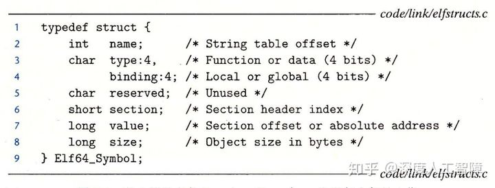

- **name：**保存符号的名字，是`.strtab`的字节偏移量

- **type：**说明该符号的类型，是函数、变量还是数据节等等

- **binding：**说明该符号是局部还是全局的

- **value：**对于可重定位目标文件而言，是定义该符号的节到该符号的偏移量（比如函数就是在`.text`中，初始化的变量在`.data`，未初始化的变量在`.bss`中）；对于可执行目标文件而言，是绝对运行形式地址。

- **size：**是符号的值的字节数目。（通过value和size就能获得该符号的值）

- **section：**说明该符号保存在哪个节中，是节头部表中的偏移量。

- - **注意：**可重定位目标文件中有三个无法通过节头部表进行索引的数据节，称为**伪节（Pseudosection）**

对于像Linux LD这样的**静态链接器（Static Linker）**，是以一组可重定位目标文件和命令参数为输入，生成一个完全链接的、可以加载和运行的可执行目标文件作为输出。为了构造可执行目标文件，**链接器有两个任务：**

- **符号解析（Symbol Resolution）：**将每个符号引用和一个符号定义关联起来
- **重定位（Relocation）：**编译器和汇编器生成从地址0开始的代码和数据节，链接器会对代码、数据节、符号分配内存地址，然后使用汇编器产生的**重定位条目（Relocation Entry）**的指令，修改所有对这些符号的引用，使得它们指向正确的内存位置。

### 7.6　符号解析

**定义：**链接器符号解析是将每个符号引用与输入的所有可重定位目标文件的符号表中的一个确定的符号定义关联起来。

- 对于局部链接器符号，由于符号定义和符号引用都在同一个可重定位目标文件中，情况相对简单，编译器只允许每个可重定位目标文件中每个局部链接器符号只有一个定义。而局部静态变量也会有局部链接器符号，所以编译器还要确保它有一个唯一的名字。
- 对于全局符号（包括全局符号和外部符号），编译器可能会碰到不在当前文件中定义的符号，则会假设该符号是在别的文件中定义的，就会在重定位表中产生该符号的条目，让链接器去解决。而链接器可能还会碰到在多个可重定位目标文件中定义相同名字的全局符号，也要解决这些冲突。

#### 7.6.1　链接器如何解析多重定义的全局符号

**链接器解析多重定义的全局符号**

编译器会向汇编器输出每个全局符号是**强（Strong）**还是**弱（Weak）**，而汇编器会把这些信息隐式编码在可重定位目标文件的符号表中。     
函数和已初始化的全局符号是强符号，未初始化的全局符号是弱符号。     

然后链接器通过以下规则来处理在多个可重定位目标文件中重复定义的全局符号：

1. 不允许有多个同名的强符号，如果存在，则链接器会报错
2. 如果有一个强符号和多个弱符号同名，则符号选择强符号的定义
3. 如果有多个弱符号同名，符号就随机选择一个弱符号的定义

#### 7.6.2　与静态库链接

#### 7.6.3　链接器如何使用静态库来解析引用

**静态库的链接与解析引用**

链接器除了能将一组可重定位目标文件链接起来得到可执行目标文件以外，编译系统还提供一种机制，将所有相关的目标模块打包为一个单独文件，称为**静态库（Static Library）**，可以作为链接器的输入。静态库是以**存档（Achive）**的文件格式存放在磁盘的，它是一组连接起来的可重定位目标文件的集合，有一个头部来描述每个成员目标文件的大小和位置，后缀为`.a`。**使用静态库的优点有：**

- 相关的函数可以被编译为独立的目标模块，然后封装成一个独立的静态库文件。
- 链接时，链接器只会复制静态库中被应用程序引用的目标模块，减少了可执行文件在磁盘和内存中的大小
- 应用程序员只需要包含较少的库文件名就能包含很多的目标模块，比如ISO C99中在`libc.a`静态库中包含了`atoi.o`、`scanf.o`、`strcpy.o`等可重定位目标模块，在`libm.a`静态库中包含了数学函数的目标模块。

比如我们有以下函数


我们可以用AR工具创建包含这些函数的静态库，首先需要得到这两个函数的可重定位目标文件

```text
gcc -c addvec.c multvec.c
```

由此可以得到`addvec.o`和`multvec.o`，然后创建包含这两个可重定位目标文件的静态库

```text
ar rcs libvector.a addvec.o multvec.o 
```

由此就得到了静态库`libvector.a`。

为了便于说明静态库中包含了那些函数，以及这些函数的原型，我们会创建一个头文件来包含这两个函数的函数原型，便于想要使用该静态库的人员查看**（不确定？）**


如上面的代码，在头文件`vector.h`中给出了函数`addvec`和`multvec`的函数原型。想要创建可执行目标文件，就要编译和链接`main2.o`和`libvector.a`。首先先产生可重定位目标文件

```text
gcc -c main2.c 
```

由此可以得到`main2.o`，然后运行以下代码：

```text
gcc -static -o prog2c main2.o ./libvector.a 
```

由此就能得到一个可执行目标文件`prog2c`。这里的`-static`表示链接器需要构建一个完全链接的可执行目标文件，可以加载到内存并运行，无需进一步链接。我们同样可以使用以下方法：

```text
gcc -static -o prog2c main.o -L. -lvector 
```

这里的`-lvector`是`libvector.a`的缩写，`-L.`告诉链接器在当前目录中查找`libvector.a`静态库。

当运行了该命令行，在符号解析阶段，链接器会维护一个可重定位目标文件的集合`E`，一个引用了但是还未定义的符号集合`U`，一个前面输入文件中已经定义的符号集合`D`，然后在命令行中从左到右依次扫描可重定位目标文件和存档文件：

- 如果输入文件是可重定位目标文件，链接器就将其添加到`E`中，然后根据该文件的符号表来修改`U`和`D`，然后继续下一个输入文件。
- 如果输入文件是存档文件，则链接器会依次扫描存档文件中的成员`m`，如果`m`定义了`U`中的一个符号，则将`m`添加到`E`中，然后根据`m`的符号表来修改`U`和`D`。最后没有包含在`E`中的成员就会被丢弃，然后继续下一个输入文件。
- 如果链接器扫描完毕，`U`中还存在没有确定定义的符号，则链接器会报错并终止，否则链接器会合并和重定位`E`中的目标文件，得到可执行目标文件。

在这个例子中，链接器首先得到输入文件`mian2.o`，其中存在未解析的符号`addvec`，则会将该符号保存在集合`U`中，然后扫描下一个输入文件`libvector.a`时，由于是存档文件，就会依次扫描其中的成员，首先扫描到`addvec.o`时，能对符号`addvec`进行解析，则将`addvec.o`保存在`E`中，并将符号`addvec`从`U`中删除，扫描到`multvec.o`时，由于`U`中已不存在未解析的符号了，所以不会将`multvec.o`包含在`E`中，最终链接器会合并和重定位`E`中的目标文件，得到可执行目标文件。所以链接器最终只会从静态库`libvector.a`中提取`addvec.o`


根据以上过程的描述，我们**需要小心命令行上库和目标文件的顺序**，要保证前面输入文件中未解析的符号能在后续输入文件中进行解析，否则会出现链接错误，一般是将库放在后面，如果库之间存在依赖，也要注意库之间的顺序，并且为了满足依赖关系，可以在命令行上重复库。

**特别的：**首先输入目标文件，由于目标文件会直接包含在`E`中，所以可以得到目标文件中所有未解析的符号，并且提供了该目标文件中的所有解析的符号，相当于“无条件加入”的，如果存在库依赖目标文件，就无需再输入目标文件了。然后根据库之间的依赖来排序库，存档文件会根据`U`的内容来确定是否将成员`m`保存在`E`中，相当于“按序加入”的，所以需要重复输入库来满足依赖关系。

比如`p.o -> libx.a -> liby.a`且`liby.a -> libx.a -> p.o`。此时我们先输入`p.o`，就包含了解析`lib.a`符号的定义了，然后我们根据依赖输入`libx.a liby.a`，此时由于第一个`libx.a`只是解析了`p.o`中未定义的符号，而`liby.a`中还存在由`libx.a`解析的符号，所以我们还需输入`libx.a`来解析`liby.a`的符号。

### 7.7　重定位

#### 7.7.1　重定位条目

当链接器完成符号解析时，就能确定在多个目标文件中重定义的全局符号的解析，以及获得静态库中需要的目标模块，此时所有符号引用都能和一个符号定义关联起来了。此时开始重定位步骤，**包括：**

- 链接器将所有目标模块中相同类型的节合并成同一类型的新的聚合节，比如将所有输入目标模块的`.data`节聚合成可执行文件中的`.data`节，其他节也如此操作。
- 此时链接器知道代码节和数据节的确切大小，就将运行时内存地址赋给新的聚合节，以及输入模块定义的每个符号。此时程序的每条指令和全局变量都有唯一的运行时内存地址了。
- 记得之前可重定位目标文件中，由于编译器和汇编器并不知道符号的运行时内存地址，所以使用一个占位符来设置符号引用的地址，而当前链接器已为符号分配了内存地址，所以链接器需要修改代码节和数据节中对每个符号的引用，使它们指向正确的运行时内存地址。

当汇编器生成目标模块时，它无法确定数据和代码最终会放在内存的什么位置，也无法确定该模块引用外部定义的函数和全局变量的位置，所以汇编器先用占位符来占领位置，然后对地址未知的符号产生一个**重定位条目（Relocation Entry）**，代码的重定位条目会保存在`.rel.text`节中，已初始化数据的重定位条目会保存在`rel.data.`节中。重定位条目的数据结构如下所示


其中，`offset`表示要修改符号引用的内存地址，`type`表示重定位的类型，`symbol`是符号表的索引值，表示引用的符号，可以通过该符号获得真实的内存地址，`addend`是一个有符号常数，有些重定位需要使用这个参数来修改引用位置。

我们通过以下代码来介绍两个重定位类型：`R_X86_64_PC32`和`R_X86_64_32`。


我们可以通过`objdump -dx main.o`来得到`main.o`的反汇编代码，可以发现该函数中无法确定`array`和其他目标模块中定义的函数`sum`在内存中的地址，所以会对`array`和`sum`产生重定位条目

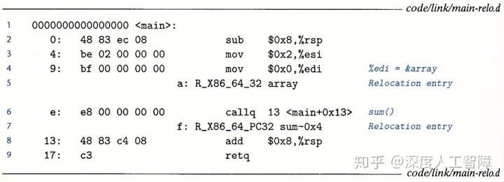

#### 7.7.2　重定位符号引用

**R_X86_64_PC32**

该重定位条目主要用来产生32位PC相对地址的引用，即函数调用时的重定位。

**R_X86_64_32**

该重定位条目主要用来产生32位绝对地址的引用，即数组的重定位。

### 7.8　可执行目标文件

通过以上符号解析和重定位过程，链接器已将可重定位目标文件和库合并成一个可执行目标文件了，目标文件的ELF格式如下所示

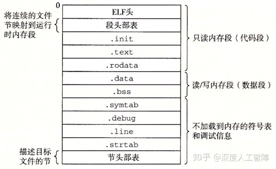

- **ELF头：**描述了文件的总体格式，还包括程序的**入口点（Entry Point）**，即当程序运行时要执行的第一条指令的地址。
- `.init`：定义了一个小函数`_init`，程序的初始化代码会调用
- `.text`、`.rodata`和`.data`和可重定位目标文件中的类似，只是这里被重定位到了最终的运行时内存地址
- 由于可执行目标文件是完全链接的，已经不需要重定位了，所以不需要`.rel`节了。

**段头部表（Segment Header Table）：**包括页大小、虚拟地址内存段（节）、段大小等等。描述了可执行文件连续的片到连续的内存段的映射关系，如下图所示是通过`OBJDUMP`显示的`prog`的段头部表


在可执行目标文件中，根据不同数据节对读写执行的不同要求，将不同的数据节分成了两个段：代码段和数据段，其中**代码段**包含ELF头、段头部表、`.init`、`.text`和`.rodata`，**数据段**包括`.data`和`.bss`。然后段头部表中就描述了代码段和数据段到内存段的映射关系，其中`off`是目标文件中的偏移，表示要从目标文件的什么位置开始读取该段；`vaddr/paddr`是内存地址，表示要将该段加载到的内存地址；`align`是对齐要求；`filesz`是目标文件中的段大小，则通过`off`和`filesz`就能确定我们要加载的段的内容；`memsz`是内存中的段大小，表示我们养将目标文件中的该段加载到多大的内存空间中；`flags`表示该段运行时的访问权限。

比如第1行、第2行描述的就是代码段，表示将目标文件中从`0x0`开始的`0x69c`个字节数据保存到从`0x400000`开始的，大小为`0x69c`字节的内存空间中，并具有读和可执行权限。第3行、第4行描述的是数据段，表示将目标文件从`0xdf8`开始的`0x228`个字节数据保存到从`0x600df8`开始的，大小为`0x230`字节的内存空间中，并具有读写权限。

这里为了使得程序执行时，目标文件中的段能高效地传送到内存中，要求

![[公式]](https://www.zhihu.com/equation?tex=vaddr%5C+mod%5C+align+%3D+off%5C+mod%5C+align+)


### 7.9　加载可执行目标文件

当我得到可执行目标文件`prog`时，我们可以在`shell`中输入`./prog`。

由于`prog`不是内置的shell命令，所以shell会认为`prog`是一个可执行目标文件，就通过调用`execve`函数来调用内核中的**加载器（Loader）**，则加载器会在可执行目标文件的段头部表的引导下，将可执行文件中的数据段和代码段复制到对应的内存位置，然后加载器会创建如下运行时内存映射

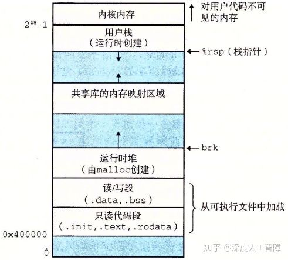

- **代码段和数据段：**x86-64通常将代码段保存在`0x400000`处，所以会将可执行目标文件的代码段和数据段映射为如上形式。**注意：**这里数据段为了满足对齐要求，会和代码段之间存在间隙。
- **运行时堆：**在数据段之后会有一个运行时堆，是通过调用`malloc`库动态往上增长的
- **共享库：**在堆之后是一个共享库的内存映射区域
- **用户栈：**用户栈是从最大的合法用户地址开始，向较小的地址增长
- **内核：**最上方的是位内核中的数据和代码保留的，是操作系统驻留在内存的位置

**注意：**链接器通常会使用地址空间布局随机化（ASLR）来修改堆、共享库和栈的地址，但是会保持三者相对位置不变。

随后加载器会跳转到程序的入口点，到达`_start`函数的地址，然后该函数代用系统启动函数`_libc_start_main`，然后该函数初始化执行环境，然后调用用户层的`main`函数。其中，`_start`定义在系统目标文件`ctrl.o`，`__libc_start_main`定义在`libc.so`中。


### 7.10　动态链接共享库

**静态库具有以下缺点：**需要定期维护和更新，并且几乎所有C程序都会使用标准I/O函数，则运行时这些函数的代码会被复制到每个运行进程的文本段中，占用大量的内存资源。

为了解决静态库的问题提出了**共享库（Shared Library）**，它是一个目标模块，不会在产生可执行目标文件时将数据段和代码段复制到可执行目标文件中进行静态链接，而是等到程序要加载时或要运行时才进行链接，我们可以提供最新的共享库，使得可执行目标文件可以直接和最新的共享库在加载或运行时链接，无需重新产生可执行目标文件。共享库由**动态链接器（Dynamic Linker）**加载到任意的内存地址，并和一个在内存中的程序链接起来，该过程称为**动态链接（Dynamic Linking）**。动态链接器本身就是一个共享目标，Linux中为`ld-linux.so`。

共享库的“共享”具有**两层含义：**

- 在任意文件系统中，一个库只有一个`.so`文件，所有引用该共享库的可执行目标文件都共享该`.so`文件中的代码和数据，不像静态库的内容会被复制到可执行目标文件中。
- 在内存中，一个共享库的`.text`节可以被不同正在运行的进程共享。

### 7.11　从应用程序中加载和链接共享库

#### 7.11.1 加载时动态链接

我们可以通过以下形式产生共享库

```text
gcc -shared -fpic -o libvector.so addvec.c multvec.c
```

其中，`-shared`指示链接器创建一个共享的目标文件，`-fpic`指示编译器生成与位置无关的代码。然后我们可以通过以下形式利用该共享库

```text
gcc -o prog2l main2.c ./libvector.so 
```

由此就创建了一个可执行目标文件`prog2l`，其过程如下图所示

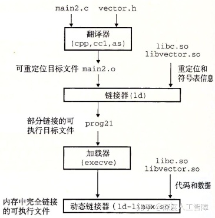

- 在创建可执行目标文件时，链接器会复制共享库中的重定位`.rel`和符号表`.symtab`信息，使得运行时可以解析对共享库中代码和数据的引用，由此得到部分链接的可执行目标文件。**注意：**此时没有将共享库的代码和数据节复制到可执行文件中。
- 调用加载器加载部分链接的可执行目标文件时，加载器会在段头部表的引导下，将可执行文件中的数据段和代码段复制到对应的内存位置。
- 加载器可以在`prog2l`中发现`.interp`节，其中保存了动态链接器的路径，则加载器会加载和运行这个动态链接器
- 动态链接器会将不同的共享库的代码和数据保存到不同的内存段中
- 动态链接器还会根据共享库在内存的位置，来重定位`prog2l`中所有对共享库定义的符号的引用
- 最后加载器将控制权传递给应用程序，此时共享库的位置就固定了，并在程序执行的过程中不会改变。

此时就能在应用程序被加载之后，在运行之前动态链接器加载和链接共享库。

#### 7.11.2 运行时动态链接

应用程序还可以在它运行时要求动态链接器加载和链接某个共享库。

Linux为动态链接器提供一个接口，使得应用程序在运行时加载和链接共享库

```c
#include <dlfcn.h>
void *dlopen(const char *filename, int flag);
```

`dlopen`函数可以打开`filename`指定的共享库，并返回句柄指针，而参数`flag`可以用来确定共享库符号解析方式以及作用范围，两个可用`|`相连，包括：

- `RTLD_NOW`：在dlopen返回前，解析出全部没有定义符号，假设解析不出来，则返回NULL
- `RTLD_LAZY`：在dlopen返回前，对于共享库中的没有定义的符号不运行解析，直到执行来自共享库中的代码（仅仅对函数引用有效，对于变量引用总是马上解析）。
- `RTLD_GLOBAL`：共享库中定义的符号可被其后打开的其他库用于符号解析
- `RTLD_LOCAL`：与`RTLD_GLOBAL`作用相反，共享库中定义的符号不能被其后打开的其他库用于重定位，是默认的。

```c
#include <dlfcn.h>
void *dlsym(void *handle, char *symbol);
```

该函数返回之前打开的共享库的句柄中`symbol`指定的符号的地址

```c
#include <dlfcn.h>
void dlclose(void *handle); 
```

用来关闭打开的共享库句柄

```c
#include <dlfcn.h>
const char *dlerror(void);
```

如果`dlopen`、`dlsym`或`dlclose`函数发生错误，就返回字符串。

如下图所示的代码示例


该程序就会在运行时动态链接共享库`libvector.so`，然后调用`addvec`函数。

我们可以用以下的编译方式

```text
gcc -rdynamic -o prog2r dll.c -ldl
```

其中，`-rdynamic`通知链接器将全部符号加入到动态符号表中，就可以通过使用`dlopen`来实现向后跟踪，`-ldl`表示程序运行时会动态加载共享库。

### 7.12　位置无关代码

我们的目的其实就是希望共享的指令部分在装载时不需要因为装载地址的改变而改变，所以实现的基本想法就是把指令中那些需要被修改的部分分离出来，跟数据部分放在一起，这样指令部分就可以保持不变，而数据部分可以在每个进程中拥有一个副本。这种方案就是目前被称为**地址无关代码(PC, Position-independent Code)**的技术。

**注意：**对于动态库的创建，`-fpic`选择地址无关代码是必须的编译选项。

**实例介绍**

链接器使用**全局偏移量表（Global Offset Table，GOT）**和**过程链接表（Procedure Linkage Table，PLT）**

我们可以发现，第一次调用共享库的函数时，对应的`xxx@plt`函数并不会跳转到正确的函数地址，而是调用动态链接器来获得函数的地址，然后将其保存到`got`项中，下一次再运行时，才会跳转到正确的函数地址，该方法称为**延迟绑定（Lazy Binding）**，只有共享库的函数要用时，才会重定位它的地址，否则不会，由此防止可执行目标文件加载时需要对大量的共享库的地址进行重定位。

### 7.13　库打桩机制

Linux链接器支持**库打桩（Library Interpositioning）**技术，允许你截获对共享库函数的调用，替换成自己的代码。**基本思想**为：创建一个与共享库函数相同函数原型的包装函数，是不不同的库打桩技术，使得系统调用包装函数，而不是调用目标函数。

#### 7.13.1　编译时打桩


我们以以上代码为例，说明编译时打桩技术，替换动态库`libc.so`的`malloc`和`free`函数的调用。

首先，我们可以定义一个本地的头文件`malloc.h`，如下所示

```text
//本地malloc.h
#define malloc(size) mymalloc(size)
#define free(ptr) myfree(ptr)
```

然后在编译`int.c`时，使用`-I.`编译选项，使得预处理器首先从本地查找`malloc.h`文件，由此就能将共享库的`malloc`和`free`函数替换成我们自己的`mymalloc`混合`myfree`函数。

而我们需要自己实现`mymalloc`和`myfree`函数，其中需要调用原始的`malloc.h`，所以需要先将该函数进行编译，所以创建以下文件


所以我们可以通过以下代码得到该函数的可重定位目标文件`mymalloc.o`

```text
gcc -DCOMPILETIME -c mymalloc.c
```

然后在本地的`malloc.h`中给出包装函数的函数原型，即


然后就可以通过以下命令行进行编译时打桩

```text
gcc -I. -o intc int.c mymalloc.o 
```

此时，由于`-I.`编译选项，对于`int.c`中的`malloc.h`，预处理器会首先从本地搜索`malloc.h`文件，而在本地`malloc.h`文件中，对`malloc`和`free`函数重新包装成`mymalloc`和`myfree`函数，而这两个函数在之前编译好的`mymalloc.o`可重定位目标文件中，此时就完成了编译时打桩。

**综上所述：**想要在编译时打桩，意味着要通过`#define`来使用预处理器将目标函数替换成包装函数。

#### 7.13.2　链接时打桩


Linux静态链接器也支持使用`--wrap f`标志进行链接时打桩，此时会将符号`f`解析为`__wrap_f`，而将对`__real_f`符号的引用解析为`f`， 意味着原始对函数`f`的调用，还会替换成对`__wrap_f`函数的调用，而通过`__real_f`函数来调用原始函数`f`。

我们定义以下函数

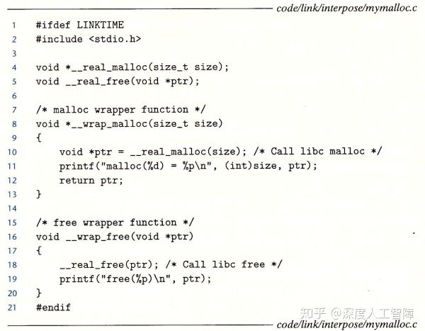

然后我们可以同时进行编译

```text
gcc -DLINKTIME -Wl,--wrap,malloc -Wl,--wrap,free -o intl int.c mymalloc.c
```

也可以分开编译

```text
gcc -DLINKTIME -c mymalloc.c
gcc -c int.c
gcc -Wl,--wrap,malloc -Wl,--wrap,free -o intl int.o mymalloc.o
```

其中，`-Wl`表示传递链接器参数，而这些参数通过`,`相连。

由此，`int.c`中对`malloc`和`free`函数的调用，会变成对`__wrap_malloc`和`__wrap_free`函数的调用。

**综上所述：**想要在链接时打桩，意味着在对可重定位目标文件的符号进行解析时，进行替换。

#### 7.13.3　运行时打桩

想要在运行时进行打桩，意味着是对共享库的函数进行打桩，这里使用动态链接器提供的`LD_PRELOAD`环境变量，通过该变量设置共享库路径列表，执行可执行目标文件时，动态链接器就会先搜索`LD_PRELOAD`共享库。

我们可以定义以下函数

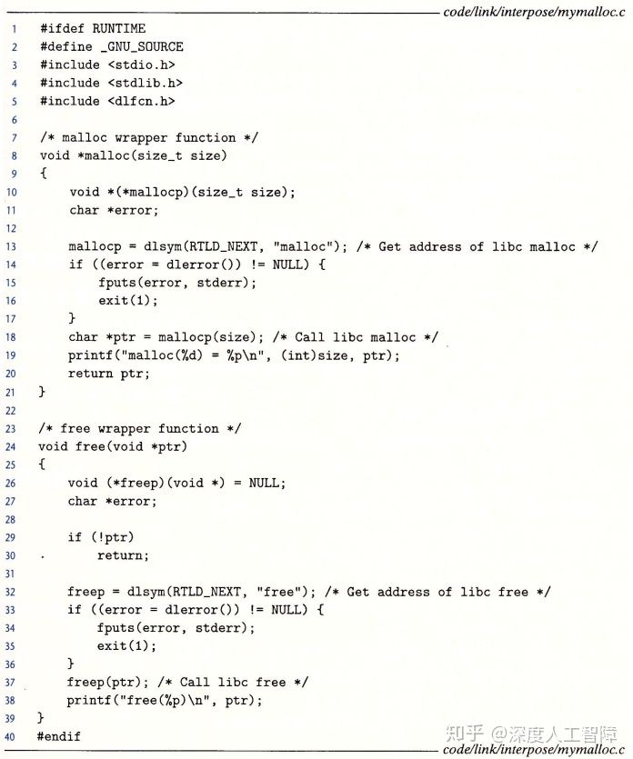

然后通过以下命令行将其编译成共享库

```text
gcc -DRUNTIME -shared -fpic -o mymalloc.so mymalloc.c -ldl 
```

然后在运行时指定环境变量`LD_PRELOAD`

```text
gcc -o intr int.c
./LD_PRELOAD="./mymalloc.so" ./intr 
```

此时运行到`malloc`和`free`函数时，就会调用动态链接器搜索该符号的定义，此时会先搜索`LD_PRELOAD`指定的共享库，而`mymalloc.so`中定义了这两个符号，所以就替换了这两个函数的具体实现。**注意：**如果想要调用原始的定义，就需要用运行动态链接的方式，通过指定`dlsym`的参数为`RTLD_NEXT`，来在后续的共享库中获得`malloc`的定义。


### 7.14　处理目标文件的工具

## 第8章　异常控制流 

### 8.1　异常

从系统加电到断点，程序计数器都假设一个值的序列a0，a1,...an+1 ，其中每个值是一个指令地址。这里将从ak 跳转到ak+1的过程称为**控制转移（Control Transfer）**，将控制转移序列称为**物理控制流（Flow of Control或Control Flow）**。当控制流中相邻指令地址在内存是相邻的，则称该控制流是**平滑的**，否则存在**突变**，比如分支跳转或方法调用。

系统会通过使控制流发生突变来对系统状态的变化做出反应，比如必须处理硬件定时器定期产生的信号、必须将到达网络适配器的数据包存放在内存等等，这种突变称为**异常控制流（Exceptional Control Flow，ECF）**。ECF存在**不同的层次：**

- **异常：**硬件检测到的事件会触发控制转移到异常处理程序。其中，异常位于硬件和操作系统交接的部分，由硬件和操作系统软件共同实现。
- **上下文切换：**内核通过上下文切换将控制从一个用户进程转移到另一个用户进程，由操作系统软件和硬件计时器实现。
- **信号：**一个进程可以发送信号到另一个进程，而接受者会将控制转移到它的信号处理程序，由操作系统实现。
- **非本地跳转：**由C运行时库实现，是ECF的一种应用层形式，允许你违背正常的`call`和`return`模式。

#### 8.1.1　异常处理

在处理器中，状态被编码为不同的位和信号，而状态变化成为**事件（Event）**。当出现事件时，**异常（Exception）**会将控制权转移到操作系统内核，来响应处理器状态中的某些变化，由此形成了控制流中的突变。异常位于硬件和操作系统交接的部分，通过硬件修改`%rip`来实现控制转移，而由于该异常而执行的代码是由操作系统内核设置和确定的，所以异常一部分由硬件实现，一部分由软件实现。

系统为每种类型的异常都分配了一个唯一的非负整数的**异常号（Exception Number）**，有些异常号由处理器设计者分配，有些异常号由操作系统内核设计者分配，分别用来表示不同层次的异常。在系统启动时，操作系统会分配和初始化一张称为**异常表（Exception Table）**的跳转表，其中第k个表项包含专门处理异常号为k的异常的**异常处理程序（Exception Handler）**


而该异常表的起始地址保存在特殊的CPU寄存器中，称为**异常表基址寄存器（Exception Table Base Register）**。当处理器检测到有事件发生时，并确定了异常号`k`时，就会通过异常号确定偏移量，比如在64位系统中，内存地址为8字节，则偏移量为`8k`，然后通过异常表基址寄存器保存的异常表起始地址，加上偏移量来得到异常处理程序的内存地址，然后跳转到对应的异常处理程序。

在跳转到异常处理程序之前，根据异常的类型，会将不同的返回地址压入栈中，要么返回到事件发生时的地址，要么返回到事件发生时的下一条指令地址。此外，处理器会将一些额外的处理器状态压入栈中，使得当处理器返回时，能从栈中返回中断程序原始的状态。**注意：**如果控制从用户程序转移到内核，则这些数据都保存在内核栈中，而不是用户栈。此外，异常处理程序运行在内核模式下，使得它们对所有系统资源都有完全的访问权限。

当异常处理运行完成时，将执行“从中断返回”指令，根据栈中的数据确定返回地址和恢复中断前程序的状态，如果引起异常中断的是用户程序，就将状态恢复为用户模式。


#### 8.1.2　异常的类别

异常可以分成以下**四种类型**


其中，异步异常是由于处理器外部发生的状态变化而引起的，而同步异常指的是当前指令运行的结果，这类指令也称为**故障指令（Faulting Instruction）**。

#### 8.1.3　Linux/x86-64系统中的异常

在x86-64中，一共有256种不同的异常，其中0~31号异常是由Intel架构师定义的异常，32~255号异常是由操作系统定义的中断和陷阱。几个比较特殊的如下所示


#### 8.1.3.1 中断异常

中断异常是由I/O设备的信号触发的，不是由指令造成的。在I/O设备中，通过向处理器芯片上的中断引脚发送信号，将标识引起中断的设备的异常号放在系统总线上，来触发中断。则当当前指令执行完后，处理器发现中断引脚的电压变高，就从系统总线中获取异常号，然后调用对应的**中断处理程序（Interrupt Handler）**，执行完毕后返回执行下一条指令。

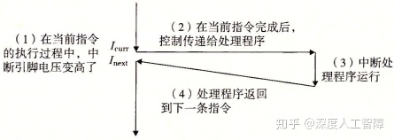

中断的一个常见例子是**定时器中断（Timer Interrupt）**。所有系统都有一个内置计时器，每隔几毫秒就会关闭一次，此时就将中断引脚置为高电平，并且有一个特殊的异常编号用于定时器中断，由此来使得内核再次获得对系统的控制，再由内核决定要做什么，否则用户程序可能会陷入无限循环永远运行，无法让操作系统获得控制权。

其次来自外部设备的**I/O中断（I/O Interrupt）**也是一个常见的例子。

#### 8.1.3.2 陷阱异常

操作系统内核为程序提供各种服务，但是你的程序没有直接访问内核的权限，无法调用内核函数，无法访问内核数据，因此在用户程序和内核之间提供一个类似函数的接口，称为**系统调用**（`syscall n`指令），用户会通过执行系统调用来向内核请求服务，比如读取文件（read）、创建新进程（fork）、加载程序（execve）或终止程序（exit），所以陷阱异常是一个有意的异常。处理器会根据`syscall n`的参数，调用适当的内核程序，然后再将控制权返回给调用程序。


**注意：**

- 从程序员角度来看，系统调用和函数调用一样，但是两者存在巨大的区别。系统调用运行在内核模式，而函数调用运行在用户模式。
- 系统调用是陷阱的一种，陷阱是同步异常的一种，要分清层次关系。

通常每个系统调用都有唯一一个对应的整数号，对应于一个到内核中跳转表的偏移量。

**注意：**该跳转表和异常表不同，异常表保存的是到异常号对应的异常处理程序的内存地址，而该跳转表是保存对应的系统调用函数。

在x86-64系统中，系统调用是通过一条`syscall`陷阱指令执行的，该指令的参数都是通过寄存器传递的，不会通过栈传递，其中，`%rax`中包含系统调用号，`%rdi`、`%rsi`、`%rdx`、`%r10`、`%r8`和`%r9`分别用来保存参数。当从系统调用返回时，会破坏`%rcx`和`%r11`，而将返回值保存在`%rax`中。

而C程序中，可以通过`syscall`函数来直接调用系统调用，但是其实标准C库提供了一组包装函数，将参数打包到了一起，如下所示，这里将系统调用和对应的包装函数称为**系统级函数**。


#### 8.1.3.3 故障异常

故障异常由错误引起的，但是能被故障处理程序修正。当发生故障时，处理器将控制转移给故障处理程序，如果处理程序能修复故障，则重新执行引发中断的指令，否则处理程序返回到内核的`abort`例程，终止应用程序。

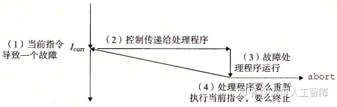

当应用尝试除以0时，会出现除法错误（异常0），Unix不会尝试从除法错误中恢复，而是直接终止程序，而Linux shell通常会吧除法错误报告为**浮点异常（Floating Exception）**。造成一般保护故障（异常13）的原因有很多，通常是因为程序引用了一个未定义的虚拟内存区域，或者程序试图写一个只读文件，Linux不会尝试恢复这类故障，shell中会将其报告为**段故障（Segmentation Fault）**。遇到缺页异常（异常14），处理器会将适当的磁盘上的虚拟内存的一个页面映射到物理内存的一个页面，然后重新执行产生故障的指令。

#### 8.1.3.4 终止异常

终止异常通常是不可修复的错误造成的，通常是硬件错误，处理程序会直接将控制返回一个`abort`例程，终止应用程序。


比如在x86-64中，机器检查异常（异常18）是在导致故障的指令中检测到致命的硬件错误。

### 8.2　进程

异常是允许操作系统内核提供**进程（Process）**概念的基本构造块。

进程就是一个执行中程序的实例，每个程序都会运行在某个由内核维护的进程**上下文（Context）**中，其中包含了保证程序正确运行所需的状态，包括存放在内存中的程序的代码和数据、栈、通用目的寄存器的内容、程序计数器、环境变量等等。当我们执行可执行文件时，shell会先创建一个新的进程，给程序提供自己的上下文，然后再在该进程的上下文中运行这个可执行目标文件。

**注意：**进程与程序是不同的，程序可以保存在不同地方，比如保存为C文件的文本，保存为`.text`的二进制文件，可以作为已加载到内存中的字节存在，而进程指的是正在运行的程序的实例。

而进程的出现，给我们提供了以下**假象：**

- 我们的程序是当前唯一在系统运行的程序
- 我们的程序独占地使用处理器和内存
- 处理器好像无间断地执行我们程序中的指令
- 我们程序中的代码和数据好像是系统内存中唯一的对象

我们这里只讨论处理器和内存系统的假象。

#### 8.2.1　逻辑控制流（处理器）

当我们单步执行程序时，可以看到一系列PC值，这个PC序列就称为**逻辑控制流**，简称**逻辑流**。**注意：**之前的控制流值的是物理控制流，是在系统层次上的指令地址序列，而逻辑控制流是在程序级别上的，所以物理控制流包含逻辑控制流。

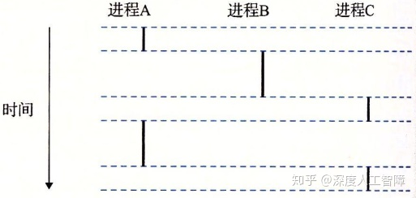

如上图所示，运行了3个进程，每个进程上下文中的PC值序列就是对应的逻辑流，就是上图中的黑色竖线，而物理控制流就是所有竖线的合并。所以处理器中的物理控制流被分成了3个逻辑控制流，每个进程有一个。并且可以看出，3个逻辑流是交错进行的，只有轮到了进程的逻辑流，才表示该进程在使用处理器，所以进程是轮流使用处理器的，当进程执行了一部分逻辑流时，就会被别的进程**抢占（Preempted）**。但是从当个进程的角度来看，它的逻辑流是连续的，意味着提供了独占处理器的假象，只是指令执行过程中有时会出现停顿，那时候就是出现了抢占。

这里将多个进程轮流运行的概念称为**多任务（Multitasking）**，将进程每次执行一部分逻辑流的时间称为**时间片（Time Slice）**，则多任务也叫**时间分片（Time Slicing）**。比如进程A就由两个时间片组成。

#### 8.2.2　并发流

当逻辑流X在逻辑流Y开始之后和Y结束之前运行，或逻辑流Y在逻辑流X开始之后和X结束之前运行，则称这两个流为**并发流（Concurrent Flow）**。比如进程A和B是并发流，进程A和C也是并发流。我们将这种多个流并发地执行的现象称为**并发（Concurrency）**。

**注意：**并发流的思想与流运行的处理器数目或计算机数目无关，只和它们运行时间是否重叠有关。但是，如果两个并发流是在不同的处理器核或计算机上运行的，则称它们为并行流**（Parallel Flow）**。

> 两个进程的逻辑流在时间上重叠，则成为并发流，如果并发流在不同核或计算机上运行，则成为并行流。并行流属于并发流，区别只在于是否在同一处理器上运行。

#### 8.2.3　私有地址空间(内存系统)

进程为每个程序提供了他自己的**私有地址空间**，其他进程不能读或写该地址空间中的内存字节。如下是一个私有地址空间的架构


#### 8.2.4　用户模式和内核模式

处理器为进程提供了两种模式，用户模式和内核模式，处理器通过某个控制寄存器的**模式位（Mode Bit）**来进行切换

- **内核模式：**当处理器设置了模式位时，为内核模式。此时进程可以执行指令集中的所有指令，并且可以访问系统中的任何内存位置。
- **用户模式：**当处理器不设置模式位时，为用户模式，是进程的初始模式。此时进程不能执行**特权指令（Privileged Instruction）**，比如停止处理器、改变模式位或者发起I/O操作，也不能引用内核区域中的指令和数据，只能通过系统调用接口来间接访问。

进程初始是为用户模式，当出现异常（中断、陷阱、故障）时会变为内核模式，并跳转到异常处理程序中，当返回应用程序时，又会改回用户模式。

为了处于用户模式的进程能访问内和数据结构的内容，Linux提供了`/proc`文件系统。

#### 8.2.5　上下文切换

我们知道内核为每个进程维护了一个上下文，包含了进程所需的所有信息。当进程执行出现中断或某些异常时，内核中的**调度器（Scheduler）**会决定抢占当前进程，并重新开始一个之前被抢断了的进程，此时就需要进行**上下文切换（Context Switch）**，将当前进程的上下切换成要运行的进程的上下文，比如地址空间和寄存器的变化。主要包含以下步骤：

- 保存当前进程的上下文，方便过后再进行调度
- 恢复之前某个被抢占进程的上下文
- 将控制传递给这个新恢复的进程

**注意：**上下文切换是较高层次的异常控制流，建立在之前低层次异常机制之上。

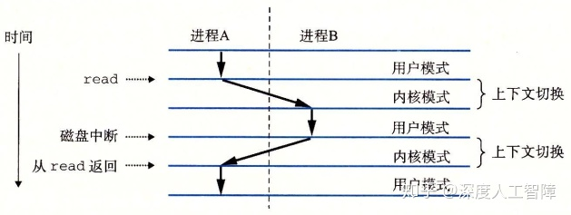

比如以上过程中，首先内核开始执行进程A，处于用户模式。当进程A调用了`read`系统调用时，内核中的陷阱处理程序请求来自磁盘控制器的DMA传输，由于磁盘读取数据比较耗时，所以调度程序决定运行进程B，就会重新指定地址空间，完成进程B的寄存器加载，然后将控制权转移到进程B，进程B就从中断处继续运行，内核就完成了从进程A切换到进程B并开始执行进程B。当磁盘控制器完成从磁盘到内存的数据传输后，磁盘会发起中断，此时内核判断进程B已运行了足够长的时间了，就会从进程B切换到进程A，直到下次异常出现。

**注意：**进程是由内存中共享的内核进行管理的，内核并不是独立的进程，而是作为某些现有进程的一部分，始终位于地址空间顶部的代码，当出现异常时会进行执行。

### 8.3　系统调用错误处理


### 8.4　进程控制

现在Linux提供许多函数，可以从用户程序调用操作进程，这个操作进程的过程称为**进程控制（Process Control）**。这些函数主要通过系统级函数的形式来进行系统调用，如果出现错误，通常会返回-1，然后设置全局变量`errno`来指明原因，所以我们必须检查这些函数的返回值，通常可以对这些函数进行封装，比如

```c
void unix_error(char *msg){
  fprintf(stderr, "%s: %s\n", msg, strerror(errno));
  exit(0);
}
pid_t Fork(void){
  pid_t pid;
  if((pid = fork()) < 0)
    unix_error("Fork error");
  return pid;
}
```

#### 8.4.1　获取进程ID

每个进程都有一个唯一的正数**进程ID（PID）**，可以通过`getpid`函数返回当前进程的PID，可以通过`getppid`函数返回创建当前进程的父进程PID。类型都为`pid_t`，Linux系统中在`type.h`中定义为`int`。

```c
#include <unistd.h>
#include <sys/types.h>
pid_t getpid(void);
pid_t getppid(void);
```

#### 8.4.2　创建和终止进程

进程会处于以下三种状态之一：

- **运行：**进程要么在CPU上执行，要么在等待被执行且最终会被内核调度。即被抢占的进程也属于运行状态。
- **停止：**当进程收到`SIGSTOP`、`SIGTSTP`、`SIGTTIN`或`SIGTTOU`信号时，进程的执行被**挂起（Suspended）**且不会被调度，直到收到`SIGCONT`信号，进程才会运行。即进程暂时不会被调度，但是还有可能被调度。
- **终止：**进程被永久停止了，主要**原因在于：**进程收到了终止进程的信号；从主程序返回`return`；调用`exit`函数。

```c
#include <stdlib.h>
void exit(int status);
```

其中，`status`表示进程的退出状态，等价于`return status;`。

##### 创建子进程

父进程通过`fork`函数创建一个子进程

```c
#include <unistd.h>
#include <sys/types.h>
pid_t fork(void);
```

当调用`fork`函数时，就立即以当前进程作为父进程，创建一个新的子进程，具有以下**特点：**


- 两个进程具有相同的地址空间，意味着两个进程具有相同的用户栈、局部变量值、堆、全局变量和代码。但是两者的地址空间又是独立的，所以`fork`函数之后对两个进程的操作都是独立的。即父子进程具有执行`fork`函数之前相同的设置，而执行完`fork`函数后，两个进程就是并发独立的了。
- 子进程还获得与父进程任何打开文件描述符相同的副本，即子进程可以读写父进程打开的任何文件。
- `fork`函数会有两个返回值——父进程会返回子进程的PID，而子进程会返回0。所以我们可以通过`fork`函数的返回值判断当前所处的进程，如果不加以区分，则父进程和子进程会执行后续相同的代码。

**例1：**

```c
#include <unistd.h>
#include <sys/types.h>
#include <stdio.h>

int main(){
  int x = 1;
  pid_t pid;
  
  pid = Fork();
  if(pid == 0){ //处于子进程中
    printf("Child%d : x=%d\n",getpid(), ++x);
  }else{ //处于父进程中
    printf("parent%d : x=%d\n", getpid(), --x);
  }
  exit(0);
}
```

这里在父进程中的`x=0`，在子进程中的结果为`x=2`，由于这两个进程是并发的，所以无法确定这两条输出哪条先显示。


**例2：**

```c
#include <unistd.h>

int main(){
  Fork();
  Fork();
  printf("hello\n");
  exit(0);
} 
```

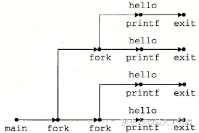

**注意：**有`fork`存在的程序，最好画出进程图，进程图的全排列是所有可能出现的结果。

#### 8.4.3　回收子进程


当子进程终止时，内核会一直保持它的状态直到它被父进程**回收（Reaped）**，因为父进程可能想知道子进程的退出状态，这类进程称为**僵死进程（Zombie）**，仍然消耗系统的内存资源。当父进程回收僵死进程时，内核就会将子进程的退出状态返回给父进程，并抛弃僵死进程。有一个特殊的进程**init进程**，其PID为1，是所有进程的祖先。如果父进程终止了，则由init进程接管它所有的子进程，并回收它的僵死进程。

比如以下代码

```c
void fork7() {
    if (fork() == 0) {
        /* Child */
        printf("Terminating Child, PID = %d\n", getpid());
        exit(0);
    } else {
        printf("Running Parent, PID = %d\n", getpid());
        while (1)
            ; /* Infinite loop */
    }
}
```

这里会死循环父进程，而子进程会直接退出


可以看见，父进程的PID为125，子进程的PID位126，由于父进程没有对子进程进行回收，所以子进程变成了僵死进程`defunct`。当终止父进程时，子进程会由`init`进程回收，则父进程和子进程都被删除了。

```c
 void fork8()
{
    if (fork() == 0) {
        /* Child */
        printf("Running Child, PID = %d\n",
               getpid());
        while (1)
            ; /* Infinite loop */
    } else {
        printf("Terminating Parent, PID = %d\n",
               getpid());
        exit(0);
    }
}
```

这里会死循环子进程，而父进程会直接退出


可以发现父进程会直接终止，而子进程会继续执行，必须要显示地对子进程进行终止。

**注意：**如果父进程没有对子进程进行回收，则子进程会成为僵死进程。子进程可以自己独立运行，需要显示进行终止。

我们可通过调用以下函数来等待子进程的终止或停止，父进程会得到被回收的子进程PID，且内核会删除僵死进程

```c
#include <sys/types.h>
#include <sys/wait.h>
pid_t waitpid(pid_t pid, int *statusp, int options); 
```

- **等待集合`pid`**

- - 如果`pid>0`，则等待集合就是一个单独的子进程
  - 如果`pid=-1`，则等待集合就是该进程的所有子进程
  - **注意：**当父进程创造了许多子进程，这里通过`pid=-1`进行回收时，子程序的回收顺序是不确定的，并不会按照父进程生成子进程的顺序进行回收。可通过按顺序保存子进程的PID，然后按顺序指定`pid`参数来消除这种不确定性。

- **等待行为`options`**

- - **`0`：**默认选项，则会挂起当前进程，直到等待集合中的一个子进程终止，则函数返回该子进程的PID。此时，已终止的子进程已被回收。
  - **`WNOHANG`：**如果等待子进程终止的同时还向做其他工作，该选项会立即返回，如果子进程终止，则返回该子进程的PID，否则返回0。
  - **`WUNTRACED`：**当子进程被终止或暂停时，都会返回。
  - **`WCONTINUED`：**挂起当前进程，知道等待集合中一个正在运行的子进程被终止，或停止的子进程收到`SIGCONT`信号重新开始运行。
  - **注意：**这些选项可通过`|`合并。

- 如果`statusp`非空，则`waitpid`函数会将子进程的状态信息放在`statusp`中，可通过`wait.h`中定义的宏进行解析

- - **`WIFEXITED(statusp)`：**如果子进程通过调用`exit`或`return`正常终止，则返回真，。此时可通过`WEXITSTATUS(statusp)`获得退出状态。
  - **`WIFSIGNALED(status)`：**如果子进程是因为一个未捕获的信号终止的，则返回真。此时可通过`WTERMSIG(statusp)`获得该信号的编号。
  - **`WIFSTOPPED(statusp)`：**如果引起函数返回的子进程是停止的，则返回真。此时可通过`WSTOPSIG(statusp)`获得引起子进程停止的信号编号。
  - **`WIFCONTINUED(statusp)`：**如果子进程收到`SIGCONT`信号重新运行，则返回真。

- 如果当前进程没有子进程，则`waitpid`返回-1，并设置`errno`为`ECHILD`，如果`waitpid`函数被信号中断，则返回-1，并设置`errno`为`EINTR`。否则返回被回收的子进程PID。

**注意：**`waitpid`通过设置`options`来决定是否回收停止的子进程。并且能通过`statusp`来判断进程终止或停止的原因。

有个简化的`waitpid`函数

```c
#include <sys/types.h>
#include <sys/wait.h>
pid_t wait(int *statusp);
```

调用`wait(&status)`等价于调用`waitpid(-1, &status, 0)`。

**注意：**当调用`waitpid`函数之前，就有子进程被终止或停止，一调用`waitpid`函数就会马上将该子进程回收。

——————————————————————————————————————

**例：**输出下列可能的输出序列


对于类似的题，我们需要画出对应的进程图。


首先，通过`Fork`函数会从当前进程产生一个相同的子进程，得到两个并发运行的分支。而从父进程的`waitpid`函数的参数可知，父进程会挂起直到其所有子进程终止。所以子进程的`exit`会连接到父进程的`waitpid`函数。


#### 8.4.4　让进程休眠

```text
#include <unistd.h>
unsigned int sleep(unsigned int secs);
int pause(void);
```

函数`sleep`将进程挂起一段时间，而该函数的返回值为剩下的休眠时间。

函数`pause`将进程挂起，直到该进程收到一个信号。

#### 8.4.5　加载并运行程序

`execve`函数可在当前进程的上下文中加载并运行一个程序

```c
#include <unistd.h>
int execve(const char *filename, const char *argv[], const char *envp[]); 
```

`execve`函数加载并运行`filename`可执行目标文件，参数列表`argv`和环境列表`envp`是以`NULL`结尾的字符串指针数组，其中`argv[0]`为文件名。


调用`exevec`函数其实就是调用加载器，则加载器会在可执行目标文件`filename`的指导下，将文件中的内容复制到代码段和数据段，再调用`_libc_start_main`来初始化执行环境，调用`main`函数，`main`函数的函数原型如下所示

```c
int main(int argc, char *argv[], char *envp[]);
```

其中，`argc`为参数数目，`argv`为参数列表，`envp`为环境列表。其用户栈的架构如下所示


**注意：**可以通过全局变量`environ`来获得环境列表。

这里还有一些函数用来对环境变量进行操作

```c
#include <stdlib.h>

char *getenv(const char *name); //获得名字为name的环境值
int setenv(const char *name, const char *newvalue, int overwrite); //对环境值进行修改
int unsetenv(const char *name); // 删除环境变量
```

#### 8.4.6　利用fork和execve运行程序

**`fork`函数和`execve`区别：**

- `fork`函数新建一个不同PID的子进程，具有和父进程相同的上下文，是父进程的复制品，运行相同的代码、程序和变量，就是程序不变，而在不同进程。而`execve`函数保持PID不变，在当前进程的上下文中加载并运行一个新程序，会覆盖当前进程的地址空间，并继承调用`execve`函数时已打开的所有文件描述符，就是保持进程不变，但是运行完全不同的程序。
- `fork`函数调用一次返回两次，而`execve`函数调用后，只有出现错误才会返回到调用程序。
- 当你想要创建并发服务器时，可以通过`fork`函数创建多个服务器副本，可以运行多个相同代码。

想要保持当前进行运行的情况下，运行另一个程序，可以先通过`fork`新建一个进程，然后在子进程中用`execve`执行另一个程序，此时在父进程就运行原来的程序，而在子进程中就运行另一个程序。

**例子：**我们想要在当前环境中，在子进程中运行`/bin/ls -lt /usr/include`

首先可以设置参数`argv`和`envp`

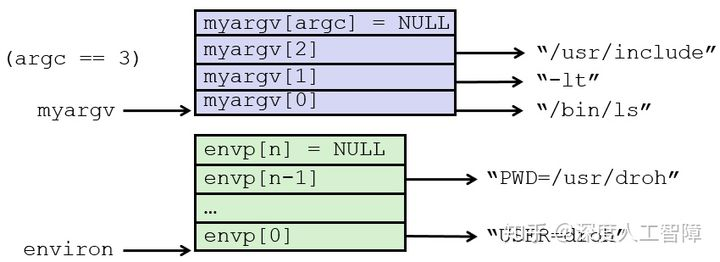

然后调用以下代码

```c
if ((pid = Fork()) == 0) {  //在子进程中运行
  if (execve(myargv[0], myargv, environ) < 0) {  //这里直接用全局变量environ，表示在当前环境中运行
    printf("%s: Command not found.\n", myargv[0]);
    exit(1); 
  }
}
```

**参考：**[linux fork()和execve()的区别 - C/C++-Chinaunix](https://link.zhihu.com/?target=http%3A//bbs.chinaunix.net/thread-1777307-1-1.html)

### 8.5　信号

这里介绍一下shell程序的内容。实际上系统上的进程呈现为层次结构


当你启动系统时，第一个创建的进程是`init`进程，它的PID为1，系统上其他所有进程都是`init`进程的子进程。`init`进程启动时会创建**守护进程（Daemon）**，该进程一般是一个长期运行的程序，通常用来提供服务，比如web服务等其他你想要一直在系统上运行的服务。然后`init`进程还会 创建登录进程，即**登录shell（Login Shell）**，它为用户提供了命令行接口，所以当你登录到一个Linux系统，最终得到的是一个登录shell。

然后登录shell会以你的身份来执行程序，比如我们输入`ls`命令，即要求shell运行名为`ls`的可执行程序，则shell会创建一个子进程，在该子进程中执行`ls`程序，而该子进程也可能创建其他的子进程。

所以shell就是就是一个以用户身份来运行程序的应用程序。在Linux中的默认shell叫做bash。

在shell中执行程序就是一系列读和解析命令行的过程。

```c
int main()
{
    char cmdline[MAXLINE]; /* command line */

    while (1) {
        /* read */
        printf("> ");
        Fgets(cmdline, MAXLINE, stdin);
        if (feof(stdin))
            exit(0);

        /* evaluate */
        eval(cmdline);
    }
}

void eval(char *cmdline)
{
    char *argv[MAXARGS]; /* Argument list execve() */
    char buf[MAXLINE];   /* Holds modified command line */
    int bg;              /* Should the job run in bg or fg? */
    pid_t pid;           /* Process id */

    strcpy(buf, cmdline);
    bg = parseline(buf, argv);
    if (argv[0] == NULL)
        return;   /* Ignore empty lines */

    if (!builtin_command(argv)) {
        if ((pid = Fork()) == 0) {   /* Child runs user job */
            if (execve(argv[0], argv, environ) < 0) {
                printf("%s: Command not found.\n", argv[0]);
                exit(0);
            }
        }

        /* Parent waits for foreground job to terminate */
	if (!bg) {
            int status;
            if (waitpid(pid, &status, 0) < 0)
                unix_error("waitfg: waitpid error");
        }
        else
            printf("%d %s", pid, cmdline);
    }
    return;
}
```

这里可以看出，前台作业和后台作业的区别只是shell需要等待前台作业完毕。

这里的后台作业会导致内存泄漏。

#### 8.5.1　信号术语

这一章将讨论一种更高层次的软件形式的异常，称为Linux**信号**。信号就是一条小消息，可以通知系统中发生了一个某种类型的事件，**比如：**

- 内核检测到了一个系统事件，比如除零错误、执行非法指令或子进程终止，低层次的硬件异常都是由内核异常处理程序处理的，对用户进程是不可见的，但是可以通过给用户进程发送信号的形式来告知，比如除零错误就发送`SIGFPE`信号，执行非法指令就发送`SIGILL`信号，子进程终止内核就发送`SIGHLD`到父进程中，则此时父进程就能对该子进程调用`waitpid`来进行回收。
- 内核或其他进程出现了较高层次的软件事件，比如输入组合键，或一个进程尝试终止其他进程，都是显示要求内核发送一个信号给目标进程，比如输入组合键内核会发送`SIGINT`信号给所有进程，进程可以发送`SIGKILL`信号给别的进程来进行终止。

**注意：**与异常机制很类似，只是异常是由硬件和软件共同实现的，而信号时完全由软件实现的，且都是由内核进行发送的。

所以信号可以是内核检测到事件来发送到目标进程，也可以是其他进程通过内核来发送信号到目标进程。如下所示是Linux系统上支持的不同类型的信号，每种信号类型都对应某种系统事件


- `SIGINT`：当用户输入`Ctrl+C`时，内核会向前台作业发送`SIGINT`信号，该信号默认终止该作业。
- `SIGTSTP`：当用户输入`Ctrl+Z`时，内核会向前台作业发送`SIGTSTP`信号，默认停止作业，可通过发送`SIGCONT`信号来恢复该作业。
- `SIGKILL`：该信号的默认行为是用来终止进程的，无法被修改或忽略。
- `SIGSEGV`：当你试图访问受保护的或非法的内存区域，就会出现段错误，内核会发送该信号给进程，默认终止该进程。
- `SIGCHLD`：当子进程终止或停止时，内核会发送该信号给父进程，由此父进程可以对子进程进行回收。

传送一个信号到目的进程是由两个步骤组成的：

- **发送信号：**内核通过更新目的进程上下文中的某个状态，来表示发送了一个信号到目的进程，所以这里除了目标进程上下文中的一些位被改变了，其他没有任何变化。
- **接收信号：**当目的进程被内核强迫以某种方式对信号的发送做出反应时，它就接受了信号。比如忽略信号、终止进程，或执行用户级的**信号处理程序（Signal Handler）**来捕获信号。

**注意：**执行信号处理程序类似于执行异常处理程序，只是异常处理程序是内核级别的，而信号处理程序就只是你的C代码程序。


当执行完信号处理程序后，会返回到下一条指令继续执行，类似于一次中断。

我们将发送了但是还没被接收的信号称为**待处理信号（Pending Signal）**，而进程可以选择阻塞接收某种信号，则该信号可以被发送，但是在阻塞解除前无法被目标进程处理。我们可以发现不同的信号具有不同的编码，所以内核为每个进程在**`pending`位向量**中维护待处理信号的集合，根据信号的编号来设置对应位的值，来传送信号，当进程接收了该信号，就会将其从`pending`位向量中重置该位的值；也为每个进程在**`blocked`位向量**中维护了被阻塞的信号集合，可以通过查看位向量对应的位来确定该信号是否被阻塞。

**注意：**通过位向量的形式来保存待处理信号和被阻塞信号，可以发现每种类型的信号最多只会有一个待处理信号，并且一个待处理信号只能被接受一次。


#### 8.5.2　发送信号

Unix基于**进程组（Process Group）**的概念，提供了大量向进程发送信号的机制。

进程组由一个正整数**进程组ID**来标识，每个进程组包含一个或多个进程，而每个进程都只属于一个进程组，默认父进程和子进程属于同一个进程组。我们将shell为了对一条命令行进行求值而创建的进程称为**作业（Job）**，比如输入`ls / sort`命令行，就会创建两个进程，分别运行`ls`程序和`sort`程序，这两个进程通过Unix管道连接到一起，由此就得到了一个作业。**注意：**

- 任何时刻，最多只有一个前台作业和任意数量的后台作业。
- shell会为每个作业创建一个独立的进程组，该进程组ID由该作业中任意一个父进程的PID决定。

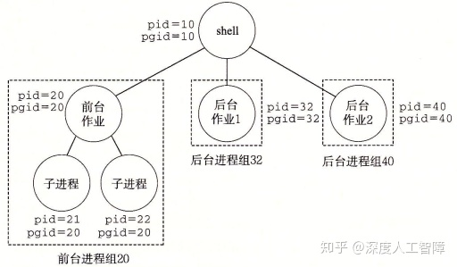

这里提供了以下对进程组的操作，允许你可以同时给一组进程发送信号。

```c
#include <unistd.h>
pid_t getpgrp(void); //返回所在的进程组
int setpgip(pid_t pid, pid_t pgid); //设置进程组
/* 
 * 如果pid大于零，就使用进程pid；如果pid等于0，就使用当前进程的PID。
 * 如果pgid大于0，就将对应的进程组ID设置为pgid；如果pgid等于0，就用pid指向的进程的PID作为进程组ID
 */ 
```

- **用`/bin/kill`向进程发送任意信号**

程序`/bin/kill`具有以下格式

```text
/bin/kill [-信号编号] id  
```

当`id>0`时，表示将信号传递给PID为`id`的进程；当`id<0`时，表示将信号传递给进程组ID为`|id|`的所有进程。我们可以通过制定信号编号来确定要传输的信号，默认使用`-15`，即`SIGTERM`信号，为软件终止信号。


- **从键盘发送信号**

通过键盘上输入`Ctrl+C`会使得内核发送一个`SIGINT`信号到前台进程组中的所有进程，终止前台作业；通过输入`Ctrl+Z`会发送一个`SIGTSTP`信号到前台进程组的所有进程，停止前台作业，直到该进程收到`SIGCONT`信号。


`ps`命令可以查看进程的信息，`STAT`表示进程的状态：`S`表示进程处于睡眠状态，`T`表示进程处于停止状态，`R`表示进程处于运行状态，`Z`表示僵死进程，而`+`表示前台作业。

在以上代码中，我们输入`Ctrl-Z`，可以发现两个`fork`进程的状态变成了停止状态了，通过输入`fg`命令可以将这些被挂起的进程恢复到前台运行，再通过`Ctrl+C`可以停止这两个前台进程。

- **用`kill`函数发送信号**

可以在函数中调用`kill`函数来对目的进程发送信号

```c
#include <sys/types.h>
#include <signal.h>
int kill(pid_t pid, int sig); 
```

当`pid>0`时，会将信号`sig`发送给进程`pid`；当`pid=0`时，会将信号`sig`发送给当前进程所在进程组的所有进程；当`pid<0`时，会将信号`sig`发送给进程组ID为`|pid|`的所有进程。

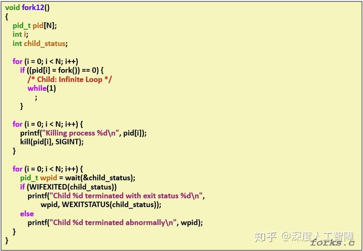

- **用`alarm`函数发送`SIGALARM`信号**

```c
#include <unistd.h>
unsigned int alarm(unsigned int secs); 
```

当`alarm`函数时，会取消待处理的闹钟，返回待处理闹钟剩下的时间，并在`secs`秒后发送一个`SIGALARM`信号给当前进程。


#### 8.5.3　接收信号


当内核把进程p从内核模式切换回用户模式时，比如从系统调用返回或完成了一次上下文切换时，会检查进程p的未被阻塞的待处理信号的集合，即`pending & ~blocked`，如果是空集合，则内核会将控制传递给p的逻辑流中的下一条指令，如果集合非空，则内核会选择集合中编号最小的信号k（所以我们需要根据优先级来排列信号），强制进程p采取某些行为来接收该信号，对该集合中的所有信号都重复这个操作，直到集合为空，此时内核再将控制传递回p的逻辑流中的下一条指令。

> 每次从内核模式切换回用户模式，将处理所有信号

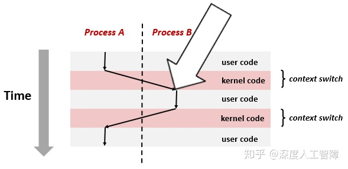

每种信号类型具有以下一种预定的**默认行为：**

- 进程终止
- 进程终止并dumps core
- 进程挂起直到被`SIGCONT`信号重启
- 进程忽略信号

我们这里可以通过`signal`函数来修改信号的默认行为，但是无法修改`SIGSTOP`和`SIGKILL`信号的默认行为

```c
#include <signal.h>
typedef void (*sighandler_t)(int); 
sighandler_t signal(int signum, sighandler_t handler);
```

- `signum`为信号编号，可以直接输入信号名称

- `handler`为我们想要对信号`signum`采取的行为

- - 当`handler`为`SIG_IGN`，表示要进程忽略该信号
  - 当`handler`为`SIG_DFL`，表示要恢复该信号的默认行为
  - 当`handler`为用户自定义的**信号处理程序**地址，则会调用该函数来处理该信号，该函数原型为`void signal_handler(int sig);`。调用信号处理程序称为**捕获信号**，置信信号处理程序称为**处理信号**。当信号处理程序返回时，会将控制传递回逻辑流中的下一条指令。**注意：**信号处理程序可以被别的信号处理程序中断。

- 当`signal`函数执行成功，则返回之前`signal handler`的值，否则返回`SIG_ERR`

**例子：**

```c
#include <signal.h>
void handler(int sig){
  if((waitpid(-1, NULL, 0)) < 0)
    unix_error("waitpid error");
}
int main(){
  if(signal(SIGCHLD, handler) == SIG_ERR)
    unix_error("signal error");
  return 0;
}
```

这里只要在`main`函数开始调用一次`signal`，就相当于从此以后改变了`SIGCHLD`信号的默认行为，让它去执行`handler`处理程序。当子进程终止或停止时，内核就会发送一个`SIGCHLD`信号到父进程中，此时就能让父进程去执行自己的工作，当子进程终止或停止时，发送`SIGCHLD`信号到父进程，则父进程会调用`handler`函数来对该子进程进行回收。

#### 8.5.4　阻塞和解除阻塞信号

Linux提供阻塞信号的隐式和显示的机制：

- **隐式阻塞机制：**内核默认阻塞当前正在处理信号类型的待处理信号。
- **显示阻塞机制：**应用程序通过`sigprocmask`函数来显示阻塞和解阻塞选定的信号。

```c
#include <signal.h>
int sigprocmask(int how, const sigset_t *set, sigset_t *oldset);
```

- 通过`how`来决定如何改变阻塞的信号集合`blocked`

- - 当`how=SIG_BLOCK`时，`blocked = blocked | set`
  - 当`how=SIG_UNBLOCK`时，`blocked = blocked & ~set`
  - 当`how=SETMASK`时，`block = set`

- 如果`oldset`非空，则会将原始的`blocked`值保存在`oldset`中，用于恢复原始的阻塞信号集合

这里还提供一些额外的函数来对`set`信号集合进行操作

```c
#include <signal.h>
int sigemptyset(sigset_t *set); //初始化set为空集合
int sigfillset(sigset_t *set); //把每个信号都添加到set中
int sigaddset(sigset_t *set, int signum); //将signum信号添加到set中
int sigdelset(sigset_t *set, int signum); //将signum从set中删除
int sigismember(const sigset_t *set, int signum); //如果signum是set中的成员，则返回1，否则返回0
```

以下是一个使用例子


以上执行内部函数时，就不会接收到`SIGINT`信号，即不会被`Ctrl+C`终止。

通过阻塞信号来消除函数冲突，或者保证程序运行逻辑正确。


#### 8.5.5　编写信号处理程序

而信号也是并发的一个例子，信号处理程序是一个独立的逻辑流（不是进程），与主程序并发运行。比如我们在进程A中执行一个`while`循环，当该进程受到一个信号时，内核会将控制权转移给该信号的处理程序，所以该信号处理程序是并发执行的，当信号处理程序结束时，再将控制转移给主程序。由于信号处理程序与主程序在同一进程中，所以具有相同的上下文，所以会共享程序中的所有全局变量。


**注意：**信号处理程序与主程序在相同进程中并发执行。

将信号处理程序看成并发流的另一种方式是使用上下文切换图。当有个信号传递给进程A时，只是简单的设置了`pending`位向量对应的位，并不会有额外操作，当进程A后面执行上下文切换，到达进程B后，进程B执行若干指令后，通过上下文切换到达进程A，此时就会根据`pending`位向量记录的未处理信号集合来依次调用对应的信号处理程序，过后再将其传递到下一条指令的地址。所以信号处理程序和其他程序都处于相同的进程中。


信号发送的对象是进程，因为信号处理程序执行在相同的进程中，所以当该进程接收到信号时，信号处理程序是可以被别的信号处理程序中断的，构成以下多层嵌套的信号处理程序，由于这些信号处理程序和主程序处于相同的进程中，所以共享相同的全局变量，这就使得全局变量的状态较难控制。


##### 8.5.5.1 安全的信号处理

信号处理的一个**难点在于：**处理程序与主程序在同一进程中是并发运行的，它们共享同样的全局变量，可能会与主程序和其他处理程序相互干扰。这里推荐一系列措施来进行安全的信号处理：

- **G0：**处理程序要尽可能简单。

- - 当处理程序尽可能简单时，就能避免很多错误。**推荐做法：**处理程序修改全局标志指示出现的信号，然后直接返回，主程序会周期性检查并重置这个全局标志。

- **G1：**在处理程序中调用异步信号安全的函数。

- - 异步信号安全的函数能被处理程序安全地调用，因为它是可重入的（比如所有变量都是保存在栈上的局部变量），或不能被信号处理程序中断的。Linux中保证安全的系统级函数如下所示，**注意：**`printf`，`sprintf`，`malloc`和`exit`是不安全的，而`write`是安全的。


- **G2：**保存和恢复`errno`

- - 全局变量`errno`在系统级函数出现错误时才会被赋值，许多Linux异步信号安全的函数都会在出错时返回并设置`errno`，当处理程序要返回时，最好提前将`errno`保存为局部变量，再在返回时重置`errno`，使得主程序可以使用原本的`errno`。

- **G3：**阻塞所有的信号，保护对共享全局数据结构的访问

- - 对于数据结构的访问（读取或写入），可能需要若干条指令，当主程序在访问全局数据结构中途被中断，进入处理程序时，如果处理程序也访问当前数据结构，可能会发现该数据结构的状态是不一致的。所以对全局数据结构进行访问时，要阻塞所有的信号（无论在主程序还是信号处理程序中）。

- **G4：**用`volatile`声明在主程序和信号处理程序共享的全局变量

- - 比如G0说的使用全局变量来保存标志，处理程序更新标志，主程序周期性读取该标志，编译器可能会感觉主程序中该标注没有变化过，所以直接将其值缓存在寄存器中，则主程序就无法读取到处理程序的更新值。所以我们需要使用`volatile`来声明该标志，使得编译器不会缓存该变量，使得主程序每次都从内存中读取该标志。

- **G5：**用`sig_atomic_t`声明那些仅进行读写操作，不会进行增量或更新操作的变量

- - 通过使用C提供的整型数据类型`sig_atomic_t`来声明变量，使得对它的读写都是原子的，不会被中断，所以就不需要暂时阻塞信号了。大多数系统中，`sig_atomic_t`是`int`类型。**注意：**对原子性的保证只适用于单个读和写，不适用于`flag++`或`flag+=1`这类操作。

**综上所述：**是处理函数尽可能简单，在处理程序中调用安全函数，保存和恢复`errno`，保护对共享数据结构的访问，使用`volatile`和`sig_atomic_t`。

##### 8.5.5.2 正确的信号处理

在信号处理中，还存在一个**问题：**我们这里使用`pending`位向量来保存未处理的信号集合，当处理程序处理信号时，就会将其从该集合中删除，但是由于是位向量形式，所以当集合中存在信号k时，就不会再接收信号k了，**意味着：**如果存在一个未处理的信号k，则表明至少有一个信号k到达，所以我们不能通过信号来对其他进程中发生的事件进行记数，我们要使得处理程序一次能够执行尽可能多的操作。

##### 8.5.5.3 可移植的信号处理

信号处理的另一个**缺陷**是：不同的系统有不同的信号处理语义，比如：

- `signal`函数的语义各不相同，有的Unix系统，当处理完信号时，就会将对该信号的处理恢复为默认行为。
- 存在一些潜在的会阻塞进程较长时间的系统调用，称为**慢速系统调用**，比如`read`、`write`或`accpet`。在执行慢速系统调用时，如果进程接收到一个信号，可能会中断该慢速系统调用，并且当信号处理程序返回时，无法继续执行慢速系统调用，而是返回一个错误条件，并将`errno`设置为`EINTR`。

这些可以通过`sigaction`函数来明确信号处理语义，由于该函数的复杂性，提供一个封装好的函数


可以类似`signal`函数那样使用，信号处理语义为：

- 只有当前信号处理程序正在处理的信号类型会被阻塞
- 只要可能，被中断你的系统调用会自动重启
- 一旦设置了信号处理程序，就会一直保持

#### 8.5.6　同步流以避免讨厌的并发错误

并发流可能以任何交错方式运行，所以信号发送的时机很难预测，可能会出现错误，所以需要首先对目标信号进行阻塞，先执行预定操作，然后将其解阻塞进行捕获。比如以下代码


如果缺少30和32行，则`addjob`函数和`deletejob`函数之间存在竞争，必须在`deletejob`函数之前调用`addjob`函数，否则在`deletejob`函数中通过`waitpid`函数释放了子进程，过后调用`addjob`函数就会出错。但是由于内核调度进程是不可控的，以及`SIGCHLD`信号的发送时机是不确定的，所以可能出现这个错误。可以如上所示，在主进程中先对`SIGCHLD`信号进行阻塞，在执行完`addjob`函数后再解阻塞，保证了先执行`addjob`函数再执行`deletejob`函数。

**经验之谈：**不要对代码做任何假设，比如子进程运行到这里才终止。

**注意：**可以通过阻塞信号来控制信号的接收时机。

#### 8.5.7　显式地等待信号

当我们想要主进程显示等待某个信号时，可以用以下代码


这里主进程会显示等待子进程被回收，这里使用了`sigsuspend(&mask)`函数，它等价于

```c
sigprocmask(SIG_SETMASK, &mask, &prev);
pause();
sigprocmask(SIG_SETMASK, &prev, NULL); 
```

但是它是这三条代码的原子版本，即第一行和第二行是一起调用的，则`SIGCHLD`信号不会出现在第一行和第二行之间，造成程序不会停止。

**注意：**第26行要先对`SIGCHLD`信号进行阻塞，防止过早发送给主进程，则`pause`函数就无法中断，就会使得程序不会停止。


### 8.6　非本地跳转

C语言提供了一种用户级异常控制流形式，称为**非本地跳转（Nonlocal Jmup）**，它可以直接将控制从一个函数转移到另一个当前正在执行的函数，不需要经过调用-返回。

这里需要两个函数

```c
#include <setjmp.h>
int setjmp(jmp_buf env);
void longjmp(jmp_buf env, int retval);
```

我们首先需要定义一个`jmp_buf`类型的全局变量`env`，通过调用`setjmp(env)`，能将当前调用环境保存到`env`中，包括程序计数器、栈指针和通用目的寄存器，而`setjmp`函数会返回0。而后我们在代码某处调用`longjmp(env, retval)`，会从`env`中恢复调用环境，并跳转到最近一次初始化`env`的`setjmp`函数，让`setjmp`函数返回`retval`。


### 8.7　操作进程的工具


## 第9章　虚拟内存 

### 9.1　物理和虚拟寻址

进程之间相互共享CPU和主存资源，但是如果太多进程需要太多内存资源，可能就会使得进程无法运行，并且当进程写了另一个进程使用的内存时，会造成错误。所以为了更好管理内存，现代系统提供了一种对主存的抽闲概念，称为**虚拟内存（Virtual Memory）**，它完美交互了硬件异常、硬件地址翻译、主存、磁盘文件和内核软件，为每个进程都提供了一个大的、一致的私有的地址空间。

虚拟内存被组织为存放在磁盘上的N个连续字节大小的单元数组，每个字节都有一个唯一的虚拟地址，而该数组的内容被缓存在主存中。（所以虚拟内存本质上是磁盘上的字节数组，该数组的索引就是虚拟地址，且主存作为该数组的缓存。）
- CPU通过虚拟内存地址进行访问，会首先确定对应的PTE，然后通过PTE的状态访问对应的物理页。
- 加载器不会将磁盘内容复制到内存，而是为可执行目标文件分配虚拟页，初始化页表。实际的加载工作由内核完成。
- 只有分配页面了，CPU才会产生该页的虚拟地址
- MMU负责地址翻译和访问权限检查
- 页表和TLB中只需要保存PPN。

<center> 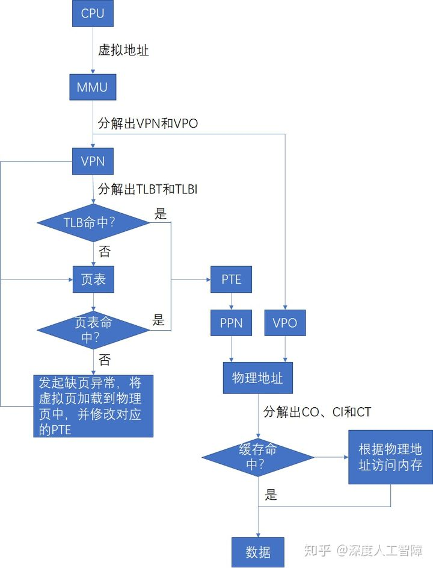 </center>     	

### 9.2　地址空间

**地址空间（Address Space）** 是一个非负整数地址的有序集合 {0,1,2,...}，如果地址空间中的整数是连续的，则称为**线性地址空间（Linear Address Space）**。

计算机系统的主存被组织成一个由M个字节大小的单元组成的数组，每个字节都有一个唯一的**物理地址（Physical Address）**，并且物理地址是连续的。由此就构成了一个**物理地址空间（Physical Address Space）** ，对应于系统中物理内存的M个字节。CPU可以通过物理地址来访问内存，这种方式称为**物理寻址（Physical Addressing）**，再将获得的数据字保存到寄存器中。

<center>  </center> 

对于主存存储器资源也可以通过虚拟内存提供另一种不同的视图。现代CPU从一个有N = 2^n 个地址的地址空间中生成**虚拟地址（Virtual Address）** ，该地址空间称为**虚拟地址空间（Virtual Address Space）**，虚拟地址空间的大小由表示最大虚拟地址所需的位数n 来确定，现代系统支持32位或64位的虚拟地址空间。
CPU会使用虚拟地址来访问主存，称为**虚拟寻址（Virtual Addressing）** ，需要首先通过**地址翻译（Address Translation）**将虚拟地址转换为对应的物理地址，再通过物理地址来访问内存。而地址翻译类似于异常处理（软硬结合），需要CPU上的**内存管理单元（Memory Management Unit，MMU）** ，以及内存中由操作系统管理的查询表来动态翻译虚拟内存。所以通过MMU来控制对内存的读写，达到对内存进行虚拟化的目的。

<center>  </center> 

通常虚拟地址空间会比物理地址空间大很多，物理地址空间对应于系统中实际拥有的DRAM容量，对于系统上运行的所有进程，虚拟地址空间是相同的。

为什么要增加MMU来对内存进行抽象呢？**主要原因在于：**

- 虚拟内存将DRAM内存作为磁盘上实际数据的高速缓存，即我们可以在主存访问磁盘大小的空间，而主存只保存活动区域，根据需要在磁盘和主存之间来回传送数据，使得进程可以得到更大的地址空间，并且更有效地利用主存资源。
- 虚拟内存为每个进程提供一致的虚拟地址空间，代码和数据总是加载到固定的地址，堆栈位于用户课件地址空间的顶部等等，但是实际上与那些虚拟地址相对应的内容分布在整个主存储器中，所以通过使用虚拟内存可以简化内存的管理。
- 虚拟内存保护每个进程的地址空间不会被别的进程破坏。

### 9.3　虚拟内存作为缓存的工具

#### 9.3.1　DRAM缓存的组织结构

虚拟内存被组织为存放在磁盘上的N个连续字节大小的单元数组，每个字节都有一个唯一的虚拟地址，而该数组的内容被缓存在主存中。（所以虚拟内存本质上是磁盘上的字节数组，该数组的索引就是虚拟地址，且主存作为该数组的缓存。）

在虚拟内存中，数据块被称为**页（Page）** ，磁盘和内存之间传送给页称为**交换（Swapping）** 或**页面调度（Paging）** 。所有现代系统都使用**按序页面调度（Demand Paging）**的方式，一直等待直到发生不命中时，才换页面。

虚拟内存之所以有效，也是因为局部性。虚拟内存作为下一层存储器层次，大小会比物理内存大，所以运行过程中程序引用的不同页面总数可能会超出物理内存大小。如果程序具有好的局部性，则在任意时刻的工作集较小，程序会趋于在一个较小的**活动页面（Active Page）** 集合上工作，所以只需要在一开始将工作集页面调度到物理内存中，过后就不会产生额外的磁盘流量了。但是如果局部性较差，则工作集超过了物理内存大小，则会发生**抖动（Thrashing）** ，使得不断从磁盘中读取页到物理内存中，程序性能大大降低。在Linux中，可以通过`getrusage`函数检测缺页的数量。

> 虚拟内存从缓存的概念考虑，要求程序具有较好的局部性

#### 9.3.2　页表

从缓存的角度来看，内存是作为虚拟内存的缓存，则这两层存储器层次之间传输数据的块大小相同，都为 P = 2^p 字节，在物理内存中的数据块称为**物理页（Physical Page，PP）** ，也称为**页帧（Page Frame），** 在虚拟内存中的数据块称为**虚拟页（Virtual Page，VP）** 。虚拟页有三种状态：

- **未分配的：** 未分配的虚拟页就是没有任何数据和它关联的数据块，不占用任何磁盘空间。
- **缓存的：** 已保存在物理页中的已分配的虚拟页
- **未缓存的：** 还未保存在物理页中的已分配的虚拟页

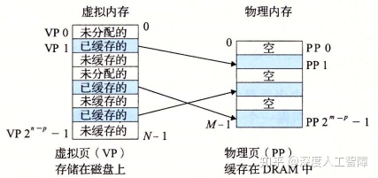

其次，主存作为虚拟内存的缓存，如果主存不命中，就会从速度特别慢的磁盘中读取数据，造成很大的开销，所以虚拟内存和主存之间传输的数据块大小P较大，通常为4KB~2MB，由此增强空间局部性。并且为了避免数据块冲突，内存是全相联的，意味着虚拟页能保存在任意的物理页中。最后，由于对磁盘的访问时间较长，内存采用写回的形式。

虚拟页到物理页的映射关系保存在物理内存中常驻的**页表（Page Table）** 数据结构中，该页表由操作系统维护，每个虚拟页在页表中都保存了它对应的物理页，所以一共需要2^p/P个**页表条目（Page Table Entry，PTE）**。每次地址翻译硬件将一个虚拟地址转换为物理地址时，就会访问该页表。


如上所示是一个页表数据结构，每个PTE包含一个有效位和一个n位地址字段组成。当有效位为1时，表示已将该虚拟页缓存在物理页中，则地址字段就是对应的物理页的起始物理地址；当有效位为0时，如果虚拟页是未分配的，则地址字段为NULL，如果虚拟页分配了，则地址字段就是对应的虚拟页在磁盘上的起始地址。

**注意：** 由于内存采用全相联结构，所以任意的虚拟页能缓存在任意的物理页中。

#### 9.3.3　页命中

当CPU想要访问位于虚拟地址`x`中的数据字时，会首先通过地址翻译硬件将虚拟地址作为一个索引来定位PTE，然后通过PTE来确定对应的虚拟页的状态。如果PTE的有效位为1，说明该虚拟页被缓存在物理内存了，则CPU可以通过该PTE的地址字段获得物理内存的地址，然后进行访问

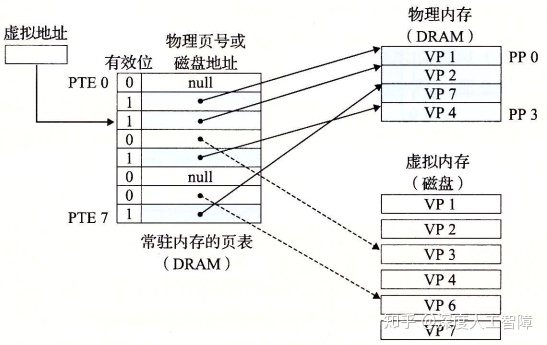

#### 9.3.4　缺页

如果该PTE的有效位为0，且地址字段指向虚拟页在磁盘的位置，则说明该虚拟页还未缓存在物理页中，则出现了**缺页（Page Fault）** （对应于不命中）。处理器会发起缺页异常，然后调用内核中的缺页异常处理程序，会执行以下步骤：

- 由于内存使用全相联结构，如果存在空的高速缓存行，则会选择该物理页，否则会从中选择一个牺牲页，由于采用了写回的策略，所以如果该物理页的数据被修改过，就将其复制会磁盘中。
- 修改牺牲页对应的PTE，将地址字段指向虚拟页在磁盘的位置，说明该虚拟页未被缓存
- 内核从磁盘复制目标虚拟页到该牺牲页中，并修改目标虚拟页对应的PTE，将地址字段指向牺牲页的物理内存地址
- 缺页异常返回到导致缺页异常的指令，重新执行该指令，此时由于缓存了目标虚拟页，所以会命中


#### 9.3.5　分配页面

当CPU想要分配一个新的虚拟页时，比如调用了`malloc`函数，则首先在磁盘中创建一个虚拟页大小的空间，然后修改对应的PTE，将有效位置为1，且地址字段指向新的虚拟页在磁盘中的位置。

#### 9.3.6　又是局部性救了我们

### 9.4　虚拟内存作为内存管理的工具

内核在进程上下文中为每个进程都维护了自己独立的页表，使得每个进程有独立的虚拟地址空间。每个进程的页表将该进程连续的虚拟地址空间映射到DRAM物理地址空间中的任意位置，并且不同的虚拟页和不同的进程可以映射到不同的物理页中。通过这种形式，可以提供一种视图：每个进程都有一个非常相似的虚拟地址空间，有相同大小的地址空间，代码和数据分别从同一个地址开始，但是进程使用的物理页实际上可能会分散在DRAM内存中。


按序页表调度和独立的虚拟地址空间，提供了以下便利：

- **简化链接：** 由于每个进程都有自己独立的虚拟地址空间，则相同的虚拟地址在不同的进程可以通过进程自己的页表来确定最终的物理地址，所以链接器生成可执行目标文件确定内存地址时，无需考虑当前物理内存的状态，可以根据我们预定义的内存模型来分配虚拟内存地址，因为不同进程之间的虚拟地址是独立的，最终可以通过页表来映射到真实的物理地址。这就极大简化了链接器的工作，可以直接按内存模型来分配地址。


- **简化加载：** 想要把可执行目标文件加载到物理内存中，Linux加载器只需要为可执行目标文件中的代码段和数据段分配虚拟页，然后在页表中将这些虚拟页设置为无效的（表示还未缓存），然后将地址字段指向对应的位置，则实际的加载工作会由操作系统自动地按需执行。当访问某一虚拟地址时，发现其对应的PTE是无效的，则会发起缺页异常，通过缺页异常处理程序自动地将虚拟页加载到物理页中。所以加载器不会将磁盘内容复制到内存，而是为可执行目标文件分配虚拟页。这种将一组连续的虚拟页映射到任意一个文件中的任意位置称为**内存映射（Memory Mapping）**。

  - 加载实际是非常高效的机制，比如你的程序中包含一个巨大的数组，但是你只访问该数组的一部分，实际上不会将整个数组对应的虚拟页保存到物理页中，因为加载器只是初始化页表。当你代码中访问该数组的一部分时，内核会执行缺页异常处理程序，将包含你想要的数据的虚拟页加载到对应的物理页中，所以效率很高。

- **简化共享：** 通过为每个进程设置独立的页表，可以很简单地实现共享库和内核的共享。之前介绍过，共享库会在加载时或运行时动态加载到物理内存的任意位置，让所有进程进行共享。这里只需要在进程中通过一个PTE指向该共享的数据或代码的物理页，就能实现在所有进程中共享的结果。也侧面说明了`plt`和`got`的必要性，可以避免修改共享库的内容。

- **简化内存分配：** 进行内存分配时，可以通过`malloc`函数在物理内存中的任意位置进行创建，因为页表只需要让虚拟页指向该物理页，就能提供连续的虚拟地址抽象，让进程误以为是在连续的地址空间中进行操作的，由此简化了内存分配需要的工作。

### 9.5　虚拟内存作为内存保护的工具

通过对页表的改进，可以很容易地进行内存保护


这里在每个PTE中引入了三个字段：

- `SUP`：确定该物理页的访问权限，确定是否需要内核模式才能访问
- `READ`：确定该物理页的读权限
- `WRITE`：确定该物理页的写权限

MMU每次访问时都会检查这些位，如果有一条指令违背了这些许可条件，就会触发一个保护故障，Linux shell一般会将这种异常报告为**段错误（Segment Fault）**。

### 9.6　地址翻译

#### 9.6.1　结合高速缓存和虚拟内存

地址翻译就是一个N元素的虚拟地址空间（VAS）中的元素和一个M元素的物理地址空间（PAS）中元素之间的映射


主要通过MMU硬件利用保存在物理内存中的页表来实现，MMU具有以下结构

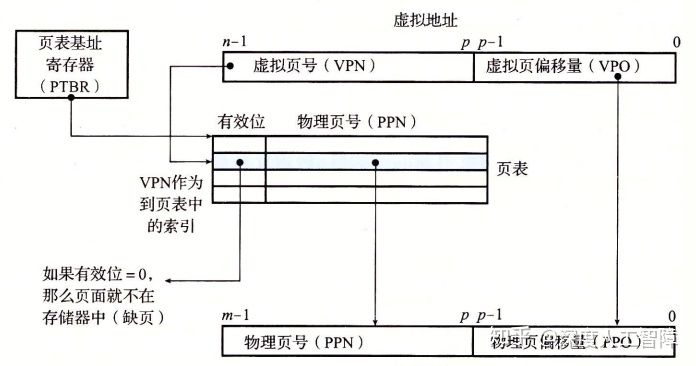

首先，虚拟页大小为P个字节，所以需要虚拟地址的低p位来索引一个虚拟页中的字节，得到**虚拟页偏移量（Virtual Page Offset，VPO）** ，然后通过虚拟地址的高n-p位来确定虚拟页在也表中的索引，得到**虚拟页号（Virtual Page Number，VPN）** 。而页表的起始地址保存在一个特殊的CPU寄存器**页表基址寄存器（Page Table Base Register，PTBR）** 中，所以可以通过VPN和PTBR得到想要的PTE的物理内存地址。并且由于虚拟页和物理页的大小相同，所以两者编码页中偏移量所需的位数p相同，可以假设数据在虚拟页和在物理页中的偏移量相同，由此就无需在页表中保存**物理页偏移量（Physical Page Offset，PPO）**，只需要保存**物理页号（Physical Page Number，PPN）** ，可以直接将VPO复制给PPO，来确定数据在物理页中的偏移量。

> 从全相联缓存的角度来看，VPN其实就是标志位，而VPO就是块偏移。

**注意：** 页表中只保存PPN。

**页面命中主要执行以下步骤** ，可以发现完全由硬件处理：

- CPU生成一个虚拟地址，将它发送给MMU
- MMU根据虚拟地址获得VPN，然后通过PTBR确定该PTE所在的物理内存地址（PTEA）（因为页表保存在物理内存中），然后将PTEA发送给物理内存
- 物理内存根据PTEA将对应的PTE发送给MMU，其中PTE只包含PPN（因为假设了数据在页内偏移量相同）
- MMU将PPN和VPO拼接起来，就可以得到虚拟地址对应的物理地址。然后MMU再将物理地址发送给物理内存
- 物理内存根据物理地址将数据发送给处理器


**缺页主要执行以下步骤** ，由硬件和操作系统共同完成：

- 前三步相同，当MMU接收到PTE时，发现有效位为0，说明该虚拟页还未缓存在物理页中，就会发起一个缺页异常，由内核来执行缺页异常处理程序。
- 通过内核来确定一个牺牲页，如果该牺牲页中的数据被修改过，就将其复制到对应的磁盘虚拟页中
- 内核将需要的虚拟页保存到对应的物理页中，并修改对应的PTE
- 从缺页异常处理程序返回到导致异常的指令，重新执行该指令，就会执行页面命中的步骤。


在高速缓存中，为了不同进程能共享相同的物理页且避免相同虚拟页的冲突，这里使用物理寻址。所以MMU负责地址翻译和访问权限检查，然后使用物理内存地址访问高速缓存

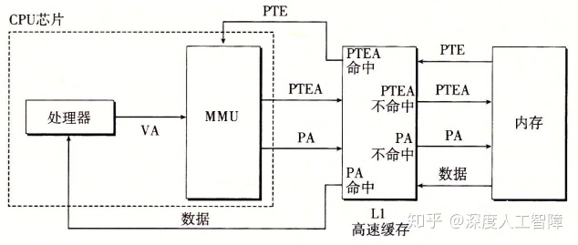

#### 9.6.2　利用TLB加速地址翻译

可以发现，每次CPU将一个虚拟地址发送给MMU时，MMU都会将需要的PTE物理地址发送给高速缓存/内存来获得PTE，如果高速缓存刚好保存了该PTE，则MMU可以很快获得，否则需要等待很多时钟周期从内存中读取。

为了减小这个开销并进一步利用局部性原理，在MMU中引入了一个保存最近使用的PTE缓存，称为**翻译后备缓冲器（Translationi Lookaside Buffer，TLB）**。在TLB中，使用虚拟地址进行寻址，具有较高的相联度，每个高速缓存行保存一个PTE，每次都是以一整个PTE进行读写，不需要含有块偏移，记得我们之前是通过VPN在页表中索引获得PTE，所以虚拟地址的划分为


所以**当TLB命中时** 的步骤为：

- CPU产生一个虚拟地址，发送给MMU
- MMU提取出当前虚拟地址的VPN，发送给TLB
- TLB对VPN进行分解，得到TLBI和TLBT，根据TLBI确定所在的高速缓存组，然后在高速缓存组中依次比较各个高速缓存行的标记是否和TLBT相同，如果相同，则TLB命中，将对应的PPN发送给MMU
- MMU将PPN和VPO拼接起来得到虚拟地址对应的物理地址。然后MMU再将物理地址发送给物理内存
- 物理内存根据物理地址将数据发送给处理器

由于TLB位于MMU中，速度特别快。


当**TLB不命中时** 的步骤为：

- CPU产生一个虚拟地址，发送给MMU
- MMU提取出当前虚拟地址的VPN，发送给TLB
- TLB对VPN进行分解，得到TLBI和TLBT，没有找到有效的PTE，发生TLB不命中
- MMU根据PTBR和VPN得到PTE对应的PTEA，将其发送给高速缓存/内存
- 高速缓存/内存将对应的PTE发送给MMU和TLB
- TLB会根据VPN将PTE保存在合适的位置
- MMU接收到PTE后，将PPN和VPO拼接起来得到虚拟地址对应的物理地址。然后MMU再将物理地址发送给物理内存
- 物理内存根据物理地址将数据发送给处理器


#### 9.6.3　多级页表

在一个32位地址空间中，每个页面大小为4KB，则一共需要2^32/2^(2+10)=2^20= 1M个页面，假设每个PTE大小为4字节，则页表总共为4MB。当使用一级页表时，需要始终在内存中保存着4MB大小的页表，我们这里可以使用多级页表来压缩内存中保存的页表内容。


首先，我们这里有1M个虚拟页，将连续的1024个虚拟页当成一个**片（chunk）**，一级页表就负责指向每个片对应的二级页表，则一级页表需要2^20/2^10片=1K 个PTE，每个PTE4字节，则一共需要4KB大小的一级页表。**注意：**这里只有当片中至少一个页被分配了才会指向对应的二级页表，否则为NULL。而二级页表就类似于我们之前的页表结构，这里只需要负责一个片的虚拟页，则每个二级页表为4KB。

当一级页表的某个PTE为NULL时，表示该片不存在被分配的虚拟页，所以就可以去掉对应的二级页表。并且在内存中只保存一级页表和较常使用的二级页表，极大减小了内存的压力，而其他的二级页表按需创建调入调出。


以上是一个k级页表层次结构的地址翻译，前面k-1个页表的PTE都是指向下一级页表的基址，而第k级页表指向的是PPN或磁盘地址。所以每次地址翻译时，MMU需要从内存中访问k个PTE，但是TLB的存在弥补了这个开销。首先，一级页表覆盖了所有的地址空间，所以一定会缓存在TLB中，而二级页表覆盖了大量的地址空间，所以他们也有很大可能会在TLB中，以此类推，只要你程序具有良好的局部性，就有很大概率从TLB中获得想要的PTE，由此弥补了多次访问页表的性能损失。

> TLB应该要将不同层次的PTE独立开来

#### 9.6.4　综合：端到端的地址翻译

首先我们需要作出以下假设：

1. 内存是按字节寻址的
2. 内存访问是针对1字节的字的
3. 虚拟地址是14位长的
4. 物理地址是12位长的
5. 页面大小是64字节的
6. TLB是四路组相连的，总共有16个条目
7. L1 d-cache是直接映射的，行大小为4字节，总共有16个字节

根据以上假设，我们可以从获取页表、TLB和高速缓存的信息：

- **页表：** 当前只使用一级页表，页表大小为64字节，则虚拟页有 ![[公式]](https://www.zhihu.com/equation?tex=2%5E%7B14%7D%2F2%5E6%3D256) 个，则页表具有256个PTE；物理页有 ![[公式]](https://www.zhihu.com/equation?tex=2%5E%7B12%7D%2F2%5E6%3D64) 个。根据地址翻译，可以将虚拟地址和物理地址进行以下划分

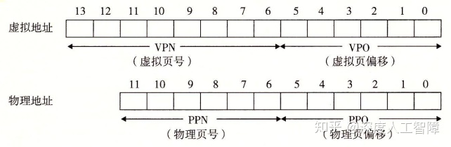

由此可以通过VPN在页表中获得对应的PTE，然后通过VPO获得在虚拟页中的数据，物理地址也同理。

- **TLB：** 四路组相连说明每个高速缓存组中具有四个高速缓存行，而TLB是以PTE为单位进行存取的，所以每个高速缓存行能保存一个PTE，而TLB一共能保存16个PTE，说明该缓存具有4个高速缓存组，则需要2位的组索引TLBI。因为TLB是虚拟寻址的，所以是在虚拟地址上进行划分的，且以PTE为单位进行存取，所以是在VPN中进行划分的，低2位为TLBI，则高6位为标志位TLBT


- **高速缓存：** 直接映射的高速缓存，说明每个高速缓存组只有一个高速缓存行，行大小为4字节，则需要2位的块偏移（CO），一个有16个组，则需要4位的组索引（CI），其余的为标志位（CT）。由于高速缓存是物理寻址的，所以要在物理地址上进行划分


假设当前页表、TLB和高速缓存的内容如下


当CPU产生虚拟地址`0x03d4`时，执行步骤为：

- 首先根据虚拟地址，我们可以进行以下划分，MMU会将VPN字段`0x0f`发送给TLB


- 当TLB接收到VPN时，会从中划分出TLBT`0x03`和TLBI`0x03`，然后根据TIBI确定在TLB中的高速缓存组，依次将TLBT和标志位进行比较，可以发现第二个高速缓存行具有相同的标志，则TLB命中，会返回对应的PPN`0x0D`给MMU
- MMU将PPN`0x0D`和VPO`0x14`拼接起来，得到物理页对应的物理地址`0x354`
- 根据物理地址，可以进行以下划分，MMU将物理地址发送给高速缓存


- 高速缓存根据CI确定所在的高速缓存组，并将组内的高速缓存行的标志位依次与CT进行比较，可以发现高速缓存命中了，并根据CO在块内偏移，得到想要的数据`0x36`，将其返回给MMU
- MMU获得数据后，将其返回给CPU

以上是比较简单的情况，即TLB命中和高速缓存命中，其他较复杂的情况需要MMU很多后续的操作。

**大致的步骤为：**

1. 将虚拟地址根据TLB规则进行划分，在TLB中进行检索，如果存在则将PPN返回给MMU，如果不存在，将地址根据页表规则进行划分，得到对应的PTE，将其保存到TLB，并将PPN返回给MMU
2. MMU根据PPN和VPO构建出物理地址，并将物理地址发送给高速缓存
3. 将物理地址根据高速缓存规则进行换分，在高速缓存中检索，如果存在则将数据返回给MMU，如果不存在则需要从内存中进行检索

**综上：** 页表和TLB是虚拟寻址的，都是返回对应的PPN；高速缓存是物理寻址的，返回对应的数据。

### 9.7　案例研究：Intel Core i7/Linux内存系统

#### 9.7.1　Core i7地址翻译

有一系列保存在磁盘中的数据，首先以页为单位将其划分成很多数据块（虚拟页），然后根据每个数据块的特点（比如读写权限）进行组合，得到若干个由若干个数据块组成的段，通过任务结构对这些段进行描述，包括：段的起始虚拟地址、段的终止虚拟地址、段的读写权限等等，由此就确定了段中每个数据块所能用的虚拟地址范围以及读写权写。接下来根据这个约束，对每个数据块分配一个虚拟地址，然后分配一个指向数据块磁盘位置的指针，确定该数据块的读写权限，然后将所有数据块的信息组合起来，就得到了页表。

> 页表是描述每个数据块的，任务结构是描述由数据块组成的段，确定了页表的信息。

- 虚拟内存在磁盘的内容称为交换空间
- 对于私有对象，页设置为只读的，页所在的段设置为私有的写时复制的。则当尝试对页进行写操作时，会触发保护故障，然后根据私有的写时复制进行操作。
- 为了能维护自己的状态，需要将状态所在的段标记为私有写时复制的。当没有对其进行修改时，所有都共享相同的物理页，如果对其修改了，就会新建一个物理页，这样就能保证自己的状态不会被别的进程修改。
- 内存映射仅仅是将虚拟内存和磁盘文件对应起来，并没有拷贝到内存中，只是指定虚拟页的初始值。会按需自动加载虚拟页到物理页中。

#### 9.7.2　Linux虚拟内存系统

现在的Core i7支持48位虚拟地址空间和52位物理地址空间，还兼容32位虚拟和物理地址空间。

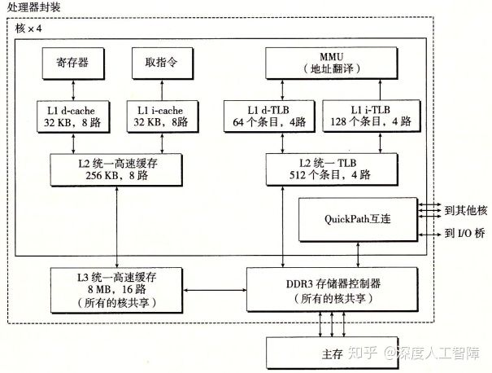

如上图所示是一个**处理器封装（Processor Package）** ，其中有一组基于QuickPath技术的点对点链路，为了让一个核与其他核和外部I/O桥直接通信。

- **高速缓存：** 具有3层高速缓存层次结构，其中L3是所有核共享的高速缓存，其中数据块大小为64字节，所以高速缓存具有以下性质。其中，数据块为64字节，则需要6位的块偏移，L1 d-cache有64组，则需要6位的组索引，其余的为标志位。

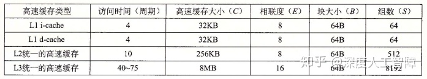

- **页表：** 这里采用4级页表结构，页大小为4KB，说明需要12位的VPO，而虚拟地址为48位，所以VPN为36位，则每一级的VPN为9位。每个进程有自己私有的页表层次结构，并且存在CR3控制寄存器指向第一级页表的起始位置，其中CR3是每个进程上下文的一部分，每次进行上下文切换时，都会被恢复。页表的PTE格式如下所示


其中每个PTE为8字节，而每一级的VPN为9位，则每个PTE引用了一个 ![[公式]](https://www.zhihu.com/equation?tex=2%5E9%2A2%5E3%3D4KB) 的子页表，这里就要求物理页4KB对齐。由于物理地址为52位，PPO为12位，则PPN为40位，所以这里的页表物理基地址为40位。这里增加了3个权限位来控制对页的访问：`R/W`、`U/S`和`XD`，其中`XD`是64位系统引入的，限制了只能在只读代码段执行，降低了缓冲区溢出攻击的风险。此外，当MMU访问一个页时，会设置**引用位（Reference Bit）**A位，让内核实现页替换算法，当MMU修改一个页时，会设置**脏位（Dirty Bit）**D位，使得内核对牺牲页进行写回。以下是Core i7的页表翻译


- **TLB：** 这里TLB也采用层次结构，并且为数据和指令分别使用两个一级TLB。其中，L1 d-TLB有4路64个PTE，则一共有16个组，需要4位TLBI；L1 i-TLB有4路128个PTE，一共有32组，需要5位TLBI；L2 TLB有4路512个PTE，一共有128个组，需要7位TLBI。

- - 这里之所以使用L2 TLB而不是扩大L1 TLB，是因为如果舍弃L2 TLB而增大L1 TLB，仍然可能出现工作集大于缓存的情况，就会出现容量不命中，通过增加L2 TLB来减少不命中惩罚。

下面是Core i7地址翻译的整体架构（省略了i-cache、i-TLB和L2统一TLB）


这里可以发现一个**特点：** 高速缓存的CI+CO=12位，而VPO也是12位。这不是巧合，而是故意这样设计来加速地址翻译。我们知道，VPO=PPO，而PPN需要通过地址翻译获得，则一开始输入虚拟地址时，就能一下等到PPO，然后等待检索PPN。此时我们就能直接将PPO输入到高速缓存中，因为PPO确定了对应的高速缓存组和块偏移量，就能先通过PPO获得对应的高速缓存组，然后只要等检索到PPN时，就能直接和高速缓存组中每一行的标志位进行比较，极大加速了地址翻译过程。


### 9.8　内存映射

如果虚拟内存系统可以集成到传统的文件系统中，就能提供一种简单而高效的方法把程序和数据加载到内存中。这里通过**内存映射（Memory Mapping）** 将一个虚拟内存段与一个磁盘上的**对象（Object）** 关联起来，来初始化虚拟内存段的内容，所以当我们第一次引用某个段时，它的初始值来自于磁盘上的普通文件，然后通过按需页面调度，将需要的虚拟内存段加载到物理内存中。

> 主要说明如何将虚拟内存段和磁盘内容关联起来。
> 每个段包含的虚拟页都和磁盘文件中的某些部分关联起来，并且虚拟页的初始内容都来自于磁盘文件。

内存映射可以用两种磁盘上的对象来初始化虚拟内存段：

- **Linux文件系统中的普通文件：** 比如一个可执行目标文件，将其分成页大小的数据块，用来初始化对应的虚拟内存段，如果段比文件大，则用0来填充剩下的内容。然后按需将虚拟页复制到物理页中。
- **匿名文件：** 内核可以创建大小任意的全是二进制0的匿名文件，该文件其实并不存在。当我们想要创建一个全为0的页，可以将虚拟页和匿名文件关联起来，当内核引用该虚拟页时，会直接覆盖牺牲页的内容，得到全为0的页，然后修改对应的页表内容。这个过程磁盘和内存之间没有实际的数据传送。

> 匿名文件主要用于创建全为0的页。

这些与虚拟内存段关联的磁盘内容处于**交换空间（Swap Space）** 中（即虚拟内存在磁盘空间上的内容就是在交换空间中，也就是说交换空间保存了映射到虚拟内存中的磁盘数据，则交换空间大小其实就是虚拟内存大小），则交换空间限制了当前运行着的进程能够分配的虚拟页总数（虚拟内存大小确定了，虚拟页大小也确定了，则页数目也就确定了）。

> 交换空间是所有进程的虚拟内存可用的总空间

内存映射概念的存在，使得我们可以重新回去看共享对象和私有对象、`fork`函数和`execve`函数。

#### 9.8.1　再看共享对象

##### 9.8.1.1 共享对象

如上所述，虚拟内存段中通过`vm_prot`确定该虚拟内存段中的虚拟页是否在进程之间共享，如果共享，则称该段为**共享段**，则各个进程在该段中的操作是互相可见的，且变化也会反映在磁盘上；如果不共享，则称该段为**私有段**，则各个进程在该段中的操作是互相不可见的，也不会反映到磁盘上。

在进程1中，当我们将磁盘上的一个对象通过内存映射与该进程的一个共享段关联起来时，就会使得虚拟页对应的PTE指向该对象，当引用该对象时，就会将对应的虚拟页加载到物理页中；而进程2也要将该对象与自己的一个共享段关联起来时，当对其引用时，由于每个对象都有一个唯一的文件名，所以内核可以发现进程1将该对象加载的物理页，就直接在进程2中将对应的PTE指向相同的物理页就行了。

**注意：**

- 进程1和进程2 的虚拟地址空间是不同的
- 即使一个对象与多个进程的共享段关联，物理内存中始终只有该对象的一个副本。


##### 9.8.1.2 私有对象

在进程1中，当我们将磁盘上的一个对象通过内存映射与该进程的一个私有段关联起来时，就会使得虚拟页对应的PTE指向该对象，当引用该对象时，就会将对应的虚拟页加载到物理页中；当进程2也要将该对象与自己的一个私有段关联起来时，当对其引用时，也会直接在进程2中将对应的PTE指向相同的物理页，即当未对私有对象进行修改时，物理内存中只会保存同一个对象副本，且各个进程中对该对象的PTE都是只读的，而虚拟内存段被标记为**私有写时复制的（Private Copy-On-Write）**。


但是假设进程2对该私有对象进行修改时，会触发保护故障，处理程序就会在物理内存中创建一个该物理页的副本，然后让进程2对该对象的PTE指向新的副本，并设置该虚拟页具有写权限，然后处理程序返回，从写指令重新运行。


> 图中大块的表示对象，可能由很多个页组成，当我们尝试对其中一个页进行修改时，只会对该页进行复制，并修改该页对应的PTE，而该对象的其他页保持不变。

**问题：** 当虚拟页的读写权限修改后，与所在段的读写权限冲突时，是否要修改虚拟页所在的段？即上图进程2深色和浅色的页是处在不用段中？还是说段的读写权限是用来初始化其中包含的虚拟页的读写权限，但是虚拟页的读写权限可以自己修改？

通过写时复制这种策略，尽可能延迟物理内存中的拷贝，能最大效率地使用物理内存。

> 当只对虚拟空间进行读操作，则永远不会复制，而是共享相同的物理内存。


#### 9.8.2　再看fork函数

在父进程中调用`fork`函数时，会创建一个具有相似但独立虚拟地址空间的子进程，并分配一个唯一的PID，而写时复制技术会给`fork`函数提供一个高效的解决方案：

- 为了具有和父进程相同的**虚拟内存状态** ，内核会复制父进程的`mm_struct`
- 为了具有和父进程相同的**虚拟内存段分配** ，内核会复制父进程的`vm_area_struct`
- 为了子进程和父进程具有相同的**虚拟内存内容** ，内核会复制父进程的页表，就能将相同的磁盘内容映射到相同的虚拟页中，并将虚拟页缓存在相同的物理页中。
- 为了子进程和父进程的虚拟地址空间能**相互独立** ，两个进程的页都设置为只读的，且段都标记为私有的写回复制。当父子进程都没有对页进行修改时，父子进程是共享相同的物理内存的，当其中一个进程对页进行修改时，就会对该页进行写回复制，并为该页赋予写权限，并更新进程对应的页表。

#### 9.8.3　再看execve函数

当我们运行`execve("a.out", NULL, NULL)`执行可执行目标文件`a.out`时，包含以下步骤：

- **删除用户段：** 将进程的虚拟地址空间中的用户段删除，即删除`vm_area_struct`和页表。

- **映射私有段：** 首先为可执行目标文件中的不同数据节创建对应的段，即在`vm_area_struct`中新建节点，并设置对应的段起始虚拟地址、段终止虚拟地址，设置这些段为私有写回复制的。然后将这些段通过内存映射与`a.out`中的内容关联起来。（对私有对象的读写参考2.2）

- - 对于需要初始化为0的段，可将其与匿名文件进行关联。

- **映射共享段：** 对于共享库的内容，会将其映射到共享库的内存映射段中，即在`vm_area_struct`中创建一个共享段，然后将其与共享库的内容关联起来，这样就能在多个进程中共享相同的共享库。（对共享对象的读写参考2.1）

- - 如果共享库有维护状态的静态变量，比如随机生成器在调用时会维持状态，且不同的进程的状态不同，对于这种要修改静态数据的函数，应该将该段标记为私有写时复制的，这样就能在不同进程中维护自己独立的状态。

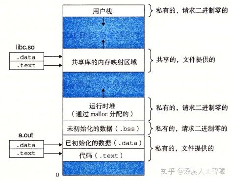

- 设置程序计数器，使其指向代码段的入口点。

> 通过将对象映射到不同的段中，就能决定对该对象进行读写时的特点。

**注意：** 当程序运行时，我们并没有加载任何内容到内存中，所做的只是设置内存映射，在内核中创建数据结构，由此创建了虚拟地址空间和这些对象之间的映射关系，而实际的拷贝工作会由缺页异常按需完成。

#### 9.8.4　使用mmap函数的用户级内存映射

用户通过`mmap`函数能自己创建虚拟内存段，并将对象映射到该段中，由此我们可以通过修改该段的参数，来达到对对象的设置。比如设置该虚拟内存段是全部进程共享的，则映射到该段的对象就能在所有进程中共享。

```c
#include <unistd.h>
#include <sys/mman.h>
void *mmap(void *start, size_t length, int port, int flags, int fd, off_t offset);
```

文件描述符`fd`指定一个磁盘文件，该函数会将磁盘文件中偏移`offset`处的`length`个字节的对象映射到虚拟内存中的`start`处。`start`指定的段如果是有效的，则内核会将其映射到指定段，如果指定段的部分虚拟地址空间被某个已存在的段包含了，则内核会另外找一个有效的位置，`start`可以设置为NULL，让内核自动分配。

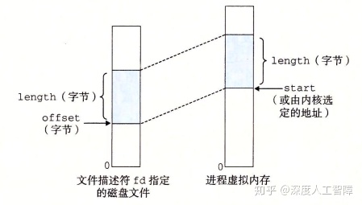

其中，`prot`对应于段结构中的`vm_prot`参数，用来确定该虚拟内存段的读写权限：`PROT_EXEC`表示该段中的页是可执行的；`PROT_READ`表示该段中的页是可读的；`PROT_WRITE`表示该段中的页是可写的；`PROT_NONE`表示该段内的页是不可访问的。

`flags`对应于段结构中的`vm_flags`：`MAP_PRIVATE`表示该段是私有的写时复制的；`MAP_SHARED`表示该段是共享的。也可以设置`MAP_ANON`，表示是一个匿名对象。

当函数执行成功时，会返回指向该段的指针，如果失败，则返回`MAP_FAILED`。

可以通过以下函数来删除虚拟内存中的段：

```c
#include <unistd.h>
#include <sys/mman.h>
int munmap(void *start, size_t length); 
```

使用自定义内存映射的**好处在于：**

- 使得磁盘文件中的一块数据能与虚拟内存地址空间中的某个段建立映射关系，此时我们就能直接通过对该虚拟内存段的访问来间接访问磁盘文件内容，不必执行文件I/O操作，也无需对文件内容进行缓存处理。并且虚拟内存进行按序页面调度的，当你访问了文件内容，它就会将对应的虚拟页加载到物理页中，此时就能从内存中很快地访问文件内容。当你处理大文件或频繁读写文件时能提速，因为此时就直接将文件内容加载到物理内存中了，一切读写操作都是在物理内存中进行的，速度特别快，只有在内核将其牺牲时，才会进行写回。
- 通过内存映射方法，我们还能定义一个进程共享的虚拟内存段，使得能让多个进程对一个区域进行访问和修改。


### 9.9　动态内存分配

不能分配小于最小块大小的块。

------

- 虚拟页的存在是作为虚拟内存和物理内存传输数据块的单位，是由一系列连续的虚拟内存地址组成的，并且这些虚拟地址的特点由虚拟页定义。而虚拟内存段是将一系列大量的连续的具有相似特点的虚拟地址聚集起来，且虚拟内存段也描述了这些虚拟地址的一些特点，并且这些虚拟地址以虚拟页为单位进行组织，即虚拟内存段包含虚拟页。
  我们使用虚拟内存时是以虚拟地址为单位的，只是根据我们对其使用方式的不同要求和权限，会处于不同虚拟段中的不同虚拟页中。
- 当调用`malloc`函数来分配块时，首先会在空闲链表中寻找是否有合适的空闲块，如果尝试了合并空闲块还是没找到，则会调用`sbrk`函数来向内核申请更大的堆内存。所以在一开始将堆与匿名文件映射时，堆内存为0，则第一次调用`malloc`函数时，会直接调用`sbrk`函数来申请得到一块大的空闲块，该空闲块可能会比你尝试分配的块大，然后就一直在这个堆中进行操作。
- 堆的起始地址到`brk`之间是已申请的堆内存，可以在里面进行动态内存分配，而`brk`之外的是未申请的堆内存，只有当找不到合适的空闲块时，才会向内核申请更大的可用空间，此时就会移动`brk`。

------

除了上一章介绍的通过`mmap`函数能让用户自定义内存映射，将磁盘文件映射到虚拟内存中以外，也可以在运行时使用**动态内存分配器（Dynamic Memory Allocator）** 来分配额外的虚拟内存。动态内存分配器维护着虚拟内存中的堆段，将堆视为一组不同大小的块的集合，每个块由若干个连续的虚拟地址构成（一个块不一定处在同一个虚拟页），每个块具有**两种状态：**

- **已分配：** 已分配的块能为应用程序所用，且块会保持已分配状态直到被释放
- **空闲的：** 空闲的块无法使用，直到它被分配


而在最开始进行内存映射时，堆是与匿名文件关联起来的，所以堆是一个全0的段，即处于空闲状态，它紧跟在未初始的数据段后面，向地址更大的方向延伸，且内核对每个进程都维护了`brk`变量来指向堆顶。

#### 9.9.1　malloc和free函数

C中提供了malloc显示分配器，程序可以通过`malloc`函数来显示地从堆中分配块

```c
#include <stdlib.h>
void *malloc(size_t size); 
```

该函数会返回一个指向大小至少为`size`字节的未初始化内存块的指针，且根据程序的编译时选择的字长，来确定内存地址对齐的位数，比如`-m32`表示32位模式，地址与8对齐，`-m64`表示64位模式，地址与16对齐。如果函数出现错误，则返回NULL，并设置`errno`。我们也可以使用`calloc`函数来将分配的内存块初始化为0，也可以使用`realloc`函数来改变已分配块的大小。

程序可以通过`free`函数来释放已分配的堆块

```c
#include <stdlib.h>
void free(void *ptr);
```

其中`ptr`参数要指向通过`malloc`、`calloc`或`realloc`函数获得的堆内存。

动态内存分配器可以使用`mmap`和`munmap`函数，也可以使用`sbrk`函数来向内核申请堆内存空间，只有先申请获得堆内存空间后，才能尝试对块进行分配让应用程序使用。

```c
#include <unistd.h>
void *sbrk(intptr_t incr); 
int brk(void *addr);
brk`函数会将`brk`设置为`addr`指定的值。`sbrk`函数通过`incr`来增加`brk
```

- 当`incr`小于0时，会减小`brk`来解除已分配的堆内存
- 当`incr`等于0时，会返回当前的`brk`值
- 当`incr`大于0时，会增加`brk`来分配更多的堆内存

当`sbrk`函数运行正常时，会返回之前的`brk`值，否则会返回-1并设置`errno`为`ENOMEM`。

当我们使用`malloc`函数申请较小的堆内存时，会通过`brk`或`sbrk`函数设置`brk`来实现。`brk`和`sbrk`函数分配的对控件类似于缓冲池，每次`malloc`从缓冲池获得内存时，如果缓冲池大小不够，就会调用`brk`或`sbrk`函数来扩充缓冲池，然后从该缓冲池中获得对应的内存，而`free`函数就会将应用程序使用的内存空间归还缓冲池。

通过`sbrk`和`brk`函数来针对小块内存的申请，会产生内存碎片问题。对于大块内存的申请，会直接使用`mmap`函数，直接将大段的虚拟地址空间与匿名文件关联起来，就不会有内存碎片问题。

在本节课中，以字为单位进行操作，每个字为4字节，并进行双字对齐。


**注意：**

- 分配堆内存时，会进行地址对齐
- 释放内存后，其指针不会被删除，所以要谨慎被删除的指针的使用

**参考：**

[理解brk和sbrk - 在于思考 - 博客园](https://link.zhihu.com/?target=https%3A//www.cnblogs.com/chengxuyuancc/p/3566710.html)

[系统调用与内存管理（sbrk、brk、mmap、munmap）_运维_Apollon_krj的博客-CSDN博客](https://link.zhihu.com/?target=https%3A//blog.csdn.net/apollon_krj/article/details/54565768)

[何柄融：malloc 的实现原理 内存池 mmap sbrk 链表](https://zhuanlan.zhihu.com/p/57863097)


#### 9.9.2　为什么要使用动态内存分配

动态内存分配器具有两种类型，都要求由应用程序显示分配块，但是由不同实体来负责释放已分配的块：

- **显示分配器（Explicit Allocator）：** 要求应用程序显示释放已分配的块。比如C中通过`malloc`来分配块，再通过`free`来显示释放已分配的块，C++中的`new`和`delete`相同。 
- **隐式分配器（Implicit Allocator）：** 由分配器检测哪些块已不被应用程序使用，就自动释放这些块。这种隐式分配器称为**垃圾收集器（Garbage Collector）**，而这种过程称为**垃圾收集（Garbage Collection）** 。比如Java、ML和Lisp。

程序使用动态内存分配器来动态分配内存的**意义在于：** 有些数据结构只有在程序运行时才知道大小。通过这种方式就无需通过硬编码方式来指定数组大小，而是根据需要动态分配内存。

```c
#include <stdio.h>
#include <stdlib.h>
int main(){
  int *array, i, n;
  scanf("%d", &n);
  array = (int *)malloc(n*sizeof(int));
  for(i=0; i<n; i++){
    scanf("%d", &array[i]);
  }
  free(array);
  exit(0);
}
```

这一章主要介绍管理堆内存的显示分配器。

#### 9.9.3　分配器的要求和目标

显示分配器的**要求** 有：

- 只要满足每个释放请求都对应于一个由以前分配请求获得的已分配的块，则应用程序可以以任意顺序发送分配请求和释放请求。
- 分配器必须立即响应请求，不允许对请求进行重排列或缓存。
- 为了使分配器是可扩展的，分配器使用的任何非标量数据结构都必须保存在堆内。
- 为了能保存任意类型的数据对象，分配必须对齐块。（比如讲解`struct`时，它根据对齐要求对起始虚拟地址是有要求的）
- 当块被分配了，分配器不允许对其进行修改或移动，因为已分配块属于应用程序了。

显示分配器的**目标** 为：吞吐率最大化和内存使用率最大化

- 吞吐率是指每个单位时间内完成的请求数。一个分配请求的最差运行时间与空闲块的数量成线性关系（要一次搜索每个空闲块来确定是否适合），而一个释放请求的运行时间是常数，则我们可以通过最小化分配请求和释放请求的平均运行时间来最大化吞吐率，主要约束项在分配请求。

- 一个系统中所有进程分配的虚拟内存的全部数量是受磁盘上的交换空间限制的，所以要尽可能最大化内存使用率。首先，我们给定n个分配请求和释放请求的序列 ![[公式]](https://www.zhihu.com/equation?tex=R_0%2C+R_1%2C...%2CR_k%2C...%2CR_%7Bn-1%7D) ，然后定义以下概念：

- - **有效载荷（Payload）：** 应用程序请求一个p字节的块，则该已分配的块的有效载荷为p字节。（分配器为了对齐要求和块的格式，可能会申请比p更大的块）
  - **聚集有效载荷（Aggregate Payload）** P：当前已分配的块的有效载荷之和
  - 然后我们可以通过`brk`变量来确定堆当前的大小 ![[公式]](https://www.zhihu.com/equation?tex=H_k) （假设是单调不递减的）
    由此我们可以确定前k+1个请求的**峰值利用率（Peak Utilization）** ![[公式]](https://www.zhihu.com/equation?tex=U_k%3D%5Cfrac%7Bmax_%7Bi%5Cle+k%7DP_i%7D%7BH_k%7D) 。通过峰值利用率就能确定分配器使用堆的效率，并且对于任意的分配和释放序列，最大的 ![[公式]](https://www.zhihu.com/equation?tex=P_i) 是相同的。在理想状态下，每个块的内容都是有效载荷，所以利用率为1。

	
#### 9.9.4　碎片

造成堆内存使用效率低下的主要原因是**碎片（Fragmentation）** 现象，当空闲的内存不能满足分配请求时就会产生碎片，主要分为两种：

- **内部碎片（Internal Fragmentation）：** 当已分配的块比有效载荷大时，就会产生内部碎片。比如分配器为了满足对齐要求或保存块的数据结构，就会对分配块增加额外的内存空间。我们可以通过已分配块的大小与其有效载荷的差来量化内部碎片，则内部碎片的数量主要取决于之前请求的模式和分配器的实现方法。


- **外部碎片（External Fragmentation）：** 当空闲的内存合起来够满足一个分配请求，但单独一个空闲内存不够时，就会产生外部碎片。外部碎片比较难进行量化，因为它主要取决于未来请求的模式，所以分配器通常试图维持少量的大的空闲块。

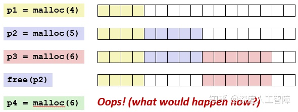

#### 9.9.5　实现问题

为了让分配器能平衡吞吐率和利用率，需要考虑以下几个**问题：**

- 如何记录堆中空闲的块？
- 如何选择一个合适的空闲块来放置一个新分配的块？
- 再将一个新分配的块放置在某个空闲块后，如何处理空闲块中剩余部分？
- 如何处理一个刚刚被释放的块？
- 当我们对一个指针调用`free`时，怎么知道要释放多少内存？

#### 9.9.6　隐式空闲链表

对于堆内存中的块，我们可以将其定义为以下数据结构形式

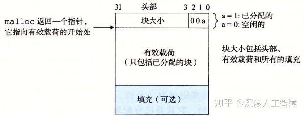

则每个块由三部分构成：

- **头部：** 大小为一个字（一个字为4字节），可以用来保存块大小，如果我们添加一个双字的对齐要求，则块大小就总是8的倍数，则头部中表示块大小的低3位就总是0，我们可以拿这3位来表示该块是否被分配。（则一个块最大只能是 ![[公式]](https://www.zhihu.com/equation?tex=2%5E%7B29%7D-1) 字节）
- **有效载荷：** 应用通过`malloc`请求的有效载荷
- **填充：** 可选的，分配器可用来处理外部碎片，或满足对齐要求。

我们通过块的这种数据结构来组织堆内存，则通过块头部的块大小来将堆中的所有块链接起来。分配器可以通过遍历所有块，然后通过块头部的字段来判断该块是否空闲的，来间接遍历整个空闲块集合。我们可以通过一个大小为0的已分配块来作为**终止头部（Terminating Header）**，来表示结束块。

大小/已分配位

**注意：** 计算块大小时，要先将有效载荷加上块头部大小，然后再计算满足对齐要求时的块大小。

由于地址对齐要求和分配器对块格式的选择，会对**最小块** 的大小有限制，没有已分配的块和空闲块比最小块还小，如果比最小块还小，就会变成外部碎片（所以最小块越大，内部碎片程度越高）。比如这里如果对齐要求是双字8字节的，则最小块大小为双字：第一个字用来保存头部，另一个字用来满足对齐要求。

#### 9.9.7　放置已分配的块

当应用请求一个k字节的空闲块时，分配器会搜索空闲链表，并根据不同的**放置策略（Placement Policy）**来确定使用的空闲块：

- **首次适配（First Fit）：** 分配器从头开始搜索空闲链表，选择第一个块大小大于k的空闲块。

- - **优点：**  趋向于将大的空闲块保留在空闲链表后面。
  - **缺点：** 空闲链表开始部分会包含很多碎片


- **下一次适配（Next Fit）：** 分配器从上一次查询结束的地方开始进行搜索，选择第一个块大小大于k的空闲块。

- - **优点：** 运行比首次适配块一些，可以跳过开头的碎片
  - **缺点：** 内存利用率比首次适配低很多

- **最佳适配（Best Fit）：** 分配器会查找所有空闲块，选择块大小大于k的最小空闲块。

- - **优点：** 内存利用率比前两者都高一些
  - **缺点：** 需要遍历完整的空闲链表

如果分配器可以找到满足要求的空闲块，则需要**确定如何使用这个空闲块：**

- 如果空闲块与k大小相近，则可以直接使用这一整个空闲块
- 如果空闲块比k大很多，如果直接使用整个空闲块，则会造成很大的内部碎片，所以会尝试对该空闲块进行分割，一部分用来保存k字节数据，另一部分构成新的空闲块。

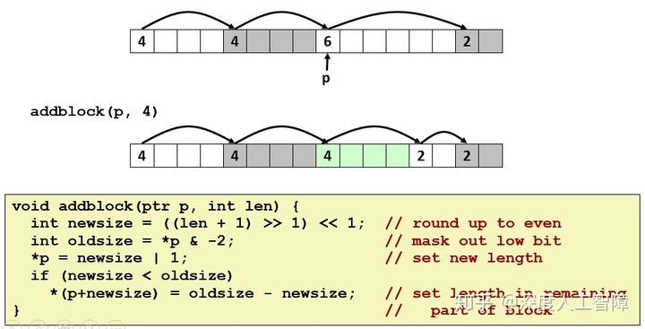

如果分配器找不到满足要求的空闲块，则会首先尝试将物理上相邻的两个空闲块合并起来创建一个更大的空闲块，如果还是不满足要求，则分配器会调用`sbrk`函数来向内核申请额外的堆内存，然后将申请到的新空间当做是一个空闲块。

#### 9.9.8　分割空闲块


#### 9.9.9　获取额外的堆内存


#### 9.9.10　合并空闲块

当我们尝试释放分配块时，如果当前块与其他空闲块相邻，则会产生**假碎片（Fault Fragmentation）** 现象，即许多可用的空闲块被分割为小的无法使用的空闲块，此时分配器就可以合并相邻空闲块来解决假碎片问题，具有以下策略：

- **立即合并（Immediate Coalescing）：** 当我们释放一个分配块时，就合并与其相邻的空闲块。

- - **优点：** 可在常数时间内完成
  - **缺点：** 可能一个空闲块会被来回分割和合并，产生抖动

- **推迟合并（Deferred Coalescing）：** 当找不到合适的空闲块时，再扫描整个堆来合并所有空闲块。

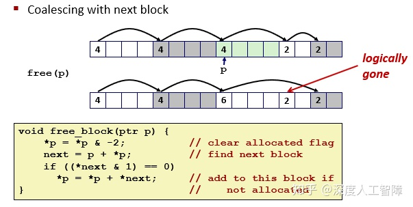

#### 9.9.11　带边界标记的合并

为了高效合并前一个空闲块，需要使用**边界标记（Boundary Tag）** 技术，使得当前块能迅速判断前一个块是否为空闲的

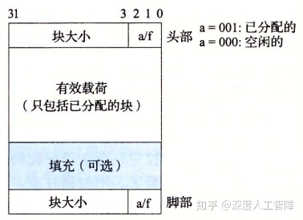

在块的数据结构中，会添加一个块头部的副本得到脚部。这样当前块从起始位置向前偏移一个字长度，就能得到前一个块的脚部，通过脚部就能判断前一个快是否为空闲的，并且也能得到前一个块的大小。且当前块通过自己头部的块大小就能得到下一个块的头部，由此来判断下一个块是否空闲，以及下一个块的大小。

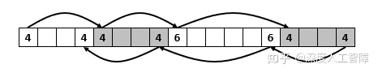

可以将所有情况分成以下几种：

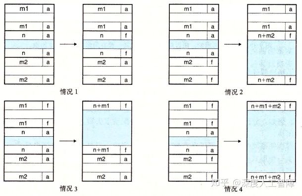

- 前一块和后一块都是分配的：此时不会发生合并操作。
- 前一块是已分配的，后一块是空闲的：当前块会将头部中的块大小设置为当前快的大小和下一块大小之和，并且修改下一块的脚部。
- 前一块是空闲的，下一块是已分配的：前一块会将头部中的块大小设置为自己的块大小和当前块大小之和，并且修改当前块的脚部。
- 前一块和当前快都是空闲的：前一块会将头部中的块大小设置为这三个块的大小之和，并修改下一块的脚部。

该技术的缺点是会显著增加内存开销，由于引入了脚部，使得有效载荷大小变小，而使得内部碎片变多了，并且最小块的大小变大导致外部碎片也变多了。

我们可以对其进行优化，有些情况是不需要边界标记的，只有在合并时才需要脚部，而我们只会在空闲块上进行合并，所以在已分配的块上可以不需要脚部，那空闲块如何判断前一个块是否为已分配的呢？可以在自己的头部的3个位中用一个位来标记前一个块是否为空闲的，如果前一个块为已分配的，则无需关心前一个块的大小，因为不会进行合并；如果前一个块为空闲的，则前一个块自己就有脚部，说明了前一个块的大小，则可以顺利进行合并操作。

> 通过合并操作，空闲块的两侧一定都是已分配的块。


#### 9.9.12　综合：实现一个简单的分配器

**实现隐式空闲链表**

这里简单实现一个隐式空闲链表，会使用立即边界标记合并。

首先，为了不干扰系统层的分配器，需要如下构建一个内存系统模型


其中，`mem_heap`指向了堆的起始地址，`mem_brk`指向了堆顶地址，`mem_max_addr`指向了堆最大的地址。在`mem_init`函数中，还会首先申请一个`MAX_HEAP`的空间作为我们的堆内存，而`mem_brk`初始指向起始地址，因为不含有元素。`mem_sbrk`函数主要用来移动`mem_brk`来对我们可用的堆内存进行调整。

其次，分配器使用带有边界标记的堆块格式


而隐式空闲链表具有以下格式。首先使用第一个填充字来保证边界对其，然后在初始时创建**序言块（Prologue Block）**作为起始，永不释放，具有一个8字节的头部和8字节的脚部，是已分配的。而在结尾具有一个**结尾块（Epilogue Block）**，只有头部的大小为0的已分配块。这里会有一个指针`heap_llistp`来指向该序言块。

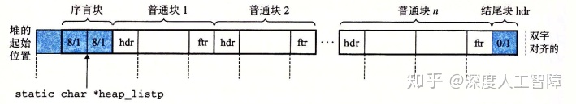

为此，我们需要定义以下基本常数和宏


其中，`CHUNKSIZE`表示当已申请的堆内存不够时，向内核申请的堆内存大小。`PACK`用来获得块头部，因为块头部的低3位用来表示是否分配。`GET`和`PUT`表示在地址`p`处读写一个字。`GET_SIZE`和`GET_ALLOC`表示从地址`p`处获得块大小和是否分配。`HDRP`和`FTRP`是输入指向第一个有效载荷字节的**块指针（Block Pointer）**，用来获得块头部和脚部。`NEXT_BLKP`和`PREV_BLKP`用来获得下一个和前一个块。

定义好后，我们首先需要根据隐式空闲链表的格式来初始化堆内存

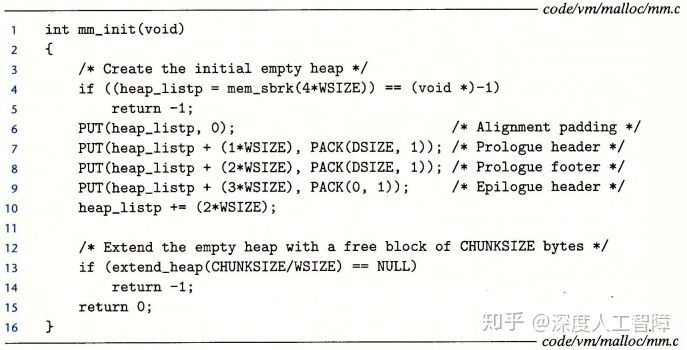

首先，最小的隐式空闲链表需要包含一个字用于对齐，以及两个字的序言块和一个字的结尾块，所以首先使用`mem_sbrk`申请4个字的堆内存。然后根据要求填充对应的内容，然后让`heap_listp`指向序言块脚部的起始地址。初始完后，由于是空的堆内存，所以需要调用`extend_heap`函数来申请`CHUNKSIZE`字节。


首先会判断我们申请的字是否满足对齐要求，然后再申请需要的空间。接下来就需要根据隐式空闲链表的要求再对堆进行设置，首先将申请到的空间作为一整个空闲块，设置了对应的头部和脚部，**注意：** 在第8行申请`size`个字节后，`bp`指向的是结尾块的下一个字，所以在第12行设置空闲块头部时，根据`PUT`定义，可知这里新申请的空闲块覆盖了之前的结尾块，将其作为了自己的头部字，然后在设置脚部时，留下了一个字用来作为新的结尾块。

最终如果前面是一个空闲块，就会尝试进行合并。


在`coalesce`函数中，会根据前后两个块是否空闲来确定是否合并，合并其实也就是修改空闲块的头部和脚部。释放操作的`free`函数其实就是将块的头部和脚部设置为空闲的，然后执行合并操作就行。

接下来就是关键的我们实现的`malloc`方法


首先字节数`size`传进来后，会现在第12行到14行判断是否满足对齐要求，然后得到满足对齐要求的字节数`asize`。然后尝试寻找合适的空闲块进行分配，如果没有找到合适的空闲块，就需要向内核再申请堆内存空间，再尝试分配。


#### 9.9.13　显式空闲链表

我们这里可以将空闲块组织成某种形式的显示数据结构。因为空闲块中除了头部和脚部以外都是没用的，所以可以在空闲块中的其余部分引入其他信息，这里引入了一个指向前一个空闲块的`pred`指针，还有一个指向下一个空闲块的`succ`指针，由此就将空闲块组织成双向链表形式。 但是这种方法需要更大的空闲最小块，否则不够存放两个指针，这就提高了外部碎片的程度。


对于已分配块，可以通过头部和脚部来得到地址相邻两个块的信息，而对于空闲块，可以通过头部和脚部来得到地址相邻两个块，也可以通过两个指针直接获得相邻的两个空闲块。**注意：**逻辑上看这两个空闲块是相邻的，但物理地址上不一定是相邻的。


分配器使用这种形式的块结构，可以将首次适配时间从块总数的线性时间降低为空闲块总数的线性时间（因为要依次遍历检索到满足要求的空闲块）。比如我们这里存在以下3个空闲块的双向链表，此时想要分配中间的空闲块，且对其进行分割


此时就会获得以下形式，因为已分配块可以根据指针来定位，所以不需要额外进行链接。而空闲块会从中分割出合适的部分用于分配，其余部分作为新的空闲块，此时只要更新6个指针使其指向和的位置就行。


而当我们想要释放已分配块时，它并不在空闲链表中，要将其放在空闲链表什么位置？我们对空闲链表的维护会影响释放已分配块的时间：

- **后进先出（LIFO）策略：** 将释放的已分配块放到空闲链表开始的地方，则只需要常数时间就能释放一个块。如果使用后进先出和首次适配策略，则分配器会先检索最近使用过的块。但是碎片化会比地址顺序策略严重。
- **地址顺序策略：** 释放一个块需要遍历空闲链表，保证链表中每个空闲块的地址都小于它后继的地址。这种策略的首次适配会比后进先出的首次适配有更高的内存利用率。

接下来以LIFO策略为例，说明在四种情况下如何进行空闲块合并：

<center> 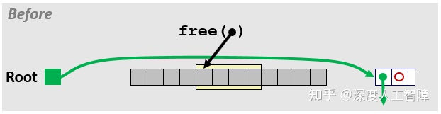 </center>    
<center>情况一：要释放的块前后都为已分配的块</center>  


我们可以通过后面块的头部以及前面块的脚部来得知相邻两个块的已分配状况（这就是保留头部和脚部的意义）。由于相邻的都是已分配的块，所以不会进行空闲块合并，直接更新Root的`succ`指针使其指向要释放的块，而让要释放的块的`pred`指向Root，`succ`指向原来第一个空闲块，然后更新原来的第一个空闲块的`pred`指针。

<center>  </center>    
<center>情况一解决方案</center>  

<center>  </center>    
<center>情况二：要释放的块后面为空闲块，前面为已分配的块</center>  

要释放的块后面为空闲块，则需要将当前块和后一块进行合并。我们可以简单地修改头部和脚部直接将两个空闲块合并，但是后一块为空闲块，会处于空闲链表的某个位置，所以要修改后一块的前后两个空闲块的指针，使其跳过后一块。然后修改对应指针就行。

<center>  </center>    
<center>情况二的解决方案</center>  

<center> 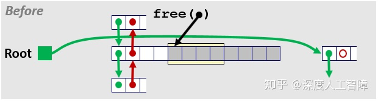 </center>    
<center>情况三：要释放的块前面为空闲块，后面为已分配的块</center>  

和情况二类似。如果不是LIFO策略，其实可以直接保留前一个块的指针。

<center> 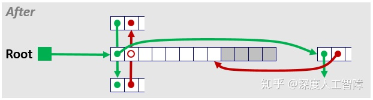 </center>    
<center>情况三的解决方案</center>  

<center> 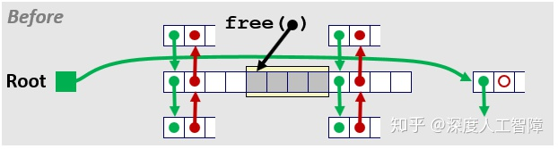 </center>    
<center>情况四：当前块的前后两个块都为空闲块</center>  

情况四其实就是情况二和三的合并。对于前后两个空闲块，直接让其指针前后的两个空闲块修改指针跳过，然后修改头部和脚部进行合并

<center> 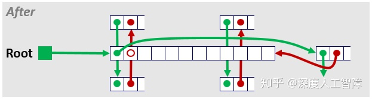 </center>    
<center>情况四的解决方案</center>    	


#### 9.9.14　分离的空闲链表

为了减少分配时间，可以使用**分离存储（Segregrated Storage）** 方法，首先将所有空闲块根据块大小分成不同类别，称为**大小类（Size Class）** ，比如可以根据2幂次分成

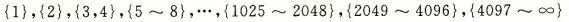

这样不同空闲块就落在不同的大小类中，然后对于每个大小类都生成自己独立的空闲链表，然后分配器根据大小类的大小，将对应的空闲链表按照升序保存在数组中。由此能极大加快分配速度。

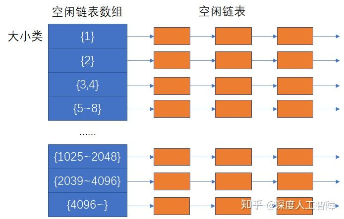

当我们想要分配一个大小为n的块时，会首先根据空闲链表数组确定对应的大小类，找到合适的空闲链表，搜索是否有合适的空闲块，如果有，可以对其进行分割，则剩下的部分要放到合适合适的空闲链表中，如果没有合适的空闲块，则会找下一个更大的大小类，重复上述步骤。

如果遍历了所有大小类的空闲链表还是找不到合适的空闲块时，分配器就会向内核申请更大的堆内存空间，然后将作为一个空闲块放在最大的大小类的空闲链表中。

当我们想要释放一个块时，需要对其地址周围的空闲块进行合并，然后将其放在合适的大小类中。

分离的空闲链表是当前最好的分配器类型，对于吞吐量方面，由于将原来巨大的空闲链表根据大小类将其划分为很多小的空闲链表，使得在单一空闲链表中搜索速度快很多，对于内存利用率方面，由于大小类的存在，使得你正在所的空闲链表是最适合你想要分配的大小，在这里使用首次适配策略就能得到接近在整个空闲链表中使用最佳适配策略的性能。最极端的情况是为每个块都设置一个大小类，这样就等于最佳适配策略的性能了。

##### 9.9.14.1 简单分离存储

简单分离存储具有以下**特点：** 

- 每个大小类中都只包含大小相同的块，且块大小就是这个大小类中最大元素的大小。比如`{5~8}`就只包含大小为8的空闲块。
- 不执行分割
- 不执行合并

当进行分配时，会根据块大小先找到对应的空闲链表，如果存在空闲块则直接分配第一个空闲块，如果不存在，则分配器向内核请求得到一个固定大小的虚拟内存片，然后将其划分为大小相同的空闲块，将其链接起来得到新的空闲链表。

当进行释放时，直接将其插入对应的空闲链表头部。

- **优点：** 分配和释放块都是常数时间，不分割，不合并，已分配块不需要头部和脚部，空闲链表只需是单向的，因此最小块为单字大小。
- **缺点：** 由于使用分割和合并，所以会有大量的内部和外部碎片。

##### 9.9.14.2 分离适配

分离适配的分配器维护一个空闲链表的数组，每个链表和一个大小类相关联，包含大小不同的块。分配块时，确定请求的大小类，对适当的空闲链表做首次适配，如果找到合适的块，可以分割它，将剩余的部分插入适当的空闲链表中；如果没找到合适的块，查找更大的大小类的空闲链表。如果没有合适的块，就向内核请求额外的堆内存，从这堆内存中分割出合适的块，然后将剩余部分放到合适的大小类中。每释放一个块时，就进行合并，并将其放到合适的大小类中。

分离适配方法比较常见，如GNU malloc包。这种方法既快、利用率也高。

##### 9.9.14.3 伙伴系统

伙伴系统（Buddy System）是分离适配的一种特例，要求每个大小类都是2的幂。假设一个堆大小为 2^m ,为每个大小为2^k 的空闲块都维护了对应的空闲链表。最开始只有一个2^m大小的空闲块：

- **请求分配时：** 找到第一个可用的大小为2^j的空闲块，将其递归平均分割直到刚好能装下我们的数据。每次分割下来的另一部分为伙伴，被放在相应的空闲链表中。
- **请求释放时：** 会不断合并空闲的伙伴，直到遇到一个已分配的伙伴就停止。

我们可以通过地址和块大小很快计算出伙伴地址。主要优点在于快速搜索和快速合并，但是会造成大量的内部碎片。

### 9.10　垃圾收集

在上一章中介绍了显示分配器要求应用程序显示地调用`free`函数来释放已分配块，比如以下代码中在`garbage`函数中调用了`malloc`函数来分配块，但是函数返回时并没进行释放，使得`p`指向的分配块始终保持已分配的状态，则分配器就无权对该分配块进行操作，由于`p`保存在函数`garbage`的栈帧中，当`garbage`返回时也丢失了`p`，所以这个已分配块就变成了垃圾，无法被使用，直到程序终止。

```c
void garbage(){
  int *p = (int *)malloc(128);
  return;
} 
```

而在隐式分配器中，分配器会释放程序不再使用的已分配块，自动对其调用`free`函数进行释放。则应用程序只需要显示分配自己需要的块，而回收过程由分配器自动完成。

本章主要介绍Mark&Sweep算法，它建立在malloc包的基础上，使得C和C++就有垃圾收集的能力。

#### 9.10.1　垃圾收集器的基本知识

垃圾收集器将内存视为一个有向**可达图（Reachability Graph）** ，其中具有两种节点：

- **根节点（Root Node）：** 对应于不在堆中但包含指向堆中的指针，可以是寄存器、栈中变量或全局变量等等。
- **堆节点（Heap Node）：** 对应于堆中的一个已分配的块。

有向边 p -> q 表示p中的某个位置指向q中的某个位置，说明p需要q的存在。我们可以从根节点触发找到所有可达的节点，则剩下的不可达的节点就是垃圾，因为不存在使用这些不可达节点的入口，应用程序无法再次访问这些不可达的已分配块。垃圾收集器就是在维护这样一个有向可达图，并释放不可达节点。


对于像ML和Java语言，其对指针创建和使用有严格的要求，由此来构建十分精确的可达图，所以能回收所有垃圾。而对于像C和C++这样的语言，垃圾收集器无法维护十分精确的可达图，只能正确地标记所有可达节点，而有一些不可达节点会被错误地标记为可达的，所以会遗留部分垃圾，这种垃圾收集器称为**保守的垃圾收集器（Conservative Garbage Collector）**。

在C中使用垃圾收集器可以有两种方法：

- **按需的：** 将其集成到`malloc`函数中。当引用调用`malloc`函数来分配块时，如果无法找到合适的空闲块，就会调用垃圾收集器来识别出所有垃圾，并调用`free`函数来进行释放。
- **自动的：** 可以将垃圾收集器作为一个和应用并行的独立线程，不断更新可达图和回收垃圾。

#### 9.10.2　Mark&Sweep垃圾收集器

Mark&Sweep垃圾收集器由两个阶段组成：

- **标记（Mark）阶段：** 标记出根节点的所有科大的和已分配的后继。为此，需要在块的头部和脚部的低3位中用一位来表示其是否可达的。
- **清除（Sweep）阶段：** 释放所有未标记的已分配块。

这两个阶段的伪代码如下所示

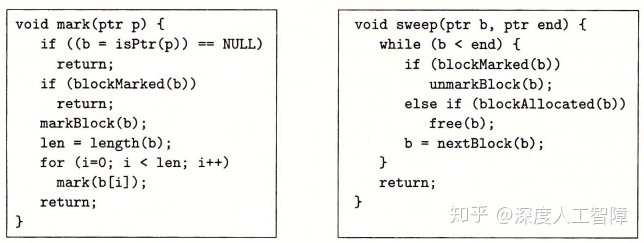

标记阶段为每个根节点都调用一次`mark`函数，首先会判断输入`p`是否为指针，如果是则返回`p`指向的堆节点`b`，然后判断`b`是否被标记，如果没有，则对其进行标记，并返回`b`中不包含头部的以字为单位的长度，这样就能依次遍历`b`中每个字是否指向其他堆节点，再递归地进行标记。这是对图进行DFS。

清除阶段会调用一次`sweep`函数，它会在所有堆节点上反复循环，如果堆节点`b`是已标记的，则消除它的标记，如果是未标记的已分配堆节点，则将其释放，然后指向`b`的后继节点。


#### 9.10.3　C程序的保守Mark&Sweep

C程序想要使用Mark&Sweep垃圾收集器，在实现`isPtr`函数时**具有两个困难：**

- 进入`isPtr`函数时，首先需要判断输入的`p`是否为指针，只有`p`为指针，才判断`p`是否指向某个已分配块的有效载荷。但是在C语言不会用类型信息来标记内存位置，比如`int`或`float`这些标量就可能被伪装成指针，比如`p`对应的是一个`int`类型数据，但是C误以为是指针，而将该数据作为指针又正好指向某个不可达的已分配块中，则分配器会误以为该分配块时可达的，造成无法对该垃圾进行回收。这也是C程序的Mark&Sweep垃圾收集器必须是保守的原因。
- 当判断`p`为指针时，如何确定它所在块的头部。这里可以将已分配的块组织成平衡二叉树的形式，如下所示，保证左子树所有的块都在较小的地址处，右子树所有的块都在较大的地址处。此时输入一个指针`p`，从该树的根节点开始，根据块头部的块大小字段来判断指针是否指向该块，如果不是，根据地址大小可跳转到左子树或右子树进行查找。


### 9.11　C程序中常见的与内存有关的错误

先介绍C程序中怎么判断指针的内容：首先在变量名左右根据下方操作符的优先级确定先定义那个操作符，然后依次判断就可以得到变量的定义。

<center> 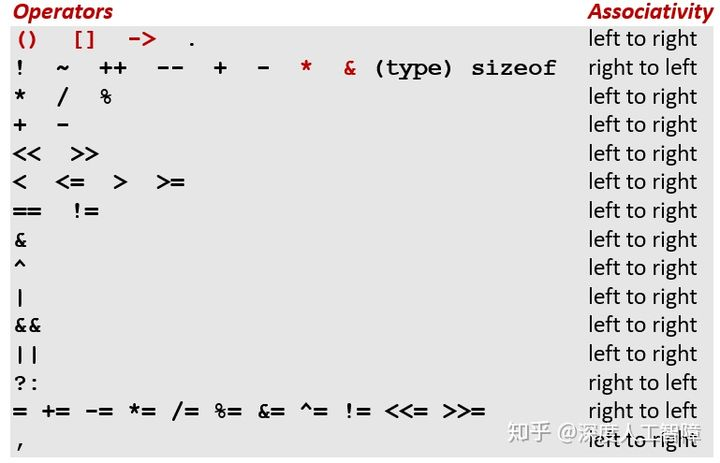 </center>    
<center>C操作符的优先级和结合方向</center>    	

- `int *p`：p is a pointer to int
- `int *p[13]`：p is an array[13] of pointer to int
- `int *(p[13])`：p is an array[13] of pointer to int
- `int **p`：p is a pointer to a pointer to an int
- `int (*p)[13]`：p is a pointer to an array[13] of int
- `int *f()`：f is a function returning a pointer to int
- `int (*f)()`：f is a pointer to a function returning int
- `int (*(*f())[13])()`：f is a function returning ptr to an array[13] of pointers to functions returning int
- `int (*(*x[3])())[5]`：x is an array[3] of pointers to functions returning pointers to array[5] of ints

接下来将介绍一些常见的与内存有关的错误来结束对虚拟内存的讨论。

#### 9.11.1　间接引用坏指针

我们知道，对于每个进程，内核维护了一个`vm_area_struct`数据结构，来将虚拟内存划分成不同的段，这也造成虚拟内存可能是不连续的，如果我们尝试对不处于任何段的虚拟内存进行引用时，内核就会发出段异常终止程序。其次，不同段限制了不同页的读写权限，如果我们尝试对只读虚拟页进行写操作时，内核就会发出保护异常终止程序。

所以对地址的引用和读写要满足要求。比如我们错误地使用了以下代码

```c
scanf("%d", val);
```

此时就会尝试对`val`作为虚拟地址，对其进行写操作，如果`val`的值作为虚拟地址不处于任何段，或处于只读段，则会报错。

#### 9.11.2　读未初始化的内存

我们定义的未初始化的全局变量处于`.bss`段中，该段会与匿名文件进行关联，使得未初始化的全局变量都为0。但是使用`malloc`分配堆内存时，只是简单的修改了`brk`指针，并不会对已分配的块进行任何初始化，所以要对动态内存分配得到的堆内存进行初始化。

#### 9.11.3　允许栈缓冲区溢出

#### 9.11.4　假设指针和它们指向的对象是相同大小的

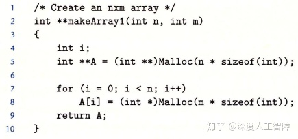

以上代码尝分配一个n*m大小的二维数组，但是第5行中应该使用`sizeof(int*)`，但是这里却使用`sizeof(int)`，只有在`int *`和`int`大小相同的系统中才会执行正确，如果在大小不同的系统中就会执行错误。

执行`malloc`函数后，其会分配一个指定大小的块，并设置好块的头部和脚部。当我们在第7行和第8行进行初始化时对`A`进行初始化时，由于`int`比`int *`小，使得会覆盖已分配块的脚部，一开始没有什么问题，但是在后面执行`free`进行释放时，如果尝试合并空闲块，就会由于脚部被覆盖而出现未知的错误。

#### 9.11.5　造成错位错误

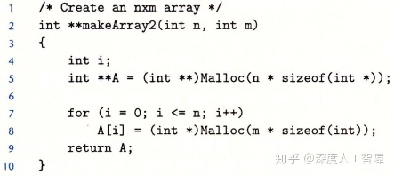

以上代码在第7行中的`i<=n`应该为`i，这里会覆盖`A[n]`的内容，这个是其他堆块的内容。

#### 9.11.6　引用指针，而不是它所指向的对象

当操作符优先级和结合性考虑错误时，可能会错误地操作指针，而不是指针指向的对象。

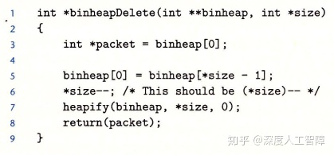

第6行中，由于`*`和`--`的优先级相同，所以会从右往左执行，此时就会先对`size`指针减1。

#### 9.11.7　误解指针运算

#### 9.11.8　引用不存在的变量

#### 9.11.9　引用空闲堆块中的数据

#### 9.11.10　引起内存泄漏

# 第三部分  程序间的交互和通信

## 第10章　系统级I/O　

Linux将所有资源都看成文件的形式。

------

到这就进入了新的一部分，过去一直假设程序时独立运行的，但是其实应用程序可利用操作系统提供的服务来与I/O设备及其他程序通信，这一部分将学习Unix操作系统提供的基本I/O服务，以及如何利用这些服务来构造引用程序。

### 10.1　Unix I/O

**输入/输出（I/O）** 是在主存和外部设备（磁盘驱动器、终端和网络）之间复制数据的过程。输入操作就是从I/O设备复制数据到主存，输出操作就是将主存数据复制到I/O设备。这里我们将所有I/O设备都抽象为Linux文件，即m个字节的序列，这样所有输入和输出操作都可以看成是对文件的读写，使得所有输入和输出都能以统一的方法来执行：

- **打开文件：** 一个应用程序通过要求内核打开某个文件，来确定要访问的I/O设备。此时内核会记录有关该文件的所有信息，而应用程序会获得该文件的**描述符**，来标识该文件。

- **修改当前读写文件的位置：** 对于每个打开的文件，内核会维护一个**文件位置k** 来表示当前要读写文件的位置，是从文件头开始的字节偏移量，初始化为0。应用程序可以通过`seek`操作来修改读写文件的位置。    
	- 但是无法修改基于终端的输入的文件位置，因为无法移动、备份和恢复先前已读入的数据，也无法提前接收还未键入的数据。比如套接字。

- **读写文件：** 读文件就是在文件中从k开始复制n个字节到内存，并更新`k=k+n`，如果k超出了文件大小，则会给引用程序返回EOF。而写文件就是从内存 复制n个字节到文件位置k处，然后更新`k=k+n`。

- **关闭文件：** 当应用程序通知内核关闭文件时，内核会释放打开文件的数据结构，并将该描述符恢复到可用的描述符池中。

通过将I/O设备抽象为文件的形式，使得对I/O设备的输入输出统一为对文件的读写操作，而应用程序可以通过文件描述符来对指定的I/O设备进行操作。在创建进程时，内核会默认打开三个文件，标准输入（描述符为0）、标准输出（描述符为1）和标准错误（描述符为2），可通过`STDIN_FILENO`、`STDOUT_FILENO`和`STDERR_FILENO`代替描述符来访问这三个文件。当进程终止时，内核会关闭所有打开的文件，并释放内存资源。 

### 10.2　文件

在Linux中，文件具有不同的类型：

- **普通文件（Regular File）：** 包含任意数据。通常分为：      
   - **文本文件（Text File）：** 只含有ASCII或Unicode字符的普通文件，是一系列文本行的序列，以`\n`符号间隔。
   - **二进制文件（Binary File）：** 所有其他的文件。
    应用程序会进行区分，而对于内核而言没有区别。

- **目录（Directory）：** 包含一组通过文件名映射到文件的链接（Link）的文件。每个链接都是目录文件中的一个条目。

- **套接字（Socket）：** 用来与另一个进程进行跨网络通信的文件。

Linux将所有文件组织成 **目录层次结构（Directory Hierarchy）** ，其中`/`表示根目录，其他所有文件都是根目录的直接或间接的后代。 而目录层次结构中的位置可以用**路径名（Pathname）** 来指定，具有两种形式：

- **绝对路径名（Absolute Pathname）：** 从根目录开始的路径。
- **相对路径名（Relative Pathname）：** 以文件名开始，表示从**当前工作目录（Current Working Directory）**开始的路径。


### 10.3　打开和关闭文件

```c
#include <sys/types.h>
#include <sys/stat.h>
#include <fcntl.h>
int open(char *filename, int flags, mode_t mode);
```

`open`函数可以打开已存在的文件或创建一个新的文件，其中`filename`会转换为一个文件描述符，并返回进程中当前没有打开的最小描述符数字，作为进程对文件操作的接口，可以通过`limit`查看描述符的上限。`flags`参数用来表明访问的方式，可通过`|`来合并多个掩码


`mode`参数用来指定新文件的访问权限，而每个进程可通过`umask`函数来设置用户默认权限的补码，则文件最终的权限是通过`mode & ~umask`确定的。


```c
#include <unistd.h>
int close(int fd);
```

可以将文件描述符编号传入`close`函数来关闭文件。如果尝试关闭一个已关闭的文件，则会报错返回`-1`。

例：下列程序的输出是什么？

```c
#include <csapp.h>
int main(){
  int fd1, fd2;
  fd1 = open("foo.txt", O_RDONLY, 0);
  close(fd1);
  fd2 = open("baz.txt", O_RDONLY, 0);
  printf("fd2 = %d\n", fd2);
  exit(0);
}
```

创建进程时，内核会默认打开3个文件：标准输入（描述符为0,）、标准输出（描述符为1）和标准错误（描述符为2），直到进程终止时才回收。而为打开的文件分配最小的描述符，当打开`fd1`时，分配了描述符3给`fd1`，而当关闭`fd1`时，就将描述符3回收了，所以当打开`fd2`时，又将描述符3赋给第二个文件了。所以这里输出`fd2 = 3`。

### 10.4　读和写文件

```c
#include <unistd.h>
ssize_t read(int fd, void *buf, size_t n);
ssize_t write(int fd, const void *buf, size_t n);
```

可通过`read`函数从文件描述符`fd`的文件位置复制最多`n`个字节到内存位置`buf`中，如果发生错误就返回`-1`，如果遇到EOF就返回`0`，否则返回实际传送的字节数目。而`write`函数是将内存位置`buf`的`n`个字节复制到文件描述符`fd`的文件位置，如果成功完成写操作，就返回字节数目。

**注意：** 在x86-64中，`size_t`为`unsigned long`，而`ssize_t`为`long`。由于`read`和`write`函数会返回有符号数，所以这里需要设置为`ssize_t`。

```c
#include <unistd.h>

int main(){
  char c;
  while(read(STDIN_FILENO, &c, 1) != 0){
    write(STDOUT_FILENO, &c, 1);
  }
  return 0;
}
```

以上代码就是将你通过标准输入的字符一个个输出到标准输出中。由于这些都是系统调用，所以速度会特别慢。

有些时候`read`和`write`函数传送的字节数比应用程序要求的少，称为**不足值（Short Count）**，主要因为：

- `read`函数遇到EOF时，比如文件中中剩下20个字节，而`read`函数想要读取50个字节，则第一次会读取20个字节并返回20，而下一次读取时会返回0表示遇到EOF了。
- 如果打开的文件与终端相关联，则每个`read`函数将依次传送一个文本行，返回的就是文本行的字节数，
- 如果打开的文件与套接字相关联，则由于内部缓冲和网络延迟，就会造成这个现象。


### 10.5　用RIO包健壮地读写

有一个RIO（Robust I/O）包可以处理上述的问题，它提供了两类不同的函数：

- **无缓冲的输入输出函数：** 直接在内存和文件之间传送数据，没有应用级缓冲，主要用来克服不足值问题。
- **带缓冲的输入输出函数：** 允许你高效地从文件中读取文本行和二进制数据，这些文件的内容缓存在应用级缓冲区中，主要用来克服不足值问题，和反复调用系统函数的耗时。

#### 10.5.1　RIO的无缓冲的输入输出函数

```c
#include <csapp.h>
ssize_t rio_readn(int fd, void *usrbuf, size_t n) 
{
    size_t nleft = n;
    ssize_t nread;
    char *bufp = usrbuf;

    while (nleft > 0) {  //不断循环，直到读取到n个字节
	if ((nread = read(fd, bufp, nleft)) < 0) {
	    if (errno == EINTR) /* Interrupted by sig handler return */
		nread = 0;      /* and call read() again */
	    else
		return -1;      /* errno set by read() */ 
	} 
	else if (nread == 0)
	    break;              /* EOF */
	nleft -= nread;
	bufp += nread;
    }
    return (n - nleft);         /* Return >= 0 */
}

ssize_t rio_writen(int fd, void *usrbuf, size_t n) 
{
    size_t nleft = n;
    ssize_t nwritten;
    char *bufp = usrbuf;

    while (nleft > 0) {  //不断循环，直到写了n个节
	if ((nwritten = write(fd, bufp, nleft)) <= 0) {
	    if (errno == EINTR)  /* Interrupted by sig handler return */
		nwritten = 0;    /* and call write() again */
	    else
		return -1;       /* errno set by write() */
	}
	nleft -= nwritten;
	bufp += nwritten;
    }
    return n;
}
```

以上`rio_readn`函数从文件描述符`fd`的文件位置传送最多`n`个字节到`usrbuf`中，如果遇到EOF就返回一个不足值，而`rio_writen`函数是将`usrbuf`中的`n`个字节传送到文件描述符`fd`的文件位置，不会出现不足值。

#### 10.5.2　RIO的带缓冲的输入函数

带缓冲的I/O会给文件分配关联的缓冲区，如果程序正在执行读操作，它将填满该缓冲区，当用户程序想要提取若干字节时，它会先看看缓冲区内是否有还未读取的字节，如果有就继续读取，如果没有就重新填满缓冲区。带缓冲区的好处在于，不用每次需要一个或少两字节就调用系统调用，而是先调用一次，将若干字节缓存起来，后面需要时就直接从缓冲区读取就行了。


首先我们定义一个读缓冲区的数据结构

```c
#define RIO_BUFSIZE 8192
typedef struct{
  int rio_fd;  //该缓冲区的文件描述符
  int rio_cnt;  //缓冲区中未读的字节数
  char *rio_bufptr;  //缓冲区中未读的下一个字节
  char rio_buf[RIO_BUFSIZE];  //读缓冲区
} rio_t;
```

然后我们可以通过`rio_readinitb`函数将文件描述符`fd`和一个`rio_t`读缓冲区关联起来

```c
void rio_readinitb(rio_t *rp, int fd){
    rp->rio_fd = fd;  
    rp->rio_cnt = 0;  
    rp->rio_bufptr = rp->rio_buf;
} 
```

这里首先将读缓冲区的文件描述符设置为输入的文件描述符`fd`，然后初始化`rio_cnt`和`rio_bufptr`，可以用来保存已读但还未被应用程序使用的字节。由此我们可以得到一个`read`函数的带缓冲区的版本

```c
static ssize_t rio_read(rio_t *rp, char *usrbuf, size_t n){
    int cnt;
    while (rp->rio_cnt <= 0) {  /* Refill if buf is empty */
	rp->rio_cnt = read(rp->rio_fd, rp->rio_buf, sizeof(rp->rio_buf));
	if (rp->rio_cnt < 0) {
	    if (errno != EINTR) /* Interrupted by sig handler return */
		return -1;
	}
	else if (rp->rio_cnt == 0)  /* EOF */
	    return 0;
	else 
	    rp->rio_bufptr = rp->rio_buf; /* Reset buffer ptr */
    }
    /* Copy min(n, rp->rio_cnt) bytes from internal buf to user buf */
    cnt = n;          
    if (rp->rio_cnt < n)   
	cnt = rp->rio_cnt;
    memcpy(usrbuf, rp->rio_bufptr, cnt);
    rp->rio_bufptr += cnt;
    rp->rio_cnt -= cnt;
    return cnt;
} 
```

首先，如果读缓冲区中还有未读的数据，就不进行读取，而是直接将`min(n, rp->rio_cnt)`个字节从读缓冲区中复制到用户的缓冲区中。如果读缓冲区中没有未读的数据，就尝试将读缓冲区填满，并且如果`read`函数报错，需要重新执行`read`函数，然后再将`min(n, rp->rio_cnt)`个字节从读缓冲区中复制到用户的缓冲区中。

基于这个带缓冲区的`rio_read`函数，我们可以尝试一次从文本文件中读取一行的操作

```c
ssize_t rio_readlineb(rio_t *rp, void *usrbuf, size_t maxlen) 
{
    int n, rc;
    char c, *bufp = usrbuf;

    for (n = 1; n < maxlen; n++) { 
        if ((rc = rio_read(rp, &c, 1)) == 1) {
	    *bufp++ = c;
	    if (c == '\n') {
                n++;
     		break;
            }
	} else if (rc == 0) {
	    if (n == 1)
		return 0; /* EOF, no data read */
	    else
		break;    /* EOF, some data was read */
	} else
	    return -1;	  /* Error */
    }
    *bufp = 0;
    return n-1;
} 
```

`rio_readlineb`函数会逐字节读取并判断是否为`\n`来确定是否为一个文本行，如果使用普通的`read`函数，则会不断发起中断来进行读取，但是这里使用了带读缓冲区的`rio_read`函数，在第一次调用`rio_read(rp,&c,1)`函数时，虽然只设置读取一个字节，但它会尝试调用一次`read`函数将读缓冲区填满，这样后面再调用`rio_read(rp,&c,1)`就是直接从读缓冲区获取数据，无需再发起中断了。

此外我们也可以得到一个`rio_readn`函数带读缓冲区的版本，用来读取二进制文件

```c
ssize_t rio_readnb(rio_t *rp, void *usrbuf, size_t n) 
{
    size_t nleft = n;
    ssize_t nread;
    char *bufp = usrbuf;
    
    while (nleft > 0) {
	if ((nread = rio_read(rp, bufp, nleft)) < 0) 
            return -1;          /* errno set by read() */ 
	else if (nread == 0)
	    break;              /* EOF */
	nleft -= nread;
	bufp += nread;
    }
    return (n - nleft);         /* return >= 0 */
} 
```

比如这里我们可以通过将标准输入的文件描述符`STDIN_FILENO`与输入缓存关联起来，然后调用`rio_readlineb`来一次读取一行，再将其写到标准输出中

```c
#include "csapp.h"

int main(int argc, char **argv){
  int n;
  rio_t rio;
  char buf[MAXLINE];
  rio_readinitb(&rio, STDIN_FILENO);
  while((n = rio_readlineb(&rio, buf, MAXLINE)) != 0)
    rio_writen(STDOUT_FILENO, buf, n);
} 
```

### 10.6　读取文件元数据

```c
#include <unistd.h>
#include <sys/stat.h>
int stat(const *filename, struct stat *buf);
int fstat(int fd, struct stat *buf);
```

我们可以通过这两个函数来得到文件的**元数据（metadata）**，该函数会填写数据结构物`stat`，具有以下信息


其中`st_size`包含了文件的字节数大小，`st_mode`编码了文件访问许可位，我们可以通过`sys/stat.h`中定义的宏来确定该部分的信息：

- `S_ISREG(st_mode)`： 是否为普通文件
- `S_ISDIR(st_mode)`：是否为目录文件
- `S_ISSOCK(st_mode)`：是否为套接字

### 10.7　读取目录内容

对于目录的操作，我们将目录项定义为以下数据结构

```c
struct dirent{
  int_t d_ino;  //文件位置
  char d_name[256];  //文件名
}
```

我们可以传递一个路径名给以下函数来获得目录项的列表

```c
#include <sys/types.h>
#include <dirent.h>
DIR *opendir(const char *name);
```

然后可通过循环调用以下函数来不断获得列表中的下一个目录项，并根据目录项的数据结构来获得目录的信息

```c
#include <dirent.h>
struct dirent *readdir(DIR *dirp);
```

### 10.8　共享文件

内核有三种数据结构来表示打开的文件：

- **描述符表（Descriptor Table）：** 每个进程有自己独立的描述符表，进程打开的所有文件描述符都包含在该表中，每个文件描述符指向文件表中的一个表项。（每次打开一个文件，就会在文件表中分配一个表项）
- **文件表（File Table）：** 所有进程共享文件表，包含所有打开文件的文件位置和指向的v-node表项，由于可能在不同进程中共享同一个文件表表项，所以会有一个引用次数表示有多少个描述符指向当前文件表表项，只有当表项的引用次数为0才会删除该表项。该文件表描述了指向对应文件表象的描述符的信息，有操作系统维护。
- **v-node表：** 所有进程共享v-node表，每个表项包含了`stat`结构中的大多数信息，用来描述文件的信息。在系统中的每个文件无论是否打开，都在v-node表汇总有一个对应的表项。

总的来说，我们在进程中每次打开文件获得的文件描述符都是描述符表中的一个表项，然后指向对应的文件表表项，描述了该文件描述符的信息，而对应文件的信息可通过文件表表项指向的v-node表项来获得。


每个描述符都有自己的文件位置，表明了当前读取文件的位置，如果对同一文件用不同的`open`打开，由于分配了不同的文件描述符，使其指向不同的文件表表项，而获得不同的文件位置，但是由于是相同文件，所以会指向同一个v-node表项，这就使得这两个文件描述符可以对同一个文件的不同文件位置进行读写，将不同的描述符操作独立开来。

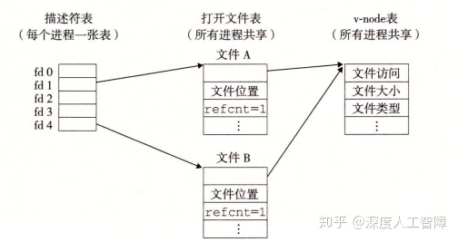

在父进程使用`fork`函数创建一个子进程时，子进程会复制父进程的描述符表，由于描述符表中包含指向文件表中的指针，所以子进程中相同的描述符也指向了相同的文件表表项，所以父子进程对文件位置的修改是共享的

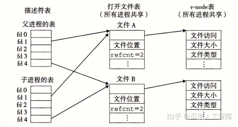

**注意：** 描述符指向的文件表项决定了它的文件位置，判断是否共享文件表项。

例：

```c
#include "csapp.h"

int main(){
  int fd1, fd2;
  char c;
  fd1 = open("foobar.txt", O_RDONLY, 0);
  fd2 = open("foobar.txt", O_RDONLY, 0);
  read(fd1, &c, 1);
  read(fd2, &c, 1);
  printf("c = %c\n", c);
  return 0;
}
```

这里通过两个不同的`open`函数来打开相同的文件`foobar.txt`，由于这两个获得不同的文件描述符，所以指向不同的文件表表项，所以会有自己独立的文件位置，所以第一个`read`会移动`fd1`对应的文件位置，但是不会影响`fd2`对应的文件位置，而`foobar.txt`文件包含6个ASCII码字符`foobar`，所以这里输出`c = f`。

```c
#include "csapp.h"

int main(){
  int fd;
  char c;
  fd = open("foobar.txt", O_RDONLY, 0);
  if(fork() == 0){
    read(fd, &c, 1);
    exit(0);
  }
  read(fd, &c, 1);
  printf("c = %c\n", c);
  exit(0);
} 
```

这里首先在父进程中使用`open`函数为文件`foobar.txt`分配了一个文件描述符，而调用`fork`函数生成一个子进程时，会复制父进程完整的描述符表，使得`fd`指向相同的文件表表项，所以在子进程和父进程中共享相同的文件位置，在子进程中调用`read`函数后会修改文件位置，使得在父进程中输出的就是`c = o`。


### 10.9　I/O重定向

I/O重定向操作符允许用户将磁盘文件和标准输入输出关联起来，可以通过调用`dup2`函数实现

```c
#include <unistd.h>
int dup2(int oldfd, int newfd); 
```

如果`newfd`是已打开的文件，`dup2`会首先关闭`newfd`，然后将`oldfd`对应的描述符表项替换`newfd`描述符表项，使得将`newfd`重定向到`oldfd`，如果原始`newfd`对应的文件表表项的引用计数为0，则会删除对应的文件表表项和v-node表项。比如将标准输出重定向到描述符4，就是运行`dup2(4, STDOUT_FILENO)`。


### 10.10　标准I/O

C语言基于Unix I/O提出了一组高级输入输出函数，称为标准I/O，它在输入和输出都包含有缓冲区，比如输出操作会先将其要输出的内容保存在缓冲区中，当遇到`\n`或调用`fflush`函数时，会清空缓冲区，并调用`write`系统调用来将其输出。标准I/O将一个打开文件抽象为一个流，是对文件描述符和流缓冲区的抽象，就是一个指向`FILE`类的指针。程序开始时就会打开3个流，对应于标准输入、标准输出和标准错误：

```c
#include <stdio.h>
extern FILE *stdin;
extern FILE *stdout;
extern FILE *stderr;
```


标准I/O是全双工的，程序能在同一个流上执行输入和输出。对流的读操作发生在流的开头，写操作发生在流的末尾。执行写操作后，由于文件位置在流的末尾，所以是不可读的，执行读操作后，如果执行写操作就会覆盖后面的内容，所以最好不要执行写操作，所以读写交替时要修改文件位置到一个可读或可写的文件位置。其次，对于一个可读可写的流，对读操作和写操作共享一个流缓冲区，所以在读取内容到缓冲区之前要先把缓冲区里要写的内容写到文件中。同理，在写内容到缓冲区之前要先把缓冲区里要读的内容清空。

所以想在输出函数之后执行输入函数，需要先执行`fflush`函数将流缓冲区中要输出的内容执行完，然后执行`fseek`、`fsetpos`或`rewind`函数来修改文件位置到可读的文件位置。想在输入函数之后执行输出函数，需要先执行`fseek`、`fsetpos`或`rewind`来修改文件位置到可写的文件位置，并且会对流缓冲区中缓存的输入数据进行操作，比如将其保存到程序的 缓冲区等等。

对于套接字的使用，因为可以`fflush`来清空写操作的缓冲数据，所以可以用标准I/O来模拟套接字的写操作。但是由于套接字无法使用定位函数，就无法在执行读操作后，通过定位函数来处理缓冲区中未读的数据，则读后再写就会产生问题，所以无法用标准I/O来模拟套接字的读操作。所以我们不要用标准I/O函数来进行套接字的输入和输出，而是使用RIO函数，它是基于Unix I/O的`read`和`write`函数，没有流缓冲区的问题。

**参考：** [CSAPP第10章系统级I/O问题？](https://www.zhihu.com/question/31499851/answer/817800909)

### 10.11　综合：我该使用哪些I/O函数？

**Unix I/O的特点：**

- **优点：**

- - Unix I/O是最通用，开销最低的I/O形式
  - 所有其他I/O软件包均使用Unix I/O函数实现
  - Unix I/O提供用于访问文件元数据的功能
  - Unix I/O函数是异步信号安全的，可以在信号处理程序中安全使用

- **缺点：**

- - 处理短计数非常棘手且容易出错
  - 高效读取文本行需要某种形式的缓冲，也很棘手且容易出错
  - 这两个问题均通过标准I/O和RIO包解决

**标准I/O的特点：**

- **优点：**

- - 缓冲通过减少读写系统调用的数量来提高效率
  - 不足值自动处理

- **缺点：**

- - 不提供访问文件元数据的功能
  - 标准I/O功能不是异步信号安全的，并且不适用于信号处理程序
  - 标准I/O不适合网络套接字上的输入和输出

**对于使用什么I/O，建议：**

- 只要有可能就使用标准I/O，当操作硬盘或中断时要使用标准I/O
- 对套接字的I/O使用RIO包
- 当写信号处理程序时要使用Unix I/O，因为它是异步信号安全的

**注意：**处理文本文件的函数，比如`fgets`、`scanf`或`rio_readlineb`函数，是基于文本行的概念针对文本文件进行操作的，在处理0xa字符时会停止读入。而处理字符串的函数，比如`strlen`、`strcpy`或`strcat`函数，会将`0`视为字符串的结尾。这些对某些特殊字节进行特殊解释的函数，不适合用来读写二进制文件。

## 第11章　网络编程

将套接字当做一个文件，则在网络中传输数据可以看成是对文件的读写

------


### 11.1　客户端服务器编程模型

网络应用都是基于**客户端-服务器模型**的，应用由一个**服务器进程**和一个或多个**客户端进程**组成，服务器会管理着某些资源，通过操作这些资源来为它的客户端提供某种服务。比如Web服务器管理着一组磁盘文件，会代替客户端进行检索和执行。该模型主要执行以下步骤：

- 当一个客户端需要服务时，就向服务器发送一个请求。比如Web浏览器需要一个文件时，就会发送一个请求到Web服务器。
- 服务器接收到请求后，会对其进行解释并以适当方式操作它的资源。比如当Web服务器接收到请求后，就读一个磁盘文件。
- 服务器给客户端发送一个响应，等待下一次请求。比如Web服务器将文件发送回客户端。
- 客户端接收到响应并进行处理。比如当Web浏览器收到来自服务器的数据后，就将其显示在屏幕上。


**注意：**所谓的客户端和服务器是进程，而不是机器或主机。

### 11.2　网络

当客户端进程和服务器进程处于不同主机时，两个进程就需要通过**计算机网络**的硬件和软件资源进行通信。对主机而言，计算机网络其实只是一个I/O设备，通过插在I/O总线扩展槽的**适配器**提供到网络的物理接口，从网络接收到的数据从适配器经过I/O总线和内存总线复制到内存，而数据也可以从内存复制到网络。


网络是具有层次结构的，最底层的是**局域网（Local Area Network，LAN）**，通常是在一个较小范围内构成的网络，比如一个建筑物，而最流行的局域网技术是**以太网（Ethernet）。**

**层次一：**一个**以太网段（Ethernet Segment）**由一些电缆和一个**集线器**组成，通常跨越一些更小的区域，比如一个房间。电缆的一段连接着主机的适配器，另一端连接到集线器的某个端口，这些电缆通常具有相同的最大位带宽。当主机通过适配器发送数据时，集线器会从一个端口中接收到并将其广播到其他端口，所以其他连接到相同适配器的主机也会收到这些数据。


为了标识每个主机，为每个以太网适配器都提供一个唯一的48位地址，保存在适配器的非易失性存储器上，称为**MAC地址**。所以当主机发送数据时，可以在数据的**头部（Header）**包含标识该数据的源和目的地址以及数据长度的信息，随后才是放数据的**有效载荷（Payload）**，由此构成一个**数据帧（Data Frame）**进行传输，这样连接到相同集线器的其他主机就能通过这个数据的头部来判断该数据是不是传输给自己的。

**层次二：**我们可以通过电缆将一些集线器连接到**网桥（Bridge）**，并通过电缆将一些网桥连接起来，得到更大的局域网，称为**桥接以太网（Bridge Ethernet）**，这两种电缆通常具有不同的带宽。


相比集线器不加区分地广播数据，网桥会使用更好的分配算法，它会自动学习哪些主机通过哪些端口是可达的，并将对应的数据传到对应的端口，节约了其余端口的带宽。比如主机A想传递数据到处于同一以太网段的主机B，则集线器会接收到该数据并广播到所有端口，此时网桥X也会接收到该数据，但是它判断该数据的目和源处于相同以太网段，所以就不进行转发。再比如主机想传递数据到不同以太网段的主机C，则网桥X和网桥Y会将其传递到合适的端口进行转发，使其最终到达主机C。

**层次三：**通过以上两个层次可以构建出若干个互不兼容的局域网，这些局域网可以通过**路由器（Router）**这一 特殊计算器相连组成internet，每台路由器对它连接到的每个网络都有一个适配器。而路由器之间可以通过**广域网（Wide-Area Network，WAN）**相连，来跨越更大的地理范围。


> 主机（适配器）-->以太网段（集线器）-->桥接以太网（网桥）-->internet（路由器）

可以发现，internet是由采用不同和不兼容技术的各种局域网和广域网构成的，为了消除不同网络之间的差异，需要在每台主机和路由器上运行**协议软件**，来控制主机和路由器如何协同工作来实现数据传输。**该协议具有两个基本功能：**

- **命名机制：**在各个局域网中，由于主机数目较少，可以通过集线器直接广播主机的MAC地址或通过网桥记录一些主机MAC地址对应的端口，就能实现主机之间的数据传输。但是到了路由器层面时，主机数目变得特别多，直接广播MAC地址不现实，而记录各个主机MAC地址对应的端口时，由于MAC地址都是各个主机唯一且不具有地域性，就需要一张特别大的表来进行记录。但其实同一局域网的主机具有一定的地域性，都连接在路由器的一个端口，所以路由器其实只需要记录局域网对应的端口就行。所以如果我们能为主机分配唯一的具有地域性的地址时，能通过该主机地址得知对应的局域网就能在路由器中确定对应的端口，就能大量减轻了路由器记录的负担。该地址称为**IP地址**。
- **传送机制：**在不同层面上传输数据需要不同的地址，比如在局域网中需要通过MAC地址来确定目标主机，而在internet中需要通过IP地址确定路由器的端口。所以互联网协议需要在数据最外侧添加路由器的MAC地址，来使得数据能先传输到路由器，然后内侧再添加IP地址，使得路由器能确定端口。IP地址和数据构成了**数据报（Datagram）**。

**参考：**[IP地址和MAC地址的区别和联系是什么？](https://www.zhihu.com/question/49335649)

PH：包头，FH：帧头

以上面为例，说明如何从主机A传输数据到主机B

- 运行在主机A中的客户端通过系统调用，从客户端的虚拟地址空间复制数据到内核缓冲区中。
- 主机A上的协议软件在数据前添加数据帧头`FH1`和数据包头`PH`，其中`FH1`中记录了路由器1的MAC地址，`PH`记录了主机B的IP地址。主机A将该数据帧传输到自己的适配器上。
- LAN 1根据帧头中记录的MAC地址，对其进行广播和转发。
- 路由器1的适配器会接收到该数据帧，并将其传送到协议软件。
- 协议软件从中剥离掉帧头`FH1`，获得`PH`中记录的主机B的IP地址，就能将其作为路由器表的索引获得要将其转发到路由器的哪个端口。这里是将其转发到传输到路由器2的端口。
- 当路由器2获得该数据包时，可以从一个表中得知该IP地址对应的MAC地址，即主机B的MAC地址，就将将其再次封装成数据帧的形式，通过适配器将其传输到LAN 2中。
- 在LAN 2根据帧头中记录的MAC地址，对其进行广播和转发。
- 当主机B接收到该数据帧时，将其传送到协议软件中。
- 在协议软件中，判断数据帧头中记录的目的MAC地址是否与自己的MAC地址相同，发现是相同的，则会剥离包头和帧头获得数据。当服务器进行一个读取这些数据的系统调用时，就将其复制到服务器的虚拟地址空间中。


### 11.3　全球IP因特网

每台主机都运行实现**TCP/IP协议**，它是一个协议族，其中每个都提供了不同的功能。比如**IP协议**提供了上文介绍的基本的命名方法和传送机制，由此保证了能从一台主机向别的主机发送数据报，但是这种传送机制是不可靠的，因为如果数据报发生丢失，IP协议并不会试图恢复。而基于IP协议提出了**UDP协议**和**TCP协议**，由此保证了包可以在进程之间而不是主机之间进行传送。而客户端-服务器应用程序就正需要TCP/IP协议这种在进程间传送数据的能力，它们通过**套接字接口函数**系统调用，在内核中调用各种内核模式的TCP/IP函数，由此在客户端进程和服务器进程之间传送数据。


我们这里就间TCP/IP看成一个单独的整体协议，值讨论TCP和IP为应用程序提供的某些功能。我们可以将因特网看成是一个世界范围的主机集合，满足以下**特点：**

- 主机集合被映射为一组32位的**IP地址**。
- 这组IP地址被映射为一组称为**因特网域名（Internet Domain Name）**的标识符。
- 因特网主机上的进程能通过**连接（Connection）**和任何其他因特网主机上的进程通信。

#### 11.3.1　IP地址

IP地址是一个32位的无符号整数，具有以下数据结构


我们知道不同主机可以有不同的主机字节顺序，常用的是小端法，而TCP/IP为任意整数定义了统一的**网络字节顺序（Network Byte Order）**，来规定IP地址的字节顺序（总是大端法）。Unix提供了以下函数来进行转换


`htonl`函数是将32位整数由主机字节顺序转换为网络字节顺序；`ntohl`函数是将32位整数由网络字节顺序转换为主机字节顺序。

IP地址通常用**点分十进制表示法**来表示，每个字节由它对应的十进制数来表示，而不用数之间通过`.`间隔，由于IP地址为32位的，所以会有4个整数。这里提供以下函数来实现IP地址和点分十进制串之间的转换


`inet_pton`函数将一个点分十进制串`src`转换为二进制的网络字节顺序的IP地址，其中`AF_INET`表示32位的IPv4地址，而`AF_INET6`表示64位的IPv6地址。`inet_ntop`函数将二进制的网络字节顺序的IP地址`src`转换为对应的点分十进制表示。

在1996年IETF推出了具有128位地址的IPv6，打算作为IPv4的后继者，截至2015年，绝大多数互联网流量仍由IPv4承载，只有4％的用户使用IPv6访问Google服务。我们将主要介绍IPv4，但会展示如何编写独立于协议的网络代码。

#### 11.3.2　因特网域名

由于IP地址较难记忆，所以定义了一组**域名（Domain Name）** 以及一种将域名映射到实际IP地址的机制。域名的集合形成一种层次结构，每个域名编码了它在这个层次中的位置。


根节点为未命名的根，第一层为**一级域名（First-level Domain Name）**，由ICANN组织定义，再下一层为**二级域名（Second-level Domain Name）**，由ICANN的各个授权代理按照先到先得服务进行分配的，只要有组织得到二级域名，就能在这个子域中创建任何新的域名。从叶子结点返回到一级域名的路径就构成了一条完整的域名，通过非常大的分布式**域名系统（Domain Name System，DNS）**将其映射到对应的IP地址。

每台主机都有本地定义的域名`localhost`，总是映射为**回送地址（Loopback Address）**`127.0.0.1`。`hostname`可以确定本地主机的实际域名，然后可以通过`nslookup`程序来查看DNS映射的一些属性，可以发现通常多个域名可以映射到同一组的多个IP地址，而有些合法的域名没有映射到任何IP地址。

**注意：** 存在多个域名对应一个IP地址，或一个域名对应多个IP地址，因为一些大型网络不止有一台服务器，可能会有多台服务器在处理你的数据，所以DNS会根据你的显示位置来返回多个IP地址。


#### 11.3.3　因特网连接

客户端和服务器通过在 **连接** 上发送和接收数据来进行通信，连接具有以下特点：

- **点对点：**  连接了一对进程
- **全双工：**  数据可以同时在连接双向流动
- **可靠的：**  由源进程发出的字节流最终被目的进程按序接收

连接的两端分别是客户端套接字和服务器套接字，每个套接字都有相应的 **套接字地址** ，由IP地址和16位整数 **端口** 组成，表示为`地址:端口`。其中客户端套接字中的端口是由内核自动分配的**临时端口（Ephemeral Port）**，而服务器套接字的端口与服务器提供的服务相关，比如Web服务器就使用端口`80`、FTP服务器就是用端口`25`，可通过`/etc/services`查看。


所以一个连接由它两端的套接字地址唯一确定，称为**套接字对（Socket Pair）**，表示为`(cliaddr:cliport, servaddr:servport)`。


通常内核需要区分传入机器的不同连接，并且当别的机器的数据到达时，判断要为该连接启动什么软件和进程，实际上，每个端口都有特定的进程执行程序来处理这些请求。并且一个客户端可以同时和单一服务器上的不同端口通信，来获得该服务器的不同服务，但这需要建立不同的连接，避免相互干扰。


**注意：** 对Linux内核而言，套接字就是通信的一个端点。对程序员而言，套接字就是一个有相应描述符的打开文件（与上一章关联起来，Linux中将所有资源都视为文件，套接字也不例外）。

### 11.4　套接字接口

**套接字接口（Socket Interface）** 是一组函数，他们和Unix I/O函数结合起来，用以创建网络应用。以下是一个基于套接字接口的网络应用概述


#### 11.4.1　套接字地址结构

套接字地址具有以下两种数据结构


这是因为在一开始设计socket时，是打算兼容各种不同协议的套接字地址，而不同协议的套接字地址有自己不同的地址构造，比如IPv4就是`sockaddr_in`、IPv6就是`sockaddr_in6`等等，而`sockaddr`就是这些不同协议地址的抽象，仔细观察上面两个不同结构的声明顺序，两者定义的内存分布如下所示


这样通过将`sockaddr_in`强制类型转换为`sockaddr`时，`sockaddr`的`sa_family`值就是 `sockaddr_in`的`sa_family`值，而`sockaddr`的`sa_data`值就是`sockaddr_in`中`sin_port`、`sin_addr`和`sin_zero`拼接起来的结果。由此通过将不同协议的地址强制类型转换为`sockaddr`类型，就能得到统一的套接字地址，而后的函数都是基于`sockaddr`类型的，方便兼容不同协议的地址。

**注意：** 这些地址字节顺序都是网络字节顺序，即大端法。

**参考：** [ustcsse308：信息安全课程8：套接字（socket） 编程](https://zhuanlan.zhihu.com/p/59296026)

#### 11.4.2　socket函数

首先，套接字作为一种文件，我们需要在服务器和客户端将其打开来得到**套接字描述符（Socket Descriptor）**

```c
#include <sys/types.h>
#include <sys/socket.h>
int socket(int domain, int type, int protocol);
```

为了使套接字作为连接的端点，可使用如下硬编码的参数来调用`socket`函数

```c
socket(AF_INET, SOCK_STREAM, 0); 
```

`AF_INET`表示是一个32位的IPv4地址，`SOCK_STREAM`表明连接是一个TCP连接。此时就会返回套接字描述符，客户端套接字描述符写成`clientfd`，服务器套接字描述符写成`sockfd`。

#### 11.4.3　connect函数

**在客户端方面**，在创建了客户端套接字描述符`clientfd`后，就能通过以下函数来建立与服务器的连接

```c
#include <sys/socket.h>
int connect(int clientfd, const struct sockaddr *addr, socklen_t addrlen); 
```

该函数会尝试与服务器套接字地址`addr`建立一个连接，其中`addrlen=sizeof(sockaddr_in)`。该函数会阻塞直到连接建立成功或发生错误，如果成功，客户端就能通过`clientfd`和Unix I/O与服务器进行通信了。


#### 11.4.4　bind函数

**在服务器方面**，接下来需要将服务器套接字地址和它的描述符`sockfd`联系起来

```c
#include <sys/socket.h>
int bind(int sockfd, const struct sockaddr *addr, socklen_t addrlen); 
```

该内核函数会将服务器套接字描述符`sockfd`与服务器套接字地址`addr`关联起来，其中`addrlen=sizeof(sockaddr_in)`，此时`addr`中包含了端口号，也就将`sockfd`与该服务器的某个端口绑定在一起，用于提供特定的服务。

#### 11.4.5　listen函数

由于`socket`函数创建的是**主动套接字描述符（Active Socket Descriptor）**，而服务器是接收请求方，所以需要将服务器套接字描述符转换为**监听套接字描述符（Listening Socket Descriptor）**

```c
#include <sys/socket.h>
int listen(int sockfd, int backlog);
```

该函数会将服务器套接字的描述符`sockfd`转换为监听套接字描述符`listenfd`，也相当于高速内核当前为服务器。接下来服务器就能监听等待来自客户端的连接请求

#### 11.4.6　accept函数

```c
#include <sys/socket.h>
int accept(int listenfd, struct sockaddr *addr, int *addrlen); 
```

该函数会等待来自客户端的连接请求到达监听描述符`listenfd`，然后将客户端的套接字地址填写到`addr`中，并返回一个**已连接描述符（Connected Descriptor）**`connfd`，这样服务器就能通过`connfd`和Unix I/O来与客户端通信了。

**注意：** 服务器通常只创建一次监听套接字描述符`listenfd`，并存在于服务器的整个生命周期，作为客户端连接请求的一个端点，服务器可从`listenfd`得知是否有客户端发送连接请求 ，而后服务器每次接受连接请求时就会创建一个已连接描述符`connfd`来作为与客户端建立起连接的一个端点，只存在于服务器为一个客户端服务的过程，当客户端不需要该服务器的服务时，就会删掉该`connfd`。这两种描述符的存在，使得我们可以构建并发的服务器来同时处理多个客户端连接，每当`accept`返回一个`connfd`时，就表示服务器接收了一个客户端的连接，此时就能通过`fork`函数创建一个子进程来通过该`connfd`与客户端通信，而父进程继续监听`listenfd`来查看是否有另一个客户端发送连接请求。

> **服务器方面：** 创建套接字描述符`sockfd`（`socket`）-->将`sockfd`与服务器套接字地址进行关联（`bind`）-->将`sockfd`转换为监听套接字描述符`listenfd`（`listen`）-->等待客户端的连接请求，并得到已连接描述符`connfd`（`accept`）-->通过`connfd`和Unix I/O与客户端进行通信。

#### 11.4.7　主机和服务的转换

Linux提供一些函数来实现二进制套接字地址结构和主机名、主机地址、服务名和端口号的字符串表示之间的相互转化，当与套接字接口一起使用时，能让我们编写独立于任何特定版本的IP协议的网络程序。

### 11.4.7.1 `getaddrinfo`函数

```c
#include <sys/types.h>
#include <sys/socket.h>
#include <netdb.h>

int getaddrinfo(const char *host, const char *service,
                const struct addrinfo *hints,
                const struct addrinfo **result);
void freeaddrinfo(struct addrinfo *result);
const char *gai_strerror(int errcode);
```

`getaddrinfo`函数能将主机名、主机地址、服务名和端口号的字符串转换成套接字地址结构。其中，`host`参数可以是域名、点分十进制数字地址或NULL，`service`参数可以是服务名（如http）、十进制端口号或NULL，两者必须制定一个。而`hits`和`result`参数分别是`addinfo`结构的指针和链表


`result`是通过`host`和`service`构建的一系列套接字地址结构，可以通过`ai_next`来一次遍历链表中的每个`addrinfo`结构，而每个`addrinfo`结构的`ai_family`、`ai_socktype`和`ai_protocol`可以直接传递给`socket`函数，而`ai_addr`和`ai_addrlen`可以直接传递给`connect`和`bind`函数，使得我们只要传递`host`和`service`参数给`getaddrinfo`函数，就能编写独立于某个特定版本的IP协议的客户端和服务器。


可以通过`hits`来控制`result`的结果。设置`hits`时，通常用`memset`将整个结构清空，再有选择地设置一些字段：

- `ai_family`：`result`默认会包含IPv4和IPv6的套接字地址，可以通过设置`ai_family`为`AF_INET`或`AF_INET6`来限制只包含IPv4或IPv6的套接字地址。

- `ai_socktype`：将其设置为`SOCK_STREAM`可以将`result`限制为每个地址最多只有一个`addrinfo`结构，可以用来作为连接的一个端点。

- `ai_flags`：是一个位掩码，可以修改默认行为：

- - `AI_ADDRCONFIG`：只有当本地主机被配置了IPv4时，`result`才会返回IPv4地址，IPv6同理。
  - `AI_CANONNAME`：如果设置了该位，则`result`第一个`addrinfo`结构的`ai_cannonname`字段指向`host`的官方名字。
  - `AI_NUMERICSERV`：强制`service`参数只能是端口号。
  - `AI_PASSIVE`：使得返回的套接字地址可以被服务器用作监听套接字，此时`host`应该为NULL，就会使得返回的套接字地址结构中的地址字段为**通配符地址**。

> 从上面可知，一个域名可能会对应多个IP地址，通过这个`getaddrinfo`函数就能寻找域名对应的所有可用的IP地址。

最终要调用`freeaddrinfo`函数来释放你得到的结果`result`，如果出错，可以调用`gai_strerror`函数来查看错误信息。

### 11.4.7.2 `getnameinfo`函数

```c
#include <sys/socket.h>
#include <netdb.h>
int getnameinfo(const struct sockaddr *sa, socklen_t salen,
                char *host, size_t hostlen,
                char *service, size_t servlen, int flags); 
```

该函数和`getaddrinfo`函数相反，通过传入套接字地址`sa`，能够返回对应的主机名字符串`host`和服务名字字符串`service`。其中`flags`可以修改该函数的默认行为：

- `NI_NUMERICHOST`：该函数默认返回`host`中的域名，通过设置这个标志位来返回数字地址字符串。
- `NI_NUMERICSERV`：该函数默认检查`/etc/service`并返回服务名，通过设置这个标志位来返回端口号。

> 从上面可知，一个IP地址可能会对应多个域名，通过这个`getnameinfo`函数就能寻找IP地址对应的所有可用的域名。


#### 11.4.8　套接字接口的辅助函数

这里提供两个封装函数`open_clientfd`和`open_listenfd`来封装`getnameinfo`和`getaddrinfo`函数来进行客户端和服务端的通信。

```c
int open_clientfd(char *hostname, char *port){
    int clientfd;
    struct addrinfo hints, *listp, *p;

    /* Get a list of potential server addresses */
    memset(&hints, 0, sizeof(struct addrinfo));  //初始化hints为0
    hints.ai_socktype = SOCK_STREAM;  /* Open a connection */
    hints.ai_flags = AI_NUMERICSERV;  /* ... using a numeric port arg. */
    hints.ai_flags |= AI_ADDRCONFIG;  /* Recommended for connections */
    getaddrinfo(hostname, port, &hints, &listp);  //获得一系列套接字地址
  
    /* Walk the list for one that we can successfully connect to */
    for (p = listp; p; p = p->ai_next) {  //遍历所有套接字地址，找到一个可以连接的
        /* Create a socket descriptor */
        if ((clientfd = socket(p->ai_family, p->ai_socktype, p->ai_protocol)) < 0) 
            continue; /* Socket failed, try the next */

        /* Connect to the server */
        if (connect(clientfd, p->ai_addr, p->ai_addrlen) != -1) 
            break; /* Success */
        close(clientfd); /* Connect failed, try another */  //line:netp:openclientfd:closefd
    } 

    /* Clean up */
    freeaddrinfo(listp);
    if (!p) /* All connects failed */
        return -1;
    else    /* The last connect succeeded */
        return clientfd;
}
```

客户端可以通过`open_clientfd`函数来简历与服务器的连接，该服务器运行在`hostname`主机上，并在`port`端口监听连接请求。首先会通过`getaddrinfo`函数找到一系列套接字地址，并依次遍历寻找可以创建套接字描述符且连接成功的一个套接字地址，然后返回准备好的套接字描述符，客户端可以直接通过`clientfd`和Unix I/O来与服务器进行通信。

```c
 int open_listenfd(char *port){
    struct addrinfo hints, *listp, *p;
    int listenfd, optval=1;

    /* Get a list of potential server addresses */
    memset(&hints, 0, sizeof(struct addrinfo));
    hints.ai_socktype = SOCK_STREAM;             /* Accept connections */
    hints.ai_flags = AI_PASSIVE | AI_ADDRCONFIG; /* ... on any IP address */
    //AI_PASSIVE保证套接字地址可被服务器用作监听套接字
    hints.ai_flags |= AI_NUMERICSERV;            /* ... using port number */
    getaddrinfo(NULL, port, &hints, &listp);  //这里的host为NULL

    /* Walk the list for one that we can bind to */
    for (p = listp; p; p = p->ai_next) {
        /* Create a socket descriptor */
        if ((listenfd = socket(p->ai_family, p->ai_socktype, p->ai_protocol)) < 0) 
            continue;  /* Socket failed, try the next */

        /* Eliminates "Address already in use" error from bind */
        setsockopt(listenfd, SOL_SOCKET, SO_REUSEADDR,    //line:netp:csapp:setsockopt
                   (const void *)&optval , sizeof(int));

        /* Bind the descriptor to the address */
        if (bind(listenfd, p->ai_addr, p->ai_addrlen) == 0)
            break; /* Success */
        close(listenfd); /* Bind failed, try the next */
    }

    /* Clean up */
    freeaddrinfo(listp);
    if (!p) /* No address worked */
        return -1;

    /* Make it a listening socket ready to accept connection requests */
    if (listen(listenfd, LISTENQ) < 0) {
        Close(listenfd);
	return -1;
    }
    return listenfd;
}
```

服务器可通过`open_listenfd`来创建一个监听描述符，并准备好连接请求。首先`hints.ai_flags`包含`AI_PASSIVE`使得返回的套接字地址可被服务器作为监听套接字，并在`socket`函数中将`host`设置为NULL，使得后面的`p->ai_addr`为通配符地址，这样在`bind`函数中就能使得服务器监听所有发送请求的客户端IP地址，并且这里只指定了端口号，所以就是将`listenfd`用于该端口的监听。这里的`setsockopt`函数使得服务器能被终止、重启和立即开始接收连接请求。最终，服务器可以直接通过`listenfd`和Unix I/O来与客户端进行通信。


通过以上`open_clientfd`和`open_listenfd`函数，使得我们无需考虑之前`socket`和`bind`等函数在不同协议下的代码，使得客户端可以直接传输服务器的域名和端口到`open_clientfd`函数来完成与服务器的连接，而服务器也可以直接传输监听的端口到`open_listenfd`函数来完成监听，避免了底层的很多设置。


#### 11.4.9　echo客户端和服务器的示例

echo客户端

该客户端中，直接将服务器主机`host`和端口号`port`传入`open_clientfd`来完成`socket`和`connect`函数，直接返回可以使用的套接字描述符`clientfd`，然后从标准输入读取数据保存在`buf`中，再将`clientfd`当做普通文件的描述符，直接使用`Rio_writen`和`Rio_readlineb`来与服务器进行传输数据。

echo服务器

服务器中首先通过`open_listenfd`来调用`socket`、`bind`和`listen`函数来监听特定端口，然后不断循环调用`accept`来查看是否有客户端发送请求，并将发送请求的客户端套接字地址保存在`clientaddr`中，并返回已连接套接字描述符`connfd`，可以对`clientaddr`调用`getnameinfo`函数来获取客户端的地址，也可以将`connfd`当做普通文件的描述符，直接使用`Rio_writen`和`Rio_readlineb`来与客户端进行传输数据。这里调用了`echo`函数


该函数中就是通过`connfd`来执行`Rio_readlineb`函数，读取客户端发送过来的一行文本，然后将其输出，并返回到客户端中。

**注意：** 要先开启服务器，再运行客户端。这里的服务器一次只能与一个客户端相连。

### 11.5　Web服务器

#### 11.5.1　Web基础

Web客户端和服务器之间的交互基于**超文本传输协议（Hypertext Transfer Protocol，HTTP）**，该协议是建立在TCP协议之上的。传输的过程为

1. 一个Web客户端（即浏览器）打开一个到Web服务器的连接，并请求某些**内容**
2. Web服务器响应所请求的内容，然后关闭连接
3. Web客户端读取这些内容，再将其显示在屏幕上

其中，这些内容是一串字节序列，Web服务器会发送一个**MIME（Multipurpose Internet Mail Extensions）**类型来帮助浏览器识别一个HTTP请求返回的是什么内容的数据，应该如何打开、如何显示，即MIME类型是用来标注网络数据的，常见类型包括


**参考：**[既然有文件后缀名,为何还需要MIME类型?](https://www.zhihu.com/question/60495696/answer/204530120)

#### 11.5.2　Web内容


Web服务器提供的内容也有两种不同的方式：

- **服务静态内容（Serving Static Content）：** 取一个磁盘文件，并将其内容返回给客户端。
- **服务动态内容（Serving Dynamic Content）：** 运行一个可执行目标文件，将其输出返回给客户端。

所以Web服务器返回的每条内容都与它管理的某个文件相关联，这些文件都有一个唯一的名字，称为**URL（Universal Resource Locator）**。比如对于`http://www.google.com:80/index.html`，客户端使用前缀`http://www.google.com:80`来决定与哪个Web服务器联系以及Web服务器的监听端口，而Web服务器使用后缀`/index.html`来发现在它文件系统中的文件，确定请求内容是静态还是动态的。此外，URL还可以用`?`字符来分隔文件名和参数，用`&`分隔多个参数，来向动态内容传送参数，这个后缀称为**URI（Universal Resource Indentifier）**。

对于服务器如何解释一个URL后缀：

- 没有标准来确定后缀是动态内容还是静态内容，过去是将所有可执行目标文件都放在同一个目录中。
- 后缀中最开始的`/`并不表示Web服务器中的根目录，而是被请求内容类型的主目录。
- 如果URL没有后缀，则浏览器会在URL后添加缺失的`/`并将其传递给Web服务器，Web服务器又将`/`扩充到某个默认的文件名，比如`/index.html`，由此来展示网站的主页。


#### 11.5.3　HTTP事务

可以使用Linux的TELNET程序来和Web服务器执行事务，如

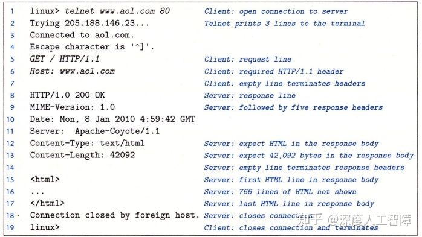

在第1行中运行`telnet www.aol.com 80`，表示要打开一个到AOL Web服务器的连接，此时TELNET会输出3段信息，然后等待我们的输入，我们可以输入一个文本行，此时TELNET就会读取并添加回车和换行符号，然后将其发送到服务器。

#### 11.5.3.1 HTTP请求

在第5~7行，我们输入了一个**HTTP请求（HTTP Requests）**，它**主要包含：**

- **请求行（Request Line）：**
  在第5行中，主要形式为`method URI version`。
  HTTP这里支持不同方法，这里主要介绍**`GET`方法**，它将指导服务器生成和返回URI标识的内容。而`version`字段表明该请求的HTTP版本，并表明接下来的请求报头是`HTTP/1.1`格式的。
  总的来说，第5行要求服务器取出并返回HTML文件`/index.html`。
- **请求报头（Request Hearder）：**
  主要是为服务器提供额外的信息，格式为`header-name: header-data`。
  比如这里我们提供了`HTTP/1.1`需要的`Host`信息。在客户端和**原始服务器（Irigin Server）**之间存在很多缓存了原始服务器内容的代理，称为**代理链（Proxy Chain）**，通过`Host`字段来指明原始服务器的域名，使得代理链中的代理能判断是否在他们本地缓存了被请求内容的副本，避免从很远的原始服务器调用数据。
- 一个空文本行来终止请求报头列表

#### 11.5.3.2 HTTP请求响应

在TELNET将我们的HTTP请求发送给Web服务器后，Web服务器就会返回一个**HTTP响应（HTTP Responses）**，它**主要包含：**

- **响应行（Response Line）：**
  响应行和请求行类似，格式为`version status-code status-message`。
  `version`字段表明响应使用的HTTP版本，而`status-code`和`status-message`主要指明请求的状态，表示你的请求是否被正确处理或出现什么问题


- **响应报头（Response Header）：**
  是关于响应的附加信息，比如`Content-type`表示Web服务器发送给浏览器的响应主体的MIME类型，使得浏览器能正确解析这些字节序列。`Content-Length`用来表明响应主体的字节大小。
- 一个终止报头的空行
- **响应主体（Response Body）：** 包含被请求的内容。


#### 11.5.4　服务动态内容

比如Web服务器接收到浏览器的发送的URI时

```http
GET /cgi-bin/adder?15000&213 HTTP/1.1
```

其中`/cgi-bin/adder`称为**CGI（Common Gateway Interface）程序**，该程序是使用CGI标准来让Web服务器服务动态内容。而其中的`15000&213`是浏览器发送给CGI程序的参数。

- Web服务器首先调用`fork`创建一个子进程，并在子进程中设置对应的CGI环境变量


比如将程序的参数保存在`QUERY_STRING`中，则CGI程序可以通过`getenv("QUERY_STRING")`函数来获得浏览器发送的参数。然后调用`dup2`函数将子进程的标准输出重定向到和客户端相关联的已连接描述符

- 调用`execve`来执行`/cgi-bin/adder`程序
- CGI程序负责生成`Content-type`和`Content-Length`响应报头，并将它的动态内容发送到标准输出


我们可以自己写CGI程序，但是要注意当执行CGI程序时，是在Web服务器中的一个子进程中，需要通过`getenv`来获得程序参数，且标准输出已被重定向到与浏览器关联的已连接描述符，并且要根据执行的结果来生成`Content-type`和`Content-Length`响应报头。


**注意：** CGI实际上定义了一个简单的标准，用于在客户端（浏览器），服务器和子进程之间传输信息。它是用于生成动态内容的原始标准，由于创建子进程十分昂贵且慢，目前已被其他更快的技术取代：比如fastCGI，Apache模块，Java Servlet，Rails控制器。


### 11.6　综合：TINY Web服务器

## 第12章　并发编程 


之前在[这里](https://zhuanlan.zhihu.com/p/115407445)提过，如果不同进程的逻辑流在时间上是重叠的，则称它们是**并发的（Concurrent）**，将这种现象称为**并发（Concurrency）**。比如进程之间通过内核完成上下文切换，使得各个进程的逻辑流在时间上是重叠的，从而使得两个进程并发执行。比如异常处理程序中，当出现异常时，会触发内核去执行异常处理程序。比如通过发送信号，可以使得在同一进程中跳转到信号处理程序中等等。

我们将使用应用级并发的应用程序称为**并发程序（Concurrent Program）**，该类程序主要具有以下经典问题：

- **竞争（Races）：** 结果的输出取决于系统中其他地方的任意调度决策，比如SellLab中我们要小心处理`addjob`和`deletejob`函数之间的竞争。
- **死锁（Deadlock）：** 当你存在多个逻辑流在等待永远不会发生的场景时就会出现死锁。比如在信号处理程序中使用异步信号不安全的`printf`函数就可能会出现死锁现象。在主程序中执行了`printf`函数，则该函数会请求某些资源的一个锁，当该`printf`函数请求这个锁时它被某个信号处理程序中断了，而在信号处理程序中也要执行一个`printf`函数，这个`printf`也试图请求那个锁，但是由于主程序中的`printf`函数持有那个锁，所以信号处理程序中的`printf`得不到那个锁，所以这个`printf`就在等待那个锁被释放的锁，但是主程序只有在信号处理程序返回时才可能释放那个锁，所以这里就造成了死锁。
- **活锁（Livelock）**、**饿死（Starvation）** 和**公平（Fairness）** ：当你始终无法获得时间时会出现饿死，比如你有两个进程，而内核使用调度进程A而不调度进程B，则进程B会由于不当的进程调度而出现饿死，则这种不当的调度方式会出现不公平。

本章不会介绍上面的全部内容，只是给出一个大致的概念。目前有三种方法来构建并发程序：

- **基于进程：** 每个进程执行一部分逻辑流，有内核负责在进程之间切换来达到逻辑流并发的效果。由于各个进程有自己独立的虚拟内存空间，所以控制流必须使用**进程间通信（Interprocess Communication，IPC）**机制来和其他流通信。
- **基于事件：** 使用I/O多路复用技术，应用程序在一个进程中显示地调度它们的逻辑流，由于程序是一个单独的进程，所以所有流都共享一个虚拟内存空间。
- **基于线程：** 可以看成上面两种方法的混合体，线程是运行在同一进程的逻辑流，由内核负责调度，共享一个虚拟内存空间。

接下来将介绍这三种并发编程方法，并尝试实现一个迭代echo服务器的并发版本。

### 12.1　基于进程的并发编程

> 进程的基础内容可参考：[深度人工智障：[读书笔记\]CSAPP：18[VB]ECF：异常和进程](https://zhuanlan.zhihu.com/p/115407445)    
> 信号的基础内容可参考：[深度人工智障：[读书笔记\]CSAPP：19[VB]ECF：信号和非本地跳转](https://zhuanlan.zhihu.com/p/117269612)     
> 综合应用可参考：[深度人工智障：[读书笔记\]CSAPP：ShellLab](https://zhuanlan.zhihu.com/p/119034923)     


其实有之前的基础后，想要通过进程来实现并发编程就很直观了。首先在Web服务器的父进程中监听一个监听描述符`listenfd`的连接请求，当有客户端发送连接请求，则在父进程中会获得已连接描述符`connfd`，则我们可以为该连接通过`fork`函数来创建一个独立的子进程，在子进程中使用`connfd`来与客户端进行通信，而父进程会继续监听`listenfd`看是否有其他客户端发送连接请求，并且通过`SIGCHLD`信号的处理程序来回收结束的客户端连接所在的僵死进程。


**注意：**

- 通过`fork`函数创建的子进程会复制父进程的描述符表，使得子进程也有`listenfd`，由于不需要子进程自己监听`listenfd`，所以在子进程中需要关闭`listenfd`。
- 在父进程中获得的`connfd`让子进程来使用，父进程只负责监听`listenfd`，所以需要在父进程中关闭`connfd`，并且要注意的时，`connfd`在父进程的描述符表中占据一个表项，如果父进程不关闭`connfd`，则会一直占据`connfd`的描述符，可能会造成内存泄漏。
- 父子进程的`connfd`描述符指向相同的文件表表项，使得该文件表表项的引用数为2，只有当引用数为0时，才会终止和客户端的连接。
- 父进程必须对僵死进程进行回收。

```c
#include "csapp.h"
void echo(int connfd);

void sigchld_handler(int sig) //line:conc:echoserverp:handlerstart
{
    while (waitpid(-1, 0, WNOHANG) > 0)
	;
    return;
} //line:conc:echoserverp:handlerend

int main(int argc, char **argv) 
{
    int listenfd, connfd;
    socklen_t clientlen;
    struct sockaddr_storage clientaddr;

    if (argc != 2) {
	fprintf(stderr, "usage: %s <port>\n", argv[0]);
	exit(0);
    }

    Signal(SIGCHLD, sigchld_handler);
    listenfd = Open_listenfd(argv[1]);
    while (1) {
	clientlen = sizeof(struct sockaddr_storage); 
	connfd = Accept(listenfd, (SA *) &clientaddr, &clientlen);
	if (Fork() == 0) { 
	    Close(listenfd); /* Child closes its listening socket */
	    echo(connfd);    /* Child services client */ //line:conc:echoserverp:echofun
	    Close(connfd);   /* Child closes connection with client */ //line:conc:echoserverp:childclose
	    exit(0);         /* Child exits */
	}
	Close(connfd); /* Parent closes connected socket (important!) */ //line:conc:echoserverp:parentclose
    }
}
```

该方法的**特点：**具有共享的文件表和不共享的用户空间

- **优点：** 由于进程具有自己独立的虚拟内存空间，所以无需担心被其他进程覆盖
- **缺点：** 独立的地址空间使得进程之间共享状态信息较困难，必须用显示的IPC机制，比如`waitpid`函数和信号或者套接字接口等等，或者某个磁盘文件或内存映射。并且进程控制和IPC的开销很大，使得速度较慢。

### 12.2　基于I/O多路复用的并发编程

如果你想要echo服务器能响应用户在服务器上的标准输入的键入，则服务器需要响应两个I/O事件：客户端发送的连接请求、用户在服务器上键入的命令行。如果你使用`accept`函数来接受客户端的连接请求，则会服务器会阻塞而无法处理键入的命令行，如果你想要用`read`函数来处理键入的命令行，就会使得服务器阻塞而无法处理客户端请求的连接。

这里我们需要使用**I/O多路复用（I/O Multiplexing）** 技术。我们知道服务器监听端口使用监听描述符`listenfd`，而标准输入使用描述符`STDIN_FILENO`，可以用`select`函数先将进程挂起，然后判断这两个描述符的任意一个是否准备好读

```c
#include <sys/select.h>
int select(int n, fd_set *fdset, NULL, NULL, NULL);

FD_ZERO(fd_set *fdset);  //清空fdset中的所有位
FD_CLR(int fd, fd_set *fdset);  //清除fdset中的描述符fd
FD_SET(int fd, fd_set *fdset);  //开启fdset中的描述符fd
FD_ISSET(int fd, fd_set *fdset);  //判断fdset中的描述符fd是否开启
```

其中，`fd_set`类型的参数称为**描述符集合**，它使用一个大小为n的位向量![[公式]](https://www.zhihu.com/equation?tex=b_%7Bn-1%7D%2Cb_%7Bn-2%7D%2C...%2Cb_0) 来标记我们关注的描述符集合，比如我们这里的`listenfd`为`3`，而标准输入`STDIN_FILENO`为`0`，则我们可以用`FD_ZERO`和`FD_SET`函数来定义一个大小为4的位向量 ![[公式]](https://www.zhihu.com/equation?tex=1001) 来表示我们关注的位向量。将该描述符集合`fdset`传入`select`函数，它就知道要关注哪些描述符，会先将进程挂起，如果能从描述符`0`或`3`读取一个字节而不会阻塞，`select`函数就修改传入的`fdset`，用来表示哪个描述符准备好了，我们可以通过`FD_ISSET`函数来进行判断，从而执行对应的函数。

**注意：**由于`select`函数会修改传入的`fdset`参数，所以每次调用`select`函数都要更新`fdset`。


如上所示是用`select`函数实现的服务器。首先在第18~20行中根据`STDIN_FILENO`和`listenfd`定义好描述符集合`fdset`，然后在服务器死循环中通过`select`函数来监听这个描述符集合，该函数会先挂起进程，只要`STDIN_FILENO`或`listenfd`准备好了，`select`就会返回并设置好`fdset`参数，我们通过`FD_ISSET`函数来判断是哪个描述符准备好了，如果是`STDIN_FILENO`，则表示用户在服务器的标准输入中键入了命令行，如果是`listenfd`，则表示有客户端发起连接请求。

通过这种方式，服务器能同时处理用户在标准输入中的键入和客户端的连接请求，但是如果服务器与客户端连接后，就会执行`echo`函数，无法处理标准输入的键入了。

#### 12.2.1 基于I/O多路复用的并发事件驱动服务器

I/O多路复用可以用做**并发事件驱动程序**的基础。在事件驱动程序中，一般将逻辑流抽象为**状态机（State Machine）**，具有一组**状态（State）**、**输入事件（Inpute Event）**和**转移（Transition）**，当某个状态下发生了某个输入事件时，就会转移到另一个状态。

我们这里为了实现多个客户端并发的echo服务器，首先将连接的客户端当做一个个状态机，放在池子中，每个状态机处于“等待描述符可读”状态，然后服务器使用`select`函数来检测输入事件的发生，当`select`检测到有客户端发送了请求连接这个事件，就会将新的状态机放到池子中；如果`select`检测到“描述符d准备好可读了”，则会对对应的状态进行转移，即读写一个文本行，然后状态机又转移回“等待描述符可读”状态。

首先，我们需要构建一个装状态机的池子数据结构


这里将所有客户端的已连接描述符保存在`clientfd`数组中，并且保存了对应的缓冲区`clientrio`数组。

然后是服务器的主函数


服务器获得监听描述符后，会先对池子进行初始化


池子中使用`maxi`参数来表示保存了多少个已连接客户端，这里初始化为-1，并将所有客户端的描述符初始化为-1。使用`maxfd`来保存最大的描述符，这里一开始只有一个`listenfd`，所以就初始化为`listenfd`，然后设置好`read_set`，使得`select`函数能判断`listenfd`描述符是否准备好。

在主函数中，调用`select`函数来检测描述符组`p->read_set`，最开始只有一个`listenfd`，所以就是检测是否有客户端发起连接请求，如果有，则执行`add_client`函数将该已连接客户端放入池子中


在`add_client`函数中，会寻找一个合适的索引来放`connfd`和客户端对应的缓冲区，然后就会修改`p->read_set`，添加该已连接客户端的`connfd`，使得`select`函数能检测该客户端的已连接描述符是否准备好。

在主函数中，如果`select`函数检测到的不是`listenfd`，则就是客户端发送的数据，就会调用`check_clients`函数


在该函数中，会对发送数据的客户端进行读取，并将发送了`EOF`的客户端进行关闭，并设置`p->read_set`以及将其从池子中删除。

**综上所述：** I/O多路复用其实就是使用`select`函数一次性检查多个描述符是否准备好可读了，然后通过`FD_ISSET`函数来判断是哪个描述符准备好了，再对其进行读取。并且不像之前串行服务器那样，连接上的客户端就不断读取数据，而是每个准备好的客户端都只读取一行，然后又调用`select`等待新的准备好的描述符，避免了一个客户端长时间占用服务器，使得别的客户端无法使用。

该方法的特点：

- **优点：**

  - 比基于进程的方法更好控制程序的行为，比如可以为某些客户端提供它们需要的服务
  - 所有客户端运行在单一的进程中，使得每个逻辑流能访问该进程的所有地址空间，使得流之间共享数据很容易
  - 由于是单个进程，就很容易调试，类似于顺序程序
  - 由于不需要进程的上下文切换，使得基于I/O多路复用的方法比基于进程的方法高效很多

- **缺点：**

  - 编码复杂，我们这里编写的粒度是读取每一行，如果阻塞在读取某个客户端的一行，就会使得其他客户端也不可用，而基于进程的方法不存在这个问题，如果我们想要编写更细粒度的程序，代码就更加复杂了。
  - 不能充分利用多核处理器。

### 12.3　基于线程的并发编程

### 12.3.1 线程基础

首先，我们可以看看进程的基本构成，它是由一个进程上下文和代码、数据和栈构成的


而我们这里将栈从虚拟地址空间中取出与线程的上下文结合起来，将其称为**线程（Thread）**，而其余部分保持不变。


线程就是运行在进程上下文中的逻辑流，每个进程开始生命周期时都是单一线程的，该线程称为**主线程（Main Thread）**，该主线程可以创建一个**对等线程（Peer Thread）**，由此这两个线程就并发执行，且每个线程有自己的逻辑流。该过程类似于多进程并发


首先，每个线程都有自己的**线程上下文（Thread Context）** ，包括一个唯一的整数**线程ID（Thread ID，TID）**、栈、栈指针、程序计数器、通用目的寄存器和条件码，且每个线程有自己的栈用来保存局部变量。而内核会负责线程之间的调度，比如主线程在运行一个慢速系统调用时，内核就会调用线程上下文切换将控制转移到对等线程，当对等线程执行一段时间后，内核又会调用线程上下文切换将控制转移到主线程。

**线程之间的关系：** 所有运行在一个进程里的线程共享该进程的整个虚拟地址空间，包括代码、数据、堆、共享库和打开的文件，这些与一个进程相关的线程组成一个**对等线程池**，线程之间不是父子关系，而是对等关系，即一个线程可以杀死它的任意对等线程，或等待它的任意对等线程终止。而主线程和对等线程的区别仅仅是主线程是进程中第一个运行的线程。

**进程与线程的相同点：**

- 每个都有自己的逻辑流
- 都能并发运行
- 可以上下文切换

**进程与线程的区别：**

- 每个进程具有自己的独立虚拟地址空间，而处于同一个进程上下文的线程共享该进程的整个虚拟地址空间，变成之间会共享所有代码和数据（除了局部栈）。
- 由于线程上下文比进程上下文小很多，所以内核进行线程上下文切换比进程上下文切换快很多。
- 进程之间存在父子关系，而线程之间是对等关系。


### 12.3.2 线程编程


以上是一个简单的线程编程例子，这里封装了大部分的函数，来首先理解线程编程的思想。首先，我们需要构建一个**线程例程（Thread Routine）**来包含线程的代码和本地数据，比如第12~16行的`thread`就是一个线程例程，线程例程都是以一个`void *`指针作为输入，并返回一个`void *`指针，如果想要传递多个参数给线程或线程想返回多个参数，就要将其放入一个结构中，并使用指向该结构的指针。在`main`函数中，首先会通过`Phread_create`函数来创建一个对等线程，将对等线程的线程例程作为参数，并返回该线程的TID`tid`，此时主线程和刚创建的对等线程就会同时运行，接下来调用`Phread_join`函数，主线程就会等待对等线程终止。


接下来我们依次详细看一下线程编程的函数

### 12.3.2.1 创建线程

```c
#include <pthread.h>
typedef void *(func)(void *);
int pthread_create(pthread_t *tid, pthread_attr_t *attr, func *f, void *arg);
pthread_t pthread_self(void); 
```

我们可以通过将线程例程`f`传入`pthread_create`函数来获得线程TID`tid`，当该函数返回时，就会在新线程的上下文中将参数`arg`传给`f`并运行`f`。我们可以通过`atte`来修改线程的默认行为，这里不做介绍。在线程例程中，可以通过`pthread_self`来获得所在线程的TID。

### 12.3.2.2 终止线程

```c
#include <pthread.h>
void pthread_exit(void *thread_return);
int pthread_cancel(pthread_t tid); 
```

线程终止有以下几种方式：

- 当顶层的线程例程返回时，线程会隐式地终止。（**不懂？**）
- 当某个对等线程调用`exit`函数时，会终止进程以及所有与该进程相关的线程。
- 线程例程可以调用`pthread_exit`函数来终止线程，并将`thread_return`作为终止信号。如果是在主线程中调用该函数，它会等其他所有对等线程终止后，才终止主线程和进程。
- 可以通过`pthread_cancel`发送线程终止请求给`tid`线程。

**参考：**

- [线程取消(pthread_cancel) - Cynthia&Sky - 博客园](https://link.zhihu.com/?target=https%3A//www.cnblogs.com/lijunamneg/archive/2013/01/25/2877211.html)
- [pthread_exit()_运维_佑邦的专栏-CSDN博客](https://link.zhihu.com/?target=https%3A//blog.csdn.net/youbang321/article/details/7816016)

### 12.3.2.3 回收已终止线程的资源

类似于进程，当子进程终止时，父进程要通过调用`waitpid`来回收子进程的资源。同理，我们也要回收终止线程的资源

```c
#include <pthread.h>
int pthread_join(pthread_t tid, void **thread_return); 
```

当我们调用该函数时，它会阻塞直到线程`tid`终止，此时会将线程例程返回的`void *`保存到`thread_return`中，然后回收已终止线程的资源。

**注意：** 我们这里只能等待一个指定的线程`tid`终止，而无法像`waitpid`那样等待任意的进程终止。

### 12.3.2.4 分离线程

线程具有**两种状态：**

- **可结合的（Joinable）：** 线程默认是可结合的，可被其他线程终止，当线程终止时，它的内存资源不会释放，需要被其他线程通过`pthread_join`函数来回收。
- **分离的（Detached）：** 我们可以通过以下函数来将可结合的线程变为分离的线程，此时它就无法被其他线程终止或回收了，它会在它自己终止时由系统自动释放资源。线程可以在自己线程例程刚开始时，使用`pthread_self`函数来将自己设置为分离的。

```c
#include <pthread.h>
int pthread_detach(pthread_t tid);
```

### 12.3.2.5 初始化线程

当我们在多线程环境中编程时，可能想要初始化与线程例程相关的状态，比如初始化多个线程共享的全局变量时，这些初始化只想执行一次，此时就可以使用以下函数

```c
#include <pthread.h>

pthread_once_t once_control = PTHREAD_ONCE_INIT;
int pthread_once(pthread_once_t *once_control, void (*init_routine)(void));
```

首先，我们需要自己定义一个初始化的函数`init_routine`，然后在各个线程例程中调用`pthread_once`函数，此时会通过`once_control`参数来控制只执行一次初始化函数`init_routine`。

### 12.3.4 基于线程的并发服务器

我们可以实现基于线程的并发echo服务器

```c
#include "csapp.h"

void echo(int connfd);
void *thread(void *vargp);

int main(int argc, char **argv) 
{
    int listenfd, *connfdp;
    socklen_t clientlen;
    struct sockaddr_storage clientaddr;
    pthread_t tid; 

    if (argc != 2) {
	fprintf(stderr, "usage: %s <port>\n", argv[0]);
	exit(0);
    }
    listenfd = Open_listenfd(argv[1]);

    while (1) {
        clientlen=sizeof(struct sockaddr_storage);
	connfdp = Malloc(sizeof(int)); //line:conc:echoservert:beginmalloc
	*connfdp = Accept(listenfd, (SA *) &clientaddr, &clientlen); //line:conc:echoservert:endmalloc
	Pthread_create(&tid, NULL, thread, connfdp);
    }
}

/* Thread routine */
void *thread(void *vargp) 
{  
    int connfd = *((int *)vargp);
    Pthread_detach(pthread_self()); //line:conc:echoservert:detach
    Free(vargp);                    //line:conc:echoservert:free
    echo(connfd);
    Close(connfd);
    return NULL;
}
```

它这个过程类似于基于进程的并发服务器，`main`函数中会死循环等待是否有客户端发送连接请求， 通过`accept`函数获得已连接描述符`connfd`，然后将其作为线程例程`thread`的参数来通过`pthread_create`函数创建一个对等例程，当`ptread_create`函数返回时，此时主线程和对等线程就会同时并发运行，所以服务器可以用一个对等线程来处理一个客户端的连接，而通过主线程来进行监听，由此达到了多个客户端并发的效果。

由于`main`函数不显示地回收对等线程，所以在线程例程中，需要分离该线程，让它自己线程终止时就自动回收资源。

该函数中需要**注意两点：**

首先，为什么已连接描述符`connfd`想要传入线程例程时，要采用上面的那种形式

```c
connfdp = Malloc(sizeof(int));
*connfdp = Accept(listenfd, (SA *) &clientaddr, &clientlen); 
Pthread_create(&tid, NULL, thread, connfdp);
```

如果我们采用下面这种形式会不会出现问题

```c
connfd = Accept(listenfd, (SA *) &clientaddr, &clientlen); 
Pthread_create(&tid, NULL, thread, &connfd);

void *thread(void *vargp) 
{  
    int connfd = *((int *)vargp);
    ...
}
```

这里需要注意，传入线程例程的是一个指针参数，指向的是`connfd`的地址，当我们在`thread`函数中完成类型转换获得局部变量`connfd`之前，下一个客户端发送了连接请求，使得`accept`函数修改了`connfd`的值时，由于同一进程中的所有线程共享相同的虚拟地址空间，所以会使得`thread`函数中的`connfd`变成下一个客户端的`connfd`了，产生了竞争。所以这里每次都会申请一个新的地址来存放`connfd`，避免存在竞争，并且由于每个线程有自己的栈，所以线程中的局部变量并不会相互影响。

其次，我们注意到，在基于进程的并发服务器中，在父子进程中都有对`connfd`的关闭，这是因为父子进程都有自己独立的虚拟地址空间，有独立的描述符表，所以需要两个进程从自己的描述符表中清除`connfd`，避免内存泄漏。而基于线程的并发服务器，由于所有线程共享当前进程的虚拟地址空间，即共享了同一个描述符表，此时在线程例程中关闭`connfd`后，就会直接从进程的描述符表中清除`connfd`了，就无需主线程关闭`connfd`了。

该方法的特点：

- **优点：**

- - 易于在线程之间共享数据结构，比如日志记录信息和文件缓存
  - 线程比进程更高效

- **缺点：** 无意的共享会引入细微且难以再现的错误！


### 12.4　多线程程序中的共享变量

只有资源共享才会产生同步问题，如果线程没有共享任何资源，就没有同步问题。判断一个变量是否是共享的，首先判断该变量在内存的实例个数，然后看该变量的一个实例是否被多个线程引用。对共享变量进行操作时要进行同步。
- 多线程程序要画出进度图来分析
- 互斥锁主要是用来保护共享变量的，只要有多个线程访问共享变量，就加上互斥锁。如果要对资源进行调度，就使用计数信息量。
- **多线程代码：** 首先判断哪些变量是共享变量，加上互斥锁。如果有多个互斥锁，画出进度图，避免出现死锁。
- 由于同步的开销很大，所以尽量写成可重入的形式。
- 多进程程序中，需要注意对信号进行阻塞；多线程程序中，需要注意对共享变量进行同步。
- 多线程程序要注意：共享变量，竞争，死锁，线程安全。


我们以下面的程序为例来说明多线程共享变量的问题


一组并发的线程运行在一个进程上下文中，每个线程具有自己的线程上下文，包括TID、栈、栈指针、程序计数器、条件码和通用目的寄存器值，这就说明每个进程可以通过自己的程序计数器运行自己的代码，而通过栈可以保存自己的局部变量，这些栈是保存在虚拟地址空间中的栈区域。而进程的其余部分在所有线程中是共享的，包括整个用户虚拟地址空间，其中有代码、读写数据、堆、共享代码库代码数据区域、打开的文件描述符和信号处理程序等等。

但是并不会完全遵守以上的线程内存模型，比如我们这里要求每个线程有自己独立的栈，但是这里并不会对其他线程的访问进行限制，比如上面代码在线程例程中通过全局变量ptr来访问主线程中栈的局部变量`msgs`，所以要十分小心这个线程内存模型。

根据[链接](https://zhuanlan.zhihu.com/p/113571281)这一章可知，未初始化静态变量、以及初始化为0的全局变量或静态变量的符号`.bss`节中，初始化过的全局变量或静态变量的符号在`.data`节中，这两个数据节在生成可执行目标文件时，都被分配到了数据段中，所以全局变量和静态变量的实例是保存在进程的虚拟地址空间中的数据段中的，所有线程都能访问到，且虚拟内存空间值包含一个实例。而局部非静态变量是保存在栈或寄存器中的，每个线程都有自己的栈和寄存器值，所以局部非静态变量的实例是保存在线程的栈或寄存器中的，通常只有自己能访问到。

而判断一个变量是否是共享的，就看该变量的一个实例是否被多个线程引用。

- `ptr`：它是未初始化全局变量，实例保存在`.bss`节中，所有线程都可以访问。在主线程和两个对等线程中都有引用过，所以是共享的。
- `cnt`：它是初始化了的静态变量，实例保存在`.data`节中，所有线程都可以访问。在两个对等线程中都有引用过，所以是共享的。
- `i.m`：主线程中的变量`i`是局部变量，保存在主线程中的栈，没有被其他线程引用过，所以是不共享的。
- `msgs.m`：主线程中的变量`msgs`是局部变量，保存在主线程中的栈。由于全局变量`ptr`指向了`msgs`，而两个对等线程通过`ptr`间接地引用了`msgs`的数据，所以是共享的。
- `myid.0`和`myid.1`：在两个对等线程中的局部变量`myid`，它们各自保存在对等线程自己的栈中，也不存在间接引用，所以它们是不共享的。


### 12.5　用信号量同步线程

由于共享变量的存在，可能会引入**同步错误（Synchronization Error）**。


**注意：** 由于我们这里在线程例程中不会对`niters`进行修改，所以可以直接将`niters`的地址传入`pthread_create`函数而不用担心竞争。

我们运行该程序时，希望`cnt`的值为`2*niters`，但是运行出来的结果却是


我们观察在线程例程中的汇编


其中，`%rcx`保存`niters`的值，`%rax`保存`i`的值，`%rdx`保存`cnt`的值。我们知道，在单核线程并发时，是由内核调度这两个线程的逻辑流进行交替运行的，而上图的中间部分是两个逻辑流对共享变量`cnt`的操作，所以当其中一个线程运行到中间部分又被内核调度到另一个线程时，就可能会出错。这两个线程的逻辑流具有一些能得到正确结果的执行顺序，也有一些会得到错误结果的执行顺序，比如


我们可以通过**进度图（Process Graph）** 来探讨指令执行的顺序。首先有n个并发线程就创建n维笛卡尔积空间，每个维度对应一个线程的进度，根据线程的指令顺序对每一维进行划分，则在该笛卡尔积空间中的某一条轨迹就是并发线程的指令执行顺序。**注意：**

- 图的原点是所有并发线程还未开始执行的初始状态
- 两条指令不能同时执行，所以不存在斜线
- 程序不允许反向运行，所以轨迹总是向右上方增长的


如上图所示就是根据汇编指令得到的一条指令执行顺序的轨迹。其中我们将操作共享变量`cnt`的指令 ![[公式]](https://www.zhihu.com/equation?tex=%28L_i%2CU_i%2CS_i%29) 当做**临界区（Critical Section）**，我们希望临界区不和其他线程的临界区交替执行，来使得线程拥有对共享变量的**互斥访问（Mutually Exclusive Access）**。我们可以将两个线程的临界区围起来构成一个**不安全区（Unsafe Region）**，只要有一条轨迹穿过不安全区，说明两个线程对共享变量`cnt`的操作是交替执行的，可能就会出现错误。我们将穿过不安全区的轨迹称为**不安全轨迹（Unsafe Trajectory）**，而其他的轨迹就是**安全轨迹（Safe Trajectory）**。


为了保证可以获得安全轨迹，可以通过信号量的方法同步线程来获得安全轨迹。

### 12.5.1 信号量

为了同步线程，提出了一种特殊类型变量**信号量（Semaphore）**`s`，它是具有非负整数的全局变量，只能通过两个系统调用函数进行操作：

- **`P(s)`：**

- - 如果`s`是非零的，就对其减1并立即返回（原子操作）
  - 如果`s`是0，则将当前线程挂起，直到被`V(s)`函数加1且重启线程，`P(s)`才会再对`s`减1并返回。

- **`V(s)`：**将`s`加1（原子操作），如果有任何线程被P挂起，该函数会重启其中任意一个线程，此时控制权又回到了那个线程的P中。

P和V这样的定义是为了保证了信号量`s`不会变成负值，才能够对线程进行同步，这种属性称为**信号量不变性（Semaphore Invariant）**。这里有一些信号量的函数

```c
#include <semaphore.h>

int sem_init(sem_t *sem, 0, unsigned int value);
int sem_wait(sem_t *s);  //P
int sem_post(sem_t *s);  //V
```

其中，每个信号量都要通过`sem_init`函数进行初始化，且初始化值为`value`，然后通过`sem_wait`和`sem_post`函数来调用P和V。我们这里提供这两个的封装

```c
#include "csapp.h"
int P(sem_t *s);
int V(sem_t *s); 
```

使用信号量来确保对共享变量的互斥访问，**基本思想**是将共享变量和一个信号量联系起来，然后使用P和V将对应的临界区包围起来。比如我们将原来的代码改为

```c
sem_t mutex;  //信号量
//主线程中初始化信号量
sem_init(&mutex, 0, 1);
//对等线程例程中
for(i=0; i<niters; i++){
  P(&mutex);
  cnt++;
  V(&mutex);
}
```

这里我们声明了一个信号量`mutex`，然后在线程例程中用P和V将`cnt++`围住了。首先，当还没有线程执行线程例程时，`mutex`被初始化为1，当有一个线程A在执行线程例程时，会首先执行`P(&mutex)`，此时由于`mutex`不是0，所以会将其减1，然后执行`cnt++`，此时`mutex`就为0，如果在执行`cnt++`指令的中间有另一个线程B也要执行线程例程时，在`P(&mutex)`中由于当前`mutex`为0，则P会将线程B挂起，直到线程A执行到`V(&mutex)`时，会将`mutex`加1，然后重启线程B，此时线程B又会执行`P(&mutex)`，此时由于`mutex`为1，所以也会顺利执行。

更形式化来说，我们将这种用来保护共享变量的信号称为**二元信号量（Binary Semaphore）**，因为它的值总是0或1。以提供互斥为目的的二元信号量也称为**互斥锁（Mutex）**，则执行P操作就称为**上锁**，执行V操作就称为**解锁**，一个线程对互斥锁上锁了还未解锁，就称该线程**占用**这个互斥锁。我们通过互斥锁将线程的临界区包围起来，则会构成一个**禁止区（Forbidden Region）**，在禁止区内由于信号量都为-1，想要操作共享变量就要通过P对信号量减1，此时就会将当前线程挂起，直到占用的线程解锁

图中每个点的值为信号量的值

### 12.5.2 利用信息量来调度共享资源

除了用二元信息量来提供互斥锁以外，还能用来作为一组可用资源的计数器，称为**计数信号量**，用来调度对共享资源的访问，经典的模型有**生产者-消费者问题（Producer-Consumer Problem）**和**读者-写者问题（Reader-Writer Problem）**。

### 12.5.2.1 生产者-消费者问题

我们考虑这样一类问题，假设目前我们去一个商场购买口罩，我们作为消费者可以自己去购买，如果口罩不够了，则消费者就等待生产者生产出更多的口罩放在商场供我们购买，如果生产者一不小心生产了太多口罩，则商场放不下了，就要等商场有空的区域时再生产。这就是一个生产者-消费者问题。

在这里，我们将生产者和消费者看成是生产者线程和消费者线程，而商场看成是一个具有有限空间的缓冲区，生产者线程会不断生成新的**项目（Item）**，然后将其插入缓冲区中，而消费者线程会不断从缓冲区中取出这些项目去消费。


由于缓冲区在这两个线程中是共享变量，从中取出项目和插入项目都要更新共享变量，所以要对缓冲区设置一个互斥锁，保证只有一个线程能访问缓冲区。其次，我们还需要通过计数信号量对缓冲区的访问进行调度，当缓冲区有空间来插入项目时，生产者线程才尝试插入项目，当缓冲区中有项目时，消费者线程才尝试从中取出项目。我们可以首先定义缓冲区的数据结构


其中，`buf`是一个动态分配的缓冲区，`n`是缓冲区的大小，`front`和`rear`是第一个项目和最后一个项目的索引，这里将`buf`实现为循环的数组。`mutex`是访问缓冲区的互斥锁，`slots`是用来调度生产者线程的计数信息量，`items`是用来调度消费者线程的计数信息量。

**注意：**计数信息量`slot`和`items`是用来判断能否执行生产者线程或消费者线程，如果可以，则会对`buf`进行访问，由于`buf`是共享变量，所以它的访问需要`mutex`互斥锁，所以这里会有三个信息量。


首先，我们需要初始化该缓冲区，其中`sp->mutex`要初始化为二院信息量，`sp->slots`要初始化为`n`，表示有`n`个空间供生产者线程使用，`sp->items`要初始化为0，表示现在还没有项目供消费者线程消费。


生产者线程可以调用`sbuf_insert`函数来将将项目插入到缓冲区中。首先需要通过`sp->slots`查看是否有空闲的区域，如果`sp->slots`为0，说明没有空闲的区域，则`P`会将生产者线程挂起，直到`sp->slots`大于0且该线程被`V`重启。然后需要通过`sp->mutex`来获得缓冲区的互斥锁，然后才能将`item`插入缓冲区中。随后通过`V`将`sp->mutex`解锁，然后用`V`将`sp->items`加1，如果刚好有消费者由于`sp->items`为0而挂起，则该`V`会随机重启一个消费者线程。


消费者线程可以调用`sbuf_remove`函数来从缓冲区中获得项目。首先通过`sp->items`查看缓冲区中是否存在项目，如果`sp->items`为0表示没有项目供消费者线程消费，此时消费者线程会挂起，直到被生产者线程的`P(&sp->items)`重启。然后通过`sp->mutex`来获得缓冲区的互斥锁，然后才能从缓冲区中获得项目`item`。随后通过`V`将`sp->mutex`解锁，然后用`V`将`sp->slots`加1，如果刚好有生产者线程由于`sp->slots`为0而挂起，则该`V`会随机重启一个生产者线程。

最终我们可以通过以下函数来释放缓冲区


### 12.5.2.2 读者-写者问题

当一组并发的线程要访问一个共享对象时，有些线程只读对象称为**读者线程**，而其他对象只写对象称为**写者线程**，写者线程必须有对对象的独占访问，而读者线程可以和其他读者线程共享对象。根据读者和写者的优先级，可以**分成两类问题：**

- **第一类：**读者优先级高于写者，除非写者已占用互斥锁，否则读者都不会一直等待，在等待的写者之后到达的读者具有更高的优先级。
- **第二类：**写者优先级高于读者，一旦写者准备好写时，它会尽快执行写操作，在写者之后到达的读者必须等待。

这两种情况都会出现饥饿问题。这里提供一个第一类读者-写者问题的代码


这里定义了一个全局共享变量`readcnt`来统计读者线程的数目，由于不同读线程要对其进行访问，所以需要一个互斥锁`mutex`来控制对`readcnt`的访问，然后还有一个`w`互斥锁来控制对对象的访问。


在写者线程中，会通过用`P(&w)`和`V(&w)`将临界区包围住，从而根据互斥锁`w`的状态来访问对象，此时保证了一次只能有一个写者线程能访问对象。


在读者线程中，首先要通过`readcnt`来统计其中有多少个读者线程，因为是读者优先的，所以只有进入的读者数目`readcnt`为0时，才能让写者线程去访问对象，所以这里每个读者线程进来和出去时都要修改`readcnt`，而`readcnt`是共享变量，所以需要通过`mutex`来对其上锁。其次，我们只有当`readcnt`为1时才执行`P(&w)`对`w`进行上锁，当有写者线程尝试访问对象时，会被挂起，而当有其他读者线程进入时，由于`readcnt`被修改了，所以不会访问到`P(&w)`，也就不会被挂起，此时后续的读者线程就能不断进入临界区访问对象。而只有当`readcnt`为0时才执行`V(&w)`对`w`解锁，此时挂起的写者线程就能被重启。


#### 12.5.3 基于预线程化的并发服务器

我们之前实现的基于线程的并发服务器，为每个客户端都生成一个线程进行处理，其实十分耗费资源。我们可以基于生产者-消费者问题来构建一个**预线程化（Prethreading）**的并发服务器，它将主线程看成是生产者，不断接收客户端发送的连接请求，并将已连接描述符放在缓冲区中，而提前创建的一系列线程就是消费者，不断从缓冲区中取出已连接描述符与客户端通信


第24行首先对缓冲区进行初始化，然后生成了`NTHREADS`个消费者线程，在线程例程中，会通过`pthread_detach`函数来分离消费者线程，然后死循环通过`sbuf_remove`函数来从缓冲区中获得已连接描述符`connfd`，当`pthread_create`函数返回时，这些消费者线程就开始运行了，此时由于`sbuf->items`为0，所以这些消费者线程会被`P(&sbuf->items)`挂起。然后在生产者线程中通过`accept`函数来获得已连接描述符`connfd`，并通过`sbuf_insert`函数将其插入到缓冲区中，此时`sbuf->items`就不为0了，那些被挂起的消费者线程就会一个个被`V(&sbuf->items)`重启，然后将获得的`connfd`传入`echo_cnt`函数来与客户端通信。这里的对等线程的数目是我们一开始创建的那些线程，而不是等到获得`connfd`时才创建，所以称为预线程化，可以自己控制对等线程的数目。

<center>  </center>    

这个`echo_cnt`函数会通过全局变量`byte_cnt`来统计服务器总共从客户端获得的字节数，由于不同的消费者线程都会调用`echo_cnt`函数，所以会有多个线程来访问`byte_cnt`共享变量，所以我们对`byte_cnt`的访问需要使用互斥锁。而我们这里将互斥锁和`byte_cnt`的初始化过程放在了子线程中，通过`pthread_once`函数来保证该初始化函数`init_echo_cnt`函数只被执行一次。


### 12.6　使用线程提高并行性

- 同步互斥锁的代价很大，要避免进行同步
- 并行程序一般一个核运行一个线程

------

根据程序逻辑流的数目，可以将程序分为顺序程序和并发程序，其中顺序程序只有一个逻辑流，而并发程序具有多个逻辑流。当在多个处理器中运行并发程序时，就成为了并行程序，速度会更快，因为内核在多个核上并行地调度这些并行线程，而不是在单个核上顺序地调度。


我们以一个简单的例子来看并行程序的例子，用并行程序来计算 ![[公式]](https://www.zhihu.com/equation?tex=0%2C1%2C...%2Cn-1%2Cn) 的和。首先，我们可以根据线程数目将这些数字划分成若干个组，每个线程在自己的组中计算结果，再将其放入一个共享全局变量中，需要用互斥锁保护这个变量。


第30行中我们将每个线程的组号作为参数传递到线程例程中，再让主线程等待所有对等线程运行完毕，再与正确结果比较是否正确。


在线程例程中，首先根据组号计算出线程需要计算的范围，然后对全局变量进行加和时，要注意用互斥锁将其保护起来。我们可以得到这个程序在四核系统上计算 ![[公式]](https://www.zhihu.com/equation?tex=2%5E%7B31%7D) 的性能为


单位为秒

可以发现效果很差，其实**主要原因**是由于`P`和`V`对互斥锁的保护。我们可以将每个线程计算的结果保存在全局数组中的特定位置，这样就不用对数组进行保护


该程序的性能为


可以发现去掉互斥锁后性能提升了很多。根据之前[优化程序性能](https://zhuanlan.zhihu.com/p/107369491)介绍的，要避免内存的读写，使用一个局部变量保存循环中计算的结果，在循环计算后再将其保存到数组中，程序性能为


在四核系统上的性能

可以一开始线程数目每增加一个，运行速度就下降一半，而当线程数到达4时，就不变了。这是因为这个程序运行在四核系统中，当线程数大于4时，每个核中就需要内核进行线程上下文切换来对线程进行调度，此时就会增加开销。并行程序一般一个核运行一个线程。

这里介绍几个度量并行程序利用并行性程度的**指标：**

- **加速比（Speedup）：**![[公式]](https://www.zhihu.com/equation?tex=S_p%3D%5Cfrac%7BT_1%7D%7BT_p%7D)
  其中p是核数目， ![[公式]](https://www.zhihu.com/equation?tex=T_p) 是并行程序p个核上的运行时间

- - **绝对加速比（Absolute Speedup）：**![[公式]](https://www.zhihu.com/equation?tex=T_1) 是顺序程序执行时间。需要编写两套代码，较复杂，但能更真实衡量并行的好处。
  - **相对加速比（Relative Speedup）：**![[公式]](https://www.zhihu.com/equation?tex=T_1) 是并发程序在一个核上的执行时间。由于并发程序需要增加同步开销，会得到比绝对加速比更大的结果。

- **效率（Efficiency）：**![[公式]](https://www.zhihu.com/equation?tex=E_p%3D%5Cfrac%7BS_p%7D%7Bp%7D)
  主要用来衡量并行化造成的开销，效率越高，说明程序在有用工作上花费更多时间，在同步和通信上花费较少的时间。


接下来我们以排序为例来介绍并行程序，尝试实现并行版的快速排序。首先看一下快速排序的顺序版本

```c
void qsort_serial(data_t *base, size_t nele) {
  if (nele <= 1)
    return;
  if (nele == 2) {
    if (base[0] > base[1])
      swap(base, base+1);
    return;
  }

  /* Partition returns index of pivot */
  size_t m = partition(base, nele);
  if (m > 1)
    qsort_serial(base, m);
  if (nele-1 > m+1)
    qsort_serial(base+m+1, nele-m-1);
}
```

可以发现我们首先对最左侧的部分进行排序，当左侧子部分排序完成时，才对右侧部分进行排序。最简单的并行方法就是将数据分成左右两部分，用两个线程分别对这两部分进行排序，称为**分而治之并行（Divide-and-Conquer Parallelism）**。此外我们还可以使用生产者-消费者模型。


### 12.7　其他并发问题

可以发现，线程由于会对共享变量进行操作，所以我们尝试使用同步技术来解决操作共享资源时出现的问题，接下来会介绍几个典型问题。


### 12.7.1 线程安全

当且仅当一个函数被多个并发线程反复调用还会一直产生正确结果时，才称为**线程安全的（Thread-Safe）**，我们可以根据线程不安全的原因分成以下几个类：

- **第一类：不保护共享变量的函数：** 当我们没有对共享变量进行保护，而它的操作也是非原子的时，就可能会造成错误。

- - **解决方法：** 引入互斥锁，使用`P`和`V`将对共享变量访问的部分围起来，但程序速度会变慢。

- **第二类：跨多个函数调用依赖于持久状态：** 比如以下伪随机数生成器，在单个线程程序中，我们可以通过`srand`函数定义相同的随机种子来得到可重复的随机数序列，但是在多个线程中调用`rand`函数时，由于`rand`函数中依赖于共享的前一个状态`next_seed`，此时`next_seed`可能会被其他线程修改而无法获得相同的随机数序列。

- - **解决方法：** 重写函数，将状态作为参数的一部分传递，避免被其他线程修改。

<center>  </center>  

- **第三类：返回指向静态变量的指针的函数：** 静态变量保存在数据区，在进程中只有一个实例，是所有线程共享的，当你返回一个静态变量的指针时，是指向一个内存地址，而在别的线程中可能也会通过该静态变量对该内存地址的内容进行修改。

- - **解决方法：**

  - - 重写函数，让调用者传递保存结果的地址
    - 使用**加锁-复制（Lock-and-Copy）** 技术，将线程不安全函数与一个互斥锁联系起来，用`P`和`V`函数将该不安全函数的调用部分包围起来，并将其结果保存在一个局部变量中。**问题：**需要引入额外的同步操作，会降低程序的速度，其次是有一些函数会返回十分复杂的数据结构，比如`getaddrinfo`，此时就需要深拷贝才能复制整个结构数据。

<center>  </center>  

- **第四类：调用线程不安全函数的函数：** 如果该线程不安全函数属于第二类，就要修改函数的源码，如果是第一类或第三类，可以直接通过互斥锁的方式保证函数时线程安全的。

Linux系统提供的大多数线程不安全函数都有对应的线程安全版本，一般是以`_r`结尾的。

<center>  </center>  

我们可以更进一步得到线程安全函数中的一类**可重入函数（Reentrant Function）** ，当他们被多个线程引用时，不会引用任何共享数据。可将其分成两类：

- **显示可重入的（Explicitly Reentrant）：**  函数参数全都是值传递，且函数内的数据应用都是局部变量，不含有全局变量或静态变量。
- **隐式可重入的（Implicitly Reentrant）：** 函数参数可以是引用传递的，如果调用线程传递一个非共享数据的指针，它就是可重入的。

可重入函数包括显示可重入和隐式可重入，说明可重入函数可能也依赖于调用线程的属性，比如传递一个非共享数据的指针到隐式可重入函数，保证其是可重入的，这类函数就不需要任何同步技术来保证多线程结果的正确。由于同步的开销很大，所以尽量写成可重入的形式。

上面第二类线程不安全函数，只能通过修改函数使其是线程安全的，并且由于无法使用互斥锁，所以只能将其改为可重入的

<center>  </center>   

**注意：** 可重入函数是线程安全函数的真子集，所以可重入函数一定是线程安全函数，而线程安全函数不一定是可重入函数，可能是用互斥锁来实现线程安全的。可重入函数由于不用同步操作，所以通常速度会更快。

### 12.7.2 竞争

多线程程序要求对进度图中任何可行的轨迹都正确工作，而程序员可能会下意识假设了某种特殊的轨迹，比如一个程序的正确性依赖于线程A要在线程B执行到y之前先执行到x，此时就会出现**竞争（Race）**。

这个例子之前也说过

<center>  </center>    


该程序中，第13行创建线程时传入的参数为`&i`，而在线程例程中通过`*((int*)vargp)`将其转化为`int`，此时就会出现竞争。因为主线程中的局部变量`i`保存在主线程的栈中，而传入的线程例程的参数是`i`的地址，在前一个线程在第22行读取该地址中的`i`之前，第12行修改了该地址内的数据，就会造成竞争。这里假设了第22行在第12行之前执行。

<center>  </center>    

正确的方法是申请一个独立的空间


### 12.7.3 死锁

**死锁（Deadlock）** 就是一组线程被阻塞，等待一个永远不会为真的条件。比如下图是一个使用了两个互斥锁的进度图


我们可以发现，当轨迹进入图中所示的**死锁区（Deadlock）** 时，线程1占用互斥锁`s`，线程2占用互斥锁`t`，而轨迹要从死锁区出来，要么线程1占用互斥锁`s`，要么线程2占用互斥锁`t`，这两个都是不可能为真的条件，所以就陷入了死锁状态。所以轨迹可以进入死锁区，但是无法从死锁区出来。

可以发现是由于P和V的操作顺序不当，使得两个互斥锁的禁止区出现了重叠，导致死锁区的出现，这种原因导致的死锁常用的解决方法是定义一个**互斥锁加锁顺序规则**，给定所有互斥操作的一个全序，如果每个线程都是以一种顺序获得互斥锁并以相反的顺序释放锁，则该程序时无死锁的。也就是对于有多个互斥锁的情况，我们在所有线程中按照相同顺序来上锁，在解锁时用相反顺序。


**注意：** 要注意互斥锁的初始状态。


