参考：

https://blog.csdn.net/chk_plusplus/category_11250074.html    
https://github.com/StdioA/fluent-python-notes     
https://facert.gitbooks.io/python-data-structure-cn/content/       
https://github.com/fluentpython/example-code-2e


# 目录

**第一部分 序幕** 
**第1章 Python 数据模型**               
1.1 一摞 Python 风格的纸牌             
1.2 如何使用特殊方法            
1.2.1 模拟数值类型             
1.2.2 字符串表示形式             
1.2.3 算术运算符             
1.2.4 自定义的布尔值             
1.3 特殊方法一览             
1.4 为什么 len 不是普通方法             

**第二部分 数据结构**           
**第2章 序列构成的数组**           
2.1 内置序列类型概览  
2.2 列表推导和生成器表达式  
2.2.1 列表推导和可读性  
2.2.2 列表推导同 filter 和 map 的比较  
2.2.3 笛卡儿积  
2.2.4 生成器表达式  
2.3 元组不仅仅是不可变的列表  
2.3.1 元组和记录  
2.3.2 元组拆包  
2.3.3 嵌套元组拆包  
2.3.4 具名元组  
2.3.5 作为不可变列表的元组  
2.4 切片  
2.4.1 为什么切片和区间会忽略最后一个元素  
2.4.2 对对象进行切片  
2.4.3 多维切片和省略  
2.4.4 给切片赋值             
2.5 对序列使用 + 和 *             
2.6 序列的增量赋值  
2.7 list.sort 方法和内置函数 sorted  
2.8 用 bisect 来管理已排序的序列  
2.8.1 用 bisect 来搜索             
2.8.2 用 bisect.insort 插入新元素             
2.9 当列表不是首选时             
2.9.1 数组             
2.9.2 内存视图            
2.9.3 NumPy 和 SciPy            
2.9.4 双向队列和其他形式的队列            

**第3章 字典和集合**            
3.1 泛映射类型            
3.2 字典推导            
3.3 常见的映射方法            
3.4 映射的弹性键查询            
3.4.1 defaultdict ：处理找不到的键的一个选择            
3.4.2 特殊方法 __missing__            
3.5 字典的变种            
3.6 子类化 UserDict            
3.7 不可变映射类型            
3.8 集合论            
3.8.1 集合字面量            
3.8.2 集合推导            
3.8.3 集合的操作            
3.9 dict 和 set 的背后            
3.9.1 一个关于效率的实验            
3.9.2 字典中的散列表            
3.9.3 dict 的实现及其导致的结果            
3.9.4 set 的实现以及导致的结果            

**第4章 文本和字节序列**            
4.1 字符问题            
4.2 字节概要            
4.3 基本的编解码器            
4.4 了解编解码问题                      
4.4.1 处理 UnicodeEncodeError            
4.4.2 处理 UnicodeDecodeError            
4.4.3 使用预期之外的编码加载模块时抛出的 SyntaxError            
4.4.4 如何找出字节序列的编码            
4.4.5 BOM：有用的鬼符            
4.5 处理文本文件          
4.6 为了正确比较而规范化 Unicode 字符串           
4.6.1 大小写折叠           
4.6.2 规范化文本匹配实用函数           
4.6.3 极端“规范化”：去掉变音符号           
4.7 Unicode 文本排序           
4.8 Unicode 数据库           
4.9 支持字符串和字节序列的双模式 API           
4.9.1 正则表达式中的字符串和字节序列           
4.9.2 os 函数中的字符串和字节序列           

**第三部分 把函数视作对象**
**第5章 一等函数**      
5.1 把函数视作对象           
5.2 高阶函数           
5.3 匿名函数           
5.4 可调用对象           
5.5 用户定义的可调用类型           
5.6 函数内省           
5.7 从定位参数到仅限关键字参数           
5.8 获取关于参数的信息           
5.9 函数注解           
5.10 支持函数式编程的包           
5.10.1 operator 模块           
5.10.2 使用 functools.partial 冻结参数           

**第6章 使用一等函数实现设计模式**            
6.1 案例分析：重构“策略”模式            
6.1.1 经典的“策略”模式            
6.1.2 使用函数实现“策略”模式                      
6.1.3 选择最佳策略：简单的方式            
6.1.4 找出模块中的全部策略            
6.2 “命令”模式  

**第7章 函数装饰器和闭包**           
7.1 装饰器基础知识            
7.2 Python 何时执行装饰器            
7.3 使用装饰器改进“策略”模式            
7.4 变量作用域规则            
7.5 闭包            
7.6 nonlocal 声明            
7.7 实现一个简单的装饰器            
7.8 标准库中的装饰器            
7.8.1 使用 functools.lru_cache 做备忘            
7.8.2 单分派泛函数            
7.9 叠放装饰器            
7.10 参数化装饰器            
7.10.1 一个参数化的注册装饰器            
7.10.2 参数化 clock 装饰器            

**第四部分 面向对象惯用法**
**第8章 对象引用、可变性和垃圾回收**
8.1 变量不是盒子            
8.2 标识、相等性和别名            
8.2.1 在 == 和 is 之间选择            
8.2.2 元组的相对不可变性            
8.3 默认做浅复制            
8.4 函数的参数作为引用时            
8.4.1 不要使用可变类型作为参数的默认值            
8.4.2 防御可变参数            
8.5 del 和垃圾回收            
8.6 弱引用            
8.6.1 WeakValueDictionary 简介            
8.6.2 弱引用的局限            
8.7 Python 对不可变类型施加的把戏            

**第9章 符合 Python 风格的对象**
9.1 对象表示形式            
9.2 再谈向量类            
9.3 备选构造方法            
9.4 classmethod 与 staticmethod            
9.5 格式化显示            
9.6 可散列的 Vector2d            
9.7 Python 的私有属性和“受保护的”属性            
9.8 使用 __slots__ 类属性节省空间            
9.9 覆盖类属性            

**第10章 序列的修改、散列和切片**
10.1 Vector 类：用户定义的序列类型            
10.2 Vector 类第1 版：与 Vector2d 类兼容            
10.3 协议和鸭子类型            
10.4 Vector 类第2 版：可切片的序列            
10.4.1 切片原理            
10.4.2 能处理切片的 __getitem__ 方法            
10.5 Vector 类第3 版：动态存取属性            
10.6 Vector 类第4 版：散列和快速等值测试            
10.7 Vector 类第5 版：格式化            

**第11章 接口：从协议到抽象基类**
11.1 Python 文化中的接口和协议            
11.2 Python 喜欢序列            
11.3 使用猴子补丁在运行时实现协议            
11.4 Alex Martelli 的水禽            
11.5 定义抽象基类的子类            
11.6 标准库中的抽象基类            
11.6.1 collections.abc 模块中的抽象基类            
11.6.2 抽象基类的数字塔            
11.7 定义并使用一个抽象基类            
11.7.1 抽象基类句法详解            
11.7.2 定义 Tombola 抽象基类的子类            
11.7.3 Tombola 的虚拟子类            
11.8 Tombola 子类的测试方法            
11.9 Python 使用 register 的方式 
11.10 鹅的行为有可能像鸭子            

**第12章 继承的优缺点**
12.1 子类化内置类型很麻烦            
12.2 多重继承和方法解析顺序            
12.3 多重继承的真实应用            
12.4 处理多重继承            
12.5 一个现代示例：Django 通用视图中的混入            

**第13章 正确重载运算符**            
13.1 运算符重载基础            
13.2 一元运算符            
13.3 重载向量加法运算符 +            
13.4 重载标量乘法运算符 *            
13.5 众多比较运算符            
13.6 增量赋值运算符            

**第五部分 控制流程**
**第14章 可迭代的对象、迭代器和生成器**  
14.1 Sentence 类第1 版：单词序列             
14.2 可迭代的对象与迭代器的对比             
14.3 Sentence 类第2 版：典型的迭代器  
14.4 Sentence 类第3 版：生成器函数            
14.5 Sentence 类第4 版：惰性实现            
14.6 Sentence 类第5 版：生成器表达式            
14.7 何时使用生成器表达式            
14.8 另一个示例：等差数列生成器            
14.9 标准库中的生成器函数            
14.10 Python 3.3 中新出现的句法： yield from            
14.11 可迭代的归约函数            
14.12 深入分析 iter 函数            
14.13 案例分析：在数据库转换工具中使用生成器            
14.14 把生成器当成协程            

**第15章 上下文管理器和 else 块**
15.1 先做这个，再做那个： if 语句之外的 else 块           
15.2 上下文管理器和 with 块            
15.3 contextlib 模块中的实用工具            
15.4 使用 @contextmanager            

**第16章 协程**
16.1 生成器如何进化成协程            
16.2 用作协程的生成器的基本行为            
16.3 示例：使用协程计算移动平均值            
16.4 预激协程的装饰器            
16.5 终止协程和异常处理            
16.6 让协程返回值            
16.7 使用 yield from            
16.8 yield from 的意义            
16.9 使用案例：使用协程做离散事件仿真            
16.9.1 离散事件仿真简介            
16.9.2 出租车队运营仿真            

**第17章 使用期物处理并发**
17.1 示例：网络下载的三种风格            
17.1.1 依序下载的脚本            
17.1.2 使用 concurrent.futures 模块下载            
17.1.3 期物在哪里            
17.2 阻塞型 I/O 和 GIL            
17.3 使用 concurrent.futures 模块启动进程            
17.4 实验 Executor.map 方法            
17.5 显示下载进度并处理错误            
17.5.1 flags2 系列示例处理错误的方式            
17.5.2 使用 futures.as_completed 函数            
17.5.3 线程和多进程的替代方案            

**第18章 使用 asyncio 包处理并发**            
18.1 线程与协程对比            
18.1.1 asyncio.Future ：故意不阻塞            
18.1.2 从期物、任务和协程中产出            
18.2 使用 asyncio 和 aiohttp 包下载            
18.3 避免阻塞型调用            
18.4 改进 asyncio 下载脚本            
18.4.1 使用 asyncio.as_completed 函数            
18.4.2 使用 Executor 对象，防止阻塞事件循环            
18.5 从回调到期物和协程            
18.6 使用 asyncio 包编写服务器            
18.6.1 使用 asyncio 包编写 TCP 服务器            
18.6.2 使用 aiohttp 包编写 Web 服务器            
18.6.3 更好地支持并发的智能客户端            
           
**第六部分 元编程**
**第19章 动态属性和特性**            
19.1 使用动态属性转换数据            
19.1.1 使用动态属性访问 JSON 类数据            
19.1.2 处理无效属性名            
19.1.3 使用 __new__ 方法以灵活的方式创建对象            
19.1.4 使用 shelve 模块调整 OSCON 数据源的结构            
19.1.5 使用特性获取链接的记录            
19.2 使用特性验证属性            
19.2.1 LineItem 类第1 版：表示订单中商品的类            
19.2.2 LineItem 类第2 版：能验证值的特性            
19.3 特性全解析            
19.3.1 特性会覆盖实例属性            
19.3.2 特性的文档            
19.4 定义一个特性工厂函数            
19.5 处理属性删除操作            
19.6 处理属性的重要属性和函数            
19.6.1 影响属性处理方式的特殊属性            
19.6.2 处理属性的内置函数            
19.6.3 处理属性的特殊方法            


**第20章 属性描述符**
           
20.1 描述符示例：验证属性            
20.1.1 LineItem 类第3 版：一个简单的描述符            
20.1.2 LineItem 类第4 版：自动获取储存属性的名称            
20.1.3 LineItem 类第5 版：一种新型描述符            
20.2 覆盖型与非覆盖型描述符对比            
20.2.1 覆盖型描述符            
20.2.2 没有 __get__ 方法的覆盖型描述符            
20.2.3 非覆盖型描述符            
20.2.4 在类中覆盖描述符            
20.3 方法是描述符            
20.4 描述符用法建议            
20.5 描述符的文档字符串和覆盖删除操作            
      
**第21章 类元编程** 
           
21.1 类工厂函数            
21.2 定制描述符的类装饰器            
21.3 导入时和运行时比较            
21.4 元类基础知识            
21.5 定制描述符的元类            
21.6 元类的特殊方法 __prepare__            
21.7 类作为对象                  


# 笔记

## 第一部分 序幕
## 第1章 Python 数据模型

> Guido 对语言设计美学的深入理解让人震惊。我认识不少很不错的编程语言设计者，他们设计出来的东西确实很精彩，但是从来都不会有用户。Guido 知道如何在理论上做出一定妥协，设计出来的语言让使用者觉得如沐春风，这真是不可多得。  
> ——Jim Hugunin  
>   Jython 的作者，AspectJ 的作者之一，.NET DLR 架构师

### 1.1 一摞 Python 风格的纸牌 

```python
# 通过实现魔术方法，来让内置函数支持你的自定义对象
# https://github.com/fluentpython/example-code/blob/master/01-data-model/frenchdeck.py
import collections
import random

Card = collections.namedtuple('Card', ['rank', 'suit'])

class FrenchDeck:
    ranks = [str(n) for n in range(2, 11)] + list('JQKA')
    suits = 'spades diamonds clubs hearts'.split()

    def __init__(self):
        self._cards = [Card(rank, suit) for suit in self.suits
                                        for rank in self.ranks]

    def __len__(self):
        return len(self._cards)

    def __getitem__(self, position):
        return self._cards[position]

deck = FrenchDeck()
# 实现 __length__ 以支持 len
print(len(deck))
# 实现 __getitem__ 以支持下标操作
print(deck[1])
print(deck[5::13])
# 有了这些操作，我们就可以直接对这些对象使用 Python 的自带函数了
print(random.choice(deck))
```
    52
    Card(rank='3', suit='spades') [Card(rank='7', suit='spades'), Card(rank='7', suit='diamonds'), Card(rank='7', suit='clubs'), Card(rank='7', suit='hearts')]
    Card(rank='6', suit='diamonds')

### 1.2 如何使用特殊方法 

#### 1.2.1 模拟数值类型

向量的运算主要有加法（+）、求模（abs）、数乘（*）等，而这些方法的实现需要借助四个特殊方法：__repr__、__abs__、__add__、__mul__。

```python
from math import hypot # hypot函数的作用是返回二范数
 
class Vector:
    def __init__(self, x=0, y=0):
        self.x = x
        self.y = y
 
    def __repr__(self):
        return 'Vector(%r, %r)' % (self.x, self.y)
 
    def __abs__(self):
        return hypot(self.x, self.y)
    
    def __bool__(self):
        return bool(abs(self)) # 因为对象可能是多维的，因此认为只有其模为0的时候才是false
 
    def __add__(self, other):
        x = self.x + other.x
        y = self.y + other.y
        return Vector(x, y)
 
    def __mul__(self, scalar):
        return Vector(self.x * scalar, self.y * scalar)
```

#### 1.2.2 字符串表示形式 

关于字符串的表现形式是两种, `__str__` 与 `__repr__` . python的内置函数 `repr` 就是通过 `__repr__` 这个特殊方法来得到一个对象的字符串表示形式. 这个在交互模式下比较常用, 如果没有实现 `__repr__` , 当控制台打印一个对象时往往是 `<A object at 0x000>` . 而 `__str__` 则是 `str()` 函数时使用的, 或是在 `print` 函数打印一个对象的时候才被调用, 终端用户友好.

两者还有一个区别, 在字符串格式化时, `"%s"` 对应了 `__str__` . 而 `"%r"` 对应了 `__repr__`. `__str__` 和 `__repr__` 在使用上比较推荐的是，前者是给终端用户看，而后者则更方便我们调试和记录日志.		
            
#### 1.2.3 算术运算符             
#### 1.2.4 自定义的布尔值             
### 1.3 特殊方法一览 

这部分主要介绍了python的魔术方法, 它们经常是两个下划线包围来命名的(比如 `__init__` , `__lt__`, `__len__` ). 这些特殊方法是为了被python解释器调用的, 这些方法会注册到他们的类型中方法集合中, 相当于为cpython提供抄近路. 这些方法的速度也比普通方法要快, 当然在自己不清楚这些魔术方法的用途时, 不要随意添加.

Python 支持的所有魔术方法，可以参见 Python 文档Data Model : https://docs.python.org/3/reference/datamodel.html 。

### 1.4 为什么 len 不是普通方法 

比较重要的一点：不要把 `len`，`str` 等看成一个 Python 普通方法：由于这些操作的频繁程度非常高，所以 Python 对这些方法做了特殊的实现：它可以让 Python 的内置数据结构走后门以提高效率；但对于自定义的数据结构，又可以在对象上使用通用的接口来完成相应工作。但在代码编写者看来，`len(deck)` 和 `len([1,2,3])` 两个实现可能差之千里的操作，在 Python 语法层面上是高度一致的。
	            

## 第二部分 数据结构           
## 第2章 序列构成的数组           
### 2.1 内置序列类型概览 

序列按照容纳数据的类型可以分为:

- `容器序列`: list、tuple 和 collections.deque 这些序列能存放不同类型的数据
- `扁平序列`: str、bytes、bytearray、memoryview 和 array.array，这类序列只能容纳一种类型.

如果按照是否能被修改可以分为:

- `可变序列`: list、bytearray、array.array、collections.deque 和 memoryview
- `不可变序列`: tuple、str 和 bytes

容器序列存放的是它们所包含的任意类型的对象的**引用**，而扁平序列里存放的**是值而不是引用**。换句话说，扁平序列其实是一段连续的内存空间。由此可见扁平序列其实更加紧凑，但是它里面只能存放诸如字符、字节和数值这种基础类型。

### 2.2 列表推导和生成器表达式

#### 2.2.1 列表推导和可读性

```python
symbols = 'acbdf'
codes = [ord(symbol) for symbol in symbols]
```

能用列表推导来创建一个列表, 尽量使用推导, 并且保持它简短.

#### 2.2.2 列表推导同 filter 和 map 的比较 

<center> 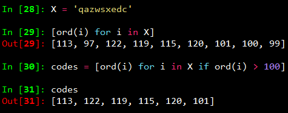 </center>   	

<center> 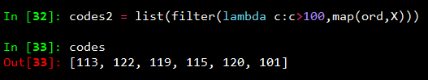 </center>   

filter接受一个lambda表达式用于过滤，一个map，其中map接受两个参数：一个可迭代对象，一个函数（用于提供过滤的依据）。

#### 2.2.3 笛卡儿积  

生成器表达式是能逐个产出元素, 节省内存. 例如:

```python
>>> colors = ['black', 'white']
>>> sizes = ['S', 'M', 'L']
>>> for tshirt in ('%s %s' % (c, s) for c in colors for s in sizes):
... print(tshirt)
```

实例中列表元素比较少, 如果换成两个各有1000个元素的列表, 显然这样组合的笛卡尔积是一个含有100万元素的列表, 内存将会占用很大, 而是用生成器表达式就可以帮忙省掉for循环的开销.

#### 2.2.4 生成器表达式 

用法和列表推导式几乎一模一样，只不过把中括号换成了小括号

```python
symbols = "acbdf"
t = tuple(ord(symbol) for symbol in symbols)
print(t)
```

### 2.3 元组不仅仅是不可变的列表  

#### 2.3.1 元组和记录

不应当只把元组当作不可变的列表，元组可以当作记录使用。这个意思是说元组中每个元素都可以看成是一个匿名的字段的值。

#### 2.3.2 元组拆包 

可以用 * 来将一个可迭代对象拆包作为函数的参数       
python中一个重要的用法是， 在函数参数中用 *args 来让args列表接收不确定数量的参数       

```python
# 因为 pack/unpack 的存在，元组中的元素会凸显出它们的位置信息
first, *others, last = (1, 2, 3, 4, 5)
print(first, others, last)
# 当然后面很多可迭代对象都支持 unpack 了…
```

#### 2.3.3 嵌套元组拆包

#### 2.3.4 具名元组 

_fields、_make、_asdict

_asdict：把一个具名元组转换为一个ordered_dict

```python
>>> from collections import namedtuple
>>> City = namedtuple('City', 'name country population coordinates')
>>> tokyo = City('Tokyo', 'JP', 36.933, (35.689722, 139.691667))
>>> tokyo
City(name='Tokyo', country='JP', population=36.933, coordinates=(35.689722,
139.691667))
```

#### 2.3.5 作为不可变列表的元组  

除了与增删元素有关的方法以外，元组几乎支持列表其它的所有方法。

### 2.4 切片  

#### 2.4.1 为什么切片和区间会忽略最后一个元素  

左闭右开区间

```python
# 切片(slice)不返回最后一个元素
a = list(range(6))
print(a[:2], a[2:])
```

#### 2.4.2 对对象进行切片

s[a : b : c] :对 `s` 在 `a` 和 `b` 之间以 `c` 为间隔取值。`c` 的值还可以为负, 负值意味着反向取值.

#### 2.4.3 多维切片和省略 

a[m:n, k:l]来得到二维切片

... : 表示不确定参数数目

#### 2.4.4 给切片赋值 

### 2.5 对序列使用 + 和 *

python程序员默认序列是支持 + 和 * 的操作的。 + 用来拼接两个序列，返回一个拼接后的序列。* 用来将一个序列复制几份再拼接起来。+ 和 * 都不修改原有的操作对象。

>  容器序列，其元素是可变对象，不能用 *，否则复制的都是同一批引用

构建多个列表的列表：

正确：[['_'] *3 for i in range(3)] 
错误：[['_'] *3] * 3 

<center> 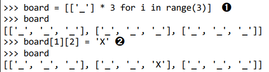 </center>   	

下边这种用 * 的方式是错误的。外层列表看似有三个元素，但是这三个元素都是指向同一个列表的引用：

<center> 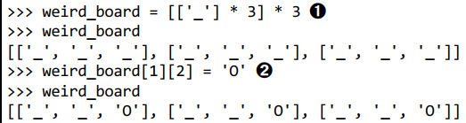 </center>   	

### 2.6 序列的增量赋值  

+= : 对应方法是 __iadd__
/*= ：对应__imul__

可变序列才可以。

### 2.7 list.sort 方法和内置函数 sorted 

list.sort：就地排序列表，返回值是None，这也是python的一个惯例，对于就地操作的方法返回None，比如random.shuffle也是这样。      
内置函数sorted：则会返回一个列表，其接受任何形式的可迭代对象作为参数，但不管接受的是什么参数，其返回值都是列表。      

参数:reverse(true 降序)；key(排序函数)

### 2.8 用 bisect 来管理已排序的序列 

#### 2.8.1 用 bisect 来搜索             

position = bisect.bisect(haystack, needle)    

haystack是一个排序好的序列，needle是待查找的值   

bisect = bisect_right       
bisect_right返回的位置处是第一个大于needle的索引，bisect_left返回的是第一个小于等于needle的值所在的索引     

#### 2.8.2 用 bisect.insort 插入新元素  

bisect.insort(a, x, lo=0, hi=len(a), *, key=None)       
bisect.insort_left(a, x, lo=0, hi=len(a), *, key=None): 运行bisect_left() 定位一个插入点。      
           
### 2.9 当列表不是首选时 

#### 2.9.1 数组 

**array.array**

要存放 1000 万个浮点数的话，数组（array）的效率要高得多，因为数组在背后存的并不是 float 对象，而是数字的机器翻译，也就是字节表述。这一点就跟 C 语言中的数组一样。    

支持pop、insert、extend、frombytes、tofile。        

```python
from array import array
from random import random
 
floats = array('d', (random() for i in range(10**2))) # 生成器表达式可以用于生成任意序列类型，'d'表示是双精度浮点数对象，跟python内置类型不同，array.array是需要指定数值精度的
print(floats[-1]) # 查看数组中最后一个元素
fp = open('floats.bin', 'wb') # 以二进制可写的方式打开一个文件，如果文件不存在，则创建该文件
floats.tofile(fp) # 用.tofile方法把数组中的内容写入到二进制文件floats.bin中
fp.close() # 关闭文件
```

**pickle**

dump方法将对象存储到文件，load方法从文件中加载信息到某个对象。

<center> 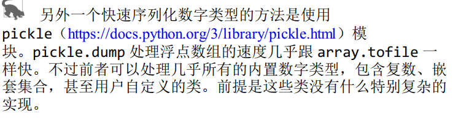 </center>   	


#### 2.9.2 内存视图 

memoryview 是一个内置类，能让用户在不复制内容的情况下操作同一个数组的不同切片，本质上其实跟torch中的view方法思想有类似之处，就是从不同的角度看待同一块内存区域的数据。

```python
from array import array
from random import random
 
numbers = array('h', [i for i in range(-2, 3)])  # 列表推导式生成数组，数组元素是十六进制整数
memv = memoryview(numbers)        # 从内存角度看待该数组
print(len(memv), memv.tolist())   # 打印出数组长度于具体值，可以看出跟number一样
print(memv[0])                    # 数组的第一个元素就是现在内存视图的第一个元素
memv_oct = memv.cast('B')         # memv.cast类型强制转换，改成以无符号字符的角度来看待numbers数组的那一块内存
print(len(memv_oct), memv_oct.tolist())     # 因为一个无符号字符占八个字节，原先十六进制中的一个数字被拆分成了两个，因此内存视图长度加倍
memv_oct[5] = 4                             # 改变内存视图的某个索引的值，可以影响到原数组，因为是共享内存的。
print(numbers)
```

#### 2.9.3 NumPy 和 SciPy 

numpy实现了多维同质数组和矩阵，scipy是基于numpy的库。numpy也可以轻易实现数组对象与文件的交互。numpy.save()用于将一个多维数组保存到一个二进制文件中。

<center> 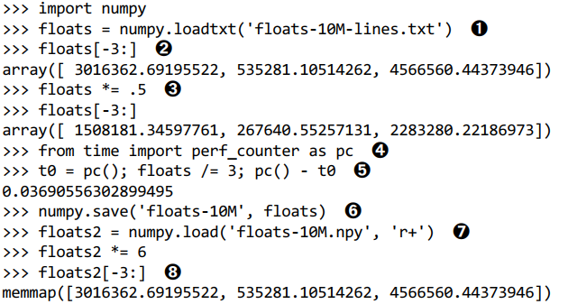 </center>

#### 2.9.4 双向队列和其他形式的队列 

**python中的列表可以当作栈或者队列使用**

        列表模拟队列：.append()插入元素，.pop(0)删除元素，即模拟了先进先出。     
        列表模拟栈：.append()插入元素，.pop(l.size() - 1)删除元素，即模拟了后进先出。     
        缺点是删除列表第一个元素之类的操作会移动列表中的所有元素，这些操作是非常耗时的。     

**collections.deque**

collections.deque类是一个线程安全、可以快速从两端添加或删除元素的数据类型，deque即双端队列。

```python
from collections import deque

# maxlen是一个可选参数，表示可容纳元素的数量，一旦设定不能修改
dq = deque(range(10), maxlen=10) 
dq.appendleft(-1)
dq.append(-2)
dq.extend([11,22])
dq.extendleft([-11,-22])
```

<center> 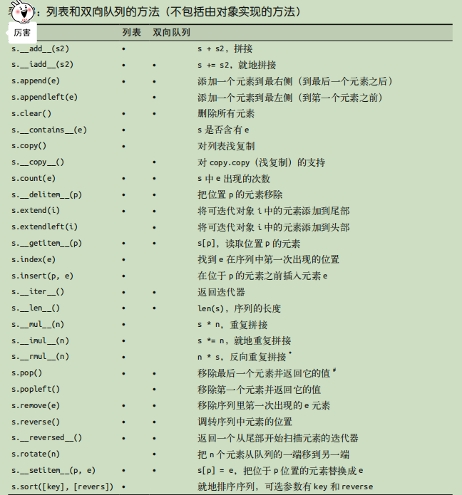 </center>

**queue**

提供了同步（线程安全）类 Queue、LifoQueue 和 PriorityQueue，不同的线程可以利用 这些数据类型来交换信息。这三个类的构造方法都有一个可选参数 maxsize，它接收正整数作为输入值，用来限定队列的大小。但是在满员的时候，这些类不会扔掉旧的元素来腾出位置。相反，如果队列满了，它就会被锁住，直到另外的线程移除了某个元素而腾出了位置。这一特性让这些类很适合用来控制活跃线程的数量。

**multiprocessing** 

这个包实现了自己的 Queue，它跟 queue.Queue 类似，是设计给进程间通信用的。同时 还有一个专门的 multiprocessing.JoinableQueue 类型，可以让任务管理变得更方便。

**asyncio**    
Python 3.4 新提供的包，里面有 Queue、LifoQueue、PriorityQueue 和 JoinableQueue，这些类受到 queue 和 multiprocessing 模块的影响，但是为异步编程里的任务管理提供了专门的便利。

**heapq**

跟上面三个模块不同的是，heapq 没有队列类，而是提供了 heappush 和 heappop 方法，让用户可以把可变序列当作堆队列或者优先队列来使用。


## 第3章 字典和集合

> 字典这个数据结构活跃在所有 Python 程序的背后，即便你的源码里并没有直接用到它。  
> ——A. M. Kuchling 

### 3.1 泛映射类型 

collections.abc模块中有Mapping和MutableMapping两个抽象基类，他们的作用是为dict和其它泛映射类型定义形式接口。

<center>  </center>   	

可以用isinstance函数来判定某个对象是不是泛映射类型

```python
import collections
 
my_dict = {}
print(isinstance(my_dict, collections.Mapping))
# 输出True
```

所谓泛映射类型即键值对类型。泛映射类型中键必须是可散列的，可散列对象有三点要求：

第一：在此对象的生命周期中，其散列值不变    
第二：需要实现特殊方法__hash__       
第三：要有__qe__方法

        若两个可散列对象相等，则其散列值一定相等。    
        原子不可变数据类型，如str、bytes和数值类型都是可散列类型，frozenset也可散列。当元组类型中的元素都是可散列类型时，元组也可散列，如果元组中有不可散列的元素，则元组不可散列。    
        一般自定义类型可散列，散列值即id()返回值，即其在内存中的地址。    

### 3.2 字典推导  

字典构建方式:{} 或 dict()。

```python
# 字典提供了很多种构造方法
a = dict(one=1, two=2, three=3)
b = {'one': 1, 'two': 2, 'three': 3} 
c = dict(zip(['one', 'two', 'three'], [1, 2, 3])) 
d = dict([('two', 2), ('one', 1), ('three', 3)]) 
e = dict({'three': 3, 'one': 1, 'two': 2})
a == b == c == d == e
```

推导式构建：

```python
# 字典推导式
r = range(5)
d = {n * 2: n for n in r if n < 3}
print(d)
# setdefault
for n in r:
    d.setdefault(n, 0)
print(d)
```

### 3.3 常见的映射方法

<center>  </center>   	

<center>  </center>   	

<center>  </center>   

<center>  </center>   	


### 3.4 映射的弹性键查询 

#### 3.4.1 defaultdict ：处理找不到的键的一个选择

当使用d[k]时如果字典d没有键k，python会抛出异常。可以用d.get(k, default)来代替d[k]，这样当找不到键k的时候就返回默认值default

键不存在，则把键值对加入字典，并更新键对应的值的实现：

```python
index.setdefault(word,[]).append(location) //方法1

//方法2
if key not in my_dict:
	my_dict[key] = []
my_dict[key].append(new_value)
```

#### 3.4.2 特殊方法 __missing__  

__getitem__找不到键的时候（比如用方括号时d[k]找不到键k)，会调用__missing__方法，__missing__只被__getitem__调用。

```python
class StrKeyDict0(dict): # StrKeyDict0继承自dict
    def __missing__(self, key):
        if isinstance(key, str):
            raise KeyError(key) # __missing__是用来处理找不到的键的，如果找不到的键本身就是字符串，那么会触发KeyError异常
        return self[str(key)] # 如果找不到的键本身不是字符串，那么就转成字符串再查找一次
 
    def get(self, key, default=None):
        try:
            return self[key] # get方法这里实际上把查找工作委托给__getitem__了，因为这里用了【】索引
        except KeyError: # 如果抛出了KeyError，那么说明__missing__也失败了，就直接返回default了
            return default
 
    def __contains__(self, key): # 先按照传入的键来查找，如果找不到就转换成字符串再找一次
        return key in self.keys() or str(key) in self.keys() 
```

### 3.5 字典的变种(collections)

* collections.OrderedDict:保持插入顺序，先插入的就先访问到。
* collections.ChainMap :容纳多个不同的映射对象，然后在进行键查找操作时会从前到后逐一查找，直到被找到为止。
* collections.Counter ：给键准备一个整数技术器，每次更行一个键的时候都会增加这个计数器

```python
import collections
ct = collections.Counter('abracadabra')
print(ct)   # Counter({'a': 5, 'b': 2, 'r': 2, 'c': 1, 'd': 1})
print(ct.most_common(2)) # [('a', 10), ('z', 3)]
```

### 3.6 子类化 UserDict 

* colllections.UserDict ：dict的纯Python实现，专门用于自定义映射类型的基类，继承自MutableMapping，MutableMapping又继承自Mapping。

```python
import collections
class StrKeyDict(collections.UserDict):
    def __missing__(self, key):
        if isinstance(key, str):
            raise KeyError(key)
        return self[str(key)]
        
    def __contains__(self, key):
        return str(key) in self.data
        
    def __setitem__(self, key, item):
        self.data[str(key)] = item
```

__contains__的实现直接判断key字符串之后是否在self.data中

### 3.7 不可变映射类型  
 标准库中的所有映射类型都是可变的。types模块中有一个封装类型MappingProxyType，其初始化参数接受一个映射对象，返回一个只读的映射视图，这个映射视图是动态的，这个映射视图不能更改，但是原初始化参数的更改可以反应到该映射视图上。

```python
# MyppingProxyType 用于构建 Mapping 的只读实例
from types import MappingProxyType

d = {1: 1}
d_proxy = MappingProxyType(d)
print(d_proxy[1])
try:
    d_proxy[1] = 1
except Exception as e:
    print(repr(e))

d[1] = 2
print(d_proxy[1])
```

### 3.8 集合论  

主要包括set和frozenset，许多唯一对象的集合，集合中的元素必须可散列。

集合实现了交（a & b）、并（a | b），差（a - b）等操作。

#### 3.8.1 集合字面量 

定义集合有两种方式。

        一种是直接用{ }来定义，如 s = {1, 2, 3}。   
        一种是用set([1, 2, 3])。    
    
        前者比后者要快一点，因为用set()定义的时候，python会先去查询set的构造函数，然后新建一个列表，最后把列表传入到构造函数里，但是直接用 { }的话python会利用一个专门的叫做BUILD_SET的字节码来创建集合。
    
        需要注意的一点是空集合的定义，应该用 s = set() 而不是 s = { }，因为后者实际上是定义了一个空字典。    

```python
s = set([1, 2, 2, 3])   # 集合的创建
s = set()         # 空集合
s = {1, 2}        # 集合字面量
s = {chr(i) for i in range(23, 45)} # 集合推导
```

#### 3.8.2 集合推导 

```python
from unicodedata import name
{chr(i) for i in range(32,256) if 'SIGN' in name(chr(i),'')} 
```

#### 3.8.3 集合的操作

<center> 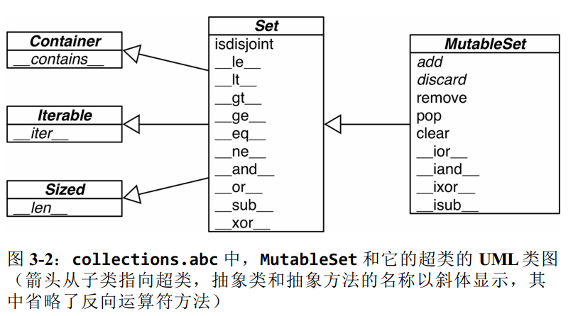 </center>  

<center> 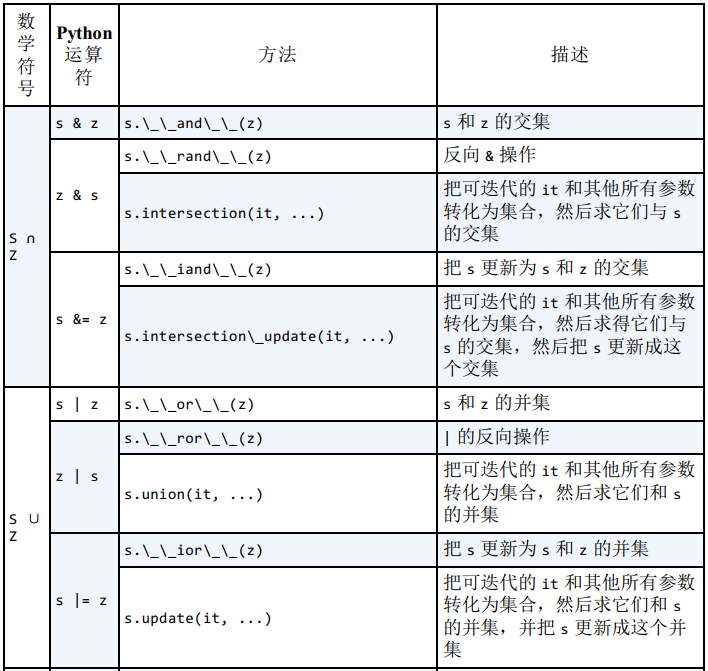 </center>  

<center> 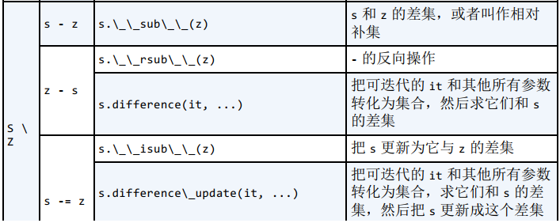 </center>  

<center> 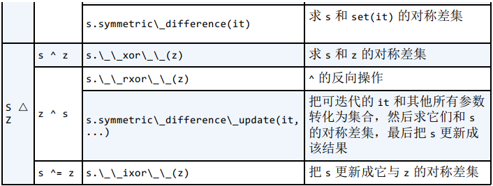 </center>  

<center> 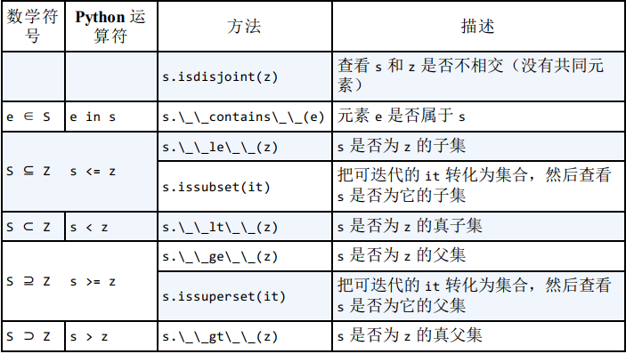 </center>  

<center> 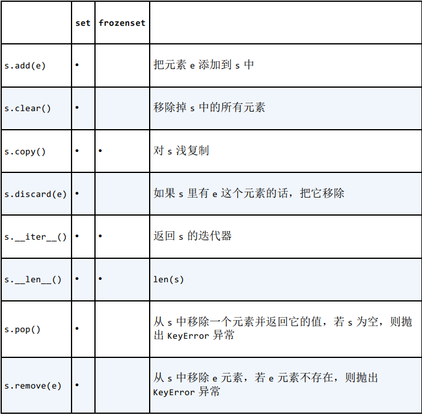 </center>  

### 3.9 dict 和 set 的背后

#### 3.9.1 一个关于效率的实验


#### 3.9.2 字典中的散列表

<center> 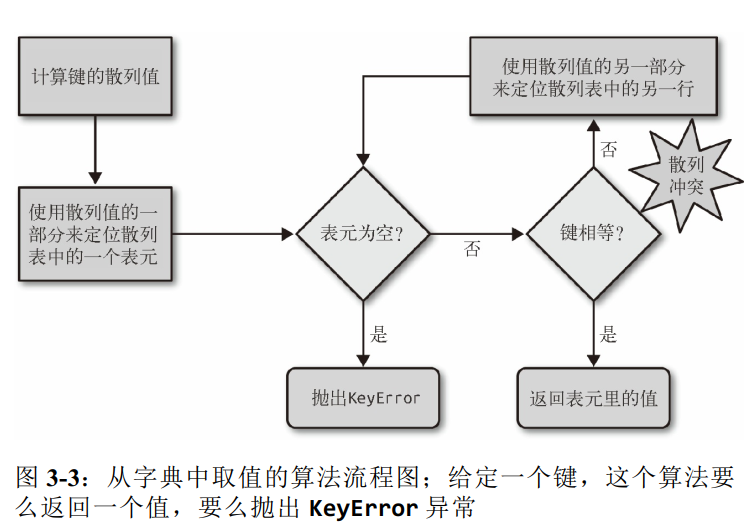 </center>  

集合和字典采用散列表来实现：
1. 先计算 key 的 `hash`, 根据 hash 的某几位（取决于散列表的大小）找到元素后，将该元素与 key 进行比较
2. 若两元素相等，则命中
3. 若两元素不等，则发生散列冲突，使用线性探测再散列法进行下一次查询。

#### 3.9.3 dict 的实现及其导致的结果            

1 键必须是可散列的。可散列对象要满足三个条件：（1）支持hash()函数，并且通过__hash__方法得到的散列值是不变的。（2）支持通过 __eq__方法来检测相等性。（3）若a == b 为真，则hash(a) == hash(b)也为真。      

2 字典在内存上开销巨大。字典使用散列表，而散列表必须是稀疏的，因此空间效率低下。       
3 键查询很快。dict实现是典型空间换时间，无视数据量大小常数时间复杂度访问。    
4 键的次序取决于添加顺序。    
5 往字典里添加新键会改变已有键的顺序；不要在循环字典的时候同时修改。    

> .keys()、.items()和.values()方法返回的是字典视图。 

注：所有由用户自定义的对象都是可散列的，因为他们的散列值由 id() 来获取，而且它们都是不相等的。

往字典中添加键时，如果有散列表扩张的情况发生，则已有键的顺序也会发生改变。所以，**不应该在迭代字典的过程各种对字典进行更改**。

```python
# 字典中就键的顺序取决于添加顺序

keys = [1, 2, 3]
dict_ = {}
for key in keys:
    dict_[key] = None

for key, dict_key in zip(keys, dict_):
    print(key, dict_key)
    assert key == dict_key

# 字典中键的顺序不会影响字典比较
```

#### 3.9.4 set 的实现以及导致的结果            

1 集合中的元素必须可散列。
2 集合很消耗内存。
3 可以很高效地判断元素是否存在某个集合。
4 元素的次序取决于被添加到集合里的次序。
5 往集合里添加元素，会改变集合里已有元素的顺序。


## 第4章 文本和字节序列            

### 4.1 字符问题


### 4.2 字节概要 

python3有两种字节序列, 不可变的 `bytes` 类型和可变的 `bytearray` 类型. 字节序列中的各个元素都是介于 `[0, 255]` 之间的整数.

### 4.3 基本的编解码器            

### 4.4 了解编解码问题                      

#### 4.4.1 处理 UnicodeEncodeError            
#### 4.4.2 处理 UnicodeDecodeError            
#### 4.4.3 使用预期之外的编码加载模块时抛出的 SyntaxError 

把.py模块加载进内存时，python3默认以UTF-8来加载，即用UTF-8编码源码，而python2则默认以ASCII码加载。如果加载的.py模块中包含UTF-8之外的数据，且没有主动声明编码方式，则会得到以外错误信息：SyntaxError。

GNU/Linux和OS X系统中，.py文件在磁盘上的编码格式就是UTF-8，因此python解释器默认以UTF-8的形式加载源码当然不会出错，而在windows系统中，.py文件是以cp1252的格式编码的，而当python3解释器以UTF-8的格式来加载的时候当然会出错，因为源码在硬盘上存储时候的二进制流有些根本就不是UTF编码中的。

为了解决python3解释器以UTF-8格式加载源码导致的错误，我们可以在.py文件顶部添加一个coding注释，指定加载python源码时候用的编码格式，这样就不会错误了。
           
#### 4.4.4 如何找出字节序列的编码            
#### 4.4.5 BOM：有用的鬼符            

<center> 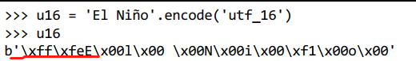 </center>  

如上，字符串u16的utf_16编码中，编码序列的开头有几个额外的字节，这是BOM，即字节序标记，指明编码时使用Intel CPU的小字节序。

### 4.5 处理文本文件 

Unicode三明治： 

<center> 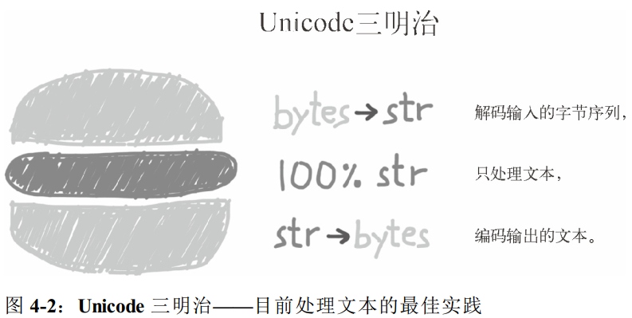 </center>  

处理文本文件的最佳实践是“三明治”：要尽早地把输入的字节序列解码成字符串，尽量晚地对字符串进行编码输出；在处理逻辑中只处理字符串对象，不应该去编码或解码。  
除非想判断编码，否则不要再二进制模式中打开文本文件；即便如此，也应该使用 `Chardet`，而不是重新发明轮子。  
常规代码只应该使用二进制模式打开二进制文件，比如图像。

### 4.6 为了正确比较而规范化 Unicode 字符串    

#### 4.6.1 大小写折叠    

就是把所有文件变成小写。由str.casefold()方法支持。

#### 4.6.2 规范化文本匹配实用函数

规范化函数unicodedata.normalize: ’NFC‘，’NFD‘，'NFKC'和’NFKD‘

NFC 使用最少的码位构成等价的字符串，而 NFD 会把组合字符分解成基字符和单独的组合字符。    
NFKC 和 NFKD 是出于兼容性考虑，在分解时会将字符替换成“兼容字符”，这种情况下会有格式损失。      
兼容性方案可能会损失或曲解信息（如 "4²" 会被转换成 "42"），但可以为搜索和索引提供便利的中间表述。    

<center> 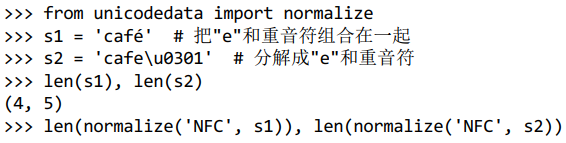 </center>

```python
from unicodedata import normalize, name
# Unicode 码位
a = 'café'
b = 'cafe\u0301'
print(a, b)
print(ascii(a), ascii(b))
print(len(a), len(b), a == b)

## NFC 和 NFD
print(len(normalize('NFC', a)), len(normalize('NFC', b)))
print(len(normalize('NFD', a)), len(normalize('NFD', b)))
print(len(normalize('NFC', a)) == len(normalize('NFC', b)))

print('-' * 15)
# NFKC & NFKD
s = '\u00bd'
l = [s, normalize('NFKC', s),  normalize('NFKD', s)]
print(*l)
print(*map(ascii, l))
micro = 'μ'
l = [s, normalize('NFKC', micro)]
print(*l)
print(*map(ascii, l))
print(*map(name, l), sep='; ')
```


#### 4.6.3 极端“规范化”：去掉变音符号             

### 4.7 Unicode 文本排序  

<center> 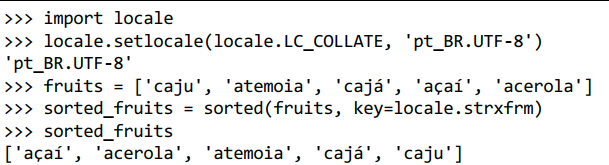 </center>  

非ASCII文本的标准排序方式是使用locale.strxfrm函数。

setlocale即设置区域。

PyUCA库：实现unicode排序算法

### 4.8 Unicode 数据库  

`unicodedata` 库中提供了很多关于 Unicode 的操作及判断功能，比如查看字符名称的 `name`，判断数字大小的 `numric` 等。  
文档见 <https://docs.python.org/3.7/library/unicodedata.html>.

```python
import unicodedata
print(unicodedata.name('½'))
print(unicodedata.numeric('½'), unicodedata.numeric('卅'))
```

### 4.9 支持字符串和字节序列的双模式 API 

re和os模块中的某种函数，既能接受字符串，也能接受字节序列为参数，然后根据参数类型的不同展开不同的行为。因此叫双模式API。          

#### 4.9.1 正则表达式中的字符串和字节序列          

<center> 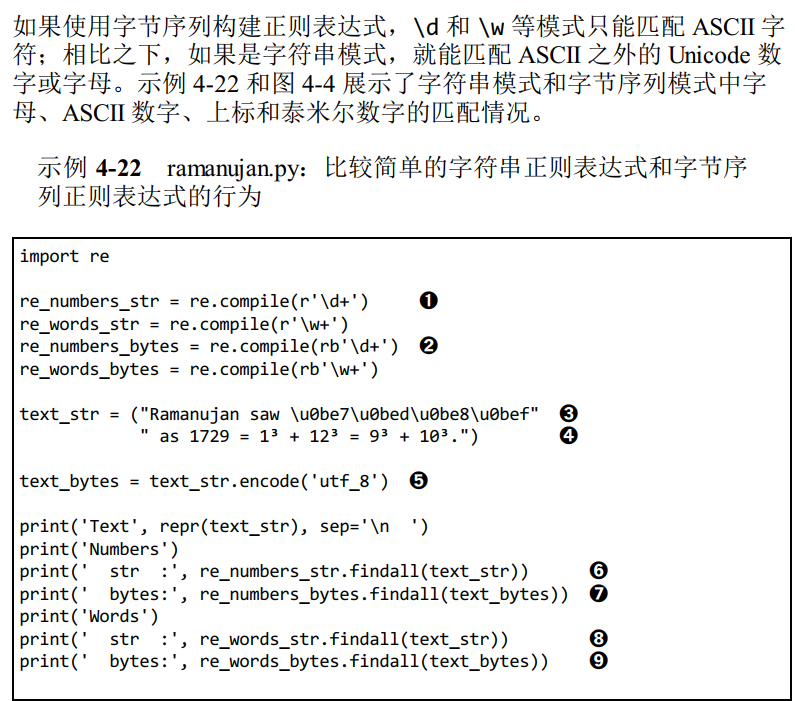 </center>

<center> 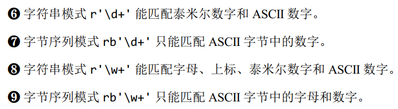 </center>    

#### 4.9.2 os 函数中的字符串和字节序列 

可以使用 `sys.getdefaultincoding()` 获取系统默认编码；  
Linux 的默认编码为 `UTF-8`，Windows 系统中不同语言设置使用的编码也不同，这导致了更多的问题。  
`locale.getpreferredencoding()` 返回的编码是最重要的：这是打开文件的默认编码，也是重定向到文件的 `sys.stdout/stdin/stderr` 的默认编码。不过这个编码在某些系统中是可以改的…  
所以，关于编码默认值的最佳建议是：别依赖默认值。


## 第三部分 把函数视作对象

## 第5章 一等函数 

> 不管别人怎么说或怎么想，我从未觉得 Python 受到来自函数式语言的太多影响。我非常熟悉命令式语言，如 C 和 Algol 68，虽然我把函数定为一等对象，但是我并不把 Python 当作函数式编程语言。  
> —— Guido van Rossum: Python 仁慈的独裁者


### 5.1 把函数视作对象

在 Python 中，函数是一等对象。  
编程语言理论家把“一等对象”定义为满足下述条件的程序实体：
* 在运行时创建
* 能赋值给变量或数据结构中的元素
* 能作为参数传给函数
* 能作为函数的返回结果

整数、字符串、字典等都是一等对象,所有函数也是一等对象，或者可以称之为一等函数。
  ​        
```python
def factorial(n):
    '''returns n! good!'''
    return 1 if n < 2 else n * factorial(n - 1)
 
print(factorial(21))
print(factorial.__doc__)
print(type(factorial))
 
fact = factorial
print(fact)
print(fact(5))
 
print(list(map(fact, range(11))))
```

<center> 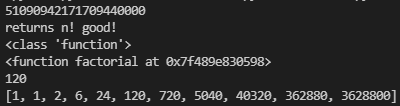 </center>   	

函数本身也是一个对象，factorial对象是function类的实例;__doc__是函数对象的一个属性。
fact作为参数传递给map函数，map函数返回一个可迭代对象。

### 5.2 高阶函数

```python
# 高阶函数：有了一等函数（作为一等对象的函数），就可以使用函数式风格编程
fruits = ['strawberry', 'fig', 'apple', 'cherry', 'raspberry', 'banana']
print(list(sorted(fruits, key=len)))  # 函数 len 成为了一个参数

# lambda 函数 & map
fact = lambda x: 1 if x == 0 else x * fact(x-1)
print(list(map(fact, range(6))))

# reduce
from functools import reduce
from operator import add
print(reduce(add, range(101)))

# all & any
x = [0, 1]
print(all(x), any(x))
```

高阶函数是以函数为参数，或者把函数作为结果返回的函数，比如map、filter、reduce和sorted。

函数式语言通常会提供map、filter和reduce三个高阶函数。python3中，map和filter还是内置函数，但是由于引入列表推导式和生成器表达式，他们变得没那个重要了。列表推导和生成器表达式具有map和filter两个函数的功能。

<center> 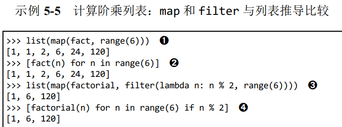 </center>   	

sum和reduce：是把某个单参数函数连续应用到一个序列中的元素上，累计之前的结果，把一系列值归约成一个值。    
all和any：内置的归约函数，all(iterable)，如果iterable中每个元素都是真值，返回True，all([ ])返回True。any(iterable)，只要iterable中有元素是真值，就返回True，any([ ])返回False。    

**为了使用高阶函数，有时创建一次性的小型函数更遍历，这便是匿名函数存在的原因。**

### 5.3 匿名函数           

lambda函数的定义体中只能使用纯表达式，即不能赋值。
lambda 形参：表达式处理形参并返回

<center> 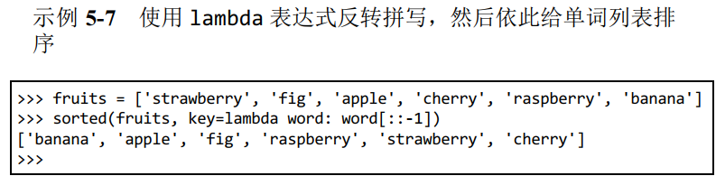 </center>   	

### 5.4 可调用对象

Python 的可调用对象
* 用户定义的函数：使用 `def` 或 `lambda` 创建
* 内置函数：如 `len` 或 `time.strfttime`
* 内置方法：如 `dict.get`（没懂这俩有什么区别…是说这个函数作为对象属性出现吗？）
* 类：先调用 `__new__` 创建实例，再对实例运行 `__init__` 方法
* 类的实例：如果类上定义了 `__call__` 方法，则实例可以作为函数调用
* 生成器函数：调用生成器函数会返回生成器对象

类肯定是可调用的，因为为了定义对象，但是类的对象就不一定是可调用的了。python中判断对象能否调用可使用内置的callable()函数。

<center> 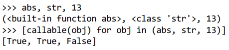 </center>   	

### 5.5 用户定义的可调用类型

任何python对象都可以表现得像函数，即可调用，只需要实现实例方法__call__。

<center> 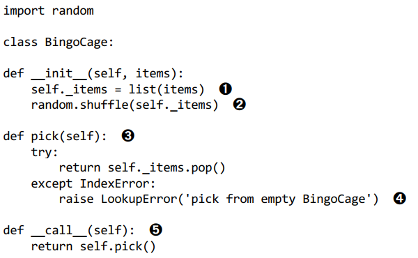 </center>   	

### 5.6 函数内省           

dir函数可以看到函数的属性

<center> 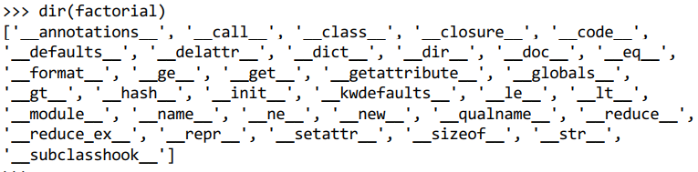 </center>   	

<center> 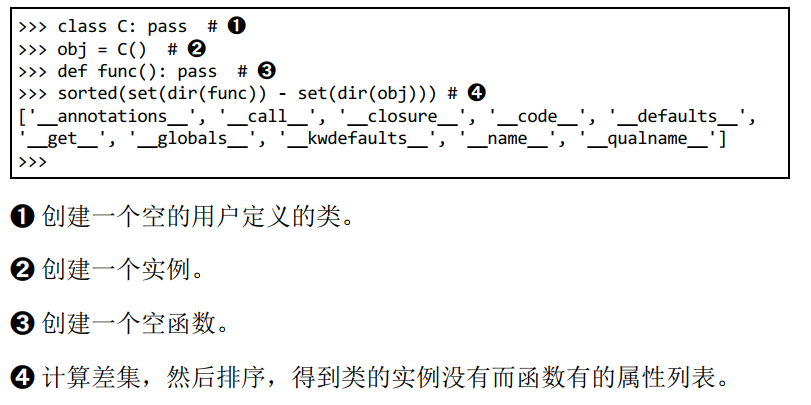 </center>   	

<center> 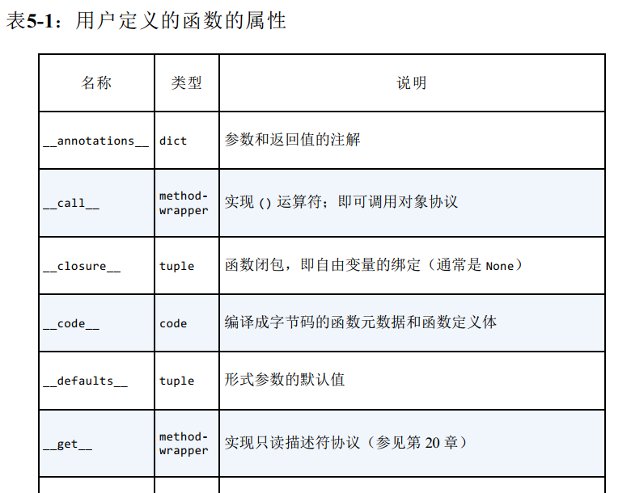 </center>   	

<center> 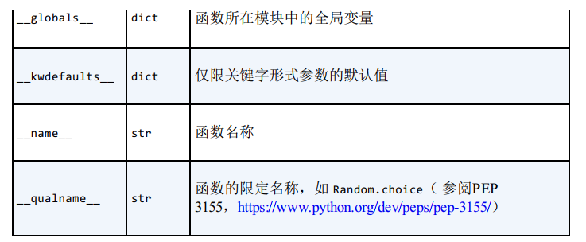 </center>   	

### 5.7 从定位参数到仅限关键字参数

定位参数：一般函数传参的时候，是按照实参的位置依次传给对应的位置上的形参。      
关键字参数：比如函数add，add(1, 2)就是定位参数传参的方式，add(a = 1, b = 2)就是关键字参数传参的方式。        
可变参数：* 和 ** 都是传入任意个数的参数，* 是以元组的形式导入（即把多余的定位实参都以元组的形式传给*指定的形参），** 是以字典的形式导入（把多余的关键字实参以字典的形式传入**指定的形参）。     
仅限关键字参数：keywords only arguments,只能通过关键字传参。
           
### 5.8 获取关于参数的信息 

python函数对象有个__defaults__属性，其值是元组，保存定位参数和关键字参数的默认值。仅限关键字参数在__kwdefaults__属性中。参数的名称在__code__属性中，__code__属性的值是一个code对象的引用，因此不能直接用print打印出来。可以用__code__的属性co_argument和co_varnames分别看参数的数目和参数名称。

```python
def ppp(c = 1, e = 1, *, a, b = 3):
    print(a, b)
 
ppp(1,e = 1,  a = 1)
print(ppp.__defaults__)
print(ppp.__kwdefaults__)
# print(ppp.__code__) # 不能直接打印
 
print(ppp.__code__.co_argcount, ppp.__code__.co_varnames)
```
**使用inspect模块进行函数内省**

signature函数返回一个inspect.Signature对象，它有一个patameters属性，这是一个有序映射类型对象，即mappingproxy类的对象，它把每个参数的名称和inspect.Parameter对象对应起来。这个Patameter对象也有自己的属性，比如name、default，annotation和kind。

```python
from inspect import signature
 
def ppp(c = 1, e = 1, *, a, b = 3):
    print(a, b)
 
sig = signature(ppp) # 获取ppp函数的签名，其实就是ppp函数的一些元信息
print(sig)
print(str(sig))
 
print(type(sig.parameters))
for name, param in sig.parameters.items():
    print(param.kind, name, '=', param.name, '=', param.default)
```

### 5.9 函数注解           

python对注解做的唯一的事情就是将其存储在函数的__annotations__属性中。s

```python
# 函数注解
def clip(text: str, max_len: 'int > 0'=80) -> str:
    pass

from inspect import signature
sig = signature(clip)
print(sig.return_annotation)
for param in sig.parameters.values():
    note = repr(param.annotation).ljust(13)
    print("{note:13} : {name} = {default}".format(
        note=repr(param.annotation), name=param.name,
        default=param.default))
```

### 5.10 支持函数式编程的包           

#### 5.10.1 operator 模块           

`operator` 里有很多函数，对应着 Python 中的内置运算符，使用它们可以避免编写很多无趣的 `lambda` 函数，如：
* add: `lambda a, b: a + b`
* or_: `lambda a, b: a or b`
* itemgetter: `lambda a, b: a[b]`
* attrgetter: `lambda a, b: getattr(a, b)`

```python
from functools import reduce
from operator import mul
def fact(n):
	return reduce(mul,range(1,n+1))
```

#### 5.10.2 使用 functools.partial 冻结参数 

`functools` 包中提供了一些高阶函数用于函数式编程，如：`reduce` 和 `partial`。此外，`functools.wraps` 可以保留函数的一些元信息，在编写装饰器时经常会用到。

partial这个高阶函数用于部分应用一个函数,基于一个函数构建一个参数更好的函数，其实相当于固定一个参数值，然后只传入另外一些参数就行了。

<center> 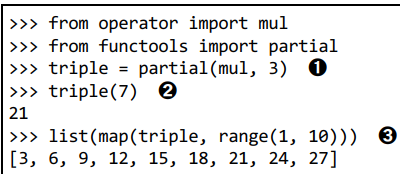 </center>   	


## 第6章 使用一等函数实现设计模式

> 符合模式并不表示做得对。
> ——Ralph Johnson: 经典的《设计模式：可复用面向对象软件的基础》的作者之一    

### 6.1 案例分析：重构“策略”模式 

#### 6.1.1 经典的“策略”模式

<center> 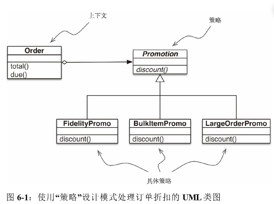 </center>   	

策略模式的定义是：定义一系列算法（策略），把它们一一封装起来，并且使它们可以相互替换。策略模式使得算法可以独立于使用它的客户而变换，即不同的客户都可以使用某个算法或其它算法。
          
实现策略模式，可以依赖 `abc.ABC` 和 `abc.abstractmethod` 来构建抽象基类。 

策略模式设计的内容如下：

        上下文：即上图中的order，用于把一些计算委托给可互换的不同算法，根据不同算法计算折扣，即用于选择具体策略。    
        策略：实现不同算法组件的共同接口。即上图中名为Promotion的抽象类。    
        具体策略：策略的具体子类。fidelityProme、BulkPromo和LargeOrderPromo即这里实现的三个具体策略。    

```python
//电商策略模式
from abc import ABC, abstractmethod
from collections import namedtuple
 
Customer = namedtuple('Customer', 'name fidelity') # 姓名和积分
 
class LineItem:
    
    def __init__(self, product, quantity, price):
        self.product = product
        self.quantity = quantity
        self.price = price
 
    def total(self) -> '总价格 = 单价 * 数量':
        return self.price * self.quantity
 
class Order: # 上下文
 
    def __init__(self, customer, cart : '购买的所有商品种类', promotion : '用于选择策略, 实参类型就是三个具体策略对象'=None):
        self.customer = customer
        self.cart = list(cart) 
        self.promotion = promotion 
 
    def total(self):
        if not hasattr(self, '__total'):
            self.__total = sum(item.total() for item in self.cart)
        return self.__total
 
    def due(self) -> "计算账单":
        if self.promotion is None:
            discount = 0;
        else:
            discount = self.promotion.discount(self) # 选择策略
        return self.total() - discount
 
    def __repr__(self):
        fmt = '<Order total: {:.2f} due: {:.2f}>'
        return fmt.format(self.total(), self.due())
 
class Promotion(ABC): # 策略：抽象基类
 
    @abstractmethod
    def discount(self, order):
        """返回折扣金额"""
 
class FidelityPromo(Promotion): # 第一个具体策略
    '''积分1000以上顾客5%折扣'''
 
    def discount(self, order):
        return order.total() * .05 if order.customer.fidelity >= 1000 else 0
 
class BulkItemPromo(Promotion): # 第二个具体策略
    '''单个商品20个以上折扣10%'''
 
    def discount(self, order):
        discount = 0
        for item in order.cart:
            if item.quantity >= 20:
                discount += item.total() * .1
        return discount
 
calss LargeOrderPromo(Promotion): # 第三个具体策略
    '''不同商品种类达到10个以上折扣7%'''
 
    def discount(self, order):
        distinct_items = {item.product for item in order.cart}
        if len(distinct_item) >= 10:
            return order.total() * .07
        return 0
 
```

#### 6.1.2 使用函数实现“策略”模式

#### 6.1.3 选择最佳策略：简单的方式

#### 6.1.4 找出模块中的全部策略 

globals()：返回一个字典，表示当前的全局符号表。这个符号表始终针对当前模块，对函数或方法来说，是指定义它们的模块，而不是调用它们的模块。

<center> 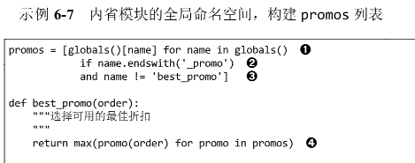 </center>   	

### 6.2 “命令”模式 

<center> 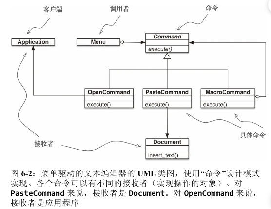 </center>   	

命令模式的目的是解耦调用者（调用操作（函数）的对象）和接收者（提供实现的对象）。比如调用者是图形应用程序中的菜单项，接收者是被编辑的文档或者应用程序自身。即调用者调用了某个操作，但是接收者可以是自身也可以不是自身。

<center> 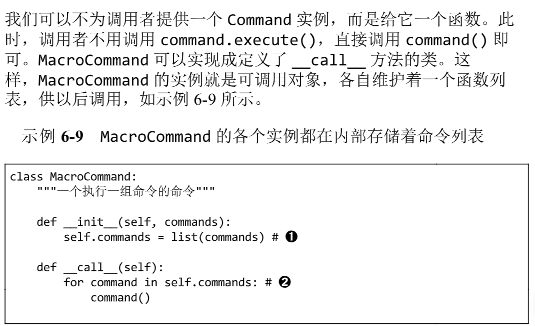 </center>   	

使用一等函数实现设计模式的方法就是，把实现单方法接口的类的实例替换程可调用对象（函数）。


## 第7章 函数装饰器和闭包 

> 有很多人抱怨，把这个特性命名为“装饰器”不好。主要原因是，这个名称与 GoF 书使用的不一致。**装饰器**这个名称可能更适合在编译器领域使用，因为它会遍历并注解语法书。
> —“PEP 318 — Decorators for Functions and Methods”

### 7.1 装饰器基础知识 

装饰器是可调用的对象，其参数是被装饰的函数，因此装饰器可以认为是一种特殊的高阶函数。装饰器可能会处理被装饰的函数，然后把它返回，或者将其替换成另一个函数或可调用对象。

装饰器只是语法糖，其实就是一个可调用的高阶函数。装饰器有两大特性，第一是能把被装饰的函数替换成其他函数，二是在加载模块时立即执行。

```python
# 装饰器通常会把函数替换成另一个函数
def decorate(func):
    def wrapped():
        print('Running wrapped()')
    return wrapped

@decorate
def target():
    print('running target()')

target()
# 以上写法等同于
def target():
    print('running target()')

target = decorate(target)
target()
```

### 7.2 Python 何时执行装饰器

python在导入模块时运行装饰器，即只要.py模块被加载进内存，装饰器函数立即运行。

```python
# 装饰器在导入时（模块加载时）立即执行
registry = []
def register(func):
    print('running register {}'.format(func))
    registry.append(func)
    return func

@register
def f1():
    print('running f1()')

@register
def f2():
    print('running f2()')


print('registry →', registry)
```
上面的装饰器会原封不动地返回被装饰的函数，而不一定会对函数做修改。      
注册装饰器：通过使用它来中心化地注册函数，例如把 URL 模式映射到生成 HTTP 响应的函数上的注册处。    

真实装饰器使用一般采用以下两种方式：     
- 装饰器在一个单独的模块中定义，然后应用到其它模块的函数上。     
- 装饰器一般在内部定义一个新的函数然后返回，而不是直接返回原函数。     
           
### 7.3 使用装饰器改进“策略”模式

<center> 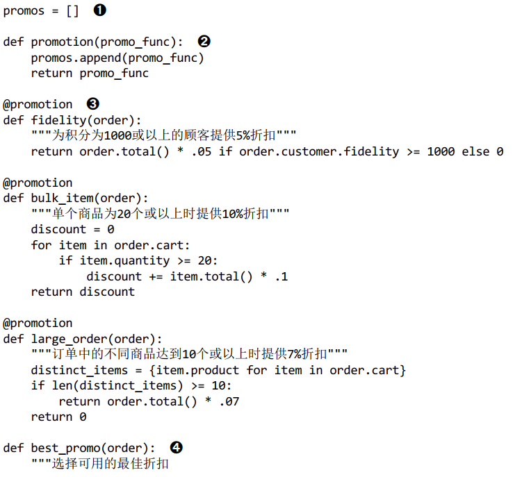 </center>   	

我们每添加一个新策略，都会将其用装饰器装饰，这样当我们加载模块时会自动运行装饰器，然后就将左右策略函数都加入了promos列表。         
		   
### 7.4 变量作用域规则 

在函数体内赋值的变量是局部变量    
global 声明全局变量    

一个变量的查找顺序是 `LEGB` (L：Local 局部环境，E：Enclosing 闭包，G：Global 全局，B：Built-in 内建)         
		   
### 7.5 闭包

**名字空间与函数捆绑后的结果被称为一个闭包(closure).**

这个名字空间就是 `LEGB` 中的 `E` . 所以闭包不仅仅是将函数作为返回值. 而是将名字空间和函数捆绑后作为返回值的. 多少人忘了理解这个 `"捆绑"`.    
闭包是指延伸了作用域的函数。 

实现闭包有三个必要条件：    
	1 必须嵌套函数    
	2 内部函数要引用外部变量，这个外部是相对外部，即在外部函数的函数体中定义，在内部函数的函数体中引用    
	3 外部函数的返回值是内部函数    

<center> 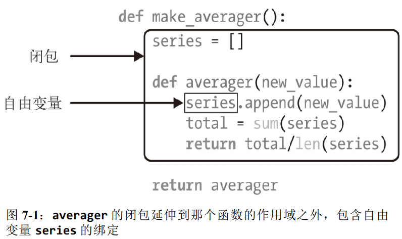 </center>   	

外部函数是make_averager，内部函数是averager，内部函数averager引用的外部变量就是series列表，这个变量也被称为自由变量。    
虽然调用完make_averager函数返回以后，其本地作用域已经不存在了， 但是由于内部函数绑定了series变量，于是这个变量的值被保存了下来。    

<center> 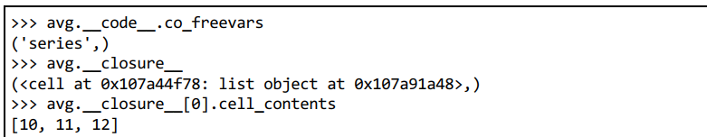 </center>   

自由变量保存在闭包中

```python
print({
    name: cell.cell_contents
    for name, cell in zip(c.__code__.co_freevars, c.__closure__)
})
```

### 7.6 nonlocal 声明 

nonlocal声明：其作用是把变量标记为自由变量，如果为nonlocal声明的变量赋予新值，闭包中保存的绑定也会更新

```python
# 闭包内变量赋值与 nonlocal 声明
def counter():
    n = 0
    def count():
        n += 1      # n = n + 1, 所以将 n 视为局部变量，但未声明，触发 UnboundLocalError
        return n
    return count

def counter():
    n = 0
    def count():
        nonlocal n  # 使用 nonlocal 对 n 进行声明，它可以把 n 标记为局部变量
        n += 1      # 这个 n 和上面的 n 引用的时同一个值，更新这个，上面也会更新
        return n
    return count

c = counter()
print(c(), c())
```

### 7.7 实现一个简单的装饰器

装饰器的典型行为：把被装饰的函数替换成新函数，二者接受相同的参数，而且（通常）返回被装饰的函数本该返回的值，同时还会做些额外操作

```python
# 开始实现装饰器
import time
from functools import wraps

def clock(func):
    @wraps(func)                         # 用 func 的部分标注属性（如 __doc__, __name__）覆盖新函数的值
    def clocked(*args, **kwargs):
        t0 = time.perf_counter()
        result = func(*args, **kwargs)
        t1 = time.perf_counter()
        print(t1 - t0)
        return result
    return clocked

@clock
def snooze(seconds):
    time.sleep(seconds)

snooze(1)
```

### 7.8 标准库中的装饰器 

python内置装饰器：property，classmethod，staticmethod      
常见装饰器：functools.wraps，functools.lru_cache，functools.singledispatch        

#### 7.8.1 使用 functools.lru_cache 做备忘

<center> 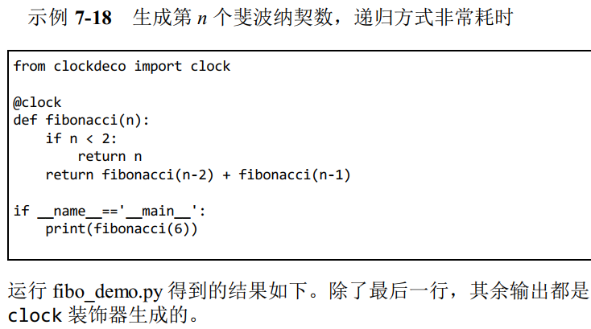 </center>   

一是使用lru_cache时候后边要带上括号，就像调用普通函数一样，这是因为lru_cache可以接受配置参数。上一小节中的functools.wraps也是，有括号有参数。     
二是这里叠放了装饰器，即@lru_cache用来装饰@clock返回的函数上。    

lru_cache的配置参数：maxsize用来指定缓存多少个调用的结果，如果缓存满了，则旧的结果会被扔掉，maxsize应该设为2的幂；typed参数是布尔值，如果设置为True，则会把不同类型的结果分开保存，比
如浮点数1.0和整数1区分开保存。

#### 7.8.2 单分派泛函数  

将多个函数绑定在一起组成一个泛函数，它可以通过参数类型将调用分派至其他函数上

<center> 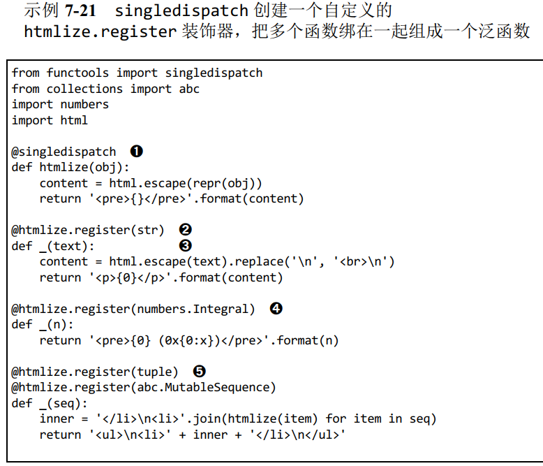 </center>   

1 @singledispatch装饰了处理object类型的基函数(base_function)
2 各个专门的函数使用 base_fucntion.register(type)来装饰
3 专门函数的名称不重要，用 _ 做个占位符即可。
4 为每个需要特殊处理的类型都用base_function.register()注册了一个函数，函数参数是类型名，numbers.Integral是int的虚拟超类
5 可以叠放多个register装饰器，让同一个函数支持不同的类型。

注册的专门函数应该处理抽象基类（抽象基类和虚拟子类的概念11章讨论），而不要处理具体实现的类别。这样代码兼容更广泛。比如numbers.Integral，python可以将其子类化，使用固定位数可以实现int类型。

### 7.9 叠放装饰器 

装饰器是一个返回函数的函数，因此可以组合起来使用，用一个外层装饰器来装饰内层装饰器返回的函数。把@d1和@d2两个装饰器按顺序应用到f函数上，相当于 f = d1(d2(f))，即：  

<center> 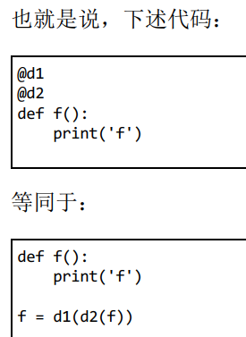 </center>   

### 7.10 参数化装饰器

decorator 第三方库：http://decorator.readthedocs.io/en/latest/

python把被装饰的函数作为第一个参数传给装饰器，要让装饰器接受其他参数的方法是：创建一个装饰器工厂函数，把参数传给它，返回一个装饰器，然后将返回的装饰器应用到要装饰的函数上。

#### 7.10.1 一个参数化的注册装饰器(装饰器工厂函数实现)

本质就是给装饰器传入一个新的参数active，用来控制装饰器是否装饰函数。

<center> 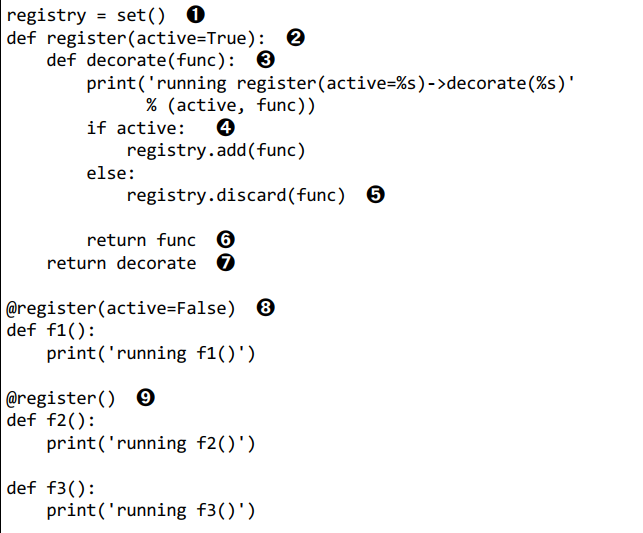 </center>   

#### 7.10.2 参数化 clock 装饰器（函数金字塔） 

<center> 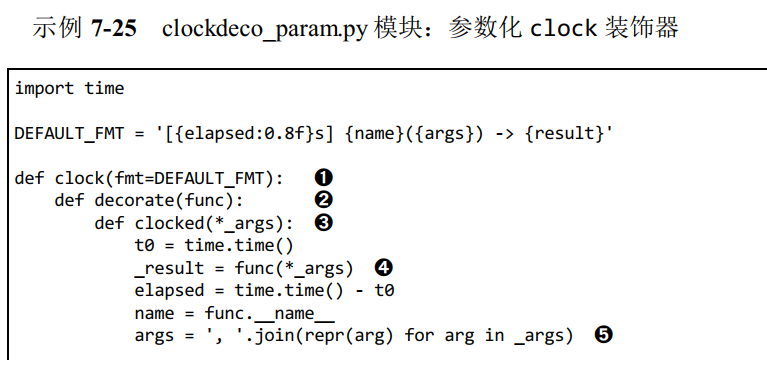 </center>   

<center> 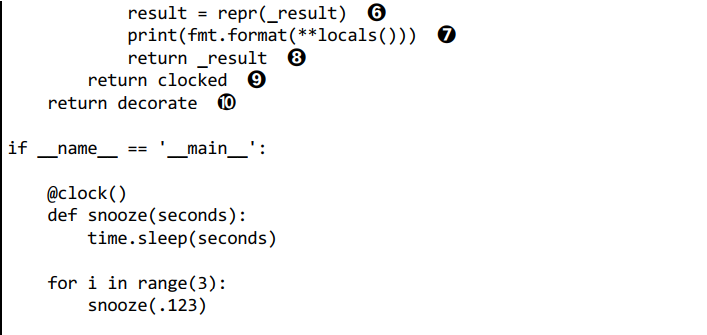 </center>   


clock是参数化装饰器工厂函数     
decorate是真正的装饰器    
clocked包装被装饰的函数，即装饰器的返回值     

## 第四部分 面向对象惯用法

## 第8章 对象引用、可变性和垃圾回收

### 8.1 变量不是盒子

python中变量不是盒子，而是盒子上贴的标签。对象才是盒子。对象一般是指一块存储空间，变量是对象上贴的标签，一个对象可以贴好多个标签，即可以对应很多个变量名。如下例子，把变量a和b分配给了同一个列表对象，类似于C++中的引用概念，python中的变量的本质都是C++中的引用。

```python
a = [1,2,3]
b = a 
a.append(4)
print(b) # [1, 2, 3, 4]
```

变量 `a` 和 `b` 引用同一个列表, 而不是那个列表的副本. 因此赋值语句应该理解为将变量和值进行引用的关系而已.    
对象会在赋值之前创建    

### 8.2 标识、相等性和别名

每个对象都有标识(id())、类型(type)和值。

两个对象的值可能一样，但是这还是两个不同的对象，因为其标识不同。在 CPython 中，id() 返回对象的内存地址。
            
#### 8.2.1 在 == 和 is 之间选择

== 运算符比较两个对象的值，而 is 比较对象的标识id。

is运算符比 == 速度快，因为is不能重载。

```python
# a is b 等同于 id(a) == id(b)
# 与单例进行比较时，应该使用 is
a = None
assert a is None
```

a == b 是语法糖，等价于 a.__eq__(b)，即调用魔术方法比较a与b。     
继承自object的最原始的__eq__方法等价于is，是直接比较id的，但是很多类型都重写了__eq__方法，去考虑值的相等性。   
           
#### 8.2.2 元组的相对不可变性 

元组里保存的是元素的引用，但如果引用的元素是可变的，即便元组本身不可变，其元素也依然可以变化。即元组中不可变的是元素的标识，而不是元素的值。

<center> 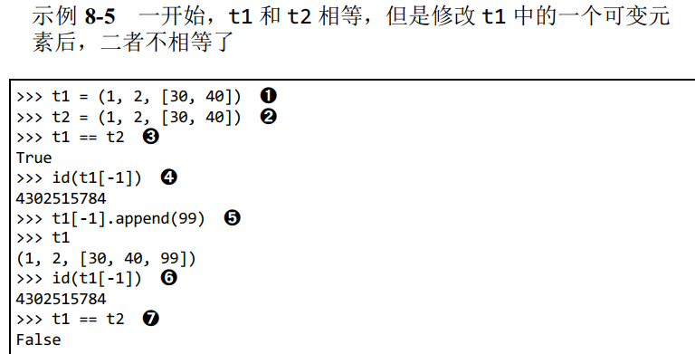 </center>   

### 8.3 默认做浅复制   

**浅拷贝**

用**构造方法或者[ : ]**创建副本时做的都是浅拷贝。即只复制了外壳，副本中的元素都是源容器中元素的引用。

```python
l1 = [1, 2, 3]
l2 = l1[:] # l2 = list(l1)得到的结果相同
print(l1 == l2)     #true
print(l1 is l2)		#false
print(l1[0] is l2[0]) #true
```

**深拷贝**

深拷贝即副本不共享内部对象的引用。

不管浅拷贝还是深拷贝，拷贝之后的副本与原对象肯定是不同的对象，即标识不同，但是浅拷贝中副本与原对象共享内部元素的引用。copy模块提供的deepcopy和copy函数能为任意对象深拷贝和浅拷贝。下面例子展示deepcopy和copy的用法。

```python
from copy import deepcopy, copy
 
class Bus:
    
    def __init__(self, passengers=None): # 这里用None不用[]是有原因的，看下边讲解
        if passengers is None:
            self.passengers = []
        else:
            self.passengers = list(passengers)
 
    def pick(self, name):
        self.passengers.append(name)
 
    def drop(self, name):
        self.passengers.remove(name)
 
bus1 = Bus(['Alice', 'Bill', 'Claire', 'David'])
bus2 = copy(bus1)
bus3 = deepcopy(bus1)
print("three buses' ids: ", id(bus1), id(bus2), id(bus3))
 
bus1.drop('Bill')
print('bus1: ', bus1.passengers)
print('bus2: ', bus2.passengers)
print('bus3: ', bus3.passengers)
 
print("three buses' passengers' ids: ", id(bus1.passengers),id(bus2.passengers),id(bus3.passengers))
```

<center> 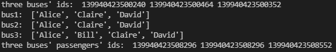 </center>   

通过特殊方法__copy__()和__deepcopy__()可以控制copy和deepcopy的行为。


### 8.4 函数的参数作为引用时   

#### 8.4.1 不要使用可变类型作为参数的默认值

**C里边默认的传参方式是值传递，而python里边默认的传参方式是引用传递**，即形参是实参的别名，因此如果传入的实参是可变对象，则函数体内可能会改变实参

函数的有些参数可以设置缺省/默认值，但是这个值不能用可变类型。

```python
class HauntedBus:
"""备受幽灵乘客折磨的校车"""
def __init__(self, passengers=[]): ➊
	self.passengers = passengers ➋
def pick(self, name):
	self.passengers.append(name) ➌
def drop(self, name):
	self.passengers.remove(name)

>>> bus1 = HauntedBus(['Alice', 'Bill'])
>>> bus1.passengers
['Alice', 'Bill']
>>> bus1.pick('Charlie')
>>> bus1.drop('Alice')
>>> bus1.passengers ➊
['Bill', 'Charlie']
>>> bus2 = HauntedBus() ➋
>>> bus2.pick('Carrie')
>>> bus2.passengers
['Carrie']
>>> bus3 = HauntedBus() ➌
>>> bus3.passengers ➍
['Carrie']
>>> bus3.pick('Dave')
>>> bus2.passengers ➎
['Carrie', 'Dave']
>>> bus2.passengers is bus3.passengers ➏
True
>>> bus1.passengers ➐
['Bill', 'Charlie']
```

上边例子中把HauntedBus类的构造函数中passengers的默认值由None改成了空列表[ ]。带来的改变是某个HauntedBus类的对象的self.passengers属性是__init__函数的参数passengers的别名，而默认情况下，如果在构造的时候没有传参，即默认构造时，passengers时空列表[ ] 的别名。而空列表[ ] 这个时候已经变成了函数__init__的一个属性。bus2和bus3的self.passengers属性是同一个列表对象的别名。

#### 8.4.2 防御可变参数  

如果定义的函数接收可变参数，需要谨慎考虑是否修改传入的参数。

改造后：

<center> 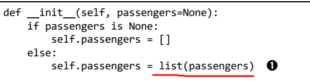 </center>   

### 8.5 del 和垃圾回收 

del只会删除对象的引用，而不会删除对象，但删除对象的引用可能会导致对象被删除。

python对象被删除有两种情况：          
1  某个对象的引用计数为零     
2 一组对象之间全是相互引用，导致组中对象不可获取    
两种情况可以归结于同一种情况，即这个对象不可获取了，那么就会被当作垃圾回收。

在 CPython 中，垃圾回收使用的主要算法时引用计数。当引用计数归零时，对象立即就被销毁。销毁时，CPython 会先调用对象的 `__del__` 方法，然后释放分配给对象的内存。  
CPython 2.0 增加了分代垃圾回收机制，用于检测循环引用中涉及的对象组。

```python
# 监测引用计数垃圾回收
import weakref
s1 = s2 = {1}
ender = weakref.finalize(s1, lambda: print('Bye'))
print(ender.alive)
del s1                # 删除 s1 的引用
print(ender.alive)    # 对象 {1} 的引用还在（s2）
s2 = {2}
print(ender.alive)    # 无法引用到 {1} 对象，于是它被垃圾回收

#output
True
True
Bye
False
```

### 8.6 弱引用

**弱引用可调用，返回所指对象，如果所指对象不存在了，返回 None。 **

正是因为有引用，对象才会在内存中存在。当对象的引用数量归零后，垃圾回收程序会把对象销毁。但是，有时需要引用对象，而不让对象存在的时间超过所需时间。这经常用在缓存中。    
弱引用不会增加对象的引用数量。引用的目标对象称为所指对象（referent），弱引用不会妨碍所指对象被当作垃圾回收。    

最好使用 weakref 集合和 finalize.

#### 8.6.1 WeakValueDictionary 简介  

实现一种可变映射，键是对象的某种可散列的属性，值值对象的弱引用。如果对象被回收，则对应的键会从WeakValueDictionary中删除。

```python
>>> import weakref
>>> stock = weakref.WeakValueDictionary() ➊
>>> catalog = [Cheese('Red Leicester'), Cheese('Tilsit'),
... Cheese('Brie'), Cheese('Parmesan')]
...
>>> for cheese in catalog:
... stock[cheese.kind] = cheese ➋
...
>>> sorted(stock.keys())
['Brie', 'Parmesan', 'Red Leicester', 'Tilsit'] ➌
>>> del catalog
>>> sorted(stock.keys())
['Parmesan'] ➍
>>> del cheese
>>> sorted(stock.keys())
[]

```

与 WeakValueDictionary 对应的是 WeakKeyDictionary，后者的键是弱引用.

#### 8.6.2 弱引用的局限 

不是每个python对象都可以作为弱引用的所指对象。     
- list和dict实例不能作为所指对象，但是他们的子类可以。    
- set可以作为所指对象    
- 自定义类型可以作为所指对象   
- int和tuple不能作为所指对象，其子类也不行+ 

弱引用可以解决循环引用不能正常垃圾回收的问题。   

### 8.7 Python 对不可变类型施加的把戏 


## 第9章 符合 Python 风格的对象

> 绝对不要使用两个前导下划线，这是很烦人的自私行为。  
> ——Ian Bicking  
>   pip, virtualenv 和 Paste 等项目的创建者

得益于 Python 数据模型，自定义类型的行为可以像内置类型那样自然。  
实现如此自然的行为，靠的不是继承，而是**鸭子类型**（duck typing）：我们只需按照预定行为实现对象所需的方法即可。

### 9.1 对象表示形式

获取对象的字符串表示形式的标准方式：     
1 repr()。便于开发者理解的方式返回对象的表示形式，即要求准确表示出构造该对象时的信息。     
2 str()。便于用户理解的方式返回对象的字符串表示形式。     

python对象还有两种方式返回表示形式：     
1 bytes()，底层是__bytes__，获取对象的字节序列表示形式。     
2 format()与str.format()，底层是__format__方法，使用特殊的格式代码显示对象的字符串表示形式。     
            
### 9.2 再谈向量类 

```python
from array import array
import math
 
class Vector2d:
    typecode = 'd' # 类属性，在Vector2d实例与字节序列转换时使用，使用8字节双精度浮点数表示向量的各个分量
 
    def __init__(self, x, y):
        self.x = float(x) # 构造时把传入参数都转换成浮点数
        self.y = float(y)
 
    def __iter__(self):
        return (i for i in(self.x, self.y)) # 定义__iter__方法，把Vector2d实例变成可迭代对象，这样才能拆包，这里实现方式是直接调用生成器表达式一个一个产出分量
 
    def __repr__(self):
        class_name = type(self).__name__
        return '{}({!r}, {!r})'.format(class_name, *self) 
 
    def __str__(self):
        return str(tuple(self)) # 用可迭代对象可以轻松生成一个元组，然后显示出来
 
    def __bytes__(self):
        return (bytes([ord(self.typecode)]) # 为了生成字节序列，先把typecode转换成字节序列
                + bytes(array(self.typecode, self))) # 用类型码和可迭代对象构建一个数组，然后把数组转换成字节序列
 
    def __eq__(self, other):
        return tuple(self) == tuple(other) # 先把Vector2d类转换成元组（可迭代对象都可这样转换），然后比较值的相等性，这样做会有一点问题，因为只要other是可迭代对象且只有两个元素，都可以与Vector2d实例比较，即Vector(3, 4) == [3, 4] 的结果为True。
    def __abs__(self):
        return math.hypot(self.x, self.y) # 求模
 
    def __bool__(self):
        return bool(abs(self)) # abs计算模，然后求布尔值
```

### 9.3 备选构造方法

同名的frombytes方法，来实现从字节序列到Vector2d对象。

```python
@classmethod # 装饰器
def frombytes(cls, cotets):    # 不用传入self函数，而是通过cls传入类本身，因为是类方法
    typecode = chr(octets[0])  # 从第一个字节中读取typecode，chr返回当前整数（可以是任何进制）对应的ascii字符
    memv = memoryview(octets[1:]).cast(typecode) # 使用传入的octets字节序列创建一个memoryview，然后使用typecode转换（此时typecode是字符 'd'，相当把内存内容变成了一个浮点数类型的memoryview对象）
    return cls(*memv)  # 拆包memoryview对象（此时是以float的形式看待这段内存），得到构造方法所需的参数，构造出Vector2d对象
```

### 9.4 classmethod 与 staticmethod 

- classmethod：定义类方法，用来操作类，其第一个参数一定是类本身，一般这个参数命名为cls（但实际上随便取个名就可以）。常见用户是定义备选构造方法。
- staticmethod：定义静态方法，静态方法就是普通的函数，只不过写在类里，由类名来调用，即只是简单地将静态方法储存在类的命名空间中。

```python
>>> class Demo:
... @classmethod
... def klassmeth(*args):
... return args # ➊
... @staticmethod
... def statmeth(*args):
... return args # ➋
...
>>> Demo.klassmeth() # ➌
(<class '__main__.Demo'>,)
>>> Demo.klassmeth('spam')
(<class '__main__.Demo'>, 'spam')
>>> Demo.statmeth() # ➍
()
>>> Demo.statmeth('spam')
('spam',)
```

### 9.5 格式化显示

内置format()函数和str.format()方法把格式化方式委托给 .__format__(format_spec)方法。format_spec是格式说明符（格式说明符使用的表示法叫格式规范微语言），其位置于：    
- format(my_obj, format_spec)的第二个参数
- str.formar()方法的格式字符串中，{}里冒号后边的部分

```python
>>> brl = 1/2.43 # BRL到USD的货币兑换比价
>>> brl
0.4115226337448559
>>> format(brl, '0.4f') # ➊
'0.4115'
>>> '1 BRL = {rate:0.2f} USD'.format(rate=brl) # ➋
'1 BRL = 0.41 USD'
```
1 格式说明符是 ‘0.4f’，保留4位小数。   
2 格式说明符是{ }中 ： 后边的0.2f，保留2位小数。

格式规范微语言标识代码：b和x分别标识二进制和十六进制的int类型，f表示小数形式的float类型，而%表示百分数形式。    

格式规范微语言可扩展：

```python
from datetime import date, datetime
now = datetime.now()
print(format(now, '%H:%M:%S'))
print("It's now {:%I:%M %p}".format(now))
```

实现自己的微语言:

```python
def __format__(self, fmt_spec=''):
	if fmt_spec.endswith('p'): ➊
		fmt_spec = fmt_spec[:-1] ➋
		coords = (abs(self), self.angle()) ➌
		outer_fmt = '<{}, {}>' ➍
	else:
		coords = self ➎
		outer_fmt = '({}, {})' ➏
	components = (format(c, fmt_spec) for c in coords) ➐
return outer_fmt.format(*components) ➑
```

### 9.6 可散列的 Vector2d  

如果实现了一个类的__eq__方法，并且希望它是可散列的，那么它一定要有一个恰当的__hash__方法，保证在a == b为真的时候hash(a) == hash(b)也必定为真

可散列：一是实现__hash__方法，二是让其不可变（为了实现__hash__方法）

```python
class Vector2d:
	typecode = 'd'
	def __init__(self, x, y):
		self.__x = float(x) ➊
		self.__y = float(y)
	@property ➋
	def x(self): ➌
		return self.__x ➍
	@property ➎
	def y(self):
		return self.__y
	def __iter__(self):
		return (i for i in (self.x, self.y))  ➏
	def __hash__(self):
		return hash(self.x) ^ hash(self.y)
```

```python
#而最新的文章中，推荐把各个分量组成一个 `tuple`，然后对其进行散列：
class Vector2d:
    def __hash__(self):
        return hash((self.x, self.y))
```

1 使用两个前导下划线（尾部没有下划线或只有一个），把属性标记为私有的（外界无法访问）。        
2 **@property装饰器用来将一个方法变成一个相同名称的只读属性**，然后就可以将方法x当成属性来访问了。        
3 读值方法设置为x，因此不能直接my_obj.__x，但是可以my_obj.x来访问属性。       


### 9.7 Python 的私有属性和“受保护的”属性 

python中属性前加两个下划线即变成私有属性，但实际上python中并没有真正意义上的私有属性，而是用了一种叫名称改写的语言特性。即将类A的属性__x实际存储为 _A__x。
		 
```python
class A:
    def __init__(self, x) -> None:
        self.__x = x
a = A(5)
 
print(a._A__x) #正常打印
```

### 9.8 使用 __slots__ 类属性节省空间 

默认情况下，python中实例属性__dict__字典要用存储所有的实例属性，字典的底层是散列表，散列表存储元素时由于要尽量散开，因此字典会消耗大量内存。如果实例很多（但实例的属性不多），则内存消耗巨大。    

通过__slots__类属性，能节省大量内存，方法是让解释器在元组中存储实例属性，而不用字典。     
定义__slots__的方式是：创建一个名为__slots__的类属性，其值设为一个字符串构成的可迭代对象，各个元素表示各个实例属性。常使用元组，这样定义的__slots__中所含的信息不会变化。    

```python
class Vector2d:
	__slots__ = ('__x', '__y')
	typecode = 'd'

```
在类中定义 __slots__ 属性的目的是告诉解释器：“这个类中的所有实例属性都在这儿了。

使用__slots__的问题：    
1 每个子类都要定义__slots__属性，因为解释器会忽略继承的__slots__属性        
2 实例只能拥有__slots__中列出的属性        
3 把 ‘__dict__’加入 __slots__可以实现动态添加属性，但是不要这样做，这样会导致常规的__dict__即字典中存储实例，这就与__slots__目标背道而驰了。       
4 如果不把'__weakref__'加入__slots__，实例就不能作为弱引用的目标/所指对象。         
           
### 9.9 覆盖类属性 

1 类属性可用于为实例属性提供默认值。
2 实例属性覆盖同名类属性，如果我们给不存在的实例属性self.typecode赋新值，则会新键一个实例属性。
3 有种修改类属性的方法更pythonic，因为类属性是公开的，因此会被子类继承，所以可以创建一个子类，专门用于定制类属性，用这个子类来实例化对象。
           

## 第10章 序列的修改、散列和切片

> 不要检查它**是不是**鸭子、它的**叫声**像不像鸭子、它的**走路姿势**像不像鸭子，等等。具体检查什么取决于你想用语言的哪些行为。(comp.lang.python, 2000 年 7 月 26 日)  
> ——Alex Martelli


### 10.1 Vector 类：用户定义的序列类型 


### 10.2 Vector 类第1 版：与 Vector2d 类兼容

为了编写Vector(3,4)和Vector(3,4,5)这样代码，可以让**构造函数__init__接受任意个参数（通过*args）**，但 是所有内置序列类型的做法都是让构造函数接收可迭代对象为参数。如下实例化方式所示

使用reprlib模块可以生成长度有限的表示形式。
          
### 10.3 协议和鸭子类型 

在python中创建功能完善的序列类型无需使用继承，只需实现符合序列协议的方法。在面向对象编程中，协议是非正式的接口，只在文档中定义，在代码中不定义。    
python中的序列协议只需要__len__和__getitem__两个方法，任何类，只要实现了这两个方法，就可以用在任何期待序列的地方，即此类可以归类为序列类型。    

**实现了__len__和__getitem__方法，我们就说它是序列，因为它的行为像序列，因此它就是序列。**

协议是非正式的，没有强制力，在具体的使用场景，通常只需要实现一个协议的部分。例如为了支持迭代，只需要实现__getitem__方法，不必实现__len__方法。 

### 10.4 Vector 类第2 版：可切片的序列 

#### 10.4.1 切片原理      

#### 10.4.2 能处理切片的 __getitem__ 方法 

```python
#了解 __getitem__
>>> class MySeq:
... def __getitem__(self, index):
... return index # ➊
...
>>> s = MySeq()
>>> s[1] # ➋
1
>>> s[1:4] # ➌
slice(1, 4, None)
>>> s[1:4:2] # ➍
slice(1, 4, 2)
>>> s[1:4:2, 9] # ➎
(slice(1, 4, 2), 9)
>>> s[1:4:2, 7:9] # ➏
(slice(1, 4, 2), slice(7, 9, None))

#查看slice属性
>>> slice # ➊
<class 'slice'>
>>> dir(slice) # ➋
['__class__', '__delattr__', '__dir__', '__doc__', '__eq__',
'__format__', '__ge__', '__getattribute__', '__gt__',
'__hash__', '__init__', '__le__', '__lt__', '__ne__',
'__new__', '__reduce__', '__reduce_ex__', '__repr__',
'__setattr__', '__sizeof__', '__str__', '__subclasshook__',
'indices', 'start', 'step', 'stop']

```

- 当索引切片对象时，__getitem__收到的值就是一个索引值整数。
- 当给序列进行切片时，__getitem__收到的值是一个slice对象，即切片对象，这也没有步长。
- 当进行带步长的切片时，__getitem__收到的切片对象也是带步长的
- 如果切片时有逗号，那么__getitem__收到的是元组，且这里元组的第二个元素是整数s  
         		 

**slice类**

- slice中有start、step、stop等数据属性，以及indices方法。    
- slice(s, t, st).indices(len) -> (start, stop, stride)    

改进_getitem__：切片返回的是数组而不是Vector对象，进行改进。
		 
### 10.5 Vector 类第3 版：动态存取属性 

多维向量类Vector的访问，可以用特殊方法__getattr__来实现。

```python
shortcut_names = 'xyzt'
 
def __getattr__(self, name):
    cls = type(self) # 获取当前类名Vector
 
    if len(name) == 1: # 属性名只有一个字符，可能是'xyzt'中的某一个
        pos = cls.shortcut_names.find(name) # 查找是否是'xyzt'中的某一个
        if 0 <= pos < len(self._components): # 定位位置
            return self._components[pos]
    msg = '{.__name__!r} object has no attribute {!r}' # 失败则抛出属性错误
    raise AttributeError(msg.format(cls, name))
```

__setattr__：设置改变属性时候的行为


### 10.6 Vector 类第4 版：散列和快速等值测试 

**__hash__**

规约函数functools.reduce，其作用是将可迭代对象中前两个元素送入一个二参数函数中计算，然后得到的结果与第三个元素一起再送入二参数函数计算。

```python
ans = functools.reduce(func, iter, initializer)
#func是用来计算的二参数函数，比如加法，乘法等，iter是可迭代对象，initializer是当可迭代对象为空时候返回的初始值


def __eq__(self, other):
	return (len(self) == len(other) and
			all(a == b for a, b in zip(self, other)))

def __hash__(self):
	hashes = (hash(x) for x in self)
	return functools.reduce(operator.xor, hashes, 0)
```
上例中__hash__函数是一种映射规约计算，即映射过程计算各个分量散列值，规约过程则使用xor运算符聚合所有散列值。

- 映射（map）：把hash函数映射到序列的每一个元素上，得到一个新的序列值。map惰性，会创建一个生成器，按需产出结果。
- 规约（reduce）：用xor运算符聚合所有的元素。

**__eq__**

_hash__和__eq__方法需要同时实现,可以使用zip函数来重新实现。

**zip函数**

zip函数用于并行迭代两个或更多的可迭代对象，返回一个zip对象（生成器），可以拆包。

```python

>>> list(zip(range(3), 'ABC')) # ➋
[(0, 'A'), (1, 'B'), (2, 'C')]
>>> list(zip(range(3), 'ABC', [0.0, 1.1, 2.2, 3.3])) # ➌
[(0, 'A', 0.0), (1, 'B', 1.1), (2, 'C', 2.2)]
>>> from itertools import zip_longest # ➍
>>> list(zip_longest(range(3), 'ABC', [0.0, 1.1, 2.2, 3.3], fillvalue=-1))
[(0, 'A', 0.0), (1, 'B', 1.1), (2, 'C', 2.2), (-1, -1, 3.3)]
```

zip有一个奇怪的特性：当一个可迭代对象耗尽后，它不发出警告就停止，解决这个问题可以用itertools.zip_longest函数，其可以使用可选的默认值来填充缺失的值，然后继续产出直到最长的可迭代对象耗尽。          
	
		   
### 10.7 Vector 类第5 版：格式化

__format__ : 球面坐标，超过四维变成超球体

```python
from array import array
import reprlib
import math
import numbers
import functools
import operator
import itertools  # <1>


class Vector:
    typecode = 'd'

    def __init__(self, components):
        self._components = array(self.typecode, components)

    def __iter__(self):
        return iter(self._components)

    def __repr__(self):
        components = reprlib.repr(self._components)
        components = components[components.find('['):-1]
        return 'Vector({})'.format(components)

    def __str__(self):
        return str(tuple(self))

    def __bytes__(self):
        return (bytes([ord(self.typecode)]) +
                bytes(self._components))

    def __eq__(self, other):
        return (len(self) == len(other) and
                all(a == b for a, b in zip(self, other)))

    def __hash__(self):
        hashes = (hash(x) for x in self)
        return functools.reduce(operator.xor, hashes, 0)

    def __abs__(self):
        return math.sqrt(sum(x * x for x in self))

    def __bool__(self):
        return bool(abs(self))

    def __len__(self):
        return len(self._components)

    def __getitem__(self, index):
        cls = type(self)
        if isinstance(index, slice):
            return cls(self._components[index])
        elif isinstance(index, numbers.Integral):
            return self._components[index]
        else:
            msg = '{.__name__} indices must be integers'
            raise TypeError(msg.format(cls))

    shortcut_names = 'xyzt'

    def __getattr__(self, name):
        cls = type(self)
        if len(name) == 1:
            pos = cls.shortcut_names.find(name)
            if 0 <= pos < len(self._components):
                return self._components[pos]
        msg = '{.__name__!r} object has no attribute {!r}'
        raise AttributeError(msg.format(cls, name))

    def angle(self, n):  # <2>
        r = math.sqrt(sum(x * x for x in self[n:]))
        a = math.atan2(r, self[n-1])
        if (n == len(self) - 1) and (self[-1] < 0):
            return math.pi * 2 - a
        else:
            return a

    def angles(self):  # <3>
        return (self.angle(n) for n in range(1, len(self)))

    def __format__(self, fmt_spec=''):
        if fmt_spec.endswith('h'):  # hyperspherical coordinates
            fmt_spec = fmt_spec[:-1]
            coords = itertools.chain([abs(self)],
                                     self.angles())  # <4>
            outer_fmt = '<{}>'  # <5>
        else:
            coords = self
            outer_fmt = '({})'  # <6>
        components = (format(c, fmt_spec) for c in coords)  # <7>
        return outer_fmt.format(', '.join(components))  # <8>

    @classmethod
    def frombytes(cls, octets):
        typecode = chr(octets[0])
        memv = memoryview(octets[1:]).cast(typecode)
        return cls(memv)
# END VECTOR_V5
```

## 第11章 接口：从协议到抽象基类

> 抽象类表示接口。  
> ——Bjarne Stroustrup, C++ 之父

### 11.1 Python 文化中的接口和协议 

接口定义：每个类都有接口，类实现或继承的公开属性（方法或数据属性），包括特殊方法，都是接口。受保护的属性和私有属性不在接口中（即便在python并不存在真正受保护的和私有的属性，而只是采用命名约定实现的）。

接口补充定义：对象公开方法的自己，让对象在系统中扮演特定的角色。python文档中的文件类对象或可迭代对象就是指这样一些类，它们实现了文件类对象的方法集合或可迭代需要的方法集合。          

> 协议是接口，但不是正式的（只由文档和约定定义），因此协议不能像正式接口那样施加限制。  
> 允许一个类上只实现部分接口。

python有两种风格的接口，一种是协议：即只在文档和约定中定义；一种是抽象基类。

鸭子类型：对象类型无关紧要，只要实现特定协议即可。		   
		   
### 11.2 Python 喜欢序列     

下图是定义为抽象基类的Sequence正式接口。

<center> 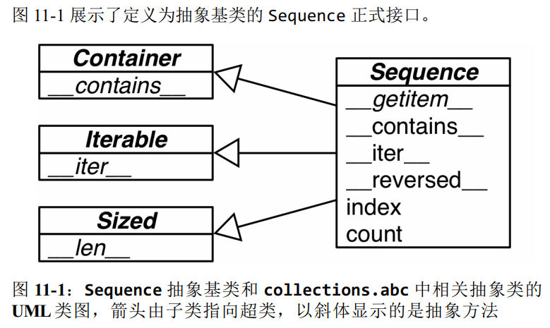 </center>   

看上去序列类型需要实现__contains__，__iter__，__len__等特殊方法。一般来说，__contains__用来支持in运算符，__iter__用来支持可迭代，__len__用来求长度。__getitem__是用来访问元素。但是只实现序列协议中的__getitem__方法，不实现__len__和__contains__等方法，也足够支持访问元素、迭代和使用in运算符了。

```python
>>> class Foo:
... 	def __getitem__(self, pos):
... 		return range(0, 30, 10)[pos]
...
>>> f = Foo()
>>> f[1]
10
>>> for i in f: print(i)
...
0
10
20
>>> 20 in f
True
>>> 15 in f
False

```

用for循环迭代对象，但是发现没有__iter__方法，python会调用__getitem__方法。    
如果没有__contains__方法，则python会做全面检查，即迭代对象，看有没有指定的元素，因此能用in运算符。    

### 11.3 使用猴子补丁在运行时实现协议     

运行时实现协议，体现协议的动态本性。

为FrenchDeck 打猴子补丁，把它变成可变的，让 random.shuffle 函数能处理（接续示例 11-5）
```python
>>> def set_card(deck, position, card): ➊
... 	deck._cards[position] = card
...
>>> FrenchDeck.__setitem__ = set_card ➋
>>> shuffle(deck) ➌
>>> deck[:5]
[Card(rank='3', suit='hearts'), Card(rank='4', suit='diamonds'), Card(rank='4',
suit='clubs'), Card(rank='7', suit='hearts'), Card(rank='9', suit='spades')]
```
1 定义一个函数用来绑定到__setitem__上，其参数是self（对象本身，这里是deck）、key（position）、value（card）。
2 把上边函数赋值给FrenchDeck的__setitem__属性.
	
把set_card函数赋值给特殊方法__setitem__，从而把它依附到FrenchDeck类上，这种计数叫**猴子补丁**：在运行时修改类或模块，而不改动源码


### 11.4 Alex Martelli 的水禽

- 鸭子类型：忽略对象的真正类型，转而关注对象有没有实现所需的方法、签名和语义。对python来说，基本上指避免使用isinstance检查对象类型（更别提type()）。
- 白鹅类型：只要cls是抽象基类，就可以使用isinstance(obj, cls)来判断对象obj是不是它的子类。

python中的抽象基类有一个实用优势：可以使用register类方法把某个类声明为一个抽象基类的虚拟子类，被注册的类必须满足抽象基类对方法名称和签名的要求，最重要的是满足底层语义契约。但是开发那个类时不用了解抽象基类，更不用继承抽象基类。

抽象基类的本质就是几个特殊方法。

如果要实现的类体现了numbers、collections.abc（python中抽象基类主要定义在numbers，collections.abc这两个模块中）或其它模块中抽象基类的概念，要么继承相应的抽象基类（必要时），要么把类注册到相应的抽象基类中。如果要检查对象是不是属于某一抽象基类，可以使用instance来判断。最后，不要自己定义抽象基类或元类


### 11.5 定义抽象基类的子类 

```python
from collections import namedtuple, abc

Card = namedtuple('Card', ['rank', 'suit'])

class FrenchDeck2(abc.MutableSequence):
    ranks = [str(n) for n in range(2, 11)] + list('JQKA')
    suits = 'spades diamonds clubs hearts'.split()

    def __init__(self):
        self._cards = [Card(rank, suit) for suit in self.suits
                                        for rank in self.ranks]

    def __len__(self):
        return len(self._cards)

    def __getitem__(self, position):
        return self._cards[position]

    def __setitem__(self, position, value):  # <1>
        self._cards[position] = value

    def __delitem__(self, position):  # <2>
        del self._cards[position]

    def insert(self, position, value):  # <3>
        self._cards.insert(position, value)
```

继承抽象基类的类必须实现抽象基类中所有的抽象方法，因此要实现MutableSequence中的抽象方法__delitem__和insert方法。

### 11.6 标准库中的抽象基类

#### 11.6.1 collections.abc 模块中的抽象基类 

标准库中有两个名为abc的模块，collections.abc和abc。collections.abc中定义了16个抽象基类，abc模块中定义了abc.ABC类，每个抽象基类都依赖这个类，只有在定义新的抽象基类的时候才需要导入abc模块。

<center> 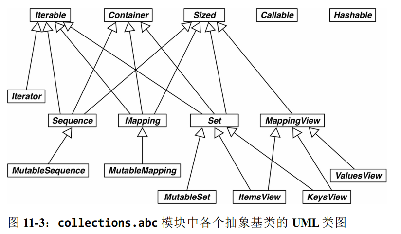 </center>   

**Iterable、Container、Sized**：各个集合都应该继承这三个抽象基类，或者实现兼容的协议。Iterable通过__iter__方法支持迭代，Container通过__contains__方法支持in运算符，Sized通过__len__方法支持len()函数。

**Sequence、Mapping、Set**：这三个是不可变集合类型，但是各个都有可变的子类，即MutableSequence、MutableMapping、MutableSet。

**MappingView**：python3中，映射类型的方法 .items()、.keys、.values()返回的对象分别是ItemsVies、KeysView、ValuesView的实例。

**Callable、Hashable**：这两个抽象基类不用于定义子类，而是用于为内置函数isinstance提供支持，以一种安全的方式判断对象能不能调用或散列。用法是isinstance(my_obj, Hashable)。

**Iterator**: 是Iterable的子类。


#### 11.6.2 抽象基类的数字塔(numbers模块)  

```python
Number
Complex
Real
Rational
Integral
```

numbers包定义的是数字塔，即各个抽象基类的层次结构是线性的，其中Number是位于最顶端的超类，随后是Complex类，最底端是Integral类：      
		  
如果想检查一个数是不是整数，可以使用isinstance(x, numbers.Integral)，这样代码可以兼容int、bool(int 的子类)、外部库使用numbers抽象基类注册的其它类型（虚拟子类）。注意decimal.Decimal没有注册为numbers.Real的虚拟子类。

如果想检查浮点数类型，可以用 instance(x, numbers.Real)。这样可以兼容bool、int、float、fractions.Fraction、或者外部库提供的非复数类型（比如numpy中的类型，其做了相应的注册）。 

### 11.7 定义并使用一个抽象基类

#### 11.7.1 抽象基类句法详解


声明抽象基类最简单的方法有两种：
- 1 继承abc.ABC。   
- 2 继承其他抽象基类，且不要实现所有父类的抽象方法。     

<center> 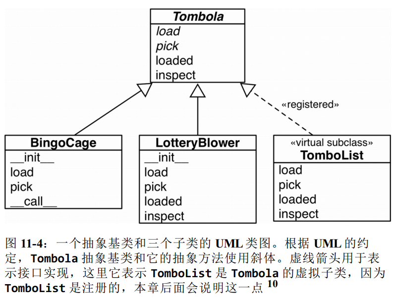 </center>   

定义抽象基类Tombola, 其有两个抽象方法，两个具体方法。

- .load(...)：把元素放入容器。
- .pich()：从容器中随机拿出一个元素，返回选中的元素。
- .loaded()：如果容器中至少有一个元素，返回True
- 抽象类不需要__init__方法是必须的，因为没法构造对象啊
           
#### 11.7.2 定义 Tombola 抽象基类的子类 

```python
import abc
 
class Tombola(abc.ABC): # 自定义抽象基类要继承abc.ABC
 
    @abc.abstractmethod # 抽象方法用@abstractmethod装饰器装饰，定义体中通常只有文档字符串
    def load(self, iterable):
        """从可迭代对象中添加元素"""
 
    @abc.abstractmethod
    def pick(self):
        """随机删除元素，然后将其返回，如果实例为空，抛出LookupError"""
 
    def loaded(self): # 抽象基类也可以包含具体方法
        """如果至少有一个元素，返回True，否则False"""
        return bool(self.inspect()) # 抽象基类中的具体方法只能使用抽象基类中的其他具体方法、抽象方法或特性，比如这里的inspect，就是里另一个具体方法
 
    def inspect(self):
        """返回一个有序元组，由当前元素构成"""
        # 为了得到所有当前元素，不断调用pick方法把Tombola清空，然后再用load方法把所有元素放回去
        items = []
        while True:
            try:
                items.append(self.pick())
            except LookupError:
                break
        self.load(items) 
        return tuple(sorted(items))
```

```python
class BingoCage(Tombola):  # <1>

    def __init__(self, items):
        self._randomizer = random.SystemRandom()  # <2>
        self._items = []
        self.load(items)  # <3>

    def load(self, items):
        self._items.extend(items)
        self._randomizer.shuffle(self._items)  # <4>

    def pick(self):  # <5>
        try:
            return self._items.pop()
        except IndexError:
            raise LookupError('pick from empty BingoCage')

    def __call__(self):  # <7>
        self.pick()
```

#### 11.7.3 Tombola 的虚拟子类

白鹅类型基本特性：即便不继承，也有办法把一个类注册为抽象基类的虚拟子类。

注册方法是在抽象基类上调用register方法。这样做之后，注册的类会变成抽象基类的虚拟子类，且issubclass和isinstance等函数能够识别，但是注册的虚拟子类不会从抽象基类中继承任何方法或属性。register方法通常作为普通的函数调用，也可以作为装饰器使用。

```python
from tombola import Tombola

@Tombola.register  # <1>
class TomboList(list):  # <2>

    def pick(self):
        if self:  # <3>
            position = randrange(len(self))
            return self.pop(position)  # <4>
        else:
            raise LookupError('pop from empty TomboList')

    load = list.extend  # <5>

    def loaded(self):
        return bool(self)  # <6>

    def inspect(self):
        return tuple(self)

# Tombola.register(TomboList)  # <7>
```

- 1. 用装饰器把TomboList注册为Tombola的虚拟子类
- 2. TomboList继承list
- 3. Tombolist从list中继承了__bool__方法，列表不为空时返回True
- 4. pick调用继承自list的self.pop方法，传入一个随机的元素索引
- 5. TomboList.load与list.extend一样
- 6. loaded方法委托给bool函数
- 7. 这是register作为函数的调用方法，在python3.3之前的版本，不能把.register当作类装饰器使用，必须用函数调用方法来注册虚拟子类

### 11.8 Tombola 子类的测试方法

用两个类属性（方法）来内省类的继承关系。

__subclass__() ，这个方法返回类的直接子类列表，不含虚拟子类;      
_abc_registry，只有抽象基类有这个数据属性，其值是一个WeakSet对象，即抽象基类注册的所有虚拟子类的弱引用。     
			
### 11.9 Python 使用 register 的方式 

两种方式，一种是当作装饰器使用，一种是当作类函数调用。

```python
@Tombola.register  # <1>
class TomboList(list):  # <2>


Sequence.register(tuple)
Sequence.register(str)
Sequence.register(range)
Sequence.register(memoryview)
```

### 11.10 鹅的行为有可能像鸭子    

即使不注册，抽象基类也能把一个类识别为虚拟子类

```python 
>>> class Struggle:
... def __len__(self): return 23
...
>>> from collections import abc
>>> isinstance(Struggle(), abc.Sized)
True
>>> issubclass(Struggle, abc.Sized)
True
```


## 第12章 继承的优缺点

### 12.1 子类化内置类型很麻烦

内置类型可以子类化了，但是内置类型的方法不会调用子类覆盖的方法。

基本类型的方法无法调用基本类型的子类所覆盖的方法。

不要直接子类化内置类型，因为内置类型的方法通常会忽略用户覆盖的方法，用户自定义的类应该继承collections模块中的类，如UserDict、UserList、UserString，这些类做了特殊设计，易于扩展。把上边例子中继承自dict改成继承自UserDict则可以按预期使用。


```python
# 子类化内置类型的缺点
class DoppelDict(dict):
    def __setitem__(self, key, value):
        super().__setitem__(key, [value] * 2)

# 构造方法和 update 都不会调用子类的 __setitem__
dd = DoppelDict(one=1)
dd['two'] = 2
print(dd)
dd.update(three=3)
print(dd)


from collections import UserDict
class DoppelDict2(UserDict):
    def __setitem__(self, key, value):
        super().__setitem__(key, [value] * 2)

# UserDict 中，__setitem__ 对 update 起了作用，但构造函数依然不会调用 __setitem__
dd = DoppelDict2(one=1)
dd['two'] = 2
print(dd)
dd.update(three=3)
print(dd)
```

    {'one': 1, 'two': [2, 2]}
    {'one': 1, 'two': [2, 2], 'three': 3}
    {'one': [1, 1], 'two': [2, 2]}
    {'one': [1, 1], 'two': [2, 2], 'three': [3, 3]}

### 12.2 多重继承和方法解析顺序

<center> 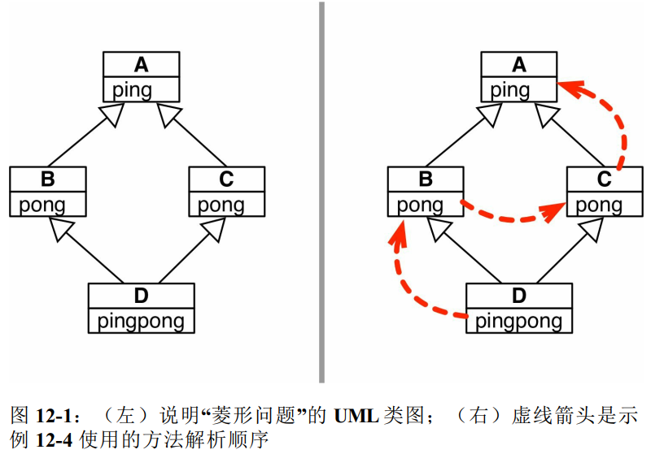 </center>   

```python
class A:
    def ping(self):
        print('ping:', self)
 
class B(A):
    def pong(self):
        print('pong:', self)
 
class C(A):
    def pong(self):
        print('PONG: ', self)
 
class D(B, C):
 
    def ping(self):
        super().ping()
        print('post-ping:', self)
 
    def pingpong(self):
        self.ping()
        super().ping()
        self.pong()
        super.pong()
        C.pong(self)
```
在D实例上调用pong方法有两种方式：

- 1 直接调用d.pong
- 2 直接用超类名调用实例方法pong，比如C.pong(d)或者D.pong(d)，因为pong在类C和类D中都是实例方法而不是类方法，因此是不能直接用类名调用的，必须显示传入对应的实例d。

第一种方法中python能区分d.pong()调用的是哪个方法，是因为python会按照方法解析顺序（Method Resoluton Order, MRO）来遍历继承图。类都有一个名为__mro__的类属性，它的值是要给元组，按照方法解析顺序列出各个超类，从当前类一直列到object类。方法解析顺序会考虑继承列表中的超类顺序，比如D(B, C)和D(C, B)中方法解析顺序C和B就是反过来的，下面是类D的方法解析顺序。    

```python
>>> D.__mro__
(<class 'diamond.D'>, <class 'diamond.B'>, <class 'diamond.C'>,
<class 'diamond.A'>, <class 'object'>)
```

如果想把方法调用委托给超类，推荐方式是使用内置的super()函数，super()函数也会按照方法解析顺序来找到具体调用的方法，使用super()方法是最安全的。

### 12.3 多重继承的真实应用 

### 12.4 处理多重继承 

1. 把接口继承和实现继承区分开  
    如果继承重用的是代码实现细节，通常可以换用组合和委托模式。
2. 使用抽象基类显式表示接口  
    如果基类的作用是定义接口，那就应该定义抽象基类。
3. 通过混入（Mixin）重用代码  
    如果一个类的作用是为多个不相关的子类提供方法实现，从而实现重用，但不体现实际的“上下级”关系，那就应该明确地将这个类定义为**混入类**（Mixin class）。关于 Mixin（我还是习惯英文名），可以看 Python3-Cookbook 的[《利用Mixins扩展类功能》](https://python3-cookbook.readthedocs.io/zh_CN/latest/c08/p18_extending_classes_with_mixins.html)章节。
4. 在名称中明确指出混入  
    在类名里使用 `XXMixin` 写明这个类是一个 Mixin.
5. 抽象基类可以作为混入，反过来则不成立。
	因为抽象基类可以实现具体方法（虽然抽象基类中的具体方法只能与抽象基类及其超类中的方法协作），因此可以作为混入使用。抽象基类可以作为其他类的唯一基类，而混入不能作为唯一的超类，除非继承另一个更具体的混入，但一般不这么做。
6. 不要子类化多个具体类  
    在设计子类时，不要在多个**具体基类**上实现多继承。一个子类最好只继承自一个具体基类，其余基类最好应为 Mixin，用于提供增强功能。
7. 为用户提供聚合类  
    如果抽象基类或 Mixin 的组合对客户代码非常有用，那就替客户实现一个包含多继承的聚合类，这样用户可以直接继承自你的聚合类，而不需要再引入 Mixin.
8. “优先使用对象组合，而不是类继承”  
    组合和委托可以代替混入，把行为提供给不同的类，不过这些方法不能取代接口继承去**定义类型层次结构**。


### 12.5 一个现代示例：Django 通用视图中的混入


## 第13章 正确重载运算符

> 有些事情让我不安，比如运算符重载。我决定不支持运算符重载，这完全是个个人选择，因为我见过太多 C++ 程序员滥用它。
> ——James Gosling, Java 之父

### 13.1 运算符重载基础

python对运算符重载加了一些限制。

- 不能重载内置类型的运算符
- 不能新键运算符，只能重载现有的
- 某些运算符不能重载------is、and、or、not（位运算符&、|、~可以） 

### 13.2 一元运算符

一元运算符比如 - + ~等，每个一元运算符都对应一个特殊方法。支持一元运算符只需要实现相应的特殊方法即可，这些特殊方法只有一个参数self。运算符基本规则：始终返回一个新对象，即不能修改self。即便是+，最好也是返回一个副本，不能返回引用。

abs()：__abs__ 
- ：__neg__
+ :__pos__
~ : __invert__

https://docs.python.org/3/reference/datamodel.html#object.__neg__

```python
def __abs__(self):
	return math.sqrt(sum(x * x for x in self))
def __neg__(self):
	return Vector(-x for x in self) ➊
def __pos__(self):
	return Vector(self) ➋
```

**x 和 +x 何时不相等**

与decimal.Decimal类有关的情况:decimal.getcontext获取当前全局算术运算的上下文引用。
与collections.Counter有关的情况：Counter实现了中缀运算符+，作用是把两个Counter的实例加一起，但是相加之后的结果会剔除掉零值和负值，仅保留大于零的计数器。

### 13.3 重载向量加法运算符 +  

对于序列类型，+一般用于拼接，而*用于重复复制。

如果两个Vector实例长度不同，则用零填充较短的向量。

<center> 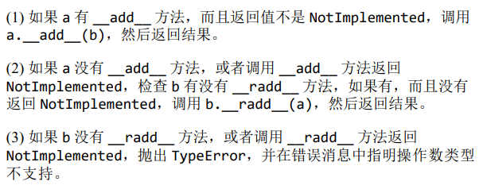 </center>   

```python
//vector_v6.py
	def __add__(self, other):
		try:
			pairs = itertools.zip_longest(self, other, fillvalue=0.0)
			return Vector(a + b for a, b in pairs)
		except TypeError:
			return NotImplemented

	def __radd__(self, other)
			return self + other
```

__radd__是__add__的反向版本，可称为反向特殊方法，因为它是在右操作数上调用的，同理__rsub__也是反向特殊方法。

### 13.4 重载标量乘法运算符 *  

*运算符用于计算标量积，其对应的特殊方法是__mul__和__rmul__。

```python
//vector_v7.py
import numbers

	def __mul__(self, scalar):
		if isinstance(scalar, numbers.Real):
			return Vector(n * scalar for n in self)
		else:
			return NotImplemented

	def __rmul__(self, scalar):
		return self * scalar

	def __matmul__(self, other):
		if (isinstance(other, abc.Sized) and
			isinstance(other, abc.Iterable)):
			if len(self) == len(other):
				return sum(a * b for a, b in zip(self, other))
			else:
				raise ValueError('@ requires vectors of equal length.')
		else:
			return NotImplemented

	def __rmatmul__(self, other):
		return self @ other
```

1  为了使用Real抽象基类，导入numbers模块。
2  如果scalar是numbers.Real的某个子类的实例，则进行标量乘积并返回一个新的Vector实例。
3  如果scalar不是numbers.Real的实例，返回NotImplemented，这样python会尝试在scalar上调用__rmul__方法。
4  __rmul__方法定义，有了__rmul__，Vector就可以作为右操作数进行标量数乘。

python中中缀运算符列表:

<center> 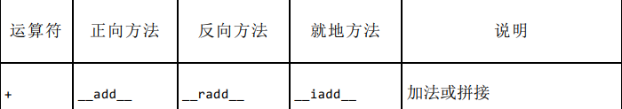 </center>   

<center> 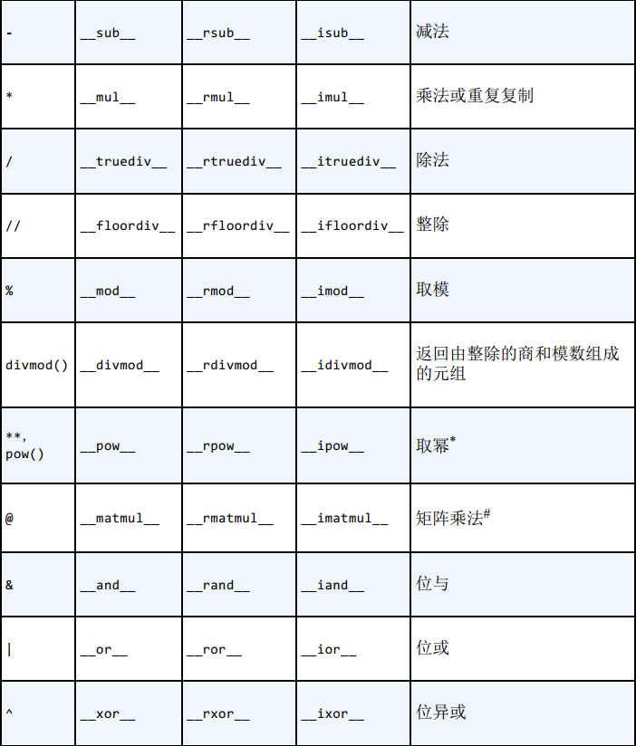 </center>   

<center> 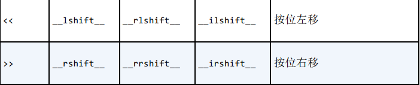 </center>   


### 13.5 众多比较运算符  

pythone解释器对比较运算符（== != > < >= <=）的处理与前边提到的+，*等在两个方面有重大区别：

正向调用和反向调用使用同一方法，比如==，正向调用和反向调用都是__eq__方法，只不过把参数对调了，对于>=，正向调用的__gt__方法内部是委托给反向的__lt__方法来实现的，也是参数对调。
对于==和!=来说，如果反向调用失败，python会比较对象的ID，而不抛出TypeError。

<center> 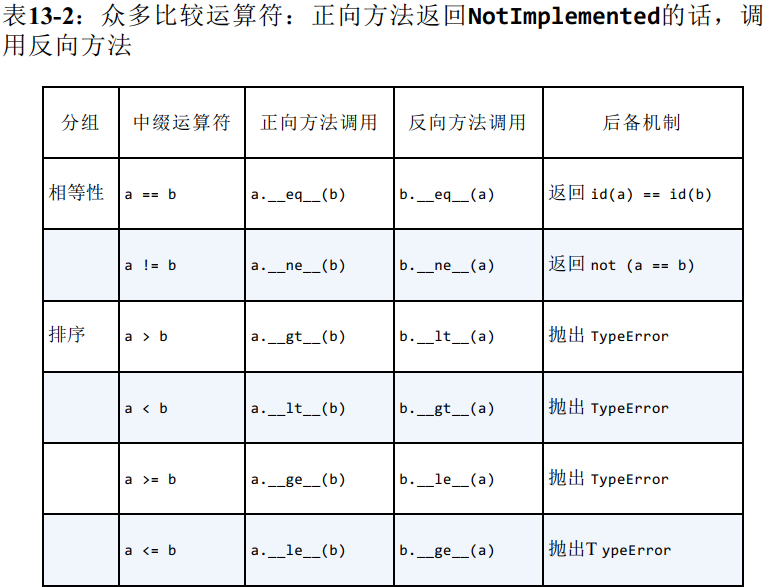 </center>   

```python
//vector_v8.py
    def __eq__(self, other):
        if isinstance(other, Vector):  # <1>
            return (len(self) == len(other) and
                    all(a == b for a, b in zip(self, other)))
        else:
            return NotImplemented  # <2>
```

* `NotImplemented` 是一个特殊的单例值，要 `return`；而 `NotImplementedError` 是一个异常，要 `raise`.
* Python 3.5 新引入了 `@` 运算符，用于点积乘法，对应的魔术方法是 [`__matmul__`](https://docs.python.org/3/reference/datamodel.html#object.__matmul__).
* 进行 `!=` 运算时，如果双方对象都没有实现 `__ne__`，解释器会尝试 `__eq__` 操作，并将得到的结果**取反**。s
* Python 在进行 `==` 运算时，如果运算符两边的 `__eq__` 都失效了，解释器会用两个对象的 id 做比较\_(:з」∠)\_。_书中用了“最后一搏”。


### 13.6 增量赋值运算符  

增量赋值运算符不会改变不可变目标，而是新键实例，然后重新绑定变量。    
不可变类型，如Vector类，一定不能实现就地特殊方法。    
如果一个类没有实现就地运算符对应的特殊方法比如__iadd__，那么增量赋值运算符只是语法糖，a += b与a = a + b完全等价。    

+=运算符对第二个操作数更宽容，+=是就地修改左操作数，结果类型是确定的，所有相当于是用右操作数扩展左操作数，比如对于序列类型，一般可迭代对象就可以做右操作数。


## 第五部分 控制流程

## 第14章 可迭代的对象、迭代器和生成器 

> 当我在自己的程序中发现用到了模式，我觉得这就表明某个地方出错了。程序的形式应该仅仅反映它所要解决的问题。代码中其他任何外加的形式都是一个信号，（至少对我来说）表明我对问题的抽象还不够深——这通常意味着自己正在手动完成事情，本应该通过写代码来让宏的扩展自动实现。
> ——Paul Graham, Lisp 黑客和风险投资人


迭代器模式:扫描内存中放不下的数据集时，要找到一种惰性获取数据项的方式，即按需一次获取一个数据项。
python为了抽象出迭代器模式，加入了关键字yield，这个关键字用于构建生成器。    
迭代器用于从一个集合中取出元素，生成器则用于凭空生成元素。   

迭代器在 Python 中并不是一个具体类型的对象，更多地使指一个具体**协议**。

python中所有的集合都是可迭代的，python语言内部，迭代器可以支持以下功能：
- for 循环
- 构建和扩展集合类型
- 逐行遍历文本文件
- 列表推导、字典推导和集合推导
- 元组拆包
- 调用函数时，使用*拆包实参

### 14.1 Sentence 类第1版：单词序列 

```python
import re
import reprlib
 
RE_WORD = re.compile('\w+') # 匹配字母数字下划线，重复一次或多次
 
class Sentence:
 
    def __init__(self, text):
        self.text = text 
        self.words = RE_WORD.findall(text) # 1
 
    def __getitem__(self, index):
        return self.words[index] # 2
 
    def __len__(self): # 3
        return len(self.words)
 
    def __repr__(self): 
        return 'Sentence(%s)' % reprlib.repr(self.text) # 4
 
s = Sentence('"The time has come,", the Walrus said,')
for word in s:
    print(word)
```

实现了__getitem__和__len__,可以按索引获取单词。

Python 解释器在迭代一个对象时，会自动调用 `iter(x)`。

**迭代器协议**  

内置的 `iter` 函数会做以下操作：
1. 检查对象是否实现了 `__iter__` 方法（`abc.Iterable`），若实现，且返回的结果是个迭代器（`abc.Iterator`），则调用它，获取迭代器并返回；
2. 若没实现，但实现了 `__getitem__` 方法（`abc.Sequence`），若实现则尝试从 0 开始按顺序获取元素并返回；
3. 以上尝试失败，抛出 `TypeError`，表明对象不可迭代。

判断一个对象是否可迭代，最好的方法不是用 `isinstance` 来判断，而应该直接尝试调用 `iter` 函数。    
白鹅类型认为：只要实现了__iter__方法（哪怕函数体直接pass，只要有这个函数名就行），那么就认为对象是可迭代的。    

### 14.2 可迭代的对象与迭代器的对比 

python从可迭代的对象中获取迭代器对象。

可迭代的对象：使用iter内置函数可以获取迭代器的对象。如果对象实现了能返回迭代器的__iter__方法，那么对象是可迭代的。序列都是可迭代的。实现了__getitem__方法，而且其参数是从零开始的索引，这种对象也可以迭代。


<center> 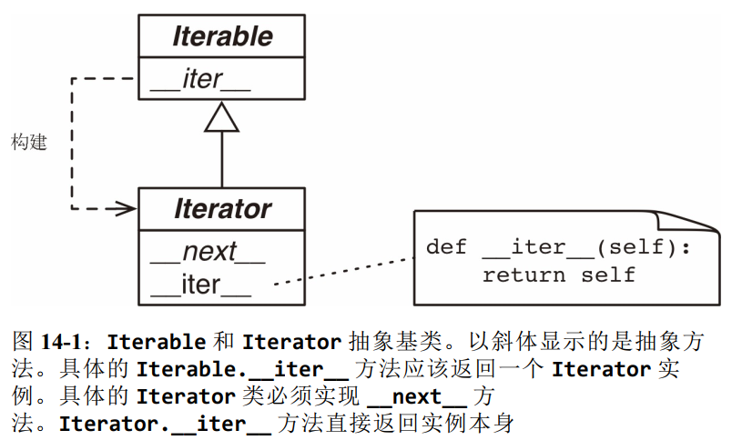 </center>   

迭代器定义如下，迭代器是这样的对象：
- 实现了无参数的__next__方法，返回序列中的下一个元素；
- 如果没有元素了，就抛出StopIteration异常；
- 实现了__iter__方法，因为只要实现了__iter__方法，那么对象就是可迭代的，因此迭代器也可以迭代，也是可迭代对象。


在《设计模式》一书中写到了迭代器模式的用途：    

- 访问一个聚合对象的内容而无需暴露它的内部表示
- 支持对聚合对象的多种遍历
- 为遍历不同的聚合结构提供一个统一的接口（即支持多态迭代）


可迭代对象：实现__iter__方法，该方法每次都实例化一个新的迭代器。     
迭代器：要实现__next__方法，每次返回单个元素，此外还要实现__iter__方法，返回迭代器本身。    

可迭代的对象一定不能是自身的迭代器，即可迭代的对象必须实现__iter__方法，但不能实现__next__方法。另一方面，迭代器应该一直可以迭代，迭代器的__iter__方法应该返回自身。

### 14.3 Sentence 类第2版：典型的迭代器 

```python
import re
import reprlib
 
RE_WORD = re.compile('\w+')
 
class Sentence:
 
    def __init__(self, text):
        self.text = text
        self.words = RE_WORD.findall(text)
 
    def __repr__(self):
        return 'Sentence(%s)' % reprlib.repr(self.text)
 
    def __iter__(self): # 1
        return SentenceIterator(self.words) # 2
 
class SentenceIterator:
 
    def __init__(self, words):
        self.words = words # 3
        self.index = 0 # 4
 
    def __next__(self):
        try:
            word = self.words[self.index] # 5
        except IndexError: 
            raise StopIteration() # 6
        self.index += 1 # 7
        return word # 8
 
    def __iter__(self): # 9
        return self
```

### 14.4 Sentence 类第3版：生成器函数 

实现相同功能，但却更pythonic的方式是：用生成器函数代替迭代器类SentenceIterator类。

```python
import re
import reprlib
 
RE_WORD = re.compile('\w+')
 
class Sentence:
 
    def __init__(self, text):
        self.text = text
        self.words = RE_WORD.findall(text)
 
    def __repr__(self):
        return 'Sentence(%s)' % reprlib.repr(self.text)
 
    def __iter__(self):
        for word in self.words: # 1
            yield word # 2
        return # 3
```

每次调用__iter__方法都会自动创建一个生成器，这里的__iter__方法实际上是一个生成器函数


**生成器函数的工作原理**

只要python函数的定义体中有yield关键字，该函数就是生成器函数。调用生成器函数时，会返回一个生成器对象，即生成器函数是生成器工厂。

生成器函数的内部工作机制为：

- 调用生成器函数会创建一个生成器对象，包裹生成器函数的定义体。
- 把生成器函数传给next()函数时，生成器函数会向前，执行函数定义体中的写一个yield语句，返回产出的值，并在函数定义体的当前位置暂停。
- 最终函数定义体执行完毕返回时，外层的生成器对象会抛出StopIteration异常。 

```python
>>> def gen_AB(): # ➊
... print('start')
... yield 'A' # ➋
... print('continue')
... yield 'B' # ➌
... print('end.') # ➍
...
>>> for c in gen_AB(): # ➎
... print('-->', c) # ➏
...
start ➐
--> A ➑
continue ➒
--> B ➓
end. ⓫
>>> ⓬
```

### 14.5 Sentence 类第4版：惰性实现  

```python
import re
import reprlib
RE_WORD = re.compile('\w+')
class Sentence:
	def __init__(self, text):
		self.text = text ➊
	def __repr__(self):
		return 'Sentence(%s)' % reprlib.repr(self.text)
	def __iter__(self):
		for match in RE_WORD.finditer(self.text): ➋
			yield match.group() ➌
```

前三版Sentence类设计都不具有惰性，因为__init__方法急迫地都见好了文本中的单词列表self.words，这样就得处理整个文本，非常占内存。

re.finditer函数是re.findall函数的惰性版本，返回的不是列表，而是一个生成器，按需生成re.MatchObject实例。如有有很多匹配，re.finditer函数能节省大量内存。

### 14.6 Sentence 类第5版：生成器表达式

生成器表达式可以理解为列表推导式的惰性版本：不会迫切地构建列表，而是返回一个生成器，按需惰性生成元素。也就是说，列表推导是制造列表的工厂，生成器表达式是制造生成器的工厂。

```python
import re
import reprlib
RE_WORD = re.compile('\w+')
	class Sentence:
		def __init__(self, text):
			self.text = text
		def __repr__(self):
			return 'Sentence(%s)' % reprlib.repr(self.text)
		def __iter__(self):
			return (match.group() for match in RE_WORD.finditer(self.text))
```

__iter__不再是生成器函数了，没有用yield，而是使用生成器表达式构建的生成器。

生成器表达式是语法糖：完全可以替换成生成器函数，只不过有时候用生成器表达式更方便。

### 14.7 何时使用生成器表达式

如果生成器表达式要分成多行写，那么请使用生成器函数写。    
此外，生成器函数可以使用多个语句实现更复杂的逻辑，也可以作为协程使用。    
且生成器函数有名称，因此可以重用。   

### 14.8 另一个示例：等差数列生成器 

```python
class ArithmeticProgression:
	def __init__(self, begin, step, end=None): ➊
		self.begin = begin
		self.step = step
		self.end = end # None -> 无穷数列
	def __iter__(self):
		result = type(self.begin + self.step)(self.begin) ➋
		forever = self.end is None ➌
		index = 0
		while forever or result < self.end: ➍
			yield result ➎
			index += 1
			result = self.begin + self.step * index ➏

```

**使用itertools模块生成等差数列**

python3.4的itertools模块提供了19个生成器函数。

itertools.count：返回的生成器能生成多个数，会生成从零开始的整数数列，也可以提供start和step值。
itertools.takewhile函数可以生成一个使用另一个生成器的生成器，在指定的条件计算结果为False时停止。

```python
 gen = itertools.takewhile(lambda n: n < 3, itertools.count(1, .5)
```

### 14.9 标准库中的生成器函数

python标准库提供了很多生成器，有用于逐行迭代纯文本文件的对象，还有出色的os.walk函数。这个函数在遍历目录树的过程中产出文件名，因此递归搜索文件系统像for循环那样简单。

**1 用于过滤的生成器函数**

从输入的可迭代对象中产出元素的子集，而不修改元素本身。如同itertools.takewhile函数一样，大多数用于过滤的生成器函数都接受一个断言参数，该参数是个布尔函数，有一个参数，会应用到输入中的每个元素上，用于判断是否将元素包含在输出中。

<center> 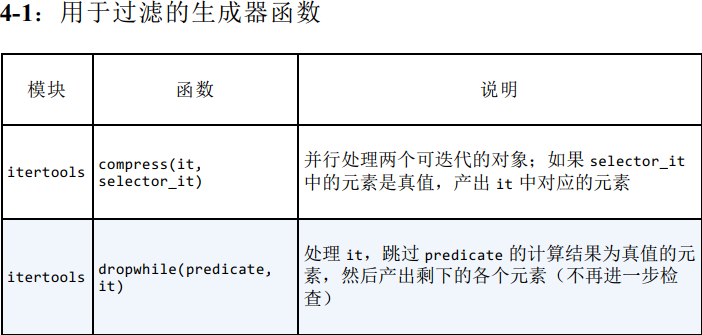 </center>  

<center> 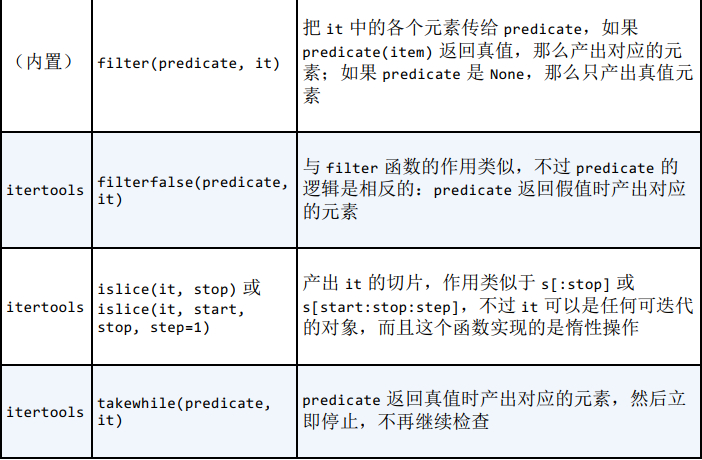 </center>  

**2 用于映射的生成器函数**

<center> 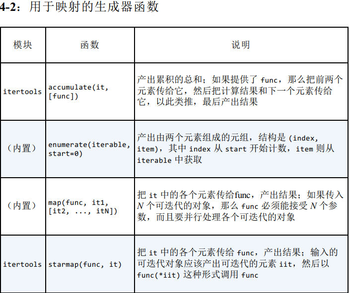 </center> 

**3 用于合并的生成器函数**

<center> 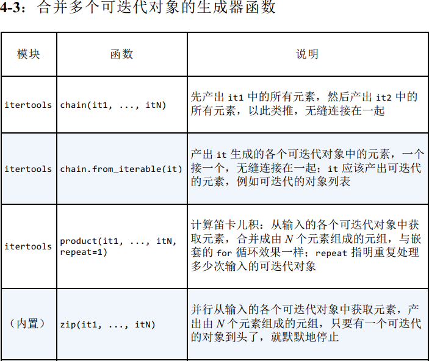 </center> 

<center> 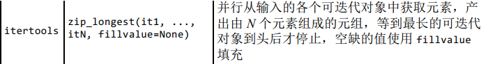 </center> 

itertools.product生成器函数是计算笛卡尔积的惰性方式.

**4 用于扩展输入的可迭代对象的生成器函数**

<center> 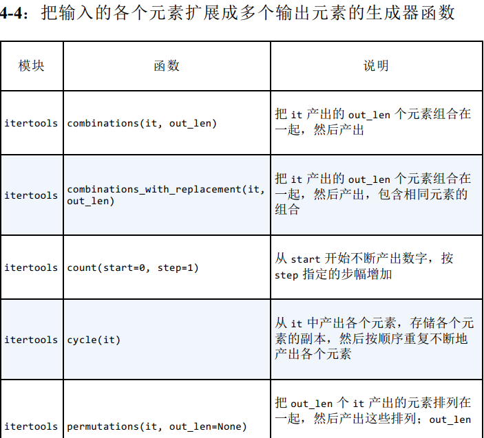 </center> 

<center> 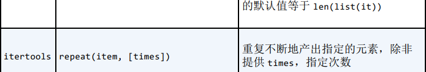 </center> 

itertools模块中的count和repeat函数返回的生成器可以无中生有：即不接受可迭代对象作为参数。cycle生成器会备份输入的可迭代对象，然后重复产出对象中的元素。    
combinations、comb、permutations生成器函数，连同product函数，称为组合学生成器。    

**5 用于重新排列元素的生成器函数**

<center> 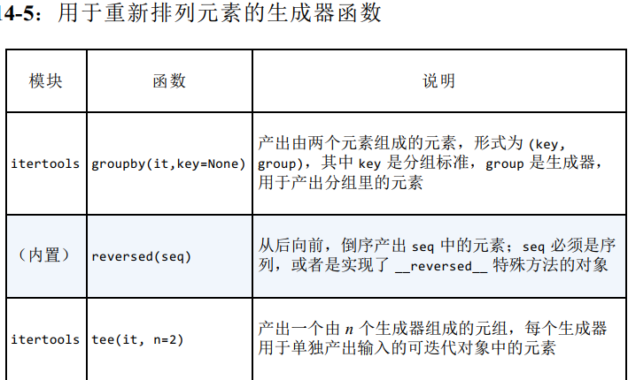 </center>

itertools.groupby假定输入的可迭代对象要使用分组的标准排序

# 实用模块
import itertools

# takewhile & dropwhile
print(list(itertools.takewhile(lambda x: x < 3, [1, 5, 2, 4, 3])))
print(list(itertools.dropwhile(lambda x: x < 3, [1, 5, 2, 4, 3])))
# zip
print(list(zip(range(5), range(3))))
print(list(itertools.zip_longest(range(5), range(3))))

# itertools.groupby
animals = ['rat', 'bear', 'duck', 'bat', 'eagle', 'shark', 'dolphin', 'lion']
# groupby 需要假定输入的可迭代对象已经按照分组标准进行排序（至少同组的元素要连在一起）
print('----')
for length, animal in itertools.groupby(animals, len):
    print(length, list(animal))
print('----')
animals.sort(key=len)
for length, animal in itertools.groupby(animals, len):
    print(length, list(animal))
print('---')
# tee
g1, g2 = itertools.tee('abc', 2)
print(list(zip(g1, g2)))
```

### 14.10 Python 3.3 中新出现的句法： yield from 

用yield from 句法可以取代内层循环；使用yield from 后加上可迭代对象，可以把可迭代对象中的元素一个个yield出来。

​```python
>>> def chain(*iterables):
... 	for it in iterables:
... 		for i in it:
... 			yield i
...
>>> s = 'ABC'
>>> t = tuple(range(3))
>>> list(chain(s, t))
['A', 'B', 'C', 0, 1, 2]
```

优化后：

```python
>>> def chain(*iterables):
... 	for i in iterables:
... 		yield from i
...
>>> list(chain(s, t))
['A', 'B', 'C', 0, 1, 2]
```

 但yield from并不只是一个语法糖，yield from 还会创建通道，把内层生成器直接与外层生成器的客户端联系起来。把生成器当成协程使用时，这个通道特别重要，不仅能为客户端代码生成值，还能使用客户端代码提供的值

### 14.11 可迭代的归约函数 

规约函数都接受一个可迭代的对象，然后返回单个结果。下边列出的每个内置函数都可以使用functools.reduce函数实现，内置是因为它们便于解决常见的问题。此外，对all和any函数来说，相比reduce函数有优化，即这两个函数会短路，一旦确定结果就立即停止使用迭代器。

<center> 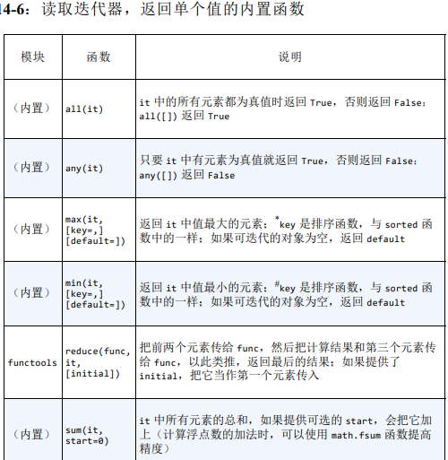 </center>

sorted：虽然sorted不是生成器函数，但是因为太重要还是放在这里对比。内置函数sorted可以接受任意的可迭代对象（当然，必须是最终会停止的可迭代对象，否则函数会一直收集元素永远无法返回结果），sorted会构建并返回真正的列表，毕竟要读取可迭代对象中的每一个元素才能够排序，而且排序的对象是列表。


### 14.12 深入分析 iter 函数

iter函数还有一个鲜为人知的用法：传入两个参数，使用普通函数或任何可调用对象创建迭代器。第一个参数必须是可调用对象，用于不断调用（没有参数），产出各个值；第二个值是哨符，即标记值，当第一个参数，即可调用对象返回这个值时，触发迭代器抛出StopIteration异常，而不产出哨符。

```python
>>> def d6():
... return randint(1, 6)
...
>>> d6_iter = iter(d6, 1)
>>> d6_iter
<callable_iterator object at 0x00000000029BE6A0>
>>> for roll in d6_iter:
... print(roll)
...
```

### 14.13 案例分析：在数据库转换工具中使用生成器 

### 14.14 把生成器当成协程  


​          

## 第15章 上下文管理器和 else 块

### 15.1 先做这个，再做那个： if 语句之外的 else 块  

else子句不仅能在if语句中使用，还能在for、while、try语句中使用，但在这些语句中使用时与if/else中的语义差别很大：    
- for/else。仅当for循环运行完毕时（即for循环没有被break语句中止），才运行else模块。
- while/else。仅当while循环因为循环条件为假值而退出时（即while循环没有被break语句中止），才运行else块。
- try/else。仅当try块中没有异常抛出时才运行else块，且else子句抛出的异常不会由前面的except子句处理。

## try 和 else
为了清晰和准确，`try` 块中应该之抛出预期异常的语句。因此，下面这样写更好：
```python
try：
    dangerous_call()
    # 不要把 after_call() 放在这里
    # 虽然放在这里时的代码运行逻辑是一样的
except OSError:
    log('OSError')
else:
    after_call()
```

EAFP：easier to ask for forgiveness than permission，取得原谅比获得许可容易。即先假定可以正常执行，如果假定不成立，即抛出了异常，那么捕获异常进行处理。需要使用很多的try/except。    
LBYL: look before you leap，三思而后行。通常用大量的if语句进行判断，判断成功才执行。    

### 15.2 上下文管理器和 with 块    

with语句和上下文管理器，with语句会设置一个临时的上下文，交给上下文管理器对象控制，并且负责清理上下文。

with语句的目的是简化try/finally模式。try/finally模式用于保证try模块中代码运行完毕后执行finally模块中的操作，即便try模块中代码由于异常、return语句或sys.exit()调用而中止，也会执行finally模块中的操作。finally子句中的代码通常用于释放重要的资源，或者还原临时变更的状态。

上下文管理器协议包含__enter__和__exit__两个方法，只要实现了__enter__和__exit__这两个方法，就能作为with语句块中的上下文管理器对象使用。   
with语句开始运行时，会在上下文管理器对象上调用__enter__方法。with语句运行结束后，会在上下文管理器对象上调用__exit__方法，__exit__方法来扮演finally子句的角色。


最常见的例子就是确保关闭文件对象。
```python
>>> with open('mirror.py') as fp: # ➊
... src = fp.read(60) # ➋
...
>>> len(src)
60
>>> fp # ➌
<_io.TextIOWrapper name='mirror.py' mode='r' encoding='UTF-8'>
>>> fp.closed, fp.encoding # ➍
(True, 'UTF-8')
>>> fp.read(60) # ➎
Traceback (most recent call last):
File "<stdin>", line 1, in <module>
ValueError: I/O operation on closed file.

```

即with把with块对象的__enter__方法的返回值绑定到as自己的fp上

不管控制流程以哪种方式退出with块，都会在上下文管理器对象（上边例子中即open函数返回的TextIOWrapper对象）调用__exit__方法，而不是在__enter__方法返回的对象上调用（但是上边例子中上下文管理器对象与__enter__返回的对象是同一个）。

with语句的as子句是可选的，对open函数来说，必须加上as子句，以便获取文件的引用。不过有些上下文管理器会返回None，因为没什么有用的对象能提供给用户。


```python
class LookingGlass:
	def __enter__(self): ➊
		import sys
		self.original_write = sys.stdout.write ➋
		sys.stdout.write = self.reverse_write ➌
		return 'JABBERWOCKY' ➍
	def reverse_write(self, text): ➎
		self.original_write(text[::-1])
		
	def __exit__(self, exc_type, exc_value, traceback): ➏
		import sys ➐
		sys.stdout.write = self.original_write ➑
		if exc_type is ZeroDivisionError: ➒
			print('Please DO NOT divide by zero!')
			return True ➓
```

解释器调用`__enter__`方法时，除了隐式的self之外，不会传入任何参数。    
传给`__exit__`方法的三个参数如下：    
- exc_type，异常类，例如ZeroDivisionError。   
- exc_value，异常实例，有时会有参数传给异常构造方法，例如错误消息，这些参数可以使用exc_value.args获取。   
- traceback，trackback对象。   


### 15.3 contextlib 模块中的实用工具

contextlib模块提供一些使用工具，帮助创建上下文管理器类。

- closing，如果对象提供了close()方法，但是没有实现`__enter__`/`__exit__`协议，那么可以使用这个函数构建上下文管理器。
- suppress，构建临时忽略指定异常的上下文管理器。
- @contextmanager，这个装饰器把简单的生成器函数变成上下文管理器，这样就不用创建类去实现管理器协议了。
- ContexDecorator，这是个基类，用于定义基于类的上下文管理器，这种上下文管理器也能用于装饰函数，在受管理的上下文中运行整个函数。
- ExitStack，这个上下文管理器能进入多个上下文管理器，with块结束时，ExitStack按照后进先出的顺序调用栈中各个上下文管理器的`__exit__`方法。如果事先不知道with块要进入多少个上下文管理器，可以使用这个类，比如同时打开任意一个文件列表中的所有文件。

这些工具中使用最广泛的是@contextmanager装饰器，其有迷惑人的一面，即它与迭代无关，却要使用yield语句，由此可以引出协程。 

### 15.4 使用 @contextmanager            

@contextmanager装饰器能减少创建上下文管理器类的代码量，因为不用编写一个完整的类去实现`__enter__`和`__exit__`方法，而只需实现一个有yield语句的生成器，生成想让`__enter__`方法返回的值。

在使用@contextmanager装饰的生成器中，yield语句的作用是把函数的定义体分为两部分：

1 yield语句前面的所有代码在with块开始，即解释器调用`__enter__`方法时执行。
2 yield语句后边的代码在with块结束时，即调用`__exit__`方法时执行。

```python
import contextlib
@contextlib.contextmanager ➊
def looking_glass():
	import sys
	original_write = sys.stdout.write ➋
	def reverse_write(text): ➌
		original_write(text[::-1])
		
	sys.stdout.write = reverse_write ➍
	yield 'JABBERWOCKY' ➎
	sys.stdout.write = original_write ➏
```

contextlib.contextmanager装饰器会把函数包装成实现了`__enter__`和`__exit__`方法的类。

类的名称是_GnegeratorContextManager，其`__enter__`方法有如下作用：
- 1 调用生成器函数，保存生成器对象gen。
- 2 调用next(gen），执行到yield关键字所在的位置。
- 3 返回next(gen)产出的值，以便把产出的值绑定到with/as语句中的目标变量上。

with块终止时，`__exit__`方法会做以下几件事：
- 1 检查有没有异常传给exc_type，如果有，调用gen.throw(exception)，在生成器函数定义体中包含yield关键字的那一行抛出异常。
- 2 否则，调用next(gen)，继续执行生成器函数定义体中yield语句之后的代码。


## 第16章 协程

### 16.1 生成器如何进化成协程            
### 16.2 用作协程的生成器的基本行为            
### 16.3 示例：使用协程计算移动平均值            
### 16.4 预激协程的装饰器            
### 16.5 终止协程和异常处理            
### 16.6 让协程返回值            
### 16.7 使用 yield from            
### 16.8 yield from 的意义            
### 16.9 使用案例：使用协程做离散事件仿真            
#### 16.9.1 离散事件仿真简介            
#### 16.9.2 出租车队运营仿真            

## 第17章 使用期物处理并发

### 17.1 示例：网络下载的三种风格            
#### 17.1.1 依序下载的脚本            
#### 17.1.2 使用 concurrent.futures 模块下载            
#### 17.1.3 期物在哪里            
### 17.2 阻塞型 I/O 和 GIL            
### 17.3 使用 concurrent.futures 模块启动进程            
### 17.4 实验 Executor.map 方法            
### 17.5 显示下载进度并处理错误            
#### 17.5.1 flags2 系列示例处理错误的方式            
#### 17.5.2 使用 futures.as_completed 函数            
#### 17.5.3 线程和多进程的替代方案            

## 第18章 使用 asyncio 包处理并发            
### 18.1 线程与协程对比            
#### 18.1.1 asyncio.Future ：故意不阻塞            
#### 18.1.2 从期物、任务和协程中产出            
### 18.2 使用 asyncio 和 aiohttp 包下载            
### 18.3 避免阻塞型调用            
### 18.4 改进 asyncio 下载脚本            
#### 18.4.1 使用 asyncio.as_completed 函数            
#### 18.4.2 使用 Executor 对象，防止阻塞事件循环            
### 18.5 从回调到期物和协程            
### 18.6 使用 asyncio 包编写服务器            
#### 18.6.1 使用 asyncio 包编写 TCP 服务器            
#### 18.6.2 使用 aiohttp 包编写 Web 服务器            
#### 18.6.3 更好地支持并发的智能客户端            


## 第六部分 元编程

## 第19章 动态属性和特性 

数据的属性和处理数据的方法统称属性attribute，即方法只是可调用的属性。除了这二者之外，我们还可以创建特性property，在不改变类接口的前提下，使用存取方法(即读值方法和设值方法)修改数据属性。 

python使用点号访问属性时，比如obj.attr，python解释器会调用特殊的方法（如`__getattr__`和`__setattr__`）计算属性。用户自定义的类可以通过`__getattr__`方法实现虚拟属性，当访问不存在的属性时，即时计算属性的值。
          
### 19.1 使用动态属性转换数据  

#### 19.1.1 使用动态属性访问 JSON 类数据   

```python
from urllib.request import urlopen
import warnings
import os
import json
URL = 'http://www.oreilly.com/pub/sc/osconfeed'
JSON = 'data/osconfeed.json'


def load():
	if not os.path.exists(JSON):
		msg = 'downloading {} to {}'.format(URL, JSON)
		warnings.warn(msg) ➊
		with urlopen(URL) as remote, open(JSON, 'wb') as local: ➋
			local.write(remote.read())
			
	with open(JSON) as fp:
		return json.load(fp) ➌
		
>>> feed = load() ➊
>>> sorted(feed['Schedule'].keys()) ➋
['conferences', 'events', 'speakers', 'venues']
>>> for key, value in sorted(feed['Schedule'].items()):
... print('{:3} {}'.format(len(value), key)) ➌

```

feed = json.load(fp)，feed是JSON的解析结果，feed本质是python的原生类型对象，即一个字典，里边嵌套着字典和列表，存储着字符串和整数。

```python
//使用属性表示法遍历嵌套的字典
from collections import abc
class FrozenJSON:
    """一个只读接口，使用属性表示法访问JSON类对象
    """
    def __init__(self, mapping):
        self.__data = dict(mapping) 
    def __getattr__(self, name): 
        # `__getattr__`特殊方法用于重载`.`符号获取值的行为
        if hasattr(self.__data, name):
            return getattr(self.__data, name) 
        else:
            return FrozenJSON.build(self.__data[name])

    @classmethod
    def build(cls, obj): 
        if isinstance(obj, abc.Mapping): 
            return cls(obj)
        elif isinstance(obj, abc.MutableSequence): 
            return [cls.build(item) for item in obj]
        else: 
            return obj
```

1 使用mapping参数创建一个字典，作为FrozenJSON类的实例属性。这样做目的有二：一是确保传入的是字典或者能转成成字典的对象，二是为安全起见创建了一个副本。    
2 仅当按实例属性---类属性---继承树搜寻不到指定名称的属性（数据属性和方法统称为属性）时才调用__getattr__方法。    
3 如果name是FrozenJSON类的实例属性__data的属性，返回那个属性。    
4 否则，从self.__data中获取name键对应的元素，返回调用FrozenJSON.build()方法得到的结果。    
5 用@classmethod修饰的方法是类方法，经常用这种方法来实现一个备选构造方法，比如这里的build就是一个备选构造方法。    
6 如果obj是映射，那么就构建一个FrozenJSON对象，    
7 如果是MutableSequence对象，这里必然是列表，因此把列表obj中的每个元素递归地传给build方法，列表推导式构建出一个列表。    
8 如果既不是字典也不是列表，那么原封不动地返回元素。    


​      
#### 19.1.2 处理无效属性名  

```python
    def __init__(self, mapping):
        self.__data = {}
        for key, value in mapping.items():
            if keyword.iskeyword(key):
                key += '_'
            self.__data[key] = value
```

检查传给FrozenJSON.__init__方法的映射中是否有键的名称是关键字，如果有，那么在键名后加上_，然后就可以直接grad.class_获取了。

#### 19.1.3 使用 `__new__` 方法以灵活的方式创建对象

通常把`__init__`成为构造方法，但实际上用于构建实例的是特殊方法`__new__`：这是个类方法（使用特殊方式处理，因此不必使用@classmethod装饰器），必须返回一个实例。

`__new__`返回的实例会作为第一个参数self传给`__init__`方法，调用`__init__`方法要传入实例，而且禁止返回任何值，所以`__init__`方法其实是初始化方法，真正的构造方法是`__new__`。一般情况下不需要自己编写`__new__`，因为从object类继承的实现已经够用了。   

```python
import keyword
from collections import abc
class FrozenJSON:
    """一个只读接口，使用属性表示法访问JSON类对象
    """
    def `__new__`(cls, arg): 
        if isinstance(arg, abc.Mapping):
            return super().`__new__`(cls)
        elif isinstance(arg, abc.MutableSequence): 
            return [cls(item) for item in arg]
        else:
            return arg
    def `__init__`(self, mapping):
        self.__data = {}
        for key, value in mapping.items():
            if keyword.iskeyword(key):
                key += '_'
            self.__data[key] = value

    def __getattr__(self, name): 
        # `__getattr__`特殊方法用于重载`.`符号获取值的行为
        if hasattr(self.__data, name):
            return getattr(self.__data, name) 
        else:
            return FrozenJSON.build(self.__data[name])
```

`__new__`方法也可以返回其他类的实例，此时解释器不会调用`__init__`方法。

1 `__new__`是类方法，第一个参数是类本身，余下的参数与`__init__`方法一样，只不过没有self。     
2 默认的行为是委托给超类的`__new__`方法，这里调用的是object基类的`__new__`方法，唯一的参数cls是FrozenJSON。     
3 `__new__`方法中余下的代码与原来的build一样。     
4 这里之前调用的是FrozenJSON.build方法，现在只需调用FrozenJSON构造方法即可。     

#### 19.1.4 使用 shelve 模块调整 OSCON 数据源的结构  

shelve.open高阶函数返回一个shelve.Shelf实例，这是简单的键值对象数据库，背后由dbm模块支持，具有以下特点：

```python
import shelve
db = shelve.open(DB_NAME) 
if CONFERENCE not in db:
    load_db(db)
speaker = db['speaker.3471']
type(speaker)
speaker.name, speaker.twitter
```

- shelve.Shelf是abc.MutableMapping的子类，因此提供了处理映射类型的重要方法。
- shelve.Shelf类提供了几个管理IO的方法，如sync和close；它也是一个上下文管理器。
- 只要把新值赋予键，就会保存键和值。
- 键必须是字符串。
- 值必须是pickle模块能处理的对象。
		  
#### 19.1.5 使用特性获取链接的记录       


### 19.2 使用特性验证属性            
#### 19.2.1 LineItem 类第1 版：表示订单中商品的类   


#### 19.2.2 LineItem 类第2 版：能验证值的特性    
```python
class LineItem:

    def `__init__`(self, description, weight, price):
        self.description = description
        self.weight = weight  # 这里使用了特性设值的方法
        self.price = price

    def subtotal(self):
        return self.weight * self.price

    @property
    def weight(self):
        return self.__weight

    # 被装饰的读值方法有个 .setter 属性，这个属性也是装饰器；这个
    # 装饰器把读值方法和设值方法绑定在一起。
    @weight.setter
    def weight(self, value):
        if value > 0:
            self.__weight = value
        else:
            raise ValueError('value must be > 0')
```

1 @property装饰器修饰读值方法。    
2 被装饰的读值方法有个.setter属性，这个属性也是装饰器，这个装饰器把读值方法和设值方法绑定在一起。    
        

**property类**
    
property 构造方法的完整签名如下：property(fget=None, fset=None, fdel=None, doc=None)    
```python 
weight = property(get_weight, set_weight) ➌
```

由于@装饰器语法比property出现的晚，因此最早的时候都是通过把读值与设值函数传给property类的前两个参数来实现特性。
		
### 19.3 特性全解析            
#### 19.3.1 特性会覆盖实例属性

特性都是类属性，但是特性管理的是实例属性的存取。

obj.attr这样的表达式不是从obj开始寻找attr的，而是从obj.`__class__`开始。仅当类中没有名为attr的特性时，python才会在obj实例中寻找。
         
#### 19.3.2 特性的文档       

控制台中help()函数或者IDE工具要显示特性的文档时，会从特性的`__doc__`属性中提取信息。
- 可以在调用property类的时候直接为特性对象设置文档字符串，只需传入`__doc__`参数即可：
- 使用装饰器创建property对象时，读值方法的文档字符串作为一个整体，变成特性的文档。

### 19.4 定义一个特性工厂函数 

如果我们的类中有两个实例属性都需要用特性来管理，那么对两个属性都分别实现读值与设值方法会使得代码重复，因此需要定义特性工厂函数quantity。

```python
def quantity(storage_name): ➊
	def qty_getter(instance): ➋
		return instance.__dict__[storage_name] ➌
	def qty_setter(instance, value): ➍
		if value > 0:
			instance.__dict__[storage_name] = value ➎
		else:
			raise ValueError('value must be > 0')
	return property(qty_getter, qty_setter) ➏
```

### 19.5 处理属性删除操作            

对象的属性可以使用del语句删除： del my_object.an_attribute

可以使用@my_property.deleter装饰器装饰一个方法，负责删除特性管理的属性。

```python
@member.deleter
def member(self):
	text = 'BLACK KNIGHT (loses {})\n-- {}'
	print(text.format(self.members.pop(0), self.phrases.pop(0)))
```

### 19.6 处理属性的重要属性和函数

#### 19.6.1 影响属性处理方式的特殊属性 


- `__class__`，对象所属类的引用（即obj.`__class__`与type(obj)的作用相同）。python的某些特殊方法比如`__getattr__`，只在对象的类中寻找，而不在实例中寻找。
- `__dict__`，一个映射，存储对象或类的可写属性。有__dict__属性的对象，任何时候都能随意设置新属性。如果类有`__slots__`属性，它的实例可能没有__dict__属性。
-  `__slots__`，类可以定义这个属性，限制实例能有哪些属性。`__slots__`属性的值是一个字符串组成的元素，指明允许有的属性。如果`__slots__`中没有`__dict__`，那么该类的实例中没有`__dict__`属性，实例只允许有指定名称的属性。


#### 19.6.2 处理属性的内置函数      

- dir([object])，列出对象的大多数属性。dir函数的目的是交互式使用，因此没有提供完整的属性列表。dir函数能审查有或没有__dict__属性的对象。dir函数不会列出`__dict__`属性本身，但会列出其中的键。dir函数也不会列出类的几个特殊属性，例如`__mro__`、`__bases__`和`__name__`。如果没有指定的object参数，dir函数会列出当前作用域中的名称。

- getattr(object, name[, default])，从object对象中获取name字符串对应的属性。获取的属性可能来自对象所属的类或超类。如果没有指定的属性，getattr函数抛出AttributeError异常，或者返回default参数的值。

- hasattr(object, name)，如果object函数中存在指定的属性，或者能以某种方式（如继承）通过object对象获取指定的属性，返回True。这个函数的实现方法是调用getattr(object, name)函数，看是否抛出AttributeError异常。
- setattr（object, name, value），把object对象指定属性的值设为value，前提是object对象能接受那个值，这个函数可能会创建一个新属性，或者覆盖现有的属性。
- vars([object])，返回object对象的`__dict__`属性，如果实例所属的类定义了`__slots__`属性，实例没有`__dict__`属性，那么vars函数不能处理那个实例，但是dir函数可以处理。如果没有指定参数，则vars函数与locals函数一定：返回表示本地作用域的字典。

#### 19.6.3 处理属性的特殊方法    

在用户自定义类中，使用点号或内置的getattr、hasattr、setattr函数存取属性都会触发下列对应的特殊方法，但是直接通过实例的`__dict__`属性读取属性不会触发这些特殊方法。

- `__delattr__`(self, name)，只要使用del语句删除属性，就会调用这个方法。例如 del obj.attr语句会触发 Class.`__delattr__`(obj, 'attr')。
- `__dir__`(self)，把对象传给dir函数时调用，dir(obj)触发Class.__dir__(obj)。
- `__getattr__`(self, name)，仅当获取指定属性失败，搜索过特性、obj、Class和超类之后调用。表达式obj.no_such_attr、getattr(obj, 'no_such_attr')和hasattr(obj, 'no_such_attr')可能会触发Class.`__getattr__`(obj, 'no_such_attr')方法，但是仅当找不到指定的属性时才会触发。
- `__getattribute__(self, name)，尝试获取指定的属性时总会调用这个方法，不过寻找的属性时特殊属性或特殊方法时除外。点号与getattr和hasattr内置函数会触发这个方法，调用`__getattribute__`方法且抛出AttributeError异常时，才会调用`__getattr__`方法。为了在获取obj实例的属性时不导致无限递归，`__getattribute__`方法的实现要使用super().__getattribute(obj, name)。
- `__setattr__`(self, name, value)，尝试设置指定的属性时会调用这个方法，点号和setattr内置函数会触发这个方法。例如obj.attr = 42和setattr(obj, 'attr', 42)都会触发Class.`__setattr__`(obj, 'attr', 42)方法。


## 第20章 属性描述符

> 学会描述符之后，不仅有更多的工具集可用，还会对 Python 的运作方式有更深入的理解，并由衷赞叹 Python 设计的优雅。  
> ——Raymond Hettinger, Python 核心开发者和专家


### 20.1 描述符示例：验证属性

描述符是对多个属性运用相同存取逻辑的一种方式。   描述符是实现了特定协议的类，这个协议包括__get__、__set__和__delete__方法。property类实现了完整的描述符协议。描述符是python的独有特征，不仅在应用层使用，在语言的基础设施中也有用到。  

描述符是实现了特定协议的类，这个协议包括 `__get__`、`__set__`、和 `__delete__` 方法。

有了它，我们就可以在类上定义一个托管属性，并把所有对实例中托管属性的读写操作交给描述符类去处理。
    
#### 20.1.1 LineItem 类第3 版：一个简单的描述符  

<center> 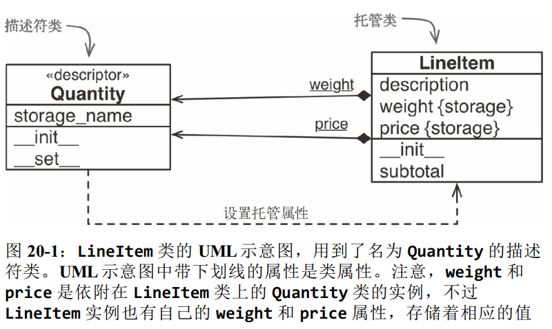 </center>   


- 描述符类，实现描述符协议的类。比如Quantity。
- 托管类，把描述符类的实例声明为类属性的类，比如LineItem类。
- 描述符实例，描述符类的各个实例，声明为托管类的类属性。
- 托管实例，托管类的实例，比如LineItem类的实例。
- 储存属性，托管实例中存储自身托管属性的属性，比如LineItem实例的weight和price两个实例属性都是储存属性。
- 托管属性，托管类中由描述符实例处理的公开属性，值存储在储存属性中。

描述符基于协议实现，无需继承某抽象基类。
          
#### 20.1.2 LineItem 类第4 版：自动获取储存属性的名称    
        
#### 20.1.3 LineItem 类第5 版：一种新型描述符  

<center> 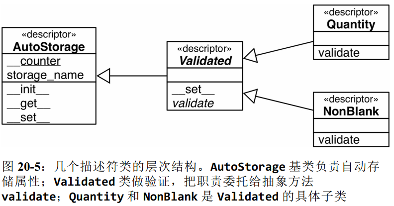 </center>   

```python
# model.py
import abc

class AutoStorage:
    __counter = 0

    def __init__(self):
        cls = self.__class__
        prefix = cls.__name__
        index = cls.__counter
        self.storage_name = f'_{prefix}#{index}'
        cls.__counter += 1

    def __get__(self, instance, owner):
        if instance is None:
            return self
        else:
            return getattr(instance, self.storage_name)

    def __set__(self, instance, value):
        setattr(instance, self.storage_name, value)


class Validated(abc.ABC, AutoStorage):
    def __set__(self, instance, value):
        value = self.validate(instance, value)
        super().__set__(instance, value)

    @abc.abstractmethod
    def validate(self, instance, value):
        '''return validated value or raise ValueError'''
        pass


class Quantity(Validated):
    """a number bigger than zero"""

    def validate(self, instance, value):
        if value <= 0:
            raise ValueError('value must > 0')
        return value


class NoneBlank(Validated):
    '''a string with at least one none-space character'''

    def validate(self, instance, value):
        value = value.strip()
        if len(value) == 0:
            raise ValueError('value cannot be empty or blank')
        return value
		
import model

class LineItem:
    weight = model.Quantity()
    price = model.Quantity()

    def __init__(self, description, weight, price):
        self.description = description
        self.weight = weight
        self.price = price

    def subtotal(self):
        return self.weight * self.price


if __name__ == '__main__':
    item = LineItem('test', 10, 20)
    print(LineItem.weight)
    print(f'weight:{item.weight}, price:{item.price}')
    print(getattr(item, '_Quantity#0'), getattr(item, '_Quantity#1'))
    '''
    <__main__.Quantity object at 0x000002D5D1C8B9B0>
    weight:10, price:20
    10 20
    '''
```

AutoStorage：自动管理储存属性的描述符类。    

Validated：扩展AutoStorage类的抽象子类，覆盖__set__ 方法，调用必须由子类实现的validate方法。    

Validated、Quantity和NonBlank三个类之间的关系体现了模板方法设计模式。具体而言，Validated.__set__方法是这种模板方法的例证：一个模板方法用一些抽象的操作定义一个算法，而子类将重定义这些操作以提供具体的行为。       

描述符的典型用途------管理数据属性。这种描述符也叫覆盖型描述符，因为描述符的__set__方法使用托管实例中的同名属性覆盖了要设置的属性。也有非覆盖型描述符。
          
### 20.2 覆盖型与非覆盖型描述符对比           
 
python中存取属性的方式不对等，通过实例读取属性时，通常返回的是实例中定义的属性，但是如果没有指定的实例属性，那么会获取类属性。而为实例中的属性赋值时，如果没有指定的实例属性，则通常会在实例中创建属性，不会影响到类。 

#### 20.2.1 覆盖型描述符  

实现__set__方法的描述符属于覆盖型描述符。因为虽然描述符实例是类属性，但是实现__set__方法的话，会覆盖对实例属性的赋值操作。特性也是覆盖型描述符：如果没有提供设值函数，property类中的__set__方法会抛出AttributeError异常，指明那个属性是只读的。

```python
>>> obj = Managed() ➊
>>> obj.over ➋
-> Overriding.__get__(<Overriding object>, <Managed object>,
<class Managed>)
>>> Managed.over ➌
-> Overriding.__get__(<Overriding object>, None, <class Managed>)
>>> obj.over = 7 ➍
-> Overriding.__set__(<Overriding object>, <Managed object>, 7)
>>> obj.over ➎
-> Overriding.__get__(<Overriding object>, <Managed object>,
<class Managed>)
>>> obj.__dict__['over'] = 8 ➏
>>> vars(obj) ➐
{'over': 8}
>>> obj.over ➑
-> Overriding.__get__(<Overriding object>, <Managed object>,
<class Managed>)
```
  
#### 20.2.2 没有 __get__ 方法的覆盖型描述符 

覆盖型描述符也可以只实现__set__方法，此时，只有写操作由描述符处理。因为没有处理读操作的__get__方法，当读取对应属性的时候，实例属性会遮盖描述符。
          
#### 20.2.3 非覆盖型描述符

没有实现__set__方法的描述符是非覆盖型描述符。如果设置了同名的实例属性，再通过对象给指定属性赋值时，描述符会被遮盖。

#### 20.2.4 在类中覆盖描述符

不管描述符是不是覆盖型，为类属性赋值都能覆盖描述符。这是一种猴子补丁技术。
            
### 20.3 方法是描述符 

```python
>>> obj = Managed()
>>> obj.spam ➊
<bound method Managed.spam of <descriptorkinds.Managed object at 0x74c80c>>
>>> Managed.spam ➋
<function Managed.spam at 0x734734>
>>> obj.spam = 7 ➌
>>> obj.spam
7
```

- 1 obj.spam 获取的是绑定方法对象。    
- 2 但是 Managed.spam 获取的是函数。    
- 3 如果为 obj.spam 赋值，会遮盖类属性，导致无法通过 obj 实例访问 spam 方法。


- 通过托管类访问时，函数的__get__方法会返回自身的引用。
- 通过实例访问时，函数的__get__方法会返回绑定方法对象，即一种可调用的对象，里面包装着函数，并把托管实例obj绑定给函数的第一个参数。


- 在类中定义的函数属于绑定方法(bound method)，因为用户定义的函数都有__get__方法，所以依附到类上时，就相当于描述符。因为只有__get__方法，没有__set__方法，因此方法是非覆盖型描述符    
- 绑定方法对象还有个__call__方法，这个方法会调用__func__属性引用的原始函数，把函数的第一个参数设为绑定方法对象的__self__属性，这就是形参self的隐式绑定方式。    
- 函数会变成绑定方法，这是python语言底层使用描述符的最好例证。   

### 20.4 描述符用法建议 

- 使用特性以保持简单。内置的property类创建的其实是覆盖型描述符，__set__方法和__get__方法都实现了。特性的__set__方法默认抛出AttributeError：can't set attribute，因此创建只读属性最简单的方式是使用特性。
- 只读描述符必须有__set__方法。如果使用描述符类实现只读属性，则__get__和__set__两个方法都必须定义（即定义一个覆盖型描述符），否则实例的同名属性会遮盖描述符。只读属性的__set__方法只需抛出AttributeError异常并提供合适的错误消息。
- 用于验证的描述符可以只有__set__方法。__set__方法应该检查value参数获得的值，如果有效，使用描述符实例的名称为键，直接在托管实例的__dict__属性中设置。
- 仅有__get__方法的描述符可以实现高效缓存。如果只实现了__get__方法，那么创建的是非覆盖型描述符。这种描述符可用于执行某些耗费资源的计算，然后为实例设置同名属性，缓存结果。同名实例属性会遮盖描述符，因此后续访问会直接从实例的__dict__是修那个中获取值，而不会再触发描述符的__get__方法。

- 非特殊的方法可以被实例属性遮盖。由于函数和方法只实现了__get__方法（即非覆盖型描述符），他们不会处理同名实例属性的赋值操作。因此像my_obj.the_method = 7 这样简单赋值之后，后续通过该实例访问the_method得到的是数字7，但是不影响类或者其他实例对the_method的访问。但是，特殊方法不受这个问题的影响，repr(x)执行的其实是x.__class__.__repr__(x)，即特殊方法都是通过类来调用的。


### 20.5 描述符的文档字符串和覆盖删除操作            

## 第21章 类元编程 

类元编程是指在运行时创建或定制类的技艺。python中类是一等对象，因此任何时候都可以使用函数新建类，而无需使用class关键字。类装饰器也是函数，不过能够审查、修改甚至把被装饰的类替换成其他类。

最后，元类是类元编程最高级的工具：使用元类可以创建具有某种特质的全新类种，比如抽象基类。

除非开发框架，否则不要编写元类。

### 21.1 类工厂函数

最常见的类工厂函数比如collections.namedtuple，我们把一个类名和几个属性名传给这个函数，它就会创建一个tuple的子类，其中元素可以通过名称获取，即具名元组，也可以认为是不可变的字典。 

像 `collections.namedtuple` 一样，类工厂函数的返回值是一个类，这个类的特性（如属性名等）可能由函数参数提供。  
可以参见[官方示例](https://github.com/fluentpython/example-code/blob/master/21-class-metaprog/factories.py)。  
原理：使用 `type` 构造方法，可以构造一个新的类。

```python
def record_factory(cls_name, field_names):
    try:
        field_names = field_names.replace(',', ' ').split()  # <1>
    except AttributeError:  # no .replace or .split
        pass  # assume it's already a sequence of identifiers
    field_names = tuple(field_names)  # <2>

    def __init__(self, *args, **kwargs):  # <3>
        attrs = dict(zip(self.__slots__, args))
        attrs.update(kwargs)
        for name, value in attrs.items():
            setattr(self, name, value)

    def __iter__(self):  # <4>
        for name in self.__slots__:
            yield getattr(self, name)

    def __repr__(self):  # <5>
        values = ', '.join('{}={!r}'.format(*i) for i
                           in zip(self.__slots__, self))
        return '{}({})'.format(self.__class__.__name__, values)

    cls_attrs = dict(__slots__ = field_names,  # <6>
                     __init__  = __init__,
                     __iter__  = __iter__,
                     __repr__  = __repr__)

    return type(cls_name, (object,), cls_attrs)  # <7

```       
    
把三个参数传给type是动态创建类的常用方式。通常我们把type当成函数用，type(my_object)获取对象所属的类，作用与my_object.__class__相同。然而type实际上是一个类，当成类使用时，传入三个参数可以新建一个类（type的三个参数分别是name、bases和dict，dict是一个字典，指定新类的属性名和值）：

type类的实例是类。
		   
### 21.2 定制描述符的类装饰器 

类装饰器与函数装饰器非常类似，是参数为类对象的函数，返回原来的类或修改后的类。    
类装饰器能以较简单的方式做到以前需要使用元类去做的事情------创建类时定制类。类装饰器有个重大缺点：只对直接装饰的类有效，这意味着被装饰的类的子类可能继承也可能不继承装饰器所作的改动，具体情况视改动的方式而定。    

```python
def entity(cls): ➊
	for key, attr in cls.__dict__.items(): ➋
		if isinstance(attr, Validated): ➌
			type_name = type(attr).__name__
			attr.storage_name = '_{}#{}'.format(type_name, key) ➍
	return cls ➎

import model_v6 as model

@model.entity  # <1>
class LineItem:
    description = model.NonBlank()
    weight = model.Quantity()
    price = model.Quantity()

    def __init__(self, description, weight, price):
        self.description = description
        self.weight = weight
        self.price = price

    def subtotal(self):
        return self.weight * self.price
```
  
         
### 21.3 导入时和运行时比较    

python程序员会区分导入时和运行时。

  导入时，解释器会从上到下一次性解析完.py模块的源码，然后生成用于执行的字节码。如果句法有错误，就在此时报告。如果本地的__pycache__文件夹中有最新的.pyc文件，解释器会跳过上述步骤，因为已经有运行所需的字节码了。

import语句，它不只是声明，在进程中首次导入模块时，还会运行所导入模块中的全部顶层代码，以后导入相同的模块则使用缓存，只做名称绑定

因此导入时和运行时之间的界限是模糊的：import语句可以触发任何运行时行为。  
        
### 21.4 元类基础知识

<center> 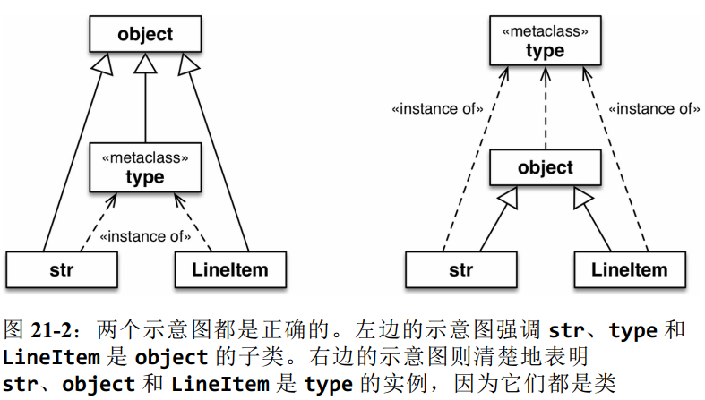 </center>   

元类是用于构建类的类。根据python对象模型，类也是对象，因此类肯定是另外某个类的实例。默认情况下，python中的类是type类的实例，即type是大多数内置类和用户定义的类的元类

<center> 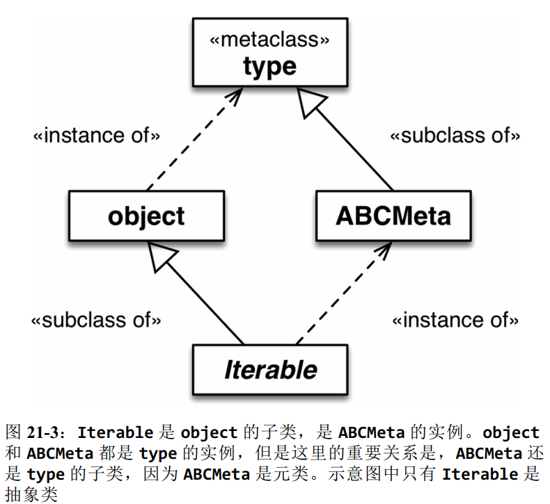 </center>   

object类和type类之间的关系很神奇：object类是type类的实例，而type类是object类的子类。这种神奇的关系没办法用python代码表述，因为定义其中一个之前另一个必须存在。type是自身的实例这一点也很神奇。

> `object` 类和 `type` 类的关系很独特：`object` 是 `type` 的实例，而 `type` 是 `object` 的子类。
所有类都直接或间接地是 `type` 的实例，不过只有元类同时也是 `type` 的子类，因为**元类从 `type` 类继承了构造类的能力**。

这里面的关系比较复杂，简单理一下
* 实例关系
    * `type` 可以产出类，所以 `type` 的实例是类（`isinstance(int, type)`）；
    * 元类继承自 `type` 类，所以元类也具有生成类实例的**能力**（`isinstance(Sequence, ABCMeta)`)
* 继承关系
    * Python 中一切皆对象，所以所有类都是 `object` 的子类（`object in int.__mro__`）
    * 元类要**继承**自 `type` 对象，所以元类是 `type` 的子类（`type in ABCMeta.__mro__`）

元类的作用举例：
* 验证属性
* 一次性把某个/种装饰器依附到多个方法上（记得以前写过一个装饰器来实现这个功能，因为那个类的 `metaclass` 被占了）
* 序列化对象或转换数据
* 对象关系映射
* 基于对象的持久存储
* 动态转换使用其他语言编写的结构


### 21.5 定制描述符的元类 
           
### 21.6 元类的特殊方法 __prepare__ 

解释器调用元类的__new__方法之前会先调用__prepare__方法，使用类定义体中的属性创建映射。__prepare__方法的第一个参数是元类，第二个参数是要构建的类的名称，第三个参数是基类组成的元组，返回值必须是映射。

```python
class EntityMeta(type):
	"""元类，用于创建带有验证字段的业务实体"""
	@classmethod
	def __prepare__(cls, name, bases):
		return collections.OrderedDict() ➊
	def __init__(cls, name, bases, attr_dict):
		super().__init__(name, bases, attr_dict)
		cls._field_names = [] ➋
		for key, attr in attr_dict.items(): ➌
			if isinstance(attr, Validated):
				type_name = type(attr).__name__
				attr.storage_name = '_{}#{}'.format(type_name, key)
				cls._field_names.append(key) ➍

class Entity(metaclass=EntityMeta):
"""带有验证字段的业务实体"""
	@classmethod
	def field_names(cls): ➎
		for name in cls._field_names:
			yield name

```
           
### 21.7 类作为对象 

类上有一些特殊属性，这些属性不会在 `dir()` 中被列出，访问它们可以获得类的一些元信息。  
同时，元类可以更改这些属性，以定制类的某些行为。

* `cls.__bases__`  
    由类的基类组成的元组
* `cls.__qualname__`  
    类或函数的限定名称，即从模块的全局作用域到类的点分路径
* `cls.__subclasses__()`  
    这个方法返回一个列表，包含类的**直接**子类
* `cls.__mro__`  
    类的方法解析顺序，这个属性是只读的，元类无法进行修改
* `cls.mro()`  
    构建类时，如果需要获取储存在类属性 __mro__ 中的超类元组，解释器会调用这个方法。元类可以覆盖这个方法，定制要构建的类解析方法的顺序。
         

        
