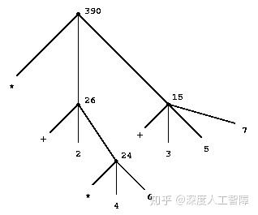

# [读书笔记]SICP计算机程序的构造和解释


 

接下来会看MIT Lisp版本的SICP，以下是找到的一些资源：

1. [课程主页](https://link.zhihu.com/?target=https%3A//ocw.mit.edu/courses/electrical-engineering-and-computer-science/6-001-structure-and-interpretation-of-computer-programs-spring-2005/index.htm)：是MIT 6.001的课程主页，包含一些和该课程相关的资源

2. [习题答案](https://link.zhihu.com/?target=http%3A//community.schemewiki.org/%3FSICP-Solutions)

3. 作业：包含5个[项目](https://link.zhihu.com/?target=https%3A//ocw.mit.edu/courses/electrical-engineering-and-computer-science/6-001-structure-and-interpretation-of-computer-programs-spring-2005/projects/)，以及16个[编程作业](https://link.zhihu.com/?target=https%3A//mitpress.mit.edu/sites/default/files/sicp/psets/index.html)

4. [课程安排](https://link.zhihu.com/?target=https%3A//ocw.mit.edu/courses/electrical-engineering-and-computer-science/6-001-structure-and-interpretation-of-computer-programs-spring-2005/calendar/)：列出了该课程的上课进度，可通过[这里](https://link.zhihu.com/?target=https%3A//ocw.mit.edu/courses/electrical-engineering-and-computer-science/6-001-structure-and-interpretation-of-computer-programs-spring-2005/readings/)获得课程和书本的对应关系

5. [翻译视频](https://link.zhihu.com/?target=https%3A//www.bilibili.com/video/av8515129%3Fp%3D1)：这应该是MIT 2005年这门课程的视频

6. 电子书：[官网电子书](https://link.zhihu.com/?target=https%3A//mitpress.mit.edu/sites/default/files/sicp/full-text/book/book-Z-H-4.html)、[HTML版本](https://link.zhihu.com/?target=https%3A//sarabander.github.io/sicp/html/index.xhtml%23SEC_Contents)

7. 一些大佬整理的资源：

8. 1. [DeathKing/Learning-SICP](https://link.zhihu.com/?target=https%3A//github.com/DeathKing/Learning-SICP)
   2. [Clement Li：学习SICP（《计算机程序的构造和解释》）的一些准备工作](https://zhuanlan.zhihu.com/p/34313034)
   3. [Scheme入门中文教程](https://link.zhihu.com/?target=http%3A//deathking.github.io/yast-cn/)


**已整理内容：**

- **第一章：构造过程抽象**

- - [1[B\]程序设计的基本元素](https://zhuanlan.zhihu.com/p/132339903)
  - [2[B\]过程及其产生的计算过程](https://zhuanlan.zhihu.com/p/133207399)
  - [3[B\]用高阶函数做抽象](https://zhuanlan.zhihu.com/p/133649892)

第一章主要介绍过程抽象，**主要想法**就是通过高阶过程来抽象出不同的“概念”，通过传递过程作为参数来得到针对特定问题的过程，或者将过程传入高阶过程返回封装好的过程，由此来对过程进行统一的修改。需要对现有方法抽象出抽象的概念，并通过高阶过程来产生具体过程。


- **第二章：构造数据抽象**

- - [4[B\]数据抽象引导](https://zhuanlan.zhihu.com/p/133908649)
  - [5[B\]层次性数据和闭包性质](https://zhuanlan.zhihu.com/p/134107643)
  - [6[B\]符号数据](https://zhuanlan.zhihu.com/p/135187554)
  - [7[B\]抽象数据的多重表示](https://zhuanlan.zhihu.com/p/135838042)
  - [8[B\]带有通用型操作的系统](https://zhuanlan.zhihu.com/p/136004085)

第二章主要介绍数据抽象，主要介绍以下内容：

- **抽象屏障**：需要通过抽象屏障将数据对象的使用与具体实现分隔开来，只通过选择函数和构造函数来沟通。同样也需要通过抽象屏障将数据对象的不同表示方法分隔开来，可以构建通用选择函数来同时处理不同表示方式的数据对象。

- **分层设计的形式：**在最底层设计出基本元素以及对基本元素进行变换的高阶过程，在第二层中基于基本元素设计出不同的组合方式获得新的基本元素，在最后一层中抽象出描述组合模式的高阶过程。

- **处理不同数据对象的过程：**首先需要将过程划分为：枚举、过滤/映射和累积，然后确定好约定的界面，在枚举中将数据对象转化为约定界面，使得后续过程在所有数据对象中都能通用。**优点：**选择一种合适的约定界面来连接不同的标准部件，使得我们能对这些标准部件进行模块化设计而无需考虑具体的数据结构（因为连接部件的界面是约定好的），由此来控制程序复杂度，使得我们能通过级联标准部件的方式来构建复杂的系统。

- **数据不同表示方法：**可以采用数据导向的方式构建通用选择函数，使得数据具有不同的表示方法：

- - **封装操作：**可以让数据增加标志，然后通用选择函数通过数据的标志判断是用什么表示方法，再采用特定的选择函数进行处理（构造函数要增加标志，通用选择函数只传递数据内容给特定的选择函数）
  - **封装表示方式：**可以将数据表示为过程，当传入选择函数名作为参数时，直接返回对应的数据。
  - **数据导向：**可以用一个二维表格来根据操作和表示方法保存特定的选择函数到特定的位置，然后根据传入的参数标志和需要的操作提取出对应的过程（特定选择函数直接写成处理数据内容的形式，因为通过数据标志确定要选取的操作后，会只传递数据内容给特定选择函数，但是构造函数要记得增加标志）。

- **通用型操作：**同样可以构建一个数据类型和操作名的二维表格，由此实现在不同数据类型下的通用操作。为了避免每次新增数据类型就要添加很多新的操作，而数据类型其实是有层次的，可以通过为为每个数据类型都定义一个`raise`操作，当表格中找不到传入数据类型个对应的操作时，就能尝试调用该数据的`raise`操作提升到更高一层的，再尝试寻找想要的操作。而为每个数据类型定义一个`drop`操作，可以在适当的时机将数据类型下降一定层次，可以得到交优的结果。

- **抽象数据的设计方法：**

- - 首先假设存在满足程序员对数据对象预期效果的构造函数和选择函数，基于构造函数和选择函数来实现上层过程，由此能无需考虑数据对象的具体实现。
  - 随后可以通过对构造函数和选择函数的具体实现来影响程序性能，而无需考虑基于此的上层过程。如果数据对象具有不同表示方法，则需要构建通用选择函数。
  - 可以将数据对象的操作添加到通用型操作中，需要对产生数据的过程添加上类型标志。


- **第三章：模块化、对象和状态**

- - [9[B\]赋值和局部状态](https://zhuanlan.zhihu.com/p/137665097)
  - [10[B\]求值的环境模型](https://zhuanlan.zhihu.com/p/137940157)

提高模块性、降低复杂性、抽象屏障。


# [读书笔记]SICP：1[B]程序设计的基本元素


根据[这里](https://zhuanlan.zhihu.com/p/37056659)下载配置好DrRacket来跑SICP上的源代码，以及[这里](https://link.zhihu.com/?target=http%3A//deathking.github.io/yast-cn/)来学习一些基础的Lisp内容。

感觉SICP的内容较为离散，比较难整理……感觉视频课程和书本内容也不是很对应，先把书本内容过一遍，再看视频吧。

本章对应于书中的1.1。

------

描述一种语言时，应该将注意力集中在语言的基本表达形式、组合方法和抽象方法。

------

这里打算学习有关计算过程的知识，使用程序设计语言Lisp，它一个**主要特征**是：计算过程的Lisp描述（又称过程）本身可作为Lisp的数据来表示和操作，由此使得Lisp称为编写那些要将其他程序当做数据去操作的程序的最佳语言，比如解释器和编译器。

程序设计语言为了能够将简单的认识组合起来形成更复杂的认识，提供了**三种机制：**

- **基本表达形式：**用于表示语言所关心的最简单的个体，比如数。
- **组合的方法：**通过它们可以从较简单的东西出发构造出复合的元素。
- **抽象的方法：**通过它们可以为复合对象命名，并将他们当做单元去操作。

程序设计语言必须能表述基本的数据和过程，还需提供对过程和数据进行组合和抽象的方法。

## 1 表达式

我们可以输入一个**表达式**，而解释器的响应就是将表达式**求值**结果显示出来。我们可以输入基本表达式，比如数，也可以用表示基本过程的表达式形式（比如+和*），将表示数的表达式组合起来，形成复合表达式，来表示求要把有关过程应用于这些数，这个称为**组合式**，构造方式就是用一对括号括起一些表达式，形成一个表，表示一个过程引用，表中最左侧的元素称为**运算符**，其他元素称为**运算对象**，这种形式称为**前缀表示**，它可以适用于可能带有任意个实参的过程，也可以对其扩展允许组合式嵌套。要得到组合式的值，就是将运算符刻画的过程应用于有关的**实际参数**，也就是那些运算对象的值。

## 2 命名和复合过程

程序设计语言需要提供一种通用名字去使用计算对象的方式，这个名字标识符称为**变量**，它的值也就是对应的**对象**，这里可以使用`define`完成

```scheme
(define <name> <value>)
```

对这个`define`的求值过程就是将名字``和对象``关联起来。此外还能得到一种强大的抽象技术——**过程定义**（就是定义函数），通过`define`可以为复合操作提供名字得到**复合过程**（也就是函数），这样就能将它的操作和基本运算一样作为一个单元来使用了。

```scheme
(define (<name> <formal parameters>) <body>)
```

对这个`define`的求值过程其实可以看成两步：首先创建一个过程``，然后将其和名字``进行关联。当应用这个过程时，``中由``定义的**形式参数**将用与之对应的**实际参数**取代，然后对取代后的表达式进行求值，得到这个**过程应用**的值。更一般的情况下，``可以是一系列表达式，解释器就按需对这些表达式进行求值，然后将最后一个表达式的值作为整个过程应用的值并返回。

> 过程应用就是应用该过程的过程

解释器为了保持有关的**名字-值**对偶的轨迹，它必须维护某种存储能力，称为**全局环境**，它的作用就是用来确定表达式中各个符号的意义，比如`+`、`-`、`1`等，为求值过程的进行提供了一种上下文。

它允许我们用一个简单的名字去引用一个组合运算的结果，通过它我们可以通过一系列交互式动作，逐步创建起所需的**名字-对象关联**，来一步步创建出越来越复杂的计算性对象，这就鼓励人们采用递增的方式去开发和调试程序。（简单到复杂逐步抽象）

本章的**目的**就是把与过程性思维有关的各种问题隔离出来。

## 3 求值过程

### 3.1 通用组合式求值

对于组合式求值，解释器提供了**两种求值方式：**

- **应用序求值：（先计算子表达式）**

- - 求值该组合式的各个子表达式
  - 将作为最左子表达式（运算符或复合过程）的值（运算符或复合过程表示的计算过程）的那个过程应用于相应的实际参数（其他子表达式的值，即运算对象）。

- **正则序求值：（有限替换，需要时才计算）**

- - 首先用运算对象表达式去代换形参
  - 直到得到一个只包含基本运算符的表达式再执行求值。

这种计算过程称为过程应用的**代换模型**，也就是确定过程应用“意义”的一种模型，用来帮助我们理解过程应用的情况。我们以以下代码为例

```scheme
(define (square x) (* x x))
(define (sum-of-square x y) (+ (square x) (square y)))
(define (f a) (sum-of-square (+ a 1) (* a 2)))
```

我们定义了若干个复合过程，当对`(f 5)`进行求值时，应用序求值过程为

```scheme
; 由于5是基本表达式，所以可以不用求值，直接将f中的形参a替换为5
(sum-of-square (+ 5 1) (* 5 2))
; 对两个运算对象进行求值
(sum-of-square 6 10)
; 将sum-of-square中的形参x替换为6，形参y替换为10
(+ (square 6) (square 10))
; 对两个运算对象进行求值，需要先对运算符求值，直接进行替换
(+ (* 6 6) (* 10 10))
; 对两个运算对象求值
(+ 36 100)
;得到最终结果
136
```

正则序求值过程为

```scheme
 ; 先进行代换
(sum-of-square (+ 5 1) (* 5 2))
(+ (square (+ 5 1)) (square (* 5 2)))
(+ (* (+ 5 1) (+ 5 1)) (* (* 5 2) (* 5 2)))
; 只包含基本运算符了，可以进行求值
(+ (* 6 6) (* 10 10))
(+ 36 100)
136
```

对于可以通过替换去模拟，并产生合法值的过程应用，这两个求值方法会产生相同结果。而Lisp采用应用序求值，可以提高效率。

此外，**应用序求值过程具有以下含义：**

- 通过第一步可以看出该求值过程是**递归**的。我们可以用树的形式来表示以下代码

```scheme
(* (+ 2 (* 4 6))
   (+ 3 5 7))
```



其中，每个**带分支节点**表示一个组合式，它的**分支**就对应于组合式中的运算符和运算对象，每个**终端节点**表示运算符或数值。从终端节点开始将运算对象的值一步步向上传递，就表示了组合式的求值过程，称为**树形积累**，也可以看成是对“求值”进行递归时的返回过程。

- 当执行完第一步时，其中一个组合式就变成了一个**基本表达式**，只包含：

- - **数：**它的值就是他所表示的数值
  - **其他名字：**它的值就是在环境中关联这个名字的对象
  - **内部运算符：**它的值就是能完成相应操作的机器指令序列，可以看成是“其他名字”的特殊形式。

> 基本表达式值包含数、内部运算符和其他名字

### 3.2 特殊形式

以上的求值过程是一般性的通用求值过程，还有一些**特殊形式**是不按照通用求值过程进行求值的，它们具有自身的求值规则，比如上文中的`define`

```scheme
(define <name> <value>)
(define (<name> <formal parameters>) <body>)
```

第一行的求值结果就是将符号``和值``进行关联。

第二行的求值过程时：首先创建一个过程``，然后将其和名字``进行关联。当应用这个过程时，``中由``定义的**形式参数**将用与之对应的**实际参数**取代，然后对取代后的表达式进行求值，得到这个**过程应用**的值。更一般的情况下，``可以是一系列表达式，解释器就按需对这些表达式进行求值，然后将最后一个表达式的值作为整个过程应用的值并返回。

此外还为检测提供了以下**特殊形式**的运算符：

```scheme
(cond
  (<p1> <e1>)
  (<p2> <e2>)
  ...
  (<pn> <en>)
  (else <e>)) 
```

其中`( )`称为**子句（clauses）**，``称为**谓词（predicate）**，``称为**序列表达式（consequent expression）**。对它求值的结果就是依次进入每个子句，对谓词进行求值，如果只为False，则对下一个子句的谓词进行求值，直到有一个谓词求值结果为True，就对其对应的序列表达式求值作为结果。如果没有谓词为True，则将`else`中的序列表达式的求值结果作为结果。

```scheme
(if <predicate> <consequent> <alternative>) 
```

是`cond`的受限版本，只有两种情况。也是先对``进行求值，如果结果为True，则将``的求值结果作为最终结果，否则将``的求值结果作为最终结果。

```scheme
(and <e1> ... <en>)
(or <e1> ... <en>) 
```

这是一组逻辑复合运算符。对于`and`，解释器会从左到右一个个对``进行求值，如果某个``为False，则不对后续的``进行求值，最终结果直接为False。对于`or`，解释器会从左到右一个个对``进行求值，如果某个``为True，则不对后续的``进行求值，最终结果直接为True。

还有一个不是特殊形式的逻辑复合运算

```scheme
(not <e>)
```

**常规过程和特殊形式的区别：**特殊形式具有自己的求值规则，而常规过程采用的是应用序求值或正则序求值顺序。如果将特殊形式定义为常规过程，就需要按照常规过程的求值方法进行求值，可能会出错。比如

```scheme
(define (iff <p> <c> <a>) (if <p> <c> <a>)) 
(define (tryif a) (if (= a 0) 1 (/ 1 0))) 
(define (tryiff a) (iff (= a 0) 1 (/ 1 0))) 
```

这里通过`iff`将特殊形式的if变为了常规过程，然后定义了两个函数，当我们执行以下过程时，会得到不同的结果

```scheme
> (tryif 0)
1
> (tryif 1)
. . /: division by zero
> (tryiff 0)
. . /: division by zero
> (tryiff 1)
. . /: division by zero
```

这是因为特殊形式的`if`会首先对`(= a 0)`进行求值，而常规过程的`iff`通常会使用应用序求值方法，则它的计算过程为

```scheme
(tryiff 0)
(iff (= a 0) 1 (/ 1 0)))
; 应用序求值会先对运算对象进行求值
(iff True 1 (/ 1 0)) ;当对第三个运算对象求值时，就报错了
```

而且如果在递归过程中我们使用常规过程的`iff`，则可能会由于无限展开造成内存溢出。

**综上：**对各种表达式的求值规则可以描述为一个简单的通用规则和一组针对不多的特殊形式的专门规则。

## 4 实例：采用牛顿法求平方根

首先要明确**数学函数与计算过程的区别**：是描述一件事情的特征，与描述如何去做这件事之间的普遍性差异。数学中人们关心说明性描述（是什么），而计算机中人们关心行动性描述（怎么做）。

比如求解一个数的平方根，在数学中可以描述为 ![[公式]](https://www.zhihu.com/equation?tex=%5Csqrt+x+%3D+the%5C+y%5C+such%5C+that%5C+y%5Cge+0%5C+and%5C+y%5E2%3Dx) ，它只告诉了你平方根是什么，但是它并没有提供如何计算平方根的方法，想要对其进行求解，就需要行动性描述

- 对结果进行猜测
- 对猜测进行更新
- 不断更新猜测直到猜测足够好

在计算机科学中，我们的任务就是形式化这种“如何做”的知识。这里可以用牛顿法来迭代逼近，不多加赘述，可以得到以下代码

```scheme
(define (sqrt x)
  (iter x 1.0))

(define (iter guess x)
  (if (good-enough? guess x)
      guess
      (iter x (improve x guess) x)))

(define (good-enough? guess x)
  (< (abs (- (square guess) x)) 0.001))

(define (improve x guess)
  (average guess (/ x guess)))

(define (average x y)
  (/ (+ x y) 2))
```

这里使用`good-enough?`过程来判断当前猜测的解`guess`是否足够好，如果不够好就调用`improve`函数继续迭代，否则就得到最终结果。

但是这里不好处理`x`极大或极小的情况，可以修改`good-enough?`方法

```scheme
(define (good-enough? guess old-guess)
  (< (abs(- guess old-guess)) (* guess 0.001)))
```

可以看到，以上平方根的计算过程可以分解为若干个子问题：怎么说一个猜测是足够好的，怎么去改进一个猜测等等。使得工作中的每一个都通过一个独立过程完成，整个`sqrt`程序可以看成一族过程。注意要保证这些子过程是完成一件可以清楚表明的工作，使得它们可以被用作定义其他过程的模块，而其他过程直接将其当做**黑箱**来使用，而无需关心内部是如何实现的，只需要关注过程计算的结果，这个称为**过程抽象**，由此也提供了构建更大更复杂系统的可能性。

> 使用黑箱技术，也需要保证你的算法更具普遍性

所以一个过程定义应该能隐藏一些细节，用户在使用时无需考虑是如何实现的，由此需要保证的一点就是：过程的意义应该不依赖于其作者为形式参数所选的名字。这就要求过程的形式参数名必须只局限在有关的过程体中，否则就需要了解该过程的内部实现（比如了解如何定义形式参数，避免冲突）才能使用，就不是黑箱了。实际上形式参数的意义是受到过程的定义来约束的，与它是什么名字无关，所以称为**约束变量**，它的定义被约束于的那一集表达式称为该名字的**作用域**，其他不受约束的变量称为**自由变量**，它们才能决定过程的意义。比如`good-enough?`中的`<`、`-`、`abs`和`square`是自由变量，而`good-enough?`的意义依赖于这些的含义。

此外，还能发现，我们在`sqrt`中定义的`good-enough?`过程只适合`sqrt`过程，如果别的过程也想要一个`good-enough?`过程用于判断，此时就不能使用`good-enough?`这个名字了。所以我们希望能将这个种子过程局部化，将他们隐藏在`sqrt`过程中，使得别的过程也能使用`good-enough?`这个名字来定义自己的名字。

> 将辅助过程局部化

```scheme
(define sqrt x)(
  (define (good-enough? guess x)
    (< (abs (- (square guess) x)) 0.001))
  (define (improve guess x)
    (average guess (/ x guess)))
  (define (average x y)
    (/ (+ x y) 2))
  (define (sqrt-iter guess x)
    (if (good-enough? guess x)
      guess
      (sqrt-iter (improve guess x) x)))
  (sqrt-iter 1.0 x))
```

这个称为**块结构**，它除了能将所用的辅助过程定义在内部，还可以发现，`sqrt`的形式参数`x`对`sqrt`而言是约束变量而它的定义域在整个`sqrt`过程内，所以对于内部的辅助过程而言`x`是自由变量，就无需对其显示传递，所以可以修改为

```scheme
 (define sqrt x)(
  (define (good-enough? guess)
    (< (abs (- (square guess) x)) 0.001))
  (define (improve guess)
    (average guess (/ x guess)))
  (define (average y)
    (/ (+ x y) 2))
  (define (sqrt-iter guess)
    (if (good-enough? guess)
      guess
      (sqrt-iter (improve guess))))
  (sqrt-iter 1.0))
```

# [读书笔记]SICP：2[B]过程及其产生的计算过程


本章对应于书中的1.2。

------

- 需要区分过程和计算过程，过程是从语法形式来判断的，而计算过程是计算过程的展开形状。过程二就是递归过程产生了迭代计算过程，这就使得该递归过程只需要解释器维护状态变量，也就能在常数空间中执行递归过程，具有该特点的程序设计语言实现称为**尾递归**。Scheme的实现就具有尾递归的特点，而有些语言，比如C，即使递归过程的计算过程是迭代计算过程，解释器还是需要以递归计算过程的形式来维护，当该类语言中想要得到迭代计算过程，就需要特殊的循环形式。
- 通过增加几个状态变量将递归计算过程变为迭代计算过程

------

之前只考虑了程序设计中的一些要素，现在需要对**计算过程（Process）**中各种动作的执行情况作出规划，然后用一个程序去控制这一计算过程的进展。我们需要学会去看清不同种类的**过程（Procedure）**会产生什么样的计算过程。过程就是计算过程**局部演化**的模式，描述了这一计算过程中的每步是怎么基于之前的步骤建立起来的。我们这里将考察一些简单过程产生的计算过程的形状，研究这些计算过程消耗的各种资源。

## 1 线性的递归和迭代计算过程

首先考虑阶乘函数 ![[公式]](https://www.zhihu.com/equation?tex=n%21%3Dn%5Ccdot+%28n-1%29...+3%5Ccdot+2+%5Ccdot+1) 。

最简单的计算方式是将其计算过程转化为 ![[公式]](https://www.zhihu.com/equation?tex=n%21%3Dn%5Ccdot+%28n-1%29%21) ，由此可以得到以下代码

```scheme
(define (factorial n)
  (if (= n 1)
      1
      (* n (factorial (- n 1)))))
```

通过代换模型可以得到它的计算过程


另一种计算方法是维护一个乘积结果`product`和从1到n的计数器`counter`，模拟从1到n的计算过程，则这两个参数按照以下规则变化

```text
product = product * counter
counter = counter + 1 
```

可以得到以下代码

```scheme
(define (factorial n)
  (define (factorial-iter product counter max-counter)
    (if (> counter max-counter)
        product
        (factorial-iter (* counter product)
                        (+ counter 1)
                         max-counter)))
  (factorial-iter 1 1 n))
```

通过代换模型可以得到它的计算过程


首先，从语法形式上来看，由于这两个过程的定义中直接或间接地引用了该过程本身，所以这两个过程都是**递归过程**。其次，从计算过程方面来看，相同的递归过程却有不同的计算过程形状

- **过程一：**其代换模型展现出了一种先逐步展开而后收缩的形状

- - **展开阶段：**计算过程构造起一个推迟执行的操作形成的链条
  - **收缩阶段：**这些操作的实际执行
    这种计算过程由一个推迟执行的运算链条刻画的称为**递归计算过程**，运算链条隐含了计算的信息，解释器需要维护好那些以后要执行的操作的轨迹，当链条越长，解释器需要维护的信息越多。可以发现过程一中运算链条的长度与n值呈线性关系，所以该计算过程称为**线性递归计算过程**。

- **过程二：**计算过程没有任何增长或收缩，计算过程中的每一步都只需要保存`product`、`counter`和`max-counter`，这种称为**迭代计算过程**，该计算过程一般**具有以下几方面：**

- - 状态可用固定数目的状态变量描述
  - 存在一套固定的规则，描述了计算过程从一个状态到下一个状态转换时，状态变量的更新方式
  - 可能还存在一个结束检测，描述这一计算过程的终止条件
    可以发现，在迭代计算过程中的任意一步停下来，都能通过状态变量重启，因为状态变量提供了有关计算状态的完整描述，解释器也只需要维护这些状态变量的轨迹。可以发现过程二中的计算步骤随n值线性增长，该计算过程又称为**线性迭代计算过程**。

**注意：**需要区分过程和计算过程，过程是从语法形式来判断的，而计算过程是计算过程的展开形状。过程二就是递归过程产生了迭代计算过程，这就使得该递归过程只需要解释器维护状态变量，也就能在常数空间中执行递归过程，具有该特点的程序设计语言实现称为**尾递归**。Scheme的实现就具有尾递归的特点，而有些语言，比如C，即使递归过程的计算过程是迭代计算过程，解释器还是需要以递归计算过程的形式来维护，当该类语言中想要得到迭代计算过程，就需要特殊的循环形式。

**例子：**以下有两个过程，都基于过程`inc`和`dec`

```scheme
; 过程一
(define (+ a b)
  (if (= a 0)
      b
      (inc (+ (dec a) b))))
; 过程二
(define (+ a b)
  (if (= a 0)
      b
      (+ (dec a) (inc b))))
```

首先，由于该两个过程都在内部调用了自身，所以都是递归过程。然后以`(+ 4 5)`为例查看计算过程的展开形状

```scheme
 ; 过程一的展开形状
(+ 4 5)
(inc (+ 3 5))
(inc (inc (+ 2 5)))
(inc (inc (inc (+ 1 5))))
(inc (inc (inc (inc (+ 0 5)))))
(inc (inc (inc (inc 5))))
(inc (inc (inc 6)))
(inc (inc 7))
(inc 8)
9

;过程二的展开形状
(+ 4 5)
(+ 3 6)
(+ 2 7)
(+ 1 8)
(+ 0 9)
9
```

可以很明显发现，过程一有一个逐步展开而后收缩的形状，所以过程一是递归计算过程，而过程二没有任何变化，且只有两个状态变量`a`和`b`，所以过程二是迭代计算过程。

## 2 树形递归

以菲波那切数列为例，对应的递归过程为

```scheme
(define (fib n)
  (cond ((= n 0) 0)
        ((= n 1) 1)
        (else (+ (fib (- n 1))
                 (fib (- n 2))))))
```

`fib(n)`的值接近 ![[公式]](https://www.zhihu.com/equation?tex=%5Cphi+%5En%2F%5Csqrt%7B5%7D) ，其中 ![[公式]](https://www.zhihu.com/equation?tex=%5Cphi%3D%281%2B%5Csqrt5%29%2F2) 。通过代换模型可以得到它计算过程的展开形式如下所示，是一个**树形递归计算过程**


由于`fib`每次调用都会两次递归调用自身，所以每一层都会有两个分支。可以发现它的计算效率很低，计算步骤数随着输入增加而呈指数型增长，而空间需求呈线性增长，因为要计算每一个点，只需要保存树中在此之上的节点轨迹。通常可以将树形递归计算过程中所需的步骤数正比于树中的节点数，而空间需求正比于树的最大深度。

我们可以利用和之前相似的方法，通过两个状态变量分别记录`fib(n-1)`和`fib(n-2)`，将其转化为迭代计算过程，对应的代码为

```scheme
(define (fib n)
  (define (fib-iter a b count)
    (if (= count n)
        b
        (fib-iter (+ a b) a (- count 1))))
  (fib-iter 1 0 n)) 
```

它是一个线性迭代计算过程，所需的步骤数相对n为线性的。

虽然树形递归计算过程计算效率较低，但在层次结构性的数据上操作时，会更加自然且强大，比如解释器就是用树形的通用计算过程来求值表达式的。

树形递归的思想在于将大的复杂问题拆解为小的子问题，根据小的子问题来得到最终问题的答案。比如总共有几种方法将总数为`a`的现金换成`n`种硬币，此时如果能减少现金或减少硬币总数，都是原始问题的简化问题，对应的两个分支为：

- 减少硬币：现金`a`换成除第一种硬币以外的其他硬币，总共的方法数量
- 减少现金：现金`a-d`换成所有种类的硬币的不同方式数量，`d`为第一种硬币的值

通过将这两个分支相加就得到了最终答案，其实也是树形递归模式。

## 3 增长的阶

我们这里使用增长的阶来衡量当输入变大时。过程所需资源的粗略度量情况。`n`是一个参数，作为问题规模的一种度量，可以是函数需要计算的数等等，总会存在某个有关问题特性的数值，我们可以根据它来分析给定的计算过程。`R(n)`是一个计算过程在处理规模为`n`的问题所需的资源量，可以是寄存器数目，可以是执行步骤，由于计算机在每个时刻只能执行固定数目的操作，所以所需的时间将正比于需要执行的基本机器指令条数。

我们规定`R(n)`具有`O(f(n))`的增长阶，如果存在与`n`无关的整数`k1`和`k2`使得 ![[公式]](https://www.zhihu.com/equation?tex=k_1f%28n%29%5Cle+R%28n%29%5Cle+k_2f%28n%29) 。比如之前介绍的计算阶乘时，递归计算过程所需步骤的增长阶为`O(n)`，所需空间的增长阶为`O(n)`，而迭代计算过程所需步骤的增长阶为`O(n)`，而所需口空间的增长阶为`O(1)`。

接下来将考察两个增长阶为对数型的算法，也就是当问题规模增加一倍，所需的资源量只增加一个常数。

### 3.1 求幂

我们先要求一个幂 ![[公式]](https://www.zhihu.com/equation?tex=b%5En) ，可以用递归计算过程

```scheme
(define (expt b n)
  (if (= n 0)
      1
      (* b (expt b (- n 1)))))
```

它需要`O(n)`步和`O(n)`空间（解释器需要维护运算链）。我们也可以得到迭代计算过程

```scheme
(define (expt b n)
  (define (expt-iter b counter product)
    (if (= counter 0)
        product
        (expt-iter b
                   (- counter 1)
                   (* product b))))
  (expt-iter b n 1)) 
```

它需要`O(n)`步和`O(1)`空间。跟进一步，我们可以用**连续求平方思想**，将求幂过程转化为：如果`n`为偶数，则 ![[公式]](https://www.zhihu.com/equation?tex=b%5En%3D%28b%5E%7Bn%2F2%7D%29%5E2) ，如果`n`为奇数，则 ![[公式]](https://www.zhihu.com/equation?tex=b%5En%3Db%5Ccdot+b%5E%7Bn-1%7D) 。对应的代码为

```scheme
(define (fast-expt b n)
  (define (even? n)
    (= (remainder n 2) 0))
  (cond ((= n 0) 1)
        ((even? n) (fast-expt (square b) (/ n 2)))
        (else (* b (fast-expt b (- n 1))))))
```

当我们用迭代计算过程计算 ![[公式]](https://www.zhihu.com/equation?tex=b%5En) 需要`O(n)`步，而当我们用连续求平方来计算 ![[公式]](https://www.zhihu.com/equation?tex=b%5E%7B2n%7D) 时，只是多了一步乘积计算，可以发现问题规模增加了一倍，而步骤数只增加了1，所以该计算过程的增长阶为`O(logn)`。

上面这个计算过程是递归计算过程，我们同样可以将其转化为迭代计算过程

```scheme
(define (fast-expt-i b n)
  (define (even? n)
    (= (remainder n 2) 0))
  (define (fast-expt-iter a b n)
    (cond ((= n 0) a)
          ((even? n) (fast-expt-iter a
                                       (square b)
                                       (/ n 2)))
          (else (fast-expt-iter (* b a)
                                  b
                                  (- n 1)))))
  (fast-expt-iter 1 b n))
```

**注意：**在迭代计算过程中，通常需要定义一个不变量，要求其在状态转移时不变，比如这里将 ![[公式]](https://www.zhihu.com/equation?tex=a%5Ccdot+b%5En) 作为不变量。

其实这种**折半思想**可以应用到很多方面，比如可以用反复加法的方式求解乘积，可以将`a*b`的计算过程转化为：如果`b`为偶数，则 ![[公式]](https://www.zhihu.com/equation?tex=a%5Ctimes+b%3D2%28a%5Ctimes+b%2F2%29) ，如果`b`为奇数，则 ![[公式]](https://www.zhihu.com/equation?tex=a%5Ctimes+b%3Da%5Ctimes%28b-1%29%2Ba) ，对此我们需要定义一个加倍的运算`double`和一个减半的运算`halve`，对应的加入折半思想的递归计算过程代码为

```scheme
(define (even ? b)
    (= (remainder b 2) 0))
  (define (double n)
    (+ n n))
  (define (halve n)
    (/ n 2))

(define (* a b)
  (cond
    ((= b 0) 0)
    ((even? b) (* (double a) (halve b)))
    (else (+ (* a (- b 1)) a))))
```

同样也可以将其转化为迭代计算过程

```scheme
(define (* a b)
  (define (*-iter a b n)
    (cond
      ((= b 0) n)
      ((even? b) (*-iter (double a)
                         (halve b)
                         n))
      (else (*-iter a
                    (- b 1)
                    (+ n a)))))
  (*-iter a b 0))
```

**综上所述：**

- **加入折半思想：**

- - 将计算过程展开，比如 ![[公式]](https://www.zhihu.com/equation?tex=b%5En%3Db%5Ctimes+b%5Ctimes+b...%5Ctimes+b) 或 ![[公式]](https://www.zhihu.com/equation?tex=b%2An%3Db%2Bb%2Bb...%2Bb)

  - - 如果个数`n`为偶数，则没有余项，就将其两两结合并组合起来，比如 ![[公式]](https://www.zhihu.com/equation?tex=b%5En%3D%28b%5Ctimes+b%29%5Ctimes+%28b%5Ctimes+b%29%5Ctimes+...%5Ctimes+%28b%5Ctimes+b%29%3D%28b%5E2%29%5E%7Bn%2F2%7D) 或 ![[公式]](https://www.zhihu.com/equation?tex=b%2An%3D%28b%2Bb%29%2B%28b%2Bb%29%2B...%2B%28b%2Bb%29%3D%282b%29%5Ctimes+%28n%2F2%29)
    - 如果个数`n`为奇数，则将其化为偶数个整体和一个余项的形式，比如 ![[公式]](https://www.zhihu.com/equation?tex=b%5En%3Db%5E%7Bn-1%7D%5Ctimes+b) 或 ![[公式]](https://www.zhihu.com/equation?tex=b%5Ctimes+n%3Db%5Ctimes+%28n-1%29+%2B+b)

  - 将代码分成这两种情况分别递归

- **将递归计算过程转变为迭代计算过程：**通常会引入一个不变量，使得它和当前子问题的结果复合后就为真实结果。

### 3.2 最大公约数

求解最大公约数可以用[欧几里得算法](https://link.zhihu.com/?target=https%3A//baike.baidu.com/item/%E6%AC%A7%E5%87%A0%E9%87%8C%E5%BE%97%E7%AE%97%E6%B3%95/1647675%3Ffromtitle%3D%E6%AC%A7%E5%87%A0%E9%87%8C%E5%BE%B7%E7%AE%97%E6%B3%95%26fromid%3D9002848)进行求解，对应的迭代计算过程为

```scheme
(define (gcd a b)
  (if (= b 0)
       a
       (gcb b (remainder a b))))
```

而这里存在一个**Lame定理**：如果欧几里得算法需要用k步计算出一对整数的GCD，那么这对数中较小的那个数必然大于或等于第k个斐波那契额数。

当`n`为较小的那个值，而对应的第`k`个斐波那契额数为 ![[公式]](https://www.zhihu.com/equation?tex=%5Cphi%5Ek%2F%5Csqrt5) ，则 ![[公式]](https://www.zhihu.com/equation?tex=n%5Cge%5Cphi%5Ek%2F%5Csqrt5) ，则欧几里得算法的增长阶为`O(logn)`。

### 3.3 素数检测

### 3.3.1 寻找因子

最简单的检查某个数`n`是否为素数，直接遍历2到 ![[公式]](https://www.zhihu.com/equation?tex=%5Csqrt+n) 查看是否有`n`的因子，如果有则不是素数

```scheme
(define (prime? n)
  (define (divides? a b)
    (= (remainder b a ) 0))
  (define (find-divisor n test-divisor)
    (cond ((> (square test-divisor) n) n)
          ((divides? test-divisor n) test-divisor)
          (else (find-divisor n (+ test-divisor 1)))))
  (define (smallest-divisor n)
    (find-divisor n 2))
  (= n (smallest-divisor n)))
```

该算法的步数具有 ![[公式]](https://www.zhihu.com/equation?tex=O%28%5Csqrt+n%29) 增长阶。此外，可以发现当一个数如果不能被2整除，那它就无法被其他的偶数整除，可以减少许多判断条件，可以修改为以下形式

```scheme
(define (prime? n)
  (define (divides? a b)
    (= (remainder b a ) 0))
  (define (next n)
    (if (= n 2)
         3
         (+ n 2)))
  (define (find-divisor n test-divisor)
    (cond ((> (square test-divisor) n) n)
          ((divides? test-divisor n) test-divisor)
          (else (find-divisor n (next test-divisor))))) ;这里
  (define (smallest-divisor n)
    (find-divisor n 2))
  (= n (smallest-divisor n)))
```

大约可以提速1.5倍。

### 3.3.2 费马检查

这主要基于**费马小定理**：如果`n`是一个素数，`a`是小于`n`的任意正整数，则`a`的`n`次方与`a`模`n`同余（由于`a，所以余数就是`a`）。如果`n`不是素数，则大部分的`a都不满足这个关系。

我们可以随机选取一个`a，然后计算出 ![[公式]](https://www.zhihu.com/equation?tex=a%5En) 取模`n`的余数，如果不为`a`，则`n`一定不是素数，否则`n`很大可能会是素数。当我们判断一个`a`满足关系，则`n`是素数的概率大于50%，当我们取的`a`越多，`n`是素数的概率就越大，这种算法称为**概率算法**，该算法称为**费马检查**。这里也存在一些特殊的数`a`会使得不是素数的`n`也满足以上关系，称为**Carmichael数**，但是这类数特别少，所以费马检查基本是很可靠的。

```scheme
; 首先要有一个过程计算一个数的幂对另一个数取模的结果，这里使用连续求平方的方式计算幂
(define (expmod base exp m)
  (cond ((= exp 0) 1)
        ((even? exp)
         (remainder (square (expmod base (/ exp 2) m)) m))
        (else (remainder (* base (expmod base (- exp 1) m)) m))))

; 可以定义只有一个随机a的费马检查
(define (fermat-test n)
  (define (try-it a)
    (= (expmod a n n) a))
  (try-it (+ 1 (random (- n 1)))))

; 包装成检查若干次的费马检查
(define (fast-prime? n times)
  (cond ((= times 0) true)
        ((fermat-test n) (fast-prime? n (- times 1)))
        (else false)))
```

这里之所以不使用以下形式来求解一个数的幂对另一个数取模，是因为以上的结果会不断对结果中间结果通过`remainder`过程保持在较小的数，而以下使用`faster-expt`会产生很大的中间结果，在较大的数上进行计算比较耗时。

```scheme
(define (expmod base exp m)
  (remainder (fast-expt base exp) m))
```

**参考：**[http://community.schemewiki.org](https://link.zhihu.com/?target=http%3A//community.schemewiki.org/%3Fsicp-ex-1.25)


# [读书笔记]SICP：3[B]用高阶函数做抽象


 

本章对应于书中的1.3。

------

我们看到了过程是一种层次上的抽象，用来描述一些对数字的复合操作，但又不依赖于特定的数值。这里将介绍一种操作过程的过程，它们以过程为参数或以过程为返回值，称为**高阶过程**，我们将探索高阶过程作为更进一层的抽象，如何增强语言的表达能力。

## 1 过程作为参数

### 1.1 高阶过程表示“概念”

比如对于序列求和操作 ![[公式]](https://www.zhihu.com/equation?tex=%5Csum_%7Bn%3Da%7D%5Eb+f%28n%29%3Df%28a%29%2B...%2Bf%28b%29) ，我们关注的是“求和”概念本身，而不是特定的求和操作，如果通过一个高阶过程来表示“求和”概念后，通过传入特定的求和过程作为参数，就能得到针对特定求和的过程。这里我们可以定义以下表示“求和”概念的高阶过程

```scheme
(define (sum a b opt next)
  (if (> a b)
      0
      (+ (opt a)
          (sum (next a) b opt next))))
```

这里的`a`和`b`分别表示求和的上下界，而`opt`表示特定的求和过程`f`，`next`表示计算下一个值的操作。对应的迭代计算过程版本为

```scheme
(define (sum a b opt next)
  (define (iter a result)
    (if (> a b)
        result
        (iter (next a) (+ result (opt a)))))
  (iter a 0))
```

由此我们就能通过传入不同的`opt`和`next`过程来得到针对特定求和操作的过程，比如

```scheme
; 普通求和
(define (sum-intergers a b)
  (define (identity x) x)
  (define (inc x) (+ x 1))
  (sum a b identity inc))
; 立方求和
(define (sum-cube a b)
  (define (cube x) (* x x x)
  (define (inc x) (+ x 1))
  (sum a b cube inc))) 
```

此外，不仅可以定义高阶过程来抽象序列求和概念，还可以用一个高阶过程来抽象序列乘积概念，对应的代码为

```scheme
;; 递归计算过程
(define (product1 a b opt next)
  (if (> a b)
      1
      (* (opt a)
         (product1 (next a) b opt next))))

;; 迭代计算过程
(define (product2 a b opt next)
  (define (iter a result)
    (if (> a b)
        result
        (iter (next a) (* result (opt a)))))
  (iter a 1))
```

更进一步，可以发现其实`sum`和`product`都有更一般的“累积”概念，我们可以定义一个更加抽象的高阶过程来表示“累积”概念，对应的代码为

```scheme
 ;; 递归计算过程
(define (accumulate1 combiner null-value a b opt next)
  (if (> a b)
      null-value
      (combiner (opt a) (accumulate1 combiner null-value (next a) b opt next))))
;; 迭代计算过程
(define (accumulate2 combiner null-value a b opt next)
  (define (iter a result)
    (if (> a b)
        result
        (iter (next a) (combiner result (opt a)))))
  (iter a null-value))
```

这里的`combiner`是一个两个参数的过程，用来描述如何将当前项与前面各项的积累结果组合起来，`null-value`是基本值。通过这个高阶函数，我们可以容易就得到`sum`和`product`高阶过程

```scheme
 ;; 定义sum
(define (sum a b opt next)
  (accumulate1 + 0 a b opt next))

;; 定义product
(define (product a b opt next)
  (accumulate1 * 1 a b opt next))
```

**综上：**通过将过程作为高阶过程的参数，使得高阶过程能注重于概念本身。

### 1.2 `lambda`和`let`

可以发现我们为了将过程作为高阶过程的参数，定义了很多简单的参数，我们这里可以用`lambda`来创建这些简单的过程

```scheme
(lambda (<formal-parameters>) <body>) 
```

通过`lambda`创建的过程没有名字，可以直接将该过程作为参数，也可以用作组合式的运算符

```scheme
((lambda (<v1> <v2> ... <vn>)
    <body>)
<exp1> <exp2> ... <expn>)
```

而这种形式下，其实就是在``内创建了若干个局部变量``、``……``，并将其赋值为``、``……``，这里提供`let`来包装局部变量

```scheme
(let ((<v1> <exp1>)
      (<v2> <exp2>)
       ...
      (<vn> <expn>))
  <body>) 
```

它的本质就是上面的`lambda`，可以一一对应来探索**`let`的特点：**

- `let`表达式描述的局部变量的作用域只在``中，我们可以在尽可能近的地方创建我们要的局部变量。比如当前`x`为5，此时用`let`表达式将`x`设置为3，要注意它的作用域仅在``中，所以只有第二行的`x`才是3，而第三行的`x`不在``中，所以是5，最终运算结果为38。

```scheme
(+ (let ((x 3))
       (+ x (* x 10)))
   x)
```

- 变量的值是在`let`之外计算的。通过查看`lambda`表达式，可以发现``的计算不在``中，所以不受局部变量定义的影响。比如当前`x`为2，此时第二行使用的`x`并不是第一行定义的值，而是外界的2，所以最终运算结果为12。

```scheme
(let ((x 3)
      (y (+ x 2))
  (* x y)) 
```

### 1.3 例子

首先**对比复合过程和高阶过程：**

- 复合过程是为了作为一种将若干操作的模式抽象出来的机制，使所描述的计算不再依赖于所涉及的特定数值
- 高阶过程是用来描述计算的一般性过程，与其中所涉及的特定函数无关。

接下来将用两个例子来介绍如何通过过程去直接描述一般性方法。

### 1.3.1 寻找函数零点

可以使用**折半查找方法**来寻找函数零点，如果对于给定的两点具有 ![[公式]](https://www.zhihu.com/equation?tex=f%28a%29%3C0%3Cf%28b%29) ，则该函数的零点就在`a`和`b`之间，基本步骤为：

- 取`a`和`b`的中间点`mid`，判断`f(mid)`的正负性

- - 如果`f(mid)`为正，则函数零点一定在`a`和`mid`之间，用这两个点再执行该步骤
  - 如果`f(mid)`为正，则函数零点一定在`mid`和`b`之间，用这两个点再执行该步骤

- 当`a`和`b`很接近时，就将`mid`作为最终结果

这样我们可以得到以下过程

```scheme
(define (search f neg-point pos-point)
  (define (close-enough? x y) ;判断a和b是否足够靠近的过程
    (< (abs (- x y)) 0.001))
  (let ((midpoint (average neg-point pos-point))) ; 定义mid局部变量
    (if (close-enough? neg-point pos-point)
        midpoint
        (let ((test-value (f midpoint)))
          (cond 
           ((positive? test-value) (search f neg-point midpoint))
           ((negative? test-value) (search f midpoint pos-point))
           (else midpoint))))))
```

此外，我们还需对其进行封装

```scheme
(define (half-interval-method f a b)
  (let ((a-value (f a))
        (b-value (f b)))
    (cond ((and (negative? a-value) (positive? b-value)) (search f a b))
          ((and (negative? b-value) (positive? a-value)) (search f b a))
          (else (error "Values are not of opposite sign" a b)))))
```

这样，我们就用一个高阶过程`half-interval-method`描述了通过折半查找方法求解函数`f`的零点的一般性过程，此时只要将函数`f`作为参数传入该方法就能求解。

### 1.3.2 寻找函数不动点

函数不动点就是`f(x)=x`，可以通过反复调用`f`来近似，基本步骤为：

- 给定一个初始猜测值`x`

- 调用`f(x)`得到一个新的值，判断`x`和`f(x)`的差距

- - 如果差距较大，则将`f(x)`作为新的`x`，重新调用该过程
  - 如果差距较小，则将`f(x)`作为函数不动点

这样我们可以得到以下过程

```scheme
(define tolerance 0.00001)

(define (fixed-point f first-guess)
  (define (close-enough? v1 v2)
    (< (abs (- v1 v2)) tolerance))
  (define (try guess)
    (let ((next (f guess)))
      (if (close-enough? guess next)
          next
          (try next))))
  (try first-guess))
```

其实可以用这个迭代不动点方法来求解之前的平方根，对于 ![[公式]](https://www.zhihu.com/equation?tex=y%5E2%3Dx) 可以转化为 ![[公式]](https://www.zhihu.com/equation?tex=y%3Dx%2Fy) ，则求解平方根`y`其实就是求解`x/y`的不动点（这里的`y`是变量）。但是假设我们以`y0`作为初始点，则下一个迭代的值为`x/y0`，再下一个迭代的值为`x/(x/y0)=y0`，使得计算过程不断在`y0`和`x/y0`之间来回震荡，这里可以使用**平均阻尼**的技术，我们知道不动点是在`y0`和`x/y0`之间，而震荡的原因是每次变化的幅度太大，所以我们可以将函数转化为 ![[公式]](https://www.zhihu.com/equation?tex=y%3D%5Cfrac%7B1%7D%7B2%7D%28y%2Bx%2Fy%29) ，使得下次迭代的值是在`y0`和`x/y0`之间，减小了变化幅度。对应的代码为

```scheme
(define (sqrt x)
  (fixed-point (lambda (y) (average y (/ x y)))
               1.0)) 
```

**注意：**平均阻尼技术常常用于帮助不动点搜索收敛。（平均阻尼技术就是将当前的值`x`和`f(x)`取平均，作为下一时刻的值）

## 2 过程作为返回值

同样的我们也可以将过程作为高阶过程的返回值，比如上文使用的平均阻尼技术，就是返回`x`和`f(x)`的平均值，作为一个通用技术，可以用一个高阶过程进行封装

```scheme
(define (average-damp f)
  (lambda (x) (average x (f x)))) 
```

通过传入一个过程`f`到`average-damp`高阶过程，就能得到使用了平均阻尼的过程。

这样我们就能进一步对求平方根的过程修改为

```scheme
 (define (sqrt x)
  (fixed-point (average-damp (lambda (y) (/ x y)))
               1.0)) 
```

由此将三种思想组合到了一个方法中：不动点、平均阻尼和求平方根的`x/y`。与[之前](https://zhuanlan.zhihu.com/p/132339903)的求平方根过程相比

```scheme
 (define sqrt x)(
  (define (good-enough? guess)
    (< (abs (- (square guess) x)) 0.001))
  (define (improve guess)
    (average guess (/ x guess)))
  (define (average y)
    (/ (+ x y) 2))
  (define (sqrt-iter guess)
    (if (good-enough? guess)
      guess
      (sqrt-iter (improve guess))))
  (sqrt-iter 1.0))
```

- 原始方法是完全针对求平方根这个任务来写的，不具有扩展性
- 现在的方法，首先是基于寻找不动点的高阶过程`fixed-point`，然后使用了能返回应用平均阻尼技术的过程的高阶过程`average-damp`，是基于一些通用的高阶过程来扩展到求平方根这个任务的，思路会更加清晰，且具有扩展性。

我们同样能很简单地扩展到求立方根的方法

```scheme
(define (cube-root x)
  (fixed-point (average-damp (lambda (y) (/ x (square y))))
               1.0)) 
```

**精华：**将一个计算过程形式化为一个过程，有很多方法，最好将该计算过程中有用的元素能表现为一些相互分离的个体，并使它们还可能重新用于其他的应用。也就是用高阶过程来抽象“通用概念”，而具体应用的实现就是将任务特定的过程传入高阶过程中。

## 3 牛顿法

我们想要求解某个函数`f`的零点时，可通过牛顿迭代法，根据牛顿法的[推导结果](https://link.zhihu.com/?target=https%3A//baike.baidu.com/item/%E7%89%9B%E9%A1%BF%E8%BF%AD%E4%BB%A3%E6%B3%95/10887580%3Ffromtitle%3D%E7%89%9B%E9%A1%BF%E6%B3%95%26fromid%3D1384129)可知，它就是反复迭代以下公式

![[公式]](https://www.zhihu.com/equation?tex=x_%7Bn%2B1%7D%3Dx_n-%5Cfrac%7Bf%28x_n%29%7D%7Bf%27%28x_n%29%7D)

而其迭代的过程其实可以看成是求以下函数的不动点

![[公式]](https://www.zhihu.com/equation?tex=g%28x%29%3Dx-%5Cfrac%7Bf%28x%29%7D%7Bf%27%28x%29%7D)

由此我们可以根据求解函数不动点的高阶过程`fixed-point`来将牛顿法实现为一个过程。

首先，对`f`求导的结果可以表示为

![[公式]](https://www.zhihu.com/equation?tex=f%27%28x%29%3D%5Cfrac%7Bf%28x%2Bdx%29-f%28x%29%7D%7Bdx%7D)

我们可以将函数`f`对应的求导函数作为高阶函数的返回值，对应的代码为

```scheme
(define dx 0.00001)

(define (deriv f)
  (lambda (x) (/ (- (f (+ x dx)) (f x))
                  dx)))
```

然后封装得到一个`g`函数

```scheme
(define (newton-transform f)
  (lambda (x) (- x
                 (/ (f x)
                     ((deriv f) x))))) 
```

由此我们就可以通过`fixed-point`获得通用的牛顿迭代法过程了

```scheme
(define (newton-method f guess)
  (fixed-point (newton-transform f) guess)) 
```

由此通过这个牛顿迭代法的高阶过程，我们也可以很容易得到求平方根的过程，对应需要求解零点的函数为 ![[公式]](https://www.zhihu.com/equation?tex=f%28y%29+%3D+y%5E2-x) ，则对应的代码为

```scheme
(define (sqrt x)
  (newton-method (lambda (y) (- (square y) x))
                  1.0))
```

我们跟进一步可以发现，以上介绍的两种求平方根的方法其实都是基于求解函数不动点的`fixed-point`，只是一个使用了平均阻尼法对`x/y`进行变换，另一个使用牛顿法对 ![[公式]](https://www.zhihu.com/equation?tex=y%5E2-x) 进行变换。我们可以抽象出更加一般的方法

```scheme
(define (fixed-point-of-transform g transform guess)
  (fixed-point (transform g) guess))
```

这里会使用`transform`对`g`进行变换后，使用`fixed-point`求解函数的不动点。这样我们可以对以上两种求平方根的方法进一步修改为

```scheme
; 使用平均阻尼技术的求函数不动点的方法
(define (sqrt x)
  fixed-point-of-transform (lambda (y) (/ x y))
                            average-damp
                            1.0)
; 使用牛顿迭代法
(define (sqrt x)
  fixed-point-of-transform (lambda (y) (- (square y) x))
                            newton-method
                            1.0) 
```

## 4 总结

我们需要培养出识别程序里基本抽象的能力，基于它们去进一步构造，并进行推广来创建更高层次的抽象，应该根据工作需要，选择合适的抽象层次，使得能在新的上下文中去应用它们。


# [读书笔记]SICP：4[B]数据抽象引导


 

本章对应于书中的2.1。

------

- **将抽象作为克服复杂性的一种技术。**
- 每个抽象数据都要创建一层构造函数和选择函数，再创建一层调用该抽象数据的基本操作，其中，构造函数就是构造抽象对象实例，而选择函数就是能返回该抽象对象成分的过程，而基本操作就是通过选择函数实现的一系列该抽象对象的基本操作。
- 我们基于对抽象数据的概念，来操作它提供的构造函数和选择函数，希望能获得满足我们预期的效果。其实这个抽象数据是存在于我们脑海中的，该构造数据和选择函数背后是如何实现的，是数据还是基于过程，都不会影响我们对该抽象数据的操作。所以我们认为的抽象数据，本质上可以是数据也可以是过程。

------

之前的文章介绍的是对过程的抽象，主要包含以下内容：

- 如何使用基本数据和基本操作
- 如何通过复合、条件以及参数的使用将一些过程组合起来，形成复合过程
- 如果通过`define`做过程抽象
- 如何通过高阶过程来提升抽象层次，使得我们能操作通用的计算方法

而接下来我们将关注对数据的抽象，谈论将数据对象组合起来形成**复合数据**的方式，由此来提升我们在设计程序时所位于的概念层次，提高设计的模块性，增强语言的表达能力。并且也能把处理复合数据的程序部分和与复合数据如何表示的细节分隔开来，这种称为**数据抽象**。此外，现在有了复合数据这一层抽象后，过程的设计应该更关注“概念”本身，使其在各种数据中更加通用，比如线性组合`ax+by`，可以表示为如下形式

```scheme
(define (linear-combination a b x y)
  (+ (* a x) (* b y))) 
```

但是该过程就假设了输入的`a`、`b`、`x`和`y`是基本数据，如果这些参数是复合数据，则无法简单地通过`+`和`*`进行运算，所以该程序应该写成如下形式

```scheme
 (define (linear-combination a b x y)
  (add (mul a x) (mul b y))) 
```

这样该过程就更加注重“线性组合”这一概念，并通过传入特定的`add`和`mul`过程就能在不同复合数据中实现“线性组合”这一概念。

## 1 数据抽象引导

数据抽象使得我们能将一个复合数据对象的使用，与该数据对象是如何通过更基本的数据对象构造起来的细节隔离开来。基本思想就是设法构造一些使用符合数据对象的程序，使它们像在“抽象数据”上操作一样，不对所传入的数据作任何多余的假设，而“具体数据”的表示也应该与程序中使用数据的方式无关，这里通过**选择函数**和**构造函数**来实现。

我们这里要来实现有理数的一些基本算数运算。

首先，我们还未定义构造函数（如何通过分子和分母构造一个有理数）和选择函数（如何选择出有理数的分子和分母）的具体实现，只希望具有以下过程：

- `(make-rat  )`：构造一个有理数
- `(numer )`：选择分子
- `(denom )`：选择分母

则根据有理数的运算规则，我们就可以实现以下有理数的操作了

```scheme
; 有理数加法
(define (add-rat x y)
  (make-rat (+ (* (numer x) (denom y))
               (* (numer y) (denom x)))
            (* (denom x) (denom y))))
; 有理数减法
(define (sub-rat x y)
  (make-rat (- (* (numer x) (denom y))
               (* (numer y) (denom x)))
            (* (denom x) (denom y))))
; 有理数乘法
(define (mul-rat x y)
  (make-rat (* (numer x) (numer y))
            (* (denom x) (denom y))))
; 有理数除法
(define (div-rat x y)
  (make-rat (* (numer x) (denom y))
            (* (denom x) (numer y))))
; 有理数相等判断
(define (equal-rat? x y)
  (= (* (numer x) (denom y))
     (* (numer y) (denom x))))
```

而有理数的具体实现，可以使用Lisp的序对`cons`过程来实现（可参考[这里](https://link.zhihu.com/?target=http%3A//deathking.github.io/yast-cn/contents/chapter3.html)），它返回一个包含两个输入参数作为成分的复合数据对象，可以通过基本过程`car`和`cdr`来取出这两部分，比如

```scheme
(define x (cons 1 2)) ; 构建一个序对(1 2)
(car x) ; 取出第一个成分1
(cdr x) ; 取出第二个成分2 
```

通过序对构建的数据对象也称为**表结构数据**，由此基于`cons`我们可以实现有理数的构造函数

```scheme
(define (make-rat n d) 
  (let ((g ((if (< d 0) - +) (gcd n d)))) 
    (cons (/ n g) (/ d g)))) 
```

对应的也能实现有理数的选择函数

```scheme
(define (numer x) (car x))
(define (denom x) (cdr x))
```

我们可以将该有理数系统的结果表示为如下形式


可以看到具有不同的层次结构：

- 使用有理数的程序仅仅使用有理数包提供给“公众使用”的那些过程
- 有理数的这些过程又是完全基于构造函数和选择函数的实现
- 构造函数和选择函数又是基于序对实现的

可以看出每一层都表示一个**抽象屏障，**将使用数据抽象的程序（上层）和实现数据抽象的程序（下层）分隔开来，而每一层中的过程构成了所定义的抽象屏障的界面，联系系统中的不同层次。使得程序很容易维护和修改，因为对抽象数据的具体标识方式和操作方式限制在少数几个**界面过程**，而我们在使用时就无需考虑这些界面过程的变化，且界面过程的修改也十分容易。比如我们通过`add-rat`或`sub-rat`这些界面过程来操作有理数时，无需考虑它们是如何实现的，而它们的实现也可以进行修改，而不会影响调用它们的过程。

**数据抽象的基本思想：**为每一类数据对象标识处一类基本操作，使得对这类数据对象的所有操作都可以基于这些基本操作。

> 创建一层构造函数和选择函数，再创建一层调用该抽象数据的基本操作

## 2 数据是什么

我们可以看到，对有理数的操作`add-rat`、`sub-rat`等等实现都是基于数据对象有理数定义的，是基于我们对“有理数”的概念进行定义的，该概念要求如果从一对整数`n`和`d`构造出的有理数`x`，则抽取出`x`的`numer`和`denom`的相除结果与`n`和`d`相除结果相同。为了满足这个“有理数概念”，我们通过定义构造函数和选择函数来得到一个抽象数据来表示有理数，因为该抽象数据的行为是由满足“有理数概念”的构造函数和选择函数刻画的，所以可以认为该抽象数据表示有理数，而对应的构造函数和选择函数能作为有理数实现的基础。

> **综上：**数据可以定义为一组满足特定概念的选择函数和构造函数，可作为抽象数据实现的基础。

更进一步来看，其实抽象数据只要满足我们对它的构造函数和选择函数的假设就行，与它究竟是什么无关。比如我们对“序对”的假设就是我们能通过`cons`创建一个数据对，然后通过`car`和`cdr`来获取该数据对的两个数据。基于这个假设，我们可以通过以下方式来实现“序对”

```scheme
(define (cons x y)
  (define (dispatch m)
    (cond ((= m 0) x)
          ((= m 1) y)
          (else 
           (error "Argument not 0 or 1:
                   CONS" m))))
  dispatch)
(define (car z) (z 0))
(define (cdr z) (z 1)) 
```

可以发现，我们这里完全没有用任何的数据结构，而是直接通过过程就实现了“序对”，我们能直接通过该`cons`、`car`和`cdr`来操作该“序对”抽象数据，但是其实它只是一个过程。

> **综上：**通过构造函数和选择函数可以操作我们概念中的抽象数据，但是该抽象数据实际如何实现的，以及它本身是什么没有影响，这其实也模糊了过程和抽象数据的间隔，可以将过程作为对象去操作。

我们基于对抽象数据的概念，来操作它提供的构造函数和选择函数，希望能获得满足我们预期的效果。其实这个抽象数据是存在于我们脑海中的，该构造数据和选择函数背后是如何实现的，是数据还是基于过程，都不会影响我们对该抽象数据的操作。所以我们认为的抽象数据，本质上可以是数据也可以是过程。

我们也可以以书上的练习2.6为例，完全不用数字的情况下来表示数，比如0和加一可以表示为以下形式：

```scheme
(define (add-1 n)
  (lambda (f) (lambda (x) (f ((n f) x)))))

(define zero
  (lambda (f) (lambda (x) x)))
```

而我们可以通过对`(add-1 zero)`的代换求值得到表示1的形式：

```scheme
 ; (add-1 zero)
; (lambda (f) (lambda (x) (f ((zero f) x))))
; (lambda (f) (lambda (x) (f (((lambda (f) (lambda (x) x)) f) x))))
; (lambda (f) (lambda (x) (f ((lambda (x) x) x))))
; (lambda (f) (lambda (x) (f x)))

(define one
  (lambda (f) (lambda (x) (f x))))
```

同理可以通过对`(add-1 one)`的代换求值得到表示2的形式：

```scheme
 ; (add-1 one)
; (lambda (f) (lambda (x) (f ((one f) x))))
; (lambda (f) (lambda (x) (f (((lambda (f) (lambda (x) (f x))) f) x))))
; (lambda (f) (lambda (x) (f ((lambda (x) (f x)) x))))
; (lambda (f) (lambda (x) (f (f x))))

(define two
  (lambda (f) (lambda (x) (f (f x)))))
```

可以发现最内侧有和我们主观认为的数值相同个数的`f`，则我们认为的3可以表示为：

```scheme
 (define three
  (lambda (f) (lambda (x) (f (f (f x))))))
```

并且观察`add-1`过程和后面代换求值的计算过程，可以发现内部的`(f ((n f) x))`是关键，首先通过最内侧的`(n f)`将传入进来的“数值”最外侧的`lambda (f)`去掉，再通过`((n f) x)`将内侧的`lambda (x)`去掉，最终在外侧包上一个`f`，从而达到添加一个`f`的效果，也就是我们主观上认为的加1。由此，我们可以定义一个加法操作

```scheme
(define (+ a b)
  (lambda (f) (lambda (x) ((b f) ((a f) x)))))

; (+ one two)
; (lambda (f) (lambda (x) ((two f) ((one f) x))))
; (lambda (f) (lambda (x) ((two f) (((lambda (f) (lambda (x) (f x))) f) x))))
; (lambda (f) (lambda (x) ((two f) ((lambda (x) (f x)) x))))
; (lambda (f) (lambda (x) ((two f) (f x))))
; (lambda (f) (lambda (x) (((lambda (f) (lambda (x) (f (f x)))) f) (f x))))
; (lambda (f) (lambda (x) ((lambda (x) (f (f x))) (f x))))
; (lambda (f) (lambda (x) (f (f (f x)))))
```

所以，虽然这些定义的“数值”都是过程，但是它满足我们对数的假设，所以也可以认为是抽象数据。


# [读书笔记]SICP：5[B]层次性数据和闭包性质


 

本章对应于书中的2.2。

------

- **表**是指那些有表尾结束标记的序对的链；**表结构**是指所有有序对构造起来的数据结构，不仅是表。
- 在使用`define`定义过程时，如果定义成如下形式

```scheme
(define (<name> <v1> <v2> . <v3>) <body>) 
```

则前面的各个形参将以前面的各个实际参数为值，而最后一个形参将以所有剩下的实际参数的表为值。更进一步，以下形式定义的过程可以接收任意数量的参数调用

```scheme
(define (<name> . <v>) <body>) 
```

- 数据抽象使我们能设计出不会被数据表示的细节纠缠的程序，使程序能够保持很好的弹性
- 对不同数据结构的执行进行规范化，指定一种数据结构作为信号，通过对该数据结构的操作来使得信号在不同处理阶段中传递。从而得到能处理不同数据结构的程序。
- **精华：**选择一种合适的约定界面来连接不同的标准部件，使得我们能对这些标准部件进行模块化设计而无需考虑具体的数据结构（因为连接部件的界面是约定好的），由此来控制程序复杂度，使得我们能通过级联标准部件的方式来构建复杂的系统。
- **精华：**由于我们选择了序列作为约定界面，可以利用这种界面组合起各种处理模块。且序列作为统一的界面，使得程序对数据结构的依赖性局限到不多的几个序列操作上，通过修改这些操作，就能在序列的不同表示之间进行转换，而保持程序的整体设计不变。（就是用一个过程将不同的数据结构转化为统一的界面，而后不同的部件都是对该约定的界面进行操作，从而无需考虑具体的数据结构）

------

## 1 数据结构

从之前可以看出，序对为我们提供了一种用于构造复合数据的基本“粘合剂”，可以用**盒子和指针表示方法**进行表示。

(cons 1 2)的盒子和指针表示

此外，我们可以建立元素本身也是序对的序对，这称为`cons`的**闭包性质**：某种组合数据对象的操作满足闭包性质，则它组合起数据对象得到的结果本身还可以通过同样的操作再进行组合。比如组合式的成员本身还可以是组合式。而`cons`的闭包性质使得我们能够通过不同嵌套`cons`的方法来建立起不同的**层次性**的结构。

### 1.1 序列的表示

我们可以通过序对构造如下的**序列**，其中每个序对的`car`指向序列中的一个元素，而`cdr`指向下一个序对，而最后一个序对的`cdr`指向一个特殊的表示结尾的元素`nil`，而空表可以直接表示为`nil`。这种带有表尾结束标记的序列也称为**表**。


上面的这种结构我们可以通过以下方式构建

```scheme
(cons 1 (cons 2 (cons 3 (cons 4 nil))))
```

而Scheme为了简便，提供了一种等价的基本操作

```scheme
(define l (list 1 2 3 4))
```

**注意：**当考虑`list`构建起来的序列如何操作时，将其转为等价的`cons`表示就理解了。

当我们运行`(car l)`时，表示取第一个元素`1`，当我们运行`(cdr l)`时，表示取序对的下一部分，也就是`(1 2 3)`。我们也可以通过`(cons 0 1)`在开头插入一个`0`，从而得到`(0 1 2 3 4)`。

我们也可以对序列执行各种操作：

- 返回表中的第`n`个元素

```scheme
(define (list-ref items n)
  (if (= n 0)
      (car items)
      (list-ref (cdr items) (- n 1)))) 
```

- 返回序列的长度，Scheme提供`null?`来判断序列是否为空表

```scheme
; 递归计算过程
(define (length items)
  (if (null? items)
      0
      (+ 1 (length (cdr items)))))
; 迭代计算过程
(define (length items)
  (define (iter a n)
    (if (null? a)
        n
        (iter (cdr a) (+ n 1))))
  (iter items 0))
```

- 合并两个序列

```scheme
(define (append list1 list2)
  (if (null? list1)
      list2
      (cons (car list1) (append (cdr list1) list2))))
```

- 返回表中的最后一个元素

```scheme
(define (last-pair l)
  (let ((next (cdr l)))
    (if (null? next)
        l
        (last-pair next))))
```

- 逆序

```scheme
;; 迭代计算过程 
(define (reverse1 l) 
  (define (it-rev lat ans) 
    (if (null? lat)
        ans 
        (it-rev (cdr lat) (cons (car lat) ans)))) 
  (it-rev l nil)) 
  
;; 递归计算过程 
(define (reverse2 lat) 
  (if (null? lat) 
      nil 
      (append (reverse2 (cdr lat)) (list (car lat))))) 
```

此外，我们也可以定义一个`map`过程，将某个过程应用于表中的所有元素，并返回结果形成的表

```scheme
(define (map proc l)
  (if (null? l)
      nil
      (cons (proc (car l)) (map proc (cdr l))))) 
```

这也提供了一层抽象屏障，将实现表变换的过程的实现与如何提取表中元素以及组合结果的细节隔离开来。

### 1.2 层次性结构

我们可以通过序对构造如下的**树**，序列的元素本身也是序列。

(cons (list 1 2) (list 3 4))

它对应的树结构为如下形式，可以发现，`car`为`list`的构成一个子树，而`cdr`为`list`的则构成若干个分支。


我们也可以对数执行各种操作：

- 统计一棵树中树叶的数目，使用Scheme提供的基本过程`pair?`来检查参数是否为序对。它分别递归树的两个分支`car`和`cdr`，通过`pair?`判断如果其中一个分支不为序对，则说明是元素，则直接返回1，否则继续递归。

```scheme
(define (count-leaves tree)
  (cond
    ((null? tree) 0)
    ((not (pair? tree)) 1)
    (else (+ (count-leaves (car tree))
             (count-leaves (cdr tree))))))
```

- 树翻转

```scheme
(define (deep-reverse tree)
  (define (iter t ans)
    (cond ((null? t) ans)
          ((not (pair? t)) t)
          (else (iter (cdr t)
                      (cons (iter (car t) nil)
                            ans)))))
  (iter tree nil))
```

- 统计叶子数目

```scheme
(define (fringe tree)
  (define (iter t ans)
    (cond ((null? t) ans)
          ((not (pair? t)) (cons t ans))
          (else (iter (car t)
                      (iter (cdr t) ans)))))
  (iter tree nil))
```

此外，我们也可以定义一个`map`过程，将某个过程应用于树中的所有叶子元素，并返回结果形成的树

```scheme
(define (map proc tree)
  (cond ((null? tree) nil)
        ((not (pair? tree)) (proc tree))
        (else (cons (map proc (car tree))
                    (map proc (cdr tree))))))
```

我们同样可以将树看成是子树的序列，然后使用序列的`map`过程来完成树的`map`过程

```scheme
(define (tree-map proc tree)
  (list-map (lambda (sub-tree)
              (if (pair? sub-tree)
                  (tree-map proc sub-tree)
                  (proc sub-tree)))
            tree))
```

## 2 序列作为一种约定的界面

第一章中我们通过高阶过程来表示“概念”，使得我们能通过传递不同的过程来实现相同概念的计算。而想要在抽象数据中也到达这种抽象程度，就需要对我们操控数据结构的方式进行调整。比如我们以以下两个程序为例

```scheme
; 计算树中叶子为奇数的平方和
(define (sum-odd-squares tree)
  (cond ((null? tree) 0)
        ((not (pair? tree))
         (if (odd? tree) (square tree) 0))
        (else (+ (sum-odd-squares 
                  (car tree))
                 (sum-odd-squares 
                  (cdr tree))))))

; 计算获得偶数菲波那切数的表
(define (even-fibs n)
  (define (next k)
    (if (> k n)
        nil
        (let ((f (fib k)))
          (if (even? f)
              (cons f (next (+ k 1)))
              (next (+ k 1))))))
  (next 0))
```

可以发现这两个程序在处理不同数据结构上的风格完全不相同，我们通过信息流图来查看是否存在共性


可以发现，这两个程序的步骤可以归纳为以下几步：

- **枚举：**选出用于计算的元素。程序一中选出所有的树叶，程序二中选出所有的数字。
- **过滤或映射：**对选出的元素进行过滤，或对选出的元素映射到对应的值。程序一中只保留奇数的树叶，程序二中将数字映射为对应的斐波那契额数。
- **过滤或映射：**程序一中对保留的树叶求平方，程序二中保留偶数的斐波那契额数
- **累积：**对之前计算出的元素进行累积。程序一将其加和，程序二将其组合成表。

可以发现这两个程序具有相似的信号处理步骤，但是他们采用了不同的方式分解了这些计算，使得各个步骤都混杂在一起，我们可以尝试对其按照信号流结构进行规范化，来得到能处理不同数据结构的统一过程。这里我们需要关注从一个阶段到下一个阶段的信号，我们这里尝试用表来表示这些信号，则每个步骤其实就是对表的操作。

- **枚举：**枚举中这两个程序是尝试枚举不同的数据，我们这里用两个不同的枚举过程来进行，但是**注意**要产生表来作为信号。

```scheme
; 程序一：枚举出所有叶子
(define (enumerate-tree tree)
  (cond ((null? tree) nil)
        ((not (pair? tree)) (list tree))
        (else (append (enumerate-tree (car tree))
                      (enumerate-tree (cdr tree))))))
; 程序二：枚举出区间内的所有数
(define (enumerate-interval low high)
  (if (> low high)
      nil
      (cons low 
            (enumerate-interval (+ low 1) high))))
```

- **过滤：**当我们以表作为信号时，传入过滤过程的数据就是表，则过滤过程其实就是根据某种给定谓词来对表中元素进行挑选，保留下的元素还是组合成表的形式。

```scheme
; 通过传入谓词predicate来对表sequence进行挑选
;; 程序一中传入的谓词为odd?
;; 程序二中传入的谓词为even?
(define (filter predicate sequence)
  (cond ((null? sequence) nil)
        ((predicate (car sequence))
         (cons (car sequence)
               (filter predicate (cdr sequence))))
        (else  (filter predicate (cdr sequence)))))
```

- **映射：**当我们用表来作为信号时，映射其实也就是`map`过程了。
- **累积：**当我们用表来作为信号时，累积过程就是按照给定的累积操作对表中的元素进行累积

```scheme
; 通过传入累积操作op和初始值initial来对表sequence进行累积
;; 程序一中传入的op为cons，initial为nil
;; 程序二中传入的op为+，initial为0
(define (accumulate op initial sequence)
  (if (null? sequence)
      initial
      (op (car sequence)
          (accumulate op  initial (cdr sequence)))))
```

由此我们以序列作为一种在信号处理不同阶段的约定界面，来得到统一的不同阶段的过程，使我们能得到模块化的程序设计。根据以上不同的步骤的过程，我们可以对这两个程序进行重构

```scheme
; 程序一
(define (sum-odd-squares tree)
  (accumulate 
   +
   0
   (map square
        (filter odd?
                (enumerate-tree tree)))))
; 程序二
(define (even-fibs n)
  (accumulate 
   cons
   nil
   (filter even?
           (map fib
                (enumerate-interval 0 n)))))
```

不仅如此，由于我们选择了序列作为约定界面，可以利用这种界面组合起各种处理模块。且序列作为统一的界面，使得程序对数据结构的依赖性局限到不多的几个序列操作上，通过修改这些操作，就能在序列的不同表示之间进行转换，而保持程序的整体设计不变。

此外，我们还能封装以下过程

```scheme
(define (flatmap proc seq)
  (accumulate append nil (map proc seq)))
```

表示通过`proc`对`seq`中的所有元素进行扩展后，通过`append`拼接到一起。相当于是对序列进行扩展。

## 3 强健设计的语言层次

强调使用**分层设计**来对程序进行设计，也就是说一个复杂的系统应该通过一系列的层次构造出来。我们需要一系列的语言来描述这些层次，设法组合其作为这一层次中部件的各种基本元素，而这些构造出的部件又可以作为另一个层次中的基本元素。每个层次上所用的语言都提供了一些基本元素、组合手段，还对该层次中的适当细节做抽象的手段。并且分层设计使得程序更加强健，使我们可以在给定规范发生一些小改变时，只需要对程序做少量的修改。分层结构中的每个层次都为表述系统的特征提供了一套独特词汇，以及一套修改这一系统的方式。

比如书中的图形语言

- 在最低层次中，基于描述点和直线的语言建立了一个基本元素painter，可以创建出一个画折线图的painter。我们通过将painter设计成过程的形式，使其能满足闭包性质，从而嵌套构建出更加复杂的painter。并抽象出一个高阶过程`transform-painter`来对painter进行变换。
- 再上一层次，基于基本元素painter构建出一些组合方式，比如`beside`和`below`，使其能在不了解painter细节的基础上来构建组合方式（因为painter的细节在上一层次进行封装了）。并且也能在`beside`和`below`的基础上构建其他的组合方式。
- 在最后一层中，可以基于上一层中设计的各种组合方式抽象出一写描述组合模式的高阶过程，比如`square-of-four`，通过将上一层的组合方式作为基本元素传入高阶过程，来创建不同的组合方式。在这一层中无需了解各种组合方式是如何实现的，因为已在上一层中进行封装了。

从中我们可以看出分层设计的形式：在最底层设计出基本元素以及对基本元素进行变换的高阶过程，在第二层中基于基本元素设计出不同的组合方式，在最后一层中抽象出描述组合模式的高阶过程。


# [读书笔记]SICP：6[B]符号数据


 

本章对应于书中的2.3。

------

- 开发一个系统时，通常会采用同样的数据抽象策略。首先并不考虑抽象对象是如何实现的，根据wishful thinking，可以假设能获得该抽象对象的各种成分，先定义一套在抽象对象上操作的目标过程。其次考虑如何实现抽象对象的细节，由此过后只需要修改抽象对象的实现而无需修改目标过程。
- 尽量使用已封装好的过程

------

之前的复合数据都是基于数值进行构造的，本章将用任意符号作为数据。

## 1 引号

```scheme
(define a 1)
(define b 2)
(define c 3)
```

当我们定义了以上符号时，如果我们尝试对`(list a b c)`进行求值，则会得到`(1 2 3)`。我们这里需要将表和符号标记为应该作为数据对象，而不应该作为求值的表达式，可以在想要作为数据对象的符号前加上一个`'`。比如

```scheme
(list 'a b c) ;结果为(a 2 3)
```

同样也能将`'`用于复合对象

```text
'(a b c) 
```

这里的`'()`将不对括号内的所有符号进行求值，且返回的是一个序列数据`(a b c)`，可以通过`car`和`cdr`进行操作。由此我们也可以直接用`'()`来表示空表。

对于符号，Scheme提供了一个基本过程`eq?`来判断两个符号是否相同，比如

```scheme
(define (memq item x)
  (cond ((null? x) false)
        ((eq? item (car x)) x)
        (else (memq item (cdr x))))) 
```

## 2 实例

开发一个系统时，通常会采用同样的数据抽象策略。首先并不考虑抽象对象是如何实现的，根据wishful thinking，可以假设能获得该抽象对象的各种成分，先定义一套在抽象对象上操作的目标过程。其次考虑如何实现抽象对象的细节，由此过后只需要修改抽象对象的实现而无需修改目标过程。

### 2.1 符号求导

设计一个过程以一个代数表达式和一个变量为参数，返回这个表达式相对该变量的导数。这里只关注由两个参数的加和乘法运算构建起来的表达式。求导规则为


### 2.1.1 wishful thinking和目标过程

**首先假设：**

- 如果有一种表示代数表达式的方式，则有判断该表达式是否为和式、乘式、常量或变量，并且能提取出表达式的各个部分
- 希望能提取出和式的加数和被加数，乘式的乘数和被乘数
- 希望能从几部分触发构造出整个表达式
- 假定已实现了以下过程

```scheme
(variable? e)          是否为变量
(same-variable? v1 v2) v1和v2是否为相同变量
(sum? e)               e是否为和式
(addend e)             和式e的被加数
(augend e)             和式e的加数
(make-sum a1 a2)       构造起a1和a2的和式
(product? e)           e是否为乘式
(multiplier e)         乘式e的被乘数
(multiplicand e)       乘式e的乘数
(make-product m1 m2)   构造起m1和m2的乘式
```

基于以上假设，我们就能构建起目标过程

```scheme
(define (deriv exp var)
  (cond ((number? exp) 0) ;第一条求导规则
        ((variable? exp) (if (same-variable? exp var) 1 0)) ;第二条求导规则
        ((sum? exp) (make-sum (deriv (addend exp) var) ;第三条求导规则
                              (deriv (augend exp) var)))
        ((product? exp) (make-sum ;第四条求导规则
                              (make-product (multiplier exp) 
                                            (deriv (multiplicand exp) var))
                        (make-product (deriv (multiplier exp) var) 
                                      (multiplicand exp))))
        (else (error "unknown expression 
                      type: DERIV" exp))))
```

### 2.1.2 抽象对象

接下来我们就能考虑抽象对象的具体实现，这里使用和Lisp相同的前缀表达式方法，传入的会是符号的list。此时我们就能定义上面假设的内容了

```scheme
; 构造函数
(define (make-sum a1 a2) (list '+ a1 a2))
(define (make-product m1 m2) (list '* m1 m2))
; 选择函数
(define (addend s) (cadr s))
(define (augend s) (caddr s))
(define (multiplier p) (cadr p))
(define (multiplicand p) (caddr p))
; 基本函数
(define (variable? x) (symbol? x))
(define (same-variable? v1 v2)
  (and (variable? v1) (variable? v2) (eq? v1 v2)))
(define (sum? x)
  (and (pair? x) (eq? (car x) '+)))
(define (product? x)
  (and (pair? x) (eq? (car x) '*)))
```

但是我们会发现通过这种定义方式会使得求导出来的内容十分冗余

```scheme
(deriv '(+ x 3) 'x) ;(+ 1 0)

(deriv '(* x y) 'x) ;(+ (* x 0) (* 1 y))

(deriv '(* (* x y) (+ x 3)) 'x)
;(+ (* (* x y) (+ 1 0))
;   (* (+ (* x 0) (* 1 y))
;      (+  x 3)))
```

此时不应该去该目标过程，应该通过修改抽象对象的表达来进行简化，可以对`make-sum`和`make-product`修改为以下形式

```scheme
(define (=number? exp num)
  (and (number? exp) (= exp num)))
(define (make-sum a1 a2)
  (cond ((=number? a1 0) a2)
        ((=number? a2 0) a1)
        ((and (number? a1) (number? a2)) (+ a1 a2))
        (else (list '+ a1 a2))))
(define (make-product m1 m2)
  (cond ((or (=number? m1 0) (=number? m2 0)) 0)
        ((=number? m1 1) m2)
        ((=number? m2 1) m1)
        ((and (number? m1) (number? m2)) (* m1 m2))
        (else (list '* m1 m2))))
```

此时结果就会好一些

```scheme
(deriv '(+ x 3) 'x) ;1
(deriv '(* x y) 'x) ;y
(deriv '(* (* x y) (+ x 3)) 'x) ;(+ (* x y) (* y (+ x 3)))
```

### 2.2 集合的表示

之前构造的有理数系统和代数表达式系统都是使用表的形式来表示的，而这里我们探讨集合的不同表示形式，并实现不同表示形式下的`union-set`,`intersection-set`,`element-of-set?`和`adjoin-set`过程。

### 2.2.1 集合作为未排序的表

```scheme
;;; 判断元素 O(n)
(define (element-of-unsorted-set? x set)
  (cond ((null? set) false)
        ((equal? x (car set)) true)
        (else (element-of-unsorted-set? x (cdr set)))))
;;; 添加元素 O(n)
(define (adjoin-unsorted-set x set)
  (if (element-of-unsorted-set? x set)
      set
      (cons x set)))
;;; 交集 O(n*m)
(define (intersection-unsorted-set set1 set2)
  (cond ((or (null? set1) (null? set2)) '())
        ((element-of-unsorted-set? (car set1) set2)
         (cons (car set1) (intersection-unsorted-set (cdr set1) set2)))
        (else (intersection-unsorted-set (cdr set1) set2))))
;;; 并集 O(n*m)
(define (union-unsorted-set set1 set2)
  (cond ((null? set1) set2)
        ((element-of-unsorted-set? (car set1) set2) (union-unsorted-set (cdr set1) set2))
        (else (cons (car set1) (union-unsorted-set (cdr set1) set2)))))
```

可以发现，这里的`element-of-set?`过程的增长阶为`O(n)`。而这里要求集合中不允许存在重复的元素，所以在添加元素的`adjoin-set`过程中首先要判断元素`x`是否存在于集合中，所以其增长阶也为`O(n)`。而计算交集和并集的过程都需要依次判断两个集合中的元素是否存在于另一个集合中，所以增长阶都为`O(n^2)`。如果我们放宽不要求集合中的元素可以重复，则`adjoin-set`过程直接通过`cons`就能完成，增长阶为`O(1)`，而并集直接使用`append`过程则增长阶为`O(n)`。

### 2.2.2 集合作为排序的表

此时需要定义集合中元素的比较方式，这里我们简化集合中只包含数字，然后将集合构建成一个升序的表。对应的代码为

```scheme
;;; 判断元素 O(n)
(define (element-of-sorted-set? x set)
  (cond ((null? set) false)
        ((= x (car set)) true)
        ((< x (car set)) false)
        (else (element-of-sorted-set? x (cdr set)))))
;;; 添加元素 O(n)
(define (adjoin-sorted-set x set)
  (cond ((or (null? set) (< x (car set))) (cons x set))
        ((= x (car set)) set)
        (else (cons (car set) (adjoin-sorted-set x (cdr set))))))
;;; 交集 O(n+m)
(define (intersection-sorted-set set1 set2)
  (if (or (null? set1) (null? set2)) '()
      (let ((x1 (car set1)) (x2 (car set2)))
        (cond ((= x1 x2) (cons x1 (intersection-sorted-set (cdr set1) (cdr set2))))
              ((< x1 x2) (intersection-sorted-set (cdr set1)  set2))
              ((< x2 x1) (intersection-sorted-set set1 (cdr set2)))))))
;;; 并集 O(n+m)
(define (union-sorted-set set1 set2)
  (cond ((null? set1) set2)
        ((null? set2) set1)
        (else
         (let ((x1 (car set1)) (x2 (car set2)))
            (cond ((= x1 x2) (cons x1 (union-sorted-set (cdr set1) (cdr set2))))
                  ((< x1 x2) (cons x1 (union-sorted-set (cdr set1) set2)))
                  ((> x1 x2) (cons x2 (union-sorted-set set1 (cdr set2)))))))))
```

可以发现，由于集合进行了排序，所以在进行交集和并集操作时，集合1中的每个元素无需在集合2中进行完整遍历，只需要两个集合交替依次比较各个元素就好，这两个操作的增长阶都降低为`O(n)`。

### 2.2.3 集合作为二叉树

更近一步，我们可以将集合表示为如下的二叉树的形式


其中每个节点为一个数据，而该节点左子树中的数据都比该节点小，右子树中的数据都比该节点大。当我们尝试检索某个值`x`时，如果当前节点比`x`小，则我们只需要在右子树中进行检索，如果当前节点比`x`大，则我们只需要在左子树进行检索。当二叉树是平衡时，每一步的检索都能时问题减小一般，使得检索的增长阶为`O(logn)`。

我们可以将二叉树表示为表的形式：`(数据项 左子树 右子树)`，则构造函数和选择函数为

```scheme
 ;;; 构造函数
(define (make-tree entry left right)
  (list entry left right))
;;; 选择函数
(define (entry tree) (car tree))
(define (left-branch tree) (cadr tree))
(define (right-branch tree) (caddr tree))
;;; 基本函数
;;;; 判断元素 O(logn)
(define (element-of-tree-set? x set)
  (cond ((null? set) false)
        ((= x (entry set)) true)
        ((< x (entry set)) (element-of-tree-set? x (left-branch set)))
        ((> x (entry set)) (element-of-tree-set? x (right-branch set)))))
;;;; 添加元素 O(logn)
(define (adjoin-tree-set x set)
  (cond ((null? set) (make-tree x '() '()))
        ((= x (entry set)) set)
        ((> x (entry set)) (make-tree (entry set)
                                      (left-branch set)
                                      (adjoin-tree-set x (right-branch set))))
        ((< x (entry set)) (make-tree (entry set)
                                      (adjoin-tree-set x (left-branch set))
                                      (right-branch set)))))
;;;; 树转化为表
(define (tree->list-1 tree)
  (if (null? tree)
      '()
      (append (tree->list-1 (left-branch tree))
       (cons (entry tree) (tree->list-1 (right-branch tree))))))
(define (tree->list-2 tree)
  (define (copy-to-list tree result-list)
    (if (null? tree)
        result-list
        (copy-to-list (left-branch tree)
                      (cons (entry tree)
                            (copy-to-list (right-branch tree) result-list)))))
  (copy-to-list tree '()))
;;;; 表转化为树
(define (list->tree elements)
  (car (partial-tree elements (length elements))))
(define (partial-tree elts n)
  (if (= n 0)
      (cons '() elts)
      (let ((left-size (quotient (- n 1) 2)))
        (let ((left-result (partial-tree elts left-size)))
          (let ((left-tree (car left-result))
                (non-left-elts (cdr left-result))
                (right-size (- n (+ left-size 1))))
            (let ((this-entry (car non-left-elts))
                  (right-result (partial-tree (cdr non-left-elts) right-size)))
              (let ((right-tree (car right-result))
                    (remaining-elts (cdr right-result)))
                (cons (make-tree this-entry left-tree right-tree) remaining-elts))))))))
;;;; 交集
(define (intersection-tree-set set1 set2) 
  (cond ((null? set1) '()) 
        ((null? set2) '()) 
        (else (list->tree (intersection-sorted-set (tree->list-1 set1) (tree->list-1 set2))))))
;;;; 并集
 (define (union-set-bal set1 set2) 
   (cond ((null? set1) set2) 
         ((null? set2) set1) 
         (else (list->tree (union-sorted-set (tree->list-1 set1) (tree->list-1 set2))))))
```

这里的交集和并集的实现都是首先将数通过`tree->list-1`过程将其转化为有序表，再使用上一小节中的交集和并集过程来实现，然后再通过`list->tree`过程将有序表结果转化为树，所以这里的增长阶为`O(n)`。

需要注意的是，二叉树只有在平衡时的增长阶才是`O(logn)`的，当我们按序插入元素时，会使得二叉树退化为有序表，此时的增长阶就退化为了`O(n)`。我们可以在执行若干步`adjoin-tree-set`过程就执行一次平衡过程，也可以使用类似B树和红黑树这类数据结构。

### 2.2.4 集合总结

可以发现我们采用不同的数据对象来表示集合会有不同的性能，而集合其实与信息检索任务密切相关，数据库可以表示为一个记录的集合，而数据管理系统会将大量时间用于访问和修改这些记录。

### 2.3 霍夫曼树

这里探索霍夫曼编码，一个霍夫曼编码可以表示为一颗二叉树，其中树叶是被编码的符号和对应的权重，非树叶节点代表一个集合，其中包含这个节点之下的所有树叶上的符号和树叶权重之和。


首先根据以上定义，创建树叶和树的构造函数和选择函数。其中每个树叶用一个表来表示，包含`('leaf symbol weight)`

```scheme
; 树叶
;; 构造函数
(define (make-leaf symbol weight)
  (list 'leaf symbol weight))
;; 选择函数
(define (symbol-leaf leaf) (cadr leaf))
(define (weight-leaf leaf) (caddr leaf))
;; 基本函数
(define (leaf? object)
  (eq? (car object) 'leaf))
```

而树也用一个表来表示，包含`(left right symbols weight)`，可以通过第一个元素不是`'leaf`来判断不是树叶

```scheme
; 树
;; 构造函数
(define (make-code-tree left right)
  (list left                                    ;左子树
        right                                   ;右子树
        (append (symbols left) (symbols right)) ; 符号集
        (+ (weight left) (weight right))))      ; 权重
;; 选择函数
(define (left-branch tree) (car tree))
(define (right-branch tree) (cadr tree))
(define (symbols tree)
  (if (leaf? tree)
      (list (symbol-leaf tree))
      (caddr tree)))
(define (weight tree)
  (if (leaf? tree)
      (weight-leaf tree)
      (cadddr tree))) 
```

当我们获得一个霍夫曼树时，可以将输入的编码进行解码，其中`0`转向左子树，`1`转向右子树，当遇到树叶时就通过树叶的符号确定当前解码的符号，对应的代码为

```scheme
 ;; 解码
(define (decode bits tree)
  (define (decode-1 bits current-branch)
    (if (null? bits)
        '()
        (let ((next-branch (choose-branch (car bits) current-branch)))
          (if (leaf? next-branch)
              (cons (symbol-leaf next-branch)
                    (decode-1 (cdr bits) tree))
              (decode-1 (cdr bits) next-branch)))))
  (decode-1 bits tree))
;;; 通过编码bit确定下一分支
(define (choose-branch bit branch)
  (cond ((= bit 0) (left-branch branch))
        ((= bit 1) (right-branch branch))
        (else (error "bad bit: CHOOSE-BRANCH" bit))))
```

编码过程则是依次遍历每个符号，在霍夫曼树中判断该符号到树叶节点的路径

```scheme
;; 编码
(define (encode message tree)
  (if (null? message)
      '()
      (append 
       (encode-symbol (car message) tree)
       (encode (cdr message) tree))))
;;; 判断元素 O(n)
(define (element-of-set? x set)
  (cond ((null? set) false)
        ((equal? x (car set)) true)
        (else (element-of-set? x (cdr set)))))
;;; 在树中获得对应符号的编码
(define (encode-symbol symbol tree)
  (if (leaf? tree)
      '() ;到树叶就一定是正确的符号
      (let ((left-symbols (symbols (left-branch tree)))
            (right-symbols (symbols (right-branch tree))))
        (cond ((element-of-set? symbol left-symbols)
               (cons '0 (encode-symbol symbol (left-branch tree))))
              ((element-of-set? symbol right-symbols)
               (cons '1 (encode-symbol symbol (right-branch tree))))
              (else (error "bad symbol: ENCODE-SYMBOL" symbol))))))
```

而想要生成霍夫曼树，首先需要将树叶和树放到一个集合中，根据权重来升序排序，则每次可以挑选前两个元素来构建一颗新的树。所以首先探索如何将新的元素（树叶或树）加入该有序集合中

```scheme
;;; 加入元素
(define (adjoin-set x set)
  (cond ((null? set) (list x))
        ((< (weight x) (weight (car set))) (cons x set))
        (else (cons (car set) (adjoin-set x (cdr set))))))
```

而对应的创建霍夫曼树的代码如下，会首先通过`make-leaf-set`过程来根据符号-权重对偶表来创建出有序集合，然后使用`successive-merge`根据有序表来创建霍夫曼树

```scheme
(define (generate-huffman-tree pairs)
  (successive-merge (make-leaf-set pairs)))
(define (make-leaf-set pairs)
  (if (null? pairs)
      '()
      (let ((pair (car pairs)))
        (adjoin-set 
         (make-leaf (car pair)    ; symbol
                    (cadr pair))  ; frequency
         (make-leaf-set (cdr pairs))))))
```

其中，`successive-merge`的代码如下

```scheme
 (define (successive-merge set)
  (if (= (length set) 1)
      (car set)
      (let ((first (car set))
            (second (cadr set))
            (rest (caddr set)))
        (successive-merge (adjoin-set (make-code-tree first second) rest)))))
```

**总结：**这一节主要介绍了符号的表示，然后创建了一个简单的求导系统（根据之前介绍的方法），最终介绍了不同方式表示集合对性能的影响，注意我们这里只修改了集合的构造函数和选择函数。


