# [读书笔记]SICP：7[B]抽象数据的多重表示


本章对应于书上的2.4。

用来构建在不同表示方式下的通用选择函数。

------

之前介绍的抽象数据通过设计构造函数和选择函数，从而在抽象数据的使用与具体表示上插入了抽象屏障，也更进一步构造起高阶过程，使得程序的大部分描述能与程序所操作的数据对象的具体表示的选择无关，同时也降低了复杂性。

但是这里我们只采用了一种表示方法来表示抽象数据，其实一个数据对象在不同情况下可能需要不同的表示方法，所以希望能构建起同时处理多种表示方法的系统，此时不仅需要将使用和表示隔离开来，还需要隔离开不同的表示方法，使其能在一个系统中共存。这种可以在不止一种表示上操作的过程称为**通用过程**，这里主要是让它们在带有**类型标志**的抽象对象上工作，将采用**数据导向**的方式构建使用了通用过程的系统。

下面将以复数的直角坐标表示和极坐标表示为例来构建一个通用过程

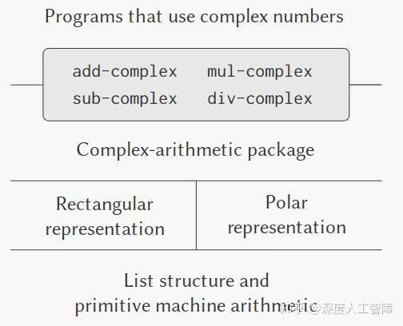

## 1 复数表示

复数有直角坐标表示和极坐标表示，其中直角坐标表示适合复数加减操作，而极坐标表示适合复数乘除表示，所以对于不同操作，可以采用不同的表示方法。

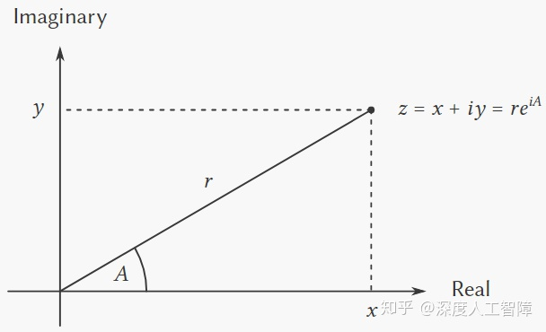

这里假设已经提供了选择函数`real-part`、`imag-part`、`magnitude`和`angle`，也提供了构造函数`make-from-real-imag`和`make-from-mag-ang`，由此我们可以如下完成对应的复数操作

```scheme
 (define (add-complex z1 z2)
  (make-from-real-imag 
   (+ (real-part z1) (real-part z2))
   (+ (imag-part z1) (imag-part z2))))

(define (sub-complex z1 z2)
  (make-from-real-imag 
   (- (real-part z1) (real-part z2))
   (- (imag-part z1) (imag-part z2))))

(define (mul-complex z1 z2)
  (make-from-mag-ang 
   (* (magnitude z1) (magnitude z2))
   (+ (angle z1) (angle z2))))

(define (div-complex z1 z2)
  (make-from-mag-ang 
   (/ (magnitude z1) (magnitude z2))
   (- (angle z1) (angle z2))))
```

接下来就要考虑这两种表示方法的具体实现了。首先，如果在系统中使用直角坐标表示，则对应的选择函数和构造函数如下

```scheme
; 构造函数
(define (make-from-real-imag x y) (cons x y))
;; 由于采用直角坐标表示，所以如果传入模和幅角，要将其转换为实部和虚部
(define (make-from-mag-ang r a)
  (cons (* r (cos a)) (* r (sin a))))
; 选择函数
(define (real-part z) (car z))
(define (imag-part z) (cdr z))
;; 由于采用直角坐标表示，所以可以通过三角关系转换为对应的模和幅角
(define (magnitude z)
  (sqrt (+ (square (real-part z)) 
           (square (imag-part z)))))
(define (angle z)
  (atan (imag-part z) (real-part z)))
```

而如果系统使用极坐标表示，则对应的选择函数和构造函数如下

```scheme
; 构造函数
(define (make-from-mag-ang r a) (cons r a))
;; 由于采用极坐标表示，所以如果传入实部和虚部，要将其转换为模和幅角
(define (make-from-real-imag x y)
  (cons (sqrt (+ (square x) (square y)))
        (atan y x)))
; 选择函数
(define (magnitude z) (car z))
(define (angle z) (cdr z))
;; 由于采用极坐标表示，所以可以通过三角关系转换为对应的实部和虚部
(define (real-part z)
  (* (magnitude z) (cos (angle z))))
(define (imag-part z)
  (* (magnitude z) (sin (angle z))))
```

可以看到，我们可以在内部使用一种表示方法来表示复数，只需要在需要不同表示方法时进行转换。并且借助于选择函数和构造函数构建起的抽象屏障，使得在需要另一种表示方法时才进行变换。

## 2 带标志的数据

更进一步，这里可以采用**最小允诺原则**，在设计完选择函数和构造函数并决定同时使用直角坐标表示和极坐标表示后，仍维持所用表示方法的不确定性。上一节中如果使用直角坐标表示就将数据全部表示为直角坐标形式，如果使用极坐标表示就将数据全部表示为极坐标表示，而这里的数据所用的表示方法是不确定的。为此需要将极坐标形式的数据和直角坐标形式的数据分隔开来，这里可以在每个复数中都包含一个类型标志部分，用来表示当前复数采用的表示方法，此时就能根据这个类型标志采用对应的选择函数了。

为了操作带类型标志的符号，需要额外引入以下过程

```scheme
; 将类型标志和数据内容组合起来
(define (attach-tag type-tag contents)
  (cons type-tag contents))
; 获得类型标志
(define (type-tag datum)
  (if (pair? datum)
      (car datum)
      (error "Bad tagged datum: TYPE-TAG" datum)))
; 获得数据内容
(define (contents datum)
  (if (pair? datum)
      (cdr datum)
      (error "Bad tagged datum: CONTENTS" datum)))
```

此时我们就能根据复数数据的类型标志来判断对应的标识方式

```scheme
; 判断是否为直角坐标表示
define (rectangular? z)
  (eq? (type-tag z) 'rectangular))
; 判断是否为极坐标表示
(define (polar? z)
  (eq? (type-tag z) 'polar))
```

此时由于当前系统中同时存在两种表示方法的数据，所以需要包含以上两种表示方法的过程，此时它们的过程名都要添加标识来说明适用的表示方法，且在构造函数中需要将类型标志添加进去

```scheme
; 直角坐标表示
;; 构造函数
(define (make-from-real-imag-rectangular x y)
  (attach-tag 'rectangular (cons x y)))
(define (make-from-mag-ang-rectangular r a)
  (attach-tag 
   'rectangular
   (cons (* r (cos a)) (* r (sin a)))))
;; 选择函数
(define (real-part-rectangular z) (car z))
(define (imag-part-rectangular z) (cdr z))
(define (magnitude-rectangular z)
  (sqrt (+ (square (real-part-rectangular z))
           (square (imag-part-rectangular z)))))
(define (angle-rectangular z)
  (atan (imag-part-rectangular z)
        (real-part-rectangular z)))
; 极坐标表示
;; 构造函数
(define (make-from-mag-ang-polar r a)
  (attach-tag 'polar (cons r a)))
(define (make-from-real-imag-polar x y)
  (attach-tag 
   'polar
   (cons (sqrt (+ (square x) (square y)))
         (atan y x))))

;; 选择函数
(define (magnitude-polar z) (car z))
(define (angle-polar z) (cdr z))
(define (real-part-polar z)
  (* (magnitude-polar z) 
     (cos (angle-polar z))))
(define (imag-part-polar z)
  (* (magnitude-polar z) 
     (sin (angle-polar z))))
```

基于以上两种表示方法的过程，可以构建**通用过程**，它会通过数据的类型标志来判断是采用哪种表示方法的过程

```scheme
(define (real-part z)
  (cond ((rectangular? z) (real-part-rectangular (contents z)))
        ((polar? z) (real-part-polar (contents z)))
        (else (error "Unknown type:  REAL-PART" z))))
(define (imag-part z)
  (cond ((rectangular? z) (imag-part-rectangular (contents z)))
        ((polar? z) (imag-part-polar (contents z)))
        (else (error "Unknown type: IMAG-PART" z))))
(define (magnitude z)
  (cond ((rectangular? z) (magnitude-rectangular (contents z)))
        ((polar? z) (magnitude-polar (contents z)))
        (else (error "Unknown type: MAGNITUDE" z))))
(define (angle z)
  (cond ((rectangular? z) (angle-rectangular (contents z)))
        ((polar? z) (angle-polar (contents z)))
        (else (error "Unknown type: ANGLE" z))))
```

此时的`real-part`、`imag-part`、`magnitude`和`angle`就是通用界面过程，基于该选择函数的那些过程就能在不同表示方法的数据上进行操作。并且能根据传入的数据是什么表示类型的，就选择对应表示类型的构造函数。由此构建的复数系统的结构变为如下形式

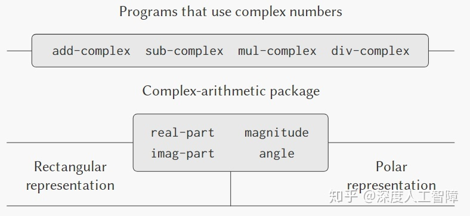

此时分成了独立的三部分：复数算数运算、极坐标表示和直角坐标表示。我们这里使用了通用选择函数来根据数据的类型标志调用对应表示的选择函数。而这里两者的界面就是类型标志，在底层和高层之间传输时，需要添加和删除类型标志。

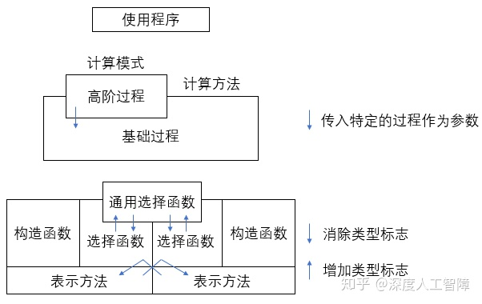抽象屏障

> **综上：**在1中介绍的方法约束了系统中的数据只能有一种表示方法，在需要的时候通过选择函数来转换表示方法。而在2中通过在数据中引入类型标志，提取出了一个通用选择函数，使得系统中的数据能有不同的表示方法。

这种通过检查某个数据项的类型来调用某个适当的过程称为**基于类型的分派**，但是这类方法有两个缺点：

- 通用型界面过程中需要对每种表示方式进行判断，并对这种表示形式选择对应的过程。当对表示方式进行添加删除时，都要修改这些通用界面过程。
- 所有表示方式的过程的名字都不能重复。

这个缺点的根本原因在于实现通用界面过程的技术是**不可加性**的。

## 3 数据导向的程序设计和可加性

我们可以看到，以上的通用界面过程其实可以统一组织为一个二维表格，其中一维表示各个通用界面操作，另一维为各个表示方法，而表格中的项目就是一系列过程。比如以上构建的复数系统的表格如下

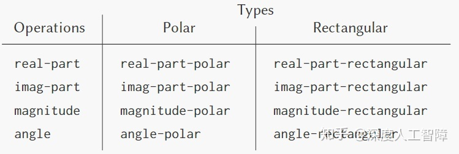

如果我们能把界面实现为一个过程，然后通过操作明和数据类型的组合在该表格中进行查找，并将查找到的过程应用于参数的内容，此时只需要对表格进行修改就能解决上一节中的问题了。接下来介绍一种能使程序直接利用该表格工作的技术，称为**数据导向的程序设计**，能将系统设计进一步模块化。

为了操作表格，这里假设能使用以下两个操作

```scheme
(put <op> <type> <item>) ; 将<item>放入表中<op>行<type>列
(get <op> <type>)        ; 从表中获得<op>行<type>列的操作
```

此时添加不同的表示方法就类似于通过`put`向表中对应的行列中插入操作，而后通过`get`来获得对应的操作。此时复数的直角坐标表示方法可以表示为以下形式

```scheme
 (define (install-rectangular-package)
  ;; 内部构造函数和选择函数
  (define (real-part z) (car z))
  (define (imag-part z) (cdr z))
  (define (make-from-real-imag x y) (cons x y))
  (define (magnitude z)
    (sqrt (+ (square (real-part z))
             (square (imag-part z)))))
  (define (angle z)
    (atan (imag-part z) (real-part z)))
  (define (make-from-mag-ang r a)
    (cons (* r (cos a)) (* r (sin a))))
  ;; 插入表中的操作
  (define (tag x) (attach-tag 'rectangular x))
  (put 'real-part '(rectangular) real-part) ; 列名与tag过程中插入的数据标识相同
  (put 'imag-part '(rectangular) imag-part)
  (put 'magnitude '(rectangular) magnitude)
  (put 'angle '(rectangular) angle)
  (put 'make-from-real-imag 'rectangular
       (lambda (x y) (tag (make-from-real-imag x y))))
  (put 'make-from-mag-ang 'rectangular
       (lambda (r a) (tag (make-from-mag-ang r a))))
  'done)
```

首先在`install-rectangular-package`过程中定义直角坐标表示的构造函数和选择函数，由于这些函数过程都是定义在`install-rectangular-package`内部的，所以它们的过程名不会使外部的过程名与其造成冲突，能自由定义。其次在定义完构造函数和选择函数后，需要执行一系列`put`操作将这些过程插入到表格中，注意构造函数要插入对应的数据类型标识，此时获得一个数据时，就能通过它的数据类型标识在表格中进行搜索。

对应的极坐标表示方法的代码为

```scheme
(define (install-polar-package)
  ;; 内部构造函数和选择函数
  (define (magnitude z) (car z))
  (define (angle z) (cdr z))
  (define (make-from-mag-ang r a) (cons r a))
  (define (real-part z)
    (* (magnitude z) (cos (angle z))))
  (define (imag-part z)
    (* (magnitude z) (sin (angle z))))
  (define (make-from-real-imag x y)
    (cons (sqrt (+ (square x) (square y))) (atan y x)))
  ;; 插入表中的操作
  (define (tag x) (attach-tag 'polar x))
  (put 'real-part '(polar) real-part)
  (put 'imag-part '(polar) imag-part)
  (put 'magnitude '(polar) magnitude)
  (put 'angle '(polar) angle)
  (put 'make-from-real-imag 'polar
       (lambda (x y) (tag (make-from-real-imag x y))))
  (put 'make-from-mag-ang 'polar
       (lambda (r a) (tag (make-from-mag-ang r a))))
  'done)
```

我们通过执行`install-rectangular-package`和`(install-polar-package)`就能完成通用界面过程的创建，并将其插入二维表中。在使用时，需要通过需要的操作以及传入数据的类型标识来从二维表中提取出对应的过程，再将其应用到输入数据中，可以将其封装为一个统一的界面过程

```scheme
(define (apply-generic op . args)
  (let ((type-tags (map type-tag args))) ; 根据传入数据获得类型标识符
    (let ((proc (get op type-tags))) ; 从二维表中获得对应的操作
      (if proc ; 如果存在操作
          (apply proc (map contents args)) ; 需要获取数据内容
          (error "No method for these types: APPLY-GENERIC"
            (list op type-tags))))))
```

此时就将所有界面过程和全部表示形式都集成到一个二维表中，并可通过一个统一的界面过程`apply-generic`来使用。

同样对上一章中构建的符号求导系统，它的求导过程为

```scheme
(define (deriv exp var)
  (cond ((number? exp) 0) ;第一条求导规则
        ((variable? exp) (if (same-variable? exp var) 1 0)) ;第二条求导规则
        ((sum? exp) (make-sum (deriv (addend exp) var) ;第三条求导规则
                              (deriv (augend exp) var)))
        ((product? exp) (make-sum ;第四条求导规则
                              (make-product (multiplier exp) 
                                            (deriv (multiplicand exp) var))
                        (make-product (deriv (multiplier exp) var) 
                                      (multiplicand exp))))
        (else (error "unknown expression 
                      type: DERIV" exp))))
```

可以发现当添加不同的运算符号时，也需要在该过程中进行修改，这里可以把不同的运算符当做不同的表示方法，将运算符当做类型标识，可以分别将和式和乘式的求导方法插入到二维表中，通过`'deriv`和运算符进行索引。此时的求导过程为

```scheme
 (define (deriv exp var)
  (cond ((number? exp) 0)
        ((variable? exp) (if (same-variable? exp var) 1 0))
        (else ((get 'deriv (operator exp)) (operands exp) var))))
(define (operator exp) (car exp))
(define (operands exp) (cdr exp))
```

而对应的和式和乘式的过程为

```scheme
(define (install-sum-deriv)
  ; 内部函数
  ;; 选择函数
  (define (addend variables) (car variables))
  (define (augend variables) (cadr variables))
  ;; 构造函数
  (define (make-sum a1 a2)
    (cond ((eq? a1 0) a2)
          ((eq? a2 0) a1)
          ((and (number? a1) (number? a2)) (+ a1 a2))
          (else (list '+ a1 a2))))
  ;; 基本过程
  (define (sum-deriv variables var)
    (make-sum (deriv (addend variables) var)
              (deriv (augend variables) var)))
  ; 插入表格
  (put 'deriv '(+) sum-deriv)
  ‘done)

(define (install-product-deriv)
  ; 内部函数
  ;; 选择函数
  (define (multiplier variables) (car variables))
  (define (multiplicand variables) (cadr variables))
  ;; 构造函数
  (define (make-sum a1 a2)
    (cond ((eq? a1 0) a2)
          ((eq? a2 0) a1)
          ((and (number? a1) (number? a2)) (+ a1 a2))
          (else (list '+ a1 a2))))
  (define (make-product m1 m2)
    (cond ((or (eq? m1 0) (eq? m2 0)) 0)
          ((eq? m1 1) m2)
          ((eq? m2 1) m1)
          ((and (number? m1) (number? m2)) (* m1 m2))
          (else (list '* m1 m2))))
  ;; 基本过程
  (define (product-deriv variables var)
    (make-sum (make-product (multiplier variables)
                            (deriv (multiplicand variables) var))
              (make-product (deriv (multiplier variables) var)
                            (multiplicand variables))))
  ; 插入表格
  (put 'deriv '(*) product-deriv)
  'done)
```

后面需要添加任何运算，只需要将其插入表格中合适的位置就行，无需修改`deriv`过程。

## 4 信息传递

第2章中通过引入类型标识得到的通用界面过程`real-part`、`imag-part`、`magnitude`和`angle`其实可以看成是对以下表格分解成一行一行，每个通用界面过程适用于所有表示方法的数据。

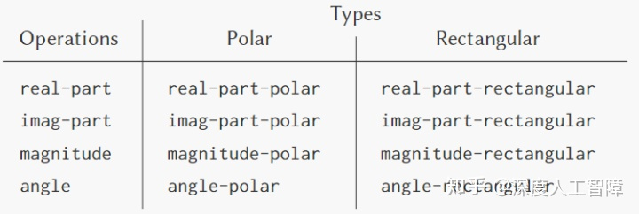

其实还有能将该表分解成一列一列，得到能基于操作名获得内容的表示方法。如以下代码

```scheme
(define (make-from-real-imag x y)
  (define (dispatch op)
    (cond ((eq? op 'real-part) x)
          ((eq? op 'imag-part) y)
          ((eq? op 'magnitude) (sqrt (+ (square x) (square y))))
          ((eq? op 'angle) (atan y x))
          (else (error "Unknown op: MAKE-FROM-REAL-IMAG" op))))
  dispatch)
```

这里的数据使用直接坐标表示，并且将数据表示为一个个过程，此时能将需要的操作作为该数据的参数，就能获得对应的内容。这种方式称为**信息传递**，数据作为实体接收所需操作的名字作为信息。此时的通用过程就变为了

```scheme
(define (apply-generic op arg) (arg op))
```

**注意：**这里只能接收一个参数。

同样也能得到用信息传递风格实现的构造函数`make-from-mag-ang`

```scheme
(define (make-from-mag-ang x y)
  (define (dispatch op)
    (cond ((eq? op 'magnitude) x)
          ((eq? op 'angle) y)
          ((eq? op 'real-part) (* x (cos y)))
          ((eq? op 'imag-part) (* x (sin y)))
          (else (error "Unknown op: MAKE-FROM-MAG-ANG" op))))
  dispatch)
```

## 5 总结

一个带有通用型操作的大型系统中，可能会要加入新的数据对象类型或新的操作，这里介绍了三种策略，对通用界面过程-数据类型二维表格做了不同的处理，来获得不通的通用界面过程：

- **方法一：增加类型标识的通用操作：**对二维表格进行行划分，得到能在不同表示方法中通用的界面选择函数。（在不同表示方法中通用）
- **方法二：信息传递风格：**对二维表格进行列划分，得到能在不同操作上通用的特定表示方法的数据。（在不同操作中通用）
- **方法三：数据导向风格：**将操作插入二维表格中的对应的位置，通过操作名和表示方法从表中获得对应的操作。（在所有操作和表示方法中通用）

当系统需要不断插入新的操作时，方法一需要创建在各个表示方法中通用的新的界面选择函数，无需修改原始代码；而方法二需要在各种表示方法的构建函数中增加一项，需要修改原始代码。当系统需要不断插入行的数据类型时，方法一需要在各个通用界面选择函数中增加一项来处理新的数据类型，需要修改原始代码；而方法二需要创建一个新的数据类型对应的构造函数，无需修改原始代码。

而数据导向风格能在不修改现有操作和数据类型情况下，通过在二维表格中合适的位置插入对应的操作就能添加新的数据和操作了。


# [读书笔记]SICP：8[B]带有通用型操作的系统


 

本章对应于书中的2.5。

------

**数据导向的思路：**

- 确定需要哪些通用操作和数据类型，构建起对应的二维表格`操作名-数据类型`
- 为你想要添加的内容用一个过程包裹，避免其他过程与其名字冲突，然后在过程内完成对应想要注册的过程
- 放置的表格的行是对应的通用操作名，表格的列是预计会接收到的数据标识。
- 使用`put`将其放到表格中对应的位置。**注意：**产生数据的过程要在结果添加类型标识。

**数据导向主要函数：**

```scheme
(define (apply-generic op . args)
  (let ((type-tags (map type-tag args))) ; 根据传入数据获得类型标识符
    (let ((proc (get op type-tags))) ; 从二维表中获得对应的操作
      (if proc ; 如果存在操作
          (apply proc (map contents args)) ; 需要获取数据内容
          (error "No method for these types: APPLY-GENERIC"
            (list op type-tags))))))
```

该函数根据`op`参数选择表格中对应的行，然后根据`args`中的数据类型表来在表格中选择对应的操作，然后将操作应用到数据内容上。是对标签剥离的过程，且操作过程接收到的内容是不包含数据类型的，所以可以直接用原始的过程注册。

- 要注意类型标识的修改
- 使用`apply-generic`调用内部过程时已将类型标识剥离，所以内部过程只考虑数据内容
- 想要实现数据对象的不同表示形式，只需要在安装包中实现对应的选择函数和构造函数，然后将其配置到表格中，其余与表示形式无关的过程，可以不配置到表格中。

------

上一节中介绍的多重表示的数据关键思想就是通过通用界面过程，将描述数据操作的代码连接到数据的不同表示上。本章将用数据导向技术构造一个算数运算包，将前面构造出来的有理数算数、复数算数和常规算数包含进来，得到在不同表示上的通用操作，且能定义针对不同参数种类的通用型操作。用户通过通用界面`add`、`sub`、`mul`和`div`就能进行算数运算，并且该系统具有可加性


## 1 通用型算数运算符

我们使用数据导向技术来是像通用型算数运算符`add`、`sub`、`mul`和`div`，当注册好表格中的过程后，我们可以定义下一通用型算数运算符

```scheme
(define (add x y) (apply-generic 'add x y))
(define (sub x y) (apply-generic 'sub x y))
(define (mul x y) (apply-generic 'mul x y))
(define (div x y) (apply-generic 'div x y))
```

其中`apply-generic`就是[上一章](https://zhuanlan.zhihu.com/p/135838042)中定义的过程，可以根据传入的操作名以及数据的类型标识在表格中找到合适的操作应用于数据内容。

```scheme
(define (apply-generic op . args)
  (let ((type-tags (map type-tag args))) ; 根据传入数据获得类型标识符
    (let ((proc (get op type-tags))) ; 从二维表中获得对应的操作
      (if proc ; 如果存在操作
          (apply proc (map contents args)) ; 需要获取数据内容
          (error "No method for these types: APPLY-GENERIC"
            (list op type-tags))))))
```

通过上述定义，意味着我们要构建以下二维表格的内容


首先，对于常规数的包为

```scheme
; 常规数
(define (install-scheme-number-package)
  ;;直接注册
  (define (tag x) (attach-tag 'scheme-number x))
  (put 'add '(scheme-number scheme-number)
       (lambda (x y)) (tag (+ x y)))
  (put 'sub '(scheme-number scheme-number)
       (lambda (x y)) (tag (- x y)))
  (put 'mul '(scheme-number scheme-number)
       (lambda (x y)) (tag (* x y)))
  (put 'div '(scheme-number scheme-number)
       (lambda (x y)) (tag (/ x y)))
  'done)
```

其中可以修改`attach-tag`、`type-tag`和`contents`为如下形式

```scheme
(define (attach-tag type-tag contents)
  (if (eq? 'scheme-number type-tag)
      contents
      (cons type-tag contents)))
(define (type-tag datum) 
  (cond ((number? datum) 'scheme-number) 
        ((pair? datum) (car datum)) 
        (else (error "Wrong datum -- TYPE-TAG" datum)))) 
(define (contents datum) 
  (cond ((number? datum) datum) 
        ((pair? datum) (cdr datum)) 
        (else (error "Wrong datum -- CONTENTS" datum)))) 
```

此时常规数就不会表示成`('scheme-number x)`的形式，就能直接用Scheme中对常规数的操作了。其次可以将有理数的操作注册到表格中

```scheme
; 有理数运算操作
(define (install-rational-package)
  ;; 内部过程
  ;;; 构造函数
  (define (make-rat n d)
    (let ((g (gcd n d)))
      (cons (/ n g) (/ d g))))
  ;;; 选择函数
  (define (numer rat) (car rat))
  (define (denom rat) (cdr rat))
  ;;; 基本过程
  (define (add-rat x y)
    (make-rat (+ (* (numer x) (denom y))
                 (* (numer y) (denom x)))
              (* (denom x) (denom y))))
  (define (sub-rat x y)
    (make-rat (- (* (numer x) (denom y))
                 (* (numer y) (denom x)))
              (* (denom x) (denom y))))
  (define (mul-rat x y)
    (make-rat (* (numer x) (numer y))
              (* (denom x) (denom y))))
  (define (div-rat x y)
    (make-rat (* (numer x) (denom y))
              (* (numer y) (denom x))))
  ;; 注册
  ;;; 添加标签
  (define (tag x) (cons 'rational x))
  ;;; 注册
  (put 'add '(rational rational)
       (lambda (x y) (tag (add-rat x y))))
  (put 'sub '(rational rational)
       (lambda (x y) (tag (sub-rat x y))))
  (put 'mul '(rational rational)
       (lambda (x y) (tag (mul-rat x y))))
  (put 'div '(rational rational)
       (lambda (x y) (tag (div-rat x y))))
  (put 'make 'rational
       (lambda (n d) (tag (make-rat n d))))
  'done)
```

最终可以将复数操作注册到表格中。这里复数操作含有两种表示方法，我们先根据[上一章](https://zhuanlan.zhihu.com/p/135838042)注册好通用过程`real-part`、`imag-part`、`magnitude`和`angle`，此时就能通过这四个通用过程来访问任意表示的数据的内容，对应的代码为

```scheme
 ; 复数操作
;; 首先定义不同表示上的通用操作real-part、imag-part、magnitude和angle，对应表格为
;;           rectangular   polar
;;real-part
;;imag-part
;;magnitude
;;angle
;; 为了避免名字冲突，用两个函数来分别注册
(define (install-rectangular-package)
  ;; 构造函数
  (define (make-from-real-imag x y) (cons x y))
  (define (make-from-mag-ang r a)
    (cons (* r (cos a)) (* r (sin a))))
  ;; 选择函数
  (define (real-part x) (car x))
  (define (imag-part x) (cdr x))
  (define (magnitude x)
    (sqrt (+ (square (real-part x))
             (square (imag-part x)))))
  (define (angle x)
    (atan (imag-part x) (real-part x)))
  ;; 注册
  (define (tag x) (cons 'rectangular x)) ;用rectangular表示直角坐标表示的负数
  (put 'make-from-real-imag 'rectangular
       (lambda (x y) (tag (make-from-real-imag x y))))
  (put 'make-from-mag-ang 'rectangular
       (lambda (x y) (tag (make-from-mag-ang x y))))
  (put 'real-part '(rectangular) real-part)
  (put 'imag-part '(rectangular) imag-part)
  (put 'magnitude '(rectangular) magnitude)
  (put 'angle '(rectangular) angle)
  'done)
(define (install-polar-package)
  ;; 构造函数
  (define (make-from-mag-ang r a) (cons r a))
  (define (make-from-real-imag x y)
    (cons (sqrt (+ (square x) (square y))) (atan y x)))
  ;; 选择函数
  (define (magnitude x) (car x))
  (define (angle x) (cdr x))
  (define (real-part x)
    (* (magnitude x) (cos (angle x))))
  (define (imag-part x)
    (* (magnitude x) (sin (angle x))))
  ;; 注册
  (define (tag x) (cons 'polar x)) ;用polar表示直角坐标表示的负数
  (put 'make-from-mag-ang 'polar
       (lambda (x y) (tag (make-from-mag-ang x y))))
  (put 'make-from-real-imag 'polar
       (lambda (x y) (tag (make-from-real-imag x y))))
  (put 'magnitude '(polar) magnitude)
  (put 'angle '(polar) angle)
  (put 'real-part '(polar) real-part)
  (put 'imag-part '(polar) imag-part)
  'done)
(install-rectangular-package)
(install-polar-package)
(define (magnitude x)
  (apply-generic 'magnitude x))
(define (angle x)
  (apply-generic 'angle x))
(define (real-part x)
  (apply-generic 'real-part x))
(define (imag-part x)
  (apply-generic 'imag-part x))
```

在注册完在不同类型上的通用操作后，就能注册在复数上算数运算了

```scheme
;; 注册在复数上的算数运算
(define (install-complex-package)
  ;;; 构造函数 可以直接获得注册好的函数
  (define (make-from-real-imag x y)
    ((get 'make-from-real-imag 'rectangular) x y)) ;这里还没加上标签，只能用get
  (define (make-from-mag-ang x y)
    ((get 'make-from-mag-ang 'polar) x y))
  ;;; 基本过程
  (define (add-complex x y)
    (make-from-real-imag (+ (real-part x) (real-part y))
                         (+ (imag-part x) (imag-part y))))
  (define (sub-complex x y)
    (make-from-real-imag (- (real-part x) (real-part y))
                         (- (imag-part x) (imag-part y))))
  (define (mul-complex x y)
    (make-from-mag-ang (* (magnitude x) (magnitude y))
                       (* (angle x) (angle y))))
  (define (div-complex x y)
    (make-from-mag-ang (/ (magnitude x) (magnitude y))
                       (/ (angle x) (angle y))))
  ;;; 注册
  (define (tag x) (cons 'complex x))
  (put 'add '(complex complex)
       (lambda (x y) (tag (add-complex x y))))
  (put 'sub '(complex complex)
       (lambda (x y) (tag (sub-complex x y))))
  (put 'mul '(complex complex)
       (lambda (x y) (tag (mul-complex x y))))
  (put 'div '(complex complex)
       (lambda (x y) (tag (div-complex x y))))
  (put 'make-from-real-imag 'complex
       (lambda (x y) (tag (make-from-real-imag x y))))
  (put 'make-from-mag-ang 'complex
       (lambda (x y) (tag make-from-mag-ang x y)))
  )

(define (make-complex-from-real-imag x y)
  ((get 'make-from-real-imag 'complex) x y))
(define (make-complex-from-mag-ang x y)
  ((get 'make-from-mag-ang 'complex) x y))
```

可以发现，这里的一个复数包含了两个类型标识，比如`3+4i`表示为


**注意：**在较为复杂的系统中会有多个类型标识，需要注意当前最外侧的类型标识是什么。

## 2 类型之间的关系

我们上面的操作将所有类型相互隔离开来，使得常规数只能与常规数计算、有理数只能与有理数计算，以及复数只能与复数计算。但是其实这些类型的数据能够相互计算，此时就需要考虑跨过类型界限的操作。

### 2.1 强制类型转换

我们不可能在每个类型下注册与其他类型在所有操作下的计算，另一种方法是考虑**强制类型转换**，比如要计算常规数与复数的混合算数，可以将常规数转换成复数，就转换成了复数的运算问题了。基于这种想法，只需要注册类型之间的强制类型转换方法，无需注册具体的操作，简化了很多工作。

假设这里有一个特殊的强制表格，我们可以将上述的强制类型转换过程注册到该表格中

```scheme
(define (scheme-number->complex x)
  (make-complex-from-real-imag (content n) 0))
(put-coercion 'scheme-number 'complex scheme-number->complex)
```

然后可以修改上面的`apply-generic`过程

```scheme
 (define (apply-generic op . args)
  (let ((type-tags (map type-tag args)))
    (let ((proc (get op type-tags)))
      (if proc
          (apply proc (map contents args))
          (if (= (length args) 2)
              (let ((type1 (car type-tags))
                    (type2 (cadr type-tags))
                    (a1 (car args))
                    (a2 (cadr args)))
                (let ((t1->t2 (get-coercion type1 type2))
                      (t2->t1 (get-coercion type2 type1)))
                  (cond (t1->t2 (apply-generic op (t1->t2 a1) a2))
                        (t2->t1 (apply-generic op a1 (t2->t1 a2)))
                        (else (error "No method for these types" (list op type-tags))))))
              (error "No method for these types" (list op type-tags)))))))
```

它首先根据传入的数据的类型标志`type-tags`判断表格中是否存在对应的操作，如果不存在，则获得两个数据的标志`type1`和`type2`，然后通过`get-coercion`在强制表格中搜索是否存在对应的两个方向的强制类型转换过程，如果有，则对数据进行强制类型转换后，再执行`apply-generic`。

### 2.2 类型的层次结构

以上方法强制类型转换方法只尝试了类型1转换为类型2，以及类型2转换为类型1，可能都不存在对应的强制类型转换方法，但是可能存在将两个类型都转换到类型3的方法，所以需要建立系统时利用类型之间的进一步结构。

假设我们想要构建一个通用型的算数系统，其中存在整数、有理数、实数和复数，其实这些数据存在一个**类型的层次结构**，整数是特殊的有理数、有理数是特殊的实数、实数是特殊的复数，此时下一层的类型称为上一层类型的**子类型**，上一层类型称为下一层类型的**超类型**，构建起来的层次结构也是最简单的**类型塔**。

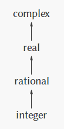

类型塔具有以下**优点：**

- 将一个新类型加入层次结构十分简单，只要刻画清楚该类型如何嵌入到它的超类型，以及如何作为子类型的超类型
- 为每个类型都注册一个`raise`过程来将当前类型提升到超类型，此时就能修改`apply-generic`过程，当系统遇到需要对两个不同类型的运算时，就逐步提升较低类型直到所有对象都处于同一层次
- 每个类型都能集成其超类型中定义的所有操作，此时修改`apply-generic`过程，当某个类型中没有注册对应的操作时，就对其进行提升直到有对应的操作。如果到达塔顶还是没有对应的操作，就放弃。
- 可以通过下降类型来得到最优的表达形式

但是在大型系统中的类型层次结构就不是简答的类型塔了，可能是以下形式

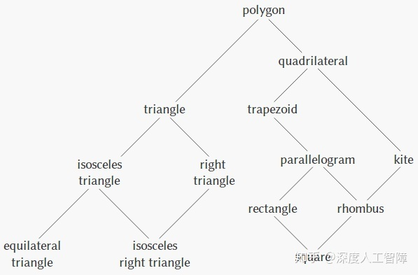

此时如何进行类型提升以及类型下降，就是比较困难的任务了。

## 3 实例

### 3.1 多项式算数

这里考虑代数演算系统中的多项式算数，其中将多项式定义为项的和式，而每个项是一个系数、变量的乘方或系数与变量的乘积，而系数也可以定义为一个代数表达式，但不依赖于该多项式的变量。比如 ![[公式]](https://www.zhihu.com/equation?tex=5x%5E2%2B3x%2B7) 为x的多项式， ![[公式]](https://www.zhihu.com/equation?tex=%28y%5E2%2B1%29x%5E3%2B%282y%29x%2B1) 为x的多项式，但系数是y的多项式。我们这里只考虑加法和乘法，并要求参与运算的两个多项式具有相同的变量。

接下来**按照数据抽象的方法构建该系统**：

- **步骤一：**假设已经获得多项式的构造函数`make-poly`和选择函数`variable`和`term-list`，其中`variable`获得多项式的变量，`term-list`获得多项式的项。（由此来独立数据对象的具体实现）

此时可以定义多项式的加法和乘法

```scheme
(define (add-poly p1 p2)
  (if (same-variable? (variable p1) (variable p2))
      (make-poly (variable p1)
       (add-terms (term-list p1) (term-list p2)))
      (error "Polys not in same var: ADD-POLY" (list p1 p2))))

(define (mul-poly p1 p2)
  (if (same-variable? (variable p1) (variable p2))
      (make-poly (variable p1)
       (mul-terms (term-list p1) (term-list p2)))
      (error "Polys not in same var: MUL-POLY" (list p1 p2))))
```

- **步骤二：**对于会产生结果的过程要添加类型标志，将其`put`到表格中，才能通过通用操作来处理多项式运算。

```scheme
(define (install-polynomial-package)
  ;; internal procedures
  ;; representation of poly
  (define (make-poly variable term-list) (cons variable term-list))
  (define (variable p) (car p))
  (define (term-list p) (cdr p))
  ⟨procedures same-variable? and variable? from section 2.3.2⟩

  ;; representation of terms and term lists
  ⟨procedures adjoin-term … coeff from text below⟩

  (define (add-poly p1 p2) …)
  ⟨procedures used by add-poly⟩
  (define (mul-poly p1 p2) …)
  ⟨procedures used by mul-poly⟩

  ;; interface to rest of the system
  (define (tag p) (attach-tag 'polynomial p)) ;类型标志
  (put 'add '(polynomial polynomial)
       (lambda (p1 p2) (tag (add-poly p1 p2))))
  (put 'mul '(polynomial polynomial)
       (lambda (p1 p2) (tag (mul-poly p1 p2))))
  (put 'make 'polynomial
       (lambda (var terms) (tag (make-poly var terms))))
  'done)
```

此外，对于项表的操作，也需要先假设一系列过程，由此独立项表的具体实现，这里假设具有以下过程：

- `the-empty-termlist`：返回空项表
- `adjoin-term`：构造函数，将新项加入项表中
- `empty-termlist?`：谓词，检查项表是否为空
- `first-term`：选择函数，提取向表中最高次的项
- `rest-terms`：选择函数，返回除最高次以外的其他项
- `make-terms`：构造函数，通过给定的次数和系数构建出一个项
- `order`：选择函数，返回项的次数
- `coeff`：选择函数，返回项的系数

由此我们就可以实现上面的`add-terms`和`mul-terms`过程了

```scheme
 (define (add-terms L1 L2)
  (cond ((empty-termlist? L1) L2)
        ((empty-termlist? L2) L1)
        (else
         (let ((t1 (first-term L1)) 
               (t2 (first-term L2)))
           (cond ((> (order t1) (order t2))
                     (adjoin-term t1 (add-terms (rest-terms L1) L2)))
                 ((< (order t1) (order t2))
                     (adjoin-term t2 (add-terms L1 (rest-terms L2))))
                 (else
                  (adjoin-term (make-term (order t1) (add (coeff t1) (coeff t2)))
                   (add-terms (rest-terms L1) (rest-terms L2)))))))))
(define (mul-terms L1 L2)
  (if (empty-termlist? L1)
      (the-empty-termlist)
      (add-terms (mul-term-by-all-terms (first-term L1) L2)
                 (mul-terms (rest-terms L1) L2))))

(define (mul-term-by-all-terms t1 L)
  (if (empty-termlist? L)
      (the-empty-termlist)
      (let ((t2 (first-term L)))
        (adjoin-term 
          (make-term (+ (order t1) (order t2))
                     (mul (coeff t1) (coeff t2)))
          (mul-term-by-all-terms t1 (rest-terms L))))))
```

**注意：**这里`add-terms`和`mul-terms`中都是用了通用操作`add`和`mul`来处理系数的计算，**具有以下好处：**

- 该系数就可以是运算系统中实现的任何数据类型，比如有理数、复数等等，其计算过程都包含在通用操作`add`和`mul`中了。
- 当我们将`add-poly`和`mul-poly`配置到表格中时，`add`和`mul`也就支持多项式的加法和乘法了，此时就能处理变量的系数本身就可以是一个多项式的情况了，比如 ![[公式]](https://www.zhihu.com/equation?tex=%28y%5E2%2B1%29x%5E3%2B%282y%29x%2B1) ，这种称为**递归数据抽象**。


- **步骤三：**实现完基础过程后，需要考虑数据的表示方式，由此实现对应的构造函数和选择函数。如果数据对象需要多种表示方式，则需要构建通用选择函数。

由于这里可以将项表看成以项的次数作为键值的系数集合，且需要按照次数进行排序，所以可以通过有序集合的形式来实现。但是多项式有两种表示形式：稠密的和稀疏的。 ![[公式]](https://www.zhihu.com/equation?tex=x%5E%7B100%7D%2B2x%5E2%2B1) 以稀疏的表示形式为`((100 1) (2 2) (0 1))`，需要配置其选择函数和构造函数：

```scheme
;这里只要保证调用adjoin-term的过程，比如add-terms或mul-terms，总用比表中的项次数更高的项进行调用，就是排序好的了
; 稀疏表示
(define (install-sparse-package)
  ;; 构造函数
  (define (adjoin-term term term-list)
    (if (=zero? (coeff term))
        term-list
        (cons term term-list)))
  ;; 选择函数
  (define (first-term term-list) (car term-list))
  (define (rest-terms term-list) (cdr term-list))
  ;; 注册
  (define (tag x) (attach-tag 'sparse x))
  (put 'adjoin-term 'sparse
       (lambda (term term-list) (tag (adjoin-term term term-list))))
  (put 'first-term '(sparse) first-term)
  (put 'rest-terms '(sparse) rest-terms)
  'done)
```

这里对于每个项，使用通用的结构`（系数 次数）`，无关具体实现，所以项的构造函数和选择函数为

```scheme
(define (make-term order coeff) 
  (list order coeff))
(define (order term) (car term))
(define (coeff term) (cadr term)) 
```

同时也需要配置以稠密形式表示的构造函数和选择函数

```scheme
; 稠密表示
(define (install-dense-term-list) 
  ;; 构造函数 
  (define (adjoin-term term term-list)  
    (cond ((=zero? (coeff term)) term-list)  
          ((=equ? (order term) (length term-list)) (cons (coeff term) term-list))  
          (else (adjoin-term term (cons 0 term-list)))))  
  (define (first-term term-list)
    (make-term (- (length term-list) 1) (car term-list)))
  (define (rest-terms term-list) (cdr term-list))
  ;; 注册 
  (define (tag x) (attach-tag 'dense x)) 
  (put 'adjoin-term 'dense
       (lambda (term term-list) (tag (adjoin-term term term-list))))
  (put 'first-term '(dense) first-term) 
  (put 'rest-term '(dense) rest-terms) 
  'done)
```

由此就能得到无关数据表示方式的通用选择函数和构造函数

```scheme
; 通用构造函数和选择函数
(define (adjoin-term term term-list)  
  ((get 'adjoin-term (type-tag term-list)) term (contents term-list))) 
(define (first-term term-list) (apply-generic 'first-term term-list)) 
(define (rest-term term-list) (apply-generic 'rest-term term-list)) 
```


# [读书笔记]SICP：9[B]赋值和局部状态


 

本章对应于书中的3.1。

------

函数式程序与命令式程序的区别：

- **函数式程序：**不使用赋值语句，能使用代换模型这一计算模型，当使用相同参数对统一过程进行调用时，会产生相同的结果，可以认为过程是在计算数学函数。

- **命令式程序：**使用赋值语句

- - **好处：**只有具有赋值操作`set!`，才能对自己的局部状态变量进行更新赋值，且将其封装起来，避免需要更新局部状态变量时需要将其作为参数进行迭代更新，使得将自己随时间变化的内部状态隐藏起来，由此使得实现细节完全独立于程序的其他部分，可以以一种更模块化的方法构建系统。
  - **缺点：**由于引入了赋值操作，则变量的值就可以改变，一个变量就不再是一个简单的名字，而是索引着一个可以保存值的位置，而存储在那里的值也可以改变，就无法使用代换模型这一计算模型。并且引入赋值操作，会破坏语言的引用透明性，就无法确定“同一”这一概念。并且引入赋值操作后，需要小心赋值操作的顺序，否则会出现函数式程序不会出现的错误，这同样会使得程序设计复杂化，使其中的主要思想变模糊。

------

这里还需要一些组织原则来指导我们系统化地完成系统的整体设计。我们可以基于被模拟系统的结构去设计程序的结构，对于有关的物理系统中的每个对象，我们构造对应的计算对象；对该系统中的每种活动，就定义之中符号操作。这里有两种不同的世界观：

- 关注对象，将大型系统看成一大批对象，它们的行为可能随时间的进展不断变化。需要关注计算对象可以怎样变化有同事保持其标识，迫使我们抛弃代换模型，转向环境模型。
- 关注流过系统的信息流，能够松弛模型中对时间的模拟与计算求职过程中的各种事件发生的顺序。

这一章主要关注赋值和局部状态，这里我们将世界看成是许多独立对象的集合，每个对象都有自己随时间变化的状态，我们可以用若干个**状态变量**来刻画一个对象的状态，由此能够确定该对象当前的行为。而在一个由多个对象组成的系统中，对象之间通常会通过**交互作用**来影响其他对象的状态，这里的交互就是建立一个对象的状态变量与其他对象的状态变量之间的联系。

我们可以根据这种观点来组织该系统计算模型的框架，想要模型具有模块化，则要将其分解为一系列计算对象来模拟系统中的实际对象，每个计算对象必须有自己的一些**局部状态变量**，来描述实际对象的状态。并且由于实际对象的状态是随时间变化的，所以对应的计算对象的状态也要随时间变化。此外，如果我们希望通过程序设计语言里的符号来模拟状态变量，则该语言需要提供一个**赋值运算符**，由此来改变与一个名字相关的值。

## 1 局部状态变量

这里以模拟从银行取现金为例，通过传递`amount`参数给`withdraw`过程，来模拟从银行中取`amout`现金，并且这里还需要一个变量`balance`来表示账户中的现金。

**注意：**`withdraw`执行结果与`balance`的值有关，无法保证每次执行都得到相同的结果。

对应的代码如下：

```scheme
(define balance 100)
(define (withdraw amount)
  (if (>= balance amount)
      (begin (set! balance (- balance amount))
             balance)
      "Insufficient funds"))
```

- `set!  `：这个为**赋值操作**，``为符号，``为表达式，`set!`修改``将其值变为``求值的结果。
- `begin   ... `：按需求值，并将最后的``求值结果作为`begin`的求值结果。

通过这种形式的代码可以模拟从银行取现金的过程，但是由于`balance`为全局变量，可以被任意的修改，我们希望`balance`是只能由`withdraw`使用的局部状态变量，用来保存账户状态变化的轨迹。

- **理想：**我们希望只有当前过程能修改局部状态变量，且该局部状态变量能随时间变化
- **方法：**所以需要将该局部状态变量定义在过程内部（即在过程内部对该局部状态变量进行初始化），但是每次调用该过程就会对局部状态变量进行重新初始化，使得局部状态变量无法随时间变化，因此需要将局部状态变量定义在该过程的外部，但是为了使得只有当前过程能修改该局部状态变量，可以在该过程外面包裹一个过程，然后在外部过程内、内部过程外定义局部状态变量，由此只有第一次调用外部过程会初始化局部状态变量，而后只有调用内部过程才会修改局部状态变量，且不会反复初始化该局部状态变量，且直接使用外部过程就能得到随时间变化到当前的局部状态变量，使得该局部状态变量能随时间变化。即`外部过程（初始化局部状态变量）、内部过程（修改局部状态变量）`。
- **实现：**可以通过在外部过程中使用`let`、`define`、形参来定义局部状态变量。

这里使用`let`来定义局部状态变量，新的`withdraw`过程为

```scheme
 (define new-withdraw  ; 注意不能有括号
  (let ((balance 100))
    (lambda (amount)
      (if (>= balance amount)
          (begin (set! balance (- balance amount))
                 balance)
          "Insufficient funds"))))
```

这里的外部过程是`new-withdraw`，内部过程通过`lambda`实现，而`let`在`new-withdraw`和`lambda`定义了局部状态变量`balance`。

**注意：**这里无法用代换模型进行解释，后面会介绍新的方法。

我们同样可以用形参来定义局部状态变量

```scheme
(define (make-withdraw balance)
  (lambda (amount)
    (if (>= balance amount)
        (begin (set! balance (- balance amount))
               balance)
        "Insufficient funds")))
```

此时就能传递`balance`到`make-withdraw`过程，来得到不同的局部状态变量。如

```scheme
(define W1 (make-withdraw 100))
(define W2 (make-withdraw 200))
```

则`W1`和`W2`就维护了自己独立的状态变量。

同样也可以定义一个银行账户

```scheme
(define (make-account balance secret-password)
  (define count 0)
  (define (call-the-cops) "Call the cops") 
  (define (withdraw amount)
    (if (>= balance amount)
        (begin (set! balance (- balance amount))
               balance)
        "Insufficient funds"))
  (define (deposit amount)
    (set! balance (+ balance amount))
    balance)
  
  (define (dispatch password m)
    (cond ((not (eq? password secret-password))
           (lambda (x)
             (if (>= count 2)
               (call-the-cops)
               (begin (set! count (+ count 1))
                      "Incorrect password"))))
          ((eq? m 'withdraw) withdraw)
          ((eq? m 'deposit) deposit)
          (else (error "Unknown request: MAKE-ACCOUNT" m))))
  dispatch)
```

这里定义了两个局部状态变量`balance`和`secret-password`。

由此就将系统看成是一群带有局部状态的对象，提供了一种维护模块化设计的强有力技术。

## 2 赋值带来的好处

我们这里以蒙特卡罗模拟为例来说明赋值带来的好处。有个定理表示：随机两个整数没有公共因子的概率为 ![[公式]](https://www.zhihu.com/equation?tex=6%2F%5Cpi%5E2) 。则我们可以不断随机产生两个随机数，然后判断该随机数是否含有公共因子，实验多次后近似于 ![[公式]](https://www.zhihu.com/equation?tex=6%2F%5Cpi%5E2) ，由此就能近似于 ![[公式]](https://www.zhihu.com/equation?tex=%5Cpi) 。

首先，我们按照以上的方式，我们定义一个产生随机数的`rand`过程，它需要一个局部状态变量来表示当前的随机数，然后通过`rand-update`过程来得到下一个随机数，这里可以通过`let`来初始化定义局部变量，然后通过`set!`进行赋值操作，则该随机数生成器为

```scheme
(define rand
  (let ((x rand-init))
    (lambda ()
      (set! x (rand-update x))
      x))) 
```

则对应的蒙地卡罗模拟代码为

```scheme
(define (estimate-pi trials)
  (sqrt (/ 6 (monte-carlo trials cesaro-test))))
(define (cesaro-test)
   (= (gcd (rand) (rand)) 1))

(define (monte-carlo trials experiment)
  (define (iter trials-remaining trials-passed)
    (cond ((= trials-remaining 0) (/ trials-passed trials))
          ((experiment)
           (iter (- trials-remaining 1) 
                 (+ trials-passed 1)))
          (else
           (iter (- trials-remaining 1) 
                 trials-passed))))
  (iter trials 0))
```

如果我们这里不采用赋值操作`set!`，则无法在`rand`中不断修改当前的局部状态变量`x`，就无法计算出下一时刻的局部状态变量`x`，所以此时就需要显示地计算下一时刻的局部状态变量，并将其作为参数，传入下一次迭代中，才能让局部状态变量随时间更新，此时需要显示进行维护。 对应的代码如下

```scheme
(define (estimate-pi trials)
  (sqrt (/ 6 (random-gcd-test trials random-init))))

(define (random-gcd-test trials initial-x)
  (define (iter trials-remaining trials-passed x)
    (let ((x1 (rand-update x)))
      (let ((x2 (rand-update x1)))
        (cond ((= trials-remaining 0) (/ trials-passed trials))
              ((= (gcd x1 x2) 1)
               (iter (- trials-remaining 1)
                     (+ trials-passed 1)
                     x2))
              (else
               (iter (- trials-remaining 1)
                     trials-passed
                     x2))))))
  (iter trials 0 initial-x))
```

这里由于没有使用赋值操作，所以每次需要显示地计算`x1`和`x2`，然后将`x2`作为当前的局部状态变量传递到下一次迭代中。这就使得对随机数的生成处理与我们的业务代码交织在一起，使得能难将蒙地卡罗方法的思想独立出来，而之前使用赋值操作的代码，它通过赋值操作能将局部状态变量的更新隔离在`rand`中，无需每次显示传递下一时刻的局部状态变量。

**赋值操作的好处：**只有具有赋值操作`set!`，才能对自己的局部状态变量进行更新赋值，且将其封装起来，避免需要更新局部状态变量时需要将其作为参数进行迭代更新，使得将自己随时间变化的内部状态隐藏起来，由此使得实现细节完全独立于程序的其他部分，可以以一种更模块化的方法构建系统。

## 3 引入赋值操作的代价

我们这里以两个代码为例，其中一个是有赋值操作，另一个不具有赋值操作

```scheme
; 有赋值操作
(define (make-simplified-withdraw balance)
  (lambda (amount)
    (set! balance (- balance amount))
    balance))
(define W (make-simplified-withdraw 25))
(W 20) ; 5
(W 10) ; -5
; 无赋值操作
(define (make-decrementer balance)
  (lambda (amount) (- balance amount)))
(define D (make-decrementer 25))
(D 20) ; 5
(D 10) ; 15
```

这种不使用赋值操作的程序设计称为**函数式程序设计**，当使用相同参数对统一过程进行调用时，会产生相同的结果，可以认为过程是在计算数学函数。当我们对两者都使用代换模型进行解释时，过程如下

```scheme
((make-decrementer 25) 20)
; ((lambda (amount) (- 25 amount)) 20) ; 用25代换balance
; (- 25 20) ; 用20代换amount
; 5
((make-simplified-withdraw 25) 20)
; ((lambda (amount) (set! balance (- 25 amount)) 25) 20) ; 用25代换balance， 这里不代换set!中的balance，否则没有意义
; (set! balance (- 25 20)) 25
; (set! balance 5) 25 ; 显示25， 而将5赋值给balance
```

可以发现没有使用赋值操作时通过代换模型能进行解释，而使用了赋值操作就无法使用代换模型进行解释。**根本原因在于**：代换模型要求语言中的符号只是作为值的名字，如果使用了赋值操作，则变量的值就可以改变，一个变量就不再是一个简单的名字，而是索引着一个可以保存值的位置，而存储在那里的值也可以改变。这就要求必须区分`set!`作用前和`set!`作用后的变量`balance`，而代换模型做不到。

考虑两个物体“同一”（the same）的概念。如果一个语言支持表达式里“同一对象可以互相替换”且不会改变有关表达式的值，则该语言具有**引用透明性**，当计算机语言中包含`set!`后，确定对象是否“同一”就变得很难定义，且看上去“同一的”对象也无法互相替换而不改变表达式的值，这就打破了引用透明性，此时能难通过等价的表达式代换去简化表达式，也就打破了代换模型这种计算模型。以下面4个对象为例

```scheme
; 无赋值过程
(define D1 (make-decrementer 25))
(define D2 (make-decrementer 25))
; 有赋值过程
(define W1 (make-simplified-withdraw 25))
(define W2 (make-simplified-withdraw 25))
```

没有赋值过程的`D1`和`D2`没有打破引用透明性，两者由于具有相同的计算行为所以是“同一的”，可以在任意表达式中将两者互换而不影响表达式的结果。而使用了赋值过程的`W1`和`W2`虽然是通过相同表达式的求值创建起来的，但无法在任意表达式中互换而不改变表达式的结果，由此打破了引用透明性，由此无法将两者互换而不影响表达式的结果。当不具有引用透明性时，就很难确定对象是否“同一的”：

- 想要判断对象是否“同一的”，可以改变其中一个对象，看另一个对象是否改变
- 想要看一个对象是否改变，需要观察“同一”对象两次，才能确定
- 想要观察“同一”对象，就需要先判断该对象是否“同一的”，又回到第一个问题了

通常当我们不改变数据对象时，可以将一个复合数据对象完全看成是由它的各个组成部分构成的整体，比如一个有理数可以由它的分子和分母完全确定。如果修改数据对象时，该观点就不成立了，此时复合数据对象不是由它的各个组成部分确定的，它本身具有一个“标志”。比如以下代码

```scheme
; 情况一
(define peter-acc (make-account 100))
(define paul-acc (make-account 100))
;情况二
(define peter-acc (make-account 100))
(define paul-acc peter-acc)
```

情况一定义了两个不同的银行账户，即使它们可能具有相同的`balance`，但是它们本身的“标志”不同，与它们的`balance`无关，两个银行账户做交易互不影响；而情况二定义了一个具有两个名字的银行账户，即使账户的`balance`改变了，它的“标志”也没有改变，仍然是“同一”对象。这种复杂性是由于将其作为对象导致的，它会通过赋值来修改它的局部状态变量。

这种广泛采用赋值的程序称为**命令式程序**设计，除了导致计算模型的复杂性外，还容易出现一些函数式程序不存在的错误，比如以下函数式程序可以改为对应的命令式程序

```scheme
; 函数式程序
(define (factorial n)
  (define (iter product counter)
    (if (> counter n)
        product
        (iter (* counter product)
              (+ counter 1))))
  (iter 1 1))
; 命令式程序
(define (factorial n)
  (let ((product 1)
        (counter 1))
    (define (iter)
      (if (> counter n)
          product
          (begin (set! product (* counter product))
                 (set! counter (+ counter 1))
                 (iter))))
    (iter)))
```

这里通过将`product`和`counter`当做局部状态变量，然后使用赋值语句来将其转化为命令式程序。但是要十分注意两个赋值语句的顺序，否则会出错。

# [读书笔记]SICP：10[B]求值的环境模型


 

本章对应于书中的3.2。

------

- 函数式程序可以用代换模型进行分析，而引入`set!`赋值后，只能用环境模型进行分析。

- `lambda`表达式是过程对象，对其进行求值时，要得到一个序对，其中一个指向过程体，另一个指向环境

- **创建过程（`define`）：**在当前环境中增加一个变量名，其约束是一个序对，包含过程体，以及指向当前环境的指针。

- **求值过程：**

- - 创建一个新的环境

  - 添加形式参数的约束

  - 在外围环境中寻找该变量对应的过程体

  - 对过程体进行求值

  - - 如果是`define`，则在当前环境中添加该过程名的约束，其约束是过程体和指向当前新环境的指针
    - 如果是`lambda`表达式，就得到一个序对，其中一个为过程体，另一个是指向当前新环境的指针
    - 如果是对另一个过程的求值，就重复该过程

------

现在最紧要的是为设计赋值的表达式提供一种计算模型，以便考察在模拟的设计中如何使用具有局部状态的对象。

## 1 求值的环境模型

在还未引入赋值时，采用**求值的代换模型**定义了将过程应用于实际参数的意义：将一个复合过程应用于一些实际参数，就是用各个实际参数代换过程体中对应的形式参数，然后求值该过程体。

但是引入赋值后，就无法使用该定义了，此时变量已不再是值的名字，而是指向一个保存变量值的“位置”，而在环境模型中，这些位置保存在**环境**结构中。一个环境就是**框架**的序列，每个框架包含一些**约束**的表格以及一个指向该框架的**外围环境指针**（由于环境本身就是框架序列，所以通过外围环境指针将两者的框架序列连接起来了），每个约束就是将变量名关联于对应的值（一个框架中的任意变量只有一个约束）。而一个变量相对于某个环境的值，就是第一个包含该变量约束的框架中的值，如果环境中所有框架都不包含该变量的约束，则该变量在该环境中是无约束的。比如

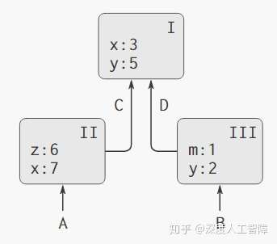

这里具有三个框架`I`、`II`和`III`，每个框架中包含一些变量的约束，并且框架直接通过外围环境指针连接起来，构成了框架序列，也就是环境。从任意环境指针开始都是环境，比如这里有4个环境`A`、`B`、`C`和`D`。在环境`A`中，变量`x`的值首先在框架`II`中约束，则为7；在环境`B`中，变量`x`的值首先在框架`I`中约束，则为3。

**意义：**环境确定了表达式求值的上下文，确定了不同变量和符号的约束。这里假设存在一个只包含一个框架的**全局环境**，包含所有关联于基本过程的符号的值。

### 1.1 创建过程

接下来我们就能用求值的环境模型代替求值的代换模型来对带有赋值的过程进行求值。在求值的环境模型中，过程只能通过求值一个`lambda`表达式进行创建，且由代码和环境组成，其中该过程的**代码**就是`lambda`的正文，而代码的**环境**就是求值该`lambda`表达式产生该过程时的环境。比如在全局环境中对以下代码进行求值

```scheme
 (define (square x)
  (* x x))
; 等价于
(define square
  (lambda (x) (* x x)))
```

- 由于在全局环境中对其进行求值，所以在全局环境中的框架添加一个符号`square`，其值为`(lambda(x)(* x x))`求值的结果。
- 该过程通过对`(lambda(x)(* x x))`进行求值会获得一个序对，其中一个是带有形参`x`的过程体，另一个是指向全局环境的指针

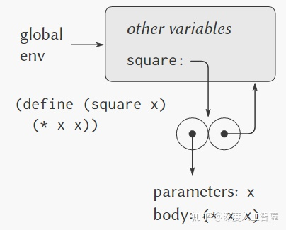

**注意：**用`define`定义一个符号就是在当前环境中建立一个约束，并赋予该符号指定的值。

### 1.2 应用过程

创建过程后，环境模型将一个过程应用于一组实际参数时：

- 创建一个新环境，其中包含所有形参约束于对应的实际参数的框架
- 新框架的外围环境就是该过程的环境（通过该过程指向的环境来确定）
- 在新环境中求值该过程的过程体（通过该过程指向的过程体来确定）

而其求值规则也和之前相同：

- 求值该组合式中的各个子表达式
- 将运算符子表达式的值应用于运算对象子表达式的值

比如这里使用`(square 5)`，它的过程为：

- 创建一个新环境，其中包含只有一个约束`x:5`的框架
- 该新环境有一个指向全局环境的指针
- 在新环境中对`(* x x)`进行求值，则结果为25

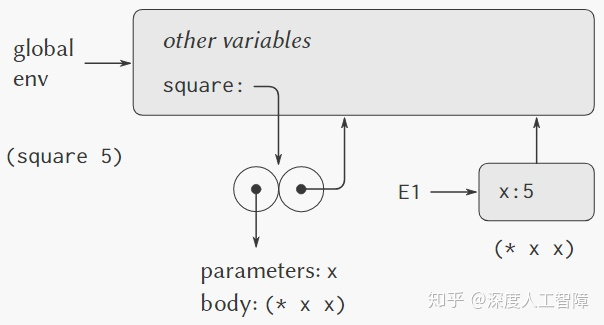

这里专门为`set!`创建了环境模型，由此我们就能**解释`(set!  )`的求值过程：**

- 首先在环境中确定有关变量``的约束位置
- 修改该约束

接下来介绍几个使用环境模型的实例。

## 2 实例

### 2.1 无赋值的过程

我们这里首先以一个不含有赋值的过程为例来介绍环境模型

```scheme
(define (square x)
  (* x x))
(define (sum-of-squares x y)
  (+ (square x) (square y)))
(define (f a)
  (sum-of-squares (+ a 1) (* a 2)))
```

首先，会在全局环境中创建这些过程，得到以下过程对象

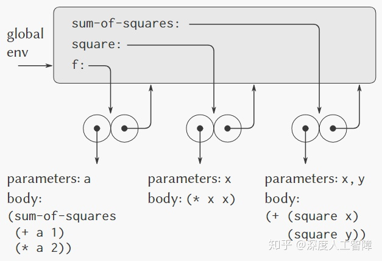

当我们应用过程`(f 5)`时，它的求值过程为：

- 创建一个新的环境`E1`，其中包含形式参数约束`a:5`，并且`E1`指向全局环境。然后在`E1`对`f`的过程体`(sum-of-squares (+ a 1)(* a 2))`进行求值

- - 首先，在`E1`中没有找到`sum-of-squares`的约束，就尝试在其外围环境寻找，在全局环境中找到了对应的约束`(+(square x)(square y))`，也就获得了运算符子表达式的值。其次对于`(+ a 1)`和`(* a 2)`都能在当前环境`E1`中找到`a`对应的约束`5`，所以可以直接求值组合式得到6和10。
  - 然后尝试将`sum-of-squares`的值应用于6和10

- 当将`sum-of-squares`应用于6和10时，也会创建一个新的环境`E2`，其中包含形式参数`x:6`和`y:10`，并且`E2`指向全局环境。然后对其过程体进行求值

- - 首先对`(square x)`进行求值，由于在`E2`中没有找到`square`的约束，所以就尝试在外围环境中找到了对应的约束，然后将`square`应用于6

  - - 首先创建一个新环境`E3`，其中包含形式参数`x:6`，可以直接对`(* x x)`进行求值

  - 其次对`(square y)`进行求值，也是在全局环境中找到`square`的约束，然后将`squre`应用于10

  - - 首先创建一个新环境`E4`，其中包含形式参数`x:10`，可以直接对`(* x x)`进行求值

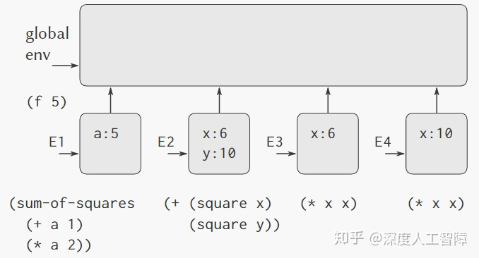

**注意：**

- 可以发现`square`的每次调用都会创建一个新环境
- 由于框架的存在，使得具有相同名字的局部变量互不干扰
- 我们这里只关心环境结构，对于如何在调用之间传递值，在后面会讨论。

### 2.2 有赋值的过程

我们以以下代码为例

```scheme
(define (make-withdraw balance)
  (lambda (amount)
    (if (>= balance amount)
        (begin (set! balance (- balance amount))
               balance)
        "Insufficient funds")))
```

创建过程时，会在全局环境中的框架添加一个符号`make-withdraw`，然后对内部的`lambda`进行求值，得到如下过程对象

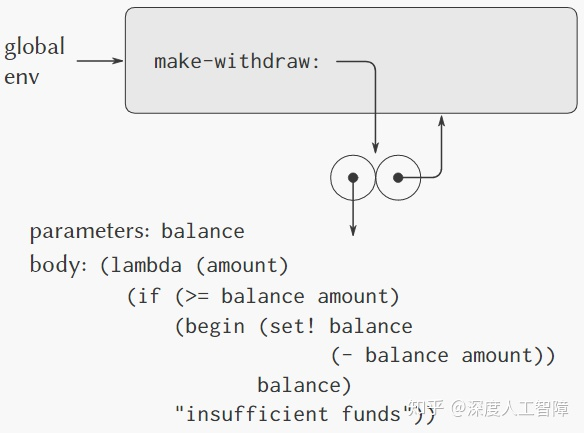

当我们对`(define W1 (make-withdraw 100))`进行求值时：

- 当将过程`make-withdraw`应用于100时，首先创建一个新环境`E1`，其中包含形式参数`balance`的约束，然后新环境的外围环境指针指向全局环境，然后求值过程体`lambda`

- - 对过程对象进行求值，会有一个指向过程体的指针，以及一个指向环境`E1`的指针
  - `define`会在全局环境中添加一个符号`W1`，然后将其指向求值的结果

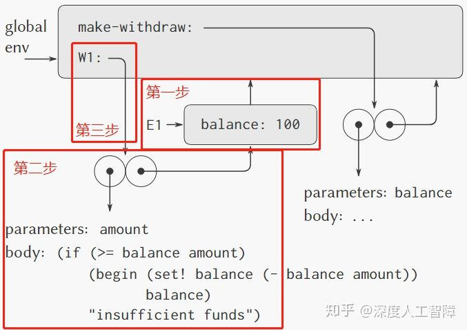

当我们对`(W1 50)`进行求值时：

- 首先创建一个新环境，其中添加一个约束`amount:50`，通过`W1`指向的过程对象的环境，可知当前的外围环境为`E1`，因此有一个指向`E1`的指针。然后在当前环境对`W1`指向的过程体进行求值
- 这里的`amount`可以从当前环境中获得，而`balance`可以从`E1`中获得。当执行`set!`时，会修改位于`E1`中的`balance`

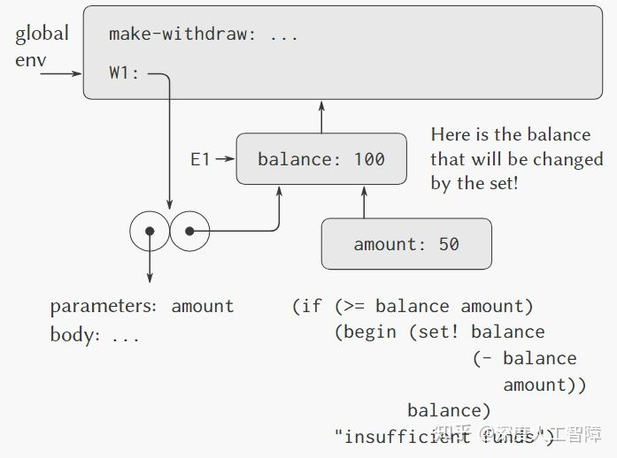

当求值完毕时，由于不存在任何指向约束`amount`框架的指针，所以可以直接将其忽略掉，则环境结构变为

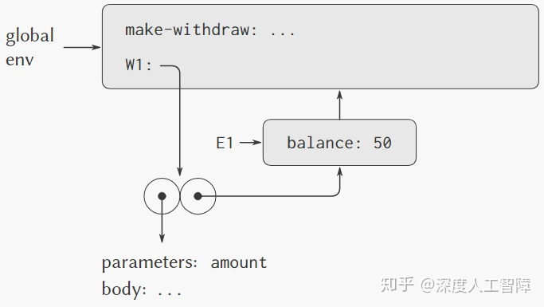

同理，当我们再对`(define W2 (make-withdraw 100))`进行求值时，会得到以下环境结构

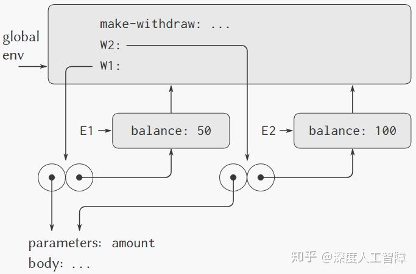

**从中我们可以看出：**每次对相同的`make-withdraw`进行求值，都会创建一个新的环境，在该环境中维护了自己的局部状态变量`balance`；而对内部的`lambda`表达式进行求值，就会产生指向自己环境的指针，从而只利用和修改自己的局部状态变量；而`define`会指向不同的过程对象序对，从而操作不同的过程对象（由过程对象的环境指针来区分）。

### 2.3 内部定义

以以下代码为例，探讨内部定义为什么有效

```scheme
(define (sqrt x)
  (define (good-enough? guess)
    (< (abs (- (square guess) x)) 0.001))
  (define (improve guess)
    (average guess (/ x guess)))
  (define (sqrt-iter guess)
    (if (good-enough? guess)
        guess
        (sqrt-iter (improve guess))))
  (sqrt-iter 1.0))
```

首先创建该过程会得到以下环境结构

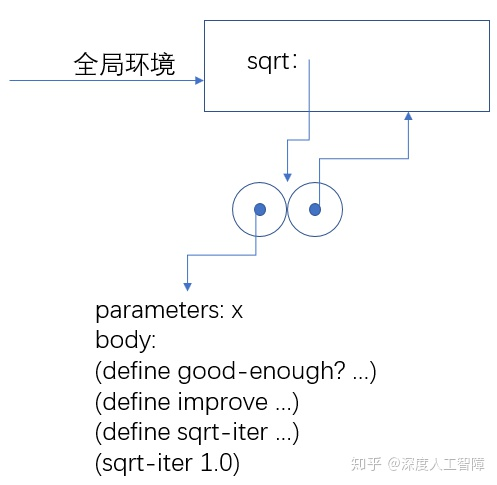

当对`(sqrt 2)`进行求值时，过程为：

- 首先创建一个新的环境`E1`，添加一个约束`x:2`，然后依次对`sqrt`的过程体进行求值

- - 其过程体内，首先是若干个`define`，它们将在环境`E1`中添加过程名的约束，其值为过程体的求值结果，注意环境指针指向的是`E1`
  - 最后是对`(sqrt-iter 1.0)`进行求值

- 首先创建一个新的环境`E2`，添加一个约束`guess`，并将其指向`E1`，然后在`E2`中对`sqrt-iter`的过程体进行求值

- 在里面会碰到对`(good-enough? guess)`，这里又创建一个新的环境`E3`，添加约束`guess`，并将其指向`E1`，然后在`E3`中对`good-enough?`过程体进行求值

- 以此类推

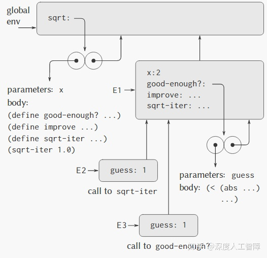

由此得到**两个性质：**

- 由于局部过程名都是在该过程运行时创建的框架内进行约束的，并不是在全局环境中进行约束的，所以局部过程的名字不会与外面的名字互相干扰。
- 局部过程只需将包含着它们的过程的形参作为自由变量，就可以访问该过程的实际参数。因为对于局部过程体的求值是外围过程求值所在的环境的下属。